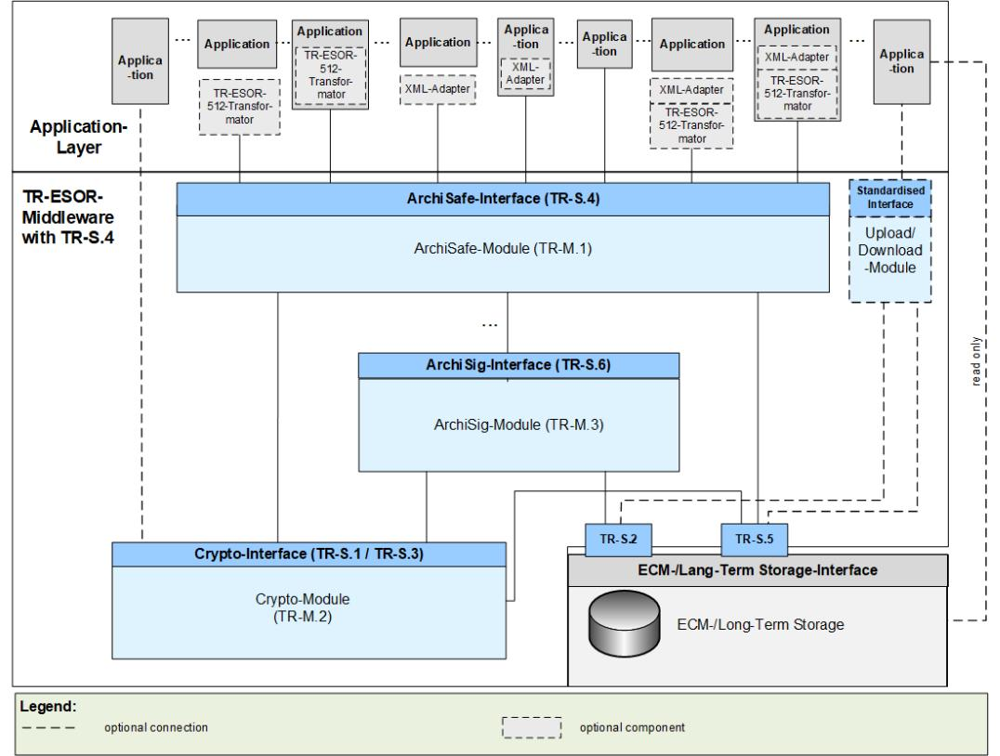
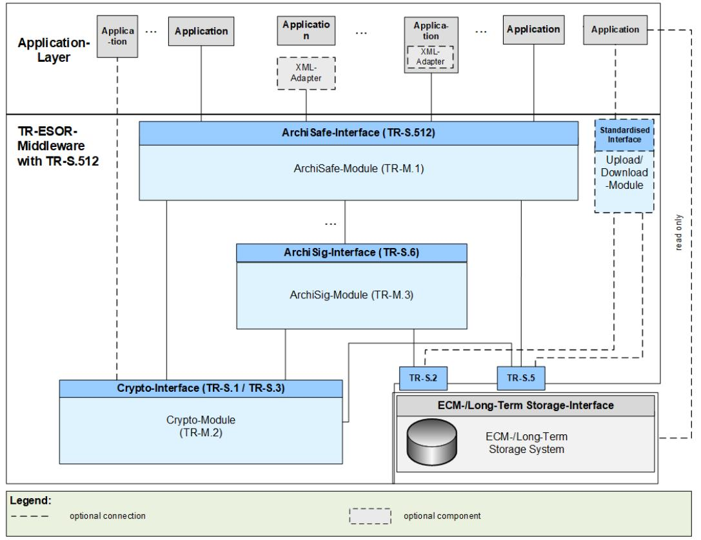
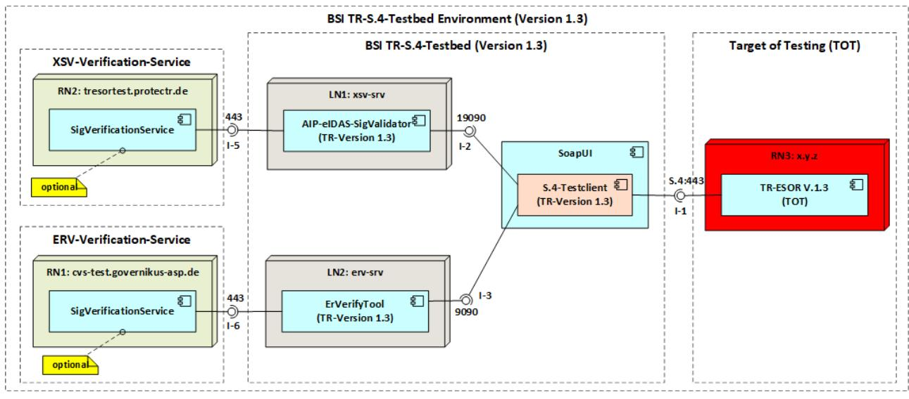

# BSI Technical Guideline 03125 Preservation of Evidence of Cryptographically Signed Documents

Annex TR-ESOR-C.2:

Conformity Test Specification (Level 2 Technical Conformity)

Designation Technical Conformity Test Specification (Level 2)

Abbreviation BSI TR-ESOR-C.2

Version 1.3 (on base of the eIDAS-Regulation and ETSI Preservation Standards with a new certification scheme)

Date 22.03.2023

# Document history

| Version      | Date       | Editor | Description |
|--------------|------------|--------|-------------|
| 1.3          | 31.03.2022 | BSI    | TR-ESOR-C.2 |
| 1.3-update 1 | 22.03.2023 | BSI    | TR-ESOR-C.2 |

Table 1: Document history

Federal Office for Information Security P.O. Box 20 03 63 53133 Bonn Tel.: +49 22899 9582- 0 E-Mail: tresor@bsi.bund.de Internet: https://www.bsi.bund.de © Federal Office for Information Security 2022

| 1   |       | Introduction 5                                                     |  |
|-----|-------|--------------------------------------------------------------------|--|
| 2   |       | Overview 8                                                         |  |
| 3   |       | Web Service Interfaces11                                           |  |
| 3.1 |       | Test suite for TR-S.4-interface11                                  |  |
|     | 3.1.1 | Test environment11                                                 |  |
| 3.2 |       | Standard Test Configurations12                                     |  |
|     | 3.2.1 | CONFIG_Common12                                                    |  |
|     | 3.2.2 | CONFIG_ArchiSafe_C.212                                             |  |
|     | 3.2.3 | CONFIG_LXAIP 13                                                    |  |
| 3.3 |       | Standard Test Objects13                                            |  |
| 3.4 |       | Mandatory Tests23                                                  |  |
|     | 3.4.1 | Function RetrieveInfo23                                            |  |
|     | 3.4.2 | Function ArchiveSubmission 26                                      |  |
|     | 3.4.3 | Function ArchiveUpdate43                                           |  |
|     | 3.4.4 | Function ArchiveRetrieval53                                        |  |
|     | 3.4.5 | Function ArchiveEvidence59                                         |  |
|     | 3.4.6 | Function ArchiveDeletion66                                         |  |
|     | 3.4.7 | Function Verify72                                                  |  |
|     | 3.4.8 | Additional Tests95                                                 |  |
| 4   |       | TR-ESOR-C.2-Testbed how-to  105                                    |  |
| 4.1 |       | TR-ESOR-C.2-Testbed Prerequisites 105                              |  |
| 4.2 |       | TR-ESOR-C.2-Testbed introduction 105                               |  |
|     | 4.2.1 | Subdirectory DOCKERS 106                                           |  |
|     | 4.2.2 | Subdirectory ERVT-UPLOADs 106                                      |  |
|     | 4.2.3 | Subdirectory LXAIP-UPLOADs 106                                     |  |
|     | 4.2.4 | Subdirectory PROPERTIES  106                                       |  |
|     | 4.2.5 | Subdirectory TESTDATA 106                                          |  |
|     | 4.2.6 | Subdirectory XSVT-UPLOADs 106                                      |  |
|     | 4.2.7 | File TR-ESOR-1.3.0-S4-Testbed-soapui-project.xml 107               |  |
|     | 4.2.8 | File BSI TR-03125_C.2_V1.3.pdf 107                                 |  |
| 4.3 |       | TR-ESOR-C.2-Testbed configuration 107                              |  |
| 4.4 |       | TR-ESOR-C.2-Testbed: configuration and start of XSVT and ERVT  108 |  |
| 4.5 |       | TR-ESOR-C.2-Testbed usage  110                                     |  |
| 4.6 |       | TR-ESOR-C.2-Testbed results 111                                    |  |

## Table of Figures

| Figure 1: Schematic Depiction of the IT Reference Architecture with TR-S.4 6   |  |
|--------------------------------------------------------------------------------|--|
| Figure 2: Schematic Depiction of the IT Reference Architecture with TR-S.512 6 |  |
| Figure 3: Overview of the BSI TR-S.4-Testbed environment (version 1.3)11       |  |
| Figure 4: TR-ESOR-C.2-Testbed – project directory structure 105                |  |
| Figure 5: Example output of dbuild.cmd/dbuild.sh.  109                         |  |
| Figure 6: Final statement of initialization of XSVT 109                        |  |
| Figure 7: Final statement of initialization of ERVT.  109                      |  |
| Figure 8: Sample output of dstatus.cmd/dstatus.sh  110                         |  |
| Figure 9: Sample output of dstart.cmd/dstart.sh 110                            |  |
|                                                                                |  |

## Table of Tables

Es konnten keine Einträge für ein Abbildungsverzeichnis gefunden werden.

# 1 Introduction

The goal of the Technical Guideline "Preservation of Evidence of Cryptographically Signed Documents" is to specify technical security requirements for the long-term preservation of evidence of cryptographically signed electronic documents and data along with associated electronic administrative data (meta data).

A Middleware defined for this purpose (TR-ESOR-Middleware) in the sense of this Guideline includes all of the modules (M) and interfaces (S) [for the German "Schnittstellen"] used for securing and preserving the authenticity and proving the integrity of the stored documents and data.

The Reference Architecture introduced in the Main Document of this Technical Guideline consists of the interfaces, functions and logical units described in the following:

- the TR-S.4 and the TS119512 input interface TR-S.512 according to profile [TR-ESOR-TRANS] of the TR-ESOR-Middleware, which serves to embed the TR-ESOR-Middleware in the existing IT and infrastructure landscape;
- the "ArchiSafe-Module" ([TR-ESOR-M.1]), which regulates the flow of information in the Middleware, implements the security requirements for the interfaces with the IT applications and ensures that the application systems are decoupled from the ECM-/Long-term storage;
- the "Cryptographic"-Module ([TR-ESOR-M.2]) and the associated interfaces S.1 and S.3 that provide the required functions for creating hash values and verifying electronic signatures or seals or time-stamps, verifying electronic certificates, and for obtaining qualified electronic time stamps or (optional) electronic signatures or seals for the Middleware. Furthermore, it can provide the functions for the encryption and decryption of data and documents;
- the "ArchiSig"-Module ([TR-ESOR-M.3]) with the S.6 interface that provides the required functions for the preservation of evidence of the digitally signed documents;
- an ECM-/Long-Term Storage with the S.2 and S.5 interfaces that assumes the physical archiving/storage and also the storage of the meta data that preserve evidence. This ECM-/Long-Tterm Storage is no longer directly a part of the Technical Guideline, but requirements will be set for it through the two interfaces that are still part of the TR-ESOR-Middleware.

The application layer that can include an XML-Adapter is not a direct part of this Technical Guideline, either, even though this XML-Adapter can be implemented as part of a Middleware.

The IT Reference Architecture depicted in Figure 1 and Figure 2 is based on the ArchiSafe Reference Architecture and is supposed to enable and support the logical (functional) interoperability of future products with the objectives and requirements of the Technical Guideline. In principle, the upper interface of the TR-ESOR-Middleware is either the S.4-Interface (TR-S.4) pursuant to [TR-ESOR-E], according to Figure 1, or the S.512-Interface (TR-S.512) pursuant to [ETSI TS 119 512] according to the profile [TR-ESOR-TRANS], according to Figure 2.

Figure 1: Schematic Depiction of the IT Reference Architecture with TR-S.4

Figure 2: Schematic Depiction of the IT Reference Architecture with TR-S.512

The optional XML-Adapter and/or the optional TR-ESOR-512-Transformator[1](#page-6-0) may be integrated under the following circumstances:

- Both as separate components with two interfaces to the IT-application and the ArchiSafe-Module,
- Both as separate components, but as parts of the IT-application with interfaces to the ArchiSafe-Module
- One common component, separate from the IT-application and including the XML-Adapter and TR-ESOR-512-Transformator as parts, with two interfaces to the IT-application and the ArchiSafe-Module,
- One common component including the XML-Adapter and TR-ESOR-512-Transformator as parts, which is part of the IT-application, with an interface to the ArchiSafe-Module.

The "ETSI TS119512 TR-ESOR Transformator" enables preservation services pursuant to [eIDAS-VO] to transform incoming ETSI TS119512 (V1.1.2) messages[2](#page-6-1) into TR-S4 messages. These messages can be sent to an attached http://www.bsi.bund.de/EN/tr-esor system without any need for changing the system.

The usage of the "ETSI TS119512 TR-ESOR Transformator" is recommended in case that a TR-ESOR-Product with a TR-S.4-Interface should be used in Europe supporting interoperability with other European (qualified) Preservation Services or Preservation Products.

This Technical Guideline is modularly structured, and the individual annexes to the Main Document specify the functional and technological security requirements for the needed IT components and interfaces of the TR-ESOR-Middleware. The specifications are strictly platform, product and manufacturer independent.

The document at hand bears the designation "Annex TR-ESOR-C.2" and describes and specifies the conformity tests for the Conformity Level 2 (Technical Conformity) for TR-ESOR V1.3 supporting also the archive information package LXAIP, ASiC-AIP (not yet ready for certification), the Upload- and Downloadinterface and the upper ETSI TS 119 512-interface TR-S.512.

Products that want to be certified pursuant to the Technical Guideline 03125 TR-ESOR shall prove their conformity pursuant to this document [TR-ESOR-C.2] and [TR-ESOR-C.1].

1 Se[e ETSI TS 119512 TR-ESOR Transformator under an](https://github.com/de-bund-bsi-tr-esor/tresor-ETSITS119512-transformator) Open Source Licence

2 In the profiling of [TR-ESOR-TRANS]

# 2 Overview

Products or systems, which want to become certified according to this Technical Guideline, have to demonstrate their conformance to the specifications. There are two defined conformance levels, which mainly differ in the technical detail specifications of interfaces and data formats used:

- Conformity Level 1 Functional Conformity,
- Conformity Level 2 Technical Conformity.

The functional test criteria (tests) for reaching "Conformity Level 1 – Functional Conformity" are described in [TR-ESOR-C.1].

This document specifies the technical test criteria (tests) for reaching Conformity Level 1 (Technical Conformity), which are derived from the requirements and web service interfaces specified in Annex [TR-ESOR-E], [TR-ESOR-F], [TR-ESOR-ERS] and [TR-ESOR-VR] and complement the mandatory (red) tests for interface functions specified in section 5.5 of Annex [TR-ESOR-C.1] of the present Technical Guideline.

The tests for Conformity Level 1 (Technical Conformity) aim at verifying technical interoperability between different components within the reference architecture as depicted i[n Figure 1](#page-5-0) an[d Figure 2.](#page-5-1) For this purpose the present document specifies test cases for the different web service based interfaces (see section [3\)](#page-10-0) and verification report structures for central data structures (see section [TR-ESOR-VR]).

Each test case is identified by a unique ID and specified in a semi-formal pseudo-code, which provides the basis for the technical implementation of the test cases in an appropriate test environment.

In general, the optional elements of the request – and response structures of the functional calls according Annex E are omitted. The usage or omission of these optional elements has no impact on the fulfilling on the conformance requirements of this specification.

The tests of the web service based interfaces can be performed using the freely available SoapUI[3](#page-7-1) test tool.

All tests, which are required to be passed are marked with the color red. Tests, which are only applicable in certain situations are marked grey. All tests use the same basic configuration, which is denoted by [CONFIG\\_ArchiSafe\\_C.2](#page-11-2) in the following. In case, the TOT does support some additional features (e.g. LXAIP pursuant to [TR-ESOR-F], chapter 3.2), corresponding additional configuration has to be taken into consideration (e.g. [CONFIG\\_LXAIP\)](#page-12-0).

In order to become certified according to Conformity Level 1 – Functional Conformity and Conformity Level 2 – Technical Conformity, a product or system has to pass

- all mandatory (red) conformity criteria (tests) for this Conformity Level 1 Functional Conformity pursuant to [TR-ESOR-C.1] and
- all mandatory (red) conformity criteria (tests) for Conformity Level 2 technical Conformity pursuant to this document, [TR-ESOR-C.2].

If one or more tests, marked with the color red, are not successful, the conformity cannot be certified.

Because [TR-ESOR-C.2] extends [TR-ESOR-C.1], it is necessary for the testing body to assess the assessment criteria of [TR-ESOR-C.1] beforehand.

#### NOTICE 1:

In TR-ESOR-Version1.3 the three terms "Archive Information Package (AIP)", "Archive Information Container" and "Archive Data Object" are used synonymously. 

3 Se[e http://www.soapui.org](http://www.soapui.org/) .

#### NOTICE 2:

The TR-ESOR input interface TR-S.4 or the TS119512 input interface TR-S.512 pursuant to the preservation-API of [ETSI TS 119 512] in the profiling of [TR-ESOR-TRANS] shall be used which logically corresponds to the input-interface TR-S.4 of the TR-ESOR-Middleware [TR-ESOR-E], as shown in the table 1 of [TR-ESOR-E], clause 4.1. Another input interface instead of TR-S.4 or TR-S.512 is not allowed. To improve readability, the insertion of the TS119512-function calls, equivalent to TR-S.4, is renounced, at several places in this document and the footnote "Either TR-S.4 or TR-S.512 shall be supported." is added to each test case concerning "TR-S.4" or "TR-S.512". 

#### NOTICE 3:

In this TR-ESOR- Version, the word "AIP" means in all TR-ESOR-Annexes : 

- a) the XML-based archival information package "XAIP" pursuant to [TR-ESOR-F], clause 3.1 as well as
- b) the logical XAIP "LXAIP" pursuant to [TR-ESOR-F], clause 3.2 as well as
- c) the "ASiC-AIP" pursuant to [TR-ESOR–F], clause 3.3 on base of [ETSI EN 319162-1].

In general, this TR-ESOR Version differentiates in detail between "XAIP", "LXAIP" and "ASiC-AIP". 

To improve readability, at several places in this document, the insertion of "LXAIP" and "ASiC-AIP" is renounced, and the footnote ""XAIP" shall be supported, "LXAIP" and "ASiC-AIP, if implemented" may be supported" is added to each "XAIP". 

#### NOTICE 4:

In this TR-ESOR- Version, BIN is restricted to the following preservation object formats: 

- ASiC-ERS (in TR-ESOR v1.3 called ASiC-AIP) pursuant to [ETSI TS 119 512], Annex A.3.1 and A.3.1.3 [\(http://uri.etsi.org/ades/ASiC/type/ASiC-ERS\)](http://uri.etsi.org/ades/ASiC/type/ASiC-ERS) and pursuant to [TR-ESOR-F], Clause 3.3);
- CAdES pursuant to [ETSI TS 119 512] Annex A.1.1 [\(http://uri.etsi.org/ades/CAdES\)](http://uri.etsi.org/ades/CAdES). If there is no MIME type filled, then the default application/cms is used;
- XAdES pursuant to [ETSI TS 119 512] Annex A.1.2 [\(http://uri.etsi.org/ades/XAdES\)](http://uri.etsi.org/ades/XAdES). If there is no MIME type filled, then the default application/xml is used;
- PAdES pursuant to [ETSI TS 119 512] Annex A.1.3 [\(http://uri.etsi.org/ades/PAdES\)](http://uri.etsi.org/ades/PAdES). If there is no MIME Type filled, then the default application/pdf is used;
- ASiC-E pursuant to [ETSI TS 119 512] Annex A.1.4 (http://uri.etsi.org/ades/ASiC/type/ASiC-E). If there is no MIME type filled, then the default application/vnd.etsi.asic-e+zip is used;
- ASiC-S pursuant to [ETSI EN 319 162] (http://uri.etsi.org/ades/ASiC/type/ASiC-S). If there is no MIME type filled, then the default application/vnd.etsi.asic-s+zip is used;
- -DigestList pursuant to [ETSI TS 119 512] Annex A.1.6 (http://uri.etsi.org/19512/format/DigestList). If there is no MIME Type filled, then the default application/xml is used.

In case of Upload- and Download-function the following format is allowed additionally:

- Binary Data (BIN) as Octet Stream, which is stored in the ECM-/Long-Term Storage by an "Upload-Request", – but only,
- if connected with a corresponding LXAIP and referenced there acc. to [TR-ESOR-F], Sec. 3.2,
- if appropriate, retrieved by a "Download-Request" – linked to a corresponding LXAIP or embedded in a XAIP and retrieved by an ArchiveRetrieval-Request – and
- no Upload of XAIP, nor LXAIP, nor ASiC-AIP is possible.

#### ATTENTION 1:

If implemented, an ASiC-AIP-Container pursuant to clause 3.3 in [TR-ESOR-F] shall be inserted in the TS119152-intefrace as a base64Binary-coded ASiC-AIP-Container with the Type[=http://uri.etsi.org/ades/ASiC/type/ASiC-ERS](http://uri.etsi.org/ades/ASiC/type/ASiC-ERS) Attribute (see [https://www.w3.org/TR/xmlschema-](https://www.w3.org/TR/xmlschema-2/#base64Binary)[2/#base64Binary\)](https://www.w3.org/TR/xmlschema-2/#base64Binary). 

In TR-ESOR V1.3, actually, ASiC-AIP is announced but it is still not released and does not lead to a certification.

NOTICE 5: In the following text the term "digital signature" covers "advanced electronic signatures" pursuant to [eIDAS-VO], Article 3(11), "qualified electronic signatures" pursuant to [eIDAS-VO], Article 3(12), "advanced electronic seals" pursuant to [eIDAS-VO], Article 3(26) and "qualified electronic seals" pursuant to [eIDAS-VO], Article 3(27). Insofar, the term "digital signed document" covers as well documents signed by advanced electronic signatures or seals as documents signed by qualified electronic signatures or seals. 

In this TR the term "cryptographic signed documents" covers not only qualified signed documents pursuant to [eIDAS-VO], Article 3(12) or qualified sealed documents pursuant to [eIDAS-VO], Article 3(27) or qualified time-stamped documents pursuant to [eIDAS-VO], Article 3(34) (within the meaning of the eIDAS regulation) ) but also documents with advanced electronic signatures pursuant to [eIDAS-VO], Article 3(11) or with advanced electronic seals pursuant to [eIDAS-VO], Article 3(26) or with electronic time-stamps pursuant to [eIDAS-VO], Article 3(33), as they are often used in the internal communication of public authorities. The documents with simple signatures or seals based on other (e.g. non-cryptographic) technologies are not meant here.

# 3 Web Service Interfaces

As shown in [Figure](#page-5-0) 1 and [Figure](#page-5-1) 2 the reference architecture comprises different interfaces, which can be implemented by a TR-ESOR-compliant middleware product. The present specification defines test suites for the interface TR-S.4 (see section 3.1), which comprise test cases for different functions (see section 3.4) using the different standard test objects as defined in section 3.3.

## 3.1 Test suite for TR-S.4-interface

The test suite for TR-S.4 contains the test cases for the following functions:

- RetrieveInfo (see section 3.4.1)
- ArchiveSubmissionRequest (see section 3.4.2)
- ArchiveUpdateRequest (see section 3.4.3)
- ArchiveRetrievalRequest (see section 3.4.4)
- ArchiveEvidenceRequest (see section 3.4.5)
- ArchiveDeletionRequest (see section 3.4.6)
- Verify (see section 3.4.7)
- • Additional Tests (see section 3.4.8).

#### 3.1.1 Test environment

Following figure describes the structure of the BSI-TR-ESOR-S.4-Testbed Environment (also called TR-S.4- Testbed Environment) in the version 1.3.0 to be used in order to perform the test cases defined in this document.

Figure 3: Overview of the BSI TR-S.4-Testbed environment (version 1.3)

The TR-S.4-Testbed environment defines four separated domains:

- 1. Target of Testing (ToT) it is the TR-ESOR version 1.3 complied product to be tested against this test specification,
- 2. BSI-TR-ESOR-S.4-Testbed (TR-S.4-Testbed) covers the implementation of the test cases as well as the integration of the BSI-Testtools,
- 3. XSV-Verification-Service a verification service used by the tr-esor-AIP-eIDAS-SigValidator (AIPeIDAS-SigValidaor or simply XSV) in order to verify the supported signatures, seals and time-stamps (cf[. https://github.com/de-bund-bsi-tr-esor/tr-esor-AIP-eIDAS-SigValidator\)](https://github.com/de-bund-bsi-tr-esor/tr-esor-AIP-eIDAS-SigValidator),
- 4. ERV-Verification-Service a verification service used by the BSI-ErVerifyTool (ERVerifyTool or simply ERV) in order to verify the archive time stamps obtained from provided evidence records (cf. [https://github.com/de-bund-bsi-tr-esor/ERVerifyTool\)](https://github.com/de-bund-bsi-tr-esor/ERVerifyTool).

The optional parts have been marked by yellow comments boxes containing the text "optional". The both verification tools XSVT and ERVT are able to work online, with activated optional verification service corresponding for the signatures or timestamps, or offline. The verification services have to be integrated by the user itself, please refer to the corresponding documentation for more information, how to do that.

## 3.2 Standard Test Configurations

Here, a set of standard configurations of the test setup will be described. These setups are referenced in the test cases and should be used to actually perform the tests.

#### 3.2.1 CONFIG\_Common

This is the standard configuration for all tests.

- The test setup shall contain the product to be tested (Target of Testing, TOT).
- The user manual in the test setup shall refer at least to one preservation profile pursuant to [ETSI TS 119 512], clause 5.4.7, to one actual preservation evidence policy pursuant to [ETSI TS 119 511], clause 6.5 and to one actual signature validation policy pursuant to [ETSI TS 119 511], clause 6.6.
- The test setup shall contain all other modules of the reference architecture (including the storage) functionally not covered by the TOT.
- The TOT and all other modules required shall be installed and configured according to the respective guidance including all security recommendations.
- The TOT and all other modules shall be physically and logically interconnected. The connections shall be secured as described in the respective guidance documents (e.g. enabling encryption, explicit physical connection).
- The BSI-ERVerifyTool is installed and running in a proper working mode (see chapte[r 3.1.1\)](#page-10-2).
- The BSI-AIP-eIDAS-SigValidator testing tool is installed and running in a proper working mode (see chapte[r 3.1.1\)](#page-10-2).
- The TOT has to provide at least one active Protection Profile and at least one inactive Protection Profile.
- The TOT supports Evidence Record pursued to [RFC4998].

The complete test setup shall be up and running and in an operational and working mode.

#### 3.2.2 CONFIG\_ArchiSafe\_C.2

This configuration is based on CONFIG\_Common and introduces following additional points:

Additionally, the ArchiSafe-Module shall be configured as follows:

- XAIP shall be mandatory.
	- The default value in case of "no-input of the PO-Format" is "XAIP".
	- The TOT is supporting also the LXAIP container format as stated in [TR ESOR F], chapter 3.2.
	- The TOT is supporting the optional input parameter pres:POFormat while executing the function ArchiveRetrieval
- A XSD defining the XAIPs or LXAIPs pursuant to [TR-ESOR-F] shall be configured.
- The XSD verification of (L)XAIP containers during ArchiveSubmission and ArchiveUpdate shall be enabled.
- The validation of digital signatures and electronic time stamps[4](#page-12-8) during ArchiveSubmission and ArchiveUpdate shall be enabled.

#### 3.2.3 CONFIG\_LXAIP

This configuration is based on CONFIG\_ArchiSafe\_C2.

TOT does fullfill following requirenments in addition to level [CONFIG\\_ArchiSafe\\_C.2:](#page-11-2)

- TOT does support LXAIP-format pursued to [TR-ESOR-F], chapter 3.2.
	- TOT does support the Upload/Download-module
	- TOT does support the delivery of submitted LXAIP as transformed equivalent XAIP.
	- TOT does support at least the following URI<http://www.bsi.bund.de/tr-esor/lxaip/1.3> as value of pres:POFormat as optional input of ArchiveRetrievalRequest input parameter of ArchiveRetrieval function (c.f. [TR-ESOR-E], chapter 3.3.2)

#### 3.3 Standard Test Objects

For most of the tests test data is required. In order to make the tests repeatable, this section defines some standard test objects.

#### **Notice**

The used test data will be published by BSI as part of the open source application TR-S.4-Testbed. It is strongly recommended to use the testbed and the corresponding test data while TR-ESOR product development for test purposes.

| Container or Object Name | Description                                                                                                                |
|--------------------------|----------------------------------------------------------------------------------------------------------------------------|
| ACTIVE_PROFILE           | An active Preservation Profile supported by TOT.                                                                           |
| ACTIVE_PROFILE_URI       | The Profile Identifier as URI of ACTIVE_PROFILE.                                                                           |
| INACTIVE_PROFILE         | An inactive Preservation Profile supported by TOT.                                                                         |
| INACTIVE_PROFILE_URI     | The Profile Identifier as URI of INACTIVE_PROFILE.                                                                         |
| UNKNOWN_PROFILE_URI      | A Profile Identifier of an unknown profile.                                                                                |
| UNKNOWN_OPT_INPUT        | An unknown control as optional input.                                                                                      |
| XAIP_OK                  | The XAIP is syntactically correct and passes the defined consistency checks. The XAIP contains following objects:       |
|                          | • TXT_DATA.txt and • PDF_DATA.pdf as well as • one metadata object XML_MDO.xml embedded as binary metadata. |
| TXT_DATA.txt             | A reference text-based test data (CRLF and CP1252).                                                                        |
| PDF_DATA.pdf             | A reference PDF test data.                                                                                                 |
| XML_MDO.xml              | A reference XML-based test data (LF and UTF-8).                                                                            |
| XAIP_OK_V1_ER_OK         | An evidence record provided by TOT for XAIP_OK.                                                                            |

4 The validation of digital signatures or electronic time stamps of documents included in the XAIP or passed over as binary.

| Container or Object Name  | Description                                                                                                                                                                                           |
|---------------------------|-------------------------------------------------------------------------------------------------------------------------------------------------------------------------------------------------------|
| XAIP_OK_SIG_OK            | The XAIP is syntactically correct and passes the defined consistency checks. The XAIP containes following objects:                                                                                 |
|                           | • data object TXT_DATA.txt and • corresponding detached CAdES TXT_DATA.txt.p7s, • data object PDF_DATA.pdf and • corresponding detached CAdES PDF_DATA.pdf.p7s and               |
|                           | • a metadata object XML_MDO.xml.                                                                                                                                                                   |
| TXT_DATA.txt.p7s          | A detached CAdES of TXT_DATA.txt.                                                                                                                                                                     |
| PDF_DATA.pdf.p7s          | A detached CAdES of PDF_DATA.pdf.                                                                                                                                                                     |
| XAIP_OK_SIG_OK_V1_ER_OK   | An evidence record provided by TOT for XAIP_OK_SIG_OK.                                                                                                                                                |
| LXAIP_OK                  | The LXAIP is syntactically correct and passes the defined consistency checks. The LXAIP references following data:                                                                                 |
|                           | • TXT_DATA.txt5 as data object, • PDF_DATA.pdf as data object, • XML_MDO.xml as metadata object.                                                                                       |
| ASiC_AIP_OK               | The ASiC-AIP is syntactically and passes the defined consistency checks. The ASiC-AIP contains an LXAIP with two data objects and two corresponding digital signatures and one metadata object. |
| REF_TXT_DATA_50           | A reference to TXT_DATA.txt, which has been uploaded in advance as TXT_DATA_50.txt.                                                                                                                |
| REF_PDF_DATA_50           | A reference to PDF_DATA.pdf, which has been uploaded in advance as PDF_DATA_50.pdf.                                                                                                                |
| REF_XML_MDO_50            | A reference to XML_MDO.xml, which has been uploaded in advance as MDO_XML_50.xml.                                                                                                                  |
| LXAIP_OK_V1_ER_OK         | An evidence record provided by TOT for LXAIP_OK.                                                                                                                                                      |
| LXAIP_OK_SIG_OK           | The LXAIP is syntactically correct and passes the defined consistency checks. The LXAIP references following data:                                                                                 |
|                           | • TXT_DATA.txt as data object, • TXT_DATA.txt.p7s as credential, • PDF_DATA.pdf as data object, • PDF_DATA.pdf.p7s as credential and • XML_MDO.xml as metadata object.     |
| REF_TXT_DATA_51           | A reference to TXT_DATA.txt, which has been uploaded in advance as TXT_DATA_51.txt.                                                                                                                |
| REF_CADES_DET_TXT_DATA_51 | A reference to TXT_DATA.txt.p7s, which has been uploaded in advance as TXT_DATA_51.txt.p7s.                                                                                                        |
| REF_PDF_DATA_51           | A reference to PDF_DATA.pdf, which has been uploaded in advance as PDF_DATA_51.pdf.                                                                                                                |
| REF_CADES_DET_PDF_DATA_51 | A reference to PDF_DATA.pdf.p7s, which has been uploaded in advance as PDF_DATA_51.pdf.p7s.                                                                                                        |
| REF_XML_MDO_51            | A reference to XML_MDO.xml, which has been uploaded in advance as XML_MDO_51.xml.                                                                                                                  |
| LXAIP_OK_SIG_OK_V1_ER_OK  | An evidence record provided by TOT for LXAIP_OK_SIG_OK.                                                                                                                                               |
| XAIP_NOK                  | The schema validation of the XAIP fails. (unexpected element xaip:dataObject in element xaip:packageInfoUnit)                                                              |
| XAIP_NOK_VERSION          | The fix attribute XAIPVersion in the element xaip:XAIP has wrong value.                                                                                                                               |
| LXAIP_NOK                 | The schema validation of the LXAIP fails. (missing element ds:DigestValue in element asic:DataObjectReference)                                                                                     |
| XAIP_NOK_EXPIRED          | The schema validation for the XAIP succeeds, but the xaip:preservationInfo-element indicates a preservation date, which is already exceeded.                            |

5 Every instance of LXAIP or DLXAIP has to contain its own references. There is no possibility to share the references between two or more LXAIP or DLXAIP instances (c.f. [M-ADD-03a](#page-101-0) in Chapte[r 3.4.8.5.\)](#page-101-1).

| Container or Object Name | Description                                                                                                                                                                                                                                                                                                                                                                                            |
|--------------------------|--------------------------------------------------------------------------------------------------------------------------------------------------------------------------------------------------------------------------------------------------------------------------------------------------------------------------------------------------------------------------------------------------------|
| XAIP_NOK_SUBMTIME        | The schema validation for the XAIP succeeds, but the xaip:submissionTime-element deviates from the current time beyond a reasonable tolerance range.                                                                                                                                                                                                                     |
|                          | The documentation of the middleware or the module, which shall be tested, shall contain some assertions and related conditions or constraints indicating when the xaip:submissionTime contained in the provided XAIP deviates too much from the current time.                                                                                                                                 |
| XAIP_NOK_SIG             | The XAIP is syntactically correct and passes the defined consistency checks, but the XAIP contains an invalid digital signature. Invalid digital signature means that the digital signature is syntactically not correct or at least one of the evidence relevant data, for example a signature, time-stamp, certificate, certificate revocation list or OCSP-response, etc., is wrong. |
| XAIP_NOK_ER              | The XAIP is syntactically correct and passes the defined consistency checks, but the XAIP contains an invalid Evidence Record: ER_NOK_XAIP_OK.                                                                                                                                                                                                                                                      |
| ER_NOK_XAIP_OK           | An invalid Evidence Record for XAIP_OK means, that the Evidence Record is syntactically not correct or does not fulfil the requirements according to Annex ERS.                                                                                                                                                                                                                                  |
| XAIP_NOK_ER_VR           | A verification report produced by the TOT for XAIP_NOK_ER.                                                                                                                                                                                                                                                                                                                                             |
| LXAIP_NOK_ER             | The LXAIP is based on LXAIP_OK, syntactically correct and passes the defined consistency checks, but the LXAIP contains an invalid Evidence Record: ER_NOK_LXAIP_OK.                                                                                                                                                                                                                             |
| REF_TXT_DATA_52          | A reference to TXT_DATA.txt, which has been uploaded in advance as TXT_DATA_52.txt.                                                                                                                                                                                                                                                                                                                 |
| REF_PDF_DATA_52          | A reference to PDF_DATA.pdf, which has been uploaded in advance as PDF_DATA_52.pdf.                                                                                                                                                                                                                                                                                                                 |
| REF_XML_MDO_52           | A reference to XML_MDO.xml, which has been uploaded in advance as XML_MDO_52.xml.                                                                                                                                                                                                                                                                                                                   |
| ER_NOK_LXAIP_OK          | An invalid Evidence Record for LXAIP_OK means, that the Evidence Record is syntactically not correct or does not fulfil the requirements according to Annex ERS.                                                                                                                                                                                                                                 |
| CADES_ATT_OK             | Alias for TXT_DATA.txt.p7m.                                                                                                                                                                                                                                                                                                                                                                            |
| TXT_DATA.txt.p7m         | A valid detached CAdES for TXT_DATA.txt.                                                                                                                                                                                                                                                                                                                                                               |
| XADES_ENVELOPED_OK       | A valid attached enveloped XAdES.                                                                                                                                                                                                                                                                                                                                                                      |
| XADES_ENVELOPING_OK      | A valid attached enveloping XAdES.                                                                                                                                                                                                                                                                                                                                                                     |
| PADES_OK                 | A valid visible PAdES.                                                                                                                                                                                                                                                                                                                                                                                 |
| ASiC_E_CADES_OK          | A valid ASiC-E with a valid CAdES.                                                                                                                                                                                                                                                                                                                                                                     |
| ASIC_E_XADES_OK          | A valid ASiC-E with a valid XAdES.                                                                                                                                                                                                                                                                                                                                                                     |
| ASIC_E_TST_OK            | A valid ASiC-E with a valid timestamp.                                                                                                                                                                                                                                                                                                                                                                 |
| ASIC_E_ER_OK             | A valid ASiC-E with a valid evidence record.                                                                                                                                                                                                                                                                                                                                                           |
| DIGEST_LIST              | A vlaid digest list.                                                                                                                                                                                                                                                                                                                                                                                   |
| ASiC_S_CADES_OK          | A valid ASiC-S with a valid CAdES.                                                                                                                                                                                                                                                                                                                                                                     |
| ASIC_S_XADES_OK          | A valid ASiC-S with a valid XAdES.                                                                                                                                                                                                                                                                                                                                                                     |
| ASIC_S_TST_OK            | A valid ASiC-S with a valid timestamp.                                                                                                                                                                                                                                                                                                                                                                 |
| ASIC_S_ER_OK             | A valid ASiC-S with a valid evidence record.                                                                                                                                                                                                                                                                                                                                                           |
| CADES_ATT_NOK            | An invalid attached CAdES.                                                                                                                                                                                                                                                                                                                                                                             |
| CADES_ATT_NOK_VR         | A verification report produced by TOT of CADES_ATT_NOK.                                                                                                                                                                                                                                                                                                                                                |
| XADES_ENVELOPED_NOK      | An invalid attached enveloped XAdES.                                                                                                                                                                                                                                                                                                                                                                   |
| XADES_ENVELOPING_NOK     | An invalid attached enveloping XAdES.                                                                                                                                                                                                                                                                                                                                                                  |
| PADES_NOK                | An invalid visible PAdES.ASIC_E_CADES_NOK                                                                                                                                                                                                                                                                                                                                                              |
| ASIC_E_CADES_NOK         | A valid ASiC-E with invalid CAdES.                                                                                                                                                                                                                                                                                                                                                                     |
| ASIC_E_XADES_NOK         | A valid ASiC-E with invalid XAdES.                                                                                                                                                                                                                                                                                                                                                                     |
| ASIC_E_TST_NOK           | A valid ASiC-E with invalid timestamp.                                                                                                                                                                                                                                                                                                                                                                 |
| ASIC_E_ER_NOK            | A valid ASiC-E with invalid evidence record.                                                                                                                                                                                                                                                                                                                                                           |
| ASIC_S_CADES_NOK         | A valid ASiC-S with invalid CAdES.                                                                                                                                                                                                                                                                                                                                                                     |
| ASIC_S_XADES_NOK         | A valid ASiC-S with invalid XAdES.                                                                                                                                                                                                                                                                                                                                                                     |
| ASIC_S_TST_NOK           | A valid ASiC-S with invalid timestamp.                                                                                                                                                                                                                                                                                                                                                                 |

| Container or Object Name  | Description                                                                                                                                                                                                                                      |
|---------------------------|--------------------------------------------------------------------------------------------------------------------------------------------------------------------------------------------------------------------------------------------------|
| ASIC_S_ER_NOK             | A valid ASiC-S with invalid evidence record.                                                                                                                                                                                                     |
| DXAIP_OK                  | The DXAIP is syntactically correct and represents a valid update container ("Delta XAIP" – with version 2) for XAIP_OK (version 1), which contains the corresponding AOID. Additional data: TXT_DATA.txt.p7m.                              |
| DXAIP_OK_2                | The DXAIP is syntactically correct and represents a valid update container ("Delta XAIP" – with version 3) for XAIP_OK (in version 2), which contains the corresponding AOID. Additional data:                                             |
|                           | • XML_DATA.xml and • XML_DATA.xml.p7s.                                                                                                                                                                                                  |
| XML_DATA.xml              | A reference xml-based test data (CRLF and UTF-8).                                                                                                                                                                                                |
| XML_DATA.xml.p7s          | A valid attached CAdES of XML_DATA.xml.                                                                                                                                                                                                          |
| 002-test-document.xml     | Some other xml reference data for XAdES.                                                                                                                                                                                                         |
| XADES_DET_OK              | A valid detached XAdES of 002-test-document.xml.                                                                                                                                                                                                 |
| XADES_DET_NOK_VR          | A verification report of XADES_DET_OK, created by the TOT.                                                                                                                                                                                       |
| XADES_DET_NOK             | An invalid detached XAdES of 002-test-document.xml.                                                                                                                                                                                              |
| XADES_DET_NOK_VR          | A verification report of XADES_DET_NOK, created by TOT.                                                                                                                                                                                          |
| DXAIP_OK_SIG_ONLY         | The DXAIP is syntactically correct and represents a valid update container ("Delta XAIP" – with version 2) for XAIP_OK (version 1), which contains the corresponding AOID. Additional data:                                                |
|                           | • TXT_DATA_QESI.txt.p7s.                                                                                                                                                                                                                      |
| TXT_DATA_QESI.txt.p7s     | A valid detached CAdES of TXT_DATA.txt made with a test digital seal certificate.                                                                                                                                                             |
| DLXAIP_OK                 | The DXAIP is syntactically correct and represents a valid update container ("Delta LXAIP") for LXAIP_OK (with version 1), which contains the corresponding AOID. DLXAIP references following data additionally:                         |
|                           | • TXT_DATA.txt.p7m.                                                                                                                                                                                                                           |
| REF_CADES_ATT_TXT_DATA_53 | A reference to TXT_DATA.txt.p7m, which has been uploaded in advance as TXT_DATA_53.txt.p7m.                                                                                                                                                   |
| DLXAIP_OK_2               | The DXAIP is syntactically correct and represents a valid update container ("Delta LXAIP") for LXAIP_OK (with version 2), which contains the corresponding AOID. DLXAIP references following data additionaly: • XML_DATA.xml and |
|                           | • XML_DATA.xml.p7s .                                                                                                                                                                                                                          |
| REF_XML_DATA_54           | A reference to XML_DATA.xml, which has been uploaded in advance as XML_DATA_54.xml.                                                                                                                                                           |
| REF_CADES_DET_XML_DATA_54 | A reference to XML_DATA.xml.p7s, which has been uploaded in advance as XML_DATA_54.xml.p7s.                                                                                                                                                   |
| DXAIP_NOK_AOID            | The schema validation for the Delta XAIP succeeds, but the update container ("Delta XAIP") contains a not yet assigned AOID.                                                                                                                  |
| DXAIP_NOK                 | The Delta XAIP is syntactically not correct, the schema validation fails.                                                                                                                                                                        |
| DLXAIP_NOK                | The Delta LXAIP is syntactically not correct, the schema validation fails.                                                                                                                                                                       |
| REF_TXT_DATA_55           | A reference to TXT_DATA.txt, which has been uploaded in advance as TXT_DATA_55.txt.                                                                                                                                                           |
| REF_PDF_DATA_55           | A reference to PDF_DATA.pdf, which has been uploaded in advance as PDF_DATA_55.pdf.                                                                                                                                                           |
| REF_XML_MDO_55            | A reference to XML_MDO.xml, which has been uploaded in advance as XML_MDO_55.xml.                                                                                                                                                             |
| REF_XML_DATA_56           | A reference to XML_DATA.xml, which has been uploaded in advance as XML_DATA_56.xml.                                                                                                                                                           |
| REF_CADES_DET_XML_DATA_56 | A reference to XML_DATA.xml.p7s, which has been uploaded in advance as XML_DATA_56.xml.p7s.                                                                                                                                                   |
| DXAIP_NOK_EXPIRED         | The schema validation for the Delta XAIP succeeds, but the xaip:preservationInfo-element indicates a point in time in the past.                                                                                    |

| Container or Object Name    | Description                                                                                                                                                                                                                                                                                             |
|-----------------------------|---------------------------------------------------------------------------------------------------------------------------------------------------------------------------------------------------------------------------------------------------------------------------------------------------------|
| DXAIP_NOK_SUBMTIME          | The schema validation for the Delta XAIP succeeds, but the xaip:submissionTime-element deviates from the current time beyond a reasonable tolerance range.                                                                                                             |
|                             | The documentation of the middleware or the module, which shall be tested, shall contain some assertions and related conditions or constraints indicating when the submission time contained in the provided XAIP deviates too much from the current time                                       |
| DXAIP_NOK_SIG               | The schema validation for the Delta XAIP succeeds, but the XAIP contains an invalid digital signature.                                                                                                                                                                                               |
| DXAIP_NOK_SIG_VR            | A verification report produced by TOT for DXAIP_NOK_SIG.                                                                                                                                                                                                                                                |
| DXAIP_NOK_ER                | The schema validation for the Delta LXAIP succeeds, but the Delta LXAIP contains an invalid Evidence Record (invalid format).                                                                                                                                                                        |
| DXAIP_NOK_ER_VR             | A verification report produced by TOT for DXAIP_NOK_ER.                                                                                                                                                                                                                                                 |
| DLXAIP_NOK_ER               | The schema validation for the Delta LXAIP succeeds, but the Delta LXAIP contains an invalid Evidence Record (invalid format).                                                                                                                                                                        |
| DLXAIP_NOK_ER_VR            | A verification report produced by TOT of DLXAIP_NOK_ER.                                                                                                                                                                                                                                                 |
| ER_NOK_LXAIP_OK_V2          | Incorrect evidence record (invalid format) of DLXAIP_NOK_ER.                                                                                                                                                                                                                                            |
| REF_CADES_ATT_TXT_DATA_57   | A reference to TXT_DATA.txt.p7m, which has been uploaded in advance as TXT_DATA_57.txt.p7m.                                                                                                                                                                                                          |
| DXAIP_NOK_VERSION           | The schema validation for the XAIP succeeds, but there is a syntactical collision with the original XAIP such that the schema validation for the compound XAIP fails, for example, the element xaip:prevVersion in the xaip:updateSection of the DXAIP is not the latest version of this XAIP. |
| REF_TXT_DATA_58             | A reference to TXT_DATA.txt, which has been uploaded in advance as TXT_DATA_58.txt.                                                                                                                                                                                                                  |
| REF_PDF_DATA_58             | A reference to PDF_DATA.pdf, which has been uploaded in advance as PDF_DATA_58.pdf.                                                                                                                                                                                                                  |
| REF_XML_MDO_58              | A reference to XML_MDO.xml, which has been uploaded in advance as XML_MDO_58.xml.                                                                                                                                                                                                                    |
| REF_CADES_ATT_TXT_DATA_59   | A reference to TXT_DATA.txt.p7m, which has been uploaded in advance as TXT_DATA_59.txt.p7m.                                                                                                                                                                                                          |
| REF_CADES_ATT_TXT_DATA_60   | A reference to TXT_DATA.txt.p7m, which has been uploaded in advance as TXT_DATA_60.txt.p7m.                                                                                                                                                                                                          |
| REF_XML_DATA_60-1           | A reference to XML_DATA.xml, which has been uploaded in advance as XML_DATA_60-1.xml.                                                                                                                                                                                                                |
| REF_CADES_DET_XML_DATA_60-1 | A reference to XML_DATA.xml.p7s, which has been uploaded in advance as XML_DATA_60-1.xml.p7s.                                                                                                                                                                                                        |
| XAIP_OK_V3_ER_OK            | An evidence record for DXAIP_OK_2, created by TOT.                                                                                                                                                                                                                                                      |
| XAIP_OK_V2_ER_OK            | An evidence record for DXAIP_OK, created by TOT.                                                                                                                                                                                                                                                        |
| LXAIP_OK_V3_ER_OK           | An evidence record for DLXAIP_OK_2, created by TOT.                                                                                                                                                                                                                                                     |
| LXAIP_OK_V2_ER_OK           | An evidence record for DLXAIP_OK, created by TOT.                                                                                                                                                                                                                                                       |
| XAIP_OK_SIG_OK_VR           | A verification report for XAIP_OK_SIG_OK, created by TOT.                                                                                                                                                                                                                                               |
| XAIP_OK_SIG_OK_ER           | An evidence record for XAIP_OK_SIG_OK, created by TOT.                                                                                                                                                                                                                                                  |
| REF_TXT_DATA_61             | A reference to TXT_DATA.txt, which has been uploaded in advance as TXT_DATA_61.txt.                                                                                                                                                                                                                  |
| REF_CADES_DET_TXT_DATA_61   | A reference to TXT_DATA.txt.p7s, which has been uploaded in advance as TXT_DATA_61.txt.p7s.                                                                                                                                                                                                          |
| REF_PDF_DATA_61             | A reference to PDF_DATA.pdf, which has been uploaded in advance as PDF_DATA_61.pdf.                                                                                                                                                                                                                  |
| REF_CADES_DET_PDF_DATA_61   | A reference to PDF_DATA.pdf.p7s, which has been uploaded in advance as PDF_DATA_61.pdf.p7s.                                                                                                                                                                                                          |
| REF_XML_MDO_61              | A reference to XML_MDO.xml, which has been uploaded in advance as XML_MDO_61.xml.                                                                                                                                                                                                                    |
| LXAIP_OK_SIG_OK_ER          | An evidence record of LXAIP_OK_SIG_OK, created by TOT.                                                                                                                                                                                                                                                  |
| DXAIP_OK_SIG_OK             | A syntactically correct Delta-XAIP consisting of second version of XAIP_OK_SIG_OK. DXAIP contains following additional data: • XML_DATA.xml and                                                                                                                                                |
|                             | • XML_DATA.xml.p7s.                                                                                                                                                                                                                                                                                  |

| Container or Object Name      | Description                                                                                                                         |
|-------------------------------|-------------------------------------------------------------------------------------------------------------------------------------|
| DLXAIP_OK_SIG_OK              | A syntactically correct Delta-XAIP consisting of second version of LXAIP_OK_SIG_OK. DXAIP references following additionaly data: |
|                               | • XML_DATA.xml and • XML_DATA.xml.p7s.                                                                                     |
| REF_XML_DATA_62               | A reference to XML_DATA.xml, which has been uploaded in advance as XML_DATA_62.xml.                                              |
| REF_CADES_DET_XML_DATA_62     | A reference to XML_DATA.xml.p7s, which has been uploaded in advance as XML_DATA_62.xml.p7s.                                      |
| REF_XML_DATA_63               | A reference to XML_DATA.xml, which has been uploaded in advance as XML_DATA_63.xml.                                              |
| REF_CADES_DET_XML_DATA_63     | A reference to XML_DATA.xml.p7s, which has been uploaded in advance as XML_DATA_63.xml.p7s.                                      |
| REF_XML_DATA_64               | A reference to XML_DATA.xml, which has been uploaded in advance as XML_DATA_64.xml.                                              |
| REF_CADES_DET_XML_DATA_64     | A reference to XML_DATA.xml.p7s, which has been uploaded in advance as XML_DATA_64.xml.p7s.                                      |
| XAIP_OK_SIG_NOK               | An XAIP_OK_SIG_OK containing an invalid digital signature (TXT_DATA_NOK.txt.p7s).                              |
| TXT_DATA_NOK.txt.p7s          | An invalid digital signatur of TXT_DATA.txt.                                                                                        |
| XAIP_OK_SIG_NOK_VR            | A verification report of XAIP_OK_SIG_NOK created by the TOT.                                                                        |
| XAIP_OK_SIG_OK_ER_NOK         | An invalid evidence record of XAIP_OK_SIG_OK.                                                                                       |
| XAIP_OK_SIG_OK_ER_NOK_VR      | A verification report of XAIP_OK_SIG_OK_ER_NOK created by the TOT                                                                   |
| LXAIP_OK_SIG_NOK              | An LXAIP_OK_SIG_OK referencing a single invalid digital signature (TXT_DATA_NOK.txt.p7s).                                     |
| REF_TXT_DATA_65               | A reference to TXT_DATA.txt, which has been uploaded in advance as TXT_DATA_65.txt.                                              |
| REF_CADES_DET_NOK_TXT_DATA_65 | A reference to TXT_DATA_NOK.txt.p7s, which has been uploaded in advance as TXT_DATA_65_NOK.p7s.                                  |
| REF_PDF_DATA_65               | A reference to PDF_DATA.pdf, which has been uploaded in advance as PDF_DATA_65.pdf.                                              |
| REF_CADES_DET_PDF_DATA_65     | A reference to PDF_DATA.pdf.p7s, which has been uploaded in advance as PDF_DATA_65.pdf.p7s.                                      |
| REF_XML_MDO_65                | A reference to XML_MDO.xml, which has been uploaded in advance as XML_MDO_65.xml.                                                |
| LXAIP_OK_SIG_OK_VR            | A verification report of LXAIP_OK_SIG_OK produced by TOT.                                                                           |
| LXAIP_OK_SIG_NOK_VR           | A verification report of LXAIP_OK_SIG_NOK created by TOT.                                                                           |
| LXAIP_OK_SIG_OK_ER_NOK        | A LXAIP_OK_SIG_OK containing additionally an invalid evidence record (ER_NOK_XAIP_OK_SIG_OK_00).                                 |
| LXAIP_OK_SIG_OK_ER_NOK_VR     | A verification report of LXAIP_OK_SIG_OK_ER_NOK, created by the TOT.                                                                |
| REF_TXT_DATA_66               | A reference to TXT_DATA.txt, which has been uploaded in advance as TXT_DATA_66.txt.                                              |
| REF_CADES_DET_TXT_DATA_66     | A reference to TXT_DATA_NOK.txt.p7s, which has been uploaded in advance as TXT_DATA_66.txt.p7s.                                  |
| REF_PDF_DATA_66               | A reference to PDF_DATA.pdf, which has been uploaded in advance as PDF_DATA_66.pdf.                                              |
| REF_CADES_DET_PDF_DATA_66     | A reference to PDF_DATA.pdf.p7s, which has been uploaded in advance as PDF_DATA_66.pdf.p7s.                                      |
| REF_XML_MDO_66                | A reference to XML_MDO.xml, which has been uploaded in advance as XML_MDO_66.xml.                                                |
| ER_NOK_XAIP_OK_SIG_OK_00      | An invalid evidence record of LXAIP_OK_SIG_OK.                                                                                      |
| REF_TXT_DATA_67               | A reference to TXT_DATA.txt, which has been uploaded in advance as TXT_DATA_67.txt.                                              |
| REF_CADES_DET_NOK_TXT_DATA_67 | A reference to TXT_DATA_NOK.txt.p7s, which has been uploaded in advance as TXT_DATA_NOK_67.txt.p7s.                              |
| REF_PDF_DATA_67               | A reference to PDF_DATA.pdf, which has been uploaded in advance as PDF_DATA_67.pdf.                                              |
| REF_CADES_DET_PDF_DATA_67     | A reference to PDF_DATA.pdf.p7s, which has been uploaded in advance as PDF_DATA_67.pdf.p7s.                                      |

| Container or Object Name         | Description                                                                                              |
|----------------------------------|----------------------------------------------------------------------------------------------------------|
| REF_XML_MDO_67                   | A reference to XML_MDO.xml, which has been uploaded in advance as XML_MDO_67.xml.                     |
| REF_TXT_DATA_68                  | A reference to TXT_DATA.txt, which has been uploaded in advance as TXT_DATA_68.txt.                   |
| REF_CADES_DET_TXT_DATA_68        | A reference to TXT_DATA_NOK.txt.p7s, which has been uploaded in advance as TXT_DATA_68.txt.p7s.       |
| REF_PDF_DATA_68                  | A reference to PDF_DATA.pdf, which has been uploaded in advance as PDF_DATA_68.pdf.                   |
| REF_CADES_DET_PDF_DATA_68        | A reference to PDF_DATA.pdf.p7s, which has been uploaded in advance asPDF_DATA_68.pdf.p7s.            |
| REF_XML_MDO_68                   | A reference to XML_MDO.xml, which has been uploaded in advance as XML_MDO_68.xml.                     |
| DXAIP_OK_SIG_NOK                 | A DXAIP_OK_SIG_OK containing an invalid digital signature (XML_DATA_NOK.xml.p7s).   |
| XML_DATA_NOK.xml.p7s             | An invalid detached electronic signature of XML_DATA.xml.                                                |
| DXAIP_OK_SIG_NOK_VR              | A verification report of DXAIP_OK_SIG_NOK created by the TOT.                                            |
| DLXAIP_OK_SIG_NOK                | A DLXAIP_OK_SIG_OK referencing an invalid digital signature (XML_DATA_NOK.xml.p7s). |
| DXAIP_OK_SIG_NOK_VR              | A verification report of DLXAIP_OK_SIG_NOK, created by the TOT.                                          |
| REF_XML_DATA_69                  | A reference to XML_DATA.xml, which has been uploaded in advance as                                       |
|                                  | XML_DATA_69.xml.                                                                                         |
| REF_CADES_DET_NOK_XML_DATA_69    | A reference to XML_DATA.xml.p7s, which has been uploaded in advance as XML_DATA_NOK_69.xml.p7s.       |
| REF_XML_DATA_70                  | A reference to XML_DATA.xml, which has been uploaded in advance as XML_DATA_70.xml.                   |
| REF_CADES_DET_NOK_XML_DATA_70    | A reference to XML_DATA.xml.p7s, which has been uploaded in advance as XML_DATA_NOK_70.xml.p7s.       |
| CADES_DET_OK                     | A valid digital signature of TXT_DATA.txt.                                                               |
| CADES_DET_NOK                    | An invalid digital signature of TXT_DATA.txt.                                                            |
| CADES_DET_NOK_VR                 | A verification report of CADES_DET_NOK created by the TOT.                                               |
| XADES_ENVELOPED_NOK_VR           | A verification report of XADES_ENVELOPED_NOK created by the TOT.                                         |
| XADES_ENVELOPING_NOK_VR          | A verification report of XADES_ENVELOPING_NOK created by the TOT.                                        |
| PADES_NOK_VR                     | A verification report of PADES_NOK created by the TOT.                                                   |
| ASIC_E_CADES_NOK_VR              | A verification report of ASIC_E_CADES_NOK created by the TOT.                                            |
| ASIC_E_XADES_NOK_VR              | A verification report of ASIC_E_XADES_NOK created by the TOT.                                            |
| ASIC_E_TST_NOK_VR                | A verification report of ASIC_E_TST_NOK created by the TOT.                                              |
| ASIC_E_ER_NOK_VR                 | A verification report of ASIC_E_ER_NOK created by the TOT.                                               |
| ASIC_S_CADES_NOK_VR              | A verification report of ASIC_S_CADES_NOK created by the TOT.                                            |
| ASIC_S_XADES_NOK_VR              | A verification report of ASIC_S_XADES_NOK created by the TOT.                                            |
| ASIC_S_TST_NOK_VR                | A verification report of ASIC_S_TST_NOK created by the TOT.                                              |
| ASIC_S_ER_NOK_VR                 | A verification report of ASIC_S_ER_NOK created by the TOT.                                               |
| ER_OK_SHA-1_XAIP_OK_SIG_OK       | A valid evidence record of XAIP_OK_SIG_OK using a SHA-1 for building the hash tree.                   |
| ER_OK_SHA-1_XAIP_OK_SIG_OK_VR    | A verification report of ER_OK_SHA-1_XAIP_OK_SIG_OK created by the TOT.                                  |
| ER_NOK_SHA-1_XAIP_OK_SIG_OK      | A invalid evidence record of XAIP_OK_SIG_OK using a SHA-1 for building the hash tree.                 |
| ER_NOK_SHA-1_XAIP_OK_SIG_OK_VR   | A verification report of ER_NOK_SHA-1_XAIP_OK_SIG_OK created by the TOT.                              |
| ER_OK_SHA-224_XAIP_OK_SIG_OK     | A valid evidence record of XAIP_OK_SIG_OK using a SHA-224 for building the hash tree.                 |
| ER_OK_SHA-224_XAIP_OK_SIG_OK_VR  | A verification report of ER_OK_SHA-224_XAIP_OK_SIG_OK created by the TOT.                             |
| ER_NOK_SHA-224_XAIP_OK_SIG_OK    | A invalid evidence record of XAIP_OK_SIG_OK using a SHA-224 for building the hash tree.               |
| ER_NOK_SHA-224_XAIP_OK_SIG_OK_VR | A verification report of ER_NOK_SHA-224_XAIP_OK_SIG_OK created by the TOT.                            |

| Container or Object Name         | Description                                                                                                                                        |
|----------------------------------|----------------------------------------------------------------------------------------------------------------------------------------------------|
| ER_OK_SHA-256_XAIP_OK_SIG_OK     | A valid evidence record of XAIP_OK_SIG_OK using a SHA-256 for building the hash tree.                                                           |
| ER_OK_SHA-256_XAIP_OK_SIG_OK_VR  | A verification report of ER_OK_SHA-256_XAIP_OK_SIG_OK created by the TOT.                                                                       |
| ER_NOK_SHA-256_XAIP_OK_SIG_OK    | A invalid evidence record of XAIP_OK_SIG_OK using a SHA-256 for building the hash tree.                                                         |
| ER_NOK_SHA-256_XAIP_OK_SIG_OK_VR | A verification report of ER_NOK_SHA-256_XAIP_OK_SIG_OK created by the TOT.                                                                      |
| ER_OK_SHA-384_XAIP_OK_SIG_OK     | A valid evidence record of XAIP_OK_SIG_OK using a SHA-284 for building the hash tree.                                                           |
| ER_OK_SHA-384_XAIP_OK_SIG_OK_VR  | A verification report of ER_OK_SHA-384_XAIP_OK_SIG_OK created by the TOT.                                                                       |
| ER_NOK_SHA-384_XAIP_OK_SIG_OK    | A invalid evidence record of XAIP_OK_SIG_OK using a SHA-384 for building the hash tree.                                                         |
| ER_NOK_SHA-384_XAIP_OK_SIG_OK_VR | A verification report of ER_NOK_SHA-384_XAIP_OK_SIG_OK created by the TOT.                                                                      |
| ER_OK_SHA-512_XAIP_OK_SIG_OK     | A valid evidence record of XAIP_OK_SIG_OK using a SHA-512 for building the hash tree.                                                           |
| ER_OK_SHA-512_XAIP_OK_SIG_OK_VR  | A verification report of ER_OK_SHA-512_XAIP_OK_SIG_OK created by the TOT.                                                                       |
| ER_NOK_SHA-512_XAIP_OK_SIG_OK    | A invalid evidence record of XAIP_OK_SIG_OK using a SHA-512 for building the hash tree.                                                         |
| ER_NOK_SHA-512_XAIP_OK_SIG_OK_VR | A verification report of ER_NOK_SHA-512_XAIP_OK_SIG_OK created by the TOT.                                                                      |
| ER_OK_SHA3-224_XAIP_OK_SIG_OK    | A valid evidence record of XAIP_OK_SIG_OK using a SHA3-224 for building the hash tree.                                                          |
| ER_OK_SHA3-224_XAIP_OK_SIG_OK_VR | A verification report of ER_OK_SHA3-224_XAIP_OK_SIG_OK created by the TOT.                                                                      |
| ER_NOK_SHA3-224_XAIP_OK_SIG_OK   | A invalid evidence record of XAIP_OK_SIG_OK using a SHA3-224 for building the hash tree.                                                        |
|                                  | ER_NOK_SHA3-224_XAIP_OK_SIG_OK_VR A verification report of ER_NOK_SHA3-224_XAIP_OK_SIG_OK created by the TOT.                                   |
| ER_OK_SHA3-256_XAIP_OK_SIG_OK    | A valid evidence record of XAIP_OK_SIG_OK using a SHA3-256 for building the hash tree.                                                          |
| ER_OK_SHA3-256_XAIP_OK_SIG_OK_VR | A verification report of ER_OK_SHA3-256_XAIP_OK_SIG_OK created by the TOT.                                                                      |
| ER_NOK_SHA3-256_XAIP_OK_SIG_OK   | A invalid evidence record of XAIP_OK_SIG_OK using a SHA3-256 for building the hash tree.                                                        |
|                                  | ER_NOK_SHA3-256_XAIP_OK_SIG_OK_VR A verification report of ER_NOK_SHA3-256_XAIP_OK_SIG_OK created by the TOT.                                   |
| ER_OK_SHA3-384_XAIP_OK_SIG_OK    | A valid evidence record of XAIP_OK_SIG_OK using a SHA3-384 for building the hash tree.                                                          |
| ER_OK_SHA3-384_XAIP_OK_SIG_OK_VR | A verification report of ER_OK_SHA3-384_XAIP_OK_SIG_OK created by the TOT.                                                                      |
| ER_NOK_SHA3-384_XAIP_OK_SIG_OK   | A invalid evidence record of XAIP_OK_SIG_OK using a SHA3-384 for building the hash tree.                                                        |
|                                  | ER_NOK_SHA3-384_XAIP_OK_SIG_OK_VR A verification report of ER_NOK_SHA3-384_XAIP_OK_SIG_OK created by the TOT.                                   |
| ER_OK_SHA3-512_XAIP_OK_SIG_OK    | A valid evidence record of XAIP_OK_SIG_OK using a SHA3-512 for building the hash tree.                                                          |
| ER_OK_SHA3-512_XAIP_OK_SIG_OK_VR | A verification report of ER_OK_SHA3-512_XAIP_OK_SIG_OK created by the TOT.                                                                      |
| ER_NOK_SHA3-512_XAIP_OK_SIG_OK   | A invalid evidence record of XAIP_OK_SIG_OK using a SHA3-512 for building the hash tree.                                                        |
|                                  | ER_NOK_SHA3-512_XAIP_OK_SIG_OK_VR A verification report of ER_NOK_SHA3-512_XAIP_OK_SIG_OK created by the TOT.                                   |
| XAIP_OK_V1_ER_OK_RESG            | A valid evidence record of the first version of XAIP_OK, after successful resigning operation on the hash tree has been finished.               |
| XAIP_OK_V2_ER_OK_RESG            | A valid evidence record of the second version of XAIP_OK and DXAIP_OK, after successful resigning operation on the hash tree has been finished. |

| Container or Object Name   | Description                                                                                                                                                                                                                                                                          |
|----------------------------|--------------------------------------------------------------------------------------------------------------------------------------------------------------------------------------------------------------------------------------------------------------------------------------|
| XAIP_OK_V3_ER_OK_RESG      | A valid evidence record of the third version of XAIP_OK and DXAIP_OK and DXAIP_OK_2, after successful resigning operation on the hash tree has been finished.                                                                                                                  |
| LXAIP_OK_V1_ER_OK_RESG     | A valid evidence record of the first version of LXAIP_OK, after successful resigning operation on the hash tree has been finished.                                                                                                                                                |
| LXAIP_OK_V2_ER_OK_RESG     | A valid evidence record of the second version of LXAIP_OK and DLXAIP_OK, after successful resigning operation on the hash tree has been finished.                                                                                                                                 |
| LXAIP_OK_V3_ER_OK_RESG     | A valid evidence record of the third version of LXAIP_OK and DLXAIP_OK and DLXAIP_OK_2, after successful resigning operation on the hash tree has been finished.                                                                                                               |
| XAIP_OK_V1_ER_OK_RESG_REH  | The XAIP_OK_V1_ER_OK_RESG, after successful rehashing operation on the hash tree has been finished.                                                                                                                                                                               |
| XAIP_OK_V2_ER_OK_RESG_REH  | The XAIP_OK_V2_ER_OK_RESG, after successful rehashing operation on the hash tree has been finished.                                                                                                                                                                               |
| XAIP_OK_V3_ER_OK_RESG_REH  | The XAIP_OK_V3_ER_OK_RESG, after successful rehashing operation on the hash tree has been finished.                                                                                                                                                                               |
| LXAIP_OK_V1_ER_OK_RESG_REH | The LXAIP_OK_V1_ER_OK_RESG, after successful rehashing operation on the hash tree has been finished.                                                                                                                                                                              |
| LXAIP_OK_V2_ER_OK_RESG_REH | The LXAIP_OK_V2_ER_OK_RESG, after successful rehashing operation on the hash tree has been finished.                                                                                                                                                                              |
| LXAIP_OK_V3_ER_OK_RESG_REH | The LXAIP_OK_V3_ER_OK_RESG, after successful rehashing operation on the hash tree has been finished.                                                                                                                                                                              |
| REF_TXT_DATA_71            | A reference to TXT_DATA.txt, which has been uploaded in advance as TXT_DATA_71.txt.                                                                                                                                                                                               |
| REF_PDF_DATA_71            | A reference to PDF_DATA.pdf, which has been uploaded in advance as PDF_DATA_71.pdf                                                                                                                                                                                                |
| REF_XML_MDO_71             | A reference to XML_MDO.xml, which has been uploaded in advance as XML_MDO_71.xml.                                                                                                                                                                                                 |
| REF_TXT_DATA_72            | A reference to TXT_DATA.txt, which has been uploaded in advance as TXT_DATA_72.txt.                                                                                                                                                                                               |
| REF_PDF_DATA_72            | A reference to PDF_DATA.pdf, which has been uploaded in advance as PDF_DATA_72.pdf.                                                                                                                                                                                               |
| REF_XML_MDO_72             | A reference to XML_MDO.xml, which has been uploaded in advance as XML_MDO_72.xml.                                                                                                                                                                                                 |
| ER_NOK_LXAIP_OK_72         | An invalid evidence record of LXAIP_OK.                                                                                                                                                                                                                                              |
| REF_CADES_ATT_TXT_DATA_73  | A reference to valid attached digital signature of TXT_DATA.txt, which has been uploaded in advance as TXT_DATA_73.txt.p7m.                                                                                                                                                       |
| REF_TXT_DATA_74            | A reference to TXT_DATA.txt, which has been uploaded in advance as TXT_DATA_74.txt .                                                                                                                                                                                              |
| REF_PDF_DATA_74            | A reference to PDF_DATA.pdf, which has been uploaded in advance as PDF_DATA_74.pdf.                                                                                                                                                                                               |
| REF_XML_MDO_74             | A reference to XML_MDO.xml, which has been uploaded in advance as XML_MDO_74.xml.                                                                                                                                                                                                 |
| XAIP_OK_SO                 | A valid XAIP containing only single data object: • TXT_DATA.txt.                                                                                                                                                                                                               |
| ER_SO-1_OK_XAIP_OK_SO      | A valid evidence record of XAIP_OK_SO, the hash value of the data object is directly included in the message imprint of the timestamp:                                                                                                                                            |
| ER_SO-2_OK_XAIP_OK_SO      | • ER(TSP(H(DO-01))). A valid evidence record of XAIP_OK_SO, the hash value of the data object is placed in the single reduced hash tree and the same hash value is included in the message imprint of the timestamp:                                                     |
|                            | • ER(H(DO-01),TSP(H(DO-01))).                                                                                                                                                                                                                                                     |
| ER_SO-3_OK_XAIP_OK_SO      | A valid evidence record of XAIP_OK_SO, the hash value of the data object is placed in the single reduced hash tree and the hash value of those hash value (computet hash tree root) is included in the message imprint of the timestamp: • ER(H(DO-01),TSP(H(H(DO-01))). |
|                            |                                                                                                                                                                                                                                                                                      |

Table 2: Definition of test objects6

6 The test objects are listed in order of appearance in the particular test cases.

Furthermore, data elements of the type "anyType" are defined in the namespace "urn:oasis:names:tc:dss:1.0:core:schema" which can be found at [http://ws.openecard.org/schema/oasis-dss](http://ws.openecard.org/schema/oasis-dss-core-schema-v1.0-os.xsd)[core-schema-v1.0-os.xsd.](http://ws.openecard.org/schema/oasis-dss-core-schema-v1.0-os.xsd) 

## 3.4 Mandatory Tests

#### 3.4.1 Function RetrieveInfo

All test cases defined in this section are derived from the general requirement A2.0-2 together with the interface specification of the RetrieveInfo function in section 3.8 of [TR-ESOR-E].

At least one active Preservation Profile is available:

[http://www.bsi.bund.de/tr-esor/V1.3/profile/S.4/v1.0.](http://www.bsi.bund.de/tr-esor/V1.3/profile/S.4/v1.0)

with URI= "<http://www.bsi.bund.de/tr-esor/V1.3/profile/S.4/V1.0>

At least one inactive Preservation Profile is available:

<http://www.bsi.bund.de/tr-esor/V1.3/profile/S.4/v0.05>

**with URI = <http://www.bsi.bund.de/tr-esor/V1.3/profile/S.4/V0.5>**

#### 3.4.1.1 M-RI-01 – Retrieve Preservation Profile

| Identifier             |                                                     | M-RI-01                                                                                                                                                            |                                                                                                      |  |
|------------------------|-----------------------------------------------------|--------------------------------------------------------------------------------------------------------------------------------------------------------------------|------------------------------------------------------------------------------------------------------|--|
| Test Purpose           |                                                     | The test shall retrieve the actual Preservation Profile with URI= "http://www.bsi.bund.de/tr-esor/V1.3/profile/S.4/V1.0"                                        |                                                                                                      |  |
| Configuration          |                                                     | CONFIG_ArchiSafe_C.2                                                                                                                                               |                                                                                                      |  |
| Pre-test conditions |                                                     | Authenticated connection to middleware exists. At least one active Preservation Profile is available (ACTIVE_PROFILE) and one not-active (INACTIVE_PROFILE). |                                                                                                      |  |
| Step                   | Test sequence                                       |                                                                                                                                                                    | Expected Results                                                                                     |  |
| 1                      | RetrieveInfoRequest ( )                       | ProfileIdentifier( ACTIVE_PROFILE_URI )                                                                                                                            | RetrieveInfoResponse ( dss:Result(resultmajor#ok), ACTIVE_PROFILE )                      |  |
| 2                      | RetrieveInfoRequest ( Status( inactive ) ) |                                                                                                                                                                    | RetrieveInfoResponse ( dss:Result(resultmajor#ok), INACTIVE_PROFILE )                    |  |
| 3                      | RetrieveInfoRequest ( Status( all ) )      |                                                                                                                                                                    | RetrieveInfoResponse ( dss:Result(resultmajor#ok), ACTIVE_PROFILE, INACTIVE_PROFILE ) |  |
| 4                      | RetrieveInfoRequest ( Status( active ) )   |                                                                                                                                                                    | RetrieveInfoResponse ( dss:Result(resultmajor#ok), ACTIVE_PROFILE )                      |  |
| 5                      | RetrieveInfoRequest ( Status( active ) )   | ProfileIdentifier( ACTIVE_PROFILE_URI ),                                                                                                                           | RetrieveInfoResponse ( dss:Result(resultmajor#ok), ACTIVE_PROFILE )                      |  |

|   | Identifier                                          | M-RI-01                                 |                                                                                 |  |
|---|-----------------------------------------------------|-----------------------------------------|---------------------------------------------------------------------------------|--|
| 6 | RetrieveInfoRequest ( Status( inactive ) ) | ProfileIdentifier(ACTIVE_PROFILE_URI ), | RetrieveInfoResponse ( dss:Result(resultmajor#ok) )                    |  |
| 7 | RetrieveInfoRequest ( Status( all ) )      | ProfileIdentifier(ACTIVE_PROFILE_URI ), | RetrieveInfoResponse ( dss:Result(resultmajor#ok), ACTIVE_PROFILE ) |  |
| 8 | RetrieveInfoRequest ( )                       |                                         | RetrieveInfoResponse ( dss:Result(resultmajor#ok), ACTIVE_PROFILE ) |  |
|   | Observations:                                       |                                         |                                                                                 |  |
|   | Verdict:                                            |                                         |                                                                                 |  |

#### 3.4.1.2 M-RI-02 – RetrieveInfo with unknown URI

| Identifier             |                                                     | M-RI-02                                                                                                                                                                                                                                             |                                                                                                |  |
|------------------------|-----------------------------------------------------|-----------------------------------------------------------------------------------------------------------------------------------------------------------------------------------------------------------------------------------------------------|------------------------------------------------------------------------------------------------|--|
| Test Purpose           |                                                     | The test shall verify that it will yield an error, if RetrieveInfoRequest is called without providing a known URI. As the present call also contains the UNKNOWN_PROFILE_URI, the dss:Result needs to indicate "/resultminor/arl/unknownURI". |                                                                                                |  |
| Configuration          |                                                     | • CONFIG_ArchiSafe_C.2                                                                                                                                                                                                                           |                                                                                                |  |
| Pre-test conditions |                                                     | • Authenticated connection to middleware exists.                                                                                                                                                                                                 |                                                                                                |  |
| Step                   |                                                     | Test sequence                                                                                                                                                                                                                                       | Expected Results                                                                               |  |
| 1                      | RetrieveInfoRequest ( )                       | UNKNOWN_PROFILE_URI                                                                                                                                                                                                                                 | RetrieveInfoResponse ( dss:Result(resultmajor#error, resultminor/arl/unknownURI) ) |  |
| 2                      | RetrieveInfoRequest ( ACTIVE_PROFILE_URI ) |                                                                                                                                                                                                                                                     | RetrieveInfoResponse ( dss:Result(resultmajor#ok), ACTIVE_PROFILE )                |  |
| Observations:          |                                                     |                                                                                                                                                                                                                                                     |                                                                                                |  |
| Verdict:               |                                                     |                                                                                                                                                                                                                                                     |                                                                                                |  |

#### 3.4.1.3 M-RI-03 – RetrieveInfo with unknown control in OptionalInputs

| Identifier             |                                                                                             | M-RI-03                                                                                                                                                                                                                                                                        |                                                                                                     |
|------------------------|---------------------------------------------------------------------------------------------|--------------------------------------------------------------------------------------------------------------------------------------------------------------------------------------------------------------------------------------------------------------------------------|-----------------------------------------------------------------------------------------------------|
| Test Purpose           |                                                                                             | The test shall verify that there will be an error, if the request contains unknown controls in the OptionalInputs-element and the RetrieveInfoRequest will not be successful.                                                                                               |                                                                                                     |
| Configuration          |                                                                                             | • CONFIG_ArchiSafe_C.2                                                                                                                                                                                                                                                      |                                                                                                     |
| Pre-test conditions |                                                                                             | • Authenticated connection to middleware exists. • At least one active Preservation Profile is available with URI= "http://www.bsi.bund.de/tr esor/V1.3/profile/S.4/V1.0" • The OptionalInputs-element and the RetrieveInfoRequest contains an unknown item. |                                                                                                     |
| Step                   | Test sequence                                                                               |                                                                                                                                                                                                                                                                                | Expected Results                                                                                    |
| 1                      | RetrieveInfoReqest ( dss:OptionalInputs(SomethingUnknown), ACTIVE_PROFILE_URI ) |                                                                                                                                                                                                                                                                                | ArchiveDeletionResponse ( dss:Result(resultmajor#error, resultminor/arl/notSupported) ) |
| 2                      | RetrieveInfoRequest ( ACTIVE_PROFILE_URI )                                         |                                                                                                                                                                                                                                                                                | RetrieveInfoResponse ( dss:Result(resultmajor#ok), ACTIVE_PROFILE )                     |
| Observations:          |                                                                                             |                                                                                                                                                                                                                                                                                |                                                                                                     |
| Verdict:               |                                                                                             |                                                                                                                                                                                                                                                                                |                                                                                                     |

### 3.4.2 Function ArchiveSubmission

All test cases defined in this section are derived from the requirement [TR ESOR M.1], (A4.1 1) and the general requirement [TR-ESOR-E], (A2.0-2) together with the interface specification of the ArchiveSubmission function in section 3.1 of [TR-ESOR-E].

#### 3.4.2.1 M-SU-01 – [XAIP\\_OK](#page-12-7) without AOID

| Identifier             |                                                                            | M-SU-01                                                                                                                                                             |                                                                                                                                                                                                                                                                                                                                  |  |
|------------------------|----------------------------------------------------------------------------|---------------------------------------------------------------------------------------------------------------------------------------------------------------------|----------------------------------------------------------------------------------------------------------------------------------------------------------------------------------------------------------------------------------------------------------------------------------------------------------------------------------|--|
| Test Purpose           |                                                                            | The test shall verify that it is possible to submit XAIP_OK without AOID.                                                                                           |                                                                                                                                                                                                                                                                                                                                  |  |
| Configuration          |                                                                            | • CONFIG_ArchiSafe_C.2                                                                                                                                           |                                                                                                                                                                                                                                                                                                                                  |  |
| Pre-test conditions |                                                                            | • Authenticated connection to middleware exists.                                                                                                                 |                                                                                                                                                                                                                                                                                                                                  |  |
| Step                   |                                                                            | Test sequence                                                                                                                                                       | Expected Results                                                                                                                                                                                                                                                                                                                 |  |
| 1                      | ( XAIP_OK )                                                          | ArchiveSubmissionRequest                                                                                                                                            | ArchiveSubmissionResponse ( dss:Result(resultmajor#ok), AOID-01 )                                                                                                                                                                                                                                                    |  |
| 2                      | ArchiveRetrievalRequest ( AOID-01 )                               |                                                                                                                                                                     | ArchiveRetrievalResponse ( dss:Result(resultmajor#ok), XAIP_OK(AOID-01, VID-01) )                                                                                                                                                                                                                                    |  |
| 3                      | ArchiveEvidenceRequest7 ( AOID-01 )                               |                                                                                                                                                                     | ArchiveEvidenceResponse ( dss:Result(resultmajor#ok), XAIP_ERS( AOID-01,VID-01, XAIP_OK_V1_ER_OK) )                                                                                                                                                                                                            |  |
| 4                      | Test of eIDAS-SigValidator VerifyRequest ( ) ) ) ) | correctness of the obtained XAIP_OK(AOID-01, VID-01) by using AIP dss:InputDocuments( dss:Document( dss:InlineXML( XAIP_OK(AOID-01, VID-01) | VerifyResponse( dss:Result(resultmajor#ok), dss:OptionalOutputs( dssvr:VerificationReport( dssvr:IndividualReport( dss:Result( urn:oasis:names:tc:dss:1.0:detail:valid ) dssvr:Details( vr:XAIPReport( vr:FormatOK( urn:oasis:names:tc:dss:1.0:detail:valid ) […] ) ) ) ) ) ) |  |

7 Make sure the tested TR-ESOR-system has already obtained the archive time stamp.

| Identifier |                                                                                                                                                                                                                                   | M-SU-01                                                                                                                                                                                                                                                                                                                                    |
|------------|-----------------------------------------------------------------------------------------------------------------------------------------------------------------------------------------------------------------------------------|--------------------------------------------------------------------------------------------------------------------------------------------------------------------------------------------------------------------------------------------------------------------------------------------------------------------------------------------|
| 5          | Test of correcteness of the obtained XAIP_OK_V1_ER_OK by using ERVerifyTool.                                                                                                                                    |                                                                                                                                                                                                                                                                                                                                            |
|            | VerifyRequest ( dss:InputDocuments( dss:Document( dss:InlineXML( XAIP_OK(AOID-01, VID-01) ) ) ) dss:SignatureObject( dss:Other( XAIP_ERS( AOID-01,VID-01, XAIP_OK_V1_ER_OK) ) ) ) | VerifyResponse( dss:Result(resultmajor#ok), dss:OptionalOutputs( dssvr:VerificationReport( dssvr:IndividualReport( dss:Result( urn:oasis:names:tc:dss:1.0:detail:valid ) dssvr:Details( vr:EvidenceRecordReport( vr:FormatOK( urn:oasis:names:tc:dss:1.0:detail:valid ) […] ) ) ) ) ) ) |
| 6          | ArchiveSubmissionRequest ( XAIP_OK_SIG_OK )                                                                                                                                                                              | ArchiveSubmissionResponse ( dss:Result(resultmajor#ok), AOID-02 )                                                                                                                                                                                                                                                              |
| 7          | ArchiveRetrievalRequest ( AOID-02 )                                                                                                                                                                                      | ArchiveRetrievalResponse ( dss:Result(resultmajor#ok), XAIP_OK_SIG_OK(AOID-02, VID-01) )                                                                                                                                                                                                                                       |
| 8          | ArchiveEvidenceRequest7 ( AOID-02 )                                                                                                                                                                                      | ArchiveEvidenceResponse ( dss:Result(resultmajor#ok), XAIP_ERS( AOID-02,VID-01, XAIP_OK_SIG_OK_V1_ER_OK) )                                                                                                                                                                                                               |
|            | Observations:                                                                                                                                                                                                                     |                                                                                                                                                                                                                                                                                                                                            |
| Verdict:   |                                                                                                                                                                                                                                   |                                                                                                                                                                                                                                                                                                                                            |

#### 3.4.2.2 M-SU-01a – [LXAIP\\_OK](#page-13-3) without AOID

| Identifier             |               | M-SU-01a                                                                  |                  |  |
|------------------------|---------------|---------------------------------------------------------------------------|------------------|--|
| Test Purpose           |               | The test shall verify that it is possible to submit XAIP_OK without AOID. |                  |  |
| Configuration          |               | • CONFIG_LXAIP                                                         |                  |  |
| Pre-test conditions |               | • Authenticated connection to middleware exists.                       |                  |  |
| Step                   | Test sequence |                                                                           | Expected Results |  |

| Identifier |                      | M-SU-01a                                   |    |                                                                |
|------------|----------------------|--------------------------------------------|----|----------------------------------------------------------------|
| 1          | To be done manually! |                                            |    |                                                                |
|            | a)                   | Following files have to be uploaded into   | a) | As a result following data structures (proper instances        |
|            |                      | middleware via upload/download-module      |    | of asic:DataObjectReferences) will be delivered:               |
|            |                      | (cf. chapters 4.2 and 4.3):                |    |                                                                |
|            | 1) 2)             | TXT_DATA_50.txt XML_MDO_50.xml          |    | 1) REF_TXT_DATA_50 2) REF_XML_MDO_50                  |
|            | 3)                   | PDF_DATA_50.pdf                            |    | 3) REF_PDF_DATA_50                                          |
|            | 4)                   | TXT_DATA_51.txt                            |    | 4) REF_TXT_DATA_51                                          |
|            | 5)                   | TXT_DATA_51.txt.p7s                        |    | 5) REF_CADES_DET_TXT_DATA_51                                |
|            | 6)                   | PDF_DATA_51.pdf                            |    | 6) REF_PDF_DATA_51                                          |
|            | 7) 8)             | PDF_DATA_51.pdf.p7s XML_MDO_51.xml      |    | 7) REF_CADES_DET_PDF_DATA_51 8) REF_XML_MDO_51        |
|            | 9)                   | TXT_DATA_52.txt                            |    | 9) REF_TXT_DATA_52                                          |
|            | 10)                  | PDF_DATA_52.pdf                            |    | 10) REF_PDF_DATA_52                                         |
|            | 11)                  | XML_MDO_52.xml                             |    | 11) REF_XML_MDO_52                                          |
|            | 12) 13)           | TXT_DATA_53.txt.p7m XML_DATA_54.xml     |    | 12) REF_CADES_ATT_TXT_DATA_53                               |
|            | 14)                  | XML_DATA_54.xml.p7s                        |    | 13) REF_XML_DATA_54 14) REF_CADES_DET_XML_DATA_54     |
|            | 15)                  | TXT_DATA_55.txt                            |    | 15) REF_TXT_DATA_55                                         |
|            | 16)                  | PDF_DATA_55.pdf                            |    | 16) REF_PDF_DATA_55                                         |
|            | 17)                  | XML_MDO_55.xml                             |    | 17) REF_XML_MDO_55                                          |
|            | 18) 19)           | XML_DATA_56.xml XML_DATA_56.xml.p7s     |    | 18) REF_XML_DATA_56 19) REF_CADES_DET_XML_DATA_56     |
|            | 20)                  | TXT_DATA_57.txt.p7m                        |    | 20) REF_CADES_ATT_TXT_DATA_57                               |
|            | 21)                  | TXT_DATA_58.txt                            |    | 21) REF_TXT_DATA_58                                         |
|            | 22)                  | PDF_DATA_58.pdf                            |    | 22) REF_PDF_DATA_58                                         |
|            | 23)                  | XML_MDO_58.xml                             |    | 23) REF_XML_MDO_58                                          |
|            | 24)                  | TXT_DATA_59.txt.p7m                        |    | 24) REF_CADES_ATT_TXT_DATA_59                               |
|            | 25) 26)           | TXT_DATA_60.txt.p7m XML_DATA_60-1.xml   |    | 25) REF_CADES_ATT_TXT_DATA_60 26) REF_XML_DATA_60-1   |
|            | 27)                  | XML_DATA_60-1.xml.p7s                      |    | 27) REF_CADES_DET_XML_DATA_60-1                             |
|            | 28)                  | TXT_DATA_61.txt                            |    | 28) REF_TXT_DATA_61                                         |
|            | 29)                  | TXT_DATA_61.txt.p7s                        |    | 29) REF_CADES_DET_TXT_DATA_61                               |
|            | 30)                  | PDF_DATA_61.pdf                            |    | 30) REF_PDF_DATA_61                                         |
|            | 31) 32)           | PDF_DATA_61.pdf.p7s XML_MDO_61.xml      |    | 31) REF_CADES_DET_PDF_DATA_61 32) REF_XML_MDO_61      |
|            | 33)                  | XML_DATA_62.xml                            |    | 33) REF_XML_DATA_62                                         |
|            | 34)                  | XML_DATA_62.xml.p7s                        |    | 34) REF_CADES_DET_XML_DATA_62                               |
|            | 35)                  | XML_DATA_63.xml                            |    | 35) REF_XML_DATA_63                                         |
|            | 36)                  | XML_DATA_63.xml.p7s                        |    | 36) REF_CADES_DET_XML_DATA_63                               |
|            | 37) 38)           | XML_DATA_64.xml XML_DATA_64.xml.p7s     |    | 37) REF_XML_DATA_64 38) REF_CADES_DET_XML_DATA_64     |
|            | 39)                  | TXT_DATA_65.txt                            |    | 39) REF_TXT_DATA_65                                         |
|            | 40)                  | TXT_DATA_65_NOK.p7s                        |    | 40) REF_CADES_DET_NOK_TXT_DATA_65                           |
|            | 41)                  | PDF_DATA_65.pdf                            |    | 41) REF_PDF_DATA_65                                         |
|            | 42)                  | PDF_DATA_65.pdf.p7s                        |    | 42) REF_CADES_DET_PDF_DATA_65                               |
|            | 43) 44)           | XML_MDO_65.xml TXT_DATA_66.txt          |    | 43) REF_XML_MDO_65 44) REF_TXT_DATA_66                |
|            | 45)                  | TXT_DATA_66.txt.p7s                        |    | 45) REF_CADES_DET_TXT_DATA_66                               |
|            | 46)                  | PDF_DATA_66.pdf                            |    | 46) REF_PDF_DATA_66                                         |
|            | 47)                  | PDF_DATA_66.pdf.p7s                        |    | 47) REF_CADES_DET_PDF_DATA_66                               |
|            | 48)                  | XML_MDO_66.xml                             |    | 48) REF_XML_MDO_66                                          |
|            | 49) 50)           | TXT_DATA_67.txt TXT_DATA_NOK_67.txt.p7s |    | 49) REF_TXT_DATA_67 50) REF_CADES_DET_NOK_TXT_DATA_67 |
|            | 51)                  | PDF_DATA_67.pdf                            |    | 51) REF_PDF_DATA_67                                         |
|            | 52)                  | PDF_DATA_67.pdf.p7s                        |    | 52) REF_CADES_DET_PDF_DATA_67                               |
|            | 53)                  | XML_MDO_67.xml                             |    | 53) REF_XML_MDO_67                                          |
|            | 54)                  | TXT_DATA_68.txt                            |    | 54) REF_TXT_DATA_68                                         |
|            | 55) 56)           | TXT_DATA_68.txt.p7s PDF_DATA_68.pdf     |    | 55) REF_CADES_DET_TXT_DATA_68 56) REF_PDF_DATA_68     |
|            | 57)                  | PDF_DATA_68.pdf.p7s                        |    | 57) REF_CADES_DET_PDF_DATA_68                               |
|            | 58)                  | XML_MDO_68.xml                             |    | 58) REF_XML_MDO_68                                          |
|            | 59)                  | XML_DATA_69.xml                            |    | 59) REF_XML_DATA_69                                         |
|            | 60)                  | XML_DATA_NOK_69.xml.p7s                    |    | 60) REF_CADES_DET_NOK_XML_DATA_69                           |
|            | 61)                  | XML_DATA_70.xml                            |    | 61) REF_XML_DATA_70                                         |

| Identifier |                                                                                                                                                                                                                                                                                                                                                                                                                                                                                                                                                                   | M-SU-01a                                                                                                                                                                                                                                                                                                        |  |
|------------|-------------------------------------------------------------------------------------------------------------------------------------------------------------------------------------------------------------------------------------------------------------------------------------------------------------------------------------------------------------------------------------------------------------------------------------------------------------------------------------------------------------------------------------------------------------------|-----------------------------------------------------------------------------------------------------------------------------------------------------------------------------------------------------------------------------------------------------------------------------------------------------------------|--|
|            | 62) XML_DATA_NOK_70.xml.p7s 63) TXT_DATA_71.txt 64) PDF_DATA_71.pdf 65) XML_MDO_71.xml 66) TXT_DATA_72.txt 67) PDF_DATA_72.pdf 68) XML_MDO_72.xml 69) TXT_DATA_73.txt.p7m 70) TXT_DATA_74.txt 71) PDF_DATA_74.pdf 72) XML_MDO_74.xml b) The references in the particular LXAIP* and DLXAIP* test objects will be adjusted according to the results in step a) automatically, the references have to be inserted into the configuration file of the testbed. | 62) REF_CADES_DET_NOK_XML_DATA_70 63) REF_TXT_DATA_71 64) REF_PDF_DATA_71 65) REF_XML_MDO_71 66) REF_TXT_DATA_72 67) REF_PDF_DATA_72 68) REF_XML_MDO_72 69) REF_CADES_ATT_TXT_DATA_73 70) REF_TXT_DATA_74 71) REF_PDF_DATA_74 72) REF_XML_MDO_74 |  |
| 2          | To be done manually! Try to upload the XAIP_OK by using the upload/download interface of the middleware.                                                                                                                                                                                                                                                                                                                                                                                                                                                 | The upload-operation failed. Some kind of the machine readable error code is delivered back. No data has been stored in the Storage.                                                                                                                                                                      |  |
| 3          | To be done manually! Try to upload the LXAIP_OK by using the upload/download interface of the middleware.                                                                                                                                                                                                                                                                                                                                                                                                                                                   | The upload-operation failed. Some kind of the machine readable error code is delivered back. No data has been stored in the Storage.                                                                                                                                                                      |  |
| 4          | To be done manually! Try to upload the ASiC_AIP_OK by using the upload/download interface of the middleware.                                                                                                                                                                                                                                                                                                                                                                                                                                                | The upload-operation failed. Some kind of the machine readable error code is delivered back. No data has been stored in the Storage.                                                                                                                                                                      |  |
| 5          | ArchiveSubmissionRequest ( LXAIP_OK( REF_TXT_DATA_50, REF_PDF_DATA_50, REF_XML_MDO_50) )                                                                                                                                                                                                                                                                                                                                                                                                                                                        | ArchiveSubmissionResponse ( dss:Result(resultmajor#ok), AOID-01a )                                                                                                                                                                                                                                  |  |
| 6          | ArchiveRetrievalRequest ( dss:OptionalInputs( pres:POFormat( http://www.bsi.bund.de/tr-esor/lxaip/1.3 ) ), AOID-01a )                                                                                                                                                                                                                                                                                                                                                                                                                     | ArchiveRetrievalResponse ( dss:Result(resultmajor#ok), LXAIP_OK(AOID-01a, VID-01) )                                                                                                                                                                                                                 |  |
| 7          | ArchiveEvidenceRequest8 ( AOID-01a )                                                                                                                                                                                                                                                                                                                                                                                                                                                                                                                     | ArchiveEvidenceResponse ( dss:Result(resultmajor#ok), XAIP_ERS( AOID-01a, VID-01, LXAIP_OK_V1_ER_OK) )                                                                                                                                                                                        |  |
| 8          | Make sure all in LXAIP_OK(AOID-01a, VID-01) referenced files have been copied into corresponding LXAIP-directory of the AIP eIDAS-SigValidator adjust the given references in in LXAIP_OK(AOID-01a, VID-01) in order to get them resolveable by the AIP-eIDAS SigValidator.                                                                                                                                                                                                                                                      | LXAIP_OK_XSV(AOID-01a, VID-01)                                                                                                                                                                                                                                                                                  |  |

8 Make sure the tested TR-ESOR-system has already obtained the archive time stamp.

|    | Identifier                                                                                                                                                                                                                                                                                                                                    | M-SU-01a                                                                                                                                                                                                                                                                                                                                   |
|----|-----------------------------------------------------------------------------------------------------------------------------------------------------------------------------------------------------------------------------------------------------------------------------------------------------------------------------------------------|--------------------------------------------------------------------------------------------------------------------------------------------------------------------------------------------------------------------------------------------------------------------------------------------------------------------------------------------|
| 9  | Test of correctness of the obtained LXAIP_OK(AOID-01, VID-01) by using AIP eIDAS-SigValidator VerifyRequest ( dss:InputDocuments( dss:Document( dss:InlineXML( LXAIP_OK_XSV(AOID-01, VID-01) ) ) ) )                                                                                       | VerifyResponse( dss:Result(resultmajor#ok), dss:OptionalOutputs( dssvr:VerificationReport( dssvr:IndividualReport( dss:Result( urn:oasis:names:tc:dss:1.0:detail:valid ) dssvr:Details( vr:XAIPReport( vr:FormatOK( urn:oasis:names:tc:dss:1.0:detail:valid ) […] ) ) ) ) ) )           |
| 10 | Test of correcteness of the obtained LXAIP_OK_V1_ER_OK by using ERVerifyTool. VerifyRequest ( dss:InputDocuments( dss:Document( dss:InlineXML( LXAIP_OK_XSV(AOID-01a, VID-01) ) ) ) dss:SignatureObject( dss:Other( XAIP_ERS( AOID-01a, VID-01, LXAIP_OK_V1_ER_OK) ) ) ) | VerifyResponse( dss:Result(resultmajor#ok), dss:OptionalOutputs( dssvr:VerificationReport( dssvr:IndividualReport( dss:Result( urn:oasis:names:tc:dss:1.0:detail:valid ) dssvr:Details( vr:EvidenceRecordReport( vr:FormatOK( urn:oasis:names:tc:dss:1.0:detail:valid ) […] ) ) ) ) ) ) |
| 11 | ArchiveSubmissionRequest ( LXAIP_OK_SIG_OK( REF_TXT_DATA_51, REF_CADES_DET_TXT_DATA_51, REF_PDF_DATA_51, REF_CADES_DET_PDF_DATA_51, REF_XML_MDO_51 )                                                                                                                                                                  | ArchiveSubmissionResponse ( dss:Result(resultmajor#ok), AOID-02a )                                                                                                                                                                                                                                                             |
| 12 | ArchiveRetrievalRequest ( dss:OptionalInputs( pres:POFormat( http://www.bsi.bund.de/tr-esor/lxaip/1.3 ) ), AOID-02a )                                                                                                                                                                                                 | ArchiveRetrievalResponse ( dss:Result(resultmajor#ok), LXAIP_OK_SIG_OK(AOID-02a, VID-01) )                                                                                                                                                                                                                                     |

| Identifier    |                    | M-SU-01a                |                                                                                                                                 |  |
|---------------|--------------------|-------------------------|---------------------------------------------------------------------------------------------------------------------------------|--|
| 13            | ( AOID-02a ) | ArchiveEvidenceRequest8 | ArchiveEvidenceResponse ( dss:Result(resultmajor#ok), XAIP_ERS( AOID-02a, VID-01, LXAIP_OK_SIG_OK_V1_ER_OK) ) |  |
| Observations: |                    |                         |                                                                                                                                 |  |
| Verdict:      |                    |                         |                                                                                                                                 |  |

#### 3.4.2.3 M-SU-02 – [XAIP\\_NOK](#page-13-18)

| Identifier             |                            | M-SU-02                                                                                                     |                                                                                                                                                                                                                                                                                                                                                                                                                                                                         |  |
|------------------------|----------------------------|-------------------------------------------------------------------------------------------------------------|-------------------------------------------------------------------------------------------------------------------------------------------------------------------------------------------------------------------------------------------------------------------------------------------------------------------------------------------------------------------------------------------------------------------------------------------------------------------------|--|
| Test Purpose           |                            | The test shall verify that there will be an error, if a (syntactically incorrect) XAIP_NOK is submitted. |                                                                                                                                                                                                                                                                                                                                                                                                                                                                         |  |
|                        | Configuration              | • CONFIG_ArchiSafe_C.2                                                                                   |                                                                                                                                                                                                                                                                                                                                                                                                                                                                         |  |
| Pre-test conditions |                            | • Authenticated connection to middleware exists.                                                         |                                                                                                                                                                                                                                                                                                                                                                                                                                                                         |  |
| Step                   |                            | Test sequence                                                                                               | Expected Results                                                                                                                                                                                                                                                                                                                                                                                                                                                        |  |
| 1                      | ( XAIP_NOK )         | ArchiveSubmissionRequest                                                                                    | ArchiveSubmissionResponse ( dss:Result(resultmajor#error, resultminor/arl/XAIP_NOK) ) Alternatively response to the one above could be following or similar: <soap:Envelope xmlns:soap="http://schemas.xmlsoap.org/soap/envelope/" > <soap:Body> <soap:Fault> <faultcode>soap:Client</faultcode> <faultstring>Problems creating SAAJ object model</faultstring> </soap:Fault> </soap:Body> </soap:Envelope> |  |
| 2                      | ( XAIP_NOK_VERSION ) | ArchiveSubmissionRequest                                                                                    | ArchiveSubmissionResponse ( dss:Result(resultmajor#error, resultminor/arl/XAIP_NOK) ) Alternatively response to the one above could be following or similar: <soap:Envelope xmlns:soap="http://schemas.xmlsoap.org/soap/envelope/" > <soap:Body> <soap:Fault> <faultcode>soap:Client</faultcode>                                                                                                                                    |  |

| Identifier    | M-SU-02                                                                                           |          |      |        |
|---------------|---------------------------------------------------------------------------------------------------|----------|------|--------|
|               | <faultstring>Problems model</faultstring> </soap:Fault> </soap:Body> </soap:Envelope> | creating | SAAJ | object |
| Observations: |                                                                                                   |          |      |        |
| Verdict:      |                                                                                                   |          |      |        |

#### 3.4.2.4 M-SU-02a – [LXAIP\\_NOK](#page-13-20)

|                                                      | Identifier    | M-SU-02a                                                                                                                                                                         |                                                                                                                                                                                                                                                                                                                                                                                                                                                                         |  |  |
|------------------------------------------------------|---------------|----------------------------------------------------------------------------------------------------------------------------------------------------------------------------------|-------------------------------------------------------------------------------------------------------------------------------------------------------------------------------------------------------------------------------------------------------------------------------------------------------------------------------------------------------------------------------------------------------------------------------------------------------------------------|--|--|
|                                                      | Test Purpose  | The test shall verify that there will be an error, if a (syntactically incorrect, missing element ds:DigestValue in element asic:DataObjectReference) LXAIP_NOK is submitted. |                                                                                                                                                                                                                                                                                                                                                                                                                                                                         |  |  |
|                                                      | Configuration | • CONFIG_LXAIP                                                                                                                                                                |                                                                                                                                                                                                                                                                                                                                                                                                                                                                         |  |  |
| Pre-test conditions                               |               | • Authenticated connection to middleware exists.                                                                                                                              |                                                                                                                                                                                                                                                                                                                                                                                                                                                                         |  |  |
| Step                                                 |               | Test sequence Expected Results                                                                                                                                                |                                                                                                                                                                                                                                                                                                                                                                                                                                                                         |  |  |
| 1 ArchiveSubmissionRequest ( LXAIP_NOK ) |               |                                                                                                                                                                                  | ArchiveSubmissionResponse ( dss:Result(resultmajor#error, resultminor/arl/XAIP_NOK) ) Alternatively response to the one above could be following or similar: <soap:Envelope xmlns:soap="http://schemas.xmlsoap.org/soap/envelope/" > <soap:Body> <soap:Fault> <faultcode>soap:Client</faultcode> <faultstring>Problems creating SAAJ object model</faultstring> </soap:Fault> </soap:Body> </soap:Envelope> |  |  |
| Observations:                                        |               |                                                                                                                                                                                  |                                                                                                                                                                                                                                                                                                                                                                                                                                                                         |  |  |
| Verdict:                                             |               |                                                                                                                                                                                  |                                                                                                                                                                                                                                                                                                                                                                                                                                                                         |  |  |

#### 3.4.2.5 M-SU-03 – [XAIP\\_NOK\\_EXPIRED](#page-13-21)

|                        | Identifier                                             | M-SU-03                                                                                                            |                                                                                                           |  |
|------------------------|--------------------------------------------------------|--------------------------------------------------------------------------------------------------------------------|-----------------------------------------------------------------------------------------------------------|--|
|                        | Test Purpose                                           | The test shall verify that there will be an error, if the semantically incorrect XAIP_NOK_EXPIRED is submitted. |                                                                                                           |  |
|                        | Configuration                                          | • CONFIG_ArchiSafe_C.2                                                                                          |                                                                                                           |  |
| Pre-test conditions |                                                        | • Authenticated connection to middleware exists.                                                                |                                                                                                           |  |
| Step                   | Test sequence                                          |                                                                                                                    | Expected Results                                                                                          |  |
| 1                      | ArchiveSubmissionRequest ( XAIP_NOK_EXPIRED ) |                                                                                                                    | ArchiveSubmissionResponse ( dss:Result(resultmajor#error, resultminor/arl/XAIP_NOK_EXPIRED) ) |  |
| Observations:          |                                                        |                                                                                                                    |                                                                                                           |  |
| Verdict:               |                                                        |                                                                                                                    |                                                                                                           |  |

#### 3.4.2.6 M-SU-04 – [XAIP\\_NOK\\_SUBMTIME](#page-14-18)

|                        | Identifier                                                                                                                                  | M-SU-04                                                                                                                                                    |                                                                                                            |  |  |  |
|------------------------|---------------------------------------------------------------------------------------------------------------------------------------------|------------------------------------------------------------------------------------------------------------------------------------------------------------|------------------------------------------------------------------------------------------------------------|--|--|--|
|                        | Test Purpose                                                                                                                                | The test shall verify that there will be an error, if the semantically incorrect XAIP_NOK_SUBMTIME is submitted. |                                                                                                            |  |  |  |
|                        | Configuration                                                                                                                               | • CONFIG_ArchiSafe_C.2                                                                                                                                  |                                                                                                            |  |  |  |
| Pre-test conditions | • Authenticated connection to middleware exists.                                                                                         |                                                                                                                                                            |                                                                                                            |  |  |  |
| Step                   | Test sequence                                                                                                                               |                                                                                                                                                            | Expected Results                                                                                           |  |  |  |
| 1                      | Prepare XAIP_NOK_SUBMTIME, set the value of the element in xaip:submissionTime xaip:submissionInfo to the time in the past   |                                                                                                                                                            | XAIP_NOK_SUBMTIME(past)                                                                                    |  |  |  |
| 2                      | ArchiveSubmissionRequest ( XAIP_NOK_SUBMTIME(past) )                                                                               |                                                                                                                                                            | ArchiveSubmissionResponse ( dss:Result(resultmajor#error, resultminor/arl/XAIP_NOK_SUBMTIME) ) |  |  |  |
| 3                      | Prepare XAIP_NOK_SUBMTIME, set the value of the element in xaip:submissionTime xaip:submissionInfo to the time in the future |                                                                                                                                                            | XAIP_NOK_SUBMTIME(future)                                                                                  |  |  |  |
| 4                      | ArchiveSubmissionRequest ( XAIP_NOK_SUBMTIME(future) )                                                                             |                                                                                                                                                            | ArchiveSubmissionResponse ( dss:Result(resultmajor#error, resultminor/arl/XAIP_NOK_SUBMTIME) ) |  |  |  |

| M-SU-04 |
|---------|
|         |
|         |
|         |
|         |
|         |

#### 3.4.2.7 M-SU-05 – [XAIP\\_NOK\\_SIG](#page-14-19)

|                                                         | Identifier    | M-SU-05                                                                                                                                         |                                                                                                                                               |  |
|---------------------------------------------------------|---------------|-------------------------------------------------------------------------------------------------------------------------------------------------|-----------------------------------------------------------------------------------------------------------------------------------------------|--|
|                                                         | Test Purpose  | The test shall verify that there will be an error, if the submitted XAIP_NOK_SIG contains digital signatures, which do not verify correctly9 |                                                                                                                                               |  |
|                                                         | Configuration | • CONFIG_ArchiSafe_C.2                                                                                                                       |                                                                                                                                               |  |
| Pre-test conditions                                  |               | • Authenticated connection to middleware exists. • The TOT is configured only to accept valid signatures.                              |                                                                                                                                               |  |
| Step                                                    | Test sequence |                                                                                                                                                 | Expected Results                                                                                                                              |  |
| ArchiveSubmissionRequest 1 ( XAIP_NOK_SIG ) |               |                                                                                                                                                 | ArchiveSubmissionResponse ( dss:Result(resultmajor#error, resultminor/arl/XAIP_NOK_SIG) dss:OptionalOutputs(XAIP_NOK_SIG_VR) ) |  |
| Observations:                                           |               |                                                                                                                                                 |                                                                                                                                               |  |
| Verdict:                                                |               |                                                                                                                                                 |                                                                                                                                               |  |

#### 3.4.2.8 M-SU-06 – [XAIP\\_NOK\\_ER](#page-14-1)

| Identifier             |                                                   | M-SU-06                                                                                                                        |                                                                                                                                             |  |
|------------------------|---------------------------------------------------|--------------------------------------------------------------------------------------------------------------------------------|---------------------------------------------------------------------------------------------------------------------------------------------|--|
| Test Purpose           |                                                   | The test shall verify that there will be an error, because the submitted XAIP_NOK_ER contains an incorrect Evidence Record. |                                                                                                                                             |  |
| Configuration          |                                                   | • CONFIG_ArchiSafe_C.2                                                                                                      |                                                                                                                                             |  |
| Pre-test conditions |                                                   | • Authenticated connection to middleware exists.                                                                            |                                                                                                                                             |  |
| Step                   | Test sequence                                     |                                                                                                                                | Expected Results                                                                                                                            |  |
| 1                      | ArchiveSubmissionRequest ( XAIP_NOK_ER ) |                                                                                                                                | ArchiveSubmissionResponse ( dss:Result(resultmajor#error, resultminor/arl/XAIP_NOK_ER) dss:OptionalOutputs(XAIP_NOK_ER_VR) ) |  |

9 See also Annex E (Version 1.3, Chapter 3.7.1 (VerifyUnderSignaturePolicy)).

| Identifier    | M-SU-06 |
|---------------|---------|
| Observations: |         |
|               |         |
| Verdict:      |         |
|               |         |
|               |         |

#### 3.4.2.9 M-SU-06a – [LXAIP\\_NOK\\_ER](#page-14-21)

| Identifier             |                                                                                                                                    | M-SU-06a                                                                                                                        |                                                                                                                                              |  |
|------------------------|------------------------------------------------------------------------------------------------------------------------------------|---------------------------------------------------------------------------------------------------------------------------------|----------------------------------------------------------------------------------------------------------------------------------------------|--|
| Test Purpose           |                                                                                                                                    | The test shall verify that there will be an error, because the submitted LXAIP_NOK_ER contains an incorrect Evidence Record. |                                                                                                                                              |  |
| Configuration          |                                                                                                                                    | • CONFIG_LXAIP                                                                                                               |                                                                                                                                              |  |
| Pre-test conditions |                                                                                                                                    | • Authenticated connection to middleware exists. • Test case M-SU-01a has been performed successfully.                 |                                                                                                                                              |  |
| Step                   | Test sequence                                                                                                                      |                                                                                                                                 | Expected Results                                                                                                                             |  |
| 1                      | ArchiveSubmissionRequest ( LXAIP_NOK_ER( REF_TXT_DATA_52, REF_PDF_DATA_52, REF_XML_MDO_52, ER_NOK_LXAIP_OK) ) |                                                                                                                                 | ArchiveSubmissionResponse ( dss:Result(resultmajor#error, resultminor/arl/XAIP_NOK_ER) dss:OptionalOutputs(LXAIP_NOK_ER_VR) ) |  |
| Observations:          |                                                                                                                                    |                                                                                                                                 |                                                                                                                                              |  |
| Verdict:               |                                                                                                                                    |                                                                                                                                 |                                                                                                                                              |  |

#### 3.4.2.10 M-SU-07 – [XAIP\\_OK](#page-12-7) and unknown control in OptionalInputs

| Identifier             |                                                                                        | M-SU-07                                                                                                                                                                        |                                                                                                        |  |
|------------------------|----------------------------------------------------------------------------------------|--------------------------------------------------------------------------------------------------------------------------------------------------------------------------------|--------------------------------------------------------------------------------------------------------|--|
| Test Purpose           |                                                                                        | The test shall verify that there will be an error, if the request contains unknown controls in the OptionalInputs-element and the archive data object will not be imported. |                                                                                                        |  |
| Configuration          |                                                                                        | • CONFIG_ArchiSafe_C.2                                                                                                                                                      |                                                                                                        |  |
| Pre-test conditions |                                                                                        | • Authenticated connection to middleware exists.                                                                                                                            |                                                                                                        |  |
| Step                   | Test sequence                                                                          |                                                                                                                                                                                | Expected Results                                                                                       |  |
| 1                      | ArchiveSubmissionRequest ( dss:OptionalInputs(SomethingUnknown), XAIP_OK ) |                                                                                                                                                                                | ArchiveSubmissionResponse ( dss:Result(resultmajor#error, resultminor/arl/notSupported), ) |  |

| Identifier    | M-SU-07 |
|---------------|---------|
| Observations: |         |
|               |         |
| Verdict:      |         |
|               |         |

#### 3.4.2.11 M-SU-08 – BIN\_OK

| Identifier             |                                                                                                                            | M-SU-08                                                                                                              |                                                                                                                                                               |  |
|------------------------|----------------------------------------------------------------------------------------------------------------------------|----------------------------------------------------------------------------------------------------------------------|---------------------------------------------------------------------------------------------------------------------------------------------------------------|--|
| Test Purpose           |                                                                                                                            | The test shall validate that it is possible to submit as BIN defined data. BIN means here:                           |                                                                                                                                                               |  |
|                        |                                                                                                                            | • CADES_ATT_OK, • XADES_ENVELOPED_OK, XADES_ENVELOPING_OK, • PADES_OK, • • • DIGEST_LIST. | ASiC_S_CADES_OK, ASIC_S_XADES_OK, ASIC_S_TST_OK, ASIC_S_ER_OK, ASiC_E_CADES_OK, ASIC_E_XADES_OK, ASIC_E_TST_OK, ASIC_E_ER_OK,                              |  |
|                        | Configuration                                                                                                              | • CONFIG_ArchiSafe_C.2                                                                                            |                                                                                                                                                               |  |
| Pre-test conditions |                                                                                                                            | • Authenticated connection to middleware exists.                                                                  |                                                                                                                                                               |  |
| Step                   |                                                                                                                            | Test sequence                                                                                                        | Expected Results                                                                                                                                              |  |
| 1                      | ArchiveSubmissionRequest ( ArchiveData( http://uri.etsi.org/ades/XAdES, AD-01, CADES_ATT_OK ) )       |                                                                                                                      | ArchiveSubmissionResponse ( dss:Result(resultmajor#ok), AOID-200 )                                                                                |  |
| 2                      | ArchiveRetrievalRequest ( AOID-200 )                                                                              |                                                                                                                      | ArchiveRetrievalResponse ( dss:Result(resultmajor#ok), XAIP( AOID-200, VID-01, credential(AD-01, CADES_ATT_OK)) )                           |  |
| 3                      | ArchiveSubmissionRequest ( ArchiveData( http://uri.etsi.org/ades/CAdES, AD-01, XADES_ENVELOPED_OK ) ) |                                                                                                                      | ArchiveSubmissionResponse ( dss:Result(resultmajor#ok), AOID-201 )                                                                                |  |
| 4                      | ( AOID-201 )                                                                                                         | ArchiveRetrievalRequest                                                                                              | ArchiveRetrievalResponse ( dss:Result(resultmajor#ok), XAIP( AOID-201, VID-01, dataObject(AD-01, xmlData(XADES_ENVELOPED_OK) ) ) ) |  |

|   | Identifier                                                                                                                  | M-SU-08                                                                                                                                                                                                                                                                                                                                                                    |
|---|-----------------------------------------------------------------------------------------------------------------------------|----------------------------------------------------------------------------------------------------------------------------------------------------------------------------------------------------------------------------------------------------------------------------------------------------------------------------------------------------------------------------|
|   |                                                                                                                             | OR10 ArchiveRetrievalResponse ( dss:Result(resultmajor#ok), XAIP( AOID-201, VID-01, dataObject(AD-01, binaryData(XADES_ENVELOPED_OK) ) ) )                                                                                                                                                                                                   |
| 5 | ArchiveSubmissionRequest ( ArchiveData( http://uri.etsi.org/ades/CAdES, AD-01, XADES_ENVELOPING_OK ) ) | ArchiveSubmissionResponse ( dss:Result(resultmajor#ok), AOID-202 )                                                                                                                                                                                                                                                                                             |
| 6 | ArchiveRetrievalRequest ( AOID-202 )                                                                               | ArchiveRetrievalResponse ( dss:Result(resultmajor#ok), XAIP( AOID-202, VID-01, credential(AD-01, SignatureObject( XADES_ENVELOPING_OK) ) ) ) ) OR11 ArchiveRetrievalResponse ( dss:Result(resultmajor#ok), XAIP( AOID-202, VID-01, credential(AD-01, Base64Signature( XADES_ENVELOPING_OK) ) ) ) ) |
| 7 | ArchiveSubmissionRequest ( ArchiveData( http://uri.etsi.org/ades/PAdES, AD-01, PADES_OK ) )            | ArchiveSubmissionResponse ( dss:Result(resultmajor#ok), AOID-203 )                                                                                                                                                                                                                                                                                             |

10 An enveloped XAdES could be placed in XAIP as binary data stream in an element <xaip:binaryData> (as recommended in [TR-ESOR-F], section 6.2), or as xml data stream in an element <xaip:xmlData> in the <xaip:dataObjectsSection>-element.

11 An enveloping XAdES could be placed in XAIP as binary credential data stream in an element <dss:base64Signature> (as recommended in [TR-ESOR-F], section 6.2), or as xml credential data stream directly aa element <dss:Signature> in the <dss:SignatureObject>-element of the <xaip:credential> parent element.

|    | Identifier                                                                                                                         | M-SU-08                                                                                                                                |
|----|------------------------------------------------------------------------------------------------------------------------------------|----------------------------------------------------------------------------------------------------------------------------------------|
| 8  | ArchiveRetrievalRequest                                                                                                            | ArchiveRetrievalResponse                                                                                                               |
|    | ( AOID-203 )                                                                                                                 | ( dss:Result(resultmajor#ok), XAIP( AOID-203, VID-01, dataObject(AD-01, PADES_OK)) )                                    |
| '9 | ArchiveSubmissionRequest ( ArchiveData( http://uri.etsi.org/ades/ASiC/type/ASiC-E, AD-01, ASiC_E_CADES_OK ) ) | ArchiveSubmissionResponse ( dss:Result(resultmajor#ok), AOID-204 )                                                         |
| 10 | ArchiveRetrievalRequest ( AOID-204 )                                                                                      | ArchiveRetrievalResponse ( dss:Result(resultmajor#ok), XAIP( AOID-204, VID-01, credential(AD-01, ASiC_E_CADES_OK)) ) |
| 11 | ArchiveSubmissionRequest ( ArchiveData( http://uri.etsi.org/ades/ASiC/type/ASiC-E, AD-01, ASIC_E_XADES_OK ) ) | ArchiveSubmissionResponse ( dss:Result(resultmajor#ok), AOID-205 )                                                         |
| 12 | ArchiveRetrievalRequest ( AOID-205 )                                                                                      | ArchiveRetrievalResponse ( dss:Result(resultmajor#ok), XAIP( AOID-205, VID-01, credential(AD-01, ASIC_E_XADES_OK)) ) |
| 13 | ArchiveSubmissionRequest ( ArchiveData( http://uri.etsi.org/ades/ASiC/type/ASiC-E, AD-01, ASIC_E_TST_OK ) )   | ArchiveSubmissionResponse ( dss:Result(resultmajor#ok), AOID-206 )                                                         |
| 14 | ArchiveRetrievalRequest ( AOID-206 )                                                                                      | ArchiveRetrievalResponse ( dss:Result(resultmajor#ok), XAIP( AOID-206, VID-01, credential(AD-01, ASIC_E_TST_OK)) )   |
| 15 | ArchiveSubmissionRequest ( ArchiveData( http://uri.etsi.org/ades/ASiC/type/ASiC-E, AD-01, ASIC_E_ER_OK ) )    | ArchiveSubmissionResponse ( dss:Result(resultmajor#ok), AOID-207 )                                                         |

|    | Identifier                                                                           |                                              | M-SU-08                                                                                                                                                                                                                                                                                                                     |
|----|--------------------------------------------------------------------------------------|----------------------------------------------|-----------------------------------------------------------------------------------------------------------------------------------------------------------------------------------------------------------------------------------------------------------------------------------------------------------------------------|
| 16 | ArchiveRetrievalRequest                                                              |                                              | ArchiveRetrievalResponse                                                                                                                                                                                                                                                                                                    |
|    | ( AOID-207 )                                                                   |                                              | ( dss:Result(resultmajor#ok), XAIP( AOID-207, VID-01, credential(AD-01, ASIC_E_ER_OK)) )                                                                                                                                                                                                                     |
| 17 | ArchiveSubmissionRequest (                                                        |                                              | ArchiveSubmissionResponse (                                                                                                                                                                                                                                                                                              |
|    | ArchiveData( AD-01, DIGEST_LIST ) )                                      | http://uri.etsi.org/19512/format/DigestList, | dss:Result(resultmajor#ok), AOID-208 )                                                                                                                                                                                                                                                                                |
| 18 | ArchiveRetrievalRequest ( AOID-208 )                                        |                                              | ArchiveRetrievalResponse ( dss:Result(resultmajor#ok), XAIP( AOID-208, VID-01, dataObject(AD-01, xmlData(DIGEST_LIST) ) ) ) OR12 ArchiveRetrievalResponse ( dss:Result(resultmajor#ok), XAIP( AOID-208, VID-01, dataObject(AD-01, binaryData(DIGEST_LIST) ) ) ) |
| 19 | ArchiveSubmissionRequest ( ArchiveData( AD-01, ASiC_S_CADES_OK ) ) | http://uri.etsi.org/ades/ASiC/type/ASiC-S,   | ArchiveSubmissionResponse ( dss:Result(resultmajor#ok), AOID-209 )                                                                                                                                                                                                                                              |
| 20 | ArchiveRetrievalRequest ( AOID-209 )                                        |                                              | ArchiveRetrievalResponse ( dss:Result(resultmajor#ok), XAIP( AOID-209, VID-01, credential(AD-01, ASiC_S_CADES_OK)) )                                                                                                                                                                                      |
| 21 | ArchiveSubmissionRequest ( ArchiveData( AD-01, ASIC_E_XADES_OK           | http://uri.etsi.org/ades/ASiC/type/ASiC-S,   | ArchiveSubmissionResponse ( dss:Result(resultmajor#ok), AOID-210 )                                                                                                                                                                                                                                              |

12 A digest list as XML based data object could be placed in XAIP as binary data stream in an element <xaip:binaryData> or as xml data stream in an element <xaip:xmlData> in the <xaip:dataObjectsSection>-element.

|               | Identifier M-SU-08                                                                                                            |                                                                                                                                        |  |
|---------------|----------------------------------------------------------------------------------------------------------------------------------|----------------------------------------------------------------------------------------------------------------------------------------|--|
|               | ) )                                                                                                                           |                                                                                                                                        |  |
| 22            | ArchiveRetrievalRequest ( AOID-210 )                                                                                    | ArchiveRetrievalResponse ( dss:Result(resultmajor#ok), XAIP( AOID-210, VID-01, credential(AD-01, ASIC_E_XADES_OK)) ) |  |
| 23            | ArchiveSubmissionRequest ( ArchiveData( http://uri.etsi.org/ades/ASiC/type/ASiC-S, AD-01, ASIC_E_TST_OK ) ) | ArchiveSubmissionResponse ( dss:Result(resultmajor#ok), AOID-211 )                                                         |  |
| 24            | ArchiveRetrievalRequest ( AOID-211 )                                                                                    | ArchiveRetrievalResponse ( dss:Result(resultmajor#ok), XAIP( AOID-211, VID-01, credential(AD-01, ASIC_E_TST_OK)) )   |  |
| 25            | ArchiveSubmissionRequest ( ArchiveData( http://uri.etsi.org/ades/ASiC/type/ASiC-S, AD-01, ASIC_E_ER_OK ) )  | ArchiveSubmissionResponse ( dss:Result(resultmajor#ok), AOID-212 )                                                         |  |
| 26            | ArchiveRetrievalRequest ( AOID-212 )                                                                                    | ArchiveRetrievalResponse ( dss:Result(resultmajor#ok), XAIP( AOID-212, VID-01, credential(AD-01, ASIC_E_ER_OK)) )    |  |
| Observations: |                                                                                                                                  |                                                                                                                                        |  |
|               |                                                                                                                                  |                                                                                                                                        |  |
| Verdict:      |                                                                                                                                  |                                                                                                                                        |  |

#### 3.4.2.12 M-SU-09 – BIN\_NOK

| Identifier   | M-SU-09                                                                                                                                                  |  |
|--------------|----------------------------------------------------------------------------------------------------------------------------------------------------------|--|
| Test Purpose | The test shall validate that there will be an error in case an as BIN defined data containing an invalid signature will be submitted. BIN means here: |  |
|              | • CADES_ATT_NOK • XADES_ENVELOPED_NOK, XADES_ENVELOPING_NOK, • PADES_NOK,                                                                 |  |

| Identifier             |                                                                                                                                     | M-SU-09                                                                                                            |                                                                                                                                                           |
|------------------------|-------------------------------------------------------------------------------------------------------------------------------------|--------------------------------------------------------------------------------------------------------------------|-----------------------------------------------------------------------------------------------------------------------------------------------------------|
|                        |                                                                                                                                     | • •                                                                                                             | ASIC_E_CADES_NOK, ASIC_E_XADES_NOK, ASIC_E_TST_NOK, ASIC_E_ER_NOK, ASIC_S_CADES_NOK, ASIC_S_XADES_NOK, ASIC_S_TST_NOK, ASIC_S_ER_NOK.                  |
| Configuration          |                                                                                                                                     | • CONFIG_ArchiSafe_C.2                                                                                          |                                                                                                                                                           |
| Pre-test conditions |                                                                                                                                     | • Authenticated connection to middleware exists. • The TOT is configured only to accept valid signatures. |                                                                                                                                                           |
| Step                   | Test sequence                                                                                                                       |                                                                                                                    | Expected Results                                                                                                                                          |
| 1                      |                                                                                                                                     | ArchiveSubmissionRequest                                                                                           | ArchiveSubmissionResponse                                                                                                                                 |
|                        | ( ArchiveData( AD-01, ) )                                                                                               | http://uri.etsi.org/ades/XAdES, CADES_ATT_NOK                                                                   | ( dss:Result(resultmajor#error, resultminor/sal#invalidSignature) dss:OptionalOutputs(CADES_ATT_NOK_VR) )                                     |
| 2                      | ( ArchiveData( AD-01, ) )                                                                                               | ArchiveSubmissionRequest http://uri.etsi.org/ades/CAdES, XADES_ENVELOPED_NOK                                 | ArchiveSubmissionResponse ( dss:Result(resultmajor#error, resultminor/sal#invalidSignature) dss:OptionalOutputs(XADES_ENVELOPED_NOK_VR) )  |
| 3                      | ( ArchiveData( AD-01, ) )                                                                                               | ArchiveSubmissionRequest http://uri.etsi.org/ades/CAdES, XADES_ENVELOPING_NOK                                | ArchiveSubmissionResponse ( dss:Result(resultmajor#error, resultminor/sal#invalidSignature) dss:OptionalOutputs(XADES_ENVELOPING_NOK_VR) ) |
| 4                      | ArchiveSubmissionRequest ( ArchiveData( http://uri.etsi.org/ades/PAdES, AD-01, PADES_NOK ) )                   |                                                                                                                    | ArchiveSubmissionResponse ( dss:Result(resultmajor#error, resultminor/sal#invalidSignature) dss:OptionalOutputs(PADES_NOK_VR) )            |
| '5                     | ArchiveSubmissionRequest ( ArchiveData( http://uri.etsi.org/ades/ASiC/type/ASiC-E, AD-01, ASIC_E_CADES_NOK ) ) |                                                                                                                    | ArchiveSubmissionResponse ( dss:Result(resultmajor#error, resultminor/sal#invalidSignature) dss:OptionalOutputs(ASIC_E_CADES_NOK_VR) )     |
| 6                      | ( ArchiveData( AD-01, ) )                                                                                               | ArchiveSubmissionRequest http://uri.etsi.org/ades/ASiC/type/ASiC-E, ASIC_E_XADES_NOK                         | ArchiveSubmissionResponse ( dss:Result(resultmajor#error, resultminor/sal#invalidSignature) dss:OptionalOutputs(ASIC_E_XADES_NOK_VR) )     |
| 7                      |                                                                                                                                     | ArchiveSubmissionRequest                                                                                           | ArchiveSubmissionResponse                                                                                                                                 |
|                        | ( ArchiveData(                                                                                                                   | http://uri.etsi.org/ades/ASiC/type/ASiC-E,                                                                         | ( dss:Result(resultmajor#error, resultminor/sal#invalidSignature)                                                                                   |

|               | Identifier M-SU-09                                                                                                               |                                                                                                                                                       |  |  |
|---------------|-------------------------------------------------------------------------------------------------------------------------------------|-------------------------------------------------------------------------------------------------------------------------------------------------------|--|--|
|               | AD-01, ASIC_E_TST_NOK ) )                                                                                                  | dss:OptionalOutputs(ASIC_E_TST_NOK_VR) )                                                                                                           |  |  |
| 8             | ArchiveSubmissionRequest ( ArchiveData( http://uri.etsi.org/ades/ASiC/type/ASiC-E, AD-01, ASIC_E_ER_NOK ) )    | ArchiveSubmissionResponse ( dss:Result(resultmajor#error, resultminor/sal#invalidSignature) dss:OptionalOutputs(ASIC_E_ER_NOK_VR) )    |  |  |
| 9             | ArchiveSubmissionRequest ( ArchiveData( http://uri.etsi.org/ades/ASiC/type/ASiC-S, AD-01, ASIC_S_CADES_NOK ) ) | ArchiveSubmissionResponse ( dss:Result(resultmajor#error, resultminor/sal#invalidSignature) dss:OptionalOutputs(ASIC_S_CADES_NOK_VR) ) |  |  |
| 10            | ArchiveSubmissionRequest ( ArchiveData( http://uri.etsi.org/ades/ASiC/type/ASiC-S, AD-01, ASIC_S_XADES_NOK ) ) | ArchiveSubmissionResponse ( dss:Result(resultmajor#error, resultminor/sal#invalidSignature) dss:OptionalOutputs(ASIC_S_XADES_NOK_VR) ) |  |  |
| 11            | ArchiveSubmissionRequest ( ArchiveData( http://uri.etsi.org/ades/ASiC/type/ASiC-S, AD-01, ASIC_S_TST_NOK ) )   | ArchiveSubmissionResponse ( dss:Result(resultmajor#error, resultminor/sal#invalidSignature) dss:OptionalOutputs(ASIC_S_TST_NOK_VR) )   |  |  |
| 12            | ArchiveSubmissionRequest ( ArchiveData( http://uri.etsi.org/ades/ASiC/type/ASiC-S, AD-01, ASIC_S_ER_NOK ) )    | ArchiveSubmissionResponse ( dss:Result(resultmajor#error, resultminor/sal#invalidSignature) dss:OptionalOutputs(ASIC_S_ER_NOK_VR) )    |  |  |
| Observations: |                                                                                                                                     |                                                                                                                                                       |  |  |
| Verdict:      |                                                                                                                                     |                                                                                                                                                       |  |  |

#### 3.4.3 Function ArchiveUpdate

All test cases defined in this section are derived from the requirement A4.2-3 and the general requirement A2.0-2 together with the interface specification of the ArchiveUpdate function in section 3.2 of [TR-ESOR-E]. According to section 2 of [TR-ESOR-E], ArchiveUpdateRequest and ArchiveUpdateResponse should be supported.

If ArchiveUpdate function is not supported, the following test cases are obsolete, otherwise they have to be fulfilled.

#### 3.4.3.1 M-UP-01 – [DXAIP\\_OK](#page-15-7)

| Identifier                |                                                                                        | M-UP-01                                                                                                                               |                                                                                     |  |
|---------------------------|----------------------------------------------------------------------------------------|---------------------------------------------------------------------------------------------------------------------------------------|-------------------------------------------------------------------------------------|--|
| Test Purpose              |                                                                                        | The test shall verify that it is possible to submit a correct DXAIP_OK with ArchiveUpdateRequest.                                     |                                                                                     |  |
| Configuration             |                                                                                        | • CONFIG_ArchiSafe_C.2                                                                                                             |                                                                                     |  |
| Pre-test conditions    |                                                                                        | • Authenticated connection to middleware exists. • Make sure that test case M-SU-01 was successfully performed with AOID-01. |                                                                                     |  |
| Step                      | Test sequence                                                                          |                                                                                                                                       | Expected Results                                                                    |  |
| 1                         | Insert AOID-01 into the prepared DXAIP_OK-template.                     |                                                                                                                                       | DXAIP_OK(AOID-01, VID-01, VID-02)                                                   |  |
| 2                         | ArchiveUpdateRequest ( DXAIP_OK(AOID-01, VID-01, VID-02) )                    |                                                                                                                                       | ArchiveUpdateResponse ( dss:Result(resultmajor#OK), VersionID(VID-02) ) |  |
| 3                         | Insert AOID-01 into the prepared DXAIP_OK_2-template.                   |                                                                                                                                       | DXAIP_OK_2(AOID-01, VID-02, VID-03)                                                 |  |
| 4                         | ArchiveUpdateRequest ( DXAIP_OK_2(AOID-01, VID-02, VID-03) )                  |                                                                                                                                       | ArchiveUpdateResponse ( dss:Result(resultmajor#OK), VersionID(VID-03) ) |  |
| 5                         | ArchiveSubmissionRequest ( XAIP_OK )                                          |                                                                                                                                       | ArchiveSubmissionResponse ( dss:Result(resultmajor#ok), AOID-01z )      |  |
| 6                         | Insert AOID-01z into the prepared DXAIP_OK_SIG_ONLY-template.           |                                                                                                                                       | DXAIP_OK_SIG_ONLY(AOID-01z, VID-01, VID-02)                                         |  |
| 7                         | ArchiveUpdateRequest ( DXAIP_OK_SIG_ONLY( AOID-01z, VID-01, VID-02) ) ) |                                                                                                                                       | ArchiveUpdateResponse ( dss:Result(resultmajor#OK), VersionID(VID-02)      |  |
| Observations: Verdict: |                                                                                        |                                                                                                                                       |                                                                                     |  |
|                           |                                                                                        |                                                                                                                                       |                                                                                     |  |

#### 3.4.3.2 M-UP-01a – [DLXAIP\\_OK](#page-15-9)

| Identifier             |        | M-UP-01a                                                                                                                                                                                                   |  |  |
|------------------------|--------|------------------------------------------------------------------------------------------------------------------------------------------------------------------------------------------------------------|--|--|
| Test Purpose           |        | The test shall verify that it is possible to submit a correct DLXAIP_OK with ArchiveUpdateRequest.                                                               |  |  |
| Configuration          |        | • CONFIG_LXAIP                                                                                                                                                                                          |  |  |
| Pre-test conditions |        | • Authenticated connection to middleware exists. • Make sure that test case M-UP-01a was successfully performed with AOID-01a.                                                                    |  |  |
| Step                   |        | Test sequence Expected Results                                                                                                                                                                          |  |  |
| 1                      | Insert | AOID-01a into the prepared DLXAIP_OK(AOID-01a, VID-01, VID-02) DLXAIP_OK-template.                                                                                                          |  |  |
| 2                      | ( ) | ArchiveUpdateRequest ArchiveUpdateResponse ( DLXAIP_OK(AOID-01a, VID-01, VID-02, dss:Result(resultmajor#OK), REF_CADES_ATT_TXT_DATA_53) VersionID(VID-02) )                           |  |  |
| 3                      | Insert | AOID-01a into the prepared DLXAIP_OK_2(AOID-01a, VID-02, VID-03) DLXAIP_OK_2-template.                                                                                                      |  |  |
| 4                      | ( ) | ArchiveUpdateRequest ArchiveUpdateResponse ( DLXAIP_OK_2( dss:Result(resultmajor#OK), AOID-01a, VID-02, VID-03, VersionID(VID-03) REF_XML_DATA_54, ) REF_CADES_DET_XML_DATA_54) |  |  |
| Observations:          |        |                                                                                                                                                                                                            |  |  |
| Verdict:               |        |                                                                                                                                                                                                            |  |  |

#### 3.4.3.3 M-UP-02 – [DXAIP\\_NOK\\_AOID](#page-15-20)

| Identifier             |                                                                                                                                             | M-UP-02                                                                                                              |                                                                                                     |  |
|------------------------|---------------------------------------------------------------------------------------------------------------------------------------------|----------------------------------------------------------------------------------------------------------------------|-----------------------------------------------------------------------------------------------------|--|
| Test Purpose           |                                                                                                                                             | The test shall verify that there will be an error, if a DXAIP_NOK_AOID with a not yet assigned AOID is submitted. |                                                                                                     |  |
| Configuration          |                                                                                                                                             | • CONFIG_ArchiSafe_C.2                                                                                            |                                                                                                     |  |
| Pre-test conditions |                                                                                                                                             | • Authenticated connection to middleware exists.                                                                  |                                                                                                     |  |
| Step                   | Test sequence                                                                                                                               |                                                                                                                      | Expected Results                                                                                    |  |
| 1                      | Choice an AOID-03 within the possible range and make sure, that it has not been assigned yet. This is realised by the following call: |                                                                                                                      |                                                                                                     |  |
|                        | ArchiveRetrievalRequest ( AOID-03 )                                                                                                |                                                                                                                      | ArchiveRetrievalResponse ( dss:Result(resultmajor#error, resultminor/arl/unknownAOID) ) |  |
| 2                      |                                                                                                                                             | Insert AOID-03 into DXAIP_NOK_AOID.                                                                                  | DXAIP_NOK_AOID(AOID-03)                                                                             |  |

| Identifier    |                                |                         | M-UP-02                                                                                             |  |
|---------------|--------------------------------|-------------------------|-----------------------------------------------------------------------------------------------------|--|
| 3             | ArchiveUpdateRequest ( ) | DXAIP_NOK_AOID(AOID-03) | ArchiveUpdateResponse ( dss:Result(resultmajor#error, resultminor/arl/DXAIP_NOK_AOID) ) |  |
| Observations: |                                |                         |                                                                                                     |  |
| Verdict:      |                                |                         |                                                                                                     |  |

#### 3.4.3.4 M-UP-03 – [DXAIP\\_NOK](#page-15-21)

| Identifier             |                                                         | M-UP-03                                                                                                      |                                                                                                                                                                                                                                                                                                                                                                                                                                                                                                                                                                                                                                                                                                                                                                                      |  |
|------------------------|---------------------------------------------------------|--------------------------------------------------------------------------------------------------------------|--------------------------------------------------------------------------------------------------------------------------------------------------------------------------------------------------------------------------------------------------------------------------------------------------------------------------------------------------------------------------------------------------------------------------------------------------------------------------------------------------------------------------------------------------------------------------------------------------------------------------------------------------------------------------------------------------------------------------------------------------------------------------------------|--|
| Test Purpose           |                                                         | The test shall verify that there will be an error, if a (syntactically incorrect) DXAIP_NOK is submitted. |                                                                                                                                                                                                                                                                                                                                                                                                                                                                                                                                                                                                                                                                                                                                                                                      |  |
|                        | Configuration                                           | • CONFIG_ArchiSafe_C.2                                                                                    |                                                                                                                                                                                                                                                                                                                                                                                                                                                                                                                                                                                                                                                                                                                                                                                      |  |
| Pre-test conditions |                                                         | • Authenticated connection to middleware exists.                                                          |                                                                                                                                                                                                                                                                                                                                                                                                                                                                                                                                                                                                                                                                                                                                                                                      |  |
| Step                   |                                                         | Test sequence                                                                                                | Expected Results                                                                                                                                                                                                                                                                                                                                                                                                                                                                                                                                                                                                                                                                                                                                                                     |  |
| 1                      |                                                         | ArchiveSubmissionRequest                                                                                     | ArchiveSubmissionResponse                                                                                                                                                                                                                                                                                                                                                                                                                                                                                                                                                                                                                                                                                                                                                            |  |
|                        | ( XAIP_OK )                                       |                                                                                                              | ( dss:Result(resultmajor#ok), AOID-04 )                                                                                                                                                                                                                                                                                                                                                                                                                                                                                                                                                                                                                                                                                                                                     |  |
| 2                      | Insert AOID-04 into the prepared DXAIP_NOK template. |                                                                                                              | DXAIP_NOK(AOID-04, VID-01, VID-02)                                                                                                                                                                                                                                                                                                                                                                                                                                                                                                                                                                                                                                                                                                                                                   |  |
| 3                      | ArchiveUpdateRequest ( )                          | DXAIP_NOK(AOID-04, VID-01, VID-02)                                                                           | ArchiveUpdateResponse ( dss:Result(resultmajor#error, resultminor/arl/DXAIP_NOK) ) Alternatively response to the one above could be following or similar: <soapenv:Envelope xmlns:soapenv="http://schemas.xmlsoap.org/soap/envelo pe/"> <soapenv:Body> <soapenv:Fault> <faultcode>Server</faultcode> <faultstring>Failed to dispatch using script; java.lang.Exception: VALIDATION ERRORS: [ line 1: Expected element 'protectedObjectPointer@http://www.bsi.bund.de/tr esor/xaip' instead of 'AOID@http://www.bsi.bund.de/tr esor/xaip' here in element packageInfoUnit@http://www.bsi.bund.de/tr esor/xaip]</faultstring> </soapenv:Fault> </soapenv:Body> </soapenv:Envelope>> |  |

| Identifier    | M-UP-03 |
|---------------|---------|
| Observations: |         |
|               |         |
| Verdict:      |         |
|               |         |

#### 3.4.3.5 M-UP-03a – [DLXAIP\\_NOK](#page-15-22)

|                        | Identifier                                                                                                                                      |                                                                                                               | M-UP-03a                                                                                                                                                                                                                                                                                                                                                                                                                                                                                                                                                                                                                                                                                                                                                                            |  |
|------------------------|-------------------------------------------------------------------------------------------------------------------------------------------------|---------------------------------------------------------------------------------------------------------------|-------------------------------------------------------------------------------------------------------------------------------------------------------------------------------------------------------------------------------------------------------------------------------------------------------------------------------------------------------------------------------------------------------------------------------------------------------------------------------------------------------------------------------------------------------------------------------------------------------------------------------------------------------------------------------------------------------------------------------------------------------------------------------------|--|
| Test Purpose           |                                                                                                                                                 | The test shall verify that there will be an error, if a (syntactically incorrect) DLXAIP_NOK is submitted. |                                                                                                                                                                                                                                                                                                                                                                                                                                                                                                                                                                                                                                                                                                                                                                                     |  |
|                        | Configuration                                                                                                                                   | • CONFIG_LXAIP                                                                                             |                                                                                                                                                                                                                                                                                                                                                                                                                                                                                                                                                                                                                                                                                                                                                                                     |  |
| Pre-test conditions |                                                                                                                                                 | • Authenticated connection to middleware exists.                                                           |                                                                                                                                                                                                                                                                                                                                                                                                                                                                                                                                                                                                                                                                                                                                                                                     |  |
| Step                   |                                                                                                                                                 | Test sequence                                                                                                 | Expected Results                                                                                                                                                                                                                                                                                                                                                                                                                                                                                                                                                                                                                                                                                                                                                                    |  |
| 1                      | ArchiveSubmissionRequest ( LXAIP_OK( REF_TXT_DATA_55, REF_PDF_DATA_55, REF_XML_MDO_55) )                                      |                                                                                                               | ArchiveSubmissionResponse ( dss:Result(resultmajor#ok), AOID-04a )                                                                                                                                                                                                                                                                                                                                                                                                                                                                                                                                                                                                                                                                                                      |  |
| 2                      | Insert                                                                                                                                          | AOID-04a into the prepared                                                                           | DLXAIP_NOK(AOID-04a, VID-01, VID-02)                                                                                                                                                                                                                                                                                                                                                                                                                                                                                                                                                                                                                                                                                                                                                |  |
| 3                      | DLXAIP_NOK-template. ArchiveUpdateRequest ( DLXAIP_NOK(AOID-04a, VID-01, VID-02 REF_XML_DATA_56, REF_CADES_DET_XML_DATA_56) ) |                                                                                                               | ArchiveUpdateResponse ( dss:Result(resultmajor#error, resultminor/arl/DXAIP_NOK) ) Alternatively response to the one above could be following or similar: <soapenv:Envelope xmlns:soapenv="http://schemas.xmlsoap.org/soap/envelo pe/"> <soapenv:Body> <soapenv:Fault> <faultcode>Server</faultcode> <faultstring>Failed to dispatch using script; java.lang.Exception: VALIDATION ERRORS: [ line 1: Expected element 'protectedObjectPointer@http://www.bsi.bund.de/tr esor/xaip' instead of 'AOID@http://www.bsi.bund.de/tr esor/xaip' here in element packageInfoUnit@http://www.bsi.bund.de/tr esor/xaip]</faultstring> </soapenv:Fault> </soapenv:Body> </soapenv:Envelope> |  |
|                        | Observations:                                                                                                                                   |                                                                                                               |                                                                                                                                                                                                                                                                                                                                                                                                                                                                                                                                                                                                                                                                                                                                                                                     |  |

Identifier M-UP-03a

Verdict:

# 3.4.3.6 M-UP-04 – [DXAIP\\_NOK\\_EXPIRED](#page-15-23)

| Identifier             |                                                                                  |                                                                                                                                       | M-UP-04                                                                                                |  |  |
|------------------------|----------------------------------------------------------------------------------|---------------------------------------------------------------------------------------------------------------------------------------|--------------------------------------------------------------------------------------------------------|--|--|
| Test Purpose           |                                                                                  |                                                                                                                                       | The test shall verify that there will be an error, if the invalid DXAIP_NOK_EXPIRED is submitted.      |  |  |
| Configuration •     |                                                                                  | CONFIG_ArchiSafe_C.2                                                                                                                  |                                                                                                        |  |  |
| Pre-test conditions |                                                                                  | • Authenticated connection to middleware exists. • Make sure that test case M-UP-03 was successfully performed with AOID-04. |                                                                                                        |  |  |
| Step                   | Test sequence                                                                    |                                                                                                                                       | Expected Results                                                                                       |  |  |
| 1                      | Insert AOID-04 into the prepared DXAIP_NOK_EXPIRED-template.      |                                                                                                                                       | DXAIP_NOK_EXPIRED(AOID-04, VID-01, VID-02)                                                             |  |  |
| 2                      | ArchiveUpdateRequest ( DXAIP_NOK_EXPIRED( AOID-04, VID-01, VID-02) ) |                                                                                                                                       | ArchiveUpdateResponse ( dss:Result(resultmajor#error, resultminor/arl/DXAIP_NOK_EXPIRED) ) |  |  |
| Observations:          |                                                                                  |                                                                                                                                       |                                                                                                        |  |  |
| Verdict:               |                                                                                  |                                                                                                                                       |                                                                                                        |  |  |

#### 3.4.3.7 M-UP-05 – [DXAIP\\_NOK\\_SUBMTIME](#page-16-17)

| Identifier                                 |                                            | M-UP-05                                                                                                                                                                                                |                                                                                                         |  |
|--------------------------------------------|--------------------------------------------|--------------------------------------------------------------------------------------------------------------------------------------------------------------------------------------------------------|---------------------------------------------------------------------------------------------------------|--|
| Test Purpose                               |                                            | The test shall verify that there will be an error, if the invalid DXAIP_NOK_SUBMTIME is submitted.                                                                                                  |                                                                                                         |  |
| Configuration • CONFIG_ArchiSafe_C.2 |                                            |                                                                                                                                                                                                        |                                                                                                         |  |
| Pre-test conditions                     |                                            | • Authenticated connection to middleware exists. • Make sure that test case M-UP-03 was successfully performed with AOID-04                                                                   |                                                                                                         |  |
| Step                                       | Test sequence                              |                                                                                                                                                                                                        | Expected Results                                                                                        |  |
| 1                                          | Insert of the                        | AOID-04 into the prepared DXAIP_NOK_SUBMTIME-template Prepare DXAIP_NOK_SUBMTIME, set the value element in xaip:submissionTime xaip:submissionInfo to the time in the past. | DXAIP_NOK_SUBMTIME( AOID-04, VID-01, VID-02, SubmissionTime(in the past))                      |  |
| 2                                          | ArchiveUpdateRequest ( AOID-04, ) | DXAIP_NOK_SUBMTIME( VID-01, VID-02, SubmissionTime(in the past))                                                                                                                                 | ArchiveUpdateResponse ( dss:Result(resultmajor#error, resultminor/arl/DXAIP_NOK_SUBMTIME) ) |  |

| Identifier    |                                                               |                                                           | M-UP-05                                                                                                                                    |                                                                                                         |
|---------------|---------------------------------------------------------------|-----------------------------------------------------------|--------------------------------------------------------------------------------------------------------------------------------------------|---------------------------------------------------------------------------------------------------------|
| 3             | Insert of the                                           | AOID-04 into DXAIP_NOK_SUBMTIME-template element | the prepared Prepare DXAIP_NOK_SUBMTIME, set the value in xaip:submissionTime xaip:submissionInfo to the time in the future | DXAIP_NOK_SUBMTIME( AOID-04, VID-01, VID-02, SubmissionTime(in the future))                    |
| 4             | ArchiveUpdateRequest ( AOID-04, VID-01, VID-02, ) | DXAIP_NOK_SUBMTIME( SubmissionTime(in the future))     |                                                                                                                                            | ArchiveUpdateResponse ( dss:Result(resultmajor#error, resultminor/arl/DXAIP_NOK_SUBMTIME) ) |
| Observations: |                                                               |                                                           |                                                                                                                                            |                                                                                                         |
| Verdict:      |                                                               |                                                           |                                                                                                                                            |                                                                                                         |

#### 3.4.3.8 M-UP-06 – [DXAIP\\_NOK\\_SIG](#page-16-0)

|                           | Identifier                                                                                                                                        |                                                                                                                                                    | M-UP-06                                                                                                                                                                   |  |
|---------------------------|---------------------------------------------------------------------------------------------------------------------------------------------------|----------------------------------------------------------------------------------------------------------------------------------------------------|---------------------------------------------------------------------------------------------------------------------------------------------------------------------------|--|
|                           | Test Purpose                                                                                                                                      | The test shall verify that there will be an error, if the submitted DXAIP_NOK_SIG contains digital signatures, which do not verify correctly13. |                                                                                                                                                                           |  |
|                           | Configuration                                                                                                                                     | • CONFIG_ArchiSafe_C.2                                                                                                                          |                                                                                                                                                                           |  |
|                           | Pre-test • Authenticated connection to middleware exists. • conditions • The TOT is configured only to accept valid signatures. |                                                                                                                                                    | Make sure that test case M-UP-03 was successfully performed with AOID-04                                                                                                  |  |
| Step                      | Test sequence                                                                                                                                     |                                                                                                                                                    | Expected Results                                                                                                                                                          |  |
| 1                         | Insert                                                                                                                                            | AOID-04 into the prepared DXAIP_NOK_SIG-template.                                                                                      | DXAIP_NOK_SIG(AOID-04, VID-01, VID-02)                                                                                                                                    |  |
| 2                         | ArchiveUpdateRequest ( DXAIP_NOK_SIG( AOID-04, VID-01, VID-02) )                                                                      |                                                                                                                                                    | ArchiveUpdateResponse ( dss:Result(resultmajor#error, resultminor/arl/DXAIP_NOK_SIG), dss:OptionalOutputs( DXAIP_NOK_SIG_VR(AOID-04, VID-01, VID-02)) ) |  |
| Observations: Verdict: |                                                                                                                                                   |                                                                                                                                                    |                                                                                                                                                                           |  |
|                           |                                                                                                                                                   |                                                                                                                                                    |                                                                                                                                                                           |  |

13 See Annex E (Version 1.2, Chapter 3.7.1, (VerifyUnderSignaturePolicy)

#### 3.4.3.9 M-UP-07 – [DXAIP\\_NOK\\_ER](#page-16-1)

| Identifier                |                                                                             | M-UP-07                                                                                                                               |                                                                                                                                                                         |  |
|---------------------------|-----------------------------------------------------------------------------|---------------------------------------------------------------------------------------------------------------------------------------|-------------------------------------------------------------------------------------------------------------------------------------------------------------------------|--|
| Test Purpose              |                                                                             | The test shall verify that there will be an error, because the submitted DXAIP_NOK_ER contains an invalid Evidence Record.         |                                                                                                                                                                         |  |
| Configuration             |                                                                             | • CONFIG_ArchiSafe_C.2                                                                                                             |                                                                                                                                                                         |  |
| Pre-test conditions    |                                                                             | • Authenticated connection to middleware exists. • Make sure that test case M-UP-03 was successfully performed with AOID-04. |                                                                                                                                                                         |  |
| Step                      |                                                                             | Test sequence                                                                                                                         | Expected Results                                                                                                                                                        |  |
| 1                         | Insert                                                                      | AOID-04 into the prepared DXAIP_NOK_ER-template.                                                                          | DXAIP_NOK_ER(AOID-04, VID-01, VID-02)                                                                                                                                   |  |
| 2                         | ArchiveUpdateRequest ( DXAIP_NOK_ER( AOID-04, VID-01, VID-02) ) |                                                                                                                                       | ArchiveUpdateResponse ( dss:Result(resultmajor#error, resultminor/arl/DXAIP_NOK_ER), dss:OptionalOutputs( DXAIP_NOK_ER_VR(AOID-04, VID-01, VID-02)) ) |  |
| Observations: Verdict: |                                                                             |                                                                                                                                       |                                                                                                                                                                         |  |
|                           |                                                                             |                                                                                                                                       |                                                                                                                                                                         |  |

#### 3.4.3.10 M-UP-07a – [DLXAIP\\_NOK\\_ER](#page-16-2)

| Identifier             |                                                                                                                                     | M-UP-07a                                                                                                                                |                                                                                                                                                                           |  |
|------------------------|-------------------------------------------------------------------------------------------------------------------------------------|-----------------------------------------------------------------------------------------------------------------------------------------|---------------------------------------------------------------------------------------------------------------------------------------------------------------------------|--|
| Test Purpose           |                                                                                                                                     | The test shall verify that there will be an error, because the submitted DLXAIP_NOK_ER contains an invalid Evidence Record.          |                                                                                                                                                                           |  |
| Configuration          |                                                                                                                                     | • CONFIG_LXAIP                                                                                                                       |                                                                                                                                                                           |  |
| Pre-test conditions |                                                                                                                                     | • Authenticated connection to middleware exists. • Make sure that test case M-UP-03a was successfully performed with AOID-04a. |                                                                                                                                                                           |  |
| Step                   |                                                                                                                                     | Test sequence                                                                                                                           | Expected Results                                                                                                                                                          |  |
| 1                      | Insert                                                                                                                              | AOID-04a into the prepared DLXAIP_NOK_ER-template.                                                                          | DLXAIP_NOK_ER(AOID-04a, VID-01, VID-02)                                                                                                                                   |  |
| 2                      | ArchiveUpdateRequest ( DLXAIP_NOK_ER( AOID-04a, VID-01, VID-02,, REF_CADES_ATT_TXT_DATA_57, ER_NOK_LXAIP_OK_V2) ) |                                                                                                                                         | ArchiveUpdateResponse ( dss:Result(resultmajor#error, resultminor/arl/DXAIP_NOK_ER), dss:OptionalOutputs( DLXAIP_NOK_ER_VR(AOID-04a, VID-01, VID-02)) ) |  |
| Observations:          |                                                                                                                                     |                                                                                                                                         |                                                                                                                                                                           |  |

Verdict:

#### Identifier M-UP-07a

#### 3.4.3.11 M-UP-08 – [DXAIP\\_NOK\\_VERSION](#page-16-22)

| Identifier                |                                | M-UP-08                                                                                                                                                                           |                                                                                                        |  |
|---------------------------|--------------------------------|-----------------------------------------------------------------------------------------------------------------------------------------------------------------------------------|--------------------------------------------------------------------------------------------------------|--|
| Test Purpose              |                                | The test shall verify that there will be an error, if a DXAIP_NOK_VERSION is submitted with ArchiveUpdateRequest, which produces a collision14 with the already existing XAIP. |                                                                                                        |  |
|                           | Configuration                  | • CONFIG_ArchiSafe_C.2                                                                                                                                                         |                                                                                                        |  |
| Pre-test conditions    |                                | • Authenticated connection to middleware exists. • Make sure that test case M-UP-03 was successfully performed with AOID-04.                                             |                                                                                                        |  |
| Step                      |                                | Test sequence                                                                                                                                                                     | Expected Results                                                                                       |  |
| 1                         | Insert                         | AOID-04 into the prepared DXAIP_NOK_VERSION-template. Set the previous version to VID-10.                                                                    | DXAIP_NOK_VERSION(AOID-04, VID-10, VID-02)                                                             |  |
| 2                         | ArchiveUpdateRequest ( ) | DXAIP_NOK_VERSION( AOID-04, VID-10, VID-02)                                                                                                                                    | ArchiveUpdateResponse ( dss:Result(resultmajor#error, resultminor/arl/DXAIP_NOK_VERSION) ) |  |
| 3                         | template.                      | Insert AOID-04 into the prepared DXAIP_OK                                                                                                                                         | DXAIP_OK(AOID-04, VID-01, VID-02)                                                                      |  |
| 4                         | ArchiveUpdateRequest ( ) | DXAIP_OK(AOID-04, VID-01, VID-02)                                                                                                                                                 | ArchiveUpdateResponse ( dss:Result(resultmajor#OK), VersionID(VID-02) )                    |  |
| 5                         | Insert                         | AOID-04 into the prepared DXAIP_NOK_VERSION-template. Set the previous version to VID-01.                                                                    | DXAIP_NOK_VERSION(AOID-04, VID-01, VID-03)                                                             |  |
| 6                         | ArchiveUpdateRequest ( ) | DXAIP_NOK_VERSION( AOID-04, VID-01, VID-03)                                                                                                                                    | ArchiveUpdateResponse ( dss:Result(resultmajor#error, resultminor/arl/DXAIP_NOK_VERSION) ) |  |
| Observations: Verdict: |                                |                                                                                                                                                                                   |                                                                                                        |  |

14 A wrong "version" [\(DXAIP\\_NOK\\_VERSION\)](#page-16-22) may be caused by inserting a DXAIP where the value in the element prevVersion in the updateSection of the DXAIP is not the latest version of this XAIP.

#### 3.4.3.12 M-UP-09 – [DXAIP\\_OK](#page-15-7) with unknown control in OptionalInputs

| Identifier             |                                | M-UP-09                                                                                                                       |                                                                                                   |  |
|------------------------|--------------------------------|-------------------------------------------------------------------------------------------------------------------------------|---------------------------------------------------------------------------------------------------|--|
| Test Purpose           |                                | The test shall verify that there will be an error, if the request contains unknown controls in the OptionalInputs-element. |                                                                                                   |  |
|                        | Configuration                  | CONFIG_ArchiSafe_C.2                                                                                                          |                                                                                                   |  |
| Pre-test conditions |                                | • Authenticated connection to middleware exists.                                                                           |                                                                                                   |  |
| Step                   |                                | Test sequence                                                                                                                 | Expected Results                                                                                  |  |
| 1                      | ( XAIP_OK )              | ArchiveSubmissionRequest                                                                                                      | ArchiveSubmissionResponse ( dss:Result(resultmajor#ok), AOID-05 )                     |  |
| 2                      | template.                      | Insert AOID-05 into the prepared DXAIP_OK                                                                                     | DXAIP_OK(AOID-05, VID-01, VID-02)                                                                 |  |
| 3                      | ArchiveUpdateRequest ( ) | dss:OptionalInputs(SomethingUnknown), DXAIP_OK(AOID-05, VID-01, VID-02)                                                    | ArchiveUpdateResponse ( dss:Result(resultmajor#error, resultminor/arl/notSupported) ) |  |
| 4                      | ArchiveUpdateRequest ( ) | DXAIP_OK(AOID-05, VID-01, VID-02)                                                                                             | ArchiveUpdateResponse ( dss:Result(resultmajor#ok), VersionID(VID-02) )               |  |
| 5                      | DXAIP_OK_2-template.           | Insert AOID-05 and VID-02 as previous and VID-03 as new versions into the prepared                                         | DXAIP_OK_2(AOID-05, VID-02, VID-03)                                                               |  |
| 6                      | ArchiveUpdateRequest ( ) | DXAIP_OK_2(AOID-05, VID-02, VID-03)                                                                                           | ArchiveUpdateResponse ( dss:Result(resultmajor#ok), VersionID(VID-03) )               |  |
|                        | Observations:                  |                                                                                                                               |                                                                                                   |  |
| Verdict:               |                                |                                                                                                                               |                                                                                                   |  |

#### 3.4.3.13 M-UP-09a – [DLXAIP\\_OK](#page-15-9) with unknown control in OptionalInputs

| Identifier             | M-UP-09a                                                                                                                      |
|------------------------|-------------------------------------------------------------------------------------------------------------------------------|
| Test Purpose           | The test shall verify that there will be an error, if the request contains unknown controls in the OptionalInputs-element. |
| Configuration          | CONFIG_LXAIP                                                                                                                  |
| Pre-test conditions | • Authenticated connection to middleware exists.                                                                           |

| Identifier M-UP-09a |                                                                                                                                              |                                                                                                   |
|------------------------|----------------------------------------------------------------------------------------------------------------------------------------------|---------------------------------------------------------------------------------------------------|
| Step                   | Test sequence                                                                                                                                | Expected Results                                                                                  |
| 1                      | ArchiveSubmissionRequest ( LXAIP_OK( REF_TXT_DATA_58, REF_PDF_DATA_58, REF_XML_MDO_58 )                                    | ArchiveSubmissionResponse ( dss:Result(resultmajor#ok), AOID-05a )                    |
| 2                      | Insert AOID-05a into the prepared DLXAIP_OK template.                                                                                     | DLXAIP_OK(AOID-05a, VID-01, VID-02)                                                               |
| 3                      | ArchiveUpdateRequest ( dss:OptionalInputs(SomethingUnknown), DLXAIP_OK(AOID-05a, VID-01, VID-02, REF_CADES_ATT_TXT_DATA_59) ) | ArchiveUpdateResponse ( dss:Result(resultmajor#error, resultminor/arl/notSupported) ) |
| 4                      | ArchiveUpdateRequest ( DLXAIP_OK(AOID-05a, VID-01, VID-02, REF_CADES_ATT_TXT_DATA_60) )                                          | ArchiveUpdateResponse ( dss:Result(resultmajor#ok), VersionID(VID-02) )               |
| 5                      | Insert AOID-05a into the prepared DLXAIP_OK_2-template.                                                                       | DLXAIP_OK_2(AOID-05a, VID-02, VID-03)                                                             |
| 6                      | ArchiveUpdateRequest ( DLXAIP_OK_2( AOID-05a, VID-02, VID-03, REF_XML_DATA_60-1, REF_CADES_DET_XML_DATA_60-1) )            | ArchiveUpdateResponse ( dss:Result(resultmajor#OK), VersionID(VID-03) )               |
| Observations:          |                                                                                                                                              |                                                                                                   |
| Verdict:               |                                                                                                                                              |                                                                                                   |

#### 3.4.4 Function ArchiveRetrieval

All test cases defined in this section are derived from the general requirement A2.0-2 together with the interface specification of the ArchiveRetrieval function in section 3.3 of [TR-ESOR-E].

#### 3.4.4.1 M-RE-01 – Retrieval of previously archived XAIPs

| Identifier             |                                                                          | M-RE-01                                                                                                                                                                                                            |                                                                                                               |  |
|------------------------|--------------------------------------------------------------------------|--------------------------------------------------------------------------------------------------------------------------------------------------------------------------------------------------------------------|---------------------------------------------------------------------------------------------------------------|--|
| Test Purpose           |                                                                          | The test shall verify that it is possible to retrieve previously archived XAIPs.                                                                                                                                   |                                                                                                               |  |
| Configuration          |                                                                          | • CONFIG_ArchiSafe_C.2                                                                                                                                                                                          |                                                                                                               |  |
| Pre-test conditions |                                                                          | • Authenticated connection to middleware exists. • Make sure that the test cases M-SU-01, M-UP-01 and M-UP-09 were successfully performed. • Requirements (A3.3.1-1) and (A3.3.1-2) of [TR-ESOR-E]; |                                                                                                               |  |
| Step                   |                                                                          | Test sequence                                                                                                                                                                                                      | Expected Results                                                                                              |  |
| 1                      | ArchiveRetrievalRequest ( AOID-01 )                             |                                                                                                                                                                                                                    | ArchiveRetrievalResponse ( dss:Result(resultmajor#ok), XAIP_OK(AOID-01, VID-03) )                 |  |
| 2                      | ArchiveRetrievalRequest ( AOID-02 )                             |                                                                                                                                                                                                                    | ArchiveRetrievalResponse ( dss:Result(resultmajor#ok), XAIP_OK_SIG_OK(AOID-02, VID-01) )          |  |
| 3                      | checked.                                                                 | The fulfilment of the requirement A3.3.1-215 is                                                                                                                                                                    |                                                                                                               |  |
| 4                      | ArchiveRetrievalRequest ( AOID-05, VID-02 )                     |                                                                                                                                                                                                                    | ArchiveRetrievalResponse ( dss:Result(resultmajor#ok), XAIP_OK(AOID-05, VID-02) )                 |  |
| 5                      | ArchiveRetrievalRequest ( AOID-05, VID-01 )                     |                                                                                                                                                                                                                    | ArchiveRetrievalResponse ( dss:Result(resultmajor#ok), XAIP_OK(AOID-05, VID-01) )                 |  |
| 6                      | ArchiveRetrievalRequest ( AOID-05, VID-01, VID-02 )             |                                                                                                                                                                                                                    | ArchiveRetrievalResponse ( dss:Result(resultmajor#ok), XAIP_OK(AOID-05, VID-01, VID-02) )         |  |
| 7                      | ArchiveRetrievalRequest ( AOID-05, ALL )                        |                                                                                                                                                                                                                    | ArchiveRetrievalResponse ( dss:Result(resultmajor#ok), XAIP_OK(AOID-05, VID-01, VID-02, VID-03) ) |  |
| 8                      | Test of VerifyRequest ( dss:InputDocuments( dss:Document( | correctness of the obtained XAIP_OK(AOID-05, VID-01, VID-02, VID-03) by using AIP-eIDAS-SigValidator                                                                                                | VerifyResponse( dss:Result(resultmajor#ok), dss:OptionalOutputs( dssvr:VerificationReport(           |  |

15 See Annex E (Section 3.3.1).

| Identifier       |                                                                | M-RE-01                                                                                                                                                                                                                   |
|------------------|----------------------------------------------------------------|---------------------------------------------------------------------------------------------------------------------------------------------------------------------------------------------------------------------------|
| ) ) ) ) | dss:InlineXML( XAIP_OK( AOID-05, VID-01, VID-02, VID-03) | dssvr:IndividualReport( dss:Result( urn:oasis:names:tc:dss:1.0:detail:valid ) dssvr:Details( vr:XAIPReport( vr:FormatOK( urn:oasis:names:tc:dss:1.0:detail:valid ) […] ) ) ) ) ) ) |
| Observations:    |                                                                |                                                                                                                                                                                                                           |
| Verdict:         |                                                                |                                                                                                                                                                                                                           |

#### 3.4.4.2 M-RE-01a – Retrieval of previously archived LXAIPs

| Identifier             |                                                                                                                                               | M-RE-01a                                                                                                                                                                                                                  |                                                                                                        |  |
|------------------------|-----------------------------------------------------------------------------------------------------------------------------------------------|---------------------------------------------------------------------------------------------------------------------------------------------------------------------------------------------------------------------------|--------------------------------------------------------------------------------------------------------|--|
| Test Purpose           |                                                                                                                                               | The test shall verify that it is possible to retrieve previously archived LXAIPs.                                                                                                                                         |                                                                                                        |  |
| Configuration          |                                                                                                                                               | • CONFIG_LXAIP                                                                                                                                                                                                         |                                                                                                        |  |
| Pre-test conditions |                                                                                                                                               | • Authenticated connection to middleware exists. • Make sure that the test cases M-SU-01a, M-UP-01a and M-UP-09a were successfully performed. • Requirements (A3.3.1-1) and (A3.3.1-2) of [TR-ESOR-E];; |                                                                                                        |  |
| Step                   |                                                                                                                                               | Test sequence                                                                                                                                                                                                             | Expected Results                                                                                       |  |
| 1                      | ArchiveRetrievalRequest ( dss:OptionalInputs( pres:POFormat( http://www.bsi.bund.de/tr-esor/lxaip/1.3 ) ), AOID-01a ) |                                                                                                                                                                                                                           | ArchiveRetrievalResponse ( dss:Result(resultmajor#ok), LXAIP_OK(AOID-01a, VID-03) )        |  |
| 2                      | ArchiveRetrievalRequest ( dss:OptionalInputs( pres:POFormat( http://www.bsi.bund.de/tr-esor/lxaip/1.3 ) ), AOID-02a ) |                                                                                                                                                                                                                           | ArchiveRetrievalResponse ( dss:Result(resultmajor#ok), LXAIP_OK_SIG_OK(AOID-02a, VID-01) ) |  |
| 3                      | The fulfilment of the requirement A3.3.1-216 is checked.                                                                                   |                                                                                                                                                                                                                           |                                                                                                        |  |
| 4                      | ( dss:OptionalInputs(                                                                                                                      | ArchiveRetrievalRequest pres:POFormat(                                                                                                                                                                                 | ArchiveRetrievalResponse ( dss:Result(resultmajor#ok), LXAIP_OK(AOID-05a, VID-02)             |  |

16 See Annex E (Section 3.3.1).

|   | Identifier                                                                                                                                                                                                                                                                                                                                                                                                  | M-RE-01a                                                                                                                                                                                                                                                                                                                    |
|---|-------------------------------------------------------------------------------------------------------------------------------------------------------------------------------------------------------------------------------------------------------------------------------------------------------------------------------------------------------------------------------------------------------------|-----------------------------------------------------------------------------------------------------------------------------------------------------------------------------------------------------------------------------------------------------------------------------------------------------------------------------|
|   | http://www.bsi.bund.de/tr-esor/lxaip/1.3 ) ), AOID-05a, VID-02 )                                                                                                                                                                                                                                                                                                                                | )                                                                                                                                                                                                                                                                                                                           |
| 5 | ArchiveRetrievalRequest ( dss:OptionalInputs( pres:POFormat( http://www.bsi.bund.de/tr-esor/lxaip/1.3 ) ), AOID-05a, VID-01 )                                                                                                                                                                                                                                                       | ArchiveRetrievalResponse ( dss:Result(resultmajor#ok), LXAIP_OK(AOID-05a, VID-01) )                                                                                                                                                                                                                             |
| 6 | ArchiveRetrievalRequest ( dss:OptionalInputs( pres:POFormat( http://www.bsi.bund.de/tr-esor/lxaip/1.3 ) ), AOID-05a, VID-01, VID-02 )                                                                                                                                                                                                                                               | ArchiveRetrievalResponse ( dss:Result(resultmajor#ok), LXAIP_OK(AOID-05a, VID-01, VID-02) )                                                                                                                                                                                                                     |
| 7 | ArchiveRetrievalRequest ( dss:OptionalInputs( pres:POFormat( http://www.bsi.bund.de/tr-esor/lxaip/1.3 ) ), AOID-05a, ALL )                                                                                                                                                                                                                                                          | ArchiveRetrievalResponse ( dss:Result(resultmajor#ok), LXAIP_OK(AOID-05a, VID-01, VID-02, VID-03) )                                                                                                                                                                                                             |
| 8 | The all in LXAIP_OK(AOID-05a, VID-01, VID-02, VID-03) referenced files has been copied into corresponding LXAIP-directory of the AIP eIDAS-SigValidator during test preparation (cf. chapter 4.3) and the given references in LXAIP_OK(AOID-05a, VID-01, VID-02, VID-03) will be adjusted automatically in order to get them resolveable by the AIP-eIDAS SigValidator. | LXAIP_OK_XSV(AOID-05a, VID-01, VID-02, VID-03)                                                                                                                                                                                                                                                                              |
| 9 | Test of correctness of the obtained and prepared LXAIP_OK_XSV(AOID-05a, VID-01, VID-02, VID-03) by using AIP-eIDAS-SigValidator VerifyRequest ( dss:InputDocuments( dss:Document( dss:InlineXML( LXAIP_OK_XSV( AOID-05a, VID-01, VID-02, VID-03) ) ) ) )                                                                                                       | VerifyResponse( dss:Result(resultmajor#ok), dss:OptionalOutputs( dssvr:VerificationReport( dssvr:IndividualReport( dss:Result( urn:oasis:names:tc:dss:1.0:detail:valid ) dssvr:Details( vr:XAIPReport( vr:FormatOK( urn:oasis:names:tc:dss:1.0:detail:valid ) […] ) ) ) ) ) |

| Identifier    |                                                                                                                                              |  | M-RE-01a                                                                                       |
|---------------|----------------------------------------------------------------------------------------------------------------------------------------------|--|------------------------------------------------------------------------------------------------|
|               |                                                                                                                                              |  | )                                                                                              |
| 10            | ArchiveRetrievalRequest ( dss:OptionalInputs( pres:POFormat( http://www.bsi.bund.de/tr-esor/xaip/1.3 ) ), AOID-01a ) |  | ArchiveRetrievalResponse ( dss:Result(resultmajor#ok), XAIP_OK(AOID-01a, VID-03) ) |
| 11            | ArchiveRetrievalRequest ( AOID-01a )                                                                                                |  | ArchiveRetrievalResponse ( dss:Result(resultmajor#ok), XAIP_OK(AOID-01a, VID-03) ) |
| Observations: |                                                                                                                                              |  |                                                                                                |
| Verdict:      |                                                                                                                                              |  |                                                                                                |

#### 3.4.4.3 M-RE-02 – Retrieval of XAIPs for known and unknown AOIDs

| Identifier             |                                              | M-RE-02                                                                                                                                                                                           |                                                                                                                                                                                                      |  |
|------------------------|----------------------------------------------|---------------------------------------------------------------------------------------------------------------------------------------------------------------------------------------------------|------------------------------------------------------------------------------------------------------------------------------------------------------------------------------------------------------|--|
| Test Purpose           |                                              | The test shall verify that it is possible to retrieve XAIPs for known AOIDs and there will be an error in case of unknown AOIDs.                                                               |                                                                                                                                                                                                      |  |
| Configuration          |                                              | • CONFIG_ArchiSafe_C.2                                                                                                                                                                         |                                                                                                                                                                                                      |  |
| Pre-test conditions |                                              | • Authenticated connection to middleware exists. • Make sure that the test cases M-SU-01 was successfully performed.                                                                     |                                                                                                                                                                                                      |  |
| Step                   |                                              | Test sequence                                                                                                                                                                                     | Expected Results                                                                                                                                                                                     |  |
| 1 '2                | ( AOID-06 ) ( AOID-01 )       | Choice an AOID-06 within the possible range and make sure, that it has not been assigned yet. This is realised by the following call: ArchiveRetrievalRequest ArchiveRetrievalRequest | ArchiveRetrievalResponse ( dss:Result(resultmajor#error, resultminor/arl/unknownAOID) ) ArchiveRetrievalResponse ( dss:Result(resultmajor#ok), XAIP_OK(AOID-01, VID-03) ) |  |
| 3                      | ArchiveRetrievalRequest ( AOID-02 ) |                                                                                                                                                                                                   | ArchiveRetrievalResponse ( dss:Result(resultmajor#ok), XAIP_OK_SIG_OK(AOID-02, VID-01) )                                                                                                 |  |
| 4                      | ( AOID-06 )                            | ArchiveRetrievalRequest                                                                                                                                                                           | ArchiveRetrievalResponse ( dss:Result(resultmajor#error, resultminor/arl/unknownAOID) )                                                                                                  |  |

| Identifier    | M-RE-02 |
|---------------|---------|
| Observations: |         |
|               |         |
| Verdict:      |         |
|               |         |

#### 3.4.4.4 M-RE-03 – Retrieval of XAIPs for known and unknown VersionIDs

|                        | Identifier                |                                                                                                                                                         | M-RE-03                                                                                                  |  |
|------------------------|---------------------------|---------------------------------------------------------------------------------------------------------------------------------------------------------|----------------------------------------------------------------------------------------------------------|--|
| Test Purpose           |                           | The test shall verify that there will be a requestOnlyPartlySuccessfulWarning, if it is not possible to retrieve XAIPs for all indicated VersionIDs. |                                                                                                          |  |
|                        | Configuration             | • CONFIG_ArchiSafe_C.2                                                                                                                               |                                                                                                          |  |
| Pre-test conditions |                           | • Authenticated connection to middleware exists. • Make sure that the test case M-SU-01 was successful performed.                              |                                                                                                          |  |
| Step                   |                           | Test sequence                                                                                                                                           | Expected Results                                                                                         |  |
| 1                      |                           | Choice a VID-10 within the possible range and make sure, that it has not been assigned yet. This is realised by the following call:               |                                                                                                          |  |
|                        | (                         | ArchiveRetrievalRequest                                                                                                                                 | ArchiveRetrievalResponse (                                                                            |  |
|                        | AOID-01, VID-10 )      |                                                                                                                                                         | dss:Result(resultmajor#error, resultminor/arl/unknownVersionID) )                                  |  |
| '2                     | ( AOID-01, VID-02 ) | ArchiveRetrievalRequest                                                                                                                                 | ArchiveRetrievalResponse ( dss:Result(resultmajor#ok), XAIP_OK(AOID-01, VID-02) )            |  |
| 3                      | ( AOID-01, VID-10 ) | ArchiveRetrievalRequest                                                                                                                                 | ArchiveRetrievalResponse ( dss:Result(resultmajor#error, resultminor/arl/unknownVersionID) ) |  |
| 4                      | (                         | ArchiveRetrievalRequest                                                                                                                                 | ArchiveRetrievalResponse (                                                                            |  |
|                        |                           | AOID-01, VID-02, VID-10                                                                                                                                 | dss:Result(resultmajor#warning                                                                           |  |
|                        | )                         |                                                                                                                                                         | resultminor/arl/requestOnlyPartlySuccessfulWarning), XAIP_OK(AOID-01, VID-02) )                    |  |
|                        | Observations:             |                                                                                                                                                         |                                                                                                          |  |
| Verdict:               |                           |                                                                                                                                                         |                                                                                                          |  |

#### 3.4.4.5 M-RE-04 – Unknown control in OptionalInputs

|                                                                                                                                               | Identifier        |                                                                                                                          | M-RE-04                                                                                              |  |
|-----------------------------------------------------------------------------------------------------------------------------------------------|-------------------|--------------------------------------------------------------------------------------------------------------------------|------------------------------------------------------------------------------------------------------|--|
| Test Purpose The test shall verify that there will be an error, if the request contains unknown controls in the OptionalInputs-element. |                   |                                                                                                                          |                                                                                                      |  |
| Configuration • CONFIG_ArchiSafe_C.2                                                                                                    |                   |                                                                                                                          |                                                                                                      |  |
| Pre-test conditions                                                                                                                        |                   | • Authenticated connection to middleware exists. • Make sure that test case M-SU-01 was successfully performed. |                                                                                                      |  |
| Step                                                                                                                                          |                   | Test sequence                                                                                                            | Expected Results                                                                                     |  |
| 1                                                                                                                                             | ( AOID-01 ) | ArchiveRetrievalRequest dss:OptionalInputs(SomethingUnknown),                                                         | ArchiveRetrievalResponse ( dss:Result(resultmajor#error, resultminor/arl/notSupported) ) |  |
|                                                                                                                                               | Observations:     |                                                                                                                          |                                                                                                      |  |
| Verdict:                                                                                                                                      |                   |                                                                                                                          |                                                                                                      |  |

#### 3.4.5 Function ArchiveEvidence

All test cases defined in this section are derived from the general requirement A2.0-2 together with the interface specification of the ArchiveEvidence function in section 3.4 of [TR ESOR E].

3.4.5.1 M-EV-01 – Retrieval of Evidence Records of previously archived XAIPs without specifying the desired ERS Format

|                                            | Identifier                |                                                                                                                                                            | M-EV-01                                                                                                                                                                       |  |
|--------------------------------------------|---------------------------|------------------------------------------------------------------------------------------------------------------------------------------------------------|-------------------------------------------------------------------------------------------------------------------------------------------------------------------------------|--|
| Test Purpose                               |                           |                                                                                                                                                            | The test shall verify that it is possible to retrieve Evidence Records for previously archived XAIPs.                                                                         |  |
| Configuration • CONFIG_ArchiSafe_C.2 |                           |                                                                                                                                                            |                                                                                                                                                                               |  |
| Pre-test conditions                     |                           | • Authenticated connection to middleware exists. • Make sure that test cases M-SU-01 M-UP-01, M-UP-09 and M-RE-01 were successfully performed. |                                                                                                                                                                               |  |
| Step                                       |                           | Test sequence                                                                                                                                              | Expected Results                                                                                                                                                              |  |
| 1                                          | ( AOID-01 )         | ArchiveEvidenceRequest                                                                                                                                     | ArchiveEvidenceResponse ( dss:Result(resultmajor#ok), XAIP_ERS17( AOID-01, VID-03, XAIP_OK_V3_ER_OK) )                                                      |  |
| 2                                          | ( AOID-02 )         | ArchiveEvidenceRequest                                                                                                                                     | ArchiveEvidenceResponse ( dss:Result(resultmajor#ok), XAIP_ERS( AOID-02, VID-01, XAIP_OK_SIG_OK_V1_ER_OK) )                                                 |  |
| 3                                          | ( AOID-01, VID-02 ) | ArchiveEvidenceRequest                                                                                                                                     | ArchiveEvidenceResponse ( dss:Result(resultmajor#ok), XAIP_ERS( AOID-01, VID-02, XAIP_OK_V2_ER_OK) )                                                        |  |
| 4                                          | ( AOID-01, VID-01 ) | ArchiveEvidenceRequest                                                                                                                                     | ArchiveEvidenceResponse ( dss:Result(resultmajor#ok), XAIP_ERS( AOID-01, VID-01, XAIP_OK_V1_ER_OK) )                                                        |  |
| 5                                          | ( )                    | ArchiveEvidenceRequest AOID-01, VID-01, VID-03                                                                                                          | ArchiveEvidenceResponse ( dss:Result(resultmajor#ok), XAIP_ERS( AOID-01, VID-01, XAIP_OK_V1_ER_OK), XAIP_ERS( AOID-01, VID-03, XAIP_OK_V3_ER_OK) ) |  |

17 XAIP-ERS does mean a RFC4998-ER embedded in the element xaip:asn1EvidenceRecord, which in turn is embedded in the element xaip:evidenceRecord and can contain the both attributes AOID and VersionID.

|   | Identifier                                                                                                                                                                                                                                                                                                                                                                                                                                                                                                    | M-EV-01                                                                                                                                                                                                                                                                                                                                                                                                                                                                                                                                                                                                                                                                                                                                                                                      |
|---|---------------------------------------------------------------------------------------------------------------------------------------------------------------------------------------------------------------------------------------------------------------------------------------------------------------------------------------------------------------------------------------------------------------------------------------------------------------------------------------------------------------|----------------------------------------------------------------------------------------------------------------------------------------------------------------------------------------------------------------------------------------------------------------------------------------------------------------------------------------------------------------------------------------------------------------------------------------------------------------------------------------------------------------------------------------------------------------------------------------------------------------------------------------------------------------------------------------------------------------------------------------------------------------------------------------------|
| 6 | ArchiveEvidenceRequest                                                                                                                                                                                                                                                                                                                                                                                                                                                                                        | ArchiveEvidenceResponse                                                                                                                                                                                                                                                                                                                                                                                                                                                                                                                                                                                                                                                                                                                                                                      |
|   | ( AOID-01, ALL )                                                                                                                                                                                                                                                                                                                                                                                                                                                                                        | ( dss:Result(resultmajor#ok), XAIP_ERS( AOID-01, VID-01, XAIP_OK_V1_ER_OK), XAIP_ERS( AOID-01, VID-02, XAIP_OK_V2_ER_OK), XAIP_ERS( AOID-01, VID-03, XAIP_OK_V3_ER_OK) )                                                                                                                                                                                                                                                                                                                                                                                                                                                                                                                                                                                    |
| 7 | ArchiveRetrievalRequest                                                                                                                                                                                                                                                                                                                                                                                                                                                                                       | ArchiveRetrievalResponse                                                                                                                                                                                                                                                                                                                                                                                                                                                                                                                                                                                                                                                                                                                                                                     |
|   | ( AOID-01, ALL )                                                                                                                                                                                                                                                                                                                                                                                                                                                                                        | ( dss:Result(resultmajor#ok), XAIP_OK(AOID-01, VID-01, VID-02, VID-03) )                                                                                                                                                                                                                                                                                                                                                                                                                                                                                                                                                                                                                                                                                                            |
| 8 | Test of correcteness of the obtained XAIP_OK_V1_ER_OK, XAIP_OK_V2_ER_OK and XAIP_OK_V3_ER_OK by using ERVerifyTool. VerifyRequest ( dss:InputDocuments( dss:Document( dss:InlineXML( XAIP_OK( AOID-01, VID-01, VID-02, VID-03) ) ) ) dss:SignatureObject( dss:Other( XAIP_ERS( AOID-01,VID-01, XAIP_OK_V1_ER_OK), XAIP_ERS( AOID-01,VID-02, XAIP_OK_V2_ER_OK), XAIP_ERS( AOID-01,VID-03, XAIP_OK_V3_ER_OK) ) ) ) | VerifyResponse( dss:Result(resultmajor#ok), dss:OptionalOutputs( dssvr:VerificationReport( dssvr:IndividualReport( dss:Result( urn:oasis:names:tc:dss:1.0:detail:valid ) dssvr:Details( vr:EvidenceRecordReport( vr:FormatOK( urn:oasis:names:tc:dss:1.0:detail:valid ) […] ) ) ), dssvr:IndividualReport( dss:Result( urn:oasis:names:tc:dss:1.0:detail:valid ) dssvr:Details( vr:EvidenceRecordReport( vr:FormatOK( urn:oasis:names:tc:dss:1.0:detail:valid ) […] ) ) ), dssvr:IndividualReport( dss:Result( urn:oasis:names:tc:dss:1.0:detail:valid ) dssvr:Details( vr:EvidenceRecordReport( vr:FormatOK( urn:oasis:names:tc:dss:1.0:detail:valid ) […] ) ) ) ) ) ) |

| Identifier    | M-EV-01 |
|---------------|---------|
| Observations: |         |
|               |         |
| Verdict:      |         |
|               |         |
|               |         |

3.4.5.2 M-EV-01a – Retrieval of Evidence Records of previously archived LXAIPs without specifying the desired ERS Format

| Identifier             |                                                      | M-EV-01a                                                                                                                                           |                                                                                                                                 |  |
|------------------------|------------------------------------------------------|----------------------------------------------------------------------------------------------------------------------------------------------------|---------------------------------------------------------------------------------------------------------------------------------|--|
| Test Purpose           |                                                      | The test shall verify that it is possible to retrieve Evidence Records for previously archived LXAIPs.                                             |                                                                                                                                 |  |
| Configuration          |                                                      | • CONFIG_LXAIP                                                                                                                                  |                                                                                                                                 |  |
| Pre-test conditions |                                                      | • Authenticated connection to middleware exists. • Make sure that test cases M-SU-01a, M-UP-01a and M-UP-09a were successfully performed. |                                                                                                                                 |  |
| Step                   |                                                      | Test sequence Expected Results                                                                                                                  |                                                                                                                                 |  |
| 1                      | ( AOID-01a )                                   | ArchiveEvidenceRequest                                                                                                                             | ArchiveEvidenceResponse ( dss:Result(resultmajor#ok), XAIP_ERS18( AOID-01a, VID-03, LXAIP_OK_V3_ER_OK) )      |  |
| 2                      | ( AOID-02a )                                   | ArchiveEvidenceRequest                                                                                                                             | ArchiveEvidenceResponse ( dss:Result(resultmajor#ok), XAIP_ERS( AOID-02a, VID-01, LXAIP_OK_SIG_OK_V1_ER_OK) ) |  |
| 3                      | ArchiveEvidenceRequest ( AOID-01a, VID-02 ) |                                                                                                                                                    | ArchiveEvidenceResponse ( dss:Result(resultmajor#ok), XAIP_ERS( AOID-01a, VID-02, LXAIP_OK_V2_ER_OK) )        |  |
| 4                      | ArchiveEvidenceRequest ( AOID-01a, VID-01 ) |                                                                                                                                                    | ArchiveEvidenceResponse ( dss:Result(resultmajor#ok), XAIP_ERS( AOID-01a, VID-01, LXAIP_OK_V1_ER_OK) )        |  |
| 5                      | ( )                                               | ArchiveEvidenceRequest AOID-01a, VID-01, VID-03                                                                                                 | ArchiveEvidenceResponse ( dss:Result(resultmajor#ok), XAIP_ERS( AOID-01a, VID-01,                                   |  |

18 XAIP-ERS does mean a RFC4998-ER embedded in the element xaip:asn1EvidenceRecord, which in turn is embedded in the element xaip:evidenceRecord and can contain the both attributes AOID and VersionID.

|   | Identifier                                                                                                                                                                                                                                                                                                                                                                                                                                                                                                                                                                                                                                                                                                | M-EV-01a                                                                                                                                                                                                                                                                                                                                                                                                                                                                                                                                                                                                                                                    |
|---|-----------------------------------------------------------------------------------------------------------------------------------------------------------------------------------------------------------------------------------------------------------------------------------------------------------------------------------------------------------------------------------------------------------------------------------------------------------------------------------------------------------------------------------------------------------------------------------------------------------------------------------------------------------------------------------------------------------|-------------------------------------------------------------------------------------------------------------------------------------------------------------------------------------------------------------------------------------------------------------------------------------------------------------------------------------------------------------------------------------------------------------------------------------------------------------------------------------------------------------------------------------------------------------------------------------------------------------------------------------------------------------|
|   |                                                                                                                                                                                                                                                                                                                                                                                                                                                                                                                                                                                                                                                                                                           | LXAIP_OK_V1_ER_OK), XAIP_ERS( AOID-01a, VID-03, LXAIP_OK_V3_ER_OK) )                                                                                                                                                                                                                                                                                                                                                                                                                                                                                                                                                                            |
| 6 | ArchiveEvidenceRequest                                                                                                                                                                                                                                                                                                                                                                                                                                                                                                                                                                                                                                                                                    | ArchiveEvidenceResponse                                                                                                                                                                                                                                                                                                                                                                                                                                                                                                                                                                                                                                     |
|   | ( AOID-01a, ALL )                                                                                                                                                                                                                                                                                                                                                                                                                                                                                                                                                                                                                                                                                   | ( dss:Result(resultmajor#ok), XAIP_ERS( AOID-01a, VID-01, LXAIP_OK_V1_ER_OK), XAIP_ERS( AOID-01a, VID-02, LXAIP_OK_V2_ER_OK), XAIP_ERS( AOID-01a, VID-03, LXAIP_OK_V3_ER_OK) )                                                                                                                                                                                                                                                                                                                                                                                                                                             |
| 7 | ArchiveRetrievalRequest ( dss:OptionalInputs( pres:POFormat( http://www.bsi.bund.de/tr-esor/lxaip/1.3 ) ), AOID-01a, ALL )                                                                                                                                                                                                                                                                                                                                                                                                                                                                                                                                                        | ArchiveRetrievalResponse ( dss:Result(resultmajor#ok), LXAIP_OK(AOID-01a, VID-01, VID-02, VID-03) )                                                                                                                                                                                                                                                                                                                                                                                                                                                                                                                                             |
| 8 | Test of correcteness of the obtained LXAIP_OK_V1_ER_OK, LXAIP_OK_V2_ER_OK and LXAIP_OK_V3_ER_OK by using ERVerifyTool. The particular object references in the obtained LXAIP_OK will be replaced by the references compatible with the ERVerifyTool in advance. VerifyRequest ( dss:InputDocuments( dss:Document( dss:InlineXML( LXAIP_OK( AOID-01a, VID-01, VID-02, VID-03) ) ) ) dss:SignatureObject( dss:Other( XAIP_ERS( AOID-01a, VID-01, LXAIP_OK_V1_ER_OK), XAIP_ERS( AOID-01a, VID-02, LXAIP_OK_V2_ER_OK), XAIP_ERS( AOID-01a, VID-03, LXAIP_OK_V3_ER_OK) ) ) ) | VerifyResponse( dss:Result(resultmajor#ok), dss:OptionalOutputs( dssvr:VerificationReport( dssvr:IndividualReport( dss:Result( urn:oasis:names:tc:dss:1.0:detail:valid ) dssvr:Details( vr:EvidenceRecordReport( vr:FormatOK( urn:oasis:names:tc:dss:1.0:detail:valid ) […] ) ) ), dssvr:IndividualReport( dss:Result( urn:oasis:names:tc:dss:1.0:detail:valid ) dssvr:Details( vr:EvidenceRecordReport( vr:FormatOK( urn:oasis:names:tc:dss:1.0:detail:valid ) […] ) ) ), dssvr:IndividualReport( dss:Result( urn:oasis:names:tc:dss:1.0:detail:valid ) dssvr:Details( |

| Identifier    | M-EV-01a                                                                                                                      |  |
|---------------|-------------------------------------------------------------------------------------------------------------------------------|--|
|               | vr:EvidenceRecordReport( vr:FormatOK( urn:oasis:names:tc:dss:1.0:detail:valid ) […] ) ) ) ) ) ) |  |
| Observations: |                                                                                                                               |  |
| Verdict:      |                                                                                                                               |  |

#### 3.4.5.3 M-EV-02 – Retrieval of Evidence Records for known and unknown AOIDs

| Identifier             |                                                 | M-EV-02                                                                                                                                                                                                 |                                                                                                                                                                                                                               |  |  |
|------------------------|-------------------------------------------------|---------------------------------------------------------------------------------------------------------------------------------------------------------------------------------------------------------|-------------------------------------------------------------------------------------------------------------------------------------------------------------------------------------------------------------------------------|--|--|
| Test Purpose           |                                                 | The test case verifies that that it is possible to retrieve an EvidenceRecord for known AOIDs and there will be an error in case of unknown AOIDs.                                                   |                                                                                                                                                                                                                               |  |  |
| Configuration          |                                                 | • CONFIG_ArchiSafe_C.2                                                                                                                                                                               |                                                                                                                                                                                                                               |  |  |
| Pre-test conditions |                                                 | • Authenticated connection to middleware exists. • Make sure that the test cases M-SU-01 and M-RE-02 were successfully performed.                                                              |                                                                                                                                                                                                                               |  |  |
| Step                   |                                                 | Test sequence                                                                                                                                                                                           | Expected Results                                                                                                                                                                                                              |  |  |
| 1 2                 | call: ( AOID-06 ) ( AOID-01 ) | Make sure, that the previous chosen AOID-06 is within the possible range and it is still not assigned yet. This is realised by the following ArchiveRetrievalRequest ArchiveEvidenceRequest | ArchiveRetrievalResponse ( dss:Result(resultmajor#error, resultminor/arl/unknownAOID) ) ArchiveEvidenceResponse ( dss:Result(resultmajor#ok), XAIP_ERS( AOID-01, VID-03, XAIP_OK_V3_ER_OK) ) |  |  |
| 3                      | ArchiveEvidenceRequest ( AOID-02 )     |                                                                                                                                                                                                         | ArchiveEvidenceResponse ( dss:Result(resultmajor#ok), XAIP_ERS( AOID-02, VID-01, XAIP_OK_SIG_OK_V1_ER_OK) )                                                                                                 |  |  |
| 4                      | ( AOID-06                                    | ArchiveEvidenceRequest                                                                                                                                                                                  | ArchiveEvidenceResponse (                                                                                                                                                                                                  |  |  |

| Identifier    | M-EV-02                                                            |  |
|---------------|--------------------------------------------------------------------|--|
| )             | dss:Result(resultmajor#error, resultminor/arl/unknownAOID) ) |  |
| Observations: |                                                                    |  |
|               |                                                                    |  |
| Verdict:      |                                                                    |  |

#### 3.4.5.4 M-EV-03 – Retrieval of Evidence Records for partly known VersionIDs

| Identifier             |                           | M-EV-03                                                                                                                                               |                                                                                                                                                                                   |  |
|------------------------|---------------------------|-------------------------------------------------------------------------------------------------------------------------------------------------------|-----------------------------------------------------------------------------------------------------------------------------------------------------------------------------------|--|
| Test Purpose           |                           | The test case verifies that there is a requestOnlyPartlySuccessfulWarning, if an Evidence Record for an unknown VersionID is requested.            |                                                                                                                                                                                   |  |
| Configuration          |                           | • CONFIG_ArchiSafe_C.2                                                                                                                             |                                                                                                                                                                                   |  |
| Pre-test conditions |                           | • Authenticated connection to middleware exists. • Make sure that the test cases M-SU-01 and M-RE-03 were successfully performed.            |                                                                                                                                                                                   |  |
| Step                   |                           | Test sequence                                                                                                                                         | Expected Results                                                                                                                                                                  |  |
| 1                      | following call:           | Make sure, that concerning AOID-01, the chosen version VID-10 is within the possible range but is an unknown VersionID. This is realised by the |                                                                                                                                                                                   |  |
|                        | ( AOID-01, VID-10 ) | ArchiveRetrievalRequest                                                                                                                               | ArchiveRetrievalResponse ( dss:Result(resultmajor#error, resultminor/arl/unknownVersionID) )                                                                          |  |
| 2                      | ( AOID-01 )         | ArchiveEvidenceRequest                                                                                                                                | ArchiveEvidenceResponse ( dss:Result(resultmajor#ok), XAIP_ERS( AOID-01, VID-03, XAIP_OK_V3_ER_OK) )                                                            |  |
| 3                      | ( AOID-01, VID-10 ) | ArchiveEvidenceRequest                                                                                                                                | ArchiveEvidenceResponse ( dss:Result(resultmajor#error, resultminor/arl/unknownVersionID) )                                                                           |  |
| 4                      | ( )                    | ArchiveEvidenceRequest AOID-01, VID-02, VID-10                                                                                                     | ArchiveEvidenceResponse ( dss:Result(resultmajor#warning, resultminor/arl/requestOnlyPartlySucessfulWarning), XAIP_ERS( AOID-01, VID-02, XAIP_OK_V2_ER_OK) ) |  |
|                        | Observations:             |                                                                                                                                                       |                                                                                                                                                                                   |  |

Identifier M-EV-03

Verdict:

#### 3.4.5.5 M-EV-04 – Unknown control in OptionalInputs

| Identifier             |                                                                                      | M-EV-04                                                                                                                       |                                                                                                     |
|------------------------|--------------------------------------------------------------------------------------|-------------------------------------------------------------------------------------------------------------------------------|-----------------------------------------------------------------------------------------------------|
| Test Purpose           |                                                                                      | The test shall verify that there will be an error, if the request contains unknown controls in the OptionalInputs-element. |                                                                                                     |
| Configuration          |                                                                                      | • CONFIG_ArchiSafe_C.2                                                                                                     |                                                                                                     |
| Pre-test conditions |                                                                                      | • Authenticated connection to middleware exists. • Make sure that the test case M-SU-01 was successfully performed.  |                                                                                                     |
| Step                   | Test sequence                                                                        |                                                                                                                               | Expected Results                                                                                    |
| 1                      | ArchiveEvidenceRequest ( dss:OptionalInputs(SomethingUnknown), AOID-01 ) |                                                                                                                               | ArchiveEvidenceResponse ( dss:Result(resultmajor#error, resultminor/arl/notSupported) ) |
| Observations:          |                                                                                      |                                                                                                                               |                                                                                                     |
| Verdict:               |                                                                                      |                                                                                                                               |                                                                                                     |

#### 3.4.6 Function ArchiveDeletion

All test cases defined in this section are derived from the general requirement A2.0-2 together with the interface specification of the ArchiveDeletion function in section 3.5 of [TR ESOR E].

#### 3.4.6.1 M-DE-01 – Deletion of XAIP without ReasonOfDeletion

| Identifier             |                                                | M-DE-01                                                                                                                                                                                                                                                                                                                                                                                                                                                                                                                                                             |                                                                                                                |  |
|------------------------|------------------------------------------------|---------------------------------------------------------------------------------------------------------------------------------------------------------------------------------------------------------------------------------------------------------------------------------------------------------------------------------------------------------------------------------------------------------------------------------------------------------------------------------------------------------------------------------------------------------------------|----------------------------------------------------------------------------------------------------------------|--|
| Test Purpose           |                                                | The test shall verify that it will yield an error, if ArchiveDeletionRequest is called without providing a ReasonOfDeletion if the element retentionPeriod in the XAIP contains a predetermined future date.                                                                                                                                                                                                                                                                                                                                            |                                                                                                                |  |
|                        | Configuration                                  | • CONFIG_ArchiSafe_C.2                                                                                                                                                                                                                                                                                                                                                                                                                                                                                                                                           |                                                                                                                |  |
| Pre-test conditions |                                                | • In one test case the element "retentionPeriod" in the XAIP to be deleted contains a predetermined future date. In the other test case the element "retentionPeriod" contains a date in the past. • Authenticated connection to middleware exists. • Requirement (A3.5.1-1) of [TR-ESOR-E]: • The ArchiveDeletionRequest of XAIP with AOID-02 with the end of the "retentionPeriod" in the future must not be successful without a reason for the deletion. • Make sure that the test case M-SU-01 was successfully performed. |                                                                                                                |  |
| Step                   |                                                | Test sequence                                                                                                                                                                                                                                                                                                                                                                                                                                                                                                                                                       | Expected Results                                                                                               |  |
| 1                      | ( AOID-02 )                              | ArchiveDeletionRequest                                                                                                                                                                                                                                                                                                                                                                                                                                                                                                                                              | ArchiveDeletionResponse ( dss:Result(resultmajor#error, resultminor/arl/missingReasonOfDeletion) ) |  |
| '2                     | ( AOID-02 )                              | ArchiveRetrievalRequest                                                                                                                                                                                                                                                                                                                                                                                                                                                                                                                                             | ArchiveRetrievalResponse ( dss:Result(resultmajor#ok), XAIP_OK_SIG_OK(AOID-02, VID-01) )           |  |
| 3                      | ArchiveRetrievalRequest ( AOID-0019 ) |                                                                                                                                                                                                                                                                                                                                                                                                                                                                                                                                                                     | ArchiveRetrievalResponse ( dss:Result(resultmajor#ok), XAIP_OK(AOID-00, VID-01) )                  |  |
| 4                      | ArchiveDeletionRequest ( AOID-00 )    |                                                                                                                                                                                                                                                                                                                                                                                                                                                                                                                                                                     | ArchiveDeletionResponse ( dss:Result(resultmajor#ok) )                                                |  |
| 5                      | ( AOID-00 )                              | ArchiveRetrievalRequest                                                                                                                                                                                                                                                                                                                                                                                                                                                                                                                                             | ArchiveRetrievalResponse ( dss:Result(resultmajor#error, resultminor/arl/unknownAOID) )            |  |
| Observations:          |                                                |                                                                                                                                                                                                                                                                                                                                                                                                                                                                                                                                                                     |                                                                                                                |  |
| Verdict:               |                                                |                                                                                                                                                                                                                                                                                                                                                                                                                                                                                                                                                                     |                                                                                                                |  |

19 The XAIP with AOID-00 and LXAIP with AOID-00a were imported some days ago. The retention period is expired.

#### 3.4.6.2 M-DE-01a – Deletion of LXAIP without ReasonOfDeletion

|                                                                                                                                                                                                         | Identifier                                                                                                                            |                            | M-DE-01a                                                                                                                                                                                                                                                                                                                                                                                                                      |
|---------------------------------------------------------------------------------------------------------------------------------------------------------------------------------------------------------|---------------------------------------------------------------------------------------------------------------------------------------|----------------------------|-------------------------------------------------------------------------------------------------------------------------------------------------------------------------------------------------------------------------------------------------------------------------------------------------------------------------------------------------------------------------------------------------------------------------------|
| Test Purpose                                                                                                                                                                                            |                                                                                                                                       | predetermined future date. | The test shall verify that it will yield an error, if ArchiveDeletionRequest is called without providing a ReasonOfDeletion if the element retentionPeriod in the LXAIP contains a                                                                                                                                                                                                                                         |
| Configuration • CONFIG_LXAIP • Pre-test conditions date in the past. • Authenticated connection to middleware exists. • Requirement (A3.5.1-1) of [TR-ESOR-E];: • • |                                                                                                                                       |                            | In one test case the element "retentionPeriod" in the LXAIP to be deleted contains a predetermined future date. In the other test case the element "retentionPeriod" contains a The ArchiveDeletionRequest of LXAIP with AOID-02a with the end of the "retentionPeriod" in the future must not be successful without a reason for the deletion. Make sure that the test case M-SU-01a was successfully performed. |
| Step                                                                                                                                                                                                    |                                                                                                                                       | Test sequence              | Expected Results                                                                                                                                                                                                                                                                                                                                                                                                              |
| 1 ( )                                                                                                                                                                                             | AOID-02a                                                                                                                              | ArchiveDeletionRequest     | ArchiveDeletionResponse ( dss:Result(resultmajor#error, resultminor/arl/missingReasonOfDeletion) )                                                                                                                                                                                                                                                                                                                |
| '2 ( )                                                                                                                                                                                            | ArchiveRetrievalRequest dss:OptionalInputs( pres:POFormat( http://www.bsi.bund.de/tr-esor/lxaip/1.3 ) ), AOID-02a   |                            | ArchiveRetrievalResponse ( dss:Result(resultmajor#ok), LXAIP_OK_SIG_OK(AOID-02a, VID-01) )                                                                                                                                                                                                                                                                                                                        |
| 3 ( )                                                                                                                                                                                             | ArchiveRetrievalRequest dss:OptionalInputs( pres:POFormat( http://www.bsi.bund.de/tr-esor/lxaip/1.3 ) ), AOID-00a19 |                            | ArchiveRetrievalResponse ( dss:Result(resultmajor#ok), LXAIP_OK(AOID-00a, VID-01) )                                                                                                                                                                                                                                                                                                                               |
| 4 ( )                                                                                                                                                                                             | ArchiveDeletionRequest AOID-00a                                                                                                    |                            | ArchiveDeletionResponse ( dss:Result(resultmajor#ok) )                                                                                                                                                                                                                                                                                                                                                               |
| 5 ( )                                                                                                                                                                                             | ArchiveRetrievalRequest dss:OptionalInputs( pres:POFormat( http://www.bsi.bund.de/tr-esor/lxaip/1.3 ) ), AOID-00a   |                            | ArchiveRetrievalResponse ( dss:Result(resultmajor#error, resultminor/arl/unknownAOID) )                                                                                                                                                                                                                                                                                                                           |
| Observations: Verdict:                                                                                                                                                                               |                                                                                                                                       |                            |                                                                                                                                                                                                                                                                                                                                                                                                                               |

#### 3.4.6.3 M-DE-02 – Deletion of XAIP with ReasonOfDeletion

| Identifier             |                                              | M-DE-02                                                                                                                                                                                                                               |                                                                                                     |  |
|------------------------|----------------------------------------------|---------------------------------------------------------------------------------------------------------------------------------------------------------------------------------------------------------------------------------------|-----------------------------------------------------------------------------------------------------|--|
| Test Purpose           |                                              | The test shall verify that it is possible to delete an XAIP by calling ArchiveDeletionRequest with ReasonOfDeletion among the dss:OptionalInputs.                                                                                  |                                                                                                     |  |
| Configuration          |                                              | • CONFIG_ArchiSafe_C.2                                                                                                                                                                                                             |                                                                                                     |  |
| Pre-test conditions |                                              | • The element "retentionPeriod" in the XAIP to be deleted contains a predetermined future date. • Make sure that the test case M-SU-01 was successfully performed. • Authenticated connection to middleware exists. |                                                                                                     |  |
| Step                   | Test sequence                                |                                                                                                                                                                                                                                       | Expected Results                                                                                    |  |
| 1                      | ( ), AOID-02 )                      | ArchiveDeletionRequest dss:OptionalInputs(ReasonOfDeletion( RequestorName(SomeName), RequestInfo(SomeInfo)                                                                                                                   | ArchiveDeletionResponse ( dss:Result(resultmajor#ok) )                                     |  |
| '2                     | ArchiveRetrievalRequest ( AOID-02 ) |                                                                                                                                                                                                                                       | ArchiveRetrievalResponse ( dss:Result(resultmajor#error, resultminor/arl/unknownAOID) ) |  |
| 3                      |                                              | Check requirement A3.5.1-220.                                                                                                                                                                                                         |                                                                                                     |  |
| Observations:          |                                              |                                                                                                                                                                                                                                       |                                                                                                     |  |
|                        | Verdict:                                     |                                                                                                                                                                                                                                       |                                                                                                     |  |

#### 3.4.6.4 M-DE-02a – Deletion of LXAIP with ReasonOfDeletion

|                                    | Identifier                                                                                                                                                            |                                                                                                                                                                                                                                         | M-DE-02a                                                        |
|------------------------------------|-----------------------------------------------------------------------------------------------------------------------------------------------------------------------|-----------------------------------------------------------------------------------------------------------------------------------------------------------------------------------------------------------------------------------------|-----------------------------------------------------------------|
|                                    | Test Purpose The test shall verify that it is possible to delete an LXAIP by calling ArchiveDeletionRequest with ReasonOfDeletion among the dss:OptionalInputs. |                                                                                                                                                                                                                                         |                                                                 |
| Configuration • CONFIG_LXAIP |                                                                                                                                                                       |                                                                                                                                                                                                                                         |                                                                 |
| Pre-test conditions             |                                                                                                                                                                       | • The element "retentionPeriod" in the LXAIP to be deleted contains a predetermined future date. • Make sure that the test case M-SU-01a was successfully performed. • Authenticated connection to middleware exists. |                                                                 |
| Step                               | Test sequence                                                                                                                                                         |                                                                                                                                                                                                                                         | Expected Results                                                |
| 1                                  | ArchiveDeletionRequest ( dss:OptionalInputs(ReasonOfDeletion( RequestorName(SomeName), RequestInfo(SomeInfo) ),                                        |                                                                                                                                                                                                                                         | ArchiveDeletionResponse ( dss:Result(resultmajor#ok) ) |

20 See Annex E (Section 3.5.1).

| Identifier |                                                                                                                                               | M-DE-02a                                                                                            |  |
|------------|-----------------------------------------------------------------------------------------------------------------------------------------------|-----------------------------------------------------------------------------------------------------|--|
|            | AOID-02a )                                                                                                                                 |                                                                                                     |  |
| '2         | ArchiveRetrievalRequest ( dss:OptionalInputs( pres:POFormat( http://www.bsi.bund.de/tr-esor/lxaip/1.3 ) ), AOID-02a ) | ArchiveRetrievalResponse ( dss:Result(resultmajor#error, resultminor/arl/unknownAOID) ) |  |
| 3          | Check requirement A3.5.1-221.                                                                                                                 |                                                                                                     |  |
|            | Observations: Verdict:                                                                                                                     |                                                                                                     |  |

#### 3.4.6.5 M-DE-03 – Deletion of unknown XAIPs without ReasonOfDeletion

| Identifier             |                                             | M-DE-03                                                                                                                                                                                                                                                                                                                                                              |                                                                                                                |  |
|------------------------|---------------------------------------------|----------------------------------------------------------------------------------------------------------------------------------------------------------------------------------------------------------------------------------------------------------------------------------------------------------------------------------------------------------------------|----------------------------------------------------------------------------------------------------------------|--|
| Test Purpose           |                                             | The test shall verify that it will yield an error, if ArchiveDeletionRequest is called without providing a ReasonOfDeletion. As the present call also contains the unknown AOID-06, the AOID specific dss:Result needs to indicate that the AOID is unknown.                                                                                                   |                                                                                                                |  |
| Configuration          |                                             | • CONFIG_ArchiSafe_C.2                                                                                                                                                                                                                                                                                                                                            |                                                                                                                |  |
| Pre-test conditions |                                             | • The element retentionPeriod in the XAIP to be deleted contains a predetermined future date. • Make sure that the test cases M-UP-09 and M-RE-02 were successfully performed. • Make sure, that the randomly generated AOID-06 is within the possible range but has not been assigned yet. • Authenticated connection to middleware exists. |                                                                                                                |  |
| Step                   | Test sequence                               |                                                                                                                                                                                                                                                                                                                                                                      | Expected Results                                                                                               |  |
| 1                      | ( AOID-05 )                           | ArchiveDeletionRequest                                                                                                                                                                                                                                                                                                                                               | ArchiveDeletionResponse ( dss:Result(resultmajor#error, resultminor/arl/missingReasonOfDeletion) ) |  |
| 2                      | ArchiveDeletionRequest ( AOID-06 ) |                                                                                                                                                                                                                                                                                                                                                                      | ArchiveDeletionResponse ( dss:Result(resultmajor#error, resultminor/arl/unknownAOID) )             |  |
| 3                      | ( AOID-05 )                           | ArchiveRetrievalRequest                                                                                                                                                                                                                                                                                                                                              | ArchiveRetrievalResponse ( dss:Result(resultmajor#ok), XAIP_OK(AOID-05, VID-03) )                  |  |

21 See Annex E (Section 3.5.1).

| Identifier    | M-DE-03 |
|---------------|---------|
| Observations: |         |
|               |         |
| Verdict:      |         |
|               |         |

#### 3.4.6.6 M-DE-04 – Deletion of unknown XAIPs with ReasonOfDeletion

| Identifier             |                                                                                                                                                 |                                                                                                                                                                                                                                                                                                                                                       | M-DE-04                                                                                            |  |
|------------------------|-------------------------------------------------------------------------------------------------------------------------------------------------|-------------------------------------------------------------------------------------------------------------------------------------------------------------------------------------------------------------------------------------------------------------------------------------------------------------------------------------------------------|----------------------------------------------------------------------------------------------------|--|
| Test Purpose           |                                                                                                                                                 | The test shall verify that it will yield an error, if ArchiveDeletionRequest is called with unknown AOIDs with providing a ReasonOfDeletion.                                                                                                                                                                                                       |                                                                                                    |  |
| Configuration          |                                                                                                                                                 | • CONFIG_ArchiSafe_C.2                                                                                                                                                                                                                                                                                                                             |                                                                                                    |  |
| Pre-test conditions |                                                                                                                                                 | • The element retentionPeriod în the XAIP to be deleted contains a predetermined future date. • Make sure that the test case M-RE-02 was successfully performed • Make sure, that the randomly generated AOID-06 is within the possible range but has not been assigned yet. • Authenticated connection to middleware exists. |                                                                                                    |  |
| Step                   |                                                                                                                                                 | Test sequence                                                                                                                                                                                                                                                                                                                                         | Expected Results                                                                                   |  |
| 1                      | ArchiveDeletionRequest ( dss:OptionalInputs(ReasonOfDeletion( RequestorName(SomeName), RequestInfo(SomeInfo) )), AOID-06 ) |                                                                                                                                                                                                                                                                                                                                                       | ArchiveDeletionResponse ( dss:Result(resultmajor#error, resultminor/arl/unknownAOID) ) |  |
| Observations:          |                                                                                                                                                 |                                                                                                                                                                                                                                                                                                                                                       |                                                                                                    |  |
| Verdict:               |                                                                                                                                                 |                                                                                                                                                                                                                                                                                                                                                       |                                                                                                    |  |

#### 3.4.6.7 M-DE-05 – Unknown control in OptionalInputs

|                        | Identifier                                                                           |                                                                                                                                                                                                                                       | M-DE-05                                                                                             |  |
|------------------------|--------------------------------------------------------------------------------------|---------------------------------------------------------------------------------------------------------------------------------------------------------------------------------------------------------------------------------------|-----------------------------------------------------------------------------------------------------|--|
|                        | Test Purpose                                                                         | The test shall verify that there will be an error, if the request contains unknown controls in the OptionalInputs-element and the ArchiveDeletionRequest will not be successful.                                                   |                                                                                                     |  |
| Configuration          |                                                                                      | • CONFIG_ArchiSafe_C.2                                                                                                                                                                                                             |                                                                                                     |  |
| Pre-test conditions |                                                                                      | • Authenticated connection to middleware exists. • The element "retentionPeriod" in the XAIP to be deleted contains a predetermined future date. • Make sure that the test case M-UP-09 was successfully performed. |                                                                                                     |  |
| Step                   | Test sequence                                                                        |                                                                                                                                                                                                                                       | Expected Results                                                                                    |  |
| 1                      | ArchiveDeletionRequest ( dss:OptionalInputs(SomethingUnknown), AOID-05 ) |                                                                                                                                                                                                                                       | ArchiveDeletionResponse ( dss:Result(resultmajor#error, resultminor/arl/notSupported) ) |  |

| Identifier                               | M-DE-05                                                                                                                  |  |
|------------------------------------------|--------------------------------------------------------------------------------------------------------------------------|--|
| '2 ( AOID-05 ) Observations: | ArchiveRetrievalRequest ArchiveRetrievalResponse ( dss:Result(resultmajor#ok), XAIP_OK(AOID-05, VID-03) ) |  |
| Verdict:                                 |                                                                                                                          |  |

#### 3.4.7 Function Verify

All test cases defined in this section are derived from the general requirement A2.0-2 together with the interface specification of the Verify function in section 3.7 of [TR ESOR E].

#### 3.4.7.1 M-VE-01 [–XAIP\\_OK\\_SIG\\_OK](#page-13-2) and [XAIP\\_OK\\_SIG\\_OK\\_ER](#page-16-27)

| Identifier             |                                                                                                                                      | M-VE-01                                                                                                                                                                                                                                               |                                                                                                                               |  |
|------------------------|--------------------------------------------------------------------------------------------------------------------------------------|-------------------------------------------------------------------------------------------------------------------------------------------------------------------------------------------------------------------------------------------------------|-------------------------------------------------------------------------------------------------------------------------------|--|
| Test Purpose           |                                                                                                                                      | The test shall verify that it is possible to verify XAIP_OK_SIG_OK and XAIP_OK_SIG_OK_V1_ER_OK with the TR-ESOR-specific signature policy http://www.bsi.bund.de/tr-esor/sigpolicy/verify-xaip. |                                                                                                                               |  |
|                        | Configuration                                                                                                                        | • CONFIG_ArchiSafe_C.2                                                                                                                                                                                                                             |                                                                                                                               |  |
| Pre-test conditions |                                                                                                                                      | • Authenticated connection to middleware exists.                                                                                                                                                                                                   |                                                                                                                               |  |
| Step                   | Test sequence                                                                                                                        |                                                                                                                                                                                                                                                       | Expected Results                                                                                                              |  |
| 1                      | ( XAIP_OK_SIG_OK )                                                                                                             | ArchiveSubmissionRequest                                                                                                                                                                                                                              | ArchiveSubmissionResponse ( dss:Result(resultmajor#ok), AOID-100 )                                                |  |
| 2                      | ArchiveRetrievalRequest ( AOID-100 )                                                                                        |                                                                                                                                                                                                                                                       | ArchiveRetrievalResponse ( dss:Result(resultmajor#ok), XAIP_OK_SIG_OK(AOID-100, VID-01) )                         |  |
| 3                      | ( AOID-100 )                                                                                                                   | ArchiveEvidenceRequest7                                                                                                                                                                                                                               | ArchiveEvidenceResponse ( dss:Result(resultmajor#ok), XAIP_ERS( AOID-100,VID-01, XAIP_OK_SIG_OK_V1_ER_OK) ) |  |
| 4                      | VerifyRequest ( dss:InputDocuments( dss:Document( dss:InlineXML( XAIP_OK_SIG_OK(AOID-100, VID-01) ) ) ) ) |                                                                                                                                                                                                                                                       | VerifyResponse ( dss:Result(resultmajor#ok) )                                                                        |  |
| 5                      | VerifyRequest ( dss:Document( dss:InlineXML( ) ) ) )                                                            | dss:OptionalInputs( vr:ReturnVerificationReport), dss:InputDocuments( XAIP_OK_SIG_OK(AOID-100, VID-01)                                                                                                                                       | VerifyResponse ( dss:Result(resultmajor#ok), dss:OptionalOutputs(XAIP_OK_SIG_OK_VR) ) )                        |  |

|    | Identifier                                                                                                                                                                                                                            | M-VE-01                                                |
|----|---------------------------------------------------------------------------------------------------------------------------------------------------------------------------------------------------------------------------------------|--------------------------------------------------------|
| '6 | VerifyRequest (                                                                                                                                                                                                                    | VerifyResponse (                                    |
|    | dss:InputDocuments( dss:Document( dss:Base64XML( XAIP_OK_SIG_OK(AOID-100, VID-01) ) ) ) )                                                                                                                        | dss:Result(resultmajor#ok) )                        |
| 7  | VerifyRequest ( dss:InputDocuments( dss:Document( dss:Base64Data( XAIP_OK_SIG_OK(AOID-100, VID-01) ) ) ) )                                                                                                 | VerifyResponse ( dss:Result(resultmajor#ok) ) |
| 8  | Prepare XAIP_OK_SIG_OK_ER(AOID-100, VID 01) by inserting the XAIP_ERS(AOID-100,VID 01, XAIP_OK_SIG_OK_V1_ER_OK) obtained in step 3 into credentialsSection element of XAIP_OK_SIG_OK(AOID-100, VID-01) from step 2. | XAIP_OK_SIG_OK_ER(AOID-100, VID-01)                    |
| 9  | VerifyRequest ( dss:InputDocuments( dss:Document( dss:InlineXML( XAIP_OK_SIG_OK_ER(AOID-100,VID-01) ) ) ) )                                                                                                | VerifyResponse ( dss:Result(resultmajor#ok) ) |
| 10 | VerifyRequest ( dss:InputDocuments( dss:Document( dss:Base64XML( XAIP_OK_SIG_OK_ER(AOID-100,VID-01) ) ) ) )                                                                                                | VerifyResponse ( dss:Result(resultmajor#ok) ) |
| 11 | VerifyRequest ( dss:InputDocuments( dss:Document( dss:Base64Data( XAIP_OK_SIG_OK_ER(AOID-100,VID-01) ) ) ) )                                                                                               | VerifyResponse ( dss:Result(resultmajor#ok) ) |
| 12 | VerifyRequest ( dss:InputDocuments( dss:Document( dss:InlineXML( XAIP_OK_SIG_OK(AOID-100, VID-01)                                                                                                                      | VerifyResponse ( dss:Result(resultmajor#ok) ) |

Web Service Interfaces

| Identifier |                                                                                                                                                                                                                                           | M-VE-01                                                |
|------------|-------------------------------------------------------------------------------------------------------------------------------------------------------------------------------------------------------------------------------------------|--------------------------------------------------------|
| )          | ) ) ) dss:SignatureObject( dss:Other( XAIP_ERS(AOID-100,VID-01, XAIP_OK_SIG_OK_V1_ER_OK) ) )                                                                                                                      |                                                        |
| 13 )    | VerifyRequest ( dss:InputDocuments( dss:Document( dss:Base64XML( XAIP_OK_SIG_OK(AOID-100, VID-01) ) ) ) dss:SignatureObject( dss:Other( XAIP_ERS(AOID-100,VID-01, XAIP_OK_SIG_OK_V1_ER_OK) ) )  | VerifyResponse ( dss:Result(resultmajor#ok) ) |
| 14 )    | VerifyRequest ( dss:InputDocuments( dss:Document( dss:Base64Data( XAIP_OK_SIG_OK(AOID-100, VID-01) ) ) ) dss:SignatureObject( dss:Other( XAIP_ERS(AOID-100,VID-01, XAIP_OK_SIG_OK_V1_ER_OK) ) ) | VerifyResponse ( dss:Result(resultmajor#ok) ) |
|            | Observations:                                                                                                                                                                                                                             |                                                        |

Verdict:

#### 3.4.7.2 M-VE-01a - [LXAIP\\_OK\\_SIG\\_OK](#page-13-4) and [LXAIP\\_OK\\_SIG\\_OK\\_ER](#page-16-29)

| Identifier    | M-VE-01a                                                                                                                                                                                          |
|---------------|---------------------------------------------------------------------------------------------------------------------------------------------------------------------------------------------------|
| Test Purpose  | The test shall verify that it is possible to verify LXAIP_OK_SIG_OK and LXAIP_OK_SIG_OK_ER with the TR-ESOR-specific signature policy http://www.bsi.bund.de/tr-esor/sigpolicy/verify xaip. |
| Configuration | • CONFIG_LXAIP                                                                                                                                                                                 |

| Identifier             |                                                                                 | M-VE-01a                                                                                                                                                                 |                                                                                                     |
|------------------------|---------------------------------------------------------------------------------|--------------------------------------------------------------------------------------------------------------------------------------------------------------------------|-----------------------------------------------------------------------------------------------------|
| Pre-test conditions |                                                                                 | • Authenticated connection to middleware exists. • Test M-SU-01a has been performed successfully and the references has been set properly in LXAIP_OK_SIG_OK |                                                                                                     |
| Step                   |                                                                                 | Test sequence                                                                                                                                                            | Expected Results                                                                                    |
| 1                      |                                                                                 | ArchiveSubmissionRequest                                                                                                                                                 | ArchiveSubmissionResponse                                                                           |
|                        | ( LXAIP_OK_SIG_OK( )                                                      | REF_TXT_DATA_61, REF_CADES_DET_TXT_DATA_61, REF_PDF_DATA_61, REF_CADES_DET_PDF_DATA_61, REF_XML_MDO_61                                                       | ( dss:Result(resultmajor#ok), AOID-101 )                                                   |
| 2                      |                                                                                 | ArchiveRetrievalRequest                                                                                                                                                  | ArchiveRetrievalResponse                                                                            |
|                        | ( AOID-101 )                                                              |                                                                                                                                                                          | ( dss:Result(resultmajor#ok), LXAIP_OK_SIG_OK(AOID-101, VID-01) )                          |
| 3                      |                                                                                 | ArchiveEvidenceRequest7                                                                                                                                                  | ArchiveEvidenceResponse                                                                             |
|                        | ( AOID-101 )                                                              |                                                                                                                                                                          | ( dss:Result(resultmajor#ok), XAIP_ERS( AOID-101,VID-01, LXAIP_OK_SIG_OK_V1_ER_OK) ) |
| 4                      | VerifyRequest                                                                   |                                                                                                                                                                          | VerifyResponse                                                                                      |
|                        | ( dss:InputDocuments( dss:Document( dss:InlineXML( ) ) ) ) | LXAIP_OK_SIG_OK(AOID-101, VID-01)                                                                                                                                        | ( dss:Result(resultmajor#ok) )                                                                |
| 5                      | VerifyRequest                                                                   |                                                                                                                                                                          | VerifyResponse                                                                                      |
|                        | ( dss:InputDocuments( dss:Document( dss:InlineXML( ) ) ) ) | dss:OptionalInputs( vr:ReturnVerificationReport), LXAIP_OK_SIG_OK(AOID-101, VID-01)                                                                                | ( dss:Result(resultmajor#ok), dss:OptionalOutputs(LXAIP_OK_SIG_OK_VR) )                    |
| '6                     | VerifyRequest                                                                   |                                                                                                                                                                          | VerifyResponse                                                                                      |
|                        | ( dss:InputDocuments( dss:Document( ) ) ) )                   | dss:Base64XML( LXAIP_OK_SIG_OK(AOID-101, VID-01)                                                                                                                      | ( dss:Result(resultmajor#ok) )                                                                |
| 7                      | VerifyRequest                                                                   |                                                                                                                                                                          | VerifyResponse                                                                                      |
|                        | ( dss:InputDocuments(                                                        |                                                                                                                                                                          | ( dss:Result(resultmajor#ok)                                                                     |

|    | Identifier                                                                                                                                                                                                                                      | M-VE-01a                                               |
|----|-------------------------------------------------------------------------------------------------------------------------------------------------------------------------------------------------------------------------------------------------|--------------------------------------------------------|
|    | dss:Document( dss:Base64Data( LXAIP_OK_SIG_OK(AOID-101, VID-01) ) ) ) )                                                                                                                                                       | )                                                      |
| 8  | Prepare LXAIP_OK_SIG_OK_ER(AOID-101, VID-01) by inserting the XAIP_ERS(AOID 101,VID-01, LXAIP_OK_SIG_OK_V1_ER_OK) obtained in step 3 into credentialsSection element of LXAIP_OK_SIG_OK(AOID-101, VID 01) from step 2.     | LXAIP_OK_SIG_OK_ER(AOID-101, VID-01)                   |
| 9  | VerifyRequest ( dss:InputDocuments( dss:Document( dss:InlineXML( LXAIP_OK_SIG_OK_ER(AOID-101,VID-01) ) ) ) )                                                                                                         | VerifyResponse ( dss:Result(resultmajor#ok) ) |
| 10 | VerifyRequest ( dss:InputDocuments( dss:Document( dss:Base64XML( LXAIP_OK_SIG_OK_ER(AOID-101,VID-01) ) ) ) )                                                                                                         | VerifyResponse ( dss:Result(resultmajor#ok) ) |
| 11 | VerifyRequest ( dss:InputDocuments( dss:Document( dss:Base64Data( LXAIP_OK_SIG_OK_ER(AOID-101,VID-01) ) ) ) )                                                                                                        | VerifyResponse ( dss:Result(resultmajor#ok) ) |
| 12 | VerifyRequest ( dss:InputDocuments( dss:Document( dss:InlineXML( LXAIP_OK_SIG_OK(AOID-101, VID-01) ) ) ) dss:SignatureObject( dss:Other( XAIP_ERS(AOID-101,VID-01, LXAIP_OK_SIG_OK_V1_ER_OK) ) ) ) | VerifyResponse ( dss:Result(resultmajor#ok) ) |

| Identifier M-VE-01a |                                                                                                                                                                                                                                                  |                                                        |
|------------------------|--------------------------------------------------------------------------------------------------------------------------------------------------------------------------------------------------------------------------------------------------|--------------------------------------------------------|
| 13                     | VerifyRequest ( dss:InputDocuments( dss:Document( dss:Base64XML( LXAIP_OK_SIG_OK(AOID-101, VID-01) ) ) ) dss:SignatureObject( dss:Other( XAIP_ERS(AOID-101,VID-01, LXAIP_OK_SIG_OK_V1_ER_OK) ) ) )  | VerifyResponse ( dss:Result(resultmajor#ok) ) |
| 14                     | VerifyRequest ( dss:InputDocuments( dss:Document( dss:Base64Data( LXAIP_OK_SIG_OK(AOID-101, VID-01) ) ) ) dss:SignatureObject( dss:Other( XAIP_ERS(AOID-101,VID-01, LXAIP_OK_SIG_OK_V1_ER_OK) ) ) ) | VerifyResponse ( dss:Result(resultmajor#ok) ) |
| Observations:          |                                                                                                                                                                                                                                                  |                                                        |
| Verdict:               |                                                                                                                                                                                                                                                  |                                                        |

#### 3.4.7.3 M-VE-02 - [DXAIP\\_OK\\_SIG\\_OK](#page-16-3)

| Identifier             |                                           | M-VE-02                                                                                                                                                                 |                                                   |
|------------------------|-------------------------------------------|-------------------------------------------------------------------------------------------------------------------------------------------------------------------------|---------------------------------------------------|
| Test Purpose           |                                           | The test shall verify that it is possible to verify DXAIP_OK_SIG_OK with the TR-ESOR-specific signature policy http://www.bsi.bund.de/tr-esor/sigpolicy/verify-xaip. |                                                   |
| Configuration          |                                           | • CONFIG_ArchiSafe_C.2                                                                                                                                               |                                                   |
| Pre-test conditions |                                           | • Authenticated connection to middleware exists. • The test M-VE-01 has been performed successfully                                                            |                                                   |
| Step                   |                                           | Test sequence                                                                                                                                                           | Expected Results                                  |
| 1                      | AOID-100                                  | Prepare DXAIP_OK_SIG_OK by inserting the                                                                                                                                | DXAIP_OK_SIG_OK(AOID-100, VID-01, VID-02)         |
| 2                      | VerifyRequest ( dss:InputDocuments( |                                                                                                                                                                         | VerifyResponse ( dss:Result(resultmajor#ok) |

| Identifier    |                                                                                                   |                                               | M-VE-02                                                |
|---------------|---------------------------------------------------------------------------------------------------|-----------------------------------------------|--------------------------------------------------------|
|               | dss:Document( dss:InlineXML( ) ) ) )                                               | DXAIP_OK_SIG_OK( AOID-100, VID-01,VID-02)  | )                                                      |
| '3            | VerifyRequest ( dss:InputDocuments( dss:Document( dss:Base64XML( ) ) ) )  | DXAIP_OK_SIG_OK( AOID-100, VID-01, VID-02) | VerifyResponse ( dss:Result(resultmajor#ok) ) |
| 4             | VerifyRequest ( dss:InputDocuments( dss:Document( dss:Base64Data( ) ) ) ) | DXAIP_OK_SIG_OK( AOID-100, VID-01, VID-02) | VerifyResponse ( dss:Result(resultmajor#ok) ) |
| Observations: |                                                                                                   |                                               |                                                        |
|               | Verdict:                                                                                          |                                               |                                                        |

#### 3.4.7.4 M-VE-02a - [DLXAIP\\_OK\\_SIG\\_OK](#page-17-6)

| Identifier             |                                                                              | M-VE-02a                                                                                                                                                                 |                                                        |
|------------------------|------------------------------------------------------------------------------|--------------------------------------------------------------------------------------------------------------------------------------------------------------------------|--------------------------------------------------------|
| Test Purpose           |                                                                              | The test shall verify that it is possible to verify DLXAIP_OK_SIG_OK with the TR-ESOR-specific signature policy http://www.bsi.bund.de/tr-esor/sigpolicy/verify-xaip. |                                                        |
| Configuration          |                                                                              | • CONFIG_LXAIP                                                                                                                                                        |                                                        |
| Pre-test conditions |                                                                              | • Authenticated connection to middleware exists. • The test M-VE-01a has been performed successfully.                                                           |                                                        |
| Step                   |                                                                              | Test sequence                                                                                                                                                            | Expected Results                                       |
| 1                      | Prepare DLXAIP_OK_SIG_OK by inserting the AOID-101.                       |                                                                                                                                                                          | DLXAIP_OK_SIG_OK(AOID-101, VID-01, VID-02)             |
| 2                      | VerifyRequest ( dss:InputDocuments( dss:Document( dss:InlineXML( |                                                                                                                                                                          | VerifyResponse ( dss:Result(resultmajor#ok) ) |

|               | Identifier                                                                                                                                                                                            | M-VE-02a                                               |
|---------------|-------------------------------------------------------------------------------------------------------------------------------------------------------------------------------------------------------|--------------------------------------------------------|
|               | DLXAIP_OK_SIG_OK( AOID-101, VID-01, VID-02, REF_XML_DATA_62, REF_CADES_DET_XML_DATA_62) ) ) ) )                                                                                  |                                                        |
| '3            | VerifyRequest ( dss:InputDocuments( dss:Document( dss:Base64XML( DLXAIP_OK_SIG_OK( AOID-101, VID-01, VID-02, REF_XML_DATA_63, REF_CADES_DET_XML_DATA_63) ) ) ) )  | VerifyResponse ( dss:Result(resultmajor#ok) ) |
| 4             | VerifyRequest ( dss:InputDocuments( dss:Document( dss:Base64Data( DLXAIP_OK_SIG_OK( AOID-101, VID-01, VID-02, REF_XML_DATA_64, REF_CADES_DET_XML_DATA_64) ) ) ) ) | VerifyResponse ( dss:Result(resultmajor#ok) ) |
| Observations: |                                                                                                                                                                                                       |                                                        |
| Verdict:      |                                                                                                                                                                                                       |                                                        |

#### 3.4.7.5 M-VE-03 – BIN\_OK

| Identifier             |  | M-VE-03                                                                                    |                                                                                                                                                                                            |
|------------------------|--|--------------------------------------------------------------------------------------------|--------------------------------------------------------------------------------------------------------------------------------------------------------------------------------------------|
| Test Purpose           |  | The test shall validate that it is possible to verify as BIN defined data. BIN means here: |                                                                                                                                                                                            |
|                        |  | • CADES_DET_OK, CADES_ATT_OK, • • PADES_OK, • •                          | XADES_DET_OK, XADES_ENVELOPED_OK, XADES_ENVELOPING_OK, ASiC_S_CADES_OK, ASIC_S_XADES_OK, ASIC_S_TST_OK, ASIC_S_ER_OK, ASiC_E_CADES_OK, ASIC_E_XADES_OK, ASIC_E_TST_OK, ASIC_E_ER_OK. |
| Configuration          |  | • CONFIG_ArchiSafe_C.2                                                                  |                                                                                                                                                                                            |
| Pre-test conditions |  | • Authenticated connection to middleware exists.                                        |                                                                                                                                                                                            |
| Step                   |  | Test sequence                                                                              | Expected Results                                                                                                                                                                           |

|        | Identifier                                                                                                                                                         | M -VE -03                      |
|--------|--------------------------------------------------------------------------------------------------------------------------------------------------------------------|--------------------------------------|
| 1      | VerifyRequest                                                                                                                                                      | VerifyResponse                       |
|        | ( dss:InputDocuments( dss:Document( dss:Base64Data(TXT_DATA.txt) ) ) dss:SignatureObject( dss:Base64Signature(CADES_DET_OK) ) )         | ( dss:Result(resultmajor#ok) ) |
| 2      | VerifyRequest                                                                                                                                                      | VerifyResponse                       |
|        | ( dss:SignatureObject( dss:Base64Signature(CADES_ATT_OK) ) )                                                                                           | ( dss:Result(resultmajor#ok) ) |
| 3      | VerifyRequest (                                                                                                                                                 | VerifyResponse (                  |
|        | dss:InputDocuments( dss:Document( dss:Base64Data(PADES_OK) ) ) )                                                                                    | dss:Result(resultmajor#ok) )      |
| 4      | VerifyRequest                                                                                                                                                      | VerifyResponse                       |
|        | ( dss:InputDocuments( dss:Document( dss:InlineXML(002-test-document.xml) ) ) dss:SignatureObject( ds:Signature(XADES_DET_OK) ) )        | ( dss:Result(resultmajor#ok) ) |
| ' 5 | VerifyRequest                                                                                                                                                      | VerifyResponse                       |
|        | ( dss:InputDocuments( dss:Document( dss:Base64XML(002-test-document.xml) ) ) dss:SignatureObject( ds:Signature(XADES_DET_OK) ) )        | ( dss:Result(resultmajor#ok) ) |
| 6      | VerifyRequest                                                                                                                                                      | VerifyResponse                       |
|        | ( dss:InputDocuments( dss:Document( dss:Base64XML(002-test-document.xml) ) ) dss:SignatureObject( dss:Base64Signature(XADES_DET_OK) ) ) | ( dss:Result(resultmajor#ok) ) |
| 7      | VerifyRequest                                                                                                                                                      | VerifyResponse                       |
|        | ( dss:InputDocuments( dss:Document(                                                                                                                          | ( dss:Result(resultmajor#ok) ) |

|    | Identifier                                                                                                                                                         | M-VE-03                                                |
|----|--------------------------------------------------------------------------------------------------------------------------------------------------------------------|--------------------------------------------------------|
| 8  | dss:InlineXML(XADES_ENVELOPED_OK) ) ) ) VerifyRequest ( dss:InputDocuments( dss:Document( dss:Base64XML(XADES_ENVELOPED_OK) ) ) ) | VerifyResponse ( dss:Result(resultmajor#ok) ) |
| 9  | VerifyRequest ( dss:SignatureObject( ds:Signature(XADES_ENVELOPING_OK) ) )                                                                          | VerifyResponse ( dss:Result(resultmajor#ok) ) |
| 10 | VerifyRequest ( dss:SignatureObject( dss:Base64Signature( XADES_ENVELOPING_OK ) ) )                                                           | VerifyResponse ( dss:Result(resultmajor#ok) ) |
| 11 | VerifyRequest ( dss:SignatureObject( dss:Base64Signature( ASiC_S_CADES_OK ) ) )                                                               | VerifyResponse ( dss:Result(resultmajor#ok) ) |
| 12 | VerifyRequest ( dss:SignatureObject( dss:Base64Signature( ASIC_S_XADES_OK ) ) )                                                               | VerifyResponse ( dss:Result(resultmajor#ok) ) |
| 13 | VerifyRequest ( dss:SignatureObject( dss:Base64Signature( ASIC_S_TST_OK ) ) )                                                                 | VerifyResponse ( dss:Result(resultmajor#ok) ) |
| 14 | VerifyRequest ( dss:SignatureObject( dss:Base64Signature( ASIC_S_ER_OK ) ) )                                                                  | VerifyResponse ( dss:Result(resultmajor#ok) ) |

|               | Identifier M-VE-03                                                                                |                                                        |  |
|---------------|------------------------------------------------------------------------------------------------------|--------------------------------------------------------|--|
| 15            | VerifyRequest ( dss:SignatureObject( dss:Base64Signature( ASiC_E_CADES_OK ) ) ) | VerifyResponse ( dss:Result(resultmajor#ok) ) |  |
| 16            | VerifyRequest ( dss:SignatureObject( dss:Base64Signature( ASIC_E_XADES_OK ) ) ) | VerifyResponse ( dss:Result(resultmajor#ok) ) |  |
| 17            | VerifyRequest ( dss:SignatureObject( dss:Base64Signature( ASIC_E_TST_OK ) ) )   | VerifyResponse ( dss:Result(resultmajor#ok) ) |  |
| 18            | VerifyRequest ( dss:SignatureObject( dss:Base64Signature( ASIC_E_ER_OK ) ) )    | VerifyResponse ( dss:Result(resultmajor#ok) ) |  |
| Observations: |                                                                                                      |                                                        |  |
| Verdict:      |                                                                                                      |                                                        |  |

#### 3.4.7.6 M-VE-04 - [XAIP\\_OK\\_SIG\\_NOK](#page-17-1) & [XAIP\\_OK\\_SIG\\_OK\\_ER\\_NOK](#page-17-2)

| Identifier             |                                                                                                 | M-VE-04                                                                                                                          |                                                                                                                                       |
|------------------------|-------------------------------------------------------------------------------------------------|----------------------------------------------------------------------------------------------------------------------------------|---------------------------------------------------------------------------------------------------------------------------------------|
| Test Purpose           |                                                                                                 | The test shall verify that there will be a verification error, in case XAIP_OK_SIG_NOK or XAIP_OK_SIG_OK_ER_NOK is submitted. |                                                                                                                                       |
| Configuration          |                                                                                                 | • CONFIG_ArchiSafe_C.2                                                                                                        |                                                                                                                                       |
| Pre-test conditions |                                                                                                 | • Authenticated connection to middleware exists.                                                                              |                                                                                                                                       |
| Step                   | Test sequence                                                                                   |                                                                                                                                  | Expected Results                                                                                                                      |
| 1                      | VerifyRequest ( dss:InputDocuments( dss:Document( dss:InlineXML( XAIP_OK_SIG_NOK |                                                                                                                                  | VerifyResponse ( dss:Result(resultmajor#error, resultminor/arl/XAIP_NOK_SIG) dss:OptionalOutputs(XAIP_OK_SIG_NOK_VR) ) |

|   | Identifier                                                                                                                                    | M-VE-04                                                                                                                                                                                                                                                                                                                                                                                                                                                                                               |
|---|-----------------------------------------------------------------------------------------------------------------------------------------------|-------------------------------------------------------------------------------------------------------------------------------------------------------------------------------------------------------------------------------------------------------------------------------------------------------------------------------------------------------------------------------------------------------------------------------------------------------------------------------------------------------|
| 2 | ) ) ) ) VerifyRequest ( dss:InputDocuments( dss:Document( dss:InlineXML( XAIP_OK_SIG_OK_ER_NOK ) ) ) ) | OR VerifyResponse ( dss:Result(resultmajor#error, resultminor/arl/XAIP_NOK_SIG) dss:OptionalOutputs( XAIP_OK_SIG_NOK(XAIP_OK_SIG_NOK_VR) ) ) VerifyResponse ( dss:Result(resultmajor#error, resultminor/arl/XAIP_NOK_ER) dss:OptionalOutputs(XAIP_OK_SIG_OK_ER_NOK_VR) ) OR VerifyResponse ( dss:Result(resultmajor#error, resultminor/arl/XAIP_NOK_SIG) dss:OptionalOutputs( XAIP_OK_SIG_OK_ER_NOK( XAIP_OK_SIG_OK_ER_NOK_VR) ) |
| 3 | VerifyRequest ( dss:InputDocuments( dss:Document( dss:Base64XML( XAIP_OK_SIG_NOK ) ) ) )                           | ) VerifyResponse ( dss:Result(resultmajor#error, resultminor/arl/XAIP_NOK_SIG) dss:OptionalOutputs(XAIP_OK_SIG_NOK_VR) ) OR VerifyResponse ( dss:Result(resultmajor#error, resultminor/arl/XAIP_NOK_SIG) dss:OptionalOutputs( XAIP_OK_SIG_NOK(XAIP_OK_SIG_NOK_VR) ) )                                                                                                                                                                                    |
| 4 | VerifyRequest ( dss:InputDocuments( dss:Document( dss:Base64XML( XAIP_OK_SIG_OK_ER_NOK ) ) ) )                     | VerifyResponse ( dss:Result(resultmajor#error, resultminor/arl/XAIP_NOK_ER) dss:OptionalOutputs(XAIP_OK_SIG_OK_ER_NOK_VR) ) OR VerifyResponse ( dss:Result(resultmajor#error, resultminor/arl/XAIP_NOK_ER) dss:OptionalOutputs( XAIP_OK_SIG_OK_ER_NOK( XAIP_OK_SIG_OK_ER_NOK_VR) ) )                                                                                                                                                                     |
|   | Observations:                                                                                                                                 |                                                                                                                                                                                                                                                                                                                                                                                                                                                                                                       |

#### Identifier M-VE-04

Verdict:

#### 3.4.7.7 M-VE-04a - [LXAIP\\_OK\\_SIG\\_NOK](#page-17-3) & [LXAIP\\_OK\\_SIG\\_OK\\_ER\\_NOK](#page-17-5)

| Identifier             |                                                                                                                                                                                                                                                                                | M-VE-04a                                                                                                                                                                                                                                                                                        |                                                                                                                                                                                                                                                                                                                                       |  |
|------------------------|--------------------------------------------------------------------------------------------------------------------------------------------------------------------------------------------------------------------------------------------------------------------------------|-------------------------------------------------------------------------------------------------------------------------------------------------------------------------------------------------------------------------------------------------------------------------------------------------|---------------------------------------------------------------------------------------------------------------------------------------------------------------------------------------------------------------------------------------------------------------------------------------------------------------------------------------|--|
| Test Purpose           |                                                                                                                                                                                                                                                                                | The test shall verify that there will be a verification error, in case of LXAIP_OK_SIG_NOK or LXAIP_OK_SIG_OK_ER_NOK is submitted. The response will include either the VerificationReport-Element only or the LXAIP including the VerificationReport Element. |                                                                                                                                                                                                                                                                                                                                       |  |
| Configuration          |                                                                                                                                                                                                                                                                                | • CONFIG_LXAIP                                                                                                                                                                                                                                                                               |                                                                                                                                                                                                                                                                                                                                       |  |
| Pre-test conditions |                                                                                                                                                                                                                                                                                | • Authenticated connection to middleware exists. • Test M-SU-01a has been performed successfully and the references has been set properly in LXAIP_OK_SIG_OK.                                                                                                                       |                                                                                                                                                                                                                                                                                                                                       |  |
| Step                   |                                                                                                                                                                                                                                                                                | Test sequence                                                                                                                                                                                                                                                                                   | Expected Results                                                                                                                                                                                                                                                                                                                      |  |
| 1                      | VerifyRequest ( dss:Document( ) ) ) )                                                                                                                                                                                                                        | dss:InputDocuments( dss:InlineXML( LXAIP_OK_SIG_NOK( TXT_DATA_65.txt, REF_CADES_DET_NOK_TXT_DATA_65, REF_PDF_DATA_65, REF_CADES_DET_PDF_DATA_65, REF_XML_MDO_65                                                                                                            | VerifyResponse ( dss:Result(resultmajor#error, resultminor/arl/XAIP_NOK_SIG) dss:OptionalOutputs(LXAIP_OK_SIG_NOK_VR) ) OR VerifyResponse ( dss:Result(resultmajor#error, resultminor/arl/XAIP_NOK_SIG) dss:OptionalOutputs( LXAIP_OK_SIG_NOK(LXAIP_OK_SIG_NOK_VR) ) )                      |  |
| 2                      | VerifyRequest ( dss:InputDocuments( dss:Document( dss:InlineXML( LXAIP_OK_SIG_OK_ER_NOK( TXT_DATA_66.txt, REF_CADES_DET_TXT_DATA_66, REF_PDF_DATA_66, REF_CADES_DET_PDF_DATA_66, REF_XML_MDO_66, ER_NOK_XAIP_OK_SIG_OK_00 ) ) ) ) |                                                                                                                                                                                                                                                                                                 | VerifyResponse ( dss:Result(resultmajor#error, resultminor/arl/XAIP_NOK_ER) dss:OptionalOutputs(LXAIP_OK_SIG_OK_ER_NOK_VR) ) OR VerifyResponse ( dss:Result(resultmajor#error, resultminor/arl/XAIP_NOK_SIG) dss:OptionalOutputs( LXAIP_OK_SIG_OK_ER_NOK( LXAIP_OK_SIG_OK_ER_NOK_VR) ) ) |  |
| 3                      | VerifyRequest ( dss:Document(                                                                                                                                                                                                                                            | dss:InputDocuments( dss:Base64XML( LXAIP_OK_SIG_NOK( TXT_DATA_67.txt, REF_CADES_DET_NOK_TXT_DATA_67, REF_PDF_DATA_67,                                                                                                                                                            | VerifyResponse ( dss:Result(resultmajor#error, resultminor/arl/XAIP_NOK_SIG) dss:OptionalOutputs(LXAIP_OK_SIG_NOK_VR) ) OR VerifyResponse (                                                                                                                                                                   |  |

| Identifier    |                                                                                                  |                                                                                                                                                                            | M-VE-04a                                                                                                                                                                                                                                                                                                                              |  |
|---------------|--------------------------------------------------------------------------------------------------|----------------------------------------------------------------------------------------------------------------------------------------------------------------------------|---------------------------------------------------------------------------------------------------------------------------------------------------------------------------------------------------------------------------------------------------------------------------------------------------------------------------------------|--|
|               | ) ) ) )                                                                                 | REF_CADES_DET_PDF_DATA_67, REF_XML_MDO_67                                                                                                                               | dss:Result(resultmajor#error, resultminor/arl/XAIP_NOK_SIG) dss:OptionalOutputs( LXAIP_OK_SIG_NOK(LXAIP_OK_SIG_NOK_VR) ) )                                                                                                                                                                                             |  |
| 4             | VerifyRequest ( dss:InputDocuments( dss:Document( dss:Base64XML( ) ) ) ) | LXAIP_OK_SIG_OK_ER_NOK( TXT_DATA_68.txt, REF_CADES_DET_TXT_DATA_68, REF_PDF_DATA_68, REF_CADES_DET_PDF_DATA_68, REF_XML_MDO_68, ER_NOK_XAIP_OK_SIG_OK_00 | VerifyResponse ( dss:Result(resultmajor#error, resultminor/arl/XAIP_NOK_ER) dss:OptionalOutputs(LXAIP_OK_SIG_OK_ER_NOK_VR) ) OR VerifyResponse ( dss:Result(resultmajor#error, resultminor/arl/XAIP_NOK_SIG) dss:OptionalOutputs( LXAIP_OK_SIG_OK_ER_NOK( LXAIP_OK_SIG_OK_ER_NOK_VR) ) ) |  |
| Observations: |                                                                                                  |                                                                                                                                                                            |                                                                                                                                                                                                                                                                                                                                       |  |
| Verdict:      |                                                                                                  |                                                                                                                                                                            |                                                                                                                                                                                                                                                                                                                                       |  |

#### 3.4.7.8 M-VE-05 - [DXAIP\\_OK\\_SIG\\_NOK](#page-18-1)

| Identifier             |                                                         |                                                                                                           | M-VE-05                                                                                                                                                                                                                                                                                                       |  |
|------------------------|---------------------------------------------------------|-----------------------------------------------------------------------------------------------------------|---------------------------------------------------------------------------------------------------------------------------------------------------------------------------------------------------------------------------------------------------------------------------------------------------------------|--|
| Test Purpose           |                                                         | submitted.                                                                                                | The test shall verify that there will be a verification error, in case DXAIP_OK_SIG_NOK is                                                                                                                                                                                                                    |  |
| Configuration          |                                                         | • CONFIG_ArchiSafe_C.2                                                                                 |                                                                                                                                                                                                                                                                                                               |  |
| Pre-test conditions |                                                         | • Authenticated connection to middleware exists. • Test M-VE-01 has been performed successfully. |                                                                                                                                                                                                                                                                                                               |  |
| Step                   |                                                         | Test sequence                                                                                             | Expected Results                                                                                                                                                                                                                                                                                              |  |
| 1                      | Prepare AOID-100.                                    | DXAIP_OK_SIG_NOK by inserting                                                                       | DXAIP_OK_SIG_NOK (AOID-100, VID-01, VID-02)                                                                                                                                                                                                                                                                   |  |
| 2                      | VerifyRequest ( dss:Document( ) ) ) ) | dss:InputDocuments( dss:InlineXML( DXAIP_OK_SIG_NOK ( AOID-100, VID-01, VID-02)                  | VerifyResponse ( dss:Result(resultmajor#error, resultminor/arl/DXAIP_NOK_SIG) dss:OptionalOutputs(DXAIP_OK_SIG_NOK_VR) ) OR VerifyResponse ( dss:Result(resultmajor#error, resultminor/arl/DXAIP_NOK_SIG) dss:OptionalOutputs( DXAIP_OK_SIG_NOK(DXAIP_OK_SIG_NOK_VR) ) |  |

| Identifier                     |                                                                                                                                                    | M-VE-05                                                                                                                                                                                                                                                                                                            |
|--------------------------------|----------------------------------------------------------------------------------------------------------------------------------------------------|--------------------------------------------------------------------------------------------------------------------------------------------------------------------------------------------------------------------------------------------------------------------------------------------------------------------|
| 3                              | VerifyRequest ( dss:InputDocuments( dss:Document( dss:Base64XML( DXAIP_OK_SIG_NOK( AOID-100, VID-01, VID-02) ) ) ) ) | ) VerifyResponse ( dss:Result(resultmajor#error, resultminor/arl/DXAIP_NOK_SIG) dss:OptionalOutputs(DXAIP_OK_SIG_NOK_VR) ) OR VerifyResponse ( dss:Result(resultmajor#error, resultminor/arl/DXAIP_NOK_SIG) dss:OptionalOutputs( DXAIP_OK_SIG_NOK(DXAIP_OK_SIG_NOK_VR) ) |
| ) Observations: Verdict: |                                                                                                                                                    |                                                                                                                                                                                                                                                                                                                    |

#### 3.4.7.9 M-VE-05a - [DLXAIP\\_OK\\_SIG\\_NOK](#page-18-3)

| Identifier             |                                                                                                                                                                                                           |                                                                                                            | M-VE-05a                                                                                                                                                                                                                                                                                                                                          |  |
|------------------------|-----------------------------------------------------------------------------------------------------------------------------------------------------------------------------------------------------------|------------------------------------------------------------------------------------------------------------|---------------------------------------------------------------------------------------------------------------------------------------------------------------------------------------------------------------------------------------------------------------------------------------------------------------------------------------------------|--|
| Test Purpose           |                                                                                                                                                                                                           | submitted.                                                                                                 | The test case shall verify that there will be a verification error, in case DLXAIP_OK_SIG_NOK is                                                                                                                                                                                                                                                  |  |
| Configuration          |                                                                                                                                                                                                           | • CONFIG_LXAIP                                                                                          |                                                                                                                                                                                                                                                                                                                                                   |  |
| Pre-test conditions |                                                                                                                                                                                                           | • Authenticated connection to middleware exists. • Test M-VE-01a has been performed successfully. |                                                                                                                                                                                                                                                                                                                                                   |  |
| Step                   |                                                                                                                                                                                                           | Test sequence                                                                                              | Expected Results                                                                                                                                                                                                                                                                                                                                  |  |
| 1                      | AOID-101.                                                                                                                                                                                                 | Prepare DLXAIP_OK_SIG_NOK by inserting                                                                  | DLXAIP_OK_SIG_NOK(AOID-100, VID-01, VID-02)                                                                                                                                                                                                                                                                                                       |  |
| 2                      | VerifyRequest ( dss:InputDocuments( dss:Document( dss:InlineXML( DLXAIP_OK_SIG_NOK( AOID-101, VID-01, VID-02, REF_XML_DATA_69, REF_CADES_DET_NOK_XML_DATA_69) ) ) ) ) |                                                                                                            | VerifyResponse ( dss:Result(resultmajor#error, resultminor/arl/DXAIP_NOK_SIG) dss:OptionalOutputs(DXAIP_OK_SIG_NOK_VR) ) OR VerifyResponse ( dss:Result(resultmajor#error, resultminor/arl/DXAIP_NOK_SIG) dss:OptionalOutputs( DLXAIP_OK_SIG_NOK( AOID-101, VID-01, VID-02, DXAIP_OK_SIG_NOK_VR) ) ) |  |
| 3                      | VerifyRequest (                                                                                                                                                                                        | dss:InputDocuments(                                                                                        | VerifyResponse (                                                                                                                                                                                                                                                                                                                               |  |

| Identifier                                          | M-VE-05a                                                                                              |                                                                                                                                                                                                                                                                                                                            |  |
|-----------------------------------------------------|-------------------------------------------------------------------------------------------------------|----------------------------------------------------------------------------------------------------------------------------------------------------------------------------------------------------------------------------------------------------------------------------------------------------------------------------|--|
| dss:Document( dss:Base64XML( ) ) ) ) | DLXAIP_OK_SIG_NOK( AOID-101, VID-01, VID-02, REF_XML_DATA_70, REF_CADES_DET_NOK_XML_DATA_70) | dss:Result(resultmajor#error, resultminor/arl/DXAIP_NOK_SIG) dss:OptionalOutputs(DXAIP_OK_SIG_NOK_VR) ) OR VerifyResponse ( dss:Result(resultmajor#error, resultminor/arl/DXAIP_NOK_SIG) dss:OptionalOutputs( DLXAIP_OK_SIG_NOK( AOID-101, VID-01, VID-02, DXAIP_OK_SIG_NOK_VR) ) ) |  |
| Observations:                                       |                                                                                                       |                                                                                                                                                                                                                                                                                                                            |  |
| Verdict:                                            |                                                                                                       |                                                                                                                                                                                                                                                                                                                            |  |

#### 3.4.7.10 M-VE-06 – BIN\_NOK

| Identifier             |                                                                                  | M-VE-06                                                                                                                                                                                                                                                                      |                                                                                                                                          |
|------------------------|----------------------------------------------------------------------------------|------------------------------------------------------------------------------------------------------------------------------------------------------------------------------------------------------------------------------------------------------------------------------|------------------------------------------------------------------------------------------------------------------------------------------|
| Test Purpose           |                                                                                  | The test case shall validate that there will be an error in case an as BIN defined data object containing an invalid signature will be submitted to verification. BIN means here:                                                                                         |                                                                                                                                          |
|                        |                                                                                  | • CADES_DET_NOK, CADES_ATT_NOK • XADES_DET_NOK, XADES_ENVELOPED_NOK, XADES_ENVELOPING_NOK, • PADES_NOK, • ASIC_E_CADES_NOK, ASIC_E_XADES_NOK, ASIC_E_TST_NOK, ASIC_E_ER_NOK, • ASIC_S_CADES_NOK, ASIC_S_XADES_NOK, ASIC_S_TST_NOK, ASIC_S_ER_NOK. |                                                                                                                                          |
| Configuration          |                                                                                  | • CONFIG_ArchiSafe_C.2                                                                                                                                                                                                                                                    |                                                                                                                                          |
| Pre-test conditions |                                                                                  | • Authenticated connection to middleware exists.                                                                                                                                                                                                                          |                                                                                                                                          |
| Step                   |                                                                                  | Test sequence                                                                                                                                                                                                                                                                | Expected Results                                                                                                                         |
| 1                      | VerifyRequest ( dss:Document( ) ), dss:SignatureObject( ) ) | dss:InputDocuments( dss:Base64Data(TXT_DATA.txt) dss:Base64Signature(CADES_DET_NOK)                                                                                                                                                                                    | VerifyResponse ( dss:Result(resultmajor#error, resultminor/sal#invalidSignature), dss:OptionalOutputs(CADES_DET_NOK_VR) ) |
| 2                      | VerifyRequest ( dss:SignatureObject( ) )                             | dss:Base64Signature(CADES_ATT_NOK)                                                                                                                                                                                                                                           | VerifyResponse ( dss:Result(resultmajor#error, resultminor/sal#invalidSignature), dss:OptionalOutputs(CADES_ATT_NOK_VR) ) |

|    | Identifier                                                                                                                                                                       | M-VE-06                                                                                                                                        |
|----|----------------------------------------------------------------------------------------------------------------------------------------------------------------------------------|------------------------------------------------------------------------------------------------------------------------------------------------|
| 3  | VerifyRequest                                                                                                                                                                    | VerifyResponse                                                                                                                                 |
|    | ( dss:InputDocuments( dss:Document( dss:Base64Data(PADES_NOK) ) ) )                                                                                            | ( dss:Result(resultmajor#error, resultminor/sal#invalidSignature), dss:OptionalOutputs(PADES_NOK_VR) )                             |
| 4  | VerifyRequest                                                                                                                                                                    | VerifyResponse                                                                                                                                 |
|    | ( dss:InputDocuments( dss:Document( dss:InlineXML(002-test-document.xml) ) ), dss:SignatureObject( ds:Signature(XADES_DET_NOK) ) )                    | ( dss:Result(resultmajor#error, resultminor/sal#invalidSignature), dss:OptionalOutputs(XADES_DET_NOK_VR) )                         |
| '5 | VerifyRequest                                                                                                                                                                    | VerifyResponse                                                                                                                                 |
|    | ( dss:InputDocuments( dss:Document( dss:Base64XML(002-test-document.xml) ) ), dss:SignatureObject( ds:Signature(XADES_DET_NOK) ) )                    | ( dss:Result(resultmajor#error, resultminor/sal#invalidSignature), dss:OptionalOutputs(XADES_DET_NOK_VR) )                         |
| 6  | VerifyRequest ( dss:InputDocuments( dss:Document( dss:Base64XML(002-test-document.xml) ) ), dss:SignatureObject( dss:Base64Signature(XADES_DET_NOK) ) | VerifyResponse ( dss:Result(resultmajor#error, resultminor/sal#invalidSignature), dss:OptionalOutputs(XADES_DET_NOK_VR) )       |
|    | )                                                                                                                                                                                |                                                                                                                                                |
| 7  | VerifyRequest ( dss:InputDocuments( dss:Document( dss:InlineXML(XADES_ENVELOPED_NOK) ) ) )                                                                  | VerifyResponse ( dss:Result(resultmajor#error, resultminor/sal#invalidSignature), dss:OptionalOutputs(XADES_ENVELOPED_NOK_VR) ) |
| 8  | VerifyRequest ( dss:InputDocuments( dss:Document( dss:Base64XML( XADES_ENVELOPED_NOK ) ) )                                                               | VerifyResponse ( dss:Result(resultmajor#error, resultminor/sal#invalidSignature), dss:OptionalOutputs(XADES_ENVELOPED_NOK_VR) ) |
| 9  | VerifyRequest ( dss:SignatureObject( ds:Signature(XADES_ENVELOPING_NOK)                                                                                                 | VerifyResponse ( dss:Result(resultmajor#error, resultminor/sal#invalidSignature),                                                     |

|    | Identifier                                                                                                | M-VE-06                                                                                                                                         |
|----|-----------------------------------------------------------------------------------------------------------|-------------------------------------------------------------------------------------------------------------------------------------------------|
|    | ) )                                                                                                    | dss:OptionalOutputs(XADES_ENVELOPING_NOK_VR) )                                                                                               |
| 10 | VerifyRequest ( dss:SignatureObject( dss:Base64Signature( XADES_ENVELOPING_NOK ) ) ) | VerifyResponse ( dss:Result(resultmajor#error, resultminor/sal#invalidSignature), dss:OptionalOutputs(XADES_ENVELOPING_NOK_VR) ) |
| 11 | VerifyRequest ( dss:SignatureObject( dss:Base64Signature( ASIC_S_CADES_NOK ) ) )     | VerifyResponse ( dss:Result(resultmajor#error, resultminor/sal#invalidSignature), dss:OptionalOutputs(ASIC_S_CADES_NOK_VR) )     |
| 12 | VerifyRequest ( dss:SignatureObject( dss:Base64Signature( ASIC_S_XADES_NOK ) ) )     | VerifyResponse ( dss:Result(resultmajor#error, resultminor/sal#invalidSignature), dss:OptionalOutputs(ASIC_S_XADES_NOK_VR) )     |
| 13 | VerifyRequest ( dss:SignatureObject( dss:Base64Signature( ASIC_S_TST_NOK ) ) )       | VerifyResponse ( dss:Result(resultmajor#error, resultminor/sal#invalidSignature), dss:OptionalOutputs(ASIC_S_TST_NOK_VR) )       |
| 14 | VerifyRequest ( dss:SignatureObject( dss:Base64Signature( ASIC_S_ER_NOK ) ) )        | VerifyResponse ( dss:Result(resultmajor#error, resultminor/sal#invalidSignature), dss:OptionalOutputs(ASIC_S_ER_NOK_VR) )        |
| 15 | VerifyRequest ( dss:SignatureObject( dss:Base64Signature( ASIC_E_CADES_NOK ) ) )     | VerifyResponse ( dss:Result(resultmajor#error, resultminor/sal#invalidSignature), dss:OptionalOutputs(ASIC_E_CADES_NOK_VR) )     |
| 16 | VerifyRequest ( dss:SignatureObject( dss:Base64Signature( ASIC_E_XADES_NOK ) ) )     | VerifyResponse ( dss:Result(resultmajor#error, resultminor/sal#invalidSignature), dss:OptionalOutputs(ASIC_E_XADES_NOK_VR) )     |

| Identifier                |                                                                                                     | M-VE-06                                                                                                                                   |
|---------------------------|-----------------------------------------------------------------------------------------------------|-------------------------------------------------------------------------------------------------------------------------------------------|
| 17                        | VerifyRequest ( dss:SignatureObject( dss:Base64Signature( ASIC_E_TST_NOK ) ) ) | VerifyResponse ( dss:Result(resultmajor#error, resultminor/sal#invalidSignature), dss:OptionalOutputs(ASIC_E_TST_NOK_VR) ) |
| 18                        | VerifyRequest ( dss:SignatureObject( dss:Base64Signature( ASIC_E_ER_NOK ) ) )  | VerifyResponse ( dss:Result(resultmajor#error, resultminor/sal#invalidSignature), dss:OptionalOutputs(ASIC_E_ER_NOK_VR) )  |
| Observations: Verdict: |                                                                                                     |                                                                                                                                           |

#### 3.4.7.11 M-VE-07 – Hash algorithms

| Identifier             |                                                                                                                                                                                                                                       | M-VE-07                                                                                                                                                                                                                                                                                                                                                                                                   |                                                                                                                                                                                                                                                                                    |  |
|------------------------|---------------------------------------------------------------------------------------------------------------------------------------------------------------------------------------------------------------------------------------|-----------------------------------------------------------------------------------------------------------------------------------------------------------------------------------------------------------------------------------------------------------------------------------------------------------------------------------------------------------------------------------------------------------|------------------------------------------------------------------------------------------------------------------------------------------------------------------------------------------------------------------------------------------------------------------------------------|--|
| Test Purpose           |                                                                                                                                                                                                                                       | The test shall verify that it is possible to verify XAIP_OK and corresponding evidence record with the TR-ESOR-specific signature policy http://www.bsi.bund.de/tr-esor/sigpolicy/verify-xaip by using different hash algorithms for underlaying hash tree. The hash algorithms to be tested are following SHA-1, SHA-224, SHA-256, SHA-384, SHA-512, SHA3-224, SHA3-256, SHA3-384, SHA3-512. |                                                                                                                                                                                                                                                                                    |  |
| Configuration          |                                                                                                                                                                                                                                       | • CONFIG_ArchiSafe_C.2                                                                                                                                                                                                                                                                                                                                                                                 |                                                                                                                                                                                                                                                                                    |  |
| Pre-test conditions |                                                                                                                                                                                                                                       | • Authenticated connection to middleware exists.                                                                                                                                                                                                                                                                                                                                                       |                                                                                                                                                                                                                                                                                    |  |
| Step                   |                                                                                                                                                                                                                                       | Test sequence                                                                                                                                                                                                                                                                                                                                                                                             | Expected Results                                                                                                                                                                                                                                                                   |  |
| 1                      | AOID-999                                                                                                                                                                                                                              | Prepare XAIP_OK_SIG_OK by inserting of                                                                                                                                                                                                                                                                                                                                                                 | XAIP_OK_SIG_OK(AOID-999, VID-01)                                                                                                                                                                                                                                                   |  |
| 2                      | VerifyRequest ( dss:InputDocuments( dss:Document( dss:Base64XML( XAIP_OK_SIG_OK(AOID-999, VID-01) ))), dss:SignatureObject( dss:Other( XAIP_ERS(AOID-999,VID-01, ER_OK_SHA-1_XAIP_OK_SIG_OK) )) ) |                                                                                                                                                                                                                                                                                                                                                                                                           | VerifyResponse ( dss:Result(resultmajor#ok) ) OR VerifyResponse ( dss:Result(resultmajor#error, resultminor/il/algorithm#hashAlgorithmNotSuitable), dss:OptionalOutputs(XAIP_OK_SIG_OK_VR( AOID-999, VID-01, ER_OK_SHA-1_XAIP_OK_SIG_OK_VR)) ) |  |

| Identifier |                                                                                                                                                                                                                                          | M-VE-07                                                                                                                                                                                                                                                                                                                                                                                                                                               |
|------------|------------------------------------------------------------------------------------------------------------------------------------------------------------------------------------------------------------------------------------------|-------------------------------------------------------------------------------------------------------------------------------------------------------------------------------------------------------------------------------------------------------------------------------------------------------------------------------------------------------------------------------------------------------------------------------------------------------|
| 3          | VerifyRequest ( dss:InputDocuments( dss:Document( dss:Base64XML( XAIP_OK_SIG_OK(AOID-999, VID-01) ))), dss:SignatureObject( dss:Other( XAIP_ERS(AOID-999,VID-01, ER_NOK_SHA-1_XAIP_OK_SIG_OK) )) )   | VerifyResponse ( dss:Result(resultmajor#error, resultminor/arl/XAIP_NOK_ER), dss:OptionalOutputs(XAIP_OK_SIG_OK_VR( AOID-999, VID-01, ER_NOK_SHA-1_XAIP_OK_SIG_OK_VR)) ) OR VerifyResponse ( dss:Result(resultmajor#error, resultminor/arl/XAIP_NOK_ER), dss:OptionalOutputs( XAIP_OK_SIG_OK( AOID-999, VID-01, XAIP_OK_SIG_OK_VR(AOID-999, VID-01, ER_NOK_SHA-1_XAIP_OK_SIG_OK_VR)) ) )     |
| 4          | VerifyRequest ( dss:InputDocuments( dss:Document( dss:Base64XML( XAIP_OK_SIG_OK(AOID-999, VID-01) ))), dss:SignatureObject( dss:Other( XAIP_ERS(AOID-999,VID-01, ER_OK_SHA-224_XAIP_OK_SIG_OK) )) )  | VerifyResponse ( dss:Result(resultmajor#ok) ) OR VerifyResponse ( dss:Result(resultmajor#error, resultminor/il/algorithm#hashAlgorithmNotSuitable), dss:OptionalOutputs(XAIP_OK_SIG_OK_VR( AOID-999, VID-01, ER_OK_SHA-224_XAIP_OK_SIG_OK_VR)) )                                                                                                                                                                  |
| 5          | VerifyRequest ( dss:InputDocuments( dss:Document( dss:Base64XML( XAIP_OK_SIG_OK(AOID-999, VID-01) ))), dss:SignatureObject( dss:Other( XAIP_ERS(AOID-999,VID-01, ER_NOK_SHA-224_XAIP_OK_SIG_OK) )) ) | VerifyResponse ( dss:Result(resultmajor#error, resultminor/arl/XAIP_NOK_ER), dss:OptionalOutputs(XAIP_OK_SIG_OK_VR( AOID-999, VID-01, ER_NOK_SHA-224_XAIP_OK_SIG_OK_VR ) OR VerifyResponse ( dss:Result(resultmajor#error, resultminor/arl/XAIP_NOK_ER), dss:OptionalOutputs( XAIP_OK_SIG_OK ( AOID-999, VID-01, XAIP_OK_SIG_OK_VR (AOID-999, VID-01, ER_NOK_SHA-224_XAIP_OK_SIG_OK_VR)) ) ) |
| 6          | VerifyRequest ( dss:InputDocuments( dss:Document( dss:Base64XML( XAIP_OK_SIG_OK(AOID-999, VID-01) ))), dss:SignatureObject( dss:Other( XAIP_ERS(AOID-999,VID-01,                                              | VerifyResponse ( dss:Result(resultmajor#ok) )                                                                                                                                                                                                                                                                                                                                                                                                |

|        | Identifier                                                                                                                                                                                                                                                | M-VE-07                                                                                                                                                                                                                                                                                                                                                                                                                                                                 |
|--------|-----------------------------------------------------------------------------------------------------------------------------------------------------------------------------------------------------------------------------------------------------------|-------------------------------------------------------------------------------------------------------------------------------------------------------------------------------------------------------------------------------------------------------------------------------------------------------------------------------------------------------------------------------------------------------------------------------------------------------------------------|
|        | ER_OK_SHA-256_XAIP_OK_SIG_OK) )) )                                                                                                                                                                                                                  |                                                                                                                                                                                                                                                                                                                                                                                                                                                                         |
| 7 8 | VerifyRequest ( dss:InputDocuments( dss:Document( dss:Base64XML( XAIP_OK_SIG_OK(AOID-999, VID-01) ))), dss:SignatureObject( dss:Other( XAIP_ERS(AOID-999,VID-01, ER_NOK_SHA-256_XAIP_OK_SIG_OK) )) ) VerifyRequest | VerifyResponse ( dss:Result(resultmajor#error, resultminor/arl/XAIP_NOK_ER), dss:OptionalOutputs(XAIP_OK_SIG_OK_VR( AOID-999, VID-01, ER_NOK_SHA-256_XAIP_OK_SIG_OK_VR)) ) OR VerifyResponse ( dss:Result(resultmajor#error, resultminor/arl/XAIP_NOK_ER), dss:OptionalOutputs( XAIP_OK_SIG_OK( AOID-999, VID-01, XAIP_OK_SIG_OK_VR(AOID-999, VID-01, ER_NOK_SHA-256_XAIP_OK_SIG_OK_VR)) ) ) VerifyResponse |
|        | ( dss:InputDocuments( dss:Document( dss:Base64XML( XAIP_OK_SIG_OK(AOID-999, VID-01) ))), dss:SignatureObject( dss:Other( XAIP_ERS(AOID-999,VID-01, ER_OK_SHA-384_XAIP_OK_SIG_OK) )) )                                    | ( dss:Result(resultmajor#ok) )                                                                                                                                                                                                                                                                                                                                                                                                                                    |
| 9      | VerifyRequest ( dss:InputDocuments( dss:Document( dss:Base64XML( XAIP_OK_SIG_OK(AOID-999, VID-01) ))), dss:SignatureObject( dss:Other( XAIP_ERS(AOID-999,VID-01, ER_NOK_SHA-384_XAIP_OK_SIG_OK) )) )                  | VerifyResponse ( dss:Result(resultmajor#error, resultminor/arl/XAIP_NOK_ER), dss:OptionalOutputs(XAIP_OK_SIG_OK_VR( AOID-999, VID-01, ER_NOK_SHA-384_XAIP_OK_SIG_OK_VR)) ) OR VerifyResponse ( dss:Result(resultmajor#error, resultminor/arl/XAIP_NOK_ER), dss:OptionalOutputs( XAIP_OK_SIG_OK( AOID-999, VID-01, XAIP_OK_SIG_OK_VR(AOID-999, VID-01, ER_NOK_SHA-384_XAIP_OK_SIG_OK_VR)) ) )                   |
| 10     | VerifyRequest ( dss:InputDocuments( dss:Document( dss:Base64XML( XAIP_OK_SIG_OK(AOID-999, VID-01) ))),                                                                                                                                  | VerifyResponse ( dss:Result(resultmajor#ok) )                                                                                                                                                                                                                                                                                                                                                                                                                  |

|    | Identifier                                                                                                                                                                                                                                | M-VE-07                                                                                                                                                                                                                                                                                                                                                                                                                                                 |
|----|-------------------------------------------------------------------------------------------------------------------------------------------------------------------------------------------------------------------------------------------|---------------------------------------------------------------------------------------------------------------------------------------------------------------------------------------------------------------------------------------------------------------------------------------------------------------------------------------------------------------------------------------------------------------------------------------------------------|
|    | dss:SignatureObject( dss:Other( XAIP_ERS(AOID-999,VID-01, ER_NOK_SHA-512_XAIP_OK_SIG_OK) )) )                                                                                                                              |                                                                                                                                                                                                                                                                                                                                                                                                                                                         |
| 11 | VerifyRequest ( dss:InputDocuments( dss:Document( dss:Base64XML( XAIP_OK_SIG_OK(AOID-999, VID-01) ))), dss:SignatureObject( dss:Other( XAIP_ERS(AOID-999,VID-01, ER_OK_SHA-512_XAIP_OK_SIG_OK) )) )   | VerifyResponse ( dss:Result(resultmajor#error, resultminor/arl/XAIP_NOK_ER), dss:OptionalOutputs(XAIP_OK_SIG_OK_VR( AOID-999, VID-01, ER_OK_SHA-512_XAIP_OK_SIG_OK_VR)) ) OR VerifyResponse ( dss:Result(resultmajor#error, resultminor/arl/XAIP_NOK_ER), dss:OptionalOutputs( XAIP_OK_SIG_OK( AOID-999, VID-01, XAIP_OK_SIG_OK_VR(AOID-999, VID-01, ER_OK_SHA-512_XAIP_OK_SIG_OK_VR)) ) )     |
| 12 | VerifyRequest ( dss:InputDocuments( dss:Document( dss:Base64XML( XAIP_OK_SIG_OK(AOID-999, VID-01) ))), dss:SignatureObject( dss:Other( XAIP_ERS(AOID-999,VID-01, ER_OK_SHA3-224_XAIP_OK_SIG_OK) )) )  | VerifyResponse ( dss:Result(resultmajor#ok) ) OR VerifyResponse ( dss:Result(resultmajor#error, resultminor/il/algorithm#hashAlgorithmNotSuitable), dss:OptionalOutputs(XAIP_OK_SIG_OK_VR( AOID-999, VID-01, ER_OK_SHA3-224_XAIP_OK_SIG_OK_VR)) )                                                                                                                                                                   |
| 13 | VerifyRequest ( dss:InputDocuments( dss:Document( dss:Base64XML( XAIP_OK_SIG_OK(AOID-999, VID-01) ))), dss:SignatureObject( dss:Other( XAIP_ERS(AOID-999,VID-01, ER_NOK_SHA3-224_XAIP_OK_SIG_OK) )) ) | VerifyResponse ( dss:Result(resultmajor#error, resultminor/arl/XAIP_NOK_ER), dss:OptionalOutputs(XAIP_OK_SIG_OK_VR( AOID-999, VID-01, ER_NOK_SHA3-224_XAIP_OK_SIG_OK_VR)) ) OR VerifyResponse ( dss:Result(resultmajor#error, resultminor/arl/XAIP_NOK_ER), dss:OptionalOutputs( XAIP_OK_SIG_OK( AOID-999, VID-01, XAIP_OK_SIG_OK_VR(AOID-999, VID-01, ER_NOK_SHA3-224_XAIP_OK_SIG_OK_VR)) ) ) |
| 14 | VerifyRequest ( dss:InputDocuments( dss:Document(                                                                                                                                                                                | VerifyResponse ( dss:Result(resultmajor#ok) )                                                                                                                                                                                                                                                                                                                                                                                                  |

| Identifier |                                                                                                                                                       | M-VE-07                                                                                                                                                                                                                                                        |                                                                                                                                                                                                                                                                                                                                                                                                                                                         |  |
|------------|-------------------------------------------------------------------------------------------------------------------------------------------------------|----------------------------------------------------------------------------------------------------------------------------------------------------------------------------------------------------------------------------------------------------------------|---------------------------------------------------------------------------------------------------------------------------------------------------------------------------------------------------------------------------------------------------------------------------------------------------------------------------------------------------------------------------------------------------------------------------------------------------------|--|
| 15         | ))), dss:SignatureObject( dss:Other( )) ) VerifyRequest ( dss:Document( ))), dss:SignatureObject( dss:Other( )) ) | dss:Base64XML( XAIP_OK_SIG_OK(AOID-999, VID-01) XAIP_ERS(AOID-999,VID-01, ER_OK_SHA3-256_XAIP_OK_SIG_OK) dss:InputDocuments( dss:Base64XML( XAIP_OK_SIG_OK(AOID-999, VID-01) XAIP_ERS(AOID-999,VID-01, ER_NOK_SHA3-256_XAIP_OK_SIG_OK) | VerifyResponse ( dss:Result(resultmajor#error, resultminor/arl/XAIP_NOK_ER), dss:OptionalOutputs(XAIP_OK_SIG_OK_VR( AOID-999, VID-01, ER_NOK_SHA3-256_XAIP_OK_SIG_OK_VR)) ) OR VerifyResponse ( dss:Result(resultmajor#error, resultminor/arl/XAIP_NOK_ER), dss:OptionalOutputs(                                                                                                                                 |  |
| 16         | VerifyRequest                                                                                                                                         |                                                                                                                                                                                                                                                                | XAIP_OK_SIG_OK( AOID-999, VID-01, XAIP_OK_SIG_OK_VR(AOID-999, VID-01, ER_NOK_SHA3-256_XAIP_OK_SIG_OK_VR)) ) ) VerifyResponse                                                                                                                                                                                                                                                                                                          |  |
|            | ( dss:Document( ))), dss:SignatureObject( dss:Other( )) )                                                                           | dss:InputDocuments( dss:Base64XML( XAIP_OK_SIG_OK(AOID-999, VID-01) XAIP_ERS(AOID-999,VID-01, ER_OK_SHA3-384_XAIP_OK_SIG_OK)                                                                                                                       | ( dss:Result(resultmajor#ok) )                                                                                                                                                                                                                                                                                                                                                                                                                    |  |
| 17         | VerifyRequest ( dss:Document( ))), dss:SignatureObject( dss:Other( )) )                                                          | dss:InputDocuments( dss:Base64XML( XAIP_OK_SIG_OK(AOID-999, VID-01) XAIP_ERS(AOID-999,VID-01, ER_NOK_SHA3-384_XAIP_OK_SIG_OK)                                                                                                                      | VerifyResponse ( dss:Result(resultmajor#error, resultminor/arl/XAIP_NOK_ER), dss:OptionalOutputs(XAIP_OK_SIG_OK_VR( AOID-999, VID-01, ER_NOK_SHA3-384_XAIP_OK_SIG_OK_VR)) ) OR VerifyResponse ( dss:Result(resultmajor#error, resultminor/arl/XAIP_NOK_ER), dss:OptionalOutputs( XAIP_OK_SIG_OK( AOID-999, VID-01, XAIP_OK_SIG_OK_VR(AOID-999, VID-01, ER_NOK_SHA3-384_XAIP_OK_SIG_OK_VR)) ) ) |  |

|               | Identifier M-VE-07                                                                                                                                                                                                                    |                                                                                                                                                                                                                                                                                                                                                                                                                                                       |  |  |
|---------------|------------------------------------------------------------------------------------------------------------------------------------------------------------------------------------------------------------------------------------------|-------------------------------------------------------------------------------------------------------------------------------------------------------------------------------------------------------------------------------------------------------------------------------------------------------------------------------------------------------------------------------------------------------------------------------------------------------|--|--|
| 18            | VerifyRequest ( dss:InputDocuments( dss:Document( dss:Base64XML( XAIP_OK_SIG_OK(AOID-999, VID-01) ))), dss:SignatureObject( dss:Other( XAIP_ERS(AOID-999,VID-01, ER_NOK_SHA-512_XAIP_OK_SIG_OK) )) ) | VerifyResponse ( dss:Result(resultmajor#ok) )                                                                                                                                                                                                                                                                                                                                                                                                |  |  |
| 19            | VerifyRequest ( dss:InputDocuments( dss:Document( dss:Base64XML( XAIP_OK_SIG_OK(AOID-999, VID-01) ))), dss:SignatureObject( dss:Other( XAIP_ERS(AOID-999,VID-01, ER_OK_SHA3-512_XAIP_OK_SIG_OK) )) ) | VerifyResponse ( dss:Result(resultmajor#error, resultminor/arl/XAIP_NOK_ER), dss:OptionalOutputs(XAIP_OK_SIG_OK_VR( AOID-999, VID-01, ER_OK_SHA3-512_XAIP_OK_SIG_OK_VR)) ) OR VerifyResponse ( dss:Result(resultmajor#error, resultminor/arl/XAIP_NOK_ER), dss:OptionalOutputs( XAIP_OK_SIG_OK( AOID-999, VID-01, XAIP_OK_SIG_OK_VR(AOID-999, VID-01, ER_OK_SHA3-512_XAIP_OK_SIG_OK_VR)) ) ) |  |  |
| Observations: |                                                                                                                                                                                                                                          |                                                                                                                                                                                                                                                                                                                                                                                                                                                       |  |  |
| Verdict:      |                                                                                                                                                                                                                                          |                                                                                                                                                                                                                                                                                                                                                                                                                                                       |  |  |

#### 3.4.8 Additional Tests

#### 3.4.8.1 M-ADD-01 – [XAIP\\_OK](#page-12-7) and Resigning

| Identifier    | M-ADD-01                                                                                                                                                                  |
|---------------|---------------------------------------------------------------------------------------------------------------------------------------------------------------------------|
| Test Purpose  | The test shall verify that it is possible to retrieve previously submitted and updated XAIP_OK after the time-stamp resigning procedure has been successfully applied. |
| Configuration | • CONFIG_ArchiSafe_C.2                                                                                                                                                 |

| Identifier                            |                                                                                                                                                                                                                                                                                                                                                                                                                                                                                                                                                       |                                                | M-ADD-01                                                                                                                                                                                                                                                                                                                                                                                                                                                                                                                                              |
|---------------------------------------|-------------------------------------------------------------------------------------------------------------------------------------------------------------------------------------------------------------------------------------------------------------------------------------------------------------------------------------------------------------------------------------------------------------------------------------------------------------------------------------------------------------------------------------------------------|------------------------------------------------|-------------------------------------------------------------------------------------------------------------------------------------------------------------------------------------------------------------------------------------------------------------------------------------------------------------------------------------------------------------------------------------------------------------------------------------------------------------------------------------------------------------------------------------------------------|
| Pre-test • • conditions • |                                                                                                                                                                                                                                                                                                                                                                                                                                                                                                                                                       | Authenticated connection to middleware exists. | The time-stamp resigning procedure has been successfully performed Make sure that the test case M-SU-01 was successfully performed.                                                                                                                                                                                                                                                                                                                                                                                                                |
| Step                                  |                                                                                                                                                                                                                                                                                                                                                                                                                                                                                                                                                       | Test sequence                                  | Expected Results                                                                                                                                                                                                                                                                                                                                                                                                                                                                                                                                      |
| 1                                     | ( AOID-01, ALL )                                                                                                                                                                                                                                                                                                                                                                                                                                                                                                                                | ArchiveRetrievalRequest                        | ArchiveRetrievalResponse ( dss:Result(resultmajor#ok), XAIP_OK(AOID-01, VID-01, VID-02, VID-03) )                                                                                                                                                                                                                                                                                                                                                                                                                                         |
| '2                                    | ArchiveEvidenceRequest ( AOID-01, ALL )                                                                                                                                                                                                                                                                                                                                                                                                                                                                                                      |                                                | ArchiveEvidenceResponse ( dss:Result(resultmajor#ok), XAIP_ERS22( AOID-01, VID-01, XAIP_OK_V1_ER_OK_RESG), XAIP_ERS( AOID-01, VID-02, XAIP_OK_V2_ER_OK_RESG), XAIP_ERS( AOID-01, VID-03, XAIP_OK_V3_ER_OK_RESG) )                                                                                                                                                                                                                                                                                                 |
| 3                                     | Test of correcteness of the obtained: • XAIP_OK_V1_ER_OK_RESG, • XAIP_OK_V2_ER_OK_RESG and • XAIP_OK_V3_ER_OK_RESG by using ERVerifyTool. VerifyRequest ( dss:InputDocuments( dss:Document( dss:InlineXML( XAIP_OK( AOID-01, VID-01, VID-02, VID-03) ) ) ) dss:SignatureObject( dss:Other( XAIP_ERS( AOID-01, VID-01, XAIP_OK_V1_ER_OK_RESG), XAIP_ERS( AOID-01, VID-02, XAIP_OK_V2_ER_OK_RESG), XAIP_ERS( AOID-01, VID-03, XAIP_OK_V3_ER_OK_RESG) ) ) ) |                                                | VerifyResponse( dss:Result(resultmajor#ok), dss:OptionalOutputs( dssvr:VerificationReport( dssvr:IndividualReport( dss:Result( urn:oasis:names:tc:dss:1.0:detail:valid ) dssvr:Details( vr:EvidenceRecordReport( vr:FormatOK( urn:oasis:names:tc:dss:1.0:detail:valid ) […] ) ) ), dssvr:IndividualReport( dss:Result( urn:oasis:names:tc:dss:1.0:detail:valid ) dssvr:Details( vr:EvidenceRecordReport( vr:FormatOK( urn:oasis:names:tc:dss:1.0:detail:valid ) […] ) ) ), |
|                                       |                                                                                                                                                                                                                                                                                                                                                                                                                                                                                                                                                       |                                                | dssvr:IndividualReport( dss:Result( urn:oasis:names:tc:dss:1.0:detail:valid ) dssvr:Details(                                                                                                                                                                                                                                                                                                                                                                                                                                                    |

22 XAIP-ERS does mean a RFC4998-ER embedded in the element xaip:asn1EvidenceRecord, which in turn is embedded in the element xaip:evidenceRecord and can contain the both attributes AOID and VersionID.

| Identifier    | M-ADD-01                                                                                                                      |  |
|---------------|-------------------------------------------------------------------------------------------------------------------------------|--|
|               | vr:EvidenceRecordReport( vr:FormatOK( urn:oasis:names:tc:dss:1.0:detail:valid ) […] ) ) ) ) ) ) |  |
| Observations: |                                                                                                                               |  |
| Verdict:      |                                                                                                                               |  |

#### 3.4.8.2 M-ADD-01a – [LXAIP\\_OK](#page-13-3) and Resigning

| Identifier             |                                                     | M-ADD-01a                                                                                                                                                                                                |                                                                                                                                                                                                                                                                                                                                                                                |  |
|------------------------|-----------------------------------------------------|----------------------------------------------------------------------------------------------------------------------------------------------------------------------------------------------------------|--------------------------------------------------------------------------------------------------------------------------------------------------------------------------------------------------------------------------------------------------------------------------------------------------------------------------------------------------------------------------------|--|
| Test Purpose           |                                                     | The test shall verify that it is possible to retrieve previously submitted and updated LXAIP_OK after the time-stamp resigning procedure has been successfully applied.                               |                                                                                                                                                                                                                                                                                                                                                                                |  |
| Configuration          |                                                     | • CONFIG_LXAIP                                                                                                                                                                                        |                                                                                                                                                                                                                                                                                                                                                                                |  |
| Pre-test conditions |                                                     | • Authenticated connection to middleware exists. • The time-stamp resigning procedure has been successfully performed • Make sure that the test case M-SU-01a was successfully performed. |                                                                                                                                                                                                                                                                                                                                                                                |  |
| Step                   | Test sequence                                       |                                                                                                                                                                                                          | Expected Results                                                                                                                                                                                                                                                                                                                                                               |  |
| 1 '2                | ( AOID-01a, ALL ) ( AOID-01a , ALL ) | ArchiveRetrievalRequest ArchiveEvidenceRequest                                                                                                                                                        | ArchiveRetrievalResponse ( dss:Result(resultmajor#ok), LXAIP_OK(AOID-01a, VID-01, VID-02, VID-03) ) ArchiveEvidenceResponse ( dss:Result(resultmajor#ok), XAIP_ERS23( AOID-01a, VID-01, LXAIP_OK_V1_ER_OK_RESG), XAIP_ERS( AOID-01a, VID-02, LXAIP_OK_V2_ER_OK_RESG), XAIP_ERS( AOID-01a, VID-03, LXAIP_OK_V3_ER_OK_RESG) ) |  |
| 3                      | • • •                                         | Test of correcteness of the obtained: LXAIP_OK_V1_ER_OK_RESG, LXAIP_OK_V2_ER_OK_RESG and LXAIP_OK_V3_ER_OK_RESG                                                                                 |                                                                                                                                                                                                                                                                                                                                                                                |  |

23 XAIP-ERS does mean a RFC4998-ER embedded in the element xaip:asn1EvidenceRecord, which in turn is embedded in the element xaip:evidenceRecord and can contain the both attributes AOID and VersionID.

| Identifier                                                                                                                                                                                                                                                                                                                                                                                                                                                                                                                                                                                | M-ADD-01a                                                                                                                                                                                                                                                                                                                                                                                                                                                                                                                                                                                                                                                                                                                                                                                    |
|-------------------------------------------------------------------------------------------------------------------------------------------------------------------------------------------------------------------------------------------------------------------------------------------------------------------------------------------------------------------------------------------------------------------------------------------------------------------------------------------------------------------------------------------------------------------------------------------|----------------------------------------------------------------------------------------------------------------------------------------------------------------------------------------------------------------------------------------------------------------------------------------------------------------------------------------------------------------------------------------------------------------------------------------------------------------------------------------------------------------------------------------------------------------------------------------------------------------------------------------------------------------------------------------------------------------------------------------------------------------------------------------------|
| by using ERVerifyTool. The particular object references in the obtained LXAIP_OK will be replaced by the references compatible with the ERVerifyTool in advance. VerifyRequest ( dss:InputDocuments( dss:Document( dss:InlineXML( LXAIP_OK( AOID-01a, VID-01, VID-02, VID-03) ) ) ) dss:SignatureObject( dss:Other( XAIP_ERS( AOID-01a, VID-01, LXAIP_OK_V1_ER_OK_RESG), XAIP_ERS( AOID-01a, VID-02, LXAIP_OK_V2_ER_OK_RESG), XAIP_ERS( AOID-01a, VID-03, LXAIP_OK_V3_ER_OK_RESG) ) ) ) Observations: | VerifyResponse( dss:Result(resultmajor#ok), dss:OptionalOutputs( dssvr:VerificationReport( dssvr:IndividualReport( dss:Result( urn:oasis:names:tc:dss:1.0:detail:valid ) dssvr:Details( vr:EvidenceRecordReport( vr:FormatOK( urn:oasis:names:tc:dss:1.0:detail:valid ) […] ) ) ), dssvr:IndividualReport( dss:Result( urn:oasis:names:tc:dss:1.0:detail:valid ) dssvr:Details( vr:EvidenceRecordReport( vr:FormatOK( urn:oasis:names:tc:dss:1.0:detail:valid ) […] ) ) ), dssvr:IndividualReport( dss:Result( urn:oasis:names:tc:dss:1.0:detail:valid ) dssvr:Details( vr:EvidenceRecordReport( vr:FormatOK( urn:oasis:names:tc:dss:1.0:detail:valid ) […] ) ) ) ) ) ) |
|                                                                                                                                                                                                                                                                                                                                                                                                                                                                                                                                                                                           |                                                                                                                                                                                                                                                                                                                                                                                                                                                                                                                                                                                                                                                                                                                                                                                              |
|                                                                                                                                                                                                                                                                                                                                                                                                                                                                                                                                                                                           |                                                                                                                                                                                                                                                                                                                                                                                                                                                                                                                                                                                                                                                                                                                                                                                              |
|                                                                                                                                                                                                                                                                                                                                                                                                                                                                                                                                                                                           |                                                                                                                                                                                                                                                                                                                                                                                                                                                                                                                                                                                                                                                                                                                                                                                              |
| Verdict:                                                                                                                                                                                                                                                                                                                                                                                                                                                                                                                                                                                  |                                                                                                                                                                                                                                                                                                                                                                                                                                                                                                                                                                                                                                                                                                                                                                                              |
|                                                                                                                                                                                                                                                                                                                                                                                                                                                                                                                                                                                           |                                                                                                                                                                                                                                                                                                                                                                                                                                                                                                                                                                                                                                                                                                                                                                                              |
|                                                                                                                                                                                                                                                                                                                                                                                                                                                                                                                                                                                           |                                                                                                                                                                                                                                                                                                                                                                                                                                                                                                                                                                                                                                                                                                                                                                                              |

#### 3.4.8.3 M-ADD-02 – [XAIP\\_OK](#page-12-7) and Rehashing

| Identifier    | M-ADD-02                                                                                                                                                                           |
|---------------|------------------------------------------------------------------------------------------------------------------------------------------------------------------------------------|
| Test Purpose  | The test shall verify that it is possible to retrieve previously submitted and updated XAIP_OK after the hash tree renewal procedure (rehashing) has been successfully applied. |
| Configuration | • CONFIG_ArchiSafe_C.2                                                                                                                                                          |

|      | Identifier                                                                                                                                                                                                                                                                                                                                                                                                                                                                                      |                                                | M-ADD-02                                                                                                                                                                                                                                                                                                                                                                                                                                                       |
|------|-------------------------------------------------------------------------------------------------------------------------------------------------------------------------------------------------------------------------------------------------------------------------------------------------------------------------------------------------------------------------------------------------------------------------------------------------------------------------------------------------|------------------------------------------------|----------------------------------------------------------------------------------------------------------------------------------------------------------------------------------------------------------------------------------------------------------------------------------------------------------------------------------------------------------------------------------------------------------------------------------------------------------------|
|      | • Pre-test Authenticated connection to middleware exists. • The rehashing procedure has been successfully performed conditions • Make sure that the test case M-ADD-01 was successfully performed.                                                                                                                                                                                                                                                                         |                                                |                                                                                                                                                                                                                                                                                                                                                                                                                                                                |
| Step |                                                                                                                                                                                                                                                                                                                                                                                                                                                                                                 | Test sequence                                  | Expected Results                                                                                                                                                                                                                                                                                                                                                                                                                                               |
| 1    | ArchiveRetrievalRequest                                                                                                                                                                                                                                                                                                                                                                                                                                                                         |                                                | ArchiveRetrievalResponse                                                                                                                                                                                                                                                                                                                                                                                                                                       |
|      | ( AOID-01, ALL )                                                                                                                                                                                                                                                                                                                                                                                                                                                                          |                                                | ( dss:Result(resultmajor#ok), XAIP_OK(AOID-01, VID-01, VID-02, VID-03) )                                                                                                                                                                                                                                                                                                                                                                              |
| '2   | ArchiveEvidenceRequest ( AOID-01, ALL )                                                                                                                                                                                                                                                                                                                                                                                                                                                |                                                | ArchiveEvidenceResponse ( dss:Result(resultmajor#ok), XAIP_ERS24( AOID-01, VID-01, XAIP_OK_V1_ER_OK_RESG_REH), XAIP_ERS( AOID-01, VID-02, XAIP_OK_V2_ER_OK_RESG_REH), XAIP_ERS( AOID-01, VID-03, XAIP_OK_V3_ER_OK_RESG_REH) )                                                                                                                                                                                              |
| 3    | Test of correcteness of the obtained: • XAIP_OK_V1_ER_OK_RESG_REH, • XAIP_OK_V2_ER_OK_RESG_REH and • XAIP_OK_V3_ER_OK_RESG_REH by using ERVerifyTool. VerifyRequest ( dss:InputDocuments( dss:Document( dss:InlineXML( XAIP_OK( AOID-01, VID-01, VID-02, VID-03) ) ) ) dss:SignatureObject( dss:Other( XAIP_ERS( AOID-01, VID-01, XAIP_OK_V1_ER_OK_RESG_REH), XAIP_ERS( AOID-01, VID-02, XAIP_OK_V2_ER_OK_RESG_REH), |                                                | VerifyResponse( dss:Result(resultmajor#ok), dss:OptionalOutputs( dssvr:VerificationReport( dssvr:IndividualReport( dss:Result( urn:oasis:names:tc:dss:1.0:detail:valid ) dssvr:Details( vr:EvidenceRecordReport( vr:FormatOK( urn:oasis:names:tc:dss:1.0:detail:valid ) […] ) ) ), dssvr:IndividualReport( dss:Result( urn:oasis:names:tc:dss:1.0:detail:valid ) dssvr:Details( vr:EvidenceRecordReport( |
|      | XAIP_ERS( ) ) )                                                                                                                                                                                                                                                                                                                                                                                                                                                                        | AOID-01, VID-03, XAIP_OK_V3_ER_OK_RESG_REH) | vr:FormatOK( urn:oasis:names:tc:dss:1.0:detail:valid ) […] ) ) ), dssvr:IndividualReport( dss:Result( urn:oasis:names:tc:dss:1.0:detail:valid ) dssvr:Details(                                                                                                                                                                                                                                                                      |

24 XAIP-ERS does mean a RFC4998-ER embedded in the element xaip:asn1EvidenceRecord, which in turn is embedded in the element xaip:evidenceRecord and can contain the both attributes AOID and VersionID.

| Identifier    | M-ADD-02                                                                                                                      |
|---------------|-------------------------------------------------------------------------------------------------------------------------------|
|               | vr:EvidenceRecordReport( vr:FormatOK( urn:oasis:names:tc:dss:1.0:detail:valid ) […] ) ) ) ) ) ) |
| Observations: |                                                                                                                               |
| Verdict:      |                                                                                                                               |

#### 3.4.8.4 M-ADD-02a – [LXAIP\\_OK](#page-13-3) and Resigning

|                                       | Identifier                                         |                                                                                                                                                                                     | M-ADD-02a                                                                                                                                                                                                                                                                                                                                                                                  |  |
|---------------------------------------|----------------------------------------------------|-------------------------------------------------------------------------------------------------------------------------------------------------------------------------------------|--------------------------------------------------------------------------------------------------------------------------------------------------------------------------------------------------------------------------------------------------------------------------------------------------------------------------------------------------------------------------------------------|--|
|                                       | Test Purpose                                       | The test shall verify that it is possible to retrieve previously submitted and updated LXAIP_OK after the hash tree renewal procedure (rehashing) has been successfully applied. |                                                                                                                                                                                                                                                                                                                                                                                            |  |
|                                       | Configuration                                      | • CONFIG_LXAIP                                                                                                                                                                   |                                                                                                                                                                                                                                                                                                                                                                                            |  |
| Pre-test • • conditions • |                                                    |                                                                                                                                                                                     | Authenticated connection to middleware exists. The rehashing procedure has been successfully performed Make sure that the test case M-ADD-01a was successfully performed.                                                                                                                                                                                                            |  |
| Step                                  |                                                    | Test sequence                                                                                                                                                                       | Expected Results                                                                                                                                                                                                                                                                                                                                                                           |  |
| 1 '2                               | ( AOID-01a, ALL ) ( AOID-01a, ALL ) | ArchiveRetrievalRequest ArchiveEvidenceRequest                                                                                                                                   | ArchiveRetrievalResponse ( dss:Result(resultmajor#ok), LXAIP_OK(AOID-01a, VID-01, VID-02, VID-03) ) ArchiveEvidenceResponse ( dss:Result(resultmajor#ok), XAIP_ERS25( AOID-01a, VID-01, LXAIP_OK_V1_ER_OK_RESG_REH), XAIP_ERS( AOID-01a, VID-02, LXAIP_OK_V2_ER_OK_RESG_REH), XAIP_ERS( AOID-01a, VID-03, LXAIP_OK_V3_ER_OK_RESG_REH) ) |  |
| 3                                     | • • •                                        | Test of correcteness of the obtained: LXAIP_OK_V1_ER_OK_RESG_REH, LXAIP_OK_V2_ER_OK_RESG_REH and LXAIP_OK_V3_ER_OK_RESG_REH                                                |                                                                                                                                                                                                                                                                                                                                                                                            |  |

25 XAIP-ERS does mean a RFC4998-ER embedded in the element xaip:asn1EvidenceRecord, which in turn is embedded in the element xaip:evidenceRecord and can contain the both attributes AOID and VersionID.

| Identifier                                                                                                                                     |                                                                                                                                                                                                                                                        | M-ADD-02a                                                                                                                                                                                                                                                                                                                                                                                                                                                                                                                                                                                                                                                                                                                                                                                    |
|------------------------------------------------------------------------------------------------------------------------------------------------|--------------------------------------------------------------------------------------------------------------------------------------------------------------------------------------------------------------------------------------------------------|----------------------------------------------------------------------------------------------------------------------------------------------------------------------------------------------------------------------------------------------------------------------------------------------------------------------------------------------------------------------------------------------------------------------------------------------------------------------------------------------------------------------------------------------------------------------------------------------------------------------------------------------------------------------------------------------------------------------------------------------------------------------------------------------|
|                                                                                                                                                | by using ERVerifyTool. The particular object references in the obtained LXAIP_OK will be replaced by the references compatible with the ERVerifyTool in advance.                                                                              |                                                                                                                                                                                                                                                                                                                                                                                                                                                                                                                                                                                                                                                                                                                                                                                              |
| VerifyRequest ( dss:Document( ) ) ) dss:SignatureObject( dss:Other( XAIP_ERS( XAIP_ERS( XAIP_ERS( ) ) ) | dss:InputDocuments( dss:InlineXML( LXAIP_OK ( AOID-01a, VID-01, VID-02, VID-03) AOID-01a, VID-01, LXAIP_OK_V1_ER_OK_RESG_REH), AOID-01a, VID-02, LXAIP_OK_V2_ER_OK_RESG_REH), AOID-01a, VID-03, LXAIP_OK_V3_ER_OK_RESG_REH) | VerifyResponse( dss:Result(resultmajor#ok), dss:OptionalOutputs( dssvr:VerificationReport( dssvr:IndividualReport( dss:Result( urn:oasis:names:tc:dss:1.0:detail:valid ) dssvr:Details( vr:EvidenceRecordReport( vr:FormatOK( urn:oasis:names:tc:dss:1.0:detail:valid ) […] ) ) ), dssvr:IndividualReport( dss:Result( urn:oasis:names:tc:dss:1.0:detail:valid ) dssvr:Details( vr:EvidenceRecordReport( vr:FormatOK( urn:oasis:names:tc:dss:1.0:detail:valid ) […] ) ) ), dssvr:IndividualReport( dss:Result( urn:oasis:names:tc:dss:1.0:detail:valid ) dssvr:Details( vr:EvidenceRecordReport( vr:FormatOK( urn:oasis:names:tc:dss:1.0:detail:valid ) […] ) ) ) ) ) ) |
| Observations:                                                                                                                                  |                                                                                                                                                                                                                                                        |                                                                                                                                                                                                                                                                                                                                                                                                                                                                                                                                                                                                                                                                                                                                                                                              |
| Verdict:                                                                                                                                       |                                                                                                                                                                                                                                                        |                                                                                                                                                                                                                                                                                                                                                                                                                                                                                                                                                                                                                                                                                                                                                                                              |
|                                                                                                                                                |                                                                                                                                                                                                                                                        |                                                                                                                                                                                                                                                                                                                                                                                                                                                                                                                                                                                                                                                                                                                                                                                              |

#### 3.4.8.5 M-ADD-03a – Relation between upload data and LXAIP/DLXAIP

| Identifier             |                                                                                                                                       | M-ADD-03a                                                                                                                                                                                                                                               |                                                                                                               |  |  |
|------------------------|---------------------------------------------------------------------------------------------------------------------------------------|---------------------------------------------------------------------------------------------------------------------------------------------------------------------------------------------------------------------------------------------------------|---------------------------------------------------------------------------------------------------------------|--|--|
| Test Purpose           |                                                                                                                                       | The test shall verify that 1:1-relation between the uploaded data and corresponding LXAIP/DLXAIP is adhered to. It is not possible to use a single reference in two different LXAIP/DLXAIP instances and in such case, an error will be returned. |                                                                                                               |  |  |
| Configuration          |                                                                                                                                       | • CONFIG_LXAIP                                                                                                                                                                                                                                       |                                                                                                               |  |  |
| Pre-test conditions |                                                                                                                                       | • Authenticated connection to middleware exists. • Test case M-SU-01a has been performed successfully.                                                                                                                                         |                                                                                                               |  |  |
| Step                   |                                                                                                                                       | Test sequence                                                                                                                                                                                                                                           | Expected Results                                                                                              |  |  |
| 1                      | ArchiveSubmissionRequest ( LXAIP_OK( REF_TXT_DATA_71, REF_PDF_DATA_71, REF_XML_MDO_71) )                            |                                                                                                                                                                                                                                                         | ArchiveSubmissionResponse ( dss:Result(resultmajor#ok), AOID-300a )                               |  |  |
| 2                      | ArchiveSubmissionRequest ( LXAIP_OK( REF_TXT_DATA_71, REF_PDF_DATA_71, REF_XML_MDO_71) )                            |                                                                                                                                                                                                                                                         | ArchiveSubmissionResponse ( dss:Result(resultmajor#error, resultminor/al/common#parameterError) ) |  |  |
| 3                      | ArchiveSubmissionRequest ( LXAIP_NOK_ER( REF_TXT_DATA_72, REF_PDF_DATA_72, REF_XML_MDO_72, ER_NOK_LXAIP_OK_72) ) |                                                                                                                                                                                                                                                         | ArchiveSubmissionResponse ( dss:Result(resultmajor#error, resultminor/arl/XAIP_NOK_ER) )          |  |  |
| 4                      | ( )                                                                                                                                | ArchiveSubmissionRequest ArchiveSubmissionResponse ( LXAIP_OK( dss:Result(resultmajor#error, REF_TXT_DATA_72, resultminor/al/common#parameterError) REF_PDF_DATA_72, ) REF_XML_MDO_72)                                       |                                                                                                               |  |  |
| 5                      | ArchiveUpdateRequest ( DLXAIP_OK( AOID-300a, VID-01, VID-02, REF_CADES_ATT_TXT_DATA_73) )                                 |                                                                                                                                                                                                                                                         | ArchiveUpdateResponse ( dss:Result(resultmajor#OK), VersionID(VID-02) )                           |  |  |
| 6                      | ( LXAIP_OK( )                                                                                                                   | ArchiveSubmissionRequest REF_TXT_DATA_74, REF_PDF_DATA_74, REF_XML_MDO_74)                                                                                                                                                                     | ArchiveSubmissionResponse ( dss:Result(resultmajor#ok), AOID-301a )                               |  |  |
| 7                      | ArchiveUpdateRequest ( )                                                                                                        | DLXAIP_OK(AOID-301a, VID-01, VID-02, REF_CADES_ATT_TXT_DATA_73)                                                                                                                                                                                      | ArchiveUpdateResponse ( dss:Result(resultmajor#error, resultminor/al/common#parameterError) )     |  |  |

| Identifier    | M-ADD-03a |
|---------------|-----------|
| Observations: |           |
|               |           |
| Verdict:      |           |
|               |           |

#### 3.4.8.6 M-ADD-04 – Evidence Record with single hash value

| Identifier             |                                                                                                                                                                                                                                          | M-ADD-04                                                                                                                      |                                                                                                                                                                                                                                                                                                                                                                                                                                                                                                                                                  |  |
|------------------------|------------------------------------------------------------------------------------------------------------------------------------------------------------------------------------------------------------------------------------------|-------------------------------------------------------------------------------------------------------------------------------|--------------------------------------------------------------------------------------------------------------------------------------------------------------------------------------------------------------------------------------------------------------------------------------------------------------------------------------------------------------------------------------------------------------------------------------------------------------------------------------------------------------------------------------------------|--|
| Test Purpose           |                                                                                                                                                                                                                                          | The test shall verify that it is possible to verify every variant of the evidence record computed on                          |                                                                                                                                                                                                                                                                                                                                                                                                                                                                                                                                                  |  |
|                        |                                                                                                                                                                                                                                          | a single data object: • of the timestamp (ER_SO-1_OK_XAIP_OK_SO), • timestamp (ER_SO-2_OK_XAIP_OK_SO), •       | ER(TSP(H(DO-01))) – hash value of the data object is directly included in the message imprint ER(H(DO-01),TSP(H(DO-01))) – the hash value of the data object is placed in the single reduced hash tree and the same hash value is included in the message imprint of the ER(H(DO-01),TSP(H(H(DO-01))) - the hash value of the data object is placed in the single reduced hash tree and the hash value of those hash value (computet hash tree root) is included in the message imprint of the timestamp (ER_SO-3_OK_XAIP_OK_SO). |  |
|                        | Configuration                                                                                                                                                                                                                            | • CONFIG_ArchiSafe_C.2                                                                                                     |                                                                                                                                                                                                                                                                                                                                                                                                                                                                                                                                                  |  |
| Pre-test conditions |                                                                                                                                                                                                                                          | • Authenticated connection to middleware exists.                                                                           |                                                                                                                                                                                                                                                                                                                                                                                                                                                                                                                                                  |  |
| Step                   | Test sequence                                                                                                                                                                                                                            |                                                                                                                               | Expected Results                                                                                                                                                                                                                                                                                                                                                                                                                                                                                                                                 |  |
| 1                      | VerifyRequest ( dss:InputDocuments( dss:Document( dss:Base64Data( XAIP_OK_SO(AOID-100, VID-01) ) ) ) dss:SignatureObject( dss:Other( XAIP_ERS(AOID-100,VID-01, ER_SO-1_OK_XAIP_OK_SO) ) ) ) |                                                                                                                               | VerifyResponse ( dss:Result(resultmajor#ok) )                                                                                                                                                                                                                                                                                                                                                                                                                                                                                           |  |
| 2                      | VerifyRequest ( dss:Document( ) ) ) dss:SignatureObject( dss:Other( ) )                                                                                                                                       | dss:InputDocuments( dss:Base64Data( XAIP_OK_SO(AOID-100, VID-01) XAIP_ERS(AOID-100,VID-01, ER_SO-2_OK_XAIP_OK_SO) | VerifyResponse ( dss:Result(resultmajor#ok) )                                                                                                                                                                                                                                                                                                                                                                                                                                                                                           |  |

| Identifier |                                                                                                                                                                                                                                          | M-ADD-04                                               |  |
|------------|------------------------------------------------------------------------------------------------------------------------------------------------------------------------------------------------------------------------------------------|--------------------------------------------------------|--|
|            | )                                                                                                                                                                                                                                        |                                                        |  |
| 3          | VerifyRequest ( dss:InputDocuments( dss:Document( dss:Base64Data( XAIP_OK_SO(AOID-100, VID-01) ) ) ) dss:SignatureObject( dss:Other( XAIP_ERS(AOID-100,VID-01, ER_SO-3_OK_XAIP_OK_SO) ) ) ) | VerifyResponse ( dss:Result(resultmajor#ok) ) |  |
|            | Observations:                                                                                                                                                                                                                            |                                                        |  |
| Verdict:   |                                                                                                                                                                                                                                          |                                                        |  |

# 4 TR-ESOR-C.2-Testbed how-to

The following chapter will give a short description, how the TR-ESOR-C.2-Testbed (C.2-Testbed) can be set up and used.

### 4.1 TR-ESOR-C.2-Testbed Prerequisites

In order to use the C.2-Testbed following tools have to be provided:

• Soap-UI [- https://www.soapui.org/downloads/soapui/](https://www.soapui.org/downloads/soapui/) 

The setup and generation of Soap-UI-configuration can be done either by using directly Microsoft Excel Product (optional requirement), or by editing the provided initial configuration file (cf. chapter [4.2.4\)](#page-105-3).

In order to run the XSVT and ERVT a docker environment is required, e.g.:

- Desktop Docker <https://www.docker.com/products/docker-desktop/> (please check de license conditions), or
- Rancher Desktop  [https://rancherdesktop.io/,](https://rancherdesktop.io/) or
- any other compatible docker installation.

#### 4.2 TR-ESOR-C.2-Testbed introduction

The last version of C.2-Testbed can be obtained from the corresponding GIT repository:

• [https://github.com/de-bund-bsi-tr-esor/TR-ESOR-C.2-Testbed.](https://github.com/de-bund-bsi-tr-esor/TR-ESOR-C.2-Testbed) 

The C.2-Testbed can be cloned by using the GIT functionality:

• git clone<https://github.com/de-bund-bsi-tr-esor/TR-ESOR-C.2-Testbed.git>, or

can be downloaded as a ZIP-archive and unzip locally.

Notice: The used test material is dealing with cryptographic functions such electronic signatures timestamps etc. Therefore, this is important, that the checked out/cloned sources must not be altered in any way. This refer also to the CR and CRLF issue. Before clone the repository, please make sure the original alignment of the end lines, especially of xml- and txt-based files will not be altered. You can do that e.g. by switching off this transformation global in your git environment: git config --global core.autocrlf false.

The obtained project directory will have the structured depicted in the Figure 4 below.

| A Name                              | Anderungsdatum   | Typ             | Größe     |
|----------------------------------------|------------------|-----------------|-----------|
| DOCKERS                                | 21.03.2023 09:56 | Dateiordner     |           |
| ERVT-UPLOADs                           | 21.03.2023 09:56 | Dateiordner     |           |
| LXAIP-UPLOADs                          | 21.03.2023 09:56 | Dateiordner     |           |
| PROPERTIES                             | 21.03.2023 10:03 | Dateiordner     |           |
| TESTDATA                               | 21.03.2023 09:56 | Dateiordner     |           |
| XSVT-UPLOADs                           | 21.03.2023 09:56 | Dateiordner     |           |
| ಕ್ಕೆ BSI TR-03125_C.2_V1.3.pdf      | 21.03.2023 10:08 | Adobe Acrobat-D | 25.165 KB |
| LICENSE                                | 21.03.2023 09:56 | Datei           | 12 KB     |
| README.md                              | 21.03.2023 09:56 | MD-Datei        | 11 KB     |
| TR-ESOR-1.3.0-S4-Testbed-soapui-projec | 21.03.2023 10:10 | XML-Datei       | 22.738 KB |

Figure 4: TR-ESOR-C.2-Testbed – project directory structure.

Following chapters describe the content of the directories and the important files as well as their role in the C.2-Testbed. For short version please refer to [https://github.com/de-bund-bsi-tr-esor/TR-ESOR-C.2-](https://github.com/de-bund-bsi-tr-esor/TR-ESOR-C.2-Testbed/blob/main/README.md) [Testbed/blob/main/README.md.](https://github.com/de-bund-bsi-tr-esor/TR-ESOR-C.2-Testbed/blob/main/README.md) 

#### 4.2.1 Subdirectory DOCKERS

This directory does contain the Docker definitions in order to setup and start the both BSI test tools:

- xsv-srv BSI AIP signature validator (cf. chapter [3.1.1](#page-10-2)
- • erv-srv – BSI Evidence Record validator (cf. chapter [3.1.1\)](#page-10-2).

#### 4.2.2 Subdirectory ERVT-UPLOADs

Notice: Only relevant in case the TOT is supporting LXAIP.

This directory does contain all the files, which are necessary to execute the corresponding test cases linked to Evidence Record Verify Tool (ERVT). The references to those files are placed in the corresponding section of a given LXAIP and will be adjusted automatically by the C.2-Testbed during the execution of the test cases. All the files from this directory have to be copied to the dedicated LXAIP-directory of the ERVT.

#### 4.2.3 Subdirectory LXAIP-UPLOADs

Notice: Only relevant in case the TOT is supporting LXAIP.

This directory does contain all files required to perform the LXAIP test cases, which have to be uploaded to the TOT by using the Upload/Download module. The returned references have to be noted in the configuration file in order to instrument the C.2-Testbed for test execution (cf. chapte[r 4.2.4\)](#page-105-3). The C.2-Testbed will automatically adjust the configured references in the test data during the test execution.

Please refer to step 1 i[n M-SU-01a](#page-26-1) test case in the chapter [3.4.2.2](#page-26-2) for further information

#### 4.2.4 Subdirectory PROPERTIES

This Subdirectory does contain only two files:

- TR-S4-Soap-UI-List-of-Project-Properties.xlsm – which defines all the configuration properties have to be set in advance of the test execution. After the necessary properties has been set, a configuration file can be exported an after that imported into the C.2-Testbed test suite; please refer to the "introduction" tab of the excel-file for further information on that.
- Initial-Soap-UI-configuration.props – which does contain the initial version of SoapUI-Project configuration; the file can be directly edited an after that imported into the SoapUI-Project as an alternative solution.

#### 4.2.5 Subdirectory TESTDATA

This Subdirectory does contain the test data which is directly used by the C.2-Testbed in order to execute the test cases, e.g. XAIP-, LXAIP- ER-objects etc. (cf. chapter [3.3\)](#page-12-1).

#### 4.2.6 Subdirectory XSVT-UPLOADs

Notice: Only relevant in case the TOT is supporting LXAIP.

This directory does contain all the files, which are necessary to execute the corresponding test cases linked to XAIP Signature Validation Tool (XSVT). The references to those files are placed in the corresponding section of a given LXAIP and will be adjusted automatically by the C.2-Testbed during the execution of the test cases. All the files from this directory have to be copied to the dedicated LXAIP-directory of the XSVT.

#### 4.2.7 File TR-ESOR-1.3.0-S4-Testbed-soapui-project.xml

This file does contain all the test cases implemented by C.2.Testbed – SoapUI-Project file.

#### 4.2.8 File BSI TR-03125\_C.2\_V1.3.pdf

This file does contain the current version of the [TR-ESOR-C.2].

## 4.3 TR-ESOR-C.2-Testbed configuration

Notice: XAIP shall be supported, LXAIP may be supported.

Notice: The terms target of test (TOT) and target of evaluation/examination (TOE) are used as synonyms.

Following [Table 3](#page-107-1) gives overview of steps have to be done in order to configure the C.2-Testbed. The column "Container" says, corresponding action should be performed in every case "All", or only if LXAIP is supported by the TOT. The column "Action" describes the activity to be done.

| # | Container | Action                                                                                                                                                                                                                         |
|---|-----------|--------------------------------------------------------------------------------------------------------------------------------------------------------------------------------------------------------------------------------|
| 1 | All       | Do create a test tenant in the TOT with client-id "Bsi" (cf. <xaip:submissionInfoType> in [TR-ESOR-F], page 17).                                                                                                            |
| 2 | All       | Do insert the TOT endpoint address of the S.4 interface into the corresponding property TOE_S4_ENDPOINT in the props-file.                                                                                                  |
|   |           | Please notice the C.2-Testbed does support the http communication as default one. Anything more has to be configured according to the SoapUI documentation.                                                                 |
| 3 | All       | Do check and adjust the value of the ERVT_ENDPOINT property in the props-file, as needed (cf. chapter 4.4).                                                                                                                 |
| 4 | All       | Do check and adjust the value of the XSVT_ENDPOINT property in the props-file, as needed (cf. chapter 4.4).                                                                                                                 |
| 5 | All       | Do configure the behaviour of TOT in case of signature verification errors by enabling one (the other one has to be disabled - set to NO) of the following properties:                                                      |
|   |           | set value of OPT_VERIFY_VR_STANDALONE property to YES, if only verification report • used to be returned,                                                                                                                |
|   |           | set value of OPT_VERIFY_VR_EMB_IN_CONTAINER property to YES, if the verification • report embedded into a given XAIP or LXAIP used to be returned.                                                                       |
| 6 | All       | Do configure the behaviour of the TOT in case an invalid XML structure is used at S.4 by enabling one of the following properties (the other one has to be set to NO):                                                      |
|   |           | set value of OPT_INVALID_XML_AS_SOAP_FAULT to YES in case a soap fault used to be • returned,                                                                                                                            |
|   |           | set value of OPT_INVALID_XML_AS_S4_ERROR to YES in case an application level status • code used to be returned.                                                                                                          |
| 7 | All       | Do check and adjust as needed the value of SUBMISSION_TIME_RANGE_IN_DAYS property (in days), which does describe the maximal deviation of the given <xaip:submissionTime> and the current time.                          |
| 8 | All       | Do configure the supported hash algorithms by checking and adjusting (as needed) the properties {SHA1, SHA224, SHA256, SHA384, SHA512, SHA3-224, SHA3-256, SHA3-384, SHA3-512}_SUPPORTED (enabled = YES, disabled - NO). |

| #  | Container | Action                                                                                                                                                                                                                                                                                      |
|----|-----------|---------------------------------------------------------------------------------------------------------------------------------------------------------------------------------------------------------------------------------------------------------------------------------------------|
| 9  | All       | Do configure the acceptable hash algorithms for hash tree verification in the evidence records by checking and adjusting (as needed) the properties {SHA1, SHA224, SHA256, SHA384, SHA512, SHA3-224, SHA3-256, SHA3-384, SHA3-512}_TREE_ACCEPTABLE (enabled = YES, disabled = NO). |
| 10 | All       | Do configure an inactive profile in the TOT and set the value of the URI_PROFILE_V1.3_S.4_V1.0-inactive property as the corresponding profile id.                                                                                                 |
| 11 | All       | Do define the support of LXAIP by proper setting the value of property CONFIG_LXAIP (possible values are ENABLED or DISABLED).                                                                                                                                                           |
| 12 | All       | Do define the not existed AOIDs for the XAIP test cases by setting a value of AOID-03 and AOID-06 properties.                                                                                                                                                                            |
| 13 | All       | Do submit an XAIP in order to have the belonging retention period expired at the time of test execution and document the corresponding AOID in the property AOID-00, as well as used version id in the property AOID-00.V01.                                                          |
| 14 | LXAIP     | Do check and adjust (as needed) the location for the referenced data objects for XSVT, property XSV_LXAIP_DIR_URI (a valid directory path).                                                                                                                                              |
| 15 | LXAIP     | Do check and adjust (as needed) the location for the referenced data objects for ERVT, property ERVT_LXAIP_DIR_URI (a valid directory path).                                                                                                                                             |
| 16 | LXAIP     | Do copy all the files from directory XSVT-UPLOADs into the location specified in step 14.                                                                                                                                                                                                   |
| 17 | LXAIP     | Do copy all the files from directory ERVT-UPLOADs into the location specified in step 15.                                                                                                                                                                                                   |
| 18 | LXAIP     | Do submit an LXAIP in order to have the belonging retention period expired at the time of test execution and document the corresponding AOID in the property AOID-00a, as well as used version id in the property AOID-00a.V01.                                                       |
| 19 | LXAIP     | Do upload all the files from LXAIP-UPLOADs directory into TOE by using the Upload/Download-Interface and document the given references in the corresponding property in the props-file.                                                                                               |
|    |           | Example: Uploading of PDF_DATA_50.pdf file did produce uuid:1122-2343-5634-4545 as • reference. Set the test value of REF_PDF_DATA_50 property to uuid:1122-2343-5634- 4545.                                                                                                       |
| 20 | All       | Do generate the property file used by the SoapUI-Project by pressing the "Generate SoapUI props" button placed in the "Introduction" tab of the file TR-S4-Soap-UI-List-of-Project (cf. chapter 4.2.4). Properties.xlsm                                                         |
|    |           | Do provide the path and name of the SoapUI-Project property file and confirm the • export.                                                                                                                                                                                            |

Table 3: TR-ESOR-C.2-Testbed list of steps to be done during configuration.

## 4.4 TR-ESOR-C.2-Testbed: configuration and start of XSVT and ERVT

Following steps have to be performed in order to create the necessary docker images and containers:

#### S.1 Change into DOCKERS directory

Notice: The following usage of scripts means, the scripts with postfix ".cmd" can be used on the Windows and the script with postfix ".sh" can be used on Linux/Apple.

S.2 Call the script dbuild.cmd/dbuild.sh – the necessary docker images will be built:

- o alpine-j11:1.0.0 foundation for further images,
- o xsv-srv:1.0.0 the image for XSVT

o erv-srv:1.0.0 – the image for ERVT and following or similar output will be displayed:

| [i] list of known containers: |       |              |                   |       |  |  |  |  |  |
|-------------------------------|-------|--------------|-------------------|-------|--|--|--|--|--|
| REPOSITORY                    | TAG   | IMAGE ID     | CREATED           | SIZE  |  |  |  |  |  |
| xsv-srv                       | 1.0.0 | 827cb319b72b | About an hour ago | 335MB |  |  |  |  |  |
| erv-srv                       | 1.0.0 | 137205968755 | 6 hours ago       | 345MB |  |  |  |  |  |
| alpine-j11                    | 1.0.0 | ee1705519e0b | 22 hours ago      | 335MB |  |  |  |  |  |

Figure 5: Example output of dbuild.cmd/dbuild.sh. 

S.3 Call the script drun.cmd/drun.sh – the both necessary containers will be created and started:

- o xsv-srv container built on base of xsv-srv:1.0.0 docker image, will host the running XSVT,
	- o erv-srv container built on base of erv-srv:1.0.0 docker image, will host the running ERVT.

Please notice, that this task will take some time, because the both tools will be built from the sources obtained from the official BSI repository on the GitHub (cf. https://github.com/de-bund-bsi-tr-esor).

Only Windows: In order to monitor the progress, two extra shell windows will start up automatically, which have assigned following titles:

- o xsv-srv log progress of XSVT in xsv-srv container,
- o erv-srv log progress of ERVT in erv-srv container.

The creation and initialization of the xsv-srv is finished as soon as following statement will be displayed in xsv-srv log window:

| Es xsv-srv log                                                                                                                                                                    |  |  |
|-----------------------------------------------------------------------------------------------------------------------------------------------------------------------------------|--|--|
| [INFO] -----------------------------------------------------------------------------------------------------------------------------------------------------------------------    |  |  |
| [i] starting XSV as xsv-srv:19090 Dec 13, 2022 3:01:48 PM org.apache.cxf.wsdl.serviceFactory.ReflectionServiceFactoryBean buildServiceFromWSDL                                 |  |  |
| INFO: Creating Service {http://www.bsi.bund.de/tr-esor/api/1.3}S4 from WSDL: /wsdl/tr-esor-S-4-v1.3.wsdU                                                                          |  |  |
| Dec 13, 2022 3:01:51 PM org.apache.cxf.endpoint.ServerImpl initDestination INFO: Setting the server's publish address to be http://xsv-srv:19090/xaip-validate                 |  |  |
| SLF4J: Failed to load class "org.slf4j.impl.StaticLoggerBinder".                                                                                                                  |  |  |
| SLF4J: Defaulting to no-operation (NOP) logger implementation                                                                                                                     |  |  |
| SLF4J: See http://www.slf4j.org/codes.html#StaticLoggerBinder for further details. [de.bund.bsi.tresor.a.p.validator.soap.Server on address: http://xsv-srv.1999/xaip-validate |  |  |
|                                                                                                                                                                                   |  |  |

Figure 6: Final statement of initialization of XSVT.

The creation and initialization of the erv-srv is finished as soon as following statement will be displayed in erv-srv log window:

| 国 erv-srv log              |                                                                                                                                                                                                                                          |  |  |
|----------------------------|------------------------------------------------------------------------------------------------------------------------------------------------------------------------------------------------------------------------------------------|--|--|
| BUILD SUCCESSFUL in 3m 25s | 69 actionable tasks: 66 executed, 3 up-to-date [i] starting ERV on port 9090 und with config /opt/config-rfc4998-online.xml, /opt/erverifytool-1.3.3 Running S4 webservice on address http://erv-srv:9090/ErVerifyTool/esor13/exec |  |  |

Figure 7: Final statement of initialization of ERVT.

The both Tools are up and running.

Notice: The both log windows can be closed at any time.

Linux/Apple: A log output of the erv-srv docker container will be displayed in the terminal. As soon as the statement depicted in the [Figure 7](#page-108-2) will appear, the erv-srv ist up and running. In order to check the status of the xsv-srv docker container please use following command: "docker logs xsv-srv". If the statement depicted in th[e Figure 6](#page-108-1) does appear, the xsv-srv docker container is up and running.

- S.4 In order to access the both test tools by using the hostnames xsv-srv and erv-srv the following files have to be adjusted:
	- o Windows: c:\Windows\System32\drivers\etc\hosts
	- o Linux/Apple: /etc/hosts.

Please edit the above-named file as administrator/root and insert following line:

o "127.0.0.1 xsv-srv erv-srv".

The availability of the both test tools could be tested by inserting following URLs in your browser:

- xsv-srv:
	- <http://xsv-srv:19090/xaip-validate?wsdl> or
	- [http://localhost:19090/xaip-validate?wsdl,](http://localhost:19090/xaip-validate?wsdl)
- erv-srv:
	- [http://erv-srv:9090/ErVerifyTool/esor13/exec?wsdl,](http://erv-srv:9090/ErVerifyTool/esor13/exec?wsdl) or
	- [http://localhost:9090/ErVerifyTool/esor13/exec?wsdl.](http://localhost:9090/ErVerifyTool/esor13/exec?wsdl)

the output should be the underlying WSDL.

There are some more scripts, which could be used to control the both test tools:

• dstop.cmd/dstop.sh – by using this script the both running containers of test tools XSVT and ERVT can be stopped, below a sample output of the script,

dstatus.cmd/dstatus.sh – execution of this script will display current status of known docker containers and images, below a sample output of the script,

| [i] current status of the testbed |               |              |         |                   |         |               |        |  |                                 |  |       |         |  |
|-----------------------------------|---------------|--------------|---------|-------------------|---------|---------------|--------|--|---------------------------------|--|-------|---------|--|
|                                   |               |              |         |                   |         |               |        |  |                                 |  |       |         |  |
| current status of images:         |               |              |         |                   |         |               |        |  |                                 |  |       |         |  |
|                                   |               |              |         |                   |         |               |        |  |                                 |  |       |         |  |
| REPOSITORY                        | TAG           | IMAGE ID     |         | CREATED           |         | SIZE          |        |  |                                 |  |       |         |  |
|                                   |               |              |         |                   |         |               |        |  |                                 |  |       |         |  |
| XSV-STV                           | 1.0.0         | 827cb319b72b |         | About an hour ago |         | 335MB         |        |  |                                 |  |       |         |  |
| erv-srv                           | 1.0.0         | 137205968755 |         | 7 hours ago       |         | 345MB         |        |  |                                 |  |       |         |  |
| alpine-j11                        | 1.0.0         | ee1705519e0b |         | 23 hours ago      |         | 335MB         |        |  |                                 |  |       |         |  |
|                                   |               |              |         |                   |         |               |        |  |                                 |  |       |         |  |
|                                   |               |              |         |                   |         |               |        |  |                                 |  |       |         |  |
| [i] current status of container:  |               |              |         |                   |         |               |        |  |                                 |  |       |         |  |
|                                   |               |              |         |                   |         |               |        |  |                                 |  |       |         |  |
| CONTAINER ID                      | IMAGE         |              | COMMAND |                   | CREATED |               | STATUS |  |                                 |  | PORTS | NAMES   |  |
| 9f64ud340492                      | erv-srv:1.0.0 |              |         | "/opt/run-srv.sh" |         | 7 minutes ago |        |  | Exited (137) 59 seconds ago     |  |       | erv-srv |  |
| 7c591b8fa190                      | xsv-srv:1.0.0 |              |         | "/opt/run-srv.sh" |         | 7 minutes ago |        |  | Exited (137) About a minute ago |  |       | XSV-SIV |  |
|                                   |               |              |         |                   |         |               |        |  |                                 |  |       |         |  |
|                                   |               |              |         |                   |         |               |        |  |                                 |  |       |         |  |

Figure 8: Sample output of dstatus.cmd/dstatus.sh

• dstart.cmd/dstart.sh – (re)starts the both docker containers.

Notice: This script can only be used after the containers have been successfully created with the script drun.cmd/drun.sh.

#### Below a sample of output of the script:

|         |              |                              | [i] starting all needed container: xsv-srv and erv-srv |                |                       |                          |         |
|---------|--------------|------------------------------|--------------------------------------------------------|----------------|-----------------------|--------------------------|---------|
| XSV-SIV |              |                              |                                                        |                |                       |                          |         |
| erv-srv |              |                              |                                                        |                |                       |                          |         |
|         |              | [1] status of the container: |                                                        |                |                       |                          |         |
|         | CONTAINER ID | IMAGE                        | COMMAND                                                | CREATED        | STATUS                | PORTS                    | NAMES   |
|         | 9f644d340492 | erv-srv:1.0.0                |                                                        |                |                       |                          |         |
|         |              |                              | "/opt/run-srv.sh"                                      | 11 minutes ago | Up Less than a second | 0.0.0.0:9090->9090/tcp   | erv-srv |
|         | 7c591b8fa190 |                              | xsv-srv:1.0.0   "/opt/run-srv.sh"   11 minutes ago     |                | Up 1 second           | 0.0.0.0:19090->19090/tcp | XSV-SIV |
|         |              |                              |                                                        |                |                       |                          |         |

Figure 9: Sample output of dstart.cmd/dstart.sh

- • dclean-container.cmd/dclean-container.sh – removes the both docker containers (the containers have to stopped in advance). The containers can be recreated by using the script drun.cmd/drun.sh.
- dclean-all.cmd/dclean-all.sh removes the both docker containers (the containers have to be stopped in advance) and the three docker images (only if the containers have been removed successfully). The images can be recreated by using the script dbuild.cmd/dbuild.sh.

## 4.5 TR-ESOR-C.2-Testbed usage

Following [Table 4](#page-110-1) describes the action steps to be done in order to perform the test cases.

| # |                | Action                                                                                                                                                                                                                                                                                                                                                                                                                     |
|---|----------------|----------------------------------------------------------------------------------------------------------------------------------------------------------------------------------------------------------------------------------------------------------------------------------------------------------------------------------------------------------------------------------------------------------------------------|
| 1 |                | Do start SoapUI application (cf. chapter 4.1)                                                                                                                                                                                                                                                                                                                                                                              |
|   | •              | Notice: The provided C.2-Testbed project (cf. chapter 4.2.7) has been created with the open source version of the SoapUI tool and hasn't been tested with the commercial version "ReadyAPI" of the software.                                                                                                                                                                                                         |
| 2 |                | Do load the SoapUI project into the started SoapUI tool:                                                                                                                                                                                                                                                                                                                                                                   |
|   | a) b)       | Do chose "File->Import Project" or use the shortcut "STRG+I" Do chose the file TR-ESOR-1.3.0-S4-Testbed-soapui-project.xml (cf. chapter 4.2.7) from the root directory of this project and press the "Open" button. The Project with name "TR-S4-1.3.0" will appear in the "Navigator" panel of SoapUI. The project consists of 8 test suites with 62 test cases, 656 test steps and 2118 assertions in total. |
| 3 |                | Do load the generated SoapUI project property file:                                                                                                                                                                                                                                                                                                                                                                        |
|   | a) b) c) | Do double click on the "TR-S4-1.3.0" project in the "Navigator" panel. Do make sure, the "Overview" tab at the top and the "Properties" tab at the bottom of the project configuration dialog are activated. Do click the next-to-last icon in the icon bar of the "Properties" tab -> the "Load Properties"-Dialog                                                                                               |
|   | d) e)       | will appear. Do browse to the generated SoapUI project property file, as result of step 20 in the Table 3 and do activate both checkboxes "Creates Missing Properties" as well as "Deletes properties not in file". Do press "OK" button                                                                                                                                                                          |
| 4 |                | Do execute the test suites.                                                                                                                                                                                                                                                                                                                                                                                                |
|   | •              | Notice: depending of your test strategy you can try to perform all the tests at once, doing it suite by suite, execute them test case by test case or even execute the single steps in the particular test cases manually. It is important to keep the execution, which is top-down, beginning by chapter 3.4.1 and ending by chapter 3.4.8, to preserve the interdependencies of the particular test cases.      |

Table 4: TR-ESOR-C.2-Testbed list of steps to be performed during the test execution.

## 4.6 TR-ESOR-C.2-Testbed results

In order to get the [TR-ESOR-C.2] passed, following tests have to be performed successfully:

- 1. All tests specified in the chapter[s 3.4.1](#page-22-1)  [3.4.8](#page-94-0) which id doesn't end with an "a", e.g. [M-SU-01](#page-25-4) o[r M-DE-](#page-67-1)[02](#page-67-1) etc.
- 2. In case the TOT does support LXAIP container, all tests specified in chapters [3.4.1 -](#page-22-1) [3.4.8](#page-94-0) which id does end with an "a", e.g. [M-DE-01a](#page-66-0) o[r M-SU-06a.](#page-34-0)