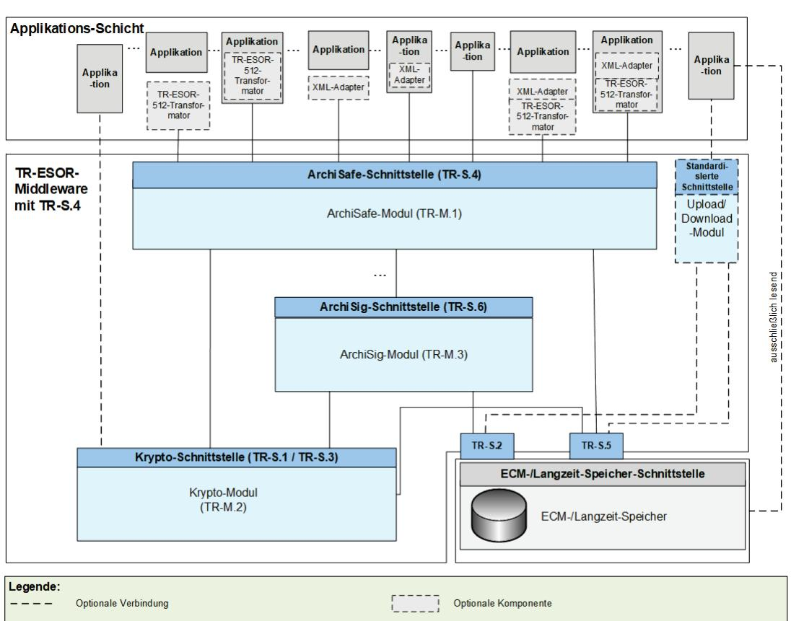
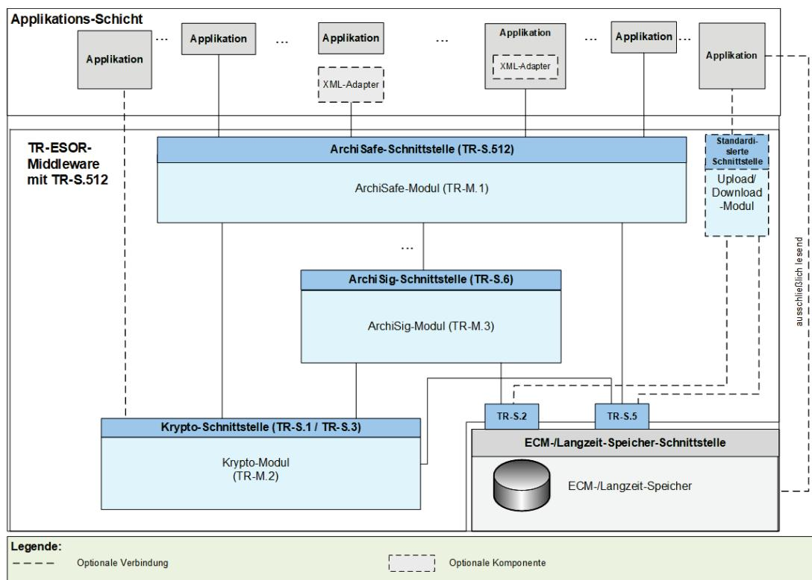
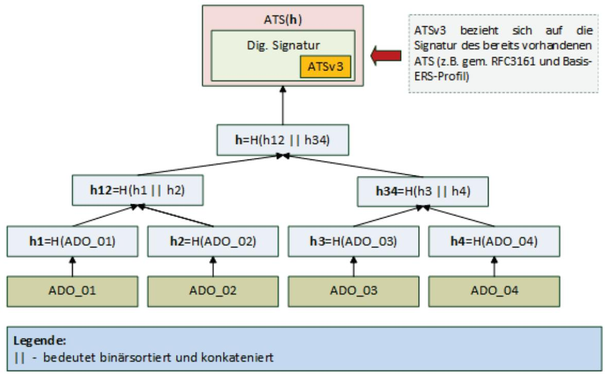
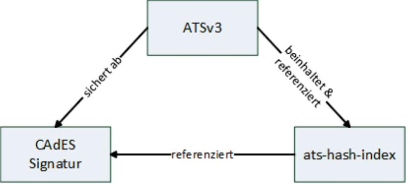

# BSI Technische Richtlinie 03125 Beweiswerterhaltung kryptographisch signierter Dokumente

Anlage TR-ESOR-ERS: Profilierung der Evidence Records gemäß RFC4998 und RFC6283

| Bezeichnung | Profilierung der Evidence Records gemäß RFC4998 und RFC6283                                                       |
|-------------|-------------------------------------------------------------------------------------------------------------------|
| Kürzel      | BSI TR-ESOR-ERS                                                                                                   |
| Version     | 1.3 (auf Basis der eIDAS-Verordnung und der ETSI Preservation Standards mit<br>einem neuen Zertifizierungsschema) |
| Datum       | 31.03.2022                                                                                                        |


# Änderungshistorie

| Version | Datum      | Name | Beschreibung |
|---------|------------|------|--------------|
| 1.3     | 31.03.2022 | BSI  | TR-ESOR-ERS  |
|         |            |      |              |

<span id="page-1-0"></span>Tabelle 1: Änderungshistorie

Bundesamt für Sicherheit in der Informationstechnik Postfach 20 03 63 53133 Bonn Tel.: +49 22899 9582-0 E-Mail: tresor@bsi.bund.de Internet: https://www.bsi.bund.de © Bundesamt für Sicherheit in der Informationstechnik 2022

| 1      |       | Einführung 6                                                                            |  |
|--------|-------|-----------------------------------------------------------------------------------------|--|
| 2<br>3 |       | Überblick  9<br>Profilierung des Evidence Record (normativ)12                           |  |
|        | 3.1   | Einleitung 12                                                                           |  |
|        | 3.2   | Definition des Verpflichtungsgrades12                                                   |  |
|        | 3.3   | Strukturen eines Evidence Records gem. dem Basis-ERS-Profil13                           |  |
|        | 3.3.1 | Typ EvidenceRecord13                                                                    |  |
|        | 3.4   | Regeln für den TimeStampToken im ASN.1-Format15                                         |  |
|        | 3.4.1 | Typ TimeStampToken15                                                                    |  |
|        | 3.4.2 | Typ SignedData 16                                                                       |  |
|        | 3.4.3 | Typ SignerInfo21                                                                        |  |
|        | 3.4.4 | Signierte Attribute (signed attributes) 23                                              |  |
|        | 3.5   | Erzeugen eines Evidence Records25                                                       |  |
|        | 3.5.1 | Behandlung des Archivzeitstempels25                                                     |  |
|        | 3.6   | Verifikation eines Evidence Records26                                                   |  |
| 4      |       | Anhang A: Profil-Überblick (normativ)28                                                 |  |
|        | 4.1   | Basis-ERS-Profil – Überblick28                                                          |  |
| 5      |       | Anhang B: Anforderungen an die kryptographischen Algorithmen und Parameter (normativ)30 |  |
|        | 5.1   | Erstellung eines Evidence Records gem. Basis-ERS-Profil 30                              |  |
|        | 5.1.1 | Hashalgorithmen 30                                                                      |  |
|        | 5.1.2 | Digitale Signaturalgorithmen31                                                          |  |
|        | 5.2   | Verifikation eines Evidence Records31                                                   |  |
|        | 5.2.1 | Hashalgorithmen 31                                                                      |  |
|        | 5.2.2 | Digitale Signaturalgorithmen31                                                          |  |
|        | 5.2.3 | ESSCertIDv2 und ESSCertID32                                                             |  |
| 6      |       | Anhang C: Weitere ERS-Profile (informativ) 33                                           |  |
|        | 6.1   | Struktur eines Evidence Records gem. dem Basis-XERS-Profil33                            |  |
|        | 6.2   | Zeitstempelerneuerung mithilfe eines ATSv3 (nur CMS-basiert)35                          |  |
|        | 6.2.1 | Verwendung von ATSv335                                                                  |  |
|        | 6.2.2 | Attribut archive-time-stamp-v3 (ATSv3)36                                                |  |
|        | 6.2.3 | Attribut ats-hash-index 37                                                              |  |
| 7      |       | Anhang D Syntaxdefinitionen (informativ)40                                              |  |
|        | 7.1   | Evidence Records gem. [RFC4998] 40                                                      |  |
|        | 7.1.1 | Element EvidenceRecord gem. [RFC4998]40                                                 |  |
|        | 7.1.2 | Element ArchiveTimeStamp gem. [RFC4998]40                                               |  |
|        | 7.2   | Evidence Records gem. [RFC6283] 41                                                      |  |

| 7.2.1 | Element <EvidenceRecord> gem. [RFC6283] 41 |  |
|-------|--------------------------------------------|--|
| 7.2.2 | Element <HashTree> gem. [RFC6283]  41      |  |
| 7.2.3 | Element <TimeStamp> gem. [RFC6283] 42      |  |

### Abbildungen

| Abbildung<br>1: Schematische Darstellung der IT-Referenzarchitektur mit TR-S.4<br>7 |  |
|-------------------------------------------------------------------------------------|--|
| Abbildung 2: Schematische Darstellung der IT-Referenzarchitektur mit TR-S.512<br>7  |  |
| Abbildung 3:<br>Zeitstempelerneuerung mithilfe eines ATSv336                        |  |
| Abbildung 4:<br>Zusammenhang digitale CAdES Signatur, ATSv3 und ats-hash-index38    |  |

## Tabellen

| Tabelle 1: Änderungshistorie 2                                                                                |  |
|---------------------------------------------------------------------------------------------------------------|--|
| Tabelle 2: Felder des Typs EvidenceRecord 13                                                                  |  |
| Tabelle 3: Aufbau des Typs ArchiveTimeStampSequence  13                                                       |  |
| Tabelle 4: Aufbau des Typs ArchiveTimeStampChain 14                                                           |  |
| Tabelle 5: Felder des Typs<br>ArchiveTimeStamp 14                                                             |  |
| Tabelle 6: Aufbau des Typs PartialHashtree 15                                                                 |  |
| Tabelle 7: Felder des Typs<br>ContentInfo eines TimeStampTokens 16                                            |  |
| Tabelle 8: Felder des Typs SignedData 17                                                                      |  |
| Tabelle 9: Felder des Typs EncapsulatedContentInfo  18                                                        |  |
| Tabelle 10: Aufbau des Typs CertificateSet (gem. [RFC5652], Kap. 10.2.3) 19                                   |  |
| Tabelle 11: Aufbau des Typs CertificateChoices (gem. [RFC5652], Kap. 10.2.2)  19                              |  |
| Tabelle 12: Aufbau des Typs RevocationInfoChoices (gem. [RFC5652], Kap. 10.2.1)  20                           |  |
| Tabelle 13: Aufbau des Typs RevocationInfoChoice (gem. [RFC5652], Kap. 10.2.1)  20                            |  |
| Tabelle 14: Felder des Typs SignerInfo  21                                                                    |  |
| Tabelle 15: Felder des Typs Attribute gem. [RFC5652] 22                                                       |  |
| Tabelle 16: Auflistung der relevanten signierten Attribute (Zeitstempel gem. [RFC3161])  23                   |  |
| Tabelle 17: Attribut content-type gem. [RFC5652].  24                                                         |  |
| Tabelle 18: Attribut message-digest gem. [RFC5652].  24                                                       |  |
| Tabelle 19: Attribut signing-certificate-v2 gem. [RFC5035].  25                                               |  |
| Tabelle 20: Überblick über den Aufbau eines Evidence Records gem. dem Basis-ERS-Profil 28                     |  |
| Tabelle 21: Überblick über den Aufbau eines Zeitstempels gem. dem Basis-ERS-Profil 28                         |  |
| Tabelle 22: Aktuell zugelassene Hashalgorithmen für die Erzeugung technische Beweisdaten (Evidence            |  |
| Records) (Stand Januar.2021)  30                                                                              |  |
| Tabelle 23: Aktuell zusätzlich erforderliche Hashalgorithmen für die Verifikation eines Evidence Records      |  |
| (Stand Januar 2021)  31                                                                                       |  |
| Tabelle 24: Weitere aktuell zu unterstützende digitale Signatur-Suites bei der Prüfung eines Evidence Records |  |
| (Stand: Januar 2021)  32                                                                                      |  |
| Tabelle 25: Der Typ<br>EvidenceRecordType gem. [RFC6283] und Basis-XERS-Profil  33                            |  |
| Tabelle 26: Der Typ ArchiveTimeStampChainType gem. [RFC6283] und Basis-XERS-Profil 34                         |  |
| Tabelle 27: Der Typ ArchiveTimeStampType gem. [RFC6283] und Basis-XERS-Profil  34                             |  |
| Tabelle 28: Der Typ TimeStampType gem. [RFC6283] und Basis-XERS-Profil  35                                    |  |
| Tabelle 29: Attribut archive-time-stamp-v3 gem. [ETSI 101733], Kap. 6.4.3  36                                 |  |
| Tabelle 30: Aufbau von message imprint eines ATSv3  37                                                        |  |
| Tabelle 31: Das Attribut<br>ats-hash-index 37                                                                 |  |
| Tabelle 32: Felder des Typs ATSHashIndex  38                                                                  |  |
| Tabelle 33: Das Element EvidenceRecord gem. [RFC4998] 40                                                      |  |
| Tabelle 34: Das Element ArchiveTimeStamp gem. [RFC4998]  40                                                   |  |
| Tabelle 35: Das Element <EvidenceRecord> 41                                                                   |  |

#### Tabelle 36: Das Element <HashTree> [..............................................................................................................................................41](#page-40-4)

# <span id="page-5-0"></span>1 Einführung

Ziel der Technischen Richtlinie "Beweiswerterhaltung kryptographisch signierter Dokumente" ist die Spezifikation sicherheitstechnischer Anforderungen für den langfristigen Beweiswerterhalt von kryptographisch signierten elektronischen Dokumenten und Daten nebst zugehörigen elektronischen Verwaltungsdaten (Metadaten).

Eine für diese Zwecke definierte Middleware (TR-ESOR-Middleware) im Sinn dieser Richtlinie umfasst alle diejenigen Module (M) und Schnittstellen (S), die zur Sicherung und zum Erhalt der Authentizität und zum Nachweis der Integrität der aufbewahrten Dokumente und Daten eingesetzt werden.

Die im Hauptdokument dieser Technischen Richtlinie vorgestellte Referenzarchitektur besteht aus den nachfolgend beschriebenen Schnittstellen, funktionalen und logischen Einheiten:

- der TR-S.4- oder TS 119 512-Schnittstelle TR-S.512 in der Profilierung [TR-ESOR-TRANS][1](#page-5-1) der TR-ESOR-Middleware, die dazu dient, die TR-ESOR-Middleware in die bestehende IT- und Infrastrukturlandschaft einzubetten;
- dem "ArchiSafe-Modul" (vgl. [TR-ESOR-M.1]), welches den Informationsfluss in der Middleware regelt, die Sicherheitsanforderungen an die Schnittstellen zu den IT-Anwendungen umsetzt und für eine Entkopplung von Anwendungssystemen und ECM/Langzeitspeicher sorgt;
- dem "Krypto-Modul" (vgl. [TR-ESOR-M.2]) nebst den zugehörigen Schnittstellen S.1 und S.3, das alle erforderlichen Funktionen zur Berechnung von Hashwerten, zur Prüfung elektronischer Signaturen bzw. Siegel bzw. Zeitstempel, zur Nachprüfung elektronischer Zertifikate und zum Einholen qualifizierter Zeitstempel sowie (optional) elektronischer Signaturen bzw. Siegel für die Middleware zur Verfügung stellt. Darüber hinaus kann es Funktionen zur Ver- und Entschlüsselung von Daten und Dokumenten zur Verfügung stellen;
- dem "ArchiSig-Modul" (vgl. [TR-ESOR-M.3]) mit der Schnittstelle S.6, das die erforderlichen Funktionen für die Beweiswerterhaltung der digital signierten Unterlagen bereitstellt;
- einem ECM/Langzeitspeicher mit den Schnittstellen S.2 und S.5, der die physische Archivierung/Aufbewahrung und auch das Speichern der beweiswerterhaltenden Zusatzdaten übernimmt.

Dieser ECM/Langzeitspeicher ist nicht mehr direkt Teil der Technischen Richtlinie, gleichwohl werden über die beiden Schnittstellen, die noch Teil der TR-ESOR-Middleware sind, Anforderungen daran gestellt.

Ebenso wenig ist die Applikationsschicht, die auch einen XML-Adapter enthalten kann, direkter Teil der Technischen Richtlinie, auch wenn dieser XML-Adapter als Teil einer Middleware implementiert werden kann.

Die empfohlene IT-Referenzarchitektur ist in [Abbildung](#page-6-0) 1 und [Abbildung](#page-6-1) 2dargestellt und besteht im Wesentlichen aus den in [TR-ESOR], Kap. 7, grob beschriebenen logischen Komponenten und Schnittstellen. Diese werden in Anhängen zur TR weiter detailliert. Die Grafik zeigt zudem die externen Komponenten und Systeme an, die das Bild vervollständigen. Grundsätzlich wird als obere Schnittstelle der TR-ESOR-Middleware entweder die TR-S.4-Schnittstelle gemäß [TR-ESOR-E], die in [Abbildung](#page-6-0) 1 dargestellt ist, oder die TR-S.512-Schnittstelle gemäß [ETSI TS 119 512] in der Profilierung [TR-ESOR-TRANS], die in [Abbildung](#page-6-1) 2 gezeigt wird, unterstützt.

<span id="page-5-1"></span> <sup>1</sup> Alle in diesem Anhang verwendeten Verweise können im Quellenverzeichnis im Hauptdokument aufgelöst werden.



<span id="page-6-0"></span>Abbildung 1: Schematische Darstellung der IT-Referenzarchitektur mit TR-S.4



<span id="page-6-1"></span>Abbildung 2: Schematische Darstellung der IT-Referenzarchitektur mit TR-S.512

Die in [Abbildung](#page-6-0) 1 bzw. [Abbildung 2](#page-6-1) dargestellte IT-Referenzarchitektur orientiert sich an der ArchiSafe Referenzarchitektur und soll die logische (funktionale) Interoperabilität künftiger Produkte mit den Zielen und Anforderungen der Technischen Richtlinie ermöglichen und unterstützen.

Sofern der optionale XML-Adapter und/oder der optionale TR-ESOR-512-Transformator[2](#page-7-0) vorhanden sind, können beide in folgenden Ausprägungen vorliegen:

- Jeweils eigenständige Komponente mit Schnittstellen zur Applikation sowie zum ArchiSafe-Modul
- Jeweils eigenständige Komponente, jedoch Teil der Applikation mit Schnittstelle zum ArchiSafe-Modul
- XML-Adapter und TR-ESOR-512-Transformator als eine gemeinsame Komponente, die beide Teile enthält mit Schnittstellen zur Applikation sowie zum ArchiSafe-Modul
- XML-Adapter und TR-ESOR-512-Transformator als eine gemeinsame Komponente, die beide Teile enthält und Teil der Applikation ist, mit Schnittstelle zum ArchiSafe-Modul.

Der "ETSI TS119512 TR-ESOR Transformator" ermöglicht Bewahrungsdiensten gemäß [eIDAS-VO], empfangene ETSI TS119512 (V1.1.2) Nachrichten[3](#page-7-1) in TR-S4 Nachrichten zu transformieren. Diese Nachrichten können dann an ein angeschlossenen TR-ESOR-Syste[m4](#page-7-2) geschickt werden, ohne irgendwelche Änderungen dieses TR-ESOR-Systems.

Der Einsatz des TR-ESOR-512-Transformators wird empfohlen, sofern das TR-ESOR-Produkt mit einer TR-S.4-Schnittstelle in Europa zum Einsatz kommt und Interoperabilität mit europäischen (qualifizierten) Bewahrungsdiensten und Bewahrungsprodukten hergestellt werden soll.

Diese Technische Richtlinie ist modular aufgebaut und spezifiziert in einzelnen Anlagen zum Hauptdokument die funktionalen und sicherheitstechnischen Anforderungen an die erforderlichen IT-Komponenten und Schnittstellen der TR-ESOR-Middleware. Die Spezifikationen sind strikt plattform-, produkt-, und herstellerunabhängig.

Das vorliegende Dokument trägt die Bezeichnung "Profilierung der Evidence Records gemäß RFC 4998/6283" (auch kurz "Anlage TR-ESOR-ERS" bzw. nur "TR-ESOR-ERS" genannt) und beschreibt die vorgeschriebene Belegung der Felder der gemäß [RFC4998] und [RFC6283] aufgebauten Evidence Records.

<span id="page-7-0"></span><sup>2</sup> Sieh[e ETSI TS 119512 TR-ESOR Transformator unter einer Open Source Lizenz](https://github.com/de-bund-bsi-tr-esor/tresor-ETSITS119512-transformator) . 3

<span id="page-7-1"></span>In der Profilierung von [TR-ESOR-TRANS]

<span id="page-7-2"></span><sup>4</sup> Sieh[e https://www.bsi.bund.de/EN/tr-esor](https://www.bsi.bund.de/EN/tr-esor) oder [https://www.bsi.bund.de/DE/tr-esor.](https://www.bsi.bund.de/DE/tr-esor) 

# <span id="page-8-0"></span>2 Überblick

Die TR 03125 TR-ESOR stellt ein Konzept für die Beweiswerterhaltung elektronischer Unterlagen durch den Einsatz kryptographisch-signierter Daten und Dokumente bereit.

Wesentliche Grundlagen dieses Konzeptes sind daher u.a. die Erzeugung, Prüfung und Rückgabe technischer Beweisdaten als informationstechnische Umsetzung der Evidence Record[5](#page-8-1) Syntax (kurz: ERS) Standards der IETF (vgl. [RFC4998] bzw. [RFC6283][6](#page-8-2) ) sowie die Prüfung und ggf. Erzeugung von beweisrelevanten Daten, z. B. Zeitstempel, elektronischer Signaturen, Siegel, Zertifikaten, Sperrinformationen, etc.

In den folgenden Abschnitten befindet sich die Darstellung der Profilierungen des Evidence Records und der darin enthaltenen beweisrelevanten Daten, insbesondere auch in Bezug auf die Zeitstempelsignatur bzw. siegel, mit dem Ziel der nachhaltigen Erhaltung des Beweiswerts und der technischen Konformität und Interoperabilität zwischen unterschiedlichen TR-ESOR-konformen Systemen.

Um Interoperabilität zu erreichen, wird in diesem Profil nur eine begrenzte Anzahl von möglichen Elementen und Attributen für technische Beweisdaten und beweisrelevante Daten zugelassen bzw. vorgeschrieben, die weithin genutzt werden und als interoperabel anzusehen sind.

Es werden insbesondere zwei Basis-Profile für den Aufbau eines Evidence Records vorgestellt:

- Basis-ERS-Profil ein obligatorisches Profil, das den Aufbau eines ERS gem. [RFC4998] regelt (vgl. Kapitel [3\)](#page-11-0),
- Basis-XERS-Profil ein optionales Profil, das den Aufbau eines ERS gem. [RFC6283] regelt (vgl. Kapitel [6.1\)](#page-32-1).

#### HINWEIS 1

Um die Übersichtlichkeit und Lesbarkeit des Dokumentes besser zu gestalten, wurden an einigen Stellen in diesem Dokument Fragmente anderer Standards und Richtlinien zitiert. Die sich somit ergebende Redundanz wird demnach bewusst gepflegt. Grundsätzlich gilt, dass die Originalquellen einen Vorrang genießen. Die explizit gewünschten Abweichungen von der Originalfassung der Standards werden in der Form von Anforderungen im Dokument definiert und explizit gekennzeichnet.

#### HINWEIS 2

In der vorliegenden TR-ESOR-Version1.3 werden die drei Begriffe "(beweiswerterhaltende) Langzeitspeicherung", "(beweiswerterhaltende) Bewahrung" und "(beweiswerterhaltende) Archivierung" synonym verwendet. 

Ebenso werden die drei Begriffe "Archivinformationspaket (AIP)", "Archivinformationscontainer" und "Archivdatenobjekt" sowie die Begriffe "aufbewahren" und "archivieren" synonym verwendet. 

### HINWEIS 3

TR-ESOR spezifiziert ein Bewahrungsprodukt (engl. Preservation Product) gemäß [ETSI SR 019 510], [ETSI TS 119511] und [ETSI TS 119512] und [eIDAS]. Die TR 03125 TR-ESOR ist in [ETSI SR 019510] in dem Kapitel 4.7.3 und 5.2 und B3.2 beschrieben. 

Die in TR-ESOR erforderlichen grundlegenden Bewahrungstechniken, z. B. das Bewahrungsprotokoll, das Beweisdaten-Format Evidence Record, die Archivdatenobjekt-Formate (L)XAIP und ASiC-AIP sind in der ETSI-Publikation [ETSI TS 119512] als normative Elemente enthalten. 

### HINWEIS 4

Die obere TR-ESOR-Eingangs-Schnittstelle TR-S.4 oder die TS119512-Eingangsschnittstelle TR-S.512 gemäß der "Preservation-API" in [ETSI TS 119 512] in der Profilierung von [TR-ESOR-TRANS], die logisch äquivalent zur Eingangsschnittstelle TR-S.4 gemäß [TR-ESOR-E] ist wie in der Tabelle 2 in [TR-ESOR-E], 

<span id="page-8-1"></span><sup>5</sup> Hinweis! Der Begriff Evidence Record wird im weiteren Verlauf auch mit ER abgekürzt.

<span id="page-8-2"></span><sup>6</sup> Hinweis! Die Liste der Quellen wird im Hauptdokument der TR-03125 gepflegt.

clause 4.1, dargestellt, muss benutzt werden. Eine andere Eingangs-Schnittstelle anstelle von TR-S.4 bzw. TR-S.512 ist nicht erlaubt.

#### HINWEIS 5

In der vorliegenden TR-ESOR-Version1.3 umfasst der Begriff "AIP" in allen TR-ESOR-Anhängen:

a) das Archivdatenobjekt "XAIP" gemäß [TR-ESOR-F], Kapitel 3.1 als auch

b) das logische XAIP "LXAIP" gemäß [TR-ESOR-F], Kapitel 3.2 und

c) das "ASiC-AIP" gemäß [TR-ESOR-F], Kapitel 3.3 auf Basis von [ETSI EN 319162-1].

In TR-ESOR Version 1.3 wird zwischen XAIP, LXAIP und ASiC-AIP differenziert.

Mit (L)XAIP wird XAIP oder LXAIP bezeichnet.

### HINWEIS 6

In dieser TR-ESOR Version 1.3 ist "BIN" beschränkt auf die folgenden Bewahrungsobjekt-Formate (engl. preservation object formats):

-CAdES gemäß [ETSI TS 119 512] Annex A.1.1 [\(http://uri.etsi.org/ades/CAdES\)](http://uri.etsi.org/ades/CAdES). Sofern kein MIME Type gesetzt ist, wird als Default application/cms verwendet;

-XAdES gemäß [ETSI TS 119 512] Annex A.1.2 [\(http://uri.etsi.org/ades/XAdES\)](http://uri.etsi.org/ades/XAdES). Sofern kein MIME Type gesetzt ist, wird als Default application/xml verwendet;

-PAdES gemäß [ETSI TS 119 512] Annex A.1.3 [\(http://uri.etsi.org/ades/PAdES\)](http://uri.etsi.org/ades/PAdES). Sofern kein MIME Type gesetzt ist, wird als Default application/pdf verwendet;

-ASiC-E gemäß [ETSI TS 119 512] Annex A.1.4 (http://uri.etsi.org/ades/ASiC/type/ASiC-E). Sofern kein MIME Type gesetzt ist, wird als Default application/vnd.etsi.asic-e+zip verwendet;

-ASiC-S gemäß [ETSI EN 319 162] [\(http://uri.etsi.org/ades/ASiC/type/ASiC-S\)](http://uri.etsi.org/ades/ASiC/type/ASiC-S). Sofern kein MIME Type gesetzt ist, wird als Default application/vnd.etsi.asic-s+zip verwendet.

-DigestList gemäß [ETSI TS 119 512] Annex A.1.6 (http://uri.etsi.org/19512/format/DigestList). Sofern kein MIME Type gesetzt ist, wird als Default application/xml verwendet;

-ASiC-ERS (in TR-ESOR v1.3 mit ASiC-AIP bezeichnet) gemäß [BSI TR-ESOR-F], Clause 3.3) und gemäß [ETSI TS 119 512] Annex A.3.1 [\(http://uri.etsi.org/ades/ASiC/type/ASiC-ERS\)](http://uri.etsi.org/ades/ASiC/type/ASiC-ERS) und

Im Falle Upload/Download-Funktion ist zusätzlich nachfolgendes Format erlaubt:

- Binärdaten (BIN) als "Octet Stream", die ausschließlich in den ECM-/Langzeitspeicher mit "Upload-Request" gespeichert werden, – aber nur sofern: a) verbunden mit einem korrespondierenden LXAIP und dort referenziert gem. [TR-ESOR-F], Kap. 3.2, b) ggf. mit "Download-Request" ausgelesen werden, – verbunden mit einem korrespondierenden LXAIP, das mit der "ArchiveRetrieval"-Funktion ausgelesen wurde ,– oder eingebettet in einem XAIP und ausgelesen mit der "ArchivRetrieval"-Funktion c) Der Upload von XAIP oder LXAIP oder ASiC-AIP ist nicht zugelassen.

#### HINWEIS 7

Im folgenden Text umfasst der Begriff "Digitale Signatur" "fortgeschrittene elektronische Signaturen" gemäß [eIDAS-VO], Artikel 3 Nr. 11, "qualifizierte elektronische Signaturen" gemäß [eIDAS-VO], Artikel 3 Nr. 12, "fortgeschrittenen elektronische Siegel" gemäß [eIDAS-VO], Artikel 3 Nr. 26 und "qualifizierte elektronische Siegel" gemäß [eIDAS-VO], Artikel 3 Nr. 27. Insofern umfasst der Begriff "digital signierte Dokumente" sowohl solche, die fortgeschrittene elektronische Signaturen oder Siegel bzw. qualifizierte elektronische Signaturen oder Siegel tragen. 

Mit dem Begriff der "kryptographisch signierten Dokumente" sind in dieser TR neben den gemäß [eIDAS-VO], Artikel 3 Nr. 12 qualifiziert signierten, den gemäß [eIDAS-VO], Artikel 3 Nr. 27 qualifiziert gesiegelten oder den gemäß [eIDAS-VO], Artikel 3 Nr. 34 qualifiziert zeitgestempelten Dokumenten (im Sinne der eIDAS-Verordnung) ) auch Dokumente mit einer fortgeschrittenen Signatur gemäß [eIDAS-VO], Artikel 3 Nr. 11 oder mit einem fortgeschrittenen Siegel gemäß [eIDAS-VO], Artikel 3 Nr. 26 oder mit einem elektronischen Zeitstempel gemäß [eIDAS-VO], Artikel 3 Nr. 33 erfasst, wie sie oft in der internen Kommunikation von Behörden entstehen. Nicht gemeint sind hier Dokumente mit einfachen Signaturen oder Siegeln basierend auf anderen (z. B. nicht-kryptographischen) Verfahren.

# <span id="page-11-0"></span>3 Profilierung des Evidence Record (normativ)

## <span id="page-11-1"></span>3.1 Einleitung

Der Zweck dieser Spezifikation ist es, ein Interoperabilitätsprofil für die technischen Beweisdaten (Evidence Record) gemäß [RFC4998] bzw. [RFC6283] zu erstellen, das eine langfristige und weitgehend system- und plattformunabhängige Interpretierbarkeit der Daten und eine Interoperabilität zwischen unterschiedlichen TR-ESOR- Implementierungen unterstützt.

In den folgenden Abschnitten werden die Ausführungen in [TR-ESOR-F], insbesondere in Kapitel 5 "Kryptographische Datenformate", auf Basis

- der "Cryptographic Message Syntax (CMS)" gemäß [RFC5652] bzw. vormals [RFC3852],
- des "Time-Stamp Protocol (TSP)" gemäß [RFC3161] und [RFC5816] (zukünftig [EN 319 422]),
- der Langzeit-Signaturprofile für CMS-basierte digitale Signaturen, [ETSI 101733] (bzw. [RFC5126]) bzw. insbesondere das im Durchführungsrechtsakt [2015/1506/EU] referenzierte CAdES Baseline Profile [ETSI 103 173], (zukünftig [ETSI EN 319122-1] bzw. [ETSI EN 319122-2] bzw. [ETSI EN 319122-3]),
- der Evidence Record Syntax Standards [RFC4998] und [RFC6283] sowie
- des Langzeitsignaturprofils für CMS-basierte digitale Signaturen [ISO14533-1] und des Langzeitsignaturprofils für XML-basierte digitale Signaturen [ISO14533-2]

weiter verfeinert.

Die in [TR-ESOR-F] formulierten Anforderungen werden dabei als bekannt vorausgesetzt und ggf. bedarfsgerecht ergänzt.

Die Syntax der Evidence Records gemäß [RFC4998] und [RFC6283] ist im Kapitel [7-](#page-39-0) Anhang D skizziert worden.

In den folgenden Kapiteln wird zunächst die Struktur des Basis-ERS-Profils eines Evidence Records gem. [RFC4998] vorgestellt (vgl. Kap. [3.3](#page-12-0) und Kap. [3.4\)](#page-14-0) und beschrieben sowie grundsätzliche Aussagen zur Erstellung und Prüfung von Evidence Records getroffen (vgl. Kap. [3.5](#page-24-0) und Kap. [3.6\)](#page-25-0).

## <span id="page-11-2"></span>3.2 Definition des Verpflichtungsgrades

Der Grad der Verpflichtung (VG) der einzelnen Elemente wird durch die folgenden Symbole gekennzeichnet:

- V verpflichtend,
- O optional,
- B bedingt.
- (A3.2-1) Elemente, deren Verpflichtungsgrad "V – verpflichtend" ist, müssen in einem Evidence Record gemäß diesem Profil wie vorgegeben implementiert sein. Wenn dieses Element optionale Unterelemente hat, so muss mindestens eines dieser Unterelemente umgesetzt sein.
- (A3.2-2) Bei der Erzeugung oder Verifikation eines Evidence Records muss dieses auf Basis der in diesem Dokument beschriebenen Profilierung
	- [RFC4998] oder "Basis-ERS-Profil" und
	- [RFC6283] oder "Basis-XERS-Profil"
	- umgesetzt werden.

Dabei ist die Erzeugung und Verifizierung eines Evidence Records gem. [RFC4998] konform zum nachstehenden Basis-ERS-Profile aufgebaut, wenn:

• die Verarbeitung aller Elemente des Evidence Records, dessen erforderlicher Grad der Verpflichtung im Basis-ERS-Profil "V – verpflichtend" ist, so durchgeführt wird, wie es nachfolgend in Kapitel [3.3](#page-12-0) und Kapite[l 3.4 v](#page-14-0)orgegeben ist.

Dabei ist die Erzeugung und Verifizierung eines Evidence Records gem. [RFC6283] konform zum nachstehenden Basis-XERS-Profile aufgebaut, wenn:

• die Verarbeitung aller Elemente des Evidence Records, dessen erforderlicher Grad der Verpflichtung im Basis-XERS-Profil "V – verpflichtend" ist, so durchgeführt wird, wie es nachfolgend in Kapitel [6.1](#page-32-1) und Kapite[l 3.4](#page-14-0) vorgegeben ist.

Insbesondere beinhalten alle im Evidence Record enthaltenen Instanzen des Elementes *TimeStampToken* einen gem. dem Basis-ERS-Profil aufgebauten Zeitstempeltoken (vgl. Kap. [3.4\)](#page-14-0).

## <span id="page-12-0"></span>3.3 Strukturen eines Evidence Records gem. dem Basis-ERS-Profil

Eine grundlegende Einführung zum "Beweisdatenbericht" (Evidence Record) auf Basis von [RFC4998] bzw. [RFC6283] befindet sich in [TR-ESOR-F], Kap. 5.5.

Die folgenden Unterkapitel stellen ergänzend dazu dar:

- die benötigten Datenstrukturen für den Beweisdatenbericht,
- den Verpflichtungsgrad der darin enthaltenen Felder, Elemente und/oder Attribute sowie
- den Bezug zu den zugrundeliegenden Standards

und machen

• z. T. Vorgaben für den Inhalt der Felder, Elemente und/oder Attribute.

### <span id="page-12-1"></span>3.3.1 Typ EvidenceRecord

Die grundlegenden Beschreibungen der Felder des Typs *Evidence Records* sind dem Anhang [TR-ESOR-F], Kapitel 5.5.1 zu entnehmen. Der folgende Text definiert noch darüber hinaus gehende Beschreibungen oder Belegungen der Felder.

Der Typ *EvidenceRecord* gem. [RFC4998] besteht aus drei verpflichtenden und zwei optionalen Feldern (vgl. [Tabelle 2\)](#page-12-2), für die in diesem Profil Folgendes gilt:

| Feld                                | Typ                                   | VG   | Referenz                                            |
|-------------------------------------|---------------------------------------|------|-----------------------------------------------------|
| EvidenceRecord<br>::<br>=SEQUENCE { |                                       |      |                                                     |
| version                             | INTEGER                               | V(a) | [RFC4998], Kap. 3.1                                 |
| digestAlgorithms                    | SEQUENCE<br>OF<br>AlgorithmIdentifier | V    | [RFC4998], Kap. 3.1,<br>dieses Dokument, Kap. 5.1.1 |
| cryptoInfos                         | CryptoInfos                           | O(b) | [RFC4998], Kap. 3.1                                 |
| encryptionInfo                      | EncryptionInfo                        | O(c) | [RFC4998], Kap. 3.1                                 |
| archiveTimeStampSequence            | ArchiveTimeStampSequence              | V    | [RFC4998], Kap. 3.1                                 |
| }                                   |                                       |      |                                                     |

<span id="page-12-2"></span>Tabelle 2: Felder des Typs *EvidenceRecord*

#### Anforderungen (A3.3-1):

(a) – Das Feld *version* muss aktuell gem. [RFC4998], Kap. 3.1 auf "1" gesetzt werden.

(b) – Das Feld *cryptoInfos* soll im Rahmen des Basis-ERS-Profils nicht vorhanden sein.

(c) – Das Feld *encryptionInfo* soll im Rahmen des Basis-ERS-Profils nicht vorhanden sein.

### 3.3.1.1 Typ ArchiveTimeStampSequence und Typ ArchiveTimeStampChain

Es gelten die folgenden Festlegungen (vgl. [Tabelle 3](#page-12-3) und [Tabelle 4\)](#page-13-0).

<span id="page-12-3"></span>Tabelle 3: Aufbau des Typs *ArchiveTimeStampSequence*

| Typ                               | Subtyp                |    | VG      | Referenz            |
|-----------------------------------|-----------------------|----|---------|---------------------|
| ArchiveTimeStampSequence SEQUENCE | ArchiveTimeStampChain | OF | V(a)(b) | [RFC4998], Kap. 5.1 |

#### Anforderungen (A3.3-2):

- (a) Dieses Feld *ArchiveTimeStampSequence* muss mindestens ein Feld vom Typ *ArchiveTimeStampChain* enthalten.
- (b) Die Felder vom Typ *ArchiveTimeStampChain* im Feld *ArchiveTimeStampSequence* müssen aufsteigend nach dem Zeitpunkt der beinhalteten Zeitstempel sortiert werden.

#### <span id="page-13-0"></span>Tabelle 4: Aufbau des Typs *ArchiveTimeStampChain*

| Typ                   | Subtyp                             | VG      | Referenz            |
|-----------------------|------------------------------------|---------|---------------------|
| ArchiveTimeStampChain | SEQUENCE<br>OF<br>ArchiveTimeStamp | V(a)(b) | [RFC4998], Kap. 5.1 |

#### Anforderungen (A3.3-3):

- (a) Das Feld *ArchiveTimeStampChain* muss mindestens ein Feld vom Typ *ArchiveTimeStamp* enthalten.
- (b) Die Felder *ArchiveTimeStamp* im Feld *ArchiveTimeStampChain* müssen aufsteigend nach dem Zeitpunkt der beinhalteten abschließenden Zeitstempel sortiert werden.

### 3.3.1.2 Typ ArchiveTimeStamp und Typ PartialHashtree

Der Typ *ArchiveTimeStamp* beinhaltet drei optionale und ein verpflichtendes Feld (vgl. [RFC4998], Kap. 4.1 un[d Tabelle 5\)](#page-13-1).

Darüber hinaus gelten die folgenden Anforderungen:

<span id="page-13-1"></span>Tabelle 5: Felder des Typs*ArchiveTimeStamp*

| Feld                                      | Typ                              | VG   | Referenz                    |
|-------------------------------------------|----------------------------------|------|-----------------------------|
| ArchiveTimeStamp<br>::<br>=<br>SEQUENCE { |                                  |      |                             |
| digestAlgorithm                           | AlgorithmIdentifier              | O(a) | [RFC4998], Kap. 4.1,        |
|                                           |                                  |      | dieses Dokument, Kap. 5.1.1 |
| attributes                                | Attributes                       | O(b) | [RFC4998], Kap. 4.1         |
| reducedHashtree                           | SEQUENCE OF PartialHashtree O(c) |      | [RFC4998], Kap. 4.1         |
| timeStamp                                 | ContentInfo                      | V(d) | [RFC4998], Kap. 4.1         |
| }                                         |                                  |      |                             |

#### Anforderungen (A3.3-4):

- (a) –Wenn das *digestAlgorithm*–Feld fehlt, dann muss der Digest-Algorithmus des Zeitstempels *timeStamp* benutzt werden. (vgl. [RFC4998], Kap. 4.1)
- (b) Das *attributes*–Feld soll im Rahmen dieses Profils nicht vorhanden sein.

<sup>7</sup> Es muss der im [RFC4998], Kap. 5.1 beschriebene Sortieralgorithmus beachtet werden.

(c) –Alle Vorkommen vom *reducedHashtree*–Feld innerhalb der einzelnen Elemente vom Typ *ArchiveTimeStamp* einer Archivzeitstempelkette *ArchiveTimeStampChain* müssen den gleichen Hashalgorithmus verwenden (vgl. [RFC4998], Kap. 5.1).

(d) – Dieses Feld *timeStamp* muss den Anforderungen an einen Zeitstempeltoken gemäß [RFC3161] genügen.

Grundsätzlich gilt dabei:

*reducedHashtree* [optional]:

Das Feld *reducedHashtree* besteht aus einer oder mehreren Listen der Hashwerte, die jeweils einen partiellen Hashbaum repräsentieren. Dieser kann soweit reduziert sein, dass er nur noch die Hashwerte enthält, die für die Verifikation eines einzigen Datenobjektes erforderlich sind. Ein solcher *reducedHashtree* kann dazu genutzt werden, den Zeitstempel *timestamp* des *ArchiveTimeStamp* und die geschützten Datenobjekte zu verbinden. Falls das optionale Feld *reducedHashtree* nicht vorhanden ist, dann bezieht sich der Zeitstempel des *ArchiveTimeStamps* auf ein einziges Datenobjekt, das entweder ein originäres (signiertes) Datenobjekt darstellt oder ein vorausgegangener Zeitstempel ist.

Ein Feld vom Typ *PartialHahstree* beinhaltet eine Sequenz von Ketten der binären Daten (vgl. [Tabelle](#page-14-2)  [6\)](#page-14-2).

<span id="page-14-2"></span>

| PartialHashtree<br>Tabelle 6: Aufbau des Typs |
|-----------------------------------------------|
|-----------------------------------------------|

| Typ             | Subtyp             |    |       | VG   | Referenz            |
|-----------------|--------------------|----|-------|------|---------------------|
| PartialHashtree | SEQUENCE<br>STRING | OF | OCTET | V(a) | [RFC4998], Kap. 4.1 |

#### Bemerkungen:

(a) – Dieses Feld beinhaltet einen oder mehrere in Form von binären Daten abgelegte(n) Hashwert(e), die in einer Sequenz abgelegt sind. Die einzelnen Sequenzelemente werden im Zuge der Erstellung des reduzierten Hashbaums (vgl. [RFC4998], Kap. 4.2) erstellt.

## <span id="page-14-0"></span>3.4 Regeln für den TimeStampToken im ASN.1-Format

Dieses Kapitel ist in vier Abschnitte unterteilt. In Anlehnung an [RFC5652] und [ETSI 101733] (CMS) beschreibt dieses Kapitel im ersten Teil allgemeine Eigenschaften des *TimeStampTokens*8 , im zweiten Teil den Typ *SignedData*, im dritten Teil den Typ *SignerInfo* und im letzten Teil den Typ *SignedAttribute*.

Dabei gilt grundsätzlich das Folgende:

• die Wertebelegung der Elemente des *TimeStampToken* im ASN.1-Format erfolgt in diesem Profil in Anlehnung an [RFC3161]. Abweichungen oder Verfeinerungen werden dabei im folgenden Text als weitere Anforderungen in den jeweiligen Tabellen dargestellt.

### <span id="page-14-1"></span>3.4.1 Typ TimeStampToken

Der Typ *ContentInfo* beinhaltet zwei Elemente und stellt grundsätzlich einen universellen (abstrakten) Behälter für die Inhaltsdaten dar.

Grundsätzlich gilt daher:

*contentType* [verpflichtend]

<sup>8</sup> Vgl. [RFC3161] bzw. [TR-ESOR-F], Kap. 5.5.1.

Das Element c*ontentType* beinhaltet eine OID des Datentyps, der in *content* als "associated and protected object" (vgl. [RFC5652], Kap. 5.1) enthalten ist.

*content* [verpflichtend]

Das Element beinhaltet ein "associated and protected object", z. B. eine CMS-Signatur (vgl. [RFC5652]), die um die der Beweiskrafterhaltung dienenden Aspekte erweitert wird, wie z. B. Zertifikate oder Sperrlisten etc.

Im vorliegenden Profil gelten darüber hinaus die folgenden Anforderungen und Festlegungen:

| Feld                            |   | Typ         | VG   | Referenz                                                                          |
|---------------------------------|---|-------------|------|-----------------------------------------------------------------------------------|
| ContentInfo<br>::<br>SEQUENCE { | = |             |      |                                                                                   |
| contentType                     |   | ContentType | V(a) | [RFC5652] Kap. 5.1,<br>[ETSI 101733], Kap. 4.3.1, Kap. 5.3<br>[RFC4998], Kap. 4.1 |
| content                         |   | SignedData  | V(b) | [RFC5652], Kap. 5.1<br>[ETSI 101733], Kap. 5.4                                    |
| }                               |   |             |      |                                                                                   |

<span id="page-15-1"></span>Tabelle 7: Felder des Typs ContentInfo eines*TimeStampTokens*

### Anforderungen (A3.4-1)

(a) – Diese OID für den *contentType* von *SignedData* muss "1.2.840.113549.1.7.2" lauten (vgl. [RFC5652], Kap. 5.1).

(b) – Die in diesem Anwendungsfall zur Geltung kommende Ausprägung des Behälters muss der Typ *SignedData* (vgl. [RFC3161], Kap. 2.4.2, Seite 7) sein.

### <span id="page-15-0"></span>3.4.2 Typ SignedData

Der Typ *SignedData* beinhaltet sechs Felder (vgl. [RFC5652], Kap. 5.1), die alle im Rahmen dieses Profils verpflichtend sind. Dies weicht von den zitierten internationalen Standards ab, in denen die Felder *certificates* und *crls* nicht verpflichtend sind[9](#page-15-2) .

Grundsätzlich gilt Folgendes:

*version* [verpflichtend]

Der Wert des *version*-Elementes bestimmt die Syntax-Version des zugrundeliegenden *SignedData*-Elements.

*digestAlgorithms* [verpflichtend]

In diesem Element wird eine Sammlung von Kennungen der Hashalgorithmen (OIDs) abgelegt, die für die Hashwertberechnung des zu signierenden Objektes benutzt werden.

<span id="page-15-2"></span><sup>9</sup> Im Rahmen dieses Profils dienen die beiden Felder der Ablage der vollständigen Prüfinformationen (Sperrmaterial, Zertifikate), die eine erfolgreiche Verifikation der digitalen Signatur ermöglichen (vgl. LT-Level-Konformitätsstufe gem. [ETSI EN 319122-2]).

*encapContentInfo* [verpflichtend]

Spezifiziert und enthält ggf. den zu schützenden (zu unterschreibenden) Inhalt. (vgl. auch [RFC5652], Kap. 5.2)

*certificates* [verpflichtend][10](#page-16-1)

Eine Möglichkeit der Ablage der Zertifikate, die für die Verifikation der digitalen Signaturen benutzt werden.

*crls* [verpflichtend][11](#page-16-2)

Eine Möglichkeit der Ablage der Sperr- und Gültigkeitsinformation für die vollständige Verifikation der digitalen Signaturen.

*signerInfos* [verpflichtend]

Eine Sammlung von Daten bzgl. des Signierenden zusammen mit der zugehörigen digitalen Signatur.

Im Rahmen dieses Profils werden dabei die folgenden Festlegungen getroffen:

<span id="page-16-0"></span>Tabelle 8: Felder des Typs SignedData

| Feld                            | Typ                        | VG                    | Referenz                                                                                 |
|---------------------------------|----------------------------|-----------------------|------------------------------------------------------------------------------------------|
| SignedData::<br>=<br>SEQUENCE { |                            |                       |                                                                                          |
| version                         | CMSVersion                 | V(a)                  | [RFC5652], Kap. 5.1<br>[ETSI 101733], Kap. 5.4                                           |
| digestAlgorithms                | DigestAlgorithmidentifiers | V                     | [RFC5652], Kap. 5.1<br>[ETSI 101733], Kap. 5.4<br>dieses Dokument, Kap. 5.1.1            |
| encapContentInfo                | EncapsulatedContentInfo    | V                     | [RFC5652], Kap. 5.1<br>[ETSI 101733], Kap. 5.4                                           |
| certificates                    | CertificateSet             | Hier: V(b)<br>(c) (f) | [RFC5652], Kap. 5.1<br>[ETSI 103173], Kap. 8.1<br>[ETSI EN 319122-2], Kap. 8.1           |
| crls                            | RevocationInfoChoices      | Hier:<br>V(d)(f)      | [RFC5652], Kap. 5.1<br>[ETSI<br>103173],<br>Kap.<br>8.2,<br>[ETSI EN 319122-2], Kap. 8.2 |
| signerInfos                     | SignerInfos                | V(e)                  | [RFC5652], Kap. 5.1<br>[ETSI 101733], Kap. 5.4                                           |
| }                               |                            |                       |                                                                                          |

### Anforderungen (A3.4-2)

(a) – Der Wert in dem Feld *version* muss "3" sein.

(b) – Im Rahmen dieses Profil müssen innerhalb des *certificates*–Feldes alle für die Prüfung verwendeten Zertifikate inkl. des vollständigen Zertifikatspfads und der vertrauenswürdigen

<span id="page-16-1"></span><sup>10</sup> Abweichend von den zitierten internationalen Standards ist dieses Element hier verpflichtend.

<span id="page-16-2"></span><sup>11</sup> Abweichend von den zitierten internationalen Standards ist dieses Element hier verpflichtend.

Wurzelzertifikate bzw. Vertrauensanker gemäß der vom [TR-ESOR-PEPT] abgeleiteten veröffentlichten Preservation Evidence Policy (PEP) des TR-ESOR-Produktes bzw. Bewahrungsdienstes abgelegt werden.

(c) – Hinweis! Die Referenz auf das Signatur- bzw. Siegelzertifikat muss im Feld *signerInfo* im signierten Attribut *SigningCertificateReference* zusätzlich beigelegt werden.

(d) – Im Rahmen dieses Profils muss die vollständige Sperr- und Gültigkeitsinformation, benötigt für die Prüfung der digitalen Signatur, in dem Feld *crls* abgelegt werden. Primär handelt sich dabei um Sperrlisten (*crls*) und/oder *OSCP*-Antworten.

(e) – Das *signerInfos*–Feld darf gem. [RFC3161] nur eine Instanz beinhalten.

(f) – Abweichend von den zitierten internationalen Standards sind die Felder *certificates* und *crls* in diesem Profil verpflichtend.

### 3.4.2.1 Typ EncapsulatedContentInfo

Das Element *encapContentInfo* vom Typ *EncapsulatedContentInfo* beschreibt den Inhalt, der im Rahmen der Signatur- bzw. Siegelbildung zu verhashen ist. Das Feld besteht aus einem Identifier *eContentType* und dem Inhalt *eContent* selbst.

#### Dabei gilt es:

*eContentType* [verpflichtend]

Das Element *eContentType* ist ein Objekt-Identifikator, der eine OID des Datentyps beinhaltet, der in *eContent* abgelegt ist und im Rahmen der digitalen Signatur zu hashen ist (vgl. **[RFC5652]**, Kap. 5.2).

*eContent* [verpflichtend][12](#page-17-1)

In diesem Profil beinhaltet das *eContent*-Feld stets eine DER-kodierte Instanz der Datenstruktur *TSTInfo* (vgl. [RFC3161], Kap. 2.4.2). Dabei enthält das Attribut "*messageImprint*" im *TSTInfo* generell eine Hash-Algorithmus-OID (vgl. *hashAlgorithm* in [RFC3161]) und den Hashwert der Daten (vgl. *hashedMessage* in [RFC3161]), die zeitgestempelt werden sollen.

Das Elemente *encapContentInfo* muss der in der [Tabelle 9](#page-17-0) vorgestellten Struktur entsprechen (vgl. [RFC3161] Kap. 2.4.2).

| Feld         | Typ          | VG      | Referenz                                       |
|--------------|--------------|---------|------------------------------------------------|
| eContentType | ContentType  | V(a)    | [RFC5652], Kap. 5.2<br>[ETSI 101733], Kap. 5.5 |
| eContent     | OCTET STRING | V(b)(c) | [RFC5652], Kap. 5.2<br>[ETSI 101733], Kap. 5.5 |

<span id="page-17-0"></span>Tabelle 9: Felder des Typs EncapsulatedContentInfo

#### Anforderungen (A3.4-3)

(a) – Der Wert dieses Feldes *eContentType* ist konstant und muss "1.2.840.113549.1.9.16.1.4" (*id-ct-TSTInfo*, vgl. [RFC3161], Kap. 2.4.2) lauten.

(b) – laut [RFC5652] ist das *eContent*–Feld optional. Im vorliegenden Fall eines Zeitstempels muss dieses Feld vorhanden sein (vgl. [RFC3161], Kap. 2.4.2).

<span id="page-17-1"></span><sup>12</sup> Abweichend von den zitierten internationalen Standards ist dieses Element hier verpflichtend.

(c) – Das *eContent*–Feld muss eine DER-kodierte Instanz der Datenstruktur *TSTInfo* (vgl. [RFC3161], Kap. 2.4.2) beinhalten. Dabei gilt:

Falls der Evidence Record im *initialArchiveTimeStamp* einen *reducedHashtree* enthält, muss im Attribut *hashedMessage* des *TSTInfo.messageImprint* der DER-kodierte "root hash value" des *reducedHashtrees* enthalten sein. Der Hashwert wird vom Inhalt des OCTET STRING ohne umschließende Tags und Länge des OCTET STRING übernommen.

Andernfalls muss im Fall eines *initialArchiveTimeStamp* im *hashedMessage*–Attribut des *TSTInfo.messageImprint*, wie bei einem gewöhnlichen Zeitstempel, mindestens der DERkodierte Hashwert der zeitzustempelnden Daten eines Datenobjektes enthalten sein. Der Hashwert wird vom Inhalt des OCTET STRING ohne umschließende Tags und Länge des OCTET STRING verwendet.

Im Fall der Zeitstempelerneuerung muss im *hashedMessage*–Attribut des *TSTInfo.messageImprint* der Hashwert des Elements *timeStamp* des alten Archivzeitstempels gespeichert sein. Der Hashwert wird vom Inhalt des OCTET STRING ohne umschließende Tags und Länge des OCTET STRING verwendet.

Im Fall der Hashbaumerneuerung muss hier im *hashedMessage*–Attribut des *TSTInfo.messageImprint* der DER-kodierte "root hash value" des neu erzeugten *reducedHashtree*–Elements gespeichert sein.

### 3.4.2.2 Typ CertificateSet und Typ RevocationInfoChoices

Ein Element *certificates* vom Typ *CertificateSet* besteht aus einer nicht leeren Menge von Elementen des Typs *CertificateChoices*.

<span id="page-18-0"></span>

| Tabelle 10: Aufbau des Typs |  | CertificateSet (gem. [RFC5652], Kap. 10.2.3) |
|-----------------------------|--|----------------------------------------------|
|                             |  |                                              |

| Typ            | Subtyp                    | VG   | Referenz               |
|----------------|---------------------------|------|------------------------|
| CertificateSet | SET OF CertificateChoices | V(a) | [RFC5652], Kap. 10.2.3 |

### Anforderungen (A3.4-4)

(a) – Dieses Feld *CertificateSet* muss zumindest ein Element vom Typ *CertificateChoices* enthalten.

Der Typ *CertificateChoices* spezifiziert eine Auswahl aus 5 unterschiedlichen zur Verfügung stehenden Elementen (vgl. Tabelle 11).

<span id="page-18-1"></span>Tabelle 11: Aufbau des Typs CertificateChoices (gem. [RFC5652], Kap. 10.2.2)

| Feld                  | Typ                    | VG   | Referenz               |
|-----------------------|------------------------|------|------------------------|
| CertificateChoices :: |                        |      |                        |
| =CHOICE {             |                        |      |                        |
| certificate           | Certificate            | V(a) | [RFC5652], Kap. 10.2.2 |
| extendedCertificate   | ExtendedCertificate    | B(x) | [RFC5652], Kap. 10.2.2 |
| v1AttrCert            | AttributeCertificateV1 | B(x) | [RFC5652], Kap. 10.2.2 |
| v2AttrCert            | AttributeCertificateV2 | B(y) | [RFC5652], Kap. 10.2.2 |

| Feld  | Typ                    | VG   | Referenz               |
|-------|------------------------|------|------------------------|
| other | OtherCertificateFormat | B(y) | [RFC5652], Kap. 10.2.2 |
| }     |                        |      |                        |

#### Anforderungen (A3.4-5)

(a) – Im vorliegenden Profil muss *certificate* vom Typ *Certificate* genutzt werden.

Bemerkungen:

(x) – diese Daten sind gem. [RFC5652], Kap. 10.2.2 bereits obsolet und werden deshalb im Rahmen dieser Profilierung nicht weiterverfolgt.

(y) – werden im Rahmen dieser Profilierung nicht unterstützt.

*certificate* [verbindlich]

Enthält ein X.509-v3-Zertifikat (vgl. [RFC5280], Kap. 3.1 und Kap. 4 sowie ggf. [RFC6818]).

Ein Element *crls* vom Typ *RevocationInfoChoices* besteht aus einer nicht leeren Menge von Elementen des Typs *RevocationInfoChoice* (vgl. Tabelle 12).

<span id="page-19-0"></span>Tabelle 12: Aufbau des Typs *RevocationInfoChoices* (gem. [RFC5652], Kap. 10.2.1)

| Typ                   | Subtyp                      | VG   | Referenz               |
|-----------------------|-----------------------------|------|------------------------|
| RevocationInfoChoices | SET OF RevocationInfoChoice | V(a) | [RFC5652], Kap. 10.2.1 |

#### Anforderungen (A3.4-6)

(a) – Dieses Feld *RevocationInfoChoices* muss zumindest ein Element vom Typ *RevocationInfoChoice* enthalten.

Der Typ *RevocationInfoChoice* stellt eine Auswahl von einem aus 2 zur Verfügung stehenden Elementen (vgl[. Tabelle 13\)](#page-19-1) zur Verfügung.

*crl* [bedingt]

Speicherplatz für Sperrlisten (CRL gem. [RFC5280], Kap. 5).

*other* [bedingt]

Enthält sonstige Sperrinformationen, insbesondere OCSP-Antworten gem. [RFC2560], Kap. 4.2.

<span id="page-19-1"></span>Tabelle 13: Aufbau des Typs RevocationInfoChoice (gem. [RFC5652], Kap. 10.2.1)

| Typ                                  | Subtyp                    | VG      | Referenz               |
|--------------------------------------|---------------------------|---------|------------------------|
| RevocationInfoChoice ::<br>=CHOICE { |                           |         |                        |
| crl                                  | CertificateList           | B(a)    | [RFC5652], Kap. 10.2.1 |
| other                                | OtherRevocationInfoFormat | B(b)(c) | [RFC5652], Kap. 10.2.1 |
| }                                    |                           |         |                        |

#### Anforderungen (A3.4-7)

- (a) Zertifikatssperrlisten X.509 Certificate Revocation Lists (CRLs) sind eine oft genutzte Quelle für Sperrstatusinformationen. Sofern für das zu prüfende Zertifikat sowohl Sperrinformationen in Form von CRLs als auch OCSP-Responses vorliegen, sollen hier OCSP-Responses verwendet werden (vgl. [TR-ESOR-F], Fußnote 23).
- (b) Wenn OCSP-Auskünfte genutzt werden, muss das Attribut *otherRevInfoFormat* die *id-pkixocsp-basic*–OID mit dem Wert "1.3.6.1.5.5.7.48.1.1" beinhalten. Das Element *otherRevInfo* muss *BasicOCSPResponse* enthalten.

(c) – *BasicOCSPResponse* gemäß [RFC2560] muss mindestens ein OCSP signer certificate in *BasicOCSPResponse.certs* enthalten. Bezogen auf das Feld *ResponderID* soll die Auswahl *byName* genutzt werden.

### <span id="page-20-0"></span>3.4.3 Typ SignerInfo

Der Typ *SignerInfo* ist in [RFC5652], im Kap. 5.3 festgelegt.

Es gilt im Allgemeinen:

```
version [verpflichtend]
```
Der Wert dieses Elements beschreibt die zugrundeliegende Version der Syntax.

*sid* [verpflichtend]

Spezifiziert das Signatur- bzw. Siegel-Zertifikat (signer's certificate) und damit den dabei verwendeten öffentlichen Schlüssel, der für die Verifikation der digitalen Signatur erforderlich ist.

```
digestAlgorithm [verpflichtend]
```
Beinhaltet die Kennung (ggf. auch zusätzliche Parameter) des Hashalgorithmus und wird benutzt für die Berechnung des sog. *message digests*.

```
signedAttrs [verpflichtend]
```
Dieses Element beherbergt eine Sammlung von Attributen, die mitsigniert wurden (zu beachten ist insbesondere die Bemerkung (e) in de[r Tabelle 14\)](#page-20-1).

```
signatureAlgorithm [verpflichtend]
```
Mithilfe dieses Elements wird die Kennung des benutzten digitalen Signaturalgorithmus (ggf. mit zusätzlichen Parametern) beschrieben.

*signatureValue* [verpflichtend]

Innerhalb vom diesem Element wird das Ergebnis der Anwendung des privaten Schlüssels auf den berechneten *message digest*, vorgegeben durch den Inhalt des Elements *signatureAlgorithm*.

```
unsignedAttrs [optional]
```
Dieses Element beinhaltet die Sammlung von Attributen, die nicht signiert wurden (insbesondere ist die Bemerkung (f) in der [Tabelle 14](#page-20-1) zu beachten).

Im Rahmen dieser Profilierung werden folgende Festlegungen getroffen:

<span id="page-20-1"></span>Tabelle 14: Felder des Typs SignerInfo

| Feld                                | Typ | VG | Referenz |
|-------------------------------------|-----|----|----------|
| SignerInfo<br>::<br>=<br>SEQUENCE { |     |    |          |

| Feld               | Typ                          | VG      | Referenz                    |
|--------------------|------------------------------|---------|-----------------------------|
| version            | CMSVersion                   | V(a)    | [RFC5652], Kap. 5.3         |
|                    |                              |         | [ETSI 101733], Kap. 5.6     |
| sid                | SignerIdentifier             | V(b)    | [RFC5652], Kap. 5.3         |
|                    |                              |         | [ETSI 101733], Kap. 5.6     |
| digestAlgorithm    | DigestAlgorithIdentifier     | V(c)    | [RFC5652], Kap. 5.3         |
|                    |                              |         | [ETSI 101733], Kap. 5.6     |
|                    |                              |         | dieses Dokument, Kap. 5.1.1 |
| signedAttrs        | SignedAttributes             | V(d)(e) | [RFC5652], Kap. 5.3         |
|                    |                              |         | [ETSI 101733], Kap. 5.6     |
| signatureAlgorithm | SignatureAlgorithmIdentifier | V       | [RFC5652], Kap. 5.3         |
|                    |                              |         | [ETSI 101733], Kap. 5.6     |
| signatureValue     | SignatureValue               | V       | [RFC5652], Kap. 5.3         |
|                    |                              |         | [ETSI 101733], Kap. 5.6     |
| unsignedAttrs      | UnsignedAttributes           | O(f)    | [RFC5652], Kap. 5.3         |
|                    |                              |         | [ETSI 101733], Kap. 5.6     |
| }                  |                              |         |                             |

#### Anforderungen (A3.4-8)

- (a) Das Feld *version* muss den Wert "1" enthalten.
- (b) Im Feld *sid* innerhalb von diesem Profil muss die *issuerAndSerialNumber*–Struktur benutzt werden.
- (c) Der im Feld *digestAlgorithm* angegebene Wert muss mit einem der Werte in dem Feld *SignedData.digestAlgorithms* übereinstimmen.
- (d) Gem. [RFC5652] ist dieses Feld *signedAttrs* optional, gem. [RFC3161] muss dieses Feld aber das *SigningCertificate*- bzw. *SigningCertificateV2*-Attribut beinhalten und wird daher verpflichtend. Im Rahmen dieses Profils muss das *SigningCertificateV2*-Attribut (vgl. [RFC5035]) verwendet werden.
- (e) Das Feld *signedAttrs* stellt ein Set von Attributen dar, das signiert wird und DER-kodiert sein muss.

(f) – Das Feld *unsignedAttrs* ist gem. [RFC5652] optional, es soll aber im Rahmen dieses Profils bei der Erzeugung eines *TimeStampToken* nicht benutzt werden.

Der Typ *SignedAttributes* bzw. *UnsignedAttributes* ist in [RFC5652], Kap. 5.3 vorgegeben, und besteht jeweils aus zwei verpflichtenden Feldern (vgl[. Tabelle 15\)](#page-21-0).

<span id="page-21-0"></span>

| Tabelle 15: Felder des Typs | Attribute | gem. [RFC5652] |
|-----------------------------|-----------|----------------|
|-----------------------------|-----------|----------------|

| Feld                       | Typ                      | VG | Referenz               |
|----------------------------|--------------------------|----|------------------------|
| Attribute::= SEQUENCE<br>{ |                          |    |                        |
| attrType                   | OBJECT IDENTIFIER        | V  | [RFC5652], Kapitel 5.3 |
| attrValues                 | SET OF<br>AttributeValue | V  | [RFC5652], Kapitel 5.3 |
| }                          |                          |    |                        |
| Bemerkungen: keine         |                          |    |                        |

*attrType* [verpflichtend]

Der Wert von diesem Feld beschreibt den Typ eines Attributes.

*attrValues* [verpflichtend]

Dieses Feld beinhaltet eine Menge von Attributwerten, deren Wert durch den Wert des Feldes *attrType* eindeutig charakterisiert wurde. Der festgelegte Typ des Attributs kann auch die Anzahl der vorhandenen Werte einschränken.

### <span id="page-22-0"></span>3.4.4 Signierte Attribute (signed attributes)

Di[e Tabelle 16](#page-22-1) stellt eine Auflistung der für diese Profilierung relevanten signierten Attribute. Das *signingcertificate-reference*–Attribut ist im Falle eines Zeitstempels gem. [RFC3161], Kap. 2.4.2 verpflichtend.

#### HINWEIS 8

[RFC3161] verbietet nicht die Verwendung von weiteren signierten Attributen. Im Rahmen dieses Profils sollen ausschließlich[13](#page-22-2) die in der [Tabelle 17](#page-23-0) definierten Attribute vorhanden sein, d. h. neben den obligatorischen signierten Attributen (*ContentType* und *messageDigest*) sollen ausschließlich das signierte Attribut *SigningCertificateV2* in der *ESSCertIDv2*-Ausprägung gemäß [RFC5816] vorhanden sein.

Es gilt im Allgemeinen:

*content-type* [verpflichtend]

Dieses Attribut beschreibt den Inhaltstyp der unterschriebenen Daten.

*message-digest* [verpflichtend]

Das Attribut beinhaltet den Hashwert, berechnet über den Inhalt, spezifiziert durch den Wert von *SigneData.encapContentInfo.eContent* (vgl. [Tabelle 9\)](#page-17-0).

```
signing-certificate-reference [verpflichtend]
```
Gem. [RFC3161], Kap. 2.4.2 ist die Referenz auf das Signatur- bzw. Siegelzertifikat zwingend innerhalb dieses Attributs abzulegen.

Darüber hinaus gelten die folgenden Anforderungen:

<span id="page-22-1"></span>

| Tabelle 16: Auflistung der relevanten signierten Attribute (Zeitstempel gem. [RFC3161]) |  |  |  |  |
|-----------------------------------------------------------------------------------------|--|--|--|--|
|-----------------------------------------------------------------------------------------|--|--|--|--|

| Attribut                                    | Typ       | VG      | Referenz                                                                         |
|---------------------------------------------|-----------|---------|----------------------------------------------------------------------------------|
| SignedAttributes :: = SET OF<br>Attribute { |           |         |                                                                                  |
| content-type                                | Attribute | V       | [RFC5652], Kap. 11.1<br>[ETSI 101733], Kap. 5.7.1                                |
| message-digest                              | Attribute | V(a)(b) | [RFC5652], Kap. 11.2<br>[ETSI 101733], Kap. 5.7.2<br>dieses Dokument, Kap. 5.1.1 |
| signing-certificate-reference               | Attribute | V(c)    | [RFC2634], Kap. 5.4<br>[RFC5035], Kap. 5.4.1<br>[ETSI 101733], Kap. 5.7.3        |

<span id="page-22-2"></span><sup>13</sup> Das hier definierte Profil schränkt absichtlich die [RFC3161] - Definition eines Zeitstempels ein.

| Attribut | Typ | VG | Referenz  |
|----------|-----|----|-----------|
|          |     |    | [RFC5816] |
| }        |     |    |           |

#### Anforderungen (A3.4-9)

- (a) Das Attribut *message-digest* darf nur einen einzigen Attributwert enthalten, nämlich den Hashwert des Inhalts in *encapContentInfo.eContent*.
- (b) Das *SignedAttributes*–Feld im *signerInfo*–Feld darf nur eine Instanz des *message-digest* Attributs enthalten. In dem Falle handelt es sich um einen Hashwert über eine Instanz des Elementes *TSTInfo* aus *SignedData*.

(c) – In diesem Profil darf kein *ESS signing-certificate* gem. [RFC2634] oder [ETSI 101733], Kap. 5.7.3.1 genutzt werden, da es auf dem Hashalgorithmus SHA-1 aufsetzt. Vielmehr muss ein *ESS signing-certificate-v2* gem. [RFC5035] oder [ETSI 101733], Kap. 5.7.3.2 Attribut benutzt werden.

Die [Tabelle 17](#page-23-0) stellt die für den Zeitstempeltoken (gem. [RFC3161]) benutze Ausprägung des signierten *content-type*–Attributes.

<span id="page-23-0"></span>

| content-type         | [RFC5652]. |
|----------------------|------------|
| Tabelle 17: Attribut | gem.       |

| Feld       | Typ               | VG      | Referenz                                          |
|------------|-------------------|---------|---------------------------------------------------|
| attrType   | OBJECT IDENTIFIER | V(a)    | [RFC5652], Kap. 11.1<br>[ETSI 101733], Kap. 5.7.1 |
| attrValues | ContentType       | V(b)(c) | [RFC5652], Kap. 11.1<br>[ETSI 101733], Kap. 5.7.1 |

#### Anforderungen (A3.4-10)

- (a) Der OID von *attrType* im Attribut *content-type* muss gem. [RFC5652], Kap. 11.1 auf "1.2.840.113549.1.9.3" gesetzt werden.
- (b) Der OID von *attrValues* im Attribut *content-type* muss gem. [RFC3161], Kap. 2.4.2 auf "1.2.840.113549.1.9.16.1.4" (*TSTInfo*) gesetzt werden.

(c) – gem. [RFC5625], Kap. 11.1 muss der Wert des *attrValues*–Feld im *content-Type*–Attribut dem Wert des Elementes *SignedData.encapContentInfo.eContentType* (vgl. Kap. 3.4.2.1) entsprechen.

Di[e Tabelle 18](#page-23-1) beschreibt den syntaktischen Aufbau des *message-digest* Attributes.

<span id="page-23-1"></span>Tabelle 18: Attribut message-digest gem. [RFC5652].

| Feld       | Typ               | VG   | Referenz             |
|------------|-------------------|------|----------------------|
| attrType   | OBJECT IDENTIFIER | V(a) | [RFC5652], Kap. 11.2 |
| attrValues | MessageDigest     | V    | [RFC5652], Kap. 11.2 |

#### Anforderung (A3.4-11):

(a) – Der OID von attrValues–Feld im Attribut message-digest muss gem. [RFC5652], Kap. 11.2 auf "1.2.840.113549.1.9.4" gesetzt werden.

#### *attrValues* [verpflichtend]

Beinhaltet den Hashwert berechnet über die Daten, welche durch den Inhalt des Elements *SignedData.encapContentInfo.eContent* gegeben sind*.* In diesem Profil handelt sich um eine DER-kodierte Instanz des Elements *TST-Info* (vgl. [Tabelle 9](#page-17-0) und [RFC3161], Kap. 2.4.2).

Gem. [RFC3161] Kap. 2.4.2 ist das Vorhandensein des signierten Attributes *signing-certificatereference* in einer digitalen Signatur eines Zeitstempels verpflichtend. Die Struktur des *signingcertificate-v2*-Attribut (vgl. [RFC5035], Kap. 5.4.1) ist in de[r Tabelle 19](#page-24-2) dargestellt.

| Feld       | Typ                      | VG         | Referenz                                             |
|------------|--------------------------|------------|------------------------------------------------------|
| attrType   | OBJECT IDENTIFIER        | V(a)       | [RFC5035], Kap. 5.4.1<br>[ETSI 101733], Kap. 5.7.3.2 |
| attrValues | ESS SigningCertificateV2 | V(b)(c)(d) | [RFC5035], Kap. 5.4.1<br>[ETSI 101733], Kap. 5.7.3.2 |

<span id="page-24-2"></span>Tabelle 19: Attribut *signing-certificate-v2* gem. [RFC5035].

#### Anforderung (A3.4-12):

- (a) Der OID von *attrValues* im *signing-certificate-v2*–Attribut muss gem. [RFC5035], Kap. 5.4.1 auf "1.2.840.113549.1.9.16.2.47" gesetzt werden.
- (b) Der Wert vom *SigningCertificateV2*-Attribut muss mindestens eine Referenz *ESSCertIDv2* zum signer certificate enthalten.
- (c) Der Wert vom *SigningCertificateV2*–Attribut soll eine Referenz zum vollständigen Zertifikatspfad inklusive des vertrauenswürdigen Wurzelzertifikats bzw. Vertrauensankers gemäß der vom [TR-ESOR-PEPT] abgeleiteten veröffentlichten Preservation Evidence Policy (PEP) des TR-ESOR-Produktes bzw. Bewahrungsdienstes enthalten.
- (d) Das Format dieser Referenz muss dem *ESSCertIDv2* gem. [RFC5035] entsprechen.

### <span id="page-24-0"></span>3.5 Erzeugen eines Evidence Records

- (A3.5-1) Die Erzeugung eines Evidence Records gem. [RFC4998] oder gem. dem Basis-ERS-Profil muss unterstützt werden.
- (A3.5-2) Die Erzeugung eines Evidence Records gem. [RFC6283] oder gem. dem Basis-XERS-Profil (vgl. Kap. 6) kann unterstützt werden.

### <span id="page-24-1"></span>3.5.1 Behandlung des Archivzeitstempels

Die folgende Anforderung gilt sowohl für den initial angeforderten Zeitstempeltoken als auch für die Zeitstempeltoken, die im Zuge der Zeitstempelerneuerung oder Hashbaumerneuerung angefordert werden.

Nachfolgend wird ein Überblick über die einzelnen Schritte skizziert, die im Zuge der Zeitstempelbeschaffung sowohl auf der Seite des Zeitstempelproviders als auch auf der Seite der TR-ESOR-Middleware durchzuführen sind.

Bevor die Erzeugung des eigentlichen *timestamp* im Rahmen des *ArchiveTimeStamps* erfolgreich abgeschlossen wird, müssen mindestens die folgenden Schritte durchgeführt werden:

- Die TR-ESOR-Middleware berechnet den zu zeitstempelnden Hashwert und bereitet eine Zeitstempelanfrage (TS-Request) vor.
- Die TR-ESOR-Middleware sendet die vorbereitete Zeitstempelanfrage an den Zeitstempelanbieter.
- Der Zeitstempelanbieter wählt das Zertifikat für die Erzeugung des *timestamp* aus und baut den vollständigen Zertifikatspfad inklusive dem vertrauenswürdigen Wurzelzertifikat oder Vertrauensanker auf.
- Wenn mehrere Zertifikatspfade möglich sind, wird ein für die Verifikation geeigneter Zertifikatspfad ausgewählt.
- <span id="page-25-1"></span>• Es wird ein Zeitstempel über den in der Zeitstempelanfrage enthaltenen Hashwert erzeugt. Dabei ist darauf zu achten, einen Zeitstempelanbieter zu wählen, der die folgenden Bedingungen erfüllt:
	- a) Das Zertifikat für die Erzeugung des *timestamp* und dessen vollständiger Zertifikatspfad inklusive das vertrauenswürdige Wurzelzertifikat bzw. Vertrauensanker gemäß der vom [TR-ESOR-PEPT] abgeleiteten veröffentlichten Preservation Evidence Policy (PEP) des TR-ESOR-Produktes bzw. Bewahrungsdiensteswerden im Feld *SignedData.certificates* abgelegt[14,](#page-25-2)
	- b) eine Referenz *ESSCertIDv2* zum *signer certificate* wird im *SigningCertificateV2*–Attribut hinterlegt und
	- c) eine Referenz zum vollständigen Zertifikatspfad inklusive dem vertrauenswürdigen Wurzelzertifikat bzw. Vertrauensanker gemäß der vom [TR-ESOR-PEPT] abgeleiteten veröffentlichten Preservation Evidence Policy (PEP) des TR-ESOR-Produktes bzw. Bewahrungsdienstes wird im SigningCertificateV2–Attribut hinterleg[t14.](#page-25-1)
- Der erzeugte *timestamp* wird an die TR-ESOR-Middleware zurückgeliefert.

Die TR-ESOR-Middleware prüft den erhaltenen Zeitstempel mit Hilfe der Funktion *verifyRequest* (vgl. [TR-ESOR-E], Kap. 4.3.2) und setzt dabei die *ReturnUpdatedSignatur*-Policy mit dem *Type*-Attribut:

- <http://www.bsi.bund.de/DE/tr-esor/sigpolicy/verify-timestamp> oder
- http://www.bsi.bund.de/DE/tr-esor/sigpolicy/verify-timestamp/chain oder
- <http://www.bsi.bund.de/DE/tr-esor/sigpolicy/verify-timestamp/shell>

ein (vgl. [TR-ESOR-E], Kap. 4.3.2.1), damit alle bei der Prüfung verwendeten Zertifikate und Sperrinformationen gem. den Profilen aus diesem Dokument im *timestamp* hinterlegt werden.

#### HINWEIS 9

Gem. [RFC4998], Kap. 4.2, letzter Absatz gilt bei der Erstellung eines Archivzeitstempels: "The data (e.g. certificates, Certificate Revocation Lists (CRLs), or Online Certificate Status Protocol (OCSP) responses) needed to verify the timestamp MUST be preserved, and SHOULD be stored in the timestamp itself unless this causes unnecessary duplication. A timestamp according to [RFC3161] is a CMS object in which certificates can be stored in the certificates field and CRLs can be stored in the crls field of signed data."

Nachdem der neue Archivzeitstempel erzeugt wurde, muss er den vollständigen Zertifikatspfad inklusive dem vertrauenswürdigen Wurzelzertifikat bzw. Vertrauensanker gemäß der vom [TR-ESOR-PEPT] abgeleiteten veröffentlichten Preservation Evidence Policy (PEP) des TR-ESOR-Produktes bzw. Bewahrungsdienstes für die Validierung der im Rahmen des Archivzeitstempels benutzten Signatur- bzw. Siegelzertifikate enthalten.

## <span id="page-25-0"></span>3.6 Verifikation eines Evidence Records

- (A3.6-1) Die Prüfung von Evidence Records gem. [RFC4998] oder dem Basis-ERS-Profil muss unterstützt werden.
- (A3.6-2) Die Prüfung von Evidence Records gem. [RFC6283] oder dem Basis-XERS-Profil kann unterstützt werden[15](#page-25-3).
- (A3.6-3) Wenn das SigningCertificateV2–Attribut Angaben zum Zertifikatspfad enthält, müssen diese Zertifikate für die Signatur- bzw. Siegelprüfung verwendet werden.

<span id="page-25-2"></span> <sup>14</sup> Sollte der Zeitstempelanbieter die Einbettung der Prüfinformationen nicht selbst übernehmen können, so müssen diese bei der Verifikation innerhalb der Middleware (direkt nach dem Empfang des angeforderten Zeitstempels) abgelegt werden.

<span id="page-25-3"></span><sup>15</sup> Im Spezialfall eines Imports eines gem. Basis-XERS-Profils aufgebauten Evidence Records muss dieser nicht zwingend in dieser Form fortgeschrieben werden.

Falls der vollständige Zertifikatspfad inklusive dem vertrauenswürdigen Wurzelzertifikat bzw. Vertrauensanker gemäß der vom [TR-ESOR-PEPT] abgeleiteten veröffentlichten Preservation Evidence Policy (PEP) des TR-ESOR-Produktes bzw. Bewahrungsdienstes in dem zeitlich zuletzt erstellten *timestamp* nicht bereits hinterlegt ist und die fehlenden Informationen immer noch beschafft werden können, fließen diese in die Prüfung hinein und sollen für die zukünftige Verwendung mit den geprüften Artefakten abgespeichert werden. Dabei gilt:

- (A3.6-4) Falls der vollständige Zertifikatspfad inklusive dem vertrauenswürdigen Wurzelzertifikat bzw. Vertrauensanker gemäß der vom [TR-ESOR-PEPT] abgeleiteten veröffentlichten Preservation Evidence Policy (PEP) des TR-ESOR-Produktes bzw. Bewahrungs-dienstes in dem zeitlich zuletzt erstellten timestamp nicht bereits hinterlegt ist, muss die Signatur- bzw. Siegelprüfungsanwendung in der Lage sein:
	- den vollständigen Zertifikatspfad inklusive dem vertrauenswürdigen Wurzelzertifikat bzw. Vertrauensanker gemäß der vom [TR-ESOR-PEPT] abgeleiteten veröffentlichten Preservation Evidence Policy (PEP) des TR-ESOR-Produktes bzw. Bewahrungs-dienstes aufzubauen sowie
	- wenn mehrere Zertifikatspfade vorhanden sind, einen zur Verifikation geeigneten Pfad auszuwählen.

Sofern ein Fehler dabei aufgetreten ist, wird entweder

• der Prüfbericht in Form eines *VerificationReport*-Elementes (vgl. [TR-ESOR-VR]) oder

• das um diese Prüfinformationen ergänzte Archivdatenobjekt in Form eines *xaip:XAIP*-Elements enthalten im *VerifyResponse*–Element als Antwort auf den *VerifyRequest* (vgl. [TR-ESOR-E]) zurückgegeben.

Dabei gilt im Detail:

- Sollten während der Prüfung eines Evidence Records die im Basis-ERS-Profil und Basis-XERS-Profil ausgeschlossenen Datenstrukturen gefunden werden (z. B. das Element *cryptoInfos* oder das Element *encryptionInfo* etc.), so muss dieses mit einer Warnung gekennzeichnet werden.
- Sollten während der Verifikation eines Evidence Records zusätzliche Zertifikate oder Sperrinformationen beschafft worden sein, so sollen diese innerhalb des *CredentialsSection*–Elements des dazugehörigen *XAIP*-Containers abgelegt werden.

# <span id="page-27-0"></span>4 Anhang A: Profil-Überblick (normativ)

## <span id="page-27-1"></span>4.1 Basis-ERS-Profil – Überblick

 archiveTimeStampSequence V ArchiveTimeStampChain V(b) ArchiveTimeStamp V(b) digestAlgorithm O(a) reducedHashtree O

In den folgenden Tabellen wird ein Überblick über die durch das Basis-ERS-Profil verpflichtende Elemente bezogen auf das ERS selbst und den Zeitstempeltoken gegeben.

*Element Grad der Verpflichtung Wert* EvidenceRecord V 1 digestAlgorithms V(a)

<span id="page-27-2"></span>Tabelle 20: Überblick über den Aufbau eines Evidence Records gem. dem Basis-ERS-Profil

| Anmerkungen: |  |
|--------------|--|

- (a) vgl. Kapitel [5.1.1](#page-29-2)
- (b) enthält mindestens ein Element

<span id="page-27-3"></span>

| Tabelle 21: Überblick über den Aufbau eines Zeitstempels gem. dem Basis-ERS-Profil |  |  |
|------------------------------------------------------------------------------------|--|--|
|                                                                                    |  |  |

timeStamp V SignedData

| Element                       | Grad der<br>Verpflichtung | Wert                               |
|-------------------------------|---------------------------|------------------------------------|
| ContentType                   | V                         | Id-signedData                      |
|                               |                           | (OID = "1.2.840.113549.1.7.2")     |
| Content                       | V                         | Signed Data                        |
| CMSVersion                    | V                         | 3                                  |
| DigestAlgorithmIdentifiers    | V(a)                      | Hash-alg-oid                       |
|                               |                           |                                    |
| EncapsulatedContentInfo       | V                         |                                    |
| eContentType                  | V                         | Id-ct-TSTInfo                      |
|                               |                           | (OID= "1.2.840.113549.1.9.16.1.4") |
| eContent                      | V                         | DER-encoded value of TSTInfo       |
| CertificateSet (certificates) | V(d)                      | X509v3                             |
| RevocationInfoChoices (crls)  | V(c)(d)                   | CertificateList                    |
|                               |                           | oder                               |
|                               |                           | pkix-basic-response                |
|                               |                           | (OID="1.3.6.1.5.5.7.48.1.1")       |
| SignerInfos                   | V                         |                                    |

| Element                      | Grad der<br>Verpflichtung | Wert                                                              |
|------------------------------|---------------------------|-------------------------------------------------------------------|
| ContentType                  | V                         | Id-signedData<br>(OID = "1.2.840.113549.1.7.2")                   |
| SignerInfo                   | V                         |                                                                   |
| CMSVersion                   | V                         |                                                                   |
| SignerIdentifier             | V                         |                                                                   |
| DigestAlgorithmIdentifier    | V(a)                      |                                                                   |
| SignedAttributes             | V                         |                                                                   |
| ContentType                  | V                         | attrType(OID="1.2.840.113549.1.9.3")<br>attrValues(id-ct-TSTInfo) |
| MessageDigest                | V                         |                                                                   |
| SigningCertificateReference  | V                         |                                                                   |
| ESS SigningCertificate v2    | V(d)                      | ESSCertIDv2<br>OID="1.2.840.113549.1.9.16.2.47"                   |
| SignatureAlgorithmIdentifier | V(b)                      |                                                                   |
| SignatureValue               | V                         |                                                                   |
| UnsignedAttributes           | B(e)                      |                                                                   |
| ATSHashIndex                 | B(e)                      | AttrType: id-aa-ATSHashIndex<br>OID="0.4.0.1733.2.5"              |

Anmerkungen:

(a) – vgl. Kapitel [5.1.1](#page-29-2)

(b) – vgl. Kapitel [5.1.2](#page-30-0)

(c) – nach Möglichkeit soll die Benutzung von OCSP-Antworten bevorzugt werden.

(d) – in diesem Profil abweichend vom Standard verbindlich

(e) – Attribut nur zulässig, wenn im Rahmen einer Zeitstempelerneuerung ein ATSv3 gemäß Kap[. 6.2e](#page-34-0)ingefügt wird.

# <span id="page-29-0"></span>5 Anhang B: Anforderungen an die kryptographischen Algorithmen und Parameter (normativ)

## <span id="page-29-1"></span>5.1 Erstellung eines Evidence Records gem. Basis-ERS-Profil

Bei der Erstellung eines Evidence Records gem. Basis-Profil (vgl. Kapitel 3) sind folgende Vorgaben zu den verwendeten Algorithmen zu befolgen.

(A5.1.1) Die Anforderungen an die kryptographischen Algorithmen und Parameter bei der Erstellung von Evidence Records unter Einsatz von qualifizierten Zeitstempeln gemäß [eIDAS-VO], Artikel 42 basieren auf den Vorgaben der jeweils aktuellen Fassung des Algorithmenkataloges [ETSI TS 119 312] [16](#page-29-4) und der auf dem Algorithmenkatalog [SOG-IS][17](#page-29-5) basiert. Diese Vorgaben sind verbindlich und müssen stets den aktuellen Vorgaben gemäß [ETSI TS 119 312] und [SOG-IS] angepasst werden.

Für die Erzeugung von technischen Beweisdaten (Evidence Records) gilt die Anforderung (A4.0-1) des Krypto-Moduls M.2.

Für die Verifikation von technischen Beweisdaten (Evidence Records) gilt die Anforderung (A4.0-1) und (A4.2-3) des Krypto-Moduls M.2. Bei der Verifikation eines Evidence Records müssen im Bedarfsfall auch die weiteren Hashalgorithmen unterstützt werden.

Die OIDs der verwendeten Algorithmen sind [ETSI TS 119 312] zu entnehmen.

### <span id="page-29-2"></span>5.1.1 Hashalgorithmen

(A5.1.2) Aktuell dürfen nur folgende Hashalgorithmen für die Erzeugung von technischen Beweisdaten (Evidence Records) gemäß Kap. 3 verwendet werden:

| Algorithmus | OID/URN                                            | Normative<br>Referenzen |
|-------------|----------------------------------------------------|-------------------------|
| SHA-256     | OID: 2.16.840.1.101.3.4.2.1                        | [RFC4055]               |
|             | URN: http://www.w3.org/2001/04/xmlenc#sha256       | [XMLENC]                |
| SHA-384     | OID: 2.16.840.1.101.3.4.2.2                        | [RFC4055]               |
|             | URN: http://www.w3.org/2001/04/xmldsig-more#sha384 | [RFC6931]               |
| SHA-512     | OID: 2.16.840.1.101.3.4.2.3                        | [RFC4055]               |
|             | URN: http://www.w3.org/2001/04/xmlenc#sha512       | [XMLENC]                |
|             | OID: 2.16.840.1.101.3.4.2.8                        | [FIPS202]               |

<span id="page-29-3"></span>Tabelle 22: Aktuell zugelassene Hashalgorithmen für die Erzeugung technische Beweisdaten (Evidence Records) (Stand Januar.2021)

<span id="page-29-4"></span><sup>16</sup> Vgl[. https://portal.etsi.org/TBSiteMap/ESI/ESIActivities.aspx.](https://pprtal.etsi.org/TBSiteMap/ESI/ESIActivites.aspx) 17 Vgl. [https://www.sogis.eu/uk/supporting\\_doc\\_en.html.](https://www.sogis.eu/uk/supporting_doc_en.html) 

<span id="page-29-5"></span>

| Algorithmus | OID/URN                                              | Normative<br>Referenzen |  |  |
|-------------|------------------------------------------------------|-------------------------|--|--|
| SHA3-256    | URN: http://www.w3.org/2007/05/xmldsig-more#sha3-256 | [RFC6931]               |  |  |
| SHA3-384    | OID: 2.16.840.1.101.3.4.2.9                          | [FIPS202]               |  |  |
|             | URN: http://www.w3.org/2007/05/xmldsig-more#sha3-384 | [RFC6931]               |  |  |
| SHA3-512    | OID: 2.16.840.1.101.3.4.2.10                         | [FIPS202]               |  |  |
|             | URN: http://www.w3.org/2007/05/xmldsig-more#sha3-512 | [RFC6931]               |  |  |

### <span id="page-30-0"></span>5.1.2 Digitale Signaturalgorithmen

(A5.1.3) Hier sind die Vorgaben und Empfehlungen gemäß [ETSI TS 119 312] und [SOG-IS] einzuhalten.

### <span id="page-30-1"></span>5.2 Verifikation eines Evidence Records

Zusätzlich zu den in den Kapiteln [5.1.1](#page-29-2) aufgelisteten Algorithmen sollen folgende Hash- und Signatur-Algorithmen während der Verifikation eines Evidence Records unterstützt werden.

### <span id="page-30-2"></span>5.2.1 Hashalgorithmen

(A5.2.1) Für das Prüfen eines Evidence Records müssen alle Algorithmen unterstützt werden, die in diesem Evidence Record verwendet werden. Auch Hash- und Signatur- bzw. Siegel-Algorithmen, deren Sicherheitseignung abgelaufen ist, müssen weiterhin für die Validierung der Beweisdaten vom System unterstützt werden.

Aktuell müssen im Bedarfsfall zusätzlich mindestens auch noch die folgenden Hashalgorithmen unterstützt werden.

<span id="page-30-4"></span>

| Tabelle 23: Aktuell zusätzlich erforderliche Hashalgorithmen für die Verifikation eines Evidence Records (Stand |  |  |  |  |
|-----------------------------------------------------------------------------------------------------------------|--|--|--|--|
| Januar 2021)                                                                                                    |  |  |  |  |

| Algorithmus | OID/URN                                            | Normative<br>Referenzen |
|-------------|----------------------------------------------------|-------------------------|
| SHA-1       | OID: 1.3.14.3.2.26                                 | [RFC3279]               |
|             | URN: http://www.w3.org/2000/09/xmldsig#sha1        | [XMLENC]                |
| SHA-224     | OID: 2.16.840.1.101.3.4.2.1                        | [RFC4055]               |
|             | URN: http://www.w3.org/2001/04/xmldsig-more#sha384 | [RFC4051]               |
| RIPEMD-160  | OID: 1.3.36.3.2.1                                  | [CRYPTO3N2]             |
|             | URN: http://www.w3.org/2001/04/xmlenc#ripemd160    | [XMLENC]                |

### <span id="page-30-3"></span>5.2.2 Digitale Signaturalgorithmen

<sup>(</sup>A5.2.2) Für die Erzeugung müssen die Vorgaben und Empfehlungen gemäß [ETSI TS 119 312] und [SOG-IS] beachtet werden.

Darüber hinaus sollen nach aktuellem Stand bei der Prüfung auch noch die folgenden Signatur- bzw. Siegelalgorithmen unterstützt werden (vgl[. Tabelle 24\)](#page-31-1):

<span id="page-31-1"></span>

| Tabelle 24: Weitere aktuell zu unterstützende digitale Signatur-Suites bei der Prüfung eines Evidence Records |  |  |  |  |  |
|---------------------------------------------------------------------------------------------------------------|--|--|--|--|--|
| (Stand: Januar 2021)                                                                                          |  |  |  |  |  |

| Algorithmus                                   | OID/URN                                                                                                                       | Normative<br>Referenzen |  |
|-----------------------------------------------|-------------------------------------------------------------------------------------------------------------------------------|-------------------------|--|
| sha1WithRSAEncryption                         | OID: 1.2.840.113549.1.1.5                                                                                                     | [RFC3279]               |  |
|                                               | URN: http://www.w3.org/2000/09/xmldsig#rsa-sha1                                                                               | [XMLDSIG]               |  |
| sha224WithRSAEncryption                       | OID: 1.2.840.113549.1.1.14                                                                                                    | [RFC4055]               |  |
|                                               | URN:<br>http://www.w3.org/2000/09/xmldsig#rsa<br>sha244                                                                       | [XMLDSIG]               |  |
| RSASSA-PSS mit                                | OID: 1.2.840.113549.1.1.10                                                                                                    | [RFC4055]               |  |
| mgf1-SHA-1 und:<br>SHA-1<br>•<br>SHA-224<br>• | URN:<br>http://www.w3.org/2007/05/xmldsig-more#sha1-rsa<br>MGF1<br>http://www.w3.org/2007/05/xmldsig-more#sha224-<br>rsa-MGF1 | [RFC6931]               |  |
| dsa-with-sha1                                 | OID: 1.2.840.10040.4.3                                                                                                        | [RFC3279]               |  |
|                                               | URN: http://www.w3.org/2000/09/xmldsig#dsa-sha1                                                                               | [XMLDSIG]               |  |
| dsa-with-sha224                               | OID: 2.16.840.1.101.3.4.3.1                                                                                                   | [RFC5758]               |  |
|                                               | URN: urn:oid:2.16.840.1.101.3.4.3.1                                                                                           |                         |  |
| ecdsa-with-sha1                               | OID: 1.2.840.10045.4.1                                                                                                        | [ANSI X9.62]            |  |
|                                               | URN:<br>http://www.w3.org/2001/04/xmldsig<br>more#ecdsa-sha1                                                                  | [RFC6931]               |  |
| ecdsa-with-sha224                             | OID: 1.2.840.10045.4.3.1                                                                                                      | [ANSI X9.62]            |  |
|                                               | URN:<br>http://www.w3.org/2001/04/xmldsig<br>more#ecdsa-sha224                                                                | [RFC6931]               |  |
| ecgSignatureWithsha118                        | OID: 1.3.36.3.3.2.5.4.2                                                                                                       |                         |  |
|                                               | URN: urn:oid:1.3.36.3.3.2.5.4.2                                                                                               |                         |  |
| ecgSignatureWithsha224                        | OID: 1.3.36.3.3.2.5.4.3                                                                                                       |                         |  |
|                                               | URN: urn:oid:1.3.36.3.3.2.5.4.3                                                                                               |                         |  |

### <span id="page-31-0"></span>5.2.3 ESSCertIDv2 und ESSCertID

(A5.2.3) Die Zertifikatsreferenzen in der *ESSCertIDv2*-Ausprägung (vgl. [RFC5816]) müssen und die ESSCertID-Ausprägung (vgl. [RFC2634]) sollen bei der Verifikation eines Evidence Records unterstützt werden.

<span id="page-31-2"></span><sup>18</sup> Siehe [https://www.teletrust.de/fileadmin/docs/projekte/oid/OID-Liste\\_1\\_3\\_36\\_3\\_3\\_2\\_5.pdf.](https://www.teletrust.de/fileadmin/docs/projekte/oid/OID-Liste_1_3_36_3_3_2_5.pdf) 

# <span id="page-32-0"></span>6 Anhang C: Weitere ERS-Profile (informativ)

## <span id="page-32-1"></span>6.1 Struktur eines Evidence Records gem. dem Basis-XERS-Profil

Das Basis-XERS-Profil beschreibt eine Ausprägung eines Evidence Record gem. [RFC6283]. Um den Beweiskraft des beinhalteten Zeitstempels langfristig zu erhalten, muss dieser um die Sperrinformationen angereichert werden. Die folgenden Unterkapitel beschreiben das Basis-XERS-Profil, das die nachhaltige Erhaltung des Beweiswerts eines gem. [RFC6283] erzeugten Evidence Record sichert.

Der Typ *EvidenceRecordType* weist folgende Struktur auf:

*Version* [verpflichtend]

Durch dieses Attribut wird die Version der Syntax beschrieben.

*EncryptionInformation* [optional]

Dieses Element enthält ggf. Information bezüglich der benutzten Verschlüsselung.

*SupportinginformationList* [optional]

Mithilfe dieses Elements können Informationen zur notwendigen Verarbeitung von Evidence Record spezifiziert werden (z. B. Eingabe von bestimmten Policies).

*ArchiveTimeStampSequence* [verpflichtend]

Dieses Element muss vorhanden sein.

*ArchiveTimeStampChain* [verpflichtend]

Dieses Element muss vorhanden sein und eine Sequenz von Archivzeitstempel beinhalten.

<span id="page-32-2"></span>

| Tabelle 25: Der Typ | EvidenceRecordType | gem. [RFC6283] und Basis-XERS-Profil |  |
|---------------------|--------------------|--------------------------------------|--|
|                     |                    |                                      |  |

| Feld                      | Typ                          | VG   | Referenz            |
|---------------------------|------------------------------|------|---------------------|
| Version (Attr)            | decimal (x)                  | V(a) | [RFC6283], Kap. 2.1 |
| EncryptionInformation     | EncryptioInfo                | O(b) | [RFC6283], Kap. 2.1 |
| SupportingInformationList | SupportingInformationType    | O(c) | [RFC6283], Kap. 2.1 |
| ArchiveTimeStampSequence  | ArchiveTimeStampSequenceType | V    | [RFC6283], Kap. 2.1 |
| ArchiveTimeStampChain     | (inline definition)          | V(d) | [RFC6283], Kap. 2.1 |

### Anforderungen (A6.1-1)

- (x) Definition ist durch XML-Schema gegeben (vgl. [XSD2012]).
- (a) der Wert des Feldes *Version* ist fix und muss auf "1.0" gesetzt werden.
- (b) das Feld *EncryptionInformation* soll im Basis-XERS-Profil NICHT vorhanden sein.
- (c) das Feld *SupportingInformationList* soll im Basis-XERS-Profil NICHT vorhanden sein.
- (d) das Feld *ArchiveTimeStampChain* muss mindestens einmal enthalten sein.

Ein Element *ArchiveTimeStampChain* wird wie folgt aufgebaut:

*@Order* [verpflichtend]

Dieses Attribut erlaubt die Sortierung der einzelnen Zeitstempelketten in der Reihenfolge deren Entstehung.

#### *DigestMethod* [verpflichtend]

Der Inhalt dieses Elementes spezifiziert den Hashalgorithmus, der innerhalb der aktuellen Zeitstemeplkette für die Berechnung der Hashwerte benutzt wird.

*CanonicalizationMethod* [verpflichtend]

Der Inhalt von diesem Element spezifiziert, welche Kanonisierungsmethoden auf die XML-basierte Elemente angewandt werden sollen, bevor diese gehasht werden.

*ArchiveTimeStamp* [verpflichtend]

Der tatsächliche Archivzeitstempel muss in diesem Element abgelegt werden.

<span id="page-33-0"></span>Tabelle 26: Der Typ *ArchiveTimeStampChainType* gem. [RFC6283] und Basis-XERS-Profil

| Feld                   | Typ                        | VG   | Referenz                                           |
|------------------------|----------------------------|------|----------------------------------------------------|
| Order (Attr)           | INTEGER                    | V(a) | [RFC6283], Kap. 2.1                                |
| DigestMethod           | DigestMethodType           | V(b) | [RFC6283], Kap. 2.1<br>dieses Dokument, Kap. 5.1.1 |
| CanonicalizationMethod | CanonicalizationMethodType | V(c) | [RFC6283], Kap. 2.1                                |
| ArchiveTimeStamp       | ArchiveTimeStampType       | V(d) | [RFC6283], Kap. 2.1                                |

#### Anforderungen (A6.1-2)

- (a) Das Attribut *Order* muss gesetzt werden.
- (b) Der Wert dieses Elementes *DigestMethod* muss gesetzt sein und ist durch die Liste im Kap. 5.1.1 verschränkt.
- (c) Das Feld *CanonicalizationMethod* muss vorhanden sein.
- (d) Das Attribut *ArchiveTimeStamp* muss mindestens ein Element enthalten.

Der Typ *ArchiveTimeStampType* weist folgende Struktur auf:

#### *HashTree* [optional]

Ein optionales Element, das den entsprechenden reduzierten Hashbaum beinhaltet.

*TimeStamp* [verpflichtend]

In diesem Element muss der Zeitstempeltoken abgelegt werden.

*Attributes* [optional]

Dieses Element kann weitere Informationen beinhalten (z. B. Policies), die für die Verarbeitung des Evidence Records notwendig sind. Im Basis-XERS-Profil soll dieses Element nicht vorhanden sein.

<span id="page-33-1"></span>Tabelle 27: Der Typ ArchiveTimeStampType gem. [RFC6283] und Basis-XERS-Profil

| Feld       | Typ           | VG   | Referenz            |
|------------|---------------|------|---------------------|
| HashTree   | HashTreeType  | O    | [RFC6283], Kap. 3.1 |
| TimeStamp  | TimeStampType | V(a) | [RFC6283], Kap. 3.1 |
| Attributes | Attributes    | O(b) | [RFC6283], Kap. 3.1 |

### Anforderungen (A6.1-3)

(a) – In dem Element *TimeStamp* muss der Zeitstempeltoken abgelegt werden.

(b) – das Element *Attributes* soll im Basis-XERS-Profil nicht vorhanden sein.

Der Typ TimeStampType weist folgende Struktur auf: *TimeStampToken* [verpflichtend]

Innerhalb dieses Elements muss der Zeitstempeltoken in Form von Rohdaten abgelegt werden.

*TimeStampToken.Type* [verpflichtend]

Dieses Attribut muss gesetzt werden und innerhalb vom Basis-XERS-Profil muss der Wert dieses Attributs "RFC3161" lauten.

#### *CryptographicInformationList* [optional]

Dieses Element bietet eine Möglichkeit zum Speichern von zusätzlichen Validierungsinformationen (z. B. Zertifikate oder Sperrlisten bzw. OCSP-Antworten), wenn diese nicht innerhalb des Zeitstempeltokens selbst abgelegt werden können.

<span id="page-34-2"></span>Tabelle 28: Der Typ TimeStampType gem. [RFC6283] und Basis-XERS-Profil

| Feld                         | Typ                              | VG      | Referenz                                           |
|------------------------------|----------------------------------|---------|----------------------------------------------------|
| TimeStampToken               | any                              | V(a)(b) | [RFC6283], Kap. 3.1.2<br>dieses Dokument, Kap. 3.4 |
| TimeStampToken.Type (Attr)   | NMTOKEN                          | V(c)    | [RFC6283], Kap. 3.1.2                              |
| CryptographicInformationList | CryptographicInformationTyp<br>e | O(d)    | [RFC6283], Kap. 3.1.3                              |

Bemerkungen:

(a) – der Wert *TimeStampToken* muss aus einem gem. [RFC3161] Zeitstempeltoken bestehen.

(b) – der Wert *TimeStampToken* muss zum Basis-ERS-Profil konform sein.

(c) – der Wert *TimeStampToken.Type* ist fix und muss auf "RFC3161" gesetzt werden.

(d) – das Element *CryptographicInformationList* soll im Basis-XERS-Profil nicht vorhanden sein.

### <span id="page-34-0"></span>6.2 Zeitstempelerneuerung mithilfe eines ATSv3 (nur CMS-basiert)

### <span id="page-34-1"></span>6.2.1 Verwendung von ATSv3

Es kann auch eine Zeitstempelkette mithilfe eines ATSv3-Zeitstempels im Rahmen einer Zeitstempelerneuerung abgeschlossen werden oder als Archivzeitstempel verwendet werden, wenn nur ein Archivdatenobjekt vorhanden ist. Solch ein ATSv3-Zeitstempel wird sich im Fall der Zeitstempelerneuerung auf den letzten bereits vorhandenen Zeitstempel der letzten bereits vorhandenen Zeitstempelkette beziehen (vgl. Abbildung 3).



<span id="page-35-1"></span>Abbildung 3: Zeitstempelerneuerung mithilfe eines ATSv3

(A6.2-1) Die Prüfung von im Evidence Record enthaltenen Zeitstempeltokens gem. ATSv3 soll unterstützt werden.

Der Vorteil von ATSv3 besteht darin, dass es in den letzten ATSv3-Zeitstempel weitere crls und certificates in *signedData.certificates* bzw. *signedData.crls* abgelegt werden können, ohne den letzten ATSv3 zu zerstören. Ein weiterer Vorteil des ATSv3-Zeitstempels besteht darin, dass ein auf dieser Weise aufgebauter Zeitstempel gem. Basis-ERS-Profil den "LTA-Level"-Konformitätsanforderungen gemäß [ETSI EN 319122-2], Kap. 9, Tabelle 13 genügen kann. Auf der anderen Seite wird für jedes zu schützende Archivdatenobjekt ein eigenständiger Zeitstempel benötigt. Die Verwendung von Hashbäumen ist bei ATSv3 artigen Zeitstempeln bislang nicht vorgesehen.

Ein gem. [RFC4998] und dem Basis-ERS-Profil erstellte Evidence Record beinhaltet eine Sequenz von Archivzeitstempel (vgl. Kap. [3](#page-11-0) und [RFC4998] Kap. 3.1). Ein einzelner Archivzeitstempel beinhaltet einen gem. [RFC3161] ausgestellten Zeitstempeltoken (vgl. [RFC4998], Kap. 4.1), der gem. dem Basis-ERS-Profil erweitert wurde (vgl. Kap. [3.4\)](#page-14-0).

Für eine auf diese Weise vorbereitete Datenstruktur kann auch mit Hilfe der hier beschriebenen alternativen Methode eine Zeitstempelerneuerung durchgeführt werden, indem für diese Operation ein Zeitstempel vom Typ *archive-time-stamp-v3* (ATSv3) zusammen mit der gesammelten Sperrinformation verwendet wird. Das erstellte ATSv3-Attribut wird abschließend als ein unsigniertes Attribut der digitalen Signatur des zuletzt gültigen Archivzeitstempels abgelegt (vgl. [Abbildung 3\)](#page-35-1).

### <span id="page-35-0"></span>6.2.2 Attribut archive-time-stamp-v3 (ATSv3)

Es können mehrerer Instanzen von einem ATSv3 in einer digitalen Signatur auftreten (vgl. hierzu [ETSI 101733], Kap. 6.4.3).

Der Aufbau des ATSv3-Attributes ist angelehnt an [RFC5652], Kap. 5.3 wie in der [Tabelle 29](#page-35-2) festgelegt.

<span id="page-35-2"></span>Tabelle 29: Attribut *archive-time-stamp-v3* gem. [ETSI 101733], Kap. 6.4.3

| Feld     | Typ               | VG   | Referenz                  |
|----------|-------------------|------|---------------------------|
| attrType | OBJECT IDENTIFIER | V(a) | [ETSI 101733], Kap. 6.4.3 |

| Feld       | Typ                   | VG      | Referenz                |
|------------|-----------------------|---------|-------------------------|
| attrValues | ArchiveTimeStampToken | V(b)(c) | [ETSI 101733], Kap. 7.4 |

Bemerkungen:

(a) – gem. [ETSI 101733], Kapitel 6.4.3 ist das Feld *attrType* gesetzt auf "0.4.0.1733.2.4".

(b) – gem. [ETSI 101733], Kapitel 6.4.3 muss ein ATSv3-Attribut genau einen *attrValue* in Form eines ArchiveTimeStampToken enthalten.

(c) – der Inhalt der enthaltenen Archivzeitstempels, insbesondere im Hinblick auf den Aufbau des sog. "*message imprint*", muss gem. [ETSI 101733], Kap. 6.4.3 und 6.4.2 erstellt werden.

Die [Tabelle 30](#page-36-1) skizziert den Aufbau des "message imprint" gem. [ETSI 101733], Kap. 6.4.3. Die Reihenfolge ist wichtig. Die Werte der einzelnen Felder werden miteinander konkateniert.

| Feld                               | Typ                          | VG   | Referenz                               |
|------------------------------------|------------------------------|------|----------------------------------------|
| SignedData<br>encapContentInfo     |                              |      |                                        |
| eContentType                       | ContentType                  | V    | [RFC5652], Kap. 5.2                    |
| Hash<br>über<br>signierte<br>Daten | OCTET STRING                 | V(a) | [ETSI 101733], Kap. 6.4.3, Punkt<br>2) |
|                                    |                              |      | [RFC5652], Kap. 5.4                    |
| SignedData                         |                              |      |                                        |
| SignerInfo (b)                     |                              | V    | [RFC5652], Kap. 5.3                    |
| version                            | CMSVersion                   |      |                                        |
| sid                                | SignerIdentifier             |      |                                        |
| digestAlgorithm                    | DigestAlgorithmIdentifier    |      |                                        |
| signedAttrs                        | SignedAttributes             |      |                                        |
| signatureAlgorithm                 | SignatureAlgorithmIdentifier |      |                                        |
| signature                          | SignatureValue               |      |                                        |
| ATSHashindex                       | ats-hash-index               | V(c) | [ETSI 101733], Kap. 6.4.2              |

<span id="page-36-1"></span>Tabelle 30: Aufbau von *message imprint* eines ATSv3

Bemerkungen:

(a) – wird analog zu dem signierten Attribut *message-digest* der digitalen Signatur berechnet.

(b) – es werden alle Instanzen des Elementes *SignerInfo* in der Reihenfolge des Auftretens berücksichtigt.

(c) – siehe Kapite[l 6.2.3f](#page-36-0)ür weiter Informationen.

### <span id="page-36-0"></span>6.2.3 Attribut ats-hash-index

Ein ats-hash-index stellt ein Attribut im Sinne von [RFC5652], Kapitel 5.3 dar, dessen Aufbau de[r Tabelle](#page-36-2)  [31](#page-36-2) zu entnehmen ist.

| Feld       | Typ               | VG   | Referenz                  |
|------------|-------------------|------|---------------------------|
| attrType   | OBJECT IDENTIFIER | V(a) | [ETSI 101733], Kap. 6.4.2 |
| attrValues | ATSHashIndex      | V(b) | [ETSI 101733], Kap. 6.4.2 |

<span id="page-36-2"></span>Tabelle 31: Das Attribut*ats-hash-index*

#### Bemerkungen:

(a) – gem. [ETSI 101733], Kapitel 6.4.3 gesetzt auf "0.4.0.1733.2.5".

(b) – gem. [ETSI 101733], Kapitel 6.4.2 muss ein *ats-hash-index*-Attribut genau ein Wert-Element enthalten.

Ein *ats*-*hash*-*index* Attribut bezieht sich auf eine digitale CAdES-Signatur, welche mit einem *ATSv3* abgesichert wird. Der ATSv3 referenziert das *ats*-*hash*-*index*–Attribut und beherbergt dieses als ein unsigniertes Attribut der eigenen digitalen Signatur (vgl. Abbildung 4).



<span id="page-37-0"></span>Abbildung 4: Zusammenhang digitale CAdES Signatur, ATSv3 und ats-hash-index

Die Nutzung des ats-hash-index–Attributs ermöglicht das Hinzufügen von Zertifikaten, Sperrinformationen in SignedData.certificate und SignedData.crls (vgl. [Tabelle 8\)](#page-16-0), auch nachdem schon ein Archivzeitstempel für die vorliegende digitale Signatur erstellt wurde (vgl. [ETSI 101733], Kap. 6.4.2, Note 3 oder [ETSI 319122], Kap. 6.5.1, Note 3).

Der Aufbau des Elements vom Typ ATSHashIndex, das der Wert des ats-hash-index–Attributs darstellt ist de[r Tabelle 32](#page-37-1) zu entnehmen.

| Feld                       | Typ                 | VG   | Referenz                  |
|----------------------------|---------------------|------|---------------------------|
| hashIndAlgorithm           | AlgorithmIdentifier | V(a) | [ETSI 101733], Kap. 6.4.2 |
| certificatesHashIndex      | SEQ OF OCTET STRING | V    | [ETSI 101733], Kap. 6.4.2 |
| crlsHashIndex              | SEQ OF OCTET STRING | V    | [ETSI 101733], Kap. 6.4.2 |
| unsignedAttrsHashInde<br>x | SEQ OF OCTET STRING | V    | [ETSI 101733], Kap. 6.4.2 |

<span id="page-37-1"></span>Tabelle 32: Felder des Typs ATSHashIndex

Bemerkungen:

(a) – gem. **[ETSI 101733],** Kapitel 6.4.2 standardmäßig *id-sha256*

#### *hashIndAlgorithm* [verpflichtend]

Beinhaltet die Kennung des für die Erstellung der Hashwerte von *certificatesHashIndex*, *crlsHashIndex* und *unsignedAttrsHashIndex* benutzen Hashalgorithmus. Der Algorithmus soll dem aus der Erstellung von *message imprint* in dem dazugehörigen *ATSv3* identisch sein.

#### *certificatesHashIndex* [verpflichtend]

Eine Abfolge von Hashwerten berechnet über jedes Element (hier vom Typ CertificateChoices) des Feldes SignedData.certificates (vgl. [Tabelle 8\)](#page-16-0).

#### *crlsHashIndex* [verpflichtend]

Eine Abfolge von berechneten Hashwerten über jedes Element (hier vom Typ RevocationInfoChoice) des Feldes SignedData.crls (vgl[. Tabelle 8\)](#page-16-0).

#### *unsignedAttrsHashIndex* [verpflichtend]

Der Inhalt dieses Element stellt eine Abfolge von berechneten Hashwerten über jedes Attribut aus der Menge der unsignierten Attribute bezogen auf jede Instanz des Elementes SignerInfo (vgl. [Tabelle 14\)](#page-20-1).

# <span id="page-39-0"></span>7 Anhang D Syntaxdefinitionen (informativ)

In diesem Kapitel wird ein Extrakt der wichtigsten Syntaxdefinitionen aus dem Dokumenten [RFC4998] und [RFC6283] als ein Nachschlagewerk dargestellt.

## <span id="page-39-1"></span>7.1 Evidence Records gem. [RFC4998]

Ein Evidence Record wird gem. [RFC4889] mithilfe von ASN.1 kodiert. Die nachfolgenden Kapitel stellen in Auszügen aus [RFC4998] den syntaktischen Aufbau eines ASN.1 Evidence Records.

### <span id="page-39-2"></span>7.1.1 Element EvidenceRecord gem. [RFC4998]

Der *EvidenceRecord* hat die folgende ASN.1 Syntax (vgl. [Tabelle 33\)](#page-39-4).

```
Tabelle 33: Das Element EvidenceRecord gem. [RFC4998]
```
ASN.1 Syntax des *EvidenceRecords* EvidenceRecord ::= SEQUENCE { version INTEGER { v1(1) } , digestAlgorithms SEQUENCE OF AlgorithmIdentifier, cryptoInfos [0] CryptoInfos OPTIONAL, encryptionInfo [1] EncryptionInfo OPTIONAL, archiveTimeStampSequence ArchiveTimeStampSequence } CryptoInfos ::= SEQUENCE SIZE (1..MAX) OF Attribute

## <span id="page-39-3"></span>7.1.2 Element ArchiveTimeStamp gem. [RFC4998]

Der *ArchiveTimeStamp* hat die folgende ASN.1 Syntax (vgl[. Tabelle 34\)](#page-39-5).

```
Tabelle 34: Das Element ArchiveTimeStamp gem. [RFC4998]
```

```
ASN.1 Syntax des Elements ArchiveTimeStamp 
ArchiveTimeStamp ::= SEQUENCE {
       digestAlgorithm [0] AlgorithmIdentifier OPTIONAL,
       attributes [1] Attributes OPTIONAL,
       reducedHashtree [2] SEQUENCE OF PartialHashtree OPTIONAL,
       timeStamp ContentInfo}
PartialHashtree ::= SEQUENCE OF OCTET STRING
Attributes ::= SET SIZE (1..MAX) OF Attribute
```
## <span id="page-40-0"></span>7.2 Evidence Records gem. [RFC6283]

Ein Evidence Record gem. [RFC6283] wird mithilfe von Extensible Markup Language (XML) definiert. Im Folgenden wird mithilfe der Auszüge aus dem [RFC6283] der Aufbau eines Evidence Records dargestellt.

#### HINWEIS 10

Die folgenden Definitionen wurden mithilfe eines Pseudo-XML-Dialektes dargestellt. Es gelten dabei folgende Annahmen bezüglich der Kardinalität der Elemente: 

- "?" - bedeutet 0 oder 1 (0..1),

- "<sup>+</sup>" - bedeutet 1 oder mehr (1..n),

 - "\*" - bedeutet 0 oder mehr (0..n).

### <span id="page-40-1"></span>7.2.1 Element <EvidenceRecord> gem. [RFC6283]

Das Element <*EvidenceRecord*>weist gem. [RFC6283] die i[n Tabelle 35](#page-40-3) abgebildete Struktur auf.

<span id="page-40-3"></span>Tabelle 35: Das Element <EvidenceRecord>

| Struktur des Elements <<br>EvidenceRecord<br>> |
|------------------------------------------------|
| <EvidenceRecord Version>                       |
| <EncryptionInformation>                        |
| <EncryptionInformationType>                    |
| <EncryptionInformationValue>                   |
| </EncryptionInformation> ?                     |
| <SupportingInformationList>                    |
| <SupportingInformation Type /> +               |
| </SupportingInformationList> ?                 |
| <ArchiveTimeStampSequence>                     |
| <ArchiveTimeStampChain Order>                  |
| <DigestMethod Algorithm />                     |
| <CanonicalizationMethod Algorithm />           |
| <ArchiveTimeStamp Order>                       |
| <HashTree /> ?                                 |
| <TimeStamp>                                    |
| <TimeStampToken Type />                        |
| <CryptographicInformationList>                 |
| <CryptographicInformation Order Type /> +      |
| </CryptographicInformationList> ?              |
| </TimeStamp>                                   |
| <Attributes>                                   |
| <Attribute Order Type /> +                     |
| </Attributes> ?                                |
| </ArchiveTimeStamp> +                          |
| </ArchiveTimeStampChain> +                     |
| </ArchiveTimeStampSequence>                    |
| </EvidenceRecord>                              |

### <span id="page-40-2"></span>7.2.2 Element <HashTree> gem. [RFC6283]

Das Element <*HashTree*>muss der folgenden Datenstruktur entsprechen (vgl. [Tabelle 36\)](#page-40-4).

<span id="page-40-4"></span>Tabelle 36: Das Element <HashTree>

```
Datenstruktur des Elements <HashTree> 
<HashTree>
 <Sequence Order>
 <DigestValue>base64 encoded hash value</DigestValue> +
 </Sequence> +
 </HashTree>
```
## <span id="page-41-0"></span>7.2.3 Element <TimeStamp> gem. [RFC6283]

Das Element <TimeStamp> abhängig vom Wert des Attributs Type beinhaltet entweder einen gem. [RFC3161] erstellten Zeitstempeltoken, oder eine alternative Darstellung, wie z. B. [TS-ENTRUST] (vgl. [RFC6283], Kap. 3.1.2).