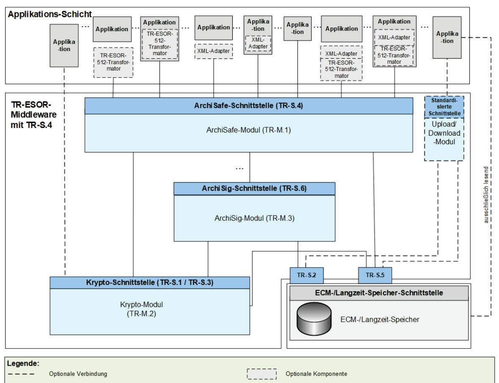
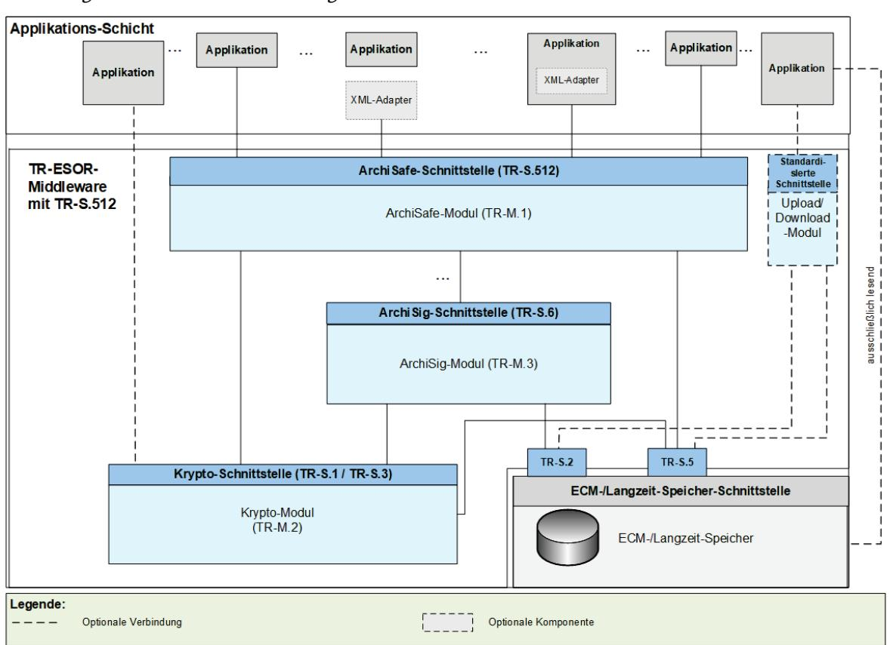
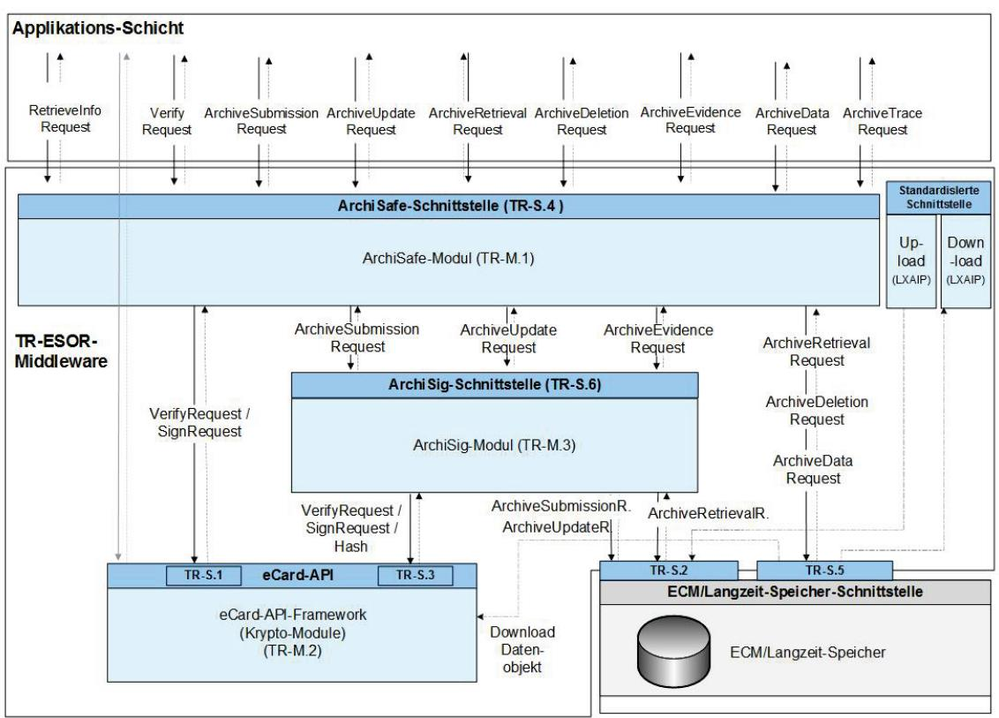
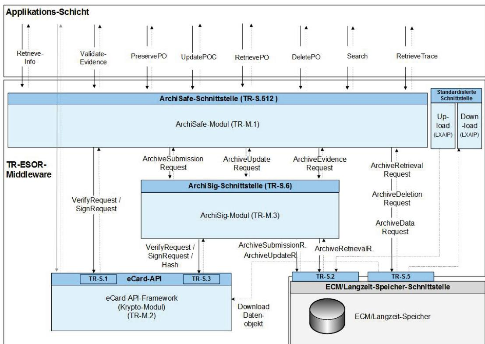
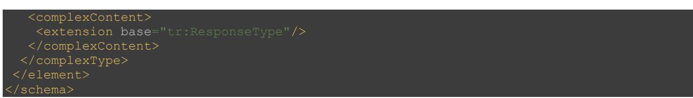

# BSI Technische Richtlinie 03125 Beweiswerterhaltung kryptographisch signierter Dokumente

## Anlage TR-ESOR-E: Konkretisierung der Schnittstellen auf Basis des eCard-API-Frameworks und ETSI TS 119 512

| Bezeichnung | Konkretisierung der Schnittstellen auf Basis des eCard-API-Frameworks                                             |
|-------------|-------------------------------------------------------------------------------------------------------------------|
| Kürzel      | BSI TR-ESOR-E                                                                                                     |
| Version     | 1.3 (auf Basis der eIDAS-Verordnung und der ETSI Preservation Standards mit einem<br>neuen Zertifizierungsschema) |
| Datum       | 31.03.2022                                                                                                        |

# Änderungshistorie

| Version | Datum      | Name | Beschreibung |
|---------|------------|------|--------------|
| 1.3     | 31.03.2022 | BSI  | TR-ESOR-E    |
|         |            |      |              |

<span id="page-1-0"></span>Tabelle 1: Änderungshistorie

> Bundesamt für Sicherheit in der Informationstechnik Postfach 20 03 63 53133 Bonn Tel.: +49 22899 9582-0 E-Mail: tresor@bsi.bund.de Internet[: https://www.bsi.bund.de](https://www.bsi.bund.de/) © Bundesamt für Sicherheit in der Informationstechnik 2022

| 1. |     | Einführung 6                                                                                                              |     |  |  |
|----|-----|---------------------------------------------------------------------------------------------------------------------------|-----|--|--|
| 2. |     | Überblick  9                                                                                                              |     |  |  |
| 3. |     | Funktionen der ArchiSafe-Schnittstelle (TR-S.4) 14                                                                        |     |  |  |
|    | 3.1 | Funktion: ArchiveSubmission14                                                                                             |     |  |  |
|    |     | 3.1.1<br>Eingabeparameter: ArchiveSubmissionRequest15                                                                     |     |  |  |
|    |     | 3.1.2<br>Ausgabeparameter: ArchiveSubmissionResponse18                                                                    |     |  |  |
|    | 3.2 | Funktion: ArchiveUpdate 20                                                                                                |     |  |  |
|    |     | 3.2.1<br>Eingabeparameter: ArchiveUpdateRequest20                                                                         |     |  |  |
|    |     | 3.2.2<br>Ausgabeparameter: ArchiveUpdateResponse21                                                                        |     |  |  |
|    | 3.3 | Funktion: ArchiveRetrieval22                                                                                              |     |  |  |
|    |     | 3.3.1<br>Eingabeparameter: ArchiveRetrievalRequest23                                                                      |     |  |  |
|    |     | 3.3.2<br>Ausgabeparameter: ArchiveRetrievalResponse25                                                                     |     |  |  |
|    | 3.4 | Funktion: ArchiveEvidence 27                                                                                              |     |  |  |
|    |     | 3.4.1<br>Eingabeparameter: ArchiveEvidenceRequest27                                                                       |     |  |  |
|    |     | 3.4.2<br>Ausgabeparameter: ArchiveEvidenceResponse 29                                                                     |     |  |  |
|    | 3.5 | Funktion: ArchiveDeletion 31                                                                                              |     |  |  |
|    |     | 3.5.1<br>Eingabeparameter: ArchiveDeletionRequest31                                                                       |     |  |  |
|    |     | 3.5.2<br>Ausgabeparameter: ArchiveDeletionResponse 32                                                                     |     |  |  |
|    | 3.6 | Funktion: ArchiveData32                                                                                                   |     |  |  |
|    |     | 3.6.1<br>Eingabeparameter: ArchiveDataRequest 33                                                                          |     |  |  |
|    |     | 3.6.2<br>Ausgabeparameter: ArchiveDataResponse35                                                                          |     |  |  |
|    | 3.7 | Funktion: Verify36                                                                                                        |     |  |  |
|    |     | 3.7.1<br>Eingabeparameter: VerifyRequest37                                                                                |     |  |  |
|    |     | 3.7.2<br>Ausgabeparameter: VerifyResponse40                                                                               |     |  |  |
|    | 3.8 | Funktion: RetrieveInfo 41                                                                                                 |     |  |  |
|    |     | 3.8.1<br>Eingabeparameter: RetrieveInfoRequest41                                                                          |     |  |  |
|    |     | 3.8.2<br>Ausgabeparameter: RetrieveInfoResponse 42                                                                        |     |  |  |
|    | 3.9 | Funktion: ArchiveTrace43                                                                                                  |     |  |  |
|    |     | 3.9.1<br>Eingabeparameter: ArchiveTraceRequest43                                                                          |     |  |  |
|    |     | 3.9.2<br>Ausgabeparameter: ArchiveTraceResponse44                                                                         |     |  |  |
| 4. |     | Funktionen der Preservation-API gemäß ETSI TS 119 512 in der Profilierung [TR-ESOR-TRANS]46                               |     |  |  |
|    | 4.1 | Vergleich der TR-S.512- mit der TR-S.4-Schnittstelle 46                                                                   |     |  |  |
| 5. |     | Funktionen der internen Schnittstellen48                                                                                  |     |  |  |
|    | 5.1 | TR-S.1 (ArchiSafe-Modul – Krypto-Modul)48                                                                                 |     |  |  |
|    |     | 5.1.1<br>Prüfung<br>von<br>digitalen<br>Signaturen,<br>beweisrelevanten<br>Daten,<br>Beweisdaten<br>Archivdatenobjekten48 | und |  |  |

|    | 5.1.2 | Anforderung einer digitalen Signatur48                                 |  |
|----|-------|------------------------------------------------------------------------|--|
|    | 5.2   | TR-S.2 (ArchiSig-Modul – ECM-/Langzeitspeichersystem) 50               |  |
|    | 5.2.1 | Speichern eines Archivdatenobjektes50                                  |  |
|    | 5.2.2 | Ergänzen einer neuen Version eines Archivdatenobjektes50               |  |
|    | 5.2.3 | Auslesen von Archivdatenobjekten50                                     |  |
|    | 5.3   | TR-S.3 (ArchiSig-Modul – Krypto-Modul)51                               |  |
|    | 5.3.1 | Anfordern eines (qualifizierten) Zeitstempels51                        |  |
|    | 5.3.2 | Prüfen eines (qualifizierten) Zeitstempels52                           |  |
|    | 5.3.3 | Berechnung eines Hashwertes54                                          |  |
|    | 5.4   | TR-S.5 (ArchiSafe-Modul / Krypto-Modul – ECM-Langzeitspeichersystem)56 |  |
|    | 5.4.1 | Abfrage beweiswerterhaltend archivierter Daten56                       |  |
|    | 5.4.2 | Löschen von Archivdatenobjekten57                                      |  |
|    | 5.4.3 | Abfrage diskreter Datenobjekte 57                                      |  |
|    | 5.5   | TR-ESOR-S.6 (ArchiSafe-Modul – ArchiSig-Modul) 57                      |  |
|    | 5.5.1 | Beweiswerterhaltende Archivierung elektronischer Daten57               |  |
|    | 5.5.2 | Ergänzen einer neuen Version eines Archivdatenobjektes57               |  |
|    | 5.5.3 | Rückgabe technischer Beweisdaten 57                                    |  |
| 6. |       | Upload/Download-Schnittstelle58                                        |  |
|    | 6.1   | Upload-Funktion58                                                      |  |
|    | 6.1.1 | Upload-Anfrage 58                                                      |  |
|    | 6.1.2 | Upload-Antwort58                                                       |  |
|    | 6.2   | Download-Funktion59                                                    |  |
|    | 6.2.1 | Download-Anfrage60                                                     |  |
|    | 6.2.2 | Download-Antwort60                                                     |  |
| 7. |       | Fehlercodes62                                                          |  |
| 8. |       | Spezifikation einer Webservice-basierten Schnittstelle65               |  |
|    | 8.1   | Spezifikation der Aufruf- und Rückgabeparameter als XML-Schema65       |  |
|    | 8.2   | WSDL-Spezifikation der Schnittstelle TR-S.470                          |  |
|    |       |                                                                        |  |

| Abbildung<br>1:<br>Schematische Darstellung der IT-Referenzarchitektur mit TR-S.4.<br>   | 7  |
|------------------------------------------------------------------------------------------|----|
| Abbildung<br>2:<br>Schematische Darstellung der IT-Referenzarchitektur mit TR-S.512.<br> | 7  |
| Abbildung 3:<br>Umsetzung der IT-Referenzarchitektur auf Basis des eCard-API-Frameworks  | 10 |
| Abbildung 4:<br>Umsetzung der IT-Referenzarchitektur auf Basis [ETSI TS 119 512].<br>    | 10 |

| Tabelle 1: Änderungshistorie 2   |  |
|----------------------------------|--|
| Tabelle 2: Bewahrungstechniken12 |  |

|  |  |  |  | Tabelle 3: Vergleich ETSI TS 119 512 (prof. [TR-ESOR-TRANS]) Preservation-API mit TR-ESOR-S.4- |  |  |
|--|--|--|--|------------------------------------------------------------------------------------------------|--|--|
|  |  |  |  | Schnittstelle47                                                                                |  |  |
|  |  |  |  | Tabelle 4: Zusätzliche Fehlercodes. 64                                                         |  |  |

# <span id="page-5-0"></span>1. Einführung

Ziel der Technischen Richtlinie "Beweiswerterhaltung kryptographisch signierter Dokumente" ist die Spezifikation sicherheitstechnischer Anforderungen für den langfristigen Beweiswerterhalt von kryptographisch signierten elektronischen Dokumenten und Daten nebst zugehörigen elektronischen Verwaltungsdaten (Metadaten).[1](#page-5-1)

Eine für diese Zwecke definierte Middleware (TR-ESOR-Middleware) im Sinn dieser Richtlinie umfasst alle diejenigen Module (M) und Schnittstellen (S), die zur Sicherung und zum Erhalt der Authentizität und zum Nachweis der Integrität der aufbewahrten Dokumente und Daten eingesetzt werden.

Die im Hauptdokument dieser Technischen Richtlinie vorgestellte Referenzarchitektur besteht aus den nachfolgend beschriebenen Schnittstellen, Funktionen und logischen Einheiten:

- der TR-S.4 oder TS119512-Eingangs-Schnittstelle TR-S.512 in der Profilierung [TR-ESOR-TRANS] der TR-ESOR-Middleware, die dazu dient, die TR-ESOR-Middleware in die bestehende IT- und Infrastrukturlandschaft einzubetten;
- dem "ArchiSafe-Modul" (vgl. [TR-ESOR-M.1]), welches den Informationsfluss in der Middleware regelt, die Sicherheitsanforderungen an die Schnittstellen zu den IT-Anwendungen umsetzt und für eine Entkopplung von Anwendungssystemen und ECM-/Langzeitspeicher sorgt;
- dem "Krypto-Modul" (vgl. [TR-ESOR-M.2]) nebst den zugehörigen Schnittstellen TR-S.1 und TR-S.3, das alle erforderlichen Funktionen zur Berechnung von Hashwerten, Prüfung elektronischer Signaturen bzw. Siegel bzw. Zeitstempel, zur Nachprüfung elektronischer Zertifikate und zum Einholen qualifizierter Zeitstempel sowie (optional) elektronischer Signaturen bzw. Siegel für die Middleware zur Verfügung stellt. Darüber hinaus kann es Funktionen zur Ver- und Entschlüsselung von Daten und Dokumenten zur Verfügung stellen;
- dem "ArchiSig-Modul" (vgl. [TR-ESOR-M.3]) mit der Schnittstelle TR-S.6, das die erforderlichen Funktionen für die Beweiswerterhaltung der digital signierten Unterlagen bereitstellt;
- einem ECM-/Langzeitspeicher mit den Schnittstellen TR-S.2 und TR-S.5, der die physische Archivierung/Aufbewahrung und auch das Speichern der beweiswerterhaltenden Zusatzdaten übernimmt.

Dieser ECM-/Langzeitspeicher ist nicht mehr direkt Teil der Technischen Richtlinie, gleichwohl werden über die beiden Schnittstellen, die noch Teil der TR-ESOR-Middleware sind, Anforderungen daran gestellt.

Ebenso wenig ist die Applikationsschicht, die auch einen XML-Adapter enthalten kann, direkter Teil der Technischen Richtlinie, auch wenn dieser XML-Adapter als Teil einer Middleware implementiert werden kann.

Die empfohlene IT-Referenzarchitektur ist in [Abbildung](#page-6-0) 1 und [Abbildung](#page-6-1) 2 dargestellt und besteht im Wesentlichen aus den in [TR-ESOR], Kap. 7 grob beschriebenen logischen Komponenten und Schnittstellen. Die Grafik zeigt zudem die externen Komponenten und Systeme an, die das Bild vervollständigen. Grundsätzlich wird als obere Schnittstelle der TR-ESOR-Middleware entweder die TR-S.4-Schnittstelle gemäß [TR-ESOR-E], die in [Abbildung](#page-6-0) 1 dargestellt ist, oder die TR-S.512-Schnittstelle gemäß [ETSI TS 119 512] in der Profilierung [TR-ESOR-TRANS], die i[n Abbildung](#page-6-1) 2 gezeigt wird, unterstützt.

<span id="page-5-1"></span> <sup>1</sup> Siehe Hinweis 1



<span id="page-6-0"></span>Abbildung 1: Schematische Darstellung der IT-Referenzarchitektur mit TR-S.4.



<span id="page-6-1"></span>Abbildung 2: Schematische Darstellung der IT-Referenzarchitektur mit TR-S.512.

Die in [Abbildung](#page-6-0) 1 bzw. [Abbildung](#page-6-1) 2 dargestellte IT-Referenzarchitektur orientiert sich an der ArchiSafe Referenzarchitektur und soll die logische (funktionale) Interoperabilität künftiger Produkte mit den Zielen und Anforderungen der Technischen Richtlinie ermöglichen und unterstützen.

Sofern der optionale XML-Adapter und/oder der optionale TR-ESOR-512-Transformator[2](#page-7-0) vorhanden sind, können beide in folgenden Ausprägungen vorliegen:

- Jeweils eigenständige Komponente mit Schnittstellen zur Applikation sowie zum ArchiSafe-Modul
- Jeweils eigenständige Komponente, jedoch Teil der Applikation mit Schnittstelle zum ArchiSafe-Modul
- XML-Adapter und TR-ESOR-512-Transformator als eine gemeinsame Komponente, die beide Teile enthält mit Schnittstellen zur Applikation sowie zum ArchiSafe-Modul
- XML-Adapter und TR-ESOR-512-Transformator als eine gemeinsame Komponente, die beide Teile enthält und Teil der Applikation ist, mit Schnittstelle zum ArchiSafe-Modul.

Der "ETSI TS119512 TR-ESOR Transformator" ermöglicht Bewahrungsdiensten gemäß [eIDAS-VO], empfangene ETSI TS119512 (V1.1.2) Nachrichten[3](#page-7-1) in TR-S4 Nachrichten zu transformieren. Diese Nachrichten können dann an ein angeschlossenen TR-ESOR-Syste[m4](#page-7-2) geschickt werden, ohne irgendwelche Änderungen dieses TR-ESOR-Systems.

Der Einsatz des TR-ESOR-512-Transformators wird EMPFOHLEN, sofern das TR-ESOR-Produkt mit einer TR-S.4-Schnittstelle in Europa zum Einsatz kommt und Interoperabilität mit europäischen (qualifizierten) Bewahrungsdiensten und Bewahrungsprodukten hergestellt werden soll.

Diese Technische Richtlinie ist modular aufgebaut und spezifiziert in einzelnen Anlagen zum Hauptdokument die funktionalen und sicherheitstechnischen Anforderungen an die erforderlichen IT-Komponenten und Schnittstellen der TR-ESOR-Middleware. Die Spezifikationen sind strikt plattform-, produkt-, und herstellerunabhängig.

Das vorliegende Dokument trägt die Bezeichnung "Anlage TR-ESOR-E" und konkretisiert die TR-ESORspezifischen Schnittstellen TR-S.4 auf Basis des in der [TR-03112] spezifizierten eCard-API-Frameworks sowie die TR-S.512-Schnittstelle auf Basis von [ETSI TS 119 512] in der Profilierung [TESOR-TRANS].

<span id="page-7-0"></span> <sup>2</sup> Sieh[e ETSI TS 119512 TR-ESOR Transformator unter einer Open Source Lizenz.](https://github.com/de-bund-bsi-tr-esor/tresor-ETSITS119512-transformator)

<span id="page-7-1"></span><sup>3</sup> In der Profilierung von [TR-ESOR-TRANS]

<span id="page-7-2"></span><sup>4</sup> Sieh[e https://www.bsi.bund.de/EN/tr-esor](https://www.bsi.bund.de/EN/tr-esor) oder [https://www.bsi.bund.de/DE/tr-esor.](https://www.bsi.bund.de/DE/tr-esor)

# <span id="page-8-0"></span>2. Überblick

(Α2.0−1) Als ArchiSafe-Schnittstelle muss entweder die nachfolgend spezifizierte TR-S.4-Schnittstelle implementiert sein oder die TR-S.512-Schnittstelle gemäß [ETSI TS 119 512] in der Profilierung [TR-ESOR-TRANS].

(Α2.0−2) Falls die TR-S.4-Schnittstelle unterstützt wird, dann müssen die im Folgenden näher aufgeführten Funktionen mit den hier beschriebenen Parameterkonstellationen unterstützt werden:

- ArchiveSubmission (siehe Abs. [3.1\)](#page-13-1)
- ArchiveUpdate (siehe Abs. [3.2\)](#page-19-0)
- ArchiveRetrieval (siehe Abs. [3.3\)](#page-21-1)
- ArchiveEvidence (siehe Abs. [3.4\)](#page-26-0)
- ArchiveDeletion (siehe Abs. [3.5\)](#page-30-0)
- Verify (siehe Abs. [3.7\)](#page-35-0)
- RetrieveInfo (siehe Abs. [3.8\)](#page-40-0).

Falls die TR-S.4-Schnittstelle unterstützt wird, dann sollen in der Schnittstelle TR-S.4 die folgenden im vorliegenden Dokument näher aufgeführten Funktionen mit den hier beschriebenen Parameterkonstellationen unterstützt werden:

- ArchiveData (siehe Abs. [3.6\)](#page-31-1)
- ArchiveTrace (siehe Abs. [3.9\)](#page-42-0)
- (Α2.0−3) Falls die TR-S.512-Schnittstelle unterstützt wird, dann müssen die im Folgenden näher aufgeführten Funktionen mit den in [ETSI TS 119 512] in der Profilierung [TR-ESOR-TRANS] beschriebenen Parameterkonstellationen unterstützt werden:
	- PreservePO (siehe [TR-ESOR-TRANS], Abs. 3.2)
	- UpdatePOC (siehe [TR-ESOR-TRANS], Abs. 3.3)
	- RetrievePO (siehe [TR-ESOR-TRANS], Abs. 3.4)
	- DeletePO (siehe [TR-ESOR-TRANS], Abs. 3.5)
	- ValidateEvidence (siehe [TR-ESOR-TRANS], Abs. 3.6)
	- RetrieveInfo (siehe [TR-ESOR-TRANS], Abs. 3.1).

Falls die TR-S.512-Schnittstelle unterstützt wird, dann sollen in der Schnittstelle TR-S.512 die folgenden im vorliegenden Dokument näher aufgeführten Funktionen mit den dort beschriebenen Parameterkonstellationen unterstützt werden:

- Search (siehe [TR-ESOR-TRANS], Abs. 3.7)
- RetrieveTrace (siehe [ETSI TS 119 512] Abs. 5.3.7).

<span id="page-9-2"></span>

<span id="page-9-0"></span>Abbildung 3: Umsetzung der IT-Referenzarchitektur auf Basis des eCard-API-Frameworks.



<span id="page-9-1"></span>Abbildung 4: Umsetzung der IT-Referenzarchitektur auf Basis [ETSI TS 119 512].

Wie in [Abbildung](#page-6-0) 1 und [Abbildung](#page-9-2) 3 angedeutet, werden bei der vollständigen Umsetzung der IT-Referenzarchitektur auf Basis des eCard-API-Frameworks

1. die Schnittstellen des Krypto-Moduls gemäß des eCard-API-Frameworks (Technische Richtlinie des [TR-03112]) realisiert undauch die Schnittstellen des ArchiSafe-, ArchiSig-Modul und ECM-

/Langzeitspeichers nutzen die gleichen grundlegenden Schnittstellentypen (dss:RequestBaseType und dss:ResponseBaseType) aus [OASIS-DSS], die auch bei den Signatur- und Verschlüsselungsfunktionen aus [eCard-2] genutzt werden.

Die URI-Fehlercodes in den Rückgaben der nicht bereits in der Technischen Richtlinie des [TR-03112] definierten Funktionen haben das Präfi[x http://www.bsi.bund.de/tr-esor/api/1.3](http://www.bsi.bund.de/tr-esor/api/1.3),welches um entsprechende Bezeichner ergänzt wird. Dieser Namensraum ist in den visualisierten XML-Strukturen am Kürzel "tr" erkennbar.

Im Fall der [Abbildung](#page-6-1) 2 und [Abbildung](#page-9-1) 4 wird die obere Schnittstelle gemäß [ETSI TS 119 512], Kap. 5 auf Basis von [OASIS DSS-X], Core 2.0 realisiert.

Falls die in diesem Dokument beschriebenen Schnittstellen und Funktionen asynchron genutzt werden sollen, kann dies unter Verwendung der hierfür vorgesehenen Mechanismen aus [OASIS-Async] realisiert werden.

In den folgenden Abschnitten findet sich eine XML-basierte Spezifikation der Funktionen zur Beweiswerterhaltung kryptographisch signierter Dokumente. Hierbei werden die Funktionen der ArchiSafe-Schnittstelle (TR-S.4) in Abschnitt [3](#page-13-0) und der TR-S.512-Schnittstelle in Abschnitt [4](#page-45-0) spezifiziert. In Abschnitt [5](#page-47-0) findet sich eine Beschreibung der internen Schnittstellen der TR-ESOR-Middleware, die auf die vorherige Spezifikation der Funktionen in Abschnitt [3](#page-13-0) Bezug nimmt. In Abschnitt [6](#page-57-0) sind die verwendeten Fehlercodes zusammengefasst und näher erläutert und in Abschnitt [7](#page-64-0) finden sich schließlich die normativen XML-Schema- und WSDL-Spezifikationen für die in Abschnitt [3](#page-13-0) spezifizierte ArchiSafe-Schnittstelle (TR-S.4).

### HINWEIS 1

In der vorliegenden TR-ESOR-Version1.3 werden die drei Begriffe "(beweiswerterhaltende) Langzeitspeicherung", "(beweiswerterhaltende) Bewahrung" und "(beweiswerterhaltende) Archivierung" synonym verwendet. Ebenso werden die drei Begriffe "Archivinformationspaket (AIP)", "Archivinformationscontainer" und "Archivdatenobjekt" sowie die Begriffe "aufbewahren" und "archivieren" synonym verwendet. 

### HINWEIS 2

TR-ESOR spezifiziert ein Bewahrungsprodukt (engl. Preservation Product) gemäß [ETSI SR 019 510], [ETSI TS 119511] und [ETSI TS 119512] und [eIDAS-VO]. 

Die TR 03125 TR-ESOR ist in [ETSI SR 019510] in dem Kapitel 4.7.3 und 5.2 und B3.2 beschrieben. Die in TR-ESOR erforderlichen grundlegenden Bewahrungstechniken, z. B. das Bewahrungsprotokoll, das Beweisdaten-Format Evidence Record, die Archivdatenobjekt-Format (L)XAIP und ASiC-AIP sind in der ETSI-Publikation [ETSI TS 119512] als normative Elemente enthalten.

### HINWEIS 3

Die obere TR-ESOR-Eingangs-Schnittstelle TR-S.4 oder die TS119512-Eingangsschnittstelle TR-S.512 gemäß der "Preservation-API" in [ETSI TS 119 512] in der Profilierung von [TR-ESOR-TRANS], die logisch äquivalent zur Eingangsschnittstelle S.4 gemäß [TR-ESOR-E] ist wie in der Tabelle 2 in [TR-ESOR-E], Kapitel 4.1 dargestellt, muss benutzt werden. Eine andere Eingangs-Schnittstelle anstelle von TR-S.4 bzw. TR-S.512 ist nicht erlaubt (vgl. A7.1-1 in [TR-ESOR]).

#### HINWEIS 4

In der vorliegenden TR-ESOR-Version 1.3 umfasst der Begriff "Archivinformationscontainer" (AIP) in allen TR-ESOR-Anhängen:

a) das Archivdatenobjekt "XAIP" gem. [TR-ESOR-F], Kap. 3.1 als auch 

b) das logische XAIP "LXAIP" gem. [TR-ESOR V1.3], Kap. 3.2 und 

c) das "ASiC-AIP" gem. [TR-ESOR-F], Kap. 3.3 auf Basis von [ETSI EN 319162-1].

In TR-ESOR Version V1.3 wird zwischen XAIP, LXAIP und ASiC-AIP differenziert.

Mit (L)XAIP wird XAIP oder LXAIP bezeichnet.

#### HINWEIS 5

<span id="page-11-1"></span>In dieser TR-ESOR Version 1.3 ist "BIN" beschränkt auf die folgenden Bewahrungsobjekt-Formate (engl. preservation object formats):

- CAdES gemäß [ETSI TS 119 512], Annex A.1.1 [\(http://uri.etsi.org/ades/CAdES\)](http://uri.etsi.org/ades/CAdES). Sofern kein MIME Type gesetzt ist, wird als Default application/cms verwendet;
- XAdES gemäß [ETSI TS 119 512], Annex A.1.2 [\(http://uri.etsi.org/ades/XAdES\)](http://uri.etsi.org/ades/XAdES). Sofern kein MIME Type gesetzt ist, wird als Default application/xml verwendet;
- PAdES gemäß [ETSI TS 119 512], Annex A.1.3 [\(http://uri.etsi.org/ades/PAdES\)](http://uri.etsi.org/ades/PAdES). Sofern kein MIME Type gesetzt ist, wird als Default application/pdf verwendet;
- ASiC-E gemäß [ETSI TS 119 512], Annex A.1.4 [\(http://uri.etsi.org/ades/ASiC/type/ASiC-E\)](http://uri.etsi.org/ades/ASiC/type/ASiC-E). Sofern kein MIME Type gesetzt ist, wird als Default application/vnd.etsi.asic-e+zip verwendet;
- ASiC-S gemäß [ETSI EN 319 162] [\(http://uri.etsi.org/ades/ASiC/type/ASiC-S\)](http://uri.etsi.org/ades/ASiC/type/ASiC-S). Sofern kein MIME Type gesetzt ist, wird als Default application/vnd.etsi.asic-s+zip verwendet.
- DigestList gemäß [ETSI TS 119 512], Annex A.1.6 [\(http://uri.etsi.org/19512/format/DigestList\)](http://uri.etsi.org/19512/format/DigestList). Sofern kein MIME Type gesetzt ist, wird als Default application/xml verwendet;
- ASiC-ERS (in TR-ESOR v1.3 mit ASiC-AIP bezeichnet) gemäß [TR-ESOR-F], Kapitel 3.3 und gemäß [ETSI TS 119 512], Annex A.3.1 [\(http://uri.etsi.org/ades/ASiC/type/ASiC-ERS\)](http://uri.etsi.org/ades/ASiC/type/ASiC-ERS).

Im Falle Upload/Download-Funktion ist zusätzlich nachfolgendes Format erlaubt:

- Binärdaten (BIN) als "Octet Stream", die ausschließlich in den ECM-/Langzeitspeicher mit "Upload-Request" gespeichert werden, – aber nur sofern:

a) verbunden mit einem korrespondierenden LXAIP und dort referenziert gem. [TR-ESOR-F], Kap. 3.2, b) ggf. mit "Download-Request" ausgelesen werden, – verbunden mit einem korrespondierenden LXAIP, das mit der "ArchiveRetrieval"-Funktion ausgelesen wurde,– oder eingebettet in einem XAIP und ausgelesen mit der"ArchivRetrieval"-Funktion.

c) Der Upload von XAIP oder LXAIP oder ASiC-AIP ist nicht zugelassen.

#### HINWEIS 6

TR-ESOR spezifiziert ein Bewahrungsprodukt (engl. Preservation Product) gemäß [ETSI SR 019 510], [ETSI TS 119 511] und [ETSI TS 119 512] und [eIDAS-VO].

Die TR 03125 TR-ESOR ist in [ETSI SR 019 510] in dem Kapitel 4.7.3 und 5.2 und B3.2 beschrieben. Die in TR-ESOR erforderlichen grundlegenden Bewahrungstechniken, z.B. das Bewahrungsprotokoll, das Beweisdaten-Format Evidence Record, die Archivdatenobjekt-Format (L)XAIP und ASiC-AIP sind in der ETSI-Publikation [ETSI TS 119 512] als normative Elemente enthalten, (siehe Tabelle darunter): 

<span id="page-11-0"></span>Tabelle 2: Bewahrungstechniken

| Bewahrungstechnik             | ETSI TS | Verbindlichkeitsgra | TR-ESOR          | Verbindlichkeitsgra |
|-------------------------------|---------|---------------------|------------------|---------------------|
|                               | 119 512 | d                   | Dokument         | d                   |
|                               |         | N=normativ          |                  | N=normativ          |
|                               |         | O=optional          |                  | O=optional          |
|                               |         | C=conditional       |                  | C=conditional       |
| Bewahrungsprotokoll           | Kapitel | N                   | [TR-ESOR-E],     | C                   |
| ("Preservation<br>Protocol"): | 5.3     |                     | Kap. 4           | Auswahl:            |
| TR-S.512                      |         |                     |                  | TR-S.512            |
| Beweisdaten-Format            | A.2.2   | N                   | [TR-ESOR-F],     | N                   |
| ("Preservation<br>Evidence    | bzw.    |                     | Kap. 5.5,        |                     |
| Format"): Evidence Record     | A2.3    |                     | [TR-ESOR         |                     |
|                               |         |                     | ERS]             |                     |
| Archivdatenobjekt-Format      | A.1.5   | N                   | [TR-ESOR-F],     | N                   |
| "…Data<br>Object<br>Format"   | und     |                     | Kap. 3.1 und 3.2 |                     |
| XAIP                          | A.3.2   |                     |                  |                     |

| Bewahrungstechnik           | ETSI TS | Verbindlichkeitsgra | TR-ESOR          | Verbindlichkeitsgra |
|-----------------------------|---------|---------------------|------------------|---------------------|
|                             | 119 512 | d                   | Dokument         | d                   |
|                             |         | N=normativ          |                  | N=normativ          |
|                             |         | O=optional          |                  | O=optional          |
|                             |         | C=conditional       |                  | C=conditional       |
| Archivdatenobjekt-Format    | A.1.5   | N                   | [TR-ESOR-F],     | C                   |
| "…Data<br>Object<br>Format" | und     |                     | Kap. 3.1 und 3.2 |                     |
| LXAIP                       | A.3.2   |                     |                  |                     |
| Archivdatenobjekt-Format    | A.1.4   | N                   | [TR-ESOR-F],     | C                   |
| "…Data<br>Object<br>Format" | und     |                     | Kap. 3.3         |                     |
| ASiC-E/ASiC-ERS             | A.3.1   |                     |                  |                     |
| Versionierung<br>von        | E       | C                   | [TR-ESOR-E],     | N                   |
| Archivinformationspaketen   |         |                     | Kap. 3.2         |                     |
| ("Preservation<br>Object    |         |                     | [TR-ESOR-F],     |                     |
| Container")                 |         |                     | Kap. 3.1.6 und   |                     |
|                             |         |                     | 3.2.2            |                     |

#### HINWEIS 7.

Im folgenden Text umfasst der Begriff "Digitale Signatur":

- "fortgeschrittene elektronische Signaturen" gemäß [eIDAS-VO], Artikel 3 Nr. 11,
- "qualifizierte elektronische Signaturen" gemäß [eIDAS-VO], Artikel 3 Nr. 12,
- "fortgeschrittenen elektronische Siegel" gemäß [eIDAS-VO], Artikel 3 Nr. 26 und

- "qualifizierte elektronische Siegel" gemäß [eIDAS-VO], Artikel 3 Nr. 27. Insofern umfasst der Begriff "digital signierte Dokumente" sowohl solche, die fortgeschrittene elektronische Signaturen oder Siegel bzw. qualifizierte elektronische Signaturen oder Siegel tragen. 

Mit dem Begriff der "kryptographisch signierten Dokumente" sind in dieser TR neben:

- den gemäß [eIDAS-VO], Artikel 3 Nr. 12 qualifiziert signierten,
- den gemäß [eIDAS-VO], Artikel 3 Nr. 27 qualifiziert gesiegelten oder
- den gemäß [eIDAS-VO], Artikel 3 Nr. 34 qualifiziert zeitgestempelten Dokumenten (im Sinne der eIDAS-Verordnung)

#### auch

- Dokumente mit einer fortgeschrittenen Signatur gemäß [eIDAS-VO], Artikel 3 Nr. 11 oder
- mit einem fortgeschrittenen Siegel gemäß [eIDAS-VO], Artikel 3 Nr. 26 oder
- mit einem elektronischen Zeitstempel gemäß [eIDAS-VO], Artikel 3 Nr. 33 erfasst,

wie sie oft in der internen Kommunikation von Behörden entstehen. 

Nicht gemeint sind hier Dokumente mit einfachen Signaturen oder Siegeln basierend auf anderen (z. B. nichtkryptographischen) Verfahren.

# <span id="page-13-0"></span>3. Funktionen der ArchiSafe-Schnittstelle (TR-S.4)

In diesem Abschnitt findet sich eine XML-basierte Spezifikation der Funktionen und deren Eingabe- und Ausgabeparameter der TR-ESOR-Middleware an der ArchiSafe-Schnittstelle TR-S.4:

- Funktion ArchiveSubmission mit den Parametern ArchiveSubmissionRequest und ArchiveSubmissionResponse (siehe Abs[. 3.1\)](#page-13-1)
- Funktion ArchiveUpdate mit den Parametern ArchiveUpdateRequest und ArchiveUpdateResponse (siehe Abs. [3.2\)](#page-19-0)
- Funktion ArchiveRetrieval mit den Parametern ArchiveRetrievalRequest und ArchiveRetrievalResponse (siehe Abs[. 3.3\)](#page-21-1)
- Funktion ArchiveEvidence mit den Parametern ArchiveEvidenceRequest und ArchiveEvidenceResponse (siehe Abs. [3.4\)](#page-26-0)
- Funktion ArchiveDelete mit den Parametern ArchiveDeletionRequest und ArchiveDeletionResponse (siehe Abs. [3.5\)](#page-30-0)
- Funktion ArchiveData mit den Parametern ArchiveDataRequest und ArchiveDataResponse (siehe Abs[. 3.6\)](#page-31-1)
- Funktion Verify mit den Parametern VerifyRequest und VerifyResponse (siehe Abs. [3.7\)](#page-35-0)
- Funktion RetrieveInfo mit den Parametern RetrieveInfoRequest und RetrieveInfoResponse (siehe Abs[. 3.8\)](#page-40-0)
- Funktion ArchiveTrace mit den Parametern ArchiveTraceRequest und ArchiveTraceResponse (siehe Abs[. 3.9\)](#page-42-0)

Die graphische Darstellung der Schnittstellen in diesem Kapitel wurde - analog zur Spezifikation des eCard-API-Frameworks (siehe z. B. [eCard-2]) - mit einem XML-Viewer erstellt und dient lediglich der Veranschaulichung der XML-Strukturen. Die normative Spezifikation der Schnittstellen ist durch das XML-Schema bzw. die darauf aufbauende WSDL-Spezifikation (siehe Abs. [7\)](#page-64-0) gegeben.

## <span id="page-13-1"></span>3.1 Funktion: ArchiveSubmission

Mit dem Funktionsparameter ArchiveSubmissionRequest wird dem aufgerufenen Modul ein Archivdatenobjekt zur Ablage übergeben und das aufrufende Modul erhält im Erfolgsfall in dem Ausgabeparameter ArchiveSubmissionResponse eine AOID zurück, mit der später wieder auf das archivierte Objekt oder die zugehörigen technischen Beweisdaten zugegriffen werden kann. Hierbei kann im xaip:XAIP-Element entweder ein physisches XAIP (siehe Abs. 3.1 in [TR-ESOR-F]) oder ein logisches XAIP (LXAIP) (siehe Abs. 3.2 in [TR-ESOR-F]) übergeben werden. Alternativ können im ArchiveData-Element binäre Nutzdaten übergeben werden. Hierbei wird der Typ des übergebenen Datenobjektes durch das Type-Attribut näher bestimmt. Dabei kann insbesondere ein base64Binary-codierter[5](#page-13-2) ASiC-AIP-Container gemäß Abs. 3.3 in [TR-ESOR-F] mit einem Type[=http://uri.etsi.org/ades/ASiC/type/ASiC-ERS](http://uri.etsi.org/ades/ASiC/type/ASiC-ERS) Attribut übergeben werden.

Wie in [Abbildung](#page-9-2) 3 oder [Abbildung](#page-9-1) 4 ersichtlich, wird diese Funktion neben der hier betrachteten Schnittstelle TR-S.4 auch in den Schnittstellen TR-S.2 (vgl. Abs. [5.2\)](#page-49-0) und TR-S.6 (vgl. Abs. [5.5\)](#page-56-0) genutzt.

<span id="page-13-2"></span><sup>5</sup> Sieh[e https://www.w3.org/TR/xmlschema-2/#base64Binary.](https://www.w3.org/TR/xmlschema-2/#base64Binary)

### <span id="page-14-0"></span>3.1.1 Eingabeparameter: ArchiveSubmissionRequest

| Name         | ArchiveSubmissionRequest                                                                                                                                                                                                                                                                                                                                                                                                                                             |                                                                          |  |  |
|--------------|----------------------------------------------------------------------------------------------------------------------------------------------------------------------------------------------------------------------------------------------------------------------------------------------------------------------------------------------------------------------------------------------------------------------------------------------------------------------|--------------------------------------------------------------------------|--|--|
| Beschreibung | Durch den Aufruf der Funktion ArchiveSubmission mit dem Eingabeparameter<br>ArchiveSubmissionRequest wird dem aufgerufenen Modul ein oder mehrere<br>ArchiveData-Element(e) oder ein Archivinformationspaket (XAIP, LXAIP, ASiC<br>AIP) übergeben.<br>Hierbei kann für eine effiziente Übertragung von großen Binärdaten der<br>optimierte<br>Nachrichtenübertragungsmechanismus<br>"SOAP<br>Message<br>Transmission Optimization Mechanism (MTOM)"6 genutzt werden. |                                                                          |  |  |
| Details      | und kann wie folgt parametrisiert werden.                                                                                                                                                                                                                                                                                                                                                                                                                            | Der Eingabeparameter ArchiveSubmissionRequest weist folgenden Aufbau auf |  |  |
|              | Name                                                                                                                                                                                                                                                                                                                                                                                                                                                                 | Beschreibung                                                             |  |  |

<span id="page-14-1"></span><sup>6</sup> Sieh[e https://www.w3.org/TR/soap12-mtom/](https://www.w3.org/TR/soap12-mtom/) .

<span id="page-15-0"></span>

| Name | ArchiveSubmissionRequest |                                                                                                                                                                                                                                                                                                                                            |  |  |  |
|------|--------------------------|--------------------------------------------------------------------------------------------------------------------------------------------------------------------------------------------------------------------------------------------------------------------------------------------------------------------------------------------|--|--|--|
|      | dss:OptionalInputs       | Ist für optionale Eingabeelemente vorgesehen.<br>(A3.1.1-1)<br>:<br>Gemäß<br>der<br>vorliegenden<br>Spezifikation<br>sollen<br>folgende<br>Elemente<br>unterstützt werden:<br>•<br>xaip:AOID,<br>•<br>vr:ReturnVerificationReport,<br>•<br>ImportEvidence.<br>Dabei gilt:<br>•<br>xaip:AOID                                                |  |  |  |
|      |                          | Durch die Übergabe eines xaip:AOID-Elementes<br>kann<br>die<br>AOID<br>von<br>der<br>aufrufenden<br>Anwendung vergeben werden. Im Regelfall fehlt<br>dieses<br>Element<br>und<br>die<br>AOID<br>wird<br>vom<br>aufgerufenen Modul bereitgestellt.<br>•<br>vr:ReturnVerificationReport                                                      |  |  |  |
|      |                          |                                                                                                                                                                                                                                                                                                                                            |  |  |  |
|      |                          | Durch<br>die<br>Übergabe<br>eines<br>ReturnVerificationReport-Elementes gemäß<br>[OASIS<br>VR]<br>bzw.<br>[eCard-2]<br>kann<br>ein<br>ausführlicher<br>Prüfbericht<br>in<br>Form<br>eines<br>VerificationReport-Elementes<br>für<br>die<br>im<br>XAIP-Element<br>oder<br>im<br>unten<br>genannten<br>ImportEvidence-Element<br>enthaltenen |  |  |  |
|      |                          | Signatur- bzw. Siegel- bzw. Zeitstempelobjekte<br>oder<br>Beweisdaten<br>angefordert<br>werden.<br>Bei<br>einem übergebenen xaip:XAIP-Element wird<br>im Details-Element des IndividualReport<br>Elementes des zurückgelieferten Prüfberichts<br>(vgl. Abs. 3.3 in [OASIS VR]) ein XAIPReport                                              |  |  |  |
|      |                          | Element gemäß [TR-ESOR-VR] zurückgeliefert.<br>Sofern<br>kein<br>sondern<br>ein<br>xaip:XAIP<br>ArchiveData-Element<br>und<br>im<br>ImportEvidence-Element<br>(siehe<br>unten)<br>ein<br>Evidence Record übergeben wird, wird für jeden<br>übergebenen<br>Evidence<br>Record<br>ein<br>gem.<br>[TR-ESOR-VR]<br>EvidenceRecordReport        |  |  |  |
|      |                          | zurückgeliefert.                                                                                                                                                                                                                                                                                                                           |  |  |  |

| Name |             | ArchiveSubmissionRequest                                                                                                                                                                                                                                                                                                                                                                                                                                                                                                                                                                                                                                                       |  |  |  |
|------|-------------|--------------------------------------------------------------------------------------------------------------------------------------------------------------------------------------------------------------------------------------------------------------------------------------------------------------------------------------------------------------------------------------------------------------------------------------------------------------------------------------------------------------------------------------------------------------------------------------------------------------------------------------------------------------------------------|--|--|--|
|      |             | •<br>tr:ImportEvidence                                                                                                                                                                                                                                                                                                                                                                                                                                                                                                                                                                                                                                                         |  |  |  |
|      |             |                                                                                                                                                                                                                                                                                                                                                                                                                                                                                                                                                                                                                                                                                |  |  |  |
|      |             | Mit<br>der<br>Übergabe<br>des<br>dargestellten<br>ImportEvidence-Elementes kann<br>der Import                                                                                                                                                                                                                                                                                                                                                                                                                                                                                                                                                                                  |  |  |  |
|      |             | von einem oder mehreren zu einer bestimmten                                                                                                                                                                                                                                                                                                                                                                                                                                                                                                                                                                                                                                    |  |  |  |
|      |             | XAIP-<br>bzw.<br>LXAIP-Version<br>bzw.<br>zu<br>den                                                                                                                                                                                                                                                                                                                                                                                                                                                                                                                                                                                                                            |  |  |  |
|      |             | übergebenen Binärdaten gehörenden Evidence<br>Records gemäß [RFC4998]<br>oder [RFC6283]7<br>oder [TR-ESOR-ERS] angestoßen werden. Die<br>Struktur des xaip:evidenceRecord-Elementes<br>ist in [TR-ESOR-F]<br>erläutert. Um Evidence<br>Records für mehrere Versionen eines XAIPs oder<br>LXAIPs importieren zu können, kann<br>dieses<br>Element<br>mehrmals<br>auftreten.<br>Das<br>xaip:evidenceRecord-Element muss hier die<br>Attribute AOID und VersionID enthalten.<br>Sofern die zu importierenden Evidence Records                                                                                                                                                     |  |  |  |
|      |             | bereits im XAIP bzw. LXAIP enthalten sind, wird<br>statt<br>des<br>Evidence<br>Records<br>hier<br>die                                                                                                                                                                                                                                                                                                                                                                                                                                                                                                                                                                          |  |  |  |
|      | xaip:XAIP   | entsprechende CredentialID übergeben.<br>(A3.1.1-2) : Im Zuge des Imports von Evidence<br>Records müssen diese von der TR-ESOR<br>Middleware<br>vollständig<br>geprüft<br>werden.<br>Dies umfasst die im entsprechenden ERS<br>Standard<br>vorgesehenen<br>Prüfungungsschritte8<br>, wobei die jeweiligen<br>Zertifikate der Zeitstempel vollständig bis<br>hin zu einer vertrauenswürdigen Wurzel<br>oder Vertrauensanker gemäß der vom [TR<br>ESOR-PEPT]<br>abgeleiteten<br>und<br>veröffentlichten Preservation Policy (PEP)<br>des<br>TR-ESOR-Produktes<br>bzw.<br>Bewahrungsdienstes<br>geprüft<br>werden<br>müssen.<br>Enthält ein XML-basiertes Archivdatenobjekt gemäß |  |  |  |
|      |             | [TR-ESOR-F],<br>das<br>durch<br>den<br>Aufruf<br>der                                                                                                                                                                                                                                                                                                                                                                                                                                                                                                                                                                                                                           |  |  |  |
|      |             | beweiswerterhaltenden<br>Archivierung<br>zugeführt                                                                                                                                                                                                                                                                                                                                                                                                                                                                                                                                                                                                                             |  |  |  |
|      |             | werden soll.                                                                                                                                                                                                                                                                                                                                                                                                                                                                                                                                                                                                                                                                   |  |  |  |
|      |             | Hierbei kann es sich entweder ein XAIP (siehe                                                                                                                                                                                                                                                                                                                                                                                                                                                                                                                                                                                                                                  |  |  |  |
|      |             | Abs. 3.1 in [TR-ESOR-F]) oder ein LXAIP (siehe                                                                                                                                                                                                                                                                                                                                                                                                                                                                                                                                                                                                                                 |  |  |  |
|      |             | Abs. 3.2 in [TR-ESOR-F]) handeln.<br>Enthält ein in einem beliebigen anderen Format                                                                                                                                                                                                                                                                                                                                                                                                                                                                                                                                                                                            |  |  |  |
|      | ArchiveData | vorliegendes<br>Archivdatenobjekt.<br>Der<br>hierfür                                                                                                                                                                                                                                                                                                                                                                                                                                                                                                                                                                                                                           |  |  |  |

<span id="page-16-0"></span> 7 [RFC4998] muss, [RFC6283] und [TR-ESOR-ERS] können unterstützt werden.

<span id="page-16-1"></span>8 Siehe Abschnitt 3.3 in [RFC4998] und Abschnitt 2.3 in [RFC6283] sowie [TR-ESOR-ERS].

| Name | ArchiveSubmissionRequest                                   |
|------|------------------------------------------------------------|
|      | genutzte ArchiveDataType<br>ist als anyType<br>mit         |
|      | einem optionalen Type-Attribut definiert.                  |
|      | Durch das Type-Attribut                                    |
|      | http://uri.etsi.org/ades/ASiC/type/ASiC-ERS                |
|      | wird<br>klargestellt,<br>dass<br>es<br>sich<br>um<br>einen |
|      | base64Binary-codierten9<br>ASiC-AIP-Container              |
|      | gemäß Abs. 3.3 in [TR-ESOR-F] handelt.                     |
|      | Darüber hinaus zugelassene binäre Datentypen mit           |
|      | dem zugehörigen Wert für das Type-Attribut sind            |
|      | dem HINWEIS 5 zu entnehmen.                                |
|      | Weitere Übergabetypen können im Rahmen einer               |
|      | Profilierung<br>der<br>vorliegenden<br>Spezifikation       |
|      | spezifiziert werden.                                       |

### <span id="page-17-0"></span>3.1.2 Ausgabeparameter: ArchiveSubmissionResponse

| Name         |                                                                                                                                                       | ArchiveSubmissionResponse                                             |  |
|--------------|-------------------------------------------------------------------------------------------------------------------------------------------------------|-----------------------------------------------------------------------|--|
| Beschreibung | Als Antwort auf einen ArchiveSubmissionRequest wird ein entsprechendes<br>ArchiveSubmissionResponse-Element zurückgeliefert, das im Erfolgsfall einen |                                                                       |  |
|              |                                                                                                                                                       | eindeutigen Identifikator des Archivdatenobjektes, die AOID, enthält. |  |
| Details      | Der Ausgabeparameter<br>ArchiveSubmissionResponse ist die Antwort zum                                                                                 |                                                                       |  |
|              |                                                                                                                                                       | Eingabeparameter ArchiveSubmissionRequest und weist folgenden Aufbau  |  |
|              |                                                                                                                                                       |                                                                       |  |
|              | Name                                                                                                                                                  | Beschreibung                                                          |  |
|              | dss:Result                                                                                                                                            | Enthält die Statusinformationen und die Fehler zu                     |  |
|              |                                                                                                                                                       | einer durchgeführten Aktion. Die Struktur dieses                      |  |
|              |                                                                                                                                                       | Elements<br>ist<br>in<br>[eCard-1]<br>und<br>unten<br>näher           |  |
|              |                                                                                                                                                       | beschrieben.                                                          |  |

<span id="page-17-1"></span><sup>9</sup> Sieh[e https://www.w3.org/TR/xmlschema-2/#base64Binary](https://www.w3.org/TR/xmlschema-2/#base64Binary) .

| Name | ArchiveSubmissionResponse  |                 |                                                                           |
|------|----------------------------|-----------------|---------------------------------------------------------------------------|
|      | dss:OptionalOutputs        |                 | Ist für optionale Ausgabeelemente vorgesehen.                             |
|      |                            |                 | (A3.1.2-1) Gemäß<br>der<br>vorliegenden                                   |
|      |                            |                 | Spezifikation kann das folgende Element                                   |
|      |                            |                 | auftreten:                                                                |
|      |                            |                 | •<br>VerificationReport gemäß [OASIS VR] bzw.                             |
|      |                            |                 | [eCard-2]<br>und<br>[TR-ESOR-VR],<br>der                                  |
|      |                            |                 | zurückgeliefert werden muss, sofern er explizit                           |
|      |                            |                 | angefordert wurde oder bei der Prüfung der                                |
|      |                            |                 | übergebenen Daten ein Fehler oder eine                                    |
|      |                            |                 | Warnung aufgetreten ist und deshalb als                                   |
|      |                            |                 | ein<br>Fehlercode<br>ResultMajor                                          |
|      |                            |                 | /resultmajor#error oder /resultmajor#warning                              |
|      |                            |                 | zurückgeliefert wird.                                                     |
|      |                            |                 |                                                                           |
|      | AOID                       |                 | Muss, sofern die AOID10 vom aufgerufenen Modul                            |
|      |                            |                 | erzeugt oder ergänzt wurde, vorhanden sein und                            |
|      |                            |                 | für zukünftige Zugriffe auf das Archivdatenobjekt                         |
|      |                            |                 | genutzt werden.                                                           |
|      |                            |                 |                                                                           |
|      |                            |                 |                                                                           |
|      |                            |                 |                                                                           |
|      |                            |                 |                                                                           |
|      |                            |                 | Statusinformationen und Fehler bei ArchiveSubmissionResponse (vgl. [eCard |
|      | 1] Abschnitt 4.1 und 4.2). |                 |                                                                           |
|      | Name                       | Fehlercode      |                                                                           |
|      | ResultMajor                | /resultmajor#ok |                                                                           |
|      |                            |                 | /resultmajor#error                                                        |
|      |                            |                 | /resultmajor#warning                                                      |
|      |                            |                 | /resultminor/al/common#noPermission                                       |
|      | ResultMinor                |                 | /resultminor/al/common#internalError                                      |
|      |                            |                 | /resultminor/al/common#parameterError                                     |
|      |                            |                 | /resultminor/arl/lowSpaceWarning                                          |
|      |                            |                 | /resultminor/arl/noSpaceError                                             |
|      |                            |                 | /resultminor/arl/existingAOID                                             |
|      |                            |                 | /resultminor/arl/notSupported                                             |
|      |                            |                 | /resultminor/arl/unknownArchiveDataType                                   |
|      |                            |                 | /resultminor/arl/XAIP_NOK                                                 |
|      |                            |                 | /resultminor/arl/XAIP_NOK_EXPIRED                                         |
|      |                            |                 | /resultminor/arl/XAIP_NOK_SUBMTIME                                        |
|      |                            |                 | /resultminor/arl/XAIP_NOK_SIG                                             |
|      |                            |                 | /resultminor/arl/XAIP_NOK_ER                                              |
|      |                            |                 | /resultminor/sal#invalidSignature                                         |

<span id="page-18-0"></span> <sup>10</sup>Die AOID (Archive Object Identifier) im vorliegenden Dokument entspricht dem POID (Preservation Object Identifier) aus [ETSI TS 119 512].

# <span id="page-19-0"></span>3.2 Funktion: ArchiveUpdate

Mit dem Funktionseingabeparameter ArchiveUpdateRequest wird eine neue Version für ein bereits abgelegtes Archivdatenobjekt erzeugt. Hierbei werden die bereits abgelegten Daten nicht verändert, sondern es wird lediglich zusätzlich eine neue Version hinzugefügt.

Wie in [Abbildung](#page-9-2) 3 und [Abbildung](#page-9-1) 4 ersichtlich, wird diese Funktion neben der hier betrachteten Schnittstelle TR-S.4 auch in TR-S.2 (vgl. Abs. [5.2\)](#page-49-0) und TR-S.6 (vgl. Abs. [5.5\)](#page-56-0) genutzt.

### <span id="page-19-1"></span>3.2.1 Eingabeparameter: ArchiveUpdateRequest

| Name         | ArchiveUpdateRequest                                                                                                                                                                                                                                                                    |                                                                                                                                                                                                                                                                                                                                                                                                                                                        |
|--------------|-----------------------------------------------------------------------------------------------------------------------------------------------------------------------------------------------------------------------------------------------------------------------------------------|--------------------------------------------------------------------------------------------------------------------------------------------------------------------------------------------------------------------------------------------------------------------------------------------------------------------------------------------------------------------------------------------------------------------------------------------------------|
| Beschreibung | Durch den Aufruf der Funktion ArchiveUpdate wird eine neue Version für ein<br>bereits<br>abgelegtes<br>Archivdatenobjekt<br>erzeugt<br>(vgl.<br>[TR-ESOR-M.1]).<br>Die<br>Beschreibung der neuen Version wird dabei mit Hilfe des Eingabeparameters<br>ArchiveUpdateRequest vorgegeben. |                                                                                                                                                                                                                                                                                                                                                                                                                                                        |
| Details      | Der Eingabeparameter ArchiveUpdateRequest weist folgenden Aufbau auf und<br>kann wie folgt parametrisiert werden.                                                                                                                                                                       |                                                                                                                                                                                                                                                                                                                                                                                                                                                        |
|              |                                                                                                                                                                                                                                                                                         |                                                                                                                                                                                                                                                                                                                                                                                                                                                        |
|              | Name                                                                                                                                                                                                                                                                                    | Beschreibung                                                                                                                                                                                                                                                                                                                                                                                                                                           |
|              | dss:OptionalInputs                                                                                                                                                                                                                                                                      | Ist für optionale Eingabeelemente vorgesehen.<br>(A3.2.1-1)<br>:<br>Gemäß<br>der<br>vorliegenden<br>Spezifikation sollen<br>hier die unter (A3.1.1-1)<br>spezifizierten<br>optionalen<br>Eingabeelemente<br>AOID,<br>und<br>ReturnVerificationReport<br>ImportEvidence unterstützt werden.                                                                                                                                                             |
|              | xaip:DXAIP                                                                                                                                                                                                                                                                              | Enthält<br>ein<br>ergänzendes<br>XML-basiertes<br>Archivdatenobjekt (Delta-XAIP) gemäß ([TR-ESOR<br>F], Abs. 3.1.6) bzw. (Delta-LXAIP) gemäß ([TR-ESOR<br>F], Abs. 3.2.2) das ein neues versionManifest, die<br>Vorgängerversion, Verweise auf unverändert aus<br>dieser übernommene Objekte und die zu ergänzenden<br>Elemente enthält, die in einer neuen Version eines<br>bereits<br>abgelegten<br>Archivdatenobjektes<br>ergänzt<br>werden sollen. |

### <span id="page-20-0"></span>3.2.2 Ausgabeparameter: ArchiveUpdateResponse

| Name         | ArchiveUpdateResponse                                                                                                  |                                                                                                                                                                                                                                                                                                                                                                                                                                                                                                    |  |
|--------------|------------------------------------------------------------------------------------------------------------------------|----------------------------------------------------------------------------------------------------------------------------------------------------------------------------------------------------------------------------------------------------------------------------------------------------------------------------------------------------------------------------------------------------------------------------------------------------------------------------------------------------|--|
| Beschreibung | Als Antwort auf einen ArchiveUpdateRequest<br>Kontext<br>einer<br>AOID<br>Archivdatenobjektes, die VersionID, enthält. | wird ein entsprechendes<br>ArchiveUpdateResponse-Element zurückgeliefert, das im Erfolgsfall einen im<br>eindeutigen<br>Identifikator<br>der<br>neuen<br>Version<br>des                                                                                                                                                                                                                                                                                                                            |  |
| Details      | Der Ausgabeparameter ArchiveUpdateResponse weist folgenden Aufbau auf<br>und kann wie folgt parametrisiert werden.     |                                                                                                                                                                                                                                                                                                                                                                                                                                                                                                    |  |
|              | Name                                                                                                                   | Beschreibung                                                                                                                                                                                                                                                                                                                                                                                                                                                                                       |  |
|              | dss:Result                                                                                                             | Enthält die Statusinformationen und die Fehler zu<br>einer durchgeführten Aktion. Die Struktur dieses<br>Elements<br>ist<br>in<br>[eCard-1]<br>und<br>unten<br>näher<br>beschrieben.                                                                                                                                                                                                                                                                                                               |  |
|              | dss:OptionalOutputs                                                                                                    | Ist für optionale Ausgabeelemente vorgesehen.                                                                                                                                                                                                                                                                                                                                                                                                                                                      |  |
|              |                                                                                                                        | Gemäß<br>der<br>vorliegenden<br>(A3.2.2-1)<br>:<br>Spezifikation kann<br>das folgende Element<br>auftreten:<br>•<br>VerificationReport gemäß [OASIS VR]<br>bzw. [eCard-2] und [TR-ESOR-VR], der<br>zurückgeliefert werden muss, sofern er<br>explizit angefordert wurde oder bei der<br>Prüfung der übergebenen Daten ein Fehler<br>oder eine Warnung aufgetreten ist und<br>deshalb als ResultMajor<br>ein Fehlercode<br>/resultmajor#error<br>oder<br>/resultmajor#warning zurückgeliefert wird. |  |
|              | VersionID                                                                                                              | Ist im Erfolgsfall vorhanden und enthält den<br>bezüglich<br>des<br>über<br>die<br>identifizierten<br>AOID<br>Archivdatenobjektes<br>eindeutigen<br>Versions<br>Identifikator. Die VersionID soll in der Form v1, v2,<br>… v<br>gebildet werden.<br>x                                                                                                                                                                                                                                              |  |
|              |                                                                                                                        |                                                                                                                                                                                                                                                                                                                                                                                                                                                                                                    |  |
|              | Abs. 4.1 und Abs. 4.2).                                                                                                | Statusinformationen und Fehler bei ArchiveUpdateResponse<br>(vgl. [eCard-1]                                                                                                                                                                                                                                                                                                                                                                                                                        |  |

| Name | ArchiveUpdateResponse |                                                  |  |
|------|-----------------------|--------------------------------------------------|--|
|      | Name                  | Fehlercode                                       |  |
|      | ResultMajor           | •<br>/resultmajor#ok                             |  |
|      |                       | •<br>/resultmajor#error                          |  |
|      |                       | •<br>/resultmajor#warning                        |  |
|      | ResultMinor           | •<br>/resultminor/al/common#noPermission         |  |
|      |                       | •<br>/resultminor/al/common#internalError        |  |
|      |                       | /resultminor/al/common#parameterError<br>•       |  |
|      |                       | •<br>/resultminor/arl/lowSpaceWarning            |  |
|      |                       | /resultminor/arl/noSpaceError<br>•               |  |
|      |                       | /resultminor/arl/existingPackageInfoWarning<br>• |  |
|      |                       | •<br>/resultminor/arl/notSupported               |  |
|      |                       | /resultminor/arl/DXAIP_NOK<br>•                  |  |
|      |                       | •<br>/resultminor/arl/DXAIP_NOK_AOID             |  |
|      |                       | /resultminor/arl/DXAIP_NOK_EXPIRED<br>•          |  |
|      |                       | /resultminor/arl/DXAIP_NOK_SUBMTIME<br>•         |  |
|      |                       | •<br>/resultminor/arl/DXAIP_NOK_SIG              |  |
|      |                       | /resultminor/arl/XAIP_NOK_ER<br>•                |  |
|      |                       | •<br>/resultminor/arl/DXAIP_NOK_ID               |  |
|      |                       | /resultminor/arl/DXAIP_NOK_Version<br>•          |  |
|      |                       | /resultminor/sal#invalidSignature<br>•           |  |

## <span id="page-21-1"></span><span id="page-21-0"></span>3.3 Funktion: ArchiveRetrieval

Mit dem Funktionseingabeparameter ArchiveRetrievalRequest wird das zu einer übergebenen AOID und VersionID gehörende physische XAIP-Archivdatenobjekt gemäß [TR-ESOR-F], Abs. 3.1, das logische XAIP gemäß [TR-ESOR-F], Abs. 3.2, oder das ASiC-AIP gemäß [TR-ESOR-F], Abs. 3.3 über die TR-ESOR-Middleware aus dem ECM-/Langzeitspeichersystem ausgelesen.

Wie in [Abbildung](#page-9-2) 3 und [Abbildung](#page-9-1) 4 ersichtlich, wird diese Funktion neben der hier betrachteten Schnittstelle TR-S.4 in ähnlicher Weise auch in den Schnittstellen TR-S.2 (vgl. Abs. [5.2\)](#page-49-0) und TR-S.5 (vgl. Abs. [5.4\)](#page-55-0) genutzt.

### <span id="page-22-0"></span>3.3.1 Eingabeparameter: ArchiveRetrievalRequest

| Name         | ArchiveRetrievalRequest                                                                                              |                                                                                                                                                                                                   |
|--------------|----------------------------------------------------------------------------------------------------------------------|---------------------------------------------------------------------------------------------------------------------------------------------------------------------------------------------------|
| Beschreibung | Durch<br>den<br>Aufruf<br>der                                                                                        | Funktion<br>wird<br>ein<br>im<br>ArchiveRetrieval<br>Langzeitspeicher abgelegtes Archivdatenobjekt ausgelesen und zurückgeliefert.                                                                |
|              | optimierte                                                                                                           | Hierbei kann für eine effiziente Übertragung von großen Binärdaten der<br>Nachrichtenübertragungsmechanismus<br>"SOAP<br>Message<br>Transmission Optimization Mechanism (MTOM)"11 genutzt werden. |
| Details      | Der Eingabeparameter ArchiveRetrievalRequest weist folgenden Aufbau auf<br>und kann wie folgt parametrisiert werden. |                                                                                                                                                                                                   |
|              |                                                                                                                      |                                                                                                                                                                                                   |
|              | Name                                                                                                                 | Beschreibung                                                                                                                                                                                      |

<span id="page-22-1"></span><sup>11</sup>Sieh[e https://www.w3.org/TR/soap12-mtom/](https://www.w3.org/TR/soap12-mtom/) .

| Name |                    | ArchiveRetrievalRequest                                                                                                                                                                                                                                                                                                                                                                                                                                                                                                                                                                                                                                                                                                                                                                                                                                                                                                                     |
|------|--------------------|---------------------------------------------------------------------------------------------------------------------------------------------------------------------------------------------------------------------------------------------------------------------------------------------------------------------------------------------------------------------------------------------------------------------------------------------------------------------------------------------------------------------------------------------------------------------------------------------------------------------------------------------------------------------------------------------------------------------------------------------------------------------------------------------------------------------------------------------------------------------------------------------------------------------------------------------|
|      | dss:OptionalInputs | Ist für optionale Eingabeelemente vorgesehen.                                                                                                                                                                                                                                                                                                                                                                                                                                                                                                                                                                                                                                                                                                                                                                                                                                                                                               |
|      |                    | (A3.3.1-1)<br>:<br>Gemäß<br>der<br>vorliegenden<br>Spezifikation<br>sollen<br>die<br>folgenden<br>optionalen Eingabeelemente unterstützt<br>werden:<br>•<br>pres:POFormat<br>•<br>tr:IncludeERS.<br>pres:POFormat12 – gibt das AIP-Format an, wobei<br>folgende Formate definiert sind:                                                                                                                                                                                                                                                                                                                                                                                                                                                                                                                                                                                                                                                     |
|      |                    |                                                                                                                                                                                                                                                                                                                                                                                                                                                                                                                                                                                                                                                                                                                                                                                                                                                                                                                                             |
|      |                    | •<br>http://www.bsi.bund.de/tr<br>esor/xaip/1.3 – für ein XAIP gem. Abs. 3.1<br>in [TR-ESOR-F],<br>•<br>http://www.bsi.bund.de/tr<br>esor/lxaip/1.3 – für ein "logisches XAIP"<br>gem. Abs. 3.2 in [TR-ESOR-F],<br>•<br>http://uri.etsi.org/ades/ASiC/typ<br>–<br>für<br>einen base64Binary<br>e/ASiC-ERS<br>codierten ASiC-AIP-Container gem. Abs. 3.3 in<br>[TR-ESOR-F]<br>in einem PO-Element gemäß<br>[ETSI TS 119 512],<br>das<br>im<br>dss:OptionalOutputs-Element<br>des<br>ArchiveRetrievalResponse<br>zurückgeliefert wird.<br>Sollte das Element POFormat ausgelassen werden,<br>so<br>ist<br>http://www.bsi.bund.de/tr<br>esor/xaip/1.3 standardmäßig gesetzt.<br>gibt<br>an,<br>dass<br>das<br>–<br>tr:IncludeERS<br>zurückgelieferte XAIP oder das logische XAIP<br>(LXAIP)<br>oder<br>das<br>ASiC-AIP<br>den<br>bzw.<br>die<br>entsprechenden<br>Evidence<br>Record(s)<br>im<br>angegebenen Format (vgl. ERSFormat, Seite 28) |
|      |                    |                                                                                                                                                                                                                                                                                                                                                                                                                                                                                                                                                                                                                                                                                                                                                                                                                                                                                                                                             |
|      |                    | enthalten soll.                                                                                                                                                                                                                                                                                                                                                                                                                                                                                                                                                                                                                                                                                                                                                                                                                                                                                                                             |
|      |                    | Dieser bzw. diese Evidence Record(s) wird bzw.<br>werden<br>bei<br>XAIP<br>bzw.<br>LXAIP<br>im<br>dafür<br>vorgesehenen<br>xaip:credential/xaip:EvidenceRecord<br>Element oder im Fall ASiC-AIP im ASiC-AIP-Container<br>gem. Abs. 3.3 in [TR-ESOR-F] zurückgeliefert.                                                                                                                                                                                                                                                                                                                                                                                                                                                                                                                                                                                                                                                                      |
|      |                    | VersionID-Attribut<br>des<br>Das<br>(A3.3.1-2)<br>:<br>Elementes muss<br>xaip:EvidenceRecord<br>auf die entsprechende Version verweisen.                                                                                                                                                                                                                                                                                                                                                                                                                                                                                                                                                                                                                                                                                                                                                                                                    |

<span id="page-23-0"></span> <sup>12</sup>Das POFormat-Element ist in [ETSI TS 119 512] folgendermaßen definiert: <element name="POFormat" type="anyURI"/>.

| Name |           | ArchiveRetrievalRequest                                                                                                                                                                                                                                       |
|------|-----------|---------------------------------------------------------------------------------------------------------------------------------------------------------------------------------------------------------------------------------------------------------------|
|      |           | Sofern<br>das<br>nicht<br>versionManifest<br>kryptographisch geschützt ist, muss mit einem<br>unprotectedObjectPointer-Element<br>im<br>entsprechenden<br>auf<br>die<br>versionManifest<br>des xaip:credential-Elementes<br>credentialID<br>verwiesen werden. |
|      |           | Umgekehrt muss auf die vom Evidence Record<br>geschützten Datenobjekte<br>im relatedObjects<br>Attribut<br>des<br>xaip:credential-Elementes<br>verwiesen werden.                                                                                              |
|      | AOID      | Enthält<br>den<br>eindeutigen<br>Identifikator<br>des<br>angeforderten Archivdatenobjektes.                                                                                                                                                                   |
|      | VersionID | Kann<br>eine Folge von Versions-Identifikatoren<br>enthalten, durch die angegeben wird, welche<br>Versionen des Archivdatenobjektes XAIP bzw.<br>LXAIP genau zurückgeliefert werden sollen.                                                                   |
|      |           | Sofern das VersionID-Element nicht angegeben<br>ist, werden die zur letzten Version gehörigen<br>Datenobjekte<br>und<br>Verwaltungsinformationen<br>eines XAIPs bzw. LXAIPs zurückgeliefert.                                                                  |
|      |           | Durch<br>die<br>Angabe<br>von<br>werden<br>alle<br>all<br>existierenden<br>Versionen<br>eines<br>Archivdatenobjektes zurückgeliefert.                                                                                                                         |

### <span id="page-24-0"></span>3.3.2 Ausgabeparameter: ArchiveRetrievalResponse

| Name         |                                                                                                                                                                                                                                                                                                                                                                                  | ArchiveRetrievalResponse                                                 |
|--------------|----------------------------------------------------------------------------------------------------------------------------------------------------------------------------------------------------------------------------------------------------------------------------------------------------------------------------------------------------------------------------------|--------------------------------------------------------------------------|
| Beschreibung | Als Antwort auf einen ArchiveRetrievalRequest wird ein entsprechendes<br>ArchiveRetrievalResponse-Element zurückgeliefert, welches im Erfolgsfall<br>das angeforderte Archivdatenobjekt (L)XAIP im xaip:XAIP-Format gem. [TR<br>ESOR-F] oder in dem PO-element gem. [ETSI TS 119 512] (als ein base64Binary<br>codierter ASiC-E-Container gem. Abs. 3.3 in [TR-ESOR-F]) enthält. |                                                                          |
| Details      | und kann wie folgt parametrisiert werden.                                                                                                                                                                                                                                                                                                                                        | Der Ausgabeparameter ArchiveRetrievalResponse weist folgenden Aufbau auf |
|              | Name                                                                                                                                                                                                                                                                                                                                                                             | Beschreibung                                                             |

| Name | ArchiveRetrievalResponse                                                            |                                      |                                                                                                                                                                                                                                                                                                                                                                                                               |
|------|-------------------------------------------------------------------------------------|--------------------------------------|---------------------------------------------------------------------------------------------------------------------------------------------------------------------------------------------------------------------------------------------------------------------------------------------------------------------------------------------------------------------------------------------------------------|
|      | dss:Result                                                                          |                                      | Enthält die Statusinformationen und die Fehler zu<br>einer durchgeführten Aktion. Die Struktur dieses<br>Elements ist in [eCard-1] und weiter unten näher<br>beschrieben.<br>Sofern nur ein Teil der angeforderten Versionen<br>des Archivdatenobjektes zurückgeliefert werden<br>konnte,<br>wird<br>dies<br>durch<br>den<br>Fehlercode<br>/resultminor/arl/requestOnlyPartlySuccessfulWarni<br>ng angezeigt. |
|      | dss:OptionalOutputs                                                                 |                                      | Ist für optionale Ausgabeelemente vorgesehen, die<br>im Rahmen einer Profilierung der vorliegenden<br>Spezifikation definiert werden sollen.                                                                                                                                                                                                                                                                  |
|      |                                                                                     |                                      | Insbesondere kann hier ein PO-Element gemäß<br>[ETSI<br>TS<br>119<br>512]<br>enthalten<br>sein,<br>das<br>ein<br>base64Binary-codiertes ASiC-AIP gemäß Abs. 3.3<br>in [TR-ESOR-F] enthält, sofern dieses angefordert                                                                                                                                                                                          |
|      |                                                                                     |                                      | wird.                                                                                                                                                                                                                                                                                                                                                                                                         |
|      | xaip:XAIP                                                                           |                                      | Sofern kein Fehler aufgetreten ist, wird das<br>angeforderte<br>XML-basierte<br>Archivdatenobjekt<br>(XAIP<br>oder<br>LXAIP)<br>gemäß<br>[TR-ESOR-F]<br>zurückgeliefert.                                                                                                                                                                                                                                      |
|      | Statusinformationen und Fehler bei ArchiveRetrievalResponse<br>(vgl. [eCard<br>1]). |                                      |                                                                                                                                                                                                                                                                                                                                                                                                               |
|      | Name                                                                                | Fehlercode                           |                                                                                                                                                                                                                                                                                                                                                                                                               |
|      | ResultMajor                                                                         | •<br>•<br>•                          | /resultmajor#ok<br>/resultmajor#error<br>/resultmajor#warning                                                                                                                                                                                                                                                                                                                                                 |
|      | ResultMinor                                                                         | •<br>•<br>•<br>•<br>•<br>•<br>•<br>• | /resultminor/al/common#noPermission<br>/resultminor/al/common#internalError<br>/resultminor/al/common#parameterError<br>/resultminor/arl/unknownAOID<br>/resultminor/arl/notSupported<br>/resultminor/arl/requestOnlyPartlySuccessfulWarning<br>/resultminor/arl/unknownVersionID13<br>/resultminor/arl/unknownPOFormat                                                                                       |

<span id="page-25-0"></span> <sup>13</sup> Im ResultMessage-Element soll die problematische VersionID zurückgeliefert werden.

# <span id="page-26-0"></span>3.4 Funktion: ArchiveEvidence

Mit dem Funktionseingabeparameter ArchiveEvidenceRequest werden die zugehörigen technischen Beweisdaten (Evidence Records gemäß [RFC4998] oder [RFC6283] [14](#page-26-2)oder mit der Profilierung aus [TR-ESOR-ERS]) für ein beweiswerterhaltend aufbewahrtes und über ein AOID-Element adressiertes Archivdatenobjekt zurückgeliefert.

Wie in [Abbildung](#page-9-2) 3 und [Abbildung](#page-9-1) 4 ersichtlich, wird diese Funktion neben der hier betrachteten Schnittstelle TR-S.4 auch in TR-S.6 (vgl. Abs. [5.5\)](#page-56-0) genutzt.

### <span id="page-26-1"></span>3.4.1 Eingabeparameter: ArchiveEvidenceRequest

| Name         |                                           | ArchiveEvidenceRequest                                                                                                                                                                                                                                             |
|--------------|-------------------------------------------|--------------------------------------------------------------------------------------------------------------------------------------------------------------------------------------------------------------------------------------------------------------------|
| Beschreibung | Durch<br>den<br>Aufruf<br>der             | Funktion<br>können<br>für<br>ein<br>ArchiveEvidence<br>beweiswerterhaltend abgelegtes Archivdatenobjekt technische Beweisdaten in<br>Form von Evidence Records gemäß [RFC4998] oder [RFC6283]15 oder in der<br>Profilierung gem. [TR-ESOR-ERS] angefordert werden. |
| Details      | und kann wie folgt parametrisiert werden. | Der Eingabeparameter ArchiveEvidenceRequest weist folgenden Aufbau auf                                                                                                                                                                                             |
|              | Name                                      | Beschreibung                                                                                                                                                                                                                                                       |

<span id="page-26-3"></span><span id="page-26-2"></span><sup>14</sup>**[RFC4998]** muss, **[RFC6283]** kann unterstützt werden. <sup>15</sup>**[RFC4998]** muss, **[RFC6283]** kann unterstützt werden.

<span id="page-27-0"></span>

| Name |                    | ArchiveEvidenceRequest                                                                                                                                                                                                                                                                                                                                                                                                                                                                                                                                                          |
|------|--------------------|---------------------------------------------------------------------------------------------------------------------------------------------------------------------------------------------------------------------------------------------------------------------------------------------------------------------------------------------------------------------------------------------------------------------------------------------------------------------------------------------------------------------------------------------------------------------------------|
|      | dss:OptionalInputs | Ist für optionale Eingabeelemente vorgesehen.                                                                                                                                                                                                                                                                                                                                                                                                                                                                                                                                   |
|      |                    | (A3.4.1-1):<br>Gemäß<br>der<br>vorliegenden<br>Spezifikation<br>soll<br>das<br>folgende<br>Element<br>unterstützt werden:                                                                                                                                                                                                                                                                                                                                                                                                                                                       |
|      |                    |                                                                                                                                                                                                                                                                                                                                                                                                                                                                                                                                                                                 |
|      |                    | Mit dem Element tr:ERSFormat vom Typ anyURI<br>kann das gewünschte Format der zurückgelieferten<br>Evidence<br>Records<br>angegeben<br>werden,<br>wobei<br>folgende URIs vorgesehen sind:                                                                                                                                                                                                                                                                                                                                                                                       |
|      |                    | •<br>urn:ietf:rfc:4998<br>für<br>ASN.1-basierte<br>Evidence Records gem. [RFC4998] oder<br>•<br>urn:ietf:rfc:6283<br>für XML-basierte Evidence<br>Records gem. [RFC6283] oder<br>•<br>http://www.bsi.bund.de/SharedDocs/Down<br>loads/DE/BSI/Publikationen/TechnischeRi<br>chtlinien/TR03125/BSI_TR_03125_Anlage_<br>ERS_V1_2.html#Basis-ERS-Profil gem. [TR<br>ESOR-ERS] oder<br>•<br>http://www.bsi.bund.de/SharedDocs/Down<br>loads/DE/BSI/Publikationen/TechnischeRi<br>chtlinien/TR03125/BSI_TR_03125_Anlage_<br>ERS_V1_2.html#Basis-XERS-Profil<br>gem.<br>[TR-ESOR-ERS]. |
|      |                    | Fehlt das<br>ERSFormat-Element, so werden ASN.1-<br>basierte Evidence Records<br>gemäß [RFC4998] in der<br>Profilierung Basis-ERS-Profile<br>gem. [TR-ESOR<br>ERS] zurückgeliefert.                                                                                                                                                                                                                                                                                                                                                                                             |
|      | AOID               | Ist der eindeutige Identifikator des angeforderten<br>Archivdatenobjektes.                                                                                                                                                                                                                                                                                                                                                                                                                                                                                                      |
|      | VersionID          | Kann mehrfach auftreten und angeben, für welche<br>Versionen<br>eines<br>über<br>die<br>identifizierten<br>AOID<br>Archivdatenobjektes XAIP bzw. LXAIP Evidence<br>Records zurückgeliefert werden sollen.                                                                                                                                                                                                                                                                                                                                                                       |
|      |                    | Sofern das VersionID-Element nicht angegeben ist,<br>wird der Beweisdatensatz für die aktuelle Version<br>des XAIP bzw. des LXAIP zurückgeliefert.                                                                                                                                                                                                                                                                                                                                                                                                                              |
|      |                    | Durch die Angabe von all werden Evidence Records<br>für<br>alle<br>existierenden<br>Versionen<br>eines<br>Archivdatenobjektes zurückgeliefert.                                                                                                                                                                                                                                                                                                                                                                                                                                  |

### <span id="page-28-0"></span>3.4.2 Ausgabeparameter: ArchiveEvidenceResponse

| Name         | ArchiveEvidenceResponse                                                                                                                                                   |                                                                                                                                                                                                                                                                                                                                                                                                                                              |
|--------------|---------------------------------------------------------------------------------------------------------------------------------------------------------------------------|----------------------------------------------------------------------------------------------------------------------------------------------------------------------------------------------------------------------------------------------------------------------------------------------------------------------------------------------------------------------------------------------------------------------------------------------|
| Beschreibung | Als Antwort auf einen ArchiveEvidenceRequest<br>wird ein entsprechendes<br>ArchiveEvidenceResponse-Element zurückgeliefert, das die angeforderten<br>Beweisdaten enthält. |                                                                                                                                                                                                                                                                                                                                                                                                                                              |
| Details      | Der Ausgabeparameter ArchiveRetrievalResponse weist folgenden Aufbau auf<br>und kann wie folgt parametrisiert werden.                                                     |                                                                                                                                                                                                                                                                                                                                                                                                                                              |
|              |                                                                                                                                                                           |                                                                                                                                                                                                                                                                                                                                                                                                                                              |
|              | Name                                                                                                                                                                      | Beschreibung                                                                                                                                                                                                                                                                                                                                                                                                                                 |
|              | dss:Result                                                                                                                                                                | Enthält die Statusinformationen und die Fehler zu<br>einer durchgeführten Aktion. Die Struktur dieses<br>Elements ist in Abs. 4.1.2 von [eCard-1] und unten<br>näher beschrieben.<br>Sofern nicht für alle mittels der übergebenen AOID<br>adressierten<br>Archivdatenobjekte<br>entsprechende<br>Beweisdaten (Evidence Records) zurückgeliefert<br>werden<br>konnten,<br>wird<br>dies<br>durch<br>die<br>/resultminor/arl/requestOnlyPartly |
|              | dss:OptionalOutputs                                                                                                                                                       | SuccessfulWarning angezeigt.<br>Ist für optionale Ausgabeelemente vorgesehen und<br>kann beispielsweise entsprechende Steuerelemente<br>(responseControls)<br>enthalten, die im Rahmen<br>einer Profilierung der vorliegenden Spezifikation<br>definiert werden sollen.                                                                                                                                                                      |
|              | xaip:evidenceRecord                                                                                                                                                       | Sofern<br>vom<br>ArchiSig-Modul<br>entsprechende<br>Evidence<br>Records16<br>gemäß<br>[RFC4998]<br>bzw.<br>[RFC6283]<br>oder<br>[TR-ESOR-ERS]<br>konstruiert<br>werden können, werden diese zurückgeliefert. Die<br>detaillierte<br>Struktur<br>dieses<br>Elementes<br>ist<br>nachfolgend erläutert.                                                                                                                                         |

<span id="page-28-1"></span> <sup>16</sup> Sofern die TR-ESOR-Middleware mehrere redundante Hashbäume pflegt, werden hier mehrere Evidence Records zurückgeliefert.

| Name | ArchiveEvidenceResponse                                                                                                                                                 |                                 |                                                                                                                                                                                                                                                                                     |
|------|-------------------------------------------------------------------------------------------------------------------------------------------------------------------------|---------------------------------|-------------------------------------------------------------------------------------------------------------------------------------------------------------------------------------------------------------------------------------------------------------------------------------|
|      |                                                                                                                                                                         |                                 |                                                                                                                                                                                                                                                                                     |
|      | Das<br>xaip:evidenceRecord-Element<br>näher erläutert sind.                                                                                                             |                                 | gemäß<br>[TR-ESOR-F]<br>ist<br>vom<br>Typ<br>xaip:EvidenceRecordType, der entsprechend den Evidence Record beinhaltet<br>und zusätzlich die Attribute AOID und VersionID, enthält, die in [TR-ESOR-F]                                                                               |
|      | (A3.4.2-1)<br>:<br>Bei<br>der<br>hier<br>beschriebenen<br>Verwendung<br>von<br>müssen<br>die Attribute<br>und VersionID<br>xaip:evidenceRecord<br>AOID<br>gesetzt sein. |                                 |                                                                                                                                                                                                                                                                                     |
|      | Name                                                                                                                                                                    |                                 | Beschreibung                                                                                                                                                                                                                                                                        |
|      | xmlEvidenceRecord                                                                                                                                                       |                                 | Enthält einen XML-basierten Evidence Record<br>gemäß [RFC6283].                                                                                                                                                                                                                     |
|      | Enthält einen ASN.1-basierten Evidence Record<br>asn1EvidenceRecord<br>gemäß [RFC4998].                                                                                 |                                 |                                                                                                                                                                                                                                                                                     |
|      | Statusinformationen und Fehler bei ArchiveEvidenceResponse<br>(vgl. [eCard<br>1]).                                                                                      |                                 |                                                                                                                                                                                                                                                                                     |
|      | Name                                                                                                                                                                    | Fehlercode                      |                                                                                                                                                                                                                                                                                     |
|      | ResultMajor                                                                                                                                                             | •<br>•<br>•                     | /resultmajor#ok<br>/resultmajor#error<br>/resultmajor#warning                                                                                                                                                                                                                       |
|      | ResultMinor                                                                                                                                                             | •<br>•<br>•<br>•<br>•<br>•<br>• | /resultminor/al/common#noPermission<br>/resultminor/al/common#internalError<br>/resultminor/al/common#parameterError<br>/resultminor/arl/notSupported17<br>/resultminor/arl/unknownAOID<br>/resultminor/arl/unknownVersionID/<br>resultminor/arl/requestOnlyPartlySuccessfulWarning |

<span id="page-29-0"></span><sup>17</sup>Im ResultMessage-Element sollen nähere Informationen darüber zurückgeliefert werden, welche angeforderte Funktionalität nicht unterstützt wird.

# <span id="page-30-0"></span>3.5 Funktion: ArchiveDeletion

Mit dem Funktionseingabeparameter ArchiveDeletionRequest wird ein Archivdatenobjekt (inklusive aller zugehörigen Versionen und im Fall eines LXAIPs auch inklusive aller dort referenzierten Nutzdaten) über die TR-ESOR-Middleware aus dem ECM-/Langzeitspeichersystem gelöscht.

Wie in [Abbildung](#page-9-2) 3 und [Abbildung](#page-9-1) 4 ersichtlich, wird diese Funktion neben der hier betrachteten Schnittstelle TR-S.4 auch in der Schnittstelle TR-S.5 (vgl. Abs. [5.4\)](#page-55-0) genutzt.

### <span id="page-30-1"></span>3.5.1 Eingabeparameter: ArchiveDeletionRequest

| Name         | ArchiveDeletionRequest                                                                                                                                                                                                                                                                                                     |                                                                                                                                                                                                                                                                                                                            |
|--------------|----------------------------------------------------------------------------------------------------------------------------------------------------------------------------------------------------------------------------------------------------------------------------------------------------------------------------|----------------------------------------------------------------------------------------------------------------------------------------------------------------------------------------------------------------------------------------------------------------------------------------------------------------------------|
| Beschreibung | Durch den Aufruf der Funktion ArchiveDeletion kann ein im Langzeitspeicher<br>abgelegtes Archivdatenobjekt (z.B. XAIP oder LXAIP oder ASiC-AIP oder die in<br>[TR-ESOR-F],<br>HINWEIS<br>5<br>aufgezählten<br>Binärdaten),<br>inklusive<br>aller<br>dazugehörigen Versionen und referenzierten Nutzdaten, gelöscht werden. |                                                                                                                                                                                                                                                                                                                            |
| Details      | Der Eingabeparameter ArchiveDeletionRequest weist folgenden Aufbau auf<br>und kann wie folgt parametrisiert werden.                                                                                                                                                                                                        |                                                                                                                                                                                                                                                                                                                            |
|              |                                                                                                                                                                                                                                                                                                                            |                                                                                                                                                                                                                                                                                                                            |
|              | Name                                                                                                                                                                                                                                                                                                                       | Beschreibung                                                                                                                                                                                                                                                                                                               |
|              | dss:OptionalInputs                                                                                                                                                                                                                                                                                                         | Ist<br>für<br>optionale<br>Eingabeelemente<br>vorgesehen.<br>Insbesondere bei einer vorzeitigen Löschung muss<br>das folgende Element ReasonOfDeletion genutzt<br>und unterstützt werden:                                                                                                                                  |
|              |                                                                                                                                                                                                                                                                                                                            | Das<br>(A3.5.1-1):<br>ReasonOfDeletion-Element<br>muss<br>vorhanden<br>sein,<br>sofern<br>die<br>Aufbewahrungsdauer der letzten Version noch<br>nicht abgelaufen ist, und enthält neben dem<br>Namen der aufrufenden Instanz auch eine<br>Begründung für die Löschung.<br>(A3.5.1-2):<br>Die gesamte Aktion einschließlich |
|              |                                                                                                                                                                                                                                                                                                                            | der Begründung muss protokolliert werden und<br>der übergebene<br>RequestorName soll mit den<br>verwendeten<br>Authentisierungsinformationen<br>abgeglichen werden.                                                                                                                                                        |
|              |                                                                                                                                                                                                                                                                                                                            |                                                                                                                                                                                                                                                                                                                            |
|              | AOID                                                                                                                                                                                                                                                                                                                       | Das<br>AOID-Element<br>gibt<br>an,<br>welches<br>Archivdatenobjekt gelöscht werden soll.                                                                                                                                                                                                                                   |

### <span id="page-31-0"></span>3.5.2 Ausgabeparameter: ArchiveDeletionResponse

| Name         | ArchiveDeletionResponse                                                                                                                                                                               |                            |                                                                                                                                                                                                                                                               |
|--------------|-------------------------------------------------------------------------------------------------------------------------------------------------------------------------------------------------------|----------------------------|---------------------------------------------------------------------------------------------------------------------------------------------------------------------------------------------------------------------------------------------------------------|
| Beschreibung | Als Antwort auf einen ArchiveDeletionRequest<br>wird ein entsprechendes<br>ArchiveDeletionResponse-Element zurückgeliefert, das Informationen über<br>den Erfolg oder Misserfolg der Anfrage enthält. |                            |                                                                                                                                                                                                                                                               |
| Details      | Der Ausgabeparameter ArchiveDeletionResponse weist folgenden Aufbau auf<br>und kann wie folgt parametrisiert werden.                                                                                  |                            |                                                                                                                                                                                                                                                               |
|              |                                                                                                                                                                                                       |                            |                                                                                                                                                                                                                                                               |
|              | Name                                                                                                                                                                                                  |                            | Beschreibung                                                                                                                                                                                                                                                  |
|              | dss:Result                                                                                                                                                                                            |                            | Enthält die Statusinformationen und die Fehler zu<br>einer durchgeführten Aktion. Die Struktur dieses<br>Elements ist in [eCard-1]<br>und unten näher<br>beschrieben.                                                                                         |
|              | dss:OptionalOutputs                                                                                                                                                                                   |                            | Ist für optionale Ausgabeelemente vorgesehen und<br>kann<br>beispielsweise<br>entsprechende<br>Steuerelemente (responseControls)<br>enthalten,<br>die<br>im<br>Rahmen<br>einer<br>Profilierung<br>der<br>vorliegenden<br>Spezifikation<br>definiert<br>werden |
|              | Statusinformationen und Fehler bei ArchiveDeletionResponse<br>(vgl. [eCard<br>1]).                                                                                                                    |                            |                                                                                                                                                                                                                                                               |
|              |                                                                                                                                                                                                       |                            |                                                                                                                                                                                                                                                               |
|              | Name                                                                                                                                                                                                  | Fehlercode                 |                                                                                                                                                                                                                                                               |
|              | ResultMajor                                                                                                                                                                                           | •<br>•                     | /resultmajor#ok<br>/resultmajor#error                                                                                                                                                                                                                         |
|              | ResultMinor                                                                                                                                                                                           | •<br>•<br>•<br>•<br>•<br>• | /resultminor/al/common#noPermission<br>/resultminor/al/common#internalError<br>/resultminor/al/common#parameterError<br>/resultminor/arl/unknownAOID<br>/resultminor/arl/notSupported<br>/resultminor/arl/missingReasonOfDeletion                             |

## <span id="page-31-1"></span>3.6 Funktion: ArchiveData

Mit dem Funktionseingabeparameter ArchiveDataRequest können diskrete Datenelemente aus einem bereits abgelegten Archivdatenobjekt (xaip:XAIP) ausgelesen werden.

Die detaillierte Ausgestaltung dieser Funktion wird dem Hersteller überlassen. Der Hersteller ist zur Dokumentation der an der Schnittstelle unterstützten Funktionalität verpflichtet. Im Zuge der Zertifizierung wird geprüft, dass die in der Dokumentation beschriebene Funktionalität umgesetzt ist.

Wie in [Abbildung](#page-9-2) 3 und [Abbildung](#page-9-1) 4 ersichtlich, wird diese Funktion neben der hier betrachteten Schnittstelle TR-S.4 auch in TR-S.5 (vgl. Abs. [5.4\)](#page-55-0) genutzt.

### <span id="page-32-0"></span>3.6.1 Eingabeparameter: ArchiveDataRequest

| Name         | ArchiveDataRequest                                                                                                                      |                                                                                                                                                                                                                                                                                                                                 |
|--------------|-----------------------------------------------------------------------------------------------------------------------------------------|---------------------------------------------------------------------------------------------------------------------------------------------------------------------------------------------------------------------------------------------------------------------------------------------------------------------------------|
| Beschreibung | dieser Spezifikation vorliegen.                                                                                                         | Mit dem Aufruf der Funktion ArchiveData können diskrete Datenelemente aus<br>einem im zuvor abgelegten Archivinformationspaket (vgl. Abs. 3.1) ausgelesen<br>werden. Die Archivdaten-Container müssen dabei als XAIP oder LXAIP gem.                                                                                            |
| Details      | Der Eingabeparameter ArchiveDataRequest weist folgenden Aufbau auf und<br>kann wie folgt parametrisiert werden.<br>Name<br>Beschreibung |                                                                                                                                                                                                                                                                                                                                 |
|              |                                                                                                                                         |                                                                                                                                                                                                                                                                                                                                 |
|              | dss:OptionalInputs                                                                                                                      | Ist für optionale Eingabeelemente vorgesehen und<br>kann<br>beispielsweise<br>Steuerelemente<br>(requestControls) enthalten, die im Rahmen<br>einer Profilierung der vorliegenden Spezifikation<br>definiert werden sollen.<br>Die<br>vorliegende<br>Spezifikation<br>definiert<br>keine<br>solchen optionalen Eingabeelemente. |
|              | AOID                                                                                                                                    | Dieses Element<br>enthält den Identifikator eines<br>bestimmten Archivdatenobjektes.                                                                                                                                                                                                                                            |

| Name | ArchiveDataRequest                                                                                                                          |                                                                                                                                                                                                                                                                            |
|------|---------------------------------------------------------------------------------------------------------------------------------------------|----------------------------------------------------------------------------------------------------------------------------------------------------------------------------------------------------------------------------------------------------------------------------|
|      | tr:DataLocation                                                                                                                             | Das tr:DataLocation-Element kann mehrmals<br>auftreten<br>und<br>bestimmt<br>die<br>"Lokation"<br>der<br>auszulesenden diskreten Datenelemente bezüglich<br>eines zumindest logisch im xaip:XAIP-Format<br>[TR-ESOR-F] 18<br>gemäß<br>vorliegenden<br>Archivdatenobjektes. |
|      |                                                                                                                                             | Die detaillierte Ausgestaltung der hier unterstützen<br>Funktionalität bleibt dem Hersteller überlassen.                                                                                                                                                                   |
|      |                                                                                                                                             | Sofern der ArchiveDataRequest<br>(A3.6.1-1)<br>:<br>unterstützt wird, muss<br>dieser die Details der<br>an<br>der<br>Schnittstelle<br>angebotenen<br>Funktionalität dokumentieren.                                                                                         |
|      | Das DataLocation-Element spezifiziert, welche Teile eines Archivobjektes<br>zurückgeliefert werden sollen und ist folgendermaßen definiert: |                                                                                                                                                                                                                                                                            |
|      | vorgesehen sind:                                                                                                                            | Im Type-Attribut wird angegeben, welche Transformation für den Zugriff auf die<br>gewünschten Daten angewandt werden soll, wobei die folgenden URIs                                                                                                                        |
|      | •                                                                                                                                           | http://www.w3.org/TR/2007/REC-xpath20-20070123/ für XPath.<br>Der zugehörige XPATH-Ausdruck ist in das XPathFilter-Element abzulegen<br>und als Wert des DataLocation-Element zu übergeben.                                                                                |
|      |                                                                                                                                             |                                                                                                                                                                                                                                                                            |

<span id="page-33-0"></span><sup>18</sup>Im Falle eines XML-basierten Archivinformationspakets sind die folgenden diskreten Adressierung von XML Datenelementen möglich: XPath (siehe <http://www.w3.org/TR/2007/REC-xpath20-20070123/>).

### <span id="page-34-0"></span>3.6.2 Ausgabeparameter: ArchiveDataResponse

| Name         |                                                                                                                  | ArchiveDataResponse                                                                                                                                                                                                                                                                                                                                        |
|--------------|------------------------------------------------------------------------------------------------------------------|------------------------------------------------------------------------------------------------------------------------------------------------------------------------------------------------------------------------------------------------------------------------------------------------------------------------------------------------------------|
| Beschreibung | Als<br>Antwort<br>auf<br>einen                                                                                   | wird<br>ein<br>entsprechendes<br>ArchiveDataRequest                                                                                                                                                                                                                                                                                                        |
|              | ArchiveDataResponse-Element                                                                                      | zurückgeliefert,<br>das<br>die<br>gewünschten                                                                                                                                                                                                                                                                                                              |
|              | Informationen enthält.                                                                                           |                                                                                                                                                                                                                                                                                                                                                            |
| Details      | Der Ausgabeparameter ArchiveDataResponse weist folgenden Aufbau auf und<br>kann wie folgt parametrisiert werden. |                                                                                                                                                                                                                                                                                                                                                            |
|              | Name                                                                                                             | Beschreibung                                                                                                                                                                                                                                                                                                                                               |
|              |                                                                                                                  | Enthält die Statusinformationen und die Fehler zu                                                                                                                                                                                                                                                                                                          |
|              | dss:Result                                                                                                       | einer durchgeführten Aktion. Die Struktur dieses<br>Elements<br>ist<br>in<br>[eCard-1]<br>und<br>unten<br>näher<br>beschrieben. Sofern nur ein Teil der angefragten<br>diskreten<br>Datenobjekte zurückgeliefert<br>werden<br>konnte,<br>wird<br>dies<br>durch<br>den<br>Fehlercode<br>…/resultminor/arl/requestOnlyPartlySuccessfulWarnin<br>g angezeigt. |
|              | dss:OptionalOutputs                                                                                              | Ist für optionale Ausgabeelemente vorgesehen und                                                                                                                                                                                                                                                                                                           |
|              |                                                                                                                  | kann beispielsweise entsprechende Steuerelemente<br>(responseControls)<br>enthalten, die im Rahmen<br>einer Profilierung der vorliegenden Spezifikation<br>definiert werden sollen.                                                                                                                                                                        |
|              | XAIPData                                                                                                         | Enthält im Erfolgsfall die gewünschten Daten und<br>die "Lokation", aus der diese aus der im ECM-<br>/Langzeitspeichersystem<br>zumindest<br>logisch<br>existierenden<br>XAIP-<br>bzw.<br>LXAIP-Struktur<br>ausgelesen wurden. Die detaillierte Struktur dieses<br>Elementes ist nachfolgend dargestellt und erläutert.                                    |
|              |                                                                                                                  |                                                                                                                                                                                                                                                                                                                                                            |
|              | Das XAIPData-Element enthält im Erfolgsfall die gewünschten Daten.                                               |                                                                                                                                                                                                                                                                                                                                                            |
|              | Name                                                                                                             | Beschreibung                                                                                                                                                                                                                                                                                                                                               |

| Name | ArchiveDataResponse                                                               |             |                                                                                                                                                             |
|------|-----------------------------------------------------------------------------------|-------------|-------------------------------------------------------------------------------------------------------------------------------------------------------------|
|      | dss:Result                                                                        |             | Gibt an, ob die Anfrage erfolgreich durchgeführt<br>werden konnte oder nicht.                                                                               |
|      |                                                                                   |             | Als ResultMajor<br>sind die beiden folgenden Werte<br>möglich:                                                                                              |
|      |                                                                                   |             | •<br>/resultmajor#ok                                                                                                                                        |
|      |                                                                                   |             | •<br>/resultmajor#error<br>Als<br>sind<br>die<br>folgenden<br>Werte<br>ResultMinor<br>möglich:                                                              |
|      |                                                                                   |             | •<br>/resultminor/arl/unknownLocation                                                                                                                       |
|      |                                                                                   |             | •<br>/resultminor/al/common#parameterError<br>•<br>/resultminor/al/common#internalError                                                                     |
|      | tr:DataLocation                                                                   |             | Das DataLocation-Element spezifiziert, welche<br>Teile eines Archivobjektes zurückgeliefert werden.<br>Die detaillierte Ausgestaltung dieses Parameters ist |
|      |                                                                                   |             | der Seite 33 zu entnehmen.<br>Enthält im Erfolgsfall die gewünschten Daten.                                                                                 |
|      | Value<br>Statusinformationen und Fehler bei ArchiveDataResponse (vgl. [eCard-1]). |             |                                                                                                                                                             |
|      | Name                                                                              | Fehlercode  |                                                                                                                                                             |
|      | ResultMajor                                                                       | •<br>•<br>• | /resultmajor#ok<br>/resultmajor#error<br>/resultmajor#warning                                                                                               |
|      | ResultMinor                                                                       | •           | /resultminor/al/common#noPermission                                                                                                                         |
|      |                                                                                   | •           | /resultminor/al/common#internalError                                                                                                                        |
|      |                                                                                   | •           | /resultminor/al/common#parameterError                                                                                                                       |
|      |                                                                                   | •<br>•      | /resultminor/arl/unknownAOID                                                                                                                                |
|      |                                                                                   | •           | /resultminor/arl/notSupported<br>/resultminor/arl/requestOnlyPartlySuccessfulWarning                                                                        |

### <span id="page-35-0"></span>3.7 Funktion: Verify

Mit dem Funktionseingabeparameter VerifyRequest werden XML-basierte Archivinformationspakete (XAIP), logische XAIP (LXAIP) oder ASiC-AIP-basierte Datencontainer oder binäre Daten gemä[ß HINWEIS 5](#page-11-1) oder optional XML-basiertes Delta- Archivinformationspakete (Delta-(L)XAIP) und Beweisdaten (Evidence Records) sowie den darin enthaltenen oder zusätzlich übergebenen beweisrelevanten Daten (Signaturen, Siegel, Zeitstempel, Zertifikate, Sperrlisten, OCSP-Responses etc.) geprüft.

Wie in [Abbildung](#page-9-2) 3 und [Abbildung](#page-9-1) 4 ersichtlich, wird diese Funktion neben der hier betrachteten Schnittstelle TR-S.4 auch in TR-S.1 (vgl. Abs. [5.1\)](#page-47-1) genutzt.

### <span id="page-36-0"></span>3.7.1 Eingabeparameter: VerifyRequest

| Name         |                                                                                                                                                                                                                                                                                                                                                                                                                                                                                                                                                                                                                                                             | VerifyRequest                                                                                                                                                                                                                                                                                                                                                                                                                                                                      |  |
|--------------|-------------------------------------------------------------------------------------------------------------------------------------------------------------------------------------------------------------------------------------------------------------------------------------------------------------------------------------------------------------------------------------------------------------------------------------------------------------------------------------------------------------------------------------------------------------------------------------------------------------------------------------------------------------|------------------------------------------------------------------------------------------------------------------------------------------------------------------------------------------------------------------------------------------------------------------------------------------------------------------------------------------------------------------------------------------------------------------------------------------------------------------------------------|--|
| Beschreibung | Mit der Funktion VerifyRequest (vgl. Abs. 3.2.2 von [eCard-2]) werden XML-basierte<br>Archivinformationspakete<br>(XAIP),<br>logische<br>XAIP<br>oder<br>ASiC-AIP-basierte<br>Datencontainer oder optional XML-basiertes Archivinformationspakete Delta-<br>(L)XAIP), mit den darin enthaltenen beweisrelevanten Daten (Signaturen, Siegel,<br>Zeitstempel, Zertifikate, Sperrlisten, OCSP-Responses etc.), und ebenfalls darin<br>enthalten oder zusätzlich übergebenen Beweisdaten (Evidence Records), oder<br>zusätzlich übergebenen beweisrelevanten Daten (Signaturen, Siegel, Zeitstempel,<br>Zertifikate, Sperrlisten, OCSP-Responses etc.) geprüft. |                                                                                                                                                                                                                                                                                                                                                                                                                                                                                    |  |
| Details      | Der Eingabeparameter VerifyRequest weist folgenden Aufbau auf und kann wie<br>folgt parametrisiert werden.                                                                                                                                                                                                                                                                                                                                                                                                                                                                                                                                                  |                                                                                                                                                                                                                                                                                                                                                                                                                                                                                    |  |
|              |                                                                                                                                                                                                                                                                                                                                                                                                                                                                                                                                                                                                                                                             |                                                                                                                                                                                                                                                                                                                                                                                                                                                                                    |  |
|              | Name                                                                                                                                                                                                                                                                                                                                                                                                                                                                                                                                                                                                                                                        | Beschreibung                                                                                                                                                                                                                                                                                                                                                                                                                                                                       |  |
|              | dss:OptionalInputs                                                                                                                                                                                                                                                                                                                                                                                                                                                                                                                                                                                                                                          | Das<br>OptionalInputs-Element<br>kann<br>zusätzliche<br>Eingabeelemente enthalten.<br>(A3.7.1-1)<br>:<br>Hierbei werden<br>insbesondere die in<br>[eCard-2]<br>definierten<br>Elemente<br>und<br>Aufrufoptionen<br>unterstützt.<br>Dies umfasst insbesondere die folgenden Elemente:<br>•<br>soll<br>VerifyUnderSignaturePolicy<br>unterstützt werden,<br>•<br>muss<br>ReturnVerificationReport<br>unterstützt werden.<br>Es gilt im Einzelnen:<br>•<br>VerifyUnderSignaturePolicy |  |
|              |                                                                                                                                                                                                                                                                                                                                                                                                                                                                                                                                                                                                                                                             | Sofern in einem dss:Document/InlineXML<br>Kindelement von dss:InputDocuments ein<br>XAIP-Element in Form eines gewöhnlichen<br>XAIP oder eines logischen XAIP gemäß [TR<br>ESOR-F] enthalten ist, kann mit dem Element<br>und der<br>VerifyUnderSignaturePolicy<br>im<br>DefaultPolicy/<br>SignaturePolicyIdentifier-Element<br>angegebenen Signature-Policy:<br>◦<br>http://www.bsi.bund.de/DE/tr<br>esor/sigpolicy/verify-xaip oder                                              |  |

| Name | VerifyRequest                                                                                                                                                                                                                                                                                                                                                                                                                                                                                                                                                                                                                                                                                                                                                                                                                     |
|------|-----------------------------------------------------------------------------------------------------------------------------------------------------------------------------------------------------------------------------------------------------------------------------------------------------------------------------------------------------------------------------------------------------------------------------------------------------------------------------------------------------------------------------------------------------------------------------------------------------------------------------------------------------------------------------------------------------------------------------------------------------------------------------------------------------------------------------------|
|      | ◦<br>http://www.bsi.bund.de/DE/tr<br>esor/sigpolicy/verify<br>xaip/shell oder                                                                                                                                                                                                                                                                                                                                                                                                                                                                                                                                                                                                                                                                                                                                                     |
|      | ◦<br>http://www.bsi.bund.de/DE/tr<br>esor/sigpolicy/verify<br>xaip/chain                                                                                                                                                                                                                                                                                                                                                                                                                                                                                                                                                                                                                                                                                                                                                          |
|      | die<br>Prüfung<br>und<br>Ergänzung<br>aller<br>im<br>übergebenen XAIP- bzw. LXAIP-Container bzw.<br>ASiC-AIP<br>enthaltenen<br>digitalen<br>Signaturen<br>angefordert werden.                                                                                                                                                                                                                                                                                                                                                                                                                                                                                                                                                                                                                                                     |
|      | (A3.7.1-2)<br>:<br>Hierbei<br>müssen<br>alle<br>digitalen<br>Signaturinformationen<br>(Signaturen,<br>Siegel,<br>Zeitstempel,<br>Zertifikate,<br>Sperrlisten,<br>OCSP<br>Responses<br>etc.)<br>bis<br>hin<br>zu<br>einer<br>vertrauenswürdigen<br>Wurzel<br>oder<br>Vertrauensanker gemäß der vom [TR-ESOR<br>PEPT]<br>abgeleiteten<br>und<br>veröffentlichten<br>Preservation<br>Policy<br>(PEP)<br>des<br>TR-ESOR<br>Produktes<br>bzw.<br>Bewahrungsdienstes<br>geprüft<br>werden.<br>Die<br>hierbei<br>ermittelten<br>Prüfinformationen<br>(Zertifikate,<br>Sperrlisten,<br>OCSP-Responses)<br>müssen<br>nach<br>Möglichkeit<br>als<br>unsignierte<br>Attribute bzw. Properties in den entsprechenden<br>digitalen Signaturen bzw. in den Kind-Elementen<br>bzw.<br>certificateValues<br>des<br>credential<br>revocationValues |
|      | Elementes abgelegt werden.<br>Wenn sowohl die Signature-Policy:                                                                                                                                                                                                                                                                                                                                                                                                                                                                                                                                                                                                                                                                                                                                                                   |
|      | ◦<br>http://www.bsi.bund.de/DE/tr<br>esor/sigpolicy/verify-xaip oder                                                                                                                                                                                                                                                                                                                                                                                                                                                                                                                                                                                                                                                                                                                                                              |
|      | ◦<br>http://www.bsi.bund.de/DE/tr<br>esor/sigpolicy/verify<br>xaip/shell oder                                                                                                                                                                                                                                                                                                                                                                                                                                                                                                                                                                                                                                                                                                                                                     |
|      | ◦<br>http://www.bsi.bund.de/DE/tr<br>esor/sigpolicy/verify<br>xaip/chain                                                                                                                                                                                                                                                                                                                                                                                                                                                                                                                                                                                                                                                                                                                                                          |
|      | als<br>auch<br>das<br>Element<br>übergeben<br>ReturnVerificationReport<br>werden,<br>dann<br>muss<br>der<br>dann<br>erzeugte<br>Prüfbericht<br>in<br>das<br>Kind-Element<br>vr:VerificationReport des credential<br>Elements abgelegt werden.                                                                                                                                                                                                                                                                                                                                                                                                                                                                                                                                                                                     |
|      | (A3.7.1-3)<br>: Sofern in der credentialsSection<br>des übergebenen XAIP-, LXAIP-<br>oder Delta-<br>(L)XAIP<br>oder<br>ASiC-AIP-Containers<br>ein<br>oder<br>mehrere<br>xaip:EvidenceRecord-Elemente<br>gemäß [TR-ESOR-F]<br>enthalten sind, müssen<br>diese entsprechend geprüft werden.                                                                                                                                                                                                                                                                                                                                                                                                                                                                                                                                         |

| Name | VerifyRequest       |                                                                                                                                                                                                                                                                                                                                                                                                                                                                                                                                                                                                                                                                                    |
|------|---------------------|------------------------------------------------------------------------------------------------------------------------------------------------------------------------------------------------------------------------------------------------------------------------------------------------------------------------------------------------------------------------------------------------------------------------------------------------------------------------------------------------------------------------------------------------------------------------------------------------------------------------------------------------------------------------------------|
|      |                     | Die<br>hierbei<br>ermittelten<br>Prüfinformationen<br>(Zertifikate,<br>Sperrlisten,<br>OCSP-Responses)<br>müssen<br>nach<br>Möglichkeit<br>als<br>unsignierte<br>Attribute bzw. Properties in den entsprechenden<br>digitalen<br>Signaturen<br>bzw.<br>in<br>den<br>Kind<br>Elementen<br>bzw.<br>certificateValues<br>des<br>credential<br>revocationValues<br>Elementes mit Bezug auf den entsprechenden<br>Evidence Record abgelegt werden.                                                                                                                                                                                                                                      |
|      |                     | •<br>ReturnVerificationReport<br>Durch<br>die<br>Übergabe<br>eines<br>ReturnVerificationReport-Elementes<br>gemäß [OASIS VR]<br>bzw. [eCard-2]<br>und [TR<br>ESOR-VR] kann ein ausführlicher Prüfbericht in<br>Form eines VerificationReport-Elementes<br>für die übergebenen Objekte (Signaturen, Siegel,<br>Zeitstempel,<br>Zertifikate,<br>Sperrinformationen,<br>Evidence Records, XAIP, LXAIP, ASiC-AIP mit den<br>vorgenannten Daten) angefordert werden. Wenn<br>nur<br>das<br>Element<br>übergeben<br>ReturnVerificationReport<br>wird ohne Angabe der Signature-Policy, dann ist<br>im Rahmen des VerifyResponse-Elements<br>nur<br>das<br>erzeugte<br>VerificationReport |
|      |                     | Element zurück zu geben.                                                                                                                                                                                                                                                                                                                                                                                                                                                                                                                                                                                                                                                           |
|      | dss:InputDocuments  | Das<br>dss:InputDocuments-Element<br>enthält<br>die<br>zur<br>Prüfung benötigten Dokumente, sofern diese nicht<br>bereits im unten erläuterten SignatureObject-Element<br>enthalten sind.<br>Außerdem kann in einem dss:Document/InlineXML<br>Kindelement ein XAIP-Element mit einem XAIP gemäß                                                                                                                                                                                                                                                                                                                                                                                    |
|      |                     | [TR-ESOR-F]<br>(Abs. 3.1)<br>oder<br>einem<br>LXAIP-Element<br>gemäß<br>[TR-ESOR-F]<br>(Abs. 3.2)<br>bzw.<br>in<br>einem<br>dss:Document/dss:Base64Data-Kindelement ein ASiC<br>AIP gemäß [TR-ESOR-F] (Abs. 3.3) übergeben werden, so<br>dass alle darin enthaltenen digitalen Signaturen in<br>Verbindung mit der oben angegebenen Signature-Policy<br>geprüft und ergänzt werden oder die Prüfung der darin<br>enthaltenen Evidence Records angestoßen wird.                                                                                                                                                                                                                     |
|      | dss:SignatureObject | (A3.7.1-4)<br>:<br>Als<br>Kindelement<br>von<br>kann<br>auch ein<br>dss:SignatureObject/Other<br>xaip:EvidenceRecord-Element<br>übergeben<br>werden, um die entsprechende Prüfung des<br>Evidence Record anzustoßen. In diesem Fall<br>müssen<br>die Attribute<br>und VersionID<br>AOID<br>vorhanden sein und das zugehörige XAIP-<br>bzw.<br>LXAIP-<br>muss<br>als<br>Kindelement<br>von<br>dss:InputDocuments/<br>dss:Document/dss:InlineXML und im Falle von<br>ASiC-AIP-Element muss<br>als Kindelement von                                                                                                                                                                    |

| Name | VerifyRequest                                                                                                                                                                                                                                             |
|------|-----------------------------------------------------------------------------------------------------------------------------------------------------------------------------------------------------------------------------------------------------------|
|      | dss:InputDocuments/dss:Document<br>/dss:Base64Data übergeben werden.<br>Sofern das dss:SignatureObject-Element fehlt, muss<br>genau<br>ein<br>dss:InputDocuments-Element<br>vorhanden<br>sein, das die zu prüfenden digitalen Signaturobjekte<br>enthält. |

### <span id="page-39-0"></span>3.7.2 Ausgabeparameter: VerifyResponse

| Name         |                                                                                                                  | VerifyResponse                                                                                                                                                                                                                                                                                                                                                                                                                                                                                                                                                                                                                                                             |
|--------------|------------------------------------------------------------------------------------------------------------------|----------------------------------------------------------------------------------------------------------------------------------------------------------------------------------------------------------------------------------------------------------------------------------------------------------------------------------------------------------------------------------------------------------------------------------------------------------------------------------------------------------------------------------------------------------------------------------------------------------------------------------------------------------------------------|
| Beschreibung | Als<br>Antwort<br>auf<br>einen                                                                                   | wird<br>ein<br>entsprechendes<br>VerifyRequest<br>VerifyResponse-Element gemäß Abs. 3.2.2 von [eCard-2] zurückgeliefert.                                                                                                                                                                                                                                                                                                                                                                                                                                                                                                                                                   |
| Details      | Der Ausgabeparameter ArchiveDataResponse weist folgenden Aufbau auf<br>und kann wie folgt parametrisiert werden. |                                                                                                                                                                                                                                                                                                                                                                                                                                                                                                                                                                                                                                                                            |
|              | Name                                                                                                             | Beschreibung                                                                                                                                                                                                                                                                                                                                                                                                                                                                                                                                                                                                                                                               |
|              | dss:Result                                                                                                       | Enthält die Statusinformationen und die Fehler<br>zu einer durchgeführten Aktion. Die Struktur<br>dieses Elements und die möglichen Fehlercodes<br>sind in Abs. 4.1.2 von [eCard-1] und Abs. 3.2.2<br>von [eCard-2] beschrieben.                                                                                                                                                                                                                                                                                                                                                                                                                                           |
|              | dss:OptionalOutputs                                                                                              | Sofern ein VerificationReport angefordert wurde<br>oder ein Fehler aufgetreten ist, enthält dieses<br>Element<br>den<br>Prüfbericht<br>in<br>Form<br>eines<br>VerificationReport-Elementes oder das um<br>diese<br>Prüfinformationen<br>ergänzte<br>Archivdatenobjekt in Form eines xaip:XAIP<br>Elements.<br>Die grundsätzliche Struktur des Prüfberichtes ist<br>in<br>[OASIS-VR]<br>näher<br>beschrieben.<br>In<br>[TR-ESOR-VR]<br>finden<br>sich<br>entsprechende<br>Korrekturen für den EvidenceRecordReport<br>sowie die Beschreibung des XAIPReport.<br>Details zur Ablage dieser Prüfinformationen im<br>XAIP- bzw. LXAIP-Container finden sich in [TR<br>ESOR-F]. |

# <span id="page-40-0"></span>3.8 Funktion: RetrieveInfo

Mit dem Aufruf der Funktion RetrieveInfo ist es möglich, die in Form eines Profils verfasste Beschreibung der Fähigkeiten des Bewahrungsproduktes bzw. -dienstes zu erfragen. Da es im Laufe der Zeit dazu kommen kann, dass ein Bewahrungsdienst bzw. –produkt mehrere solcher Profile unterstützt, ist es mit Hilfe entsprechenden Parametrisierung der Funktionseingabe (RetrieveInfoRequest) möglich, nach gewünschten Profilen zu filtern. Die durch das Bewahrungsprodukt bzw. den Bewahrungsdienst ermittelten Ergebnisse werden mit Hilfe des Ausgabeparameters RetrieveInfoReponse zurückgeliefert.

Wie i[n Abbildung](#page-9-2) 3 un[d Abbildung](#page-9-1) 4 ersichtlich, wird diese Funktion ausschließlich an der hier betrachteten Schnittstelle TR-S.4 angeboten.

| Name         |                                                                                                                                                                                       | RetrieveInfoRequest                                                                                                                                         |  |
|--------------|---------------------------------------------------------------------------------------------------------------------------------------------------------------------------------------|-------------------------------------------------------------------------------------------------------------------------------------------------------------|--|
| Beschreibung | Mit dem Eingabeparameter RetrieveInfoRequest wird beim Aufruf der Funktion<br>RetrieveInfo vorgegeben, nach welchen Profilen eines Bewahrungsprodukts bzw.<br>-dienstes gesucht wird. |                                                                                                                                                             |  |
| Details      | Der Eingabeparameter RetrieveInfoRequest weist folgenden Aufbau auf und<br>kann wie folgt parametrisiert werden.                                                                      |                                                                                                                                                             |  |
|              |                                                                                                                                                                                       |                                                                                                                                                             |  |
|              | Name                                                                                                                                                                                  | Beschreibung                                                                                                                                                |  |
|              | dss:OptionalInputs                                                                                                                                                                    | Es<br>werden<br>standardmäßig<br>keine<br>optionalen<br>Eingabeelemente unterstützt.                                                                        |  |
|              |                                                                                                                                                                                       | tr:ProfileIdentifierMit Hilfe dieses Parameters kann ein durch die Eingabe<br>einer URI (gem. [RFC3986]) spezifizierte Profile gezielt<br>angefragt werden. |  |
|              |                                                                                                                                                                                       | Gegenwärtig werden durch diese TR-ESOR-Spezifikation<br>V1.3 folgende URIs unterstützt:                                                                     |  |
|              |                                                                                                                                                                                       | •<br>http://www.bsi.bund.de/tr<br>esor/V1.3.0/profile/S.4/V1.0<br>oder                                                                                      |  |
|              |                                                                                                                                                                                       | •<br>http://www.bsi.bund.de/tr<br>esor/V1.3.0/profile/preservation<br>api/v1.1.2 -<br>Verweis auf die aktuelle TR-ESOR<br>S.512-Schnittstelle               |  |

## <span id="page-40-1"></span>3.8.1 Eingabeparameter: RetrieveInfoRequest

| Name | RetrieveInfoRequest |                                                                                                                |
|------|---------------------|----------------------------------------------------------------------------------------------------------------|
|      | tr:Status           | Mit Hilfe dieses Parameters kann zwischen:                                                                     |
|      |                     | •<br>aktiven (Wert: active),                                                                                   |
|      |                     | •<br>nicht aktiven (Wert: inactive) oder                                                                       |
|      |                     | •<br>beiden (Wert: all)<br>Profilen bei der Suche unterschieden werden (vgl. Kap.<br>5.4.8 [ETSI TS 119 512]). |
|      |                     | Sollte dieser Parameter ungesetzt bleiben, so gilt die<br>Standardbelegung: active.                            |

### <span id="page-41-0"></span>3.8.2 Ausgabeparameter: RetrieveInfoResponse

| Name         | RetriveInfoResponse                                                                                                                                                                |                                                                                                                                                                                |
|--------------|------------------------------------------------------------------------------------------------------------------------------------------------------------------------------------|--------------------------------------------------------------------------------------------------------------------------------------------------------------------------------|
| Beschreibung | Als Antwort auf RetrieveInfoRequest<br>wird ein RetrieveInfoResponse<br>Element zurückgeliefert, das die ermittelten Profile des Bewahrungsproduktes<br>bzw. -dienstes beinhaltet. |                                                                                                                                                                                |
| Details      | Der Ausgabeparameter RetrieveInfoResponse weist folgenden Aufbau auf und<br>kann wie folgt parametrisiert werden.                                                                  |                                                                                                                                                                                |
|              |                                                                                                                                                                                    |                                                                                                                                                                                |
|              | Name                                                                                                                                                                               | Beschreibung                                                                                                                                                                   |
|              | dss:Result                                                                                                                                                                         | Das Element enthält die Statusinformationen und<br>die Fehler zu einer durchgeführten Aktion. Die<br>Struktur dieses Elements ist in [eCard-1] und unten<br>näher beschrieben. |
|              | dss:OptionalOutputs                                                                                                                                                                | Es<br>werden<br>standardmäßig<br>keine<br>optionalen<br>Ausgabeelemente unterstützt.                                                                                           |
|              | pres:Profile                                                                                                                                                                       | Eine Liste der ermittelten Profile, die entsprechend<br>der Parametrisierung der Eingabe ermittelt wurden.<br>Die Liste kann auch u.U. leer sein.                              |
|              |                                                                                                                                                                                    | Die<br>Inhalte<br>der<br>Profile<br>entsprechend<br>der<br>Spezifikation des Elements pres:Profile in [ETSI<br>TS 119 512], Kap. 5.4.7.                                        |

| Name | RetriveInfoResponse                                                                                                |                                                                                                                                                                             |
|------|--------------------------------------------------------------------------------------------------------------------|-----------------------------------------------------------------------------------------------------------------------------------------------------------------------------|
|      | Statusinformationen und Fehler beim Aufruf der Funktion RetrieveInfo<br>(vgl.<br>[eCard-1] Abs. 4.1 und Abs. 4.2). |                                                                                                                                                                             |
|      | Name                                                                                                               | Fehlercode                                                                                                                                                                  |
|      | dss:ResultMajor                                                                                                    | •<br>/resultmajor#ok<br>•<br>/resultmajor#error                                                                                                                             |
|      | dss:ResultMinor                                                                                                    | •<br>/resultminor/al/common#noPermission<br>•<br>/resultminor/al/common#internalError<br>•<br>/resultminor/al/common#parameterError<br>•<br>/resultminor/arl/notSupported19 |

## <span id="page-42-0"></span>3.9 Funktion: ArchiveTrace

Die Funktion ArchiveTrace erlaubt es, eine Dokumentation der bei der Verarbeitung eines Archivdatenobjekts innerhalb des Bewahrungsproduktes bzw. -diensts ausgeführten Schritte abzurufen. Diese Dokumentation kann beispielweise im Zuge eines Audits verwendet werden.

### <span id="page-42-1"></span>3.9.1 Eingabeparameter: ArchiveTraceRequest

| Name         | ArchiveTraceRequest                                                                                              |                                                                                                                                                                                     |
|--------------|------------------------------------------------------------------------------------------------------------------|-------------------------------------------------------------------------------------------------------------------------------------------------------------------------------------|
| Beschreibung | Mit dem Eingabeparameter ArchiveTraceRequest<br>-dienstes gesucht wird.                                          | wird beim Aufruf der<br>Funktion ArchiveTrace vorgegeben, nach welcher Verarbeitungsdokumentation<br>(z.B. Logdateien) für welches Archivdatenobjekt eines Bewahrungsproduktes bzw. |
| Details      | Der Eingabeparameter ArchiveTraceRequest weist folgenden Aufbau auf und<br>kann wie folgt parametrisiert werden. |                                                                                                                                                                                     |
|              | Name                                                                                                             | Beschreibung                                                                                                                                                                        |

<span id="page-42-2"></span> <sup>19</sup> Im ResultMessage-Element sollen nähere Informationen darüber zurückgeliefert werden, welche angeforderte Funktionalität nicht unterstützt wird.

| Name | ArchiveTraceRequest |                                                                                                                                                                  |
|------|---------------------|------------------------------------------------------------------------------------------------------------------------------------------------------------------|
|      | dss:OptionalInputs  | Es<br>werden<br>standardmäßig<br>keine<br>optionalen<br>Eingabeelemente unterstützt.                                                                             |
|      | tr:AOID             | Mit<br>Hilfe<br>dieses<br>Parameters<br>muss<br>das<br>Archivdatenobjekt,<br>dessen<br>Verarbeitungsdokumentation ermittelt werden<br>soll, referenziert werden. |

### <span id="page-43-0"></span>3.9.2 Ausgabeparameter: ArchiveTraceResponse

| Name                |                                                                                                                   | ArchiveTraceResponse                                                                                                                                                                                 |  |
|---------------------|-------------------------------------------------------------------------------------------------------------------|------------------------------------------------------------------------------------------------------------------------------------------------------------------------------------------------------|--|
| Beschreibung        | Als<br>Antwort<br>auf<br>den<br>ArchiveTraceReponse-Element                                                       | Eingabeparameter<br>wird<br>ein<br>ArchiveTraceRequest<br>zurückgeliefert,<br>das<br>die<br>angeforderte<br>Verarbeitungsdokumentation des gewünschten Archivdatenobjekts beinhaltet.                |  |
| Details             | Der Ausgabeparameter ArchiveTraceResponse weist folgenden Aufbau auf und<br>kann wie folgt parametrisiert werden. |                                                                                                                                                                                                      |  |
|                     |                                                                                                                   |                                                                                                                                                                                                      |  |
|                     | Name<br>Beschreibung                                                                                              |                                                                                                                                                                                                      |  |
|                     | dss:Result                                                                                                        | Das Element enthält die Statusinformationen und<br>die Fehler zu einer durchgeführten Aktion. Die<br>Struktur dieses Elements ist in [eCard-1] und unten<br>näher beschrieben.                       |  |
| dss:OptionalOutputs |                                                                                                                   | Es<br>werden<br>standardmäßig<br>keine<br>optionalen<br>Ausgabeelemente unterstützt.                                                                                                                 |  |
|                     | pres:Trace                                                                                                        | Die Rückgabe der Funktion muss das pres:Trace<br>Element enthalten.                                                                                                                                  |  |
|                     |                                                                                                                   | Im Erfolgsfall muss dieses Element zumindest ein<br>Unterelement pres:Event beinhalten. Die genaue<br>Ausgestaltung des pre:Event-Elements ist dem Kap.<br>5.4.10 in [ETSI TS 119 512] zu entnehmen. |  |
|                     |                                                                                                                   | In einem Fehlerfall kann das pres:Trace-Element<br>leer sein.                                                                                                                                        |  |

| Name | ArchiveTraceResponse                                                                                               |                                                                                                                                                                                                                  |
|------|--------------------------------------------------------------------------------------------------------------------|------------------------------------------------------------------------------------------------------------------------------------------------------------------------------------------------------------------|
|      | Statusinformationen und Fehler beim Aufruf der Funktion ArchiveTrace<br>(vgl.<br>[eCard-1] Abs. 4.1 und Abs. 4.2). |                                                                                                                                                                                                                  |
|      | Name                                                                                                               | Fehlercode                                                                                                                                                                                                       |
|      | dss:ResultMajor                                                                                                    | •<br>/resultmajor#ok<br>•<br>/resultmajor#error                                                                                                                                                                  |
|      | dss:ResultMinor                                                                                                    | •<br>/resultminor/al/common#noPermission<br>•<br>/resultminor/al/common#internalError<br>•<br>/resultminor/al/common#parameterError<br>•<br>/resultminor/arl/notSupported20<br>•<br>/resultminor/arl/unknownAOID |

<span id="page-44-0"></span><sup>20</sup>Im ResultMessage-Element sollen nähere Informationen darüber zurückgeliefert werden, welche angeforderte Funktionalität nicht unterstützt wird.

# <span id="page-45-0"></span>4. Funktionen der Preservation-API gemäß ETSI TS 119 512 in der Profilierung [TR-ESOR-TRANS]

Neben der in Abs. [3](#page-13-0) spezifizierten TR-ESOR-S.4 Schnittstelle steht mit der "Preservation-API" aus [ETSI TS 119 512] in der Profilierung [TR-ESOR-TRANS] eine funktional weitgehend äquivalente, international standardisierte Alternative zur Verfügung, die zusätzlich oder anstatt der TR-ESOR-S.4-Schnittstelle als Eingangsschnittstelle zur TR-ESOR-Middleware genutzt werden kann.

- (Α4.0−1) Für den Einsatz der "Preservation-API" gemäß [ETSI TS 119 512] in der Profilierung [TR-ESOR-TRANS] im Rahmen der vorliegenden Technischen Richtlinie müssen die folgenden Mindestanforderungen unterstützt werden:
	- RetrieveInfo gemäß Abs. 3.1 von **[TR-ESOR-TRANS]** muss unterstützt werden. Hierbei muss zumindest ein Bewahrungsprofil unterstützt werden, welches das Bewahrungsschema http://uri.etsi.org/19512/scheme/pds+pgd+aug+wst+ers gemäß Annex F.1 von **[ETSI TS 119 512]** umsetzt.
	- PreservePO gemäß Abs. 3.2 von [TR-ESOR-TRANS] muss unterstützt werden, wobei zumindest eines der in [TR-ESOR-F] definierten Archivdatenobjekt-Formate (XAIP, LXAIP oder ASiC-AIP) unterstützt werden muss.
	- RetrievePO gemäß Abs. 3.4 von [TR-ESOR-TRANS] muss unterstützt werden, wobei zumindest eines der in [TR-ESOR-F] definierten Archivdatenobjekt-Formate (XAIP, LXAIP oder ASiC-AIP) sowie Evidence Records gemäß [RFC4998] bzw. gemäß [RFC4998] in der Profilierung gemäß [TR-ESOR-ERS] unterstützt werden müssen.
	- DeletePO gemäß Abs. 3.5 von [TR-ESOR-TRANS] muss unterstützt werden.
	- UpdatePOC gemäß Abs. 3.3 von [TR-ESOR-TRANS] muss unterstützt werden.
	- RetrieveTrace gemäß Abs. 5.3.7 von [ETSI TS 119 512] kann unterstützt werden.
	- ValidateEvidence gemäß Abs. 3.6 von [TR-ESOR-TRANS] muss unterstützt werden. Sofern diese Operation unterstützt wird, muss zumindest die Validierung von Evidence Records gemäß [RFC4998] oder gemäß [RFC4998] in der Profilierung gemäß [TR-ESOR-ERS], Basic-ERS-Profile und die Validierung der in [TR-ESOR-F] definierten Archivdatenobjekt-Formate (XAIP, LXAIP oder ASiC-AIP) unterstützt werden. Darüber hinaus kann die Validierung von Evidence Records gemäß [RFC6283] unterstützt werden.
	- Search gemäß Abs. 3.7 von [TR-ESOR-TRANS] kann unterstützt werden.
- (Α4.0−2) Die Belegung der Eingabe- und Ausgabe-Parameter der unterstützten Funktionen im Rahmen des "Preservation-APIs" muss gemäß dem TR-ESOR-Anlage [TR-ESOR-TRANS] erfolgen, der eine geeignet profilierte Ausprägung der Preservation-API gemäß [ETSI TS 119 512] spezifiziert, die auf die TR-S.4-Schnittstelle gemäß [TR-ESOR-E] abgebildet werden kann.
- (Α4.0−3) Für den Einsatz der "Preservation-API" gemäß [ETSI TS 119 512] in der Profilierung [TR-ESOR-TRANS] im Rahmen der vorliegenden Technischen Richtlinie müssen die folgenden Basistypen für "Request" und "Response" unterstützt werden:
	- Falls das OptionalInputs Element vorhanden ist, dann muss es eine Sub-Komponente, wie definiert in ([OASIS DSS-X], Kapitel 4.1.8), enthalten.
	- Falls das OptionalOutputs Element vorhanden ist, dann muss es eine Sub-Komponente, wie definiert in ([OASIS DSS-X], Kapitel 4.1.9), enthalten.

## <span id="page-45-1"></span>4.1 Vergleich der TR-S.512- mit der TR-S.4-Schnittstelle

Hierbei entspricht die Preservation-API gemäß [ETSI TS 119 512] in der Profilierung [TR-ESOR-TRANS] – TR-S.512 – der Eingangs-Schnittstelle TR-S.4 zur TR-ESOR-Middleware [TR-ESOR-E], wie in der folgenden Tabelle dargestellt.

<span id="page-46-0"></span>

|  | Tabelle 3: Vergleich ETSI TS 119 512 (prof. [TR-ESOR-TRANS]) Preservation-API mit TR-ESOR-S.4-Schnittstelle |  |
|--|-------------------------------------------------------------------------------------------------------------|--|
|--|-------------------------------------------------------------------------------------------------------------|--|

| ETSI TS 119 512<br>(prof. [TR-ESOR<br>TRANS]) | Verbindlichkeitsgrad | TR-ESOR V1.3 ff   | Verbindlichkeitsgrad |
|-----------------------------------------------|----------------------|-------------------|----------------------|
| PreservePO                                    | verpflichtend        | ArchiveSubmission | verpflichtend        |
| DeletePO                                      | verpflichtend        | ArchiveDeletion   | verpflichtend        |
| RetrievePO                                    | verpflichtend        | ArchiveEvidence   | verpflichtend        |
| RetrievePO                                    | verpflichtend        | ArchiveRetrieval  | verpflichtend        |
| UpdatePOC                                     | verpflichtend        | ArchiveUpdate     | verpflichtend        |
| ValidateEvidence verpflichtend                |                      | Verify            | verpflichtend        |
| RetrieveInfo                                  | verpflichtend        | RetrieveInfo      | verpflichtend        |
| RetrieveTrace                                 | optional             | ArchiveTrace      | optional             |
| Search                                        | optional             | ArchiveData       | optional             |

# <span id="page-47-0"></span>5. Funktionen der internen Schnittstellen

In diesem Abschnitt werden die internen Schnittstellen der Referenzarchitektur TR-S.1 bis TR-S.3 und TR-S.5 bis TR-S.6 (vgl. [Abbildung](#page-9-2) 3 und [Abbildung](#page-9-1) 4) erläutert:

- TR-S.1 (ArchiSafe-Modul Krypto-Modul) (siehe Abs[. 5.1\)](#page-47-1)
- TR-S.2 (ArchiSig-Modul ECM-/Langzeitspeichersystem) (siehe Abs. [5.2\)](#page-49-0)
- TR-S.3 (ArchiSig-Modul Krypto-Modul) (siehe Abs. [5.3\)](#page-50-0)
- TR-S.5 (ArchiSafe-Modul ECM-/Langzeitspeichersystem) (siehe Abs. [5.4\)](#page-55-0)
- TR-S.6 (ArchiSafe-Modul ArchiSig-Modul) (siehe Abs. [5.5\)](#page-56-0).

## <span id="page-47-1"></span>5.1 TR-S.1 (ArchiSafe-Modul – Krypto-Modul)

Dieser Abschnitt beschreibt, wie di[e Abbildung](#page-9-2) 3 und [Abbildung](#page-9-1) 4 dargestellte Schnittstelle TR-S.1 auf Basis des eCard-API-Frameworks (vgl. [TR-03112]) umgesetzt werden kann.

Diese Schnittstelle TR-S.1 umfasst zwei wesentliche Funktionen:

- Prüfung von digitalen Signaturen, beweisrelevanten Daten, Beweisdaten und Archivdatenobjekten (Funktion VerifyRequest)
- Anforderung von digitalen Signaturen (optional) (Funktion SignRequest)

### <span id="page-47-2"></span>5.1.1 Prüfung von digitalen Signaturen, beweisrelevanten Daten, Beweisdaten und Archivdatenobjekten

Für die Prüfung von digitalen Signaturen, beweisrelevanten Daten (Zertifikaten, Zertifikatstatusinformationen, Zeitstempeln, etc.), Beweisdaten (Evidence Records) und Archivdatenobjekten (XAIPs bzw. LXAIPs bzw. ASiC-AIP) ist in [OASIS-DSS] und [eCard-2] der Funktionsaufruf VerifyRequest und die zugehörige Antwort VerifyResponse definiert. Entsprechende Korrekturen und Ergänzungen sind darüber hinaus in [TR-ESOR-VR] bzw. in Abs[. 3.7](#page-35-0) erläutert.

(Α5.1.1−1) Die Durchführung der eigentlichen Prüffunktion von beweisrelevanten Daten sowie Beweisdaten muss im Krypto-Modul (siehe Anlage [TR-ESOR-M.2]) als Komponente der TR-ESOR-Middleware oder in einem vom Krypto-Modul aufgerufenen, (qualifizierten) Vertrauensdienst erfolgen. Die für die Prüfung notwendiger Prüfinformationen (z. B. OCSP-Antworten oder Sperrlisten) müssen von den Vertrauensdiensteanbietern abgerufen werden.

### <span id="page-47-3"></span>5.1.2 Anforderung einer digitalen Signatur

Für die Anforderung einer digitalen Signatur ist in [OASIS-DSS] und [eCard-2] die Anfrage SignRequest und die zugehörige Antwort SignResponse definiert.

### 5.1.2.1 SignRequest (Anforderung einer digitalen Signatur)

Ein SignRequest im Kontext der Schnittstelle S.1 übergibt ein Archivdatenobjekt (XAIP- bzw. LXAIP- bzw. ASiC-AIP-Dokument) an das Krypto-Modul zur Anforderung einer digitalen Signatur.

| Name         | SignRequest                                                                                              |                                                                                                                                                                                          |
|--------------|----------------------------------------------------------------------------------------------------------|------------------------------------------------------------------------------------------------------------------------------------------------------------------------------------------|
| Beschreibung | (Α5.1.2−1)<br>einem<br>(qualifizierten)<br>Artikel 3 Nr. 19 bzw. Nr. 20 angefordert werden.              | Mit dem Funktionseingabeparameter SignRequest aus [eCard<br>2] kann für das übergebene Archivdatenobjekt eine digitale Signatur von<br>Vertrauensdiensteanbieter<br>gemäß<br>[eIDAS-VO], |
| Details      | Der Eingabeparameter SignRequest weist folgenden Aufbau auf und kann wie<br>folgt parametrisiert werden. |                                                                                                                                                                                          |
|              |                                                                                                          |                                                                                                                                                                                          |
|              | Name                                                                                                     | Beschreibung                                                                                                                                                                             |
|              | dss:OptionalInputs                                                                                       | Kann<br>eines<br>oder<br>mehrere<br>der<br>in<br>[eCard-2]<br>definierten<br>optionalen<br>Eingabeelemente                                                                               |
|              | dss:InputDocuments                                                                                       | th lt<br>Enthält die zu signierenden Dokumente oder<br>Datenstrukturen. Weitere Informationen hierzu<br>finden sich in [OASIS-DSS] und [eCard-2].                                        |

### 5.1.2.2 SignResponse

| Name         |                                                                                                           | SignResponse                                                                                                                                                                                                                                       |
|--------------|-----------------------------------------------------------------------------------------------------------|----------------------------------------------------------------------------------------------------------------------------------------------------------------------------------------------------------------------------------------------------|
| Beschreibung | Als<br>Antwort<br>auf<br>einen<br>entsprechendes<br>zurückgeliefert.                                      | wird<br>vom<br>Krypto-Modul<br>ein<br>SignRequest<br>SignResponse-Element gemäß<br>Abs. 3.2.1<br>von<br>[eCard-2]                                                                                                                                  |
| Details      | Der Ausgabeparameter SignResponse weist folgenden Aufbau auf und kann wie<br>folgt parametrisiert werden. |                                                                                                                                                                                                                                                    |
|              | Name                                                                                                      | Beschreibung                                                                                                                                                                                                                                       |
|              | dss:Result                                                                                                | Dieses Element enthält die Statusinformationen<br>und die Fehler zu einer durchgeführten Aktion. Die<br>Struktur dieses Elements und die möglichen<br>Fehlercodes sind in Abs. 4.1.2 von [eCard-1] und in<br>Abs. 3.2.1 von [eCard-2] beschrieben. |

| Name |                     | SignResponse                                                                                                                                                                                                                                                                                                                                             |
|------|---------------------|----------------------------------------------------------------------------------------------------------------------------------------------------------------------------------------------------------------------------------------------------------------------------------------------------------------------------------------------------------|
|      | dss:OptionalOutputs | Kann<br>ein<br>DocumentWithSignature-Element<br>enthalten, in denen z.B. ein XAIP-Element mit der<br>eingebetteten digitalen Signatur enthalten ist.<br>Details finden sich in Abs. 3.2.1 von [eCard-2].                                                                                                                                                 |
|      | dss:SignatureObject | Kann eine erzeugte digitale Signatur in Form eines<br>dss:SignatureObject-Elementes<br>enthalten.<br>Details finden sich in Abs. 3.2.1 von [eCard-2].<br>Sofern die erstellte digitale Signatur bereits im<br>oben<br>genannten<br>DocumentWithSignature<br>Element<br>vorhanden<br>ist,<br>wird<br>kein<br>dss:SignatureObject-Element zurückgeliefert. |

# <span id="page-49-0"></span>5.2 TR-S.2 (ArchiSig-Modul – ECM-/Langzeitspeichersystem)

Dieser Abschnitt beschreibt in den folgenden Unterkapiteln, wie die in [Abbildung](#page-9-2) 3 und [Abbildung](#page-9-1) 4 dargestellte Schnittstelle TR-S.2 auf Basis der auch dem eCard-API-Frameworks (vgl. [TR-03112] zu Grunde liegenden Basistypen aus [OASIS-DSS] umgesetzt werden kann.

Diese Schnittstelle umfasst drei wesentliche Funktionen:

- Speichern eines Archivdatenobjektes (Funktion ArchiveSubmission)
- Ergänzen einer neuen Version eines Archivdatenobjektes (Funktion ArchiveUpdate) Auslesen eines Archivdatenobjektes (Funktion ArchiveRetrieval).

(Α5.2−1) Neben der Umsetzung der Funktion "Speichern eines Archivdatenobjektes" (ArchiveSubmission) auf Basis der, auch dem eCard-API-Frameworks [TR-03112] zu Grunde liegenden, Basistypen aus [OASIS-DSS] kann diese Funktion auch als "Upload-Request" beliebig anders technisch umgesetzt werden, um den Upload von Datenobjekten im Rahmen eines logischen XAIP (LXAIP) gemäß [TR-ESOR-F], Abs. 3.2 technisch performant zu ermöglichen. Dabei müssen die Anforderungen gemäß [TR-ESOR], Abs. 7, insbesondere Abs. 7.2 und Abs. 7.4.4 erfüllt werden.

(Α5.2−2) Laut [ETSI TS 119 511] muss die folgende Anforderung erfüllt sein: "OVR-7.8-02 [WST] The preservation service shall be integrated in the IT environment implemented in such a way that all storage access by the preservation client changing the content of the storage shall only be done by the preservation service". Daher ist es erforderlich, dass die eigentliche "Upload-Komponente" ein (eigenständiges) Modul der TR-ESOR-Middleware darstellen muss und logisch als Teil des TR-ESOR-Systems zu betrachten sein muss.

### <span id="page-49-1"></span>5.2.1 Speichern eines Archivdatenobjektes

Für das Speichern eines Archivdatenobjektes ist in [Abbildung](#page-9-2) 3 und [Abbildung](#page-9-1) 4 die Anfrage ArchiveSubmissionRequest und die zugehörige Antwort ArchiveSubmissionResponse gemäß Abs. [3.1](#page-13-1) vorgesehen.

### <span id="page-49-2"></span>5.2.2 Ergänzen einer neuen Version eines Archivdatenobjektes

Für das Ergänzen einer neuen Version eines Archivdatenobjektes ist in [Abbildung](#page-9-2) 3 und [Abbildung](#page-9-1) 4 die Anfrage ArchiveUpdateRequest und die zugehörige Antwort ArchiveUpdateResponse gemäß Abs. [3.2](#page-19-0) vorgesehen.

### <span id="page-49-3"></span>5.2.3 Auslesen von Archivdatenobjekten

Für das Auslesen von Archivdatenobjekten ist in [Abbildung](#page-9-2) 3 und [Abbildung](#page-9-1) 4 die Anfrage ArchiveRetrievalRequest und ArchiveRetrievalResponse gemäß Abs. [3.3](#page-21-1) vorgesehen.

# <span id="page-50-0"></span>5.3 TR-S.3 (ArchiSig-Modul – Krypto-Modul)

Dieser Abschnitt beschreibt, wie die i[n Abbildung](#page-9-2) 3 un[d Abbildung](#page-9-1) 4 dargestellte Schnittstelle TR-S.3 auf Basis des eCard-API-Frameworks [TR-03112] umgesetzt werden kann.

Die Schnittstelle TR-S.3 umfasst drei wesentliche Funktionen:

- Anfordern eines (qualifizierten) Zeitstempels (Funktion SignRequest)
- Prüfen eines (qualifizierten) Zeitstempels (Funktion VerifyRequest)
- Berechnung eines Hashwertes (Funktion HashRequest)
- <span id="page-50-1"></span>5.3.1 Anfordern eines (qualifizierten) Zeitstempels

Zum Anfordern eines (qualifizierten) Zeitstempels kann eine geeignet profilierte Anfrage SignRequest mit entsprechender Antwort SignResponse gemäß [OASIS-DSS] bzw. [eCard-2] genutzt werden.

(Α5.3.1−1) Der qualifizierte Zeitstempel muss von einem qualifizierten Vertrauensdiensteanbieter gemäß [eIDAS-VO], Artikel 3 Nr. 20 durch das Krypto-Modul (siehe Anlage [TR-ESOR-M.2]) als eine Komponente der Middleware angefordert werden.

5.3.1.1 SignRequest für das Anfordern eines Zeitstempels

| Name         | SignRequest                                                                                                                                                     |                                                                                                                                                                                                                                                                                                                                                       |
|--------------|-----------------------------------------------------------------------------------------------------------------------------------------------------------------|-------------------------------------------------------------------------------------------------------------------------------------------------------------------------------------------------------------------------------------------------------------------------------------------------------------------------------------------------------|
| Beschreibung | Ein SignRequest im Kontext der Schnittstelle S.3 übergibt einen Hashwert, zu<br>dem ein (qualifizierter) Zeitstempel erstellt werden soll, an das Krypto-Modul. |                                                                                                                                                                                                                                                                                                                                                       |
| Details      | Der Eingabeparameter SignRequest weist folgenden Aufbau auf und kann wie<br>folgt parametrisiert werden.                                                        |                                                                                                                                                                                                                                                                                                                                                       |
|              | Name<br>Beschreibung                                                                                                                                            |                                                                                                                                                                                                                                                                                                                                                       |
|              | dss:OptionalInputs                                                                                                                                              | Enthält genau ein Element SignatureType mit der<br>URI urn:ietf:rfc:3161, durch die klargestellt wird,<br>dass ein Zeitstempel gemäß [RFC3161]<br>erzeugt<br>werden soll.                                                                                                                                                                             |
|              | dss:InputDocuments                                                                                                                                              | Während<br>das<br>Element<br>(A5.3.1-2)<br>in<br>[OASIS-DSS]<br>und<br>dss:InputDocuments<br>[eCard-2] optional ist, muss es hier vorhanden<br>sein und genau ein dss:Document-Element in<br>der<br>DocumentHash-Ausprägung<br>enthalten.<br>Dieses Element enthält den Hashwert, aus dem<br>ein (qualifizierter) Zeitstempel erzeugt werden<br>soll. |

### 5.3.1.2 SignResponse mit Zeitstempel

| Name         |                                                                                                                                                                                                                                                                                              | SignResponse                                                                                                                                                                                                                                |
|--------------|----------------------------------------------------------------------------------------------------------------------------------------------------------------------------------------------------------------------------------------------------------------------------------------------|---------------------------------------------------------------------------------------------------------------------------------------------------------------------------------------------------------------------------------------------|
| Beschreibung | Als<br>Antwort<br>auf<br>einen<br>wird<br>vom<br>Krypto-Modul<br>ein<br>SignRequest<br>entsprechendes<br>SignResponse-Element<br>gemäß<br>Abs. 3.2.1<br>von<br>[eCard-2]<br>zurückgeliefert. Im Kontext der Schnittstelle S.3 wird hier ein (qualifizierter)<br>Zeitstempel zurückgeliefert. |                                                                                                                                                                                                                                             |
| Details      | Der Ausgabeparameter SignResponse weist folgenden Aufbau auf und kann wie<br>folgt parametrisiert werden.                                                                                                                                                                                    |                                                                                                                                                                                                                                             |
|              |                                                                                                                                                                                                                                                                                              |                                                                                                                                                                                                                                             |
|              | Name<br>Beschreibung                                                                                                                                                                                                                                                                         |                                                                                                                                                                                                                                             |
|              | dss:Result                                                                                                                                                                                                                                                                                   | Enthält die Statusinformationen und die Fehler<br>zu einer durchgeführten Aktion. Die Struktur<br>dieses Elements und die möglichen Fehlercodes<br>sind in Abs. 4.1.2 von [eCard-1] und in Abs. 3.2.1<br>von [eCard-2] beschrieben.         |
|              | dss:OptionalOutputs                                                                                                                                                                                                                                                                          | Das optionale Element dss:OptionalOutputs ist<br>nicht vorhanden.                                                                                                                                                                           |
|              | dss:SignatureObject                                                                                                                                                                                                                                                                          | Enthält – sofern kein Fehler aufgetreten ist –<br>genau ein dss:SignatureObject-Element, das<br>ein dss:Timestamp-Element enthält, in dem der<br>Zeitstempel<br>in<br>Form<br>eines<br>RFC3161TimeStampToken-Elementes<br>enthalten<br>ist. |

### <span id="page-51-0"></span>5.3.2 Prüfen eines (qualifizierten) Zeitstempels

Zum Prüfen eines (qualifizierten) Zeitstempels ist in TR-S.3 (vgl. [Abbildung](#page-9-2) 3 und [Abbildung](#page-9-1) 4) die Anfrage VerifyRequest und die Antwort VerifyResponse gemäß [OASIS-DSS] und [eCard-2] vorgesehen.

(Α5.3.2−1) Die Durchführung der eigentlichen Prüffunktion eines (qualifizierten Zeitstempels) muss im Krypto-Modul (siehe Anlage [TR-ESOR-M.2]) als Komponente der TR-ESOR-Middleware oder in einem, vom Krypto-Modul aufgerufen, externen Validierungsdienst eines (qualifizierten) Vertrauensdiensteanbieters erfolgen. Die für die Prüfung notwendigen Prüfinformationen (z. B. OCSP-Antworten oder Sperrlisten) müssen von den (qualifizierten) Vertrauensdiensteanbietern abgerufen werden.

### 5.3.2.1 VerifyRequest

| Name         | VerifyRequest                                                                                                                                                                                                                                                                                                                                                                                                                                     |                                                                                                                                                                                                                                                                                                                                                                                                                                                                                                                                                                                                                                                                                                                                                                                                                                                                                                                                                                                                                                                                                                                                                                                                         |
|--------------|---------------------------------------------------------------------------------------------------------------------------------------------------------------------------------------------------------------------------------------------------------------------------------------------------------------------------------------------------------------------------------------------------------------------------------------------------|---------------------------------------------------------------------------------------------------------------------------------------------------------------------------------------------------------------------------------------------------------------------------------------------------------------------------------------------------------------------------------------------------------------------------------------------------------------------------------------------------------------------------------------------------------------------------------------------------------------------------------------------------------------------------------------------------------------------------------------------------------------------------------------------------------------------------------------------------------------------------------------------------------------------------------------------------------------------------------------------------------------------------------------------------------------------------------------------------------------------------------------------------------------------------------------------------------|
| Beschreibung | Ein<br>im<br>Kontext<br>der<br>Schnittstelle<br>S.3<br>übergibt<br>einen<br>VerifyRequest<br>(qualifizierten) Zeitstempel an das Krypto-Modul zur Verifikation der darin<br>enthaltenen digitalen Signatur. Außerdem werden die für die Prüfung genutzten<br>Zertifikate und Sperrinformationen in den zurück gelieferten Zeitstempel<br>eingefügt. Entsprechende Empfehlungen für die Ablage dieser Informationen<br>finden sich in [TR-ESOR-F]. |                                                                                                                                                                                                                                                                                                                                                                                                                                                                                                                                                                                                                                                                                                                                                                                                                                                                                                                                                                                                                                                                                                                                                                                                         |
| Details      | Der Eingabeparameter VerifyRequest weist folgenden Aufbau auf und kann wie<br>folgt parametrisiert werden.                                                                                                                                                                                                                                                                                                                                        |                                                                                                                                                                                                                                                                                                                                                                                                                                                                                                                                                                                                                                                                                                                                                                                                                                                                                                                                                                                                                                                                                                                                                                                                         |
|              |                                                                                                                                                                                                                                                                                                                                                                                                                                                   |                                                                                                                                                                                                                                                                                                                                                                                                                                                                                                                                                                                                                                                                                                                                                                                                                                                                                                                                                                                                                                                                                                                                                                                                         |
|              | Name                                                                                                                                                                                                                                                                                                                                                                                                                                              | Beschreibung                                                                                                                                                                                                                                                                                                                                                                                                                                                                                                                                                                                                                                                                                                                                                                                                                                                                                                                                                                                                                                                                                                                                                                                            |
|              | dss:OptionalInputs                                                                                                                                                                                                                                                                                                                                                                                                                                | Kann optionale Eingabeelemente enthalten.<br>(Α5.3.2−2)<br>Gemäß der vorliegenden Spezifikation<br>muss<br>das<br>optionale<br>Eingabeelement<br>aus<br>Abs. 4.5.8<br>von<br>ReturnUpdatedSignature<br>[OASIS-DSS] unterstützt werden, bei dem mit dem<br>Type-Attribut:<br>•<br>http://www.bsi.bund.de/DE/tr<br>esor/sigpolicy/verify-timestamp<br>•<br>http://www.bsi.bund.de/DE/tr<br>esor/sigpolicy/verify-timestamp/shell<br>oder<br>•<br>http://www.bsi.bund.de/DE/tr<br>esor/sigpolicy/verify-timestamp/chain<br>klargestellt wird, dass:<br>1)<br>alle bei der Prüfung verwendeten Zertifikate und<br>Sperrinformationen und Prüfinformationen, wie in<br>[TR-ESOR-F]<br>spezifiziert,<br>in<br>den<br>Zeitstempel<br>eingefügt werden müssen.<br>2)<br>alle digitalen Signaturinformationen (Signaturen,<br>Siegel, Zeitstempel, Zertifikate, Sperrlisten, OCSP<br>Responses etc.) bis hin zu einer vertrauenswürdigen<br>Wurzel bzw. Vertrauensanker gemäß der vom [TR<br>ESOR-PEPT]<br>abgeleiteten und veröffentlichten<br>Preservation Policy (PEP) des TR-ESOR-Produktes<br>bzw. Bewahrungsdienstes geprüft werden müssen.<br>(A5.3.2-3)<br>Darüber<br>hinaus<br>soll<br>das<br>optionale |
|              |                                                                                                                                                                                                                                                                                                                                                                                                                                                   | Eingabeelement<br>ReturnVerificationReport<br>unterstützt werden, sodass für den entsprechenden<br>Zeitstempel<br>ein<br>Prüfbericht<br>gemäß<br>[OASIS-VR]<br>zurückgeliefert werden kann.                                                                                                                                                                                                                                                                                                                                                                                                                                                                                                                                                                                                                                                                                                                                                                                                                                                                                                                                                                                                             |

| Name |                     | VerifyRequest                                                                                                                                                                   |
|------|---------------------|---------------------------------------------------------------------------------------------------------------------------------------------------------------------------------|
|      | dss:InputDocuments  | Das optionale Element dss:InputDocuments<br>soll<br>nicht vorhanden sein und wird ignoriert.                                                                                    |
|      | dss:SignatureObject | Es ist genau ein dss:SignatureObject-Element in der<br>dss:TimeStamp/RFC3161TimeStampToken<br>Ausprägung<br>vorhanden,<br>das<br>den<br>zu<br>prüfenden<br>Zeitstempel enthält. |

### 5.3.2.2 VerifyResponse

| Name         |                                                                                                                  | VerifyResponse                                                                                                                                                                                                                                                                                                                                                                                                                                                                                                                                                 |
|--------------|------------------------------------------------------------------------------------------------------------------|----------------------------------------------------------------------------------------------------------------------------------------------------------------------------------------------------------------------------------------------------------------------------------------------------------------------------------------------------------------------------------------------------------------------------------------------------------------------------------------------------------------------------------------------------------------|
| Beschreibung | Als Antwort auf einen VerifyRequest<br>zurückgeliefert.                                                          | wird vom Krypto-Modul ein<br>entsprechendes VerifyResponse-Element gemäß Abs. 3.2.2 von [eCard-2]                                                                                                                                                                                                                                                                                                                                                                                                                                                              |
| Details      | Der Ausgabeparameter ArchiveDataResponse weist folgenden Aufbau auf<br>und kann wie folgt parametrisiert werden. |                                                                                                                                                                                                                                                                                                                                                                                                                                                                                                                                                                |
|              | Name                                                                                                             | Beschreibung                                                                                                                                                                                                                                                                                                                                                                                                                                                                                                                                                   |
|              | dss:Result                                                                                                       | Enthält die Statusinformationen und die Fehler<br>zu einer durchgeführten Aktion. Die Struktur<br>dieses Elements und die möglichen Fehlercodes<br>sind in Abs. 4.1.2 von [eCard-1] und in Abs. 3.2.2<br>von [eCard-2] beschrieben.                                                                                                                                                                                                                                                                                                                            |
|              | dss:OptionalOutputs                                                                                              | Sofern nicht ein Fehler aufgetreten ist, muss ein<br>UpdatedSignature-Element<br>vorhanden<br>sein,<br>das ein dss:SignatureObject-Element in der<br>RFC3161TimeStampToken<br>dss:TimeStamp/<br>Ausprägung enthält, in dem sich der um die bei<br>der<br>Prüfung<br>genutzten<br>Zertifikate<br>und<br>Sperrinformationen<br>ergänzte<br>Zeitstempel<br>befindet.<br>Darüber hinaus kann ein VerificationReport<br>Element gemäß [OASIS VR] vorhanden sein, das<br>im<br>IndividualReport/Details-Element<br>ein<br>IndividualTimeStampReport-Element enthält. |

### <span id="page-53-0"></span>5.3.3 Berechnung eines Hashwertes

Zur Berechnung eines Hashwertes ist in TR-S.3 (vgl[. Abbildung](#page-9-2) 3 und [Abbildung](#page-9-1) 4) die Anfrage HashRequest und die Antwort HashResponse aus [eCard-4] in Verbindung mit dem Generic Cryptography-Protokoll aus [eCard-7] vorgesehen.

### 5.3.3.1 HashRequest

| Name         | HashRequest                                                                                              |                                                                                                                                                                                                                                                                                                                                                                                                                                                                                                |
|--------------|----------------------------------------------------------------------------------------------------------|------------------------------------------------------------------------------------------------------------------------------------------------------------------------------------------------------------------------------------------------------------------------------------------------------------------------------------------------------------------------------------------------------------------------------------------------------------------------------------------------|
| Beschreibung | übergebenen Daten ein Hashwert berechnet.                                                                | Bei einem Hash-Aufruf im Kontext der Schnittstelle TR-S.3 wird für die                                                                                                                                                                                                                                                                                                                                                                                                                         |
| Details      | Der Eingabeparameter HashRequest weist folgenden Aufbau auf und kann wie folgt<br>parametrisiert werden. |                                                                                                                                                                                                                                                                                                                                                                                                                                                                                                |
|              |                                                                                                          |                                                                                                                                                                                                                                                                                                                                                                                                                                                                                                |
|              | Name                                                                                                     | Beschreibung                                                                                                                                                                                                                                                                                                                                                                                                                                                                                   |
|              | ConnectionHandle                                                                                         | Das<br>ConnectionHandle-Element<br>(vgl.<br>[eCard-4],<br>Abs. 3.1.3)<br>gibt<br>bei<br>Bedarf<br>an,<br>auf<br>welchem<br>Hardwaremodul<br>oder<br>entfernten<br>eCard-API<br>Framework die Berechnung des Hashwertes erfolgen<br>soll. Sofern die Berechnung des Hashwertes durch das<br>lokale<br>Software-Modul<br>erfolgen<br>soll,<br>soll<br>das<br>ConnectionHandle-Element leer sein.                                                                                                 |
|              | DIDName21                                                                                                | Dieser Parameter spezifiziert den zu verwendenden<br>Hashalgorithmus.<br>Welche<br>kryptographischen<br>Algorithmen<br>zu<br>einem<br>bestimmten<br>Zeitpunkt<br>als<br>geeignet erachtet werden, ist Gegenstand von [ETSI TS<br>119 312] und [SOG-IS].                                                                                                                                                                                                                                        |
|              | DIDScope                                                                                                 | Löst<br>im<br>[ISO 24727-3]<br>Standard<br>Mehrdeutigkeiten<br>zwischen lokalen und globalen DIDs mit gleichem<br>Namen auf. Dieser Parameter wird hier nicht verwendet<br>und sofern vorhanden ignoriert.                                                                                                                                                                                                                                                                                     |
|              | Message                                                                                                  | Enthält die Nachricht (bzw. einen Teil derselben, siehe<br>[eCard-7]), aus der ein Hashwert berechnet werden soll.<br>Wird<br>als<br>Inhalt<br>von<br>Message-Feld<br>ein<br>asic:DataObjectReference-Element<br>gem.<br>[TR<br>ESOR-F], Kap. 3.2.1 übergeben, so wird der Hashwert<br>nicht über den Elementinhalt selbst, sondern über die<br>aus dem Element referenzierten Daten berechnet. Die<br>referenzierten Daten sind entsprechend anhand der<br>mitgeführten Referenz zu ermitteln |

<span id="page-54-0"></span> <sup>21</sup>Eine in [ISO 24727-3] näher beschriebene Differential Identity ermöglicht die Ausführung von kryptographischen Operationen. Der DIDName ist der logische Name, der für den Zugriff auf dieses kryptographische Objekt genutzt wird.

### 5.3.3.2 HashResponse

| Name          |                                                    | HashResponse                                                                                                                                                                                                                                    |
|---------------|----------------------------------------------------|-------------------------------------------------------------------------------------------------------------------------------------------------------------------------------------------------------------------------------------------------|
| Beschreibung  | Als<br>Antwort<br>auf<br>einen<br>zurückgeliefert. | Hash-Aufruf<br>wird<br>vom<br>Krypto-Modul<br>ein<br>entsprechendes HashResponse-Element gemäß Abs. 3.5.4 von [eCard-4]                                                                                                                         |
| Details       | wie folgt parametrisiert werden.                   | Der Ausgabeparameter HashResponse weist folgenden Aufbau auf und kann                                                                                                                                                                           |
|               |                                                    |                                                                                                                                                                                                                                                 |
|               | Name                                               | Beschreibung                                                                                                                                                                                                                                    |
|               | dss:Result                                         | Enthält<br>die<br>Statusinformationen<br>und<br>die<br>Fehler zu einer durchgeführten Aktion. Die<br>Struktur dieses Elements und die möglichen<br>Fehlercodes sind in Abs. 4.1.2 von [eCard-1]<br>und in Abs. 3.5.4 von [eCard-4] beschrieben. |
|               | Hash                                               | Enthält den Hashwert, sofern ein solcher<br>berechnet werden konnte.                                                                                                                                                                            |
| 5.4<br>TR-S.5 | (ArchiSafe-Modul                                   | /<br>Krypto-Modul<br>–<br>ECM                                                                                                                                                                                                                   |
|               | Langzeitspeichersystem)                            |                                                                                                                                                                                                                                                 |

<span id="page-55-0"></span>Dieser Abschnitt beschreibt in den folgenden Unterkapiteln, wie die in TR-S.5 (vgl. [Abbildung](#page-9-2) 3 und [Abbildung](#page-9-1) 4) skizzierte Schnittstelle auf Basis der auch dem eCard-API-Framework [TR-03112] zu Grunde liegenden Basistypen aus [OASIS-DSS] umgesetzt werden kann.

Die in TR-S.5 definierte Schnittstelle umfasst die folgenden Funktionen:

- Abfrage beweiswerterhaltend archivierter Daten (Funktion ArchiveRetrieval)
- Löschen von Archivdatenobjekten (Funktion ArchiveDeletion)
- Abfrage diskreter Datenobjekte (Funktion ArchiveData)

(Α5.4−1) Neben der Umsetzung der Funktion "Abfrage beweiswerterhaltend archivierter Daten (ArchiveRetrieval)" auf Basis der, auch dem eCard-API-Frameworks [TR-03112] zu Grunde liegenden, Basistypen aus [OASIS-DSS] kann diese Funktion auch mittels eines "Download-Requests" beliebig anders technisch umgesetzt werden, um den Download von Datenobjekten im Rahmen eines LXAIP gemäß [TR-ESOR-F], Abs. 3.2 technisch performant zu ermöglichen. In diesem Fall müssen die Anforderungen gemäß [TR-ESOR], Abs. 7 und insbesondere Abs. 7.2 und Abs. 7.4.5 erfüllt werden.

### <span id="page-55-1"></span>5.4.1 Abfrage beweiswerterhaltend archivierter Daten

Für die Abfrage beweiswerterhaltend archivierter Daten ist die Anfrage ArchiveRetrievalRequest und die Antwort ArchiveRetrievalResponse gemäß Abs. [3.3](#page-21-1) vorgesehen.

### <span id="page-56-1"></span>5.4.2 Abfrage diskreter Datenobjekte

Für die Abfrage diskreter Datenobjekte ist die Anfrage ArchiveDataRequest und ArchiveDataResponse gemäß Abs. [3.6](#page-31-1) vorgesehen.

### <span id="page-56-0"></span>5.4.3 Löschen von Archivdatenobjekten

Für das Löschen von Archivdatenobjekten ist die Anfrage ArchiveDeletionRequest und ArchiveDeletionResponse gemäß Abs. [3.5 v](#page-30-0)orgesehen.

# 5.5 TR-ESOR-S.6 (ArchiSafe-Modul – ArchiSig-Modul)

Dieser Abschnitt beschreibt, wie die i[n Abbildung](#page-9-2) 3 un[d Abbildung](#page-9-1) 4 dargestellte Schnittstelle TR-S.6 auf Basis der auch dem eCard-API-Framework [TR-03112] zu Grunde liegenden Basistypen aus [OASIS-DSS] umgesetzt werden kann.

Die i[n Abbildung](#page-9-2) 3 un[d Abbildung](#page-9-1) 4 dargestellte Schnittstelle TR-S.6 umfasst die folgenden Funktionen:

- Beweiswerterhaltende Archivierung elektronischer Daten (Funktion ArchiveSubmission)
- Ergänzen einer neuen Version eines Archivdatenobjektes (Funktion ArchiveUpdate)
- Rückgabe technischer Beweisdaten (Funktion ArchiveEvidence)

### <span id="page-56-2"></span>5.5.1 Beweiswerterhaltende Archivierung elektronischer Daten

Für die beweiswerterhaltende Archivierung elektronischer Daten ist die Anfrage ArchiveSubmissionRequest und die Antwort ArchiveSubmissionResponse gemäß Abs. [3.1 v](#page-13-1)orgesehen.

### <span id="page-56-3"></span>5.5.2 Ergänzen einer neuen Version eines Archivdatenobjektes

Für das Ergänzen einer neuen Version eines Archivdatenobjektes ist die Anfrage ArchiveUpdateRequest und die Antwort ArchiveUpdateResponse gemäß Abs. [3.2](#page-19-0) vorgesehen.

### <span id="page-56-4"></span>5.5.3 Rückgabe technischer Beweisdaten

Für die Rückgabe technischer Beweisdaten ist die Anfrage ArchiveEvidenceRequest und die Antwort ArchiveEvidenceResponse gemäß Abs. [3.4 v](#page-26-0)orgesehen.

# <span id="page-57-0"></span>6. Upload/Download-Schnittstelle

Die genaue Ausgestaltung der Upload/Download-Schnittstelle wird grundsätzlich dem einzelnen Hersteller überlassen. Die bereits genannten Anforderungen an die Upload/Download-Schnittstelle müssen aber stets eingehalten werden, darüber hinaus werden in den nachfolgenden Kapiteln einige wichtige Aspekte der Schnittstelle präzisiert, die bei der Umsetzung zwingend zu beachten sind.

# <span id="page-57-1"></span>6.1 Upload-Funktion

Mit Hilfe der Upload-Funktion können binäre Daten (BIN gem. [HINWEIS 5\)](#page-11-1) an die Middleware initial übermittelt werden, die erst im Nachgang mit Hilfe der Funktionen ArchiveSubmission (vgl. Kap[. 3.1\)](#page-13-1) bzw. ArchiveUpdate (vgl. Kap. [3.2\)](#page-19-0) unter Verwendung des korrespondierenden LXAIP bzw. DLXAIP in die beweiswerterhaltende Bewahrung aufgenommen werden (vgl. auch hierzu [TR-ESOR], Kap. 7.5.1 und Kap. 7.5.2). Ohne diesen Aufruf der Funktionen ArchiveSubmission (vgl. Kap. [3.1\)](#page-13-1) bzw. ArchiveUpdate (vgl. Kap. [3.2\)](#page-19-0) erfolgt keine beweiswerterhaltende Bewahrung der zuvor übermittelten Daten und diese binären Daten werden nach Ablauf einer Frist unwiderruflich gelöscht.

| Name         | Upload-Anfrage                                                                                                                                                             |  |
|--------------|----------------------------------------------------------------------------------------------------------------------------------------------------------------------------|--|
| Beschreibung | Upload-Anfrage kann binäre Daten in die Middleware übermitteln.                                                                                                            |  |
| Details      | (A6.1-1)<br>Es dürfen ausschließlich die im HINWEIS 5 als BIN definierten<br>Datenformate<br>angenommen<br>werden. Ausgeschlossen<br>sind<br>explizit<br>folgende Formate: |  |
|              | •<br>XAIP gem. [TR-ESOR-F], Kap. 3.1                                                                                                                                       |  |
|              | •<br>LXAIP gem. [TR-ESOR-F, Kap. 3.2                                                                                                                                       |  |
|              | •<br>ASiC-AIP gem. [TR-ESOR-F], Kap. 3.3.                                                                                                                                  |  |
|              | (A6.1-2)<br>Die übermittelten Datenobjekte müssen in einer Relation mit<br>einem LXAIP gem. [TR-ESOR-F] Kap. 3.2 stehen.                                                   |  |

### <span id="page-57-2"></span>6.1.1 Upload-Anfrage

## <span id="page-57-3"></span>6.1.2 Upload-Antwort

| Name         | Upload-Antwort                                                                                                                                                                                                                                                                                  |  |
|--------------|-------------------------------------------------------------------------------------------------------------------------------------------------------------------------------------------------------------------------------------------------------------------------------------------------|--|
| Beschreibung | Als Antwort auf eine Upload-Anfrage wird von der Upload/Download<br>Schnittstelle<br>für<br>je<br>ein<br>übermitteltes<br>Datenobjekt<br>eine<br>asic:DataObjectReference zurückgeliefert. Im Falle eines Fehler muss der<br>Zustand an die übermittelnde Instanz deutlich signalisiert werden. |  |
| Details      | Folgende Darstellung einer möglichen Upload-Antwort in Form des Elements<br>UploadResponse stellt eine Empfehlung für die Umsetzung dar.                                                                                                                                                        |  |

| Name                                                                                                      |                         | Upload-Antwort                                           |
|-----------------------------------------------------------------------------------------------------------|-------------------------|----------------------------------------------------------|
|                                                                                                           | Name                    | Beschreibung                                             |
|                                                                                                           | dss:Result              | Enthält die Statusinformationen und die Fehler           |
|                                                                                                           |                         | zu einer durchgeführten Aktion. Die Struktur             |
|                                                                                                           |                         | dieses Elements und die möglichen Fehlercodes            |
|                                                                                                           |                         | sind in Abs. 4.1.2 von [eCard-1] und in Abs. 3.2.1       |
|                                                                                                           |                         | von [eCard-2] beschrieben.                               |
|                                                                                                           | dss:OptionalOutputs     | Das optionale Element dss:OptionalOutputs ist            |
|                                                                                                           |                         | nicht vorhanden.                                         |
|                                                                                                           | asic:DataObjectReferenc | Enthält – sofern kein Fehler aufgetreten ist –           |
|                                                                                                           | e                       | mindestens<br>eine<br>Instanz<br>des<br>Elements         |
|                                                                                                           |                         | gem.<br>[TR<br>asic:DataObjectReference                  |
|                                                                                                           |                         | ESOR-F],<br>Kap.<br>3.2.1,<br>die<br>das<br>übermittelte |
|                                                                                                           |                         | Datenobjekt eindeutig referenziert.                      |
| Statusinformationen und Fehler beim Aufruf der Funktion Upload (vgl. [eCard<br>1] Abs. 4.1 und Abs. 4.2). |                         |                                                          |
|                                                                                                           | Name                    | Fehlercode                                               |
|                                                                                                           | ResultMajor             | •<br>/resultmajor#ok<br>•<br>/resultmajor#error          |
|                                                                                                           | ResultMinor             | •<br>/resultminor/arl/uploadDataFormatNotSup<br>ported   |

# <span id="page-58-0"></span>6.2 Download-Funktion

Mit Hilfe der Download-Funktion können in einem zuvor bewahrten LXAIP bzw. DLXAIP referenzierten Datenobjekte ausgelesen werden.

### <span id="page-59-0"></span>6.2.1 Download-Anfrage

| Name         |                                                                                                                                             | Download-Anfrage                                                                                                                                                                                                                      |
|--------------|---------------------------------------------------------------------------------------------------------------------------------------------|---------------------------------------------------------------------------------------------------------------------------------------------------------------------------------------------------------------------------------------|
| Beschreibung | Mit<br>Hilfe<br>der<br>Download-Anfrage<br>Langzeitspeicher<br>und<br>in<br>ausgelesen werden.                                              | wird<br>ein<br>(oder<br>mehrere)<br>zuvor<br>im<br>einem<br>LXAIP<br>referenziertes/-en<br>Datenobjekt(e)                                                                                                                             |
| Details      | Folgende Darstellung einer möglichen Download-Anfrage in Form des Elements<br>DownloadRequest stellt eine Empfehlung für die Umsetzung dar. |                                                                                                                                                                                                                                       |
|              | Name                                                                                                                                        | Beschreibung                                                                                                                                                                                                                          |
|              | dss:OptionalInputs                                                                                                                          | Das optionale Element dss:OptionalInputs ist<br>nicht vorhanden.                                                                                                                                                                      |
|              | asic:DataObjectReferenc<br>e                                                                                                                | Enthält mindestens eine Instanz des Elements<br>gem.<br>[TR<br>asic:DataObjectReference<br>ESOR-F], Kap. 3.2.1, die das zuvor übermittelte<br>und<br>im<br>zugehörigen<br>referenzierte<br>LXAIP<br>Datenobjekt eindeutig beschreibt. |

### <span id="page-59-1"></span>6.2.2 Download-Antwort

| Name         | Download-Antwort                                                                                                                                                                                                                                                                                                                                            |  |
|--------------|-------------------------------------------------------------------------------------------------------------------------------------------------------------------------------------------------------------------------------------------------------------------------------------------------------------------------------------------------------------|--|
| Beschreibung | Als Antwort auf eine Download-Anfrage wird von der Upload/Download<br>Schnittstelle<br>zu<br>jedem<br>mit<br>einer<br>Instanz<br>des<br>Elements<br>angefragten<br>Datenobjekt<br>dieses<br>auch<br>asic:DataObjectReference<br>ausgeliefert.<br>Wenn die Anfrage nicht erfolgreich ausgeführt werden kann, muss eine<br>Fehlermeldung zurückgegeben werden |  |
| Details      | Folgende Darstellung einer möglichen Download-Antwort in Form des<br>Elements DownloadResponse stellt eine Empfehlung für die Umsetzung im<br>Falle eines Fehlers dar.                                                                                                                                                                                      |  |
|              |                                                                                                                                                                                                                                                                                                                                                             |  |

| Name | Download-Antwort                                                                                                   |                                                      |
|------|--------------------------------------------------------------------------------------------------------------------|------------------------------------------------------|
|      | Name                                                                                                               | Beschreibung                                         |
|      | dss:Result                                                                                                         | Enthält die Statusinformationen und die Fehler       |
|      |                                                                                                                    | zu einer durchgeführten Aktion. Die Struktur         |
|      |                                                                                                                    | dieses Elements und die möglichen Fehlercodes        |
|      |                                                                                                                    | sind in Abs. 4.1.2 von [eCard-1] und in Abs. 3.2.1   |
|      |                                                                                                                    | von [eCard-2] beschrieben.                           |
|      | dss:OptionalOutputs                                                                                                | Das optionale Element dss:OptionalOutputs ist        |
|      |                                                                                                                    | nicht vorhanden.                                     |
|      | Statusinformationen und Fehler beim Aufruf der Funktion ArchiveTrace<br>(vgl.<br>[eCard-1] Abs. 4.1 und Abs. 4.2). |                                                      |
|      | Name                                                                                                               | Fehlercode                                           |
|      | ResultMajor                                                                                                        | •<br>/resultmajor#ok<br>•<br>/resultmajor#error      |
|      | ResultMinor                                                                                                        | •<br>/resultminor/arl/unknownDataObjectRefere<br>nce |

# <span id="page-61-0"></span>7. Fehlercodes

Die vorliegende Spezifikation nutzt die folgenden generellen Fehlercodes aus [eCard-1]:

- .../resultmajor#ok
- .../resultmajor#error
- .../resultmajor#warning
- .../resultminor/al/common#noPermission
- .../resultminor/al/common#internalError
- .../resultminor/al/common#parameterError

Darüber hinaus werden zusätzlich die folgenden Fehlercodes definiert:

| Fehlercode                                                       | Beschreibung                                                                                                                                                                                                                                                                                                   |
|------------------------------------------------------------------|----------------------------------------------------------------------------------------------------------------------------------------------------------------------------------------------------------------------------------------------------------------------------------------------------------------|
| /resultminor/arl/DXAIP_NOK                                       | Die<br>Syntax<br>des<br>beim<br>ArchiveUpdateRequest<br>übergebenen Delta-XAIP-Elements ist nicht korrekt.                                                                                                                                                                                                     |
| /resultminor/arl/DXAIP_NOK_AOID                                  | Die AOID<br>in dem beim ArchiveUpdateRequest<br>übergebenen Delta-XAIP ist nicht bekannt.                                                                                                                                                                                                                      |
| /resultminor/arl/DXAIP_NOK_EXPIRED Das beim ArchiveUpdateRequest | übergebene Delta<br>XAIP-Element kann nicht abgelegt werden, da die<br>Aufbewahrungsfrist abgelaufen ist.                                                                                                                                                                                                      |
| /resultminor/arl/DXAIP_NOK_SUBMTI<br>ME                          | Die beim ArchiveUpdateRequest im übergebenen<br>Delta-XAIP-Element angegebene submissionTime ist<br>nicht korrekt, da sie in der Zukunft liegt.                                                                                                                                                                |
| /resultminor/arl/DXAIP_NOK_SIG                                   | Das beim ArchiveUpdateRequest übergebene Delta<br>XAIP-Element enthält zumindest eine ungültige digitale<br>Signatur.                                                                                                                                                                                          |
| /resultminor/arl/DXAIP_NOK_ER                                    | Das beim ArchiveUpdateRequest übergebene Delta<br>XAIP-Element<br>enthält<br>zumindest<br>einen<br>ungültigen<br>Evidence Record.                                                                                                                                                                              |
| /resultminor/arl/DXAIP_NOK_ID                                    | Die beim ArchiveUpdateRequest in einem placeHolder<br>Element übergebene XML-ID ist im bereits abgelegten<br>XAIP-Element nicht vorhanden.                                                                                                                                                                     |
| /resultminor/arl/DXAIP_NOK_Version                               | Die<br>beim<br>ArchiveUpdateRequest<br>im<br>prevVersion<br>Element übergebene Version ist nicht die aktuellste<br>Version.                                                                                                                                                                                    |
| /resultminor/arl/existingAOID                                    | Die<br>im<br>Rahmen<br>des<br>ArchiveSubmissionRequest<br>übergebene AOID existiert bereits.                                                                                                                                                                                                                   |
| /resultminor/arl/existingPackage<br>InfoWarning                  | Bei der ArchiveUpdateRequest-Funktion wird ein Delta<br>XAIP-Element übergeben, das ein packageInfo-Element<br>enthält. Da im vorher existierenden XAIP bereits das<br>packageInfo-Element belegt war, wird das übergebene<br>packageInfo-Element ignoriert und eine entsprechende<br>Warnung zurückgeliefert. |
| /resultminor/arl/lowSpaceWarning                                 | Diese Warnung gibt an, dass der verfügbare Speicherplatz<br>einen kritischen Wert unterschritten hat.                                                                                                                                                                                                          |

| Fehlercode                                              | Beschreibung                                                                                                                                                          |
|---------------------------------------------------------|-----------------------------------------------------------------------------------------------------------------------------------------------------------------------|
| /resultminor/arl/missingReasonOf<br>Deletion            | Da<br>beim<br>kein<br>ArchiveDeletionRequest<br>ReasonOfDeletion-Element übergeben wurde, muss<br>der Löschvorgang abgewiesen werden.                                 |
| /resultminor/arl/noSpaceError                           | Diese Fehlermeldung gibt an, dass kein Speicherplatz<br>verfügbar war und deshalb das Archivdatenobjekt nicht<br>abgelegt werden konnte.                              |
| /resultminor/arl/notSupported                           | Diese Fehlermeldung gibt an, dass eine angeforderte<br>Funktion, ein angefordertes Format oder ein übergebener<br>optionaler Eingabeparameter nicht unterstützt wird. |
| /resultminor/arl/requestOnlyPartly<br>SuccessfulWarning | Diese Warnung gibt an, dass nicht alle angeforderten<br>Daten zurückgeliefert werden konnten.                                                                         |
| /resultminor/arl/unknownArchiveData<br>Type             | Es wird ein binäres Datenobjekt mit einem nicht<br>unterstützten Datenformat übergeben.                                                                               |
| /resultminor/arl/unknownLocation                        | Die<br>im<br>angegebene<br>ArchiveDataRequest<br>DataLocation ist nicht vorhanden bzw. fehlerhaft.                                                                    |
| /resultminor/arl/unknownAOID                            | Die übergebene<br>AOID existiert nicht.                                                                                                                               |
| /resultminor/arl/unknownVersionID                       | Die übergebene<br>VersionID ist im entsprechenden XAIP<br>nicht bekannt.                                                                                              |
| /resultminor/arl/XAIP_NOK                               | Die Syntax des übergebenen AIP-Containers (d. h. XAIP,<br>LXAIP, ASiC-AIP) ist nicht korrekt.                                                                         |
| /resultminor/arl/XAIP_NOK_ER                            | Der übergebene AIP-Container (d. h. XAIP, LXAIP, ASiC<br>AIP)<br>enthält<br>zumindest<br>einen<br>ungültigen<br>Evidence<br>Record.                                   |
| /resultminor/arl/XAIP_NOK_EXPIRED                       | Der übergebene AIP-Container (d. h. XAIP, LXAIP, ASiC<br>AIP)<br>kann<br>nicht<br>abgelegt<br>werden,<br>da<br>die<br>Aufbewahrungsfrist abgelaufen ist.              |
| /resultminor/arl/XAIP_NOK_SIG                           | Der übergebene AIP-Container (d. h. XAIP, LXAIP, ASiC<br>AIP) enthält zumindest eine ungültige Signatur.                                                              |
| /resultminor/arl/XAIP_NOK_SUBMTIM<br>E                  | Die im übergebenen AIP-Container (d. h. XAIP, LXAIP,<br>ASiC-AIP)<br>angegebene<br>ist<br>nicht<br>submissionTime<br>korrekt, da sie in der Zukunft liegt.            |
| /resultminor/arl/noDataAccessWarning                    | Der Zugriff auf die in einem übergebenen LXAIP<br>referenzierten Daten ist nicht möglich.                                                                             |
| /resultminor/arl/unknownPOFormat                        | Der angeforderte POFormat- Typ ist nicht bekannt.                                                                                                                     |
| /resultminor/arl/uploadDataFormatNot<br>Supported       | Das Datenformat ist für den Upload nicht zugelassen.                                                                                                                  |
| /resultminor/arl/unknownDataObjectR<br>eference         | Das<br>durch<br>eine<br>Instanz<br>von<br>beschriebene<br>asic:DataObjectReference<br>Datenobjekt ist nicht bekannt.                                                  |
| /resultminor/sal#invalidSignature                       | Die übergebene Signatur ist falsch.                                                                                                                                   |

<span id="page-63-0"></span>Tabelle 4: Zusätzliche Fehlercodes.

# <span id="page-64-0"></span>8. Spezifikation einer Webservice-basierten Schnittstelle

Die Spezifikation der Webservice-basierten Schnittstelle besteht aus zwei Bestandteilen: Zunächst werden die Aufruf- und Rückgabeparameter als XML-Schema [XSD] spezifiziert (vgl. Abs[. 7.1\)](#page-64-1). Darauf aufbauend wird in einem zweiten Schritt eine Webservice-Spezifikation gemäß [WSDL] entwickelt.

Abschnitt [7.2](#page-69-0) enthält die Webservice-Spezifikation der Schnittstelle TR-S.4 (vgl. Abs. [3\)](#page-13-0). Die internen Schnittstellen der TR-ESOR-Middleware können bei Bedarf leicht daraus abgeleitet werden, indem nur die benötigte Teilmenge der Funktionen genutzt wird.

(A8.0-1) Die Unterstützung des optimierten Nachrichtenübertragungsmechanismus "SOAP Message Transmission Optimization Mechanism (MTOM)"[22](#page-64-2) kann durch den Import des geringfügig angepassten XAIP-Schema (tr-esor-xaip-v1.3.xsd) erfolgen.

## <span id="page-64-1"></span>8.1 Spezifikation der Aufruf- und Rückgabeparameter als XML-Schema

| <?xml version="1.0" encoding="UTF-8"?>                            |
|-------------------------------------------------------------------|
| <schema xmlns="http://www.w3.org/2001/XMLSchema"                  |
| xmlns:tr="http://www.bsi.bund.de/tr-esor/api/1.3"                 |
| xmlns:xaip="http://www.bsi.bund.de/tr-esor/xaip"                  |
| xmlns:ers="urn:ietf:params:xml:ns:ers"                            |
| xmlns:ec="http://www.bsi.bund.de/ecard/api/1.1"                   |
| xmlns:dss="urn:oasis:names:tc:dss:1.0:core:schema"                |
| xmlns:saml="urn:oasis:names:tc:SAML:2.0:assertion"                |
| xmlns:xmime="http://www.w3.org/2005/05/xmlmime"                   |
| xmlns:pres="http://uri.etsi.org/19512/v1.1.2#"                    |
| xmlns:asic="http://uri.etsi.org/02918/v1.2.1#"                    |
| targetNamespace="http://www.bsi.bund.de/tr-esor/api/1.3"          |
| elementFormDefault="qualified" attributeFormDefault="unqualified" |
| version="1.3.0">                                                  |
| <!-- ======================================= -->                  |
| <!-- Version 1.3.0 vom 14.03.2022<br>-->                          |
| <!-- ======================================= -->                  |
| <import namespace="http://www.bsi.bund.de/tr-esor/xaip"           |
| schemaLocation="tr-esor-xaip-v1.3.xsd"/>                          |
| <import namespace="urn:oasis:names:tc:dss:1.0:core:schema"        |
| schemaLocation="./deps/oasis-dss-core-schema-v1.0-os.xsd"/>       |
| <import namespace="urn:ietf:params:xml:ns:ers"                    |
| schemaLocation="./deps/xml-ers-rfc6283.xsd"/>                     |
| <import namespace="http://www.bsi.bund.de/ecard/api/1.1"          |
| schemaLocation="./deps/eCard.xsd"/>                               |
| <import namespace="urn:oasis:names:tc:SAML:2.0:assertion"         |
| schemaLocation="./deps/saml-schema-assertion-2.0.xsd"/>           |
| <import namespace="http://www.w3.org/2005/05/xmlmime"             |
| schemaLocation="./deps/xmlmime.xsd"/>                             |
| <import namespace="http://uri.etsi.org/19512/v1.1.2#"             |
| schemaLocation="19512-Preservation-API_V.1.1.2.xsd"/>             |
| <import namespace="http://uri.etsi.org/02918/v1.2.1#"             |
| schemaLocation="./deps/en_31916201v010101.xsd"/>                  |
| <!-- =================================== -->                      |
| <!--<br>Uebergreifende Definitionen<br>-->                        |
| <!-- =================================== -->                      |
| <complexType name="RequestType">                                  |
| <complexContent>                                                  |
| <restriction base="dss:RequestBaseType">                          |
| <sequence>                                                        |
| <element ref="dss:OptionalInputs" minOccurs="0"/>                 |
| </sequence>                                                       |
| </restriction>                                                    |
|                                                                   |
|                                                                   |

<span id="page-64-2"></span>22Siehe<https://www.w3.org/TR/soap12-mtom/> .

#### Spezifikation einer Webservice-basierten Schnittstelle

```
 </complexContent>
</complexType>
<complexType name="ResponseType">
 <complexContent>
 <restriction base="dss:ResponseBaseType">
 <sequence>
 <element ref="dss:Result"/>
 <element ref="dss:OptionalOutputs" minOccurs="0"/>
 </sequence>
 </restriction>
 </complexContent>
</complexType>
<element name="AOID" type="string"/>
<element name="VerifyUnderSignaturePolicy" type="anyURI"/>
<element name="XPathFilter" type="string"/>
<!-- ================================ -->
<!-- RetrieveInfo -->
<!-- ================================ -->
<element name="RetrieveInfoRequest">
 <complexType>
 <complexContent>
 <extension base="tr:RequestType">
 <sequence>
 <element name="ProfileIdentifier" type="anyURI" minOccurs="0"/>
 <element name="Status" type="pres:StatusType" minOccurs="0"/>
 </sequence>
 </extension>
 </complexContent>
 </complexType>
</element>
<element name="RetrieveInfoResponse">
 <complexType>
 <complexContent>
 <extension base="tr:ResponseType">
 <sequence>
 <element ref="pres:Profile" minOccurs="0" maxOccurs="unbounded"/>
 </sequence>
 </extension>
 </complexContent>
 </complexType>
</element>
<!-- ================================ -->
<!-- ArchiveSubmission -->
<!-- ================================ -->
<complexType name="ArchiveDataType" xmime:expectedContentTypes="*/*">
 <simpleContent>
 <extension base="base64Binary">
 <attribute name="Type" type="anyURI" use="required"/>
 <attribute name="archiveDataID" type="ID" use="required"/>
 <attribute name="MimeType" type="string" use="optional"/>
 <attribute name="relatedObjects" type="IDREFS" use="optional"/>
 </extension>
 </simpleContent>
</complexType>
<element name="ImportEvidence" type="tr:ImportEvidenceType"/>
<complexType name="ImportEvidenceType">
 <choice>
 <element ref="xaip:evidenceRecord" maxOccurs="unbounded"/>
 <element name="CredentialID" type="string" maxOccurs="unbounded"/>
 </choice>
</complexType>
<element name="ArchiveSubmissionRequest">
 <complexType>
 <complexContent>
 <extension base="tr:RequestType">
 <choice>
 <element ref="xaip:XAIP"/>
 <element name="ArchiveData" type="tr:ArchiveDataType" maxOccurs="unbounded"/>
 </choice>
 </extension>
 </complexContent>
```

```
 </complexType>
</element>
<element name="ArchiveSubmissionResponse">
 <complexType>
 <complexContent>
 <extension base="tr:ResponseType">
 <sequence>
 <element name="AOID" type="string" minOccurs="0"/>
 </sequence>
 </extension>
 </complexContent>
 </complexType>
</element>
<!-- ========================== -->
<!-- ArchiveUpdate -->
<!-- ========================== -->
<element name="ArchiveUpdateRequest">
 <complexType>
 <complexContent>
 <extension base="tr:RequestType">
 <sequence>
 <element ref="xaip:DXAIP"/>
 </sequence>
 </extension>
 </complexContent>
 </complexType>
</element>
<element name="ArchiveUpdateResponse">
 <complexType>
 <complexContent>
 <extension base="tr:ResponseType">
 <sequence>
 <element name="VersionID" type="string" minOccurs="0"/>
 </sequence>
 </extension>
 </complexContent>
 </complexType>
</element>
<!-- ================================ -->
<!-- ArchiveRetrieval -->
<!-- ================================ -->
<element name="ArchiveRetrievalRequest">
 <complexType>
 <complexContent>
 <extension base="tr:RequestType">
 <sequence>
 <element name="AOID" type="string"/>
 <element name="VersionID" type="string" minOccurs="0" maxOccurs="unbounded"/>
 </sequence>
 </extension>
 </complexContent>
 </complexType>
</element>
<element name="IncludeERS" type="anyURI"/>
<element name="ArchiveRetrievalResponse">
 <complexType>
 <complexContent>
 <extension base="tr:ResponseType">
 <sequence>
 <element ref="xaip:XAIP" minOccurs="0"/>
 </sequence>
 </extension>
 </complexContent>
 </complexType>
</element>
<!-- ================================ -->
<!-- ArchiveEvidence -->
<!-- ================================ -->
<element name="ArchiveEvidenceRequest">
 <complexType>
 <complexContent>
```

```
 <extension base="tr:RequestType">
 <sequence>
 <element name="AOID" type="string"/>
 <element name="VersionID" type="string" minOccurs="0" maxOccurs="unbounded"/>
 </sequence>
 </extension>
 </complexContent>
 </complexType>
</element>
<element name="ERSFormat" type="anyURI"/>
<element name="ArchiveEvidenceResponse">
 <complexType>
 <complexContent>
 <extension base="tr:ResponseType">
 <sequence>
 <element ref="xaip:evidenceRecord" minOccurs="0" maxOccurs="unbounded"/>
 </sequence>
 </extension>
 </complexContent>
 </complexType>
</element>
<!-- ================================ -->
<!-- ArchiveDeletion -->
<!-- ================================ -->
<element name="ArchiveDeletionRequest">
 <complexType>
 <complexContent>
 <extension base="tr:RequestType">
 <sequence>
 <element name="AOID" type="string"/>
 </sequence>
 </extension>
 </complexContent>
 </complexType>
</element>
<element name="ReasonOfDeletion">
 <complexType>
 <sequence>
 <element name="RequestorName" type="saml:NameIDType"/>
 <element name="RequestInfo" type="string"/>
 </sequence>
 </complexType>
</element>
<element name="ArchiveDeletionResponse" type="tr:ResponseType"/>
<!-- ========================== -->
<!-- ArchiveData -->
<!-- ========================== -->
<element name="ArchiveDataRequest">
 <complexType>
 <complexContent>
 <extension base="tr:RequestType">
 <sequence>
 <element name="AOID" type="string"/>
 <element ref="tr:DataLocation" maxOccurs="unbounded"/>
 </sequence>
 </extension>
 </complexContent>
 </complexType>
</element>
<element name="DataLocation">
 <complexType>
 <complexContent>
 <extension base="anyType">
 <attribute name="Type" type="anyURI"/>
 </extension>
 </complexContent>
 </complexType>
</element>
<element name="ArchiveDataResponse">
 <complexType>
 <complexContent>
```

| <extension base="tr:ResponseType">                                            |
|-------------------------------------------------------------------------------|
| <sequence>                                                                    |
| <element name="XAIPData" maxOccurs="unbounded">                               |
| <complexType>                                                                 |
| <sequence>                                                                    |
| <element ref="dss:Result"/>                                                   |
| <element ref="tr:DataLocation"/>                                              |
| <element name="Value" type="anyType" minOccurs="0"/>                          |
| </sequence>                                                                   |
| </complexType>                                                                |
| </element>                                                                    |
| </sequence>                                                                   |
| </extension>                                                                  |
| </complexContent>                                                             |
| </complexType>                                                                |
| </element>                                                                    |
| <!-- ========================== -->                                           |
| <!--<br>ArchiveTrace<br>-->                                                   |
| <!-- ========================== -->                                           |
| <element name="ArchiveTraceRequest">                                          |
| <complexType>                                                                 |
| <complexContent>                                                              |
| <extension base="tr:RequestType">                                             |
| <sequence>                                                                    |
| <element ref="tr:AOID"/>                                                      |
| </sequence>                                                                   |
| </extension>                                                                  |
| </complexContent>                                                             |
| </complexType>                                                                |
| </element>                                                                    |
| <element name="ArchiveTraceResponse">                                         |
| <complexType>                                                                 |
| <complexContent>                                                              |
| <extension base="tr:ResponseType">                                            |
|                                                                               |
| <sequence>                                                                    |
| <element ref="pres:Trace"/>                                                   |
| </sequence>                                                                   |
| </extension>                                                                  |
| </complexContent>                                                             |
| </complexType>                                                                |
| </element>                                                                    |
| <!-- ========================== -->                                           |
| <!--<br>Upload<br>-->                                                         |
| <!-- ========================== -->                                           |
| <element name="UploadResponse">                                               |
| <complexType>                                                                 |
| <complexContent>                                                              |
| <extension base="tr:ResponseType">                                            |
| <sequence>                                                                    |
| <element ref="asic:DataObjectReference" minOccurs="0" maxOccurs="unbounded"/> |
| </sequence>                                                                   |
| </extension>                                                                  |
| </complexContent>                                                             |
| </complexType>                                                                |
| </element>                                                                    |
| <!-- ========================== -->                                           |
| <!--<br>Download<br>-->                                                       |
| <!-- ========================== -->                                           |
| <element name="DownloadRequest">                                              |
| <complexType>                                                                 |
| <complexContent>                                                              |
| <extension base="tr:RequestType">                                             |
| <sequence>                                                                    |
| <element ref="asic:DataObjectReference" maxOccurs="unbounded"/>               |
| </sequence>                                                                   |
| </extension>                                                                  |
| </complexContent>                                                             |
| </complexType>                                                                |
| </element>                                                                    |
| <element name="DownloadResponse">                                             |
| <complexType>                                                                 |



# <span id="page-69-0"></span>8.2 WSDL-Spezifikation der Schnittstelle TR-S.4

```
<?xml version="1.0" encoding="UTF-8"?>
<wsdl:definitions xmlns:wsdl="http://schemas.xmlsoap.org/wsdl/" 
 xmlns:xsd="http://www.w3.org/2001/XMLSchema"
                xmlns:soap="http://schemas.xmlsoap.org/wsdl/soap/" 
 xmlns:dss="urn:oasis:names:tc:dss:1.0:core:schema"
                xmlns:tr="http://www.bsi.bund.de/tr-esor/api/1.3"
 targetNamespace="http://www.bsi.bund.de/tr-esor/api/1.3">
 <!--============================================================-->
 <!-- Version 1.3.0 of 14.03.2022 -->
 <!--============================================================-->
 <!-- ======================== -->
 <!-- Definition of types -->
 <!-- (only include XSDs) -->
 <!-- ======================== -->
 <wsdl:types>
 <xsd:schema targetNamespace="http://www.bsi.bund.de/tr-esor/api/1.3"
 xmlns:xsd="http://www.w3.org/2001/XMLSchema" 
 xmlns:xaip="http://www.bsi.bund.de/tr-esor/xaip"
 xmlns:dss="urn:oasis:names:tc:dss:1.0:core:schema" 
 elementFormDefault="qualified">
 <xsd:include schemaLocation="tr-esor-interfaces-v1.3.xsd"/>
 </xsd:schema>
 </wsdl:types>
 <!-- ======================== -->
 <!-- Definition of messages -->
 <!-- ======================== -->
 <!-- RetrieveInfo -->
 <wsdl:message name="RetrieveInfoRequest">
 <wsdl:part name="parameters" element="tr:RetrieveInfoRequest"/>
 </wsdl:message>
 <wsdl:message name="RetrieveInfoResponse">
 <wsdl:part name="parameters" element="tr:RetrieveInfoResponse"/>
 </wsdl:message>
 <!-- Archivesubmission -->
 <wsdl:message name="ArchiveSubmissionRequest">
 <wsdl:part name="parameters" element="tr:ArchiveSubmissionRequest"/>
 </wsdl:message>
 <wsdl:message name="ArchiveSubmissionResponse">
 <wsdl:part name="parameters" element="tr:ArchiveSubmissionResponse"/>
 </wsdl:message>
 <!-- ArchiveUpdate -->
 <wsdl:message name="ArchiveUpdateRequest">
 <wsdl:part name="parameters" element="tr:ArchiveUpdateRequest"/>
 </wsdl:message>
 <wsdl:message name="ArchiveUpdateResponse">
 <wsdl:part name="parameters" element="tr:ArchiveUpdateResponse"/>
 </wsdl:message>
 <!-- ArchiveRetrieval -->
 <wsdl:message name="ArchiveRetrievalRequest">
 <wsdl:part name="parameters" element="tr:ArchiveRetrievalRequest"/>
 </wsdl:message>
 <wsdl:message name="ArchiveRetrievalResponse">
 <wsdl:part name="parameters" element="tr:ArchiveRetrievalResponse"/>
 </wsdl:message>
 <!-- ArchiveEvidence -->
 <wsdl:message name="ArchiveEvidenceRequest">
 <wsdl:part name="parameters" element="tr:ArchiveEvidenceRequest"/>
 </wsdl:message>
 <wsdl:message name="ArchiveEvidenceResponse">
 <wsdl:part name="parameters" element="tr:ArchiveEvidenceResponse"/>
```

```
 </wsdl:message>
 <!-- ArchiveDeletion -->
 <wsdl:message name="ArchiveDeletionRequest">
 <wsdl:part name="parameters" element="tr:ArchiveDeletionRequest"/>
 </wsdl:message>
 <wsdl:message name="ArchiveDeletionResponse">
 <wsdl:part name="parameters" element="tr:ArchiveDeletionResponse"/>
 </wsdl:message>
 <!-- ArchiveData -->
 <wsdl:message name="ArchiveDataRequest">
 <wsdl:part name="parameters" element="tr:ArchiveDataRequest"/>
 </wsdl:message>
 <wsdl:message name="ArchiveDataResponse">
 <wsdl:part name="parameters" element="tr:ArchiveDataResponse"/>
 </wsdl:message>
 <!-- Verify -->
 <wsdl:message name="VerifyRequest">
 <wsdl:part name="parameters" element="dss:VerifyRequest"/>
 </wsdl:message>
 <wsdl:message name="VerifyResponse">
 <wsdl:part name="parameters" element="dss:VerifyResponse"/>
 </wsdl:message>
 <!-- ArchiveTrace -->
 <wsdl:message name="ArchiveTraceRequest">
 <wsdl:part name="parameters" element="tr:ArchiveTraceRequest"/>
 </wsdl:message>
 <wsdl:message name="ArchiveTraceResponse">
 <wsdl:part name="parameters" element="tr:ArchiveTraceResponse"/>
 </wsdl:message>
 <!-- ====================== -->
 <!-- Definition of portType -->
 <!-- ====================== -->
 <wsdl:portType name="S4">
 <wsdl:operation name="RetrieveInfo">
 <wsdl:input message="tr:RetrieveInfoRequest"/>
 <wsdl:output message="tr:RetrieveInfoResponse"/>
 </wsdl:operation>
 <wsdl:operation name="ArchiveSubmission">
 <wsdl:input message="tr:ArchiveSubmissionRequest"/>
 <wsdl:output message="tr:ArchiveSubmissionResponse"/>
 </wsdl:operation>
 <wsdl:operation name="ArchiveUpdate">
 <wsdl:input message="tr:ArchiveUpdateRequest"/>
 <wsdl:output message="tr:ArchiveUpdateResponse"/>
 </wsdl:operation>
 <wsdl:operation name="ArchiveRetrieval">
 <wsdl:input message="tr:ArchiveRetrievalRequest"/>
 <wsdl:output message="tr:ArchiveRetrievalResponse"/>
 </wsdl:operation>
 <wsdl:operation name="ArchiveEvidence">
 <wsdl:input message="tr:ArchiveEvidenceRequest"/>
 <wsdl:output message="tr:ArchiveEvidenceResponse"/>
 </wsdl:operation>
 <wsdl:operation name="ArchiveDeletion">
 <wsdl:input message="tr:ArchiveDeletionRequest"/>
 <wsdl:output message="tr:ArchiveDeletionResponse"/>
 </wsdl:operation>
 <wsdl:operation name="ArchiveData">
 <wsdl:input message="tr:ArchiveDataRequest"/>
 <wsdl:output message="tr:ArchiveDataResponse"/>
 </wsdl:operation>
 <wsdl:operation name="Verify">
 <wsdl:input message="tr:VerifyRequest"/>
 <wsdl:output message="tr:VerifyResponse"/>
 </wsdl:operation>
 <wsdl:operation name="ArchiveTrace">
 <wsdl:input message="tr:ArchiveTraceRequest"/>
 <wsdl:output message="tr:ArchiveTraceResponse"/>
 </wsdl:operation>
 </wsdl:portType>
 <!-- ===================== -->
```

```
 <!-- Definition of Binding -->
 <!-- ===================== -->
 <wsdl:binding name="S4" type="tr:S4">
 <soap:binding style="document" transport="http://schemas.xmlsoap.org/soap/http"/>
 <wsdl:operation name="RetrieveInfo">
 <soap:operation soapAction="http://www.bsi.bund.de/tr-esor/RetrieveInfo"/>
 <wsdl:input>
 <soap:body use="literal"/>
 </wsdl:input>
 <wsdl:output>
 <soap:body use="literal"/>
 </wsdl:output>
 </wsdl:operation>
 <wsdl:operation name="ArchiveSubmission">
 <soap:operation soapAction="http://www.bsi.bund.de/tr-esor/ArchiveSubmission"/>
 <wsdl:input>
 <soap:body use="literal"/>
 </wsdl:input>
 <wsdl:output>
 <soap:body use="literal"/>
 </wsdl:output>
 </wsdl:operation>
 <wsdl:operation name="ArchiveUpdate">
 <soap:operation soapAction="http://www.bsi.bund.de/tr-esor/ArchiveUpdate"/>
 <wsdl:input>
 <soap:body use="literal"/>
 </wsdl:input>
 <wsdl:output>
 <soap:body use="literal"/>
 </wsdl:output>
 </wsdl:operation>
 <wsdl:operation name="ArchiveRetrieval">
 <soap:operation soapAction="http://www.bsi.bund.de/tr-esor/ArchiveRetrieval"/>
 <wsdl:input>
 <soap:body use="literal"/>
 </wsdl:input>
 <wsdl:output>
 <soap:body use="literal"/>
 </wsdl:output>
 </wsdl:operation>
 <wsdl:operation name="ArchiveEvidence">
 <soap:operation soapAction="http://www.bsi.bund.de/tr-esor/ArchiveEvidence"/>
 <wsdl:input>
 <soap:body use="literal"/>
 </wsdl:input>
 <wsdl:output>
 <soap:body use="literal"/>
 </wsdl:output>
 </wsdl:operation>
 <wsdl:operation name="ArchiveDeletion">
 <soap:operation soapAction="http://www.bsi.bund.de/tr-esor/ArchiveDeletion"/>
 <wsdl:input>
 <soap:body use="literal"/>
 </wsdl:input>
 <wsdl:output>
 <soap:body use="literal"/>
 </wsdl:output>
 </wsdl:operation>
 <wsdl:operation name="ArchiveData">
 <soap:operation soapAction="http://www.bsi.bund.de/tr-esor/ArchiveData"/>
 <wsdl:input>
 <soap:body use="literal"/>
 </wsdl:input>
 <wsdl:output>
 <soap:body use="literal"/>
 </wsdl:output>
 </wsdl:operation>
 <wsdl:operation name="Verify">
 <soap:operation soapAction="http://www.bsi.bund.de/tr-esor/Verify"/>
 <wsdl:input>
 <soap:body use="literal"/>
```

| </wsdl:input>                                                              |  |
|----------------------------------------------------------------------------|--|
| <wsdl:output>                                                              |  |
| <soap:body use="literal"/>                                                 |  |
| </wsdl:output>                                                             |  |
| </wsdl:operation>                                                          |  |
| <wsdl:operation name="ArchiveTrace">                                       |  |
| <soap:operation soapAction="http://www.bsi.bund.de/tr-esor/ArchiveTrace"/> |  |
| <wsdl:input>                                                               |  |
| <soap:body use="literal"/>                                                 |  |
| </wsdl:input>                                                              |  |
| <wsdl:output>                                                              |  |
| <soap:body use="literal"/>                                                 |  |
| </wsdl:output>                                                             |  |
| </wsdl:operation>                                                          |  |
| </wsdl:binding>                                                            |  |
| <!-- ===================== -->                                             |  |
| <!-- Definition of Service -->                                             |  |
| <!-- ===================== -->                                             |  |
| <wsdl:service name="S4">                                                   |  |
| <wsdl:port name="S4" binding="tr:S4">                                      |  |
| <soap:address location="http://127.0.0.1:18080"/>                          |  |
| </wsdl:port>                                                               |  |
| </wsdl:service>                                                            |  |
| </wsdl:definitions>                                                        |  |