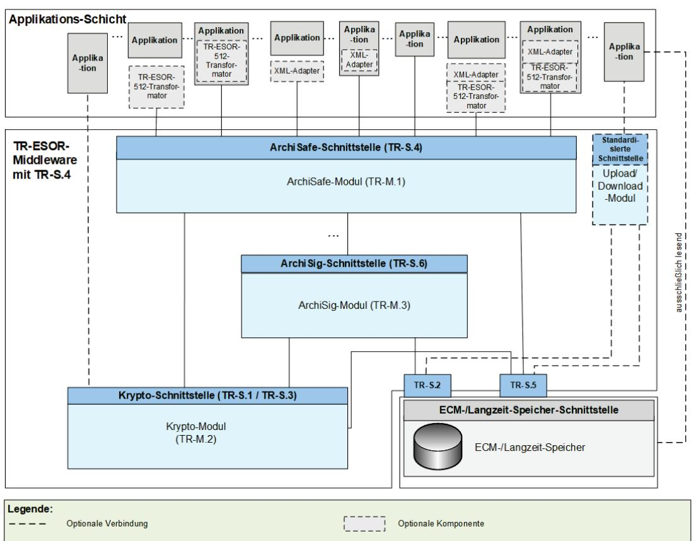
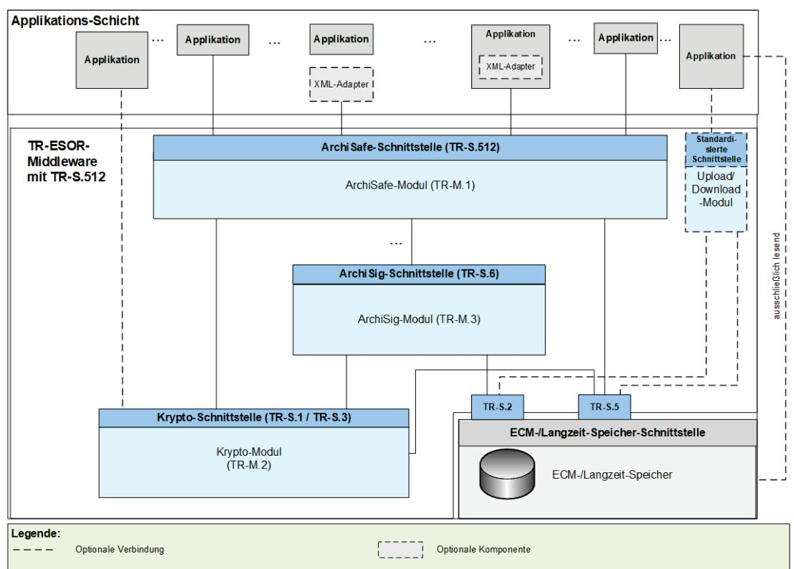

# BSI Technische Richtlinie 03125 Beweiswerterhaltung kryptographisch signierter Dokumente

### Anlage TR-ESOR-M.1: ArchiSafe-Modul

| Bezeichnung | ArchiSafe-Modul                                                                                                   |
|-------------|-------------------------------------------------------------------------------------------------------------------|
| Kürzel      | BSI TR-ESOR-M.1                                                                                                   |
| Version     | 1.3 (auf Basis der eIDAS-Verordnung und der ETSI Preservation Standards mit einem neuen Zertifizierungsschema) |
| Datum       | 31.03.2022                                                                                                        |

# Änderungshistorie

| Version | Datum      | Name | Beschreibung |
|---------|------------|------|--------------|
| 1.3     | 31.03.2022 | BSI  | TR-ESOR-M.1  |
|         |            |      |              |

Tabelle 1: Änderungshistorie

Bundesamt für Sicherheit in der Informationstechnik Postfach 20 03 63 53133 Bonn Tel.: +49 22899 9582-0 E-Mail: tresor@bsi.bund.de Internet[: https://www.bsi.bund.de](https://www.bsi.bund.de/) © Bundesamt für Sicherheit in der Informationstechnik 2022

|   | Inhalt 3     |                                                                                                                                             |  |  |
|---|--------------|---------------------------------------------------------------------------------------------------------------------------------------------|--|--|
| 1 | Einführung 4 |                                                                                                                                             |  |  |
| 2 |              | Übersicht  7                                                                                                                                |  |  |
|   | 2.1          | Ziele 7                                                                                                                                     |  |  |
| 3 |              | Definition des ArchiSafe-Moduls 10                                                                                                          |  |  |
|   | 3.1          | Grundlegender Aufbau und funktionale Abgrenzung  10                                                                                         |  |  |
|   | 3.2          | Integration des ArchiSafe-Moduls 10                                                                                                         |  |  |
| 4 |              | Funktionale Anforderungen 11                                                                                                                |  |  |
|   | 4.1          | Bewahrung elektronischer Daten – ArchiveSubmission 12                                                                                       |  |  |
|   | 4.2          | Aktualisieren archivierter Daten – ArchiveUpdate  14                                                                                        |  |  |
|   | 4.3          | Abruf archivierter Daten – ArchiveRetrieval 16                                                                                              |  |  |
|   | 4.4          | Löschen von Archivdaten – ArchiveDeletion 17                                                                                                |  |  |
|   | 4.5          | Rückgabe technischer Beweisdaten – ArchiveEvidence 17                                                                                       |  |  |
|   | 4.6          | Rückgabe von Datenelementen – ArchiveData (optional) 18                                                                                     |  |  |
|   | 4.7          | Prüfen des Archivdatenobjektes samt den darin enthaltenen oder zusätzlich übergebenen beweisrelevanten Daten und Beweisdaten – Verify 18 |  |  |
|   | 4.8          | Abruf von Bewahrungs-Profilen (engl. Preservation Profile) - RetrieveInfo 19                                                                |  |  |
|   | 4.9          | Abruf von Protokoll-Daten – ArchiveTrace (optional)  19                                                                                     |  |  |
| 5 |              | Sicherheitsfunktionen 20                                                                                                                    |  |  |

| Abbildung 1: Schematische Darstellung der IT-Referenzarchitektur mit TR-S.4.  5   |  |
|-----------------------------------------------------------------------------------|--|
| Abbildung 2: Schematische Darstellung der IT-Referenzarchitektur mit TR-S.512.  5 |  |

# 1 Einführung

Ziel der Technischen Richtlinie "Beweiswerterhaltung kryptographisch signierter Dokumente" ist die Spezifikation sicherheitstechnischer Anforderungen für den langfristigen Beweiswerterhalt von kryptographisch signierten elektronischen Dokumenten und Daten nebst zugehörigen elektronischen Verwaltungsdaten (Metadaten).

Eine für diese Zwecke definierte Middleware (TR-ESOR-Middleware) im Sinn dieser Richtlinie umfasst alle diejenigen Module (M) und Schnittstellen (S), die zur Sicherung und zum Erhalt der Authentizität und zum Nachweis der Integrität der aufbewahrten Dokumente und Daten eingesetzt werden.

Die im Hauptdokument dieser Technischen Richtlinie vorgestellte Referenzarchitektur besteht aus den nachfolgend beschriebenen Schnittstellen, Funktionen und logischen Einheiten:

- der TR-S.4- oder TS119512-Schnittstelle TR-S.512 in der Profilierung [TR-ESOR-TRANS] der TR-ESOR-Middleware, die dazu dient, die TR-ESOR-Middleware in die bestehende IT- und Infrastrukturlandschaft einzubetten;
- dem "ArchiSafe-Module" (vgl. [TR-ESOR-M.1]), welches den Informationsfluss in der Middleware regelt, die Sicherheitsanforderungen an die Schnittstellen zu den IT-Anwendungen umsetzt und für eine Entkopplung von Anwendungssystemen und ECM-/Langzeitspeicher sorgt;
- dem "Krypto"-Modul (vgl. [TR-ESOR-M.2]) nebst den zugehörigen Schnittstellen TR-S.1 und TR-S.3, das alle erforderlichen Funktionen zur Berechnung von Hashwerten, zur Prüfung elektronischer Signaturen bzw. Siegel bzw. Zeitstempel, zur Nachprüfung elektronischer Zertifikate und zum Einholen qualifizierter Zeitstempel sowie (optional) elektronischer Signaturen bzw. Siegel für die Middleware zur Verfügung stellt. Darüber hinaus kann es Funktionen zur Ver- und Entschlüsselung von Daten und Dokumenten zur Verfügung stellen;
- dem "ArchiSig-Modul" (vgl. [TR-ESOR-M.3]) mit der Schnittstelle TR-S.6, das die erforderlichen Funktionen für die Beweiswerterhaltung der digital signierten Unterlagen bereitstellt;
- einem ECM-/Langzeitspeicher mit den Schnittstellen TR-S.2 und TR-S.5, der die physische Archivierung/Aufbewahrung und auch das Speichern der beweiswerterhaltenden Zusatzdaten übernimmt.

Dieser ECM-/Langzeitspeicher ist nicht mehr direkt Teil der Technischen Richtlinie, gleichwohl werden über die beiden Schnittstellen, die noch Teil der TR-ESOR-Middleware sind, Anforderungen daran gestellt.

Ebenso wenig ist die Applikationsschicht, die auch einen XML-Adapter enthalten kann, direkter Teil der Technischen Richtlinie, auch wenn dieser XML-Adapter als Teil einer Middleware implementiert werden kann.

Die empfohlene IT-Referenzarchitektur ist in [Abbildung](#page-4-0) 1 und [Abbildung](#page-4-1) 2 dargestellt und besteht im Wesentlichen aus den in [TR-ESOR], Kap. 7 grob beschriebenen logischen Komponenten und Schnittstellen. Diese werden in Anhängen zur TR weiter detailliert. Die Grafik zeigt zudem die externen Komponenten und Systeme an, die das Bild vervollständigen. Grundsätzlich wird als obere Schnittstelle der TR-ESOR-Middleware entweder die TR-S.4-Schnittstelle gemäß [TR-ESOR-E], die in [Abbildung](#page-4-0) 1 dargestellt ist, oder die TR-S.512-Schnittstelle gemäß [ETSI TS 119512] in der Profilierung [TR-ESOR-TRANS], die in [Abbildung](#page-4-1) 2 gezeigt wird, unterstützt.

Abbildung 1: Schematische Darstellung der IT-Referenzarchitektur mit TR-S.4.

### Abbildung 2: Schematische Darstellung der IT-Referenzarchitektur mit TR-S.512.

Die in [Abbildung 1](#page-4-0) bzw. [Abbildung 2](#page-4-1) dargestellte IT-Referenzarchitektur orientiert sich an der ArchiSafe Referenzarchitektur und soll die logische (funktionale) Interoperabilität künftiger Produkte mit den Zielen und Anforderungen der Technischen Richtlinie ermöglichen und unterstützen.

Sofern der optionale XML-Adapter und/oder der optionale TR-ESOR-512-Transformator[1](#page-5-0) vorhanden sind, können beide in folgenden Ausprägungen vorliegen:

- − Jeweils eigenständige Komponente mit Schnittstellen zur Applikation sowie zum ArchiSafe-Modul
- − Jeweils eigenständige Komponente, jedoch Teil der Applikation mit Schnittstelle zum ArchiSafe-Modul
- − XML-Adapter und TR-ESOR-512-Transformator als eine gemeinsame Komponente, die beide Teile enthält mit Schnittstellen zur Applikation sowie zum ArchiSafe-Modul
- − XML-Adapter und TR-ESOR-512-Transformator als eine gemeinsame Komponente, die beide Teile enthält und Teil der Applikation ist, mit Schnittstelle zum ArchiSafe-Modul.

Der "ETSI TS119512 TR-ESOR Transformator" ermöglicht Bewahrungsdiensten gemäß [eIDAS-VO], empfangene ETSI TS119512 (V1.1.2) Nachrichten[2](#page-5-1) in TR-S4 Nachrichten zu transformieren. Diese Nachrichten können dann an ein angeschlossenen TR-ESOR-Syste[m3](#page-5-2) geschickt werden, ohne irgendwelche Änderungen dieses TR-ESOR-Systems.

Der Einsatz des TR-ESOR-512-Transformators wird empfohlen sofern das TR-ESOR-Produkt mit einer TR-S.4-Schnittstelle in Europa zum Einsatz kommt und Interoperabilität mit europäischen (qualifizierten) Bewahrungsdiensten und Bewahrungsprodukten hergestellt werden soll.

Diese Technische Richtlinie ist modular aufgebaut und spezifiziert in einzelnen Anlagen zum Hauptdokument die funktionalen und sicherheitstechnischen Anforderungen an die erforderlichen IT-Komponenten und Schnittstellen der TR-ESOR-Middleware. Die Spezifikationen sind strikt plattform-, produkt-, und herstellerunabhängig.

Das vorliegende Dokument trägt die Bezeichnung "Anlage TR-ESOR-M.1" und spezifiziert die funktionalen und sicherheitstechnischen Anforderungen an das Modul [TR-ESOR-M.1] (im Folgenden kurz: ArchiSafe-Modul).

 1 Sieh[e ETSI TS 119512 TR-ESOR Transformator unter einer Open Source Lizenz](https://github.com/de-bund-bsi-tr-esor/tresor-ETSITS119512-transformator)

2 In der Profilierung von [TR-ESOR-TRANS

3 Sieh[e https://www.bsi.bund.de/EN/tr-esor](https://www.bsi.bund.de/EN/tr-esor) oder<https://www.bsi.bund.de/DE/tr-esor>.

# 2 Übersicht

# 2.1 Ziele

Ziel und Zweck des ArchiSafe-Moduls ist die Realisierung einer einheitlichen Schnittstelle mindestens der Bewahrungs-Funktionen, die für den Beweiswerterhalt eine Rolle spielen. Um eine strikte logische Trennung der vorgelagerten IT-Fachanwendungen von den eigentlichen ECM-/Langzeitspeichersystemen zu erreichen, wird empfohlen, alle notwendigen Bewahrungs-Funktionen über das ArchiSafe-Modul herstellerunabhängig zu abstrahieren.

Das ArchiSafe-Modul entkoppelt logisch und funktional den Datenfluss zwischen den IT-Fachanwendungen und dem elektronischen ECM-/Langzeitspeicher zur Ablage oder zum Aufruf archivierter Daten und Dokumente. Darüber hinaus bietet dieses Modul einheitliche Schnittstellen zur Kommunikation mit kryptographischen Komponenten (vgl. TR-M.2 und TR-M.3 in [Abbildung](#page-4-0) 1 bzw[. Abbildung](#page-4-1) 2), die den Erhalt der Authentizität und Integrität der gespeicherten elektronischen Unterlagen unterstützen.

Jede Bewahrungsoperation der vorgelagerten externen IT-Anwendungen, die dem Zweck dient, den Beweiswert elektronischer Unterlagen zu sichern, zu erhalten oder nachzuweisen, muss über das ArchiSafe-Modul erfolgen.

Die externe IT-Anwendung eröffnet zu diesem Zweck einen sicheren Kommunikationskanal[4](#page-6-2) mit dem ArchiSafe-Modul und versendet eine Bewahrungsanfrage (Archive Funktionsname Request) oder ein Bewahrungs-API-Request gemäß [ETSI TS 119512] in der Profilierung [TR-ESOR-TRANS]. Das ArchiSafe-Modul identifiziert, authentifiziert und autorisiert die aufrufende Anwendung und bietet die konfigurierbare Option, die syntaktische Gültigkeit der von der aufrufenden Anwendung übermittelten Archivdatenobjekte anhand der im ArchiSafe-Modul abgelegten Konfigurationsdaten (XML-Schemata, Kommunikations- und Verarbeitungsregeln) zu prüfen.

Bei der Ablage der Archivdatenobjekte initiiert das ArchiSafe-Modul die Sicherung der beweisrechtlichen Qualität der zu archivierenden Daten, indem:

- 1. vorhandene beweisrelevanten Daten (Signaturen, Siegel, Zeitstempel, Zertifikate, Sperrlisten, OCSP-Responses etc.) und technische Beweisdaten (Evidence Records) auf Gültigkeit geprüft und die Prüfergebnisse in standardisierter Form so gespeichert werden, dass der Bezug zu den Signatur- bzw. Siegel- bzw. Zeitstempeldaten erhalten bleibt. Die Prüfung der beweisrelevanten Daten (Signaturen, Siegel, Zeitstempel, Zertifikate, Sperrlisten, OCSP-Responses etc.) und technische Beweisdaten (Evidence Records) wird durch eine kryptographische Komponente (Modul) realisiert, die den in [TR-ESOR-M.2] beschrieben Anforderungen genügen muss.
- 2. das ArchiSig-Modul (siehe [TR-ESOR-M.3]) angestoßen wird, jedes zu archivierende Archivdatenobjekt mit einer eindeutigen Dokumentenkennung (Archivdatenobjekt ID, AOID) zu versehen, sofern dieses Element nicht bereits vorhanden is[t5](#page-6-3) und einen oder mehrere Hashwerte über das gesamte Archivdatenobjekt oder die kryptographisch zu schützenden Bestandteile des Archivdatenobjekts mit AOID zu berechnen.[6](#page-6-4)

 4 Bei diesem Kanal kann es sich z. B. um physikalisch gesicherte Leitungen handeln oder um eine verschlüsselte Verbindung mit angemessen starker Authentisierung der beiden Parteien (vgl. auch [TR-ESOR], Kapitel 7.2).

5 Das Erzeugen der AOID kann auch in anderen Komponenten erfolgen, z. B. auch im ECM- /Langzeitspeicher. Darüber hinaus kann eine syntaktisch korrekte Dokumentenkennung (AOID) auch von der Geschäftsanwendung erzeugt und übergeben werden.

6 Details, über welche Elemente/Bereiche eines Archivdatenobjektes ein Hashwert gebildet wird, finden sich in Anhang F.

Anschließend werden die zu archivierenden Daten und die AOID über einen sicheren Kommunikationskanal an einen authentifizierten ECM-/Langzeitspeicher übergeben. Die erfolgreiche Ablage von Archivdatenobjekten wird durch die Rückgabe der AOID an die aufrufende Anwendung abgeschlossen.

Diese AOID wird für jeden Abruf, jedes Update und das Löschen von archivierten Daten durch die vorgelagerten IT-Fachanwendungen benötigt. Ein Abruf der Beweisdaten zu archivierten Daten ist ebenfalls nur bei Vorlage einer gültigen AOID möglich.

Hinweis 1 In der vorliegenden TR-ESOR-Version 1.3 werden die drei Begriffe "(beweiswerterhaltende) Langzeitspeicherung", "(beweiswerterhaltende) Bewahrung"*"* und "(beweiswerterhaltende) Archivierung" synonym verwendet. 

Ebenso werden die drei Begriffe "Archivinformationspaket (AIP)", "Archivinformationscontainer" und "Archivdatenobjekt" sowie die Begriffe "aufbewahren" und "archivieren" synonym verwendet.

Hinweis 2 TR-ESOR spezifiziert ein Bewahrungsprodukt (engl. Preservation Product) gemäß [ETSI SR 019510], [ETSI TS 119511] und [ETSI TS 119512] und [eIDAS-VO]. 

Die TR 03125 TR-ESOR ist in [ETSI SR 019510] in dem Kapitel 4.7.3, 5.2 und B3.2 beschrieben. 

Die in TR-ESOR erforderlichen grundlegenden Bewahrungstechniken, z. B. das Bewahrungsprotokoll, das Beweisdaten-Format Evidence Record, die Archivdatenobjekt-Format (L)XAIP und ASiC-AIP sind in der ETSI-Publikation [ETSI TS 119512] als normative Elemente enthalten.

Hinweis 3 Die obere TR-ESOR-Eingangs-Schnittstelle TR-S.4 oder die TS119512-Eingangsschnittstelle TR-S.512 gemäß der "Preservation-API" in [ETSI TS 119 512] in der Profilierung von [TR-ESOR-TRANS], die logisch äquivalent zur Eingangsschnittstelle TR-S.4 gemäß [TR-ESOR-E] ist wie in der Tabelle 2 in [TR-ESOR-E], Kap. 4.1 dargestellt, muss benutzt werden. Eine andere Eingangs-Schnittstelle anstelle von TR-S.4 bzw. TR-S.512 ist nicht erlaubt.

Hinweis 4 In der vorliegenden TR-ESOR-Version 1.3 umfasst der Begriff "Archivinformationspaket" (AIP) in allen TR-ESOR-Anhängen:

- a) das Archivdatenobjekt "XAIP" gemäß [TR-ESOR-F], Kap. 3.1 als auch
- b) das logische XAIP "LXAIP" gemäß [TR-ESOR-F], Kap. 3.2 und
- c) das "ASiC-AIP" gemäß [TR-ESOR-F], Kap. 3.3 auf Basis von [ETSI EN 319162-1].

In TR-ESOR Version 1.3 wird zwischen XAIP, LXAIP und ASiC-AIP differenziert. 

Mit (L)XAIP wird XAIP oder LXAIP bezeichnet. 

|   | Hinweis 5 In dieser TR-ESOR Version 1.3 ist "BIN" beschränkt auf die folgenden                         |
|---|-----------------------------------------------------------------------------------------------------------|
|   | Bewahrungsobjekt-Formate (engl. preservation object formats):                                             |
| - | (http://uri.etsi.org/ades/CAdES) CAdES gemäß [ETSI TS 119 512], Annex A.1.1 . Sofern kein MIME Type |
|   | gesetzt ist, wird als Default application/cms verwendet;                                                  |
| - | XAdES gemäß [ETSI TS 119 512], Annex A.1.2 (http://uri.etsi.org/ades/XAdES). Sofern kein MIME Type        |
|   | gesetzt ist, wird als Default application/xml verwendet;                                                  |
| - | PAdES gemäß [ETSI TS 119 512], Annex A.1.3 (http://uri.etsi.org/ades/PAdES). Sofern kein MIME Type        |
|   | gesetzt ist, wird als Default application/pdf verwendet                                                   |
| - | ASiC-E gemäß [ETSI TS 119 512], Annex A.1.4 (http://uri.etsi.org/ades/ASiC/type/ASiC-E). Sofern kein      |
|   | MIME Type gesetzt ist, wird als Default application/vnd.etsi.asic-e+zip verwendet;                     |
| - | ASiC-S gemäß [ETSI EN 319 162] (http://uri.etsi.org/ades/ASiC/type/ASiC-S). Sofern kein MIME Type         |
|   | gesetzt ist, wird als Default application/vnd.etsi.asic-s+zip verwendet.                                  |
| - | DigestList gemäß [ETSI TS 119 512], Annex A.1.6 (http://uri.etsi.org/19512/format/DigestList). Sofern     |
|   | kein MIME Type gesetzt ist, wird als Default application/xml verwendet;                                   |

- ASiC-ERS (in TR-ESOR v1.3 mit ASiC-AIP bezeichnet) gemäß [TR-ESOR-F], Kap. 3.3 und gemäß [ETSI TS 119 512], Annex A.3.1 [\(http://uri.etsi.org/ades/ASiC/type/ASiC-ERS\)](http://uri.etsi.org/ades/ASiC/type/ASiC-ERS).

Im Falle Upload/Download-Funktion ist zusätzlich nachfolgendes Format erlaubt:

- Binärdaten (BIN) als "Octet Stream", die ausschließlich in den ECM-/Langzeitspeicher mit "Upload-Request" gespeichert werden, – aber nur sofern:
- a) verbunden mit einem korrespondierenden LXAIP und dort referenziert gem. [TR-ESOR-F], Kap. 3.2,
- b) ggf. mit "Download-Request" ausgelesen werden, – verbunden mit einem korrespondierenden LXAIP, das mit der "ArchiveRetrieval"-Funktion ausgelesen wurde,– oder eingebettet in einem XAIP und ausgelesen mit der "ArchivRetrieval"-Funktion.
- c) Der Upload von XAIP oder LXAIP oder ASiC-AIP ist nicht zugelassen.

Hinweis 6 Im folgenden Text umfasst der Begriff "Digitale Signatur":

"fortgeschrittene elektronische Signaturen" gemäß [eIDAS-VO], Artikel 3 Nr. 11, 

"qualifizierte elektronische Signaturen" gemäß [eIDAS-VO], Artikel 3 Nr. 12, 

"fortgeschrittenen elektronische Siegel" gemäß [eIDAS-VO], Artikel 3 Nr. 26 und 

"qualifizierte elektronische Siegel" gemäß [eIDAS-VO], Artikel 3 Nr. 27.

Insofern umfasst der Begriff "digital signierte Dokumente" sowohl solche, die fortgeschrittene elektronische Signaturen oder Siegel bzw. qualifizierte elektronische Signaturen oder Siegel tragen. 

Mit dem Begriff der "kryptographisch signierten Dokumente" sind in dieser TR neben: 

den gemäß [eIDAS-VO], Artikel 3 Nr. 12 qualifiziert signierten, 

den gemäß [eIDAS-VO], Artikel 3 Nr. 27 qualifiziert gesiegelten oder 

den gemäß [eIDAS-VO], Artikel 3 Nr. 34 qualifiziert zeitgestempelten Dokumenten (im Sinne der eIDAS-Verordnung) 

auch Dokumente 

> mit einer fortgeschrittenen Signatur gemäß [eIDAS-VO], Artikel 3 Nr. 11 oder

mit einem fortgeschrittenen Siegel gemäß [eIDAS-VO], Artikel 3 Nr. 26 oder 

mit einem elektronischen Zeitstempel gemäß [eIDAS-VO], Artikel 3 Nr. 33 

erfasst, wie sie oft in der internen Kommunikation von Behörden entstehen. Nicht gemeint sind hier Dokumente mit einfachen Signaturen oder Siegeln basierend auf anderen (z. B. nichtkryptographischen) Verfahren.

# 3 Definition des ArchiSafe-Moduls

Der Begriff "ArchiSafe-Modul" umfasst alle Funktionen, die der Realisierung der Eingangs-Schnittstelle der TR-ESOR-Middleware sowie der Steuerung und Kontrolle des Zugriffs externer, vorgelagerter IT-Fachanwendungen auf den ECM-/Langzeitspeicher dienen (siehe [Abbildung](#page-4-0) 1 bzw. [Abbildung](#page-4-1) 2). Vornehmlicher Zweck des ArchiSafe-Moduls ist die Implementierung eines zuverlässigen Sicherheitsgateways für die Kommunikation - und damit auch die Entkopplung externer Anwendungen mit einem ECM-/Langzeitspeicher, die Regelung des Informationsflusses in der TR-ESOR-Middleware sowie die Steuerung der durch die TR-ESOR-Middleware bereitgestellten Funktionen zum langfristigen Beweiswerterhalt der kryptographisch signierten Dokumente.

# 3.1 Grundlegender Aufbau und funktionale Abgrenzung

- (A3.1-1) Das ArchiSafe-Modul soll eine Middleware-Komponente oder Teil einer Middleware-Komponente sein, die vertrauenswürdig und zuverlässig den Zugriff auf den ECM-/Langzeitspeicher vermittelt und kontrolliert.
- (A3.1-2) Das ArchiSafe-Modul muss als selbstständige Anwendung oder als selbstständiger (funktional abgegrenzter) Teil einer Anwendung (auch des ECM-/Langzeitspeichers) auf einem vertrauenswürdigen IT-System (IT-Plattform) laufen.
- (A3.1-3) Die Systemplattform, auf der das ArchiSafe-Modul betrieben wird, muss vor unberechtigten Zugriffen auf die Daten und Funktionen des Moduls ausreichend geschützt sein.
- (A3.1-4) Das ArchiSafe-Modul muss zum Erhalt des beweisrechtlichen Werts digital signierter bzw. zeitgestempelter Daten, bspw. für eine rechtskonforme Signatur- bzw. Zeitstempelerneuerung, vertrauenswürdige kryptographische Komponenten nutzen, die in [TR-ESOR-M.2] und [TR-ESOR-M.3] beschrieben sind und über die in [TR-ESOR-E] definierten Schnittstellen TR-S.1 und TR-S.6 angesprochen werden.[7](#page-9-3)

## 3.2 Integration des ArchiSafe-Moduls

- (A3.2-1) Das ArchiSafe-Modul soll Modulcharakter besitzen und jederzeit durch neue, funktional kompatible Implementierungen ersetzt werden können.
- (A3.2-2) Für die Integration des ArchiSafe-Moduls in bestehende oder geplante IT-Einsatzumgebungen im Sinne dieser TR muss das ArchiSafe-Modul mindestens die in [TR-ESOR-E] spezifizierten Schnittstellen TR-S.1, TR-S.4 oder TR-S.512, TR-S.5 und TR-S.6 implementieren bzw. nutzen können. Dabei wird das ArchiSafe-Modul über die Schnittstelle TR-S.4 oder TR-S.512 von externen Applikationen aufgerufen und ruft über die Schnittstelle TR-S.1 das Krypto-Modul, über die Schnittstelle TR-S.6 das ArchiSig-Modul sowie über die Schnittstelle TR-S.5 das ECM-/Langzeitspeichersystem auf.
- (A3.2-3) Die Implementierung und Nutzung zusätzlicher Schnittstellen darf nicht die Gewährleistung der sicherheitstechnischen Grundanforderungen (siehe auch Abschnit[t 5\)](#page-19-0) kompromittieren[8](#page-9-4) .

 7 Die Anforderung schließt ausdrücklich nicht aus, dass die Funktionen des ArchiSafe-Moduls und der kryptographischen Komponenten in einem einheitlichen Sicherheitsgateway subsumiert werden.

8 Vgl. auch die Anforderungen nach Kap. 8 im [TR-ESOR].

# 4 Funktionale Anforderungen

Dieser Abschnitt der Technischen Richtlinie spezifiziert und erläutert auf der Grundlage von [eIDAS-VO], [ETSI TS 119511] und [ETSI TS 119512] die funktionalen Anforderungen an ein ArchiSafe-Modul. Die Aufrufschnittstellen (Schnittstellensignaturen) des ArchiSafe-Moduls sind in [TR-ESOR-E] als TR-S.4 oder als TR-S.512 (siehe [Hinweis 2\)](#page-7-0) spezifiziert.

### Begriffsdefinitionen:

- Ein Datenobjekt ist ein zu archivierendes Dokument oder Datum. Das Datenobjekt kann dabei in jedem beliebigen Format vorliegen, vorzugsweise jedoch in den Formaten, die in Anhang F empfohlen werden.
- Ein Archivinformationspaket (AIP) (auch Archivdatenobjekt genannt) i. S. dieser Richtlinie entspricht syntaktisch:
- dem in [TR-ESOR-F], Kapitel 3.1 beschriebenen XML formatted Archive Information Package (XAIP), bzw.
- dem in [TR-ESOR-F], Kapitel 3.2 beschriebenen logischen XML formatted Archive Information Package (LXAIP), bzw.
- dem in [TR-ESOR-F], Kapitel 3.3 beschriebenen ASiC-AIP.
- Ein Archivinformationspaket (Archivdatenobjekt) kann damit ein oder mehrere Datenobjekte umfassen sowie zusätzlich noch Metadaten. Die Archivdatenobjekt-ID (AOID) bezieht sich jedoch immer auf ein Archivdatenobjekt. Es ist notwendig, dass Datenobjekte in einem Archivdatenobjekt für die Bewahrung übergeben werden oder mit einem Upload-Request in den ECM-/Langzeitspeicher gespeichert werden. Es ist aber nicht notwendig, dass Archivdatenobjekte physisch im ECM-/Langzeitspeicher abgelegt sind. Es wird lediglich gefordert, dass alle Funktionen der TR-ESOR-Middleware sich auf ein Archivdatenobjekt und damit auf alle Datenobjekte, die damit Bezug haben, beziehen und insbesondere die Abfragefunktion ArchiveRetrieval ein Archivdatenobjekt in einem gültigen (L)XAIP- bzw. ASiC-AIP-Format (vgl. [TR-ESOR-F]) zurückliefert.
- Ein Datenelement ist ein Teil der XML-Struktur des Archivdatenobjektes (L)XAIP bzw. ein Teil eines ASiC-AIP. Es kann sich dabei z. B. um das gesamte Archivdatenobjekt handeln, um einen Teilbaum der XML-Struktur, um ein einzelnes XML-Element oder auch nur um den Wert eines XML-Elements.
- (A4.0-1) Ein zu dieser Richtlinie konformes ArchiSafe-Modul muss mindestens die folgenden Operationen[9](#page-10-2) zur Verfügung stellen:
	- 1. Bewahrung eines (Archiv-) Datenobjektes[10](#page-10-3) im ECM-/Langzeitspeicher: ArchiveSubmission gem. [TR-ESOR-E] oder PreservePO gem. [ETSI TS 119512] [11,](#page-10-4)
	- 2. Abfrage eines Archivdatenobjektes aus dem ECM-/Langzeitspeicher: ArchiveRetrieval [TR-ESOR-E] oder RetrievePO [ETSI TS 119512[\]11,](#page-10-1)
	- 3. Löschen eines Archivdatenobjektes im ECM-/Langzeitspeicher: ArchiveDeletion [TR-ESOR-E] oder DeletePO [ETSI TS 119512] [11,](#page-10-1)
	- 4. Aktualisieren eines bereits bewahrten Archivdatenobjektes im ECM-/Langzeitspeicher: ArchiveUpdate [TR-ESOR-E] oder UpdatePOC [ETSI TS 119512] [11,](#page-10-1)

 9 Eine Operation ist eine Anfrage einer externen Client Software an das ArchiSafe-Modul zur Ausführung definierter Operationen in der TR-ESOR-Middleware bzw. im ECM-/Langzeitspeicher.

10 Es ist vorgesehen, dass die Schnittstelle sowohl komplette Archivinformationscontainer als auch einzelne Datenobjekte gemäß Hinweis 5 akzeptiert. Rückgabe ist immer eine AOID, die sich auf ein Archivdatenobjekt bezieht.

11 In der Profilierung gem. [TR-ESOR-TRANS].

5. Abfrage von technischen Beweisdaten zum Nachweis der Authentizität und Integrität archivierter Archivdatenobjekte:

ArchiveEvidence [TR-ESOR-E] oder RetrievePO [ETSI TS 119512] [11,](#page-10-1)

- 6. Prüfung eines Archivdatenobjekts samt den darin enthaltenen oder mit einem Funktionsaufruf zusätzlich übergebenen beweisrelevanten Daten (Signaturen, Siegel, Zeitstempel, Zertifikate, Sperrlisten, OCSP-Responses etc.) und Beweisdaten (Evidence Records): Verify [TR-ESOR-E] oder ValidateEvidence [ETSI TS 119512] [11,](#page-10-1)
- 7. Abfrage von Bewahrungs-Profilen: RetrieveInfo [TR-ESOR-E] oder RetrieveInfo [ETSI TS 119512] [11,](#page-10-1)

Ein zu dieser Richtlinie konformes ArchiSafe-Modul soll zusätzlich die folgenden Operationen zur Verfügung stellen:

- 8. Abfrage von einzelnen Datenelementen aus einem bewahrten Archivinformationspaket: ArchiveData [TR-ESOR-E] oder Search [ETSI TS 119512] [11,](#page-10-1)
- 9. Abfrage von Protokoll-Daten: ArchiveTrace [TR-ESOR-E] oder RetrieveTrace [ETSI TS 119512] [11.](#page-10-1)
- (A4.0-2) Falsche oder fehlerhaft parametrisierte Anfragen dürfen nicht zu einer fehlerhaften Funktion des ArchiSafe-Moduls führen.
- (A4.0-3) Das ArchiSafe-Modul muss umfassende und konfigurierbare Möglichkeiten zur Protokollierung der diversen Zugriffe bzw. Zugriffsversuche auf den ECM-/Langzeitspeicher besitzen.
- (A4.0-4) Die vom ArchiSafe-Modul erzeugten Protokolle müssen zugriffsgeschützt sein, so dass nur zugriffsberechtigte Personen[12](#page-11-2) (z. B. der Datenschutzbeauftragte, der Sicherheitsbeauftragte oder der Administrator des ECM-/Langzeitspeichers) tatsächlich Zugriff erhalten.
- (A4.0-5) Für alle unter [\(A4.0-1\)](#page-10-5) aufgeführten Funktionen gilt: Das ArchiSafe-Modul muss imstande sein, für den Aufruf der Funktion einen sicheren Kommunikationskanal mit der aufrufenden Client-Anwendung aufzubauen.
- (A4.0-6) Für alle unter [\(A4.0-1\)](#page-10-5) aufgeführten Funktionen gilt: eine aufrufende Client Software darf nur auf die Archivdatenobjekte Zugriff erhalten, für die sie jeweils eine Zugriffsberechtigung besitzt.

## 4.1 Bewahrung elektronischer Daten – ArchiveSubmission[13](#page-11-3)

Die Funktion ArchiveSubmissio[n13](#page-11-1) ermöglicht, dass eine autorisierte IT-Anwendung (Client Software[14\)](#page-11-4) ein (neues) Archivdatenobjekt im ECM-/Langzeitspeicher über einen sicheren Kommunikationskanal ablegen kann.

- (A4.1-1) Das ArchiSafe-Modul muss imstande sein, mit einem ArchiveSubmissionRequest[13](#page-11-1) jeweils ein XML-basiertes Archivinformationspaket mit einem (oder mehreren) Datenobjekt(en) zu archivieren. Darüber hinaus soll es auch imstande sein, mit einem ArchiveSubmissionReques[t13](#page-11-1) Binärdaten gemäß [TR-ESOR F] zu archivieren (vgl. hierzu auch [Hinweis 5\)](#page-7-1)
- (A4.1-2) Das zu archivierende Datenobjekt oder seine Referenz im Fall eines LXAIP muss Bestandteil des Aufrufs sein. Ist das zu archivierende Archivinformationspaket eine XML-Struktur ((L)XAIP), muss es gegen ein im ArchiSafe-Modul hinterlegtes und autorisiertes XML-Schema auf syntaktische Richtigkeit

 12 Welche Personen tatsächlich Zugriff auf die Protokolle erhalten sollen, ist im lokal gültigen IT-Sicherheitskonzept zu regeln.

13 Bzw. PreservePO gemäß [ETSI TS 119512] in der Profilierung [TR-ESOR-TRANS].

14 Eine Client Anwendung ist im Sinne dieser Richtlinie eine externe (vorgelagerte) IT-Anwendung, die imstande und autorisiert ist, über das ArchiSafe-Modul Daten im ECM-/Langzeitspeicher zu archivieren, archivierte Daten zu suchen, zu aktualisieren, abzurufen oder zu löschen.

geprüft werden können. Schlägt die Syntaxprüfung fehl, muss die Bewahrung mit einer aussagekräftigen und verständlichen Fehlermeldung abgewiesen werden

(A4.1-3) Das ArchiSafe-Modul muss imstande sein, auf der Grundlage von im Modul hinterlegten Konfigurationsdaten die Prüfung des Archivdatenobjektes samt den darin enthaltenen oder zusätzlich übergebenen beweisrelevanten Daten (Signaturen, Siegel, Zeitstempel, Zertifikate, Sperrlisten, OCSP-Responses etc.) und/oder technischen Beweisdaten (Evidence Records) anzustoßen. Enthält das zu archivierende Archivdatenobjekt digitale Signaturen bzw. elektronische Zeitstempel und ggf. weitere beweisrelevante Daten oder technische Beweisdaten, muss das ArchiSafe-Modul die Gültigkeit der beweisrelevanten Daten und technischen Beweisdaten sowohl auf Basis des Schalenmodells als auch des Kettenmodells prüfen lassen können. Die Gültigkeitsprüfung muss gemäß der in dem Bewahrungs-Profil (engl. Preservation Profile) referenzierten "Preservation Evidence Policy" Kap. 7.7.2 erfolgen und vollständig sein, d. h. die gesamte Zertifikatskette bis hin zu einem vertrauenswürdigen Wurzel-Zertifikat bzw. Vertrauensanker gemäß der vom [TR-ESOR-PEPT] abgeleiteten veröffentlichten Preservation Evidence Policy (PEP) des TR-ESOR-Produktes bzw. Bewahrungsdienstes umfassen. Die Prüfergebnisse müssen in standardisierter Form in das Archivdatenobjekt gemäß [TR-ESOR-F], Kap. 5.1 eintragen werden. Dabei gilt:

Mindestens eines der beiden Prüfmodelle, Kettenmodell oder Schalenmodell, muss erfolgreich durchlaufen werden, entsprechend der gültigen PEP.

Dabei ist

dann im Fehlerfall ".../resultmajor#error" und

ansonsten "…/resultmajor#ok" zurückzugegeben.

Für eine Weiterverarbeitung ist es erforderlich, dass das durchgeführte Validierungsmodelle (Schalen- bzw. Kettenmodell) gemäß der "Preservation Evidence Policy" Kap. 7.7.2 erfolgreich ist. Schlägt die Prüfung fehl, soll, ggf. auf Basis von konfigurierbaren Optionen, wie folgt vorgegangen werden:

Das ArchiSafe-Modul liefert eine verständliche Fehlermeldung an die Anwendung zurück und lehnt die Bewahrung des Objekts ab.

Die entsprechende Fehlermeldung kommt zusammen mit allen anderen ggf. vorhandenen Prüfinformationen in die Credential-Section. Das Objekt wird danach im Speicher abgelegt. Zusätzlich gibt das ArchiSafe-Modul eine Fehlermeldung an die Anwendung gegeben.

Das ArchiSafe-Modul übergibt dazu vor der eigentlichen Speicherung im ECM-/Langzeitspeicher das Archivinformationspaket samt den darin enthaltenen oder zusätzlich übergebenen beweisrelevanten Daten (Signaturen, Siegel, Zeitstempel, Zertifikate, Sperrlisten, OCSP-Responses etc.) und/oder Beweisdaten (Evidence Records) über die Schnittstelle TR-S.1 dem Krypto-Modul (siehe [TR ESOR M.2] sowie [TR-ESOR-E]).

(A4.1-4) Das Krypto-Modul muss entweder die Verifikation beweisrelevanter Daten oder technischer Beweisdaten bei einem externen Vertrauensdiensteanbieter gemäß [eIDAS-VO] anfordern oder Funktionen zur zuverlässigen lokalen Verifikation beweisrelevanter Daten (Signaturen, Siegel, Zeitstempel, Zertifikate, Sperrlisten, OCSP-Responses etc.) und/oder technischen Beweisdaten (Evidence Records) gemäß [EN 319 102] zur Verfügung stellen. Die dabei ermittelten Prüfergebnisse (Zertifikate, Sperrlisten, OCSP-Responses) sollen anschließend vom Krypto-Modul in die dafür vorgesehenen Datenstrukturen des Archivinformationspakets eingetragen und anschließend das um die Prüfinformationen ergänzte Archivinformationspaket oder ein Prüfbericht (siehe [OASIS-VR] oder [TR-ESOR-VR]) an das ArchiSafe-Modul zurück geliefert werden. Alternativ gibt das Krypto-Modul nur die Prüfergebnisse als Prüfbericht gemäß [OASIS-VR] bzw. [TR-ESOR-VR] an das ArchiSafe-Modul zurück und dieses trägt die Prüfergebnisse in die vorgesehenen Datenstrukturen des Archivdatenobjektes ein.

Die Middleware soll die Möglichkeit vorsehen, dass für ein XML-basiertes Archivdatenobjekt (L)XAIP bzw. für ein ASiC-AIP samt den darin enthaltenen oder zusätzlich übergebenen beweisrelevanten Daten (Signaturen, Siegeln, Zeitstempel, Zertifikate, Sperrlisten, OCSP-Responses etc.) und technischen Beweisdaten ein ausführlicher Prüfbericht (vgl. [TR-ESOR-VR]) über die Speicherung angefordert werden kann.

Schlägt die Prüfung von beweisrelevanten Daten und technischen Beweisdaten bzw. die Zertifikatsprüfung fehl (z. B. wegen veralteter Algorithmen, die vom Krypto-Modul nicht mehr unterstützt werden), muss eine aussagekräftige und verständliche Fehlermeldung an die Geschäftsanwendung übergeben werden. Eine Speicherung kann in einem solchen Falle erfolgen, wenn zusammen mit einem aussagekräftigen Prüfbericht eine Begründung im entsprechenden Bereich des Archivdatenobjektes (credentialsSection–Element in einem (L)XAIP bzw. ASiC-AIP, vgl. [TR-ESOR-F]) abgelegt wird. Anderenfalls soll die Speicherung abgelehnt werden.

Hinweis 7 Es ist dringend zu empfehlen, die Möglichkeit der Prüfung von beweisrelevanten Daten und technischen Beweisdaten zu nutzen. Andernfalls könnten bereits manipulierte Daten oder ungültige digitale Signaturen bzw. elektronische Zeitstempel in den ECM-/Langzeitspeicher gelangen, wobei dieser Verlust der Integrität erst Jahre später bemerkt wird.

- (A4.1-5) Die Prüfergebnisse von beweisrelevanten Daten und technischen Beweisdaten, inklusive der zugehörigen Zertifikatsinformationen, müssen vom ArchiSafe-Modul in die dafür vorgesehenen XML-Datenelemente des XML-basierten Archivdatenobjektes bzw. in das ASiC-AIP (siehe hierzu [TR-ESOR-F]) eingetragen werden können, sofern dieses vom Krypto-Modul noch nicht durchgeführt wurde. Wird kein XML-basiertes Archivdatenobjekt genutzt, können die Prüfergebnisse von beweisrelevanten Daten und technischen Beweisdaten in das übergebene (binäre) Inhaltsdatenobjekt eingefügt werden, falls das verwendete Format dies erlaubt.
- (A4.1-6) Das ArchiSafe-Modul soll vor der endgültigen Ablage im ECM-/Langzeitspeicher das Archivdatenobjekt über die Schnittstelle TR-S.6 an das ArchiSig-Modul (siehe [TR-ESOR-E] und [TR-ESOR-M.3]) übergeben[15.](#page-13-2) Anschließend wird das Archivdatenobjekt vom ArchiSig-Modul im ECM- /Langzeitspeicher abgelegt

Alternativ übergibt das ArchiSafe-Modul das Archivdatenobjekt direkt an den ECM-/Langzeitspeicher und die Funktionen des ArchiSig-Moduls werden für dieses Archivdatenobjekt zu einem späteren Zeitpunkt von einer anderen Instanz aufgerufen. Es muss dabei sichergestellt sein, dass der genannte Zeitpunkt nicht deutlich vom Zeitpunkt der Bewahrung abweicht (z. B. um Wochen), dass auch tatsächlich (nachweislich) alle neu archivierten Archivdatenobjekte von dieser Funktion erfasst werden und das für die Behandlung eines eventuellen Fehlerfalls ausreichende Maßnahmen implementiert sind.

- (A4.1-7) Das ArchiSafe-Modul darf auf keinen Fall die Nutzdaten (im Archivdatenobjekt) verändern oder löschen.
- (A4.1-8) Ein bereits im ECM-/Langzeitspeicher existierendes (Archiv)Datenobjekt darf mit diesem Aufruf im ECM-/Langzeitspeicher nicht überschrieben oder geändert (modifiziert) werden.
- (A4.1-9) Im Falle einer erfolgreichen Speicherung wird die eindeutige Dokumentenkennung, die Archivdatenobjekt ID (AOID), an die aufrufende Client Anwendung zurückgegeben

## 4.2 Aktualisieren archivierter Daten – ArchiveUpdate[16](#page-13-3)

Die Funktion ArchiveUpdate[16](#page-13-1) ermöglicht, dass eine autorisierte IT-Anwendung (Client Software) eine neue Version für ein bereits bestehendes Archivdatenobjekt im ECM-/Langzeitspeicher über einen sicheren Kommunikationskanal hinzufügen kann.

 15 Die Richtlinie empfiehlt dringend, dass das ArchiSafe-Modul das Datenobjekt unmittelbar und direkt an das ArchiSig-Modul zum Berechnen des Hashwertes übergibt, und das Datenobjekt nicht erst in den ECM-/Langzeitspeicher legt. Im letztgenannten Fall ergibt die Zeitspanne zwischen Speichern und Hashwert berechnen eine gewisse Unsicherheit.

16 Bzw. UpdatePOC gemäß [ETSI TS 119512] in der Profilierung [TR-ESOR-TRANS].

Der Grund für diese neue Version könnte ein zusätzliches Element sein, ein geändertes Element oder ein gelöschtes Element. Technisch gesehen wird jedoch immer nur die neue Version hinzugefügt; es werden an keiner Stelle mit diesem Aufruf bestehende Daten geändert oder gelöscht.

Der beweisrechtliche Wert der bereits archivierten Daten darf durch den ArchiveUpdateReques[t16](#page-13-1) nicht beeinträchtigt werden.

- (A4.2-1) Bestandteil des Aufrufs muss eine gültige (syntaktisch korrekte und tatsächlich vergebene) Archivdatenobjekt ID (AOID) sein.
- (A4.2-2) Bestandteil des Aufrufs muss ein syntaktisch korrektes, ergänzendes XML-basiertes Archivdatenobjekt (Delta-XAIP oder Delta-LXAIP) gemäß [TR-ESOR-F] sein mit dem Ziel des Hinzufügens und Löschens von Dokumenten, Daten, Metadaten, Signaturen, Credentials - wie z. B. Siegeln, Zeitstempeln, weiteren beweisrelevanten Daten, Signatur- bzw. Siegel- bzw. Zeitstempelprüfinformationen oder anderen technischen Beweisdaten - zu/von Archivdatenobjekten sowie dem Ändern von Dokumenten, Daten oder Metadaten in einer neuen Version sowie der Angabe der vorausgegangenen Version.

Es können mehrere zu ändernde/hinzuzufügende/zu löschende Elemente für dieses Archivdatenobjekt in einer gemeinsamen Struktur übergeben werden. Die Übergabe von leeren Strukturelementen mit dem Ziel des Überschreibens (Löschens) von existierenden Strukturelementen unter Umgehung des Versionierungsmechanismus ist nicht erlaubt.[17](#page-14-0)

- (A4.2-3) Es muss ein ergänzendes XML-basiertes Archivdatenobjekt (Delta-XAIP oder Delta-LXAIP) gemäß [TR-ESOR-F] übergeben werden, dessen Struktur analog zur Neubewahrung geprüft werden muss (vgl. [\(A4.1-3\)](#page-12-0) un[d \(A4.1-1\)\)](#page-11-5).
- (A4.2-4) Werden beweisrelevanten Daten (Signaturen, Siegel, Zeitstempel, Zertifikate, Sperrlisten, OCSP-Responses etc.) und/oder technische Beweisdaten (Evidence Records) übergeben, ist mit diesen Daten analog zur Neubewahrung zu verfahren (vgl[.\(A4.1-3\)](#page-12-0) und [\(A4.1-5\)\)](#page-13-4).[18](#page-14-1)
- (A4.2-5) Jede Aktualisierung muss eine neue Version des Archivdatenobjektes zur Folge haben. Wesentliches Kennzeichen ist dabei eine neue Versionsnummer mit gleichbleibender AOID und ein neues Versions-Verzeichnis (Versions-Manifest, für Details hierzu siehe [TR-ESOR-F]).
- (A4.2-6) Das "Ändern" von Metadaten/Datenobjekten im Archivdatenobjekt muss innerhalb der Middleware nach folgendem Prinzip, nicht jedoch zwingend in der angegebenen Reihenfolge erfolgen:[19](#page-14-2)
	- 1. Anlegen eines neuen Versions-Manifests[20](#page-14-3) auf Basis der entsprechenden Daten des übergebenen Delta-XAIPs bzw. Delta-LXAIPs, u. a. durch Übernahme des neuen Version-Manifests aus dem Delta-XAIP.

 17 Das Löschen eines einzelnen Elementes erfolgt rein logisch, indem in einer neuen Version des XAIP das versionManifest–Element keinen Eintrag mehr für dieses Element hat. Die eigentlichen Daten sind nach wie vom im XAIP enthalten und können mit der Abfrage der vorherigen Version immer noch aus dem ECM/Langzeitspeicher geliefert werden. Sollte nun über den Update-Mechanismus ein Element tatsächlich überschrieben werden, wäre es nicht nur in der neuen Version, sondern aus dem gesamten XAIP entfernt – was nicht zulässig ist.

18 Wird eine Signatur bzw. ein Siegel bzw. ein Zeitstempel nachträglich zu einem bestehenden Nutzdatenobjekt archiviert, ist für die Prüfung der Signatur bzw. des Siegels bzw. des Zeitstempels das Nutzdatenobjekt zuvor aus dem ECM-/Langzeitspeicher auszulesen.

19 Es steht den Herstellern frei, vor dieser Prozedur den Evidence Record (ER) der "alten" Version des Archivdatenobjektes zu berechnen und ihn in das Archivdatenobjekt einzubetten. Dies erleichtert die ERS-Berechnung über die Funktion ArchiveEvidence bzw. RetrievePO gemäß [ETSI TS 119512] in der Profilierung [TR-ESOR-TRANS] etwas, ist aber nicht zwingend notwendig.

20 Vgl. XAIP- und Delta-XAIP-Spezifikation in [TR-ESOR-F].

- 2. Erzeugen/Vergeben einer neuen Versionsnummer. Mit Hilfe des im Delta-XAIP bzw. Delta-LXAIP enthaltenen prevVersion-Element muss geprüft werden, ob zwischenzeitlich bereits neue Versionen erzeugt wurden und es deshalb ggf. zu Konflikten kommt.
- 3. Hinzufügen der "neuen" Metadaten/Datenobjekte/Credentials zum Archivdatenobjekt. (Bestehende Daten werden dabei nicht geändert oder gelöscht).
- 4. Entfernen der Manifest-Einträge[21](#page-15-2) der Metadaten/Datenobjekte aus dem neuen Versions-Manifest, die in der neuen Version nicht mehr enthalten sind (bei Bedarf). Die eigentlichen Metadaten/Datenobjekte werden hingegen nicht entfernt.
- 5. Hinzufügen oder Ändern von Manifest-Einträgen auf die "neuen" Metadaten/Datenobjekte im neuen Versions-Manifest.
- (A4.2-7) Zulässig ist nur das Hinzufügen von Versions-Manifesten, Metadaten, Datenobjekten und Credentials in neuen Versionen des Archivdatenobjektes. Tatsächliche Änderungen an bestehenden Daten sind nicht zulässig. Änderungsanfragen für versionsunabhängige (oder anderweitig als veränderungsfest gekennzeichnete) Metadaten (z.B. AOID oder packageInfo) sind nicht zulässig.
- (A4.2-8) Das neue (geänderte) Archivdatenobjekt soll unmittelbar danach an das ArchiSig-Modul übergeben werden. Alternativ muss sichergestellt sein, dass auch die neue Version über das ArchiSig-Modul gesichert wird (vgl[.\(A4.1-6\)\)](#page-13-5).
- (A4.2-9) Die Rückgabe muss einen Statuswert enthalten, der den Erfolg der Operation anzeigt. Im Erfolgsfall muss zusätzlich die neue Versionsnummer zurückgegeben werden.

# 4.3 Abruf archivierter Daten – ArchiveRetrieval[22](#page-15-3)

Die Funktion ArchiveRetrieval[22](#page-15-1) ermöglicht den Abruf eines Archivdatenobjektes aus dem ECM- /Langzeitspeicher durch eine authentifizierte Client Anwendung über einen sicheren Kommunikationskanal und unter Vorlage einer gültigen Archivdatenobjekt ID (AOID) und ggf. zusätzlich einer oder mehrerer VersionIDs. Wird auf die Angabe der VersionID verzichtet, wird jeweils die aktuelle Version zurückgegeben. Alle Versionen eines Archivdatenobjektes müssen abrufbar sein.

(A4.3-1) Bestandteil des Aufrufs muss eine gültige (syntaktisch korrekte und tatsächlich vergebene) Archivdatenobjekt ID (AOID) sein. Optional können noch eine oder mehrere gültige (syntaktisch korrekte und tatsächlich vergebene) VersionID angegeben werden.

(A4.3-2) Zurückgegeben werden muss das mit der AOID und ggf. der VersionID im ECM- /Langzeitspeicher verknüpfte Archivdatenobjekt. Enthält die VersionID den Wert all, dann müssen alle existierenden Versionen eines Archivdatenobjektes zurückgeliefert werden. Im Fehlerfalle (bspw. keine für den Aufruf gültige AOID oder keine gültige VersionID) muss der Aufruf mit einer aussagekräftigen und verständlichen Fehlermeldung abgewiesen werden.[23](#page-15-4)

(A4.3-3) Beim Archivdatenobjekt kann es sich sowohl um ein selbsttragendes XAIP gem. [TR-ESOR-F], Kap. 3.1 mit kompletten Aktenstrukturen, oder um ein LXAIP gem. [TR-ESOR-F], Kap. 3.2 oder ein ASiC-AIP gem. [TR-ESOR-F], Kap. 3.3 handeln. Im Fall eines XAIP bzw. LXAIP muss das Archivdatenobjekt in einem XML-Format zurück geliefert werden. Das XML-Format muss einem

 21 Gem. [TR-ESOR-F], Kap. 3.2, bestimmen die protectedObjectPointer- und unprotectedObjectPointer–Elemente eines versionManifest–Elements jeweils eine Version eines AIP.

22 Bzw. RetrievePO gemäß [ETSI TS 119512] in der Profilierung [TR-ESOR-TRANS].

23 Es bleibt dem Hersteller überlassen, ob er den Aufruf komplett oder nur teilweise ausführt bzw. mit einer Fehlermeldung quittiert, wenn eine oder mehrere VersionID(s) in einer übergebenen Liste von VersionIDs nicht korrekt sind.

prüfbaren XML-Schema folgen, das vom Nutzer des Gesamtsystems konfigurierbar ist. Es gelten für das XML-Format bzw. das XML-Schema die Anforderungen aus [TR-ESOR-F]. [24](#page-16-4)

(A4.3-4) Beim Abruf (Rückgabe) archivierter Daten kann angefordert werden, dass das zurückgelieferte (L)XAIP bzw. ASiC-AIP pro Version einen entsprechenden Evidence Record im angegebenen Format (gem. [RFC4998] und ggf. darüber hinaus zusätzlich gem. [RFC6283]) enthalten soll.

# 4.4 Löschen von Archivdaten – ArchiveDeletion[25](#page-16-5)

Die Funktion ArchiveDeletion[25](#page-16-2) ermöglicht das Löschen eines zu einer AOID gehörenden Archivdatenobjektes im ECM-/Langzeitspeicher.

- (A4.4-1) Das Löschen muss durch den ECM-/Langzeitspeicher nachvollziehbar bestätigt werden.
- (A4.4-2) Falls der ECM-/Langzeitspeicher keine Löschfunktion besitzt oder die verwendeten Medien ein Löschen nicht erlauben, soll das ArchiSafe-Modul den Aufruf dieser Funktion mit einem entsprechenden Fehler beantworten.
- (A4.4-3) Im Falle des Löschens vor Ablauf der Aufbewahrungsfristen muss der Aufruf eine protokollierbare Begründung enthalten. Das ArchiSafe-Modul muss das Einhalten der Aufbewahrungsfristen und die Existenz einer protokollierbaren Begründung bei vorzeitigem Löschen durchsetzen.
- (A4.4-4) Das Löschen muss mit einer aussagekräftigen und verständlichen Fehlermeldung abgewiesen werden, wenn eine AOID ungültig ist oder im Falle eines vorzeitigen Löschens kein Begründungstext übergeben wurde.
- (A4.4-5) Das ArchiSafe-Modul soll per Konfiguration oder Parametrisierung des ECM-/Langzeitspeichers in der Lage sein, ein physikalisch nicht umkehrbares Löschen von Archivdatenobjekten im ECM- /Langzeitspeicher anzustoßen.
- (A4.4-6) Das ArchiSafe-Modul muss bei vorzeitigem Löschen den vorhandenen Begründungstext abspeichern/protokollieren.[26](#page-16-6)

## 4.5 Rückgabe technischer Beweisdaten – ArchiveEvidence[27](#page-16-7)

Die Funktion ArchiveEvidence[27](#page-16-3) ermöglicht den Abruf eines technischen Beweisdatensatzes über die Unverfälschtheit einer Version eines im ECM-/Langzeitspeicher abgelegten Archivdatenobjektes. Das ArchiSafe-Modul gibt diesen Aufruf über die Schnittstelle TR-S.6 weiter zur Ausführung an das ArchiSig-Modul. Das ArchiSig-Modul gibt über die gleiche Schnittstelle einen versionsspezifischen Evidence Record (siehe [TR-ESOR-M.3]) als Beweisdatensatz zurück.

 24 Es ist zu beachten, dass sich dieses XML-Schema im Laufe der Zeit ändern kann und bereits archivierte XAIPs dem neuen Schema dann ggf. nicht mehr entsprechen. Dem Hersteller steht es frei, wie er diesen Aspekt löst. Denkbar wäre z. B., dass festgehalten wird, welches XAIP auf Basis welchen Schemas einmal archiviert wurde, die Gültigkeitszeiträume der diversen Schemata könnten pauschal dokumentiert werden, das zurück zu liefernde XAIP wird jeweils in neue XAIP auf Basis des neuen Schemas eingebettet, etc. (siehe auch [TR-ESOR-M.3], 2.6)

25 Bzw. DeletePO gemäß [ETSI TS 119512] in der Profilierung [TR-ESOR-TRANS].

26 Es kann hier nicht festgelegt werden, wo, in welcher Form und für welchen Zeitraum diese Begründungstexte abgespeichert werden und welche Personen in welcher Form darauf Zugriff erhalten. Vorstellbar ist u.a. das Abspeichern in den normalen Log-Dateien des ArchiSafe-Moduls zusammen mit dem noch vorhandenen Hashwert des Dokumentes. Einem Hersteller steht auch die Implementierung einer anderen, ausreichend sicheren Lösung frei.

27 Bzw. RetrievePO gemäß **[ETSI TS 119512]** in der Profilierung [TR-ESOR-TRANS].

- (A4.5-1) Bestandteil des Aufrufs müssen eine gültige Archivdatenobjekt ID (AOID) sowie eine oder mehrere VersionID(s) sein. Das Rückgabedatum muss ein Evidence Record für jede VersionID in ERS-Notation gemäß [RFC4998] sowie, falls unterstützt und explizit angefordert [RFC6283][28](#page-17-4) sein.
- (A4.5-2) Im Fehlerfall (bspw. keine gültige AOID) muss der Aufruf mit einer aussagekräftigen und verständlichen Fehlermeldung an die Geschäftsanwendung beantwortet werden.
- (A4.5-3) Das ArchiSafe-Modul darf die übergebene AOID bzw. VersionID und die empfangenen Beweisdaten nicht verändern, sondern nur weiterreichen.
- (A4.5-4) Im Falle von geänderten (versionierten) Archivdatenobjekten muss sichergestellt sein, dass für jede Version ein ER erzeugt und zurück geliefert wird, damit die Integrität und Authentizität bis zum Zeitpunkt der erstmaligen Bewahrung nachgewiesen werden kann (vgl[. \(A4.2-6\)](#page-14-4) und Fußnote [19\).](#page-14-5)

# 4.6 Rückgabe von Datenelementen – ArchiveData[29](#page-17-5) (optional)

Die Funktion ArchiveData[29](#page-17-2) ermöglicht den diskreten (lesenden) Abruf von einzelnen Datenelementen aus einem Archivdatenobjekt, ohne jeweils das gesamten Archivdatenobjekt aus dem ECM-/Langzeitspeicher auslesen zu müssen.

Das ArchiSafe-Modul greift über die Schnittstelle TR-S.5 auf den ECM-/Langzeitspeicher zu und fordert die relevanten Datenelemente des durch die AOID identifizierten Archivdatenobjektes an. Die ausgelesenen Datenelemente werden über die Schnittstelle TR-S.4 oder TR-S.512 zurück an die aufrufende Geschäftsanwendung übergeben.

- (A4.6-1) Bestandteil des Aufrufs müssen genau eine gültige Archivdatenobjekt ID (AOID) sowie eindeutige Identifikationsmerkmale für die auszulesenden Datenelemente sein.
- (A4.6-2) Zurückgegeben werden die ausgelesenen Datenelemente. Die Datenelemente dürfen beim Auslesen nicht manipuliert oder verändert werden.
- (A4.6-3) Im Fehlerfall (bspw. keine gültige AOID) muss der Aufruf mit einer aussagekräftigen und verständlichen Fehlermeldung an die aufrufende Anwendung beantwortet werden.

### 4.7 Prüfen des Archivdatenobjektes samt den darin enthaltenen oder zusätzlich übergebenen beweisrelevanten Daten und Beweisdaten – Verify[30](#page-17-6)

Die Funktion Verify[30](#page-17-3) ermöglicht die Prüfung eines Archivdatenobjektes samt den darin enthaltenen oder zusätzlich übergebenen beweisrelevanten Daten (Signaturen, Siegel, Zeitstempel, Zertifikate, Sperrlisten, OCSP-Responses etc.) und/oder technischen Beweisdaten (Evidence Records).

Das ArchiSafe-Modul greift über die Schnittstelle TR-S.1 auf das Krypto-Modul (vgl. [TR-ESOR-M2]) zu und übergibt die zur Prüfung benötigten Daten. Die durch das Krypto-Modul ermittelten Prüfinformationen (Zertifikate, Sperrlisten, OCSP-Responses) werden als Attribute bzw. Properties in den entsprechenden digitalen Signaturen bzw. elektronische Zeitstempel bzw. in die entsprechenden Elemente des Archivdatenobjektes oder als eigenständiger Prüfbericht zurückgegeben. Das Ergebnis des Funktionsaufrufes wird über die Schnittstelle TR-S.4 oder TR-S.512 zurück an die aufrufende Geschäftsanwendung übergeben. Die syntaktische Prüfung XML-basierter Archivdatenobjekte wird durch das ArchiSafe-Modul selbst durchgeführt.

28 [RFC4998] muss, [RFC6283] kann unterstützt werden. 29 Bzw. Search gemäß [ETSI TS 119512] in der Profilierung [TR-ESOR-TRANS].

30 Bzw. ValidateEvidence gemäß [ETSI TS 119512] in der Profilierung [TR-ESOR-TRANS].

- (A4.7-1) Bestandteil des Aufrufs müssen die zur Prüfung benötigten Daten sowie die darin enthaltenen oder zusätzlich übergebenen beweisrelevanten Daten oder technischen Beweisdaten (siehe hierzu [TR-ESOR-E]) sein.
- (A4.7-2) Zurückgegeben werden muss entweder das um die erzeugten Prüfinformationen ergänzte Archivdatenobjekt oder ein Prüfbericht gemäß [OASIS-VR] bzw. [TR-ESOR-VR], der auch die Ergebnisse der Konformitätsprüfung eines (L)XAIP enthält.
- (A4.7-3) Im Fehlerfall (bspw. eine ungültige Signatur) muss der Aufruf mit einer aussagekräftigen und verständlichen Fehlermeldung an die aufrufende Anwendung beantwortet werden. Die Übergabe eines Prüfberichtes gemäß [OASIS-VR] bzw. [TR-ESOR-VR] kann explizit angefordert werden.

### 4.8 Abruf von Bewahrungs-Profilen (engl. Preservation Profile) - RetrieveInfo[31](#page-18-4)

Die Funktion RetrieveInfo[31](#page-18-2) erlaubt einen Abruf von den durch das System unterstützten Profile (vgl. auch [ETSI TS 119512], Kap. 5.4.7).

- (A4.8-1) Bestandteil des Aufrufs kann eine URI als ein eindeutiges Identifizierungsmerkmal bzw. eine Status-Information (siehe [TR-ESOR-E], Kap. 3.8.1) sein.
- (A4.8-2) Zurückgegeben werden müssen die identifizierten Bewahrungs-Profile (siehe hierzu [TR-ESOR-E], Kap. 3.8.2)
- (A4.8-3) Im Fehlerfall muss der Aufruf mit einer aussagekräftigen und verständlichen Fehlermeldung an die aufrufende Anwendung beantwortet werden.

### 4.9 Abruf von Protokoll-Daten – ArchiveTrace[32](#page-18-5) (optional)

Die Funktion ArchiveTrac[e32](#page-18-3) erlaubt es, eine Dokumentation der bei der Verarbeitung eines Archivdatenobjekts innerhalb des Bewahrungsdiensts ausgeführten Schritte abzurufen. Diese Dokumentation kann beispielweise im Zuge eines Audits verwendet werden.

- (A4.9-1) Bestandteil des Aufrufs muss eine AOID (siehe [TR-ESOR-E], Kap. 3.9.1) sein.
- (A4.9-2) Zurückgegeben werden müssen die identifizierten Protokoll-Daten (vgl. hierzu [TR-ESOR-E], Kap. 3.9.2).
- (A4.9-3) Im Fehlerfall muss der Aufruf mit einer aussagekräftigen und verständlichen Fehlermeldung an die aufrufende Anwendung beantwortet werden.

 31 Bzw. RetrieveInfo gemäß [ETSI TS 119512] in der Profilierung [TR-ESOR-TRANS].

32 Bzw. RetrieveTrace gemäß [ETSI TS 119512] in der Profilierung [TR-ESOR-TRANS].

# 5 Sicherheitsfunktionen

Basierend auf der logischen und funktionalen Entkopplung des Datenflusses zwischen den IT-Fachanwendungen und dem ECM-/Langzeitspeicher muss das ArchiSafe-Modul mindestens die folgenden sicherheitsrelevanten Funktionen zur Verfügung stellen:

- (A5.0-1) die Abwendung unberechtigter Zugriffe auf den ECM-/Langzeitspeicher durch die zuverlässige Identifikation und Authentifizierung vorgelagerter externer IT-Anwendungen (siehe auch hierzu [\(A3.1-](#page-9-5) [1\)](#page-9-5) un[d \(A4.0-6\)\)](#page-11-6),
- (A5.0-2) die zuverlässige und nachprüfbare Ablage der Archivdatenobjekte ausschließlich in den dafür vorgesehenen ECM-/Langzeitspeichern,[33](#page-19-1)
- (A5.0-3) die Zusicherung, dass archivierte Daten ausschließlich von den Anwendungen geändert, abgefragt und gelöscht werden können, die dafür autorisiert sind.

Ein unbegründetes Löschen von Daten vor Ablauf der gesetzlichen Aufbewahrungsfrist ist zuverlässig zu verhindern (siehe auch [\(A3.1-1\),](#page-9-5) [\(A4.0-6\)](#page-11-6) und [\(A4.4-3\)\)](#page-16-8).[34](#page-19-2)

Maßnahmen zum Schutz der Vertraulichkeit der archivierten Informationen, bspw. durch Verschlüsselung der Daten, werden ebenso wie die Maßnahmen zur Erzeugung und Validierung von digitalen Signaturen bzw. elektronischen Zeitstempeln und die Maßnahmen zur Signatur-/Siegel bzw. Zeitstempelerneuerung kryptographisch signierter Daten außerhalb des ArchiSafe-Moduls realisiert.

 33 Gemäß der empfohlenen IT-Referenzarchitektur (siehe [Abbildung 1](#page-4-0) bzw. [Abbildung 2\)](#page-4-1) und der Beschreibung der Prozesse im Hauptdokument dieser TR [TR-ESOR] übergibt das ArchiSafe-Modul die neu zu archivierenden Archivdatenobjekte zunächst an das ArchiSig-Modul (siehe Anlage [TR-ESOR-M.3]). Daher kann das ArchiSafe-Modul nur indirekt die tatsächliche Speicherung im ECM-/Langzeitspeicher beeinflussen. Die Anforderung sagt deshalb aus, dass ArchiSafe alle von der IT-Fachanwendung übergebenen (und erfolgreich geprüften) Archivdatenobjekte tatsächlich (indirekt) an den ECM-/Langzeitspeicher übergibt. Die Ablage im ECM-/Langzeitspeicher gilt dann und nur dann als erfolgt, wenn der ECM-/Langzeitspeicher eine Archivdatenobjekt ID (AOID) über das ArchiSafe-Modul an die IT-Fachanwendung zurückgegeben hat.

34 Das Berechtigungsmodell innerhalb von ArchiSafe soll es durchaus ermöglichen, dass für die aufgeführten Bewahrungsfunktionen getrennt die Berechtigungen vergeben werden können. Es soll also nicht nur möglich sein, einer Anwendung den gesamten Zugriff zu gestatten oder nicht, sondern man soll festlegen können, welche Funktion diese Anwendung nutzen darf.