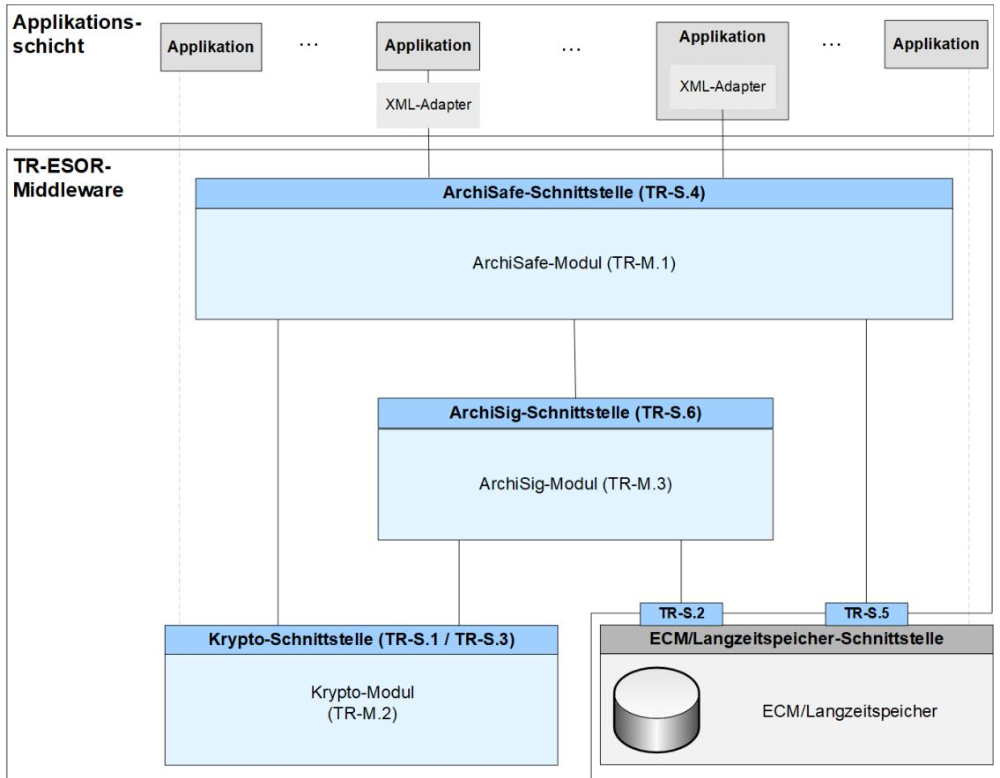
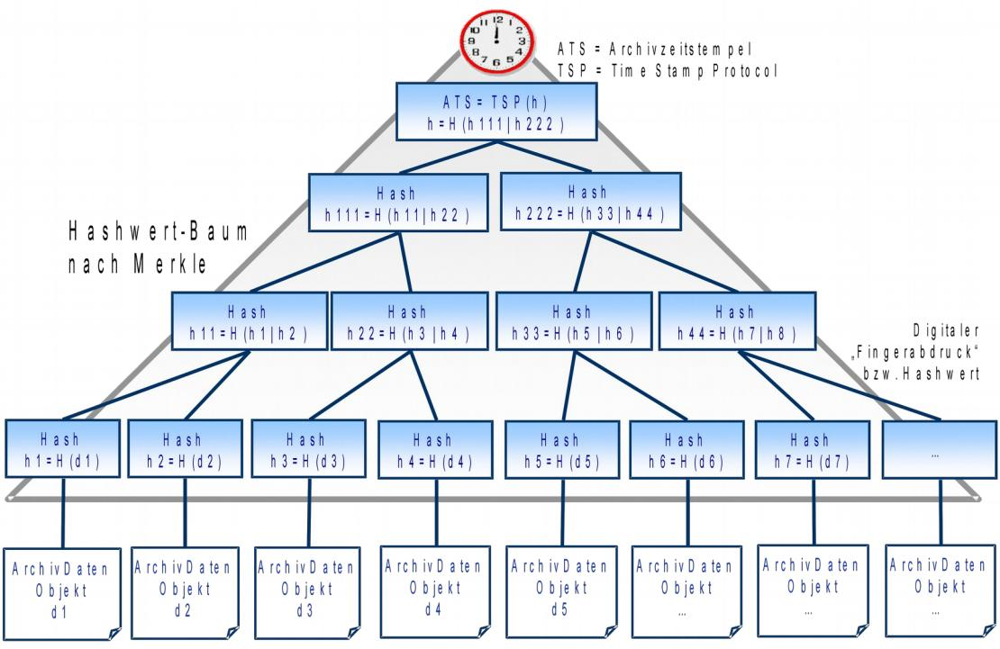
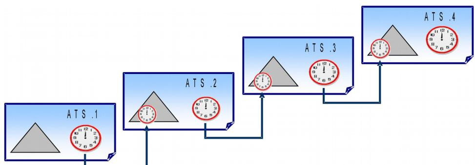
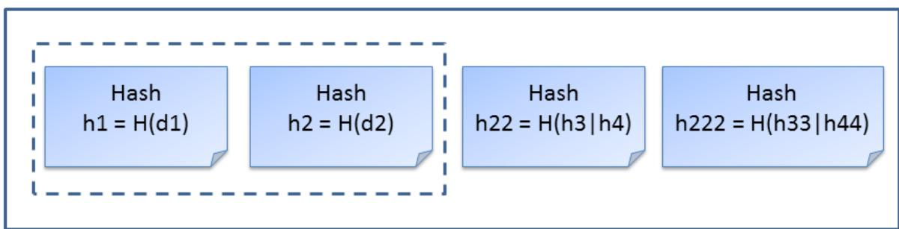
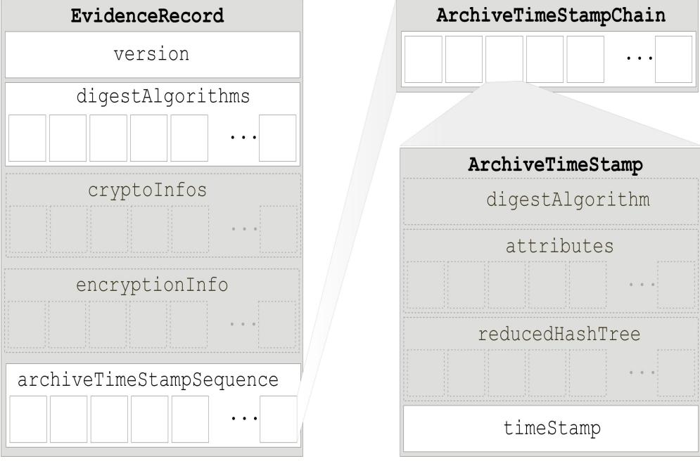
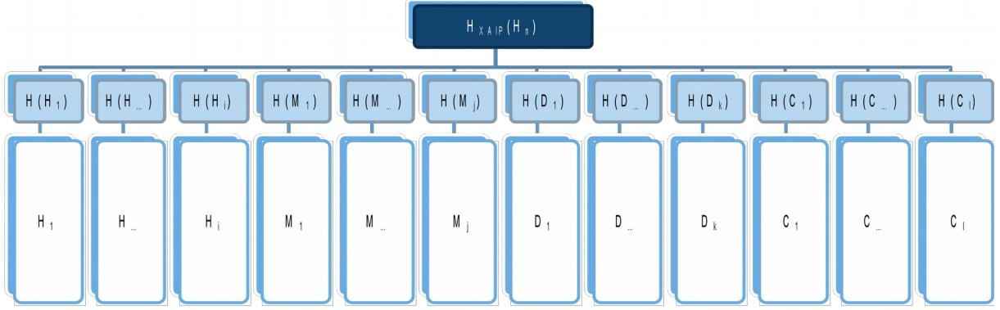
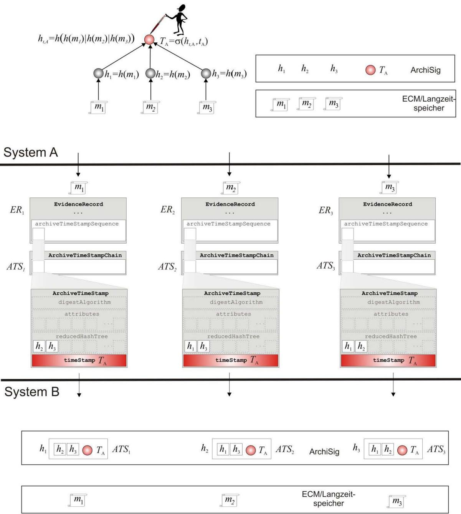

# BSI Technische Richtlinie 03125 Beweiswerterhaltung kryptographisch signierter Dokumente

## **Anlage TR-ESOR-M.3: ArchiSig-Modul**

| Bezeichnung | ArchiSig-Modul                         |
|-------------|----------------------------------------|
| Kürzel      | BSI TR-ESOR-M.3                        |
| Version     | 1.2.1 (auf Basis der eIDAS-Verordnung) |
| Datum       | 15.03.2018                             |

Bundesamt für Sicherheit in der Informationstechnik Postfach 20 03 63 53133 Bonn Tel.: +49 228 99 9582-0 E-Mail: [tresor@bsi.bund.de](mailto:tresor@bsi.bund.de) Internet: [https://www.bsi.bund.de](https://www.bsi.bund.de/) © Bundesamt für Sicherheit in der Informationstechnik 2018

## **Inhaltsverzeichnis**

| 1. Einführung                                                                                                                                                              | 5        |
|----------------------------------------------------------------------------------------------------------------------------------------------------------------------------|----------|
| 2. Übersicht                                                                                                                                                               | 7        |
| 2.1 Ziele und Definitionen7                                                                                                                                                |          |
| 2.2 Der initiale Archivzeitstempel8                                                                                                                                        |          |
| 2.3 Der "reduzierte" Hashbaum im Evidence Record10                                                                                                                         |          |
| 2.4 Prozesse11                                                                                                                                                             |          |
| 2.4.1 Erstellen des initialen Archivzeitstempels 2.4.2 Erneuerung des Archivzeitstempels nach der Erzeugung einer neuen Version eines abgelegten Archivdatenobjektes | 11 14 |
| 2.4.3 Erneuerung des Archivzeitstempels 2.4.4 Erneuerung des Hashbaums                                                                                                  | 14 15 |
| 2.5 Vorgehensweise beim Import von Evidence Records16                                                                                                                      |          |
| 2.5.1 Beispiel (informell)                                                                                                                                                 | 18       |
| 2.6 Migration von vorherigen XAIP-Versionen20                                                                                                                              |          |
| 3. Definition des ArchiSig-Moduls                                                                                                                                          | 21       |
| 3.1 Grundlegender Aufbau und funktionale Abgrenzung21                                                                                                                      |          |
| 3.2 Integration des ArchiSig-Moduls21                                                                                                                                      |          |
| 4. Funktionen des ArchiSig-Moduls                                                                                                                                          | 23       |
| 4.1 Übernahme von Archivdatenobjekten24                                                                                                                                    |          |
| 4.2 Erzeugen einer eindeutigen Archivdatenobjekt ID24                                                                                                                      |          |
| 4.3 Kanonisieren von XML-basierten Archivdatenobjekten24                                                                                                                   |          |
| 4.4 Berechnung von Hashwerten25                                                                                                                                            |          |
| 4.5 Erzeugung initialer Archivzeitstempel25                                                                                                                                |          |
| 4.6 Übergabe von Archivdatenobjekten an den ECM/Langzeitspeicher25                                                                                                         |          |
| 4.7 Erneuerung eines Archivzeitstempels26                                                                                                                                  |          |
| 4.8 Erneuerung der Hashbäume26                                                                                                                                             |          |
| 4.9 Auslesen von Archivdatenobjekten aus dem ECM/Langzeitspeicher27                                                                                                        |          |
| 4.10 Erzeugung von technischen Beweisdaten (Evidence Record)27                                                                                                             |          |
| 5. Sicherheitsfunktionen des ArchiSig-Moduls                                                                                                                               | 28       |
| 5.1 Schutz des ArchiSig-Moduls vor Manipulation28                                                                                                                          |          |
| 5.2 Bereitstellung von technischen Beweisdaten28                                                                                                                           |          |
| 5.3 Überwachung der Gültigkeitszeiträume von Algorithmen28                                                                                                                 |          |

## **Abbildungsverzeichnis**

| Abbildung 1: Schematische Darstellung der IT-Referenzarchitektur6                                                                                  |  |
|----------------------------------------------------------------------------------------------------------------------------------------------------|--|
| Abbildung 2: Archivzeitstempel bestehend aus einem binären Merkle-Hashbaum und einem qualifizierten elektronischen Zeitstempel an der "Wurzel"9 |  |
| Abbildung 3: Verkettung von Archivzeitstempeln (ArchiveTimeStampChain) bei der Signatur- bzw.                                                      |  |
| Siegel- bzw. Zeitstempelerneuerung10                                                                                                               |  |
| Abbildung 4: Beispiel eines reduzierten Hashbaums für das Dokument d1 aus Abbildung 210                                                            |  |
| Abbildung 5: EvidenceRecord gemäß [RFC4998]11                                                                                                      |  |
| Abbildung 6: Aufbau der Hashwerte für ein (temporäres) XAIP13                                                                                      |  |

Abbildung 7: Daten beim Ex- und Import von Evidence Records gemäß [RFC4998]..........................19

### **Tabellenverzeichnis**

## **1. Einführung**

Ziel der Technischen Richtlinie "Beweiswerterhaltung kryptographisch signierter Dokumente" ist die Spezifikation sicherheitstechnischer Anforderungen für den langfristigen Beweiswerterhalt von kryptographisch signierten elektronischen Dokumenten und Daten nebst zugehörigen elektronischen Verwaltungsdaten (Metadaten).

Eine für diese Zwecke definierte Middleware (TR-ESOR-Middleware) im Sinn dieser Richtlinie umfasst alle diejenigen Module (**M**) und Schnittstellen (**S)**, die zur Sicherung und zum Erhalt der Authentizität und zum Nachweis der Integrität der aufbewahrten Dokumente und Daten eingesetzt werden.

Die im Hauptdokument dieser Technischen Richtlinie vorgestellte Referenzarchitektur besteht aus den nachfolgend beschriebenen funktionalen und logischen Einheiten:

- der Eingangs-Schnittstelle S.4 der TR-ESOR-Middleware, die dazu dient, die TR-ESOR-Middleware in die bestehende IT- und Infrastrukturlandschaft einzubetten;
- dem "ArchiSafe-Modul" (**[TR-ESOR-M.1]**), welches den Informationsfluss in der Middleware regelt, die Sicherheitsanforderungen an die Schnittstellen zu den IT-Anwendungen umsetzt und für eine Entkopplung von Anwendungssystemen und ECM/Langzeitspeicher sorgt;
- dem "Krypto"-Modul (**[TR-ESOR-M.2]**) nebst den zugehörigen Schnittstellen S.1 und S.3, das alle erforderlichen Funktionen zur Berechnung von Hashwerten, zur Prüfung elektronischer Signaturen bzw. Siegel bzw. Zeitstempel, zur Nachprüfung elektronischer Zertifikate und zum Einholen qualifizierter Zeitstempel sowie (optional) elektronischer Signaturen bzw. Siegel für die Middleware zur Verfügung stellt. Darüber hinaus kann es Funktionen zur Ver- und Entschlüsselung von Daten und Dokumenten zur Verfügung stellen;
- dem "ArchiSig-Modul" (**[TR-ESOR-M.3]**) mit der Schnittstelle S.6, das die erforderlichen Funktionen für die Beweiswerterhaltung der digital signierten Unterlagen bereitstellt;
- einem ECM/Langzeitspeicher mit den Schnittstellen S.2 und S.5, der die physische Archivierung/Aufbewahrung und auch das Speichern der beweiswerterhaltenden Zusatzdaten übernimmt. *Dieser ECM/Langzeitspeicher ist nicht mehr direkt Teil der Technischen Richtlinie, gleichwohl werden über die beiden Schnittstellen, die noch Teil der TR-ESOR-Middleware sind, Anforderungen daran gestellt. Ebenso wenig ist die Applikationsschicht, die auch einen XML-Adapter enthalten kann, direkter Teil der Technischen Richtlinie, auch wenn dieser XML-Adapter als Teil einer Middleware implementiert werden kann.*

Die in Abbildung 1 dargestellte IT-Referenzarchitektur orientiert sich an der ArchiSafe[1](#page-4-1) Referenzarchitektur und soll die logische (funktionale) Interoperabilität künftiger Produkte mit den Zielen und Anforderungen der Technischen Richtlinie ermöglichen und unterstützen.

1 Siehe dazu [http://www.archisafe.de](http://www.archisafe.de/)

**Abbildung 1: Schematische Darstellung der IT-Referenzarchitektur**

Diese Technische Richtlinie ist modular aufgebaut und spezifiziert in einzelnen Anlagen zum Hauptdokument die funktionalen und sicherheitstechnischen Anforderungen an die erforderlichen IT-Komponenten und Schnittstellen der TR-ESOR-Middleware. Die Spezifikationen sind strikt plattform-, produkt-, und herstellerunabhängig.

Das vorliegende Dokument trägt die Bezeichnung "Anlage TR-ESOR-M.3" und spezifiziert die funktionalen und sicherheitstechnischen Anforderungen an ein kryptographisches Modul zur Signaturbzw. Siegel- bzw. Zeitstempelerneuerung nach § 15 des Vertrauensdienstegesetzes **[VDG]** sowie zur Erzeugung elektronischer Beweismittel zum Nachweis zur Integrität und Authentizität archivierter elektronischer Dokumente (Evidence Records nach dem ArchiSig Konzept), (im Folgenden kurz: ArchiSig-Modul [2](#page-5-0) ).

2 Der Name "ArchiSig" bezieht sich auf das Verbundprojekt "ArchiSig – Beweiskräftige und sichere Langzeitspeicherung digital signierter Dokumente", das in den Jahren 2001 bis 2003 vom Bundesministerium für Wirtschaft und Arbeit im Rahmen des Programms "VERNET - Sichere und verlässliche Transaktionen in offenen Kommunikationsnetzen" gefördert wurde. Ziel des Projektes war die Entwicklung einer gesetzeskonformen, wirtschaftlichen und leistungsfähigen informationstechnischen Lösung für eine beweiskräftige und sichere Langzeitspeicherung digital signierter Dokumente (mehr dazu unter: [http://www.archisig.de\)](http://www.archisig.de/)

# **2. Übersicht**

Der folgende Abschnitt gibt einen Überblick über grundsätzliche Ziele und Anforderungen an die für eine Signatur- bzw. Siegel- bzw. Zeitstempelerneuerung nach § 15 des Vertrauensdienstegesetzes erforderlichen kryptographischen Funktionen.

*HINWEIS: Im folgenden Text umfasst der Begriff "Digitale Signatur" "fortgeschrittene elektronische Signaturen" gemäß [eIDAS-VO, Artikel 3 Nr. 11], "qualifizierte elektronische Signaturen" gemäß [eIDAS-VO, Artikel 3 Nr. 12], "fortgeschrittenen elektronische Siegel" gemäß [eIDAS-VO, Artikel 3 Nr. 26] und "qualifizierte elektronische Siegel" gemäß [eiDAS-VO, Artikel 3 Nr. 27]. Insofern umfasst der Begriff "digital signierte Dokumente" sowohl solche, die fortgeschrittene elektronische Signaturen oder Siegel bzw. qualifizierte elektronische Signaturen oder Siegel tragen.* 

*Mit dem Begriff der "kryptographisch signierten Dokumente" sind in dieser TR neben den gemäß [eI-DAS-VO, Artikel 3 Nr. 12] qualifiziert signierten, den gemäß [eIDAS-VO, Artikel 3 Nr. 27] qualifiziert gesiegelten oder den gemäß [eIDAS-VO, Artikel 3 Nr. 34] qualifiziert zeitgestempelten Dokumenten (im Sinne der eIDAS-Verordnung) ) auch Dokumente mit einer fortgeschrittenen Signatur gemäß [eIDAS-VO, Artikel 3 Nr. 11] oder mit einem fortgeschrittenen Siegel gemäß [eIDAS-VO, Artikel 3 Nr. 26] oder mit einem elektronischen Zeitstempel gemäß [eIDAS-VO, Artikel 3 Nr. 33] erfasst, wie sie oft in der internen Kommunikation von Behörden entstehen. Nicht gemeint sind hier Dokumente mit einfachen Signaturen oder Siegeln basierend auf anderen (z. B. nicht-kryptographischen) Verfahren.*

### **2.1 Ziele und Definitionen**

Kryptographische Operationen, wie die elektronische Signatur- bzw. Siegel- bzw. Zeitstempelerstellung, ermöglichen es nur dann, die Integrität und Authentizität elektronischer Daten nachweisbar zu machen, wenn die den digitalen Signaturen bzw. bzw. elektronische Zeitstempel gemäß **[eIDAS-VO, Artikel 3 Nr. 33, 34)]** zugrunde liegenden Algorithmen und Parameter mathematisch und technisch sicherheitsgeeignet sind. Fortschritte in der Entwicklung von Computern und neue Methoden der Kryptographie können jedoch dazu führen, dass die Algorithmen oder ihre Parameter im Laufe der Zeit ihre Sicherheitseignung einbüßen. Ein dauerhafter und nachweisbarer Erhalt der Authentizität und Integrität elektronischer Daten erfordert deshalb den Einsatz zusätzlicher Sicherungsmittel, die den Nachweis ermöglichen, dass insbesondere digital signierte bzw. zeitgestempelte Daten über die Dauer der Aufbewahrungsfristen unverfälscht aufbewahrt wurden.

Ziel des ArchiSig-Moduls ist der Erhalt der Authentizität über den Nachweis der Integrität und damit des beweisrechtlichen Werts vor allem digital signierter bzw. zeitgestempelte Daten und Dokumente (Archivdatenobjekte) durch zusätzliche kryptographische Sicherungsmittel.

Das ArchiSig-Modul implementiert für diesen Zweck eine kryptographische Lösung nach **[RFC4998]** und (optional) nach **[RFC6283]**[3](#page-6-2) , die insbesondere sicherstellt, dass das durch § 15 des Vertrauensdienstegesetzes **[VDG]** skizzierte Verfahren zur Aufrechterhaltung der Sicherheit und Vertrauenswürdigkeit digitaler Signaturen bzw. elektronische Zeitstempel gemäß **[eIDAS-VO, Artikel 3 Nr. 33, 34]** durch eine erneute digitale Signatur im Rahmen eines Neusignierens oder erneuten Zeitstempelns gemäß **[VDG, Zu § 15 (Langfristige Beweiserhaltung)][4](#page-6-3)** zuverlässig und wirtschaftlich, d. h. auch für große Datenmengen, umgesetzt werden kann.

Diese erneute digitale Signatur muss die Daten und frühere digitale Signaturen bzw. elektronische Zeitstempel einschließen und mit sicherheitsgeeigneten kryptographischen Algorithmen und Parametern erzeugt werden. Das Erneuerungsverfahren kann automatisiert und so eingerichtet werden, dass viele Dokumente gemeinsam elektronisch neu signiert werden. Bei Daten/Dokumenten mit digitalen

3 **[RFC4998]** muss, **[RFC6283]** kann unterstützt werden. Die Prüfung von technischen Beweisdaten muss gemäß **[RFC4998]** und gemäß **[RFC6283]** unterstützt werden.

4 Gemäß § 15 des Vertrauensdienstegesetzes gilt: "Sofern hierfür Bedarf besteht, sind qualifiziert elektronisch signierte, gesiegelte oder zeitgestempelte Daten durch geeignete Maßnahmen neu zu schützen, bevor der Sicherheitswert der vorhan denen Signaturen, Siegel oder Zeitstempel durch Zeitablauf geringer wird. Die neue Sicherung muss nach dem Stand der Technik erfolgen."

Gemäß § 15 des Vertrauensdienstegesetzes, B Besonderer Teil, zu Artikel 1, zu Teil 2, zu § 15 gilt: "Die langfristige Sicherung qualifiziert signierter Daten erfolgt derzeit durch Neusignieren oder erneutes Zeitstempeln der signierten Daten, bevor die verwendeten Algorithmen und Parameter ihre Sicherheitseignung verlieren."

Signaturen bzw. qualifizierten elektronischen Zeitstempeln müssen qualifizierte elektronische Zeitstempel gemäß **[eIDAS-VO, Artikel 3 Nr. 20 und Artikel 42]** von qualifizierten Vertrauensdiensteanbietern mit dem Status **"granted"** gemäß **[eIDAS-VO, Artikel 3 Nr. 34 und Artikel 24]** und **[TR-ESOR-M2, Kapitel 3.3]** verwendet werden.[5](#page-7-1)

### **2.2 Der initiale Archivzeitstempel**

Grundlage des ArchiSig-Moduls für ein zu dieser Richtlinie konformes Archivsystem ist die informationstechnische Umsetzung des Evidence Record Syntax (kurz: ERS) Standards der IETF[6](#page-7-2) . ERS definiert im Detail, wie die Signatur-, bzw. Siegel- bzw. Zeitstempelerneuerungen auch für große Datenmengen automatisch durchgeführt werden können. Darüber hinaus legt der Standard die Datenformate fest, in denen die Beweisdaten über einen unbegrenzten Zeitraum bereitgestellt und ausgetauscht werden. Datenschutz-technische Aspekte werden ebenso berücksichtigt, da mit dem ERS-Standard auch Teile aus dem Dokumentenbestand gelöscht werden können, ohne die Beweiskraft der übrigen Teile zu beeinträchtigen. Technisch basiert der ERS-Standard auf dem Ansatz, dass kryptographische Prüfsummen (Hashwerte) der Archivdatenobjekte als kryptographisch eindeutige Repräsentanten der aufzubewahrenden Daten zum Zeitpunkt der Ablage im ECM/Langzeitspeicher oder kurz danach erzeugt werden.

Dazu werden die zu sichernden Daten gemäß den ERS Standards der IETF formatiert, gehasht und aus den Hashwerten wird – wie in Abschnitt 4.2 von **[RFC4998]** bzw. in Abschnitt 3.2.1 von **[RFC6283]** näher beschrieben – ein Hashbaum gebildet, der mit einem qualifizierten elektronischen Zeitstempel gesichert wird. Dieser Zeitstempel, ergänzt um die optionalen Felder reduzierter Hashbaum (siehe dazu Kapitel [2.3\)](#page-9-0), Hashalgorithmus und Attribute wird gemäß dem ERS-Standard **[RFC4998]** und **[RFC6283]** als **(initialer) Archivzeitstempel** bezeichnet.

Der initiale Archivzeitstempel muss, um den Anforderungen des § 15 des Vertrauensdienstegesetzes **[VDG]** zu genügen, eine fortgeschrittenen elektronische Signatur gemäß **[eIDAS-VO, Artikel 3 Nr. 11]** bzw. ein fortgeschrittenes elektronisches Siegel gemäß **[eIDAS-VO, Artikel 3 Nr. 26]** enthalten und ein qualifizierter elektronischer Zeitstempel gemäß **[eIDAS-VO, Artikel 42]** sein. Da es sich hierbei aber um keine Willenserklärung, sondern nur um ein Sicherungsmittel vorhandener Willenserklärungen handelt, muss die im Zeitstempel enthaltene Signatur auch keine persönliche Signatur (also weder die des ursprünglich Erklärenden noch die eines Archivars) sein. [7](#page-7-3) Für eine erneute elektronische Signatur bzw. Siegel bzw. Zeitstempel nach § 15 des Vertrauensdienstegesetzes **[VDG]** aller durch den initialen Archivzeitstempel geschützten Dokumente und Daten genügt deshalb die alleinige Erneuerung (Übersignatur) des Archivzeitstempels.

Da bereits bei der Erstellung einer digitalen Signatur nicht das eigentliche Dokument, sondern nur ein dieses Dokument repräsentierender Hashwert signiert wurde, würde es im Sinne des § 15 des Vertrauensdienstegesetzes **[VDG]** ausreichen, allein die digitale Signatur oder den elektronischen Zeitstempel des Dokumentes mit einem Zeitstempel zu versehen, der zum Zwecke der Signatur- bzw. Siegel- bzw. Zeitstempelerneuerung ebenfalls mit einem sicherheitsgeeigneten Algorithmus signiert sein muss. Dies schützt allerdings die im Archivdatenobjekt weiter enthaltenen Daten (z. B. nicht signierte Metadaten oder nicht signierte Dokumente) nicht. Besteht das Archivdatenobjekt als Datengruppe aus mehr als einem zu schützenden Element, wird gemäß Kapitel [2.4.1,](#page-10-0) Nr. 6 verfahren. Mit der kryptographischen Sicherung der zu schützenden Elemente des gesamten Archivdatenobjektes durch einen initialen Archivzeitstempel kann die Wirkung des zusätzlichen Sicherungsmittels auch auf die in das Archivdatenobjekt integrierten und zu sichernden Metainformationen und Verifikationsdaten sowie auf unsignierte elektronische Daten ausgedehnt werden.[8](#page-7-4)

5 Die zum Beweiswerterhalten genutzten digitalen Signaturen bzw. elektronische Zeitstempel gemäß **[eIDAS-VO, Artikel 3 Nr. 33, 34]** müssen mindestens die gleiche Qualität wie die ursprünglichen digitalen Signaturen bzw. elektronischen Zeitstempeln aufweisen; siehe **[ARO 07]** Seite 64.

6 Siehe **[RFC4998]**, **[GON 07]** und **[RFC6283]**.

7 vgl. hierzu **[SFD 06]**, S. 178

8 Da die Verifikationsdaten selbst wieder auf digital signierten Daten beruhen, wird damit zugleich der Forderung des § 15 des Vertrauensdienstegesetzes **[VDG]** Rechnung getragen, wonach eine erneute digitale Signatur alle (vorherigen) digitalen Signaturen bzw. Zeitstempeln zu den Daten umschließen muss.

**Abbildung 2: Archivzeitstempel bestehend aus einem binären Merkle-Hashbaum und einem qualifizierten elektronischen Zeitstempel an der "Wurzel"**

Um zugleich eine wirtschaftliche Lösung zu ermöglichen, nutzt der ERS-Standard die Regelungen des § 15 des Vertrauensdienstegesetzes **[VDG]**. Eine erneute digitale Signatur kann beliebig viele Daten umschließen (vgl. hierzu auch **[SFD 06]**). Der initiale Archivzeitstempel des ERS-Standards umschließt daher eine (konfigurierbare) Menge von 1..n Hashwerten der zu sichernden Daten (1..n Archivdatenobjekte), die in einem Merkle-Hashbaum **[MER 1980]** rekursiv kongregiert und mit einem qualifizierten elektronischen Zeitstempelgesichert ("versiegelt") werden (siehe Abbildung 2).

Mit der mathematischen Verknüpfung der Hashwerte im Hashbaum und dem sichernden qualifizierten elektronischen Zeitstempel wird nicht nur die Integrität des gesamten "Baums", sondern zugleich auch aller seiner "Blätter", d. h. der die Archivdatenobjekte repräsentierenden Hashwerte, mathema tisch beweisbar.

Vertrauensanker für den Archivzeitstempel und damit für eine Signaturerneuerung nach § 15 des Vertrauensdienstegesetzes **[VDG]** ist der qualifizierte elektronische Zeitstempel. Seine Datenstruktur muss sowohl die Anforderungen des "Timestamp Protocol (TSP)" **[RFC3161]** als auch der "Cryptographic Message Syntax (CMS)" (**[RFC5652]**, sowie **[RFC5816] und [EN 319 422]** (vgl. auch **[TR-ESOR-M.2, Kapitel 5.4.1])** erfüllen.

Bei einer weiteren Signatur- bzw. Siegel- bzw. Zeitstempelerneuerung wird der Hashwert des letzten Archivzeitstempel (ATS.1) gebildet und ggf. in einem neu zu bildenden Hashbaum (ggf. zusammen mit weiteren Hashwerten anderer Daten und Dokumente)[9](#page-8-0) eingetragen und mit einem neuen qualifizierten elektronischen Zeitstempel mit digitaler Signatur (ATS.2) als Abschluss gesichert. Damit entsteht eine sichere und nachweisbare chronologische Beweiskette aus kryptographisch miteinander verknüpften Vertrauensankern ("ArchiveTimeStampChain" gemäß **[RFC4998]** bzw. **[RFC6283]**) (siehe Abbildung 3).[10](#page-8-1)

9 Siehe **[RFC4998]**, Kapitel 5.2 bzw. **[RFC6283]**, Kapitel 4.2.1.

10 Für die Hashbaumerneuerung siehe Kapitel [2.4.4.](#page-14-0)

**Abbildung 3: Verkettung von Archivzeitstempeln (ArchiveTimeStampChain) bei der Signaturbzw. Siegel- bzw. Zeitstempelerneuerung**

### **2.3 Der "reduzierte" Hashbaum im Evidence Record**

Der technische Nachweis der Authentizität und Integrität der aufbewahrten Archivdatenobjekte erfolgt, neben der Vorlage der eigentlichen Archivdaten und der zugehörigen Zertifikate der vorhandenen digitalen Signaturen, vor allem über den Nachweis der Integrität der kryptographischen Repräsentanten der Archivdatenobjekte inklusive des Nachweises der rechtzeitigen Signatur- bzw. Siegel- bzw. Zeitstempelerneuerung gemäß § 15 des Vertrauensdienstegesetzes **[VDG]**. Der ERS-Standard **[RFC4998]** und **[RFC6283]**[11](#page-9-1) spezifiziert für diese Zwecke einen so genannten **reduzierten Hashbaum**, der die Grundlage für die Verifikation der Integrität von Archivdatenobjekten im Rahmen von so genannten **Evidence Records** gemäß **[RFC4998]** bzw. **[RFC6283]** bildet. Der reduzierte Hashbaum enthält alle Daten aus dem Hashbaum, die für die mathematische Verifikation der Integrität des Archivdatenobjektes benötigt werden.

**Abbildung 4: Beispiel eines reduzierten Hashbaums für das Dokument d1 aus Abbildung 2**

Das bedeutet, um die Unverfälschtheit eines Zeitstempels für ein bestimmtes Archivdatenobjekt mathematisch zu verifizieren, reicht es aus, den Weg vom Hashwert des Archivdatenobjektes bis zum Hashwert für den abschließenden Zeitstempel zurückzuverfolgen. Für das Datenobjekt d1 in Abbildung 2 ist der entsprechende Pfad (siehe auch Abbildung 4):

d1 → h1 → h11 → h111 → ATS

Ist H die für die Berechnung des Hashwerts benutzte Hashfunktion, muss die mathematische Verifikation zum Nachweis der Integrität die folgende Bedingung erfüllen:

H(H(H(h1 | h2) | h22) | h222) = H(h111 | h222) ATS ∈

Die Erneuerung des Schutzes qualifiziert elektronisch signierte, gesiegelte oder zeitgestempelte Daten mittels einem qualifizierten Zeitstempel nach § 15 des Vertrauensdienstegesetzes **[VDG]** begründet einen "Anscheinsbeweis im Anscheinsbeweis" (vgl. hierzu **[eIDAS-VO, Artikel 41, Absatz 2**] and **[SFD 06]**, S. 193). Mit der Verifikation des Archivzeitstempels inklusive des darin enthaltenen quali-

11 **[RFC4998]** muss, **[RFC6283]** kann bei der **Erzeugung** technischer Beweisdaten unterstützt werden. Die **Prüfung** von technischen Beweisdaten muss gemäß **[RFC4998]** und gemäß **[RFC6283]** unterstützt werden.

fizierten Zeitstempels und reduzierten Hashbaums und der Feststellung der Gültigkeit der digitalen Signaturen zum Signatur- bzw. Siegel- bzw. Zeitstempelerstellungszeitpunkt lässt sich somit ein schlüssiger Beweis des ersten Anscheins der Echtheit der von den digitalen Signaturen und Zeitstempeln umfassten Daten begründen.

Der ERS-Standard **[RFC4998]** definiert zudem das Datenformat für diese Nachweise, welches vom ArchiSig-Modul verwendet werden soll. Ergänzend (aber nicht alternativ) dazu kann auch die XML-Variante **[RFC6283]** verwendet werden.

### **2.4 Prozesse**

Die folgenden Abschnitte beschreiben grundsätzliche Prozesse, die ein zu dieser Richtlinie konformes ArchiSig-Modul unterstützen muss. Dabei wird die im Hauptdokument dieser Richtlinie erläuterte Referenzarchitektur (siehe auch Abbildung 1) zugrunde gelegt.

Wie im folgenden Text näher erläutert, sind bei der beweiswerterhaltenden Aufbewahrung von Daten insbesondere die folgenden drei Schritte zu beachten:

- **1.** Das Erstellen des initialen Archivzeitstempels,
- **2.** Die Zeitstempelerneuerung,
- **3.** Die Hashbaumerneuerung.

Wesentlich für die Zeitstempelerneuerung bzw. Hashbaumerneuerung ist dabei die in der folgenden Abbildung 5 beispielhaft gemäß **[RFC4998]** dargestellte ASN.1-basierte EvidenceRecord-Struktur und die darin in der ArchiveTimeStampSequence enthaltene zeitlich geordnete Folge von ArchiveTimeStampChain-Elementen, die wiederum eine zeitlich geordnete Folge von ArchiveTimeStamp-Elementen enthalten.

**Abbildung 5: EvidenceRecord gemäß [RFC4998]**

#### **2.4.1 Erstellen des initialen Archivzeitstempels**

Die Integrität und der Beweiswert der aufzubewahrenden Dokumente und Daten muss bei der Ablage im ECM/Langzeitspeicher mittels eines initialen Archivzeitstempels auf ein wohldefiniertes, normiertes Niveau gesetzt werden. Dazu werden alle eingehenden Archivdatenobjekte in konfigurierbaren Zeiträumen[12](#page-11-0) mit einem ersten Archivzeitstempel versehen.[13](#page-11-1)

Die einzelnen Prozessschritte des Erstellens eines initialen Archivzeitstempels sind:

- **1.** Eingang des Archivdatenobjektes in das ArchiSig-Modul im Rahmen der Archivierung dieses Datenobjektes.[14](#page-11-2)
- **2.** Bereitstellung und Verknüpfung (Eintrag in die XAIP Dokumentstruktur, falls noch nicht vom aufrufenden Modul eingestellt) einer eindeutigen Dokumentidentifikation (Archivdatenobjekt ID und ggf. Versions-ID) mit dem eingegangenen Archivdatenobjekt.
- **3.** Falls es sich um ein XML-basiertes Archivdatenobjekt handelt: Eintragen des Kanonisierungsalgorithmus' in die XAIP Dokumentenstruktur.
- **4.** Ein XML-basiertes Archivdatenobjekt gemäß Anhang F enthält folgende Datenstrukturen:
	- einen Archivdatenkopf **H** (packageHeader) mit Informationen über die logische(n) Struktur(en) des XAIP Dokumentes und den Absender,
	- einen Datenabschnitt für Metainformationen **M** zur Beschreibung des Geschäfts- und Archivierungskontextes der Inhaltsdaten (metaDataSection),
	- einen Datenabschnitt **D** für die Inhaltsdaten, (dataObjectsSection**)**, und
	- im Falle der Aufbewahrung elektronisch signierter bzw. gesiegelter bzw. zeitgestempelter Dokumente, einen Datenabschnitt **C** für die Ablage von beweisrelevanten Daten (Signaturen, Siegel, Zeitstempel, Zertifikate, Sperrlisten, OCSP-Responses etc.) und technischen Beweisdaten (Evidence Records) Signaturbzw. Siegel- bzw. Zeitstempelprüfinformationen(credentialsSection).

Jeder dieser Datenabschnitte enthält über die sog. protectedObjectPointer besonders gekennzeichnete (siehe dazu Anhang F, Kapitel 3.2 die Erläuterung zu protectedObjectPointer), kryptographisch zu schützende Datenstrukturen (Datenelemente), z.B. **H**i, **M**j, **D**k, **C**l als Teilelemente aus **H**, **M**, **D**, **C,** die über ein ID-Attribut als eindeutiger Identifikator verfügen und auf das ein <protectedObjectPointer>- Element dann jeweils verweist.

Diese protectedObjectPointer wiederum sind im sog. Versions-Manifest (versionManifest) enthalten und damit spezifisch für jede Version eines XAIP. Falls bereits mehrere Versionen eines XAIP existieren, ist für jede Version ein eigenes Versions-Manifest im XAIP enthalten.

Diese so markierten Datenelemente der letzten (aktuellsten) Version des XAIP ergeben den "Anteil" des XAIP, der im vorliegenden Fall kryptographisch zu schützen ist. Dieser Teil wird im weiteren "temporäres XAIP" genannt und ArchiSig ist dafür zuständig, diesen Anteil zu ermitteln.

**5.** Kanonisierung der Elemente des temporären XAIP mit dem angegebenen Kanonisierungs-Algorithmus (vgl. hierzu auch Anhang F, Kapitel 3.2 die Erläuterung zu *CanonicalizationMethod* ).

#### **6. Berechnung des Hashwerts HXAIP über das temporäre Archivdatenobjekt.**

Für jedes dieser zu sichernden Datenelemente **H**i, **M**j, **D**k, **C**l im temporären XAIP wird der Hashwert H()[15](#page-11-3) berechnet.

Gemäß **[RFC4998]** bzw. **[RFC6283]**16 bilden diese Datenelemente eine so genannte Datengruppe, deren Hashwerte sortiert, in aufsteigender Reihenfolge konkateniert und

12 Die Spezifikation der bis zum Aufbau eines initialen Archivzeitstempels zulässigen Zeiträume bestimmt sich wesentlich aus den verfolgten Aufbewahrungszwecken und muss in einem IT-Sicherheitskonzept verbindlich geregelt werden.

13 Siehe hierzu "Initial Archive Timestamp" in **[RFC4998]** Section 1.2, 3.2 und folgende bzw. **[RFC6283]**.

14 Es wird hierbei davon ausgegangen, dass es sich um ein syntaktisch korrektes Archivdatenobjekt handelt und ArchiSafe dies bereits geprüft hat. Im Fall eines ArchiveUpdateRequest hat das ArchiSafe-Modul aus dem DXAIP und der letzten Version ein neues XAIP erzeugt, dass hier übergeben wird.

15 Die Auswahl der aktuell möglichen Hash-Algorithmen ist dem Anhang [TR-ESOR-ERS], Kap. 5.1.1 und Kap. 5.1.2 zu entnehmen. Nähere Angaben zur Hashwert-Bildung finden sich in [TR-ESOR-F], Kap. 3,2, S. 14.

abermals gehasht werden, so dass hieraus im Ergebnis ein Hashwert HXAIP für das gesamte temporäre Archivdatenobjekt entsteht.

**Abbildung 6: Aufbau der Hashwerte für ein (temporäres) XAIP**

Der auf diese Weise über die zu sichernden Datenelemente des temporären Archivdatenobjekts berechnete Hashwert HXAIP ist nun seinerseits Grundlage für den Aufbau des Merkle-Hashbaums (Punkt 7), der schließlich durch einen abschließenden qualifizierten elektronischen Zeitstempel im Rahmen eines initialen Archivzeitstempels gesichert (Punkt 8) wird.

- **7.** (zeitlich nachgelagert oder parallel dazu) Aufbau des Merkle-Hasbaums gemäß der ERS-Standards.
- **8.** Sicherung des Merkle-Hashbaums durch einen qualifizierten elektronischen Zeitstempel, der eine digitale Signatur zusammen mit sämtlichen Informationen, die für eine Gültigkeitsprüfung des Zeitstempels einschließlich der darin enthaltenen digitale Signatur erforderlich sind, enthält (initialer Archivzeitstempel).
- **9.** Sobald dieser Zeitstempel erzeugt wurde, kann der zu einer Archivdatenobjekt-Version gehörende Evidence Record angefordert werden. Die Erstellung des spezifischen Evidence Records erfolgt, indem u.a.
	- der für die betreffende Archivdatenobjekt-Version relevante Teil des Hashbaumes (siehe reducedHashTree in **[RFC4998]** bzw. **[RFC6283]** und Kapitel [2.3\)](#page-9-0) ermittelt wird;
	- ggf. die fehlenden Felder des ArchiveTimeStamp (z.B. digestAlgorithms, version gemäß **[RFC4998]**)bis hin zum vollständigen EvidenceRecord ergänzt werden,
- **10.** Abspeichern des Archivdatenobjektes[17](#page-12-0)

Die Bereitstellung (Berechnung oder "Reservierung") der Archivdatenobjekt ID (AOID) kann durch den aufrufenden Client der Archiv-Middleware oder das ArchiSafe-Modul M.1 oder durch das Archi-Sig-Modul selbst oder durch den ECM/Langzeitspeicher realisiert werden.

Die Kanonisierung erfolgt durch das ArchiSig-Modul selbst. Wenn das Krypto-Modul geeignete Funktionen anbietet, können auch diese Funktionen genutzt werden.

Für das Kanonisieren von XML-basierten Archivdatenobjekten gelten grundsätzlich die Aussagen von TR-ESOR-M.2, Kapitel 4.4, auch wenn die Kanonisierung hier i.d.R. vom ArchiSig-Modul durchgeführt wird.

16 **[RFC4998]** muss, **[RFC6283]** kann unterstützt werden. Die Prüfung von technischen Beweisdaten muss gemäß **[RFC4998]** und gemäß **[RFC6283]** erfolgen.

17 Es wird hier das ursprünglich übergebene Archivdatenobjekt abgespeichert, nicht das temporäre XAIP.

Die Berechnung der Hashwerte und die Einholung des qualifizierten elektronischen Zeitstempels für den initialen Archivzeitstempel erfolgen durch das in Anlage TR-ESOR-M.2 dieser Richtlinie beschriebene Krypto-Modul über die in Anlage TR-ESOR-S dieser Richtlinie spezifizierte Schnittstelle S.3.

Die Übergabe der Archivdatenobjekte an den ECM/Langzeitspeicher muss unverzüglich nach der Verknüpfung (Zuweisung) mit einer eindeutigen Dokumentidentifikation (Archivdatenobjekt ID und ggf. Versions-ID) und der Berechnung der Hashwerte erfolgen.

#### **2.4.2 Erneuerung des Archivzeitstempels nach der Erzeugung einer neuen Version eines abgelegten Archivdatenobjektes**

Nach jeder Erzeugung einer neuen Version (Update)[18](#page-13-2) eines abgelegten Archivdatenobjektes, das bereits i Versionen enthält, wird der in Kapitel [2.4.1](#page-10-0) beschriebene Prozess für die neue Version des Archivdatenobjektes erneut durchlaufen.

Das heißt, für die neue Version i+1 des Archivdatenobjektes wird wiederum jeweils über sämtliche kryptographisch zu schützenden Bestandteile dieser Version i+1 des Archivdatendatenobjektes ein Hashwert nach dem in Kapitel [2.4.1](#page-10-0) beschriebenen Verfahren berechnet. Diese Hashwerte werden sortiert, in aufsteigender Reihenfolge konkateniert und abermals gehasht, so dass hieraus im Ergebnis ein Hashwert HXAIP,i+1 für die neue Version i+1 des Archivdatenobjektes entsteht. Dieser neue Hashwert HXAIP,i+1 fließt direkt in die Berechnung eines neuen initialen Archivzeitstempels ATSi+1 ein (siehe auch [2.4.1\)](#page-10-0).

Auf diese Weise ist jede Version eines Archivdatenobjektes kryptographisch gesichert.

Die Berechnung der Hashwerte und die Einholung des qualifizierten elektronischen Zeitstempels zur Sicherung des initialen Archivzeitstempels erfolgt durch das in Anlage TR-ESOR-M.2 dieser Richtlinie beschriebene Krypto-Modul über die in Anlage TR-ESOR-S dieser Richtlinie spezifizierte Schnittstelle S.3.

#### **2.4.3 Erneuerung des Archivzeitstempels**

Die Erneuerung des als kryptographisches Sicherungsmittel verwendeten qualifizierten elektronischen Zeitstempels und seiner digitalen Signatur ist ein zentraler Baustein der nach § 15 des Vertrauensdienstegesetzes **[VDG]** vorgeschriebenen Erneuerung des Schutzes (qualifiziert) elektronisch signierte, gesiegelte oder zeitgestempelte Daten.

Das ArchiSig-Modul muss - sofern zwar der verwendete Hashalgorithmus weiterhin sicherheitsgeeignet ist - bei einem drohenden Verlust der Sicherheitseigenschaften der im Archivzeitstempel enthaltenen **digitalen Signatur**[19](#page-13-3) eine Zeitstempelerneuerung[20](#page-13-4) durchführen. Entsprechende Übersichten geeigneter Algorithmen werden **[ETSI TS 119 312]** und **[SOG-IS]** veröffentlicht.

Wie in Abschnitt 5.2 von **[RFC4998]** bzw. Kap. 4 von **[RFC6283]** erläutert, wird bei der Zeitstempelerneuerung der timeStamp des zeitlich zuletzt in einer ArchiveTimeStampChain eingefügte ArchiveTimeStamp gehasht und mit einem neuen, mit geeigneten kryptographischen Algorithmen erstellten, ArchiveTimeStamp versehen. Hierbei verlängert sich gewissermaßen die zu einer Datenobjektgruppe bzw. einer XAIP-Version gehörende ArchiveTimeStampChain.

Da das ArchiSig-Modul den drohenden Verlust der Sicherheitseigenschaften nicht erkennen kann, muss der Prozess in der Regel von einem Administrator angestoßen werden.

Im Einzelnen sind für die eigentliche Erneuerung die folgenden Schritte erforderlich:

1. Berechnung der Hashwerte der qualifizierten elektronischen Zeitstempel aller vom drohenden Sicherheitsverlust betroffenen letzten Archivzeitstempel in den jeweiligen ArchiveTimeStampChains

18 Die Update-Funktion soll, muss aber nicht implementiert werden.

19 Im Wesentlichen handelt es sich hier um die für die Erstellung digitaler Signaturen verwendeten kryptographischen Verfahren relativ zu den verwendeten Schlüssellängen und anderer kryptographischer Parameter.

20 Ablauf und Format der Beweisdaten einer Zeitstempelerneuerung sind definiert in **[RFC4998],** Section 5: "Archive Timestamp Chain and Archive Timestamp Sequence" bzw. **[RFC6283],** Section 4: "Archive Time-Stamp Sequence and Archive Time-Stamp Chain".

- 2. Eintrag dieser Werte in einen neuen Hashbaum (optional, siehe **[RFC4998]**, Kap. 5.2, 2. Abs. bzw. **[RFC6283]**, Kap. 4.2.1)
- 3. Sicherung der Integrität dieses Hashbaums bzw. des Hashwertes durch einen neuen, sicherheitsgeeigneten qualifizierten elektronischen Zeitstempel mit digitaler Signatur (mit stärkeren Algorithmen) zusammen mit sämtlichen Informationen, die für eine Gültigkeitsprüfung des Zeitstempels einschließlich der darin enthaltenen digitalen Signatur erforderlich sind

Die Berechnung der Hashwerte und die Einholung des qualifizierten elektronischen Zeitstempels zur Sicherung des neuen Archivzeitstempels erfolgt durch das in Anlage TR-ESOR-M.2 dieser Richtlinie beschriebene Krypto-Modul über die in Anlage TR-ESOR-S dieser Richtlinie spezifizierte Schnittstelle S.3.

#### **2.4.4 Erneuerung des Hashbaums**

Eine Hashbaumerneuerung ist erforderlich, wenn die Sicherheitseigenschaften der für den Aufbau des Hashbaums und der Archivzeitstempel eingesetzten **Hashverfahren** bedroht sind. In diesem Fall muss das ArchiSig-Modul zunächst für sämtliche im ECM/Langzeitspeicher abgelegten Archivdatenobjekte neue Hashwerte auf der Basis (anderer) sicherheitsgeeigneter Hashverfahren berechnen und diese, wie unten beschrieben, mit der bereits existierenden ArchiveTimeStampSequence verknüpfen und mit einem neuen Archivzeitstempel versehen.

Der neue Hashbaum wird schließlich mit einem qualifizierten und sicherheitstechnisch geeigneten elektronischen Zeitstempel abgeschlossen ("versiegelt").

Da das ArchiSig-Modul den drohenden Verlust der Sicherheitseigenschaften nicht erkennen kann, muss der Prozess in der Regel von einem Administrator angestoßen werden.

Im Einzelnen sind dafür folgende Schritte durch das ArchiSig-Modul auszuführen (siehe auch [4.8](#page-25-0) ):

- **1.** Im ersten Schritt wird ein sicherer Hashalgorithmus *H* ausgewählt.
- **2.** Berechnung von neuen Hashwerten, ggf. mit vorausgehender Kanonisierung, jeweils für alle gespeicherten Archivdatenobjekte, mit einem neuen, sicherheitstechnisch stärkeren Hashalgorithmus unter Nutzung des Krypto-Moduls. Im Einzelnen gilt dabei:
	- Sei *di*=( *di*,1 *,*...*,di,n*) eine aus den Datenobjekten *di*,1 *,*... *,di,n* bestehende Datenobjektgruppe[21](#page-14-1), die bei der initialen Archivzeitstempelung aufsteigend sortiert, konkateniert und gehasht wurde, um der Hashbaumbildung zugeführt zu werden (siehe **[RFC4998]**, Abschnitt 5.2 bzw. **[RFC6283]**, Kap. 4.2.2). Dann werden in diesem Schritt die folgenden Hashwerte *hi*,1*=H* ( *di*,1) *,*.. .*,hi,n=H* ( *di,n* ) berechnet.
- **3.** Sei *atsci* die DER-codierte ArchiveTimeStampSequence, d.h. die Folge aller vorausgegangene ArchiveTimeStampChains in zeitlich chronologischer Reihenfolge incl. Tag und Length, für die Datenobjektgruppe *di* (siehe Abbildung 5 ), dann wird in diesem Schritt der Hashwert *hai=H* ( *atsci*) berechnet.
- **4.** Nun werden die in den vorherigen Schritten gebildeten Hashwerte *hi*,1 *,*...*,hi,n* und *hai* konkateniert (+) und die Hashwerte *hi*,1 *'=H* ( *hi*,1*+hai*) *,*...*,hi,n'=H* ( *hi,n+hai*) berechnet.
- **5.** Aus den auf diese Weise erzeugten Hashwerten *hi*,1 *',*. .. *,hi,n '* wird wie in den Abschnitten 4.2 und 5.2 von **[RFC4998]** und in den Abschnitten 3.2.1 und 4.2.2 in **[RFC6283]** näher beschrieben – ein Hashbaum gebildet, der mit einem Archivzeitstempel versehen wird.
- **6.** Der auf diese Weise erzeugte Archivzeitstempel bildet die Grundlage für eine neue ArchiveTimeStampChain, die an die bereits existierende ArchiveTimeStampSequence angehängt wird.

21 Wie in **[TR-ESOR-F]** näher erläutert, entspricht die Menge der in einer XAIP-Version über protectedObjectPointer referenzierten Datenobjekte einer solchen Datenobjektgruppe.

**7.** Durch die Hashbaumerneuerung verlängert sich also die ArchiveTimeStampSequence.

Für das Kanonisieren von XML-basierten Archivdatenobjekten gelten grundsätzlich die Aussagen von TR-ESOR-M.2, Kapitel 4.4, auch wenn die Kanonisierung hier i.d.R. vom ArchiSig-Modul durchgeführt wird.

Die Berechnung der Hashwerte und die Einholung des qualifizierten elektronischen Zeitstempels zur Sicherung des initialen Archivzeitstempels erfolgt durch das in Anlage TR-ESOR-M.2 dieser Richtlinie beschriebene Krypto-Modul über die in Anlage TR-ESOR-S dieser Richtlinie spezifizierte Schnittstelle S.3.

Die Neuberechnung der Hashwerte der gespeicherten Archivdatenobjekte erfordert darüber hinaus einen performanten Zugriff auf den ECM/Langzeitspeicher über die in Anlage TR-ESOR-S zu dieser TR spezifizierten Schnittstelle S.2.

Aber selbst bei einer optimalen Gestaltung der Lesezugriffe auf die im ECM/Langzeitspeicher abgelegten Daten kann die Neuberechnung der Hashwerte längere Zeit in Anspruch nehmen. Damit verbunden sind nicht nur erhebliche Kosten, sondern vor allem auch die Tatsache, dass der Schutz des Datenbestandes für die Dauer der Hashbaumerneuerung nicht mehr ausreichend gewährleistet werden kann. Um dem zu begegnen, empfiehlt der ERS-Standard zusätzlich den Einsatz mehrerer paralleler, redundanter Hashbäume, denen unterschiedliche Hashalgorithmen[22](#page-15-1) zugrunde liegen. Unterschreitet einer dieser Hashbäume das geforderte Sicherheitsniveau, sind die Archivdatenobjekte immer noch durch mindestens einen weiteren parallelen Hashbaum geschützt. Dadurch bleibt der gesamte archivierte Datenbestand geschützt, bis der komplette Prozess der Hashbaumerneuerung abgeschlossen ist.

Es ist weiterhin zu berücksichtigen, dass das ArchiSig-Modul auch während der Zeitdauer der Hashbaumerneuerung, die sich bei sehr großen Archiven durchaus im Bereich von Monaten bewegen kann, auch weiterhin die Sicherung von neu archivierten Dokumenten sowie ggf. die Berechnung von technischen Beweisdaten (Evidence Records) zur Beweisführung leisten können muss.

### **2.5 Vorgehensweise beim Import von Evidence Records**

Bei der langfristigen Aufbewahrung digitaler Daten ist damit zu rechnen, dass die aufbewahrten Daten eines Tages im Zuge einer Migration von einem System (A) zu einem anderen System (B) transferiert werden müssen. Da die Systeme A und B nicht notwendiger Weise vom gleichen Hersteller stammen müssen, ist eine solche Migration im Allgemeinen mit besonderen Herausforderungen für die Interoperabilität der betroffenen Systeme und der über entsprechende Im- und Export-Schnittstellen ausgetauschten Daten verbunden.

Während der Import von Nutzdaten (z. B. im XAIP-Format) mit ArchiveSubmissionRequest und der Export dieser Nutzdaten mit ArchiveRetrievalRequest sowie der Export der zugehörigen Beweisdaten gemäß der in **[RFC4998]** oder **[RFC6283]** standardisierten Evidence Record Syntax (ERS) mit ArchiveEvidenceRequest jenseits der bisher existierenden Schnittstellenspezifikation keiner weiteren Erläuterung bedürfen, ist beim Import von Evidence Records nicht ohne Weiteres klar, ob und wie eine Migration *ohne* die in Version 1.1 der **[TR-ESOR-F]**[23](#page-15-2) erwähnte Schachtelung der XAIP- und ERS-Daten grundsätzlich möglich ist. Da durch den mit Version 1.2 der TR-ESOR-Spezifikation eingeführten Verzicht auf eine solche Schachtelung eine von der XAIP-Struktur unabhängige und vor allem RFC-konforme Prüfung eines einzelnen Evidence Records trotz einer vorher stattgefundenen Migration ermöglicht wird, ist ein solcher übergangsloser Import von Evidence Records sehr erstrebenswert und soll deshalb im Folgenden näher beschrieben werden.

Vor diesem Hintergrund kann ein übergangsloser Import von Evidence Records folgendermaßen geschehen:

22 Algorithmen aus unterschiedlichen Familien erhöhen die Zuverlässigkeit weiter, da ein Angriff möglichweise in Zukunft die Sicherheitseignung einer gesamten Familie gefährden könnte (z. B. alle SHA-Abwandlungen)

23 Siehe Hinweis auf Seite 18 von **[TR-ESOR-F]**, Version 1.1 ("Bei einer Migration kann der alte XAIP-Container als Nutzdatenobjekt in einen neuen XAIP-Container geschachtelt werden. ...").

- **1.** Im Zuge des Imports von Evidence Records mit einem ArchiveSubmissionRequest[24](#page-16-0) wird ein XAIP und ein oder mehrere jeweils zu einer bestimmten Version gehörende(r) Evidence Record(s) als optionale Eingabeparameter übergeben.
- **2.** Das übergebene XAIP sowie der übergebene Evidence Record bzw. die übergebenen Evidence Records werden mit der VerifyRequest-Funktion geprüft.[25](#page-16-1)
- **3.** Neben der generellen Prüfung des Evidence Record für die jeweilige XAIP-Version (in der Regel durch das ArchiSafe-Modul) wird hier insbesondere untersucht, ob die Sicherheitseignung der bisher verwendeten Algorithmen gegeben war und ob die im System A eingesetzten Algorithmen bereits dem Sicherheitsniveau der in System B eingesetzten Algorithmen entsprechen. Sofern nicht bereits die in System B eingesetzten Algorithmen verwendet wurden, wird empfohlen sofort im Zuge des Imports eine entsprechende Zeitstempelerneuerung oder Hashbaumerneuerung durchzuführen. Es sind also die folgenden drei Fälle zu unterscheiden:
	- **a.** Hash- und Signatur- bzw. Siegelalgorithmus sind beide aktuell:

In diesem Fall werden lediglich die essentiellen Bestandteile des importierten Evidence Record bzw. der importierten Evidence Records (d.h. die ArchiveTimeStampSequence und ihre Bestandteile) in die ArchiSig-Datenbasis des Systemes B übernommen und für eine spätere Zeitstempel- oder Hashbaumerneuerung vorbereitet sowie das Archivdatenobjekt im Speicher abgelegt.

**b.** Hashalgorithmus ist aktuell, aber der Signatur- bzw. Siegelalgorithmus ist bedroht:

In diesem Fall wird beim Import oder nach dem Import innerhalb eines vorgegebenen angemessenen Zeitrahmens vor Ablauf der Sicherheitseignung des Signatur- bzw. Siegelalgorithmus eine Zeitstempelerneuerung durchgeführt, wobei das importierte ArchiveTimeStampChain-Element mit einem neuen Zeitstempel versehen werden.

**c.** Hashalgorithmus ist bedroht:

In diesem Fall wird beim Import oder nach dem Import innerhalb eines vorgegebenen angemessenen Zeitrahmens vor Ablauf der Sicherheitseignung des Hashalgorithmus eine Hashbaumerneuerung durchgeführt. Hierbei wird die importierte DER-codierte ArchiveTimeStampSequence *atsci* incl. Tag und Length als atomare Einheit betrachtet und zusammen mit den importierten Bestandteilen des Archivdatenobjektes unter Verwendung des neuen Hashalgorithmus gehasht, in einen Hashbaum integriert und mit einem neuen Archivzeitstempel versehen. Im Detail werden hier die folgenden Schritte durchgeführt:

- Durch die protectedObjectPointer im versionsspezifischen Inhaltsverzeichnis versionManifest der jeweiligen XAIP-Version ist die Menge der ERS-geschützten Datenobjekte *di*,1 *,*.. .*,di,n* bestimmt. Diese Datenobjekte werden gehasht[26](#page-16-2), um die Werte *hi*,1*=H* ( *di*,1) *,*...*,hi,n=H* ( *di,n* ) zu erhalten.
- Diese werden mit dem Hashwert *hai=H* ( *atsci*) der codierten ArchiveTimeStampSequence *atsci* **binär aufsteigend sortiert, dann** konkateniert und erneut gehasht, um schließlich die Hashwerte *hi*,1 *'=H* ( *hi*,1*+hai*) *,*...*,hi,n'=H* ( *hi,n+hai*) zu berechnen.
- Für diese Hashwerte wird wie in Abschnitt 5.2 von **[RFC4998]** bzw. Abschnitt 4.2.2 von **[RFC6283]** ein Hashbaum gebildet, der mit einem Archivzeitstempel versehen wird. Dieser Archivzeitstempel bildet schließlich

24 Detaillierte Erläuterungen zum Import von Evidence Records befinden sich in **[TR-ESOR-S]** und **[TR-ESOR-E].**

25 Diese Verifikation wird (in der Regel) bereits vom aufrufenden Modul ArchiSafe durchgeführt.

26 Detaillierte Festlegungen welche Daten (mit bzw. ohne XML-Tags) genau der Hashwertbildung zugeführt werden, sind Gegenstand von **[TR-ESOR-F]**.

die Grundlage für eine neue ArchiveTimeStampChain, die an die bereits existierende ArchiveTimeStampSequence angehängt wird.

**4.** Beim späteren Export des Evidence Record mittels ArchiveEvidenceRequest wird der aktuelle und ggf. durch Zeitstempel- und/oder Hashbaumerneuerungen ergänzte Evidence Record zurückgeliefert, der neben der bereits zum Zeitpunkt des Imports existierenden ArchiveTimeStampSequence auch die vom System B neu erstellten ArchiveTimeStamp-Elemente enthält.

Durch diesen Importmechanismus kann eine reibungslose Übernahme ERS-geschützter Daten erfolgen und letztlich eine Migration zwischen verschiedenen Systemen *ohne* die Schachtelung von XAIP- und ERS-Strukturen realisiert werden. Hierdurch kann der Beweiswerterhalt – auch über Migrationen hinweg – unabhängig von der XAIP-Struktur erfolgen, und für den Nachweis genügt ein einzelner Evidence Record, der sowohl die von System A erzeugten Beweisdaten als auch die darauf aufbauenden und von System B erzeugten Daten umfasst.

#### **2.5.1 Beispiel (informell)**

Die folgende Abbildung 7 veranschaulicht den Export und Import von Evidence Records anhand eines einfachen Beispiels. Im System A werden drei Datenobjekte *m*1 , *m*2 und *m*3 abgelegt, in einem Hashbaum angeordnet und mit einem initialen Archivzeitstempel *T A* versehen. In der ArchiSig-Datenbasis werden in diesem Fall möglicherweise[27](#page-17-1) alle Blätter des Hashbaumes, d.h. die Hashwerte *h*1 , *h*2 und *h*3 , und der Archivzeitstempel *T A* abgelegt. Neben den eigentlichen Hashwerten und dem Archivzeitstempel werden auch die verwendeten kryptographischen Algorithmen abgelegt, damit erkannt werden kann, ob die Daten bei einer möglichen zukünftigen Zeitstempel- oder Hashbaumerneuerung berücksichtigt werden müssen oder nicht. Beispielsweise würde im Fall einer Zeitstempelerneuerung der Archivzeitstempel *T A* vom neuen Zeitstempel umfasst.

Mit den Funktionen ArchiveRetrievalRequest und ArchiveEvidenceRequest können die abgelegten Datenobjekte *m*1 , *m*2 und *m*3 sowie die zugehörigen Evidence Records *ER1* , *ER2* und *ER3* aus dem System A ausgelesen werden.

27 Es sei darauf hingewiesen, dass die internen Abläufe im ArchiSig-Modul und die etwaigen Speicherstrukturen jenseits der Festlegungen in **[RFC4998]** bzw. **[RFC6283]** nicht normiert sind und deshalb die Ausführungen hier lediglich informativen Charakter besitzen.

#### **Abbildung 7: Daten beim Ex- und Import von Evidence Records gemäß [RFC4998]**

Die ausgelesenen Datenobjekte und Evidence Records können nun mittels der Funktion ArchiveSubmissionRequest unter Verwendung des optionalen Eingabeparameters ImportEvidence in das System B eingespeist werden. Hierbei werden die für die weitere Aufbewahrung relevanten Informationen aus den entgegengenommenen Evidence Records extrahiert und in geeigneter Weise in die ArchiSig-Datenbasis des Systemes B importiert, so dass neben den Hashwerten *h*1 , *h*2 und *h*3 auch die aus den Evidence Records extrahierten Archivzeitstempel *ATS1* , *ATS 2* und *ATS3* in der ArchiSig-Datenbasis abgelegt werden. Obwohl diese drei Archivzeitstempel jeweils den Archivzeitstempel *T A* enthalten, wird ein naiv implementiertes System B möglicherweise aus der Identität der drei mal importierten Archivzeitstempel *T A* in den Evidence Records kein Kapital schlagen können und statt dessen die Zeitstempel einzeln und redundant in die ArchiSig-Datenbasis aufnehmen und dort als eigenständige Objekte behandeln.

### **2.6 Migration von vorherigen XAIP-Versionen**

**(A2.6-1)** Für die Migration von einem in einer vorherigen XAIP-Version vorliegenden Archivdatenobjekt muss folgendermaßen vorgegangen werden:

- **1.** Das XAIP aus der vorherigen Version muss in ein xmlData-Element eingefügt werden.
- **2.** Der oder die zugehörigen Evidence Records müssen in die Credential Section eingefügt werden, wobei auf das existierende XAIP und ggf. die zugehörige Version verwiesen wird.
- **3.** Außerdem soll das entsprechende XML-Schema der vorherigen Version in einem metaDataObject mit category=REP und classification=SYNTAX eingefügt werden.

## **3. Definition des ArchiSig-Moduls**

Der Begriff "**ArchiSig-Modul**" umfasst sämtlich Funktionen, die der langfristigen kryptographischen Sicherung und dem Erhalt der Authentizität und der Nachweisbarkeit der Integrität von Daten und Dokumenten (Archivdatenobjekte) nach dem ERS-Standard der IETF dienen.

Vornehmlicher Zweck des ArchiSig-Moduls ist die Implementierung einer zuverlässigen und zugleich wirtschaftlichen kryptographischen Lösung, für das durch § 15 des Vertrauensdienstegesetzes **[VDG]** skizzierte Verfahren zur Aufrechterhaltung der Sicherheit und Vertrauenswürdigkeit digitaler Signaturen sowie elektronischer Zeitstempel gemäß **[eIDAS-VO, Artikel 3 Nr. 33, 34]** . Darüber hinaus stellt das ArchiSig-Modul optional eine Funktion zur Verfügung, die für jedes neu im ECM/Langzeitspeicher aufzubewahrende Dokument (Archivdatenobjekt) eine eindeutige Dokumentenkennung (Archivdatenobjekt ID) zur Verfügung stellt und dauerhaft mit den im ArchiSig-Modul angelegten und verwalteten kryptographischen Sicherungsmitteln (Hashwerte, Archivzeitstempel) so verknüpft, dass eine Zuordnung der abgelegten Daten über die Dokumentenkennung zu den Sicherungsmitteln jederzeit zweifelsfrei möglich ist.

### **3.1 Grundlegender Aufbau und funktionale Abgrenzung**

**(A3.1-1)** Das ArchiSig-Modul muss eine Software- und / oder Hardware-Komponente oder Teil einer Software- und / oder Hardware-Komponente sein, die vertrauenswürdig und zuverlässig kryptographische Sicherungsmittel für den langfristigen Nachweis der Authentizität und Integrität der aufbewahrten Daten und Dokumente gemäß dem ERS-Standard erstellt, verwaltet und auf Anforderung erneuert.

**(A3.1-2)** Das ArchiSig-Modul kann für jedes neu im ECM/Langzeitspeicher abzulegende Archivdatenobjekt eine eindeutige Archivdatenobjekt ID bereitstellen.

**(A3.1-3)** Das ArchiSig-Modul muss die eindeutige Archivdatenobjekt ID eines Archivdatenobjektes zuverlässig, d. h. zweifelsfrei, dauerhaft und nachvollziehbar mit dem zu diesem Archivdatenobjekt berechneten Hashwert verknüpfen.

**(A3.1-4)** Das ArchiSig-Modul muss als selbstständige Anwendung oder selbstständiger (funktional abgegrenzter) Teil einer Anwendung auf einem vertrauenswürdigen IT-System laufen und darf ausreichende Schutzfunktionen der Systemplattform vor unberechtigten Zugriffen auf die Funktionen des Moduls und Beeinträchtigungen des Betriebs voraussetzen. Das ArchiSig-Modul darf weder logisch noch funktional Bestandteil der vorgelagerten IT-Fachanwendungen sein.

**(A3.1-5)** Das ArchiSig-Modul darf selbst keine, mit Ausnahme der Kanonisierungsfunktionen und Funktionen zum Aufbau von Merkle-Hashbäumen, kryptographischen Funktionen zum Schutz der Authentizität oder zur Prüfung der Integrität und Authentizität implementieren. Das ArchiSig-Modul nutzt für diese Zwecke vertrauenswürdige kryptographische Komponenten, wie sie in der Anlage TR-ESOR-M.2 dieser Richtlinie beschrieben werden.

Die kryptographischen Komponenten werden über die in der Anlage TR-ESOR-S spezifizierte Schnittstelle S.3 angesprochen.

**(A3.1-6)** Das ArchiSig-Modul muss über eine sichere Datenablage zur Aufnahme der Archivzeitstempel und der Archivdatenobjekt ID verfügen (siehe Hauptdokument, Kapitel 7.1).

### **3.2 Integration des ArchiSig-Moduls**

**(A3.2-1)** Das ArchiSig-Modul soll Modulcharakter besitzen und jederzeit durch neue, funktional kompatible Implementierungen ersetzt werden können.

**(A3.2-2)** Für die Integration des ArchiSig-Moduls in bestehende oder geplante IT-Einsatzumgebungen muss das ArchiSig-Modul mindestens die in der Anlage TR-ESOR-S zu dieser Richtlinie spezifizierten und beschriebenen Schnittstellen S.2, S.3 und S.6 implementieren bzw. nutzen können. Dabei wird das ArchiSig-Modul über die Schnittstelle S.6 von anderen Modulen aufgerufen und und ruft über die Schnittstelle S.3 das Krypto-Modul auf sowie über die Schnittstelle S.2 das ECM/Langzeitspeichersystem auf.

**(A3.2-3)** Die Implementierung zusätzlicher Schnittstellen darf nicht die Gewährleistung der sicherheitstechnischen Grundanforderungen (siehe Kapitel [5\)](#page-27-3) kompromittieren.

**(A3.2-4)** Die Ablage neuer Archivdatenobjekte im ECM/Langzeitspeicher soll über das ArchiSig-Modul erfolgen (vgl. auch die empfohlene Referenzarchitektur), um sicher zu stellen, dass das Archivdatenobjekt bereits ab dem Zeitpunkt der Archivierung von den Sicherungsmitteln des ArchiSig-Moduls erfasst ist.

## **4. Funktionen des ArchiSig-Moduls**

Dieser Abschnitt der Technischen Richtlinie spezifiziert und erläutert auf der Grundlage des ERS-Standards der IETF **[RFC4998]** bzw. **[RFC6283]**[28](#page-22-2) die funktionalen Anforderungen an das ArchiSig-Modul. Die Schnittstellen (Schnittstellensignaturen) des ArchiSig-Moduls zu den anderen Modulen der TR-ESOR-Middleware M.1 und M.2 und zum ECM/Langzeitspeicher sind in der Anlage TR-ESOR-S dieser Richtlinie spezifiziert.

**(A4.0-1)** Ein zu dieser Richtlinie konformes ArchiSig-Modul muss mindestens die folgende Funktionalität ArchiveSubmissionRequest und soll die folgende Funktionalität ArchiveUpdateRequest (siehe [4.1](#page-23-2)*)* besitzen, jedoch nicht notwendigerweise anderen Modulen zur Verfügung stellen. Bestimmte Operationen (insbesondere die kryptographischen) können auch durch andere Module übernommen werden:

Für den Prozess der erstmaligen Ablage eines Archivdatenobjektes oder der Erzeugung einer neuen Version eines abgelegten Archivdatenobjektes sind die folgenden Schritte erforderlich:

- 1. Das Entgegennehmen des Archivdatenobjektes zum Zweck des Aufbaus der kryptographischen Sicherungsmittel.
- 2. Die Bereitstellung (Erzeugung oder Zuweisung) einer eindeutigen Dokumentenkennung (einer Archivdatenobjekt ID AOID) für das erstmals abzulegende Archivdatenobjekt. Die Bereitstellung der AOID kann alternativ durch den aufrufenden Client der TR-ESOR-Middleware oder das ArchiSafe-Modul M.1 oder den ECM/Langzeitspeicher erbracht werden. Dem erstmals abgelegten Archivdatenobjekt wird eine Default-Versionsnummer (VersionID) zugewiesen.
- 3. Falls eine Erzeugung einer neuen Version eines bereits archivierten Archivdatenobjekts mit seiner bereits vorhandenen AOID und VersionID durchgeführt wird, wird im Erfolgsfall ein eindeutiger Identifikator der neuen Version des Archivdatenobjektes nach Inkrimentierung der alten VersionID als neue VersionID erzeugt.
- 4. Das Kanonisieren des XML-basierten Archivdatenobjektes. Diese Funktion kann alternativ auch durch das Krypto-Modul oder das ArchiSafe-Modul erbracht werden, allerdings nur im konkreten Fall eines laufenden Systems. Hersteller eines ArchiSig-Moduls dürfen sich darauf nicht beziehen.
- 5. Die Berechnung der Hashwerte über die zu sichernden Elemente eines Archivdatenobjektes oder einer Version eines Archivdatenobjektes (vgl. [2.4.1,](#page-10-0) Fußnote 22 auf Seite [16\)](#page-15-3) für den Aufbau des initialen Archivzeitstempels auf der Grundlage sicherheitsgeeigneter Algorithmen und Parameter.
- 6. Die Erzeugung initialer Archivzeitstempel (ArchiveTimeStamp, ATS) nach dem ERS-Standard.
- 7. Der Übergabe des Archivdatenobjektes an den ECM/Langzeitspeicher.

Für die Prozesse zum langfristigen Beweiswerterhalt sind die folgenden Schritte erforderlich:

- 8. Die Erneuerung eines oder mehrerer Archivzeitstempel gemäß des ERS-Standards.
- 9. Die Erneuerung eines oder mehrerer Hashbäume gemäß des ERS-Standards auf der Grundlage sicherheitsgeeigneter Algorithmen und Parameter.
- 10. Das Auslesen von Archivdatenobjekten aus dem ECM/Langzeitspeicher, um für eine Erneuerung des Hashbaumes (vgl. [2.4.4\)](#page-14-0) die Hashwerte für die Archivdatenobjekte berechnen zu können (vgl. [5\)](#page-22-1).

28 **[RFC4998]** muss, **[RFC6283]** kann für die Erstellung technischer Beweisdaten unterstützt werden. Die Prüfung von technischen Beweisdaten muss gemäß **[RFC4998]** und gemäß **[RFC6283]** unterstützt werden.

Für den Prozess zum Nachweis des Beweiswertes sind die folgenden Schritte erforderlich:

11. Die Erzeugung und Rückgabe eines Evidence Records für eine durch die AOID und eine VersionID definierte Version eines Archivdatenobjektes oder aller Evidence Records eines Archivdatenobjektes (ArchiveEvidenceRequest*)* gemäß des ERS-Standards **[RFC4998]** / **[RFC6283]**. Wenn kein spezielles ERS-Format angefordert wird, wird defaultmäßig der Evidence Record oder die Evidence Records im ERS-Format gemäß **[RFC4998]** zurückgegeben.

### **4.1 Übernahme von Archivdatenobjekten**

Mit dieser Funktion wird ein Archivdatenobjekt über einen sicheren Kommunikationskanal in das ArchiSig-Modul importiert, um von den kryptographischen Sicherungsmitteln erfasst zu werden.

Der Aufruf ist in der Anlage TR-ESOR-S zu dieser Richtlinie in der Schnittstelle S.6 (ArchiveSubmissionRequest bzw. ArchiveUpdateRequest) [29](#page-23-3) näher spezifiziert und beschrieben.

**(A4.1-1)** Im Fall des Imports eines Archivdatenobjektes zusammen mit den dazu gehörigen Evidence Records sollen die in Kapitel [2.5](#page-15-0) beschriebenen Funktionen geeignet umgesetzt werden.

### **4.2 Erzeugen einer eindeutigen Archivdatenobjekt ID**

Die optionale Funktion stellt für das an das ArchiSig-Modul übergebene Archivdatenobjekt eine eindeutige Dokumentenkennung (Archivdatenobjekt ID, AOID) bereit. Die Funktion wird gemäß empfohlener Referenzarchitektur von der Funktion ArchiveSubmissionRequest (siehe [4.1](#page-23-2) ) aufgerufen.

**(A4.2-1)** Für die Erstellung (Berechnung) der Archivdatenobjekt ID kann das ArchiSig-Modul eigene, sicherheitsgeeignete Algorithmen implementieren oder vom Krypto-Modul oder durch den ECM/Langzeitspeicher bereitgestellte Funktionen nutzen.[30](#page-23-4)

**(A4.2-2)** Die Erzeugung einer Archivdatenobjekt ID muss eindeutig (kollisionsfrei) sein.

**(A4.2-3)** Falls ein XML-basierendes Archivdatenobjekt (XAIP, vgl. Anhang F) verarbeitet wird, muss die Archivdatenobjekt ID durch das ArchiSig-Modul vor der Hashwertberechnung in das Archivdatenobjekt eingetragen und bei Übergabe des Archivdatenobjektes an den ECM/Langzeitspeicher mit angegeben werden.

### **4.3 Kanonisieren von XML-basierten Archivdatenobjekten**

Diese Funktion kanonisiert das XML-basierte Archivdatenobjekt. Es gelten hier auch grundsätzlich die Aussagen und Festlegungen des Kapitels 4.4 von TR-ESOR-M.2. Die Funktion wird von der Funktion ArchiveSubmissionRequest (siehe [4.1](#page-23-2) ) aufgerufen.

**(A4.3-1)** Der für die Kanonisierung verwendete Algorithmus muss vor der Kanonisierung und Hashwertberechnung in das entsprechende Feld des PackageHeaders des XAIP eingetragen werden.[31](#page-23-5)

**(A4.3-2)** Jedes XML-basierte Archivdatenobjekt muss unmittelbar vor der Hashwertberechnung kanonisiert werden.

29 Die Update-Funktion soll, muss aber nicht implementiert werden.

30 Die Storage Network Industry Association **[SNIA 08]** definiert bspw. für ein XML-Speicherobjekt (XSet) eine so geanannte XUID: "An XSet is a logical collection of data and metadata that is identified as a single unit using an XSet Unique Identifier or XUID."

31 Kapitel 4.4 von **[TR-ESOR-M.2]** definiert quasi einen Default-Algorithmus, weshalb die verpflichtende Angabe des Algorithmus hier zunächst überflüssig erscheint. Diese Festlegung könnte in der fernen Zukunft jedoch unbekannt sein, weshalb das explizite Eintragen des Algorithmus sicherlich von Vorteil ist.

### **4.4 Berechnung von Hashwerten**

Die Funktion erzeugt aus dem übergebenen und zur Ablage im ECM/Langzeitspeicher vorgesehenen Archivdatenobjekt Hashwerte. Die Funktion wird von der Funktion ArchiveSubmissionRequest (siehe [4.1](#page-23-2) ) aufgerufen.

**(A4.4-1)** Die Berechnung des Hashwertes muss über alle relevanten Anteile des Archivdatenobjektes (vgl. hierzu Kapitel [2.4.1](#page-10-0) ) auf der Grundlage sicherheitsgeeigneter Algorithmen und Parameter erfolgen.

**(A4.4-2)** Das ArchiSig-Modul muss in der Lage sein, die relevanten zu sichernden Anteile des Archivdatenobjektes (vgl. hierzu Kapitel [2.4.1](#page-10-0) ) vor der Hashwertberechnung zu bestimmen.

**(A4.4-3)** Die eigentliche Berechnung von Hashwerten muss durch das zur TR-ESOR-Middleware gehörende Krypto-Modul (siehe Anlage TR-ESOR-M.2) über die in Anlage TR-ESOR-S dieser Richtlinie beschriebene Schnittstelle S.3 erfolgen.

**(A4.4-4)** Der berechnete Hashwert HXAIP (vgl. hierzu Kapitel [2.4.1](#page-10-0) ) und die Archivdatenobjekt ID und ggf. die VersionID müssen in einem zum ArchiSig-Modul gehörenden oder dem ArchiSig-Modul zugewiesenen sicheren Datenspeicher so abgelegt und aufbewahrt werden, dass der zu einer Archivdatenobjekt ID und ggf. VersionID gehörige Hashwert HXAIP jederzeit und zweifelsfrei identifiziert werden kann.

### **4.5 Erzeugung initialer Archivzeitstempel**

Die Funktion erzeugt einen initialen Archivzeitstempel nach dem ERS-Standard. Die Funktion wird entweder direkt von der Funktion ArchiveSubmissionRequest (siehe [4.1](#page-23-2) ) aufgerufen oder zeitlich gesteuert gestartet.

**(A4.5-1)** Bei Aufruf dieser Funktion muss mindestens über die Hashwerte von (neu) archivierten oder um eine neue Version erweiterte Archivdatenobjekten ein initialer Archivzeitstempel nach dem ERS-Standard erstellt und in dem dafür vorgesehenen Datenspeicher abgelegt werden, die bislang noch nicht mit einem initialer Archivzeitstempel gesichert sind.

**(A4.5-2)** Die Berechnung dieses initialen Archivzeitstempels (Berechnung der Hashwerte und das Einholen des abschließenden qualifizierten elektronischen Zeitstempels) muss über das Krypto-Modul erfolgen.

**(A4.5-3)** Der Zeitstempel muss sämtliche Informationen tragen, die für eine Gültigkeitsprüfung des Zeitstempels einschließlich der darin enthaltenen digitalen Signatur erforderlich sind.

**(A4.5-4)** Die Erstellung des initialen Archivzeitstempels muss automatisiert, nach konfigurierbaren und im ArchiSig-Modul zuverlässig hinterlegten Regeln erfolgen können.

**(A4.5-5)** Es wird empfohlen, die Erstellung eines initialen Archivzeitstempels über neu archivierte Archivdatenobjekte bzw. XAIP-Versionen wenigstens einmal pro Tag automatisch durch das Archi-Sig-Modul auszuführen.

### **4.6 Übergabe von Archivdatenobjekten an den ECM/Langzeitspeicher**

Mit dieser Funktion wird ein zur Ablage im ECM/Langzeitspeicher vorgesehenes Archivdatenobjekt über einen sicheren Kommunikationskanal an den ECM/Langzeitspeicher zur Persistierung übergeben (vgl. Schnittstelle TR-ESOR-S.2 ArchiveSubmissionRequest bzw. ArchiveUpdateRequest).

**(A4.6-1)** Das ArchiSig-Modul darf erst nach dem Eintragen der Archivdatenobjekt ID und ggf. VersionID in das Archivdatenobjekt und der Berechnung der erforderlichen Hashwerte (vgl. hierzu Kapitel [2.4.1](#page-10-0) und Kapitel [4.4\)](#page-24-2) über das Archivdatenobjekt dieses an den ECM/Langzeitspeicher übergeben.[32](#page-24-3)

32 Diese Anforderung geht von der empfohlenen Referenzarchitektur aus, bei der die Ablage neu zu archivierender Archivdatenobjekte durch das ArchiSig-Modul erfolgt. Bei anderen Architekturen könnte das ArchiSig-Modul nur eine nachgelagerte Instanz sein und eine Übergabe an den ECM/Langzeitspeicher kann komplett entfallen.

### **4.7 Erneuerung eines Archivzeitstempels**

Mit dieser Funktion wird die Erneuerung eines oder mehrerer Archivzeitstempel, wie in Kapitel [2.4.3](#page-13-0) dieses Dokumentes beschrieben, ausgeführt.

**(A4.7-1)** Die Berechnung der Hashwerte über die qualifizierten elektronischen Zeitstempel aller vom drohenden Sicherheitsverlust betroffener Archivzeitstempel muss durch das in Anlage TR-ESOR-M.2 dieser Richtlinie beschriebene Krypto-Modul über die in Anlage TR-ESOR-S dieser Richtlinie spezifizierte Schnittstelle S.3 erfolgen.

**(A4.7-2)** Vor der eigentlichen Erneuerung eines Archivzeitstempels muss die Integrität und Authentizität des zu erneuernden Archivzeitstempels geprüft werden. Hierzu muss die digitale Signatur des zu erneuernden Archivzeitstempels und die damit zusammenhängende Zertifikatskette mit Hilfe der Funktionen des Krypto-Moduls TR-ESOR-M.2 geprüft werden. Eine Erneuerung darf nur statt finden, wenn diese Prüfung positiv verlaufen ist.[33](#page-25-3) Sollte die Prüfung negativ verlaufen, muss umgehend eine entsprechende Fehlermeldung ausgegeben werden.

**(A4.7-3)** Aus den berechneten Hashwerten der vom Sicherheitsverlust bedrohten Archivzeitstempel muss ein neuer Archivzeitstempel nach dem ERS-Standard aufgebaut werden.

**(A4.7-4)** Der abschließende qualifizierte elektronische Zeitstempel muss über das Krypto-Modul eingeholt werden und muss dem "Timestamp Protocol (TSP)" **[RFC3161]** und dem Datenformat der "Cryptographic Message Syntax (CMS)" (**[RFC5652]** sowie **[RFC5816] und [EN 319 422]** genügen und muss eine digitale Signatur enthalten.

**(A4.7-5)** Der Archivzeitstempel muss sämtliche Informationen tragen, die für eine Gültigkeitsprüfung des Zeitstempels einschließlich der darin enthaltenen digitalen Signatur erforderlich sind.

**(A4.7-6)** Diese Funktion darf nur über administrative Schnittstellen aufzurufen sein und muss protokolliert werden. Diese Schnittstellen sind in dieser Technischen Richtlinie jedoch nicht definiert, da sie sehr produktspezifisch ausfallen können.

Der Zeitpunkt bzw. das Zeitintervall, zu dem bzw. nach dem das Erneuern der Archivzeitstempel statt findet, liegt im Verantwortungsbereich des Nutzers/Betreibers.

### **4.8 Erneuerung der Hashbäume**

Mit der Funktion wird die Erneuerung eines oder mehrerer Hashbäume, wie in Abschnitt [2.4.4](#page-14-0) dieses Dokumentes beschrieben, angestoßen.

**(A4.8-1)** Die Funktion muss für sämtliche im ECM/Langzeitspeicher aufbewahrten Archivdatenobjekte, die von der TR-ESOR-Middlware erfasst sind, sowie die im Datenspeicher des ArchiSig-Moduls abgelegten Archivzeitstempel-Sequenzen neue Hashwerte auf der Grundlage eines neuen, sicherheitsgeeigneten Hashalgorithmus berechnen.

Für die Berechnung der Hashwerte muss das ArchiSig-Modul die in Anlage TR-ESOR-S beschriebene Schnittstelle S.3 zum Krypto-Modul benutzen.

**(A4.8-2)** Die abschließenden Archivzeitstempel der zu erneuernden Hashbäume müssen auf Integrität und Authentizität nachgeprüft werden, bevor diese Archivzeitstempel in einen neuen Hashbaum überführt bzw. dort eingebunden werden. Hierzu muss die digitale Signatur dieser Archivzeitstempel und die damit zusammenhängenden Zertifikatsketten mit Hilfe der Funktionen des Krypto-Moduls TR-ESOR-M.2 nachgeprüft werden. Eine Einbindung dieser Archivzeitstempel in den neuen Hashbaum darf nur statt finden, wenn diese Prüfung positiv verlaufen ist.[34](#page-25-4)

33 Durch diese Prüfung soll eine mögliche Kompromittierung des zu erneuernden Archivzeitstempels erkannt werden. Andernfalls würde eine Kompromittierung nur bei der Verifikation von explizit angeforderten Beweisdaten auffallen, was unter Umständen erst Jahre später statt findet.

Für die Verifikation des zu erneuernden Archivzeitstempels müssten – um tatsächlich eine vollständige Prüfung vorzunehmen – sämtliche Dokumente neu gehashed und der Merkle-Hashbaum neu gebildet und mit dem bisherigen Hashbaum verglichen werden. Ansonsten kann nicht nachvollzogen werden, ob der im zu erneuernden Archivzeitstempel enthaltene Hashwert tatsächlich noch integer ist. Da eine solche Prüfung zum einen enorm aufwändig wäre und zum anderen grundsätzlich gegen das Vertrauensmodell von ArchiSig verstößt (einem Angreifer wird hier unterstellt, dass er Vollzugriff auf den Merkle-Hashbaum hat), genügt nach Meinung der Autoren die Prüfung der digitalen Signatur dieses Archivzeitstempels.

34 vgl. auch Fußnote 33 auf Seite [26.](#page-25-2)

Sollte die Prüfung negativ verlaufen, muss umgehend eine entsprechende Fehlermeldung ausgegeben werden.

**(A4.8-3)** Die neuen Hashwerte der Archivdatenobjekte müssen gemäß des ERS-Standards (siehe auch Abschnitt [2.4.4\)](#page-14-0) mit den neuen Hashwerten derjenigen Archivzeitstempel-Sequenzen verknüpft werden, unter denen die ursprünglichen Hashwerte der Archivdatenobjekte subsumiert waren. Aus den so kongregierten Hashwerten müssen ein oder mehrere neue Archivzeitstempel gemäß dem ERS-Standard aufgebaut und mit einem neuen, sicherheitsgeeigneten Archivzeitstempel abgeschlossen ("versiegelt") werden.

Für den Aufbau der neuen Archivzeitstempel nach dem ERS-Standard können Regeln genutzt werden, die im ArchiSig-Modul hinterlegt sind oder in der Aufrufsyntax der Funktion mitgegeben werden.

**(A4.8-4)** Der abschließende Archivzeitstempel über den neuen Hashbaum muss über das Krypto-Modul eingeholt werden und muss dem "Timestamp Protocol (TSP)" **[RFC3161]** und dem Datenformat der "Cryptographic Message Syntax (CMS)" (**[RFC5652]**, vormals **[RFC3852]**) sowie **[RFC5816] und [EN 319 422]** genügen und muss eine digitale Signatur enthalten.

**(A4.8-5)** Der Zeitstempel muss sämtliche Informationen tragen, die für eine Gültigkeitsprüfung des Zeitstempels einschließlich der darin enthaltenen digitalen Signatur erforderlich sind.

**(A4.8-6)** Die Erneuerung der Hashbäume und daraus folgend der Archivzeitstempel darf nur über administrative Schnittstellen ausgelöst und muss protokolliert werden. Diese Schnittstellen können sehr produktspezifisch ausfallen und sind daher in der Technischen Richtlinie nicht beschrieben.

**(A4.8-7)** Da die Operation einer Hashbaumerneuerung abhängig von der Anzahl der aufbewahrten Archivdatenobjekte einen signifikanten Zeitraum in Anspruch nehmen kann, wird empfohlen, wie im ERS Standard ("Section 7: Security Considerations" Absatz "Redundancy") spezifiziert, redundante Hashbäume aufzubauen.

### **4.9 Auslesen von Archivdatenobjekten aus dem ECM/Langzeitspeicher**

Mit dieser Funktion werden die im ECM/Langzeitspeicher abgelegten und von der TR-ESOR-Middleware erfassten Archivdatenobjekte aus dem ECM/Langzeitspeicher ausgelesen. Benötigt wird diese Funktion indirekt bei der Erstellung von technischen Beweisdaten (Evidence Records) (da zusammen mit diesen meist auch das Archivdatenobjekt an sich mit zurück geliefert wird) und bei der Hashbaumerneuerung (vgl. Kapitel [2.4.4](#page-14-0) und [4.8\)](#page-25-0).

Der Aufruf ist in der Anlage TR-ESOR-S zu dieser Richtlinie in der Schnittstelle S.2 (siehe ArchiveRetrievalRequest) näher spezifiziert und beschrieben.

### **4.10 Erzeugung von technischen Beweisdaten (Evidence Record)**

Mit dieser Funktion wird ein Evidence Record nach dem ERS-Standard als technischer Beweisdatensatz für die Integrität und Authentizität eines Archivdatenobjektes erzeugt und der aufrufenden Anwendung zurückgegeben.

Der Aufruf ist in der Anlage TR-ESOR-S zu dieser Richtlinie in der Schnittstelle S.6 (ArchiveEvidenceRequest) näher spezifiziert und beschrieben.

**(A4.10-1)** Die Funktion muss für ein durch die AOID eindeutig identifiziertes Archivdatenobjekt oder für eine durch die AOID und VersionID eindeutig identifizierte Version eines Archivdatenobjektes die Evidence Records nach dem ERS-Standard berechnen und das Ergebnis in einem zulässigen Format **[RFC4998]** bzw. **[RFC6283]**[35](#page-26-2) (siehe dazu auch Anhang **[TR-ESOR-ERS])** an die aufrufende Anwendung bzw. an das Modul zurückgeben.[36](#page-26-3) Das XML-Format **[RFC6283]** kann hierbei zusätzlich angeboten werden, **[RFC4998]** ist allerdings verpflichtend.Wenn kein spezielles ERS-Format angefordert wird, wird defaultmäßig der Evidence Record oder die Evidence Records im ERS-Format gemäß **[RFC4998]** zurückgegeben.

35 **[RFC4998]** muss, **[RFC6283]** kann unterstützt werden.

36 Der Zeitstempel im Archivzeitstempel muss zusätzlich auch noch die Prüfinformationen zu den digitalen Signaturen und Zertifikatsketten, die sich im Archivzeitstempel befinden, enthalten.

## **5. Sicherheitsfunktionen des ArchiSig-Moduls**

Der folgende Abschnitt beschreibt grundsätzliche Sicherheitsanforderungen, die durch ein zu dieser Richtlinie konformes ArchiSig-Modul erfüllt werden müssen.

### **5.1 Schutz des ArchiSig-Moduls vor Manipulation**

Aufgrund des modularen Charakters des ArchiSig-Moduls besteht eine potentielle Gefahr des unberechtigten Austausches bzw. der Manipulation des ArchiSig-Moduls.

**(A5.1-1)** Es muss sichergestellt werden, dass sich keine fremde Komponente gegenüber Drittsyste men als ArchiSig-Modul ausgeben und falsche oder verfälschte Beweisdaten (Evidence Records, vgl. Kapitel [2.5](#page-15-0) und [4.10\)](#page-26-0) bereitstellen kann und dadurch den Integritätsbeweis der gespeicherten Dokumente zerstört.

**(A5.1-2)** Der Zugriff auf die Funktionen und Daten des ArchiSig-Moduls darf nur über definierte Schnittstellen und erst nach einer erfolgreichen gegenseitigen Authentifizierung zwischen ArchiSig-Modul und Schnittstellenpartner erfolgen.

**(A5.1-3)** Im Betrieb muss die Authentizität und Integrität des installierten ArchiSig-Moduls gewährleistet werden. Das ArchiSig-Modul soll ausschließlich über signierte Softwaremodule implementiert werden und über eine Funktion zur Prüfung der eigenen Integrität zum Selbstschutz vor Manipulationen verfügen.

### **5.2 Bereitstellung von technischen Beweisdaten**

**(A5.2-1)** Die vom ArchiSig-Modul bereitgestellten technischen Beweisdaten für den Nachweis der Authentizität und Integrität archivierter Daten und Dokumente einschließlich der Zeitstempel-Erneuerung einschließlich der darin enthaltenen digitalen Signaturen und der Hashbaumerneuerung müssen den in **[RFC4998]** spezifizierten Datenformaten (siehe auch Kapitel [2.2](#page-7-0) und [4.10](#page-26-0) ) genügen und alle zur Verifikation der darin enthaltenen qualifizierten elektronischen Zeitstempel benötigten zusätzlichen Verifikationsdaten enthalten. Das XML-basierte Äquivalent **[RFC6283]** kann zusätzlich angeboten werden.

**(A5.2-2)** Wenn das ArchiSig-Modul, wie in Kapitel [2.4.4](#page-14-0) und Anforderung [\(A4.8-7\)](#page-26-4) empfohlen, redundante Hashbäume zur Beweissicherung verwaltet, dann soll das ArchiSig-Modul bei der Abfrage von technischen Beweisdaten pro verwalteten Hashbaum jeweils die entsprechenden technischen Beweisdaten zurückliefern.

### **5.3 Überwachung der Gültigkeitszeiträume von Algorithmen**

**(A5.3-1)** Die Gültigkeitszeiträume von verwendeten Algorithmen und Parametern müssen überwacht und im ArchiSig-Modul verwaltet werden. Die Gültigkeitszeiträume der verwendeten Algorithmen und Parameter zur Durchführung von Erneuerungen der Zeitstempel inkl. der darin enthaltenen digitalen Signatur müssen auf **[EN 119 312] bzw. [SOG-IS]** beruhen.

**(A5.3-2)** Es wird empfohlen, die Gültigkeitszeiträume der Hash- und Signatur- bzw. Siegel- bzw. Zeitstempel-Algorithmen in Form einer Policy-Datei zu speichern und zu verwalten. Diese Daten können entweder manuell dem Bundesanzeiger entnommen und im System eingepflegt werden, oder in maschinenlesbarer Form gemäß **[DSSC]**.