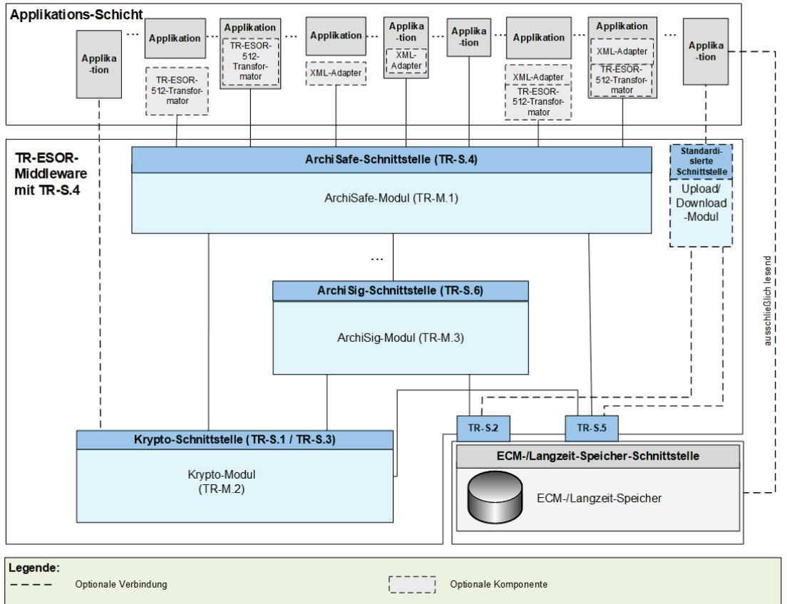
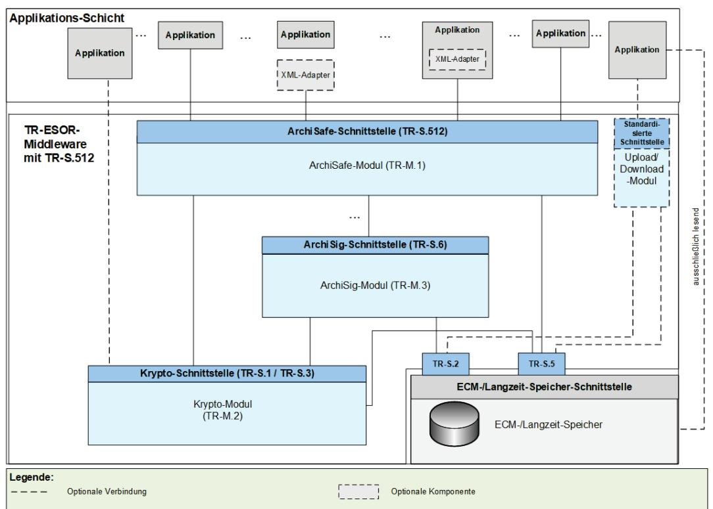
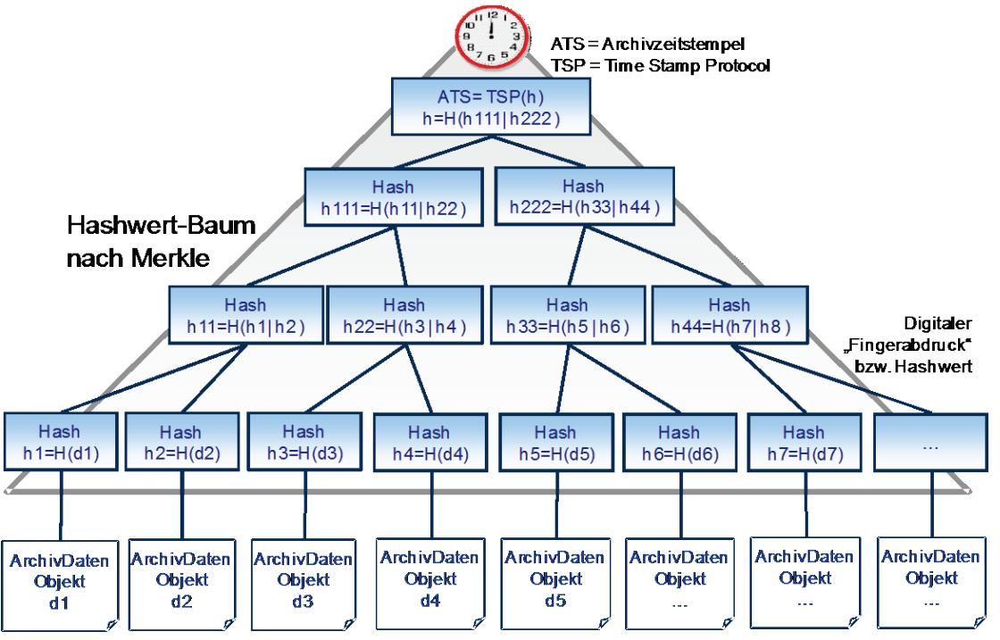
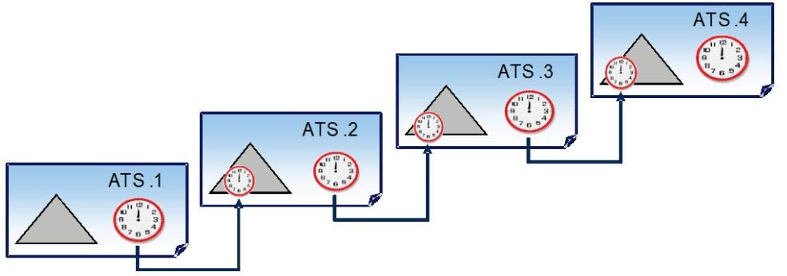
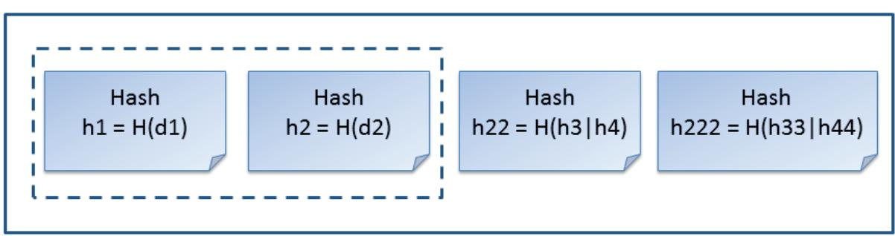
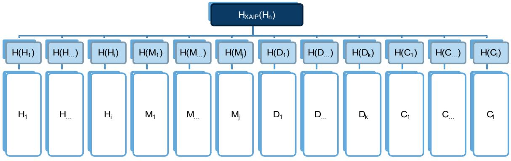
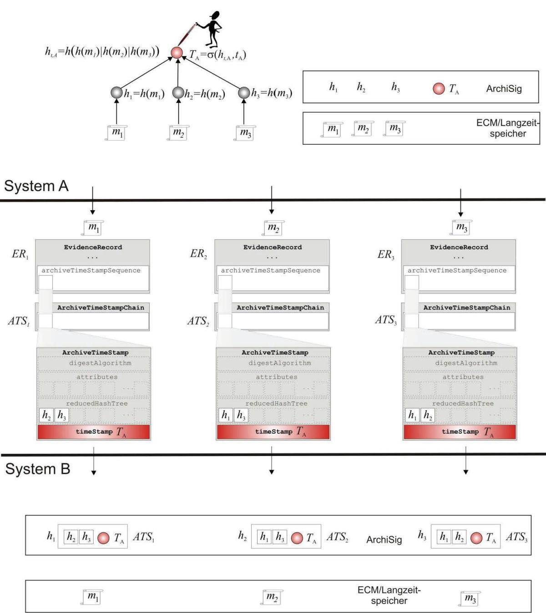
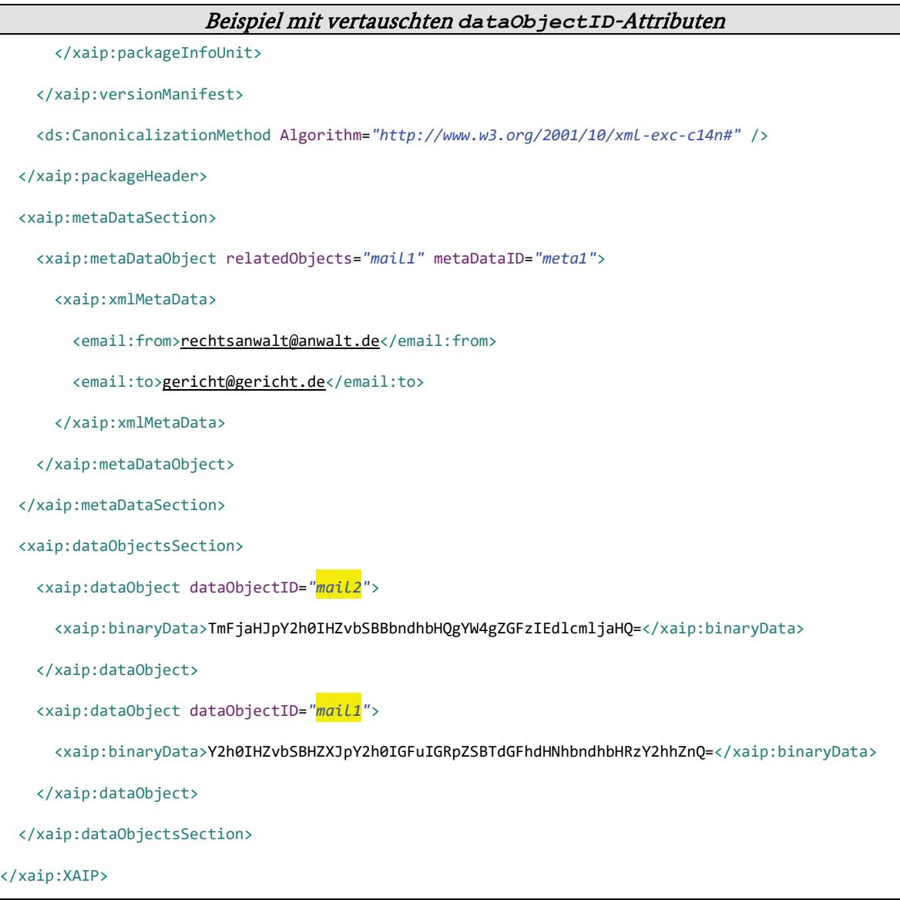
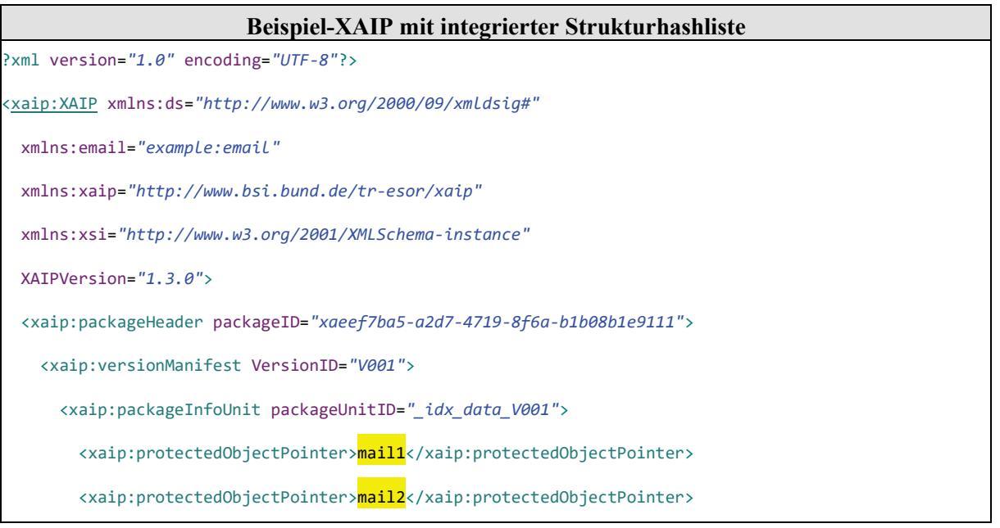

## BSI Technische Richtlinie 03125 Beweiswerterhaltung kryptographisch signierter Dokumente

#### Anlage TR-ESOR-M.3: ArchiSig-Modul

| Bezeichnung | ArchiSig-Modul                                                                                                    |
|-------------|-------------------------------------------------------------------------------------------------------------------|
| Kürzel      | BSI TR-ESOR-M.3                                                                                                   |
| Version     | 1.3 (auf Basis der eIDAS-Verordnung und der ETSI Preservation Standards mit einem neuen Zertifizierungsschema) |
| Datum       | 31.03.2022                                                                                                        |

## Änderungshistorie

| Version | Datum      | Name | Beschreibung |
|---------|------------|------|--------------|
| 1.3     | 31.03.2022 | BSI  | TR-ESOR-M.3  |
|         |            |      |              |

Tabelle 1: Änderungshistorie

Bundesamt für Sicherheit in der Informationstechnik Postfach 20 03 63 53133 Bonn Tel.: +49 22899 9582-0 E-Mail: tresor@bsi.bund.de Internet[: https://www.bsi.bund.de](https://www.bsi.bund.de/) © Bundesamt für Sicherheit in der Informationstechnik 2022

| 1 |       | Einführung 5                                                                                                       |  |
|---|-------|--------------------------------------------------------------------------------------------------------------------|--|
| 2 |       | Übersicht  8                                                                                                       |  |
|   | 2.1   | Ziele und Definitionen 9                                                                                           |  |
|   | 2.2   | Der initiale Archivzeitstempel10                                                                                   |  |
|   | 2.3   | Der "reduzierte" Hashbaum im Evidence Record 12                                                                    |  |
|   | 2.4   | Prozesse 13                                                                                                        |  |
|   | 2.4.1 | Erstellen des initialen Archivzeitstempels14                                                                       |  |
|   | 2.4.2 | Erneuerung des Archivzeitstempels nach der Erzeugung einer neuen Version eines abgelegten Archivdatenobjektes16 |  |
|   | 2.4.3 | Erneuerung des Archivzeitstempels17                                                                                |  |
|   | 2.4.4 | Erneuerung des Hashbaums17                                                                                         |  |
|   | 2.5   | Vorgehensweise beim Import von (L)XAIPs mit Evidence Records19                                                     |  |
|   | 2.5.1 | Beispiel (informell)21                                                                                             |  |
|   | 2.6   | Migration von vorherigen (L)XAIP-Versionen23                                                                       |  |
|   | 2.6.1 | Generisches Vorgehen23                                                                                             |  |
|   | 2.7   | Details zum Export-Import Prozess von ECM-/Langzeitspeicher-Beständen 31                                           |  |
| 3 |       | Definition des ArchiSig-Moduls34                                                                                   |  |
|   | 3.1   | Grundlegender Aufbau und funktionale Abgrenzung 34                                                                 |  |
|   | 3.2   | Integration des ArchiSig-Moduls34                                                                                  |  |
| 4 |       | Funktionen des ArchiSig-Moduls36                                                                                   |  |
|   | 4.1   | Übernahme von Archivdatenobjekten 37                                                                               |  |
|   | 4.2   | Erzeugen einer eindeutigen Archivdatenobjekt ID 37                                                                 |  |
|   | 4.3   | Kanonisieren von XML-basierten Archivdatenobjekten37                                                               |  |
|   | 4.4   | Berechnung von Hashwerten 37                                                                                       |  |
|   | 4.5   | Erzeugung initialer Archivzeitstempel38                                                                            |  |
|   | 4.6   | Übergabe von Archivdatenobjekten an den ECM-/Langzeitspeicher38                                                    |  |
|   | 4.7   | Erneuerung eines Archivzeitstempels38                                                                              |  |
|   | 4.8   | Erneuerung der Hashbäume 39                                                                                        |  |
|   | 4.9   | Auslesen von Archivdatenobjekten aus dem ECM-/Langzeitspeicher40                                                   |  |
|   | 4.10  | Erzeugung von technischen Beweisdaten (Evidence Record)40                                                          |  |
| 5 |       | Sicherheitsfunktionen des ArchiSig-Moduls41                                                                        |  |
|   | 5.1   | Schutz des ArchiSig-Moduls vor Manipulation 41                                                                     |  |
|   | 5.2   | Bereitstellung von technischen Beweisdaten41                                                                       |  |
|   | 5.3   | Überwachung der Gültigkeitszeiträume von Algorithmen41                                                             |  |
| 6 |       | Anhang A – Strukturhashliste (optional) 42                                                                         |  |

## Abbildungen

| Abbildung 1: Schematische Darstellung der IT-Referenzarchitektur mit TR-S.4.  6                                                                        |  |
|--------------------------------------------------------------------------------------------------------------------------------------------------------|--|
| Abbildung 2: Schematische Darstellung der IT-Referenzarchitektur mit TR-S.512.  6                                                                      |  |
| Abbildung 3: Archivzeitstempel bestehend aus einem binären Merkle-Hashbaum und einem qualifizierten elektronischen Zeitstempel an der "Wurzel".  11 |  |
| Abbildung 4: Verkettung von Archivzeitstempeln (ArchiveTimeStampChain) bei der Signatur- bzw. Siegel- bzw. Zeitstempelerneuerung.  12               |  |
| Abbildung 5: Beispiel eines reduzierten Hashbaums für das Dokument d1 aus Abbildung 3.  13                                                             |  |
| Abbildung 6: EvidenceRecord gemäß [RFC4998].  14                                                                                                       |  |
| Abbildung 7: Aufbau der Hashwerte für ein (temporäres) (L)XAIP 15                                                                                      |  |
| Abbildung 8: Daten beim Ex- und Import von Evidence Records gemäß [RFC4998].  22                                                                       |  |

## Tabellen

| Tabelle 1: Änderungshistorie 2                                                                         |  |
|--------------------------------------------------------------------------------------------------------|--|
| Tabelle 2: Datenermittlung aus dem Quellsystem:  24                                                    |  |
| Tabelle 3: Datenablage im Zielsystem:  27                                                              |  |
| Tabelle 4: Beispiel-XAIP für die Darstellung der Objektzuordnungsschwachstelle in (L)XAIP.  42      |  |
| Tabelle 5: Beispiel-XAIP aus der Tabelle 4 mit vertauschten dataObjectID-Attributen.  43            |  |
| Tabelle 6: Strukturhashliste für das Beispiel-XAIP aus der Tabelle 4.  44                           |  |
| Tabelle 7: Beispiel-XAIP aus der Tabelle 4 mit integrierter Strukturhashliste aus der Tabelle 6  45 |  |
|                                                                                                        |  |

## 1 Einführung

Ziel der Technischen Richtlinie "Beweiswerterhaltung kryptographisch signierter Dokumente" ist die Spezifikation sicherheitstechnischer Anforderungen für den langfristigen Beweiswerterhalt von kryptographisch signierten elektronischen Dokumenten und Daten nebst zugehörigen elektronischen Verwaltungsdaten (Metadaten).

Eine für diese Zwecke definierte Middleware (TR-ESOR-Middleware) im Sinn dieser Richtlinie umfasst alle diejenigen Module (M) und Schnittstellen (S), die zur Sicherung und zum Erhalt der Authentizität und zum Nachweis der Integrität der aufbewahrten Dokumente und Daten eingesetzt werden.

Die im Hauptdokument dieser Technischen Richtlinie (vgl. [TR-ESOR]) vorgestellte Referenzarchitektur besteht aus den nachfolgend beschriebenen Schnittstellen, Funktionen und logischen Einheiten:

- der TR-S.4- oder ETSI TS 119 512-Schnittstelle TR-S.512 in der Profilierung [TR-ESOR-TRANS] der TR-ESOR-Middleware, die dazu dient, die TR-ESOR-Middleware in die bestehende IT- und Infrastrukturlandschaft einzubetten;
- dem "ArchiSafe-Modul" (vgl. [TR-ESOR-M.1]), welches den Informationsfluss in der Middleware regelt, die Sicherheitsanforderungen an die Schnittstellen zu den IT-Anwendungen umsetzt und für eine Entkopplung von Anwendungssystemen und ECM-/Langzeitspeicher sorgt;
- dem "Krypto"-Modul (vgl. [TR-ESOR-M.2]) nebst den zugehörigen Schnittstellen TR-S.1 und TR-S.3, das alle erforderlichen Funktionen zur Berechnung von Hashwerten, zur Prüfung elektronischer Signaturen bzw. Siegel bzw. Zeitstempel, zur Nachprüfung elektronischer Zertifikate und zum Einholen qualifizierter Zeitstempel sowie (optional) elektronischer Signaturen bzw. Siegel für die Middleware zur Verfügung stellt. Darüber hinaus kann es Funktionen zur Ver- und Entschlüsselung von Daten und Dokumenten zur Verfügung stellen;
- dem "ArchiSig-Modul" (vgl. [TR-ESOR-M.3]) mit der Schnittstelle TR-S.6, das die erforderlichen Funktionen für die Beweiswerterhaltung der digital signierten Unterlagen bereitstellt;
- einem ECM-/Langzeitspeicher mit den Schnittstellen TR-S.2 und TR-S.5, der die physische Archivierung/Aufbewahrung und auch das Speichern der beweiswerterhaltenden Zusatzdaten übernimmt.

Dieser ECM-/Langzeitspeicher ist nicht mehr direkt Teil der Technischen Richtlinie, gleichwohl werden über die beiden Schnittstellen, die noch Teil der TR-ESOR-Middleware sind, Anforderungen daran gestellt.

Ebenso wenig ist die Applikationsschicht, die auch einen XML-Adapter enthalten kann, direkter Teil der Technischen Richtlinie, auch wenn dieser XML-Adapter als Teil einer Middleware implementiert werden kann.

Die empfohlene IT-Referenzarchitektur ist in [Abbildung](#page-5-0) 1 und [Abbildung](#page-5-1) 2 dargestellt und besteht im Wesentlichen aus den in [TR-ESOR], Kap. 7 grob beschriebenen logischen Komponenten und Schnittstellen. Diese werden in Anhängen zur TR weiter detailliert.

Die Grafik zeigt zudem die externen Komponenten und Systeme an, die das Bild vervollständigen. Grundsätzlich wird als obere Schnittstelle der TR-ESOR-Middleware entweder die TR-S.4-Schnittstelle gemäß [TR-ESOR-E], die in [Abbildung](#page-5-0) 1 dargestellt ist, oder die TR-S.512-Schnittstelle gemäß [ETSI TS 119 512] in der Profilierung [TR-ESOR-TRANS], die i[n Abbildung](#page-5-1) 2 gezeigt wird, unterstützt.

Abbildung 1: Schematische Darstellung der IT-Referenzarchitektur mit TR-S.4.

Abbildung 2: Schematische Darstellung der IT-Referenzarchitektur mit TR-S.512.

Die in [Abbildung 1](#page-5-0) bzw. [Abbildung 2](#page-5-1) dargestellte IT-Referenzarchitektur orientiert sich an der ArchiSafe Referenzarchitektur und soll die logische (funktionale) Interoperabilität künftiger Produkte mit den Zielen und Anforderungen der Technischen Richtlinie ermöglichen und unterstützen.

Sofern der optionale XML-Adapter und/oder der optionale TR-ESOR-512-Transformator[1](#page-6-0) vorhanden sind, können beide in folgenden Ausprägungen vorliegen:

- Jeweils eigenständige Komponente mit Schnittstellen zur Applikation sowie zum ArchiSafe-Modul
- Jeweils eigenständige Komponente, jedoch Teil der Applikation mit Schnittstelle zum ArchiSafe-Modul
- XML-Adapter und TR-ESOR-512-Transformator als eine gemeinsame Komponente, die beide Teile enthält mit Schnittstellen zur Applikation sowie zum ArchiSafe-Modul
- XML-Adapter und TR-ESOR-512-Transformator als eine gemeinsame Komponente, die beide Teile enthält und Teil der Applikation ist, mit Schnittstelle zum ArchiSafe-Modul.

Der "ETSI TS119512 TR-ESOR Transformator" ermöglicht Bewahrungsdiensten gemäß [eIDAS-VO], empfangene ETSI TS119512 (V1.1.2) Nachrichten[2](#page-6-1) in TR-S4 Nachrichten zu transformieren. Diese Nachrichten können dann an ein angeschlossenen TR-ESOR-System[3](#page-6-2) geschickt werden, ohne irgendwelche Änderungen dieses TR-ESOR-Systems.

Der Einsatz des TR-ESOR-512-Transformators wird EMPFOHLEN, sofern das TR-ESOR-Produkt mit einer TR-S.4-Schnittstelle in Europa zum Einsatz kommt und Interoperabilität mit europäischen (qualifizierten) Bewahrungsdiensten und Bewahrungsprodukten hergestellt werden soll.

Diese Technische Richtlinie ist modular aufgebaut und spezifiziert in einzelnen Anlagen zum Hauptdokument die funktionalen und sicherheitstechnischen Anforderungen an die erforderlichen IT-Komponenten und Schnittstellen der TR-ESOR-Middleware. Die Spezifikationen sind strikt plattform-, produkt-, und herstellerunabhängig.

Das vorliegende Dokument trägt die Bezeichnung "Anlage TR-ESOR-M.3" und spezifiziert die funktionalen und sicherheitstechnischen Anforderungen an ein kryptographisches Modul zur Signatur- bzw. Siegel- bzw. Zeitstempelerneuerung nach § 15 des Vertrauensdienstegesetzes [VDG], nach Kapitel 7.15 gemäß [ETSI TS 119 511] und Kapitel F.1.6 gemäß [ETSI TS 119 512] sowie zur Erzeugung elektronischer Beweismittel zum Nachweis zur Integrität und Authentizität archivierter elektronischer Dokumente (Evidence Records nach dem ArchiSig Konzept), (im Folgenden kurz: ArchiSig-Modul[4](#page-6-3) ).

 1 Siehe ["Freier ETSI TS 119512 TR-ESOR Transformator unter einer Open Source Lizenz"](https://github.com/de-bund-bsi-tr-esor/tresor-ETSITS119512-transformator).

2 In der Profilierung von [TR-ESOR-TRANS].

3 Siehe [https://www.bsi.bund.de/EN/tr-esor](https://www.bsi.bund.de/DE/tr-esor) ode[r https://www.bsi.bund.de/DE/tr-esor.](https://www.bsi.bund.de/DE/tr-esor)

4 Der Name "ArchiSig" bezieht sich auf das Verbundprojekt "ArchiSig – Beweiskräftige und sichere Langzeitspeicherung digital signierter Dokumente", das in den Jahren 2001 bis 2003 vom Bundesministerium für Wirtschaft und Arbeit im Rahmen des Programms "VERNET - Sichere und verlässliche Transaktionen in offenen Kommunikationsnetzen" gefördert wurde. Ziel des Projektes war die Entwicklung einer gesetzeskonformen, wirtschaftlichen und leistungsfähigen informationstechnischen Lösung für eine beweiskräftige und sichere Langzeitspeicherung digital signierter Dokumente.

# 2 Übersicht

Der folgende Abschnitt gibt einen Überblick über grundsätzliche Ziele und Anforderungen an die für eine Signatur- bzw. Siegel- bzw. Zeitstempelerneuerung nach § 15 des Vertrauensdienstegesetzes [VDG] bzw. nach Kapitel 7.15 gemäß [ETSI TS 119 511] und Kapitel F.1.6 gemäß [ETSI TS 119 512] erforderlichen kryptographischen Funktionen.

#### *HINWEIS 1*

In der vorliegenden TR-ESOR-Version1.3 werden die drei Begriffe "(beweiswerterhaltende) Langzeitspeicherung", "(beweiswerterhaltende) Bewahrung" und "(beweiswerterhaltende) Archivierung" synonym verwendet. 

Ebenso werden die drei Begriffe "Archivinformationspaket (AIP)", "Archivinformationscontainer" und "Archivdatenobjekt" sowie die Begriffe "aufbewahren" und "archivieren" synonym verwendet. 

#### *HINWEIS 2*

TR-ESOR spezifiziert ein Bewahrungsprodukt (engl. Preservation Product) gemäß [ETSI SR 019 510], [ETSI TS 119 511] und [ETSI TS 119 512] und [eIDAS-VO]. 

Die TR 03125 TR-ESOR ist in [ETSI SR 019 510] in den Kapiteln 4.7.3, 5.2 und B3.2 beschrieben.

Die in TR-ESOR erforderlichen grundlegenden Bewahrungstechniken, z. B. das Bewahrungsprotokoll, das Beweisdaten-Format Evidence Record, die Archivdaten-Format (L)XAIP und ASiC-AIP sind in [ETSI TS 119 512] als normative Elemente enthalten.

#### *HINWEIS 3*

Die obere Schnittstelle TR-S.4 oder die Schnittstelle TR-S.512 gemäß [ETSI TS 119 512] in der Profilierung von [TR-ESOR-TRANS], die logisch äquivalent zur Eingangsschnittstelle TR-S.4 ist, wie in der Tabelle 2 in [TR-ESOR-E], Kap. 4.1 dargestellt, muss benutzt werden. Eine andere Eingangs-Schnittstelle anstelle von TR-S.4 bzw. TR-S.512 ist nicht erlaubt.

#### *HINWEIS 4*

In der vorliegenden TR-ESOR-Version 1.3 umfasst der Begriff "Archivinformationscontainer" (AIP) in allen TR-ESOR-Anhängen:

a) das Archivdatenobjekt "XAIP" gemäß [TR-ESOR-F], Kap. 3.1 als auch

- b) das logische XAIP "LXAIP" gemäß [TR-ESOR-F], Kap. 3.2 und
- c) das "ASiC-AIP" gemäß [TR-ESOR-F], Kap. 3.3 auf Basis von [ETSI EN 319162-1].

In TR-ESOR Version V1.3 wird zwischen XAIP, LXAIP und ASiC-AIP differenziert.

Mit (L)XAIP wird XAIP oder LXAIP bezeichnet.

#### *HINWEIS 5*

In dieser TR-ESOR Version 1.3 ist "BIN" beschränkt auf die folgenden Bewahrungsobjekt-Formate (engl. preservation object formats):

- CAdES gemäß [ETSI TS 119 512], Annex A.1.1 [\(http://uri.etsi.org/ades/CAdES\)](http://uri.etsi.org/ades/CAdES). Sofern kein MIME Type gesetzt ist, wird als Default application/cms verwendet;
- XAdES gemäß [ETSI TS 119 512], Annex A.1.2 [\(http://uri.etsi.org/ades/XAdES\)](http://uri.etsi.org/ades/XAdES). Sofern kein MIME Type gesetzt ist, wird als Default application/xml verwendet;
- PAdES gemäß [ETSI TS 119 512], Annex A.1.3 [\(http://uri.etsi.org/ades/PAdES\)](http://uri.etsi.org/ades/PAdES). Sofern kein MIME Type gesetzt ist, wird als Default application/pdf verwendet;
- ASiC-E gemäß [ETSI TS 119 512], Annex A.1.4 (http://uri.etsi.org/ades/ASiC/type/ASiC-E). Sofern kein MIME Type gesetzt ist, wird als Default application/vnd.etsi.asic-e+zip verwendet;
- ASiC-S gemäß [ETSI EN 319 162] [\(http://uri.etsi.org/ades/ASiC/type/ASiC-S\)](http://uri.etsi.org/ades/ASiC/type/ASiC-S). Sofern kein MIME Type gesetzt ist, wird als Default application/vnd.etsi.asic-s+zip verwendet.
- DigestList gemäß [ETSI TS 119 512], Annex A.1.6 (http://uri.etsi.org/19512/format/DigestList). Sofern kein MIME Type gesetzt ist, wird als Default application/xml verwendet;

ASiC-ERS (in TR-ESOR v1.3 mit ASiC-AIP bezeichnet) gemäß [BSI TR-ESOR-F] Kap. 3.3 und gemäß [ETSI TS 119 512], Annex A.3.1 [\(http://uri.etsi.org/ades/ASiC/type/ASiC-ERS\)](http://uri.etsi.org/ades/ASiC/type/ASiC-ERS) und

Im Falle Upload/Download-Funktion ist zusätzlich nachfolgendes Format erlaubt:

Binärdaten (BIN) als "Octet Stream", die ausschließlich in den ECM-/Langzeitspeicher mit "Upload-Request" gespeichert werden, – aber nur, sofern 

a) verbunden mit einem korrespondierenden LXAIP und dort referenziert gem. [TR-ESOR-F], Kap. 3.2, b) ggf. mit "Download-Request" ausgelesen werden,– verbunden mit einem korrespondierenden LXAIP, das mit der "ArchiveRetrieval"-Funktion ausgelesen wurde, – oder eingebettet in einem XAIP und ausgelesen mit der "ArchivRetrieval"-Funktion.

c) Der Upload von XAIP, oder LXAIP, oder ASiC-AIP ist nicht zugelassen.

#### *HINWEIS 6*

-

-

Im folgenden Text umfasst der Begriff "Digitale Signatur":

- "fortgeschrittene elektronische Signaturen" gemäß [eIDAS-VO], Artikel 3 Nr. 11,
- "qualifizierte elektronische Signaturen" gemäß [eIDAS-VO], Artikel 3 Nr. 12,
	- "fortgeschrittenen elektronische Siegel" gemäß [eIDAS-VO], Artikel 3 Nr. 26 und
- - "qualifizierte elektronische Siegel" gemäß [eIDAS-VO], Artikel 3 Nr. 27.

Insofern umfasst der Begriff "digital signierte Dokumente" sowohl solche, die fortgeschrittene elektronische Signaturen oder Siegel bzw. qualifizierte elektronische Signaturen oder Siegel tragen. 

Mit dem Begriff der "kryptographisch signierten Dokumente" sind in dieser TR neben

- den gemäß [eIDAS-VO], Artikel 3 Nr. 12 qualifiziert signierten,
- den gemäß [eIDAS-VO], Artikel 3 Nr. 27 qualifiziert gesiegelten oder
- den gemäß [eIDAS-VO], Artikel 3 Nr. 34 qualifiziert zeitgestempelten Dokumenten (im Sinne der eIDAS-Verordnung) auch
- Dokumente mit einer fortgeschrittenen Signatur gemäß [eIDAS-VO], Artikel 3 Nr. 11 oder
- mit einem fortgeschrittenen Siegel gemäß [eIDAS-VO], Artikel 3 Nr. 26 oder
- mit einem elektronischen Zeitstempel gemäß [eIDAS-VO], Artikel 3 Nr. 33

erfasst, wie sie oft in der internen Kommunikation von Behörden entstehen. Nicht gemeint sind hier Dokumente mit einfachen Signaturen oder Siegeln basierend auf anderen (z. B. nicht-kryptographischen) Verfahren.

## 2.1 Ziele und Definitionen

Kryptographische Operationen, wie die elektronische Signatur- bzw. Siegel- bzw. Zeitstempelerstellung, ermöglichen es nur dann, die Integrität und Authentizität elektronischer Daten nachweisbar zu machen, wenn die den digitalen Signaturen bzw. elektronischen Zeitstempeln gemäß [eIDAS-VO], Artikel 3 Nr. 33, 34) zugrundeliegenden Algorithmen und Parameter mathematisch und technisch sicherheitsgeeignet sind. Fortschritte in der Entwicklung von Computern und neue Methoden der Kryptographie können jedoch dazu führen, dass die Algorithmen oder ihre Parameter im Laufe der Zeit ihre Sicherheitseignung einbüßen. Ein dauerhafter und nachweisbarer Erhalt der Authentizität und Integrität elektronischer Daten erfordert deshalb den Einsatz zusätzlicher Sicherungsmittel, die den Nachweis ermöglichen, dass insbesondere digital signierte bzw. zeitgestempelte Daten über die Dauer der Aufbewahrungsfristen unverfälscht aufbewahrt wurden.

Ziel des ArchiSig-Moduls ist der Erhalt der Authentizität über den Nachweis der Integrität und damit des beweisrechtlichen Werts vor allem digital signierter bzw. zeitgestempelte Daten und Dokumente (Archivdatenobjekte) durch zusätzliche kryptographische Sicherungsmittel.

Das ArchiSig-Modul implementiert für diesen Zweck eine kryptographische Lösung nach [RFC4998] und (optional) nach [RFC6283][5](#page-8-1) , die insbesondere sicherstellt, dass das durch § 15 [VDG] skizzierte Verfahren zur Aufrechterhaltung der Sicherheit und Vertrauenswürdigkeit digitaler Signaturen bzw. elektronische

 5 [RFC4998] muss, [RFC6283] kann unterstützt werden. Die Prüfung von technischen Beweisdaten muss gemäß [RFC4998] und gemäß [RFC6283] unterstützt werden.

Zeitstempel gemäß [eIDAS-VO], Artikel 3 Nr. 33, 34 durch eine erneute digitale Signatur im Rahmen eines Neusignierens oder erneuten Zeitstempelns gemäß [VDG], zu § 15 (Langfristige Beweiserhaltung)[6](#page-9-1) bzw. nach Kapitel 7.15 gemäß [ETSI TS 119 511] und Kapitel F.1.6 gemäß [ETSI TS 119 512] zuverlässig und wirtschaftlich, d. h. auch für große Datenmengen, umgesetzt werden kann.

Diese erneute digitale Signatur muss die Daten und frühere digitale Signaturen bzw. elektronische Zeitstempel einschließen und mit sicherheitsgeeigneten kryptographischen Algorithmen und Parametern erzeugt werden. Das Erneuerungsverfahren kann automatisiert und so eingerichtet werden, dass viele Dokumente gemeinsam elektronisch neu signiert werden. Bei Daten/Dokumenten mit digitalen Signaturen bzw. qualifizierten elektronischen Zeitstempeln müssen qualifizierte elektronische Zeitstempel gemäß [eIDAS-VO], Artikel 3 Nr. 20 und Artikel 42 von qualifizierten Vertrauensdiensteanbietern mit dem Status "granted" gemäß [eIDAS-VO], Artikel 3 Nr. 34 und Artikel 24 und [TR-ESOR-M2], Kapitel 3.3 verwendet werden.[7](#page-9-2)

## 2.2 Der initiale Archivzeitstempel

Grundlage des ArchiSig-Moduls für ein zu dieser Richtlinie konformes Bewahrungsprodukts ist die informationstechnische Umsetzung des Evidence Record Syntax (kurz: ERS) Standards der IETF[8](#page-9-3) . ERS definiert im Detail, wie die Signatur-, bzw. Siegel- bzw. Zeitstempelerneuerungen auch für große Datenmengen automatisch durchgeführt werden können. Darüber hinaus legt der Standard die Datenformate fest, in denen die Beweisdaten über einen unbegrenzten Zeitraum bereitgestellt und ausgetauscht werden. Datenschutz-technische Aspekte werden ebenso berücksichtigt, da mit dem ERS-Standard auch Teile aus dem Dokumentenbestand gelöscht werden können, ohne die Beweiskraft der übrigen Teile zu beeinträchtigen. Technisch basiert der ERS-Standard auf dem Ansatz, dass kryptographische Prüfsummen (Hashwerte) der Archivdatenobjekte als kryptographisch eindeutige Repräsentanten der aufzubewahrenden Daten zum Zeitpunkt der Ablage im ECM-/Langzeitspeicher oder kurz danach erzeugt werden.

Dazu werden die zu sichernden Daten gemäß den ERS Standards der IETF formatiert, gehasht und aus den Hashwerten wird – wie in Abschnitt 4.2 von [RFC4998] bzw. in Abschnitt 3.2.1 von [RFC6283] näher beschrieben – ein Hashbaum gebildet, der mit einem qualifizierten elektronischen Zeitstempel gesichert wird. Dieser Zeitstempel, ergänzt um die optionalen Felder (reduzierter Hashbaum (siehe dazu Kapitel [2.3\)](#page-11-0), Hashalgorithmus und Attribute) wird gemäß dem ERS-Standard [RFC4998] und [RFC6283] als (initialer) Archivzeitstempel bezeichnet.

Der initiale Archivzeitstempel muss, um den Anforderungen des § 15 [VDG] bzw. des Kapitels 7.15 gemäß [ETSI TS 119 511] und des Kapitels F.1.6 gemäß [ETSI TS 119 512] zu genügen, eine fortgeschrittene elektronische Signatur gemäß [eIDAS-VO], Artikel 3 Nr. 11 bzw. ein fortgeschrittenes elektronisches Siegel gemäß [eIDAS-VO], Artikel 3 Nr. 26 enthalten und ein qualifizierter elektronischer Zeitstempel gemäß [eIDAS-VO], Artikel 42 sein. Da es sich hierbei aber um keine Willenserklärung, sondern nur um ein Sicherungsmittel vorhandener Willenserklärungen handelt, muss die im Zeitstempel enthaltene Signatur

Gemäß § 15 des Vertrauensdienstegesetzes, B Besonderer Teil, zu Artikel 1, zu Teil 2, zu § 15 gilt: "Die langfristige Sicherung qualifiziert signierter Daten erfolgt derzeit durch Neusignieren oder erneutes Zeitstempeln der signierten Daten, bevor die verwendeten Algorithmen und Parameter ihre Sicherheitseignung verlieren."

7 Die zum Beweiswerterhalten genutzten digitalen Signaturen bzw. elektronische Zeitstempel gemäß [eIDAS-VO], Artikel 3 Nr. 33, 34 müssen mindestens die gleiche Qualität wie die ursprünglichen digitalen Signaturen bzw. elektronischen Zeitstempeln aufweisen; siehe [ARO 07] Seite 64.

8 Siehe [RFC4998], [GON 07] und [RFC6283].

 6 Gemäß § 15 des Vertrauensdienstegesetzes gilt: "Sofern hierfür Bedarf besteht, sind qualifiziert elektronisch signierte, gesiegelte oder zeitgestempelte Daten durch geeignete Maßnahmen neu zu schützen, bevor der Sicherheitswert der vorhandenen Signaturen, Siegel oder Zeitstempel durch Zeitablauf geringer wird. Die neue Sicherung muss nach dem Stand der Technik erfolgen.".

auch keine persönliche Signatur (also weder die des ursprünglich Erklärenden noch die eines Mitarbeiters eines Bewahrungsdienstes bzw. Archivars) sein.[9](#page-10-1) Für eine erneute elektronische Signatur bzw. Siegel bzw. Zeitstempel nach § 15 [VDG] bzw. nach dem Kapitel 7.15 gemäß [ETSI TS 119 511] und nach dem Kapitel F.1.6 gemäß [ETSI TS 119 512] aller durch den initialen Archivzeitstempel geschützten Dokumente und Daten genügt deshalb die alleinige Erneuerung (Übersignatur) des Archivzeitstempels *ArchiveTimeStamp*.

Da bereits bei der Erstellung einer digitalen Signatur nicht das eigentliche Dokument, sondern nur ein für dieses Dokument repräsentativer Hashwert signiert wurde, würde es im Sinne des § 15 [VDG] bzw. des Kapitels 7.15 gemäß [ETSI TS 119 511] und des Kapitels F.1.6 gemäß [ETSI TS 119 512] ausreichen, allein die digitale Signatur oder den elektronischen Zeitstempel des Dokumentes mit einem Zeitstempel zu versehen, der zum Zwecke der Signatur- bzw. Siegel- bzw. Zeitstempelerneuerung ebenfalls mit einem sicherheitsgeeigneten Algorithmus signiert sein muss. Dies schützt allerdings die im Archivdatenobjekt weiter enthaltenen Daten (z. B. nicht signierte Metadaten oder nicht signierte Dokumente) nicht. Besteht das Archivdatenobjekt als Datengruppe aus mehr als einem zu schützenden Element, wird gemäß Kapitel [2.4.1,](#page-13-0)  Nr. 6 verfahren. Mit der kryptographischen Sicherung der zu schützenden Elemente des gesamten Archivdatenobjektes durch einen initialen Archivzeitstempel kann die Wirkung des zusätzlichen Sicherungsmittels auch auf die in das Archivdatenobjekt integrierten und zu sichernden Metainformationen und Verifikationsdaten sowie auf unsignierte elektronische Daten ausgedehnt werden.[10](#page-10-2)

Abbildung 3: Archivzeitstempel bestehend aus einem binären Merkle-Hashbaum und einem qualifizierten elektronischen Zeitstempel an der "Wurzel".

Um zugleich eine wirtschaftliche Lösung zu ermöglichen, nutzt der ERS-Standard die Regelungen des § 15 [VDG] bzw. des Kapitels 7.15 gemäß [ETSI TS 119 511] und des Kapitels F.1.6 gemäß [ETSI TS 119 512]. Eine erneute digitale Signatur kann beliebig viele Daten umschließen (vgl. hierzu auch [SFD 06]). Der initiale Archivzeitstempel des ERS-Standards umschließt daher eine (konfigurierbare) Menge von 1...n Hashwerten der zu sichernden Daten (1...n Archivdatenobjekte), die in einem Merkle-Hashbaum [MER 1980] rekursiv

9 Vgl. hierzu [SFD 06, S. 178].

10 Da die Verifikationsdaten selbst wieder auf digital signierten Daten beruhen, wird damit zugleich der Forderung des § 15 [VDG] Rechnung getragen, wonach eine erneute digitale Signatur alle (vorherigen) digitalen Signaturen bzw. Zeitstempeln zu den Daten umschließen muss.

kongregiert und mit einem qualifizierten elektronischen Zeitstempelgesichert ("versiegelt") werden (siehe [Abbildung 3\)](#page-10-3).

Mit der mathematischen Verknüpfung der Hashwerte im Hashbaum und dem sichernden qualifizierten elektronischen Zeitstempel wird nicht nur die Integrität des gesamten "Baums", sondern zugleich auch alle seine "Blätter", d. h. der die Archivdatenobjekte repräsentierenden Hashwerte, mathematisch beweisbar.

Vertrauensanker für den Archivzeitstempel und damit für eine Signaturerneuerung nach § 15 [VDG] bzw. nach dem Kapitel 7.15 gemäß [ETSI TS 119 511] und nach dem Kapitel F.1.6 gemäß [ETSI TS 119 512] ist der qualifizierte elektronische Zeitstempel. Seine Datenstruktur muss sowohl die Anforderungen des "Timestamp Protocol (TSP)" [RFC3161] als auch der "Cryptographic Message Syntax (CMS)" ([RFC5652], sowie [RFC5816] und [EN 319 422] (vgl. auch [TR-ESOR-M.2], Kapitel 5.4.1) erfüllen.

Bei einer weiteren Signatur- bzw. Siegel- bzw. Zeitstempelerneuerung wird der Hashwert des letzten Archivzeitstempel (ATS.1) gebildet und ggf. in einem neu zu bildenden Hashbaum (ggf. zusammen mit weiteren Hashwerten anderer Daten und Dokumente)[11](#page-11-3) eingetragen und mit einem neuen qualifizierten elektronischen Zeitstempel mit digitaler Signatur (ATS.2) als Abschluss gesichert. Damit entsteht eine sichere und nachweisbare chronologische Beweiskette aus kryptographisch miteinander verknüpften Vertrauensankern ("ArchiveTimeStampChain" gemäß [RFC4998] bzw. [RFC6283]) (sieh[e Abbildung 4\)](#page-11-2).[12](#page-11-4)

Abbildung 4: Verkettung von Archivzeitstempeln (*ArchiveTimeStampChain)* bei der Signatur- bzw. Siegelbzw. Zeitstempelerneuerung.

## 2.3 Der "reduzierte" Hashbaum im Evidence Record

Der technische Nachweis der Authentizität und Integrität der aufbewahrten Archivdatenobjekte erfolgt, neben der Vorlage der eigentlichen Bewahrungsdaten und der zugehörigen Zertifikate der vorhandenen digitalen Signaturen, vor allem über den Nachweis der Integrität der kryptographischen Repräsentanten der Archivdatenobjekte inklusive des Nachweises der rechtzeitigen Signatur- bzw. Siegel- bzw. Zeitstempelerneuerung gemäß § 15 **[VDG]** bzw. nach dem Kapitel **7**.15 gemäß **[ETSI TS 119 511]** und dem Kapitels F.1.6 gemäß **[ETSI TS 119 512]**. Der ERS-Standard **[RFC4998]** und **[RFC6283]**[13](#page-11-5) spezifiziert für diese Zwecke einen so genannten **reduzierten Hashbaum**, der die Grundlage für die Verifikation der Integrität von Archivdatenobjekten im Rahmen von so genannten **Evidence Records** gemäß **[RFC4998]** bzw. **[RFC6283]** bildet. Der reduzierte Hashbaum enthält alle Daten aus dem Hashbaum, die für die mathematische Verifikation der Integrität des Archivdatenobjektes benötigt werden.

11 Siehe [RFC4998], Kapitel 5.2 bzw. [RFC6283], Kapitel 4.2.1.

12 Für die Hashbaumerneuerung siehe Kapitel [2.4.4.](#page-16-1) 13 [RFC4998] muss, [RFC6283] kann bei der Erzeugung technischer Beweisdaten unterstützt werden. Die Prüfung von technischen Beweisdaten muss gemäß [RFC4998] und gemäß [RFC6283] unterstützt werden.

Abbildung 5: Beispiel eines reduzierten Hashbaums für das Dokument d1 au[s Abbildung 3.](#page-10-3) 

Das bedeutet, um die Unverfälschtheit eines Zeitstempels für ein bestimmtes Archivdatenobjekt mathematisch zu verifizieren, reicht es aus, den Weg vom Hashwert des Archivdatenobjektes bis zum Hashwert für den abschließenden Zeitstempel (ATS) zurückzuverfolgen. Für das Datenobjekt d1 in [Abbildung 3](#page-10-3) ist der entsprechende Pfad (siehe auch [Abbildung 5\)](#page-12-2):

d1 → h1 → h11 → h111 → ATS

Ist H die für die Berechnung des Hashwerts benutzte Hashfunktion, muss die mathematische Verifikation zum Nachweis der Integrität die folgende Bedingung erfüllen:

H(H(H(h1 | h2) | h22) | h222) = H(h111 | h222) ∈ ATS

Die Erneuerung des Schutzes qualifiziert elektronisch signierte, gesiegelte oder zeitgestempelte Daten mittels einem qualifizierten Zeitstempel nach § 15 [VDG] bzw. nach dem Kapitel 7.15 gemäß [ETSI TS 119 511] und nach dem Kapitel F.1.6 gemäß [ETSI TS 119 512] begründet einen "Anscheinsbeweis im Anscheinsbeweis" (vgl. hierzu [eIDAS-VO], Artikel 41, Absatz 2 und [SFD 06], S. 193). Mit der Verifikation des Archivzeitstempels inklusive des darin enthaltenen qualifizierten Zeitstempels und reduzierten Hashbaums und der Feststellung der Gültigkeit der digitalen Signaturen zum Signatur- bzw. Siegel- bzw. Zeitstempelerstellungszeitpunkt lässt sich somit ein schlüssiger Beweis des ersten Anscheins der Echtheit der von den digitalen Signaturen und Zeitstempeln umfassten Daten begründen.

Der ERS-Standard [RFC4998] definiert zudem das Datenformat für diese Nachweise, welches vom ArchiSig-Modul verwendet werden soll. Ergänzend (aber nicht alternativ) dazu kann auch die XML-Variante [RFC6283] verwendet werden.

#### 2.4 Prozesse

Die folgenden Abschnitte beschreiben grundsätzliche Prozesse, die ein zu dieser Richtlinie konformes ArchiSig-Modul unterstützen muss. Dabei wird die im Hauptdokument dieser Richtlinie erläuterte Referenzarchitektur (siehe auc[h Abbildung 1](#page-5-0) bzw. [Abbildung 2\)](#page-5-1) zugrunde gelegt.

Wie im folgenden Text näher erläutert, sind bei der beweiswerterhaltenden Aufbewahrung von Daten insbesondere die folgenden drei Schritte zu beachten:

- 1. Das Erstellen des initialen Archivzeitstempels,
- 2. Die Zeitstempelerneuerung,
- 3. Die Hashbaumerneuerung.

Wesentlich für die Zeitstempelerneuerung bzw. Hashbaumerneuerung ist dabei die in der folgenden [Abbildung 6](#page-13-2) beispielhaft gemäß [RFC4998] dargestellte ASN.1-basierte EvidenceRecord-Struktur und die darin in der ArchiveTimeStampSequence enthaltene zeitlich geordnete Folge von ArchiveTimeStampChain-Elementen, die wiederum eine zeitlich geordnete Folge von ArchiveTimeStamp-Elementen enthalten.

| EvidenceRecord           | ArchiveTimeStampChain |
|--------------------------|-----------------------|
| version                  |                       |
| digestAlgorithms         |                       |
|                          | ArchiveTimeStamp      |
| cryptoInfos              | digestAlgorithm       |
| . .                      | attributes            |
| encryptionInfo           |                       |
|                          | reducedHashTree       |
| archiveTimeStampSequence |                       |
|                          | timeStamp             |

Abbildung 6: *EvidenceRecord* gemäß [RFC4998].

#### *HINWEIS 7*

Gegenwärtig ist ASiC-AIP nicht Gegenstand der Konformitätsprüfung von Produkten gemäß TR-ESOR in der Version 1.3. 

Daher beschränkt sich die folgende Darstellung auf (L)XAIP. 

#### 2.4.1 Erstellen des initialen Archivzeitstempels

Die Integrität und der Beweiswert der aufzubewahrenden Dokumente und Daten müssen bei der Ablage im ECM-/Langzeitspeicher mittels eines initialen Archivzeitstempels auf ein wohldefiniertes, normiertes Niveau gesetzt werden. Dazu werden alle eingehenden Archivdatenobjekte in konfigurierbaren Zeiträumen[14](#page-13-3) mit einem ersten Archivzeitstempel versehen.[15](#page-13-4)

Die einzelnen Prozessschritte des Erstellens eines initialen Archivzeitstempels sind:

- 1. Eingang des Archivdatenobjektes in das ArchiSig-Modul im Rahmen der Archivierung dieses Datenobjektes.[16](#page-13-5)
- 2. Bereitstellung und Verknüpfung (Eintrag in die (L)XAIP Dokumentstruktur, falls noch nicht vom aufrufenden Modul eingestellt) einer eindeutigen Dokumentidentifikation (Archivdatenobjekt ID und ggf. Versions-ID) mit dem eingegangenen Archivdatenobjekt.
- 3. Falls es sich um ein XML-basiertes Archivdatenobjekt handelt: Eintragen des Kanonisierungsalgorithmus' in die (L)XAIP Dokumentenstruktur.
- 4. Ein XML-basiertes Archivdatenobjekt gemäß Anhang F enthält folgende Datenstrukturen:
	- einen Archivdatenkopf **H** (packageHeader) mit Informationen über die logische(n) Struktur(en) des (L)XAIP Dokumentes und den Absender,
	- einen Datenabschnitt für Metainformationen **M** zur Beschreibung des Geschäfts- und Bewahrungskontextes der Inhaltsdaten (metaDataSection),
	- einen Datenabschnitt **D** für die Inhaltsdaten, (dataObjectsSection), und
	- im Falle der Aufbewahrung elektronisch signierter bzw. gesiegelter bzw. zeitgestempelter Dokumente, einen Datenabschnitt **C** für die Ablage von beweisrelevanten Daten (Signaturen, Siegel, Zeitstempel, Zertifikate, Sperrlisten, OCSP-Responses etc.) und technischen

14 Die Spezifikation der bis zum Aufbau eines initialen Archivzeitstempels zulässigen Zeiträume bestimmt sich wesentlich aus den verfolgten Aufbewahrungszwecken und muss in einem IT-Sicherheitskonzept verbindlich geregelt werden.

15 Siehe hierzu "Initial Archive Timestamp" in [RFC4998] Section 1.2, 3.2 und folgende bzw. [RFC6283]. 16 Es wird hierbei davon ausgegangen, dass es sich um ein syntaktisch korrektes Archivdatenobjekt handelt und ArchiSafe dies bereits geprüft hat. Im Fall eines ArchiveUpdateRequest hat das ArchiSafe-Modul aus dem D(L)XAIP und der letzten Version ein neues (L)XAIP erzeugt, dass hier übergeben wird.

Beweisdaten (Evidence Records) Signatur- bzw. Siegel- bzw. Zeitstempelprüfinformationen(credentialsSection).

Jeder dieser Datenabschnitte enthält über die sog. protectedObjectPointer besonders gekennzeichnete (siehe dazu [TR-ESOR-F], Kapitel 3.2 die Erläuterung zu protectedObjectPointer), kryptographisch zu schützende Datenstrukturen (Datenelemente), z. B. **H**i, **M**j, **D**k, **C**l als Teilelemente aus **H**, **M**, **D**, **C,** die über ein ID-Attribut als eindeutiger Identifikator verfügen und auf das ein protectedObjectPointer-Element dann jeweils verweist.

Diese protectedObjectPointer wiederum sind im sog. Versions-Manifest (versionManifest) enthalten und damit spezifisch für jede Version eines (L)XAIP. Falls bereits mehrere Versionen eines (L)XAIP existieren, ist für jede Version ein eigenes Versions-Manifest im (L)XAIP enthalten.

Diese so markierten Datenelemente der letzten (aktuellsten) Version des (L)XAIP ergeben den "Anteil" des (L)XAIP, der im vorliegenden Fall kryptographisch zu schützen ist. Dieser Teil wird im weiteren "temporäres (L)XAIP" genannt und ArchiSig ist dafür zuständig, diesen Anteil zu ermitteln.

5. Kanonisierung der Elemente des temporären (L)XAIP mit dem angegebenen Kanonisierungs-Algorithmus (vgl. Anhang F, Kapitel 3.2 die Erläuterung zu CanonicalizationMethod).

#### 6. Berechnung des Hashwerts H(L)XAIP über das temporäre Archivdatenobjekt.

Für jedes dieser zu sichernden Datenelemente **H**i, **M**j, **D**k, **C**l im temporären (L)XAIP wird der Hashwert H()[17](#page-14-1) berechnet.

Abbildung 7: Aufbau der Hashwerte für ein (temporäres) (L)XAIP.

> Gemäß [RFC4998] bzw. [RFC6283][18](#page-14-2) bilden diese Datenelemente eine so genannte Datengruppe, deren Hashwerte sortiert, in aufsteigender Reihenfolge konkateniert und abermals gehasht werden, so dass hieraus im Ergebnis ein Hashwert H(L)XAIP für das gesamte temporäre Archivdatenobjekt entsteht

> Der auf diese Weise über die zu sichernden Datenelemente des temporären Archivdatenobjekts berechnete Hashwert H(L)XAIP ist nun seinerseits Grundlage für den Aufbau des Merkle-Hashbaums (Punkt 7), der schließlich durch einen abschließenden qualifizierten elektronischen Zeitstempel im Rahmen eines initialen Archivzeitstempels gesichert (Punkt 8) wird.

- 7. (zeitlich nachgelagert oder parallel dazu) Aufbau des Merkle-Hasbaums gemäß der ERS-Standards.
- 8. Sicherung des Merkle-Hashbaums durch einen qualifizierten elektronischen Zeitstempel, der eine digitale Signatur zusammen mit sämtlichen Informationen, die für eine Gültigkeitsprüfung des Zeitstempels einschließlich der darin enthaltenen digitale Signatur erforderlich sind, enthält (initialer Archivzeitstempel).

17 Die Auswahl der aktuell möglichen Hash-Algorithmen ist dem Anhang [TR-ESOR-ERS], Kap. 5.1.1 und Kap. 5.1.2 zu entnehmen. Nähere Angaben zur Hashwert-Bildung finden sich in [TR-ESOR-F], Kap. 3.

18 [RFC4998] muss, [RFC6283] kann unterstützt werden. Die Prüfung von technischen Beweisdaten muss gemäß [RFC4998] und gemäß [RFC6283] erfolgen.

- 9. Sobald dieser Zeitstempel erzeugt wurde, kann der zu einer Archivdatenobjekt-Version gehörende Evidence Record angefordert werden. Die Erstellung des spezifischen Evidence Records erfolgt, indem u. a.:
	- der für die betreffende Archivdatenobjekt-Version relevante Teil des Hashbaumes (siehe reducedHashTree in [RFC4998] bzw. [RFC6283] und Kapitel [2.3\)](#page-11-0) ermittelt wird;
	- ggf. die fehlenden Felder des ArchiveTimeStamp (z. B. digestAlgorithms, version gemäß [RFC4998]) bis hin zum vollständigen EvidenceRecord ergänzt werden,
- 10. Abspeichern des Archivdatenobjektes[19](#page-15-1)

Die Bereitstellung (Berechnung oder "Reservierung") der Archivdatenobjekt ID (AOID) kann durch den aufrufenden Client der TR-ESOR-Middleware oder das ArchiSafe-Modul M.1 oder durch das ArchiSig-Modul selbst oder durch den ECM-/Langzeitspeicher realisiert werden.

Die Kanonisierung erfolgt durch das ArchiSig-Modul selbst. Wenn das Krypto-Modul geeignete Funktionen anbietet, können auch diese Funktionen genutzt werden. Die Unterstützung von Kanonisierungsverfahren durch das Krypto-Modul ist verpflichtend für die lokale Signatur- bzw. Siegelprüfung von XML-Inhalten.

Die entsprechenden Details zur Unterstützung von Kanonisierungsverfahren im Zusammenhang mit einem (L)XAIP bzw. ASiC-AIP sind im [TR-ESOR-F], Kap. 3.3 zu finden.

Für das Kanonisieren von XML-basierten Archivdatenobjekten gelten grundsätzlich die Aussagen von [TR-ESOR-M.2], Kapitel 4.4, auch wenn die Kanonisierung hier i. d. R. vom ArchiSig-Modul durchgeführt wird.

Die Berechnung der Hashwerte und die Einholung des qualifizierten elektronischen Zeitstempels für den initialen Archivzeitstempel erfolgen durch das in [TR-ESOR-M.2] beschriebene Krypto-Modul über die in [TR-ESOR-E] spezifizierte Schnittstelle TR-S.3.

Die Übergabe der Archivdatenobjekte an den ECM-/Langzeitspeicher muss unverzüglich nach der Verknüpfung (Zuweisung) mit einer eindeutigen Dokumentidentifikation (Archivdatenobjekt ID und ggf. Versions-ID) und der Berechnung der Hashwerte erfolgen.

#### 2.4.2 Erneuerung des Archivzeitstempels nach der Erzeugung einer neuen Version eines abgelegten Archivdatenobjektes

Nach jeder Erzeugung einer neuen Version (Update)[20](#page-15-2) eines abgelegten Archivdatenobjektes, das bereits i Versionen enthält, wird der in Kapitel [2.4.1](#page-13-0) beschriebene Prozess für die neue Version des Archivdatenobjektes erneut durchlaufen.

Das heißt, für die neue Version i+1 des Archivdatenobjektes wird wiederum jeweils über sämtliche kryptographisch zu schützenden Bestandteile dieser Version i+1 des Archivdatendatenobjektes ein Hashwert nach dem in Kapitel [2.4.1](#page-13-0) beschriebenen Verfahren berechnet. Diese Hashwerte werden sortiert, in aufsteigender Reihenfolge konkateniert und abermals gehasht, so dass hieraus im Ergebnis ein Hashwert H(L)XAIP,i+1 für die neue Version i+1 des Archivdatenobjektes entsteht. Dieser neue Hashwert H(L)AIP,i+1 fließt direkt in die Berechnung eines neuen initialen Archivzeitstempels ATSi+1 ein (siehe auch [2.4.1\)](#page-13-0).

Auf diese Weise ist jede Version eines Archivdatenobjektes kryptographisch gesichert.

Die Berechnung der Hashwerte und die Einholung des qualifizierten elektronischen Zeitstempels zur Sicherung des initialen Archivzeitstempels erfolgt durch das in [TR-ESOR-M.2] beschriebene Krypto-Modul über die in [TR-ESOR-E] spezifizierte Schnittstelle TR-S.3.

 19 Es wird hier das ursprünglich übergebene Archivdatenobjekt abgespeichert, nicht das temporäre (L)XAIP.

20 Die Update-Funktion soll, muss aber nicht implementiert werden.

### 2.4.3 Erneuerung des Archivzeitstempels

Die Erneuerung des als kryptographischen Sicherungsmittel verwendeten qualifizierten elektronischen Zeitstempels und seiner digitalen Signatur ist ein zentraler Baustein der nach § 15 [VDG] bzw. nach dem Kapitel 7.15 gemäß [ETSI TS 119 511] und nach dem Kapitel F.1.6 gemäß [ETSI TS 119 512] vorgeschriebenen Erneuerung des Schutzes (qualifiziert) elektronisch signierte, gesiegelte oder zeitgestempelte Daten.

(A2.4-1) Das ArchiSig-Modul muss - sofern zwar der verwendete Hashalgorithmus weiterhin sicherheitsgeeignet ist - bei einem drohenden Verlust der Sicherheitseigenschaften der im Archivzeitstempel enthaltenen digitalen Signatur[21](#page-16-2) eine Zeitstempelerneuerung[22](#page-16-3) durchführen. Entsprechende Übersichten geeigneter Algorithmen werden in [ETSI TS 119 312] und [SOG-IS] veröffentlicht.

Wie in Kap. 5.2 von [RFC4998] bzw. Kap. 4 von [RFC6283] erläutert, wird bei der Zeitstempelerneuerung der timeStamp des zeitlich zuletzt in einer ArchiveTimeStampChain eingefügte ArchiveTimeStamp gehasht und mit einem neuen, mit geeigneten kryptographischen Algorithmen erstellten, ArchiveTimeStamp versehen. Hierbei verlängert sich gewissermaßen die zu einer Datenobjektgruppe bzw. einer (L)XAIP-Version gehörende ArchiveTimeStampChain.

Da das ArchiSig-Modul den drohenden Verlust der Sicherheitseigenschaften nicht erkennen kann, muss der Prozess in der Regel von einem Administrator angestoßen werden.

Im Einzelnen sind für die eigentliche Erneuerung die folgenden Schritte erforderlich:

- 1. Berechnung der Hashwerte der qualifizierten elektronischen Zeitstempel aller vom drohenden Sicherheitsverlust betroffenen letzten Archivzeitstempel in den jeweiligen ArchiveTimeStampChains
- 2. Eintrag dieser Werte in einen neuen Hashbaum (optional, siehe [RFC4998], Kap. 5.2, bzw. [RFC6283], Kap. 4.2.1)
- 3. Sicherung der Integrität dieses Hashbaums bzw. des Hashwertes durch einen neuen, sicherheitsgeeigneten qualifizierten elektronischen Zeitstempel mit digitaler Signatur (mit stärkeren Algorithmen) zusammen mit sämtlichen Informationen, die für eine Gültigkeitsprüfung des Zeitstempels einschließlich der darin enthaltenen digitalen Signatur erforderlich sind

Die Berechnung der Hashwerte und die Einholung des qualifizierten elektronischen Zeitstempels zur Sicherung des neuen Archivzeitstempels erfolgt durch das in [TR-ESOR-M.2] beschriebene Krypto-Modul über die in [TR-ESOR-E] spezifizierte Schnittstelle TR-S.3.

#### 2.4.4 Erneuerung des Hashbaums

(A2.4-2) Eine Hashbaumerneuerung ist erforderlich, wenn die Sicherheitseigenschaften der für den Aufbau des Hashbaums und der Archivzeitstempel eingesetzten Hashverfahren bedroht sind. In diesem Fall muss das ArchiSig-Modul zunächst für sämtliche im ECM-/Langzeitspeicher abgelegten Archivdatenobjekte neue Hashwerte auf der Basis (anderer) sicherheitsgeeigneter Hashverfahren berechnen und diese, wie unten beschrieben, mit der bereits existierenden ArchiveTimeStampSequence verknüpfen und mit einem neuen Archivzeitstempel versehen.

Der neue Hashbaum wird schließlich mit einem qualifizierten und sicherheitstechnisch geeigneten elektronischen Zeitstempel abgeschlossen ("versiegelt").

 21 Im Wesentlichen handelt es sich hier um die für die Erstellung digitaler Signaturen verwendeten kryptographischen Verfahren relativ zu den verwendeten Schlüssellängen und anderer kryptographischer Parameter.

22 Ablauf und Format der Beweisdaten einer Zeitstempelerneuerung sind definiert in [RFC4998], Section 5: "Archive Timestamp Chain and Archive Timestamp Sequence" bzw. [RFC6283], Section 4: "Archive Time-Stamp Sequence and Archive Time-Stamp Chain".

Da das ArchiSig-Modul den drohenden Verlust der Sicherheitseigenschaften nicht erkennen kann, muss der Prozess in der Regel von einem Administrator angestoßen werden.

Im Einzelnen sind dafür folgende Schritte durch das ArchiSig-Modul auszuführen (siehe auch Kap. [4.8\)](#page-38-0):

- 1. Im ersten Schritt wird ein sicherer Hashalgorithmus Hausgewählt.
- 2. Berechnung von neuen Hashwerten, ggf. mit vorausgehender Kanonisierung, jeweils für alle gespeicherten Archivdatenobjekte, mit einem neuen, sicherheitstechnisch stärkeren Hashalgorithmus unter Nutzung des Krypto-Moduls. Im Einzelnen gilt dabei:
	- Sei di = (di,1,…,di,n) eine aus den Datenobjekten di,1,…,di,n bestehende Datenobjektgrupp[e23,](#page-17-0) die bei der initialen Archivzeitstempelung aufsteigend sortiert, konkateniert und gehasht wurde, um der Hashbaumbildung zugeführt zu werden (siehe [RFC4998], Kap. 5.2 bzw. [RFC6283], Kap. 4.2.2). Dann werden in diesem Schritt die folgenden Hashwerte hi,1 = H(di,1),…, hi,n = H(di,n)berechnet.
- 3. Sei atsci die DER-codierte ArchiveTimeStampSequence, d. h. die Folge aller vorausgegangene ArchiveTimeStampChains in zeitlich chronologischer Reihenfolge incl. Tag und Length, für die Datenobjektgruppe di (siehe [Abbildung](#page-13-2) 6 ), dann wird in diesem Schritt der Hashwert hai = H(atsci) berechnet.
- 4. Nun werden die in den vorherigen Schritten gebildeten Hashwerte hi,1,…,hi,n und haikonkateniert (+) und die Hashwerte hi,1' = H(hi,1 + hai),…,hi,n' = H(hi,n + hai)berechnet.

#### *HINWEIS 8*

Die zugrundeliegende [RFC4998] ist an dieser Stelle nicht präzise genug:

- der Schritt 4 der Beschreibung zum Hashbaum-Erneuerung-Algorithmus (vgl. Seite 18 [RFC4998] besagt, dass die neuen Hashwerte für die einzelnen Datenobjekte wie oben beschrieben (Schritt 4) berechnet werden müssen: h(i)'=H(hi,1 + hai), spricht: hi,1 und hai werden konkateniert aber nicht sortiert,
- weiterhin ist aber auf der Seite 19 in [RFC4998], unter der Abbildung 4, ein leicht abgeändertes Verfahren hierzu abgebildet, z. B. bezogen auf das Datenobjekt h1: h1'=H(binary sorted and concatenated (H(d1), ha(1))), spricht hier: H(d1) und Ha(1) werden hier sortiert und konkateniert.

Diese Inkonsistenz führte in der Vergangenheit dazu, dass die Umsetzung des Rehashing-Algorithmus an dieser Stelle auch inkonsistent erfolgte. Um die Interoperabilität zwischen den diversen TR-ESOR-Produkten dennoch zu erhalten, wird es empfohlen, dass diese beide Varianten der Umsetzung (mit und ohne Sortierung) bei der Prüfung eines Evidence Records unterstützt werden.

- 5. Aus den auf diese Weise erzeugten Hashwerten hi,1',…,hi,n' wird – wie in den Abschnitten 4.2 und 5.2 von [RFC4998] und in den Abschnitten 3.2.1 und 4.2.2 in [RFC6283] näher beschrieben – ein Hashbaum gebildet, der mit einem Archivzeitstempel versehen wird.
- 6. Der auf diese Weise erzeugte Archivzeitstempel bildet die Grundlage für eine neue ArchiveTimeStampChain, die an die bereits existierende ArchiveTimeStampSequence angehängt wird.
- 7. Durch die Hashbaumerneuerung verlängert sich also die ArchiveTimeStampSequence.

Für das Kanonisieren von XML-basierten Archivdatenobjekten gelten grundsätzlich die Aussagen von [TR-ESOR-M.2], Kapitel 4.4, auch wenn die Kanonisierung hier i. d. R. vom ArchiSig-Modul durchgeführt wird.

Die Berechnung der Hashwerte und die Einholung des qualifizierten elektronischen Zeitstempels zur Sicherung des initialen Archivzeitstempels erfolgt durch das in [TR-ESOR-M.2] beschriebene Krypto-Modul über die in [TR-ESOR-E] spezifizierte Schnittstelle TR-S.3.

Die Neuberechnung der Hashwerte der gespeicherten Archivdatenobjekte erfordert darüber hinaus einen performanten Zugriff auf den ECM-/Langzeitspeicher über die in [TR-ESOR-E] spezifizierten Schnittstelle TR-S.2.

 23 Wie in [TR-ESOR-F] näher erläutert, entspricht die Menge der in einer (L)XAIP-Version über protectedObjectPointer referenzierten Datenobjekte einer solchen Datenobjektgruppe.

Aber selbst bei einer optimalen Gestaltung der Lesezugriffe auf die im ECM-/Langzeitspeicher abgelegten Daten kann die Neuberechnung der Hashwerte längere Zeit in Anspruch nehmen. Damit verbunden sind nicht nur erhebliche Kosten, sondern vor allem auch die Tatsache, dass der Schutz des Datenbestandes für die Dauer der Hashbaumerneuerung nicht mehr ausreichend gewährleistet werden kann. Um dem zu begegnen, empfiehlt der ERS-Standard zusätzlich den Einsatz mehrerer paralleler, redundanter Hashbäume, denen unterschiedliche Hashalgorithmen[24](#page-18-1) zugrunde liegen. Unterschreitet einer dieser Hashbäume das geforderte Sicherheitsniveau, sind die Archivdatenobjekte immer noch durch mindestens einen weiteren parallelen Hashbaum geschützt. Dadurch bleibt der gesamte archivierte Datenbestand geschützt, bis der komplette Prozess der Hashbaumerneuerung abgeschlossen ist.

Es ist weiterhin zu berücksichtigen, dass das ArchiSig-Modul auch während der Zeitdauer der Hashbaumerneuerung, die sich bei sehr großen Bewahrungsdiensten durchaus im Bereich von Monaten bewegen kann, auch weiterhin die Sicherung von neu archivierten Dokumenten sowie ggf. die Berechnung von technischen Beweisdaten (Evidence Records) zur Beweisführung leisten können muss.

## 2.5 Vorgehensweise beim Import von (L)XAIPs mit Evidence Records

Bei der langfristigen Aufbewahrung digitaler Daten ist damit zu rechnen, dass die aufbewahrten Daten eines Tages im Zuge einer Migration von einem System (A) zu einem anderen System (B) transferiert werden müssen. Da die Systeme A und B nicht notwendiger Weise vom gleichen Hersteller stammen müssen, ist eine solche Migration im Allgemeinen mit besonderen Herausforderungen für die Interoperabilität der betroffenen Systeme und der über entsprechende Im- und Export-Schnittstellen ausgetauschten Daten verbunden.

Während der Import von Nutzdaten (z. B. im (L)XAIP-Format) mit ArchiveSubmissionRequest und der Export dieser Nutzdaten mit ArchiveRetrievalRequest sowie der Export der zugehörigen Beweisdaten gemäß der in [RFC4998] oder [RFC6283] standardisierten Evidence Record Syntax (ERS) mit ArchiveEvidenceRequest jenseits der bisher existierenden Schnittstellenspezifikation keiner weiteren Erläuterung bedürfen, ist beim Import von Evidence Records nicht ohne Weiteres klar, ob und wie eine Migration ohne die in Version 1.1 der [TR-ESOR-F][25](#page-18-2) erwähnte Schachtelung der (L)XAIP- und ERS-Daten grundsätzlich möglich ist. Da durch den mit Version 1.2 der TR-ESOR-Spezifikation eingeführten Verzicht auf eine solche Schachtelung eine von der (L)XAIP-Struktur unabhängige und vor allem RFC-konforme Prüfung eines einzelnen Evidence Records trotz einer vorher stattgefundenen Migration ermöglicht wird, ist ein solcher übergangsloser Import von Evidence Records sehr erstrebenswert und soll deshalb im Folgenden näher beschrieben werden.

Vor diesem Hintergrund kann ein übergangsloser Import von Evidence Records folgendermaßen geschehen:

- 1. Im Zuge des Imports von Evidence Records mit einem ArchiveSubmissionRequest[26](#page-18-3) wird ein (L)XAIP und ein oder mehrere jeweils zu einer bestimmten Version gehörende(r) Evidence Record(s) als optionale Eingabeparameter übergeben.
- 2. Das übergebene (L)XAIP sowie der übergebene Evidence Record bzw. die übergebenen Evidence Records werden mit der Verify-Funktion geprüft.[27](#page-18-4)

 24 Algorithmen aus unterschiedlichen Familien erhöhen die Zuverlässigkeit weiter, da ein Angriff möglichweise in Zukunft die Sicherheitseignung einer gesamten Familie gefährden könnte (z. B. alle SHA-Abwandlungen).

25 Siehe Hinweis auf Seite 18 von [TR-ESOR-F], Version 1.1 ("Bei einer Migration kann der alte (L)XAIP-Container als Nutzdatenobjekt in einen neuen (L)XAIP-Container geschachtelt werden. ...").

26 Detaillierte Erläuterungen zum Import von Evidence Records befinden sich in [TR-ESOR-E] und [TR-ESOR-E].

27 Diese Verifikation wird (in der Regel) bereits vom aufrufenden Modul ArchiSafe durchgeführt.

- 3. Neben der generellen Prüfung des Evidence Record für die jeweilige (L)XAIP-Version (in der Regel durch das ArchiSafe-Modul) wird hier insbesondere untersucht, ob die Sicherheitseignung der bisher verwendeten Algorithmen gegeben war und ob die im System A eingesetzten Algorithmen bereits dem Sicherheitsniveau der in System B eingesetzten Algorithmen entsprechen. Sofern nicht bereits die in System B eingesetzten Algorithmen verwendet wurden, wird empfohlen sofort im Zuge des Imports eine entsprechende Zeitstempelerneuerung oder Hashbaumerneuerung durchzuführen. Es sind also die folgenden drei Fälle zu unterscheiden:
	- a. Hash- und Signatur- bzw. Siegelalgorithmus sind beide aktuell:
		- In diesem Fall werden lediglich die essentiellen Bestandteile des importierten Evidence Record bzw. der importierten Evidence Records (d. h. die ArchiveTimeStampSequence und ihre Bestandteile) in die ArchiSig-Datenbasis des Systemes B übernommen und für eine spätere Zeitstempel- oder Hashbaumerneuerung vorbereitet sowie das Archivdatenobjekt im Speicher abgelegt.
	- b. Hashalgorithmus ist aktuell, aber der Signatur- bzw. Siegelalgorithmus ist bedroht:

In diesem Fall wird beim Import oder nach dem Import innerhalb eines vorgegebenen angemessenen Zeitrahmens vor Ablauf der Sicherheitseignung des Signatur- bzw. Siegelalgorithmus eine Zeitstempelerneuerung durchgeführt, wobei das importierte ArchiveTimeStampChain-Element mit einem neuen Zeitstempel versehen wird.

c. Hashalgorithmus ist bedroht:

In diesem Fall wird beim Import oder nach dem Import innerhalb eines vorgegebenen angemessenen Zeitrahmens vor Ablauf der Sicherheitseignung des Hashalgorithmus eine Hashbaumerneuerung durchgeführt. Hierbei wird die importierte DER-codierte ArchiveTimeStampSequence atsci incl. Tag und Länge als atomare Einheit betrachtet und zusammen mit den importierten Bestandteilen des Archivdatenobjektes unter Verwendung des neuen Hashalgorithmus gehasht, in einen Hashbaum integriert und mit einem neuen Archivzeitstempel versehen. Im Detail werden hier die folgenden Schritte durchgeführt:

- Durch die protectedObjectPointer im versionsspezifischen Inhaltsverzeichnis versionManifest der jeweiligen (L)XAIP-Version ist die Menge der ERSgeschützten Datenobjekte di,1,…,di,n bestimmt. Diese Datenobjekte werden gehasht[28](#page-19-0), um die Werte hi,1 = H(di,1),…,hi,n = H(di,n)zu erhalten.
- Diese werden mit dem Hashwert hai=H(atsci) der codierten ArchiveTimeStampSequence atsci binär aufsteigend sortiert, dann konkateniert und erneut gehasht, um schließlich die Hashwerte hi,1' = H(hi,1 + hai),…,hi,n' = H(hi,n + hai)zu berechnen.
- Für diese Hashwerte wird wie in Abschnitt 5.2 von [RFC4998] bzw. Abschnitt 4.2.2 von [RFC6283] ein Hashbaum gebildet, der mit einem Archivzeitstempel versehen wird. Dieser Archivzeitstempel bildet schließlich die Grundlage für eine neue ArchiveTimeStampChain, die an die bereits existierende ArchiveTimeStampSequence angehängt wird.
- 4. Beim späteren Export des Evidence Record mittels ArchiveEvidenceRequest wird der aktuelle und ggf. durch Zeitstempel- und/oder Hashbaumerneuerungen ergänzte Evidence Record zurückgeliefert, der neben der bereits zum Zeitpunkt des Imports existierenden ArchiveTimeStampSequence auch die vom System B neu erstellten ArchiveTimeStamp-Elemente enthält.

Durch diesen Importmechanismus kann eine reibungslose Übernahme ERS-geschützter Daten erfolgen und letztlich eine Migration zwischen verschiedenen Systemen ohnedie Schachtelung von (L)XAIP- und ERS-

 28 Detaillierte Festlegungen welche Daten (mit bzw. ohne XML-Tags) genau der Hashwertbildung zugeführt werden, sind Gegenstand von [TR-ESOR-F].

Strukturen realisiert werden[29](#page-20-1). Hierdurch kann der Beweiswerterhalt – auch über Migrationen hinweg – unabhängig von der XAIP-Struktur erfolgen, und für den Nachweis genügt ein einzelner Evidence Record, der sowohl die von System A erzeugten Beweisdaten als auch die darauf aufbauenden und von System B erzeugten Daten umfasst.

### 2.5.1 Beispiel (informell)

Die folgende [Abbildung](#page-21-1) 8 veranschaulicht den Export und Import von Evidence Records anhand eines einfachen Beispiels. Im System A werden drei Datenobjekte m1, m2 und m3 abgelegt, in einem Hashbaum angeordnet und mit einem initialen Archivzeitstempel TA versehen. In der ArchiSig-Datenbasis werden in diesem Fall möglicherweise[30](#page-20-2) alle Blätter des Hashbaumes, d.h. die Hashwerte h1, h2 und h3, und der Archivzeitstempel TAabgelegt. Neben den eigentlichen Hashwerten und dem Archivzeitstempel werden auch die verwendeten kryptographischen Algorithmen abgelegt, damit erkannt werden kann, ob die Daten bei einer möglichen zukünftigen Zeitstempel- oder Hashbaumerneuerung berücksichtigt werden müssen oder nicht. Beispielsweise würde im Fall einer Zeitstempelerneuerung der Archivzeitstempel TA vom neuen Zeitstempel umfasst.

Mit den Funktionen ArchiveRetrieval und ArchiveEvidence können die abgelegten Datenobjekte m1, m2 und m3 sowie die zugehörigen Evidence Records ER1, ER2 und ER3aus dem System A ausgelesen werden.

 29 Die Voraussetzung hierzu ist es, dass die beiden Systeme einen kompatiblen Hashbaumerstellungsalgorithmus verwenden und keine substantiellen Änderungen an der (L)XAIP-Schema (z. B. neuer Namensraum etc.) auf dem Weg vom System A zu System B vorgenommen worden sind. Weiterhin muss das System B entsprechend die optionalen Parameter AOID und ImportEvidence beim Aufruf der Funktion ArchiveSubmission unterstützen.

30 Es sei darauf hingewiesen, dass die internen Abläufe im ArchiSig-Modul und die etwaigen Speicherstrukturen jenseits der Festlegungen in [RFC4998] bzw. [RFC6283] nicht normiert sind und deshalb die Ausführungen hier lediglich informativen Charakter besitzen.

Abbildung 8: Daten beim Ex- und Import von Evidence Records gemäß [RFC4998].

Die ausgelesenen Datenobjekte und Evidence Records können nun mittels der Funktion ArchiveSubmission unter Verwendung der optionalen Eingabeparameter AOID und ImportEvidence in das System B eingespeist werden. Hierbei werden die für die weitere Aufbewahrung relevanten Informationen aus den entgegengenommenen Evidence Records extrahiert und in geeigneter Weise in die ArchiSig-Datenbasis des Systems B importiert, so dass neben den Hashwerten h1, h2 und h3 auch die aus den Evidence Records extrahierten Archivzeitstempel ATS1, ATS2 und ATS3 in der ArchiSig-Datenbasis abgelegt werden. Obwohl diese drei Archivzeitstempel jeweils den Archivzeitstempel TA enthalten, wird ein naiv implementiertes System B möglicherweise aus der Identität der dreimal importierten Archivzeitstempel TA in den Evidence Records kein Kapital schlagen können und statt dessen die Zeitstempel einzeln und redundant in die ArchiSig-Datenbasis aufnehmen und dort als eigenständige Objekte behandeln.

## 2.6 Migration von vorherigen (L)XAIP-Versionen

### 2.6.1 Generisches Vorgehen

Sollte eine Übertragung (Migration) von geschützten Archivdatenobjekte aus einem TR-ESOR-System in ein anderes TR-ESOR-System erfolgen, so ist, insbesondere im Falle, dass den Systemen unterschiedliche Versionen der TR-ESOR-Spezifikationen zugrunde liegen (i. d. R. kann das Ziel-Systeme eine neuere TR-ESOR-Version implementieren), die Erfüllung der folgenden Anforderungen und ist folgendes generisches Vorgehen hierzu anzuwenden.

#### 2.6.1.1 Minimale Anforderungen

- (i) Beide Systeme unterstützen die Container-Formate XAIP.
- (ii) Beide Systeme unterstützen die Evidence Records gem. [RFC4998]
- (iii) Es werden entweder die Funktionen gemäß TR-S.4 (siehe [TR-ESOR-E], Kap. 3) oder die Funktionen gemäß TR-S.512 in der Profilierung von [TR-ESOR-TRANS] (siehe auch [TR-ESOR-E], Kap. 4) unterstützt.
- (iv) Quellsystem unterstützt die Funktion Verify mit dem Parameter ReturnVerficationReport.

#### *HINWEIS 9*

Zur Vereinfachung der Darstellung beschränkt sich die folgenden Ausführungen auf die Verwendung der Funktionen gemäß TR-S.4.

#### 2.6.1.2 Teil 1: Export der relevanten Daten aus dem Quellsystem (System-A)

- 1) Der Archivdatencontainer (XAIP-A) mit allen Versionen wird mit Hilfe der Funktion ArchiveRetrieval aus dem Quellsystem ermittelt.
- 2) Die zugehörigen Beweisdaten (Evidence Records) zu jeder Version werden mit Hilfe der Funktion ArchiveEvidence aus dem Quellsystem ermittelt.
- 3) Die ermittelten Beweisdaten werden innerhalb des credentialsSection-Elements in dem Archivdatencontainer abgelegt und mit der korrespondierenden Version verknüpft.
- 4) Das auf dieser Weise vorbereitete Archivdatencontainer wird mit Hilfe der Funktion Verify geprüft. Es werden zu jeweiligen beinhalteten Evidence Records (Beweisdaten) die Prüfprotokolle angefordert, zurückgeliefert.

#### 2.6.1.3 Teil 2: Import in das Zielsystem (System-B)

a) Für die erste Version im XAIP-A wird ein entsprechendes XAIP-B für das Zielsystem gebaut, in dem die erste Version des XAIP-A (inklusive den zugehörigen Evidence Record) im metaDataSection-Element und korrespondierendes Prüfprotokoll im credentialsSection-Element abgelegt werden.

Es ist zu empfehlen, die Benennung der Version aus dem XAIP-A innerhalb von XAIP-B beizubehalten.

Beide Elemente werden durch Einsatz eines entsprechenden protectedObjectPointer geschützt.

- b) Das gebildete XAIP-B wird mit Hilfe der Funktion ArchiveSubmission in das Zielsystem eingespeist. Im Falle, wenn eine neue AOID zurückgeliefert wird, muss diese dem führenden System im Nachgang zur Verfügung gestellt werden.
- c) Für die nachfolgenden Versionen in dem XAIP-A wird jeweils ein DXAIP-B gebildet, in dem analog zum Schritt a) entsprechende Versionen des XAIP-A und korrespondierende Beweisdaten abgelegt werden.
- d) Die gebildeten DXAIP-B-Instanzen werden mit Hilfe der Funktion ArchiveUpdate in dem Zielarchiv abgelegt.
- e) Anschließend wird eine zusätzliche DXAIP-B gebildet, in dem alle geschützte Inhalte (Nettogehalt) aus dem XAIP-A (z. B. Datenobjekte oder Credentials etc.) entsprechend im XAIP-B abgelegt werden.

Zusätzlich müssen das XAIP-A und zugehörige Prüfprotokoll analog wie im Schritt a) innerhalb vom XAIP-B abgelegt werden.

f) Die auf dieser Weise erhaltene XAIP-B muss mit Hilfe der Funktion ArchiveUpdate in das Zielsystem eingespeist werden. Dem führenden System (z. B. einem Fachverfahren) muss die neue aktuellste Version mitgeteilt werden.

#### 2.6.1.4 Darstellung eines beispielhaften Ablaufs

Nachfolgend wird ein beispielhafter Ablauf der o.g. Schritte mit einem XAIP-A mit zwei Version und einem Dokument mit einer abgesetzten Signatur sowie zugehöriger Signaturprüfprotokoll in der ersten Version sowie einem weiteren Dokument mit einer abgesetzten Signatur sowie zugehöriger Signaturprüfprotokoll in der zweiten Version dargestellt.

Abkürzungsverzeichnis für die nachfolgenden Tabellen:

| • | CR               | Credentialobjekt (<xaip:credential>-Element)        |
|---|------------------|-----------------------------------------------------|
| • | CR-01            | ID eines Credentialobjekts                          |
| • | DO               | Datenobjekt (<xaip:dataObject>-Element)             |
| • | DO-01            | ID eines Datenobjektes                              |
| • | DOC              | ein Dokument, hier Nettoinhalt eines Datenobjektes  |
| • | DOC-01           | ein bestimmtes Dokument                             |
| • | MDO              | ein Metadatenobjekt (<xaip:metaDataObject>-Element) |
| • | MDO-01           | ID eines Metadatenobjekts                           |
| • | MDO-A_V01        | ID eines Metadatenobjekts                           |
| • | PP               | ein <xaip:ProtectedPointer>-Element                 |
| • | SIG              | eine Signatur                                       |
| • | SIG-01           | eine bestimmte Signatur                             |
| • | SIG-VR           | Verifikationsreport zu einer Signatur               |
| • | SIG-01-VR        | Verifikationsreport zur Signatur SIG-01             |
| • | UP               | ein <xaip:unprotectedPointer>-Element            |
| • | XAIP-A           | ein bestimmtes XAIP                                 |
| • | XAIP-A_V01_ER    | ein ER zur 1. Version von XAIP-A                    |
| • | XAIP-A_V01_ER_VR | ein Verifikationsreport zu XAIP-A_V01_ER            |
| • | XAIP_ERS         | ein <xaip:evidenceRecord>-Element                   |
| • | V01              | Version 1 eines XAIP                                |

Tabelle 2: Datenermittlung aus dem Quellsystem:

| Nr. | Request                  | Response                                 |
|-----|--------------------------|------------------------------------------|
| 1)  | ArchiveRetrievalRequest( | ArchiveRetrievalResponse(                |
|     | AOID-01,                 | dss:Result(resultmajor#ok),              |
|     | ALL                      | XAIP-A(                                  |
|     | )                        | packageHeader(                           |
|     |                          | AOID-01,                                 |
|     |                          | versionManifest( V01,                    |
|     |                          | PP( DO-01, CR-01, CR-02 )                |
|     |                          | ),                                       |
|     |                          | versionManifest( V02,                    |
|     |                          | PP( DO-01, CR-01, CR-02,                 |
|     |                          | DO-02, CR-04, CR-05)                     |
|     |                          | )                                        |
|     |                          | ),                                       |
|     |                          | dataObjectsSection(                      |
|     |                          | dataObject( DO-01, DOC-01),              |
|     |                          | dataObject( DO-02, DOC-02)               |
|     |                          | ),                                       |
|     |                          | credentialsSection(                      |
|     |                          | credential( CR-01, DO-01, SIG-01),       |
|     |                          | credential( CR-02, CR-01, SIG-01-VR),    |
|     |                          | credential( CR-04, DO-02, SIG-02),       |
|     |                          | credential( CR-05, CR-04, SIG-02-VR)     |
|     |                          | )                                        |
|     |                          | )                                        |
|     |                          | )                                        |
| 2)  | ArchiveEvidenceRequest(  | ArchiveEvidenceResponse(                 |
|     | AOID-01,                 | dss:Result(resultmajor#ok),              |
|     | ALL                      | XAIP_ERS( AOID-01, V01, XAIP-A_V01_ER ), |
|     | )                        | XAIP_ERS( AOID-01, V02, XAIP-A_V02_ER )  |
|     |                          | )                                        |

| Nr. | Request                                                                                                                                                                                                                                               | Response                                                                                                                                                                                                                                                                                                                                                                                                                                                                                                                                                                                                                |
|-----|-------------------------------------------------------------------------------------------------------------------------------------------------------------------------------------------------------------------------------------------------------|-------------------------------------------------------------------------------------------------------------------------------------------------------------------------------------------------------------------------------------------------------------------------------------------------------------------------------------------------------------------------------------------------------------------------------------------------------------------------------------------------------------------------------------------------------------------------------------------------------------------------|
| 3)  | Lege die im Schritt 2) ermittelte Beweisdaten in das XAIP-A, das im Schritt 1) ermittelt wurde, ab Hinweis! Siehe auch hierzu: credential( CR-03, AOID-01, V01, XAIP-A_V01_ER) und credential( CR-06, AOID-01, V02, XAIP-A_V02_ER). | XAIP-A( packageHeader( AOID-01, versionManifest( V01, PP31( DO-01, CR-01, CR-02 ), UP32( CR-03 ) ), versionManifest( V02, PP( DO-01, CR-01, CR-02, DO-02, CR-04, CR-05), UP( CR-06 ) ) ), dataObjectsSection( dataObject( DO-01, DOC-01), dataObject( DO-02, DOC-02) ), credentialsSection( credential( CR-01, DO-01, SIG-01), credential( CR-02, CR-01, SIG-01-VR), credential( CR-03, AOID-01, V01, XAIP-A_V01_ER), credential( CR-04, DO-02, SIG-02), credential( CR-05, CR-04, SIG-02-VR), credential( CR-06, AOID-01, V02, XAIP-A_V02_ER) ) ) |
|     |                                                                                                                                                                                                                                                       |                                                                                                                                                                                                                                                                                                                                                                                                                                                                                                                                                                                                                         |

 31 PP – protected pointer.

32 UP – unprotected pointer.

| Nr. | Request                                         | Response                    |
|-----|-------------------------------------------------|-----------------------------|
| 4)  | VerifyRequest(                                  | VerifyResponse(             |
|     | dss:OptionalInputs( ReturnVerificationReport ), | dss:Result(resultmajor#ok), |
|     | XAIP-A(                                         | dss:OptionalOutputs(        |
|     | packageHeader(                                  | XAIP-A_V01_ER_VR,           |
|     | AOID-01,                                        | XAIP-A_V02_ER_VR            |
|     | versionManifest( V01,                           | )                           |
|     | PP( DO-01, CR-01, CR-02 ),                      | )                           |
|     | UP( CR-03 ) ),                                  |                             |
|     | versionManifest( V02,                           |                             |
|     | PP( DO-01, CR-01, CR-02,                        |                             |
|     | DO-02, CR-04, CR-05),                           |                             |
|     | UP( CR-06 ) )                                   |                             |
|     | ),                                              |                             |
|     | dataObjectsSection(                             |                             |
|     | dataObject( DO-01, DOC-01),                     |                             |
|     | dataObject( DO-02, DOC-02)                      |                             |
|     | ),                                              |                             |
|     | credentialsSection(                             |                             |
|     | credential( CR-01, DO-01, SIG-01),              |                             |
|     | credential( CR-02, CR-01, SIG-01-VR),           |                             |
|     | credential( CR-03, AOID-01, V01,                |                             |
|     | XAIP-A_V01_ER),                                 |                             |
|     | credential( CR-04, DO-02, SIG-02),              |                             |
|     | credential( CR-05, CR-02, SIG-02-VR),           |                             |
|     | credential( CR-06, AOID-01, V02,                |                             |
|     | XAIP-A_V02_ER)                                  |                             |
|     | )                                               |                             |
|     | )                                               |                             |
|     | )                                               |                             |

Tabelle 3: Datenablage im Zielsystem:

| Nr. | Request                                          | Response                                       |
|-----|--------------------------------------------------|------------------------------------------------|
| a)  | Das XAIP-B in der ersten Version wird aufgebaut. | XAIP-B(                                        |
|     |                                                  | packageHeader(                                 |
|     |                                                  | versionManifest( V01, PP( MDO-A_V01, CR-01 ) ) |
|     |                                                  | ),                                             |
|     |                                                  | metaDataSection(                               |
|     |                                                  | metaDataObject( MDO-A_V0133, MDO-A_V0134,      |
|     |                                                  | XAIP-A_V01 )                                   |
|     |                                                  | ),                                             |
|     |                                                  | credentialsSection(                            |
|     |                                                  | credential( CR-01, MDO-A_V01,                  |
|     |                                                  | XAIP-A_V01_ER_VR)                              |
|     |                                                  | )                                              |
|     |                                                  | )                                              |

33 Der Wert des Attributs metaDataID (siehe [TR-ESOR-F], Kap. 3.1.3). 34 Der Wert des Attributs relatedObjects (siehe [TR-ESOR-F], Kap. 3.1.3).

| Nr. | Request                                                                                                                                                                                                                                                                                                                                          | Response                                                                                                                                                                                                                                                                                                       |
|-----|--------------------------------------------------------------------------------------------------------------------------------------------------------------------------------------------------------------------------------------------------------------------------------------------------------------------------------------------------|----------------------------------------------------------------------------------------------------------------------------------------------------------------------------------------------------------------------------------------------------------------------------------------------------------------|
| b)  | ArchiveSubmissionRequest( XAIP-B( packageHeader( versionManifest( V01, PP( MDO-A_V01, CR-01 ) ) ), metaDataSection( metaDataObject( MDO-A_V01, MDO-A_V01, XAIP-A_V01 ) ), credentialsSection( credential( CR-01, MDO-A_V01, XAIP-A_V01_ER_VR) ) ) )                                                 | ArchiveSubmissionResponse( dss:Result(resultmajor#ok), AOID-02 )                                                                                                                                                                                                                                      |
| c)  | Das DXAIP-B für die zweite Version wird erstellt.                                                                                                                                                                                                                                                                                                | DXAIP-B( packageHeader( AOID-02, versionManifest( V02, PP( MDO-A_V02, CR-02 ) ) ), metaDataSection( metaDataObject( MDO-A_V0233, MDO-A_V0234, XAIP-A_V02) ), credentialsSection( credential( CR-02, MDO-A_V02, XAIP-A_V02_ER_VR) ), updateSection( prevVersion( V01 ) ) |
| d)  | ArchiveUpdateRequest( DXAIP-B( packageHeader( AOID-02, versionManifest( V02, PP( MDO-A_V02, CR-02 ) ) ), metaDataSection( metaDataObject( MDO-A_V02, MDO-A_V02, XAIP-A_V02) ), credentialsSection( credential( CR-02, MDO-A_V02, XAIP-A_V02_ER_VR) ), updateSection( prevVersion( V01 ) ) ) ) | ) ArchiveUpdateResponse( dss:Result(resultmajor#ok), V02 )                                                                                                                                                                                                                                         |

| Nr. | Request                                                                     | Response                              |
|-----|-----------------------------------------------------------------------------|---------------------------------------|
| e)  | Das XAIP-B für die zusätzliche letzte Version aufbauen. DXAIP-B(            |                                       |
|     |                                                                             | packageHeader(                        |
|     |                                                                             | AOID-02,                              |
|     |                                                                             | versionManifest( V03,                 |
|     |                                                                             | PP( DO-01, DO-02, MDO-A_V02, CR-02,   |
|     |                                                                             | CR-10, CR-11, CR-12, CR-13 )          |
|     |                                                                             | )                                     |
|     |                                                                             | ),                                    |
|     |                                                                             | dataObjectsSection(                   |
|     |                                                                             | dataObject( DO-01, DOC-01),           |
|     |                                                                             | dataObject( DO-02, DOC-02)            |
|     |                                                                             | ),                                    |
|     |                                                                             | credentialsSection(                   |
|     |                                                                             | credential( CR-10, DO-01, SIG-01),    |
|     |                                                                             | credential( CR-11, CR-01, SIG-01-VR), |
|     |                                                                             | credential( CR-12, DO-02, SIG-02),    |
|     |                                                                             | credential( CR-13, CR-02, SIG-02-VR)  |
|     |                                                                             | ),                                    |
|     |                                                                             | updateSection(                        |
|     |                                                                             | prevVersion( V02 )                    |
|     |                                                                             | placeHolder( MDO-A_V02 ),             |
|     |                                                                             | placeHolder( CR-02 )                  |
|     |                                                                             | ) )                                |
| f)  | ArchiveUpdateRequest(                                                       | ArchiveUpdateResponse(                |
|     | DXAIP-B(                                                                    | dss:Result(resultmajor#ok),           |
|     | packageHeader(                                                              | V03                                   |
|     | AOID-02,                                                                    | )                                     |
|     | versionManifest( V03,                                                       |                                       |
|     | PP( DO-01, DO-02, MDO-A_V02, CR-02,                                         |                                       |
|     | CR-10, CR-11, CR-12, CR-13 )                                                |                                       |
|     | )                                                                           |                                       |
|     | ),                                                                          |                                       |
|     | dataObjectsSection(                                                         |                                       |
|     | dataObject( DO-01, DOC-01),                                                 |                                       |
|     | dataObject( DO-02, DOC-02)                                                  |                                       |
|     | ),                                                                          |                                       |
|     | credentialsSection(                                                         |                                       |
|     | credential( CR-10, DO-01, SIG-01),                                          |                                       |
|     | credential( CR-11, CR-01, SIG-01-VR), credential( CR-12, DO-02, SIG-02), |                                       |
|     | credential( CR-13, CR-02, SIG-02-VR)                                        |                                       |
|     | ),                                                                          |                                       |
|     | updateSection(                                                              |                                       |
|     | prevVersion( V02 )                                                          |                                       |
|     | placeHolder( MDO-A_V02 ),                                                   |                                       |
|     | placeHolder( CR-02 )                                                        |                                       |
|     | )                                                                           |                                       |
|     | )                                                                           |                                       |
|     | )                                                                           |                                       |

| Nr. | Request                  | Response                                 |
|-----|--------------------------|------------------------------------------|
| g)  | ArchiveRetrievalRequest( | ArchiveRetrievalResponse(                |
|     | AOID-02, ALL             | dss:Result(resultmajor#ok),              |
|     | )                        | XAIP-B(                                  |
|     |                          | packageHeader(                           |
|     |                          | versionManifest( V01,                    |
|     |                          | PP( MDO-A_V01, CR-01 ) ),                |
|     |                          | versionManifest( V02,                    |
|     |                          | PP(MDO-A_V02, CR-02 ) ),                 |
|     |                          | versionManifest( V03,                    |
|     |                          | PP( DO-01, DO-02,                        |
|     |                          | MDO-A_V02, CR-02,                        |
|     |                          | CR-10, CR-11, CR-12,                     |
|     |                          | CR-13) )                                 |
|     |                          | ),                                       |
|     |                          | dataObjectsSection(                      |
|     |                          | dataObject( DO-01, DOC-01),              |
|     |                          | dataObject( DO-02, DOC-02),              |
|     |                          | ),                                       |
|     |                          | metaDataSection(                         |
|     |                          | metaDataObject( MDO-A_V01, MDO-A_V01,    |
|     |                          | XAIP-A_V01 )                             |
|     |                          | metaDataObject( MDO-A_V02, MDO-A_V02,    |
|     |                          | XAIP-A_V02 )                             |
|     |                          | ),                                       |
|     |                          | credentialsSection(                      |
|     |                          | credential( CR-01, MDO-A_V01,            |
|     |                          | XAIP-A_V01_ER_VR),                       |
|     |                          | credential( CR-02, MDO-A_V02,            |
|     |                          | XAIP-A_V02_ER_VR),                       |
|     |                          | credential( CR-10, DO-01, SIG-01),       |
|     |                          | credential( CR-11, CR-01, SIG-01-VR),    |
|     |                          | credential( CR-12, DO-02, SIG-02),       |
|     |                          | credential( CR-13, CR-02, SIG-02-VR)     |
|     |                          | )                                        |
|     |                          | )                                        |
|     |                          | )                                        |
| h)  | ArchiveEvidenceRequest(  | ArchiveEvidenceResponse(                 |
|     | AOID-02, ALL             | dss:Result(resultmajor#ok),              |
|     | )                        | XAIP_ERS( AOID-02, V01, XAIP-B_V01_ER ), |
|     |                          | XAIP_ERS( AOID-02, V02, XAIP-B_V02_ER ), |
|     |                          | XAIP_ERS( AOID-02, V03, XAIP-B_V03_ER )  |
|     |                          | )                                        |

| Nr. | Request                  |   | Response                                 |
|-----|--------------------------|---|------------------------------------------|
| g)  | ArchiveRetrievalRequest( |   | ArchiveRetrievalResponse(                |
|     | AOID-02, ALL             |   | dss:Result(resultmajor#ok),              |
|     | )                        |   | XAIP-B(                                  |
|     |                          |   | packageHeader(                           |
|     |                          |   | versionManifest( V01,                    |
|     |                          |   | PP( MDO-A_V01, CR-01 ) ),                |
|     |                          |   | versionManifest( V02,                    |
|     |                          |   | PP(MDO-A_V02, CR-02 ) ),                 |
|     |                          |   | versionManifest( V03,                    |
|     |                          |   | PP( DO-01, DO-02,                        |
|     |                          |   | MDO-A_V02, CR-02,                        |
|     |                          |   | CR-10, CR-11, CR-12,                     |
|     |                          |   | CR-13) )                                 |
|     |                          |   | ),                                       |
|     |                          |   | dataObjectsSection(                      |
|     |                          |   | dataObject( DO-01, DOC-01),              |
|     |                          |   | dataObject( DO-02, DOC-02),              |
|     |                          |   | ),                                       |
|     |                          |   | metaDataSection(                         |
|     |                          |   | metaDataObject( MDO-A_V01, MDO-A_V01,    |
|     |                          |   | XAIP-A_V01 )                             |
|     |                          |   | metaDataObject( MDO-A_V02, MDO-A_V02,    |
|     |                          |   | XAIP-A_V02 )                             |
|     |                          |   | ),                                       |
|     |                          |   | credentialsSection(                      |
|     |                          |   | credential( CR-01, MDO-A_V01,            |
|     |                          |   | XAIP-A_V01_ER_VR),                       |
|     |                          |   | credential( CR-02, MDO-A_V02,            |
|     |                          |   | XAIP-A_V02_ER_VR),                       |
|     |                          |   | credential( CR-10, DO-01, SIG-01),       |
|     |                          |   | credential( CR-11, CR-01, SIG-01-VR),    |
|     |                          |   | credential( CR-12, DO-02, SIG-02),       |
|     |                          |   | credential( CR-13, CR-02, SIG-02-VR)     |
|     |                          |   | )                                        |
|     |                          | ) |                                          |
|     |                          | ) |                                          |
| h)  | ArchiveEvidenceRequest(  |   | ArchiveEvidenceResponse(                 |
|     | AOID-02, ALL             |   | dss:Result(resultmajor#ok),              |
|     | )                        |   | XAIP_ERS( AOID-02, V01, XAIP-B_V01_ER ), |
|     |                          |   | XAIP_ERS( AOID-02, V02, XAIP-B_V02_ER ), |
|     |                          |   | XAIP_ERS( AOID-02, V03, XAIP-B_V03_ER )  |
|     |                          | ) |                                          |

## 2.7 Details zum Export-Import Prozess von ECM- /Langzeitspeicher-Beständen

Im Fall einer TR-ESOR-Middleware, kombiniert mit einem ECM-/Langzeitspeicher, wie in [Abbildung 1](#page-5-0) bzw. [Abbildung 2](#page-5-1) beschrieben, ist es eine wichtige **Anforderung bzgl. der Interoperabilität**, dass es möglich sein muss, den gesamten Datenbestand von einem Bewahrungsdienst exportieren und zu einem anderen anschließend importieren zu können.

Für diesen Zweck muss mindestens ein der folgenden Ansätze verfolgt werden:

- **Mindestanforderung: Ansatz 1**: Anwendung der im Kap. [2.6](#page-22-0) dargestellten generischen Methode für die Migration der bewahrten Bestände,
- **Optional: Ansatz 2**: Export-Import der (L)XAIPs mit den dort eingebetteten reduzierten Evidence Records gemäß der Beschreibung aus dem Kap. 2.5.

Da Evidence Records gemäß **[RFC4998]** oder **[RFC6283]** nur reduzierte Hash-Bäume enthalten, die nur den Teil des Hash-Baums enthalten, der relevant ist für ein(e) spezifisches (spezifische) (Menge von) Archivdatenobjekt(en), können die konventionellen Funktionen ArchiveRetrieval gemäß **[TR-ESOR-E]** für den Export von Archivdatenobjekten und ArchiveSubmission für den Import von Archivdatenobjekts gemäß **[TR-EOSR-M.3]**, Kap. 2.5 nicht immer für die Migration des gesamten Datenbestandes von einem Bewahrungsdienst zu einem anderen optimal geeignet sein. In solchem Fall kann der Ansatz 1 seine Anwendung finden.

Bezüglich des Prozesses und der Anfrage von "Export-Import Paketen" gelten die folgenden Anforderungen:

- (A2.7-1) Die TR-ESOR-Middleware muss eine der zwei folgenden Prozess-Alternativen für die Anfrage von einem (oder mehreren) "Export-Import-Paket(en)" mit dem (den) Archivdatenobjekt(en) mit den beweisrelevanten Daten und technischen Beweisdaten auf Basis des Ansatzes 1 unterstützen:
	- a) **Alternative 1a** gemäß **[TR-ESOR-E]**, Kap. 3: unter Verwendung der standardisierten Funktionen ArchiveRetrieval und ArchiveEvidence für den Export der Archivdatenobjekte und korrespondierenden Beweisdaten (Evidence Records), Verify für die Ermittlung der Prüfprotokolle für die Beweisdaten und ArchiveSubmission sowie ArchiveUpdate für den Import der Daten in das Zielsystem,
	- b) **Alternative 1b** gemäß **[TR-ESOR-E]**, Kap. 4: unter der Verwendung der standardisierten Funktionen RetrievePO für den Export der Archivdatenobjekte und zugehörigen Beweisdaten, ValidateEvidence für die Ermittlung der Prüfprotokolle und PreservePO für den Import der Archivdatenobjekte samt Beweisdaten und Prüfprotokolle in das Zielsystem,

oder eine der zwei folgenden Prozess-Alternativen im Falle der Wahl des **Ansatzes 2** verfolgen:

- c) **Alternative 2a** gemäß **[TR-ESOR-E]**, Kap. 3: die standardisierten Funktionen ArchiveRetrieval (inklusive Evidence Records) für den Export von Archivdatenobjekten und ArchiveSubmission mit Evidence Records für den Import von den Archivdatenobjekten gemäß **[TR-EOSR-M.3]**, Kap. 2.5**,**
- d) **Alternative 2b** gemäß **[TR-ESOR-E]**, Kap. 4: die standardisierten Funktionen RetrievePO für den Export von Archivdatenobjekten und PreservePO für den Import von den Archivdatenobjekten gemäß **[TR-ESOR-M.3]**, Kap. 2.5
- (A2.7-2) Die TR-ESOR-Middleware muss den Ansatz 1 gemäß [TR-ESOR-M.3], Kap. 2.6 für das Erzeugen des (der) Export-Import-Pakets(e) im produktiven Betrieb wie folgt unterstützten:
	- **a)** Die **TR-ESOR-Produkt-Hersteller** müssen den Ansatz 1 unterstützen und dabei entscheiden, ob sie Alternative 1a oder Alternative 1b unterstützen. Zusätzlich können die **TR-ESOR-Produkt-Hersteller** auch Ansatz 2 mit entweder Alternative 2a oder Alternative 2b unterstützen. Das Ergebnis ihrer Entscheidungen müssen die **TR-ESOR-Produkt-Hersteller** in ihre aktuelle "Preservation Evidence Policy" (PEP) übernehmen und diese PEP veröffentlichen.
	- b) Die Datenformate des ganzen Export-Import Datenbestandes muss eine Menge von (L)XAIPs mit reduzierten EvidenceRecords gemäß **[TR-ESOR-F]** sein.
	- c) Die **TR-ESOR-Produkt-Hersteller** müssen das Datenformat des Export-Import-Datenbestandes in ihre aktuelle "Preservation Evidence Policy" (PEP) übernehmen und diese PEP veröffentlichen.
	- d) Falls der "Preservation Service Provider" (PSP) im Rahmen seines Produktionseinsatzes eines TR-ESOR-Produktes die Erleichterungen gemäß **[ASS 119 511]** im Rahmen seiner Bewahrungs-Konformitätsprüfung in Anspruch nehmen will, so muss er das ergänzte PEP seines TR-ESOR-Produktherstellers vervollständigen, in sein "Preservation Service Practice Statement" (PSPS) einfügen und sein PSPS sowie sein PEP veröffentlichen. Der PSP muss den Inhalt dieses PSP in eigene allgemeine Geschäftsbedingungen aufnehmen.

(A2.7-3) Die TR-ESOR-Middleware muss Protokolldaten über alle ausgelieferten Export-Import Pakete speichern, inklusive Information über das Datum der Auslieferung und die Kriterien, auf dessen Basis die Menge der Bewahrungs-Objekte ausgewählt wurden, die in das Export-Import-Paket eingefügt wurden.

## 3 Definition des ArchiSig-Moduls

Der Begriff "ArchiSig-Modul" umfasst sämtlich Funktionen, die der langfristigen kryptographischen Sicherung und dem Erhalt der Authentizität und der Nachweisbarkeit der Integrität von Daten und Dokumenten (Archivdatenobjekte) nach dem ERS-Standard der IETF dienen.

Vornehmlicher Zweck des ArchiSig-Moduls ist die Implementierung einer zuverlässigen und zugleich wirtschaftlichen kryptographischen Lösung, für das durch § 15 [VDG], bzw. durch das Kapitel 7.15 gemäß [ETSI TS 119 511] und durch das Kapitel F.1.6 gemäß [ETSI TS 119 512] skizzierte Verfahren zur Aufrechterhaltung der Sicherheit und Vertrauenswürdigkeit digitaler Signaturen sowie elektronischer Zeitstempel gemäß [eIDAS-VO], Artikel 3 Nr. 33, 34. Darüber hinaus stellt das ArchiSig-Modul optional eine Funktion zur Verfügung, die für jedes neu im ECM-/Langzeitspeicher aufzubewahrende Dokument (Archivdatenobjekt) eine eindeutige Dokumentenkennung (Archivdatenobjekt ID) zur Verfügung stellt und dauerhaft mit den im ArchiSig-Modul angelegten und verwalteten kryptographischen Sicherungsmitteln (Hashwerte, Archivzeitstempel) so verknüpft, dass eine Zuordnung der abgelegten Daten über die Dokumentenkennung zu den Sicherungsmitteln jederzeit zweifelsfrei möglich ist.

## 3.1 Grundlegender Aufbau und funktionale Abgrenzung

- (A3.1-1) Das ArchiSig-Modul muss eine Software- und / oder Hardware-Komponente oder Teil einer Software- und / oder Hardware-Komponente sein, die vertrauenswürdig und zuverlässig kryptographische Sicherungsmittel für den langfristigen Nachweis der Authentizität und Integrität der aufbewahrten Daten und Dokumente gemäß dem ERS-Standard erstellt, verwaltet und auf Anforderung erneuert.
- (A3.1-2) Das ArchiSig-Modul kann für jedes neu im ECM-/Langzeitspeicher abzulegende Archivdatenobjekt eine eindeutige Archivdatenobjekt ID bereitstellen.
- (A3.1-3) Das ArchiSig-Modul muss die eindeutige Archivdatenobjekt ID eines Archivdatenobjektes zuverlässig, d. h. zweifelsfrei, dauerhaft und nachvollziehbar mit dem zu diesem Archivdatenobjekt berechneten Hashwert verknüpfen.
- (A3.1-4) Das ArchiSig-Modul muss als selbstständige Anwendung oder selbstständiger (funktional abgegrenzter) Teil einer Anwendung auf einem vertrauenswürdigen IT-System laufen und darf ausreichende Schutzfunktionen der Systemplattform vor unberechtigten Zugriffen auf die Funktionen des Moduls und Beeinträchtigungen des Betriebs voraussetzen. Das ArchiSig-Modul darf weder logisch noch funktional Bestandteil der vorgelagerten IT-Fachanwendungen sein.
- (A3.1-5) Das ArchiSig-Modul darf selbst keine, mit Ausnahme der Kanonisierungsfunktionen und Funktionen zum Aufbau von Merkle-Hashbäumen, kryptographischen Funktionen zum Schutz der Authentizität oder zur Prüfung der Integrität und Authentizität implementieren. Das ArchiSig-Modul nutzt für diese Zwecke vertrauenswürdige kryptographische Komponenten, wie sie in [TR-ESOR-M.2] beschrieben werden.
- Die kryptographischen Komponenten werden über die in [TR-ESOR-E] spezifizierte Schnittstelle TR-S.3 angesprochen.
- (A3.1-6) Das ArchiSig-Modul muss eine sichere Datenablage, das Teil des ArchiSig-Moduls ist oder zum ArchiSig-Modul allokiert ist, zur Aufnahme der Archivzeitstempel und der Archivdatenobjekt ID gewährleisten (siehe [TR-ESOR], Kapitel 7.1) in so einer Art und Weise, dass bzgl. der Hashbäume ein Hashwert zugehörig zu einem AOID und, falls anwendbar, zu einer VersionID mit absoluter Sicherheit zu jedem Zeitpunkt identifiziert werden kann.

## 3.2 Integration des ArchiSig-Moduls

- (A3.2-1) Das ArchiSig-Modul soll Modulcharakter besitzen und jederzeit durch neue, funktional kompatible Implementierungen ersetzt werden können.
- (A3.2-2) Für die Integration des ArchiSig-Moduls in bestehende oder geplante IT-Einsatzumgebungen muss das ArchiSig-Modul mindestens die in [TR-ESOR-E]spezifizierten und beschriebenen Schnittstellen

TR-S.2, TR-S.3 und TR-S.6 implementieren bzw. nutzen können. Dabei wird das ArchiSig-Modul über die Schnittstelle TR-S.6 von anderen Modulen aufgerufen und und ruft über die Schnittstelle TR-S.3 das Krypto-Modul auf sowie über die Schnittstelle TR-S.2 das ECM-/Langzeitspeichersystem auf.

- (A3.2-3) Die Implementierung zusätzlicher Schnittstellen darf nicht die Gewährleistung der sicherheitstechnischen Grundanforderungen (siehe Kapite[l 5\)](#page-40-0) kompromittieren.
- (A3.2-4) Die Ablage neuer Archivdatenobjekte im ECM-/Langzeitspeicher soll über das ArchiSig-Modul erfolgen (vgl. auch die empfohlene Referenzarchitektur), um sicher zu stellen, dass das Archivdatenobjekt bereits ab dem Zeitpunkt der Bewahrung von den Sicherungsmitteln des ArchiSig-Moduls erfasst ist.

## 4 Funktionen des ArchiSig-Moduls

Dieser Abschnitt der Technischen Richtlinie spezifiziert und erläutert auf der Grundlage des ERS-Standards der IETF [RFC4998] bzw. [RFC6283] [35](#page-35-1) die funktionalen Anforderungen an das ArchiSig-Modul. Die Schnittstellen (Schnittstellensignaturen) des ArchiSig-Moduls zu den anderen Modulen der TR-ESOR-Middleware M.1 und M.2 und zum ECM-/Langzeitspeicher sind in [TR-ESOR-E] spezifiziert.

(A4.0-1) Ein zu dieser Richtlinie konformes ArchiSig-Modul muss mindestens die folgende Funktion ArchiveSubmission und muss die folgende Funktionalität ArchiveUpdate (siehe [4.1\)](#page-36-0) besitzen, jedoch nicht notwendigerweise anderen Modulen zur Verfügung stellen. Bestimmte Operationen (insbesondere die kryptographischen) können auch durch andere Module übernommen werden:

Für den Prozess der erstmaligen Ablage eines Archivdatenobjektes oder der Erzeugung einer neuen Version eines abgelegten Archivdatenobjektes sind die folgenden Schritte erforderlich:

- 1. Das Entgegennehmen des Archivdatenobjektes zum Zweck des Aufbaus der kryptographischen Sicherungsmittel.
- 2. Die Bereitstellung (Erzeugung oder Zuweisung) einer eindeutigen Dokumentenkennung (einer Archivdatenobjekt ID AOID) für das erstmals abzulegende Archivdatenobjekt. Die Bereitstellung der AOID kann alternativ durch den aufrufenden Client der TR-ESOR-Middleware oder das ArchiSafe-Modul M.1 oder den ECM-/Langzeitspeicher erbracht werden. Dem erstmals abgelegten Archivdatenobjekt wird eine Default-Versionsnummer (VersionID) zugewiesen.
- 3. Falls eine Erzeugung einer neuen Version eines bereits bewahrten Archivdatenobjekts mit seiner bereits vorhandenen AOID und VersionID durchgeführt wird, wird im Erfolgsfall ein eindeutiger Identifikator der neuen Version des Archivdatenobjektes nach Inkrementieren der alten VersionID als neue VersionID erzeugt.
- 4. Das Kanonisieren des XML-basierten Archivdatenobjektes. Diese Funktion kann alternativ auch durch das Krypto-Modul oder das ArchiSafe-Modul erbracht werden, allerdings nur im konkreten Fall eines laufenden Systems. Hersteller eines ArchiSig-Moduls dürfen sich darauf nicht beziehen.
- 5. Die Berechnung der Hashwerte über die zu sichernden Elemente eines Archivdatenobjektes oder einer Version eines Archivdatenobjektes (vgl. [2.4.1,](#page-13-0) Fußnote [24\)](#page-18-5) für den Aufbau des initialen Archivzeitstempels auf der Grundlage sicherheitsgeeigneter Algorithmen und Parameter.
- 6. Die Erzeugung initialer Archivzeitstempel (ArchiveTimeStamp, ATS) nach dem ERS-Standard.
- 7. Der Übergabe des Archivdatenobjektes an den ECM-/Langzeitspeicher.

Für die Prozesse zum langfristigen Beweiswerterhalt sind die folgenden Schritte erforderlich:

- 8. Die Erneuerung eines oder mehrerer Archivzeitstempel gemäß des ERS-Standards.
- 9. Die Erneuerung eines oder mehrerer Hashbäume gemäß des ERS-Standards auf der Grundlage sicherheitsgeeigneter Algorithmen und Parameter.
- 10. Das Auslesen von Archivdatenobjekten aus dem ECM-/Langzeitspeicher, um für eine Erneuerung des Hashbaumes (vgl. Kap [2.4.4\)](#page-16-1) die Hashwerte für die Archivdatenobjekte berechnen zu können (vgl. Kap. [5\)](#page-40-0).

Für den Prozess zum Nachweis des Beweiswertes sind die folgenden Schritte erforderlich:

11. Die Erzeugung und Rückgabe eines Evidence Records für eine durch die AOID und eine VersionID definierte Version eines Archivdatenobjektes oder aller Evidence Records eines Archivdatenobjektes (ArchiveEvidenceRequest) gemäß des ERS-Standards [RFC4998] / [RFC6283]. Wenn kein spezielles ERS-Format angefordert wird, wird standardmäßig der Evidence Record oder die Evidence Records im ERS-Format gemäß [RFC4998] zurückgegeben.

 35 [RFC4998] muss, [RFC6283] kann für die Erstellung technischer Beweisdaten unterstützt werden. Die Prüfung von technischen Beweisdaten muss gemäß [RFC4998] und gemäß [RFC6283] unterstützt werden.

## 4.1 Übernahme von Archivdatenobjekten

Mit dieser Funktion wird ein Archivdatenobjekt über einen sicheren Kommunikationskanal in das ArchiSig-Modul importiert, um von den kryptographischen Sicherungsmitteln erfasst zu werden.

Der Aufruf ist in [TR-ESOR-E] in der Schnittstelle TR-S.6 (ArchiveSubmissionRequest bzw. ArchiveUpdateRequest) [36](#page-36-4) näher spezifiziert und beschrieben.

(A4.1-1) Im Fall des Imports eines Archivdatenobjektes zusammen mit den dazu gehörigen Evidence Records sollen die in Kapitel [2.5](#page-18-0) beschriebenen Funktionen geeignet umgesetzt werden.

### 4.2 Erzeugen einer eindeutigen Archivdatenobjekt ID

Die optionale Funktion stellt für das an das ArchiSig-Modul übergebene Archivdatenobjekt eine eindeutige Dokumentenkennung (Archivdatenobjekt ID, AOID) bereit. Die Funktion wird gemäß empfohlener Referenzarchitektur von der Funktion ArchiveSubmission (siehe Kap. [4.1](#page-36-0) ) aufgerufen.

- (A4.2-1) Für die Erstellung (Berechnung) der Archivdatenobjekt ID kann das ArchiSig-Modul eigene, sicherheitsgeeignete Algorithmen implementieren oder vom Krypto-Modul oder durch den ECM- /Langzeitspeicher bereitgestellte Funktionen nutzen.[37](#page-36-5)
- (A4.2-2) Die Erzeugung einer Archivdatenobjekt ID muss eindeutig (kollisionsfrei) sein.
- (A4.2-3) Falls ein XML-basierendes Archivdatenobjekt ((L)XAIP, vgl. [TR-SOR-F]) verarbeitet wird, muss die Archivdatenobjekt ID durch das ArchiSig-Modul vor der Hashwertberechnung in das Archivdatenobjekt eingetragen und bei Übergabe des Archivdatenobjektes an den ECM-/Langzeitspeicher mit angegeben werden.

### 4.3 Kanonisieren von XML-basierten Archivdatenobjekten

Diese Funktion kanonisiert das XML-basierte Archivdatenobjekt. Es gelten hier auch grundsätzlich die Aussagen und Festlegungen des Kapitels 4.4 von [TR-ESOR-M.2]. Die Funktion wird von der Funktion ArchiveSubmission (siehe Kap. [4.1\)](#page-36-0) aufgerufen.

**(A4.3-1)** Der für die Kanonisierung verwendete Algorithmus muss vor der Kanonisierung und Hashwertberechnung in das entsprechende Feld des PackageHeaders des (L)XAIP eingetragen werden.[38](#page-36-6)

**(A4.3-2)** Jedes XML-basierte Archivdatenobjekt muss unmittelbar vor der Hashwertberechnung kanonisiert werden.

### 4.4 Berechnung von Hashwerten

Die Funktion erzeugt aus dem übergebenen und zur Ablage im ECM-/Langzeitspeicher vorgesehenen Archivdatenobjekt Hashwerte. Die Funktion wird von der Funktion ArchiveSubmission (siehe Kap. [4.1\)](#page-36-0) aufgerufen.

(A4.4-1) Die Berechnung des Hashwertes muss über alle relevanten Anteile des Archivdatenobjektes (vgl. hierzu Kapitel [2.4.1\)](#page-13-0) auf der Grundlage sicherheitsgeeigneter Algorithmen und Parameter erfolgen.

(A4.4-2) Das ArchiSig-Modul muss in der Lage sein, die relevanten zu sichernden Anteile des Archivdatenobjektes (vgl. hierzu Kapitel [2.4.1\)](#page-13-0) vor der Hashwertberechnung zu bestimmen.

 36 Die Update-Funktion soll, muss aber nicht implementiert werden.

37 Die Storage Network Industry Association [SNIA 08] definiert bspw. für ein XML-Speicherobjekt (XSet) eine so geanannte XUID: "An XSet is a logical collection of data and metadata that is identified as a single unit using an XSet Unique Identifier or XUID."

38 Kapitel 4.4 von [TR-ESOR-M.2] definiert quasi einen Default-Algorithmus, weshalb die verpflichtende Angabe des Algorithmus hier zunächst überflüssig erscheint. Diese Festlegung könnte in der fernen Zukunft jedoch unbekannt sein, weshalb das explizite Eintragen des Algorithmus sicherlich von Vorteil ist.

- (A4.4-3) Die eigentliche Berechnung von Hashwerten muss durch das zur TR-ESOR-Middleware gehörende Krypto-Modul (siehe [TR-ESOR-M.2]) über die in [TR-ESOR-E] beschriebene Schnittstelle TR-S.3 erfolgen.
- (A4.4-4) Der berechnete Hashwert H(L)XAIP (vgl. hierzu Kapitel [2.4.1\)](#page-13-0) und die Archivdatenobjekt ID und ggf. die VersionID müssen in einem zum ArchiSig-Modul gehörenden oder dem ArchiSig-Modul zugewiesenen sicheren Datenspeicher so abgelegt und aufbewahrt werden, dass der zu einer Archivdatenobjekt ID und ggf. VersionID gehörige Hashwert H(L)XAIP jederzeit und zweifelsfrei identifiziert werden kann.

## 4.5 Erzeugung initialer Archivzeitstempel

Die Funktion erzeugt einen initialen Archivzeitstempel nach dem ERS-Standard. Die Funktion wird entweder direkt von der Funktion ArchiveSubmission (siehe Kap. [4.1\)](#page-36-0) aufgerufen oder zeitlich gesteuert gestartet.

- (A4.5-1) Bei Aufruf dieser Funktion muss mindestens über die Hashwerte von (neu) archivierten oder um eine neue Version erweiterte Archivdatenobjekten ein initialer Archivzeitstempel nach dem ERS-Standard erstellt und in dem dafür vorgesehenen Datenspeicher abgelegt werden, die bislang noch nicht mit einem initialen Archivzeitstempel gesichert sind.
- (A4.5-2) Die Berechnung dieses initialen Archivzeitstempels (Berechnung der Hashwerte und das Einholen des abschließenden qualifizierten elektronischen Zeitstempels) muss über das Krypto-Modul erfolgen.
- (A4.5-3) Der Zeitstempel muss sämtliche Informationen tragen, die für eine Gültigkeitsprüfung des Zeitstempels einschließlich der darin enthaltenen digitalen Signatur erforderlich sind. Zusätzlich mussim Fall von signierten Daten in (L)XAIP sichergestellt sein, dass mindestens die digitale Signatur selbst und ihre Validierungsdaten, die notwendig sind, um die digitale Signatur zu prüfen, auch durch den Evidence Record geschützt werden.
- (A4.5-4) Die Erstellung des initialen Archivzeitstempels muss automatisiert, nach konfigurierbaren und im ArchiSig-Modul zuverlässig hinterlegten Regeln erfolgen können.
- (A4.5-5) Es wird empfohlen, die Erstellung eines initialen Archivzeitstempels über neu archivierte Archivdatenobjekte bzw. (L)XAIP-Versionen wenigstens einmal pro Tag automatisch durch das ArchiSig-Modul auszuführen. Darüber hinaus wird empfohlen, die Evidence Records der neu archivierten Archivdatenobjekte zeitnah in dem dafür vorgesehenen Feld, in der Credential Section des korrespondierenden Archivdatenobjekts (L)XAIP, abzulegen [TR-ESOR-F].

## 4.6 Übergabe von Archivdatenobjekten an den ECM- /Langzeitspeicher

Mit dieser Funktion wird ein zur Ablage im ECM-/Langzeitspeicher vorgesehenes Archivdatenobjekt über einen sicheren Kommunikationskanal an den ECM-/Langzeitspeicher zur Persistierung übergeben (vgl. Schnittstelle TR-S.2 ArchiveSubmissionRequest bzw. ArchiveUpdateRequest).

(A4.6-1) Das ArchiSig-Modul darf erst nach dem Eintragen der Archivdatenobjekt ID und ggf. VersionID in das Archivdatenobjekt und der Berechnung der erforderlichen Hashwerte (vgl. hierzu Kapitel [2.4.1](#page-13-0) und Kapitel [4.4\)](#page-36-3) über das Archivdatenobjekt dieses an den ECM-/Langzeitspeicher übergeben.[39](#page-37-3)

## 4.7 Erneuerung eines Archivzeitstempels

Mit dieser Funktion wird die Erneuerung eines oder mehrerer Archivzeitstempel, wie in Kapitel [2.4.3](#page-16-0) dieses Dokumentes beschrieben, ausgeführt.

(A4.7-1) Die Berechnung der Hashwerte über die qualifizierten elektronischen Zeitstempel aller vom drohenden Sicherheitsverlust betroffener Archivzeitstempel muss durch das in [TR-ESOR-M.2] beschriebene Krypto-Modul über die in [TR-ESOR-E] spezifizierte Schnittstelle TR-S.3 erfolgen.

 39 Diese Anforderung geht von der empfohlenen Referenzarchitektur aus, bei der die Ablage neu zu archivierender Archivdatenobjekte durch das ArchiSig-Modul erfolgt. Bei anderen Architekturen könnte das ArchiSig-Modul nur eine nachgelagerte Instanz sein und eine Übergabe an den ECM- /Langzeitspeicher kann komplett entfallen.

(A4.7-2) Vor der eigentlichen Erneuerung eines Archivzeitstempels muss die Integrität und Authentizität des zu erneuernden Archivzeitstempels geprüft werden. Hierzu muss die digitale Signatur des zu erneuernden Archivzeitstempels und die damit zusammenhängende Zertifikatskette mit Hilfe der Funktionen des Krypto-Moduls [TR-ESOR-M.2] geprüft werden. Eine Erneuerung darf nur stattfinden, wenn diese Prüfung positiv verlaufen ist.[40](#page-38-2)

Sollte die Prüfung negativ verlaufen, muss umgehend eine entsprechende Fehlermeldung ausgegeben werden.

- (A4.7-3) Aus den berechneten Hashwerten der vom Sicherheitsverlust bedrohten Archivzeitstempel muss ein neuer Archivzeitstempel nach dem ERS-Standard aufgebaut werden.
- (A4.7-4) Der abschließende qualifizierte elektronische Zeitstempel muss über das Krypto-Modul eingeholt werden und muss dem "Timestamp Protocol (TSP)" [RFC3161] und dem Datenformat der "Cryptographic Message Syntax (CMS)" ([RFC5652] sowie [RFC5816] und [EN 319 422] genügen und muss eine digitale Signatur enthalten.
- (A4.7-5) Der Archivzeitstempel muss sämtliche Informationen tragen, die für eine Gültigkeitsprüfung des Zeitstempels einschließlich der darin enthaltenen digitalen Signatur erforderlich sind.
- (A4.7-6) Diese Funktion darf nur über administrative Schnittstellen aufzurufen sein und muss protokolliert werden. Diese Schnittstellen sind in dieser Technischen Richtlinie jedoch nicht definiert, da sie sehr produktspezifisch ausfallen können.

Der Zeitpunkt bzw. das Zeitintervall, zu dem bzw. nach dem das Erneuern der Archivzeitstempel stattfindet, liegt im Verantwortungsbereich des Nutzers/Betreibers.

#### 4.8 Erneuerung der Hashbäume

Mit der Funktion wird die Erneuerung eines oder mehrerer Hashbäume, wie in Abschnitt [2.4.4](#page-16-1) dieses Dokumentes beschrieben, angestoßen.

(A4.8-1) Die Funktion muss für sämtliche im ECM-/Langzeitspeicher aufbewahrten Archivdatenobjekte, die von der TR-ESOR-Middlware erfasst sind, sowie die im Datenspeicher des ArchiSig-Moduls abgelegten Archivzeitstempel-Sequenzen neue Hashwerte auf der Grundlage eines neuen, sicherheitsgeeigneten Hashalgorithmus berechnen.

Für die Berechnung der Hashwerte muss das ArchiSig-Modul die in [TR-ESOR-E] beschriebene Schnittstelle TR-S.3 zum Krypto-Modul benutzen.

(A4.8-2) Die abschließenden Archivzeitstempel der zu erneuernden Hashbäume müssen auf Integrität und Authentizität nachgeprüft werden, bevor diese Archivzeitstempel in einen neuen Hashbaum überführt bzw. dort eingebunden werden. Hierzu müssen die digitale Signatur dieser Archivzeitstempel und die damit zusammenhängenden Zertifikatsketten mit Hilfe der Funktionen des Krypto-Moduls [TR-ESOR-M.2] nachgeprüft werden. Eine Einbindung dieser Archivzeitstempel in den neuen Hashbaum darf nur stattfinden, wenn diese Prüfung positiv verlaufen ist.[41](#page-38-3)

Sollte die Prüfung negativ verlaufen, muss umgehend eine entsprechende Fehlermeldung ausgegeben werden.

(A4.8-3) Die neuen Hashwerte der Archivdatenobjekte müssen gemäß des ERS-Standards (siehe auch Abschnitt [2.4.4\)](#page-16-1) mit den neuen Hashwerten derjenigen Archivzeitstempel-Sequenzen verknüpft werden,

 40 Durch diese Prüfung soll eine mögliche Kompromittierung des zu erneuernden Archivzeitstempels erkannt werden. Andernfalls würde eine Kompromittierung nur bei der Verifikation von explizit angeforderten Beweisdaten auffallen, was unter Umständen erst Jahre später stattfindet. Für die Verifikation des zu erneuernden Archivzeitstempels müssten – um tatsächlich eine vollständige Prüfung vorzunehmen – sämtliche Dokumente neu gehashed und der Merkle-Hashbaum neu gebildet und mit dem bisherigen Hashbaum verglichen werden. Ansonsten kann nicht nachvollzogen werden, ob der im zu erneuernden Archivzeitstempel enthaltene Hashwert tatsächlich noch integer ist. Da eine solche Prüfung zum einen enorm aufwändig wäre und zum anderen grundsätzlich gegen das Vertrauensmodell von ArchiSig verstößt (einem Angreifer wird hier unterstellt, dass er Vollzugriff auf den Merkle-Hashbaum hat), genügt nach Meinung der Autoren die Prüfung der digitalen Signatur dieses Archivzeitstempels.

41 Vgl. auch Fußnot[e 33](#page-38-1) auf Seit[e 26.](#page-38-1)

unter denen die ursprünglichen Hashwerte der Archivdatenobjekte subsumiert waren. Aus den so kongregierten Hashwerten müssen ein oder mehrere neue Archivzeitstempel gemäß dem ERS-Standard aufgebaut und mit einem neuen, sicherheitsgeeigneten Archivzeitstempel abgeschlossen ("versiegelt") werden.

Für den Aufbau der neuen Archivzeitstempel nach dem ERS-Standard können Regeln genutzt werden, die im ArchiSig-Modul hinterlegt sind oder in der Aufrufsyntax der Funktion mitgegeben werden.

- (A4.8-4) Der abschließende Archivzeitstempel über den neuen Hashbaum muss über das Krypto-Modul eingeholt werden und muss dem "Timestamp Protocol (TSP)" [RFC3161] und dem Datenformat der "Cryptographic Message Syntax (CMS)" ([RFC5652], vormals [RFC3852]) sowie [RFC5816] und [EN 319 422] genügen und muss eine digitale Signatur enthalten.
- (A4.8-5) Der Zeitstempel muss sämtliche Informationen tragen, die für eine Gültigkeitsprüfung des Zeitstempels einschließlich der darin enthaltenen digitalen Signatur erforderlich sind.
- (A4.8-6) Die Erneuerung der Hashbäume und daraus folgend der Archivzeitstempel darf nur über administrative Schnittstellen ausgelöst und muss protokolliert werden. Diese Schnittstellen können sehr produktspezifisch ausfallen und sind daher in der Technischen Richtlinie nicht beschrieben.
- (A4.8-7) Da die Operation einer Hashbaumerneuerung abhängig von der Anzahl der aufbewahrten Archivdatenobjekte einen signifikanten Zeitraum in Anspruch nehmen kann, wird empfohlen, wie im ERS Standard ("Section 7: Security Considerations" Absatz "Redundancy") spezifiziert, redundante Hashbäume aufzubauen.

## 4.9 Auslesen von Archivdatenobjekten aus dem ECM- /Langzeitspeicher

Mit dieser Funktion werden die im ECM-/Langzeitspeicher abgelegten und von der TR-ESOR-Middleware erfassten Archivdatenobjekte aus dem ECM-/Langzeitspeicher ausgelesen. Benötigt wird diese Funktion indirekt bei der Erstellung von technischen Beweisdaten (Evidence Records) (da zusammen mit diesen meist auch das Archivdatenobjekt an sich mit zurück geliefert wird) und bei der Hashbaumerneuerung (vgl. Kapitel [2.4.4](#page-16-1) und [4.8\)](#page-38-0).

Der Aufruf ist in [TR-ESOR-E] in der Schnittstelle TR-S.2 (siehe ArchiveRetrievalRequest) näher spezifiziert und beschrieben.

Falls im Fall eines ArchiveRetrievalRequest eine geplante Erzeugung eines Evidence Records noch nicht ausgeführt wurde, dann wird der spezielle Returncode

"/resultminor/arl/requestOnlyPartlySuccessfulWarning" gemäß [TR-ESOR-E], Kap. 3.3.2 zurückgegeben.

## 4.10 Erzeugung von technischen Beweisdaten (Evidence Record)

Mit dieser Funktion wird ein Evidence Record nach dem ERS-Standard als technischer Beweisdatensatz für die Integrität und Authentizität eines Archivdatenobjektes erzeugt und der aufrufenden Anwendung zurückgegeben.

Der Aufruf ist in [TR-ESOR-E] in der Schnittstelle TR-S.6 (ArchiveEvidenceRequest) näher spezifiziert und beschrieben.

(A4.10-1) Die Funktion muss für ein durch die AOID eindeutig identifiziertes Archivdatenobjekt oder für eine durch die AOID und VersionID eindeutig identifizierte Version eines Archivdatenobjektes die Evidence Records nach dem ERS-Standard berechnen und das Ergebnis in einem zulässigen Format [RFC4998] bzw. [RFC6283] [42](#page-39-2) (siehe dazu auch [TR-ESOR-ERS]) an die aufrufende Anwendung bzw. an das Modul zurückgeben.[43](#page-39-3) Das XML-Format [RFC6283] kann hierbei zusätzlich angeboten werden, [RFC4998] ist allerdings verpflichtend. Wenn kein spezielles ERS-Format angefordert wird, wird Default mäßig der Evidence Record oder die Evidence Records im ERS-Format gemäß [RFC4998] zurückgegeben.

 42 [RFC4998] muss, [RFC6283] kann unterstützt werden.

43 Der Zeitstempel im Archivzeitstempel muss zusätzlich auch noch die Prüfinformationen zu den digitalen Signaturen und Zertifikatsketten, die sich im Archivzeitstempel befinden, enthalten.

## 5 Sicherheitsfunktionen des ArchiSig-Moduls

Der folgende Abschnitt beschreibt grundsätzliche Sicherheitsanforderungen, die durch ein zu dieser Richtlinie konformes ArchiSig-Modul erfüllt werden müssen.

### 5.1 Schutz des ArchiSig-Moduls vor Manipulation

Aufgrund des modularen Charakters des ArchiSig-Moduls besteht eine potentielle Gefahr des unberechtigten Austausches bzw. der Manipulation des ArchiSig-Moduls.

- **(A5.1-1)** Es muss sichergestellt werden, dass sich keine fremde Komponente gegenüber Drittsystemen als ArchiSig-Modul ausgeben und falsche oder verfälschte Beweisdaten (Evidence Records, vgl. Kapitel [2.5](#page-18-0) und [4.10\)](#page-39-1) bereitstellen kann und dadurch den Integritätsbeweis der gespeicherten Dokumente zerstört.
- **(A5.1-2)** Der Zugriff auf die Funktionen und Daten des ArchiSig-Moduls darf nur über definierte Schnittstellen und erst nach einer erfolgreichen gegenseitigen Authentifizierung zwischen ArchiSig-Modul und Schnittstellenpartner erfolgen.
- **(A5.1-3)** Im Betrieb muss die Authentizität und Integrität des installierten ArchiSig-Moduls gewährleistet werden. Das ArchiSig-Modul soll ausschließlich über signierte Softwaremodule implementiert werden und über eine Funktion zur Prüfung der eigenen Integrität zum Selbstschutz vor Manipulationen verfügen.

### 5.2 Bereitstellung von technischen Beweisdaten

- (A5.2-1) Die vom ArchiSig-Modul bereitgestellten technischen Beweisdaten für den Nachweis der Authentizität und Integrität archivierter Daten und Dokumente einschließlich der Zeitstempel-Erneuerung einschließlich der darin enthaltenen digitalen Signaturen und der Hashbaumerneuerung müssen den in [RFC4998] spezifizierten Datenformaten (siehe auch Kapitel [2.2](#page-9-0) und [4.10\)](#page-39-1) genügen und alle zur Verifikation der darin enthaltenen qualifizierten elektronischen Zeitstempel benötigten zusätzlichen Verifikationsdaten enthalten. Das XML-basierte Äquivalent [RFC6283] kann zusätzlich angeboten werden.
- (A5.2-2) Wenn das ArchiSig-Modul, wie in Kapitel [2.4.4](#page-16-1) und Anforderun[g \(A4.8-7\)](#page-39-4) empfohlen, redundante Hashbäume zur Beweissicherung verwaltet, dann soll das ArchiSig-Modul bei der Abfrage von technischen Beweisdaten pro verwalteten Hashbaum jeweils die entsprechenden technischen Beweisdaten zurückliefern.

### 5.3 Überwachung der Gültigkeitszeiträume von Algorithmen

- **(A5.3-1)** Die Gültigkeitszeiträume von verwendeten Algorithmen und Parametern müssen überwacht und im ArchiSig-Modul verwaltet werden. Die Gültigkeitszeiträume der verwendeten Algorithmen und Parameter zur Durchführung von Erneuerungen der Zeitstempel inkl. der darin enthaltenen digitalen Signatur müssen auf [EN 119 312] und [SOG-IS] beruhen.
- **(A5.3-2)** Es wird empfohlen, die Gültigkeitszeiträume der Hash- und Signatur- bzw. Siegel- bzw. Zeitstempel-Algorithmen in Form einer Policy-Datei zu speichern und zu verwalten. Diese Daten können entweder manuell dem Bundesanzeiger entnommen und im System eingepflegt werden, oder in maschinenlesbarer Form gemäß [DSSC].

## 6 Anhang A – Strukturhashliste (optional)

In einigen Fällen kann es möglich sein, ein sich in der Bewahrung befindendes Archivinformationspaket im Nachgang so abzuändern, dass trotz der erfolgten Änderung die erzeugten Beweisdaten Ihre Gültigkeit beibehalten aber die Zuordnung der einzelnen bewahrten Inhalte zueinander nicht mehr korrekt gegeben wird. Dieses Phänomen ist den unterschiedlichen Vorgaben für die Hashberechnung über die entsprechenden Teile eines (L)XAIP (vgl. hierzu [TR-ESOR-F], Kap. 3.1.2, protectedObjectPointer-Element) zuzuschreiben. So wird im Falle von Elementen binaryData und binaryMetaData über den Nettoinhalt (also nur binäre Daten) und im Falle von Elementen xmlData und xmlMetaData über den Bruttoinhalt (also inklusive der umschließenden XML-Tags und der möglicherweise darin enthaltenen XML-Attribute) den zugehörigen Hashwert berechnet. Auf dieser Weise ist die Zuordnung der binären Inhaltsdaten zu den korrespondierenden dataObjectID- oder metaDataID-Attribut, anders als im Falle von XMLbasierten Daten, nicht durch die Beweisdaten hinreichend geschützt.

#### *HINWEIS 10*

Die hier aufgezeigte Schwachstelle benachrichtigt in keinerlei Weise die Erhaltung des Beweiswerts der bewahrten Inhalte, kann sich aber negativ auf die Lesbarkeit der Inhalte auswirken.

Folgendes Beispiel illustriert das o. g. Verhalten. In der Tabelle 4 ist ein Ausschnitt[44](#page-41-2) eines XAIP dargestellt, dass zwei binäre Datenobjekte, mit den dataObjectIDs "mail1" und "mail2", sowie einem Metadatenobjekt mit dem metaDataID "meta1", das dem Datenobjekt mit dem ID mail1 zugeordnet ist.

Tabelle 4: Beispiel-XAIP für die Darstellung der Objektzuordnungsschwachstelle in (L)XAIP. 

| Objektzuordnungsschwachstelle in (L)XAIP                                                 |  |  |  |  |
|------------------------------------------------------------------------------------------|--|--|--|--|
| <?xml version= encoding= ?> "1.0" "UTF-8"                                    |  |  |  |  |
| <xaip:XAIP xmlns:ds= "http://www.w3.org/2000/09/xmldsig#"                             |  |  |  |  |
| xmlns:email= "example:email"                                                          |  |  |  |  |
| xmlns:xaip= "http://www.bsi.bund.de/tr-esor/xaip"                                     |  |  |  |  |
| xmlns:xsi= "http://www.w3.org/2001/XMLSchema-instance"                                |  |  |  |  |
| XAIPVersion= > "1.3.0"                                                             |  |  |  |  |
| <xaip:packageHeader packageID= > "xaeef7ba5-a2d7-4719-8f6a-b1b08b1e9111"           |  |  |  |  |
| <xaip:versionManifest VersionID= > "V001"                                          |  |  |  |  |
| <xaip:packageInfoUnit packageUnitID= > "_idx_data_V001"                            |  |  |  |  |
| <xaip:protectedObjectPointer>mail1</xaip:protectedObjectPointer>                         |  |  |  |  |
| <xaip:protectedObjectPointer>mail2</xaip:protectedObjectPointer>                         |  |  |  |  |
| <xaip:protectedObjectPointer>meta1</xaip:protectedObjectPointer>                         |  |  |  |  |
| <xaip:protectedObjectPointer>V001</xaip:protectedObjectPointer>                          |  |  |  |  |
| </xaip:packageInfoUnit>                                                                  |  |  |  |  |
| </xaip:versionManifest>                                                                  |  |  |  |  |
| <ds:CanonicalizationMethod Algorithm= /> "http://www.w3.org/2001/10/xml-exc-c14n#" |  |  |  |  |
| </xaip:packageHeader>                                                                    |  |  |  |  |
| <xaip:metaDataSection>                                                                   |  |  |  |  |

44 Die XML-Fragmente in den Tabellen 4 bis 7 stellen nur relevante Ausschnitte, die für die Erklärung des Sachverhalts notwendig sind.

| Objektzuordnungsschwachstelle in (L)XAIP                                                    |
|---------------------------------------------------------------------------------------------|
| <xaip:metaDataObject relatedObjects= metaDataID= > "mail1" "meta1"              |
| <xaip:xmlMetaData>                                                                          |
| <email:from>rechtsanwalt@anwalt.de</email:from>                                             |
| <email:to>gericht@gericht.de</email:to>                                                     |
| </xaip:xmlMetaData>                                                                         |
| </xaip:metaDataObject>                                                                      |
| </xaip:metaDataSection>                                                                     |
| <xaip:dataObjectsSection>                                                                   |
| <xaip:dataObject dataObjectID= > "mail1"                                              |
| <xaip:binaryData>TmFjaHJpY2h0IHZvbSBBbndhbHQgYW4gZGFzIEdlcmljaHQ=</xaip:binaryData>         |
| </xaip:dataObject>                                                                          |
| <xaip:dataObject dataObjectID= > "mail2"                                              |
| <xaip:binaryData>Y2h0IHZvbSBHZXJpY2h0IGFuIGRpZSBTdGFhdHNhbndhbHRzY2hhZnQ=</xaip:binaryData> |
| </xaip:dataObject>                                                                          |
| </xaip:dataObjectsSection>                                                                  |
| </xaip:XAIP>                                                                                |

Beide Datenobjekte, das Metadatenobjekt sowie das gesamte versionManifest-Element in der Version "V001" werden durch die Beweisdaten (z. B. zugehörige Evidence Record ER-V001) geschützt.

Sollte man die Inhalte der beiden Datenobjekte (oder gleichwertig die entsprechenden Werte des dataObjectID-Attributs – vgl. [Tabelle 5\)](#page-42-0) vertauschen, dann wird eine Verifikation mit Hilfe der erstellten Beweisdaten (ER-V001) trotzt dieser Änderung positiv ausfallen.

Tabelle 5: Beispiel-XAIP aus de[r Tabelle 4](#page-41-1) mit vertauschten *dataObjectID*-Attributen.

| Beispiel mit vertauschten dataObjectID -Attributen               |  |  |  |  |
|------------------------------------------------------------------------|--|--|--|--|
| <?xml version="1.0" encoding="UTF-8"?>                                 |  |  |  |  |
| <xaip:XAIP xmlns:ds="http://www.w3.org/2000/09/xmldsig#"               |  |  |  |  |
| xmlns:email="example:email"                                            |  |  |  |  |
| xmlns:xaip="http://www.bsi.bund.de/tr-esor/xaip"                       |  |  |  |  |
| xmlns:xsi="http://www.w3.org/2001/XMLSchema-instance"                  |  |  |  |  |
| XAIPVersion="1.3.0">                                                   |  |  |  |  |
| <xaip:packageHeader packageID="xaeef7ba5-a2d7-4719-8f6a-b1b08b1e9111"> |  |  |  |  |
| <xaip:versionManifest VersionID="V001">                                |  |  |  |  |
| <xaip:packageInfoUnit packageUnitID="_idx_data_V001">                  |  |  |  |  |
| <xaip:protectedObjectPointer>mail1</xaip:protectedObjectPointer>       |  |  |  |  |
| <xaip:protectedObjectPointer>mail2</xaip:protectedObjectPointer>       |  |  |  |  |
| <xaip:protectedObjectPointer>meta1</xaip:protectedObjectPointer>       |  |  |  |  |
| <xaip:protectedObjectPointer>V001</xaip:protectedObjectPointer>        |  |  |  |  |

Um der o. g. Sachlage entgegenzuwirken, wurde ein optionales idAssignmentList-Element (auch weiterhin Strukturhashliste genannt) in das versionManifest-Element (vgl. [ TR-ESOR- F], Kap.3.1.2) eingeführt, das die ungeschützte Zuordnung aufnimmt und mit einem zusätzlichen protectedObjectPointer-Element wahlweise auf das zusätzliche idAssignmentList-Element, oder auf das gleiche versionManifest-Element diese Zuordnung auch schützt. Die nachfolgend[e Tabelle 6](#page-43-0) stellt ein Beispiel für solche Strukturhashliste dar, die dem Zuordnungsproblem für das Beispiel-XAIP aus der [Tabelle 4 e](#page-41-1)ntgegenwirkt.

Tabelle 6: Strukturhashliste für das Beispiel-XAIP aus de[r Tabelle 4.](#page-41-1) 

| Beispiel-Strukturhashliste                                                      |
|---------------------------------------------------------------------------------|
| <xaip:idAssignmentList idAssignmentListID="idal001">                            |
| <xaip:idAssignmentPointer objectRef="mail1">                                    |
| <xaip:checkSum>                                                                 |
| <xaip:checkSumAlgorithm>SHA-256</xaip:checkSumAlgorithm>                        |
| <xaip:checkSum>a00d03bfafc7a7d3fd6ec8fe5f9a61df9762927881562a50c08ea336a2e78b9d |
| </xaip:checkSum>                                                                |
| </xaip:checkSum>                                                                |
| </xaip:idAssignmentPointer>                                                     |
| <xaip:idAssignmentPointer objectRef="mail2">                                    |
| <xaip:checkSum>                                                                 |
| <xaip:checkSumAlgorithm>SHA-256</xaip:checkSumAlgorithm>                        |
| <xaip:checkSum>1471b5039353c2ca36a0ce034eddb01e8b117b8c45dadc08f503d11f14d4f19e |
| </xaip:checkSum>                                                                |
| </xaip:checkSum>                                                                |
| </xaip:idAssignmentPointer>                                                     |
| </xaip:idAssignmentList>                                                        |

Die auf diese Weise konstruierte Strukturhashliste wird dem versionManifest-Element beigelegt und somit auch unter den EvidenceRecord-Schutz gestellt (vgl[. Tabelle 7\)](#page-44-1).

Die auf diese Weise konstruierte Strukturhashliste wird dem versionManifest-Element beigelegt und somit auch unter den EvidenceRecord-Schutz gestellt (vgl[. Tabelle 7\)](#page-44-1).

Tabelle 7: Beispiel-XAIP aus de[r Tabelle 4](#page-41-1) mit integrierter Strukturhashliste aus de[r Tabelle 6](#page-43-0)

| Beispiel-XAIP mit integrierter Strukturhashliste                                  |
|-----------------------------------------------------------------------------------|
| <xaip:protectedObjectPointer>meta1</xaip:protectedObjectPointer>                  |
| <xaip:protectedObjectPointer>V001</xaip:protectedObjectPointer>                   |
| </xaip:packageInfoUnit>                                                           |
| <xaip:idAssignmentList idAssignmentListID="idal001">                              |
| <xaip:idAssignmentPointer objectRef="mail1">                                      |
| <xaip:checkSum>                                                                   |
| <xaip:checkSumAlgorithm>SHA-256</xaip:checkSumAlgorithm>                          |
| <xaip:checkSum>a00d03bfafc7a7d3fd6ec8fe5f9a61df9762927881562a50c08ea336a2e78b9d   |
| </xaip:checkSum>                                                                  |
| </xaip:checkSum>                                                                  |
| </xaip:idAssignmentPointer>                                                       |
| <xaip:idAssignmentPointer objectRef="mail2">                                      |
| <xaip:checkSum>                                                                   |
| <xaip:checkSumAlgorithm>SHA-256</xaip:checkSumAlgorithm>                          |
| <xaip:checkSum>1471b5039353c2ca36a0ce034eddb01e8b117b8c45dadc08f503d11f14d4f19e   |
| </xaip:checkSum>                                                                  |
| </xaip:checkSum>                                                                  |
| </xaip:idAssignmentPointer>                                                       |
| </xaip:idAssignmentList>                                                          |
| </xaip:versionManifest>                                                           |
| <ds:CanonicalizationMethod Algorithm="http://www.w3.org/2001/10/xml-exc-c14n#" /> |
| </xaip:packageHeader>                                                             |
| <xaip:metaDataSection>                                                            |
| <xaip:metaDataObject relatedObjects="mail1" metaDataID="meta1">                   |
| <xaip:xmlMetaData>                                                                |
| <email:from>rechtsanwalt@anwalt.de</email:from>                                   |
| <email:to>gericht@gericht.de</email:to>                                           |
| </xaip:xmlMetaData>                                                               |
| </xaip:metaDataObject>                                                            |
| </xaip:metaDataSection>                                                           |
| <xaip:dataObjectsSection>                                                         |
| <xaip:dataObject dataObjectID="mail1">                                            |
| <xaip:binaryData>TmFjaHJpY2h0IHZvbSBBbndhbHQgYW4gZGFzIEdlcmljaHQ=                 |
| </xaip:binaryData>                                                                |
| </xaip:dataObject>                                                                |

| Beispiel-XAIP mit integrierter Strukturhashliste                                  |
|-----------------------------------------------------------------------------------|
| <xaip:dataObject dataObjectID="mail2">                                            |
| <xaip:binaryData>TmFjaHJpY2h0IHZvbSBHZXJpY2h0IGFuIGRpZSBTdGFhdHNhbndhbHRzY2hhZnQ= |
| </xaip:binaryData>                                                                |
| </xaip:dataObject>                                                                |
| </xaip:dataObjectsSection>                                                        |
| </xaip:XAIP>                                                                      |
|                                                                                   |

Werden die Inhalte der Datenobjekte oder deren IDs jetzt vertauscht, so kann bei der Verifikation des zugehörigen Evidence Records mit Hilfe der zusätzlichen Datenstruktur der Tausch nachgewiesen werden und sogar das abgeänderte XAIP berichtigt werden.

#### *HINWEIS 11*

Die Struktur Strukturhashliste bezieht sich ständig auf eine einzelne Version des (L)XAIP und muss in nachfolgenden Versionen erneut abgelegt werden.