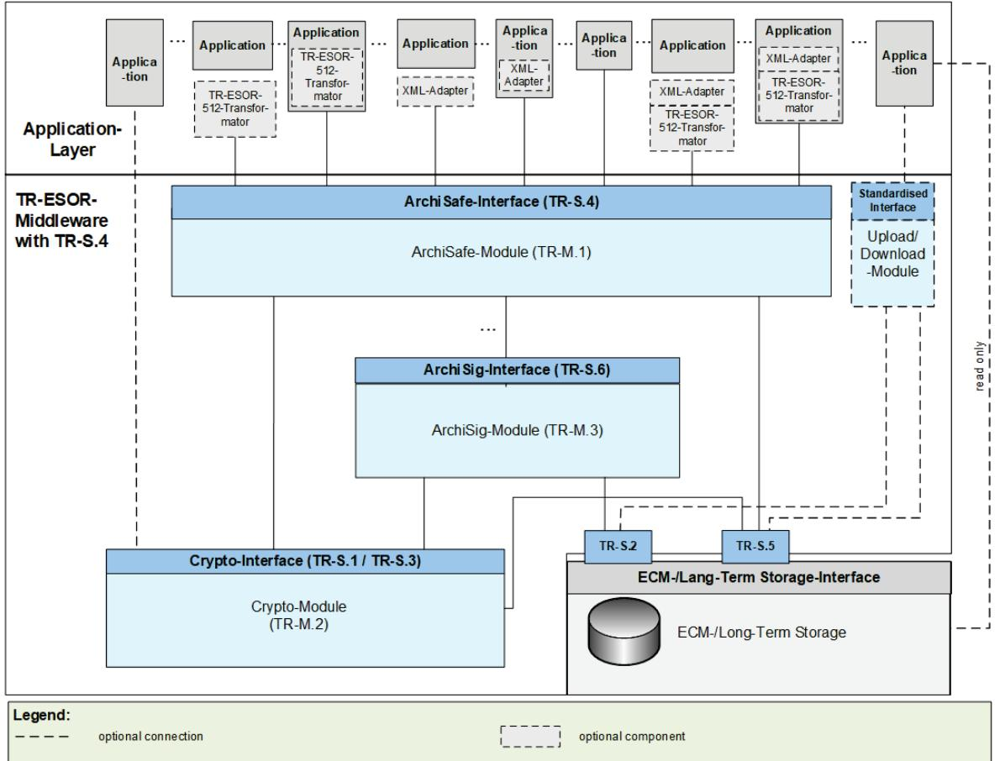
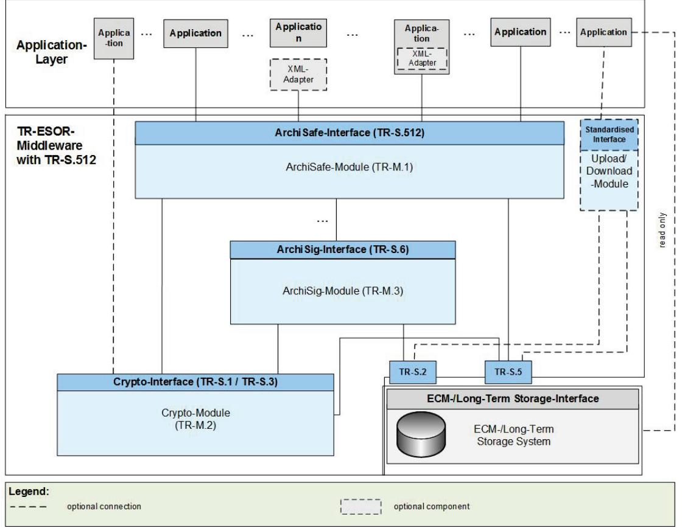
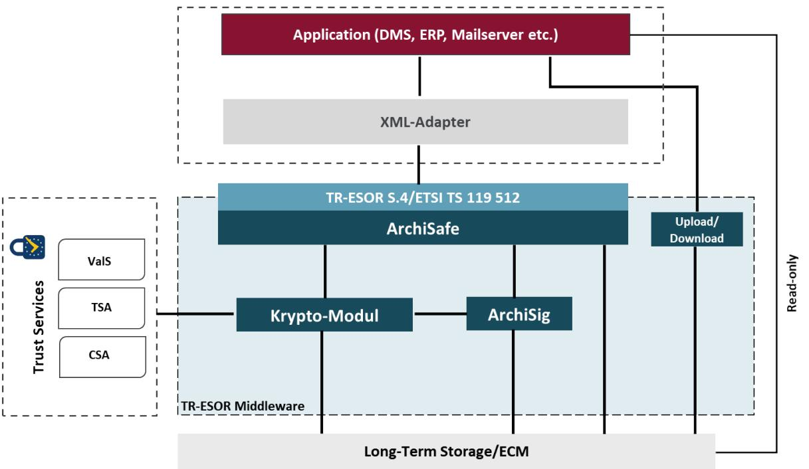

# BSI Technical Guideline 03125 Preservation of Evidence of Cryptographically Signed Documents

### Annex TR-ESOR-PEPT: Preservation Evidence Policy Template

| Designation  | Preservation Evidence Policy Template                                                                    |
|--------------|----------------------------------------------------------------------------------------------------------|
| Abbreviation | BSI TR-ESOR-PEPT                                                                                         |
| Version      | 1.3 (on base of the eIDAS-Regulation and ETSI Preservation Standards with a new<br>certification scheme) |
| Date         | 31.03.2022                                                                                               |

# Document history

| Version | Date       | Editor | Description  |
|---------|------------|--------|--------------|
| 1.3     | 31.03.2022 | BSI    | TR-ESOR-PEPT |
|         |            |        |              |

<span id="page-1-0"></span>Table 1: Document history

Federal Office for Information Security P.O. Box 20 03 63 53133 Bonn Phone: +49 229 99 9582-0 E-Mail: tresor@bsi.bund.de Internet: https://www.bsi.bund.de © Federal Office for Information Security 2022

| 1 |       | Introduction 7                                                                                   |  |
|---|-------|--------------------------------------------------------------------------------------------------|--|
|   | 1.1   | Overview 7                                                                                       |  |
|   | 1.1.1 | Purpose 7                                                                                        |  |
|   | 1.1.2 | Scope of the document 8                                                                          |  |
|   | 1.2   | Document Name and Identification12                                                               |  |
|   | 1.3   | Preservation Service Participants12                                                              |  |
|   | 1.4   | Preservation Usage 12                                                                            |  |
|   | 1.5   | Policy administration13                                                                          |  |
|   | 1.6   | Definitions and acronyms13                                                                       |  |
| 2 |       | Publication and Repository Responsibilities16                                                    |  |
|   | 2.1   | Repositories16                                                                                   |  |
|   | 2.2   | Storage of preservation evidences or publication of the preservation evidence policy template 16 |  |
|   | 2.3   | Time or frequency of publication16                                                               |  |
| 3 |       | Identification and Authentication17                                                              |  |
|   | 3.1   | Naming17                                                                                         |  |
|   | 3.2   | Initial identity validation17                                                                    |  |
|   | 3.3   | Identification and Authentication for modification requests17                                    |  |
|   | 3.4   | Identification and Authentication for deleting requests17                                        |  |
| 4 |       | Preservation Service Life-Cycle Operational Requirements18                                       |  |
|   | 4.1   | Preservation Service Application 18                                                              |  |
|   | 4.2   | Preservation Service application processing 18                                                   |  |
|   | 4.3   | Preservation Evidence Record issuance18                                                          |  |
|   | 4.4   | Preservation Evidence Record acceptance 18                                                       |  |
|   | 4.5   | Preservation Object modification18                                                               |  |
|   | 4.6   | Preservation Evidence Record usage 18                                                            |  |
|   | 4.7   | Preservation Evidence Record renewal 19                                                          |  |
|   | 4.8   | Preservation Export-Import19                                                                     |  |
|   | 4.9   | Certificate re-key19                                                                             |  |
|   | 4.10  | Preservation Data Deletion19                                                                     |  |
|   | 4.11  | Preservation Status Services20                                                                   |  |
|   | 4.12  | Key escrow and recovery 20                                                                       |  |
|   | 4.13  | End of subscription20                                                                            |  |
| 5 |       | Facility, Management and Operational Controls21                                                  |  |
|   | 5.1   | Physical controls21                                                                              |  |
|   | 5.2   | Procedural controls21                                                                            |  |
|   | 5.3   | Personnel controls21                                                                             |  |

| 5.4   | Audit logging procedures21                                                         |  |
|-------|------------------------------------------------------------------------------------|--|
| 5.5   | Records archival21                                                                 |  |
| 5.6   | Algorithm changeover21                                                             |  |
| 5.7   | Compromise and disaster recovery21                                                 |  |
| 5.8   | Preservation Service termination21                                                 |  |
| 5.9   | End of the Preservation Period21                                                   |  |
| 6     | Technical Security Controls22                                                      |  |
| 6.1   | TR-ESOR Modules22                                                                  |  |
| 6.2   | Private Key Protection and Cryptographic Module Engineering Controls22             |  |
| 6.2.1 | Private Key Protection22                                                           |  |
| 6.2.2 | Protection of the Cryptographic Module22                                           |  |
| 6.2.3 | Configuration of the Cryptographic Module 22                                       |  |
| 6.3   | Other aspects of key pair management 22                                            |  |
| 6.4   | Activation data 22                                                                 |  |
| 6.5   | Computer security controls22                                                       |  |
| 6.6   | Life cycle technical controls22                                                    |  |
| 6.7   | Network security controls22                                                        |  |
| 6.8   | Time stamping23                                                                    |  |
| 7     | Formats and Profiles24                                                             |  |
| 7.1   | Algorithm change24                                                                 |  |
| 7.2   | Preservation Profile24                                                             |  |
| 7.2.1 | Profile identifier http://www.bsi.bund.de/tr-esor/V1.2.1/profile/S.4/v1.0 25       |  |
| 7.2.2 | Profile identifier http://www.bsi.bund.de/tr-esor/V1.2.2/profile/S.4/v1.0 27       |  |
| 7.2.3 | Profile identifier http://www.bsi.bund.de/tr-esor/V1.3/profile/S.4/v1.0_MAX29      |  |
| 7.2.4 | Profile ID http://www.bsi.bund.de/tr-esor/V1.2.1/profile/preservation-api/v1.1.235 |  |
| 7.2.5 | Profile ID http://www.bsi.bund.de/tr-esor/V1.2.2/profile/preservation-api/v1.1.237 |  |
| 7.2.6 | Profile ID http://www.bsi.bund.de/tr-esor/V1.3/profile/preservation-api/v1.1.240   |  |
| 7.3   | XML Scheme44                                                                       |  |
| 7.4   | Archival Information Package (Container) 44                                        |  |
| 7.4.1 | Archival Information Package (Container) Formats44                                 |  |
| 7.4.2 | XAIP 45                                                                            |  |
| 7.4.3 | LXAIP45                                                                            |  |
| 7.4.4 | ASiC-AIP 45                                                                        |  |
| 7.4.5 | Validation of Archival Information Package (Container) 46                          |  |
| 7.5   | Payload Data Formats46                                                             |  |
| 7.6   | Cryptographic Data Formats46                                                       |  |
| 7.7   | Evidence Record Format46                                                           |  |
| 7.7.1 | Generation 46                                                                      |  |

|   | 7.7.2 | Validation 47                                              |  |
|---|-------|------------------------------------------------------------|--|
|   | 7.7.3 | Applicable Trust Service Provider ((Q)TSP) 48              |  |
|   | 7.7.4 | Augmentation of Evidence Record 51                         |  |
|   | 7.7.5 | Validation of Digital Signatures 52                        |  |
|   | 7.7.6 | Process of Export and Import of Export-Import-Packages 56  |  |
| 8 |       | Compliance Audit and other Assessments 58                  |  |
|   | 8.1   | Frequency or circumstances of assessment 58                |  |
|   | 8.2   | Identity/qualifications of assessor 58                     |  |
|   | 8.3   | Assessor's relationship to assessed entity 58              |  |
|   | 8.4   | Topics covered by assessment 58                            |  |
|   | 8.5   | Actions taken as a result of deficiency 58                 |  |
|   | 8.6   | Communication of results 58                                |  |
| 9 |       | Other Business and legal Matters 59                        |  |
|   | 9.1   | Fees  59                                                   |  |
|   | 9.2   | Financial responsibility  59                               |  |
|   | 9.3   | Confidentiality of business information 59                 |  |
|   | 9.4   | Privacy of personal information 59                         |  |
|   | 9.5   | Intellectual property rights 59                            |  |
|   | 9.6   | Representations and warranties  59                         |  |
|   | 9.7   | Disclaimers of warranties 59                               |  |
|   | 9.8   | Limitations of liability 59                                |  |
|   | 9.9   | Indemnities 59                                             |  |
|   | 9.10  | Term and termination 59                                    |  |
|   | 9.11  | Individual notices and communications with participants 59 |  |
|   | 9.12  | Amendments 59                                              |  |
|   | 9.13  | Dispute resolution provisions 59                           |  |
|   | 9.14  | Governing law  60                                          |  |
|   | 9.15  | Compliance with applicable law 60                          |  |
|   | 9.16  | Miscellaneous provisions 60                                |  |
|   | 9.17  | Other provisions 60                                        |  |
|   |       |                                                            |  |

| Figure 1: Overview – Positioning of the TR-ESOR-Middleware with TR-S.4-interface  9 |  |
|-------------------------------------------------------------------------------------|--|
| Figure 2: Positioning of the TR-ESOR-Middleware with TR-512-interface  10           |  |
| Figure 3: Components of TR-ESOR 11                                                  |  |

| Table 1: Document history  2            |  |
|-----------------------------------------|--|
| Table 2: Keywords and Abbreviations  13 |  |

| Table 3: Currently usable Archival Information Package and ArchiveData-Element Type(s)45                    |  |
|-------------------------------------------------------------------------------------------------------------|--|
| Table 4: Actual used Preservation Evidence Record Type46                                                    |  |
| Table 5: Actual Algorithms in Use for the generation of timestamp token46                                   |  |
| Table 6: Actual Algorithms in Use for the verification of timestamp token47                                 |  |
| Table 7: Root-CA or Trust Anchor and Subordinate CA of the external Timestamp Trust Service Provider48      |  |
| Table 8: Trust Anchor of the external Validation Trust Service Provider49                                   |  |
| Table 9: Supported Validation Model (Shell or Chain) of an external Validation Service50                    |  |
| Table 10 : Root Certificate or Trust Anchor of the external Certificate Status Authority50                  |  |
| Table 11: Supported Validation Model (Shell or Chain) of the external Certificate Status Authority50        |  |
| Table 12: Actual Algorithms in Use for the time-stamp renewal and hash-tree renewal51                       |  |
| Table 13: Self-Declaration of the PSP concerning the Augmentation of Evidence Records51                     |  |
| Table 14: Self-Declaration of the PSP concerning the "signature validation policy" or "timestamp validation |  |
| policy"53                                                                                                   |  |
| Table 15: Details of Export and Import of Export-Import-Packages56                                          |  |

# <span id="page-6-0"></span>1 Introduction

### <span id="page-6-1"></span>1.1 Overview

### <span id="page-6-2"></span>1.1.1 Purpose

Trust services, as specified in Regulation (EU) No 910/2014 [eIDAS-VO] (short: eIDAS-VO), shall give participants of electronic commerce confidence in the security of these trust services. This confidence is expected to result from a set of procedures, processes and security measures, the Trust Service Provider (TSP) has established in order to minimize the operational and financial threats and risks associated.

eIDAS-VO distinguishes two trust levels with respect to trust services and providers of trust services:

- normal trust services and trust service providers (TSP) and
- qualified trust services and trust service providers (QTSPs) that need to fulfil additional legal requirements and are subject to periodical independent third party conformity assessments by accredited conformity assessment bodies (CAB).

#### (Q)TSP means TSP or QTSP.

Especially qualified trust services and QTSPs will fulfil such high expectations of participants. The following (qualified) trust services are defined in [eIDAS-VO]:

- creation of (qualified) certificates for signatures, seals and website authentication,
- creation of (qualified) electronic timestamps,
- validation of (qualified) electronic signatures and seals,
- preservation of (qualified) electronic signatures and seals, and
- (qualified) electronic registered delivery service.

To support the eIDAS-VO-conformant implementation of (qualified) trust services, ETSI has issued a series of standards with policy requirements that a (qualified) trust service provider may implement to achieve conformance to [eIDAS-VO].

[ETSI TS 119 511] defines policy and security requirements for operation and management practices of a (Q)TSP, which provides long-term preservation of digital signatures or general data using digital signature techniques, called Preservation Service Provider (PSP).

- According to section 6.5 of [ETSI TS 119 511], PSP shall have a Preservation Evidence Policy (PEP) in place, which consists of a set of rules that specify the requirements and the internal processes to generate or to validate a preservation evidence.
- To-Do-1.1.1-1)In case the PSP uses a TR-ESOR [TR-ESOR] certified product for generation and validation of preservation evidences, the following three-tiered process of generation of a PEP and a PSPS (1. BSI-PEPT, then 2. PEP of the TR-ESOR-Product Manufacturer, then 3. PSPS of the PSP) shall be fulfilled:
	- 1) BSI published this BSI Preservation Evidence Policy Template (PEPT);
	- 2) The TR-ESOR-Product Manufacturer shall
		- copy this PEPT in his PEP,
		- precise his new PEP in all cases, where there were still alternatives mentioned in the PEPT,
		- fulfil all the tables, where there is written "<Must be filled in by the TR-ESOR-Product Manufacturer>",
- publish his currently created PEP;
- 3) The Preservation Service Provider (PSP) shall
	- fulfil in the PEP of his TR-ESOR-Product Manufacturer all the tables, where there is written "<Must be filled in by the PSP>" or there is written "<Must be filled in by the TR-ESOR-Product Manufacturer or PSP>" and the TR-ESOR-Product Manufacturer did not fill this table,
	- include the supplemented PEP of his TR-ESOR-Product Manufacturer in his Preservation Service Practice Statement,
	- publish his currently created PSPS and the supplemented PEP, originally provided by this TR-ESOR-Product Manufacturer, as his PEP.

The chapters 1, 2, 4.3, 4.4, 4.6, 4.7, 5.4 and 7 in their PEP(s) must then be taken into account and supplemented or adapted by the TR-ESOR-Product Manufacturer and PSP, if necessary.

This PEPT and the PEPs of the TR-ESOR-Product Manufacturer are structured according to [RFC3647], although chapters 3 to 6 (except chapter 4.3, 4.4, 4.6, 4.7, 5.4) and 8 to 9 of RFC 3647 are not applicable and do not need to be filled by the TR-ESOR-Product Manufacturer.

When the PSP supplements the PEP of the TR-ESOR-Product Manufacturer and includes it in his (published) PSPS ), then the chapters 3 to 6 and 8 to 9 have to be considered by the PSP too.

Whenever an adjustment has to be made, this is highlighted in the following text under "To-Do".

A TR-ESOR-Product Manufacturer using PEP(s) on base of PEPT, as described before,

and a PSP using

- a) TR-ESOR certified product(s) and
- b) PEP(s) and PSPS(s), created on the base of the PEPT, as described before,

fulfil the requirements of section 6.5 of [ETSI TS 119 511].

#### <span id="page-7-0"></span>1.1.2 Scope of the document

The document describes a Preservation Evidence Policy Template (PEPT), that is supplemented and included in the PEP of the TR-ESOR-Product Manufacturer and this PEP of the TR-ESOR-Product Manufacturer, is then supplemented and included in the PSPS of the PSP using a TR-ESOR-Product pursuant to clause 1.1.1. To better assign the scope, TR-ESOR and its components are briefly described here (extracted from [TR-ESOR]):

An overall system for the storage and preservation of cryptographically signed documents therefore includes elements (components) and processes, which are used for

1) "The preservation over long periods of time, using digital signature techniques, of the ability to validate a digital signature, of the ability to maintain its validity status and of the ability to get a proof of existence of the associated signed data as they were at the time of the submission to the Preservation Service even if later the signing key becomes compromised, the certificate expires, or cryptographic attacks become feasible on the signature algorithm or the hash algorithm used in the submitted signature.

NOTE 1: A qualified Preservation Service for qualified electronic signatures or seals as per Regulation (EU) No 910/2014 [i.2] for which the status of technical validity needs to be preserved, is covered in this case.

NOTE 2: The validity status of a signature means the status of the signature that will not change over time. Such a status may be valid (TOTAL\_PASSED according to [ETSI EN 319 102-1], [i.6]) or invalid (TOTAL\_FAILED and certain cases for INDETERMINATE according to [ETSI EN 319 102-1], [i.6]).

NOTE 3: "Digital signature techniques" designates techniques based on digital signatures, timestamps or evidence records.

2) The provision of a proof of existence of digital objects, whether they are signed or not, using digital signature techniques (digital signatures, timestamp tokens, evidence records, etc.)" [ETSI TS 119 511], clause 1

over long periods of time, in spite of obsolescence of cryptographic technology such as crypto algorithms, key sizes or hash functions, key compromises or of the loss of the ability to check the validity status of public key certificates" pursuant to [ETSI TS 119 512], even if these elements (components) and processes are not described in this PEP.

Within the following figure is an overview of the typical elements (components) with the positioning of the TR-ESOR-Product and Preservation Service:



<span id="page-8-0"></span>Figure 1: Overview – Positioning of the TR-ESOR-Middleware with TR-S.4-interface



<span id="page-9-0"></span>Figure 2: Positioning of the TR-ESOR-Middleware with TR-512-interface

At this point, important to know is the positioning of the TR-ESOR-Middleware. The TR-ESOR-Middleware is limited to the functions, interfaces and components necessary for the preservation of evidence. Functions, interfaces and components going beyond this are permissible, provided they do not restrict the functions for preserving the value of evidence or endanger their security.

The TR-ESOR-Middleware includes neither the custom applications nor the actual storage or archiving systems, but rather bundles the necessary functions for the cryptographic preservation of evidence. A TR-ESOR-Middleware that complies with this Technical Guideline is capable of maintaining the probative value of signed and unsigned electronic data or documents for the entire duration of the retention period and provides the functions to preserve the evidence of cryptographically signed documents.

Therefore, securing the availability and readability of electronic documents cannot be guaranteed by the TR-ESOR-Middleware at the centre of this PEPT, but must be supported by suitable technical and organisational measures in the upstream IT applications or in the ECM-/long-term storage systems used. The participants of a Preservation Service are two parties:

- Party of the Preservation Middleware, e.g. TR-ESOR-Product Manufacturer,
- Party of the Trust Service Provider (TSP),
	- the Preservation Trust Service Provider itself,
	- external Trust Service Providers
		- Validation Service
		- Time Stamping Authority
		- Certificate Status Authority.

Party of the Application Layer is the user of the Preservation Service. The Preservation Service uses the long-term storage.

I[n Figure 3](#page-10-0) the main components of the TR-ESOR-Middleware and its connections to the other participants are outlined:



#### <span id="page-10-0"></span>Figure 3: Components of TR-ESOR

[Figure 3](#page-10-0) shows technical components (e.g. ArchiSafe) of the TR-ESOR-Middleware. However, following the scope of this PEPT the details (description of components and related functions) of the technical components will be found in the separated documentations published on the website of the BS[I1](#page-10-1) .

The "TR-S.4" (short: S.4) and "TR-S.512" (short: S.512) circled within TR-ESOR are interfaces according to a corresponding standard. Here, "TR-S.4" is defined according to [TR-ESOR-E]. "TR-S.512" is defined according to [ETSI TS 119 512] and profiled in [TR-ESOR-TRANS]. The interface profiles are considered in chapter [7.2.](#page-23-2) 

The TR-ESOR-Middleware supports the preservation of cryptographically signed or unsigned documents. To do so, the following minimal functional requirements are fulfilled:

- the storage of cryptographically unsigned and cryptographically signed data, possibly including already existing Evidence Records pursuant to [RFC4998] or [RFC6283],
- the retrieval of Archival Information Package (AIP), also called preservation object container,
- the retrieval of suitable Evidence Records of the authenticity and integrity of the stored data,
- the deletion of data as Archival Information Package,
- Only TR-ESOR-V1.2.2 or higher: the traceable update of already archived metadata and payload data and credentials[2](#page-10-2) , which also includes the addition of further metadata and payload data to already archived data structures,

<span id="page-10-1"></span><sup>1</sup> See the TR-ESOR short link for DE[:https://www.bsi.bund.de/tr-esor](https://www.bsi.bund.de/tr-esor) and EN:

<span id="page-10-2"></span>https:/[/www.bsi.bund.de/EN/tr-esor.](http://www.bsi.bund.de/EN/tr-esor) 2 E.g. supplemental evidence data and technical evidence records are credentials.

- Only TR-ESOR V1.3 and higher: Verifying the Archival Information Package including the supplemental evidence data and technical evidence records (Evidence Records) that are contained therein or were additionally transferred
- Only TR-ESOR V1.3 and higher: The retrieval of Preservation Profiles according to [ETSI TS 119 512], RetrieveInfo.

Furthermore, the following functions are possible options:

- Targeted retrieval of individual data elements from an individual archive data object (group) without having to return the respective entire archive data object (group) to the IT application.[3](#page-11-3)
	- Only TR-ESOR V1.2.1: the traceable update of already archived metadata and payload data, which also includes the addition of further metadata and payload data to already archived data structures.
- Only TR-ESOR V1.2.1 and V1.2.2 Verifying the Archival Information Package including the supplemental evidence data and technical evidence records (Evidence Records) that are contained therein or were additionally transferred.
- Only TR-ESOR V1.3 and higher: The retrieval of data and event logs according to [ETSI TS 119 512], RetrieveTrace.

### <span id="page-11-0"></span>1.2 Document Name and Identification

This PEP is named with "Preservation Evidence Policy Template for TR-ESOR" (PEPT).

This PEPT is identified with the following URL:

<http://www.bsi.bund.de/DE/tr-esor/prespolicy/default/1.0>

- To-Do-1.2-1 : The TR-ESOR-Product Manufacturer shall determine a unique OID of his supplemented PEP, based on the PEPT and publish this supplemented PEP with this OID.
- To-Do-1.2-2 : The PSP shall also determine a unique OID of his completed PEP and publish this completed PEP with this OID.

This PEPT and the PEPs, derived from the PEPT are structured according to [RFC3647].

### <span id="page-11-1"></span>1.3 Preservation Service Participants

Beside the Preservation Client and the Preservation Service, the following external (Q)TSPs are used for the TR-ESOR-Middleware:

- Time Stamping Authority issuing qualified timestamps,
- Validation Service to validate (qualified) electronic signatures, seals or timestamps,
- Certificate Status Authority to validate certificates.

More information are to be found in clause [7.7.3.](#page-47-0)

### <span id="page-11-2"></span>1.4 Preservation Usage

This PEPT is reduced to the case "Preservation service with storage [WST]" pursuant to [ETSI TS 119 511], clause 4.1.2.

<span id="page-11-3"></span> <sup>3</sup> This function can be used, for example, to create search indices, determine the object owner, determine the minimum retention period, or retrieve electronic signatures.

The Preservation Service is used to fulfil the following goals:

• "<http://uri.etsi.org/19512/goal/pgd> The preservation goal "Preservation of General Data" (PGD) provides a proof of existence over long periods of time of the submission data object (SubDO) submitted to the Preservation Service. NOTE 1: The PGD goal does not distinguish between signed and unsigned data.

• http://uri[.etsi.org/19512/goal/pds](http://uri.etsi.org/19512/goal/pds)

The preservation goal "Preservation of Digital Signatures" (PDS) extends over long periods of time the ability to validate a digital signature, to maintain its validity status and to get a proof of existence of the associated signed data.

• http://uri[.etsi.org/19512/goal/aug](http://uri.etsi.org/19512/goal/aug) The preservation goal "Augmentation" (AUG) indicates that the Preservation Service supports the augmentation of submitted preservation evidences."[4](#page-12-3)

### <span id="page-12-0"></span>1.5 Policy administration

This PEPT is subject to continuous further improvement and adaptation to new requirements. The continuation must be orderly, i.e. agreed versions of the PEPT must be released in a formal act. Formally released versions or patches are published on the BSI website. The publication is regulated.

The Federal Office for Information Security (BSI) is technically responsible for the formulation and supervision of these PEPTs.

Address: Bundesamt für Sicherheit in der Informationstechnik (BSI)

Post Office Box 20 03 63

53133 Bonn

Tel.: +49 228 99 9582-0

E-Mail[: tresor@bsi.bund.de](mailto:tresor@bsi.bund.de)

Internet: [https://www.bsi.bund.de](https://www.bsi.bund.de/)

### <span id="page-12-1"></span>1.6 Definitions and acronyms

<span id="page-12-2"></span>Table 2: Keywords and Abbreviations

| Abbreviation | Keyword                                                                                                                                                          |
|--------------|------------------------------------------------------------------------------------------------------------------------------------------------------------------|
| [ABC]        | for: document ABC                                                                                                                                                |
| AOID         | Archive Data Object Identifier                                                                                                                                   |
| ASiC-AIP     | Associated Signature Container (ASiC)-<br>Archival Information Package                                                                                           |
| ATS          | ArchiveTimeStamp                                                                                                                                                 |
| AUG          | Augmentation                                                                                                                                                     |
| CA           | Certification Authority                                                                                                                                          |
| CAB          | Conformity Assessment Body                                                                                                                                       |
| CRL          | Certificate Revocation List                                                                                                                                      |
| DMS          | Data Management System                                                                                                                                           |
| eIDAS-VO     | REGULATION (EU) No 910/2014 OF THE<br>EUROPEAN PARLIAMENT AND OF THE<br>COUNCIL of 23 July 2014 on electronic<br>identification and trust service for electronic |

<span id="page-12-3"></span> <sup>4</sup> See [ETSI TS 119 512, clause 4.2].

| Abbreviation | Keyword                                                              |
|--------------|----------------------------------------------------------------------|
|              | transactions in the internal market and                              |
|              | repealing Directive 1999/93/EC                                       |
| et. seq.     | et sequence                                                          |
| ECM          | Enterprise Content Management                                        |
| EU           | European Union                                                       |
| EUMS         | European Union Member State                                          |
| GDPR         | General Data Protection Regulation                                   |
| IS-Policy    | Information Security Policy (see e.g. [EN 319<br>401], chapter 6.3.) |
| IT           | Information Technology                                               |
|              | Logically XML formatted Archival                                     |
| LXAIP        | Information Package                                                  |
| NC           | Non-Conformity                                                       |
| OCSP         | Online Certificate Status Protocol                                   |
| OID          | Object Identifier                                                    |
| OVR          | Overall                                                              |
| PDS          | Preservation of Digital Signature                                    |
| PEP          | Preservation Evidence Policy                                         |
| PEPT         | Preservation Evidence Policy Template                                |
| PGD          | Preservation of General Data                                         |
| PI           | Potential for Improvement                                            |
| PO           | Preservation Object                                                  |
| POC          | Preservation Object Container                                        |
| PP           | Preservation Profiles                                                |
| PRP          | Preservation Service Protocol                                        |
| PS           | Preservation Service                                                 |
| PSP          | Preservation Service Provider                                        |
| PSPS         | Preservation Service Practice Statement                              |
|              | Qualified Electronic Signature or qualified                          |
| QES          | electronic seal                                                      |
| QTSP         | Qualified Trust Service Provider                                     |
| (Q)TPS       | TSP or QTSP                                                          |
| QPSP         | Qualified Preservation Service Provider                              |
| (Q)PSP       | PSP or QPSP                                                          |
| R            | Recommendation                                                       |
| SA           | Subscriber Agreement                                                 |
| SSL          | Secure Sockets Layer                                                 |
| SubDO        | Submission Data Object                                               |
| SVP          | Signature Validation Policy                                          |
| T&C          | Terms and Conditions                                                 |
| TL           | Trusted List                                                         |
|              | DE: Technische Richtlinie zur                                        |
|              | Beweiserhaltung kryptographisch signierter                           |
| TR-ESOR      | Dokumente                                                            |
|              | EN: Technical Guideline for Preservation of                          |
|              | Evidence of Cryptographically Signed                                 |
|              | Documents                                                            |
| TSA          | Time-Stamping Authority                                              |
| TSP          | Trust Service Provider                                               |
| TS-Policy    | Trust Service Policy                                                 |

| Abbreviation | Keyword                                                                   |
|--------------|---------------------------------------------------------------------------|
| TSPS         | Trust Service Practice Statement (see e.g. [EN<br>319 401], chapter 6.1.) |
| UTC          | Coordinated Universal Time                                                |
| WOS          | Without Storage                                                           |
| WST          | With Storage                                                              |
| WTS          | With Temporary Storage                                                    |
| XAIP         | XML formatted Archival Information Package                                |
| XML          | Extensible Markup Language                                                |

# <span id="page-15-0"></span>2 Publication and Repository Responsibilities

### <span id="page-15-1"></span>2.1 Repositories

The valid versions of this PEP Template, module descriptions of ArchiSafe, ArchiSig and Krypto and other relevant documents are available for download on the TR-ESOR websites of BSI:

English at http:/[/www.bsi.bund.de/EN/tr-esor](http://www.bsi.bund.de/EN/tr-esor) , in German at [http://www.bsi.bund.de/DE/tr-esor.](http://www.bsi.bund.de/DE/tr-esor)

The versions are listed with a description of the extension or change and the date in a list of changes available on the TR-ESOR web pages of BSI.

### <span id="page-15-2"></span>2.2 Storage of preservation evidences or publication of the preservation evidence policy template

TR-ESOR as middleware of the Preservation Service is responsible for preservation of evidences of cryptographically signed and unsigned documents based on Evidence Records based on Merkle-Hash-treed defined in [RFC4998] or [RFC6283] (see [TR-ESOR-M.3], clause 3 4).

- To-Do-2.2-1 The ArchiSig-Module shall have a secure data storage, that is part of or allocated to the ArchiSig-Module, to store the *ArchiveTimeStamp* and the archive data object ID (see [TR-ESOR-M.3], Chapter 3.1, (A3.1-6)) in such a way, that concerning the hash trees a hash value corresponding to an AOID and, if applicable, VersionID can be identified with absolute certainty at any time".
- To-Do-2.2-2 The BSI PEP template PEPT shall be published on the German BSI web site <https://www.bsi.bund.de/DE/tr-esor> and on the English web site https:/[/www.bsi.bund.de/EN/tr-esor.](http://www.bsi.bund.de/EN/tr-esor)

## <span id="page-15-3"></span>2.3 Time or frequency of publication

As described in chapte[r 1.5](#page-12-0) this PEP template administration follows a standardised and regular process. The PEP template and other documents, mentioned in chapte[r 2.1,](#page-15-1) can only be edited and published from authorized personnel of the BSI.

A change/update of the actual PEP template version will take place, if at least a new version of [TR-ESOR] is published.

- To-Do-2.3-1) If the used cryptographic algorithm(s) and its parameter(s) have to be changed, e.g. on base of [ETSI TS 119 511] and [SOG\_IS], the PEP of the TR-ESOR-Product Manufacturer shall be changed.
- To-Do-2.3-2) Then the PSP shall supplement this new PEP of his TR-ESOR-Product Manufacturer and include it in his PSPS as soon as the cryptographic algorithm(s) in his Preservation Service in production is(are) changed (see (OVR-6.4-13, OVR-6.4-14)) and publish his newly completed PSPS and PEP.

See also:

"If one of the algorithms or parameters which were used in a preservation evidence, is thought to become less secure or the validity of a relevant certificate is going to expire, the preservation evidence shall be augmented by the preservation service according to a new version of the preservation evidence policy during the preservation period" ([ETSI TS 119 511], OVR-7.14-02 ).

To-Do-2.3-3) In addition, if one or more external trust service providers are to be changed, the PSPS and PEP of the PSP shall be changed.

# <span id="page-16-0"></span>3 Identification and Authentication

Not applicable for Preservation Evidence Policy.

### <span id="page-16-1"></span>3.1 Naming

Not applicable for Preservation Evidence Policy.

## <span id="page-16-2"></span>3.2 Initial identity validation

Not applicable for Preservation Evidence Policy.

### <span id="page-16-3"></span>3.3 Identification and Authentication for modification requests

Not applicable for Preservation Evidence Policy.

### <span id="page-16-4"></span>3.4 Identification and Authentication for deleting requests

# <span id="page-17-0"></span>4 Preservation Service Life-Cycle Operational Requirements

### <span id="page-17-1"></span>4.1 Preservation Service Application

Not applicable for Preservation Evidence Policy.

### <span id="page-17-2"></span>4.2 Preservation Service application processing

Not applicable for Preservation Evidence Policy.

### <span id="page-17-3"></span>4.3 Preservation Evidence Record issuance

The TR-ESOR-Middleware of the PSP may create Preservation Evidence Records pursuant to ([RFC4998] clause 4.2 or [RFC6283] clause 3.2), ([TR-ESOR-M.3]) and ([TR-ESOR-ERS]).

The TR-ESOR-Product Manufacturer shall precise in his PEP in chapte[r 7.7.1,](#page-45-4) whether his Preservation Product supports [RFC4998] or [RFC6283] or both Evidence Record formats.

The algorithm is chosen on base of [ETSI TS 119 312] pursuant to ([TR-ESOR-M.2], clause 4, (A4.0-1)).

- To-Do-4.3-1) The TR-ESOR-Product Manufacturer shall precise in his PEP in claus[e 7.7.1,](#page-45-4) which algorithms currently are used by his Preservation Product.
- To-Do-4.3-2) The PSP shall complete the supplemented PEP of the TR-ESOR-Product Manufacturer, include the completed PEP in his PSPS and then publish his completed PEP and his completed PSPS.

More details are to be found in clause [7.7.1.](#page-45-4)

NOTE 1: Therefore, ([ETSI TS 119 511], OVR-6.5-03 and OVR-6.5-04) are fulfilled by this PEPT, supplemented by the TR-ESOR-Product Manufacturer and PSP later on.

### <span id="page-17-4"></span>4.4 Preservation Evidence Record acceptance

The TR-ESOR-Middleware of the PSP validates Preservation Evidence Records pursuant to ([RFC4998] clause 4.3/5.3 or [RFC4283] clause 3.3) and [TR-ESOR-ERS], clause 3.6, clause 5.2).

NOTE 1: Whether [RFC4998] or [RFC6283] or both Evidence Record formats are supported by the Preservation Product, is to be stated by the TR-ESOR-Product Manufacturer or PSP in chapte[r 7.7.1,](#page-45-4) [Table 4](#page-45-5) in their PEP.

More details are to be found in clause [7.7.2](#page-46-0)

NOTE 2: Therefore, [ETSI TS 119 511], OVR-6.5-06 is fulfilled by this PEPT and the supplemented PEP of the TR-ESOR-Product Manufacturer and the completed PEP of the PSP.

## <span id="page-17-5"></span>4.5 Preservation Object modification

Not applicable for Preservation Evidence Policy.

### <span id="page-17-6"></span>4.6 Preservation Evidence Record usage

### <span id="page-18-0"></span>4.7 Preservation Evidence Record renewal

The TR-ESOR-Middleware of the PSP augments Preservation Evidence Records pursuant to ([RFC4998] or [RFC6283] and [TR-ESOR-M.3] and [TR-ESOR-ERS]) by time-stamp renewal and hash-tree renewal.

How the time-stamp renewal and hash-tree renewal are performed is specified in clause 4.2.1 and 4.2.2 of [RFC6283] and clause 5 of [RFC4998].

The algorithm is chosen on base of [ETSI TS 119 312] pursuant to ([TR-ESOR-M.2], clause 4, (A4.0-1)). More details are to be found in clause [7.7.4.](#page-50-0)

NOTE 1: The decision, whether [RFC4998] or [RFC6283] or both Evidence Record formats are supported by the TR-ESOR-Product Manufacturer and PSP, is to be found in chapter [7.7.1,](#page-45-4) [Table 4](#page-45-5) in the supplemented PEP of the TR-ESOR-Product Manufacturer.

- To-Do-4.6-1) The TR-ESOR-Product Manufacturer shall precise in clause [7.7.4,](#page-50-0) [Table 12,](#page-50-1) which algorithms currently are used by this Preservation Product.
- To-Do-4.6-2) The PSP shall complete the supplemented PEP of the TR-ESOR-Product Manufacturer, include the completed PEP in his PSPS and then publish his completed PEP and his completed PSPS.

Therefore, it is clearly specified, which algorithms currently are used by this Preservation Product of the TR-ESOR-Product Manufacturer and this Preservation Service of the PSP.

NOTE 2: Therefore, this PEPT and the supplemented PEP of the TR-ESOR-Product Manufacturer and the completed PEP of the PSP fulfil ([ETSI TS 119 511], OVR-6.5-03, OVR-6.5-04 and OVR-6.5-07).

### <span id="page-18-1"></span>4.8 Preservation Export-Import

[TR-ESOR-M.3], clause 2.7 describes different methods with different Export-Import data formats with different interfaces for exporting and importing export-import package(s) pursuant to [TR-ESOR-M.3], clause 2.7.

NOTE 1: The decision, which of the alternatives pursuant to [TR-ESOR-M.3], clause 2.7, are supported by the TR-ESOR-Product Manufacturer or PSP, is to be found in chapte[r 7.7.6,](#page-55-0) [Table 15,](#page-55-1) added by the TR-ESOR-Product Manufacturer.

To-Do-4.7-1) The PSP shall complete the supplemented PEP of the TR-ESOR-Product Manufacturer, include the completed PEP in his PSPS and then publish his completed PEP and his completed PSPS.

NOTE 2: Therefore, this PEPT and the supplemented PEP of the TR-ESOR-Product Manufacturer and the completed PEP of the PSP, fulfils ([ETSI TS 119 511], OVR-6.1-07, OVR-6.1-08, OVR-6.2-05, OVR-6.5-03, OVR-6.5-08.

### <span id="page-18-2"></span>4.9 Certificate re-key

Not applicable for Preservation Evidence Policy.

### <span id="page-18-3"></span>4.10 Preservation Data Deletion

## <span id="page-19-0"></span>4.11 Preservation Status Services

Not applicable for Preservation Evidence Policy.

### <span id="page-19-1"></span>4.12 Key escrow and recovery

Not applicable for Preservation Evidence Policy.

### <span id="page-19-2"></span>4.13 End of subscription

# <span id="page-20-0"></span>5 Facility, Management and Operational Controls

Not applicable for Preservation Evidence Policy.

### <span id="page-20-1"></span>5.1 Physical controls

Not applicable for Preservation Evidence Policy.

### <span id="page-20-2"></span>5.2 Procedural controls

Not applicable for Preservation Evidence Policy.

### <span id="page-20-3"></span>5.3 Personnel controls

Not applicable for Preservation Evidence Policy.

### <span id="page-20-4"></span>5.4 Audit logging procedures

The TR-ESOR-Middleware offers comprehensive and configurable options for logging any access to the preservation system.

See

- [TR-ESOR], clause 5, (A5.1-1), (A5.1-17),
- [TR-ESOR], clause 5 (A5.1-33), (A5.2-1)
- [TR-ESOR-M.1], clause (A4.0-3)
- [TR-ESOR-M.1], clause (A4.4-6)
- [TR-ESOR-M.2], clause (A6.2-3)).

### <span id="page-20-5"></span>5.5 Records archival

Not applicable for Preservation Evidence Policy.

### <span id="page-20-6"></span>5.6 Algorithm changeover

Not applicable for Preservation Evidence Policy.

### <span id="page-20-7"></span>5.7 Compromise and disaster recovery

Not applicable for Preservation Evidence Policy.

### <span id="page-20-8"></span>5.8 Preservation Service termination

Not applicable for Preservation Evidence Policy.

### <span id="page-20-9"></span>5.9 End of the Preservation Period

- To-Do-5.9-1) : The TR-ESOR-Product Manufacturer shall precise in this clause in his PEP, what happens to the archived Data Objects at the end of the preservation period.
- To-Do-5.9-2) : The PSP shall complete the supplemented PEP of his "TR-ESOR-Product Manufacturer", especially finalise this clause, then include the completed PEP in his PSPS and publish his completed PEP and his completed PSPS.

# <span id="page-21-0"></span>6 Technical Security Controls

The TR-ESOR Middleware uses cryptographic algorithm as described in [TR-ESOR-M.2].

- To-Do-6.0-1) The TR-ESOR-Product Manufacturer and the PSP should also consider the national recommendations of its country.
- To-Do-6.0-2) TR-ESOR-Product Manufacturer and the PSPs should consider the recommendations of "Bundesnetzagentur" (BNetzA), if they operate in Germany: [https://www.bundesnetzagentur.de/EVD/DE/Fachkreis/Empfehlungen/\\_function/Empfehlungen](https://www.bundesnetzagentur.de/EVD/DE/Fachkreis/Empfehlungen/_function/Empfehlungen-table.html%23FAQ961416)[table.html#FAQ961416](https://www.bundesnetzagentur.de/EVD/DE/Fachkreis/Empfehlungen/_function/Empfehlungen-table.html%23FAQ961416)

### <span id="page-21-1"></span>6.1 TR-ESOR Modules

Not applicable for Preservation Evidence Policy.

### <span id="page-21-2"></span>6.2 Private Key Protection and Cryptographic Module Engineering Controls

Not applicable for Preservation Evidence Policy.

### <span id="page-21-3"></span>6.2.1 Private Key Protection

Not applicable for Preservation Evidence Policy.

### <span id="page-21-4"></span>6.2.2 Protection of the Cryptographic Module

Not applicable for Preservation Evidence Policy.

### <span id="page-21-5"></span>6.2.3 Configuration of the Cryptographic Module

Not applicable for Preservation Evidence Policy.

### <span id="page-21-6"></span>6.3 Other aspects of key pair management

Not applicable for Preservation Evidence Policy.

### <span id="page-21-7"></span>6.4 Activation data

Not applicable for Preservation Evidence Policy.

### <span id="page-21-8"></span>6.5 Computer security controls

Not applicable for Preservation Evidence Policy.

### <span id="page-21-9"></span>6.6 Life cycle technical controls

Not applicable for Preservation Evidence Policy.

### <span id="page-21-10"></span>6.7 Network security controls

### <span id="page-22-0"></span>6.8 Time stamping

# <span id="page-23-0"></span>7 Formats and Profiles

## <span id="page-23-1"></span>7.1 Algorithm change

To-Do-7.1-1) The TR-ESOR-Middleware shall react before the expiration of the security suitability of the used algorithms and related parameters. Based on monitoring the suitability of the cryptographic algorithms based on [ETSI TS 119 312] and [SOG\_IS], the TR-ESOR-Middleware performs time-stampor hash-tree-renewals as specified in [RFC4998] and/or [RFC6283].

See also TR-ESOR V1.2.1/V1.2.2/V1.3:

• **[**TR**-**ESOR**-**M.2**],** clause 4, (A4.2-1), (A4.2-2) ), (A4.2-3), clause 6.3 (A6.3-1)

and

TR-ESOR V1.2.1/V1.2.2

• [TR-ESOR-APP], M.2, clause 4, (A4.0-1),

or

TR-ESOR V13:

• [TR-ESOR-M.2], clause 4, (A4.0-1).

The Crypto Module of TR-ESOR supports a fast and easy algorithm and parameter exchange according to [TR-ESOR-M.2], clause (A3.2-1) and clause 6.3 and [TR\_03112].

To-Do-7.1-2) The ArchiSig Module of TR-ESOR should have a secondary data basis (see [TR-ESOR-M.3], clause 4.8 (A4.8-7). The secondary data basis of the ArchiSig Module uses other algorithm and parameters as the primary data basis. Nevertheless, a fast and easy algorithm change is guaranteed too.

### <span id="page-23-2"></span>7.2 Preservation Profile

The definition of the Preservation Profile Scheme is to be found in ([ETSI TS 119 512], clause 5.4.7).

In context of BSI TR 03125 TR-ESOR, there exist currently the following four Preservation Profiles:

- 1 TR-ESOR V1.2.1/V1.2.2 with the TR-S.4-Interface:
	- a) BSI-TR-ESOR-v1.2.1-S4-Profile.xml with the identifier: <http://www.bsi.bund.de/tr-esor/V1.2.1/profile/S.4/v1.0>
	- b) BSI-TR-ESOR-v1.2.2-S4-Profile.xml with the identifier: <http://www.bsi.bund.de/tr-esor/V1.2.2/profile/S.4/v1.0>
	- c) BSI-TR-ESOR-v1.3-S4-Profile.xml with the identifier: [http://www.bsi.bund.de/tr-esor/V1.3/profile/S.4/v1.0\\_](http://www.bsi.bund.de/tr-esor/V1.3/profile/S.4/v1.0)MAX or [http://www.bsi.bund.de/tr-esor/V1.3/profile/S.4/v1.0\\_](http://www.bsi.bund.de/tr-esor/V1.3/profile/S.4/v1.0)MIN

or

- 2 TR-ESOR V1.2.1/V1.2.2 with the TS 119 512-Interface TR-512 together with or without the "ETSI TS119512 TR-ESOR Transformator"[5](#page-24-1) :
	- a) BSI-TR-ESOR-v1.2.1-ETSI-TS-119512-v1.1.2-Profile.xml with the identifier <http://www.bsi.bund.de/tr-esor/V1.2.1/profile/preservation-api/v1.1.2>

NOTE1: Only with the "ETSI TS119512 TR-ESOR Transformator"

- b) BSI-TR-ESOR-v1.2.2-ETSI-TS-119512-v1.1.2-Profile.xml with the identifier [http://www.bsi.bund.de/tr-esor/V1.2.2/profile/preservation-api/v1.1.2.](http://www.bsi.bund.de/tr-esor/V1.2.2/profile/preservation-api/v1.1.2)
- c) BSI-TR-ESOR-v1.3-ETSI-TS-119512-v1.1.2-Profile\_MAX\_LOCAL.xml with the identifier

[http://www.bsi.bund.de/tr-esor/V1.3/profile/preservation-api/v1.1.2\\_MAX](http://www.bsi.bund.de/tr-esor/V1.3/profile/preservation-api/v1.1.2_MAX)

or

[BSI-TR-ESOR-v1.3-ETSI-TS-119512-v1.1.2-Profile\\_MIN\\_LOCAL.xml](https://www.bsi.bund.de/SharedDocs/Downloads/DE/BSI/Publikationen/TechnischeRichtlinien/TR03125/BSI-TR-ESOR-v1_2_2-ETSI-TS-119512-v1_1_2-Profile_zip.zip?__blob=publicationFile&v=2)

[http://www.bsi.bund.de/tr-esor/V1.3/profile/preservation-api/v1.1.2\\_MIN](http://www.bsi.bund.de/tr-esor/V1.3/profile/preservation-api/v1.1.2_MIN)

#### <span id="page-24-0"></span>7.2.1 Profile identifier<http://www.bsi.bund.de/tr-esor/V1.2.1/profile/S.4/v1.0>

This is the Preservation Profile for TR-ESOR V1.2.1 with the TR-S.4-Interface.

```
<?xml version="1.0" encoding="UTF-8"?> 
<pres:Profile xmlns:pres="http://uri.etsi.org/19512/v1.1.1#" 
 xmlns:md="http://docs.oasis-open.org/dss-x/ns/metadata" 
 xmlns:xsi="http://www.w3.org/2001/XMLSchema-instance" 
 xsi:schemaLocation="https://www.bsi.bund.de/SharedDocs/Downloads/DE/BSI/Publikatio
nen/TechnischeRichtlinien/TR03125/tr-esor-schema-standalone-v1_2_1_zip.zip"> 
 <!-- ================================================ --> 
 <!-- Profile of BSI-TR-ESOR TR-S.4 V1.2.1-Interface --> 
      <!-- ================================================ --> 
      <!-- Version from 12.11.2020 --> 
 <!-- ================================================ --> 
 <md:ProfileIdentifier>http://www.bsi.bund.de/tr-
esor/V1.2.1/profile/S.4/v1.0</md:ProfileIdentifier> 
<md:Specification>https://www.bsi.bund.de/SharedDocs/Downloads/DE/BSI/Publikationen/Techn
ischeRichtlinien/TR03125/BSI_TR_03125_Anlage_E_V1_2_1.pdf</md:Specification> 
 <md:Description xml:lang="EN">The present Profile describes the interface of the BSI-TR-
ESOR TR-S.4. V1.2.1</md:Description> 
 <md:Operation> 
 <md:Name>ArchiveSubmissionRequest</md:Name> 
 <md:Specification>https://www.bsi.bund.de/SharedDocs/Downloads/DE/BSI/Publikatione
n/TechnischeRichtlinien/TR03125/BSI_TR_03125_Anlage_E_V1_2_1.pdf</md:Specification> 
 <md:Description xml:lang="DE">See Clause 3.1.</md:Description> 
 </md:Operation> 
 <md:Operation> 
 <md:Name>ArchiveUpdateRequest</md:Name> 
 <md:Specification>https://www.bsi.bund.de/SharedDocs/Downloads/DE/BSI/Publikatione
n/TechnischeRichtlinien/TR03125/BSI_TR_03125_Anlage_E_V1_2_1.pdf</md:Specification>
```
<span id="page-24-1"></span><sup>5</sup> Se[e https://github.com/de-bund-bsi-tr-esor/tresor-ETSITS119512-transformator](https://github.com/de-bund-bsi-tr-esor/tresor-ETSITS119512-transformator) and [https://www.bsi.bund.de/SharedDocs/Downloads/DE/BSI/Publikationen/TechnischeRichtlinien/TR03](https://www.bsi.bund.de/SharedDocs/Downloads/DE/BSI/Publikationen/TechnischeRichtlinien/TR03125/BSI_TR_03125_Anlage_TRANS_V1_2_2-Appendix.pdf) [125/BSI\\_TR\\_03125\\_Anlage\\_TRANS\\_V1\\_2\\_2-Appendix.pdf](https://www.bsi.bund.de/SharedDocs/Downloads/DE/BSI/Publikationen/TechnischeRichtlinien/TR03125/BSI_TR_03125_Anlage_TRANS_V1_2_2-Appendix.pdf) .

```
<md:Description xml:lang="DE">See Clause 3.2.</md:Description>
 </md:Operation>
 <md:Operation>
      <md:Name>ArchiveRetrievalRequest</md:Name>
      <md:Specification>https://www.bsi.bund.de/SharedDocs/Downloads/DE/BSI/Publikatione
n/TechnischeRichtlinien/TR03125/BSI_TR_03125_Anlage_E_V1_2_1.pdf</md:Specification>>
      <md:Description xml:lang="DE">See Clause 3.3.</md:Description>
 </md:Operation>
 <md:Operation>
      <md:Name>ArchiveEvidenceRequest</md:Name>
      <md:Specification>https://www.bsi.bund.de/SharedDocs/Downloads/DE/BSI/Publikatione
n/TechnischeRichtlinien/TR03125/BSI_TR_03125_Anlage_E_V1_2_1.pdf</md:Specification>
      <md:Description xml:lang="DE">See Clause 3.4.</md:Description>
 </md:Operation>
 <md:Operation>
      <md:Name>ArchiveDeletionRequest</md:Name>
      <md:Specification>https://www.bsi.bund.de/SharedDocs/Downloads/DE/BSI/Publikatione
n/TechnischeRichtlinien/TR03125/BSI_TR_03125_Anlage_E_V1_2_1.pdf</md:Specification>
      <md:Description xml:lang="DE">See Clause 3.5.</md:Description>
 </md:Operation>
 <md:Operation>
      <md:Name>ArchiveDataRequest</md:Name>
      <md:Specification>https://www.bsi.bund.de/SharedDocs/Downloads/DE/BSI/Publikatione
n/TechnischeRichtlinien/TR03125/BSI_TR_03125_Anlage_E_V1_2_1.pdf</md:Specification>
      <md:Description xml:lang="DE">See Clause 3.6.</md:Description>
 </md:Operation>
 <md:Operation>
      <md:Name>VerifyRequest</md:Name>
      <md:Specification>https://www.bsi.bund.de/SharedDocs/Downloads/DE/BSI/Publikatione
n/TechnischeRichtlinien/TR03125/BSI_TR_03125_Anlage_E_V1_2_1.pdf</md:Specification>
      <md:Description xml:lang="DE">See Clause 3.7.</md:Description>
 </md:Operation>
 <md:Policy>
      <md:PolicyByRef>
             <md:PolicyID>
                    http://www.bsi.bund.de/DE/tr-esor/prespolicy/default/1.0
             </md:PolicyID>
      </md:PolicyByRef>
 </md:Policy>
 <md:Policy>
      <md:PolicyByRef>
             <md:PolicyID>
                    http://www.bsi.bund.de/DE/tr-esor/sigpolicy/verify-xaip
             </md:PolicyID>
      </md:PolicyByRef>
 </md:Policy>
 <md:Policy>
      <md:PolicyByRef>
             <md:PolicyID>
                    http://www.bsi.bund.de/DE/tr-esor/sigpolicy/verify-timestamp
             </md:PolicyID>
      </md:PolicyByRef>
 </md:Policy>
 <pres:SchemeIdentifier>
             http://uri.etsi.org/19512/scheme/pds+pgd+aug+wst+ers
 </pres:SchemeIdentifier>
```

```
 <pres:ProfileValidityPeriod>
```

```
<pres:ValidFrom>2020-01-01T00:00:00Z</pres:ValidFrom>
 </pres:ProfileValidityPeriod>
 <pres:PreservationStorageModel>WithStorage</pres:PreservationStorageModel>
 <pres:PreservationGoal>http://uri.etsi.org/19512/goal/pds</pres:PreservationGoal>
 <pres:PreservationGoal>http://uri.etsi.org/19512/goal/pgd</pres:PreservationGoal>
 <pres:PreservationGoal>http://uri.etsi.org/19512/goal/aug</pres:PreservationGoal>
 <pres:EvidenceFormat>
      <md:FormatID>urn:ietf:rfc:4998</md:FormatID>
      <md:Specification>https://ietf.org/rfc/rfc4998.txt</md:Specification>
 </pres:EvidenceFormat>
 <pres:EvidenceFormat>
      <md:FormatID>urn:ietf:rfc:6283</md:FormatID>
      <md:Specification>https://ietf.org/rfc/rfc6283.txt</md:Specification>
 </pres:EvidenceFormat>
</pres:Profile>
```
#### To-Do-7.2.1-1) : If the TR-ESOR-Product Manufacturer supports this Preservation Profile, he shall

- a) decide, which Evidence Format is used in this Preservation Product,
- b) precise the Evidence Format in his PEP, based on this PEPT, here and in chapter [7.7.1,](#page-45-4)
- c) delete the second <pres:EvidenceFormat> , not used, in his Preservation Profile and
- d) publish his completed Preservation Profile.
- To-Do-7.2.1-2) If the TR-ESOR-Product Manufacturer supports this Preservation Profile, the PSP also shall publish this Preservation Profile, if his TR-ESOR-Product in production supports this Preservation Profile.

#### <span id="page-26-0"></span>7.2.2 Profile identifier http://www.bsi.bund.de/tr-esor/V1.2.2/profile/S.4/v1.0

#### This is the Preservation Profile for TR-ESOR V1.2.2 with TR-S.4 Interface.

```
<?xml version="1.0" encoding="UTF-8"?>
<pres:Profile xmlns:pres="http://uri.etsi.org/19512/v1.1.1#"
      xmlns:md="http://docs.oasis-open.org/dss-x/ns/metadata"
      xmlns:xsi="http://www.w3.org/2001/XMLSchema-instance"
      xsi:schemaLocation="https://www.bsi.bund.de/SharedDocs/Downloads/DE/BSI/Publikatio
nen/TechnischeRichtlinien/TR03125/tr-esor-schema-standalone-v1_2_2_zip.zip">
      <!-- ================================================ -->
      <!-- Profile of BSI-TR-ESOR TR-S.4 V1.2.2 Interface -->
      <!-- ================================================ -->
      <!-- (12.11.2021) -->
      <!-- ================================================ -->
 <md:ProfileIdentifier>http://www.bsi.bund.de/tr-
esor/V1.2.2/profile/S.4/v1.0</md:ProfileIdentifier>
<md:Specification>https://www.bsi.bund.de/SharedDocs/Downloads/DE/BSI/Publikationen/Techn
ischeRichtlinien/TR03125/BSI_TR_03125_Anlage_E_V1_2_2.pdf</md:Specification>
 <md:Description xml:lang="EN">The present Profile describes the interface of the BSI-TR-
ESOR TR-S.4. V1.2.2</md:Description>
 <md:Operation>
```
<md:Name>ArchiveSubmissionRequest</md:Name>

<md:Specification>https://www.bsi.bund.de/SharedDocs/Downloads/DE/BSI/Publikatione n/TechnischeRichtlinien/TR03125/BSI\_TR\_03125\_Anlage\_E\_V1\_2\_2.pdf</md:Specification> <md:Description xml:lang="DE">See Clause 3.1.</md:Description>

```
 </md:Operation>
 <md:Operation>
      <md:Name>ArchiveUpdateRequest</md:Name>
      <md:Specification>https://www.bsi.bund.de/SharedDocs/Downloads/DE/BSI/Publikatione
n/TechnischeRichtlinien/TR03125/BSI_TR_03125_Anlage_E_V1_2_2.pdf</md:Specification>
      <md:Description xml:lang="DE">See Clause 3.2.</md:Description>
 </md:Operation>
 <md:Operation>
      <md:Name>ArchiveRetrievalRequest</md:Name>
      <md:Specification>https://www.bsi.bund.de/SharedDocs/Downloads/DE/BSI/Publikatione
n/TechnischeRichtlinien/TR03125/BSI_TR_03125_Anlage_E_V1_2_2.pdf</md:Specification>
      <md:Description xml:lang="DE">See Clause 3.3.</md:Description>
 </md:Operation>
 <md:Operation>
      <md:Name>ArchiveEvidenceRequest</md:Name>
      <md:Specification>https://www.bsi.bund.de/SharedDocs/Downloads/DE/BSI/Publikatione
n/TechnischeRichtlinien/TR03125/BSI_TR_03125_Anlage_E_V1_2_2.pdf</md:Specification>
      <md:Description xml:lang="DE">See Clause 3.4.</md:Description>
 </md:Operation>
 <md:Operation>
      <md:Name>ArchiveDeletionRequest</md:Name>
      <md:Specification>https://www.bsi.bund.de/SharedDocs/Downloads/DE/BSI/Publikatione
n/TechnischeRichtlinien/TR03125/BSI_TR_03125_Anlage_E_V1_2_2.pdf</md:Specification>
      <md:Description xml:lang="DE">See Clause 3.5.</md:Description>
 </md:Operation>
 <md:Operation>
      <md:Name>ArchiveDataRequest</md:Name>
      <md:Specification>https://www.bsi.bund.de/SharedDocs/Downloads/DE/BSI/Publikatione
n/TechnischeRichtlinien/TR03125/BSI_TR_03125_Anlage_E_V1_2_2.pdf</md:Specification>
      <md:Description xml:lang="DE">See Clause 3.6.</md:Description>
 </md:Operation>
 <md:Operation>
      <md:Name>VerifyRequest</md:Name>
      <md:Specification>https://www.bsi.bund.de/SharedDocs/Downloads/DE/BSI/Publikatione
n/TechnischeRichtlinien/TR03125/BSI_TR_03125_Anlage_E_V1_2_2.pdf</md:Specification>
      <md:Description xml:lang="DE">See Clause 3.7.</md:Description>
 </md:Operation>
 <md:Policy>
             <md:PolicyByRef>
                    <md:PolicyID>
                          http://www.bsi.bund.de/DE/tr-esor/prespolicy/default/1.0
                    </md:PolicyID>
             </md:PolicyByRef>
 </md:Policy>
 <md:Policy>
             <md:PolicyByRef>
                    <md:PolicyID>
                          http://www.bsi.bund.de/DE/tr-esor/sigpolicy/verify-xaip
                   </md:PolicyID>
             </md:PolicyByRef>
 </md:Policy>
 <md:Policy>
             <md:PolicyByRef>
                   <md:PolicyID>
                          http://www.bsi.bund.de/DE/tr-esor/sigpolicy/verify-timestamp
```

```
</md:PolicyID>
```

```
</md:PolicyByRef>
 </md:Policy>
 <pres:SchemeIdentifier>
             http://uri.etsi.org/19512/scheme/pds+pgd+aug+wst+ers
 </pres:SchemeIdentifier>
 <pres:ProfileValidityPeriod>
             <pres:ValidFrom>2020-01-01T00:00:00Z</pres:ValidFrom>
 </pres:ProfileValidityPeriod>
 <pres:PreservationStorageModel>WithStorage</pres:PreservationStorageModel>
 <pres:PreservationGoal>http://uri.etsi.org/19512/goal/pds</pres:PreservationGoal>
 <pres:PreservationGoal>http://uri.etsi.org/19512/goal/pgd</pres:PreservationGoal>
 <pres:PreservationGoal>http://uri.etsi.org/19512/goal/aug</pres:PreservationGoal>
 <pres:EvidenceFormat>
             <md:FormatID>urn:ietf:rfc:4998</md:FormatID>
             <md:Specification>https://ietf.org/rfc/rfc4998.txt</md:Specification>
 </pres:EvidenceFormat>
 <pres:EvidenceFormat>
             <md:FormatID>urn:ietf:rfc:6283</md:FormatID>
             <md:Specification>https://ietf.org/rfc/rfc6283.txt</md:Specification>
 </pres:EvidenceFormat>
</pres:Profile>
```
To-Do-7.2.2-1) If the TR-ESOR-Product Manufacturer supports this Preservation Profile, he shall

- a) decide which Evidence Format is used in his Preservation Product,
- b) precise the Evidence Format in his PEP, based on this PEPT, here and in chapter [7.7.1,](#page-45-4)
- c) delete the second <pres:EvidenceFormat>, not used, in his Preservation Profile, and
- d) publish his Preservation Profile.
- To-Do-7.2.2-2) The PSP also shall publish this Preservation Profile, if his TR-ESOR-Product in production supports this Preservation Profile.

#### <span id="page-28-0"></span>7.2.3 Profile identifier [http://www.bsi.bund.de/tr-esor/V1.3/profile/S.4/v1.0\\_](http://www.bsi.bund.de/tr-esor/V1.3/profile/S.4/v1.0)MAX

There are two preservation profiles, a Preservation MAX-Profile with the maximal amount of operations and a Preservation MIN-Profile, with a minimum amount of operations, which shall be realised. The Preservation MIN-Profile is only published on the BSI-Website: <https://www.bsi.bund.de/tr-esor> (DE) and https:/[/www.bsi.bund.de/EN/tr-esor](http://www.bsi.bund.de/EN/tr-esor) (EN).

This is the Preservation MAX-Profile of

TR-ESOR V1.3 with the TR-S.4-interface[6](#page-28-1) , ETSI TS119512 TR-ESOR Transformator[7](#page-28-2) , created on 10th of February 2022. Updates of this Preservation Profile, created later on, will be published on the BSI-Website: <https://www.bsi.bund.de/tr-esor> (DE) and https:/[/www.bsi.bund.de/EN/tr-esor](http://www.bsi.bund.de/EN/tr-esor) (EN).

```
• .
```

```
<?xml version="1.0" encoding="UTF-8"?>
```

```
<pres:Profile xmlns:pres="http://uri.etsi.org/19512/v1.1.2#" xmlns:md="http://docs.oasis-
open.org/dss-x/ns/metadata" xmlns:xsi="http://www.w3.org/2001/XMLSchema-instance" 
xsi:schemaLocation="http://uri.etsi.org/19512/v1.1.2# ./19512-Preservation-
API_V.1.1.2.xsd">
```
<!-- ===================================================== -->

<span id="page-28-1"></span>6 See

https://www.bsi.bund.de/SharedDocs/Downloads/DE/BSI/Publikationen/TechnischeRichtlinien/TR03125/BSI\_TR\_0312 5\_Anlage\_E\_V1\_2\_2.pdf.

<span id="page-28-2"></span><sup>7</sup> Se[e https://github.com/de-bund-bsi-tr-esor/tresor-ETSITS119512-transformator](https://github.com/de-bund-bsi-tr-esor/tresor-ETSITS119512-transformator).

<!-- Profile of BSI-TR-ESOR-S.4-V1.3 Interface (MAX) -->

<!-- ===================================================== -->

<!-- 10.02.2022) -->

<!-- ===================================================== -->

<md:ProfileIdentifier>http://www.bsi.bund.de/tresor/V1.3/profile/S.4/v1.0\_MAX</md:ProfileIdentifier>

<md:Specification>https://www.bsi.bund.de/SharedDocs/Downloads/DE/BSI/Publikatione n/TechnischeRichtlinien/TR03125/BSI\_TR\_03125\_Anlage\_E\_V1\_3.pdf</md:Specification>

<md:Description xml:lang="DE">The present Profile describes the interface of the BSI-TR-ESOR-S.4. V1.3</md:Description>

<md:Operation>

<md:Name>ArchiveSubmission</md:Name>

<md:Specification>https://www.bsi.bund.de/SharedDocs/Downloads/DE/BSI/Publikatione n/TechnischeRichtlinien/TR03125/BSI\_TR\_03125\_Anlage\_E\_V1\_3.pdf</md:Specification>

<md:Description xml:lang="EN">See Clause 3.1</md:Description>

<md:Input>

<md:Name>ArchiveSubmissionRequest</md:Name>

<md:Description xml:lang="EN">See Clause 3.1.1</md:Description>

</md:Input>

<md:Output>

<md:Name>ArchiveSubmissionResponse</md:Name>

<md:Description xml:lang="EN">See Clause 3.1.2</md:Description>

</md:Output>

</md:Operation>

<md:Operation>

<md:Name>ArchiveUpdate</md:Name>

<md:Specification>https://www.bsi.bund.de/SharedDocs/Downloads/DE/BSI/Publikatione n/TechnischeRichtlinien/TR03125/BSI\_TR\_03125\_Anlage\_E\_V1\_3.pdf</md:Specification>

<md:Description xml:lang="DE">See Clause 3.2</md:Description>

<md:Input>

<md:Name>ArchiveUpdateRequest</md:Name>

<md:Description xml:lang="EN">See Clause 3.2.1</md:Description>

</md:Input>

<md:Output>

<md:Name>ArchiveUpdateResponse</md:Name>

<md:Description xml:lang="EN">See Clause 3.2.2</md:Description>

</md:Output>

</md:Operation>

<md:Operation>

<md:Name>ArchiveRetrieval</md:Name>

<md:Specification>https://www.bsi.bund.de/SharedDocs/Downloads/DE/BSI/Publikatione n/TechnischeRichtlinien/TR03125/BSI\_TR\_03125\_Anlage\_E\_V1\_3.pdf</md:Specification>

<md:Description xml:lang="DE">See Clause 3.3</md:Description>

<md:Input>

<md:Name>ArchiveRetrievalRequest</md:Name>

<md:Description xml:lang="EN">See Clause 3.3.1</md:Description>

</md:Input>

<md:Output>

<md:Name>ArchiveRetrievalResponse</md:Name>

<md:Description xml:lang="EN">See Clause 3.3.2</md:Description>

</md:Output>

</md:Operation>

<md:Operation>

<md:Name>ArchiveEvidence</md:Name>

<md:Specification>https://www.bsi.bund.de/SharedDocs/Downloads/DE/BSI/Publikatione n/TechnischeRichtlinien/TR03125/BSI\_TR\_03125\_Anlage\_E\_V1\_3.pdf</md:Specification>

<md:Description xml:lang="DE">See Clause 3.4</md:Description>

<md:Input>

<md:Name>ArchiveEvidenceRequest</md:Name>

<md:Description xml:lang="EN">See Clause 3.4.1</md:Description>

</md:Input>

<md:Output>

<md:Name>ArchiveEvidenceResponse</md:Name>

<md:Description xml:lang="EN">See Clause 3.4.2</md:Description>

</md:Output>

</md:Operation>

<md:Operation>

<md:Name>ArchiveDeletion</md:Name>

<md:Specification>https://www.bsi.bund.de/SharedDocs/Downloads/DE/BSI/Publikatione n/TechnischeRichtlinien/TR03125/BSI\_TR\_03125\_Anlage\_E\_V1\_3.pdf</md:Specification>

<md:Description xml:lang="DE">See Clause 3.5</md:Description>

<md:Input>

<md:Name>ArchiveDeletionRequest</md:Name>

<md:Description xml:lang="EN">See Clause 3.5.1</md:Description>

</md:Input>

<md:Output>

<md:Name>ArchiveDeletionResponse</md:Name>

<md:Description xml:lang="EN">See Clause 3.5.2</md:Description>

</md:Output>

</md:Operation>

<md:Operation>

<md:Name>Verify</md:Name>

<md:Specification>https://www.bsi.bund.de/SharedDocs/Downloads/DE/BSI/Publikatione n/TechnischeRichtlinien/TR03125/BSI\_TR\_03125\_Anlage\_E\_V1\_3.pdf</md:Specification>

<md:Description xml:lang="DE">See Clause 3.7</md:Description>

<md:Input>

<md:Name>VerifyRequest</md:Name>

<md:Description xml:lang="EN">See Clause 3.7.1</md:Description>

</md:Input>

<md:Output>

<md:Name>VerifyResponse</md:Name>

<md:Description xml:lang="EN">See Clause 3.7.2</md:Description>

</md:Output>

</md:Operation>

<md:Operation>

<md:Name>RetrieveInfo</md:Name>

<md:Specification>https://www.bsi.bund.de/SharedDocs/Downloads/DE/BSI/Publikatione n/TechnischeRichtlinien/TR03125/BSI\_TR\_03125\_Anlage\_E\_V1\_3.pdf</md:Specification>

<md:Description xml:lang="DE">See Clause 3.8</md:Description>

<md:Input>

<md:Name>RetrieveInfoRequest</md:Name>

<md:Description xml:lang="EN">See Clause 3.8.1</md:Description>

</md:Input>

<md:Output>

<md:Name>RetrieveInfoResponse</md:Name>

<md:Description xml:lang="EN">See Clause 3.8.2</md:Description>

</md:Output>

</md:Operation>

<!-- The following operations are optional. Please delete the following operations, if not supported. -->

<md:Operation>

<md:Name>ArchiveData</md:Name>

<md:Specification>https://www.bsi.bund.de/SharedDocs/Downloads/DE/BSI/Publikatione n/TechnischeRichtlinien/TR03125/BSI\_TR\_03125\_Anlage\_E\_V1\_3.pdf</md:Specification>

<md:Description xml:lang="DE">See Clause 3.6</md:Description>

<md:Input>

<md:Name>ArchiveDataRequest</md:Name>

<md:Description xml:lang="EN">See Clause 3.6.1</md:Description>

</md:Input>

<md:Output>

<md:Name>ArchiveDataResponse</md:Name>

<md:Description xml:lang="EN">See Clause 3.6.2</md:Description>

</md:Output>

</md:Operation>

<md:Operation>

<md:Name>ArchiveTrace</md:Name>

<md:Specification>https://www.bsi.bund.de/SharedDocs/Downloads/DE/BSI/Publikatione n/TechnischeRichtlinien/TR03125/BSI\_TR\_03125\_Anlage\_E\_V1\_3.pdf</md:Specification>

<md:Description xml:lang="DE">See Clause 3.9</md:Description>

<md:Input>

<md:Name>ArchiveTraceRequest</md:Name>

<md:Description xml:lang="EN">See Clause 3.9.1</md:Description>

</md:Input>

<md:Output>

<md:Name>ArchiveTraceResponse</md:Name>

<md:Description xml:lang="EN">See Clause 3.9.2</md:Description>

</md:Output>

</md:Operation>

<md:Policy>

<md:PolicyByRef>

<md:PolicyID>

```
http://www.bsi.bund.de/DE/tr-esor/prespolicy/default/1.0
```
</md:PolicyID>

</md:PolicyByRef>

</md:Policy>

<!--

One of the three signature policies listed below shall be chosen by the TR-ESORproduct manufacturer or respectively the trust service provider. -->

<md:Policy>

<md:PolicyByRef>

<md:PolicyID>

```
http://www.bsi.bund.de/DE/tr-esor/sigpolicy/verify-xaip
```
</md:PolicyID>

</md:PolicyByRef>

</md:Policy>

<md:Policy>

<md:PolicyByRef>

<md:PolicyID>

http://www.bsi.bund.de/DE/tr-esor/sigpolicy/verify-xaip/chain

</md:PolicyID>

</md:PolicyByRef>

</md:Policy>

<md:Policy>

<md:PolicyByRef>

<md:PolicyID>

```
http://www.bsi.bund.de/DE/tr-esor/sigpolicy/verify-xaip/shell
```
</md:PolicyID>

</md:PolicyByRef>

</md:Policy>

<!--

One of the two timestamp policies listed below shall be chosen by the TR-ESORproduct manufacturer or respectively the trust service provider. -->

<md:Policy>

<md:PolicyByRef>

<md:PolicyID>

http://www.bsi.bund.de/DE/tr-esor/sigpolicy/verify-timestamp

</md:PolicyID>

</md:PolicyByRef>

</md:Policy>

<md:Policy>

<md:PolicyByRef>

```
<md:PolicyID>
```
http://www.bsi.bund.de/DE/tr-esor/sigpolicy/verify-

timestamp/chain

</md:PolicyID>

</md:PolicyByRef>

</md:Policy>

<md:Policy>

<md:PolicyByRef>

<md:PolicyID>

http://www.bsi.bund.de/DE/tr-esor/sigpolicy/verify-

timestamp/shell

</md:PolicyID>

</md:PolicyByRef>

</md:Policy>

<pres:SchemeIdentifier>http://uri.etsi.org/19512/scheme/pds+pgd+aug+wst+ers</pres: SchemeIdentifier>

<pres:ProfileValidityPeriod>

<pres:ValidFrom>2020-01-01T00:00:00Z</pres:ValidFrom>

</pres:ProfileValidityPeriod>

<pres:PreservationStorageModel>WithStorage</pres:PreservationStorageModel>

<!-- TR-ESOR supports all three Preservation Goals -->

<pres:PreservationGoal>http://uri.etsi.org/19512/goal/pds</pres:PreservationGoal> <pres:PreservationGoal>http://uri.etsi.org/19512/goal/pgd</pres:PreservationGoal>

<pres:PreservationGoal>http://uri.etsi.org/19512/goal/aug</pres:PreservationGoal> <pres:EvidenceFormat>

<md:FormatID>urn:ietf:rfc:4998</md:FormatID>

<md:Specification>https://ietf.org/rfc/rfc4998.txt</md:Specification>

```
</pres:EvidenceFormat>
```
<pres:EvidenceFormat>

<md:FormatID>urn:ietf:rfc:6283</md:FormatID>

<md:Specification>https://ietf.org/rfc/rfc6283.txt</md:Specification>

</pres:EvidenceFormat>

</pres:Profile>

#### To-Do-7.2.3-1)If the TR-ESOR-Product Manufacturer supports this Preservation Profile, he shall

- a) decide which Evidence Format is used in his Preservation Product,
- b) precise the Evidence Format in his PEP, based on this PEPT, here and in chapter [7.7.1,](#page-45-4)
- c) delete the second <pres:EvidenceFormat>, not used, in his Preservation Profile,
- d) decide which signature policies concerning "verify-xaip" and "verify-timestamp" are used in his Preservation Product,
- e) delete the signature policies, not used, in his Preservation Profile and here in his PEP and
- f) publish his Preservation Profile.

To-Do-7.2.3-2) The PSP also shall publish this Preservation Profile, if his TR-ESOR-Product in production supports this Preservation Profile.

#### <span id="page-34-0"></span>7.2.4 Profile ID<http://www.bsi.bund.de/tr-esor/V1.2.1/profile/preservation-api/v1.1.2>

This is the Preservation Profile of

- TR-ESOR V1.2.1 with the TR-S.4-interface[8](#page-34-1) in combination with the
- ETSI TS119512 TR-ESOR Transformator[9](#page-34-2) .

```
<?xml version="1.0" encoding="UTF-8"?>
<pres:Profile xmlns:pres="http://uri.etsi.org/19512/v1.1.2#"
      xmlns:md="http://docs.oasis-open.org/dss-x/ns/metadata"
      xmlns:xsi="http://www.w3.org/2001/XMLSchema-instance"
      xsi:schemaLocation="http://uri.etsi.org/19512/v1.1.2# 
https://forge.etsi.org/rep/esi/x19_512_preservation_protocol/raw/v1.1.2/19512-
Preservation-API.xsd">
<!-- ===========================================================-->
<!-- Profile of BSI-TS119512 V1.1.2 TR-S.4 V1.2.1_Transformator -->
<!-- ========================================================== -->
<!-- Version of 04.12.2020 -->
<!-- ========================================================== -->
 <md:ProfileIdentifier>http://www.bsi.bund.de/tr-esor/V1.2.1/profile/preservation-
api/V1.1.2</md:ProfileIdentifier>
      <md:Specification>https://www.bsi.bund.de/SharedDocs/Downloads/DE/BSI/Publikatione
n/TechnischeRichtlinien/TR03125/BSI_TR_03125_Anlage_E_V1_2_1.pdf</md:Specification>
      <md:Specification>https://www.etsi.org/deliver/etsi_ts/119500_119599/119512/01.01.
01_60/ts_119512v010102p.pdf</md:Specification>
      <md:Specification>https://www.bsi.bund.de/SharedDocs/Downloads/DE/BSI/Publikatione
n/TechnischeRichtlinien/TR03125/BSI_TR_03125_Anlage_E_V1_2_2-
Appendix.pdf</md:Specification>
 <md:Description xml:lang="EN">The present Profile describes the interface of the ETSI 
TS119512 TR-ESOR Transformator.</md:Description>
 <md:Operation>
      <md:Name>RetrieveInfo</md:Name>
      <md:Specification>https://www.bsi.bund.de/SharedDocs/Downloads/DE/BSI/Publikatione
n/TechnischeRichtlinien/TR03125/BSI_TR_03125_Anlage_E_V1_2_2-
Appendix.pdf</md:Specification>
      <md:Description xml:lang="DE">See Clause 2.1.</md:Description>
 </md:Operation>
 <md:Operation>
      <md:Name>PreservePO</md:Name>
      <md:Specification>https://www.bsi.bund.de/SharedDocs/Downloads/DE/BSI/Publikatione
n/TechnischeRichtlinien/TR03125/BSI_TR_03125_Anlage_E_V1_2_2-
Appendix.pdf</md:Specification>
      <md:Description xml:lang="DE">See Clause 2.2.</md:Description>
 </md:Operation>
 <md:Operation>
      <md:Name>UpdatePOC</md:Name>
      <md:Specification>https://www.bsi.bund.de/SharedDocs/Downloads/DE/BSI/Publikatione
n/TechnischeRichtlinien/TR03125/BSI_TR_03125_Anlage_E_V1_2_2-
Appendix.pdf</md:Specification>
      <md:Description xml:lang="DE">See Clause 2.3.</md:Description>
```
<span id="page-34-1"></span>8 See

https://www.bsi.bund.de/SharedDocs/Downloads/DE/BSI/Publikationen/TechnischeRichtlinien/TR03125/BSI\_TR\_0312 5\_Anlage\_E\_V1\_2\_2.pdf.

<span id="page-34-2"></span><sup>9</sup> Se[e https://github.com/de-bund-bsi-tr-esor/tresor-ETSITS119512-transformator.](https://github.com/de-bund-bsi-tr-esor/tresor-ETSITS119512-transformator)

```
 </md:Operation>
 <md:Operation>
      <md:Name>RetrievePO</md:Name>
      <md:Specification>https://www.bsi.bund.de/SharedDocs/Downloads/DE/BSI/Publikatione
n/TechnischeRichtlinien/TR03125/BSI_TR_03125_Anlage_E_V1_2_2-
Appendix.pdf</md:Specification>
      <md:Description xml:lang="DE">See Clause 2.4.</md:Description>
 </md:Operation>
 <md:Operation>
      <md:Name>DeletePO</md:Name>
      <md:Specification>https://www.bsi.bund.de/SharedDocs/Downloads/DE/BSI/Publikatione
n/TechnischeRichtlinien/TR03125/BSI_TR_03125_Anlage_E_V1_2_2-
Appendix.pdf</md:Specification>
      <md:Description xml:lang="DE">See Clause 2.5.</md:Description>
</md:Operation>
 <md:Operation>
      <md:Name>ValidateEvidence</md:Name>
      <md:Specification>https://www.bsi.bund.de/SharedDocs/Downloads/DE/BSI/Publikatione
n/TechnischeRichtlinien/TR03125/BSI_TR_03125_Anlage_E_V1_2_2-
Appendix.pdf</md:Specification>
      <md:Description xml:lang="DE">See Clause 2.6.</md:Description>
 </md:Operation>
 <md:Operation>
      <md:Name>Search</md:Name>
      <md:Specification>https://www.bsi.bund.de/SharedDocs/Downloads/DE/BSI/Publikatione
n/TechnischeRichtlinien/TR03125/BSI_TR_03125_Anlage_E_V1_2_2-
Appendix.pdf</md:Specification>
      <md:Description xml:lang="DE">See Clause 2.7.</md:Description>
 </md:Operation>
 <md:Policy>
             <md:PolicyByRef>
 <md:PolicyID>http://www.bsi.bund.de/DE/tr-
esor/prespolicy/default/1.0</md:PolicyID>
       </md:PolicyByRef>
 </md:Policy>
 <md:Policy>
             <md:PolicyByRef>
             <md:PolicyID>http://www.bsi.bund.de/DE/tr-esor/sigpolicy/verify-
xaip</md:PolicyID>
             </md:PolicyByRef>
 </md:Policy>
 <md:Policy>
             <md:PolicyByRef>
             <md:PolicyID>http://www.bsi.bund.de/DE/tr-esor/sigpolicy/verify-
timestamp</md:PolicyID>
             </md:PolicyByRef>
 </md:Policy>
 <pres:SchemeIdentifier>http://uri.etsi.org/19512/scheme/pds+pgd+aug+wst+ers
</pres:SchemeIdentifier>
 <pres:ProfileValidityPeriod>
             <pres:ValidFrom>2020-01-01T00:00:00Z</pres:ValidFrom>
 </pres:ProfileValidityPeriod>
 <pres:PreservationStorageModel>WithStorage</pres:PreservationStorageModel>
 <pres:PreservationGoal>http://uri.etsi.org/19512/goal/pds</pres:PreservationGoal>
 <pres:PreservationGoal>http://uri.etsi.org/19512/goal/pgd</pres:PreservationGoal>
```

```
 <pres:PreservationGoal>http://uri.etsi.org/19512/goal/aug</pres:PreservationGoal>
```

```
 <pres:EvidenceFormat>
             <md:FormatID>urn:ietf:rfc:4998</md:FormatID>
             <md:Specification>https://ietf.org/rfc/rfc4998.txt</md:Specification>
 </pres:EvidenceFormat>
 <pres:EvidenceFormat>
             <md:FormatID>urn:ietf:rfc:6283</md:FormatID>
             <md:Specification>https://ietf.org/rfc/rfc6283.txt</md:Specification>
 </pres:EvidenceFormat>
</pres:Profile>
```
To-Do-7.2.4-1) : If the TR-ESOR-Product Manufacturer supports this Preservation Profile, he shall

- 1) decide, which Evidence Format is used in this Preservation Product,
- 2) precise the Evidence Format it in his PEP, based on this PEPT, here and in chapter [7.7.1,](#page-45-4)
- 3) delete the second <pres:EvidenceFormat> , not used in his Preservation Profile and
- 4) publish his completed Preservation Profile.
- To-Do-7.2.4-2) If the TR-ESOR-Product Manufacturer supports this Preservation Profile, the PSP also shall publish this Preservation Profile, if his TR-ESOR-Product in production supports this Preservation Profile.

### <span id="page-36-0"></span>7.2.5 Profile ID [http://www.bsi.bund.de/tr-esor/V1.2.2/profile/preservation](http://www.bsi.bund.de/tr-esor/V1.2.2/profile/preservation-api/v1.1.2)[api/v1.1.2](http://www.bsi.bund.de/tr-esor/V1.2.2/profile/preservation-api/v1.1.2)

#### This is the Preservation Profile of

- TR-ESOR V1.2.2 with the TS119512 interface TR-S.512[10](#page-36-1) and
- ETSI TS119512 TR-ESOR Transformator[11](#page-36-2).

```
<?xml version="1.0" encoding="UTF-8"?>
<pres:Profile xmlns:pres="http://uri.etsi.org/19512/v1.1.2#"
     xmlns:md="http://docs.oasis-open.org/dss-x/ns/metadata"
     xmlns:xsi="http://www.w3.org/2001/XMLSchema-instance"
     xsi:schemaLocation="http://uri.etsi.org/19512/v1.1.2# 
https://forge.etsi.org/rep/esi/x19_512_preservation_protocol/raw/v1.1.2/19512-
Preservation-API.xsd">
     <!-- ================================================================= -->
     <!-- Profile of BSI-TR_03125 TR-ESOR V1.2.2 TS119512 interface TR-S.512-->
     <!-- and -->
     <!-- Profile of BSI-TS119512 V1.1.2 TR-S.4 V1.2.2_Transformator -->
```
<!-- ================================================================= -->

<span id="page-36-1"></span>10 See

[https://www.bsi.bund.de/SharedDocs/Downloads/DE/BSI/Publikationen/TechnischeRichtlinien/TR03](https://www.bsi.bund.de/SharedDocs/Downloads/DE/BSI/Publikationen/TechnischeRichtlinien/TR03125/BSI_TR_03125_Anlage_E_V1_2_2.pdf) [125/BSI\\_TR\\_03125\\_Anlage\\_E\\_V1\\_2\\_2.pdf.](https://www.bsi.bund.de/SharedDocs/Downloads/DE/BSI/Publikationen/TechnischeRichtlinien/TR03125/BSI_TR_03125_Anlage_E_V1_2_2.pdf)

<span id="page-36-2"></span><sup>11</sup> See [https://github.com/de-bund-bsi-tr-esor/tresor-ETSITS119512-transformator.](https://github.com/de-bund-bsi-tr-esor/tresor-ETSITS119512-transformator)

<!-- Version of 09.09.2020 --> <!-- ================================================================= --> <md:ProfileIdentifier>http://www.bsi.bund.de/tr-esor/V1.2.2/profile/preservationapi/V1.1.2</md:ProfileIdentifier> <md:Specification>https://www.bsi.bund.de/SharedDocs/Downloads/DE/BSI/Publikatione n/TechnischeRichtlinien/TR03125/BSI\_TR\_03125\_Anlage\_E\_V1\_2\_2.pdf</md:Specification> <md:Specification> https://www.bsi.bund.de/SharedDocs/Downloads/EN/BSI/Publications/TechGuidelines/TR03125/T R-03125\_E\_v1\_2\_2.pdf</md:Specification> <md:Specification>https://www.etsi.org/deliver/etsi\_ts/119500\_119599/119512/01.01. 01\_60/ts\_119512v010102p.pdf</md:Specification> <md:Specification>https://www.bsi.bund.de/SharedDocs/Downloads/DE/BSI/Publikatione n/TechnischeRichtlinien/TR03125/BSI\_TR\_03125\_Anlage\_E\_V1\_2\_2- Appendix.pdf</md:Specification> <md:Description xml:lang="EN">The present Profile describes the TR-ESOR V1.2.2 TS119512 interface TR-S.512 and the interface of the ETSI TS119512 TR-ESOR Transformator.</md:Description> <md:Operation> <md:Name>RetrieveInfo</md:Name> <md:Specification>https://www.bsi.bund.de/SharedDocs/Downloads/DE/BSI/Publikatione n/TechnischeRichtlinien/TR03125/BSI\_TR\_03125\_Anlage\_E\_V1\_2\_2- Appendix.pdf</md:Specification> <md:Description xml:lang="DE">See Clause 2.1.</md:Description> </md:Operation> <md:Operation> <md:Name>PreservePO</md:Name> <md:Specification>https://www.bsi.bund.de/SharedDocs/Downloads/DE/BSI/Publikatione n/TechnischeRichtlinien/TR03125/BSI\_TR\_03125\_Anlage\_E\_V1\_2\_2- Appendix.pdf</md:Specification> <md:Description xml:lang="DE">See Clause 2.2.</md:Description> </md:Operation> <md:Operation> <md:Name>UpdatePOC</md:Name> <md:Specification>https://www.bsi.bund.de/SharedDocs/Downloads/DE/BSI/Publikatione n/TechnischeRichtlinien/TR03125/BSI\_TR\_03125\_Anlage\_E\_V1\_2\_2- Appendix.pdf</md:Specification> <md:Description xml:lang="DE">See Clause 2.3.</md:Description> </md:Operation> <md:Operation> <md:Name>RetrievePO</md:Name> <md:Specification>https://www.bsi.bund.de/SharedDocs/Downloads/DE/BSI/Publikatione n/TechnischeRichtlinien/TR03125/BSI\_TR\_03125\_Anlage\_E\_V1\_2\_2- Appendix.pdf</md:Specification> <md:Description xml:lang="DE">See Clause 2.4.</md:Description> </md:Operation> <md:Operation> <md:Name>DeletePO</md:Name> <md:Specification>https://www.bsi.bund.de/SharedDocs/Downloads/DE/BSI/Publikatione n/TechnischeRichtlinien/TR03125/BSI\_TR\_03125\_Anlage\_E\_V1\_2\_2- Appendix.pdf</md:Specification> <md:Description xml:lang="DE">See Clause 2.5.</md:Description> </md:Operation> <md:Operation> <md:Name>ValidateEvidence</md:Name>

<md:Specification>https://www.bsi.bund.de/SharedDocs/Downloads/DE/BSI/Publikatione n/TechnischeRichtlinien/TR03125/BSI\_TR\_03125\_Anlage\_E\_V1\_2\_2- Appendix.pdf</md:Specification>

<md:Description xml:lang="DE">See Clause 2.6.</md:Description>

</md:Operation>

<md:Operation>

```
<md:Name>Search</md:Name>
      <md:Specification>https://www.bsi.bund.de/SharedDocs/Downloads/DE/BSI/Publikatione
n/TechnischeRichtlinien/TR03125/BSI_TR_03125_Anlage_E_V1_2_2-
Appendix.pdf</md:Specification>
      <md:Description xml:lang="DE">See Clause 2.7.</md:Description>
 </md:Operation>
 <md:Policy>
             <md:PolicyByRef>
                   <md:PolicyID>http://www.bsi.bund.de/DE/tr-
esor/prespolicy/default/1.0</md:PolicyID>
       </md:PolicyByRef>
 </md:Policy>
 <md:Policy>
             <md:PolicyByRef>
                   <md:PolicyID>http://www.bsi.bund.de/DE/tr-esor/sigpolicy/verify-
xaip</md:PolicyID>
             </md:PolicyByRef>
 </md:Policy>
 <md:Policy>
             <md:PolicyByRef>
                   <md:PolicyID>http://www.bsi.bund.de/DE/tr-esor/sigpolicy/verify-
timestamp</md:PolicyID>
             </md:PolicyByRef>
 </md:Policy>
 <pres:SchemeIdentifier>
      http://uri.etsi.org/19512/scheme/pds+pgd+aug+wst+ers
 </pres:SchemeIdentifier>
 <pres:ProfileValidityPeriod>
             <pres:ValidFrom>2020-01-01T00:00:00Z</pres:ValidFrom>
 </pres:ProfileValidityPeriod>
 <pres:PreservationStorageModel>WithStorage</pres:PreservationStorageModel>
 <pres:PreservationGoal>http://uri.etsi.org/19512/goal/pds</pres:PreservationGoal>
 <pres:PreservationGoal>http://uri.etsi.org/19512/goal/pgd</pres:PreservationGoal>
 <pres:PreservationGoal>http://uri.etsi.org/19512/goal/aug</pres:PreservationGoal>
 <pres:EvidenceFormat>
             <md:FormatID>urn:ietf:rfc:4998</md:FormatID>
             <md:Specification>https://ietf.org/rfc/rfc4998.txt</md:Specification>
 </pres:EvidenceFormat>
 <pres:EvidenceFormat>
             <md:FormatID>urn:ietf:rfc:6283</md:FormatID>
             <md:Specification>https://ietf.org/rfc/rfc6283.txt</md:Specification>
 </pres:EvidenceFormat>
</pres:Profile>
```
#### To-Do-7.2.5-1) If the TR-ESOR-Product Manufacturer supports this Preservation Profile, he shall

- a) decide which Evidence Format is used in his Preservation Product,
- b) publish it in his PEP, based on this PEPT, here and in chapte[r 7.7.1](#page-45-4)
- c) delete the second <pres:EvidenceFormat>, not used, in his Preservation Profile and
- d) publish his Preservation Profile.

#### To-Do-7.2.5-2) The PSP also shall publish this Preservation Profile, if his TR-ESOR-Product in production supports this Preservation Profile.

### <span id="page-39-0"></span>7.2.6 Profile ID [http://www.bsi.bund.de/tr-esor/V1.3/profile/preservation](http://www.bsi.bund.de/tr-esor/V1.3/profile/preservation-api/v1.1.2)[api/v1.1.2](http://www.bsi.bund.de/tr-esor/V1.3/profile/preservation-api/v1.1.2)

There are two preservation profiles, a Preservation MAX-Profile with the maximal amount of operations and a Preservation MIN-Profile, with a minimum amount of operations, which shall be realised. The Preservation MIN-Profile is only published on the BSI-Website[: https://www.bsi.bund.de/tr-esor](https://www.bsi.bund.de/tr-esor) (DE) and https:/[/www.bsi.bund.de/EN/tr-esor](http://www.bsi.bund.de/EN/tr-esor) (EN).

This is the Preservation MAX-Profile of TR-ESOR V1.3 with the

- TS119512 interface TR-S.512[12](#page-39-1) and
- ETSI TS119512 TR-ESOR Transformator[13](#page-39-2),

created on 16th of February 2022.

Updates of this Preservation Profile, created later on, will be published only on the BSI-Website <https://www.bsi.bund.de/tr-esor> (DE) and https:/[/www.bsi.bund.de/EN/tr-esor](http://www.bsi.bund.de/EN/tr-esor) (EN).

```
<?xml version="1.0" encoding="UTF-8"?>
<pres:Profile xmlns:pres="http://uri.etsi.org/19512/v1.1.2#" xmlns:md="http://docs.oasis-
open.org/dss-x/ns/metadata" xmlns:xsi="http://www.w3.org/2001/XMLSchema-instance" 
xsi:schemaLocation="http://uri.etsi.org/19512/v1.1.2# ./19512-Preservation-
API_V.1.1.2.xsd">
      <!-- ========================================================= -->
      <!-- Profile of BSI-TR_03125 TR-ESOR V1.3 TS119512 interface (MAX) -->
      <!-- ========================================================= -->
      <!-- Version of 16.02.2022 -->
      <!-- ========================================================= -->
      <md:ProfileIdentifier>http://www.bsi.bund.de/tr-esor/V1.3/profile/preservation-
api/V1.1.2_MAX</md:ProfileIdentifier>
      <md:Specification>https://www.bsi.bund.de/SharedDocs/Downloads/DE/BSI/Publikatione
n/TechnischeRichtlinien/TR03125/BSI_TR_03125_Anlage_TRANS_V1_3.pdf</md:Specification>
      <md:Description xml:lang="EN">The present Profile describes the TR-ESOR V1.3 
TS119512-interface with maximal functionality</md:Description>
      <md:Operation>
            <md:Name>RetrieveInfo</md:Name>
      <md:Specification>https://www.bsi.bund.de/SharedDocs/Downloads/DE/BSI/Publikatione
n/TechnischeRichtlinien/TR03125/BSI_TR_03125_Anlage_TRANS_V1_3.pdf</md:Specification>
            <md:Description xml:lang="EN">See Clause 3.1</md:Description>
            <md:Input>
                   <md:Name>RetrieveInfoRequest</md:Name>
                   <md:Description xml:lang="EN">See Clause 3.1.1</md:Description>
            </md:Input>
            <md:Output>
                   <md:Name>RetrieveInfoResponse</md:Name>
                   <md:Description xml:lang="EN">See Clause 3.1.2</md:Description>
            </md:Output>
      </md:Operation>
      <md:Operation>
            <md:Name>PreservePO</md:Name>
```
<span id="page-39-1"></span> <sup>12</sup> See

[https://www.bsi.bund.de/SharedDocs/Downloads/DE/BSI/Publikationen/TechnischeRichtlinien/TR03](https://www.bsi.bund.de/SharedDocs/Downloads/DE/BSI/Publikationen/TechnischeRichtlinien/TR03125/BSI_TR_03125_Anlage_E_V1_3.pdf) [125/BSI\\_TR\\_03125\\_Anlage\\_E\\_V1\\_3.pdf.](https://www.bsi.bund.de/SharedDocs/Downloads/DE/BSI/Publikationen/TechnischeRichtlinien/TR03125/BSI_TR_03125_Anlage_E_V1_3.pdf)

<span id="page-39-2"></span><sup>13</sup> See<https://github.com/de-bund-bsi-tr-esor/tresor-ETSITS119512-transformator>.

```
<md:Specification>https://www.bsi.bund.de/SharedDocs/Downloads/DE/BSI/Publikatione
n/TechnischeRichtlinien/TR03125/BSI_TR_03125_Anlage_TRANS_V1_3.pdf</md:Specification>
             <md:Description xml:lang="EN">See Clause 3.2</md:Description>
             <md:Input>
                    <md:Name>PreservePORequest</md:Name>
                    <md:Description xml:lang="EN">See Clause 3.2.1.</md:Description>
             </md:Input>
             <md:Output>
                    <md:Name>PreservePOResponse</md:Name>
                    <md:Description xml:lang="EN">See Clause 3.2.2</md:Description>
             </md:Output>
      </md:Operation>
      <md:Operation>
             <md:Name>UpdatePOC</md:Name>
      <md:Specification>https://www.bsi.bund.de/SharedDocs/Downloads/DE/BSI/Publikatione
n/TechnischeRichtlinien/TR03125/BSI_TR_03125_Anlage_TRANS_V1_3.pdf</md:Specification>
             <md:Description xml:lang="EN">See Clause 3.3</md:Description>
             <md:Input>
                    <md:Name>UpdatePOCRequest</md:Name>
                    <md:Description xml:lang="EN">See Clause 3.3.1</md:Description>
             </md:Input>
             <md:Output>
                    <md:Name>UpdatePOCResponse</md:Name>
                    <md:Description xml:lang="EN">See Clause 3.3.2</md:Description>
             </md:Output>
      </md:Operation>
      <md:Operation>
             <md:Name>RetrievePO</md:Name>
      <md:Specification>https://www.bsi.bund.de/SharedDocs/Downloads/DE/BSI/Publikatione
n/TechnischeRichtlinien/TR03125/BSI_TR_03125_Anlage_TRANS_V1_3.pdf</md:Specification>
             <md:Description xml:lang="EN">See Clause 3.5</md:Description>
             <md:Input>
                    <md:Name>RetrievePORequest</md:Name>
                    <md:Description xml:lang="EN">See Clause 3.5.1</md:Description>
             </md:Input>
             <md:Output>
                    <md:Name>RetrievePOResponse</md:Name>
                    <md:Description xml:lang="EN">See Clause 3.5.2</md:Description>
             </md:Output>
      </md:Operation>
      <md:Operation>
             <md:Name>DeletePO</md:Name>
      <md:Specification>https://www.bsi.bund.de/SharedDocs/Downloads/DE/BSI/Publikatione
n/TechnischeRichtlinien/TR03125/BSI_TR_03125_Anlage_TRANS_V1_3.pdf</md:Specification>
             <md:Description xml:lang="EN">See Clause 3.6</md:Description>
             <md:Input>
                    <md:Name>DeletePORequest</md:Name>
                    <md:Description xml:lang="EN">See Clause 3.6.1</md:Description>
             </md:Input>
             <md:Output>
                    <md:Name>DeletePOResponse</md:Name>
                    <md:Description xml:lang="EN">See Clause 3.6.2</md:Description>
             </md:Output>
```

```
</md:Operation>
      <md:Operation>
             <md:Name>ValidateEvidence</md:Name>
      <md:Specification>https://www.bsi.bund.de/SharedDocs/Downloads/DE/BSI/Publikatione
n/TechnischeRichtlinien/TR03125/BSI_TR_03125_Anlage_TRANS_V1_3.pdf</md:Specification>
             <md:Description xml:lang="EN">See Clause 3.7</md:Description>
             <md:Input>
                    <md:Name>ValidateEvidenceRequest</md:Name>
                    <md:Description xml:lang="EN">See Clause 3.7.1</md:Description>
             </md:Input>
             <md:Output>
                    <md:Name>ValidateEvidenceResponse</md:Name>
                    <md:Description xml:lang="EN">See Clause 3.7.2</md:Description>
             </md:Output>
      </md:Operation>
      <!-- optional operations -->
      <md:Operation>
             <md:Name>Search</md:Name>
      <md:Specification>https://www.bsi.bund.de/SharedDocs/Downloads/DE/BSI/Publikatione
n/TechnischeRichtlinien/TR03125/BSI_TR_03125_Anlage_TRANS_V1_3.pdf</md:Specification>
             <md:Description xml:lang="EN">See Clause 3.8</md:Description>
             <md:Input>
                    <md:Name>SearchRequest</md:Name>
                    <md:Description xml:lang="EN">See Clause 3.8.1</md:Description>
             </md:Input>
             <md:Output>
                    <md:Name>SearchResponse</md:Name>
                    <md:Description xml:lang="EN">See Clause 3.8.2</md:Description>
             </md:Output>
      </md:Operation>
      <md:Operation>
             <md:Name>RetrieveTrace</md:Name>
      <md:Specification>https://www.bsi.bund.de/SharedDocs/Downloads/DE/BSI/Publikatione
n/TechnischeRichtlinien/TR03125/BSI_TR_03125_Anlage_TRANS_V1_3.pdf</md:Specification>
             <md:Description xml:lang="EN">See Clause 3.4</md:Description>
             <md:Input>
                    <md:Name>RetrieveTraceRequest</md:Name>
                    <md:Description xml:lang="EN">See Clause 3.4.1</md:Description>
             </md:Input>
             <md:Output>
                    <md:Name>RetrieveTraceResponse</md:Name>
                    <md:Description xml:lang="EN">See Clause 3.4.2</md:Description>
             </md:Output>
      </md:Operation>
      <md:Policy>
             <md:PolicyByRef>
                    <md:PolicyID>http://www.bsi.bund.de/DE/tr-
esor/prespolicy/default/1.0</md:PolicyID>
             </md:PolicyByRef>
      </md:Policy>
      <!--
      One of the three signature policies listed below shall be chosen by the TR-ESOR-
product manufacturer or respectively the trust service provider. -->
      <md:Policy>
```

```
<md:PolicyByRef>
                    <md:PolicyID>
                           http://www.bsi.bund.de/DE/tr-esor/sigpolicy/verify-xaip
                    </md:PolicyID>
             </md:PolicyByRef>
      </md:Policy>
      <md:Policy>
             <md:PolicyByRef>
                    <md:PolicyID>
                           http://www.bsi.bund.de/DE/tr-esor/sigpolicy/verify-xaip/chain
                    </md:PolicyID>
             </md:PolicyByRef>
      </md:Policy>
      <md:Policy>
             <md:PolicyByRef>
                    <md:PolicyID>
                           http://www.bsi.bund.de/DE/tr-esor/sigpolicy/verify-xaip/shell
                    </md:PolicyID>
             </md:PolicyByRef>
      </md:Policy>
      <!--
      One of the two timestamp policies listed below shall be chosen by the TR-ESOR-product 
manufacturer or respectively the trust service provider. -->
      <md:Policy>
             <md:PolicyByRef>
                    <md:PolicyID>
                           http://www.bsi.bund.de/DE/tr-esor/sigpolicy/verify-timestamp
                    </md:PolicyID>
             </md:PolicyByRef>
      </md:Policy>
      <md:Policy>
             <md:PolicyByRef>
                    <md:PolicyID>
                           http://www.bsi.bund.de/DE/tr-esor/sigpolicy/verify-
timestamp/chain
                    </md:PolicyID>
             </md:PolicyByRef>
      </md:Policy>
      <md:Policy>
             <md:PolicyByRef>
                    <md:PolicyID>
                           http://www.bsi.bund.de/DE/tr-esor/sigpolicy/verify-
timestamp/shell
                    </md:PolicyID>
             </md:PolicyByRef>
      </md:Policy>
      <!-- ========================================= tbd-->
      <pres:SchemeIdentifier>http://uri.etsi.org/19512/scheme/pds+pgd+aug+wst+ers</pres:
SchemeIdentifier>
      <pres:ProfileValidityPeriod>
             <pres:ValidFrom>2020-01-01T00:00:00Z</pres:ValidFrom>
      </pres:ProfileValidityPeriod>
      <pres:PreservationStorageModel>WithStorage</pres:PreservationStorageModel>
      <pres:PreservationGoal>http://uri.etsi.org/19512/goal/pds</pres:PreservationGoal>
      <pres:PreservationGoal>http://uri.etsi.org/19512/goal/pgd</pres:PreservationGoal>
```

```
<pres:PreservationGoal>http://uri.etsi.org/19512/goal/aug</pres:PreservationGoal>
<pres:EvidenceFormat>
      <md:FormatID>urn:ietf:rfc:4998</md:FormatID>
      <md:Specification>https://ietf.org/rfc/rfc4998.txt</md:Specification>
</pres:EvidenceFormat>
<pres:EvidenceFormat>
      <md:FormatID>urn:ietf:rfc:6283</md:FormatID>
      <md:Specification>https://ietf.org/rfc/rfc6283.txt</md:Specification>
</pres:EvidenceFormat>
```
#### </pres:Profile>

To-Do-7.2.6-1)If the TR-ESOR-Product Manufacturer supports this Preservation Profile, he shall

- a) decide which Evidence Format is used in his Preservation Product,
- b) precise the Evidence Format in his PEP, based on this PEPT, here and in chapter [7.7.1,](#page-45-4)
- c) delete the second <pres:EvidenceFormat>, not used, in his Preservation Profile, and
- d) decide which signature policies concerning "verify-xaip" and "verify-timestamp" are used in his Preservation Product,
- e) delete the signature policies, not used, in his Preservation Profile and here in his PEP and
- f) publish his Preservation Profile.
- To-Do-7.2.6-2) The PSP also shall publish this Preservation Profile, if his TR-ESOR-Product in production supports this Preservation Profile.

### <span id="page-43-0"></span>7.3 XML Scheme

See attachment of [TR-ESOR-F].

### <span id="page-43-1"></span>7.4 Archival Information Package (Container)

#### <span id="page-43-2"></span>7.4.1 Archival Information Package (Container) Formats

The Archival Information Package Container Type "XAIP" pursuant to [TR-ESOR-F], clause 3.1 is supported and optionally in addition, the Archival Information Package Container Type "LXAIP" pursuant to [TR-ESOR-F], clause 3.2 and/or "ASiC-AIP" pursuant to [TR-ESOR-F], clause 3.3 may be supported.

The default Archival Information Package Container type is "XAIP".

<span id="page-43-3"></span>To-Do-7.4.1-1) The TR-ESOR-Product Manufacturer shall precise in their PEP i[n Table 3,](#page-44-3) whether the Archival Information Package Container type "XAIP" is supported as the default format and whether the Archival Information Package Container formats "LXAIP" and/or "ASiC-AIP" or the following ArchiveData-Element Types are also supported by this Preservation Product.

Furthermore, the Preservation Product may also support the ArchiveData-Element Types:

- a. CAdES pursuant to [ETSI TS 119 512] Annex A.1.1 (http://uri.etsi.org/ades/CAdES). If there is no MIME type filled, then the default application/cms is used;
- b. XAdES pursuant to [ETSI TS 119 512] Annex A.1.2 (http://uri.etsi.org/ades/XAdES). If there is no MIME type filled, then the default application/xml is used;
- c. PAdES pursuant to [ETSI TS 119 512] Annex A.1.3 (http://uri.etsi.org/ades/PAdES). If there is no MIME Type filled, then the default application/pdf is used;
- d. ASiC-E pursuant to [ETSI TS 119 512], Annex A.1.4 [\(http://uri.etsi.org/ades/ASiC/type/ASiC-E\)](http://uri.etsi.org/ades/ASiC/type/ASiC-E). If there is no MIME Type filled, then the default application/vnd.etsi.asic-e+zip is used;
- e. ASiC-S pursuant to [ETSI EN 319 162] [\(http://uri.etsi.org/ades/ASiC/type/ASiC-S\)](http://uri.etsi.org/ades/ASiC/type/ASiC-S). If there is no MIME Type filled, then the default application/vnd.etsi.asic-s+zip is used;
- f. DigestList pursuant to [ETSI TS 119 512] Annex A.1.6 (http://uri.etsi.org/19512/format/DigestList). If there is no MIME Type filled, then the default application/xml is used.
- g. In case of Upload- and Download-function the following format is allowed additionally:

Binary Data (BIN) as Octet Stream, which is stored in the ECM-/Long-Term Storage by an "Upload-Request", – but only,

a) if connected with a corresponding LXAIP and referenced there acc. to [TR-ESOR-F], Sec. 3.2, 

b) if appropriate, retrieved by a "Download-Request" – linked to a corresponding LXAIP, that is retrieved by the "ArchiveRetrieval"-Function or embedded in a XAIP and retrieved by an "ArchiveRetrieval-Request"-Function – and

c) no Upload of XAIP, nor LXAIP, nor ASiC-AIP is possible.

<span id="page-44-3"></span>Table 3: Currently usable Archival Information Package and *ArchiveData*-Element Type(s) 

| Optional Archival<br>Information Package<br>and<br>ArchiveData<br><br>Element types | Optional Archival Information Package and<br>ArchiveData<br>-Element types in use by TR-ESOR<br>Product Manufacturer |
|-------------------------------------------------------------------------------------|----------------------------------------------------------------------------------------------------------------------|
| LXAIP                                                                               | <Must be filled in by the TR-ESOR-Product Manufacturer>                                                              |
| ASiC-AIP                                                                            | <Must be filled in by the TR-ESOR-Product Manufacturer>                                                              |
| CAdES                                                                               | <Must be filled in by the TR-ESOR-Product Manufacturer>                                                              |
| XAdES                                                                               | <Must be filled in by the TR-ESOR-Product Manufacturer>                                                              |
| PAdES                                                                               | <Must be filled in by the TR-ESOR-Product Manufacturer>                                                              |
| DigestList                                                                          | <Must be filled in by the TR-ESOR-Product Manufacturer>                                                              |
| ASiC-E                                                                              | <Must be filled in by the TR-ESOR-Product Manufacturer>                                                              |
| ASiC-S                                                                              | <Must be filled in by the TR-ESOR-Product Manufacturer>                                                              |
| Binary Data pursuant                                                                | <Must be filled in by the TR-ESOR-Product Manufacturer>                                                              |
| to To-Do-7.4.1-1), g.                                                               |                                                                                                                      |

To-Do-7.4.1-2) The PSP shall complete the supplemented PEP of the TR-ESOR-Product Manufacturer, include the completed PEP in his PSPS and then publish his completed PEP and his completed PSPS.

NOTE 1: See also [ETSI TS 119 511], OVR-6.2-06 and [ETSI TS 119 512], Annex A.

#### <span id="page-44-0"></span>7.4.2 XAIP

See chapter 3.1 of [TR-ESOR-F].

#### <span id="page-44-1"></span>7.4.3 LXAIP

See chapter 3.2 of [TR-ESOR-F].

#### <span id="page-44-2"></span>7.4.4 ASiC-AIP

See chapter 3.3 of [TR-ESOR-F].

### <span id="page-45-0"></span>7.4.5 Validation of Archival Information Package (Container)

See Annex F, [TR-ESOR-F], chapter 3.3/4.3 of [RFC4998] and/or chapter 2.3 of [RFC6283] and [TR-ESOR-ERS], clause 3.6. Which cryptographic algorithms may be used, is described in [TR-ESOR-ERS] clause 5.2 and [TR-ESOR-M.2], clause 4 on base of [ETSI TS 119 312] and [SOG\_IS].

- To-Do-7.4.5-1) The TR-ESOR-Product Manufacturer shall precise in his PEP in this clause in [Table 5,](#page-46-1) which algorithms currently are used by this Preservation Product for the verification of the timestamp token in the Evidence Record.
- To-Do-7.4.5-2) The PSP shall complete the supplemented PEP of the TR-ESOR-Product Manufacturer, include the completed PEP in his PSPS and then publish his completed PEP and his completed PSPS.

### <span id="page-45-1"></span>7.5 Payload Data Formats

See chapter 4 of [TR-ESOR-F].

### <span id="page-45-2"></span>7.6 Cryptographic Data Formats

See chapter 5 of [TR-ESOR-F].

- <span id="page-45-3"></span>7.7 Evidence Record Format
- <span id="page-45-4"></span>7.7.1 Generation

The Evidence Record is generated according to [RFC4998] or [RFC6283] pursuant to [TR-ESOR-ERS], clause 3.3, 3.4, 3.5.

To-Do-7.7.1-1) The TR-ESOR-Product Manufacturer shall precise in his PEP in [Table 4,](#page-45-5) whether [RFC4998] or [RFC6283] or both Evidence Record formats are supported by this Preservation Product.

<span id="page-45-5"></span>Table 4: Actual used Preservation Evidence Record Type

| Evidence Record<br>Type | Evidence Record Type in use by the TR- -ESOR-Product<br>Manufacture |
|-------------------------|---------------------------------------------------------------------|
| [RFC4998]               | <Must be filled in by the TR-ESOR-Product Manufacturer >            |
| [RFC6283]               | <Must be filled in by the TR-ESOR-Product Manufacturer >            |

Which cryptographic algorithms may be used is described in [TR-ESOR-ERS] clause 5.1 and [TR-ESOR-M.2], clause 4 on base of [ETSI TS 119 312] and [SOG-IS].

To-Do-7.7.1-2) The TR-ESOR-Product Manufacturer shall precise in his PEP in [Table 5,](#page-45-6) which algorithms currently are used by this Preservation Product.

<span id="page-45-6"></span>Table 5: Actual Algorithms in Use for the generation of timestamp token

| Crypto-Function | Actual Algorithms in use by the TR-<br>-ESOR-Product    |
|-----------------|---------------------------------------------------------|
| Type            | Manufacturer                                            |
| Hash function   | <Must be filled in by the TR-ESOR-Product Manufacturer> |
| TST signature   | <Must be filled in by the TR-ESOR-Product Manufacturer> |
| algorithm       |                                                         |

To-Do-7.7.1-3)If the TR-ESOR-Product Manufacturer or the PSP creates parallel hash trees with different algorithms, their PEP shall include here in clause [7.7.1](#page-45-4) a second table for the second hash tree.

To-Do-7.7.1-4) The PSP shall complete the supplemented PEP of the TR-ESOR-Product Manufacturer, include the completed PEP in his PSPS and then publish his completed PEP and his completed PSPS.

NOTE 1: See also ([ETSI TS 119 511], clause OVR-6.5-03, OVR-6.5-04 and OVR-6.5-08).

NOTE 2: Therefore, [ETSI TS 119 511], OVR-6.5-03, OVR-6.5-04 and OVR-6.5-08 are fulfilled.

The Evidence Record contains no explicit information of the Preservation Service, this Preservation Evidence Policy or the Preservation Profile.

NOTE 3: Therefore, [ETSI TS 119 511], OVR-6.5-09 is fulfilled.

#### <span id="page-46-0"></span>7.7.2 Validation

<span id="page-46-2"></span>7.7.2.1 Evidence Record

See chapter 3.3/4.3 of [RFC4998] and/or chapter 2.3 of [RFC6283] and [TR-ESOR-ERS], clause 3.6. Which cryptographic algorithms may be used, is described in [TR-ESOR-ERS] clause 5.2 and [TR-ESOR-M.2], clause 4 on base of [ETSI TS 119 312] and [SOG-IS].

To-Do-7.7.2-1) The TR-ESOR-Product Manufacturer shall precise in his PEP in this clause in [Table 6,](#page-46-1) which algorithms currently are used by this Preservation Product for the verification of the timestamp token in the Evidence Record.

<span id="page-46-1"></span>Table 6: Actual Algorithms in Use for the verification of timestamp token

| Crypto-Function | Actual Algorithms in use by the TR--ESOR-Product<br>Manufacturer |
|-----------------|------------------------------------------------------------------|
| Type            |                                                                  |
| Hash function   | <Must be filled in by the TR-ESOR-Product Manufacturer>          |
| TST signature   | <Must be filled in by the TR-ESOR-Product Manufacturer>          |
| algorithm       |                                                                  |

- To-Do-7.7.2-2)If the TR-ESOR-Product Manufacturer or the PSP creates parallel hash trees with different algorithms, their PEP shall include here in clause [7.7.2.1](#page-46-2) a second table for the second hash tree.
- To-Do-7.7.2-3) The PSP shall complete the supplemented PEP of the TR-ESOR-Product Manufacturer, include the completed PEP in his PSPS and then publish his completed PEP and his completed PSPS.

#### 7.7.2.2 ArchiveTimeStamp

See chapter 4.3 of [RFC4998] and [TR-ESOR-ERS], clause 3.4 or chapter 3.3 of [RFC6283] and [TR-ESOR-ERS], clause 6.1.

### 7.7.2.3 ArchiveTimeStampSequence and ArchiveTimeStampChain

See chapter 5.3 of [RFC4998] and [TR-ESOR-ERS], clause 3.3.1 or chapter 4.3 of [RFC6283] and [TR-ESOR-ERS], clause 6.1.

### <span id="page-47-0"></span>7.7.3 Applicable Trust Service Provider ((Q)TSP)

The following external TSP are used by the PSP for the TR-ESOR-Middleware:

- Time Stamping Authority issuing qualified timestamps,
- Validation Service to validate (qualified) electronic signatures, seals or timestamps,
- Certificate Status Authority to validate certificates.

A signature is not created by the TR-ESOR-Middleware, when creating a preservation evidence.

NOTE 1: See also ([ETSI TS 119 511], clause OVR-6.5-05 and OVR-6.5-06).

### 7.7.3.1 Time Stamping Authority issuing qualified timestamps

To-Do-7.7.3-1) The TR-ESOR-Middleware shall request qualified time-stamps from a qualified Trust Service Provider, that follows state-of-the-art practices for policy and security requirements for trust service providers conform to [ETSI EN 319 421] to create or augment an Evidence Record with ArchiveTimeStamps or ArchiveTimeStamp Chains or ArchiveTimeStamp Sequences pursuant to [RFC4998] or [RFC6283].

For this case, the following trustworthy certification path (trust anchors) of the timestamps within the preservation evidence are used:

| Certificate Fields   | Certificate Fields of the external Timestamp Trust Service<br>Provider filled in by PSP |
|----------------------|-----------------------------------------------------------------------------------------|
|                      | Root CA or Trust Anchor in Trusted list xyz                                             |
| subject              | <Must be filled in by PSP>                                                              |
| issuer               | <Must be filled in by PSP>                                                              |
| serial number (hex)  | <Must be filled in by PSP>                                                              |
| validity             | <Must be filled in by PSP>                                                              |
| public key length    | <Must be filled in by PSP>                                                              |
| signature algorithm  | <Must be filled in by PSP>                                                              |
| SHA-256 fingerprint  | <Must be filled in by PSP>                                                              |
| Link to entry in the | <Must be filled in by PSP>                                                              |
| TL                   |                                                                                         |
| status "granted"     | Yes                                                                                     |
|                      | Subordinate CA xyz (optional)                                                           |
| subject              | <Must be filled in by PSP>                                                              |
| issuer               | <Must be filled in by PSP>                                                              |
| serial number (hex)  | <Must be filled in by PSP>                                                              |
| validity             | <Must be filled in by PSP>                                                              |
| public key length    | <Must be filled in by PSP>                                                              |

<span id="page-47-1"></span>Table 7: Root-CA or Trust Anchor and Subordinate CA of the external Timestamp Trust Service Provider

| Certificate Fields   | Certificate Fields of the external Timestamp Trust Service<br>Provider filled in by PSP |
|----------------------|-----------------------------------------------------------------------------------------|
| signature algorithm  | <Must be filled in by PSP>                                                              |
| SHA-256 fingerprint  | <Must be filled in by PSP>                                                              |
| Link to entry in the | <Must be filled in by PSP>                                                              |
| TL                   |                                                                                         |
| status "granted"     | Yes                                                                                     |

To-Do-7.7.3-2) The PSP shall complete the supplemented PEP of the TR-ESOR-Product Manufacturer, with these details o[f Table 7,](#page-47-1) include his completed PEP in his PSPS and then publish his completed PEP and his completed PSPS.

#### 7.7.3.2 Validation Service for (qualified) electronic signatures, seals or timestamps by an external Validation Service

The TR-ESOR-Middleware may request the validation of digital signatures or timestamps upon request from an external Trust Service Provider.

| Certificate Fields   | Certificate Fields of the external Validation Trust Service |
|----------------------|-------------------------------------------------------------|
|                      | Provider filled in by PSP                                   |
|                      | Root CA xyz                                                 |
| subject              | <Must be filled in by PSP>                                  |
| issuer               | <Must be filled in by PSP>                                  |
| serial number (hex)  | <Must be filled in by PSP>                                  |
| validity             | <Must be filled in by PSP>                                  |
| public key length    | <Must be filled in by PSP>                                  |
| signature algorithm  | <Must be filled in by PSP>                                  |
| SHA-256 fingerprint  | <Must be filled in by PSP>                                  |
|                      | Subordinate CA xyz                                          |
| subject              | <Must be filled in by PSP>                                  |
| issuer               | <Must be filled in by PSP>                                  |
| serial number (hex)  | <Must be filled in by PSP>                                  |
| validity             | <Must be filled in by PSP>                                  |
| public key length    | <Must be filled in by PSP>                                  |
| signature algorithm  | <Must be filled in by PSP>                                  |
| SHA-256 fingerprint  | <Must be filled in by PSP>                                  |
| Link to entry in the | <Must be filled in by PSP>                                  |
| TL                   |                                                             |
| status "granted"     | Yes or No                                                   |

<span id="page-48-0"></span>Table 8: Trust Anchor of the external Validation Trust Service Provider

- To-Do-7.7.3-3)If an external Validation Trust Service Provider is used by the PSP, the PSP shall complete the supplemented PEP of the TR-ESOR-Product Manufacturer, with these details o[f Table 8,](#page-48-0) include his completed PEP in his PSPS, and then publish his completed PEP and his completed PSPS.
- To-Do-7.7.3-4) The PSP shall include in its PEP, [Table 9,](#page-49-0) an information about the supported validation model (shell or chain), and then publish his completed PEP and his completed PSPS.

| Validation Model | Supported Validation Model (Shell or Chain)             |
|------------------|---------------------------------------------------------|
| Shell Model      | <Must be filled in by the TR-ESOR-Product Manufacturer> |
| Chain Model      | <Must be filled in by the TR-ESOR-Product Manufacturer> |
| Both models      | <Must be filled in by the TR-ESOR-Product Manufacturer> |

<span id="page-49-0"></span>Table 9: Supported Validation Model (Shell or Chain) of an external Validation Service

#### 7.7.3.3 Certificate Status Authority(ies) to validate certificates

The TR-ESOR-Middleware may request the validation of electronic certificates up to a trustworthy root certificate or trustworthy trust anchor (e.g. pursuant to "Trusted List" [ETSI TS 119 612]) from one or more external Trust Service Providers.

| Certificate Fields   | Certificate Fields of the external Certificate Status |  |  |
|----------------------|-------------------------------------------------------|--|--|
|                      | Authority filled in by PSP                            |  |  |
|                      | Root CA xyz                                           |  |  |
| subject              | <Must be filled in by PSP>                            |  |  |
| issuer               | <Must be filled in by PSP>                            |  |  |
| serial number (hex)  | <Must be filled in by PSP>                            |  |  |
| validity             | <Must be filled in by PSP>                            |  |  |
| public key length    | <Must be filled in by PSP>                            |  |  |
| signature algorithm  | <Must be filled in by PSP>                            |  |  |
| SHA-256 fingerprint  | <Must be filled in by PSP>                            |  |  |
|                      | Subordinate CA xyz                                    |  |  |
| subject              | <Must be filled in by PSP>                            |  |  |
| issuer               | <Must be filled in by PSP>                            |  |  |
| serial number (hex)  | <Must be filled in by PSP>                            |  |  |
| validity             | <Must be filled in by PSP>                            |  |  |
| public key length    | <Must be filled in by PSP>                            |  |  |
| signature algorithm  | <Must be filled in by PSP>                            |  |  |
| SHA-256 fingerprint  | <Must be filled in by PSP>                            |  |  |
| Link to entry in the | <Must be filled in by PSP>                            |  |  |
| TL                   |                                                       |  |  |
| status "granted"     | Yes or No                                             |  |  |

<span id="page-49-1"></span>Table 10 : Root Certificate or Trust Anchor of the external Certificate Status Authority

- To-Do-7.7.3-5)If an external Certificate Status Authority is used by the PSP, the PSP shall complete the supplemented PEP of the TR-ESOR-Product Manufacturer with these details o[f Table 10,](#page-49-1) include his completed PEP in his PSPS, and then publish his completed PEP and his completed PSPS.
- To-Do-7.7.3-6) The PSP shall include in its PEP, [Table 11,](#page-49-2) an information about the supported validation model (shell or chain), and then publish his completed PEP and his completed PSPS.

<span id="page-49-2"></span>Table 11: Supported Validation Model (Shell or Chain) of the external Certificate Status Authority

| Validation Model | Supported Validation Model (Shell or Chain)             |
|------------------|---------------------------------------------------------|
| Shell Model      | <Must be filled in by the TR-ESOR-Product Manufacturer> |
| Chain Model      | <Must be filled in by the TR-ESOR-Product Manufacturer> |
| Both Models      | <Must be filled in by the TR-ESOR-Product Manufacturer> |

NOTE 1: Therefore, ([ETSI TS 119 511], OVR-6.5-05 and OVR-6.5-06) are fulfilled.

### <span id="page-50-0"></span>7.7.4 Augmentation of Evidence Record

The augmentation of Evidence Records is achieved at the latest by time-stamp renewal and hash-tree renewal[14](#page-50-3).

For the data formats and processing Procedures see chapter 5.2 of [RFC4998] and chapter 4.2.1 and/or 4.2.2 of [RFC6283] and [TR-ESOR-M.3], clause 4.7 and clause 4.8 and [TR-ESOR-F], clause 5.5.

To-Do-7.7.4-1) The TR-ESOR-Product Manufacturer shall precise here in his PEP in this clause in [Table 12,](#page-50-1)  which algorithms are currently used for the time-stamp renewal and hash-tree renewal in case of the augmentation of Evidence Records.

<span id="page-50-1"></span>Table 12: Actual Algorithms in Use for the time-stamp renewal and hash-tree renewal

| Crypto-Function            | Actual Algorithms in use for the time-stamp renewal and |
|----------------------------|---------------------------------------------------------|
| Type                       | hash-tree renewal                                       |
| Hash function              | <Must be filled in by the TR-ESOR-Product Manufacturer> |
| TST signature<br>algorithm | <Must be filled in by the TR-ESOR-Product Manufacturer> |

To-Do-7.7.4-2)If the TR-ESOR-Product Manufacturer or PSP creates parallel hash trees with different algorithms, the TR-ESOR-Product Manufacturer or PSP shall create in their PEP here in claus[e 7.7.4](#page-50-0) a second table for the second hash tree.

To-Do-7.7.4-3) The PSP shall complete the following [Table 13.](#page-50-2)

<span id="page-50-2"></span>Table 13: Self-Declaration of the PSP concerning the Augmentation of Evidence Records 

| Self-Declaration of the PSP |                                                        |       |                                                        |  |  |
|-----------------------------|--------------------------------------------------------|-------|--------------------------------------------------------|--|--|
| For every supported         | <Must be filled in by the TR-ESOR-Preservation Service |       |                                                        |  |  |
| active preservation         | Provider (PSP)>:                                       |       |                                                        |  |  |
| profile, the PSP            | choic                                                  | choic | To be filled                                           |  |  |
| declares whether he         | e                                                      | e     |                                                        |  |  |
| monitors the                |                                                        |       |                                                        |  |  |
| strength of every           |                                                        |       | In case of "yes", please explain this process in more  |  |  |
| cryptographic               | Yes                                                    | No    | details.                                               |  |  |
| algorithm that is           |                                                        |       |                                                        |  |  |
| used in connection          |                                                        |       |                                                        |  |  |
| with this profile.          |                                                        |       |                                                        |  |  |
| In case, one of the         |                                                        |       | <Must be filled in by the TR-ESOR-Preservation Service |  |  |
| used algorithms or          | Provider (PSP)>:                                       |       |                                                        |  |  |
| parameters is               |                                                        |       |                                                        |  |  |
| thought to become           | choic                                                  | choic | To be filled                                           |  |  |
| less secure or the          | e                                                      | e     |                                                        |  |  |
| validity of a relevant      |                                                        |       |                                                        |  |  |
| certificate is going to     |                                                        |       | In case of "yes", please explain this process in more  |  |  |
| expire, the PSP             | Yes                                                    | No    | details.                                               |  |  |
| declares whether he         |                                                        |       |                                                        |  |  |
| augments the                |                                                        |       |                                                        |  |  |

<span id="page-50-3"></span> <sup>14</sup> It is recommended to do that directly after the corresponding time-stamp has been received.

| Self-Declaration of the PSP |  |  |  |  |
|-----------------------------|--|--|--|--|
| Evidence Records            |  |  |  |  |
| and updates the             |  |  |  |  |
| related preservation        |  |  |  |  |
| evidence policy to          |  |  |  |  |
| handle newly                |  |  |  |  |
| submitted POs               |  |  |  |  |
| pursuant to                 |  |  |  |  |
| [TR-ESOR-APP], HD,          |  |  |  |  |
| clause 3.6, (A6.1-8),       |  |  |  |  |
| (A6.1-9) or                 |  |  |  |  |
| [TR-ESOR], clause           |  |  |  |  |
| 6.1, (A6.1-8), (A6.1-9).    |  |  |  |  |

NOTE 1: This fulfils requirement OVR-7.14-01 [ETSI TS 119 511].

To-Do-7.7.4-4) The PSP shall complete the supplemented PEP of the TR-ESOR-Product Manufacturer with these details o[f Table 12](#page-50-1) and [Table 13,](#page-50-2) include his completed PEP in his PSPS and then publish his completed PEP and his completed PSPS.

NOTE 2: Therefore, ([ETSI TS 119 511], OVR-6.5-07 is fulfilled.

#### <span id="page-51-0"></span>7.7.5 Validation of Digital Signatures

7.7.5.1 Verify or ValidateEvidence:

Concerning validation of digital signatures, see [TR-ESOR, V1.2.2], clause 5.1, requirement (A5.1-5) and [TR-ESOR-M.2], clause 5.1.2 and [ETSI EN 319 102-1], clause 5.6.

To-Do-7.7.5-1) "For further processing it is necessary that at least one of both validation models (shell model or chain model) is successful. If both validation models (shell model and chain model) fail, it should be proceeded as follows eventually on base of configurable options:

a) In case of (L)XAIP or ASiC or ASiC-AIP:

ArchiSafe [TR-ESOR-M.1] returns an understandable error message to the application and rejects the archiving of the object.

b) Interim Solution until the publication of a next TR-ESOR Version::

The appropriate error message is stored in the CredentialsSection and, if applicable, together with all further existing validation information. After that, the object is stored in the ECM-/long-Term Storage. In addition, an error message is returned to the IT application or to the XML-Adapter."[15](#page-52-1) ([TR-ESOR, V1.2.2], (A5.1-5))

<sup>15</sup> "If at least chain validation or shell validation does not fail, the return code "…/resultmajor#ok" and "…/resultminor/arl/XAIP\_OK\_SIG" should be returned. In all other cases, the return code shall be

<sup>&</sup>quot;.../resultmajor#error" and "…/resultminor/arl/XAIP\_NOK\_SIG"."

On base of configurable data the IT application or the XML-Adapter may delete the LXAIP and the associated data objects in the ECM-/long-Term Storage after the reception of the error message. (see [TR-ESOR, V1.2.2], (A5.1-5) )

#### 7.7.5.2 Trust Anchor and Signature/Timestamp Validation Policy

To-Do-7.7.5-2) The TR-ESOR-Product Manufacturer shall precise here in his PEP in this clause in [Table 14,](#page-52-0)  which "signature validation policy" or "timestamp validation policy" are currently used for his validation processes.

<span id="page-52-0"></span>Table 14: Self-Declaration of the PSP concerning the "signature validation policy" or "timestamp validation policy"

<span id="page-52-1"></span>

| Self-Declaration of the "signature validation policy" or "timestamp validation policy" of the<br>TR-ESOR-Product Manufacturer |            |            |                                       |  |
|-------------------------------------------------------------------------------------------------------------------------------|------------|------------|---------------------------------------|--|
| http://www.bsi.bund.de/DE/tr                                                                                                  |            |            |                                       |  |
| esor/sigpolicy/verify-xaip                                                                                                    | choic<br>e | choic<br>e | To be filled                          |  |
|                                                                                                                               |            |            | In case of "yes", please explain this |  |
|                                                                                                                               | Yes        | No         | process in more details.              |  |
|                                                                                                                               |            |            |                                       |  |
| http://www.bsi.bund.de/DE/tr                                                                                                  |            |            |                                       |  |
| esor/sigpolicy/verify-xaip/shell                                                                                              | choic      | choic      | To be filled                          |  |
| (ONLY in case of TR-ESOR V1.3)                                                                                                | e          | e          |                                       |  |
|                                                                                                                               |            |            | In case of "yes", please explain this |  |
|                                                                                                                               | Yes        | No         | process in more details.              |  |
|                                                                                                                               |            |            |                                       |  |
|                                                                                                                               |            |            |                                       |  |
| http://www.bsi.bund.de/tr                                                                                                     |            |            |                                       |  |
| esor/sigpolicy/verify-xaip/chain                                                                                              | choic      | choic      | To be filled                          |  |
| (ONLY in case of TR-ESOR V1.3)                                                                                                | e          | e          |                                       |  |
|                                                                                                                               |            |            | In case of "yes", please explain this |  |
|                                                                                                                               | Yes        | No         | process in more details.              |  |
|                                                                                                                               |            |            |                                       |  |
|                                                                                                                               |            |            |                                       |  |
| http://www.bsi.bund.de/tr                                                                                                     |            |            |                                       |  |
| (ONLY in case of TR-ESOR<br>esor/api/1.2                                                                                      | choic      | choic      | To be filled                          |  |
| V1.2.1 and V1.2.2)                                                                                                            | e          | e          |                                       |  |
|                                                                                                                               |            |            | In case of "yes", please explain this |  |
|                                                                                                                               | Yes        | No         | process in more details.              |  |
|                                                                                                                               |            |            |                                       |  |
|                                                                                                                               |            |            |                                       |  |
| http://www.bsi.bund.de/DE/tr                                                                                                  |            |            |                                       |  |
| esor/sigpolicy/verify                                                                                                         |            |            |                                       |  |
| timestamp/chain (ONLY in case of TR                                                                                           |            |            |                                       |  |
| ESOR V1.3)                                                                                                                    |            |            |                                       |  |

| Self-Declaration of the "signature validation policy" or "timestamp validation policy" of the<br>TR-ESOR-Product Manufacturer |            |            |                                                                   |  |
|-------------------------------------------------------------------------------------------------------------------------------|------------|------------|-------------------------------------------------------------------|--|
|                                                                                                                               | choic<br>e | choic<br>e | To be filled                                                      |  |
|                                                                                                                               | Yes        | No         | In case of "yes", please explain this<br>process in more details. |  |
| http://www.bsi.bund.de/DE/tr<br>esor/sigpolicy/verify<br>timestamp/shell (ONLY in case of TR<br>ESOR V1.3)                    | choic<br>e | choic<br>e | To be filled                                                      |  |
|                                                                                                                               | Yes        | No         | In case of "yes", please explain this<br>process in more details. |  |
| http://www.bsi.bund.de/DE/tr<br>esor/sigpolicy/verify-timestamp                                                               | choic<br>e | choic<br>e | To be filled                                                      |  |
|                                                                                                                               | Yes        | No         | In case of "yes", please explain this<br>process in more details. |  |

#### To-Do-7.7.5-3) One of the URLs

- <http://www.bsi.bund.de/DE/tr-esor/sigpolicy/verify-xaip> (both shell or chain) or
- [http://www.bsi.bund.de/DE/tr-esor/sigpolicy/verify-xaip/shell](https://www.bsi.bund.de/DE/Themen/Oeffentliche-Verwaltung/Moderner-Staat/Beweiserhaltende-Langzeitspeicherung-TR-ESOR/URL-Hinweis-Tr-esor-E.html)(only in case of TR-ESOR V1.3 and higher) (default) or
- [http://www.bsi.bund.de/DE/tr-esor/sigpolicy/verify-xaip/chain](https://www.bsi.bund.de/DE/Themen/Oeffentliche-Verwaltung/Moderner-Staat/Beweiserhaltende-Langzeitspeicherung-TR-ESOR/URL-Hinweis-Tr-esor-E.html) (only in case of TR-ESOR V1.3 and higher)

shall be included i[n Table 14](#page-52-0) in this PEP and in the Preservation Policy (see claus[e 7.2\)](#page-23-2) may also be included in the TR-S.4- or TR-S.512-interface using DefaultPolicy/SignaturePolicyIdentifier element within the dss:OptionalInputs-Element of a Verify-request (see also [TR-ESOR-E, clause 3]) or ValidateEvidence-request (see also [TR-ESOR-E, clause 4] and [ETSI TS 119 512] in the profiling of [TR-ESOR-TRANS]), which means that

- a) all digital signature related objects (electronic signatures, electronic seals, electronic time-stamps, certificates, revocation lists, OCSP responses, etc.) contained in the XAIP or LXAIP container or ASiC-AIP (see clause [7.4\)](#page-43-1) shall be verified up to a trustworthy root certificate or trust anchor according to the preservation evidence policy (PEP) (see claus[e 7.7.3\)](#page-47-0), completed by the TR-ESOR-Product Manufacturer or respectively by the preservation service;
- b) all verified electronic signatures, seals and time-stamps contained in the XAIP or LXAIP container or ASiC-AIP (see clause [7.4\)](#page-43-1), transmitted, shall be supplemented with all the validation data, obtained in doing the verification, in the manner specified in [TR-ESOR-F]. If possible, the validation data (certificates, certificate revocation lists, OCSP responses) is stored as unsigned attributes or properties in the corresponding digital signatures or time-stamps or in the xaip:certificateValues or xaip:revocationValues subelements of the credential element of the (L)XAIP or an ASiC-AIP with a (L)XAIP pursuant to [TR-ESOR-F, clause 3.1.5, clause 5.1] and linked to the corresponding digital signatures or time-stamps;
- c) if the signature policy
	- <http://www.bsi.bund.de/DE/tr-esor/sigpolicy/verify-xaip> or
	- [http://www.bsi.bund.de/DE/tr-esor/sigpolicy/verify](https://www.bsi.bund.de/DE/Themen/Oeffentliche-Verwaltung/Moderner-Staat/Beweiserhaltende-Langzeitspeicherung-TR-ESOR/URL-Hinweis-Tr-esor-E.html)[xaip/chain](https://www.bsi.bund.de/DE/Themen/Oeffentliche-Verwaltung/Moderner-Staat/Beweiserhaltende-Langzeitspeicherung-TR-ESOR/URL-Hinweis-Tr-esor-E.html) (ONLY in case of TR-ESOR V1.3 and higher) or
	- [http://www.bsi.bund.de/DE/tr-esor/sigpolicy/verify](https://www.bsi.bund.de/DE/Themen/Oeffentliche-Verwaltung/Moderner-Staat/Beweiserhaltende-Langzeitspeicherung-TR-ESOR/URL-Hinweis-Tr-esor-E.html)[xaip/shell](https://www.bsi.bund.de/DE/Themen/Oeffentliche-Verwaltung/Moderner-Staat/Beweiserhaltende-Langzeitspeicherung-TR-ESOR/URL-Hinweis-Tr-esor-E.html) (ONLY in case of TR-ESOR V1.3 and higher)

is included in [Table 14](#page-52-0) in this PEP and the Preservation Policy (see claus[e 7.2\)](#page-23-2) and the element ReturnVerificationReport is submitted in a Verify-request or ValidateEvidence-request, then the created verification report(s) shall be stored in the child-element **vr:VerificationReport** of the **credential**- Element of the XAIP or LXAIP or in the ASiC-

AIP and linked to the corresponding (L)XAIP version.

#### To-Do-7.7.5-4) One of the type-attributes

- o (chain) http:/[/www.bsi.bund.de/DE/tr-esor/sigpolicy/verify](http://www.bsi.bund.de/DE/tr-esor/sigpolicy/verify-xaip)[timestamp/](http://www.bsi.bund.de/DE/tr-esor/sigpolicy/verify-xaip)chain (default), (ONLY in case of TR-ESOR V1.3 and higher)) or
- o (shell) [http://www.bsi.bund.de/DE/tr-esor/sigpolicy/verify](http://www.bsi.bund.de/DE/tr-esor/sigpolicy/verify-timestamp/shell)[timestamp/shell](http://www.bsi.bund.de/DE/tr-esor/sigpolicy/verify-timestamp/shell) (ONLY in case of TR-ESOR V1.3 and higher) or
- o (shell or chain) [http://www.bsi.bund.de/DE/tr-esor/sigpolicy/verify](http://www.bsi.bund.de/DE/tr-esor/sigpolicy/verify-timestamp)[timestamp](http://www.bsi.bund.de/DE/tr-esor/sigpolicy/verify-timestamp)

in case of TR-ESOR V1.3 or the type-attribute

o [http://www.bsi.bund.de/tr-esor/api/1.2](http://www.bsi.bund.de/DE/tr-esor/sigpolicy/verify-xaip)

in case of TR-ESOR V1.2.1 and V1.2.2 shall be included in [Table 13](#page-52-0) in this PEP and in the Preservation Policy (see claus[e 7.2\)](#page-23-2)) may also be included in the

DefaultPolicy/SignaturePolicyIdentifier element within the

ReturnUpdateSignature of clause 4.5.8 of [OASIS-DSS] within the dss:OptionalInputs-Element of a Verify-request (see also [TR-ESOR-E, clause 5.3.2]) or ValidateEvidence-request (see also [TR-ESOR-E, clause 4] and [ETSI TS 119 512] in the profiling of [TR-ESOR-TRANS]), which means that

- a) all certificates and revocation information of a timestamp validation shall be validated up to a trustworthy root certificate or trust anchor according to the preservation evidence policy (PEP) (see clause [7.7.3\)](#page-47-0) completed by the TR-ESOR-Product Manufacturer or respectively by the preservation service and that verification information obtained in doing so shall be inserted into the timestamp in the manner specified in [TR-ESOR-F];
- b) if the type-attribute
	- http:/[/www.bsi.bund.de/DE/tr-esor/sigpolicy/verify](http://www.bsi.bund.de/DE/tr-esor/sigpolicy/verify-xaip)[timestamp/](http://www.bsi.bund.de/DE/tr-esor/sigpolicy/verify-xaip)chain (ONLY in case of TR-ESOR V1.3 and higher) or
	- [http://www.bsi.bund.de/DE/tr-esor/sigpolicy/verify](http://www.bsi.bund.de/DE/tr-esor/sigpolicy/verify-xaip)[timestamp/shell](http://www.bsi.bund.de/DE/tr-esor/sigpolicy/verify-xaip) (ONLY in case of TR-ESOR V1.3 and higher) or
	- [http://www.bsi.bund.de/DE/tr-esor/sigpolicy/verify](http://www.bsi.bund.de/DE/tr-esor/sigpolicy/verify-timestamp)[timestamp](http://www.bsi.bund.de/DE/tr-esor/sigpolicy/verify-timestamp)

#### in case of TR-ESOR V1.3 or the type-attribute

[http://www.bsi.bund.de/tr-esor/api/1.2](http://www.bsi.bund.de/DE/tr-esor/sigpolicy/verify-xaip)

in case of TR-ESOR V1.2.1 and V1.2.2 is included in [Table 14](#page-52-0) in this PEP and the Preservation Policy (see clause [7.2\)](#page-23-2) and the element **ReturnVerificationReport** is submitted in a Verify-request or ValidateEvidence-request, then all certificates and revocation information of a timestamp validation up to a trustworthy root certificate or trust anchor [16](#page-55-2) are verified and that verification information obtained in doing so and the created verification report(s) shall be inserted in the child-element **vr:VerificationReport** of the **credential**-Element of the XAIP or LXAIP or in the ASiC-AIP in the manner specified in [TR-ESOR-F] and linked to the corresponding (L)XAIP version.

NOTE 1: The trust anchors are to be found in PEP, clause [7.7.3](#page-47-0) No. 1, 2 and No. 3.

NOTE 2: In Germany, [DA:VE](https://www.bundesnetzagentur.de/EVD/DE/Verbraucher/AuskunftDAVE/DAVE/DAVE.html) provides the possibility for long-term storage of trust anchors in case the Trust Service provider has ceased its operation.

#### 7.7.5.3 Unsigned Data and Documents

To-Do-7.7.5-5) The permanent proof of the integrity of cryptographically unsigned data and documents may be ensured additionally by an electronic archive entry hash value and an electronic archive entry signature or seal or an electronic archive timestamp, at least from the time of the transfer into the archive system. The quality required for the archive entry hash value, the archive entry signature or seal or the archive entry timestamp is based on the purpose of proof required or intended.

### <span id="page-55-0"></span>7.7.6 Process of Export and Import of Export-Import-Packages

For the Export-Import- Process of requesting export-import package(s) from the ECM-/long-Term-Storage, the following method is supported:

• Export-Import of (L)XAIPs with the integrated reduced Evidence Records pursuant to ([TR-ESOR-M.3, V1.3], clause 2.7) or [TR-ESOR-APP], clause 5.2 for ([TR-ESOR], V1.2.1 or V1.2.2).

To-Do-7.7.6-1) The TR-ESOR-Product Manufacturer shall specify in his PEP here in this claus[e 7.7.6](#page-55-0) in [Table 15,](#page-55-1)

- which export-import method is used [\(Table 15,](#page-55-1) No. 1)
- with which export-import data structure [\(Table 15,](#page-55-1) No. 2), and
- how the request for an export-import package can be done [\(Table 15,](#page-55-1) No. 3).

Detailed references to the [TR-ESOR]-publication (e.g. which annex, which clause, which requirements) are sufficient.

<span id="page-55-1"></span>Table 15: Details of Export and Import of Export-Import-Packages

| Details of Export and Import of Export-Import-Packages  |                                   |  |  |  |
|---------------------------------------------------------|-----------------------------------|--|--|--|
| Choice of export-import method pursuant to [TR          | <Must be filled in by the TR-ESOR |  |  |  |
| ESOR-M.3], clause 2.7 (A2.7-1)                          | Product Manufacturer>             |  |  |  |
| Choice of Export-Import data structure:                 | <Must be filled in by the TR-ESOR |  |  |  |
| a set of XAIPs with reduced EvidenceRecords pursuant to | Product Manufacturer>             |  |  |  |
| [TR-ESOR-F]                                             |                                   |  |  |  |
| Choice of how the request for an export-import package  | <Must be filled in by the TR-ESOR |  |  |  |
| can be done.                                            | Product Manufacturer>             |  |  |  |

<span id="page-55-2"></span> 16 According to the preservation evidence policy (PEP) (see claus[e 7.7.3\)](#page-47-0) completed by the TR-ESOR-Product Manufacturer or respectively by the preservation service.

| Details of Export and Import of Export-Import-Packages |  |  |  |
|--------------------------------------------------------|--|--|--|
| With the conventional operations                       |  |  |  |
| ArchiveRetrievalRequest for the Export und             |  |  |  |
| ArchiveSubmissionRequest for the Import pursuant to    |  |  |  |
| [TR-ESOR-E], Clause 3, interface TR-S.4 or [TR-ESOR    |  |  |  |
| E], Clause 4, interface TR-S.512                       |  |  |  |

In the other cases

To-Do-7.7.6-2) The PSP shall complete the supplemented PEP of the TR-ESOR-Product Manufacturer with these details o[f Table 15,](#page-55-1) include his completed PEP in his PSPS and then publish his completed PEP and his completed PSPS. Furthermore, the PSP shall copy the content of his PEP, clause 7.7.6 in its terms and conditions.

# <span id="page-57-0"></span>8 Compliance Audit and other Assessments

Not applicable for Preservation Evidence Policy.

### <span id="page-57-1"></span>8.1 Frequency or circumstances of assessment

Not applicable for Preservation Evidence Policy.

### <span id="page-57-2"></span>8.2 Identity/qualifications of assessor

Not applicable for Preservation Evidence Policy.

### <span id="page-57-3"></span>8.3 Assessor's relationship to assessed entity

Not applicable for Preservation Evidence Policy.

### <span id="page-57-4"></span>8.4 Topics covered by assessment

Not applicable for Preservation Evidence Policy.

### <span id="page-57-5"></span>8.5 Actions taken as a result of deficiency

Not applicable for Preservation Evidence Policy.

### <span id="page-57-6"></span>8.6 Communication of results

# <span id="page-58-0"></span>9 Other Business and legal Matters

Not applicable for Preservation Evidence Policy.

### <span id="page-58-1"></span>9.1 Fees

Not applicable for Preservation Evidence Policy.

### <span id="page-58-2"></span>9.2 Financial responsibility

Not applicable for Preservation Evidence Policy.

### <span id="page-58-3"></span>9.3 Confidentiality of business information

Not applicable for Preservation Evidence Policy.

### <span id="page-58-4"></span>9.4 Privacy of personal information

Not applicable for Preservation Evidence Policy.

### <span id="page-58-5"></span>9.5 Intellectual property rights

Not applicable for Preservation Evidence Policy.

### <span id="page-58-6"></span>9.6 Representations and warranties

Not applicable for Preservation Evidence Policy.

### <span id="page-58-7"></span>9.7 Disclaimers of warranties

Not applicable for Preservation Evidence Policy.

### <span id="page-58-8"></span>9.8 Limitations of liability

Not applicable for Preservation Evidence Policy.

### <span id="page-58-9"></span>9.9 Indemnities

Not applicable for Preservation Evidence Policy.

### <span id="page-58-10"></span>9.10 Term and termination

Not applicable for Preservation Evidence Policy.

### <span id="page-58-11"></span>9.11 Individual notices and communications with participants

Not applicable for Preservation Evidence Policy.

### <span id="page-58-12"></span>9.12 Amendments

Not applicable for Preservation Evidence Policy.

### <span id="page-58-13"></span>9.13 Dispute resolution provisions

## <span id="page-59-0"></span>9.14 Governing law

Not applicable for Preservation Evidence Policy.

### <span id="page-59-1"></span>9.15 Compliance with applicable law

Not applicable for Preservation Evidence Policy.

### <span id="page-59-2"></span>9.16 Miscellaneous provisions

Not applicable for Preservation Evidence Policy.

### <span id="page-59-3"></span>9.17 Other provisions