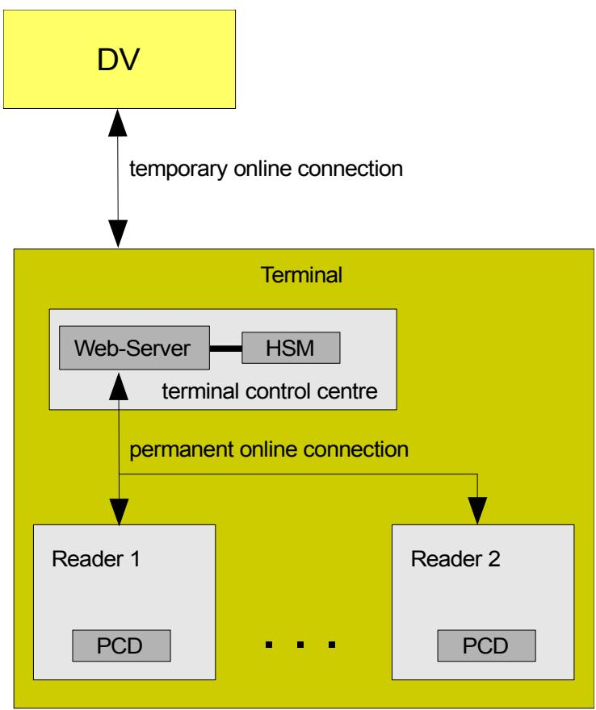
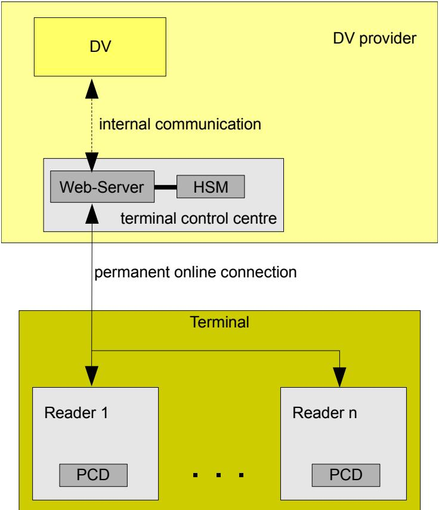

Dokument ist noch aktuell. (Stand 2020)

# Technical Guideline TR-03129 PKIs for Machine Readable Travel Documents Protocols for the Management of Certificates and CRLs

Version 1.10

| History |            |                         |  |  |  |  |
|---------|------------|-------------------------|--|--|--|--|
| Version | Date       | Comment                 |  |  |  |  |
| 1.00    | 2009-11-09 | Initial public version. |  |  |  |  |

Bundesamt für Sicherheit in der Informationstechnik Postfach 20 03 63 53133 Bonn

E-Mail: [ExtendedAccessControl@bsi.bund.de](mailto:ExtendedAccessControl@bsi.bund.de) Internet: [https://www.bsi.bund.de](https://www.bsi.bund.de/)

© Bundesamt für Sicherheit in der Informationstechnik 2009

| 1     | Introduction5                                               |  |
|-------|-------------------------------------------------------------|--|
| 1.1   | Security Mechanisms5                                        |  |
| 1.1.1 | Passive Authentication5                                     |  |
| 1.1.2 | Terminal Authentication5                                    |  |
| 1.1.3 | Restricted Identification6                                  |  |
| 1.2   | Infrastructures for Terminals6                              |  |
| 1.2.1 | Integrated Terminals6                                       |  |
| 1.2.2 | Distributed Terminals7                                      |  |
| 1.3   | Distinguished Services9                                     |  |
| 1.4   | Terminology10                                               |  |
| 2     | Implementation as Web Services11                            |  |
| 2.1   | Messages11                                                  |  |
| 2.1.1 | Common Parameters11                                         |  |
| 2.1.2 | Common Return Codes12                                       |  |
| 2.1.3 | Authentication, Confidentiality, and Integrity Protection13 |  |
| 3     | Protocols for Passive Authentication14                      |  |
| 3.1   | Specific Parameters and Return Codes14                      |  |
| 3.1.1 | Parameters14                                                |  |
| 3.1.2 | Return Codes14                                              |  |
| 3.2   | Distribution of Master Lists14                              |  |
| 3.2.1 | GetMasterList14                                             |  |
| 3.2.2 | SendMasterList15                                            |  |
| 3.3   | Distribution of Defect Lists16                              |  |
| 3.3.1 | GetDefectList16                                             |  |
| 3.3.2 | SendDefectList16                                            |  |
| 3.4   | Implementation as Web Services17                            |  |
| 3.4.1 | Services Implemented by the CVCA/NPKD17                     |  |
| 3.4.2 | Services Implemented by DVs17                               |  |
| 3.4.3 | Services Implemented by Terminals18                         |  |
| 4     | Protocols for Terminal Authentication19                     |  |
| 4.1   | Specific Parameters and Return Codes19                      |  |
| 4.1.1 | Parameters19                                                |  |
| 4.1.2 | Return Codes19                                              |  |
| 4.2   | Distribution of CV Certificates20                           |  |
| 4.2.1 | RequestCertificate20                                        |  |
| 4.2.2 | RequestForeignCertificate21                                 |  |
| 4.2.3 | GetCACertificates22                                         |  |
| 4.2.4 | SendCertificates23                                          |  |
| 4.3   | Terminal Authentication Online24                            |  |
| 4.3.1 | GetCertificateChain24                                       |  |
| 4.3.2 | GetTASignature25                                            |  |
| 4.4   | Implementation as Web Services26                            |  |
| 4.4.1 | Services Implemented by the CVCA/SPOC26                     |  |
| 4.4.2 | Services Implemented by DVs27                               |  |
| 4.4.3 | Services Implemented by Terminals27                         |  |

| 5     | Protocols for Restricted Identification28              |  |
|-------|--------------------------------------------------------|--|
| 5.1   | Specific Parameters and Return Codes28                 |  |
| 5.1.1 | Parameters28                                           |  |
| 5.1.2 | Return Codes28                                         |  |
| 5.2   | Distribution of Sector Public Keys29                   |  |
| 5.2.1 | GetSectorPublicKey29                                   |  |
| 5.3   | Distribution of Black Lists30                          |  |
| 5.3.1 | GetBlackList30                                         |  |
| 5.3.2 | SendBlackList31                                        |  |
| 5.4   | Implementation as Web Services32                       |  |
| 5.4.1 | Services Implemented by the CVCA/MBS32                 |  |
| 5.4.2 | Services Implemented by DVs32                          |  |
| 5.4.3 | Services Implemented by Authentication Terminals32     |  |
| A     | Defect Lists33                                         |  |
| A.1   | Defect List Format33                                   |  |
| A.1.1 | Identification of Document Signer Certificates34       |  |
| A.2   | Defect Categories34                                    |  |
| A.2.1 | Authentication Defects35                               |  |
| A.2.2 | Personalisation Defects of the ePassport Application37 |  |
| A.2.3 | Personalisation Defects of the eID Application37       |  |
| A.2.4 | General Document Defects38                             |  |
| B     | Black Lists40                                          |  |
| B.1   | Blacklist Format40                                     |  |
| B.1.1 | Black List Content40                                   |  |
| C     | Signed Data Profile42                                  |  |
| C.1   | List Content Description43                             |  |
| D     | WSDL and XML Scheme specifications44                   |  |

| Figure 1: Integrated terminal7                                                  |  |
|---------------------------------------------------------------------------------|--|
| Figure 2: Distributed terminal with local control centre8                       |  |
| Figure 3: Distributed terminal with control centre operated by the DV provider9 |  |

# <span id="page-4-0"></span>**1 Introduction**

This technical guideline specifies PKI-related communication protocols for security mechanisms for machine readable travel documents.

## **1.1 Security Mechanisms**

Data stored on machine readable documents (MRTD) has to be protected against manipulation and unauthorized access by Passive Authentication and Terminal Authentication (as part of Extended Access Control), respectively. Restricted Identification is a mechanism that allows the usage of an MRTD over networks in a privacy protecting way by providing "sector-specific" identifiers that can be used to identify the MRTD within each sector instead of relying on globally unique identifiers like serial numbers or chip-individual public keys.

## **1.1.1 Passive Authentication**

Passive Authentication is a mechanism standardized in [1], [2]. Passive Authentication uses a digital signature to authenticate data stored on the MRTD. This signature is generated by a Document Signer (DS) in the personalization phase of the MRTD. The Document Signer in turn is certified by the Country Signing CA (CSCA) of the issuing country.

If a terminal has to read data from a MRTD, the terminal must perform Passive Authentication to verify that the data is authentic and has not been manipulated. For Passive Authentication the terminal must have access to the corresponding Document Signer certificate and Country Signing CA certificate. While the Document Signer certificate can usually easily be obtained from the MRTD itself, the CSCA certificate must be securely distributed to and stored at the terminal.

To support the secure distribution of CSCA certificates, Master Lists [3] have been introduced. Master Lists are signed lists of (nationally) trusted CSCA certificates. Thus, the terminals only have to store the public key required for the verification of such a Master List securely.

## **1.1.2 Terminal Authentication**

Terminal Authentication is a mechanism standardized in [4]. Terminal Authentication is based on a challenge-response protocol using digital signatures and card-verifiable (CV) certificates both to be validated by the MRTD. After verification of the terminal certificate the MRTD calculates the rights assigned to the terminal and grants the terminal access to the corresponding data stored on the MRTD. The terminal certificate is issued by the Document Verifier (DV) the terminal is associated with. The Document Verifier in turn is certified by (at least) the national Country Verifying CA (CVCA) but it may also be certified by foreign CVCAs.

If a terminal has to read data protected by EAC from a MRTD, the terminal must perform Terminal Authentication to prove that the terminal is authorized to access this data. For Terminal Authentication the terminal must present the MRTD a certificate chain that starts at a certificate verifiable by the MRTD using a trusted public key of the CVCA of the issuing country stored on the chip and ends at the terminal certificate for which the terminal possesses the corresponding private key.

For the processing of cross-border certification, each country will operate a SPOC (single point of contact) for incoming and outgoing international requests and responses. If a DV requests a CV certificate from a foreign CVCA, it does not send its request to the foreign CVCA directly. Instead it sends its request to its national SPOC. If accepted the national SPOC forwards the request to the SPOC of the intended foreign country. This SPOC then forwards the request to the CVCA of that country. See [5] for details of the messages used for cross-border communication.

## **1.1.3 Restricted Identification**

Restricted Identification is a mechanism standardized in [4]. The mechanism provides sectorspecific identifiers for the chip. The identifier calculated by Restricted Identification has the following properties:

- Within each sector the sector-specific identifier of every MRTD chip is unique.
- Across any two sectors, it is computationally impossible to link the two sector-specific identifier of any MRTD chip.

Restricted Identification can be used only after Terminal Authentication (and Chip Authentication) has been performed successfully between the terminal and the chip of a MRTD. The calculation of the sector-specific identifier is based on a special public key of the sector, which is given by the terminal to the chip of the MRTD. The chip proves the authenticity of this public key using the CV certificate of the terminal used within terminal authentication. By the key and certificate management it is assured that only the authorised owner of the key pair can use a MRTD to calculate the sector-specific identifier of the chip of that MRTD.

## **1.2 Infrastructures for Terminals**

A terminal (for example an inspection system (IS), an authentication terminal (AT), or a signature terminal (ST)) is basically a reader component that contains the proximity coupling device (PCD) used for communication between terminal and MRTD.

More than one reader component may be part of a single terminal. For example all reader at the border control of an airport can be part of the same inspection system.

Even if the terminal consists of more than one reader, the terminal still has got only one identity. Regardless at which reader of a terminal a MRTD is presented, the identical key pair and CV certificates are used for Terminal Authentication between the terminal and the MRTD. From this point of view the Terminal Authentication is done rather between the terminal and the MRTD than between the single reader and the MRTD.

## **1.2.1 Integrated Terminals**

An integrated terminal has only one reader. The hardware security module (HSM) containing the private key of the terminal is physically part of the reader.

All communication between the HSM and the presented MRTD for performing the Terminal Authentication is done in the reader internally or between the PCD and the MRTD. No online connection to other components is needed for the Terminal Authentication.

The reader (or rather the terminal) needs an online connection to the DV to which it is associated. It must be connected only temporarily for requesting a new CV certificate or for downloading CV certificates of the DV or of CVCAs.

The disadvantage of this architecture is, that a stolen reader can be used to perform Terminal Authentication at least as long as the current CV certificate is valid. For this reason, organisational and/or technical security arrangements must be implemented within the intended operational environment of the terminal to avoid unauthorised access to the reader.

The following figure gives an overview over the architecture of an integrated terminal:


*Figure 1: Integrated terminal*

## **1.2.2 Distributed Terminals**

A distributed terminal may have more than one reader that are coordinated by a terminal control centre. The HSM containing the private key of the terminal is not part of the readers. Instead the HSM is integrated into the terminal control centre.

All readers of an terminal have got a permanent online connection with the terminal control centre. Since the private key of the terminal is stored in the HSM within the terminal control centre, each Terminal Authentication between a terminal and a MRTD presented at one of its readers needs also some communication between the reader and the terminal control centre.

The communication over the online connection between the terminal control centre and the readers of the terminal must be secured. The actual measures to be taken to achieve the required level of security are decided by the operator of the terminal based on the operational environment. In any case it must be assured that the terminal control centre does not communicate with a reader which is not under the control of the operator of the terminal.

## **1.2.2.1 Local Control Centre**

For a distributed terminal the connected readers do not need a (direct) online connection to the DV. Instead the terminal control centre performs all communication with the DV for requesting new CV certificates or for downloading CV certificates of the DV or of CVCAs. The online connection between the terminal control centre and the DV is only temporarily required.

The advantage of this architecture is, that a stolen reader cannot be used for Terminal Authentication. Therefore each reader can be operated easily in an insecure environment. Only for the terminal control centre organisational and/or technical security arrangements must be implemented within the intended operational environment of the terminal to avoid unauthorised access to the terminal control centre (especially to the HSM).

The following figure gives an overview over the architecture of a distributed terminal:



*Figure 2: Distributed terminal with local control centre*

### **1.2.2.2 Remote Control Centre**

If the terminal control centre cannot be operated securely in the intended operational environment of the terminal, the terminal control centre can also be operated in the operational environment of the DV provider.

In this case a permanent online connection between the DV and each reader of the terminal is required for exchanging data during Terminal Authentication. On the other hand the communication between the DV and the terminal control centre for requesting a new CV certificate or for downloading CV certificates of the DV or of CVCAs can be implemented as DV-internal communication.

For this second variant of a distributed terminal the same security aspects hold as mentioned above for the first variant. The following figure gives an overview over the architecture of a distributed terminal of this second variant:



*Figure 3: Distributed terminal with control centre operated by the DV provider*

## **1.3 Distinguished Services**

The infrastructure and the protocols rely on the following services, which are assumed to be provided by the CVCA. Those services MAY be delegated to other entities.

- SPOC *Single Point of Contact* for cross-border communication.
- NPKD *National Public Key Directory* containing trusted CSCA certificates and CRLs.
- MBS *Master Blacklisting Service* for blacklisting sector-specific identifiers of MRTDs.

The communication between the CVCA and the entities that perform services on behalf of the CVCA as well as communication between the CVCA and CSCA are out of scope of this specification.

## **1.4 Terminology**

The key words "MUST", "MUST NOT", "REQUIRED", "SHALL", "SHALL NOT", "SHOULD", "SHOULD NOT", "RECOMMENDED", "MAY", and "OPTIONAL" in this document are to be interpreted as described in RFC 2119 [6]. The key word "CONDITIONAL" is to be interpreted as follows:

**CONDITIONAL:** The usage of an item is dependent on the usage of other items. It is therefore further qualified under which conditions the item is REQUIRED or RECOMMENDED.

When used in tables (profiles), the key words are abbreviated as shown in Table [1.](#page-9-0)

| Key word             |             | Abbrev. |
|----------------------|-------------|---------|
| MUST / SHALL         | REQUIRED    | m       |
| MUST NOT / SHALL NOT | –           | x       |
| SHOULD               | RECOMMENDED | r       |
| MAY                  | OPTIONAL    | o       |
| –                    | CONDITIONAL | c       |

<span id="page-9-0"></span>*Table 1: Key words*

# <span id="page-10-0"></span>**2 Implementation as Web Services**

Some of the specified protocols allow messages to be processed either synchronously or asynchronously. If a message is processed synchronously, the result of processing the message (if any) is given back to the sender contained in the output parameters of the message while terminating message processing. If the message is processed asynchronously, only a return code is given back to the sender while terminating message processing. In this case the result of processing the message (if any) is sent by the receiver (of the original message) to the sender (of the original message) contained in input parameters of a corresponding callback message.

If a message is processed asynchronously and the result is sent back using a callback message, both participating entities must work as a client in order to send a message as well as a server in order to receive a message. A sender of a message may indicate in a message that it does not accept to receive a corresponding callback message containing the result of the original message. In this case the receiver of the message may process the message synchronously, i.e. the output parameters of the message must contain the final results of processing the message. Polling mechanisms are not available in this protocol, i.e. in the case of an asynchronous message processing the sender cannot ask the receiver frequently if the results of message processing are available for download using messages of this protocol.

## **2.1 Messages**

In the following chapters abstract definition of the messages of the protocol will be given. For each message, the following points are described:

- Intended use
- Input parameters
- Output parameters
- Possible return codes

Each message can be processed by the receiving entity either asynchronously or synchronously. If a message is processed asynchronously, the output parameters of the message are not used. In this case, the result of processing the message will be sent to the originator using another (response) message.

## **2.1.1 Common Parameters**

The following parameters are frequently used as input or output parameters:

• callbackIndicator:

With this parameter the originator of the message informs the receiver if it can handle callbacks as response to this message. If the originator can handle callbacks, this parameter MUST be set to callback\_possible. In this case, the receiver can decide if it processes this message synchronously or asynchronously. If the receiver processes this message asynchronously, it will send the response using the appropriate callback message. If the originator cannot handle callbacks, this parameter MUST be set to callback\_not\_possible.

• messageID:

This parameter contains the identification of the message. It MUST identify the message uniquely within all messages of the originator. If a response message will be send to the originator as a result of this message, the response message SHALL contain the same messageID. Hence an incoming response message can be assigned to the correct original message. Construction and allocation of the messageID can be decided by the originator. This parameter is REQUIRED if the originator of the message indicates, that it can handle a callback as response to this message (i.e. parameter callbackIndicator = callback\_possible). It MUST be missing, if the originator of the message indicates, that it cannot handle callbacks as response to this message (i.e. parameter callbackIndicator = callback\_not\_possible).

• responseURL:

This parameter contains the URL, at which the originator expects the response message to be sent, if the message will be processed asynchronously. This parameter is REQUIRED if the originator of the message indicates, that it can handle a callback as response to this message (i.e. parameter callbackIndicator = callback\_possible). It MUST be missing, if the originator of the message indicates, that it cannot handle callbacks as response to this message (i.e. parameter callbackIndicator = callback\_not\_possible).

• statusInfo:

This parameter contains a status code about the result of processing the corresponding message.

## **2.1.2 Common Return Codes**

The following return codes are frequently used:

• ok\_syntax:

The reception of the message is acknowledged. The syntax of the message has been verified successfully. The further processing of the message will be done asynchronously. The result of the processing will be sent to the URL contained in the parameter responseURL using the corresponding response message.

• ok\_reception\_ack:

The reception of the message is acknowledged. No further verification of the message has been done yet. The processing of the message will be done asynchronously. The result of the processing will be sent to the URL contained in the parameter responseURL using the corresponding response message.

• ok\_received\_correctly:

The message has been received and processed synchronously. No output is generated.

• failure\_syntax:

The received message is syntactically not correct.

• failure\_synchronous\_processing\_not\_possible:

The sender has indicated that he does not accept callback messages, hence the message must be processed synchronously by the receiver. But the receiver cannot process this message synchronously. In this case further procedures must be determined by organisational measures.

• failure\_messageID\_unknown:

The contained messageID cannot be matched with a message formerly sent.

• failure\_internal\_error:

Any other error.

## **2.1.3 Authentication, Confidentiality, and Integrity Protection**

The authentication of the sender and receiver of messages as well as the confidentiality and integrity of the contents of the messages are not considered at the level of these messages. It is assumed that authentication, integrity protection and confidentiality are guaranteed by other measures, for example by using transport layer security (TLS) [7] with server and client authentication.

Each service provider SHALL use the the underlying authentication mechanism to verify whether (and to what extent) the caller is authorised to use the service and deny access otherwise. Security relevant information MUST always be protected by appropriate encryption and integrity protection mechanisms.

# <span id="page-13-0"></span>**3 Protocols for Passive Authentication**

## **3.1 Specific Parameters and Return Codes**

The following input and output parameters are used frequently in this section.

## **3.1.1 Parameters**

• masterList:

This parameter contains the Master List. This parameter is REQUIRED if a Master List will be sent with the message. It MUST be missing if no Master List will be sent with the message.

• defectList:

This parameter contains the Defect List. This parameter is REQUIRED if a Defect List will be sent with the message. It MUST be missing if no Master List will be sent with the message.

## **3.1.2 Return Codes**

• ok\_list\_available: The request has been processed successfully. The input or output parameter contains the requested list.

• failure\_list\_not\_available: The corresponding message has been processed correctly but the requested list is not available.

## **3.2 Distribution of Master Lists**

The following messages are used for the distribution of Master Lists [3].

## **3.2.1 GetMasterList**

This message is sent by a terminal to its DV or by the DV to the NPKD in order to get one or more (signed) lists of trusted CSCA certificates.

### **Input parameters:**

- callbackIndicator **(REQUIRED)**
- 
- 

### **Output parameters:**

• messageID **(CONDITIONAL)** • responseURL **(CONDITIONAL)**

### • masterList **(CONDITIONAL)**

### **Return codes:**

- ok\_list\_available
- ok\_syntax
- ok\_reception\_ack
- failure\_list\_not\_available
- failure\_syntax
- failure\_synchronous\_processing\_not\_possible
- failure\_internal\_error

## **3.2.2 SendMasterList**

If the NPKD or the DV processes the message GetMasterList asynchronously, it uses a callback message SendMasterList to communicate the result of its processing. It sends the response message always to that URL which is contained in the parameter responseURL of the received message.

This message can also be used to notify registered entities about the availability of a new master list. In this case the messageID must be omitted.

This message itself must always be processed synchronously by its receiver.

### **Input parameters:**

- messageID **(CONDITIONAL)**
- statusInfo **(REQUIRED)**

The following status codes are possible:

- ok\_list\_available
- failure\_list\_not\_available
- failure\_syntax
- failure\_internal\_error
- masterList **(CONDITIONAL)**

### **Output parameters:**

none

### **Return codes:**

• ok\_received\_correctly

- failure\_syntax
- failure\_messageID\_unknown
- failure\_internal\_error

## **3.3 Distribution of Defect Lists**

The following messages are used for the distribution of Defect Lists (cf. Appendix [A\)](#page-32-0).

## **3.3.1 GetDefectList**

This message is sent by a terminal to its DV or by the DV to the NPKD in order to get one or more (signed) lists of defect or revoked CSCA and DS certificates.

### **Input parameters:**

- callbackIndicator **(REQUIRED)**
- 
- responseURL **(CONDITIONAL)**

### **Output parameters:**

### **Return codes:**

- ok\_list\_available
- ok\_syntax
- ok\_reception\_ack
- failure\_list\_not\_available
- failure\_syntax
- failure\_synchronous\_processing\_not\_possible
- failure\_internal\_error

## **3.3.2 SendDefectList**

If the NPKD or the DV processes the message GetDefectList asynchronously, it uses a callback message SendDefectList to communicate the result of its processing. It sends the response message always to that URL which is contained in the parameter responseURL of the received message.

This message can also be used to notify registered entities about the availability of a new defect list. In this case the messageID must be omitted.

• messageID **(CONDITIONAL)**

• defectList **(CONDITIONAL)**

This message itself must always be processed synchronously by its receiver.

### **Input parameters:**

- 
- 

The following status codes are possible:

- ok\_list\_available
- failure\_list\_not\_available
- failure\_syntax
- failure\_internal\_error
- 

### **Output parameters:**

none

### **Return codes:**

- ok\_received\_correctly
- failure\_syntax
- failure\_messageID\_unknown
- failure\_internal\_error

## **3.4 Implementation as Web Services**

It is RECOMMENDED that the protocol given in this chapter is realized as a Web Service using the SOAP messages described in the attached WSDL specifications.

### **3.4.1 Services Implemented by the CVCA/NPKD**

A CVCA/NPDK has to implement a Web Service supporting the following messages:

- GetMasterList
- GetDefectList

## **3.4.2 Services Implemented by DVs**

For the communication with its associated inspection systems a DV has to implement a Web Service supporting the following messages:

• GetMasterList

## • messageID **(CONDITIONAL)** • statusInfo **(REQUIRED)**

• defectList **(CONDITIONAL)**

• GetDefectList

If a DV supports callback messages sent by the CVCA/NPKD, the Web Service of the DV must in addition also support the following (callback) messages:

- SendMasterList
- SendDefectList

## **3.4.3 Services Implemented by Terminals**

A terminal has to implement the corresponding Web Services only, if it supports callback messages sent by its DV. In this case it has to implement Web Services supporting the following (callback) messages:

- SendMasterList
- SendDefectList

# <span id="page-18-0"></span>**4 Protocols for Terminal Authentication**

This section provides protocols for the distribution of CV certificates and related data between CVCAs, DVs, and terminals.

## **4.1 Specific Parameters and Return Codes**

The following input and output parameters are used frequently in this section.

## **4.1.1 Parameters**

• certReq:

This parameter contains the certificate request. It must be constructed according to C.2 of [4]. The coding must follow the specifications in Appendix D of [4].

• certificateSeq:

This parameter contains one or more certificates, if the message has been processed successfully. It is REQUIRED if certificates have to be sent with the response. It MUST be missing if no certificates will be sent with the message.

## **4.1.2 Return Codes**

• ok\_cert\_available:

The message has been processed successfully. The parameter certificateSeq contains one or more certificates.

• ok\_request\_forwarded:

The message has been processed successfully and synchronously by the SPOC. It has been forwarded to the intended foreign SPOC. The foreign SPOC has acknowledged the reception of the message. The result of the processing will be sent by the national SPOC to the URL contained in the parameter responseURL using the message SendCertificates.

• failure\_inner\_signature:

The verification of the inner signature of the actual certificate request failed.

• failure\_outer\_signature:

The verification of the outer signature of the actual certificate request failed.

• failure\_expired:

The certificate used to verify the outer signature is expired.

• failure\_domain\_parameters:

The domain parameters contained in the request do not match the domain parameters of the corresponding CVCA certificate.

4 Protocols for Terminal Authentication

• failure\_request\_not\_accepted:

The message has been processed correctly but the request has not been accepted. In this case further procedures must be determined by organisational measures.

• failure\_foreignCAR\_unknown:

The certification authority reference contained in the parameter foreignCAR is wrong or unknown. The request could not be forwarded.

• failure\_not\_forwarded:

The message has been processed successfully and synchronously by the national SPOC. Forwarding the request to the foreign SPOC failed.

• failure\_request\_not\_accepted\_foreign:

The message has been processed correctly but the request has not been accepted by the foreign CVCA. In this case further procedures must be determined by organisational measures.

## **4.2 Distribution of CV Certificates**

The following messages are used for the management of CV certificates at a national level. For cross-border certification the messages defined in [5] SHOULD be used.

## **4.2.1 RequestCertificate**

This message is used by a DV or by a terminal for requesting the generation of a new certificate for one of its keys from the national CVCA or the DV, respectively.

Remark: If a DV needs a new certificate from a foreign CVCA it must use the message RequestForeignCertificate (see Section [4.2.2\)](#page-20-0).

### **Input parameters:**

- callbackIndicator **(REQUIRED)**
- 
- 
- 

### **Output parameters:**

• certificateSeq **(CONDITIONAL)**

### **Return codes:**

- ok\_cert\_available
- ok\_syntax
- ok\_reception\_ack

• messageID **(CONDITIONAL)** • responseURL **(CONDITIONAL)** • certReq **(REQUIRED)**

- failure\_inner\_signature
- failure\_outer\_signature
- failure\_expired
- failure\_domain\_parameters
- failure\_request\_not\_accepted
- failure\_syntax
- failure\_synchronous\_processing\_not\_possible
- failure\_internal\_error

## <span id="page-20-0"></span>**4.2.2 RequestForeignCertificate**

This message is used by a DV for initiating the request of a new certificate for one of its keys from a CVCA in another country. This message is not sent to the foreign CVCA which is intended to generate the certificate, instead it is sent to the national SPOC of the country of the DV. This national SPOC verifies the request of the DV according to national regulations. If the request meets the national regulations it is forwarded to the SPOC of the other country. See [5] for details.

## **Input parameters:**

- callbackIndicator **(REQUIRED)**
- 
- 
- foreignCAR: **(REQUIRED)**

This parameter contains the reference to the (expected) signature key of the foreign certification authority which also should be contained in the body of the certificate request contained in the parameter certReq.

- •
- certReq **(REQUIRED)**

### **Output parameters:**

• certificateSeq **(CONDITIONAL)**

### **Return codes:**

- ok\_cert\_available
- ok\_request\_forwarded
- ok\_syntax
- ok\_reception\_ack
- failure\_inner\_signature

• messageID **(CONDITIONAL)** • responseURL **(CONDITIONAL)**

4 Protocols for Terminal Authentication

- failure\_outer\_signature
- failure\_expired
- failure\_domain\_parameters
- failure\_request\_not\_accepted
- failure\_foreignCAR\_unknown
- failure\_not\_forwarded
- failure\_request\_not\_accepted\_foreign
- failure\_syntax
- failure\_synchronous\_processing\_not\_possible
- failure\_internal\_error

### **Remarks:**

The synchronous processing of this message by the national SPOC will be probably not practicable, since the national SPOC must forward a corresponding request to the foreign SPOC. This foreign SPOC must then contact the CVCA of its own country. The generated certificate must be sent back by the CVCA to the foreign SPOC, which has to forward this certificate to the national SPOC. The national SPOC must then forward the certificate to the DV.

## **4.2.3 GetCACertificates**

This message is sent by a DV or by a terminal to a CVCA or to a DV, respectively, in order to get all relevant CA certificates of the national CVCA or foreign CVCAs. In this sense a CA certificate is regarded as relevant if it is still valid and if it is needed for the verification of a (valid) certificate of the DV (generated by the CVCA).

### **Input parameters:**

| •<br>callbackIndicator | (REQUIRED)    |  |  |  |
|------------------------|---------------|--|--|--|
| •<br>messageID         | (CONDITIONAL) |  |  |  |
| •<br>responseURL       | (CONDITIONAL) |  |  |  |
| Output parameters:     |               |  |  |  |
| •<br>certificateSeq    | (CONDITIONAL) |  |  |  |
| Return codes:          |               |  |  |  |
| •<br>ok_cert_available |               |  |  |  |
| •                      |               |  |  |  |

- ok\_syntax
- ok\_reception\_ack
- failure\_syntax
- failure\_synchronous\_processing\_not\_possible
- failure\_internal\_error

### **Remarks:**

If the message is processed successfully and accepted the CVCA MUST send all relevant CA certificates (see above) within the response, either in the output parameter certificateSeq (synchronous processing) or in the corresponding response message SendCertificates (asynchronous processing).

### **4.2.4 SendCertificates**

If a certification authority or a SPOC processes one of the messages RequestCertificate, RequestForeignCertificate or GetCACertificates asynchronously, it uses a response message SendCertificates to communicate the result of its processing. It sends the response message always to that URL which is contained in the parameter responseURL of the received message.

This message can also be used to notify registered entities about the availability of new certificates. In this case the messageID must be omitted.

This message itself must always be processed synchronously by its receiver.

### **Input parameters:**

- 
- statusInfo **(REQUIRED)** The following status codes are possible:
	- ok\_cert\_available
	- failure\_inner\_signature
	- failure\_outer\_signature
	- failure\_expired
	- failure\_domain\_parameters
	- failure\_request\_not\_accepted
	- failure\_foreignCAR\_unknown
	- failure\_not\_forwarded
	- failure\_request\_not\_accepted\_foreign
	- failure\_syntax
	- failure\_internal\_error
- certificateSeq **(CONDITIONAL)**

Bundesamt für Sicherheit in der Informationstechnik 23

# • messageID **(CONDITIONAL)**

### **Output parameters:**

none

### **Return codes:**

- ok\_received\_correctly
- failure\_syntax
- failure\_messageID\_unknown
- failure\_internal\_error

## **4.3 Terminal Authentication Online**

The following messages are used as part of Terminal Authentication within a distributed terminal. For an integrated terminal these messages are not relevant.

It is assumed that the readers of a distributed terminal can handle this protocol only as a client. In addition the processing of these messages is time critical since they will be used as part of a Terminal Authentication. Hence these messages MUST be processed synchronously.

### **4.3.1 GetCertificateChain**

For the Terminal Authentication the reader must present to the MRTD its own CV certificate and the complete chain of certificates up to a CVCA CV certificate, which can be verified by the MRTD directly. With this message the reader downloads all CV certificates needed for this process from the terminal control centre.

### **Input parameters:**

This parameter contains the reference to one of the public keys which can be used by the MRTD directly for the verification of CV certificates (preferably the most recent). The CAR (certificate authority reference) of the corresponding CV certificate must be given in the parameter.

### **Output parameters:**

• certificateSeq **(CONDITIONAL)**

### **Return codes:**

- ok\_cert\_available
- failure\_CAR\_unknown:

The reference to the public key given in the parameter keyCAR is unknown.

• failure\_syntax

### • keyCAR: **(REQUIRED)**

• failure\_internal\_error

## **Remarks:**

If the message is processed successfully the terminal control centre MUST send all valid link certificates of the CVCA given by the CARs contained in the parameter keyNamesMRTD. In addition it must also send the CV certificate of the DV derived from the "newest" CVCA certificate and the corresponding CV certificate of the terminal.

## **4.3.2 GetTASignature**

In a distributed terminal the private key for Terminal Authentication is stored in the HSM within the terminal control centre. With this message the reader requests the calculation of the signature needed for its Terminal Authentication. The exact calculation of this signature is defined in Section 4.4 of [4]. There it is denoted as *sPCD*.

Two alternatives exist how this message may be used:

- Alternative 1: The reader calculates a hash value over the data to be signed for the Terminal Authentication and sends this hash value to the terminal control centre. No further parts of the data to be signed are sent to the terminal control centre.
- Alternative 2: The reader sends all data to be signed for the Terminal Authentication directly to the terminal control centre. In this case, the terminal control centre has to calculate the hash value before signing the data.

The first alternative SHOULD be used, if a MRTD can be identified uniquely based on the value of *IDPICC*.

## **Input parameters:**

• hashTBS: **(CONDITIONAL)**

This parameter contains the hash value calculated over the data to be signed for the Terminal Authentication. This parameter is REQUIRED if the first alternative for the usage of this message is chosen. It MUST be missing, if the second alternative is used.

### • idPICC: **(CONDITIONAL)**

This parameter contains an identifier of the MRTD. In the specification of the Terminal Authentication in Section 4.4 of [4] this identifier is denoted as *IDPICC*. This parameter is REQUIRED if the second alternative for the usage of this message is chosen. It MUST be missing, if the first alternative is used.

• challengePICC: **(CONDITIONAL)**

This parameter contains the challenge of the MRTD. In the specification of the Terminal Authentication in Section 4.4 of [4] this challenge is denoted as *rPICC*. This parameter is REQUIRED if the second alternative for the usage of this message is chosen. It MUST be missing, if the first alternative is used.

### • hashPK: **(CONDITIONAL)**

This parameter contains the hash value over the ephemeral public key PKPCD of the terminal. In

the specification of the Terminal Authentication in Section 4.4 of [4] this value is denoted as COMP(*PKPCD*). This parameter is REQUIRED if the second alternative for the usage of this message is chosen. It MUST be missing, if the first alternative is used.

• auxPCD: **(CONDITIONAL)**

This parameter contains auxiliary data of the terminal. In the specification of the Terminal Authentication in Section 4.4 of [4] this data is denoted as *APCD*. This parameter is REQUIRED if the second alternative for the usage of this message is chosen and some auxiliary terminal data is part of the data to be signed. It MUST be missing, if the first alternative is used.

### • keyCHR: **(REQUIRED)**

This parameter contains the identification of the private key to be used for the calculation of the signature. The CHR (certificate holder reference) of the corresponding CV certificate must be given in the parameter.

### **Output parameters:**

• signature: **(CONDITIONAL)**

This parameter will contain the signature after processing this message, if the message has been processed successfully by the terminal control centre. It is REQUIRED if a signature has to be sent with the response. It MUST be missing if no signature will be sent with the message.

### **Return codes:**

• ok\_signature\_available:

The message has been processed successfully. The output parameter signature contains the requested signature for the Terminal Authentication.

• failure\_CHR\_unknown:

No private key is available for the CHR given in the parameter keyCHR.

- failure\_syntax
- failure\_internal\_error

## **4.4 Implementation as Web Services**

It is RECOMMENDED that the protocol given in this chapter is realised as a Web Service using the SOAP messages described in the attached WSDL specifications.

## **4.4.1 Services Implemented by the CVCA/SPOC**

A CVCA/SPOC has to implement a Web Service supporting the following (callback) messages:

- RequestCertificate
- RequestForeignCertificate
- GetCACertificates

## **4.4.2 Services Implemented by DVs**

For the communication with its associated inspection systems a DV has to implement a Web Service supporting the following messages:

- RequestCertificate
- GetCACertificates

If a DV supports callback messages sent by the CVCA/SPOC, the Web Service of the DV must in addition also support the following (callback) messages:

• SendCertificates

## **4.4.3 Services Implemented by Terminals**

An integrated terminal has to implement the corresponding Web Service only, if it supports callback messages sent by its DV. In this case it has to implement a Web Service supporting the following (callback) messages:

• SendCertificates

For the communication with its connected reader a terminal control centre of a distributed terminal has to implement a Web Service supporting the following messages:

- GetCertificateChain
- GetTASignature

If a terminal control centre of a distributed terminal supports callback messages sent by its DV, the Web Service of the terminal control centre must in addition also support the following (callback) messages:

• SendCertificates

# <span id="page-27-0"></span>**5 Protocols for Restricted Identification**

This section contains the description of the messages related to Restricted Identification.

## **5.1 Specific Parameters and Return Codes**

The following input and output parameters are used frequently in this section.

## **5.1.1 Parameters**

### • deltaListAddedItems: **(CONDITIONAL)**

If a delta list is transferred (deltaIndicator = delta\_list) this parameter contains the list of items added to the black list since the version given in the deltaBase parameter. The list is empty if no item was added between the given deltaBase and the current black list. This parameter is REQUIRED if a delta list will be sent with the response. It MUST be missing if no delta list will be sent with the response.

• deltaListRemovedItems: **(CONDITIONAL)**

### If a delta list is transferred (deltaIndicator = delta\_list) this parameter contains the list of items removed since the version given in the deltaBase parameter. The list is empty if no item was removed between the given deltaBase and the current black list. This parameter is REQUIRED if a delta list will be sent with the response. It MUST be missing if no delta list will be sent with the response.

• completeListURL: **(CONDITIONAL)**

### This parameter contains the URL, where the caller can download the latest version of the complete black list. After downloading the complete list from the URL the caller SHOULD trigger a further delta list request. This is because the black list provider may provide the complete list only at a particular time e.g. only on a daily base. This parameter is REQUIRED if a complete list will be sent with the response. It MUST be missing if no complete list will be sent with the response.

If delta lists are generated, deltaListAddedItems and deltaListRemovedItems MUST NOT contain the same sector-specific identifiers.

## **5.1.2 Return Codes**

• ok\_list\_available:

The message has been processed successfully. Either the output parameters deltaListAddedItems and deltaListRemovedItems contain the delta information in respect to the base version, or the output parameter completeListURL contains the URL where the caller can download the new list.

• ok\_no\_update\_needed:

The message has been processed successfully, but there is no update for the black list needed.

The black list currently available by the caller (as indicated by the parameter deltaBase) is still up to date.

• ok\_complete\_list:

The caller has requested a delta list, but its available black list version (as indicated in the deltaBase input parameter) is too old to be updated by a delta list or the size of the delta list would exceed certain technically implied constraints. A complete list (i.e. URL) is provided instead.

• failure\_deltaBase\_unknown:

The identifier deltaBase is unknown by the receiver. In this case further procedures must be determined by organisational measures.

## **5.2 Distribution of Sector Public Keys**

The following messages are used for the management of public keys required for Restricted Identification.

## **5.2.1 GetSectorPublicKey**

This message is used by an authentication terminal to download its sector public key from the DV it is associated to. The message is also used by a DV to download the sector public key of the revocation sector from the MBS.

### **Input parameters:**

• sectorID: **(REQUIRED)**

This parameter contains the identifier of the requested sector public key. The identifier is contained in the terminal certificate issued by the DV and in the black list provided by the MBS.

### **Output parameters:**

• sectorPK: **(REQUIRED)**

This parameter will contain the sector public key as data object (cf. [4]), if the message has been processed successfully.

### **Return codes:**

• ok\_PK\_available:

The message has been processed successfully. The output parameter sectorPK contains the requested sector public key.

• failure\_sectorID\_unknown:

The sector identifier is unknown by the DV/MBS. In this case further procedures must be determined by organisational measures.

• failure\_syntax

• failure\_internal\_error

## **5.3 Distribution of Black Lists**

The following sections contain the description of the messages for the distribution of black lists (cf. Appendix [B\)](#page-39-0).

## **5.3.1 GetBlackList**

This message is used by a DV or an authentication terminal to download the most recent black list from the MBS or DV, respectively.

The caller can indicate if it wishes to download the complete black list or only a delta list. If the caller requests the download of the complete list, the black list provider MUST provide a complete list. Black list providers MAY support delta list requests. If the caller requests a delta list but the black list provider does not support delta lists it MUST return a complete black list.

### **Input parameters:**

- callbackIndicator **(REQUIRED)**
- messageID **(CONDITIONAL)**
- responseURL **(CONDITIONAL)**
- deltaIndicator: **(REQUIRED)**

This parameter indicates, if the caller wants to download the complete black list or only a delta list. In the first case the parameter is set to complete\_list, in the second case it is set to delta\_list.

• deltaBase: **(CONDITIONAL)**

This parameter contains the list identifier (listID, cf. Appendix [B.1\)](#page-39-1) of the black list currently available to the caller if the deltaIndicator parameter is set to delta\_list. Then the delta request will provide the delta items (added, removed) in respect to this version.

### **Output parameters:**

- deltaListAddedItems **(CONDITIONAL)**
- deltaListRemovedItems **(CONDITIONAL)**
- completeListURL **(CONDITIONAL)**

### **Return codes:**

- ok\_list\_available
- ok\_no\_update\_needed

- ok\_complete\_list
- ok\_reception\_ack
- failure\_deltaBase\_unknown
- failure\_syntax
- failure\_synchronous\_processing\_not\_possible
- failure\_internal\_error

## **5.3.2 SendBlackList**

If the MBS or a DV processes the message GetBlackList asynchronously, it uses a response message SendBlackList to communicate the result of its processing. It sends the response message always to that URL which is contained in the parameter responseURL of the received message.

This message can also be used to notify registered entities about the availability of a new black list. In this case the messageID must be omitted.

This message itself must always be processed synchronously by its receiver.

### **Input parameters:**

- messageID **(CONDITIONAL)**
- statusInfo: **(REQUIRED)**

The following status codes are possible:

- ok\_list\_available
- ok\_no\_update\_needed
- ok\_complete\_list
- failure\_deltaBase\_unknown
- failure\_syntax
- failure\_internal\_error
- deltaListAddedItems **(CONDITIONAL)**
- deltaListRemovedItems **(CONDITIONAL)**
- completeListURL **(CONDITIONAL)**

### **Output parameters:**

none

**Return codes:**

5 Protocols for Restricted Identification

- ok\_received\_correctly
- failure\_syntax
- failure\_messageID\_unknown
- failure\_internal\_error

## **5.4 Implementation as Web Services**

It is RECOMMENDED that the protocol given in this chapter is realized as a Web Service using the SOAP messages described in the attached WSDL specifications.

## **5.4.1 Services Implemented by the CVCA/MBS**

The CVCA/MBS has to implement a Web Service supporting the following messages:

- GetSectorPublicKey
- GetBlackList

## **5.4.2 Services Implemented by DVs**

For the communication with its associated authentication terminals a DV has to implement a Web Service supporting the following messages:

- GetSectorPublicKey
- GetBlackList

If a DV supports callback messages sent by the CVCA/MBS, the Web Service of the DV must in addition also support the following (callback) messages:

• SendBlackList

### **5.4.3 Services Implemented by Authentication Terminals**

An authentication terminal has to implement the corresponding Web Service only, if it supports callback messages sent by its DV. In this case it has to implement a Web Service supporting the following (callback) messages:

• SendBlackList

# <span id="page-32-0"></span>**A Defect Lists**

A defect is defined as a production error affecting a large number of documents. The withdrawal of already issued documents is impractical or even impossible if the detected defect is contained in foreign documents.

Defect Lists are signed lists to handle such defects. Defects are identified by the Document Signer Certificate(s) used to produce defect documents. Defect Lists are thus errata that not only inform about defects but also provides corrigenda to fix the error where possible.

Note that it is possible that a document does not contain a defect although the respective Document Signer Certificate is on the Defect List.

The object identifiers used in this appendix are contained in the subtree of bsi-de:

```
bsi-de OBJECT IDENTIFIER ::= { 
 itu-t(0) identified-organization(4) etsi(0) 
 reserved(127) etsi-identified-organization(0) 7
```
## **A.1 Defect List Format**

}

A Defect List SHALL be provided as BER encoded SignedData according Appendix [C](#page-41-0) with content type DefectList identified by id-DefectList:

```
id-DefectList{
 bsi-de applications(3) MRTD(1) 5}
}
DefectList ::= SEQUENCE {
 version INTEGER {v1(0)}
 hashAlg OBJECT IDENTIFIER,
 defects SET OF Defect
}
Defect ::= SEQUENCE{
 signerIdentifier SignerIdentifier,
 certificateHash OCTET STRING OPTIONAL,
 knownDefects SET OF KnownDefect
}
KnownDefect ::= SEQUENCE{
 defectType OBJECT IDENTIFIER,
 parameters ANY defined by defectType OPTIONAL
}
```
The data type SignerIdentifier is defined in [8] as follows:

```
SignerIdentifier ::= CHOICE {
 issuerAndSerialNumber IssuerAndSerialNumber,
 subjectKeyIdentifier [0] SubjectKeyIdentifier
}
```
## **A.1.1 Identification of Document Signer Certificates**

There are two options to reference the Document Signer Certificate in a Defect List, either by the distinguished name of the CSCA and the serial number of the Document Signer Certificate or by the Subject Key Identifier of the Document Signer Public Key. Those two options are augmented by a third option: If neither issuerAndSerialNumber nor the subjectKeyIdentifier uniquely identify the Document Signer (due to a defect in the certificate) the hash of the Document Signer Certificate MUST additionally be included. The hash function to be used is indicated in the Defect List.

## **A.2 Defect Categories**

Three types of defect documents are currently distinguished:

- 1. Authentication Defects
- 2. Application Defects
- 3. Document Defects

The following section specify the object identifier for defects in those categories and the parameters describing workarounds for the defect.

Table [2](#page-34-0) specifies the content of three types of Defect Lists for different purposes:

- **Internal:** This defect list is used for internal purposes, in particular for border control. It MUST contain all known defects.
- **External:** This defect lists is used to inform other countries about defects in national documents in particular ePassports. It MUST NOT contain defects referring to foreign documents.
- **Commercial:** This defect list is used to inform private companies about defects in national documents. It SHOULD NOT contain defects referring to foreign documents.

| Defect Type                        |                          | Internal | External | Commerical |
|------------------------------------|--------------------------|----------|----------|------------|
| n<br>atio<br>ntic<br>e<br>uth<br>A | id-CertRevoked           | m        | m        | m          |
|                                    | id-CertReplaced          | m        | m        | m          |
|                                    | id-ChipAuthKeyRevoked    | m        | m        | m          |
|                                    | id-ActiveAuthKeyRevoked  | m        | m        | m          |
| n<br>atio<br>plic<br>p<br>A        | id-ePassportDGMalformed  | m        | m        | o          |
|                                    | id-SODInvalid            | m        | m        | o          |
|                                    | id-eIDDGMalformed        | m        | o        | r          |
|                                    | id-eIDIntegrity          | m        | o        | r          |
| nt<br>e<br>m<br>u<br>c<br>o<br>D   | id-CardSecurityMalformed | m        | o        | m          |
|                                    | id-ChipSecurityMalformed | m        | o        | x          |
|                                    | id-PowerDownReq          | m        | o        | m          |

<span id="page-34-0"></span>*Tabelle 2: Defect Lists*

## **A.2.1 Authentication Defects**

This section describes defects related to Passive Authentication, Chip authentication, and Active Authentication. This category of defects is indicated by the following object identifier:

id-AuthDefect ::= OBJECT IDENTIFIER{id-DefectList 1}

If a document is affected by an authentication defect (i.e. the defect is contained the sub-tree of id-AuthDefect) with unknown interpretation, the electronic part of the document MUST NOT be used.

### **A.2.1.1 Document Signer Certificate Revoked**

The private key of the Document Signer is compromised (e.g. revoked by a CRL). The electronic part of the document MUST NOT be used.

Note that this defect is equivalent to an issued CRL containing the Document Signer. This type of defect can be used to revoke foreign Document Signers independent of the availability of a CRL issued by the respective CSCA.

This type of defect is indicated by the following object identifier. It provides a status code (StatusCode) as parameter.

```
id-CertRevoked ::= OBJECT IDENTIFIER{id-AuthDefect 1}
StatusCode ::= ENUMERATED {
 noIndication(0), -- no details given
 onHold(1), -- revocation under investigation
 testing(2), -- the certificate has been used for testing purposes
 revokedByIssuer(3), -- the Issuer has revoked the certificate by CRL
 revokedDLS(4), -- the Defect List Signer has revoked the certificate
 proprietary(32) -- status codes >=32 can be used for internal purposes
}
```
### **A.2.1.2 Document Signer Certificate Malformed**

The Document Signer Certificate cannot be decoded correctly using standardized mechanisms. A replacement certificate is provided.

Note that this certificate is not necessarily signed by the corresponding CSCA. Replacement Document Signer Certificates MAY be self-signed.

This type of defect is indicated by the following object identifier. It provides a replacement certificate (Certificate, cf. [9]) as parameter.

id-CertReplaced ::= OBJECT IDENTIFIER{id-AuthDefect 2}

### **A.2.1.3 Chip Authentication Private Keys Compromised**

The Chip Authentication Private Keys have been compromised (e.g. due to a error in the key generation algorithm).

Chip Authentication SHOULD be used, but the successful execution does neither guarantee that the document nor the transferred data is genuine.

This type of defect is indicated by the following object identifier. It does not provide any parameters:

id-ChipAuthKeyRevoked ::= OBJECT IDENTIFIER{id-AuthDefect 3}

### **A.2.1.4 Active Authentication Private Keys Compromised**

The Active Authentication Private Keys have been compromised (e.g. due to a error in the key generation algorithm).

Active Authentication SHOULD be used, but the successful execution does not guarantee that the document is genuine.

This type of defect is indicated by the following object identifier. It does not provide any parameters:

id-ActiveAuthKeyRevoked ::= OBJECT IDENTIFIER{id-AuthDefect 4}

## **A.2.2 Personalisation Defects of the ePassport Application**

The following sections describe defects related to the personalisation of the ePassport application. This category of defects is indicated by the following object identifier:

id-ePassportDefect ::= OBJECT IDENTIFIER{id-DefectList 2}

If a document is affected by an personalization defect of the ePassport application (i.e. the defect is contained the sub-tree of id-ePassportDefect) with unknown interpretation, the ePassport application MUST NOT be used.

### **A.2.2.1 Data Group Malformed**

The indicated data groups might be incorrectly encoded. In this case the data group SHOULD be ignored and manual inspection is REQUIRED.

This type of defect is indicated by the following object identifier. It provides the malformed DGs (MalformedDGs) as parameter:

id-ePassportDGMalformed ::= OBJECT IDENTIFIER{id-ePassportDefect 1} MalformedDGs ::= SET OF INTEGER -- DGs as integer

### **A.2.2.2 Document Security Object Malformed**

The validation of the Document Security Object might fail (e.g. signature incorrect). In this case the electronic part of the document MUST NOT be used.

This type of defect is indicated by the following object identifier. It does not provide any parameters:

id-SODInvalid ::= OBJECT IDENTIFIER{id-ePassportDefect 2}

## **A.2.3 Personalisation Defects of the eID Application**

The following sections describe defects related to the personalisation of the eID application. This category of defects is indicated by the following object identifier:

id-eIDDefect ::= OBJECT IDENTIFIER{id-DefectList 3}

If a document is affected by an personalization defect of the eID application (i.e. the defect is contained the sub-tree of id-eIDDefect) with unknown interpretation, the eID application SHOULD NOT be used.

### **A.2.3.1 Data Group Malformed**

The indicated data groups might be incorrectly encoded. In this case the data group SHOULD be ignored.

This type of defect is indicated by the following object identifier. It provides the malformed DGs (MalformedDGs) as parameter:

id-eIDDGMalformed ::= OBJECT IDENTIFIER{id-eIDDefect 1}

### **A.2.3.2 Application Integrity Uncertain**

The integrity of unsigned data groups is not guaranteed.

This type of defect is indicated by the following object identifier. It does not provide any parameter:

id-eIDIntegrity ::= OBJECT IDENTIFIER{id-eIDDefect 2}

### **A.2.4 General Document Defects**

The following sections describe defects related to the document in general. This category of defects is indicated by the following object identifier:

id-DocumentDefect ::= OBJECT IDENTIFIER{id-DefectList 4}

If a document is affected by a general defect (i.e. the defect is contained the sub-tree of id-DocumentDefect) with unknown interpretation, the electronic part of the document SHOULD NOT be used.

### **A.2.4.1 Card Security Object Malformed**

The Card Security Object is incorrectly encoded. A corrected Card Security Object is provided that SHOULD be used instead.

This type of defect is indicated by the following object identifier. It provides a corrected Card Security Object (SecurityObject, cf. [4]) as parameter:

id-CardSecurityMalformed ::= OBJECT IDENTIFIER{id-DocumentDefect 1}

### **5.4.3.1 Chip Security Object Malformed**

The Chip Security Object might be incorrectly encoded. The Card Security Object SHOULD be used instead.

This type of defect is indicated by the following object identifier. It does not provide any parameter:

id-ChipSecurityMalformed ::= OBJECT IDENTIFIER{id-DocumentDefect 2}

## **A.2.4.2 Powerdown Required**

The chip denies multiple successive authentication using the General Authentication Procedure. Either the reader MUST powerdown the chip or the document MUST be removed from the reader in between two authentications

This type of defect is indicated by the following object identifier. It does not provide any parameter:

```
id-PowerDownReq ::= OBJECT IDENTIFIER{id-DocumentDefect 3}
```
# <span id="page-39-0"></span>**B Black Lists**

Restricted Identification [4] is a mechanisms that allows to generate sector-specific identifiers on the chip of the document. Those identifiers are used for the revocation of the document.

Black Lists are signed lists containing the sector-specific identifiers of revoked documents. As those identifiers are sector specific, a separate Black List is produced for every sector.

## <span id="page-39-1"></span>**B.1 Blacklist Format**

A Black List can be either a complete list containing all items or a delta list containing added or removed items. The black list SHOULD be provided as BER encoded SignedData according to Appendix [C](#page-41-0) with content type BlackList identified by id-BlackList:

```
id-BlackList OBJECT IDENTIFIER ::= {
 bsi-de applications(3) eID(2) 2}
BlackList ::= SEQUENCE{
 version INTEGER{v1(0)},
 type INTEGER{complete(0),added(1),removed(2)},
 listID ListID,
 deltaBase ListID OPTIONAL, -- required for delta lists
 content SEQUENCE OF BlackListDetails,
}
BlackListDetails ::= SEQUENCE{
 sectorID OCTET STRING,
 sectorSpecificIDs SEQUENCE OF OCTET STRING
}
ListID ::= OCTET STRING
```
The data type ListID SHALL uniquely identify the black list. The exact format of this parameter (e.g. a sequence number or a time stamp over the corresponding black list) SHALL be determined by the black list provider.

For complete black lists deltaBase MUST be omitted. For delta lists deltaBase SHALL indicate the black list used to generate the added or removed items.

## **B.1.1 Black List Content**

The content of blackListDetails differs depending on the provider of the black list:

- If the black list is generated by the MBS it SHALL have the following content:
	- sectorID is the Revocation Sector.
	- sectorSpecificIDs are the transformed Restricted Identification public keys *PKID Revocation* .
- After the DV has transformed the received black list for a specific Terminal Sector it SHALL have the following content:
	- sectorID is the respective Terminal Sector.

• sectorSpecificIDs are the sector-specific identifiers *IID Sector* .

The sector identifier SectorID SHALL be used to reference the public keys *PKRevocation* and *PKSector* using the service GetSectorPublicKey provided by the MBS and the DVs, respectively. The format of the sector identifier is defined by the Black List Provider, it is RECOMMENDED to use a hash of the public key.

All public keys in SectorSpecificIDs SHALL be contained as plain public key values, i.e. excluding the domain parameters. For Elliptic Curve Public Keys the uncompressed encoding MUST be used.

# <span id="page-41-0"></span>**C Signed Data Profile**

Black Lists and Defect Lists are provided as Signed Data according to RFC3852 [8]. The following profile SHALL be used.

| Value                |   | Comments                                                                                                              |  |
|----------------------|---|-----------------------------------------------------------------------------------------------------------------------|--|
| SignedData           |   |                                                                                                                       |  |
| version              | m | Value = v3                                                                                                            |  |
| digestAlgorithms     | m |                                                                                                                       |  |
| encapContentInfo     | m |                                                                                                                       |  |
| eContentType         | m | id-DefectList or id-BlackList for a Defect List or Black<br>List, respectively.                                       |  |
| eContent             |   | The encoded content.                                                                                                  |  |
| certificates         | m | The list of certificates SHALL include the certificate of the<br>signer and SHOULD include the CSCA certificate.      |  |
| crls                 | x | CRLs MUST be distributed seperately.                                                                                  |  |
| signerInfos          | m | It is RECOMMENDED that only one signerinfo is<br>provided within this field.                                          |  |
| SignerInfo           | m |                                                                                                                       |  |
| version              | m | The value of this field is dictated by the sid field. See<br>RFC3852 [8] Section 5.3 for rules regarding this field   |  |
| sid                  | m |                                                                                                                       |  |
| subjectKeyIdentifier | r | It is RECOMMENDED to support this field over<br>issuerAndSerialNumber.                                                |  |
| digestAlgorithm      | m | The algorithm identifier of the algorithm used to produce<br>the hash value over encapsulatedContent and SignedAttrs. |  |
| signedAttrs          | m | The following attributes MUST be included:                                                                            |  |
|                      |   | Signing time (ref. PKCS#9)<br>•                                                                                       |  |
|                      |   | List Content Description (cf. Appendix C.1)<br>•                                                                      |  |
| signatureAlgorithm   | m | The algorithm identifier of the algorithm used to produce<br>the signature value, and any associated parameters.      |  |
| signature            | m | The signature value.                                                                                                  |  |
| unsignedAttrs        | o | Other unprotected information. It is RECOMMENDED to<br>ignore this field.                                             |  |

## <span id="page-42-0"></span>**C.1 List Content Description**

The List Content Description attribute may contain a description of the exact content of a Defect List (e.g. Internal, External, Commercial) or of a Black List (e.g. Master or Sector). The attribute SHALL be identified by id-ListContentDescription with parameter Description.

```
id-ListContentDescription{
 bsi-de applications(3) MRTD(1) 6}
}
Description ::= UTF8String
```
# <span id="page-43-0"></span>**D WSDL and XML Scheme specifications**

The corresponding XML scheme definitions and WSDL descriptions are part of this specification and provided as separate files.

## **Bibliography**

| [1] | ICAO Doc 9303, Machine Readable Travel Documents - Part 1: Machine<br>Readable Passport, Volume 2, Specifications for electronically enabled passports<br>with biometric identification capabilities, 6th Edition, 2006                                     |
|-----|-------------------------------------------------------------------------------------------------------------------------------------------------------------------------------------------------------------------------------------------------------------|
| [2] | ICAO Doc 9303, Machine Readable Travel Documents - Part 3: Machine<br>Readable Official Travel Documents, Volume 2, Specifications for electronically<br>enabled official travel documents with biometric identification capabilities, 3rd<br>Edition, 2008 |
| [3] | ICAO Technical Report: CSCA countersigning and Master List issuance, 2009                                                                                                                                                                                   |
| [4] | BSI TR-03110: Advanced Security Mechanism for Machine Readable Travel<br>Documents, Version 2.0.3, 2010                                                                                                                                                     |
| [5] | Česká Technická Norma ČSN 36 9791: Information Technology – Country<br>Verifying Certification Authority Key Management Protocol for SPOC. July 2009                                                                                                        |
| [6] | RFC 2119: Key words for use in RFCs to indicate requirement levels, 1997                                                                                                                                                                                    |
| [7] | RFC 5246: The Transport Layer Security (TLS) Protocol Version 1.2, 2008                                                                                                                                                                                     |
| [8] | RFC 3852: Cryptographic message syntax (CMS), 2004                                                                                                                                                                                                          |
| [9] | RFC 5280: Internet X.509 Public Key Infrastructure Certificate and Certificate<br>Revocation List (CRL) Profile, 2008                                                                                                                                       |