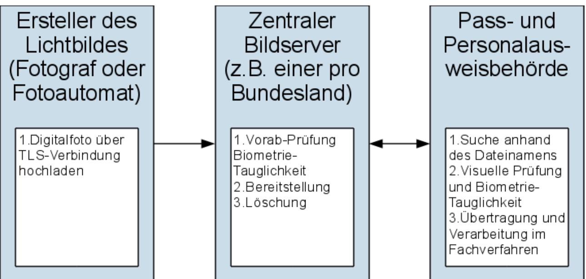
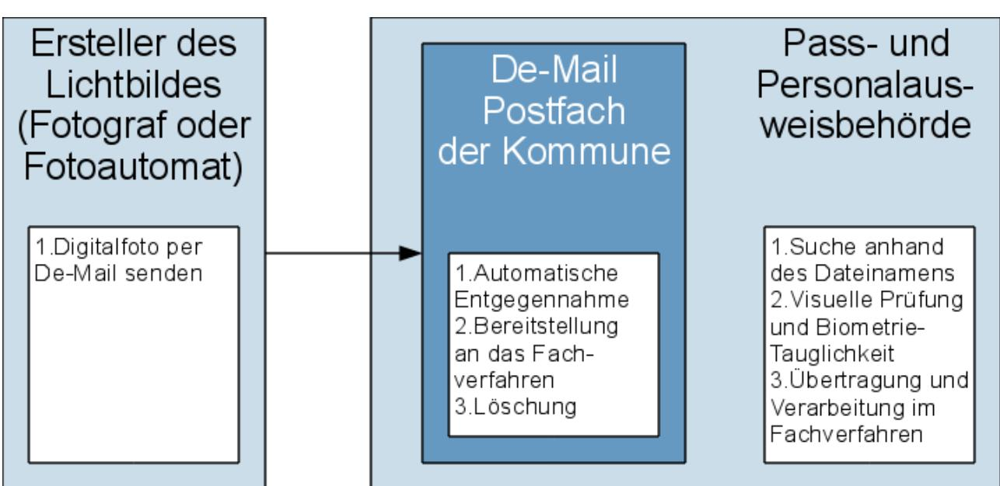
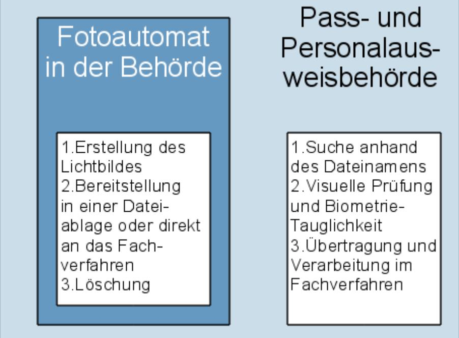
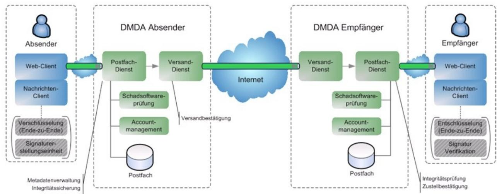

### Studie zur elektronischen Bildübermittlung an Pass- und Personalausweisbehörden

**Version 1.1**

**August 2012**

Bundesamt für Sicherheit in der Informationstechnik Postfach 20 03 63 53133 Bonn Tel.: +49 22899 9582-0 E-Mail: bsi-publikationen@bsi.bund.de Internet: https://www.bsi.bund.de © Bundesamt für Sicherheit in der Informationstechnik 2012

| 1                                       | Ziel der Studie5                                                                                                                                                                                    |  |
|-----------------------------------------|-----------------------------------------------------------------------------------------------------------------------------------------------------------------------------------------------------|--|
| 2                                       | Zusammenfassung der Ergebnisse6                                                                                                                                                                     |  |
| 3                                       | Ist-Analyse der Lichtbildübermittlung7                                                                                                                                                              |  |
| 3.1 3.1.1 3.1.2 3.1.3 3.1.4 | Rechtliche Rahmenbedingungen7 Personalausweisgesetz und Personalausweisverordnung7 Passgesetz und Passverordnung7 Aufenthaltsgesetz und Aufenthaltsverordnung8 Bundesdatenschutzgesetz8 |  |
| 3.2 3.2.1 3.2.2                   | Technische und organisatorische Rahmenbedingungen8 Technische Richtlinien8 Fachverfahren9                                                                                                     |  |
| 3.3                                     | Analoges Standardverfahren zur Lichtbildübermittlung 11                                                                                                                                             |  |
| 4 4.1 4.2 4.3                  | Lösungsszenarien zur elektronischen Lichtbildübermittlung12 Lichtbildübermittlung via Bildserver12 Lichtbildübermittlung via De-Mail13 Einbindung von Fotoautomaten in Behördennetzwerke14 |  |
| 5                                       | Ermittlung und Darstellung des Erfüllungsaufwands16                                                                                                                                                 |  |
| 5.1                                     | Annahmen zum Erfüllungsaufwand:16                                                                                                                                                                   |  |
| 5.2                                     | Zusammenfassung der Ergebnisse17                                                                                                                                                                    |  |
| 6                                       | Ergebnisse der Expertenbefragung / Bewertung der Verfahren19                                                                                                                                        |  |
| 6.1 6.1.1 6.1.2                   | Analoges Standardverfahren19 Aussagen der Experten19 Bewertung20                                                                                                                              |  |
| 6.2 6.2.1 6.2.2                   | Lichtbildübermittlung via Bildserver 21 Aussagen der Experten21 Bewertung22                                                                                                                   |  |
| 6.3 6.3.1 6.3.2                   | Lichtbildübermittlung via De-Mail23 Aussagen der Experten23 Bewertung24                                                                                                                       |  |
| 6.4 6.4.1 6.4.2                   | Einbindung von Fotoautomaten in Behördennetzwerke24 Aussagen der Experten25 Bewertung26                                                                                                       |  |
| 6.5                                     | Bewertungsmatrix27                                                                                                                                                                                  |  |
| 7                                       | Votum30                                                                                                                                                                                             |  |
|                                         | Anhang 1: Hintergründe Technik31 De-Mail-Infrastruktur31                                                                                                                                         |  |
|                                         | Anhang 2: Übersicht der Verfahrensentwickler32                                                                                                                                                      |  |
|                                         | Anhang 3: Übersicht der befragten Hersteller und Interessenvertreter von Fotoautomaten33                                                                                                            |  |
|                                         | Anhang 4: Übersicht der befragten IT-Dienstleister, Kommunen und Verbände der Fotografen und Fotofachhändler34                                                                                   |  |
|                                         | IT-Dienstleister34                                                                                                                                                                                  |  |
|                                         | Pass- und Personalausweisbehörden35                                                                                                                                                                 |  |

| Verbände der Fotografen und Fotofachhändler36 |  |
|-----------------------------------------------|--|
| Literaturverzeichnis37                        |  |

### **Abbildungsverzeichnis**

| Abbildung 1: Überblick über das Bildserver Szenario12                           |  |
|---------------------------------------------------------------------------------|--|
| Abbildung 2: Überblick über das De-Mail Szenario14                              |  |
| Abbildung 3: Überblick über das Fotoautomaten Szenario15                        |  |
| Abbildung 4: Überblick über die De-Mail Infrastruktur33                         |  |
| Tabellenverzeichnis                                                             |  |
| Tabelle 1: Ermittlung des Erfüllungsaufwands17                                  |  |
| Tabelle 2: Analoges Standardverfahren: Aussagen der Experten20                  |  |
| Tabelle 3: Bildserver: Aussagen der Experten22                                  |  |
| Tabelle 4: De-Mail: Aussagen der Experten24                                     |  |
| Tabelle 5: Lösungsszenario Fotoautomaten: Aussagen der Experten25               |  |
| Tabelle 6: Bewertungsmatrix29                                                   |  |
| Tabelle 7: Übersicht der Verfahrensentwickler32                                 |  |
| Tabelle 8: Übersicht der Hersteller und Interessenvertreter von Fotoautomaten33 |  |
| Tabelle 9: Übersicht der IT-Dienstleister34                                     |  |
| Tabelle 10: Übersicht der Kommunen35                                            |  |
| Tabelle 11: Übersicht der Verbände der Fotografen und Fotofachhändler36         |  |
| Tabelle 12: Literaturverzeichnis37                                              |  |
|                                                                                 |  |

# **1 Ziel der Studie**

Die Neuregelung des Personalausweisgesetzes [PAuswG] und der Personalausweisverordnung [PAuswV] lässt die elektronische Übermittlung von Lichtbildern an Pass- und Personalausweisbehörden durch Dritte zu. Voraussetzung hierfür ist die verschlüsselte und signierte Datenübertragung, in einer durch das Bundesamt für Sicherheit in der Informationstechnik (BSI) in Form einer Technischen Richtlinie vorgegebenen Art und Weise.

Ziel dieser Studie ist es, im Vorfeld der Erstellung einer entsprechenden Technischen Richtlinie, zum einen die grundsätzliche Erfordernis der elektronischen Lichtbildübermittlung zu untersuchen, und zum anderen innovative Möglichkeiten der elektronischen Übermittlung von Lichtbildern an Pass- und Personalausweisbehörden zu beleuchten und geeignete technische Lösungen zu identifizieren.

Mit dieser Studie wird ein Votum für geeignete technische Lösungen zur elektronischen Übermittlung von Lichtbildern an Pass- und Personalausweisbehörden gegeben, die in der zweiten Phase des Projektes in einer Technischen Richtlinie beschrieben werden sollen.

# **2 Zusammenfassung der Ergebnisse**

Im Rahmen der Erstellung dieser Studie wurden, neben einer Ist-Analyse in Zusammenarbeit mit dem Bundesamt für Sicherheit in der Informationstechnik (BSI), Expertengespräche zu den Verfahren der Lichtbildübertragung an Pass- und Personalausweisbehörden geführt.

Die Expertengespräche wurden mit Kommunen, Fachverfahrensherstellern und dem Dokumentenhersteller, Verbänden der Fotografen und Fotofachhändler sowie Software- und Fotoautomatenherstellern geführt.

In diesen Gesprächen wurden die Erfordernis und die Möglichkeiten der elektronischen Lichtbildübermittlung an Pass- und Personalausweisbehörden und die bestehenden Verfahren der Übermittlung diskutiert sowie das Optimierungspotenzial gegenüber dem bestehenden Verfahren analysiert.

Mit der Ist-Analyse wurde das bestehende Verfahren der Lichtbildübermittlung untersucht und mit den nachfolgend beschriebenen Lösungsszenarien für die elektronische Lichtbildübermittlung an Pass- und Personalausweisbehörden verglichen und bewertet.

Das erste Lösungsszenario beschreibt die elektronische Lichtbildübermittlung an Pass- und Personalausweisbehörden über zentrale Bildserver, auf die berechtigte Stellen (z.B. Fotografen, Fotofachhändler oder Fotoautomaten) Lichtbilder hochladen und von denen die Pass- und Personalausweisbehörden diese Bilder wieder herunterladen können.

Das zweite Lösungsszenario beschreibt die elektronische Lichtbildübermittlung an De-Mail Postfächer der Pass- und Personalausweisbehörden. Jede Pass- und Personalausweisbehörde und jeder Lichtbildersteller muss dazu ein De-Mail Postfach einrichten. Die De-Mail wird zur Übermittlung und Entgegennahme der Lichtbilder verwendet.

Das dritte Lösungsszenario beschreibt die bereits heute vereinzelt angewendete elektronische Lichtbildübermittlung durch Fotoautomaten, die direkt in das IT-Netzwerk der Pass- und Personalausweisbehörde eingebunden sind. Die elektronischen Lichtbilder können über das IT-Netzwerk der Behörde direkt in das Fachverfahren zur Beantragung von Ausweisdokumenten übertragen werden.

Zur Umsetzung der in der Studie aufgezeigten Potentiale sollte die Nutzung der Lösungsszenarien "De-Mail" und "Einbindung von Fotoautomaten in Behördennetzwerke" in einer entsprechenden Technischen Richtlinie spezifiziert werden.

# **3 Ist-Analyse der Lichtbildübermittlung**

Die Ist-Analyse der Lichtbildübermittlung untersucht die rechtlichen, technischen und organisatorischen Rahmenbedingungen sowie das analoge Standardverfahren zur Lichtbildübermittlung und analysiert die jeweiligen Problemstellungen für eine elektronische Übermittlung.

# **3.1 Rechtliche Rahmenbedingungen**

Die geltenden Rechtsvorschriften des Pass- und Personalausweisgesetzes sowie des Aufenthaltsgesetzes [AufenthG] regeln die zulässigen Übermittlungsmöglichkeiten für Lichtbilder für Pass- und Ausweisdokumente. Diese Regelungen werden im Hinblick auf die geplante elektronische Lichtbildübermittlung analysiert. Darüber hinaus wird aufgrund der Sensibilität der Daten auch der Datenschutz betrachtet.

Zusammenfassend kann festgestellt werden, dass mit der Neufassung der Personalausweisverordnung [PAuswV] erstmalig die elektronische Lichtbildübermittlung geregelt wird.

Die Passverordnung und die Aufenthaltsverordnung sehen bisher keine elektronische Lichtbildübermittlung vor. Sie müssen vor der Einführung von Lösungsszenarien zur elektronischen Lichtbildübermittlung entsprechend erweitert werden.

#### **3.1.1 Personalausweisgesetz und Personalausweisverordnung**

Personalausweise müssen gemäß § 5 Abs. 2 Nr. 5 Personalausweisgesetz [PAuswG] zwingend ein Lichtbild des Ausweisinhabers enthalten. Die Personalausweisverordnung [PAuswV] regelt die Möglichkeiten zur Vorlage und Übermittlung des Lichtbildes.

Derzeit sieht die Personalausweisverordnung [PAuswV] gemäß § 7 drei grundsätzliche Möglichkeiten zur Übermittlung des Lichtbildes vor:

- die Vorlage des Lichtbildes in analoger Form
- eine elektronisch verschlüsselte und signierte Übermittlung des Lichtbildes durch Dritte, soweit diese Form der Übermittlung durch eine Technische Richtlinie des Bundesamtes für Sicherheit in der Informationstechnik (BSI) vorgesehen ist.
- das Anfertigen durch die Personalausweisbehörde

Die elektronische Erfassung des Lichtbildes ist nur dann erlaubt, wenn ausschließlich solche technischen Systeme und Bestandteile genutzt werden, die der Personalausweisverordnung entsprechen.

#### **3.1.2 Passgesetz und Passverordnung**

Reisepässe müssen gemäß § 4 Abs. 1 Passgesetz [PassG] zwingend ein Lichtbild des Passinhabers enthalten. Die Passverordnung [PassV] regelt die Möglichkeiten zur Vorlage und Übermittlung des Lichtbildes.

Die Passverordnung [PassV] sieht gemäß § 5 nur die Vorlage des Lichtbildes in analoger Form vor. Eine elektronische Übermittlung der Lichtbilder, wie sie in den in Abschnitt [4](#page-9-0) beschriebenen Lösungsszenarien vorgeschlagen werden, ist derzeit gemäß [PassV] nicht vorgesehen.

### **3.1.3 Aufenthaltsgesetz und Aufenthaltsverordnung**

Aufenthaltstitel müssen gemäß § 78 Punkt 3 Aufenthaltsgesetz [AufenthG] zwingend ein Lichtbild des Inhabers enthalten. Die Aufenthaltsverordnung [AufenthV] regelt die Möglichkeiten zur Vorlage und Übermittlung des Lichtbildes.

Die Aufenthaltsverordnung [AufenthV] bezieht sich bezüglich der Möglichkeiten zur Vorlage und Übermittlung des Lichtbildes in § 60 Abs. 1 auf den § 5 der Passverordnung [PassV].

Eine elektronische Übermittlung der Lichtbilder ist also auch durch die Aufenthaltsverordnung derzeit nicht abgedeckt.

### **3.1.4 Bundesdatenschutzgesetz**

Bei einem Lichtbild handelt es sich um ein personenbezogenes Datum im Sinne des Bundesdatenschutzgesetzes [BDSG], da es die persönlichen Verhältnisse einer bestimmten Person wiedergibt. Eine Übermittlung des Lichtbildes gemäß § 3 Abs. 4 Nr. 3 [BDSG] an eine öffentliche Stelle gemäß § 2 [BDSG] ist zulässig, wenn dies zur Erfüllung der Aufgaben der öffentlichen Stelle führt und eine andere Rechtsvorschrift oder das Bundesdatenschutzgesetz dies erlaubt oder der Antragsteller in die Übermittlung einwilligt. Durch den Schutzcharakter der personenbezogenen Merkmale bedarf es einer vertraulichen und integeren Bildübermittlung, damit ein möglicher Datenmissbrauch ausgeschlossen wird.

Die Voraussetzungen für eine elektronische Lichtbildübermittlung gemäß [BDSG] können demnach mit einer Spezifikation der Übertragung in einer Technischen Richtlinie des BSI für den Antragsprozess des Personalausweises erfüllt werden.

Die Erfüllung der Voraussetzungen des [BDSG] für eine elektronische Lichtbildübermittlung für die Antragsprozesse für Reisepässe und Aufenthaltstitel ist aufgrund der fehlenden Regelungen und den entsprechenden Verordnungen ungeklärt.

# **3.2 Technische und organisatorische Rahmenbedingungen**

Für diese Studie wurden die technischen und organisatorischen Rahmenbedingungen der Pass- und Personalausweisbehörden untersucht. Eine Untersuchung der Bedingungen der Ausländerbehörden ist nicht Inhalt dieser Studie.

In Deutschland existieren derzeit rund 5.570 Pass- und Personalausweisbehörden. Sie sind für die Durchführung der Prozesse im Zusammenhang mit der Beantragung und Ausgabe von Reisepässen und Personalausweisen zuständig.

### **3.2.1 Technische Richtlinien**

Die Entgegennahme und Verarbeitung der Daten des Dokumenteninhabers sowie die elektronische Übermittlung der Antragsdaten an den Dokumentenhersteller werden in der "Technischen Richtlinie zur Produktionsdatenerfassung, -qualitätsprüfung und -übermittlung für hoheitliche Dokumente" [TR PDÜ hD] sowie den nachgelagerten Technischen Richtlinien "XML-Datenaustauschformat für hoheitliche Dokumente" [TR XhD] und "Sichere Szenarien für Kommunikationsprozesse im Bereich hoheitlicher Dokumente" [TR SiSKo hD] geregelt.

Die technischen Vorgaben zur Erfassung, Qualitätsbewertung und Übermittlung des Lichtbildes werden in der Technischen Richtlinie "Biometrie in hoheitlichen Anwendungen" [TR Biometrie] spezifiziert.

Darüber hinaus spezifiziert die [TR Biometrie] lediglich die elektronische Übertragung von Lichtbildern von "Live Enrolment Stations" also Automaten, die neben der Lichtbild-Erstellung auch die Erfassung der Fingerabdrücke des Antragstellers umfassen.

Die Spezifikationen und Prozessdarstellungen der [TR Biometrie] müssen um entsprechende Festlegungen zur Lichtbildübertragung durch Dritte erweitert werden.

#### **3.2.2 Fachverfahren**

Neben den Technischen Richtlinien des BSI sind auch die durch die Pass- und Personalausweisbehörden eingesetzten Fachverfahren als technische und organisatorische Rahmenbedingungen anzusehen.

In Deutschland existieren derzeit ca. zwölf Verfahrensentwickler von Softwarelösungen für das Pass- und Personalausweiswesen, den sogenannten Fachverfahren. Ca. 90% der Gesamtzahl der Pass- und Personalausweisbehörden werden durch vier Verfahrensentwickler bedient. Die restlichen ca. 10% der Behörden werden demzufolge von insgesamt acht Verfahrensentwicklern betreut. Die Verteilung der Zuständigkeit der Verfahrensentwickler nach Anzahl der jeweils betreuten Pass- und Personalausweisbehörden und Bundesländer findet sich in [Anhang 2: Übersicht der](#page-28-0)  [Verfahrensentwickler1.](#page-28-0)

Die Fachverfahren der Hersteller HSH, AKDB, eKom21 und DZBW bieten entweder bereits eine Schnittstelle zum Import elektronischer Lichtbilder an oder können eine solche Schnittstelle mit geringem Aufwand bereitstellen.

Damit verfügen ca. 70% der Pass- und Personalausweisbehörden bereits über eine Schnittstelle zum Import elektronischer Lichtbilder. Für weitere ca. 20% der Pass- und Personalausweisbehörden kann eine solche Schnittstelle mit geringem Aufwand bereitgestellt werden.

Für die Fachverfahren kann festgestellt werden, dass die Voraussetzungen für die elektronische Lichtbildübermittlung durch Dritte für die Mehrzahl der Pass- und Personalausweisbehörden bereits gegeben ist.

### **3.3 Analoges Standardverfahren zur Lichtbildübermittlung**

Das heute üblicherweise genutzte Verfahren zur Lichtbildübermittlung an die Pass- und Personalausweisbehörden ist die Vorlage eines analogen Lichtbildes durch den Antragsteller selbst. Es wird im Folgenden als das "analoge Standardverfahren" bezeichnet.

Für den Antrag auf Ausstellung eines Personalausweises oder Reisepasses wird ein farbiges oder schwarz-weißes Lichtbild in der Größe 45x35 Millimeter benötigt, das den Voraussetzungen und Vorgaben der entsprechenden Rechtsverordnung entspricht (siehe Abschnitt [3.1\)](#page-6-1).

In der Regel beschafft sich der Antragsteller das Lichtbild bei einem Fotografen, Fotofachhändler oder an einem Fotoautomaten. Es gibt jedoch auch die Möglichkeit, dass der Antragsteller das Lichtbild selbst erstellt und dieses auf entsprechendem Fotopapier ausdruckt bzw. ausdrucken lässt.

Das Lichtbild wird durch den Sachbearbeiter der Pass- und Personalausweisbehörde im Rahmen der Identitätsfeststellung durch einen Abgleich mit dem anwesenden Antragsteller und seinem bisherigen Personalausweis oder Reisepass geprüft. Anschließend erfolgt eine visuelle Prüfung durch den Sachbearbeiter. Für die Antragstellung wird das Lichtbild auf einem papierbehafteten Antragsformular fixiert, eingescannt und abschließend einer softwaregestützten Überprüfung der Biometrie-Tauglichkeit unterzogen.

Für die Prüfung der Biometrie-Tauglichkeit der bereitgestellten Lichtbilder sind gemäß den entsprechenden Rechtsverordnungen die Pass- bzw. Personalausweisbehörden zuständig.

# **4 Lösungsszenarien zur elektronischen Lichtbildübermittlung**

Nach der Ist-Analyse der Rahmenbedingungen und des analogen Standardverfahrens zur Lichtbildübermittlung werden nachfolgend drei Lösungsszenarien zur elektronischen Lichtbildübermittlung durch Dritte beschrieben.

# **4.1 Lichtbildübermittlung via Bildserver**

Das Lösungsszenario der Lichtbildübermittlung via Bildserver beschreibt den Austausch des Lichtbildes über einen oder mehrere zentral bereitgestellte Bildserver. Die Ersteller können die Lichtbilder auf die Server hochladen und die Pass- und Personalausweisbehörden ihrerseits rufen die Bilder von den Servern ab. Die Nutzung der Bildserver ermöglicht dabei die Erfüllung der Anforderungen des § 7 der Personalausweisverordnung [PAuswV] nach Signatur und Verschlüsselung bei der elektronischen Übertragung von Lichtbildern.

Als Nutzer der Bildserver bzw. Ersteller der Lichtbilder kommen nach erster Einschätzung zum einen Fotografen und Fotofachhändler in Frage, die dem Bürger die Dienstleistung der elektronischen Lichtbildübertragung anbieten wollen.

Zum anderen ist vorstellbar, dass die Lichtbilder direkt durch angebundene Fotoautomaten auf die Bildserver hochgeladen werden. Der Bürger könnte in einer entsprechenden Fotokabine das Hochladen durch die Auswahl einer Funktion selbst anstoßen.

Sowohl Sicherheitsaspekte als auch die Komplexität des Szenarios lassen gegenwärtig den Schluss zu, dass der Bürger als direkter Nutzer der Bildserver ("vom eigenen PC") ausgeschlossen werden sollte.

Das nachfolgende Schaubild gibt einen beispielhaften Überblick über das Lösungsszenario:

*Abbildung 1: Überblick über das Bildserver Szenario*

Der Ersteller des Lichtbildes und die Pass- und Personalausweisbehörden müssen in diesem Szenario über geeignete technische Mittel verfügen, um sich gegenüber den zentralen Bildservern authentisieren zu können. Geeignete technische Mittel könnten Benutzername/Passwort-Kombinationen oder digitale Zertifikate sein.

Der Ersteller des Lichtbildes (Fotograf, Fotofachhändler oder Fotoautomat) überträgt das Digitalfoto nach der Authentisierung über eine verschlüsselte TLS-Verbindung [TLS] an einen zentralen Bildserver.

Die technischen Vorgaben zu Dateiformat und Abmessungen des Digitalfotos sind in den entsprechenden Technischen Richtlinien des BSI zu spezifizieren (siehe dazu Kapitel [3.2.1\)](#page-7-0).

Der Dateiname des Digitalfotos könnte dabei aus Nachname, Vorname und dem Geburtsdatum der abgebildeten Person gebildet (z.B. "MUSTERMANNHANS29031975") werden, um eine eindeutige Zuordnung in der Behörde zu ermöglichen.

Die Digitalfotos werden auf den zentralen Bildservern einer Vorab-Prüfung auf ihre Biometrie-Tauglichkeit unterzogen. Das Prüfungsergebnis wird dem Nutzer (Ersteller des Lichtbildes) in einer entsprechenden Meldung angezeigt.

Die Bereitstellung der Digitalfotos kann auf einem zentralen Server für alle Pass- und Personalausweisbehörden oder auf verteilten Servern (z.B. 1 Server für jedes Bundesland) realisiert werden.

Die Sachbearbeiter der Pass- und Personalausweisbehörden suchen das abgespeicherte Lichtbild des Antragstellers anhand seines Namens und Geburtsdatums auf dem beschriebenen Server, laden es über eine verschlüsselte TLS-Verbindung [TLS] herunter und importieren die Datei in das Fachverfahren zur Antragsstellung des hoheitlichen Dokumentes.

Anschließend erfolgen die visuelle Prüfung und die Überprüfung der Biometrie-Tauglichkeit unter Verwendung der entsprechenden QS-Software durch den Sachbearbeiter.

Nach einem definierten Zeitraum werden die auf den Servern gespeicherten Digitalfotos gelöscht.

### **4.2 Lichtbildübermittlung via De-Mail**

Das Lösungsszenario der Lichtbildübermittlung via De-Mail beschreibt die Übermittlung des Lichtbildes innerhalb der De-Mail-Infrastruktur. Die Nutzung der De-Mail-Infrastruktur ermöglicht dabei die Erfüllung der Anforderungen des § 7 der Personalausweisverordnung [PAuswV] nach Signatur und Verschlüsselung bei der elektronischen Übertragung von Lichtbildern.

Als Nutzer der De-Mail-Infrastruktur bzw. Ersteller der Lichtbilder kommen nach erster Einschätzung zum einen Fotografen und Fotofachhändler infrage, die dem Bürger die Dienstleistung der elektronischen Lichtbildübertragung anbieten wollen.

Zum anderen ist vorstellbar, dass die Lichtbilder direkt durch den Bürger (über das eigene De-Mail-Konto) an das De-Mail-Postfach der Kommune gesendet werden, da die De-Mail-Infrastruktur sichere und nachvollziehbare Kommunikationsprozesse bereitstellt.

Eine Einbindung von Fotoautomaten in das Lösungsszenario der Lichtbildübermittlung via De-Mail scheint über ein De-Mail-Gateway realisierbar. Dieses De-Mail-Gateway könnte vom Betreiber der Fotoautomaten eingesetzt werden und so eine De-Mail-Kommunikation zwischen Betreiber und den Kommunen ermöglichen. Die Kommunikationsstrecke zwischen dem Fotoautomaten und dem Gateway müsste dabei zusätzlich abgesichert werden (z.B. durch eine verschlüsselte TLS-Verbindung [TLS]).

Das nachfolgende Schaubild gibt einen Überblick über das Lösungsszenario:

*Abbildung 2: Überblick über das De-Mail Szenario*

Der Ersteller des Lichtbildes (Fotograf, Fotofachhändler, Bürger oder Fotoautomat) versendet das Digitalfoto als Anhang einer De-Mail über sein De-Mail-Konto (bzw. sein De-Mail-Gateway) an das entsprechende Konto der Kommune.

Die technischen Vorgaben zu Dateiformat und Abmessungen des Digitalfotos sind in den entsprechenden Technischen Richtlinien des BSI zu spezifizieren (siehe dazu Kapitel [3.2.1\)](#page-7-0).

Der Dateiname des Digitalfotos könnte dabei aus Nachname, Vorname und dem Geburtsdatum der abgebildeten Person gebildet (z.B. "MUSTERMANNHANS29031975") werden, um eine eindeutige Zuordnung in der Behörde zu ermöglichen.

Die Kommune nimmt die De-Mail automatisch entgegen, speichert das angehängte Lichtbild und stellt es den Sachbearbeitern der Pass- und Personalausweisbehörde über die Dateiablage in einem Verzeichnis zur Verfügung. Nach einem definierten Zeitraum werden alle gespeicherten Lichtbilder und die dazugehörigen De-Mails gelöscht.

Die Sachbearbeiter der Pass- und Personalausweisbehörden suchen das abgespeicherte Lichtbild des Antragstellers anhand seines Namens und Geburtsdatums aus dem beschriebenen Verzeichnis heraus und importieren die Datei in das Fachverfahren zur Antragsstellung des hoheitlichen Dokumentes.

Anschließend erfolgen die visuelle Prüfung und die Überprüfung der Biometrie-Tauglichkeit unter Verwendung der entsprechenden QS-Software durch den Sachbearbeiter.

### **4.3 Einbindung von Fotoautomaten in Behördennetzwerke**

Das Lösungsszenario der Einbindung eines Fotoautomaten in das Behördennetzwerk beschreibt die direkte Bereitstellung des im Fotoautomaten angefertigten elektronischen Lichtbildes innerhalb des IT-Netzwerkes der Pass- und Personalausweisbehörde.

Die Einbindung von Fotoautomaten in Behördennetzwerke ermöglicht die Erfüllung der Anforderungen des § 7 der Personalausweisverordnung [PAuswV] nach Signatur und Verschlüsselung bei der elektronischen Übertragung von Lichtbildern.

Das nachfolgende Schaubild gibt einen beispielhaften Überblick über das Lösungsszenario:

*Abbildung 3: Überblick über das Fotoautomaten Szenario*

Die Hersteller der Fotoautomaten stellen technische Schnittstellen bereit, die es den Sachbearbeitern der Pass- und Personalausweisbehörde ermöglichen, z.B. über die Dateiablage auf das aufgenommene Lichtbild zuzugreifen bzw. es automatisiert direkt in das jeweilige Fachverfahren zur Beantragung hoheitlicher Dokumente zu übertragen.

Auf dem Markt der Fotoautomaten haben sich bereits einige Anbieter auf dieses Lösungsszenario spezialisiert. Eine Aufstellung der befragten Fotoautomatenhersteller, ihr Verbreitungsgrad und die bereitgestellten Schnittstellen finden sich in [Anhang 3: Übersicht der befragten Hersteller und](#page-29-0)  [Interessenvertreter von Fotoautomaten.](#page-29-0)

Die Reihenfolge der Prozessschritte ist dabei wie folgt vorstellbar:

Der Bürger erstellt das Lichtbild im Fotoautomaten der Pass- und Personalausweisbehörde zu einem beliebigen Zeitpunkt. Bei dieser Variante wird das Lichtbild über die bereitgestellte Schnittstelle in der Dateiablage der Behörde gespeichert.

Die erstellten Lichtbilder werden im Fotoautomaten einer Vorab-Prüfung auf ihre Biometrie-Tauglichkeit unterzogen. Das Prüfungsergebnis könnte dem Nutzer in einer entsprechenden Meldung angezeigt und die Aufnahme gegebenenfalls wiederholt werden.

Die technischen Vorgaben zu Dateiformat und Abmessungen des Digitalfotos sind in den entsprechenden Technischen Richtlinien des BSI zu spezifizieren (siehe dazu Kapitel [3.2.1\)](#page-7-0).

Der Dateiname des Digitalfotos könnte dabei aus Nachname, Vorname und dem Geburtsdatum der abgebildeten Person gebildet (z.B. "MUSTERMANNHANS29031975") werden, um eine eindeutige Zuordnung in der Behörde zu ermöglichen.

Die Sachbearbeiter der Pass- und Personalausweisbehörden suchen bei der Antragstellung das abgespeicherte Lichtbild des Antragstellers anhand seines Namens und Geburtsdatums aus dem beschriebenen Verzeichnis heraus und importieren die Datei in das Fachverfahren zur Antragsstellung des hoheitlichen Dokumentes.

Anschließend erfolgen die visuelle Prüfung und die Überprüfung der Biometrie-Tauglichkeit unter Verwendung der entsprechenden QS-Software durch den Sachbearbeiter.

# **5 Ermittlung und Darstellung des Erfüllungsaufwands**

Die im Rahmen dieser Studie vorgenommene Ermittlung und Darstellung des Erfüllungsaufwands basiert auf den Methoden und Vorgaben des Leitfadens zur Ermittlung und Darstellung des Erfüllungsaufwands in Regelungsvorhaben der Bundesregierung in der Fassung vom Juni 2011 [Leitfaden EA].

Die Ermittlung des Erfüllungsaufwands wird für die in Kapitel 4 beschriebenen Lösungsszenarien der elektronischen Lichtbildübermittlung durchgeführt. Der Erfüllungsaufwand umfasst gemäß § 2 des Gesetzes zur Einsetzung eines Nationalen Normenkontrollrates [NKRG] den gesamten messbaren Zeitaufwand und die Kosten, die durch die Durchführung der Anwendungsfälle bei Bürgerinnen und Bürgern, der Wirtschaft sowie der öffentlichen Verwaltung entstehen könnten.

Zur Bemessung der Bürokratiekosten als Anteil des Erfüllungsaufwands wurde gemäß § 2, Abs. 3 [NKRG] das Standardkosten-Modell (SKM) angewendet und, soweit möglich, bestehende Informationspflichten aus der WebSKM-Datenbank des Statistischen Bundesamtes [WebSKM] und die Zeitwerttabellen des [Leitfaden EA] als Datengrundlage genutzt.

Zur nachvollziehbaren Darstellung des Erfüllungsaufwands gemäß Kap. II, Abs. 3 [Leitfaden EA] werden die Lösungsszenarien der elektronischen Lichtbildübermittlung als Einzelregelungen gemäß Kap. III [Leitfaden EA] definiert und einer Zeit-, Personal,- und Sachaufwandsbetrachtung unterzogen.

Die Untersuchung umfasst darüber hinaus einen Vergleich der Lösungsszenarien mit dem Ist-Zustand der Lichtbildübermittlung (analoges Standardverfahren).

Die Zusammenfassung der Ergebnisse zur Ermittlung und Darstellung des Erfüllungsaufwands findet sich in [Tabelle 1](#page-14-1) in Kapitel [5.2](#page-14-0) der Studie.

### **5.1 Annahmen zum Erfüllungsaufwand:**

- Es wird angenommen, dass alle berechtigten Bürger einen Personalausweis haben. (61 Millionen Ausweise).
- Es wird angenommen, dass die Hälfte der berechtigten Bürger einen Reisepass hat. (30,5 Millionen Ausweise).
- Es wird angenommen, dass alle Dokumente nach 10 Jahren erneuert werden.
- Es wird angenommen, dass für alle beantragten Dokumente ein neues Lichtbild erstellt wird.
- Es wird angenommen, dass die untersuchten Lösungsszenarien jeweils zu 30% genutzt werden und die übrigen 70% auf das Ist-Szenario (analoges Standardverfahren) entfallen.
- Alle angenommenen Fallzahlen beziehen sich auf ein Jahr

### **5.2 Zusammenfassung der Ergebnisse**

| Lichtbild erstellen und in Antragsprozess einbinden                                                                             | Lösungsszenario "IST" | Lösungsszenario "Elektronische Bildübermittlung via Bildserver" | Lösungsszenario "Elektronische Bildübermittlung via De-Mail" | Lösungsszenario "Einbindung von Fotoautomaten in Behördennetz werke" |  |
|---------------------------------------------------------------------------------------------------------------------------------|--------------------------|--------------------------------------------------------------------------|-----------------------------------------------------------------------|----------------------------------------------------------------------------------|--|
| Zeitaufwand                                                                                                                     |                          |                                                                          |                                                                       |                                                                                  |  |
| Durchschnittlicher Zeitaufwand pro Fall für den Bürger [Min]                                                                 | 36                       | 35                                                                       | 35                                                                    | 21                                                                               |  |
| Durchschnittlicher Zeitaufwand pro Fall für die Wirtschaft [Min]                                                             | 11                       | 10                                                                       | 10                                                                    | -                                                                                |  |
| Durchschnittlicher Zeitaufwand pro Fall für die Verwaltung [Min]                                                             | 9                        | 6                                                                        | 6                                                                     | 6                                                                                |  |
| Personalaufwand                                                                                                                 |                          |                                                                          |                                                                       |                                                                                  |  |
| Summe Personalaufwand pro Jahr für die Wirtschaft (je Betrieb)                                                               | 7.753,78 €               | 7.542,31 €                                                               | 7.542,31 €                                                            | -                                                                                |  |
| Summe Personalaufwand pro Jahr für die Verwaltung (je Personalausweisbehörde)                                                | 4.947,50 €               | 4.452,75 €                                                               | 4.452,75 €                                                            | 4.452,75 €                                                                       |  |
| Differenz zum "IST"-Zustand                                                                                                     |                          |                                                                          |                                                                       |                                                                                  |  |
| Summe der Einsparungen für Personalaufwand in EUR pro Jahr für die Wirtschaft (je Betrieb gegenüber "IST")                   | 0,00 €                   | 211,47 €                                                                 | 211,47 €                                                              | -                                                                                |  |
| Summe der Einsparungen für Personalaufwand in EUR pro Jahr für die Verwaltung (je Personalausweisbehörde gegenüber "IST") | 0,00 €                   | 494,75 €                                                                 | 494,75 €                                                              | 494,75 €                                                                         |  |
| Sachkosten                                                                                                                      |                          |                                                                          |                                                                       |                                                                                  |  |
| Sachkosten für die Wirtschaft (je Betrieb)                                                                                      | 0,00 €                   | 500,00 €                                                                 | 100,00 €                                                              | -                                                                                |  |
| Sachkosten für die Verwaltung                                                                                                   | 0,00 €                   | 500,00 €                                                                 | 100,00 €                                                              | 1.000,00 €                                                                       |  |

*Tabelle 1: Ermittlung des Erfüllungsaufwands*

# **6 Ergebnisse der Expertenbefragung / Bewertung der Verfahren**

Im Rahmen der Ist-Analyse wurden zehn Kommunen, sieben IT-Dienstleister bzw. Fachverfahrenshersteller, der Dokumentenhersteller, vier Verbände der Fotografen und Fotofachhändler sowie fünf Hersteller bzw. Interessenvertreter von Fotoautomaten in nicht repräsentativen Gesprächen befragt.

In den Expertengesprächen wurden die Erfordernis und die Möglichkeiten der elektronischen Lichtbildübermittlung an Pass- und Personalausweisbehörden anhand des bestehenden Verfahrens der Lichtbildübermittlung und der aufgezeigten Lösungsszenarien zur elektronischen Lichtbildübermittlung analysiert.

Das bestehende Verfahren der Lichtbildübermittlung und alle Lösungsszenarien wurden auf Grundlage der IST-Analyse und der Ergebnisse der Gespräche einer Bewertung unterzogen.

Nachfolgend werden die Ergebnisse der Expertenbefragung und die Bewertung der einzelnen Verfahren zusammengefasst.

### **6.1 Analoges Standardverfahren**

Das analoge Standardverfahren zur Lichtbildübermittlung ist seit Jahren bei Bürgern und Pass- und Personalausweisbehörden geübte Praxis.

Vorteile:

- Die Technik und Infrastruktur ist in den Pass- und Personalausweisbehörden bereits vorhanden. Die Vorgangsbearbeitung ist bekannt.
- Die Sicherheit der Datenübertragung und der Datenschutz sind gewährleistet, da der Bürger das Lichtbild in Papierform mitbringt.

Nachteile:

- Hard- und Software (insbesondere Scanner) sind unter Umständen wartungsintensiv und fehleranfällig. Die Qualität des Scan-Ergebnisses kann z.B. durch Alterung der Komponenten ungenügend sein und zu entsprechendem Mehraufwand führen.
- Für jedes Ausweisdokument wird ein eigenes Lichtbild benötigt. Bei Dienstleistern gibt es oft einen Zwang zur Abnahme von mehreren Lichtbildern. Diese Kostenschätzung relativiert sich jedoch durch die Annahme, dass die Kosten des Arbeitsaufwandes zur Erstellung des Lichtbildes (Fotografieren) gegenüber den Materialkosten für das Lichtbild selbst überwiegen.

| Experten        | Aussagen                                                            |
|-----------------|---------------------------------------------------------------------|
| Kommunen        | Die befragten Kommunen berichten von keinen nennenswerten           |
|                 | Problemen beim Scan-Vorgang.                                        |
|                 | Die Hälfte der befragten Kommunen schätzt die digitale Übermittlung |
|                 | jedoch als eine Erleichterung für den Sachbearbeiter und als        |
|                 | Verbesserung der Prozesse ein.                                      |
|                 | Die Beschaffung geeigneter Scanner wird von vier der zehn befragten |
|                 | Kommunen als schwierig bezeichnet.                                  |
| Fachverfahrens- | Von den Fachverfahrensherstellern berichten DZBW und eKom21 von     |

#### **6.1.1 Aussagen der Experten**

| Experten                | Aussagen                                                           |
|-------------------------|--------------------------------------------------------------------|
| hersteller              | vereinzelten Problemen beim Scan-Vorgang ihrer Kunden.             |
| Dokumentenhersteller    | Die Qualität der Scan-Ergebnisse ist nach Aussage des              |
|                         | Dokumentenherstellers flächendeckend gut. Es wird kein             |
|                         | Handlungsbedarf gesehen.                                           |
| Verbände der            | Alle Verbände haben die existentielle Bedeutung der Passbild       |
| Fotografen und          | Fotografie für ihre Mitglieder hervorgehoben und vor diesem        |
| Fotofachhändler         | Hintergrund das analoge Standardverfahren als besonders wichtig    |
|                         | eingeschätzt.                                                      |
| Hersteller bzw.         | Die Hersteller bzw. Interessenvertreter von Fotoautomaten bedienen |
| Interessenvertreter von | das analoge Standardverfahren durch den Ausdruck der Bilder. Sie   |
| Fotoautomaten           | werben jedoch für die Einführung standardisierter digitaler        |
|                         | Übertragungsverfahren.                                             |

*Tabelle 2: Analoges Standardverfahren: Aussagen der Experten*

#### **6.1.2 Bewertung**

Das analoge Standardverfahren ist als ausreichend effizientes Verfahren einzuschätzen. Es besteht zwar kein unmittelbarer Handlungsdruck zur Ablösung des Verfahrens, vor dem Hintergrund der durch die elektronische Lichtbildübermittlung vor allem für Pass- und Personalausweisbehörden zu erreichenden Prozessoptimierungen erscheint es jedoch angemessen, dieses neue Verfahren zu etablieren.

### **6.2 Lichtbildübermittlung via Bildserver**

Die Praxistauglichkeit der Lichtbildübermittlung via Bildserver hängt nach ersten Einschätzungen im Wesentlichen von der Ausgestaltung des Betriebs und der Nutzungsmöglichkeiten der Bildserver ab.

Vorteile:

- Ein einmal hochgeladenes Lichtbild kann vom Bürger für mehrere Antragsverfahren genutzt werden (Personalausweis, Reisepass, Führerschein, Krankenkassenkarte etc.).
- Eine Vorab-Prüfung der Biometrie-Tauglichkeit der hochgeladenen Lichtbilder durch die Bildserver würde den Sachbearbeiter zwar nicht von einer erneuten Prüfung im Antragsverfahren entbinden, dennoch kann davon ausgegangen werden, dass die Anzahl der Ablehnungen durch den Sachbearbeiter deutlich reduziert wird.
- Der in der heutigen Praxis des Scannens von Papierbildern hervorgerufene Medienbruch bei den Pass- und Personalausweisbehörden wird vermieden.

Nachteile:

- Der Zugriff auf Bildserver durch die Pass- und Personalausweisbehörden über öffentliche Netze ist aufgrund der vorhandenen IT-Infrastrukturen der Kommunen unter Umständen aufwändig in der Realisierung.
- Der Betrieb zentraler Bildserver-Infrastrukturen ist voraussichtlich kostenintensiv, da Verfügbarkeit und Sicherheit der Systeme auf einem hohen Niveau gewährleistet werden müssten.
- Die Vergabe eindeutiger Dateinamen durch den Ersteller des Lichtbildes kann vermutlich nicht gewährleistet werden. Die Suche anhand des Dateinamens durch den Sachbearbeiter der Pass- und Personalausweisbehörde ist damit unter Umständen zeitaufwändig.

| Experten                 | Aussagen                                                            |  |  |  |  |  |
|--------------------------|---------------------------------------------------------------------|--|--|--|--|--|
| Kommunen                 | Sieben von zehn befragten Kommunen befürworten die elektronische    |  |  |  |  |  |
|                          | Lichtbildübermittlung, da sie im Zuge dessen wesentliche            |  |  |  |  |  |
|                          | Prozessverbesserungen in der Pass- und Personalausweisbehörde       |  |  |  |  |  |
|                          | erwarten.                                                           |  |  |  |  |  |
|                          | Drei von zehn der befragten Kommunen lehnen die elektronische       |  |  |  |  |  |
|                          | Lichtbildübermittlung ab. Als Gründe werden keine zu erwartenden    |  |  |  |  |  |
|                          | Prozessverbesserungen angegeben. Diese Kommunen haben 40.000        |  |  |  |  |  |
|                          | Einwohner oder weniger.                                             |  |  |  |  |  |
| Fachverfahrenshersteller | Die vier größten Fachverfahrenshersteller bieten Schnittstellen zum |  |  |  |  |  |
|                          | Import elektronischer Lichtbilder an oder können dies mit geringem  |  |  |  |  |  |
|                          | Aufwand tun (siehe dazu Kapitel 3.2.2). Diese Schnittstellen können |  |  |  |  |  |
|                          | problemlos für den Import der von den Bildservern                   |  |  |  |  |  |
|                          | heruntergeladenen Bilder genutzt werden.                            |  |  |  |  |  |
| Dokumentenhersteller     | Seitens des Dokumentenherstellers liegen keine Aussagen zur         |  |  |  |  |  |
|                          | Lichtbildübermittlung via Bildserver vor.                           |  |  |  |  |  |
| Verbände der Fotografen  | Vier der fünf befragten Verbände befürworten die elektronische      |  |  |  |  |  |
| und Fotofachhändler      | Lichtbildübermittlung und schätzen das Lösungsszenario              |  |  |  |  |  |
|                          | "Bildserver" als praxistauglich ein.                                |  |  |  |  |  |
|                          | Die Verbände geben an, dass die notwendigen technischen             |  |  |  |  |  |

#### **6.2.1 Aussagen der Experten**

| Experten                | Aussagen                                                           |  |  |  |  |
|-------------------------|--------------------------------------------------------------------|--|--|--|--|
|                         | Kompetenzen bei ihren Mitgliedern vorhanden seien, warnen aber     |  |  |  |  |
|                         | vor komplexen Lösungen um die Investitions- und                    |  |  |  |  |
|                         | Administrationskosten für die Fotografen gering zu halten.         |  |  |  |  |
|                         | Die Verbände plädieren dafür, den Kreis der berechtigten Ersteller |  |  |  |  |
|                         | von Digitalfotos für hoheitliche Dokumente auf in Verbänden        |  |  |  |  |
|                         | organisierte Fotografen bzw. Fotofachhändler zu beschränken.       |  |  |  |  |
|                         | Ein Berufsverband lehnt die elektronische Lichtbildübermittlung    |  |  |  |  |
|                         | grundsätzlich ab.                                                  |  |  |  |  |
| Hersteller bzw.         | Die Hersteller bzw. Interessenvertreter von Fotoautomaten          |  |  |  |  |
| Interessenvertreter von | befürworten die elektronische Lichtbildübermittlung und schätzen   |  |  |  |  |
| Fotoautomaten           | das Lösungsszenario "Bildserver" als praxistauglich ein.           |  |  |  |  |
|                         | Zwei der Befragten haben bereits Lösungen entwickelt, die mit      |  |  |  |  |
|                         | zentralen Bildservern funktionieren.                               |  |  |  |  |

*Tabelle 3: Bildserver: Aussagen der Experten*

#### **6.2.2 Bewertung**

Die Nutzung der elektronischen Lichtbildübermittlung via Bildserver würde zu einer deutlichen Prozessoptimierung in den Pass- und Personalausweisbehörden führen.

Für Fotografen und Fotofachhändler wäre die Einführung der Lösung auf der einen Seite einen Vorteil, da diese dem Kunden so eine neue innovative Dienstleistung anbieten könnten. Auf der anderen Seite sind jedoch auch Investitionskosten für die Nutzung der Lösung zu betrachten.

Für Hersteller bzw. Interessenvertreter von Fotoautomaten wäre die Einführung der Lösung ein großer Vorteil, da sie die konzeptionelle Idee von zentralen Bildservern bzw. Bildarchiven bereits in ihren Lösungen angedacht und zum Teil umgesetzt haben.

Der Betrieb einer Bildserver-Infrastruktur ist vermutlich mit hohen Investitions- und Administrationskosten verbunden, da die Systeme aufgrund des hohen Missbrauchspotenzials durch unerlaubten Zugriff auf die Bilddaten in besonderer Weise geschützt werden müssen. Diese Schutzmaßnahmen müssten nach einer ersten Einschätzung auch eine geeignete Strukturierung des Systems für die Ablage der Dateien und eine Mandantenfähigkeit umfassen. (Dieser Sachverhalt wurde bei der Ermittlung des Erfüllungsaufwands nicht betrachtet, vgl. Abschnitt [5\)](#page-13-0).

Den Anforderungen an einen sicheren Betrieb des Verfahrens (z.B. Nutzung von Zertifikaten statt Benutzername/Passwort) steht hierbei die berechtigte Forderung der Verbände nach einem möglichst wenig komplexen Verfahren entgegen.

Der Vorteil für den Bürger bestünde in der Möglichkeit der Verwendung des elektronischen Lichtbildes für mehrere Antragsverfahren.

Als Voraussetzung für die Umsetzung dieses Lösungsszenarios ist gemäß § 7 der Personalausweisverordnung [PAuswV] die Form der Übermittlung der Lichtbilder via Bildserver durch eine Technische Richtlinie des Bundesamtes für Sicherheit in der Informationstechnik zu regeln.

Weiterhin sind entsprechende Regelungen in der Passverordnung [PassV] und gegebenenfalls in der Aufenthaltsverordnung [AufenthV] zu treffen.

### **6.3 Lichtbildübermittlung via De-Mail**

Die Praxistauglichkeit der Lichtbildübermittlung via De-Mail hängt nach ersten Einschätzungen vor allem von der Bereitschaft der Verfahrensbeteiligten ab, sich der De-Mail-Infrastruktur anzuschließen.

Vorteile:

- Die technologischen und organisatorischen Rahmenbedingungen des De-Mail-Konzeptes gewährleisten für alle Nutzer Authentizität, Integrität und Vertraulichkeit und können ohne besondere technologische Kompetenz genutzt werden.
- Ein einmal an die Behörde gesendetes Lichtbild kann vom Bürger für mehrere Antragsverfahren genutzt werden (Personalausweis, Reisepass, Führerschein, Krankenkassenkarte etc.).
- Der in der heutigen Praxis des Scannens von Papierbildern hervorgerufene Medienbruch bei den Pass- und Personalausweisbehörden wird vermieden.

Nachteile:

- Der Anschluss der Kommunen an die De-Mail-Infrastruktur ist unter Umständen zeitaufwändig.
- Die Vergabe eindeutiger Dateinamen durch den Ersteller des Lichtbildes kann vermutlich nicht gewährleistet werden. Die Suche anhand des Dateinamens durch den Sachbearbeiter der Pass- und Personalausweisbehörde ist damit unter Umständen zeitaufwändig.
- Eine Vorab-Prüfung der Biometrie-Tauglichkeit der über De-Mail eingesendeten Lichtbilder kann nicht per se gewährleistet werden.

| Experten                 | Aussagen                                                                   |  |  |  |  |
|--------------------------|----------------------------------------------------------------------------|--|--|--|--|
| Kommunen                 | Sieben von zehn befragten Kommunen befürworten die elektronische           |  |  |  |  |
|                          | Lichtbildübermittlung, da sie im Zuge dessen wesentliche                   |  |  |  |  |
|                          | Prozessverbesserungen in der Pass- und Personalausweisbehörde erwarten. |  |  |  |  |
|                          | Drei von zehn der befragten Kommunen lehnen die elektronische              |  |  |  |  |
|                          | Lichtbildübermittlung ab. Als Gründe werden keine zu erwartenden           |  |  |  |  |
|                          | Prozessverbesserungen angegeben. Diese Kommunen haben 40.000               |  |  |  |  |
|                          | Einwohner oder weniger.                                                    |  |  |  |  |
|                          | Aussagen zu Planungen der Nutzung der De-Mail-Infrastruktur                |  |  |  |  |
|                          | liegen seitens der Kommunen nicht vor.                                     |  |  |  |  |
| Fachverfahrenshersteller | Die vier größten Fachverfahrenshersteller bieten Schnittstellen zum        |  |  |  |  |
|                          | Import elektronischer Lichtbilder an oder können dies mit geringem         |  |  |  |  |
|                          | Aufwand tun (siehe dazu Kapitel 3.2.2). Diese Schnittstellen können        |  |  |  |  |
|                          | problemlos für den Import der über De-Mail empfangenen Bilder              |  |  |  |  |
|                          | genutzt werden.                                                            |  |  |  |  |
| Dokumentenhersteller     | Seitens des Dokumentenherstellers liegen keine Aussagen zur                |  |  |  |  |
|                          | Lichtbildübermittlung via De-Mail vor.                                     |  |  |  |  |
| Verbände der Fotografen  | Drei der vier befragten Verbände befürworten die elektronische             |  |  |  |  |
| und Fotofachhändler      | Lichtbildübermittlung und schätzen das Lösungsszenario "De-Mail"           |  |  |  |  |
|                          | als praxistauglich ein.                                                    |  |  |  |  |
|                          | Die Verbände geben an, dass die notwendigen technischen                    |  |  |  |  |

#### **6.3.1 Aussagen der Experten**

| Experten                | Aussagen                                                            |  |  |  |  |
|-------------------------|---------------------------------------------------------------------|--|--|--|--|
|                         | Kompetenzen bei ihren Mitgliedern vorhanden seien und verweisen     |  |  |  |  |
|                         | insbesondere darauf, dass die Nutzung von E-Mails seit Jahren       |  |  |  |  |
|                         | gelebte Praxis bei ihrem Mitgliedern ist.                           |  |  |  |  |
|                         | Die Verbände plädieren dafür, den Kreis der berechtigten Ersteller  |  |  |  |  |
|                         | von Digitalfotos für hoheitliche Dokumente auf in Verbänden         |  |  |  |  |
|                         | organisierte Fotografen bzw. Fotofachhändler zu beschränken.        |  |  |  |  |
|                         | Ein Berufsverband lehnt die elektronische Lichtbildübermittlung     |  |  |  |  |
|                         | grundsätzlich ab.                                                   |  |  |  |  |
| Hersteller bzw.         | Die Hersteller von Fotoautomaten befürworten die elektronische      |  |  |  |  |
| Interessenvertreter von | Lichtbildübermittlung haben aber keine Einschätzung zur             |  |  |  |  |
| Fotoautomaten           | Praxistauglichkeit des Lösungsszenarios "De-Mail" abgegeben         |  |  |  |  |
|                         | Ein Interessenvertreter von Fotoautomaten lehnt das Lösungsszenario |  |  |  |  |
|                         | "De-Mail" als nicht praxistauglich ab.                              |  |  |  |  |

*Tabelle 4: De-Mail: Aussagen der Experten*

#### **6.3.2 Bewertung**

Die Nutzung der elektronischen Lichtbildübermittlung via De-Mail würde zu einer deutlichen Prozessoptimierung in den Pass- und Personalausweisbehörden führen.

Für Fotografen und Fotofachhändler wäre die Einführung der Lösung von Vorteil, da diese zum einen dem Kunden so eine neue innovative Dienstleistung anbieten könnten und zum anderen die Nutzung der De-Mail-Infrastruktur einfach und kostengünstig umzusetzen ist.

Auch Fotoautomaten-Betreiber können mithilfe eines De-Mail-Gateways einen Zugang zu der De-Mail-Infrastruktur bekommen und somit digitale Bilder an die Behörde senden.

Der Betrieb der De-Mail-Infrastruktur ist etabliert und obliegt den De-Mail-Diensteanbietern. Die Nutzung dieser vorhandenen Infrastruktur schafft für alle Verfahrensbeteiligten zwar Planungssicherheit, gleichwohl müsste im Rahmen der Etablierung dieses Szenarios eine standardisierte Strukturierung der De-Mails (z.B. als Formulare) auf Seiten der Sender und eine standardisierte Bearbeitung der De-Mails auf Seiten der Empfänger (z.B. durch entsprechende Module der Verfahrensentwickler) gewährleistet werden.

Der Vorteil für den Bürger bestünde in der Möglichkeit der Verwendung des elektronischen Lichtbildes für mehrere Antragsverfahren.

Als Voraussetzung für die Umsetzung dieses Lösungsszenarios ist gemäß § 7 der Personalausweisverordnung [PAuswV] die Form der Übermittlung der Lichtbilder via De-Mail durch eine Technische Richtlinie des Bundesamtes für Sicherheit in der Informationstechnik zu regeln.

Weiterhin sind entsprechende Regelungen in der Passverordnung [PassV] und gegebenenfalls in der Aufenthaltsverordnung [AufenthV] zu treffen.

### **6.4 Einbindung von Fotoautomaten in Behördennetzwerke**

Die Nutzung von Fotoautomaten, die eine direkte Übertragung des elektronischen Lichtbildes innerhalb des IT-Netzwerkes der Behörde ermöglichen, findet in Deutschland bereits heute vereinzelt statt. Nach Aussagen der befragten Fotoautomaten-Hersteller sind insgesamt ca. 200 Automaten in Pass- und Personalausweisbehörden in Betrieb.

Vorteile:

- Alle in den Fotoautomaten eingesetzten Software-Produkte führen eine Prüfung auf Biometrie-Tauglichkeit des aufgenommenen Lichtbildes durch. Die Prüfung entbindet den Sachbearbeiter zwar nicht von einer erneuten Prüfung im Antragsverfahren, dennoch kann davon ausgegangen werden, dass die Anzahl der Ablehnungen durch den Sachbearbeiter deutlich reduziert wird.
- Der in der heutigen Praxis des Scannens von Papierbildern hervorgerufene Medienbruch bei den Pass- und Personalausweisbehörden wird vermieden.
- Der Bürger kann seine Lichtbilder direkt in der Pass- und Personalausweisbehörde anfertigen lassen. Die Notwendigkeit der Erstellung des Lichtbildes bei einem weiteren Dienstleister (Fotograf etc.) entfällt.

Nachteile:

• Die Anschaffung und der Betrieb der Fotoautomaten sind je nach Geschäftsmodell unter Umständen wartungs- und kostenintensiv. Zusätzlich zur technischen Wartung fallen vermutlich Kosten für die regelmäßige Reinigung und Pflege des Automaten an.

| Experten                 | Aussagen                                                            |  |  |  |  |
|--------------------------|---------------------------------------------------------------------|--|--|--|--|
| Kommunen                 | Fotoautomaten in der Pass- und Personalausweisbehörde sind oder     |  |  |  |  |
|                          | waren bei vier der zehn befragten Kommunen im Einsatz. Drei dieser  |  |  |  |  |
|                          | Kommunen haben mit den Fotoautomaten gute Erfahrungen               |  |  |  |  |
|                          | gemacht. Diese Kommunen haben 200.000 Einwohner oder mehr.          |  |  |  |  |
|                          | Die Hälfte der befragten Kommunen lehnt den Betrieb von             |  |  |  |  |
|                          | Fotoautomaten ab. Als Gründe werden mangelnde Rentabilität und      |  |  |  |  |
|                          | Platzprobleme angegeben. Diese Kommunen haben 40.000                |  |  |  |  |
|                          | Einwohner oder weniger.                                             |  |  |  |  |
| Fachverfahrenshersteller | Die vier größten Fachverfahrenshersteller bieten Schnittstellen zum |  |  |  |  |
|                          | Import elektronischer Lichtbilder an oder können dies mit geringem  |  |  |  |  |
|                          | Aufwand tun (siehe dazu Kapitel 3.2.2). Diese Schnittstellen können |  |  |  |  |
|                          | problemlos für den Import der von den Fotoautomaten erstellen       |  |  |  |  |
|                          | Bilder genutzt werden.                                              |  |  |  |  |
| Dokumentenhersteller     | Seitens des Dokumentenherstellers liegen keine Aussagen zur         |  |  |  |  |
|                          | Qualität der durch Fotoautomaten erstellen Lichtbilder vor.         |  |  |  |  |
| Verbände der Fotografen  | Die Verbände der Fotografen und Fotofachhändler lehnen die          |  |  |  |  |
| und Fotofachhändler      | Einbindung von Fotoautomaten in Behördennetzwerken                  |  |  |  |  |
|                          | grundsätzlich ab. Sie verweisen auf die Markt-verzerrende Wirkung   |  |  |  |  |
|                          | einer solchen Lösung.                                               |  |  |  |  |
| Hersteller bzw.          | Die befragten Hersteller bzw. Interessenvertreter von Fotoautomaten |  |  |  |  |
| Interessenvertreter von  | stellen die durch ihre Lösungen zu erzielenden Erleichterungen und  |  |  |  |  |
| Fotoautomaten            | Prozessverbesserungen für Bürger und Kommunen in den                |  |  |  |  |
|                          | Vordergrund.                                                        |  |  |  |  |
|                          | Zwei der vier befragten Hersteller geben an, dass ihre Lösungen vor |  |  |  |  |
|                          | allem für große Kommunen interessant sind.                          |  |  |  |  |
|                          | Drei der vier befragten Hersteller bezeichnen die von den           |  |  |  |  |
|                          | Fachverfahrensherstellern bereitgestellten Schnittstellen als       |  |  |  |  |
|                          | problemlos nutzbar.                                                 |  |  |  |  |

| 6.4.1 | Aussagen der Experten |  |
|-------|-----------------------|--|
|       |                       |  |

*Tabelle 5: Lösungsszenario Fotoautomaten: Aussagen der Experten*

#### **6.4.2 Bewertung**

Die Erstellung von elektronischen Lichtbildern durch Fotoautomaten in den Pass- und Personalausweisbehörden und die Integration der Bilder in die eingesetzten Fachverfahren sind technisch und organisatorisch unproblematisch möglich und würde zu einer deutlichen Prozessoptimierung in den Behörden führen (siehe hierzu Abschnitt [5\)](#page-13-0).

Im Rahmen der Etablierung dieses Szenarios müssten jedoch geeignete Vorgaben zu Zugriff, Speicherung der Bilddaten und Schnittstellen der in Fotoautomaten eingesetzten IT-Systeme gemacht werden.

Darüber hinaus sind die Strukturierung der Ablage und der Zugriff der Bilddaten in den Behördennetzwerken zu regeln.

Die Möglichkeit das Bild direkt in Pass- und Personalausweisbehörde erstellen zu können, ist für den Bürger als Vorteil und als Alleinstellungsmerkmal der Nutzung von Fotoautomaten hervorzuheben.

Als Voraussetzung für die Umsetzung dieses Lösungsszenarios ist gemäß § 7 der Personalausweisverordnung [PAuswV] die Form der Übermittlung der Lichtbilder vom Fotoautomaten in das IT-Netzwerk der Behörde durch eine Technische Richtlinie des Bundesamtes für Sicherheit in der Informationstechnik zu regeln.

Weiterhin sind entsprechende Regelungen in der Passverordnung [PassV] und gegebenenfalls in der Aufenthaltsverordnung [AufenthV] zu treffen.

### **6.5 Bewertungsmatrix**

|                 | Analoges Standardverfahren                                                                                                                                 | Lösungsszenario "Bildserver"                                                                                                                                                                                                                                            | Lösungsszenario "De-Mail"                                                                                                                                                                                                                                                            | Lösungsszenario "Fotoautomaten in der Behörde"                                                                                                                                                                                                                            |
|-----------------|---------------------------------------------------------------------------------------------------------------------------------------------------------------|----------------------------------------------------------------------------------------------------------------------------------------------------------------------------------------------------------------------------------------------------------------------------|--------------------------------------------------------------------------------------------------------------------------------------------------------------------------------------------------------------------------------------------------------------------------------------|---------------------------------------------------------------------------------------------------------------------------------------------------------------------------------------------------------------------------------------------------------------------------------|
| Voraussetzungen | Das analoge Standardverfahren ist geübte Praxis und erfordert keine weiteren Voraussetzungen                                                         | Spezifizierung in der Technischen Richtlinie des BSI und Anpassungen der [PassV] und ggf. der [AufenthV]                                                                                                                                                       | Spezifizierung in der Technischen Richtlinie des BSI und Anpassungen der [PassV] und ggf. der [AufenthV]                                                                                                                                                                 | Spezifizierung in der Technischen Richtlinie des BSI und Anpassungen der [PassV] und ggf. der [AufenthV]                                                                                                                                                            |
| Kommunen        | Das analoge Standardverfahren ist zwar lang geübte Praxis, aufgrund des Medienbruchs allerdings arbeitsintensiv und potenziell fehleranfällig. | Durch den Abruf von elektronischen Lichtbildern von Bildservern können Prozesse optimiert und der Medienbruch verhindert werden. Die notwendigen Technischen und organisatorischen Voraussetzungen sind für Kommunen u.U. schwer umzusetzen. | Durch den Empfang von elektronischen Lichtbildern über De-Mail können Prozesse optimiert und der Medienbruch verhindert werden. Die notwendigen Technischen und organisatorischen Voraussetzungen sind für Kommunen vergleichsweise leicht umzusetzen. | Durch die Nutzung von elektronischen Lichtbildern aus Fotoautomaten können Prozesse optimiert und der Medienbruch verhindert werden. Die Aufstellung von Automaten ist aufgrund der notwendigen Nutzungszahlen nur für größere Kommunen interessant. |

#### 6 Ergebnisse der Expertenbefragung / Bewertung der Verfahren

|                              | Analoges Standardverfahren                                                                                                                                 | Lösungsszenario "Bildserver"                                                                                                                                                                | Lösungsszenario "De-Mail"                                                                                                                                                                      | Lösungsszenario "Fotoautomaten in der Behörde"                                                                                                                                                                                                                                                                                      |
|------------------------------|---------------------------------------------------------------------------------------------------------------------------------------------------------------|------------------------------------------------------------------------------------------------------------------------------------------------------------------------------------------------|------------------------------------------------------------------------------------------------------------------------------------------------------------------------------------------------|-------------------------------------------------------------------------------------------------------------------------------------------------------------------------------------------------------------------------------------------------------------------------------------------------------------------------------------------|
| Bürger                       | Das analoge Standardverfahren ist lang geübte Praxis. Die Möglichkeit der Wiederverwendung der Papierbilder ist jedoch nicht gewährleistet. | Ein einmal hochgeladenes Lichtbild kann vom Bürger für mehrere Antragsverfahren genutzt werden (Personalausweis, Reisepass, Führerschein, Krankenkassenkarte etc.).          | Ein einmal übermitteltes Lichtbild kann vom Bürger für mehrere Antragsverfahren genutzt werden (Personalausweis, Reisepass, Führerschein, Krankenkassenkarte etc.).          | Die Möglichkeit das Bild direkt in der Pass-und Personalausweisbehörde erstellen zu können, ist für den Bürger als Vorteil und als Alleinstellungsmerkmal der Nutzung von Fotoautomaten hervorzuheben. Ein einmal erstelltes Lichtbild kann vom Bürger u.U. für mehrere Antragsverfahren genutzt werden. |
| Dokumentenher steller     | Die Qualität der Scan Ergebnisse ist nach Aussage des Dokumentenherstellers flächendeckend gut. Es wird kein Handlungsbedarf gesehen.          | siehe "analoges Standardverfahren"                                                                                                                                                          | siehe "analoges Standardverfahren"                                                                                                                                                          | Seitens des Dokumentenherstellers liegen keine Aussagen zur Qualität der durch Fotoautomaten erstellen Lichtbilder vor.                                                                                                                                                                                                       |
| Fachverfahrens Hersteller | Alle Fachverfahrenshersteller unterstützen das analoge Standardverfahren.                                                                               | Die vier größten Fachverfahrenshersteller bieten Schnittstellen zum Import elektronischer Lichtbilder an oder können dies mit geringem Aufwand tun (siehe dazu Kapitel 3.2). | Die vier größten Fachverfahrenshersteller bieten Schnittstellen zum Import elektronischer Lichtbilder an oder können dies mit geringem Aufwand tun (siehe dazu Kapitel 3.2). | Die vier größten Fachverfahrenshersteller bieten Schnittstellen zum Import elektronischer Lichtbilder an oder können dies mit geringem Aufwand tun (siehe dazu Kapitel 3.2).                                                                                                                                            |

#### 6 Ergebnisse der Expertenbefragung / Bewertung der Verfahren

|                                                             | Analoges Standardverfahren                                                                                                | Lösungsszenario "Bildserver"                                                                                                                                                                                                                                     | Lösungsszenario "De-Mail"                                                                                                                                                                                                                                     | Lösungsszenario "Fotoautomaten in der Behörde"                                                                        |
|-------------------------------------------------------------|------------------------------------------------------------------------------------------------------------------------------|---------------------------------------------------------------------------------------------------------------------------------------------------------------------------------------------------------------------------------------------------------------------|---------------------------------------------------------------------------------------------------------------------------------------------------------------------------------------------------------------------------------------------------------------|-----------------------------------------------------------------------------------------------------------------------------|
| Fotografen und Fotofachhändler                           | Fotografen und Fotofachhändler profitieren von der flächendeckenden Verbreitung des analogen Standardverfahrens. | Mit der Einführung des Lösungsszenarios "Bildserver" können Fotografen und Fotofachhändler ihr Dienstleistungs-Portfolio erweitern. Die notwendigen Technischen und organisatorischen Voraussetzungen sind für sie leicht umzusetzen. | Mit der Einführung des Lösungsszenarios "De-Mail" können Fotografen und Fotofachhändler ihr Dienstleistungs-Portfolio erweitern. Die notwendigen Technischen und organisatorischen Voraussetzungen sind für sie leicht umzusetzen. | Eine Ausweitung der Nutzung von Fotoautomaten ist nicht im Sinne der Fotografen und Fotofachhändler.            |
| Hersteller bzw. Interessenvertreter von Fotoautomaten | Hersteller bzw. Interessenvertreter von Fotoautomaten können das analoge Standardverfahren bedienen.             | Mit der Einführung des Lösungsszenarios "Bildserver" können Fotoautomaten unabhängig vom Standort Lichtbilder übertragen.                                                                                                                            | Der Einsatz von "De-Mail" mit Fotoautomaten ist über das sog. De-Mail-Gateway möglich.                                                                                                                                                               | Hersteller bzw. Interessenvertreter von Fotoautomaten streben eine Ausweitung der Nutzung von Fotoautomaten an. |

*Tabelle 6: Bewertungsmatrix*

# **7 Votum**

Die Einführung elektronischer Verfahren zur Bildübermittlung an Pass- und Personalausweisbehörden führt zu einer Optimierung der Verwaltungsprozesse zur Beantragung von Ausweisdokumenten in den Kommunen.

Vor dem Hintergrund der Erwartung, dass das bisher genutzte analoge Standardverfahren jedoch nicht durch die elektronischen Verfahren abgelöst wird, sondern weiter bestehen bleibt, kann das Potenzial der Optimierung der Verwaltungsprozesse durch elektronische Verfahren jedoch nicht vollständig ausgeschöpft werden.

Dem Bürger eröffnen sich durch die Nutzung digitaler Bilder verschiedene neue Möglichkeiten. So ist es denkbar, die Bilder mehrfach zu verwenden und im Falle des Szenarios "Einbindung von Fotoautomaten in Behördennetzwerke" entsteht die Möglichkeit, alle notwendigen Aktivitäten der Dokumentenbeantragung in der Behörde "vor Ort" zu erledigen.

Fotografen, Fotofachhändler und Betreiber von Fotoautomaten können mit der Übermittlung digitaler Bilder an Pass- und Personalausweisbehörden ihr Dienstleistungsportfolio um eine technische Innovation erweitern.

Zur Umsetzung der aufgezeigten Potentiale sollte die Nutzung der Lösungsszenarien "De-Mail" und "Einbindung von Fotoautomaten in Behördennetzwerke" in einer entsprechenden Technischen Richtlinie des BSI spezifiziert werden.

Das Lösungsszenario "De-Mail" weist gegenüber dem Lösungsszenario "Bildserver" den entscheidenden Vorteil auf, eine bereits bestehende technische Infrastruktur zu haben, deren Nutzung keine besondere technische Kompetenz voraussetzt. Der Aufbau einer hinreichend performanten und sicheren Infrastruktur für das Lösungsszenario "Bildserver" erscheint dagegen sehr komplex und kostenintensiv.

Das Lösungsszenario "Einbindung von Fotoautomaten in Behördennetzwerke" verspricht vor allem für große Kommunen Einsparpotenziale bei den Verwaltungsprozessen und ein Alleinstellungsmerkmal für den Bürger: Er kann alles bei seiner Behörde "vor Ort" erledigen.

# **Anhang 1: Hintergründe Technik**

## **De-Mail-Infrastruktur**

De-Mail ermöglicht das verbindliche und vertrauliche Versenden von Dokumenten und Nachrichten über das Internet. Die Identität der Kommunikationspartner sowie die Zustellung der De-Mails können nachgewiesen werden.

Abgesicherte Anmeldeverfahren und Verbindungen zu den De-Mail Diensteanbietern (DMDA) sowie verschlüsselte Transportwege zwischen den DMDA ermöglichen die Erfüllung der Anforderungen des § 7 der Personalausweisverordnung [PAuswV] nach Signatur und Verschlüsselung für die elektronische Datenübertragung.

Die nachfolgende Abbildung gibt einen Überblick über die De-Mail Infrastruktur:

*Abbildung 4: Überblick über die De-Mail Infrastruktur*

Die De-Mail Infrastruktur gibt vor, dass der Absender und der Empfänger einer Nachricht jeweils ein Postfach bei einem akkreditierten DMDA nutzen. Zugriff auf das Postfach erlaubt der DMDA mithilfe des Postfach-Dienstes nur über eine sichere Verbindung und der Nutzer zweifelsfrei identifiziert wurde. Der Absender einer De-Mail nutzt den Postfach-Dienst seines DMDA, um den Versand einer Nachricht einzuleiten. Der Versand-Dienst des Absender DMDA leitet die Nachricht transportgeschützt an den Versand-Dienst des Empfänger DMDA weiter, welcher die Nachricht im Postfach des Empfängers ablegt. Der Absender und der Empfänger können automatisiert mit einem sogenannten De-Mail-Gateway auf den Postfach-Dienst zugreifen.

# **Anhang 2: Übersicht der Verfahrensentwickler[1](#page-28-1)**

| Verfahrensentwickler | Anzahl PABs | Bundesländer                                            |
|----------------------|----------------|---------------------------------------------------------|
| AKDB München         | 1198           | Bayern, Hamburg, Niedersachsen, Schleswig-Holstein,     |
|                      |                | Nordrhein-Westfalen, Hessen, Thüringen, Saarland        |
| HSH Vertriebs GmbH   | 2176           | Niedersachsen, Schleswig-Holstein, Niedersachsen,       |
| Berlin               |                | Bremen, Hessen, Rheinland-Pfalz, Bayern, Baden          |
|                      |                | Württemberg, Saarland, Berlin, Brandenburg,             |
|                      |                | Mecklenburg-Vorpommern, Sachsen, Sachsen-Anhalt,        |
|                      |                | Nordrhein-Westfalen,                                    |
| adKOMM Software      | 155            | Sachsen, Sachsen-Anhalt, Thüringen, Bayern,             |
| GmbH                 |                | Niedersachsen, Baden-Württemberg, Mecklenburg           |
|                      |                | Vorpommern                                              |
| ekom21 GmbH Hessen   | 408            | Hessen, Bayern                                          |
| MPS Software &       | 122            | Schleswig-Holstein, Niedersachsen, Saarland,            |
| Systems GmbH         |                | Mecklenburg-Vorpommern, Sachsen, Sachsen-Anhalt,        |
| Koblenz              |                | Baden-Württemberg, Brandenburg, Bayern, Thüringen       |
| GES Systemhaus       | 10             | Nordrhein-Westfalen, Niedersachsen                      |
| GmbH Wiesbaden       |                |                                                         |
| KDO Oldenburg        | 109            | Niedersachsen, Sachsen-Anhalt,                          |
| DZBW Stuttgart       | 1225           | Baden-Württemberg, Bayern, Brandenburg, Sachsen,        |
|                      |                | Thüringen                                               |
| KAI-Gruppe           | 42             | Niederachsen, Nordrhein-Westfalen, Mecklenburg          |
| Buxtehude            |                | Vorpommern                                              |
| Saskia Informations  | 44             | Sachsen, Brandenburg, Thüringen, Sachsen-Anhalt         |
| systeme Chemnitz     |                |                                                         |
| Schleupen AG         | 18             | Sachsen, Sachsen-Anhalt, Brandenburg, Mecklenburg       |
| Dresden              |                | Vorpommern,                                             |
| Sonstiger Software   | 69             | Nordrhein-Westfalen, Sachsen, Sachsen-Anhalt, Saarland, |
| Entwickler           |                | Baden-Württemberg, Bayern, Thüringen, Schleswig         |
|                      |                | Holstein                                                |

*Tabelle 7: Übersicht der Verfahrensentwickler*

1 Quelle: Kennzahlenbericht zum Testbetrieb neuer Personalausweis [KennTest]

# **Anhang 3: Übersicht der befragten Hersteller und Interessenvertreter von Fotoautomaten**

| Nr. | Hersteller, Betreiber, Interessenvertreter                                                                                               | Datum      |
|-----|------------------------------------------------------------------------------------------------------------------------------------------|------------|
| 1   | Fotofix Schnellphotoautomaten GmbH                                                                                                       | 24.08.2011 |
| 2   | W. Lause GmbH                                                                                                                            | 25.08.2011 |
| 3   | Speed Intraproc GmbH                                                                                                                     | 31.08.2011 |
| 4   | Vending Concept                                                                                                                          | 30.08.2011 |
| 5   | Interessenverband "Bundesinitiative bildverarbeitender Automatenwirtschaft (BbA)", vertreten durch: ROA.Consult, Herr Roland Appel | 13.02.2012 |

*Tabelle 8: Übersicht der Hersteller und Interessenvertreter von Fotoautomaten*

# **Anhang 4: Übersicht der befragten IT-Dienstleister, Kommunen und Verbände der Fotografen und Fotofachhändler**

### **IT-Dienstleister**

| Nr. | IT-Dienstleister                                                       | Dienstleistungen                               | Fachverfahren | Datum      |
|-----|------------------------------------------------------------------------|------------------------------------------------|---------------|------------|
| 1   | AKDB                                                                   | Clearingstellenbetrieb / Verfahrensentwicklung | OK.EWO        | 21.07.2011 |
| 2   | Citeq                                                                  | Clearingstellenbetrieb / Verfahrensbetrieb     |               | 19.07.2011 |
| 3   | DZBW                                                                   | Verfahrensentwicklung                          | LEWIS         | 20.07.2011 |
| 4   | ekom21                                                                 | Verfahrensentwicklung /Verfahrensbetrieb       | PAMELA        | 22.08.2011 |
| 5   | HSH                                                                    | Verfahrensentwicklung                          | MESO          | 12.07.2011 |
| 6   | Arbeitsgemeinschaft der Clearingstellenbetreiber (AG CSB)     | Clearingstellenbetrieb / Verfahrensbetrieb     |               | 20.07.2011 |
| 7   | Zweckverband Kommunale Datenverarbeitung Region Stuttgart (KDRS) | Clearingstellenbetrieb / Verfahrensbetrieb     |               | 20.07.2011 |

*Tabelle 9: Übersicht der IT-Dienstleister*

#### **Pass- und Personalausweisbehörden**

| Nr. | Kommune         | Einwohner | Fachverfahren | Verfahrensbetrieb | Datum      |
|-----|-----------------|-----------|---------------|-------------------|------------|
| 1   | Dachau          | 42.506    | OK.EWO        | zentrales RZ      | 21.07.2011 |
| 2   | Düsseldorf      | 588.735   | MESO          | dezentrales RZ    | 29.07.2011 |
| 3   | Esslingen       | 91.869    | LEWIS         | dezentrales RZ    | 23.08.2011 |
| 4   | Forst (Lausitz) | 20.618    | MESO          | dezentrales RZ    | 05.10.2011 |
| 5   | Kassel          | 195.530   | PAMELA        | zentrales RZ      | 30.08.2011 |
| 6   | Magdeburg       | 231.525   | MESO          | dezentrales RZ    | 15.08.2011 |
| 7   | Renningen       | 17.291    | LEWIS         | dezentrales RZ    | 28.09.2011 |
| 8   | Siegsdorf       | 8.020     | OK.EWO        | dezentrales RZ    | 07.10.2011 |
| 9   | Stuttgart       | 606.588   | LEWIS         | dezentrales RZ    | 15.08.2011 |
| 10  | Westerkappeln   | 11.190    | MESO          | eigenes RZ        | 02.08.2011 |

*Tabelle 10: Übersicht der Kommunen*

| Nr. | Verband                      | Mitglieder                                                   | Datum      |
|-----|------------------------------|--------------------------------------------------------------|------------|
| 1   | Verband der Berufsfotografen | Der Verband der Berufsfotografen Westfalen ist im            | 19.10.2011 |
|     | Westfalen                    | Centralverband der Berufsfotografen (CV) organisiert. Der CV |            |
|     |                              | vertritt in Deutschland ca. 6000 Fotografen.                 |            |
| 2   | bund professioneller         | Der bund professioneller portraitfotografen vertritt in      | 20.10.2011 |
|     | portraitfotografen           | Deutschland ca. 650 Fotografen. Ca. 350 Mitglieder befassen  |            |
|     |                              | sich mit Passbild-Fotografie.                                |            |
| 3   | Photoindustrieverband e.V.   | Keine Angabe                                                 | 17.10.2011 |
| 4   | Markt intern Fotofachhandel  | Keine Angabe                                                 | 29.03.2012 |

# **Verbände der Fotografen und Fotofachhändler**

*Tabelle 11: Übersicht der Verbände der Fotografen und Fotofachhändler*

# **Literaturverzeichnis**

| Kürzel         | Quelle                                                                                                                                          |  |
|----------------|-------------------------------------------------------------------------------------------------------------------------------------------------|--|
| [AufenthG]     | Gesetz über den Aufenthalt, die Erwerbstätigkeit und die Integration von                                                                        |  |
|                | Ausländern im Bundesgebiet – Aufenthaltsgesetz in der Fassung der                                                                               |  |
|                | Bekanntmachung vom 25. Februar 2008 (BGBl. I S. 162), das zuletzt durch                                                                         |  |
|                | Artikel 1 u. Artikel 6 Absatz 2 des Gesetzes vom 1. Juni 2012 (BGBl. I S.                                                                       |  |
|                | 1224) geändert worden ist                                                                                                                       |  |
| [AufenthV]     | Aufenthaltsverordnung vom 25. November 2004 (BGBl. I S. 2945), die                                                                              |  |
|                | zuletzt durch Artikel 5 Absatz 1 des Gesetzes vom 1. Juni 2012 (BGBl. I S.                                                                      |  |
|                | 1224) geändert worden ist                                                                                                                       |  |
| [BDSG]         | Bundesdatenschutzgesetz in der Fassung der Bekanntmachung vom 14.                                                                               |  |
|                | Januar 2003 (BGBl. I S. 66), das zuletzt durch Artikel 1 des Gesetzes vom                                                                       |  |
|                | 14. August 2009 (BGBl. I S. 2814) geändert worden ist                                                                                           |  |
| [KennTest]     | Kennzahlenbericht zum Testbetrieb des neuen Personalausweises in der                                                                            |  |
|                | Version 1.34 vom 10. November 2010                                                                                                              |  |
| [Leitfaden EA] | Leitfaden zur Ermittlung und Darstellung des Erfüllungsaufwands in                                                                              |  |
| [NKRG]         | Regelungsvorhaben der Bundesregierung in der Fassung vom Juni 2011 Gesetz zur Einsetzung eines Nationalen Normenkontrollrates vom 14. August |  |
|                | 2006 (BGBl. I S. 1866), das durch Artikel 1 des Gesetzes vom 16. März 2011                                                                      |  |
|                | (BGBl. I S. 420) geändert worden ist                                                                                                            |  |
| [PassG]        | Passgesetz vom 19. April 1986 (BGBl. I S. 537), das zuletzt durch Artikel 4                                                                     |  |
|                | Absatz 2 des Gesetzes vom 30. Juli 2009 (BGBl. I S. 2437) geändert worden                                                                       |  |
|                | ist                                                                                                                                             |  |
| [PassV]        | Verordnung zur Durchführung des Passgesetzes – Passverordnung vom 19.                                                                           |  |
|                | Oktober 2007 (BGBl. I S. 2386), die zuletzt durch Artikel 1 der Verordnung                                                                      |  |
|                | vom 25.Oktober 2010 (BGBl. I S. 1440) geändert worden ist                                                                                       |  |
| [PAuswG]       | Gesetz über Personalausweise und den elektronischen Identitätsnachweis –                                                                        |  |
|                | Personalausweisgesetz vom 18. Juni 2009 (BGBl. I S. 1346), das durch                                                                            |  |
|                | Artikel 4 des Gesetzes vom 22. Dezember 2011 (BGBl. I S. 2959) geändert                                                                         |  |
|                | worden ist                                                                                                                                      |  |
| [PAuswV]       | Verordnung über Personalausweise und den elektronischen                                                                                         |  |
|                | Identitätsnachweis – Personalausweisverordnung vom 1. November 2010                                                                             |  |
|                | (BGBl. I S. 1460), die durch Artikel 2 Absatz 7 des Gesetzes vom 22.                                                                            |  |
|                | Dezember 2011 (BGBl. I S. 3044) geändert worden ist                                                                                             |  |
| [TR PDÜ hD]    | BSI TR-03104: Technische Richtlinie zur Produktionsdatenerfassung,                                                                              |  |
|                | -qualitätsprüfung und -übermittlung für hoheitliche Dokumente                                                                                   |  |
| [TR Biometrie] | BSI TR-03121: Technical Guideline – Biometrics for Public Sector                                                                                |  |
|                | Applications, Part 1- 3                                                                                                                         |  |
| [TR SiSKo hD]  | BSI TR-03132: Technische Richtlinie – Sichere Szenarien für                                                                                     |  |
| [TR XhD]       | Kommunikationsprozesse im Bereich hoheitlicher Dokumente BSI TR-03123: Technische Richtlinie – XML-Datenaustauschformat für                  |  |
|                | hoheitliche Dokumente, Teil 1 - 3                                                                                                               |  |
| [TLS]          | Transport Layer Security (TLS), Version 1.1                                                                                                     |  |
| [WebSKM]       | WebSKM-Datenbank des Statistischen Bundesamtes. Umfassender Überblick                                                                           |  |
|                | über die bürokratischen Pflichten und deren Belastung für die Wirtschaft, die                                                                   |  |
|                | Bürger und die Verwaltung. (www.destatis.de/webskm)                                                                                             |  |
|                |                                                                                                                                                 |  |

*Tabelle 12: Literaturverzeichnis*