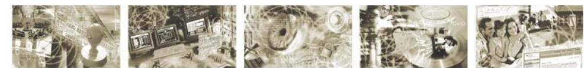

Dokument ist noch aktuell. (Stand 2020)

# TG 03126 - Technical Guidelines for the Secure Use of RFID

# TG 03126-1 Application area "eTicketing in public transport"

Authors:

Cord Bartels, NXP Harald Kelter, BSI Rainer Oberweis, BSI Birger Rosenberg, NXP

Federal Office for Information Security P.O. Box 20 03 63 53133 Bonn, Germany Tel.: +49 (0) 228 99 9582 0 E-mail: rfid@bsi.bund.de Website: https://www.bsi.bund.de © Federal Office for Information Security 2009

# **Contents**

| 1     | Description of the application area for "eTicketing in public transport"                      | 12 |
|-------|-----------------------------------------------------------------------------------------------|----|
| 2     | Description of services, products and carrier media                                           | 14 |
| 3     | Agreements                                                                                    | 18 |
| 3.1   | Definition of terms                                                                           | 18 |
| 3.2   | Generic modelling of roles and entities                                                       | 19 |
| 3.3   | Allocation of roles and entities in the "eTicketing for public transport" application area | 21 |
| 3.4   | Relationship between carrier media, applications and entitlements                             | 22 |
| 4     | General requirements                                                                          | 24 |
| 4.1   | Function                                                                                      | 24 |
| 4.1.1 | Customer requirements                                                                         | 24 |
| 4.1.2 | Requirements of the product provider and service provider                                     | 24 |
| 4.2   | Economy                                                                                       | 25 |
| 4.3   | Security                                                                                      | 25 |
| 5     | Method of determining security requirements                                                   | 26 |
| 5.1   | Objectives                                                                                    | 26 |
| 5.2   | Method                                                                                        | 26 |
| 5.2.1 | Scope of system considerations                                                                | 26 |
| 5.2.2 | Scalability and flexibility                                                                   | 27 |
| 5.2.3 | Structure of the Technical Guidelines                                                         | 29 |
| 5.2.4 | Explanation of the security concept                                                           | 30 |
| 6     | Generic business processes                                                                    | 32 |
| 6.1   | Process P1 "registering and ordering"                                                         | 32 |
| 6.1.1 | Setting up a customer account, purchasing personalised customer media and entitlements     | 32 |
| 6.1.2 | Purchasing non-personalised carrier media and entitlements                                    | 34 |
| 6.2   | Process P2 "producing and delivering products"                                                | 35 |
| 6.2.1 | Process P2A "producing and delivering personalised carrier media and entitlements"         | 35 |
| 6.2.2 | Process P2B "producing and delivering non-personalised carrier media and entitlements"     | 36 |
| 6.3   | Process P3 "using an entitlement"                                                             | 37 |
| 6.4   | Process P4 "blocking entitlements, applications and carrier media"                            | 39 |
| 7     | Use cases                                                                                     | 41 |
| 7.1   | Use case "Identification when registering and ordering"                                       | 41 |
|       |                                                                                               |    |

| 7.2    | Use case "Carrier medium initialisation"                             | 41 |
|--------|----------------------------------------------------------------------|----|
| 7.3    | Use case "Application loading"                                       | 42 |
| 7.4    | Use case "Entitlement loading"                                       | 43 |
| 7.5    | Use case "Delivery"                                                  | 44 |
| 7.6    | Use case "Check-in"                                                  | 44 |
| 7.7    | Use case "Check-out"                                                 | 45 |
| 7.8    | Use case "Entitlement check"                                         | 46 |
| 7.9    | Use case "Blocking"                                                  | 47 |
| 7.10   | Use cases "Key management"                                           | 48 |
| 7.10.1 | Key management for the initialisation of carrier media 49         |    |
| 7.10.2 | Key management for loading and personalising applications            | 49 |
| 7.10.3 | Key management for loading entitlements                              | 50 |
| 7.10.4 | Key management for use with the service provider                     | 51 |
| 8      | Security considerations                                              | 52 |
| 8.1    | Definitions relating to security and privacy                         | 52 |
| 8.2    | Definition of the security targets                                   | 54 |
| 8.2.1  | Specific security targets for the customer                           | 54 |
|        | 8.2.1.1 Safety                                                    | 54 |
|        | Information security 8.2.1.2                                      | 55 |
|        | 8.2.1.3 Protection of privacy                                     | 56 |
| 8.2.2  | Specific security targets for the product provider (e.g. for CA CCP) | 56 |
|        | 8.2.2.1 Safety                                                    | 56 |
|        | 8.2.2.2 Information security                                      | 56 |
|        | 8.2.2.3 Protection of privacy                                     | 57 |
| 8.2.3  | Specific security targets for the service provider                   | 58 |
|        | 8.2.3.1 Safety                                                    | 58 |
|        | 8.2.3.2 Information security                                      | 58 |
|        | 8.2.3.3 Protection of privacy                                     | 59 |
| 8.2.4  | Summary of the entities' security targets                            | 59 |
| 8.2.5  | Formation of protection demand categories                            | 60 |
| 8.3    | Threats                                                              | 62 |
| 8.3.1  | Threats to the contact-less interface                                | 62 |
| 8.3.2  | Threats to the carrier medium                                        | 63 |
| 8.3.3  | Threats to the reader 64                                          |    |
| 8.3.4  | Threats to the key management system 65                           |    |
| 8.3.5  | Threats to the sales, inspection and backend systems                 |    |
| 8.4    | Safeguards 67                                                     |    |
| 8.4.1  | Selection of cryptographic methods and key length                    | 68 |

| 8.4.2  | Safeguards for the protection of the system as a whole                                            | 68  |
|--------|---------------------------------------------------------------------------------------------------|-----|
| 8.4.3  | Safeguards relating to the carrier medium                                                         | 77  |
| 8.4.4  | Safeguards relating to the readers                                                                | 89  |
| 8.4.5  | Safeguards relating to the key management system                                                  | 92  |
| 9      | Definition of product-specific application scenarios                                              | 100 |
| 9.1    | Application scenario: "Local multi-journey entitlement"                                           | 100 |
| 9.2    | Application scenario: "Electronic season ticket"                                                  | 102 |
| 9.3    | Application scenario: "Interoperable unceasing entitlement with automatic fare calculation"    | 103 |
| 10     | Suggestions on implementing the system as a whole                                                 | 106 |
| 10.1   | Suggestions on executing the eTicketing infrastructure                                            | 107 |
| 10.1.1 | Determining the protection demand for the eTicketing infrastructure                               | 107 |
| 10.1.2 | Interfaces in the system as a whole                                                               | 109 |
|        | 10.1.2.1 Threats relevant to the eTicketing infrastructure                                     | 109 |
|        | 10.1.2.2 Definition of safeguards for the interfaces of the system as a whole                  | 111 |
|        | 10.1.2.3 Residual risks                                                                        | 112 |
| 10.1.3 | Readers                                                                                           | 113 |
|        | 10.1.3.1 Threats relevant to the readers                                                       | 114 |
|        | 10.1.3.2 Definition of safeguards for the reader and its applications                          | 115 |
|        | 10.1.3.3 Residual risks                                                                        | 116 |
| 10.1.4 | Sale, inspection and management systems                                                           | 116 |
|        | 10.1.4.1 Sales systems                                                                         | 116 |
|        | 10.1.4.2 Ticket system                                                                         | 119 |
|        | 10.1.4.3 Central verification system                                                           | 120 |
|        | 10.1.4.4 Terminals                                                                             | 121 |
|        | 10.1.4.5 Service desks                                                                         | 122 |
|        | 10.1.4.6 Management system for carrier media and applications                                  | 122 |
|        | 10.1.4.7 Threats relevant to sale, inspection and management systems                           | 123 |
|        | 10.1.4.8 Definition of safeguards for sale, inspection and management systems                  | 124 |
|        | 10.1.4.9 Residual risks                                                                        | 126 |
| 10.1.5 | Key management                                                                                    | 126 |
|        | 10.1.5.1 Key management for public transport service providers / SAMs for service providers | 127 |
|        | 10.1.5.2 Threats relevant to the key management system                                         | 128 |
|        | 10.1.5.3 Definition of safeguards for the key management system                                | 128 |
|        | 10.1.5.4 Residual risks                                                                        | 129 |
| 10.2   | Suggestions on executing the carrier media                                                        | 130 |
| 10.2.1 | Initialising carrier media and applications                                                       | 132 |

| 10.2.2 | Personalising carrier media and applications                                            | 133 |
|--------|-----------------------------------------------------------------------------------------|-----|
| 10.2.3 | Determining the protection demand for the carrier media                                 | 133 |
| 10.2.4 | Threats to the carrier medium                                                           | 133 |
| 10.2.5 | Definition of specific safeguards                                                       | 134 |
| 11     | Suggestions on executing the product-specific application scenarios                     | 135 |
| 11.1   | The "Local multi-journey entitlement" application scenario                              | 135 |
| 11.1.1 | Determining the protection demand category                                              | 135 |
| 11.1.2 | Relevant threats                                                                        | 137 |
| 11.1.3 | Definition of specific safeguards                                                       | 138 |
|        | 11.1.3.1 Safeguards when utilising the "Smart Ticket" carrier medium                 | 139 |
|        | 11.1.3.2 Residual risks when utilising the "Smart Ticket" carrier medium             | 141 |
|        | 11.1.3.3 Safeguards when utilising the "multi-application card" carrier medium       | 141 |
|        | 11.1.3.4 Residual risks when utilising the "multi-application card" carrier medium   | 143 |
|        | 11.1.3.5 Safeguards when utilising the "NFC mobile device" carrier medium            | 143 |
|        | 11.1.3.6 Residual risks when utilising the "NFC mobile device" carrier medium        | 145 |
| 11.2   | Electronic season ticket                                                                | 145 |
| 11.2.1 | Determining the protection demand category                                              | 145 |
| 11.2.2 | Relevant threats                                                                        | 148 |
| 11.2.3 | Definition of specific safeguards                                                       | 149 |
|        | 11.2.3.1 Safeguards when utilising the "secure chip card" carrier medium             | 150 |
|        | 11.2.3.2 Residual risks when utilising the "secure chip card" carrier medium         | 152 |
|        | 11.2.3.3 Safeguards when utilising the "multi-application card" carrier medium       | 152 |
|        | 11.2.3.4 Residual risks when utilising the "multi-application card" carrier medium   | 155 |
|        | 11.2.3.5 Safeguards when utilising the "NFC mobile device" carrier medium            | 155 |
|        | 11.2.3.6 Residual risks when utilising the "NFC mobile device" carrier medium        | 158 |
| 11.3   | The "Interoperable entitlement with automatic fare calculation" application scenario | 158 |
| 11.3.1 | Determining the protection demand category                                              | 158 |
| 11.3.2 | Relevant threats                                                                        | 161 |
| 11.3.3 | Definition of specific safeguards                                                       | 162 |
|        | 11.3.3.1 Safeguards when utilising the "multi-application card" carrier medium       | 163 |
|        | 11.3.3.2 Residual risks when utilising the "multi-application card" carrier medium   | 165 |
|        | 11.3.3.3 Safeguards when utilising the "NFC mobile device" carrier medium            | 165 |
|        | 11.3.3.4 Residual risks when utilising the "NFC mobile device" carrier medium        | 168 |
| 12     | Reference system "VDV Kernapplikation"                                                  | 169 |
| 13     | List of references                                                                      | 170 |
| 14     | List of abbreviations                                                                   | 172 |

# **List of Tables**

| Table 2–1  | Overview of sales channels and their features                                                                    | 16 |
|------------|------------------------------------------------------------------------------------------------------------------|----|
| Table 8–1  | Coding scheme of security targets                                                                                | 54 |
| Table 8–2  | Customer specific security targets for safety                                                                    | 55 |
| Table 8–3  | Customer specific security targets for information security                                                      | 55 |
| Table 8–4  | Customer specific security targets for protection of privacy                                                     | 56 |
| Table 8–5  | Product provider specific security targets for safety                                                            | 56 |
| Table 8–6  | Product provider specific security targets for safety information security                                    | 57 |
| Table 8–7  | Product provider specific security targets for protection of privacy                                             | 57 |
| Table 8–8  | Service provider specific security targets for safety                                                            | 58 |
| Table 8–9  | Service provider specific security targets for information security                                              | 59 |
| Table 8–10 | Service provider specific security targets for protection of privacy                                             | 59 |
| Table 8–11 | Overview of the entities' security targets                                                                       | 60 |
| Table 8-12 | Definition of protection demand categories                                                                       | 62 |
| Table 8–13 | Coding scheme of threats                                                                                         | 62 |
| Table 8–14 | Threats to the contact-less interface                                                                            | 63 |
| Table 8–15 | Threats to the carrier medium                                                                                    | 64 |
| Table 8–16 | Threats to the reader                                                                                            | 65 |
| Table 8–17 | Threats to the key management system                                                                             | 66 |
| Table 8–18 | Threats to the sales, inspection and backend systems                                                             | 67 |
| Table 8–19 | Coding scheme of safeguard measures                                                                              | 68 |
| Table 8–20 | Protection of the system as a whole through introduction of interface tests and approval procedures           | 69 |
| Table 8–21 | Protection of the system as a whole through ensuring the confidentiality of communication                     | 70 |
| Table 8–22 | Protection of the system as a whole through introduction of contact less interface as defined by ISO/IEC14443 | 70 |
| Table 8–23 | Protection of the system as a whole through definition of fallback solutions                                  | 71 |
| Table 8–24 | Protection of the system as a whole through securing the confidentiality of data                              | 71 |
| Table 8–25 | Protection of the system as a whole through confidential storage of data                                      | 72 |
| Table 8–26 | Protection of the system as a whole through securing the data integrity when transmitting data                | 72 |
| Table 8–27 | Protection of the system as a whole through securing data integrity when storing data                         | 72 |

| Table 8–28 | Protection of the system as a whole through securing the system's functions against DoS attacks               | 73 |
|------------|------------------------------------------------------------------------------------------------------------------|----|
| Table 8–29 | Protection of the system as a whole through securing the function of the system against incorrect operation   | 73 |
| Table 8–30 | Protection of the system as a whole through securing the function of the system to prevent technical failures | 74 |
| Table 8–31 | Protection of the system as a whole through specification of the system and the components                    | 75 |
| Table 8–32 | Protection of the system as a whole through ergonomic user instructions                                       | 75 |
| Table 8–33 | Protection of the system as a whole through support                                                              | 76 |
| Table 8–34 | Protection of the system as a whole through separation of applications                                        | 76 |
| Table 8–35 | Protection of the system as a whole through identifying the customer                                             | 77 |
| Table 8–36 | Protection of the system as a whole through satisfying the data minimization obligation                       | 77 |
| Table 8–37 | Protection of the transponder through access protection for the EPC                                              | 78 |
| Table 8–38 | Protection of the transponder against cloning                                                                    | 79 |
| Table 8–39 | Protection of the transponder against emulation                                                                  | 80 |
| Table 8–40 | Protection of personal data on the transponder                                                                   | 81 |
| Table 8–41 | Protection of settlement data on the transponder                                                                 | 82 |
| Table 8–42 | Protection through separation of applications on the transponder                                                 | 82 |
| Table 8–43 | Protection through specification of carrier medium                                                               | 83 |
| Table 8–44 | Protection through introduction of proximity technology as defined by ISO/IEC14443                            | 83 |
| Table 8–45 | Protection through fallback solution for carrier medium malfunction                                              | 84 |
| Table 8–46 | Protection through securing the authenticity and integrity when loading applications                          | 86 |
| Table 8–47 | Protection through securing the confidentiality when loading applications                                     | 87 |
| Table 8–48 | Protection through securing the authenticity and integrity when loading entitlements                          | 88 |
| Table 8–49 | Protection through securing the confidentiality when loading entitlements                                     | 89 |
| Table 8–50 | Protection of readers through introduction of interface tests                                                    | 90 |
| Table 8–51 | Protection of readers through protection of reference information                                                | 91 |
| Table 8–52 | Protection of the reader against malfunction                                                                     | 92 |
| Table 8–53 | Protection through secure generation and import of keys                                                          | 94 |
| Table 8–54 | Protection through introduction of key management                                                                | 95 |
| Table 8–55 | Protection through access protection for cryptographic keys                                                      | 96 |
| Table 8–56 | Protection through securing the function of security components                                                  | 96 |
| Table 8–57 | Protection through availability of a key management system                                                       | 97 |

| Table 8–58  | Protection through definition of actions when keys are compromised                   | 98  |
|-------------|--------------------------------------------------------------------------------------|-----|
| Table 8–59  | Protection through separation of keys                                                | 98  |
| Table 8–60  | Protection through securing the authenticity and integrity when loading keys      | 99  |
| Table 9–1   | Carrier media used for local multi-journey entitlements                              | 101 |
| Table 9–2   | Relevant processes                                                                   | 101 |
| Table 9–3   | Carrier media for electronic season tickets                                          | 103 |
| Table 9–4   | Relevant processes                                                                   | 103 |
| Table 9–5   | Carrier media for "Interoperable entitlement with AFC"                               | 104 |
| Table 9–6   | Relevant processes                                                                   | 105 |
| Table 10–1  | The system's protection requirements                                                 | 109 |
| Table 10–2  | Threats relevant to the contact-less interface                                       | 110 |
| Table 10–3  | Threats relevant to the systems                                                      | 111 |
| Table 10–4  | Safeguards for the system as a whole                                                 | 112 |
| Table 10–5  | Threats relevant to the contact-less interface                                       | 114 |
| Table 10–6  | Threats relevant to the reader                                                       | 115 |
| Table 10–7  | Safeguards for the reader and its applications                                       | 116 |
| Table 10–8  | Threats relevant to sales, inspection and management systems                         | 124 |
| Table 10–9  | Safeguards for sale, inspection and management systems                               | 126 |
| Table 10–10 | Threats relevant to the key management system                                        | 128 |
| Table 10–11 | Safeguards for the key management system                                             | 129 |
| Table 10–12 | Categorisations of carrier media                                                     | 131 |
| Table 10–13 | Categorisations of chip products                                                     | 132 |
| Table 10–14 | Threats relevant to the carrier medium                                               | 134 |
| Table 11–1  | Protection demand for the "Local multi-journey entitlement" application scenario  | 137 |
| Table 11–2  | Threats relevant to the "Local multi-journey entitlement" application scenario    | 138 |
| Table 11–3  | Use cases relevant to the "Local multi-journey entitlement" application scenario  | 139 |
| Table 11–4  | Safeguards when utilising Smart Tickets                                              | 141 |
| Table 11–5  | Safeguards when utilising multi-application cards                                    | 143 |
| Table 11–6  | Safeguards when utilising NFC mobile device                                          | 145 |
| Table 11–7  | Protection demand for the "electronic season ticket" application scenario         | 148 |
| Table 11–8  | Relevant threats in the "electronic season ticket" application scenario              | 149 |
| Table 11–9  | Use cases relevant to the "electronic season ticket" application scenario         | 150 |
| Table 11–10 | Safeguards for the "electronic season ticket" entitlement on a "secure chip card" | 152 |

| Table 11–11 | Safeguards for the "electronic season ticket" entitlement on a "multi application card"        | 155 |
|-------------|---------------------------------------------------------------------------------------------------|-----|
| Table 11–12 | Safeguards for the "electronic season ticket" entitlement on an "NFC mobile device"            | 158 |
| Table 11–13 | Protection demand for the "Interoperable entitlement with AFC" application scenario            | 160 |
| Table 11–14 | Relevant threats in the "Interoperable entitlement with AFC" application scenario              | 162 |
| Table 11–15 | Use cases relevant to the "Interoperable entitlement withcalculation AFC" application scenario | 162 |
| Table 11–16 | Safeguards for a "Interoperable entitlement with AFC" on a "multi application card"            | 165 |
| Table 11–17 | Safeguards for a "Interoperable entitlement with AFC" on an "NFC mobile device"                | 168 |
|             |                                                                                                   |     |

# **List of Illustrations**

| Figure 3–1  | Entities in an application area as defined by ISO 24014 (but extended to include customer medium entities) | 19  |
|-------------|---------------------------------------------------------------------------------------------------------------|-----|
| Figure 3–2  | Entities in the "eTicketing for public transport" application area                                            | 22  |
| Figure 3–3  | Entities in the "VDV Core Application" application scenario                                                   | 22  |
| Figure 3–4  | Carrier media, applications and entitlements                                                                  | 23  |
| Figure 5–1  | Example: Identification of RFID-relevant use cases for eTicketing                                             | 27  |
| Figure 5–2  | Example of application scenarios and RFID-relevant use cases for eTicketing in public transport            | 28  |
| Figure 5–3  | Hierarchical concept for media, applications and entitlements in eTicketing                                | 28  |
| Figure 5–4  | Concept for security considerations                                                                           | 30  |
| Figure 5–5  | Generic security targets                                                                                      | 31  |
| Figure 6–1  | Process P1A "registering and ordering"                                                                        | 33  |
| Figure 6–2  | Process P1B "purchasing non-personalised carrier media and entitlements"                                   | 35  |
| Figure 6–3  | Process P2A "producing and delivering personalised carrier media and entitlements"                         | 36  |
| Figure 6–4  | Process P2B "producing and delivering non-personalised carrier media and entitlements"                     | 37  |
| Figure 6–5  | Process P3 "using a CICO entitlement"                                                                         | 39  |
| Figure 7–1  | Use case "Carrier medium initialisation"                                                                      | 42  |
| Figure 7–2  | Use case "Application loading"                                                                                | 43  |
| Figure 7–3  | Use case "Entitlement loading"                                                                                | 44  |
| Figure 7–4  | Use case "Check-in"                                                                                           | 45  |
| Figure 7–5  | Use case "Check-out"                                                                                          | 46  |
| Figure 7–6  | Use case "Entitlement check"                                                                                  | 47  |
| Figure 7–7  | Use case "Blocking"                                                                                           | 48  |
| Figure 7–8  | Use case "Key management for carrier media"                                                                   | 49  |
| Figure 7–9  | Use case "Key management for applications"                                                                    | 50  |
| Figure 7–10 | Use case "Key management for products/entitlements"                                                           | 51  |
| Figure 10–1 | System as a whole                                                                                             | 106 |
| Figure 10–2 | Example of a reader with Smart Card or Smart Label                                                            | 113 |
| Figure 10–3 | An example of a ticket system with possible process flows                                                     | 120 |

# **1 Description of the application area for "eTicketing in public transport"**

In order to use public transport a passenger requires an entitlement, otherwise known as a ticket. This entitlement is traditionally in the form of a paper ticket, to which the passenger gives validity (stamps, validates) when issued or when the journey begins, and which may be checked by a controller in the vehicle or on the platform.

In Germany, access barriers in railway stations were dismantled at the end of the 1950s for reasons of cost, whereas in many other parts of the world electro-mechanical access equipment has been introduced. There you can only access the platform via access barriers which evaluate an entitlement. Simple techniques were used at first such as tokens (e.g. New York) and magnetic stripe cards (Singapore, London). Nowadays many of these initial implementations have been replaced by contact-less proximity chip technology. Other important references have emerged such as Peking, Seoul, Moscow, Paris, Warsaw and Oslo. The contactless chip technology defined in ISO/IEC14443 has proved the most reliable, powerful and cost-efficient solution for mass applications in public transport, and the worldwide acceptance of the ISO/IEC14443 standard is mainly a result of the positive experience gleaned from these projects.

Currently, almost all large-scale international implementations utilise relatively inexpensive chip cards with contact-less memory chips. Many of these projects are the sole responsibility of a single transport company. If more than one transport company is involved then there is a contractually regulated relationship between the providers, and on that basis there is an organisational collaboration governing in detail themes such as products, fares and clearing.

In Germany the situation is somewhat different at the moment. There is no implementation yet that is using electro-mechanical access barriers in stations.

Furthermore, approximately 360 public and 4,500 private transport companies are active in Germany. There are no heavily used areas of transport that are served by just one single transport company. Since the *Verkehrsverbünde*, or regional transport associations, were introduced in the 1970s, the general situation for most passengers is that they draw on the services of several companies using just one single interoperable entitlement. This implies the need to remunerate the companies fairly for the transport they provide – a process known as "Clearing".

For passengers, this mixed service situation comes with difficulties that hinder the use of public transport. Every regional transport association has a different, complex fare system and its own tickets. With the exception of certain long-distance train tickets, it is impossible to book a journey that includes local public transport on one single ticket. Instead passengers usually have to get to grips with complex fare systems and unfamiliar automatic ticket machines when they arrive.

It was against this background that the *Verband Deutscher Verkehrsunternehmen* (VDV, or Association of German Transport Companies) began to develop an IFM (Interoperable Electronic Fare Management System) based on contact-less chip technology and known as the VDV Core Application (CA). This has become the standard in Germany for interoperable electronic fare management. The CA pursues the following aims:

- 1 Improve the attractiveness of public transport for the customer by introducing the following features and services:
	- a Introduce an interoperable customer medium throughout Germany which customers can use with every transport company and association provided it operates CA-compliant systems.
- b Automatic fare calculation that takes into account the transport services used.
- 2 Strengthen transport companies by:
	- a Counteracting counterfeit fraud.
	- b Helping to divide up takings among the companies.
	- c Increasing competition: create an interoperable service platform offering the companies flexibility in their fare policies.

The first implementation of the CA is beginning to be put into place. Media using the interface defined in ISO/IEC14443 are being used.

European standardisation authorities have so far introduced three standards to support the emerging IFM system:

- 1 The functional system architecture and the application scenarios of IFM systems are described in the standard ISO EN 24014-1. This standard was drawn up by the CEN TC 278 WG3 SG5 Work Group.
- 2 The description of the data elements to be used in the medium, and the structure of the data elements (application), are contained in CEN TC 224 WG11 SG1.
- 3 The EN 1545 standard describes the data elements and EN 15320 describes the data structuring (IOPTA, InterOperable Public Transport Application).

The VDV Core Application implements the existing international system standards into one overall set of technical system specifications.

This is to be the basis for our discussions henceforth.

# **2 Description of services, products and carrier media**

This discussion of products and carrier media intends initially – as also does IOPTA – to delineate the current and predicted state of affairs in Europe. However, emphasis will be placed on the check-in/check-out variation of the CA (CICO), since this is the most highly developed, powerful and flexible of the IOPTA application scenarios. In a CICO-system, the passenger actively registers to the systems at the start and at the end of the journey by using his electronic customer media.

Customers are provided with services by transport companies, and the following ticketing products are offered in that connection:

- 1 Electronic ticket (individual ticket, day, month, year and network tickets with defined regional validity, and tickets for regional and long-distance travel).
- 2 Multi-journey entitlements.
- 3 Upgrading with additional entitlements.
- 4 Unceasing tickets (automatic fare calculation, CICO, electronic ticket subscription contract).

The products differ in terms of particular features and characteristics:

- 1 Interoperable or non-interoperable usage.
- 2 Value of entitlement:
	- E-ticket approx. €1 €15,000; e.g. VRR: €6,000, DB AG: €15,000,
	- Stored value … €150
	- Unceasing or season tickets … >€1,000
- 3 Non-transferable personalised, transferable personalised, anonymous.
- 4 Validity in terms of time and region / non-regulated entitlements.
- 5 Charging variations (account entitlements {pre-/postpaid}, credit entitlements, …)
- 6 Time of fare calculation (pre-pricing, trip-pricing and post-pricing).

In all this, interoperability is defined as when two or more companies accept an entitlement/product (acceptance terminal interfaces have to be standardised; in the VDV CA this means ISO-14443 and the specified data interfaces) and calculate between themselves which services were used and how the takings are shared out. Every transport company association in Germany now operates like this. From the customer's point of view interoperability means that they can use their media and entitlements to travel with different service providers.

Automatic fare calculation requires a check-in at the start of the journey and a check-out at the end, and this in turn requires CICO (check-in/check-out) infrastructure. Systems that use access barriers can use these for checking in and out. In systems without access barriers (Germany for example), a CICO infrastructure comprising check-in and check-out terminals must be installed on the platforms and in the vehicles.

The following carrier media are generally considered for use in public transport:

- 1 Paper ticket
- 2 Magnetic stripe card
- 3 Smart Ticket with contact-less proximity interface as defined by ISO/IEC14443
- 4 Contact-less chip card with proximity interface as defined by ISO/IEC14443
- 5 Contact-less, high-security multi-application card with proximity interface as defined by ISO/IEC14443

6 Secure NFC mobile device

The products are sold through the following channels:

- 1 Direct sales by the product provider:
	- a Customer centre, vending machine, local sales point e.g. at a railway station
	- b Internet sales
- 2 Sales through retailers:
	- a Travel agencies, hotels, etc.
	- b Internet sales

The following table describes the various sales channels and their features:

| Sales channel                                                               | mer Setting up a custo account | Reliable identification | me mer Initialise custo dia on site | Direct output of cus media mer to | Media delivered by post | ments onto media mer Load entitle ex. custo | Production and issue of paper tickets | ment Methods of pay                                                                  | Sales staff present | Sale in secure area | Mobile operation | Online link to sales and ms ment syste manage |
|--------------------------------------------------------------------------------|--------------------------------------|-------------------------|----------------------------------------------|--------------------------------------------|----------------------------|---------------------------------------------------------|------------------------------------------|-----------------------------------------------------------------------------------------|---------------------|---------------------|------------------|--------------------------------------------------------|
| Customer centre                                                             | +                                    | +                       | +                                            | +                                          | +                          | +                                                       | +                                        | m-specific                                                                              | +                   | +                   | –                | +                                                      |
| Local sales point                                                           | +                                    | +                       | –                                            | +                                          | +                          | +                                                       | +                                        | ments with syste                                                                        | +                   | –                   | + / –      | +/–                                                    |
| Travel agent, ho tel, etc.                                               | +                                    | +                       | –                                            | +                                          | +                          | +                                                       | +                                        |                                                                                         | +                   | –                   | + / –      | +/–                                                    |
| Static vend ing machine                                                     | –                                    | –                       | +                                            | –/+                                        | –                          | +                                                       | +                                        |                                                                                         | –                   | –                   | –                | +/–                                                    |
| Static vend ing machine with reader for cus tomer- / eID-medium | +                                    | +                       | –                                            | +                                          | +                          | +                                                       | +                                        | Cash, cards, direct debit, acceptance of entitle ment procedures (e.g. stored value) | –                   | –                   | –                | +                                                      |
| Sale by driver                                                              | –                                    | –                       | –                                            | –/+                                        | –                          | +                                                       | +                                        | pay                                                                                     | +                   | +                   | +                | –                                                      |

| Sales channel                                          | mer Setting up a custo account | Reliable identification | me mer Initialise custo dia on site | Direct output of cus media mer to | Media delivered by post | ments onto media mer Load entitle ex. custo | Production and issue of paper tickets | ment Methods of pay                                                                  | Sales staff present | Sale in secure area | Mobile operation | Online link to sales and ms ment syste manage |
|-----------------------------------------------------------|--------------------------------------|-------------------------|----------------------------------------------|--------------------------------------------|----------------------------|---------------------------------------------------------|------------------------------------------|-----------------------------------------------------------------------------------------|---------------------|---------------------|------------------|--------------------------------------------------------|
| Sale by conductor                                      | –                                    | –                       | –                                            | –/+                                        | –                          | +                                                       | +                                        | ments ment procedures m-specific                                                  | +                   | –                   | +                | –                                                      |
| Vending machine in vehicle                          | –                                    | –                       | –                                            | –/+                                        | –                          | +                                                       | +                                        | Cash, cards, accep tance of entitle with syste pay                             | –                   | –                   | +                | –                                                      |
| Internet                                                  | +                                    | –                       | –                                            | –                                          | +                          | –                                                       | +                                        | ments with ment                                                                      | –                   | –                   | +                | +                                                      |
| Internet with home reader / NFC mobile device | +                                    | +                       | +                                            | –                                          | +                          | +                                                       | +                                        | Cards, direct debit, accep m-specific pay tance of entitle procedures syste | –                   | –                   | +                | +                                                      |

**Table 2–1 Overview of sales channels and their features** 

"+" indicates that the feature applies to the respective sales channel

"–" indicates that the relation has not to be considered

"+" a symbol highlighted in grey denotes developments expected in the future

1 Sale by personnel

Sales through customer centres, local sales points, guards and drivers involve a direct interaction between the customer and the personnel of the product provider (CCP). What these sales channels have in common is that the personnel can identify the customer (e.g. by checking the customer's identity card) and that several payment methods etc. may be used in a flexible way.

Differences arise from the various technical possibilities.

Customer media can only be initialised if there is online access to the relevant background systems and if the necessary equipment is available on site. At the moment this is not always the case. Customer media are often ordered at customer centres and sales points and then delivered by post. Alternatively, the finished medium can be kept for collection at the customer centre. This process cannot take place with mobile sales (i.e. in vehicles), since customer accounts cannot be set up due to time constraints or lacking connection to the required systems.

In the future there will be methods for loading applications and personalising in customer centres and also via the Internet using home readers, and over-the-air using NFC mobile devices.

Loading entitlements onto existing personalised and non-personalised media requires direct communication between the customer medium and the sales system via a suitable

reader. This is currently supported in customer centres and local sales points for personalised and non-personalised products. Non-personalised products can also be sold offline using Secure Authentication Modules (SAMs). This is also possible when the reader is offline (e.g. in vehicles or in other places where no online-connection is available).

### 2 Static and mobile vending machines

Vending machines are nowadays very widespread. There are static installations in railway stations or at bus stops, or readers that are implemented in vehicles.

Static vending machines can be connected to sales and management systems via an online link. This means that vending machines could even be used to initialise and personalise customer media. In contrary to that, continuous online links do not exist in vehicles.

At the moment customers do not have the option of registering at vending machines, since a reliable means of identification does not exist. This also means that customer accounts cannot be set up, and personalised media cannot be applied for.

That is why vending machines only sell products anonymously at present. Loading entitlements onto existing customer media is technically possible if the vending machine is equipped with an appropriate reader with SAM.

Soon customers will be able to enjoy secure, convenient methods of identification and authentication using – for example – electronic identity cards. This can also enable registering at vending machines.

3 Internet

The customer submits personal details, the order, and payment information to a service centre via the Internet (web page). The availability of the product and, where applicable, seat reservations can normally be dealt with straight away when ordering on the Internet. Payment is by credit card, direct debit, or similar. Products and customer media are delivered by post or can be made available for collection at a customer centre.

Personal and address information submitted through a web page is not necessarily considered trustworthy. Checking it reliably involves considerable extra effort. Normally it is checked solely against a current address database, and a credit check is performed.

4 Internet using card-readers / over-the-air and possibly secure proof of identity (e.g. eID) In future there may be another way in which customers can register and place orders.

It will involve the customer submitting the order and payment information to a service centre via the Internet (web page). Data relating to the customer's person (where necessary) will be identified and transmitted online by means of direct communication between the ticket issuer's application server and a secure identity card (electronic identity card, eID).

The availability of the product and, where applicable, seat reservations can normally be dealt with straight away when ordering on the Internet. Payment is by credit card, direct debit, or similar. Products and customer media are delivered by post or can be made available for collection (sales point, vending machine).

The personal and address information received by communicating with the eID are to be considered trustworthy and reliable. Additional checking is not required.

Anonymous use of public transport can also be offered via this sales channel, in which case an anonymous medium is used and a non-personalised entitlement loaded onto it. The service is paid for by means of credits stored on the medium. These credits can be purchased through the sales infrastructure using anonymous payment methods.

# **3 Agreements**

## **3.1 Definition of terms**

#### Application area

the area in which the Technical Guidelines are intended to apply; the highest unit in the terminological structure; incorporates one or more applications, the products/services that belong to those applications and the application scenarios that result from that

#### Application scenario

a particular way of looking at the application area in terms of the implementation of specific products and services

#### Operating process

a comprehensive operational procedure in an application area like eTicketing; examples are the sales process, the use of an entitlement, clearing, and so on

#### Use case

detailed description of a series of activities that constitute part of an operating process; examples include initialising a carrier medium and loading an entitlement

#### Check-in / check-out (CICO)

when using the "automatic fare calculation" product, the passenger must check in at the start of the journey and check out at the end. This requires an appropriate infrastructure, known as a CICO infrastructure. Systems that use access barriers can use these for checking in and out. Otherwise a CICO infrastructure comprising check-in and check-out terminals (CICO terminals) must be installed on the platforms, at bus stops and in vehicles.

### Interoperability

Interoperability means that the customer can redeem his entitlement with more than one service provider. The service provider is remunerated for the services provided by the product owner. Interoperability is required between transport company associations and also between transport companies within such associations. Accounting accuracy is a central aspect of this, since it determines the money received by the service providers. In the past, money was shared out within transport company associations on the basis of traffic flow analyses, statistics and estimates. Technical accounting accuracy can be achieved with the introduction of CICO technology.

#### Usage data

the calculation process in the "automatic fare calculation" product is based on data gathered when the customer uses the service. To enable this, the customer checks in at a terminal using his customer medium and then checks out again when he has finished using the service. The usage data acquired is stored in the terminal and the customer medium. Its reliability is fundamental to the reliable invoicing of customers and to interoperability between service providers.

#### Calculation data

the usage data which is used for accounting purposes is referred to as calculation data. Calculation data contains, for example, information about the entitlement, the product owner, the service provider, and the place and time of check-in and check-out. This data may or may not be able to be assigned to the customer, depending on whether personalised or anonymous entitlement is being used. The calculation data is passed on to the product owner by the service provider, who gathers it at the CICO terminals. The authenticity, integrity and confidentiality of the calculation data are extremely important to customers and service providers alike.

Statistical data

Statistical data provides information about the general use of a product, a line, a vehicle and so on. With an "automatic fare calculation" entitlement, the statistical data can be derived from the usage data. With other products, usage data can be gathered when the entitlement is assessed before entry. Statistical data is stored and utilised in an anonymised and statistically processed form. Statistical data is not used for invoicing customers for services, but rather for the service provider's or product owner's planning purposes, which is why it is only held in anonymised form. Statistical data can, however, be used for a general division of takings between service providers.

## **3.2 Generic modelling of roles and entities**

The roles and responsibilities shall be described on the basis of the ISO 24014 standard.

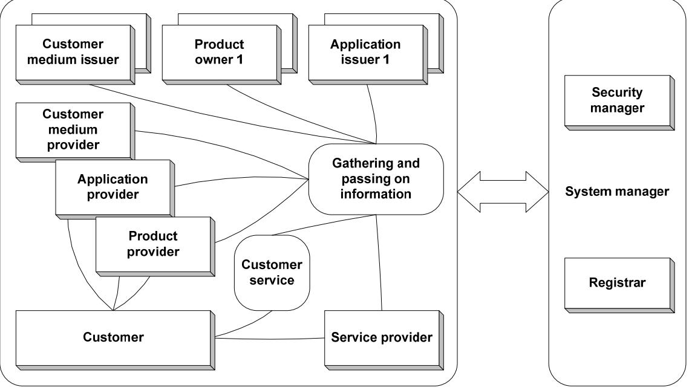

#### **Figure 3–1 Entities in an application area as defined by ISO 24014 (but extended to include customer medium entities)**

ISO 24014 defines entities and assigns roles and responsibilities to them. The implementation for the eTicketing areas of use is described in the following:

Actor

An entity that operates in accord with the role assigned to it.

Customer

The purchaser of a product and user of the services associated with it. The customer pays money and receives from the product provider an entitlement to use services. This entitlement is redeemed at the service provider.

#### Customer medium

The customer medium is a data carrier in which an electronic entitlement can be stored. The customer medium is held by the customer, and is required by the customer in order to use the entitlement. Other common names for the customer medium are user medium and carrier medium. Examples of customer media include Smart Tickets, chip cards and NFC mobile devices.

#### Issuer of customer medium

The issuer of the customer medium configures it for further use. The issuer may market the customer medium through customer media providers (such as transport companies). Close coordination and a contractual relationship are required between the issuer of the customer medium, the application issuer and the system manager.

#### Provider of customer medium

The provider of the customer medium (e.g. a transport company or mobile phone service provider) markets the customer medium which it has received from the customer medium issuer. The provider of the customer medium normally implements with the issuing of the customer medium.

#### Application

The application supports one or more products by providing functions and structures – such as those needed to store entitlements on the carrier medium, in the sales system and in the backend system. The implementation follows the application specification, which normally belongs to the issuer of the application. The issuer of the application may market the application through application providers (such as a regional transport association). As well as the products, the application may also contain customer-specific information.

#### Application issuer

The application issuer is the owner of the application specification. The application issuer may market the application through application providers (e.g. a transport company).

#### Application provider

The application provider (e.g. a transport company or stadium operator) implements and markets the application which it has received from an application issuer (e.g. in licensed form). The application provider also normally issues the carrier medium in conjunction with implementing the application, making him, for instance, the contractual partner to the customer in the eTicketing application area.

#### Product/entitlement/service

The product is a service or object provided by a product owner and which the customer can use in return for payment. The product belongs to the product owner (e.g. a concert organiser) and is offered to customers directly or through a product provider (e.g. travel agent or advance ticket office). When he purchases the product, the customer receives an entitlement to use a service, which he can then redeem at the service provider (e.g. transport company).

#### Product owner

The owner of the product (e.g. a single entry to a Bundesliga football match). The product owner defines and markets the product, sometimes through a product provider (e.g. an advance ticket office). In simple scenarios, however, it is quite normal for the product owner to be the product provider as well. The product owner must follow the specifications of the application issuer when he defines his product, in order to ensure that the application can support the product. Furthermore, close collaboration is required between the product owner and the service provider who is to provide the service promised by the product. A contractual relationship is required between the product owner, product provider and service provider.

Product provider

Markets the product on behalf of the product owner in return for a fee. The product provider receives the customer's payment and is therefore the only interface for payments. This demands direct coordination and a contractual relationship with the product owner. The product provider places the product (e.g. an entitlement) into the application on the carrier medium. The product provider is the contractual partner to the customer in terms of the entitlements he has purchased to utilise services. In organisational terms the product owner often takes on the role of product provider as well.

#### Service provider

Examples include stadium operators and public transport service operators. Provides the customer with a service if he presents an entitlement purchased from a product provider (e.g. entry to a stadium). This requires direct coordination and a contractual relationship between the product provider and product owner.

#### System manager

The system manager ensures that the rules of the system are upheld. To this end he draws on the functional entities of security manager and registrar.

#### Registrar

The registrar ensures that unique identifying characteristics are allocated throughout the system. This is necessary in order to clearly identify the entities, carrier media, applications and products/entitlements.

#### Security manager

Establishes and coordinates the security regulations in the system. Responsible for approving the components of the system. Monitors the performance of security-related functions (e.g. key management).

### **3.3 Allocation of roles and entities in the "eTicketing for public transport" application area**

Making the services available which are described in Chapter [2](#page-13-1) demands, in a fully developed configuration, the interaction of diverse and changing entities. For instance, it must be made possible for a service provider to handle products from various different product owners and providers, and to support the invoicing accordingly.

The assignment of entities in this application area is identical to the generic description in section [3.2](#page-18-1). In the following diagram, the main entities defined in the VDV Core Application are also shown to provide an example:

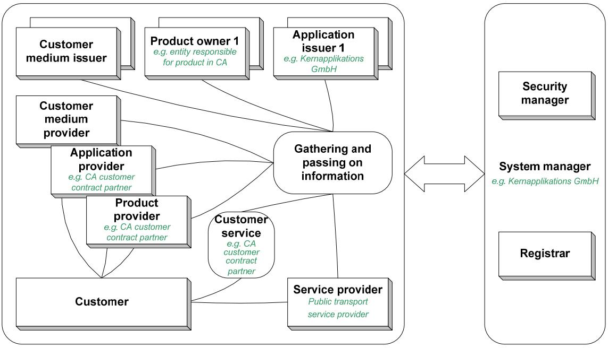

The specifications of the VDV Core Application combine some of the roles together:

- 1 The customer contract partner (CCP) takes on the role of providing the customer medium, application and product.
- 2 VDV KA GmbH takes on the roles of system manager (including security manager and registrar) and application issuer.

Given these facts, the generic diagram in [Figure 3–2](#page-21-1) is modified to produce the following specific plan:

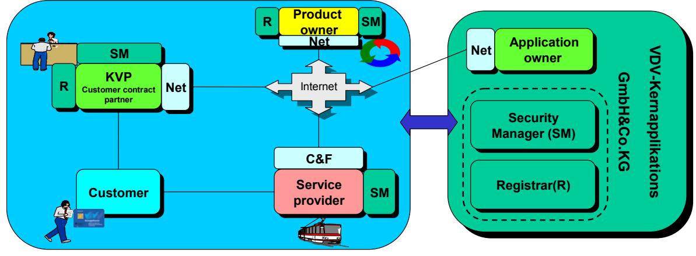

**Figure 3–3 Entities in the "VDV Core Application" application scenario** 

## **3.4 Relationship between carrier media, applications and entitlements**

The model described in sections [3.2](#page-18-1) and [3.3](#page-20-1) supports several product providers, service providers, application issuers and so on.

This means that a large number of different carrier media, applications and products would be conceivable.

The customer or carrier medium is the customer's data carrier on which he stores his entitlements and with the help of which he makes use of the associated services.

Applications provide the structures and functions required to load entitlements onto carrier media, and to make use of the entitlements. The implementation of applications must therefore take account of the features of specific carrier media and entitlements.

The customer can exchange entitlements for services at the service provider.

The following rules apply to the relationships between carrier media, applications and entitlements:

- 1 A carrier medium can contain at least one application. If more than one application can be stored on it, then it is referred to as a multi-application-compatible carrier medium.
- 2 An application can store at least one entitlement. The VDV Core Application simultaneously supports different entitlements of different types, which may originate from different product providers. Personal data and check-in / check-out data may also be stored in the application.
- 3 Applications on one carrier medium can originate from different application issuers and providers.
- 4 Entitlements in one application may originate from different product owners and providers.
- 5 Entitlements of the same type can be stored in different applications.

The following diagram illustrates an example of the relationship between carrier media, applications and entitlements.

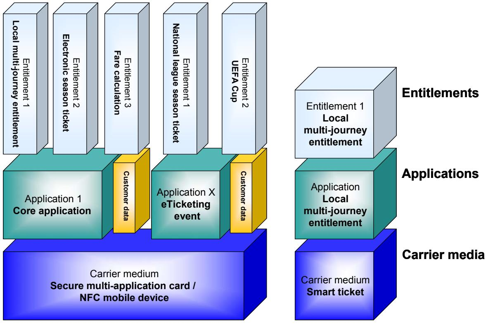

**Figure 3–4 Carrier media, applications and entitlements** 

# **4 General requirements**

The requirements which must be met by the system as a whole and its processes and components can be divided into three categories.

## **4.1 Function**

### **4.1.1 Customer requirements**

Below are some of the features which are required from the customer's point of view:

- The customer media and systems must be easy to use.
- The customer medium must be durable and reliable, and must perform at a the required speed.
- The entitlement and the customer medium must be easy and reliable to use, including with different service providers.
- The way the "automatic fare calculation" product is invoiced must be reliable and easy to follow.
- It should be possible to replace lost entitlements for an administration fee. The same should apply to exchanging entitlements.
- It must also be possible to purchase anonymous entitlements.
- Reasonable protection must be provided for personal data (where applicable).

Whenever contact-less chip technology is used, the customer should always be kept properly informed of the personal data used, how it is employed, what is done to protect the data, and any risks that remain.

### **4.1.2 Requirements of the product provider and service provider**

Functionality

- It should be easy to explain to customers and personnel how the customer medium and systems are used.
- The way the system components and processes are executed must take into account the conditions particular to public transport. For example, permanent data access to the overall system cannot be guaranteed in vehicles, so it has to be possible to purchase entitlements, redeem them, check-in / check-out and monitor entitlements even when the terminals involved are not online.
- It must be possible to block personalised entitlements and customer media, and to issue replacements.
- Access barriers and check-in/check-out systems must allow enough people through in a given period. A typical requirement for permanently installed systems is a processing time of 300 ms.

Technical compatibility

• The compatibility of system components must be assured even if carrier media, systems and components come from different manufacturers and providers and are used for different service providers.

# **4.2 Economy**

For an eTicketing system to be operated economically, the commercial benefit must be greater than the cost of the processes, systems and security, regardless of how extensively the system is installed. This must apply to all of the entities who invest in the setting-up of the system.

The system as a whole, and its components, should be designed such that the requirements of the relevant application scenarios are met as efficiently as possible. For this reason it is necessary to define these requirements as accurately as possible to begin with.

# **4.3 Security**

This document will deal with the requirements of security separately, from section [8.2](#page-53-1) onwards.

# **5 Method of determining security requirements**

## **5.1 Objectives**

The Technical Guideline on secure use of RFID should fulfil the following objectives:

- Provide system suppliers and system users with an introductory guide on the correct implementation of specific RFID system solutions, in terms of safety, information security and privacy.
- Raise awareness of and achieve transparency in aspects of security.
- Provide a basis for the system supplier's or operator's declaration of conformity, and for the issuing of quality seals by certification authorities.

The following information is required in order to achieve these aims:

- A definition of the security requirements that must be fulfilled by an RFID system for a given application area.
- A description of the specific risks, appropriate counter-measures, and potential remaining risks, in following called residual risks.
- A definition of the criteria for a declaration of conformity and for certification.

It is not just security aspects that are relevant to the definition of activities and proposed systems; all of the requirements described in Chapter [4](#page-23-1) also have to be taken into consideration.

## **5.2 Method**

### **5.2.1 Scope of system considerations**

RFID-based systems can be very complex. In most cases, a lot of IT components that have no direct relation to RFID are part of the system solution. On the other hand it is not sufficient to look only at the media/tag and reader in order to safeguard the system's security.

The Technical Guidelines must consider every aspect of security in detail that is relevant to RFID. These aspects depend heavily on the application area and the relative implementation of the system solution. These Technical Guidelines therefore contain detailed descriptions of the application area, and the related operations processes (including, for example, sales channels and processes). Based on this information, use cases are identified that are relevant to RFID. Processes and use cases cover the entire life-cycle of RFID media or RFID tags. These use cases are then used as a basis for the identification of threats, and for a detailed system-specific security assessment of RFID-related parts of the system. [Figure 5–1](#page-26-1) shows this approach for the example of eTicketing in public transport.

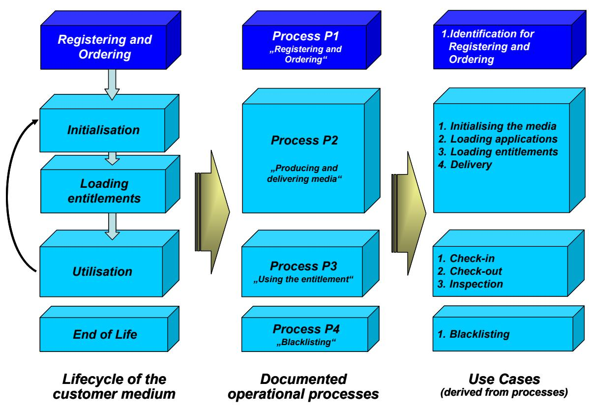

**Figure 5–1 Example: Identification of RFID-relevant use cases for eTicketing** 

All the other system components are considered only in a fairly general manner. Proposed safeguards follow open standards of IT security.

This concept helps to focus on those parts of the system that are relevant to RFID, and makes sure that all aspects of security are considered. On the other hand the Technical Guidelines leave room for individual and proprietary IT implementations (back-offices, sales systems, logistic systems and so on), which supports the enhancement of existing systems using RFID technology.

## **5.2.2 Scalability and flexibility**

The Technical Guidelines have to address security issues. At the same time, any system based on these Guidelines must be economically viable. This means that the following requirements have to be covered by the Guidelines' approach:

- 1 It must be possible to scale systems in such a way that the costs and benefits are balanced. This means in practice that precautionary measures must be proportional to the need for protection. For example: if only low-cost products are used, which require relatively little protection, then precautions should be designed accordingly. This may allow the use of low-cost media, reducing in turn the cost of implementation and operation of the system.
- 2 The application scenarios that have been chosen for the Technical Guidelines cover a wide range, from small to nationwide and even international systems. It is important that the concept discussed in the Guidelines can be used for system solutions of any size and complexity.
- 3 In many cases a system solution can be made economically viable much more easily if you are able to cooperate with other companies. This applies in particular to eTicketing applications, where it can be very beneficial if media already available to customers

(such as multi-application cards and NFC-enabled phones) can be used for additional applications, products and related services.

The following diagrams provide examples from eTicketing for the cross-system and crossapplication utilisation of customer media and infrastructure.

[Figure 5–2](#page-27-1) shows that various products and application scenarios may have to be supported in one system. Furthermore, these products may be hosted by various types of RFID media.

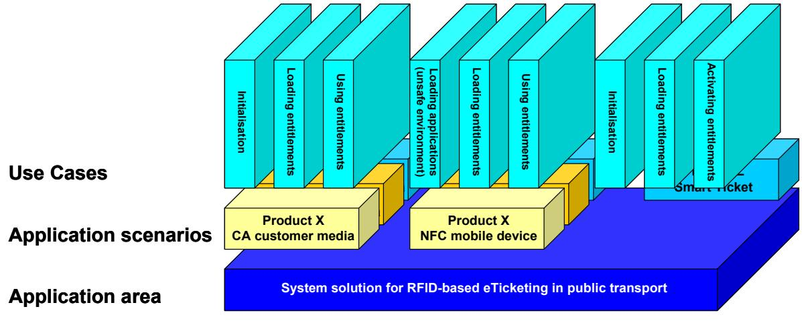

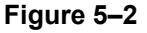

#### **Figure 5–2 Example of application scenarios and RFID-relevant use cases for eTicketing in public transport**

[Figure 5–3](#page-27-2) gives an example of a customer medium for eTicketing that supports applications from two areas of use.

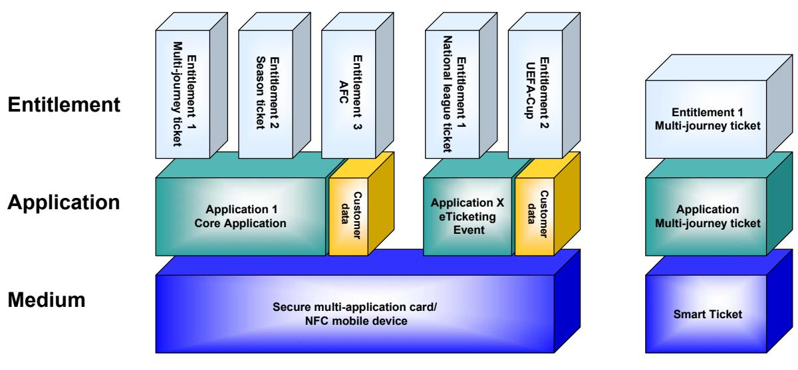

#### **Figure 5–3 Hierarchical concept for media, applications and entitlements in eTicketing**

The following concept is used in these Technical Guidelines in order to address the aforementioned requirements:

- 1 A feasible role model and the structure of key components (products, applications and media) are defined in chapter 3. These models support a granular and scalable approach.
- 2 The Technical Guidelines offer security plans that also cover combinations of application scenarios and media used on the same infrastructure. This is achieved by itemised security assessments based on the RFID-relevant use cases.
- 3 Areas of use similar to eTicketing that provide opportunities for cross-application partnerships will be addressed by the respective Technical Guidelines with as much communality as possible. The security considerations and precautionary measures in particular will employ the same technical basis.
- 4 A special challenge to system security exists in partnerships across systems and applications. It must be ensured that the security of one system is not undermined by leakages coming from the other. Normally this requires extensive security assessments in both systems.

The Technical Guidelines address this by introducing a scalable and transparent concept for applying precautions to the identified threats, called "protection demand categories". A total of three categories from 1 (normal demand) to 3 (very high demand) are applied. All of the safeguards are divided accordingly into three levels, from normal to advanced protection.

For every individual system implementation, the protection demand category will be defined to begin with, for every security target. These findings will be used to select the appropriate level for the safeguards involved.

This concept provides an easy way to establish secure system cooperation. It remains only to ensure that the protection demand categories of both systems match up.

## **5.2.3 Structure of the Technical Guidelines**

Table 5-1 shows the structure of all the sections of the Technical Guidelines that have so far been drawn up.

| Chapter                             | Contents                                                                                                                          |
|-------------------------------------|-----------------------------------------------------------------------------------------------------------------------------------|
| Description of the application area | Description of the application area: struc ture, services, special peripheral conditions, etc.                              |
| Products and services               | Description of products, services and sales channels                                                                           |
| Definitions                         | Role model, definition of terms                                                                                                   |
| Introduction to the methodology     | Introduction to the concept and methods that are applied to the security considera tions.                                   |
| General requirements                | General requirements of the parties in volved, important points, etc.                                                          |
| Operational processes               | Description of operational processes rele vant to the life-cycle of RFID media                                                 |
| Use cases                           | Definition of RFID-relevant uses cases                                                                                            |
| Security considerations             | Introduction to IT security                                                                                                       |
|                                     | Definition of specific security targets, protec tion demand categories, and threats.                                           |
|                                     | Proposed safeguards                                                                                                               |
| Definition of application scenarios | Definition of examples for application sce narios. These examples cover the entire range of relevant parameters that may oc |

| Chapter                                                   | Contents                                                                                                                                                        |
|-----------------------------------------------------------|-----------------------------------------------------------------------------------------------------------------------------------------------------------------|
|                                                           | cur in this specific application area. Users of the Technical Guidelines may adapt these scenarios according to their own needs.                          |
| Proposed implementation of the system solution         | Generic system description including exam ples of how to perform a threat analysis and arrive at feasible safeguards to protect the system components. |
| Implementation proposal for each applica tion scenario | Examples of applying the concept to Secu rity considerations in an application-specific way.                                                              |

**Table 5–1 Structure of the Technical Guidelines** 

### **5.2.4 Explanation of the security concept**

The Technical Guidelines contain complete examples of how security considerations should be applied to specific application scenarios. These can be adapted to the requirements and peripheral conditions of the particular system implementation in hand.

[Figure 5–4](#page-29-1) shows the concept for the Security considerations used in all sections of the Technical Guidelines.

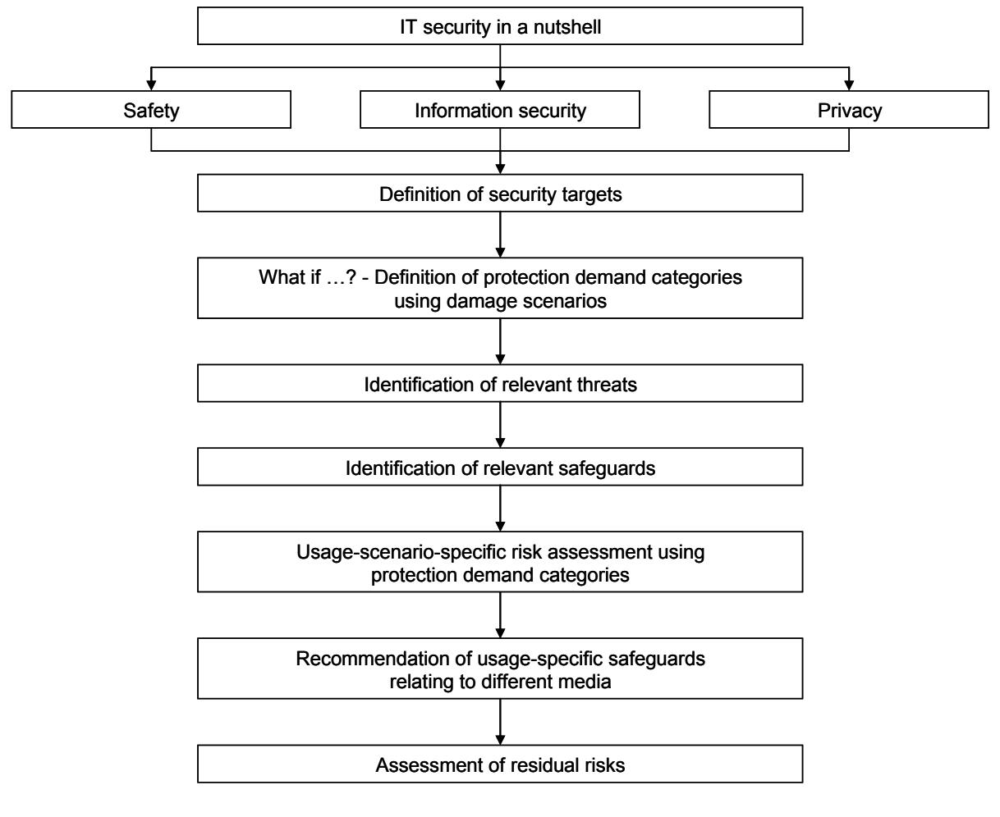

**Figure 5–4 Concept for security considerations** 

All considerations are based on the classic definition of security targets that is given in [Figure](#page-30-1)  [5–5](#page-30-1).

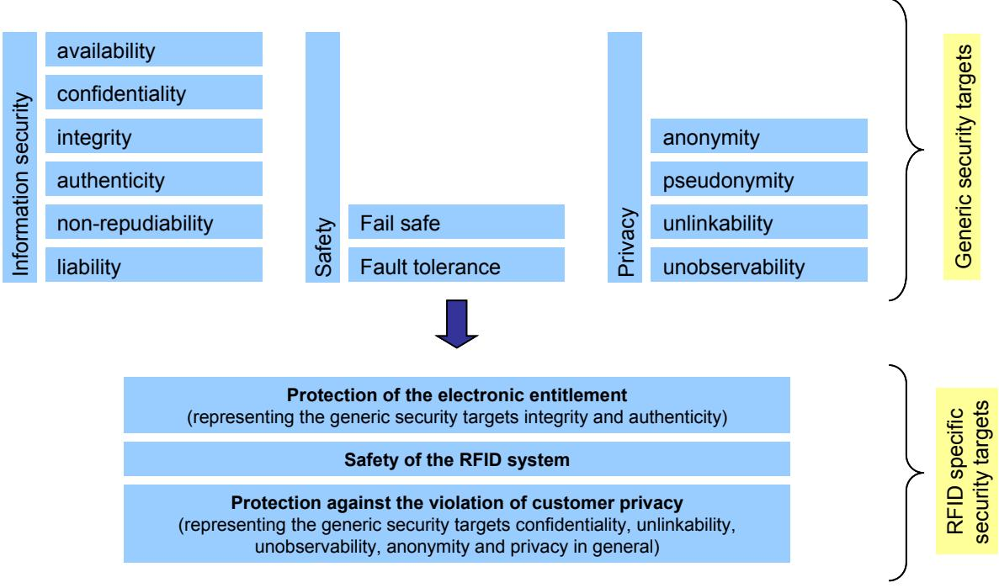

**Figure 5–5 Generic security targets** 

# **6 Generic business processes**

# **6.1 Process P1 "registering and ordering"**

### **6.1.1 Setting up a customer account, purchasing personalised customer media and entitlements**

To set up a customer account and purchase a personalised or non-personalised entitlement, the customer applies to the product provider (i.e. the customer contract partner in the VDV Core Application). If the customer does not possess a carrier medium containing a suitable application, then he can purchase one from the product provider[1](#page-31-0) . To facilitate this, the product provider works together with the providers of the application and the customer medium.

Purchasing customer-related entitlements, applications and carrier media requires that the customer registers. To do this the customer provides the necessary personal information (e.g. name, postal address, payment information) and orders the product required.

It is normally up to the product provider to decide which information is required of the customer for the purposes of determining his identity and address and conducting a credit check.

Let us examine the following processes as examples of registering and ordering:

1 Ordering at a customer centre or a local sales point

The customer visits the sales point (e.g. the customer centre of a transport company, a sales point at a railway station or a travel agent), and orders the product. Payment is made there and then. Ideally, the sales point will have direct access to the eTicketing system and will be able to issue products and customer media on site. If not, they are delivered by post. Personal data is only required if a customer-specific product or a product with a CA payment method by direct debit is ordered, or if postal delivery is required.

Where necessary, identity and personal data is checked by proving the identity by means of an identity card.

2 Service centre

The customer submits the necessary personal information, the order and the payment information to a service centre by fax, written application or telephone. The availability of the product and factors such as seat reservations can normally be dealt with straight away when ordering by telephone. Payment is by credit card, by direct debit, etc. Products and customer media are delivered by post or put aside for collection (sales point, vending machine).

Personal and address information submitted by fax or phone is not necessarily considered trustworthy. Checking it reliably involves extra effort. Normally it is checked solely against a current address database, and a credit check is performed.

An example of ordering from a service centre using an order form can be seen at: <http://www.kolibricard.de/bestellung.html> .

1 The case of a customer who only wants to purchase a customer medium with an application, but no product, is considered irrelevant and is not discussed here.

3 Internet

The customer submits the necessary personal information, the order and the payment information to a service centre by Internet (web page). The availability of the product and factors such as seat reservations can normally be dealt with straight away when ordering by Internet. Payment is by credit card, by direct debit, etc. Products and customer media are delivered by post or put aside for collection at a customer centre.

Personal and address information submitted via the Internet is not necessarily considered trustworthy. Checking it reliably involves extra effort. Normally it is checked solely against a current address database, and a credit check is performed.

4 Internet using card-readers and secure proof of identity (e.g. eID)

In future there may be another way for customers to register and place orders.

It will involve the customer submitting the order and payment information to a service centre via the Internet (web page). Personal data (where necessary) will be identified and transmitted online by means of direct communication between the ticket issuer's application server and a secure electronic identity card.

The availability of the product and factors such as seat reservations can normally be dealt with straight away when ordering by Internet. Payment is by credit card, by direct debit, etc. Products and customer media are delivered by post or put aside for collection (sales point, vending machine).

The personal and address information received by communicating with the eID are to be considered trustworthy and reliable. Additional checking is not required.

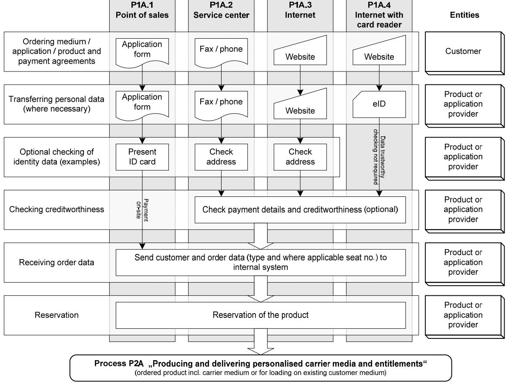

The following diagram shows Process P1A, registering and ordering:

**Figure 6–1 Process P1A "registering and ordering"** 

### **6.1.2 Purchasing non-personalised carrier media and entitlements**

Anonymous sales and the sale of non-personalised products are especially important in public transport. In such cases, customer accounts are not set up. The product is supplied on a specially produced, non-personalised carrier medium or loaded anonymously onto an existing customer card.

The customer must always pay before the product is handed over.

Anonymous sales require that payment is made immediately, that the entitlement is produced immediately, and that the customer can take it away on his existing customer medium.

The following sales channels can be used:

1 Sales point/customer centre, travel agent

The sale of non-personalised tickets at sales points is common practice for paper tickets. In the future, non-personalised customer media will be able to be produced on site and entitlements loaded onto existing customer media. Payment is in cash or by card.

2 Driver / guard

The sale of tickets by drivers and guards is common practice for paper tickets. In the future it will be possible to load entitlements onto existing customer media this way. Payment is in cash or by card.

3 Vending machine

The sale of tickets by vending machines is common practice for paper tickets. Non-personalised customer media can also be produced by vending machines, and entitlements loaded onto existing customer media.

Payment is in cash or by card.

4 Internet using card-readers and secure proof of identity (e.g. eID)

Even when non-personalised carrier media or the ticket is ordered on the Internet and, for instance, delivered by post, the name and address of the customer still has to be submitted to the product provider. An additional option for registering and ordering can be provided to this end.

It will involve the customer submitting the order and payment information to a service centre via the Internet (web page). Personal data (where necessary) will be identified and transmitted online by means of direct communication between the ticket issuer's application server and a secure electronic identity card.

The availability of the product and factors such as seat reservations can normally be dealt with straight away when ordering by Internet. Payment is by credit card, by direct debit, etc. Products and customer media are delivered by post or put aside for collection (sales point, vending machine). The product and carrier medium themselves do not contain any personal data.

The personal and address information received by communicating with the eID are to be considered fundamentally trustworthy and reliable. Additional checking is not required.

The following diagram shows Process P1B, purchasing non-personalised carrier media and entitlements:

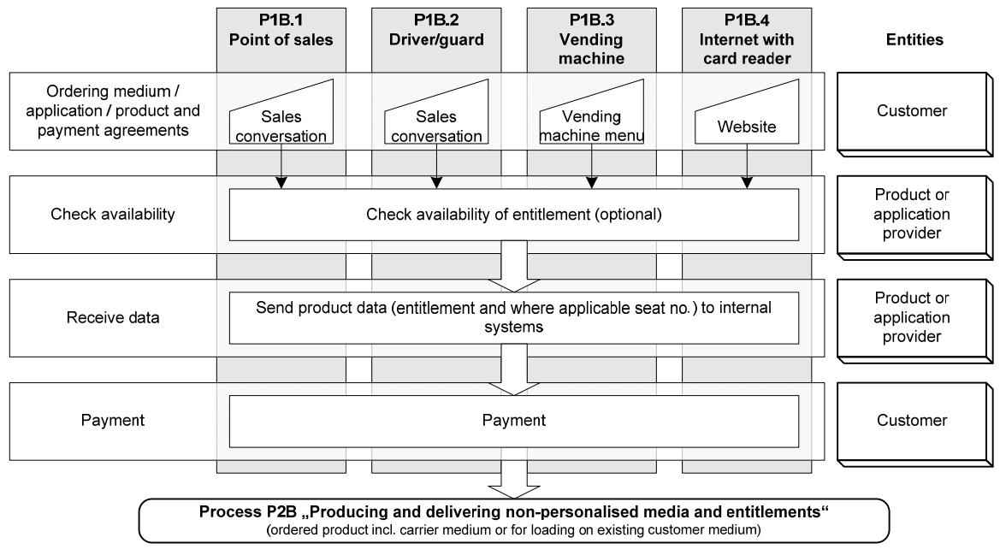

**Figure 6–2 Process P1B "purchasing non-personalised carrier media and entitlements"** 

## **6.2 Process P2 "producing and delivering products"**

### **6.2.1 Process P2A "producing and delivering personalised carrier media and entitlements"**

Two basic cases are to be considered when describing this process:

- 1 Producing and delivering an entitlement together with a specially produced carrier medium.
- 2 Loading an entitlement onto a customer-related medium already in the possession of the customer (e.g. secure multi-application card, NFC mobile device).

The following diagram, [Figure 6–3](#page-35-1), shows Process P2A with 4 sub-processes representing the possible ways in which a product may be delivered.

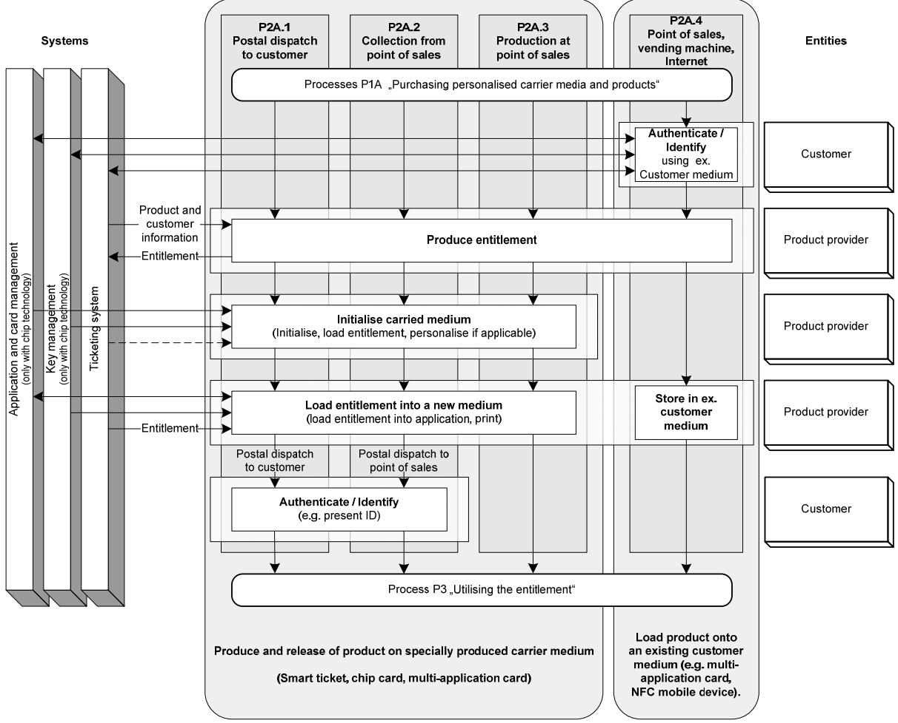

#### **Figure 6–3 Process P2A "producing and delivering personalised carrier media and entitlements"**

In Processes P2A.1 to P2A.3, the entitlement ordered is delivered to the customer on a specially produced carrier medium.

In Process P2A.4 it is assumed that the customer already has a suitable customer medium. This may be a secure chip card, a multi-application card or an NFC mobile device.

The customer medium is used in the first instance to identify and authenticate the customer electronically. If the customer medium does not contain a suitable application, then one must be loaded onto it before the entitlement is loaded on.

### **6.2.2 Process P2B "producing and delivering non-personalised carrier media and entitlements"**

Two basic cases are to be considered when describing this process:

- 1 Producing and delivering an entitlement together with a specially produced carrier medium.
- 2 Loading an entitlement onto a customer-related medium already in the possession of the customer (e.g. secure multi-application card, NFC mobile device).

The following diagram, [Figure 6–4](#page-36-1), shows Process P2B with 3 sub-processes representing the possible ways in which a product may be delivered.

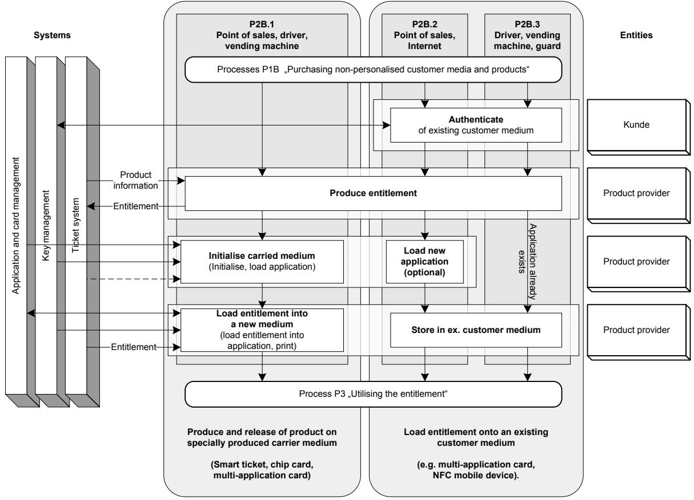

#### **Figure 6–4 Process P2B "producing and delivering non-personalised carrier media and entitlements"**

In Process P2B.1, the entitlement ordered is delivered to the customer on a specially produced carrier medium. Provided data that can be related to a person is clearly separated on the carrier medium and application, a non-personalised entitlement can be loaded onto a personalised carrier medium.

In Process P2B.2 it is assumed that the customer already has a suitable customer medium. This may be a secure chip card, a multi-application card or an NFC mobile device. If the customer medium does not contain a suitable application, then one must be loaded onto it before the entitlement is loaded on.

Process P2B.3 is the same as P2B.2, except that applications cannot be loaded onto the carrier medium. The customer medium must be fully configured to accept the entitlement as a precondition for the customer to use this process.

# **6.3 Process P3 "using an entitlement"**

The customer must have a carrier medium with an approved application and valid entitlement in order to use the transport. The entitlement is redeemed by the customer in exchange for a service.

Depending on the product, the entitlement is activated at the start of the journey, or the customer checks in when he begins the journey and checks out at the end (CICO). The infrastructure required for this is the responsibility of the service provider.

The public transport service provider must first do a number of things so as to guarantee the operation of this function:

- 1 The local inspection infrastructure must be adapted to the accepted applications and entitlements.
- 2 The specific key information for reading the entitlements and writing the usage data must be integrated into the key management system.
- 3 The list of blocked media, applications and entitlements (blacklist) must be transferred from the ticket system into the inspection infrastructure, which requires the approval and installation of a data interface to the service provider's inspection infrastructure (an interface which enables the data to be updated at sensible intervals).

A journey begins by checking in at a static or mobile terminal. Alternatively, it is possible to use mobile inspection units carried in the vehicles by the ticket-checking staff. The terminals should work even if the data connection to the server fails, which means that all terminals have to work offline as well as online (some of them possibly only temporarily).

When beginning the journey, the entitlement has to be checked and validated. If an "automatic fare calculation" product is being used, then the user must also check out at the end of the journey. At both these points, data relating to the fare is stored in the terminal and the carrier medium.

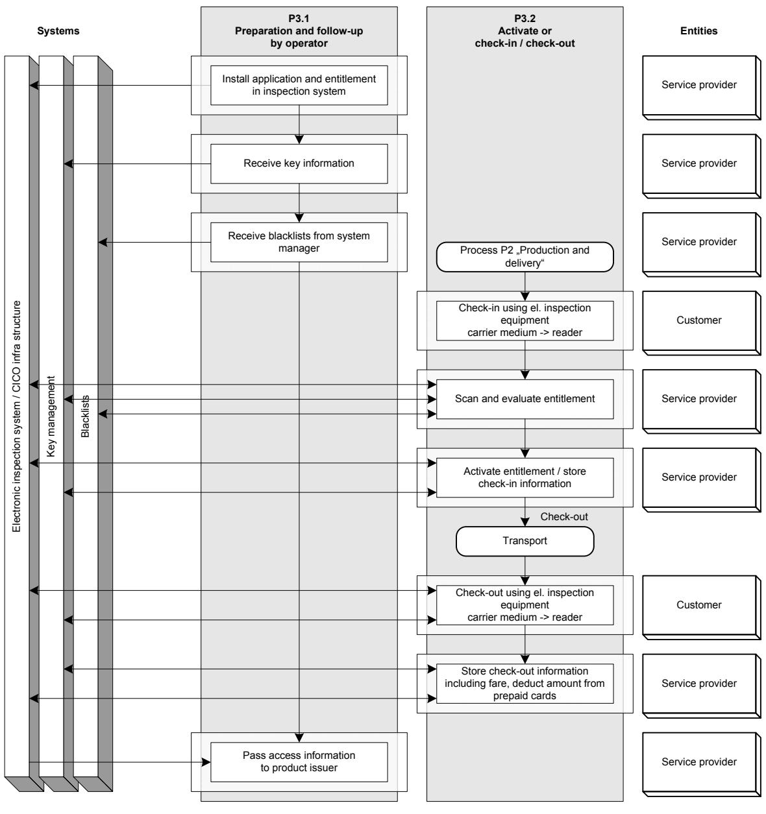

The following diagram shows Process P3:

**Figure 6–5 Process P3 "using a CICO entitlement"** 

Fault cases are not dealt with here.

### **6.4 Process P4 "blocking entitlements, applications and carrier media"**

Because of the high level of counterfeit security that can be achieved with correct implementations of chip-based carrier media, it is possible to block entitlements, applications and carrier media securely. This helps the processes of cancelling and exchanging carrier media and entitlements, and enables lost media to be replaced.

The following are possible scenarios:

- 1 Defective carrier media are withdrawn and destroyed. Before issuing a replacement medium it is important to ascertain that a counterfeit has not been presented for replacement, and that a medium has not been declared as defective and submitted.
- 2 In practice, mislaid carrier media can only be blocked and replaced if they are personalised and assigned to a customer account (see registration) with a product provider. If this is the case, then the owner can identify himself to the product provider from which he obtained the medium, and state which carrier medium is to be blocked. The same procedure can be used to cancel entitlements.
- 3 Mislaid personalised carrier media and the entitlements stored on them can be replaced provided that all the entitlements on them have been blocked. It is important to remember that the carrier medium may contain more than one application, and that these may themselves contain entitlements from various product issuers and providers.

# **7 Use cases**

The following sections contain descriptions of use cases that are relevant as we look further at contact-less chip technology in this application area. These use cases have been derived from the generic operating processes in Chapter [6](#page-31-1).

The descriptions of the use cases are based on an illustrative system architecture which is discussed in more detail in Chapter [10](#page-105-1).

# **7.1 Use case "Identification when registering and ordering"**

The quality of the process of authenticating and identifying the customer is crucial to the reliability of the data upon which Process P1, "Registering and ordering", is based. Process descriptions P1A.1 – P1A.4 can be used for elucidating this. Using a reliable process, such as one involving a secure personalised customer medium or an electronic identification medium (e.g. an eID), will mean an increase in security and functionality.

## **7.2 Use case "Carrier medium initialisation"**

The "Carrier medium initialisation" use case depicted in [Figure 7–1](#page-41-1) incorporates the following steps:

- 1 Carrier medium initialisation
	- a Default settings relating to function and security
	- b Setting specific keys
	- c Setting an ID which uniquely identifies the carrier medium
- 2 Loading the applications
	- a Loading the software specific to the applications concerned
	- b Allocating the resources of the carrier medium (setting up file systems and so on)
	- c Setting specific keys for each application
- 3 Loading the application-specific data
	- a Loading customer data (where required)
	- b Loading the ID of the application provider

As the stages of initialising the carrier medium progress, the information in the management system for carrier media and applications has to be updated.

The various keys, certificates and so on that are used are generated and fed in by a key management system. This system is the responsibility of the system manager (more precisely the security manager and registrar). If the carrier medium's chip is to generate public keys during initialisation, then these also have to be fed into the key management system.

Carrier medium initialisation normally takes place in a secure environment (e.g. in a mass personaliser or in a vending machine).

| Use Case "Carrier medium initialisation"    |                                                                                                                                                                                                                                                                                                                          |                                                      |                                                                                 |                                                                                                            |                                |
|---------------------------------------------|--------------------------------------------------------------------------------------------------------------------------------------------------------------------------------------------------------------------------------------------------------------------------------------------------------------------------|------------------------------------------------------|---------------------------------------------------------------------------------|------------------------------------------------------------------------------------------------------------|--------------------------------|
| Criteria                                    | Initialisation procedure                                                                                                                                                                                                                                                                                                 | Carrier medium                                       | Carrier and application management                                           | Key management                                                                                             | Ticket sales system            |
| Initialise medium                        | Carrier medium in Reading range Detect carrier medium Invalid medium OK? END Valid medium Carrier medium known? Known medium Valid application present? Application present END Load application "Load new application" process                              | Carrier medium type identifier                    | Carrier medium ID and allocated applications Allocated applications    |                                                                                                            |                                |
| Criterion: Authentication successful? | Authenticate carrier medium Invalid Medium OK? end Valid medium Initialise carried medium Set key Load carrier ID Load application Load application Set application-specific key Load application-specific data Customer data ID of application provider END | Carrier medium ID Application Application data | Carrier medium ID Register application (in relation to carrier medium) | Platform key Specific key Platform key Application-specific key Application-specific key | Customer data Provider data |

**Figure 7–1 Use case "Carrier medium initialisation"** 

# **7.3 Use case "Application loading"**

The "Application loading" use case shown in [Figure 7–2](#page-42-1) illustrates the procedure for loading an application onto a carrier medium already in the possession of a customer. This may be a contact-less chip card or an NFC mobile device.

There are various possible scenarios for loading a new application onto an existing carrier medium:

- 1 Loading the application via a contact-less interface in a trustworthy environment
- 2 Loading the application via a contact-less interface in an insecure environment. For instance, this may occur when loading an application onto a contact-less chip card via a reader on a home computer or in an advance ticket office.
- 3 Loading an application "over-the-air" onto an NFC mobile device.

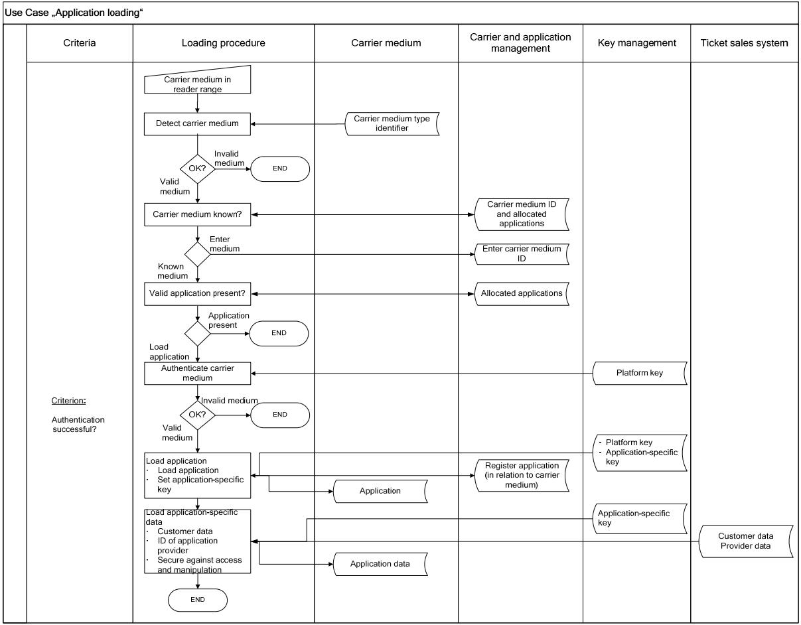

**Figure 7–2 Use case "Application loading"** 

# **7.4 Use case "Entitlement loading"**

As soon as the carrier medium has been initialised and the applications installed, entitlements can be loaded onto the applications.

The sale of a product is directly dependent on this use case being performed securely and in a way which is easy for customers. The use case is therefore an absolutely crucial one for providers and customers alike. All of the sales channels discussed in the descriptions of Processes P2A and P2B (Section [6.2](#page-34-1)) must be taken into consideration when dealing with the "Entitlement loading" use case depicted in [Figure 7–3](#page-43-1).

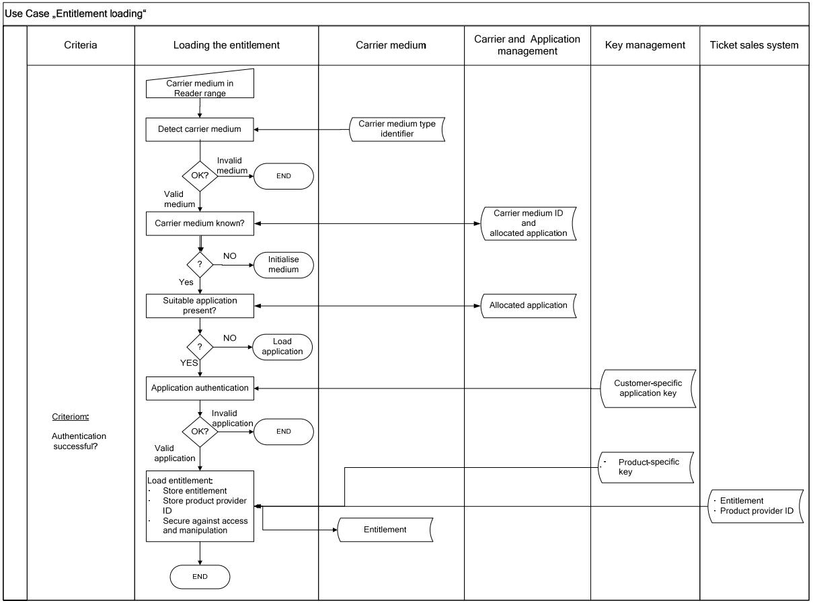

**Figure 7–3 Use case "Entitlement loading"** 

A distinction must be made between the loading of entitlements when the carrier medium is first issued and the loading of entitlements later on. The latter can be done via the Internet using a home reader, "over-the-air" onto an NFC mobile device, or locally at a sales point or vending machine.

# **7.5 Use case "Delivery"**

Carrier media that have been initialised and loaded with entitlements must then be passed to the delivery point or the customer as described in P2A.1 and P2A.2.

When delivering, the product provider must also record security-relevant information about the delivery in the ticket system. This includes:

- 1 Addressee,
- 2 ID of carrier media, ID of products,
- 3 Sender,
- 4 Delivery point, special arrangements relating to handing-over,

## **7.6 Use case "Check-in"**

The "Check-in" use case represents the first part of Process P3.2 in detail. The exact way this is executed depends on the application involved and the data models and algorithms associated with it. The following diagram shows the procedure.

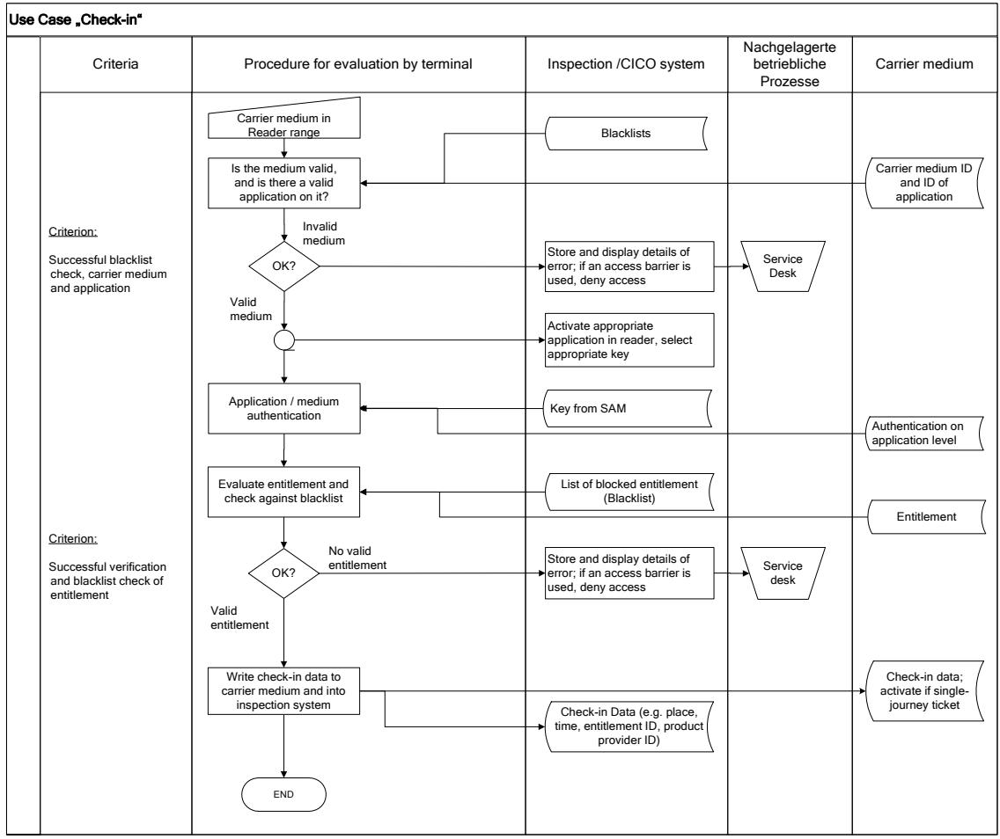

**Figure 7–4 Use case "Check-in"** 

In the event of a fault the customer is referred to a service desk, which normally means visiting a customer centre. There, a defective carrier medium can be exchanged if necessary.

# **7.7 Use case "Check-out"**

The "Check-out" use case represents the second part of Process P3.2 in detail. The exact way this is executed depends on the application involved and the data models and algorithms associated with it. The following diagram shows the procedure.

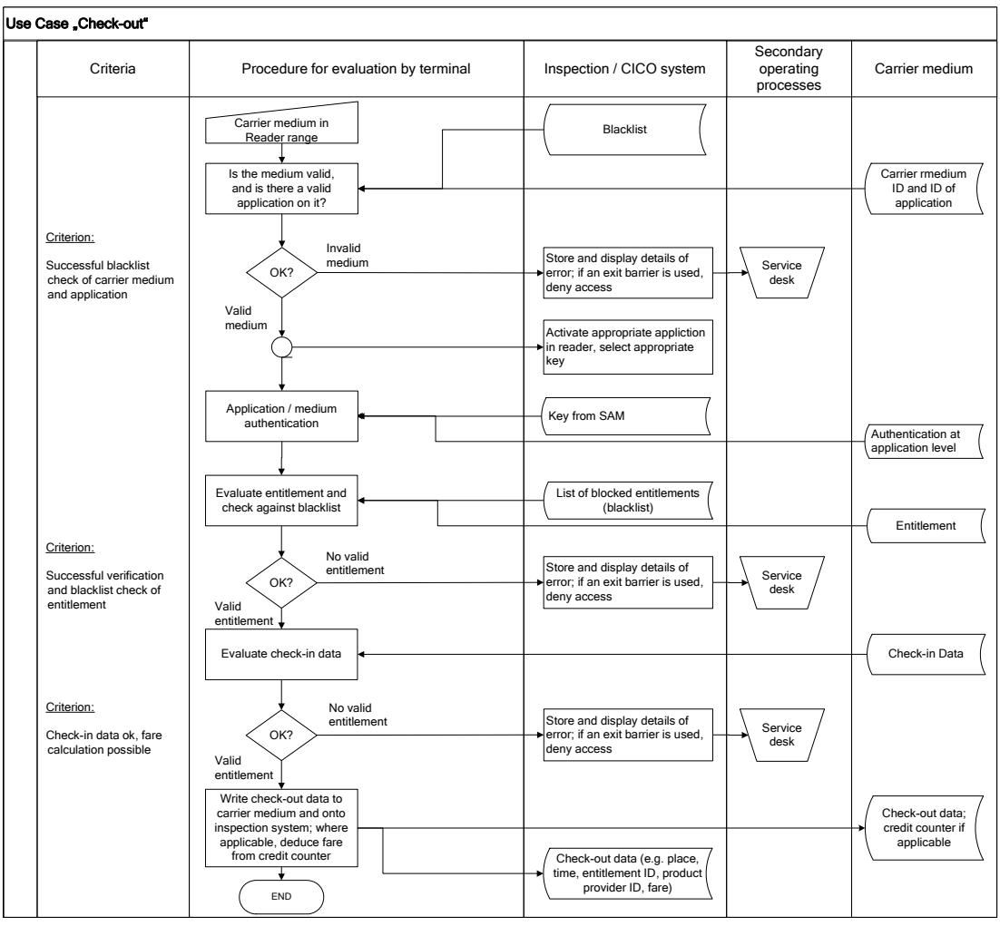

**Figure 7–5 Use case "Check-out"** 

In the event of a fault the customer is referred to a service desk, which normally means visiting a customer centre. There, a defective carrier medium can be exchanged if necessary.

# **7.8 Use case "Entitlement check"**

The "Entitlement check" use case represents the technical process of a ticket inspector checking the customer's entitlement to travel. This technical process is largely identical to the "Check-in" use case. The exact way it is executed depends on the application involved and the data models and algorithms associated with it. The following diagram shows the procedure.

An entitlement check is normally performed using a mobile inspector's terminal loaded with the necessary SAM and blacklists.

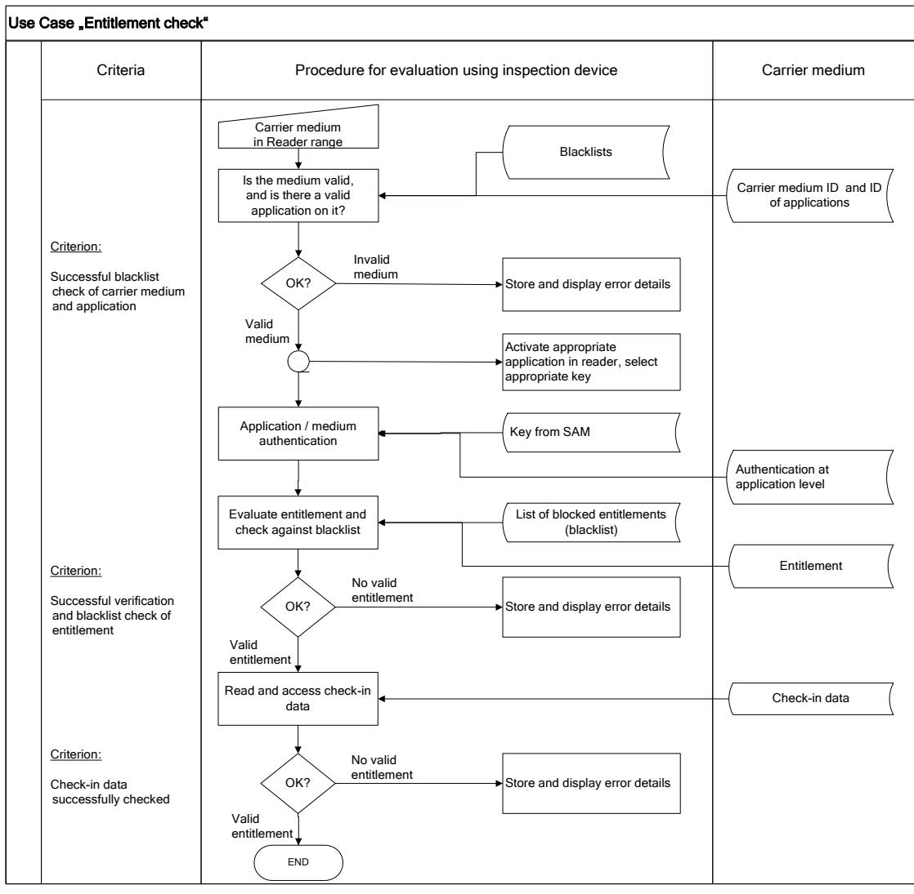

**Figure 7–6 Use case "Entitlement check"** 

If a fault occurs, the entitlement is normally checked visually.

## **7.9 Use case "Blocking"**

Carrier media that have been mislaid must be blocked. The same applies to defective media and products, assuming they cannot be withdrawn and destroyed.

The blocking of a medium and/or the entitlement stored on it is a precondition for the issuing of a replacement medium, or for the transfer of an entitlement to a new owner with a different customer medium.

Blocking can only be performed if it is sufficiently certain that the customer requesting it is the rightful owner of the medium or entitlement. That is why customers may only block media or entitlements in either of the following cases:

- 1 The customer's details were stored when purchasing. Blocking is then performed following reliable identification and a legally binding declaration that the customer agrees to the procedure.
- 2 The medium containing the entitlement is presented. Its authenticity can be determined securely.

As well as customers performing blocks, other entities in the system can apply for blocking. To this end, responsibilities and processes are defined for these entities in the system as a whole.

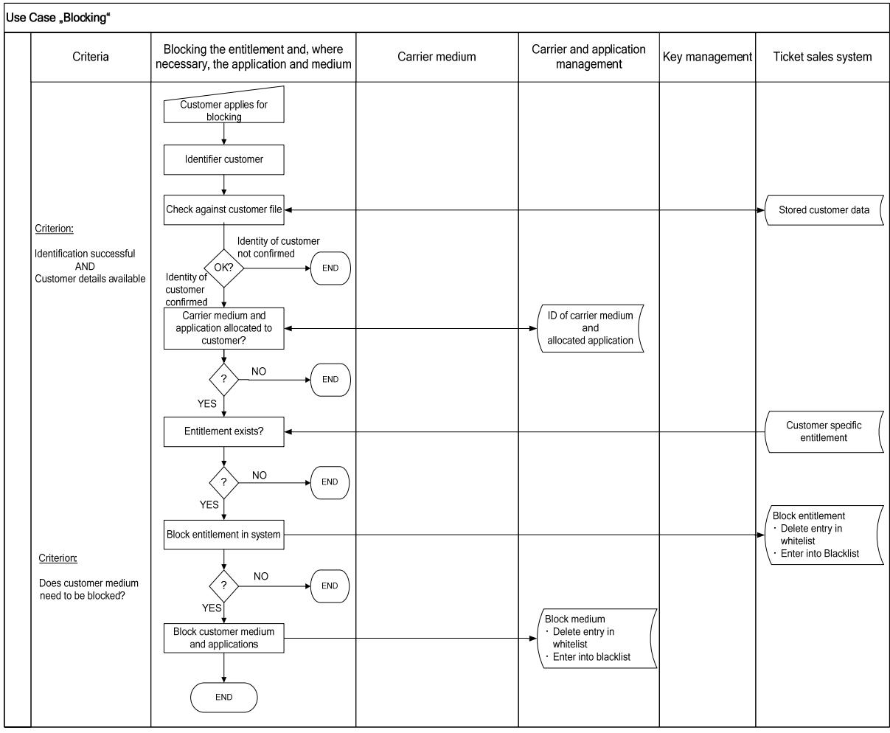

**Figure 7–7 Use case "Blocking"** 

# **7.10 Use cases "Key management"**

For performance reasons, entitlements on carrier media are usually protected using procedures involving symmetric keys. The security and proper function of the system as a whole is therefore highly dependent on the secure provision and storage of the keys, a job which has to be done by the key management system and the processes assigned to it.

In the following use cases, Secure Authentication Modules (SAMs) are used as secure storage for key information, security mechanisms and diversification algorithms. In principle, other methods may also be feasible.

Carrier medium initialisation and the loading of entitlements require a key management system that recognises the hierarchical relationship between carrier media, applications and products/entitlements.

### **7.10.1 Key management for the initialisation of carrier media**

[Figure 7–8](#page-48-1) illustrates the use case of key management for the initialisation of carrier media. The keys and procedures defined here are also required for the loading of applications.

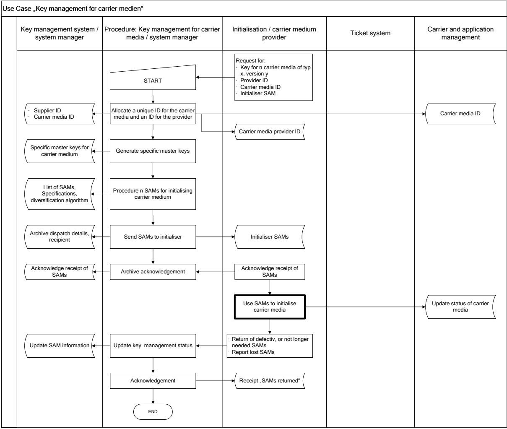

**Figure 7–8 Use case "Key management for carrier media"** 

### **7.10.2 Key management for loading and personalising applications**

In order to secure applications that are loaded when carrier media are produced, or afterwards, special keys and identifiers must be generated for the applications.

[Figure 7–9](#page-49-1) shows the corresponding use cases. The key management system for carrier media also has to be available when the application is loaded onto the carrier medium.

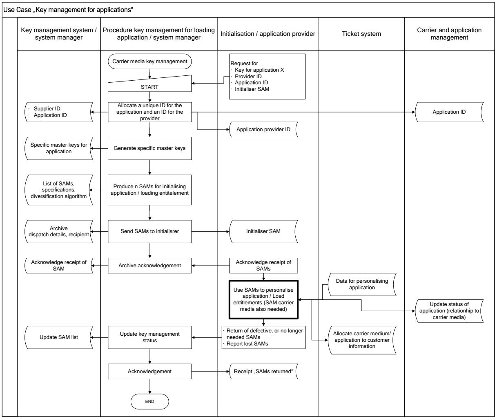

**Figure 7–9 Use case "Key management for applications"** 

### **7.10.3 Key management for loading entitlements**

In order to secure entitlements that are loaded when carrier media are produced, or afterwards, special keys and identifiers must be generated for the products.

[Figure 7–10](#page-50-1) shows the corresponding use cases. The key management system for applications also has to be available when the entitlement is loaded onto the application.

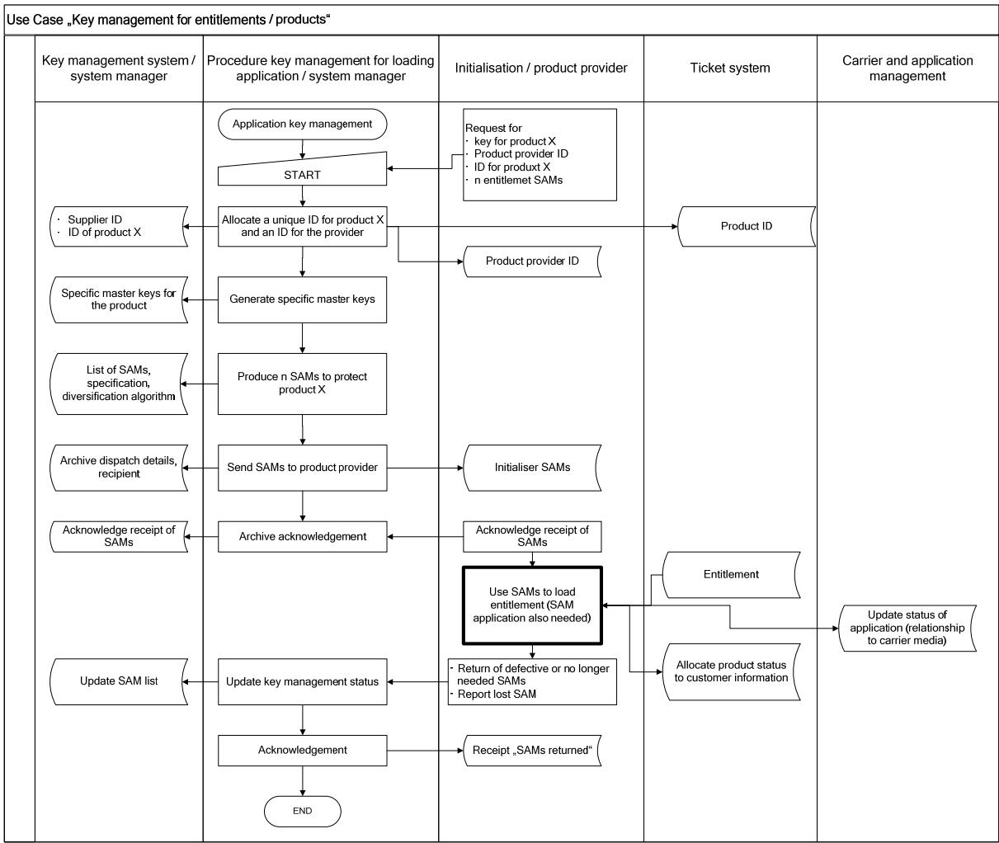

**Figure 7–10 Use case "Key management for products/entitlements"** 

### **7.10.4 Key management for use with the service provider**

Providers and issuers require a key management system to initialise carrier media, load applications and issue entitlements.

The public transport service provider requires the keys and other information necessary to read and evaluate entitlements.

This information has to be available in the verification system.

To this end, the security manager normally generates specific SAMs (service provider SAMs) for the service provider using the key management system. Service provider SAMs can contain key information from multiple providers of products, applications and carrier media. A selection is put together by the security manager in accordance with the needs of the service provider.

# **8 Security considerations**

## **8.1 Definitions relating to security and privacy**

Security can be divided into three aspects or categories, all of which this document intends to examine. They are:

- Safety
- Information security
- Privacy

These categories can be subdivided as follows:

1 Safety

Safety is not to be confused with reliability/correctness or quality of service. Reliability means that the system works correctly according to its specifications. Experience shows that every technical system is sometimes subject to failure. Safety is understood as the capacity of a system, when it does fail, not to enter uncontrollable states that would endanger the system itself or its environment (fail-safe). At the same time, the system should also continue to respond as far as possible in compliance with its specification (fault tolerance). Safety, therefore, basically implies protection against unintended incidents.

2 Information security

Unlike safety, information security offers protection against intentional attacks. In the field of information security, security targets can be formulated as belonging to the following categories:

- a Confidentiality: confidentiality means protection against the unauthorised disclosure of information. Confidential data and information may only be accessible to authorised people in an authorised manner. Formulated as a protection target this means: stored information and information that is to be communicated is to be protected against access by unauthorised persons.
- b Integrity: integrity means ensuring that data is correct (intact) and that systems function properly. Formulated as a protection target this means: stored information and information that is to be communicated is to be protected against unauthorised modification.
- c Availability: the availability of services, of the functions of an IT system, IT applications and IT networks – and also of information – exists if these things are always available to their users when required. Formulated as a protection target this means: information and operating systems are to be protected against being withheld improperly.
- d Unlinkability: if two communication elements within a system are unlinkable, it means they are not any more or less related to one another than is already known and established. Within the system, no further information about the relationship between these communication elements can be obtained. In practical terms this means that a single user can make use of services and resources more than one time, without third parties being able to see that these access events (in the communication model: messages) are related through the user.
- e Unobservability: an event is unobservable if it cannot be determined whether it has happened or not. Sender-unobservability means it cannot be seen that anything has been sent; recipient-unobservability is the same: it is not possible to ascertain

that something has been received. Relationship-unobservability means that it cannot be seen that anything is sent from the group of possible senders to the group of possible recipients.

- f Anonymity: anonymity is the condition of being unidentifiable within one's anonymity group. Using the term unlinkability, anonymity can be more precisely defined as the unlinkability of the identity of a user and an event initiated by that user. Senderanonymity is therefore unlinkability of sender and message, and recipientanonymity is the unlinkability of message and recipient.
- g Authenticity: the term authenticity designates a situation in which the partner in a communication process is actually the person he claims to be. Authentic information is information that genuinely comes from the stated source. The term is not only used when people's identity is being checked, but also for IT components and applications.
- h Non-repudiation: protection should exist against the possibility of denying that messages have been sent and received by persons whose authenticity has been determined.
- i Accountability: binding validity joins together the IT security targets of authenticity and non-repudiation. When transmitting information this means that the source of the information has proven its identity, and that the receipt of the message cannot be disputed.
- 3 Privacy

The purpose of privacy is to protect against infringements of the personal rights of the individual through the handling of his personal data.

Privacy refers to the protection of personal data against possible misuse by third parties (not to be confused with data security) [EU\_REF].

The following additional terms will also be used throughout:

1 Security targets

Security targets are the security-related and safety-related objectives undertaken when setting up an IT system. This document lays down specific security targets within the areas of use and application scenarios. Infringing upon the security targets causes direct damage to the entity whose security target is violated.

2 Threats

Threats are immediate risks to the security targets of an application.

These may be the result of an active attack on one or more security targets by exploiting the systems weakness, or they may take the form of potential vulnerabilities in the system such as the lack of a fallback solution.

3 Safeguards

Safeguards are actual recommended actions that counter one or more threats. The safeguards described in this document are intended to be applied meaningfully and according to need, which means they are suggested on the basis of economic feasibility and resistance to manipulation: how expensive is a safeguard, and what are the financial damages that it can limit or prevent?

4 Residual risk

Generally speaking it is not possible to counteract every single threat in such a way that a system offers perfect security. The residual risk is thus the risk of potential threat that remains after a series of safeguards have been put in place. The extent of this risk depends on the counter-measures that can be applied, how complex they are, and, above all, what the costs are in relation to the benefits for the entity involved. The entity has to take explicit liability for the residual risk.

# **8.2 Definition of the security targets**

It would be very unusual indeed for all of the safety aspects relating to safety, information security and privacy within a given application scenario to be of equal importance, or indeed for every single one of them to be relevant at all. The first challenge when designing a secure RFID system is therefore to formulate specific security targets.

Within the areas of use relating to eTicketing, certain superior security targets specific to the application area can be recognised, based on the generic security targets mentioned earlier:

- 1 Protection of electronic entitlements (represents the protection targets integrity and authenticity)
- 2 Safety of the RFID system
- 3 Protection of the customer's privacy (a general requirement representing the protection targets confidentiality, unlinkability, unobservability, anonymity and privacy)

The subsidiary security targets listed in Section [8.2.4](#page-58-1) can be derived from the assessments of the entities' security targets contained in the following sections.

| field num ber | 1                   | 2                                       | 3                                                             | 4                |
|------------------|---------------------|-----------------------------------------|---------------------------------------------------------------|------------------|
| field            | security tar get | associated role and its abbreviation | associated generic security target and its abbreviation | index num ber |
|                  |                     | C := customer                           | S := safety                                                   |                  |
| content          | S                   | P := product provider                   | I := information secu rity                                 | 1,  , n          |
|                  |                     | S := service provider                   | P := privacy                                                  |                  |

The following table shows the scheme of security target codes and used abbreviations.

**Table 8–1 Coding scheme of security targets** 

### **8.2.1 Specific security targets for the customer**

The customer's specific security targets are listed in the following sections.

### **8.2.1.1 Safety**

| and name | Security target code         | Description of security target                                                                                                                                                                                                                                                                                                                                                     |
|----------|------------------------------|------------------------------------------------------------------------------------------------------------------------------------------------------------------------------------------------------------------------------------------------------------------------------------------------------------------------------------------------------------------------------------|
| SCS1     | Technical compatibility   | The interaction between customer medium and reader must function as specified. This must apply to all of the approved cus tomer media and all of the readers in the entire system infra structure. It must take into account the fact that carrier media and infrastructure may be supplied by different manufacturers and operated by different service providers. |
| SCS2     | Fallback solu tion in the | Authorised persons must be able to use the service even when the customer medium or system infrastructure is not working                                                                                                                                                                                                                                                        |

| and name | Security target code                       | Description of security target                                                                                                                                              |
|----------|--------------------------------------------|-----------------------------------------------------------------------------------------------------------------------------------------------------------------------------|
|          | event of mal function                   | perfectly.                                                                                                                                                                  |
| SCS3     | Intuitive, fault tolerant opera tion | Operation must be self-explanatory where possible, and/or easy to learn. The customer should know at any given time which stage of the operation process he is at. |

### **8.2.1.2 Information security**

| Security target code and name |                                                       | Description of security target                                                                                                                                                                                                                                                                                                                                                                                                                                       |
|----------------------------------|-------------------------------------------------------|----------------------------------------------------------------------------------------------------------------------------------------------------------------------------------------------------------------------------------------------------------------------------------------------------------------------------------------------------------------------------------------------------------------------------------------------------------------------|
| SCI1                             | Protection of personal data                        | The customer data stored in the system and/or customer me dium is used to identify the customer, make payments, deliver entitlements, and so on.                                                                                                                                                                                                                                                                                                               |
|                                  |                                                       | Misuse, manipulation or passing-on to unauthorised persons could incur commercial damage to the customer along with the loss of safety, and should be prevented.                                                                                                                                                                                                                                                                                               |
| SCI2                             | Protection of entitlements                         | Entitlements may be exposed to DoS attacks and manipulation by third parties. This would cause inconvenience and possibe damage to the customer. The damage would normally be lim ited, since usually the service can still be used provided the cus tomer can prove that he purchased a valid entitlement. Manipu lation of the entitlement by unauthorised persons should be pre vented.                                                         |
| SCI3                             | Protection of usage data                           | Usage data is used to invoice the use of the "automatic fare cal culation" product. This data must therefore be reliable.                                                                                                                                                                                                                                                                                                                                         |
| SCI4                             | Reliable in voicing                                | When a service has been used, the customer must be able to see the time of activation and, in the case of check-in / check out, the time, place and service provider.                                                                                                                                                                                                                                                                                          |
|                                  |                                                       | Calculation data (pricing) must be traceable and reliable.                                                                                                                                                                                                                                                                                                                                                                                                           |
| SCI5                             | Protection of applications and entitle ments | Customer media can accommodate more than one application, and these applications may belong to different application issu ers. Furthermore, one application can hold multiple entitlements supplied by different product owners. It must be ensured that applications and entitlements are reliably separated from a tech nical point of view, or that agreements exist between the entities that regulate multiple usage and conflict resolution. |

**Table 8–3 Customer specific security targets for information security** 

| Security target code and name |                                                                  | Description of security target                                                                                                                                                       |
|----------------------------------|------------------------------------------------------------------|--------------------------------------------------------------------------------------------------------------------------------------------------------------------------------------|
| SCP1                             | Protection of personal data                                   | Personal data given to the product provider (CCP) must be treated confidentially, and only used for the agreed purposes.                                                          |
| SCP2                             | Protection of usage data                                      | Non-anonymised, personal data about the use of a service may only be employed for the purposes of the product provider or service provider with the agreement of the customer. |
| SCP3                             | Protection against the creation of movement profiles | Third parties must be prevented from utilising RFID technology to generate personal movement profiles.                                                                            |

### **8.2.1.3 Protection of privacy**

**Table 8–4 Customer specific security targets for protection of privacy** 

### **8.2.2 Specific security targets for the product provider (e.g. for CA CCP)**

The product provider's specific security targets are listed in the following sections.

### **8.2.2.1 Safety**

| Security target code and name |                                                          | Description of security target                                                                                                                                                                                                                                                                                                                                                     |
|----------------------------------|----------------------------------------------------------|------------------------------------------------------------------------------------------------------------------------------------------------------------------------------------------------------------------------------------------------------------------------------------------------------------------------------------------------------------------------------------|
| SPS1                             | Technical compatibility                               | The interaction between customer medium and reader must function as specified. This must apply to all of the approved cus tomer media and all of the readers in the entire system infra structure. It must take into account the fact that carrier media and infrastructure may be supplied by different manufacturers and operated by different service providers. |
| SPS2                             | Fallback solu tion in the event of mal function | The customer must be able to use the service even when the customer medium or system infrastructure is not working per fectly.                                                                                                                                                                                                                                               |
| SPS3                             | Intuitive, fault tolerant opera tion               | Little explanation must be required in order to enable the cus tomer to use the service without difficulty. The customer should know at any given time which stage of the operation process he is at.                                                                                                                                                                     |

#### **Table 8–5 Product provider specific security targets for safety**

### **8.2.2.2 Information security**

| Security target code and name |               | Description of security target                                                                                           |
|----------------------------------|---------------|--------------------------------------------------------------------------------------------------------------------------|
| SPI1                             | Protection of | The customer data stored in the system and in the customer medium is used to identify the customer, make payments, de |

| Security target code and name |                                                       | Description of security target                                                                                                                                                                                                                                                                                                                                                                                                                                       |
|----------------------------------|-------------------------------------------------------|----------------------------------------------------------------------------------------------------------------------------------------------------------------------------------------------------------------------------------------------------------------------------------------------------------------------------------------------------------------------------------------------------------------------------------------------------------------------|
|                                  | personal data                                         | liver entitlements, and so on. Misuse, manipulation or passing-on to unauthorised persons could incur commercial damage to the product provider and a loss of customer acceptance, and could be punished as a viola tion of the law. This must be avoided.                                                                                                                                                                                               |
| SPI2                             | Protection of entitlements                         | The manipulation of, damage to and in particular the counterfeit ing of entitlements could incur considerable commercial damage to the product provider, product owner and service provider. Securing entitlements against counterfeiting is an important ob jective for the product owner.                                                                                                                                                              |
| SPI3                             | Protection of usage data                           | The availability and integrity of usage data is of great value to the product provider, the product owner and the service pro vider. This data is used for invoicing, planning products and ca pacities, and increasing customer loyalty.                                                                                                                                                                                                                   |
| SPI4                             | Reliable in voicing                                | It must be ensured that earnings from the sale of entitlements by the product provider can be allocated correctly to the transport services provided by the service provider.                                                                                                                                                                                                                                                                                  |
| SPI5                             | Protection of applications and entitle ments | Customer media can accommodate more than one application, and these applications may belong to different application issu ers. Furthermore, one application can hold multiple entitlements supplied by different product owners. It must be ensured that applications and entitlements are reliably separated from a tech nical point of view, or that agreements exist between the entities that regulate multiple usage and conflict resolution. |

### **Table 8–6 Product provider specific security targets for information security**

### **8.2.2.3 Protection of privacy**

| Security target code and name |                                | Description of security target                                                                                                                                                                                                                                                                                  |
|----------------------------------|--------------------------------|-----------------------------------------------------------------------------------------------------------------------------------------------------------------------------------------------------------------------------------------------------------------------------------------------------------------|
| SPP1                             | Protection of personal data | Misuse, manipulation or passing-on to unauthorised persons could incur commercial risks for the customer contract partner and result in a loss of customer acceptance, and could also be punished as a violation of the law.                                                                           |
| SPP2                             | Protection of usage data    | Non-anonymised, personal data about the use of a service may only be employed for the purposes of the product provider with the agreement of the customer. The aim for certain products (automatic fare calculation, CICO, etc) is to obtain this consent, so as, for example, to enable invoicing. |
| SPP4                             | Data minimiza tion          | Only the data required for the specified purpose should be gath ered and stored, no more.                                                                                                                                                                                                                    |

| Table 8–7 | Product provider specific security targets for protection of privacy |
|-----------|----------------------------------------------------------------------|
|-----------|----------------------------------------------------------------------|

### **8.2.3 Specific security targets for the service provider**

The service provider's specific security targets are listed in the following sections.

### **8.2.3.1 Safety**

| Security target code and name |                                                          | Description of security target                                                                                                                                                                                                                                                                                                         |
|----------------------------------|----------------------------------------------------------|----------------------------------------------------------------------------------------------------------------------------------------------------------------------------------------------------------------------------------------------------------------------------------------------------------------------------------------|
| SSS1                             | Technical in teroperability                           | The entitlements stored in the various customer media must function as specified. This must apply to all of the approved cus tomer media and all of the readers in the service provider's en tire system infrastructure. It must take into account the fact that carrier media may be supplied by different manufacturers. |
| SSS2                             | Fallback solu tion in the event of mal function | It must be possible to provide the service even when the cus tomer medium or system infrastructure is not working perfectly. It must be possible to prove the existence of an entitlement.                                                                                                                                       |
| SSS3                             | Intuitive, fault tolerant opera tion               | There must be a low incidence of problems when customers use the system. The customer should know at any given time which stage of the operation process he is at.                                                                                                                                                            |

#### **Table 8–8 Service provider specific security targets for safety**

### **8.2.3.2 Information security**

| Security target code and name |                                | Description of security target                                                                                                                                                                                                      |
|----------------------------------|--------------------------------|-------------------------------------------------------------------------------------------------------------------------------------------------------------------------------------------------------------------------------------|
| SSI1                             | Protection of personal data | The customer data stored in the system and in the customer medium is used to identify the customer, make payments, de liver entitlements, and so on.                                                                          |
|                                  |                                | Misuse, manipulation or passing-on to unauthorised persons could incur commercial damage to the service provider and a loss of customer acceptance, and could be punished as a viola tion of the law.                      |
| SSI2                             | Protection of entitlements  | The manipulation of, damage to and in particular the counterfeit ing of entitlements could incur considerable commercial damage to the product provider, product owner and service provider.                                  |
|                                  |                                | Securing entitlements against counterfeiting is an important ob jective for the service provider. Entitlements are also used in the service provider's system infrastructure, and they must be safe guarded there as well. |
| SSI3                             | Protection of usage data    | Usage data is of great value to the service provider. It is used for invoicing and for planning capacities.                                                                                                                      |
|                                  |                                | From the point of view of the customer and for legal reasons, customer-specific usage data must be treated confidentially by the service provider. Contravention of this would cause a loss of                                |

| Security target code and name |                                                       | Description of security target                                                                                                                                                                                                                                                                                                                                                                                                                                       |
|----------------------------------|-------------------------------------------------------|----------------------------------------------------------------------------------------------------------------------------------------------------------------------------------------------------------------------------------------------------------------------------------------------------------------------------------------------------------------------------------------------------------------------------------------------------------------------|
|                                  |                                                       | customer acceptance and could be punished as a violation of the law.                                                                                                                                                                                                                                                                                                                                                                                              |
| SSI4                             | Reliable in voicing                                | It must be ensured that earnings from the sale of entitlements by the product provider can be allocated correctly to the transport services provided by the service provider.                                                                                                                                                                                                                                                                                  |
| SSI5                             | Protection of applications and entitle ments | Customer media can accommodate more than one application, and these applications may belong to different application issu ers. Furthermore, one application can hold multiple entitlements supplied by different product owners. It must be ensured that applications and entitlements are reliably separated from a tech nical point of view, or that agreements exist between the entities that regulate multiple usage and conflict resolution. |

### **8.2.3.3 Protection of privacy**

| Security target code and name |                                | Description of security target                                                                                                                                                                                                                                                                                  |
|----------------------------------|--------------------------------|-----------------------------------------------------------------------------------------------------------------------------------------------------------------------------------------------------------------------------------------------------------------------------------------------------------------|
| SSP1                             | Protection of personal data | Misuse, manipulation or passing-on to unauthorised persons could incur commercial risks for the service provider and result in a loss of customer acceptance, and could also be punished as a violation of the law.                                                                                    |
| SSP2                             | Protection of usage data    | Non-anonymised, personal data about the use of a service may only be employed for the purposes of the service provider with the agreement of the customer. The aim for certain products (automatic fare calculation, CICO, etc) is to obtain this consent, so as, for example, to enable invoicing. |
| SSP4                             | Data minimiza tion          | Only the data required for the specified purpose should be gath ered and stored, no more.                                                                                                                                                                                                                    |

**Table 8–10 Service provider specific security targets for protection of privacy** 

### **8.2.4 Summary of the entities' security targets**

The following table sums up the aforementioned security targets of the various entities involved. Role-specific security targets have been summarised to specific security targets associated to the generic security targets safety, information security and privacy. Used abbreviations are:

- SS := specific security target regarding to the generic security target safety
- SI := specific security target regarding to the generic security target information security
- SP := specific security target regarding to the generic security target privacy

| Security target |                                                           | Customer targets | Product provider targets | Service provider targets |
|-----------------|-----------------------------------------------------------|---------------------|--------------------------------|--------------------------------|
| SS1             | Technical compatibility                                   | SCS1                | SPS1                           | SSS1                           |
| SS2             | Fallback solution in the event of malfunction          | SCS2                | SPS2                           | SSS2                           |
| SS3             | Intuitive, fault-tolerant operation                       | SCS3                | SPS3                           | SSS3                           |
| SI1             | Protection of personal data                               | SCI1, SCP1          | SPI1, SPP1                     | SSI1, SSP1                     |
| SI2             | Protection of entitlements                                | SCI2                | SPI2                           | SSI2                           |
| SI3             | Protection of logistical data (ano nymised usage data) |                     | SPI3                           | SSI3                           |
| SI4             | Reliable invoicing                                        | SCI3, SCI4, SCP2 | SPI3, SPI4, SPP2            | SSI3, SSI4, SSP2            |
| SI5             | Protection of applications and enti tlements           | SCI5                | SPI5                           | SSI5                           |
| SP3             | Protection against the creation of movement profiles   | SCP3                |                                |                                |
| SP4             | Data minimization                                         |                     | SPP4                           | SSP4                           |

**Table 8–11 Overview of the entities' security targets** 

### **8.2.5 Formation of protection demand categories**

Three protection demand categories are formed on the basis of the security targets described in Section [8.2.4](#page-58-1). Category 1 represents the lowest protection demand, category 3 the highest.

The following table lists the criteria for allocating protection requirements to protection demand categories, these criteria being based on the assumption that no protective measures have been put in place.

| Security target                    |                   | Protection demand category | Criteria for allocating to protection demand cate gory                                                                                                       |
|------------------------------------|-------------------|----------------------------------|-----------------------------------------------------------------------------------------------------------------------------------------------------------------|
| SS1 Technical com patibility |                   | 1                                | All of the system components come from the same supplier. The supplier ensures that they are compatible.                                                  |
|                                    |                   | 2                                | The system has to function with components from a small number of defined suppliers. The system manager or a system integrator ensures compati bility. |
|                                    |                   | 3                                | Open system that has to function with compo nents from any company in the market.                                                                            |
| SS2                                | Fallback solution | 1                                | Malfunction affects only a few customers.                                                                                                                       |

| Security target                |                                                                                       | Protection demand category | Criteria for allocating to protection demand cate gory                                                                                                                                                                                                                      |  |
|--------------------------------|---------------------------------------------------------------------------------------|----------------------------------|--------------------------------------------------------------------------------------------------------------------------------------------------------------------------------------------------------------------------------------------------------------------------------|--|
| in the event of malfunction |                                                                                       | 2                                | Malfunction affects many customers.                                                                                                                                                                                                                                            |  |
|                                |                                                                                       | 3                                | Malfunction affects a large proportion of custom ers.                                                                                                                                                                                                                       |  |
| SS3                            | Intuitive, fault tolerant opera tion                                            | 1                                | A few customers cannot operate it intuitively.                                                                                                                                                                                                                                 |  |
|                                |                                                                                       | 2                                | Many customers cannot operate it intuitively.                                                                                                                                                                                                                                  |  |
|                                |                                                                                       | 3                                | A large proportion of customers cannot operate it intuitively.                                                                                                                                                                                                              |  |
| SI1                            | Protection of                                                                         | 1                                | Customer's reputation is damaged.                                                                                                                                                                                                                                              |  |
|                                | personal data (including per                                                       | 2                                | Customer's social existence is damaged.                                                                                                                                                                                                                                        |  |
|                                | sonal usage data) – data become known to third parties                       | 3                                | Customer's physical existence is damaged.                                                                                                                                                                                                                                      |  |
| SI2                            | Protection of entitlements                                                         | 1                                | Predicted product-related loss of sales through counterfeiting, damage or manipulation <0.5%.                                                                                                                                                                               |  |
|                                |                                                                                       | 2                                | Predicted product-related loss of sales through counterfeiting, damage or manipulation <3%.                                                                                                                                                                                 |  |
|                                |                                                                                       | 3                                | Predicted product-related loss of sales through counterfeiting, damage or manipulation >3%.                                                                                                                                                                                 |  |
| SI3                            | Protection of logistical data (anonymised usage data) in ternal invoicing | 1                                | Data becomes known to third parties.                                                                                                                                                                                                                                           |  |
|                                |                                                                                       | 2                                | Data is lost.                                                                                                                                                                                                                                                                  |  |
|                                |                                                                                       | 3                                | Data is falsified.                                                                                                                                                                                                                                                             |  |
| SI4                            | Reliable invoic ing                                                                | 1                                | Data is not available.                                                                                                                                                                                                                                                         |  |
|                                |                                                                                       | 2                                | Data is lost.                                                                                                                                                                                                                                                                  |  |
|                                |                                                                                       | 3                                | Data is falsified, misused, etc.                                                                                                                                                                                                                                               |  |
| SI5                            | Protection of applications and entitlements                                     | 1                                | Applications are issued by the same application issuer and entitlements by the same product owner.                                                                                                                                                                       |  |
|                                |                                                                                       | 2                                | Applications are issued by a single application issuer but different application providers, and enti tlements come from different product owners, product providers and service providers. Several companies collaborate and "trust" each other in the process. |  |
|                                |                                                                                       | 3                                | Applications are issued by different application providers, and entitlements by different product owners, product providers and service providers. Several companies collaborate but do not "trust"                                                                   |  |

| Security target |                                                                 | Protection demand category | Criteria for allocating to protection demand cate gory                                            |
|-----------------|-----------------------------------------------------------------|----------------------------------|------------------------------------------------------------------------------------------------------|
|                 |                                                                 |                                  | each other in the process.                                                                           |
| SP3             | Protection against the crea tion of move ment profiles | 1                                | Customer's reputation is damaged.                                                                    |
|                 |                                                                 | 2                                | Customer's social existence is damaged.                                                              |
|                 |                                                                 | 3                                | Customer's physical existence is damaged.                                                            |
| SP4             | Data minimiza tion                                           | 1                                | Personal data, and data that can be linked to par ticular people, is not used.                    |
|                 |                                                                 | 2                                | Personal data is used, but no usage data is col lected.                                           |
|                 |                                                                 | 3                                | Personal data is used, as is usage and calculation data that can be related to particular people. |

**Table 8-12 Definition of protection demand categories** 

# **8.3 Threats**

This section deals with potential threats to the security targets described in Section [8.2.](#page-53-1) It differentiates between threats to the carrier medium, the reader, the contact-less interface and the system as a whole. The following table shows the scheme of threat codes and used abbreviations.

| field number | 1      | 2                                                | 3                |
|--------------|--------|--------------------------------------------------|------------------|
| field        | threat | associated component and its abbreviation        | index num ber |
|              | T      | C := contact-less interface                      | 1,  , n          |
|              |        | M := carrier medium                              |                  |
| Content      |        | R := reader                                      |                  |
|              |        | K := key management system                       |                  |
|              |        | S := sales, inspection and background systems |                  |

**Table 8–13 Coding scheme of threats** 

### **8.3.1 Threats to the contact-less interface**

| Threat code and name |                                                 | Security targets threatened | Description of threat                                                                                                                        |
|----------------------|-------------------------------------------------|-----------------------------------|----------------------------------------------------------------------------------------------------------------------------------------------|
| TC1                  | Lack of com patibility be tween the inter | SS1                               | Lack of compatibility between interfaces pre vents the system from working when loading and using entitlements, checking entitlements, |

| Threat code and name |                                              | Security targets threatened | Description of threat                                                                                                                                                                                                                                                                                                       |
|----------------------|----------------------------------------------|-----------------------------------|-----------------------------------------------------------------------------------------------------------------------------------------------------------------------------------------------------------------------------------------------------------------------------------------------------------------------------|
|                      | faces of the carrier medium and reader |                                   | and so on. The result is similar to a DoS attack on the system. Many customers and/or enti tlements may be affected.                                                                                                                                                                                                  |
| TC2                  | Eavesdropping                                | SI1, SI2, SI5                  | Unauthorised listening-in to communication between a carrier medium and a reader.                                                                                                                                                                                                                                        |
| TC3                  | DoS attack on the RF interface            | SS1, SS2, SS3                  | 1 Interference in RFID communication (jamming) 2 Interference in the anti-collision mecha nism for selecting the carrier medium (blocker tag) 3 Blocking the electromagnetic field of the reader (shielding) 4 Altering the resonance frequency of reader or carrier medium (de-tuning) |

**Table 8–14 Threats to the contact-less interface** 

### **8.3.2 Threats to the carrier medium**

| Threat code and name |                                                                   | Security targets threatened | Description of threat                                                                                                                                               |
|----------------------|-------------------------------------------------------------------|-----------------------------------|---------------------------------------------------------------------------------------------------------------------------------------------------------------------|
| TM1                  | Unauthorised scanning of entitlement                        | SI2, SI5                          | Unauthorised, active retrieval of data from car rier medium.                                                                                                     |
| TM2                  | Unauthorised overwriting / manipulation of entitlement   | SI2, SI5, SI4                  | Unauthorised writing of data to carrier medium.                                                                                                                     |
| TM3                  | Cloning of me dium including entitlement                    | SI2, SI5, SI4                  | High-precision copy of carrier media, applica tions or entitlements                                                                                              |
| TM4                  | Emulation of application or entitlement                     | SI2, SI5, SI4                  | Emulating the electrical function of the carrier medium using a programmable device.                                                                             |
| TM5                  | Unauthorised scanning of personal data                      | SI1                               | Unauthorised, active retrieval of personal data stored in the application on a carrier medium.                                                                   |
| TM6                  | Unauthorised overwriting / manipulation of personal data | SI1                               | Unauthorised writing of personal data onto the carrier medium. Also includes the usage data that can be stored in the medium (automatic fare calculation). |
| TM7                  | Unauthorised scanning of                                       | SI4                               | Unauthorised, active retrieval of calculation                                                                                                                       |

| Threat code and name |                                                                                                       | Security targets threatened | Description of threat                                                                                                                                                                                                                                                                                                                 |
|----------------------|-------------------------------------------------------------------------------------------------------|-----------------------------------|---------------------------------------------------------------------------------------------------------------------------------------------------------------------------------------------------------------------------------------------------------------------------------------------------------------------------------------|
|                      | calculation data                                                                                      |                                   | data.                                                                                                                                                                                                                                                                                                                                 |
| TM8                  | Unauthorised overwriting / manipulation of calculation data                                  | SI4                               | Unauthorised writing of calculation data onto the carrier medium for the purpose of manipu lation and/or compromise of data.                                                                                                                                                                                                    |
| TM9                  | Threat through insufficient pro tection of addi tional applica tions and enti tlements | SI5                               | If multiple entitlements and applications are on one carrier medium, these may be influenced or damaged when used together.                                                                                                                                                                                                     |
| TM10                 | Carrier medium malfunction                                                                         | SS1, SS2                          | Carrier medium malfunctions can be caused in a range of scenarios by technical faults, incor rect operation, or DoS attacks: 1 Fault in contact-less interface 2 Fault in reference information (keys, etc.) 3 Fault in application implementation 4 Fault in entitlements 5 Physical destruction |
| TM11                 | Tracking by means of unau thorised scan ning by third parties                             | SP3                               | The anti-collision mechanism in the carrier medium sends a non-encrypted identifier to every reader that sends out a request. This can be used by unauthorised persons to re trieve the carrier medium's identifier, and pos sibly to generate movement profiles based on that identifier.                          |
| TM12                 | Lack of fallback solution in the event of mal function                                       | SS2                               | The lack of a failsafe method of assessing the genuineness or identity of the medium in the event of a defective chip can cause difficulties when it comes to blocking and replacing.                                                                                                                                        |

**Table 8–15 Threats to the carrier medium** 

### **8.3.3 Threats to the reader**

| Threat code and name |                                                              | Security targets threatened | Description of threat                                                                                                                                     |
|----------------------|--------------------------------------------------------------|-----------------------------------|-----------------------------------------------------------------------------------------------------------------------------------------------------------|
| TR1                  | Unauthorised manipulation of reference in formation | SI1, SI2, SI3, SI4, SI5     | Manipulation of reference information (keys, evaluation algorithms, blacklists and whitelists) can be employed for unauthorised use and for DoS. |
| TR2                  | Unauthorised scanning of                                  | SI1, SI2, SI4, SI5             | The retrieval of reference information (keys, evaluation algorithms, blacklists and whitelists)                                                        |

| Threat code and name |                              | Security targets threatened | Description of threat                                                                                                                                                                  |
|----------------------|------------------------------|-----------------------------------|----------------------------------------------------------------------------------------------------------------------------------------------------------------------------------------|
|                      | reference in formation    |                                   | can be employed for unauthorised use (e.g. counterfeiting of entitlements) and for DoS.                                                                                             |
| TR3                  | Reader mal function       | SS1, SS2                          | Reader malfunctions can be caused in a range of scenarios by technical faults, incorrect op eration or DoS attacks:                                                              |
|                      |                              |                                   | 1 Fault in contact-less interface                                                                                                                                                   |
|                      |                              |                                   | 2 Fault in reference information (keys, black lists, etc)                                                                                                                        |
|                      |                              |                                   | 3 Fault in application implementation                                                                                                                                               |
|                      |                              |                                   | 4 Fault in evaluation algorithms for entitle ments                                                                                                                               |
|                      |                              |                                   | 5 Fault in power supply                                                                                                                                                             |
|                      |                              |                                   | 6 Interruption of the link to the central sys tem                                                                                                                                |
|                      |                              |                                   | 7 Physical destruction                                                                                                                                                              |
|                      |                              |                                   | 8 Fault in operational instruction functions                                                                                                                                        |
| TR4                  | Lack of user instructions | SS3                               | A lack of user-friendliness at vending machines and the terminals used for activating entitle ments and checking-in / checking-out can cause considerable operative problems. |

**Table 8–16 Threats to the reader** 

### **8.3.4 Threats to the key management system**

| Threat code and name |                                         | Security targets threatened | Description of threat                                                                                                                                                                                                                                                                                              |
|----------------------|-----------------------------------------|-----------------------------------|--------------------------------------------------------------------------------------------------------------------------------------------------------------------------------------------------------------------------------------------------------------------------------------------------------------------|
| TK1                  | Quality of key data                  | SI1, SI2, SI3, SI4, SI5     | Deficient key quality increases the chances of successful attacks.                                                                                                                                                                                                                                              |
| TK2                  | Unauthorised scanning of key data | SI1, SI2, SI3, SI4, SI5     | The retrieval of key data by unauthorised per sons can discredit the system and facilitate attacks, e.g. on any cryptographically protected data or functions.                                                                                                                                            |
| TK3                  | Manipulation of key data             | SI1, SI2, SI3, SI4, SI5     | The manipulation of key data can discredit the system's security concept and facilitate at tacks, e.g. on any cryptographically protected data or functions. Manipulation can affect the generation of keys, the production of key carriers, the transmission of keys and the local use of keys. |
| TK4                  | Key manage ment system               | SS1, SS2                          | Key management system malfunctions can be caused in a variety of scenarios by technical                                                                                                                                                                                                                         |

| Threat code and name |                              | Security targets threatened | Description of threat                                                                                                                                                                                                                                                                                                                                                                                                        |
|----------------------|------------------------------|-----------------------------------|------------------------------------------------------------------------------------------------------------------------------------------------------------------------------------------------------------------------------------------------------------------------------------------------------------------------------------------------------------------------------------------------------------------------------|
|                      | malfunction                  |                                   | faults, incorrect operation or DoS attacks: 1 Fault in local and central systems 2 Lack of availability of local and central systems 3 Fault in data storage 4 Fault in specific application implementa tion 5 Fault in evaluation algorithms for entitle ments 6 Fault in power supply 7 Interruption of the link to the central sys tem 8 Physical destruction |
| TK5                  | Lack of fallback solution | SS2                               | The availability of the necessary key informa tion is essential if the system as a whole is to work at all. If the key management system mal functions and there is no fallback solution, the function of the entire system will be threatened.                                                                                                                                                                  |

| Table 8–17 | Threats to the key management system |
|------------|--------------------------------------|
|------------|--------------------------------------|

### **8.3.5 Threats to the sales, inspection and backend systems**

| Threat code and name |                                                    | Security targets threatened  | Description of threat                                                                                                                                                                                                                                                               |
|----------------------|----------------------------------------------------|------------------------------------|-------------------------------------------------------------------------------------------------------------------------------------------------------------------------------------------------------------------------------------------------------------------------------------|
| TS1                  | Lack of fallback solution                       | SS2, SI4                           | The lack of a fallback solution when system components fail, such as the ticket sales sys tem, administration system for carrier media and entitlements, and verification system, can lead to a complete breakdown of services (sales, invoicing, acceptance, etc.). |
| TS2                  | Unauthorised scanning of reference data      | SS1, SI1, SI2, SI3, SI4, SI5 | The background systems store information about the media, entitlements and usage, and sometimes personal data and calculation data. The retrieval of this data by unauthorised per sons would discredit the system and enable attacks.                               |
| TS3                  | Manipulation of reference data in the system | SS1, SI1, SI2, SI3, SI4, SI5 | The background systems store information about the media, entitlements and usage, and sometimes personal data and calculation data. The manipulation of this data by unauthorised persons represents a serious threat.                                                  |
| TS4                  | System mal function                             | SS1, SS2                           | Individual system component malfunctions can be caused in a range of scenarios by technical                                                                                                                                                                                      |

| Threat code and name |                                                                                    | Security targets threatened | Description of threat                                                                                                                                                                                                                                                                                   |
|----------------------|------------------------------------------------------------------------------------|-----------------------------------|---------------------------------------------------------------------------------------------------------------------------------------------------------------------------------------------------------------------------------------------------------------------------------------------------------|
|                      |                                                                                    |                                   | faults, incorrect operation or DoS attacks: 1 Fault in local and central systems 2 Lack of availability of local and central systems 3 Fault in data storage 4 Fault in power supply 5 Interruption of the link to the central sys tem 6 Physical destruction |
| TS5                  | Lack of com patibility be tween inter faces                               | SS1                               | Lack of compatibility between interfaces causes malfunctions. The result is similar to a DoS attack on the system. Many customers and/or entitlements may be affected.                                                                                                                         |
| TS6                  | Unauthorised scanning of sales and calcu lation data                      | SI4                               | Unauthorised, active retrieval of calculation data.                                                                                                                                                                                                                                                  |
| TS7                  | Unauthorised overwriting / manipulation of sales and calcu lation data | SI4                               | Unauthorised writing of calculation data onto the carrier medium or into background systems for the purpose of manipulating or compromis ing data.                                                                                                                                             |
| TS8                  | Protection of client-specific applications and entitlements               | SI5                               | If multiple entities are supported by the system with sales data, entitlements and applications, these may be influenced or damaged when used mutually.                                                                                                                                        |
| TS9                  | Falsification of identity data                                                  | SI2                               | Identification may be required when purchas ing or collecting a product. Using a false iden tity would allow someone to obtain benefits such as entitlements to the detriment of other customers or the product provider.                                                                   |
| TS10                 | Unjustified gathering and storing of data                                    | SP4                               | Gathering and storing data without justification infringes the stipulation on data minimization.                                                                                                                                                                                                     |

**Table 8–18 Threats to the sales, inspection and backend systems** 

# **8.4 Safeguards**

This section describes the safeguards that can be used to counter the threats detailed in Section [8.3.](#page-61-0) These safeguards are defined in such a way that, when built successively upon each other, they afford increasing levels of security – in cases where different levels are possible. Level 1 represents the lowest security category, level 3 the highest.

Level 3+ is used to denote additional safeguards that increase the security of a system, but whose expense may exceed the value of the extra security gained disproportionately.

The security levels are oriented around the system's protection demand categories. A threat to a security target that has been allocated to protection demand category 3 should be countered by safeguards of security level 3. Generally threats of a specific protection demad category can be countered by safeguards of the same or higher protection demand categories.

The following safeguards are generally not defined as isolated measures, but rather are to be understood as "safeguard packages". As a rule, the security of components and interfaces, and of the system as a whole, can only be increased in a meaningful way if safeguards are employed across the board as packages. Furthermore, alternative possibilities are defined within the security levels; for instance, a secure environment (which generally does not exist) can replace the encrypted storage of data.

The following table shows the scheme of safeguard or measure codes and used abbreviations.

| field number | 1                      | 2                                                | 3                |
|--------------|------------------------|--------------------------------------------------|------------------|
| field        | safeguard / measure | associated component and its abbreviation        | index num ber |
|              | M                      | C := contact-less interface                      | 1,  , n          |
|              |                        | M := carrier medium                              |                  |
| content      |                        | R := reader                                      |                  |
|              |                        | K := key management system                       |                  |
|              |                        | S := sales, inspection and background systems |                  |

**Table 8–19 Coding scheme of safeguard measures** 

### **8.4.1 Selection of cryptographic methods and key length**

The following safeguards generally require cryptographic methods that shall follow the rules given in [ALGK\_BSI]. [ALGK\_BSI] defines methods, key length and the useful life of those. [ALGK\_BSI] will be updated made available to the public by BSI on a regular basis.

Existing implementations shall comply to the rules given in [ALGK\_BSI] or [TR\_eCARD]. With the next evolution step existing systems shall be migrated in order to comply to [ALGK\_BSI]. This update has to be carried out in an appropriate period of time. Under this precondition, the utilization of the TDES algorithm is allowed for authentication, encryption and generation of MAC.

### **8.4.2 Safeguards for the protection of the system as a whole**

The following safeguards relate to the system as a whole, the focus being on the sales, inspection and management systems, including the associated interfaces.

Separate sections will deal with the RF interface; readers installed in terminals, vending machines and so on; carrier media; and the key management system.

| MS1     | Code and name of safeguard                                                                                                                                                                                                                                                                      | Threats addressed |  |  |  |
|---------|-------------------------------------------------------------------------------------------------------------------------------------------------------------------------------------------------------------------------------------------------------------------------------------------------|-------------------|--|--|--|
|         | Introduction of interface tests and approval procedures                                                                                                                                                                                                                                      | TS5, TC1          |  |  |  |
| General | The aim of introducing interface-based test specifications and performing these tests on all components is to achieve compatibility between components and to enable this to be verified. This process should include all levels of the interfaces (OSI model), including fault cases. |                   |  |  |  |
|         | Interface test                                                                                                                                                                                                                                                                                  |                   |  |  |  |
| 1       | • Apply existing test regulations (in particular [BSI_PICC_TestSpec] and [BSI_PCD_TestSpec]) for contact-less interfaces as defined by ISO/IEC14443.                                                                                                                                   |                   |  |  |  |
|         | • Draw up and apply specific test regulations for the application-specific func tions of carrier media and reader interfaces.                                                                                                                                                             |                   |  |  |  |
|         | • Draw up and apply specific test regulations for the protocols and applica tion-specific functions of the interfaces between the rest of the system com ponents.                                                                                                                      |                   |  |  |  |
| 2       | Component approval                                                                                                                                                                                                                                                                              |                   |  |  |  |
|         | • See above, additional component approval (carrier medium, readers, key management).                                                                                                                                                                                                     |                   |  |  |  |
| 3       | Certification                                                                                                                                                                                                                                                                                   |                   |  |  |  |
|         | • See above, additional certification by an independent institution, for carrier media, readers and, where necessary, other components.                                                                                                                                                   |                   |  |  |  |

#### **Table 8–20 Protection of the system as a whole through introduction of interface tests and approval procedures**

| MS2     | Code and name of safeguard                                                                                                                                                                                                                                                                                                                                                                                | Threats addressed |
|---------|-----------------------------------------------------------------------------------------------------------------------------------------------------------------------------------------------------------------------------------------------------------------------------------------------------------------------------------------------------------------------------------------------------------|-------------------|
|         | Ensuring the confidentiality of communication between carrier medium and reader in order to prevent eavesdropping                                                                                                                                                                                                                                                                                   | TC2               |
| General | This safeguard applies to every implementation of a contact-less interface that exists between the carrier medium and readers such as the ones installed in vending machines, sales terminals, ticket printers and CICO terminals.                                                                                                                                                                  |                   |
| 1       | Transmission security:                                                                                                                                                                                                                                                                                                                                                                                    |                   |
|         | • If a secure channel compliant with MS2.2 or MS2.3 cannot be established, then the data is encrypted by the terminal and sent to the carrier media.                                                                                                                                                                                                                                                |                   |
|         | • The carrier media can be simple storage media.                                                                                                                                                                                                                                                                                                                                                       |                   |
|         | Mutual authentication during transmission:                                                                                                                                                                                                                                                                                                                                                                |                   |
| 2       | • Before data is transmitted, both sides are authenticated using permanent symmetric keys in order to negotiate a common encrypting key. The en crypting key negotiated is used to encrypt the data by means of AES128, T DES or a comparable open encryption algorithm. The type and strength of the mechanism should be adapted to future developments in accordance with [ALGK_BSI]. |                   |

| MS2 | Code and name of safeguard                                                                                                                                                                                                                                   | Threats addressed |
|-----|--------------------------------------------------------------------------------------------------------------------------------------------------------------------------------------------------------------------------------------------------------------|-------------------|
|     | Ensuring the confidentiality of communication between carrier medium and reader in order to prevent eavesdropping                                                                                                                                      | TC2               |
|     | Mutual, dynamic authentication during transmission:                                                                                                                                                                                                          |                   |
| 3   | • Implementation of a dynamic encryption procedure. Here, before data is transmitted between the carrier medium and reader, a shared key is negotiated using a suitable challenge and response process; this key is then used for communication. |                   |
|     | • The algorithms and key lengths should be chosen in accordance with the latest technology. The following can be used currently: TDES encryption, AES128, RSA with at least 1024 bit, ECC or comparable.                                            |                   |
|     | • The type and strength of the mechanism should be adapted to future devel opments in accordance with [ALGK_BSI].                                                                                                                                      |                   |

| Table 8–21 | Protection of the system as a whole through ensuring the confidential |
|------------|-----------------------------------------------------------------------|
|            | ity of communication                                                  |

|     | Code and name of safeguard                                                                            | Threats addressed |
|-----|-------------------------------------------------------------------------------------------------------|-------------------|
| MS3 | Introduction of contact-less interface as de fined by ISO/IEC14443, or use of field detec tors. | TC2, TC3          |
| 1   |                                                                                                       |                   |
| 2   | Introduction of contact-less proximity interface as defined by ISO/IEC14443.                          |                   |
| 3   |                                                                                                       |                   |
| 3+  | Additional field detectors are used.                                                                  |                   |

#### **Table 8–22 Protection of the system as a whole through introduction of contactless interface as defined by ISO/IEC14443**

| MS4 | Code and name of safeguard                                                                                                                                                                                | Threats addressed |
|-----|-----------------------------------------------------------------------------------------------------------------------------------------------------------------------------------------------------------|-------------------|
|     | Definition of fallback solutions in the event of system interface or system component failure                                                                                                          | TS1, TS4          |
| 1   | Definition of suitable operating processes, offline capability and backup:                                                                                                                                |                   |
| 2   | • System components must in principle (at least temporarily) be able to func tion autonomously without a background system, and if system interfaces fail.                                       |                   |
|     | • Data must be backed up regularly in order to exclude the possibility of a total loss.                                                                                                             |                   |
|     | • The replacement of defective components must be regulated.                                                                                                                                           |                   |
|     | • All components and interfaces must have fallback processes that employ operative safeguards to rectify or moderate the operative problems that can arise following the failure of a component. |                   |
|     | • Fallback solutions must be specified in the contractual arrangements be tween customers, service providers and suppliers, and their consequences taken into account.                           |                   |

| MS4 | Code and name of safeguard                                                                                                                                                                                                                                                | Threats addressed |
|-----|---------------------------------------------------------------------------------------------------------------------------------------------------------------------------------------------------------------------------------------------------------------------------|-------------------|
|     | Definition of fallback solutions in the event of system interface or system component failure                                                                                                                                                                          | TS1, TS4          |
|     | Implementation according to fallback concept:                                                                                                                                                                                                                             |                   |
| 3   | In addition to 1, 2:                                                                                                                                                                                                                                                      |                   |
|     | • A system concept must be developed that defines the availability and fall back solutions explicitly with availability periods and fallback intervals.                                                                                                             |                   |
|     | • Critical components must have an uninterruptible power supply (UPS) and other security mechanisms, such as a redundand array of inexpensive disks (RAID), so that the failure of sub-components does not impair the availabil ity of the system as a whole. |                   |
|     | • If necessary enough replacement carrier media must be provided to enable the required availability to be upheld.                                                                                                                                                  |                   |

#### **Table 8–23 Protection of the system as a whole through definition of fallback solutions**

| MS5 | Code and name of safeguard                                                                                                                                                                                                                                                                                                                                                                                                                                                                                     | Threats addressed |
|-----|----------------------------------------------------------------------------------------------------------------------------------------------------------------------------------------------------------------------------------------------------------------------------------------------------------------------------------------------------------------------------------------------------------------------------------------------------------------------------------------------------------------|-------------------|
|     | Securing the confidentiality of data when communicating within the system                                                                                                                                                                                                                                                                                                                                                                                                                                   | TS2, TS6          |
| 1   | Static encryption for internal communication:                                                                                                                                                                                                                                                                                                                                                                                                                                                                  |                   |
| 2   | • Data is transmitted in encrypted form; static encryption processes are used. Alternatively, instead of general data encryption, data can be sent via dedi cated networks (closed solution), in which only authorised users are admin istered and allowed. This network would need to be protected against physical attacks from the outside by means of appropriate safeguards (e.g. basic protective measures), and then operated in accordance with an ap propriate security concept. |                   |
| 3   | Secure communication channel: • Communication between the components of the system is via VPNs or simi lar (shielded) solutions. Before communication, authentication is performed by negotiating a key between sender and receiver. The negotiated key is then used for communication.                                                                                                                                                                                                         |                   |

#### **Table 8–24 Protection of the system as a whole through securing the confidentiality of data**

| MS6 | Code and name of safeguard                                                                                                                                                                                                        | Threats addressed       |
|-----|-----------------------------------------------------------------------------------------------------------------------------------------------------------------------------------------------------------------------------------|-------------------------|
|     | Confidential storage of data                                                                                                                                                                                                      | TS2, TS3, TS6, TS7, TS8 |
| 1   | Introduction of multi-tenant access protection:                                                                                                                                                                                   |                         |
|     | • Only a certain, legitimised group of people can access stored data (per sonal data, sales data, usage data, calculation data, blacklists, approval lists, etc.).                                                       |                         |
| 2   | • Data is stored in an environment protected against unauthorised access. If access protection cannot be guaranteed, then the data should be stored on an encrypted data carrier (hard drive encryption tools are used). |                         |

| MS6 | Code and name of safeguard                                                                                                                                                                                                                                                     | Threats addressed       |
|-----|--------------------------------------------------------------------------------------------------------------------------------------------------------------------------------------------------------------------------------------------------------------------------------|-------------------------|
|     | Confidential storage of data                                                                                                                                                                                                                                                   | TS2, TS3, TS6, TS7, TS8 |
|     | Alternatively, other equally effective encryption mechanisms can be used. The algorithm strength must be at least that of the TDES algorithm. The type and strength of the mechanism must be adjusted in line with future developments in accordance with [ALGK_BSI]. |                         |
|     | Introduction of multi-tenant access protection with a defined role model.                                                                                                                                                                                                      |                         |
| 3   | See 1-2, and also:                                                                                                                                                                                                                                                             |                         |
|     | • A client concept in the form of a role model is established.                                                                                                                                                                                                              |                         |

| Table 8–25 | Protection of the system as a whole through confidential storage of |
|------------|---------------------------------------------------------------------|
|            | data                                                                |

|     | Code and name of safeguard                                                                                                                                                                                                                                                                                                        | Threats addressed |
|-----|-----------------------------------------------------------------------------------------------------------------------------------------------------------------------------------------------------------------------------------------------------------------------------------------------------------------------------------|-------------------|
| MS7 | Securing the data integrity in order to protect against manipulation when transmitting data within the system                                                                                                                                                                                                               | TS3, TS7          |
| 1   | Cryptographic integrity safeguards:                                                                                                                                                                                                                                                                                               |                   |
| 2   | • The integrity of data transmission is guaranteed using MAC protection. The algorithm shall be selected in accordance with [ALGK_BSI]. • The type and strength of the mechanism must be adjusted in line with future developments in accordance with [ALGK_BSI].                                                  |                   |
| 3   | MAC or signatures: • The integrity of data transmission is guaranteed by MAC protection or by signatures. MAC- and signature mechanisms shall be selected according to [ALGK_BSI]. • The type and strength of the mechanism must be adjusted in line with future developments in accordance with [ALGK_BSI]. |                   |

**Table 8–26 Protection of the system as a whole through securing the data integrity when transmitting data** 

| MS8 | Code and name of safeguard                                                                                                                                                                               | Threats addressed |
|-----|----------------------------------------------------------------------------------------------------------------------------------------------------------------------------------------------------------|-------------------|
|     | Securing data integrity when storing data                                                                                                                                                                | TS3, TS7          |
| 1   | Data is stored in a secure environment where unauthorised persons cannot ac cess it.                                                                                                                  |                   |
| 2   |                                                                                                                                                                                                          |                   |
| 3   | Checksums: • A checksum is used to protect (CRC, hamming codes, ) against integrity errors that are caused by technical reasons; this can also be provided by the operating system involved. |                   |

**Table 8–27 Protection of the system as a whole through securing data integrity when storing data** 

| MS9     | Code and name of safeguard                                                                                                                                                                                                                                                                                                                    | Threats addressed |
|---------|-----------------------------------------------------------------------------------------------------------------------------------------------------------------------------------------------------------------------------------------------------------------------------------------------------------------------------------------------|-------------------|
|         | Securing the system's functions against DoS attacks at the interfaces                                                                                                                                                                                                                                                                      | TS4               |
| General | The system can be secured against DoS attacks at the interfaces or on the transmission routes by means of structural, technical and organisational safe guards. Various safeguards can be used, depending on the security level.                                                                                                        |                   |
| 1       | Advanced structural, technical and organisational safeguards: • Structural safeguards: protect the transmission routes against wanton de struction, e.g. by using indestructible materials and shielding data lines. Create secure areas. • Organisational safeguards: simple access control to secure areas (photo ID). |                   |
| 2       | Extended structural, technical and organisational safeguards: • Additional organisational safeguards, such as the introduction of a role model with an accompanying entitlement concept. More thorough mechani cal protection.                                                                                                    |                   |
| 3       | Security concept See 1, enhanced by: • Implement structural and technical safeguards in accordance with a security concept. Technical safeguards: technical safeguarding of access control.                                                                                                                                    |                   |

#### **Table 8–28 Protection of the system as a whole through securing the system's functions against DoS attacks**

| MS10 | Code and name of safeguard                                                                                                                          | Threats addressed |
|------|-----------------------------------------------------------------------------------------------------------------------------------------------------|-------------------|
|      | Securing the function of the system against incorrect operation by employees and users                                                           | TS4               |
| 1    | Tests, personnel and user introductions:                                                                                                            |                   |
| 2    | • Define the requirements for user introductions; check the components using these requirements; empirical tests; employ knowledgeable staff. |                   |
| 3    |                                                                                                                                                     |                   |

#### **Table 8–29 Protection of the system as a whole through securing the function of the system against incorrect operation**

| MS11 | Code and name of safeguard                                                                                          | Threats addressed |
|------|---------------------------------------------------------------------------------------------------------------------|-------------------|
|      | Securing the function of the system to prevent technical failures of components and trans mission routes      | TS4, TS5          |
|      | Manufacturer's declaration:                                                                                         |                   |
| 1    | • Guarantee safety in accordance with specifications, by means of manufac turer's internal quality assurance. |                   |

|      | Code and name of safeguard                                                                                                                                                                                                                                                                                                          | Threats addressed |
|------|-------------------------------------------------------------------------------------------------------------------------------------------------------------------------------------------------------------------------------------------------------------------------------------------------------------------------------------|-------------------|
| MS11 | Securing the function of the system to prevent technical failures of components and trans mission routes                                                                                                                                                                                                                      | TS4, TS5          |
| 2    | Testing in accordance with test specifications: • Draw up test specifications for the various system components. • Technical checking of components in accordance with the relevant test specifications. • Specification and execution of integration tests in test and actual environ ments.               |                   |
| 3    | Evaluation of components: See 2, and also: • The relevant system components (at least the readers and carrier media) are tested by independent testing laboratories. • An independent institution certifies the relevant system components. • An approval process is established for the system components. |                   |

| Table 8–30 | Protection of the system as a whole through securing the function of |
|------------|----------------------------------------------------------------------|
|            | the system to prevent technical failures                             |

| MS12    | Code and name of safeguard                                                                                                                                                                                                                                                                                                                                                                                                                                                                                                                                                                                                                                                | Threats addressed |
|---------|---------------------------------------------------------------------------------------------------------------------------------------------------------------------------------------------------------------------------------------------------------------------------------------------------------------------------------------------------------------------------------------------------------------------------------------------------------------------------------------------------------------------------------------------------------------------------------------------------------------------------------------------------------------------------|-------------------|
|         | Specifications for system concept and re quirements for components                                                                                                                                                                                                                                                                                                                                                                                                                                                                                                                                                                                                     | TS4, TS5          |
| General | The characteristics of a system in relation to its fundamental operating proc esses must be specified and assured. Take note: existing components often have to be integrated, yet the fundamental parameters and characteristics of the system as a whole must be specified and achieved. This applies in particular to the performance and availability of certain processes. To enable this integration into the system as a whole, the requirements for each system component's in teraction with the system as a whole must be specified and upheld. Special attention should be paid to the incorporation of new applications and products. |                   |
| 1       | Manufacturer's declaration: • The manufacturer guarantees that the specifications are adhered to.                                                                                                                                                                                                                                                                                                                                                                                                                                                                                                                                                                   |                   |
|         | Integration test and declaration of conformity:                                                                                                                                                                                                                                                                                                                                                                                                                                                                                                                                                                                                                           |                   |
| 2       | • Draw up and perform integration tests (see MS11).                                                                                                                                                                                                                                                                                                                                                                                                                                                                                                                                                                                                                    |                   |
|         | • Establish an approval procedure. • Conformity must be proven by integration tests.                                                                                                                                                                                                                                                                                                                                                                                                                                                                                                                                                                             |                   |
|         |                                                                                                                                                                                                                                                                                                                                                                                                                                                                                                                                                                                                                                                                           |                   |

| MS12 | Code and name of safeguard                                            | Threats addressed |
|------|-----------------------------------------------------------------------|-------------------|
|      | Specifications for system concept and re quirements for components | TS4, TS5          |
|      | Interoperability tests according to test concept, evaluation:         |                   |
| 3    | • Draw up and perform integration tests (see MS11).                |                   |
|      | • Establish an approval procedure.                                 |                   |
|      | • Components evaluated by independent test laboratories.           |                   |
|      | • Certification of components.                                     |                   |

| Table 8–31 | Protection of the system as a whole through specification of the sys |
|------------|----------------------------------------------------------------------|
|            | tem and the components                                               |

| MS13    | Code and name of safeguard                                                                                                                                                                                                                                                                             | Threats addressed |  |
|---------|--------------------------------------------------------------------------------------------------------------------------------------------------------------------------------------------------------------------------------------------------------------------------------------------------------|-------------------|--|
|         | Ergonomic user instructions                                                                                                                                                                                                                                                                            | TS4, TR4          |  |
| General | The design of all hardware components must fulfil certain ergonomic require ments. These include, as well as visual demands (recollection, colour of key pads, legibility of displays ), requirements relating to operation (including for the severely disabled), and safety against injury. |                   |  |
|         | Manufacturer's declaration:                                                                                                                                                                                                                                                                            |                   |  |
| 1       | • Manufacturer declares that ergonomic principles have been applied.                                                                                                                                                                                                                                |                   |  |
|         | • The relevant use cases from the generic operating processes (e.g. sale, check-in, and so on) are illustrated by the manufacturer to help instruct cus tomers and staff.                                                                                                                     |                   |  |
|         | Practical testing:                                                                                                                                                                                                                                                                                     |                   |  |
|         |                                                                                                                                                                                                                                                                                                        |                   |  |
| 2       | • Manufacturer declares that ergonomic principles have been applied.                                                                                                                                                                                                                                |                   |  |
|         | • User acceptance is gauged in a practical test.                                                                                                                                                                                                                                                    |                   |  |
|         | Specification, implementation and testing of an overall concept for ergonomics and user instruction:                                                                                                                                                                                                |                   |  |
| 3       | • System-wide definitions must be laid down relating to ergonomics and user instructions, and these must guarantee that all of the components within the system satisfy the same standards. Gradual introduction is possible.                                                                 |                   |  |
|         | • Implement uniform user instructions for each application.                                                                                                                                                                                                                                         |                   |  |
|         | • Practical testing for assessing user acceptance. • Approval procedure for overall and component specifications.                                                                                                                                                                             |                   |  |

| Table 8–32 | Protection of the system as a whole through ergonomic user instruc |
|------------|--------------------------------------------------------------------|
|            | tions                                                              |

| MS14 | Code and name of safeguard                                                                                                                                                                                                            | Threats addressed |
|------|---------------------------------------------------------------------------------------------------------------------------------------------------------------------------------------------------------------------------------------|-------------------|
|      | Support                                                                                                                                                                                                                               | TS4, TS5          |
|      | Manufacturer support:                                                                                                                                                                                                                 |                   |
| 1    | • The manufacturer of system components must put measures in place that assist users when operating the system (e.g. help desk, 1st, 2nd, 3rd-level support, …). This support is subject to bilateral contractual regulation |                   |

| MS14 | Code and name of safeguard                                                                                                                                                                                                                             | Threats addressed |
|------|--------------------------------------------------------------------------------------------------------------------------------------------------------------------------------------------------------------------------------------------------------|-------------------|
|      | Support                                                                                                                                                                                                                                                | TS4, TS5          |
|      | (SLAs) between the manufacturer and the service provider.                                                                                                                                                                                              |                   |
|      | Entity-wide support:                                                                                                                                                                                                                                   |                   |
| 2    | • Define a support concept for the system belonging to an entity (e.g. service provider, product provider).                                                                                                                                      |                   |
|      | System-wide support:                                                                                                                                                                                                                                   |                   |
| 3    | • Define an umbrella support concept that covers the systems belonging to the various entities (see 2) and also defines interfaces to the other entities. The aim is to be able to solve system-wide problems within a defined time frame. |                   |

| Table 8–33 |  | Protection of the system as a whole through support |
|------------|--|-----------------------------------------------------|
|            |  |                                                     |

| MS15 | Code and name of safeguard                                                                                                                        | Threats addressed       |
|------|---------------------------------------------------------------------------------------------------------------------------------------------------|-------------------------|
|      | Separation of applications                                                                                                                        | TS2, TS3, TS6, TS7, TS8 |
| 1    | Separate storing and processing of data                                                                                                           |                         |
| 2    | • In order to prevent the malfunction and misuse of key materials and data,                                                                    |                         |
| 3    | the applications must be separated in all of the system's components. Chip based components (carrier media, SAM) will be discussed separately. |                         |

#### **Table 8–34 Protection of the system as a whole through separation of applications**

| MS16    | Code and name of safeguard                                                                                                                                                       | Threats addressed |  |
|---------|----------------------------------------------------------------------------------------------------------------------------------------------------------------------------------|-------------------|--|
|         | Identifying the customer when selling and handing over products                                                                                                               | TS9               |  |
| General | The identity of the customer must be established when setting up a customer account, ordering and collecting personalised products, and blocking.                             |                   |  |
| 1       | Declaration by customer:                                                                                                                                                         |                   |  |
|         | • The customer submits the details of his or her identity verbally or on the Internet.                                                                                     |                   |  |
| 2       | Application form, customer cards:                                                                                                                                                |                   |  |
|         | • The customer declares himself in writing and signs to confirm his identity. The product provider checks the information using conventional means: • Address check. |                   |  |
|         | • Sending the customer medium to the address given.                                                                                                                           |                   |  |
|         | • Identity data is passed into the system (Internet, vending machine) from an existing secure customer medium.                                                             |                   |  |
| 3       | Identity document check when setting up a customer account and handing over entitlements                                                                                      |                   |  |
|         | • Secure identification with photograph is presented.                                                                                                                         |                   |  |
|         | • The identity data is taken into the system from a secure electronic identity                                                                                                |                   |  |

| MS16 | Code and name of safeguard                                         | Threats addressed |
|------|--------------------------------------------------------------------|-------------------|
|      | Identifying the customer when selling and handing over products | TS9               |
|      | card (eID).                                                        |                   |

**Table 8–35 Protection of the system as a whole through identifying the customer** 

| MS17    | Code and name of safeguard                                                                                                                                                                                                                                                 | Threats addressed |  |
|---------|----------------------------------------------------------------------------------------------------------------------------------------------------------------------------------------------------------------------------------------------------------------------------|-------------------|--|
|         | Satisfying the data minimization obligation                                                                                                                                                                                                                                | TS10              |  |
| General | Data minimization must be satisfied in accordance with the applicable legal regulations on privacy.                                                                                                                                                                     |                   |  |
| 1       | Satisfying legal requirements:                                                                                                                                                                                                                                             |                   |  |
| 2       | • When the processes and system as a whole are being defined, the principle of data minimization is applied in accordance with the legal foundations. This requires in particular the definition of deadlines for deletion of data that isn't needed any more. |                   |  |
|         | Special safeguards                                                                                                                                                                                                                                                         |                   |  |
| 3       | In addition to those given in MS17.2, the following measures will be deployed:                                                                                                                                                                                             |                   |  |
|         | • Precise, purpose-related definition of data content; data and access/usage rights are acquired and stored using the role model of the system as a whole.                                                                                                        |                   |  |
|         | • The customer is informed about the purpose-related acquisition, storage and use of personal data and data that can be related to particular people.                                                                                                                |                   |  |

| Table 8–36 | Protection of the system as a whole through satisfying the data mini |
|------------|----------------------------------------------------------------------|
|            | mization obligation                                                  |

### **8.4.3 Safeguards relating to the carrier medium**

| MM1 | Code and name of safeguard                                                                                                                                                        | Threats addressed                               |
|-----|-----------------------------------------------------------------------------------------------------------------------------------------------------------------------------------|-------------------------------------------------|
|     | Hardware and software access protection (read and write access)                                                                                                                | TM1, TM2, TM3, TM4, TM5, TM6, TM7, TM8, TM10 |
| 1   | Write protection:                                                                                                                                                                 |                                                 |
|     | • Once imported into the relevant storage areas, the entitlement data and activation data is protected irreversibly against overwriting. Read protection is not applied. |                                                 |
|     | Simple access protection:                                                                                                                                                         |                                                 |
|     | • Alternatively, or additionally, simple access protection is used. The access protection employs password protection or an authentication mechanism.                       |                                                 |
|     | Specific access protection                                                                                                                                                        |                                                 |
| 2   | • Perform mutual authentication with the reader before every access, using random numbers and secret keys stored in the carrier medium.                                     |                                                 |
|     | • Introduce access rights and keys specific to applications and entitlements.                                                                                                  |                                                 |

| MM1 | Code and name of safeguard                                                                                                                                                                                                                                                                                                                                                                                                                           | Threats addressed                               |
|-----|------------------------------------------------------------------------------------------------------------------------------------------------------------------------------------------------------------------------------------------------------------------------------------------------------------------------------------------------------------------------------------------------------------------------------------------------------|-------------------------------------------------|
|     | Hardware and software access protection (read and write access)                                                                                                                                                                                                                                                                                                                                                                                   | TM1, TM2, TM3, TM4, TM5, TM6, TM7, TM8, TM10 |
|     | • Utilise diversified keys. • Possible authentication methods include TDES, AES128, or comparable open methods. The type and strength of the mechanism must be adjusted                                                                                                                                                                                                                                                                  |                                                 |
|     | in line with future developments in accordance with [ALGK_BSI].                                                                                                                                                                                                                                                                                                                                                                                      |                                                 |
| 3   | Advanced access protection: • Perform mutual authentication with the reader before every access, using random numbers and secret keys stored in the carrier medium. • Introduce hierarchical access rights and keys specific to applications and entitlements. • Utilise diversified keys.                                                                                                                                   |                                                 |
|     | Possible authentication mechanisms include standardised symmetric methods (TDES, AES128 or comparable open methods) and asymmetric mechanisms (RSA, ECC). RSA and ECC have to be implemented according to the valid ver sion of [ALGK_BSI]. The type and strength of the mechanism must be adjusted in line with future developments in accordance with [ALGK_BSI]. • Protection mechanisms against hardware attacks are required. |                                                 |
|     | • The chip should be security-certified according to [HW_PP1] or [HW_PP2].                                                                                                                                                                                                                                                                                                                                                                        |                                                 |

| Table 8–37 | Protection of the transponder through access protection |
|------------|---------------------------------------------------------|
|------------|---------------------------------------------------------|

| MM2                                                                    | Code and name of safeguard                                                                                                                                                                                                                                                                                                                                                                                                                                                                                                                                        | Threats addressed |
|------------------------------------------------------------------------|-------------------------------------------------------------------------------------------------------------------------------------------------------------------------------------------------------------------------------------------------------------------------------------------------------------------------------------------------------------------------------------------------------------------------------------------------------------------------------------------------------------------------------------------------------------------|-------------------|
|                                                                        | Protection against cloning of carrier medium with entitlement                                                                                                                                                                                                                                                                                                                                                                                                                                                                                                  | TM3               |
| 1                                                                      | Simple protection against cloning of carrier medium: • Implementation of access protection in accordance with MM1.1 to prevent the data content from being retrieved. • Use an UID – a globally unique, unchangeable identifier for the chip, which prevents the carrier medium and entitlement from being duplicated; the UID is integrated into the encryption of the entitlement. • Optional introduction of authentication based on a non-retrievable, secret key. • Use simple visual security features (e.g. hologram). |                   |
|                                                                        | • Introduce a zero-balance procedure when managing non-personalised, printed carrier media.                                                                                                                                                                                                                                                                                                                                                                                                                                                                 |                   |
| 2                                                                      | Protection against cloning of carrier medium and data content: • Implementation of access protection in accordance with MM1.2 to prevent the data content from being retrieved. • Use an UID – a globally unique, unchangeable identifier for the chip, which prevents the carrier medium, applications and entitlement from being dupli cated; the UID is integrated into the access protection concept.                                                                                                                                    |                   |
| • Use simple visual security features when designing the card body. |                                                                                                                                                                                                                                                                                                                                                                                                                                                                                                                                                                   |                   |

| MM2 | Code and name of safeguard                                                                                                                                                                                                         | Threats addressed |
|-----|------------------------------------------------------------------------------------------------------------------------------------------------------------------------------------------------------------------------------------|-------------------|
|     | Protection against cloning of carrier medium with entitlement                                                                                                                                                                   | TM3               |
|     | • Introduce authentication based on a non-retrievable, secret key to protect against copying.                                                                                                                                |                   |
|     | • Introduce a zero-balance procedure when managing non-personalised, printed carrier media.                                                                                                                                  |                   |
|     | Advanced protection against cloning of carrier medium:                                                                                                                                                                             |                   |
| 3   | • Implementation of access protection in accordance with MM1.3 to prevent the data content from being retrieved.                                                                                                             |                   |
|     | • Use an UID – a globally unique, unchangeable identifier for the chip, which prevents the carrier medium, applications and entitlement from being dupli cated; the UID is integrated into the access protection concept. |                   |
|     | • Use advanced simple visual security features when designing the card body.                                                                                                                                                 |                   |
|     | • Introduce a zero-balance procedure when managing non-personalised, printed carrier media.                                                                                                                                  |                   |

| Table 8–38 | Protection of the transponder against cloning |
|------------|-----------------------------------------------|
|            |                                               |

| MM3     | Code and name of safeguard                                                                                                                                                                                                                                                            | Threats addressed |  |
|---------|---------------------------------------------------------------------------------------------------------------------------------------------------------------------------------------------------------------------------------------------------------------------------------------|-------------------|--|
|         | Protection against emulation                                                                                                                                                                                                                                                          | TM4               |  |
| General | The functions of the carrier medium and entitlement can theoretically be emu lated by programmable devices (e.g. PDAs) that use contact-less interfaces.                                                                                                                           |                   |  |
|         | Emulation requires that the complete data content and the full function of the carrier medium, including UID, can be retrieved.                                                                                                                                                    |                   |  |
|         | Emulating simple memory chips by using commercially available programmable contact-less chips with card operating system (COS) is not possible since the UID of the controller chips cannot be programmed. An emulation by using spe cially developed hardware is thinkable. |                   |  |
|         | Simple emulation protection:                                                                                                                                                                                                                                                          |                   |  |
|         | • Password protection to prevent data from being retrieved, or,                                                                                                                                                                                                                    |                   |  |
| 1       | • Introduce authentication based on a non-retrievable, secret key to prevent emulation -> authentication of the emulated medium fails because the se cret key is missing.                                                                                                    |                   |  |
|         | • Prevent applications and entitlements from being transferred onto a pro grammable chip card by integrating the UID into the access protection con cept.                                                                                                                    |                   |  |
|         | • Operative safeguards for checking the carrier medium: e.g. inspection by staff, use of carrier medium within view of the driver. Does not work if, for example, NFC mobile devices are allowed as a legal carrier medium.                                                  |                   |  |
|         | Emulation protection:                                                                                                                                                                                                                                                                 |                   |  |
| 2       | • Implementation of access protection in accordance with MM1.2 to prevent the data content from being retrieved.                                                                                                                                                                |                   |  |
|         | • Utilise secret, non-retrievable keys for authentication.                                                                                                                                                                                                                         |                   |  |

| MM3 | Code and name of safeguard                                                                                                                                                                                                                 | Threats addressed |  |  |
|-----|--------------------------------------------------------------------------------------------------------------------------------------------------------------------------------------------------------------------------------------------|-------------------|--|--|
|     | Protection against emulation                                                                                                                                                                                                               | TM4               |  |  |
|     | • Prevent applications and entitlements from being transferred onto a pro grammable chip card by integrating the UID into the access protection con cept.                                                                         |                   |  |  |
|     | • Monitor the carrier media in system operation.                                                                                                                                                                                        |                   |  |  |
|     | • Apply operative safeguards for checking the carrier medium: e.g. inspection by staff, use of carrier medium within view of the driver. Does not work if, for example, NFC mobile devices are allowed as a legal carrier medium. |                   |  |  |
|     | Advanced emulation protection:                                                                                                                                                                                                             |                   |  |  |
| 3   | • Implementation of access protection in accordance with MM1.3 to prevent the data content from being retrieved.                                                                                                                     |                   |  |  |
|     | • Utilise secret, non-retrievable keys for authentication.                                                                                                                                                                              |                   |  |  |
|     | • Prevent applications and entitlements from being transferred onto a pro grammable chip card by integrating the UID into the access protection con cept.                                                                         |                   |  |  |
|     | • Monitoring the carrier media in system operation.                                                                                                                                                                                     |                   |  |  |
|     | • Operative safeguards for checking the carrier medium: e.g. inspection by staff, use of carrier medium within view of the driver. Does not work if, for example, NFC mobile devices are allowed as a legal carrier medium.       |                   |  |  |

#### **Table 8–39 Protection of the transponder against emulation**

| MM4     | Code and name of safeguard                                                                                                                                                                                                                                                                                                                   | Threats addressed |  |
|---------|----------------------------------------------------------------------------------------------------------------------------------------------------------------------------------------------------------------------------------------------------------------------------------------------------------------------------------------------|-------------------|--|
|         | Protection of personal data against retrieval and overwriting/manipulation                                                                                                                                                                                                                                                                | TM5, TM6          |  |
|         | Personal data is:                                                                                                                                                                                                                                                                                                                            |                   |  |
| General | • Information about a person,                                                                                                                                                                                                                                                                                                             |                   |  |
|         | • Calculation data, or                                                                                                                                                                                                                                                                                                                    |                   |  |
|         | • Other personal usage data that is generated using the entitlement and sometimes stored in the application on the carrier medium.                                                                                                                                                                                                     |                   |  |
|         | Protection of personal data:                                                                                                                                                                                                                                                                                                                 |                   |  |
| 1       | • Write protection or access protection in accordance with MM1.1.                                                                                                                                                                                                                                                                         |                   |  |
|         | • If the chip is to have write protection only, then, as it stands today, the mechanism that is employed to protect personal information must be TDES, AES128 or an open method of similar strength. The type and strength of the mechanism must be adjusted in line with future developments in accor dance with [ALGK_BSI]. |                   |  |
|         | • Data is transmitted in encrypted form in accordance with MM2.1, and stored in the chip. Personal data and entitlements are protected using various keys.                                                                                                                                                                          |                   |  |
|         | • Diversification of keys.                                                                                                                                                                                                                                                                                                                |                   |  |
| 2       | Specific access protection for personal data:                                                                                                                                                                                                                                                                                                |                   |  |
|         | • Access protection in accordance with MM1.2.                                                                                                                                                                                                                                                                                             |                   |  |

| MM4 | Code and name of safeguard                                                                                                                                                                         | Threats addressed |  |
|-----|----------------------------------------------------------------------------------------------------------------------------------------------------------------------------------------------------|-------------------|--|
|     | Protection of personal data against retrieval and overwriting/manipulation                                                                                                                      | TM5, TM6          |  |
|     | • Data is transmitted in secured form in accordance with MS2.2, and stored in the chip specifically for the application. Personal data and entitlements are protected using various keys. |                   |  |
|     | • The data may need to be protected against manipulation on the system side (e.g. using MAC).                                                                                                |                   |  |
|     | • Diversification of keys.                                                                                                                                                                      |                   |  |
|     | Advanced access protection for personal data, interoperability:                                                                                                                                    |                   |  |
|     | • Access protection in accordance with MM1.3.                                                                                                                                                   |                   |  |
| 3   | • Data is transmitted in secured form in accordance with MS2.3, and stored in the chip specifically for the application. Personal data and entitlements are protected using various keys. |                   |  |
|     | • The data may need to be protected against manipulation on the system side (e.g. using MAC, signatures). This applies in particular to calculation data if interoperability is required. |                   |  |
|     | • Diversification of keys.                                                                                                                                                                      |                   |  |

| Table 8–40 | Protection of personal data on the transponder |
|------------|------------------------------------------------|
|            |                                                |

| MM5     | Code and name of safeguard                                                                                                                                                                                                                    | Threats addressed |
|---------|-----------------------------------------------------------------------------------------------------------------------------------------------------------------------------------------------------------------------------------------------|-------------------|
|         | Protection of settlement data against retrieval and overwriting/manipulation                                                                                                                                                               | TM7, TM8          |
| General | Settlement data is generated using personal usage data, and is used to invoice the services of the service provider. In the case of products with automatic fare calculation, the settlement data is also used to invoice the customer. |                   |
|         | In the case of simpler products, the validation information about the entitlement stored in the carrier medium can also be treated as the invoicing date.                                                                                  |                   |
|         | Settlement data is stored in the carrier medium and the terminal when beginning a journey or when checking in or out.                                                                                                                      |                   |
|         | If interoperability is required, then settlement data must also be protected against internal attacks.                                                                                                                                     |                   |
|         | Protection of settlement data:                                                                                                                                                                                                                |                   |
| 1       | • Write protection or access protection in accordance with MM1.1.                                                                                                                                                                          |                   |
|         | • Data is transmitted in encrypted form in accordance with MS2.1, and stored in the chip. Settlement data and entitlements are protected using various keys.                                                                         |                   |
|         | • Diversification of keys.                                                                                                                                                                                                                 |                   |
| 2       | Specific access and manipulation protection:                                                                                                                                                                                                  |                   |
|         | • Access protection in accordance with MM1.2.                                                                                                                                                                                              |                   |
|         | • Data is transmitted in secured form in accordance with MS2.2, and stored in the chip specifically for the application. Settlement data and entitlements are protected using various keys.                                          |                   |

| MM5 | Code and name of safeguard                                                                                                                                                                                                                                                              | Threats addressed |  |
|-----|-----------------------------------------------------------------------------------------------------------------------------------------------------------------------------------------------------------------------------------------------------------------------------------------|-------------------|--|
|     | Protection of settlement data against retrieval and overwriting/manipulation                                                                                                                                                                                                         | TM7, TM8          |  |
|     | • The data may need to be protected against manipulation on the system side (e.g. using MAC).                                                                                                                                                                                     |                   |  |
|     | • Diversification of keys.                                                                                                                                                                                                                                                           |                   |  |
|     | Access and manipulation protection in the case of interoperability:                                                                                                                                                                                                                     |                   |  |
|     | • Access protection in accordance with MM1.3.                                                                                                                                                                                                                                        |                   |  |
| 3   | • Data is transmitted in secured form in accordance with MS2.3, and stored in the chip specifically for the application. The various types of settlement data are protected in accordance with a defined role model using defined access rights and specific, varying keys. |                   |  |
|     | • If interoperability is required in the system, then settlement data must be protected against manipulation on the system side (e.g. using MAC, signa tures).                                                                                                                 |                   |  |
|     | • Diversification of keys.                                                                                                                                                                                                                                                           |                   |  |

| Table 8–41 | Protection of settlement data on the transponder |  |
|------------|--------------------------------------------------|--|
|            |                                                  |  |

| MM6 | Code and name of safeguard                                                                                                                                                                                                                                                                                                                                                             | Threats addressed |  |
|-----|----------------------------------------------------------------------------------------------------------------------------------------------------------------------------------------------------------------------------------------------------------------------------------------------------------------------------------------------------------------------------------------|-------------------|--|
|     | Separation of applications TM6, TM9                                                                                                                                                                                                                                                                                                                                                 |                   |  |
| 1   | No particular separation of applications is supported.                                                                                                                                                                                                                                                                                                                                 |                   |  |
| 2   | Separation of applications: • Applications are loaded in a secure environment. • Implementation of an application-specific access concept in accordance with MM1.2. Keys and rights are allocated in accordance with the role model of entities in the system as a whole. • Diversification of keys.                                                           |                   |  |
| 3   | Secure separation of applications: • Implementation of an application-specific access concept in accordance with MM1.3. Keys and rights are allocated in accordance with the role model of entities in the system as a whole. • Safeguard MM10a.3 (and possibly MM10b.3) is employed for the secure loading of new applications. • Diversification of keys. |                   |  |

| Table 8–42 | Protection through separation of applications on the transponder |
|------------|------------------------------------------------------------------|
|            |                                                                  |

| MM7     | Code and name of safeguard                                                                                                                                                                                             | Threats addressed |
|---------|------------------------------------------------------------------------------------------------------------------------------------------------------------------------------------------------------------------------|-------------------|
|         | Specification of carrier medium characteristics                                                                                                                                                                        | TM10              |
| General | The characteristics of the carrier medium in relation to the applications and op erating processes that are to be supported must be specified and guaranteed. This applies in particular to: • Performance |                   |

| MM7 | Code and name of safeguard                                               | Threats addressed |  |
|-----|--------------------------------------------------------------------------|-------------------|--|
|     | Specification of carrier medium characteristics                          | TM10              |  |
|     | • Durability under mechanical wear                                    |                   |  |
|     | • Protection against DoS attacks                                      |                   |  |
|     | Manufacturer's declaration:                                              |                   |  |
| 1   | • The manufacturer guarantees that the specifications are adhered to. |                   |  |
|     | Tests and declaration of conformity:                                     |                   |  |
| 2   | • Testing regulations are drawn up, tests performed.                  |                   |  |
|     | • Establish an approval procedure.                                    |                   |  |
|     | Interoperability tests according to test concept, evaluation:            |                   |  |
| 3   | • Draw up testing regulations.                                        |                   |  |
|     | • Establish an approval procedure.                                    |                   |  |
|     | • Carrier medium evaluated by independent test laboratories.          |                   |  |
|     | • Certification of components by an independent institution.          |                   |  |

| Table 8–43 | Protection through specification of carrier medium |
|------------|----------------------------------------------------|
|------------|----------------------------------------------------|

| MM8 | Code and name of safeguard                                                                                                       | Threats addressed |
|-----|----------------------------------------------------------------------------------------------------------------------------------|-------------------|
|     | Introduce proximity technology as defined by ISO/IEC14443                                                                     | TM11              |
| 1   | Introduce proximity technology as defined by ISO/IEC14443.                                                                       |                   |
| 2   |                                                                                                                                  |                   |
|     | Increased protection:                                                                                                            |                   |
| 3   | • Utilise random anti-collision code (random UID). • Deactivate the RF interface in the presence of NFC mobile devices. |                   |

**Table 8–44 Protection through introduction of proximity technology as defined by ISO/IEC14443** 

| MM9     | Code and name of safeguard                                                                                                                                                       | Threats addressed |  |
|---------|----------------------------------------------------------------------------------------------------------------------------------------------------------------------------------|-------------------|--|
|         | Fallback solution for carrier medium malfunc tion                                                                                                                             | TM12              |  |
| General | In the event of a malfunction, electronic safeguards in the carrier medium cannot take effect in an emergency, since the chip data can no longer necessarily be retrieved. |                   |  |
|         | To ensure that the security targets are not endangered, it must first be deter mined whether the customer is in possession of a valid entitlement.                            |                   |  |
| 1       | Introduction of appropriate fallback solutions:                                                                                                                                  |                   |  |
| 2       | • Introduce visual security features for checking the genuineness of the me dium if chip is defective.                                                                     |                   |  |
|         | • In the case of personalised carrier media: visual personalisation.                                                                                                          |                   |  |

| MM9 | Code and name of safeguard                                                                                                                                                     | Threats addressed |
|-----|--------------------------------------------------------------------------------------------------------------------------------------------------------------------------------|-------------------|
|     | Fallback solution for carrier medium malfunc tion                                                                                                                           | TM12              |
|     | • Provide an operative fallback process (e.g. regulations for using the service, service desk for the customer).                                                         |                   |
|     | • Fallback solutions must be specified in the contractual arrangements be tween customers, service providers and suppliers, and their consequences taken into account |                   |
|     | • The capacity of the fallback solution must be sufficient to prevent a DoS attack consisting of overloading the fallback solution.                                      |                   |
|     | • Store the usage and calculation data in the system.                                                                                                                       |                   |
|     | • Back up the applications and entitlements stored in the carrier medium (in cluding the personal data) in the system.                                                   |                   |
|     | Implementation according to fallback concept, in addition to 1, 2:                                                                                                             |                   |
| 3   | • A system concept must be developed that explicitly defines the fallback so lutions and availability periods.                                                           |                   |
|     | • If necessary, enough replacement carrier media must be provided to enable the required availability to be upheld.                                                      |                   |

| Table 8–45 | Protection through fallback solution for carrier medium malfunction |  |
|------------|---------------------------------------------------------------------|--|
|            |                                                                     |  |

| MM10a | Code and name of safeguard                                                                                                                                                                                                                                                                   | Threats addressed |  |
|-------|----------------------------------------------------------------------------------------------------------------------------------------------------------------------------------------------------------------------------------------------------------------------------------------------|-------------------|--|
|       | Loading new applications – securing the au thenticity and integrity of applications                                                                                                                                                                                                       | TM9               |  |
|       | No reloading mechanism:                                                                                                                                                                                                                                                                      |                   |  |
| 1     | • A mechanism for loading new applications is not offered. Applications are only issued individually. There is no multi-application compatibility.                                                                                                                                     |                   |  |
| 2     | Implementation of a reloading mechanism as defined by ISO 7816-13 with Se cure Messaging:                                                                                                                                                                                                 |                   |  |
|       |                                                                                                                                                                                                                                                                                              |                   |  |
|       | I. Preliminary remarks                                                                                                                                                                                                                                                                       |                   |  |
|       | When new applications are loaded, the following must also be loaded:                                                                                                                                                                                                                         |                   |  |
|       | • data structures for the application data and customer data • application keys                                                                                                                                                                                                     |                   |  |
| 3     | The necessary separation of applications requires carrier media that are able to support this separation (security boundaries). To do this the carrier medium must contain an appropriate card management application that is able to proc ess the commands defined in ISO 7816-13. |                   |  |
|       | An application can only be loaded if in the possession of the application pro vider. It should be transferred securely, after checking for version, integrity and authenticity.                                                                                                        |                   |  |
|       | II. Loading the new application                                                                                                                                                                                                                                                              |                   |  |

|       | Code and name of safeguard                                                                                                                                                                                                                                                                                                                                                                                                                                                                                                                                           | Threats addressed |
|-------|----------------------------------------------------------------------------------------------------------------------------------------------------------------------------------------------------------------------------------------------------------------------------------------------------------------------------------------------------------------------------------------------------------------------------------------------------------------------------------------------------------------------------------------------------------------------|-------------------|
| MM10a | Loading new applications – securing the au thenticity and integrity of applications                                                                                                                                                                                                                                                                                                                                                                                                                                                                               | TM9               |
|       | The process of loading new applications uses command sequences defined in the ISO 7816-13 standard. This standard defines the following commands:                                                                                                                                                                                                                                                                                                                                                                                                                 |                   |
|       | • Application management request • Load application • Remove application                                                                                                                                                                                                                                                                                                                                                                                                                                                                              |                   |
|       | The Application management request and Load application commands are therefore required in order to load a new application.                                                                                                                                                                                                                                                                                                                                                                                                                                       |                   |
|       | ISO 7816-13 commands must be executed using secure messaging. This en sures that the new application is authentic when loaded, and can be operated securely. The following section looks more closely at the application of this ISO standard to this use case.                                                                                                                                                                                                                                                                                             |                   |
|       | Note: New applications can also be loaded without SM. This will not influence the se curity of the existing applications, but it will not secure the authenticity of the new application. Since the standard ISO7816-13 only provides a general framework in which applications can be loaded onto suitable carrier media, the following specific factors must be taken into account for this use case:                                                                                                                                            |                   |
|       |                                                                                                                                                                                                                                                                                                                                                                                                                                                                                                                                                                      |                   |
|       | • Every application must be given an application ID in order to ensure separa tion between the applications.                                                                                                                                                                                                                                                                                                                                                                                                                                                   |                   |
|       | • Furthermore, all organisations must be given unique organisation IDs to enable clear allocation of keys and application data.                                                                                                                                                                                                                                                                                                                                                                                                                                |                   |
|       | • Applications are only issued by the application issuer, and not from any other number of sources.                                                                                                                                                                                                                                                                                                                                                                                                                                                            |                   |
|       | • The secure messaging key required for secure messaging must be stored in the carrier medium (for all applications) the first time it is personalised so that it is possible to execute the commands. The application provider (or application issuer) must also be in possession of this key. Carrier media that do not have this key cannot negotiate session keys with the application provider, which means that data will not be able to be sent in response to the Load application command.                                             |                   |
|       | III. Note on checking the applications for authenticity and integrity.                                                                                                                                                                                                                                                                                                                                                                                                                                                                                               |                   |
|       | • Using the secure messaging mechanism requires an online connection to the application provider (or application issuer), or to the source that pos sesses the SM key for downloading the application. A secure operating en vironment is not required for this.                                                                                                                                                                                                                                                                                         |                   |
|       | • As part of the key management system for the use case described in this document, it must be ensured that the authentication process can take place between the application provider (i.e. the source of the loaded appli cation) and the carrier medium. One way of ensuring this is for the applica tion issuer to give the application provider the SM key for loading new appli cations (unless issuer and provider are one and the same); another is that a trustworthy third source generates this key, and it is put into the security |                   |

| MM10a | Code and name of safeguard                                                                                                                                                                                                                                                                                                                                                                                                                                                                                                                                                                       | Threats addressed |
|-------|--------------------------------------------------------------------------------------------------------------------------------------------------------------------------------------------------------------------------------------------------------------------------------------------------------------------------------------------------------------------------------------------------------------------------------------------------------------------------------------------------------------------------------------------------------------------------------------------------|-------------------|
|       | Loading new applications – securing the au thenticity and integrity of applications                                                                                                                                                                                                                                                                                                                                                                                                                                                                                                           | TM9               |
|       | modules and carrier media beforehand.                                                                                                                                                                                                                                                                                                                                                                                                                                                                                                                                                            |                   |
|       |                                                                                                                                                                                                                                                                                                                                                                                                                                                                                                                                                                                                  |                   |
|       | IV. Sample command sequence:                                                                                                                                                                                                                                                                                                                                                                                                                                                                                                                                                                     |                   |
|       | 1 Select <<card manager AID>>                                                                                                                                                                                                                                                                                                                                                                                                                                                                                                                                                                 |                   |
|       | Select the card manager application using the AID                                                                                                                                                                                                                                                                                                                                                                                                                                                                                                                                                |                   |
|       | 2 Get Data <<management service template>>                                                                                                                                                                                                                                                                                                                                                                                                                                                                                                                                                    |                   |
|       | Retrieve the card management service template, which contains information about which status of its life-cycle the application is in, and about which other status it may enter.                                                                                                                                                                                                                                                                                                                                                                                                           |                   |
|       | 3 Select <<AID superordinate application>>                                                                                                                                                                                                                                                                                                                                                                                                                                                                                                                                                    |                   |
|       | 4 Authenticate                                                                                                                                                                                                                                                                                                                                                                                                                                                                                                                                                                                |                   |
|       | Mutual authentication can then take place, depending on the security level (of the application).                                                                                                                                                                                                                                                                                                                                                                                                                                                                                              |                   |
|       | 5 Application Management Request                                                                                                                                                                                                                                                                                                                                                                                                                                                                                                                                                              |                   |
|       | Possible passing of the AID of the application being managed, together with the certificate and hash value of the application data, provided by the card issuer. Other data such as application issuer ID, card issuer ID and so on can also be sent to the card.                                                                                                                                                                                                                                                                                                                       |                   |
|       | 6 Load Application                                                                                                                                                                                                                                                                                                                                                                                                                                                                                                                                                                            |                   |
|       | Multi-part command which actually loads the application. The Load Applica tion command contains commands in its data field for setting up the appli cation structure. Since the applications that are to be loaded may have dif ferent definitions as well as different security and entitlement requirements and so on, the command may contain a variety of data contents (or chip card commands) depending on the application. The way this command is executed is heavily dependent on the operating system being used, and on the type of application being loaded. |                   |
|       | 7 Application Management Request                                                                                                                                                                                                                                                                                                                                                                                                                                                                                                                                                              |                   |
|       | Sets the status to "operational activated" to enable the application to begin operation, and for the associated specific security states to be set in the carrier medium.                                                                                                                                                                                                                                                                                                                                                                                                                  |                   |
|       | The same procedure can be followed when removing applications on cards that have already been issued. To this end the standard defines the command Re move Application, which is embedded in the aforementioned sequences.                                                                                                                                                                                                                                                                                                                                                                 |                   |

| Table 8–46 | Protection through securing the authenticity and integrity when load |
|------------|----------------------------------------------------------------------|
|            | ing applications                                                     |

| MM10b                                                                                                                                                                                                                                                | Code and name of safeguard                                                  | Threats addressed |
|------------------------------------------------------------------------------------------------------------------------------------------------------------------------------------------------------------------------------------------------------|-----------------------------------------------------------------------------|-------------------|
|                                                                                                                                                                                                                                                      | Loading new applications – securing the con fidentiality of applications | TM9               |
|                                                                                                                                                                                                                                                      | No reloading mechanism:                                                     |                   |
| 1 • A mechanism for loading new applications is not offered. Applications are only issued individually. There is no multi-application compatibility. Since the single application is loaded in a secure environment, the confidentiality |                                                                             |                   |

| MM10b | Code and name of safeguard                                                                                                                                                                                                                                                                                         | Threats addressed |
|-------|--------------------------------------------------------------------------------------------------------------------------------------------------------------------------------------------------------------------------------------------------------------------------------------------------------------------|-------------------|
|       | Loading new applications – securing the con fidentiality of applications                                                                                                                                                                                                                                        | TM9               |
|       | of the application data is automatically assured.                                                                                                                                                                                                                                                                  |                   |
| 2     | Implementation of a reloading mechanism as defined by ISO 7816-13 with SM                                                                                                                                                                                                                                          |                   |
|       | • See MM10a. In secure messaging, not only is authenticity assured by MACs, but confidentiality is guaranteed by encryption.                                                                                                                                                                                 |                   |
| 3     | Note: When new applications are loaded, cryptographic secrets are generally transmit ted along with public data. For this reason, safeguards MM10a and MM10b are normally deployed together (secure messaging with negotiation of one session key for authentication security and one for encryption). |                   |

| Table 8–47 | Protection through securing the confidentiality when loading applica |
|------------|----------------------------------------------------------------------|
|            | tions                                                                |

| MM11a   | Code and name of safeguard                                                                                                                                                                                                                                                                                                                                                                          | Threats addressed |  |
|---------|-----------------------------------------------------------------------------------------------------------------------------------------------------------------------------------------------------------------------------------------------------------------------------------------------------------------------------------------------------------------------------------------------------|-------------------|--|
|         | Loading new entitlements – securing the au thenticity and integrity of entitlements                                                                                                                                                                                                                                                                                                              | TM2, TM9          |  |
|         | Notes on levels 2 and 3:                                                                                                                                                                                                                                                                                                                                                                            |                   |  |
| General | • It is assumed that the application for which the new entitlements are to be loaded already exists. If it does not yet exist, then "Loading new entitle ments" can be deferred back to "Loading new applications". • It must be ensured that entitlements carry unique references when stored on the carrier medium.                                                             |                   |  |
|         | • If entitlement keys are to be loaded on the carrier medium, then the data must be encrypted in every case (see MM11b).                                                                                                                                                                                                                                                                      |                   |  |
|         | No reloading mechanism:                                                                                                                                                                                                                                                                                                                                                                             |                   |  |
| 1       | • A mechanism for loading new entitlements is not offered; entitlements are only issued individually.                                                                                                                                                                                                                                                                                         |                   |  |
|         | Loading process secured by cryptographic method:                                                                                                                                                                                                                                                                                                                                                    |                   |  |
| 2       | • The integrity of the transmission of entitlement data is guaranteed using MAC protection with static MAC keys. The integrity of data transmission is supported by MAC protection. The algorithm shall be selected in accor dance with [ALGK_BSI]. The type and strength of the mechanism must be adjusted in line with future developments in accordance with [ALGK_BSI].          |                   |  |
| 3       | Complex symmetric authentication concept with session key negotiation:                                                                                                                                                                                                                                                                                                                              |                   |  |
|         | • The integrity of data transmission is guaranteed using MAC protection with a symmetric MAC key negotiated between the loading terminal and the car rier medium in a highly standardised authentication procedure. Communica tion between terminal and carrier medium can, for instance, use secure messaging-secured standard commands such as Update Record and Update Binary. |                   |  |
|         | • Possible symmetric algorithms: standardised symmetric authentication us ing session key negotiation according to [ALGK_BSI]. MAC algorithms have                                                                                                                                                                                                                                            |                   |  |

| MM11a | Code and name of safeguard                                                                                                                                                                                                                                                                                                                                                                                                       | Threats addressed |
|-------|----------------------------------------------------------------------------------------------------------------------------------------------------------------------------------------------------------------------------------------------------------------------------------------------------------------------------------------------------------------------------------------------------------------------------------|-------------------|
|       | Loading new entitlements – securing the au thenticity and integrity of entitlements                                                                                                                                                                                                                                                                                                                                           | TM2, TM9          |
|       | to be selected according to [ALGK_BSI] as well.                                                                                                                                                                                                                                                                                                                                                                                  |                   |
|       | • The type and strength of the mechanism used for loading should be adapted to future developments in accordance with [ALGK_BSI].                                                                                                                                                                                                                                                                                          |                   |
|       | Complex asymmetric authentication concept in session key negotiation, intro duction of Public Key Infrastructure (PKI):                                                                                                                                                                                                                                                                                                       |                   |
| 3+    | • Every entity in the public transport system is given its own asymmetric au thentication key which has been certified by a certification authority (CA). The system as a whole is subject to a common Root CA.                                                                                                                                                                                                         |                   |
|       | • Prior to authentication, the carrier medium and the security module (SAM) in the system of the application provider must exchange the certificates of their public authentication keys, verify them (e.g. using Verify Certifi cate), and import the public key of the other entity involved. Authentication is then done using a standardised asymmetric authentication procedure.                             |                   |
|       | • As in level 3, entitlement data is MAC-secured using session keys negoti ated between the parties.                                                                                                                                                                                                                                                                                                                       |                   |
|       | • Selection of algorithms: authentication using RSA or ECC (Key length ac cording to [ALGK_BSI]) for authentication and CA keys; MAC protection ac cording to [ALGK_BSI].                                                                                                                                                                                                                                               |                   |
|       | • In level 3+, the type and strength of the mechanism used for loading should also be adapted to future developments in accordance with [ALGK_BSI].                                                                                                                                                                                                                                                                        |                   |
|       | Example VDV Core Application:                                                                                                                                                                                                                                                                                                                                                                                                    |                   |
|       | • The VDV Core Application is based on a complex PKI in which every entity (which can mean every VDV SAM and every user medium) has its own cer tificate for its authentication key signed by a CA.                                                                                                                                                                                                                     |                   |
|       | • When an entitlement is issued, a single- or multi-stage certificate verification process is performed, followed by asymmetric authentication between the VDV user medium and the VDV SAM, in which shared session keys are negotiated for MAC protection and encryption.                                                                                                                                           |                   |
|       | • An entitlement then consists of unique entitlement data and symmetric enti tlement keys. These are stored securely (by secure messaging) on the car rier medium after authentication using the standard command Put Data. The VDV SAM is capable of generating the command messages required for the user media. See also the specifications of the customer medium in the VDV Core Application in [VDV_KM]. |                   |

| Table 8–48 | Protection through securing the authenticity and integrity when load |
|------------|----------------------------------------------------------------------|
|            | ing entitlements                                                     |

| MM11b   | Code and name of safeguard                                                                                                                           | Threats addressed |
|---------|------------------------------------------------------------------------------------------------------------------------------------------------------|-------------------|
|         | Loading new entitlements – securing the con fidentiality of entitlements                                                                          | TM2, TM9          |
| General | Notes on levels 2 and 3:                                                                                                                             |                   |
|         | • When new entitlements are loaded, cryptographic secrets are often trans mitted along with public data. For this reason, safeguards MM11a and |                   |

| MM11b | Code and name of safeguard                                                                                                                                                                                                                                                                                                                                             | Threats addressed |
|-------|------------------------------------------------------------------------------------------------------------------------------------------------------------------------------------------------------------------------------------------------------------------------------------------------------------------------------------------------------------------------|-------------------|
|       | Loading new entitlements – securing the con fidentiality of entitlements                                                                                                                                                                                                                                                                                            | TM2, TM9          |
|       | MM11b are normally deployed together.                                                                                                                                                                                                                                                                                                                                  |                   |
| 1     | No reloading mechanism:                                                                                                                                                                                                                                                                                                                                                |                   |
|       | • A mechanism for loading new entitlements is not offered. Entitlements are only issued individually. Since the entitlement is already stored on the car rier medium, its confidentiality is automatically assured.                                                                                                                                           |                   |
| 2     | Loading process secured by proprietary cryptographic method: • See MM11a; in communication between the carrier medium and the external component, not only is authenticity assured by MACs, but confidentiality is also guaranteed by encryption. • Possible symmetric algorithms: encryption using TDES, AES128 or a com parable open mechanism. |                   |
|       | Complex symmetric authentication concept with session key negotiation:                                                                                                                                                                                                                                                                                                 |                   |
| 3     | • See MM11a; as part of authentication between carrier medium and external component, an encrypting key is negotiated as well as the MAC key, thus setting up a secure channel.                                                                                                                                                                               |                   |
|       | • Possible symmetric algorithms: standardised symmetric authentication with session key negotiation by using TDES, AES128 or a comparable open mechanism; encryption by using TDES, AES128 or a comparable standard ised method.                                                                                                                           |                   |
|       | • The type and strength of the mechanism used for loading should be adapted to future developments in accordance with [ALGK_BSI].                                                                                                                                                                                                                                |                   |

| Table 8–49 | Protection through securing the confidentiality when loading entitle |
|------------|----------------------------------------------------------------------|
|            | ments                                                                |

### **8.4.4 Safeguards relating to the readers**

| MR1 | Code and name of safeguard                                                                                           | Threats addressed |
|-----|----------------------------------------------------------------------------------------------------------------------|-------------------|
|     | Introduction of interface tests and approval procedures                                                           | TC1               |
| 1   | Interface test:                                                                                                      |                   |
|     | • Testing of the PCD's contact-less interface according to [BSI_PCD_TestSpec].                                 |                   |
|     | • Draw up and apply specific test regulations for the application-specific func tions of the reader interface. |                   |
| 2   | Component approval:                                                                                                  |                   |
|     | • See above, and also component approval (carrier medium, readers, key management).                            |                   |

| MR1 | Code and name of safeguard                                                                              | Threats addressed |
|-----|---------------------------------------------------------------------------------------------------------|-------------------|
|     | Introduction of interface tests and approval procedures                                              | TC1               |
| 3   | Certification:                                                                                          |                   |
|     | • See above, and also certification of carrier medium and readers by an inde pendent institution. |                   |

| Table 8–50 | Protection of readers through introduction of interface tests |
|------------|---------------------------------------------------------------|
|------------|---------------------------------------------------------------|

| MR2     | Code and name of safeguard                                                                                                                                                                                                                                                                                                                                                                                                                                                                                                                                                                                                                                                                                                                                                              | Threats addressed |
|---------|-----------------------------------------------------------------------------------------------------------------------------------------------------------------------------------------------------------------------------------------------------------------------------------------------------------------------------------------------------------------------------------------------------------------------------------------------------------------------------------------------------------------------------------------------------------------------------------------------------------------------------------------------------------------------------------------------------------------------------------------------------------------------------------------|-------------------|
|         | Protection of reference information against retrieval, data errors and manipulation                                                                                                                                                                                                                                                                                                                                                                                                                                                                                                                                                                                                                                                                                                  | TR1, TR2          |
| General | Reference information is needed for processes such as communication with the carrier media, for loading and evaluating entitlements, and for generating and storing usage data (CICO data, sales data):                                                                                                                                                                                                                                                                                                                                                                                                                                                                                                                                                                           |                   |
|         | • Identifiers (ID) • Keys • Blacklists and whitelists • Algorithms for evaluation Reference information and usage data can differ depending on the applications and entitlements.                                                                                                                                                                                                                                                                                                                                                                                                                                                                                                                                                                            |                   |
| 1       | Checksum and physical protection: • Appropriate physical access protection for the devices (e.g. encapsulated casing, mechanical separation of LAN cables). • Use checksums for data transfer to avoid transmission errors – does not protect against manipulation, since checksums can be calculated automati cally by almost any software and do not rely on secrets. • Save cryptographic keys and algorithms in a SAM or in a protected area of the software. • Introduce access protection for the reader's data and administration func tions.                                                                                                                                                                                             |                   |
| 2       | Authentication, secure transmission: • Mechanisms for detecting data manipulation in the device, such as MAC secured saving (provided this is possible from a performance point of view). • Data should only be transferred from background systems into the reader after mutual authentication, or at least one-sided authentication of the source transmitting to the reader. • Protected data transmission to the carrier medium, where data is to be ac cepted. • Application-specific separation of algorithms, reference data, usage data and keys. • Save the keys in a SAM or in a protected area of the software. • Introduce application-specific access protection for the reader's data and administration functions. |                   |

| MR2 | Code and name of safeguard                                                                                                                                                       | Threats addressed |
|-----|----------------------------------------------------------------------------------------------------------------------------------------------------------------------------------|-------------------|
|     | Protection of reference information against retrieval, data errors and manipulation                                                                                           | TR1, TR2          |
|     | Advanced protection:                                                                                                                                                             |                   |
| 3   | • Mechanisms for detecting data manipulation in the device, such as MAC secured saving (provided this is possible from a performance point of view).                       |                   |
|     | • Data should only be transferred from background systems into the reader after mutual authentication between the reader and the source with which it is communicating. |                   |
|     | • Protected data transmission to the carrier medium.                                                                                                                          |                   |
|     | • Application-specific separation of algorithms, reference data, usage data and keys.                                                                                      |                   |
|     | • Save the keys in a SAM or in a protected area of the application software                                                                                                   |                   |
|     | • Introduce multi-tenant, application-specific access protection for the reader's data and administrative functions in accordance with the role model.                  |                   |

| Table 8–51 | Protection of readers through protection of reference information |
|------------|-------------------------------------------------------------------|

| MR3     | Code and name of safeguard                                                                                                                                                                                   | Threats addressed |
|---------|--------------------------------------------------------------------------------------------------------------------------------------------------------------------------------------------------------------|-------------------|
|         | Protection of the reader against malfunction                                                                                                                                                                 | TR3               |
|         | The general safeguards are:                                                                                                                                                                                  |                   |
| General | • Draw up specifications describing the characteristics of the reader in terms of performance, availability, procedural management and function.                                                       |                   |
|         | • Draw up test specifications.                                                                                                                                                                            |                   |
|         | • Offline capability wherever a data network connection is not guaranteed.                                                                                                                                |                   |
|         | • Reference data and usage data must be able to be stored securely. Capacity must be designed to suit the scenario in which it will be used.                                                           |                   |
|         | • Introduce uninterruptible power supply (UPS) wherever an external power supply is not guaranteed.                                                                                                    |                   |
|         | • The UPS must at least be capable of bridging a specific period of time.                                                                                                                                 |                   |
|         | Execution to specifications:                                                                                                                                                                                 |                   |
| 1       | • Design the system characteristics to accord with the specifications defining performance, availability, procedural management and function (this re quires sufficiently detailed specifications). |                   |
|         | • Simple integrity security for system software to detect manipulation of soft ware modules (e.g. of entitlement test).                                                                                |                   |
|         | • Physical protection of devices (e.g. encapsulated casing, mechanical sepa ration of LAN cables).                                                                                                     |                   |
|         | • Simple access protection in the form of passwords and IDs in readers for sensitive tasks such as loading new software versions.                                                                      |                   |
|         | • Specification and implementation of a process for supporting new entitle ments and carrier media.                                                                                                    |                   |
| 2       | Proof of execution:                                                                                                                                                                                          |                   |

| MR3 | Code and name of safeguard                                                                                                                                                                                           | Threats addressed |
|-----|----------------------------------------------------------------------------------------------------------------------------------------------------------------------------------------------------------------------|-------------------|
|     | Protection of the reader against malfunction                                                                                                                                                                         | TR3               |
|     | • Integrity security for system software to detect manipulation of software modules (e.g. of entitlement test)                                                                                                 |                   |
|     | • Physical protection of devices (e.g. encapsulated casing, mechanical sepa ration of LAN cables).                                                                                                             |                   |
|     | • Access protection in the form of passwords and IDs in readers for sensitive tasks such as loading new software versions.                                                                                     |                   |
|     | • Specification and implementation a process for supporting new carrier me dia, applications and entitlements.                                                                                                 |                   |
|     | • Document the correct implementation of the specifications defining per formance, availability, procedural management and function, using tests that provoke specific malfunctions and operational errors. |                   |
|     | Evaluation:                                                                                                                                                                                                          |                   |
|     | • Agree on service levels and ensure support in the event of failure so as to limit the effects of malfunctions.                                                                                               |                   |
|     | • Integrity security for system software to detect manipulation of software modules (e.g. of entitlement test); signatures or MAC with appropriate mechanism strength and key length.                       |                   |
| 3   | • Physical protection of devices (e.g. encapsulated casing, mechanical sepa ration of LAN cables).                                                                                                             |                   |
|     | • Access to the terminal's administration functions, such as software updates, only after authentication of the source of the request.                                                                         |                   |
|     | • Specification and implementation a process for supporting new carrier me dia, applications and entitlements.                                                                                                 |                   |
|     | • Have independent test laboratories evaluate and certify system software and hardware according to defined criteria.                                                                                          |                   |

**Table 8–52 Protection of the reader against malfunction** 

Other safeguards relating to the readers are described in Section [8.4.2.](#page-67-1)

### **8.4.5 Safeguards relating to the key management system**

| MK1     | Code and name of safeguard                                                                                                                                                                                                                                                                                                                                          | Threats addressed |
|---------|---------------------------------------------------------------------------------------------------------------------------------------------------------------------------------------------------------------------------------------------------------------------------------------------------------------------------------------------------------------------|-------------------|
|         | Secure generation and import of keys                                                                                                                                                                                                                                                                                                                                | TK1               |
| General | Specification of the necessary keys and key attributes in relation to carrier me dia, applications and entitlements, taking into account the applicable role model.                                                                                                                                                                                              |                   |
| 1       | Keys generated according to specification: • Use a suitable key generator as defined in [GSHB]. • All keys are to be generated in a secure environment, stored under crypto graphic protection, and –apart from defined exceptions involving special additional protective measures – loaded onto the carrier medium in a se cure environment. |                   |

| MK1 | Code and name of safeguard                                                                                                                                                                                                                                                                                                                                                                                                                                                                                                                                                                                                                                                                                                                                                                                                                                                                                                                                                                                         | Threats addressed |
|-----|--------------------------------------------------------------------------------------------------------------------------------------------------------------------------------------------------------------------------------------------------------------------------------------------------------------------------------------------------------------------------------------------------------------------------------------------------------------------------------------------------------------------------------------------------------------------------------------------------------------------------------------------------------------------------------------------------------------------------------------------------------------------------------------------------------------------------------------------------------------------------------------------------------------------------------------------------------------------------------------------------------------------|-------------------|
|     | Secure generation and import of keys                                                                                                                                                                                                                                                                                                                                                                                                                                                                                                                                                                                                                                                                                                                                                                                                                                                                                                                                                                               | TK1               |
|     | • Specific keys are to be generated with defined attributes in accordance with the specifications. • Support the diversification of keys for the application with carrier media, and the information stored there (specification, implementation, testing and pro vision of specific algorithms). • Import the keys to specific SAMs: • SAMs are based on secure chip hardware as defined by CC EAL5+ • Data cannot be retrieved from SAMs • Authentication is required to activate a SAM                                                                                                                                                                                                                                                                                                                                                                                                                                                                                |                   |
| 2   | Evaluation by a testing laboratory: • Use a suitable key generator as defined in [GSHB]. • All keys are to be generated in a secure environment, stored under crypto graphic protection, and –apart from defined exceptions involving special additional protective measures – loaded onto the carrier medium in a se cure environment. • Specific keys are to be generated with defined attributes in accordance with the specifications. • Support the diversification of keys for the application with carrier media, and the information stored there (specification, implementation, testing and pro vision of specific algorithms). • Import the keys to specific SAMs: • SAMs are based on secure chip hardware as defined by CC EAL5+ • Data cannot be retrieved from SAMs • Authentication is required to activate a SAM The quality of the key generator should be confirmed by an independent testing laboratory.               |                   |
| 3   | Evaluate and certify using CC or a process of the same standard: • Use a suitable key generator as defined in [GSHB]. • All keys are to be generated in a secure environment, stored under crypto graphic protection, and –apart from defined exceptions involving special additional protective measures – loaded onto the carrier medium in a se cure environment. • Specific keys are to be generated with defined attributes in accordance with the specifications. • Support the diversification of keys for the application with carrier media, and the information stored there (specification, implementation, testing and pro vision of specific algorithms). • Import the keys to specific SAMs: • SAMs are based on secure chip hardware as defined by CC EAL5+ • Data cannot be retrieved from SAMs • Authentication is required to activate a SAM All of the requirements must be evaluated and certified in accordance with CC, |                   |

| MK1 | Code and name of safeguard                               | Threats addressed |
|-----|----------------------------------------------------------|-------------------|
|     | Secure generation and import of keys                     | TK1               |
|     | EAL4 mechanism strength high, or a comparable procedure. |                   |

**Table 8–53 Protection through secure generation and import of keys** 

| MK2     | Code and name of safeguard                                                                                                                                                                                                                                                                                                                                                                                                                                                                                                                                                            | Threats addressed |  |
|---------|---------------------------------------------------------------------------------------------------------------------------------------------------------------------------------------------------------------------------------------------------------------------------------------------------------------------------------------------------------------------------------------------------------------------------------------------------------------------------------------------------------------------------------------------------------------------------------------|-------------------|--|
|         | Introduction of key management for symmetric and asymmetric keys with sufficient key length                                                                                                                                                                                                                                                                                                                                                                                                                                                                                        | All TK            |  |
|         | A key management system is defined by the following parameters:                                                                                                                                                                                                                                                                                                                                                                                                                                                                                                                       |                   |  |
|         | • Key length                                                                                                                                                                                                                                                                                                                                                                                                                                                                                                                                                                       |                   |  |
|         | • Algorithm used                                                                                                                                                                                                                                                                                                                                                                                                                                                                                                                                                                   |                   |  |
| General | • Key storage (see also MK7)                                                                                                                                                                                                                                                                                                                                                                                                                                                                                                                                                       |                   |  |
|         | • Generation of keys (see MK1)                                                                                                                                                                                                                                                                                                                                                                                                                                                                                                                                                     |                   |  |
|         | • Key distribution                                                                                                                                                                                                                                                                                                                                                                                                                                                                                                                                                                 |                   |  |
|         | • Identification of keys                                                                                                                                                                                                                                                                                                                                                                                                                                                                                                                                                           |                   |  |
|         | • Technical and organisational intermeshing of safeguards                                                                                                                                                                                                                                                                                                                                                                                                                                                                                                                          |                   |  |
|         | Key management concept and implementation:                                                                                                                                                                                                                                                                                                                                                                                                                                                                                                                                            |                   |  |
|         | • Keys are given unique IDs.                                                                                                                                                                                                                                                                                                                                                                                                                                                                                                                                                       |                   |  |
|         | • The purpose of the key and the entity to which it belongs is uniquely identi fied (e.g. product provider ID, application ID, service provider ID).                                                                                                                                                                                                                                                                                                                                                                                                                            |                   |  |
|         | • Key algorithms have to be selected according to [ALGK_BSI] (with priority) and [TR_ECARD].                                                                                                                                                                                                                                                                                                                                                                                                                                                                                    |                   |  |
|         | • Static keys can only be used in bordered-off, clearly manageable areas where it is easy for the main components to exchange keys, and where the number of carrier media is no longer usable after the exchange is low. If a static method is used, then a secure key reloading process must be defined at the same time which enables keys on the carrier medium to be replaced. We therefore recommend the use of derived keys and unique identification numbers (e.g. chip card ID, UID and a master key). This generates unique keys for each component. |                   |  |
| 1       | • The key length used is chosen and specified separately for each function in compliance with [ALGK_BSI].                                                                                                                                                                                                                                                                                                                                                                                                                                                                       |                   |  |
|         | • Keys in readers should always be stored in encapsulated security modules (SAMs). This applies especially to terminals, inspection units and vending machines that can work offline. Keys in background systems should also preferably be stored in security modules such as e.g. SAMs.                                                                                                                                                                                                                                                                                  |                   |  |
|         | • Keys can be distributed in two ways:                                                                                                                                                                                                                                                                                                                                                                                                                                                                                                                                             |                   |  |
|         | a personalisation of keys in carrier media and components in a secure environment, and                                                                                                                                                                                                                                                                                                                                                                                                                                                                                          |                   |  |
|         | b loading new keys (see MK8 – reloading process)                                                                                                                                                                                                                                                                                                                                                                                                                                                                                                                                   |                   |  |
|         | • The key management system is designed by the system manager. The enti ties involved apply a key management concept. This includes nominating people responsible for key management who ensure that it is performed correctly, and who keep abreast of the latest cryptographic developments so as to be able to counteract threats to the system as a whole in good                                                                                                                                                                                                  |                   |  |

| MK2                                                                                                                                                                                                                                                                            | Code and name of safeguard                                                                                                                                                                                                                                   | Threats addressed |
|--------------------------------------------------------------------------------------------------------------------------------------------------------------------------------------------------------------------------------------------------------------------------------|--------------------------------------------------------------------------------------------------------------------------------------------------------------------------------------------------------------------------------------------------------------|-------------------|
|                                                                                                                                                                                                                                                                                | Introduction of key management for symmetric and asymmetric keys with sufficient key length                                                                                                                                                               | All TK            |
|                                                                                                                                                                                                                                                                                | time.                                                                                                                                                                                                                                                        |                   |
|                                                                                                                                                                                                                                                                                | Key management concept and implementation (higher-level method)                                                                                                                                                                                              |                   |
|                                                                                                                                                                                                                                                                                | In addition to the points defined in 1, the following is usually done in level 2:                                                                                                                                                                            |                   |
| 2 • As well as generating unique keys for each component, communication session keys can also be negotiated that are made dynamic on the basis of adjustable data (e.g. random numbers). This effectively prevents messages from being eavesdropped or re-sent. |                                                                                                                                                                                                                                                              |                   |
| Secure, flexible key management concept:                                                                                                                                                                                                                                       |                                                                                                                                                                                                                                                              |                   |
| 3                                                                                                                                                                                                                                                                              | In level 3 the following may be useful in addition to the points defined in 1 and 2:                                                                                                                                                                         |                   |
|                                                                                                                                                                                                                                                                                | • A complex asymmetric key management process with a root CA, multiple sub-CAs and certified authentications and encrypting keys. • The lengths of asymmetric keys has to be selected according to [ALGK_BSI] (with priority) and [TR_ECARD]. |                   |
|                                                                                                                                                                                                                                                                                | The length of all keys should be adapted to future developments in accordance with [ALGK_BSI].                                                                                                                                                            |                   |

**Table 8–54 Protection through introduction of key management** 

| MK3     | Code and name of safeguard                                                                                                                              | Threats addressed |  |
|---------|---------------------------------------------------------------------------------------------------------------------------------------------------------|-------------------|--|
|         | Access protection for cryptographic keys (read and write access)                                                                                     | TK2, TK3          |  |
| General | Specification of the requirements regarding access protection for all the places where keys are used, taking into account the applicable role model. |                   |  |
|         | Manufacturer's declaration:                                                                                                                             |                   |  |
| 1       | • Keys and passwords on the carrier media are protected against retrieval and manipulation attacks.                                               |                   |  |
|         | • Once stored in a SAM or other secure memory for keys in system compo nents, a key becomes irrevocably irretrievable using software.             |                   |  |
|         | • New keys are loaded in accordance with MK8.                                                                                                        |                   |  |
|         | The access protection is certified by manufacturer's declarations.                                                                                      |                   |  |
|         | Evaluation by testing laboratory:                                                                                                                       |                   |  |
|         | • Keys and passwords on the carrier media are protected against retrieval and manipulation attacks.                                               |                   |  |
| 2       | • Once stored in a SAM or other secure memory for keys in system compo nents, a key becomes irrevocably irretrievable using software.             |                   |  |
|         | • New keys are loaded in accordance with MK8.                                                                                                        |                   |  |
|         | The access protection is certified by test reports from independent testing labo ratories.                                                           |                   |  |

| MK3 | Code and name of safeguard                                                                                                                                                                                                                                                                                                                                                                                      | Threats addressed |
|-----|-----------------------------------------------------------------------------------------------------------------------------------------------------------------------------------------------------------------------------------------------------------------------------------------------------------------------------------------------------------------------------------------------------------------|-------------------|
|     | Access protection for cryptographic keys (read and write access)                                                                                                                                                                                                                                                                                                                                             | TK2, TK3          |
|     | Evaluation and certification in accordance with CC or a procedure of the same standard: • Keys and passwords on the carrier media are protected against retrieval and manipulation attacks. 3 • Once stored in a SAM or other secure memory for keys in system compo nents, a key becomes irrevocably irretrievable using software. • New keys are loaded in accordance with MK8. |                   |
|     |                                                                                                                                                                                                                                                                                                                                                                                                                 |                   |
|     | The access protection is certified by test reports from independent testing labo ratories. Carrier media and SAMs are certified in accordance with CC EAL5+.                                                                                                                                                                                                                                                 |                   |

| Table 8–55 |  | Protection through access protection for cryptographic keys |
|------------|--|-------------------------------------------------------------|
|            |  |                                                             |

| MK4     | Code and name of safeguard                                                                                                                                                                                                                                | Threats addressed |  |
|---------|-----------------------------------------------------------------------------------------------------------------------------------------------------------------------------------------------------------------------------------------------------------|-------------------|--|
|         | Securing the function of security components                                                                                                                                                                                                              | TK4               |  |
| General | Components used for saving and processing keys – referred to in the following as security components – must be checked to ensure they are trustworthy. There are various safeguards available for this purpose, depending on the level involved. |                   |  |
|         | Manufacturer's declarations:                                                                                                                                                                                                                              |                   |  |
| 1       | • Apply manufacturer's internal quality assurance to guarantee the safety in accordance with specifications.                                                                                                                                        |                   |  |
|         | Testing in accordance with test specifications:                                                                                                                                                                                                           |                   |  |
|         | • Draw up test specifications for each security component.                                                                                                                                                                                             |                   |  |
| 2       | • Technical checking of components in accordance with the relevant test regulations.                                                                                                                                                                |                   |  |
|         | • Specification and execution of integration tests in test environments and practical environments.                                                                                                                                                 |                   |  |
|         | Evaluation:                                                                                                                                                                                                                                               |                   |  |
| 3       | See 2, and also:                                                                                                                                                                                                                                          |                   |  |
|         | • Security components are tested by independent test laboratories.                                                                                                                                                                                     |                   |  |
|         | • The relevant security components are certified by an independent institu tion.                                                                                                                                                                    |                   |  |
|         | • Establish an approval procedure for the security components.                                                                                                                                                                                         |                   |  |

**Table 8–56 Protection through securing the function of security components** 

| MK5 | Code and name of safeguard                                    | Threats addressed |
|-----|---------------------------------------------------------------|-------------------|
|     | Availability of key management system (fall back solution) | TK4, TK5          |
| 1   | Offline capability and secure backup:                         |                   |

| MK5 | Code and name of safeguard                                                                                                                                                                     | Threats addressed |
|-----|------------------------------------------------------------------------------------------------------------------------------------------------------------------------------------------------|-------------------|
|     | Availability of key management system (fall back solution)                                                                                                                                  | TK4, TK5          |
| 2   | • Keys must in principle be available autonomously (at least temporarily), without the background system, or if system interfaces fail.                                                  |                   |
|     | • System-wide keys must be stored in at least two spatially separate places (original and backup), and in secure environments.2                                                          |                   |
|     | • It must be ensured that the backup copy fulfils the same security require ments as the original.                                                                                       |                   |
|     | • The replacement of defective key components must be regulated.                                                                                                                            |                   |
|     | Implementation according to fallback concept and backup of keys in a Trust Centre:                                                                                                          |                   |
| 3   | See 1, and also:                                                                                                                                                                               |                   |
|     | • A system concept must be drawn up which explicitly defines the availability and fallback solutions together with availability periods, as well as agree ments between the entities. |                   |
|     | • Critical components must have a UPS and other security mechanisms (such as RAID) so that the failure of sub-components does not impair the avail ability of the system as a whole.  |                   |
|     | • A sufficient number of replacement system components must be kept avail able (in cold or warm standby) so as to ensure the required level of avail ability.                         |                   |
|     | • The Trust Centre must back up the system-wide keys.                                                                                                                                       |                   |

| Table 8–57 | Protection through availability of a key management system |
|------------|------------------------------------------------------------|
|            |                                                            |

| MK6     | Code and name of safeguard                                                                                                                                                                                                            | Threats addressed      |
|---------|---------------------------------------------------------------------------------------------------------------------------------------------------------------------------------------------------------------------------------------|------------------------|
|         | Definition of actions in the event of keys being compromised                                                                                                                                                                       | TK5, general procedure |
| General | This safeguard is to be treated independently from any safeguards used to pre vent compromises from occurring.                                                                                                                     |                        |
| 1       | Compromise of diversified keys:                                                                                                                                                                                                       |                        |
|         | • The customer medium concerned is withdrawn and blocked.                                                                                                                                                                          |                        |
| 2       | Compromise of non-diversified keys:                                                                                                                                                                                                   |                        |
| 3       | • Regular and emergency versions of every key are stored in the SAMs and carrier media. If compromised, the keys on the security modules are switched so that from that point on, only the emergency version can be used. |                        |
|         | • Every time an RFID carrier medium communicates with the terminal, the emergency version is used instead of the regular version – assuming this has not already happened. To this end, suitable mechanisms must be main-    |                        |

2 System-wide keys mean all symmetric keys as well as any asymmetric keys not specific to particular cards.

| MK6 | Code and name of safeguard                                                                                                                                                                                                                                                                                                                                                                                                                 | Threats addressed      |
|-----|--------------------------------------------------------------------------------------------------------------------------------------------------------------------------------------------------------------------------------------------------------------------------------------------------------------------------------------------------------------------------------------------------------------------------------------------|------------------------|
|     | Definition of actions in the event of keys being compromised                                                                                                                                                                                                                                                                                                                                                                            | TK5, general procedure |
|     | tained in the carrier medium that prevent the regular version from being used later. • If the security modules are altogether compromised and an emergency ver sion of the key is not available, then the security modules and therefore the carrier media must be replaced immediately. The data in the system cannot be considered trustworthy until all the security modules and carrier media have been replaced. |                        |
|     |                                                                                                                                                                                                                                                                                                                                                                                                                                            |                        |

| Table 8–58 | Protection through definition of actions when keys are compromised |  |
|------------|--------------------------------------------------------------------|--|
|            |                                                                    |  |

| MK7 | Code and name of safeguard                                                                                                                                             | Threats addressed |
|-----|------------------------------------------------------------------------------------------------------------------------------------------------------------------------|-------------------|
|     | Separation of keys                                                                                                                                                     | TK2, TK3          |
| 1   | Separate storage and handling of keys:                                                                                                                                 |                   |
| 2   | • The applications in all of the components of the system must be separated from one another in order to prevent malfunctions and the misuse of key material. |                   |
| 3   |                                                                                                                                                                        |                   |

**Table 8–59 Protection through separation of keys** 

| MK8     | Code and name of safeguard                                                                                                                                                                                                                                                                                                                                                                                                                                                                                                                                                                                                                                                                                                                                                                                                                                       | Threats addressed |
|---------|------------------------------------------------------------------------------------------------------------------------------------------------------------------------------------------------------------------------------------------------------------------------------------------------------------------------------------------------------------------------------------------------------------------------------------------------------------------------------------------------------------------------------------------------------------------------------------------------------------------------------------------------------------------------------------------------------------------------------------------------------------------------------------------------------------------------------------------------------------------|-------------------|
|         | Loading new keys – securing the authenticity and integrity of entitlements                                                                                                                                                                                                                                                                                                                                                                                                                                                                                                                                                                                                                                                                                                                                                                                    | TK3               |
| General | Keys should be associated clearly with an application or an entitlement, and when the application or entitlement is loaded, they should be imported into the carrier medium from the SAM. An autonomous process for loading new keys is especially relevant for SAMs, and is advisable at all levels.                                                                                                                                                                                                                                                                                                                                                                                                                                                                                                                                                   |                   |
| 1       | Simple authentication concept:                                                                                                                                                                                                                                                                                                                                                                                                                                                                                                                                                                                                                                                                                                                                                                                                                                   |                   |
| 2       | I. Preliminary remarks 1 Keys must each have a unique identifier containing information on the issu ing organisation, a unique ID, and a version number. 2 There should be a way of deleting or blocking keys that have been used up. 3 New keys are loaded from a key management system into the SAM by the system manager or someone appointed by him; this requires an online con nection. 4 Keys must always be loaded under confidential conditions, for which a de cryption key is required in the SAM. 5 A symmetric procedure is used for loading new keys, for which the key is suer has a symmetric master key (KM_Storekey); derived from that, keys that are particular to each card are stored in the SAMs (see II.) II. General procedure New keys are loaded using the following procedure: |                   |

|     | Code and name of safeguard                                                                                                                                                                                                                                                                                                                                                                     | Threats addressed |  |
|-----|------------------------------------------------------------------------------------------------------------------------------------------------------------------------------------------------------------------------------------------------------------------------------------------------------------------------------------------------------------------------------------------------|-------------------|--|
| MK8 | Loading new keys – securing the authenticity and integrity of entitlements                                                                                                                                                                                                                                                                                                                  | TK3               |  |
|     | 1 The carrier medium sends its ID to the terminal, which passes it on to the SAM.                                                                                                                                                                                                                                                                                                        |                   |  |
|     | 2 The SAM uses this to derive the card's specific key, K_Storekey, from the master key (KM_Storekey).                                                                                                                                                                                                                                                                                    |                   |  |
|     | 3 The K_Storekey is used to perform authentication between the SAM and customer medium. A shared session key is negotiated for this purpose.                                                                                                                                                                                                                                             |                   |  |
|     | 4 Once authentication has been completed successfully, the keys are en crypted using the session key, and stored in the SAM.                                                                                                                                                                                                                                                             |                   |  |
|     | Complex authentication concept:                                                                                                                                                                                                                                                                                                                                                                |                   |  |
|     | I. Preliminary remarks                                                                                                                                                                                                                                                                                                                                                                         |                   |  |
|     | 1 Keys must each have a unique identifier containing information on the issu ing organisation, a unique ID, and a version number. 2 There should be a way of deleting or blocking keys that have been used up. 3 New keys are loaded from a key management system into the SAM by the system manager or someone appointed by him; this requires an online con nection. |                   |  |
|     |                                                                                                                                                                                                                                                                                                                                                                                                |                   |  |
|     |                                                                                                                                                                                                                                                                                                                                                                                                |                   |  |
|     | 4 Keys must always be loaded under confidential conditions, for which a de cryption key is required in the SAM.                                                                                                                                                                                                                                                                          |                   |  |
| 3   | 5 A symmetric procedure is used for loading new keys into a SAM, for which a PKI with a CA must be established with which to certify all asymmetric keys.                                                                                                                                                                                                                                |                   |  |
|     | II. General procedure                                                                                                                                                                                                                                                                                                                                                                          |                   |  |
|     | New keys are loaded using a procedure such as the following:                                                                                                                                                                                                                                                                                                                                   |                   |  |
|     | 1 The key issuer (or key management system) sends a public key certified by the CA to the terminal.                                                                                                                                                                                                                                                                                      |                   |  |
|     | 2 The SAM verifies the certificate (e.g. with Verify Certificate) and stores the key issuer's public key temporarily.                                                                                                                                                                                                                                                                    |                   |  |
|     | 3 The key issuer encrypts the keys that are to be loaded, as well as the other information associated with them (key ID, key version, operating counter …) using the SAM's public encrypting key, signs the cryptogram using its own private key, and sends the cryptogram and signature to the SAM.                                                                               |                   |  |
|     | 4 The SAM checks the signature using the key issuer's public signature key, and if that is successful it decrypts the cryptogram using its own private de cryption key, and saves the key and additional information permanently.                                                                                                                                                     |                   |  |
|     |                                                                                                                                                                                                                                                                                                                                                                                                |                   |  |

**Table 8–60 Protection through securing the authenticity and integrity when loading keys** 

# **9 Definition of product-specific application scenarios**

We will now examine the processes described in Chapters [6](#page-31-1) and [7](#page-40-1) to provide examples of how particular products can be handled.

We have chosen the kind of product mix that is common among regional transport associations.

The following products will be discussed:

- 1 Local multi-journey entitlement (value of max. €20, non-interoperable)
- 2 E-ticket (interoperable and non-interoperable)
- 3 Interoperable fare calculation and multi-application compatibility

This combination covers most possible scenarios.

The selected application scenarios will be discussed for these products in more detail in Chapter [10](#page-105-1) and [11](#page-134-1).

## **9.1 Application scenario: "Local multi-journey entitlement"**

#### Entitlement

Purchasing this product entitles the customer to multiple use for single journeys on local transport. Interoperability is not required in this case. The entitlement is non-personalised.

#### Commercial value

The commercial value is normally less than €20. If this value is exceeded, then appropriate solutions should be used for the components.

#### Carrier media

The following carrier media are normally employed when using entitlements:

| Carrier medium                   | Usage model                                                                                                                                                                                                                                  | Characteristics                                                                                                                                                         |
|----------------------------------|----------------------------------------------------------------------------------------------------------------------------------------------------------------------------------------------------------------------------------------------|-------------------------------------------------------------------------------------------------------------------------------------------------------------------------|
| Smart Ticket                     | Single electronic ticket. Used universally for single entitle ments and multiple entitlements provided the value or system security do not demand a se cure chip card.                                                        | Data stored: 1 application, 1 entitlement, Printed data: area and duration of validity                                                                         |
| Secure multi application card | The customer already has a secure multi-application compatible carrier medium (e.g. CA chip card) Personalised applications and entitlements are loaded in a secure memory. New applica tions can be loaded at customer | Data stored: Application including personal data, 1 entitlement, seating info, etc. Other applications ex ist -> multi-application Printed data: Name |

| Carrier medium        | Usage model                                                                                                                               | Characteristics                                                                                                                                                                                              |
|-----------------------|-------------------------------------------------------------------------------------------------------------------------------------------|--------------------------------------------------------------------------------------------------------------------------------------------------------------------------------------------------------------|
|                       | centres and over the Internet. New products can also be loaded at a vending machine or in the vehicle.                           |                                                                                                                                                                                                              |
| NFC mobile de vice | Personalised applications, enti tlements and any seating infor mation are normally loaded over-the-air into a secure mem ory. | Data stored: Application including personal data, 1 entitlement. Other applications may exist -> multi-application Data shown on the display: area and duration of validity, activation |

**Table 9–1 Carrier media used for local multi-journey entitlements** 

The cost of carrier media is of great importance to the product provider. The cost of the carrier must be commensurate with the value of the entitlement. In the case of carriers that can only accommodate one application, their cost must be covered in full.

Loading applications and entitlements onto customer media that already exist eliminates the cost of the medium altogether. However, loading an additional application onto a multiapplication card does require special security precautions and a special infrastructure.

### Relevant processes

The following processes from Chapter [6](#page-31-1) must be taken into account for each carrier medium:

| Carrier medium                   | Process numbers                                           | Comments                                                                                                                                                                                         |
|----------------------------------|-----------------------------------------------------------|--------------------------------------------------------------------------------------------------------------------------------------------------------------------------------------------------|
| Smart Ticket                     | P1B.1, P1B.2, P1B.3, P1B.4 P2B.1, P2B.2, P2B.3 P3.2 | Issuing of a non-personalised Smart Ticket together with the enti tlement.                                                                                                                 |
| NFC mobile de vice            | P1B.1, P1B.2, P1B.3, P1B.4 P2B.2, P2B.3 P3.2        | Existing personalised NFC mobile device. Application loading and entitlement as described in P2B.2 "Over-the-air" or via NFC. New entitlements can be loaded via NFC using P2B.3. |
| Secure multi application card | P1B.1, P1B.2, P1B.3, P1B.4 P2B.2, P2B.3 P3.2        | Existing personalised customer card. Application loading and enti tlement in accordance with P2B.2. New entitlements can be loaded using P2B.3.                                      |

**Table 9–2 Relevant processes** 

# **9.2 Application scenario: "Electronic season ticket"**

We will examine this application scenario for an interoperable as well as a non-interoperable, personalised product.

### Entitlement

Purchasing this product entitles the customer, within a defined time period, to make use of transport services within a certain area or on a particular route. The transport is within the zone of a service provider or service providers that are already associated with each other. An example of this is a student's monthly travel card.

### Commercial value

The commercial value of a single entitlement can range from €20 and €500; depending on the product (see Chapter [2\)](#page-13-1). In the interoperable version, the damages incurred between the different partners of the IFM should be considered when analysing the commercial impact of a successful attack.

#### Carrier media

The following carrier media can be employed when using the entitlement:

| Carrier medium                    | Usage model                                                                                                                                                                                                                                                                                                                                                   | Characteristics                                                                                                                                                   |
|-----------------------------------|---------------------------------------------------------------------------------------------------------------------------------------------------------------------------------------------------------------------------------------------------------------------------------------------------------------------------------------------------------------|-------------------------------------------------------------------------------------------------------------------------------------------------------------------|
| Contact-less se cure chip card | Specially produced customer card including application and entitlement. New entitlements of the same type (e.g. monthly entitlements) can be loaded.                                                                                                                                                                                              | Data stored: Application including personal data, entitlement, other appli cations may be able to be loaded before issuance. Printed data: Name |
| Secure multi application card  | The customer owns a secure multi-application-compatible carrier medium (e.g. CA chip card). Personalised applications and entitlements are loaded in a secure memory. New applica tions can be loaded at customer centres and over the Internet. New entitlements can also be loaded at a vending machine or in the vehicle. | Data stored: Application including personal data, 1 entitlement, etc. Other applications may exist -> multi application Printed data: Name      |

| Carrier medium        | Usage model                                                                                                                                                                                                                      | Characteristics                                                                                                                                                                                              |
|-----------------------|----------------------------------------------------------------------------------------------------------------------------------------------------------------------------------------------------------------------------------|--------------------------------------------------------------------------------------------------------------------------------------------------------------------------------------------------------------|
| NFC mobile de vice | The personalised applications, entitlements and any seating information are loaded into a secure memory. New applica tions and entitlements are nor mally loaded over-the-air, but also via the NFC interface. | Data stored: Application including personal data, 1 entitlement. Other applications may exist -> multi-application Data shown on the display: area and duration of validity, activation |

**Table 9–3 Carrier media for electronic season tickets** 

Relevant processes

The following processes from Chapter [6](#page-31-1) must be taken into account for each carrier medium:

| Carrier medium   | Process numbers            | Comments                                                                                                                            |  |
|------------------|----------------------------|-------------------------------------------------------------------------------------------------------------------------------------|--|
| Secure chip card | P1A.1, P1A.2, P1A.3, P1A.4 | Personalised customer card. New entitlements can be loaded, but not new applications.                                         |  |
|                  | P2A.1, P2A.2, P2A.3, P2A.4 |                                                                                                                                     |  |
|                  | P3.2                       |                                                                                                                                     |  |
| Secure multi     | P1A.1, P1A.2, P1A.3, P1A.4 | Personalised customer card. New entitlements and applications can be loaded.                                                  |  |
| application card | P2A.1, P2A.2, P2A.3, P2A.4 |                                                                                                                                     |  |
|                  | P3.2                       |                                                                                                                                     |  |
| Secure NFC mo    | P1A.1, P1A.2, P1A.3, P1A.4 | New applications and products are loaded "over-the-air" or via the NFC interface.                                             |  |
| bile device      | P2A.1, P2A.2, P2A.3, P2A.4 |                                                                                                                                     |  |
|                  | P3.2                       | Processes P2A.1 – P2A.3 are only relevant if the NFC mobile device is supplied initialised and loaded with an entitlement. |  |

**Table 9–4 Relevant processes** 

## **9.3 Application scenario: "Interoperable unceasing entitlement with automatic fare calculation"**

### Product

Purchasing this personalised product entitles the customer to utilise any transport service in any area and on any route. The entitlement is interoperable, which means it is valid at all times and with every service provider that supports this special application. The customer has to register at the beginning of his journey using his customer medium at a terminal, and de-register, or check out, at the end of the journey. The fare is calculated automatically on the basis of the local fares.

The VDV Core Application provides an implementation example of how this product is handled. Without having to know the fares or zones, the customer can use the services of any public transport service provider that employs compatible inspection equipment.

#### Commercial value

The commercial value of the entitlement can range from tens of euros to several thousand euros.

#### Carrier media

The following carrier media can be employed when using the entitlement:

| Carrier medium                   | Usage model                                                                                                                                                                                                                                               | Characteristics                                                                                                                                                                                              |
|----------------------------------|-----------------------------------------------------------------------------------------------------------------------------------------------------------------------------------------------------------------------------------------------------------|--------------------------------------------------------------------------------------------------------------------------------------------------------------------------------------------------------------|
| Secure multi application card | The customer receives a secure multi-application-compatible carrier medium (e.g. CA chip card) with the special application and entitlement. New applications and products can be loaded at customer cen tres and over the Internet. | Data stored: Application including personal data, 1 entitlement, etc. Other applications may exist -> multi application Printed data: Name, application                                    |
| NFC mobile de vice            | The personalised application, entitlement and any seating in formation are loaded into a se cure memory. New applications and products must be loaded in the field.                                                                        | Data stored: Application including personal data, 1 entitlement. Other applications may exist -> multi-application Data shown on the display: area and duration of validity, activation |

**Table 9–5 Carrier media for "Interoperable entitlement with AFC"** 

#### Relevant processes

The following processes from Chapter [6](#page-31-1) must be taken into account for each carrier medium:

| Carrier medium   | Relevant processes         | Comments                                                                           |  |
|------------------|----------------------------|------------------------------------------------------------------------------------|--|
| Secure multi     | P1A.1, P1A.2, P1A.3, P1A.4 | Personalised customer card. New entitlements and applications can be loaded. |  |
| application card | P2A.1, P2A.2, P2A.3, P2A.4 |                                                                                    |  |
|                  | P3.2                       |                                                                                    |  |

| Carrier medium               | Relevant processes         | Comments                                                                                                                            |
|------------------------------|----------------------------|-------------------------------------------------------------------------------------------------------------------------------------|
| Secure NFC mo bile device | P1A.1, P1A.2, P1A.3, P1A.4 | New applications and products are                                                                                                   |
|                              | P2A.1, P2A.2, P2A.3, P2A.4 | loaded "over-the-air" or via the NFC interface.                                                                                  |
|                              | P3.2                       | Processes P2A.1 – P2A.3 are only relevant if the NFC mobile device is supplied initialised and loaded with an entitlement. |

**Table 9–6 Relevant processes** 

# **10 Suggestions on implementing the system as a whole**

This Chapter describes, as an example, the entire system for the "eTicketing for public transport" application area.

The overall system is made up of the eTicketing infrastructure and the carrier media. The term eTicketing infrastructure refers collectively to all of the system components and associated interfaces installed by the product providers, service providers and system manager.

The solution presented here can cover the aforementioned role descriptions, processes and application scenarios in their maximum complexity. Variations on it are conceivable in the case of specialised implementations in actual use. In particular, simplification of the role model, and reductions in the number of different media, applications, products, and of the public transport entities involved, would also enable simplifications of the system and the processes.

The focus of these considerations and of the suggestions regarding safeguards is on the implementation of the RFID interface and the directly connected components, carrier medium and reader. The safeguards for the carrier media are highly dependent on the application scenario concerned, and are described in Chapter [11](#page-134-1) in their various manifestations. General information about the carrier media can be found in Section [10.2.](#page-129-1)

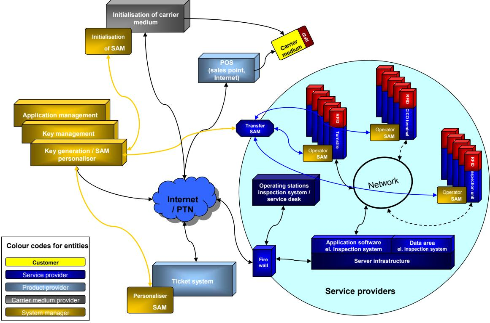

The following diagram shows the system as a whole and its principal components.

# **10.1 Suggestions on executing the eTicketing infrastructure**

### **10.1.1 Determining the protection demand for the eTicketing infrastructure**

The following general considerations apply to the eTicketing infrastructure, and these should be included when determining the protection requirements:

- 1 The systems in [Figure 10–1](#page-105-2) should simultaneously support a range of different products and carrier media, as defined in the proposed application scenarios.
- 2 Data relating to particular persons must be managed and processed.
- 3 Usage data will be generated and must be processed.
- 4 Calculation data must be logged and forwarded if "automatic fare calculation" applications and products are to be supported. Interoperability is required.
- 5 The case of interoperability being assured by agreements between the entities can also be examined as an option.

On the basis of the criteria described in Section [8.2.5](#page-59-1), the eTicketing infrastructure can be assigned to the following protection demand categories:

| Security target |                                                              | Protection demand category | Criteria for allocating to protection demand category                                                                                                        |
|-----------------|--------------------------------------------------------------|----------------------------------|--------------------------------------------------------------------------------------------------------------------------------------------------------------|
| SS1             | Technical compatibility                                   | 1                                | All of the system components are from the same sup plier. The supplier ensures that they are compatible.                                                  |
|                 |                                                              | 2                                | The system has to function with components from a small number of defined suppliers. The system man ager or a system integrator ensures compatibility. |
|                 |                                                              |                                  | Open system that has to function with components from any company in the market.                                                                          |
|                 |                                                              | 3                                | System normally acquired by offering out for public tender.                                                                                               |
| SS2             | Fallback solu tion in the event of mal function     | 1                                | Malfunction affects only a few customers.                                                                                                                    |
|                 |                                                              | 2                                | Malfunction affects many customers.                                                                                                                          |
|                 |                                                              |                                  | Malfunction affects a large proportion of customers.                                                                                                         |
|                 |                                                              | 3                                | System malfunctions (sales system, readers, verifica tion system, key management system) affect a large number of customers and entitlements.          |
| SS3             | Intuitive, fault tolerant op eration                   | 1                                | A few customers cannot operate it intuitively.                                                                                                               |
|                 |                                                              | 2                                | Many customers cannot operate it intuitively.                                                                                                                |
|                 |                                                              | 3                                | A large proportion of customers cannot operate it intui tively.                                                                                           |
| SI1             | Protection of personal data (including personal us- | 1                                | Customer's reputation is damaged.                                                                                                                            |
|                 |                                                              |                                  | Customer's social existence is damaged.                                                                                                                      |
|                 |                                                              | 2                                | If person-related invoicing information or payment de                                                                                                        |

| Security target |                                                       | Protection demand category | Criteria for allocating to protection demand category                                                                                                                                                                                        |  |
|-----------------|-------------------------------------------------------|----------------------------------|----------------------------------------------------------------------------------------------------------------------------------------------------------------------------------------------------------------------------------------------|--|
|                 | age data)                                             |                                  | tails stored in the system are stolen or manipulated, the customer may suffer considerable commercial and so cial consequences.                                                                                                        |  |
|                 |                                                       | 3                                | Customer's physical existence is damaged.                                                                                                                                                                                                    |  |
| SI2             | Protection of entitlements                         | 1                                | Predicted product-related loss of sales through coun terfeiting, damage or manipulation <1%                                                                                                                                               |  |
|                 |                                                       | 2                                | Predicted product-related loss of sales through coun terfeiting, damage or manipulation <3%                                                                                                                                               |  |
|                 |                                                       | 3                                | Predicted product-related loss of sales through coun terfeiting, damage or manipulation >3%                                                                                                                                               |  |
|                 |                                                       |                                  | DoS attacks on the system can lead to a total opera tional breakdown, thus causing considerable commer cial loss.                                                                                                                      |  |
|                 |                                                       | 1                                | Data becomes known to third parties.                                                                                                                                                                                                         |  |
|                 | Protection of                                         | 2                                | Data is lost.                                                                                                                                                                                                                                |  |
| SI3             | logistical data (anonymised usage data)         |                                  | The loss of logistical data can also occur through tech nical defects and can cause operational difficulties.                                                                                                                             |  |
|                 |                                                       | 3                                | Data is falsified.                                                                                                                                                                                                                           |  |
|                 | Reliable in voicing (per sonalised)             | 1                                | Data is temporarily unavailable.                                                                                                                                                                                                             |  |
|                 |                                                       | 2                                | Data is lost.                                                                                                                                                                                                                                |  |
| SI4             |                                                       | 3                                | Data is falsified, misused, etc.                                                                                                                                                                                                             |  |
|                 |                                                       |                                  | Invoicing fraud is a possibility in a system with multiple entities that do not trust one another.                                                                                                                                        |  |
| SI5             | Protection of applications and entitle ments | 1                                | Applications are issued by the same application issuer and entitlements by the same product owner.                                                                                                                                        |  |
|                 |                                                       | 2                                | Applications are issued by different application issuers and entitlements by different product owners, product providers and service providers. Several companies collaborate and "trust" each other in the process.                |  |
|                 |                                                       | 3                                | Applications are issued by different application provid ers, and entitlements by different product owners, product providers and service providers. Several com panies collaborate and do not "trust" each other in the process. |  |
|                 |                                                       |                                  | When entitlements are loaded onto multi-application cards or NFC mobile devices, it must always be as sumed that applications from other entities may be pre sent on the customer medium.                                           |  |

| Security target |                                                                  | Protection demand category | Criteria for allocating to protection demand category       |
|-----------------|------------------------------------------------------------------|----------------------------------|-------------------------------------------------------------|
| SP3             | Data minimi zation                                            | 1                                | Personal data is not used.                                  |
|                 |                                                                  | 2                                | Personal data is used, but no usage data is collected.      |
|                 |                                                                  | 3                                | Personal data is used, as is usage and calculation data. |
| SP4             | Protection against the creation of movement profiles | 1                                | Customer's reputation is damaged.                           |
|                 |                                                                  | 2                                | Customer's social existence is damaged.                     |
|                 |                                                                  | 3                                | Customer's physical existence is damaged.                   |

**Table 10–1 The system's protection requirements** 

### **10.1.2 Interfaces in the system as a whole**

The system shown in [Figure 10–1](#page-105-2) is reliant on interaction between all the system components. In order to facilitate the business processes described in Chapter [6](#page-31-1), the technical interfaces and operative interaction between the components have to be specified.

Furthermore, agreements must be made between the entities to regulate the responsibilities and the operational procedures.

### **10.1.2.1 Threats relevant to the eTicketing infrastructure**

The following threats relevant to the interfaces of the system as a whole can be deduced from the security targets used to determine the protection demand in Section [10.1.1.](#page-106-1)

| Threats to the contact-less interface |                                                                                            | Protection demand | Comments                                                                                                                                                                                                                                                                     |
|------------------------------------------|--------------------------------------------------------------------------------------------|----------------------|------------------------------------------------------------------------------------------------------------------------------------------------------------------------------------------------------------------------------------------------------------------------------|
| TC1                                      | Lack of compatibil ity between the interfaces of the carrier medium and reader | 3                    | A lack of compatibility between interfaces pre vents the system from working when loading and using entitlements, checking entitlements, and so on. The result is similar to a DoS attack on the system. Many customers and/or enti tlements may be affected. |
| TC2                                      | Eavesdropping                                                                              | 3                    | Unauthorised listening-in to communication between a carrier medium and a reader.                                                                                                                                                                                         |

| Threats to the contact-less interface |                                   | Protection demand | Comments                                                                                                                                                                                                                                                                                                                       |
|------------------------------------------|-----------------------------------|----------------------|--------------------------------------------------------------------------------------------------------------------------------------------------------------------------------------------------------------------------------------------------------------------------------------------------------------------------------|
| TC3                                      | DoS attack on the RF interface | 1                    | 1 Interference in RFID communication (jamming). 2 Interference in the anti-collision mecha nism for selecting the carrier medium (blocker tag) 3 Blocking the electromagnetic field of the reader (shielding). 4 Altering the resonance frequency of reader or carrier medium (de-tuning). |

**Table 10–2 Threats relevant to the contact-less interface** 

| Threats to the system as a whole |                                                    | Protection demand | Comments                                                                                                                                                                                                                                                                                                                               |
|-------------------------------------|----------------------------------------------------|----------------------|----------------------------------------------------------------------------------------------------------------------------------------------------------------------------------------------------------------------------------------------------------------------------------------------------------------------------------------|
| TS1                                 | Lack of fallback solution                       | 3                    | The lack of a fallback solution when system interfaces fail, such as the ticket sales system, administration system for carrier media and entitlements, or verification system, can lead to a complete breakdown of services (sales, in voicing, acceptance, etc.).                                                     |
| TS2                                 | Unauthorised scanning of refer ence data     | 3                    | Keys, as well as information about the media, entitlements and usage, and sometimes per sonal data and calculation data, are passed between the system components via inter faces. The retrieval of this data by unauthor ised persons would discredit the system and enable attacks.                                |
| TS3                                 | Manipulation of reference data in the system | 3                    | Keys, as well as information about the media, entitlements and usage, and sometimes per sonal data and calculation data, are passed between the system components via inter faces. The manipulation of this data by unau thorised persons represents a serious threat.                                                  |
| TS4                                 | System malfunction                                 | 3                    | Malfunctions in the interfaces between the sys tems can be caused in a range of scenarios by technical faults, incorrect operation or DoS attacks: 1 Fault in interfaces 2 Lack of availability of interfaces 3 Fault in power supply 4 Interruption in power connection 5 Physical destruction |
| TS5                                 | Lack of compatibil ity between inter faces   | 3                    | A lack of compatibility between interfaces causes malfunctions. The result is similar to a DoS attack on the system. Many customers and/or entitlements may be affected.                                                                                                                                                      |

| Threats to the system as a whole |                                                  | Protection demand | Comments                                                                                                          |
|-------------------------------------|--------------------------------------------------|----------------------|-------------------------------------------------------------------------------------------------------------------|
| TS10                                | Unjustified gather ing and storing of data | 3                    | The automatic fare calculation concept makes use of personal and person-related usage and calculation data. |

| Table 10–3 | Threats relevant to the systems |
|------------|---------------------------------|
|            |                                 |

#### **10.1.2.2 Definition of safeguards for the interfaces of the system as a whole**

Based on the relevant threats in the preceding section, this section defines general execution proposals and safeguards for the system as a whole and the system components. These safeguards are described in detail in Section [8.4.](#page-66-1)

| Threat |                                                                                            | Safeguard       | Safeguard                                                                                                                                                                                                                                                                       |
|--------|--------------------------------------------------------------------------------------------|-----------------|---------------------------------------------------------------------------------------------------------------------------------------------------------------------------------------------------------------------------------------------------------------------------------|
| TC1    | Lack of compati bility between the interfaces of the carrier medium and reader | MS1.3           | 1 Introduction of interface tests and ap proval procedures – Certification                                                                                                                                                                                                |
| TC2    | Eavesdropping                                                                              | MS2.3 MS3.3  | 1 Ensuring the confidentiality of commu nication between RFID carrier medium and terminal in order to prevent eaves dropping – Mutual, dynamic authentica tion during transmission. 2 Introduction of contact-less interface as defined by ISO/IEC14443 |
| TC3    | DoS attack on the RF interface                                                          | MS3.1           | 1 Introduction of contact-less interface as defined by ISO/IEC14443                                                                                                                                                                                                       |
| TS1    | Lack of fallback solution                                                               | MS4.3           | 1 Definition of fallback solutions in the event of system interface or system component failure – Implementation according to fallback concept                                                                                                                      |
| TS2    | Unauthorised scanning of refer ence data                                             | MS5.3 MS6.3  | 1 Securing the confidentiality of data when communicating within the system – Secure communication channel                                                                                                                                                             |
|        |                                                                                            | MS15.3          | 2 Confidential storage of data – Maintain ing privacy using multi-tenant access protection                                                                                                                                                                             |
|        |                                                                                            |                 | 3 Separation of applications – Separate storing and processing of data                                                                                                                                                                                                    |
| TS3    | Manipulation of reference data in the system                                         | MS6.3 MS7.3  | 1 Confidential storage of data – Multi tenant access protection, role model 2 Securing data integrity in order to pro                                                                                                                                               |
|        |                                                                                            | MS8.3 MS15.3 | tect against manipulation when trans mitting data within the system – MAC or signatures                                                                                                                                                                                   |
|        |                                                                                            |                 | 3 Securing data integrity when storing data – Checksums                                                                                                                                                                                                                   |

| Threat      |                                                                     | Safeguard                                                        | Safeguard                                                                                                                                                                                                                                                                                                                                                                                                                                                                                                                                                                                                                                                                                                                                                                                                                                                    |  |
|-------------|---------------------------------------------------------------------|------------------------------------------------------------------|--------------------------------------------------------------------------------------------------------------------------------------------------------------------------------------------------------------------------------------------------------------------------------------------------------------------------------------------------------------------------------------------------------------------------------------------------------------------------------------------------------------------------------------------------------------------------------------------------------------------------------------------------------------------------------------------------------------------------------------------------------------------------------------------------------------------------------------------------------------|--|
|             |                                                                     |                                                                  | 4 Separation of applications – Separate storing and processing of data                                                                                                                                                                                                                                                                                                                                                                                                                                                                                                                                                                                                                                                                                                                                                                                 |  |
| TS4         | System malfunc tion                                              | MS4.3 MS9.3 MS10.3 MS11.3 MS12.3 MS13.3 MS14.3 | 1 Definition of fallback solutions in the event of system interface or system component failure – Implementation according to fallback concept 2 Securing system functions against DOS attacks to the interfaces – Security con cept 3 Securing the function of the system against incorrect operation by employ ees and users – Tests, personnel and user introductions. 4 Secure the function of the system to prevent the technical failure of compo nents and transmission routes – Evaluation of components 5 Specifications for system concept and requirements for components with the aim of integration and interoperability – interoperability tests in accordance with test concept, evaluation 6 Ergonomic user instructions 7 Support – System-wide support |  |
| TS5 TS10 | Lack of compati bility between interfaces Unjustified gath | MS1.3 MS11.3 MS12.3 MS17.3                              | 1 Introduction of interface tests and ap proval procedures – Certification 2 Secure the function of the system to prevent the technical failure of compo nents and transmission routes – Evaluation of components 3 Specifications for system concept and requirements for components with the aim of integration and interoperability – interoperability tests in accordance with test concept, evaluation 1 Satisfying the data minimization obliga                                                                                                                                                                                                                                                                                                                                                           |  |
|             | ering and storing of data                                        |                                                                  | tion – Special safeguards                                                                                                                                                                                                                                                                                                                                                                                                                                                                                                                                                                                                                                                                                                                                                                                                                                    |  |

**Table 10–4 Safeguards for the system as a whole** 

### **10.1.2.3 Residual risks**

For technical and commercial reasons, it is not always possible to eliminate threats completely using safeguards. In such cases a certain risk remains.

The residual risk should be determined and documented as part of the planning of the actual implementation.

### **10.1.3 Readers**

Readers control the flow of information for reading from and writing to the carrier medium, using a contact-less communication protocol. The reader (PCD as defined by ISO/IEC14443) has the active role (master), while the carrier medium (PICC as defined by ISO/IEC14443) is passive (slave).

Readers are integrated into various system components:

- 1 Sales systems at sales points
- 2 Vending machines
- 3 Service desks
- 4 CICO and activation terminals for checking in and out when using electronic tickets.
- 5 Mobile inspection units

The CICO and activation terminals must have the following features:

- 1 Contact-less read/write unit with interface as defined by ISO/IEC14443A/B Part 1-4.
- 2 Capacity to store all usage data until the next data exchange with the central system.
- 3 Parallel support of multiple carrier media, applications and products (selection using ID).
- 4 Basic cryptographic functions.
- 5 Support for SAMs. Multiple SAM slots should be available (four is currently standard).
- 6 The result of the validation should be displayed visually.
- 7 At turnstiles, the length of time taken to read the media, validate the entitlement and signal authorisation or open the barrier should not exceed 300 ms. The reader, and the other components involved, must be designed to perform accordingly.

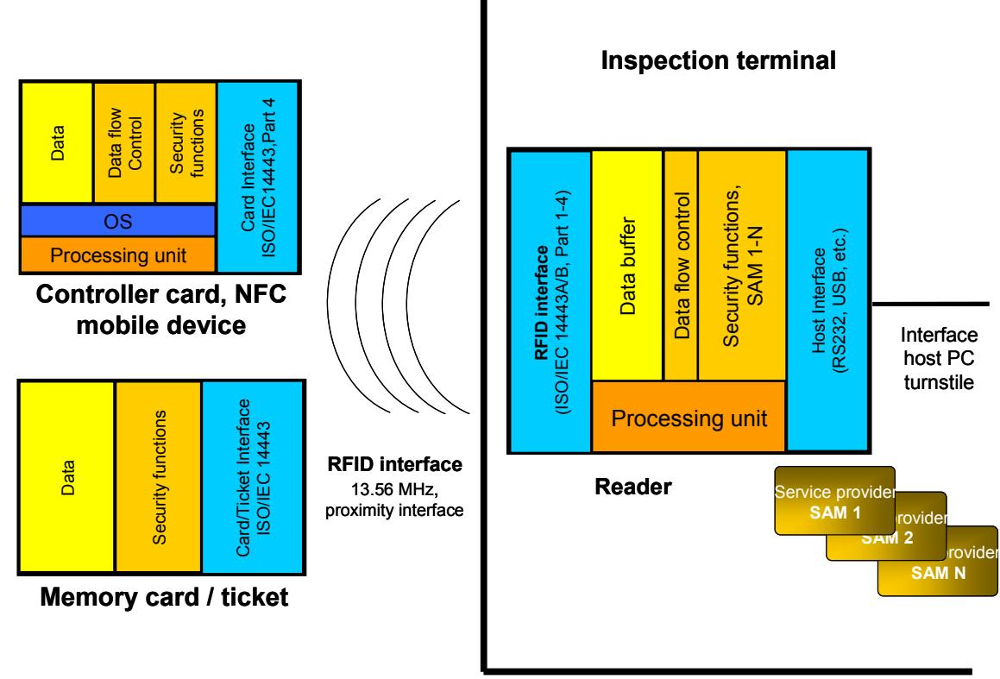

**Figure 10–2 Example of a reader with Smart Card or Smart Label** 

### **10.1.3.1 Threats relevant to the readers**

The following threats relevant to the interfaces of the system as a whole can be deduced from the assumptions used to determine the protection demand in Section [10.1.1.](#page-106-1)

| interface | Threats to the contact-less                                                                  | Protection demand | Comments                                                                                                                                                                                                                                                                                                                        |
|-----------|----------------------------------------------------------------------------------------------|----------------------|---------------------------------------------------------------------------------------------------------------------------------------------------------------------------------------------------------------------------------------------------------------------------------------------------------------------------------|
| TC1       | Lack of compatibil ity between the in terfaces of the car rier medium and reader | 3                    | A lack of compatibility between interfaces pre vents the system from working when loading and using entitlements, checking entitlements, and so on. The result is similar to a DoS attack on the system. Many customers and/or entitle ments may be affected.                                                    |
| TC2       | Eavesdropping                                                                                | 3                    | Unauthorised listening-in to communication be tween a carrier medium and a reader.                                                                                                                                                                                                                                           |
| TC3       | DoS attack on the RF interface                                                            | 3                    | 1 Interference in RFID communication (jam ming). 2 Interference in the anti-collision mechanism for selecting the carrier medium (blocker tag). 3 Blocking the electromagnetic field of the reader (shielding). 4 Altering the resonance frequency of reader or carrier medium (de-tuning). |

| Table 10–5 | Threats relevant to the contact-less interface |  |
|------------|------------------------------------------------|--|
|            |                                                |  |

|     | Threats to the reader                                      | Protection demand | Comments                                                                                                                                                                                                                                                                                                                                                                                                                                                       |
|-----|------------------------------------------------------------|----------------------|----------------------------------------------------------------------------------------------------------------------------------------------------------------------------------------------------------------------------------------------------------------------------------------------------------------------------------------------------------------------------------------------------------------------------------------------------------------|
| TR1 | Unauthorised ma nipulation of refer ence information | 3                    | The manipulation of reference information (keys, evaluation algorithms, blacklists and whitelists) can be employed for unauthorised use or for DoS.                                                                                                                                                                                                                                                                                                   |
| TR2 | Unauthorised scan ning of reference information      | 3                    | The retrieval of reference information (keys, evaluation algorithms, blacklists and whitelists) can be employed for unauthorised use (e.g. counterfeiting of entitlements) and for DoS.                                                                                                                                                                                                                                                               |
| TR3 | Reader malfunction                                         | 3                    | Reader malfunctions can be caused in a range of scenarios by technical faults, incorrect opera tion or DoS attacks: 1 Fault in contact-less interface 2 Fault in reference information (keys, black lists, etc) 3 Fault in application implementation 4 Fault in evaluation algorithms for entitle ments 5 Fault in power supply 6 Interruption of the link to the central system 7 Physical destruction |

| Threats to the reader |                                                  | Protection demand | Comments                                                                                                                                                                                                                                                                     |
|-----------------------|--------------------------------------------------|----------------------|------------------------------------------------------------------------------------------------------------------------------------------------------------------------------------------------------------------------------------------------------------------------------|
|                       |                                                  |                      | 8 Fault in operational instruction functions                                                                                                                                                                                                                              |
| TR4                   | Lack of user in structions                    | 3                    | A lack of user-friendliness at vending machines and the terminals used for activating entitle ments and checking-in / checking-out can cause considerable operative problems.                                                                                       |
| TS1                   | Lack of fallback solution                     | 3                    | The lack of a fallback solution when system interfaces fail, such as the ticket sales system, administration system for carrier media and entitlements, or verification system, can lead to a complete breakdown of services (sales, in voicing, CICO, etc.). |
| TS5                   | Lack of compatibil ity between inter faces | 3                    | A lack of compatibility between interfaces causes malfunction. The result is similar to a DoS attack on the system. Many customers and/or entitlements may be affected.                                                                                             |

**Table 10–6 Threats relevant to the reader** 

### **10.1.3.2 Definition of safeguards for the reader and its applications**

Based on the relevant threats in the preceding section, this section defines general execution proposals and safeguards for the reader and its applications. These safeguards are described in detail in Section [8.4](#page-66-1).

| Threat |                                                                                            | Safeguard      | Safeguard                                                                                                                                                                                                                                                                     |
|--------|--------------------------------------------------------------------------------------------|----------------|-------------------------------------------------------------------------------------------------------------------------------------------------------------------------------------------------------------------------------------------------------------------------------|
| TC1    | Lack of compati bility between the interfaces of the carrier medium and reader | MS1.3 MR1.3 | 1 Introduction of interface tests and ap proval procedures – Certification                                                                                                                                                                                              |
| TC2    | Eavesdropping                                                                              | MS2.3 MS3.3 | 1 Ensure the confidentiality of communi cation between RFID carrier medium and terminal in order to prevent eaves dropping – Mutual, dynamic authentica tion during transmission. 2 Introduction of contact-less interface as defined by ISO/IEC14443 |
| TC3    | DoS attack on the RF interface                                                          | MS3.1          | 1 Introduction of contact-less interface as defined by ISO/IEC14443                                                                                                                                                                                                     |
| TR1    | Unauthorised manipulation of reference infor mation                               | MR2.3          | 1 Protection of reference information against retrieval, data errors and ma nipulation – Advanced protection                                                                                                                                                         |
| TR2    | Unauthorised scanning of refer ence information                                      | MR2.3          | 1 Protection of reference information against retrieval, data errors and ma nipulation – Advanced protection                                                                                                                                                         |

| Threat |                                                 | Safeguard                 | Safeguard                                                                                                                                                                                                                                                                                                                 |
|--------|-------------------------------------------------|---------------------------|---------------------------------------------------------------------------------------------------------------------------------------------------------------------------------------------------------------------------------------------------------------------------------------------------------------------------|
| TR3    | Reader malfunc tion                          | MR3.3                     | 1 Protection of the reader against mal function – Evaluation                                                                                                                                                                                                                                                        |
| TR4    | Lack of user in structions                   | MS13.3                    | 1 Ergonomic user instructions                                                                                                                                                                                                                                                                                          |
| TS1    | Lack of fallback solution                    | MS4.3                     | 1 Definition of fallback solutions in the event of system interface or system component failure – Implementation according to fallback concept                                                                                                                                                                |
| TS5    | Lack of compati bility between interfaces | MS1.3 MS11.3 MS12.3 | 1 Introduction of interface tests and ap proval procedures – Certification 2 Secure the function of the system to prevent the technical failure of compo nents and transmission routes – Evaluation of components 3 Specification of system concept and component requirements – Evaluation |

**Table 10–7 Safeguards for the reader and its applications** 

### **10.1.3.3 Residual risks**

For technical and commercial reasons, it is not always possible to eliminate threats completely using safeguards. In such cases a certain risk remains.

The residual risk should be determined and documented as part of the planning of the actual implementation.

### **10.1.4 Sale, inspection and management systems**

### **10.1.4.1 Sales systems**

Access to the products must be easy and inexpensive for all potential customers, which is why a range of points of sale should be supported. These are described in the following:

### **Sales point**

This could be, for instance, the office of a transport company (e.g. *CA customer contract partner*) or a travel agent.

#### Sales procedure

The customer visits the sales point in person and purchases the product there:

- Identification, if required, is by identity card.
- The booking is done in dialogue with the customer at the sales point.
- Payment is made at the sales point.

If the carrier medium can be produced there and then, or the entitlement can be loaded onto an existing customer medium (see "*Technical equipment*"), then the customer can take the

product away with him straight away. If not, then the product and the carrier medium are sent by post or held at the sales point, ready for subsequent collection.

#### Technical equipment

The sales point has direct access to the ticket sales system. This is a precondition for services such as seat reservation.

In many instances it makes commercial sense to install equipment such as an RFID ticket printer which can initialise and load entitlements onto certain carrier media. Furthermore, a simple contact-less reader at the sales point can provide a cost-effective way of loading entitlements onto an existing customer medium. If such a contact-less reader exists, then in future it could become possible to utilise an electronic proof of identity as a means of securely and automatically transferring personal data into the ticket system (e.g. for setting up a customer account), or for secure identification.

Personal and IT infrastructure at the sales point is not always trustworthy.

#### **Vending and collection machines**

At vending machines, products are sold and issued in a direct interaction between the vending machine and the customer.

Vending machines are installed in customer centres, railway stations, bus and tram stops, and also inside vehicles. They are especially suitable for selling high-demand products which do not require complex procedures to order or produce.

Vending machines that are used in vehicles must be able to work offline. The exchange of data with a sales system is only possible at certain intervals.

#### Selling personalised Products

At present there is no method of identifying a customer for the first time, securely and automatically. This means that registration as defined in Process P1A cannot take place at a vending machine, and customer accounts cannot be set up. This may change in future with the introduction of the electronic identity card (eID).

It is however possible to load new entitlements onto media belonging to known customers who already possess a known personalised customer medium. In this case, identification is done using the existing customer medium itself.

#### Selling anonymous products

In the simplest case, anonymous carrier media and entitlements are sold through vending machines.

The customer purchases or collects the product at a vending machine:

- Booking is done at a vending machine.
- Payment is made directly using methods such as Maestro or credit cards.
- When collecting, the customer identifies himself using his own customer medium, or in future an eID or other electronic means of identification.

The carrier medium for the product purchased is produced by the vending machine. Alternatively, the entitlement can be loaded onto an existing customer medium (see "*Technical equipment*"). The customer can then take the product away.

#### Collecting pre-ordered products

Vending machines can serve as issuing points for products ordered by Internet or telephone.

If the vending machine is used for collecting pre-ordered entitlements, then the customer must always identify himself. If the customer possesses his own customer medium then this can be used for identification and for receiving the entitlement. If not, then other processes must be used for identification (e.g. credit card).

#### Technical equipment

The vending machine requires direct access to the ticket sales system, at least for some of the time. Another condition is that it must incorporate a ticket printer with an in-built reader which can initialise the carrier media issued, and load entitlements onto them.

If the machine is to be able to load entitlements onto existing customer media, then uninterrupted access is required to the ticket sales system and the management system for carrier media and applications. A compatible reader must also be installed in the vending machine.

#### **Internet, call centres, ordering by post**

#### Sales procedure

The customer places the order by telephone, Internet or fax from any location:

- The booking, choice of seat etc. can be made in a direct interaction when using the Internet or telephone. Written orders do not allow this.
- Payment is made by Maestro, credit card or direct debit.
- For secure identification, the personal data sent by the customer may have to be checked.

The carrier medium and product are produced centrally and sent by post. Alternatively it can be agreed that the product will be collected somewhere such as an issuing point or vending machine (see Vending and collection machines).

#### Technical equipment

The product provider operates an Internet sales platform or a call centre. The customer does not require any particular technical equipment.

The carrier medium and product can be produced using a mass personaliser in a secure environment.

#### **Internet**

#### Sales procedure

The customer places the order interactively by Internet from any location (e.g. at home).

If the customer has a customer medium which already contains the necessary application, then the required product can be loaded onto it. If a chip card is being used, then a contactless reader is required – such as one that works with a home computer, for example. If an NFC mobile device is to be used as the customer medium, then the product can also be loaded "Over the Air":

- • Booking, seat reservation and so on can be done in a direct interaction when using the Internet.
- Identification is done using the customer medium and the personal data stored in the application.
- Payment is made using Maestro, credit card or direct debit.

The entitlement is loaded directly into the application on the customer medium.

If the customer does not yet have a customer medium but does have a contact-less reader, then secure identification of the customer will in future be able to take place using a eID, thus enabling the customer medium to be ordered securely and conveniently.

#### Technical equipment

The product provider operates an Internet sales platform, which is connected to the key, carrier and application management systems. The customer requires a customer medium containing the appropriate application, and – if a chip card or eID is being used – a contact-less home reader device.

Provided suitable media, readers and protocols are used, there will be no weak-spots in the process of loading new products onto an existing customer medium, or registering and ordering (see Process P1A.4).

#### **10.1.4.2 Ticket system**

The ticket system supports the primary selling and handling processes:

- 1 Registering and ordering
- 2 Creating the entitlement
- 3 Payment, and checking creditworthiness
- 4 Managing the entitlements sold
- 5 Forwarding the necessary data to the verification system

Customer data and orders are stored in the ticket system. Provided the transport service and product support it, seating can also be allocated using seating plans which are also stored there. The ticket system also incorporates a procedural management system which performs actions such as address comparisons and payment processing including credit checks, and which also initiates the production and dispatch of carrier media and entitlements.

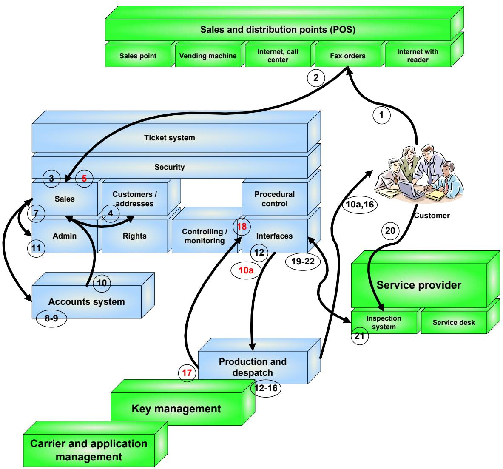

**Figure 10–3 An example of a ticket system with possible process flows** 

A ticket system has interfaces to the key management system and the system which administers the carrier media and applications. All of the information required to enter a special event (apart from the information transferred in the key management system) is gathered together by the ticket system and sent to the service provider via a defined interface.

There are other interfaces to the sales points and the places where the carrier media are produced. This also includes sales and distribution, and the management of loading applications and products onto existing media via the Internet.

It can be assumed that a ticket system will be housed in a secure environment. Personaliser SAMs must be connected to it in order to be able to produce entitlements and load them onto carrier media.

From the point of view of the service provider, more than one ticket system can be used.

### **10.1.4.3 Central verification system**

The verification system helps the service provider to check the customers' journey entitlements, and to gather and pass on information relevant to invoicing. This requires the following functions:

1 Support of Process P3 for checking in, checking out and if necessary activation.

- 2 Support for the particular carrier media, applications and products.
	- a Implementation of the technical procedures required to support the carrier media, applications and products.
	- b Implementation and management of SAMs.
- 3 Control of terminals (CICO terminals, access barriers, mobile conductor's terminals, etc).
- 4 Receiving, distributing and utilising the information provided by the ticket systems.
- 5 Receiving, distributing and utilising the keys and identifiers provided by the system manager and registrar.
- 6 Reporting invoicing-related data and usage history to the ticket systems.

The terminals in public transport systems are not usually connected permanently to a data network. This applies especially to terminals in vehicles. That means all of the information required for entry, evaluation and activation of entitlements, and where applicable fare calculation, has to be stored locally in the terminals.

#### **10.1.4.4 Terminals**

The job of a terminal is to read, evaluate and if necessary activate the entitlement when the customer checks in or out. A contact-less reader is integrated into the terminal.

In normal operation, stationary terminals connect daily for at least a certain amount of time to the central verification system via a data network (LAN or WLAN) or by exchanging memory media. Information required to evaluate the entitlements is updated in this way. CICO data is also sent by that means from the terminal to the central system. In the case of mobile devices and devices in vehicles, longer intervals may lapse between connections, and data may be exchanged using physical data carriers.

Since the terminals are connected only temporarily to the backend system, all of the functions required to communicate with the carrier medium and application must be supported locally in the terminal. This can mean considerable expense when introducing new technologies. It is therefore sensible, when defining applications, to base communication protocols, cryptographic methods etc. on open, standardised processes and to rely on flexible, hardware-independent methods of implementation.

As well as the application-specific functions, all of the information specific to particular events that is required to evaluate the entitlement must be stored locally in the terminal (service provider ID, blacklists, carrier medium ID, application ID, product IP, various levels of keys, and so on). It must also be possible to store the access history temporarily in the terminal.

The security-related safeguards for the reader incorporated into the terminal are detailed in Section [10.1.3.2](#page-114-1).

We can differentiate between permanently installed and mobile devices.

1 Permanently installed devices

Some CICO terminals are installed permanently on platforms or at tram or bus stops. These devices are usually connected to the central verification system via a LAN.

Some European cities utilise permanent turnstiles to regulate access to the platform. These turnstiles have terminals with readers integrated into them, and are connected to the central verification system via a LAN. Once the entitlement has been evaluated successfully, access is granted by unlocking the turnstile and allowing it to rotate. The turnstiles are situated at the entrances to the platform.

- 2 Mobile devices
	- a Mobile terminals

Some CICO terminals are installed in vehicles. These devices can only exchange data with the central verification system temporarily. They are equipped with service provider SAMs.

b Monitoring units

There are also portable inspection units used by conductors and similar personnel to inspect tickets and also for sales purposes. These must also be fully operational when offline. They are fitted with personaliser SAMs and service provider SAMs.

#### **10.1.4.5 Service desks**

In real-life operation, a certain amount of defective customer media, incorrect operations, attacks on security and fraud attempts is inevitable. The service desk is the point of contact if problems occur when checking in.

Valid entitlements do not expire when the inspection equipment or customer medium fails, or if the customer does something incorrect. At the service desk, which is run by the service provider or product provider, the customer can receive a replacement entitlement or a refund.

For this to happen it must be possible to perform Process P4, "Blocking entitlements and carrier media", and to issue a replacement medium, quickly and efficiently.

The following tasks are undertaken at the service desk:

- 1 Check the function of the carrier medium and the status of the entitlement.
- If a fault occurs, then:

2 Check whether the medium is genuine and/or check the identity of the customer. If positive, then:

- 3 Block the medium and entitlement presented.
- 4 Issue a replacement medium with a new entitlement.
- 5 Update the information in the ticket system and the carrier and application management systems.
- 6 Transfer the information from the ticket system to the verification system.

Emergency scenarios for a verification system that uses access barriers malfunctions are based on the personnel who keep order, and the service desk. Both are therefore of key importance to system security. If an attacker succeeds in causing a malfunction which overburdens the personnel and the service desk, it is equivalent to a successful DoS attack on the entire verification system.

#### **10.1.4.6 Management system for carrier media and applications**

For the processes of loading applications and entitlements, and for the processes in which the customer medium is used for identification and for utilising transport services, it is important to know the status of the carrier medium and the applications on it.

For this reason, the life-cycle of any carrier medium used in the system must be documented reliably. To this end a database is used which is connected via interfaces to the ticket system and the key management system. It contains information such as the following for every carrier medium:

- ID of carrier medium
- Type, version
- Provider of carrier medium (ID via registrar)
- • Issuer of carrier medium (ID via registrar)
- Customer
- Status (e.g. new/active/blocked)
- Stored applications (see below)
- etc.

Similarly, the life-cycle of the applications stored on the carrier medium must also be documented. Several different applications can be stored.

- ID of application
- Type, version
- Application provider (ID via registrar)
- Application issuer (ID via registrar)
- Customer
- Status (e.g. new/active/blocked/delete)
- Stored entitlements including ID of product provider
- Active entitlements / deletable entitlements

#### **10.1.4.7 Threats relevant to sale, inspection and management systems**

The following threats relevant to the interfaces of the system as a whole can be deduced from the assumptions used to determine the protection demand in Section [10.1.1.](#page-106-1)

| Threats to the sales, inspec tion and management sys tems |                                                    | Protection demand | Comments                                                                                                                                                                                                                                                                   |
|-----------------------------------------------------------------|----------------------------------------------------|----------------------|----------------------------------------------------------------------------------------------------------------------------------------------------------------------------------------------------------------------------------------------------------------------------|
| TS1                                                             | Lack of fallback solution                       | 3                    | The lack of a fallback solution when system components fail, such as the ticket sales sys tem, administration system for carrier media and entitlements, or verification system, can lead to a complete breakdown of services (sales, invoicing, CICO, etc) |
| TS2                                                             | Unauthorised scanning of refer ence data     | 3                    | The background systems store information about the media, entitlements and usage, and sometimes personal data and calculation data. The retrieval of this data by unauthorised per sons would discredit the system and enable attacks.                      |
| TS3                                                             | Manipulation of reference data in the system | 3                    | The background systems store information about the media, entitlements and usage, and sometimes personal data and calculation data. The manipulation of this data by unauthorised persons represents a serious threat.                                         |
| TS4                                                             | System malfunction                                 | 3                    | Individual system component malfunctions can be caused in a range of scenarios by technical faults, incorrect operation or DoS attacks: 1 Fault in local and central systems 2 Lack of availability of local and central systems                      |

| Threats to the sales, inspec tion and management sys tems |                                                                                    | Protection demand | Comments                                                                                                                                                                                                                                                                         |
|-----------------------------------------------------------------|------------------------------------------------------------------------------------|----------------------|----------------------------------------------------------------------------------------------------------------------------------------------------------------------------------------------------------------------------------------------------------------------------------|
|                                                                 |                                                                                    |                      | 3 Fault in data storage 4 Fault in power supply 5 Interruption of the link to the central sys tem 6 Protection against physical attacks (dis mantling, destruction)                                                                                   |
| TS5                                                             | Lack of compatibil ity between inter faces                                   | 3                    | A lack of compatibility between interfaces causes malfunctions. The result is similar to a DoS attack on the system. Many customers and/or entitlements may be affected.                                                                                                |
| TS6                                                             | Unauthorised scanning of sales and calculation data                       | 3                    | Unauthorised, active retrieval of calculation data                                                                                                                                                                                                                            |
| TS7                                                             | Unauthorised overwriting / ma nipulation of sales and calculation data | 3                    | Unauthorised writing of calculation data onto the carrier medium for the purpose of manipu lating or compromising data.                                                                                                                                                    |
| TS8                                                             | Protection of client specific applica tions and entitle ments             | 3                    | If multiple entities are supported by the system with sales data, entitlements and applications, these may be influenced or damaged when used mutually.                                                                                                                 |
| TS9                                                             | Falsification of identity data                                                  | 2                    | The customer may need to be identified when setting up a customer account, or purchasing or collecting a product. Using a false identity would allow someone to obtain benefits such as entitlements to the detriment of other cus tomers or the product provider |
|                                                                 |                                                                                    |                      | The protection demand relating to protection of entitlements is categorised as 2 in this case, since attacks only affect individual entitle ments.                                                                                                                      |
| TS10                                                            | Unjustified gather ing and storing of data                                   | 3                    | Gathering and storing data without justification infringes the stipulation on data minimization.                                                                                                                                                                              |

### **Table 10–8 Threats relevant to sales, inspection and management systems**

### **10.1.4.8 Definition of safeguards for sale, inspection and management systems**

Based on the relevant threats in the preceding section, this section defines general execution proposals and safeguards. These safeguards are described in detail in Section [8.4](#page-66-1).

| Threat |                                                    | Safeguard       | Safeguard                                                                                                                                                   |  |
|--------|----------------------------------------------------|-----------------|-------------------------------------------------------------------------------------------------------------------------------------------------------------|--|
| TS1    | Lack of fallback solution                       | MS4.3           | 1 Definition of a fallback solution in the event of system interface or system component failure – Implementation according to fallback concept |  |
| TS2    | Unauthorised scanning of refer ence data     | MS5.3           | 1 Securing the confidentiality of data                                                                                                                   |  |
|        |                                                    | MS6.3           | when communicating within the system – Secure communication channel                                                                                      |  |
|        |                                                    | MS15.3          | 2 Confidential storage of data – Introduc tion of multi-tenant access protection, role model                                                       |  |
|        |                                                    |                 | 3 Separation of applications – Separate storing and processing of data                                                                                |  |
| TS3    | Manipulation of reference data in the system | MS6.3           | 1 Confidential storage of data – Maintain ing privacy using multi-tenant access                                                                       |  |
|        |                                                    | MS7.3           | protection, role model                                                                                                                                      |  |
|        |                                                    | MS8.3           | 2 Securing the data integrity in order to protect against manipulation when                                                                           |  |
|        |                                                    | MS15.3          | transmitting data within the system – MAC or signatures                                                                                                  |  |
|        |                                                    |                 | 3 Securing data integrity when storing data – Checksums                                                                                               |  |
|        |                                                    |                 | 4 Separation of applications – Separate storing and processing of data                                                                                |  |
| TS4    | System malfunc tion                             | MS4.3           | 1 Definition of a fallback solution in the                                                                                                               |  |
|        |                                                    | MS9.3           | event of system interface or system component failure – Implementation                                                                                   |  |
|        |                                                    | MS10.3          | according to fallback concept 2 Securing system functions against DOS                                                                                 |  |
|        |                                                    | MS11.3          | attacks to the interfaces – Security con cept                                                                                                            |  |
|        |                                                    | MS13.3          | 3 Securing the function of the system                                                                                                                    |  |
|        |                                                    | MS14.3          | against incorrect operation by employ ees and users – Tests, personnel and user introductions.                                                        |  |
|        |                                                    |                 | 4 Secure the function of the system to prevent the technical failure of compo nents and transmission routes – Evaluation of components          |  |
|        |                                                    |                 | 5 Ergonomic user instructions                                                                                                                            |  |
|        |                                                    |                 | 6 Support – System-wide support                                                                                                                          |  |
| TS5    | Lack of compati bility between interfaces    | MS1.3 MS11.3 | 1 Introduction of interface tests and ap proval procedures – Certification                                                                            |  |
|        |                                                    | MS12.3          | 2 Secure the function of the system to prevent the technical failure of compo                                                                         |  |
|        |                                                    |                 | nents and transmission routes – Evaluation of components                                                                                                 |  |
|        |                                                    |                 | 3 Specifications for system concept and requirements for components with the aim of integration and interoperability –                             |  |

| Threat |                                                                                    | Safeguard                         | Safeguard                                                                                                                                                                                                                                                                                                                                                                                                                   |  |
|--------|------------------------------------------------------------------------------------|-----------------------------------|-----------------------------------------------------------------------------------------------------------------------------------------------------------------------------------------------------------------------------------------------------------------------------------------------------------------------------------------------------------------------------------------------------------------------------|--|
|        |                                                                                    |                                   | interoperability tests in accordance with test concept, evaluation                                                                                                                                                                                                                                                                                                                                                       |  |
| TS6    | Unauthorised scanning of sales and calculation data                       | MS5.3 MS6.3 MS15.3          | 1 Securing the confidentiality of data when communicating within the system – VPN or similar 2 Confidential storage of data – Introduc tion of multi-tenant access protection in accordance with role model 3 Separation of applications – Separate storing and processing of data                                                                                                            |  |
| TS7    | Unauthorised overwriting / ma nipulation of sales and calculation data | MS6.3 MS7.3 MS8.3 MS15.3 | 1 Confidential storage of data – Introduc tion of multi-tenant access protection in accordance with role model 2 Securing the data integrity in order to protect against manipulation when transmitting data within the system – MAC or signatures 3 Securing data integrity when storing data – Checksums 4 Separation of applications – Separate storing and processing of data |  |
| TS8    | Protection of cli ent-specific appli cations and enti tlements            | MS6.3 MS15.3                   | 1 Confidential storage of data – Maintain ing privacy using multi-tenant access protection, role model 2 Separation of applications – Separate storing and processing of data                                                                                                                                                                                                                             |  |
| TS9    | Falsification of identity data                                                  | MS16.2                            | 1 Customer identification – Application form, customer medium                                                                                                                                                                                                                                                                                                                                                         |  |
| TS10   | Unjustified gath ering and storing of data                                   | MS17.3                            | 1 Gathering and storing data without justi fication infringes the stipulation on data minimization.                                                                                                                                                                                                                                                                                                                |  |

**Table 10–9 Safeguards for sale, inspection and management systems** 

### **10.1.4.9 Residual risks**

For technical and commercial reasons, it is not always possible to eliminate threats completely using safeguards. In such cases a certain risk remains.

The residual risk should be determined and documented as part of the planning of the actual implementation.

## **10.1.5 Key management**

The job of the key management system is to provide keys used by multiple entities for all of the carrier media, applications and products in the system, and to do so securely and reliably. Key management is the responsibility of the security manager. A number of use cases are described in Section [7.3](#page-41-2). [GSHB] can be used as a general guideline for implementation. Keys are generated individually for each purpose. As far as possible, a distinct key is allocated to each form of interaction (e.g. loading applications, writing entitlements, reading entitlements, writing usage data). The precise characteristics have to be ascertained for each application scenario as part of the creation of a specific security concept that harmonises with the role model.

The keys are generated in a secure environment and stored in a secure database. The various forms of SAM are also produced in this secure environment. The documentation of the life-cycle of the SAMs that are produced and issued is another of the key management system's tasks.

The SAMs and keys are generated by the security manager or his agents as and when users need them. The following types of SAM are basically supported:

| Initialiser SAMs      | Initialiser SAMs are required to initialise carrier media and load applications.                                                                                 |
|-----------------------|---------------------------------------------------------------------------------------------------------------------------------------------------------------------|
| Personaliser SAMs     | Personaliser SAMs are required to load entitlements in the ap propriate applications.                                                                            |
| Service provider SAMs | Service provider SAMs are required by the service provider to read and activate entitlements, and in some cases to send the usage data to the carrier medium. |

Where required there may also be special SAMs that help transmit the product ID of the suppliers of carrier media, applications and entitlements securely onto the carrier medium.

Key information is normally loaded onto a SAM when the user requires it. The aim of an initialiser is, for example, to enable all of the carrier media that occur in its area to be initialised with the necessary applications without changing the SAM.

This kind of user-specific SAM must be configured under an agreement between the user of the SAM and the system manager.

The SAM should support the secure loading of new keys via a network. Ideally, updating can be done by the security manager directly.

#### **10.1.5.1 Key management for public transport service providers / SAMs for service providers**

Specific key information is required to evaluate entitlements. The reliability and security of the key management system involved in this is of critical importance to the overall concept. If the keys held by the service provider do not correspond with those in the carrier media and entitlements used for entry, then the evaluation of entitlements will not work. If keys are lost or made public, then the entire security concept will be discredited.

In this proposal, special SAMs are issued to the service provider as the operator of the verification system. These service provider SAMs contain the key information relevant to the services offered, and must be integrated into the terminals.

When service provider SAMs are used key management is restricted to the handing-over, handling and management of the SAMs. Since the keys are protected against unauthorized reading when using SAMs, the risk – and therefore the extent of the protection required – is limited. The use of standardised SAMs also reduces the expense of adapting to new applications.

### **10.1.5.2 Threats relevant to the key management system**

The following threats relevant to the interfaces of the system as a whole can be deduced from the assumptions used to determine the protection demand in Section [10.1.1.](#page-106-1)

| Threats to the key man agement system |                                         | Protection demand | Comments                                                                                                                                                                                                                                                                                                                                                                                                                                                                                                                   |  |
|------------------------------------------|-----------------------------------------|----------------------|----------------------------------------------------------------------------------------------------------------------------------------------------------------------------------------------------------------------------------------------------------------------------------------------------------------------------------------------------------------------------------------------------------------------------------------------------------------------------------------------------------------------------|--|
| TK1                                      | Lack of key data quality             | 3                    | Deficient key quality increases the chances of successful attacks.                                                                                                                                                                                                                                                                                                                                                                                                                                                      |  |
| TK2                                      | Unauthorised scanning of key data | 3                    | The retrieval of key data by unauthorised per sons can discredit the system and facilitate attacks, e.g. on any cryptographically protected data or functions.                                                                                                                                                                                                                                                                                                                                                    |  |
| TK3                                      | Manipulation of key data             | 3                    | The manipulation of key data can discredit the system's security concept and facilitate at tacks, e.g. on any cryptographically protected data or functions. Manipulation can affect the generation of keys, the production of key carriers, the transmission of keys and the local use of keys.                                                                                                                                                                                                         |  |
| TK4                                      | Key management system malfunction    | 3                    | Key management system malfunctions can be caused in a variety of scenarios by technical faults, incorrect operation or DoS attacks: 1 Fault in local and central systems 2 Lack of availability of local and central systems 3 Fault in data storage 4 Fault in specific application implementa tion 5 Fault in evaluation algorithms for entitle ments 6 Fault in power supply 7 Interruption of the link to the central sys tem 8 Physical destruction |  |
| TK5                                      | Lack of fallback solution            | 3                    | The availability of the necessary key informa tion is essential if the system as a whole is to work at all. If the key management system mal functions and there is no fallback solution, the function of the entire system will be threatened.                                                                                                                                                                                                                                                                |  |

### **Table 10–10 Threats relevant to the key management system**

### **10.1.5.3 Definition of safeguards for the key management system**

Based on the relevant threats in the preceding section, this section defines general execution proposals and safeguards. These safeguards are described in detail in Section [8.4](#page-66-1).

| Threat |                                          | Safeguard               | Safeguard                                                                                                                                                                                                                                                                                                                                                         |  |
|--------|------------------------------------------|-------------------------|-------------------------------------------------------------------------------------------------------------------------------------------------------------------------------------------------------------------------------------------------------------------------------------------------------------------------------------------------------------------|--|
| TK1    | Lack of key data quality              | MK1.3 MK2.3          | 1 Secure generation and import of keys – Evaluation and certification according to CC or a process of the same standard 2 Introduction of key management for symmetric and asymmetric keys with sufficient key length – Secure, flexible key management concept                                                                           |  |
| TK2    | Unauthorised scanning of key data  | MK3.3 MK7.3          | 1 Access protection for cryptographic keys (read and write access) – Evalua tion and certification according to CC or a process of the same standard 2 Separation of keys – Separate storage and handling of keys                                                                                                                            |  |
| TK3    | Manipulation of key data              | MK3.3 MK7.3 MK8.3 | 1 Access protection for cryptographic keys (read and write access) – Evalua tion and certification according to CC or a process of the same standard 2 Separation of keys – Separate storage and handling of keys 3 Loading new keys – Securing the au thenticity and integrity of entitlements – Complex authentication concept |  |
| TK4    | Key management system malfunc tion | MK4.3 MK5.3          | 1 Specification of performance and the required securing of the function of se curity components – Evaluation 2 Availability of key management system (fallback solution) – Implementation ac cording to fallback concept and back-up of keys in Trust Centre                                                                             |  |
| TK5    | Lack of fallback solution             | MK5.3 MK6.3          | 1 Availability of key management system (fallback solution) – Implementation ac cording to fallback concept and back-up of keys in Trust Centre 2 Definition of actions in the event of keys being compromised – Compromise of non-diversified keys                                                                                       |  |

| Table 10–11 | Safeguards for the key management system |
|-------------|------------------------------------------|
|-------------|------------------------------------------|

### **10.1.5.4 Residual risks**

For technical and commercial reasons, it is not always possible to eliminate threats completely using safeguards. In such cases a certain risk remains.

The residual risk should be determined and documented as part of the planning of the actual implementation.

# **10.2 Suggestions on executing the carrier media**

The diverse products involved in eTicketing for public transport can be offered on a variety of carrier media. Furthermore, a range of different chips are available for these carrier media.

|  |  | The following two tables categorise the carrier media and chip products. |
|--|--|--------------------------------------------------------------------------|
|  |  |                                                                          |

| Category                                                    | Characteristics of the carrier medium                                                                                                                                                                                                                                                                   | Security features of the card itself                                                                                                                                                                                                                                                                                 | Matching chip category                                                      |
|-------------------------------------------------------------|------------------------------------------------------------------------------------------------------------------------------------------------------------------------------------------------------------------------------------------------------------------------------------------------------------|-------------------------------------------------------------------------------------------------------------------------------------------------------------------------------------------------------------------------------------------------------------------------------------------------------------------------|-----------------------------------------------------------------------------------|
| Contact less Smart Ticket                          | • Multi-layered, laminated paper ticket. Choice of for mats: IATA, ID1, etc with ID1 antenna • Cost: < €0.20 not including chip • Typical useful life: approx. 3 months                                                                                                      | • Simple visual security fea tures such as security fi bres, fluorescent inks for access control • Visual personalisation • Option: tear off to activate manually as a fallback solu tion                                                                                                 | Low-cost memory chip, conven tional memory chip                 |
| Contact less se cure chip card                     | • Contact-less PVC chip card. Choice of formats: normally ID1 with ID1 antenna • Cost: < €1 not including chip • Typical useful life: approx. 3 years                                                                                                                           | • More advanced visual secu rity features such as holo grams and microprint; • Visual personalisation • Visible activation not possi ble, since used more than once                                                                                                                          | Secure, flexible memory chip                                             |
| Contact less se cure multi applica tion card | • Contact-less PVC or PC chip card. Choice of for mats: normally ID1, ID1 an tenna • Cost: • < €1 not including chip for standard design, or < €3 not including chip for card with high-level visual security features • Typical useful life: approx. 3 years | • The actual card can be like the "Contact-less secure chip card" or a high-quality card (e.g. PC) with visual security features (e.g. guil loche, OVI, embossing). • Visual personalisation • Optional display • Visible activation not possi ble, since used more than once | Secure controller chip with operating and ap plication software |

| Category                  | Characteristics of the carrier medium                                                                                                                                                                                                                                                   | Security features of the card itself                                                                                                                                                                 | Matching chip category                                                      |
|---------------------------|--------------------------------------------------------------------------------------------------------------------------------------------------------------------------------------------------------------------------------------------------------------------------------------------|---------------------------------------------------------------------------------------------------------------------------------------------------------------------------------------------------------|-----------------------------------------------------------------------------------|
| NFC mo bile de vice | • Mobile device with NFC interface: • Display (shows relevant information) • Keyboard • User can modify application data • Over-the-air application management (loading, per sonalising, deleting, version management) by service provider | • Contact-less interface can be switched on and off by user • SIM card used for identifica tion and authentication • Service provider can block the application over-the-air | Secure controller chip with operating and ap plication software |

### **Table 10–12 Categorisations of carrier media**

Chip products in the following categories can be used in the carrier media listed above:

| Chip category Security features |                                                                                                                                                                                                                                                                                             | Functions                                                                                                                                                                                                                                                          | Commercial aspects                                                                                                                                                                                                                                                                                                    |  |
|------------------------------------|---------------------------------------------------------------------------------------------------------------------------------------------------------------------------------------------------------------------------------------------------------------------------------------------|--------------------------------------------------------------------------------------------------------------------------------------------------------------------------------------------------------------------------------------------------------------------|-----------------------------------------------------------------------------------------------------------------------------------------------------------------------------------------------------------------------------------------------------------------------------------------------------------------------|--|
| Low-cost memory chip            | • Unique identifier (UID) • OTP memory • Write protection in certain areas of memory • Access protection for certain areas of memory                                                                                                                    | • Interface as de fined by ISO14443 Parts 1-3 • Unique identifier (UID) • Read/write area organised in fixed blocks. Total < 1 kByte • Data stored for max. 2 years                                                      | • Chip cost < €0.50 • Proprietary inter face and applica tion commands > reader may re quire adjustment • Proprietary, fixed memory divisions > adjustment may be necessary for entitlements. • Minimal time re quired for initialisa tion and personal isation |  |
| Secure mem ory chip             | • Unique identifier (UID) • Symmetric cryp tography (TDES, AES). • Mutual authenti cate • Secure communi cation (protected by MAC and/or encrypted) • Access protection, individual protec tion for particular files and file sys- | • Interface as de fined by ISO14443 Parts 1-4 • Data secured when transmitted via contact-less in terface • Read/write area 1 kB – 8 kB • Flexible file han dling • Fixed command set with high per formance | • Chip cost < 1 € • Proprietary appli cation commands > reader may re quire adjustment • Flexible file for mats > enable standardised for mats for entitle ments. • Moderate amount of time required for initialisation and personalisation                        |  |

| Chip category                          | Security features                                                                                                                                                                                                                                                                                                                                                                                                                                                                                                                                                                                             | Functions                                                                                                                                                                                                                                                                                                                                                                                                                                                                | Commercial aspects                                                                                                                                                                                                                                                                                      |  |
|----------------------------------------|---------------------------------------------------------------------------------------------------------------------------------------------------------------------------------------------------------------------------------------------------------------------------------------------------------------------------------------------------------------------------------------------------------------------------------------------------------------------------------------------------------------------------------------------------------------------------------------------------------------|--------------------------------------------------------------------------------------------------------------------------------------------------------------------------------------------------------------------------------------------------------------------------------------------------------------------------------------------------------------------------------------------------------------------------------------------------------------------------|---------------------------------------------------------------------------------------------------------------------------------------------------------------------------------------------------------------------------------------------------------------------------------------------------------|--|
|                                        | tems                                                                                                                                                                                                                                                                                                                                                                                                                                                                                                                                                                                                          | • Multi-application • Data stored for min. 10 years                                                                                                                                                                                                                                                                                                                                                                                                          |                                                                                                                                                                                                                                                                                                         |  |
| Secure con troller chip with COS | • Unique identifier (UID) • Random UID • Symmetric cryp tography (TDES, AES) • Asymmetric cryp tography (RSA, ECC) • Mutual authenti cate • Secure communi cation (protected by MAC and/or encrypted) • Access protection, individual protec tion for particular files and file sys tems • Sensors protect against hardware attacks • Secure hardware design • CC EAL5+ – certi fication of chip hardware in ac cordance with [PP_HW1], [PP_HW2] or comparable speci fications. | • Interface as de fined by ISO14443 Parts 1-4 • Unique identifier (UID) • Read/write area approx. 10 kB – 150 kB • Flexible file han dling • COS/application software in ROM or EEPROM • Command set can be defined with COS • Multi-application, including secure loading of applica tions in the field (e.g. as defined by [ISO 7816-13]) • Data stored for min. 10 years | • Chip cost < €3 (not including software licensing costs) • Cost of COS and application soft ware • Command set defined by COS, allows flexibility • Flexible memory division • High initial ex pense for initialisa tion and personal isation |  |

**Table 10–13 Categorisations of chip products** 

### **10.2.1 Initialising carrier media and applications**

The initialisation of carrier media is by Process P2 and the use cases described in Sections [7.2](#page-40-2), [7.3](#page-41-2) and [7.10.2.](#page-48-2) There are different ways of facilitating this:

- 1 Initialisation by a special service provider. This is used particularly in cases where large numbers of chip cards are issued.
- 2 Initialisation controlled from the ticket system, in vending machines or ticket printers.
- 3 Applications are loaded onto existing customer media under the management of the ticket system.

The actual procedures and processes have to be implemented in the initialisation systems in accordance with the specifications of the carrier medium and the applications. Initialiser SAMs are often used for key management, and these have to be integrated into the initialisation system.

### **10.2.2 Personalising carrier media and applications**

Loading entitlements is by Process P2 and the use cases described in Sections [7.4](#page-42-2) and [7.10.3.](#page-49-2) There are different ways of facilitating this:

- 1 The entitlement is loaded by a special service provider during the initialisation process. This is used particularly in cases where large numbers of chip cards are issued.
- 2 Entitlement loading in vending machines or ticket printers, controlled from the ticket system.
- 3 Entitlements are loaded onto existing applications and customer media under the management of the ticket system.

The actual procedures and processes have to be implemented in the personalisation systems in accordance with the specifications of the carrier medium and the applications. Initialiser SAMs are used for key management, and these have to be integrated into the personalisation system.

### **10.2.3 Determining the protection demand for the carrier media**

The choice of protection demand category is dependent on the application scenario, so it will be dealt with in Chapter [11.](#page-134-1)

### **10.2.4 Threats to the carrier medium**

The following table lists the threats to the carrier medium. The allocation of protection categories is highly dependent on the product being supported, and therefore on the application scenario concerned, so it will be dealt with in Chapter [11](#page-134-1).

|        |                                                                                         | Carrier medium  |                        |                               |                         |                                          |
|--------|-----------------------------------------------------------------------------------------|-----------------|------------------------|-------------------------------|-------------------------|------------------------------------------|
| Threat |                                                                                         | Smart Ticket | Secure chip card | Multi applica tion card | NFC mobile device | Comments                                 |
| TC1    | Lack of compatibility between the inter faces of the carrier medium and reader | 1               | 1                      | 1                             | 1                       |                                          |
| TC2    | Eavesdropping                                                                           |                 |                        |                               |                         | Dependent on application sce nario |
| TM1    | Unauthorised scan ning of entitlement                                                |                 |                        |                               |                         | Dependent on application sce nario |
| TM2    | Unauthorised over writing / manipulation                                             |                 |                        |                               |                         | Dependent on application sce          |

|        |                                                                    | Carrier medium  |                        |                               |                         |                                          |
|--------|--------------------------------------------------------------------|-----------------|------------------------|-------------------------------|-------------------------|------------------------------------------|
| Threat |                                                                    | Smart Ticket | Secure chip card | Multi applica tion card | NFC mobile device | Comments                                 |
|        | of entitlement                                                     |                 |                        |                               |                         | nario                                    |
| TM3    | Cloning of medium including entitlement                         |                 |                        |                               |                         | Dependent on application sce nario |
| TM4    | Emulation of applica tion or entitlement                        |                 |                        |                               |                         | Dependent on application sce nario |
| TM5    | Unauthorised scan ning of personal data                         |                 |                        |                               |                         | Dependent on application sce nario |
| TM6    | Unauthorised over writing / manipulation of personal data    |                 |                        |                               |                         | Dependent on application sce nario |
| TM7    | Unauthorised scan ning of calculation data                   |                 |                        |                               |                         | Dependent on application sce nario |
| TM8    | Unauthorised over writing / manipulation of calculation data |                 |                        |                               |                         | Dependent on application sce nario |
| TM9    | Protection of addi tional applications and entitlements      |                 |                        |                               |                         | Dependent on application sce nario |
| TM10   | Carrier medium mal function                                     |                 |                        |                               |                         | Dependent on application sce nario |
| TM11   | Tracking by means of unauthorised scan ning of UID           | 1               | 1                      | 1                             | 1                       |                                          |
| TM12   | Lack of fallback solu tion in the event of malfunction       |                 |                        |                               |                         | Dependent on application sce nario |

**Table 10–14 Threats relevant to the carrier medium** 

### **10.2.5 Definition of specific safeguards**

The allocation of safeguards is dependent on the application scenario, so it will be dealt with in Chapter [11.](#page-134-1)

# **11 Suggestions on executing the product-specific application scenarios**

# **11.1 The "Local multi-journey entitlement" application scenario**

### **11.1.1 Determining the protection demand category**

The following conditions apply to the "Local multi-journey entitlement" application scenario and must be taken into consideration when determining the protection demand:

- 1 Low commercial value (< €20)
- 2 No personal data
- 3 No usage data
- 4 No calculation data
- 5 These entitlements are used more than once, and the medium is carried around between uses.
- 6 They may be combined with other application scenarios and products. The product can be combined with higher-value products in the same application area. When determining the protection demand it must be borne in mind that this scenario may endanger other products with a higher value.

For reasons of minimization, it is usually only the Smart Ticket which can be produced specially for this product and issued with an entitlement. In the case of all other carrier media, only the loading of the application and entitlement onto an existing customer medium is advisable, for reasons of cost. Only these cases will be examined in further detail in the following.

On the basis of the criteria discussed in Section [8.2.5](#page-59-1), the application scenario can be allocated to the following protection demand categories:

| Security target |                                                          | Protection demand category | Criteria for allocating to protection demand category                                                                                                        |  |  |
|-----------------|----------------------------------------------------------|----------------------------------|--------------------------------------------------------------------------------------------------------------------------------------------------------------|--|--|
| SS1             | Technical compatibility                               | 1                                | All of the system components are from the same sup plier. The supplier ensures that they are compatible.                                                  |  |  |
|                 |                                                          | 2                                | The system has to function with components from a small number of defined suppliers. The system man ager or a system integrator ensures compatibility. |  |  |
|                 |                                                          | 3                                | Open system that has to function with components from any company in the market.                                                                          |  |  |
|                 |                                                          |                                  | System and carrier media are normally acquired by offering out for public tender.                                                                         |  |  |
| SS2             | Fallback solu tion in the event of mal function |                                  | Malfunction affects only a few customers.                                                                                                                    |  |  |
|                 |                                                          | 1                                | Malfunctions of a large number of media are not to be expected. It is assumed that the system will remain                                                 |  |  |

| Security target |                                                                | Protection demand category | Criteria for allocating to protection demand category                                                                                                                                  |  |  |  |
|-----------------|----------------------------------------------------------------|----------------------------------|----------------------------------------------------------------------------------------------------------------------------------------------------------------------------------------|--|--|--|
|                 |                                                                |                                  | sufficiently available.                                                                                                                                                                |  |  |  |
|                 |                                                                | 2                                | Malfunction affects many customers.                                                                                                                                                    |  |  |  |
|                 |                                                                | 3                                | Malfunction affects a large proportion of customers.                                                                                                                                   |  |  |  |
|                 | Intuitive, fault                                               | 1                                | A few customers cannot operate it intuitively.                                                                                                                                         |  |  |  |
|                 |                                                                |                                  | Only activation is necessary.                                                                                                                                                          |  |  |  |
| SS3             | tolerant op eration                                         | 2                                | Many customers cannot operate it intuitively.                                                                                                                                          |  |  |  |
|                 |                                                                | 3                                | A large proportion of customers cannot operate it intui tively.                                                                                                                     |  |  |  |
|                 | Protection of                                                  | 1                                | Not relevant. No personal data.                                                                                                                                                        |  |  |  |
| SI1             | personal data (including                                    | 2                                |                                                                                                                                                                                        |  |  |  |
|                 | personal us age data)                                       | 3                                |                                                                                                                                                                                        |  |  |  |
| SI2             | Protection of entitlements                                  |                                  | Predicted product-related loss of sales through coun terfeiting, damage or manipulation <1%                                                                                         |  |  |  |
|                 |                                                                | 1                                | From the point of view of an attacker, the expense of counterfeiting must be well below the value of the enti tlement (< €20). This can be prevented using simple safeguards. |  |  |  |
|                 |                                                                | 2                                | Predicted product-related loss of sales through coun terfeiting, damage or manipulation <3%                                                                                         |  |  |  |
|                 |                                                                | 3                                | Predicted product-related loss of sales through coun terfeiting, damage or manipulation >3%                                                                                         |  |  |  |
|                 | Protection of logistical data (anonymised usage data) | 1                                | Not relevant. No usage data.                                                                                                                                                           |  |  |  |
| SI3             |                                                                | 2                                |                                                                                                                                                                                        |  |  |  |
|                 |                                                                | 3                                |                                                                                                                                                                                        |  |  |  |
|                 | Reliable in voicing (per sonalised)                      | 1                                | Not relevant. No calculation data.                                                                                                                                                     |  |  |  |
| SI4             |                                                                | 2                                |                                                                                                                                                                                        |  |  |  |
|                 |                                                                | 3                                |                                                                                                                                                                                        |  |  |  |
|                 | Protection of applications and entitle ments          | 1                                | Applications are issued by the same application issuer and entitlements by the same product owner.                                                                                  |  |  |  |
| SI5             |                                                                | 2                                | Applications are issued by different application issuers and entitlements by different product owners. The enti ties trust one another.                                          |  |  |  |
|                 |                                                                | 3                                | Applications are issued by different application issuers and entitlements by different product owners. The enti ties do not trust one another.                                   |  |  |  |

| Security target |                                                                  | Protection demand category | Criteria for allocating to protection demand category                                                                                                                                      |  |  |
|-----------------|------------------------------------------------------------------|----------------------------------|--------------------------------------------------------------------------------------------------------------------------------------------------------------------------------------------|--|--|
|                 |                                                                  |                                  | When loading the entitlement onto multi-application cards or NFC mobile devices, it must always be as sumed that applications from other entities will be on the customer medium. |  |  |
| SP3             | Data minimi zation                                            | 1                                | Not relevant for the carrier medium.                                                                                                                                                       |  |  |
|                 |                                                                  | 2                                |                                                                                                                                                                                            |  |  |
|                 |                                                                  | 3                                |                                                                                                                                                                                            |  |  |
|                 | Protection against the creation of movement profiles | 1                                | Customer's reputation may be damaged, but nothing more.                                                                                                                                 |  |  |
| SP4             |                                                                  | 2                                | Customer's social existence is damaged.                                                                                                                                                    |  |  |
|                 |                                                                  | 3                                | Customer's physical existence is damaged.                                                                                                                                                  |  |  |

**Table 11–1 Protection demand for the "Local multi-journey entitlement" application scenario** 

## **11.1.2 Relevant threats**

The following table lists the threats specific to this application scenario:

|        |                                                                                         | Carrier medium  |                        |                               |                         |                                                                              |
|--------|-----------------------------------------------------------------------------------------|-----------------|------------------------|-------------------------------|-------------------------|------------------------------------------------------------------------------|
| Threat |                                                                                         | Smart Ticket | Secure chip card | Multi applica tion card | NFC mobile device | Comments                                                                     |
| TC1    | Lack of compatibility between the inter faces of the carrier medium and reader | 3               | -                      | 3                             | 3                       |                                                                              |
| TC2    | Eavesdropping                                                                           | 1               | -                      | 1                             | 1                       |                                                                              |
| TM1    | Unauthorised scan ning of entitlement                                                | 1               | -                      | 3                             | 3                       | Category 3 be cause other applications and entitlements are used |
| TM2    | Unauthorised over writing / manipulation of entitlement                           | 1               | -                      | 3                             | 3                       | Category 3 be cause other applications and entitlements are used |
| TM3    | Cloning of medium including entitlement                                              | 1               | -                      | 3                             | 3                       | Category 3 be cause other applications and entitlements are         |

| Threat |                                                                    | Carrier medium  |                        |                               |                         |                                                                              |
|--------|--------------------------------------------------------------------|-----------------|------------------------|-------------------------------|-------------------------|------------------------------------------------------------------------------|
|        |                                                                    | Smart Ticket | Secure chip card | Multi applica tion card | NFC mobile device | Comments                                                                     |
|        |                                                                    |                 |                        |                               |                         | used                                                                         |
| TM4    | Emulation of applica tion or entitlement                        | 1               |                        | 1                             | 1                       |                                                                              |
| TM5    | Unauthorised scan ning of personal data                         | -               | -                      | -                             | -                       |                                                                              |
| TM6    | Unauthorised over writing / manipulation of personal data    | -               | -                      | -                             | -                       |                                                                              |
| TM7    | Unauthorised scan ning of calculation data                   | -               | -                      | -                             | -                       |                                                                              |
| TM8    | Unauthorised over writing / manipulation of calculation data | -               | -                      | -                             | -                       |                                                                              |
| TM9    | Protection of addi tional applications and entitlements      | -               | -                      | 3                             | 3                       | Category 3 be cause other applications and entitlements are used |
| TM10   | Carrier medium mal function                                     | 1               | -                      | 1                             | 1                       |                                                                              |
| TM11   | Tracking by unauthor ised scanning of UID                       | 1               | -                      | 1                             | 1                       |                                                                              |
| TM12   | Lack of fallback solu tion in the event of malfunction       | 1               | -                      | 1                             | 1                       |                                                                              |

**Table 11–2 Threats relevant to the "Local multi-journey entitlement" application scenario** 

### **11.1.3 Definition of specific safeguards**

This section defines specific safeguards on the basis of the relevant threats described in the section above. The threats listed will be discussed for the following use cases:

|                                                    | Carrier medium  |                        |                               |                         |          |  |
|----------------------------------------------------|-----------------|------------------------|-------------------------------|-------------------------|----------|--|
| Use case                                           | Smart Ticket | Secure chip card | Multi applica tion card | NFC mobile device | Comments |  |
| Identification when registering and ordering | -               | -                      | -                             | -                       |          |  |

|                                           | Carrier medium                    |                        |                               |                         |                                                                                                                           |
|-------------------------------------------|-----------------------------------|------------------------|-------------------------------|-------------------------|---------------------------------------------------------------------------------------------------------------------------|
| Use case                                  | Smart Ticket                   | Secure chip card | Multi applica tion card | NFC mobile device | Comments                                                                                                                  |
| Carrier medium initialisation          | +                                 | -                      | -                             | -                       |                                                                                                                           |
| Post-issuance load ing of application  | -                                 | -                      | +                             | +                       | Smart Ticket is produced when the entitlement is issued. With other media the entitlement is loaded on later. |
| Entitlement loading                       | +                                 | -                      | -                             | -                       |                                                                                                                           |
| Post-issuance load ing of entitlements | -                                 | -                      | +                             | +                       |                                                                                                                           |
| Delivery                                  | +                                 | -                      | -                             | -                       |                                                                                                                           |
| Check-in                                  | Validation                        |                        |                               |                         |                                                                                                                           |
| Check-out                                 | Only in the case of exit barriers |                        |                               |                         |                                                                                                                           |
| Entitlement check                         | +                                 | -                      | +                             | +                       |                                                                                                                           |
| Blocking                                  | +                                 | -                      | +                             | +                       |                                                                                                                           |
| Key management                            | +                                 | -                      | +                             | +                       |                                                                                                                           |

#### **Table 11–3 Use cases relevant to the "Local multi-journey entitlement" application scenario**

The following sub-sections will define safeguards for each carrier medium, on the basis of the threats described and the relevant use cases.

### **11.1.3.1 Safeguards when utilising the "Smart Ticket" carrier medium**

### Conditions particular to this case

Entitlements of product type "Local multi-journey entitlement" are issued on carrier media of type "Smart Ticket". The carrier medium is initialised with an application which can contain one or more entitlements. The chip's security mechanisms are limited to the blocking of certain memory sectors and possibly simple access protection (see Section [10.2](#page-129-1)).

The initialisation of the carrier medium is done together with the personalisation of the entitlement in a mass personaliser, at the sales point or in a vending machine.

When using the entitlement, the customer must validate it before or straight after entering the vehicle. In systems with barriers, activation is upon entry. You also leave the blocked-off area using the carrier medium and the entitlement.

In the system as a whole, the "Local multi-journey entitlement" product is used together with higher-value products such as "automatic fare calculation". It must be ensured that attacks on these higher-value products are not made possible by means of attacks on the "Local multi-journey entitlement" product. This possibility can be discounted if the cost of cloning, counterfeiting or emulating a usable entitlement is greater than the purchase price. This

means there is a need to protect against counterfeiting, cloning and emulating, especially with the "Smart Ticket" carrier medium.

In this application scenario, customer media are allowed that potentially may enable entitlements to be emulated (NFC mobile device). This means there is a need to protect against emulation of the "Smart Ticket".

#### Definition of safeguards

In the following table, safeguards are assigned to the threats in [Table 11–2.](#page-137-1) These safeguards are intended to compensate for those threats. The safeguards are described in Section [8.4.](#page-66-1)

| Threat |                                                                                     | Safeguard      | Safeguard                                                                                                                                                                                                                              |  |
|--------|-------------------------------------------------------------------------------------|----------------|----------------------------------------------------------------------------------------------------------------------------------------------------------------------------------------------------------------------------------------|--|
| TC1    | Lack of compati bility between interfaces in car rier medium and reader | MS1.3 MR1.3 | 1 Introduction of interface tests and ap proval procedures – Certification                                                                                                                                                       |  |
| TC2    | Eavesdropping                                                                       | MS2.1 MS3.1 | 1 Ensuring the confidentiality of commu nication between carrier medium and reader in order to prevent eavesdrop ping – Transmission security 2 Introduction of contact-less interface as defined by ISO/IEC14443 |  |
| TM1    | Unauthorised scanning of enti tlement                                         | MM1.1          | 1 Hardware and software access protec tion (read and write access) – Simple access protection                                                                                                                                 |  |
| TM2    | Unauthorised overwriting / ma nipulation of enti tlement                   | MM1.1          | 1 Hardware and software access protec tion (read and write access) – Simple access protection                                                                                                                                 |  |
| TM3    | Cloning of me dium including entitlement                                      | MM1.1 MM2.1 | 1 Hardware and software access protec tion (read and write access) – Simple access protection 2 Protection against cloning of carrier medium with entitlement – Simple pro tection                                |  |
| TM4    | Emulation of ap plication or enti tlement                                     | MM1.1 MM3.1 | 1 Hardware and software access protec tion (read and write access) 2 Protection against emulation – Simple emulation protection authentication                                                                          |  |
| TM10   | Carrier medium malfunction                                                       | MM1.1 MM7.1 | 1 Hardware and software access protec tion (read and write access) 2 Specification of carrier medium charac teristics – Manufacturer's declaration                                                                      |  |
| TM11   | Tracking by unau thorised scanning of UID                                     | MM8.1          | 1 Introduce proximity technology as de fined by ISO/IEC14443                                                                                                                                                                     |  |

| Threat |                                                                 | Safeguard | Safeguard                                                                                                     |  |  |
|--------|-----------------------------------------------------------------|-----------|---------------------------------------------------------------------------------------------------------------|--|--|
| TM12   | Lack of fallback solution in the event of malfunc tion | MM9.1     | 1 Fallback solution for carrier medium malfunction – Introduction of appropri ate fallback solutions |  |  |

#### **Table 11–4 Safeguards when utilising Smart Tickets**

### **11.1.3.2 Residual risks when utilising the "Smart Ticket" carrier medium**

For technical and commercial reasons, it is not always possible to eliminate threats completely using safeguards. In such cases a certain risk remains.

The residual risk should be determined and documented as part of the planning of the actual implementation.

### **11.1.3.3 Safeguards when utilising the "multi-application card" carrier medium**

#### Conditions particular to this case

The issuing of the "multi-application card" carrier medium type is basically impossible to depict with this entitlement for reasons of cost. In this application scenario we have therefore assumed that entitlements of product type "Local multi-journey entitlement" will be loaded at a later stage onto carrier media of type "multi-application card", which are already in the possession of the customer. This means that – assuming it is not yet there – the appropriate application will also have to be loaded later onto the card.

When using an existing "multi-application card", it must always be assumed that other applications and entitlements may already exist on the card. These other applications and entitlements may originate from different entities who have not necessarily agreed on common rules of usage and behaviour.

The entitlement and, where relevant, the application are loaded on at the sales point, a vending machine or via the Internet, provided a suitable reader is available.

When using the entitlement, the customer must validate it before or straight after entering the vehicle. In systems with barriers, activation is upon entry. You also leave the blocked-off area using the carrier medium and the entitlement.

### Definition of safeguards

In the following table, safeguards are assigned to the threats in [Table 11–2.](#page-137-1) These safeguards are intended to compensate for those threats. The safeguards are described in Section[8.4.](#page-66-1)

| Threat |                                                                                     | Safeguard      | Safeguard                                                                         |  |
|--------|-------------------------------------------------------------------------------------|----------------|-----------------------------------------------------------------------------------|--|
| TC1    | Lack of compati bility between interfaces in car rier medium and reader | MS1.3 MR1.3 | 1 Introduction of interface tests and ap proval procedures – Certification  |  |
| TC2    | Eavesdropping                                                                       | MS2.1          | 1 Ensuring the confidentiality of commu nication between carrier medium and |  |

| Threat |                                                                    | Safeguard                                         | Safeguard                                                                                                                                                                                                                                                                                                                                                                                                                                                                                                                                                                                                                                                                                                                                                                          |  |  |
|--------|--------------------------------------------------------------------|---------------------------------------------------|------------------------------------------------------------------------------------------------------------------------------------------------------------------------------------------------------------------------------------------------------------------------------------------------------------------------------------------------------------------------------------------------------------------------------------------------------------------------------------------------------------------------------------------------------------------------------------------------------------------------------------------------------------------------------------------------------------------------------------------------------------------------------------|--|--|
|        |                                                                    | MS3.1                                             | reader in order to prevent eavesdrop ping – Transmission security 2 Introduction of contact-less interface as defined by ISO/IEC14443                                                                                                                                                                                                                                                                                                                                                                                                                                                                                                                                                                                                                                  |  |  |
| TM1    | Unauthorised scanning of enti tlement                        | MM1.3                                             | 1 Hardware and software access protec tion (read and write access) – Ad vanced access protection                                                                                                                                                                                                                                                                                                                                                                                                                                                                                                                                                                                                                                                                          |  |  |
| TM2    | Unauthorised overwriting / ma nipulation of enti tlement  | MM1.3 MM11a.3 MM11b.3                       | 1 Hardware and software access protec tion (read and write access) – Ad vanced access protection 2 Loading new entitlements – Securing the authenticity and integrity of the enti tlement – Complex authentication con cept. 3 Loading new entitlements – Securing the confidentiality of the entitlement – Complex authentication concept                                                                                                                                                                                                                                                                                                                                                                                                     |  |  |
| TM3    | Cloning of me dium including entitlement                     | MM1.3 MM2.3                                    | 1 Hardware and software access protec tion (read and write access) – Ad vanced access protection 2 Protection against cloning of carrier medium with entitlement – Advanced protection                                                                                                                                                                                                                                                                                                                                                                                                                                                                                                                                                                        |  |  |
| TM4    | Emulation of ap plication or enti tlement                    | MM1.1 MM3.1                                    | 1 Hardware and software access protec tion (read and write access) 2 Protection against emulation – Simple emulation protection authentication                                                                                                                                                                                                                                                                                                                                                                                                                                                                                                                                                                                                                      |  |  |
| TM9    | Protection of ad ditional applica tions and entitle ments | MM6.3 MM10a.3 MM10b.3 MM11a.3 MM11b.3 | 1 Separation of applications – Secure separation of applications 2 Loading new applications – Securing the authenticity and integrity of applica tions – Implemention of a reloading mechanism as defined by ISO 7816-13 with SM 3 Loading new applications – Securing the confidentiality of applications – Im plementation of a reloading mechanism as defined by ISO 7816-13 with SM 4 Loading new entitlements – Securing the authenticity and integrity of entitle ments – Complex symmetric authenti cation concept with session key nego tiation 5 Loading new entitlements – Securing the confidentiality of entitlements – Complex symmetric authentication con cept with session key negotiation |  |  |

| Threat |                                                                 | Safeguard | Safeguard |                                                                                                          |  |
|--------|-----------------------------------------------------------------|-----------|-----------|----------------------------------------------------------------------------------------------------------|--|
| TM10   | Carrier medium malfunction                                   | MM7.1     | 1         | Specification of carrier medium charac teristics – Manufacturer's declaration                         |  |
| TM11   | Tracking by unau thorised scanning of UID                 | MM8.1     | 1         | Introduce proximity technology as de fined by ISO/IEC14443                                            |  |
| TM12   | Lack of fallback solution in the event of malfunc tion | MM9.1     | 1         | Fallback solution for carrier medium malfunction – Introduction of appropri ate fallback solutions |  |

#### **Table 11–5 Safeguards when utilising multi-application cards**

### **11.1.3.4 Residual risks when utilising the "multi-application card" carrier medium**

For technical and commercial reasons, it is not always possible to eliminate threats completely using safeguards. In such cases a certain risk remains.

The residual risk should be determined and documented as part of the planning of the actual implementation.

### **11.1.3.5 Safeguards when utilising the "NFC mobile device" carrier medium**

#### Conditions particular to this case

The issuing of the "NFC mobile device" carrier medium type is impossible to depict for reasons of cost and for operative reasons. In this application scenario we have therefore assumed that entitlements of product type "Local multi-journey entitlement" will be loaded at a later stage onto carrier media of type "NFC mobile device", which are already in the possession of the customer. This means that – assuming it is not yet there – the relevant application will also have to be loaded into the secure memory of the NFC mobile device.

When an existing "NFC mobile device" is being used, it must always be assumed that other applications and entitlements may already exist on the carrier medium. These other applications and entitlements may originate from different entities who have not necessarily agreed on common rules of usage and behaviour.

The entitlement and, where relevant, the application are loaded on over-the-air, at a sales point or at a vending machine.

When using the entitlement, the customer must validate it before or straight after entering the vehicle. In systems with barriers, activation is upon entry. You also leave the blocked-off area using the carrier medium and the entitlement.

#### Definition of safeguards

In the following table, safeguards are assigned to the threats in [Table 11–2.](#page-137-1) These safeguards are intended to compensate for those threats. The safeguards are described in Section [8.4.](#page-66-1)

| Threat |                                                                                | Safeguard                                         | Safeguard                                                                                                                                                                                                                                                                                                                                                                                                                                                                                                               |  |  |
|--------|--------------------------------------------------------------------------------|---------------------------------------------------|-------------------------------------------------------------------------------------------------------------------------------------------------------------------------------------------------------------------------------------------------------------------------------------------------------------------------------------------------------------------------------------------------------------------------------------------------------------------------------------------------------------------------|--|--|
| TC1    | Lack of compatibility between interfaces in carrier medium and reader | MS1.3 MR1.3                                    | 1 Introduction of interface tests and ap proval procedures – Certification                                                                                                                                                                                                                                                                                                                                                                                                                                        |  |  |
| TC2    | Eavesdropping                                                                  | MS2.1 MS3.1                                    | 1 Ensuring the confidentiality of commu nication between carrier medium and reader in order to prevent eavesdrop ping – Transmission security 2 Introduction of contact-less interface as defined by ISO/IEC14443                                                                                                                                                                                                                                                                                  |  |  |
| TM1    | Unauthorised scanning of entitlement                                        | MM1.3                                             | 1 Hardware and software access protec tion (read and write access) – Ad vanced access protection                                                                                                                                                                                                                                                                                                                                                                                                               |  |  |
| TM2    | Unauthorised overwrit ing / manipulation of entitlement                  | MM1.3 MM11a.3 MM11b.3                       | 1 Hardware and software access protec tion (read and write access) – Ad vanced access protection 2 Loading new entitlements – Securing the authenticity and integrity of the enti tlement – Complex symmetric authen tication concept with session key nego tiation 3 Loading new entitlements – Securing the confidentiality of the entitlement – Complex symmetric authentication concept with session key negotiation                                                      |  |  |
| TM3    | Cloning of medium including entitlement                                     | MM1.3 MM2.3                                    | 1 Hardware and software access protec tion (read and write access) – Ad vanced access protection 2 Protection against cloning of carrier medium with entitlement – Advanced protection                                                                                                                                                                                                                                                                                                             |  |  |
| TM4    | Emulation of applica tion or entitlement                                    | MM1.1 MM3.1                                    | 1 Hardware and software access protec tion (read and write access) 2 Protection against emulation – Simple emulation protection authentication                                                                                                                                                                                                                                                                                                                                                           |  |  |
| TM9    | Insufficient protection of additional applica tions and entitlements     | MM6.3 MM10a.3 MM10b.3 MM11a.3 MM11b.3 | 1 Separation of applications – Secure separation of applications 2 Loading new applications – Securing the authenticity and integrity of applica tions – Implemention of a reloading mechanism as defined by ISO 7816-13 with SM 3 Loading new applications – Securing the confidentiality of applications – Im plementation of a reloading mechanism as defined by ISO 7816-13 with SM 4 Loading new entitlements – Securing the authenticity and integrity of entitle |  |  |

| Threat |                                                               | Safeguard | Safeguard                                                                                                                                                                                                                                              |  |  |
|--------|---------------------------------------------------------------|-----------|--------------------------------------------------------------------------------------------------------------------------------------------------------------------------------------------------------------------------------------------------------|--|--|
|        |                                                               |           | ments – Complex symmetric authenti cation concept with session key nego tiation 5 Loading new entitlements – Securing the confidentiality of entitlements – Complex symmetric authentication concept with session key negotiation |  |  |
| TM10   | Carrier medium mal function                                | MM7.1     | 1 Specification of carrier medium charac teristics – Manufacturer's declaration                                                                                                                                                                  |  |  |
| TM11   | Tracking by unauthor ised scanning of UID                  | MM8.1     | 1 Introduce proximity technology as de fined by ISO/IEC14443                                                                                                                                                                                     |  |  |
| TM12   | Lack of fallback solu tion in the event of mal function | MM9.1     | 1 Fallback solution for carrier medium malfunction – Introduction of appropri ate fallback solutions                                                                                                                                          |  |  |

#### **Table 11–6 Safeguards when utilising NFC mobile device**

### **11.1.3.6 Residual risks when utilising the "NFC mobile device" carrier medium**

For technical and commercial reasons, it is not always possible to eliminate threats completely using safeguards. In such cases a certain risk remains.

The residual risk should be determined and documented as part of the planning of the actual implementation.

## **11.2 Electronic season ticket**

### **11.2.1 Determining the protection demand category**

The following conditions apply to the "electronic season ticket" application scenario and must be taken into consideration when determining the protection demand:

- 1 High commercial value (€20 < electronic season ticket < €500). Extreme case: German Railway railcard (> €3000)
- 2 Personal data
- 3 No usage data
- 4 No calculation data
- 5 These tickets are used constantly, and the medium is carried around between uses as well.
- 6 They may be combined with other application scenarios and products. The product can be combined with higher-value products in the same application area. When determining the protection demand it must be borne in mind that this scenario may endanger other products with a higher value.

The "electronic season ticket" product is normally issued on a "secure chip card" or "multiapplication card" carrier medium, or loaded onto existing "multi-application card" or "NFC mobile device" carrier media. Only these cases will be examined in further detail in the following.

If interoperability has to be assured technically between the service providers and product providers, then the product is normally issued on the "multi-application card" carrier medium. If not, then the "secure chip card" is the carrier medium most often used in practice.

On the basis of the criteria discussed in Section [8.2.5](#page-59-1), the application scenario can be allocated to the following protection demand categories:

| Security target |                                                                          | Protection demand category | Criteria for allocating to protection demand category                                                                                                                                         |  |  |  |
|-----------------|--------------------------------------------------------------------------|----------------------------------|-----------------------------------------------------------------------------------------------------------------------------------------------------------------------------------------------|--|--|--|
| SS1             | Technical compatibility                                               | 1                                | All of the system components are from the same sup plier. The supplier ensures that they are compatible.                                                                                   |  |  |  |
|                 |                                                                          | 2                                | The system has to function with components from a small number of defined suppliers. The system man ager or a system integrator ensures compatibility.                                  |  |  |  |
|                 |                                                                          | 3                                | Open system that has to function with components from any company in the market.                                                                                                           |  |  |  |
|                 |                                                                          |                                  | System and carrier media are normally acquired by offering out for public tender.                                                                                                          |  |  |  |
|                 |                                                                          |                                  | Malfunction affects only a few customers.                                                                                                                                                     |  |  |  |
| SS2             | Fallback solu tion in the event of mal function                 | 1                                | Malfunctions of a large number of media are not to be expected. It is assumed that the system will remain sufficiently available.                                                       |  |  |  |
|                 |                                                                          | 2                                | Malfunction affects many customers.                                                                                                                                                           |  |  |  |
|                 |                                                                          | 3                                | Malfunction affects a large proportion of customers.                                                                                                                                          |  |  |  |
| SS3             | Intuitive, fault-tolerant operation                                | 1                                | A few customers cannot operate it intuitively.                                                                                                                                                |  |  |  |
|                 |                                                                          |                                  | Only used upon inspection and – dependent on the product – for checking in.                                                                                                                |  |  |  |
|                 |                                                                          | 2                                | Many customers cannot operate it intuitively.                                                                                                                                                 |  |  |  |
|                 |                                                                          | 3                                | A large proportion of customers cannot operate it intui tively.                                                                                                                            |  |  |  |
|                 | Protection of personal data (including personal us age data) | 1                                | Customer's reputation is damaged / Data is lost.                                                                                                                                              |  |  |  |
| SI1             |                                                                          |                                  | Customer's social existence is damaged / Data be comes known to third parties.                                                                                                             |  |  |  |
|                 |                                                                          | 2                                | If person-related invoicing information or payment de tails stored in the system are stolen or manipulated, the customer may suffer considerable commercial and social consequences. |  |  |  |
|                 |                                                                          | 3                                | Customer's physical existence is damaged / Data is misused.                                                                                                                                |  |  |  |
| SI2             | Protection of entitlements                                            | 1                                | Predicted product-related loss of sales through coun terfeiting, damage or manipulation <1%                                                                                                |  |  |  |
|                 |                                                                          | 2                                | Predicted product-related loss of sales through coun-                                                                                                                                         |  |  |  |
|                 |                                                                          |                                  |                                                                                                                                                                                               |  |  |  |

| Security target |                                                       | Protection demand category | Criteria for allocating to protection demand category                                                                                                                                      |  |  |
|-----------------|-------------------------------------------------------|----------------------------------|--------------------------------------------------------------------------------------------------------------------------------------------------------------------------------------------|--|--|
|                 |                                                       |                                  | terfeiting, damage or manipulation <3%                                                                                                                                                     |  |  |
|                 |                                                       |                                  | From the point of view of an attacker, the expense of counterfeiting must be well below the value of the enti tlement (< €500). This can be prevented using level 2 safeguards.   |  |  |
|                 |                                                       | 3                                | Predicted product-related loss of sales through coun terfeiting, damage or manipulation >3%                                                                                             |  |  |
|                 | Protection of                                         | 1                                | Data becomes known to third parties.                                                                                                                                                       |  |  |
| SI3             | logistical data (anonymised                        | 2                                | Data is lost.                                                                                                                                                                              |  |  |
|                 | usage data)                                           | 3                                | Data is misused.                                                                                                                                                                           |  |  |
|                 |                                                       | 1                                |                                                                                                                                                                                            |  |  |
|                 |                                                       | 2                                |                                                                                                                                                                                            |  |  |
|                 | Reliable in                                           |                                  | Data is misused, modified, etc.                                                                                                                                                            |  |  |
| SI4             | voicing                                               | 3                                | Only relevant if interoperability is required:                                                                                                                                             |  |  |
|                 |                                                       |                                  | In a system involving multiple entities who do not trust one another, the possibility of invoicing fraud between the entities cannot be discounted.                                  |  |  |
|                 | Protection of applications and entitle ments | 1                                | Applications are issued by the same application issuer and entitlements by the same product owner.                                                                                      |  |  |
| SI5             |                                                       | 2                                | Applications are issued by different application issuers and entitlements by different product owners. The enti ties trust one another.                                              |  |  |
|                 |                                                       |                                  | Applications are issued by different application issuers and entitlements by different product owners. The enti ties do not trust one another.                                       |  |  |
|                 |                                                       | 3                                | When loading the entitlement onto multi-application cards or NFC mobile devices, it must always be as sumed that applications from other entities will be on the customer medium. |  |  |
|                 |                                                       | 1                                | Not relevant for carrier medium.                                                                                                                                                           |  |  |
| SP3             | Data minimi zation                                 | 2                                |                                                                                                                                                                                            |  |  |
|                 |                                                       | 3                                |                                                                                                                                                                                            |  |  |

| Security target |                                                                  | Protection demand category | Criteria for allocating to protection demand category |  |  |
|-----------------|------------------------------------------------------------------|----------------------------------|-------------------------------------------------------|--|--|
| SP4             | Protection against the creation of movement profiles | 1                                | Customer's reputation is damaged.                     |  |  |
|                 |                                                                  | 2                                | Customer's social existence is damaged.               |  |  |
|                 |                                                                  | 3                                | Customer's physical existence is damaged.             |  |  |

**Table 11–7 Protection demand for the "electronic season ticket" application scenario** 

### **11.2.2 Relevant threats**

The following table lists the threats specific to this application scenario:

| Threat |                                                                                         | Carrier medium  |                        |                               |                         |                                                                              |
|--------|-----------------------------------------------------------------------------------------|-----------------|------------------------|-------------------------------|-------------------------|------------------------------------------------------------------------------|
|        |                                                                                         | Smart Ticket | Secure chip card | Multi applica tion card | NFC mobile device | Comments                                                                     |
| TC1    | Lack of compatibility between the inter faces of the carrier medium and reader | -               | 3                      | 3                             | 3                       |                                                                              |
| TC2    | Eavesdropping                                                                           | -               | 2                      | 2                             | 2                       |                                                                              |
| TM1    | Unauthorised scan ning of entitlement                                                | -               | 2                      | 3                             | 3                       | Category 3 be cause other applications and entitlements are used |
| TM2    | Unauthorised over writing / manipulation of entitlement                           | -               | 2                      | 3                             | 3                       | Category 3 be cause other applications and entitlements are used |
| TM3    | Cloning of medium including entitlement                                              | -               | 2                      | 3                             | 3                       | Category 3 be cause other applications and entitlements are used |
| TM4    | Emulation of applica tion or entitlement                                             | -               | 2                      | 2                             | 2                       |                                                                              |
| TM5    | Unauthorised scan ning of personal data                                              | -               | 2                      | 2                             | 2                       |                                                                              |
| TM6    | Unauthorised over writing / manipulation of personal data                         | -               | 2                      | 2                             | 2                       |                                                                              |

| Threat |                                                                    | Carrier medium  |                        |                               |                         |                                                                              |
|--------|--------------------------------------------------------------------|-----------------|------------------------|-------------------------------|-------------------------|------------------------------------------------------------------------------|
|        |                                                                    | Smart Ticket | Secure chip card | Multi applica tion card | NFC mobile device | Comments                                                                     |
| TM7    | Unauthorised scan ning of calculation data                   | -               | 3                      | 3                             | 3                       | Only relevant if interoperability is required                          |
| TM8    | Unauthorised over writing / manipulation of calculation data | -               | 3                      | 3                             | 3                       | Only relevant if interoperability is required                          |
| TM9    | Protection of addi tional applications and entitlements      | -               | -                      | 3                             | 3                       | Category 3 be cause other applications and entitlements are used |
| TM10   | Carrier medium mal function                                     | -               | 1                      | 1                             | 1                       |                                                                              |
| TM11   | Tracking by unauthor ised scanning of UID                       | -               | 1                      | 1                             | 1                       |                                                                              |
| TM12   | Lack of fallback solu tion in the event of malfunction       | -               | 1                      | 1                             | 1                       |                                                                              |

**Table 11–8 Relevant threats in the "electronic season ticket" application scenario** 

### **11.2.3 Definition of specific safeguards**

This section defines specific safeguards on the basis of the relevant threats described in the section above. The threats listed will be discussed for the following use cases:

|                                                    | Carrier medium  |                        |                               |                         |          |  |
|----------------------------------------------------|-----------------|------------------------|-------------------------------|-------------------------|----------|--|
| Use case                                           | Smart Ticket | Secure chip card | Multi applica tion card | NFC mobile device | Comments |  |
| Identification when registering and ordering | -               | -                      | -                             | -                       |          |  |
| Carrier medium initialisation                   | -               | +                      | +                             | -                       |          |  |
| Application loading                                | -               | -                      | +                             | +                       |          |  |
| Entitlement loading                                | -               | +                      | +                             | -                       |          |  |
| Loading new enti tlements                       | -               | +                      | +                             | +                       |          |  |
| Delivery                                           | -               | +                      | +                             | -                       |          |  |

|                   | Carrier medium                  |                        |                               |                         |          |  |
|-------------------|---------------------------------|------------------------|-------------------------------|-------------------------|----------|--|
| Use case          | Smart Ticket                 | Secure chip card | Multi applica tion card | NFC mobile device | Comments |  |
| Check-in          | If interoperability is required |                        |                               |                         |          |  |
| Check-out         | If interoperability is required |                        |                               |                         |          |  |
| Entitlement check | -                               | +                      | +                             | +                       |          |  |
| Blocking          | -                               | +                      | +                             | +                       |          |  |
| Key management    | -                               | +                      | +                             | +                       |          |  |

#### **Table 11–9 Use cases relevant to the "electronic season ticket" application scenario**

The following sub-sections will define safeguards for each carrier medium, on the basis of the threats described and the relevant use cases.

### **11.2.3.1 Safeguards when utilising the "secure chip card" carrier medium**

#### Conditions particular to this case

Entitlements of product type "electronic season ticket" are issued on carrier media of type "secure chip card" or "multi-application card". The carrier medium is initialised with an application which can contain one or more entitlements. The chip's security mechanisms normally include authentication, access protection and secure transmission (see Section [10.2](#page-129-1)).

The initialisation of the carrier medium is done together with the personalisation of the entitlement in a mass personaliser, at the sales point or in a vending machine.

Furthermore, in this application scenario it is assumed that entitlements of product type "electronic season ticket" will be loaded at a later stage onto carrier media of type "secure chip card", which are already in the customers' possession. The application needed for this must already be on the card. It is not necessary to load new applications in the field.

The entitlement is loaded on at the sales point, a vending machine or via the Internet, provided a suitable reader is available.

Checking in and out is necessary only if interoperability is required when using the entitlement, so as to facilitate invoicing between the service providers.

In systems with barriers, access to and from the blocked-off area is by means of the carrier medium and entitlement.

#### Definition of safeguards

In the following table, safeguards are assigned to the threats in [Table 11–8.](#page-148-1) These safeguards are intended to compensate for those threats. The safeguards are described in Section [8.4.](#page-66-1)

| Threat |                                   | Safeguard | Safeguard                                                                        |  |  |
|--------|-----------------------------------|-----------|----------------------------------------------------------------------------------|--|--|
| TC1    | Lack of compati bility between | MS1.3     | 1 Introduction of interface tests and ap proval procedures – Certification |  |  |

| Threat |                                                        | Safeguard        | Safeguard                                                                                                                                                                                                                                                                                          |  |  |
|--------|--------------------------------------------------------|------------------|----------------------------------------------------------------------------------------------------------------------------------------------------------------------------------------------------------------------------------------------------------------------------------------------------|--|--|
|        | interfaces in car rier medium and reader         | MR1.3            |                                                                                                                                                                                                                                                                                                    |  |  |
| TC2    | Eavesdropping                                          | MS2.2 MS3.2   | 1 Ensuring the confidentiality of commu nication between carrier medium and reader in order to prevent eavesdrop ping – Mutual implicit authentication during transmission (proof of secret status) 2 Introduction of contact-less interface as defined by ISO/IEC14443 |  |  |
| TM1    | Unauthorised scanning of enti tlement            | MM1.2            | 1 Hardware and software access protec tion (read and write access) – Specific access protection                                                                                                                                                                                           |  |  |
| TM2    | Unauthorised overwriting / ma nipulation of enti | MM1.2 MM11a.2 | 1 Hardware and software access protec tion (read and write access) – Specific access protection                                                                                                                                                                                           |  |  |
|        | tlement                                                | MM11b.2          | 2 Loading a new entitlement – Securing the authenticity and integrity of the enti tlement – Proprietary securing of load ing process                                                                                                                                                   |  |  |
|        |                                                        |                  | 3 Loading a new entitlement – Securing the confidentiality of the entitlement – Loading process secured by proprietary cryptographic method                                                                                                                                            |  |  |
| TM3    | Cloning of me dium including entitlement         | MM1.2 MM2.2   | 1 Hardware and software access protec tion (read and write access) – Specific access protection                                                                                                                                                                                           |  |  |
|        |                                                        |                  | 2 Protection against cloning of carrier medium with entitlement – Protection against cloning of carrier medium and data content                                                                                                                                                        |  |  |
| TM4    | Emulation of ap plication or enti                   | MM1.2            | 1 Hardware and software access protec tion (read and write access) – Specific                                                                                                                                                                                                                |  |  |
|        | tlement                                                | MM3.2            | access protection 2 Protection against emulation – Emula tion protection                                                                                                                                                                                                                  |  |  |
| TM5    | Unauthorised scanning of per                        | MM1.2            | 1 Hardware and software access protec tion (read and write access) – Specific                                                                                                                                                                                                                |  |  |
|        | sonal data                                             | MM4.2            | access protection 2 Protection of personal data against re trieval and overwriting/manipulation – Specific access protection for personal data                                                                                                                                      |  |  |
| TM6    | Unauthorised overwriting / ma nipulation of per  | MM1.2 MM4.2   | 1 Hardware and software access protec tion (read and write access) – Specific access protection                                                                                                                                                                                           |  |  |

| Threat |                                                                        | Safeguard      | Safeguard                                                                                                                                                                                                                                                                     |  |  |
|--------|------------------------------------------------------------------------|----------------|-------------------------------------------------------------------------------------------------------------------------------------------------------------------------------------------------------------------------------------------------------------------------------|--|--|
|        | sonal data                                                             |                | 2 Protection of personal data against re trieval and overwriting/manipulation – Specific access protection for personal data                                                                                                                                      |  |  |
| TM7    | Unauthorised scanning of cal culation data                       | MM1.3 MM5.3 | 1 Hardware and software access protec tion (read and write access) – Ad vanced access protection 2 Protection of calculation data against retrieval and overwriting/manipulation – Access and manipulation protection in the case of interoperability |  |  |
| TM8    | Unauthorised overwriting / ma nipulation of cal culation data | MM1.3 MM5.3 | 1 Hardware and software access protec tion (read and write access) – Ad vanced access protection 2 Protection of calculation data against retrieval and overwriting/manipulation – Access and manipulation protection in the case of interoperability |  |  |
| TM9    | Protection of ad ditional applica tions and entitle ments     |                | Not relevant                                                                                                                                                                                                                                                                  |  |  |
| TM10   | Carrier medium malfunction                                          | MM7.1          | 1 Specification of carrier medium charac teristics – Manufacturer's declaration                                                                                                                                                                                         |  |  |
| TM11   | Tracking by unau thorised scanning of UID                        | MM8.1          | 1 Introduce proximity technology as de fined by ISO/IEC14443                                                                                                                                                                                                            |  |  |
| TM12   | Lack of fallback solution in the event of malfunc tion        | MM9.1          | 1 Fallback solution for carrier medium malfunction – Introduction of appropri ate fallback solutions                                                                                                                                                                 |  |  |

**Table 11–10 Safeguards for the "electronic season ticket" entitlement on a "secure chip card"** 

### **11.2.3.2 Residual risks when utilising the "secure chip card" carrier medium**

For technical and commercial reasons, it is not always possible to eliminate threats completely using safeguards. In such cases a certain risk remains.

The residual risk should be determined and documented as part of the planning of the actual implementation.

### **11.2.3.3 Safeguards when utilising the "multi-application card" carrier medium**

Conditions particular to this case

If interoperability has to be assured technically, then the "electronic season ticket" entitlement is normally issued on a "multi-application card" carrier medium.

Furthermore, in this application scenario it is assumed that entitlements of product type "electronic season ticket" will be loaded at a later stage onto carrier media of type "multiapplication card", which are already in the customers' possession. This means that – assuming it is not yet there – the appropriate application will also have to be loaded later onto the card.

When using an existing "multi-application card", it must always be assumed that other applications and entitlements may already exist on the card. These other applications and entitlements may originate from different entities who have not necessarily agreed on common rules of usage and behaviour.

The entitlement and, where relevant, the application are loaded on at the sales point, a vending machine or via the Internet, provided a suitable reader is available.

Checking in and out is necessary only if interoperability is required when using the entitlement, so as to facilitate invoicing between the service providers.

In systems with barriers, access to and from the blocked-off area is by means of the carrier medium and entitlement.

#### Definition of safeguards

In the following table, safeguards are assigned to the threats in [Table 11–8.](#page-148-1) These safeguards are described in Section [8.4.](#page-66-1)

| Threat |                                                                                     | Safeguard                   | Safeguard                                                                                                                                                                                                                                                                                                                                                                              |
|--------|-------------------------------------------------------------------------------------|-----------------------------|----------------------------------------------------------------------------------------------------------------------------------------------------------------------------------------------------------------------------------------------------------------------------------------------------------------------------------------------------------------------------------------|
| TC1    | Lack of compati bility between interfaces in car rier medium and reader | MS1.3 MR1.3              | 1 Introduction of interface tests and ap proval procedures – Certification                                                                                                                                                                                                                                                                                                       |
| TC2    | Eavesdropping                                                                       | MS2.2 MS3.2              | 1 Ensuring the confidentiality of commu nication between carrier medium and reader in order to prevent eavesdrop ping – Mutual implicit authentication during transmission 2 Introduction of contact-less interface as defined by ISO/IEC14443                                                                                                                 |
| TM1    | Unauthorised scanning of enti tlement                                         | MM1.3                       | 1 Hardware and software access protec tion (read and write access) – Ad vanced access protection                                                                                                                                                                                                                                                                              |
| TM2    | Unauthorised overwriting / ma nipulation of enti tlement                   | MM1.3 MM11a.3 MM11b.3 | 2 Hardware and software access protec tion (read and write access) – Ad vanced access protection 3 Loading new entitlements – Securing the authenticity and integrity of the enti tlement – Complex symmetric authenti cation concept with session key nego tiation 4 Loading new entitlements – Securing the confidentiality of the entitlement – |

| Threat |                                                                        | Safeguard               | Safeguard                                                                                                                                                                                                                                                                               |
|--------|------------------------------------------------------------------------|-------------------------|-----------------------------------------------------------------------------------------------------------------------------------------------------------------------------------------------------------------------------------------------------------------------------------------|
|        |                                                                        |                         | Complex symmetric authentication con cept with session key negotiation                                                                                                                                                                                                               |
| TM3    | Cloning of me dium including entitlement                         | MM1.3 MM2.3          | 1 Hardware and software access protec tion (read and write access) – Ad vanced access protection 2 Protection against cloning of carrier medium with entitlement – Advanced protection against the cloning of carrier medium and data content                   |
| TM4    | Emulation of ap plication or enti tlement                        | MM1.2 MM3.2          | 1 Hardware and software access protec tion (read and write access) – Specific access protection 2 Protection against emulation – Emula tion protection                                                                                                                |
| TM5    | Unauthorised scanning of per sonal data                          | MM1.2 MM4.2          | 1 Hardware and software access protec tion (read and write access) – Specific access protection 2 Protection of personal data against re trieval and overwriting/manipulation – Specific access protection for personal data                                    |
| TM6    | Unauthorised overwriting / ma nipulation of per sonal data    | MM1.2 MM4.2 MM6.2 | 1 Hardware and software access protec tion (read and write access) – Specific access protection 2 Protection of personal data against re trieval and overwriting/manipulation – Specific access protection for personal data 3 Separation of applications |
| TM7    | Unauthorised scanning of cal culation data                       | MM1.3 MM5.3          | 1 Hardware and software access protec tion (read and write access) – Ad vanced access protection 2 Protection of calculation data against retrieval and overwriting/manipulation – Access and manipulation protection in the case of interoperability           |
| TM8    | Unauthorised overwriting / ma nipulation of cal culation data | MM1.3 MM5.3          | 1 Hardware and software access protec tion (read and write access) – Ad vanced access protection 2 Protection of calculation data against retrieval and overwriting/manipulation – Access and manipulation protection in the case of interoperability           |
| TM9    | Protection of ad ditional applica tions and entitle ments     | MM6.3 MM10a.3        | 1 Separation of applications – Secure separation of applications 2 Loading new applications – Securing the authenticity and integrity of applica-                                                                                                                        |

| Threat |                                                                 | Safeguard          | Safeguard                                                                                                                                                                      |
|--------|-----------------------------------------------------------------|--------------------|--------------------------------------------------------------------------------------------------------------------------------------------------------------------------------|
|        |                                                                 | MM10b.3 MM11a.3 | tions – Implementation of a reloading mechanism as defined by ISO 7816-13 with SM                                                                                        |
|        |                                                                 | MM11b.3            | 3 Loading new applications – Securing the confidentiality of applications – Im plementation of a reloading mechanism as defined by ISO 7816-13 with SM             |
|        |                                                                 |                    | 4 Loading new entitlements – Securing the authenticity and integrity of entitle ments – Complex symmetric authenti cation concept with session key nego tiation |
|        |                                                                 |                    | 5 Loading new entitlements – Securing the confidentiality of entitlements – Complex symmetric authentication con cept with session key negotiation                 |
| TM10   | Carrier medium malfunction                                   | MM7.1              | 1 Specification of carrier medium charac teristics – Manufacturer's declaration                                                                                          |
| TM11   | Tracking by unau thorised scanning of UID                 | MM8.1              | 1 Introduce proximity technology as de fined by ISO/IEC14443                                                                                                             |
| TM12   | Lack of fallback solution in the event of malfunc tion | MM9.1              | 1 Fallback solution for carrier medium malfunction – Introduction of appropri ate fallback solutions                                                                  |

#### **Table 11–11 Safeguards for the "electronic season ticket" entitlement on a "multiapplication card"**

### **11.2.3.4 Residual risks when utilising the "multi-application card" carrier medium**

For technical and commercial reasons, it is not always possible to eliminate threats completely using safeguards. In such cases a certain risk remains.

The residual risk should be determined and documented as part of the planning of the actual implementation.

### **11.2.3.5 Safeguards when utilising the "NFC mobile device" carrier medium**

### Conditions particular to this case

The issuing of the "NFC mobile device" carrier medium type together with an entitlement is impossible to depict for reasons of cost and for operative reasons. In this application scenario we have therefore assumed that entitlements of product type "electronic season ticket" will be loaded at a later stage onto carrier media of type "NFC mobile device", which are already in the possession of customers. This means that – assuming it is not yet there – the relevant application will also have to be loaded into the secure memory of the NFC mobile device.

When an existing "NFC mobile device" is being used, it must always be assumed that other applications and entitlements may already exist on the carrier medium. These other applications and entitlements may originate from different entities who have not necessarily agreed on common rules of usage and behaviour.

The entitlement and, where relevant, the application are loaded on over-the-air, at a sales point or at a vending machine.

In systems with barriers, access to and from the blocked-off area is by means of the carrier medium and entitlement.

Definition of safeguards

In the following table, safeguards are assigned to the threats in [Table 11–8.](#page-148-1) These safeguards are described in Section [8.4.](#page-66-1)

| Threat |                                                                                     | Safeguard                   | Safeguard                                                                                                                                                                                                                                                                                                                                                                      |
|--------|-------------------------------------------------------------------------------------|-----------------------------|--------------------------------------------------------------------------------------------------------------------------------------------------------------------------------------------------------------------------------------------------------------------------------------------------------------------------------------------------------------------------------|
| TC1    | Lack of compati bility between interfaces in car rier medium and reader | MS1.3 MR1.3              | 1 Introduction of interface tests and ap proval procedures – Certification                                                                                                                                                                                                                                                                                               |
| TC2    | Eavesdropping                                                                       | MS2.2 MS3.2              | 1 Ensuring the confidentiality of commu nication between carrier medium and reader in order to prevent eavesdrop ping – Mutual implicit authentication during transmission 2 Introduction of contact-less interface as defined by ISO/IEC14443                                                                                                         |
| TM1    | Unauthorised scanning of enti tlement                                         | MM1.3                       | 1 Hardware and software access protec tion (read and write access) – Ad vanced access protection                                                                                                                                                                                                                                                                      |
| TM2    | Unauthorised overwriting / ma nipulation of enti tlement                   | MM1.3 MM11a.3 MM11b.3 | 1 Hardware and software access protec tion (read and write access) – Ad vanced access protection 2 Loading new entitlements – Securing the authenticity and integrity of the enti tlement – Complex authentication con cept. 3 Loading new entitlements – Securing the confidentiality of the entitlement – Complex authentication concept |
| TM3    | Cloning of me dium including entitlement                                      | MM1.3 MM2.3              | 1 Hardware and software access protec tion (read and write access) – Ad vanced access protection 2 Protection against cloning of carrier medium with entitlement – Advanced protection against the cloning of carrier medium and data content                                                                                                          |
| TM4    | Emulation of ap plication or enti                                                | MM1.2                       | 1 Hardware and software access protec tion (read and write access) – Specific                                                                                                                                                                                                                                                                                            |

| Threat |                                                                        | Safeguard                                         | Safeguard                                                                                                                                                                                                                                                                                                                                                                                                                                                                                                                                                                                                          |
|--------|------------------------------------------------------------------------|---------------------------------------------------|--------------------------------------------------------------------------------------------------------------------------------------------------------------------------------------------------------------------------------------------------------------------------------------------------------------------------------------------------------------------------------------------------------------------------------------------------------------------------------------------------------------------------------------------------------------------------------------------------------------------|
|        | tlement                                                                | MM3.2                                             | access protection 2 Protection against emulation – Emula tion protection                                                                                                                                                                                                                                                                                                                                                                                                                                                                                                                                  |
| TM5    | Unauthorised scanning of per sonal data                          | MM1.2 MM4.2                                    | 1 Hardware and software access protec tion (read and write access) – Specific access protection 2 Protection of personal data against re trieval and overwriting/manipulation – Specific access protection for personal data                                                                                                                                                                                                                                                                                                                                                               |
| TM6    | Unauthorised overwriting / ma nipulation of per sonal data    | MM1.2 MM4.2 MM6.2                           | 1 Hardware and software access protec tion (read and write access) – Specific access protection 2 Protection of personal data against re trieval and overwriting/manipulation – Specific access protection for personal data 3 Separation of applications                                                                                                                                                                                                                                                                                                                            |
| TM7    | Unauthorised scanning of cal culation data                       | MM1.3 MM5.3                                    | 1 Hardware and software access protec tion (read and write access) – Ad vanced access protection 2 Protection of calculation data against retrieval and overwriting/manipulation – Access and manipulation protection in the case of interoperability                                                                                                                                                                                                                                                                                                                                      |
| TM8    | Unauthorised overwriting / ma nipulation of cal culation data | MM1.3 MM5.3                                    | 1 Hardware and software access protec tion (read and write access) – Ad vanced access protection 2 Protection of calculation data against retrieval and overwriting/manipulation – Access and manipulation protection in the case of interoperability                                                                                                                                                                                                                                                                                                                                      |
| TM9    | Protection of ad ditional applica tions and entitle ments     | MM6.3 MM10a.3 MM10b.3 MM11a.3 MM11b.3 | 1 Separation of applications – Secure separation of applications 2 Loading new applications – Securing the authenticity and integrity of applica tions – Implementation of a reloading mechanism as defined by ISO 7816-13 with SM 3 Loading new applications – Securing the confidentiality of applications – Im plementation of a reloading mechanism as defined by ISO 7816-13 with SM 4 Loading new entitlements – Securing the authenticity and integrity of entitle ments – Complex symmetric authenti cation concept with session key nego tiation |

| Threat |                                                                 | Safeguard | Safeguard                                                                                                                                                      |
|--------|-----------------------------------------------------------------|-----------|----------------------------------------------------------------------------------------------------------------------------------------------------------------|
|        |                                                                 |           | 5 Loading new entitlements – Securing the confidentiality of entitlements – Complex symmetric authentication con cept with session key negotiation |
| TM10   | Carrier medium malfunction                                   | MM7.1     | 1 Specification of carrier medium charac teristics – Manufacturer's declaration                                                                          |
| TM11   | Tracking by unau thorised scanning of UID                 | MM8.1     | 1 Introduce proximity technology as de fined by ISO/IEC14443                                                                                             |
| TM12   | Lack of fallback solution in the event of malfunc tion | MM9.1     | 1 Fallback solution for carrier medium malfunction – Introduction of appropri ate fallback solutions                                                  |

#### **Table 11–12 Safeguards for the "electronic season ticket" entitlement on an "NFC mobile device"**

### **11.2.3.6 Residual risks when utilising the "NFC mobile device" carrier medium**

For technical and commercial reasons, it is not always possible to eliminate threats completely using safeguards. In such cases a certain risk remains.

The residual risk should be determined and documented as part of the planning of the actual implementation.

## **11.3 The "Interoperable entitlement with automatic fare calculation" application scenario**

### **11.3.1 Determining the protection demand category**

The following conditions apply to the "Interoperable entitlement with AFC" application scenario and must be taken into consideration when determining the protection demand:

- 1 High commercial value (€10 to more than €1000)
- 2 Personal data
- 3 Interoperability between the entities must be assured technically:
	- a Sales data
	- b Usage data
	- c Calculation data
- 4 These tickets are used constantly, and the medium is probably carried around all the time between uses as well.
- 5 They may be combined with other application scenarios and products. The product can be combined with lower-value products in the same application area. When determining the protection demand it must be borne in mind that this scenario may be endangered by other product implementations.

The "Interoperable entitlement with AFC" product is issued on a "multi-application card" carrier medium, or loaded onto existing "multi-application card" or "NFC mobile device" carrier media. Only these cases will be examined in further detail in the following.

On the basis of the criteria discussed in Section [8.2.5](#page-59-1), the application scenario can be allocated to the following protection demand categories:

| Security target |                                                                          | Protection demand category | Criteria for allocating to protection demand category                                                                                                                                         |  |  |  |
|-----------------|--------------------------------------------------------------------------|----------------------------------|-----------------------------------------------------------------------------------------------------------------------------------------------------------------------------------------------|--|--|--|
| SS1             | Technical compatibility                                               | 1                                | All of the system components are from the same sup plier. The supplier ensures that they are compatible.                                                                                   |  |  |  |
|                 |                                                                          | 2                                | The system has to function with components from a small number of defined suppliers. The system man ager or a system integrator ensures compatibility.                                  |  |  |  |
|                 |                                                                          |                                  | Open system that has to function with components from any company in the market.                                                                                                           |  |  |  |
|                 |                                                                          | 3                                | System and carrier media are normally acquired by offering out for public tender.                                                                                                          |  |  |  |
|                 |                                                                          |                                  | Malfunction affects only a few customers.                                                                                                                                                     |  |  |  |
| SS2             | Fallback solu tion in the event of mal function                 | 1                                | Malfunctions of a large number of media are not to be expected. It is assumed that the system will remain sufficiently available.                                                       |  |  |  |
|                 |                                                                          | 2                                | Malfunction affects many customers.                                                                                                                                                           |  |  |  |
|                 |                                                                          | 3                                | Malfunction affects a large proportion of customers.                                                                                                                                          |  |  |  |
|                 | Intuitive, fault-tolerant operation                                | 1                                | A few customers cannot operate it intuitively.                                                                                                                                                |  |  |  |
| SS3             |                                                                          | 2                                | Many customers cannot operate it intuitively.                                                                                                                                                 |  |  |  |
|                 |                                                                          | 3                                | A large proportion of customers cannot operate it intui tively.                                                                                                                            |  |  |  |
|                 | Protection of personal data (including personal us age data) | 1                                | Customer's reputation is damaged / Data is lost.                                                                                                                                              |  |  |  |
| SI1             |                                                                          |                                  | Customer's social existence is damaged / Data be comes known to third parties.                                                                                                             |  |  |  |
|                 |                                                                          | 2                                | If person-related invoicing information or payment de tails stored in the system are stolen or manipulated, the customer may suffer considerable commercial and social consequences. |  |  |  |
|                 |                                                                          | 3                                | Customer's physical existence is damaged / Data is misused.                                                                                                                                |  |  |  |
| SI2             | Protection of entitlements                                            | 1                                | Predicted product-related loss of sales through coun terfeiting, damage or manipulation <1%                                                                                                |  |  |  |
|                 |                                                                          | 2                                | Predicted product-related loss of sales through coun terfeiting, damage or manipulation <3%                                                                                                |  |  |  |
|                 |                                                                          | 3                                | Predicted product-related loss of sales through coun                                                                                                                                          |  |  |  |

| Security target |                                                       | Protection demand category | Criteria for allocating to protection demand category                                                                                                                                      |  |  |  |
|-----------------|-------------------------------------------------------|----------------------------------|--------------------------------------------------------------------------------------------------------------------------------------------------------------------------------------------|--|--|--|
|                 |                                                       |                                  | terfeiting, damage or manipulation >3%                                                                                                                                                     |  |  |  |
|                 |                                                       |                                  | From the point of view of an attacker, the expense of counterfeiting must be well below the value of the enti tlement (> €500). This can be prevented using level 3 safeguards.   |  |  |  |
|                 | Protection of                                         | 1                                | Data becomes known to third parties.                                                                                                                                                       |  |  |  |
| SI3             | logistical data (anonymised                        | 2                                | Data is lost.                                                                                                                                                                              |  |  |  |
|                 | usage data)                                           | 3                                | Data is misused.                                                                                                                                                                           |  |  |  |
|                 |                                                       | 1                                |                                                                                                                                                                                            |  |  |  |
|                 |                                                       | 2                                |                                                                                                                                                                                            |  |  |  |
|                 | Reliable in                                           |                                  | Data is misused, modified, etc.                                                                                                                                                            |  |  |  |
| SI4             | voicing                                               | 3                                | Only relevant if interoperability is required:                                                                                                                                             |  |  |  |
|                 |                                                       |                                  | In a system involving multiple entities who do not trust one another, the possibility of invoicing fraud between the entities cannot be discounted.                                  |  |  |  |
| SI5             | Protection of applications and entitle ments | 1                                | Applications are issued by the same application issuer and entitlements by the same product owner.                                                                                      |  |  |  |
|                 |                                                       | 2                                | Applications are issued by different application issuers and entitlements by different product owners. The enti ties trust one another.                                              |  |  |  |
|                 |                                                       |                                  | Applications are issued by different application issuers and entitlements by different product owners. The enti ties do not trust one another.                                       |  |  |  |
|                 |                                                       | 3                                | When loading the entitlement onto multi-application cards or NFC mobile devices, it must always be as sumed that applications from other entities will be on the customer medium. |  |  |  |
|                 | Data minimi                                           | 1                                | Not relevant for carrier medium.                                                                                                                                                           |  |  |  |
| SP3             | zation                                                | 2                                |                                                                                                                                                                                            |  |  |  |
|                 |                                                       | 3                                |                                                                                                                                                                                            |  |  |  |
| SP4             | Protection                                            | 1                                | Customer's reputation is damaged.                                                                                                                                                          |  |  |  |
|                 | against the creation of                            | 2                                | Customer's social existence is damaged.                                                                                                                                                    |  |  |  |
|                 | movement profiles                                  | 3                                | Customer's physical existence is damaged.                                                                                                                                                  |  |  |  |

**Table 11–13 Protection demand for the "Interoperable entitlement with AFC" application scenario** 

## **11.3.2 Relevant threats**

|        |                                                                                         | Carrier medium  |                        |                               |                         |          |
|--------|-----------------------------------------------------------------------------------------|-----------------|------------------------|-------------------------------|-------------------------|----------|
| Threat |                                                                                         | Smart Ticket | Secure chip card | Multi applica tion card | NFC mobile device | Comments |
| TC1    | Lack of compatibility between the inter faces of the carrier medium and reader | -               | -                      | 3                             | 3                       |          |
| TC2    | Eavesdropping                                                                           | -               | -                      | 3                             | 3                       |          |
| TM1    | Unauthorised scan ning of entitlement                                                | -               | -                      | 3                             | 3                       |          |
| TM2    | Unauthorised over writing / manipulation of entitlement                           | -               | -                      | 3                             | 3                       |          |
| TM3    | Cloning of medium including entitlement                                              | -               | -                      | 3                             | 3                       |          |
| TM4    | Emulation of applica tion or entitlement                                             | -               | -                      | 3                             | 3                       |          |
| TM5    | Unauthorised scan ning of personal data                                              | -               | -                      | 3                             | 3                       |          |
| TM6    | Unauthorised over writing / manipulation of personal data                         | -               | -                      | 3                             | 3                       |          |
| TM7    | Unauthorised scan ning of calculation data                                        | -               | -                      | 3                             | 3                       |          |
| TM8    | Unauthorised over writing / manipulation of calculation data                      | -               | -                      | 3                             | 3                       |          |
| TM9    | Protection of addi tional applications and entitlements                           | -               | -                      | 3                             | 3                       |          |
| TM10   | Carrier medium mal function                                                          | -               | -                      | 1                             | 1                       |          |
| TM11   | Tracking by unauthor ised scanning of UID                                            | -               | -                      | 1                             | 1                       |          |

The following table lists the threats specific to this application scenario:

|        |                                                              | Carrier medium  |                        |                               |                         |          |
|--------|--------------------------------------------------------------|-----------------|------------------------|-------------------------------|-------------------------|----------|
| Threat |                                                              | Smart Ticket | Secure chip card | Multi applica tion card | NFC mobile device | Comments |
| TM12   | Lack of fallback solu tion in the event of malfunction | -               | -                      | 1                             | 1                       |          |

| Table 11–14 | Relevant threats in the "Interoperable entitlement with AFC" applica |
|-------------|----------------------------------------------------------------------|
|             | tion scenario                                                        |

### **11.3.3 Definition of specific safeguards**

This section defines specific safeguards on the basis of the relevant threats described in the section above. The threats listed will be discussed for the following use cases:

|                                                    | Carrier medium  |                        |                               |                         |                                                                                             |
|----------------------------------------------------|-----------------|------------------------|-------------------------------|-------------------------|---------------------------------------------------------------------------------------------|
| Use case                                           | Smart Ticket | Secure chip card | Multi applica tion card | NFC mobile device | Comments                                                                                    |
| Identification when registering and ordering | -               | -                      | -                             | -                       |                                                                                             |
| Carrier medium initialisation                   | -               | -                      | +                             | -                       |                                                                                             |
| Application loading                                | -               | -                      | +                             | +                       |                                                                                             |
| Entitlement loading                                | -               | -                      | +                             | +                       | Pre-configured NFC mo bile devices may also be available from the product provider |
| Loading new enti tlements                       | -               | -                      | +                             | +                       |                                                                                             |
| Delivery                                           | -               | -                      | +                             | +                       | Pre-configured NFC mo bile devices may also be available from the product provider |
| Check-in                                           |                 |                        | +                             | +                       |                                                                                             |
| Check-out                                          | -               | -                      | +                             | +                       |                                                                                             |
| Entitlement check                                  | -               | +                      | +                             | +                       |                                                                                             |
| Blocking                                           | -               | +                      | +                             | +                       |                                                                                             |
| Key management                                     | -               | +                      | +                             | +                       |                                                                                             |

**Table 11–15 Use cases relevant to the "Interoperable entitlement withcalculation AFC" application scenario** 

The following sub-sections will define safeguards for each carrier medium, on the basis of the threats described and the relevant use cases.

### **11.3.3.1 Safeguards when utilising the "multi-application card" carrier medium**

### Conditions particular to this case

The "Interoperable entitlement with AFC" product is normally issued on a "multi-application card" carrier medium.

Furthermore, in this application scenario it is assumed that entitlements of product type "Interoperable entitlement with AFC" will be loaded at a later stage onto carrier media of type "multi-application card", which are already in the customers' possession. This means that – assuming it is not yet there – the appropriate application will also have to be loaded later onto the card.

When using an existing "multi-application card", it must always be assumed that other applications and entitlements may already exist on the card. These other applications and entitlements may originate from different entities who have not necessarily agreed on common rules of usage and behaviour.

The entitlement and, where relevant, the application are loaded on at the sales point, a vending machine or via the Internet, provided a suitable reader is available.

When using this entitlement, checking in and checking out are necessary so as to facilitate invoicing between the service providers.

In systems with barriers, access to and from the blocked-off area is by means of the carrier medium and entitlement.

### Definition of safeguards

In the following table, safeguards are assigned to the threats in [Table 11–14.](#page-161-1) These safeguards are described in Section [8.4.](#page-66-1)

| Threat |                                                                                     | Safeguard      | Safeguard                                                                                                                                                                                                                                                               |
|--------|-------------------------------------------------------------------------------------|----------------|-------------------------------------------------------------------------------------------------------------------------------------------------------------------------------------------------------------------------------------------------------------------------|
| TC1    | Lack of compati bility between interfaces in car rier medium and reader | MS1.3 MR1.3 | 1 Introduction of interface tests and ap proval procedures – Certification                                                                                                                                                                                        |
| TC2    | Eavesdropping                                                                       | MS2.3 MS3.3 | 1 Ensuring the confidentiality of commu nication between carrier medium and reader in order to prevent eavesdrop ping – Mutual, dynamic authentication during transmission 2 Introduction of contact-less interface as defined by ISO/IEC14443. |
| TM1    | Unauthorised scanning of enti tlement                                         | MM1.3          | 1 Hardware and software access protec tion (read and write access) – Ad vanced access protection                                                                                                                                                               |
| TM2    | Unauthorised overwriting / ma                                                    | MM1.3          | 1 Hardware and software access protec tion (read and write access) – Ad                                                                                                                                                                                           |

| Threat |                                                                        | Safeguard               | Safeguard                                                                                                                                                                                                                                                                                        |
|--------|------------------------------------------------------------------------|-------------------------|--------------------------------------------------------------------------------------------------------------------------------------------------------------------------------------------------------------------------------------------------------------------------------------------------|
|        | nipulation of enti tlement                                          | MM11a.3 MM11b.3      | vanced access protection 2 Loading new entitlements – Securing the authenticity and integrity of the enti tlement – Complex authentication con cept. 3 Loading new entitlements – Securing the confidentiality of the entitlement – Complex authentication concept    |
| TM3    | Cloning of me dium including entitlement                         | MM1.3 MM2.3          | 1 Hardware and software access protec tion (read and write access) – Ad vanced access protection 2 Protection against cloning of carrier medium with entitlement – Advanced protection against the cloning of carrier medium and data content                            |
| TM4    | Emulation of ap plication or enti tlement                        | MM1.3 MM3.3          | 1 Hardware and software access protec tion (read and write access) – Ad vanced access protection 2 Protection against emulation – Ad vanced emulation protection                                                                                                               |
| TM5    | Unauthorised scanning of per sonal data                          | MM1.3 MM4.3          | 1 Hardware and software access protec tion (read and write access) – Ad vanced access protection 2 Protection of personal data against re trieval and overwriting/manipulation – Advanced access protection for per sonal data                                           |
| TM6    | Unauthorised overwriting / ma nipulation of per sonal data    | MM1.3 MM4.3 MM6.3 | 1 Hardware and software access protec tion (read and write access) – Ad vanced access protection 2 Protection of personal data against re trieval and overwriting/manipulation – Advanced access protection for per sonal data 3 Secure separation of applications |
| TM7    | Unauthorised scanning of cal culation data                       | MM1.3 MM5.3          | 1 Hardware and software access protec tion (read and write access) – Ad vanced access protection 2 Protection of calculation data against retrieval and overwriting/manipulation – Access and manipulation protection in the case of interoperability                    |
| TM8    | Unauthorised overwriting / ma nipulation of cal culation data | MM1.3 MM5.3          | 1 Hardware and software access protec tion (read and write access) – Ad vanced access protection 2 Protection of calculation data against retrieval and overwriting/manipulation – Access and manipulation protection in                                                    |

| Threat |                                                                    | Safeguard                                         | Safeguard                                                                                                                                                                                                                                                                                                                                                                                                                                                                                                                                                                                                                                                                                 |
|--------|--------------------------------------------------------------------|---------------------------------------------------|-------------------------------------------------------------------------------------------------------------------------------------------------------------------------------------------------------------------------------------------------------------------------------------------------------------------------------------------------------------------------------------------------------------------------------------------------------------------------------------------------------------------------------------------------------------------------------------------------------------------------------------------------------------------------------------------|
|        |                                                                    |                                                   | the case of interoperability                                                                                                                                                                                                                                                                                                                                                                                                                                                                                                                                                                                                                                                              |
| TM9    | Protection of ad ditional applica tions and entitle ments | MM6.3 MM10a.3 MM10b.3 MM11a.3 MM11b.3 | 1 Separation of applications – Secure separation of applications 2 Loading new applications – Securing the authenticity and integrity of applica tions – Implementation of a reloading mechanism as defined by ISO 7816-13 with SM Loading new applications – Securing the confidentiality of applica tions – Implementation of a reloading mechanism as defined by ISO 7816-13 with SM 3 Loading new entitlements – Securing the authenticity and integrity of entitle ments – Complex authentication con cept 4 Loading new entitlements – Securing the confidentiality of entitlements – Complex authentication concept |
| TM10   | Carrier medium malfunction                                      | MM7.1                                             | 1 Specification of carrier medium charac teristics – Manufacturer's declaration                                                                                                                                                                                                                                                                                                                                                                                                                                                                                                                                                                                                     |
| TM11   | Tracking by unau thorised scanning of UID                    | MM8.1                                             | 1 Introduce proximity technology as de fined by ISO/IEC14443                                                                                                                                                                                                                                                                                                                                                                                                                                                                                                                                                                                                                        |
| TM12   | Lack of fallback solution in the event of malfunc tion    | MM9.1                                             | 1 Fallback solution for carrier medium malfunction – Introduction of appropri ate fallback solutions                                                                                                                                                                                                                                                                                                                                                                                                                                                                                                                                                                             |

**Table 11–16 Safeguards for a "Interoperable entitlement with AFC" on a "multiapplication card"** 

### **11.3.3.2 Residual risks when utilising the "multi-application card" carrier medium**

For technical and commercial reasons, it is not always possible to eliminate threats completely using safeguards. In such cases a certain risk remains.

The residual risk should be determined and documented as part of the planning of the actual implementation.

### **11.3.3.3 Safeguards when utilising the "NFC mobile device" carrier medium**

Conditions particular to this case

The issuing of the "NFC mobile device" carrier medium type together with an entitlement is impossible to depict for reasons of cost and for operative reasons. In this application scenario we have therefore assumed that entitlements of product type "Interoperable entitlement with AFC" will be loaded at a later stage onto carrier media of type "NFC mobile device", which are already in the possession of the customer. This means that – assuming it is not yet there – the relevant application will also have to be loaded into the secure memory of the NFC mobile device.

When an existing "NFC mobile device" is being used, it must always be assumed that other applications and entitlements may already exist on the carrier medium. These other applications and entitlements may originate from different entities who have not necessarily agreed on common rules of usage and behaviour.

The entitlement and, where relevant, the application are loaded on over-the-air, at a sales point or at a vending machine.

In systems with barriers, access to and from the blocked-off area is by means of the carrier medium and entitlement.

#### Definition of safeguards

In the following table, safeguards are assigned to the threats in [Table 11–14.](#page-161-1) These safeguards are described in Section [8.4.](#page-66-1)

| Threat |                                                                                     | Safeguard                   | Safeguard                                                                                                                                                                                                                                                                                                                                                                      |
|--------|-------------------------------------------------------------------------------------|-----------------------------|--------------------------------------------------------------------------------------------------------------------------------------------------------------------------------------------------------------------------------------------------------------------------------------------------------------------------------------------------------------------------------|
| TC1    | Lack of compati bility between interfaces in car rier medium and reader | MS1.3 MR1.3              | 1 Introduction of interface tests and ap proval procedures – Certification                                                                                                                                                                                                                                                                                               |
| TC2    | Eavesdropping                                                                       | MS2.3 MS3.3              | 1 Ensuring the confidentiality of commu nication between carrier medium and reader in order to prevent eavesdrop ping – Mutual, dynamic authentication during transmission 2 Introduction of contact-less interface as defined by ISO/IEC14443                                                                                                         |
| TM1    | Unauthorised scanning of enti tlement                                         | MM1.3                       | 1 Hardware and software access protec tion (read and write access) – Ad vanced access protection                                                                                                                                                                                                                                                                      |
| TM2    | Unauthorised overwriting / ma nipulation of enti tlement                   | MM1.3 MM11a.3 MM11b.3 | 1 Hardware and software access protec tion (read and write access) – Ad vanced access protection 2 Loading new entitlements – Securing the authenticity and integrity of the enti tlement – Complex authentication con cept. 3 Loading new entitlements – Securing the confidentiality of the entitlement – Complex authentication concept |
| TM3    | Cloning of me dium including entitlement                                      | MM1.3 MM2.3              | 1 Hardware and software access protec tion (read and write access) – Ad vanced access protection 2 Protection against cloning of carrier medium with entitlement – Advanced protection against the cloning of carrier                                                                                                                                     |

| Threat |                                                                        | Safeguard                                         | Safeguard                                                                                                                                                                                                                                                                                                                                                                                                                                                                                                                  |
|--------|------------------------------------------------------------------------|---------------------------------------------------|----------------------------------------------------------------------------------------------------------------------------------------------------------------------------------------------------------------------------------------------------------------------------------------------------------------------------------------------------------------------------------------------------------------------------------------------------------------------------------------------------------------------------|
|        |                                                                        |                                                   | medium and data content                                                                                                                                                                                                                                                                                                                                                                                                                                                                                                    |
| TM4    | Emulation of ap plication or enti tlement                        | MM1.3 MM3.3                                    | 1 Hardware and software access protec tion (read and write access) – Ad vanced access protection 2 Protection against emulation – Ad vanced emulation protection                                                                                                                                                                                                                                                                                                                                         |
| TM5    | Unauthorised scanning of per sonal data                          | MM1.3 MM4.3                                    | 1 Hardware and software access protec tion (read and write access) – Ad vanced access protection 2 Protection of personal data against re trieval and overwriting/manipulation – Advanced access protection for per sonal data                                                                                                                                                                                                                                                                     |
| TM6    | Unauthorised overwriting / ma nipulation of per sonal data    | MM1.3 MM4.3 MM6.3                           | 1 Hardware and software access protec tion (read and write access) – Ad vanced access protection 2 Protection of personal data against re trieval and overwriting/manipulation – Advanced access protection for per sonal data 3 Secure separation of applications                                                                                                                                                                                                                           |
| TM7    | Unauthorised scanning of cal culation data                       | MM1.3 MM5.3                                    | 1 Hardware and software access protec tion (read and write access) – Ad vanced access protection 2 Protection of calculation data against retrieval and overwriting/manipulation – Access and manipulation protection in the case of interoperability                                                                                                                                                                                                                                              |
| TM8    | Unauthorised overwriting / ma nipulation of cal culation data | MM1.3 MM5.3                                    | 1 Hardware and software access protec tion (read and write access) – Ad vanced access protection 2 Protection of calculation data against retrieval and overwriting/manipulation – Access and manipulation protection in the case of interoperability                                                                                                                                                                                                                                              |
| TM9    | Protection of ad ditional applica tions and entitle ments     | MM6.3 MM10a.3 MM10b.3 MM11a.3 MM11b.3 | 1 Separation of applications – Secure separation of applications 2 Loading new applications – Securing the authenticity and integrity of applica tions – Implementation of a reloading mechanism as defined by ISO 7816-13 with SM 3 Loading new applications – Securing the confidentiality of applications – Im plementation of a reloading mechanism as defined by ISO 7816-13 with SM 4 Loading new entitlements – Securing the authenticity and integrity of entitle- |

| Threat |                                                                 | Safeguard | Safeguard                                                                                                                                                         |
|--------|-----------------------------------------------------------------|-----------|-------------------------------------------------------------------------------------------------------------------------------------------------------------------|
|        |                                                                 |           | ments – Complex authentication con cept 5 Loading new entitlements – Securing the confidentiality of entitlements – Complex authentication concept |
| TM10   | Carrier medium malfunction                                   | MM7.1     | 1 Specification of carrier medium charac teristics – Manufacturer's declaration                                                                             |
| TM11   | Tracking by unau thorised scanning of UID                 | MM8.1     | 1 Introduce proximity technology as de fined by ISO/IEC14443                                                                                                |
| TM12   | Lack of fallback solution in the event of malfunc tion | MM9.1     | 1 Fallback solution for carrier medium malfunction – Introduction of appropri ate fallback solutions                                                     |

#### **Table 11–17 Safeguards for a "Interoperable entitlement with AFC" on an "NFC mobile device"**

### **11.3.3.4 Residual risks when utilising the "NFC mobile device" carrier medium**

For technical and commercial reasons, it is not always possible to eliminate threats completely using safeguards. In such cases a certain risk remains.

The residual risk should be determined and documented as part of the planning of the actual implementation.

# **12 Reference system "VDV Kernapplikation"**

The specification of the system solution VDV Kernapplikation was finalized in 2004. First implementations have been introduced in operations with several service providers in 2005. These systems support the application scenarios "electronic season ticket" and "Interoperable entitlement with AFC". Therefore the statements from chapter [8.4.1](#page-67-2) concerning existing installations apply for VDV Kernapplikation.

The existing implementations of VDV Kernapplikation deviate in some details from the examples given in chapter [10](#page-105-1) and chapter [11:](#page-134-1)

- 1 VDV KA doesn't employ specific safeguards against eavesdropping when transmitting entitlements over the contact-less interface as requested in MS2. KA allows a strict separation of entitlements and data related to a person. Personal data won't be transmitted together with an entitlement. In VDV KA the security target "Protection of the electronic entitlement" is reached even if the entitlement should be openly available. The following safeguards have been put in place to ensure this:
	- a Every entitlement is protected against manipulation by a MAC-mechanism.
	- b Loading, changing or deleting of an entitlement always requires a successful authentication between a valid carrier medium and the reader.
	- c The usage of an entitlement at the station or in the vehicle also requires a successful authentication between the carrier medium and the reader.

These measures do not only prevent manipulation but also emulation and copying of an entitlement onto another carrier media.

- 2 Asymmetric authentication between terminal and carrier media according to RSA uses keys of 1024 bits. The root key has a length of min. 1984 bits; the Sub-CA-Keys are using 1536 bits.
- 3 Symmetric authentication uses the TDES algorithm with keys of 112 bits.
- 4 MAC-protection is using a Retail-MAC based on TDES with keys of 112 bits.

A formal, detailed evaluation of VDV KA was not performed so far. From the current perspective the deviations are regarded as not critical. However, it is requested to introduce compliance to [ALGK\_BSI] with the next step of the system evolution.

# **13 List of references**

### [RIKCHA]

Federal Office for Information Security: RFID – Security Aspects and Prospective Applications of RFID Systems, [https://www.bsi.bund.de/cln\\_174/ContentBSI/EN/publications/](https://www.bsi.bund.de/cln_174/ContentBSI/EN/publications/%0Brfid/RIKCHA_en_htm.html) [rfid/RIKCHA\\_en\\_htm.html](https://www.bsi.bund.de/cln_174/ContentBSI/EN/publications/%0Brfid/RIKCHA_en_htm.html), download from Sept. 15th 2009

#### [GSHB]

Federal Office for Information Security: IT Basic Protection Manual, [https://www.bsi.bund.de/](https://www.bsi.bund.de/%0Bcln_174/ContentBSI/grundschutz/intl/intl.html) [cln\\_174/ContentBSI/grundschutz/intl/intl.html,](https://www.bsi.bund.de/%0Bcln_174/ContentBSI/grundschutz/intl/intl.html) download from Sept. 15th 2009

#### [ISO 24014]

International Organization for Standardization: ISO 24014-1:2007 Public transport - Interoperable Fare Management System - Part 1: Architecture, [http://www.iso.org/iso/iso\\_catalogue.htm,](http://www.iso.org/iso/iso_catalogue.htm) download from Sept. 15th 2008

#### [IOPTA]

DIN EN15320:2008-02 Identifikationskartensysteme - Landgebundene Transportanwendungen - Interoperable Anwendungen für den öffentlichen Verkehr – Rahmenwerk (German) (Interoperable Public Transport Application - IOPTA),

<http://www.beuth.de/langanzeige/DIN+EN+15320/de/97592959.html>, download from Sept. 15th 2008

#### [VDV\_KM]

Verband Deutscher Verkehrsunternehmen (VDV): Spezifikation des Kundenmediums der VDV-Kernapplikation (German)

#### [ISO 7816-13]

International Organization for Standardization: ISO 7816-13 Identification Cards - Integrated Circuit Cards - Part 13: Commands for application management in a multi-application environment, [http://www.iso.org/iso/iso\\_catalogue.htm](http://www.iso.org/iso/iso_catalogue.htm), download from Sept. 15th 2008

#### [ALGK\_BSI]

Federal Office for Information Security: Technische Richtlinie Kryptographische Verfahren: Empfehlungen und Schlüssellängen (BSI TR-02102, German), [https://www.bsi.bund.de/](https://www.bsi.bund.de/cln_174/ContentBSI/Publikationen/TechnischeRichtlinien/tr02102/index_htm.html) [cln\\_174/ContentBSI/Publikationen/TechnischeRichtlinien/tr02102/index\\_htm.html,](https://www.bsi.bund.de/cln_174/ContentBSI/Publikationen/TechnischeRichtlinien/tr02102/index_htm.html) download from Sept. 15th 2009

#### [TR\_eCARD]

Federal Office for Information Security: Technische Richtlinie für die eCard-Projekte der Bundesregierung (BSI TR-03116, German), [https://www.bsi.bund.de/cln\\_164/ContentBSI/](https://www.bsi.bund.de/cln_164/ContentBSI/%0BPublikationen/TechnischeRichtlinien/tr03116/index_htm.html) [Publikationen/TechnischeRichtlinien/tr03116/index\\_htm.html,](https://www.bsi.bund.de/cln_164/ContentBSI/%0BPublikationen/TechnischeRichtlinien/tr03116/index_htm.html) download from Sept. 15th 2009

#### [BSI\_PICC\_TestSpec]

Federal Office for Information Security: Conformity Tests for Official Electronic ID Documents (formerly: ePassport Conformity Testing (TR-ePass)) (BSI TR-03105), Part 2 "Test Plan for ICAO Compliant MRTD with Secure Contactless Integrated Circuit" - Version 2.01.1, [https://www.bsi.bund.de/cln\\_164/ContentBSI/Publikationen/TechnischeRichtlinien/tr03105/in](https://www.bsi.bund.de/cln_164/ContentBSI/Publikationen/TechnischeRichtlinien/tr03105/index_htm.html) [dex\\_htm.html,](https://www.bsi.bund.de/cln_164/ContentBSI/Publikationen/TechnischeRichtlinien/tr03105/index_htm.html) download from Sept. 15th 2009

### [BSI\_PCD\_TestSpec]

Federal Office for Information Security: Conformity Tests for Official Electronic ID Documents (formerly: ePassport Conformity Testing (TR-ePass)) (BSI TR-03105), Part 4 "Test plan for ICAO compliant Proximity Coupling Device (PCD) on Layer 2-4" - Version 2.01.1, [https://www.bsi.bund.de/cln\\_164/ContentBSI/Publikationen/TechnischeRichtlinien/tr03105/in](https://www.bsi.bund.de/cln_164/ContentBSI/Publikationen/TechnischeRichtlinien/tr03105/index_htm.html) [dex\\_htm.html,](https://www.bsi.bund.de/cln_164/ContentBSI/Publikationen/TechnischeRichtlinien/tr03105/index_htm.html) download from Sept. 15th 2009

### [NFCIP2]

International Organization for Standardization: [ISO/IEC 21481:2005](http://standards.iso.org/ittf/PubliclyAvailableStandards/c040261_ISO_IEC_21481_2005(E).zip) Information technology - Telecommunications and information exchange between systems - Near Field Communication Interface and Protocol -2 (NFCIP-2), [http://www.iso.org/iso/iso\\_catalogue.htm](http://www.iso.org/iso/iso_catalogue.htm), download from Sept. 15th 2008

### [HW\_PP1]

Federal Office for Information Security: Smartcard IC Platform Protection Profile BSI-PP-0002-2001 Version 1.0, [https://www.bsi.bund.de/cae/servlet/contentblob/480416/](https://www.bsi.bund.de/cae/servlet/contentblob/480416/%0BpublicationFile/29278/ssvgpp01_pdf.pdf) [publicationFile/29278/ssvgpp01\\_pdf.pdf,](https://www.bsi.bund.de/cae/servlet/contentblob/480416/%0BpublicationFile/29278/ssvgpp01_pdf.pdf) download from Sept. 15th 2009

### [HW\_PP2]

Federal Office for Information Security: Security IC Platform Protection Profile BSI-PP-0035- 2007 Version 1.0, [https://www.bsi.bund.de/cae/servlet/contentblob/480302/publicationFile/](https://www.bsi.bund.de/cae/servlet/contentblob/480302/publicationFile/%0B29309/pp0035b_pdf.pdf) [29309/pp0035b\\_pdf.pdf](https://www.bsi.bund.de/cae/servlet/contentblob/480302/publicationFile/%0B29309/pp0035b_pdf.pdf), download from Sept. 15th 2009

# **14 List of abbreviations**

| CICO    | Check-in / Check-out - Concept for validation of entitlements and collection of calculation data. The passenger actively in forms the system about the start and the end of his journey by using his customer media at readers installed at the platform or in the vehicle. |
|---------|-----------------------------------------------------------------------------------------------------------------------------------------------------------------------------------------------------------------------------------------------------------------------------------------|
| DoS     | Denial of Service                                                                                                                                                                                                                                                                       |
| ECC     | Elliptic Curve Cryptography                                                                                                                                                                                                                                                             |
| EFS     | Electronic Ticket (Elektronischer Fahrschein)                                                                                                                                                                                                                                           |
| eID     | Electronic Identity                                                                                                                                                                                                                                                                     |
| ePA     | Elektronischer Personalausweis (German identity card)- May be able to assume the function of the eID in the context of these Guidelines.                                                                                                                                          |
| IFM     | Interoperable electronic fare management                                                                                                                                                                                                                                                |
| KA / CA | Kernapplikation / Core Application - Interoperable concept for automated fare calculation by VDV                                                                                                                                                                                     |
| NFC     | Near Field Communication                                                                                                                                                                                                                                                                |
| NMD     | NFC Mobile Device, can be used as passive RF carrier medium or control in "PCD-mode" the communication over the contact less interface                                                                                                                                            |
| ÖPV     | Public Transport (Öffentlicher Personenverkehr)                                                                                                                                                                                                                                         |
| OTA     | Over-The-Air - Technical concept that supports the configura tion of mobile devices over the mobile network                                                                                                                                                                          |
| PA      | Personalausweis – the German identity card                                                                                                                                                                                                                                              |
| RF      | Radio Frequency                                                                                                                                                                                                                                                                         |
| RFID    | Radio Frequency Identification                                                                                                                                                                                                                                                          |
| SAM     | Secure Authentication Module                                                                                                                                                                                                                                                            |
| UID     | Unique Identifier - A unique, non-changeable code belonging to a chip                                                                                                                                                                                                                |
| UPS     | Uninterruptible Power Supply                                                                                                                                                                                                                                                            |
| VDV     | Association of German Transport Undertakings - In German: Verband Deutscher Verkehrunternehmen                                                                                                                                                                                       |