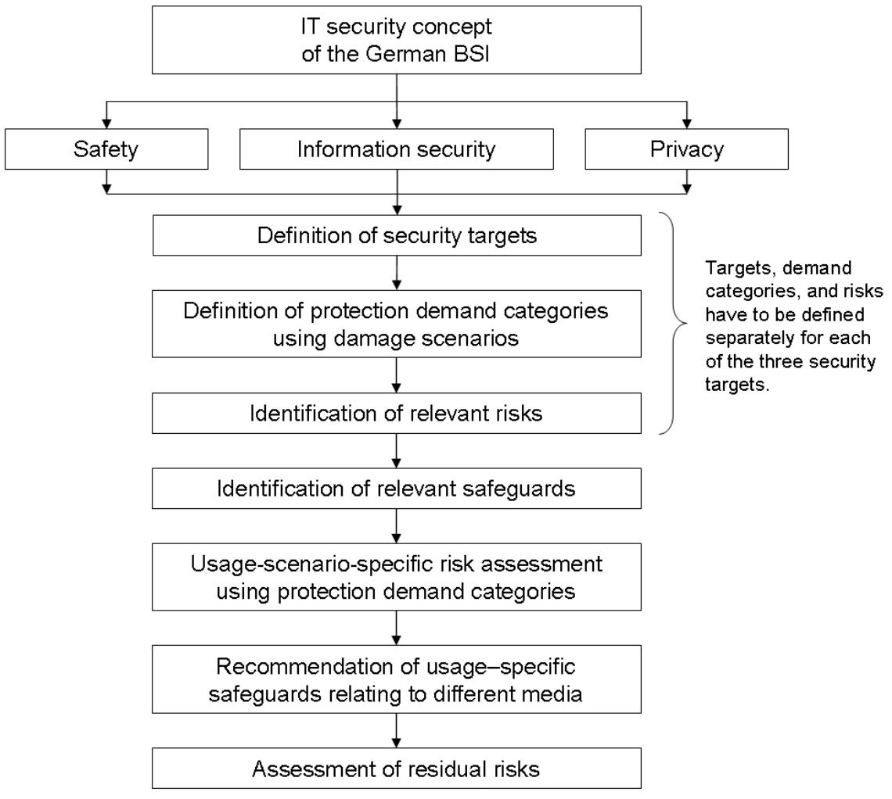
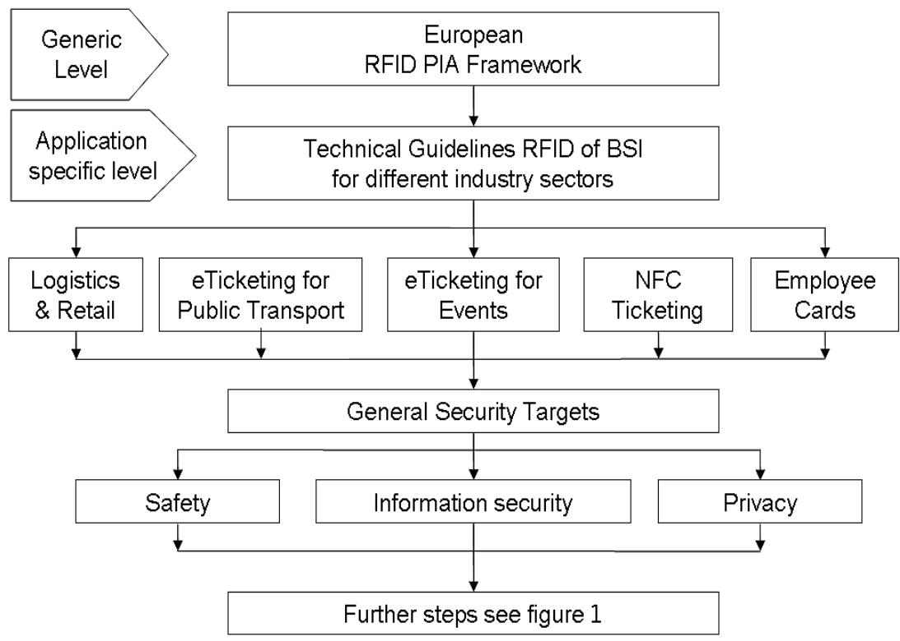
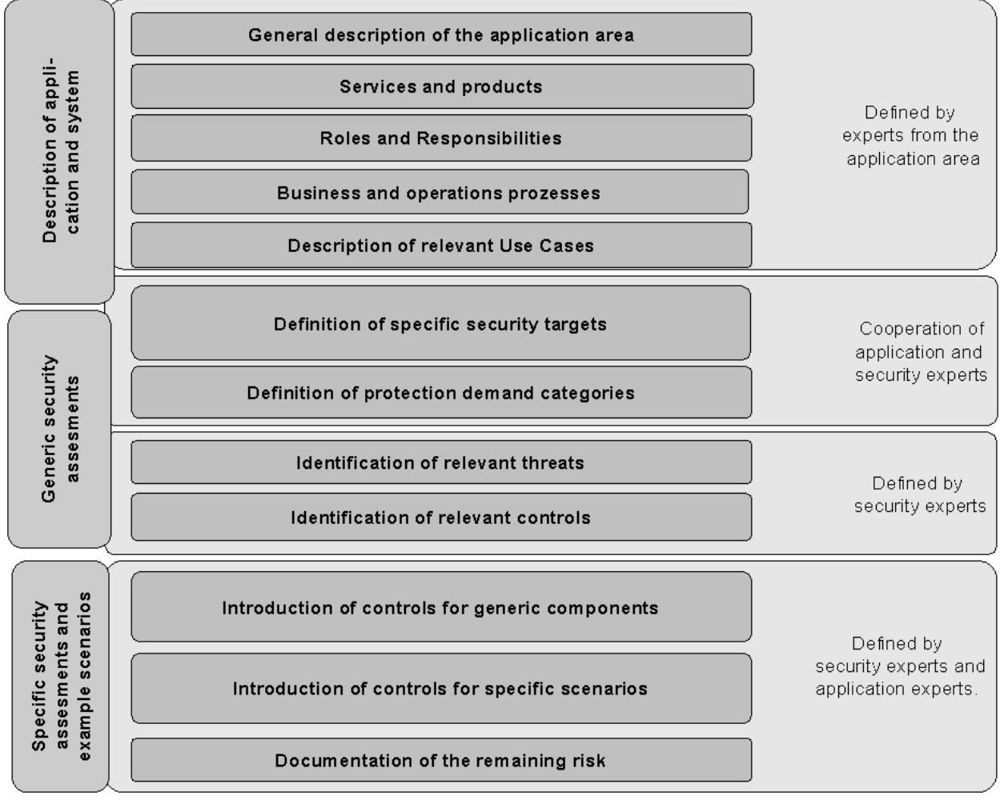

Dokument ist noch aktuell. (Stand 2020)

Technical Guidelines RFID as Templates for the PIA-Framework

Federal Office for Information Security (BSI) Postbox 20 03 63 53133 Bonn, Germany Tel.: +49 22899 9582-0 E-Mail: rfid@bsi.bund.de Internet: https://www.bsi.bund.de © Federal Office for Information Security 2010

#### **Authors**

Harald Kelter, Federal Office for Information Security (BSI) Cord Bartels, Cord Bartels Consulting (CBC) Wolf-Ruediger Hansen, Association for Automatic Identification and Mobility Germany (AIM)

| 1  | Management Summary5                                                                             |  |
|----|-------------------------------------------------------------------------------------------------|--|
| 2  | Purpose of the document7                                                                        |  |
| 3  | Introduction8                                                                                   |  |
| 4  | RFID-supported applications and related technologies9                                           |  |
| 5  | Activities of the European Commission11 Overview about the European PIA Framework document11 |  |
| 6  | The Technical Guidelines for Secure Use of RFID (TG RFID)13                                     |  |
| 7  | Concept for collaboration of PIA Framework and TG RFID16                                        |  |
| 8  | Special benefits from using TG RFID as Templates of the PIA- and Security-Frameworks18          |  |
| 9  | Integration of the concepts20                                                                   |  |
|    | Description of the structure and the security methodology of TG RFID20                          |  |
|    | Using the Technical Guideline for the PIA report21                                              |  |
| 10 | Feedback and appraisals23                                                                       |  |
| 11 | Conclusion and next steps24                                                                     |  |
| 12 | Appendix25                                                                                      |  |
|    | Glossary25                                                                                      |  |
|    | List of References27                                                                            |  |

# **1 Management Summary**

The European Commission (EC) takes much effort in developing the Digital Information Society and supporting the global opportunities of the European IT industry – namely the RFID industry which provides building blocks and enabling technologies for the Internet of the Future and the Internet of Things (IoT). RFID plays a predominant role as a data source for the IoT. RFID readers transmit data collected in the real world of things into the virtual world of the enterprise systems (ERP), the IoT and finally the frequently discussed "cloud", which will certainly become the platform for the IoT.

On the other hand the EC wants to make sure that the citizens' rights are protected. Therefore the EC published the "Recommendation on the implementation of privacy and data protection principles in applications supported by RFID" (RFID Recommendation) on May 12, 2009[1](#page-4-1) . In order to support the implementation of this RFID Recommendation the EC DG Information Society (DG InfSo) has established the RFID PIA Informal Working Group (PIA Group). In this group experts from various industry sectors have worked out the RFID Privacy Impact Assessment (PIA) Framework document, which intends to provide a top level tool to assess and document RFID applications regarding their provisions to ensure citizens' privacy and consumer rights. In April 2010 this document has been passed to the Article 29 Working Party (29WP), where the European Data Protection Authorities (DPA) are represented, for endorsement.

The PIA Framework should become an accepted scheme for the self-assessment, which companies who implement new or extend existing RFID applications – the "RFID operators" - take as a guide for writing PIA reports. Such reports should be made available for the respective DPAs and for citizens, consumers or users which get in touch with such RFID applications and want to be sure, that there privacy is not threatened by the application.

But the PIA Framework provides only a generic scheme for the PIA and has to be complemented by more detailed schemes like roles, security targets, classes and templates reflecting the special aspects of industry-specific and individual applications.

This puts the "Technical Guidelines for the Secure Use of RFID" (TG RFID) into perspective which have been issued by Germany's Federal Office for Information Security (BSI). In 2007 the BSI launched this project which targets to provide technical recommendations for RFID systems that ensure secure implementations and protection of personal data but nevertheless support the RFID operators' and service providers' business needs. The BSI achieved a consensus between supporters and critics. The TG RFID are accepted by the relevant parties and are now available for the application areas

- **-** Public Transport,
- **-** Event Ticketing,
- **-** NFC-Ticketing,
- **-** Retail & Logistics and
- **-** Employee Cards.

First implementations proved practicality and viability of this approach.

This article describes how the TG RFID could be of complementary value for the PIA Framework and help to fill in its gaps which are intentionally left open, in particular schemes for privacy assessment and the outline of application specific templates.

1 [EC\_RFID]

The TG RFID support the PIA Framework in a synergetic way by providing the next detailed levels which are necessary for performing a comprehensive privacy and security assessment of RFID applications dedicated to specific application domains. They include a security risk assessment methodology and documentation scheme of the results which comply to the international standard ISO 27005, full transparency on security targets, threats, safeguards and remaining risks and the option for evaluation and certification by a neutral party.

Combining both activities would transform the conflict between critics and supporters of RFID into a solution approach that respects the objectives of both parties and pave the way for the secure deployment of RFID applications throughout Europe.

The TG RFID (TG 03126) are available free of charge and can be downloaded from the website of the Federal Office for Information Security (http://www.bsi.bund.de, search item 'TG 03126').

## **2 Purpose of the document**

The European Commission issued a recommendation on the implementation of privacy and data protection principles in applications supported by radio frequency identification (RFID) on May 12th, 2009. This article explains background, status and intentions of current activities and provides a detailed overview how these activities at European level can be supported and extended by the Technical Guidelines for Secure Use of RFID that have been generated by the German Federal Office for Information Security.

# **3 Introduction**

RFID-supported applications provide innovative services for citizens, users and customers and a substantial potential for the economic development. It is considered important for the future of the European Union[2](#page-7-1) that a wide adoption of RFID-applications can be achieved. This spans very different application areas from public transport via logistics & retail to healthcare, counterfeit protection of goods, and production control. However, data protection officials and civil rights activists have concerns that RFID could be a threat to the privacy of individuals. The discussion between critics and promoters is now going on for years and generates irritations that hamper the introduction of RFID systems. Service providers and operators will refrain from investing into RFID-supported applications unless acceptance of clients and DPAs is available, the business case including cost of privacy and security can be determined and the legal situation is solid.

In order to overcome the roadblocks the European Commission and the German Federal Office for Information Security (BSI) launched dedicated initiatives:

- 1. The European Commission is currently finalising a concept for privacy assessments of RFID applications, the so-called PIA Framework.
- 2. The German Federal Office for Information Security launched Technical Guidelines for the secure use of RFID for various industry sectors.

Both projects are targeting a solution that balances the need for privacy and security of RFID applications with the business interest of operators and investors. This article shows how the initiatives of the EC and the BSI complement each other.

2 [EC\_RFID\_IMPACT]

### **4 RFID-supported applications and related technologies**

It is important to understand that a broad range of application areas is already using RFID or will be supported by RFID in the close future. One focus of discussion is currently on RFID in logistics and retail where the first applications have been launched.

But many of the goals which were communicated by the retail stakeholders are far away from reality, e. g. the attachment of RFID tags on all articles in the supermarkets. Progress is seen in the fashion sector at companies, which control the whole supply chain from production to sales in their own shops (e.g. at the German Gerry Weber International AG). Companies like Metro Group or Wall-Mart could achieve this progress only when all their suppliers would fix RFID tags in their fashion articles.

Furthermore, in many other sectors RFID is gaining momentum and is even in daily use by millions of citizens in the areas of public transport, employee cards, event ticketing and electronic payment. In the public transport area we see also the rise of mobile phones equipped with NFC (Near Field Communication). Other successful RFID areas are production control at manufacturers' plants and logistics – in particular regarding the tracking of returnable transport items. Here RFID applications have become an economically important tool, but the operators of such applications keep the public communication about it low, because they do not want to share their progress with their competitors.

Two terms with different characteristics are among others summarized under RFID, in particular in connection with smart cards.

1. The Proximity Technology – also called contactless smartcard interface - is mainly used for personalized customer media. Its short reading distance prevents an automated undiscovered reading. The holder initiates the reading process actively by presenting his smart card to a RFID reader.

(Proximity = RFID technology with a signal reach of 7 to 15 cm according to ISO/IEC 14443, frequency 13.56 MHz (HF))

2. The Vicinity Technology, which is also used for the automated identification of goods that are equipped with an RFID tag.

(Vicinity = RFID technology with a reading distance of up to 1 meter according to ISO/IEC 15693, frequency 13.56 MHz (HF)).

In the logistics sector normally UHF frequencies – e.g. according to ISO/IEC 18000-6C - are used because they allow a read distance of 4 meters and even up to several hundred meters with active – i. e. battery equipped - RFID transponders. This is important to identify pallets, other returnable transport items or vehicles.

In order to take a comprehensive view on the RFID technology one has to discuss the available frequencies used by RFID tags and antennas. Table [1](#page-9-0) gives a brief overview.

| RFID frequency             | Typical applications                                                           | Selected properties                                                                                                                                                                                  |
|----------------------------|--------------------------------------------------------------------------------|------------------------------------------------------------------------------------------------------------------------------------------------------------------------------------------------------|
| LF: < 135 KHz              | Smart cards and identification of animals, beverage kegs                    | Reading distance some 10 cm flush mounted transponders in metal                                                                                                                                |
| HF: 13.56 MHz              | Smart cards and identification of books and other objects                   | Globally available frequency channel Reading distance up to 1 meter                                                                                                                            |
| UHF: 860 – 960 MHz      | Low cost tags for the marking of all kinds of products, cartons and pallets | The available frequency channels within this spectrum varies across the different world regions used for bulk reading applications e.g. for RFID gates mounted at distribution centre |
|                            |                                                                                | hubs Reading distance up to 5 meter (several hundred meters if used with active RFID tags.)                                                                                                 |
| Microwaves: 2.4…2.5 GHz | Localization and 3D recognition of containers                               | Long distance reading using active tags                                                                                                                                                           |

*(LF = low frequency – HF = high frequency – UHF = ultra high frequency)*

*Table 1: Selection of RFID frequencies and their properties*

All these frequencies are defined in ISO/IEC standards and therefore users can select the appropriate frequency for their application which serves their purpose best. For example the ISO/IEC 18000 series covers all relevant frequency ranges.

In many cases users have to decide between HF and UHF. On one hand this is a decision influenced by technical properties and cost. But this may also be a decision about a bigger or smaller threat potential regarding privacy e.g. for the owner of a smart card. LF and HF frequencies raise much lower threat potential than UHF, as the read distances are rather small.

Therefore, if only technical specifications suggest an UHF solution, the addition of privacy requirements could lead to an HF solution, even if it may be more expensive.

# **5 Activities of the European Commission**

The European Commission is guiding and moderating the discussion on RFID between the various stakeholders since 2003. The goal is to find a viable consensus that considers the legitimate concerns of DPAs and public rights activists as well as the business objectives of RFID operators and service providers.

Several activities have been launched by the European Commission. This includes public consultations and the installation of expert groups to support the discussion and the alignment process. The results have been considered in the RFID Recommendation[3](#page-10-1) and the current work program of the European Commission that targets "soft legislation" and a self-regulatory approach to facilitate compliance with privacy and data protection requirements. Frameworks that define the boundary conditions for Privacy Impact Assessments (PIA) and Security Impact Assessments (SIA) will be used as tools. The PIA Framework is available and was forwarded for endorsement to the Art. 29 Data Protection Working Party of the European Commission[4](#page-10-2) .

### **Overview about the European PIA Framework document**

The PIA Framework comprises 25 pages (March 21st 2010) and consists of an introduction and three major parts. It contains no specific views to RFID applications in different industry sectors except the retail sector (see part A below).

#### **Introduction**

It explains among others applicability, key concepts, internal procedures and the classification criteria for RFID applications. For these criteria the PIA Framework provides a 4-level model as shown in table 2.

| Level | Does the RFID tag contain personal data? | Does the RFID application link to personal data? | Are item level tags intended to be possessed by individuals? |
|-------|---------------------------------------------|-----------------------------------------------------|--------------------------------------------------------------------|
| 0     | No                                          | No                                                  | No                                                                 |
| 1     | No                                          | No                                                  | Yes                                                                |
| 2     | No                                          | Yes                                                 | Yes                                                                |
| 3     | Yes                                         | Yes                                                 | Yes                                                                |

*Table 2: The 4-level classification suggested by the PIA Framework.*

The decision, to which level an application belongs, has to be made after working out the assessment according to "Part A" as mentioned below. The PIA Framework claims that if an application is designed according to level "0" which means that no private data are concerned than there is no privacy threat given and a further documentation is not needed. Does the application

3 [EC\_RFID]

4 [EC\_WORK\_PARTY]

show the characteristic of one of the other levels than according provisions against privacy threats have to be taken and documented.

#### **Part A: RFID application description and scope**

This part claims a general description of the respective application including RFID operator, users and individuals interacting with the application, presence of personal data and data flow. The result of this step is the classification according to the above level model. If no personal data are concerned than level 0 is given and no further documentation is required. If another level applies than further details according the following parts B, C and D have to be assessed and documented. At the end of part D the decision has to be made, whether the RFID application is ready for deployment or not.

#### **Part B: RFID application governing practices**

This part claims the description of the policies on access to personal data and the determination, whether RFID tags provided to individuals represent a privacy implication. For RFID operators in the retail sector it claims that there should be offered a tag removal method free of charge. Furthermore the documentation of aspects like system protection, RFID tag data protection, data access of and transfer to other parties and transfers outside the European economic area is required.

#### **Part C: Accountability**

Given the description of the application and the nature of data processing in part A and B this part addresses data protection, privacy, and security features related to the application to minimize potential risks linked to the deployment of the application, in the area of accountability. This part is intended to address external awareness regarding RFID applications and to support overall accountability and compliance by the RFID operator with the PIA report and other requirements that may apply.

According to the PIA Framework the PIA report or template may provide further details regarding accountability issues relevant to the given industry or application. But it doesn't provide details about how a template should look like.

#### **Part D: Analysis and resolution**

This part should indicate the business, compliance, or legal determinations made regarding the RFID application. The facts entered about the RFID Application in Parts A, B, and C should be considered to make a determination as to the overall privacy impact and compliance of the RFID Application. The RFID operator should use the categories below to indicate the privacy and data protection implications of the RFID application:

- **-** Ready for deployment: the RFID application as described and possibly mitigated provides for suitable practices, controls, and accountability.
- **-** Not ready for deployment: the RFID application is not approved for operations in its current state. A specific corrective action plan has to be developed, and a new privacy impact assessment has to be performed and documented to determine if the application has reached an approvable state.

### **6 The Technical Guidelines for Secure Use of RFID (TG RFID)**

In 2007 the Federal Office for Information Security (BSI) started an initiative on RFID with the following objectives:

- 1. Secure and privacy-conform adoption of RFID for the relevant application areas
- 2. Trust and consensus between all stakeholders by transparency and intense discussions
- 3. Balance between security and economic needs
- 4. Scalability and flexibility to support adoption to future developments
- 5. Make "hard" legislative instruments obsolete.

The BSI selected Technical Guidelines as tool to achieve these goals. These Technical Guidelines, the TG RFID, contain detailed and vendor-independent recommendations describing how a system and the related processes should be implemented with regard to safety, security and privacy protection.

Their methodology for risk assessment is compliant to the international standard ISO 27005 which provides guidelines for information security risk management (ISRM) in an organisation, specifically supporting the requirements of an ISRM system defined by ISO 27001. ISO 27005 is applicable to all types of organisations. It does not provide or recommend a specific methodology. This will depend upon a number of factors, such as the actual scope of the Information Security Management System (ISMS), or perhaps the industry/commercial sector.

| Application Area   | Partners                                           | Status                                     |
|--------------------|----------------------------------------------------|--------------------------------------------|
| Public transport   | VDV (Association of German transport companies) | TG available, system in operation       |
| Stadium eTicketing | Deutscher Fußballbund                              | TG available, system in operation       |
| Logistics, Retail  | GS1 Germany, Metro AG                              | TG available                               |
| NFC-Ticketing      | Deutsche Bahn, Vodafone                            | TG available, pilot system in operation |
| Employee cards     | Bundesdruckerei                                    | TG under review                            |

*Table 3: Available Technical Guidelines for Secure Use of RFID according to [ISSE2007]*

A major goal of the development of the TG RFID is to find a consensus and to gain the acceptance of all relevant stakeholders. Therefore the BSI installed an intense review and alignment process and invites experts and the relevant stakeholders from the specific application area to participate. Representatives of RFID operators, service providers, customers, DPAs and also critics of RFID have had the opportunity to comment early versions of the document and take part in review and alignment sessions. In this process, the security goals, potential threats, security measures and especially the remaining risks are identified, discussed and described. All results are documented in the TG RFID. This process provides the information on potential impact and risks of RFID applications and generates the transparency that is necessary to build trust and acceptance.

The experience from creating the existing five parts of the TG RFID shows that this approach works. So far Technical Guidelines for five application areas have been created as shown in table 3. In all cases a consensus including the acceptance from the participating DPAs was achieved.

Unfortunately, the TG RFID for logistics and retail has not been piloted so far, because the progress with RFID in this sector is far behind the former projections by the retail stakeholders. In reality RFID tags are used on pallets and cartons. The products in the shelves of the super markets are still only marked with traditional bar codes or with GS1 data bar. Whereas in the sectors of ticketing, NFC and employee cards a great progress with RFID is on the way.

All TG RFID follow a common security concept as shown in the figure 1. Whereas the RFID Recommendation is primarily directed towards privacy and data protection the TG RFID covers all three security domains: safety, security and privacy.

*Figure 1: Concept of the security assessment incorporated in the TG RFID according to [ISSE2007]*

Furthermore, the TG RFID provide detailed guidance how to carry out all the detailed work the PIA Framework leaves out, because it is understood as a high level document more for the senior management and the non-IT people. The TG RFID are written for the IT experts who are

responsible for designing systems, investigating threats and weaknesses and providing for the right protection provisions.

The TG RFID are public and free of charge available. The Federal Office for Information Security will add new Guidelines if new relevant application areas will emerge.

### **7 Concept for collaboration of PIA Framework and TG RFID**

The current activities of the European Commission and the Federal Office for Information Security on the privacy and security of RFID applications follow the same objectives but are addressing the subject in different levels of detail. The PIA Framework applies to all application areas that are using RFID and explains how Privacy Impact Assessments should be conducted. It contains rules that are binding for all applications and all types of RFID-technology. But the preconditions and requirements vary a lot between the various application domains and between the different RFID technologies. The framework document is therefore restricted to generic recommendations that fit for all applications.

The approach of the European Commission suggests using so-called templates as extensions to the framework document in order to reach the level of detail that is necessary to conduct a complete application-specific Privacy Impact Assessment. Such templates are specific to an application area and should provide a detailed guidance for the creation of a PIA report. Figure 2 shows the hierarchy of the documents of the PIA Framework and the TG RFID.

*Figure 2: Document hierarchy of the EC PIA Framework and the BSI TG RFID*

The TG RFID provide all details required to work out templates for a PIA according to the PIA Framework. Even more, they cover also the assessments for information security and safety which are planned by the European Commission for the security framework as a future step. This

positioning maximizes the synergies between the activities of the European Commission and the Federal Office for Information Security.

The TG RFID provide patterns for application specific templates which can be efficiently used to set up specific templates as required by the PIA Framework. Therefore it can be stated that the PIA activities of the European Commission are smoothly complemented by the TG RFID of the BSI for the major application areas. Hence the self-regulatory process and the active work of RFID operators to assess and document the privacy of their RFID applications can start without further delay.

### **8 Special benefits from using TG RFID as Templates of the PIA- and Security-Frameworks**

The TG RFID have been tailored to match specific objectives of the stakeholders of an application area. The resulting benefits will be available for implementations according to the PIA Framework.

1. Trust and acceptance

The existing TG RFID are the result of an extensive alignment with all relevant parties from the particular application area. This process creates the transparency that is requested by critics. Operators and service providers can e.g. check if the description of the application is correct and if the recommended safeguards can be implemented. The entire assessment including threats, safeguards and potentially remaining risks was discussed with all stakeholders and is fully documented in the guideline document. All existing parts of the TG RFID have been accepted by all involved parties including German DPAs. Operators and investors who plan the adoption of RFID can be confident that no acceptance problems due to data protection and privacy discussions will arise if they apply the TG RFID. This removes one of the major roadblocks that are currently still hampering the introduction of RFID systems.

2. Balance between security/privacy and business objectives

The stakeholders of an application have individual and sometimes diverging requirements to an Technical Guideline. DPAs want to protect data and privacy of citizens, customers and employees. The TG RFID address their objectives by a detailed description of all relevant threats, appropriate safeguards and potentially remaining risks.

Operators are focussed on their business objectives. Their intention is on practicality, acceptance of their customers and a cost efficient and future proof solution. The foundation the TG RFID is a description of the application area, its services, processes and use cases are created or reviewed by operators and service providers.

The balance between the objectives of both parties is achieved by a scalable definition of safeguards. Minor threats are mitigated by simple, low-cost safeguards. Strong and costly controls are only applied in case of high protection demand and severe threats. This approach makes sure that the cost of security measures and the impact on usability is reduced to what is necessary.

3. Interoperability and comparability

Interoperability is an imperative for RFID implementations. Operators need to cooperate with business partners and customers want to use services from multiple service providers and across borders. This requires standardized and interoperable technical interfaces and security measures. In addition, the comparability of security levels is of major importance. Operators can only cooperate if they can trust the partner's system implementation. This includes the level of data protection, privacy and as well information security and safety.

The TG RFID support these fundamental requirements by two dedicated features:

I. The TG RFID includes not only an assessment of privacy and data protection. In addition, a risk analysis and documentation of information security and safety is provided. The latter is mandatory to cover the business requirements of operators.

II. The risk assessment methodology and the documentation of the results complies to the worldwide standard ISO27005. This makes it easy to compare the PIA and security assessment reports of different implementations and systems.

4. Technical guidance for business decisions and implementation Operators will refrain from investments in RFID applications if they can't determine the cost of security measures and their potential impact on services and usability. Both aspects have major influence on the overall business case.

The TG RFID defines appropriate technical safeguards for specific scenarios of an application. This information builds a solid base for cost calculations and tenders. This feature of the TG RFID counters a major roadblock for the introduction of RFID.

5. Solid legal foundation for the implementation of RFID

The European Commission identified lacking confidence in the legal situation for RFIDimplementations as one major roadblock for the broad adoption of RFID. The use of the TG RFID is not mandatory in a legal sense. Nevertheless they will provide a solid basis for legal judgements of RFID applications because they are accepted by all stakeholders and represent the current state-of-the-art for implementations of RFID.

# **9 Integration of the concepts**

#### **Description of the structure and the security methodology of TG RFID**

The parts of the TG RFID are created for specific application areas and consists of three major parts: the description of the application area, the assessments and the recommendations.

A detailed but generic description of all service and business models of an application area is given in the first part. This is the foundation of the assessments and recommendations and covers role models, services, products, business processes, use cases and any other information that may be relevant for the security and privacy assessments. In order to ensure practicality and usability for all service providers and operators this part is done in close cooperation and alignment with experts from the application domain.

*Figure 3: Structure of the TG RFID*

The assessment part is based on the description of the application area and specific security targets. It covers all three domains of information security: security, privacy and safety. The security targets are defined and aligned with all stakeholders. The methodology of the risk assessment is compliant

to ISO 27005. The results of the assessment are a list of relevant threats, appropriate safeguards that can mitigate these threats and a description of remaining risks for certain example scenarios.

The third part of a guideline document provides recommendations on how to implement an RFIDsystem in an appropriate way. Based on example scenarios from the application domain it is shown how the findings of the risk assessment are transformed into specific safeguards that should be applied to the relevant system components. This provides a clear and economically viable guidance for the design of system.

Figure 3 depicts the structure of the TG RFID. It also shows the responsibilities for the creation of the different chapters. Practicality and feasibility of the approach is ensured by allocating the right expertise to the specific tasks. The entire document is subject to the review and alignment by all stakeholders.

The TGs cover not only a Privacy Impact Assessment as requested by the PIA Framework. They provide in addition a comprehensive risk assessments on information security and safety. All three domains of IT security are covered by risk assessments, proposals for safeguards and implementation examples.

The description of security targets, protection demand and the identification of potential threats is done individually for all three domains of IT security. However, the definition of generic controls and the proposition of scenario-specific safeguards is carried out as a joint approach. This reflects the fact that e.g. threats for privacy are often threats to information security as well. Vice versa certain safeguards can counter threats for privacy and information security. The approach of the TGs optimises the impact of the safeguards and minimizes the cost of security and privacy and complements the PIA Framework.

#### **Using the Technical Guideline for the PIA report**

The PIA Framework requires that operators and service providers who want to introduce RFIDsupported systems have to conduct a Privacy Impact Assessment and to document the results in the so-called PIA report. Creating this report needs specific expertise and skills. The majority of operators will probably need professional help to fulfil this obligation. This will lead to additional cost of the system introduction.

The TG RFID provide guidance and information that will enable operators to conduct a PIA and minimize the efforts for completing the report. Major parts of the PIA can simply be covered by referencing the appropriate chapters as templates and selecting the particular services, processes and scenarios mentioned in the Guideline. This will work out in most cases because a TG is describing all known eventualities of an application area. The operator's application will normally be a subset of what is documented.

The PIA report is structured into four major parts as described in chapter 5. The following overview shows how contents from TGs can be used to provide the required contents:

1. Part A: RFID Application Description and Scope

Every TG contains a generic description of the application area. This includes a generic system description, the commonly used role model as well as services, products, business processes and uses cases. This part of the TG RFID will always be created by experts from the application area. In case e.g. of eTicketing for Public Transport the input came from the Association of German Transport Companies (VDV). Based on this expertise, the TGs provide a complete description of all known scenarios from an application domain. This provides a significant benefit for operators

who have to complete a PIA report according to the PIA Framework. In the majority of cases the operator can just reference the descriptions given in the TG RFID and doesn't need to create his own description. This reduces effort and cost significantly and helps also to protect confidential company information.

2. Part B: RFID Application Governing Practices

Every part of the TG RFID contains the results from a complete security assessment that covers not only data protection and privacy but also information security and safety as needed for a security impact assessment (SIA) that is planned by the European Commission for the next step of activities. Chapter B of the PIA report can mainly be completed by referencing the application-specific TG RFID: Chapter 8 contains the application-specific security targets for all relevant entities (customers, operators, service providers, etc.) and determines the particular threats that may endanger these targets. This includes the rules for data protection and privacy. It also shows the technical or organizational controls respectively safeguards that can generally be used to counter those threats. Chapter 9 to chapter 11 provide practical advice on how to apply the more general statements from chapter 8 to the specific scenario of the operator or service provider. The operator who wants to complete the PIA report will find precise guidance on which safeguards should be in place in his particular environment in order to achieve compliance with general rules of privacy and data protection and meet the application-specific security targets defined in chapter 8.

Based on this information, the operator can simply reference the TG RFID when completing the PIA report.

3. Part C: Accountability

The TG RFID defines the business operations and regulatory compliance processes in the context of the security assessment, the definition of safeguards and transforms this to practical guidance for specific application scenarios. The operator or service provider who wants to complete this chapter of the PIA report can reference the related safeguards given in chapters 8 to 11.

4. Part D: Analysis and Resolution

An operator or service provider who implemented his RFID-application according to the TG RFID can simply claim compliance. The level of detail given in the TG RFID makes sure that appropriate controls and safeguards are in place. In this case there is no need for an extensive assessment on own controls, etc. The TG RFID describes in chapter 11 not only the proposed safeguards for a variety of implementation scenarios but defines also the potentially remaining risks. These descriptions should be added to Part 4 of the PIA report in order to provide complete transparency about the particular application.

The TG RFID offer in addition to self-assessment and self-declaration the option for an evaluation by a neutral party and a certification by the Federal Office for Information Security.

Furthermore the TG RFID provides detailed patterns to develop templates as required by the PIA Framework.

All this brings the quality of the compliance statement to a level that can be trusted by all parties that will deal with the RFID system.

### **10 Feedback and appraisals**

Key-stakeholders of the discussion on RFID confirmed the feasibility of the concept of the Technical Guidelines:

'By launching recently the project 'Technical Guidelines RFID', the German Federal Office for Information Security (BSI) gave a proper illustrative example of BATs which should be developed now at the European level.'

Source: Opinion of the European Data Protection Supervisor (logo shown in figure 4) on the communication from the Commission to the European Parliament, the Council, the European Economic and Social Committee and the Committee of the Regions on Radio Frequency Identification (RFID) in Europe: steps towards a policy framework COM(2007) 96.

*Figure 4: Logo of the European Data Protection Supervisor*

'The Technical Guideline for Public Transport proved to be a practical and feasible tool. It considers the business needs of the VDV core application while providing the necessary level of security and trust.'

Source: Nils Zeino-Mahmalat, Head of Competence Center Electronic Fare Management, Verkehrsverbund Rhein-Ruhr, logo shown in figure 5.

VRR runs the largest RFID system in Germany. More than 1.1 Million customers use daily electronic tickets stored on contactless smartcards.

*Figure 5: Logo of the CCEFM, Kompetenzcenter Elektronisches Fahrgeldmanagement NRW*

# **11 Conclusion and next steps**

The TG RFID has already been used for major implementations and proved feasibility and practicality. Guidelines for additional application areas are considered.

As a next step, the Federal Office for Information Security suggests to prove the feasibility of Technical Guidelines as templates for the PIA Framework. This could be done by implementing this approach in a real world scenario e.g. from logistics, public transport or employee cards. The related Technical Guidelines are available. All relevant stakeholders – operators, DPAs, RFID critics and security experts – should directly be involved in the process. This would generate the transparency and trust that is necessary to obtain the objectives of the European Commission and the BSI.

# **12 Appendix**

#### **Glossary**

| Abbreviation           | Explanation                                                                                                                                                                         |
|------------------------|-------------------------------------------------------------------------------------------------------------------------------------------------------------------------------------|
| 29WP                   | Article 29 Working Party, assembly of the European data protection authorities.                                                                                                  |
| BSI                    | Federal Office for Information Security (German: Bundesamt für Sicherheit in der Informationstechnik)                                                                            |
| DG InfSo               | EC Directorate General Information Society                                                                                                                                          |
| EC                     | European Commission                                                                                                                                                                 |
| ESO                    | European Standards Organisations: CEN, CENELEC, ETSI as opposed to ISO (global) or DIN (Germany)                                                                                 |
| ISO 27005              | International standard providing guidelines for ISRM                                                                                                                                |
| ISRM                   | Information security risk management system defined by ISO 27001                                                                                                                    |
| NFC                    | Near Field Communication: the RFID functionality of mobile phones for receiving and transmitting RFID signals                                                                    |
| PIA                    | Privacy Impact Assessment                                                                                                                                                           |
| PIA Framework          | Draft guidance document for PIA reports worked out by the RFID PIA Working Group and submitted to the 29WG in April 2010                                                         |
| PIA Report             | Report accomplished by the RFID Operator according to the provisions of the PIA Framework                                                                                        |
| RACE                   | The European Race network RFID project is designed to become a federating platform to the benefit of all European stakeholders in the development, adoption and usage of RFID |
| RFID                   | Radio Frequency Identification                                                                                                                                                      |
| RFID Operator          | Owner of an RFID application                                                                                                                                                        |
| SIA                    | Security Impact Assessment                                                                                                                                                          |
| SFW                    | Security Framework                                                                                                                                                                  |
| RFID PIA Working Group | Group of industry representatives founded by the EC DG InfSo which worked out the PIA Framework                                                                                  |

#### 12 Appendix

| TG RFID   | Technical Guideline for Secure Use of RFID, issued by the BSI since 2008. |
|-----------|------------------------------------------------------------------------------|
| Templates | Patterns for the easy documentation of security and privacy issues           |

*Table 4: Glossary*

#### **List of References**

EC\_RFID: EC, COMMISSION RECOMMENDATION of 12.5.2009 on the implementation of privacy and data protection principles in applications supported by radiofrequency identification, available at http://ec.europa.eu/information\_society/policy/rfid/documents/recommendationon rfid2009.pdf,

EC\_RFID\_IMPACT: EC, SUMMARY OF THE IMPACT ASSESSMENT, Commission staff working document accompanying the Commission Recommendation on the implementation of privacy and data protection principles in applications supported by radio frequency identification, available at http://ec.europa.eu/information\_society/policy/rfid/documents/recommendationon rfid200i9impact.pdf,

EC\_WORK\_PARTY: EC, Information on Art. 29 Data Protection Working Party of the European Commission, available at http://ec.europa.eu/justice\_home/fsj/privacy/workinggroup/index\_en.htm,

ISSE2007: Bartels, C., Kelter, H., Technical Guidelines for Implementation and Utilisation of RFID-based Systems, ISSE/SECURE2007, Securing Electronic Business Processes, Vieweg-Verlag, ISBN 978-3-8348-0346-7, 2007