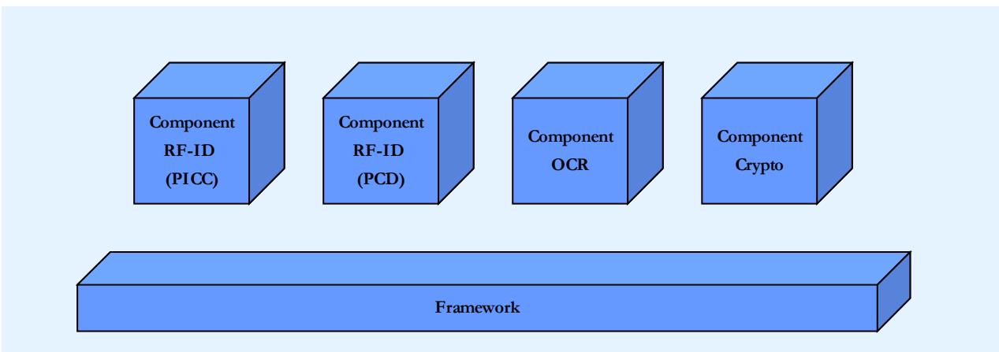
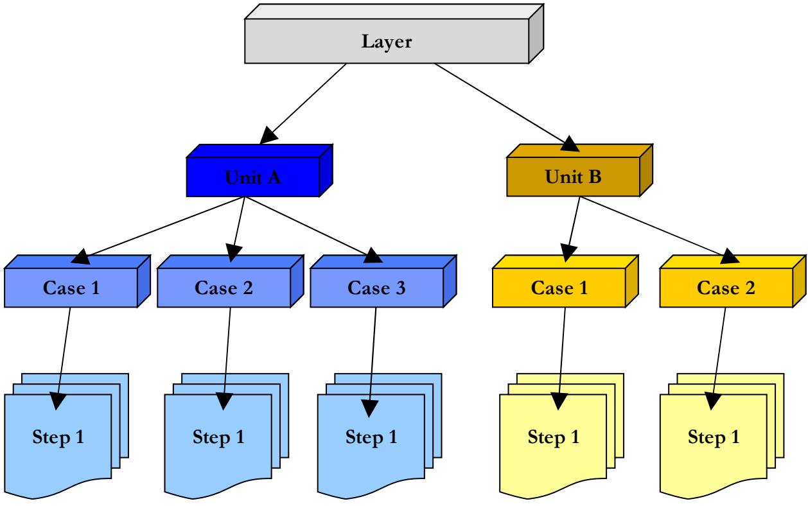
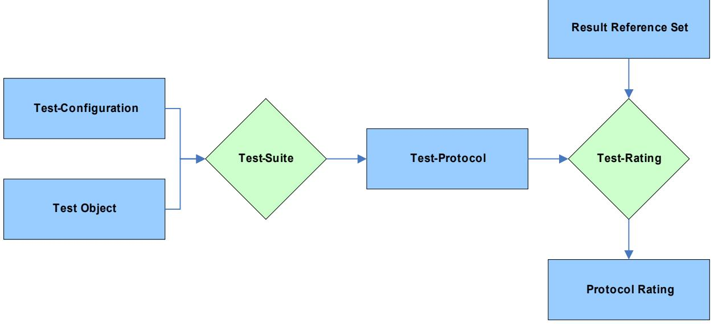

# BSI TR-03105 Part 1.1 A framework for Official Electronic ID Document conformity tests

Version 1.04.1 14.11.2008

| 1 INTRODUCTION<br>4                       |
|-------------------------------------------|
|                                           |
| 2 DEFINITIONS AND<br>REFERENCES  4        |
| 2.1 Definitions<br>4                      |
| 2.2 References<br>5                       |
| 3 OVERVIEW<br>6                           |
| 4 COMPONENT<br>STRUCTURE<br>DEFINITION  7 |
| 4.1 Component<br>9                        |
| 4.2 Layer<br>10                           |
| 4.3 Unit<br>12                            |
| 4.4 Case<br>13                            |
| 4.5 Step<br>15                            |
| 5 DOCUMENTATION SCHEME<br>16              |
| 5.1 Definition<br>16                      |
| 5.2 Protocol<br>17                        |
| 5.3 Reference<br>17                       |
| 5.4 Rating<br>17                          |
| 5.5 DTD Definition<br>17                  |
| 6 RATING<br>METHOD<br>19                  |
| 6.1 Rating Categories<br>20               |

| 7 COMPONENTS OVERVIEW | 21 |
|-----------------------|----|
| 7.1 RFID (SCIC)       | 21 |
| 7.2 RFID (PCD)        | 21 |
| 7.3 OCR               | 21 |
| 7.4 Crypto            | 21 |

# <span id="page-3-0"></span>**1 Introduction**

The process of issuing ePassports and Official Electronic ID Documents according to the ICAO standard and the BSI TRs involves several industrial companies as well as governmental organizations. Since the used RFID technology is evolving rapidly; it is important to establish a standard mechanism to ensure the conformity of the involved components.

This document defines a framework which describes standard procedures for conformity tests of Official Electronic ID Document components. Standard test configuration and protocol formats are specified, so that test scenarios for different modules can be integrated to a consistent assessment procedure. Existing test specifications can be integrated easily and scenarios for new components can be added as needed.

The exchangeable protocol format provides comparable results of different test facilities. The test procedures are arranged in the hierarchical and layered structure so that the performed tests can be composed as needed.

# <span id="page-3-2"></span>**2 Definitions and References**

# <span id="page-3-1"></span>**2.1 Definitions**

For the purpose of this document, the following definitions shall apply.

• **SCIC**

Secure Contactless Integrated Circuit

• **PCD** Proximity Coupling Device

#### <span id="page-4-0"></span>**2.2 References**

- [1] **LDS,** ICAO Technical Report Development of a Logical Data Structure LDS 1.7
- [2] **PKI**, PKI for Machine Readable Travel Documents offering ICC Read-Only Access 1.1
- [3] **ICAO Doc 9303**, Part 1 Machine Readable Passports
- [4] **ISO/IEC 7816-4:2005**, Ed. 2 Identification cards -- Integrated circuit cards -- Part 4: Organization, security and commands for interchange
- <span id="page-4-6"></span>[5] **ISO/IEC 10373-6:2001**, Ed. 1 Identification cards -- Test methods -- Part 6: Proximity cards
- <span id="page-4-5"></span>[6] **ISO/IEC 14443-1:2000**, Ed. 1 Identification cards -- Contactless integrated circuit(s) cards -- Proximity cards -- Part 1: Physical characteristics
- <span id="page-4-4"></span>[7] **ISO/IEC 14443-2:2001,** Ed. 1 Identification cards -- Contactless integrated circuit(s) cards -- Proximity cards -- Part 2: Radio frequency power and signal interface
- <span id="page-4-3"></span>[8] **ISO/IEC 14443-3:2001**, Ed. 1 Identification cards -- Contactless integrated circuit(s) cards -- Proximity cards -- Part 3: Initialization and anticollision
- <span id="page-4-2"></span>[9] **ISO/IEC 14443-4:2001**, Ed. 1 Identification cards -- Contactless integrated circuit(s) cards -- Proximity cards -- Part 4: Transmission protocol
- <span id="page-4-1"></span>[10]**ISO/IEC 7498-1:1994**, Ed. 2 Information technology –Open Systems Interconnection – Basic Reference Model: The Basic Model

# <span id="page-5-0"></span>**3 Overview**

The Conformity Assessment Framework defines several basic elements used by the specialized component test specification. These elements should provide the author of such component specifications with a flexible set of rules and guidelines, so that different specification documents written by different organizations have a common base. This makes the integration of additional specifications into an established conformity assessment process possible.



<span id="page-5-1"></span>*Figure 1 General structure*

On top of this framework there are several component specifications each defining the conformity criteria for one element of the Official Electronic ID Document environment [\(Figure](#page-5-1) [1\)](#page-5-1).

The framework specifies guidelines on the following topics:

- Component Structure Definition
- Documentation Scheme
- Result Rating Scheme

Within these guidelines it is referred to the layer structure of the ISO OSI-Model [2.2.](#page-4-1) Therefore in particular the lower layers 1-4 and the higher layers 6-7 are of major interest.

# <span id="page-6-0"></span>**4 Component Structure Definition**

All conformity test components should have the same structure as defined in this paragraph. This provides a common layout for all test scenarios and simplifies the integration of new tests.

The general structure of a component is shown in the following Figure 2:



*Figure 2 Component structure*

This common structure is also reflected in the standard result protocol scheme as defined in paragraph [5.](#page-15-1)

In some cases it can be advantageous to apply an alternative structure that is based on already established standards and guidelines. For example in the scope of layers 1-4 it is often related to the representation in ISO/IEC 10373 [2.2](#page-4-6) and ISO/IEC 14443 [2.2,](#page-4-5) [2.2,](#page-4-4) [2.2,](#page-4-3) and [2.2.](#page-4-2) Therefore the following structure is applied:

#### • **Test description**

Gives a short overview about the following test scenario and describes the goals of the test.

#### • **Conditions**

States which conditions have to be accomplished in order to be able to start the test.

#### • **Parameters**

Specifies the different kind of parameters that are needed to start the test case.

#### • **Report**

To be able to compose a report that encloses the final results of the executed test it is necessary to specify which items have to be listed.

In some cases the structure may be shorter due to the fact that not every element is mandatory (e.g. no condition is needed for a specific test).

Note: If a component can not make reference to already established documents the component structure of figure 2 should be favored.

# <span id="page-8-0"></span>**4.1 Component**

A component is the top level element of the test architecture. A component encapsulates a welldefined area of the Official Electronic ID Document environment. For every component a closer examination is needed. This is done by the respective conformity testing which is combined in an extra document. Within the conformity testing the concrete test plan is presented.

The component definition is given in a clearly arranged table that should contain the following information:

| Purpose             | Which<br>elements<br>of<br>the<br>Official<br>Electronic<br>ID<br>Document<br>environment<br>are covered by this component and which are not?                                                                                                                                                                                                                                                                                                            |
|---------------------|----------------------------------------------------------------------------------------------------------------------------------------------------------------------------------------------------------------------------------------------------------------------------------------------------------------------------------------------------------------------------------------------------------------------------------------------------------|
| Precondition        | Specifies<br>the<br>general<br>requirements<br>the<br>test<br>facility<br>must<br>meet<br>to<br>be<br>able<br>to<br>perform<br>the<br>tests.<br>One<br>facility<br>may<br>not<br>be<br>able<br>to<br>perform<br>all<br>tests<br>of<br>a<br>component,<br>in<br>this<br>case<br>the<br>test<br>are<br>performed<br>on<br>a<br>layer<br>base.                                                                                                              |
| Importance          | The<br>importance<br>of<br>a<br>component<br>signals<br>whether<br>this<br>component<br>must<br>be<br>supported<br>by<br>the<br>corresponding<br>Official<br>Electronic<br>ID<br>Document<br>element.<br>There<br>are<br>may<br>be<br>components<br>which<br>are<br>optional,<br>so<br>that<br>one is free to not apply to the tests defined in this component.                                                                                          |
| Layer specification | A<br>component<br>consists<br>of<br>one<br>or<br>more<br>layers.<br>Each<br>layer<br>covers<br>a<br>different<br>level<br>of<br>test<br>procedures.<br>Even<br>if<br>there's<br>only<br>one<br>layer,<br>the<br>layer<br>definition<br>should<br>be<br>kept<br>separate<br>from<br>the<br>component<br>definition,<br>to<br>the<br>able<br>to<br>add<br>additional<br>layers<br>afterwards.<br>Each<br>layer<br>may be specified in a separate document. |

### <span id="page-9-0"></span>**4.2 Layer**

A layer contains tests with a similar abstraction level for a given Official Electronic ID Document element. For example a component can consist of a layer for low level tests which are closer to the actual hardware or software architecture; while other higher level tests are performed in a more logical layer.

All tests in a layer should be performed together and should result in a single protocol document.

This framework defines a template for the layer specification document. This template is based on a spreadsheet.

| Layer-Id        | The Layer-Id must uniquely identify the Layer inside the component.                                                                                                                                                                                                                                                                                                       |
|-----------------|---------------------------------------------------------------------------------------------------------------------------------------------------------------------------------------------------------------------------------------------------------------------------------------------------------------------------------------------------------------------------|
| Purpose         | Specifies the abstraction level addressed by this layer.                                                                                                                                                                                                                                                                                                                  |
| Version         | The version number of this layer specification.                                                                                                                                                                                                                                                                                                                           |
| References      | Defines on which reference documents the specified tests are based<br>on (ISO standards, ICAO TR, BSI TR, ).                                                                                                                                                                                                                                                              |
| Profile         | In<br>the<br>scope<br>of<br>ICAO<br>specification<br>some<br>elements<br>are<br>defined<br>as<br>optional<br>for<br>the<br>application<br>of<br>the<br>ePassport.<br>For<br>layer<br>6-7<br>this<br>can<br>e.g.<br>be<br>EAC<br>or<br>BAC,<br>for<br>a<br>lower<br>level<br>like<br>layer<br>1-4<br>the<br>separation<br>of<br>Type A and Type B is accomplished.         |
| Preconditions   | All<br>tests<br>in<br>one<br>layer<br>should<br>require<br>the<br>same<br>set<br>of<br>test<br>items.<br>For<br>example<br>some<br>low<br>level<br>tests<br>require<br>only<br>parts<br>of<br>the<br>Official<br>Electronic ID Document element covered by this test layer.                                                                                               |
| Importance      | The<br>importance<br>of<br>a<br>layer<br>signals<br>if<br>this<br>layer<br>must<br>be<br>supported<br>by<br>the<br>corresponding<br>Official<br>Electronic<br>ID<br>Document<br>element<br>to<br>be<br>compliant.<br>There<br>are<br>may<br>be<br>layers<br>which<br>are<br>optional,<br>so<br>that<br>one<br>is<br>free to not apply to the tests defined in this layer. |
| Human Resources | Specifies the required skill level of the test operating staff.                                                                                                                                                                                                                                                                                                           |

The layer definition contains the following information:

| Hardware Resources                  | Contains<br>the<br>specification<br>of<br>the<br>needed<br>hardware,<br>tools<br>etc.<br>May<br>refer to external specification documents.                                                                                                                                                                                                                            |
|-------------------------------------|-----------------------------------------------------------------------------------------------------------------------------------------------------------------------------------------------------------------------------------------------------------------------------------------------------------------------------------------------------------------------|
| Software Resources                  | Contains<br>the<br>specification<br>of<br>the<br>needed<br>software<br>tools.<br>May<br>refer<br>to<br>external specification documents.                                                                                                                                                                                                                              |
| Response Status<br>Bytes Categories | In<br>some<br>cases<br>it<br>is<br>necessary<br>to<br>specify<br>the<br>status<br>bytes<br>that<br>are<br>returned<br>by<br>the<br>SCIC<br>in<br>more<br>detail<br>than<br>it<br>is<br>done<br>by<br>ICAO<br>specification.<br>This<br>can<br>be<br>done<br>within<br>the<br>response<br>status<br>bytes<br>categories.                                               |
| Unit Specification                  | A<br>layer<br>consists<br>of<br>one<br>or<br>more<br>units.<br>A<br>unit<br>covers<br>an<br>individual<br>topic<br>inside<br>the<br>layer.<br>Even<br>if<br>there's<br>only<br>one<br>unit,<br>the<br>unit<br>definition<br>should<br>be<br>kept<br>separate<br>from<br>the<br>layer<br>definition,<br>to<br>the<br>able<br>to<br>add<br>additional units afterwards. |

# <span id="page-11-0"></span>**4.3 Unit**

A unit covers an individual topic inside a layer. All tests in a unit are related to the same Official Electronic ID Document element context.

| Unit-Id            | The Unit-Id must uniquely identify the unit inside the layer.                                                                                                                                                                                                                                                                                                         |
|--------------------|-----------------------------------------------------------------------------------------------------------------------------------------------------------------------------------------------------------------------------------------------------------------------------------------------------------------------------------------------------------------------|
| Purpose            | Defines the topic covered by this unit.                                                                                                                                                                                                                                                                                                                               |
| Version            | The version number of this unit specification.                                                                                                                                                                                                                                                                                                                        |
| Precondition       | Unit<br>specific<br>requirements<br>may<br>include<br>the<br>specific<br>configuration<br>or<br>status settings of the test environment which must be met to be able to<br>perform the tests.                                                                                                                                                                         |
| Importance         | The<br>importance<br>of<br>a<br>unit<br>signals<br>if<br>this<br>unit<br>must<br>be<br>supported<br>by<br>the<br>corresponding<br>Official<br>Electronic<br>ID<br>Document<br>element<br>to<br>be<br>compliant.<br>There<br>are<br>may<br>be<br>units<br>which<br>are<br>optional,<br>so<br>that<br>one<br>is<br>free to not apply to the tests defined in this unit. |
| Case specification | An<br>unit<br>consists<br>of<br>one<br>or<br>more<br>test<br>cases.<br>A<br>case<br>covers<br>a<br>single<br>test<br>procedure.<br>Even<br>if<br>there's<br>only<br>one<br>case,<br>the<br>case<br>definition<br>must<br>be<br>kept<br>separate<br>from<br>the<br>unit<br>definition,<br>to<br>be<br>able<br>to<br>add<br>additional<br>test<br>cases afterwards.     |

A unit definition contains the following information:

# <span id="page-12-0"></span>**4.4 Case**

A test case covers a single test procedure. Each case concentrates to a single feature in the Official Electronic ID Document environment. The result of a test case should be clearly limited in respect to the tested feature. The test cases must be executed in the order as specified in the test configuration document. If complex steps are required as preparation for this case; these steps should build their own case, because these preparations may also fail.

| Case-Id       | The Case-Id must uniquely identify the case inside the unit.                                                                                                                                                                                                                                                                                                   |  |  |
|---------------|----------------------------------------------------------------------------------------------------------------------------------------------------------------------------------------------------------------------------------------------------------------------------------------------------------------------------------------------------------------|--|--|
| Purpose       | Defines the procedure covered by this case.                                                                                                                                                                                                                                                                                                                    |  |  |
| Version       | The version number of the case specification.                                                                                                                                                                                                                                                                                                                  |  |  |
| References    | (Optional:) Shows a list of referenced documents.                                                                                                                                                                                                                                                                                                              |  |  |
| Profile       | The<br>ICAO specification<br>identifies<br>several<br>elements<br>as optional<br>for<br>the<br>ePassport.<br>The<br>profiles<br>for<br>which<br>the<br>case<br>is<br>valid<br>have<br>to<br>be<br>specified.                                                                                                                                                   |  |  |
| Preconditions | Some<br>test<br>cases<br>may<br>require<br>former<br>test<br>cases<br>to<br>be<br>performed<br>successfully<br>in<br>order<br>to<br>be<br>executed.<br>If<br>these<br>requirements<br>are<br>not<br>met, the test is skipped and marked in the test protocol.                                                                                                  |  |  |
| Importance    | The<br>importance<br>of a<br>case<br>signals<br>if this<br>case<br>must<br>be<br>supported<br>by<br>the<br>corresponding<br>Official<br>Electronic<br>ID<br>Document<br>element<br>to<br>be<br>compliant.<br>There<br>are<br>may<br>be<br>cases<br>which<br>are<br>optional,<br>so<br>that<br>one<br>is<br>free to not apply to the test defined in this case. |  |  |
| Test scenario | See paragraph 4.5                                                                                                                                                                                                                                                                                                                                              |  |  |

A case definition contains the following information:

**Expected results** For every test step the results are written to the protocol. The result analysis should have the following format: "*format:result specification"* where format could be one of the following keywords

|               | Keyword<br>Meaning                                                                                                                                                                                                                                                                                                      |                                                                                                                                                                       |  |  |  |
|---------------|-------------------------------------------------------------------------------------------------------------------------------------------------------------------------------------------------------------------------------------------------------------------------------------------------------------------------|-----------------------------------------------------------------------------------------------------------------------------------------------------------------------|--|--|--|
|               | Hex                                                                                                                                                                                                                                                                                                                     | The specified result should be written has hex value<br>to the test protocol. For example an algorithm OID<br>would be written as<br>06 09 2A 86 48 86 F7 0D 01 01 01 |  |  |  |
|               | Bool                                                                                                                                                                                                                                                                                                                    | The test result should be written as a Boolean value<br>which can either be true or false.                                                                            |  |  |  |
|               | ASCII                                                                                                                                                                                                                                                                                                                   | The result is written as a simple ASCII String.                                                                                                                       |  |  |  |
|               |                                                                                                                                                                                                                                                                                                                         | Note that the result must always consist of printable character.                                                                                                      |  |  |  |
|               | Every<br>test<br>step<br>is<br>connected<br>to<br>respective<br>Pass/Fail<br>criteria.<br>This<br>can<br>be<br>used<br>in<br>the<br>rating<br>step<br>to<br>determine<br>whether<br>the<br>result<br>matches<br>the<br>expected<br>behavior.<br>This<br>field<br>should<br>contain<br>concrete<br>values,<br>so<br>that |                                                                                                                                                                       |  |  |  |
|               |                                                                                                                                                                                                                                                                                                                         |                                                                                                                                                                       |  |  |  |
|               |                                                                                                                                                                                                                                                                                                                         |                                                                                                                                                                       |  |  |  |
|               | an<br>automated<br>matching<br>with<br>the<br>result<br>values<br>of<br>the<br>test<br>protocol<br>is                                                                                                                                                                                                                   |                                                                                                                                                                       |  |  |  |
|               | possible.<br>For<br>example<br>a<br>test<br>with<br>a<br>bool<br>result<br>analysis<br>specification<br>should<br>contain<br>or<br>as<br>Pass/Fail<br>criteria.<br>If<br>there<br>are<br>true<br>false<br>multiple<br>"pass"<br>conditions<br>possible,<br>this<br>field<br>should<br>contain<br>a                      |                                                                                                                                                                       |  |  |  |
|               |                                                                                                                                                                                                                                                                                                                         |                                                                                                                                                                       |  |  |  |
|               |                                                                                                                                                                                                                                                                                                                         |                                                                                                                                                                       |  |  |  |
|               |                                                                                                                                                                                                                                                                                                                         | comma separated list of all possible values.                                                                                                                          |  |  |  |
| Postcondition | If<br>necessary                                                                                                                                                                                                                                                                                                         | a<br>state<br>description<br>of<br>the<br>test<br>object<br>can<br>be<br>given<br>after<br>all                                                                        |  |  |  |
|               | steps have been executed.                                                                                                                                                                                                                                                                                               |                                                                                                                                                                       |  |  |  |

## <span id="page-14-0"></span>**4.5 Step**

A step defines an atomic statement in the test procedure. Each step must cover a simple exactly defined operation with a concrete result that can be included in the test protocol. The steps must be performed in the order of definition in the test configuration. If one step fails the remaining steps may have to be skipped; this must also be marked in the test protocol.

The following table has to be integrated into the test scenario of the case definition. A step definition must include the following information:

#### **Step-ID. Description**

#### **=> Configuration Data**

#### • **Step-Id**

All steps in the test case are numbered consecutively, so that the Step-Id identifies each step and the execution order in a test case.

#### • **Description**

Defines the operation that has to be executed for this step.

#### • **Configuration data**

Specifies input data which is required to perform this step.

# <span id="page-15-1"></span>**5 Documentation Scheme**

The Conformity Assessment Framework defines a standard documentation scheme for the information and data exchange. This scheme should be based on a XML document model. The XML structure reflects the component structure as defined in paragraph [3.](#page-5-0) In general there should be one separate document per component.

This framework defines the following sections in the scope of documentation:

- Definition
- Protocol
- Reference
- Rating
- DTD Definition

Although every section can be described in a separate document it might be reasonable to combine multiple sections in one document.

# <span id="page-15-0"></span>**5.1 Definition**

The definition document is geared to the structure in paragraph [4](#page-6-0) and specifies the tests to be performed, as well as the corresponding input data. Some of the test cases have variable parameters which can be configured before testing is done. The definition document can be modified to test elements to exclude (optional) elements which are not part of the intended test scope.

Other tests may need certain input parameters to be used. The configuration document provides a standard way to define a test workflow, so that the test is reproducible and can be performed by different test facilities.

#### <span id="page-16-3"></span>**5.2 Protocol**

This document contains the result of the performed tests. Note that only the plain data is included in this document, it does not contain any rating whether a result matches the ICAO or BSI TR standard or not. The rating is done in a separate step which is described in [6.](#page-18-0)

#### <span id="page-16-2"></span>**5.3 Reference**

The reference document contains a set of valid results for each test. In the rating procedure (see [6\)](#page-18-0) this reference result is matched to actual protocol which is gathered from the expected results in paragraph [4.4.](#page-12-0)

#### <span id="page-16-1"></span>**5.4 Rating**

The rating document is generated by the final rating procedure (see [6\)](#page-18-0). This document contains the conclusion of the tests and can be used to testify the conformity of the test object.

#### <span id="page-16-0"></span>**5.5 DTD Definition**

With a XML specification it gets possible to extract and generate concrete test sequences from the test scenarios which can be used later on.

The XML document is defined by the following DTD:

```
<?xml="1.0"?>
<!ELEMENT conformityDocument (component)>
<!ELEMENT component (purpose, precondition*, importance?, layer
                     specification+)>
<!ELEMENT layer (purpose, references, profile*, precondition*,
                importance?, humanresource*, hwresource*, swresource*,
                respstatebcat*, unit+)>
    <!ATTLIST layer layerId ID
                     version CDATA>
<!ELEMENT unit (purpose, precondition*, importance?, case+)>
    <!ATTLIST unit unitId ID
                   version CDATA>
```

```
<!ELEMENT case (purpose, references*, profile*, precondition*,
              importance?, testscenario, expresults+,
              postcondition*)>
    <!ATTLIST case caseId ID
                  Version CDATA>
<!ELEMENT testscenario (step+)>
<!ELEMENT step (description, configuration)>
    <!ATTLIST step stepId ID>
<!ELEMENT purpose (#CDATA)>
<!ELEMENT references (#CDATA)>
<!ELEMENT precondition (#CDATA)>
<!ELEMENT importance (mandatory|optional)>
<!ELEMENT profile (#CDATA)>
<!ELEMENT references (#CDATA)>
<!ELEMENT expresults (#CDATA)>
<!ELEMENT postcondition (#CDATA)>
<!ELEMENT description (#CDATA)>
<!ELEMENT configuration (#CDATA)>
```
In some cases the creation of a XML document might not be realized e.g. for lower layers 1-4 a different structure related to ISO/IEC 10373 [2.2](#page-4-6) and ISO/IEC 14443 [2.2,](#page-4-5) [2.2,](#page-4-4) [2.2,](#page-4-3) and [2.2](#page-4-2) is applied.

# <span id="page-18-0"></span>**6 Rating Method**

Due to current changes and enhancements in the ICAO and BSI TR specifications the rating of the test protocol is separated by the results of the test suite. Therefore time consuming tests with real ePassports do not have to be repeated when ICAO or BSI TR specifications are changed. The standardized test protocol can be used again and rated against a changed result reference set.



*Figure 3: Test Rating*

# <span id="page-19-0"></span>**6.1 Rating Categories**

Each test result is rated into three categories.

| OK      | Result exactly as specified. |  |
|---------|------------------------------|--|
| FAILURE | Test failed.                 |  |

#### *Table 1: Rating Categories*

The rating category "OK" is set, if the result of the test case is exactly as specified. There may exist several options leading to an "OK" category not just one fixed value.

The rating category "FAILURE" is set, if the result of the test case is definitely wrong. The vendor of the test object has to revise the test object.

# <span id="page-20-4"></span>**7 Components overview**

The initial version of the Conformity Assessment Framework defines four major components. Each component specifies test scenarios for a different aspect of ePassports. Although so far no further conformity testing has been described for the components OCR (paragraph [7.3\)](#page-20-1) and Crypto (paragraph [7.4\)](#page-20-0) it clearly shows that the structure of the framework allows to add more associated modules that are identified at a later date quite simply.

Any conformity testing document can refer to further attachments e.g. EAC. It is necessary to outline these references and relationships.

### <span id="page-20-3"></span>**7.1 RFID (SCIC)**

The RFID (SCIC) component defines tests for the transmission and storage of the electronic data stored in the ePassports chip. It covers the chip side (SCIC) with tests of the response on certain ISO command as well as test of the encoding the stored data. This component does not include tests regarding the passport reader (PCD) which are handled in the RFID (PCD) component.

#### <span id="page-20-2"></span>**7.2 RFID (PCD)**

This component specifies tests regarding the RFID reading device (PCD) including physical tests of the reader's electro magnetic field and the low level transmission protocol.

#### <span id="page-20-1"></span>**7.3 OCR**

The OCR component integrates already existing test procedure for the OCR capabilities of passport reading devices. These tests include the device capabilities of detection certain passport security feature and optical recognition of the machine readable data.

#### <span id="page-20-0"></span>**7.4 Crypto**

The ePassport security mechanisms as defined in the ICAO PKI report require a trustworthy implementation in client applications accessing ePassports. The passive authentication mechanism is based on RSA and elliptic curve signature algorithms as well as on hashing procedures. The secure messaging protocol used for secure transmission of data requires symmetric cryptography and HMAC algorithms.

The strength and stability of the provided implementation is tested by the crypto component based on the crypto interface specified in the ePassport API.