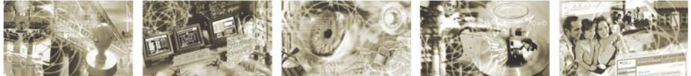

# BSI TR-03105 Part 1.2

# Component Specification RFID

Version 1.02.1 14.11.2008

| 1     | SCOPE  2                                              |  |
|-------|-------------------------------------------------------|--|
| 2     | REQUIREMENTS 3                                        |  |
| 3     | IMPORTANCE 3                                          |  |
| 4     | LAYER SPECIFICATION 3                                 |  |
| 4.1   | LAYER PROXIMITY CARD HARDWARE 4                       |  |
| 4.1.1 | STATIC ELECTRICITY TEST 4                          |  |
| 4.1.2 | PICC LOAD MODULATION AMPLITUDE 4                   |  |
| 4.1.3 | PICC RECEPTION 4                                      |  |
| 4.2   | LAYER PROXIMITY CARD INITIALIZATION PROTOCOL 5        |  |
| 4.3   | LAYER PROXIMITY CARD TRANSMISSION PROTOCOL 5       |  |
| 4.4   | LAYER SMART CARD – SECURITY AND COMMAND TESTS 6 |  |
| 4.5   | LAYER MRTDS – LOGICAL DATA STRUCTURE TESTS 6       |  |

# **1 Scope**

The process of issuing ePassports according to the ICAO standard involves several industrial companies as well as governmental organizations. Since the used RF-Id technology is evolving rapidly; it is important to establish a standard mechanism to ensure the conformity of the involved components.

The ePassport conformity assessment framework [frame] specifies an generic environment for ePassport tests. This document specifies a component as defined in the framework. This component is named RF-ID (PICC) and covers all tests concerning the chip inside the ePassport. This includes the low level protocol as well as the logical data structure of the stored data.

To address all different level of detail, this document defines several layers. This layer model is organized

| OSI reference layer | Layer description | Description                                   | Related specifications | Special attention points              |
|---------------------------|----------------------|-----------------------------------------------|---------------------------|------------------------------------------|
| 7                         | Application          | MRTDs – Logical data structure tests    | ICAO specs                | BAC (short-term) EAC (mid-term)       |
| 6                         | Presentation         | Smart card – Security and command tests | ISO7816, ICAO specs    |                                          |
| 5                         | Session              |                                               |                           |                                          |
| 4                         | Transport            | Proximity card transmission protocol    | ISO14443-4 ISO10373-6  |                                          |
| 3                         | Network              | Proximity card initialization protocol  | ISO14443-3 ISO10373-6  | multi-card operations min-max Bitrate |
| 2                         | Link                 | Proximity Card                                | ISO14443 1-2              | Antenna parameters:                      |
| 1                         | Physical             | Hardware                                      | ISO10373-6                | fres -> multi-card operations         |

Figure 1 RF Component layer architecture

similar to the OSI layer model starting with low level protocol tests at Layer 1 and ending with logical (application) data element tests at level 7.

Each layer defines independent tests, so that the conformity assessment for each layer can be performed by different test facilities. For example, for low level protocol tests there are already standard test environments in place that can be used.

Each layer consists of several test units which cover different scenarios. A test unit contains many test cases which are performed sequentially to process the specified test procedure.

Some OSI reference layers are grouped to a combined test layer, so there are currently five different test layer specifications for this component.

# **2 Requirements**

The minimum requirement for items to be tested with in this component is a contactless chip module with an attached antenna (e.g. inlay). The given PICC must at least comply with ISO 14443-1 and ISO 14443- 2 to be able to perform the low level hardware tests. Higher layers require additional functionality.

# **3 Importance**

Since the RF-ID chip is the core component of the ePassport the tests defined in this component are mandatory for ICAO complied ePassports.

# **4 Layer specification**

As mentioned in the introduction, this component defines five layers; each layer includes tests based on a different protocol level.

This layer architecture supports tests on different types of ePassport material. For example a chip vendor might only test compliance to ISO 14443-1/2 and ISO 10373-6 without having a fully personalized passport. A chip operation system vendor is able to verify the compatibility based on the ISO 7816 layer and an ePassport manufacturer can check the full ICAO conformity by executing all tests.

### **4.1 Layer Proximity Card Hardware**

This layer covers tests based on the ISO 14443-1/2 standards. The corresponding tests are described in ISO 10373-6. Since this components describes only tests for PICCs this layer will refer to the tests defined in paragraph 5 and 7.

While the existing test scenario refers to single card scenarios, the ePassport interoperability requires more complex conditions. These conditions are related to various influence-effects, which will appear with additional Visas.

### **4.1.1 Static electricity test**

These tests are defined in ISO/IEC 10373-6 paragraph 5. The purpose of this test is to check the behavior of the card IC in relation to electrostatic discharge (ESD) exposure of the test sample. The card under test is exposed to a simulated electrostatic discharge (ESD, human body model) and its basic operation is checked following the exposure.

#### **4.1.2 PICC load modulation amplitude**

This test as defined in ISO/IEC 10373-6 paragraph 7.1 determinates the PICC load modulation signal within the operating field range [Hmin, Hmax] as specified in the base standard.

#### **4.1.3 PICC reception**

This test is defined in ISO/IEC 10373-6 paragraph 7.2 to verify the ability of the PICC to receive the PCD message under certain conditions.

# **4.2 Layer Proximity card initialization protocol**

This second test layer verifies the initialization protocol as specified in ISO 14443-3. The PICC is initialized with the command sequence described in the ISO. The response of the PICC is tested according to the requirements of the ICAO LDS specification. The tests in this layer are also on a hardware level must may also interfere with the actual card operating system.

The following topic are handled inside this testing layer

- Verification of all seven states of the Iso14443-3 protocol (see figure 6 of Iso14443-3). All valid and invalid commands are tested in each state.
- Support of single, double and triple UIDs and verification of the UID rules.
- Verification of the ATQA bytes according to bit frame anticollision, UID size and RFU bits.
- Verification of bit-wise anticollision functionality e.g. valid and invalid UIDs, valid and invalid NVBs, collision recognition.
- Verification of the SAK byte according to cascaded UIDs and Iso14443-4 compliance
- Execution of wrong commands according to parameters, length of the command and CRC bytes.

# **4.3 Layer Proximity card transmission protocol**

This layer covers the PICC functionality as described in ISO 14443-4. Since the transmission protocol is partly implemented within the PICC operating system these tests require a specific card OS implementation.

The following functions defined in ISO 14443-4 are verified in this test layer

- Handling of RATS and ATS.
- PPS rules.
- Response for valid and invalid block formats like I-block, R-block and S-block.
- Response for valid and invalid block sequences e.g. chaining, re-transmission, frame waiting time extensions using one or more test commands / APDUs.
- Response for valid and invalid CIDs.
- Selection of different baudrates.

# **4.4 Layer Smart card – Security and command tests**

The LDS specification defines a set of ISO 7816 commands required for compliant ePassports. This test level includes scenarios for all these commands with the required parameter set.

The following commands are tested

- Select LDS Application
- Select File (FileID)
- ReadBinary (B0/B1 with/without SFI)
- Get Challenge
- Mutual Authenticate (For BAC support)
- Internal Authenticate (For AA support)
- (for EAC Support)

# **4.5 Layer MRTDs – Logical data structure tests**

The data encoding test layer analyses the structure of the LDS objects stored on an ePassport. This layer contains several test units, one for each LDS object (DG 1 - 16, EF.Com and EF.SoD). Another test unit verifies the integrity and consistency of the different data structures.

The tests specified in this layer can be performed using a regular ePassport or with given input data from a different source (e.g. file). The test configuration document specifies the source of the data.