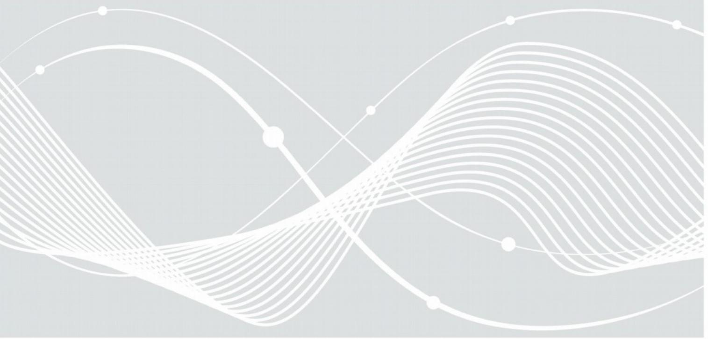

## Test plan for eMRTD Application Protocol and Logical Data Structure

BSI TR-03105 Part 3.1 Version 1.2, July 19th , 2013

Federal Office for Information Security Post Box 20 03 63 D-53133 Bonn

Internet: https://www.bsi.bund.de © Federal Office for Information Security 2013

## 1 Introduction

The BSI TR-03105 Part 3.1 refers to an RF protocol and application test standard for electronic Machine Readable Travel Documents (eMRTDs) for Layer 6 (ISO 7816) and Layer 7 (LDS encoding).

ISO7816 Layer 6 covers the ISO7816 conformity of the eMRTD Chip. The tests in this layer are restricted to the commands defined in ICAO DOC 9303 [\[ICAO 9303\]](#page-2-2) and accompanying Technical Reports, especially the Technical Report "Supplemental Access Control" [\[TR-SAC\].](#page-2-0) Other commands, especially file creation and update commands, are beyond the scope of this document.

The contents of the LDS files are checked in eMRTD-LDS Layer 7. The logical data structure test layer analyses the encoding of the LDS objects stored in an eMRTD. This layer contains several test units, one for each mandatory LDS object (DG 1, DG 2, EF.COM and EF.SOD) optional LDS objects necessary for the tested cryptographic protocols (EF.CardAccess, DG14 for PACE, DG15 for Active Authentication). These test units verify the integrity and consistency of the different data structures. The tests specified in this layer can be performed using a regular eMRTD or with given input data from a different source (e.g. file). The test configuration document specifies the source of the data.

Version 1.03 of TR-03105 Part 3 was used as a base for the work in the ISO SC17/Working Group 3 to define an international standard for eMRTD conformity tests [\[ICAO TR|.](#page-2-1) During the development of this standard, several changes and extensions have been applied to the test specification. Test cases for eMRTDs with Password Authenticated Connections Establishment (PACE) as well as Active Authentication (AA) have been added in Version 2 of the [\[ICAO TR|.](#page-2-1) These test cases are adapted from BSI TR-03105 Part 3.3 and additional input from AFNOR.

**Since all relevant test cases for BAC, PACE, Security Conditions and LDS are now defined in [\[ICAO TR|,](#page-2-1) this version of BSI TR03105 Part 3.1 just references to the ICAO test specification. The conformity tests, defined therein are identical/similar to the tests which were specified in previous versions of this BSI TR-03105 Part 3.1, with some minor exceptions where the BSI TR was stricter than the [\[ICAO TR|.](#page-2-1)**

## 2 Certification

Manufacturers and distributors having successfully passed the ICAO test standard may also apply for Certification according to this Technical Guideline (BSI TR-03105 Part 3.1) to have the conformity of their eMRTD confirmed by BSI.

## 3 References

| [ICAO TR    | ICAO Technical Report "RF Protocol and Application Test Standard for ePassport – Part 3" Tests for application protocol and logical data structure |
|-------------|-------------------------------------------------------------------------------------------------------------------------------------------------------|
| [ICAO 9303] | ICAO Doc 9303 Part 1 Volume 2                                                                                                                         |
| [TR-SAC]    | ICAO Technical Report "Supplemental Access Control for Machine Readable Travel Documents"                                                          |