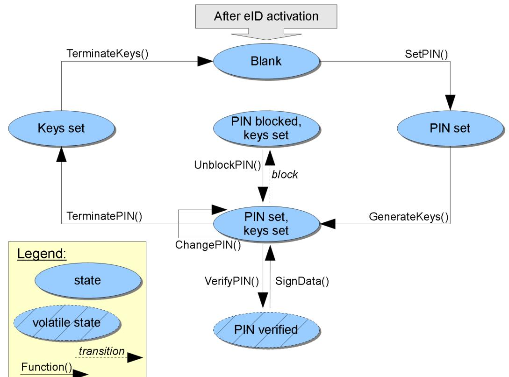

# BSI TR-03105 Part 3.4

Test plan for eID-cards with eSign-application acc. to BSI TR-03117

Version 1.0 01.04.2010

Bundesamt für Sicherheit in der Informationstechnik Postfach 20 03 63 53133 Bonn Internet: https://www.bsi.bund.de © Bundesamt für Sicherheit in der Informationstechnik 2010

| 1                | Introduction5                                |  |  |  |  |
|------------------|----------------------------------------------|--|--|--|--|
| 2                | General test requirements7                   |  |  |  |  |
| 2.1              | Test setup7                                  |  |  |  |  |
| 2.2              | Test profiles7                               |  |  |  |  |
| 2.3              | Key pair definition7                         |  |  |  |  |
| 2.4              | Certificate specification8                   |  |  |  |  |
| 2.4.1            | Certificate Set S_018                        |  |  |  |  |
| 2.4.2            | Certificate Set S_0212                       |  |  |  |  |
| 3                | Test cases17                                 |  |  |  |  |
| 3.1              | Test case notation17                         |  |  |  |  |
| 3.2              | Unit test ESIGN_ISO7816_S – eSign17          |  |  |  |  |
| 3.2.1            | ESIGN_ISO7816_S_118                          |  |  |  |  |
| 3.2.2            | ESIGN_ISO7816_S_218                          |  |  |  |  |
| 3.2.3            | ESIGN_ISO7816_S_319                          |  |  |  |  |
| 3.2.4            | ESIGN_ISO7816_S_420                          |  |  |  |  |
| 3.2.5            | ESIGN_ISO7816_S_520                          |  |  |  |  |
| 3.2.6            | ESIGN_ISO7816_S_621                          |  |  |  |  |
| 3.2.7            | ESIGN_ISO7816_S_722                          |  |  |  |  |
| 3.2.8            | ESIGN_ISO7816_S_822                          |  |  |  |  |
| 3.2.9            | ESIGN_ISO7816_S_923                          |  |  |  |  |
| 3.2.10           | ESIGN_ISO7816_S_1024                         |  |  |  |  |
| 3.2.11           | ESIGN_ISO7816_S_1125                         |  |  |  |  |
| 3.2.12           | ESIGN_ISO7816_S_1226                         |  |  |  |  |
| 3.2.13           | ESIGN_ISO7816_S_1327                         |  |  |  |  |
| 3.2.14           | ESIGN_ISO7816_S_1427                         |  |  |  |  |
| 3.2.15           | ESIGN_ISO7816_S_1528                         |  |  |  |  |
| 3.2.16           | ESIGN_ISO7816_S_1629                         |  |  |  |  |
| 3.2.17           | ESIGN_ISO7816_S_1730                         |  |  |  |  |
| 3.2.18           | ESIGN_ISO7816_S_1830                         |  |  |  |  |
| 3.2.19           | ESIGN_ISO7816_S_1931                         |  |  |  |  |
| 3.2.20           | ESIGN_ISO7816_S_2032                         |  |  |  |  |
| 3.2.21           | ESIGN_ISO7816_S_2133                         |  |  |  |  |
| 3.2.22           | ESIGN_ISO7816_S_2233                         |  |  |  |  |
| 3.2.23 3.2.24 | ESIGN_ISO7816_S_2334 ESIGN_ISO7816_S_2435 |  |  |  |  |
|                  |                                              |  |  |  |  |
|                  | Appendix36                                   |  |  |  |  |
|                  | History36                                    |  |  |  |  |
|                  | Bibliography36                               |  |  |  |  |
|                  | Implementation conformance statement (ICS)37 |  |  |  |  |

# **1 Introduction**

The TR-03105 defines a RF protocol and application test standard for eID-Cards. Version 2.0 of that document includes security mechanisms for ePassport, eID and eSign applications.

This document describes the test plan for eCards with advanced security mechanisms used for eID and eSign applications referring to EAC version 2 and the corresponding dependencies. Mainly, the eSign application is tested, but it requires working eID authentication mechanisms.

As already known by the EAC version 1 test plan, this specification has a layer based structure. The layers 1-4 refer the RF protocol according to the ISO 14443 1-4 standard. Since the defined security mechanisms have no direct influence on this abstraction layer, this amendment does not contain any tests for these layers. However, this document concentrates on the tests for the layer 6 (ISO 7816).

This document is supplementary to the EAC2.0 test specification.

Most specified eSign procedures deal with PIN and key management. Mainly, the implications explained by table 1 on page 36 in chapter A.2 of [TR03117 2009] are checked.

The tests comply with the functions and states shown in figure [1,](#page-3-1) which gives a simplified overview of the test coverage. The figure itself is merely *informative[1](#page-3-2)* .

*Figure 1: Description of eSign test coverage*

1 The figure does neither restrict, extend, define nor remove any requirements on the implementation of eSign. In particular, the eSign application does not need to be implemented on a chip as state machine.

The procedures are essentially mapped to ISO7816 APDUs in the following way:

- **-** The functions SetPIN() and ChangePIN are implemented by CHANGE REFERENCE DATA command. ChangePIN() does not result in a state transition, just the PIN value changes.
- **-** The function GenerateKeys() utilizes GENERATE ASYMMETRIC KEY command.
- **-** A VERIFY APDU is used for VerifyPIN() procedure. Successful verification enables a volatile state, where signing is possible. Multiple verification failures provoke blocking of the eSign PIN.
- **-** SignData() is implemented by PSO: COMPUTE DIGITAL SIGNATURE command.
- **-** TerminatePIN() and TerminateKeys() are performed by using a TERMINATE command.
- **-** UnblockPIN() utilizes RESET RETRY COUNTER to release a blocked eSign PIN.

# **2 General test requirements**

This chapter describes the general test requirements.

## **Test setup**

For setting up these tests, any contactless reader supporting type A and type B protocols can be used. However, this reader has to support extended length APDUs requested for Terminal Authentication.

To execute any of the test cases described here, several types of test samples are required.

For executing all tests with one sample, this sample has to implement the eID application as specified in [TR03110 2009] and the eSign application for electronic signatures as described in [TR03117 2009].

**The tests MUST be performed in the given order.** First, a series of positive tests traverses the described states (see Introduction) in order to validate the correct implementation of the procedures. The following tests force errors and describe wrong procedures to verify proper handling of restrictions and error codes.

## **Test profiles**

Table [1](#page-5-1) lists all used test profiles. Those are copied from EAC2.0 test specification.

| Profile-ID | Profile                                  | Remark                                                                                    |
|------------|------------------------------------------|-------------------------------------------------------------------------------------------|
| eID        | Electronic Identification Application | An application which contains authorization mechanisms as specified in [TR03110 2009]. |
| eSign      | Electronic Signature Application      | An application which contains data and mechanisms as specified in [TR03117 2009].      |

*Table 1: List of test profiles*

## **Key pair definition**

The certificate sets defined in section [a](#page-6-0)re based on several asymmetric key pairs. In preparation to the tests, these key pairs have to be generated. The parameters used for these keys are depending on the initial CVCA private key.

The initial CVCA root private key SHOULD be provided by the eCard vendor. It is also possible that the eCard vendor generates all keys and certificates on its own and passes it to the test operator for the tests.

There are separate CVCA roots for each terminal type.

| All key pairs MUST be generated independently, so it is not permitted to use the same key pair for |
|----------------------------------------------------------------------------------------------------|
| all sets. Table 2 lists all defined certificate key pairs.                                      |

| Key pair         | Description                                                  |
|------------------|--------------------------------------------------------------|
| S_ST_CVCA_KEY_01 | Public/private key of CVCA root for Signature Terminals      |
| S_DV_KEY_01      | Key pair of document verifier S_DV_01                        |
| S_ST_KEY_01      | Key pair of signature terminal S_ST_01                       |
| S_AT_CVCA_KEY_02 | Public/private key of CVCA root for Authentication Terminals |
| S_DV_KEY_02      | Key pair of document verifier S_DV_02                        |
| S_AT_KEY_02      | Key pair of authentication terminal S_AT_02                  |

*Table 2: Description of all defined certificate key pairs*

## **Certificate specification**

Since the advanced security mechanisms are using a certificate based authentication schema, it is necessary to provide a set of well prepared certificates in order to perform all tests.

This section defines the exact set of certificates referred in the tests. Besides the regular certificate chain, there is also the need for special encoded certificates.

The certificates are specified in two different ways. For provider of personalized eCard samples, which do already have a preconfigured trust point based on their own CVCA key pair, the sections below define sets of certificates relative to the effective date (*CVCAeff*) and expiration date (*CVCAexp*) of the given CVCA. The time span between CVCAeff and CVCAexp MUST be at least two month to allow proper adoption of the certificate time scheme defined below. The "current date" of the provided sample MUST be set to CVCAeff before the tests are started. The CVCA MUST NOT restrict authorization in any way, i.e. its Certificate Holder Authorization contains all rights. The provider of the sample or the test laboratory has to generate the corresponding certificate according to this specification based on the CVCA data.

There are separate CVCA roots for each terminal type, but they all SHOULD have equal effective and expiration dates.

If no preconfigured key pair is available or if the production process allows the use of an externally defined CVCA, a certificate set can be used which is defined as a "worked example" by this specification. This set is provided for ECDSA, RSA and RSAPSS based certificates and is defined in a full binary form with fixed keys and dates. It also includes a definition for an initial CVCA key pair and its effective and expiry dates.

#### **Certificate Set S\_01**

The certificate set consists of a regular certificate chain (DV → ST) which is used for the tests where a signature terminal is needed for eSign.

## **S\_DV\_CERT\_01**

| Table 3 describes certificate S_DV_CERT_01 of document verifier S_DV_01 in detail. |  |
|---------------------------------------------------------------------------------------|--|
|---------------------------------------------------------------------------------------|--|

| ID          | S_DV_CERT_01                                                                                                                                                                                                                                                                                                                                                                                                                                                                                                                                                                                                                                                                                                                                                                                                                                                                    |  |  |  |  |
|-------------|---------------------------------------------------------------------------------------------------------------------------------------------------------------------------------------------------------------------------------------------------------------------------------------------------------------------------------------------------------------------------------------------------------------------------------------------------------------------------------------------------------------------------------------------------------------------------------------------------------------------------------------------------------------------------------------------------------------------------------------------------------------------------------------------------------------------------------------------------------------------------------|--|--|--|--|
| Purpose     | This certificate is a regular DV certificate. Its validity period starts at the effective date of the CVCA and expires after one month.                                                                                                                                                                                                                                                                                                                                                                                                                                                                                                                                                                                                                                                                                                                                      |  |  |  |  |
| Version     | eSign_1.0                                                                                                                                                                                                                                                                                                                                                                                                                                                                                                                                                                                                                                                                                                                                                                                                                                                                       |  |  |  |  |
| Referred by | ESIGN_ISO7816_S_1, ESIGN_ISO7816_S_3, ESIGN_ISO7816_S_4, ESIGN_ISO7816_S_5, ESIGN_ISO7816_S_6, ESIGN_ISO7816_S_7, ESIGN_ISO7816_S_9, ESIGN_ISO7816_S_10, ESIGN_ISO7816_S_11, ESIGN_ISO7816_S_12, ESIGN_ISO7816_S_14, ESIGN_ISO7816_S_15, ESIGN_ISO7816_S_16, ESIGN_ISO7816_S_17, ESIGN_ISO7816_S_18, ESIGN_ISO7816_S_21, ESIGN_ISO7816_S_22, ESIGN_ISO7816_S_23, ESIGN_ISO7816_S_24                                                                                                                                                                                                                                                                                                                                                                                                                                                                           |  |  |  |  |
| Content     | 7F 21 aa 7F 4E bb 5F 29 01 00 42 cc dd 7F 49 ee ff 5F 20 gg hh 7F 4C 0E 06 09 04 00 7F 00 07 03 01 02 03 53 01 83 5F 25 06 ii 5F 24 06 jj 5F 37 kk ll                                                                                                                                                                                                                                                                                                                                                                                                                                                                                                                                                                                                                                                                                          |  |  |  |  |
|             | aa is the encoded combined length of certificate body and signature objects, bb is the encoded length the certificate body object, cc is the encoded length of the Certificate Authority Reference, dd is the placeholder for the Certificate Authority Reference (cc bytes), ee is the encoded length of the certificates public key, ff is the placeholder for the certificates public key bytes (ee bytes), gg is the encoded length of the Certificate Holder Reference, hh is the placeholder for the Certificate Holder Reference (gg bytes), ii is the placeholder for the BCD encoded effective date of the certificate, jj is the placeholder for the BCD encoded expiration date of the certificate, kk is the encoded length of the certificates signature object, ll is the placeholder for the certificates signature (kk bytes). |  |  |  |  |
| Parameters  | Certificate Authority Reference As defined by the CVCA for ST                                                                                                                                                                                                                                                                                                                                                                                                                                                                                                                                                                                                                                                                                                                                                                                                                |  |  |  |  |
|             | Certificate Holder Reference DETESTSIGNDV0001                                                                                                                                                                                                                                                                                                                                                                                                                                                                                                                                                                                                                                                                                                                                                                                                                                |  |  |  |  |
|             | Certificate Holder Authorisation DV (ST, Accreditation Body); all rights                                                                                                                                                                                                                                                                                                                                                                                                                                                                                                                                                                                                                                                                                                                                                                                                     |  |  |  |  |

|  | Certificate Effective Date  | CVCAeff                                   |
|--|-----------------------------|-------------------------------------------|
|  | Certificate Expiration Date | CVCAeff + 1 month                         |
|  | Public Key Reference        | Public key of S_DV_KEY_01                 |
|  | Signing Key Reference       | Signed by private key of S_ST_CVCA_KEY_01 |

*Table 3: Detailed description of certificate S\_DV\_CERT\_01*

#### **S\_ST\_CERT\_01**

Table [4](#page-9-0) describes certificate S\_ST\_CERT\_01 of signature terminal S\_ST\_01 in detail.

| ID          | S_ST_CERT_01                                                                                                                                                                                                                                                                                                                                                                                                                                                                                                                                                                                                                                                                                                                                                                                                                                       |  |  |
|-------------|----------------------------------------------------------------------------------------------------------------------------------------------------------------------------------------------------------------------------------------------------------------------------------------------------------------------------------------------------------------------------------------------------------------------------------------------------------------------------------------------------------------------------------------------------------------------------------------------------------------------------------------------------------------------------------------------------------------------------------------------------------------------------------------------------------------------------------------------------|--|--|
| Purpose     | This certificate is a regular ST certificate, which is issued by the S_DV_CERT_01.                                                                                                                                                                                                                                                                                                                                                                                                                                                                                                                                                                                                                                                                                                                                                                 |  |  |
| Version     | eSign_1.0                                                                                                                                                                                                                                                                                                                                                                                                                                                                                                                                                                                                                                                                                                                                                                                                                                          |  |  |
| Referred by | ESIGN_ISO7816_S_1, ESIGN_ISO7816_S_3, ESIGN_ISO7816_S_4, ESIGN_ISO7816_S_5, ESIGN_ISO7816_S_6, ESIGN_ISO7816_S_7, ESIGN_ISO7816_S_9, ESIGN_ISO7816_S_10, ESIGN_ISO7816_S_11, ESIGN_ISO7816_S_12, ESIGN_ISO7816_S_14, ESIGN_ISO7816_S_15, ESIGN_ISO7816_S_16, ESIGN_ISO7816_S_17, ESIGN_ISO7816_S_18, ESIGN_ISO7816_S_21, ESIGN_ISO7816_S_22, ESIGN_ISO7816_S_24                                                                                                                                                                                                                                                                                                                                                                                                                                                                     |  |  |
| Content     | 7F 21 aa 7F 4E bb 5F 29 01 00 42 cc dd 7F 49 ee ff 5F 20 gg hh 7F 4C 0E 06 09 04 00 7F 00 07 03 01 02 03 53 01 03 5F 25 06 ii 5F 24 06 jj 5F 37 kk ll aa is the encoded combined length of certificate body and signature objects, bb is the encoded length the certificate body object, cc is the encoded length of the Certificate Authority Reference, dd is the placeholder for the Certificate Authority Reference (cc bytes), ee is the encoded length of the certificates public key, ff is the placeholder for the certificates public key bytes (ee bytes), gg is the encoded length of the Certificate Holder Reference, hh is the placeholder for the Certificate Holder Reference (gg bytes), ii is the placeholder for the BCD encoded effective date of the certificate, |  |  |

|            | jj is the placeholder for the BCD encoded expiration date of the certificate, kk is the encoded length of the certificates signature object, ll is the placeholder for the certificates signature (kk bytes). |                                      |
|------------|---------------------------------------------------------------------------------------------------------------------------------------------------------------------------------------------------------------------|--------------------------------------|
| Parameters | Certificate Authority Reference                                                                                                                                                                                     | DETESTSIGNDV0001                     |
|            | Certificate Holder Reference                                                                                                                                                                                        | DETESTSIGNST0001                     |
|            | Certificate Holder Authorisation                                                                                                                                                                                    | ST; all rights                       |
|            | Certificate Effective Date                                                                                                                                                                                          | CVCAeff                              |
|            | Certificate Expiration Date                                                                                                                                                                                         | CVCAeff + 14 days                    |
|            | Public Key Reference                                                                                                                                                                                                | Public key of S_ST_KEY_01            |
|            | Signing Key Reference                                                                                                                                                                                               | Signed by private key of S_DV_KEY_01 |

*Table 4: Detailed description of certificate S\_ST\_CERT\_01*

## **S\_ST\_CERT\_01a**

Table [5](#page-10-0) describes certificate S\_ST\_CERT\_01a of signature terminal S\_ST\_01 in detail.

| ID          | S_ST_CERT_01a                                                                                                                                                                                                                                                                                                                                                                                       |  |  |
|-------------|-----------------------------------------------------------------------------------------------------------------------------------------------------------------------------------------------------------------------------------------------------------------------------------------------------------------------------------------------------------------------------------------------------|--|--|
| Purpose     | This certificate is a regular ST certificate, which is issued by the S_DV_CERT_01. It is almost identical to S_ST_CERT_01, but the right for Generate Qualified Electronic Signature is missing.                                                                                                                                                                                              |  |  |
| Version     | eSign_1.0                                                                                                                                                                                                                                                                                                                                                                                           |  |  |
| Referred by | ESIGN_ISO7816_S_23                                                                                                                                                                                                                                                                                                                                                                                  |  |  |
| Content     | 7F 21 aa 7F 4E bb 5F 29 01 00 42 cc dd 7F 49 ee ff 5F 20 gg hh 7F 4C 0E 06 09 04 00 7F 00 07 03 01 02 03 53 01 01 5F 25 06 ii 5F 24 06 jj 5F 37 kk ll aa is the encoded combined length of certificate body and signature objects, bb is the encoded length the certificate body object, cc is the encoded length of the Certificate Authority Reference, |  |  |

|            | dd is the placeholder for the Certificate Authority Reference (cc bytes), ee is the encoded length of the certificates public key, ff is the placeholder for the certificates public key bytes (ee bytes), gg is the encoded length of the Certificate Holder Reference, hh is the placeholder for the Certificate Holder Reference (gg bytes), ii is the placeholder for the BCD encoded effective date of the certificate, jj is the placeholder for the BCD encoded expiration date of the certificate, kk is the encoded length of the certificates signature object, ll is the placeholder for the certificates signature (kk bytes). |                                      |
|------------|--------------------------------------------------------------------------------------------------------------------------------------------------------------------------------------------------------------------------------------------------------------------------------------------------------------------------------------------------------------------------------------------------------------------------------------------------------------------------------------------------------------------------------------------------------------------------------------------------------------------------------------------------------------------|--------------------------------------|
| Parameters | Certificate Authority Reference                                                                                                                                                                                                                                                                                                                                                                                                                                                                                                                                                                                                                                    | DETESTSIGNDV0001                     |
|            | Certificate Holder Reference                                                                                                                                                                                                                                                                                                                                                                                                                                                                                                                                                                                                                                       | DETESTSIGNST0001                     |
|            | Certificate Holder Authorisation                                                                                                                                                                                                                                                                                                                                                                                                                                                                                                                                                                                                                                   | ST; Generate electronic signature    |
|            | Certificate Effective Date                                                                                                                                                                                                                                                                                                                                                                                                                                                                                                                                                                                                                                         | CVCAeff                              |
|            | Certificate Expiration Date                                                                                                                                                                                                                                                                                                                                                                                                                                                                                                                                                                                                                                        | CVCAeff + 14 days                    |
|            | Public Key Reference                                                                                                                                                                                                                                                                                                                                                                                                                                                                                                                                                                                                                                               | Public key of S_ST_KEY_01            |
|            | Signing Key Reference                                                                                                                                                                                                                                                                                                                                                                                                                                                                                                                                                                                                                                              | Signed by private key of S_DV_KEY_01 |

*Table 5: Detailed description of certificate S\_ST\_CERT\_01a*

#### **Certificate Set S\_02**

The certificate set consists of a regular certificate chain (DV → AT) which is used for the tests where an authentication terminal is needed for eSign.

#### **S\_DV\_CERT\_02**

Table [6](#page-11-0) describes certificate S\_DV\_CERT\_02 of document verifier S\_DV\_02 in detail.

| ID          | S_DV_CERT_02                                                                                                                               |  |
|-------------|--------------------------------------------------------------------------------------------------------------------------------------------|--|
| Purpose     | This certificate is a regular DV certificate. Its validity period starts at the effective date of the CVCA and expires after one month. |  |
| Version     | eSign_1.0                                                                                                                                  |  |
| Referred by | ESIGN_ISO7816_S_2, ESIGN_ISO7816_S_8, ESIGN_ISO7816_S_13, ESIGN_ISO7816_S_20                                                            |  |
| Content     | 7F 21 aa 7F 4E bb 5F 29 01 00                                                                                                        |  |

|            | 42 cc dd 7F 49 ee ff 5F 20 gg hh 7F 4C 0E 53 05 80 1F FF FF C0 5F 25 06 ii 5F 24 06 jj 5F 37 kk ll                                                                                                                                                                                                                                                                                                                                                                                                                                                                                                                                                                                                                                                                                                                                                         | 06 09 04 00 7F 00 07 03 01 02 02                                                               |  |
|------------|---------------------------------------------------------------------------------------------------------------------------------------------------------------------------------------------------------------------------------------------------------------------------------------------------------------------------------------------------------------------------------------------------------------------------------------------------------------------------------------------------------------------------------------------------------------------------------------------------------------------------------------------------------------------------------------------------------------------------------------------------------------------------------------------------------------------------------------------------------------------------------|------------------------------------------------------------------------------------------------|--|
|            | aa is the encoded combined length of certificate body and signature objects, bb is the encoded length the certificate body object, cc is the encoded length of the Certificate Authority Reference, dd is the placeholder for the Certificate Authority Reference (cc bytes), ee is the encoded length of the certificates public key, ff is the placeholder for the certificates public key bytes (ee bytes), gg is the encoded length of the Certificate Holder Reference, hh is the placeholder for the Certificate Holder Reference (gg bytes), ii is the placeholder for the BCD encoded effective date of the certificate, jj is the placeholder for the BCD encoded expiration date of the certificate, kk is the encoded length of the certificates signature object, ll is the placeholder for the certificates signature (kk bytes). |                                                                                                |  |
| Parameters | Certificate Authority Reference                                                                                                                                                                                                                                                                                                                                                                                                                                                                                                                                                                                                                                                                                                                                                                                                                                                 | As defined by the CVCA for AT                                                                  |  |
|            | Certificate Holder Reference                                                                                                                                                                                                                                                                                                                                                                                                                                                                                                                                                                                                                                                                                                                                                                                                                                                    | DETESTSIGNDV0002                                                                               |  |
|            | Certificate Holder Authorisation                                                                                                                                                                                                                                                                                                                                                                                                                                                                                                                                                                                                                                                                                                                                                                                                                                                | DV (AT, official domestic); read DG1-21, Install Certificate, Install Qualified Certificate |  |
|            | Certificate Effective Date                                                                                                                                                                                                                                                                                                                                                                                                                                                                                                                                                                                                                                                                                                                                                                                                                                                      | CVCAeff                                                                                        |  |
|            | Certificate Expiration Date                                                                                                                                                                                                                                                                                                                                                                                                                                                                                                                                                                                                                                                                                                                                                                                                                                                     | CVCAeff + 1 month                                                                              |  |
|            | Public Key Reference                                                                                                                                                                                                                                                                                                                                                                                                                                                                                                                                                                                                                                                                                                                                                                                                                                                            | Public key of S_DV_KEY_02                                                                      |  |
|            | Signing Key Reference                                                                                                                                                                                                                                                                                                                                                                                                                                                                                                                                                                                                                                                                                                                                                                                                                                                           | Signed by private key of S_AT_CVCA_KEY_02                                                      |  |

*Table 6: Detailed description of certificate S\_DV\_CERT\_02*

## **S\_AT\_CERT\_02**

Table [7](#page-12-0) describes certificate S\_AT\_CERT\_02 of authentication terminal S\_AT\_02 in detail.

| ID      | S_AT_CERT_02                                                                       |
|---------|------------------------------------------------------------------------------------|
| Purpose | This certificate is a regular AT certificate, which is issued by the S_DV_CERT_02. |
| Version | eSign_1.0                                                                          |

| Referred by |                                                                                                                                                                                                                                                                                                                                                                                                                                                                                                                                                                                                                                                                                                                                                                                                             | ESIGN_ISO7816_S_2, ESIGN_ISO7816_S_8, ESIGN_ISO7816_S_20               |
|-------------|-------------------------------------------------------------------------------------------------------------------------------------------------------------------------------------------------------------------------------------------------------------------------------------------------------------------------------------------------------------------------------------------------------------------------------------------------------------------------------------------------------------------------------------------------------------------------------------------------------------------------------------------------------------------------------------------------------------------------------------------------------------------------------------------------------------|------------------------------------------------------------------------|
| Content     | 7F 21 aa 7F 4E bb 5F 29 01 00 42 cc dd 7F 49 ee ff 5F 20 gg hh 7F 4C 0E 06 09 04 00 7F 00 07 03 01 02 02 53 05 00 1F FF FF C0 5F 25 06 ii 5F 24 06 jj 5F 37 kk ll                                                                                                                                                                                                                                                                                                                                                                                                                                                                                                                                                                                                          |                                                                        |
|             | aa is the encoded combined length of certificate body and signature objects, bb is the encoded length the certificate body object, cc is the encoded length of the Certificate Authority Reference, dd is the placeholder for the Certificate Authority Reference (cc bytes), ee is the encoded length of the certificates public key, ff is the placeholder for the certificates public key bytes (ee bytes), gg is the encoded length of the Certificate Holder Reference, hh is the placeholder for the Certificate Holder Reference (gg bytes), ii is the placeholder for the BCD encoded effective date of the certificate, jj is the placeholder for the BCD encoded expiration date of the certificate, kk is the encoded length of the certificates signature object, |                                                                        |
|             | ll is the placeholder for the certificates signature (kk bytes).                                                                                                                                                                                                                                                                                                                                                                                                                                                                                                                                                                                                                                                                                                                                            |                                                                        |
| Parameters  | Certificate Authority Reference                                                                                                                                                                                                                                                                                                                                                                                                                                                                                                                                                                                                                                                                                                                                                                             | DETESTSIGNDV0002                                                       |
|             | Certificate Holder Reference                                                                                                                                                                                                                                                                                                                                                                                                                                                                                                                                                                                                                                                                                                                                                                                | DETESTSIGNAT0002                                                       |
|             | Certificate Holder Authorisation                                                                                                                                                                                                                                                                                                                                                                                                                                                                                                                                                                                                                                                                                                                                                                            | AT; read DG1-21, Install Certificate, Install Qualified Certificate |
|             | Certificate Effective Date                                                                                                                                                                                                                                                                                                                                                                                                                                                                                                                                                                                                                                                                                                                                                                                  | CVCAeff                                                                |
|             | Certificate Expiration Date                                                                                                                                                                                                                                                                                                                                                                                                                                                                                                                                                                                                                                                                                                                                                                                 | CVCAeff + 14 days                                                      |
|             | Public Key Reference                                                                                                                                                                                                                                                                                                                                                                                                                                                                                                                                                                                                                                                                                                                                                                                        | Public key of S_AT_KEY_02                                              |
|             | Signing Key Reference                                                                                                                                                                                                                                                                                                                                                                                                                                                                                                                                                                                                                                                                                                                                                                                       | Signed by private key of S_DV_KEY_02                                   |

*Table 7: Detailed description of certificate S\_AT\_CERT\_02*

## **S\_AT\_CERT\_02a**

Table [8](#page-13-0) describes certificate S\_AT\_CERT\_02a of authentication terminal S\_AT\_02 in detail.

| ID | S_AT_CERT_02a |
|----|---------------|
|    |               |

| Purpose     | This certificate is a regular AT certificate, which is issued by the S_DV_CERT_02. It is almost identical to S_AT_CERT_02, but the right for Install Qualified Certificate is missing.                                                                                                                                                                                                                                                                                                                                                                                                                                                                                                                                                            |                                                                                                                                                                                                                                                                                                                            |
|-------------|---------------------------------------------------------------------------------------------------------------------------------------------------------------------------------------------------------------------------------------------------------------------------------------------------------------------------------------------------------------------------------------------------------------------------------------------------------------------------------------------------------------------------------------------------------------------------------------------------------------------------------------------------------------------------------------------------------------------------------------------------------|----------------------------------------------------------------------------------------------------------------------------------------------------------------------------------------------------------------------------------------------------------------------------------------------------------------------------|
| Version     | eSign_1.0                                                                                                                                                                                                                                                                                                                                                                                                                                                                                                                                                                                                                                                                                                                                               |                                                                                                                                                                                                                                                                                                                            |
| Referred by | ESIGN_ISO7816_S_13                                                                                                                                                                                                                                                                                                                                                                                                                                                                                                                                                                                                                                                                                                                                      |                                                                                                                                                                                                                                                                                                                            |
| Content     | 7F 21 aa 7F 4E bb 5F 29 01 00 42 cc dd 7F 49 ee ff 5F 20 gg hh 7F 4C 0E 06 09 04 00 7F 00 07 03 01 02 02 53 05 00 1F FF FF 40 5F 25 06 ii 5F 24 06 jj 5F 37 kk ll bb is the encoded length the certificate body object, cc is the encoded length of the Certificate Authority Reference, ee is the encoded length of the certificates public key, ff is the placeholder for the certificates public key bytes (ee bytes), gg is the encoded length of the Certificate Holder Reference, hh is the placeholder for the Certificate Holder Reference (gg bytes), kk is the encoded length of the certificates signature object, ll is the placeholder for the certificates signature (kk bytes). | aa is the encoded combined length of certificate body and signature objects, dd is the placeholder for the Certificate Authority Reference (cc bytes), ii is the placeholder for the BCD encoded effective date of the certificate, jj is the placeholder for the BCD encoded expiration date of the certificate, |
| Parameters  | Certificate Authority Reference                                                                                                                                                                                                                                                                                                                                                                                                                                                                                                                                                                                                                                                                                                                         | DETESTSIGNDV0002                                                                                                                                                                                                                                                                                                           |
|             | Certificate Holder Reference                                                                                                                                                                                                                                                                                                                                                                                                                                                                                                                                                                                                                                                                                                                            | DETESTSIGNAT0002                                                                                                                                                                                                                                                                                                           |
|             | Certificate Holder Authorisation                                                                                                                                                                                                                                                                                                                                                                                                                                                                                                                                                                                                                                                                                                                        | AT; read DG1-21, Install Certificate                                                                                                                                                                                                                                                                                       |
|             | Certificate Effective Date                                                                                                                                                                                                                                                                                                                                                                                                                                                                                                                                                                                                                                                                                                                              | CVCAeff                                                                                                                                                                                                                                                                                                                    |
|             | Certificate Expiration Date                                                                                                                                                                                                                                                                                                                                                                                                                                                                                                                                                                                                                                                                                                                             | CVCAeff + 14 days                                                                                                                                                                                                                                                                                                          |
|             | Public Key Reference                                                                                                                                                                                                                                                                                                                                                                                                                                                                                                                                                                                                                                                                                                                                    | Public key of S_AT_KEY_02                                                                                                                                                                                                                                                                                                  |
|             | Signing Key Reference                                                                                                                                                                                                                                                                                                                                                                                                                                                                                                                                                                                                                                                                                                                                   | Signed by private key of S_DV_KEY_02                                                                                                                                                                                                                                                                                       |

*Table 8: Detailed description of certificate S\_AT\_CERT\_02a*

# **3 Test cases**

This chapter defines the additional tests required for the eSign application.

## **Test case notation**

The test cases defined below specify a set of command APDU which have to be sent to the test sample. While same parts of these APDUs are fixed, other elements have variable values which cannot be defined in general. The variable parts are marked by placeholder values which have to be replaced by the actual values. The following placeholders are commonly used and therefore defined within table [9](#page-14-1) in a global manner. All other placeholders are defined within the corresponding test case definition.

| Placeholder                                                        | Definition                                                                                                                                  |
|--------------------------------------------------------------------|---------------------------------------------------------------------------------------------------------------------------------------------|
| <Lc>                                                               | The length bytes containing the length of the APDU command data.                                                                            |
| <Le>                                                               | The length bytes containing the length of the requested response data.                                                                      |
| <Lxy>                                                              | The encoded length of the data object xy.                                                                                                   |
| <Cryptogram>                                                       | The encrypted part of a Secure Messaging APDU. The data content of this cryptogram is defined in the corresponding test case definition. |
| <Checksum>                                                         | The cryptographic checksum, which is calculated over the protected parts of the Secure Messaging command.                                |
| <eSign-PIN reference>                                           | The reference to the eSign-PIN object on the chip as stated in ICS.                                                                         |
| <eSign-PIN>                                                        | The value of the eSign-PIN as stated in ICS.                                                                                                |
| <Digital Signature Template referencing signature key> | The Digital Signature Template with reference to the signature key as stated in ICS.                                                     |
| <Public key>                                                       | The public result of a key generation operation performed by the chip.                                                                      |
| <Hash of data>                                                     | The result of an externally performed hash operation in order to sign that source data.                                                  |
| <Signature>                                                        | The result of a signature operation performed by the chip.                                                                                  |

*Table 9: Description of commonly used placeholders*

The eSign application requires a working eID application for authentication. So, it is necessary to perform a full General Authentication Procedure before selecting the eSign application. In order to shorten commonly used preconditions, the term "perform GAP with some password and some certificates" means that

- 1. the PACE mechanism MUST be performed using this password and a CHAT that matches terminal type and authorization of these certificates,
- 2. the Terminal Authentication mechanism MUST be performed using these certificates,
- 3. the Chip Authentication MUST be performed and
- 4. all following APDUs MUST be sent as valid Secure Messaging APDUs.

## **Unit test ESIGN\_ISO7816\_S – eSign**

These test cases check the eSign application.

## **ESIGN\_ISO7816\_S\_1**

Table [10](#page-15-2) describes test case ESIGN\_ISO7816\_S\_1 in detail.

| ID               | ESIGN_ISO7816_S_1                                                                                                                                                                                                                        |
|------------------|------------------------------------------------------------------------------------------------------------------------------------------------------------------------------------------------------------------------------------------|
| Purpose          | Positive test: Set new eSign-PIN                                                                                                                                                                                                         |
| Version          | eSign_1.0                                                                                                                                                                                                                                |
| Profile          | eSign                                                                                                                                                                                                                                    |
| Preconditions    | 1. eSign-PIN and eSign key pair MUST NOT have been set. 2. GAP with eID-PIN and certificate chain (S_DV_CERT_01, S_ST_CERT_01) MUST have been performed. 3. The eSign application MUST have been selected.                      |
| Scenario         | 1. Send the given Change Reference Data APDU to the eCard: '0C 24 01 <eSign-PIN reference> <Lc> 87 <L87> 01 <Cryptogram> 8E 08 <Checksum> 00' <Cryptogram> contains the following encrypted data objects: - '<eSign-PIN>' |
| Expected results | 1. '90 00' within a valid Secure Messaging response.                                                                                                                                                                                     |

*Table 10: Description of test case ESIGN\_ISO7816\_S\_1*

## **ESIGN\_ISO7816\_S\_2**

Table [11](#page-16-1) describes test case ESIGN\_ISO7816\_S\_2 in detail.

| ID               | ESIGN_ISO7816_S_2                                                                                                                                                                                        |
|------------------|----------------------------------------------------------------------------------------------------------------------------------------------------------------------------------------------------------|
| Purpose          | Positive test: Generate new eSign key pair                                                                                                                                                               |
| Version          | eSign_1.0                                                                                                                                                                                                |
| Profile          | eID, eSign                                                                                                                                                                                               |
| Preconditions    | 1. eSign-PIN MUST have been set.                                                                                                                                                                         |
|                  | 2. eSign key pair MUST NOT have been set.                                                                                                                                                                |
|                  | 3. GAP with eID-PIN and certificate chain (S_DV_CERT_02, S_AT_CERT_02) MUST have been performed.                                                                                                      |
|                  | 4. The eSign application MUST have been selected.                                                                                                                                                        |
| Scenario         | 1. Send the given Generate Asymmetric Key Pair APDU to the eCard: '0C 47 82 00 <Lc> 85 <L85> <Cryptogram> 8E 08 <Checksum> 00' <Cryptogram> contains the following encrypted data objects: - |
|                  | '<Digital Signature Template referencing signature key>'                                                                                                                                              |
| Expected results | 1. '7F 49 <L7F49> <Public key> 90 00' within a valid Secure Messaging response.                                                                                                                       |

*Table 11: Description of test case ESIGN\_ISO7816\_S\_2*

## **ESIGN\_ISO7816\_S\_3**

Table [12](#page-17-1) describes test case ESIGN\_ISO7816\_S\_3 in detail.

| ID            | ESIGN_ISO7816_S_3                                                                                                                   |
|---------------|-------------------------------------------------------------------------------------------------------------------------------------|
| Purpose       | Positive test: Verify eSign-PIN                                                                                                     |
| Version       | eSign_1.0                                                                                                                           |
| Profile       | eSign                                                                                                                               |
| Preconditions | 1. eSign-PIN MUST have been set. 2. GAP with CAN and certificate chain (S_DV_CERT_01, S_ST_CERT_01) MUST have been performed. |
|               | 3. The eSign application MUST have been selected.                                                                                   |
| Scenario      | 1. Send the given Verify APDU to the eCard: '0C 20 00 <eSign-PIN reference> <Lc> 87 <L87> 01                                     |

|                  | <Cryptogram> 8E 08 <Checksum> 00' <Cryptogram> contains the following encrypted data objects: - '<eSign-PIN>' |
|------------------|------------------------------------------------------------------------------------------------------------------------|
| Expected results | 1. '90 00' within a valid Secure Messaging response.                                                                   |

*Table 12: Description of test case ESIGN\_ISO7816\_S\_3*

## **ESIGN\_ISO7816\_S\_4**

Table [13](#page-17-2) describes test case ESIGN\_ISO7816\_S\_4 in detail.

| ID               | ESIGN_ISO7816_S_4                                                                                                                                                                                                                                                                                                                                                                                                                                                                                              |
|------------------|----------------------------------------------------------------------------------------------------------------------------------------------------------------------------------------------------------------------------------------------------------------------------------------------------------------------------------------------------------------------------------------------------------------------------------------------------------------------------------------------------------------|
| Purpose          | Positive test: Generate signature                                                                                                                                                                                                                                                                                                                                                                                                                                                                              |
| Version          | eSign_1.0                                                                                                                                                                                                                                                                                                                                                                                                                                                                                                      |
| Profile          | eSign                                                                                                                                                                                                                                                                                                                                                                                                                                                                                                          |
| Preconditions    | 1. eSign-PIN and eSign key pair MUST have been set. 2. GAP with CAN and certificate chain (S_DV_CERT_01, S_ST_CERT_01) MUST have been performed. 3. The eSign application MUST have been selected.                                                                                                                                                                                                                                                                                                    |
| Scenario         | 1. Send the given Verify APDU to the eCard: '0C 20 00 <eSign-PIN reference> <Lc> 87 <L87> 01 <Cryptogram> 8E 08 <Checksum> 00' <Cryptogram> contains the following encrypted data objects: - '<eSign-PIN>' 2. Send the given PSO: Compute Digital Signature APDU to the eCard to get the signature: '0C 2A 9E 9A <Lc> 87 <L87> 01 <Cryptogram> 8E 08 <Checksum> 00' <Cryptogram> contains the following encrypted data objects: - '<Hash of data>' 3. Verify signature. |
| Expected results | 1. '90 00' within a valid Secure Messaging response.                                                                                                                                                                                                                                                                                                                                                                                                                                                           |
|                  | 2. '<Signature> 90 00' within a valid Secure Messaging response. 3. TRUE                                                                                                                                                                                                                                                                                                                                                                                                                                    |

*Table 13: Description of test case ESIGN\_ISO7816\_S\_4*

Table [14](#page-18-2) describes test case ESIGN\_ISO7816\_S\_5 in detail.

| ID               | ESIGN_ISO7816_S_5                                                                                                                                                                                                                                                                                                                                                                                                                                                                                                                                                    |
|------------------|----------------------------------------------------------------------------------------------------------------------------------------------------------------------------------------------------------------------------------------------------------------------------------------------------------------------------------------------------------------------------------------------------------------------------------------------------------------------------------------------------------------------------------------------------------------------|
| Purpose          | Positive test: Change eSign-PIN                                                                                                                                                                                                                                                                                                                                                                                                                                                                                                                                      |
| Version          | eSign_1.0                                                                                                                                                                                                                                                                                                                                                                                                                                                                                                                                                            |
| Profile          | eSign                                                                                                                                                                                                                                                                                                                                                                                                                                                                                                                                                                |
| Preconditions    | 1. eSign-PIN MUST have been set. 2. GAP with CAN and certificate chain (S_DV_CERT_01, S_ST_CERT_01) MUST have been performed. 3. The eSign application MUST have been selected.                                                                                                                                                                                                                                                                                                                                                                             |
| Scenario         | 1. Send the given Change Reference Data APDU to the eCard: '0C 24 00 <eSign-PIN reference> <Lc> 87 <L87> 01 <Cryptogram> 8E 08 <Checksum> 00' <Cryptogram> contains the following encrypted data objects: - '<old eSign-PIN    new eSign-PIN>' 2. Power off the chip and restore preconditions. 3. Send the given Verify APDU to the eCard to verify new PIN: '0C 20 00 <eSign-PIN reference> <Lc> 87 <L87> 01 <Cryptogram> 8E 08 <Checksum> 00' <Cryptogram> contains the following encrypted data objects: - '<new eSign-PIN>' |
| Expected results | 1. '90 00' within a valid Secure Messaging response. 2. TRUE                                                                                                                                                                                                                                                                                                                                                                                                                                                                                                      |
|                  | 3. '90 00' within a valid Secure Messaging response.                                                                                                                                                                                                                                                                                                                                                                                                                                                                                                                 |

*Table 14: Description of test case ESIGN\_ISO7816\_S\_5*

#### **ESIGN\_ISO7816\_S\_6**

Table [15](#page-19-1) describes test case ESIGN\_ISO7816\_S\_6 in detail.

| ID      | ESIGN_ISO7816_S_6                  |
|---------|------------------------------------|
| Purpose | Positive test: Terminate eSign-PIN |

| Version          | eSign_1.0                                                                                                    |
|------------------|--------------------------------------------------------------------------------------------------------------|
| Profile          | eSign                                                                                                        |
| Preconditions    | 1. eSign-PIN MUST have been set.                                                                             |
|                  | 2. GAP with eID-PIN and certificate chain (S_DV_CERT_01, S_ST_CERT_01) MUST have been performed.          |
|                  | 3. The eSign application MUST have been selected.                                                            |
| Scenario         | 1. Send the given Terminate APDU to the eCard: '0C E6 10 <eSign-PIN reference> <Lc> 8E 08 <Checksum> 00'' |
| Expected results | 1. '90 00' within a valid Secure Messaging response.                                                         |

*Table 15: Description of test case ESIGN\_ISO7816\_S\_6*

## **ESIGN\_ISO7816\_S\_7**

Table [16](#page-19-2) describes test case ESIGN\_ISO7816\_S\_7 in detail.

| ID               | ESIGN_ISO7816_S_7                                                                                                               |
|------------------|---------------------------------------------------------------------------------------------------------------------------------|
| Purpose          | Positive test: Terminate eSign key pair                                                                                         |
| Version          | eSign_1.0                                                                                                                       |
| Profile          | eSign                                                                                                                           |
| Preconditions    | 1. eSign-PIN MUST NOT have been set, i.e. MUST have been terminated.                                                            |
|                  | 1. eSign key pair MUST have been set.                                                                                           |
|                  | 2. GAP with eID-PIN and certificate chain (S_DV_CERT_01, S_ST_CERT_01) MUST have been performed.                             |
|                  | 3. The eSign application MUST have been selected.                                                                               |
| Scenario         | 1. Send the given Terminate APDU to the eCard: '0C E6 21 00 <Lc> 87 <L87> 01 <Cryptogram> 8E 08 <Checksum> 00'            |
|                  | <Cryptogram> contains the following encrypted data objects: - '<Digital Signature Template referencing signature key>' |
| Expected results | 1. '90 00' within a valid Secure Messaging response.                                                                            |

*Table 16: Description of test case ESIGN\_ISO7816\_S\_7*

| ID               | ESIGN_ISO7816_S_8                                                                                                                                                                                                                                                       |
|------------------|-------------------------------------------------------------------------------------------------------------------------------------------------------------------------------------------------------------------------------------------------------------------------|
| Purpose          | Negative test: Generate new eSign key pair while eSign-PIN is still missing                                                                                                                                                                                             |
| Version          | eSign_1.0                                                                                                                                                                                                                                                               |
| Profile          | eID, eSign                                                                                                                                                                                                                                                              |
| Preconditions    | 1. eSign-PIN and eSign key pair MUST NOT have been set. 2. GAP with eID-PIN and certificate chain (S_DV_CERT_02, S_AT_CERT_02) MUST have been performed. 3. The eSign application MUST have been selected.                                                     |
| Scenario         | 1. Send the given Generate Asymmetric Key Pair APDU to the eCard: '0C 47 82 00 <Lc> 85 <L85> <Cryptogram> 8E 08 <Checksum> 00' <Cryptogram> contains the following encrypted data objects: - '<Digital Signature Template referencing signature key>' |
| Expected results | 1. '69 82' or '69 84' within a valid Secure Messaging response.                                                                                                                                                                                                         |

Table [17](#page-20-2) describes test case ESIGN\_ISO7816\_S\_8 in detail.

*Table 17: Description of test case ESIGN\_ISO7816\_S\_8*

## **ESIGN\_ISO7816\_S\_9**

Table [18](#page-21-1) describes test case ESIGN\_ISO7816\_S\_9 in detail.

| ID            | ESIGN_ISO7816_S_9                                                                                          |
|---------------|------------------------------------------------------------------------------------------------------------|
| Purpose       | Negative test: Verify eSign-PIN while it is still missing                                                  |
| Version       | eSign_1.0                                                                                                  |
| Profile       | eSign                                                                                                      |
| Preconditions | 1. eSign-PIN MUST NOT have been set. 2. GAP with CAN and certificate chain (S_DV_CERT_01, S_ST_CERT_01) |
|               | MUST have been performed. 3. The eSign application MUST have been selected.                             |

| Scenario         | 1. Send the given Verify APDU to the eCard: '0C 20 00 <eSign-PIN reference> <Lc> 87 <L87> 01 <Cryptogram> 8E 08 <Checksum> 00' <Cryptogram> contains the following encrypted data objects: - '<eSign-PIN>' |
|------------------|---------------------------------------------------------------------------------------------------------------------------------------------------------------------------------------------------------------------------|
| Expected results | 1. '69 84' or '69 82' or '6A 88' within a valid Secure Messaging response.                                                                                                                                                |

*Table 18: Description of test case ESIGN\_ISO7816\_S\_9*

#### **ESIGN\_ISO7816\_S\_10**

Table [19](#page-22-1) describes test case ESIGN\_ISO7816\_S\_10 in detail.

| ID               | ESIGN_ISO7816_S_10                                                                                                                                  |
|------------------|-----------------------------------------------------------------------------------------------------------------------------------------------------|
| Purpose          | Negative test: Set new eSign-PIN but new PIN is too short                                                                                           |
| Version          | eSign_1.0                                                                                                                                           |
| Profile          | eSign                                                                                                                                               |
| Preconditions    | 1. eSign-PIN and eSign key pair MUST NOT have been set.                                                                                             |
|                  | 2. GAP with eID-PIN and certificate chain (S_DV_CERT_01, S_ST_CERT_01) MUST have been performed.                                                 |
|                  | 3. The eSign application MUST have been selected.                                                                                                   |
| Scenario         | 1. Send the given Change Reference Data APDU to the eCard: '0C 24 01 <eSign-PIN reference> <Lc> 87 <L87> 01 <Cryptogram> 8E 08 <Checksum> 00' |
|                  | <Cryptogram> contains the following encrypted data objects: - '<eSign-PIN>'                                                                   |
|                  | Use a new eSign-PIN that is shorter than minimum eSign-PIN length. -                                                                             |
|                  | 2. Power off the chip and perform test case ESIGN_ISO7816_S_9 to verify that the new eSign-PIN was not accepted.                                 |
|                  | 3. Power off the chip and perform test case ESIGN_ISO7816_S_1 to verify that setting an eSign-PIN is still possible.                             |
| Expected results | 1. '6A 80' or '6A 87' or '69 82' or other error within a valid Secure Messaging response.                                                        |
|                  | 2. TRUE                                                                                                                                             |
|                  | 3. TRUE                                                                                                                                             |

*Table 19: Description of test case ESIGN\_ISO7816\_S\_10*

## **ESIGN\_ISO7816\_S\_11**

Table [20](#page-23-1) describes test case ESIGN\_ISO7816\_S\_11 in detail.

| ID            | ESIGN_ISO7816_S_11                                                                                                                                                              |
|---------------|---------------------------------------------------------------------------------------------------------------------------------------------------------------------------------|
| Purpose       | Negative test: Set new eSign-PIN while it has already been set                                                                                                                  |
| Version       | eSign_1.0                                                                                                                                                                       |
| Profile       | eSign                                                                                                                                                                           |
| Preconditions | 1. eSign-PIN MUST have been set. 2. eSign key pair MUST NOT have been set.                                                                                                   |
|               | 3. GAP with eID-PIN and certificate chain (S_DV_CERT_01, S_ST_CERT_01) MUST have been performed.                                                                             |
|               | 4. The eSign application MUST have been selected.                                                                                                                               |
| Scenario      | 1. Send the given Change Reference Data APDU to the eCard: '0C 24 01 <eSign-PIN reference> <Lc> 87 <L87> 01 <Cryptogram> 8E 08 <Checksum> 00'                             |
|               | <Cryptogram> contains the following encrypted data objects: - '<new eSign-PIN>'                                                                                           |
|               | Note: The Change Reference Data APDU is used in "set PIN mode" - (NOT "change PIN mode").                                                                                 |
|               | 2. Power off the chip and perform GAP with CAN and certificate chain (S_DV_CERT_01, S_ST_CERT_01).                                                                           |
|               | 3. Send the given Verify APDU to the eCard to verify that new PIN has not been set: '0C 20 00 <eSign-PIN reference> <Lc> 87 <L87> 01 <Cryptogram> 8E 08 <Checksum> 00' |
|               | <Cryptogram> contains the following encrypted data objects: - '<new eSign-PIN>'                                                                                           |
|               | 4. Send the given Verify APDU to the eCard to verify that old PIN is still valid: '0C 20 00 <eSign-PIN reference> <Lc> 87 <L87> 01 <Cryptogram> 8E 08 <Checksum> 00'      |
|               | <Cryptogram> contains the following encrypted data objects: - '<old eSign-PIN>'                                                                                           |

| Expected results | 1. '69 82' or '69 84' within a valid Secure Messaging response.                                                       |
|------------------|-----------------------------------------------------------------------------------------------------------------------|
|                  | 2. TRUE                                                                                                               |
|                  | 3. '63 CX' within a valid Secure Messaging response, where X indicates the number of remaining verification tries. |
|                  | 4. '90 00' within a valid Secure Messaging response.                                                                  |

*Table 20: Description of test case ESIGN\_ISO7816\_S\_11*

## **ESIGN\_ISO7816\_S\_12**

Table [21](#page-23-2) describes test case ESIGN\_ISO7816\_S\_12 in detail.

| ID               | ESIGN_ISO7816_S_12                                                                                                                                                |
|------------------|-------------------------------------------------------------------------------------------------------------------------------------------------------------------|
| Purpose          | Negative test: Generate signature while eSign key pair is still missing                                                                                           |
| Version          | eSign_1.0                                                                                                                                                         |
| Profile          | eSign                                                                                                                                                             |
| Preconditions    | 1. eSign-PIN MUST have been set.                                                                                                                                  |
|                  | 2. eSign key pair MUST NOT have been set.                                                                                                                         |
|                  | 3. GAP with CAN and certificate chain (S_DV_CERT_01, S_ST_CERT_01) MUST have been performed.                                                                   |
|                  | 4. The eSign application MUST have been selected.                                                                                                                 |
| Scenario         | 1. Send the given Verify APDU to the eCard: '0C 20 00 <eSign-PIN reference> <Lc> 87 <L87> 01 <Cryptogram> 8E 08 <Checksum> 00'                              |
|                  | <Cryptogram> contains the following encrypted data objects: - '<eSign-PIN>'                                                                                 |
|                  | 2. Send the given PSO: Compute Digital Signature APDU to the eCard to get the signature: '0C 2A 9E 9A <Lc> 87 <L87> 01 <Cryptogram> 8E 08 <Checksum> 00' |
|                  | <Cryptogram> contains the following encrypted data objects: - '<Hash of data>'                                                                              |
| Expected results | 1. '90 00' within a valid Secure Messaging response.                                                                                                              |
|                  | 2. '69 84' or '69 82' within a valid Secure Messaging response.                                                                                                   |

*Table 21: Description of test case ESIGN\_ISO7816\_S\_12*

| ID               | ESIGN_ISO7816_S_13                                                                                                                                           |
|------------------|--------------------------------------------------------------------------------------------------------------------------------------------------------------|
| Purpose          | Negative test: Generate new eSign key pair, but the terminal is not authorized                                                                               |
| Version          | eSign_1.0                                                                                                                                                    |
| Profile          | eID, eSign                                                                                                                                                   |
| Preconditions    | 1. eSign-PIN MUST have been set.                                                                                                                             |
|                  | 2. eSign key pair MUST NOT have been set.                                                                                                                    |
|                  | 3. GAP with eID-PIN and certificate chain (S_DV_CERT_02, S_AT_CERT_02a) MUST have been performed.                                                         |
|                  | 4. The eSign application MUST have been selected.                                                                                                            |
| Scenario         | 1. Send the given Generate Asymmetric Key Pair APDU to the eCard: '0C 47 82 00 <Lc> 85 <L85> <Cryptogram> 8E 08 <Checksum> 00'                         |
|                  | <Cryptogram> contains the following encrypted data objects: - '<Digital Signature Template referencing signature key>'                              |
|                  | 2. Power off the chip and perform test case ESIGN_ISO7816_S_2 to verify that generating an eSign key pair is still possible with authorized certificates. |
| Expected results | 1. '69 82' within a valid Secure Messaging response.                                                                                                         |
|                  | 2. TRUE                                                                                                                                                      |

Table [22](#page-24-2) describes test case ESIGN\_ISO7816\_S\_13 in detail.

*Table 22: Description of test case ESIGN\_ISO7816\_S\_13*

## **ESIGN\_ISO7816\_S\_14**

Table [23](#page-25-1) describes test case ESIGN\_ISO7816\_S\_14 in detail.

| ID      | ESIGN_ISO7816_S_14                                       |
|---------|----------------------------------------------------------|
| Purpose | Negative test: Change eSign-PIN but new PIN is too short |
| Version | eSign_1.0                                                |
| Profile | eSign                                                    |

| Preconditions    | 1. eSign-PIN MUST have been set.                                                                                                                       |
|------------------|--------------------------------------------------------------------------------------------------------------------------------------------------------|
|                  | 2. GAP with CAN and certificate chain (S_DV_CERT_01, S_ST_CERT_01) MUST have been performed.                                                        |
|                  | 3. The eSign application MUST have been selected.                                                                                                      |
| Scenario         | 1. Send the given Change Reference Data APDU to the eCard: '0C 24 00 <eSign-PIN reference> <Lc> 87 <L87> 01 <Cryptogram> 8E 08 <Checksum> 00'    |
|                  | <Cryptogram> contains the following encrypted data objects: - '<old eSign-PIN    new eSign-PIN>'                                                 |
|                  | Use a new eSign-PIN that is shorter than minimum eSign-PIN length. -                                                                                |
|                  | 2. Power off the chip and restore preconditions.                                                                                                       |
|                  | 3. Send the given Verify APDU to the eCard to verify old PIN: '0C 20 00 <eSign-PIN reference> <Lc> 87 <L87> 01 <Cryptogram> 8E 08 <Checksum> 00' |
|                  | <Cryptogram> contains the following encrypted data objects: - '<old eSign-PIN>'                                                                  |
| Expected results | 1. '6A 80' or 6A 87' or '69 82' or other error within a valid Secure Messaging response.                                                            |
|                  | 2. TRUE                                                                                                                                                |
|                  | 3. '90 00' within a valid Secure Messaging response.                                                                                                   |

*Table 23: Description of test case ESIGN\_ISO7816\_S\_14*

Table [24](#page-26-1) describes test case ESIGN\_ISO7816\_S\_15 in detail.

| ID            | ESIGN_ISO7816_S_15                                                                              |
|---------------|-------------------------------------------------------------------------------------------------|
| Purpose       | Negative test: Block eSign-PIN                                                                  |
| Version       | eSign_1.0                                                                                       |
| Profile       | eSign                                                                                           |
| Preconditions | 1. eSign-PIN MUST have been set.                                                                |
|               | 2. GAP with CAN and certificate chain (S_DV_CERT_01, S_ST_CERT_01) MUST have been performed. |
|               | 3. The eSign application MUST have been selected.                                               |

| Scenario         | 1. Send the given Verify APDU to the eCard: '0C 20 00 <eSign-PIN reference> <Lc> 87 <L87> 01 <Cryptogram> 8E 08 <Checksum> 00'  |
|------------------|---------------------------------------------------------------------------------------------------------------------------------------|
|                  | <Cryptogram> contains the following encrypted data objects: - '<eSign-PIN>'                                                     |
|                  | Use an INVALID eSign-PIN to force a validation failure. - 2. Repeat step 1 until '63 C0' or '69 83' or '69 82' is returned.     |
| Expected results | 1. '63 CX' within a valid Secure Messaging response. X is the default retry counter for eSign-PIN as stated in ICS reduced by one. |
|                  | 2. '63 CX' within a valid Secure Messaging response. X is reduced each time. Finally, '63 C0' or '69 83' or '69 82' is returned.   |

*Table 24: Description of test case ESIGN\_ISO7816\_S\_15*

Table [25](#page-26-2) describes test case ESIGN\_ISO7816\_S\_16 in detail.

| ID               | ESIGN_ISO7816_S_16                                                                                                                                                                                       |
|------------------|----------------------------------------------------------------------------------------------------------------------------------------------------------------------------------------------------------|
| Purpose          | Negative test: Verify eSign-PIN while it is blocked                                                                                                                                                      |
| Version          | eSign_1.0                                                                                                                                                                                                |
| Profile          | eSign                                                                                                                                                                                                    |
| Preconditions    | 1. eSign-PIN MUST have been blocked. 2. GAP with CAN and certificate chain (S_DV_CERT_01, S_ST_CERT_01) MUST have been performed.                                                                  |
|                  | 3. The eSign application MUST have been selected.                                                                                                                                                        |
| Scenario         | 1. Send the given Verify APDU to the eCard: '0C 20 00 <eSign-PIN reference> <Lc> 87 <L87> 01 <Cryptogram> 8E 08 <Checksum> 00' <Cryptogram> contains the following encrypted data objects: - |
|                  | '<eSign-PIN>'                                                                                                                                                                                            |
| Expected results | 1. '63 C0' or '69 83' or '69 82' within a valid Secure Messaging response.                                                                                                                               |

*Table 25: Description of test case ESIGN\_ISO7816\_S\_16*

| ID               | ESIGN_ISO7816_S_17                                                                                                                                  |
|------------------|-----------------------------------------------------------------------------------------------------------------------------------------------------|
| Purpose          | Negative test: Change eSign-PIN while it is blocked                                                                                                 |
| Version          | eSign_1.0                                                                                                                                           |
| Profile          | eSign                                                                                                                                               |
| Preconditions    | 1. eSign-PIN MUST have been blocked.                                                                                                                |
|                  | 2. GAP with CAN and certificate chain (S_DV_CERT_01, S_ST_CERT_01) MUST have been performed.                                                     |
|                  | 3. The eSign application MUST have been selected.                                                                                                   |
| Scenario         | 1. Send the given Change Reference Data APDU to the eCard: '0C 24 00 <eSign-PIN reference> <Lc> 87 <L87> 01 <Cryptogram> 8E 08 <Checksum> 00' |
|                  | <Cryptogram> contains the following encrypted data objects: - '<old eSign-PIN    new eSign-PIN>'                                              |
| Expected results | 1. '69 83' or '69 82' within a valid Secure Messaging response.                                                                                     |

Table [26](#page-27-2) describes test case ESIGN\_ISO7816\_S\_17 in detail.

*Table 26: Description of test case ESIGN\_ISO7816\_S\_17*

## **ESIGN\_ISO7816\_S\_18**

Table [27](#page-28-0) describes test case ESIGN\_ISO7816\_S\_18 in detail.

| ID            | ESIGN_ISO7816_S_18                                                                              |
|---------------|-------------------------------------------------------------------------------------------------|
| Purpose       | Positive test: Unblock eSign-PIN                                                                |
| Version       | eSign_1.0                                                                                       |
| Profile       | eSign                                                                                           |
| Preconditions | 1. eSign-PIN MUST have been blocked.                                                            |
|               | 2. GAP with PUK and certificate chain (S_DV_CERT_01, S_ST_CERT_01) MUST have been performed. |
|               | 3. The eSign application MUST have been selected.                                               |
| Scenario      | 1. Send the given Reset Retry Counter APDU to the eCard:                                        |

|                  | '0C 2C 03 <eSign-PIN reference> <Lc> 8E 08 <Checksum> 00' 2. Power off the chip and perform test case ESIGN_ISO7816_S_3 to verify that the eSign-PIN was unblocked. |
|------------------|---------------------------------------------------------------------------------------------------------------------------------------------------------------------------|
| Expected results | 1. '90 00' within a valid Secure Messaging response. 2. TRUE                                                                                                           |

*Table 27: Description of test case ESIGN\_ISO7816\_S\_18*

## **ESIGN\_ISO7816\_S\_19**

Table [28](#page-29-2) describes test case ESIGN\_ISO7816\_S\_19 in detail.

| ID            | ESIGN_ISO7816_S_19                                                                                                                                                                                                                                                                                                                                                                                                                                                                     |  |  |
|---------------|----------------------------------------------------------------------------------------------------------------------------------------------------------------------------------------------------------------------------------------------------------------------------------------------------------------------------------------------------------------------------------------------------------------------------------------------------------------------------------------|--|--|
| Purpose       | Negative test: Generate multiple signatures                                                                                                                                                                                                                                                                                                                                                                                                                                            |  |  |
| Version       | eSign_1.0                                                                                                                                                                                                                                                                                                                                                                                                                                                                              |  |  |
| Profile       | eID, eSign                                                                                                                                                                                                                                                                                                                                                                                                                                                                             |  |  |
| Preconditions | 1. eSign-PIN and eSign key pair MUST have been set. 2. GAP with CAN and certificate chain (S_DV_CERT_01, S_ST_CERT_01) MUST have been performed. 3. The eSign application MUST have been selected.                                                                                                                                                                                                                                                                            |  |  |
| Scenario      | 1. Send the given Verify APDU to the eCard: '0C 20 00 <eSign-PIN reference> <Lc> 87 <L87> 01 <Cryptogram> 8E 08 <Checksum> 00' <Cryptogram> contains the following encrypted data objects: - '<eSign-PIN>' 2. Send the given PSO: Compute Digital Signature APDU to the eCard to get the signature: '0C 2A 9E 9A <Lc> 87 <L87> 01 <Cryptogram> 8E 08 <Checksum> 00' <Cryptogram> contains the following encrypted data objects: - '<Hash of data>' |  |  |
|               | 3. Send the given PSO: Compute Digital Signature APDU to the eCard to get another signature: '0C 2A 9E 9A <Lc> 87 <L87> 01 <Cryptogram> 8E 08 <Checksum> 00' <Cryptogram> contains the following encrypted data objects: -                                                                                                                                                                                                                                              |  |  |

|                  | '<Hash of data>'                                                 |
|------------------|------------------------------------------------------------------|
| Expected results | 1. '90 00' within a valid Secure Messaging response.             |
|                  | 2. '<Signature> 90 00' within a valid Secure Messaging response. |
|                  | 3. '69 82' within a valid Secure Messaging response.             |

*Table 28: Description of test case ESIGN\_ISO7816\_S\_19*

#### **ESIGN\_ISO7816\_S\_20**

Table [29](#page-29-3) describes test case ESIGN\_ISO7816\_S\_20 in detail.

| ID               | ESIGN_ISO7816_S_20                                                                                                                                                                                                                                                         |  |  |
|------------------|----------------------------------------------------------------------------------------------------------------------------------------------------------------------------------------------------------------------------------------------------------------------------|--|--|
| Purpose          | Negative test: Generate new eSign key pair while eSign key pair has already been set                                                                                                                                                                                    |  |  |
| Version          | eSign_1.0                                                                                                                                                                                                                                                                  |  |  |
| Profile          | eID, eSign                                                                                                                                                                                                                                                                 |  |  |
| Preconditions    | 1. eSign-PIN and eSign key pair MUST have been set. 2. GAP with eID-PIN and certificate chain (S_DV_CERT_02, S_AT_CERT_02) MUST have been performed. 3. The eSign application MUST have been selected.                                                            |  |  |
| Scenario         | 1. Send the given Generate Asymmetric Key Pair APDU to the eCard: '0C 47 82 00 <Lc> 87 <L87> 01 <Cryptogram> 8E 08 <Checksum> 00' <Cryptogram> contains the following encrypted data objects: - '<Digital Signature Template referencing signature key>' |  |  |
| Expected results | 1. '69 82' or '69 84' within a valid Secure Messaging response.                                                                                                                                                                                                            |  |  |

*Table 29: Description of test case ESIGN\_ISO7816\_S\_20*

#### **ESIGN\_ISO7816\_S\_21**

Table [30](#page-30-1) describes test case ESIGN\_ISO7816\_S\_21 in detail.

*ID* ESIGN\_ISO7816\_S\_21

| Purpose          | Negative test: Generate signature without verifying eSign-PIN                                                                                                                                                                         |  |
|------------------|---------------------------------------------------------------------------------------------------------------------------------------------------------------------------------------------------------------------------------------|--|
| Version          | eSign_1.0                                                                                                                                                                                                                             |  |
| Profile          | eSign                                                                                                                                                                                                                                 |  |
| Preconditions    | 1. eSign-PIN and eSign key pair MUST have been set.                                                                                                                                                                                   |  |
|                  | 2. GAP with CAN and certificate chain (S_DV_CERT_01, S_ST_CERT_01) MUST have been performed.                                                                                                                                       |  |
|                  | 3. The eSign application MUST have been selected.                                                                                                                                                                                     |  |
| Scenario         | 1. Send the given PSO: Compute Digital Signature APDU to the eCard to get the signature: '0C 2A 9E 9A <Lc> 87 <L87> 01 <Cryptogram> 8E 08 <Checksum> 00' <Cryptogram> contains the following encrypted data objects: - |  |
|                  | '<Hash of data>'                                                                                                                                                                                                                      |  |
| Expected results | 1. '69 82' within a valid Secure Messaging response.                                                                                                                                                                                  |  |

*Table 30: Description of test case ESIGN\_ISO7816\_S\_21*

## **ESIGN\_ISO7816\_S\_22**

Table [31](#page-31-1) describes test case ESIGN\_ISO7816\_S\_22 in detail.

| ID            | ESIGN_ISO7816_S_22                                                                                                              |  |  |
|---------------|---------------------------------------------------------------------------------------------------------------------------------|--|--|
| Purpose       | Negative test: Terminate eSign key pair, but skip terminating eSign-PIN                                                         |  |  |
| Version       | eSign_1.0                                                                                                                       |  |  |
| Profile       | eSign                                                                                                                           |  |  |
| Preconditions | 1. eSign-PIN and eSign key pair MUST have been set.                                                                             |  |  |
|               | 2. GAP with eID-PIN and certificate chain (S_DV_CERT_01, S_ST_CERT_01) MUST have been performed.                             |  |  |
|               | 3. The eSign application MUST have been selected.                                                                               |  |  |
| Scenario      | 1. Send the given Terminate APDU to the eCard: '0C E6 21 00 <Lc> 87 <L87> 01 <Cryptogram> 8E 08 <Checksum> 00'            |  |  |
|               | <Cryptogram> contains the following encrypted data objects: - '<Digital Signature Template referencing signature key>' |  |  |

|                  | key>' 2. Power off the chip and perform test case ESIGN_ISO7816_S_4 to verify that eSign is still operational. |
|------------------|----------------------------------------------------------------------------------------------------------------------|
| Expected results | 1. '69 82' or '69 84' within a valid Secure Messaging response. 2. TRUE                                           |

*Table 31: Description of test case ESIGN\_ISO7816\_S\_22*

#### **ESI[GN](#page-31-2)\_ISO7816\_S\_23**

Table 32 describes test case ESIGN\_ISO7816\_S\_23 in detail.

| ID               | ESIGN_ISO7816_S_23                                                                                                                                                                                                                                                                                                                                                     |  |  |
|------------------|------------------------------------------------------------------------------------------------------------------------------------------------------------------------------------------------------------------------------------------------------------------------------------------------------------------------------------------------------------------------|--|--|
| Purpose          | Negative test: Generate signature, but the terminal is not authorized                                                                                                                                                                                                                                                                                                  |  |  |
| Version          | eSign_1.0                                                                                                                                                                                                                                                                                                                                                              |  |  |
| Profile          | eSign                                                                                                                                                                                                                                                                                                                                                                  |  |  |
| Preconditions    | 1. eSign-PIN and eSign key pair MUST have been set. 2. GAP with CAN and certificate chain (S_DV_CERT_01, S_ST_CERT_01a) MUST have been performed.                                                                                                                                                                                                                |  |  |
|                  | 3. The eSign application MUST have been selected.                                                                                                                                                                                                                                                                                                                      |  |  |
| Scenario         | 1. Send the given Verify APDU to the eCard: '0C 20 00 <eSign-PIN reference> <Lc> 87 <L87> 01 <Cryptogram> 8E 08 <Checksum> 00' <Cryptogram> contains the following encrypted data objects: - '<eSign-PIN>' 2. Send the given PSO: Compute Digital Signature APDU to the eCard: '0C 2A 9E 9A <Lc> 87 <L87> 01 <Cryptogram> 8E 08 <Checksum> 00' |  |  |
|                  | <Cryptogram> contains the following encrypted data objects: - '<Hash of data>'                                                                                                                                                                                                                                                                                   |  |  |
| Expected results | 1. '69 82' within a valid Secure Messaging response. 2. '69 82' within a valid Secure Messaging response.                                                                                                                                                                                                                                                           |  |  |

*Table 32: Description of test case ESIGN\_ISO7816\_S\_23*

Table [33](#page-32-1) describes test case ESIGN\_ISO7816\_S\_24 in detail.

| ID               | ESIGN_ISO7816_S_24                                                                                                                                  |  |  |  |
|------------------|-----------------------------------------------------------------------------------------------------------------------------------------------------|--|--|--|
| Purpose          | Negative test: Set new eSign-PIN while eSign key pair has already been generated                                                                 |  |  |  |
| Version          | eSign_1.0                                                                                                                                           |  |  |  |
| Profile          | eSign                                                                                                                                               |  |  |  |
| Preconditions    | 1. eSign-PIN MUST have been terminated by performing test case ESIGN_ISO7816_S_6.                                                                |  |  |  |
|                  | 2. eSign key pair MUST have been set.                                                                                                               |  |  |  |
|                  | 3. GAP with eID-PIN and certificate chain (S_DV_CERT_01, S_ST_CERT_01) MUST have been performed.                                                 |  |  |  |
|                  | 4. The eSign application MUST have been selected.                                                                                                   |  |  |  |
| Scenario         | 1. Send the given Change Reference Data APDU to the eCard: '0C 24 01 <eSign-PIN reference> <Lc> 87 <L87> 01 <Cryptogram> 8E 08 <Checksum> 00' |  |  |  |
|                  | <Cryptogram> contains the following encrypted data objects: - '<new eSign-PIN>'                                                               |  |  |  |
| Expected results | 1. '69 82' or '69 84' within a valid Secure Messaging response.                                                                                     |  |  |  |

*Table 33: Description of test case ESIGN\_ISO7816\_S\_24*

# **Appendix**

Additional information about this document is provided below.

## **History**

Table [34](#page-33-1) contains the version history of this document.

| Version | Date     | Editor         | Description                |
|---------|----------|----------------|----------------------------|
| 1.0 RC1 | 08.01.10 | BSI/secunet AG | Initial release            |
| 1.0 RC2 | 04.03.10 | BSI/secunet AG | Resolved comments from DIF |
| 1.0     | 01.04.10 | BSI/secunet AG | Resolved comments from DIF |
|         |          |                | First public release       |

*Table 34: History of this document*

## **Bibliography**

- TR03117 2009 BSI, TR-03117: eCards mit kontaktloser Schnittstelle als sichere Signaturerstellungseinheit, Version 1.0, 2009
- TR03110 2009 BSI, TR-03110: Advanced Security Mechanisms for Machine Readable Travel Documents - Extended Access Control (EAC),Password Authenticated Connection Establishment (PACE) and Restricted Identification (RI), Version 2.02, 2009

# **Implementation conformance statement (ICS)**

In order to set up the tests properly, an applicant SHALL provide the information specified in this appendix. Some tests defined in this document are depending on the supported functionality of the eCard. The test results will only cover the function declared in this statement.

Table [35](#page-34-1) lists some additional information about the applicant.

| CAN                                                               |  |
|-------------------------------------------------------------------|--|
| eID-PIN                                                           |  |
| eSign-PIN                                                         |  |
| Minimum eSign-PIN length                                          |  |
| Default Retry Counter (eSign)                                     |  |
| eSign-PIN reference                                               |  |
| Digital Signature Template with reference to the signature key |  |
| PUK                                                               |  |
| Initial value of PUK Use Counter                                  |  |

*Table 35: Additional information about applicant*