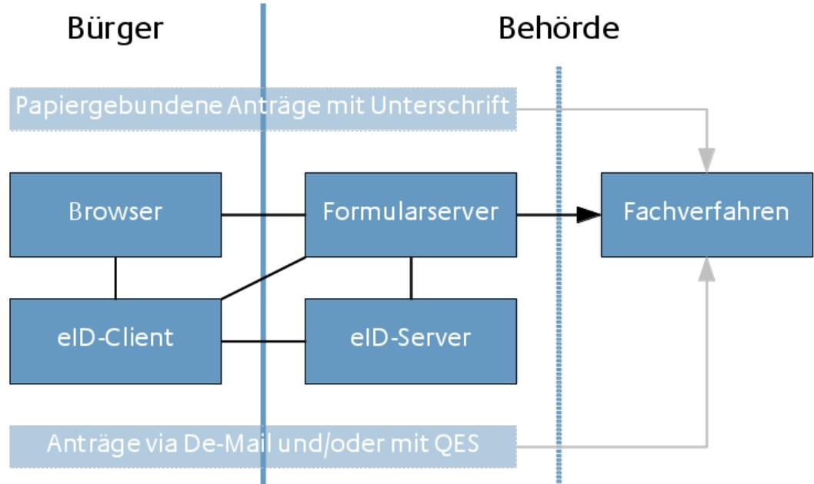
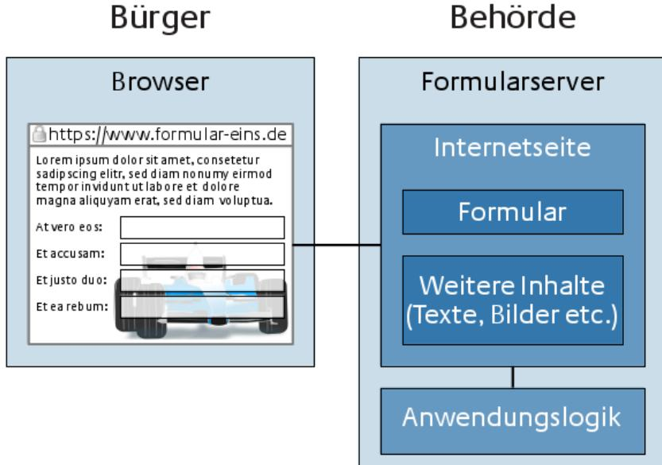
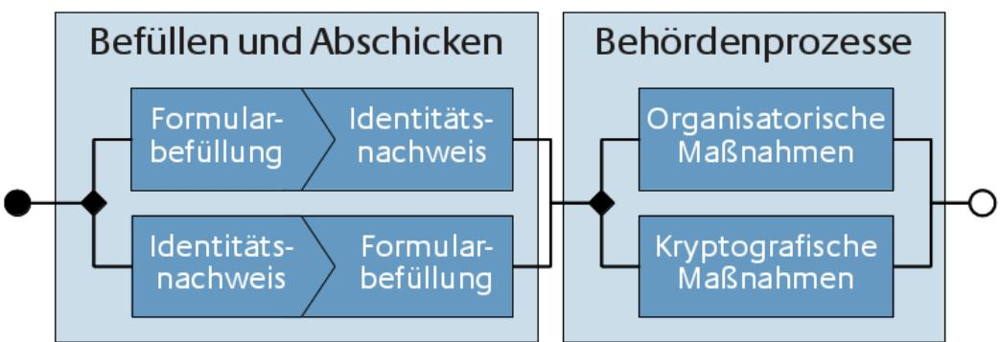

# Technische Richtlinie TR-03107-2 Elektronische Identitäten und Vertrauensdienste im E-Government

Teil 2: Schriftformersatz mit elektronischem Identitätsnachweis

Version 1.0 3. April 2014

Bundesamt für Sicherheit in der Informationstechnik Postfach 20 03 63 53133 Bonn Tel.: +49 22899 9582-0 E-Mail: eid@bsi.bund.de Internet: https://www.bsi.bund.de © Bundesamt für Sicherheit in der Informationstechnik 2014

| 1     | Rahmenbedingungen 5                              |  |
|-------|--------------------------------------------------|--|
| 1.1   | Verwaltungsverfahrensgesetz 5                    |  |
| 1.2   | Funktionen des Schriftformersatzes 6             |  |
| 2     | Abgabe der Erklärung über ein Formular 7         |  |
| 2.1   | Grundsätzliche Architektur 7                     |  |
| 2.1.1 | Fachverfahren 7                                  |  |
| 2.1.2 | Formularserver 8                                 |  |
| 2.1.3 | eID-Server 9                                     |  |
| 2.1.4 | eID-Client und Browser 10                        |  |
| 2.2   | Prozesse auf Bürgerseite und in der Behörde10    |  |
| 2.2.1 | Phase I: Befüllen und Abschicken des Formulars10 |  |
| 2.2.2 | Phase II: Behördenprozesse 12                    |  |
| 2.3   | Abgabe der Erklärung in der Behörde12            |  |
| 3     | Vertrauensniveau 14                              |  |
| 3.1   | Bewertung 14                                     |  |
| 3.2   | Vertraulichkeit 15                               |  |
|       | Literaturverzeichnis 16                          |  |

| Abbildung 1: Architekturübersicht 7         |  |
|---------------------------------------------|--|
| Abbildung 2: Formularserver Detailansicht 8 |  |
| Abbildung 3: Prozessphasen und Varianten 10 |  |

| Tabelle 1: Funktionen und Vertrauensniveau14 |  |
|----------------------------------------------|--|
|----------------------------------------------|--|

# 1 Rahmenbedingungen

Dieses Dokument soll Behörden dabei unterstützen, ihre E-Government-Prozesse, die der Schriftform bedürfen, mithilfe eines Formularservers in Verbindung mit der Nutzung des elektronischen Identitätsnachweises (eID) des Personalausweises (PA) oder Aufenthaltstitels (AT) abzubilden. Betrachtungsgegenstand ist hier ausschließlich der sichere Zugang zum Fachverfahren mittels eID, nicht das Fachverfahren selbst. Dieses liegt weiterhin in der Verantwortung der betreibenden Behörde.

Die Begriffe und Beispiele dieser Technischen Richtlinie stammen aus dem Umfeld des öffentlichen Sektors (E-Government), jedoch lassen sich sowohl die Infrastruktur als auch die hier gemachten Überlegungen auf den privaten Sektor (E-Business) anwenden.

### 1.1 Verwaltungsverfahrensgesetz

Die Grundlage für die Überlegungen in diesem Dokument bildet die neue gesetzliche Regelung des Paragraph 3a des Verwaltungsverfahrensgesetzes [VwVfG]:

#### *§ 3a Elektronische Kommunikation*

*(1) Die Übermittlung elektronischer Dokumente ist zulässig, soweit der Empfänger hierfür einen Zugang eröffnet.*

*(2) Eine durch Rechtsvorschrift angeordnete Schriftform kann, soweit nicht durch Rechtsvorschrift etwas anderes bestimmt ist, durch die elektronische Form ersetzt werden. Der elektronischen Form genügt ein elektronisches Dokument, das mit einer qualifizierten elektronischen Signatur nach dem Signaturgesetz versehen ist. Die Signierung mit einem Pseudonym, das die Identifizierung der Person des Signaturschlüsselinhabers nicht unmittelbar durch die Behörde ermöglicht, ist nicht zulässig. Die Schriftform kann auch ersetzt werden*

- *1. durch unmittelbare Abgabe der Erklärung in einem elektronischen Formular, das von der Behörde in einem Eingabegerät oder über öffentlich zugängliche Netze zur Verfügung gestellt wird;*
- *2. bei Anträgen und Anzeigen durch Versendung eines elektronischen Dokuments an die Behörde mit der Versandart nach § 5 Absatz 5 des De-Mail-Gesetzes;*
- *3. bei elektronischen Verwaltungsakten oder sonstigen elektronischen Dokumenten der Behörden durch Versendung einer De-Mail-Nachricht nach § 5 Absatz 5 des De-Mail-Gesetzes, bei der die Bestätigung des akkreditierten Diensteanbieters die erlassende Behörde als Nutzer des De-Mail-Kontos erkennen lässt;[1](#page-4-1)*
- *4. durch sonstige sichere Verfahren, die durch Rechtsverordnung der Bundesregierung mit Zustimmung des Bundesrates festgelegt werden, welche den Datenübermittler (Absender der Daten) authentifizieren und die Integrität des elektronisch übermittelten Datensatzes sowie die Barrierefreiheit gewährleisten; der IT-Planungsrat gibt Empfehlungen zu geeigneten Verfahren ab.*

#### *In den Fällen des Satzes 4 Nummer 1 muss bei einer Eingabe über öffentlich zugängliche Netze ein sicherer Identitätsnachweis nach § 18 des Personalausweisgesetzes oder nach § 78 Absatz 5 des Aufenthaltsgesetzes erfolgen.*

*(3) Ist ein der Behörde übermitteltes elektronisches Dokument für sie zur Bearbeitung nicht geeignet, teilt sie dies dem Absender unter Angabe der für sie geltenden technischen Rahmenbedingungen unverzüglich mit. Macht ein Empfänger geltend, er könne das von der Behörde übermittelte elektronische Dokument nicht bearbeiten, hat sie es ihm erneut in einem geeigneten elektronischen Format oder als Schriftstück zu übermitteln.*

Betrachtet wird in dieser Richtlinie die Ausführung zur Abgabe einer Erklärung über ein elektronisches Formular gemäß dem ersten Aufzählungspunkt des zweiten Absatzes. Entsprechende Regelungen finden

1 Die Nummern 2 und 3 der Aufzählung treten am 1. Juli 2014 in Kraft.

sich auch in § 36a des Ersten Buches Sozialgesetzbuch [SGBI] und § 87a der Abgabenordnung [AO]. Zudem sind in den Verwaltungsverfahrensgesetzen der Länder entsprechende Regelungen geplant.

#### 1.2 Funktionen des Schriftformersatzes

Es muss fachlich bewertet werden, welche Funktionen des Schriftformersatzes für den jeweiligen Geschäftsprozess relevant sind oder auf welche Funktionen verzichtet werden kann. Es werden nicht immer alle Funktionen der Schriftform benötigt.

Die Funktionen der physischen Schriftform müssen auch durch einen elektronischen Mechanismus, der die Schriftform allgemein in der Kommunikation zwischen Bürger und Behörde abdecken soll, erfüllt werden.

Das höchste Vertrauensniveau für die Abgabe einer Willenserklärung wird im Verwaltungsrecht durch die (papiergebundene) Schriftform erreicht. Diese physische Form kann gemäß [BRSchriftform] folgende Funktionen erfüllen:

- **• Identitäts** *und* **Verifikationsfunktion***: Durch eigenhändige Namensunterschrift ist der Aussteller der Urkunde erkennbar und identifizierbar, da die unverwechselbare Unterschrift eine unzweideutige Verbindung zur Person des Unterzeichners herstellt. Die Identität kann im Streitfall z. B. durch einen Unterschriftenvergleich verifiziert werden.*
- **• Warnfunktion***: Wenn zur Einhaltung der Schriftform die eigenhändige Unterzeichnung der Erklärung erforderlich ist, wird der Erklärende durch den bewussten Akt des Unterzeichnens auf die erhöhte rechtliche Verbindlichkeit und die persönliche Zurechnung der unterzeichneten Erklärung hingewiesen. Hierdurch soll er vor Übereilung geschützt werden.*
- **• Abschlussfunktion***: Durch die eigenhändige Unterschrift wird die Erklärung räumlich abgeschlossen; Bestandteil der Erklärung ist grundsätzlich nur, was vor der Unterschrift steht. Die eigenhändige Unterschrift grenzt bei nicht empfangsbedürftigen Erklärungen auch die verbindliche Erklärung vom Entwurf ab.*
- **• Echtheitsfunktion***: Die räumliche Verbindung der Unterschrift mit der Urkunde, die die Erklärung enthält, stellt einen Zusammenhang zwischen der Erklärung und Unterschrift her. Hierdurch soll gewährleistet werden, dass die Erklärung inhaltlich vom Unterzeichner herrührt und nicht nachträglich verfälscht werden kann.*
- **• Beweisfunktion***: Durch die Verkörperung der Erklärung in einer Urkunde, die vom Aussteller eigenhändig unterschrieben ist, wird ein Beweismittel geschaffen. Mit der Urkunde kann bewiesen werden, welchen Inhalt die Erklärung hat und wer sie abgegeben hat. Dieser Beweis kann aufgrund der Verifikationsfunktion der Unterschrift, insbesondere durch einen Unterschriftenvergleich erbracht werden.*
- **• Perpetuierungsfunktion***: Schriftform setzt auch im Verwaltungsrecht immer die Verkörperung der Erklärung in einer Urkunde voraus. Durch die Verkörperung der Erklärung in einer Urkunde (Urkundeneinheit) wird gewährleistet, dass die Erklärung dauerhaft festgehalten ist. Dies ermöglicht es, ihren Inhalt zu überprüfen.*

# 2 Abgabe der Erklärung über ein Formular

In der, als [BTDrs17/11473] veröffentlichten, Begründung zur Änderung des [VwVfG] wird klargestellt, dass mit der Formulierung in § 3a Abs. 2 Satz 4 Nr. 1 [VwVfG] die direkte Abgabe der Erklärung über ein Formular gemeint ist und nicht etwa das Hochladen eines lokal auf dem Computer zu Hause ausgefüllten Dokuments. Das Formular wird daher von einem, im Folgenden als Formularserver der Behörde bezeichneten, Dienst über dessen Internetseite angeboten.

### 2.1 Grundsätzliche Architektur

*Abbildung 1: Architekturübersicht*

Die vorstehende [Abbildung 1: Architekturübersicht](#page-6-1) zeigt die Komponenten des sicheren Identitätsnachweises, welche die bestehende IT-Infrastruktur der Behörde ergänzen. Papiergebundene Erklärungen mit Unterschrift und Erklärungen, die als elektronisches Dokument (z.B. via De-Mail) an die Behörde übermittelt werden, sind nicht Bestandteil der Betrachtungen in diesem Dokument, können jedoch parallel von der Behörde angeboten werden. Die für die Betrachtung relevanten Komponenten werden in den folgenden Unterkapiteln näher beschrieben.

Die Nutzung des Formularservers erfolgt in zwei Phasen. Die erste Phase umfasst das Befüllen und Abschicken des Formulars durch den Bürger (siehe Kapitel [2.2.1: Phase I: Befüllen und Abschicken des](#page-9-0)  [Formulars\)](#page-9-0). In der zweiten Phase werden die nachfolgenden Prozesse in der Behörde betrachtet (siehe Kapitel [2.2.2: Phase II: Behördenprozesse\)](#page-11-0), bevor das erfasste Formular in das Fachverfahren überführt wird. Das Fachverfahren selbst ist hiervon nicht berührt.

#### 2.1.1 Fachverfahren

Im Fachverfahren werden Daten anhand von zuvor in der Behörde definierten Prozessen verarbeitet. Für die Kernanwendung des Fachverfahrens ergeben sich keine neuen funktionalen und sicherheitstechnischen Anforderungen durch die Nutzung eines Formularservers. Es ist jedoch zu berücksichtigen, dass durch die Anbindung des Formularservers eine zusätzliche Schnittstelle zum Fachverfahren geschaffen wird, die

funktional und sicherheitstechnisch zu berücksichtigen ist. Die Betrachtung der IT-Sicherheit des Fachverfahrens bleibt Aufgabe des IT-Sicherheitsbeauftragten der Behörde. Der IT-Sicherheitsbeauftragte sollte das Verfahren nach [Grundschutz], zur Schutzbedarfsfeststellung und Erstellung des Sicherheitskonzepts der Behörde, umsetzen. Der dabei ermittelte Schutzbedarf ist abhängig vom jeweiligen Fachverfahren und den im Fachverfahren verarbeiteten Daten. Wenn die Behörde bereits eine Schutzbedarfsfeststellung für das Fachverfahren durchgeführt hat, kann diese Schutzbedarfsfeststellung weiterhin Anwendung finden.

#### 2.1.2 Formularserver

*Abbildung 2: Formularserver Detailansicht*

Der Formularserver stellt in der Regel eine Internetseite bereit, welche der Bürger online mit dem auf seinem Computer installierten Browser aufrufen kann (siehe [Abbildung 2: Formularserver Detailansicht\)](#page-7-0). Diese Internetseite kann direkt in den Internetauftritt der Behörde integriert oder ein alleinstehendes Formularsystem sein. Auch der Zugang zum Formularserver mithilfe einer von der Behörde bereitgestellten Applikation ist unter bestimmten Voraussetzungen (siehe Kapitel [2.1.4: eID-Client und Browser\)](#page-9-1) möglich. Neben dem Angebot an den Bürger, das Formular zu befüllen, werden Inhalte für den Bürger bereitgestellt, die ihn informieren und beim Befüllen des Formulars unterstützen. Die dazu notwendigen Funktionen werden von der Anwendungslogik des Formularservers gesteuert. Zu den Aufgaben der Anwendungslogik gehört auch die, zur Nutzung des elektronischen Identitätsnachweises notwendige, Verbindung zum eID-Server der Behörde (siehe [Abbildung 1: Architekturübersicht\)](#page-6-1).

Das Format (z.B. HTML) des angebotenen Formulars, sollte nach Möglichkeit ohne aktive Inhalte auskommen[2](#page-7-1) , ist für diese Betrachtung aber darüber hinaus nicht relevant. Entscheidend ist lediglich, dass das Formular innerhalb der gleichen Websession im Browser des Bürgers befüllt und abgeschickt wird, in der auch die Authentisierung mithilfe des elektronischen Identitätsnachweises stattfindet. Die Websession dient so als eindeutiger abgesicherter Kontext in dem der Browser und der Formularserver miteinander kommunizieren. Durch die Aktivierung des elektronischen Identitätsnachweises aus diesem Kontext heraus ist es möglich, die Authentisierung an die in das Formular eingegebenen Daten zu binden.

2 Link: https://www.bsi-fuer-buerger.de/BSIFB/DE/SicherheitImNetz/WegInsInternet/DerBrowser/ Sicherheitsmassnahmen/SicherheitsCheck/browsercheck.html

Der Formularserver nutzt für die Verbindung zum Browser des Bürgers ein EV-SSL-Zertifikat[3](#page-8-0) und hält die Anforderungen aus [03116-4] an SSL ein.

Für die Nutzung des elektronischen Identitätsnachweises muss die Behörde oder eine von der Behörde beauftragte Stelle ein Berechtigungszertifikat besitzen. Voraussetzung hierfür ist die erfolgreiche Beantragung einer entsprechenden Berechtigung bei der Vergabestelle für Berechtigungszertifikate (VfB) des Bundesverwaltungsamtes[4](#page-8-1) . Für den Betrieb des eID-Servers (durch die Behörde selbst oder einen beauftragten Dienstleister) muss ein Sicherheitskonzept, das den Ansprüchen der Technischen Richtlinie [03130] Part II: Security Framework genügt, erstellt werden. Gemäß den Vorgaben der Technischen Richtlinie basiert dieses Sicherheitskonzept ebenfalls auf der Methodik des [Grundschutz].

Für die Teile der Anwendungslogik des Formularservers, die nicht direkt mit dem elektronischen Identitätsnachweis, sondern dem Formular zusammenhängen, wird ebenfalls auf den [Grundschutz] zurückgegriffen. Im zugehörigen Sicherheitskonzept der Behörde muss durch geeignete Maßnahmen insbesondere berücksichtigt werden:

- **•** Der sicherer Betrieb des Formularservers im Sinne eines Webservers (siehe Grundschutz-Baustein B5.21 "Webanwendung" [5](#page-8-2) );
- **•** Die Identitäts- und Formulardaten dürfen während und nach der Übermittlung durch den Bürger nicht mehr vom Bürger, der Behörde oder Dritten veränderbar sein (Integritätsschutz).

Die Umsetzung des Sicherheitskonzepts (eID-Server, Formularserver und Backend) muss mindestens durch ein Audit und ein entsprechendes Auditorentestat überprüft werden. Empfohlen wird eine Zertifizierung nach [Grundschutz].

Es wird eine gesicherte Verbindung zwischen dem Browser und dem Formularserver hergestellt. Indem diese Verbindung für die Übermittlung der Formulardaten ebenso wie für die Authentisierung mit dem elektronischen Identitätsnachweis genutzt wird, ist sichergestellt, dass auch die Übermittlung der Formulardaten von der starken Kanalbindung des sicheren Identitätsnachweises profitiert.

#### 2.1.3 eID-Server

Der eID-Server wird beim Einsatz des elektronischen Identitätsnachweises für die Auslagerung und Bündelung der spezifischen Prozesse aus der Anwendungslogik des Formularservers genutzt. Zu diesen Aufgaben gehören die Kommunikation mit den Komponenten der Public Key Infrastructure (PKI) und dem eID-Client des Bürgers, die Speicherung des Berechtigungszertifikats in einem sicheren Schlüsselspeicher und die Steuerung des Prozessablaufs des elektronischen Identitätsnachweises sowie die Bereitstellung des Ergebnisses an den Formularserver der Behörde. Der eID-Server ist entsprechend [03130] umzusetzen.

Hierbei sind verschiedene Betreibermodelle möglich. Die Behörde kann den eID-Server selbst implementieren oder erwerben und anschließend im eigenen Rechenzentrum oder von einem externen Dienstleister (eID-Service-Provider) betreiben lassen. Unabhängig von der Betriebsart umfasst das für die erfolgreiche Beantragung eines Berechtigungszertifikats notwendige Sicherheitskonzept neben dem Formularserver auch den eID-Server. Im Regelfall kann die Behörde bei der Nutzung eines eID-Service-Providers auf ein bestehendes Sicherheitskonzept des eID-Service-Providers zurückgreifen. Der von der Behörde genutzte eID-Server muss nicht exklusiv für den Formularserver betrieben werden, sondern kann auch für andere Anwendungen, in denen eine starke elektronische Authentisierung gewünscht ist, genutzt werden.

3 EV-SSL-Zertifikat = Zertifikat mit erweiterter Überprüfung (Extended Validation)

4 Link: http://www.bva.bund.de/DE/Organisation/Abteilungen/Abteilung\_III/nPA/Vergabestelle/node.html

5 Link: https://www.bsi.bund.de/DE/Themen/ITGrundschutz/ITGrundschutzKataloge/Inhalt/\_content/baust/ b05/b05021.html

#### 2.1.4 eID-Client und Browser

Der eID-Client und der Browser übernehmen für den Bürger Aufgaben als informationsanzeigende und -verarbeitende Komponenten. Mit dem Browser ruft der Bürger die Internetseite der Behörde auf und nutzt ihn so zum Abruf von Informationen und zur Abgabe der Erklärung über ein Formular. Dazu wird zwischen dem Browser und dem Formularserver eine eindeutige Websession etabliert, die sowohl für das Übermitteln des ausgefüllten Formulares als auch (über einen entsprechenden Button) dem Start des elektronischen Identitätsnachweises dient.

Der eID-Client kommuniziert, wenn er vom Browser aktiviert wurde, mit dem eID-Server und führt den Bürger durch den Prozess des elektronischen Identitätsnachweises. Dabei übernimmt er auch die Kommunikation mit dem Kartenlesegerät und dem dort aufliegenden Ausweis des Bürgers. Die Aufgaben zur Anzeige von Informationen und Entgegennahme von Benutzereingaben des Bürgers (z.B. PIN-Eingabe) variieren dabei je nachdem, zu welcher Klasse das angeschlossene Kartenlesegerät gehört.

Sicherheitstechnisch werden der Browser und der eID-Client hier nicht weiter betrachtet, da es sich um bereits standardisierte Produkte handelt, die gemäß ihres regulären Gebrauchs eingesetzt werden.

Alternativ kann der Zugang zum Formularserver der Behörde auch über eine eigene Applikation angeboten werden, wenn diese zu einem Browser (und ggf. eID-Client) vergleichbare Funktionalitäten bietet. Die Überprüfung der für die sichere Übertragung der Daten verwendeten Zertifikate und Etablierung eines sicheren Kontextes muss auch in einem solchen Szenario gewährleistet sein.

### 2.2 Prozesse auf Bürgerseite und in der Behörde

Die folgende [Abbildung 3: Prozessphasen und Varianten](#page-9-2) gibt einen Überblick über die möglichen Ausprägungen der Prozesse auf Bürgerseite (Phase I) und im Zuständigkeitsbereich der Behörde (Phase II). Da alle Varianten je Phase miteinander kombinierbar sind, ergeben sich vier Kombinationsmöglichkeiten.

*Abbildung 3: Prozessphasen und Varianten*

#### 2.2.1 Phase I: Befüllen und Abschicken des Formulars

Einige Funktionen der Schriftform (**Warn- und Identitätsfunktion**, siehe [Tabelle 1: Funktionen und Ver](#page-13-1)[trauensniveau\)](#page-13-1) sind bereits während des Befüllens und Abschickens des Formulars relevant. Grundsätzlich ist der Prozessablauf in dieser Phase in zwei Varianten möglich, die im Folgenden erläutert werden.

Unabhängig von der gewählten Variante sollte dem Bürger nach der Befüllung des Formulars und der Identifizierung die Möglichkeit gegeben werden das von ihm ausgefüllte Formular inkl. der von ihm gemachten Angaben als Beleg vom Formularserver herunter zu laden. Auf diese Weise erhält der Bürger eine Kontroll- und Archivierungsmöglichkeit für die von ihm abgegebene Erklärung.

#### 2.2.1.1 Variante 1: Identitätsnachweis nach Formularbefüllung

Bei der ersten Variante findet die Nutzung des elektronischen Identitätsnachweises nach der Formularbefüllung statt. Da der elektronische Identitätsnachweis an sich keine Warnfunktion zur Abgabe von Erklärungen erfüllt, muss der Bürger bei Verwendung dieser Variante eindeutig auf die erhöhte rechtliche Verbindlichkeit und persönliche Zurechnung bei der Nutzung des Identitätsnachweises hingewiesen werden. Der Prozessablauf lässt sich darüber hinaus wie folgt beschreiben:

1. Der Bürger ruft mit seinem Browser das Formular auf der Internetseite des Formularservers auf.

Dabei wird eine eindeutige Websession als sicherer Kontext zwischen dem Browser und dem Formularserver aufgebaut. Diese Websession muss für die gesamte weitere Kommunikation zwischen dem Formularserver und dem Browser genutzt werden.

2. Der Bürger füllt die einzelnen Felder des Formulars aus.

Während der Bürger die Formularfelder ausfüllt, werden diese nur rudimentär vom Formularserver bearbeitet, da sie zu diesem Zeitpunkt noch nicht als authentisch eingestuft werden können und der Bürger noch nicht im Sinne der Warnfunktion gewarnt wurde (siehe 3.). In keinem Fall dürfen die Daten schon jetzt im Fachverfahren verarbeitet werden.

3. Das ausgefüllte Formular wird anschließend mit der eID abgeschickt.

Das Formular muss dabei so gebaut sein, dass die tatsächliche Datenübertragung zum Formularserver erst nach der Authentisierung mit dem elektronischen Identitätsnachweis erfolgt. Nur so kann von dem, durch die Kanalbindung gewährleisteten, hohen Integritäts- und Vertrauensniveau profitiert und die Warnfunktion durch den elektronischen Identitätsnachweis erfüllt werden. Um die Authentisierung zu starten, wird der eID-Client des Bürgers aus der Websession heraus mittels Anklicken eines entsprechenden Buttons vom Bürger aktiviert.

#### 2.2.1.2 Variante 2: Identitätsnachweis vor Formularbefüllung

Die im Folgenden beschriebene zweite Variante beschreibt die Nutzung des Identitätsnachweises vor der Formularbefüllung:

1. Der Bürger ruft mit seinem Browser das Formular auf dem Formularserver auf.

Dabei wird eine eindeutige Websession als sicherer Kontext zwischen dem Browser und dem Formularserver aufgebaut. Diese Websession muss für die gesamte weitere Kommunikation zwischen dem Formularserver und dem Browser genutzt werden.

2. Der Bürger nutzt den elektronischen Identitätsnachweis, um sich gegenüber dem Formularserver zu authentisieren.

Dabei wird der eID-Client des Bürgers aus der Websession heraus aktiviert, um die Authentisierung mit dem elektronischen Identitätsnachweis zu starten. Dies ist die Voraussetzung, um mithilfe der Kanalbindung von dem hohen Integritäts- und Vertrauensniveau des elektronischen Identitätsnachweises zu profitieren.

3. Der Bürger füllt die einzelnen Felder des Formulars aus.

Während der Bürger die Formularfelder ausfüllt, werden diese nur rudimentär vom Formularserver bearbeitet, da der Bürger zu diesem Zeitpunkt noch nicht gewarnt wurde (siehe 4.). In keinem Fall dürfen die Daten schon jetzt im Fachverfahren verarbeitet werden.

4. Das ausgefüllte Formular mit den darin enthaltenen Angaben des Bürgers wird durch Betätigung eines "Warn-Buttons" abgeschickt

Da bei dieser Variante der elektronische Identitätsnachweis nicht die Warnfunktion erfüllen kann, werden die Formulardaten erst nach der Betätigung eines "Warn-Buttons" durch den Bürger von dem Formularserver entgegengenommen. Dieser Button muss den Bürger eindeutig auf die erhöhte rechtliche Verbindlichkeit und die persönliche Zurechnung des zu versendenden Formulars hinweisen.

#### 2.2.2 Phase II: Behördenprozesse

Die noch verbleibenden Funktionen der Schriftform (siehe [Tabelle 1: Funktionen und Vertrauensniveau\)](#page-13-1) müssen (soweit für den Geschäftsprozess erforderlich) durch den Formularserver und das Fachverfahren erfüllt werden. Dazu werden die Formulardaten vom Formularserver an das Fachverfahren übermittelt.

An dieser Stelle gibt es für die Behörde zwei Varianten, die zur Weiterverarbeitung und Archivierung der Daten in Frage kommen. Beide Varianten werden in den folgenden Kapiteln erläutert und sind in [Ab](#page-9-2)[bildung 3: Prozessphasen und Varianten](#page-9-2) abgebildet.

Für beide Varianten gilt, dass nicht nur die vom Bürger gemachten Angaben Teil der Archivierung sind, sondern auch der Bezug zu dem vom Bürger befüllten Formular mit seinen einzelnen Formularfeldern gewährleistet sein muss.

#### 2.2.2.1 Variante 1: Organisatorische Sicherungsmaßnahmen

Die Behörde speichert die Identitäts- und Formulardaten als zusammengehörigen Datenbankeintrag im Fachverfahren. Die Integrität des Fachverfahrens wird über die Umsetzung des Sicherheitskonzepts der Behörde gesichert und sorgt so dafür, dass die logische Zusammengehörigkeit der Daten erhalten bleibt.

Die Integrität der Erklärung lässt sich Dritten (auch Gerichten) gegenüber nur durch den Nachweis der Integrität der Behördenprozesse und des Fachverfahrens nachweisen. Es ist kein unabhängiger Nachweis durch Dritte möglich. Dies schränkt die Behörde zwar in Bezug auf eine einfache Nachvollziehbarkeit der Identitäts- und Formulardaten ein, senkt aber den Aufwand für die Integration.

#### 2.2.2.2 Variante 2: Kryptographische Sicherungsmaßnahmen

Der Formularserver fasst die Identitäts- und Formulardaten in einem Datensatz zusammen und siegelt diesen mit einem qualifizierten elektronischen Siegel. Ein entsprechendes Verfahren wird in dem "Vorschlag für eine Verordnung des Europäischen Parlaments und des Rates über die elektronische Identifizierung und Vertrauensdienste für elektronische Transaktionen im Binnenmarkt" [6](#page-11-1) beschrieben. Alternativ hierzu kann auch eine fortgeschrittene Signatur eingesetzt werden[7](#page-11-2) . Diese muss, um ein angemessenes Sicherheitsniveau zu erreichen, mit einem Hardwaretoken erstellt werden. Durch die Nutzung eines Hardwaretoken wird sichergestellt, dass die Signatur unter Verwendung von 2 Faktoren (Besitz und Wissen) erzeugt wurde.

Die Integrität der Erklärung lässt sich Dritten gegenüber durch das Siegel bzw. die Signatur in Verbindung mit dem korrekten Arbeiten des Formularservers nachweisen. Ein Betrachten des kompletten Fachverfahrens, wie in der ersten Variante, ist nicht notwendig.

Die bekannten Mechanismen zur Perpetuierung ([03125], ArchiSafe) können auch für Siegel bzw. fortgeschrittene Signaturen eingesetzt werden.

### 2.3 Abgabe der Erklärung in der Behörde

Die Abgabe der Erklärung direkt in der Behörde entspricht einem sogenannten Kiosk-System. Technisch und unter Sicherheitsaspekten gibt es im Vergleich zu der hier zuvor beschriebenen Abgabe der Erklärung

6 Link: http://eur-lex.europa.eu/LexUriServ/LexUriServ.do?uri=COM:2012:0238:FIN:DE:PDF

7 Eine qualifizierte Signatur wäre wegen der Bindung an eine natürliche Person semantisch nicht korrekt.

über eine Internetseite keine wesentlichen Unterschiede, da auch hier die Abgabe der Erklärung zumeist unbeaufsichtigt und unter Verwendung von Internettechnologien erfolgt.

# 3 Vertrauensniveau

Im Folgenden wird die Erfüllung der Funktionen der Schriftform mit den in Kapitel [2](#page-6-0) dargestellten Verfahren bewertet. Dabei werden die Definitionen für Vertrauensniveaus nach [03107-1] verwendet. Außerdem wird der Aspekt der Vertraulichkeit der Identitäts- und Formulardaten im folgenden Kapitel erläutert. Eine Übersicht hierzu gibt die folgende [Tabelle 1: Funktionen und Vertrauensniveau.](#page-13-1)

|                                                     | Phase I: Befüllen und Abschicken des Formulars                                                                     |                                                                                                                     | Phase II: Behördenprozesse                                                                                                                    |                                                                                                                          |
|-----------------------------------------------------|-----------------------------------------------------------------------------------------------------------------------|---------------------------------------------------------------------------------------------------------------------|-----------------------------------------------------------------------------------------------------------------------------------------------|--------------------------------------------------------------------------------------------------------------------------|
| Identitäts funktion                              | Hoch + durch Verwendung des elektronischen Identitätsnachweises                                                    |                                                                                                                     | –                                                                                                                                             |                                                                                                                          |
| Warnfunktion                                        | Variante 1: Identi tätsnachweis nach Formularbefüllung: hoch + durch elektronischen Identitätsnachweis | Variante 2: Identi tätsnachweis vor Formularbefüllung: normal – hoch, je nach Gestaltung des Buttons | –                                                                                                                                             |                                                                                                                          |
| Verifikations-, Echtheits- und Beweisfunktion | –                                                                                                                     |                                                                                                                     | Variante 1: Organisatorische Sicherungsmaß nahmen: Abhängig vom Sicherheitsniveau des Formularservers und Fachverfahrens | Variante 2: Krypto graphische Sicherungsmaß nahmen: Abhängig vom Sicherheitsniveau des Formularservers |
| Abschluss funktion                               | Zusammenspiel von Warnfunktion in Phase I und Integritätssicherung in Phase II                                        |                                                                                                                     |                                                                                                                                               |                                                                                                                          |
| Perpetuierungs – funktion                     |                                                                                                                       |                                                                                                                     | Sofern notwendig mit Archivierungs system/[03125]                                                                                          |                                                                                                                          |
| Vertraulichkeit                                     | Hoch + durch SSL-Kanal + Kanalbindung/elektronischer Identitäts nachweis                                        |                                                                                                                     | Abhängig vom Sicherheitsniveau des Formularservers und Fachverfahrens                                                                      |                                                                                                                          |

Tabelle 1: Funktionen und Vertrauensniveau

#### 3.1 Bewertung

Die **Identitätsfunktion** wird durch die Nutzung des elektronischen Identitätsnachweises in Verbindung mit der Kanalbindung (dadurch wird die Identität des elektronischen Identitätsnachweises mit der Websession, d.h. dem Formular, verknüpft) mit Vertrauensniveau *hoch +* erfüllt.

Die **Warnfunktion** wird in der [Variante 1: Identitätsnachweis nach Formularbefüllung](#page-10-1) aus Kapitel [2.2.1.1](#page-10-1) durch das Auslösen des elektronischen Identitätsnachweises am Ende des Prozesses, d.h. der elektronische Identitätsnachweis wird zum Abschicken genutzt, auf dem Vertrauensniveau *hoch +* erfüllt. In der [Variante](#page-10-0)  [2: Identitätsnachweis vor Formularbefüllung](#page-10-0) aus Kapitel [2.2.1.2](#page-10-0) wird diese durch den "Warn-Button" auf dem Niveau *normal* erfüllt. Gegebenenfalls lässt sich durch geeignete Argumentation (der Bürger ist durch das Betreten der Webseite bereits "vorgewarnt") auch *hoch* erreichen.

Die Erfüllung der **Verifikations**-, **Echtheits**- und **Beweisfunktion** erfolgt in der [Variante 1: Organisatorische](#page-11-3) [Sicherungsmaßnahmen](#page-11-3) aus Kapitel [2.2.2.1](#page-11-3) durch den Nachweis der Integrität

- 1. der Übertragung der Formulardaten,
- 2. des Formularservers und
- 3. des Fachverfahrens.

Die Integrität der übertragenen Formulardaten wird durch die Kanalbindung des elektronischen Identitätsnachweises sichergestellt.

Das Vertrauensniveau, mit dem diese Funktionen erfüllt werden, ergibt sich damit unmittelbar aus dem im Sicherheitskonzept des Formularservers und des Fachverfahrens unterlegten und per Audit überprüften Sicherheitsniveau.

In der [Variante 2: Kryptographische Sicherungsmaßnahmen](#page-11-4) aus Kapitel [2.2.2.2](#page-11-4) werden die Funktionen kryptographisch erfüllt, d.h. das Vertrauensniveau für diese Funktionen richtet sich nach dem Sicherheitsniveau

- 1. der Übertragung der Formulardaten,
- 2. des Formularservers und
- 3. der Siegel-/Signatur-Erzeugung.

Die Integrität der übertragenen Formulardaten wird durch die Kanalbindung der elektronischen Identitätsfunktion sichergestellt.

Das Vertrauensniveau, mit dem diese Funktionen erfüllt werden, ergibt sich damit unmittelbar aus dem im Sicherheitskonzept des Formularservers incl. Siegel-/Signaturerzeugung unterlegten und per Audit überprüften Sicherheitsniveau.

Die **Abschlussfunktion** wird seitens des Bürgers in der [Variante 1: Organisatorische Sicherungsmaßnahmen](#page-11-3) aus Kapitel [2.2.1.1](#page-10-1) durch die Nutzung des elektronischen Identitätsnachweises und in der [Variante 2:](#page-10-0)  [Identitätsnachweis vor Formularbefüllung](#page-10-0) aus Kapitel [2.2.1.2](#page-10-0) durch die Betätigung des "Warn-Buttons" gesteuert. Die Behörde muss anschließend mit geeigneten Mitteln (siehe Kapitel [2.2.2\)](#page-11-0) die Konsistenz der Daten gewährleisten.

Die **Perpetuierungsfunktion** muss (sofern notwendig) in der [Variante 1: Organisatorische Sicherungsmaß](#page-11-3)[nahmen](#page-11-3) aus Kapitel [2.2.2.1](#page-11-3) durch einen entsprechend langfristigen sicheren Betrieb des Fachverfahrens bzw. entsprechende Archivierungslösungen sichergestellt werden. In der [Variante 2: Kryptographische](#page-11-4)  [Sicherungsmaßnahmen](#page-11-4) aus Kapitel [2.2.2.2](#page-11-4) kann auf die kryptographischen Siegel/Signaturen Verfahren nach [03125] zur langfristigen Beweiswerterhaltung eingesetzt werden.

### 3.2 Vertraulichkeit

Über die Funktionen der Schriftform hinaus ist auch die Vertraulichkeit der vom Bürger übertragenen (ausgefüllten) Formulare relevant.

Die **Vertraulichkeit** der Daten wird durch die TLS/SSL-Verbindung zwischen dem Browser des Bürgers und dem Formularserver sichergestellt. Mittels TLS/SSL allein lässt sich nur das Vertrauensniveau *normal* bis *hoch* erreichen (letzteres mit Einschränkungen). Erst mittels der hier vorgeschriebenen Kanalbindung des elektronischen Identitätsnachweises an die TLS/SSL-Verbindung wird das Vertrauensniveau *hoch +* erreicht. Jedoch nur für die Daten, die nach Verwendung des Identitätsnachweises übertragen werden, da die Daten erst zu diesem Zeitpunkt über eine abgesicherte Verbindung zwischen authentischen Kommunikationspartnern ausgetauscht werden.

## Literaturverzeichnis

| 03107-1       | BSI: Technische Richtlinie 03107-1, Elektronische Identitäten und Vertrauensdienste im E-Government |
|---------------|--------------------------------------------------------------------------------------------------------|
| 03116-4       | BSI: Technische Richtlinie 03116-4, eCard-Projekte der Bundesregierung, Teil 4 - Vor                   |
|               | gaben für Kommunikationsverfahren im eGovernment                                                       |
| 03125         | BSI: Technische Richtlinie 03125, Beweiswerterhaltung kryptographisch signierter                       |
|               | Dokumente                                                                                              |
| 03130         | BSI: Technische Richtlinie 03130, eID-Server                                                           |
| AO            | Bundesregierung: Abgabenordnung                                                                        |
| BRSchriftform | Bundesregierung: Bericht der Bundesregierung nach Artikel 5 des Gesetzes zur Regelung                  |
|               | von De-Mail-Diensten und zur Änderung weiterer Vorschriften                                            |
|               | (http://dipbt.bundestag.de/dip21/btd/17/107/1710720.pdf)                                               |
| BTDrs17/11473 | Bundestag: Drucksache 17/11473, Entwurf eines Gesetzes zur Förderung der                               |
|               | elektronischen Verwaltung sowie zur Änderung weiterer Vorschriften                                     |
| Grundschutz   | BSI: IT-Grundschutz-Kataloge                                                                           |
| SGBI          | Bundesregierung: SGB I - Sozialgesetzbuch Erstes Buch                                                  |
| VwVfG         | Bundesregierung: Verwaltungsverfahrensgesetz in der Fassung der Bekanntmachung                         |
|               | vom 23. Januar 2003 (BGBl. I S. 102), das zuletzt durch Artikel 2 Absatz 1 des Gesetzes                |
|               | vom 14. August 2009 (BGBl. I S. 2827) geändert worden ist                                              |