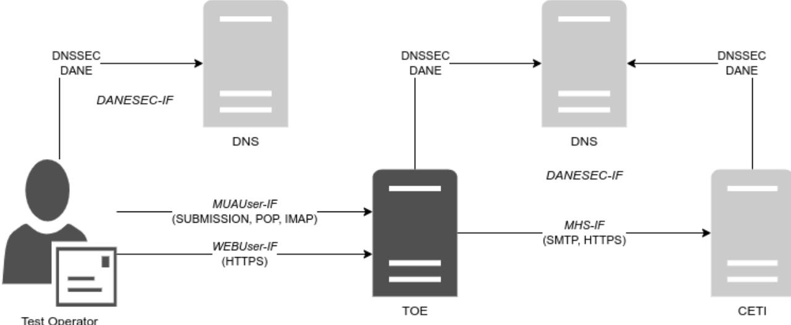
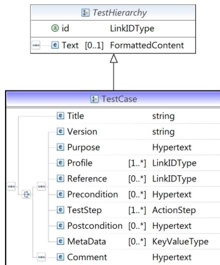

# TR-03108-P: Testspecification

Conformance Tests for Secure E-Mail Transport in compliance to BSI TR-03108 Version: 2.0 Date: 1st June 2023

# Document history

Table 1 Document history

| Version | Date                  | Editor | Description                                                                |  |
|---------|-----------------------|--------|----------------------------------------------------------------------------|--|
| 1.0.1   | th November 2016 9 | BSI    | Final version                                                              |  |
| 2.0     | st June 2023 1     | BSI    | Revision of all testcases. Additional testcases: TLS-RPT and MTA-STS |  |

Federal Office for Information Security P.O. Box 20 03 63 53133 Bonn Tel.: +49 22899 9582-0 E-Mail: e-mail-trsp@bsi.bund.de Internet: https://www.bsi.bund.de © Federal Office for Information Security 2023

| 1               |       | Introduction 5                         |  |
|-----------------|-------|----------------------------------------|--|
| 2 Testing  6 |       |                                        |  |
|                 | 2.1   | Services 6                             |  |
|                 | 2.2   | Test Tools 7                           |  |
|                 | 2.3   | Test Messages 7                        |  |
|                 | 2.4   | DNS-Resolution 7                       |  |
|                 | 2.5   | Authoritative DNSSEC 8                 |  |
|                 | 2.6   | Test Operator 8                        |  |
| 3               |       | Profiles 9                             |  |
| 4               |       | Implementation Conformance Statement12 |  |
|                 | 4.1   | User Information Source 12             |  |
|                 | 4.2   | Online Interfaces12                    |  |
|                 | 4.3   | Operational Information 12             |  |
|                 | 4.4   | Profiles13                             |  |
|                 | 4.5   | Transport Layer Security13             |  |
|                 | 4.5.1 | Browser to TOE13                       |  |
|                 | 4.5.2 | MUA to TOE (Submission)14              |  |
|                 | 4.5.3 | MUA to TOE (IMAP)15                    |  |
|                 | 4.5.4 | MUA to TOE (POP)15                     |  |
|                 | 4.5.5 | CETI to TOE16                          |  |
|                 | 4.5.6 | TOE to CETI (without DANE)17           |  |
|                 | 4.5.7 | TOE to CETI (with DANE)17              |  |
|                 | 4.6   | TLSA Resource Records19                |  |
|                 | 4.7   | TLSRPT-Reporting19                     |  |
|                 | 4.8   | Location19                             |  |
|                 | 4.9   | Certificate Information19              |  |
| 5               |       | Configuration20                        |  |
|                 | 5.1   | Test Setup 20                          |  |
|                 | 5.2   | DNS Zone and Record Specification 21   |  |
|                 | 5.3   | Certificate Specification 22           |  |
| 6               |       | Test Cases23                           |  |
|                 | 6.1   | Module A User Interface23           |  |
|                 | 6.2   | Module B DNSSEC23                   |  |
|                 | 6.3   | Module C DANE Outbound24            |  |
|                 | 6.4   | Module D DANE Inbound24             |  |
|                 | 6.5   | Module E TLS Inbound 25             |  |

|   | 6.6             | Module F TLS Outbound26     |  |
|---|-----------------|--------------------------------|--|
|   | 6.7             | Module G TLSRPT Inbound26   |  |
|   | 6.8             | Module H TLSRPT Outbound 27 |  |
|   | 6.9             | Module I MTA-STS Inbound 27 |  |
|   | 6.10            | Module J MTA-STS Outbound28 |  |
|   | 6.11            | Security Concept 28            |  |
| 7 |                 | Test Case Notation29           |  |
| 8 |                 | Keywords31                     |  |
|   | Bibliography 32 |                                |  |
|   |                 |                                |  |

# 1 Introduction

The Technical Guideline BSI TR-03108 (1) specifies the requirements for secure transport of email. This document extends BSI TR-03108 (1) by defining conformity criteria for message handling services (MHS) and specifying tests which verify that the provided services fulfil the requirements defined in the Technical Guideline. The tests cover the services to the end user as well as from and to other MHSs.

Since the objective of BSI TR-03108 (1) and the tests is the improvement of security, the tests focus on a secure DNS lookup using DANE/DNSSEC and on the subsequent TLS connection. The protocols in the TLSprotected tunnel (e.g. IMAP, SMTP or POP), as well as functional tests, are out of scope of this document. Even though it is primarily focused on security, this guideline takes interoperability issues into account as well.

Generally speaking, the specification and therewith the tests are strict with respect to the configurations towards the end users. The rationale behind this is that users can be informed in case of issues regarding the MHS and will be able to decide about further proceeding. For example, if the TLS certificate of the web service cannot be verified, the browser will display an alert and ask for further actions. The decision on how to proceed further is up to the users.

This, however, does not hold for the communication between two distinct MHSs. Once a message has been submitted from a MUA to its MHS, it will be automatically forwarded to the server. If any issue arises, the user will usually not be able to take actions. In the most cases details of the transmission are hidden. This implies that the user completely relies on decisions made by the MHS. Therefore, a uniform certification is required to encourage the trust in these decisions.

A variety of aspects has to be covered during the evaluation in order to take into consideration the complexity of the solutions to be tested. Therefore, following aspects must be taken into account:

- The requirements from BSI TR-03108 (1) are met.
- Including the configuration of TLS according to BSI TR-03116-4 (2)
- The DNSSEC requirements as defined in RFC 4033 ( (3), RFC 4034 (4) and RFC 4035 (5).
- The utilization of DANE as described in RFC 7671 (6).
- The STARTTLS protocol is utilized RFC 2595 (7) resp. RFC 3207 (8).
- The tests defined in this document only focus on conformance to the respective requirements. They do not validate security, functionality or availability.

# 2 Testing

The test series described in this document consider the message handling services (MHS) already offering their services via the Internet to be the test object (TOE). Therefore, the testing laboratory will have to take the existing infrastructure into account. This chapter describes the aspects to be regarded.

Figure 1 Outline of a Generic Test Setup

### 2.1 Services

The test setup assumes that an MHS MHSs. In the following, a short description and definition of those services is given:

| Service     | Description                                              |
|-------------|----------------------------------------------------------|
| MHS-SRV     | This service is used for message exchange between        |
|             | MHSs and will be denoted as MHS-SRV in this test         |
|             | specification.                                           |
| DANESEC-SRV | This service is used for the execution of the DNS,       |
|             | DANE and DNSSEC protocols and will be denoted as         |
|             | DANESEC-SRV in this test specification.                  |
| WebUser-SRV | See [MUAUser-SRV].                                       |
| MUAUser-SRV | This service is used by end users to access the services |
|             | of an MHS and thus to exchange messages. Because         |
|             | this service can be accessed over HTTPS (using a web     |
|             | frontend) and StartTLS/TLS (using a Mail User Agent,     |
|             | short MUA such as Thunderbird), this service             |
|             | includes two respective services that will be denoted    |
|             | as WebUser-SRV and MUAUser-SRV in this test              |
|             | specification.                                           |

Each service can consist of several ports dedicated to specific protocols. The specific underlying protocol data is not part of this document and is therefore not covered by test cases. Nevertheless, all services are expected to establish a TLS connection before exchanging data of the protocol. STARTTLS may be utilized. An exception is the connection towards the name resolvers, as DNSSEC does not enforce data encryption.

The tests specified for service have to be performed for each port that is offered by the MHS relevant in the context of BSI TR-03108 (1). A generic setup is outlined in Figure 1 [Outline of a Generic Test Setup.](#page-5-2) Note that the two services sketched for a user TLS and HTTPS communication are covered by the same cryptographic tests.

Based on Figure 1 [Outline of a Generic Test Setup](#page-5-2) it has to be verified that:

- A correct TLSA record for DANE/DNSSEC is available for all services.
- The user service is protected using TLS in accordance with BSI TR-03116-4 (2), in particular, the defined and only the defined ciphers are supported.
- STARTTLS is used whenever a non-TLS port is contacted.
- An inbound connection for other message-servers via TLS is possible; the ciphers required in BSI TR-03116-4 (2) are supported.
- An outbound connection to other message-servers is using TLS whenever possible, the ciphers required in BSI TR-03116-4 (2) are supported.
- Furthermore, the respective negative tests are defined.

#### 2.2 Test Tools

The current test specification does not restrict test operators in their choice of tools. A test operator may use any tool suitable to perform the tests. However, it has to be assured that the results achieved by the chosen tool are legitimate and verifiable (reproducible) by any other test operator.

#### 2.3 Test Messages

Some test cases require test operators to send a message from / via the TOE to the CETI. In order to uniquely identify each test message, it is RECOMMENDED to include the test case ID in the subject field of any test message. Additionally, it may be necessary to include a sequence number in cases where multiple test cases with the same ID are run (templates).

The following naming convention is RECOMMENDED:

TR-03108-<module>\_<test case ID>\_<sequence number>

#### 2.4 DNS-Resolution

Some tests require the TOE to query DNS data from a particular zone and to process the response. During the tests several queries must be performed repeatedly. This especially holds for template test cases, but also for not-template test cases that need to be re-run for some reason.

This could potentially lead to the TOE utilizing its DNS cache entries instead of retrieving the information of the zone again. Even if the TOE does not operate any DNS caching mechanism itself, it is still possible that it forwards its DNS query to a DNS server which will respond with data from its own DNS query cache. Therefore, the CETI MUST implement mechanisms preventing the reusage of cached DNS entries. It is essential that for any test concentrating on DNSSEC capability of the TOE the DNS resolution takes place pristine each time.

It is not sufficient to rely on time to live value (TTL) in order to avoid using cached DNS data. A TOE or any DNS resolver server may ignore TTLs or alter these values. Therefore, it is RECOMMENDED to use a random ID in the name of the DNS zones used for tests. In this case, each run is performed with its own unique zone name/URL which is only utilized once. The next run of a test case is then performed using an URL with another random ID.

The characteristics are, however, the same as required for the scenario of the test case. Consequently, the TOE is forced to freshly resolve the new URL each time.

## 2.5 Authoritative DNSSEC

One of the topics discussed in BSI TR-03108 is an MHS ability to use DNSSEC when resolving DNS data from remote DNS zones. The TOE MUST be able to process all TLSA resource records. Therefore, it is essential that the testing laboratory prepares the respective DNS resource records.

On the other side, the TOE MUST maintain the respective DNSSEC resource records itself. This is necessary to enable remote MHS (here: CETI) to connect to the TOE. The availability and correctness of such resource records MUST also be verified in the respective test cases.

### 2.6 Test Operator

The operator is responsible for initiating and supervising the test series. He or she plays the role of a user sending and retrieving messages via a MUA to or from its MHS (here: CETI). Any test unit which cannot be run automatically MUST be performed manually. The operator MUST further observe the behavior and messages presented by the TOE to the CETI / MUA and decide about conformity.

# 3 Profiles

Test profiles are used to assess the functionalities and capabilities of the TOE. Test profiles determine the applicability of specific test cases. There are two kinds of profiles - mandatory and optional profiles. Mandatory profiles represent requirements which MUST be met by the TOE in order to be compliant with BSI TR-03108 (1). Optional profiles represent requirements which SHOULD be met, but the applicant may for some reason decide otherwise. This decision does not necessary lead to non-conformity.

Profiles also differentiate between inbound and outbound connections :

- Inbound connections are connections or connection attempts initiated by other communication partners (e.g. MHSs, end users, CETI) towards the TOE.
- Outbound connections are connections or connection attempts initiated by the TOE towards other communication partners.

The identifiers SERVER and CLIENT are respectively used for inbound connections when the SERVER accepts a connection and outbound when the CLIENTS connects to a remote system.

The following table describes all mandatory test profiles.

#### Table 3 Mandatory Profiles

| Profile       | Description                                                                  | Testcases        |
|---------------|------------------------------------------------------------------------------|------------------|
| CRYPTO_SERVER | Any TOE shall provide an MHS for inbound network                             | TR-03108-E-01-T, |
|               | connections. This profile assesses the capabilities and proper               | TR-03108-E-02-T, |
|               | implementation of the service required to ensure secure                      | TR-03108-E-03-T, |
|               | communication for inbound connections. In this case, the service             | TR-03108-E-04-T, |
|               | may be accessed by another MHS (here: CETI) or an end user                   | TR-03108-E-05,   |
|               | using a Mail User Agent. This profile therefore covers the MHS-,             | TR-03108-E-06-T, |
|               | WebUser- and MUA-SRV defined in section 2.1 Services. All                    | TR-03108-E-07,   |
|               | inbound connections MUST be protected by TLS and fulfil the                  | TR-03108-E-08,   |
|               | requirements of BSI TR-03116-4 (2).                                          | TR-03108-E-09-T, |
|               |                                                                              | TR-03108-E-10,   |
|               |                                                                              | TR-03108-E-11,   |
|               |                                                                              | TR-03108-E-12,   |
|               |                                                                              | TR-03108-E-13,   |
|               |                                                                              | TR-03108-E-14,   |
|               |                                                                              | TR-03108-E-15,   |
|               |                                                                              | TR-03108-E-16,   |
|               |                                                                              | TR-03108-E-17,   |
|               |                                                                              | TR-03108-E-18,   |
|               |                                                                              | TR-03108-E-19,   |
|               |                                                                              | TR-03108-E-20,   |
|               |                                                                              | TR-03108-E-21,   |
|               |                                                                              | TR-03108-E-22,   |
|               |                                                                              | TR-03108-E-23    |
| CRYPTO_CLIENT | Analogously to the CRYPTO_SERVER profile, the TOE MUST                       | TR-03108-F-01-T, |
|               | support the parameters of BSI TR-03116-4 (2) for outbound                    | TR-03108-F-02-T, |
|               | connections. Therefore, this profile assesses the capabilities and           | TR-03108-F-03-T, |
|               | proper implementation of the required services for outbound                  | TR-03108-F-04,   |
|               | connections. This profile also covers the same services as CRYPTO_SERVER. | TR-03108-F-05    |

| Profile       | Description                                                                | Testcases        |
|---------------|----------------------------------------------------------------------------|------------------|
| DANE_SERVER   | This profile assesses the DANE capabilities of the TOE for                 | TR-03108-D-02    |
|               | inbound connections. This profile covers the [DANESEC-SRV]                 |                  |
|               | defined in section 2.1 Services, whereby the focus lies on DANE.           |                  |
| DANE_CLIENT   | This profile assesses the DANE capabilities of the TOE for                 | TR-03108-B-01-T, |
|               | outbound connections. This profile covers the [DANESEC-SRV]                | TR-03108-B-02,   |
|               | defined in section 2.1 Services, whereby the focus lies on DANE.           | TR-03108-B-03,   |
|               |                                                                            | TR-03108-C-04-T, |
|               |                                                                            | TR-03108-C-05,   |
|               |                                                                            | TR-03108-C-06,   |
|               |                                                                            | TR-03108-C-07,   |
|               |                                                                            | TR-03108-C-08,   |
|               |                                                                            | TR-03108-C-09    |
|               |                                                                            |                  |
| DNSSEC_SERVER |                                                                            | TR-03108-D-01,   |
|               | resolved on other MHS platforms (here: CETI). Prior to                     | TR-03108-D-02,   |
|               | connection establishment to the TOE, any MHS MUST acquire                  | TR-03108-G-01,   |
|               | relevant DNS data which MUST be protected by DNSSEC.                       | TR-03108-I-01    |
|               | Therefore, a correct implementation of respective DNSSEC                   |                  |
|               | functionalities is required. This profile covers the [DANESEC              |                  |
|               | SRV] defined in section 2.1 Services, whereby the focus lies on DNSSEC. |                  |
| DNSSEC_CLIENT | This profile assesses the DNS / DNSSEC resolving capabilities of           | TR-03108-B-01-T, |
|               | the TOE from zones served other MHS platforms (here: CETI).                | TR-03108-B-02,   |
|               | Prior to connection establishment to another MHS, the TOE                  | TR-03108-B-03,   |
|               | MUST acquire its DNS information using DNSSEC validation.                  | TR-03108-C-04-T, |
|               | Therefore, a correct implementation of respective DNSSEC                   | TR-03108-C-05,   |
|               |                                                                            |                  |
|               | functionalities is required. This profile covers the [DANESEC              | TR-03108-C-06,   |
|               | SRV] defined in section 2.1 Services, whereby the focus lies on DNSSEC. | TR-03108-H-01    |
| MUA_CONFIG    | capability to provide a MUA with                                           | TR-03108-B-01-T, |
|               | secure configuration settings.                                             | TR-03108-B-02,   |
|               |                                                                            | TR-03108-B-03,   |
|               |                                                                            | TR-03108-E-21,   |
|               |                                                                            | TR-03108-E-22,   |
|               |                                                                            | TR-03108-E-23    |
| USER_INFO     | BSI TR-03108 (1) requires an email service provider to inform its          | TR-03108-A-01    |
|               | users about security incidents. Furthermore, it MUST inform                |                  |
|               | them about security relevant topics. The tests assigned to this            |                  |
|               | profile evaluate the availability and suitability of such                  |                  |
|               | information.                                                               |                  |
| TLS_1.2       | TLS tests specific to TLS 1.2.                                             | TR-03108-E-09-T, |
|               |                                                                            | TR-03108-F-02-T  |
| STARTTLS      | Essentially, all communication MUST take place via TLS                     | TR-03108-E-12    |
|               | protected channels. If the connection establishment starts on a            |                  |
|               | non-TLS port, STARTTLS MUST be employed to signalize the TLS               |                  |
|               | support.                                                                   |                  |
|               |                                                                            |                  |
| TLSRPT_SERVER | This profile assesses if and how the TOE receives TLSRPT reports           | TR-03108-G-01,   |
|               | sent from a remote MHS (here: CETI).                                       | TR-03108-G-02,   |
|               |                                                                            | TR-03108-G-03    |

| Profile       | Description                                                      | Testcases        |
|---------------|------------------------------------------------------------------|------------------|
| TLSRPT_CLIENT | This profile assesses if and how the TOE sends TLSRPT reports to | TR-03108-B-01-T, |
|               | a remote MHS (here: CETI).                                       | TR-03108-B-02,   |
|               |                                                                  | TR-03108-B-03,   |
|               |                                                                  | TR-03108-H-02,   |
|               |                                                                  | TR-03108-H-03,   |
|               |                                                                  | TR-03108-H-04,   |
|               |                                                                  | TR-03108-H-05,   |
|               |                                                                  | TR-03108-H-06,   |
|               |                                                                  | TR-03108-H-07,   |
|               |                                                                  | TR-03108-H-08,   |
|               |                                                                  | TR-03108-H-09,   |
|               |                                                                  | TR-03108-H-10    |

The following table describes all optional test profiles:

Table 4 Optional Profiles

| Profile                    | Description                                                                                                                                                                                        | Testcases                                                                                                                   |
|----------------------------|----------------------------------------------------------------------------------------------------------------------------------------------------------------------------------------------------|-----------------------------------------------------------------------------------------------------------------------------|
| CERTIFIED_CA               | All the certificates that the MHS uses for communication with other MHSs have been issued by a certificate authority (CA) that was certified according to BSI TR-03116-4 (2).                | TR-03108-E-06                                                                                                               |
| ENCRYPT_THEN_MA C       | This profile assesses the capabilities of the TOE to support Encrypt-then-MAC for TLS protected communication channels.                                                                         | TR-03108-E-03-T                                                                                                             |
| EXTENDED_MASTER _SECRET | This profile assesses the capabilities of the TOE to support the Extended-Master-Secret extension for TLS protected communication channels.                                                  | TR-03108-E-07                                                                                                               |
| MTASTS_SERVER              | This profile assesses the MTA-STS capabilities of the TOE for inbound connections. This profile covers the [MHS-SRV] defined in section 2.1 Services, whereby the focus lies on MTA-STS.     | TR-03108-I-02, TR-03108-I-03                                                                                             |
| MTASTS_CLIENT              | This profile assesses the MTA-STS capabilities of the TOE for outbound connections. This profile covers the [MHS-SRV] defined in section 2.1 Services, whereby the focus lies on MTA STS. | TR-03108-B-01-T, TR-03108-B-02, TR-03108-B-03, TR-03108-J-01, TR-03108-J-02, TR-03108-J-03, TR-03108-J-04 |

# 4 Implementation Conformance Statement

The purpose of the Implementation Conformance Statement (ICS) is the declaration of supported functionalities of the MHS to be approved by the testing laboratory (CETI). The declarations of the applicant are used for the determination of test cases to be performed.

The ICS MUST be filled completely by the applicant. The information of the filled ICS MUST be documented in the test report.

## 4.1 User Information Source

According to BSI TR-03108 (1), an MHS MUST inform and educate its users about IT security issues. The applicant MUST fill in Table 5 [User information](#page-11-4) and provide sources that inform and educate users.

Table 5 User information

| Topic                 | Source Address |
|-----------------------|----------------|
| IT security issues    |                |
| IT security education |                |

#### 4.2 Online Interfaces

An applicant SHALL document all public interfaces provided by the MHS to fulfil its service in [Table 6](#page-11-5) [Online Interfaces.](#page-11-5) The information given will be used to carry out the test cases defined in this document.

#### Table 6 Online Interfaces

| Element                           | Address |
|-----------------------------------|---------|
| Webservice for the user           |         |
| SMTP submission service for a     |         |
| user s of MUAs                    |         |
| IMAP service for a user s of MUAs |         |
| POP service for a user s of MUAs  |         |
| Network interface(s) for inbound  |         |
| messages from other MHS           |         |
| Port for connections that use     |         |
| STARTTLS [STARTTLS_PORT]          |         |

#### 4.3 Operational Information

In order to define a clear test frame, an applicant SHALL provide information related to the operation of the underlying infrastructure in Table 7 [Operational Information.](#page-11-6) This information is mainly given in the form of parameters which will serve as input for specific test cases.

#### Table 7 Operational Information

| Parameters | Description                                    | Value |
|------------|------------------------------------------------|-------|
| TIMEOUT    | Expected time limit for message delivery. This |       |
|            | specifies the maximum time expected between    |       |
|            | sending a message using the TOE services and   |       |
|            | receiving this message.                        |       |

### 4.4 Profiles

An applicant SHOULD provide a declaration containing information of the supported profiles. [Table 8](#page-12-3) [Mandatory Profiles](#page-12-3) describes required basic test profiles.

#### Table 8 Mandatory Profiles

| Profile ID    | Yes / No |
|---------------|----------|
| USER_INFO     |          |
| DANE_SERVER   |          |
| DANE_CLIENT   |          |
| DNSSEC_CLIENT |          |
| DNSSEC_SERVER |          |
| STARTTLS      |          |
| TLS_1.2       |          |
| CRYPTO_ECC    |          |
| TLSRPT_SERVER |          |
| TLSRPT_CLIENT |          |

Table 9 Optional Profiles

| Profile ID             | Yes / No |
|------------------------|----------|
| CERTIFIED_CA           |          |
| ENCRYPT_THEN_MAC       |          |
| EXTENDED_MASTER_SECRET |          |
| MTASTS_SERVER          |          |
| MTASTS_CLIENT          |          |

#### 4.5 Transport Layer Security

Any MHS (here: TOE) maintains several publicly reachable network-based services to serve its users and remote MHS. Any connection (except for DNSSEC) to the TOE MUST be protected by TLS. Each connection MAY support different algorithms and parameters. To account for differing configurations each channel provided by the TOE MUST be declared separately.

An applicant MUST provide a declaration containing information on the supported cryptography to verify the compliance to with BSI TR-03108 (1). The declaration MUST list all cryptographic parameters supported by the TOE. Vice versa cryptographic parameters other than the ones listed in the ICS SHOULD NOT be supported. If the CETI detects parameters or algorithms not declared in the ICS, these MUST be noted in the test report.

#### 4.5.1 Browser to TOE

This channel is used by the user to connect to the web frontend of his MHS. It is protected by TLS.

Table 10 [Supported TLS Version](#page-12-4) and Cipher Suites MUST contain the supported cipher suites for each supported TLS version.

Table 10 Supported TLS Version and Cipher Suites

| TLS Version | Cipher Suites |
|-------------|---------------|
|             |               |
|             |               |
|             |               |

Further, the applicant MUST provide the list of the supported TLS parameters in Table 11 [Supported Key](#page-13-1)  [Lengths,](#page-13-1) Table 12 [Supported Elliptic Curves](#page-13-2) and Table 13 [Supported Signature Algorithms](#page-13-3) below.

Table 11 Supported Key Lengths

| TLS Version | Algorithm | Minimal Supported Key Length |
|-------------|-----------|------------------------------|
|             |           |                              |
|             |           |                              |
|             |           |                              |

Table 12 Supported Elliptic Curves

| TLS Version | Supported Elliptic Curves |
|-------------|---------------------------|
|             |                           |
|             |                           |

Table 13 Supported Signature Algorithms

| TLS Version | Supported Signature Algorithms |
|-------------|--------------------------------|
|             |                                |
|             |                                |

The CETI MUST verify that the declaration of the applicant is conform to the requirements of BSI TR-03116-4 (2). The result of the verification MUST be documented in the test report.

#### 4.5.2 MUA to TOE (Submission)

Users are most likely to use a dedicated MUA to send messages. Any connection MUST be protected by TLS. Table 14 [Supported TLS Version and Cipher Suites](#page-13-4) MUST contain the supported cipher suites for each supported TLS version.

Table 14 Supported TLS Version and Cipher Suites

| TLS Version | Cipher Suites |
|-------------|---------------|
|             |               |
|             |               |
|             |               |

Further, the applicant MUST provide the list of the supported TLS parameters in Table 15 [Supported Key](#page-13-5)  [Lengths,](#page-13-5) Table 16 [Supported Elliptic Curves](#page-13-6) and Table 17 [Supported Signature Algorithms](#page-13-7) below.

Table 15 Supported Key Lengths

| TLS Version | Algorithm | Minimal Supported Key Length |
|-------------|-----------|------------------------------|
|             |           |                              |
|             |           |                              |
|             |           |                              |

Table 16 Supported Elliptic Curves

| Supported Elliptic Curves |
|---------------------------|
|                           |
|                           |
|                           |

Table 17 Supported Signature Algorithms

| TLS Version | Supported Signature Algorithms |
|-------------|--------------------------------|
|             |                                |
|             |                                |

The CETI MUST verify that the declaration of the applicant is conform to the requirements of BSI TR-03116-4 (2). The result of the verification MUST be documented in the test report.

### 4.5.3 MUA to TOE (IMAP)

Users are most likely to use a dedicated MUA to read and manage messages. Any connection MUST be protected by TLS. Table 18 [Supported TLS Version and Cipher Suites](#page-14-2) MUST contain the supported cipher suites for each supported TLS version.

Table 18 Supported TLS Version and Cipher Suites

| TLS Version | Cipher Suites |
|-------------|---------------|
|             |               |
|             |               |
|             |               |

Further, the applicant MUST provide the list of the supported TLS parameters in Table 19 [Supported Key](#page-14-3)  [Lengths,](#page-14-3) Table 20 [Supported Elliptic Curves](#page-14-4) and Table 21 [Supported Signature Algorithms](#page-14-5) below.

Table 19 Supported Key Lengths

| TLS Version | Algorithm | Minimal Supported Key Length |
|-------------|-----------|------------------------------|
|             |           |                              |
|             |           |                              |
|             |           |                              |

Table 20 Supported Elliptic Curves

| TLS Version | Supported Elliptic Curves |
|-------------|---------------------------|
|             |                           |
|             |                           |

Table 21 Supported Signature Algorithms

| TLS Version | Supported Signature Algorithms |
|-------------|--------------------------------|
|             |                                |
|             |                                |

The CETI MUST verify that the declaration of the applicant is conform to the requirements of BSI TR-03116-4 (2). The result of the verification MUST be documented in the test report.

### 4.5.4 MUA to TOE (POP)

Users are most likely to use a dedicated MUA to retrieve messages. Any connection to the TOE MUST be protected by TLS. Table 22 [Supported TLS Version and Cipher Suites](#page-14-6) MUST contain the supported cipher suites for each supported TLS version.

Table 22 Supported TLS Version and Cipher Suites

| TLS Version | Cipher Suites |
|-------------|---------------|
|             |               |
|             |               |
|             |               |

Further, the applicant MUST provide the list of the supported TLS parameters in Table 23 [Supported Key](#page-14-7)  [Lengths,](#page-14-7) Table 24 [Supported Elliptic Curves](#page-15-1) and Table 25 [Supported Signature Algorithms](#page-15-2) below.

#### Table 23 Supported Key Lengths

| TLS Version | Algorithm | Minimal Supported Key Length |
|-------------|-----------|------------------------------|
|             |           |                              |
|             |           |                              |
|             |           |                              |

Table 24 Supported Elliptic Curves

| TLS Version | Supported Elliptic Curves |
|-------------|---------------------------|
|             |                           |
|             |                           |
|             |                           |

Table 25 Supported Signature Algorithms

| TLS Version | Supported Signature Algorithms |
|-------------|--------------------------------|
|             |                                |
|             |                                |

The CETI MUST verify that the declaration of the applicant is conform to the requirements of BSI TR-03116-4 (2). The result of the verification MUST be documented in the test report.

#### 4.5.5 CETI to TOE

Recipients with mailboxes on the TOE MUST be able to receive messages from senders residing on other MHS platforms. Therefore, the TOE MUST be able to accept inbound connections protected by TLS.

Table 26 [Supported TLS Version and Cipher Suites](#page-15-3) MUST contain the supported cipher suites for each supported TLS version.

Table 26 Supported TLS Version and Cipher Suites

| TLS Version | Cipher Suites |
|-------------|---------------|
|             |               |
|             |               |
|             |               |

Further, the applicant MUST provide the list of the supported TLS parameters in Table 27 [Supported Key](#page-15-4)  [Lengths,](#page-15-4) Table 28 [Supported Elliptic Curves](#page-15-5) and below.

#### Table 27 Supported Key Lengths

| TLS Version | Algorithm | Minimal Supported Key Length |
|-------------|-----------|------------------------------|
|             |           |                              |
|             |           |                              |
|             |           |                              |

Table 28 Supported Elliptic Curves

| TLS Version | Supported Elliptic Curves |
|-------------|---------------------------|
|             |                           |
|             |                           |

Table 29 Supported Signature Algorithms

| TLS Version | Supported Signature Algorithms |
|-------------|--------------------------------|
|             |                                |
|             |                                |

The CETI MUST verify that the declaration of the applicant is conform to the requirements of BSI TR-03116-4 (2). The result of the verification MUST be documented in the test report.

#### 4.5.6 TOE to CETI (without DANE)

Once submitted to the TOE, the TOE automatically forwards a message closer to its destination. A transport connection between the TOE and a remote MHS (here: CETI) MUST be protected by TLS. However, the TOE may support different TLS versions and cipher suites depending on the DANE capabilities of the communication partner. In this section, the parameters for a connection without DANE MUST be declared.

Table 30 [Supported TLS Version and Cipher Suites](#page-16-2) MUST contain the supported cipher suites for each supported TLS version.

Table 30 Supported TLS Version and Cipher Suites

| TLS Version | Cipher Suites |
|-------------|---------------|
|             |               |
|             |               |
|             |               |

Further, the applicant MUST provide the list of the supported TLS parameters in Table 31 [Supported Key](#page-16-3)  [Lengths,](#page-16-3) Table 32 [Supported Elliptic Curves](#page-16-4) and Table 33 [Supported Signature Algorithms](#page-16-5) below.

Table 31 Supported Key Lengths

| TLS Version | Algorithm | Minimal Supported Key Length |
|-------------|-----------|------------------------------|
|             |           |                              |
|             |           |                              |
|             |           |                              |

Table 32 Supported Elliptic Curves

| TLS Version | Supported Elliptic Curves |
|-------------|---------------------------|
|             |                           |
|             |                           |

Table 33 Supported Signature Algorithms

| TLS Version | Supported Signature Algorithms |
|-------------|--------------------------------|
|             |                                |
|             |                                |

The CETI MUST verify that the declaration of the applicant is conform to the requirements of BSI TR-03116-4 (2). The result of the verification MUST be documented in the test report.

#### 4.5.7 TOE to CETI (with DANE)

Once submitted to the TOE, the TOE automatically forwards a message closer to its destination. A transport connection between the TOE and a remote MHS (here: CETI) MUST be protected by TLS. However, the TOE may support different TLS versions and cipher suites depending on the DANE capabilities of the communication partner. In this section, the parameters for a connection with a server that uses DANE MUST be declared. Table 34 [Supported TLS Version and Cipher Suites](#page-16-6) MUST contain the supported cipher suites for each supported TLS version.

Table 34 Supported TLS Version and Cipher Suites

| TLS Version | Cipher Suites |
|-------------|---------------|
|             |               |
|             |               |
|             |               |

Further, the applicant MUST provide the list of the supported TLS parameters in Table 35 [Supported Key](#page-17-0)  [Lengths,](#page-17-0) Table 36 [Supported Elliptic Curves](#page-17-1) and Table 37 [Supported Signature Algorithms](#page-17-2) below.

Table 35 Supported Key Lengths

| TLS Version | Algorithm | Minimal Supported Key Length |
|-------------|-----------|------------------------------|
|             |           |                              |
|             |           |                              |
|             |           |                              |

Table 36 Supported Elliptic Curves

| TLS Version | Supported Elliptic Curves |
|-------------|---------------------------|
|             |                           |
|             |                           |

Table 37 Supported Signature Algorithms

| TLS Version | Supported Signature Algorithms |
|-------------|--------------------------------|
|             |                                |
|             |                                |

The CETI MUST verify that the declaration of the applicant is conform to the requirements of BSI TR-03116-4 (2). The result of the verification MUST be documented in the test report.

DNSSEC

The DNSSEC Resource Records are protected by a Digital Signature. In order for the TOE to be able to verify the DNSSEC records, it MUST support the respective cryptographic algorithms. The applicant MUST provide in Table 38 [DNSSEC Algorithms](#page-17-3) the complete range of algorithm combinations the TOE is able to support.

Table 38 DNSSEC Algorithms

> DNSSEC Algorithms

The CETI MUST verify that the declaration of the applicant is conform to the requirements of BSI TR-03116-4 (2). The result of the verification MUST be documented in the test report.

Further, the applicant MUST provide the list of the supported key lengths in Table 39 [Supported Key](#page-17-4)  [Lengths for DNSSEC Signatures.](#page-17-4) The declaration MUST also be filled for each TLS channel separately.

Table 39 Supported Key Lengths for DNSSEC Signatures

| TLS Channel | Minimal Supported Key Length |
|-------------|------------------------------|
|             |                              |
|             |                              |
|             |                              |
|             |                              |

## 4.6 TLSA Resource Records

According to RFC 7671 (6) a TLSA Resource Record does not only provide data about a services identity, but also about variations of certificate usage, selectors or matching type. A TOE which does support the DANE\_\* profiles, MUST support at least one combination of these values to be able to successfully validate the presented TLS server certificate. In order for the CETI to verify the correct implementation of DANE, the applicant MUST provide all supported TLSA values in Table 40 [Supported TLSA Resource Record Values.](#page-18-4)

Table 40 Supported TLSA Resource Record Values

| Certificate Usage | Selector | Matching Type |
|-------------------|----------|---------------|
|                   |          |               |
|                   |          |               |

### 4.7 TLSRPT-Reporting

The applicant MUST list the organization-name used in its TLSRPT reports in Table 41 [TLSRPT Information:](#page-18-5)

Table 41 TLSRPT Information

#### TLSRPT organization-name

### 4.8 Location

The applicant MUST list all physical locations (minimum: country) of all components which form the MHS in Table 42 [Locations.](#page-18-6) The test operator has to verify that the locations are in conformance with BSI TR-03108 (1).

Table 42 Locations

#### Physical Locations of MHS Servers

### 4.9 Certificate Information

If the MHS uses a certificate authority that complies to BSI TR-03116-4 (2) and the applicant has marked the recommended profile CERTIFIED\_CA, information about the CA used MUST be given in [Table 43](#page-18-7) BSI TR-[03116-4 Compliance](#page-18-7) Information. The CETI MUST verify that all certificates used for communication with other MHSs are issued only by this CA. Certificates issued by other CAs MUST NOT be used.

Table 43 BSI TR-03116-4 Compliance Information

| Attribute              | Value |
|------------------------|-------|
| Name of the CA         |       |
| Subject                |       |
| Validity notBefore     |       |
| Validity notAfter      |       |
| Subject Key Identifier |       |

# 5 Configuration

According to the test setup outlined in Figure 1 [Outline of a Generic Test Setup,](#page-5-2) several interfaces for different protocols have to be tested. This implies that different test parameters and data MUST be prepared prior to starting the test series. Such necessary parameters and data are described in this chapter.

### 5.1 Test Setup

The tests require specific parameters to be prepared by the test operator and may deviate from CETI to CETI. Therefore, they are only referred in test cases as variables. All required parameters are defined in [Table 44](#page-19-2) [Testing environment parameters.](#page-19-2)

| Name          | Value                                                                      |
|---------------|----------------------------------------------------------------------------|
| CETI_URL      | A URL which must be used by the TOE to connect to the CETI test            |
|               | server. The TOE has to resolve this address beforehand.                    |
| TIMEOUT       | Expected time limit for message delivery. This value is given in seconds   |
|               | and specifies the maximum time expected between sending a message          |
|               | using the TOE services, and receiving this message on another MHS.         |
|               | This value has to be given by the applicant in the ICS and will be used as |
|               | parameters in the affected test cases.                                     |
| TLS_VERSION   | A variable that specifies the used TLS version in TLS template test cases  |
|               | that iterate the version.                                                  |
| CIPHERSUITE   | A variable that specifies the used cipher suite in TLS template test cases |
|               | that iterate the cipher suites.                                            |
| ECDHE_GROUP   | A variable that specifies the used ECC domain parameters in TLS            |
|               | template test cases that iterate the domain parameters.                    |
| SIG_ALGORITHM | A variable that specifies the used signature algorithm in TLS template     |
|               | test cases that iterate the supported signature algorithms.                |
| STARTTLS_PORT | A variable that defines the port connections that use STARTTLS as          |
|               | specified in Section 4.2.                                                  |

Table 44 Testing environment parameters

## 5.2 DNS Zone and Record Specification

For the purpose of the test cases multiple DNS zones and records need to be prepared and made available from the CETI to the TOE. Each zone has specific parameters relevant to the particular test case it is used in. Further, a zone described here may be understood as a set of zones with a required property. For example, if the zone [DNSSEC\_DEFAULT] is referenced in a test case, it can be necessary to prepare several zones with the properties described for [DNSSEC\_DEFAULT] below. This is due to the DNS caching problem described in Section [2.4](#page-6-2) [DNS-Resolution.](#page-6-2)

| Name                        | Description                                                         |
|-----------------------------|---------------------------------------------------------------------|
| RR_TLSA                     | A set of TLSA records according to RFC 7671 (6) used by the CETI    |
|                             | to specify its TLS server certificate. Please note that it must be  |
|                             | prepared according to the declaration in the ICS (cf. Section 4.6). |
| ZONE_TLSRPT_VALID           | A valid TLSRPT DNS TXT Resource Record.                             |
| ZONE_TLSRPT_VER_NONE        | A DNS zone publishing a TLSRPT TXT Resource Record without a        |
|                             | TLSRPT version tag.                                                 |
| ZONE_TLSRPT_VER_BAD         | A DNS zone publishing a TLSRPT TXT Resource Record publishing       |
|                             | an invalid version.                                                 |
| ZONE_TLSRPT_RUA_NONE        | A DNS zone publishing a TLSRPT TXT record without a TLSRPT          |
|                             | rua tag.                                                            |
| ZONE_TLSRPT_BAD_NEGOTIATION | A DNS zone causing TLS Negotiation errors on the remote MHS         |
|                             | side (here: CETI).                                                  |
| ZONE_TLSRPT_BAD_POLICY      | A DNS zone causing TLS Policy errors on the remote MHS side         |
|                             | (here: CETI).                                                       |
| ZONE_TLSRPT_BAD_GENERAL     | A DNS zone causing General TLS errors on the remote MHS side        |
|                             | (here: CETI).                                                       |
| ZONE_TLSRPT_MAILTO          | A DNS zone publishing a TLSRPT TXT record with a TLSRPT rua         |
|                             | tag specifying MAILTO as delivery method.                           |
| ZONE_TLSRPT_HTTPS           | A DNS zone publishing a TLSRPT TXT record with a TLSRPT rua         |
|                             | tag specifying HTTPS as delivery method.                            |
| ZONE_DANE                   | A set of DNS records of the CETI soundly protected by the           |
|                             | DNSSEC where a valid TLSA RR is present. Different field values of  |
|                             | the TLSA RR are applied according to the respective test case       |
|                             | scenario.                                                           |
| ZONE_DNSSEC                 | A set of DNS records of the CETI soundly protected by the           |
|                             | DNSSEC where different DNSSEC parameters are applied                |
|                             | according to the respective test case.                              |
| ZONE_EXPIRED_KSK            | A set of DNS records of the CETI protected by DNSSEC where the      |
|                             | DNSKEY used as SEP is outdated.                                     |
| ZONE_KSK_BAD_SIG            | A set of DNS records of the CETI protected by DNSSEC where the      |
|                             | signature of the DNSKEY used as SEP is manipulated.                 |
| ZONE_SF_NMATCH              | A set of DNS records of the CETI protected by DNSSEC where the      |
|                             | value of the Selector Field does not match the content of           |
|                             | Certificate Association Data Field.                                 |
| ZONE_TLSA_BAD_SIG           | A set of DNS records of the CETI protected by DNSSEC where the      |
|                             | signature of the TLSA RR is manipulated.                            |
| ZONE_TLSA_EXP               | A set of DNS records of the CETI protected by DNSSEC where the      |
|                             | signature of the TLSA RR is expired.                                |
| ZONE_TLSA_CA_CERT           | A set of DNS records of the CETI protected by DNSSEC where a        |
|                             | valid TLSA RR with cer                                              |

Table 45 DNS zones and records of the testing environment

| Name                         | Description                                                                               |
|------------------------------|-------------------------------------------------------------------------------------------|
|                              | the TLS server certificate used by the CETI was issued by a                               |
|                              | different CA.                                                                             |
| ZONE_TLSAS_OK                | A set of DNS records of the CETI protected by DNSSEC where                                |
|                              | multiple TLSA RRs are present. Only one of these RRs corresponds                          |
|                              | to the TLS server certificate used by the CETI.                                           |
| ZONE_MTASTS_VALID_RR         | A DNS zone publishing a valid MTA-STS resource record.                                    |
| ZONE_MTASTS_VALID_MX         | A DNS zone publishing an MTA-STS HTTPS policy host specifying                             |
|                              | a valid MX.                                                                               |
| ZONE_MTASTS_INVALID_DNSID    | A DNS zone publishing an MTA-STS HTTPS policy host using an                               |
|                              | invalid DNS-ID.                                                                           |
|                              | ZONE_MTASTS_EXPIRED_HTTPS_CERTA DNS zone publishing an MTA-STS HTTPS policy host using an |
|                              | expired X.509 certificate.                                                                |
| ZONE_MTASTS_EXPIRED_POLICY   | A DNS zone publishing an MTA-STS HTTPS policy host specifying                             |
|                              | a valid MTA-STS policy.                                                                   |
| ZONE_MTASTS_EXPIRED_MHS_CERT | A DNS zone publishing an MTA-STS HTTPS policy host referring                              |
|                              | to an MHS using an expired X.509 certificate for SMTP.                                    |
| ZONE_MTASTS_UNTRUSTED_MHS    | A DNS zone publishing an MTA-STS HTTPS policy host referring                              |
|                              | to an MHS using an untrusted X.509 certificate for SMTP.                                  |
| ZONE_MTASTS_NOMATCH_SAN      | A DNS zone publishing an MTA-STS HTTPS policy host referring                              |
|                              | to an MHS using an X.509 certificate whose SAN does not match                             |
|                              | the DNS-ID.                                                                               |

#### 5.3 Certificate Specification

In order to test the behavior of outbound TLS connections from the TOE towards the CETI, a valid certificate is required for most tests. The required certificates and their content are described in [Table 46](#page-21-1) [Certificates required for the TLS tests.](#page-21-1)

Table 46 Certificates required for the TLS tests

| Certificate Reference | Description                                            |
|-----------------------|--------------------------------------------------------|
| CERT_DEFAULT          | A correct and valid certificate chain that matches the |
|                       | test domain that is used in the tests. Depending on    |
|                       | the use case, it may require a DSA, RSA or an ECDSA    |
|                       | key and different hash functions.                      |

# 6 Test Cases

This chapter provides a complete overview of tests (the complete structure of the tests is described in chapter [7\)](#page-28-0) used to verify the compliance of an MHS (here: TOE) to BSI TR-03108 (1). It may not be necessary to run them all. The profiles the applicant has chosen for audition will tell which test will need to be run in order to verify compliance with requirements stated in BSI TR-03108.

In order to improve readability, tests have been grouped into modules. These test by interface and technology being used. Beyond that, modules do not add any additional semantic meaning to the tests.

Test cases belong to one of two categories. Positive tests evaluate the correct behavior of the TOE when the CETI sends or services conform and expected data. Negative tests evaluate the correct behavior of the TOE when the CETI sends or services incorrect or fraudulent inputs. Each test case which is not explicitly marked as positive test is considered to be a negative test case.

## 6.1 Module A User Interface

BSI TR-03108 requires the MHS to inform the user in several ways. The compliance to these requirements is evaluated in this module.

| ID            | Description                                           | Profiles  |
|---------------|-------------------------------------------------------|-----------|
| TR-03108-A-01 | Positive test evaluating the ability of the MHS to    | USER_INFO |
|               | educate users on IT security issues (using the source |           |
|               | stated in the ICS).                                   |           |

#### Table 47 List of Testcases in Module A

### 6.2 Module B DNSSEC

Functional DNSSEC-enabled DNS resolution is a mandatory precondition for all service modules in this test specification. A TOE very likely consists of a number of separate and specialized components (e.g. Inbound SMTP, TLSRPT reporting, Mailbox delivery) who altogether represent the TOE. Since each component can run its own DNS resolver the DNSSEC tests specified in this section MUST be conducted for each service module separately in order to verify not only some, but each TOE component uses fully functional DNSSEC-enabled resolution.

| ID              | Description                                                                              |
|-----------------|------------------------------------------------------------------------------------------|
| TR-03108-B-01-T | Positive test evaluating the ability of the TOE to successfully resolve and authenticate |
|                 | the address of a remote MHS using DNSSEC.                                                |
| TR-03108-B-02   | This test case checks the behavior of the TOE in case the signature of the DNSKEY used   |
|                 | as SEP is manipulated.                                                                   |
| TR-03108-B-03   | This test case checks the behavior of the TOE in case the signature of the DNSKEY used   |
|                 | as SEP is outdated.                                                                      |

## 6.3 Module C DANE Outbound

The TOE is assumed to prepare and maintain a correct DANE/DNSSEC record for inbound connections and furthermore to use DANE/DNSSEC for outbound connections whenever supported by the other endpoint.

Table 49 List of Testcases in Module C

| ID            | Description                                                                                               |
|---------------|-----------------------------------------------------------------------------------------------------------|
|               | TR-03108-C-01-T Positive test evaluating the ability of the TOE to successfully resolve and authenticate  |
|               | the address of a remote MHS using DNSSEC.                                                                 |
| TR-03108-C-02 | This test case checks the behavior of the TOE in case the signature of the DNSKEY used                    |
|               | as SEP is manipulated.                                                                                    |
| TR-03108-C-03 | This test case checks the behavior of the TOE in case the signature of the DNSKEY used                    |
|               | as SEP is outdated.                                                                                       |
|               | TR-03108-C-04-T Positive test evaluating the ability of the TOE to establish a TLS connection to a remote |
|               | MHS by utilizing TLSA Resource Records for validating the presented TLS server                            |
|               | certificate. The test verifies that the TOE supports all TLSA parameters listed in the ICS.               |
| TR-03108-C-05 | This test case checks the behavior of the TOE in case the signature of the TLSA Resource                  |
|               | Record is manipulated.                                                                                    |
| TR-03108-C-06 | This test case checks the behavior of the TOE in case the signature of the TLSA Resource                  |
|               | Record is outdated.                                                                                       |
| TR-03108-C-07 | This test case checks the behavior of the TOE in case the DNS zone contains a TLSA                        |
|               | Resource Record with Certificate Usage Field set to "2" and the provided TLS certificate               |
|               | was issued by a different CA than supplied by the TLSA record.                                            |
| TR-03108-C-08 | This test case checks the behavior of the TOE in case the DNS zone contains a TLSA                        |
|               | Resource Record with Certificate Usage Field set to "2" and the provided TLS certificate               |
|               | was issued by a different CA than supplied by the TLSA record.                                            |
| TR-03108-C-09 | This test case checks the behavior of the TOE in case the TLSA Resource Record indicates                  |
|               | value of Selector Field which does not correspond to the content of Certificate                           |
|               | Association Data Field.                                                                                   |

The test case TR-03108-C-01-T MUST be repeated for each algorithm combination supported by the TOE for DNSSEC signature validation.

The test case TR-03108-C-04-T is dedicated to the ability of the TOE to actually process the TLSA Resource Record with all declared parameters from Section 4.6. Therefore, it MUST be repeated for any parameter listed there.

## 6.4 Module D DANE Inbound

The TOE provides several online services serving inbound connections. The availability and correct functionality will be covered in this module.

Table 50 List of Testcases in Module D

| ID            | Description                                                                                                                                   |
|---------------|-----------------------------------------------------------------------------------------------------------------------------------------------|
| TR-03108-D-01 | Positive test evaluating the correct resolution and authentication of the TOE IP address using DNSSEC.                                     |
| TR-03108-D-02 | Positive test evaluating the presence and correctness of the TLSA Resource Record in the DNSSEC resolution of the service name of the MHS. |

## 6.5 Module E TLS Inbound

All network communication services of the TOE MUST support TLS. For connections to the services [WebUser- SRV] and [MUAUser-SRV], the use of TLS is mandatory.

There are various requirements for the TLS behavior to be tested. This module covers TLS connections established from remote partners (here: CETI) towards the TOE. Here the TOE plays the role of a TLS server. All tests listed MUST be carried independently for each TOE service stated in the ICS.

| ID              | Description                                                                                                                                                        |
|-----------------|--------------------------------------------------------------------------------------------------------------------------------------------------------------------|
| TR-03108-E-01-T | This positive test evaluates the ability of the TOE to establish a TLS connection with valid parameters.                                                        |
| TR-03108-E-02-T | This positive test evaluates the ability of the TOE to establish a TLS connection with valid parameters using elliptic curves and PFS.                          |
| TR-03108-E-03-T | This test cases verifies that the Encrypt then MAC extension is used if the clients offers it.                                                                  |
| TR-03108-E-04-T | This test case checks that the Truncated HMAC extension is not selected by the server.                                                                          |
| TR-03108-E-05   | This test case checks the server certificate used by the TOE. In particular, the domain name and the signature are verified.                                    |
| TR-03108-E-06   | This test case checks the server certificate used by the TOE. The server certificate must be signed by a CA certified according to BSI TR-03116-4 (2).          |
| TR-03108-E-07   | This test verifies that the TOE properly supports the Extended Master Secret extension.                                                                         |
| TR-03108-E-08   | This test verifies that the connection is not established if the client offers only cipher suites that are not listed in the ICS.                               |
| TR-03108-E-09-T | This positive test verifies that the TOE supports the signature algorithms extension.                                                                              |
| TR-03108-E-10   | This test ensures that the connection is not established if the client offers only elliptic curve cipher suites and unsupported curves according to the ICS.    |
| TR-03108-E-11   | This test verifies that no downgrade to a TLS version that is not supported according to the ICS is possible.                                                   |
| TR-03108-E-12   | This test case verifies that a STARTTLS command is sent when a client establishes a connection to a non-TLS port. Furthermore, a TLS connection is established. |
| TR-03108-E-13   | This test case verifies the TOE provides an Autodiscover service for automated MUA account configuration as specified by Microsoft.                             |
| TR-03108-E-14   | settings that enforce TLS encrypted connections for SUBMISSIONS.                                                                                                   |
| TR-03108-E-15   | settings that enforce TLS encrypted connections for IMAPS.                                                                                                         |
| TR-03108-E-16   | service provides configuration settings that enforce TLS encrypted connections for POP3S.                                                                       |
| TR-03108-E-17   | This test case verifies the TOE provides an Autoconfig service for automated MUA account configuration as specified by Mozilla Thunderbird.                     |
| TR-03108-E-18   | Autoconfig service provides configuration settings that enforce TLS encrypted connections for SUBMISSIONS.                                                      |
| TR-03108-E-19   | Autoconfig service provides configuration settings that enforce TLS encrypted connections for IMAPS.                                                            |
| TR-03108-E-20   | Autoconfig service provides configuration settings that enforce TLS encrypted connections for POP3S.                                                            |
| TR-03108-E-21   | This test case verifies the TOE offers a DNS SRV service label for SUBMISSIONS.                                                                                    |

Table 51 List of Testcases in Module E

| ID            | Description                                                               |
|---------------|---------------------------------------------------------------------------|
| TR-03108-E-22 | This test case verifies the TOE offers a DNS SRV service label for IMAPS. |
| TR-03108-E-23 | This test case verifies the TOE offers a DNS SRV service label for POP3S. |

The test case TR-03108-E-01-T and TR-03108-E-04-T MUST be repeated for each TLS version [TLS\_VERSION] and non-ECC algorithm [CIPHERSUITE] combination supported by the TOE for inbound TLS connections.

The test case TR-03108-E-02-T MUST be repeated for each combination of TLS version [TLS\_VERSION], PFS algorithm [CIPHERSUITE] and elliptic curve domain parameters [ECDHE\_GROUP] supported by the TOE for inbound TLS connections.

The test case TR-03108-E-03-T MUST be repeated for each combination of TLS version [TLS\_VERSION] and CBC-based cipher suites [CIPHERSUITE] supported by the TOE for inbound TLS connections. The test case TR-03108-E-09-T MUST be repeated for each signature algorithm [SIG\_ALGORITHM] supported by the TOE according to the ICS.

# 6.6 Module F TLS Outbound

All network communication performed on the TOE services MUST support TLS. There are various requirements for the TLS behavior to be tested. This module covers the TLS connections established from the TOE towards remote partners. Here the TOE plays the role of a TLS client.

| ID              | Description                                                                               |
|-----------------|-------------------------------------------------------------------------------------------|
| TR-03108-F-01-T | This positive test verifies that the offered TLS version, cipher suites, the order of the |
|                 | suites and extensions match the ICS. Furthermore, a TLS connection is possible.           |
| TR-03108-F-02-T | This test verifies that the offered signature algorithm extension matches the             |
|                 | declaration in the ICS. Furthermore, a TLS connection is possible.                        |
| TR-03108-F-03-T | This test verifies that the offered Supported Elliptic Curves extension matches the       |
|                 | declaration in the ICS. Furthermore, a TLS connection is possible.                        |
| TR-03108-F-04   | This test checks the correct behavior of the TLS client in case the server selects an     |
|                 | unsupported cipher suite according to the ICS.                                            |
| TR-03108-F-05   | This test verifies that no downgrade to a TLS version that is not supported               |
|                 | according to the ICS is possible.                                                         |
|                 |                                                                                           |

Table 52 List of Testcases in Module F

The test case TR-03108-F-01-T MUST be performed for all TLS versions [TLS\_VERSION] and non-ECC cipher suites [CIPHERSUITE] listed in the ICS of the TOE.

The test case TR-03108-F-02-T MUST be repeated for all supported signature algorithms [SIG\_ALGORITHM].

The test case TR-03108-F-03-T MUST be carried out for all supported elliptic curves [ECDHE\_GROUP].

### 6.7 Module G TLSRPT Inbound

The TOE MUST request TLSRPT TLSRPT reports from the CETI.

| ID            | Description                                                                      |
|---------------|----------------------------------------------------------------------------------|
| TR-03108-G-01 | Positive test evaluating the presence and correctness of the TLSRPT TXT Resource |
|               | Record of the TOE.                                                               |
| TR-03108-G-02 | Positive test evaluating the absence of a HTTPS report policy.                   |
| TR-03108-G-03 | Positive test evaluating the presence of a MAILTO report policy.                 |

## 6.8 Module H TLSRPT Outbound

The TOE MUST notice, prepare TLSRPT reports to the CETI.

| List of Testcases in Module H Table 54 |  |
|-------------------------------------------|--|
|-------------------------------------------|--|

| ID            | Description                                                                        |  |  |  |
|---------------|------------------------------------------------------------------------------------|--|--|--|
| TR-03108-H-01 | Positive test evaluating the presence and correctness of the TLSRPT TXT Resource   |  |  |  |
|               | Record in the DNSSEC resolution of the service name of the MHS.                    |  |  |  |
| TR-03108-H-02 |                                                                                    |  |  |  |
|               | without a version number.                                                          |  |  |  |
| TR-03108-H-03 | when it discovers a TLSRPT Resource Record                                         |  |  |  |
|               | with an invalid a version.                                                         |  |  |  |
| TR-03108-H-04 |                                                                                    |  |  |  |
|               | without a RUA number.                                                              |  |  |  |
| TR-03108-H-05 | Positive test evaluating the TOEs ability to submit a TLSRPT report via HTTPS.     |  |  |  |
| TR-03108-H-06 | Positive test evaluating the TOEs ability to submit a TLSRPT report via SMTP.      |  |  |  |
| TR-03108-H-07 | Positive test evaluating the presence of a valid DKIM signature in a TLSRPT report |  |  |  |
|               | message submitted via SMTP.                                                        |  |  |  |
| TR-03108-H-08 | This test case checks the behavior of the TOE regarding Negotiation Failures.      |  |  |  |
| TR-03108-H-09 | This test case checks the behavior of the TOE regarding Policy Failures.           |  |  |  |
| TR-03108-H-10 | This test case checks the behavior of the TOE regarding General Failures.          |  |  |  |

#### 6.9 Module I MTA-STS Inbound

The TOE SHOULD publish an MTA-STS policy. This module an MTA-STS policy towards the CETI.

#### Table 55 List of Testcases in Module I

| ID            | Description                                                                      |  |
|---------------|----------------------------------------------------------------------------------|--|
| TR-03108-I-01 | Positive test evaluating the presence and correctness of the MTASTS TXT Resource |  |
|               | Record in the DNSSEC resolution of the service name of the MHS.                  |  |
| TR-03108-I-02 | Positive test evaluating presence and secure provisioning of the MTA-STS policy  |  |
|               | referred by the MTA-STS TXT Resource Record.                                     |  |
| TR-03108-I-03 | Positive test evaluating the TOE enforces an MTA-STS policy.                     |  |

## 6.10 Module J MTA-STS Outbound

The TOE SHOULD use MTA-STS when offered by a remote MHS (here: CETI). This module capabilities to detect, evaluate and follow RFC-compliant MTA-STS policies.

Table 56 List of Testcases in Module J

| ID            | Description                                                                         |  |
|---------------|-------------------------------------------------------------------------------------|--|
| TR-03108-J-01 | Positive test evaluating the ability of the TOE to successfully send a message to a |  |
|               | remote MHS publishing a valid MTA-STS.                                              |  |
| TR-03108-J-02 | This test case checks the behavior of the TOE in case the remote MHS presents an    |  |
|               | expired X.509 certificate.                                                          |  |
| TR-03108-J-03 | This test case checks the behavior of the TOE in case the remote MHS X.509          |  |
|               | certificate is untrusted by the TOE.                                                |  |
| TR-03108-J-04 | This test case checks the behavior of the TOE in case the remote MHS X.509          |  |
|               |                                                                                     |  |
|               | hostnames DNS-ID.                                                                   |  |

#### 6.11 Security Concept

The auditor MUST verify that all systems and services involved in receiving, sending or storing messages are within the scope of the security concept. If the applicant is certified according to ISO 27001, the auditor MUST verify the scope of the certificate. In particular, all questions in Table 57 [Checklist for the Security](#page-27-2)  [Concept](#page-27-2) MUST be answered with yes for the applicant to pass the certification.

Table 57 Checklist for the Security Concept

| Question                                                                          | Answer (Yes / No / N/A) |
|-----------------------------------------------------------------------------------|-------------------------|
| Are all systems involved in receiving, sending or storing emails in the scope of  |                         |
| the certificate?                                                                  |                         |
| Does the scope contain all systems that are involved in the management of the     |                         |
| mail users and their credentials?                                                 |                         |
| Are all services involved in the email transport in the scope of the certificate? |                         |
| This comprises in particular POP3, IMAP and SMTP in case they are provided by     |                         |
| the applicant.                                                                    |                         |
| Are all servers that receive, store or process email data located in Europe?      |                         |

# 7 Test Case Notation

All test cases are described within a set of XML files. An overview over the corresponding XML scheme is given in the following.

As depicted in Figure 2 [XML Schema Test Case,](#page-28-1) each test is an object of the type TestCase. All test cases are organized hierarchically which is realized in XML using the abstract base type called TestHierarchy.

Figure 2 XML Schema Test Case

Each TestCase object has a unique id attribute and contains the following elements:

Title

title of the test case.

- Version current version of the test case.
- Purpose
- a short description of the intention of the test. Profile

links to all relevant profiles.

- Reference optional reference to any kind of specification this test case is based on.
- Precondition all requirements which need to be fulfilled before running the test.
- TestStep

this XML element is a complex type and consists of the different sub-elements addressed below.

- Postcondition the description of conditions which may be met after the test completion
	- MetaData

optional elements in form of key-value pairs containing meta information.

If a test has been moved or deleted, the body of TestCase only contains a Title and a respective description in the Comment element.

The TestStep object of type ActionStep is used at least once and contains the elements from [Figure 3](#page-29-0) XML [Schema Actionstep.](#page-29-0)

#### In particular, it consists of:

| 12 ActionStep |                                |  |                 |  |  |
|---------------|--------------------------------|--|-----------------|--|--|
|               | e Command                      |  | Command         |  |  |
| 다. 다음 대       | E TechnicalCommand [01] string |  |                 |  |  |
|               | e TestDataReference            |  | [0*] LinkIDType |  |  |
|               | e Description                  |  | [0*] Hypertext  |  |  |
|               | 트 ExpectedResult               |  | [1*] Result     |  |  |

Figure 3 XML Schema Actionstep

Command

represents the actual action that is performed within a single step.

- TechnicalCommand can optionally be used to specify a technical representation of the command to be able to process the step automatically by some testing suite.
- TestDataReference If the step refers to some predefined test data, such as certificates, the data element is referred using this element.
- Description

adds further information about the command that is performed in the step.

 ExpectedResult denotes the behavior of the TOE in order to pass the test.

# 8 Keywords

as described in RFC 2119 (9). The key word "CONDITIONAL" is to be interpreted as follows:

CONDITIONAL: The usage of an item is dependent on the usage of other items. It is therefore further qualified under which conditions the item is REQUIRED or RECOMMENDED.

# Bibliography

1. Bundesamt für Sicherheit in der Informationstechnik (BSI). Secure E-Mail Transport. [Online] 2022. BSI TR-03108.

2. . Kryptographische Vorgaben für Projekte der Bundesregierung, Teil 4: Kommunikationsverfahren. [Online] 2021.

https://www.bsi.bund.de/SharedDocs/Downloads/DE/BSI/Publikationen/TechnischeRichtlinien/TR03116 /BSI-TR-03116-4.pdf.

3. Rose, Scott., et al. DNS Security Introduction and Requirements. [Online] 2005. RFC4033.

4. RFC Editor. Resource Records for the DNS Security Extensions. 2005. RFC4034.

5. Rose, Scott, et al. Protocol Modifications for the DNS Security Extensions. 2005.

6. Dukhovni, Viktor und Hardaker, Wes. RFC 7671. [Hrsg.] RFC Editor. The DNS-Based Authentication of Named Entities (DANE) Protocol: Updates and Operational Guidance. Oct 2015. Bd. Request for Comments.

7. Newman, Chris. Using TLS with IMAP, POP3 and ACAP. 1999. Bd. Request for Comments.

8. Newman, Paul E. SMTP Service Extension for Secure SMTP over Transport Layer Security. 2002. RFC 3207.

9. Bradner, S. O. Key words for use in RFCs to Indicate Requirement Levels. [Online] 1997. RFC2119.

10. Bundesamt für Sicherheit in der Informationstechnik (BSI). Email Authentication. [Online] 2022. BSI TR-03182.

11. Kitterman, S. Sender Policy Framework (SPF) for Authorizing Use of Domains in Email, Version 1. [Online] 2014. RFC7208.

12. Kucherawy, M., Crocker, D. und & Hansen, T. DomainKeys Identified Mail (DKIM) Signatures. [Online] 2011. RFC6376.

13. Kucherawy, M. und & Zwicky, E. Domain-based Message Authentication, Reporting, and Conformance (DMARC). [Online] 2015. RFC7489.

14. Bundesamt für Sicherheit in der Informationstechnik (BSI). Testspecification - Conformance Tests for Secure E-Mail Transport in compliance to BSI TR-03108. [Online] 2.0, 2022. BSI TR-03108-P.

15. Bundesministerium der Justiz und für Verbraucherschutz. Bundesdatenschutzgesetz (BDSG). [Online] 30. 06 2017. https://www.gesetze-im-internet.de/bdsg\_2018/BDSG.pdf.