# Technical Guideline TR-03112-3 eCard-API-Framework – Management-Interface Version 1.1.5 7. April 2015

Bundesamt für Sicherheit in der Informationstechnik Postfach 20 03 63 53133 Bonn

E-Mail: ecard.api@bsi.bund.de Internet: https://www.bsi.bund.de © Bundesamt für Sicherheit in der Informationstechnik 2015

| 1.1 Key Words5 1.2 XML-Schema6 2 Overview of the Management-Interface7 2.1 Objective7 2.2 Functions7 2.2.1 Management of the eCard-API-Framework7 |  |
|------------------------------------------------------------------------------------------------------------------------------------------------------------------------------------|--|
|                                                                                                                                                                                    |  |
|                                                                                                                                                                                    |  |
|                                                                                                                                                                                    |  |
|                                                                                                                                                                                    |  |
|                                                                                                                                                                                    |  |
|                                                                                                                                                                                    |  |
| 2.2.2 Card management8                                                                                                                                                          |  |
| 2.2.3 Card terminal management8                                                                                                                                                 |  |
| 2.2.4 Trusted viewer management8                                                                                                                                                |  |
| 2.2.5 Identity management8                                                                                                                                                      |  |
| 2.2.6 Service management9                                                                                                                                                       |  |
| 3 Specification of the eCard Management-Interface10                                                                                                                             |  |
| 3.1 Management of the eCard-API-Framework10                                                                                                                                     |  |
| 3.1.1 InitializeFramework10                                                                                                                                                     |  |
| 3.1.2 TerminateFramework11                                                                                                                                                      |  |
| 3.1.3 APIACLList12                                                                                                                                                              |  |
| 3.1.4 APIACLModify16                                                                                                                                                            |  |
| 3.1.5 FrameworkUpdate18                                                                                                                                                         |  |
| 3.1.6 GetDefaultParameters19                                                                                                                                                    |  |
| 3.1.7 SetDefaultParameters26                                                                                                                                                    |  |
| 3.2 Card management28                                                                                                                                                           |  |
| 3.2.1 GetCardInfoList28                                                                                                                                                         |  |
| 3.2.2 SetCardInfoList29                                                                                                                                                         |  |
| 3.2.3 AddCardInfoFiles31                                                                                                                                                        |  |
| 3.2.4 DeleteCardInfoFiles33                                                                                                                                                     |  |
| 3.3 Card terminal management34                                                                                                                                                  |  |
| 3.3.1 RegisterIFD34 3.3.2 UnregisterIFD37                                                                                                                                 |  |
|                                                                                                                                                                                    |  |
| 3.4 Trusted viewer management39                                                                                                                                                 |  |
| 3.4.1 GetTrustedViewerList39                                                                                                                                                    |  |
| 3.4.2 GetTrustedViewerConfiguration40 3.4.3 SetTrustedViewerConfiguration42                                                                                               |  |
| 3.4.4 AddTrustedViewer44                                                                                                                                                        |  |
| 3.4.5 DeleteTrustedViewer45                                                                                                                                                     |  |
| 3.5 Identity management46                                                                                                                                                       |  |
| 3.5.1 GetTrustedIdentities46                                                                                                                                                    |  |
| 3.5.2 AddTrustedCertificate49                                                                                                                                                   |  |
| 3.5.3 AddCertificate50                                                                                                                                                          |  |
| 3.5.4 ExportCertificate54                                                                                                                                                       |  |
| 3.5.5 DeleteCertificate55                                                                                                                                                       |  |
| 3.5.6 AddTSL56                                                                                                                                                                  |  |
| 3.5.7 ExportTSL59                                                                                                                                                               |  |
| 3.5.8 DeleteTSL60                                                                                                                                                               |  |
| 3.6 Service management62                                                                                                                                                        |  |
| 3.6.1 GetOCSPServices62                                                                                                                                                         |  |
| 3.6.2 SetOCSPServices64                                                                                                                                                         |  |

| 3.6.3 | GetDirectoryServices65 |  |
|-------|------------------------|--|
| 3.6.4 | SetDirectoryServices66 |  |
| 3.6.5 | GetTSServices68        |  |
| 3.6.6 | SetTSServices70        |  |

# **1 Overview of the eCard-API-Framework**

The objective of the eCard-API-Framework is the provision of a simple and homogeneous interface to enable standardised use of the various smart cards (eCards) for different applications.

The eCard-API-Framework is sub-divided into the following layers:

- **•** Application-Layer
- **•** Identity-Layer
- **•** Service-Access-Layer
- **•** Terminal-Layer

The **Application-Layer** contains the various applications which use the eCard-API-Framework to access the eCards and their associated functions. Application-specific "convenience interfaces", in which the recurring invocation sequences may be encapsulated in application-specific calls, may also exist in this layer. However, these interfaces are currently *not* within the scope of the e-Card-API-framework.

The **Identity-Layer** comprises the eCard-Interface and the Management interface, and therefore functions for the use and management of electronic identities as well as for management of the eCard-API-Framework.

The *eCard-Interface* (refer to [TR-03112-2]) allows to request certificates as well as the encryption, signature and time-stamping of documents.

In the M*anagement-Interface* (refer to [TR-03112-3]), functions for updating the framework and the management of trusted identities, smart cards, card terminals, and default behaviour are available.

The **Service-Access-Layer** provides, in particular, functions for cryptographic primitives and biometric mechanisms in connection with cryptographic tokens, and comprises the ISO24727-3-Interface and the Support-Interface.

The *ISO24727-3-Interface* defined in the present document is a webservice-based implementation of the standard of the same name [ISO24727-3]. This interface contains functions to establish (cryptographically protected) connections to smart cards, to manage card applications, to read or write data, to perform cryptographic operations and to manage the respective key material (in the form of so-called "differential identities"). In the process, all functions which use or manage "differential identities" are parameterised by means of protocol-specific object identifiers so that the different protocols which are defined in the present document MAY be used with a standardised interface (refer to [TR-03112-7]).

The S*upport-Interface* (refer to [TR-03112-5]) contains a range of supporting functions.

The **Terminal-Layer** primarily contains the *IFD-Interface* (refer to [TR-03112-6]). This layer takes over the generalisation of specific card terminal types and various interfaces as well as communication with the smart card. For the user it is unimportant whether the card is addressed by PC/SC, a SICCT terminal or a proprietary interface, or whether it has contacts or is contact-less.

## **1.1 Key Words**

The key words "MUST", "MUST NOT", "REQUIRED", "SHALL", "SHALL NOT", "SHOULD", "SHOULD NOT", "RECOMMENDED", "MAY", and "OPTIONAL" in this document are to be interpreted as described in [RFC2119]. The key word "CONDITIONAL" is to be interpreted as follows:

CONDITIONAL: The usage of an item is dependent on the usage of other items. It is therefore further qualified under which conditions the item is REQUIRED or RECOMMENDED.

## **1.2 XML-Schema**

A XML-Schema is provided together with this Technical Guideline. In case of incongruencies, the specifications in this text take precedence. The graphical representations of the XML-Schema illustrate the schema. Note that the text of this Guideline might further restrict the presence or mulitplicity of elements as compared to the schema definition.

# **2 Overview of the Management-Interface**

## **2.1 Objective**

The Management-Interface provides important administration functions for the eCard-API-Framework.

#### **2.2 Functions**

The Management-Interface provides the following function groups:

- **•** Management of the eCard-API-Framework
- **•** Card management
- **•** Card terminal management
- **•** Trusted viewer management
- **•** Identity management
- **•** Service management

#### **2.2.1 Management of the eCard-API-Framework**

This function group includes functions for the management of the eCard-API framework itself:

- **•** The InitializeFramework function initialises the eCard-API-Framework.
- **•** The TerminateFramework function terminates all sessions and services of the eCard-API-Framework.
- **•** The APIACLList function is OPTIONAL and MAY provide the currently defined access control regulations for access to the individual functions of the eCard-API-Framework. If this function is supported it MAY ONLY be made available to an *administrator* who is authenticated in accordance with the applicable security policies for the operation of the eCard-API-Framework.
- **•** The ACLModify function is OPTIONAL and MAY be used to modify the access control rules which govern the access to the functions of the eCard-API-Framework. Via this access control mechanism it is possible, for example, to grant or refuse access of an application to the Transmit function in the IFD-Interface (also refer to [TR-03112-6]) for the implementation of a "transparent channel" to a card. As a consequence, it is also possible to define whether and under which circumstances remote eCard-API-Frameworks are allowed to access a local eCard-API-Framework. If this function is supported it MAY ONLY be made available to an *administrator* who is authenticated in accordance with the applicable security policies applicable for operation of the eCard-API-Framework.
- **•** The FrameworkUpdate function checks whether an update is available for the eCard-API-Framework and performs such an update if necessary. The detailed processes during execution of this function are protocol-specific (refer to [TR-03112-7]).
- **•** GetDefaultParameters: Default behaviour can be specified for the eCard-API-Framework to also permit the easiest possible invocations by the client application for potentially complex operations (e.g. for creating and verifying electronic signatures, refer to [TR-03112-2], Section

3.2.1 - 3.2.2). The currently specified default parameters MAY be read out with the GetDefaultParameters function.

**•** The SetDefaultParameters function is used to write the default parameters, which then determine the standard behaviour of the eCard-API-Framework.

#### **2.2.2 Card management**

- **•** The GetCardInfoList function supplies the list of card types which are known from the CardInfo files.
- **•** The SetCardInfoList function saves an ordered list of card types in form of URIs, which determine the steps during the card recognition procedure.
- **•** With the AddCardInfoFiles function it is possible to add a series of CardInfo files.
- **•** The DeleteCardInfoFiles function deletes a series of CardInfo files.

#### **2.2.3 Card terminal management**

- **•** With the RegisterIFD function it is possible to add a card terminal with all configuration information.
- **•** The UnregisterIFD function deletes a card terminal.

#### **2.2.4 Trusted viewer management**

- **•** The GetTrustedViewerList function provides a list of available trustworthy display components (trusted viewer).
- **•** The GetTrustedViewerConfiguration function reads the configuration information for a specific trusted viewer which is stored in the eCard-API-Framework.
- **•** The SetTrustedViewerConfiguration function writes the configuration information for a specific trusted viewer.
- **•** With the AddTrustedViewer function, a trusted viewer can be added with all configuration information.
- **•** The DeleteTrustedViewer function deletes a trusted viewer.

#### **2.2.5 Identity management**

- **•** The GetTrustedIdentities function provides a list of the trustworthy identities in form of Trust-Service status lists (TSL) and trustworthy certificates.
- **•** With the AddTrustedCertificate function, a certificate can be added to the list of trusted certificates.
- **•** With the AddCertificate function, a non-trustworthy certificate which can be used for signature verification or encryption can be added to the certificate database.
- **•** With the ExportCertificate function, a (trustworthy or non-trustworthy) certificate can be exported.
- **•** The DeleteCertificate function deletes an existing (trustworthy or non-trustworthy) certificate from the certificate database.
- **•** With the AddTSL function, a Trust-Service status list can be added to the eCard-API-Framework.
- **•** With the ExportTSL function, a Trust-Service status list can be exported.
- **•** With the DeleteTSL function, a Trust-Service status list can be deleted from the list of trustworthy identities.

#### **2.2.6 Service management**

- **•** The GetOCSPServices function reads the list of available OCSP responders together with the corresponding configuration information.
- **•** The SetOCSPServices function writes the list of available OCSP responders together with the corresponding configuration information.
- **•** The GetDirectoryServices function reads the list of the directory services accessible via LDAP or HTTP with all corresponding configuration information.
- **•** The SetDirectoryServices function writes a list of the directory services accessible via LDAP or HTTP with all corresponding configuration information.
- **•** The GetTSServices function reads the list of time stamping services with all corresponding configuration information.
- **•** The SetTSServices function writes a list of time stamping services together with all corresponding configuration information.

# **3 Specification of the eCard Management-Interface**

## **3.1 Management of the eCard-API-Framework**

#### **3.1.1 InitializeFramework**

| Name                     | InitializeFramework                                                                                                                           |                                                                                                                                                                                                                                                                                            |  |
|--------------------------|-----------------------------------------------------------------------------------------------------------------------------------------------|--------------------------------------------------------------------------------------------------------------------------------------------------------------------------------------------------------------------------------------------------------------------------------------------|--|
| Description              | The InitializeFramework function initialises the eCard-API-Framework and can be used to query the version of the framework implementation. |                                                                                                                                                                                                                                                                                            |  |
| Invocation parameters |                                                                                                                                               |                                                                                                                                                                                                                                                                                            |  |
|                          | Invocation of the InitializeFramework function.                                                                                               |                                                                                                                                                                                                                                                                                            |  |
|                          | No invocation parameters                                                                                                                      |                                                                                                                                                                                                                                                                                            |  |
| Return                   | Return of the InitializeFramework function.                                                                                                   |                                                                                                                                                                                                                                                                                            |  |
|                          | Name                                                                                                                                          | Description                                                                                                                                                                                                                                                                                |  |
|                          | dss:Result                                                                                                                                    | Contains the status information and the errors of an executed action. This element is described in more detail below.                                                                                                                                                                |  |
|                          | Version                                                                                                                                       | States the version of the eCard-API-Framework started with this function and comprises up to three integers Major, Minor (optional) and SubMinor (optional). Compliance to this version of the eCard-API-Framework SHALL be indicated by (Ma jor.Minor.Subminor) = (1.1.5). |  |

|               | Status information and errors in InitializeFramework (also refer to [TR-03112-1] Sections 4.1 and 4.2).                                                                                                                                          |                                                                                                                    |
|---------------|-----------------------------------------------------------------------------------------------------------------------------------------------------------------------------------------------------------------------------------------------------|--------------------------------------------------------------------------------------------------------------------|
|               | Name                                                                                                                                                                                                                                                | Error codes                                                                                                        |
|               | ResultMajor                                                                                                                                                                                                                                         | • /resultmajor#ok                                                                                               |
|               | ResultMinor                                                                                                                                                                                                                                         | • /resultmajor#error • /resultminor/al/common#internalError • /resultminor/al/common#parameterError |
|               | ResultMessage                                                                                                                                                                                                                                       | MAY contain more detailed information on the error which occurred if required.                                  |
| Precondition  | The service required for initialisation of the eCard-API-Framework with InitializeFramework is started by mechanisms of the operating system.                                                                                                    |                                                                                                                    |
| Postcondition | The eCard-API-Framework is initialised, and the functions available according to the APIACL (also refer to 3.1.3) can then be invoked by the client application.                                                                                 |                                                                                                                    |
| Note          | For initialisation of the eCard-API-Framework, the function Initialize (also refer to [ISO24727-3]) is primarily invoked, and a context with the IFD layer is established with the function EstablishContext (also refer to [ISO24727-4]). |                                                                                                                    |
|               | As there is no error, if this function is called and the framework already has been initialized, this function MAY be used at any time to query its version.                                                                                     |                                                                                                                    |

#### **3.1.2 TerminateFramework**

| Name                     | TerminateFramework                                                                                                                                                     |                                                                                                                             |
|--------------------------|------------------------------------------------------------------------------------------------------------------------------------------------------------------------|-----------------------------------------------------------------------------------------------------------------------------|
| Description              | The TerminateFramework function terminates the eCard-API-Framework, closes any open connections and executes any necessary updates (also refer to [TR-03112-7]). |                                                                                                                             |
| Invocation parameters | Invocation of the TerminateFramework function.                                                                                                                         |                                                                                                                             |
|                          | No invocation parameters                                                                                                                                               |                                                                                                                             |
| Return                   | Return of the TerminateFramework function.                                                                                                                             |                                                                                                                             |
|                          | Name                                                                                                                                                                   | Description                                                                                                                 |
|                          | dss:Result                                                                                                                                                             | Contains the status information and the errors of an executed action. This element is described in more detail below. |

|               | Status information and errors in Terminate (also refer to [TR-03112-1] Sections 4.1 and 4.2).                                                                                                                                                                                                                                                                                                                                                                                                    |                                                                                   |
|---------------|-----------------------------------------------------------------------------------------------------------------------------------------------------------------------------------------------------------------------------------------------------------------------------------------------------------------------------------------------------------------------------------------------------------------------------------------------------------------------------------------------------|-----------------------------------------------------------------------------------|
|               | Name Error codes                                                                                                                                                                                                                                                                                                                                                                                                                                                                                 |                                                                                   |
|               | ResultMajor                                                                                                                                                                                                                                                                                                                                                                                                                                                                                         | • /resultmajor#ok                                                              |
|               |                                                                                                                                                                                                                                                                                                                                                                                                                                                                                                     | • /resultmajor#error                                                           |
|               |                                                                                                                                                                                                                                                                                                                                                                                                                                                                                                     | • /resultmajor#warning                                                         |
|               | ResultMinor                                                                                                                                                                                                                                                                                                                                                                                                                                                                                         | • /resultminor/al/common#internalError                                         |
|               |                                                                                                                                                                                                                                                                                                                                                                                                                                                                                                     | • /resultminor/al/common#parameterError                                        |
|               |                                                                                                                                                                                                                                                                                                                                                                                                                                                                                                     | • /resultminor/al/common# sessionTerminatedWarning                          |
|               |                                                                                                                                                                                                                                                                                                                                                                                                                                                                                                     | • /resultminor/al/common#notInitialized                                        |
|               | ResultMessage                                                                                                                                                                                                                                                                                                                                                                                                                                                                                       | MAY contain more detailed information on the error which occurred if required. |
| Precondition  | The eCard-API-Framework was initialised.                                                                                                                                                                                                                                                                                                                                                                                                                                                            |                                                                                   |
| Postcondition | The eCard-API-Framework was terminated so that only the InitializeFramework function can be invoked.                                                                                                                                                                                                                                                                                                                                                                                             |                                                                                   |
| Note          | This function terminates all open card connections using CardApplicationDisconnect (also refer to [TR-03112-4]) and Disconnect (also refer to [TR-03112-6]) and then finally invokes Terminate (also refer to [TR-03112-4]), ReleaseContext (also refer to [TR-03112-6]) and TC_API_Close (also refer to [TR-03112-2]). In addition, any necessary updates are performed as a final action (also refer to [TR-03112-7]); these updates apply the next time the system is started. |                                                                                   |

#### **3.1.3 APIACLList**

| Name                     | APIACLList                                                                                            |                                                                                                                                                                                                        |  |
|--------------------------|-------------------------------------------------------------------------------------------------------|--------------------------------------------------------------------------------------------------------------------------------------------------------------------------------------------------------|--|
| Description              | The APIACLList function is OPTIONAL and returns the access control list for the stated APICall(s). |                                                                                                                                                                                                        |  |
|                          |                                                                                                       | If this function is supported it MAY ONLY be made available to an administrator who is authenticated in accordance with the applicable security policy for operation of the eCard-API-Framework. |  |
| Invocation parameters |                                                                                                       |                                                                                                                                                                                                        |  |
|                          | Invocation of the APIACLList function.                                                                |                                                                                                                                                                                                        |  |
|                          | Name                                                                                                  | Description                                                                                                                                                                                            |  |

|                   | APICall                                                                                                                                                                                  | MUST be supported. | MAY occur several times and contains the name of the APICall of the eCard-API framework for which the access control information is to be determined. In this context access control information for all functions defined in the framework of the eCard-API-Framework |  |
|-------------------|------------------------------------------------------------------------------------------------------------------------------------------------------------------------------------------|--------------------|------------------------------------------------------------------------------------------------------------------------------------------------------------------------------------------------------------------------------------------------------------------------------------|--|
|                   | In addition, access control information for functions MAY be managed in additional "convenience layers".                                                                              |                    |                                                                                                                                                                                                                                                                                    |  |
| Return parameters | Return of the APIACLList function.                                                                                                                                                       |                    |                                                                                                                                                                                                                                                                                    |  |
|                   |                                                                                                                                                                                          |                    |                                                                                                                                                                                                                                                                                    |  |
|                   | Name                                                                                                                                                                                     |                    | Description                                                                                                                                                                                                                                                                        |  |
|                   | dss:Result                                                                                                                                                                               |                    | Contains the status information and the errors of an executed action. This element is described in more detail below.                                                                                                                                                     |  |
|                   | APIAccessControlList                                                                                                                                                                     |                    | Contains the access control information for all stated APICalls of the eCard-API-Framework (see below for details).                                                                                                                                                       |  |
|                   |                                                                                                                                                                                          |                    |                                                                                                                                                                                                                                                                                    |  |
|                   | The APIAccessControlList element comprises a series of APIAccessControlRule elements which each defines an access control rule for access to the APICalls (see below for details). |                    |                                                                                                                                                                                                                                                                                    |  |
|                   | Name Description                                                                                                                                                                      |                    |                                                                                                                                                                                                                                                                                    |  |
|                   | APIAccessRule                                                                                                                                                                            |                    | Contains an access control rule for an APICall (see below for details).                                                                                                                                                                                                         |  |
|                   |                                                                                                                                                                                          |                    | In this context, the principle that an access which is not explicitly permitted is forbidden applies.                                                                                                                                                                           |  |

|                                          | The APIAccessControlRule element is part of the APIAccessControlList element above and contains the access control                                                                                                                                                                                                                                                                                                                                               |
|------------------------------------------|---------------------------------------------------------------------------------------------------------------------------------------------------------------------------------------------------------------------------------------------------------------------------------------------------------------------------------------------------------------------------------------------------------------------------------------------------------------------|
| information for an API function. Name | Description                                                                                                                                                                                                                                                                                                                                                                                                                                                         |
| APICall                                  | Contains the name of the API function. An overview of the eCard-API-Framework is provided in [TR-03112-1]. In addition, it MUST be possible to manage access control information for functions in "convenience layers" so that in certain application scenarios — and if necessary for certain smart card types (e.g. electronic health card) - only access to well-defined and especially verified special applications is possible. |
| Address                                  | MAY specify permissible IP addresses and ports in the format Address:Port (d.h. aaa.bbb.ccc.ddd:Port) to which the respective access control rule refers.                                                                                                                                                                                                                                                                                                  |
|                                          | In this context, the wildcard "*" MAY also be used (e.g. "77.87.*.*:*"). If this element is missing, the access control rule refers to local access to the eCard-API-Framework via the C- or Java-interface (also refer to [TR-03112-1]).                                                                                                                                                                                                         |
| TC_Protocol                              | MAY specify to which trusted channel protocol (also refer to CardApplicationPath in [TR-03112-4]) the access control rule refers.                                                                                                                                                                                                                                                                                                                       |
|                                          | If this element is missing, no trusted channel protocol is assumed for the respective access control rule.                                                                                                                                                                                                                                                                                                                                                    |

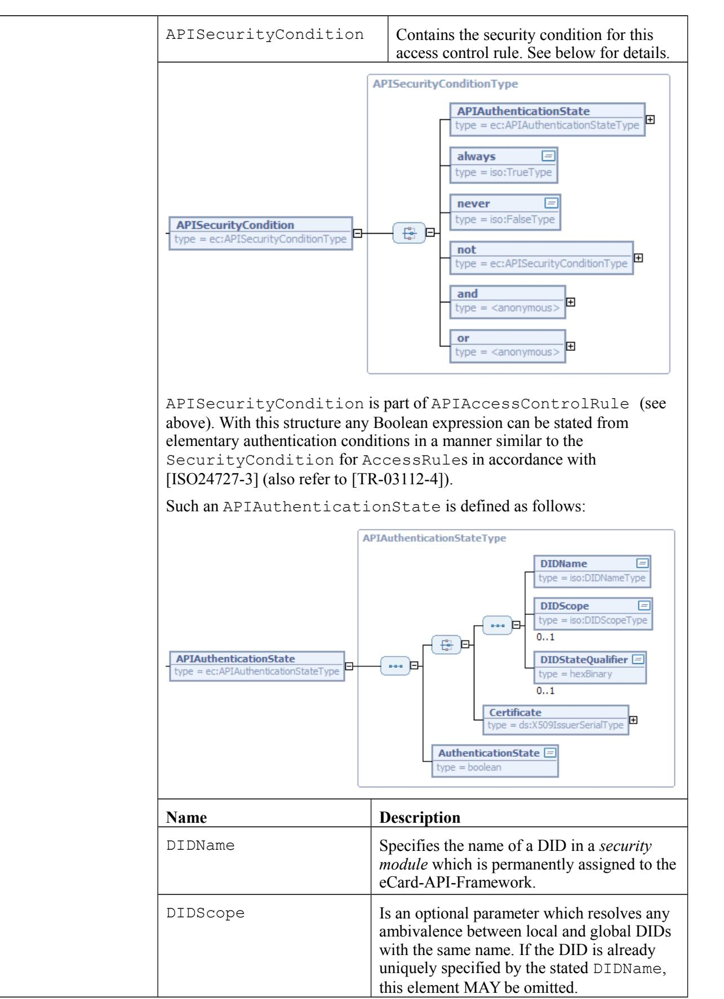

|               | DIDStateQualifier      |                                                                                                                                                                                                                                                                                                                                             | MAY be used for certificate-based authentication processes on cards (also refer to [TR-03112-7]). Specifies the certificate stored in the certificate database which serves as trust anchor in the event of a non-card based authentication (e.g. by means of TLS, also refer to CardApplicationPath in [TR-03112-4] and TC_API_Open in [TR-03112-7].). |  |  |
|---------------|------------------------|---------------------------------------------------------------------------------------------------------------------------------------------------------------------------------------------------------------------------------------------------------------------------------------------------------------------------------------------|------------------------------------------------------------------------------------------------------------------------------------------------------------------------------------------------------------------------------------------------------------------------------------------------------------------------------------------------------------------------------------|--|--|
|               | Certificate            |                                                                                                                                                                                                                                                                                                                                             |                                                                                                                                                                                                                                                                                                                                                                                    |  |  |
|               | AuthenticationState    |                                                                                                                                                                                                                                                                                                                                             | States whether the respective authentication condition must be set or not (also refer to [ISO24727-3] and [TR-03112-4]).                                                                                                                                                                                                                                                     |  |  |
|               | Sections 4.1 and 4.2). | Status information and errors in APIACLList (also refer to [TR-03112-1]                                                                                                                                                                                                                                                                     |                                                                                                                                                                                                                                                                                                                                                                                    |  |  |
|               | Name                   |                                                                                                                                                                                                                                                                                                                                             | Error codes                                                                                                                                                                                                                                                                                                                                                                        |  |  |
|               | ResultMajor            | •                                                                                                                                                                                                                                                                                                                                           | /resultmajor#ok                                                                                                                                                                                                                                                                                                                                                                    |  |  |
|               |                        | •                                                                                                                                                                                                                                                                                                                                           | /resultmajor#error                                                                                                                                                                                                                                                                                                                                                                 |  |  |
|               |                        | •                                                                                                                                                                                                                                                                                                                                           | /resultmajor#warning                                                                                                                                                                                                                                                                                                                                                               |  |  |
|               | ResultMinor            | •                                                                                                                                                                                                                                                                                                                                           | /resultminor/al/common#internalError                                                                                                                                                                                                                                                                                                                                               |  |  |
|               |                        | •                                                                                                                                                                                                                                                                                                                                           | /resultminor/al/common#parameterError                                                                                                                                                                                                                                                                                                                                              |  |  |
|               |                        | •                                                                                                                                                                                                                                                                                                                                           | /resultminor/al#unknownAPIFunction                                                                                                                                                                                                                                                                                                                                                 |  |  |
|               |                        | •                                                                                                                                                                                                                                                                                                                                           | /resultminor/dp#unknownChannelHandle                                                                                                                                                                                                                                                                                                                                               |  |  |
|               |                        | •                                                                                                                                                                                                                                                                                                                                           | /resultminor/sal# securityConditionsNotSatisfied                                                                                                                                                                                                                                                                                                                                |  |  |
|               | ResultMessage          |                                                                                                                                                                                                                                                                                                                                             | MAY contain more detailed information on the error which occurred if required.                                                                                                                                                                                                                                                                                                  |  |  |
| Precondition  |                        | For access to this function the administrator MUST be authenticated in accordance with the applicable security policies for the operation of the eCard-API-Framework.                                                                                                                                                                 |                                                                                                                                                                                                                                                                                                                                                                                    |  |  |
| Postcondition |                        |                                                                                                                                                                                                                                                                                                                                             |                                                                                                                                                                                                                                                                                                                                                                                    |  |  |
| Note          |                        |                                                                                                                                                                                                                                                                                                                                             | Also refer to CardApplicationACL in [TR-03112-4].                                                                                                                                                                                                                                                                                                                                  |  |  |
|               |                        | For successful access to card application services (also refer to [TR-03112-4], Section 3.1.3 ff), the access control conditions for the APICalls AND the specific card access control conditions MUST be met. For this reason access to these [ISO24727-3] functions SHOULD be permitted without restriction in general cases. |                                                                                                                                                                                                                                                                                                                                                                                    |  |  |

## **3.1.4 APIACLModify**

| Name        | APIACLModify                                                      |
|-------------|-------------------------------------------------------------------|
| Description | With the aid of the OPTIONAL APIACLModify function an access rule |

|                          | MAY be modified for a specific API function.                                                                                                                                                               |             |                                                                                                                                                                                                                            |  |
|--------------------------|------------------------------------------------------------------------------------------------------------------------------------------------------------------------------------------------------------|-------------|----------------------------------------------------------------------------------------------------------------------------------------------------------------------------------------------------------------------------|--|
|                          | If this function is supported it MAY ONLY be made available to an administrator who is authenticated in accordance with the applicable security policy for the operation of the eCard-API-Framework. |             |                                                                                                                                                                                                                            |  |
|                          | Regardless of the support of this function it MUST be ensured that the applicable access control policy for API-calls is enforced.                                                                      |             |                                                                                                                                                                                                                            |  |
| Invocation parameters |                                                                                                                                                                                                            |             |                                                                                                                                                                                                                            |  |
|                          | Invocation of the APIACLModify function.                                                                                                                                                                   |             |                                                                                                                                                                                                                            |  |
|                          | Name                                                                                                                                                                                                       |             | Description                                                                                                                                                                                                                |  |
|                          | APIAccessControlList                                                                                                                                                                                       |             | Contains the modified access control list for APICalls, which is activated at the latest the next time the eCard-API-Framework is started. Details on the APIAccessControlListType are given on page 13. |  |
| Return parameters        |                                                                                                                                                                                                            |             |                                                                                                                                                                                                                            |  |
|                          | Return of the APIACLModify function.                                                                                                                                                                       |             |                                                                                                                                                                                                                            |  |
|                          | Name                                                                                                                                                                                                       | Description |                                                                                                                                                                                                                            |  |
|                          | dss:Result                                                                                                                                                                                                 | below.      | Contains the status information and the errors of an executed action. This element is described in more detail                                                                                                          |  |
|                          | Status information and errors in APIACLModify (also refer to [TR-03112-1] Sections 4.1 and 4.2).                                                                                                        |             |                                                                                                                                                                                                                            |  |
|                          | Name                                                                                                                                                                                                       | Error codes |                                                                                                                                                                                                                            |  |
|                          | ResultMajor                                                                                                                                                                                                | •           | /resultmajor#ok                                                                                                                                                                                                            |  |
|                          |                                                                                                                                                                                                            | •           | /resultmajor#error                                                                                                                                                                                                         |  |
|                          |                                                                                                                                                                                                            | •           | /resultmajor#warning                                                                                                                                                                                                       |  |

|               | ResultMinor                                                                                                                                                                                                                                                                                                                                                                               | • /resultminor/al/common#internalError • /resultminor/al/common#parameterError • /resultminor/al#unknownAPIFunction • /resultminor/dp#unknownChannelHandle • /resultminor/sal# invalidAccessControlInformation • /resultminor/sal# securityConditionsNotSatisfied |
|---------------|-------------------------------------------------------------------------------------------------------------------------------------------------------------------------------------------------------------------------------------------------------------------------------------------------------------------------------------------------------------------------------------------|----------------------------------------------------------------------------------------------------------------------------------------------------------------------------------------------------------------------------------------------------------------------------------------------------------|
|               | ResultMessage                                                                                                                                                                                                                                                                                                                                                                             | MAY contain more detailed information on the error which occurred if required.                                                                                                                                                                                                                        |
| Precondition  | For access to this function the administrator MUST be authenticated in accordance with the definitive security policies applicable for operation of the eCard framework.                                                                                                                                                                                                            |                                                                                                                                                                                                                                                                                                          |
| Postcondition | The modified access control information becomes effective when the eCard-API-Framework is started the next time at the latest.                                                                                                                                                                                                                                                         |                                                                                                                                                                                                                                                                                                          |
| Note          | Also refer to CardApplicationACL in [TR-03112-4]. For successful access to card application services (also refer to [TR-03112-4], Section 3.1.3 ff), the access control conditions for the APICalls AND the specific card access control conditions MUST be met. For this reason access to these [ISO24727-3] functions SHOULD be permitted without restriction as a rule. |                                                                                                                                                                                                                                                                                                          |

## **3.1.5 FrameworkUpdate**

| Name                     | FrameworkUpdate                                                                                                                                                                                                                                                                                                                                |                                                                             |  |
|--------------------------|------------------------------------------------------------------------------------------------------------------------------------------------------------------------------------------------------------------------------------------------------------------------------------------------------------------------------------------------|-----------------------------------------------------------------------------|--|
| Description              | An installation of the eCard-API-Framework can be updated with the FrameworkUpdate function. As a result of calling FrameworkUpdate the eCard-API-Framework performs the "Basic Update Protocol" as specified in [TR-03112-7] with the update server defined by the UpdateService-element of the default parameters (cf. page 21). |                                                                             |  |
| Invocation parameters |                                                                                                                                                                                                                                                                                                                                                | Invocation of the FrameworkUpdate function is performed without parameters. |  |
| Return                   | Return of the FrameworkUpdate function.                                                                                                                                                                                                                                                                                                        |                                                                             |  |
|                          | Name                                                                                                                                                                                                                                                                                                                                           | Description                                                                 |  |

| dss:Result Contains the status information and the errors of an executed action. This element is described in more detail below. Status information and errors with FrameworkUpdate (also refer to [TR-03112-1] Sections 4.1 and 4.2). Name Error codes ResultMajor • /resultmajor#ok • /resultmajor#error • /resultmajor#warning ResultMinor • /resultminor/al/common#noPermission • /resultminor/al/common#internalError • /resultminor/al/common#parameterError • /resultminor/dp#unknownChannelHandle • /resultminor/dp#communicationError • /resultminor/dp#trustedChannelEstablishmentFailed • /resultminor/dp#unknownProtocol • /resultminor/dp#unknownWebserviceBinding • /resultminor/al/FrameworkUpdate# serviceNotAvailable • /resultminor/al/FrameworkUpdate#unknownModule • /resultminor/al/FrameworkUpdate# invalidVersionNumber • /resultminor/al/FrameworkUpdate# operationSystemNotSupported • /resultminor/al/FrameworkUpdate# noSpaceAvailable • /resultminor/al/FrameworkUpdate# securityConditionsNotSatisfied • /resultminor/sal#digitalSignatureNotCorrect • /resultminor/il/signature#invalidSignatureFormat ResultMessage MAY contain more detailed information on the error which occurred if required. Precondition Postcondition |      |  |
|-----------------------------------------------------------------------------------------------------------------------------------------------------------------------------------------------------------------------------------------------------------------------------------------------------------------------------------------------------------------------------------------------------------------------------------------------------------------------------------------------------------------------------------------------------------------------------------------------------------------------------------------------------------------------------------------------------------------------------------------------------------------------------------------------------------------------------------------------------------------------------------------------------------------------------------------------------------------------------------------------------------------------------------------------------------------------------------------------------------------------------------------------------------------------------------------------------------------------------------------------------------------------------------------------------------------------------------------------------------------------------------------------------------------------------------------|------|--|
|                                                                                                                                                                                                                                                                                                                                                                                                                                                                                                                                                                                                                                                                                                                                                                                                                                                                                                                                                                                                                                                                                                                                                                                                                                                                                                                                                                                                                                         |      |  |
|                                                                                                                                                                                                                                                                                                                                                                                                                                                                                                                                                                                                                                                                                                                                                                                                                                                                                                                                                                                                                                                                                                                                                                                                                                                                                                                                                                                                                                         |      |  |
|                                                                                                                                                                                                                                                                                                                                                                                                                                                                                                                                                                                                                                                                                                                                                                                                                                                                                                                                                                                                                                                                                                                                                                                                                                                                                                                                                                                                                                         |      |  |
|                                                                                                                                                                                                                                                                                                                                                                                                                                                                                                                                                                                                                                                                                                                                                                                                                                                                                                                                                                                                                                                                                                                                                                                                                                                                                                                                                                                                                                         |      |  |
|                                                                                                                                                                                                                                                                                                                                                                                                                                                                                                                                                                                                                                                                                                                                                                                                                                                                                                                                                                                                                                                                                                                                                                                                                                                                                                                                                                                                                                         |      |  |
|                                                                                                                                                                                                                                                                                                                                                                                                                                                                                                                                                                                                                                                                                                                                                                                                                                                                                                                                                                                                                                                                                                                                                                                                                                                                                                                                                                                                                                         |      |  |
|                                                                                                                                                                                                                                                                                                                                                                                                                                                                                                                                                                                                                                                                                                                                                                                                                                                                                                                                                                                                                                                                                                                                                                                                                                                                                                                                                                                                                                         |      |  |
|                                                                                                                                                                                                                                                                                                                                                                                                                                                                                                                                                                                                                                                                                                                                                                                                                                                                                                                                                                                                                                                                                                                                                                                                                                                                                                                                                                                                                                         |      |  |
|                                                                                                                                                                                                                                                                                                                                                                                                                                                                                                                                                                                                                                                                                                                                                                                                                                                                                                                                                                                                                                                                                                                                                                                                                                                                                                                                                                                                                                         |      |  |
|                                                                                                                                                                                                                                                                                                                                                                                                                                                                                                                                                                                                                                                                                                                                                                                                                                                                                                                                                                                                                                                                                                                                                                                                                                                                                                                                                                                                                                         |      |  |
|                                                                                                                                                                                                                                                                                                                                                                                                                                                                                                                                                                                                                                                                                                                                                                                                                                                                                                                                                                                                                                                                                                                                                                                                                                                                                                                                                                                                                                         |      |  |
|                                                                                                                                                                                                                                                                                                                                                                                                                                                                                                                                                                                                                                                                                                                                                                                                                                                                                                                                                                                                                                                                                                                                                                                                                                                                                                                                                                                                                                         |      |  |
|                                                                                                                                                                                                                                                                                                                                                                                                                                                                                                                                                                                                                                                                                                                                                                                                                                                                                                                                                                                                                                                                                                                                                                                                                                                                                                                                                                                                                                         |      |  |
|                                                                                                                                                                                                                                                                                                                                                                                                                                                                                                                                                                                                                                                                                                                                                                                                                                                                                                                                                                                                                                                                                                                                                                                                                                                                                                                                                                                                                                         |      |  |
|                                                                                                                                                                                                                                                                                                                                                                                                                                                                                                                                                                                                                                                                                                                                                                                                                                                                                                                                                                                                                                                                                                                                                                                                                                                                                                                                                                                                                                         |      |  |
|                                                                                                                                                                                                                                                                                                                                                                                                                                                                                                                                                                                                                                                                                                                                                                                                                                                                                                                                                                                                                                                                                                                                                                                                                                                                                                                                                                                                                                         |      |  |
|                                                                                                                                                                                                                                                                                                                                                                                                                                                                                                                                                                                                                                                                                                                                                                                                                                                                                                                                                                                                                                                                                                                                                                                                                                                                                                                                                                                                                                         |      |  |
|                                                                                                                                                                                                                                                                                                                                                                                                                                                                                                                                                                                                                                                                                                                                                                                                                                                                                                                                                                                                                                                                                                                                                                                                                                                                                                                                                                                                                                         |      |  |
|                                                                                                                                                                                                                                                                                                                                                                                                                                                                                                                                                                                                                                                                                                                                                                                                                                                                                                                                                                                                                                                                                                                                                                                                                                                                                                                                                                                                                                         |      |  |
|                                                                                                                                                                                                                                                                                                                                                                                                                                                                                                                                                                                                                                                                                                                                                                                                                                                                                                                                                                                                                                                                                                                                                                                                                                                                                                                                                                                                                                         |      |  |
|                                                                                                                                                                                                                                                                                                                                                                                                                                                                                                                                                                                                                                                                                                                                                                                                                                                                                                                                                                                                                                                                                                                                                                                                                                                                                                                                                                                                                                         |      |  |
|                                                                                                                                                                                                                                                                                                                                                                                                                                                                                                                                                                                                                                                                                                                                                                                                                                                                                                                                                                                                                                                                                                                                                                                                                                                                                                                                                                                                                                         |      |  |
|                                                                                                                                                                                                                                                                                                                                                                                                                                                                                                                                                                                                                                                                                                                                                                                                                                                                                                                                                                                                                                                                                                                                                                                                                                                                                                                                                                                                                                         |      |  |
|                                                                                                                                                                                                                                                                                                                                                                                                                                                                                                                                                                                                                                                                                                                                                                                                                                                                                                                                                                                                                                                                                                                                                                                                                                                                                                                                                                                                                                         |      |  |
|                                                                                                                                                                                                                                                                                                                                                                                                                                                                                                                                                                                                                                                                                                                                                                                                                                                                                                                                                                                                                                                                                                                                                                                                                                                                                                                                                                                                                                         |      |  |
|                                                                                                                                                                                                                                                                                                                                                                                                                                                                                                                                                                                                                                                                                                                                                                                                                                                                                                                                                                                                                                                                                                                                                                                                                                                                                                                                                                                                                                         | Note |  |

#### **3.1.6 GetDefaultParameters**

| Name |
|------|
|------|

**Name GetDefaultParameters**

| Description              | The default parameters of the eCard-API-Framework are read out with the aid of the GetDefaultParameters function. |                                                                                                                                                                                                    |  |  |
|--------------------------|----------------------------------------------------------------------------------------------------------------------|----------------------------------------------------------------------------------------------------------------------------------------------------------------------------------------------------|--|--|
| Invocation parameters | Invocation of the GetDefaultParameters function.                                                                     |                                                                                                                                                                                                    |  |  |
|                          | Name                                                                                                                 | Description                                                                                                                                                                                        |  |  |
|                          | ChannelHandle                                                                                                        | Optional parameter with which a remote system can be addressed (also refer to CardApplicationPath in [TR-03112-4]). If the local system is to be addressed, this parameter is omitted. |  |  |
| Return parameters        |                                                                                                                      | Return of the GetDefaultParameters function.                                                                                                                                                       |  |  |
|                          | Name                                                                                                                 | Description                                                                                                                                                                                        |  |  |
|                          | dss:Result                                                                                                           | Contains the status information and the errors of an executed action. This element is described in more detail below.                                                                        |  |  |
|                          | DefaultParameters                                                                                                    | Contains the configured default parameters of the eCard-API-Framework (see below for details).                                                                                               |  |  |

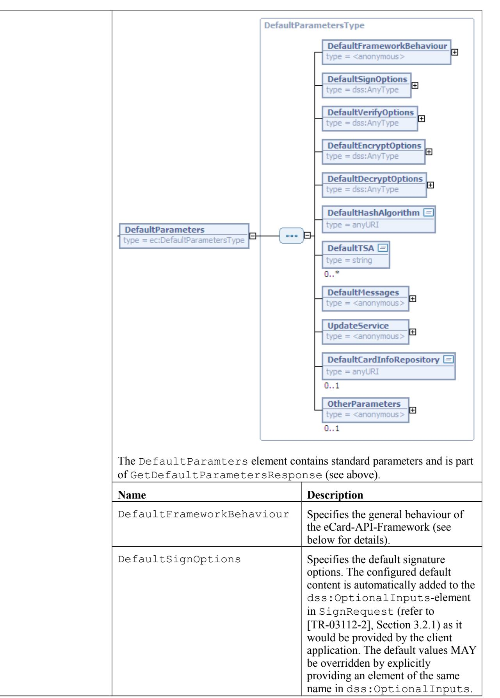

| DefaultVerifyOptions  | Specifies the default verification options. The configured default content is automatically added to the dss:OptionalInputs-element in VerifyRequest (refer to [TR-03112-2], Section 3.2.2) as it would be provided by the client application. The default values MAY be overridden by explicitly providing an element of the same name in dss:OptionalInputs. |
|-----------------------|----------------------------------------------------------------------------------------------------------------------------------------------------------------------------------------------------------------------------------------------------------------------------------------------------------------------------------------------------------------------------------------------|
| DefaultEncryptOptions | Specifies the default encryption options. The configured default content is automatically added to the dss:OptionalInputs-element in EncryptRequest (refer to [TR-03112-2], Section 3.2.1) as it would be provided by the client application. The default values MAY be overridden by explicitly providing an element of the same name in dss:OptionalInputs.  |
| DefaultDecryptOptions | Specifies the default decryption options. The configured default content is automatically added to the dss:OptionalInputs-element in DecryptRequest (refer to [TR-03112-2], Section 3.2.1) as it would be provided by the client application. The default values MAY be overridden by explicitly providing an element of the same name in dss:OptionalInputs.  |
| DefaultHashAlgorithm  | Defines the standard hash algorithm (also refer to [TR-03112-4], Annex A.3).                                                                                                                                                                                                                                                                                                           |
| DefaultCipherSuite    | Defines the standard cipher suite which is to be used in the framework of TC_API_Open (also refer to [TR-03112-2]).                                                                                                                                                                                                                                                                 |

| DefaultTSA                | Defines the standard time stamping services (also refer to Sections 3.6.5 and 3.6.6).                                                          |
|---------------------------|------------------------------------------------------------------------------------------------------------------------------------------------------|
|                           | If several time stamping services are configured for a corresponding time stamp type, the first suitable service in the list is addressed.  |
|                           | If a time stamp service is referred to with the address 127.0.1.0, the eCard-API-Framework is instructed to generate the time stamp itself. |
| DefaultMessages           | Defines the standard messages for recording and modifying PINs on a card terminal (see below for details).                                     |
| UpdateService             | Contains information on the update service to be used (see below for details).                                                                 |
| DefaultCardInfoRepository | MAY specify the address of the standard CardInfo repository server (also refer to GetCardInfoOr ACD in [TR-03112-5]).                       |
| OtherParameters           | MAY contain other (manufacturer-specific) parameters.                                                                                             |
|                           |                                                                                                                                                      |
| (see above).              | DefaultFrameworkBehaviour is part of DefaultParameters                                                                                               |
| Name                      | Description                                                                                                                                          |
| VerbosityLevel            | Specifies in how much detail the framework reports on detailed processes. The following values are provided:                                   |
|                           | • 0: No information is returned on the individual steps                                                                                        |
|                           | • >0: Information is returned on the individual steps                                                                                          |
|                           | An additional differentiation of the positive values for VerbosityLevel MAY be defined by the manufacturer.                                    |

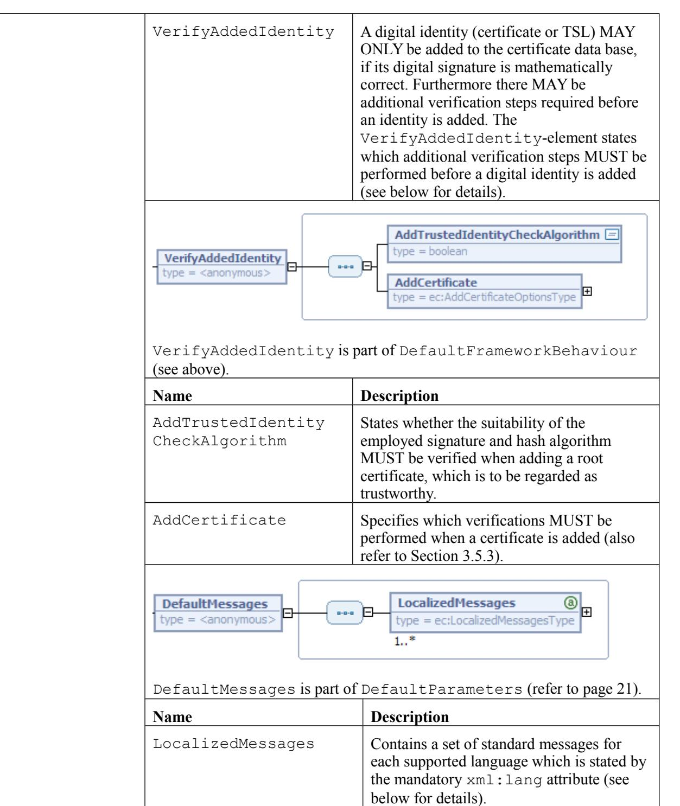

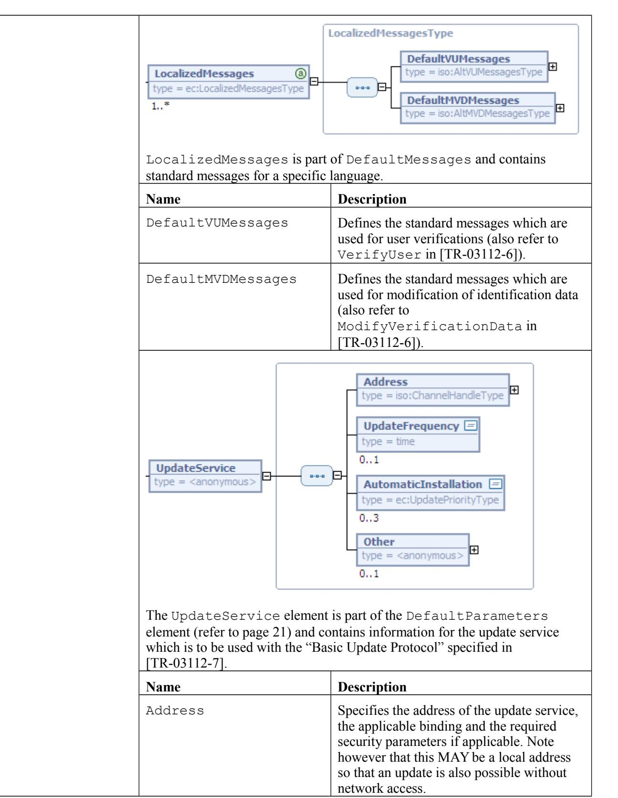

|               | UpdateFrequency AutomaticInstallation                                                                    |             | Specifies the time interval after which an enquiry request is to be automatically sent to the update service. If this element is missing, no automatic                                                                                |
|---------------|-------------------------------------------------------------------------------------------------------------|-------------|------------------------------------------------------------------------------------------------------------------------------------------------------------------------------------------------------------------------------------------------|
|               |                                                                                                             |             | enquiry is sent to the update service.                                                                                                                                                                                                         |
|               |                                                                                                             |             | MAY specify which class of updates (also refer to the UpdatePriority element in [TR-03112-7]) should be automatically loaded (when the eCard-API-Framework is terminated with TerminateFramework, also refer to Section 3.1.2). |
|               |                                                                                                             |             | If this element is missing, no updates are automatically installed.                                                                                                                                                                         |
|               | Other                                                                                                       |             | MAY contain other parameters.                                                                                                                                                                                                                  |
|               | Status information and errors in GetDefaultParameters (also refer to [TR-03112-1] Sections 4.1 and 4.2). |             |                                                                                                                                                                                                                                                |
|               |                                                                                                             |             |                                                                                                                                                                                                                                                |
|               | Name                                                                                                        | Error codes |                                                                                                                                                                                                                                                |
|               | ResultMajor                                                                                                 | •           | /resultmajor#ok                                                                                                                                                                                                                                |
|               |                                                                                                             | •           | /resultmajor#error                                                                                                                                                                                                                             |
|               | ResultMinor                                                                                                 | •           | /resultminor/al/common#noPermission                                                                                                                                                                                                            |
|               |                                                                                                             | •           | /resultminor/al/common#internalError                                                                                                                                                                                                           |
|               |                                                                                                             | •           | /resultminor/al/common#parameterError                                                                                                                                                                                                          |
|               |                                                                                                             | •           | /resultminor/dp#unknownChannelHandle                                                                                                                                                                                                           |
|               |                                                                                                             | MAY exist.  | In addition, other protocol specific error messages                                                                                                                                                                                            |
|               | ResultMessage                                                                                               |             | MAY contain more detailed information on the error which occurred if required.                                                                                                                                                              |
| Precondition  |                                                                                                             |             |                                                                                                                                                                                                                                                |
| Postcondition |                                                                                                             |             |                                                                                                                                                                                                                                                |

#### **3.1.7 SetDefaultParameters**

| Name        | SetDefaultParameters                                                                                               |
|-------------|--------------------------------------------------------------------------------------------------------------------|
| Description | The default parameters of the eCard-API-Framework are stored with the aid of the SetDefaultParameters function. |

| Invocation parameters |                                                                                                             |                                                                                                                                                                                                    |  |
|--------------------------|-------------------------------------------------------------------------------------------------------------|----------------------------------------------------------------------------------------------------------------------------------------------------------------------------------------------------|--|
|                          | Invocation of the SetDefaultParameters function.                                                            |                                                                                                                                                                                                    |  |
|                          | Name                                                                                                        | Description                                                                                                                                                                                        |  |
|                          | ChannelHandle                                                                                               | Optional parameter with which a remote system can be addressed (also refer to CardApplicationPath in [TR-03112-4]). If the local system is to be addressed, this parameter is omitted. |  |
|                          | DefaultParameters                                                                                           | Contains the configured default parameters of the eCard-API-Framework (refer to page 21 for details).                                                                                        |  |
| Return parameters        | Return of the SetDefaultParameters function.                                                                |                                                                                                                                                                                                    |  |
|                          | Name                                                                                                        | Description                                                                                                                                                                                        |  |
|                          | dss:Result                                                                                                  | Contains the status information and the errors of an executed action. This element is described in more detail below.                                                                        |  |
|                          | Status information and errors in SetDefaultParameters (also refer to [TR-03112-1] Sections 4.1 and 4.2). |                                                                                                                                                                                                    |  |
|                          | Name                                                                                                        | Error codes                                                                                                                                                                                        |  |
|                          | ResultMajor                                                                                                 | • /resultmajor#ok                                                                                                                                                                               |  |
|                          |                                                                                                             | • /resultmajor#error                                                                                                                                                                            |  |

|               | ResultMinor                                                                                               | • /resultminor/al/common#noPermission • /resultminor/al/common#internalError • /resultminor/al/common#parameterError • /resultminor/al/TrustedViewer#invalidID • /resultminor/dp#unknownChannelHandle • /resultminor/il/algorithm# hashAlgorithmNotSupported • /resultminor/il/encryption# encryptionFormatNotSupported |
|---------------|-----------------------------------------------------------------------------------------------------------|----------------------------------------------------------------------------------------------------------------------------------------------------------------------------------------------------------------------------------------------------------------------------------------------------------------------------------------------------------------------|
|               |                                                                                                           | • /resultminor/il/key# encryptionAlgorithmNotSupported • /resultminor/il/signature# signatureFormatNotSupported • /resultminor/il/signature#c                                                                                                                                                                                                   |
|               | ResultMessage                                                                                             | ertificateFormatNotCorrect MAY contain more detailed information on the error which occurred if required.                                                                                                                                                                                                                                                      |
| Precondition  |                                                                                                           |                                                                                                                                                                                                                                                                                                                                                                      |
| Postcondition | The modified default parameters become effective the next time the framework is started at the latest. |                                                                                                                                                                                                                                                                                                                                                                      |
| Note          |                                                                                                           |                                                                                                                                                                                                                                                                                                                                                                      |

## **3.2 Card management**

## **3.2.1 GetCardInfoList**

| Name                     | GetCardInfoList                                                                                              |                                                                         |
|--------------------------|--------------------------------------------------------------------------------------------------------------|-------------------------------------------------------------------------|
| Description              |                                                                                                              | The GetCardInfoList function supplies a list of known card types in the |
| Invocation parameters | form of CardInfo-files (also refer to [TR-03112-4], Annex A). Invocation of the GetCardInfoList function. |                                                                         |
|                          | Name                                                                                                         | Description                                                             |

|               | ChannelHandle                           | Optional parameter with which a remote system can be addressed (also refer to CardApplicationPath in [TR-03112-4]). If the local system is to be addressed, this parameter is omitted. |
|---------------|-----------------------------------------|----------------------------------------------------------------------------------------------------------------------------------------------------------------------------------------------------|
| Return        | Return of the GetCardInfoList function. |                                                                                                                                                                                                    |
|               | Name                                    | Description                                                                                                                                                                                        |
|               | CardInfo                                | Contains the CardInfo structure which is used for mapping of generic SAL-calls to card-specific APDUs. Details on this topic are contained in [TR-03112-4] (Annex A).                     |
|               | dss:Result                              | Contains the status information and the errors of an executed action. This element is described in more detail below.                                                                        |
|               | [TR-03112-1] Sections 4.1 and 4.2).     | Status information and errors in GetCardInfoList (also refer to                                                                                                                                    |
|               | Name                                    | Error codes                                                                                                                                                                                        |
|               | ResultMajor                             | • /resultmajor#ok • /resultmajor#error                                                                                                                                                    |
|               | ResultMinor                             | • /resultminor/al/common#noPermission • /resultminor/al/common#internalError • /resultminor/al/common#parameterError • /resultminor/dp#unknownChannelHandle                   |
|               | ResultMessage                           | MAY contain more detailed information on the error which occurred if required.                                                                                                                  |
| Precondition  |                                         |                                                                                                                                                                                                    |
| Postcondition |                                         |                                                                                                                                                                                                    |
| Note          |                                         |                                                                                                                                                                                                    |
|               |                                         |                                                                                                                                                                                                    |

#### **3.2.2 SetCardInfoList**

| Name        | SetCardInfoList                                                         |
|-------------|-------------------------------------------------------------------------|
| Description | The SetCardInfoList function stores a list of CardInfo structures which |

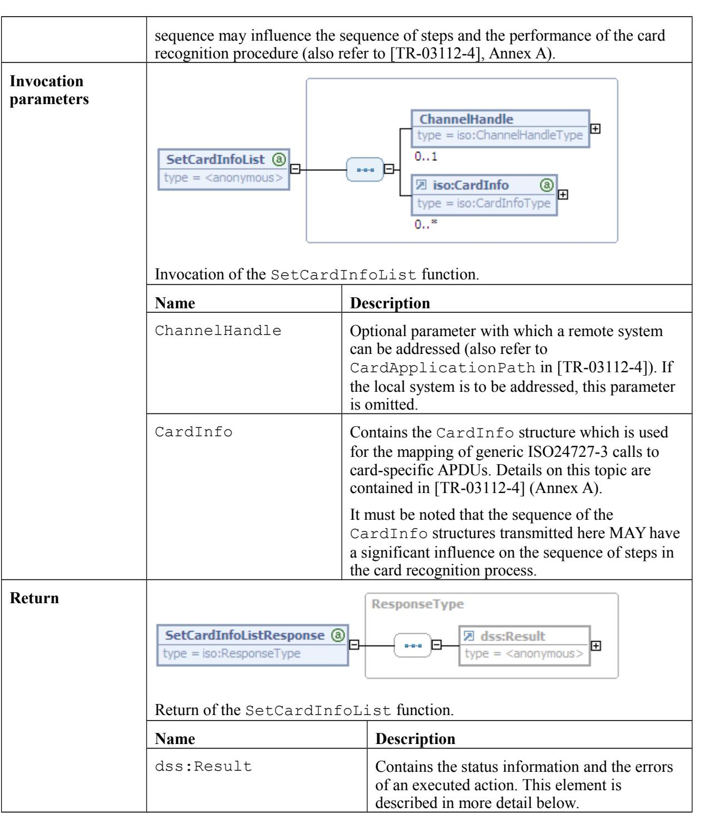

|               | Status information and errors in SetCardInfoList (also refer to [TR-03112-1] Sections 4.1 and 4.2).                                                                   |                                                                                   |  |
|---------------|--------------------------------------------------------------------------------------------------------------------------------------------------------------------------|-----------------------------------------------------------------------------------|--|
|               | Name                                                                                                                                                                     | Error codes                                                                       |  |
|               | ResultMajor                                                                                                                                                              | • /resultmajor#ok                                                              |  |
|               |                                                                                                                                                                          | • /resultmajor#error                                                           |  |
|               | ResultMinor                                                                                                                                                              | • /resultminor/al/CardInfo#incorrectFile                                       |  |
|               |                                                                                                                                                                          | • /resultminor/al/common#noPermission                                          |  |
|               |                                                                                                                                                                          | • /resultminor/al/common#internalError                                         |  |
|               |                                                                                                                                                                          | • /resultminor/al/common#parameterError                                        |  |
|               |                                                                                                                                                                          | • /resultminor/dp#unknownChannelHandle                                         |  |
|               | ResultMessage                                                                                                                                                            | MAY contain more detailed information on the error which occurred if required. |  |
| Precondition  |                                                                                                                                                                          |                                                                                   |  |
| Postcondition |                                                                                                                                                                          |                                                                                   |  |
| Note          | The sequence of the transmitted CardInfo structures MAY have a significant influence on the sequence of steps and the performance of the card recognition process. |                                                                                   |  |

#### **3.2.3 AddCardInfoFiles**

| Description The AddCardInfoFiles function provides a sequence of additional CardInfo structures to the eCard-API-Framework. The new CardInfo structures are added to the end of the existing list. During import of the                                                                                                                                                                                   | Name | AddCardInfoFiles                                                           |  |
|--------------------------------------------------------------------------------------------------------------------------------------------------------------------------------------------------------------------------------------------------------------------------------------------------------------------------------------------------------------------------------------------------------------------|------|----------------------------------------------------------------------------|--|
| ensure that the CardInfo files can be used safely. The following tests MUST be performed in particular (also refer to [TR-03112-4], Annex A.7): • Test for content-related consistency (e.g. that URIs for protocols and algorithms are known) • Verification of any signatures • Verification that protected key references are not referenced from unsigned parts of a CardInfo file. |      | CardInfo files, a series of semantic verifications must be performed which |  |

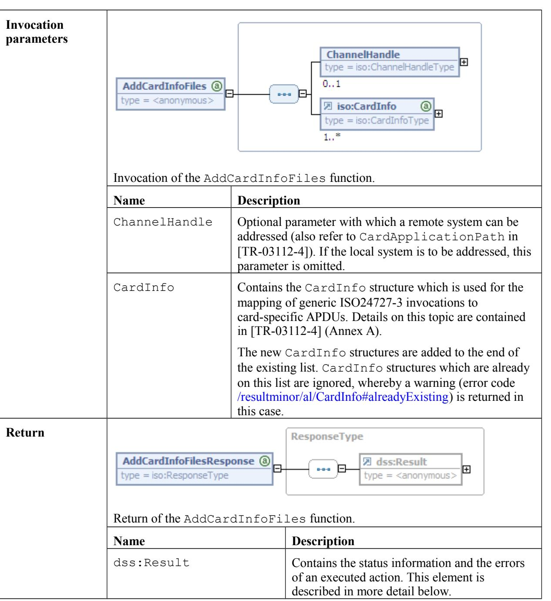

|               | Status information and errors in AddCardInfoFiles (also refer to [TR-03112-1] Sections 4.1 and 4.2). |                                                                                   |  |
|---------------|---------------------------------------------------------------------------------------------------------|-----------------------------------------------------------------------------------|--|
|               | Name                                                                                                    | Error codes                                                                       |  |
|               | ResultMajor                                                                                             | • /resultmajor#ok                                                              |  |
|               |                                                                                                         | • /resultmajor#error                                                           |  |
|               | ResultMinor                                                                                             | • /resultminor/al/CardInfo#addNotPossible                                      |  |
|               |                                                                                                         | • /resultminor/al/CardInfo#alreadyExisting                                     |  |
|               |                                                                                                         | • /resultminor/al/CardInfo#incorrectFile                                       |  |
|               |                                                                                                         | • /resultminor/al/common#noPermission                                          |  |
|               |                                                                                                         | • /resultminor/al/common#internalError                                         |  |
|               |                                                                                                         | • /resultminor/al/common#parameterError                                        |  |
|               |                                                                                                         | • /resultminor/dp#unknownChannelHandle                                         |  |
|               | ResultMessage                                                                                           | MAY contain more detailed information on the error which occurred if required. |  |
| Precondition  |                                                                                                         |                                                                                   |  |
| Postcondition |                                                                                                         |                                                                                   |  |
| Note          |                                                                                                         |                                                                                   |  |

#### **3.2.4 DeleteCardInfoFiles**

| Name                     | DeleteCardInfoFiles                                                  |                                                                                                                                                                                                    |  |
|--------------------------|----------------------------------------------------------------------|----------------------------------------------------------------------------------------------------------------------------------------------------------------------------------------------------|--|
| Description              | The DeleteCardInfoFiles function deletes a series of CardInfo files. |                                                                                                                                                                                                    |  |
| Invocation parameters | Invocation of the DeleteCardInfoFiles function.                      |                                                                                                                                                                                                    |  |
|                          | Name                                                                 | Description                                                                                                                                                                                        |  |
|                          | ChannelHandle                                                        | Optional parameter with which a remote system can be addressed (also refer to CardApplicationPath in [TR-03112-4]). If the local system is to be addressed, this parameter is omitted. |  |
| CardTypeIdentifier       |                                                                      | Contains a series of unique identifiers of the CardInfo structures which are to be deleted (also refer to [TR-03112-4], Annex A.3)                                                           |  |

| Return        | Return of the DeleteCardInfoFiles function.                                                                                       |                            |                                                                                                                                                                                                                                                    |
|---------------|-----------------------------------------------------------------------------------------------------------------------------------|----------------------------|----------------------------------------------------------------------------------------------------------------------------------------------------------------------------------------------------------------------------------------------------|
|               | Name                                                                                                                              |                            | Description                                                                                                                                                                                                                                        |
|               | dss:Result                                                                                                                        |                            | Contains the status information and the errors of an executed action. This element is described in more detail below.                                                                                                                        |
|               | Status information and errors in DeleteCardInfoFiles (also refer to [TR-03112-1] Sections 4.1 and 4.2). Name Error codes |                            |                                                                                                                                                                                                                                                    |
|               |                                                                                                                                   |                            |                                                                                                                                                                                                                                                    |
|               | ResultMajor                                                                                                                       | • •                     | /resultmajor#ok /resultmajor#error                                                                                                                                                                                                              |
|               | ResultMinor                                                                                                                       | • • • • • • | /resultminor/al/CardInfo#notExisting /resultminor/al/CardInfo#deleteNotPossible /resultminor/al/common#noPermission /resultminor/al/common#internalError /resultminor/al/common#parameterError /resultminor/dp#unknownChannelHandle |
|               | ResultMessage                                                                                                                     |                            | MAY contain more detailed information on the error which occurred if required.                                                                                                                                                                  |
| Precondition  |                                                                                                                                   |                            |                                                                                                                                                                                                                                                    |
| Postcondition |                                                                                                                                   |                            |                                                                                                                                                                                                                                                    |
| Note          |                                                                                                                                   |                            |                                                                                                                                                                                                                                                    |

## **3.3 Card terminal management**

#### **3.3.1 RegisterIFD**

| Name        | RegisterIFD                                                                                                                                                                                            |
|-------------|--------------------------------------------------------------------------------------------------------------------------------------------------------------------------------------------------------|
| Description | With the RegisterIFD function it is possible to add a card terminal with all configuration information. Furthermore this function may be used to reactivate one or all suspended card terminals. |

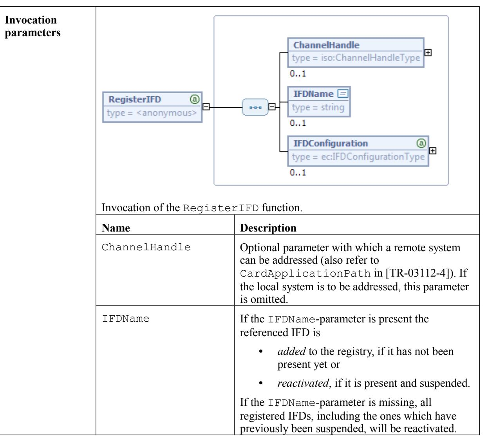

|        | IFDConfiguration                    | Optionally contains the configuration information for the card terminal addressed with IFDName. The detailed specification of these configuration parameters depends on the card terminal type and is therefore dependent on the manufacturer. |
|--------|-------------------------------------|------------------------------------------------------------------------------------------------------------------------------------------------------------------------------------------------------------------------------------------------------------|
|        |                                     | The IFDConfigurationType is defined as follows: <complexType name="IFDConfigurationType"> <complexContent> <extension base="anyType"> <attribute name="IFDType" type="anyURI" use="required" /> </extension> </complexContent>  |
|        |                                     | </complexType>                                                                                                                                                                                                                                             |
|        |                                     | Card terminal manufacturers SHOULD define corresponding structures for their products if required and register them at the Federal Office for Information Security.                                                                               |
| Return |                                     |                                                                                                                                                                                                                                                            |
|        | Return of the RegisterIFD function. |                                                                                                                                                                                                                                                            |
|        | Name                                | Description                                                                                                                                                                                                                                                |
|        | dss:Result                          | Contains the status information and the errors of an executed action. This element is described in more detail below.                                                                                                                                |
|        | Sections 4.1 and 4.2).              | Status information and errors in RegisterIFD (also refer to [TR-03112-1]                                                                                                                                                                                   |
|        | Name                                | Error codes                                                                                                                                                                                                                                                |
|        | ResultMajor                         | • /resultmajor#ok                                                                                                                                                                                                                                       |
|        |                                     | • /resultmajor#error                                                                                                                                                                                                                                    |

|               | ResultMinor                                                                                                                                                                                                                                                                                                                                                                     | • /resultminor/al/common#noPermission • /resultminor/al/common#internalError • /resultminor/al/common#parameterError • /resultminor/al/IFD# writeConfigurationNotPossible • /resultminor/al/IFD#couldNotAdd • /resultminor/al/IFD#addNotPossible • /resultminor/dp#unknownChannelHandle • /resultminor/ifdl/terminal#accessError |
|---------------|---------------------------------------------------------------------------------------------------------------------------------------------------------------------------------------------------------------------------------------------------------------------------------------------------------------------------------------------------------------------------------|----------------------------------------------------------------------------------------------------------------------------------------------------------------------------------------------------------------------------------------------------------------------------------------------------------------------------------------------------------------------------------|
|               | ResultMessage                                                                                                                                                                                                                                                                                                                                                                   | MAY contain more detailed information on the error which occurred if required.                                                                                                                                                                                                                                                                                                |
| Precondition  |                                                                                                                                                                                                                                                                                                                                                                                 |                                                                                                                                                                                                                                                                                                                                                                                  |
| Postcondition | In case of a new IFD the IFDName and, if applicable, the configuration parameters are added to the card terminal management of the eCard-API-Framework. If the IFD addressed by the given IFDName has already been registered and suspended it is reactivated. If no IFDName has been provided all previously registered and possibly suspended IFDs are activated. |                                                                                                                                                                                                                                                                                                                                                                                  |
| Note          |                                                                                                                                                                                                                                                                                                                                                                                 |                                                                                                                                                                                                                                                                                                                                                                                  |

#### **3.3.2 UnregisterIFD**

| Name                     | UnregisterIFD |                                                                                                                                                                                                 |
|--------------------------|---------------|-------------------------------------------------------------------------------------------------------------------------------------------------------------------------------------------------|
| Description              |               | The UnregisterIFD function temporarily or permanently removes a card terminal from the card terminal management of the eCard-API-Framework.                                                  |
| Invocation parameters |               |                                                                                                                                                                                                 |
|                          |               | Invocation of the UnregisterIFD function.                                                                                                                                                       |
|                          | Name          | Description                                                                                                                                                                                     |
|                          | ChannelHandle | Optional parameter with which a remote system can be addressed (also refer to CardApplicationPath in [TR-03112-4]). If the local system is to be addressed, this parameter is omitted. |
|                          | IFDName       | The name of the card terminal which is to be suspended or deleted.                                                                                                                           |

|               | Mode                                                                                                 | follows: </simpleType>       | The Mode parameter specifies, whether the IFD is temporarily or permanently deactivated. It is of type UnregisterIFDModeType, which is defined as <simpleType name="UnregisterIFDModeType"> <restriction base="string"> <enumeration value="temporary" /> <enumeration value="permanent" /> </restriction> |  |
|---------------|------------------------------------------------------------------------------------------------------|---------------------------------|---------------------------------------------------------------------------------------------------------------------------------------------------------------------------------------------------------------------------------------------------------------------------------------------------------------------------------|--|
| Return        | Return of the UnregisterIFD function.                                                                |                                 |                                                                                                                                                                                                                                                                                                                                 |  |
|               | Name                                                                                                 |                                 | Description                                                                                                                                                                                                                                                                                                                     |  |
|               | dss:Result                                                                                           |                                 | Contains the status information and the errors of an executed action. This element is described in more detail below.                                                                                                                                                                                                     |  |
|               | Status information and errors in UnregisterIFD (also refer to [TR-03112-1] Sections 4.1 and 4.2). |                                 |                                                                                                                                                                                                                                                                                                                                 |  |
|               | Name                                                                                                 | Error codes                     |                                                                                                                                                                                                                                                                                                                                 |  |
|               | ResultMajor                                                                                          | • •                          | /resultmajor#ok /resultmajor#error                                                                                                                                                                                                                                                                                           |  |
|               | ResultMinor                                                                                          | • • • • • • • | /resultminor/al/common#noPermission /resultminor/al/common#internalError /resultminor/al/common#parameterError /resultminor/al/IFD#deleteNotPossible /resultminor/dp#unknownChannelHandle /resultminor/ifdl/terminal#unknownIFD /resultminor/ifdl/terminal#accessError                                        |  |
|               | ResultMessage                                                                                        |                                 | MAY contain more detailed information on the error which occurred if required.                                                                                                                                                                                                                                               |  |
| Precondition  |                                                                                                      |                                 |                                                                                                                                                                                                                                                                                                                                 |  |
| Postcondition | management of the eCard-API-Framework.                                                               |                                 | The card terminal addressed with IFDName was removed from card terminal                                                                                                                                                                                                                                                         |  |
|               |                                                                                                      |                                 |                                                                                                                                                                                                                                                                                                                                 |  |

## **3.4 Trusted viewer management**

#### **3.4.1 GetTrustedViewerList**

| Name                     | GetTrustedViewerList                             |                                                                                                                                                                                                                               |
|--------------------------|--------------------------------------------------|-------------------------------------------------------------------------------------------------------------------------------------------------------------------------------------------------------------------------------|
| Description              | trustworthy display components (trusted viewer). | The GetTrustedViewerList function provides a list of available                                                                                                                                                                |
| Invocation parameters |                                                  |                                                                                                                                                                                                                               |
|                          | Name                                             | Invocation of the GetTrustedViewerList function. Description                                                                                                                                                               |
|                          | ChannelHandle                                    | Optional parameter with which a remote system can be addressed (also refer to CardApplicationPath in [TR-03112-4]). If the local system is to be addressed, this parameter is omitted.                            |
| Return                   | Return of the GetTrustedViewerList function.     |                                                                                                                                                                                                                               |
|                          | Name                                             | Description                                                                                                                                                                                                                   |
|                          | dss:Result                                       | Contains the status information and the errors of an executed action. This element is described in more detail below.                                                                                                   |
|                          | TrustedViewerId                                  | Contains the ID of the trusted viewer. The TrustedViewerId is defined as follows: <simpleType name="TrustedViewerIdType"> <restriction base="string"> <maxLength value="64" /> </restriction> </simpleType> |

|               | Status information and errors in GetTrustedViewerList (also refer to [TR-03112-1] Sections 4.1 and 4.2). |                                                                                   |
|---------------|-------------------------------------------------------------------------------------------------------------|-----------------------------------------------------------------------------------|
|               | Name                                                                                                        | Error codes                                                                       |
|               | ResultMajor                                                                                                 | • /resultmajor#ok                                                              |
|               |                                                                                                             | • /resultmajor#error                                                           |
|               | ResultMinor                                                                                                 | • /resultminor/al/common#noPermission                                          |
|               |                                                                                                             | • /resultminor/al/common#internalError                                         |
|               |                                                                                                             | • /resultminor/al/common#parameterError                                        |
|               |                                                                                                             | • /resultminor/dp#unknownChannelHandle                                         |
|               | ResultMessage                                                                                               | MAY contain more detailed information on the error which occurred if required. |
| Precondition  |                                                                                                             |                                                                                   |
| Postcondition |                                                                                                             |                                                                                   |
| Note          |                                                                                                             |                                                                                   |

#### **3.4.2 GetTrustedViewerConfiguration**

| Name                     | GetTrustedViewerConfiguration |                                                                                                                                                                                                    |
|--------------------------|-------------------------------|----------------------------------------------------------------------------------------------------------------------------------------------------------------------------------------------------|
| Description              | specific trusted viewer.      | The GetTrustedViewerConfiguration function reads the configuration information which is saved in the eCard-API-Framework for a                                                                  |
| Invocation parameters |                               | Invocation of the GetTrustedViewerConfiguration function.                                                                                                                                          |
|                          | Name                          | Description                                                                                                                                                                                        |
|                          | ChannelHandle                 | Optional parameter with which a remote system can be addressed (also refer to CardApplicationPath in [TR-03112-4]). If the local system is to be addressed, this parameter is omitted. |
|                          | TrustedViewerId               | Contains the ID of the trusted viewer for which the configuration data are to be returned.                                                                                                      |

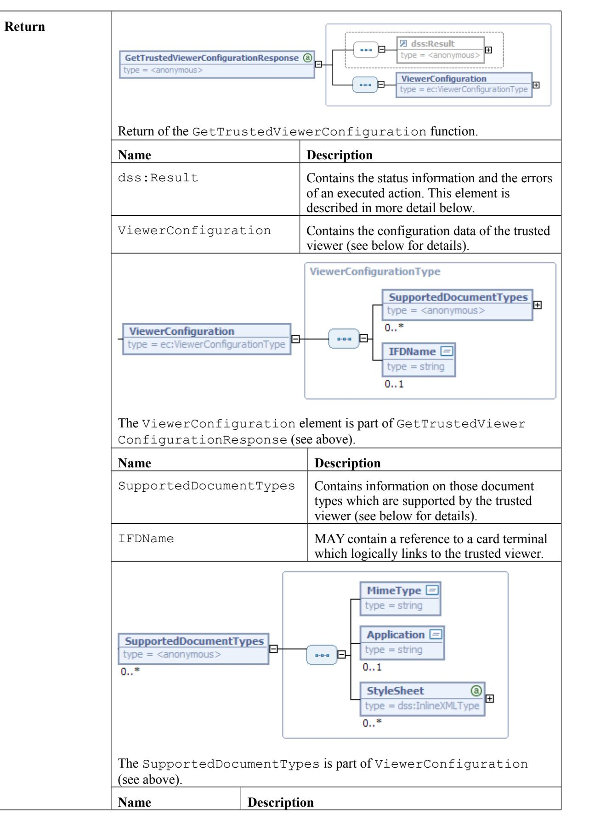

|               | MimeType      | States the supported document type in accordance with [MIME].                                                     |  |
|---------------|---------------|----------------------------------------------------------------------------------------------------------------------|--|
|               | Application   | MAY associate an application with this Mime type.                                                                    |  |
|               | StyleSheet    | MAY contain a number of style sheets which are used for depiction of specific XML-based data.                     |  |
|               |               | Status information and errors in GetTrustedViewerConfiguration (also refer to [TR-03112-1] Sections 4.1 and 4.2). |  |
|               | Name          | Error codes                                                                                                          |  |
|               | ResultMajor   | • /resultmajor#ok                                                                                                 |  |
|               |               | • /resultmajor#error                                                                                              |  |
|               | ResultMinor   | • /resultminor/al/common#noPermission                                                                             |  |
|               |               | • /resultminor/al/common#internalError                                                                            |  |
|               |               | • /resultminor/al/common#parameterError                                                                           |  |
|               |               | • /resultminor/al/TrustedViewer#invalidID                                                                         |  |
|               |               | • /resultminor/dp#unknownChannelHandle                                                                            |  |
|               | ResultMessage | MAY contain more detailed information on the error which occurred if required.                                    |  |
| Precondition  |               |                                                                                                                      |  |
| Postcondition |               |                                                                                                                      |  |
| Note          |               |                                                                                                                      |  |

#### **3.4.3 SetTrustedViewerConfiguration**

| Description The SetTrustedViewerConfiguration function stores the configuration information for a specific trusted viewer. Invocation parameters Invocation of the SetTrustedViewerConfiguration function. | Name | SetTrustedViewerConfiguration |             |
|---------------------------------------------------------------------------------------------------------------------------------------------------------------------------------------------------------------------------|------|-------------------------------|-------------|
|                                                                                                                                                                                                                           |      |                               |             |
|                                                                                                                                                                                                                           |      | Name                          | Description |

|               | ChannelHandle                                      |             | Optional parameter with which a remote system can be addressed (also refer to CardApplicationPath in [TR-03112-4]). If the local system is to be addressed, this parameter is omitted. |
|---------------|----------------------------------------------------|-------------|----------------------------------------------------------------------------------------------------------------------------------------------------------------------------------------------------|
|               | TrustedViewerId                                    |             | Contains the ID of the trusted viewer for which the configuration data are stored.                                                                                                              |
|               | ViewerConfiguration                                |             | Contains the configuration information for the stated trusted viewer (for details refer to page 41).                                                                                         |
| Return        |                                                    |             |                                                                                                                                                                                                    |
|               |                                                    |             | Return of the SetTrustedViewerConfiguration function.                                                                                                                                              |
|               | Name                                               |             | Description                                                                                                                                                                                        |
|               | dss:Result                                         |             | Contains the status information and the errors of an executed action. This element is described in more detail below.                                                                     |
|               |                                                    |             |                                                                                                                                                                                                    |
|               | (also refer to [TR-03112-1] Sections 4.1 and 4.2). |             | Status information and errors in SetTrustedViewerConfiguration                                                                                                                                     |
|               | Name                                               | Error codes |                                                                                                                                                                                                    |
|               | ResultMajor                                        | •           | /resultmajor#ok                                                                                                                                                                                    |
|               |                                                    | •           | /resultmajor#error                                                                                                                                                                                 |
|               | ResultMinor                                        | •           | /resultminor/al/common#noPermission                                                                                                                                                                |
|               |                                                    | •           | /resultminor/al/common#internalError                                                                                                                                                               |
|               |                                                    | •           | /resultminor/al/common#parameterError                                                                                                                                                              |
|               |                                                    | • •      | /resultminor/al/TrustedViewer#invalidID /resultminor/al/TrustedViewer# invalidConfiguration                                                                                                  |
|               |                                                    | •           | /resultminor/dp#unknownChannelHandle                                                                                                                                                               |
|               |                                                    | •           | /resultminor/ifdl/terminal#unknownIFD                                                                                                                                                              |
|               | ResultMessage                                      |             | MAY contain more detailed information on the error which occurred if required.                                                                                                                  |
| Precondition  |                                                    |             |                                                                                                                                                                                                    |
| Postcondition |                                                    |             |                                                                                                                                                                                                    |

#### **3.4.4 AddTrustedViewer**

| Name                     | AddTrustedViewer                             |                                                                                                                                                                                                    |
|--------------------------|----------------------------------------------|----------------------------------------------------------------------------------------------------------------------------------------------------------------------------------------------------|
| Description              | configuration information.                   | With the AddTrustedViewer function, a trusted viewer can be added with all                                                                                                                         |
| Invocation parameters |                                              |                                                                                                                                                                                                    |
|                          | Invocation of the AddTrustedViewer function. |                                                                                                                                                                                                    |
|                          | Name                                         | Description                                                                                                                                                                                        |
|                          | ChannelHandle                                | Optional parameter with which a remote system can be addressed (also refer to CardApplicationPath in [TR-03112-4]). If the local system is to be addressed, this parameter is omitted. |
|                          | TrustedViewerId                              | Contains the unique identifier of the trusted viewer which is to be added to the eCard-API-Framework.                                                                                        |
|                          | ViewerConfiguration                          | MAY contain the configurations of the trusted viewer (for details refer to page 41).                                                                                                            |
| Return                   |                                              |                                                                                                                                                                                                    |
|                          | Return of the AddTrustedViewer function.     |                                                                                                                                                                                                    |
|                          | Name                                         | Description                                                                                                                                                                                        |
|                          | dss:Result                                   | Contains the status information and the errors of an executed action. This element is described in more detail below.                                                                        |

|               | Status information and errors in AddTrustedViewer (also refer to [TR-03112-1] Sections 4.1 and 4.2). |                                                                                   |
|---------------|---------------------------------------------------------------------------------------------------------|-----------------------------------------------------------------------------------|
|               | Name                                                                                                    | Error codes                                                                       |
|               | ResultMajor                                                                                             | • /resultmajor#ok                                                              |
|               |                                                                                                         | • /resultmajor#error                                                           |
|               | ResultMinor                                                                                             | • /resultminor/al/common#noPermission                                          |
|               |                                                                                                         | • /resultminor/al/common#internalError                                         |
|               |                                                                                                         | • /resultminor/al/common#parameterError                                        |
|               |                                                                                                         | • /resultminor/al/TrustedViewer#invalidConfiguration                           |
|               |                                                                                                         | • /resultminor/al/TrustedViewer#alreadyExisting                                |
|               |                                                                                                         | • /resultminor/dp#unknownChannelHandle                                         |
|               |                                                                                                         | • /resultminor/ifdl/terminal#unknownIFD                                        |
|               | ResultMessage                                                                                           | MAY contain more detailed information on the error which occurred if required. |
| Precondition  |                                                                                                         |                                                                                   |
| Postcondition |                                                                                                         |                                                                                   |
| Note          |                                                                                                         |                                                                                   |

#### **3.4.5 DeleteTrustedViewer**

| Name                     | DeleteTrustedViewer                             |                                                                                                                                                                                                    |
|--------------------------|-------------------------------------------------|----------------------------------------------------------------------------------------------------------------------------------------------------------------------------------------------------|
| Description              |                                                 | The DeleteTrustedViewer function removes a trusted viewer.                                                                                                                                         |
| Invocation parameters | Invocation of the DeleteTrustedViewer function. |                                                                                                                                                                                                    |
|                          | Name                                            | Description                                                                                                                                                                                        |
|                          | ChannelHandle                                   | Optional parameter with which a remote system can be addressed (also refer to CardApplicationPath in [TR-03112-4]). If the local system is to be addressed, this parameter is omitted. |
|                          | TrustedViewerId                                 | Contains the ID of the trusted viewer which is to be removed.                                                                                                                                   |

| Return        | Return of the DeleteTrustedViewer function. |                                                                                                                                                                                                                                                                                          |
|---------------|---------------------------------------------|------------------------------------------------------------------------------------------------------------------------------------------------------------------------------------------------------------------------------------------------------------------------------------------|
|               | Name                                        | Description                                                                                                                                                                                                                                                                              |
|               | dss:Result                                  | Contains the status information and the errors of an executed action. This element is described in more detail below.                                                                                                                                                              |
|               | [TR-03112-1] Sections 4.1 and 4.2).         | Status information and errors in DeleteTrustedViewer (also refer to                                                                                                                                                                                                                      |
|               | Name Error codes                         |                                                                                                                                                                                                                                                                                          |
|               | ResultMajor                                 | • /resultmajor#ok • /resultmajor#error                                                                                                                                                                                                                                          |
|               | ResultMinor                                 | • /resultminor/al/common#noPermission • /resultminor/al/common#internalError • /resultminor/al/common#parameterError • /resultminor/al/TrustedViewer#deleteNotPossible • /resultminor/al/TrustedViewer#invalidID • /resultminor/dp#unknownChannelHandle |
|               | ResultMessage                               | MAY contain more detailed information on the error which occurred if required.                                                                                                                                                                                                        |
| Precondition  |                                             |                                                                                                                                                                                                                                                                                          |
| Postcondition |                                             |                                                                                                                                                                                                                                                                                          |
| Note          |                                             |                                                                                                                                                                                                                                                                                          |

## **3.5 Identity management**

#### **3.5.1 GetTrustedIdentities**

| Name        | GetTrustedIdentities                                                                                                                            |
|-------------|-------------------------------------------------------------------------------------------------------------------------------------------------|
| Description | The GetTrustedIdentities function creates a list of all trusted identities in the form of Trust-Service status lists (TSL) and certificates. |

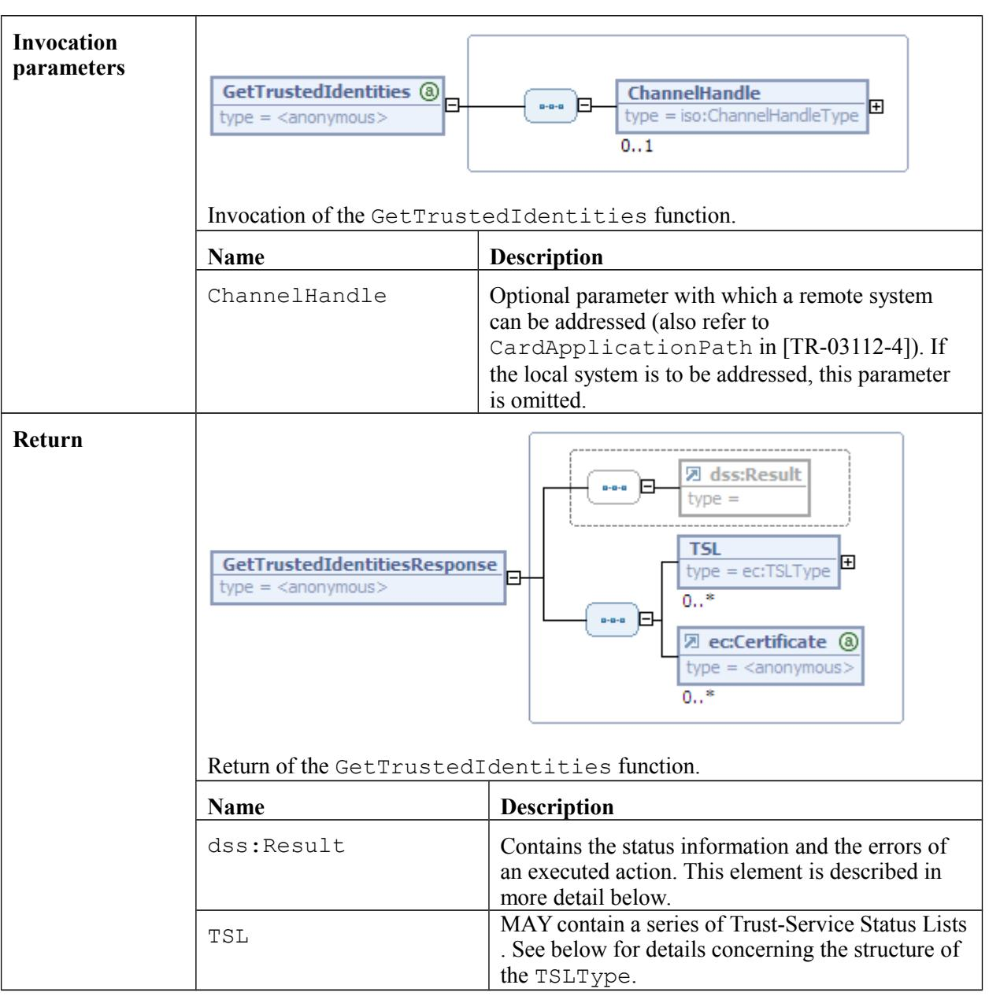

|                               | Certificate                                                                                                        | MAY contain a series of trusted certificates.                                                                                                                                                                                                                                        |
|-------------------------------|--------------------------------------------------------------------------------------------------------------------|--------------------------------------------------------------------------------------------------------------------------------------------------------------------------------------------------------------------------------------------------------------------------------------|
|                               |                                                                                                                    | The ec:Certificate element is defined as follows:                                                                                                                                                                                                                                 |
|                               |                                                                                                                    | <element name="Certificate"> <complexType> <simpleContent> <extension base="base64Binary"> <attribute name="Type" type="anyURI" use="optional" default="urn:ietf:rfc:3280"> </attribute> </extension> </simpleContent> </complexType> </element> |
|                               |                                                                                                                    | Here the type of the certificate MAY be specified in the Type attribute (also refer to CertificateType in [TR-03112-7]).                                                                                                                                                       |
|                               | The TSLType is used in the definition of GetTrustedIdentities Response (see above), AddTSL (see Section 3.5.6). |                                                                                                                                                                                                                                                                                      |
|                               | Name                                                                                                               | Description                                                                                                                                                                                                                                                                          |
|                               | TSLv3.1.2                                                                                                          | This element contains a TSL according to [TS102231] Version 3.1.2 as it is used by Bundesnetzagentur and other European accreditation and supervision bodies for qualified electronic signatures.                                                                           |
|                               | Other                                                                                                              | This element can be used to handle all other TSL-types.                                                                                                                                                                                                                           |
|                               | [TR-03112-1] Sections 4.1 and 4.2).                                                                                | Status information and errors in GetTrustedIdentities (also refer to                                                                                                                                                                                                                 |
|                               | Name                                                                                                               | Error codes                                                                                                                                                                                                                                                                          |
|                               | ResultMajor                                                                                                        | • /resultmajor#ok • /resultmajor#error                                                                                                                                                                                                                                      |
|                               | ResultMinor                                                                                                        | • /resultminor/al/common#noPermission • /resultminor/al/common#internalError                                                                                                                                                                                                |
|                               |                                                                                                                    | • /resultminor/al/common#parameterError                                                                                                                                                                                                                                           |
|                               |                                                                                                                    | • /resultminor/dp#unknownChannelHandle                                                                                                                                                                                                                                            |
|                               |                                                                                                                    |                                                                                                                                                                                                                                                                                      |
|                               | ResultMessage                                                                                                      | In addition, other specific protocol error messages can exist. MAY contain more detailed information on the error which                                                                                                                                                           |
|                               |                                                                                                                    | occurred if required.                                                                                                                                                                                                                                                                |
| Precondition Postcondition |                                                                                                                    |                                                                                                                                                                                                                                                                                      |

### **3.5.2 AddTrustedCertificate**

| Name                     | AddTrustedCertificate                                                                                     |                                                                                                                                                                                                    |                                                                                                                             |
|--------------------------|-----------------------------------------------------------------------------------------------------------|----------------------------------------------------------------------------------------------------------------------------------------------------------------------------------------------------|-----------------------------------------------------------------------------------------------------------------------------|
| Description              | With the AddTrustedCertificate function, a certificate can be added to the list of trusted identities. |                                                                                                                                                                                                    |                                                                                                                             |
| Invocation parameters |                                                                                                           |                                                                                                                                                                                                    |                                                                                                                             |
|                          | Invocation of the AddTrustedCertificate function. Name Description                                  |                                                                                                                                                                                                    |                                                                                                                             |
|                          | ChannelHandle                                                                                             | Optional parameter with which a remote system can be addressed (also refer to CardApplicationPath in [TR-03112-4]). If the local system is to be addressed, this parameter is omitted. |                                                                                                                             |
|                          | ec:Certificate                                                                                            | 48).                                                                                                                                                                                               | Contains the trustworthy certificate which should be added to the certificate database (also refer to page               |
|                          | CheckAlgorithms                                                                                           | Contains information on whether the current suitability of the algorithms used in the certificate should be verified.                                                                        |                                                                                                                             |
|                          |                                                                                                           |                                                                                                                                                                                                    | If an error occurs during this verification, the certificate is not added.                                               |
|                          |                                                                                                           |                                                                                                                                                                                                    | If this element is missing, the configured DefaultParameters (refer to page 21) are used.                                |
| Return                   | Return of the AddTrustedCertificate function.                                                             |                                                                                                                                                                                                    |                                                                                                                             |
|                          | Name                                                                                                      |                                                                                                                                                                                                    | Description                                                                                                                 |
|                          | dss:Result                                                                                                |                                                                                                                                                                                                    | Contains the status information and the errors of an executed action. This element is described in more detail below. |

|               | Status information and errors in AddTrustedCertificate (also refer to [TR-03112-1] Sections 4.1 and 4.2).                                                                                                                                   |                                                                                   |  |
|---------------|------------------------------------------------------------------------------------------------------------------------------------------------------------------------------------------------------------------------------------------------|-----------------------------------------------------------------------------------|--|
|               | Name                                                                                                                                                                                                                                           | Error codes                                                                       |  |
|               | ResultMajor                                                                                                                                                                                                                                    | • /resultmajor#ok                                                              |  |
|               |                                                                                                                                                                                                                                                | • /resultmajor#error                                                           |  |
|               | ResultMinor                                                                                                                                                                                                                                    | • /resultminor/al/common#noPermission                                          |  |
|               |                                                                                                                                                                                                                                                | • /resultminor/al/common#internalError                                         |  |
|               |                                                                                                                                                                                                                                                | • /resultminor/al/common#parameterError                                        |  |
|               |                                                                                                                                                                                                                                                | • /resultminor/dp#unknownChannelHandle                                         |  |
|               |                                                                                                                                                                                                                                                | • /resultminor/il/algorithm# hashAlgorithmNotSupported                      |  |
|               |                                                                                                                                                                                                                                                | • /resultminor/il/algorithm# signatureAlgorithmNotSupported                 |  |
|               |                                                                                                                                                                                                                                                | • /resultminor/il/signature# certificateFormatNotCorrect                    |  |
|               |                                                                                                                                                                                                                                                | • /resultminor/il/signature# signatureAlgorithmNotSuitable                  |  |
|               |                                                                                                                                                                                                                                                | • /resultminor/il/signature# hashAlgorithmNotSuitable                       |  |
|               |                                                                                                                                                                                                                                                | • /resultminor/il/signature# invalidCertificateExtension                    |  |
|               |                                                                                                                                                                                                                                                | • /resultminor/sal#digitalSignatureNotCorrect                                  |  |
|               | ResultMessage                                                                                                                                                                                                                                  | MAY contain more detailed information on the error which occurred if required. |  |
| Precondition  |                                                                                                                                                                                                                                                |                                                                                   |  |
| Postcondition |                                                                                                                                                                                                                                                |                                                                                   |  |
| Note          | Before the certificate is added to the list of trustworthy certificates, the digital signature on the certificate is verified to ensure its mathematical validity and the current suitability of the algorithms is checked if necessary. |                                                                                   |  |

#### **3.5.3 AddCertificate**

| Name        | AddCertificate                                                                                                                                                                                                   |
|-------------|------------------------------------------------------------------------------------------------------------------------------------------------------------------------------------------------------------------|
| Description | With the AddCertificate function, a sequence of non-trusted certificates can be added to the certificate database. These certificates MAY be used for encryption or to support the signature verification. |

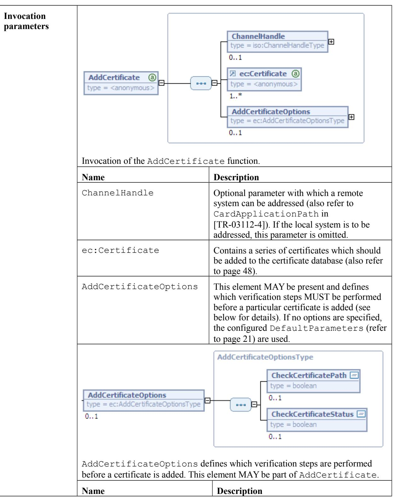

|        | CheckCertificatePath                   |             | This option stipulates that the certificate path should be verified before the certificate is added to the certificate database.                                                                                                                                                                      |
|--------|----------------------------------------|-------------|-------------------------------------------------------------------------------------------------------------------------------------------------------------------------------------------------------------------------------------------------------------------------------------------------------------|
|        |                                        |             | If an error occurs during this verification, the certificate is not added.                                                                                                                                                                                                                               |
|        |                                        |             | If this element is missing, the configured DefaultParameters (refer to page 21) are used.                                                                                                                                                                                                             |
|        | CheckCertificateStatus                 |             | This option stipulates that the status of a certificate should be verified before it is added to the certificate database. If the address of an OCSP responder is included in a certificate, it SHOULD be used for the verification. Alternatively, a corresponding CRL MAY be evaluated. |
|        |                                        |             | If an error occurs during this verification, the certificate is not added.                                                                                                                                                                                                                               |
|        |                                        |             | If this element is missing, the configured DefaultParameters (refer to page 21) are used.                                                                                                                                                                                                             |
| Return |                                        |             |                                                                                                                                                                                                                                                                                                             |
|        |                                        |             |                                                                                                                                                                                                                                                                                                             |
|        | Return of the AddCertificate function. |             |                                                                                                                                                                                                                                                                                                             |
|        | Name                                   |             | Description                                                                                                                                                                                                                                                                                                 |
|        | dss:Result                             |             | Contains the status information and the errors of an executed action. This element is described in more detail below.                                                                                                                                                                                 |
|        | Sections 4.1 and 4.2).                 |             | Status information and errors in AddCertificate (also refer to [TR-03112-1]                                                                                                                                                                                                                                 |
|        | Name                                   | Error codes |                                                                                                                                                                                                                                                                                                             |
|        | ResultMajor                            | •           | /resultmajor#ok                                                                                                                                                                                                                                                                                             |
|        |                                        | •           | /resultmajor#error                                                                                                                                                                                                                                                                                          |
|        |                                        | •           | /resultmajor#warning                                                                                                                                                                                                                                                                                        |

|               | ResultMinor   | • /resultminor/al/common#noPermission                                           |
|---------------|---------------|------------------------------------------------------------------------------------|
|               |               | • /resultminor/al/common#internalError                                          |
|               |               | • /resultminor/al/common#parameterError                                         |
|               |               | • /resultminor/dp#unknownChannelHandle                                          |
|               |               | • /resultminor/il/algorithm# hashAlgorithmNotSupported                       |
|               |               | • /resultminor/il/algorithm# signatureAlgorithmNotSupported                  |
|               |               | • /resultminor/il/service#ocspResponderUnreachable                              |
|               |               | • /resultminor/il/service# directoryServiceUnreachable                       |
|               |               | • /resultminor/il/signature#certificateNotFound                                 |
|               |               | • /resultminor/il/signature# certificateFormatNotCorrect                     |
|               |               | • /resultminor/il/signature# invalidCertificateReference                     |
|               |               | • /resultminor/il/signature# certificateChainInterrupted                     |
|               |               | • /resultminor/il/signature# improperRevocationInformation                   |
|               |               | • /resultminor/il/signature# signatureAlgorithmNotSuitable                   |
|               |               | • /resultminor/il/signature#hashAlgorithmNotSuitable                            |
|               |               | • /resultminor/il/signature#invalidCertificatePath                              |
|               |               | • /resultminor/il/signature#certificateRevoked                                  |
|               |               | • /resultminor/il/signature# referenceTimeNotWithinCertificateValidityPeriod |
|               |               | • /resultminor/il/signature# invalidCertificateExtension                     |
|               |               | • /resultminor/sal#digitalSignatureNotCorrect                                   |
|               |               | • /resultminor/il/signature# certificatePathNotValidatedWarning              |
|               |               | • /resultminor/il/signature# certificateStatusNotCheckedWarning              |
|               |               | • /resultminor/il/signature# suiteabilityOfAlgorithmsNotCheckedWarning.      |
|               | ResultMessage | MAY contain more detailed information on the error which occurred if required.  |
| Precondition  |               |                                                                                    |
| Postcondition |               |                                                                                    |
| Note          |               |                                                                                    |
|               |               |                                                                                    |

### **3.5.4 ExportCertificate**

| Name                     | ExportCertificate                                                  |                                                                                                                                                                                                 |  |
|--------------------------|--------------------------------------------------------------------|-------------------------------------------------------------------------------------------------------------------------------------------------------------------------------------------------|--|
| Description              | A certificate may be exported with the ExportCertificate function. |                                                                                                                                                                                                 |  |
| Invocation parameters |                                                                    |                                                                                                                                                                                                 |  |
|                          |                                                                    | Invocation of the ExportCertificate function.                                                                                                                                                   |  |
|                          | Name                                                               | Description                                                                                                                                                                                     |  |
|                          | ChannelHandle                                                      | Optional parameter with which a remote system can be addressed (also refer to CardApplicationPath in [TR-03112-4]). If the local system is to be addressed, this parameter is omitted. |  |
|                          | Certificate                                                        | Specifies which certificates should be exported from the database. The X509IssuerSerialType is defined in [RFC3275].                                                                      |  |
| Return                   |                                                                    |                                                                                                                                                                                                 |  |
|                          | Return of the ExportCertificate function. Name Description   |                                                                                                                                                                                                 |  |
|                          | dss:Result                                                         | Contains the status information and the errors of an executed action. This element is described in more detail below.                                                                     |  |
|                          | ec:Certificate                                                     | MAY occur several times and contains the requested certificate (also refer to page 48).                                                                                                      |  |

|               | Status information and errors in ExportCertificate (also refer to [TR-03112-1] Sections 4.1 and 4.2). |                                                                                   |  |
|---------------|----------------------------------------------------------------------------------------------------------|-----------------------------------------------------------------------------------|--|
|               | Name                                                                                                     | Error codes                                                                       |  |
|               | ResultMajor                                                                                              | • /resultmajor#ok                                                              |  |
|               |                                                                                                          | • /resultmajor#error                                                           |  |
|               | ResultMinor                                                                                              | • /resultminor/al/common#noPermission                                          |  |
|               |                                                                                                          | • /resultminor/al/common#internalError                                         |  |
|               |                                                                                                          | • /resultminor/al/common#parameterError                                        |  |
|               |                                                                                                          | • /resultminor/dp#unknownChannelHandle                                         |  |
|               |                                                                                                          | • /resultminor/il/signature#certificateNotFound                                |  |
|               |                                                                                                          | • /resultminor/il/signature# invalidCertificateReference                    |  |
|               | ResultMessage                                                                                            | MAY contain more detailed information on the error which occurred if required. |  |
| Precondition  |                                                                                                          |                                                                                   |  |
| Postcondition |                                                                                                          |                                                                                   |  |
| Note          |                                                                                                          |                                                                                   |  |

#### **3.5.5 DeleteCertificate**

| Name                     | DeleteCertificate                                                                                                                 |                                                                                                                                                                                                 |
|--------------------------|-----------------------------------------------------------------------------------------------------------------------------------|-------------------------------------------------------------------------------------------------------------------------------------------------------------------------------------------------|
| Description              | The DeleteCertificate function deletes an existing (trustworthy or non-trustworthy) certificate from the certificate database. |                                                                                                                                                                                                 |
| Invocation parameters | Invocation of the DeleteCertificate function.                                                                                     |                                                                                                                                                                                                 |
|                          | Name                                                                                                                              | Description                                                                                                                                                                                     |
|                          | ChannelHandle                                                                                                                     | Optional parameter with which a remote system can be addressed (also refer to CardApplicationPath in [TR-03112-4]). If the local system is to be addressed, this parameter is omitted. |
|                          | Certificate                                                                                                                       | Specifies which certificate is to be deleted from the database. The X509IssuerSerialType is defined in [RFC3275].                                                                         |

| Return        |                                                                                                                                 | Return of the DeleteCertificate function.                                                                                   |  |
|---------------|---------------------------------------------------------------------------------------------------------------------------------|-----------------------------------------------------------------------------------------------------------------------------|--|
|               | Name                                                                                                                            | Description                                                                                                                 |  |
|               | dss:Result                                                                                                                      | Contains the status information and the errors of an executed action. This element is described in more detail below. |  |
|               | Status information and errors in DeleteCertificate (also refer to [TR-03112-1] Sections 4.1 and 4.2). Name Error codes |                                                                                                                             |  |
|               |                                                                                                                                 |                                                                                                                             |  |
|               | ResultMajor                                                                                                                     | • /resultmajor#ok • /resultmajor#error                                                                             |  |
|               | ResultMinor                                                                                                                     | • /resultminor/al/common#noPermission • /resultminor/al/common#internalError                                       |  |
|               |                                                                                                                                 | • /resultminor/al/common#parameterError                                                                                  |  |
|               | • /resultminor/dp#unknownChannelHandle                                                                                       |                                                                                                                             |  |
|               |                                                                                                                                 | • /resultminor/il/signature#invalidCertificateReference                                                                  |  |
|               | ResultMessage                                                                                                                   | MAY contain more detailed information on the error which occurred if required.                                           |  |
| Precondition  |                                                                                                                                 |                                                                                                                             |  |
| Postcondition |                                                                                                                                 |                                                                                                                             |  |
| Note          |                                                                                                                                 |                                                                                                                             |  |

#### **3.5.6 AddTSL**

| Name        | AddTSL                                                                                                   |
|-------------|----------------------------------------------------------------------------------------------------------|
| Description | A series of Trust-Service status lists according to [TS102231] can be added with the AddTSL function. |

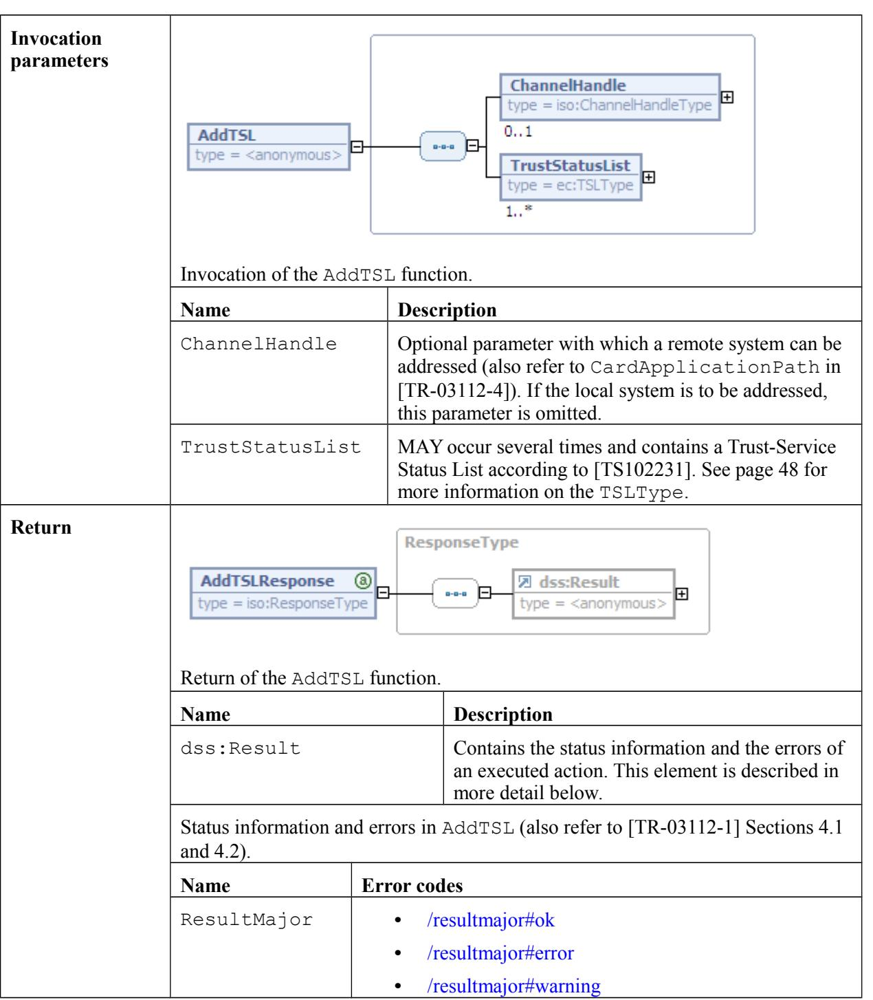

|               | ResultMinor   | • /resultminor/al/common#noPermission                                          |
|---------------|---------------|-----------------------------------------------------------------------------------|
|               |               | • /resultminor/al/common#internalError                                         |
|               |               | • /resultminor/al/common#parameterError                                        |
|               |               | • /resultminor/dp#unknownChannelHandle                                         |
|               |               | • /resultminor/il/algorithm# hashAlgorithmNotSupported                      |
|               |               | • /resultminor/il/algorithm# signatureAlgorithmNotSupported                 |
|               |               | • /resultminor/il/service#ocspResponderUnreachable                             |
|               |               | • /resultminor/il/service#directoryServiceUnreachable                          |
|               |               | • /resultminor/il/service# timeStampServiceUnreachable                      |
|               |               | • /resultminor/il/signature#certificateNotFound                                |
|               |               | • /resultminor/il/signature# certificateFormatNotCorrect                    |
|               |               | • /resultminor/il/signature# invalidCertificateReference                    |
|               |               | • /resultminor/il/signature#certificateChainInterrupted                        |
|               |               | • /resultminor/il/signature# resolutionOfObjectReferenceImpossible          |
|               |               | • /resultminor/il/signature# transformationAlgorithmNotSupported            |
|               |               | • /resultminor/il/signature#unknownViewer                                      |
|               |               | • /resultminor/il/signature# certificatePathNotValidated                    |
|               |               | • /resultminor/il/signature# certificateStatusNotCheckedWarning             |
|               |               | • /resultminor/il/signature# suiteabilityOfAlgorithmsNotCheckedWarning      |
|               |               | • /resultminor/il/signature# improperRevocationInformation                  |
|               |               | • /resultminor/sal#securityConditionsNotSatisfied                              |
|               | ResultMessage | MAY contain more detailed information on the error which occurred if required. |
| Precondition  |               |                                                                                   |
| Postcondition |               |                                                                                   |
| Note          |               |                                                                                   |

#### **3.5.7 ExportTSL**

| Name                     | ExportTSL                                                                                                  |                                                                                                                                                                                                                                                                                                                                   |  |
|--------------------------|------------------------------------------------------------------------------------------------------------|-----------------------------------------------------------------------------------------------------------------------------------------------------------------------------------------------------------------------------------------------------------------------------------------------------------------------------------|--|
| Description              | With the ExportTSL function, a Trust-Service status list can be exported in accordance with [TS102231]. |                                                                                                                                                                                                                                                                                                                                   |  |
| Invocation parameters |                                                                                                            |                                                                                                                                                                                                                                                                                                                                   |  |
|                          | Invocation of the ExportTSL function.                                                                      |                                                                                                                                                                                                                                                                                                                                   |  |
|                          | Name                                                                                                       | Description                                                                                                                                                                                                                                                                                                                       |  |
|                          | ChannelHandle                                                                                              | Optional parameter with which a remote system can be addressed (also refer to CardApplicationPath in [TR-03112-4]). If the local system is to be addressed, this parameter is omitted.                                                                                                                                |  |
|                          | SchemeName                                                                                                 | MAY contain the name of a specific TSL scheme (also refer to [TS102231]) in order to specify what TSLs are to be exported.                                                                                                                                                                                                  |  |
|                          | TSLSequenceNumber                                                                                          | MAY contain the serial number of the requested TSL, if the SchemeName is specified. If the TSLSequenceNumber is present, but the SchemeName is not specified, the TSLSequenceNumber element will be ignored and there will be a corresponding warning (/resultminor/al/TSL#TSLSequence NumberIgnoredWarning) |  |
|                          |                                                                                                            | If this element is missing, all available TSLs (of the specified TSL scheme) are exported.                                                                                                                                                                                                                                     |  |

| Return        | Return of the ExportTSL function.                                                                |                                                                                                                                                 |  |
|---------------|--------------------------------------------------------------------------------------------------|-------------------------------------------------------------------------------------------------------------------------------------------------|--|
|               | Name                                                                                             | Description                                                                                                                                     |  |
|               | dss:Result                                                                                       | Contains the status information and the errors of an executed action. This element is described in more detail below.                     |  |
|               | TrustStatusList                                                                                  | MAY occur several times and contain a Trust-Service Status List according to [TS102231]. See page 48 for more information on the TSLType. |  |
|               | Status information and errors in ExportTSL (also refer to [TR-03112-1] Sections 4.1 and 4.2). |                                                                                                                                                 |  |
|               | Name                                                                                             | Error codes                                                                                                                                     |  |
|               | ResultMajor                                                                                      | • /resultmajor#ok                                                                                                                            |  |
|               |                                                                                                  | • /resultmajor#error                                                                                                                         |  |
|               |                                                                                                  | • /resultmajor#warning                                                                                                                       |  |
|               | ResultMinor                                                                                      | • /resultminor/al/common#noPermission                                                                                                        |  |
|               |                                                                                                  | • /resultminor/al/common#internalError                                                                                                       |  |
|               |                                                                                                  | • /resultminor/al/common#parameterError                                                                                                      |  |
|               |                                                                                                  | • /resultminor/al/ TSL#TSLSequenceNumberIgnoredWarning                                                                                    |  |
|               |                                                                                                  | • /resultminor/dp#unknownChannelHandle                                                                                                       |  |
|               | ResultMessage                                                                                    | MAY contain more detailed information on the error which occurred if required.                                                               |  |
| Precondition  |                                                                                                  |                                                                                                                                                 |  |
| Postcondition |                                                                                                  |                                                                                                                                                 |  |
| Note          |                                                                                                  |                                                                                                                                                 |  |

#### **3.5.8 DeleteTSL**

| Name        | DeleteTSL                                                                                                                    |
|-------------|------------------------------------------------------------------------------------------------------------------------------|
| Description | With the DeleteTSL function, a sequence of Trust-Service status lists can be deleted from the list of trusted identities. |

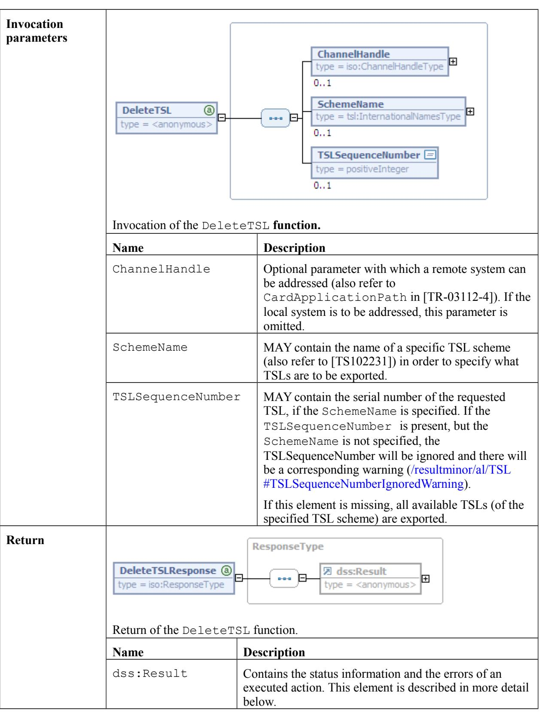

|               | Status information and errors in DeleteTSL (also refer to [TR-03112-1] Sections 4.1 and 4.2). |                                                                                   |
|---------------|--------------------------------------------------------------------------------------------------|-----------------------------------------------------------------------------------|
|               | Name                                                                                             | Error codes                                                                       |
|               | ResultMajor                                                                                      | • /resultmajor#ok                                                              |
|               |                                                                                                  | • /resultmajor#error                                                           |
|               |                                                                                                  | • /resultmajor#warning                                                         |
|               | ResultMinor                                                                                      | • /resultminor/al/common#noPermission                                          |
|               |                                                                                                  | • /resultminor/al/common#internalError                                         |
|               |                                                                                                  | • /resultminor/al/common#parameterError                                        |
|               |                                                                                                  | • /resultminor/al/ TSL#TSLSequenceNumberIgnoredWarning                      |
|               |                                                                                                  | • /resultminor/dp#unknownChannelHandle                                         |
|               | ResultMessage                                                                                    | MAY contain more detailed information on the error which occurred if required. |
| Precondition  |                                                                                                  |                                                                                   |
| Postcondition |                                                                                                  |                                                                                   |
| Note          |                                                                                                  |                                                                                   |

## **3.6 Service management**

#### **3.6.1 GetOCSPServices**

| Name                     | GetOCSPServices |                                                                                                                                                                                                 |
|--------------------------|-----------------|-------------------------------------------------------------------------------------------------------------------------------------------------------------------------------------------------|
| Description              |                 | The GetOCSPServices function reads the list of known OCSP responders.                                                                                                                           |
| Invocation parameters |                 | Invocation of the GetOCSPServices function.                                                                                                                                                     |
|                          | Name            | Description                                                                                                                                                                                     |
|                          | ChannelHandle   | Optional parameter with which a remote system can be addressed (also refer to CardApplicationPath in [TR-03112-4]). If the local system is to be addressed, this parameter is omitted. |

| Return |                                                                                                                                             | Return of the GetOCSPServices function.                                                                                                                                                                                                                                                                                  |
|--------|---------------------------------------------------------------------------------------------------------------------------------------------|--------------------------------------------------------------------------------------------------------------------------------------------------------------------------------------------------------------------------------------------------------------------------------------------------------------------------|
|        | Name                                                                                                                                        | Description                                                                                                                                                                                                                                                                                                              |
|        | dss:Result                                                                                                                                  | Contains the status information and the errors of an executed action. This element is described in more detail below.                                                                                                                                                                                              |
|        | OCSPService                                                                                                                                 | Contains information on the available OCSP responders which MAY be used if a certificate which is to be verified does not contain the address of the OCSP responder in the authority information access extension (also refer to [RFC3280], Section 4.2.2.1). Details on the ServiceType are given below. |
|        |                                                                                                                                             |                                                                                                                                                                                                                                                                                                                          |
|        | An element of ServiceType is part of GetOCSPServicesResponse, SetOCSPServices, GetDirectoryServicesResponse and SetDirectoryServices. |                                                                                                                                                                                                                                                                                                                          |
|        | Name                                                                                                                                        | Description                                                                                                                                                                                                                                                                                                              |
|        | Name                                                                                                                                        | MAY contain the name of the service.                                                                                                                                                                                                                                                                                     |
|        | Address                                                                                                                                     | Contains the address of the service.                                                                                                                                                                                                                                                                                     |

|               | Status information and errors in GetOCSPServices (also refer to [TR-03112-1] Sections 4.1 and 4.2). |                                                                                   |
|---------------|--------------------------------------------------------------------------------------------------------|-----------------------------------------------------------------------------------|
|               | Name                                                                                                   | Error codes                                                                       |
|               | ResultMajor                                                                                            | • /resultmajor#ok                                                              |
|               |                                                                                                        | • /resultmajor#error                                                           |
|               | ResultMinor                                                                                            | • /resultminor/al/common#noPermission                                          |
|               |                                                                                                        | • /resultminor/al/common#internalError                                         |
|               |                                                                                                        | • /resultminor/al/common#parameterError                                        |
|               |                                                                                                        | • /resultminor/dp#unknownChannelHandle                                         |
|               | ResultMessage                                                                                          | MAY contain more detailed information on the error which occurred if required. |
| Precondition  |                                                                                                        |                                                                                   |
| Postcondition |                                                                                                        |                                                                                   |
| Note          |                                                                                                        |                                                                                   |

#### **3.6.2 SetOCSPServices**

| Name                     | SetOCSPServices                                                            |                                                                                                                                                                                                                                                                                                                                                                                                                              |
|--------------------------|----------------------------------------------------------------------------|------------------------------------------------------------------------------------------------------------------------------------------------------------------------------------------------------------------------------------------------------------------------------------------------------------------------------------------------------------------------------------------------------------------------------|
| Description              | The SetOCSPServices function writes the list of available OCSP responders. |                                                                                                                                                                                                                                                                                                                                                                                                                              |
| Invocation parameters | Invocation of the SetOCSPServices function.                                |                                                                                                                                                                                                                                                                                                                                                                                                                              |
|                          |                                                                            |                                                                                                                                                                                                                                                                                                                                                                                                                              |
|                          | Name                                                                       | Description                                                                                                                                                                                                                                                                                                                                                                                                                  |
|                          | ChannelHandle                                                              | Optional parameter with which a remote system can be addressed (also refer to CardApplicationPath in [TR-03112-4]). If the local system is to be addressed, this parameter is omitted.                                                                                                                                                                                                                              |
|                          | OCSPService                                                                | Contains information on the available OCSP responders which MAY be used if a certificate which is to be verified does not contain the address of the OCSP responder in the authority information access extension (also refer to [RFC3280], Section 4.2.2.1). Details on the ServiceType are given on page 63. When the list is written, the availability of the configured OCSP responders is checked. |

| Return        |                                                                                                                                                                   |                  |                                                                                                                                                              |
|---------------|-------------------------------------------------------------------------------------------------------------------------------------------------------------------|------------------|--------------------------------------------------------------------------------------------------------------------------------------------------------------|
|               | Return of the SetOCSPServices function. Name                                                                                                                   |                  | Description                                                                                                                                                  |
|               | dss:Result more detail below. Status information and errors in SetOCSPServices (also refer to [TR-03112-1] Sections 4.1 and 4.2). Name Error codes |                  | Contains the status information and the errors of an executed action. This element is described in                                                        |
|               |                                                                                                                                                                   |                  |                                                                                                                                                              |
|               |                                                                                                                                                                   |                  |                                                                                                                                                              |
|               | ResultMajor                                                                                                                                                       | • •           | /resultmajor#ok /resultmajor#error                                                                                                                        |
|               | ResultMinor                                                                                                                                                       | • • • • | /resultminor/al/common#noPermission /resultminor/al/common#internalError /resultminor/al/common#parameterError /resultminor/dp#unknownChannelHandle |
|               |                                                                                                                                                                   | •                | /resultminor/il/service#ocspResponderUnreachable                                                                                                             |
|               | ResultMessage                                                                                                                                                     |                  | MAY contain more detailed information on the error which occurred if required.                                                                            |
| Precondition  |                                                                                                                                                                   |                  |                                                                                                                                                              |
| Postcondition |                                                                                                                                                                   |                  |                                                                                                                                                              |
| Note          |                                                                                                                                                                   |                  |                                                                                                                                                              |

#### **3.6.3 GetDirectoryServices**

| Name                     | GetDirectoryServices                                                                                       |  |
|--------------------------|------------------------------------------------------------------------------------------------------------|--|
| Description              | The GetDirectoryServices function reads the list of the directory services accessible via LDAP or http. |  |
| Invocation parameters | Invocation of the GetDirectoryServices function.                                                           |  |
|                          | Name Description                                                                                        |  |

| Return        | ChannelHandle                                                                                               | Optional parameter with which a remote system can be addressed (also refer to CardApplicationPath in [TR-03112-4]). If the local system is to be addressed, this parameter is omitted. |
|---------------|-------------------------------------------------------------------------------------------------------------|-------------------------------------------------------------------------------------------------------------------------------------------------------------------------------------------------|
|               | Return of the GetDirectoryServices function.                                                                |                                                                                                                                                                                                 |
|               | Name                                                                                                        | Description                                                                                                                                                                                     |
| dss:Result    |                                                                                                             | Contains the status information and the errors of an executed action. This element is described in more detail below.                                                                     |
|               | DirectoryService                                                                                            | Contains information on the available directory services which can be used for retrieval of certificates or blacklists (details on the ServiceType can be found on page 63).           |
|               | Status information and errors in GetDirectoryServices (also refer to [TR-03112-1] Sections 4.1 and 4.2). |                                                                                                                                                                                                 |
|               | Name                                                                                                        | Error codes                                                                                                                                                                                     |
|               | ResultMajor                                                                                                 | • /resultmajor#ok • /resultmajor#error                                                                                                                                                 |
|               | ResultMinor                                                                                                 | • /resultminor/al/common#noPermission • /resultminor/al/common#internalError • /resultminor/al/common#parameterError • /resultminor/dp#unknownChannelHandle                |
|               | ResultMessage                                                                                               | MAY contain more detailed information on the error which occurred if required.                                                                                                               |
| Precondition  |                                                                                                             |                                                                                                                                                                                                 |
| Postcondition |                                                                                                             |                                                                                                                                                                                                 |
| Note          |                                                                                                             |                                                                                                                                                                                                 |

#### **3.6.4 SetDirectoryServices**

| Name        | SetDirectoryServices                                                                  |  |
|-------------|---------------------------------------------------------------------------------------|--|
| Description | The SetDirectoryServices function writes the list of available directory services. |  |

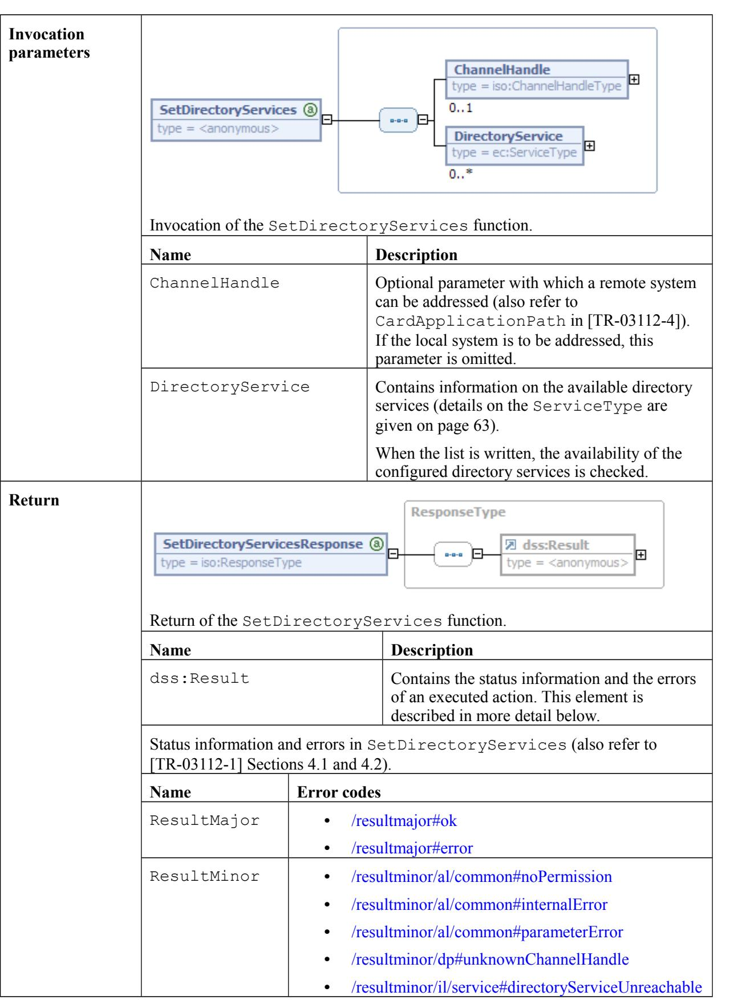

|               | ResultMessage | MAY contain more detailed information on the error which occurred if required. |
|---------------|---------------|-----------------------------------------------------------------------------------|
| Precondition  |               |                                                                                   |
| Postcondition |               |                                                                                   |
| Note          |               |                                                                                   |

#### **3.6.5 GetTSServices**

| Name                     | GetTSService                                                                                                             |                                                                                                                                                                                                 |  |
|--------------------------|--------------------------------------------------------------------------------------------------------------------------|-------------------------------------------------------------------------------------------------------------------------------------------------------------------------------------------------|--|
| Description              | The GetTSServices function reads the list of time stamping services with the corresponding configuration information. |                                                                                                                                                                                                 |  |
| Invocation parameters | Invocation of the GetTSServices function.                                                                                |                                                                                                                                                                                                 |  |
|                          | Name                                                                                                                     | Description                                                                                                                                                                                     |  |
| Return                   | ChannelHandle                                                                                                            | Optional parameter with which a remote system can be addressed (also refer to CardApplicationPath in [TR-03112-4]). If the local system is to be addressed, this parameter is omitted. |  |
|                          |                                                                                                                          |                                                                                                                                                                                                 |  |
|                          | Return of the GetTSServices function.                                                                                    |                                                                                                                                                                                                 |  |
|                          | Name dss:Result                                                                                                       | Description Contains the status information and the errors of an executed action. This element is described in more detail below.                                                      |  |
|                          | TimeStampingService                                                                                                      | MAY occur more than once and contains information in each case about one time stamp service (see below for details).                                                                      |  |

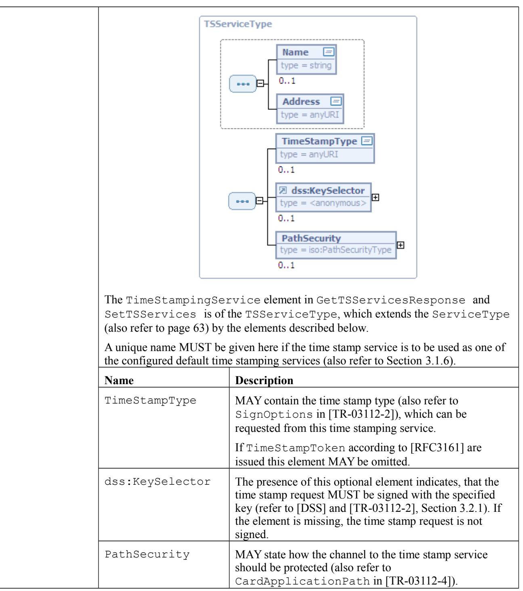

|               | Status information and errors in GetTSService (also refer to [TR-03112-1] Sections 4.1 and 4.2). |                                                                                                                                                                                                                                                                                                                                                                                                                                                                                                                                                                    |
|---------------|-----------------------------------------------------------------------------------------------------|--------------------------------------------------------------------------------------------------------------------------------------------------------------------------------------------------------------------------------------------------------------------------------------------------------------------------------------------------------------------------------------------------------------------------------------------------------------------------------------------------------------------------------------------------------------------|
|               | Name                                                                                                | Error codes                                                                                                                                                                                                                                                                                                                                                                                                                                                                                                                                                        |
|               | ResultMajor                                                                                         | • /resultmajor#ok • /resultmajor#error                                                                                                                                                                                                                                                                                                                                                                                                                                                                                                                    |
|               | ResultMinor                                                                                         | • /resultminor/al/common#noPermission • /resultminor/al/common#internalError • /resultminor/al/common#parameterError • /resultminor/dp#unknownChannelHandle • /resultminor/dp#unknownCipherSuite • /resultminor/il/service#timeStampServiceUnreachable • /resultminor/il/signature#signatureFormatNotSupported • /resultminor/sal#nameAlreadyExisting • /resultminor/sal#unknownProtocol • /resultminor/sal#unknownCardType • /resultminor/sal#unknownDIDName • /resultminor/sal#fileNotFound |
|               | ResultMessage                                                                                       | MAY contain more detailed information on the error which occurred if required.                                                                                                                                                                                                                                                                                                                                                                                                                                                                                  |
| Precondition  |                                                                                                     |                                                                                                                                                                                                                                                                                                                                                                                                                                                                                                                                                                    |
| Postcondition |                                                                                                     |                                                                                                                                                                                                                                                                                                                                                                                                                                                                                                                                                                    |
| Note          |                                                                                                     |                                                                                                                                                                                                                                                                                                                                                                                                                                                                                                                                                                    |

## **3.6.6 SetTSServices**

| Name                     | SetTSServices                                     |                                                                                 |
|--------------------------|---------------------------------------------------|---------------------------------------------------------------------------------|
| Description              | with all corresponding configuration information. | The SetTSServices function writes a list of the time stamping services together |
| Invocation parameters | Invocation of the SetTSServices function. Name | Description                                                                     |

| Return        | ChannelHandle TimeStampingService                                                                 |                       | Optional parameter with which a remote system can be addressed (also refer to CardApplicationPath in [TR-03112-4]). If the local system is to be addressed, this parameter is omitted. MAY occur several times and contains information on a time stamping service (for details on the TSServiceType refer to page 69). |
|---------------|------------------------------------------------------------------------------------------------------|-----------------------|----------------------------------------------------------------------------------------------------------------------------------------------------------------------------------------------------------------------------------------------------------------------------------------------------------------------------------------------|
|               |                                                                                                      |                       |                                                                                                                                                                                                                                                                                                                                              |
|               | Return of the SetTSServices function.                                                                |                       |                                                                                                                                                                                                                                                                                                                                              |
|               | Name                                                                                                 | Description           |                                                                                                                                                                                                                                                                                                                                              |
|               | dss:Result                                                                                           | below.                | Contains the status information and the errors of an executed action. This element is described in more detail                                                                                                                                                                                                                            |
|               | Status information and errors in SetTSServices (also refer to [TR-03112-1] Sections 4.1 and 4.2). |                       |                                                                                                                                                                                                                                                                                                                                              |
|               | Name                                                                                                 | Error codes           |                                                                                                                                                                                                                                                                                                                                              |
|               | ResultMajor                                                                                          | •                     | /resultmajor#ok                                                                                                                                                                                                                                                                                                                              |
|               |                                                                                                      | •                     | /resultmajor#error                                                                                                                                                                                                                                                                                                                           |
|               | ResultMinor                                                                                          | •                     | /resultminor/al/common#noPermission                                                                                                                                                                                                                                                                                                          |
|               |                                                                                                      | •                     | /resultminor/al/common#internalError                                                                                                                                                                                                                                                                                                         |
|               |                                                                                                      | •                     | /resultminor/al/common#parameterError                                                                                                                                                                                                                                                                                                        |
|               |                                                                                                      | •                     | /resultminor/dp#unknownChannelHandle                                                                                                                                                                                                                                                                                                         |
|               |                                                                                                      | •                     | /resultminor/dp#unknownCipherSuite                                                                                                                                                                                                                                                                                                           |
|               |                                                                                                      | •                     | /resultminor/il/service#timeStampServiceUnreachable                                                                                                                                                                                                                                                                                          |
|               |                                                                                                      | •                     | /resultminor/il/signature#signatureFormatNotSupported                                                                                                                                                                                                                                                                                        |
|               |                                                                                                      | •                     | /resultminor/sal#nameAlreadyExisting                                                                                                                                                                                                                                                                                                         |
|               |                                                                                                      | •                     | /resultminor/sal#unknownProtocol                                                                                                                                                                                                                                                                                                             |
|               |                                                                                                      | •                     | /resultminor/sal#unknownCardType                                                                                                                                                                                                                                                                                                             |
|               |                                                                                                      | •                     | /resultminor/sal#unknownDIDName                                                                                                                                                                                                                                                                                                              |
|               |                                                                                                      | •                     | /resultminor/sal#fileNotFound                                                                                                                                                                                                                                                                                                                |
|               | ResultMessage                                                                                        | occurred if required. | MAY contain more detailed information on the error which                                                                                                                                                                                                                                                                                     |
| Precondition  |                                                                                                      |                       |                                                                                                                                                                                                                                                                                                                                              |
| Postcondition |                                                                                                      |                       |                                                                                                                                                                                                                                                                                                                                              |
| Note          |                                                                                                      |                       | When new time stamping services are added, their availability SHOULD be checked.                                                                                                                                                                                                                                                             |
|               |                                                                                                      |                       |                                                                                                                                                                                                                                                                                                                                              |

## **References**

| [TR-03112-1] | BSI: TR-03112-1: eCard-API-Framework – Part 1: Overview and Generic Mechanisms                                                                                   |
|--------------|------------------------------------------------------------------------------------------------------------------------------------------------------------------|
| [TR-03112-2] | BSI: TR-03112-2: eCard-API-Framework – Part 2: eCard-Interface                                                                                                   |
| [TR-03112-3] | BSI: TR-03112-3: eCard-API-Framework – Part 3: Management-Interface                                                                                              |
| [TR-03112-4] | BSI: TR-03112-4: eCard-API-Framework – Part 4: ISO24727-3-Interface                                                                                              |
| [TR-03112-5] | BSI: TR-03112-5: eCard-API Framework – Part 5: Suppor- Interface                                                                                                 |
| [TR-03112-6] | BSI: TR-03112-6: eCard-API-Framework – Part 6: IFD-Interface                                                                                                     |
| [TR-03112-7] | BSI: TR-03112-7: eCard-API-Framework – Part 7: Protocols                                                                                                         |
| [TS102231]   | ETSI: TS 102 231: Provision of harmonized Trust Service Provider (TSP) status information, Technical Specification                                            |
| [MIME]       | IANA: MIME Media Types                                                                                                                                           |
| [RFC2119]    | IETF: RFC 2119: S. Bradner: Key words for use in RFCs to Indicate Requirement Levels                                                                             |
| [RFC3161]    | IETF: RFC 3161: C. Adams, P. Cain, D. Pinkas, R. Zuccherato: Internet X.509 Public Key Infrastructure Time-Stamp Protocol (TSP)                               |
| [RFC3275]    | IETF: RFC 3275: D. Eastlage, J. Reagle, D. Solo: (Extensible Markup Language) XMLSignature Syntax and Processing                                              |
| [RFC3280]    | IETF: RFC 3280: R. Housley, W. Polk, W. Ford, D. Solo: Internet X.509 Public Key Infrastructure, Certificate and Certificate Revocation List (CRL) Profile    |
| [ISO24727-3] | ISO: ISO/IEC 24727-3: Identification Cards — Integrated Circuit Cards Programming Interfaces — Part 3: Application Interface                                  |
| [ISO24727-4] | ISO: ISO/IEC 24727-4: Identification Cards — Integrated Circuit Cards Programming Interfaces — Part 4: Application programming interface (API) administration |
| [DSS]        | OASIS: Digital Signature Service Core Protocols, Elements, and Bindings                                                                                          |