## Technical Guideline TR-03112-4 eCard-API-Framework – ISO 24727-3-Interface Version 1.1.5 7. April 2015

Bundesamt für Sicherheit in der Informationstechnik Postfach 20 03 63 53133 Bonn

E-Mail: ecard.api@bsi.bund.de Internet: https://www.bsi.bund.de © Bundesamt für Sicherheit in der Informationstechnik 2015

| 1     | Overview of the eCard-API-Framework6        |  |
|-------|---------------------------------------------|--|
| 1.1   | Key Words6                                  |  |
| 1.2   | XML-Schema7                                 |  |
| 2     | Overview of the ISO24727-3-Interface8       |  |
| 2.1   | Card Application Service Access8            |  |
| 2.2   | Connection Service8                         |  |
| 2.3   | Card Application Service8                   |  |
| 2.4   | Named data service9                         |  |
| 2.5   | Cryptographic service9                      |  |
| 2.6   | Differential identity service10             |  |
| 2.7   | Authorization service10                     |  |
| 3     | Specification of the ISO24727-3-Interface11 |  |
| 3.1   | Card Application Service Access11           |  |
| 3.1.1 | Initialize11                                |  |
| 3.1.2 | Terminate11                                 |  |
| 3.1.3 | CardApplicationPath12                       |  |
| 3.2   | Connection Services18                       |  |
| 3.2.1 | CardApplicationConnect18                    |  |
| 3.2.2 | CardApplicationDisconnect24                 |  |
| 3.2.3 | CardApplicationStartSession26               |  |
| 3.2.4 | CardApplicationEndSession28                 |  |
| 3.3   | Card Application Services29                 |  |
|       |                                             |  |
| 3.3.1 | CardApplicationList29                       |  |
| 3.3.2 | CardApplicationCreate31                     |  |
| 3.3.3 | CardApplicationDelete35                     |  |
| 3.3.4 | CardApplicationServiceList37                |  |
| 3.3.5 | CardApplicationServiceCreate38              |  |
| 3.3.6 | CardApplicationServiceLoad39                |  |
| 3.3.7 | CardApplicationServiceDelete41              |  |
| 3.3.8 | CardApplicationServiceDescribe42            |  |
| 3.3.9 | ExecuteAction44                             |  |
| 3.4   | Named Data Services45                       |  |
| 3.4.1 | DataSetList45                               |  |
| 3.4.2 | DataSetCreate47                             |  |
| 3.4.3 | DataSetSelect48                             |  |
| 3.4.4 | DataSetDelete49                             |  |
| 3.4.5 | DSIList50                                   |  |
| 3.4.6 | DSICreate52                                 |  |
| 3.4.7 | DSIDelete53                                 |  |
| 3.4.8 | DSIWrite54                                  |  |
| 3.4.9 | DSIRead56                                   |  |
| 3.5   | Crypto Services57                           |  |
| 3.5.1 | Encipher57                                  |  |
| 3.5.2 | Decipher59                                  |  |
| 3.5.3 | GetRandom60                                 |  |
| 3.5.4 | Hash62                                      |  |
| 3.5.5 | Sign64                                      |  |
| 3.5.6 | VerifySignature65                           |  |
|       |                                             |  |

| 3.5.7            | VerifyCertificate67                                   |  |
|------------------|-------------------------------------------------------|--|
| 3.6              | Differential Identity Services69                      |  |
| 3.6.1            | DIDList69                                             |  |
| 3.6.2            | DIDCreate72                                           |  |
| 3.6.3            | DIDGet73                                              |  |
| 3.6.4            | DIDUpdate77                                           |  |
| 3.6.5            | DIDDelete78                                           |  |
| 3.6.6            | DIDAuthenticate79                                     |  |
| 3.7              | Authorization service82                               |  |
| 3.7.1            | ACLList82                                             |  |
| 3.7.2            | ACLModify84                                           |  |
| 4                | CardInfoFiles87                                       |  |
| 4.1              | CardInfoType89                                        |  |
|                  |                                                       |  |
| 4.2              | CardTypeType90                                        |  |
| 4.2.1            | ProfilingType91                                       |  |
| 4.3              | CardIdentificationType92                              |  |
| 4.3.1            | ATRType93                                             |  |
| 4.3.2            | ByteMaskType93                                        |  |
| 4.3.3            | ByteType94                                            |  |
| 4.3.4            | ATRInterfaceBytesType94                               |  |
| 4.3.5            | ATSType94                                             |  |
| 4.3.6            | ATSInterfaceBytesType95                               |  |
| 4.3.7            | CardCallType95                                        |  |
| 4.3.8            | ResponseAPDUType96                                    |  |
| 4.3.9            | DataMaskType97                                        |  |
| 4.3.10           | MatchingDataType97                                    |  |
| 4.3.11           | MatchingRuleType98                                    |  |
| 4.4              | CardCapabilitiesType98                                |  |
| 4.4.1            | RequirementsType99                                    |  |
| 4.4.2            | BasicRequirementsType99                               |  |
| 4.4.3            | FileRefReqType99                                      |  |
| 4.4.4            | PathType100                                           |  |
| 4.4.5            | EFATRorINFOType101                                    |  |
| 4.4.6            | ISO7816-4-CardServiceDataType102                      |  |
| 4.4.7            | BitReqType104                                         |  |
| 4.4.8            | ISO7816-4-CardCapabilitiesType104                     |  |
| 4.4.9            | WriteBehaviourType106                                 |  |
| 4.4.10           | ExtendedLengthInfoType107                             |  |
| 4.4.11<br>4.4.12 | LengthInfoType107<br>CommandSpecificLengthInfoType108 |  |
|                  |                                                       |  |
| 4.5              | ApplicationCapabilitiesType108                        |  |
| 4.5.1            | CardApplicationType109                                |  |
| 4.5.2            | CardApplicationServiceInfoType110                     |  |
| 4.5.3            | AccessControlListType110                              |  |
| 4.5.4            | AccessRuleType111                                     |  |
| 4.5.5            | CardApplicationServiceDescriptionType111              |  |
| 4.5.6            | DIDInfoType111                                        |  |
| 4.5.7            | DifferentialIdentityType112                           |  |
| 4.5.8            | DIDQualifierType113                                   |  |
| 4.5.9            | DataSetInfoType113                                    |  |
| 4.5.10           | DSIType114                                            |  |
| 4.6              | Signature114                                          |  |

#### **Table of Figures**

| Figure 1: Structure of the path to card application13              |  |
|--------------------------------------------------------------------|--|
| Figure 2: ISO/IEC 24727-Architecture87                             |  |
| Figure 3: Mapping of SAL-function "Sign" to APDUs88                |  |
| Figure 4: Example of a decision tree to recognize the card type103 |  |

## <span id="page-5-0"></span>**1 Overview of the eCard-API-Framework**

The objective of the eCard-API-Framework is the provision of a simple and homogeneous interface to enable standardised use of the various smart cards (eCards) for different applications.

The eCard-API-Framework is sub-divided into the following layers:

- **•** Application-Layer
- **•** Identity-Layer
- **•** Service-Access-Layer
- **•** Terminal-Layer

The **Application-Layer** contains the various applications which use the eCard-API-Framework to access the eCards and their associated functions. Application-specific "convenience interfaces", in which the recurring invocation sequences may be encapsulated in application-specific calls, may also exist in this layer. However, these interfaces are currently *not* within the scope of the e-Card-API-framework.

The **Identity-Layer** comprises the eCard-Interface and the Management interface, and therefore functions for the use and management of electronic identities as well as for management of the eCard-API-Framework.

The *eCard-Interface* (refer to [TR-03112-2]) allows to request certificates as well as the encryption, signature and time-stamping of documents.

In the M*anagement-Interface* (refer to [TR-03112-3]), functions for updating the framework and the management of trusted identities, smart cards, card terminals, and default behaviour are available.

The **Service-Access-Layer** provides, in particular, functions for cryptographic primitives and biometric mechanisms in connection with cryptographic tokens, and comprises the ISO24727-3-Interface and the Support-Interface.

The *ISO24727-3-Interface* defined in the present document is a webservice-based implementation of the standard of the same name [ISO24727-3]. This interface contains functions to establish (cryptographically protected) connections to smart cards, to manage card applications, to read or write data, to perform cryptographic operations and to manage the respective key material (in the form of so-called "differential identities"). In the process, all functions which use or manage "differential identities" are parameterised by means of protocol-specific object identifiers so that the different protocols which are defined in the present document MAY be used with a standardised interface (refer to [TR-03112-7]).

The S*upport-Interface* (refer to [TR-03112-5]) contains a range of supporting functions.

The **Terminal-Layer** primarily contains the *IFD-Interface* (refer to [TR-03112-6]). This layer takes over the generalisation of specific card terminal types and various interfaces as well as communication with the smart card. For the user it is unimportant whether the card is addressed by PC/SC, a SICCT terminal or a proprietary interface, or whether it has contacts or is contact-less.

### **1.1 Key Words**

The key words "MUST", "MUST NOT", "REQUIRED", "SHALL", "SHALL NOT", "SHOULD", "SHOULD NOT", "RECOMMENDED", "MAY", and "OPTIONAL" in this document are to be interpreted as described in [RFC2119]. The key word "CONDITIONAL" is to be interpreted as follows:

CONDITIONAL: The usage of an item is dependent on the usage of other items. It is therefore further qualified under which conditions the item is REQUIRED or RECOMMENDED.

### **1.2 XML-Schema**

A XML-Schema is provided together with this Technical Guideline. In case of incongruencies, the specifications in this text take precedence. The graphical representations of the XML-Schema illustrate the schema. Note that the text of this Guideline might further restrict the presence or mulitplicity of elements as compared to the schema definition.

## <span id="page-7-0"></span>**2 Overview of the ISO24727-3-Interface**

The ISO24727-3-Interface provides a generic interface for all card-based functions of the various eCards. The ISO24727-3-Interface provides the following function groups:

- **•** Card Application Service Access
- **•** Connection Service
- **•** Card Application Service
- **•** Named data service
- **•** Cryptographic service
- **•** Authorization service

### **2.1 Card Application Service Access**

- **•** The Initialize function is executed when the ISO24727-3-Interface is invoked for the first time. The interface is initialised with this function.
- **•** The Terminate function is executed when the ISO24727-3-Interface is terminated. This function closes all processes.
- **•** The CardApplicationPath function determines the path between a client application and a card application.

### **2.2 Connection Service**

- **•** The CardApplicationConnect function establishes an unauthenticated connection between the client application and the card application.
- **•** The CardApplicationDisconnect function terminates the connection between the client application and the card application.
- **•** The CardApplicationStartSession function starts a session between the client application and the card application.
- **•** The CardApplicationEndSession function closes a session between the client application and the card application.

### **2.3 Card Application Service**

- **•** The CardApplicationList function returns the available card applications of an eCard as a list.
- **•** The CardApplicationCreate function creates a new card application.
- **•** The CardApplicationDelete function deletes a card application on an eCard.
- **•** The CardApplicationServiceList function returns a list of the available services of a card application on an eCard.
- **•** The CardApplicationServiceCreate function creates a new service for the card application on an eCard.
- **•** The CardApplicationServiceLoad function loads executable code, which can be executed within a service of a card application on the eCard.
- **•** The CardApplicationServiceDelete function deletes a service in a card application on an eCard.
- **•** The invocation parameters of a service of a card application can be determined with the CardApplicationServiceDescribe function.
- **•** The ExecuteAction function permits the execution of an action of a service which has been loaded into a card application on an eCard with the CardApplicationServiceLoad function.

### **2.4 Named data service**

- **•** The DataSetList function supplies a list of data sets in a card application on an eCard. A data set can contain other data sets and/or a series of data structures for interoperability (DSI) and MAY, for example, be implemented as a directory file (DF) or an elementary file (EF).
- **•** The DataSetCreate function creates a new data set in a selected card application on an eCard.
- **•** The DataSetSelect function selects a data set of a card application on an eCard.
- **•** The DataSetDelete function deletes a data set of a card application on an eCard.
- **•** The DSIList function returns a list of data structures for interoperability (DSIs) in the currently selected data set of a card application.
- **•** The DSICreate function creates a DSI in the currently selected data set of a card application.
- **•** The DSIDelete function deletes a DSI in the currently selected data set of a card application.
- **•** The DSIWrite function writes specific content into a DSI in a currently selected data set of an application.
- **•** The DSIRead function reads the content of a DSI in the currently selected data set of a card application.

### **2.5 Cryptographic service**

The detailed functionality of the cryptographic service is determined by the protocol of the differential identity employed. Various protocols and especially the Generic Cryptography protocol are defined in [TR-03112-7].

- **•** The GetRandom function returns a random number which can be used, for example, for authentication.
- **•** The VerifySignature function checks a digital signature.
- **•** The VerifyCertificate function validates a certificate.
- **•** The Sign function generates a signature for a communicated binary message.
- **•** The Encipher function encrypts a transmitted plain text.
- **•** The Decipher function decrypts a transmitted cipher text.

**•** The Hash function calculates the hash value of a transmitted message.

### **2.6 Differential identity service**

The detailed functionality of the DIDCreate, DIDGet, DIDUpdate and DIDAuthenticate functions is determined by the protocol (also refer to [TR-03112-7]) of the employed differential identity.

- **•** The DIDList function returns a list of the existing differential identities (DIDs) in the card application of an eCard.
- **•** The DIDCreate function creates a new differential identity in a card application of an eCard.
- **•** The DIDGet function determines the publicly accessible information (e.g. key reference) of a differential identity in a card application of an eCard.
- **•** The DIDUpdate function generates a new key (marker) for a differential identity in a card application of an eCard.
- **•** The DIDDelete function deletes a given differential identity in a card application of an eCard.
- **•** Using one or more differential identities, the DIDAuthenticate function executes an authentication protocol which is implicitly specified by these identities.

### **2.7 Authorization service**

- **•** The ACLList function returns the currently defined access control rules for accessing a card application.
- **•** The ACLModify function permits modification of a certain access control rule for access to a card application.

## <span id="page-10-0"></span>**3 Specification of the ISO24727-3-Interface**

### <span id="page-10-1"></span>**3.1 Card Application Service Access**

#### **3.1.1 Initialize**

| Name                     | Initialize                                                                                                                                           |                                           |                                                                                                                             |  |
|--------------------------|------------------------------------------------------------------------------------------------------------------------------------------------------|-------------------------------------------|-----------------------------------------------------------------------------------------------------------------------------|--|
| Description              | The Initialize function is executed when the ISO24727-3-Interface is<br>invoked for the first time. The interface is initialised with this function. |                                           |                                                                                                                             |  |
| Invocation<br>parameters |                                                                                                                                                      |                                           |                                                                                                                             |  |
|                          | Invocation of the Initialize function.                                                                                                               |                                           |                                                                                                                             |  |
| Return                   |                                                                                                                                                      |                                           |                                                                                                                             |  |
|                          | Return of the Initialize function.                                                                                                                   |                                           |                                                                                                                             |  |
|                          | Name                                                                                                                                                 |                                           | Description                                                                                                                 |  |
|                          | dss:Result                                                                                                                                           |                                           | Contains the status information and the errors of<br>an executed action. This element is described in<br>more detail below. |  |
|                          | Status information and errors in Initialize (also refer to [TR-03112-1]<br>Sections 4.1 and 4.2).                                                    |                                           |                                                                                                                             |  |
|                          | Name<br>Error codes                                                                                                                                  |                                           |                                                                                                                             |  |
|                          | ResultMajor                                                                                                                                          | •<br>/resultmajor#ok                      |                                                                                                                             |  |
|                          |                                                                                                                                                      | •<br>/resultmajor#error                   |                                                                                                                             |  |
|                          | ResultMinor                                                                                                                                          | •<br>/resultminor/dp#communicationFailure |                                                                                                                             |  |
|                          |                                                                                                                                                      | •                                         | /resultminor/al/common#incorrectParameter                                                                                   |  |
|                          | ResultMessage                                                                                                                                        |                                           | MAY contain more detailed information on the error which<br>occurred if required.                                           |  |
| Precondition             |                                                                                                                                                      |                                           |                                                                                                                             |  |
| Postcondition            | The other functions of the ISO24727-3-Interface are initialised and can then be<br>invoked.                                                          |                                           |                                                                                                                             |  |
| Note                     |                                                                                                                                                      |                                           |                                                                                                                             |  |
| 3.1.2                    | Terminate                                                                                                                                            |                                           |                                                                                                                             |  |
| Name                     | Terminate                                                                                                                                            |                                           |                                                                                                                             |  |

| Description              | The Terminate function is executed when the ISO24727-3-Interface is<br>terminated. This function closes all established connections and open sessions. |                                                                                                                                    |                                                                                                                             |  |
|--------------------------|--------------------------------------------------------------------------------------------------------------------------------------------------------|------------------------------------------------------------------------------------------------------------------------------------|-----------------------------------------------------------------------------------------------------------------------------|--|
| Invocation<br>parameters |                                                                                                                                                        |                                                                                                                                    |                                                                                                                             |  |
|                          | Invocation of the Terminate function.                                                                                                                  |                                                                                                                                    |                                                                                                                             |  |
| Return                   | Response of the Terminate function.                                                                                                                    |                                                                                                                                    |                                                                                                                             |  |
|                          | Name                                                                                                                                                   |                                                                                                                                    | Description                                                                                                                 |  |
|                          | dss:Result                                                                                                                                             |                                                                                                                                    | Contains the status information and the errors of<br>an executed action. This element is described in<br>more detail below. |  |
|                          | Sections 4.1 and 4.2).                                                                                                                                 |                                                                                                                                    | Status information and errors in Terminate (also refer to [TR-03112-1]                                                      |  |
|                          | Name<br>Error codes                                                                                                                                    |                                                                                                                                    |                                                                                                                             |  |
|                          | ResultMajor<br>•                                                                                                                                       |                                                                                                                                    | /resultmajor#ok                                                                                                             |  |
|                          |                                                                                                                                                        | •                                                                                                                                  | /resultmajor#error                                                                                                          |  |
|                          |                                                                                                                                                        | •                                                                                                                                  | /resultmajor#warning                                                                                                        |  |
|                          | ResultMinor                                                                                                                                            | •                                                                                                                                  | /resultminor/sal#warningConnectionDisconnected                                                                              |  |
|                          |                                                                                                                                                        | •                                                                                                                                  | /resultminor/al/common#incorrectParameter                                                                                   |  |
|                          |                                                                                                                                                        | •                                                                                                                                  | /resultminor/sal#notInitialized                                                                                             |  |
|                          |                                                                                                                                                        | •                                                                                                                                  | /resultminor/dp#communicationFailure                                                                                        |  |
|                          | ResultMessage                                                                                                                                          |                                                                                                                                    | MAY contain more detailed information on the error which<br>occurred if required.                                           |  |
| Precondition             |                                                                                                                                                        |                                                                                                                                    | Initialisation with the Initialize function was necessary.                                                                  |  |
| Postcondition            |                                                                                                                                                        | All established connections and open sessions are closed with this function. No<br>functions other than Initialize can be invoked. |                                                                                                                             |  |
| Note                     |                                                                                                                                                        |                                                                                                                                    |                                                                                                                             |  |
|                          |                                                                                                                                                        |                                                                                                                                    |                                                                                                                             |  |

#### **3.1.3 CardApplicationPath**

Before the CardApplicationPath function is explained in more detail, the structure of possible paths to a card application will be examined more closely. As shown in [Figure 1,](#page-12-0) the path from a client application to a card application MAY comprise the following elements:

- **•** ChannelHandle for addressing a remote framework
- **•** ContextHandle for addressing a specific IFD layer instance
- **•** IFDName for addressing a specific card terminal which is connected to the IFD layer
- **•** SlotIndex for addressing a specific slot in a card terminal with several slots
- **•** ApplicationIdentifier for addressing a card application on an eCard.

A so-called "Dispatcher" is provided in each eCard-API instance which forwards messages to the local layers or also to a remote eCard-API-Framework. The communication channel between the local "Dispatcher" and the remote "Dispatcher" can be protected by suitable security mechanisms defined in more detail by the PathSecurity element.

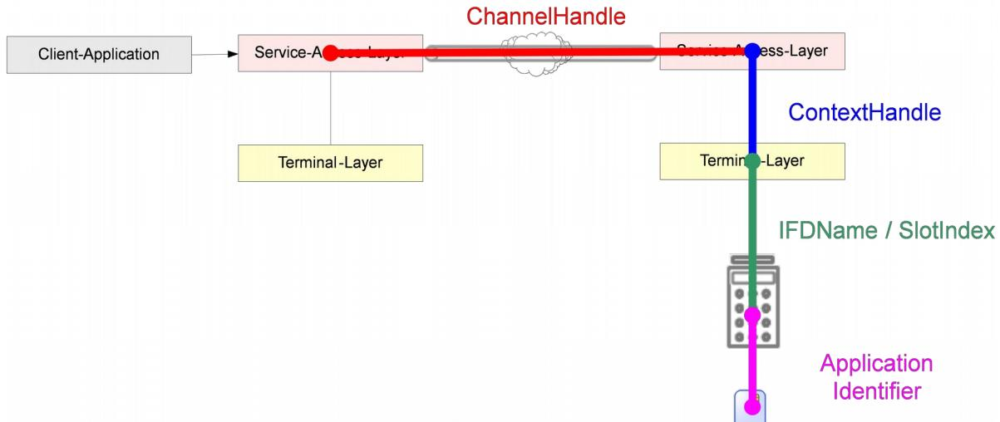

<span id="page-12-0"></span>*Figure 1: Structure of the path to card application*

| Name                     | CardApplicationPath                                                                                                                            |                                                                                                                                                                                                                                                                                                                                                                                          |  |
|--------------------------|------------------------------------------------------------------------------------------------------------------------------------------------|------------------------------------------------------------------------------------------------------------------------------------------------------------------------------------------------------------------------------------------------------------------------------------------------------------------------------------------------------------------------------------------|--|
| Description              | The CardApplicationPath function determines a path between the client<br>application and a card application.                                   |                                                                                                                                                                                                                                                                                                                                                                                          |  |
| Invocation<br>parameters | Invocation of the CardApplicationPath function with which the path<br>between the client application and a card application can be determined. |                                                                                                                                                                                                                                                                                                                                                                                          |  |
|                          | Name                                                                                                                                           | Description                                                                                                                                                                                                                                                                                                                                                                              |  |
|                          | CardApplPathRequest                                                                                                                            | This parameter can be used to limit the space<br>of the possible paths between the client<br>application and the card application. If no<br>restrictions are made, all available paths to the<br>stated card application are returned. If no card<br>application is specified, paths to all available<br>cards (alpha-card applications) and unused<br>card terminal slots are returned. |  |

<span id="page-13-0"></span>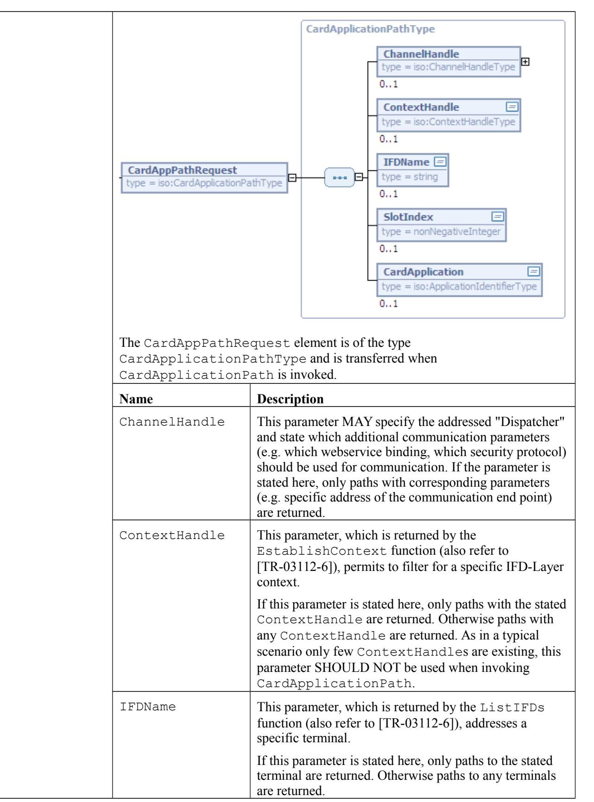

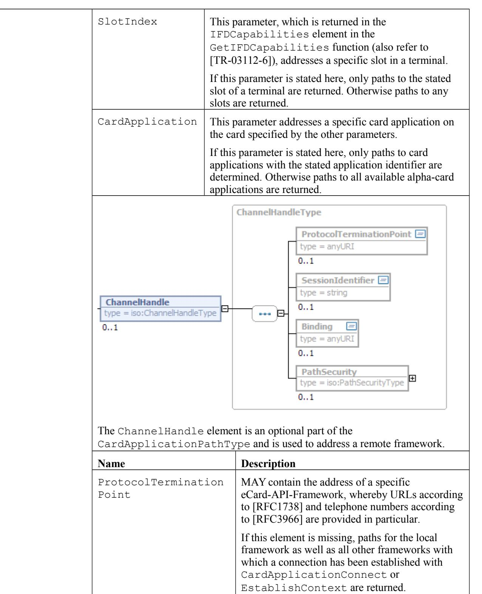

| SessionIdentifier | MAY be used to assign various invocations to a<br>specific session context.                                                                                                                                                                             |
|-------------------|---------------------------------------------------------------------------------------------------------------------------------------------------------------------------------------------------------------------------------------------------------|
|                   | If this parameter is stated here, only paths with<br>the stated SessionIdentifier are returned.<br>Otherwise paths with any<br>SessionIdentifier are returned. This<br>parameter SHOULD therefore NOT be used for<br>invocation of CardApplicationPath. |
| Binding           | MAY state which webservice binding should be<br>used for invocation. The following bindings are<br>currently provided for this purpose:                                                                                                                 |
|                   | •<br>http://schemas.xmlsoap.org/soap/http<br>-<br>SOAP via HTTP according to<br>[SOAPv1.1], Section 6                                                                                                                                                   |
|                   | •<br>urn:liberty:paos:2006-08 – Reverse http<br>Binding for SOAP (PAOS) according to<br>[PAOSv2.0]                                                                                                                                                      |
|                   | •<br>urn:liberty:paos:2003-08 – Reverse http<br>Binding for SOAP (PAOS) according to<br>[PAOSv1.1]                                                                                                                                                      |
|                   | If this element is missing when<br>CardApplicationPath is invoked, paths<br>with any bindings are returned.                                                                                                                                             |
|                   | In other invocations this element need not be<br>stated if the standard binding<br>http://schemas.xmlsoap.org/soap/http is to be<br>used.                                                                                                               |
| PathSecurity1     | The security mechanism with which the<br>communication channel between the local<br>"Dispatcher" and the remote "Dispatcher" should<br>be protected can be stated with the<br>PathSecurity element. See below for details.                              |
|                   | If the parameter is stated here, only paths with the<br>respective security mechanism are returned.                                                                                                                                                     |

<span id="page-15-0"></span><sup>1</sup> Note that the PathSecurity-element in [ISO24727-3] is erroneously not part of the ChannelHandleType, but directly part of the CardApplicationPathType. As this seemingly minor change leads to problems with protected Remote-ICC-Stack scenarios, the specification of the eCard-API-Framework and [CEN15480-3] consciously keeps the PathSecurity-element as part of the ChannelHandleType. This change will be proposed for a forthcoming amendment of [ISO24727-3].

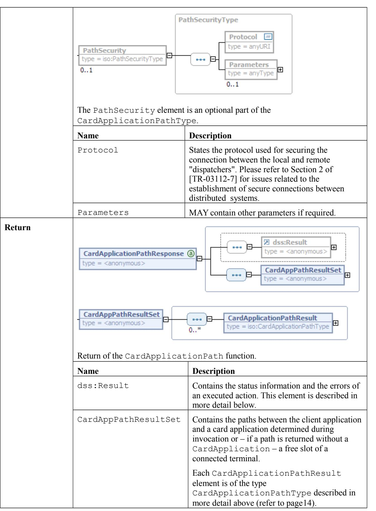

|               | Status information and errors in CardApplicationPath (also refer to<br>[TR-03112-1] Sections 4.1 and 4.2).                                                                                                                                                                                                                                                                                                                                                                                                                                                                                                                                                                             |                                                                                   |
|---------------|----------------------------------------------------------------------------------------------------------------------------------------------------------------------------------------------------------------------------------------------------------------------------------------------------------------------------------------------------------------------------------------------------------------------------------------------------------------------------------------------------------------------------------------------------------------------------------------------------------------------------------------------------------------------------------------|-----------------------------------------------------------------------------------|
|               | Name                                                                                                                                                                                                                                                                                                                                                                                                                                                                                                                                                                                                                                                                                   | Error codes                                                                       |
|               | ResultMajor                                                                                                                                                                                                                                                                                                                                                                                                                                                                                                                                                                                                                                                                            | •<br>/resultmajor#ok                                                              |
|               |                                                                                                                                                                                                                                                                                                                                                                                                                                                                                                                                                                                                                                                                                        | •<br>/resultmajor#error                                                           |
|               |                                                                                                                                                                                                                                                                                                                                                                                                                                                                                                                                                                                                                                                                                        | •<br>/resultmajor#warning                                                         |
|               | ResultMinor                                                                                                                                                                                                                                                                                                                                                                                                                                                                                                                                                                                                                                                                            | •<br>/resultminor/al/common#incorrectParameter                                    |
|               |                                                                                                                                                                                                                                                                                                                                                                                                                                                                                                                                                                                                                                                                                        | •<br>/resultminor/sal#notInitialized                                              |
|               |                                                                                                                                                                                                                                                                                                                                                                                                                                                                                                                                                                                                                                                                                        | •<br>/resultminor/sal#securityConditionNotSatisfied                               |
|               |                                                                                                                                                                                                                                                                                                                                                                                                                                                                                                                                                                                                                                                                                        | •<br>/resultminor/sal#tooManyResults                                              |
|               |                                                                                                                                                                                                                                                                                                                                                                                                                                                                                                                                                                                                                                                                                        | •<br>/resultminor/dp#communicationFailure                                         |
|               | ResultMessage                                                                                                                                                                                                                                                                                                                                                                                                                                                                                                                                                                                                                                                                          | MAY contain more detailed information on the error which<br>occurred if required. |
| Precondition  |                                                                                                                                                                                                                                                                                                                                                                                                                                                                                                                                                                                                                                                                                        |                                                                                   |
| Postcondition |                                                                                                                                                                                                                                                                                                                                                                                                                                                                                                                                                                                                                                                                                        |                                                                                   |
| Note          | An implementation of the eCard-API-Framework SHOULD maintain a list of the<br>currently valid ContextHandles, to determine the available terminals and their<br>slots with ListIFDs and GetIFDCapabilities. If a card is captured in a<br>slot this SHOULD be detected by an appropriate background process and a<br>connection is established to this card with Connect (also refer to [TR-03112-6])<br>which is represented with a SlotHandle. Subsequently the type of each<br>connected card (also refer to Annex A) as well as a list of the card applications<br>available on this card is determined to provide a response to an enquiry for a<br>specific CardApplicationPath. |                                                                                   |

### <span id="page-17-0"></span>**3.2 Connection Services**

### **3.2.1 CardApplicationConnect**

| Name        | CardApplicationConnect                                                                                                                    |
|-------------|-------------------------------------------------------------------------------------------------------------------------------------------|
| Description | The CardApplicationConnect function establishes an unauthenticated<br>connection between the client application and the card application. |

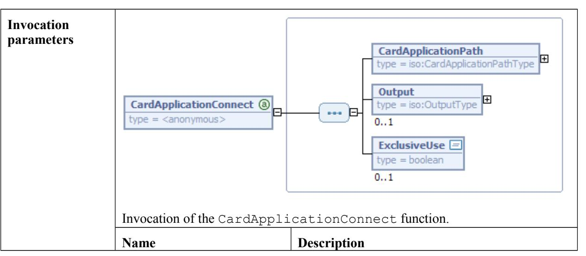

<span id="page-19-1"></span>

| CardApplicationPath | The CardApplicationPath element<br>contains the path to the card application to which<br>a connection is to be established and is of the type<br>CardApplicationPathType which was<br>explained previously (refer to page 14).                                                                                             |
|---------------------|----------------------------------------------------------------------------------------------------------------------------------------------------------------------------------------------------------------------------------------------------------------------------------------------------------------------------|
|                     | Which child elements of<br>CardApplicationPath are required and<br>recommended depends on the use case under<br>consideration and one may distinguish the<br>following scenarios:                                                                                                                                          |
|                     | 1.<br>If the local eCard-API-Framework is<br>addressed, one MAY omit the<br>ProtocolTerminationPoint or<br>ChannelHandle parameter<br>respectively.                                                                                                                                                                        |
|                     | 2.<br>If the local eCard-API-Framework<br>actively establishes a channel to a remote<br>framework the<br>ProtocolTerminationPoint<br>parameter MUST be present.                                                                                                                                                            |
|                     | 3.<br>In both cases above it is<br>RECOMMENDED to include the<br>ContextHandle, IFDName,<br>SlotIndex and<br>CardApplication-parameters to<br>avoid ambiguities. If the provided path<br>fragments are valid for more than one<br>card application the<br>eCard-API-Framework SHALL return<br>any of the possible choices. |
|                     | 4.<br>If the local eCard-API-Framework<br>however waits for incoming requests,<br>which may use the PAOS-binding, the<br>SessionIdentifier-parameter<br>MUST be present and it is<br>RECOMMENDED to include the<br>Binding-parameter and omit all other<br>parameters.                                                     |
| Output2             | By using the output element a corresponding<br>message (e.g. "Please insert eCard") can be<br>output if necessary – i.e. if there is no card<br>available in the card terminal slot. The structure<br>of the OutputType is explained in<br>[TR-03112-6].                                                                   |

<span id="page-19-0"></span><sup>2</sup> Note that this element is missing in the current version of [ISO24727-3]. Because of the additional Output-element it is not necessary for a typical client-application do get in contact with the IFD-Layer directly, Therefore the specification of the eCard-API-Framework and [CEN15480-3] consciously add this optional element. This change will be proposed for a forthcoming amendment of [ISO24727-3].

|        | ExclusiveUse                                   | If the element has the value TRUE, this means<br>that the card (application) should be used<br>exclusively. As a result no other client application<br>is able to access the card application until the<br>function CardApplicationDisconnect<br>has been invoked. If this element is missing, the |
|--------|------------------------------------------------|----------------------------------------------------------------------------------------------------------------------------------------------------------------------------------------------------------------------------------------------------------------------------------------------------|
|        |                                                | default value FALSE is implicitly assumed.                                                                                                                                                                                                                                                         |
| Return | Return of the CardApplicationConnect function. |                                                                                                                                                                                                                                                                                                    |
|        | Name                                           | Description                                                                                                                                                                                                                                                                                        |
|        | dss:Result                                     | Contains the status information and the errors of an<br>executed action. This element is described in more<br>detail below.                                                                                                                                                                        |
|        | ConnectionHandle                               | Contains a handle with which the established<br>connection to a card application is addressed. This<br>handle is of type ConnectionHandleType<br>which is derived from the<br>CardApplicationPathType (also refer to<br>page 14) by extension of the elements<br>SlotHandle and RecognitionInfo.   |

<span id="page-21-0"></span>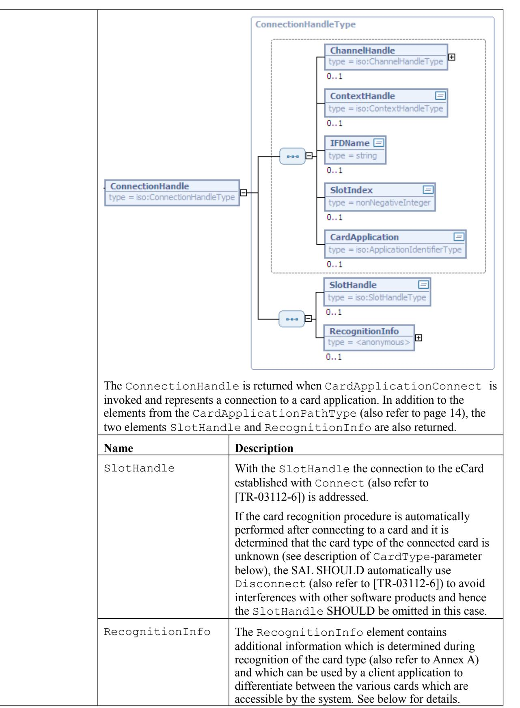

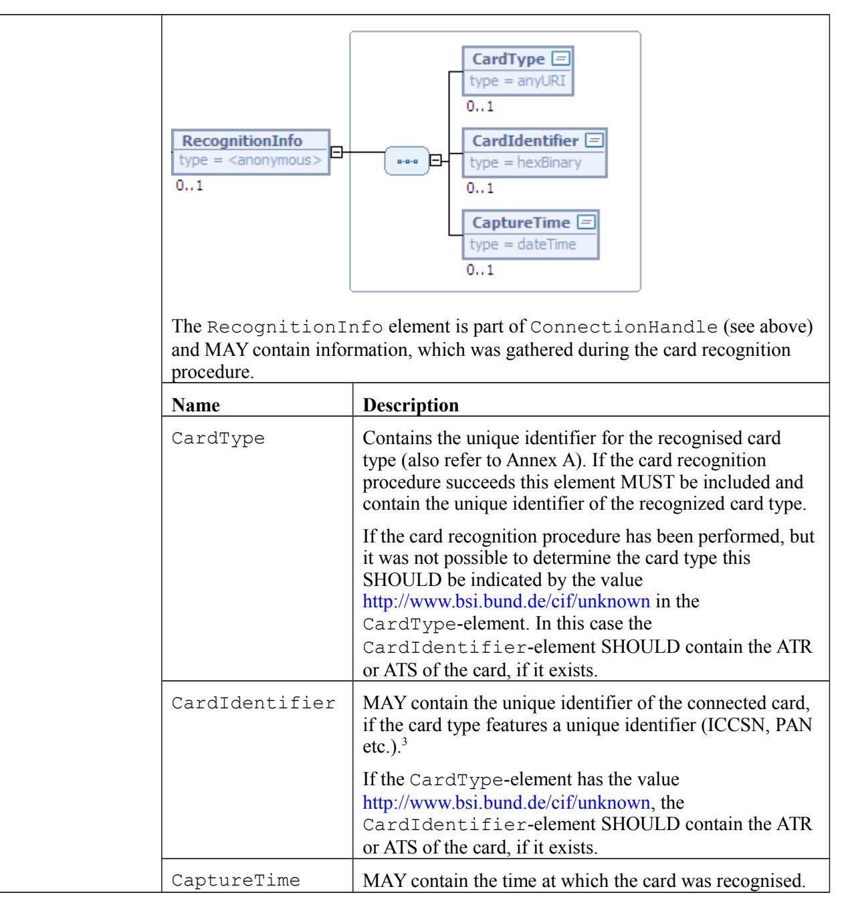

<span id="page-22-0"></span><sup>3</sup> In case of the German eHealth-card for example, the CardIdentifier-element will contain the 10 byte long value (without tag and length) of the data object DO\_ICCSN, which is stored in EF.GDO (cf. [eGK-2], Section 6.2.5).

|               | Status information and errors in CardApplicationConnect (also refer to<br>[TR-03112-1] Section 4.1 and 4.2).                                                                                                                                                                                                                         |                                                                                   |
|---------------|--------------------------------------------------------------------------------------------------------------------------------------------------------------------------------------------------------------------------------------------------------------------------------------------------------------------------------------|-----------------------------------------------------------------------------------|
|               | Name                                                                                                                                                                                                                                                                                                                                 | Error codes                                                                       |
|               | ResultMajor                                                                                                                                                                                                                                                                                                                          | •<br>/resultmajor#ok                                                              |
|               |                                                                                                                                                                                                                                                                                                                                      | •<br>/resultmajor#error                                                           |
|               | ResultMinor                                                                                                                                                                                                                                                                                                                          | •<br>/resultminor/al/common#incorrectParameter                                    |
|               |                                                                                                                                                                                                                                                                                                                                      | •<br>/resultminor/sal#notInitialized                                              |
|               |                                                                                                                                                                                                                                                                                                                                      | •<br>/resultminor/sal#exclusiveNotAvailable                                       |
|               |                                                                                                                                                                                                                                                                                                                                      | •<br>/resultminor/sal#securityConditionNotSatisfied                               |
|               |                                                                                                                                                                                                                                                                                                                                      | •<br>/resultminor/dp#communicationFailure                                         |
|               | ResultMessage                                                                                                                                                                                                                                                                                                                        | MAY contain more detailed information on the error which<br>occurred if required. |
| Precondition  | The stated path to the card application MUST at least contain the REQUIRED<br>elements (see specification of CardApplicationPath-parameter on page<br>20).                                                                                                                                                                           |                                                                                   |
| Postcondition | A connection to the card application has been established. This means that a<br>corresponding SlotHandle has been created with Connect (also refer to<br>[TR-03112-6]) and the card application was selected.                                                                                                                        |                                                                                   |
| Note          | Determination of the RecognitionInfo MAY already be performed during<br>automatic registration of the card, for example after return of Wait (also refer to<br>[TR-03112-6]) and the establishment of a connection with Connect.                                                                                                     |                                                                                   |
|               | If the connection to the card is requested to be exclusive and there was previously<br>only a non-exclusive connection to the card, this connection is disconnected with<br>Disconnect and re-established with Connect with the parameter<br>Exclusive = True. In this case repeated recognition of the card type MAY<br>be omitted. |                                                                                   |
| 3.2.2         | CardApplicationDisconnect                                                                                                                                                                                                                                                                                                            |                                                                                   |

# **Name CardApplicationDisconnect Description** The CardApplicationDisconnect function terminates the connection to a card application. **Invocation parameters** Invocation of CardApplicationDisconnect. **Name Description**

|               | ConnectionHandle                                                                                                                                                                                                      | Contains a handle with which the established<br>connection to a card application is addressed (also<br>refer to page 22).                                                                                                            |
|---------------|-----------------------------------------------------------------------------------------------------------------------------------------------------------------------------------------------------------------------|--------------------------------------------------------------------------------------------------------------------------------------------------------------------------------------------------------------------------------------|
|               | Action                                                                                                                                                                                                                | Optional parameter which states an action which is to<br>be performed additionally. This parameter is of type<br>ActionType4<br>and identical to the Action<br>parameter in the Disconnect function (also refer<br>to [TR-03112-6]). |
| Return        | Return of CardApplicationDisconnect.                                                                                                                                                                                  |                                                                                                                                                                                                                                      |
|               | Name                                                                                                                                                                                                                  | Description                                                                                                                                                                                                                          |
|               | dss:Result                                                                                                                                                                                                            | Contains the status information and the errors of an<br>executed action. This element is described in more<br>detail below.                                                                                                          |
|               | Status information and errors in CardApplicationDisconnect (also refer<br>to [TR-03112-1] Sections 4.1 and 4.2).                                                                                                      |                                                                                                                                                                                                                                      |
|               | Name                                                                                                                                                                                                                  | Error codes                                                                                                                                                                                                                          |
|               | ResultMajor                                                                                                                                                                                                           | •<br>/resultmajor#ok                                                                                                                                                                                                                 |
|               |                                                                                                                                                                                                                       | •<br>/resultmajor#error                                                                                                                                                                                                              |
|               |                                                                                                                                                                                                                       | •<br>/resultmajor#warning                                                                                                                                                                                                            |
|               | ResultMinor                                                                                                                                                                                                           | •<br>/resultminor/sal#warningSessionEnded                                                                                                                                                                                            |
|               |                                                                                                                                                                                                                       | •<br>/resultminor/sal/common#incorrectParameter                                                                                                                                                                                      |
|               |                                                                                                                                                                                                                       | •<br>/resultminor/sal#notInitialized                                                                                                                                                                                                 |
|               |                                                                                                                                                                                                                       | •<br>/resultminor/sal#securityConditionNotSatisfied                                                                                                                                                                                  |
|               |                                                                                                                                                                                                                       | •<br>/resultminor/dp#communicationFailure                                                                                                                                                                                            |
|               | ResultMessage                                                                                                                                                                                                         | MAY contain more detailed information on the error which<br>occurred if required.                                                                                                                                                    |
| Precondition  | A connection to a card application has been established with<br>CardApplicationConnect.                                                                                                                               |                                                                                                                                                                                                                                      |
| Postcondition | The logical connection to the card application was terminated. Disconnect was<br>invoked in particular (also refer to [TR-03112-6]), whereby the SlotHandle as<br>part of the ConnectionHandle has lost its validity. |                                                                                                                                                                                                                                      |
| Note          |                                                                                                                                                                                                                       |                                                                                                                                                                                                                                      |
|               |                                                                                                                                                                                                                       |                                                                                                                                                                                                                                      |

<span id="page-24-0"></span><sup>4</sup> Note that the type of the Action-parameter in [ISO24727-3] is named ReaderAction, which is not defined in [ISO24727-4]. Therefore the specification of the eCard-API-Framework and [CEN15480-3] use the ActionType. This change will be proposed for a forthcoming defect report of [ISO24727-3].

| Name                     | CardApplicationStartSession                                                                                            |                                                                                                                                                                                                                                                                                                                                                          |
|--------------------------|------------------------------------------------------------------------------------------------------------------------|----------------------------------------------------------------------------------------------------------------------------------------------------------------------------------------------------------------------------------------------------------------------------------------------------------------------------------------------------------|
| Description              | This CardApplicationStartSession function starts a session between<br>the client application and the card application. |                                                                                                                                                                                                                                                                                                                                                          |
| Invocation<br>parameters |                                                                                                                        |                                                                                                                                                                                                                                                                                                                                                          |
|                          | Invocation of the CardApplicationStartSession function.<br>Name                                                        | Description                                                                                                                                                                                                                                                                                                                                              |
|                          | ConnectionHandle                                                                                                       | Contains a handle with which the<br>connection to a card application is<br>addressed (also refer to page 22).                                                                                                                                                                                                                                            |
|                          | DIDScope                                                                                                               | Is an optional parameter which<br>resolves any ambivalence regarding<br>DIDName if necessary. It is only stated<br>if there is a global and local DID with<br>the name DIDName.                                                                                                                                                                          |
|                          | DIDName                                                                                                                | Contains the name of the differential<br>identity in this card application which<br>is to be used for establishing the<br>session.                                                                                                                                                                                                                       |
|                          | AuthenticationProtocolData                                                                                             | Protocol data which are transferred<br>when CardApplicationStart<br>Session is invoked. The<br>DIDAuthenticationDataType<br>is defined as an open type depending<br>on a Protocol attribute so that the<br>detailed structure of this parameter can<br>be defined within the framework of the<br>protocol specification (also refer to<br>[TR-03112-7]). |

#### **3.2.3 CardApplicationStartSession**

|        | SAMConnectionHandle                                                                                                |        | Contains a handle with which the<br>connection to a card application which<br>is assigned to the<br>eCard-API-Framework (e.g. in a<br>security access module) is addressed.                                                                                   |
|--------|--------------------------------------------------------------------------------------------------------------------|--------|---------------------------------------------------------------------------------------------------------------------------------------------------------------------------------------------------------------------------------------------------------------|
| Return |                                                                                                                    |        |                                                                                                                                                                                                                                                               |
|        | Response of the CardApplicationStartSession function.<br>Description                                               |        |                                                                                                                                                                                                                                                               |
|        | Name<br>dss:Result                                                                                                 |        | Contains the status information and the errors<br>of an executed action. This element is<br>described in more detail below.                                                                                                                                   |
|        | DIDAuthenticationData                                                                                              |        | Protocol data which are returned when<br>CardApplicationStartSession is<br>returned.                                                                                                                                                                          |
|        |                                                                                                                    |        | The DIDAuthenticationDataType is<br>defined as an open type in dependence on a<br>Protocol attribute so that the detailed<br>strucure of this parameter can be defined<br>within the framework of the protocol<br>specification (also refer to [TR-03112-7]). |
|        | Status information and errors in CardApplicationStartSession (also<br>refer to [TR-03112-1] Sections 4.1 and 4.2). |        |                                                                                                                                                                                                                                                               |
|        | Name<br>Error codes                                                                                                |        |                                                                                                                                                                                                                                                               |
|        | ResultMajor                                                                                                        | •      | /resultmajor#ok                                                                                                                                                                                                                                               |
|        |                                                                                                                    | •      | /resultmajor#error                                                                                                                                                                                                                                            |
|        |                                                                                                                    | •      | /resultmajor#nextRequest                                                                                                                                                                                                                                      |
|        | ResultMinor                                                                                                        | •      | /resultminor/al/common#incorrectParameter                                                                                                                                                                                                                     |
|        |                                                                                                                    | •      | /resultminor/sal#namedEntityNotFound                                                                                                                                                                                                                          |
|        |                                                                                                                    | •      | /resultminor/sal#protocolNotRecognized                                                                                                                                                                                                                        |
|        |                                                                                                                    | •      | /resultminor/sal#inappropriateProtocolForAction                                                                                                                                                                                                               |
|        |                                                                                                                    | •      | /resultminor/sal#notInitialized                                                                                                                                                                                                                               |
|        |                                                                                                                    | •      | /resultminor/sal#securityConditionNotSatisfied                                                                                                                                                                                                                |
|        |                                                                                                                    | •      | /resultminor/sal#insufficientResources                                                                                                                                                                                                                        |
|        |                                                                                                                    | •      | /resultminor/dp#communicationFailure                                                                                                                                                                                                                          |
|        |                                                                                                                    | exist. | In addition, other protocol specific error messages MAY                                                                                                                                                                                                       |

|                          | ResultMessage                                                                                                                                                                                           |  | MAY contain more detailed information on the error which<br>occurred if required. |
|--------------------------|---------------------------------------------------------------------------------------------------------------------------------------------------------------------------------------------------------|--|-----------------------------------------------------------------------------------|
| Precondition             | A connection to a card application has been established with<br>CardApplicationConnect.                                                                                                                 |  |                                                                                   |
| Postcondition            | A session to the stated card application has been established. The details (e.g.<br>whether secure messaging is performed) are contained in the protocol<br>specification (also refer to [TR-03112-7]). |  |                                                                                   |
| Note                     |                                                                                                                                                                                                         |  |                                                                                   |
| 3.2.4                    | CardApplicationEndSession                                                                                                                                                                               |  |                                                                                   |
| Name                     | CardApplicationEndSession                                                                                                                                                                               |  |                                                                                   |
| Description              |                                                                                                                                                                                                         |  | The CardApplicationEndSession function closes the session between the             |
| Invocation<br>parameters | client application and the card application.<br>Invocation of CardApplicationEndSession.                                                                                                                |  |                                                                                   |
|                          | Name                                                                                                                                                                                                    |  | Description                                                                       |
|                          |                                                                                                                                                                                                         |  |                                                                                   |

|        | ConnectionHandle                     | Contains a handle with which the connection to a<br>card application is addressed.                                          |
|--------|--------------------------------------|-----------------------------------------------------------------------------------------------------------------------------|
| Return | Return of CardApplicationEndSession. |                                                                                                                             |
|        | Name                                 | Description                                                                                                                 |
|        | dss:Result                           | Contains the status information and the errors of an<br>executed action. This element is described in more<br>detail below. |

|               | Status information and errors in CardApplicationEndSession (also refer<br>to [TR-03112-1] Sections 4.1 and 4.2).                                                                               |                                                                                   |
|---------------|------------------------------------------------------------------------------------------------------------------------------------------------------------------------------------------------|-----------------------------------------------------------------------------------|
|               | Name                                                                                                                                                                                           | Error codes                                                                       |
|               | ResultMajor                                                                                                                                                                                    | •<br>/resultmajor#ok                                                              |
|               |                                                                                                                                                                                                | •<br>/resultmajor#error                                                           |
|               |                                                                                                                                                                                                | •<br>/resultmajor#warning                                                         |
|               | ResultMinor                                                                                                                                                                                    | •<br>/resultminor/al/common#incorrectParameter                                    |
|               |                                                                                                                                                                                                | •<br>/resultminor/sal#noActiveSession                                             |
|               |                                                                                                                                                                                                | •<br>/resultminor/sal#notInitialized                                              |
|               |                                                                                                                                                                                                | •<br>/resultminor/sal#securityConditionNotSatisfied                               |
|               |                                                                                                                                                                                                | •<br>/resultminor/dp#communicationFailure                                         |
|               | ResultMessage                                                                                                                                                                                  | MAY contain more detailed information on the error which<br>occurred if required. |
| Precondition  | Using CardApplicationConnect and<br>CardApplicationStartSession, a session to a card application has been<br>established.                                                                      |                                                                                   |
| Postcondition | The secure session to the card application is terminated, but the<br>ConnectionHandle generated with CardApplicationConnect remains<br>valid until CardApplicationDisconnect has been invoked. |                                                                                   |
| Note          |                                                                                                                                                                                                |                                                                                   |

### <span id="page-28-0"></span>**3.3 Card Application Services**

### **3.3.1 CardApplicationList**

| Name                     | CardApplicationList                                                                                |                                                                                                               |
|--------------------------|----------------------------------------------------------------------------------------------------|---------------------------------------------------------------------------------------------------------------|
| Description              | The CardApplicationList function returns a list of the available card<br>applications on an eCard. |                                                                                                               |
| Invocation<br>parameters |                                                                                                    | Invocation of the CardApplicationList function.                                                               |
|                          | Name                                                                                               | Description                                                                                                   |
|                          | ConnectionHandle                                                                                   | Contains a handle with which the connection to a<br>card application is addressed (also refer to page<br>22). |

| Return        |                         | Return of the CardApplicationList function.                                                                                                                                                               |  |  |  |
|---------------|-------------------------|-----------------------------------------------------------------------------------------------------------------------------------------------------------------------------------------------------------|--|--|--|
|               | Name                    | Description                                                                                                                                                                                               |  |  |  |
|               | dss:Result              | Contains the status information and<br>the errors of an executed action. This<br>element is described in more detail<br>below.                                                                            |  |  |  |
|               | CardApplicationNameList | Contains a list of the names for the<br>existing card applications (see below<br>for details).                                                                                                            |  |  |  |
|               |                         |                                                                                                                                                                                                           |  |  |  |
|               |                         | Part of CardApplicationNameList (see above).                                                                                                                                                              |  |  |  |
|               | Name                    | Description                                                                                                                                                                                               |  |  |  |
|               | CardApplicationName     | Name (application identifier) of the<br>available card applications.                                                                                                                                      |  |  |  |
|               |                         | Status information and errors in CardApplicationList (also refer to<br>[TR-03112-1] Sections 4.1 and 4.2).                                                                                                |  |  |  |
|               | Name                    | Error codes                                                                                                                                                                                               |  |  |  |
|               | ResultMajor             | •<br>/resultmajor#ok                                                                                                                                                                                      |  |  |  |
|               |                         | •<br>/resultmajor#error                                                                                                                                                                                   |  |  |  |
|               | ResultMinor             | •<br>/resultminor/al/common#incorrectParameter                                                                                                                                                            |  |  |  |
|               |                         | •<br>/resultminor/sal#notInitialized                                                                                                                                                                      |  |  |  |
|               |                         | •<br>/resultminor/sal#<br>securityConditionNotSatisfied                                                                                                                                                   |  |  |  |
|               |                         | •<br>/resultminor/dp#communicationFailure                                                                                                                                                                 |  |  |  |
|               | ResultMessage           | MAY contain more detailed information on the error<br>which occurred if required.                                                                                                                         |  |  |  |
| Precondition  | CardApplicationConnect. | A connection to the alpha card application has been established with                                                                                                                                      |  |  |  |
| Postcondition |                         |                                                                                                                                                                                                           |  |  |  |
| Note          |                         | The list of card applications MAY be derived from the contents of the<br>EF.DIR (also refer to [ISO7816-4]), the application capability description<br>(also refer to [ISO24727-2]) or the CardInfo file. |  |  |  |

<span id="page-30-0"></span>

| Name                     | CardApplicationCreate                                                                                                                                  |             |                                                                                                                                                                          |
|--------------------------|--------------------------------------------------------------------------------------------------------------------------------------------------------|-------------|--------------------------------------------------------------------------------------------------------------------------------------------------------------------------|
| Description              | A new card application is created on an eCard with the<br>CardApplicationCreate function.                                                              |             |                                                                                                                                                                          |
| Invocation<br>parameters |                                                                                                                                                        |             |                                                                                                                                                                          |
|                          | Invocation of CardApplicationCreate.<br>Description                                                                                                    |             |                                                                                                                                                                          |
|                          | Name<br>ConnectionHandle<br>CardApplicationName                                                                                                        |             | Contains a handle with which the<br>connection to a card application is<br>addressed (also refer to page 22). This<br>MUST be the alpha card application of<br>the card. |
|                          |                                                                                                                                                        |             | Contains the name of the card application<br>to be created in the form of an<br>application identifier.                                                                  |
| CardApplicationACL       | Is of type AccessControlListType<br>and contains the access rules for the<br>services and actions in this card<br>application (see below for details). |             |                                                                                                                                                                          |
|                          |                                                                                                                                                        |             |                                                                                                                                                                          |
|                          | Elements of the AccessControlListType are used in<br>CardApplicationCreate, DataSetCreate and DIDCreate and<br>in the CardInfo structure.              |             |                                                                                                                                                                          |
|                          | Name                                                                                                                                                   | Description |                                                                                                                                                                          |

### **3.3.2 CardApplicationCreate**

<span id="page-31-1"></span>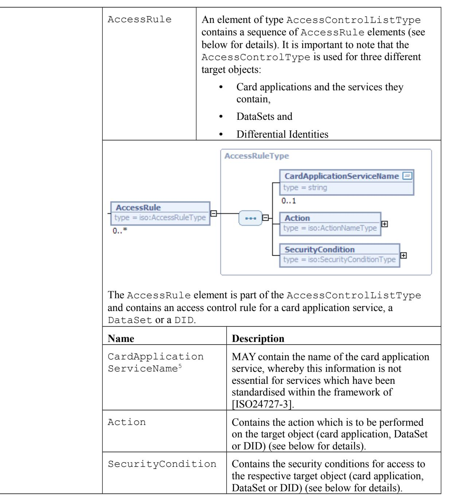

<span id="page-31-2"></span><span id="page-31-0"></span><sup>5</sup> Note that the current version of [ISO24727-3] erroneously only allows the predefined card application service names and hence it would not be possible to define new card application services, which would render the CardApplicationServiceCreate-function (cf. Section [3.3.5\)](#page-37-0) useless. Therefore the present specification and [CEN15480-3] consciously define the CardApplicationServiceName-parameter as string. This change will be proposed for a forthcoming defect report of [ISO24727-3].

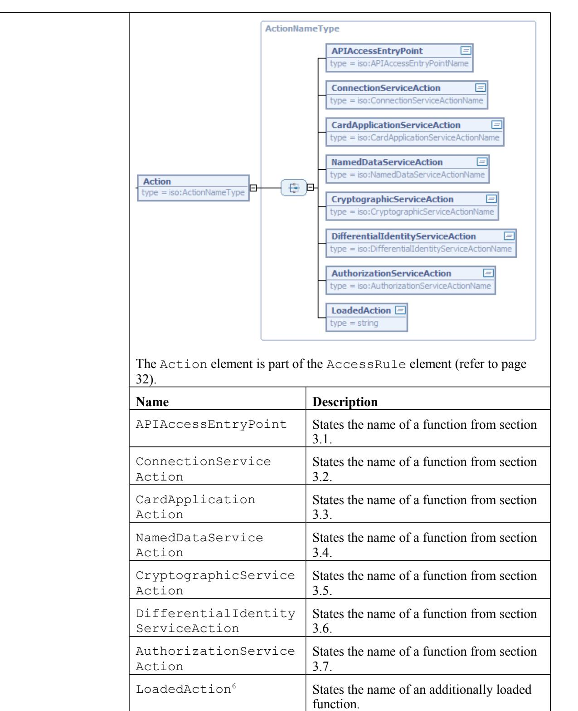

<span id="page-32-0"></span><sup>6</sup> Note that the current version of [ISO24727-3] erroneously does not allow a non-standardized loaded action to appear in this parameter, which would allow that only the actions already standardized in [ISO24727-3] could be loaded with the CardApplicationServiceLoad-function (cf. Section [3.3.6\)](#page-38-0), which would render this function almost useless. Therefore the present specification and [CEN15480-3] consciously add the LoadedAction-alternative. This change will be proposed for a forthcoming defect report of [ISO24727-3].

|                                    | The SecurityCondition element is part of the AccessRule element<br>and can contain any Boolean expression, which consists of the terminal<br>elements DIDAuthenticationState, always or never, which<br>MAY be combined using the operators not, and and or.<br>As a general rule, access which is not explicitly permitted is forbidden.                                                                                                                                |
|------------------------------------|--------------------------------------------------------------------------------------------------------------------------------------------------------------------------------------------------------------------------------------------------------------------------------------------------------------------------------------------------------------------------------------------------------------------------------------------------------------------------|
| omitted.                           | Therefore explicit statement of a SecurityCondition with never MAY be                                                                                                                                                                                                                                                                                                                                                                                                    |
| Name<br>DIDAuthentication<br>State | Description<br>Contains at least the name of a DID<br>(DIDName) and the required Boolean<br>authentication condition (DIDState). In<br>addition, DIDScope and a<br>DIDStateQualifier7<br>MAY be present,<br>which resolve ambiguity if required. The<br>DIDStateQualifier is typically used in<br>certificate-based authentication processes and<br>contains the "Certificate Holder Authorization<br>(Template)", which states the rights of the<br>certificate holder. |
| always                             | States that access is always permitted.                                                                                                                                                                                                                                                                                                                                                                                                                                  |
| never                              | States that access is never permitted.                                                                                                                                                                                                                                                                                                                                                                                                                                   |
| not                                | Is used to negate an expression shown as a<br>SecurityCondition.                                                                                                                                                                                                                                                                                                                                                                                                         |

<span id="page-33-0"></span><sup>7</sup> Note that the current version of [ISO24727-3] erroneously does not contain the optional DIDStateQualifier. Because this element is necessary in certificate-based authentication scenarios the present specification and [CEN15480-3] consciously add this alternative. This change will be proposed for a forthcoming defect report of [ISO24727-3].

|               | or                    | Is used to disjunctively link several<br>expressions shown as a<br>SecurityCondition.                                                                                                                                      |  |  |
|---------------|-----------------------|----------------------------------------------------------------------------------------------------------------------------------------------------------------------------------------------------------------------------|--|--|
| Return        |                       |                                                                                                                                                                                                                            |  |  |
|               | Name                  | Return of CardApplicationCreate.<br>Description                                                                                                                                                                            |  |  |
|               | dss:Result            | Contains the status information and the<br>errors of an executed action. This element is<br>described in more detail below.                                                                                                |  |  |
|               |                       | Status information and errors in CardApplicationCreate (also refer<br>to [TR-03112-1] Sections 4.1 and 4.2).                                                                                                               |  |  |
|               | Name                  | Error codes                                                                                                                                                                                                                |  |  |
|               | ResultMajor           | •<br>/resultmajor#ok                                                                                                                                                                                                       |  |  |
|               |                       | •<br>/resultmajor#error                                                                                                                                                                                                    |  |  |
|               |                       | •<br>/resultmajor#warning                                                                                                                                                                                                  |  |  |
|               | ResultMinor           | •<br>/resultminor/al/common#incorrectParameter                                                                                                                                                                             |  |  |
|               |                       | •<br>/resultminor/sal#nameExists                                                                                                                                                                                           |  |  |
|               |                       | •<br>/resultminor/sal#notInitialized                                                                                                                                                                                       |  |  |
|               |                       | •<br>/resultminor/sal#securityConditionNot<br>Satisfied                                                                                                                                                                    |  |  |
|               |                       | •<br>/resultminor/sal#prerequisiteNotSatisfied                                                                                                                                                                             |  |  |
|               |                       | •<br>/resultminor/sal#insufficientResources                                                                                                                                                                                |  |  |
|               |                       | •<br>/resultminor/dp#communicationFailure                                                                                                                                                                                  |  |  |
|               | ResultMessage         | MAY contain more detailed information on the error<br>which occurred if required.                                                                                                                                          |  |  |
| Precondition  |                       | CardApplicationConnect was used to establish a connection to the<br>"alpha card application" (or the master file).                                                                                                         |  |  |
| Postcondition |                       | The "alpha card application" remains selected.                                                                                                                                                                             |  |  |
| Note          | file.                 | Creation of a new card application results in changes to EF.DIR, the card<br>capability description according to section 6.1 of [ISO24727-2], the<br>[ISO7816-15] structures on the card and/or the corresponding CardInfo |  |  |
| 3.3.3         | CardApplicationDelete |                                                                                                                                                                                                                            |  |  |
| Name          | CardApplicationDelete |                                                                                                                                                                                                                            |  |  |

| Invocation<br>parameters |                                                                                                            |             |                                                                                                                              |
|--------------------------|------------------------------------------------------------------------------------------------------------|-------------|------------------------------------------------------------------------------------------------------------------------------|
|                          | Invocation of the CardApplicationDelete function.                                                          |             |                                                                                                                              |
|                          | Name<br>ConnectionHandle                                                                                   |             | Description<br>Contains a handle with which the connection<br>to a card application is addressed (also refer<br>to page 22). |
|                          | CardApplicationName                                                                                        |             | Contains the name of the card application,<br>which is to be deleted.                                                        |
| Return                   |                                                                                                            |             |                                                                                                                              |
|                          | Return of the CardApplicationDelete function.<br>Name<br>dss:Result<br>[TR-03112-1] Sections 4.1 and 4.2). |             | Description                                                                                                                  |
|                          |                                                                                                            |             | Contains the status information and the errors<br>of an executed action. This element is<br>described in more detail below.  |
|                          |                                                                                                            |             | Status information and errors in CardApplicationDelete (also refer to                                                        |
|                          | Name                                                                                                       | Error codes |                                                                                                                              |
|                          | ResultMajor                                                                                                | •<br>•<br>• | /resultmajor#ok<br>/resultmajor#error<br>/resultmajor#warning                                                                |
|                          | ResultMinor                                                                                                | •           | resultminor/sal#<br>warningConnectionDisconnected                                                                            |
|                          |                                                                                                            | •<br>•<br>• | /resultminor/al/common#incorrectParameter<br>/resultminor/sal#namedEntityNotFound<br>/resultminor/sal#notInitialized         |
|                          |                                                                                                            | •<br>•      | /resultminor/sal#securityConditionNotSatisfied<br>/resultminor/sal#prerequisiteNotSatisfied                                  |
|                          | ResultMessage                                                                                              | •           | /resultminor/dp#communicationFailure<br>MAY contain more detailed information on the error<br>which occurred if required.    |

| Precondition  | A connection to the alpha card application (or master file) or the card<br>application which is to be deleted has been established with<br>CardApplicationConnect.                                                           |
|---------------|------------------------------------------------------------------------------------------------------------------------------------------------------------------------------------------------------------------------------|
| Postcondition | The card application (incl. its services, data sets and DIDs) was deleted. Any<br>existing connections to the deleted card application are terminated.                                                                       |
| Note          | Deletion of a card application results in changes to EF.DIR, the card capability<br>description according to section 6.1 of [ISO24727-2], the [ISO7816-15]<br>structures on the card and/or the corresponding CardInfo file. |

#### **3.3.4 CardApplicationServiceList**

| Name                     | CardApplicationServiceList                                                                                                                                                                                                                               |             |                                         |                                                                                    |
|--------------------------|----------------------------------------------------------------------------------------------------------------------------------------------------------------------------------------------------------------------------------------------------------|-------------|-----------------------------------------|------------------------------------------------------------------------------------|
| Description              | The CardApplicationServiceList function returns a list of all<br>available services of a card application.                                                                                                                                               |             |                                         |                                                                                    |
| Invocation<br>parameters |                                                                                                                                                                                                                                                          |             |                                         |                                                                                    |
|                          | Invocation of the CardApplicationServiceList function.                                                                                                                                                                                                   |             |                                         |                                                                                    |
|                          | Name                                                                                                                                                                                                                                                     | Description |                                         |                                                                                    |
|                          | ConnectionHandle                                                                                                                                                                                                                                         |             |                                         | Contains a handle with which the connection to a<br>card application is addressed. |
| Return                   | Return of the CardApplicationServiceList function.                                                                                                                                                                                                       |             |                                         |                                                                                    |
|                          | Name                                                                                                                                                                                                                                                     |             | Description                             |                                                                                    |
|                          | dss:Result<br>errors of an executed action. This<br>element is described in more detail<br>below.<br>Contains a list of the names of all<br>CardApplicationService<br>services contained in the card<br>NameList<br>application (see below for details). |             | Contains the status information and the |                                                                                    |
|                          |                                                                                                                                                                                                                                                          |             |                                         |                                                                                    |
|                          |                                                                                                                                                                                                                                                          |             |                                         |                                                                                    |
|                          | of CardApplicationServiceList.                                                                                                                                                                                                                           |             |                                         | The CardApplicationServiceNameList element is part of the return                   |
|                          | Name                                                                                                                                                                                                                                                     | Description |                                         |                                                                                    |

|                                       | CardApplication<br>ServiceName8                                                                                                                            | Contains the name of the card application service,<br>whereby only additional services which are not<br>specified in [ISO24727-3] are contained in the list. |  |
|---------------------------------------|------------------------------------------------------------------------------------------------------------------------------------------------------------|--------------------------------------------------------------------------------------------------------------------------------------------------------------|--|
|                                       | Status information and errors in CardApplicationServiceList (also<br>refer to [TR-03112-1] Sections 4.1 and 4.2).                                          |                                                                                                                                                              |  |
|                                       | Name                                                                                                                                                       | Error codes                                                                                                                                                  |  |
|                                       | ResultMajor                                                                                                                                                | •<br>/resultmajor#ok                                                                                                                                         |  |
|                                       |                                                                                                                                                            | •<br>/resultmajor#error                                                                                                                                      |  |
|                                       | ResultMinor                                                                                                                                                | •<br>/resultminor/al/common#incorrectParameter                                                                                                               |  |
|                                       |                                                                                                                                                            | •<br>/resultminor/sal#notInitialized                                                                                                                         |  |
|                                       |                                                                                                                                                            | •<br>/resultminor/sal#securityConditionNotSatisfied                                                                                                          |  |
|                                       |                                                                                                                                                            | •<br>/resultminor/dp#communicationFailure                                                                                                                    |  |
|                                       | ResultMessage                                                                                                                                              | MAY contain more detailed information on the error<br>which occurred if required.                                                                            |  |
| Precondition                          | A connection to a card application has been established with<br>CardApplicationConnect.                                                                    |                                                                                                                                                              |  |
| Postcondition                         |                                                                                                                                                            |                                                                                                                                                              |  |
| Note                                  | The available services in a card application are contained in the application<br>capability description (also refer to [ISO24727-2]) or the CardInfo file. |                                                                                                                                                              |  |
| 3.3.5<br>CardApplicationServiceCreate |                                                                                                                                                            |                                                                                                                                                              |  |
| Name                                  | CardApplicationServiceCreate                                                                                                                               |                                                                                                                                                              |  |

<span id="page-37-0"></span>

| Name                     | CardApplicationServiceCreate                                                                |                                                                                                               |  |
|--------------------------|---------------------------------------------------------------------------------------------|---------------------------------------------------------------------------------------------------------------|--|
| Description              | The CardApplicationServiceCreate function creates a new service in<br>the card application. |                                                                                                               |  |
| Invocation<br>parameters | Invocation of the CardApplicationServiceCreate function.                                    |                                                                                                               |  |
|                          | Name<br>Description                                                                         |                                                                                                               |  |
|                          | ConnectionHandle                                                                            | Contains a handle with which the<br>connection to a card application is<br>addressed (also refer to page 22). |  |
|                          | CardApplicationService<br>Name9                                                             | Contains the name of the card application<br>service which is to be created.                                  |  |

<span id="page-37-1"></span><sup>8</sup> See footnote on page [32.](#page-31-2)

<span id="page-37-2"></span><sup>9</sup> See footnote on page [32.](#page-31-2)

<span id="page-38-0"></span>

| Return        |                                                                                                                                               |                                                                                                                             |  |  |
|---------------|-----------------------------------------------------------------------------------------------------------------------------------------------|-----------------------------------------------------------------------------------------------------------------------------|--|--|
|               |                                                                                                                                               |                                                                                                                             |  |  |
|               |                                                                                                                                               |                                                                                                                             |  |  |
|               | Return of the CardApplicationServiceCreate function.                                                                                          |                                                                                                                             |  |  |
|               | Name                                                                                                                                          | Description                                                                                                                 |  |  |
|               | dss:Result                                                                                                                                    | Contains the status information and the errors of an<br>executed action. This element is described in more<br>detail below. |  |  |
|               |                                                                                                                                               | Status information and errors in CardApplicationServiceCreate<br>(also refer to [TR-03112-1] Sections 4.1 and 4.2).         |  |  |
|               | Name<br>Error codes                                                                                                                           |                                                                                                                             |  |  |
|               | ResultMajor                                                                                                                                   | •<br>/resultmajor#ok                                                                                                        |  |  |
|               |                                                                                                                                               | •<br>/resultmajor#error                                                                                                     |  |  |
|               | ResultMinor                                                                                                                                   | •<br>/resultminor/al/common#incorrectParameter                                                                              |  |  |
|               |                                                                                                                                               | •<br>/resultminor/sal#nameExists                                                                                            |  |  |
|               |                                                                                                                                               | •<br>/resultminor/sal#notInitialized                                                                                        |  |  |
|               |                                                                                                                                               | •<br>/resultminor/sal#securityConditionNot<br>Satisfied                                                                     |  |  |
|               |                                                                                                                                               | •<br>/resultminor/sal#insufficientResources                                                                                 |  |  |
|               |                                                                                                                                               | •<br>/resultminor/dp#communicationFailure                                                                                   |  |  |
|               | ResultMessage                                                                                                                                 | MAY contain more detailed information on the error<br>which occurred if required.                                           |  |  |
| Precondition  | A connection to a card application has been established with<br>CardApplicationConnect.                                                       |                                                                                                                             |  |  |
| Postcondition | The new service has been created in the card application.                                                                                     |                                                                                                                             |  |  |
| Note          | The newly added service MUST be supplemented in the application capability<br>description (also refer to [ISO24727-2]) or the CardInfo file.  |                                                                                                                             |  |  |
| 3.3.6         | CardApplicationServiceLoad                                                                                                                    |                                                                                                                             |  |  |
| Name          | CardApplicationServiceLoad                                                                                                                    |                                                                                                                             |  |  |
| Description   | Code for a specific card application service was loaded into the card application<br>with the aid of the CardApplicationServiceLoad function. |                                                                                                                             |  |  |

| Invocation<br>parameters |                                  |                                                                                                                   |                                                                                                                                       |  |  |
|--------------------------|----------------------------------|-------------------------------------------------------------------------------------------------------------------|---------------------------------------------------------------------------------------------------------------------------------------|--|--|
|                          |                                  |                                                                                                                   | Invocation of the CardApplicationServiceLoad function.                                                                                |  |  |
|                          | Name                             |                                                                                                                   | Description                                                                                                                           |  |  |
|                          | ConnectionHandle                 |                                                                                                                   | Contains a handle with which the connection to a<br>card application is addressed (also refer to page<br>22).                         |  |  |
|                          | CardApplication<br>ServiceName10 |                                                                                                                   | Contains the name of the card application service<br>with which the corresponding code should be<br>loaded into the card application. |  |  |
|                          | Code                             |                                                                                                                   | Contains the executable code for the stated card<br>application service.                                                              |  |  |
| Return                   |                                  | Return of the CardApplicationServiceLoad function.                                                                |                                                                                                                                       |  |  |
|                          | Name                             |                                                                                                                   | Description                                                                                                                           |  |  |
|                          | dss:Result                       |                                                                                                                   | Contains the status information and the errors of<br>an executed action. This element is described in<br>more detail below.           |  |  |
|                          |                                  | Status information and errors in CardApplicationServiceLoad (also<br>refer to [TR-03112-1] Sections 4.1 and 4.2). |                                                                                                                                       |  |  |
|                          | Name                             |                                                                                                                   | Error codes                                                                                                                           |  |  |
|                          | ResultMajor                      | •                                                                                                                 | /resultmajor#ok                                                                                                                       |  |  |
|                          |                                  | •                                                                                                                 | /resultmajor#error                                                                                                                    |  |  |
|                          | ResultMinor                      | •                                                                                                                 | /resultminor/al/common#incorrectParameter                                                                                             |  |  |
|                          |                                  | •<br>•                                                                                                            | /resultminor/sal#namedEntityNotFound<br>/resultminor/sal#notInitialized                                                               |  |  |
|                          |                                  | •                                                                                                                 | /resultminor/sal#securityConditionNotSatisfied                                                                                        |  |  |
|                          |                                  | •                                                                                                                 | /resultminor/sal#insufficientResources                                                                                                |  |  |
|                          |                                  | •                                                                                                                 | /resultminor/dp#communicationFailure                                                                                                  |  |  |

<span id="page-39-0"></span><sup>10</sup> See footnote on page [32.](#page-31-2)

|               | ResultMessage                                                                                                                                                | MAY contain more detailed information on the error<br>which occurred if required.                                                                                                                                                                                                                           |
|---------------|--------------------------------------------------------------------------------------------------------------------------------------------------------------|-------------------------------------------------------------------------------------------------------------------------------------------------------------------------------------------------------------------------------------------------------------------------------------------------------------|
| Precondition  | A connection to a card application has been established with<br>CardApplicationConnect. The corresponding service already exists in<br>the card application. |                                                                                                                                                                                                                                                                                                             |
| Postcondition |                                                                                                                                                              |                                                                                                                                                                                                                                                                                                             |
| Note          |                                                                                                                                                              | It must be noted that re-loading of card application services can involve<br>additional risks which require additional security measures on the card and/or in<br>the organisational environment of the eCard-API-Framework. Such security<br>measures are, however, are beyond the scope of this document. |

#### **3.3.7 CardApplicationServiceDelete**

| Name                     | CardApplicationServiceDelete                                                                           |                                                                                                                             |  |  |
|--------------------------|--------------------------------------------------------------------------------------------------------|-----------------------------------------------------------------------------------------------------------------------------|--|--|
| Description              | The CardApplicationServiceDelete function deletes a card<br>application service in a card application. |                                                                                                                             |  |  |
| Invocation<br>parameters |                                                                                                        | Invocation of the CardApplicationServiceDelete function.                                                                    |  |  |
|                          | Name                                                                                                   | Description                                                                                                                 |  |  |
|                          | ConnectionHandle                                                                                       | Contains a handle with which the connection to<br>a card application is addressed (also refer to<br>page 22).               |  |  |
|                          | CardApplication<br>ServiceName11                                                                       | Contains the name of the card application<br>service which is to be deleted.                                                |  |  |
| Return                   |                                                                                                        | Return of the CardApplicationServiceDelete function.                                                                        |  |  |
|                          | Name                                                                                                   | Description                                                                                                                 |  |  |
|                          | dss:Result                                                                                             | Contains the status information and the errors of<br>an executed action. This element is described in<br>more detail below. |  |  |

<span id="page-40-0"></span><sup>11</sup> See footnote on page [32.](#page-31-2)

|               | Status information and errors in CardApplicationServiceDelete (also<br>refer to [TR-03112-1] Sections 4.1 and 4.2).                   |                                                                                   |
|---------------|---------------------------------------------------------------------------------------------------------------------------------------|-----------------------------------------------------------------------------------|
|               | Name                                                                                                                                  | Error codes                                                                       |
|               | ResultMajor                                                                                                                           | •<br>/resultmajor#ok                                                              |
|               |                                                                                                                                       | •<br>/resultmajor#error                                                           |
|               | ResultMinor                                                                                                                           | •<br>/resultminor/al/common#incorrectParameter                                    |
|               |                                                                                                                                       | •<br>/resultminor/sal#namedEntityNotFound                                         |
|               |                                                                                                                                       | •<br>/resultminor/sal#notInitialized                                              |
|               |                                                                                                                                       | •<br>/resultminor/sal#securityConditionNotSatisfied                               |
|               |                                                                                                                                       | •<br>/resultminor/dp#communicationFailure                                         |
|               | ResultMessage                                                                                                                         | MAY contain more detailed information on the error<br>which occurred if required. |
| Precondition  | A connection to a card application has been established with<br>CardApplicationConnect.                                               |                                                                                   |
| Postcondition | The card application service has been deleted.                                                                                        |                                                                                   |
| Note          | The deleted service MUST be removed from the application capability<br>description (also refer to [ISO24727-2]) or the CardInfo file. |                                                                                   |

#### **3.3.8 CardApplicationServiceDescribe**

| Name                     | CardApplicationServiceDescribe   |                                                                                                                                     |
|--------------------------|----------------------------------|-------------------------------------------------------------------------------------------------------------------------------------|
| Description              | application service.             | The CardApplicationServiceDescribe function can be used to<br>request an URI, an URL or a detailed description of the selected card |
| Invocation<br>parameters |                                  | Invocation of the CardApplicationServiceDescribe function.                                                                          |
|                          | Name                             | Description                                                                                                                         |
|                          | ConnectionHandle                 | Contains a handle with which the connection to<br>a card application is addressed (also refer to<br>page 22).                       |
|                          | CardApplication<br>ServiceName12 | Contains the name of the card application<br>service for which the interface description<br>should be determined.                   |

<span id="page-41-0"></span><sup>12</sup> See footnote on page [32.](#page-31-2)

| Return parameters |                                                                                                                              |                                                                                                                             |                                                                                                   |  |
|-------------------|------------------------------------------------------------------------------------------------------------------------------|-----------------------------------------------------------------------------------------------------------------------------|---------------------------------------------------------------------------------------------------|--|
|                   | Return of the CardApplicationServiceDescribe function.                                                                       |                                                                                                                             |                                                                                                   |  |
|                   | Name                                                                                                                         | Description                                                                                                                 |                                                                                                   |  |
|                   | dss:Result                                                                                                                   | Contains the status information and the errors<br>of an executed action. This element is<br>described in more detail below. |                                                                                                   |  |
|                   | ServiceDescripton                                                                                                            | Contains the description of the interface for use<br>of the stated card application service (see<br>below for details).     |                                                                                                   |  |
|                   |                                                                                                                              |                                                                                                                             |                                                                                                   |  |
|                   | The ServiceDescripton element is part of the return of<br>CardApplicationServiceDescribe (see above).<br>Name<br>Description |                                                                                                                             |                                                                                                   |  |
|                   | ServiceDescriptionText                                                                                                       |                                                                                                                             | Interface description of the card<br>application service.                                         |  |
|                   | ServiceDescriptionURL                                                                                                        |                                                                                                                             | URL from which the interface<br>description of the card application<br>service may be downloaded. |  |
|                   | Status information and errors in CardApplicationService<br>Describe (also refer to [TR-03112-1] Sections 4.1 and 4.2).       |                                                                                                                             |                                                                                                   |  |
|                   | Name                                                                                                                         | Error codes                                                                                                                 |                                                                                                   |  |
|                   | ResultMajor                                                                                                                  | •<br>•                                                                                                                      | /resultmajor#ok<br>/resultmajor#error                                                             |  |
|                   | ResultMinor                                                                                                                  | •<br>•                                                                                                                      | /resultminor/al/common#incorrectParameter<br>/resultminor/sal#namedEntityNotFound                 |  |
|                   |                                                                                                                              | •<br>•                                                                                                                      | /resultminor/sal#notInitialized<br>/resultminor/sal#securityConditionNot                          |  |
|                   |                                                                                                                              | Satisfied<br>•                                                                                                              | /resultminor/dp#communicationFailure                                                              |  |
|                   | ResultMessage                                                                                                                | which occurred if required.                                                                                                 | MAY contain more detailed information on the error                                                |  |
| Precondition      |                                                                                                                              | A connection to a card application has been established with                                                                |                                                                                                   |  |

|               | CardApplicationConnect.                                                                                                                |
|---------------|----------------------------------------------------------------------------------------------------------------------------------------|
| Postcondition |                                                                                                                                        |
| Note          | The interface description is contained in the application capability<br>description (also refer to [ISO24727-2]) or the CardInfo file. |

#### **3.3.9 ExecuteAction**

| Name                     | ExecuteAction                                                                                                                                                                                                                     |                                                                                                               |
|--------------------------|-----------------------------------------------------------------------------------------------------------------------------------------------------------------------------------------------------------------------------------|---------------------------------------------------------------------------------------------------------------|
| Description              | The ExecuteAction function permits use of additional card application<br>services by the client application which are not explicitly specified in<br>[ISO24727-3] but which can be implemented by the eCard with additional code. |                                                                                                               |
| Invocation<br>parameters | Invocation of the ExecuteAction function.                                                                                                                                                                                         |                                                                                                               |
|                          | Name                                                                                                                                                                                                                              | Description                                                                                                   |
|                          | ConnectionHandle                                                                                                                                                                                                                  | Contains a handle with which the connection to a<br>card application is addressed (also refer to page<br>22). |
|                          | CardApplication<br>ServiceName13                                                                                                                                                                                                  | Contains the name of the card application service<br>in which a function should be invoked.                   |
|                          | ActionName                                                                                                                                                                                                                        | States which function should be invoked.                                                                      |
|                          | Request                                                                                                                                                                                                                           | Contains the required invocation parameters.                                                                  |
| Return                   |                                                                                                                                                                                                                                   |                                                                                                               |
|                          | Return of the ExecuteAction function.                                                                                                                                                                                             |                                                                                                               |
|                          | Name                                                                                                                                                                                                                              | Description                                                                                                   |

<span id="page-43-0"></span><sup>13</sup> See footnote on page [32.](#page-31-2)

|               | dss:Result<br>Confirmation                                                                                                                                        |                       | Contains the status information and the errors of<br>an executed action. This element is described in<br>more detail below.                                                                                      |
|---------------|-------------------------------------------------------------------------------------------------------------------------------------------------------------------|-----------------------|------------------------------------------------------------------------------------------------------------------------------------------------------------------------------------------------------------------|
|               |                                                                                                                                                                   |                       | Contains the data returned by the card application<br>service.                                                                                                                                                   |
|               | Status information and errors in ExecuteAction (also refer to [TR-03112-1]<br>Sections 4.1 and 4.2).                                                              |                       |                                                                                                                                                                                                                  |
|               | Name<br>Error codes                                                                                                                                               |                       |                                                                                                                                                                                                                  |
|               | ResultMajor                                                                                                                                                       | •                     | /resultmajor#ok                                                                                                                                                                                                  |
|               |                                                                                                                                                                   | •                     | /resultmajor#error                                                                                                                                                                                               |
|               | ResultMinor                                                                                                                                                       | •<br>•<br>•<br>•<br>• | /resultminor/al/common#incorrectParameter<br>/resultminor/sal#namedEntityNotFound<br>/resultminor/sal#notInitialized<br>/resultminor/sal#securityConditionNotSatisfied<br>/resultminor/sal#insufficientResources |
|               |                                                                                                                                                                   | •                     | /resultminor/dp#communicationFailure<br>MAY contain more detailed information on the error                                                                                                                       |
|               | ResultMessage                                                                                                                                                     |                       | which occurred if required.                                                                                                                                                                                      |
| Precondition  | A connection to a card application has been established with<br>CardApplicationConnect. The service with executable code is contained<br>in the card application. |                       |                                                                                                                                                                                                                  |
| Postcondition |                                                                                                                                                                   |                       |                                                                                                                                                                                                                  |
| Note          |                                                                                                                                                                   |                       |                                                                                                                                                                                                                  |

### <span id="page-44-0"></span>**3.4 Named Data Services**

#### **3.4.1 DataSetList**

| Name                     | DataSetList                                                                                                                |                                                                                                               |
|--------------------------|----------------------------------------------------------------------------------------------------------------------------|---------------------------------------------------------------------------------------------------------------|
| Description              | The DataSetList function returns the list of the data sets in the card<br>application addressed with the ConnectionHandle. |                                                                                                               |
| Invocation<br>parameters | Invocation of the DataSetList function.                                                                                    |                                                                                                               |
|                          | Name                                                                                                                       | Description                                                                                                   |
|                          | ConnectionHandle                                                                                                           | Contains a handle with which the connection to a<br>card application is addressed (also refer to page<br>22). |

| Return             |                                                                                                                                                                                    |                                                                                                                                                                                            |
|--------------------|------------------------------------------------------------------------------------------------------------------------------------------------------------------------------------|--------------------------------------------------------------------------------------------------------------------------------------------------------------------------------------------|
|                    | Return of the DataSetList function.                                                                                                                                                | Description                                                                                                                                                                                |
| Name<br>dss:Result |                                                                                                                                                                                    | Contains the status information and the errors of an<br>executed action. This element is described in more<br>detail below.                                                                |
|                    | DataSetNameList                                                                                                                                                                    | Contains a list of the names of data sets and, if<br>applicable, additional information on the data set<br>(see below for details).                                                        |
|                    |                                                                                                                                                                                    |                                                                                                                                                                                            |
|                    | The DataSetNameList element is part of DataSetListResponse.                                                                                                                        |                                                                                                                                                                                            |
|                    | Name                                                                                                                                                                               | Description                                                                                                                                                                                |
|                    | DataSetName<br>States the name of the data set.<br>Status information and errors in DataSetList (also refer to [TR-03112-1]                                                        |                                                                                                                                                                                            |
|                    | Sections 4.1 and 4.2).                                                                                                                                                             |                                                                                                                                                                                            |
|                    | Name                                                                                                                                                                               | Error codes                                                                                                                                                                                |
|                    | ResultMajor                                                                                                                                                                        | •<br>/resultmajor#ok<br>•<br>/resultmajor#error                                                                                                                                            |
|                    | ResultMinor                                                                                                                                                                        | •<br>/resultminor/al/common#incorrectParameter<br>•<br>/resultminor/sal#notInitialized<br>•<br>/resultminor/sal#securityConditionNotSatisfied<br>•<br>/resultminor/dp#communicationFailure |
|                    | ResultMessage                                                                                                                                                                      | MAY contain more detailed information on the error<br>which occurred if required.                                                                                                          |
| Precondition       | A connection to a card application has been established with<br>CardApplicationConnect.                                                                                            |                                                                                                                                                                                            |
| Postcondition      |                                                                                                                                                                                    |                                                                                                                                                                                            |
| Note               | The list of the data sets is contained in the application capability description<br>(also refer to [ISO24727-2]), in a [ISO7816-15] structure on the card or the<br>CardInfo file. |                                                                                                                                                                                            |

#### **3.4.2 DataSetCreate**

| Name                     | DataSetCreate                                                                                                                                                                                        |                                                                                                                                                      |
|--------------------------|------------------------------------------------------------------------------------------------------------------------------------------------------------------------------------------------------|------------------------------------------------------------------------------------------------------------------------------------------------------|
| Description              | The DataSetCreate function creates a new data set in the card application<br>addressed with the ConnectionHandle (or otherwise in a previously<br>selected data set if this is implemented as a DF). |                                                                                                                                                      |
| Invocation<br>parameters |                                                                                                                                                                                                      |                                                                                                                                                      |
|                          | Invocation of the DataSetCreate function.                                                                                                                                                            |                                                                                                                                                      |
|                          | Name                                                                                                                                                                                                 | Description                                                                                                                                          |
|                          | ConnectionHandle                                                                                                                                                                                     | Contains a handle with which the connection to a<br>card application is addressed (also refer to page<br>22).                                        |
|                          | DataSetName                                                                                                                                                                                          | Contains the name of the new data set which is to<br>be created.                                                                                     |
|                          | DataSetACL                                                                                                                                                                                           | Contains access control information for the new<br>data set which is to be created. Details on the<br>AccessControlListType are given on<br>page 31. |
| Return                   |                                                                                                                                                                                                      |                                                                                                                                                      |
|                          | Return of the DataSetCreate function.                                                                                                                                                                |                                                                                                                                                      |
|                          | Name                                                                                                                                                                                                 | Description                                                                                                                                          |
|                          | dss:Result                                                                                                                                                                                           | Contains the status information and the errors<br>of an executed action. This element is<br>described in more detail below.                          |

|               | Status information and errors in DataSetCreate (also refer to<br>[TR-03112-1] Sections 4.1 and 4.2.                                                                                  |                                                                                   |  |
|---------------|--------------------------------------------------------------------------------------------------------------------------------------------------------------------------------------|-----------------------------------------------------------------------------------|--|
|               | Name                                                                                                                                                                                 | Error codes                                                                       |  |
|               | ResultMajor                                                                                                                                                                          | •<br>/resultmajor#ok                                                              |  |
|               |                                                                                                                                                                                      | •<br>/resultmajor#error                                                           |  |
|               | ResultMinor                                                                                                                                                                          | •<br>/resultminor/al/common#incorrectParameter                                    |  |
|               |                                                                                                                                                                                      | •<br>/resultminor/sal#nameExists                                                  |  |
|               |                                                                                                                                                                                      | •<br>/resultminor/sal#notInitialized                                              |  |
|               |                                                                                                                                                                                      | •<br>/resultminor/sal#securityConditionNotSatisfied                               |  |
|               |                                                                                                                                                                                      | •<br>/resultminor/sal#insufficientResources                                       |  |
|               |                                                                                                                                                                                      | •<br>/resultminor/dp#communicationFailure                                         |  |
|               | ResultMessage                                                                                                                                                                        | MAY contain more detailed information on the error<br>which occurred if required. |  |
| Precondition  | A connection to a card application has been established with<br>CardApplicationConnect.                                                                                              |                                                                                   |  |
| Postcondition | There is a newly created data set in the connected card application and this data<br>set is automatically selected.                                                                  |                                                                                   |  |
| Note          | The newly created data set MUST be noted in the application capability<br>description (also refer to [ISO24727-2]), in a [ISO7816-15] structure on the<br>card or the CardInfo file. |                                                                                   |  |

#### **3.4.3 DataSetSelect**

| Name                     | DataSetSelect                                                        |                                                                                                            |
|--------------------------|----------------------------------------------------------------------|------------------------------------------------------------------------------------------------------------|
| Description              | The DataSetSelect function selects a data set in a card application. |                                                                                                            |
| Invocation<br>parameters |                                                                      |                                                                                                            |
|                          | Invocation of the DataSetSelect function.                            |                                                                                                            |
|                          | Name                                                                 | Description                                                                                                |
|                          | ConnectionHandle                                                     | Contains a handle with which the connection to a<br>card application is addressed (also refer to page 22). |
|                          | DataSetName                                                          | Contains the name of the data set which is to be<br>selected.                                              |

| Return                 | Return of the DataSetSelect function.                                                                                       |                                                 |                                                                                                                                                                                                                |
|------------------------|-----------------------------------------------------------------------------------------------------------------------------|-------------------------------------------------|----------------------------------------------------------------------------------------------------------------------------------------------------------------------------------------------------------------|
|                        | Name                                                                                                                        | Description                                     |                                                                                                                                                                                                                |
|                        | dss:Result                                                                                                                  | more detail below.                              | Contains the status information and the errors of<br>an executed action. This element is described in                                                                                                          |
|                        | Status information and errors in DataSetSelect (also refer to [TR-03112-1]<br>Sections 4.1 and 4.2).<br>Name<br>Error codes |                                                 |                                                                                                                                                                                                                |
|                        |                                                                                                                             |                                                 |                                                                                                                                                                                                                |
|                        | ResultMajor                                                                                                                 | •<br>/resultmajor#ok<br>•<br>/resultmajor#error |                                                                                                                                                                                                                |
|                        | ResultMinor                                                                                                                 | •<br>•<br>•<br>•<br>•                           | /resultminor/al/common#incorrectParameter<br>/resultminor/sal#namedEntityNotFound<br>/resultminor/sal#notInitialized<br>/resultminor/sal#securityConditionNotSatisfied<br>/resultminor/dp#communicationFailure |
|                        | ResultMessage                                                                                                               | which occurred if required.                     | MAY contain more detailed information on the error                                                                                                                                                             |
| Precondition           | A connection to a card application has been established with<br>CardApplicationConnect.                                     |                                                 |                                                                                                                                                                                                                |
| Postcondition          | The stated data set has been selected.                                                                                      |                                                 |                                                                                                                                                                                                                |
| Note                   |                                                                                                                             |                                                 |                                                                                                                                                                                                                |
| 3.4.4<br>DataSetDelete |                                                                                                                             |                                                 |                                                                                                                                                                                                                |

| Name                     | DataSetDelete                                     |                                                                           |
|--------------------------|---------------------------------------------------|---------------------------------------------------------------------------|
| Description              | eCard.                                            | The DataSetDelete function deletes a data set of a card application on an |
| Invocation<br>parameters | Invocation of the DataSetDelete function.<br>Name | Description                                                               |

|                          | ConnectionHandle                                                                                                                 |                       | Contains a handle with which the connection<br>to a card application is addressed (also refer<br>to page 22). |
|--------------------------|----------------------------------------------------------------------------------------------------------------------------------|-----------------------|---------------------------------------------------------------------------------------------------------------|
|                          | DataSetName                                                                                                                      |                       | Contains the name of the data set.                                                                            |
| Return                   |                                                                                                                                  |                       |                                                                                                               |
|                          | Return of the DataSetDelete function.                                                                                            |                       |                                                                                                               |
|                          | Name                                                                                                                             | Description           |                                                                                                               |
|                          | dss:Result<br>detail below.                                                                                                      |                       | Contains the status information and the errors of an<br>executed action. This element is described in more    |
|                          | Status information and errors in DataSetDelete (also refer to [TR-03112-1]<br>Sections 4.1 and 4.2).                             |                       |                                                                                                               |
|                          | Name                                                                                                                             | Error codes           |                                                                                                               |
|                          | ResultMajor                                                                                                                      | •                     | /resultmajor#ok                                                                                               |
|                          |                                                                                                                                  | •                     | /resultmajor#error                                                                                            |
|                          | ResultMinor                                                                                                                      | •                     | /resultminor/al/common#incorrectParameter                                                                     |
|                          |                                                                                                                                  | •                     | /resultminor/sal#namedEntityNotFound                                                                          |
|                          |                                                                                                                                  | •                     | /resultminor/sal#notInitialized                                                                               |
|                          |                                                                                                                                  | •                     | /resultminor/sal#securityConditionNotSatisfied                                                                |
|                          |                                                                                                                                  | •                     | /resultminor/dp#communicationFailure                                                                          |
|                          | ResultMessage                                                                                                                    | occurred if required. | MAY contain more detailed information on the error which                                                      |
| Precondition             | A connection to a card application has been established with<br>CardApplicationConnect.                                          |                       |                                                                                                               |
| Postcondition            | The respective data set is deleted.                                                                                              |                       |                                                                                                               |
| Note                     |                                                                                                                                  |                       |                                                                                                               |
| 3.4.5<br>DSIList         |                                                                                                                                  |                       |                                                                                                               |
| Name                     | DSIList                                                                                                                          |                       |                                                                                                               |
| Description              | The function DSIList supplies the list of the DSI (Data Structure for<br>Interoperability) which exist in the selected data set. |                       |                                                                                                               |
| Invocation<br>parameters | Invocation of the DSIList function.                                                                                              |                       |                                                                                                               |

|               | Name                                                                                           |                             |             | Description                                                                                                                 |
|---------------|------------------------------------------------------------------------------------------------|-----------------------------|-------------|-----------------------------------------------------------------------------------------------------------------------------|
|               | ConnectionHandle                                                                               |                             |             | Contains a handle with which the connection to a card<br>application is addressed.                                          |
| Return        |                                                                                                |                             |             |                                                                                                                             |
|               | Return of the DSIList function.                                                                |                             |             |                                                                                                                             |
|               | Name                                                                                           |                             |             | Description                                                                                                                 |
|               | dss:Result                                                                                     |                             |             | Contains the status information and the errors of<br>an executed action. This element is described in<br>more detail below. |
|               | DSINameList<br>DSIs. See below for details.                                                    |                             |             | Contains the list of the names of the existing                                                                              |
|               |                                                                                                |                             |             |                                                                                                                             |
|               |                                                                                                |                             |             |                                                                                                                             |
|               |                                                                                                |                             |             |                                                                                                                             |
|               | The DSINameList element is part of DSIListResponse.<br>Name<br>Description                     |                             |             |                                                                                                                             |
|               |                                                                                                |                             |             |                                                                                                                             |
|               | DSIName                                                                                        | States the name of the DSI. |             |                                                                                                                             |
|               | Status information and errors in DSIList (also refer to [TR-03112-1] Sections<br>4.1 and 4.2). |                             |             |                                                                                                                             |
|               | Name                                                                                           |                             | Error codes |                                                                                                                             |
|               | ResultMajor                                                                                    |                             | •           | /resultmajor#ok                                                                                                             |
|               |                                                                                                |                             | •           | /resultmajor#error                                                                                                          |
|               | ResultMinor                                                                                    |                             | •           | /resultminor/al/common#incorrectParameter                                                                                   |
|               |                                                                                                |                             | •           | /resultminor/sal#notInitialized                                                                                             |
|               |                                                                                                |                             | •           | /resultminor/sal#securityConditionNotSatisfied                                                                              |
|               |                                                                                                |                             | •           | /resultminor/sal#prerequisitesNotSatisfied                                                                                  |
|               |                                                                                                |                             | •           | /resultminor/dp#communicationFailure                                                                                        |
|               | ResultMessage                                                                                  |                             |             | MAY contain more detailed information on the error which<br>occurred if required.                                           |
| Precondition  | CardApplicationConnect.                                                                        |                             |             | A connection to a card application has been established with                                                                |
| Postcondition |                                                                                                |                             |             |                                                                                                                             |

| Note | It can be seen which data sets exist in a card application by inspecting the<br>application capability description (also refer to [ISO24727-2]), a suitable<br>[ISO7816-15] structure on the card or the CardInfo file. |
|------|-------------------------------------------------------------------------------------------------------------------------------------------------------------------------------------------------------------------------|
|      |                                                                                                                                                                                                                         |

#### **3.4.6 DSICreate**

| Name                     | DSICreate                                                                                                         |                                                                                                                             |  |
|--------------------------|-------------------------------------------------------------------------------------------------------------------|-----------------------------------------------------------------------------------------------------------------------------|--|
| Description              | The DSICreate function creates a DSI (Data Structure for Interoperability) in<br>the currently selected data set. |                                                                                                                             |  |
| Invocation<br>parameters |                                                                                                                   |                                                                                                                             |  |
|                          | Invocation of the DSICreate function.                                                                             |                                                                                                                             |  |
|                          | Name                                                                                                              | Description                                                                                                                 |  |
|                          | ConnectionHandle                                                                                                  | Contains a handle with which the connection to a<br>card application is addressed.                                          |  |
|                          | DSIName                                                                                                           | Contains the name of the DSI which is to be created.                                                                        |  |
|                          | DSIContent                                                                                                        | Contains the content of the DSI which is to be<br>created.                                                                  |  |
| Return                   |                                                                                                                   |                                                                                                                             |  |
|                          | Return of the DSICreate function.                                                                                 |                                                                                                                             |  |
|                          | Name                                                                                                              | Description                                                                                                                 |  |
|                          | dss:Result                                                                                                        | Contains the status information and the errors of an<br>executed action. This element is described in more detail<br>below. |  |

|               | Status information and errors in DSICreate (also refer to [TR-03112-1]<br>Sections 4.1 and 4.2).                                                                                   |                                                                                   |
|---------------|------------------------------------------------------------------------------------------------------------------------------------------------------------------------------------|-----------------------------------------------------------------------------------|
|               | Name                                                                                                                                                                               | Error codes                                                                       |
|               | ResultMajor                                                                                                                                                                        | •<br>/resultmajor#ok                                                              |
|               |                                                                                                                                                                                    | •<br>/resultmajor#error                                                           |
|               | ResultMinor                                                                                                                                                                        | •<br>/resultminor/al/common#incorrectParameter                                    |
|               |                                                                                                                                                                                    | •<br>/resultminor/sal#nameExists                                                  |
|               |                                                                                                                                                                                    | •<br>/resultminor/sal#notInitialized                                              |
|               |                                                                                                                                                                                    | •<br>/resultminor/sal#securityConditionNotSatisfied                               |
|               |                                                                                                                                                                                    | •<br>/resultminor/sal#prerequisitesNotSatisfied                                   |
|               |                                                                                                                                                                                    | •<br>/resultminor/sal#insufficientResources                                       |
|               |                                                                                                                                                                                    | •<br>/resultminor/dp#communicationFailure                                         |
|               | ResultMessage                                                                                                                                                                      | MAY contain more detailed information on the error<br>which occurred if required. |
| Precondition  | A connection to a card application has been established with<br>CardApplicationConnect. In addition a data set has been selected with<br>DataSetSelect.                            |                                                                                   |
| Postcondition | A DSI has been created in the data set, if the request was succesful.                                                                                                              |                                                                                   |
| Note          | The list of the data sets is contained in the application capability description (also<br>refer to [ISO24727-2]), in a [ISO7816-15] structure on the card or the<br>CardInfo file. |                                                                                   |

#### **3.4.7 DSIDelete**

| Name                     | DSIDelete                                                                                                         |                                                                                                            |  |
|--------------------------|-------------------------------------------------------------------------------------------------------------------|------------------------------------------------------------------------------------------------------------|--|
| Description              | The DSIDelete function deletes a DSI (Data Structure for Interoperability)<br>in the currently selected data set. |                                                                                                            |  |
| Invocation<br>parameters |                                                                                                                   |                                                                                                            |  |
|                          | Invocation of the DSIDelete function.                                                                             |                                                                                                            |  |
|                          | Name                                                                                                              | Description                                                                                                |  |
|                          | ConnectionHandle                                                                                                  | Contains a handle with which the connection to a<br>card application is addressed (also refer to page 22). |  |
|                          | DSIName                                                                                                           | Contains the name of the DSI to be deleted.                                                                |  |

| Return            | Return of the DSIDelete function.<br>Name<br>dss:Result                                                                                                                            | Description<br>Contains the status information and the errors of                  |  |  |
|-------------------|------------------------------------------------------------------------------------------------------------------------------------------------------------------------------------|-----------------------------------------------------------------------------------|--|--|
|                   |                                                                                                                                                                                    | an executed action. This element is described in<br>more detail below.            |  |  |
|                   | Status information and errors in DSIDelete (also refer to [TR-03112-1]<br>Sections 4.1 and 4.2).                                                                                   |                                                                                   |  |  |
|                   | Name                                                                                                                                                                               | Error codes                                                                       |  |  |
|                   | ResultMajor                                                                                                                                                                        | •<br>/resultmajor#ok                                                              |  |  |
|                   |                                                                                                                                                                                    | •<br>/resultmajor#error                                                           |  |  |
|                   | ResultMinor                                                                                                                                                                        | •<br>/resultminor/al/common#incorrectParameter                                    |  |  |
|                   |                                                                                                                                                                                    | •<br>/resultminor/sal#namedEntityNotFound                                         |  |  |
|                   |                                                                                                                                                                                    | •<br>/resultminor/sal#notInitialized                                              |  |  |
|                   |                                                                                                                                                                                    | •<br>/resultminor/sal#securityConditionNotSatisfied                               |  |  |
|                   |                                                                                                                                                                                    | •<br>/resultminor/sal#prerequisitesNotSatisfied                                   |  |  |
|                   |                                                                                                                                                                                    | •<br>/resultminor/dp#communicationFailure                                         |  |  |
|                   | ResultMessage                                                                                                                                                                      | MAY contain more detailed information on the error<br>which occurred if required. |  |  |
| Precondition      | A connection to a card application has been established with<br>CardApplicationConnect. In addition a data set was selected with<br>DataSetSelect.                                 |                                                                                   |  |  |
| Postcondition     | The DSI has been deleted.                                                                                                                                                          |                                                                                   |  |  |
| Note              | The list of the data sets is contained in the application capability description<br>(also refer to [ISO24727-2]), in a [ISO7816-15] structure on the card or the<br>CardInfo file. |                                                                                   |  |  |
| 3.4.8<br>DSIWrite |                                                                                                                                                                                    |                                                                                   |  |  |

| Name        | DSIWrite                                                                                     |
|-------------|----------------------------------------------------------------------------------------------|
| Description | The DSIWrite function changes the content of a DSI (Data Structure for<br>Interoperability). |

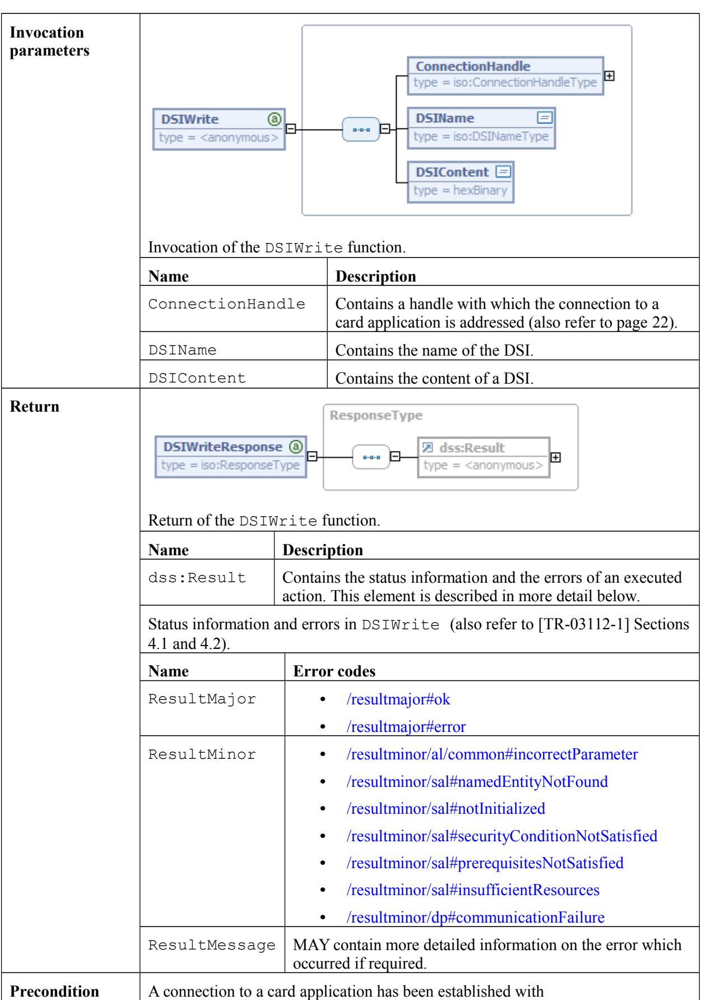

|                          | CardApplicationConnect. In addition a data set was selected with<br>DataSetSelect. The DSI has been created. |        |                                                                                                                   |  |
|--------------------------|--------------------------------------------------------------------------------------------------------------|--------|-------------------------------------------------------------------------------------------------------------------|--|
| Postcondition            | The content of the DSI has been updated.                                                                     |        |                                                                                                                   |  |
| Note                     |                                                                                                              |        |                                                                                                                   |  |
| 3.4.9<br>DSIRead         |                                                                                                              |        |                                                                                                                   |  |
| Name                     | DSIRead                                                                                                      |        |                                                                                                                   |  |
| Description              | The DSIRead function reads out the content of a specific DSI (Data Structure for<br>Interoperability).       |        |                                                                                                                   |  |
| Invocation<br>parameters |                                                                                                              |        |                                                                                                                   |  |
|                          | Invocation of the DSIRead function.                                                                          |        |                                                                                                                   |  |
|                          | Name                                                                                                         |        | Description                                                                                                       |  |
|                          | ConnectionHandle                                                                                             |        | Contains a handle with which the connection to a<br>card application is addressed (also refer to page 22).        |  |
|                          | DSIName                                                                                                      |        | Contains the name of the DSI of which the content is<br>to be read out.                                           |  |
| Return                   |                                                                                                              |        |                                                                                                                   |  |
|                          | Return of the DSIRead function.                                                                              |        |                                                                                                                   |  |
|                          | Name<br>Description                                                                                          |        |                                                                                                                   |  |
|                          | dss:Result                                                                                                   | below. | Contains the status information and the errors of an<br>executed action. This element is described in more detail |  |
|                          | DSIContent                                                                                                   |        | Contains the content of the DSI if it was possible to read it.                                                    |  |

|               | Status information and errors in DSIRead (also refer to [TR-03112-1] Sections<br>4.1 and 4.2).                                                     |                                                                                   |
|---------------|----------------------------------------------------------------------------------------------------------------------------------------------------|-----------------------------------------------------------------------------------|
|               | Name                                                                                                                                               | Error codes                                                                       |
|               | ResultMajor                                                                                                                                        | •<br>/resultmajor#ok                                                              |
|               |                                                                                                                                                    | •<br>/resultmajor#error                                                           |
|               | ResultMinor                                                                                                                                        | •<br>/resultminor/al/common#incorrectParameter                                    |
|               |                                                                                                                                                    | •<br>/resultminor/sal#namedEntityNotFound                                         |
|               |                                                                                                                                                    | •<br>/resultminor/sal#notInitialized                                              |
|               |                                                                                                                                                    | •<br>/resultminor/sal#securityConditionNotSatisfied                               |
|               |                                                                                                                                                    | •<br>/resultminor/sal#prerequisitesNotSatisfied                                   |
|               |                                                                                                                                                    | •<br>/resultminor/dp#communicationFailure                                         |
|               | ResultMessage                                                                                                                                      | MAY contain more detailed information on the error which<br>occurred if required. |
| Precondition  | A connection to a card application has been established with<br>CardApplicationConnect. In addition a data set was selected with<br>DataSetSelect. |                                                                                   |
| Postcondition |                                                                                                                                                    |                                                                                   |
| Note          |                                                                                                                                                    |                                                                                   |

### <span id="page-56-0"></span>**3.5 Crypto Services**

#### **3.5.1 Encipher**

| Name                     | Encipher                                                                                                                                                                                                                                                                                                   |
|--------------------------|------------------------------------------------------------------------------------------------------------------------------------------------------------------------------------------------------------------------------------------------------------------------------------------------------------|
| Description              | The Encipher function encrypts a transmitted plain text. The detailed behaviour<br>of this function depends on the protocol of the DID. Refer to [TR-03112-7] for<br>protocol specifications and in particular the specification of the "Generic<br>cryptography" protocol in Section 3.5 of [TR-03112-7]. |
| Invocation<br>parameters | Invocation of the Encipher function.                                                                                                                                                                                                                                                                       |

|        | Name                             | Description                                                                                                                 |
|--------|----------------------------------|-----------------------------------------------------------------------------------------------------------------------------|
|        | ConnectionHandle                 | Contains a handle with which the connection to a card<br>application is addressed.                                          |
|        | DIDScope                         | Resolves any ambiguity between local and global<br>DIDs with the same name.                                                 |
|        | DIDName                          | Contains the name of the DID which is used for<br>encryption.                                                               |
|        | PlainText                        | Contains the plain text which is to be encrypted.                                                                           |
| Return |                                  |                                                                                                                             |
|        | Return of the Encipher function. |                                                                                                                             |
|        | Name                             | Description                                                                                                                 |
|        | dss:Result                       | Contains the status information and the errors of an<br>executed action. This element is described in more detail<br>below. |
|        | CipherText                       | Contains the cipher text if it was possible to encrypt the<br>plain text.                                                   |
|        | 4.1 and 4.2).                    | Status information and errors in Encipher (also refer to [TR-03112-1] Sections                                              |
|        | Name                             | Error codes                                                                                                                 |
|        | ResultMajor                      | •<br>/resultmajor#ok                                                                                                        |
|        |                                  | •<br>/resultmajor#error                                                                                                     |
|        | ResultMinor                      | •<br>/resultminor/al/common#incorrectParameter                                                                              |
|        |                                  | •<br>/resultminor/sal#namedEntityNotFound                                                                                   |
|        |                                  | •<br>/resultminor/sal#protocolNotRecognized                                                                                 |
|        |                                  | •<br>/resultminor/sal#inappropriateProtocolForAction                                                                        |
|        |                                  | •<br>/resultminor/sal#notInitialized                                                                                        |
|        |                                  | •<br>/resultminor/sal#securityConditionNotSatisfied                                                                         |
|        |                                  | •<br>/resultminor/sal#insufficientResources                                                                                 |
|        |                                  | •<br>/resultminor/dp#communicationFailure                                                                                   |
|        |                                  | In addition, other protocol specific error messages MAY<br>exist.                                                           |
|        | ResultMessage                    | MAY contain more detailed information on the error<br>which occurred if required.                                           |

| Precondition             | CardApplicationConnect.                                                                                                                                                                                                                                                                               | A connection to a card application has been established with                                                                |  |
|--------------------------|-------------------------------------------------------------------------------------------------------------------------------------------------------------------------------------------------------------------------------------------------------------------------------------------------------|-----------------------------------------------------------------------------------------------------------------------------|--|
| Postcondition            |                                                                                                                                                                                                                                                                                                       |                                                                                                                             |  |
| Note                     |                                                                                                                                                                                                                                                                                                       |                                                                                                                             |  |
| 3.5.2<br>Decipher        |                                                                                                                                                                                                                                                                                                       |                                                                                                                             |  |
| Name                     | Decipher                                                                                                                                                                                                                                                                                              |                                                                                                                             |  |
| Description              | The Decipher function decrypts a given cipher text. The detailed behaviour of<br>this function depends on the protocol of the DID. Refer to [TR-03112-7] for<br>protocol specifications and in particular the specification of the "Generic<br>cryptography" protocol in Section 3.5 of [TR-03112-7]. |                                                                                                                             |  |
| Invocation<br>parameters | Invocation of the Decipher function.                                                                                                                                                                                                                                                                  |                                                                                                                             |  |
|                          | Name                                                                                                                                                                                                                                                                                                  | Description                                                                                                                 |  |
|                          | ConnectionHandle                                                                                                                                                                                                                                                                                      | Contains a handle with which the connection to a card<br>application is addressed (also refer to page<br>ConnectionHandle). |  |
|                          | DIDScope                                                                                                                                                                                                                                                                                              | Resolves any ambiguity between local and global DIDs<br>with the same name.                                                 |  |
|                          | DIDName                                                                                                                                                                                                                                                                                               | Contains the name of the DID which is to be used for<br>decryption.                                                         |  |
|                          | CipherText                                                                                                                                                                                                                                                                                            | Contains the cipher text which is to be decrypted.                                                                          |  |
| Return                   |                                                                                                                                                                                                                                                                                                       |                                                                                                                             |  |
|                          | Return of the Decipher function.<br>Name                                                                                                                                                                                                                                                              | Description                                                                                                                 |  |

|               | dss:Result                                                                                      | Contains the status information and the errors of<br>an executed action. This element is described in<br>more detail below. |
|---------------|-------------------------------------------------------------------------------------------------|-----------------------------------------------------------------------------------------------------------------------------|
|               | PlainText                                                                                       | Contains the plain text if decryption was possible.                                                                         |
|               | Status information and errors in Decipher (also refer to [TR-03112-1] Sections<br>4.1 and 4.2). |                                                                                                                             |
|               | Name                                                                                            | Error codes                                                                                                                 |
|               | ResultMajor                                                                                     | •<br>/resultmajor#ok                                                                                                        |
|               |                                                                                                 | •<br>/resultmajor#error                                                                                                     |
|               | ResultMinor                                                                                     | •<br>/resultminor/al/common#incorrectParameter                                                                              |
|               |                                                                                                 | •<br>/resultminor/sal#namedEntityNotFound                                                                                   |
|               |                                                                                                 | •<br>/resultminor/sal#protocolNotRecognized                                                                                 |
|               |                                                                                                 | •<br>/resultminor/sal#inappropriateProtocolForAction                                                                        |
|               |                                                                                                 | •<br>/resultminor/sal#notInitialized                                                                                        |
|               |                                                                                                 | •<br>/resultminor/sal#securityConditionNotSatisfied                                                                         |
|               |                                                                                                 | •<br>/resultminor/sal#insufficientResources                                                                                 |
|               |                                                                                                 | •<br>/resultminor/dp#communicationFailure                                                                                   |
|               |                                                                                                 | In addition, other protocol specific error messages MAY<br>exist.                                                           |
|               | ResultMessage                                                                                   | MAY contain more detailed information on the error<br>which occurred if required.                                           |
| Precondition  | A connection to a card application has been established with<br>CardApplicationConnect.         |                                                                                                                             |
| Postcondition |                                                                                                 |                                                                                                                             |
| Note          | MAY be implicitly initiated.                                                                    | If additional authentication steps are necessary for access to the stated DID, these                                        |
|               |                                                                                                 |                                                                                                                             |

#### **3.5.3 GetRandom**

| Name        | GetRandom                                                                                                                                                                                                                                                        |
|-------------|------------------------------------------------------------------------------------------------------------------------------------------------------------------------------------------------------------------------------------------------------------------|
| Description | The GetRandom function returns a random number which is suitable for<br>authentication with the DID addressed with DIDName. The detailed behaviour of<br>this function depends on the protocol of the DID. Refer to [TR-03112-7] for<br>protocol specifications. |

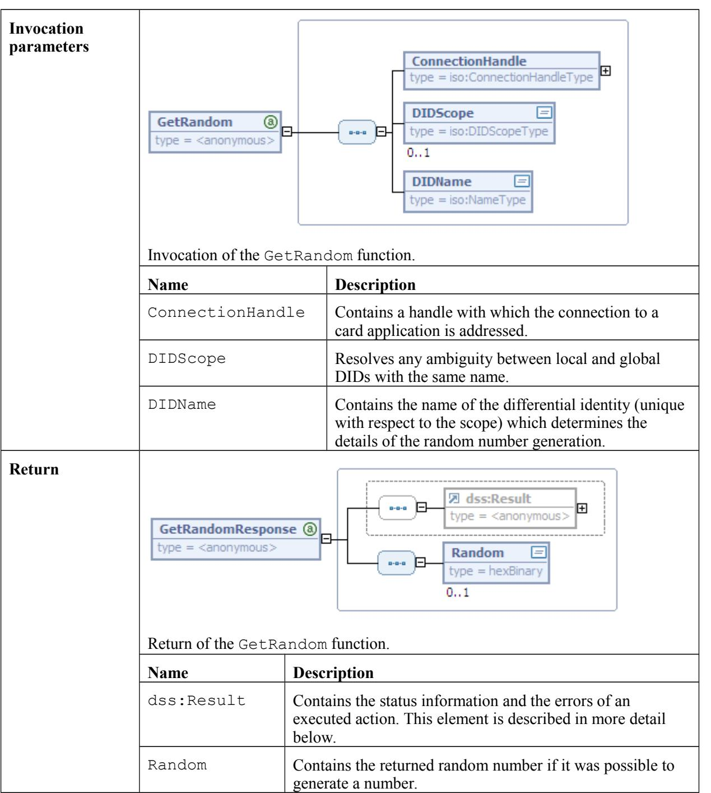

|               | Status information and errors in GetRandom (also refer to [TR-03112-1]<br>Sections 4.1 and 4.2). |                                                                                   |
|---------------|--------------------------------------------------------------------------------------------------|-----------------------------------------------------------------------------------|
|               | Name                                                                                             | Error codes                                                                       |
|               | ResultMajor                                                                                      | •<br>/resultmajor#ok                                                              |
|               |                                                                                                  | •<br>/resultmajor#error                                                           |
|               | ResultMinor                                                                                      | •<br>/resultminor/al/common#incorrectParameter                                    |
|               |                                                                                                  | •<br>/resultminor/sal#namedEntityNotFound                                         |
|               |                                                                                                  | •<br>/resultminor/sal#protocolNotRecognized                                       |
|               |                                                                                                  | •<br>/resultminor/sal#inappropriateProtocolForAction                              |
|               |                                                                                                  | •<br>/resultminor/sal#notInitialized                                              |
|               |                                                                                                  | •<br>/resultminor/sal#securityConditionNotSatisfied                               |
|               |                                                                                                  | •<br>/resultminor/sal#insufficientResources                                       |
|               |                                                                                                  | •<br>/resultminor/dp#communicationFailure                                         |
|               |                                                                                                  | In addition, other protocol specific error messages MAY<br>exist.                 |
|               | ResultMessage                                                                                    | MAY contain more detailed information on the error which<br>occurred if required. |
| Precondition  | A connection to a card application has been established with<br>CardApplicationConnect.          |                                                                                   |
| Postcondition |                                                                                                  |                                                                                   |
| Note          |                                                                                                  |                                                                                   |
| 3.5.4<br>Hash |                                                                                                  |                                                                                   |

| Name                     | Hash                                                                                                                                                                                                                                                                                                                    |
|--------------------------|-------------------------------------------------------------------------------------------------------------------------------------------------------------------------------------------------------------------------------------------------------------------------------------------------------------------------|
| Description              | The Hash function calculates the hash value of a transmitted message. The<br>detailed behaviour of this function depends on the protocol of the DID. Refer to<br>[TR-03112-7] for protocol specifications and in particular the specification of the<br>"Generic cryptography" protocol in Section 3.5 of [TR-03112-7]. |
| Invocation<br>parameters | Invocation of the Hash function.                                                                                                                                                                                                                                                                                        |

|        | Name                | Description                                                                                                              |  |
|--------|---------------------|--------------------------------------------------------------------------------------------------------------------------|--|
|        | ConnectionHandle    | Contains a handle with which the connection to a card<br>application is addressed (also refer to page 22).               |  |
|        | DIDScope            | Resolves any ambiguity between local and global DIDs<br>with the same name.                                              |  |
|        | DIDName             | Contains the name of the DID which should be used to<br>create the hash value.                                           |  |
|        | Message             | Contains the message for which the hash value is to be<br>calculated.                                                    |  |
| Return |                     |                                                                                                                          |  |
|        |                     | Return of the Hash function.                                                                                             |  |
|        | Name<br>Description |                                                                                                                          |  |
|        | dss:Result          | Contains the status information and the errors of an executed<br>action. This element is described in more detail below. |  |
|        | Hash<br>a value.    | Contains the calculated hash value if it was possible to calculate                                                       |  |
|        | and 4.2).           | Status information and errors in Hash (also refer to [TR-03112-1] Sections 4.1                                           |  |
|        | Name                | Error codes                                                                                                              |  |
|        | ResultMajor         | •<br>/resultmajor#ok                                                                                                     |  |
|        |                     | •<br>/resultmajor#error                                                                                                  |  |
|        | ResultMinor         | •<br>/resultminor/al/common#incorrectParameter                                                                           |  |
|        |                     | •<br>/resultminor/sal#namedEntityNotFound                                                                                |  |
|        |                     | •<br>/resultminor/sal#protocolNotRecognized                                                                              |  |
|        |                     | •<br>/resultminor/sal#inappropriateProtocolForAction                                                                     |  |
|        |                     | •<br>/resultminor/sal#notInitialized                                                                                     |  |
|        |                     | •<br>/resultminor/sal#securityConditionNotSatisfied                                                                      |  |
|        |                     | •<br>/resultminor/sal#insufficientResources                                                                              |  |
|        |                     | •<br>/resultminor/dp#communicationFailure                                                                                |  |
|        |                     | In addition, other protocol specific error messages MAY<br>exist.                                                        |  |
|        | ResultMessage       | MAY contain more detailed information on the error<br>which occurred if required.                                        |  |

<span id="page-63-0"></span>

| Precondition             | A connection to a card application has been established with<br>CardApplicationConnect.                                                                                                                                                                                                          |                                                                                                                                                                                                                                                                 |
|--------------------------|--------------------------------------------------------------------------------------------------------------------------------------------------------------------------------------------------------------------------------------------------------------------------------------------------|-----------------------------------------------------------------------------------------------------------------------------------------------------------------------------------------------------------------------------------------------------------------|
| Postcondition            |                                                                                                                                                                                                                                                                                                  |                                                                                                                                                                                                                                                                 |
| Note                     |                                                                                                                                                                                                                                                                                                  |                                                                                                                                                                                                                                                                 |
| 3.5.5<br>Sign            |                                                                                                                                                                                                                                                                                                  |                                                                                                                                                                                                                                                                 |
| Name                     | Sign                                                                                                                                                                                                                                                                                             |                                                                                                                                                                                                                                                                 |
| Description              | The Sign function signs a transmitted message. The detailed behaviour of this<br>function depends on the protocol of the DID. Refer to [TR-03112-7] for protocol<br>specifications and in particular the specification of the "Generic cryptography"<br>protocol in Section 3.5 of [TR-03112-7]. |                                                                                                                                                                                                                                                                 |
| Invocation<br>parameters |                                                                                                                                                                                                                                                                                                  |                                                                                                                                                                                                                                                                 |
|                          | Invocation of the Sign function.                                                                                                                                                                                                                                                                 |                                                                                                                                                                                                                                                                 |
|                          | Name                                                                                                                                                                                                                                                                                             | Description                                                                                                                                                                                                                                                     |
|                          | ConnectionHandle                                                                                                                                                                                                                                                                                 | Contains a handle with which the connection to a card<br>application is addressed (also refer to page 22).                                                                                                                                                      |
|                          | DIDScope                                                                                                                                                                                                                                                                                         | Resolves any ambiguity between local and global DIDs<br>with the same name.                                                                                                                                                                                     |
|                          | DIDName                                                                                                                                                                                                                                                                                          | Contains the name of the differential identity with<br>which the transmitted message should be signed.                                                                                                                                                          |
|                          | Message                                                                                                                                                                                                                                                                                          | Contains the data which are to be signed. It MAY be<br>determined with the respective protocol specifications<br>whether a hash value has to be calculated on the basis<br>of the data and which padding process is to be used<br>(also refer to [TR-03112-7]). |

| Return                           | Return of the Sign function.<br>Name<br>dss:Result<br>Signature                                                                                                                                                                                                                                                                 | Description<br>Contains the status information and the errors of an executed<br>action. This element is described in more detail below.<br>Contains the signature if successful.                                                                                                                                                                                                                                                                                                                                               |
|----------------------------------|---------------------------------------------------------------------------------------------------------------------------------------------------------------------------------------------------------------------------------------------------------------------------------------------------------------------------------|--------------------------------------------------------------------------------------------------------------------------------------------------------------------------------------------------------------------------------------------------------------------------------------------------------------------------------------------------------------------------------------------------------------------------------------------------------------------------------------------------------------------------------|
|                                  | Status information and errors in Sign (also refer to [TR-03112-1] Sections 4.1<br>and 4.2).                                                                                                                                                                                                                                     |                                                                                                                                                                                                                                                                                                                                                                                                                                                                                                                                |
|                                  | Name                                                                                                                                                                                                                                                                                                                            | Error codes                                                                                                                                                                                                                                                                                                                                                                                                                                                                                                                    |
|                                  | ResultMajor                                                                                                                                                                                                                                                                                                                     | •<br>/resultmajor#ok<br>•<br>/resultmajor#error                                                                                                                                                                                                                                                                                                                                                                                                                                                                                |
|                                  | ResultMinor<br>ResultMessage                                                                                                                                                                                                                                                                                                    | •<br>/resultminor/al/common#incorrectParameter<br>•<br>/resultminor/sal#namedEntityNotFound<br>•<br>/resultminor/sal#protocolNotRecognized<br>•<br>/resultminor/sal#inappropriateProtocolForAction<br>•<br>/resultminor/sal#notInitialized<br>•<br>/resultminor/sal#securityConditionNotSatisfied<br>•<br>/resultminor/sal#insufficientResources<br>•<br>/resultminor/dp#communicationFailure<br>In addition, other protocol specific error messages MAY<br>exist.<br>MAY contain more detailed information on the error which |
| Precondition                     | occurred if required.<br>A connection to a card application has been established with                                                                                                                                                                                                                                           |                                                                                                                                                                                                                                                                                                                                                                                                                                                                                                                                |
|                                  | CardApplicationConnect.                                                                                                                                                                                                                                                                                                         |                                                                                                                                                                                                                                                                                                                                                                                                                                                                                                                                |
| Postcondition                    |                                                                                                                                                                                                                                                                                                                                 |                                                                                                                                                                                                                                                                                                                                                                                                                                                                                                                                |
| Note<br>3.5.6<br>VerifySignature |                                                                                                                                                                                                                                                                                                                                 |                                                                                                                                                                                                                                                                                                                                                                                                                                                                                                                                |
| Name                             |                                                                                                                                                                                                                                                                                                                                 |                                                                                                                                                                                                                                                                                                                                                                                                                                                                                                                                |
| Description                      | VerifySignature<br>The VerifySignature function verifies a digital signature. The detailed<br>behaviour of this function depends on the protocol of the DID. Refer to<br>[TR-03112-7] for protocol specifications and in particular the specification of the<br>"Generic cryptography" protocol in Section 3.5 of [TR-03112-7]. |                                                                                                                                                                                                                                                                                                                                                                                                                                                                                                                                |

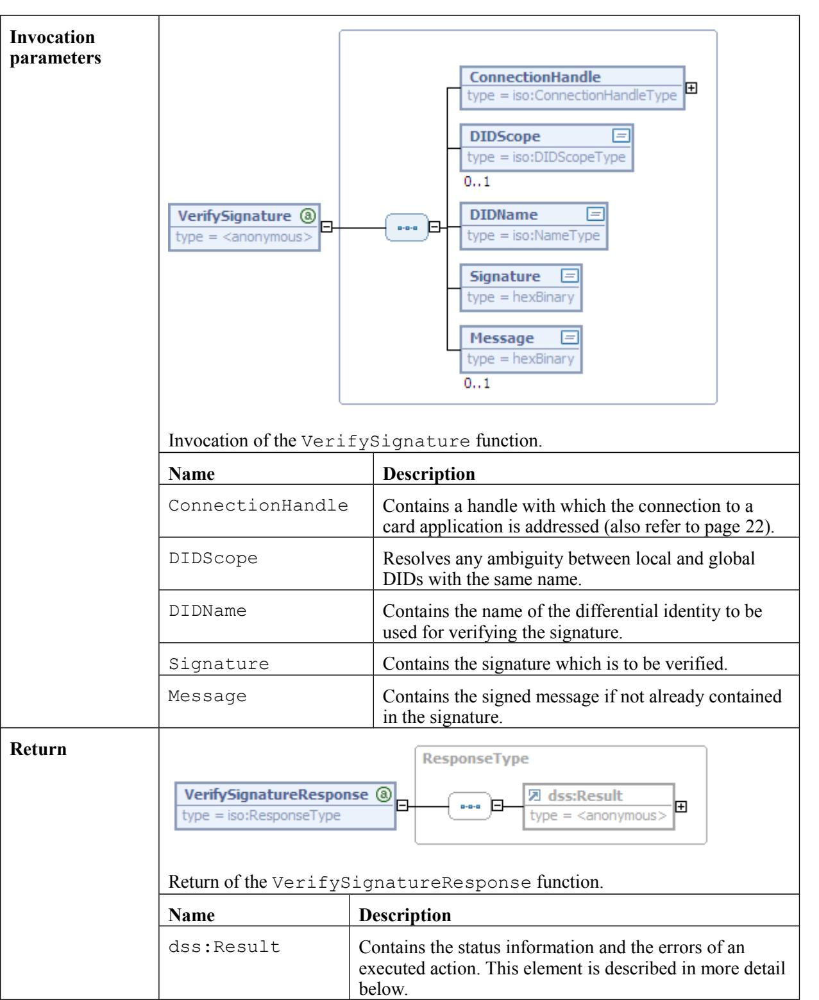

|                            | Status information and errors in VerifySignature (also refer to<br>[TR-03112-1] Sections 4.1 and 4.2). |                                                                                   |
|----------------------------|--------------------------------------------------------------------------------------------------------|-----------------------------------------------------------------------------------|
|                            | Name                                                                                                   | Error codes                                                                       |
|                            | ResultMajor                                                                                            | •<br>/resultmajor#ok                                                              |
|                            |                                                                                                        | •<br>/resultmajor#error                                                           |
|                            | ResultMinor                                                                                            | •<br>/resultminor/al/common#incorrectParameter                                    |
|                            |                                                                                                        | •<br>/resultminor/sal#namedEntityNotFound                                         |
|                            |                                                                                                        | •<br>/resultminor/sal#protocolNotRecognized                                       |
|                            |                                                                                                        | •<br>/resultminor/sal#inappropriateProtocolForAction                              |
|                            |                                                                                                        | •<br>/resultminor/sal#notInitialized                                              |
|                            |                                                                                                        | •<br>/resultminor/sal#securityConditionNotSatisfied                               |
|                            |                                                                                                        | •<br>/resultminor/sal#insufficientResources                                       |
|                            |                                                                                                        | •<br>/resultminor/dp#communicationFailure                                         |
|                            |                                                                                                        | In addition, other protocol specific error messages MAY<br>exist.                 |
|                            | ResultMessage                                                                                          | MAY contain more detailed information on the error which<br>occurred if required. |
| Precondition               | A connection to a card application has been established with<br>CardApplicationConnect.                |                                                                                   |
| Postcondition              |                                                                                                        |                                                                                   |
| Note                       |                                                                                                        |                                                                                   |
| 3.5.7<br>VerifyCertificate |                                                                                                        |                                                                                   |
| Name                       | VerifyCertificate                                                                                      |                                                                                   |

| Name        | VerifyCertificate                                                                                                                                                                                                                                                                                               |
|-------------|-----------------------------------------------------------------------------------------------------------------------------------------------------------------------------------------------------------------------------------------------------------------------------------------------------------------|
| Description | The VerifyCertificate function validates a given certificate. The detailed<br>behaviour of this function depends on the protocol of the DID. Refer to<br>[TR-03112-7] for protocol specifications and in particular the specification of the<br>"Generic cryptography" protocol in Section 3.5 of [TR-03112-7]. |

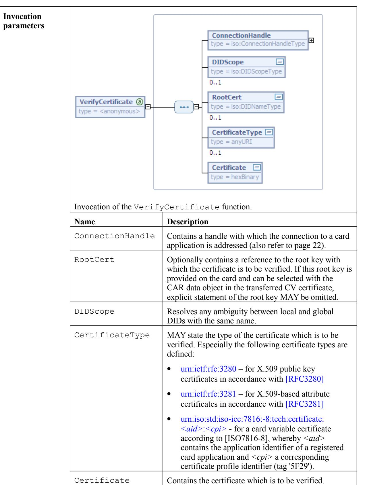

| Return<br>Return of the VerifyCertificate function.<br>Name<br>Description<br>dss:Result<br>Contains the status information and the errors of<br>an executed action. This element is described in<br>more detail below.<br>Status information and errors in VerifyCertificate (also refer to<br>[TR-03112-1] Sections 4.1 and 4.2).<br>Name<br>Error codes<br>ResultMajor<br>•<br>/resultmajor#ok<br>•<br>/resultmajor#error<br>ResultMinor<br>•<br>/resultminor/al/common#incorrectParameter<br>•<br>/resultminor/sal#namedEntityNotFound<br>•<br>/resultminor/sal#invalidKey<br>•<br>/resultminor/sal#invalidSignature<br>•<br>/resultminor/sal#protocolNotRecognized<br>•<br>/resultminor/sal#inappropriateProtocolForAction<br>•<br>/resultminor/sal#notInitialized<br>•<br>/resultminor/sal#securityConditionNotSatisfied<br>•<br>/resultminor/sal#insufficientResources<br>•<br>/resultminor/dp#communicationFailure<br>In addition, other protocol specific error messages MAY<br>exist.<br>MAY contain more detailed information on the error which<br>ResultMessage<br>occurred if required.<br>Precondition<br>A connection to a card application has been established with<br>CardApplicationConnect.<br>Postcondition<br>Note |  |  |  |  |  |
|-------------------------------------------------------------------------------------------------------------------------------------------------------------------------------------------------------------------------------------------------------------------------------------------------------------------------------------------------------------------------------------------------------------------------------------------------------------------------------------------------------------------------------------------------------------------------------------------------------------------------------------------------------------------------------------------------------------------------------------------------------------------------------------------------------------------------------------------------------------------------------------------------------------------------------------------------------------------------------------------------------------------------------------------------------------------------------------------------------------------------------------------------------------------------------------------------------------------------------------------|--|--|--|--|--|
|                                                                                                                                                                                                                                                                                                                                                                                                                                                                                                                                                                                                                                                                                                                                                                                                                                                                                                                                                                                                                                                                                                                                                                                                                                           |  |  |  |  |  |
|                                                                                                                                                                                                                                                                                                                                                                                                                                                                                                                                                                                                                                                                                                                                                                                                                                                                                                                                                                                                                                                                                                                                                                                                                                           |  |  |  |  |  |
|                                                                                                                                                                                                                                                                                                                                                                                                                                                                                                                                                                                                                                                                                                                                                                                                                                                                                                                                                                                                                                                                                                                                                                                                                                           |  |  |  |  |  |
|                                                                                                                                                                                                                                                                                                                                                                                                                                                                                                                                                                                                                                                                                                                                                                                                                                                                                                                                                                                                                                                                                                                                                                                                                                           |  |  |  |  |  |
|                                                                                                                                                                                                                                                                                                                                                                                                                                                                                                                                                                                                                                                                                                                                                                                                                                                                                                                                                                                                                                                                                                                                                                                                                                           |  |  |  |  |  |
|                                                                                                                                                                                                                                                                                                                                                                                                                                                                                                                                                                                                                                                                                                                                                                                                                                                                                                                                                                                                                                                                                                                                                                                                                                           |  |  |  |  |  |
|                                                                                                                                                                                                                                                                                                                                                                                                                                                                                                                                                                                                                                                                                                                                                                                                                                                                                                                                                                                                                                                                                                                                                                                                                                           |  |  |  |  |  |
|                                                                                                                                                                                                                                                                                                                                                                                                                                                                                                                                                                                                                                                                                                                                                                                                                                                                                                                                                                                                                                                                                                                                                                                                                                           |  |  |  |  |  |
|                                                                                                                                                                                                                                                                                                                                                                                                                                                                                                                                                                                                                                                                                                                                                                                                                                                                                                                                                                                                                                                                                                                                                                                                                                           |  |  |  |  |  |
|                                                                                                                                                                                                                                                                                                                                                                                                                                                                                                                                                                                                                                                                                                                                                                                                                                                                                                                                                                                                                                                                                                                                                                                                                                           |  |  |  |  |  |
|                                                                                                                                                                                                                                                                                                                                                                                                                                                                                                                                                                                                                                                                                                                                                                                                                                                                                                                                                                                                                                                                                                                                                                                                                                           |  |  |  |  |  |
|                                                                                                                                                                                                                                                                                                                                                                                                                                                                                                                                                                                                                                                                                                                                                                                                                                                                                                                                                                                                                                                                                                                                                                                                                                           |  |  |  |  |  |
|                                                                                                                                                                                                                                                                                                                                                                                                                                                                                                                                                                                                                                                                                                                                                                                                                                                                                                                                                                                                                                                                                                                                                                                                                                           |  |  |  |  |  |
|                                                                                                                                                                                                                                                                                                                                                                                                                                                                                                                                                                                                                                                                                                                                                                                                                                                                                                                                                                                                                                                                                                                                                                                                                                           |  |  |  |  |  |
|                                                                                                                                                                                                                                                                                                                                                                                                                                                                                                                                                                                                                                                                                                                                                                                                                                                                                                                                                                                                                                                                                                                                                                                                                                           |  |  |  |  |  |
|                                                                                                                                                                                                                                                                                                                                                                                                                                                                                                                                                                                                                                                                                                                                                                                                                                                                                                                                                                                                                                                                                                                                                                                                                                           |  |  |  |  |  |
|                                                                                                                                                                                                                                                                                                                                                                                                                                                                                                                                                                                                                                                                                                                                                                                                                                                                                                                                                                                                                                                                                                                                                                                                                                           |  |  |  |  |  |
|                                                                                                                                                                                                                                                                                                                                                                                                                                                                                                                                                                                                                                                                                                                                                                                                                                                                                                                                                                                                                                                                                                                                                                                                                                           |  |  |  |  |  |
|                                                                                                                                                                                                                                                                                                                                                                                                                                                                                                                                                                                                                                                                                                                                                                                                                                                                                                                                                                                                                                                                                                                                                                                                                                           |  |  |  |  |  |
|                                                                                                                                                                                                                                                                                                                                                                                                                                                                                                                                                                                                                                                                                                                                                                                                                                                                                                                                                                                                                                                                                                                                                                                                                                           |  |  |  |  |  |
|                                                                                                                                                                                                                                                                                                                                                                                                                                                                                                                                                                                                                                                                                                                                                                                                                                                                                                                                                                                                                                                                                                                                                                                                                                           |  |  |  |  |  |
|                                                                                                                                                                                                                                                                                                                                                                                                                                                                                                                                                                                                                                                                                                                                                                                                                                                                                                                                                                                                                                                                                                                                                                                                                                           |  |  |  |  |  |

### <span id="page-68-0"></span>**3.6 Differential Identity Services**

#### **3.6.1 DIDList**

**Name DIDList**

<span id="page-69-0"></span>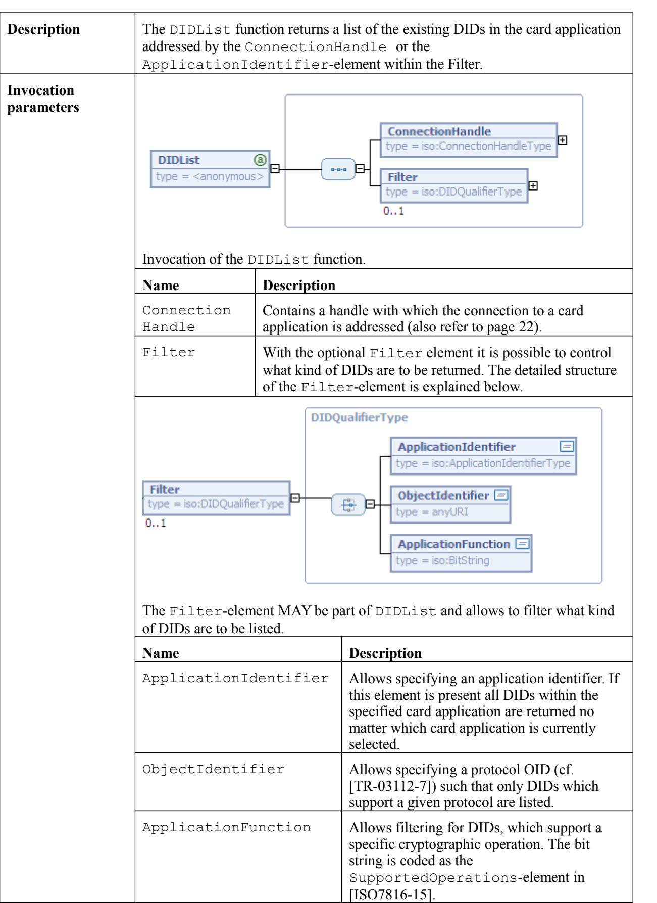

| Return        | Return of the DIDList function. |                  |                                                                                                                                                                        |
|---------------|---------------------------------|------------------|------------------------------------------------------------------------------------------------------------------------------------------------------------------------|
|               | Name                            | Description      |                                                                                                                                                                        |
|               | dss:Result                      | below.           | Contains the status information and the errors of an<br>executed action. This element is described in more detail                                                      |
|               | DIDNameList                     |                  | Contains the list of the names of the differential identities<br>as specified by the Filter-element.                                                                   |
|               |                                 |                  |                                                                                                                                                                        |
|               |                                 |                  | DIDNameList is part of DIDListResponse.                                                                                                                                |
|               | Name                            |                  | Description                                                                                                                                                            |
|               | DIDName                         |                  | Contains the name of the differential identity.                                                                                                                        |
|               | 4.1 and 4.2).                   |                  | Status information and errors in DIDList (also refer to [TR-03112-1] Sections                                                                                          |
|               | Name                            | Error codes      |                                                                                                                                                                        |
|               | ResultMajor                     | •<br>•           | /resultmajor#ok<br>/resultmajor#error                                                                                                                                  |
|               | ResultMinor                     | •<br>•<br>•<br>• | /resultminor/al/common#incorrectParameter<br>/resultminor/sal#notInitialized<br>/resultminor/sal#securityConditionNotSatisfied<br>/resultminor/dp#communicationFailure |
|               | ResultMessage                   |                  | MAY contain more detailed information on the error<br>which occurred if required.                                                                                      |
| Precondition  | CardApplicationConnect.         |                  | A connection to a card application has been established with                                                                                                           |
| Postcondition |                                 |                  |                                                                                                                                                                        |
| Note          | or the CardInfo file.           |                  | The DIDs in a card application are contained in the application capability<br>description (also refer to [ISO24727-2]), in a [ISO7816-15] structure on the card        |

#### **3.6.2 DIDCreate**

<span id="page-71-0"></span>

| Name                     | DIDCreate                                                                                                              |                                                                                                                                                                                                                                                                                                                                                                                                                                                                                                                                                                                                                                                          |  |  |
|--------------------------|------------------------------------------------------------------------------------------------------------------------|----------------------------------------------------------------------------------------------------------------------------------------------------------------------------------------------------------------------------------------------------------------------------------------------------------------------------------------------------------------------------------------------------------------------------------------------------------------------------------------------------------------------------------------------------------------------------------------------------------------------------------------------------------|--|--|
| Description              | The DIDCreate function creates a new differential identity in the card<br>application addressed with ConnectionHandle. |                                                                                                                                                                                                                                                                                                                                                                                                                                                                                                                                                                                                                                                          |  |  |
| Invocation<br>parameters | Invocation of the DIDCreate function.                                                                                  |                                                                                                                                                                                                                                                                                                                                                                                                                                                                                                                                                                                                                                                          |  |  |
|                          | Name                                                                                                                   | Description                                                                                                                                                                                                                                                                                                                                                                                                                                                                                                                                                                                                                                              |  |  |
|                          | ConnectionHandle                                                                                                       | Contains a handle with which the connection to a card<br>application is addressed (refer to page 22).                                                                                                                                                                                                                                                                                                                                                                                                                                                                                                                                                    |  |  |
|                          | DIDName                                                                                                                | Contains the name of the differential identity.                                                                                                                                                                                                                                                                                                                                                                                                                                                                                                                                                                                                          |  |  |
|                          | DIDUpdateData                                                                                                          | Contains information which is necessary for generating<br>a DID with the protocol stated as an attribute. The<br>DIDUpdateDataType serves as a generic template<br>for the definition of DIDUpdateData-elements for<br>specific authentication protocols (refer to<br>[TR-03112-7]). This type is defined as follows:<br><complexType name="DIDUpdateDataType"<br>abstract="true"><br><complexContent><br><extension base="anyType"><br><attribute name="Protocol" type="anyURI"<br>use="required"/><br></extension><br></complexContent><br></complexType><br>The detailed structure depends on the authentication<br>protocol (refer to [TR-03112-7]). |  |  |
|                          | DIDACL                                                                                                                 | Contains an access control list for the DID. Further<br>details on the AccessControlListType are given<br>on page 31.                                                                                                                                                                                                                                                                                                                                                                                                                                                                                                                                    |  |  |

| Return          |                                                                                                  |  |                                                                                                                                                                                                                                            |
|-----------------|--------------------------------------------------------------------------------------------------|--|--------------------------------------------------------------------------------------------------------------------------------------------------------------------------------------------------------------------------------------------|
|                 | Return of the DIDCreate function.                                                                |  |                                                                                                                                                                                                                                            |
|                 | Name                                                                                             |  | Description                                                                                                                                                                                                                                |
|                 | dss:Result                                                                                       |  | Contains the status information and the errors of an executed<br>action. This element is described in more detail below.                                                                                                                   |
|                 | Status information and errors in DIDCreate (also refer to [TR-03112-1] Sections<br>4.1 and 4.2). |  |                                                                                                                                                                                                                                            |
|                 | Name                                                                                             |  | Error codes                                                                                                                                                                                                                                |
|                 | ResultMajor                                                                                      |  | •<br>/resultmajor#ok                                                                                                                                                                                                                       |
|                 |                                                                                                  |  | •<br>/resultmajor#error                                                                                                                                                                                                                    |
|                 | ResultMinor                                                                                      |  | •<br>/resultminor/al/common#incorrectParameter                                                                                                                                                                                             |
|                 |                                                                                                  |  | •<br>/resultminor/sal#nameExists                                                                                                                                                                                                           |
|                 |                                                                                                  |  | •<br>/resultminor/sal#protocolNotRecognized                                                                                                                                                                                                |
|                 |                                                                                                  |  | •<br>/resultminor/sal#notInitialized                                                                                                                                                                                                       |
|                 |                                                                                                  |  | •<br>/resultminor/sal#securityConditionNotSatisfied                                                                                                                                                                                        |
|                 |                                                                                                  |  | •<br>/resultminor/sal#insufficientResources                                                                                                                                                                                                |
|                 |                                                                                                  |  | •<br>/resultminor/dp#communicationFailure                                                                                                                                                                                                  |
|                 |                                                                                                  |  | In addition, other protocol specific error messages MAY<br>exist.                                                                                                                                                                          |
|                 | ResultMessage                                                                                    |  | MAY contain more detailed information on the error<br>which occurred if required.                                                                                                                                                          |
| Precondition    | CardApplicationConnect.                                                                          |  | A connection to a card application has been established with                                                                                                                                                                               |
| Postcondition   |                                                                                                  |  | The corresponding differential identity is available on the eCard.                                                                                                                                                                         |
| Note            | CardInfo file.                                                                                   |  | The newly created DID MUST be noted in the application capability description<br>(also refer to [ISO24727-2]), in a [ISO7816-15] structure on the card or the                                                                              |
|                 |                                                                                                  |  | With this function no optional DIDScope parameter is provided intentionally.<br>Only one DID can be created in the currently selected card application. The "alpha<br>card application" must therefore be selected to create a global DID. |
|                 | applications are local.                                                                          |  | Information on whether this is a global or local DID is given implicitly by the card<br>application. DIDs in the "alpha card application" are global – DIDs in other card                                                                  |
| 3.6.3<br>DIDGet |                                                                                                  |  |                                                                                                                                                                                                                                            |

| Name        | DIDGet                                                             |
|-------------|--------------------------------------------------------------------|
| Description | The public information for a DID is read with the DIDGet function. |

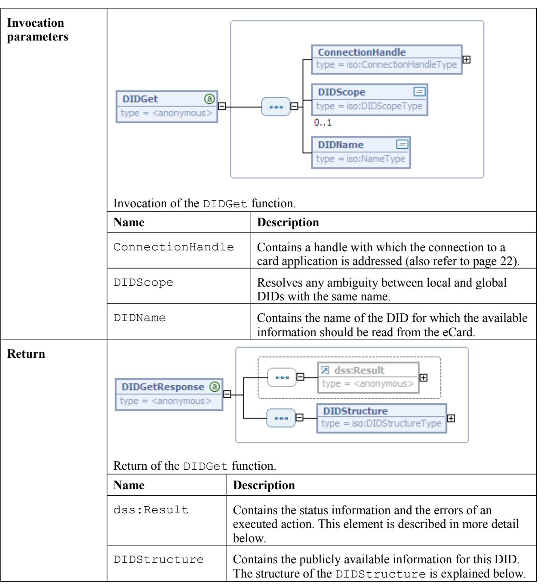

| recoverable information of a DID. | The DIDStructure-element is part of DIDGetResponse and contains the                                                                                                                                                                                                                                                                                                                                                                                                                                                    |
|-----------------------------------|------------------------------------------------------------------------------------------------------------------------------------------------------------------------------------------------------------------------------------------------------------------------------------------------------------------------------------------------------------------------------------------------------------------------------------------------------------------------------------------------------------------------|
| Name                              | Description                                                                                                                                                                                                                                                                                                                                                                                                                                                                                                            |
| DIDName                           | Is the name of the DID, which is used to address the DID<br>within the calls defined in this document.                                                                                                                                                                                                                                                                                                                                                                                                                 |
| DIDScope                          | Indicates whether the scope of the DID is local or<br>global. The DIDScopeType is defined as follows:<br><simpleType name="DIDScopeType"><br><restriction base="string"><br><enumeration value="local" /><br><enumeration value="global" /><br></restriction><br></simpleType><br>If the scope is local the DID may only be accessed<br>within its specific card application. If the sope is global<br>the DID is part of the alpha-card-application and may be<br>accessed in all card applications of a given eCard. |
|                                   |                                                                                                                                                                                                                                                                                                                                                                                                                                                                                                                        |

<span id="page-75-1"></span>

|              | DIDMarker<br>DIDQualifier                                                               | Contains the characteristic information of a DID. The<br>DIDAbstractMarkerType serves as a generic<br>template for the definition of Marker-elements for<br>specific authentication protocols (refer to [TR-03112-7]).<br>This type is defined as follows:<br><complexType name="DIDAbstractMarkerType"<br>abstract="true"><br><complexContent><br><extension base="anyType"><br><attribute name="Protocol" type="anyURI"<br>use="required"/><br></extension><br></complexContent><br></complexType><br>The required Protocol-attribute14 specifies the<br>authentication protocol of the DID and the concrete<br>specification of the child elements of DIDMarker<br>depends on the individual protocol specifications (refer to<br>[TR-03112-7]). Note that the protocol identifies the used<br>cryptographic protocol including the used commands as<br>well as the secure messaging to be used after successful<br>completion of the cryptographic protocol.<br>The DIDQualifier MAY be part of a DID, if and only |  |
|--------------|-----------------------------------------------------------------------------------------|------------------------------------------------------------------------------------------------------------------------------------------------------------------------------------------------------------------------------------------------------------------------------------------------------------------------------------------------------------------------------------------------------------------------------------------------------------------------------------------------------------------------------------------------------------------------------------------------------------------------------------------------------------------------------------------------------------------------------------------------------------------------------------------------------------------------------------------------------------------------------------------------------------------------------------------------------------------------------------------------------------------------|--|
|              |                                                                                         | if the protocol specification (refer to [TR-03112-7])<br>defines the precise semantic of the DIDQualifier for<br>a specific authentication protocol. The structure of the<br>DIDQualifierType is defined on page 70.                                                                                                                                                                                                                                                                                                                                                                                                                                                                                                                                                                                                                                                                                                                                                                                                   |  |
|              | 4.1 and 4.2).                                                                           | Status information and errors in DIDGet (also refer to [TR-03112-1] Sections                                                                                                                                                                                                                                                                                                                                                                                                                                                                                                                                                                                                                                                                                                                                                                                                                                                                                                                                           |  |
|              | Name                                                                                    | Error codes                                                                                                                                                                                                                                                                                                                                                                                                                                                                                                                                                                                                                                                                                                                                                                                                                                                                                                                                                                                                            |  |
|              | ResultMajor                                                                             | •<br>/resultmajor#ok                                                                                                                                                                                                                                                                                                                                                                                                                                                                                                                                                                                                                                                                                                                                                                                                                                                                                                                                                                                                   |  |
|              |                                                                                         | •<br>/resultmajor#error                                                                                                                                                                                                                                                                                                                                                                                                                                                                                                                                                                                                                                                                                                                                                                                                                                                                                                                                                                                                |  |
|              | ResultMinor                                                                             | •<br>/resultminor/al/common#incorrectParameter                                                                                                                                                                                                                                                                                                                                                                                                                                                                                                                                                                                                                                                                                                                                                                                                                                                                                                                                                                         |  |
|              |                                                                                         | •<br>/resultminor/sal#namedEntityNotFound                                                                                                                                                                                                                                                                                                                                                                                                                                                                                                                                                                                                                                                                                                                                                                                                                                                                                                                                                                              |  |
|              |                                                                                         | •<br>/resultminor/sal#protocolNotRecognized                                                                                                                                                                                                                                                                                                                                                                                                                                                                                                                                                                                                                                                                                                                                                                                                                                                                                                                                                                            |  |
|              |                                                                                         | •<br>/resultminor/sal#notInitialized                                                                                                                                                                                                                                                                                                                                                                                                                                                                                                                                                                                                                                                                                                                                                                                                                                                                                                                                                                                   |  |
|              |                                                                                         | •<br>/resultminor/sal#securityConditionNotSatisfied                                                                                                                                                                                                                                                                                                                                                                                                                                                                                                                                                                                                                                                                                                                                                                                                                                                                                                                                                                    |  |
|              |                                                                                         | •<br>/resultminor/dp#communicationFailure                                                                                                                                                                                                                                                                                                                                                                                                                                                                                                                                                                                                                                                                                                                                                                                                                                                                                                                                                                              |  |
|              |                                                                                         | In addition, other protocol specific error messages MAY<br>exist.                                                                                                                                                                                                                                                                                                                                                                                                                                                                                                                                                                                                                                                                                                                                                                                                                                                                                                                                                      |  |
|              | ResultMessage                                                                           | MAY contain more detailed information on the error which<br>occurred if required.                                                                                                                                                                                                                                                                                                                                                                                                                                                                                                                                                                                                                                                                                                                                                                                                                                                                                                                                      |  |
| Precondition | A connection to a card application has been established with<br>CardApplicationConnect. |                                                                                                                                                                                                                                                                                                                                                                                                                                                                                                                                                                                                                                                                                                                                                                                                                                                                                                                                                                                                                        |  |

<span id="page-75-0"></span>14 Note that the Protocol-attribute is mandatory and hence there is no need for an explicit Protocol-element as in [ISO24727-3].

| Postcondition |                                                                                                                                                                                                                       |
|---------------|-----------------------------------------------------------------------------------------------------------------------------------------------------------------------------------------------------------------------|
| Note          | The information about a DID which can be determined with DIDGet is stated in<br>the application capability description (also refer to [ISO24727-2]), in a<br>[ISO7816-15] structure on the card or the CardInfo file. |

#### **3.6.4 DIDUpdate**

| Name                     | DIDUpdate                             |                                                                                                                                                                                                                                                                 |
|--------------------------|---------------------------------------|-----------------------------------------------------------------------------------------------------------------------------------------------------------------------------------------------------------------------------------------------------------------|
| Description              | with DIDName.                         | The DIDUpdate function creates a new key (marker) for the DID addressed                                                                                                                                                                                         |
| Invocation<br>parameters |                                       |                                                                                                                                                                                                                                                                 |
|                          | Invocation of the DIDUpdate function. |                                                                                                                                                                                                                                                                 |
|                          | Name                                  | Description                                                                                                                                                                                                                                                     |
|                          | ConnectionHandle                      | Contains a handle with which the connection to a<br>card application is addressed.                                                                                                                                                                              |
|                          | DIDName                               | Contains the name of the DID for which a new key<br>(marker) is to be generated or transferred.                                                                                                                                                                 |
|                          | DIDUpdateData                         | Contains the data necessary for renewing the DID.<br>The structure of the generic<br>DIDUpdateDataType template is shown on page<br>72. The details of the DIDUpdataData-element<br>depend on the protocol under consideration (also<br>refer to [TR-03112-7]). |
| Return                   |                                       |                                                                                                                                                                                                                                                                 |
|                          |                                       |                                                                                                                                                                                                                                                                 |
|                          | Return of the DIDUpdate function.     |                                                                                                                                                                                                                                                                 |
|                          | Name                                  | Description                                                                                                                                                                                                                                                     |
|                          | dss:Result                            | Contains the status information and the errors of an<br>executed action. This element is described in more<br>detail below.                                                                                                                                     |

|               | Status information and errors in DIDUpdate (also refer to [TR-03112-1]<br>Sections 4.1 and 4.2).                                                                                                                                                                         |                                                                                   |
|---------------|--------------------------------------------------------------------------------------------------------------------------------------------------------------------------------------------------------------------------------------------------------------------------|-----------------------------------------------------------------------------------|
|               | Name                                                                                                                                                                                                                                                                     | Error codes                                                                       |
|               | ResultMajor                                                                                                                                                                                                                                                              | •<br>/resultmajor#ok                                                              |
|               |                                                                                                                                                                                                                                                                          | •<br>/resultmajor#error                                                           |
|               | ResultMinor                                                                                                                                                                                                                                                              | •<br>/resultminor/al/common#incorrectParameter                                    |
|               |                                                                                                                                                                                                                                                                          | •<br>/resultminor/sal#namedEntityNotFound                                         |
|               |                                                                                                                                                                                                                                                                          | •<br>/resultminor/sal#protocolNotRecognized                                       |
|               |                                                                                                                                                                                                                                                                          | •<br>/resultminor/sal#notInitialized                                              |
|               |                                                                                                                                                                                                                                                                          | •<br>/resultminor/sal#securityConditionNotSatisfied                               |
|               |                                                                                                                                                                                                                                                                          | •<br>/resultminor/sal#insufficientResources                                       |
|               |                                                                                                                                                                                                                                                                          | •<br>/resultminor/dp#communicationFailure                                         |
|               |                                                                                                                                                                                                                                                                          | In addition, other protocol specific error messages MAY<br>exist.                 |
|               | ResultMessage                                                                                                                                                                                                                                                            | MAY contain more detailed information on the error<br>which occurred if required. |
| Precondition  | A connection to a card application has been established with<br>CardApplicationConnect.                                                                                                                                                                                  |                                                                                   |
| Postcondition | The key material of the stated differential identity was renewed.                                                                                                                                                                                                        |                                                                                   |
| Note          | If the information of the DIDMarker or DIDQualifier structure is changed<br>when the DID is renewed, the application capability description (also refer to<br>[ISO24727-2]), the [ISO7816-15] structure on the card or the CardInfo file<br>MUST be updated accordingly. |                                                                                   |
|               | With this function no optional DIDScope parameter is provided intentionally.<br>Only a DID in the currently selected card application MAY be renewed. The<br>"alpha card application" MUST therefore be selected to renew a global DID.                                  |                                                                                   |

#### **3.6.5 DIDDelete**

| Name                     | DIDDelete                             |                                                                                                            |
|--------------------------|---------------------------------------|------------------------------------------------------------------------------------------------------------|
| Description              |                                       | The DIDDelete function deletes the DID addressed with DIDName.                                             |
| Invocation<br>parameters |                                       |                                                                                                            |
|                          | Invocation of the DIDDelete function. |                                                                                                            |
|                          | Name                                  | Description                                                                                                |
|                          | ConnectionHandle                      | Contains a handle with which the connection to a<br>card application is addressed (also refer to page 22). |

|               | DIDName                                                                                                                                                                                                                                             |             | Contains the name of the DID which is to be<br>deleted.                                                                     |
|---------------|-----------------------------------------------------------------------------------------------------------------------------------------------------------------------------------------------------------------------------------------------------|-------------|-----------------------------------------------------------------------------------------------------------------------------|
| Return        |                                                                                                                                                                                                                                                     |             |                                                                                                                             |
|               | Return of the DIDDelete function.                                                                                                                                                                                                                   |             | Description                                                                                                                 |
|               | Name<br>dss:Result                                                                                                                                                                                                                                  |             | Contains the status information and the errors of<br>an executed action. This element is described in<br>more detail below. |
|               | Status information and errors in DIDDelete (also refer to [TR-03112-1]<br>Sections 4.1 and 4.2).                                                                                                                                                    |             |                                                                                                                             |
|               | Name                                                                                                                                                                                                                                                | Error codes |                                                                                                                             |
|               | ResultMajor                                                                                                                                                                                                                                         | •           | /resultmajor#ok                                                                                                             |
|               |                                                                                                                                                                                                                                                     | •           | /resultmajor#error                                                                                                          |
|               | ResultMinor                                                                                                                                                                                                                                         | •           | /resultminor/al/common#incorrectParameter                                                                                   |
|               |                                                                                                                                                                                                                                                     | •           | /resultminor/sal#namedEntityNotFound                                                                                        |
|               |                                                                                                                                                                                                                                                     | •           | /resultminor/sal#notInitialized                                                                                             |
|               |                                                                                                                                                                                                                                                     | •           | /resultminor/sal#securityConditionNotSatisfied                                                                              |
|               |                                                                                                                                                                                                                                                     | •           | /resultminor/dp#communicationFailure                                                                                        |
|               |                                                                                                                                                                                                                                                     | exist.      | In addition, other protocol specific error messages MAY                                                                     |
|               | ResultMessage                                                                                                                                                                                                                                       |             | MAY contain more detailed information on the error<br>which occurred if required.                                           |
| Precondition  | A connection to a card application has been established with<br>CardApplicationConnect.                                                                                                                                                             |             |                                                                                                                             |
| Postcondition | The DID has been deleted.                                                                                                                                                                                                                           |             |                                                                                                                             |
| Note          | The information about the DID MUST be deleted in the application capability<br>description (also refer to [ISO24727-2]), the [ISO7816-15] structure on the card<br>or the CardInfo file.                                                            |             |                                                                                                                             |
|               | With this function no optional DIDScope parameter is provided intentionally. It<br>is only possible to delete DIDs in the currently selected card application. If a<br>global DID is to be selected, the "alpha card application" MUST be selected. |             |                                                                                                                             |
| 3.6.6         | DIDAuthenticate                                                                                                                                                                                                                                     |             |                                                                                                                             |
| Name          | DIDAuthenticate                                                                                                                                                                                                                                     |             |                                                                                                                             |

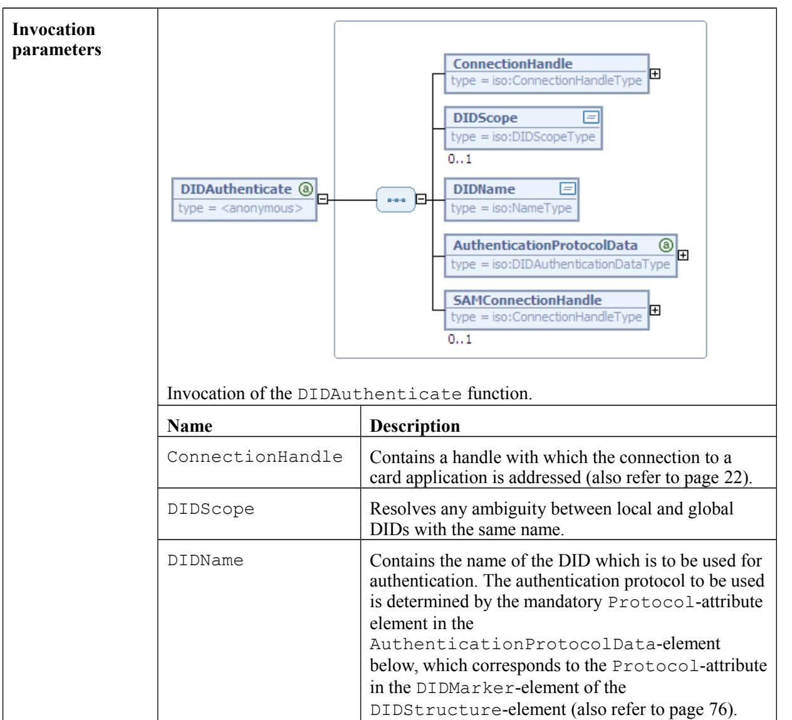

|        | Authentication<br>ProtocolData          |           | Contains the data necessary for the respective<br>authentication protocol. The structure of the<br>DIDAuthenticationDataType is specified on<br>the basis of the protocol (also refer to [TR-03112-7]).                                                                                                                                                                                                                                                       |
|--------|-----------------------------------------|-----------|---------------------------------------------------------------------------------------------------------------------------------------------------------------------------------------------------------------------------------------------------------------------------------------------------------------------------------------------------------------------------------------------------------------------------------------------------------------|
|        |                                         |           | The DIDAuthenticationDataType serves as a<br>generic template for the definition of protocol<br>specific authentication protocol data elements (refer<br>to [TR-03112-7]). This type is defined as follows:<br><complexType name="DIDAbstractMarkerType"<br>abstract="true"><br><complexContent><br><extension base="anyType"><br><attribute name="Protocol" type="anyURI"<br>use="required"/><br></extension><br></complexContent><br></complexType>         |
|        |                                         | protocol. | The required Protocol-attribute specifies the<br>authentication protocol of the DID; the concrete<br>specification of the child elements of<br>AuthenticationProtocolData depends on<br>the individual protocol specifications (refer to<br>[TR-03112-7]). Note that the protocol identifies the<br>used cryptographic protocol including the used<br>commands as well as the secure messaging to be used<br>after successful completion of the cryptographic |
|        | SAMConnection<br>Handle                 |           | MAY address a connection to a card application,<br>which serves as Security Access Module (SAM). The<br>detailed role of the SAM within the authentication<br>protocol MUST be defined within the specification of<br>the authentication protocol.                                                                                                                                                                                                            |
| Return |                                         |           |                                                                                                                                                                                                                                                                                                                                                                                                                                                               |
|        | Return of the DIDAuthenticate function. |           |                                                                                                                                                                                                                                                                                                                                                                                                                                                               |
|        | Name<br>dss:Result                      |           | Description<br>Contains the status information and the                                                                                                                                                                                                                                                                                                                                                                                                        |
|        |                                         |           | errors of an executed action. This element is<br>described in more detail below.                                                                                                                                                                                                                                                                                                                                                                              |

|               | Authentication<br>ProtocolData<br>[TR-03112-1] Sections 4.1 and 4.2).                   | Contains the data necessary for the<br>respective authentication protocol. The<br>structure of the<br>DIDAuthenticationDataType is<br>explained. Details depend on the<br>authentication protocol (refer to<br>[TR-03112-7]).<br>Status information and errors in DIDAuthenticate (also refer to |  |
|---------------|-----------------------------------------------------------------------------------------|--------------------------------------------------------------------------------------------------------------------------------------------------------------------------------------------------------------------------------------------------------------------------------------------------|--|
|               | Name                                                                                    | Error codes                                                                                                                                                                                                                                                                                      |  |
|               | ResultMajor                                                                             | •<br>/resultmajor#ok                                                                                                                                                                                                                                                                             |  |
|               |                                                                                         | •<br>/resultmajor#error                                                                                                                                                                                                                                                                          |  |
|               |                                                                                         | •<br>/resultmajor#nextRequest                                                                                                                                                                                                                                                                    |  |
|               | ResultMinor                                                                             | •<br>/resultminor/al/common#incorrectParameter                                                                                                                                                                                                                                                   |  |
|               |                                                                                         | •<br>/resultminor/sal#namedEntityNotFound                                                                                                                                                                                                                                                        |  |
|               |                                                                                         | •<br>/resultminor/sal#protocolNotRecognized                                                                                                                                                                                                                                                      |  |
|               |                                                                                         | •<br>/resultminor/sal#inappropriateProtocolForAction                                                                                                                                                                                                                                             |  |
|               |                                                                                         | •<br>/resultminor/sal#notInitialized                                                                                                                                                                                                                                                             |  |
|               |                                                                                         | •<br>/resultminor/sal#securityConditionNotSatisfied                                                                                                                                                                                                                                              |  |
|               |                                                                                         | •<br>/resultminor/sal#insufficientResources                                                                                                                                                                                                                                                      |  |
|               |                                                                                         | •<br>/resultminor/dp#communicationFailure                                                                                                                                                                                                                                                        |  |
|               |                                                                                         | In addition, other protocol specific error messages MAY<br>exist.                                                                                                                                                                                                                                |  |
|               | ResultMessage                                                                           | MAY contain more detailed information on the error<br>which occurred if required.                                                                                                                                                                                                                |  |
| Precondition  | A connection to a card application has been established with<br>CardApplicationConnect. |                                                                                                                                                                                                                                                                                                  |  |
| Postcondition | authentication.                                                                         | The respective security condition is set on the eCard after successful                                                                                                                                                                                                                           |  |
| Note          |                                                                                         |                                                                                                                                                                                                                                                                                                  |  |

### <span id="page-81-0"></span>**3.7 Authorization service**

#### **3.7.1 ACLList**

| Name        | ACLList                                                                                                                 |
|-------------|-------------------------------------------------------------------------------------------------------------------------|
| Description | The ACLList function returns the access control list for the stated target<br>object (card application, data set, DID). |

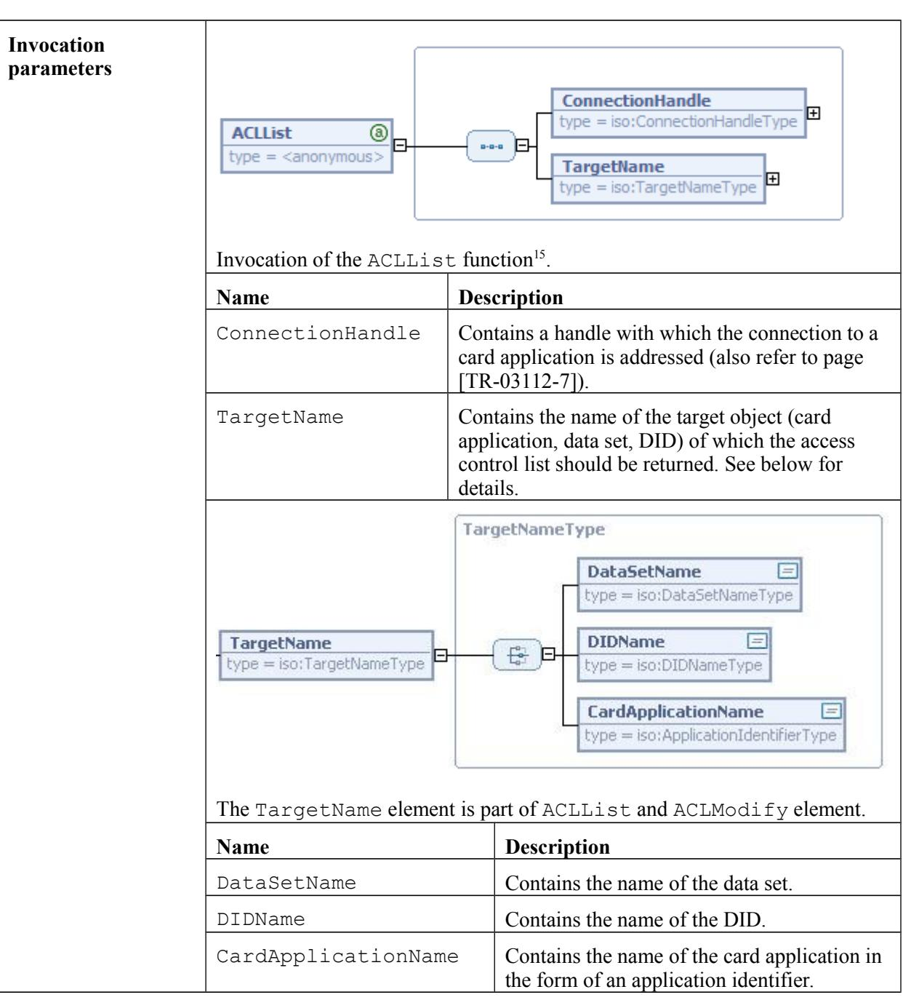

<span id="page-82-1"></span><span id="page-82-0"></span><sup>15</sup> Note that ACLList in [ISO24727-3] has an additional parameter TargetType. However this parameter is superfluous, because the type of the target is unambiguously implied by the internal structure of the TargetName-parameter. This change will be proposed for a forthcoming defect report of [ISO24727-3].

| Return parameters  |                                                                                                |                                                                                                                                                                                            |  |
|--------------------|------------------------------------------------------------------------------------------------|--------------------------------------------------------------------------------------------------------------------------------------------------------------------------------------------|--|
|                    | Return of the ACLList function.                                                                |                                                                                                                                                                                            |  |
|                    | Name                                                                                           | Description                                                                                                                                                                                |  |
|                    | dss:Result                                                                                     | Contains the status information and the errors of an<br>executed action. This element is described in more<br>detail below.                                                                |  |
|                    | TargetACL                                                                                      | Contains the access control list for the required target<br>object. Details on the AccessControlListType<br>are given on page 31.                                                          |  |
|                    | Status information and errors in ACLList (also refer to [TR-03112-1]<br>Sections 4.1 and 4.2). |                                                                                                                                                                                            |  |
|                    | Name                                                                                           | Error codes                                                                                                                                                                                |  |
|                    | ResultMajor                                                                                    | •<br>/resultmajor#ok<br>•<br>/resultmajor#error                                                                                                                                            |  |
|                    | ResultMinor                                                                                    | •<br>/resultminor/al/common#incorrectParameter<br>•<br>/resultminor/sal#namedEntityNotFound<br>•<br>/resultminor/sal#notInitialized<br>•<br>/resultminor/sal#securityConditionNotSatisfied |  |
|                    |                                                                                                | •<br>/resultminor/dp#communicationFailure                                                                                                                                                  |  |
|                    | ResultMessage                                                                                  | MAY contain more detailed information on the error<br>which occurred if required.                                                                                                          |  |
| Precondition       | A connection to a card application has been established with<br>CardApplicationConnect.        |                                                                                                                                                                                            |  |
| Postcondition      |                                                                                                |                                                                                                                                                                                            |  |
| Note               | card or the CardInfo file.                                                                     | The access control information is contained in the application capability<br>description (also refer to [ISO24727-2]), the [ISO7816-15] structure on the                                   |  |
| 3.7.2<br>ACLModify |                                                                                                |                                                                                                                                                                                            |  |

| Name        | ACLModify                                                                             |
|-------------|---------------------------------------------------------------------------------------|
| Description | An access rule in the access control list is modified with the ACLModify<br>function. |

| Invocation<br>parameters |                                  |                                   |                                                                                                                                                                      |  |
|--------------------------|----------------------------------|-----------------------------------|----------------------------------------------------------------------------------------------------------------------------------------------------------------------|--|
|                          | Invocation of ACLModify16        |                                   |                                                                                                                                                                      |  |
|                          | Name                             |                                   | Description                                                                                                                                                          |  |
|                          | ConnectionHandle                 |                                   | Contains a handle with which the connection to a<br>card application is addressed.                                                                                   |  |
|                          | TargetName                       |                                   | Contains the name of the target object (card<br>application, data set, DID) of which the access<br>control list should be modified (refer to page 83<br>for details. |  |
|                          | CardApplicationSe<br>rviceName17 |                                   | Contains the service name of a card application.                                                                                                                     |  |
|                          | ActionName                       |                                   | Contains the name of the action for which the<br>access rules should be modified (for details refer<br>to page 31).                                                  |  |
|                          | SecurityCondition                |                                   | Contains the security condition for the access<br>rule to be modified (for details refer to page 31).                                                                |  |
| Return parameters        |                                  |                                   |                                                                                                                                                                      |  |
|                          |                                  |                                   |                                                                                                                                                                      |  |
|                          |                                  | Return of the ACLModify function. |                                                                                                                                                                      |  |
|                          |                                  |                                   |                                                                                                                                                                      |  |
|                          | Name                             |                                   | Description                                                                                                                                                          |  |
|                          | dss:Result                       | below.                            | Contains the status information and the errors of an<br>executed action. This element is described in more detail                                                    |  |

<span id="page-84-0"></span><sup>16</sup> Note that ACLModify in [ISO24727-3] has an additional parameter TargetType. However this parameter is superfluous, because the type of the target is unambiguously implied by the internal structure of the TargetName-parameter. This change will be proposed for a forthcoming defect report of [ISO24727-3].

<span id="page-84-1"></span><sup>17</sup> See footnote on page [32.](#page-31-2)

|               | Status information and errors in ACLModify (also refer to [TR-03112-1]<br>Sections 4.1 and 4.2).                                                                                                   |                                                                                   |  |
|---------------|----------------------------------------------------------------------------------------------------------------------------------------------------------------------------------------------------|-----------------------------------------------------------------------------------|--|
|               | Name                                                                                                                                                                                               | Error codes                                                                       |  |
|               | ResultMajor                                                                                                                                                                                        | •<br>/resultmajor#ok                                                              |  |
|               |                                                                                                                                                                                                    | •<br>/resultmajor#error                                                           |  |
|               | ResultMinor                                                                                                                                                                                        | •<br>/resultminor/al/common#incorrectParameter                                    |  |
|               |                                                                                                                                                                                                    | •<br>/resultminor/sal#namedEntityNotFound                                         |  |
|               |                                                                                                                                                                                                    | •<br>/resultminor/sal#notInitialized                                              |  |
|               |                                                                                                                                                                                                    | •<br>/resultminor/sal#securityConditionNotSatisfied                               |  |
|               |                                                                                                                                                                                                    | •<br>/resultminor/sal#insufficientResources                                       |  |
|               |                                                                                                                                                                                                    | •<br>/resultminor/dp#communicationFailure                                         |  |
|               | ResultMessage                                                                                                                                                                                      | MAY contain more detailed information on the error<br>which occurred if required. |  |
| Precondition  | A connection to a card application has been established with<br>CardApplicationConnect.                                                                                                            |                                                                                   |  |
| Postcondition | The access control information for the stated target object has been changed.                                                                                                                      |                                                                                   |  |
| Note          | The modified access control information must be updated in the application<br>capability description (also refer to [ISO24727-2]), the [ISO7816-15] structure<br>on the card or the CardInfo file. |                                                                                   |  |

## <span id="page-86-0"></span>**4 CardInfoFiles**

A general requirement for an implementation of the [ISO24727-3] interface is that generic function invocations on the service access interface ("action request" in [Figure 2\)](#page-86-1) must be mapped to card-specific commands (APDUs which are sent in [Figure 2](#page-86-1) as "generic requests" to the generic card interface defined in [ISO24727-2]).

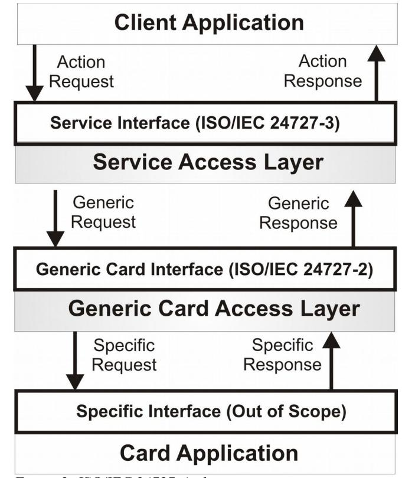

<span id="page-86-1"></span>*Figure 2: ISO/IEC 24727-Architecture*

For example, when the Sign function is invoked (refer to [Figure 3](#page-87-0) and Section [3.5.5\)](#page-63-0) it is necessary to determine the specific key reference (and if necessary the algorithm identifier) from the transferred DIDName which must be used in a MANAGE SECURITY ENVIRONMENT command before the signature can be generated with the PSO:COMPUTE DIGITAL SIGNATURE command.

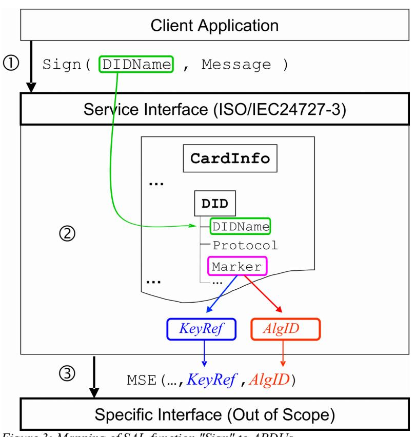

<span id="page-87-0"></span>*Figure 3: Mapping of SAL-function "Sign" to APDUs*

There are three basic options to realize this mapping:

- 1. The mapping rule is encoded for a specific card in the source code of the smart card middleware and fixed at compilation time.
- 2. The information required for the mapping is available on the card e.g. in form of the application capability description (ACD) in accordance with [ISO24727-2] and/or a cryptographic information application (CIA) in accordance with [ISO7816-15] – and is read from there and used for the mapping.
- 3. The information required for the mapping is not available on the card and is supplied to the smart card middleware as structured information in the form of XML-based CardInfo files.

As the executable code must be adapted for each new card requiring support in the first approach and it may therefore be necessary to re-evaluate the smartcard middleware, this strategy MUST NOT be used for the implementation of the eCard-API-Framework.

The second alternative has the general advantage that the necessary information is provided on the card directly and does not have to be supplied to a middleware solution in another manner. For this reason this version has also been taken for standardisation of [ISO24727-2] and SHOULD be supported by the eCard-API-Framework in the long term to ensure international interoperability. Unfortunately this approach is not suitable for almost all cards of importance for the eCard-strategy (e.g. electronic health card and almost all signature cards), as these cards do not feature either an ACD or a comprehensive CIA. For this reason in particular the third version MUST be implemented promptly – at least as long as the necessary information is not available on the cards in the form of ACD and/or CIA structures – when the eCard-API-Framework is implemented.

To ease the joint implementation of the second and the third strategy, the common features and differences are considered more closely to make use of any synergies during implementation of both alternatives.

In both versions the information necessary for depiction of the generic invocations on specific card APDUs must be determined (i.e. especially the description of the ApplicationCapabilities as in Annex A.6 or the application capability description of Section 6.2 of [ISO24727-2]). While with the second version this information must be extracted in a comparatively complex manner from a CIA structure in accordance with [ISO7816-15], with the third version they are directly available as an XML structure in the form required by [ISO24727-3]. During the implementation of both versions it is therefore conceivable that internal objects for card applications (services, differential identities, data sets etc.) are aligned with [ISO24727-3]-type structures and that these can be alternatively "filled" by the CardCapabilities structure (also refer to Annex A.5) and the ApplicationCapabilities structure (also refer to section [4.5\)](#page-107-0) or by the analysis of the ACD and CIA structures (also refer to [ISO24727-2]).

As in the third version an additional assignment between a currently available card and an XML-based CardInfo file is necessary, a unique card type MUST be defined in this case (also refer to CardType in Annex A.3), which is determined for a currently available card within the framework of the recognition process (also refer to CardIdentification in Annex A.4). On the other hand it is not essential with the second version that unique card types exist and that these have to be recognised, as all necessary information is contained on the card itself. To enable protection against attacks by manipulated CardInfo structures, it MUST be possible to protect a CardInfo file either fully or partially by a digital signature (also refer to the Signature element in Annex A.7).

The following definition of the CardInfo-structure is based on Annex E of [CEN15480-3].

### <span id="page-88-1"></span>**4.1 CardInfoType**

The [CardInfo](#page-88-0) structure may be used for the specification of European Citizen Card profiles [CEN15480-4] *and* for the mapping of generic requests at the Service Access Layer to card-specific APDUs in case of legacy cards, which are not equipped with appropriate ACD and CCD structures according to ISO/IEC 24727-2 (refer to [Figure 3\)](#page-87-0).

Each European Citizen Card profile SHOULD be described by a <CardInfo> element

```
<element name="CardInfo" type="iso:CardInfoType" />
```
of type CardInfoType which is defined as follows:

```
<complexType name="CardInfoType">
 <sequence>
 <element name="CardType" type="iso:CardTypeType" />
 <element name="CardIdentification" type="iso:CardIdentificationType" />
 <element name="CardCapabilities"
 type="iso:CardCapabilitiesType" maxOccurs="1" minOccurs="0" />
 <element name="ApplicationCapabilities"
 type="iso:ApplicationCapabilitiesType" maxOccurs="1" minOccurs="0" />
 <element name="Signature"
 type="ds:SignatureType" maxOccurs="unbounded" minOccurs="0" />
 </sequence>
 <attribute name="Id" type="ID" use="optional" />
 <attribute name="schemaVersion" type="token" use="optional" />
 </complexType>
```

```
<CardType> [required]
```
Contains a unique identifier for the card type and optionally further links to specification documents. Further details are explained in section [4.2.](#page-89-0)

<span id="page-88-3"></span><CardIdentification> [required]

Allows to determine the type of a given card by traversing the decision tree (refer to [Figure 4\)](#page-102-0) and checking whether the characteristic features are as expected. Further details are explained in section [4.3.](#page-91-0)

```
<CardCapabilities> [optional]
```
Allows specifying the capabilities of the card. If the card is fully conform to ISO/IEC 7816 this element MAY be omitted. Further details are explained in section [4.4.](#page-97-0)

<span id="page-89-1"></span><ApplicationCapabilities> [optional]

Allows specifying the card-applications on the card and SHOULD be used to realize the mapping from SAL-calls to card-specific APDUs (refer to [Figure 3\)](#page-87-0). If the necessary information for this mapping is available on the card in adequate CIA-information structures according to ISO/IEC 7816-15 (see Section 7.5) this element MAY be omitted. Further details are explained in section [4.5.](#page-107-0)

<Signature> [optional]

Is used to protect the integrity and authenticity of (parts of) the [CardInfo-](#page-88-0)element. The ds:SignatureType is defined in [RFC3275]. Further details are explained in section [4.6.](#page-113-0)

```
<schemaVersion> [optional]
```
Contains the version of the schema used for this cardinfo file. The identifier for the schema defined in this version of this document is "1.1". If this element is not present, version 1.1 of the schema SHOULD be assumed.

### <span id="page-89-0"></span>**4.2 CardTypeType**

The [<CardType>](#page-88-2) element within the CardInfo-element (cf. Section [4.1\)](#page-88-1) is of type CardTypeType and contains a unique identifier for the card type and optionally further links to specification documents.

It is specified as follows:

```
<complexType name="CardTypeType">
 <sequence>
 <element name="ProfilingInfo" maxOccurs="1" minOccurs="0">
 <complexType>
 <sequence>
 <element name="BasisSpecification" type="anyURI" />
 <element name="ProfilingRelation" type="iso:ProfilingType" />
 </sequence>
 </complexType>
 </element>
 <element name="ObjectIdentifier" type="anyURI" />
 <element name="SpecificationBodyOrIssuer"
 type="string" maxOccurs="1" minOccurs="0" />
 <element name="CardTypeName" type="string" maxOccurs="1" minOccurs="0" />
 <element name="Version" maxOccurs="1" minOccurs="0">
 <complexType>
 <sequence>
 <element name="Major" type="string" />
 <element name="Minor" type="string" maxOccurs="1" minOccurs="0" />
 <element name="SubMinor" type="string" maxOccurs="1" minOccurs="0" />
 </sequence>
 </complexType>
 </element>
 <element name="Status" type="string" maxOccurs="1" minOccurs="0" />
 <element name="Date" type="date" maxOccurs="1" minOccurs="0" />
 <element name="CardInfoRepository" type="anyURI" maxOccurs="1" minOccurs="0"/>
 <element name="Other" type="dss:AnyType" minOccurs="0"/>
 </sequence>
 <attribute name="Id" type="ID" use="optional" />
</complexType>
```
This type defines the following elements and attributes:

<ProfilingInfo> [optional]

If this element is present it containsinformation about a basic specification (<BasisSpecification> element) which is extended or redefined (cf. [<ProfilingRelation>](#page-90-0) element below) by the present [CardInfo](#page-88-0) structure. Using this element it is possible to re-use existing [CardInfo-](#page-88-0)structures in a modular approach.

```
<ObjectIdentifier> [required]
```
This element MUST contain the unique identifier of the card type, which MAY be the object identifier of a profile defined in [CEN15480-4].

<SpecificationBodyOrIssuer> [optional]

This element is used to specify the card issuer or the organization, which is responsible for the specification.

```
<CardTypeName> [optional]
```
This element contains the name of the card type.

```
<Version> [optional]
```
This element contains the version number of the card type.

```
<Status> [optional]
```
This element contains information about the state of the present [CardInfo](#page-88-0) file (e.g. 'draft').

```
<Date> [optional]
```
This element contains the date of creation of the [CardInfo](#page-88-0) file.

```
<CardInfoRepository> [optional]
```
If present this element contains the address of a CardInfo-repository, which may provide relate[d](#page-88-0) [CardInfo](#page-88-0)- files.

```
<Other> [optional]
```
This element MAY contain some additional element, which structure is defined by some other specification.

#### **4.2.1 ProfilingType**

<span id="page-90-0"></span>The <ProfilingRelation> element is of type ProfilingType and describes the relation between the basic specification and the present [CardInfo](#page-88-0) file.

```
<simpleType name="ProfilingType">
 <restriction base="string">
 <enumeration value="extends" />
 <enumeration value="redefines" />
 </restriction>
</simpleType>
```
The two cases have got the following meaning:

- extends indicates that the present [CardInfo](#page-88-0) file is just an extension of the basic specification. All definitions in the basic specification remain valid and the new specifications in the [CardInfo](#page-88-0) file just extend them (e.g. a new card application).
- redefines indicates that the elements of the [CardInfo](#page-88-0) file overwrite the according elements of the basic specification. Elements of the basic specification not appearing in the [CardInfo](#page-88-0) file remain valid.

## <span id="page-91-0"></span>**4.3 CardIdentificationType**

The [<CardIdentification>](#page-88-3) element, which is part of the CardInfo-element (cf. Section [4.1\)](#page-88-1), allows to determine the type of a given card by traversing the decision tree (for an example see [Figure 4\)](#page-102-0) and checking whether the characteristic features are as expected. An implementation of the eCard-API MUST build its own decision tree based on the known CardInfo files.

The [CardIdentification](#page-88-3) element MUST contain enough information to uniquely identify the card type, i.e.at least relevant operation system features including version and personalization variant.

To facilitate fast recognition of cards, an implementation SHOULD check easily available features first, e.g. ATR/ATS or EF.DIR/INFO. Therefore it is RECOMMENDED that authors of CardInfo files include these features in the [CardIdentification](#page-88-3) element.

```
<complexType name="CardIdentificationType">
      <sequence>
             <element name="ATR" maxOccurs="unbounded" minOccurs="0"
                    type="iso:ATRType" />
             <element name="ATS" type="iso:ATSType" maxOccurs="1"
                    minOccurs="0" />
             <element name="CharacteristicFeature" maxOccurs="unbounded"
                    minOccurs="0">
                    <complexType>
                           <sequence maxOccurs="unbounded" minOccurs="1">
                                 <element name="CardCall"
                                        type="iso:CardCallType" />
                           </sequence>
                    </complexType>
             </element>
             <element name="Other" type="dss:AnyType" minOccurs="0"/>
      </sequence>
      <attribute name="Id" type="ID" use="optional" />
</complexType>
```

```
<ATR> [optional, unbounded]
```
For contact-based smart cards this element contains, if present, information to the Answer To Reset [18](#page-91-1) (ATR) of the card, allowing the realisation of a preselection of the card type. Further details are explained below.

<ATS> [optional]

In an analogous way this element contains, if present, information to the Answer To Select of a contactless smart card, allowing the realisation of a preselection of the card type. Further details are explained below.

<CharacteristicFeature> [optional, unbounded]

This element contains a list of card calls, which can be used to determine the card type. The elements of the list are of type [CardCallType.](#page-94-0) Further details are explained below.

```
<Other> [optional]
```
This element MAY contain some additional element, which structure is defined by some other specification.

<span id="page-91-1"></span><sup>18</sup> Because there are several protocols for contact smart cards (e.g. T=0 and T=1) which can be supported by the same card it is possible that one card has several ATRs. All of these ATR elements could in principle be used for a preselection of the card type (using a disjunction). In order to avoid interoperability problems it is RECOMMENDED in this case to specify no ATR-element in the CardInfo-file, but only use explicit characteristic features to identify the card type. If the card has no ATR, because it is a contact-less card for example, there MUST NOT be specified an ATR-element.

#### **4.3.1 ATRType**

The <ATR> element of type ATRType is part of the element [<CardIdentification>](#page-88-3). For further information about the structure of the ATR see section 8 of [ISO7816-3].

```
<complexType name="ATRType">
 <sequence>
 <element name="TS" type="iso:ByteMaskType" maxOccurs="1" minOccurs="1" />
 <element name="T0" type="iso:ByteMaskType" maxOccurs="1" minOccurs="1" />
 <element name="InterfaceBytes">
 <complexType>
 <sequence>
 <element name="Tx1" type="iso:ATRInterfaceBytesType" />
 <element name="Tx2" type="iso:ATRInterfaceBytesType" />
 <element name="Tx3" type="iso:ATRInterfaceBytesType" />
 <element name="Tx4" type="iso:ATRInterfaceBytesType" />
 </sequence>
 </complexType>
 </element>
 <element name="HistoricalBytes" maxOccurs="1" minOccurs="0">
 <complexType>
 <sequence maxOccurs="15" minOccurs="0">
 <element name="Ti" type="iso:ByteMaskType" />
 </sequence>
 </complexType>
 </element>
 <element name="TCK" type="iso:ByteMaskType" maxOccurs="1" minOccurs="0" />
 </sequence>
</complexType>
```
<TS> [required]

The element <TS> describes the first byte of the communication. This element is as many others of type ByteMaskType, which is explained below.

```
<T0> [required]
```
The element <T0> is of type ByteMaskType and describes the "format character" which indicates the amount of historical bytes and the presence of the first interface bytes (TA1, TB1, TC1 and TD1).

```
<InterfaceBytes> [required]
```
This element contains the interface bytes which could be included in the ATR. The elements <Tx*i*>, *i*{1,2,3,4 } are of type [ATRInterfaceBytesType.](#page-93-0) This type is explained below.

```
<HistoricalBytes> [optional]
```
This element contains the historical bytes as a sequence of at most 15 bytes. Each element <Ti> is of type ByteMaskType (see below) which also describes the significant part of the byte to identify the card type.

```
<TCK> [optional]
```
This element of type ByteMaskType MAY contain the check sum of all bytes of the ATR beginning with T0.

### **4.3.2 ByteMaskType**

The ByteMaskType consists of a hexadecimal value and a corresponding mask which results in the significant part of the value when a logical AND is performed on value and mask.

<complexType name="ByteMaskType">

```
 <sequence>
 <element name="Value" type="iso:ByteType" />
 <element name="Mask" type="iso:ByteType" />
 </sequence>
</complexType>
```
### **4.3.3 ByteType**

The iso:ByteType in turn is defined to be hexBinary with a length of one byte. Unlike the builtin byte-type this type allows to specify a byte of data in the common hexadecimal form and not as signed integer in the range between -127 and 128.

```
<simpleType name="ByteType">
      <restriction base="hexBinary">
             <length value="1"/>
      </restriction>
</simpleType>
```
If the whole byte is significant the mask 'FF' has to be used. To get the first half byte the mask has to be 'F0', for the second half byte '0F'. If only the first bit is significant the mask would be '80' and so on.

### **4.3.4 ATRInterfaceBytesType**

<span id="page-93-0"></span>The type ATRInterfaceBytesType is used by the elements <Tx*i*> of the element <InterfaceBytes>. This type consists of four elements <T*x*i>, *x*{A,B,C,D}. Each of these elements is of type ByteMaskType (see above) which also describes the significant part of the byte.

```
<complexType name="ATRInterfaceBytesType">
 <sequence>
 <element name="TAi" type="iso:ByteMaskType" maxOccurs="1" minOccurs="0" />
 <element name="TBi" type="iso:ByteMaskType" maxOccurs="1" minOccurs="0" />
 <element name="TCi" type="iso:ByteMaskType" maxOccurs="1" minOccurs="0" />
 <element name="TDi" type="iso:ByteMaskType" maxOccurs="1" minOccurs="0" />
 </sequence>
</complexType>
```
### **4.3.5 ATSType**

The <ATS>[19](#page-93-1) element of type ATSType is part of the element [<CardIdentification>](#page-88-3) and describes the Answer To Select of contactless smart cards.

```
<complexType name="ATSType">
 <sequence>
 <element name="TL" type="iso:ByteMaskType" maxOccurs="1" minOccurs="1" />
 <element name="T0" type="iso:ByteMaskType" maxOccurs="1" minOccurs="1" />
 <element name="InterfaceBytes" type="iso:ATSInterfaceBytesType" />
 <element name="HistoricalBytes" maxOccurs="1" minOccurs="0">
 <complexType>
 <sequence maxOccurs="15" minOccurs="0">
 <element name="Ti" type="iso:ByteMaskType"/>
 </sequence>
 </complexType>
 </element>
```
<span id="page-93-1"></span>19 If the card does not provide an ATS, because it is a contact-based card or an ISO/IEC 14443 Type B card, one MUST NOT specify an ATS-element. In case of doubt it is RECOMMENDED to omit the ATS-element and exclusively use explicit characteristic features for card identification.

```
 <element name="CRC1" type="iso:ByteMaskType" maxOccurs="1" minOccurs="1" />
 <element name="CRC2" type="iso:ByteMaskType" />
 </sequence>
</complexType>
```
<TL> [required]

The element <TL> contains the length of the ATS including the TL byte itself but excluding CRC1 and CRC2. This element is of type ByteMaskType which also describes the significant part of the byte.

<T0> [required]

The element <T0> contains the Frame Size for proximity Card Integer (FSCI) and also indicates the presence of interface bytes in the ATS. This element is of type ByteMaskType which also describes the significant part of the byte.

```
<InterfaceBytes> [required]
```
This element contains the interface bytes which could be included in the ATS. The element is of type [ATSInterfaceBytesType](#page-94-1) which is explained below.

```
<HistoricalBytes> [optional]
```
This element contains the historical bytes as a sequence of at most 15 bytes. Each element <Ti> is of type ByteMaskType which also describes the significant part of the byte to identify the card type.

```
<CRC1>, <CRC2> [required]
```
These two elements of type ByteMaskType can contain the check sum of all bytes of the ATS beginning with TL.

#### **4.3.6 ATSInterfaceBytesType**

<span id="page-94-1"></span>The following type ATSInterfaceBytesType is used by the element <InterfaceBytes> of the element <ATS>. This type consists of three elements <T*x*1>, *x*{A,B,C}. Each of these elements is of type ByteMaskType which also describes the significant part of the byte.

```
<complexType name="ATSInterfaceBytesType">
 <sequence>
 <element name="TA1" type="iso:ByteMaskType" maxOccurs="1" minOccurs="0" />
 <element name="TB1" type="iso:ByteMaskType" maxOccurs="1" minOccurs="0" />
 <element name="TC1" type="iso:ByteMaskType" maxOccurs="1" minOccurs="0" />
 </sequence>
</complexType>
```
#### **4.3.7 CardCallType**

<span id="page-94-0"></span>A list of elements of the type CardCallType is used to describe the characteristic features of the card in the [<CardIdentification>](#page-88-3) element. While the CardCallType is defined in the protocol related schema definition (see [TR-03112-7]) it is explained here to ease reading.

```
<complexType name="CardCallType">
      <choice>
             <sequence>
                    <element name="CommandAPDU" type="hexBinary" />
                    <element name="ResponseAPDU" type="iso:ResponseAPDUType"
                           maxOccurs="unbounded" minOccurs="1" />
             </sequence>
             <sequence>
                    <element name="APICall" type="dss:AnyType" />
                    <element name="APIResponse" type="dss:AnyType"
                           maxOccurs="unbounded" minOccurs="1" />
```

```
</sequence>
       </choice>
</complexType>
```
<CommandAPDU> [choice, required]

This element contains the command APDU to be sent to the card. For security reasons APDUs with CLA values '0*x*' or '1*x*', *x*{0,…,9, A,…,F} and INS values '20', '21', '24', '2C', and '22' SHOULD NOT be used, because these values would correspond to the commands CHANGE REFERENCE DATA, RESET RETRY COUNTER und MANAGE SECURITY ENVIRONMENT (see [ISO7816-4], sections 7.5.6-7.5.11). With these commands an attacker could use the card identification to increase the retry counter of the card which could result in a denial of service attack. Such commands MUST be blocked if the <CharacteristicFeature> element is not signed by a trustworthy authority.

<ResponseAPDU> [choice, required, unbounded]

This element appears one or more times after a <CommandAPDU>-element and contains the possible responses of the smart card to the command APDU. If the response corresponds to any of the given value in the [CardInfo](#page-88-0) file the current path in the decision tree will be followed until an accepted state is reached. The <ResponseAPDU> is of type ResponseAPDUType, which is defined below.

```
<APICall> [choice, required]
```
This element MAY NOT appear within a <CharacteristicFeature>-element and contains an arbitrary <APICall> defined in the present series of specifications.

<APIResponse> [choice, required, unbounded]

This element appears one or more times after an <APICall>-element and contains the possible API-responses. As the <APICall>-element above the <APIResponse>-element MAY NOT appear within a <CharacteristicFeature>-element.

### **4.3.8 ResponseAPDUType**

The ResponseAPDU is of type ResponseAPDUType, which is defined (in ISO24727-Protocols.xsd) as follows:

```
<complexType name="ResponseAPDUType">
      <sequence>
             <element name="Body" type="iso:DataMaskType" maxOccurs="1"
                    minOccurs="0" />
             <element name="Trailer" type="hexBinary" />
             <element ref="iso:Conclusion" maxOccurs="1" minOccurs="0"/>
      </sequence>
</complexType>
```

```
<Body> [optional]
```
This element contains information related to the analysis of the response APDU. It is of type DataMaskType, which is explained below.

```
<Trailer> [required]
```
This element relates to the expected status of the command and is equal to '9000' in case of expected success.

```
<Conclusion> [optional]
```
This element is used for the recognition of the state of a key object (cf. StateInfo in [TR-03112-7]) for example and MAY NOT appear in a CardInfo-file.

#### **4.3.9 DataMaskType**

<span id="page-96-0"></span>The DataMaskType is used to describe the body of a response APDU. Because of the optional <Tag>-element and choice between the terminal MatchingData-element or the recursive DataObject-element, which is again of DataMaskType it is possible to handle arbitrarily nested TLV structures. It is defined as follows:

```
<complexType name="DataMaskType">
      <sequence>
             <element name="Tag" type="hexBinary" maxOccurs="1" minOccurs="0" />
             <choice>
                    <element name="MatchingData" type="iso:MatchingDataType"/>
                    <element name="DataObject" type="iso:DataMaskType" />
             </choice>
      </sequence>
</complexType>
```

```
<Tag> [optional]
```
This element contains the tag where the expected value or structured data object is stored.

<MatchingData> [choice]

This element contains a description of the data against which the response from the card shall be matched. It is of type MatchingDataType, which is explained below.

<DataObject> [choice]

This element contains a further structured data object of type [DataMaskType,](#page-96-0) which is returned by the smart card. This element is – similarly to the element <Body> contained in the <ResponseAPDU> element – of type [DataMaskType,](#page-96-0) so that arbitrary deep nested TLV coded structures could be defined.

#### **4.3.10 MatchingDataType**

The MatchingDataType defines the structure of the terminal data against which the data from the card shall be matched. It is defined as follows:

```
<complexType name="MatchingDataType">
      <sequence>
             <element name="Offset" type="hexBinary"
                    maxOccurs="1" minOccurs="0" />
             <element name="Length" type="hexBinary"
                    maxOccurs="1" minOccurs="0" />
             <element name="MatchingValue" type="hexBinary"/>
             <element name="Mask" type="hexBinary"
                    maxOccurs="1" minOccurs="0" />
      </sequence>
      <attribute name="MatchingRule" type="iso:MatchingRuleType" use="optional" de-
fault="Equals" />
</complexType>
```

```
<Offset> [optional]
```
If present, this element contains an offset, which specifies a starting point at which the data from the card shall be considered for matching. If the element is missing, the first byte of the data is used as starting point.

```
<Length> [optional]
```
If present, this element contains the length of the data considered for matching. If this element is missing, the entire data value is considered for comparison.

```
<MatchingValue> [optional]
```
This element contains the value, which is expected to be equal to or contained in the value returned by the smart card.

```
<Mask> [optional]
```
This element MAY contain a mask to perform a logical AND on the data returned by the eCard before it is compared to the MatchingValue. By this way it is possible to filter out a specific part (e.g. single bits) of the data. Refer also to the definition of the ByteMaskType.

MatchingRule [optional attribute]

This optional attribute indicates, whether the MatchingValue is expected to be equal (Equals) or only contained (Contains) in the data returned from the card. It is of type MatchingRuleType.

#### **4.3.11 MatchingRuleType**

```
<simpleType name="MatchingRuleType">
      <restriction base="string">
             <enumeration value="Equals" />
             <enumeration value="Contains" />
      </restriction>
</simpleType>
```
If the MatchingRule attribute is missing the default value "Equals" is assumed.

### <span id="page-97-0"></span>**4.4 CardCapabilitiesType**

<span id="page-97-1"></span>The <CardCapabilities> element of type CardCapabilitiesType is an optional part of the [<CardInfo>](#page-88-0) element and specifies the general capabilities of the card.

This information may be used to support cards which are not fully conforming to [ISO7816-4]. Furthermore it is possible to specify requirements for cards and card profiles (refer to [CEN15480-4]).

If a card is fully conform to [ISO7816-4] this element is not needed for mapping SAL-requests to APDUs.

```
<complexType name="CardCapabilitiesType">
      <sequence>
             <element name="Interface" maxOccurs="unbounded"
                    minOccurs="0">
                    <complexType>
                           <complexContent>
                                  <extension base="iso:RequirementsType">
                                        <sequence>
                                               <element name="Protocol" type="anyURI" />
                                        </sequence>
                                  </extension>
                           </complexContent>
                    </complexType>
             </element>
             <element name="EF.DIR" maxOccurs="1" minOccurs="0"
                    type="iso:FileRefReqType" />
             <element name="EF.ATRorINFO" maxOccurs="1" minOccurs="0"
                    type="iso:EFATRorINFOType" />
             <element name="Other" type="dss:AnyType" minOccurs="0"/>
      </sequence>
      <attribute name="Id" type="ID" use="optional" />
</complexType>
```
<Interface> [optional, unbounded]

This element contains an identifier for a supported transport protocol. The element is an extension of the RequirementsType and therefore contains an element <RequirementLevel> (see below). Additionally it contains an element <Protocol> which holds a URI specifying the transport protocol. The following protocols MAY be used:

- **•** urn:iso:std:iso-iec:7816:-3:tech:protocols:T-equals-0
- **•** urn:iso:std:iso-iec:7816:-3:tech:protocols:T-equals-1
- **•** urn:iso:std:iso-iec:10536:tech:protocols:T-equals-2
- **•** urn:iso:std:iso-iec:14443:-2:tech:protocols:Type-A
- **•** urn:iso:std:iso-iec:14443:-2:tech:protocols:Type-B

```
<EF.DIR> [optional]
```
This element contains information about the EF.DIR according [ISO7816-4]. For details refer to the definition of [FileRefReqType.](#page-98-1)

```
<EF.ATRorINFO> [optional]
```
This element contains information about the EF.ATRorINFO according [ISO7816-4]. For details refer to the definition of [EFATRorINFOType.](#page-100-0)

```
<Other> [optional]
```
<span id="page-98-3"></span><span id="page-98-0"></span>This element MAY contain some additional element, which structure is defined by some other specification.

#### **4.4.1 RequirementsType**

The element <RequirementLevel> in the type RequirementsType specifies, whether the given feature MUST be supported by the platform ('PlatformMandatory'), MAY be supported by the platform ('PlatformOptional'), MUST be personalized ('PersonalizationMandatory') or MAY be personalized ('PersonalizationOptional').

```
<complexType name="RequirementsType">
 <sequence maxOccurs="1" minOccurs="1">
 <element name="RequirementLevel"
 type="iso:BasicRequirementsType" maxOccurs="1" minOccurs="0"/>
 </sequence>
</complexType>
```
#### **4.4.2 BasicRequirementsType**

The type BasicRequirementsType is defined as follows:

```
<simpleType name="BasicRequirementsType">
 <restriction base="string">
 <enumeration value="PlatformMandatory" />
 <enumeration value="PlatformOptional" />
 <enumeration value="PersonalizationMandatory" />
 <enumeration value="PersonalizationOptional" />
 </restriction>
</simpleType>
```
### **4.4.3 FileRefReqType**

<span id="page-98-1"></span>The type FileRefReqType extends the [RequirementsType](#page-98-0) by an element <Path> which is of typ[e](#page-99-0) [PathType](#page-99-0) (see below):

```
<complexType name="FileRefReqType">
 <complexContent>
 <extension base="iso:RequirementsType">
 <sequence>
 <element name="Path" type="iso:PathType" maxOccurs="1" minOccurs="0" />
 </sequence>
 </extension>
 </complexContent>
</complexType>
```
#### **4.4.4 PathType**

<span id="page-99-0"></span>The type PathType is based on Amendment 2 to [ISO7816-15] and used to specify the path to a file or a part of it:

```
<complexType name="PathType">
 <sequence>
 <choice>
 <element name="efIdOrPath" type="hexBinary" />
 <element name="TagRef">
 <complexType>
 <sequence>
 <element name="tag" type="hexBinary" />
 <element name="efIdOrPath"
 type="hexBinary" maxOccurs="1" minOccurs="0" />
 </sequence>
 </complexType>
 </element>
 <element name="AppFileRef">
 <complexType>
 <sequence>
 <element name="aid" type="hexBinary" />
 <element name="efIDOrPath" type="hexBinary" />
 </sequence>
 </complexType>
 </element>
 <element name="AppTagRef">
 <complexType>
 <sequence>
 <element name="aid" type="hexBinary" />
 <element name="tag" type="string" />
 <element name="efIdOrPath"
 type="hexBinary" maxOccurs="1" minOccurs="0" />
 </sequence>
 </complexType>
 </element>
 </choice>
 <element name="Index" type="hexBinary" maxOccurs="1" minOccurs="0" />
 <element name="Length" type="hexBinary" maxOccurs="1" minOccurs="0" />
 </sequence>
</complexType>
```

```
<efIdOrPath> [choice]
```
This element contains a file identifier or a path (as a sequence of file identifiers without separator) to a file on a smart card. According to section 8.2.5 of [ISO7816-15] there are five cases to be differentiated:

- **•** <efIdOrPath> is empty and no file is identified.
- **•** <efIdOrPath> consists of one byte where the five most significant bits contain a short file identifier. The other bits b1,…,b3 are zero.
- **•** <efIdOrPath> consists of exactly two bytes and contains an ordinary file identifier.
- **•** <efIdOrPath> consists of an even number (>2) of bytes and contains an absolute or relative path (a sequence of file identifiers without separator) to a file.
- **•** <efIdOrPath> consists of an odd number (>1) of bytes and contains a "qualified path" to a file as described in [ISO7816-4].

```
<TagRef> [choice]
```
This element consists of an element <tag> containing a tag encapsulating the addressed data and an optional element <efIdOrPath> as described above.

```
<AppFileRef> [choice]
```
With this element it is possible to reference a file of a certain application on the card. It consists of an element <aid> containing the identifier of the application and an element <efIdOrPath> as described above.

```
<AppTagRef> [choice]
```
With this element it is possible to reference a data object encapsulated with a tag and stored in a card application. It consists of an element <aid> containing the identifier of the application, an element <tag> containing a tag where the addressed data is stored and an optional element <efIdOrPath> as described above.

```
<Index> and <Length> [optional]
```
For these elements there are two cases to differentiate

- **•** *transparent file* In this case the optional element <Index> contains the offset in the READ BINARY command (parameters P1/P2) and <Length> the parameter Le (see section 7.2.3 of [ISO7816-4]).
- <span id="page-100-0"></span>**•** *record oriented file* In this case the element <Index> contains the record number in the READ RECORD command (see section 7.3.3 of [ISO7816-4]). The element <Length> will be ignored, if present.

#### **4.4.5 EFATRorINFOType**

The element [<EF.ATRorINFO>](#page-98-2) is of type EFATRorINFOType and is part of the [CardCapabilitiesType.](#page-97-1) It contains information about the (EF.) ATR / INFO and is not necessary for the mapping of SAL-requests to APDUs, if the card is conforming to [ISO7816-4]. This element may also be used to specify requirements for a card within a given profile.

```
<complexType name="EFATRorINFOType">
 <complexContent>
 <extension base="iso:FileRefReqType"> 
 <sequence>
 <element name="ISO7816-4-CardServiceData" maxOccurs="1"
 type="iso:ISO7816-4-CardServiceDataType" minOccurs="0" />
 <element name="Pre-Issuing-DO"
 type="iso:FileRefReqType" maxOccurs="1" minOccurs="0" />
 <element name="ISO7816-4-CardCapabilities" maxOccurs="1"
 type="iso:ISO7816-4-CardCapabilitiesType" minOccurs="0" />
 <element name="ImplicitlySelectedApplication"
```

```
 type="iso:FileRefReqType" maxOccurs="1" minOccurs="0" />
 <element name="ExtendedLengthInfo"
 type="iso:ExtendedLengthInfoType" maxOccurs="1" minOccurs="0" />
 </sequence>
 </extension>
 </complexContent>
</complexType>
```
<ISO7816-4-CardServiceData> [optional]

This element contains information about the card service data as described in section 8.1.1.2.3 of [ISO7816-4]. Details of the type [ISO7816-4-CardServiceDataType](#page-101-0) are described below.

```
<Pre-Issuing-DO> [optional]
```
This element contains information about the path to manufacturer specific pre-issuing data (see section 8.1.1.2.6 of [ISO7816-4]). This element is not necessary if the card is conforming to [ISO7816-4]. For details refer to the definition of [FileRefReqType.](#page-98-1)

<ISO7816-4-CardCapabilities> [optional]

This element contains information about the card capabilities as described in section 8.1.1.2.7 of [ISO7816-4]. For details refer to the definition of the [ISO7816-4-CardCapabilitiesType](#page-103-0).

<ImplicitlySelectedApplication> [optional]

This element contains information about an implicit selected application as described in section 8.1.1.2.2 of [ISO7816-4]. For details refer to the definition of [FileRefReqType.](#page-98-1)

<ExtendedLengthInfo> [optional, unbounded]

This element contains information about the support of extended length. For details refer to the definition of [ExtendedLengthInfoType.](#page-106-0)

#### **4.4.6 ISO7816-4-CardServiceDataType**

<span id="page-101-0"></span>The type ISO7816-4-CardServiceDataType is an extension of the [FileRefReqType.](#page-98-1) It is used in the definition of the [EFATRorINFOType](#page-100-0) above.

```
<complexType name="ISO7816-4-CardServiceDataType">
 <complexContent>
 <extension base="iso:FileRefReqType">
 <sequence>
 <element name="Application-selection" maxOccurs="1" minOccurs="0">
 <complexType>
 <sequence>
 <element name="by-full-DF-name" type="iso:BitReqType" />
 <element name="by-partial-DF-name" type="iso:BitReqType" />
 </sequence>
 </complexType>
 </element>
 <element name="BER-TLV-data-objects-available"
 maxOccurs="1" minOccurs="0">
 <complexType>
 <sequence>
 <element name="in-EF.DIR" type="iso:BitReqType" />
 <element name="in-EF.ATR" type="iso:BitReqType" />
 </sequence>
 </complexType>
 </element>
 <element name="EF.x-access-services" maxOccurs="1" minOccurs="0">
 <complexType>
 <choice>
```

```
 <element name="ReadBinary" type="iso:BasicRequirementsType" />
 <element name="ReadRecord" type="iso:BasicRequirementsType" />
 <element name="GetData" type="iso:BasicRequirementsType" />
 </choice>
 </complexType>
 </element>
 <element name="Root" maxOccurs="1" minOccurs="0">
 <complexType>
 <choice>
 <element name="Card-with-MF" type="iso:BasicRequirementsType" />
 <element name="Card-without-MF" type="iso:BasicRequirementsType" />
 </choice>
 </complexType>
 </element>
 </sequence>
 </extension>
 </complexContent>
</complexType>
```
<Application-selection> [optional]

This element MAY contain information about the method to select a card application. It consists of two elements, each of type BitReqType:

**•** <by-full-DF-name> indicates that the card applications can be addressed by the full DF name (see Table 85 in [ISO7816-4]).

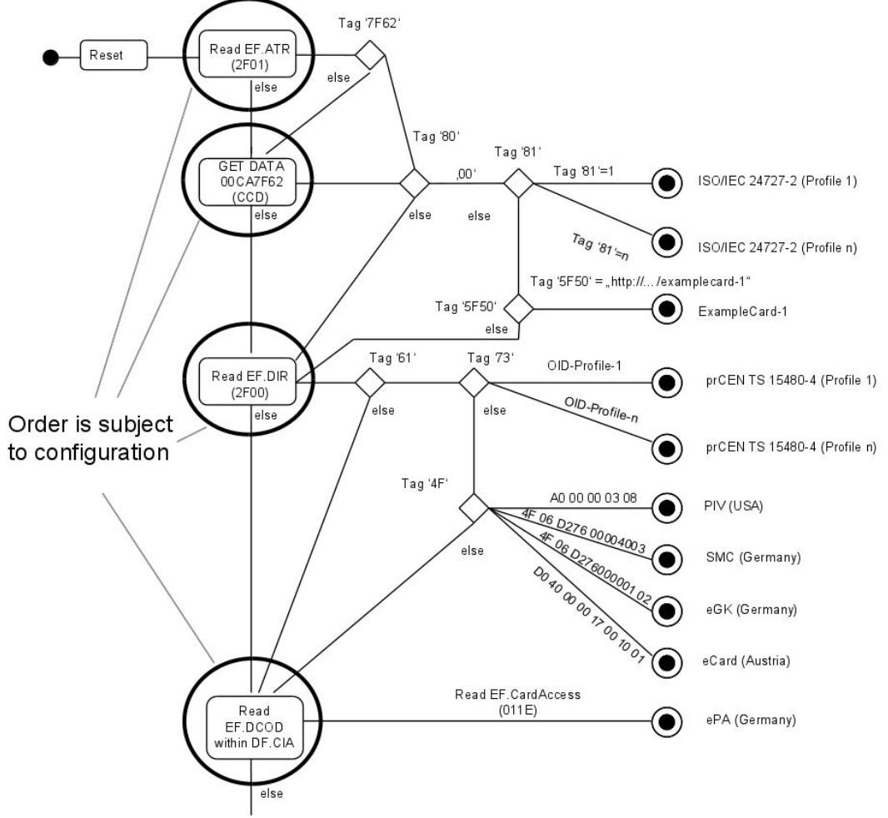

<span id="page-102-0"></span>*Figure 4: Example of a decision tree to recognize the card type*

**•** <by-partial-DF-name> indicates that the card applications can be addressed by the partial DF name (see Table 85 in [ISO7816-4]).

Details of the type BitReqType are described below.

<BER-TLV-data-objects-available> [optional]

This element contains information about the presence of BER-TLV coded data objects in EF.DIR and EF.ATR. It consists of two elements, each of type :

- **•** <in-EF.DIR> indicates the presence of BER-TLV coded data objects in EF.DIR.
- **•** <in-EF.ATR> indicates the presence of BER-TLV coded data objects in EF.ATR.

Details of the type BitReqType are described below.

```
<EF.x-access-services> [optional]
```
This element contains information about the method to access EF.DIR and EF.ATR. It consists of a choice between three elements, each of type BasicRequirementsType:

- **•** <ReadBinary> indicates that both files should be accessed via READ BINARY.
- **•** <ReadRecord> indicates that both files should be accessed via READ RECORD.
- **•** <GetData> indicates that both files should be accessed via GET DATA.

#### <Root> [optional]

This element contains information about the presence of a root directory. It consists of a choice between two elements, each of type BasicRequirementsType :

- **•** <Card-with-MF> indicates that there is an MF on the Card.
- **•** <Card-without-MF> indicates that there isn't an MF on the Card.

### **4.4.7 BitReqType**

The type BitReqType expands the type [RequirementsType](#page-98-0) by the element <Bit> which contains a bit represented as a Boolean value.

```
<complexType name="BitReqType">
 <complexContent>
 <extension base="iso:RequirementsType">
 <sequence>
 <element name="Bit" type="boolean" />
 </sequence>
 </extension>
 </complexContent>
</complexType>
```
### **4.4.8 ISO7816-4-CardCapabilitiesType**

<span id="page-103-0"></span>The type ISO7816-4-CardCapabilitiesType is an extension of the [FileRefReqType.](#page-98-1) It is used by the element <ISO7816-4-CardCapabilities>, which is part of the [EFATRorINFOType.](#page-100-0) The inherited element <Path> contains a path to the three card capability bytes, as long as these are not part of the (EF.) ATR (compact header tags '71', '72' and '73'). The <Path> element is not necessary, if the card is conforming to [ISO7816-4].

<complexType name="ISO7816-4-CardCapabilitiesType">

```
 <complexContent>
 <extension base="iso:FileRefReqType">
 <sequence>
 <element name="FirstSoftwareFunctionTable" maxOccurs="1" minOccurs="1">
 <complexType>
 <sequence>
 <element name="DF-selection" maxOccurs="1" minOccurs="0">
 <complexType>
 <sequence>
 <element name="by-full-DF-name" maxOccurs="1"
 type="iso:BitReqType" minOccurs="0" />
 <element name="by-partial-DF-name" maxOccurs="1"
 type="iso:BitReqType" minOccurs="0" />
 <element name="by-path" maxOccurs="1"
 type="iso:BitReqType" minOccurs="0" />
 <element name="by-file-identifier" maxOccurs="1"
 type="iso:BitReqType" minOccurs="0" />
 <element name="implicit" maxOccurs="1"
 type="iso:BitReqType" minOccurs="0" />
 </sequence>
 </complexType>
 </element>
 <element name="Short-EF-identifier" maxOccurs="1"
 type="iso:BitReqType" minOccurs="0" />
 <element name="Record-number" maxOccurs="1"
 type="iso:BitReqType" minOccurs="0" />
 <element name="Record-identifier" maxOccurs="1"
 type="iso:BitReqType" minOccurs="0" />
 </sequence>
 </complexType>
 </element>
 <element name="SecondSoftwareFunctionTable">
 <complexType>
 <sequence>
 <element name="EFs-of-TLV-structure" maxOccurs="1"
 type="iso:BitReqType" minOccurs="0" />
 <element name="Behaviour-of-write-functions"
 maxOccurs="1" minOccurs="0">
 <complexType>
 <complexContent>
 <extension base="iso:RequirementsType">
 <sequence>
 <element name="Behaviour" type="iso:WriteBehaviourType" />
 </sequence>
 </extension>
 </complexContent>
 </complexType>
 </element>
 <element name="Data-unit-size-in-quartets"
 maxOccurs="1" minOccurs="0">
 <complexType>
 <complexContent>
 <extension base="iso:RequirementsType">
 <sequence>
 <element name="Exponent">
 <simpleType>
 <restriction base="integer">
 <minInclusive value="1" />
 <maxInclusive value="31" />
 </restriction>
 </simpleType>
 </element>
 </sequence>
 </extension>
```

```
 </complexContent>
 </complexType>
 </element>
 <element name="Value-FF-for-first-byte-of-BER-TLV-valid"
 type="iso:BitReqType" maxOccurs="1" minOccurs="0" />
 </sequence>
 </complexType>
 </element>
 <element name="ThirdSoftwareFunctionTable">
 <complexType>
 <sequence>
 <element name="Command-chaining"
 type="iso:BitReqType" maxOccurs="1" minOccurs="0" />
 <element name="Extended-Lc-and-Le-fields"
 type="iso:BitReqType" maxOccurs="1" minOccurs="0" />
 <element name="Logical-Channel-support" maxOccurs="1" minOccurs="0">
 <complexType>
 <sequence>
 <element name="LC-Number-by-Card" type="iso:BitReqType" />
 <element name="LC-Number-by-IFD" type="iso:BitReqType" />
 <element name="Number-of-Logical-Channels"
 maxOccurs="1" minOccurs="1">
 <complexType>
 <complexContent>
 <extension base="iso:RequirementsType">
 <sequence>
 <element name="Maxium-Number">
 <simpleType>
 <restriction base="integer">
 <minInclusive value="1" />
 <maxInclusive value="8" />
 </restriction>
 </simpleType>
 </element>
 </sequence>
 </extension>
 </complexContent>
 </complexType>
 </element>
 </sequence>
 </complexType>
 </element>
 </sequence>
 </complexType>
 </element>
 </sequence>
 </extension>
 </complexContent>
</complexType>
```
### **4.4.9 WriteBehaviourType**

The WriteBehaviourType is used to specify detailed requirements of the behaviour of a smart card. See [ISO7816-4] for details.

```
<simpleType name="WriteBehaviourType">
 <restriction base="string">
 <enumeration value="One-time-write" />
 <enumeration value="Proprietary" />
 <enumeration value="Write-OR" />
 <enumeration value="Write-AND" />
 </restriction>
```
</simpleType>

#### **4.4.10 ExtendedLengthInfoType**

<span id="page-106-0"></span>The ExtendedLengthInfoType is used to specify information about the support of extended length. This type is derived from the [RequirementsType](#page-98-0) and defined as follows:

```
<complexType name="ExtendedLengthInfoType">
 <complexContent>
      <extension base="iso:RequirementsType">
             <sequence>
              <element name="GlobalLengthInfo" type="iso:LengthInfoType" />
              <element name="CommandSpecificLengthInfo"
                    type="iso:CommandSpecificLengthInfoType"
                    maxOccurs="unbounded" minOccurs="0" />
             </sequence>
      </extension>
 </complexContent>
</complexType>
```

```
<GlobalLengthInfo> [required]
```
This element provides general extended length information, which is valid unless it is overruled by a CommandSpecificLengthInfo-element. It is of type LengthInfoType, which is specified below.

```
<CommandSpecificLengthInfo> [optional, unbounded]
```
This element may exist multiple times and is used to provide command specific extended length information. It is of type CommandSpecificLengthInfoType, which is specified below.

#### **4.4.11 LengthInfoType**

The LengthInfoType is used in the definition of the ExtendedLengthInfoType above and the definition of CommandSpecificLengthInfoType below. It is defined as follows:

```
<complexType name="LengthInfoType">
      <sequence>
             <element name="MaxNc" type="positiveInteger" />
             <element name="MaxNe" type="positiveInteger" />
      </sequence>
</complexType>
```
It contains the following elements:

<MaxNc> [required]

Indicates the maximum value of the command length (Nc), which is valid unless it is overruled by the MaxNc-element in some CommandSpecificLengthInfo-element.

<MaxNe> [required]

Indicates the maximum value of the expected response length (Ne), which is valid unless it is overruled by the MaxNe-element in some CommandSpecificLengthInfo-element.

#### **4.4.12 CommandSpecificLengthInfoType**

The CommandSpecificLengthInfoType is used in the definition of the ExtendedLengthInfoType above and it is defined as follows:

```
<complexType name="CommandSpecificLengthInfoType">
      <sequence>
             <element name="Tag" type="byte"/>
             <element name="Command" type="hexBinary"/>
             <element name="LengthInfo" type="iso:LengthInfoType"/>
      </sequence>
</complexType>
```
It contains the following elements:

```
<Tag> [required]
```
Indicates the tag ('81' – '8F') of the standardized data structure, which specifies what the command description in the Command-element includes (see [ISO7816-4], Section 5.4.3.2, Table 22).

```
<Command> [required]
```
Specifies the (part of the) command header, for which the extended length information in the LengthInfo-element is provided.

<LengthInfo> [required]

Provides the command specific extended length information for the command identified by Command and Tag. This element is of type LengthInfoType specified above.

### <span id="page-107-0"></span>**4.5 ApplicationCapabilitiesType**

<span id="page-107-1"></span>The <ApplicationCapabilities> element is part of the CardInfo-element (cf. Section [4.1\)](#page-88-1). It is of type ApplicationCapabilitiesType and provides detailed information about the card applications available on the card. When used for a card which contains an application capability description as defined in [ISO24727-2] and/or is fully described by an appropriate [ISO7816-15] structure this element MAY be omitted.

```
<complexType name="ApplicationCapabilitiesType">
 <sequence>
 <element name="ImplicitlySelectedApplication"
 type="iso:ApplicationIdentifierType" maxOccurs="1" minOccurs="0" />
 <element name="CardApplication" maxOccurs="unbounded"
 type="iso:CardApplicationType" minOccurs="0" />
 <element name="Other" type="dss:AnyType" minOccurs="0"/>
 </sequence>
 <attribute name="Id" type="ID" use="optional" />
 </complexType>
```
<ImplicitlySelectedApplication> [optional]

This element specifies which card application is implicitly selected after initialization.

<CardApplication> [optional, unbounded]

This element is present for every card application available on the card.

```
<Other> [optional]
```
This element MAY contain some additional element, which structure is defined by some other specification.

#### **4.5.1 CardApplicationType**

The <CardApplication> element of type [CardApplicationType](#page-108-0) is part of th[e](#page-107-1) [ApplicationCapabilitiesType.](#page-107-1) The CardApplicationType is an extension of the type [RequirementsType](#page-98-0) containing the [<RequirementLevel>](#page-98-3) element.

```
<complexType name="CardApplicationType">
 <complexContent>
 <extension base="iso:RequirementsType">
 <sequence>
 <element name="InterfaceProtocol"
 type="anyURI" maxOccurs="unbounded" minOccurs="0" />
 <element name="ApplicationIdentifier" maxOccurs="1"
 type="iso:ApplicationIdentifierType" minOccurs="1" />
 <element name="ApplicationName"
 type="string" maxOccurs="1" minOccurs="0" />
 <element name="LocalApplicationName"
 type="dss:InternationalStringType" 
              maxOccurs="unbounded" minOccurs="0" />
 <element name="CardApplicationServiceInfo" maxOccurs="unbounded"
 type="iso:CardApplicationServiceType" minOccurs="0" />
 <element name="CardApplicationACL" 
 type="iso:AccessControlListType" />
 <element name="DIDInfo"
 type="iso:DIDInfoType" maxOccurs="unbounded" 
 minOccurs="0" />
 <element name="DataSetInfo"
 type="iso:DataSetInfoType" maxOccurs="unbounded"
 minOccurs="0" />
 <element name="Other" type="dss:AnyType" minOccurs="0"/>
 </sequence>
 <attribute name="Id" type="ID" use="optional" />
 </extension>
 </complexContent>
</complexType>
```
<InterfaceProtocol> [optional, unbounded]

This element MAY appear multiple times and indicates which protocols can be used to access the card application. The protocols specified here MUST also be defined in the Interface-element in th[e](#page-97-1) [CardCapabilitiesType.](#page-97-1)

```
<ApplicationIdentifier>
```
This element contains the application identifier of the card application.

```
<ApplicationName> [optional]
```
This element contains an informative name of the card application.

<LocalApplicationName> [optional, unbounded]

This element is used to specify localized names of the card-application.

<CardApplicationServiceInfo> [optional, unbounded]

This element contains information about the services supported by the card application. For details refer to the definition of CardApplicationServiceType.

```
<DIDInfo> [optional, unbounded]
```
This element is present for each differential identity (DID) of the card application and specifies the related details of this DID. For details refer to the definition of DIDInfoType.

```
<DataSetInfo> [optional, unbounded]
```
This element is present for each data set (and embodied data structures for interoperability) of the card application. For details refer to the definition of DataSetInfoType.

```
<Other> [optional]
```
This element MAY contain some additional element, which structure is defined by some other specification.

#### **4.5.2 CardApplicationServiceInfoType**

The <CardApplicationServiceInfo> element of type [CardApplicationServiceType](#page-109-0) is part of the definition of [CardApplicationType.](#page-108-0) The CardApplicationServiceType is an extension of the typ[e](#page-98-0) [RequirementsType](#page-98-0) containing the [<RequirementLevel>](#page-98-3) element.

```
<complexType name="CardApplicationServiceType">
 <complexContent>
 <extension base="iso:RequirementsType">
 <sequence>
 <element name="CardApplicationServiceName" type="string" />
 <element name="CardApplicationServiceDescription" maxOccurs="1"
 type="iso:CardApplicationServiceDescriptionType" 
 minOccurs="0" />
 <element name="Other" type="dss:AnyType" minOccurs="0"/>
 </sequence>
 </extension>
 </complexContent>
</complexType>
```
<CardApplicationServiceName>

This element contains the name of the card application service.

```
<ServiceACL>
```
This element contains access control information for the card application service (the structure of the AccessControlListType is explained below).

```
<CardApplicationServiceDescription> [optional]
```
If present, this element contains an interface description of the card application service. For details refer to the definition of CardApplicationServiceDescriptionType below. If the card application service is standardized as described in [ISO24727-3] this element is not necessary.

```
<Other> [optional]
```
This element MAY contain some additional element, which structure is defined by some other specification.

### **4.5.3 AccessControlListType**

The AccessControlListType is originally defined in [ISO24727-3] and contains a sequence of AccessRule-elements (also refer to page [32\)](#page-31-1).

```
<complexType name="AccessControlListType">
      <sequence>
             <element name="AccessRule" type="iso:AccessRuleType" 
                    maxOccurs="unbounded" minOccurs="0"/>
      </sequence>
</complexType>
```
<AccessRule> [optional, unbounded]

This element defines an access rule, which is of type AccessRuleType.

#### **4.5.4 AccessRuleType**

The AccessRuleType is defined as follows:

```
<complexType name="AccessRuleType">
      <sequence>
             <element name="CardApplicationServiceName" type="string" />
             <element name="Action" type="iso:ActionNameType" />
             <element name="SecurityCondition" type="iso:SecurityConditionType"/>
      </sequence>
</complexType>
```
It contains the following elements:

```
<CardApplicationServiceName> [optional]
```
This element specifies the CardApplicationServiceName, if this information is not provided outside the AccessControlList as it is the case in the definition of the CardApplicationServiceType.

```
<Action>
```
This element specifies the action as defined in [ISO24727-3] or loaded onto the card.

<SecurityCondition>

This element specifies the security conditions, which are necessary to perform the action specified above. As defined in [ISO24727-3] the security condition may be specified as a Boolean combination of DIDAuthenticationState-elements.

#### **4.5.5 CardApplicationServiceDescriptionType**

The CardApplicationServiceDescriptionType is defined as follows:

```
<complexType name="CardApplicationServiceDescriptionType">
      <choice>
             <element name="ServiceDescriptionURL" type="anyURI" />
             <element name="ServiceDescriptionText" type="string" />
      </choice>
</complexType>
```
It supports the following alternatives

```
<ServiceDescriptionURL> [choice]
```
This element contains a URL at which the ServiceDescriptionText may be found.

<ServiceDescriptionText> [choice]

<span id="page-110-0"></span>This element contains the description of the service.

#### **4.5.6 DIDInfoType**

The <DIDInfo> element of type [DIDInfoType](#page-110-0) is part of the [CardApplicationType](#page-108-0). The DIDInfoType is an extension of the type [RequirementsType](#page-98-0) containing the [<RequirementLevel>](#page-98-3) element.

```
<complexType name="DIDInfoType">
 <complexContent>
 <extension base="iso:RequirementsType">
 <sequence>
 <element name="DifferentialIdentity"
 type="iso:DifferentialIdentityType" />
 <element name="DIDACL" type="iso:AccessControlListType" />
 <element name="Other" type="dss:AnyType" minOccurs="0"/>
 </sequence>
 <attribute name="Id" type="ID" use="optional" />
 </extension>
 </complexContent>
</complexType>
```
<DifferentialIdentity>

According to [ISO24727-3] all key material used for authentication or other cryptographic operations is represented by a differential identity (DID). The [DifferentialIdentityType](#page-111-0) is described in detail below.

#### <DIDACL>

This element contains the access control list defining the access rights to the differential identities. For more details refer to the definition of the AccessControlListType.

```
<Other> [optional]
```
<span id="page-111-0"></span>This element MAY contain some additional element, which structure is defined by some other specification.

#### **4.5.7 DifferentialIdentityType**

The <DifferentialIdentity> element of type DifferentialIdentityType is part of th[e](#page-110-0) [DIDInfoType](#page-110-0).

```
<complexType name="DifferentialIdentityType">
 <sequence>
 <element name="DIDName" type="iso:DIDNameType" />
 <element name="LocalDIDName" type="dss:InternationalStringType"
 maxOccurs="unbounded" minOccurs="0" />
 <element name="DIDProtocol" type="anyURI" />
 <element name="DIDMarker" type="iso:DIDMarkerType" />
 <element name="DIDScope" type="iso:DIDScopeType" minOccurs="0" />
 <element name="DIDQualifier"
 type="iso:DIDQualifierType" minOccurs="0" maxOccurs="1" />
 </sequence>
</complexType>
```
<DIDName> [required]

This element contains the name (unique in the scope) which is used in function calls to refer to the differential identity.

```
<LocalDIDName> [optional, unbounded]
```
This element is used to specify localized names of the differential identity.

```
<DIDProtocol> [required]
```
This element specifies the protocol of the differential identity. Standardized protocols are defined [TR-03112-7] and [CEN15480-3] for example. Note that the protocol identifies the used cryptographic protocol including the used commands as well as the secure messaging to be used after successful completion of the cryptographic protocol.

<DIDMarker> [required]

The structure of this element depends on the [<DIDProtocol>](#page-111-1) element.

```
<DIDScope> [optional]
```
This element specifies whether the differential identity can be accessed from all card applications of the card (global) or only within a certain card application (local).

```
<DIDQualifier> [optional]
```
If present, this element contains further information on the differential identity.

#### **4.5.8 DIDQualifierType**

```
The structure of this type is defined as follows:
```

```
<complexType name="DIDQualifierType">
      <choice>
             <element name="ApplicationIdentifier"
              type="iso:ApplicationIdentifierType" />
             <element name="ObjectIdentifier" type="anyURI" />
             <element name="ApplicationFunction" type="iso:BitString" />
      </choice>
</complexType>
```
#### **4.5.9 DataSetInfoType**

<span id="page-112-0"></span>The <DataSetInfo> element of type [DataSetInfoType](#page-112-0) is part of the [CardApplicationType](#page-108-0). The DataSetInfoType is an extension of the type [RequirementsType](#page-98-0) containing the [<RequirementLevel>](#page-98-3) element.

```
<complexType name="DataSetInfoType">
 <complexContent>
 <extension base="iso:RequirementsType">
 <sequence>
 <element name="DataSetName" type="iso:DataSetNameType" />
 <element name="LocalDataSetName" type="dss:InternationalStringType"
 maxOccurs="unbounded" minOccurs="0" />
 <element name="DataSetACL" type="iso:AccessControlListType" />
 <element name="DataSetPath" type="iso:PathType" />
 <element name="DSI"
 type="iso:DSIType" maxOccurs="unbounded" minOccurs="0" />
 <element name="Other" type="dss:AnyType" minOccurs="0"/>
 </sequence>
 <attribute name="Id" type="ID" use="optional" />
 </extension>
 </complexContent>
</complexType>
```

```
<DataSetName> [required]
```
This element contains the name of a data set which can be used to address the data set in [ISO24727-3] calls.

<LocalDataSetName> [optional, unbounded]

This element MAY be used to specify localized names of the data set.

<DataSetACL> [required]

This element contains the access rules on the data set. For more details refer to the definition of AccessControlListType.

```
<DataSetPath> [required]
```
This element contains the path to a data set. For more details refer to the definition of [PathType.](#page-99-0)

```
<DSI> [optional, unbounded]
```
If the data set contains data structures for interoperability (DSIs) each of these elements MAY contain further information about one DSI. Details of the DSIType are specified below.

```
<Other> [optional]
```
This element MAY contain some additional element, which structure is defined by some other specification. Such an additional element MAY be used for post-issuance personalization purposes for example.

### **4.5.10 DSIType**

The DSIType is an extension of the type [RequirementsType](#page-98-0) and is specified as follows:

```
<complexType name="DSIType">
 <complexContent>
 <extension base="iso:RequirementsType">
 <sequence>
 <element name="DSIName" type="iso:DSINameType" />
 <element name="DSIPath" type="iso:PathType" />
 </sequence>
 </extension>
 </complexContent>
</complexType>
```

```
<DSIName> [required}
```
This element contains the name of the DSI which is used for addressing the DSI in procedure calls.

```
<DSIPath> [required]
```
This element contains the path to the DSI on the card. For further details refer to the definition of [PathType.](#page-99-0)

### <span id="page-113-0"></span>**4.6 Signature**

To defeat attacks which make use of manipulated [CardInfo-](#page-88-0)structures the issuers of CardInfo-files SHOULD apply a digital signature according to [RFC3275] to protect the [<CardInfo>](#page-88-0)-element or chosen parts of it.

When signed [CardInfo](#page-88-0) files are imported, the signature SHALL be verified according to an appropriate policy.

Furthermore it SHOULD be ensured that

- **•** especially protected key material for which the <Protected> element of the KeyRefType is TRUE and
- **•** potential dangerous APDUs in the CommandAPDU-element with CLA values '0x' or '1x', x{0, …,9, A,…,F} and INS values '20', '21', '24', '2C', and '22'

are only accessible or executed, if they are protected by an appropriate signature. [CardInfo-](#page-88-0)files with protected key material or dangerous APDU and without an appropriate signature SHOULD be rejected.

In a signature on a [CardInfo](#page-88-0) file the signer SHOULD only use the ds:X509Data choice in the KeyInfo element (see Section 4.4 in [RFC3275]).

All parts to be signed MUST be specified with ds:Reference elements. Every element to be included in the signature MUST have an Id attribute which is used in the URI attribute of the ds:Reference element. As the simplest case the whole [<CardInfo>](#page-88-0) element is referenced, so that the signature is part of the signed data and therefore is excluded when calculating the hash value ("enveloped signature"). On the other hand it is possible to sign only child elements of the [<CardInfo>](#page-88-0) element (e.g. [<CardType>](#page-88-2), [<CardIdentification>](#page-88-3) and <CardCapabilities>) as well as existing <CardApplication> elements (contained in the element [<ApplicationCapabilities>](#page-89-1)) so that it is possible to add a complete card application (on the card and in the [CardInfo](#page-88-0) file) without invalidating the existing signature. The tests described above assure that an attacker is not able to use an unsigned part of the [CardInfo](#page-88-0) file to access sensitive key objects which are protected by a signature.

#### **References**

| BSI: TR-03112-1: eCard-API-Framework – Part 1: Overview and Generic Mechanisms            |
|-------------------------------------------------------------------------------------------|
| BSI: TR-03112-2: eCard-API-Framework – Part 2: eCard-Interface                            |
| BSI: TR-03112-3: eCard-API-Framework – Part 3: Management-Interface                       |
| BSI: TR-03112-5: eCard-API Framework – Part 5: Suppor- Interface                          |
| BSI: TR-03112-6: eCard-API-Framework – Part 6: IFD-Interface                              |
| BSI: TR-03112-7: eCard-API-Framework – Part 7: Protocols                                  |
| CEN: TS 15480-3: Identification card systems —European Citizen Card — Part 3:             |
| European Citizen Card Interoperability using an application interface                     |
| CEN: TS 15480-4: Identification card systems — European Citizen Card — Part 4:            |
| Recommendations for European Citizen Card issuance, operation and use                     |
| gematik: Specification of the electronic health insurance card - Part 2: Applications and |
| application-specific structures, Version 2.2.1                                            |
| IETF: RFC 1738: T. Berners-Lee, L. Masinter, M. McCahill: Uniform Resource Locators       |
| (URL)                                                                                     |
| IETF: RFC 2119: S. Bradner: Key words for use in RFCs to Indicate Requirement Levels      |
| IETF: RFC 3275: D. Eastlage, J. Reagle, D. Solo: (Extensible Markup Language)             |
| XMLSignature Syntax and Processing                                                        |
| IETF: RFC 3280: R. Housley, W. Polk, W. Ford, D. Solo: Internet X.509 Public Key          |
| Infrastructure, Certificate and Certificate Revocation List (CRL) Profile                 |
| IETF: RFC 3281: S. Farrell, R. Housley: An Internet Attribute Certificate Profile for     |
| Authorization                                                                             |
| IETF: RFC 3966: H. Schulzrinne: The tel URI for Telephone Numbers                         |
| ISO: ISO/IEC 24727-2: Identification Cards — Integrated Circuit Cards Programming         |
| Interfaces — Part 2: Generic card interface                                               |
| ISO: ISO/IEC 24727-3: Identification Cards — Integrated Circuit Cards Programming         |
| Interfaces — Part 3: Application Interface                                                |
| ISO: ISO/IEC 24727-4: Identification Cards — Integrated Circuit Cards Programming         |
| Interfaces — Part 4: Application programming interface (API) administration               |
| ISO: ISO/IEC 7816-15: Identification cards - Integrated circuit(s) cards with contacts —  |
| Part 15: Cryptographic information application                                            |
| ISO: ISO/IEC 7816-3: Identification cards — Integrated circuit cards — Part 3: Cards      |
| with contacts — Electrical interface and transmission protocols                           |
| ISO: ISO/IEC 7816-4: Identification cards — Integrated circuit cards — Part               |
| 4:Organization, security and commands for interchange                                     |
| ISO: ISO/IEC 7816-8: Identification cards — Integrated circuit cards — Part 8: Security   |
| related interindustry commands                                                            |
| Liberty Alliance Project: Liberty Reverse HTTP Binding for SOAP Specification, Version    |
| v1.1                                                                                      |
| Liberty Alliance Project: Liberty Reverse HTTP Binding for SOAP Specification, Version    |
| v2.0                                                                                      |
| W3C: W3C Note: Simple Object Access Protocol (SOAP) 1.1                                   |
|                                                                                           |