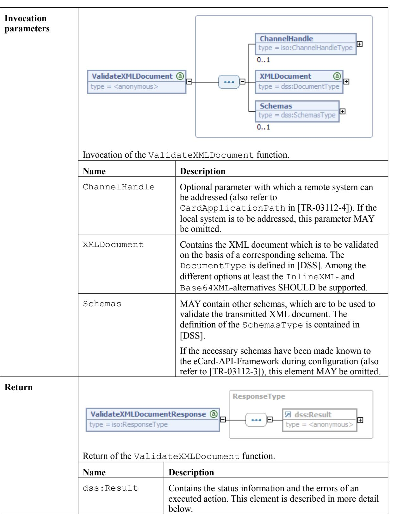
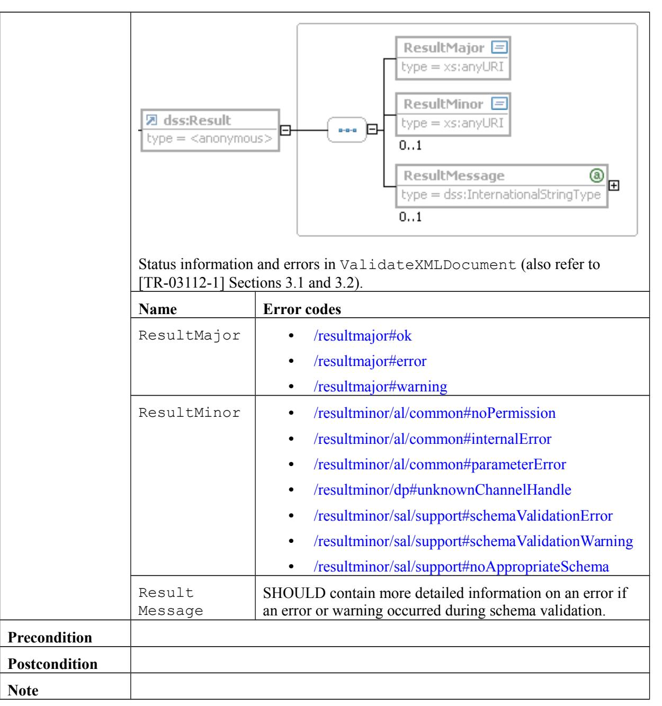
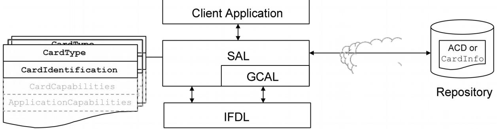
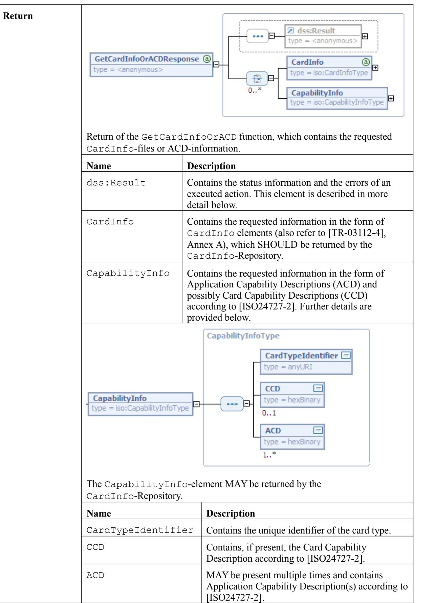
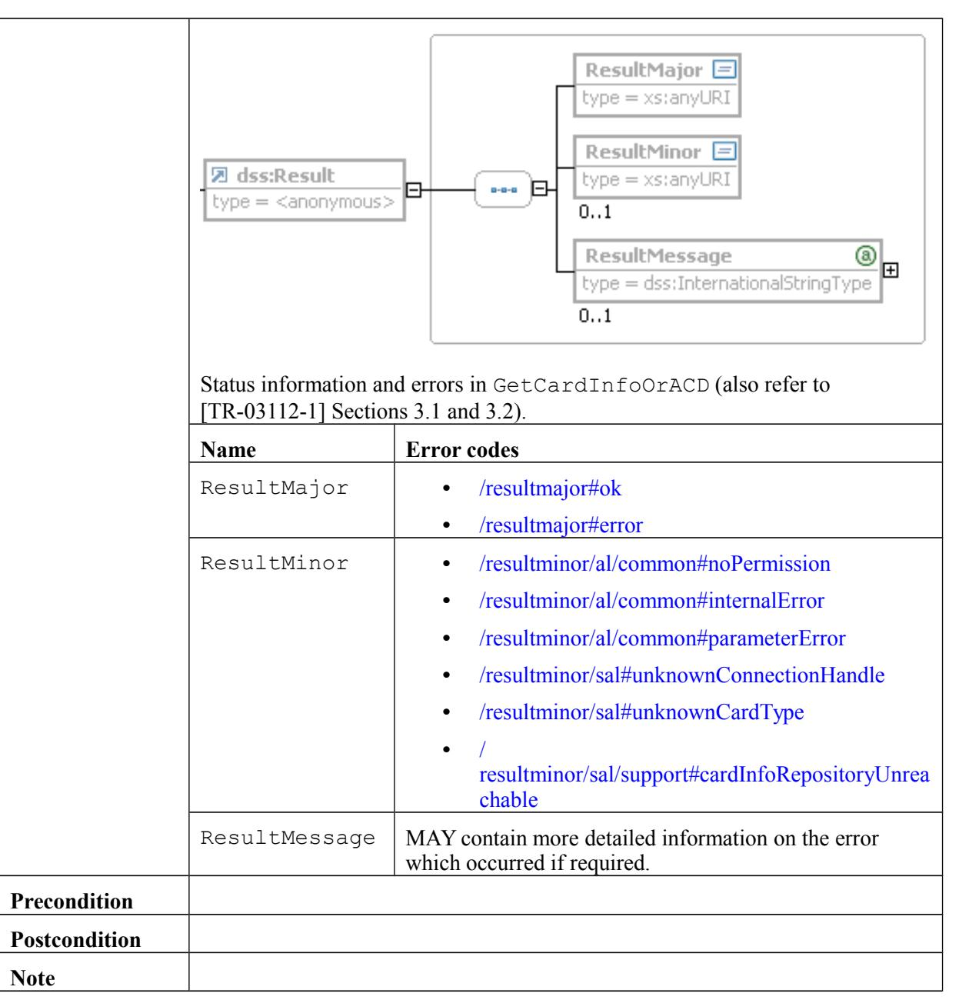

# Technical Guideline TR-03112-5 eCard-API-Framework – Support-Interface Version 1.1.5 7. April 2015

Bundesamt für Sicherheit in der Informationstechnik Postfach 20 03 63 53133 Bonn

E-Mail: ecard.api@bsi.bund.de Internet: https://www.bsi.bund.de © Bundesamt für Sicherheit in der Informationstechnik 2015

| 1     | Overview of the eCard-API-Framework4             |  |
|-------|--------------------------------------------------|--|
| 1.1   | Key Words4                                       |  |
| 1.2   | XML-Schema5                                      |  |
| 2     | Support-Interface6                               |  |
| 2.1   | Overview6                                        |  |
| 2.2   | Specification of the Support-Interface6          |  |
| 2.2.1 | Encode6                                          |  |
| 2.2.2 | Decode8                                          |  |
| 2.2.3 | ValidateXMLDocument9                             |  |
| 3     | Interface to the CardInfo-Repository12           |  |
| 3.1   | Overview12                                       |  |
| 3.2   | Specification of the GetCardInfoOrACD function12 |  |

| Figure 1: System architecture with CardInfo-Repository12 |  |  |  |  |  |  |
|----------------------------------------------------------|--|--|--|--|--|--|
|----------------------------------------------------------|--|--|--|--|--|--|

# **1 Overview of the eCard-API-Framework**

The objective of the eCard-API-Framework is the provision of a simple and homogeneous interface to enable standardised use of the various smart cards (eCards) for different applications.

The eCard-API-Framework is sub-divided into the following layers:

- **•** Application-Layer
- **•** Identity-Layer
- **•** Service-Access-Layer
- **•** Terminal-Layer

The **Application-Layer** contains the various applications which use the eCard-API-Framework to access the eCards and their associated functions. Application-specific "convenience interfaces", in which the recurring invocation sequences may be encapsulated in application-specific calls, may also exist in this layer. However, these interfaces are currently *not* within the scope of the e-Card-API-framework.

The **Identity-Layer** comprises the eCard-Interface and the Management interface, and therefore functions for the use and management of electronic identities as well as for management of the eCard-API-Framework.

The *eCard-Interface* (refer to [TR-03112-2]) allows to request certificates as well as the encryption, signature and time-stamping of documents.

In the M*anagement-Interface* (refer to [TR-03112-3]), functions for updating the framework and the management of trusted identities, smart cards, card terminals, and default behaviour are available.

The **Service-Access-Layer** provides, in particular, functions for cryptographic primitives and biometric mechanisms in connection with cryptographic tokens, and comprises the ISO24727-3-Interface and the Support-Interface.

The *ISO24727-3-Interface* defined in the present document is a webservice-based implementation of the standard of the same name [ISO24727-3]. This interface contains functions to establish (cryptographically protected) connections to smart cards, to manage card applications, to read or write data, to perform cryptographic operations and to manage the respective key material (in the form of so-called "differential identities"). In the process, all functions which use or manage "differential identities" are parameterised by means of protocol-specific object identifiers so that the different protocols which are defined in the present document MAY be used with a standardised interface (refer to [TR-03112-7]).

The S*upport-Interface* (refer to [TR-03112-5]) contains a range of supporting functions.

The **Terminal-Layer** primarily contains the *IFD-Interface* (refer to [TR-03112-6]). This layer takes over the generalisation of specific card terminal types and various interfaces as well as communication with the smart card. For the user it is unimportant whether the card is addressed by PC/SC, a SICCT terminal or a proprietary interface, or whether it has contacts or is contact-less.

## **1.1 Key Words**

The key words "MUST", "MUST NOT", "REQUIRED", "SHALL", "SHALL NOT", "SHOULD", "SHOULD NOT", "RECOMMENDED", "MAY", and "OPTIONAL" in this document are to be interpreted as described in [RFC2119]. The key word "CONDITIONAL" is to be interpreted as follows:

CONDITIONAL: The usage of an item is dependent on the usage of other items. It is therefore further qualified under which conditions the item is REQUIRED or RECOMMENDED.

### **1.2 XML-Schema**

A XML-Schema is provided together with this Technical Guideline. In case of incongruencies, the specifications in this text take precedence. The graphical representations of the XML-Schema illustrate the schema. Note that the text of this Guideline might further restrict the presence or mulitplicity of elements as compared to the schema definition.

# **2 Support-Interface**

## **2.1 Overview**

The Support-Interface contains a series of supporting functions which are typically not executed on an eCard. This comprises the following functions:

- **•** The Encode function encodes data. This function is also used for compressing data.
- **•** The Decode function decodes data. This function is also used for decompressing data.
- **•** The ValidateXMLDocument function validates an XML document on the basis of a schema.

### **2.2 Specification of the Support-Interface**

#### **2.2.1 Encode**

| Name                               | Encode                                          |                                                                                                                                                                                                     |  |
|------------------------------------|-------------------------------------------------|-----------------------------------------------------------------------------------------------------------------------------------------------------------------------------------------------------|--|
| Description                        | The Encode function encodes or compresses data. |                                                                                                                                                                                                     |  |
| Invocation parameters           |                                                 |                                                                                                                                                                                                     |  |
| Invocation of the Encode function. |                                                 |                                                                                                                                                                                                     |  |
| Name Description                |                                                 |                                                                                                                                                                                                     |  |
|                                    | ChannelHandle                                   | Optional parameter with which a remote system can be addressed (also refer to CardApplicationPath in [TR-03112-4]). If the local system is to be addressed, this parameter MAY be omitted. |  |
|                                    | Data                                            | Contains the data for encoding in binary form.                                                                                                                                                      |  |

|        | EncodingMethod                                                        | Contains the process in accordance with which the data are to be encoded. The following methods are to be supported as a minimum: • urn:ietf:rfc:1952 for "gzip" in accordance with [RFC1952] • urn:ietf:rfc:3548 for "base64" in accordance with [RFC3548] |
|--------|-----------------------------------------------------------------------|-------------------------------------------------------------------------------------------------------------------------------------------------------------------------------------------------------------------------------------------------------------------------------------|
| Return | Return of the Encode function.                                        |                                                                                                                                                                                                                                                                                     |
|        | Name                                                                  | Description                                                                                                                                                                                                                                                                         |
|        | dss:Result                                                            | Contains the status information and the errors of an executed action. This element is described in more detail below.                                                                                                                                                         |
|        | EncodedData Contains the encoded data, if the call was successful. |                                                                                                                                                                                                                                                                                     |
|        | 3.1 and 3.2).                                                         | Status information and errors in Encode (also refer to [TR-03112-1] Sections                                                                                                                                                                                                        |
|        | Name                                                                  | Error codes                                                                                                                                                                                                                                                                         |
|        | ResultMajor                                                           | • /resultmajor#ok • /resultmajor#error                                                                                                                                                                                                                                     |
|        | ResultMinor                                                           | • /resultminor/al/common#noPermission • /resultminor/al/common#internalError • /resultminor/al/common#parameterError • /resultminor/dp#unknownChannelHandle • /resultminor/sal/support#encodingError                                                     |

|               | ResultMessage | MAY contain more detailed information on the error which occurred if required. |
|---------------|---------------|-----------------------------------------------------------------------------------|
| Precondition  |               |                                                                                   |
| Postcondition |               |                                                                                   |
| Note          |               |                                                                                   |

#### **2.2.2 Decode**

| Name                     | Decode                                            |                                                                                                                                                                                                        |  |
|--------------------------|---------------------------------------------------|--------------------------------------------------------------------------------------------------------------------------------------------------------------------------------------------------------|--|
| Description              | The Decode function decodes or decompresses data. |                                                                                                                                                                                                        |  |
| Invocation parameters |                                                   |                                                                                                                                                                                                        |  |
|                          | Invocation of the Decode function.                |                                                                                                                                                                                                        |  |
|                          | Name                                              | Description                                                                                                                                                                                            |  |
|                          | ChannelHandle                                     | Optional parameter with which a remote system can be addressed (also refer to CardApplicationPath in [TR-03112-4]). If the local system is to be addressed, this parameter MAY be omitted. |  |
|                          | EncodedData                                       | Contains the encoded data.                                                                                                                                                                             |  |
|                          | EncodingMethod                                    | Contains the method with which the decoding shall be performed (for details refer to page 7).                                                                                                    |  |
| Return                   | Return of the Decode function.                    |                                                                                                                                                                                                        |  |
|                          | Name Description                               |                                                                                                                                                                                                        |  |

|                               | dss:Result                                                                                    | Contains the status information and the errors of an executed action. This element is described in more detail below.      |
|-------------------------------|-----------------------------------------------------------------------------------------------|----------------------------------------------------------------------------------------------------------------------------------|
|                               | DecodedData                                                                                   | Contains the decoded data, if the call was successful.                                                                           |
|                               |                                                                                               |                                                                                                                                  |
|                               | Status information and errors in Decode (also refer to [TR-03112-1] Sections 3.1 and 3.2). |                                                                                                                                  |
|                               |                                                                                               |                                                                                                                                  |
|                               | Name                                                                                          | Error codes                                                                                                                      |
|                               | ResultMajor                                                                                   | • /resultmajor#ok                                                                                                             |
|                               |                                                                                               | • /resultmajor#error                                                                                                          |
|                               | ResultMinor                                                                                   | • /resultminor/al/common#noPermission                                                                                         |
|                               |                                                                                               | • /resultminor/al/common#internalError                                                                                        |
|                               |                                                                                               | • /resultminor/al/common#parameterError                                                                                       |
|                               |                                                                                               |                                                                                                                                  |
|                               |                                                                                               | • /resultminor/dp#unknownChannelHandle                                                                                        |
|                               | ResultMessage                                                                                 | • /resultminor/sal/support#decodingError MAY contain more detailed information on the error which occurred if required. |
|                               |                                                                                               |                                                                                                                                  |
| Precondition Postcondition |                                                                                               |                                                                                                                                  |

#### **2.2.3 ValidateXMLDocument**

| Name        | ValidateXMLDocument                                                                                   |
|-------------|-------------------------------------------------------------------------------------------------------|
| Description | The ValidateXMLDocument function validates an XML document on the basis of a corresponding schema. |

## **3 Interface to the CardInfo-Repository**

## **3.1 Overview**

The interface to the CardInfo-Repository contains the function GetCardInfoOrACD, which may be used to retrieve CardInfo-files as specified in [TR-03112-4] and [CEN15480-3] or equivalent Application Capability Descriptions (ACD) according to [ISO24727-2], which allow to perform the mapping of generic calls at the ISO24727-3-Interface to card-specific APDUs.

*Figure 1: System architecture with CardInfo-Repository*

### **3.2 Specification of the GetCardInfoOrACD function**

| Name                     | GetCardInfoOrACD                                                                                                                                                                                                                                                                                                                                                      |             |
|--------------------------|-----------------------------------------------------------------------------------------------------------------------------------------------------------------------------------------------------------------------------------------------------------------------------------------------------------------------------------------------------------------------|-------------|
| Description              | The GetCardInfoOrACD function requests CardInfo files from a corresponding CardInfo-Repository server. Depending on the Action parameter this MAY include information for explicitly specified, related or not yet locally supported card types.                                                                                                             |             |
| Invocation parameters |                                                                                                                                                                                                                                                                                                                                                                       |             |
|                          | Invocation of the GetCardInfo function. This function allows to retrieve CardInfo-files, which are either explicitly specified by a given CardTypeIdentifier (Action is …#getSpecifiedFile), related to a given CardTypeIdentifier (Action is …#getRelatedFiles) or are not yet available on the present eCard-API-Framework (Action is …#getOtherFiles). |             |
|                          | Name                                                                                                                                                                                                                                                                                                                                                                  | Description |

| CardTypeIdentifier | This element corresponds to the ObjectIdentifier-element in the CardTypeType, which is used for the definition of the CardInfo-structure (cf. [TR-03112-4], Annex A.3). It MAY appear an arbitrary number of times and is used to specify the requested, related or already available CardInfo-files or1 equivalent ACD (see also Action-element below), such that the appropriate files may be retrieved from the CardInfo-Repository, which is specified in the DefaultCardInfoRepository confi-guration parameter (also refer to [TR-03112-3]). |
|--------------------|----------------------------------------------------------------------------------------------------------------------------------------------------------------------------------------------------------------------------------------------------------------------------------------------------------------------------------------------------------------------------------------------------------------------------------------------------------------------------------------------------------------------------------------------------------------------------------------------|
| Action             | MAY specify how the transmitted CardTypeIdentifier are to be interpreted.                                                                                                                                                                                                                                                                                                                                                                                                                                                                                                                 |
|                    | • http://www.bsi.bund.de/ecard/api/1.1/car dinfo/action#getSpecifiedFile - specifies that only the CardInfo file or ACD specified by the CardTypeIdentifier should be downloaded. If the Action element is missing, this case is assumed as a default.                                                                                                                                                                                                                                                                                                            |
|                    | • http://www.bsi.bund.de/ecard/api/1.1/car dinfo/action#getRelatedFiles - specifies that all CardInfo or ACD related to the specified CardTypeIdentifier (via profiling relations, cf. [TR-03112-4], Annex A) should be downloaded.                                                                                                                                                                                                                                                                                                                                     |
|                    | • http://www.bsi.bund.de/ecard/api/1.1/car dinfo/action#getOtherFiles - specifies that all CardInfo files or ACD in the CardInfoRepository except those explicitly specified by the CardTypeIdentifier should be downloaded. As a result, it is possible to always make all CardInfo files or ACD existing in the CardInfo-repository locally available.                                                                                                                                                                                                    |

1 The CardInfo-Repository SHOULD return XML-based CardInfo-files and MAY alternatively return equivalent ASN.1-coded ACD-information. The eCard-API-Framework MUST support XML-based CardInfo-files and MAY support ASN.1-coded ACD-information.

#### **References**

| [TR-03112-1] | BSI: TR-03112-1: eCard-API-Framework – Part 1: Overview and Generic Mechanisms                                                                         |
|--------------|--------------------------------------------------------------------------------------------------------------------------------------------------------|
| [TR-03112-2] | BSI: TR-03112-2: eCard-API-Framework – Part 2: eCard-Interface                                                                                         |
| [TR-03112-3] | BSI: TR-03112-3: eCard-API-Framework – Part 3: Management-Interface                                                                                    |
| [TR-03112-4] | BSI: TR-03112-4: eCard-API-Framework – Part 4: ISO24727-3-Interface                                                                                    |
| [TR-03112-5] | BSI: TR-03112-5: eCard-API Framework – Part 5: Suppor- Interface                                                                                       |
| [TR-03112-6] | BSI: TR-03112-6: eCard-API-Framework – Part 6: IFD-Interface                                                                                           |
| [TR-03112-7] | BSI: TR-03112-7: eCard-API-Framework – Part 7: Protocols                                                                                               |
| [CEN15480-3] | CEN: TS 15480-3: Identification card systems —European Citizen Card — Part 3: European Citizen Card Interoperability using an application interface |
| [RFC1952]    | IETF: RFC 1952: P. Deutsch: GZIP file format specification version 4.3                                                                                 |
| [RFC2119]    | IETF: RFC 2119: S. Bradner: Key words for use in RFCs to Indicate Requirement Levels                                                                   |
| [RFC3548]    | IETF: RFC 3548: S. Josefsson: The Base16, Base32, and Base64 Data Encodings                                                                            |
| [ISO24727-2] | ISO: ISO/IEC 24727-2: Identification Cards — Integrated Circuit Cards Programming Interfaces — Part 2: Generic card interface                       |
| [ISO24727-3] | ISO: ISO/IEC 24727-3: Identification Cards — Integrated Circuit Cards Programming Interfaces — Part 3: Application Interface                        |
| [DSS]        | OASIS: Digital Signature Service Core Protocols, Elements, and Bindings                                                                                |