# Technical Guideline TR-03112-6 eCard-API-Framework – IFD-Interface Version 1.1.5

7. April 2015

Bundesamt für Sicherheit in der Informationstechnik Postfach 20 03 63 53133 Bonn

E-Mail: ecard.api@bsi.bund.de Internet: https://www.bsi.bund.de © Bundesamt für Sicherheit in der Informationstechnik 2015

| 1            | Overview of the eCard-API-Framework4              |  |
|--------------|---------------------------------------------------|--|
| 1.1          | Key Words4                                        |  |
| 1.2          | XML-Schema5                                       |  |
| 2            | Overview of the IFD-Interface6                    |  |
| 2.1          | Objective6                                        |  |
| 2.2          | Functions6                                        |  |
| 2.2.1        | Card terminal functions6                          |  |
| 2.2.2        | Card functions7                                   |  |
| 2.2.3        | User interaction functions7                       |  |
| 2.2.4        | IFD callback interface for card terminal events7  |  |
| 3            | Specification of the IFD-Interface8               |  |
| 3.1          | Card terminal functions8                          |  |
| 3.1.1        | EstablishContext8                                 |  |
| 3.1.2        | ReleaseContext9                                   |  |
| 3.1.3        | ListIFDs11                                        |  |
| 3.1.4        | GetIFDCapabilities12                              |  |
| 3.1.5        | GetStatus17                                       |  |
| 3.1.6        | Wait20                                            |  |
| 3.1.7        | Cancel23                                          |  |
| 3.1.8 3.2 | ControlIFD25 Card functions26                  |  |
| 3.2.1        | Connect26                                         |  |
| 3.2.2        | Disconnect28                                      |  |
| 3.2.3        | BeginTransaction30                                |  |
| 3.2.4        | EndTransaction32                                  |  |
| 3.2.5        | Transmit33                                        |  |
| 3.3          | User interaction functions35                      |  |
| 3.3.1        | VerifyUser35                                      |  |
| 3.3.2        | ModifyVerificationData42                          |  |
| 3.3.3        | Output47                                          |  |
| 3.4          | IFD-Callback-Interface for card terminal events50 |  |
| 3.4.1        | SignalEvent50                                     |  |
|              |                                                   |  |

|  | Figure 1: Internal architecture of the IFD-Layer (informative)52 |  |
|--|------------------------------------------------------------------|--|
|--|------------------------------------------------------------------|--|

# **1 Overview of the eCard-API-Framework**

The objective of the eCard-API-Framework is the provision of a simple and homogeneous interface to enable standardised use of the various smart cards (eCards) for different applications.

The eCard-API-Framework is sub-divided into the following layers:

- **•** Application-Layer
- **•** Identity-Layer
- **•** Service-Access-Layer
- **•** Terminal-Layer

The **Application-Layer** contains the various applications which use the eCard-API-Framework to access the eCards and their associated functions. Application-specific "convenience interfaces", in which the recurring invocation sequences may be encapsulated in application-specific calls, may also exist in this layer. However, these interfaces are currently *not* within the scope of the e-Card-API-framework.

The **Identity-Layer** comprises the eCard-Interface and the Management interface, and therefore functions for the use and management of electronic identities as well as for management of the eCard-API-Framework.

The *eCard-Interface* (refer to [TR-03112-2]) allows to request certificates as well as the encryption, signature and time-stamping of documents.

In the M*anagement-Interface* (refer to [TR-03112-3]), functions for updating the framework and the management of trusted identities, smart cards, card terminals, and default behaviour are available.

The **Service-Access-Layer** provides, in particular, functions for cryptographic primitives and biometric mechanisms in connection with cryptographic tokens, and comprises the ISO24727-3-Interface and the Support-Interface.

The *ISO24727-3-Interface* defined in the present document is a webservice-based implementation of the standard of the same name [ISO24727-3]. This interface contains functions to establish (cryptographically protected) connections to smart cards, to manage card applications, to read or write data, to perform cryptographic operations and to manage the respective key material (in the form of so-called "differential identities"). In the process, all functions which use or manage "differential identities" are parameterised by means of protocol-specific object identifiers so that the different protocols which are defined in the present document MAY be used with a standardised interface (refer to [TR-03112-7]).

The S*upport-Interface* (refer to [TR-03112-5]) contains a range of supporting functions.

The **Terminal-Layer** primarily contains the *IFD-Interface* (refer to [TR-03112-6]). This layer takes over the generalisation of specific card terminal types and various interfaces as well as communication with the smart card. For the user it is unimportant whether the card is addressed by PC/SC, a SICCT terminal or a proprietary interface, or whether it has contacts or is contact-less.

## **1.1 Key Words**

The key words "MUST", "MUST NOT", "REQUIRED", "SHALL", "SHALL NOT", "SHOULD", "SHOULD NOT", "RECOMMENDED", "MAY", and "OPTIONAL" in this document are to be interpreted as described in [RFC2119]. The key word "CONDITIONAL" is to be interpreted as follows:

CONDITIONAL: The usage of an item is dependent on the usage of other items. It is therefore further qualified under which conditions the item is REQUIRED or RECOMMENDED.

## **1.2 XML-Schema**

A XML-Schema is provided together with this Technical Guideline. In case of incongruencies, the specifications in this text take precedence. The graphical representations of the XML-Schema illustrate the schema. Note that the text of this Guideline might further restrict the presence or mulitplicity of elements as compared to the schema definition.

# **2 Overview of the IFD-Interface**

# **2.1 Objective**

The IFD-Interface generalises the specific card terminal types and various interfaces and communicates with the smart card. For the user it is not relevant whether the card is addressed by PC/SC, CT-API, in a SICCT card terminal or via a proprietary interface, or whether it has contacts or is contactless.

### **2.2 Functions**

The IFD-Interface provides the following function groups:

- **•** Card terminal functions
- **•** Card functions
- **•** User interaction functions

In addition, there is an IFD-Callback-Interface for card terminal events and additional functions for the management of card terminals which are specified in the management interface [TR-03112-3]:

- **•** With the RegisterIFD function it is possible to add a card terminal with all configuration information.
- **•** The UnregisterIFD function deletes a card terminal.

#### **2.2.1 Card terminal functions**

- **•** The EstablishContext function opens a session with the Terminal-Layer and returns a ContextHandle which is used to address this session during subsequent function invocations.
- **•** The ReleaseContext terminates a session with the Terminal-Layer which had been addressed by a ContextHandle.
- **•** With the ListIFDs function a list of available card terminals is returned to the calling layer.
- **•** The GetIFDCapabilities function returns information on a specific card terminal and its functional units to the calling layer.
- **•** The GetStatus function determines the current status of the card terminal.
- **•** With the Wait function the invoking layer can be informed about card terminal events by the return of the wait function or by means of the SignalEvent callback function.
- **•** The Cancel function terminates waiting for card terminal events or attempts to terminate processing of the last command sent via the current handle to a specific card terminal. In this case the success of the operation depends on the type of command and the time at which Cancel was invoked.
- **•** The ControlIFD function sends a (proprietary) command to the card terminal. This serves to permit access to proprietary and application-specific functions for which there is no separate command in the IFD-Interface without changing the interface.

#### **2.2.2 Card functions**

- **•** The Connect function activates a card captured by the IFD and returns a SlotHandle with which the card can be addressed in the future.
- **•** The Disconnect function invalidates a SlotHandle and optionally performs an additional action (e.g. eCard ejection, if the IFD features the corresponding mechanical functionality).
- **•** The BeginTransaction function starts a transaction within the framework of which several commands can be sent to the eCard. If an error occurs, the transaction is terminated and any modifications are reset.
- **•** The EndTransaction function terminates an existing transaction.
- **•** The Transmit function sends APDUs to an eCard addressed via a SlotHandle.

#### **2.2.3 User interaction functions**

- **•** The VerifyUser function verifies the user by means of a PIN or a biometric characteristic.
- **•** The ModifyVerificationData modifies the identification data (PIN or biometric characteristic).
- **•** The Output function may be used to control the output units of a card terminal.

#### **2.2.4 IFD callback interface for card terminal events**

**•** With the SignalEvent function, layers above the Terminal-Layer can be informed of card terminal events. For this purpose the SignalEvent function must be offered as a webservice by these layers.

# **3 Specification of the IFD-Interface**

## **3.1 Card terminal functions**

#### **3.1.1 EstablishContext**

| Name                     | EstablishContext                                                                                                                                                               |                                                                                                                                                                                                     |  |  |
|--------------------------|--------------------------------------------------------------------------------------------------------------------------------------------------------------------------------|-----------------------------------------------------------------------------------------------------------------------------------------------------------------------------------------------------|--|--|
| Description              | The EstablishContext function opens a session with the Terminal-Layer and returns a ContextHandle which is used to address this session in further function invocations. |                                                                                                                                                                                                     |  |  |
| Invocation parameters |                                                                                                                                                                                |                                                                                                                                                                                                     |  |  |
|                          | Invocation of the EstablishContext function.                                                                                                                                   |                                                                                                                                                                                                     |  |  |
|                          | Name                                                                                                                                                                           | Description                                                                                                                                                                                         |  |  |
|                          | ChannelHandle                                                                                                                                                                  | Optional parameter with which a remote system can be addressed (also refer to CardApplicationPath in [TR-03112-4]). If the local system is to be addressed, this parameter MAY be omitted. |  |  |
| Return                   |                                                                                                                                                                                |                                                                                                                                                                                                     |  |  |
|                          | Return of the EstablishContext function.                                                                                                                                       |                                                                                                                                                                                                     |  |  |
|                          | Name                                                                                                                                                                           | Description                                                                                                                                                                                         |  |  |
|                          | dss:Result                                                                                                                                                                     | Contains the status information and the errors of an executed action. This element is described in more detail below.                                                                         |  |  |
|                          | ContextHandle                                                                                                                                                                  | The session with the Terminal-Layer is addressed via the returned ContextHandle.                                                                                                                 |  |  |

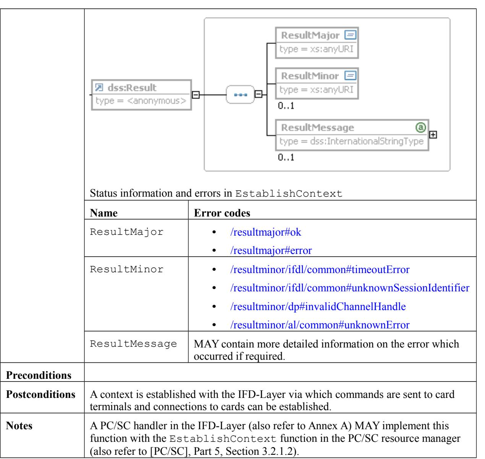

#### **3.1.2 ReleaseContext**

| Name                     | ReleaseContext                                                            |             |  |
|--------------------------|---------------------------------------------------------------------------|-------------|--|
| Description              | The ReleaseContext function terminates a session with the Terminal-Layer. |             |  |
| Invocation parameters |                                                                           |             |  |
|                          | Invocation of the ReleaseContext function.                                |             |  |
|                          | Name                                                                      | Description |  |

|                | ContextHandle                                                                                                                                                                                               |             | Handle with which the session with the Terminal-Layer can be addressed.                                                  |  |
|----------------|-------------------------------------------------------------------------------------------------------------------------------------------------------------------------------------------------------------|-------------|-----------------------------------------------------------------------------------------------------------------------------|--|
| Return         | Return of the ReleaseContext function.                                                                                                                                                                      |             |                                                                                                                             |  |
|                | Name                                                                                                                                                                                                        |             | Description                                                                                                                 |  |
|                | dss:Result                                                                                                                                                                                                  |             | Contains the status information and the errors of an executed action. This element is described in more detail below. |  |
|                |                                                                                                                                                                                                             |             |                                                                                                                             |  |
|                | Status information and errors in ReleaseContext                                                                                                                                                             |             |                                                                                                                             |  |
|                | Name                                                                                                                                                                                                        | Error codes |                                                                                                                             |  |
|                | ResultMajor                                                                                                                                                                                                 | • •      | /resultmajor#ok /resultmajor#error                                                                                       |  |
|                | ResultMinor                                                                                                                                                                                                 | • • • | /resultminor/ifdl/common#timeoutError /resultminor/dp#invalidChannelHandle /resultminor/al/common#unknownError        |  |
|                | ResultMessage                                                                                                                                                                                               |             | MAY contain more detailed information on the error which occurred if required.                                           |  |
| Preconditions  | A context was established with EstablishContext.                                                                                                                                                            |             |                                                                                                                             |  |
| Postconditions | The ContextHandle loses its validity.                                                                                                                                                                       |             |                                                                                                                             |  |
| Notes          | A PC/SC handler in the IFD-Layer (also refer to Annex A) MAY implement this function with the ReleaseContext function in the PC/SC resource manager (also refer to [PC/SC], Part 5, Section 3.2.1.2). |             |                                                                                                                             |  |

#### **3.1.3 ListIFDs**

| Name                     | ListIFDs                                                                                                                             |             |                                                                                                                             |  |
|--------------------------|--------------------------------------------------------------------------------------------------------------------------------------|-------------|-----------------------------------------------------------------------------------------------------------------------------|--|
| Description              | Returns the list of the card terminals assigned to the eCard-API-Framework, which at least contains the currently connected IFDs. |             |                                                                                                                             |  |
| Invocation parameters |                                                                                                                                      |             |                                                                                                                             |  |
|                          | Invocation of the ListIFDs function.                                                                                                 |             |                                                                                                                             |  |
|                          | Name ContextHandle                                                                                                                | Description | Handle with which the session with the Terminal-Layer can be addressed.                                                  |  |
| Return                   | Return of the ListIFDs function.                                                                                                     |             |                                                                                                                             |  |
|                          | Name                                                                                                                                 |             | Description                                                                                                                 |  |
|                          | dss:Result                                                                                                                           |             | Contains the status information and the errors of an executed action. This element is described in more detail below. |  |
|                          | IFDName                                                                                                                              |             | Unique name of the card terminal.                                                                                           |  |
|                          |                                                                                                                                      |             |                                                                                                                             |  |
|                          | Status information and errors in ListIFDs                                                                                            |             |                                                                                                                             |  |
| Name Error codes      |                                                                                                                                      |             |                                                                                                                             |  |

|                | ResultMajor                                                                                                                                                                                              | • /resultmajor#ok • /resultmajor#error                                                                                     |
|----------------|----------------------------------------------------------------------------------------------------------------------------------------------------------------------------------------------------------|-------------------------------------------------------------------------------------------------------------------------------------|
|                | ResultMinor                                                                                                                                                                                              | • /resultminor/ifdl/common#timeoutError • /resultminor/dp#invalidChannelHandle • /resultminor/al/common#unknownError |
|                | ResultMessage                                                                                                                                                                                            | MAY contain more detailed information on the error which occurred if required.                                                   |
| Preconditions  | The potentially available card terminals were assigned to the eCard-API-Framework in an administrative operation (also refer to [TR-03112-3]).                                                     |                                                                                                                                     |
|                | A context was established with EstablishContext.                                                                                                                                                         |                                                                                                                                     |
| Postconditions | The status of the card terminals remains unchanged.                                                                                                                                                      |                                                                                                                                     |
| Notes          | A PC/SC handler in the IFD-Layer (also refer to Annex A) MAY implement this function with the ListReaders function in the PC/SC resource manager (also refer to [PC/SC], Part 5, Section 3.2.3.2). |                                                                                                                                     |
|                | Also refer to GetCardTerminals in [TR-03112-2].                                                                                                                                                          |                                                                                                                                     |

#### **3.1.4 GetIFDCapabilities**

| Name                     | GetIFDCapabilities                                                                               |                                                                        |
|--------------------------|--------------------------------------------------------------------------------------------------|------------------------------------------------------------------------|
| Description              | Returns information on the capabilities of a specific card terminal and its functional units. |                                                                        |
| Invocation parameters |                                                                                                  |                                                                        |
|                          | Invocation of the GetIFDCapabilities function.                                                   |                                                                        |
|                          | Name                                                                                             | Description                                                            |
|                          | ContextHandle                                                                                    | Handle with which the session with the Terminal-Layer is addressed. |
|                          | IFDName                                                                                          | Unique name of the card terminal.                                      |

| KeyPadCapability                           | Such an entry with the capabilities of the keypad exists for each card terminal keypad. The entry is of the KeyPadCapabilityType.                                                                                                                                                                                                                                                                                                                           |
|--------------------------------------------|----------------------------------------------------------------------------------------------------------------------------------------------------------------------------------------------------------------------------------------------------------------------------------------------------------------------------------------------------------------------------------------------------------------------------------------------------------------------|
| BioSensorCapability                        | Such an entry of the BioSensorCapabilityType with the capabilities of the sensor exists for each biometric sensor on the card terminal.                                                                                                                                                                                                                                                                                                                     |
| OpticalSignalUnit                          | Contains information on whether the card terminal has an optical signal unit (e.g. LED).                                                                                                                                                                                                                                                                                                                                                                          |
| AcousticSignalUnit                         | Contains information on whether the card terminal has a unit for acoustic signals (e.g. beeping).                                                                                                                                                                                                                                                                                                                                                              |
| SlotCapability is part of IFDCapabilities. |                                                                                                                                                                                                                                                                                                                                                                                                                                                                      |
| Name                                       | Description                                                                                                                                                                                                                                                                                                                                                                                                                                                          |
| Index                                      | Specifies the index of the slot in the range of 0 to the number of slots minus 1.                                                                                                                                                                                                                                                                                                                                                                                 |
| Protocol                                   | MAY be present multiple times and indicate the supported transport protocols (see Interface-element in [TR-03112-4]) or the supported DID-protocols (see [TR-03112-7]).Support of the IFD for PACE according to [TR-03119]/[PC/SC], Part 10 AMD1 is indicated by the URI urn:oid:0.4.0.127.0.7.2.2.4:xx, where xx is the decimal representation of the capabilites bitmap returned by GetReader PACECapabilites as defined in [PC/SC], |

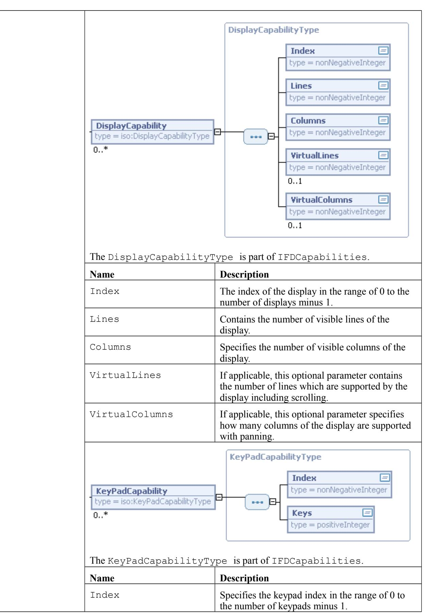

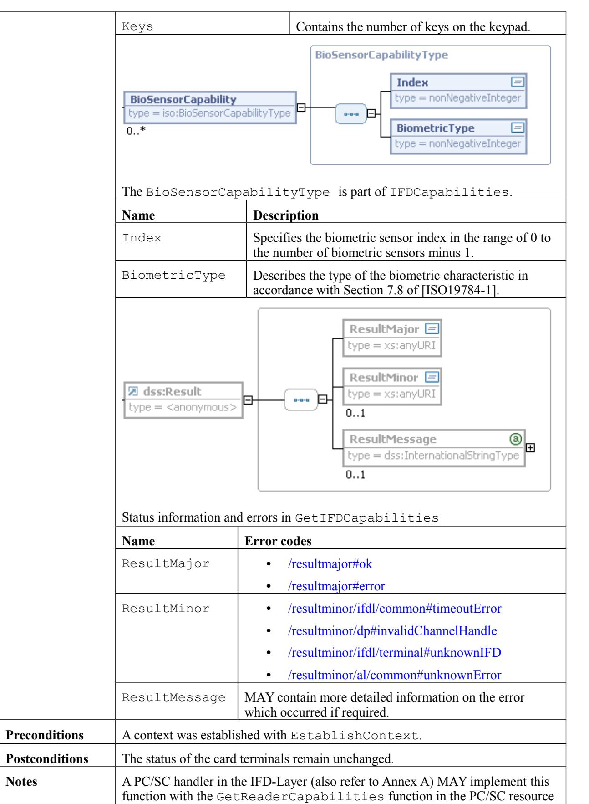

| manager (also refer to [PC/SC], Part 5, Section 3.2.5.2). |
|-----------------------------------------------------------|
|                                                           |

#### **3.1.5 GetStatus**

| Name                     | GetStatus                                                                 |                                                                                                                                        |
|--------------------------|---------------------------------------------------------------------------|----------------------------------------------------------------------------------------------------------------------------------------|
| Description              | Determines the current status of one specific or all connected terminals. |                                                                                                                                        |
| Invocation parameters |                                                                           |                                                                                                                                        |
|                          | Invocation of the GetStatus function.                                     |                                                                                                                                        |
|                          | Name                                                                      | Description                                                                                                                            |
|                          | ContextHandle                                                             | Handle with which the session with the Terminal-Layer is addressed.                                                                 |
|                          | IFDName                                                                   | MAY contain the unique name of the card terminal. If this element is missing, the status of all connected terminals is returned. |
| Return                   | Return of the GetStatus function.                                         |                                                                                                                                        |
|                          |                                                                           |                                                                                                                                        |
|                          | Name                                                                      | Description                                                                                                                            |
|                          | dss:Result                                                                | Contains the status information and the errors of an executed action. This element is described in more detail below.            |
|                          | IFDStatus                                                                 | Contains information on the status of the respective terminal.                                                                      |

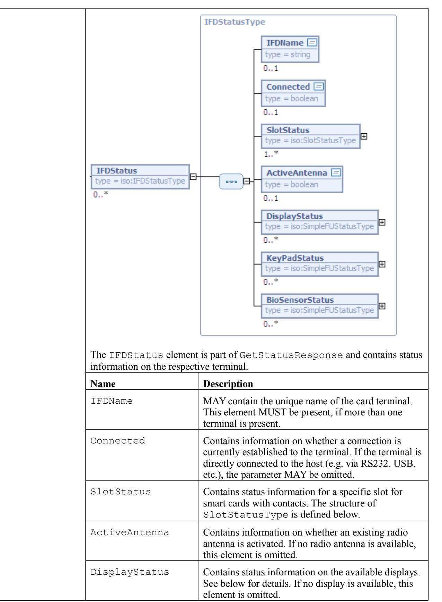

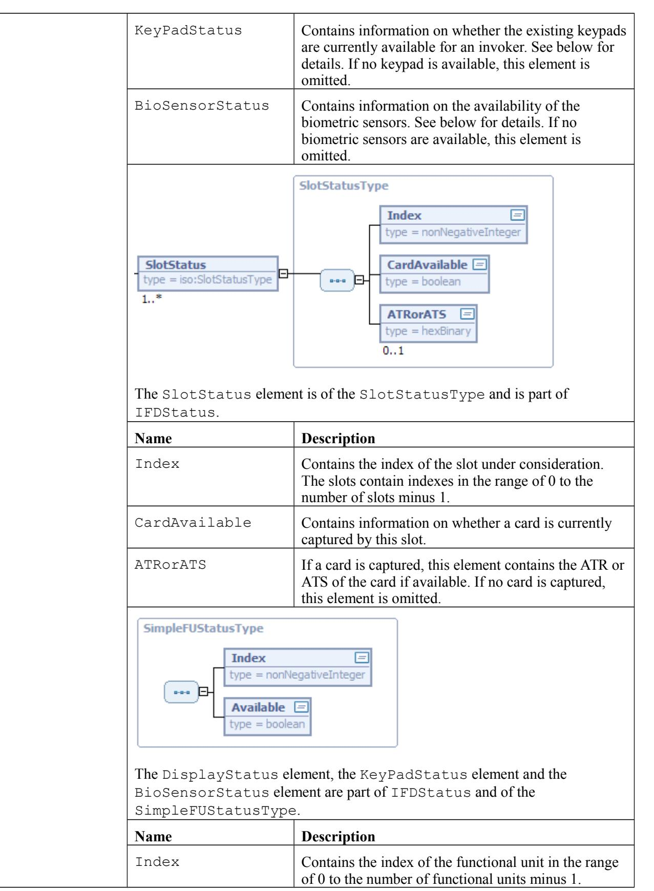

|                | Available                                                                                                                                                                                           | Specifies whether the functional unit is currently                                |
|----------------|-----------------------------------------------------------------------------------------------------------------------------------------------------------------------------------------------------|-----------------------------------------------------------------------------------|
|                |                                                                                                                                                                                                     | available for the invoker or if it is already being used.                         |
|                |                                                                                                                                                                                                     |                                                                                   |
|                | Status information and errors in GetStatusResponse                                                                                                                                                  |                                                                                   |
|                | Name                                                                                                                                                                                                | Error codes                                                                       |
|                | ResultMajor                                                                                                                                                                                         | • /resultmajor#ok                                                              |
|                |                                                                                                                                                                                                     | • /resultmajor#error                                                           |
|                | ResultMinor                                                                                                                                                                                         | • /resultminor/ifdl/common#timeoutError                                        |
|                |                                                                                                                                                                                                     | • /resultminor/dp#invalidChannelHandle                                         |
|                |                                                                                                                                                                                                     | • /resultminor/ifdl/terminal#unknownIFD                                        |
|                |                                                                                                                                                                                                     | • /resultminor/al/common#unknownError                                          |
|                | ResultMessage                                                                                                                                                                                       | MAY contain more detailed information on the error which occurred if required. |
| Preconditions  | A context was established with EstablishContext.                                                                                                                                                    |                                                                                   |
| Postconditions | The status of the card terminals remains unchanged.                                                                                                                                                 |                                                                                   |
| Notes          | A PC/SC handler in the IFD-Layer (also refer to Annex A) MAY implement this function with the Status function in the PC/SC resource manager (also refer to [PC/SC], Part 5, Section 3.2.5.2). |                                                                                   |

#### **3.1.6 Wait**

| Name        | Wait                                                                                                                                                                                                                                                                                |
|-------------|-------------------------------------------------------------------------------------------------------------------------------------------------------------------------------------------------------------------------------------------------------------------------------------|
| Description | The Wait function informs the invoking layer about events on specific card terminals. Information on which events have occurred can be returned by the return of the Wait function or – if a corresponding callback address was transmitted – by the SignalEvent function. |

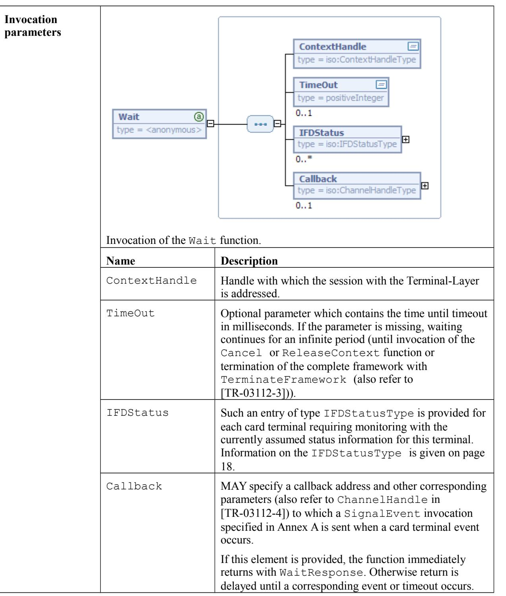

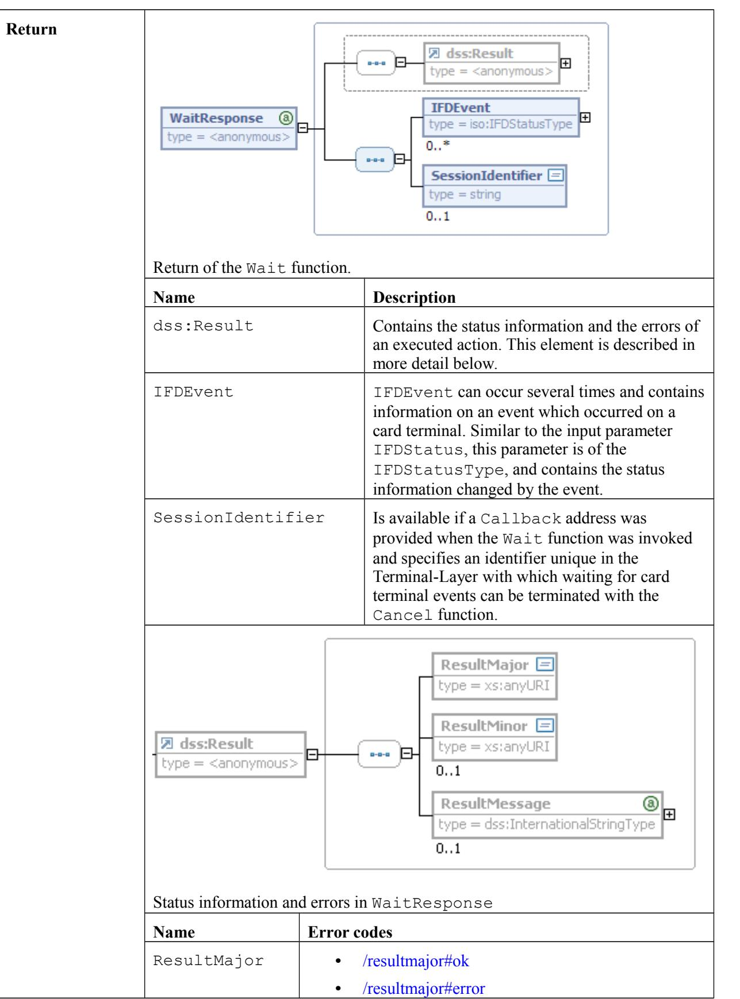

|                | ResultMinor                                      | • /resultminor/ifdl/common#timeoutError • /resultminor/dp#invalidChannelHandle • /resultminor/ifdl/terminal#unknownIFD • /resultminor/al/common#unknownError                            |
|----------------|--------------------------------------------------|--------------------------------------------------------------------------------------------------------------------------------------------------------------------------------------------------------------|
|                | ResultMessage                                    | MAY contain more detailed information on the error which occurred if required.                                                                                                                            |
| Preconditions  | A context was established with EstablishContext. |                                                                                                                                                                                                              |
| Postconditions |                                                  |                                                                                                                                                                                                              |
| Notes          |                                                  | A PC/SC handler in the IFD-Layer (also refer to Annex A) MAY implement this function with the GetStatusChange function in the PC/SC resource manager (also refer to [PC/SC], Part 5, Section 3.2.4.2). |

#### **3.1.7 Cancel**

| Name                     | Cancel                                                    |                                                                                                          |
|--------------------------|-----------------------------------------------------------|----------------------------------------------------------------------------------------------------------|
| Description              | cancel processing of the last command sent to a terminal. | Terminates waiting for card terminal events started with Wait, or attempts to                            |
| Invocation parameters | Invocation of the Cancel function.                        |                                                                                                          |
|                          | Name                                                      | Description                                                                                              |
|                          | ContextHandle                                             | Handle with which the session with the Terminal-Layer is addressed.                                   |
|                          | IFDName                                                   | Unique name of the card terminal at which a command currently being executed should be terminated. |
|                          | SessionIdentifier                                         | Specifies which waiting process should be terminated with Wait.                                       |

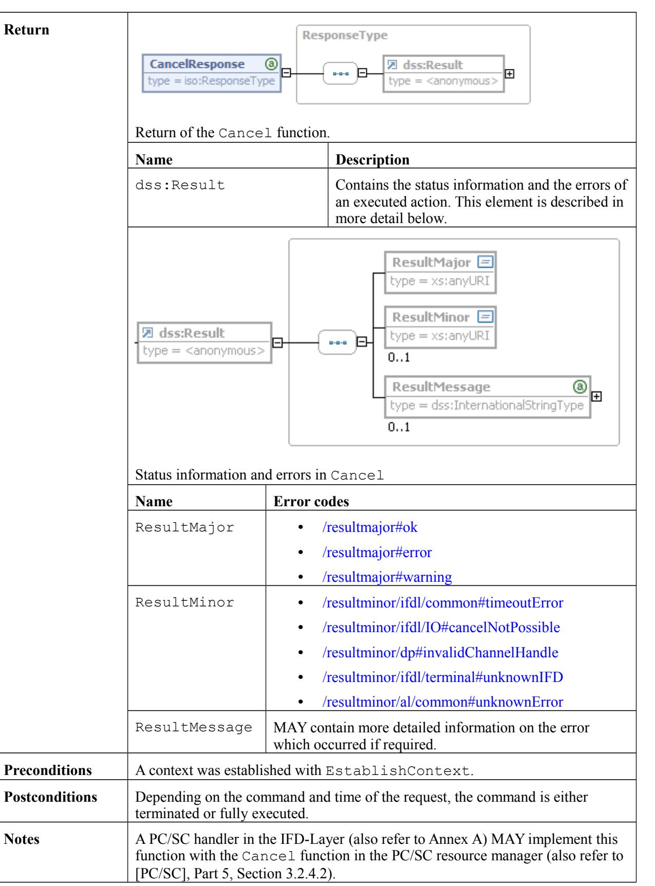

#### **3.1.8 ControlIFD**

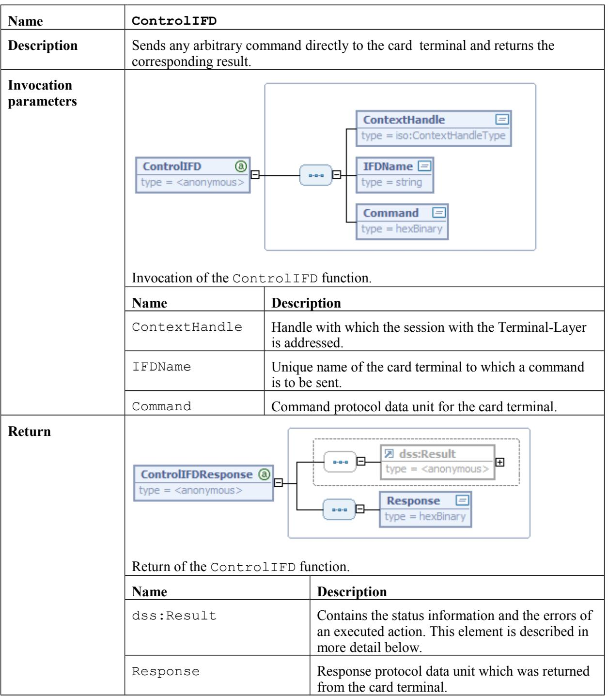

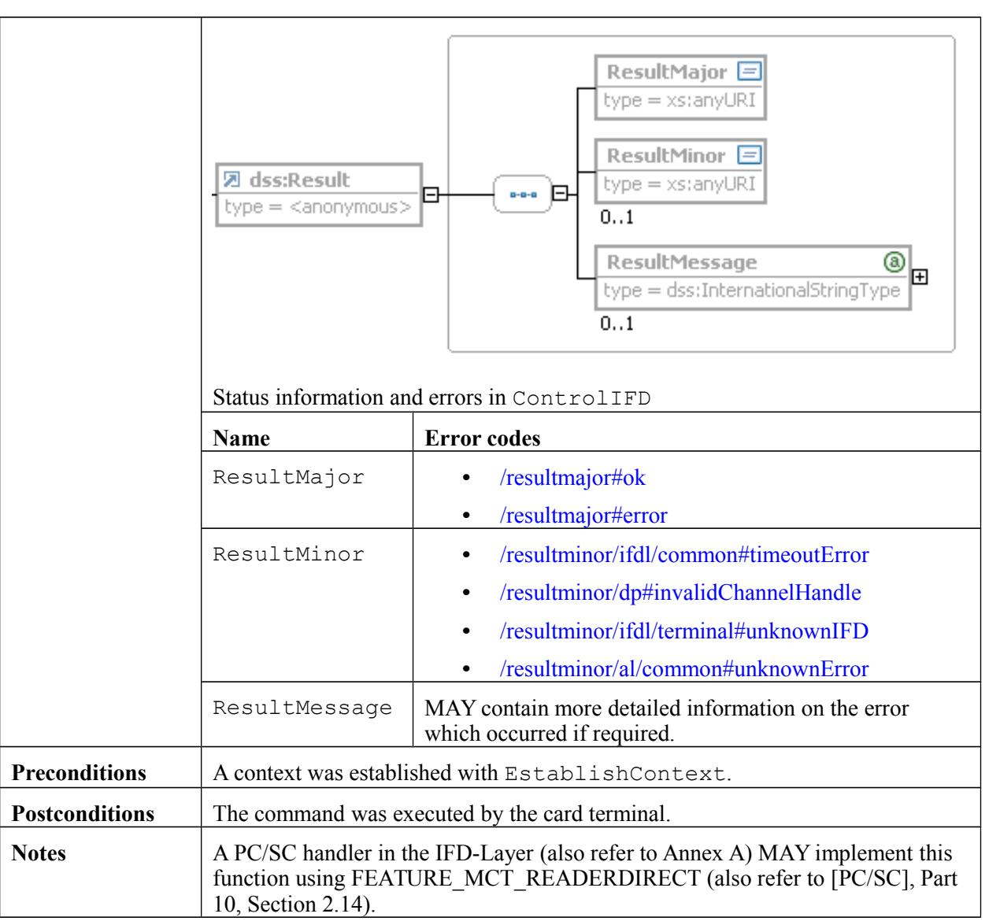

# **3.2 Card functions**

#### **3.2.1 Connect**

| Name        | Connect                                                                                                                               |
|-------------|---------------------------------------------------------------------------------------------------------------------------------------|
| Description | Establishes a connection to an eCard in a specific card terminal slot and returns a corresponding SlotHandle to the calling layer. |

| Invocation parameters |                                     |                                                                                                                                                                                                                                                        |
|--------------------------|-------------------------------------|--------------------------------------------------------------------------------------------------------------------------------------------------------------------------------------------------------------------------------------------------------|
|                          | Invocation of the Connect function. |                                                                                                                                                                                                                                                        |
|                          | Name                                | Description                                                                                                                                                                                                                                            |
|                          | ContextHandle                       | Handle with which the session with the Terminal-Layer is addressed.                                                                                                                                                                                 |
|                          | IFDName                             | Unique name of the card terminal.                                                                                                                                                                                                                      |
|                          | Slot                                | Addresses the slot (ICC slot or PCD) of an IFD by which a card is detected and with which a connection should be established. Assignment of the slot indexes is explained in the definition of the SlotStatusType (also refer to page 19). |
|                          | Exclusive                           | Is TRUE if an exclusive connection should be established to the eCard.                                                                                                                                                                              |
| Return                   |                                     |                                                                                                                                                                                                                                                        |
|                          | Return of the Connect function.     |                                                                                                                                                                                                                                                        |
|                          | Name                                | Description                                                                                                                                                                                                                                            |
|                          | dss:Result                          | Contains the status information and the errors of an executed action. This element is described in more detail below.                                                                                                                            |
|                          | SlotHandle                          | If successful, a SlotHandle is returned with which the connection established with Connect to the eCard is addressed in future.                                                                                                                  |

|                | Status information and errors in Connect                                                                                                                                                                                                                                                                                              |                                                                                                                                                                                                                                                                                              |  |
|----------------|---------------------------------------------------------------------------------------------------------------------------------------------------------------------------------------------------------------------------------------------------------------------------------------------------------------------------------------|----------------------------------------------------------------------------------------------------------------------------------------------------------------------------------------------------------------------------------------------------------------------------------------------|--|
|                | Name                                                                                                                                                                                                                                                                                                                                  | Error codes                                                                                                                                                                                                                                                                                  |  |
|                | ResultMajor                                                                                                                                                                                                                                                                                                                           | • /resultmajor#ok                                                                                                                                                                                                                                                                         |  |
|                | ResultMinor                                                                                                                                                                                                                                                                                                                           | • /resultmajor#error • /resultminor/ifdl/common#timeoutError                                                                                                                                                                                                                        |  |
|                |                                                                                                                                                                                                                                                                                                                                       | • /resultminor/ifdl/common#invalidContextHandle • /resultminor/ifdl/terminal#unknownIFD • /resultminor/ifdl/terminal#unknownSlot • /resultminor/ifdl/terminal#IFDSharingViolation • /resultminor/ifdl/terminal#noCard • /resultminor/al/common#unknownError |  |
|                | ResultMessage                                                                                                                                                                                                                                                                                                                         | MAY contain more detailed information on the error which occurred if required.                                                                                                                                                                                                            |  |
| Preconditions  |                                                                                                                                                                                                                                                                                                                                       | A context was established with EstablishContext.                                                                                                                                                                                                                                             |  |
| Postconditions | A logical connection to the card was established. APDUs can then be sent to the card via the returned SlotHandle with the Transmit function. As a result, the path to a card application can also be determined with CardApplicationPath and established by means of CardApplicationConnect (also refer to [TR-03112-4]). |                                                                                                                                                                                                                                                                                              |  |
| Notes          | A PC/SC handler in the IFD-Layer (also refer to Annex A) MAY implement this function with the Connect function in the PC/SC resource manager (also refer to [PC/SC], Part 5, Section 3.2.5.2).                                                                                                                                  |                                                                                                                                                                                                                                                                                              |  |

#### **3.2.2 Disconnect**

| Name        | Disconnect                                                                                                                                                                                                      |
|-------------|-----------------------------------------------------------------------------------------------------------------------------------------------------------------------------------------------------------------|
| Description | The Disconnect function terminates the connection to a card and MAY execute an additional action (e.g. ejection of the card), if the corresponding mechanical functionality is supported by the terminal. |

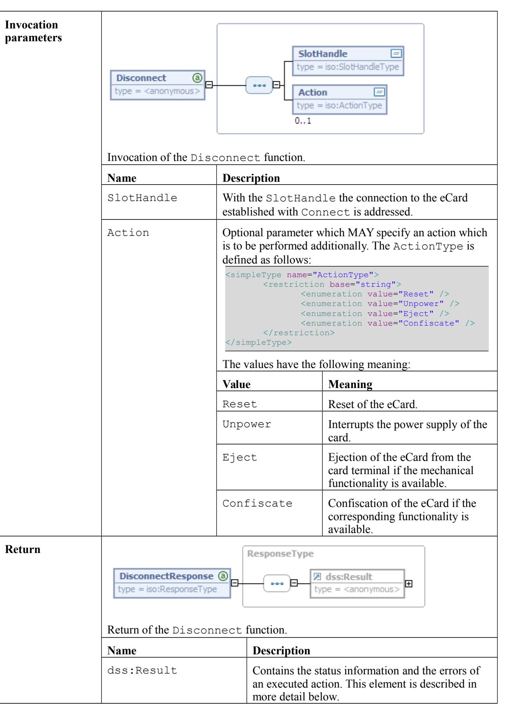

|                | Status information and errors in Disconnect                                                                                                                                                             |                                                                                   |  |
|----------------|---------------------------------------------------------------------------------------------------------------------------------------------------------------------------------------------------------|-----------------------------------------------------------------------------------|--|
|                | Name                                                                                                                                                                                                    | Error codes                                                                       |  |
|                | ResultMajor                                                                                                                                                                                             | • /resultmajor#ok                                                              |  |
|                |                                                                                                                                                                                                         | • /resultmajor#error                                                           |  |
|                | ResultMinor                                                                                                                                                                                             | • /resultminor/ifdl/common#timeoutError                                        |  |
|                |                                                                                                                                                                                                         | • /resultminor/ifdl/common#invalidSlotHandle                                   |  |
|                |                                                                                                                                                                                                         | • /resultminor/ifdl/terminal#unknownAction                                     |  |
|                |                                                                                                                                                                                                         | • /resultminor/al/common#unknownError                                          |  |
|                | ResultMessage                                                                                                                                                                                           | MAY contain more detailed information on the error which occurred if required. |  |
| Preconditions  | A connection to an eCard was established with Connect.                                                                                                                                                  |                                                                                   |  |
| Postconditions | The SlotHandle loses its validity.                                                                                                                                                                      |                                                                                   |  |
| Notes          | A PC/SC handler in the IFD-Layer (also refer to Annex A) MAY implement this function with the Disconnect function in the PC/SC resource manager (also refer to [PC/SC], Part 5, Section 3.2.5.2). |                                                                                   |  |

#### **3.2.3 BeginTransaction**

| Name                     | BeginTransaction                                                                                                                                                                                                                                                        |
|--------------------------|-------------------------------------------------------------------------------------------------------------------------------------------------------------------------------------------------------------------------------------------------------------------------|
| Description              | The BeginTransaction function starts a transaction within which a series of commands can be sent to the eCard without permitting access of another process to the eCard. If a command is not successful in the transaction, the complete transaction is reset. |
| Invocation parameters | Invocation of the BeginTransaction function.                                                                                                                                                                                                                            |

|                | Name                                                                                                                                                                                                          |                                                                                   | Description                                                                                                                 |  |
|----------------|---------------------------------------------------------------------------------------------------------------------------------------------------------------------------------------------------------------|-----------------------------------------------------------------------------------|-----------------------------------------------------------------------------------------------------------------------------|--|
|                | SlotHandle                                                                                                                                                                                                    |                                                                                   | With the SlotHandle the connection established with Connect to the eCard is addressed.                                   |  |
| Return         |                                                                                                                                                                                                               |                                                                                   |                                                                                                                             |  |
|                | Return of the BeginTransaction function. Name                                                                                                                                                              |                                                                                   | Description                                                                                                                 |  |
|                | dss:Result                                                                                                                                                                                                    |                                                                                   | Contains the status information and the errors of an executed action. This element is described in more detail below. |  |
|                |                                                                                                                                                                                                               |                                                                                   | Status information and errors in BeginTransaction                                                                           |  |
|                | Name                                                                                                                                                                                                          | Error codes                                                                       |                                                                                                                             |  |
|                | ResultMajor                                                                                                                                                                                                   | • •                                                                            | /resultmajor#ok /resultmajor#error                                                                                       |  |
|                | ResultMinor                                                                                                                                                                                                   | • • •                                                                       | /resultminor/ifdl/common#timeoutError /resultminor/ifdl/common#invalidSlotHandle /resultminor/al/common#unknownError  |  |
|                | ResultMessage                                                                                                                                                                                                 | MAY contain more detailed information on the error which occurred if required. |                                                                                                                             |  |
| Preconditions  |                                                                                                                                                                                                               | A connection to an eCard was established with Connect.                            |                                                                                                                             |  |
| Postconditions | A transaction is started.                                                                                                                                                                                     |                                                                                   |                                                                                                                             |  |
| Notes          | A PC/SC handler in the IFD-Layer (also refer to Annex A) MAY implement this function with the BeginTransaction function in the PC/SC resource manager (also refer to [PC/SC], Part 5, Section 3.2.5.2). |                                                                                   |                                                                                                                             |  |

#### **3.2.4 EndTransaction**

| Name                     | EndTransaction                         |                                                                                                                             |  |  |
|--------------------------|----------------------------------------|-----------------------------------------------------------------------------------------------------------------------------|--|--|
| Description              | selected eCard.                        | The EndTransaction function terminates an existing transaction with a                                                       |  |  |
| Invocation parameters |                                        | Invocation of the EndTransaction function.                                                                                  |  |  |
|                          | Name                                   | Description                                                                                                                 |  |  |
|                          | SlotHandle                             | The SlotHandle addresses the connection to the eCard.                                                                    |  |  |
| Return                   | Return of the EndTransaction function. |                                                                                                                             |  |  |
|                          | Name                                   | Description                                                                                                                 |  |  |
|                          | dss:Result                             | Contains the status information and the errors of an executed action. This element is described in more detail below. |  |  |
|                          |                                        |                                                                                                                             |  |  |
|                          | Name                                   | Status information and errors in EndTransaction Error codes                                                              |  |  |
|                          |                                        |                                                                                                                             |  |  |
|                          | ResultMajor                            | • /resultmajor#ok • /resultmajor#error                                                                             |  |  |
|                          |                                        | • /resultmajor#warning                                                                                                   |  |  |

|                | ResultMinor                                                                                                                                                                                                 | • /resultminor/ifdl/common#timeoutError • /resultminor/ifdl/common#invalidSlotHandle • /resultminor/ifdl/IO#noTransactionStarted • /resultminor/al/common#unknownError |  |
|----------------|-------------------------------------------------------------------------------------------------------------------------------------------------------------------------------------------------------------|---------------------------------------------------------------------------------------------------------------------------------------------------------------------------------------------|--|
|                | ResultMessage                                                                                                                                                                                               | MAY contain more detailed information on the error which occurred if required.                                                                                                           |  |
| Preconditions  | A connection to an eCard was established with Connect and a transaction started for the thus-connected card with BeginTransaction.                                                                       |                                                                                                                                                                                             |  |
| Postconditions | The transaction is terminated.                                                                                                                                                                              |                                                                                                                                                                                             |  |
| Notes          | A PC/SC handler in the IFD-Layer (also refer to Annex A) MAY implement this function with the EndTransaction function in the PC/SC resource manager (also refer to [PC/SC], Part 5, Section 3.2.5.2). |                                                                                                                                                                                             |  |

#### **3.2.5 Transmit**

| Name                     | Transmit                                                                                                                                                                                                                                                                                                                                                                                                                                             |                                                                                                                                                                                                     |
|--------------------------|------------------------------------------------------------------------------------------------------------------------------------------------------------------------------------------------------------------------------------------------------------------------------------------------------------------------------------------------------------------------------------------------------------------------------------------------------|-----------------------------------------------------------------------------------------------------------------------------------------------------------------------------------------------------|
| Description              | The Transmit function sends one or more APDU(s) to a connected eCard. In order to support the batch processing a set of AcceptableStatusCode-elements (9000 etc.) MAY be attached to each InputAPDU. If the eCard returns some not expected status code it is – even in case of secure messaging – clear that there is a serious error and it does not make sense to feed the remaining InputAPDU-elements in the batch to the eCard. |                                                                                                                                                                                                     |
| Invocation parameters | Invocation of the Transmit function.                                                                                                                                                                                                                                                                                                                                                                                                                 |                                                                                                                                                                                                     |
|                          | Name                                                                                                                                                                                                                                                                                                                                                                                                                                                 | Description                                                                                                                                                                                         |
|                          | SlotHandle                                                                                                                                                                                                                                                                                                                                                                                                                                           | With the SlotHandle the connection established with Connect to the eCard is addressed.                                                                                                           |
|                          | InputAPDUInfo                                                                                                                                                                                                                                                                                                                                                                                                                                        | MAY be present multiple times and contains the command APDU, which is sent to the eCard and optionally acceptable status codes. It is of type InputAPDUInfoType, which is explained below. |

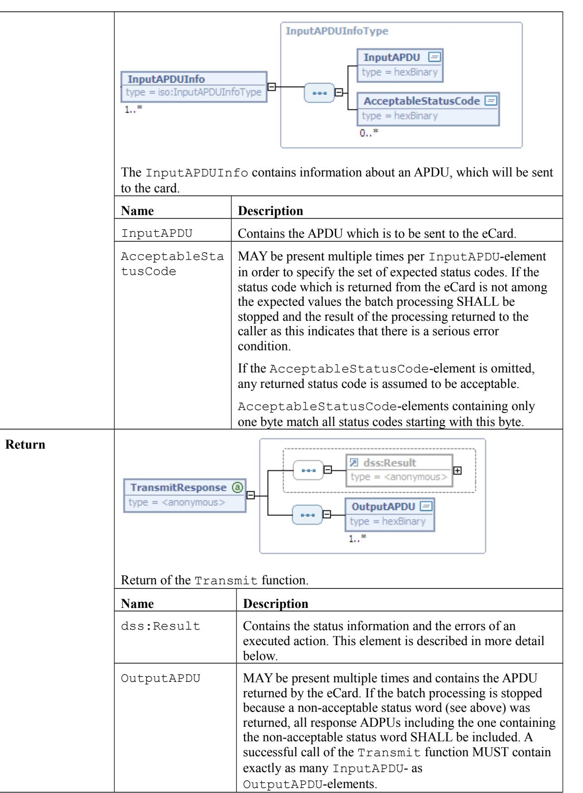

|                | Status information and errors in Transmit                                                                                                                                                             |                                                                                   |
|----------------|-------------------------------------------------------------------------------------------------------------------------------------------------------------------------------------------------------|-----------------------------------------------------------------------------------|
|                | Name                                                                                                                                                                                                  | Error codes                                                                       |
|                | ResultMajor                                                                                                                                                                                           | • /resultmajor#ok                                                              |
|                |                                                                                                                                                                                                       | • /resultmajor#error                                                           |
|                | ResultMinor                                                                                                                                                                                           | • /resultminor/ifdl/common#timeoutError                                        |
|                |                                                                                                                                                                                                       | • /resultminor/ifdl/common#invalidSlotHandle                                   |
|                |                                                                                                                                                                                                       | • /resultminor/al/common#unknownError                                          |
|                | ResultMessage                                                                                                                                                                                         | MAY contain more detailed information on the error which occurred if required. |
| Preconditions  | A connection to an eCard was established with Connect.                                                                                                                                                |                                                                                   |
| Postconditions | The commands specified by the batch of APDU are executed by the eCard.                                                                                                                                |                                                                                   |
| Notes          | A PC/SC handler in the IFD-Layer (also refer to Annex A) MAY implement this function with the Transmit function in the PC/SC resource manager (also refer to [PC/SC], Part 5, Section 3.2.5.2). |                                                                                   |

# **3.3 User interaction functions**

#### **3.3.1 VerifyUser**

| Name        | VerifyUser                                                                                       |
|-------------|--------------------------------------------------------------------------------------------------|
| Description | The VerifyUser function initiates user verification with a PIN or a biometric characteristic. |

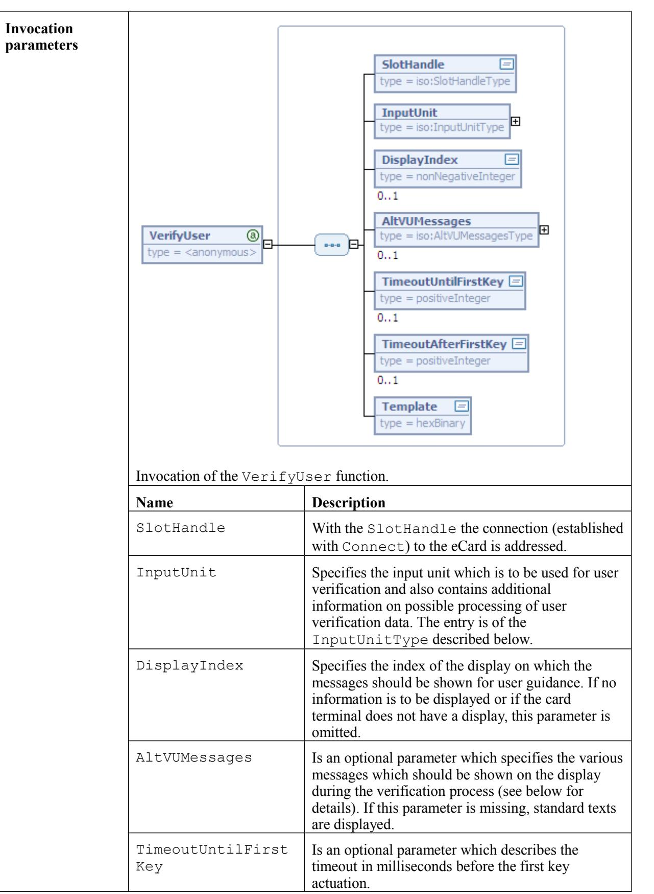

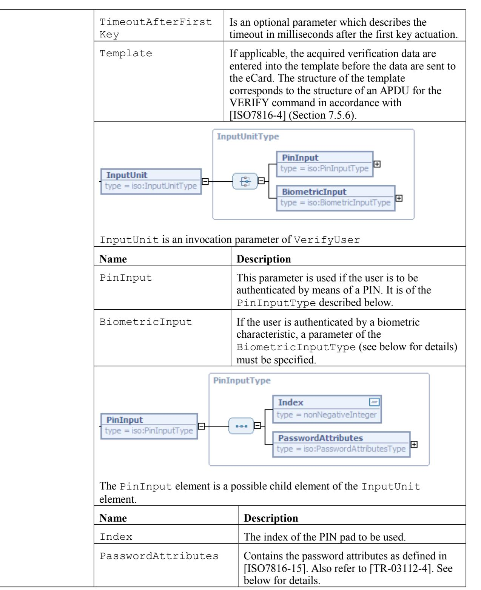

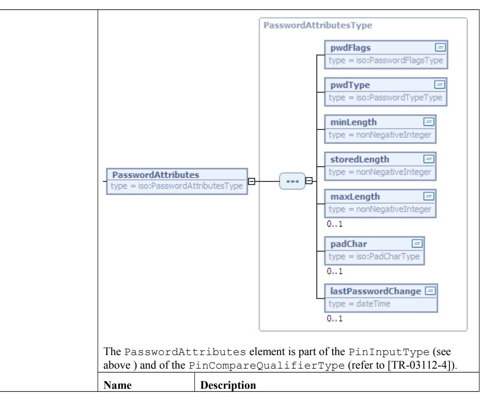

| pwdFlags               | Contains information on the character of the PIN (also refer to pwdFlags in accordance with [ISO7816-15]). The PasswordFlagsType is defined as follows:                                                                                                                                                                                                                                                                                                                                                                                                                                                                                                                                                                                                                                                                                                                  |
|------------------------|--------------------------------------------------------------------------------------------------------------------------------------------------------------------------------------------------------------------------------------------------------------------------------------------------------------------------------------------------------------------------------------------------------------------------------------------------------------------------------------------------------------------------------------------------------------------------------------------------------------------------------------------------------------------------------------------------------------------------------------------------------------------------------------------------------------------------------------------------------------------------------|
|                        | <simpleType name="PasswordFlagsType"> <union memberTypes="iso:BitString"> <simpleType> <list> <simpleType> <restriction base="token"> <enumeration value="case-sensitive" /> <enumeration value="local" /> <enumeration value="change-disabled" /> <enumeration value="unblock-disabled" /> <enumeration value="initialized" /> <enumeration value="needs-padding" /> <enumeration value="unblockingPassword" /> <enumeration value="soPassword" /> <enumeration value="disable-allowed" /> <enumeration value="integrity-protected" /> <enumeration value="confidentiality-protected"/> <enumeration value="exchangeRefData" /> <enumeration value="resetRetryCounter1" /> <enumeration value="resetRetryCounter2" /> </restriction> </simpleType> </list> </simpleType> </union> </simpleType> |
| pwdType                | Contains information on the type of PIN (also refer to pwdType in accordance with [ISO7816-15]). The PasswordTypeType is defined as follows: <simpleType name="PasswordTypeType"> <restriction base="string"> <enumeration value="bcd" /> <enumeration value="ascii-numeric" /> <enumeration value="utf8" /> <enumeration value="half-nibble-bcd" /> <enumeration value="iso9564-1" /> </restriction> </simpleType>                                                                                                                                                                                                                                                                                                                                                                                                                           |
| minLength              | Contains the minimum length of the PIN.                                                                                                                                                                                                                                                                                                                                                                                                                                                                                                                                                                                                                                                                                                                                                                                                                                        |
| storedLength           | Contains the length of the PIN as stored on the card.                                                                                                                                                                                                                                                                                                                                                                                                                                                                                                                                                                                                                                                                                                                                                                                                                          |
| maxLength              | MAY contain the maximum length.                                                                                                                                                                                                                                                                                                                                                                                                                                                                                                                                                                                                                                                                                                                                                                                                                                                |
| padChar                | MAY contain the padding character which is to be used for padding.                                                                                                                                                                                                                                                                                                                                                                                                                                                                                                                                                                                                                                                                                                                                                                                                          |
| lastPassword Change | MAY contain the time of the last PIN modification.                                                                                                                                                                                                                                                                                                                                                                                                                                                                                                                                                                                                                                                                                                                                                                                                                             |

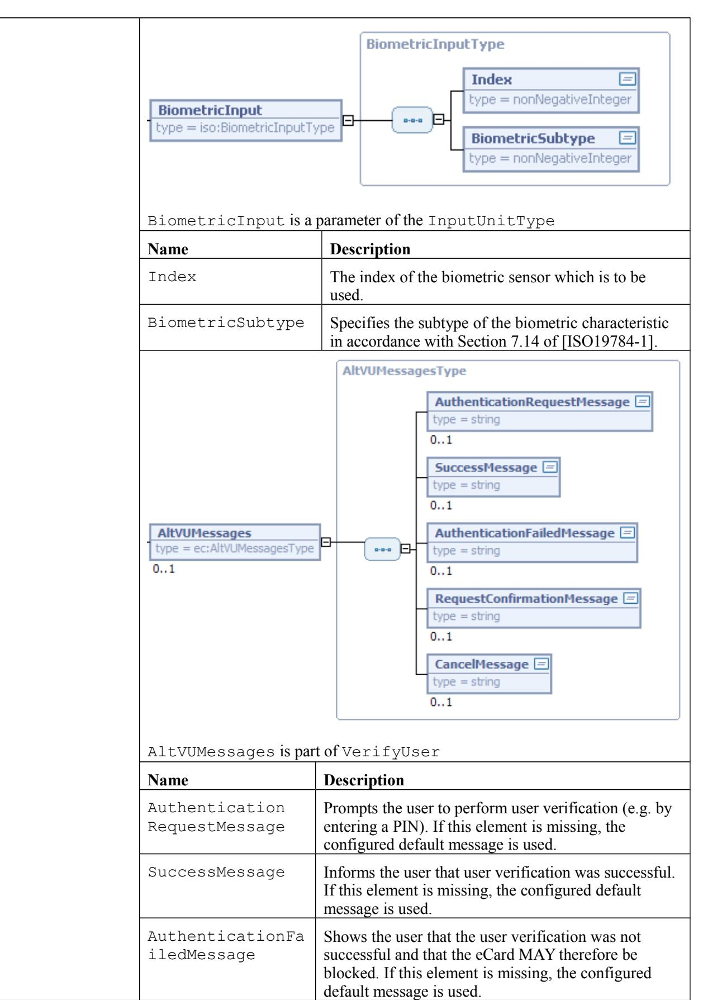

|        | RequestConfirmat ionMessage              | Prompts the user to repeat the entry. If this element is missing, the configured default message is used.                                                                                                                                                                                                                            |  |  |  |
|--------|---------------------------------------------|-----------------------------------------------------------------------------------------------------------------------------------------------------------------------------------------------------------------------------------------------------------------------------------------------------------------------------------------|--|--|--|
|        | CancelMessage                               | Shows the user that the entry was cancelled. If this element is missing, the configured default message is used.                                                                                                                                                                                                                  |  |  |  |
| Return | Return of the VerifyUser function.          |                                                                                                                                                                                                                                                                                                                                         |  |  |  |
|        | Name                                        | Description                                                                                                                                                                                                                                                                                                                             |  |  |  |
|        | dss:Result                                  | Contains the status information and the errors of an executed action. This element is described in more detail below.                                                                                                                                                                                                             |  |  |  |
|        | Response                                    | The response of the eCard (e.g. 9000 in the event of successful user verification).                                                                                                                                                                                                                                                  |  |  |  |
|        |                                             |                                                                                                                                                                                                                                                                                                                                         |  |  |  |
|        | Status information and errors in VerifyUser |                                                                                                                                                                                                                                                                                                                                         |  |  |  |
|        | Name                                        | Error codes                                                                                                                                                                                                                                                                                                                             |  |  |  |
|        | ResultMajor                                 | • /resultmajor#ok • /resultmajor#error                                                                                                                                                                                                                                                                                         |  |  |  |
|        | ResultMinor                                 | • /resultminor/ifdl/common#timeoutError • /resultminor/ifdl/common#invalidSlotHandle • /resultminor/ifdl/IO#unknownInputUnit • /resultminor/ifdl#cancellationByUser • /resultminor/al/common#unknownError • /resultminor/ifdl/IO#unknownPINFormat • /resultminor/ifdl/IO#unknownBiometricSubtype |  |  |  |

|                | ResultMessage                                                                                                                                                                                                                                     | MAY contain more detailed information on the error which occurred if required. |
|----------------|---------------------------------------------------------------------------------------------------------------------------------------------------------------------------------------------------------------------------------------------------|-----------------------------------------------------------------------------------|
| Preconditions  | A connection to an eCard was established with Connect.                                                                                                                                                                                            |                                                                                   |
| Postconditions | The corresponding authentication status on the card was established by invocation of VERIFY in accordance with [ISO7816-4].                                                                                                                    |                                                                                   |
| Notes          | A PC/SC handler in the IFD-Layer (also refer to Annex A) MAY implement this function with FEATURE_VERIFY_PIN_START specified in [PC/SC], Part 10 (Section 2.9) using the PIN_VERIFY_STRUCTURE defined in [PC/SC], Part 10 (Section 2.5). |                                                                                   |

#### **3.3.2 ModifyVerificationData**

| Name        | ModifyVerificationData                                                                                            |
|-------------|-------------------------------------------------------------------------------------------------------------------|
| Description | With this function the data for user authentication (PIN or biometric reference data) on an eCard are changed. |

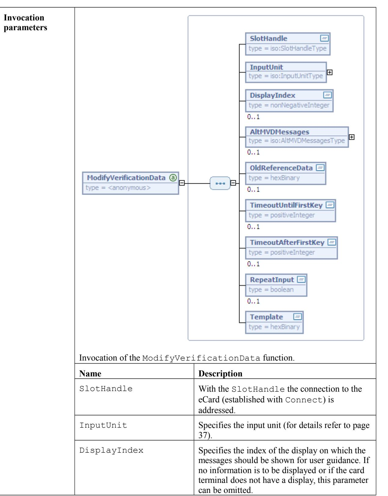

| AltMVDMessages       | Is an optional parameter which specifies the various messages which should be shown on the display if the identification data are modified (see below for details). If this element is missing, standard texts are displayed.                                                     |
|----------------------|-----------------------------------------------------------------------------------------------------------------------------------------------------------------------------------------------------------------------------------------------------------------------------------------------|
| OldReferenceData     | MAY contain the old reference data so that it is only necessary to enter the new data on the terminal. In this case the data is formatted by the calling layer. If this element is missing, the old reference data are to be entered on the terminal if necessary.             |
| TimeoutUntilFirstKey | Is an optional parameter which specifies the timeout in milliseconds before the first key actuation.                                                                                                                                                                                    |
| TimeoutAfterFirstKey | Is an optional parameter which specifies the timeout in milliseconds after the first key actuation.                                                                                                                                                                                     |
| RepeatInput          | If this element is TRUE, repeated entry is mandatory. If the element is missing, it is not necessary to repeat the entry.                                                                                                                                                               |
| Template             | The acquired verification data are entered into the template before the data are sent to the eCard as APDU for the CHANGE REFERENCE DATA command (also refer to [ISO7816-4], Section 7.5.7) or the RESET RETRY COUNTER command (also refer to [ISO7816-4], Section 7.5.10). |

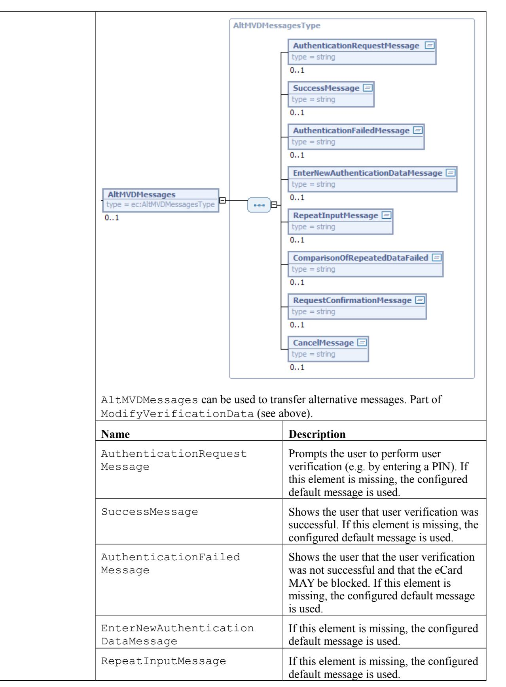

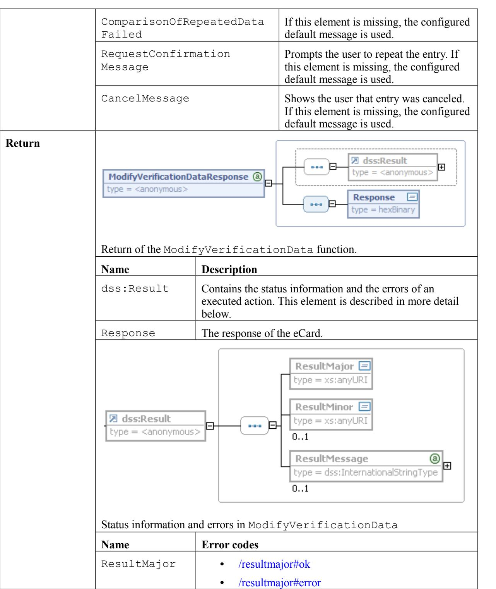

|               | ResultMinor ResultMessage                                                                                                                                                                                                                      | • /resultminor/ifdl/common#timeoutError • /resultminor/ifdl/common#invalidSlotHandle • /resultminor/ifdl/IO#unknownInputUnit • /resultminor/ifdl#cancellationByUser • /resultminor/ifdl/IO#repeatedDataMismatch • /resultminor/ifdl/IO#unknownPINFormat • /resultminor/ifdl/IO#unknownBiometricSubtype • /resultminor/al/common#unknownError MAY contain more detailed information on the error which |
|---------------|---------------------------------------------------------------------------------------------------------------------------------------------------------------------------------------------------------------------------------------------------|-------------------------------------------------------------------------------------------------------------------------------------------------------------------------------------------------------------------------------------------------------------------------------------------------------------------------------------------------------------------------------------------------------------------------------------------------------|
|               |                                                                                                                                                                                                                                                   | occurred if required.                                                                                                                                                                                                                                                                                                                                                                                                                                 |
| Precondition  | A connection to an eCard was established with Connect.                                                                                                                                                                                            |                                                                                                                                                                                                                                                                                                                                                                                                                                                       |
| Postcondition | The corresponding command - CHANGE REFERENCE DATA or RESET RETRY COUNTER in accordance with [ISO7816-4] – was executed on the card.                                                                                                            |                                                                                                                                                                                                                                                                                                                                                                                                                                                       |
| Note          | A PC/SC handler in the IFD-Layer (also refer to Annex A) MAY implement this function with FEATURE_MODIFY_PIN_START specified in [PC/SC], Part 10 (Section 2.9) using the PIN_MODIFY_STRUCTURE defined in [PC/SC], Part 10 (Section 2.6). |                                                                                                                                                                                                                                                                                                                                                                                                                                                       |

#### **3.3.3 Output**

| Name                     | Output                                                                                                                                     |                                                                        |
|--------------------------|--------------------------------------------------------------------------------------------------------------------------------------------|------------------------------------------------------------------------|
| Description              | The command is used to output a message on the display of a card terminal and/or output a visual or acoustic signal on a card terminal. |                                                                        |
| Invocation parameters | Invocation of the Output function.                                                                                                         |                                                                        |
|                          |                                                                                                                                            |                                                                        |
|                          | Name                                                                                                                                       | Description                                                            |
|                          | ContextHandle                                                                                                                              | Handle with which the session with the Terminal-Layer is addressed. |
|                          | IFDName                                                                                                                                    | Unique name of the card terminal.                                      |
|                          | OutputInfo                                                                                                                                 | Provides information about the output. Details are specified below. |

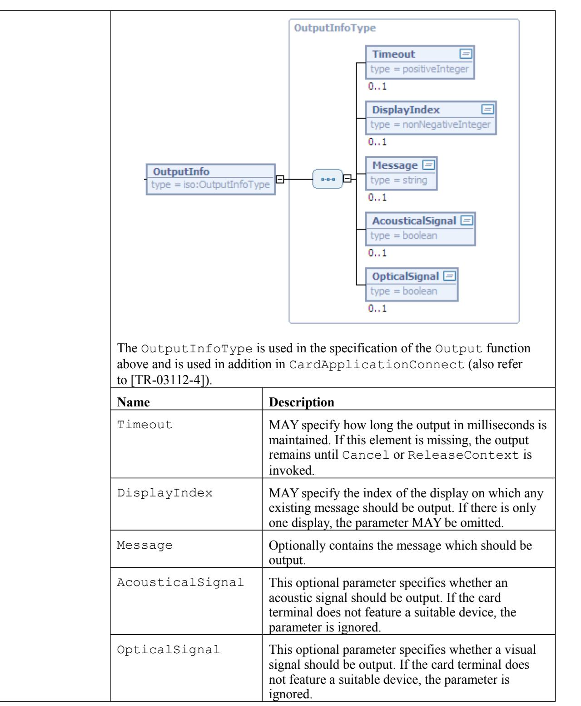

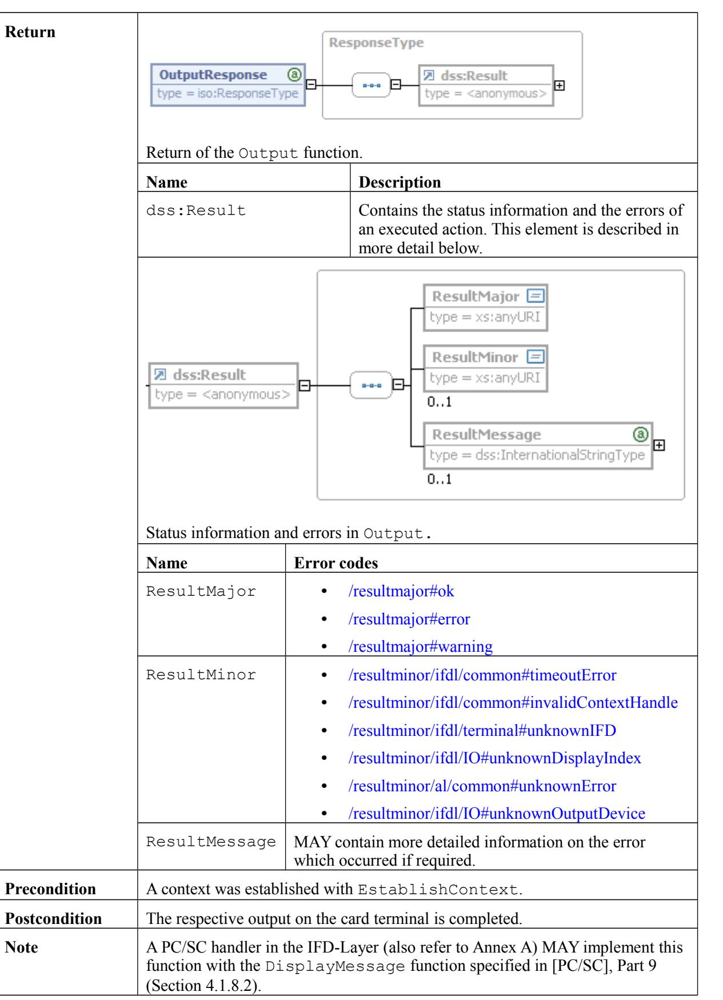

# **3.4 IFD-Callback-Interface for card terminal events**

The IFD-Callback-Interface is made available from layers above the Terminal-Layer and contains exactly the function SignalEvent.

### **3.4.1 SignalEvent**

| Name                     | SignalEvent                                                                                                                                                                                                                                                      |             |                                                                                                                                                                                                                                                 |
|--------------------------|------------------------------------------------------------------------------------------------------------------------------------------------------------------------------------------------------------------------------------------------------------------|-------------|-------------------------------------------------------------------------------------------------------------------------------------------------------------------------------------------------------------------------------------------------|
| Description              | With the SignalEvent function layers above the Terminal-Layer can be informed of card terminal events. The Terminal-Layer was informed with the Wait function of the callback address provided for this invocation and additional necessary parameters. |             |                                                                                                                                                                                                                                                 |
| Invocation parameters |                                                                                                                                                                                                                                                                  |             |                                                                                                                                                                                                                                                 |
|                          | Invocation of the SignalEvent function.                                                                                                                                                                                                                          |             |                                                                                                                                                                                                                                                 |
|                          | Name                                                                                                                                                                                                                                                             |             | Description                                                                                                                                                                                                                                     |
|                          | ContextHandle                                                                                                                                                                                                                                                    |             | Handle with which the session with the Terminal-Layer is addressed.                                                                                                                                                                          |
|                          | SessionIdentifier                                                                                                                                                                                                                                                |             | Identifier transmitted during return of the Wait function.                                                                                                                                                                                   |
|                          | IFDEvent                                                                                                                                                                                                                                                         |             | IFDEvent MAY occur several times and contains information about an event which occurred on a card terminal. The parameter is of the IFDStatusType (refer to page 18), and contains the status information modified by the event. |
| Return                   |                                                                                                                                                                                                                                                                  |             |                                                                                                                                                                                                                                                 |
|                          | Return of the SignalEvent function.                                                                                                                                                                                                                              |             |                                                                                                                                                                                                                                                 |
|                          |                                                                                                                                                                                                                                                                  |             |                                                                                                                                                                                                                                                 |
|                          | Name                                                                                                                                                                                                                                                             | Description |                                                                                                                                                                                                                                                 |

|                | dss:Result                                                                                                                                                  | Contains the status information and the errors of an executed action. This element is described in more detail below. |
|----------------|-------------------------------------------------------------------------------------------------------------------------------------------------------------|-----------------------------------------------------------------------------------------------------------------------------|
|                |                                                                                                                                                             |                                                                                                                             |
|                |                                                                                                                                                             | Status information and errors in SignalEventResponse                                                                        |
|                | Name                                                                                                                                                        | Error codes                                                                                                                 |
|                | ResultMajor                                                                                                                                                 | • /resultmajor#ok                                                                                                        |
|                |                                                                                                                                                             | • /resultmajor#error                                                                                                     |
|                | ResultMinor                                                                                                                                                 | • /resultminor/ifdl/common#timeoutError                                                                                  |
|                |                                                                                                                                                             | • / resultminor/ifdl/common#invalidContextHandl e                                                                  |
|                |                                                                                                                                                             | • /resultminor/ifdl/terminal#unknownIFD                                                                                  |
|                |                                                                                                                                                             | • /resultminor/al/common#unknownError                                                                                    |
|                | ResultMessage                                                                                                                                               | MAY contain more detailed information on the error which occurred if required.                                           |
| Preconditions  | Registration for events was performed on specific terminals by means of Wait, whereby the respective callback address was specified.                     |                                                                                                                             |
| Postconditions | When SignalEvent is invoked, waiting for events on the specified card terminals is terminated and as a result the session identifier loses its validity. |                                                                                                                             |
| Notes          | Also refer to Wait and Cancel.                                                                                                                              |                                                                                                                             |

## **References**

| [TR-03112-2] | BSI: TR-03112-2: eCard-API-Framework – Part 2: eCard-Interface                                                                             |
|--------------|--------------------------------------------------------------------------------------------------------------------------------------------|
| [TR-03112-3] | BSI: TR-03112-3: eCard-API-Framework – Part 3: Management-Interface                                                                        |
| [TR-03112-4] | BSI: TR-03112-4: eCard-API-Framework – Part 4: ISO24727-3-Interface                                                                        |
| [TR-03112-5] | BSI: TR-03112-5: eCard-API Framework – Part 5: Suppor- Interface                                                                           |
| [TR-03112-6] | BSI: TR-03112-6: eCard-API-Framework – Part 6: IFD-Interface                                                                               |
| [TR-03112-7] | BSI: TR-03112-7: eCard-API-Framework – Part 7: Protocols                                                                                   |
| [TR-03119]   | BSI: TR-03119: Anforderungen an Chipkartenleser mit ePA-Unterstützung                                                                      |
| [RFC2119]    | IETF: RFC 2119: S. Bradner: Key words for use in RFCs to Indicate Requirement Levels                                                       |
| [ISO19784-1] | ISO: ISO/IEC 19784-1: Information technology — Biometric application programming interface — Part 1: BioAPI specification               |
| [ISO24727-3] | ISO: ISO/IEC 24727-3: Identification Cards — Integrated Circuit Cards Programming Interfaces — Part 3: Application Interface            |
| [ISO7816-15] | ISO: ISO/IEC 7816-15: Identification cards - Integrated circuit(s) cards with contacts — Part 15: Cryptographic information application |
| [ISO7816-4]  | ISO: ISO/IEC 7816-4: Identification cards — Integrated circuit cards — Part 4:Organization, security and commands for interchange       |
| [PC/SC]      | PC/SC Workgroup: PC/SC Workgroup Specifications 1.0/2.0                                                                                    |
|              |                                                                                                                                            |