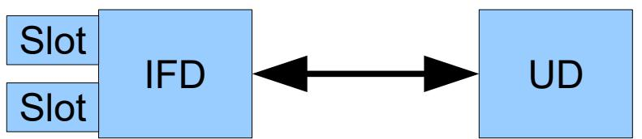

# Technical Guideline TR-03112-6 eCard-API-Framework

### Amendment: IFD Service

Version 1.1 30.09.2021


Federal Office for Information Security Post Box 20 03 63 D-53133 Bonn Phone: +49 22899 9582-0 E-Mail: eid@bsi.bund.de Internet: https://www.bsi.bund.de © Federal Office for Information Security 2021

| 1              | Introduction 5                   |  |
|----------------|----------------------------------|--|
| 1.1            | Key Words 5                      |  |
| 2              | Encoding 5                       |  |
| 3              | Connecting UD and Remote IFD 6   |  |
| 3.1            | Discovery 6                      |  |
| 3.2            | Pairing 6                        |  |
| 3.3            | Communication Establishment 6    |  |
| 3.4            | Un-Pairing 7                     |  |
| 4              | Connecting UD and Local IFD 8    |  |
| 4.1            | Android 8                        |  |
| 5              | IFD Interface Messages 10        |  |
| 5.1            | Message Formats 10               |  |
| 5.1.1          | Generic Message Format 10        |  |
| 5.1.2          | Response Message Format 10       |  |
| 5.1.3          | Error Message Format 10          |  |
| 5.2            | EstablishContext 11              |  |
| 5.2.1          | Message 11                       |  |
| 5.2.2          | Response 11                      |  |
| 5.3            | Connect 11                       |  |
| 5.3.1          | Message 11                       |  |
| 5.3.2          | Response 12                      |  |
| 5.4            | Disconnect 12                    |  |
| 5.4.1          | Message 12                       |  |
| 5.4.2          | Response 12                      |  |
| 5.5            | Transmit 13                      |  |
| 5.5.1<br>5.5.2 | Message 13<br>Response 13        |  |
| 5.6            | EstablishPACEChannel 13          |  |
| 5.6.1          | Message 14                       |  |
| 5.6.2          | Response 14                      |  |
| 5.7            | ModifyPIN 14                     |  |
| 5.7.1          | Message 15                       |  |
| 5.7.2          | Response 15                      |  |
| 5.8            | GetIFDStatus 15                  |  |
| 5.8.1          | Requesting Status information 15 |  |
| 5.8.2          | IFDStatus 15                     |  |

### 1 Introduction

This specification deals with connecting and interfacing to a terminal. The terminal is called **IFD** in the following. This specification supports different scenarios. An example for a **remote IFD** is an eID-Client on a local computer (called **User Device** or **UD**) in conjunction with a card terminal connected via a local network, e.g. a smart phone in the same local network as the User Device. An example for a **local IFD**, i.e. the terminal / IFD is hosted on the same device as the UD, is one App offering card based services to other external Apps on a mobile device.

A card terminal can support several readers (e.g. contact / contactless interfaces, or several devices connected to the IFD, which acts as a server in that case), which are called **Slots** in the following.



*Figure 1: Terms used for the components and their interaction*

Additionally, the specification differentiates between IFDs implementing their own user verification (i.e. PIN Pad), and implementations where the user verification is implemented by the UD. In the latter case, the IFD can be implemented without user interface / GUI, i.e. as a pure background service.

*Note: The term card is used generically in this specification, e.g. encompasses also Secure Elements in other forms than a chip card, such as an embedded secure element in a mobile device.*

#### 1.1 Key Words

The key words "MUST", "MUST NOT", "REQUIRED", "SHALL", "SHALL NOT", "SHOULD", "SHOULD NOT", "RECOMMENDED", "MAY", and "OPTIONAL" in this document are to be interpreted as described in [RFC 2119]. The key word "CONDITIONAL" is to be interpreted as follows:

CONDITIONAL: The usage of an item is dependent on the usage of other items. It is therefore further qualified under which conditions the item is REQUIRED or RECOMMENDED.

#### 2 Encoding

All messages between IFD and UD SHALL be encoded as JSON messages ([RFC 7159]).

The messages SHALL follow the following rules:

- **•** Absent values or absent OPTIONAL/CONDITIONAL parameters SHALL be encoded as null.
- **•** Binary values (e.g. file contents or APDUs) SHALL be encoded as hexadecimal strings in big-endian format.
- **•** Several messages MAY be sent at the same time. In this case, the messages MUST be grouped in an array of messages.

## <span id="page-5-1"></span>3 Connecting UD and Remote IFD

#### <span id="page-5-2"></span>3.1 Discovery

An IFD with an active reader announces itself via UDP broadcast to port 24727 with the following message:

```
{
     "msg" : "REMOTE_IFD",
     "IFDName" : <string, human readable name of the reader>,
     "IFDID" : <string, IFD communication certificate>,
     "SupportedAPI" : <array of supported APIs>,
     "port" : <number, port number where the IFD can be reached>,
     "pairing" : <boolean, true iff the IFD accepts pairing attempts>
}
```
The IFDName SHALL be a name of the IFD suitable for display to the user. Since this name might be not unique (e.g. if the make and model of the IFD is used as IFDName), IFDID is used to further disambiguate IFDs. The IFDID SHALL contain the PEM-encoded (see [RFC 7468]) certificate used by the IFD for pairing (see section [3.2\)](#page-5-0).

Support for the protocol/protocol version defined in this specification is indicated by including IFDInterface\_WebSocket\_v2 in the SupportedAPI field. Further versions of this protocol will be denoted by v3, v4 and so on.

### <span id="page-5-0"></span>3.2 Pairing

To initiate the pairing of a UD and an IFD, a short password (e.g. a 4 digit numeric password) is exchanged between them out of band. Examples are generation of the password by one Device and manually entering it on the other Device, or using a QR code for transfer.

The UD initiates a TLS connection to the IFD with a PSK-cipher suite. UD and IFD MUST support TLS\_RSA\_PSK\_WITH\_AES\_256\_CBC\_SHA and MAY support additional PSK-cipher suites compliant to [TR-03116], Part 4. Both UD and IFD use self-signed certificates for this connection. The certificates SHOULD be as small as possible and MUST NOT contain any identifying information beyond the contained public key. The pre-exchanged short password is used as PSK.

If the connection is established successfully (i.e. the short password is correct), the UD and the IFD register the certificate of the communication partner as the identity of the other side used for communication establishment (see below). To exchange human readable name for the UD and the IFD, an EstablishContext Message/Response pair (see section [5.2\)](#page-10-0) SHOULD be exchanged.

The established channel MUST NOT be used for further communication. For further communication, an authenticated channel as described in the next section MUST be used.

*Note: Since RSA\_PSK does not protect the short password against passive brute force attack, the short password MUST have a limited validity time, e.g. a few minutes, and/or the number of attempts to guess the short password MUST be strictly limited.*

#### <span id="page-5-3"></span>3.3 Communication Establishment

To set up communication, a mutually authenticated TLS connection using the certificates registered during pairing (see above) is established. For the TLS connection, including cipher suite support, conformance to [TR-03116], Part 4, is REQUIRED.

If the connection establishment fails due to an unknown certificate, this is signalled by the TLS stack by a certificate related error. In this case, also the other peer SHOULD delete the certificate.

After the TLS connection is established, bidirectional WebSocket ([RFC 6455]) communication is initiated by the UD.

The IFD SHOULD NOT perform UDP broadcasts while a connection is established and MUST reject further connection attempts after a connection is established until this connection is released.

#### 3.4 Un-Pairing

The IFD and the UD SHOULD offer the user the capability to un-pair devices. Un-pairing is performed by de-registering the certificate registered in the Pairing step.

## <span id="page-7-1"></span>4 Connecting UD and Local IFD

Connecting an UD[1](#page-7-0) with a local IFD, i.e. an IFD on the same device, uses operating system specific mechanisms.

#### 4.1 Android

To initiate the connection of a UD and a Local IFD, a long password (e.g. a 256-bit secure random string) is exchanged between them out of band via a platform-specific mechanism. On Android, the IFD SHALL be provided via a Service of a host application. The UD SHOULD then bind to the Service (`Context.bindService`) and provide the password via a String parameter of the Intent used to start the Service (`Intent.putExtra("PSK", password)`). Verifying the authenticity of the IFD host application e.g. by checking the APK signature key is REQUIRED. Specific implementation details SHALL be documented by the IFD host application.

Upon receipt of the password, the IFD opens a listening TLS socket on port 24727. The socket MUST only accept connections from the same machine, all other connections MUST be rejected. UD and IFD MUST support TLS\_ECDHE\_PSK\_WITH\_AES\_128\_CBC\_SHA256 and MAY support additional PSK-cipher suites compliant to [TR-03116], Part 4. The pre-exchanged password (see above) is used as PSK. Certificates MUST NOT be verified nor stored on either end of the connection.

The UD initiates the TLS-PSK connection to the IFD. After the TLS connection is established, the bidirectional WebSocket ([RFC 6455]) communication is initiated by the UD.

The IFD MUST reject further connection attempts after a connection is established until this connection is released and a new password is exchanged. If the connection fails due to an invalid PSK, the IFD MUST also reject further connection attempts until a new long password is exchanged.

*Note: Different to the Remote IFD no permanent pairing of UD and IFD occurs, each connection SHALL use a new long password when it is established.*

```
fun startIfdWebSocketService(context: Context, ifdHostPackage: String = 
"com.governikus.ausweisapp2") {
     // Create random password
     val password = UUID.randomUUID().toString()
     // Create Intent to start IFD Service
     val ifdServiceIntent = 
Intent("$ifdHostPackage.START_IFD_WEBSOCKET_SERVICE").apply {
           setPackage(ifdHostPackage)
           putExtra("PSK", password)
     }
     // Define callbacks, to get notified when the WebSocket is available
     val ifdServiceConnection = object : ServiceConnection {
           override fun onServiceConnected(className: ComponentName, service: 
IBinder) {
                 // WebSocket should be started and available via 
"wss://[::1]:24727"
                 val webSocket = connectToWebsocket("wss://[::1]:24727", 
password)
                 webSocket.send(…)
```
<span id="page-7-0"></span>1 Please note, that UD in the terms of [TR-03112] does not refer to the user's handset device, but e.g. to the eID-Client on that device.

```
}
            override fun onServiceDisconnected(className: ComponentName) {
                  // WebSocket no longer available
            }
     }
     // Start/Bind the IFD Service
     context.bindService(ifdServiceIntent, ifdServiceConnection, 
AppCompatActivity.BIND_AUTO_CREATE)
}
```
*Example 1: Example for connecting to the Local IFD Service of the governmental eID-Client "AusweisApp2[2](#page-8-0) "*

<span id="page-8-0"></span>2 [https://www.ausweisapp.bund.de](https://www.ausweisapp.bund.de/) and https://github.com/Governikus/AusweisApp2

### 5 IFD Interface Messages

All messages are sent inside the WebSocket connection between UD and IFD established according to section [3](#page-5-1) or section [4](#page-7-1).

#### 5.1 Message Formats

All messages contain a ContextHandle for addressing. A ContextHandle SHOULD be chosen as a random pseudo-unique identifier by the IFD, in order to enable the UD to distinguish different IFDs. To distinguish several Slots of the same IFD, a SlotHandle is contained in slot specific messages.

#### 5.1.1 Generic Message Format

The generic message format is given as

```
{
    "msg" : <string, message type>,
    "ContextHandle" : <string>,
    "SlotHandle" : <string>,
    ...
}
```
In some message, when no context/connection is established, the ContextHandle / the SlotHandle are omitted.

#### 5.1.2 Response Message Format

The generic format of response messages is an extension of the generic format by result elements:

```
{
     "msg" : <string, response message type>,
     "ContextHandle" : <string>,
     "SlotHandle" : <string>,
     "ResultMajor" : <string>,
     "ResultMinor" : <string>,
     ...
}
```
For ResultMajor / ResultMinor see the corresponding descriptions in [TR-03112], part 6.

#### 5.1.3 Error Message Format

In case an error is encountered which is not related to a valid message (e.g. an unknown message), the party encountering the error SHALL send an error message:

```
{
    "msg" : "IFDERROR",
    "ContextHandle" : <string>,
    "SlotHandle" : <string>,
    "ResultMajor" : <string>,
```
"ResultMinor" : <string>

}

If the error is not related to a defined Slot / a defined Context, the corresponding Handles are omitted from the error message.

#### <span id="page-10-0"></span>5.2 EstablishContext

See also [TR-03112], part 6, section 3.1.1.

#### <span id="page-10-2"></span>5.2.1 Message

To negotiate the protocol version for subsequent communication, and to establish a Context, the following message is sent immediately after communication establishment (see section [3.3\)](#page-5-3). This message MUST be the first message send by the UD after the WebSocket connection between UD and IFD is established.

```
{
    "msg" : "IFDEstablishContext",
    "Protocol" : <string>,
    "UDName" : <string>
}
```
The element Protocol MUST contain the identifier of one of the supported protocols advertised by the IFD in SuportedAPI during discovery.

The element UDName SHALL contain the human readable name of the UD, suitable for display to the user.

#### <span id="page-10-1"></span>5.2.2 Response

Upon receiving an EstablishContext message, the IFD SHALL send the following message as response containing the ContextHandle chosen by the IFD.

```
{
    "msg" : "IFDEstablishContextResponse",
    "ContextHandle" : <string>,
    "ResultMajor" : <string>,
    "ResultMinor" : <string>,
    "IFDName" : <string>
}
```
The element IFDName SHALL contain the human readable name of the IFD, suitable for display to the user. The name SHOULD be identical to the IFDName advertised for discovery (see section [3.1](#page-5-2)).

#### <span id="page-10-3"></span>5.3 Connect

See also [TR-03112], part 6, section 3.2.1.

#### 5.3.1 Message

This message is used by the UD to connect to a card available in a Slot of the IFD.

```
{
    "msg" : "IFDConnect",
    "ContextHandle" : <string>,
    "SlotName" : <string>,
    "exclusive" : <boolean>
}
```
If exclusive is set to true, no other application can connect to the card until the connection is released by the UD, i.e. the IFD MUST refuse any communication attempt to the card by other applications.

#### 5.3.2 Response

The IFD SHALL send a ConnectResponse message after receiving a Connect message from the UD. If the connection to the card was established successfully, a unique SlotHandle MUST be returned. If the connection failed, no handle is returned.

```
{
    "msg" : "IFDConnectResponse",
    "ContextHandle" : <string>,
    "SlotHandle" : <string>,
    "ResultMajor" : <string>,
    "ResultMinor" : <string>
}
```
#### 5.4 Disconnect

See also [TR-03112], part 6, section 3.2.2.

#### 5.4.1 Message

This message can be send by either the UD or the IFD to disconnect a card. After this message the SlotHandle is invalid, using the handle in further messages SHALL yield an error.

```
{
    "msg" : "IFDDisconnect",
    "ContextHandle" : <string>,
    "SlotHandle" : <string>
}
```
#### 5.4.2 Response

This message SHALL be sent as answer to a Disconnect message.

```
"msg" : "IFDDisconnectResponse",
"ContextHandle" : <string>,
"SlotHandle" : <string>,
"ResultMajor" : <string>,
"ResultMinor" : <string>
```
}

{

### 5.5 Transmit

See also [TR-03112], part 6, section 3.2.5.

#### 5.5.1 Message

The Transmit function sends one APDU to the IFD. The IFD in turn sends the APDU to the connected card.

```
{
    "msg" : "IFDTransmit",
    "ContextHandle" : <string>,
    "SlotHandle" : <string>,
    "InputAPDU" : <string>,
    "DisplayText" : <string>
}
```
**•** InputAPDU (REQUIRED)

Contains the APDU which is to be sent to the eCard.

**•** DisplayText (OPTIONAL) Contains a free text to be displayed to the user, e.g. to inform the user about the progress of the overall process. If no text is passed, the previous text stays unchanged.

If a PACE Secure Messaging channel between card and IFD is active (see section [5.6\)](#page-12-0), the IFD SHALL encrypt and MAC the APDU before transmitting them to the card.

#### 5.5.2 Response

This message is used by the IFD to return the response APDU to the command APDU transmitted via Transmit to the UD.

```
{
     "msg" : "IFDTransmitResponse",
     "ContextHandle" : <string>,
     "SlotHandle" : <string>,
     "ResultMajor" : <string>,
     "ResultMinor" : <string>,
     "ResponseAPDU" : <string>
}
```
If a PACE Secure Messaging channel between card and IFD is active (see section [5.6\)](#page-12-0), the IFD SHALL return the decrypted and verified plain response APDU.

### <span id="page-12-0"></span>5.6 EstablishPACEChannel

See also [TR-03112], part 6, section 3.3.1.

Remote IFDs supporting a PIN Pad and all local IFDs SHALL support the command EstablishPACEChannel as defined in [TR-03119], section D.1, and [PC/SC], Part 10 AMD1, section 2.6.16. This command is mapped to messages for the IFD Interface using the data structures defined in [PC/SC], Part 10 AMD1, section 2.6.16 (without the FEATURE\_EXECUTE\_PACE header defined in section 2.5.12), and [TR-03119], section D.2 as defined below.

For local IFDs without PIN Pad, the command is used to send the PIN acquired by the UD to the IFD, the IFD in turn performs PIN verification as required by the card.

For remote IFDs without PIN Pad, transmitting a PIN via this command MUST be rejected by the IFD, instead the UD performs PIN verification directly as required by card, e.g. via performing PACE using Transmit to send the corresponding APDUs.

#### 5.6.1 Message

```
{
     "msg" : "IFDEstablishPACEChannel",
     "ContextHandle" : <string>,
     "SlotHandle" : <string>,
     "ExpectedPINLength" : <number, see below>,
     "InputData" : <string, see below>
}
```
The InputData SHALL contain the input data for EstablishPACEChannel as defined in [PC/SC], Part 10 AMD1, section 2.6.16, including the extension defined in [TR-03119], section D.2.

As a hint about the state of the card, the OPTIONAL ExpectedPinLength MAY contain the length of the required PIN entry the UD expects according to its knowledge of the state of the card. This MAY be used by the IFD to provide additional information to the user or to simplify the PIN entry. Own knowledge of the IFD about the state of the card supersedes the information obtained from this hint.

#### 5.6.2 Response

```
{
     "msg" : "IFDEstablishPACEChannelResponse",
     "ContextHandle" : <string>,
     "SlotHandle" : <string>,
     "ResultMajor" : <string>,
     "ResultMinor" : <string>,
     "ResultCode" : <string, see below>,
     "OutputData" : <string, see below>
}
```
The ResultCode SHALL contain a result value as defined in the result value table of [PC/SC], Part 10 AMD1, section 2.5.12.

The OutputData SHALL contain the output data for EstablishPACEChannel as defined in [PC/SC], Part 10 AMD1, section 2.6.16.

#### 5.7 ModifyPIN

See also [TR-03112], part 6, section 3.3.2.

Remote IFDs supporting a PIN Pad and all local IFDs SHALL support the command ModifyPIN as defined in [TR-03119], section D.1, and [PC/SC], Part 10 to support PIN Management. This command is mapped to messages for the IFD Interface using the data structures defined in [PC/SC], Part 10 as defined below.

For local IFDs without PIN Pad, the command is used to send the PIN acquired by the UD to the IFD, the IFD in turn performs PIN update as required by the card. For remote IFDs without PIN Pad modifying a PIN via this command MUST be rejected by the IFD, instead the UD performs the PIN modification directly as required by card, e.g. via using Transmit to send the corresponding APDUs.

#### 5.7.1 Message

```
{
    "msg" : "IFDModifyPIN",
    "ContextHandle" : <string>,
    "SlotHandle" : <string>,
    "InputData" : <string, see below>
}
```
The InputData SHALL contain the structure PIN\_MODIFY as defined in [PC/SC], Part 10, section 2.5.3.

#### 5.7.2 Response

```
{
     "msg" : "IFDModifyPINResponse",
     "ContextHandle" : <string>,
     "SlotHandle" : <string>,
     "ResultMajor" : <string>,
     "ResultMinor" : <string>,
     "OutputData" : <string, see below>
}
```
The OutputData SHALL contain the response as defined in [PC/SC], Part 10, section 2.6.3.

#### 5.8 GetIFDStatus

#### 5.8.1 Requesting Status information

This message can be send by the UD to trigger the IFD to send a Status message.

```
{
    "msg" : "IFDGetStatus",
    "ContextHandle" : <string>,
    "SlotName" : <string>
}
```
If SlotName is empty, an IFDStatus message for all Slots is requested, otherwise a message for the named Slot is requested.

#### 5.8.2 IFDStatus

This IFD SHALL send this message

- **•** immediately after establishing a context with a UD (see section [5.2.1](#page-10-2)[/5.2.2](#page-10-1)) for each Slot,
- **•** upon change of the state of the IFD or one of the Slots for the affected Slots, and
- **•** upon request by the UD via the IFDGetStatus message (see above) for the requested Slots.

| {     |                |  |
|-------|----------------|--|
| "msg" | : "IFDStatus", |  |
|       |                |  |

5 IFD Interface Messages

```
"ContextHandle" : <string>,
"SlotName" : <string>,
"PINPad" : <boolean>,
"MaxAPDULength" : <number>,
"ConnectedReader" : <boolean>,
"CardAvailable" : <boolean>,
"EFATR" : <string>,
"EFDIR" : <string>
```

```
}
```
The message encapsulates the capabilities and current status of an IFD / Slot, and comprises the following elements:

| • | SlotName<br>SHALL contain a human readable name of the Slot, suitable for display to the user, followed by<br>OPTIONAL technical information in parentheses "()". It is RECOMMENDED to omit the<br>technical information for display to the user. The SlotName MUST be unique for the IFD. | (REQUIRED)    |  |
|---|--------------------------------------------------------------------------------------------------------------------------------------------------------------------------------------------------------------------------------------------------------------------------------------------|---------------|--|
| • | (REQUIRED)<br>PINPad<br>SHALL be set to true if a PACE-capable PIN Pad is available and activated. Note that the status<br>of this flag may change if the user activates/deactivates a pin entry capability on the IFD.                                                                    |               |  |
| • | MaxAPDULength<br>SHALL contain the maximum length for APDUs supported by the IFD / Slot.                                                                                                                                                                                                   | (REQUIRED)    |  |
| • | ConnectedReader<br>SHALL be set to true if the reader is available.                                                                                                                                                                                                                        | (REQUIRED)    |  |
| • | (REQUIRED)<br>CardAvailable<br>SHALL be set to true if and only if a card is present and recognized, and is available for<br>Connect (i.e. not exclusively connected, see section 5.3).                                                                                                    |               |  |
| • | (CONDITIONAL)<br>EFATR<br>If a card is available, this element SHALL contain the contents of EF.ATR/INFO of the card to<br>enable recognition by the UD.                                                                                                                                   |               |  |
| • | EFDIR<br>If a card is available and contains a transparent file EF.DIR, this element SHALL contain the<br>content of EF.DIR.                                                                                                                                                               | (CONDITIONAL) |  |

#### **References**

| [PC/SC]    | PC/SC Workgroup: PC/SC Workgroup Specifications 1.0/2.0                                 |
|------------|-----------------------------------------------------------------------------------------|
| [RFC 2119] | IETF: RFC 2119: S. Bradner: Key words for use in RFCs to Indicate Requirement Levels    |
| [RFC 6455] | IETF: RFC 6455: I. Fette, A. Melnikov: The WebSocket Protocol                           |
| [RFC 7159] | IETF: RFC 7159: Bray, T.: The JavaScript Object Notation (JSON) Data Interchange Format |
| [RFC 7468] | IETF: RFC 7468: S. Josefsson, S. Leonard: Textual Encodings of PKIX, PKCS, and CMS      |
|            | Structures                                                                              |
| [TR-03112] | BSI: Technische Richtlinie TR-03112, eCard-API-Framework                                |
| [TR-03116] | BSI: TR-03116: Kryptographische Vorgaben für Projekte der Bundesregierung               |
| [TR-03119] | BSI: TR-03119: Requirements for Smart Card Readers Supporting eID and eSign Based on    |
|            | Extended Access Control                                                                 |