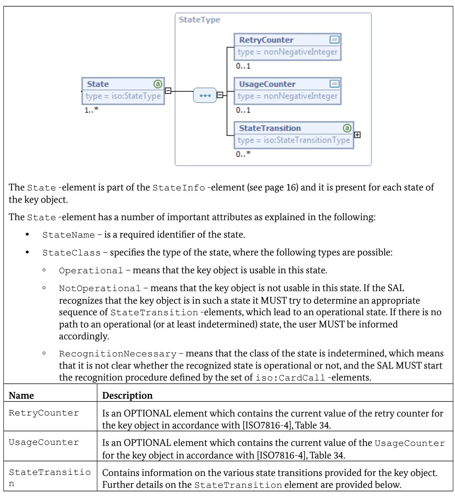

# Technical Guideline TR-03112-7 eCard-API-Framework – Protocols Version 1.1.5 7. April 2015

Bundesamt für Sicherheit in der Informationstechnik Postfach 20 03 63 53133 Bonn

E-Mail: ecard.api@bsi.bund.de Internet: https://www.bsi.bund.de © Bundesamt für Sicherheit in der Informationstechnik 2015

| 1              | Overview of the eCard-API-Framework 6                              |          |
|----------------|--------------------------------------------------------------------|----------|
| 1.1            | Key Words                                                          | 6        |
| 1.2            | XML-Schema                                                         | 7        |
| 2              | Connection establishment in distributed systems8                   |          |
| 2.1            | General security requirements                                      | 8        |
| 2.2            | Connection establishment for SOAP binding8                         |          |
| 2.3            | Connection Establishment for PAOS binding9                         |          |
| 2.3.1          | Setting up a Trusted Channel                                       | 10       |
| 2.3.2          | PAOS Communication                                                 | 10       |
| 2.3.3          | Session Termination                                                | 11       |
| 2.4            | TC_API_Open                                                        | 11       |
| 2.4.1          | Security mechanisms for the channel established with TC_API_Open11 |          |
| 2.5            | TC_API_Close                                                       | 13       |
| 2.6            | StartPAOS                                                          | 13       |
| 3              | ISO/IEC 24727 protocols 14                                         |          |
| 3.1            | PIN Compare                                                        | 14       |
| 3.1.1          | Marker                                                             | 15       |
| 3.1.2          | DIDCreate                                                          | 23       |
| 3.1.3          | DIDUpdate                                                          | 24       |
| 3.1.4          | DIDGet                                                             | 24       |
| 3.1.5          | DIDAuthenticate                                                    | 24       |
| 3.1.6          | Non-supported functions                                            | 25       |
| 3.2            | Mutual authentication                                              | 25       |
| 3.2.1          | Marker                                                             | 26       |
| 3.2.2          | DIDCreate                                                          | 27       |
| 3.2.3          | DIDUpdate                                                          | 28       |
| 3.2.4          | DIDGet                                                             | 28       |
| 3.2.5<br>3.2.6 | CardApplicationStartSession<br>DIDAuthenticate                     | 28<br>29 |
| 3.2.7          | Non-supported functions                                            | 30       |
| 3.2.8          | Minimum requirements in terms of algorithms30                      |          |
| 3.3            | Password Authenticated Connection Establishment31                  |          |
| 3.3.1          | Marker                                                             | 31       |
| 3.3.2          | DIDCreate                                                          | 32       |
| 3.3.3          | DIDUpdate                                                          | 32       |
| 3.3.4          | DIDGet                                                             | 32       |
| 3.3.5          | DIDAuthenticate                                                    | 32       |
| 3.3.6          | CardApplicationStartSession                                        | 35       |
| 3.3.7          | Non-supported functions                                            | 35       |
| 3.4            | Chip Authentication                                                | 35       |
| 3.4.1          | Marker                                                             | 35       |
| 3.4.2          | DIDCreate                                                          | 36       |
| 3.4.3          | DIDUpdate                                                          | 37       |
| 3.4.4          | DIDGet                                                             | 37       |
| 3.4.5          | DIDAuthenticate                                                    | 37       |

| 3.4.6  | Non-supported functions                          | 39 |
|--------|--------------------------------------------------|----|
| 3.5    | Terminal Authentication                          | 39 |
| 3.5.1  | Marker                                           | 39 |
| 3.5.2  | DIDCreate                                        | 40 |
| 3.5.3  | DIDUpdate                                        | 40 |
| 3.5.4  | DIDGet                                           | 40 |
| 3.5.5  | DIDAuthenticate                                  | 40 |
| 3.5.6  | Non-supported functions                          | 43 |
| 3.6    | Extended Access Control                          | 43 |
| 3.6.1  | EAC protocol specification                       | 43 |
| 3.6.2  | Marker                                           | 44 |
| 3.6.3  | Call and return of CardApplicationStartSession44 |    |
| 3.6.4  | Overview of EAC protocol sequence49              |    |
| 3.6.5  | DIDCreate, DIDUpdate and DIDGet56                |    |
| 3.6.6  | Non-supported functions                          | 56 |
| 3.7    | Restricted Identification                        | 56 |
| 3.7.1  | Marker                                           | 56 |
| 3.7.2  | DIDCreate                                        | 57 |
| 3.7.3  | DIDUpdate                                        | 57 |
| 3.7.4  | DIDGet                                           | 57 |
| 3.7.5  | DIDAuthenticate                                  | 57 |
| 3.7.6  | Non-supported functions                          | 58 |
| 3.8    | RSA Authentication                               | 58 |
| 3.8.1  | Marker                                           | 59 |
| 3.8.2  | DIDCreate                                        | 62 |
| 3.8.3  | DIDUpdate                                        | 62 |
| 3.8.4  | DIDGet                                           | 62 |
| 3.8.5  | CardApplicationStartSession                      | 62 |
| 3.8.6  | DIDAuthenticate                                  | 63 |
| 3.8.7  | Verification of the certificate path             | 63 |
| 3.8.8  | Invocation of INTERNAL AUTHENTICATE64            |    |
| 3.8.9  | Invocation of EXTERNAL AUTHENTICATE65            |    |
| 3.8.10 | VerifyCertificate                                | 65 |
| 3.8.11 | Non-supported functions                          | 65 |
| 3.8.12 | Minimum requirements in terms of algorithms65    |    |
| 3.9    | Generic cryptography                             | 66 |
| 3.9.1  | Marker                                           | 67 |
| 3.9.2  | DIDCreate                                        | 71 |
| 3.9.3  | DIDUpdate                                        | 71 |
| 3.9.4  | DIDGet                                           | 71 |
| 3.9.5  | Encipher                                         | 71 |
| 3.9.6  | Decipher                                         | 71 |
| 3.9.7  | GetRandom                                        | 71 |
| 3.9.8  | Hash                                             | 71 |
| 3.9.9  | Sign                                             | 71 |
| 3.9.10 | VerifySignature                                  | 72 |
| 3.9.11 | VerifyCertificate                                | 72 |
| 3.9.12 | DIDAuthenticate                                  | 72 |
| 3.9.13 | Non-supported functions                          | 73 |
|        |                                                  |    |

| 4   | Protocols for GetCertificate 73                         |  |
|-----|---------------------------------------------------------|--|
| 4.1 | GetCertificate by means of Simple Enrollment Protocol73 |  |
| 5   | Basic Update Protocol 76                                |  |

| Figure 1: Connection establishment for PAOS binding9                       |  |
|----------------------------------------------------------------------------|--|
| Figure 2: Message Sequence after CardApplicationStartSession(EACSession)49 |  |
| Figure 3: Basic Update Protocol 76                                         |  |
|                                                                            |  |

# <span id="page-5-0"></span>**1 Overview of the eCard-API-Framework**

The objective of the eCard-API-Framework is the provision of a simple and homogeneous interface to enable standardised use of the various smart cards (eCards) for different applications.

The eCard-API-Framework is sub-divided into the following layers:

- **•** Application-Layer
- **•** Identity-Layer
- **•** Service-Access-Layer
- **•** Terminal-Layer

The **Application-Layer** contains the various applications which use the eCard-API-Framework to access the eCards and their associated functions. Application-specific "convenience interfaces", in which the recurring invocation sequences may be encapsulated in application-specific calls, may also exist in this layer. However, these interfaces are currently *not* within the scope of the e-Card-API-framework.

The **Identity-Layer** comprises the eCard-Interface and the Management interface, and therefore functions for the use and management of electronic identities as well as for management of the eCard-API-Framework.

The *eCard-Interface* specified in Part 2 of this Guideline allows to request certificates as well as the encryption, signature and time-stamping of documents.

In the M*anagement-Interface* specified in Part 3 of this Guideline, functions for updating the framework and the management of trusted identities, smart cards, card terminals, and default behaviour are available.

The **Service-Access-Layer** provides, in particular, functions for cryptographic primitives and biometric mechanisms in connection with cryptographic tokens, and comprises the ISO24727-3-Interface and the Support-Interface.

The *ISO24727-3-Interface* defined in Part 4 of this Guideline is a webservice-based implementation of the standard of the same name [ISO24727-3]. This interface contains functions to establish (cryptographically protected) connections to smart cards, to manage card applications, to read or write data, to perform cryptographic operations and to manage the respective key material (in the form of so-called "differential identities"). In the process, all functions which use or manage "differential identities" are parameterised by means of protocol-specific object identifiers so that the different protocols which are defined in the present document MAY be used with a standardised interface.

The S*upport-Interface* specified in Part 5 of this Guideline contains a range of supporting functions.

The **Terminal-Layer** primarily contains the *IFD-Interface* specified in Part 6 of this Guideline. This layer takes over the generalisation of specific card terminal types and various interfaces as well as communication with the smart card. For the user it is unimportant whether the card is addressed by PC/SC, a SICCT terminal or a proprietary interface, or whether it has contacts or is contact-less.

## **1.1 Key Words**

The key words "MUST", "MUST NOT", "REQUIRED", "SHALL", "SHALL NOT", "SHOULD", "SHOULD NOT", "RECOMMENDED", "MAY", and "OPTIONAL" in this document are to be interpreted as described in [RFC2119]. The key word "CONDITIONAL" is to be interpreted as follows:

CONDITIONAL: The usage of an item is dependent on the usage of other items. It is therefore further qualified under which conditions the item is REQUIRED or RECOMMENDED.

## **1.2 XML-Schema**

A XML-Schema is provided together with this Technical Guideline. In case of incongruencies, the specifications in this text take precedence. The graphical representations of the XML-Schema illustrate the schema. Note that the text of this Guideline might further restrict the presence or mulitplicity of elements as compared to the schema definition.

# <span id="page-7-0"></span>**2 Connection establishment in distributed systems**

Some of the protocols specified here involve two instances of the eCard-API-Framework, which run on different systems (Server and Client, which in general both contain a SAL (Server-SAL/Client-SAL, resp.) and additional program logic) and communicate with each other via potentially insecure networks. Therefore, the relevant aspects of security have to be taken into consideration when setting up the transport channel.

## **2.1 General security requirements**

To secure the communication between the different *modules* and *instances* of the eCard-API-Framework the TLS protocol is used. The cryptographic algorithms and security parameters MUST meet the requirements set out in [TR-03116], part 4.

For communication between different modules of the eCard-API-Framework X.509 certificates MAY be used, whereby the associated private keys are to be adequately protected. Alternatively, anonymous TLS cipher suites, such as TLS\_DH\_anon from [RFC4346] or TLS\_ECDH\_anon from [RFC4492], MAY be used, although in this case appropriate security measures are necessary in the operational environment in order to avert man-in-the-middle attacks while the connection is being established.

In both cases there MUST be an exclusive binding of the communication context at application level to the TLS channel which has been established in this process. This communication context is established on connection to the IFD layer via the function EstablishContext and represented by the ContextHandle (cf. Part 6 of this Guideline, Section 3.1.1). When connecting to the SAL, this communication context corresponds to a connection to the card application established by means of CardApplicationConnect, which is represented by a ConnectionHandle (cf. Part 4 of this Guideline, Section 3.2.1).

As such, one single TLS channel is typically sufficient to establish communication between a SAL and the IFD layer — irrespective of the number of card terminals and cards connected — whereas a separate TLS channel is required for every connection to a card application for communication to take place between the Identity-Layer or the Application-Layer and the SAL.

## **2.2 Connection establishment for SOAP binding**

When using the SOAP binding [SOAPv1.1], the connection is established simply by setting up a TLS-protected channel between the user of the web service (service consumer) and the provider of the web service (service provider) via which web service messages MAY henceforth be exchanged. In this case the service consumer and service provider take the roles of TLS/http client and TLS/http server, respectively.

Activation of this protocol is indicated by the URI urn:ietf:rfc:5246 for version TLS 1.2 or urn:ietf:rfc:4346 for TLS 1.1 in the Protocol-parameter of the PathSecurity element (see alsoPart 4 of this Guideline and Section [2.4.1\)](#page-10-0).

## **2.3 Connection Establishment for PAOS binding**

When using the PAOS binding [PAOSv2.0], however, a more complex process is required to establish the connection as, in this case, the TLS/http server acts as the user of the web service (service consumer), the TLS/http client acts as the provider of the web service (service provider) and the TLS/http client MUST initiate the connection.

The general connection sequence is shown in [Figure 1.](#page-8-0) The procedure which enables the Client to establish a connection with the Server is described in the following sections.


<span id="page-8-0"></span>*Figure 1: Connection establishment for PAOS binding*

## **2.3.1 Setting up a Trusted Channel**

Server and Client share the following parameters necessary to establish a trusted channel:

**•** SessionIdentifier (REQUIRED) A unique identifier of the authentication session.

**•** PSK (CONDITIONAL) A cryptographically strong pre-shared key if required by the used TLS-Cipher Suite.

The Trusted Channel is established by two calls to TC\_API\_Open to the Server-SAL and the Client-SAL, respectively:

- **•** The Server sends a TC\_API\_Open call to the Server-SAL with ChannelHandle parameter set as follows:
	- **◦** ProtocolTerminationPoint is not present or is set to http://127.0.0.1 for localhost.
	- **◦** SessionIdentifier SHALL contain a unique identifier of the authentication session generated by the Server.
	- **◦** Binding is set to urn:liberty:paos:2006-08 and indicates the need to establish a PAOS connection according to [PAOSv2.0].
	- **◦** PathSecurity specifies security measures required while establishing the PAOS connection (cf. Section [2.4.1\)](#page-10-0). If the Protocol-element is set to urn:ietf:rfc:4279, the Parameters-element SHALL contain the pre-shared key PSK.
- **•** The Client sends a TC\_API\_Open call to the Client-SAL with the following parameters:
	- **◦** ServerAddress is REQUIRED and specifies the address of the Server-SAL.
	- **◦** SessionIdentifier is REQUIRED and specifies the unique identifier of the session, which has been generated by the Server.
	- **◦** Binding is OPTIONAL and indicates the web service binding, which is to be used for the established communication channel. If this parameter is omitted the default value urn:liberty:paos:2006-08 is assumed and the binding specified in [PAOSv2.0] is used.
	- **◦** PathSecurity specifies security measures required while establishing the PAOS connection (cf. Section [2.4.1\)](#page-10-0). If the Protocol-element is set to urn:ietf:rfc:4279, the Parameters-element SHALL contain the pre-shared key PSK.

*Note: Both calls may be internal calls if Server/Server-SAL and/or Client/Client-SAL are integrated components.*

#### **2.3.2 PAOS Communication**

The PAOS connection from the Client-SAL to the Server-SAL is finally established in this step.

The Request-Response Message Exchange Pattern (cf. Section 4 of [PAOSv2.0]) is used for communication between Client-SAL and Server-SAL. Hence the Client-SAL sends an HTTP POST or GET request with a PAOS-specific HTTP-header (cf. Section 9.3.1 of [PAOSv2.0]) to the Server-SAL. The information contained in the PAOS-specific HTTP-header indicates which PAOS version is supported (e.g. urn:liberty:paos:2003-08 or urn:liberty:paos:2006-08) and which service is to be invoked at the eService indicated by the name space defined in the corresponding WSDL (e.g. urn:iso:std:iso-iec:24727:tech:schema).

*Note: If an error occurs at any point in the chain of Request-Response Pattern, including the user aborting the procedure, the error MUST be conveyed to the other communication partner before the connection is closed.*

The SessionIdentifier is transmitted as part of a SOAP-enveloped StartPAOS-call (refer to Sectio[n](#page-12-0) [2.6\)](#page-12-0), which SHALL contain information about the card terminals and connected cards available at the client.

#### **2.3.3 Session Termination**

In order to terminate the PAOS-connection the Server sends TC\_API\_Close to the Server -SAL, which results in an HTTP POST Response to the Client, which SHALL contain a SOAP-enveloped StartPAOSResponse-element (refer to Section [2.6\)](#page-12-0).

## <span id="page-10-1"></span>**2.4 TC\_API\_Open**

The function TC\_API\_Open can be used to initiate the establishment of a connection with a specific binding (e.g. [PAOSv2.0]) and specific security parameters between two systems. If successful, there will be a communication channel to the specified system which may be used to transmit calls.

Input:

**•** ChannelHandle [ChannelHandleType] (REQUIRED) Specifies the system (cf. ProtocolTerminationPoint) with which a connection is to be established or the system (cf. SessionIdentifier) from which a connection is to be accepted. If both elements are omitted, the called SAL will generate a SessionIdentifier and return it in TC\_API\_OpenResponse. Furthermore the Binding and PathSecurity MAY be specified within the provided ChannelHandle.

The specific characteristics of the ChannelHandle when establishing a secure PAOS-based connection, are detailed in Section [2.4.1.](#page-10-0)

Output:

**•** ChannelHandle [ChannelHandleType] (CONDITIONAL) The ChannelHandle is returned if its content has changed.

#### Error codes:

- **•** /resultminor/al/common#noPermission
- **•** /resultminor/al/common#internalError
- **•** /resultminor/al/common#parameterError
- **•** /resultminor/dp#nodeNotReachable
- **•** /resultminor/dp#timeout
- **•** /resultminor/dp#unknownProtocol
- <span id="page-10-0"></span>**•** /resultminor/dp#unknownWebserviceBinding

#### **2.4.1 Security mechanisms for the channel established with TC\_API\_Open**

Depending on the specific purpose for which a communication channel is intended, certain fundamental security requirements MUST be met when setting one up with TC\_API\_Open and appropriate security mechanisms, which are addressed by duly configured PathSecurity elements, MUST be deployed.

Furthermore appropriate security measures MUST be taken on a client system to ensure that a TC\_API\_Open invocation to the Client-SAL MUST NOT be accepted directly from a remote system but only from localhost.

#### **2.4.1.1 TLS**

The usage of TLS to set up a secure channel is indicated by the URI urn:ietf:rfc:5246 for version TLS 1.2 or urn:ietf:rfc:4346 for TLS 1.1. The supported Cipher Suites, certificate verification and handshake MUST follow the requirements from [TR-03116], part 4.

#### **2.4.1.2 TLS with pre-shared keys**

This section details a specific form of the PathSecurity element, which is used to establish a PAOS connection protected with "pre-shared keys" via TLS using TC\_API\_Open.

In this procedure a TLS channel is established between the two SAL instances in accordance with [RFC4279] (or subsequent RFCs specifying PSK cipher suites), whereby a previously exchanged secret – the "pre-shared key" – is incorporated in the session key used.

TLS with pre-shared key is indicated by stating the URI urn:ietf:rfc:4279 in the protocol element within PathSecurity. The SessionIdentifier is used as psk\_identity. In this case the (otherwise optional) Parameters element in PathSecurity MUST be of the type TLS\_PSK\_ParameterType which contains the following elements:

- **•** PSK [hexBinary] (REQUIRED) Contains the value of the pre-shared key which is incorporated, in the manner specified in [RFC4279], into the session key of the TLS channel being established.
- **•** CipherSuite [string, 0..\*] (OPTIONAL) If present, MUST contain a series of \*\_PSK\_\* cipher suites according to [TR-03116], part 4, shown as a string. Implementations MUST support TLS\_RSA\_PSK\_WITH\_AES\_256\_CBC\_SHA. Additional PSK cipher suites according to [TR-03116], Part 4, MAY be supported.

#### **2.4.1.3 Error codes**

The following error messages MAY also occur in addition to the ResultMinor values listed in section [2.4:](#page-10-1)

- **•** .../dp#trustedChannelEstablishmentFailed
- **•** .../dp#unknownProtocol
- **•** .../dp#unknownCipherSuite
- **•** .../dp#unknownWebserviceBinding
- **•** .../sal#unknownDIDName
- **•** .../sal#securityConditionsNotSatisfied
- **•** …/il/signature#certificateNotFound
- **•** …/il/signature#certificateFormatNotCorrectWarning
- **•** …/il/signature#invalidCertificateReference
- **•** …/il/signature#certificatePathNotValidatedWarning
- **•** …/il/signature#certificateStatusNotCheckedWarning
- **•** …/il/signature#improperRevocationInformationWarning
- **•** …/il/signature#invalidCertificatePath
- **•** …/il/signature#certificateRevoked
- **•** …/il/signature#invalidCertificateExtension

## **2.5 TC\_API\_Close**

The function TC\_API\_Close is used to actively close a previously established connection between two systems. The communication channel may no longer be used; the ChannelHandle looses its validity. Input:

**•** ChannelHandle [ChannelHandleType] (REQUIRED) Specifies the connection which is to be closed down.

This function has no output and uses the following error codes:

- **•** /resultminor/al/common#noPermission
- **•** /resultminor/al/common#internalError
- **•** /resultminor/al/common#parameterError
- **•** /resultminor/dp#communicationError
- <span id="page-12-0"></span>**•** /resultminor/dp#unknownChannelHandle

## **2.6 StartPAOS**

The function StartPAOS is used for the establishment of a PAOS connection according to [PAOSv2.0]. In order to avoid the additional transmission of the otherwise necessary SAL-calls CardApplicationPath and CardApplicationConnect the Client-SAL SHALL incorporate information about connected card terminals and card applications in form of ConnectionHandle-elements into the StartPAOS-structure.

Input:

```
• SessionIdentifier [string] (REQUIRED)
  Allows to identify the session between the eService-SAL and the Client-SAL. 
• ConnectionHandle [ConnectionHandleType, 1..*] (REQUIRED)
  SHALL occur for each connected card application and each empty card terminal slot available at the 
  client. If the Client supports only one type of card application, the Client MAY send a dummy 
  ConnectionHandle, containing the CardApplication-element (see Part 4 of this Guideline) 
  identifying the supported card application and containing no further information.
• UserAgent (REQUIRED)
  SHALL contain information identifying the used Client. MUST NOT contain any information about 
  the user, the computer of the user or any software installed on the computer of the user apart from 
  the Client.
  ◦ Name [string] (REQUIRED)
     SHALL contain the name of the Client. SHALL NOT contain any version information.
  ◦ VersionMajor [integer] (REQUIRED)
     SHALL contain the major version of the Client.
```

|   | ◦ | VersionMinor [integer]<br>SHALL contain the minor version of the Client.                                                        | (REQUIRED) |
|---|---|---------------------------------------------------------------------------------------------------------------------------------|------------|
|   | ◦ | VersionSubminor [integer, 01]<br>If present, SHALL contain the subminor version of the Client.                                  | (OPTIONAL) |
| • |   | SupportedAPIVersions [1*]<br>SHALL contain version numbers of supported versions of the eCard-API-specification.                | (REQUIRED) |
|   | ◦ | Major [integer]                                                                                                                 | (REQUIRED) |
|   | ◦ | Minor [integer, 01]<br>If not present, all minor version corresponding to the given major version are supported.                | (OPTIONAL) |
|   | ◦ | Subminor [integer, 01]<br>If not present, all subminor version corresponding to the given major/minor version are<br>supported. | (OPTIONAL) |
|   |   | Compliance to this version of the eCard-API-Framework SHALL be indicated by<br>(Major.Minor.Subminor) = (1.1.5).                |            |
| • |   | SupportedDIDProtocols [anyURI, 0*]<br>If present, SHALL contain a list of supported DIDProtocols.                               | (OPTIONAL) |
|   |   | This function has no output and uses the following error codes:                                                                 |            |
| • |   | /resultminor/al/common#noPermission                                                                                             |            |
|   |   |                                                                                                                                 |            |

- **•** /resultminor/al/common#internalError
- **•** /resultminor/al/common#parameterError
- **•** /resultminor/dp#nodeNotReachable
- **•** /resultminor/dp#timeout

*Note: If the Server SAL aborts the process for which the connection was set up (e.g. due to an internal error or unexpected/incorrect messages from the Client SAL), the Server SAL SHALL send a* StartPAOSResponse *indicating the error before closing the connection.*

# <span id="page-13-0"></span>**3 ISO/IEC 24727 protocols**

This section contains the protocol-specific definitions of the Crypto and Differential Identity Services (cf. Sections 3.5 and 3.6 of Part 4 of this Guideline) for some authentication protocols in accordance with [ISO24727-3], as required for the use of typical signature cards, electronic health insurance cards, healthcare professional ID cards and the planned electronic identity cards.

Note that the protocol identifies the used cryptographic protocol including the used commands as well as the secure messaging to be used after successful completion of the cryptographic protocol.

## **3.1 PIN Compare**

Authentication of a user is performed by means of a PIN in this protocol, which is also specified in abridged form in Annex A.9 of [ISO24727-3].

The identifier for this protocol is urn:oid:1.3.162.15480.3.0.9 for iso(1) identified-organization (3) CEN (162) CEN 15480 (15480) part3(3) annex-a(0) pin-compare(9).

The following types are used to specify the generic structures from Part 4 of this Guideline for this protocol in more detail.

#### <span id="page-14-0"></span>**3.1.1 Marker**


<span id="page-15-1"></span><span id="page-15-0"></span>


<span id="page-16-0"></span>The CardCallSequenceType contains a sequence of CardCall -elements, which allow to specify a command and a set of possible response pairs for either APDUs or API-calls as defined in [TR-03112-4] or [TR-03112-6] for example.

While the CommandAPDU / ResponseAPDU - alternative may be used to identify the card type (cf. [TR-03112-4]) or send statically defined commands to a smart card, the APICall / APIResponse alternative is more powerful and allows to invoke arbitrary API-calls, which may also involve the user (see ModifyVerificationData defined in [TR-03112-6] for example).

As a CardCall- element contains a request and a sequence of possible responses it MAY be used to specify a tree structure, which is traversed in order to recognize the state of a key object or a card type (cf. [TR-03112-4], Annex A.3-A.4).

| Name             | Description                                                                                                                                                                                                                                                                                                                                                                                                                                                                                                                                                             |
|------------------|-------------------------------------------------------------------------------------------------------------------------------------------------------------------------------------------------------------------------------------------------------------------------------------------------------------------------------------------------------------------------------------------------------------------------------------------------------------------------------------------------------------------------------------------------------------------------|
| CardCall         | Defines a call to the smart card which is given by a CommandAPDU/APICall- element<br>and a sequence of possible ResponseAPDU/APIResponse elements.                                                                                                                                                                                                                                                                                                                                                                                                                      |
|                  | The sequence of the CardCall elements is to be understood as an AND operation when<br>identifying a status or card type.                                                                                                                                                                                                                                                                                                                                                                                                                                                |
| Command<br>APDU  | Contains the APDU command which is to be sent to the card (cf. [ISO7816-4], [ISO7816-8]<br>and [ISO7816-9]).                                                                                                                                                                                                                                                                                                                                                                                                                                                            |
|                  | For security reasons no APDUs with CLA values '0x' or '1x' SHOULD be used, where x is<br>any half byte, nor should the INS values '20', '21', '24', '2C' and '22' be used, as this would<br>correspond to the smart card commands VERIFY, CHANGE REFERENCE DATA, RESET<br>RETRY COUNTER and MANAGE SECURITY ENVIRONMENT (see [ISO7816-4], Sections<br>7.5.6 - 7.5.11), which an attacker could use to decrement the retry counter in the event of<br>a malicious "card or status detection" and thereby provoke a denial-of-service attack<br>under some circumstances. |
|                  | In each case such APDUs MUST be denied if the CardCall element is not signed by a<br>trustworthy body (cf. Signature element in [TR-03112-4], Annex A.7).                                                                                                                                                                                                                                                                                                                                                                                                               |
| Response<br>APDU | Defines a sequence of valid replies from the smart card for the identification of a certain<br>status or smart card type.                                                                                                                                                                                                                                                                                                                                                                                                                                               |


provided below.


|        | the relevant value. For example, an offset of '03' and a mask xy would have the same |
|--------|--------------------------------------------------------------------------------------|
|        | effect as a mask '00 00 00 xy '.                                                     |
| Length | MAY contain the length of the value relevant for the comparison.                     |

| MatchingValue                                                     | Contains the value which is either identical to the value returned by the eCard or<br>contained therein.                                                                                                             |
|-------------------------------------------------------------------|----------------------------------------------------------------------------------------------------------------------------------------------------------------------------------------------------------------------|
|                                                                   | The optional attribute MatchingRule of the type MatchingRuleType in the<br>MatchingDataType determines whether to check if the values are equal or<br>contained. This type is defined as follows:                    |
|                                                                   | <simpleType name<br>=<br>"MatchingRuleType"><br><restriction base<br>=<br>"string"><br><enumeration value<br>=<br>"Equals" /><br><enumeration value<br>=<br>"Contains" /><br></<br>restriction><br></<br>simpleType> |
|                                                                   | If this attribute is omitted then Equals is the default setting.                                                                                                                                                     |
| Mask                                                              | The OPTIONAL Mask element, which is linked conjunctively with the<br>MatchingValue element and the data returned by the card, makes it possible to<br>filter out the significant parts of the data.                  |
| The iso:Conclusion- element is part of the ResponseAPDU -element. |                                                                                                                                                                                                                      |
| Name                                                              | Description                                                                                                                                                                                                          |
| RecognizedState                                                   | This element is present, if a state of a key object is recognized in an<br>unambiguous manner and hence no further iso:CardCall -elements are<br>necessary.                                                          |
| RecognizedCardType                                                | In a similar manner this element is present, if a card type is recognized in an<br>unambiguous manner (cf. [TR-03112-4], Annex A).                                                                                   |
| iso:CardCall                                                      | If the decision process is not finished there will be one or more<br>iso:CardCall -elements, which imply a recursion.                                                                                                |

<span id="page-20-0"></span>


Each State -element defined above may contain an arbitrary number of StateTransition elements, which describe the possible transitions to other states. The StateTransition element has a mandatory TargetState attribute, used to refer to the StateName attribute of an existing state (cf. StateType above).

Transitions between states are triggered by events, which are described by a sequence of DIDAuthenticationState, RetryCounter, UsageCounter and FixedProcedure elements and MAY contain additional UpdateCounter -elements to update the values of the RetryCounter and UsageCounter variables, which MUST be maintained by the SAL to support cards, which do not allow to retrieve those values from the card.

| Name                       | Description                                                                                                                                                                                                                                 |
|----------------------------|---------------------------------------------------------------------------------------------------------------------------------------------------------------------------------------------------------------------------------------------|
| DIDAuthentication<br>State | Indicates that the transition from one state to another is triggered by using the<br>DID stated in this element. Details on the DIDAuthenticationStateType<br>are provided below.                                                           |
| RetryCounter               | Indicates that the transition from one state to another is triggered by reaching<br>the value stated for the RetryCounter of the key object.                                                                                                |
|                            | Note that some cards do not allow to retrieve the current value of the<br>RetryCounter of a key object and hence the SAL MUST maintain a<br>corresponding variable and update it according to the UpdateCounter<br>element described below. |
| UsageCounter               | Indicates that the transition from one state to another is triggered by reaching<br>the value stated for the UsageCounter of the key object.                                                                                                |
|                            | Note that some cards do not allow to retrieve the current value of the<br>UsageCounter of a key object and hence the SAL MUST maintain a<br>corresponding variable and update it according to the UpdateCounter<br>element described below. |
| FixedProcedure             | Indicates that the transition from one state to another is triggered by executing<br>a fixed sequence of smart card commands. Details on the<br>CardCallSequenceType are provided on page 17.                                               |

| UpdateCounter                   | The UpdateCounter -element is used to manage the RetryCounter<br>and/or UsageCounter variables, which MUST be maintained by the SAL to<br>support cards, which do not allow to retrieve those values from the card.<br>The UpdateCounterType is an extension of the builtin integer type with<br>two mandatory attributes:<br>•<br>operation either has the value set or add to indicate, whether the<br>provided value is to be set or added to the current value<br>•<br>variable either has the value RetryCounter or UsageCounter<br>to indicate which variable is to be updated |
|---------------------------------|--------------------------------------------------------------------------------------------------------------------------------------------------------------------------------------------------------------------------------------------------------------------------------------------------------------------------------------------------------------------------------------------------------------------------------------------------------------------------------------------------------------------------------------------------------------------------------------|
|                                 | The DIDAuthenticationStateType is used in the specification of access rights (cf.<br>SecurityCondition in [TR-03112-4]) and in the specification of state transitions (cf.                                                                                                                                                                                                                                                                                                                                                                                                           |
| StateTransition above).<br>Name | Description                                                                                                                                                                                                                                                                                                                                                                                                                                                                                                                                                                          |
| DIDName                         | Specifies the name of the DID required for authentication on transition from<br>one state to another.                                                                                                                                                                                                                                                                                                                                                                                                                                                                                |
| DIDScope                        | MAY, if required, resolve ambiguities between local and global DIDs.                                                                                                                                                                                                                                                                                                                                                                                                                                                                                                                 |
| DIDState                        | Specifies the required authentication status and MUST be allocated with the<br>value True when specifying state transitions.                                                                                                                                                                                                                                                                                                                                                                                                                                                         |
| DIDStateQualifier               | MAY contain further information which is evaluated when using<br>certificate-based authentication procedures.                                                                                                                                                                                                                                                                                                                                                                                                                                                                        |

## <span id="page-22-0"></span>**3.1.2 DIDCreate**

With DIDCreate use is made of DIDCreationData of the type PinCompareMarkerType.

## <span id="page-23-0"></span>**3.1.3 DIDUpdate**

| This type specifies the structure of the DIDUpdateDataType for the PIN Compare protocol. |                                                                                                                                                                                                                                  |
|------------------------------------------------------------------------------------------|----------------------------------------------------------------------------------------------------------------------------------------------------------------------------------------------------------------------------------|
| Name                                                                                     | Description                                                                                                                                                                                                                      |
| OldPinOrPUK                                                                              | MAY contain the old PIN or the Personal Unblocking Key (PUK).                                                                                                                                                                    |
|                                                                                          | If this information is missing despite being required then it is input at the terminal.                                                                                                                                          |
|                                                                                          | This information is needed if the settings in the pwdFlags element (cf. [TR-03112-6])<br>are as follows:                                                                                                                         |
|                                                                                          | •<br>The exchangeRefData bit is set but not the unblockingPassword bit<br>(i.e. it is a normal PIN which can only be changed by entering the old PIN<br>(CHANGE REFERENCE DATA with P1='00', cf. [ISO7816-4], Section 7.5.7)) or |
|                                                                                          | •<br>The unblockingPassword bit is set but not the resetRetryCounter1<br>bit (i.e. it is a PUK which MUST be presented upon the RESET RETRY<br>COUNTER command with P1='00' or P1='01' (cf. [ISO7816-4], Section 7.5.10)).       |
| Marker                                                                                   | Contains the new marker for the PinCompare protocol. Details on this element can<br>be found in Section 3.1.1.                                                                                                                   |

## **3.1.4 DIDGet**

In the case of DIDGet there is a return of DIDDiscoveryData of the type PinCompareMarkerType, although the PinValue element is omitted, and the current reading of any RetryCounter or Usage Counter which may be defined is stated in the first StateInfo element which describes the current status.

## **3.1.5 DIDAuthenticate**

The protocol is processed by a single invocation of DIDAuthenticate with the following entry:


| when DIDAuthenticate is called. |                                                                                            |  |
|---------------------------------|--------------------------------------------------------------------------------------------|--|
| Name                            | Description                                                                                |  |
| Pin                             | MAY contain the value of the PIN. If this element is missing, it is input at the terminal. |  |

The return to DIDAuthenticateResponse is as follows:


| Name         | Description                                                                       |
|--------------|-----------------------------------------------------------------------------------|
| RetryCounter | If user verification failed, this contains the current value of the RetryCounter. |

#### **3.1.6 Non-supported functions**

The following functions are not supported with this protocol and, when called up, relay an error message to this effect /resultminor/sal#inappropriateProtocolForAction:

- **•** CardApplicationStartSession
- **•** Encipher
- **•** Decipher
- **•** GetRandom
- **•** Hash
- **•** Sign
- **•** VerifySignature
- **•** VerifyCertificate

## **3.2 Mutual authentication**

This protocol is specified in similar form in Annex A.12 of [ISO24727-3], Section 16.1.1 [eGK-1] and Section 8.8 of [EN14890-1] and provides the framework for mutual authentication with the exchange of keys using symmetric algorithms.

The identifier for this protocol is urn:oid:1.3.162.15480.3.0.12 for iso(1) identified-organization (3) CEN (162) CEN 15480 (15480) part3(3) annex-a(0) client-application-mutual-authentication-wke(12).

The generic structures from [TR-03112-4] are more closely specified for this protocol by the following types.

#### **3.2.1 Marker**


| Name                                         | Description                                                                                                                                                                                                                             |
|----------------------------------------------|-----------------------------------------------------------------------------------------------------------------------------------------------------------------------------------------------------------------------------------------|
| EncryptionAlgorithm                          | MAY s pecify the encryption algorithm to be used for connection<br>establishment.                                                                                                                                                       |
| MacAlgorithm                                 | MAY specify the MAC algorithm to be used for connection<br>establishment.                                                                                                                                                               |
| EncryptionAlgorithm<br>ForSessionKey         | MAY specify the encryption algorithm to be used for connection<br>establishment.                                                                                                                                                        |
| MacAlgorithmForSessionKey                    | MAY specify the MAC algorithm to be used for secure messaging.                                                                                                                                                                          |
| DerivationAlgorithm<br>SessionKeysAndCounter | MAY specify the algorithm required to derive the session key and<br>counters.                                                                                                                                                           |
| CardAlgId                                    | MAY specify the algorithms to be used for this protocol by a single<br>card-specific algorithm identifier.                                                                                                                              |
| K_enc                                        | MAY contain the encryption key to be used for connection<br>establishment.                                                                                                                                                              |
| K_mac                                        | MAY contain the MAC key to be used for connection establishment.                                                                                                                                                                        |
| DIV_IFD                                      | MAY contain an initialisation vector for the employment of the<br>symmetrical algorithms. If there is no entry, a sequence of 0x00<br>bytes which is suitable for the respective algorithm is used as an<br>initialisation vector.      |
| KeyEncMacRef                                 | Contains the key reference to the symmetrical key pair (for<br>encryption and MAC computation). The KeyRefType is described<br>on page 16.                                                                                              |
| SecurityEnvironment<br>Identifier            | Is an optional element by means of which a security environment<br>which deviates from the standard MAY be specified.                                                                                                                   |
| ICCSNRef                                     | MAY contain a reference to the serial number of the card. If this<br>reference is known otherwise, the entry MAY be omitted here.<br>The DataRefType is defined as follows:<br>If it is a transparent file, the DSIName MAY be omitted. |

#### <span id="page-26-0"></span>**3.2.2 DIDCreate**

DIDCreate uses DIDCreationData of type MutualAuthMarkerType.

## **3.2.3 DIDUpdate**

DIDUpdate uses DIDUpdateData of type MutualAuthMarkerType.

## **3.2.4 DIDGet**

DIDGet uses DIDDiscoveryData of type MutualAuthMarkerType.

## <span id="page-27-0"></span>**3.2.5 CardApplicationStartSession**

A session to the ICC is established when CardApplicationStartSession is invoked with the optional parameter of the StartSessionInputType, which MAY be subsequently used with the ConnectionHandle returned in the StartSessionOutputType.

| This type specifies the structure of the DIDAuthenticationDataType when<br>CardApplicationStartSession is called up. |                                                                                                                                                                                                                                                                                                                                                                                                                                                                                          |  |  |  |
|----------------------------------------------------------------------------------------------------------------------|------------------------------------------------------------------------------------------------------------------------------------------------------------------------------------------------------------------------------------------------------------------------------------------------------------------------------------------------------------------------------------------------------------------------------------------------------------------------------------------|--|--|--|
| Name                                                                                                                 | Description                                                                                                                                                                                                                                                                                                                                                                                                                                                                              |  |  |  |
| SharedSecurityState                                                                                                  | If this flag is set to True, any channel which may have been established<br>between the client application (or a SAM assigned to it) and the ICC is<br>also used with the returned ConnectionHandle. If no such channel<br>exists then one is established. If this element is missing or if it is False, a<br>new logical channel is always established to the ICC. If the card does not<br>support any logical channels, an error<br>/resultminor/sal#functionNotSupported is returned. |  |  |  |
| DisableImplicitAuth                                                                                                  | If authentication is necessary for access to the specified DIDs, this MAY be<br>implicitly initiated by default (if this element is missing or is False). If<br>this flag is set to True, the necessary authentication is not implicitly<br>initiated and hence the error /<br>resultminor/sal#securityConditionsNotSatisfied MAY occur.                                                                                                                                                 |  |  |  |


| This type specifies the structure of the DIDAuthenticationDataType in<br>CardApplicationStartSessionResponse. |                                                                                                                                                                                                                                   |  |
|---------------------------------------------------------------------------------------------------------------|-----------------------------------------------------------------------------------------------------------------------------------------------------------------------------------------------------------------------------------|--|
| Name                                                                                                          | Description                                                                                                                                                                                                                       |  |
| ConnectionHandle                                                                                              | Enables use of the session opened within<br>CardApplicationStartSession in future function calls. If the call<br>does not create a new logical channel to the ICC (cf.<br>SharedSecurityState above) this element MAY be omitted. |  |

The procedure for setting up a session is approximately as follows:

- 1. Identify DID information for ICC by means of DIDGet and read out ICCSN by means of DataSetSelect and DSIRead.
- 2. Request a random number from ICC, form the challenge from the random number and ICCSN and invoke DIDAuthenticate for InternalAuthenticate on SAM.
- 3. Invocation of DIDAuthenticate for MutualAuthenticate on ICC with result from step 2.
- 4. Invocation of DIDAuthenticate for ExternalAuthenticate on SAM with result from Step 3.

#### **3.2.6 DIDAuthenticate**

DIDAuthenticate is used in this protocol for the following purposes:

- **•** To invoke InternalAuthenticate
- **•** To invoke MutualAuthenticate
- **•** To invoke ExternalAuthenticate

#### **3.2.6.1 To invoke InternalAuthenticate**

| This type specifies the structure of the DIDAuthenticationDataType for the Mutual Authentication<br>protocol when DIDAuthenticate is invoked to request INTERNAL AUTHENTICATE. |                                                                                                                                                |  |  |  |
|--------------------------------------------------------------------------------------------------------------------------------------------------------------------------------|------------------------------------------------------------------------------------------------------------------------------------------------|--|--|--|
| Name                                                                                                                                                                           | Description                                                                                                                                    |  |  |  |
| Challenge                                                                                                                                                                      | Contains the challenge of the communication partner which is to be<br>encrypted and assigned a MAC when INTERNAL AUTHENTICATE is<br>requested. |  |  |  |

#### **3.2.6.2 To invoke MutualAuthenticate**

The return to DIDAuthenticateResponse after INTERNAL AUTHENTICATE, which also serves as the input for the next step (DIDAuthenticate for MUTUAL AUTHENTICATE), is as follows in this case:

| This type specifies the structure of the DIDAuthenticationDataType for the Mutual Authentication<br>protocol when DIDAuthenticate is returned after INTERNAL AUTHENTICATE or before MUTUAL<br>AUTHENTICATE. |                                                         |  |  |  |
|-------------------------------------------------------------------------------------------------------------------------------------------------------------------------------------------------------------|---------------------------------------------------------|--|--|--|
| Name                                                                                                                                                                                                        | Description                                             |  |  |  |
| InternalCryptogram                                                                                                                                                                                          | Contains the cryptogram generated in the previous step. |  |  |  |

#### **3.2.6.3 To invoke ExternalAuthenticate**

The return to DIDAuthenticateResponse after MUTUAL AUTHENTICATE, which also serves as the input for the next step (DIDAuthenticate for EXTERNAL AUTHENTICATE), is as follows in this case:


## **3.2.7 Non-supported functions**

The following functions are not supported with this protocol and return a corresponding error message /resultminor/sal#inappropriateProtocolForAction when called up:

- **•** Encipher
- **•** Decipher
- **•** Hash
- **•** Sign
- **•** VerifySignature
- **•** VerifyCertificate

## **3.2.8 Minimum requirements in terms of algorithms**

This authentication protocol MAY be used with various cryptographic algorithms, but the following algorithms MUST be supported as a minimum in accordance with [eGK-1]:

- **• EncryptionAlgorithm** urn:oid:1.2.840.113549.3.7 for **des-EDE3-CBC** ::= { iso(1) member-body(2) us(840) rsadsi(113549) encryptionAlgorithm(3) des-ede3-cbc(7)}
- **• MacAlgorithm** urn:oid:1.2.840.113549.3.7 for **des-EDE3-CBC** ::= { iso(1) member-body(2) us(840) rsadsi(113549) encryptionAlgorithm(3) des-ede3-cbc(7)}
- **• DerivationAlgorithmSessionKeysAndCounter** urn:oid:1.2.840.63.0 for **x9-63-scheme** ::= { iso(1) member-body(2) US(840) ansi-x9-63(63) schemes(0) }
- **• MacAlgorithmForSessionKey** urn:oid:1.2.840.113549.3.7 for **des-EDE3-CBC** ::= { iso(1) member-body(2) us(840) rsadsi(113549) encryptionAlgorithm(3) des-ede3-cbc(7)}
- **• EncryptionAlgorithmForSessionKey** urn:oid:1.2.840.113549.3.7 for **des-EDE3-CBC** ::= { iso(1) member-body(2) us(840) rsadsi(113549) encryptionAlgorithm(3) des-ede3-cbc(7)}

## <span id="page-30-0"></span>**3.3 Password Authenticated Connection Establishment**

This protocol, defined in [TR-03110], provides a secure connection establishment between terminal and chip card based on weak passwords, e.g. PIN.

This protocol is identified by the URI urn:oid:0.4.0.127.0.7.2.2.4.

#### **3.3.1 Marker**


| Name          | Description                                                                                                                                                                             |
|---------------|-----------------------------------------------------------------------------------------------------------------------------------------------------------------------------------------|
| PasswordRef   | Contains the key reference of the PACE password.                                                                                                                                        |
| PasswordValue | MAY contain the value of the password. If this element is missing, it is captured at<br>the terminal.                                                                                   |
| minLength     | MAY contain the minimum length of the password.                                                                                                                                         |
| maxLength     | MAY contain the maximum length of the password.                                                                                                                                         |
| iso:StateInfo | MAY contain information on the designated states if more than one state is defined<br>for the password object. Further details on the iso:StateInfo element are<br>provided on page 16. |

The DIDStateQualifier (see [TR-03112-4]) contains the Certificate Holder Authorization Template as defined in [TR-03110], i.e. including tag and length coding.

#### **3.3.2 DIDCreate**

DIDCreate uses DIDCreationData of type PACEMarkerType. If the password is missing, it is captured at the terminal or SAL.

#### **3.3.3 DIDUpdate**

The DIDUpdate function for the PACE protocol uses DIDUpdateData of the PACEMarkerType and is used to change the status of the password object (e.g. to reset the retry counter) or to change a PACE password.

If the current state is not operational it is necessary to initiate appropriate operations (cf. StateTransition) to move to an operational state. Once an operational state has been reached, the password MAY be changed. If the PasswordValue element is missing it is captured at an appropriate terminal.

#### **3.3.4 DIDGet**

In the case of DIDGet the DIDDiscoveryData of type PACEMarkerType are returned. Here the PasswordValue element is omitted, and the current value of a RetryCounter or UsageCounter is provided in the first State element.

#### **3.3.5 DIDAuthenticate**

The protocol is processed by a single invocation of DIDAuthenticate with the following entry:

|             | The PACEDIDAuthenticateInputType specifies the structure of the                                                                                                                                                                                                                                                                                                                                                                                                                                                                                                                                                                                                                                                                                                                  |
|-------------|----------------------------------------------------------------------------------------------------------------------------------------------------------------------------------------------------------------------------------------------------------------------------------------------------------------------------------------------------------------------------------------------------------------------------------------------------------------------------------------------------------------------------------------------------------------------------------------------------------------------------------------------------------------------------------------------------------------------------------------------------------------------------------|
|             | DIDAuthenticationDataType for the PACE protocol when DIDAuthenticate is invoked.                                                                                                                                                                                                                                                                                                                                                                                                                                                                                                                                                                                                                                                                                                 |
| Name        | Description                                                                                                                                                                                                                                                                                                                                                                                                                                                                                                                                                                                                                                                                                                                                                                      |
|             |                                                                                                                                                                                                                                                                                                                                                                                                                                                                                                                                                                                                                                                                                                                                                                                  |
| Password    | MAY contain the value of the password. If this element is missing, it is captured at<br>the terminal or SAL. In the case of a remote terminal any password transmitted in<br>this element is ignored and a warning (…/sal/PACE#PasswordIgnoredWarning) is<br>returned.                                                                                                                                                                                                                                                                                                                                                                                                                                                                                                           |
|             | If the password entry fails, this MUST be duly displayed to the user on the client<br>system so that the user MAY re-enter the password and, if necessary, reset the retry<br>counter (cf. [TR-03110], Part 2) or cancel the entry.                                                                                                                                                                                                                                                                                                                                                                                                                                                                                                                                              |
|             | In the process the user SHOULD also be informed of the remaining number of<br>attempts allowed to enter the password and, where applicable, be given the<br>opportunity to reset the operating error counter. If the password entry process is<br>cancelled after an incorrect entry and the number of remaining attempts to enter<br>the password correctly is therefore known in the PICC SAL, this MUST be returned<br>in the RetryCounter element.                                                                                                                                                                                                                                                                                                                           |
| Certificate | MAY contain the certificate of the terminal if a Terminal Authentication is to follow<br>PACE. The relevant contents of the certificate (at least the Certification Authority<br>Reference, Certificate Holder Reference, Certificate Holder Authorization Template<br>(CHAT) including user-friendly display of rights, Certificate Effective Date,<br>Certificate Expiration Date and, where present, Certificate Extensions) MUST be duly<br>displayed to the user before the password is entered. The user MUST also be given<br>the opportunity at this point to impose further restrictions on the CHAT and<br>therefore on the effective access rights to the terminal or to cancel the operation<br>without entering a password. The eCard-API-Framework MUST provide an |
|             | appropriate user interface for these purposes.                                                                                                                                                                                                                                                                                                                                                                                                                                                                                                                                                                                                                                                                                                                                   |

| Description            | (CertificateDescription, cf. [TR-03110], Part 3), the hash value of which is<br>contained in the certificate as an extension.                                                                                                                                                                                  |
|------------------------|----------------------------------------------------------------------------------------------------------------------------------------------------------------------------------------------------------------------------------------------------------------------------------------------------------------|
| RequestedCHAT          | If the full rights specified in the certificate should not be used, a CHAT already<br>restricted by the eService MAY be transferred to the user. It SHOULD be possible,<br>applying the principle of data economy, to configure which CHAT is to be<br>transferred with which certificates and in which cases. |
| ReturnEF<br>CardAccess | MAY be used to request the return of the ASN.1-encoded SecurityInfos from<br>the EF.CardAccess file (cf. [TR-03110], Part 3).                                                                                                                                                                                  |
|                        | If this element is absent or FALSE, no SecurityInfos are returned. If this<br>element is set but no EF.CardAccess file is available on the card, a warning is<br>returned (…/sal/PACE#EFCardAccessNotFoundWarning).                                                                                            |

The return in DIDAuthenticateResponse is of the PACEDIDAuthenticateOutputType and is as follows:


This type specifies the structure of the DIDAuthenticationDataType for the PACE protocol when DIDAuthenticate is returned.

| Name                                           | Description                                                                                                                                                                                                                                                                                                           |
|------------------------------------------------|-----------------------------------------------------------------------------------------------------------------------------------------------------------------------------------------------------------------------------------------------------------------------------------------------------------------------|
| RetryCounter                                   | If the user verification process failed, this contains the current value of the<br>RetryCounter.                                                                                                                                                                                                                      |
| CertificateHolder<br>Authorization<br>Template | If the user has imposed further restrictions on the CHAT transmitted by the<br>eService, such that the actual access rights do not correspond with the access<br>rights which might potentially ensue from the certificate, the eService SAL<br>SHOULD be informed of the CHAT restricted by the user in this manner. |
| Certification<br>Authority<br>Reference        | Contains up to two references to the certification authority, which MAY be<br>used in the context of the Terminal Authentication to verify the terminal<br>certificate. If two references are returned, the first reference is the more<br>current of the two.                                                        |
| EFCardAccess                                   | MAY contain the ASN.1-encoded SecurityInfos from the                                                                                                                                                                                                                                                                  |

| EF.CardAccess file (cf. [TR-03110], Part 3). |
|----------------------------------------------|
|                                              |

#### **3.3.6 CardApplicationStartSession**

The execution of the PACE protocol MAY also be initiated by invoking

CardApplicationStartSession. In this case the AuthenticationProtocolData elements are of the PACEDIDAuthenticateInputType described above on invocation and of the PACEDIDAuthenticateOutputType on their return.

#### **3.3.7 Non-supported functions**

The following functions are not supported with this protocol and return a corresponding error message /resultminor/sal#inappropriateProtocolForAction when invoked:

- **•** Encipher
- **•** Decipher
- **•** GetRandom
- **•** Hash
- **•** Sign
- **•** VerifySignature
- <span id="page-34-1"></span>**•** VerifyCertificate

## **3.4 Chip Authentication**

Chip Authentication is defined in [TR-03110]. Two versions of this protocol must be distinguished:

- **•** The Chip Authentication in Version 2 MUST be preceded Terminal Authentication, and therefore the fresh key pair does not have to be generated during Chip Authentication.
- **•** For the generation of secure messaging keys, *K Enc* and *K MAC*, a random value *r PICC,CA* selected by the PICC is included.
- **•** In Version 2 an explicit authentication process occurs, whereas authentication in Version 1 is implicit.

This protocol is identified by the URI urn:oid:0.4.0.127.0.7.2.2.3.

#### <span id="page-34-0"></span>**3.4.1 Marker**


| This type specifies the structure of the DID marker for the Chip Authentication protocol. |                                                                                                            |  |
|-------------------------------------------------------------------------------------------|------------------------------------------------------------------------------------------------------------|--|
| Name                                                                                      | Description                                                                                                |  |
| KeyId                                                                                     | MAY contain the local key identifier, if the PICC provides multiple public keys for Chip<br>Authentication |  |

#### **3.4.2 DIDCreate**

<span id="page-35-0"></span>


#### <span id="page-36-0"></span>**3.4.3 DIDUpdate**

In the case of DIDUpdate the DIDUpdateData are of Type CAUpdateDataType defined above.

#### **3.4.4 DIDGet**

In the case of DIDGet there is a return of DIDStructure containing data of the type CAMarkerType.

#### **3.4.5 DIDAuthenticate**

The Chip Authentication protocol is implemented by the following request sequence:

- 1. DIDGet MAY be used to obtain the Marker (cf. Section [3.4.1\)](#page-34-0) of the card which especially contains the domain parameters and the public key.
- 2. An ephemeral key pair is then generated in Version 1 of the protocol using the domain parameters. In Version 2 of the protocol the key pair was previously generated in the scope of Terminal Authentication. In each case DIDAuthenticate is now invoked on the PICC SAL by the eService SAL, whereby the AuthenticationProtocolData element is of the CAInputType (see below) and contains the public key of the terminal.
- 3. The card and the terminal are now able to calculate the key that was jointly agreed on. The card also calculates the hash value of the public key of the terminal and, if Version 2 of the Chip Authentication protocol is running, compares this with the key received from the terminal during Terminal Authentication. In this case (Version 2), in response to the DIDAuthenticate request, a AuthenticationProtocolData element of type CAAuthenticationTokenType, which is explained below, is sent by the card in step 2. Otherwise (Version 1) the returned AuthenticationProtocolData is empty.
- 4. Apart from this, Passive Authentication MUST be performed directly after (Version 1) or before (Version 2) the execution of the Chip Authentication protocol to ensure the authenticity of the card's public key. The SAL (of the eService) is responsible for checking the signature stored in EF.CardSecurity and, where applicable, for checking corresponding certificates up to a trustworthy root.

<span id="page-37-1"></span><span id="page-37-0"></span>

|                                                                                                  | This type specifies the structure of the CAInputType used in step 2.                                          |                                                                                                                                     |  |  |
|--------------------------------------------------------------------------------------------------|---------------------------------------------------------------------------------------------------------------|-------------------------------------------------------------------------------------------------------------------------------------|--|--|
| Name                                                                                             |                                                                                                               | Description                                                                                                                         |  |  |
| PublicKey                                                                                        | Contains the public key of the terminal. The structure of the<br>SubjectPublicKeyInfoType is explained below. |                                                                                                                                     |  |  |
|                                                                                                  |                                                                                                               |                                                                                                                                     |  |  |
|                                                                                                  |                                                                                                               | The PublicKey element above and the RootKey element in the TADIDUpdateDataType (cf. page 40)<br>is of the SubjectPublicKeyInfoType. |  |  |
| Name                                                                                             |                                                                                                               | Description                                                                                                                         |  |  |
| Algorithm                                                                                        |                                                                                                               | Specifies the algorithm used. The structure of the<br>AlgorithmIdentifierType is described below.                                   |  |  |
| SubjectPublicKey                                                                                 |                                                                                                               | Contains the public key.                                                                                                            |  |  |
|                                                                                                  |                                                                                                               |                                                                                                                                     |  |  |
| The AlgorithmIdentifierType is used for the definition of the SubjectPublicKeyInfoType<br>above. |                                                                                                               |                                                                                                                                     |  |  |
| Name                                                                                             |                                                                                                               | Description                                                                                                                         |  |  |
| Algorithm                                                                                        |                                                                                                               | Contains the URI of the algorithm.                                                                                                  |  |  |
| Parameters                                                                                       |                                                                                                               | Contains the parameters required for the respective algorithm.                                                                      |  |  |

| This type specifies the structure of the CAAuthenticationTokenType used in step 3. |                                             |  |  |  |
|------------------------------------------------------------------------------------|---------------------------------------------|--|--|--|
| Name                                                                               | Description                                 |  |  |  |
| AuthenticationToken                                                                | Contains the authentication token (T PICC). |  |  |  |
| Nonce                                                                              | Contains the random number (r PICC,CA).     |  |  |  |

#### **3.4.6 Non-supported functions**

The following functions are not supported with this protocol and return a corresponding error message /resultminor/sal#inappropriateProtocolForAction when called:

- **•** CardApplicationStartSession
- **•** Encipher
- **•** Decipher
- **•** GetRandom
- **•** Hash
- **•** Sign
- **•** VerifySignature
- <span id="page-38-0"></span>**•** VerifyCertificate

## **3.5 Terminal Authentication**

Terminal Authentication is defined in [TR-03110]. Two versions of this protocol must be distinguished:

**•** In Version 2 of Terminal Authentication a key pair is generated and committed to for use in a subsequent Chip Authentication Version 2.

This protocol is identified by the URI urn:oid:0.4.0.127.0.7.2.2.2.

#### **3.5.1 Marker**

There is only an empty DID marker for the Terminal Authentication protocol, because the necessary information is entirely contained in the standardized EF.CardAccess and EF.CardSecurity files.

The DIDStateQualifier (see [TR-03112-4]) MUST contain the Certificate Holder Authorization Template as defined in [TR-03110], i .e. including tag and length coding.

### **3.5.2 DIDCreate**

| This type specifies the structure of the DIDUpdateDataType for the Terminal Authentication protocol. |                                                                                                          |  |
|------------------------------------------------------------------------------------------------------|----------------------------------------------------------------------------------------------------------|--|
| Name                                                                                                 | Description                                                                                              |  |
| RootKey                                                                                              | Contains the trusted root key. The structure of the<br>SubjectPublicKeyInfoType is explained on page 38. |  |

#### <span id="page-39-0"></span>**3.5.3 DIDUpdate**

DIDUpdate uses the DIDUpdateDataType defined above.

#### **3.5.4 DIDGet**

In the case of DIDGet there is a return of DIDStructure containing data of the type TAMarkerType.

#### <span id="page-39-1"></span>**3.5.5 DIDAuthenticate**

The protocol is implemented by the following requests of DIDAuthenticate from the terminal to the card:

- 1. When DIDAuthenticate is first invoked with AuthenticationProtocolData of the TADIDAuthInputType, the certificate chain is transmitted along with the hash value (in Version 2) of the newly generated public key as well as any other auxiliary data which may require authentication (e.g. for age verification).
- 2. The returned AuthenticationProtocolData are of type TADIDAuthOutputType and contain the "card identity" *ID PICC* (IDPICC) and the random number *r PICC,TA* (Challenge).
- 3. When DIDAuthenticate is invoked for the second time with AuthenticationProtocolData of the TADIDAuthExternalAuthType, the signature generated by the terminal is ultimately transmitted to the card for verification.

<span id="page-40-0"></span>

|                                      | The type specifies the structure of the TADIDAuthInputType used in the first step.                                                                                                                                                                                                                                                                                                                                                                                                                                                                                                                                                                                                                                                                                                                                                        |
|--------------------------------------|-------------------------------------------------------------------------------------------------------------------------------------------------------------------------------------------------------------------------------------------------------------------------------------------------------------------------------------------------------------------------------------------------------------------------------------------------------------------------------------------------------------------------------------------------------------------------------------------------------------------------------------------------------------------------------------------------------------------------------------------------------------------------------------------------------------------------------------------|
| Name                                 | Description                                                                                                                                                                                                                                                                                                                                                                                                                                                                                                                                                                                                                                                                                                                                                                                                                               |
| Certificate                          | Contains a certificate.                                                                                                                                                                                                                                                                                                                                                                                                                                                                                                                                                                                                                                                                                                                                                                                                                   |
| CertificateType                      | MAY specify the type of certificate (cf. VerifyCertificate in [TR-03112-4]).                                                                                                                                                                                                                                                                                                                                                                                                                                                                                                                                                                                                                                                                                                                                                              |
| Authenticated<br>AuxiliaryData       | MAY contain additional data which are used to check the validity of the card or<br>for age verification. These data MUST be provided in the form specified in<br>[TR-03110], Part 3. For each piece of data transmitted for additional verification<br>after successful Terminal Authentication, a Verify command is requested (e.g.<br>with OID 0.4.0.127.0.7.3.1.4.1 (id-auxiliaryData-1) for age verification, with<br>0.4.0.127.0.7.3.1.4.2 (id-auxiliaryData-2) for the document validity verification or<br>with 0.4.0.127.0.7.3.1.4.3 (id-auxiliaryData-3) to verify municipality citizenship, cf.<br>also [TR-03110], Part 3). The corresponding result of these verification steps is<br>returned in the Result element of the response of the second<br>DIDAuthenticate request (cf. also TADIDAuthExternalAuthType , page 42). |
|                                      | If the specified DID only supports Version 1 of the Terminal Authentication<br>protocol, the warning<br>…/sal/FunctionalityByCurrentProtocolVersionNotSupportedWarning is returned.                                                                                                                                                                                                                                                                                                                                                                                                                                                                                                                                                                                                                                                       |
| Compressed<br>Ephemeral<br>PublicKey | MAY contain the compressed public key of the key pair which has been newly<br>generated by the terminal. In accordance with [TR-03110], Part 3, this MAY either<br>be the SHA-1 hash value (Diffie-Hellman) or the x -coordinate of the group<br>element (Elliptic Curve Diffie-Hellman).                                                                                                                                                                                                                                                                                                                                                                                                                                                                                                                                                 |
|                                      | If the specified DID only supports Version 1 of the Terminal Authentication<br>protocol, the warning<br>…/sal/FunctionalityByCurrentProtocolVersionNotSupportedWarning is returned.                                                                                                                                                                                                                                                                                                                                                                                                                                                                                                                                                                                                                                                       |


| Challenge | Contains the random number generated by the card r PICC,TA.                                                                                                                                                                                                                                                                                            |
|-----------|--------------------------------------------------------------------------------------------------------------------------------------------------------------------------------------------------------------------------------------------------------------------------------------------------------------------------------------------------------|
| IDPICC    | MAY contain the "card identity" ID PICC. As stipulated in [TR-03110], Section 4.4, this<br>involves the Doc# from the MRZ in case of BAC or the compressed ephemeral public<br>keys of the PICC in case of PACE. In the case of a loyal-stack configuration, where the<br>card identity is already known to the terminal, this element MAY be omitted. |

<span id="page-41-0"></span>

This type specifies the structure of the TADIDAuthExternalAuthType sent in step 3, which is verified by the card.

| Name      | Description                                                                                                                                                                                                                                                                                      |
|-----------|--------------------------------------------------------------------------------------------------------------------------------------------------------------------------------------------------------------------------------------------------------------------------------------------------|
| Signature | Is the signature of the terminal which has to be verified by the card in the scope of<br>Terminal Authentication.                                                                                                                                                                                |
|           | The results of the verification of this signature and, where applicable, of the additional<br>verification steps (cf. Authenticated AuxiliaryData, page 41) are returned following this<br>invocation of DIDAuthenticate. If these additional verification steps fail, the<br>following warnings |
|           | •<br>…/sal/EAC#AgeVerificationFailedWarning                                                                                                                                                                                                                                                      |
|           | •<br>…/sal/EAC#DocumentValidityVerificationFailedWarning                                                                                                                                                                                                                                         |
|           | •<br>…/sal/EAC#CommunityVerificationFailedWarning                                                                                                                                                                                                                                                |
|           | are returned.                                                                                                                                                                                                                                                                                    |

In addition, the VERIFY commands which may be required to check the additional data for the PICC validity check or for the age verification by means of APDUs protected by secure messaging and the Transmit function are sent to the card (cf. [TR-03110], Part 3).

#### **3.5.6 Non-supported functions**

The following functions are not supported with this protocol and return a corresponding error message /resultminor/sal#inappropriateProtocolForAction when invoked:

- **•** CardApplicationStartSession
- **•** Encipher
- **•** Decipher
- **•** GetRandom
- **•** Hash
- **•** Sign
- **•** VerifySignature

## **3.6 Extended Access Control**

This protocol specified in [TR-03110] forms the framework for mutual authentication with keys exchanged using the Extended Access Control protocol.

The identifier for this protocol is urn:oid:1.3.162.15480.3.0.14 for iso(1) identified-organization (3) CEN (162) CEN 15480 (15480) part3(3) annex-a(0) extended-access-control-protocol(14)

The following protocol variant is available for this purpose:

- **•** urn:oid:1.3.162.15480.3.0.14.2 for EAC Version 2 in accordance with [TR-03110], which comprises the following sub-protocols:
	- **◦** Password Authenticated Connection Establishment (PACE) in accordance with [TR-03110]
	- **◦** Chip Authentication version 2 (CA) in accordance with [TR-03110]
	- **◦** Terminal Authentication version 2 (TA) in accordance with [TR-03110]
	- **◦** Restricted Identification (RI) in accordance with [TR-03110]

#### **3.6.1 EAC protocol specification**

The Extended Access Control (EAC) protocol is specified in the following sections:

- **•** Marker
- **•** Call and return of CardApplicationStartSession
- **•** Overview of EAC protocol sequence
- **•** Phase 1 Extended PACE protocol
- **•** Phase 2 Combination of Terminal and Chip Authentication
- **•** Phase 2b Optional additional message with signature forwarded separately
- **•** Secure messaging with APDU batches

#### <span id="page-43-0"></span>**3.6.2 Marker**

protocol.

A DID for the EAC protocol has the following marker structure, making reference only to existing DIDs for the PACE, Chip Authentication, Terminal Authentication and, where applicable, the Restricted Identification


| Name    | Description                                                                                                                     |
|---------|---------------------------------------------------------------------------------------------------------------------------------|
| PACEDID | Contains a reference to a DID for the PACE protocol in Version 2 (details on such DIDs are<br>given in Section 3.3).            |
| CADID   | Contains a reference to a DID for the Chip Authentication protocol (details on such DIDs are<br>given in Section 3.4).          |
| TADID   | Contains a reference to a DID for the Terminal Authentication protocol (details on such<br>DIDs are given in Section 3.5).      |
| RIDID   | MAY contain a reference to a DID for the Restricted Identification protocol (details on such<br>DIDs are given in Section 3.7). |

The DIDStateQualifier (see [TR-03112-4]) MUST contain the Certificate Holder Authorization Template as defined in [TR-03110], i.e. including tag and length coding.

## **3.6.3 Call and return of CardApplicationStartSession**

The protected channel to the card by means of EAC is established by requesting CardApplicationStartSession with a corresponding DID for the EAC protocol. In this context the DIDName refers to the DID on the PICC with the marker structure defined in Section [3.6.2.](#page-43-0) The AuthenticationProtocolData are of type EACSessionInputType explained in more detail below, through which the optional test sequences for age verification, document validity and municipality citizenship MAY be specified and / or the generation of a sector-specific pseudonym MAY be requested.

If required, a differentiation MAY also be made between different eService keys (with different certificates and authorisations) using the SAMConnectionHandle. Handles for the keys/certificates, which are currently available to the eService SAL are returned without additional parameters when CardApplicationPath is called.


|                                     | If this element is missing, the citizenship is not checked.                                                                                                                                                                                                                                                                                                                                                                                                                                  |
|-------------------------------------|----------------------------------------------------------------------------------------------------------------------------------------------------------------------------------------------------------------------------------------------------------------------------------------------------------------------------------------------------------------------------------------------------------------------------------------------------------------------------------------------|
| VerifyDocument<br>Validity          | MAY specify whether the current document validity will be checked. If this<br>element is missing or FALSE, the document validity is not checked. This<br>element is converted by the eService SAL into the format required for the<br>PICC (cf. Authenticated-AuxiliaryData in TADIDAuthInputType<br>in Section 3.5.5 and [TR-03110], Part 3).                                                                                                                                               |
|                                     | If the document validity check fails, the warning<br>(…/sal/mEAC#DocumentValidityVerificationFailed) is returned.                                                                                                                                                                                                                                                                                                                                                                            |
| PerformRestricted<br>Identification | MAY specify whether the sector-specific pseudonym is to be calculated once<br>the trustworthy channel has been established between the eService and PICC<br>with the Restricted Identification protocol.                                                                                                                                                                                                                                                                                     |
| RequiredCHAT                        | If the eService does not want to use the full access rights provided by the<br>CHAT of the addressed certificate or leave it up to the configuration of the<br>eService-SAL, it MAY explicitly specify the required CHAT here.                                                                                                                                                                                                                                                               |
| OptionalCHAT                        | In a similar manner the eService MAY specify optional access rights.                                                                                                                                                                                                                                                                                                                                                                                                                         |
| DataSetToBeRead                     | In order to minimise the number of messages which have to be sent via the<br>network, it is possible to send the necessary APDUs for the Restricted<br>Identification protocol together with the APDUs for the data readout in one<br>single Transmit request (cf. [TR-03112-6]). To allow this, the data groups<br>which are to be read out must be specified when invoking<br>CardApplicationStartSession, with one DataSetToBeRead<br>element available for each data set to be read out. |
| TransactionInfo                     | This element MAY contain transaction-related information, which MUST be<br>displayed in the eID-PIN dialogue before the PACE-protocol is performed.                                                                                                                                                                                                                                                                                                                                          |

In response to the CardApplicationStartSession request, a

CardApplicationStartSessionResponse is returned with AuthenticationProtocolData of the EACSessionOutputType.

|                                  | This type specifies the structure of the AuthenticationProtocolData in<br>CardApplicationStartSessionResponse with the EAC protocol.                                                                                                                                                                                                                                                   |
|----------------------------------|----------------------------------------------------------------------------------------------------------------------------------------------------------------------------------------------------------------------------------------------------------------------------------------------------------------------------------------------------------------------------------------|
| Name                             | Description                                                                                                                                                                                                                                                                                                                                                                            |
|                                  |                                                                                                                                                                                                                                                                                                                                                                                        |
| AgeVerification                  | If a RequiredAge element was transferred on invocation, the result of the<br>age verification is returned in this element. If the check was successful, the<br>returned URI is …/resultmajor#ok, whereas the error code returned if the age<br>verification failed is …/sal/EAC#AgeVerificationFailedWarning.                                                                          |
| Community<br>Verification        | If a RequiredCommunity element was transferred on invocation, the result<br>of the citizenship check is returned in this element. If the check was successful,<br>the returned URI is …/resultmajor#ok, whereas the error code returned if the<br>citizenship check failed is …/sal/EAC#CommunityVerific ationFailedWarning.                                                           |
| DocumentValidity<br>Verification | If the document validity check was requested with the<br>VerifyDocumentValidity element, which is assigned the status True,<br>the result of this check is returned in this element. If the check is successful,<br>the returned URI is …/resultmajor#ok, whereas the error code<br>…/sal/EAC#DocumentValidityVerificationFailed is re turned if the document<br>validity check fails. |
| SectorSpecific<br>Identifier     | If the PerformRestrictedIdentification element was used to request<br>the calculation of the sector-specific pseudonym, this is returned here.                                                                                                                                                                                                                                         |

|                                     | For each DataSetToBeRead element in the request, a corresponding DataSet element is returned.                                                                                                                                                         |  |
|-------------------------------------|-------------------------------------------------------------------------------------------------------------------------------------------------------------------------------------------------------------------------------------------------------|--|
| Name                                | Description                                                                                                                                                                                                                                           |  |
| DataSetName                         | Contains the name of the DataSet.                                                                                                                                                                                                                     |  |
| dss:Result                          | Contains the result of the request. If the DataSet readout was successful, the URI<br>returned in the ResultMajor element is …/resultmajor#ok.                                                                                                        |  |
|                                     | If the process fails, the URI returned in the ResultMajor element is<br>…/resultmajor#error and, in addition, further details are returned in the<br>ResultMinor element as to the cause of the error, distinguishing between the<br>following cases: |  |
|                                     | •<br>/resultminor/sal#unknownDataSetName                                                                                                                                                                                                              |  |
|                                     | •<br>/resultminor/sal#securityConditionsNotSatisfied                                                                                                                                                                                                  |  |
|                                     | •<br>/resultminor/sal#prerequisitesNotSatisfied                                                                                                                                                                                                       |  |
| DSI                                 | Is available once for each Data Structure for Interoperability contained in the<br>DataSet. See below for details.                                                                                                                                    |  |
|                                     |                                                                                                                                                                                                                                                       |  |
| The DSI element is part of DataSet. |                                                                                                                                                                                                                                                       |  |
| Name<br>DSIName                     | Description<br>Contains the name of the Data Structure for Interoperability (DSI).                                                                                                                                                                    |  |
| dss:Result                          | Contains the result of the request. If the DSI readout was successful, the message<br>returned in the ResultMajor element is …/resultmajor#ok.                                                                                                        |  |
|                                     | If the process fails, the message returned in the ResultMajor element is<br>…/resultmajor#error and, in addition, further details are returned in the<br>ResultMinor element as to the cause of the error, distinguishing between the                 |  |

|            | following cases:                                                      |  |
|------------|-----------------------------------------------------------------------|--|
|            | •<br>/resultminor/sal#unknownDSIName                                  |  |
|            | •<br>/resultminor/sal#prerequisitesNotSatisfied                       |  |
|            | •<br>/resultminor/sal#securityConditionsNotSatisfied                  |  |
| DSIContent | The content of the DSI is returned here if the process is successful. |  |

#### **3.6.4 Overview of EAC protocol sequence**

The sequence between both SAL instances after invocation of CardApplicationStartSession on the eService SAL is shown in [Figure 2.](#page-48-0)

#### **3.6.4.1 Phase 1 - Extended PACE protocol**

The eService-SAL invokes DIDAuthenticate with the DIDName provided for PACE (cf. PACEDID element in Section [3.6.2\)](#page-43-0) and AuthenticationProtocolData of the EAC1InputType explained in more detail below.

The eService certificate, the corresponding DV certificate and additional link certificates are transferred in this process and MAY be verified by the client SAL. If the verification fails, the user MUST be informed accordingly and the authentication protocol MUST be aborted.


<span id="page-48-0"></span>*Figure 2: Message Sequence after CardApplicationStartSession(EACSession)*

The DIDAuthenticate-message also contains corresponding certificate descriptions (see specification of the ASN.1-based CertificateDescription structure in [TR-03110], Part 3), information about the required and optional Card Holder Authorization Template (CHAT) (RequiredCHAT and OptionalCHAT), the AuthenticatedAuxiliaryData prepared for the chip and additional TransactionInfo, if required.

The file EF.CardAccess is read out and, following the PACE protocol process, the challenge for the Terminal Authentication is requested from the chip.

The data described are returned in the AuthenticationProtocolData of type EAC1OutputType, which is explained in more detail below. If this process is successful the ASN.1-encoded SecurityInfo structure from EF.CardAccess and the "card identity" *ID PICC* (see [TR-03110], Part 2) is returned.

If the CertificateHolderAuthorizationTemplate (CHAT) has been further restricted by the user it will be returned. If the client SAL has not been able to build a PICC-verifiable certificate chain there will be up to two CertificationAuthorityReference elements, which specify the root keys that are available for the certificate verification on the PICC. The SecurityInfos structure from the EF.CardAccess file contains the domain parameters which are used in the next step to generate a fresh key pair.


The EAC1InputType specifies the structure of the DIDAuthenticationDataType for the "Extended PACE protocol" on invoking DIDAuthenticate within the EAC protocol (EAC).

| Name        | Description                                                                                                                                                                                                          |
|-------------|----------------------------------------------------------------------------------------------------------------------------------------------------------------------------------------------------------------------|
| Certificate | MUST contain exactly one eService certificate and the corresponding DV<br>certificate. Additional link-certificates MAY be included. The eService SAL<br>SHOULD include all link-certificates known to the eService. |
|             | The client SAL MAY pre-verify the eService certificate according to [TR-03110],<br>Part 3, before display. In this case the client SAL MUST maintain trust point(s)                                                  |

|                                | according to [TR-03110], Part 3 (the role of MRTD chip must be performed by the<br>client SAL). This includes secure storage of the trust point(s) and update of trust<br>point(s) according to the rules in [TR-03110], Part 3. If the verification fails, the<br>user MUST be informed accordingly and the authentication protocol MUST be<br>aborted.                                                                                                                                                            |
|--------------------------------|---------------------------------------------------------------------------------------------------------------------------------------------------------------------------------------------------------------------------------------------------------------------------------------------------------------------------------------------------------------------------------------------------------------------------------------------------------------------------------------------------------------------|
| Certificate<br>Description     | The client SAL MUST check that exactly one<br>CertificateDescription-element is present and MUST display the content<br>of this element in a suitable manner before capturing the PIN and performing the<br>PACE-protocol.                                                                                                                                                                                                                                                                                          |
|                                |                                                                                                                                                                                                                                                                                                                                                                                                                                                                                                                     |
| RequiredCHAT                   | Specifies the data, which are required by the eService.                                                                                                                                                                                                                                                                                                                                                                                                                                                             |
|                                | If the full rights specified in the certificate are not supposed to be used, a CHAT<br>already restricted by the eService MAY be transferred to the client SAL. It<br>SHOULD be possible, applying the principle of data-minimization, to configure<br>the eService SAL to dictate which CHAT is transferred with which certificates and<br>in which cases.                                                                                                                                                         |
| OptionalCHAT                   | Specifies the data, which are requested by the eService, but which transmission<br>may be supressed by the user.                                                                                                                                                                                                                                                                                                                                                                                                    |
| Authenticated<br>AuxiliaryData | MAY contain additional data which are used to check the validity of the card,<br>verify the age or check municipality citizenship.                                                                                                                                                                                                                                                                                                                                                                                  |
|                                | These data MUST be relayed in the form specified in [TR-03110], Part 3. For each<br>piece of data transmitted for additional verification after successful Terminal<br>Authentication, a Verify command is requested (e.g. with OID<br>0.4.0.127.0.7.3.1.4.1 (id-auxiliaryData-1) for age verification, with<br>0.4.0.127.0.7.3.1.4.2 (id-auxiliaryData-2) for the document validity check or with<br>0.4.0.127.0.7.3.1.4.3 (id-auxiliaryData-3) to check municipality citizenship, cf. also<br>[TR-03110], Part 3. |
| TransactionInfo                | This element MAY contain transaction-related information, which MUST be<br>displayed in the eID-PIN dialogue before the PACE-protocol is performed.                                                                                                                                                                                                                                                                                                                                                                 |

A DIDAuthenticateResponse element with AuthenticationProtocolData of type EAC1OutputType is returned in response to this request:


This type specifies the structure of the DIDAuthenticationDataType for the PACE protocol when DIDAuthenticate is returned.

| Name                                           | Description                                                                                                                                                                                                                                                                                                                                              |
|------------------------------------------------|----------------------------------------------------------------------------------------------------------------------------------------------------------------------------------------------------------------------------------------------------------------------------------------------------------------------------------------------------------|
|                                                |                                                                                                                                                                                                                                                                                                                                                          |
| CertificateHolder<br>Authorization<br>Template | If the user has imposed further restrictions on the CHAT transmitted by the<br>eService, such that the actual access rights do not correspond with the access<br>rights which might potentially ensue from the certificate, the eService SAL<br>MUST be informed of the CHAT restricted by the user in this manner.                                      |
| Certification<br>AuthorityReference            | As part of the Terminal Authentication the client SAL SHALL build a<br>PICC-verfiable certificate chain from the certificates provided by the eService.<br>The client SAL MAY also use certificates known to the client from other<br>sources (e.g. internal certificate stores) to build a chain.                                                       |
|                                                | This element MUST be present if the client SAL is not able to build a<br>PICC-verifiable certificate chain. In that case the element contains up to two<br>references to the certification authority, which are provided by the chip (see<br>[TR-03110], Part 3). If two references are returned, the first reference is the<br>more current of the two. |
| EFCardAccess                                   | MUST contain the ASN.1-coded SecurityInfos from the<br>EF.CardAccess file (cf. [TR-03110], Table A.1).                                                                                                                                                                                                                                                   |
| IDPICC                                         | MUST contain the "card identity" IDPICC. As stipulated in [TR-03110], Part 2,<br>this involves the compressed ephemeral public key of the PICC in case of<br>PACE. The eService SAL MUST check that this element occurs exactly once.                                                                                                                    |
| Challenge                                      | MUST contain the random number generated by the PICC, rPICC,TA, which is<br>signed by the eService SAL during the Terminal Authentication. The eService<br>SAL MUST check that this element occurs exactly once.                                                                                                                                         |

#### <span id="page-52-0"></span>**3.6.4.2 Phase 2 - Combination of Terminal and Chip Authentication**

Using the Chip Authentication domain parameters (see SecurityInfo structure above), the eService SAL generates a fresh key pair in the next step, forms an appropriate chain of additionally required certificates and finally, where required, signs the Challenge which has been transmitted.

The eService SAL then invokes DIDAuthenticate for the CADID (cf. Section [3.6.2\)](#page-43-0) and relays AuthenticationProtocolData of type EAC2InputType, which is described in more detail below, to the client SAL. In addition to the certificate chain applicable to the PICC, this element contains the newly generated public key EphemeralPublicKey. The certificate chain is verified by the PICC.

The signature generated by the terminal (Signature) is checked by means of EXTERNAL AUTHENTICATE. The file EF.CardSecurity is read out and Chip Authentication is executed by invoking MSE:SET AT and GENERAL AUTHENTICATE. The results of these actions (EF.CardSecurity, authentication token and nonce) are returned to the eService SAL in AuthenticationProtocolData of type EAC2OutputType, which is explained in more detail below.

*Note: Non-conforming eService SALs might omit the signature in EAC2InputType. In this case, the Client SAL SHALL return the Challenge again in EAC2OutputType.*


This type specifies the structure of the EAC2InputType which is used in the EAC protocol on the second request of DIDAuthenticate.

| Name        | Description                                                                                                                                                                                                                                     |
|-------------|-------------------------------------------------------------------------------------------------------------------------------------------------------------------------------------------------------------------------------------------------|
| Certificate | The Certificate element MAY occur any number of times and contains<br>a certificate in each case so that, together with the eService certificate<br>already transmitted, the resulting overall chain is one which is verifiable by<br>the PICC. |
|             | The sender MUST NOT include an eService certificate. The receiver MUST<br>ignore eService certificates contained in this element.                                                                                                               |
|             | The receiver MAY additionally use certificates known to the receiver to<br>build a complete certificate chain.                                                                                                                                  |
|             | This element MUST be provided if the element<br>CertificationAuthorityReference in EAC1OutputType is                                                                                                                                            |

|                    | present. If the element CertificationAuthorityReference is not<br>present, the client SAL SHALL build a chain from the certificates<br>transmitted in Phase 1 which is verifiable by the PICC.                                                                                                                                                                                                                                        |
|--------------------|---------------------------------------------------------------------------------------------------------------------------------------------------------------------------------------------------------------------------------------------------------------------------------------------------------------------------------------------------------------------------------------------------------------------------------------|
| EphemeralPublicKey | MUST contain the public key of the key pair newly generated by the<br>eService SAL. The key SHALL be encoded as unsigned integer (DH keys) or<br>elliptic curve point (ECDH keys) according to [TR-03110], Part 3, Appendix<br>D. In case of ECDH keys this implies the uncompressed encoding according<br>to [TR-03111], i.e. including encoding indicator 0x04.<br>The client SAL MUST check that this element occurs exactly once. |
| Signature          | MUST contain the signature generated by the eService SAL during Terminal<br>Authentication.                                                                                                                                                                                                                                                                                                                                           |

AuthenticationProtocolData of type EAC2OutputType are returned in the subsequent DIDAuthenticateResponse.


This type specifies the structure of the EAC2OutputType which is used in the EAC protocol on the second request of DIDAuthenticate. If the Challenge has already been returned in the previous message (cf. EAC1OutputType), the elements EFCardSecurity, AuthenticationToken and Nonce are returned. Otherwise the Challenge element is returned at this point.

| Name                | Description                                                                                                                                                                                                                                      |
|---------------------|--------------------------------------------------------------------------------------------------------------------------------------------------------------------------------------------------------------------------------------------------|
| EFCardSecurity      | Contains a SignedData structure in accordance with [RFC3852] which<br>contains the full SecurityInfo structure in the content data<br>(EncapsulatedContentInfo). This signature is checked by the eService<br>SAL during Passive Authentication. |
|                     | The eService SAL MUST check that this element occurs exactly once.                                                                                                                                                                               |
| AuthenticationToken | Contains the authentication token (T PICC).                                                                                                                                                                                                      |
|                     | The eService SAL MUST check that this element occurs exactly once.                                                                                                                                                                               |
| Nonce               | Contains the random number (r PICC,CA).                                                                                                                                                                                                          |

|           | The eService SAL MUST check that this element occurs exactly once.                                                                                                           |
|-----------|------------------------------------------------------------------------------------------------------------------------------------------------------------------------------|
| Challenge | SHALL contain the Challenge from the PICC if no signature was sent to the<br>client SAL in EAC2InputType.                                                                    |
|           | If a Challenge is included in this message although a signature was sent to<br>the client SAL in EAC2InputType, the eService SAL MUST abort the<br>authentication procedure. |

#### **3.6.4.3 Phase 2b - Conditional additional message with signature**

If the signature has not already been transmitted with EAC2InputType, an additional invocation of DIDAuthenticate with AuthenticationProtocolData of type EACAdditionalMessageType is required to transmit the terminal signature to the PICC where it is checked by invoking EXTERNAL AUTHENTICATE.

The file EF.CardSecurity is read out and Chip Authentication is executed by invoking MSE:SET AT and GENERAL AUTHENTICATE. The result of these actions is then returned to the eService SAL in AuthenticationProtocolData of type EAC2OutputType, as detailed above.


This type specifies the structure of the EACAdditionalInputType which is used in the optional additional message that is required if the Challenge was not included in the first phase.

| Name      | Description                                                                                  |
|-----------|----------------------------------------------------------------------------------------------|
| Signature | SHALL contain the signature generated by the eService SAL during Terminal<br>Authentication. |

AuthenticationProtocolData of type EAC2OutputType (cf. Section [3.6.4.2\)](#page-52-0) are returned in the subsequent DIDAuthenticateResponse and in this case the elements EFCardSecurity, AuthenticationToken and Nonce MUST be included.

#### **3.6.4.4 Secure messaging with APDU batches**

If the signature extracted from EFCardSecurity (Passive Authentication) and the authentication token generated in the Chip Authentication process are verified, the eService SAL MAY then communicate with the PICC via APDUs protected by secure messaging in order to — according to the information requested by means of CardApplicationStartSession — request the generation of the sector-specific pseudonym, perform additional checks or read out certain data stored on the PICC. The APDUs required for this MAY be calculated in advance by the eService SAL and transferred as a batch using the Transmit function from Part 6 of this Guideline via the network to the IFD-Layer on the side of the PICC. The IFD-Layer on the side of the PICC in turn sends the APDUs prepared by the eService SAL to the PICC in sequence and logs the respective response APDUs, which are ultimately sent back to the eService SAL as a collective batch in the TransmitResponse.

## **3.6.5 DIDCreate, DIDUpdate and DIDGet**

The requests of DIDCreate, DIDUpdate and DIDGet each use an element of the EACMarkerType as the input parameter (with DIDCreate and DIDUpdate) or the output parameter (with DIDGet), respectively.

#### **3.6.6 Non-supported functions**

The following functions are not supported with this protocol and return a corresponding error message /resultminor/sal#inappropriateProtocolForAction when invoked:

- **•** DIDAuthenticate
- **•** Encipher
- **•** Decipher
- **•** GetRandom
- **•** Hash
- **•** Sign
- **•** VerifySignature
- <span id="page-55-0"></span>**•** VerifyCertificate

## **3.7 Restricted Identification**

The Restricted Identification protocol is used to generate a sector-specific pseudonym and is defined in [TR-03110].

#### <span id="page-55-1"></span>**3.7.1 Marker**


### **3.7.2 DIDCreate**

|         | This type specifies the structure of the DIDUpdateDataType for the Restricted Identification pro tocol.     |  |  |  |
|---------|-------------------------------------------------------------------------------------------------------------|--|--|--|
| Name    | Description                                                                                                 |  |  |  |
| KeyInfo | Contains information on the key material for the DID. Details on the CAKeyInfoType are<br>given on page 36. |  |  |  |
| Marker  | Contains additional information on the DID. Details on the RIMarkerType are given in<br>Section 3.7.1.      |  |  |  |

#### **3.7.3 DIDUpdate**

DIDUpdate uses the RIDIDUpdateDataType defined above.

#### **3.7.4 DIDGet**

DIDGet returns a DIDStructure, which contains a marker of type RIMarkerType.

#### **3.7.5 DIDAuthenticate**

For cards, which do not require secure messaging for performing the Restricted Identification protocol, this protocol is implemented by taking the following steps:

- **•** The sector-specific public key of the terminal for Restricted Identification including the domain parameters is transmitted to the card in a DIDAuthenticate request, whereby the AuthenticationProtocolData is of type RIDIDAuthInputType.
- **•** The card calculates the sector-specific pseudonym and returns it in DIDAuthenticateResponse, which contains AuthenticationProtocolData of type RIDIDAuthOutputType.

| The type specifies the structure of the RIDIDAuthInputType used in step 1. |             |  |  |  |
|----------------------------------------------------------------------------|-------------|--|--|--|
| Name                                                                       | Description |  |  |  |

| SectorPublicKey | Contains the sector-specific public key including the domain parameters, as |
|-----------------|-----------------------------------------------------------------------------|
|                 | specified in [TR-03110], Part 3.                                            |

| The type specifies the structure of the RIDIDAuthOutputType used in step 2. |                                         |  |  |  |
|-----------------------------------------------------------------------------|-----------------------------------------|--|--|--|
| Name                                                                        | Description                             |  |  |  |
| SectorSpecificIdentifier                                                    | Contains the sector-specific pseudonym. |  |  |  |

#### **3.7.6 Non-supported functions**

The following functions are not supported with this protocol and return a corresponding error message /resultminor/sal#inappropriateProtocolForAction when called:

- **•** CardApplicationStartSession
- **•** Encipher
- **•** Decipher
- **•** GetRandom
- **•** Hash
- **•** Sign
- <span id="page-57-0"></span>**•** VerifySignature

## **3.8 RSA Authentication**

This protocol is specified in a similar form in Annex A.15 of [ISO24727-3], Section 16 of [eGK-1] and Section 8.4 of [EN14890-1] and provides the framework for mutual authentication with an optional exchange of keys using the RSA algorithm.

The identifier for this protocol is urn:oid:1.3.162.15480.3.0.15 for iso(1) identified-organization (3) CEN (162) CEN 15480 (15480) part3(3) annex-a(0) key-transport-with-mutual-authentication(15).

The generic structures from [TR-03112-4] section 3.5 are complemented by the specification of the following types.

#### **3.8.1 Marker**


|                                              | This type specifies the structure of the DID marker for this authentication protocol.                                                                                                                                                          |
|----------------------------------------------|------------------------------------------------------------------------------------------------------------------------------------------------------------------------------------------------------------------------------------------------|
| Name                                         | Description                                                                                                                                                                                                                                    |
| EncryptionAlgorithm                          | MAY contain a URI for the encryption algorithm to be used in the scope<br>of the optional key exchange. Alternatively it is possible to specify the<br>CardAlgId below, which implies which encryption algorithm is to be<br>used by the card. |
| SignatureAlgorithm                           | Specifies the signature algorithm to be used for mutual authentication.<br>Alternatively it is possible to specify the CardAlgId below, which<br>implies which signature algorithm is to be used by the card.                                  |
| DerivationAlgorithm<br>SessionKeysAndCounter | MAY s pecify the algorithm required to derive the session key and<br>counters. Alternatively it is possible to specify the CardAlgId below,<br>which implies which derivation algorithm is to be used by the card.                             |
| MacAlgorithm<br>ForSessionKey                | MAY s pecify the MAC algorithm to be used for secure messaging.<br>Alternatively it is possible to specify the CardAlgId below, which<br>implies which MAC algorithm is to be used for secure messaging by the<br>card.                        |
| EncryptionAlgorithm<br>ForSessionKey         | MAY s pecify the encryption algorithm to be used for secure messaging.<br>Alternatively it is possible to specify the CardAlgId below, which                                                                                                   |

by the card.

implies which encryption algorithm is to be used for secure messaging

|                                   | kind of algorithms are to be used by the card for asymmetric<br>encryption, signature generation, session key derivation,<br>MAC-calculation and message encryption. Please refer to [eGK-1], Table<br>168 for the possible algorithm identifiers supported by the German<br>eHealth-card.                                                                                                                                                                      |
|-----------------------------------|-----------------------------------------------------------------------------------------------------------------------------------------------------------------------------------------------------------------------------------------------------------------------------------------------------------------------------------------------------------------------------------------------------------------------------------------------------------------|
|                                   | If this parameter is present, the other algorithm-parameters SHOULD<br>be omitted.                                                                                                                                                                                                                                                                                                                                                                              |
| KeySize                           | MAY contain the bit length of the RSA modulus.                                                                                                                                                                                                                                                                                                                                                                                                                  |
| PrivateKeyValue                   | MAY contain the private key. The structure of the KeyValueType is<br>explained on page 37.                                                                                                                                                                                                                                                                                                                                                                      |
| PublicKeyValue                    | MAY c ontain the public key of the DID, if the generateFlag<br>alternative has not been selected. The structure of the KeyValueType<br>is explained on page 37.                                                                                                                                                                                                                                                                                                 |
| generateFlag                      | MAY s pecify that the key pair belonging to the DID is to be generated<br>on the card.                                                                                                                                                                                                                                                                                                                                                                          |
| NonceSize                         | MAY contain the byte length of the challenges to be used in this<br>authentication protocol.                                                                                                                                                                                                                                                                                                                                                                    |
| KeyRef                            | MUST contain the reference of the private key of the DID.                                                                                                                                                                                                                                                                                                                                                                                                       |
| RootRef                           | MAY contain the reference of the trustworthy root key of the DID. If this<br>element is omitted, the reference to the root key MUST be provided by<br>the certificate requiring verification.                                                                                                                                                                                                                                                                   |
| SecurityEnvironment<br>Identifier | Is an OPTIONAL element by means of which a security environment<br>which deviates from the standard environment MAY be specified.                                                                                                                                                                                                                                                                                                                               |
| CertificateRef                    | MAY contain a sequence of references to certificates which are stored on<br>the card. If these are card-verifiable certificates which are to be used to<br>verify the certificate path with the VERIFY CERTIFICATE command<br>from [ISO7816-8] (Section 11.11), they SHOULD be specified in the<br>sequence required to verify the certificate path, i.e. starting from a<br>trustworthy root. Further details on the CertificateRefType MAY<br>be found below. |
| ICCSNRef                          | MAY contain a reference to the serial number of the card. The<br>DataRefType is explained on page 27. If this reference is known<br>otherwise, e.g. by a CardInfo file (cf. [TR-03112-4], Annex A), the<br>element MAY be omitted here.                                                                                                                                                                                                                         |
| LegacyKeyName                     | MAY contain a name which can be used to address the DID in a legacy<br>application, e.g. a Microsoft Cryptographic API provider.                                                                                                                                                                                                                                                                                                                                |

<span id="page-61-0"></span>

#### <span id="page-61-1"></span>**3.8.2 DIDCreate**

With DIDCreate use is made of DIDCreationData of the RSAAuthMarkerType.

## **3.8.3 DIDUpdate**

With DIDUpdate use is made of DIDUpdateData of the RSAAuthMarkerType.

#### **3.8.4 DIDGet**

With DIDGet use is made of DIDDiscoveryData of the RSAAuthMarkerType.

#### **3.8.5 CardApplicationStartSession**

The optional parameters on request and return of CardApplicationStartSession are explained in Section [3.2.5.](#page-27-0)

The procedure for setting up a session is approximately defined as follows (refer to [eGK-1] for details):

- 1. Determine DID information for ICC by means of DIDGet and read out corresponding certificates using DataSetSelect and DSIRead.
- 2. Invoke DIDAuthenticate to verify certificate path on SAM by successive invocations of VerifyCertificate with the certificates determined in step 1.
- 3. Determine DID information for SAM by means of DIDGet and read out corresponding certificates using DataSetSelect and DSIRead.
- 4. Invoke DIDAuthenticate to verify certificate path on ICC by successive invocations of VerifyCertificate with the certificates determined in step 3.
- 5. Request a Challenge from SAM and invoke DIDAuthenticate for INTERNAL AUTHENTICATE on ICC.
- 6. Invoke DIDAuthenticate for EXTERNAL AUTHENTICATE on SAM with result from step 5.
- 7. Request a Challenge from ICC and invoke DIDAuthenticate for INTERNAL AUTHENTICATE on SAM.
- 8. Invoke DIDAuthenticate for EXTERNAL AUTHENTICATE on ICC with result from step 7.

If the ICC under considerations requires that the establishment of a secure session is to be logged in a certain file on the card, this task MUST be performed *within* the call of the CardApplicationStartSession -function. Note that this requirement especially exists for the German eHealth-card (refer to [eGK-1] and [eGK-2]) and hence the establishment of a secure session with CardApplicationStartSession MUST be logged in the elementary file EF.Logging (refer to Section 6.3.4 of [eGK-2]).

#### **3.8.6 DIDAuthenticate**

DIDAuthenticate is used in this protocol for the following purposes:

- **•** To verify the certificate path
- **•** To invoke INTERNAL AUTHENTICATE
- **•** To invoke EXTERNAL AUTHENTICATE

#### **3.8.7 Verification of the certificate path**


protocol on invocation of DIDAuthenticate for verification of the certificate path and contains a sequence of certificates which are used in the specified sequence to verify the certificate path — starting from a common root.

| Name            | Description                                                                                   |
|-----------------|-----------------------------------------------------------------------------------------------|
| Certificate     | Contains a certificate.                                                                       |
| CertificateType | MAY specify which type of certificate is involved (cf. VerifyCertificate in<br>[TR-03112-4]). |

#### **3.8.8 Invocation of INTERNAL AUTHENTICATE**


#### In this case the return to DIDAuthenticateResponse is as follows:


This type specifies the structure of the DIDAuthenticationDataType for the RSA Authentication protocol when DIDAuthenticate is returned after INTERNAL AUTHENTICATE.

| Name      | Description                                           |
|-----------|-------------------------------------------------------|
| Signature | Contains the signature generated during this request. |

#### **3.8.9 Invocation of EXTERNAL AUTHENTICATE**

|                                                                           | This type specifies the structure of the DIDAuthenticationDataType for the RSA Authentication |  |
|---------------------------------------------------------------------------|-----------------------------------------------------------------------------------------------|--|
| protocol when DIDAuthenticate is invoked to invoke EXTERNAL AUTHENTICATE. |                                                                                               |  |
| Name                                                                      | Description                                                                                   |  |
| MutualCryptogram                                                          | Contains the signature to be verified by means of EXTERNAL<br>AUTHENTICATE.                   |  |

#### **3.8.10 VerifyCertificate**

The certificate which has been transmitted is checked against the public key of the trustworthy root referenced in RootCert.

#### **3.8.11 Non-supported functions**

The following functions are not supported with this protocol and return a corresponding error message /resultminor/sal#inappropriateProtocolForAction when called:

- **•** Encipher
- **•** Decipher
- **•** Hash
- **•** Sign
- **•** VerifySignature

#### **3.8.12 Minimum requirements in terms of algorithms**

This authentication protocol MAY basically be used with various cryptographic algorithms but the following algorithms MUST be supported as a minimum in accordance with [eGK-1]:

- **• EncryptionAlgorithm** urn:oid:1.2.840.113549.1.1.1 for **RSA encryption** ::= {iso(1) member-body(2) us(840) rsadsi(113549) pkcs(1) pkcs-1(1) rsa-encryption(1)}
- **• SignatureAlgorithm** urn:oid:1.3.36.3.4.3.2.1 for **sigS-ISO9796-2rndWithsha1** ::= {iso(1) identified-organization(3) teletrust(36) algorithm(3) signatureScheme(4) sigS-ISO9796-2rnd(3) sigS-ISO9796-2rndWithrsa(2) sigS-ISO9796-2rndWithsha1(1)} urn:oid:1.3.36.3.4.3.2.4 for **sigS-ISO9796-2rndWithsha256** ::= {iso(1) identified-organization(3) teletrust(36) algorithm(3) signatureScheme(4) sigS-ISO9796-2rnd(3) sigS-ISO9796-2rndWithrsa(2) sigS-ISO9796-2rndWithsha256(4)}
- **• DerivationAlgorithmSessionKeysAndCounter** urn:oid :1.3.162.14890.1.1.1 <sup>1</sup> for **CEN14890-KDF-Simple** ::= { iso(1) identified-organization (3) CEN (162) CEN 14890 (15480) part-1 (1) key-derivation (1) simple-scheme (1)} in accordance with Section 8.4.2 from [EN14890-1]
- **• MacAlgorithmForSessionKey** urn:oid:1.2.840.113549.3.7 for **des-EDE3-CBC** ::= { iso(1) member-body(2) us(840) rsadsi(113549) encryptionAlgorithm(3) des-ede3-cbc(7)}
- **• EncryptionAlgorithmForSessionKey** urn:oid:1.2.840.113549.3.7 for **des-EDE3-CBC** ::= { iso(1) member-body(2) us(840) rsadsi(113549) encryptionAlgorithm(3) des-ede3-cbc(7)}

## <span id="page-65-1"></span>**3.9 Generic cryptography**

Cryptographic operations can be used independently from specific authentication procedures under this generic protocol.

The identifier for this protocol is urn:oid:1.3.162.15480.3.0.25 for iso(1) identified-organization (3) CEN (162) CEN 15480 (15480) part3(3 annex-a(0) generic-cryptography (25).

The generic structures from [TR-03112-4] are complemented by the definition of the following types.

<span id="page-65-0"></span><sup>1</sup> Note that this URI is not yet formally assigned.

#### **3.9.1 Marker**

<span id="page-66-0"></span>

<span id="page-67-0"></span>

|                    | <enumeration value<br>=<br>"INT_AUTH" /><br></<br>restriction><br></<br>simpleType><br></<br>list><br></<br>simpleType><br>The definition of this type allows to specify an ordered list of smart card<br>commands, which are necessary to generate a signature with the specific<br>DID. |
|--------------------|-------------------------------------------------------------------------------------------------------------------------------------------------------------------------------------------------------------------------------------------------------------------------------------------|
| HashGenerationInfo | MAY contain information about the details required for the DID to<br>calculate hash values, if the DID is meant to calculate hash values. The<br>HashGenerationInfoType is defined as follows:                                                                                            |
|                    | <simpleType name<br>=<br>"HashGenerationInfoType"><br><restriction base<br>=<br>"string"><br><enumeration value<br>=<br>"NotOnCard" /><br><enumeration value<br>=<br>"CompletelyOnCard" /><br><enumeration value<br>=<br>"LastRoundOnCard" /><br></<br>restriction><br></<br>simpleType>  |
| CertificateRef     | MAY contain a sequence of references to certificates which are stored on<br>the card. Further details about the CertificateRefType are provided<br>on page 62.                                                                                                                            |
| LegacyKeyName      | MAY contain a name which can be used to address the DID in a legacy<br>application, e.g. a Microsoft Cryptographic API provider.                                                                                                                                                          |
| iso: StateInfo     | MAY contain information about the designated states of the key object, if<br>more than one state is defined.                                                                                                                                                                              |
|                    | More details about the iso:StateInfo -element are provided on page<br>16.                                                                                                                                                                                                                 |
|                    |                                                                                                                                                                                                                                                                                           |

<span id="page-68-0"></span>

| The AlgorithmInfo element is part of the CryptoMarkerType and contains information about the<br>cryptographic algorithm supported by the DID. The AlgorithmInfoType is based on the<br>AlgorithmInfo structure from [ISO7816-15]. |                                                                                                                                                                                                                                                                                                                                                                                                                                                                                                                                                                                                                                                                                                      |
|-----------------------------------------------------------------------------------------------------------------------------------------------------------------------------------------------------------------------------------|------------------------------------------------------------------------------------------------------------------------------------------------------------------------------------------------------------------------------------------------------------------------------------------------------------------------------------------------------------------------------------------------------------------------------------------------------------------------------------------------------------------------------------------------------------------------------------------------------------------------------------------------------------------------------------------------------|
| Name                                                                                                                                                                                                                              | Description                                                                                                                                                                                                                                                                                                                                                                                                                                                                                                                                                                                                                                                                                          |
| Algorithm                                                                                                                                                                                                                         | MAY contain a textual descriptor for the algorithm.                                                                                                                                                                                                                                                                                                                                                                                                                                                                                                                                                                                                                                                  |
| AlgorithmIdentifier                                                                                                                                                                                                               | MAY c ontain the unambiguous descriptor for the cryptographic algorithm<br>in the form of a URI and, if required, further parameters for the algorithm.<br>Further information on the AlgorithmIdentifierType is given on<br>page 38.                                                                                                                                                                                                                                                                                                                                                                                                                                                                |
| SupportedOperations                                                                                                                                                                                                               | Specifies the cryptographic operations for which the DID MAY be used. The<br>SupportedOperationsType is defined as follows (cf. [ISO7816-15]):                                                                                                                                                                                                                                                                                                                                                                                                                                                                                                                                                       |
|                                                                                                                                                                                                                                   | <simpleType name<br>=<br>"SupportedOperationsType"><br><union memberTypes<br>=<br>"iso:BitString"><br><simpleType><br><list><br><simpleType><br><restriction base<br>=<br>"token"><br><enumeration value<br>=<br>"Compute-checksum" /><br><enumeration value<br>=<br>"Compute-signature" /><br><enumeration value<br>=<br>"Verify-checksum" /><br><enumeration value<br>=<br>"Verify-signature" /><br><enumeration value<br>=<br>"Encipher" /><br><enumeration value<br>=<br>"Decipher" /><br><enumeration value<br>=<br>"Hash" /><br><enumeration value<br>=<br>"Derive-key" /><br></<br>restriction><br></<br>simpleType><br></<br>list><br></<br>simpleType><br></<br>union><br></<br>simpleType> |
| CardAlgRef                                                                                                                                                                                                                        | MAY contain the card-specific cryptographic mechanism reference ac<br>cording to [ISO7816-4] (Table 33) and hence the content of the<br>CardAlgRef -element MUST be used in an MSE-command with Tag '80'.                                                                                                                                                                                                                                                                                                                                                                                                                                                                                            |
| HashAlgRef                                                                                                                                                                                                                        | MAY contain the card-specific reference for a hash algorithm, if the present<br>AlgorithmInfo -element refers to a signature algorithm and<br>CardAlgRef does not implicitly specify the hash algorithm, which is to be<br>used for the signature generation.                                                                                                                                                                                                                                                                                                                                                                                                                                        |


| generateFlag | Specifies that the key material belonging to the DID is to be generated on the<br>card. If this alternative is not selected, either the SecretKeyValue element is<br>present or at least the PublicKeyValue element and, where applicable, (if the |
|--------------|----------------------------------------------------------------------------------------------------------------------------------------------------------------------------------------------------------------------------------------------------|
|              | DID is to be used for signature generation or decryption) the                                                                                                                                                                                      |
|              | PrivateKeyValue element as well.                                                                                                                                                                                                                   |

#### <span id="page-70-0"></span>**3.9.2 DIDCreate**

DIDCreate uses DIDCreationData of type CryptoMarkerType.

#### **3.9.3 DIDUpdate**

DIDUpdate uses DIDUpdateData of type CryptoMarkerType.

#### **3.9.4 DIDGet**

DIDGet uses DIDDiscoveryData of type CryptoMarkerType.

#### **3.9.5 Encipher**

If this operation is supported by the DID (cf. SupportedOperations element, page [69\)](#page-68-0) the plain text is encrypted with the public or secret key assigned to the DID.

#### **3.9.6 Decipher**

If this operation is supported by the DID (cf. SupportedOperations element, page [69\)](#page-68-0) the cipher text is decrypted with the private or secret key assigned to the DID.

#### **3.9.7 GetRandom**

Generates a random number of the required length (NonceSize bytes) and returns it:

random = RNG (NonceSize)

#### **3.9.8 Hash**

If this operation is supported by the DID (cf. SupportedOperations element, page [69\)](#page-68-0) a hash value is generated from the message using the relevant algorithm. For this purpose the calculation is either performed entirely on the card, partly on the card or not on the card (cf. HashGenerationInfo on pag[e](#page-67-0) [68\)](#page-67-0).

Note that h ash values for data streams MAY be calculated using DIDAuthenticate (cf. Section [3.9.12\)](#page-71-0).

#### **3.9.9 Sign**

If this operation is supported by the DID (cf. SupportedOperations element, page [69\)](#page-68-0) a signature is generated for the provided message using the specified DID. For this purpose the series of smart card commands specified in the SignatureGenerationInfo element (see page [67\)](#page-66-0) is transmitted to the smart card.

### **3.9.10 VerifySignature**

The provided signature is verified using the public key referenced with DIDName.

#### **3.9.11 VerifyCertificate**

The certificate which has been transmitted is checked against the public key of the trustworthy root key referenced in RootCert.

#### <span id="page-71-0"></span>**3.9.12 DIDAuthenticate**

The DIDAuthenticate function of the Generic Crypto protocol MAY be used in an iterative manner to calculate hash values of data streams or large volumes of data.


| More | More=TRUE specifies that the hash value is not yet to be returned, because further calls<br>of DIDAuthenticate are expected and therefore a HashHandle is returned.                     |
|------|-----------------------------------------------------------------------------------------------------------------------------------------------------------------------------------------|
|      | If this element is missing, this is equivalent to the default value More=FALSE and, as a<br>result, any existing HashHandle will lose its validity and a HashValue will be<br>returned. |

The DIDAuthenticateResponse returns data of the HashOutputType in the AuthenticationProtocolData element:


This type specifies the structure of the HashOutputType, which is returned in the AuthenticationProtocolData element of the DIDAuthenticateResponse.

| Name       | Description                                                                                                                               |
|------------|-------------------------------------------------------------------------------------------------------------------------------------------|
| HashValue  | Is the calculated hash value.                                                                                                             |
| HashHandle | Is a handle which MAY be transmitted with the next invocation of DIDAuthenticate<br>so that the hash value MAY be calculated iteratively. |

#### **3.9.13 Non-supported functions**

The following functions are not supported with this protocol and return a corresponding error message /resultminor/sal#inappropriateProtocolForAction when invoked:

**•** CardApplicationStartSession

# <span id="page-72-0"></span>**4 Protocols for GetCertificate**

## **4.1 GetCertificate by means of Simple Enrollment Protocol**

In the scope of this protocol, a key pair is generated on the card and used with other information about the subsequent certificate holder to generate a self-signed certificate request in accordance with [RFC2314] (PKCS #10), which is sent by means of the Simple Enrollment Protocol specified in [ISIS-MTT-2] to a specific URL of the certification authority.

If the process is successful, the expected response from the certification authority, in addition to the status message, is a certificate chain in a CMS container [RFC3369] with MIME type application*/*pkcs7*-*mime.

#### This protocol has the following URI:

[http://www.bsi.bund.de/ecard/api/1.0/protocols/GetCertificate#SimpleEnrollme](http://www.bsi.bund.de/ecard/api/1.0/protocols/GetCertificate#SimpleEnrollmentProtocol) [ntProtocol](http://www.bsi.bund.de/ecard/api/1.0/protocols/GetCertificate#SimpleEnrollmentProtocol)

The function GetCertificate is invoked with an element of the SimpleEnrollmentInputType.


This type specifies the structure of the ProtocolDataType when GetCertificate is invoked for this protocol.

| Name             | Description                                                                                                                                                                                                                                                                                                                                              |
|------------------|----------------------------------------------------------------------------------------------------------------------------------------------------------------------------------------------------------------------------------------------------------------------------------------------------------------------------------------------------------|
| ConnectionHandle | Contains a handle that is used to address the connection which has<br>been established to a card application.                                                                                                                                                                                                                                            |
| DIDName          | In general addresses a certain differential identity (DID) in the card<br>application or the alpha card application specified via the Con<br>nectionHandle. In this case it MUST be a DID for a public key<br>protocol (cf. Section 3.8 and 3.9). Otherwise an error message is<br>returned /resultminor/sal#inappropriateProtocolForAction.             |
| DIDScope         | Is an optional parameter which resolves any ambiguity between local<br>and global DIDs with the same name. If the DID is already<br>unambigously specified by the DIDName, this element MAY be<br>omitted.                                                                                                                                               |
| DIDUpdateData    | MAY contain information which is required for the implicit generation<br>of the corresponding differential identity with DIDCreate. If the only<br>requirement is to create a new certificate for an existing DID then this<br>element is omitted. See DIDCreate in [TR-03112-4] and the relevant<br>detailed specifications in section 3.8.2 and 3.9.2. |

| RegistrationData       | MAY contain additional data which are to be included in the certificate.<br>See below for details.                          |
|------------------------|-----------------------------------------------------------------------------------------------------------------------------|
| CertificationAuthority | Contains the address of the certification authority (cf.<br>CardApplicationPath in [TR-03112-4]).                           |
| TransactionIdentifier  | MAY contain a "ticket", which establishes the logical connection to a<br>previous (unsuccessful) request of GetCertificate. |


RegistrationData is part of the SimpleEnrollmentInputType and contains data which are to be included in the certificate.

| Name      | Description                                                                                                                                                                                                                                                 |
|-----------|-------------------------------------------------------------------------------------------------------------------------------------------------------------------------------------------------------------------------------------------------------------|
| Subject   | MAY contain the name of the certificate holder. If this element is missing, a<br>corresponding error message or warning<br>/resultminor/il/certificateRequest#subjectMissing MAY be returned and/or a<br>random pseudonym MAY be selected for this purpose. |
| Attribute | MAY contain any sequence of attributes, which are represented by a pair consisting<br>of Type and Value. The attributes defined in [ISIS-MTT-2] SHOULD be supported.                                                                                        |

The GetCertificate function returns an element of the SimpleEnrollmentOutputType.


This type specifies the structure of the ProtocolDataType when GetCertificate is returned for this protocol.

| Name                  | Description                                                                                                                                                                                                       |
|-----------------------|-------------------------------------------------------------------------------------------------------------------------------------------------------------------------------------------------------------------|
| TransactionIdentifier | If the required certificate can not be returned immediately this element<br>MAY be used in subsequent requests.                                                                                                   |
| dss:Base64Data        | In case of success this element contains the certificates generated by the<br>certification authority. These certificates MUST be returned as a CMS<br>Container [RFC3369] with MIME type application/pkcs7-mime. |

| Furthermore the returned certificates SHOULD be stored in the           |
|-------------------------------------------------------------------------|
| DataSets on the card, if applicable, or the certificate database of the |
|                                                                         |
| eCard-API-Framework (cf. AddCertificate in [TR-03112-3]).               |

When GetCertificate is called with an element of the SimpleCertificateEnrollmentType, the following errors and warnings MAY occur in addition to the errors which MAY occur due to the DIDCreate, DIDUpdate, DataSetSelect, DSIWrite and AddCertificate functions:

- **•** /resultminor/il/certificateRequest#unknownAttribute
- **•** /resultminor/il/certificateRequest#creationOfCertificateRequestFailed
- **•** /resultminor/il/certificateRequest#submissionFailed
- **•** /resultminor/il/certificateRequest#unknownTransactionID
- **•** /resultminor/il/certificateRequest#certificateDownloadFailed
- **•** /resultminor/il/certificateRequest#subjectMissing

# <span id="page-75-0"></span>**5 Basic Update Protocol**

When FrameworkUpdate (cf. [TR-03112-3]) is invoked, the "Basic Update Protocol" is performed with the update server specified in the default configuration. As shown in [Figure 3,](#page-75-1) this protocol MAY use a trusted channel in order to invoke the function CheckFrameworkUpdate on the update server, whereby the information described in more detail below is transferred to the modules currently installed (InstalledModule elements). In response the update server sends the information set out in greater


<span id="page-75-1"></span>*Figure 3: Basic Update Protocol* 

detail below to the new modules available which are finally returned in response to FrameworkUpdate to the client application (NewModule elements).

Next the eCard-API-Framework downloads the files required for the update, verifies the authenticity and integrity of the update files and finally runs the update installer. In the last step, the results of the update procedure are returned to the client application.

The input and output parameters of the CheckFrameworkUpdate -function are specified on the basis of the ModuleInfoType given as follows:


| Name            | Description                                                      |
|-----------------|------------------------------------------------------------------|
| ModuleName      | Contains the name of the module.                                 |
| MajorVersion    | Contains the main version number of the module.                  |
| MinorVersion    | Contains the secondary version number of the module.             |
| SubminorVersion | Contains the lower-level secondary version number of the module. |

| Name                     | CheckFrameworkUpdate                                                                                                                            |                                                                                                                       |
|--------------------------|-------------------------------------------------------------------------------------------------------------------------------------------------|-----------------------------------------------------------------------------------------------------------------------|
| Description              | The CheckFrameworkUpdate function is used to determine which updates are<br>available for the existing installation of the eCard-API-Framework. |                                                                                                                       |
| Invocation<br>parameters |                                                                                                                                                 |                                                                                                                       |
|                          | Request of the GetFrameworkUpdate function.                                                                                                     |                                                                                                                       |
|                          | Name                                                                                                                                            | Description                                                                                                           |
|                          | InstalledModule                                                                                                                                 | Is available for each module currently installed and provides a<br>more detailed description (see below for details). |


|               | ResultMinor   | •<br>/resultminor/al/common#noPermission                                                                                                                                                                                                 |
|---------------|---------------|------------------------------------------------------------------------------------------------------------------------------------------------------------------------------------------------------------------------------------------|
|               |               | •<br>/resultminor/al/common#internalError                                                                                                                                                                                                |
|               |               | •<br>/resultminor/al/common#parameterError                                                                                                                                                                                               |
|               |               | •<br>/resultminor/dp#unknownChannelHandle                                                                                                                                                                                                |
|               |               | •<br>/resultminor/dp#communicationError                                                                                                                                                                                                  |
|               |               | •<br>/resultminor/dp#trustedChannelEstablishmentFailed                                                                                                                                                                                   |
|               |               | •<br>/resultminor/dp#unknownProtocol                                                                                                                                                                                                     |
|               |               | •<br>/resultminor/dp#unknownWebserviceBinding                                                                                                                                                                                            |
|               |               | •<br>/                                                                                                                                                                                                                                   |
|               |               | resultminor/al/FrameworkUpdate#serviceNotAvailable                                                                                                                                                                                       |
|               |               | •<br>/resultminor/al/FrameworkUpdate#unknownModule                                                                                                                                                                                       |
|               |               | •<br>/<br>resultminor/al/FrameworkUpdate#invalidVersionNum<br>ber                                                                                                                                                                        |
|               |               | •<br>/                                                                                                                                                                                                                                   |
|               |               | resultminor/al/FrameworkUpdate#operationSystemNo<br>tSupported                                                                                                                                                                           |
|               | ResultMessage | MAY, if required, contain more detailed information on the<br>error which has occurred.                                                                                                                                                  |
| Precondition  |               |                                                                                                                                                                                                                                          |
| Postcondition |               |                                                                                                                                                                                                                                          |
| Note          |               | The address to be used to invoke CheckFrameworkUpdate, the web service binding<br>and corresponding PathSecurity- parameters are specified by the configuration of<br>the default parameters (cf. GetDefaultParameters in [TR-03112-3]). |

## **References**

| [TR-03110]   | BSI: Technische Richtlinie TR-03110: Advanced Security Mechanisms for Machine<br>Readable Travel Documents |  |  |
|--------------|------------------------------------------------------------------------------------------------------------|--|--|
| [TR-03111]   | BSI: Technische Richtlinie TR-03111, Elliptic Curve Cryptography (ECC)                                     |  |  |
| [TR-03112-4] | BSI: Technische Richtlinie TR-03112-4: eCard-API-Framework – Part 4:                                       |  |  |
|              | ISO24727-3-Interface                                                                                       |  |  |
| [TR-03116]   | BSI: Technische Richtlinie TR-03116: Kryptographische Vorgaben für eCard-Projekte der<br>Bundesregierung   |  |  |
| [TR-03112-1] | BSI: TR-03112-1: eCard-API-Framework – Part 1: Overview and Generic Mechanisms                             |  |  |
| [TR-03112-3] | BSI: TR-03112-3: eCard-API-Framework – Part 3: Management-Interface                                        |  |  |
| [TR-03112-6] | BSI: TR-03112-6: eCard-API-Framework – Part 6: IFD-Interface                                               |  |  |
| [EN14890-1]  | CEN: EN14890-1: Application Interface for smart cards used as secure signature creation                    |  |  |
|              | devices - Part 1: Basic services                                                                           |  |  |
| [eGK-1]      | gematik: Specification of the electronic health insurance card - Part 1: Commands,                         |  |  |
|              | algorithms and functions of the operating system platform, Version 2.2.2                                   |  |  |
| [eGK-2]      | gematik: Specification of the electronic health insurance card - Part 2: Applications and                  |  |  |
|              | application-specific structures, Version 2.2.1                                                             |  |  |
| [RFC2119]    | IETF: RFC 2119: S. Bradner: Key words for use in RFCs to Indicate Requirement Levels                       |  |  |
| [RFC2314]    | IETF: RFC 2314: B. Kaliski: PKCS#10: Certification Request Syntax                                          |  |  |
| [RFC3280]    | IETF: RFC 3280: R. Housley, W. Polk, W. Ford, D. Solo: Internet X.509 Public Key                           |  |  |
|              | Infrastructure, Certificate and Certificate Revocation List (CRL) Profile                                  |  |  |
| [RFC3281]    | IETF: RFC 3281: S. Farrell, R. Housley: An Internet Attribute Certificate Profile for                      |  |  |
|              | Authorization                                                                                              |  |  |
| [RFC3369]    | IETF: RFC 3369: R. Housley: Cryptographic Message Syntax (CMS)                                             |  |  |
| [RFC3852]    | IETF: RFC 3852: R. Housley: Cryptographic message syntax (CMS)                                             |  |  |
| [RFC4279]    | IETF: RFC 4279: P. Eronen, H. Tschofenig: Pre-Shared Key Ciphersuites for Transport                        |  |  |
|              | Layer Security (TLS)                                                                                       |  |  |
| [RFC4346]    | IETF: RFC 4346: T. Dierks, E. Rescorla: The Transport Layer Security (TLS) Protocol,                       |  |  |
|              | Version 1.1                                                                                                |  |  |
| [RFC4492]    | IETF: RFC 4492: S. Blake-Wilson, N. Bolyard, V. Guptam, C. Hawk, und B. Moeller: Elliptic                  |  |  |
|              | Curve Cryptography (ECC) Cipher Suites for Transport Layer Security (TLS)                                  |  |  |
| [ISO24727-3] | ISO: ISO/IEC 24727-3: Identification Cards — Integrated Circuit Cards Programming                          |  |  |
|              | Interfaces — Part 3: Application Interface                                                                 |  |  |
| [ISO7816-15] | ISO: ISO/IEC 7816-15: Identification cards - Integrated circuit(s) cards with contacts —                   |  |  |
|              | Part 15: Cryptographic information application                                                             |  |  |
| [ISO7816-4]  | ISO: ISO/IEC 7816-4: Identification cards — Integrated circuit cards — Part                                |  |  |
|              | 4:Organization, security and commands for interchange                                                      |  |  |
| [ISO7816-8]  | ISO: ISO/IEC 7816-8: Identification cards — Integrated circuit cards — Part 8: Security                    |  |  |
|              | related interindustry commands                                                                             |  |  |
| [ISO7816-9]  | ISO: ISO/IEC 7816-9: Identification cards - Integrated circuit cards - Part 9: Commands                    |  |  |
|              | for card management                                                                                        |  |  |
| [PAOSv2.0]   | Liberty Alliance Project: Liberty Reverse HTTP Binding for SOAP Specification, Version                     |  |  |
|              | v2.0                                                                                                       |  |  |
| [ISIS-MTT-2] | TeLeTrust: ISIS-MTT Specification - Part 2: PKI Management, Version 1.1                                    |  |  |
| [SOAPv1.1]   | W3C: W3C Note: Simple Object Access Protocol (SOAP) 1.1                                                    |  |  |