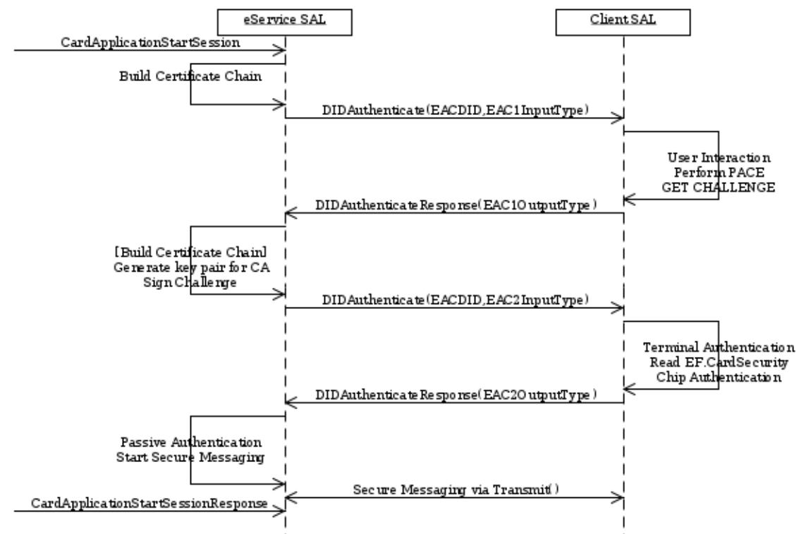

# Technical Guideline TR-03112-7 eCard-API-Framework

## Amendment: eIDType Signalling for Extended Access Control

Version 1.2.0 30.09.2021


Federal Office for Information Security Post Box 20 03 63 D-53133 Bonn Phone: +49 22899 9582-0 E-Mail: eid@bsi.bund.de Internet: https://www.bsi.bund.de © Federal Office for Information Security 2021

| 1     | About this document 5                           |  |
|-------|-------------------------------------------------|--|
| 2     | ISO/IEC 24727 protocols 6                       |  |
| 2.1   | Extended Access Control 6                       |  |
| 2.1.1 | EAC protocol specification 6                    |  |
| 2.1.2 | Marker 6                                        |  |
| 2.1.3 | Call and return of CardApplicationStartSession6 |  |
| 2.1.4 | Overview of EAC protocol sequence 10            |  |
| 2.1.5 | DIDCreate, DIDUpdate and DIDGet14               |  |
| 2.1.6 | Non-supported functions 14                      |  |

|  |  | Figure 1: Message Sequence after CardApplicationStartSession(EACSession)9 |
|--|--|---------------------------------------------------------------------------|
|  |  |                                                                           |

## 1 About this document

This Amendment to Part 7 of TR-03112-7 extends the Extended Access Control protocol defined in section 3.6 of that TR by the necessary elements for support of different types of eID document, e.g. eID Cards and eID Applets hosted on a Secure Element of a mobile device.

## 2 ISO/IEC 24727 protocols

The following section replaces Section 3.6 of TR-03112-7.

### 2.1 Extended Access Control

This protocol specified in [TR-03110] forms the framework for mutual authentication with keys exchanged using the Extended Access Control protocol.

The identifier for this protocol is urn:oid:1.3.162.15480.3.0.14 for iso(1) identified-organization (3) CEN (162) CEN 15480 (15480) part3(3) annex-a(0) extended-access-control-protocol(14)

The following protocol variant is available for this purpose:

- **•** urn:oid:1.3.162.15480.3.0.14.2 for EAC Version 2 in accordance with [TR-03110], which comprises the following sub-protocols:
	- **◦** Password Authenticated Connection Establishment (PACE) in accordance with [TR-03110]
	- **◦** Chip Authentication version 2 or version 3 (CA) in accordance with [TR-03110]
	- **◦** Terminal Authentication version 2 (TA) in accordance with [TR-03110]
	- **◦** Restricted Identification (RI) in accordance with [TR-03110]

### 2.1.1 EAC protocol specification

The Extended Access Control (EAC) protocol is specified in the following sections:

- **•** Marker
- **•** Call and return of CardApplicationStartSession
- **•** Overview of EAC protocol sequence
- **•** Phase 1 Extended PACE protocol
- **•** Phase 2 Combination of Terminal and Chip Authentication
- <span id="page-5-0"></span>**•** Secure messaging with APDU batches

### 2.1.2 Marker

[section unchanged]

### 2.1.3 Call and return of CardApplicationStartSession

The protected channel to the card by means of EAC is established by requesting CardApplicationStartSession with a corresponding DID for the EAC protocol. In this context the DIDName refers to the DID on the ICC with the marker structure defined in Section [2.1.2](#page-5-0). The AuthenticationProtocolData are of type EACSessionInputType explained in more detail below, through which the optional test sequences for age verification, document validity and municipality citizenship MAY be specified and / or the generation of a sector-specific pseudonym MAY be requested.

If required, a differentiation MAY also be made between different eService keys (with different certificates and authorisations) using the SAMConnectionHandle. Handles for the keys/certificates, which are

currently available to the eService SAL are returned without additional parameters when CardApplicationPath is called.

EACSessionInputType:

**•** AcceptedEIDType [string, 0..\*] (OPTIONAL)

This parameter MAY be used to explicitly specify the accepted eID types. The elements contain string literals to identify accepted eID types as defined in Section 4 of [TR-03159]. If no AcceptedEIDType element is present, the list CardCertified, SECertified and SEEndorsed is assumed.

**•** RequiredAge [positiveInteger, 0..1] (OPTIONAL)

MAY be used for age verification with a specific minimum age. If this element is missing, the age is not verified. This element is converted by the Server SAL into the format required for the ICC (cf. [TR-03110], Part 3). If the age verification process fails, a warning is returned in the AgeVerification element explained below (.../sal/mEAC#AgeVerificationFailedWarning).

**•** RequiredCommunity [string, 0..1] (OPTIONAL)

MAY be used to check whether the citizen is affiliated with a certain municipality. If the community affiliation process fails, a warning is returned in the CommunityVerification element explained below (.../sal/mEAC#CommunityVerificationFailedWarning). If this element is missing, the citizenship is not checked.

**•** VerifyDocumentValidity [boolean, 0..1] (OPTIONAL)

MAY specify whether the current document validity will be checked. If this element is missing or FALSE, the document validity is not checked. This element is converted by the Server SAL into the format required for the ICC (cf. [TR-03110], Part 3). If the document validity check fails, the warning (.../sal/mEAC#DocumentValidityVerificationFailed) is returned.

**•** PerformRestrictedIdentification [boolean, 0..1] (OPTIONAL)

MAY specify whether the sector-specific pseudonym is to be calculated once the trustworthy channel has been established between the Server and ICC with the Restricted Identification protocol.

**•** RequiredCHAT [hexBinary, 0..1] (OPTIONAL)

If the Server does not want to use the full access rights provided by the CHAT of the addressed certificate or leave it up to the configuration of the Server-SAL, it MAY explicitly specify the required CHAT here.

**•** OptionalCHAT [hexBinary, 0..1] (OPTIONAL)

In a similar manner the Server MAY specify optional access rights.

**•** DataSetToBeRead [DataSetNameType, 0..\*] (OPTIONAL)

In order to minimise the number of messages which have to be sent via the network, it is possible to send the necessary APDUs for the Restricted Identification protocol together with the APDUs for the data readout in one single Transmit request. To allow this, the data groups which are to be read out must be specified when invoking

CardApplicationStartSession, with one DataSetToBeRead element available for each data set to be read out.

**•** TransactionInfo [string, 0..1] (OPTIONAL)

This element MAY contain transaction-related information, which MUST be displayed in the eID-PIN dialogue before the PACE-protocol is performed.

In response to the CardApplicationStartSession request, a CardApplicationStartSessionResponse is returned with AuthenticationProtocolData of the EACSessionOutputType:

**•** UsedEIDType [string, 0..1] (CONDITIONAL)

MUST contain a string defined in Section 4 of [TR-03159] specifying the eID type actually used for authentication, if an AcceptedEIDType element was present in EACSessionInputType.

**•** AgeVerification [anyURI, 0..1] (CONDITIONAL)

If a RequiredAge element was transferred on invocation, the result of the age verification is returned in this element. If the check was successful, the returned URI is .../resultmajor#ok, whereas the error code returned if the age verification failed is .../ sal/EAC#AgeVerificationFailedWarning.

**•** CommunityVerification [anyURI, 0..1] (CONDITIONAL)

If a RequiredCommunity element was transferred on invocation, the result of the citizenship check is returned in this element. If the check was successful, the returned URI is .../resultmajor#ok, whereas the error code returned if the citizenship check failed is

- .../sal/EAC#CommunityVerificationFailedWarning.
- **•** DocumentValidityVerification [anyURI, 0..1] (CONDITIONAL)

If the document validity check was requested with the VerifyDocumentValidity element, which is assigned the status True, the result of this check is returned in this element. If the check is successful, the returned URI is .../resultmajor#ok, whereas the error code .../ sal/EAC#DocumentValidityVerificationFailed is returned if the document validity check fails.

**•** SectorSpecificIdentifier [hexBinary, 0..1] (CONDITIONAL)

If the PerformRestrictedIdentification element was used to request the calculation of the sector-specific pseudonym, this is returned here.

**•** DataSet [0..\*] (CONDITIONAL)

In response to each DataSet request either its content or an error message, indicating that readout was unsuccessful is returned. The precise structure of this element is explained in detail below.

**◦** DataSetName [DataSetNameType] (REQUIRED)

Contains the name of the DataSet.

**◦** dss:Result [] (REQUIRED)

Contains the result of the request. If the DataSet readout was successful, the URI returned in the ResultMajor element is .../resultmajor#ok. If the process fails, the URI returned in the ResultMajor element is .../resultmajor#error and, in addition, further details are returned in the ResultMinor element as to the cause of the error, distinguishing between the following cases:

8 Federal Office for Information Security

- **▪** .../resultminor/sal/unknownDataSetName
- **▪** .../resultminor/sal/securityConditionsNotSatisfied
- **▪** .../resultminor/sal/prerequisitesNotSatisfied

```
◦ DSI [0..*] (CONDITIONAL)
```
Is available once for each Data Structure for Interoperability contained in the DataSet. See below for details.

**▪** DSIName [DSINameType] (REQUIRED)

Contains the name of the Data Structure for Interoperability (DSI).

**▪** Dss:Result [] (REQUIRED)

Contains the result of the request. If the DSI readout was successful, the message returned in the ResultMajor element is /.../resultmajor#ok. If the process fails, the message returned in the ResultMajor element is

.../resultmajor#error and, in addition, further details are returned in the ResultMinor element as to the cause of the error, distinguishing between the following cases:

- **•** .../resultminor/sal/unknownDSIName
- **•** .../resultminor/sal/prerequisitesNotSatisfied
- **•** .../resultminor/sal/securityConditionsNotSatisfied
- **▪** DSIContent [hexBinary, 0..1] (CONDITIONAL)

The content of the DSI is returned here if the process is successful.

### 2.1.4 Overview of EAC protocol sequence

<span id="page-9-0"></span>The sequence between both SAL instances after invocation of CardApplicationStartSession on the eService SAL is shown in [1](#page-9-0).

#### 2.1.4.1 Phase 1 - Extended PACE protocol

The eService-SAL invokes DIDAuthenticate with the DIDName provided for PACE (cf. PACEDID element in Section [2.1.2\)](#page-5-0) and AuthenticationProtocolData of the EAC1InputType explained in more detail below.

The eService certificate, the corresponding DV certificate and additional link certificates are transferred in this process and MAY be verified by the client SAL. If the verification fails, the user MUST be informed accordingly and the authentication protocol MUST be aborted.

The DIDAuthenticate-message also contains corresponding certificate descriptions (see specification of the ASN.1-based CertificateDescription structure in [TR-03110], Part 3), information about the required and optional Card Holder Authorization Template (CHAT) (RequiredCHAT and OptionalCHAT), the AuthenticatedAuxiliaryData prepared for the chip and additional TransactionInfo, if required.

The file EF.CardAccess is read out and, following the PACE protocol process, the challenge for the Terminal Authentication is requested from the chip.



*Figure 1: Message Sequence after CardApplicationStartSession(EACSession)*

The data described are returned in the AuthenticationProtocolData of type EAC1OutputType, which is explained in more detail below. If this process is successful the ASN.1-encoded SecurityInfo structure from EF.CardAccess and the "card identity" *ID ICC* (see [TR-03110], Part 2) is returned.

If the CertificateHolderAuthorizationTemplate (CHAT) has been further restricted by the user it will be returned. If the client SAL has not been able to build a ICC-verifiable certificate chain there will be up to two CertificationAuthorityReference elements, which specify the root keys that are available for the certificate verification on the ICC. The SecurityInfos structure from the EF.CardAccess file contains the domain parameters which are used in the next step to generate a fresh key pair.

EAC1InputType:

**•** AcceptedEIDType [string, 0..\*] (OPTIONAL)

This parameter MAY be used to explicitly specify the accepted eID types. The elements contain string literals to identify accepted eID types as defined in Section 4 of [TR-03159]. If no AcceptedEIDType element is present, the list CardCertified, SECertified and SEEndorsed is assumed.

**•** Certificate [hexBinary, 1..\*] (REQUIRED)

MUST contain exactly one eService certificate and the corresponding DV certificate. Additional link-certificates MAY be included. The eService SAL SHOULD include all link-certificates known to the eService.

The client SAL MAY pre-verify the eService certificate according to [TR-03110], Part 3, before display. In this case the client SAL MUST maintain trust point(s) according to [TR-03110], Part 3 (the role of MRTD chip must be performed by the client SAL). This includes secure storage of the trust point(s) and update of trust point(s) according to the rules in [TR-03110], Part 3. If the verification fails, the user MUST be informed accordingly and the authentication protocol MUST be aborted.

**•** CertificateDescription [hexBinary] (REQUIRED)

The client SAL MUST check that exactly one CertificateDescription-element is present and MUST display the content of this element in a suitable manner before capturing the PIN and performing the PACE-protocol.

**•** RequiredCHAT [hexBinary, 0..1] (OPTIONAL)

Specifies the data, which are required by the Server.

If the full rights specified in the certificate are not supposed to be used, a CHAT already restricted by the Server MAY be transferred to the client SAL. It SHOULD be possible, applying the principle of data-minimization, to configure the Server SAL to dictate which CHAT is transferred with which certificates and in which cases.

**•** OptionalCHAT [hexBinary, 0..1] (OPTIONAL)

Specifies the data, which are requested by the Server, but which transmission may be supressed by the user.

**•** AuthenticatedAuxiliaryData [hexBinary, 0..1] (OPTIONAL)

MAY contain additional data which are used to check the validity of the card, verify the age or check municipality citizenship. These data MUST be relayed in the form specified in [TR-03110], Part 3. For each piece of data transmitted for additional verification after successful Terminal Authentication, a Verify command is requested (e.g. with OID 0.4.0.127.0.7.3.1.4.1

(id-auxiliaryData-1) for age verification, with 0.4.0.127.0.7.3.1.4.2 (id-auxiliaryData-2) for the document validity check or with 0.4.0.127.0.7.3.1.4.3 (id-auxiliaryData-3) to check municipality citizenship, cf. also [TR-03110], Part 3.

**•** TransactionInfo [string, 0..1] (OPTIONAL)

This element MAY contain transaction-related information, which MUST be displayed in the eID-PIN dialogue before the PACE-protocol is performed.

A DIDAuthenticateResponse element with AuthenticationProtocolData of type EAC1OutputType is returned in response to this request:

**•** CertificateHolderAuthorizationTemplate [hexBinary, 0..1]

(CONDITIONAL)

If the user has imposed further restrictions on the CHAT transmitted by the Server, such that the actual access rights do not correspond with the access rights which might potentially ensue from the certificate, the Server SAL MUST be informed of the CHAT restricted by the user in this manner.

**•** CertificationAuthorityReference [string, 0..2] (CONDITIONAL)

As part of the Terminal Authentication the client SAL SHALL build a ICC-verfiable certificate chain from the certificates provided by the Server. The client SAL MAY also use certificates known to the client from other sources (e.g. internal certificate stores) to build a chain. This element MUST be present if the client SAL is not able to build a ICC-verifiable certificate chain. In that case the element contains up to two references to the certification authority, which are provided by the chip (see [TR-03110], Part 3). If two references are returned, the first reference is the more current of the two.

**•** EFCardAccess [hexBinary] (REQUIRED)

MUST contain the ASN.1-coded SecurityInfos from the EF.CardAccess file (cf. [TR-03110], Table A.1).

**•** IDPICC [hexBinary] (REQUIRED)

MUST contain the "card identity" *IDICC*. As stipulated in [TR-03110], Part 2, this involves the compressed ephemeral public key of the ICC in case of PACE. The Server SAL MUST check that this element occurs exactly once.

**•** Challenge [hexBinary] (REQUIRED)

MUST contain the random number generated by the ICC, *rICC,TA*, which is signed by the Server SAL during the Terminal Authentication. The Server SAL MUST check that this element occurs exactly once.

#### 2.1.4.2 Phase 2 - Combination of Terminal and Chip Authentication

Using the Chip Authentication domain parameters (see SecurityInfo structure above), the eService SAL generates a fresh key pair in the next step, forms an appropriate chain of additionally required certificates and finally, where required, signs the Challenge which has been transmitted.

The eService SAL then invokes DIDAuthenticate for the CADID (cf. Section [2.1.2](#page-5-0)) and relays AuthenticationProtocolData of type EAC2InputType, which is described in more detail below, to the client SAL. In addition to the certificate chain applicable to the ICC, this element contains the newly generated public key EphemeralPublicKey. The certificate chain is verified by the ICC.

The signature generated by the terminal (Signature) is checked by means of EXTERNAL AUTHENTICATE. The file EF.CardSecurity is read out and Chip Authentication is executed by invoking MSE:SET AT and GENERAL AUTHENTICATE. The results of these actions (EF.CardSecurity, authentication token and nonce) are returned to the eService SAL in AuthenticationProtocolData of type EAC2OutputType, which is explained in more detail below.

EAC2InputType:

**•** Certificate [hexBinary, 0..\*] (OPTIONAL)

The Certificate element MAY occur any number of times and contains a certificate in each case so that, together with the Server certificate already transmitted, the resulting overall chain is one which is verifiable by the ICC. The sender MUST NOT include an Server certificate. The receiver MUST ignore Server certificates contained in this element. The receiver MAY additionally use certificates known to the receiver to build a complete certificate chain. This element MUST be provided if the element CertificationAuthorityReference in EAC1OutputType is present. If the element CertificationAuthorityReference is not present, the client SAL SHALL build a chain from the certificates transmitted in Phase 1 which is verifiable by the ICC.

**•** EphemeralPublicKey [hexBinary] (REQUIRED)

MUST contain the public key of the key pair newly generated by the Server SAL. The key SHALL be encoded as unsigned integer (DH keys) or elliptic curve point (ECDH keys) according to [TR-03110], Part 3, Appendix D. In case of ECDH keys this implies the uncompressed encoding according to [TR-03111], i.e. including encoding indicator 0x04. The client SAL MUST check that this element occurs exactly once.

**•** Signature [hexBinary] (REQUIRED)

MUST contain the signature generated by the Server SAL during Terminal Authentication.

AuthenticationProtocolData of type EAC2OutputType are returned in the subsequent DIDAuthenticateResponse:

**•** EFCardSecurity [hexBinary] (REQUIRED)

Contains a SignedData structure in accordance with [RFC3852] which contains the full SecurityInfo structure in the content data (EncapsulatedContentInfo). This signature is checked by the Server SAL during Passive Authentication. The Server SAL MUST check that this element occurs exactly once.

**•** The following elements SHALL be present if and only if Chip Authentication version 2 is used **◦** AuthenticationToken [hexBinary] (CONDITIONAL)

Contains the authentication token (*TICC*). The Server SAL MUST check that this element occurs exactly once.

**◦** Nonce [hexBinary] (CONDITIONAL)

Contains the random number (*rICC,CA*). The Server SAL MUST check that this element occurs exactly once.

- **•** The following element SHALL be present if and only if Chip Authentication version 3 is used
	- **◦** EphemeralPublicKey [hexBinary] (CONDITIONAL)

MUST contain the public key of the key pair newly generated by the ICC. The key SHALL be encoded as unsigned integer (DH keys) or elliptic curve point (ECDH keys) according to [TR-03110], Part 3, Appendix D. In case of ECDH keys this implies the uncompressed

encoding according to [TR-03111], i.e. including encoding indicator 0x04. The Server SAL MUST check that this element occurs exactly once.

Note: Chip Authentication version 3 comprises two phases, an anonymous Diffie-Helman Key Exchange and a signature of the ICC's key share by the ICC. The above exchange only maps the first phase to AuthenticationProtocolData/DIDAuthenticate. Since Secure Messaging is established after the Key Exchange, the second phase is encapsulated in this Secure Messaging channel, i.e. transmitted using Transmit.

#### 2.1.4.3 Secure messaging with APDU batches

If the signature extracted from EFCardSecurity (Passive Authentication) and the authentication token generated in the Chip Authentication process are verified, the eService SAL MAY then communicate with the ICC via APDUs protected by secure messaging in order to — according to the information requested by means of CardApplicationStartSession — request the generation of the sector-specific pseudonym, perform additional checks or read out certain data stored on the ICC. The APDUs required for this MAY be calculated in advance by the eService SAL and transferred as a batch using the Transmit function from Part 6 of this Guideline via the network to the IFD-Layer on the side of the ICC. The IFD-Layer on the side of the ICC in turn sends the APDUs prepared by the eService SAL to the ICC in sequence and logs the respective response APDUs, which are ultimately sent back to the eService SAL as a collective batch in the TransmitResponse.

### 2.1.5 DIDCreate, DIDUpdate and DIDGet

[section unchanged]

### 2.1.6 Non-supported functions

[section unchanged]

### **References**

| IETF: RFC 3852: R. Housley: Cryptographic message syntax (CMS)                |
|-------------------------------------------------------------------------------|
| BSI: Technische Richtlinie TR-03110: Advanced Security Mechanisms for Machine |
| Readable Travel Documents                                                     |
| BSI: Technische Richtlinie TR-03111, Elliptic Curve Cryptography (ECC)        |
| BSI: Technische Richtlinie TR-03159, Mobile Identities                        |
|                                                                               |