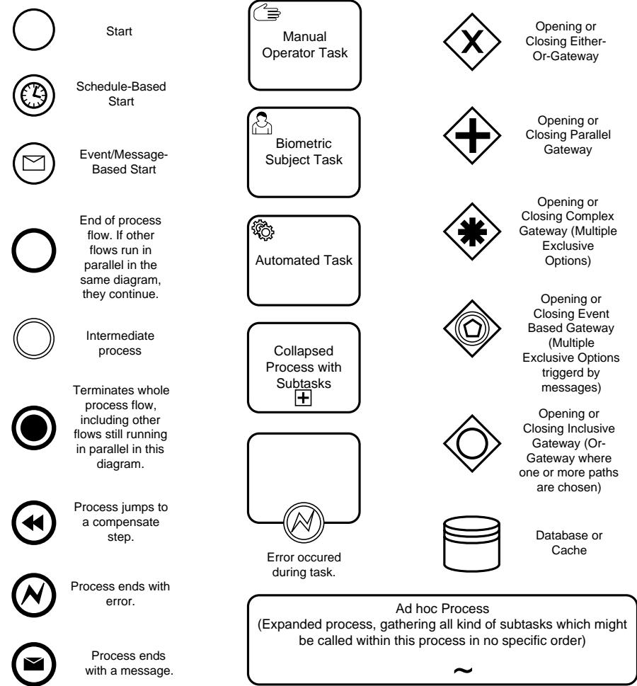
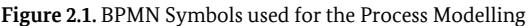
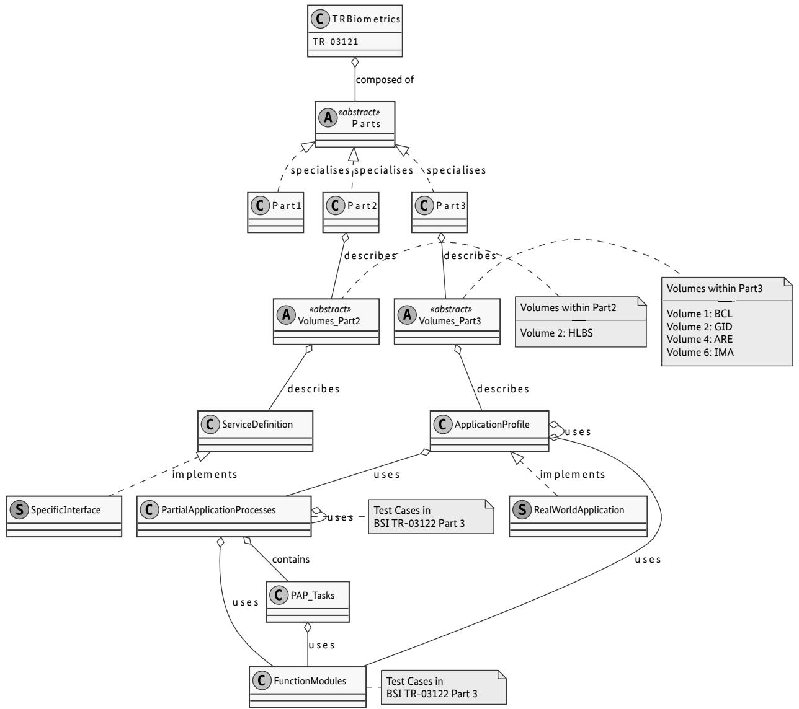

BSI Technical Guideline TR-03121-1

# Biometrics for Public Sector Applications

Part 1: Framework

Version 5.3

Federal Office for Information Security P.O. Box 20 03 63 53133 Bonn E-Mail: TRBiometrics@bsi.bund.de Internet: https://www.bsi.bund.de © Federal Office for Information Security 2022

| 1.   | Changelog  1                                                    |
|------|-----------------------------------------------------------------------|
| 1.1. | Changelog Version 5.3-draft1  1                                 |
| 1.2. | Changelog Version 5.3-draft2  6                                 |
| 1.3. | Changelog Version 5.3  12                                       |
| 2.   | Introduction  18                                                |
| 2.1. | Motivation and Objectives of Technical Guideline Biometrics  18 |
| 2.2. | Target Audience and User  18                                    |
| 2.3. | Terminology  19                                                 |
| 2.4. | Business Process Modelling Notation (BPMN)  19                  |
| 3.   | Structure of Technical Guideline Biometrics  20                 |
| 4.   | How to use this Technical Guideline  22                         |
| 5.   | Logging scheme  23                                              |
| 5.1. | Use cases  23                                                   |
| 5.2. | XML schemas  23                                                 |
| 6.   | Application Profiles  24                                        |
| 7.   | Organisation of the Function Modules  25                        |
| 8.   | Organisation of the Partial Application Processes  28           |
|      | List of Abbreviations  29                                       |
|      | Bibliography  30                                                |

### **List of Figures**

| 2.1. | BPMN Symbols used for the Process Modelling  | 19 |
|------|-------------------------------------------------|----|
| 3.1. | Class Diagram of the Technical Guidelines    | 21 |

### **1. Changelog**

The following tables present the changes introduced to this Technical Guideline since version 5.2. chan gelog lists the changes grouped per part of this Technical Guideline, and per building block [\(Application Pro](#page-32-1) [file \(AP\),](#page-32-1) [Partial Application Process \(PAP\)](#page-32-2), Task, [Function Module \(FM\)](#page-32-3)) or element (section, table, figure):

- **•** *Added* for new features
- **•** *Changed* for changes in existing functionality
- **•** *Deprecated* for soon-to-be removed features
- **•** *Removed* for now removed features
- **•** *Fixed* for any bug fixes
- **•** *Security* in case of vulnerabilities

#### **1.1. Changelog Version 5.3-draft1**

This chapter includes all changes between Version 5.2 and Version 5.3-draft1.

#### **1.1.1. Changelog BSI TR-03121, General**

| Element Name | Type of Change | Change Description                                      |
|--------------|-------------------|---------------------------------------------------------|
| Bibliography | Changed           | Changed EES ICD Version to 00_07_00, 14th February 2022 |

**Table 1.1** Changelog BSI TR-03121, General

#### **1.1.2. Changelog BSI TR-03121, Part 1**

| Element Name                                                 | Type of Change | Change Description                                                                                                                                                                                                     |  |  |
|--------------------------------------------------------------|-------------------|------------------------------------------------------------------------------------------------------------------------------------------------------------------------------------------------------------------------|--|--|
| LNK, REQ                                                     | Removed           | Removed LNK (Linking) and REQ (Request) in Overview PAP ID Primary Information Items due to lack of existence.                                                                                                      |  |  |
| CL, FP1P, FPP, FPR, TF, FP                                | Removed           | Removed CL (Candidate List), FP1P (1 Plain Fingerprint), FPP (Plain FPR (Rol led Fingerprint), TF (Traveller File) and FP (Fingerprint) in Overview PAP ID Optional In formation Items due to lack of reference. |  |  |
| FP10R, ALL, AU TO, EES                                    | Added             | Added FP10R (Fingerprint 10 Finger Rolled), ALL (Overall), AUTO (Automated) and EES (Entry-Exit-System) in Overview PAP ID Optional Information Items due to existing refe rence.                                |  |  |
| Overview FM Categories Op tional Informati on Items | Added             | Added a new table.                                                                                                                                                                                                     |  |  |

**Table 1.2** Changelog BSI TR-03121, Part 1

#### **1.1.3. Changelog BSI TR-03121, Part 2, Volume HLBS**

| Element Name                                     | Type of Change | Change Description                                                                                                                                                     |
|--------------------------------------------------|-------------------|------------------------------------------------------------------------------------------------------------------------------------------------------------------------|
| Service Definition "Fin gerprint Acquisition" | Changed           | Changed type of Feedback-parameter "ExpectedFingers" from Iso19794FingerCode to BiometricCodeList.                                                                  |
| Service Definition "Fin gerprint Acquisition" | Changed           | Marked Configuration-parameter "MissingFingers" as deprecated.                                                                                                         |
| Service Definition "Fin gerprint Acquisition" | Changed           | Added new User Command "SelectMissingFingers" to enable more dynamic selec tion of missing fingers instead of static configuration.                                 |
| Service Definition "Fin gerprint Acquisition" | Changed           | Added new value "SelectMissingFingers" to LiveStatus Feedback.                                                                                                         |
| Service Definition "Fin gerprint Acquisition" | Changed           | Added new User Command "Capture" (e.g. in case fingerprint acquisition system does not trigger automatically due to insufficient quality during pre-qualification). |

**Table 1.3** Changelog BSI TR-03121, Part 2

#### **1.1.4. Changelog BSI TR-03121, Part 3**

| TR Volume             | Block / Section / Type | Name                                                                        | Type of Change | Change Description                                                                                                                             |
|-----------------------|------------------------------|-----------------------------------------------------------------------------|-------------------|------------------------------------------------------------------------------------------------------------------------------------------------|
| GID                   | AP                           | Facial Images Cloud                                                   | Changed           | Replaced word "photographer" by "service provider".                                                                                            |
| BCL, GID, ARE, IMA | FM                           | AS-FI-DC                                                                    | Changed           | Moved already existing recommendations regarding image formats to designated subsection. Deleted the list of uncompressed image formats. |
| GID                   | Basics                       | Basics for German Identi ty Docu ments                          | Added             | Rearrangement of the first three APs from former version.                                                                                      |
| GID                   | AP                           | Scan-of Photo graph                                                   | Added             | Rearrangement of the first three APs from former version.                                                                                      |
| GID                   | AP                           | Unsu pervised Self-Ser vice Faci al Image Live En rolment | Added             | Rearrangement of the first three APs from former version.                                                                                      |
| GID                   | AP                           | Supervi sed Faci al Image Live En rolment                       | Added             | Rearrangement of the first three APs from former version.                                                                                      |

| TR Volume             | Block / Section / Type | Name                                                                                | Type of Change | Change Description                                        |
|-----------------------|------------------------------|-------------------------------------------------------------------------------------|-------------------|-----------------------------------------------------------|
| GID                   | AP                           | Facial Image Digi tal-Trans mission via De Mail (BSI TR-03136) | Added             | Rearrangement of the first three APs from former version. |
| GID                   | AP                           | Facial Image Digi tal-Trans missi on via Cloud (BSI TR-03170)  | Changed           | Title changed.                                            |
| GID                   | AP                           | Supervi sed Fin gerprint Live En rolment Process                     | Added             | Rearrangement of the first three APs from former version. |
| GID                   | AP                           | Unsu pervised Self-Ser vice Fin gerprint Live En rolment          | Added             | Rearrangement of the first three APs from former version. |
| GID                   | AP                           | German Identity Card                                                          | Removed           | Rearrangement of the first three APs from former version. |
| GID                   | AP                           | German Electronic Passport                                                    | Removed           | Rearrangement of the first three APs from former version. |
| GID                   | AP                           | German Residence Permit                                                       | Removed           | Rearrangement of the first three APs from former version. |
| GID                   | AP                           | Scan-of Photo graph                                                           | Changed           | Added Deadline                                            |
| GID                   | PAP                          | ACQ-FI SV-1                                                                      | Changed           | Added Deadline                                            |
| BCL, IMA              | FM                           | COD-FI EES                                                                       | Changed           | Max. and min. image resolution added.                     |
| BCL, GID, ARE, IMA | FM                           | AH-FI-DC                                                                            | Changed           | Colour image requirement added.                           |
| BCL, GID              | FM                           | AS-FP-SF                                                                            | Changed           | Added documentation of pre-qualification threshold.       |
| GID                   | FM                           | EVA-ALL GID                                                                      | Changed           | Added annual report time period definition                |

| TR Volume             | Block / Section / Type | Name                           | Type of Change | Change Description                                                                                                                                                           |
|-----------------------|------------------------------|--------------------------------|-------------------|------------------------------------------------------------------------------------------------------------------------------------------------------------------------------|
| ARE                   | PAP                          | ACQ-FI SV-2                 | Changed           | Added identification and pre-selection of best image and updated display settings for the operator.                                                                       |
| BCL                   | FM                           | AH-FI BCL                   | Changed           | New definition for distance between camera system and biometric subject.                                                                                                  |
| GID                   | FM                           | AH-FI SSS2                  | Changed           | New definition for distance between camera system and biometric subject.                                                                                                  |
| BCL, GID              | FM                           | AS-FP-SF                       | Changed           | Timeout moved to PAP                                                                                                                                                         |
| BCL, GID, IMA, ARE | FM                           | AS-FP-MF                       | Changed           | Timeout moved to PAP                                                                                                                                                         |
| GID                   | FM                           | COD-FI GID2                 | Changed           | Removed one requirement.                                                                                                                                                     |
| GID                   | FM                           | BIP-FI GID                  | Changed           | Modified one requirement.                                                                                                                                                    |
| BCL                   | FM                           | CMP-FI VER                  | Changed           | Modified one Requirement on the Algorithm Performance.                                                                                                                       |
| BCL, GID              | FM                           | CMP-FP VER                  | Changed           | Modified one Requirement on the Algorithm Performance.                                                                                                                       |
| GID                   |                              |                                | Changed           | Volume title changed from Enrolment Scenarios for Identity Docu ments to German Identity Documents                                                                        |
| GID                   | PAP Task                     | ACQ-FPP USV-1               | Changed           | Removed one bullet point                                                                                                                                                     |
| GID                   | AP                           | Biometric Data Selection | Changed           | Modified text (third and fifth bullet point) figure regarding Faci al Image Selection Procedure to better map the process                                                 |
| BCL, GID, IMA      | FM                           | COD-FI GENERIC              | Changed           | Modified Requirements                                                                                                                                                        |
| BCL, GID, ARE, IMA | FM                           | LOG-ALL GENERIC             | Changed           | UUIDs SHALL be logged for enrolments, verifications and identifica tions (only scheme version 4v7)                                                                        |
| BCL, GID, ARE, IMA | FM                           | LOG-FI GENERIC              | Changed           | UUID SHALL be logged for the acquisition (only scheme version 4v7)                                                                                                           |
| BCL, GID, ARE, IMA | FM                           | LOG-FP GENERIC              | Changed           | UUID SHALL be logged for the acquisition (only scheme version 4v7)                                                                                                           |
| GID                   | PAP                          | ACQ FP2P USV-1           | Changed           | Only index fingers with sufficient quality are recorded unsupervised.                                                                                                        |
| GID                   | PAP                          | ACQ FP2P USV-2           | Changed           | Only index fingers with sufficient quality are recorded unsupervised.                                                                                                        |
| GID                   | PAP                          | ACQ FP2P USV-2           | removed           | Brackets reffering to self service systems removed. The whole chap ter is written in context of self service systems.                                                     |
| GID                   | FM                           | AH-FI SSS2                  | Changed           | Modified Requirements                                                                                                                                                        |
| GID                   | -                            | -                              | Added             | Added overview process section to chapter "Basics for German Iden tity Documents" which briefly explains the relation between ap plication profiles of the GID volume. |

| TR Volume             | Block / Section / Type | Name                                                                               | Type of Change | Change Description                                                                                                                                                                                                             |
|-----------------------|------------------------------|------------------------------------------------------------------------------------|-------------------|--------------------------------------------------------------------------------------------------------------------------------------------------------------------------------------------------------------------------------|
| GID                   | FM                           | AH-FI-DC                                                                           | Removed           |                                                                                                                                                                                                                                |
| GID                   | FM                           | AH-FI DC2                                                                       | Added             |                                                                                                                                                                                                                                |
| GID                   | FM                           | AH-FI-ICS                                                                          | Removed           |                                                                                                                                                                                                                                |
| GID                   | FM                           | AH-FI ICS2                                                                      | Added             |                                                                                                                                                                                                                                |
| GID                   | FM                           | AS-FI-DC                                                                           | Removed           |                                                                                                                                                                                                                                |
| GID                   | FM                           | AS-FI DC2                                                                       | Added             |                                                                                                                                                                                                                                |
| BCL, GID, ARE, IMA | FM                           | UI-FP-OP                                                                           | Changed           | Clarified: Fingers involved in the unexpected successful comparisons SHALL be pictorially displayed.                                                                                                                        |
| GID                   | FM                           | BIP-FI GID                                                                      | Changed           | Updated image size and added inter eye distance.                                                                                                                                                                               |
| GID                   | AP                           | Facial Image Digi tal-Trans missi on via Cloud (BSI TR-03170) | Changed           | QA and further processing of the facial image(s) within the facial images cloud is now optional. However, in the end the facial image(s) for transmission to the counter at the agency have to comply to COD-FI-GID2. |
| GID                   | FM                           | QA-FI GID                                                                       | Changed           | Updated image size and inter eye distance.                                                                                                                                                                                     |
| BCL, GID, ARE, GIS | FM                           | QA-FP APP                                                                       | Modified          | The error code and result value are now specified in a more under standable fashion.                                                                                                                                        |
| GID                   | FM                           | COM-FI JPG                                                                      | Changed           | Updated image size.                                                                                                                                                                                                            |
| GID                   | FM                           | COD-FI GID2                                                                     | Changed           | Updated image size.                                                                                                                                                                                                            |
| GID                   | FM                           | COD-ALL GID                                                                     | Changed           | Increased Schema-Version to 5v0, changed root element to gid-log.                                                                                                                                                              |
| GID                   | FM                           | LOG-ALL GENERIC                                                                 | Changed           | Adapted logging to new Schema-Version 5v0.                                                                                                                                                                                     |
| GID                   | FM                           | LOG-FI GENERIC                                                                  | Changed           | Adapted logging to new Schema-Version 5v0.                                                                                                                                                                                     |
| GID                   | FM                           | LOG-FP GENERIC                                                                  | Changed           | Adapted logging to new Schema-Version 5v0.                                                                                                                                                                                     |
| GID                   | FM                           | LOG-FI GID                                                                      | Changed           | Adapted logging to new Schema-Version 5v0.                                                                                                                                                                                     |
| GID                   | FM                           | LOG-FP GID                                                                      | Changed           | Adapted logging to new Schema-Version 5v0.                                                                                                                                                                                     |
| GID                   | FM                           | LOG-ALL GID                                                                     | Changed           | Adapted logging to new Schema-Version 5v0.                                                                                                                                                                                     |
| GID                   | FM                           | COD-FI EXIF                                                                     | Removed           | Will be covered implicit within this TR within the AP of biometric data Selection at the counter                                                                                                                            |

| TR Volume             | Block / Section / Type | Name                                          | Type of Change | Change Description                                                                                                                                                                                                           |
|-----------------------|------------------------------|-----------------------------------------------|-------------------|------------------------------------------------------------------------------------------------------------------------------------------------------------------------------------------------------------------------------|
| GID                   | AP                           | Processing for Docu ment Pro duction | Added             |                                                                                                                                                                                                                              |
| BCL, GID              | FM                           | AS-FP-SF                                      | Changed           | Modified requirements regarding timeout                                                                                                                                                                                      |
| BCL, GID, ARE, IMA | FM                           | AS-FP-MF                                      | Changed           | Modified requirements regarding timeout                                                                                                                                                                                      |
| BCL, GID, ARE, IMA | FM                           | COD-FI GENERIC                             | Changed           | Adapted logging to new Schema-Version 5v0 for GID.                                                                                                                                                                           |
| GID                   | AP                           | Biometric Data Selection                | Changed           | Precised process and added annotations at the process.                                                                                                                                                                       |
| GID                   | FM                           | REF-FI GID                                 | Changed           | FM COM-FI-JPG removed to be applied on the facial image for refe rence storage. In case image originates from facial images cloud ad ditional information from the log-file has to be extracted refe rence storage. |
| GID                   | FM                           | COD-FI GID                                 | Changed           | Removed section about reference storage, removed information about TR-03121 logging nodes (definitions are placed in the LOG FMs).                                                                                     |
| GID                   | FM                           | COD-FI GID                                 | Changed           | Removed information about TR-03121 logging nodes (definitions are placed in the LOG FMs).                                                                                                                                 |
| GID                   | FM                           | LOG-FI GID2                                | Added             | Added information on how to log facial images and further informa tion relating to the facial images for GID.                                                                                                             |
| GID                   | FM                           | LOG-FP GID2                                | Added             | Added information on how to log fingerprint images for GID.                                                                                                                                                                  |
| BCL,GID               | PAP Task                     | ACQ-FPS USV-1                              | Modified          | Distinguished between two different timeouts and therefore chan ged BPMN model as well as describing text.                                                                                                                |
| GID                   | PAP Task                     | ACQ-FPP USV-1                              | Modified          | Distinguished between two different timeouts and therefore chan ged BPMN model as well as describing text.                                                                                                                |
| BCL, GID, ARE, IMA | FM                           | UI-FI-BSJ                                     | Modified          | Added information about Presentation Attack Detection (PAD).                                                                                                                                                                 |
|                       | FM                           | PAD-FP/ FI-APP/ APP1                    | Changed           | Show Presentation Attack Detection result in any case.                                                                                                                                                                       |

**Table 1.4** Changelog BSI TR-03121, Part 3

#### **1.2. Changelog Version 5.3-draft2**

This chapter includes all changes between Version 5.3-draft1 and Version 5.3-draft2.

#### **1.2.1. Changelog BSI TR-03121, General**

| Element Name | Type of Change | Change Description                                       |
|--------------|-------------------|----------------------------------------------------------|
| Bibliography | Changed           | Updated [BIB_ISO_19795-1:2006] to [BIB_ISO_19795-1:2021] |

**Table 1.5** Changelog BSI TR-03121, General

#### **1.2.2. Changelog BSI TR-03121, Part 1**

| Element Name | Type of Change | Change Description |
|--------------|-------------------|--------------------|
| -            | -                 | -                  |

**Table 1.6** Changelog BSI TR-03121, Part 1

#### **1.2.3. Changelog BSI TR-03121, Part 2, Volume HLBS**

| Element Name                       | Type of Change | Change Description                |
|------------------------------------|-------------------|-----------------------------------|
| Data Type "Application Profile" | Changed           | Updated GID Application Profiles. |
| ServiceInformation                 | Changed           | Added Parameter Version.          |

**Table 1.7** Changelog BSI TR-03121, Part 2

#### **1.2.4. Changelog BSI TR-03121, Part 3**

| TR Volume        | Block / Section / Type | Name                                                                        | Type of Change | Change Description                                                                                                                              |
|------------------|------------------------------|-----------------------------------------------------------------------------|-------------------|-------------------------------------------------------------------------------------------------------------------------------------------------|
| GID              | PAP                          | ACQ FP2P-SV-1                                                            | Changed           | New Layout                                                                                                                                      |
| GID              | PAP                          | ACQ FP2P-SV-2                                                            | Changed           | New Layout                                                                                                                                      |
| BCL, GID, IMA | PAP Task                     | ACQ-FPS SV-1                                                             | Changed           | Added option for the operator regarding manual conduct of capture                                                                               |
| BCL, GID, IMA | PAP Task                     | ACQ-FPS SV-1                                                             | Changed           | Added case in which a comparison of each finger print of the current slap with any other finger print of the current is being conduc ted. |
| BCL, GID, IMA | PAP Task                     | ACQ-FPS SV-1                                                             | Changed           | Added 'Perform PAD' to the description. Figure and description now match.                                                                    |
| BCL, GID, IMA | PAP Task                     | ACQ-FPS SV-1                                                             | Changed           | Added step 6 to the description. Information displayed at the end of the process now explicitly include PAD and QA information.              |
| ARE              | PAP Task                     | ACQ-FPS SV-2                                                             | Changed           | Added option for the operator regarding manual conduct of capture                                                                               |
| BCL, GID, IMA | PAP Task                     | ACQ-FPP SV-2                                                             | Changed           | Added option for the operator regarding manual conduct of capture                                                                               |
| BCL, GID, IMA | PAP Task                     | ACQ-FPS SV-2                                                             | Added             | Added step 6 to the description. Information displayed at the end of the process now explicitly include PAD and QA information.              |
| BCL, GID, IMA | PAP Task                     | ACQ-FPS SV-2                                                             | Changed           | Changed step 4 (sequence check) such that a PAD warning also oc curs if fingers are matching within the currently acquired slap.             |
| BCL, GID         | PAP Task                     | ACQ-FI-1                                                                    | Changed           | Changed BPMN. Description of FM for PAD is now generic.                                                                                         |
| GID              | AP                           | Unsu pervised Self-Ser vice Faci al Image Live En rolment | Changed           | Added mandatory PAP ACQ-FI-AUTO-1.                                                                                                              |

| TR Volume             | Block / Section / Type | Name                                                                        | Type of Change | Change Description                                                                                                       |
|-----------------------|------------------------------|-----------------------------------------------------------------------------|-------------------|--------------------------------------------------------------------------------------------------------------------------|
| GID                   | AP                           | Biometric Data Selection                                              | Changed           | Merged three sub-chapters with mostly the same text into one                                                             |
| GID                   | AP                           | Processing for Docu ment Pro duction                               | Added             | Quality assessements added to mandatory FM's                                                                             |
| BCL, GID, ARE, IMA | FM                           | COM-FI GENERIC                                                           | Added             | Added new chapter and assigned a generic COM requirement to it.                                                          |
| GID                   | FM                           | LOG-ALL GID                                                              | Changed           | Added ApplicationProfile-Element table                                                                                   |
| GID                   | PAP Task                     | ACQ-FPS USV-1                                                            | Changed           | Discard all captured images after first sequence error.                                                                  |
| GID                   | PAP Task                     | ACQ-FPP USV-1                                                            | Changed           | Discard all captured images after first sequence error.                                                                  |
| GID                   | AP                           | Applicati on Profile Processing for Docu ment Pro duction    | Removed           | Removed requirement regarding holograms in pass production.                                                              |
| GID, BCL, ARE, IMA | FM                           | QA-FP APP                                                                | Changed           | Images of 500 ppi shall be used for NFIQ 2.0.                                                                            |
| GID, BCL              | FM                           | PAD-FI APP                                                               | Changed           | Further specification of PAD results included via reference. Techni cal information shall now be stored if available. |
| GID                   | AP                           | Processing for Docu ment Pro duction                               | Changed           | Changed Melderegister to Pass- und Ausweisregister in all BPMNs and texts.                                            |
| GID                   | FM                           | AS-FI ICS2                                                               | Created           | New FM                                                                                                                   |
| GID                   | FM                           | AH-FI ICS2                                                               | Changed           | Added requirement regarding background for capturing facial images                                                    |
| GID                   | AP                           | Unsu pervised Self-Ser vice Faci al Image Live En rolment | Changed           | In Mandatory Function Modules: Replaced FM AS-FI-DC2 with FM AS-FI-ICS2                                               |
| GID                   | AP                           | Processing for Docu ment Pro duction                               | Changed           | Removed process for Register of Residents and removed FM COM FI-JPG and FM REF-FI-GID and FM COD-FI-GID2              |
| GID                   | AP                           | Biometric Data Selection                                              | Changed           | Added process for Register of Residents and added FM COM-FI-JPG and FM REF-FI-GID                                     |
| GID                   | FM                           | LOG-FP GID2                                                              | Changed           | Introduced Finger Element.                                                                                               |

| TR Volume             | Block / Section / Type | Name                                          | Type of Change | Change Description                                                                   |
|-----------------------|------------------------------|-----------------------------------------------|-------------------|--------------------------------------------------------------------------------------|
| GID                   | AP                           | Biometric Data Selection                | Changed           | Added Evaluation of PAD Alarm                                                        |
| GID                   | FM                           | AH-FI SSS2                                 | Changed           | Minimum distance fixed to 70 cm                                                      |
| GID                   | FM                           | COD-FI PRD                                 | Created           | Coding requirements for document production                                          |
| GID                   | AP                           | Processing for Docu ment Pro duction | Changed           | Added FM COD-FI-PRD                                                                  |
| GID                   | FM                           | COD-FI ROR                                 | Added             | Coding requirements for Register of Residence                                        |
| GID                   | AP                           | Biometric Data Selection                | Changed           | Added FM COD-FI-ROR                                                                  |
| GID, ARE              | FM                           | O-ALL                                         | Added             | Added further requirements to the organisational requirements.                       |
| GID, ARE              | FM                           | COM-FI JPG                                 | Added             | Added and Updated requirements regarding compression rates of images.             |
| GID                   | FM                           | LOG-FP GID2                                | Changed           | Added instructions for FingerprintCaptureAllowed                                     |
| BCL                   | FM                           | COD-FI VER                                 | Changed           | Changed the references from outdated ones to bcl-log.                                |
| BCL, GID, ARE, IMA | FM                           | QA-FI GENERIC                              | Changed           | Added '0' as error code for criteria 7.5                                             |
| GID, BCL              | FM                           | PAD-FI APP                                 | Removed           | Removed a case, where the omission of the PAD alarm is allowed.                      |
| GID, BCL              | FM                           | PAD-FI APP1                                | Removed           | Removed a case, where the omission of the PAD alarm is allowed.                      |
| GID, BCL              | FM                           | PAD-FI APP_5_0                             | Removed           | Removed a case, where the omission of the PAD alarm is allowed.                      |
| GID, BCL              | FM                           | PAD-FI APP1                                | Changed           | Transition rules now specify a new date. The FM has to be applied until May 2025. |
| GID                   | FM                           | COM-FI JP2                                 | Changed           | Changed the constant file size from 15kB to 18kB.                                    |
| GID, BCL              | FM                           | PAD-FP APP                                 | Changed           | Removed the requirement to test complete hands as massive arti facts              |
| GID, BCL              | FM                           | PAD-FP APP1                                | Changed           | Removed the requirement to test complete hands as massive arti facts              |
| GID, BCL              | FM                           | AS-FP-SF                                      | Changed           | Thresholds for pre-qualification configurable, image data format                     |
| BCL, GID, ARE, IMA | FM                           | LOG-FP GENERIC                             | Changed           | Added logging instructions for control verifications.                                |
| BCL, GID, ARE, IMA | FM                           | COM-FI JPG                                 | Changed           | Added medium image size                                                              |
| GID                   | FM                           | LOG-FP GID2                                | Changed           | Introduced tradd:BinaryData                                                          |

| TR Volume             | Block / Section / Type | Name                                                                 | Type of Change | Change Description                                                                                                                                                |
|-----------------------|------------------------------|----------------------------------------------------------------------|-------------------|-------------------------------------------------------------------------------------------------------------------------------------------------------------------|
| GID                   | FM                           | AS-FI DC2                                                         | Changed           | Info added: If necessary, downscaling of the facial image MAY be do ne before cropping.                                                                        |
| GID, BCL              | FM                           | PAD-FP APP                                                        | Changed           | Provided additional information over how the overall PAD result differs from the result of inidividual fingers.                                                |
| BCL                   | FM                           | LOG-FP BCL                                                        | Removed           | Removed the FM.                                                                                                                                                   |
| ARE, BCL, GID, IMA | FM                           | LOG-FP GENERIC                                                    | Added             | Added the requirements prior included in LOG-FP-BCL.                                                                                                              |
| GID                   | FM                           | COM-FI JPG                                                        | Removed           | Removed from GID.                                                                                                                                                 |
| BCL                   | FM                           | LOG-FP BCL                                                        | Removed           | Removed FM from BCL.                                                                                                                                              |
| GID, ARE              | FM                           | LOG-FP GENERIC                                                    | Added             | Added LOG-FP-BCL requirements.                                                                                                                                    |
| ARE                   | FM                           | AH-FP ALL                                                         | Added             | Added an alternative set of requirements for certification processes. This includes the requirements for certification of capacitive fin gerprint scanners. |
| GID                   | AP                           | Supervi sed Facial Image Ac quisition System             | Added             | Added application profile for supervised facial image acquisition with an integrated camera system.                                                            |
| GID                   | FM                           | AH-FI ICS2                                                        | Changed           | Added requirement for body height range.                                                                                                                          |
| GID                   | FM                           | REF-FI GID                                                        | Changed           | XML for AdditionalInformation is placed within Value-element.                                                                                                     |
| GID                   | FM                           | LOG-FI GID2                                                       | Changed           | XML for AdditionalInformation is placed within Value-element.                                                                                                     |
| GID                   | AP                           | Supervi sed Facial Image Ac quisition Live En rolment | Changed           | Added PAP ACQ-FI-SV-4.                                                                                                                                            |
| GID                   | AP                           | Biometric Data Selection                                       | Changed           | Added description for fingerprint selection procedure.                                                                                                            |
| GID                   | AP                           | Biometric Data Selection                                       | Changed           | Added post-processing step for operator                                                                                                                           |
| GID                   | AP                           | Facial Image Digi tal-Trans mission via Cloud         | Changed           | Added FM LOG-FI-GID2                                                                                                                                              |

| TR Volume | Block / Section / Type | Name                                                                               | Type of Change | Change Description                                                                                                                                   |
|-----------|------------------------------|------------------------------------------------------------------------------------|-------------------|------------------------------------------------------------------------------------------------------------------------------------------------------|
| GID       | AP                           | Facial Image Digi tal-Trans mission via De Mail                  | Changed           | Added FM LOG-FI-GID2                                                                                                                                 |
| GID       | AP                           | Unsu pervised Self-Ser vice Faci al Image Live En rolment        | Changed           | Removed FM UI-FI-OP                                                                                                                                  |
| GID       | AP                           | Unsu pervised Self-Ser vice Fin gerprint Live En rolment         | Changed           | Removed FM REF-FP-CHIP                                                                                                                               |
| GID       | AP                           | Supervi sed Fin gerprint Live En rolment                               | Changed           | Removed FM REF-FP-CHIP                                                                                                                               |
| GID       | AP                           | Biometric Data Selection                                                     | Changed           | Updated selection process concerning quality and veto decisions                                                                                      |
| GID       | PAP                          | Capture Slap Un supervised                                                   | Changed           | Rearranged and changed the workflow for capture of unsupervi sed slaps                                                                            |
| GID       | Basics                       | Basics for German Identi ty Docu ments                                 | Changed           | Mentions now biometric data selection and quality assessment at the counter. The AP Facial image acquisition at the counter is now man datory. |
| GID       | AP                           | Facial Image Digital Trans mission via De Mail (BSI TR-03136) | Changed           | Renamed AP to Facial Image Digital Transmission via De-Mail (BSI TR-03136)                                                                        |
| GID       | AP                           | Facial Image Digital Transmis sion via Cloud (BSI TR-03170)      | Changed           | Renamed AP to Facial Image Digital Transmission via Cloud (BSI TR-03170)                                                                          |

| TR Volume | Block / Section / Type | Name                                                                               | Type of Change | Change Description                                                                                              |
|-----------|------------------------------|------------------------------------------------------------------------------------|-------------------|-----------------------------------------------------------------------------------------------------------------|
| GID       | PAP                          | ACQ-FI AUTO                                                                     | Changed           | Renamed hardware with capture system and counter with calling application for clarification.                 |
| GID       | PAP                          | ACQ-FPP SV                                                                      | Changed           | Alerts replaced errors in this PAP.                                                                             |
| GID       | FM                           | AS-FI ICS2                                                                      | Changed           | Requirement removed: The integrated camera system SHALL have the diffuse lighting activated within software. |
| GID       | AP                           | Unsu pervised Self-Ser vice Faci al Image Live En rolment        | Changed           | Renamed to Unsupervised Self-Service Facial Image Acquisition Sys tem                                        |
| GID       | AP                           | Supervi sed Faci al Image Live En rolment                              | Changed           | Renamed to Supervised Facial Image Acquisition with Digitial Ca mera                                         |
| GID       | AP                           | Facial Image Digital Trans mission via De Mail (BSI TR-03146) | Changed           | Renamed to Facial Image Digital Delivery via De-Mail (BSI TR-03146)                                          |
| GID       | AP                           | Facial Image Digital Transmis sion via Cloud (BSI TR-03170)      | Changed           | Renamed to Facial Image Digital Delivery via Cloud (BSI TR-03170)                                               |
| GID       | AP                           | Supervi sed Fin gerprint Live En rolment                               | Changed           | Renamed to Supervised Fingerprint Acquisition                                                                   |
| GID       | AP                           | Unsu pervised Self-Ser vice Fin gerprint Live En rolment         | Changed           | Renamed to Unsupervised Self-Service Fingerprint Acquisition Sys tem                                         |
| GID       | FM                           | AH-FI DC2                                                                       | Changed           | Moved no (minimal) compression recommendations to require ments.                                             |

**Table 1.8** Changelog BSI TR-03121, Part 3

#### **1.3. Changelog Version 5.3**

This chapter includes all changes between Version 5.3-draft2 and Version 5.3.

#### **1.3.1. Changelog BSI TR-03121, General**

| Element Name | Type of Change | Change Description |
|--------------|-------------------|--------------------|
| -            | -                 | -                  |

**Table 1.9** Changelog BSI TR-03121, General

#### **1.3.2. Changelog BSI TR-03121, Part 1**

| Element Name | Type of Change | Change Description |
|--------------|-------------------|--------------------|
| -            | -                 | -                  |

**Table 1.10** Changelog BSI TR-03121, Part 1

#### **1.3.3. Changelog BSI TR-03121, Part 2, Volume HLBS**

| Element Name                                                                                                                                               | Type of Change | Change Description                                                                                                                                                                                                                                                                                      |  |
|------------------------------------------------------------------------------------------------------------------------------------------------------------|-------------------|---------------------------------------------------------------------------------------------------------------------------------------------------------------------------------------------------------------------------------------------------------------------------------------------------------|--|
| SlapClassifier                                                                                                                                             | Changed           | Chapter "Service Definition for Self-Service System", sub-chapter "Automated Ac quisition of Slap Fingerprints", sub-sub-chapter "Configuration", table "Automated Acquisition of Slap Fingerprints Configuration": Changed Parameter ID "SlapClassi fier" from Mandatory (M) to Optional (O). |  |
| Service Definition Faci al Image Acquisition Sys tem, User Command "Ro tate Manually"                                                             | Changed           | Added information about rotation value.                                                                                                                                                                                                                                                                 |  |
| Service Definition Basic Facial Image Acquisition System, User Command "Rotate Manually"                                                          | Changed           | Added information about rotation value.                                                                                                                                                                                                                                                                 |  |
| Service Definition Fa cial Image Acquisition System, User Command "SetManualFocusPoint"                                                           | Changed           | Added (parameter) name "Focus"                                                                                                                                                                                                                                                                          |  |
| Service Definition Fa cial Image Acquisition System, User Command "SetVerticalPosition"                                                           | Changed           | Added (parameter) name "Position"                                                                                                                                                                                                                                                                       |  |
| Service Definition Faci Changed Added (parameter) name "Step" al Image Acquisition Sys tem, User Command "In crementVerticalPosition"       |                   |                                                                                                                                                                                                                                                                                                         |  |
| Service Definition Faci Changed Added (parameter) name "Step" al Image Acquisition Sys tem, User Command "De crementVerticalPosition"       |                   |                                                                                                                                                                                                                                                                                                         |  |
| Service Definition Fa Changed Added (parameter) name "Level" cial Image Acquisition System, User Command "SetAbsoluteIlluminati onLevel" |                   |                                                                                                                                                                                                                                                                                                         |  |

| Element Name                                                                                                                                 | Type of Change                         | Change Description              |  |
|----------------------------------------------------------------------------------------------------------------------------------------------|-------------------------------------------|---------------------------------|--|
| Service Definition Faci al Image Acquisition Sys tem, User Command "In crementIlluminationLe vel"                                | Changed                                   | Added (parameter) name "Step"   |  |
| Service Definition Faci al Image Acquisition Sys tem, User Command "De crementIlluminationLe vel"                                | Changed                                   | Added (parameter) name "Step"   |  |
| Service Definition Fa cial Image Acquisition System, User Command "CropManually"                                                    | Changed                                   | Added (parameter) name "Region" |  |
| Service Definition Faci al Image Acquisition Sys tem, User Command "Ro tateManually"                                                | Changed                                   | Added (parameter) name "Angle"  |  |
| Service Definition Basic Changed Added (parameter) name "Region" Facial Image Acquisition System, User Command "CropManually" |                                           |                                 |  |
| Service Definition Basic Facial Image Acquisition System, User Command "RotateManually"                                             | Changed Added (parameter) name "Angle" |                                 |  |
| Service Definition Rolled Added Added new service definition. Fingerprint Acquisition                                               |                                           |                                 |  |

**Table 1.11** Changelog BSI TR-03121, Part 2

#### **1.3.4. Changelog BSI TR-03121, Part 3**

| TR Volume | Block / Section / Type | Name                                | Type of Change | Change Description                                                                                                                                                                                                                                                                  |
|-----------|------------------------------|-------------------------------------|-------------------|-------------------------------------------------------------------------------------------------------------------------------------------------------------------------------------------------------------------------------------------------------------------------------------|
| GID       | FM                           | COM-FI JP2                       | Changed           | Changed filesize from 18kb (+/-5%) to 17kB (+0/-5%).                                                                                                                                                                                                                                |
| ARE       | AP                           | Arrival At testation Document | Removed           | Prior to removing all Function Modules regarding Evaluation from ARE-Volume, in Table "Required Function Modules Application Pro file Arrival Attestation Document" for "Evaluation" removed all 3 re ferences: FM EVA-ALL-ARE, FM EVA-FI-ARE as well as FM-EVA-FP ARE. |
| ARE       | FM                           | EVA-ALL ARE                      | Removed           | Removed FM from ARE-Volume                                                                                                                                                                                                                                                          |
| ARE       | FM                           | EVA-ALL GENERIC                  | Removed           | Removed FM from ARE-Volume                                                                                                                                                                                                                                                          |
| ARE       | FM                           | EVA-ALL PROCESS                  | Removed           | Removed FM from ARE-Volume                                                                                                                                                                                                                                                          |
| ARE       | FM                           | EVA-FI ARE                       | Removed           | Removed FM from ARE-Volume                                                                                                                                                                                                                                                          |

| TR Volume             | Block / Section / Type | Name                                                                      | Type of Change | Change Description                                                                                                                                                            |
|-----------------------|------------------------------|---------------------------------------------------------------------------|-------------------|-------------------------------------------------------------------------------------------------------------------------------------------------------------------------------|
| ARE                   | FM                           | EVA-FI CENTRAL                                                         | Removed           | Removed FM from ARE-Volume                                                                                                                                                    |
| ARE                   | FM                           | EVA-FI GENERIC                                                         | Removed           | Removed FM from ARE-Volume                                                                                                                                                    |
| ARE                   | FM                           | EVA-FP ARE                                                             | Removed           | Removed FM from ARE-Volume                                                                                                                                                    |
| ARE                   | FM                           | EVA-FP CENTRAL                                                         | Removed           | Removed FM from ARE-Volume                                                                                                                                                    |
| ARE                   | FM                           | EVA-FP GENERIC                                                         | Removed           | Removed FM from ARE-Volume                                                                                                                                                    |
| ARE                   | FM                           | EVA-FP PAD                                                             | Removed           | Removed FM from ARE-Volume                                                                                                                                                    |
| ARE                   | FM                           | QA-FI ARE                                                              | Changed           | Added criterion "Colour space" (ID 7.5) to table in FM QA-FI-ARE in cluding further information about the possible existence of greyscale images.                       |
| IMA                   | FM                           | LOG-ALL IMA                                                            | Changed           | Modified recommendations on FM LOG-ALL-IMA in order to speci fy the case of separated records.                                                                             |
| ARE                   | PAP Task                     | ACQ FPR-1                                                              | Changed           | Added comment for successful comparison.                                                                                                                                      |
| ARE                   | FM                           | LOG-ALL ARE                                                            | Changed           | Added more precise information regarding "Issuance status of Arri val Attestation Document"                                                                                |
| GID, ARE, IMA, BCL | FM                           | QA-FI GENERIC                                                          | Changed           | Changed the description of the process when more than one image fullfills the most mandatory criteria.                                                                     |
| ARE, BCL              | PAP                          | ACQ FPR-1                                                              | Added             | Added the Uniqueness Check to the Capture Rolled Finger process and the respective process overview.                                                                       |
| GID                   | FM                           | LOG-ALL GID                                                            | Changed           | Changed AP names in ApplicationProfile-Element table                                                                                                                          |
| ARE                   | FM                           | COD-ALL ARE                                                            | Changed           | Biometric information embedded in the XML log can now either be saved as an XML or a base64 encoded XML.                                                                   |
| ARE                   | AP                           | Arrival At testation Document in Special Situations           | Added             | Added Application Profile for the Arrival Attestation Document in Special Situations which differs from the standard Application Profi le Arrival Attestation Document. |
| ARE                   | FM                           | CMP-FP CV                                                              | Changed           | Changed all occurences of cross-comparison to control-verification including the titel (now ends with CV, was CC)                                                          |
| BCL                   | FM                           | COM-FP BCL                                                             | Changed           | File size                                                                                                                                                                     |
| IMA                   | FM                           | COM-FP IMA                                                             | Changed           | File size                                                                                                                                                                     |
| GID                   | AP                           | Supervi sed Facial Image Ac quisition with Digi tal Camera | Changed           | Added FM UI-FI-OP as a Mandatory Function Module                                                                                                                              |

| TR Volume             | Block / Section / Type | Name                                                                           | Type of Change | Change Description                                                                                                                                                                                      |
|-----------------------|------------------------------|--------------------------------------------------------------------------------|-------------------|---------------------------------------------------------------------------------------------------------------------------------------------------------------------------------------------------------|
| GID                   | AP                           | Biometric Data Selection                                                 | Changed           | Added AP Supervised Facial Image Acquisition System to possible sources in Facial Image Selection Procedure within AP Biometric Data Selection.                                                   |
| GID                   | AP                           | Unsu pervised Self-Ser vice Facial Image Ac quisition System | Changed           | Added FM COM-FI-GENERIC as a Mandatory Function Module.                                                                                                                                                 |
| GID                   | AP                           | Supervi sed Facial Image Ac quisition with Digi tial Came ra | Changed           | Added FM COM-FI-GENERIC as a Mandatory Function Module.                                                                                                                                                 |
| BCL                   | FM                           | AS-FI-BCL                                                                      | Changed           | Renamed FM AS-FI-BCL to FM AS-FI-ICS3                                                                                                                                                                   |
| GID                   | AP                           | Unsu pervised Self-Ser vice Facial Image Ac quisition System | Changed           | Added FM AS-FI-ICS3 as a Mandatory Function Module                                                                                                                                                      |
| GID                   | AP                           | Supervi sed Facial Image Ac quisition System                       | Changed           | Added FM AS-FI-ICS3 as a Mandatory Function Module                                                                                                                                                      |
| GID                   | AP                           | Biometric Data Selection                                                 | Changed           | Added footnote regarding redundant operations in an application                                                                                                                                         |
| GID, ARE, BCL      | Basics                       | GSAT3                                                                          | Changed           | Changed all references to state conformance the current/ most re cent version of GSAT3 to ensure compatibility despite the different production cycles for this guideline and the GSAT3 standard. |
| ARE                   | AP                           | Arrival At testation Document                                            | Changed           | Changed FM AS-FP-SLP from requirement to recommendation.                                                                                                                                                |
| BCL, GID, ARE, IMA | PAP Task                     | ACQ-FPS SV-2                                                                | Changed           | Added footnote that slap classification is only a recommendation for volume ARE.                                                                                                                     |
| ARE                   | FM                           | BIP-FI DC-HQ                                                                | Changed           | Added information that the resolution requirement og GSAT over write the mentioned one in the TR                                                                                                     |
| BCL, GID              | FM                           | Presenta tion At tack De tection for facial images              | Changed           | Added certification according to technical guideline as alternative to certification under Common Criteria.                                                                                          |

| TR Volume             | Block / Section / Type | Name                                                                                   | Type of Change | Change Description                                                                                                                                                                                                                                                                                                 |
|-----------------------|------------------------------|----------------------------------------------------------------------------------------|-------------------|--------------------------------------------------------------------------------------------------------------------------------------------------------------------------------------------------------------------------------------------------------------------------------------------------------------------|
| BCL, GID              | FM                           | Presenta tion At tack De tection for facial images                      | Changed           | Added new Protection Profile "Biometric Mechanisms" as possible Common Criteria certification.                                                                                                                                                                                                                  |
| BCL, GID, ARE, IMA | FM                           | Presenta tion At tack De tection for finger prints                      | Changed           | Added certification according to technical guideline as alternative to certification under Common Criteria.                                                                                                                                                                                                     |
| BCL, GID, ARE, IMA | FM                           | Presenta tion At tack De tection for finger prints                      | Changed           | Added new Protection Profile "Biometric Mechanisms" as possible Common Criteria certification.                                                                                                                                                                                                                  |
| ARE                   | FM                           | Hardware certifi cation of additio nal fin gerprint scanner types | Added             | Alternatively to the certification of optical fingerprint scanners ac cording to AH-FP-OPT, the new Function Module AH-FP-ALL al lows for the usage of FBI-certifications instead. Via AH-FP-ALL, ad ditional fingerprint scanner types such as capacitive scanners may be used in the context of ARE. |
| BCL, GID, ARE, IMA | FM                           | QA-FP APP                                                                           | Changed           | The quality requirements for fingerprints allow for NFIQ2 in general instead of NFIQ 2.0 only.                                                                                                                                                                                                                  |

**Table 1.12** Changelog BSI TR-03121, Part 3

## **2. Introduction**

#### **2.1. Motivation and Objectives of Technical Guideline Biometrics**

Biometric methods are used in many different areas of applications. The solutions and systems available on the market are able to serve a broad range regarding performance, security, usability and standard confor mance. For public sector applications, it is necessary to define precise requirements and general conditions. Furthermore, the systems have to be defined in a way which allows for extension in future developments.

The objective of this Technical Guideline (TR Biometrics) is to offer a basis for a consistent and comparable quality of public sector applications and for building a common architecture.

This guideline has the following objectives:

- **•** *Modularity:* The complete guideline is built from several single guideline modules. For a single application area only the respective modules have to be taken into account. This is done in order to avoid side effects between different kinds of applications which would occur due to changes of special functions.
- **•** *Clarity:* The concept of this guideline follows a well structured framework. With this framework it is easily understandable which kind of guideline modules are valid for the respective application scenario.
- **•** *Expandability:* Modularity is the key component of expandability in the scope of this guideline. This is valid regarding new applications as well as new functional units.
- **•** *Standard conformance:* The Technical Guideline takes national and international standards and guidelines into account and deploys them for governmental applications.
- **•** *Conformance and certification:* The guideline modules are designed in such a way that requirements and conditions for single functional units are clearly separated from each other. Products for single functional units are clearly defined regarding the interfaces and the range of their functionality so that they can be tested for conformance with this guideline and certified.
- **•** *Ability to reference:* The use of functional units allows to specify precise requirements for products that are used in according application scenarios. Therefore, this guideline can be used as a reference e.g. for tenders.
- **•** *Market orientation:* The definition of functional units is related to the products that can be found on the market. Requirements of the guideline can be unambiguously assigned to respective systems and com ponents.

It should be noted that the content of this guideline is limited to aspects biometric characteristics. In terfaces to further technologies (e.g. connection of optical or electronic document readers) are out of scope of this document.

#### **2.2. Target Audience and User**

Audience for this guideline are institutions that are dealing with projects using biometric characteristics in public sector applications. These include:

- **•** Agencies that are issuing identity documents or visas, e.g. passport agencies of the local authorities mis sions abroad of the Federal Foreign Office.
- **•** Public Authorities using biometric applications for identity verification of people, e.g. the German Federal Police (Polizeien des Bundes) or the Police of the Federal States (Polizeien der Länder), the German Customs Administration (Bundeszollverwaltung) or the Federal Administrative Office (Bundesverwaltungsamt).

Beside these users, this guideline also addresses vendors of biometric systems as well integrators and app lication developers.

#### **2.3. Terminology**

The key words "MUST", MUST NOT", "REQUIRED", "SHALL", "SHALL NOT", "SHOULD", "SHOULD NOT", "RECOMMENDED", "MAY", and "OPTIONAL" in this Technical Guideline are to be interpreted as described in [\[BIB\\_RFC2119\]](#page-33-1).

#### **2.4. Business Process Modelling Notation (BPMN)**

The processes in this Technical Guideline are modelled using the Business Process Modelling Notation (BPMN). [Figure 2.1](#page-22-2) gives an overview over the relevant icons herein.

### **3. Structure of Technical Guideline Biometrics**

This Technical Guideline consists of the following parts:

**•** Part 1: Framework (TR-03121-1)

TR-03121-1 is the framework document of the guideline. It explains the concept and the relation between the different parts.

**•** Part 2: Software Architecture (TR-03121-2)

The [High Level Biometric Services \(HLBS\)](#page-32-5) as well as Service Definitions for specific use cases are specified here.

- **•** Part 3: Application Profiles, Function Modules and Processes (TR-03121-3)
	- **•** In the third part, the different Application Profiles with corresponding Partial Application Processes and Function Modules are defined. These contain the detailed technical requirements for each of com ponents.
		- **•** Application Profiles may reference Function Modules, Partial Processes and Service De finitions (refer to Part 2).
		- **•** Partial Application Processes may refer to Function Module Categories and may be comprised of *Tasks*. Tasks are processes which are part of more than one Partial Application Process.
	- **•** For practical purposes, this part is split up in different volumes to serve different user groups.
		- **•** [Border Control \(BCL\)](#page-32-6)
		- **•** [German Identity Documents \(GID\)](#page-32-7)
		- **•** [Alien Register Enrolment \(ARE\)](#page-32-8)
		- **•** [Immigration Authorities \(IMA\)](#page-32-9)

Please refer to [Figure 3.1](#page-24-0) for a class diagram of the structure described above.

**Figure 3.1.** Class Diagram of the Technical Guidelines

Additionally, the Technical Guideline BSI-TR 03122 "Conformance Test Specification for Technical Guideline TR-03121 Biometrics for Public Sector Applications" describes the requirements that are essential to declare conformance or to declare the absence of conformance. It consists of the following parts:

- **•** Part 1: Framework (TR-03122-1)
- **•** Part 3: Test Cases for Function Modules and Processes (TR-03122-3)

### **4. How to use this Technical Guideline**

This chapter gives a short overview how to read and apply this guideline step by step.

- 1. The user chooses the desired Application Profile. With the help of the Application Profile the user can get a deeper insight into the application, the required software architecture components and the described functionality. TR-03121-2 offers further information about the software architecture component model.
- 2. Based on the Application Profile, the mandatory Partial Application Processes and Function Modules are identified. One profile can link to several Partial Application Processes and Function Modules due dif ferent kinds of underlying biometric characteristics or the fact that different technologies (e.g. scanners or digital cameras for the digitisation of a photo) are used.

Function Modules are referenced by an explicit identifier, e.g. AH-FP-GID. The first part identifies the requirement type (e.g. Hardware), the second part represents the biometric characteristic (e.g. fingerprint), and the last part denotes a further descriptor, typically the scope (e.g. German Identity Document).

Function Modules for different biometric characteristics are divided by a comma while a choice between different technologies is denoted by a slash (e.g. AH-FP-FTR, AH-PH-FBS/AH-PH-DC).

If a Function Module is denoted with a placeholder between a less-than and greater-than sign (< >) the actual referenced Function Module is dependant on the context in which the Function Module has been mentioned. For example the Function Module AH-FI-<VL> has been mentioned within a Partial Applica tion Process used in the [BCL volume, then the actual referenced Function Module is AH-FI-BCL. The sa](#page-32-6) me procedure holds for Application Profiles denoted as <AP> analogously. If no specific Function Module applies, then there are no further requirements defined for this context.

Partial Application Processes are referenced by an explicit identifier, refer to Partial Application Profile section.

3. On the basis of identifier according Function Module and Partial Application Processes can be ex amined. Every Function Module and Partial Application Process provides detailed technical requirements and recommendations. Note, each reference to a Function Module or Partial Application Processes is a link within the document.

### **5. Logging scheme**

#### **5.1. Use cases**

This chapter specifies a logging scheme, which allows to document all technical activities performed. The schema files contain additional and mandatory information on technical requirements. Such a logging sche me SHALL be used to measure the quality of the biometric processes across different systems, regardless of the used hard- or software. This enables the possibility of an operational monitoring for technical as well as functional processes and evaluations.

#### **5.2. XML schemas**

The logging scheme is based on a transactional logging format which collects performance and evaluation results from the different application domains. The schema file trbio4v7.xsd imports all other schema files and as such the main file used for validation.

A separate XML schema definition exists for each volume of TR-03121-3, which SHALL be used within the respective application area. [Table 5.1](#page-26-3) gives an overview of the different XML schema files.

| Application domain             | Schemafile      | Namespace                         |
|--------------------------------|-----------------|-----------------------------------|
| Alien register enrolment       | aad4v6.xsd      | http://trbio.bsi.bund.de/aad/4    |
| Border control log             | bcl4v7.xsd      | http://trbio.bsi.bund.de/bcl/4    |
| Type definitions               | biotypes4v7.xsd | http://trbio.bsi.bund.de/base/4   |
| German identity documents      | gid4v6.xsd      | http://trbio.bsi.bund.de/gid/4    |
| High level biometric services  | hlbs4v7.xsd     | http://trbio.bsi.bund.de/hlbs/4   |
| Immigration authorities        | ima4v7.xsd      | http://trbio.bsi.bund.de/ima/4    |
| Conformance test specification | biocts4v7.xsd   | http://trbio.bsi.bund.de/biocts/4 |

**Table 5.1** Overview XML schema files

### **6. Application Profiles**

Different areas in which this guideline can be used are defined in separate Application Profiles. Application Profiles can have mandatory status, e.g. through published regulations and laws or by requirements given in tenders. Besides, such Application Profiles can also be considered as Best Practices. Thus, the certification process SHALL use one or more seperate Application Profiles.

An Application Profile is described with the following items:

- **•** Introduction (legal requirements)
- **•** Process overview
	- **•** Target audience
	- **•** Users
- **•** Relevant standards and conditions
- **•** List of
	- **•** mandatory Function Modules
	- **•** mandatory Partial Application Processes

### **7. Organisation of the Function Modules**

Specific technical requirements are structured in Function Modules. They contain detailed require ments for the respective component. Function Modules are aligned to the products on the market and to the targets of evaluation. Every Function Module is built of one or more subclauses which are assigned to unique identifiers. Within the subclauses requirements and recommendations are specified in detail.

Function Modules are referenced by their ID, which can contain up to three information items pointing to its contents. The basic structure of an ID is: "FM AAA-BBB-CCC".

Here, *AAA* is the primary information item, pointing to the main contents. *BBB* and *CCC* are optional infor mation items, which can further specify the Function Module. These information items may be two to seven alphanumeric digits. [Table 7.1](#page-28-1) gives an overview of the different primary information items used for Func tion Module categories. [Table 7.2](#page-29-0) gives an overview of the different optional information items *BBB* used for Function Module categories.

| Primary Information Item | Function Module Category   | Description                                                                                                                                                                                                                                                                                                                                                                                                                                                                                              |
|--------------------------|----------------------------|----------------------------------------------------------------------------------------------------------------------------------------------------------------------------------------------------------------------------------------------------------------------------------------------------------------------------------------------------------------------------------------------------------------------------------------------------------------------------------------------------------|
| AH                       | Acquisition Hardware       | Devices that are used for digitising phy sical representable biometric characte ristics are called Acquisition Hardware. Scanners for capturing photographs, di gital cameras to capture facial images, fingerprint sensors, or signature tablets can be named as examples.                                                                                                                                                                                                            |
| AS                       | Acquisition Software       | Acquisition Software encapsulates all functionality regarding image proces sing except for biometric purposes. The refore, this module usually contains de vice driver software for the Acquisiti on Hardware or in general software that is very close to the physical hardware. Furthermore, colour management and image enhancement mechanisms are often part of this software layer.                                                                                      |
| BIP                      | Biometric Image Processing | The module Biometric Image Proces sing provides the extraction of all rele vant biometric information from the data, which is provided by the Acquisi tion Hardware or the Acquisition Soft ware layer. Thus, a proprietary data block is transformed to a digital image of a biometric characteristic. In gene ral, specific image processing for bio metric characteristics is addressed he re e.g. provision of full frontal images or segmentation of fingerprints. |

| Primary Information Item | Function Module Category      | Description                                                                                                                                                                                                                                                                                                              |
|--------------------------|-------------------------------|--------------------------------------------------------------------------------------------------------------------------------------------------------------------------------------------------------------------------------------------------------------------------------------------------------------------------|
| CMP                      | Biometric Comparison          | The module Biometric Comparison en closes the mechanisms and algorithms to verify or identify an identity based on a one-to-one or one-to-many biometric comparison between reference data and a current biometric sample (usually a live presented image) no matter where the reference is stored. |
| COD                      | Coding                        | This module contains the procedures to code logging data as well as biometric data in defined formats. Interoperability is provided by means of standard comp liant coding.                                                                                                                                  |
| COM                      | Compression                   | The objective of the module Compres sion is to keep the biometric data be low a feasible size without losing too much quality for biometric verification or identification.                                                                                                                                  |
| EVA                      | Evaluation                    | Methods and interfaces which are used in the scope of evaluation are con tent of this module.                                                                                                                                                                                                                      |
| LOG                      | Logging                       | The module Logging contains require ments how and in which modality data has to be logged.                                                                                                                                                                                                                         |
| O                        | Operation                     | Within the module Operation, the working process is specified for the re spective operator.                                                                                                                                                                                                                        |
| PAD                      | Presentation Attack Detection | The Presentation Attack Detection mo dules give requirements on fake detec tion. This encloses, among other things, functionality and certification require ments.                                                                                                                                           |
| QA                       | Quality Assessment            | This module contains all kinds of me chanisms and procedures to check the quality of the biometric data or to select the best quality data out of multiple in stances. Quality Assessment is typical ly used in evaluation of an application's performance over time.                                  |
| REF                      | Reference Storage             | The objective of this module is to store biometric data in a way that it can be used for reference purposes later on.                                                                                                                                                                                              |
| UI                       | User Interface                | The User Interface modules give requi rements on visualization and user in teraction. This encloses, among other things, functionality, quality assurance information, and veto messages.                                                                                                                    |

**Table 7.1** Overview FM Categories Primary Information Items

| Optional Information Item | Function Module Category                        |
|---------------------------|-------------------------------------------------|
| ALL                       | Overall                                         |
| CCTV                      | Closed Circuit Television (Surveillance Camera) |

| Optional Information Item | Function Module Category |
|---------------------------|--------------------------|
| FI                        | Facial Image             |
| FP                        | Fingerprint              |

**Table 7.2** Overview FM Categories Optional Information Items

### **8. Organisation of the Partial Application Processes**

Partial Application Processes are referenced by their ID, which can contain up to three information items pointing to its contents. The basic structure of an ID is: "PAP (Task) AAA-BBB-CCC-#".

Here, "Task" is optional and is only used if the *PAP* is a task. *AAA* is the primary information item, pointing to the main contents. *BBB* and *CCC* are optional information items, which can further specify the [PAP](#page-32-2). These information items may be one to six alphanumeric digits. The abbreviations used for the [PAP](#page-32-2) IDs are listed in [Table 8.1](#page-31-1) and [Table 8.2](#page-31-2). All [PAP](#page-32-2) IDs end with a number *#*. This number is usually 1, unless multiple IDs with similar preceding information items exist. In this case, they are enumerated increasingly.

| Primary Information Item | Description    |
|--------------------------|----------------|
| ACQ                      | Acquisition    |
| ASS                      | Assessment     |
| EVA                      | Evaluation     |
| ID                       | Identification |
| UPD                      | Update         |
| VER                      | Verification   |

**Table 8.1** Overview PAP ID Primary Information Items

| Optional Information Item | Description                                 |
|---------------------------|---------------------------------------------|
| ALL                       | Overall                                     |
| AUTO                      | Automated                                   |
| B                         | Biometrics (fingerprints and facial images) |
| EES                       | Entry-Exit-System                           |
| FI                        | Facial Image                                |
| FP10R                     | Fingerprint 10 Finger Rolled                |
| FP2P                      | 2 Plain Fingerprints                        |
| FP4141                    | Fingerprint 4-1-4-1                         |
| FP442                     | Fingerprint 4-4-2                           |
| FPS                       | Single Slap Fingerprint Image               |
| ID                        | Identification                              |
| nCIR                      | no Connected Identity Register              |
| SV                        | Supervised                                  |
| USV                       | Unsupervised                                |
| VER                       | Verification                                |
| wCIR                      | with Connected Identity Register            |

**Table 8.2** Overview PAP ID Optional Information Items

### **List of Abbreviations**

| Abbreviation | Description                   |
|--------------|-------------------------------|
| AP           | Application Profile           |
| ARE          | Alien Register Enrolment      |
| BCL          | Border Control                |
| FM           | Function Module               |
| GID          | German Identity Documents     |
| HLBS         | High Level Biometric Services |
| IMA          | Immigration Authorities       |
| PAD          | Presentation Attack Detection |
| PAP          | Partial Application Process   |

##  **Bibliography**

[BIB\_RFC2119] *RFC 2119: Key words for use in RFCs to Indicate Requirement Levels.*