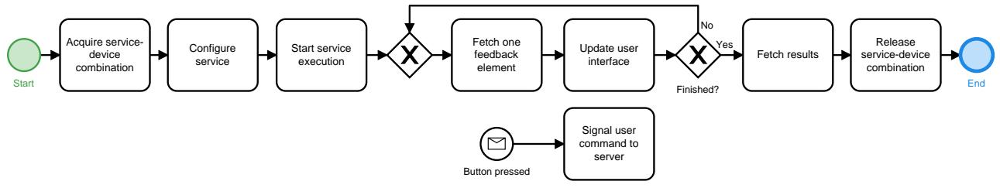
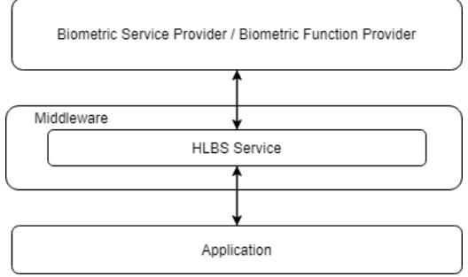
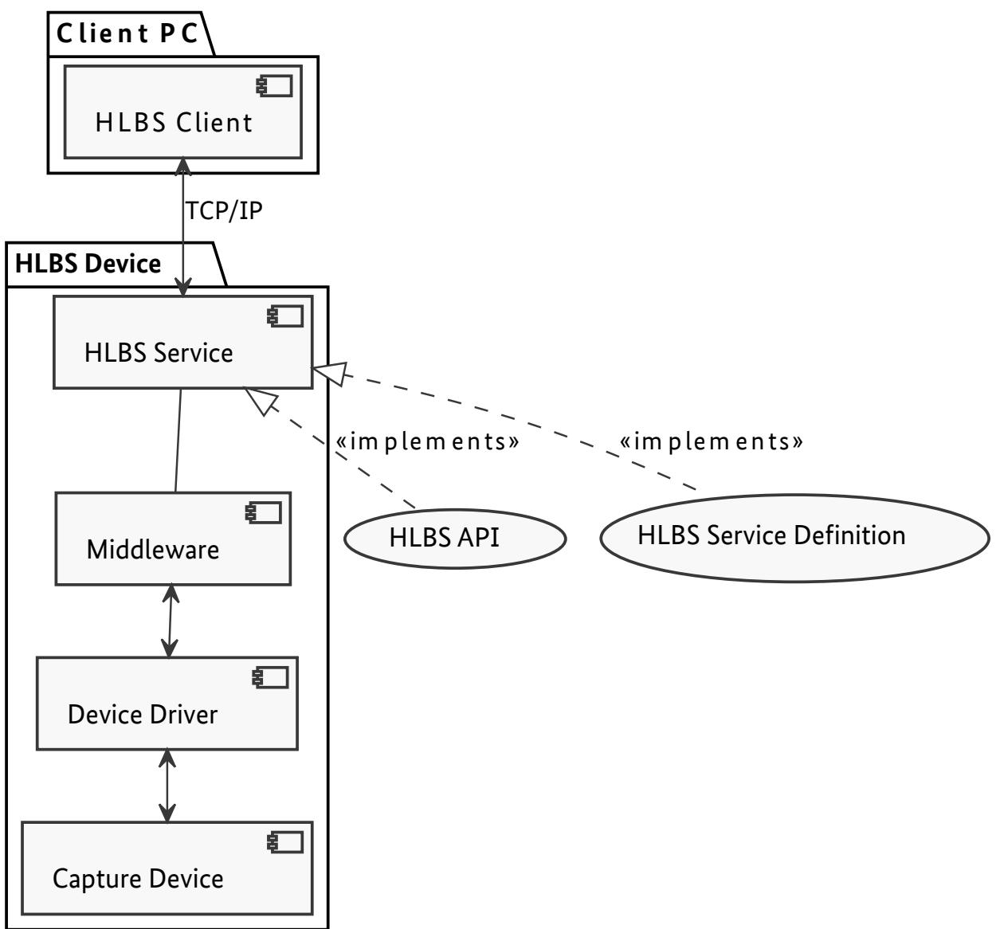
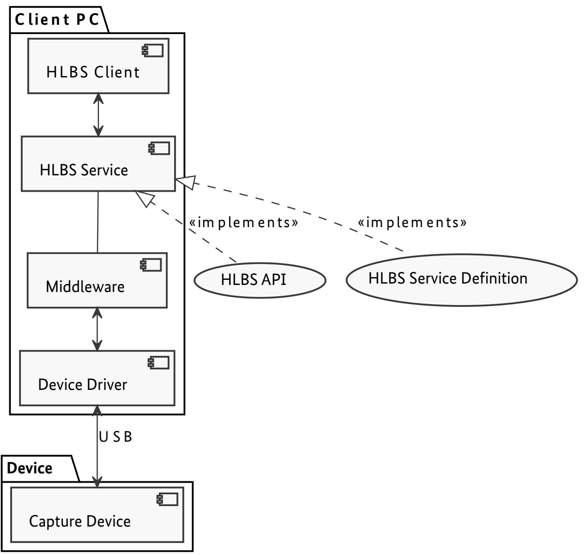

BSI Technical Guideline TR-03121-2

# Biometrics for Public Sector Applications

## Part 2: Software Architecture

Volume 2: High Level Biometric Services (HLBS)

Version 6.0

Federal Office for Information Security P.O. Box 20 03 63 53133 Bonn E-Mail: trbiometrics@bsi.bund.de Internet: https://bsi.bund.de © Federal Office for Information Security 2023

| 1.   | Volume High Level Biometric Services<br>                     | 1  |  |
|------|--------------------------------------------------------------|----|--|
| 2.   | Architecture for Biometric Applications<br>                  | 2  |  |
| 2.1. | Client-Server Architecture<br>                               | 2  |  |
| 3.   | Document Overview<br>                                        | 3  |  |
| 3.1. | Terminology<br>                                              | 3  |  |
| 3.2. | Naming Conventions<br>                                       |    |  |
| 3.3. | Namespaces<br>                                               |    |  |
| 3.4. | XML Schema and Web Service Definition<br>                    | 4  |  |
| 3.5. | Interoperability<br>                                         | 4  |  |
| 4.   | Interface Overview<br>                                       | 5  |  |
| 4.1. | High-Level Biometric Services<br>                            | 5  |  |
| 4.2. | Error Handling<br>                                           | 5  |  |
| 5.   | High Level Biometric Services API<br>                        | 6  |  |
| 5.1. | Namespaces<br>                                               | 6  |  |
| 5.2. | Data Types<br>                                               | 6  |  |
| 5.3. | Fault Types<br>                                              | 22 |  |
| 5.4. | Operations<br>                                               | 26 |  |
| 5.5. | Service-Device Description Schema<br>                        | 35 |  |
| 6.   | Example (Non-Normative)<br>                                  | 61 |  |
| 6.1. | Service-Device Description<br>                               | 61 |  |
| 7.   | Client-Server Connection Scenarios<br>                       | 63 |  |
| 7.1. | Connection via TCP/IP<br>                                    | 63 |  |
| 7.2. | Connection via USB<br>                                       | 64 |  |
| 8.   | Service Definitions<br>                                      | 66 |  |
| 8.1. | Service Definition Facial Image Acquisition System<br>       | 66 |  |
| 8.2. | Service Definition Basic Facial Image Acquisition System<br> | 73 |  |
| 8.3. | Service Definition Facial Image Delivery System<br>          | 78 |  |
| 8.4. | Service Definition Fingerprint Acquisition<br>               | 82 |  |
| 8.5. | Service Definition Rolled Fingerprint Acquisition<br>        | 87 |  |
| 8.6. | Service Definition for Self-Service System<br>               | 91 |  |
|      | List of Abbreviations<br>                                    | 98 |  |
|      | Bibliography<br>                                             | 99 |  |

| 2.1. | Client-Side Process<br>     | 2  |
|------|-----------------------------|----|
| 7.1. | HLBS Architecture<br>       | 63 |
| 7.2. | Architecture via TCP/IP<br> | 64 |
| 7.3. | Architecture via USB<br>    | 65 |

## <span id="page-4-0"></span>**1. Volume High Level Biometric Services**

This Technical Guideline specifies a web service called [High Level Biometric Services \(HLBS\)](#page-101-1) that provides a high level interface for executing and visualising biometric services.

The BSI TR-03121-3 defines workflows for some standard scenarios in public sector applications. Due to limi tations of [Biometric Application Programming Interface \(BioAPI\)](#page-101-2) 2.0, the [graphical user interfaces \(GUIs\)](#page-101-3) for these workflows are usually implemented directly in the [Biometric Service Providers \(BSPs\),](#page-101-4) which make a seamless integration into the application impossible. [BioAPI](#page-101-2) 2.1 introduces so called BioGUI callbacks, which allow the transfer of process information (e.g. live images, process states, …) but implementing these callbacks in the application proved to be very tedious.

The goal of this document is to provide a high-level webservice interface that reduces the programming effort to integrate the visualisation of status information and interaction with biometric workflows into appli cations. The interface is explicitly designed to be independent of the [BioAPI](#page-101-2) standard in terms of terminology and functionality so that webservice implementations are not bound to the [BioAPI](#page-101-2) standard.

# <span id="page-5-0"></span>**2. Architecture for Biometric Applications**

## <span id="page-5-1"></span>**2.1. Client-Server Architecture**

To separate responsibilities and increase flexibility, a client-server approach is introduced in this Technical Guideline. While the server side is responsible for implementing specific biometric workflow and com munication with biometric devices, the client side is responsible for displaying the workflow feedback and providing possibilities for the user to interact with the service. The client does not need to care about the exact process behind a service, so that there is a clear separation between user interface and workflow. This allows a very flexible and seamless integration of the same biometric process into different applications.

In this Technical Guideline the term "biometric service" refers to the general process to accomplish a certain biometric task. For example one such process for fingerprint enrolment could be to capture the fingerprints, do quality computations and repeat the capturing up to three times if the quality criteria are not met. It is important to note that these processes can greatly be influenced by the available biometric devices. If a 4 finger scanner is available, the process to capture the fingerprints would be a standard 4-4-2 approach. If only a 1-finger scanner is available each finger has to be captured separately. So, although the general process stays the same, details can change depending on the used device. This is why in the following we need to select service-device-combinations instead of only selecting services. Of course, it is possible though that some ser vices do not need devices at all (e.g. a simple face image comparison service), so the device-selection might be optional for some services.

The server provides a list of service-device-descriptions out of which the client can choose the one that is most appropriate for him. Each description is detailed enough to provide enough information for the application programmer in order to design it's user interface without knowing the exact logic behind the process. The description is standardized through an XML schema so that the application can even analyse the description to automatically adjust the user interface.

Each service allows interaction with so called user commands. In the feedback loop provides in formation about which user commands are allowed to be signalled at the moment and which are not. The application can reflect that by enabling/disabling the corresponding buttons for example.

After the service execution has finished, one or more results can be retrieved from the service. The service description lists all generated results so that the application knows beforehand which results can be expected.

<span id="page-5-2"></span>

**Figure 2.1.** Client-Side Process

[Figure 2.1](#page-5-2) visualises the service execution process from the client side. After a service-device-combination is reserved for use, it can be configured and started. The client processes the service feedback in a loop and updates the user interface accordingly. If a user command should be signalled (e.g. because the user clicked a button), the client sends an appropriate message to the server. After the service execution has finished, the client fetches the results and releases the acquired service-device-combination.

## <span id="page-6-0"></span>**3. Document Overview**

### <span id="page-6-1"></span>**3.1. Terminology**

The key words "REQUIRED", "SHALL", "SHALL NOT", "SHOULD", "SHOULD NOT", "RECOMMENDED", "MAY", and "OPTIONAL" in this document are to be interpreted as described in [\[BIB\\_RFC2119\].](#page-102-1)

### <span id="page-6-2"></span>**3.2. Naming Conventions**

### **3.2.1. Multiplicity**

Generally, XML elements and attributes listed in this document are required, i.e. the respective parent element SHALL contain exactly one such element. Elements and attributes that deviate from this baseline are denoted in this document by a symbol which is appended to the element/attribute name. The symbols are listed in [Table 3.1](#page-6-3).

<span id="page-6-3"></span>

| Appended Sym<br>bol | Meaning      |
|---------------------|--------------|
| ?                   | Zero or one  |
| *                   | Zero or more |
| +                   | One or more  |

**Table 3.1** Multiplicity Symbols

### **3.2.2. SOAP Interfaces**

All operations of this interface follow the request/response model, i.e., communication is initiated by the client by sending a [Simple Object Access Protocol \(SOAP\)](#page-101-5) message to the server (request). For each request, the server replies with a SOAP message containing the result of the requested operation (response) or, in case of error, a fault.

The body of each [SOAP](#page-101-5) message consists of a single part which is named according to the corresponding operation. For requests, the part name is identical to the name of the operation. For responses, the part name is identical to the name of the operation plus the suffix "Response" (see [Table 3.2\)](#page-6-4).

<span id="page-6-4"></span>

| Message Type | Part Name                |
|--------------|--------------------------|
| Request      | <operation_name>         |
| Response     | <operation_name>Response |

**Table 3.2** Naming Conventions for SOAP Messages

*Example: Naming Convention*

- **•** Operation: getAllServices
- **•** Request: getAllServices
- **•** Response: getAllServicesResponse

Both request and response elements exclusively contain zero or more child elements according to the detailed description in this guideline. They do not carry any attributes.

### <span id="page-7-0"></span>**3.3. Namespaces**

| Prefix | Description | URI                              |
|--------|-------------|----------------------------------|
| hlbs   | HLBS        | http://trbio.bsi.bund.de/hlbs/1  |
| xsd    | XML Schema  | http://www.w3.org/2001/XMLSchema |

**Table 3.3** Namespaces

### <span id="page-7-1"></span>**3.4. XML Schema and Web Service Definition**

The following XML Schema Definition (.xsd) and Web Service Definition (.wsdl) files are provided with this Technical Guideline in the current version 1v1:

| File                | Description                                                      |
|---------------------|------------------------------------------------------------------|
| HLBS1v1.wsdl        | HLBS web service definition (<br>Chapter 5)                      |
| hlbs_service1v1.xsd | XML Schema Definition for service descriptions (<br>Section 5.5) |

**Table 3.4** XML Schema and Web Service Definition

Both files can be found in TR-03121 XML Schema.

### <span id="page-7-2"></span>**3.5. Interoperability**

To ensure trouble-free interoperability between different SOAP implementations, both client and server im plementations SHOULD fulfil the WS-I Basic Profile 1.1.

## <span id="page-8-0"></span>**4. Interface Overview**

### <span id="page-8-1"></span>**4.1. High-Level Biometric Services**

### **4.1.1. Objective**

The [HLBS](#page-101-1) interface provides execution and feedback delivery of biometric services.

### **4.1.2. Service and Device Management**

- **•** The function [getAllServices](#page-29-1) provides a list of all biometric services that are available on the server. For each biometric service there is a list of available devices provided.
- **•** The function [getServiceDescription](#page-30-0) provides an XML description of a service-device-combination descri bing the supported configuration, feedback elements, user commands and results. The XML schema is de scribed in [Section 5.5](#page-38-0).

### **4.1.3. Service Execution**

- **•** The function [acquireService](#page-31-0) reserves a service-device-combination for use. The function returns a session handle which SHALL be used by the client in subsequent calls. The client MAY provide his own session id to the function.
- **•** The service-device-combination MAY be configured by calling [configureService](#page-32-0).
- **•** The function [beginServiceExecution](#page-33-0) starts the service execution and returns the initial feedback which SHOULD be used by the client to initialize the GUI.
- **•** The client SHOULD inform the server that client-side processing has finished by calling [endServiceExe](#page-35-0) [cution](#page-35-0).
- **•** The client SHALL release the service-device-combination by calling [releaseService](#page-37-0).

#### **4.1.4. Service Execution Feedback and Results**

- **•** The function [getServiceFeedback](#page-34-0) provides the next available feedback elements
- **•** The client MAY signal user commands by calling the function [signalUserCommand](#page-34-1).
- **•** The function [getResults](#page-36-0) returns the final results generated by the service execution. It SHALL be called after the service execution has been finished or cancelled.

### <span id="page-8-2"></span>**4.2. Error Handling**

If errors occur during processing of a web service request, a SOAP fault is generated according to the SOAP 1.1 specification. SOAP faults are comparable to exceptions in programming languages such as C++, C# or Java insofar as they allow reporting of errors without the need to account for error codes in function signatures.

SOAP faults are returned in place of the SOAP response. Depending on the type of an error, the fault message MAY contain additional information about the error. The faults that are specific to the web services in this document are specified in the respective chapters and listed with every function that MAY generate them. Faults originating from other causes such as network connection problems or validation errors are beyond the scope of this document as they depend on the specific SOAP implementation.

# <span id="page-9-3"></span><span id="page-9-0"></span>**5. High Level Biometric Services API**

The [HLBS](#page-101-1) [Application Programming Interface \(API\)](#page-101-6) contains functions to execute and visualize biometric services. The client defines the [User Interface \(UI\)](#page-101-7) layout and updates it with the feedback it gets from the server. The server implements the process/workflow and continuously delivers feedback about the process state to the client. User interaction is supported by signalling user commands to the server.

The definitions of the [HLBS](#page-101-1) [API](#page-101-6) are provided in HLBS1v1.wsdl. The schema for the service-device description is provided in hlbs\_service1v1.xsd.

A complete example can be found in [Section 6.1](#page-64-2).

### <span id="page-9-1"></span>**5.1. Namespaces**

The elements of the server- and client-side APIs service-device descriptions are members na mespace [http://trbio.bsi.bund.de/hlbs/1,](http://trbio.bsi.bund.de/hlbs/1) which is aliased by hlbs.

### <span id="page-9-2"></span>**5.2. Data Types**

In addition to simple XSD types, the SOAP interface uses custom data which are described in fol lowing.

### <span id="page-9-4"></span>**5.2.1. ServiceType**

Represents the type of task a biometric service provides. Each service is bound to exactly one service type. Derived from xsd:string.

#### **5.2.1.1. Values**

| Value          | Description                                                    |  |
|----------------|----------------------------------------------------------------|--|
| enrolment      | The service is used for enrolment.                             |  |
| verification   | The service is used for verification.                          |  |
| identification | The service is used for identification.                        |  |
| comparison     | The service is used for comparison of two biometric templates. |  |
| other          | The service is used for another purpose.                       |  |

**Table 5.1** ServiceType Values

### **5.2.1.2. WSDL Definition**

```
<simpleType name="ServiceType">
<restriction base="xsd:string">
 <enumeration value="enrolment"/>
 <enumeration value="verification"/>
 <enumeration value="identification"/>
 <enumeration value="comparison"/>
 <enumeration value="other"/>
</restriction>
</simpleType>
```
#### <span id="page-10-0"></span>**5.2.2. BiometricType**

Represents the type of a biometric modality. Derived from xsd:string.

#### **5.2.2.1. Values**

| Value     | Description      |
|-----------|------------------|
| finger    | Fingerprint      |
| face      | Face             |
| iris      | Iris             |
| vein      | Vein             |
| signature | Signature        |
| gait      | Gait             |
| retina    | Retina Scan      |
| hand-geom | Geometry of hand |
| voice     | Voice            |
| palm      | Palm             |
| other     | Other modality   |

**Table 5.2** BiometricType Values

#### **5.2.2.2. WSDL Definition**

```
<simpleType name="BiometricType">
<restriction base="xsd:string">
 <enumeration value="finger"/>
 <enumeration value="face"/>
 <enumeration value="iris"/>
 <enumeration value="vein"/>
 <enumeration value="signature"/>
 <enumeration value="gait"/>
 <enumeration value="retina"/>
 <enumeration value="hand-geom"/>
 <enumeration value="voice"/>
 <enumeration value="palm"/>
 <enumeration value="other"/>
</restriction>
</simpleType>
```
#### <span id="page-10-1"></span>**5.2.3. FeedbackStatus**

Represents the type of the service execution status. Derived from xsd:string.

#### **5.2.3.1. Values**

| Value             | Description                                                      |  |
|-------------------|------------------------------------------------------------------|--|
| not-started       | The service has not been started yet.                            |  |
| running           | The service is running.                                          |  |
| waiting-for-input | The service is waiting for user input to decide how to continue. |  |
| finished          | The service has finished.                                        |  |
| cancelled         | The service was cancelled.                                       |  |

**Table 5.3** FeedbackStatus Values

#### **5.2.3.2. WSDL Definition**

```
<simpleType name="FeedbackStatus">
<restriction base="xsd:string">
 <enumeration value="not-started"/>
 <enumeration value="running"/>
 <enumeration value="waiting-for-input"/>
 <enumeration value="finished"/>
 <enumeration value="cancelled"/>
</restriction>
</simpleType>
```
### <span id="page-11-1"></span>**5.2.4. UserCommandStatus**

Specifies whether a user command is allowed to be signalled at the moment or not. User interfaces SHOULD disable/enable the buttons bound to the corresponding user commands based on this status. Derived from xsd:string.

#### **5.2.4.1. Values**

| Value       | Description                                  |
|-------------|----------------------------------------------|
| allowed     | The user command is allowed to be fired.     |
| not-allowed | The user command is not allowed to be fired. |

**Table 5.4** UserCommandStatus Values

#### **5.2.4.2. WSDL Definition**

```
<simpleType name="UserCommandStatus">
<restriction base="xsd:string">
 <enumeration value="allowed"/>
 <enumeration value="not-allowed"/>
</restriction>
</simpleType>
```
### <span id="page-11-0"></span>**5.2.5. Iso19794FingerImpression**

Represents the impression type as specified in [\[BIB\\_ISO\\_FINGER\]](#page-102-2) (e.g. finger or palm). Derived from xsd:un signedInt.

#### **5.2.5.1. Format Restrictions**

The impression type according to [\[BIB\\_ISO\\_FINGER\]](#page-102-2) (e.g. finger or palm) is specified as an unsigned integer where the following values are allowed:

| Impression Code | Description         |
|-----------------|---------------------|
| 0               | Live-scan plain     |
| 1               | Live-scan rolled    |
| 2               | Nonlive-scan plain  |
| 3               | Nonlive-scan rolled |
| 4               | Latent impression   |
| 5               | Latent tracing      |
| 6               | Latent photo        |
| 7               | Latent lift         |
| 8               | Live-scan swipe     |

| Impression Code | Description                         |
|-----------------|-------------------------------------|
| 9               | Live-scan vertical roll             |
| 10              | Live-scan palm                      |
| 11              | Nonlive-scan palm                   |
| 12              | Latent palm impression              |
| 13              | Latent palm tracing                 |
| 14              | Latent palm photo                   |
| 15              | Latent palm lift                    |
| 20              | Reserved for future use             |
| 21              | Reserved for future use             |
| 22              | Reserved for future use             |
| 23              | Reserved for future use             |
| 24              | Live-scan optical contactless plain |
| 25              | Reserved for future use             |
| 26              | Reserved for future use             |
| 27              | Reserved for future use             |
| 28              | Other                               |
| 29              | Unknown                             |

**Table 5.5** Iso19794FingerImpression Format Restrictions

#### **5.2.5.2. WSDL Definition**

```
<simpleType name="Iso19794FingerImpression">
<restriction base="xsd:unsignedInt">
 <pattern value="[0-9]|1[0-5]|2[0-9]"/>
</restriction>
</simpleType>
```
### <span id="page-12-0"></span>**5.2.6. Iso19794FingerCode**

A code as defined in [\[BIB\\_ISO\\_FINGER\]](#page-102-2) (e.g. finger or palm). Derived from xsd:unsignedInt.

#### **5.2.6.1. Format Restrictions**

The code is specified as an unsigned integer where the following values are allowed according to [\[BIB\\_ISO\\_FINGER\]:](#page-102-2)

| Finger Code | Finger/Palm Position |
|-------------|----------------------|
| 0           | Unknown              |
| 1           | Right thumb          |
| 2           | Right index finger   |
| 3           | Right middle finger  |
| 4           | Right ring finger    |
| 5           | Right little finger  |
| 6           | Left thumb           |
| 7           | Left index finger    |

| Finger Code | Finger/Palm Position             |
|-------------|----------------------------------|
| 8           | Left middle finger               |
| 9           | Left ring finger                 |
| 10          | Left little finger               |
| 13          | Plain right four fingers         |
| 14          | Plain left four fingers          |
| 15          | Plain thumbs (2)                 |
| 20          | Unknown palm                     |
| 21          | Right full palm                  |
| 22          | Right writer's palm              |
| 23          | Left full palm                   |
| 24          | Left writer's palm               |
| 25          | Right lower palm                 |
| 26          | Right upper palm                 |
| 27          | Left lower palm                  |
| 28          | Left upper palm                  |
| 29          | Right other                      |
| 30          | Left other                       |
| 31          | Right interdigital               |
| 32          | Right thenar                     |
| 33          | Right hypothenar                 |
| 34          | Left interdigital                |
| 35          | Left hemar                       |
| 36          | Left hypothenar                  |
| 40          | Right index and middle           |
| 41          | Right middle and ring            |
| 42          | Right ring and little            |
| 43          | Left index and middle            |
| 44          | Left middle and ring             |
| 45          | Left ring and little             |
| 46          | Right index and left index       |
| 47          | Right index and middle and ring  |
| 48          | Right middle and ring and little |
| 49          | Left index and middle and ring   |
| 50          | Left middle and ring and little  |

**Table 5.6** Iso19794FingerCode Format Restrictions

#### **5.2.6.2. WSDL Definition**

```
<simpleType name="Iso19794FingerCode">
<restriction base="xsd:unsignedInt">
```

```
 <pattern value="[0-9]|10|1[3-5]|2[0-9]|3[0-6]|4[0-9]|50"/>
</restriction>
</simpleType>
```
### <span id="page-14-0"></span>**5.2.7. Iso19794FaceImageCode**

Represents a face image code in the format specified in [\[BIB\\_ISO\\_FACE\]](#page-102-3). Derived from xsd:unsignedInt.

#### **5.2.7.1. Format Restrictions**

The face code is specified as an unsigned integer between 0 and 255 with the following meanings:

| Face Image Code | Description                      |
|-----------------|----------------------------------|
| 0               | Basic face image                 |
| 1               | Full frontal image               |
| 2               | Token frontal image              |
| 3               | Post-processed frontal image     |
| 4-127           | Reserved by SC 37 for future use |
| 128             | Basic 3D face image              |
| 129             | Full frontal 3D face image       |
| 130             | Token frontal 3D face image      |
| 131-255         | Reserved by SC 37 for future use |

**Table 5.7** Iso19794FaceImageCode Format Restrictions

#### **5.2.7.2. WSDL Definition**

```
<simpleType name="Iso19794FaceImageCode">
<restriction base="xsd:unsignedInt">
 <minInclusive value="0"/>
 <maxInclusive value="255"/>
</restriction>
</simpleType>
```
#### <span id="page-14-1"></span>**5.2.8. Iso19794IrisImageCode**

Represents an iris code in the format specified in [\[BIB\\_ISO\\_IRIS\].](#page-102-4) Derived from xsd:unsignedInt.

#### **5.2.8.1. Format Restrictions**

The iris code is specified as an unsigned integer between 0 and 2 with the following meanings:

| Iris Image Code | Description |
|-----------------|-------------|
| 0               | Unknown     |
| 1               | Right iris  |
| 2               | Left iris   |

**Table 5.8** Iso19794IrisImageCode Format Restrictions

#### **5.2.8.2. WSDL Definition**

```
<simpleType name="Iso19794IrisImageCode">
<restriction base="xsd:unsignedInt">
 <minInclusive value="0"/>
 <maxInclusive value="2"/>
</restriction>
```
#### </simpleType>

#### <span id="page-15-0"></span>**5.2.9. DataFormat**

Represents an identifier for a data format. Derived from xsd:string.

#### **5.2.9.1. Format Restrictions**

The data format is represented as a non-empty string. The following values SHOULD be supported by the implementation.

| Data Format String  | Description                                                                       |
|---------------------|-----------------------------------------------------------------------------------|
| data_format_not_set | Dataformat was not set                                                            |
| opaque              | Opaque data format which can be used when the real is unk<br>nown or unimportant. |
| iso19794_2          | Finger minutiae according to [BIB_ISO_MINUTIAE]                                   |
| iso19794_4          | Finger image according to [BIB_ISO_FINGER]                                        |
| iso19794_5          | Face image according to [BIB_ISO_FACE]                                            |
| icao_lds_dg1        | ICAO LDS datagroup 1                                                              |
| icao_lds_dg2        | ICAO LDS datagroup 2 (face image)                                                 |
| icao_lds_dg3        | ICAO LDS datagroup 3 (fingerprint images)                                         |
| icao_lds_dg4        | ICAO LDS datagroup 4 (iris images)                                                |
| icao_lds_dg5        | ICAO LDS datagroup 5                                                              |
| icao_lds_dg6        | ICAO LDS datagroup 6                                                              |
| icao_lds_dg7        | ICAO LDS datagroup 7 (signature)                                                  |
| icao_lds_dg8        | ICAO LDS datagroup 8                                                              |
| icao_lds_dg9        | ICAO LDS datagroup 9                                                              |
| icao_lds_dg10       | ICAO LDS datagroup 10                                                             |
| icao_lds_dg11       | ICAO LDS datagroup 11                                                             |
| icao_lds_dg12       | ICAO LDS datagroup 12                                                             |
| icao_lds_dg13       | ICAO LDS datagroup 13                                                             |
| icao_lds_dg14       | ICAO LDS datagroup 14                                                             |
| icao_lds_dg15       | ICAO LDS datagroup 15                                                             |
| icao_lds_dg16       | ICAO LDS datagroup 16                                                             |
| wsq                 | Image in WSQ format                                                               |
| bmp                 | Image in BMP format                                                               |
| jpeg                | Image in JPEG format                                                              |
| jpeg2000            | Image in JPEG2000 format                                                          |
| png                 | Image in PNG format                                                               |
| rgb                 | Image in RGB format                                                               |
| tiff                | Image in TIFF format                                                              |
| yuv422              | Image in YUV422 format                                                            |
| bioapi_bir          | BioAPI 2.0 Biometric Information Record                                           |
| ansi_nist_itl       | ANSI/NIST ITL container                                                           |

| Data Format String | Description                          |
|--------------------|--------------------------------------|
| bit                | CBEFF Biometric Information Template |

**Table 5.9** DataFormat Format Restrictions

#### **5.2.9.2. WSDL Definition**

```
<simpleType name="DataFormat">
<restriction base="xsd:string">
 <minLength value="1"/>
 <maxLength value="255"/>
</restriction>
</simpleType>
```
#### <span id="page-16-0"></span>**5.2.10. ApplicationProfile**

Represents an Application Profile of the TR-03121 Part 3. It is hereby defined which requirements (e.g. regar ding quality thresholds, data formats, compression or processes) apply to a generalised [HLBS](#page-101-1) service where the Application Profile is configurable. A generalised system using [HLBS](#page-101-1) MAY not support all Application Profiles (e.g. because the system is only used in specific contexts or the system uses a different modality than used within the Application Profile). Derived from xsd:string.

#### **5.2.10.1. Format Restrictions**

The application profile is represented as a non-empty string. Whether a service definition SHALL support a specific Application Profile, is defined in the respective service definition itself.

| Data Format String                                       | Description                                                                                          |
|----------------------------------------------------------|------------------------------------------------------------------------------------------------------|
| BCL_ManualBorderControl                                  | Volume BCL, Application Pro<br>file Manual Border Control                                            |
| BCL_SemiMobileManualBorderControl                        | Volume BCL, Application Pro<br>file Semi-Mobile Manual Bor<br>der Control                            |
| BCL_SelfServiceSystem                                    | Volume BCL, Application Pro<br>file Self-Service System                                              |
| GID_UnsupervisedSelfServiceFacialImageAcquitistionSystem | Volume GID, Application Pro<br>file Unsupervised Self-Service<br>Facial Image Acquisition Sys<br>tem |
| GID_SupervisedFacialImageAcquisitionSystem               | Volume GID, Application Pro<br>file Supervised Facial Image<br>Acquisition System                    |
| GID_SupervisedBasicFacialImageAcquisitionSystem          | Volume GID, Application Pro<br>file Supervised Basic Facial<br>Image Acquisition System              |
| GID_UnsupervisedSelfServiceFingerprintAcquisitionSystem  | Volume GID, Application Pro<br>file Unsupervised Self-Service<br>Fingerprint Acquisition Sys<br>tem  |
| GID_SupervisedFingerprintAcquisition                     | Volume GID, Application Pro<br>file Supervised Fingerprint Ac<br>quisition                           |
| ARE_ArrivalAttestationDocument                           | Volume ARE, Application Pro<br>file Arrival Attestation Docu<br>ment                                 |

| Data Format String                                | Description                                                                                        |
|---------------------------------------------------|----------------------------------------------------------------------------------------------------|
| ARE_ArrivalAttestationDocumentInSpecialSituations | Volume ARE, Application Pro<br>file Arrival Attestation Docu<br>ment in Special Situations         |
| IMA_MultiModalProcessingImmigrationAuthoritiesEES | Volume IMA, Application Pro<br>file Multimodal Processing in<br>Immigration Authorities for<br>EES |
| IMA_MultiModalProcessingImmigrationAuthoritiesSIS | Volume IMA, Application Pro<br>file Multimodal Processing in<br>Immigration Authorities for<br>SIS |

**Table 5.10** DataFormat Format Restrictions

#### **5.2.10.2. WSDL Definition**

```
<simpleType name="DataFormat">
<restriction base="xsd:string">
 <minLength value="1"/>
 <maxLength value="255"/>
</restriction>
</simpleType>
```
### <span id="page-17-0"></span>**5.2.11. DeviceInformation**

Contains information about a biometric device.

#### **5.2.11.1. Elements**

| Element Name     | Description                                                                           |
|------------------|---------------------------------------------------------------------------------------|
| id               | xsd:string<br>Unique ID of this device.                                               |
| vendor           | xsd:string<br>The name of the device vendor.                                          |
| name             | xsd:string<br>The name of the device.                                                 |
| version?         | xsd:string<br>The version of the device (if available).                               |
| firmwareVersion? | xsd:string<br>The firmware version used in the device (if available).                 |
| deviceID?        | xsd:string<br>The internal id of the device, e.g. the serial number (if available).   |
| biometricType    | hlbs:BiometricType?<br>The biometric modality this device can capture (if available). |
| properties       | hlbs:KeyValue<br>The specific properties of the device.                               |

**Table 5.11** DeviceInformation Elements

#### **5.2.11.2. WSDL Definition**

```
<complexType name="DeviceInformation">
<sequence>
 <element name="id" type="xsd:string" minOccurs="1" maxOccurs="1"/>
```

```
 <element name="vendor" type="xsd:string" minOccurs="1" maxOccurs="1"/>
 <element name="name" type="xsd:string" minOccurs="1" maxOccurs="1"/>
 <element name="version" type="xsd:string" minOccurs="0" maxOccurs="1" nillable="true"/>
 <element name="firmwareVersion" type="xsd:string" minOccurs="0" maxOccurs="1" nillable="true"/>
 <element name="deviceID" type="xsd:string" minOccurs="0" maxOccurs="1" nillable="true"/>
 <element name="biometricType" type="hlbs:BiometricType" minOccurs="0" maxOccurs="1"
nillable="true"/>
 <element name="properties" type="hlbs:KeyValue" minOccurs="0" maxOccurs="unbounded"
nillable="true"/>
</sequence>
</complexType>
```
#### <span id="page-18-1"></span>**5.2.12. ServiceInformation**

Contains information about a biometric service.

#### **5.2.12.1. Elements**

| Element Name | Description                                                                                                                                                                                                                       |
|--------------|-----------------------------------------------------------------------------------------------------------------------------------------------------------------------------------------------------------------------------------|
| id           | xsd:string<br>Unique ID of this service.                                                                                                                                                                                          |
| type         | hlbs:ServiceType<br>The type of purpose this service can be used for.                                                                                                                                                             |
| vendor       | xsd:string<br>The vendor of the service.                                                                                                                                                                                          |
| name         | xsd:string<br>The name of the service.                                                                                                                                                                                            |
| version?     | xsd:string<br>The version of the service (if available).                                                                                                                                                                          |
| devices*     | hlbs:DeviceInformation<br>A list of devices which are connected and can be used in combination with this service. MAY be empty<br>if no devices are connected or when the service doesn't need any devices for its functionality. |

**Table 5.12** ServiceInformation Elements

#### **5.2.12.2. WSDL Definition**

```
<complexType name="ServiceInformation">
<sequence>
 <element name="id" type="xsd:string" minOccurs="1" maxOccurs="1"/>
 <element name="type" type="hlbs:ServiceType" minOccurs="1" maxOccurs="1"/>
 <element name="vendor" type="xsd:string" minOccurs="1" maxOccurs="1"/>
 <element name="name" type="xsd:string" minOccurs="1" maxOccurs="1"/>
 <element name="version" type="xsd:string" minOccurs="0" maxOccurs="1" nillable="true"/>
 <element name="devices" type="hlbs:DeviceInformation" minOccurs="0" maxOccurs="unbounded"/>
</sequence>
</complexType>
```
#### <span id="page-18-0"></span>**5.2.13. BiometricImpression**

Contains the description of a biometric impression type. It can be used to distinguish between "plain" and "rolled" fingerprint captures for example. At the moment only finger impression types are supported.

#### **5.2.13.1. Elements**

| Element Name     | Description                                                 |
|------------------|-------------------------------------------------------------|
| fingerImpression | hlbs:Iso19794FingerImpression                               |
|                  | Represents an impression type according to [BIB_ISO_FINGER] |

**Table 5.13** BiometricImpression Elements

#### **5.2.13.2. WSDL Definition**

```
<complexType name="BiometricImpression">
<choice>
 <element name="fingerImpression" type="hlbs:Iso19794FingerImpression" minOccurs="1" maxOccurs="1"/
>
</choice>
</complexType>
```
### <span id="page-19-0"></span>**5.2.14. BiometricCode**

Contains the description of a biometric modality. This could be, for example, the specific finger code of a finger which is shown in an image or the description of which kind of facial image should be enrolled.

#### **5.2.14.1. Elements**

| Element Name  | Description                                                                               |
|---------------|-------------------------------------------------------------------------------------------|
| fingerCode    | hlbs:Iso19794FingerCode<br>Represents a finger or palm code according to [BIB_ISO_FINGER] |
| faceImageCode | hlbs:Iso19794FaceImageCode<br>Represents a face image code according to [BIB_ISO_FACE]    |
| irisCode      | hlbs:Iso19794IrisImageCode<br>Represents an iris image code according to [BIB_ISO_IRIS]   |

**Table 5.14** BiometricCode Elements

#### **5.2.14.2. WSDL Definition**

```
<complexType name="BiometricCode">
<choice>
 <element name="fingerCode" type="hlbs:Iso19794FingerCode" minOccurs="1" maxOccurs="1"/>
 <element name="faceImageCode" type="hlbs:Iso19794FaceImageCode" minOccurs="1" maxOccurs="1"/>
 <element name="irisCode" type="hlbs:Iso19794IrisImageCode" minOccurs="1" maxOccurs="1"/>
</choice>
</complexType>
```
### <span id="page-19-1"></span>**5.2.15. BiometricCodeList**

Contains a list of biometric codes. Can be used for example to represent an arbitrary combination of single fingers. Although it is theoretically possible to mix modalities in this list (e.g. finger and iris), this SHOULD be avoided if possible.

#### **5.2.15.1. Elements**

| Element Name | Description                                    |
|--------------|------------------------------------------------|
| values*      | hlbs:BiometricCode<br>List of biometric codes. |

**Table 5.15** BiometricCodeList Elements

#### **5.2.15.2. WSDL Definition**

```
<complexType name="BiometricCodeList">
<sequence>
 <element name="values" type="hlbs:BiometricCode" minOccurs="0" maxOccurs="unbounded"/>
</sequence>
</complexType>
```
#### <span id="page-20-1"></span>**5.2.16. StringList**

Represents a list of strings.

#### **5.2.16.1. Elements**

| Element Name | Description                                 |
|--------------|---------------------------------------------|
| items*       | xsd:string<br>The items of the string list. |

**Table 5.16** StringList Elements

#### **5.2.16.2. WSDL Definition**

```
<complexType name="StringList">
<sequence>
 <element name="values" type="xsd:string" minOccurs="0" maxOccurs="unbounded"/>
</sequence>
</complexType>
```
### <span id="page-20-2"></span>**5.2.17. UserCommandInfo**

Contains information about the current state of a user command. It indicates whether specific com mand can be signalled at the moment (allowed) or not (not-allowed). This information SHOULD be used by the user interface to disable/enable the button/element associated with the command.

#### **5.2.17.1. Elements**

| Element Name  | Description                                                       |
|---------------|-------------------------------------------------------------------|
| userCommandId | xsd:string<br>The ID of the user command.                         |
| status        | hlbs:UserCommandStatus<br>The current status of the user command. |

**Table 5.17** UserCommandInfo Elements

#### **5.2.17.2. WSDL Definition**

```
<complexType name="UserCommandInfo">
<sequence>
 <element name="userCommandId" type="xsd:string" minOccurs="1" maxOccurs="1"/>
 <element name="status" type="hlbs:UserCommandStatus" minOccurs="1" maxOccurs="1"/>
</sequence>
</complexType>
```
#### <span id="page-20-0"></span>**5.2.18. Image**

Represents an image.

#### **5.2.18.1. Elements**

| Element Name         | Description                                                                                                                         |
|----------------------|-------------------------------------------------------------------------------------------------------------------------------------|
| imageData            | xsd:base64Binary<br>The image data.                                                                                                 |
| format?              | hlbs:DataFormat<br>The image format (if available).                                                                                 |
| width?               | xsd:int<br>The width of the image (if available).                                                                                   |
| height?              | xsd:int<br>The height of the image (if available).                                                                                  |
| biometricCodeList?   | hlbs:BiometricCodeList<br>A list of biometric codes representing what is shown in the image (if available).                         |
| biometricImpression? | hlbs:BiometricImpression<br>A biometric impression type describing the of image (e.g. "plain" or "rol<br>led" - only if available). |
| imageRegion*         | hlbs:ImageRegion<br>Region(s) within the image.                                                                                     |
| xmlParameter?        | xsd:string<br>Application specific metadata for the given image.                                                                    |

**Table 5.18** Image Elements

#### **5.2.18.2. WSDL Definition**

```
<complexType name="Image">
<sequence>
 <element name="imageData" type="xsd:base64Binary" minOccurs="1" maxOccurs="1" nillable="true"/>
 <element name="format" type="hlbs:DataFormat" minOccurs="0" maxOccurs="1" nillable="true"/>
 <element name="width" type="xsd:int" minOccurs="0" maxOccurs="1" nillable="true"/>
 <element name="height" type="xsd:int" minOccurs="0" maxOccurs="1" nillable="true"/>
 <element name="biometricCodeList" type="hlbs:BiometricCodeList" minOccurs="0" maxOccurs="1"
nillable="true"/>
 <element name="biometricImpression" type="hlbs:BiometricImpression" minOccurs="0" maxOccurs="1"
nillable="true"/>
 <element name="imageRegion" type="hlbs:ImageRegion" minOccurs="0" maxOccurs="unbounded"
nillable="true"/>
 <element name="xmlParameter" type="xsd:string" minOccurs="0" maxOccurs="1" nillable="true"/>
</sequence>
</complexType>
```
### <span id="page-21-0"></span>**5.2.19. Point**

Represents a point.

#### **5.2.19.1. Elements**

| Element Name | Description                               |
|--------------|-------------------------------------------|
| x            | xsd:int<br>The x-coordinate of the point. |
| y            | xsd:int<br>The y-coordinate of the point. |

**Table 5.19** Point Elements

#### **5.2.19.2. WSDL Definition**

```
<complexType name="Point">
<sequence>
 <element name="x" type="xsd:int" minOccurs="1" maxOccurs="1"/>
 <element name="y" type="xsd:int" minOccurs="1" maxOccurs="1"/>
 <sequence>
 </complexType>
```
#### <span id="page-22-0"></span>**5.2.20. ImageRegion**

Represents a rectangular region within an image.

#### **5.2.20.1. Elements**

| Element Name | Description                                                                    |
|--------------|--------------------------------------------------------------------------------|
| p1           | hlbs:Point<br>The top left point of an rectangular region within an image.     |
| p2           | hlbs:Point<br>The bottom right point of an rectangular region within an image. |

**Table 5.20** Image Elements

#### **5.2.20.2. WSDL Definition**

```
<complexType name="ImageRegion">
<sequence>
 <element name="p1" type="hlbs:Point" minOccurs="1" maxOccurs="1"/>
 <element name="p2" type="hlbs:Point" minOccurs="1" maxOccurs="1"/>
 <sequence>
 </complexType>
```
#### <span id="page-22-2"></span>**5.2.21. ImageList**

Represents a list of images.

#### **5.2.21.1. Elements**

| Element Name | Description                           |
|--------------|---------------------------------------|
| images*      | hlbs:Image<br>The sequence of images. |

**Table 5.21** ImageList Elements

#### **5.2.21.2. WSDL Definition**

```
<complexType name="ImageList">
<sequence>
 <element name="images" type="hlbs:Image" minOccurs="0" maxOccurs="unbounded"/>
</sequence>
</complexType>
```
#### <span id="page-22-1"></span>**5.2.22. Binary**

Represents binary data.

#### **5.2.22.1. Elements**

| Element Name | Description                                           |
|--------------|-------------------------------------------------------|
| format       | hlbs:DataFormat<br>The dataformat of the binary data. |
| data         | xsd:base64Binary<br>The data.                         |

**Table 5.22** Binary Elements

### **5.2.22.2. WSDL Definition**

```
<complexType name="Binary">
<sequence>
 <element name="format" type="hlbs:DataFormat" minOccurs="1" maxOccurs="1"/>
 <element name="data" type="xsd:base64Binary" minOccurs="1" maxOccurs="1" nillable="true"/>
</sequence>
</complexType>
```
### <span id="page-23-0"></span>**5.2.23. KeyValue**

Represents a key-value-pair. This element is used to describe and distinguish the different configuration, feed back and result values.

#### **5.2.23.1. Elements**

| Element Name             | Description                                                                        |
|--------------------------|------------------------------------------------------------------------------------|
| key                      | xsd:string<br>The unique identifier which specifies the key of the key-value-pair. |
| boolValue                | xsd:boolean<br>A bool value.                                                       |
| intValue                 | xsd:int<br>An integer value.                                                       |
| floatValue               | xsd:float<br>A float value.                                                        |
| stringValue              | xsd:string<br>A string value.                                                      |
| biometricImpressionValue | hlbs:BiometricImpression<br>A biometric impression type value.                     |
| biometricCodeValue       | hlbs:BiometricCode<br>A biometric code value.                                      |
| biometricCodeListValue   | hlbs:BiometricCodeList<br>A biometric code list value.                             |
| imageValue               | hlbs:Image<br>An image value.                                                      |
| dataFormatValue          | hlbs:DataFormat<br>A data format value.                                            |
| binaryValue              | hlbs:Binary<br>A binary value.                                                     |
| stringListValue          | hlbs:StringList<br>A string list value.                                            |

| Element Name   | Description                            |
|----------------|----------------------------------------|
| imageListValue | hlbs:ImageList<br>An image list value. |

**Table 5.23** KeyValue Elements

#### **5.2.23.2. WSDL Definition**

```
<complexType name="KeyValue">
<sequence>
 <element name="key" type="xsd:string" minOccurs="1" maxOccurs="1"/>
 <choice>
 <element name="boolValue" type="xsd:boolean" minOccurs="1" maxOccurs="1"/>
 <element name="intValue" type="xsd:int" minOccurs="1" maxOccurs="1"/>
 <element name="floatValue" type="xsd:float" minOccurs="1" maxOccurs="1"/>
 <element name="stringValue" type="xsd:string" minOccurs="1" maxOccurs="1" nillable="true"/>
 <element name="biometricImpressionValue" type="hlbs:BiometricImpression" minOccurs="1"
maxOccurs="1" nillable="true"/>
 <element name="biometricCodeValue" type="hlbs:BiometricCode" minOccurs="1" maxOccurs="1"
nillable="true"/>

 <element name="biometricCodeListValue" type="hlbs:BiometricCodeList" minOccurs="1" maxOccurs="1"
nillable="true"/>
 <element name="imageValue" type="hlbs:Image" minOccurs="1" maxOccurs="1" nillable="true"/>
 <element name="dataFormatValue" type="hlbs:DataFormat" minOccurs="1" maxOccurs="1"
nillable="true"/>
 <element name="binaryValue" type="hlbs:Binary" minOccurs="1" maxOccurs="1" nillable="true"/>
 <element name="stringListValue" type="hlbs:StringList" minOccurs="1" maxOccurs="1"
nillable="true"/>

 <element name="imageListValue" type="hlbs:ImageList" minOccurs="1" maxOccurs="1" nillable="true"/
>
 </choice>
</sequence>
</complexType>
```
#### <span id="page-24-0"></span>**5.2.24. UserCommand**

Represents a user command, which can be signaled by the application. A command MAY contain para meters which reveal further details about the command. It depends on concrete service whether parame ters for certain commands are supported or not.

#### **5.2.24.1. Elements**

| Element Name  | Description                                                                                         |
|---------------|-----------------------------------------------------------------------------------------------------|
| userCommandId | xsd:string<br>The ID if the user command which is signalled.                                        |
| parameters*   | hlbs:KeyValue<br>A list of key-value-pairs describing further details about the command (OPTIONAL). |

**Table 5.24** UserCommand Elements

#### **5.2.24.2. WSDL Definition**

```
<complexType name="UserCommand">
<sequence>
 <element name="userCommandId" type="xsd:string" minOccurs="1" maxOccurs="1"/>
 <element name="parameters" type="hlbs:KeyValue" minOccurs="0" maxOccurs="unbounded"/>
</sequence>
</complexType>
```
### <span id="page-25-1"></span>**5.2.25. Feedback**

Represents the current state of the service execution including information about the user command states, live feedback and the general execution state. An implementation SHOULD only transfer feedback to the user that has changed since the last feedback delivery for performance reasons. However, it SHALL NOT lead to an error in the client if the server sends equal feedback elements in successive calls.

#### **5.2.25.1. Elements**

| Element Name      | Description                                                                                         |
|-------------------|-----------------------------------------------------------------------------------------------------|
| status            | hlbs:FeedbackStatus<br>The current state of the service execution (running, finished, cancelled, ). |
| userCommands*     | hlbs:UserCommandInfo<br>A list of user command info which represent the current state com<br>mands. |
| feedbackElements* | hlbs:KeyValue<br>A list of feedback elements with live information about the service execution.     |

**Table 5.25** Feedback Elements

### **5.2.25.2. WSDL Definition**

```
<complexType name="Feedback">
<sequence>
 <element name="status" type="hlbs:FeedbackStatus" minOccurs="1" maxOccurs="1"/>
 <element name="userCommands" type="hlbs:UserCommandInfo" minOccurs="0" maxOccurs="unbounded"/>
 <element name="feedbackElements" type="hlbs:KeyValue" minOccurs="0" maxOccurs="unbounded"/>
</sequence>
</complexType>
```
### <span id="page-25-2"></span>**5.2.26. Results**

Represents the results of a service execution. Results can be retrieved as soon as the service execution has finished or was cancelled.

#### **5.2.26.1. Elements**

| Element Name    | Description                                                                                   |
|-----------------|-----------------------------------------------------------------------------------------------|
| resultElements* | hlbs:KeyValue<br>A list of key-value-pairs representing the results of the service execution. |

**Table 5.26** Results Elements

#### **5.2.26.2. WSDL Definition**

```
<complexType name="Results">
<sequence>
 <element name="resultElements" type="hlbs:KeyValue" minOccurs="0" maxOccurs="unbounded"/>
</sequence>
</complexType>
```
### <span id="page-25-0"></span>**5.3. Fault Types**

This section specifies the SOAP faults that are specific to this SOAP API. No fault has any attributes.

### **5.3.1. InvalidId**

Base type of other faults which are returned when an invalid id is specified in a call.

#### **5.3.1.1. Elements**

| Element Name | Description                                |
|--------------|--------------------------------------------|
| id           | xsd:string<br>The value of the invalid id. |

**Table 5.27** InvalidId Elements

#### **5.3.1.2. WSDL Definition**

```
<complexType name="InvalidId">
 <sequence>
 <element name="id" type="xsd:string" minOccurs="1" maxOccurs="1"/>
 </sequence>
</complexType>
```
### **5.3.2. InvalidServiceId**

Returned when no service with the given ID is found. Derived from hlbs:InvalidId.

#### **5.3.2.1. Elements**

None.

#### **5.3.2.2. WSDL Definition**

```
<complexType name="InvalidServiceId">
 <complexContent>
 <extension base="hlbs:InvalidId">
 <sequence>
 </sequence>
 </extension>
 </complexContent>
</complexType>
```
### **5.3.3. InvalidDeviceId**

Returned when no device with the given ID is supported by the respective service. Derived from hlbs:Inva lidId.

#### **5.3.3.1. Elements**

None.

#### **5.3.3.2. WSDL Definition**

```
<complexType name="InvalidDeviceId">
 <complexContent>
 <extension base="hlbs:InvalidId">
 <sequence>
 </sequence>
 </extension>
 </complexContent>
</complexType>
```
### **5.3.4. InvalidSessionHandle**

Returned when an unknown session handle is specified.

#### **5.3.4.1. Elements**

None.

### **5.3.4.2. WSDL Definition**

```
<complexType name="InvalidSessionHandle">
 <complexContent>
 <extension base="hlbs:InvalidId">
 <sequence>
 </sequence>
 </extension>
 </complexContent>
</complexType>
```
### **5.3.5. InvalidParameterKey**

Returned when an unknown parameter key is specified in a key-value-pair.

#### **5.3.5.1. Elements**

None.

#### **5.3.5.2. WSDL Definition**

```
<complexType name="InvalidParameterKey">
 <complexContent>
 <extension base="hlbs:InvalidId">
 <sequence>
 </sequence>
 </extension>
 </complexContent>
</complexType>
```
#### **5.3.6. InvalidParameterValue**

Returned when the value assoicated with a parameter key is not valid. This could happen for example if the specified value is out of the valid range or of an invalid type.

#### **5.3.6.1. Elements**

| Element Name | Description                                                                    |
|--------------|--------------------------------------------------------------------------------|
| parameterKey | xsd:string<br>The name of the parameter key whose value is considered invalid. |

**Table 5.28** InvalidParameterValue Elements

#### **5.3.6.2. WSDL Definition**

```
<complexType name="InvalidParameterValue">
 <sequence>
 <element name="parameterKey" type="xsd:string" minOccurs="1" maxOccurs="1"/>
 </sequence>
</complexType>
```
### **5.3.7. AlreadyInUse**

Returned when a service-device-combination is acquired when it is currently already acquired by someone else.

#### **5.3.7.1. Elements**

| Element Name | Description                                                   |
|--------------|---------------------------------------------------------------|
| serviceId    | xsd:string<br>The ID of the service whose acquirement failed. |
| deviceId     | xsd:string<br>The ID of the device whose acquirement failed.  |

**Table 5.29** AlreadyInUse Elements

### **5.3.7.2. WSDL Definition**

```
<complexType name="AlreadyInUse">
 <sequence>
 <element name="serviceId" type="xsd:string" minOccurs="1" maxOccurs="1"/>
 <element name="deviceId" type="xsd:string" minOccurs="1" maxOccurs="1"/>
 </sequence>
</complexType>
```
### **5.3.8. TimeoutOccured**

Returned when a function timed out.

#### **5.3.8.1. Elements**

None.

#### **5.3.8.2. WSDL Definition**

```
<complexType name="TimeoutOccured">
 <sequence>
 </sequence>
</complexType>
```
### **5.3.9. InvalidUserCommandId**

Returned when an unknown user command is signalled.

#### **5.3.9.1. Elements**

None.

#### **5.3.9.2. WSDL Definition**

```
<complexType name="InvalidUserCommandId">
 <complexContent>
 <extension base="hlbs:InvalidId">
 <sequence>
 </sequence>
 </extension>
 </complexContent>
</complexType>
```
#### **5.3.10. NotFinishedYet**

Returned when results should be retrieved, but the service execution has not finished yet.

#### **5.3.10.1. Elements**

None.

#### **5.3.10.2. WSDL Definition**

```
<complexType name="NotFinishedYet">
 <sequence>
 </sequence>
</complexType>
```
### **5.3.11. MTOMNotSupported**

Return when MTOM attachments are requested for feedback delivery but are not supported by the server.

#### **5.3.11.1. Elements**

None.

#### **5.3.11.2. WSDL Definition**

```
<complexType name="MTOMNotSupported">
 <sequence>
 </sequence>
</complexType>
```
### **5.3.12. AlreadyRunning**

Returned when a service-device-combination should be executed but has already been started before.

#### **5.3.12.1. Elements**

None.

#### **5.3.12.2. WSDL Definition**

```
<complexType name="AlreadyRunning">
<sequence>
</sequence>
</complexType>
```
### <span id="page-29-0"></span>**5.4. Operations**

### <span id="page-29-1"></span>**5.4.1. getAllServices**

Returns a list of all available services. Each service description contains a list devices which can be selected for the service execution.

#### **5.4.1.1. Request Elements**

None.

#### **5.4.1.2. Response Elements**

| Element Name | Description                                             |
|--------------|---------------------------------------------------------|
| service*     | hlbs:ServiceInformation<br>List of service information. |

**Table 5.30** getAllServices Response Elements

#### **5.4.1.3. Faults**

None.

#### **5.4.1.4. WSDL Definition**

```
<element name="getAllServices">
<complexType>
 <sequence>
 </sequence>
</complexType>
</element>
<element name="getAllServicesResponse">
<complexType>
 <sequence>
 <element name="service" type="hlbs:ServiceInformation" minOccurs="0" maxOccurs="unbounded"/>
 </sequence>
</complexType>
</element>
```
#### <span id="page-30-0"></span>**5.4.2. getServiceDescription**

Returns an XML description of a service-device-combination. The XML schema is defined in [Section 5.5](#page-38-0) and contains a description of the possible configuration values, feedback values, user commands and results. The primary purpose of the description is to give the application programmer an overview of the service and help him to implement the application. But of course it is also possible to parse the description in the application and, for example, dynamically generate or adjust the user interface specific service-device-combina tion.

#### **5.4.2.1. Request Elements**

| Element Name | Description                                    |
|--------------|------------------------------------------------|
| serviceID    | xsd:string<br>The ID of the service.           |
| deviceID?    | xsd:string<br>The ID of the device (OPTIONAL). |

**Table 5.31** getAllServices Request Elements

#### **5.4.2.2. Response Elements**

| Element Name          | Description                                                                                                             |
|-----------------------|-------------------------------------------------------------------------------------------------------------------------|
| serviceDescriptionXML | xsd:string<br>The description of the service-device-combination as XML. The XML schema is<br>defined in<br>Section 5.5. |

**Table 5.32** getServiceDescription Response Elements

#### **5.4.2.3. Faults**

| Fault            | Cause                                                                           |
|------------------|---------------------------------------------------------------------------------|
| InvalidServiceId | The specified service id is unknown.                                            |
| InvalidDeviceId  | The specified device id is unknown or is not supported by the selected service. |

**Table 5.33** getServiceDescription Faults

#### **5.4.2.4. WSDL Definition**

```
<element name="getServiceDescription">
<complexType>
 <sequence>
 <element name="serviceID" type="xsd:string" minOccurs="1" maxOccurs="1"/>
 <element name="deviceID" type="xsd:string" minOccurs="0" maxOccurs="1"/>
```

```
 </sequence>
</complexType>
</element>
<element name="getServiceDescriptionResponse">
<complexType>
 <sequence>
 <element name="serviceDescriptionXML" type="xsd:string" minOccurs="1" maxOccurs="1"/>
 </sequence>
</complexType>
</element>
```
### <span id="page-31-0"></span>**5.4.3. acquireService**

Exclusively reserves a service-device-combination for use. Each can only be ac quired once at the same time. To release the lock, the function releaseService SHALL be called.

#### **5.4.3.1. Request Elements**

| Element Name   | Description                                                                                                                                                            |
|----------------|------------------------------------------------------------------------------------------------------------------------------------------------------------------------|
| serviceID      | xsd:string<br>The ID of the service to acquire.                                                                                                                        |
| deviceID?      | xsd:string<br>The ID of the device to acquire (OPTIONAL). If no device ID is specified, the function only<br>succeeds if the service can be executed without a device. |
| sessionHandle? | xsd:string<br>If specified, this sessionHandle is used instead of an automatically generated one.                                                                      |

**Table 5.34** acquireService Request Elements

#### **5.4.3.2. Response Elements**

| Element Name  | Description                                                                                                                                                            |
|---------------|------------------------------------------------------------------------------------------------------------------------------------------------------------------------|
| sessionHandle | xsd:string<br>The session handle which SHALL be used in consecutive calls. If a was speci<br>fied in the request, the returned handle equals the one from the request. |

**Table 5.35** acquireService Response Elements

#### **5.4.3.3. Faults**

| Fault            | Cause                                                                                                    |
|------------------|----------------------------------------------------------------------------------------------------------|
| AlreadyInUse     | The service-device-combination is already acquired. It can only be REQUIRED if<br>it is released before. |
| InvalidServiceId | The specified service ID is unkown.                                                                      |
| InvalidDeviceId  | The specified device ID is unknown or is not supported by this service.                                  |

**Table 5.36** acquireService Faults

#### **5.4.3.4. WSDL Definition**

```
<element name="acquireService">
<complexType>
 <sequence>
 <element name="serviceID" type="xsd:string" minOccurs="1" maxOccurs="1"/>
 <element name="deviceID" type="xsd:string" minOccurs="0" maxOccurs="1"/>
 <element name="sessionHandle" type="xsd:string" minOccurs="0" maxOccurs="1"/>
 </sequence>
</complexType>
</element>
```

```
<element name="acquireServiceResponse">
<complexType>
 <sequence>
 <element name="sessionHandle" type="xsd:string" minOccurs="1" maxOccurs="1"/>
 </sequence>
</complexType>
</element>
```
### <span id="page-32-0"></span>**5.4.4. configureService**

Sets configuration values for a service-device-combination which can influence the service behaviour or feed back delivery. It SHALL be possible to call this function multiple times for the same session handle. Newer configuration values SHALL overwrite values which were set in previous calls. It SHALL be possible to call this method before beginServiceExceution is called. It SHOULD be possible to call this method even after be ginServiceExecution was called.

#### **5.4.4.1. Request Elements**

| Element Name  | Description                                                                                                  |
|---------------|--------------------------------------------------------------------------------------------------------------|
| sessionHandle | xsd:string<br>The session handle belonging to the service-device-combination which should be confi<br>gured. |
| Parameters+   | hlbs:KeyValue<br>List of key-value-pairs containing the configuration values to be set.                      |

**Table 5.37** configureService Request Elements

#### **5.4.4.2. Response Elements**

None.

#### **5.4.4.3. Faults**

| Fault                 | Cause                                                                                                       |
|-----------------------|-------------------------------------------------------------------------------------------------------------|
| InvalidSessionHandle  | The specified session handle is not valid.                                                                  |
| InvalidParameterKey   | One of the specified parameter keys is not supported by the service.                                        |
| InvalidParameterValue | One of the specified parameter values is not valid (e.g. because it is out<br>of range or of invalid type). |

**Table 5.38** configureService Faults

#### **5.4.4.4. WSDL Definition**

```
<element name="configureService">
<complexType>
 <sequence>
 <element name="sessionHandle" type="xsd:string" minOccurs="1" maxOccurs="1"/>
 <element name="parameters" type="hlbs:KeyValue" minOccurs="1" maxOccurs="unbounded"/>
 </sequence>
</complexType>
</element>
<element name="configureServiceResponse">
<complexType>
 <sequence>
 </sequence>
</complexType>
</element>
```
### <span id="page-33-0"></span>**5.4.5. beginServiceExecution**

Starts the execution of an acquired service-device-combination. The response of this method contains the initial state of the service execution which SHOULD be used to initialize the user interface. After this call the service process starts and the application SHOULD update the user interface by calling the function getSer viceFeedback in a loop until the service execution finished.

#### **5.4.5.1. Request Elements**

| Element Name  | Description                                                                                                                                                                                                                                                                                 |
|---------------|---------------------------------------------------------------------------------------------------------------------------------------------------------------------------------------------------------------------------------------------------------------------------------------------|
| sessionHandle | xsd:string<br>The session handle belonging to the acquired service-device-combination which should be<br>started.                                                                                                                                                                           |
| useMTOM?      | xsd:boolean<br>If true and supported by the server, all binary data in feedback result queries are retur<br>ned as MTOM attachments. Otherwise, all binary data is returned as normal base64 encoded<br>strings. It is recommended to use MTOM attachments because of improved performance. |

**Table 5.39** beginServiceExecution Request Elements

### **5.4.5.2. Response Elements**

| Element Name | Description                                                          |
|--------------|----------------------------------------------------------------------|
| feedback     | hlbs:Feedback                                                        |
|              | Feedback which describes the initial state of the service execution. |

**Table 5.40** beginServiceExecution Response Elements

#### **5.4.5.3. Faults**

| Fault                | Cause                                           |
|----------------------|-------------------------------------------------|
| InvalidSessionHandle | The specified session handle is unknown.        |
| AlreadyRunning       | The service execution has already been started. |
| MTOMNotSupported     | The server doesn't support MTOM attachments.    |

**Table 5.41** beginServiceExecution Faults

### **5.4.5.4. WSDL Definition**

```
<element name="beginServiceExecution">
<complexType>
 <sequence>
 <element name="sessionHandle" type="xsd:string" minOccurs="1" maxOccurs="1"/>
 <element name="useMTOM" type="xsd:boolean" minOccurs="0" maxOccurs="1" nillable="true"/>
 </sequence>
</complexType>
</element>
<element name="beginServiceExecutionResponse">
<complexType>
 <sequence>
 <element name="feedback" type="hlbs:Feedback" minOccurs="1" maxOccurs="1"/>
 </sequence>
</complexType>
</element>
```
### <span id="page-34-0"></span>**5.4.6. getServiceFeedback**

Returns the current state of the service execution. The server SHOULD only return feedback elements which have changed since the last call of this function. It is assumed that feedback elements which are not present in the response haven't changed. If the function runs into a timeout the application SHOULD still continue the feedback loop.

#### **5.4.6.1. Request Elements**

| Element Name  | Description                                                                                                                                           |
|---------------|-------------------------------------------------------------------------------------------------------------------------------------------------------|
| sessionHandle | xsd:string<br>The session handle of the service execution for which next feedback should be retrie<br>ved.                                            |
| timeout-ms    | xsd:int<br>Timeout in ms after which the function returns if no new feedback is available. If the value<br>is smaller than 0, no timeout will be set. |

**Table 5.42** getServiceFeedback Request Elements

#### **5.4.6.2. Response Elements**

| Element Name | Description                             |
|--------------|-----------------------------------------|
| feedback     | hlbs:Feedback<br>The feedback elements. |

**Table 5.43** getServiceFeedback Response Elements

### **5.4.6.3. Faults**

| Fault                | Cause                                                                   |
|----------------------|-------------------------------------------------------------------------|
| InvalidSessionHandle | The specified session handle is unknown.                                |
| TimeoutOccured       | The timeout has expired and no changed feedback elements were<br>found. |

**Table 5.44** getServiceFeedback Faults

#### **5.4.6.4. WSDL Definition**

```
<element name="getServiceFeedback">
<complexType>
 <sequence>
 <element name="sessionHandle" type="xsd:string" minOccurs="1" maxOccurs="1"/>
 <element name="timeout-ms" type="xsd:int" minOccurs="1" maxOccurs="1"/>
 </sequence>
</complexType>
</element>
<element name="getServiceFeedbackResponse">
<complexType>
 <sequence>
 <element name="feedback" type="hlbs:Feedback" minOccurs="1" maxOccurs="1"/>
 </sequence>
</complexType>
</element>
```
### <span id="page-34-1"></span>**5.4.7. signalUserCommand**

Signals a user command with OPTIONAL additional parameters. This function is typically called when a user executes a command in the user interface, like clicking a button for example. The function will return an error when the signalled user command is not allowed by the service at the moment.

### **5.4.7.1. Request Elements**

| Element Name  | Description                                                                |
|---------------|----------------------------------------------------------------------------|
| sessionHandle | xsd:string<br>The session handle for which this user command is signalled. |
| userCommand   | hlbs:UserCommand<br>The user command to be signalled.                      |

**Table 5.45** signalUserCommand Request Elements

#### **5.4.7.2. Response Elements**

None.

### **5.4.7.3. Faults**

| Fault                 | Cause                                                                                       |
|-----------------------|---------------------------------------------------------------------------------------------|
| InvalidSessionHandle  | The specified session handle is unknown.                                                    |
| InvalidUserCommandId  | The specified user command id is unknown or not allowed at the mo<br>ment.                  |
| InvalidParameterKey   | One of the command parameters has an unknown key.                                           |
| InvalidParameterValue | One of the command parameters has an invalid value (e.g. out ran<br>ge or of invalid type). |

**Table 5.46** signalUserCommand Faults

### **5.4.7.4. WSDL Definition**

```
<element name="signalUserCommand">
 <complexType>
 <sequence>
 <element name="sessionHandle" type="xsd:string" minOccurs="1" maxOccurs="1"/>
 <element name="userCommand" type="hlbs:UserCommand" minOccurs="1" maxOccurs="1"/>
 </sequence>
 </complexType>
</element>
<element name="signalUserCommandResponse">
 <complexType>
 <sequence>
 </sequence>
 </complexType>
</element>
```
### <span id="page-35-0"></span>**5.4.8. endServiceExecution**

Stops the service execution. This call is OPTIONAL because it is also implicitly called when releaseService is called. However, it is recommended to call this function before the function getResults is called to ensure that service execution has finished.

#### **5.4.8.1. Request Elements**

| Element Name  | Description                                                         |
|---------------|---------------------------------------------------------------------|
| sessionHandle | xsd:string<br>The session handle whose execution should be stopped. |

**Table 5.47** endServiceExecution Request Elements

#### **5.4.8.2. Response Elements**

None.

#### **5.4.8.3. Faults**

| Fault                | Cause                                    |
|----------------------|------------------------------------------|
| InvalidSessionHandle | The specified session handle is unknown. |

**Table 5.48** endServiceExecution Faults

#### **5.4.8.4. WSDL Definition**

```
<element name="endServiceExecution">
<complexType>
 <sequence>
 <element name="sessionHandle" type="xsd:string" minOccurs="1" maxOccurs="1"/>
 </sequence>
</complexType>
</element>
<element name="endServiceExecutionResponse">
<complexType>
 <sequence>
 </sequence>
</complexType>
</element>
```
#### <span id="page-36-0"></span>**5.4.9. getResults**

Returns the results generated by the service execution. The service execution SHALL have finished before this function can be called. Even if the execution was cancelled or ran into an error the function getResults SHOULD still be called to get intermediate results or log data describing the errors.

#### **5.4.9.1. Request Elements**

| Element Name  | Description                                                           |
|---------------|-----------------------------------------------------------------------|
| sessionHandle | xsd:string<br>The session handle for which the results are requested. |

**Table 5.49** getResults Request Elements

#### **5.4.9.2. Response Elements**

| Element Name | Description                                                    |
|--------------|----------------------------------------------------------------|
| results      | hlbs:Results<br>The results generated by the service execution |

**Table 5.50** getResults Response Elements

#### **5.4.9.3. Faults**

| Fault                | Cause                                            |
|----------------------|--------------------------------------------------|
| InvalidSessionHandle | The specified session handle is unknown.         |
| NotFinishedYet       | The service execution has not been finished yet. |

**Table 5.51** getResults Faults

#### **5.4.9.4. WSDL Definition**

```
<element name="getResults">
<complexType>
 <sequence>
 <element name="sessionHandle" type="xsd:string" minOccurs="1" maxOccurs="1"/>
 </sequence>
</complexType>
</element>
<element name="getResultsResponse">
<complexType>
 <sequence>
 <element name="results" type="hlbs:Results" minOccurs="1" maxOccurs="1"/>
 </sequence>
</complexType>
</element>
```
#### <span id="page-37-0"></span>**5.4.10. releaseService**

Releases an acquired service-device-combination and makes this combination available for new acquire ments. Implicitly calls endServiceExecution to make sure that the service execution has finished before the lock is released. After the call the session handle is invalid.

#### **5.4.10.1. Request Elements**

| Element Name  | Description                                      |
|---------------|--------------------------------------------------|
| sessionHandle | xsd:string<br>The session handle to be released. |

**Table 5.52** releaseService Request Elements

#### **5.4.10.2. Response Elements**

None.

#### **5.4.10.3. Faults**

| Fault                | Cause                                    |
|----------------------|------------------------------------------|
| InvalidSessionHandle | The specified session handle is unknown. |

**Table 5.53** releaseService Faults

#### **5.4.10.4. WSDL Definition**

```
<element name="releaseService">
<complexType>
 <sequence>
 <element name="sessionHandle" type="xsd:string" minOccurs="1" maxOccurs="1"/>
 </sequence>
</complexType>
</element>
<element name="releaseServiceResponse">
<complexType>
 <sequence>
 </sequence>
</complexType>
</element>
```
### <span id="page-38-0"></span>**5.5. Service-Device Description Schema**

The XML schema for the [HLBS](#page-101-1) service-device description can be found in the file hlbs\_service\_v1.xsd. The namespace of the definition is <http://trbio.bsi.bund.de/hlbs/1>.

An example can be found in [Section 6.1](#page-64-2).

### **5.5.1. Self-Device Description Document**

XML document that provides the following information about a service-device-combination:

- **•** General information about the service
- **•** General information about the device
- **•** Information about possible configuration values
- **•** Information about available user commands
- **•** Information about provided feedback
- **•** Information about provided results

#### **5.5.1.1. Root Element**

| Element Name | Description                                     |
|--------------|-------------------------------------------------|
| Service      | hlbs:type.service                               |
|              | Root element of the service-device description. |

**Table 5.54** Root Element

#### **5.5.1.2. XSD Definition**

<xs:element name=**"Service"** type=**"hlbs:type.service"**/>

#### <span id="page-38-1"></span>**5.5.2. type.service**

Root element of a [HLBS](#page-101-1) service-device description.

#### **5.5.2.1. Attributes**

| Attribute Name | Description                                                 |
|----------------|-------------------------------------------------------------|
| schemaVersion  | xsd:integer<br>The schemaVersion currently has the value 1. |

**Table 5.55** type.service Attributes

#### **5.5.2.2. Elements**

| Element Name      | Description                                                                                |
|-------------------|--------------------------------------------------------------------------------------------|
| Information       | hlbs:type.information<br>General information about the service and device.                 |
| Configuration?    | hlbs:type.configuration<br>Information about possible configuration values (if available). |
| UserCommands?     | hlbs:type.user.commands<br>Information about possible user commands (if available).        |
| FeedbackElements? | hlbs:type.feedback<br>Information about possible feedback elements (if available).         |

| Element Name | Description                                               |
|--------------|-----------------------------------------------------------|
| Results      | hlbs:type.feedback<br>Information about possible results. |

**Table 5.56** type.service Elements

### **5.5.2.3. XSD Definition**

```
<xs:complexType name="type.service">
<xs:sequence>
 <xs:element name="Information" type="hlbs:type.information" minOccurs="1" maxOccurs="1" />
 <xs:element name="Configuration" type="hlbs:type.configuration" minOccurs="0" maxOccurs="1" />
 <xs:element name="UserCommands" type="hlbs:type.user.commands" minOccurs="0" maxOccurs="1" />
 <xs:element name="FeedbackElements" type="hlbs:type.feedback" minOccurs="0" maxOccurs="1" />
 <xs:element name="Results" type="hlbs:type.feedback" minOccurs="1" maxOccurs="1" />
</xs:sequence>
<xs:attribute name="schemaVersion" type="xs:integer" use="required" />
</xs:complexType>
```
#### <span id="page-39-0"></span>**5.5.3. type.information**

Provides general information about the service and the corresponding device.

#### **5.5.3.1. Attributes**

None.

#### **5.5.3.2. Elements**

| Element Name | Description                                                                          |
|--------------|--------------------------------------------------------------------------------------|
| Id           | xs:string<br>Unique ID of this service.                                              |
| Vendor?      | xs:string<br>Name of the vendor of the service (if available).                       |
| Name         | xs:string<br>Name of the service.                                                    |
| Version?     | xs:string<br>Version of the service (if available).                                  |
| Description? | xs:string<br>Textual description of the service (if available).                      |
| Type         | hlbs:type.information.service.type<br>Purpose/Type of this service.                  |
| Device?      | hlbs:type.information.devices.device<br>Information about the device (if available). |

**Table 5.57** type.information Elements

#### **5.5.3.3. XSD Definition**

```
<xs:complexType name="type.information">
<xs:sequence>
 <xs:element name="Id" minOccurs="1" maxOccurs="1" type="xs:string" />
 <xs:element name="Vendor" minOccurs="0" maxOccurs="1" type="xs:string" />
 <xs:element name="Name" minOccurs="1" maxOccurs="1" type="xs:string"/>
 <xs:element name="Version" minOccurs="0" maxOccurs="1" type="xs:string"/>
 <xs:element name="Description" minOccurs="0" maxOccurs="1" type="xs:string"/>
 <xs:element name="Type" minOccurs="1" maxOccurs="1" type="hlbs:type.information.service.type" /
>
```

```
 <xs:element name="Device" minOccurs="0" maxOccurs="1" type="hlbs:type.information.devices.device"
 />
</xs:sequence>
</xs:complexType>
```
### <span id="page-40-0"></span>**5.5.4. type.information.service.type**

Represents the purpose of the service. Derived from xs:string.

#### **5.5.4.1. Values**

| Value        | Description                                                    |
|--------------|----------------------------------------------------------------|
| Enrolment    | The service is used for enrolment.                             |
| Verification | The service is used for verification.                          |
| Comparison   | The service is used for comparison of two biometric templates. |
| Other        | The service is used for another purpose.                       |

**Table 5.58** type.information.service.type Values

#### **5.5.4.2. XSD Definition**

```
<xs:simpleType name="type.information.service.type">
<xs:restriction base="xs:string">
 <xs:enumeration value="Enrolment" />
 <xs:enumeration value="Verification" />
 <xs:enumeration value="Comparison" />
 <xs:enumeration value="Other" />
</xs:restriction>
</xs:simpleType>
```
#### <span id="page-40-1"></span>**5.5.5. type.information.devices.device**

Provides general information about the selected device.

#### **5.5.5.1. Attributes**

None.

#### **5.5.5.2. Elements**

| Element Name     | Description                                                                                       |
|------------------|---------------------------------------------------------------------------------------------------|
| Id               | xs:string<br>Unique ID of this service.                                                           |
| Vendor?          | xs:string<br>Name of the vendor of the device (if available).                                     |
| Name             | xs:string<br>Name of the device.                                                                  |
| Version?         | xs:string<br>Version of the device (if available).                                                |
| FirmwareVersion? | xs:string<br>Firmware version of the device (if available).                                       |
| DeviceId?        | xs:string<br>The device id (if available, e.g. the serial number).                                |
| BiometricType?   | hlbs:type.device.biometric.type<br>The biometric modality this device can capture (if available). |

| Element Name | Description                                                                      |
|--------------|----------------------------------------------------------------------------------|
| Properties?  | hlbs:type.device.properties<br>Specific properties of the device (if available). |

**Table 5.59** type.information.devices.device Elements

#### **5.5.5.3. XSD Definition**

```
<xs:complexType name="type.information.devices.device">
<xs:sequence>
 <xs:element name="Id" minOccurs="1" maxOccurs="1" type="xs:string" />
 <xs:element name="Vendor" minOccurs="0" maxOccurs="1" type="xs:string" />
 <xs:element name="Name" minOccurs="1" maxOccurs="1" type="xs:string" />
 <xs:element name="Version" minOccurs="0" maxOccurs="1" type="xs:string" />
 <xs:element name="FirmwareVersion" minOccurs="0" maxOccurs="1" type="xs:string" />
 <xs:element name="DeviceID" minOccurs="0" maxOccurs="1" type="xs:string" />
 <xs:element name="BiometricType" minOccurs="0" maxOccurs="1"
type="hlbs:type.device.biometric.type" />
 <xs:element name="Properties" minOccurs="0" maxOccurs="1" type="hlbs:type.device.properties" />
</xs:sequence>
</xs:complexType>
```
#### <span id="page-41-0"></span>**5.5.6. type.device.biometric.type**

Represents the biometric modality a device can capture. Derived from xs:string.

#### **5.5.6.1. Values**

| Value        | Description  |
|--------------|--------------|
| Finger       | Fingerprints |
| Face         | Face         |
| Iris         | Iris         |
| Vein         | Vein         |
| Signature    | Signature    |
| Gait         | Gait         |
| Retina       | Retina       |
| HandGeometry | HandGeometry |
| Voice        | Voice        |
| Palm         | Palm         |
| Other        | Other        |

**Table 5.60** type.device.biometric.type Values

#### **5.5.6.2. XSD Definition**

```
<xs:simpleType name="type.device.biometric.type">
<xs:restriction base="xs:string">
 <xs:enumeration value="Finger" />
 <xs:enumeration value="Face" />
 <xs:enumeration value="Iris" />
 <xs:enumeration value="Vein" />
 <xs:enumeration value="Signature" />
 <xs:enumeration value="Gait" />
 <xs:enumeration value="Retina" />
 <xs:enumeration value="HandGeometry" />
 <xs:enumeration value="Voice" />
```

```
 <xs:enumeration value="Palm" />
 <xs:enumeration value="Other" />
</xs:restriction>
</xs:simpleType>
```
### <span id="page-42-0"></span>**5.5.7. type.device.properties**

#### **5.5.7.1. Attributes**

None.

#### **5.5.7.2. Elements**

A list of one or more of the following elements:

| Element Name | Description                                                              |
|--------------|--------------------------------------------------------------------------|
| Boolean      | hlbs:type.device.properties.boolean<br>A boolean device property value.  |
| Integer      | hlbs:type.device.properties.integer<br>An integer device property value. |
| String       | hlbs:type.device.properties.string<br>A string device property value.    |
| Float        | hlbs:type.device.properties.float<br>A float device property value.      |

**Table 5.61** type.device.properties Elements

#### **5.5.7.3. XSD Definition**

```
<xs:complexType name="type.device.properties">
<xs:choice minOccurs="1" maxOccurs="unbounded">
 <xs:element name="Boolean" type="hlbs:type.device.properties.boolean" />
 <xs:element name="Integer" type="hlbs:type.device.properties.integer" />
 <xs:element name="String" type="hlbs:type.device.properties.string" />
 <xs:element name="Float" type="hlbs:type.device.properties.float" />
</xs:choice>
</xs:complexType>
```
#### <span id="page-42-1"></span>**5.5.8. type.device.properties.base**

Base type that contains data which is shared among all device property values.

#### **5.5.8.1. Attributes**

| Attribute Name | Description                                       |
|----------------|---------------------------------------------------|
| id             | xs:string<br>The id of the device property value. |

**Table 5.62** type.configuration.base Attributes

#### **5.5.8.2. Elements**

None.

#### **5.5.8.3. XSD Definition**

```
<xs:complexType name="type.device.properties.base">
 <xs:attribute name="id" type="xs:string" use="required"/>
</xs:complexType>
```
### <span id="page-43-0"></span>**5.5.9. type.device.properties.boolean**

A boolean device property value. Derived from [hlbs:type.device.properties.base](#page-42-1) .

#### **5.5.9.1. Attributes**

| Attribute Name | Description                                  |
|----------------|----------------------------------------------|
| value          | xs:boolean<br>Value of this device property. |

**Table 5.63** type.device.properties.boolean Attributes

#### **5.5.9.2. Elements**

None.

#### **5.5.9.3. XSD Definition**

```
<xs:complexType name="type.device.properties.boolean">
 <xs:complexContent>
 <xs:extension base="hlbs:type.device.properties.base">
 <xs:attribute name="value" type="xs:boolean" use="required"/>
 </xs:extension>
 </xs:complexContent>
</xs:complexType>
```
### <span id="page-43-1"></span>**5.5.10. type.device.properties.integer**

An integer device property value. Derived from [hlbs:type.device.properties.base](#page-42-1) .

#### **5.5.10.1. Attributes**

| Attribute Name | Description                                  |
|----------------|----------------------------------------------|
| value          | xs:integer<br>Value of this device property. |

**Table 5.64** type.device.properties.integer Attributes

#### **5.5.10.2. Elements**

None.

#### **5.5.10.3. XSD Definition**

```
<xs:complexType name="type.device.properties.integer">
 <xs:complexContent>
 <xs:extension base="hlbs:type.device.properties.base">
 <xs:attribute name="value" type="xs:integer" use="required"/>
 </xs:extension>
 </xs:complexContent>
</xs:complexType>
```
### <span id="page-43-2"></span>**5.5.11. type.device.properties.string**

A string device property value. Derived from [hlbs:type.device.properties.base](#page-42-1) .

#### **5.5.11.1. Attributes**

| Attribute Name | Description                                 |
|----------------|---------------------------------------------|
| value          | xs:string<br>Value of this device property. |

**Table 5.65** type.device.properties.string Attributes

#### **5.5.11.2. Elements**

None.

#### **5.5.11.3. XSD Definition**

```
<xs:complexType name="type.device.properties.string">
 <xs:complexContent>
 <xs:extension base="hlbs:type.device.properties.base">
 <xs:attribute name="value" type="xs:string" use="required"/>
 </xs:extension>
 </xs:complexContent>
</xs:complexType>
```
### <span id="page-44-1"></span>**5.5.12. type.device.properties.float**

A float device property value. Derived from [hlbs:type.device.properties.base](#page-42-1) .

#### **5.5.12.1. Attributes**

| Attribute Name | Description                                |
|----------------|--------------------------------------------|
| value          | xs:float<br>Value of this device property. |

**Table 5.66** type.device.properties.float Attributes

#### **5.5.12.2. Elements**

None.

#### **5.5.12.3. XSD Definition**

```
<xs:complexType name="type.device.properties.float">
 <xs:complexContent>
 <xs:extension base="hlbs:type.device.properties.base">
 <xs:attribute name="value" type="xs:float" use="required"/>
 </xs:extension>
 </xs:complexContent>
</xs:complexType>
```
### <span id="page-44-0"></span>**5.5.13. type.configuration**

Provides information about all possible configuration values.

#### **5.5.13.1. Attributes**

None.

#### **5.5.13.2. Elements**

A list of one or more of the following elements:

| Element Name        | Description                                                                                     |
|---------------------|-------------------------------------------------------------------------------------------------|
| Boolean             | hlbs:type.configuration.boolean<br>A boolean configuration value.                               |
| Integer             | hlbs:type.configuration.integer<br>An integer configuration value.                              |
| String              | hlbs:type.configuration.string<br>A string configuration value.                                 |
| Float               | hlbs:type.configuration.float<br>A float configuration value.                                   |
| BiometricCode       | hlbs:type.configuration.biometricCode<br>A biometric code configuration value.                  |
| BiometricCodeList   | hlbs:type.configuration.biometricCodeList<br>A list of biometric codes configuration value.     |
| BiometricImpression | hlbs:type.configuration.biometricImpression<br>A biometric impression type configuration value. |
| Image               | hlbs:type.configuration.image<br>An image configuration value.                                  |
| ImageList           | hlbs:type.configuration.image<br>An image list configuration value.                             |
| DataFormat          | hlbs:type.configuration.dataformat<br>A data format value configuration value.                  |
| Binary              | hlbs:type.configuration.binary<br>A binary data value configuration value.                      |

**Table 5.67** type.configuration Elements

#### **5.5.13.3. XSD Definition**

```
<xs:complexType name="type.configuration">
<xs:choice minOccurs="1" maxOccurs="unbounded">
 <xs:element name="Boolean" type="hlbs:type.configuration.boolean" />
 <xs:element name="Integer" type="hlbs:type.configuration.integer" />
 <xs:element name="String" type="hlbs:type.configuration.string" />
 <xs:element name="Float" type="hlbs:type.configuration.float" />
 <xs:element name="BiometricCode" type="hlbs:type.configuration.biometricCode" />
 <xs:element name="BiometricCodeList" type="hlbs:type.configuration.biometricCodeList" />
 <xs:element name="BiometricImpression" type="hlbs:type.configuration.biometricImpression" />
 <xs:element name="Image" type="hlbs:type.configuration.image" />
 <xs:element name="ImageList" type="hlbs:type.configuration.image" />
 <xs:element name="DataFormat" type="hlbs:type.configuration.dataformat" />
 <xs:element name="Binary" type="hlbs:type.configuration.binary" />
</xs:choice>
</xs:complexType>
```
### <span id="page-45-0"></span>**5.5.14. type.configuration.base**

Base type that contains data which is shared among all configuration values.

#### **5.5.14.1. Attributes**

| Attribute Name | Description                                     |
|----------------|-------------------------------------------------|
| id             | xs:string<br>The id of the configuration value. |

| Attribute Name | Description                                                                                                                                             |
|----------------|---------------------------------------------------------------------------------------------------------------------------------------------------------|
| mandatory?     | xs:boolean<br>If true, this configuration value SHALL be provided before the service execution starts. Default:<br>false                                |
| modifiable?    | xs:string<br>Name of the service.                                                                                                                       |
| Version?       | xs:boolean<br>If true, this configuration value can be changed by the application. Otherwise the value is only<br>listed for information. Default: true |

**Table 5.68** type.configuration.base Attributes

#### **5.5.14.2. Elements**

None.

#### **5.5.14.3. XSD Definition**

```
<xs:complexType name="type.configuration.base">
 <xs:attribute name="id" type="xs:string" use="required"/>
 <xs:attribute name="mandatory" type="xs:boolean" default="false" />
 <xs:attribute name="modifiable" type="xs:boolean" default="true" />
</xs:complexType>
```
### <span id="page-46-0"></span>**5.5.15. type.configuration.boolean**

A boolean configuration value. Derived from [hlbs:type.configuration.base](#page-45-0) .

#### **5.5.15.1. Attributes**

| Attribute Name | Description                                                                                                    |
|----------------|----------------------------------------------------------------------------------------------------------------|
| default        | xs:boolean<br>Default value of this configuration entry which is used if the not overriden by app<br>lication. |

**Table 5.69** type.configuration.boolean Attributes

#### **5.5.15.2. Elements**

None.

#### **5.5.15.3. XSD Definition**

```
<xs:complexType name="type.configuration.boolean">
<xs:complexContent>
 <xs:extension base="hlbs:type.configuration.base">
 <xs:attribute name="default" type="xs:boolean" use="required"/>
 </xs:extension>
</xs:complexContent>
</xs:complexType>
```
### <span id="page-46-1"></span>**5.5.16. type.configuration.integer**

An integer configuration value. Derived from [hlbs:type.configuration.base](#page-45-0) .

#### **5.5.16.1. Attributes**

| Attribute Name | Description                                                                                                    |
|----------------|----------------------------------------------------------------------------------------------------------------|
| default        | xs:integer<br>Default value of this configuration entry which is used if the not overriden by appli<br>cation. |
| min?           | xs:integer<br>Minimal allowed value for this configuration value. If omitted, there is no lower limit          |
| max?           | xs:integer<br>Maximal allowed value for this configuration value. If omitted, there is no upper limit.         |

**Table 5.70** type.configuration.integer Attributes

#### **5.5.16.2. Elements**

| Element Name  | Description                                        |
|---------------|----------------------------------------------------|
| AllowedValue* | xs:integer<br>A list of allowed values (OPTIONAL). |

**Table 5.71** type.configuration.integer Elements

#### **5.5.16.3. XSD Definition**

```
<xs:complexType name="type.configuration.integer">
<xs:complexContent>
 <xs:extension base="hlbs:type.configuration.base">
 <xs:sequence>
 <xs:element name="AllowedValue" type="xs:integer" minOccurs="0" maxOccurs="unbounded"/>
 </xs:sequence>
 <xs:attribute name="default" type="xs:integer" use="required"/>
 <xs:attribute name="min" type="xs:integer"/>
 <xs:attribute name="max" type="xs:integer"/>
 </xs:extension>
</xs:complexContent>
</xs:complexType>
```
### <span id="page-47-0"></span>**5.5.17. type.configuration.string**

A string configuration value. Derived from [hlbs:type.configuration.base](#page-45-0) .

#### **5.5.17.1. Attributes**

| Attribute Name | Description                                                                                                   |
|----------------|---------------------------------------------------------------------------------------------------------------|
| default        | xs:string<br>Default value of this configuration entry which is used if the not overriden by app<br>lication. |

**Table 5.72** type.configuration.string Attributes

#### **5.5.17.2. Elements**

| Element Name  | Description                                       |
|---------------|---------------------------------------------------|
| AllowedValue* | xs:string<br>A list of allowed values (OPTIONAL). |

**Table 5.73** type.configuration.string Elements

#### **5.5.17.3. XSD Definition**

```
<xs:complexType name="type.configuration.string">
<xs:complexContent>
 <xs:extension base="hlbs:type.configuration.base">
 <xs:sequence>
 <xs:element name="AllowedValue" type="xs:string" minOccurs="0" maxOccurs="unbounded"/>
 </xs:sequence>
 <xs:attribute name="default" type="xs:string" use="required"/>
 </xs:extension>
</xs:complexContent>
</xs:complexType>
```
### <span id="page-48-0"></span>**5.5.18. type.configuration.float**

A float configuration value. Derived from [hlbs:type.configuration.base](#page-45-0) .

#### **5.5.18.1. Attributes**

| Attribute Name | Description                                                                                                  |
|----------------|--------------------------------------------------------------------------------------------------------------|
| default        | xs:float<br>Default value of this configuration entry which is used if the not overriden by app<br>lication. |
| min?           | xs:float<br>Minimal allowed value for this configuration value. If omitted, there is no lower limit.         |
| max?           | xs:float<br>Maximal allowed value for this configuration value. If omitted, there is no upper limit.         |

**Table 5.74** type.configuration.float Attributes

#### **5.5.18.2. Elements**

| Element Name  | Description                                      |
|---------------|--------------------------------------------------|
| AllowedValue* | xs:float<br>A list of allowed values (OPTIONAL). |

**Table 5.75** type.configuration.float Elements

#### **5.5.18.3. XSD Definition**

```
<xs:complexType name="type.configuration.float">
<xs:complexContent>
 <xs:extension base="hlbs:type.configuration.base">
 <xs:sequence>
 <xs:element name="AllowedValue" type="xs:float" minOccurs="0" maxOccurs="unbounded"/>
 </xs:sequence>
 <xs:attribute name="default" type="xs:float" use="required"/>
 <xs:attribute name="min" type="xs:float"/>
 <xs:attribute name="max" type="xs:float"/>
 </xs:extension>
</xs:complexContent>
</xs:complexType>
```
#### <span id="page-48-1"></span>**5.5.19. type.iso19794FingerImpressionType**

An impression type as defined in [\[BIB\\_ISO\\_FINGER\]](#page-102-2) (e.g. finger or palm). Derived from xs:unsignedInt.

#### **5.5.19.1. Format Restrictions**

The same restrictions as [Section 5.2.5](#page-11-0) in apply.

#### **5.5.19.2. XSD Definition**

```
<xs:simpleType name="type.iso19794FingerImpressionType">
<xs:restriction base="xs:unsignedInt">
 <xs:pattern value="[0-9]|1[0-9]|2[0-9]"/>
</xs:restriction>
</xs:simpleType>
```
### <span id="page-49-1"></span>**5.5.20. type.iso19794FingerCode**

A code as defined in [\[BIB\\_ISO\\_FINGER\]](#page-102-2) (e.g. finger or palm). Derived from xs:unsignedInt.

#### **5.5.20.1. Format Restrictions**

The same restrictions as in [Section 5.2.6](#page-12-0) apply.

#### **5.5.20.2. XSD Definition**

```
<xs:simpleType name="type.iso19794FingerCode">
<xs:restriction base="xs:unsignedInt">
 <xs:pattern value="[0-9]|10|1[3-5]|2[0-9]|3[0-6]|4[0-9]|50"/>
</xs:restriction>
</xs:simpleType>
```
### <span id="page-49-2"></span>**5.5.21. type.iso19794FaceImageType**

A face image type as defined in [\[BIB\\_ISO\\_FACE\].](#page-102-3) Derived from xs:unsignedInt.

#### **5.5.21.1. Format Restrictions**

The same restrictions as in [Section 5.2.7](#page-14-0) apply.

#### **5.5.21.2. XSD Definition**

```
<xs:simpleType name="type.iso19794FaceImageType">
<xs:restriction base="xs:unsignedInt">
 <xs:minInclusive value="0"/>
 <xs:maxInclusive value="255"/>
</xs:restriction>
</xs:simpleType>
```
### <span id="page-49-3"></span>**5.5.22. type.iso19794IrisCode**

A iris code as defined in [\[BIB\\_ISO\\_IRIS\].](#page-102-4) Derived from xs:unsignedInt.

#### **5.5.22.1. Format Restrictions**

The same restrictions as in [Section 5.2.8](#page-14-1) apply.

#### **5.5.22.2. XSD Definition**

```
<xs:simpleType name="type.iso19794IrisCode">
<xs:restriction base="xs:unsignedInt">
 <xs:minInclusive value="0"/>
 <xs:maxInclusive value="2"/>
</xs:restriction>
</xs:simpleType>
```
### <span id="page-49-0"></span>**5.5.23. type.biometricImpression**

A biometric impression type.

#### **5.5.23.1. Attributes**

None.

#### **5.5.23.2. Elements**

One of the following elements:

| Element Name     | Description                                                                                   |
|------------------|-----------------------------------------------------------------------------------------------|
| FingerImpression | hlbs:type.iso19794FingerImpressionType<br>A finger impression type (may also contain a palm). |

**Table 5.76** type.biometricImpression Elements

#### **5.5.23.3. XSD Definition**

```
<xs:complexType name="type.biometricImpression">
<xs:choice>
 <xs:element name="FingerImpression" type="hlbs:type.iso19794FingerImpressionType"/>
</xs:choice>
</xs:complexType>
```
### <span id="page-50-0"></span>**5.5.24. type.configuration.biometricImpression**

A biometric impression type configuration value. Derived from [hlbs:type.configuration.base](#page-45-0) .

#### **5.5.24.1. Attributes**

None.

#### **5.5.24.2. Elements**

| Element Name | Description                                                                                                                                |
|--------------|--------------------------------------------------------------------------------------------------------------------------------------------|
| Default      | hlbs:type.biometricImpression<br>Default value of this configuration entry which is used if the value is not overriden by the application. |
| Allowed*     | hlbs:type.biometricImpression<br>List of allowed values. If omitted, all values are allowed.                                               |

**Table 5.77** type.configuration.biometricImpression Elements

#### **5.5.24.3. XSD Definition**

```
<xs:complexType name="type.configuration.biometricImpression">
<xs:complexContent>
 <xs:extension base="hlbs:type.configuration.base">
 <xs:sequence>

 <xs:element name="Default" type="hlbs:type.biometricImpression" minOccurs="1" maxOccurs="1"/>
 <xs:element name="Allowed" type="hlbs:type.biometricImpression" minOccurs="0"
maxOccurs="unbounded"/>
 </xs:sequence>
 </xs:extension>
</xs:complexContent>
</xs:complexType>
```
### <span id="page-50-1"></span>**5.5.25. type.biometricCode**

A biometric code.

#### **5.5.25.1. Attributes**

None.

#### **5.5.25.2. Elements**

One of the following elements:

| Element Name  | Description                                                                   |
|---------------|-------------------------------------------------------------------------------|
| FingerCode    | hlbs:type.iso19794FingerCode<br>A finger code (may also contain a palm code). |
| FaceImageType | hlbs:type.iso19794FaceImageType<br>A face image type.                         |
| IrisCode      | hlbs:type.iso19794IrisCode<br>An iris code.                                   |

**Table 5.78** type.biometricCode Elements

### **5.5.25.3. XSD Definition**

```
<xs:complexType name="type.biometricCode">
<xs:choice>
 <xs:element name="FingerCode" type="hlbs:type.iso19794FingerCode"/>
 <xs:element name="FaceImageType" type="hlbs:type.iso19794FaceImageType"/>
 <xs:element name="IrisCode" type="hlbs:type.iso19794IrisCode"/>
</xs:choice>
</xs:complexType>
```
### <span id="page-51-0"></span>**5.5.26. type.configuration.biometricCode**

A biometric code configuration value. Derived from [hlbs:type.configuration.base](#page-45-0) .

#### **5.5.26.1. Attributes**

None.

#### **5.5.26.2. Elements**

| Element Name | Description                                                                                                                 |
|--------------|-----------------------------------------------------------------------------------------------------------------------------|
| Default      | hlbs:type.biometricCode<br>Default value of this configuration entry which is used if the not overriden by applicati<br>on. |
| Allowed*     | hlbs:type.biometricCode<br>List of allowed values. If omitted, all values are allowed.                                      |

**Table 5.79** type.configuration.biometricCode Elements

#### **5.5.26.3. XSD Definition**

```
<xs:complexType name="type.configuration.biometricCode">
<xs:complexContent>
 <xs:extension base="hlbs:type.configuration.base">
 <xs:sequence>
 <xs:element name="Default" type="hlbs:type.biometricCode" minOccurs="1" maxOccurs="1"/>

 <xs:element name="Allowed" type="hlbs:type.biometricCode" minOccurs="0" maxOccurs="unbounded"/>
 </xs:sequence>
 </xs:extension>
</xs:complexContent>
```
</xs:complexType>

#### <span id="page-52-0"></span>**5.5.27. type.configuration.biometricCodeList**

A biometric code list configuration value. Derived from [hlbs:type.configuration.base](#page-45-0) .

#### **5.5.27.1. Attributes**

None.

#### **5.5.27.2. Elements**

| Element Name | Description                                                                                                                 |
|--------------|-----------------------------------------------------------------------------------------------------------------------------|
| Default*     | hlbs:type.biometricCode<br>Default value of this configuration entry which is used if the not overriden by applicati<br>on. |

**Table 5.80** type.configuration.biometricCodeList Elements

#### **5.5.27.3. XSD Definition**

```
<xs:complexType name="type.configuration.biometricCodeList">
<xs:complexContent>
 <xs:extension base="hlbs:type.configuration.base">
 <xs:sequence>

 <xs:element name="Default" type="hlbs:type.biometricCode" minOccurs="0" maxOccurs="unbounded"/>
 </xs:sequence>
 </xs:extension>
</xs:complexContent>
</xs:complexType>
```
#### <span id="page-52-1"></span>**5.5.28. type.configuration.dataformat**

A data format configuration value. Derived from [hlbs:type.configuration.base](#page-45-0) .

#### **5.5.28.1. Attributes**

| Attribute Name | Description                                                                                                              |
|----------------|--------------------------------------------------------------------------------------------------------------------------|
| default        | hlbs:type.dataformat<br>Default value of this configuration entry which is used if the not overriden by applica<br>tion. |

**Table 5.81** type.configuration.dataformat Attributes

#### **5.5.28.2. Elements**

| Element Name  | Description                                             |
|---------------|---------------------------------------------------------|
| AllowedValue* | hlbs:DataFormat<br>A list of allowed values (OPTIONAL). |

**Table 5.82** type.configuration.dataformat Elements

#### **5.5.28.3. XSD Definition**

```
<xs:complexType name="type.configuration.dataformat">
<xs:complexContent>
 <xs:extension base="hlbs:type.configuration.base">
 <xs:sequence>
```

```
 
 <xs:element name="AllowedValue" type="hlbs:type.dataformat" minOccurs="0" maxOccurs="unbounded"/
>
 </xs:sequence>
 <xs:attribute name="default" type="hlbs:type.dataformat" use="required"/>
 </xs:extension>
</xs:complexContent>
</xs:complexType>
```
#### <span id="page-53-2"></span>**5.5.29. type.dataformat**

A data format. Derived from xs:string.

#### **5.5.29.1. Values**

No restrictions. For a list of currently supported formats see [Section 5.2.9.](#page-15-0)

#### **5.5.29.2. XSD Definition**

```
<xs:simpleType name="type.dataformat">
 <xs:restriction base="xs:string" />
</xs:simpleType>
```
#### <span id="page-53-0"></span>**5.5.30. type.configuration.image**

An image configuration value. Derived from [hlbs:type.configuration.base](#page-45-0) .

#### **5.5.30.1. Attributes**

| Attribute Name | Description                                                   |
|----------------|---------------------------------------------------------------|
| format         | hlbs:type.dataformat<br>The REQUIRED dataformat of the image. |

**Table 5.83** type.configuration.image Attributes

#### **5.5.30.2. Elements**

None.

#### **5.5.30.3. XSD Definition**

```
<xs:complexType name="type.configuration.image">
<xs:complexContent>
 <xs:extension base="hlbs:type.configuration.base">
 <xs:attribute name="format" type="hlbs:type.dataformat" use="required"/>
 </xs:extension>
</xs:complexContent>
</xs:complexType>
```
#### <span id="page-53-1"></span>**5.5.31. type.configuration.binary**

A binary configuration value. Derived from [hlbs:type.configuration.base](#page-45-0) .

#### **5.5.31.1. Attributes**

| Attribute Name | Description                                                         |
|----------------|---------------------------------------------------------------------|
| format         | hlbs:type.dataformat<br>The REQUIRED dataformat of the binary data. |

**Table 5.84** type.configuration.binary Attributes

#### **5.5.31.2. Elements**

None.

#### **5.5.31.3. XSD Definition**

```
<xs:complexType name="type.configuration.binary">
<xs:complexContent>
 <xs:extension base="hlbs:type.configuration.base">
 <xs:attribute name="format" type="hlbs:type.dataformat" use="required"/>
 </xs:extension>
</xs:complexContent>
</xs:complexType>
```
#### <span id="page-54-0"></span>**5.5.32. type.user.commands**

Provides information about all possible user commands that can be send to the service.

#### **5.5.32.1. Attributes**

None.

#### **5.5.32.2. Elements**

| Element Name | Description                                                 |
|--------------|-------------------------------------------------------------|
| UserCommand+ | hlbs:type.user.command<br>A list of possible user commands. |

**Table 5.85** type.user.commands Elements

#### **5.5.32.3. XSD Definition**

```
<xs:complexType name="type.user.commands">
<xs:sequence>
 <xs:element name="UserCommand" type="hlbs:type.user.command" minOccurs="1" maxOccurs="unbounded"/
>
</xs:sequence>
</xs:complexType>
```
#### <span id="page-54-1"></span>**5.5.33. type.user.command**

A user command.

#### **5.5.33.1. Attributes**

| Attribute Name | Description                                                                                                                                           |
|----------------|-------------------------------------------------------------------------------------------------------------------------------------------------------|
| id             | xs:string<br>The ID of the user command.                                                                                                              |
| mandatory      | xs:boolean<br>If true, this user command SHALL be supported by the application because otherwise the service<br>won't be able to work. Default: false |

**Table 5.86** type.user.command Attributes

#### **5.5.33.2. Elements**

| Element Name   | Description                                                                                             |  |
|----------------|---------------------------------------------------------------------------------------------------------|--|
| Configuration* | hlbs:type.configuration<br>A list of configuration values allowed for this user command (if available). |  |

**Table 5.87** type.user.command Elements

#### **5.5.33.3. XSD Definition**

```
<xs:complexType name="type.user.command">
<xs:sequence>
 <xs:element name="Configuration" type="hlbs:type.configuration" minOccurs="0" maxOccurs="1"/>
</xs:sequence>
<xs:attribute name="id" type="xs:string" use="required" />
<xs:attribute name="mandatory" type="xs:boolean" default="false"/>
</xs:complexType>
```
### <span id="page-55-0"></span>**5.5.34. type.feedback**

Provides information about all possible feedback elements that can be provided by the service. The following table provides the mapping of feedback elements in the service description to the elements which SHALL be used in the SOAP-API feedback type defined in [Section 5.2.23](#page-23-0). There is no one-to-one mapping, because the elements in the description focus on their semantic meanings while the types in the SOAP API are reduced to the technical minimum.

| Feedback-Element in Description | Feedback-Element in SOAP-API |
|---------------------------------|------------------------------|
| Boolean                         | boolValue                    |
| Integer                         | intValue                     |
| Float                           | floatValue                   |
| FloatList                       | floatListValue               |
| BiometricCode                   | biometricCodeValue           |
| BiometricCodeList               | biometricCodeListValue       |
| Binary                          | binaryValue                  |
| Image                           | imageValue                   |
| ImageList                       | imageListValue               |
| Progress                        | intValue                     |
| Icon                            | stringValue                  |
| Icons                           | stringListValue              |
| Text                            | stringValue                  |
| XML                             | stringValue                  |
| Score                           | floatValue                   |

**Table 5.88** Feedback-Element Mapping

Icons and text SHALL be represented by Ids instead of binary data, because the service only defines the process and the application SHALL define the concrete look and feel and localisation.

#### **5.5.34.1. Attributes**

None.

#### **5.5.34.2. Elements**

A list of one or more of the following elements:

| Element Name      | Description                                                                     |
|-------------------|---------------------------------------------------------------------------------|
| Boolean           | hlbs:type.feedback.boolean<br>A boolean feedback element.                       |
| Integer           | hlbs:type.feedback.integer<br>An integer feedback element.                      |
| Float             | hlbs:type.feedback.float<br>An float feedback element.                          |
| FloatList         | hlbs:type.feedback.floatList<br>An float list feedback element.                 |
| BiometricCode     | hlbs:type.feedback.biometricCode<br>A biometric code feedback element.          |
| BiometricCodeList | hlbs:type.feedback.biometricCodeList<br>A biometric code list feedback element. |
| Binary            | hlbs:type.feedback.binary<br>A binary data feedback element.                    |
| Image             | hlbs:type.feedback.image<br>An image feedback element.                          |
| ImageList         | hlbs:type.feedback.image<br>An image list feedback element.                     |
| Progress          | hlbs:type.feedback.progress<br>A progress feedback element.                     |
| Icon              | hlbs:type.feedback.icon<br>An icon feedback element.                            |
| Icons             | hlbs:type.feedback.icons<br>An icon list feedback element.                      |
| Text              | hlbs:type.feedback.text<br>A text feedback element.                             |
| XML               | hlbs:type.feedback.xml<br>An XML feedback element.                              |
| Score             | hlbs:type.feedback.score<br>A score feedback element.                           |

**Table 5.89** type.feedback Elements

#### **5.5.34.3. XSD Definition**

```
<xs:complexType name="type.feedback">
<xs:choice minOccurs="1" maxOccurs="unbounded">
 <xs:element name="Boolean" type="hlbs:type.feedback.boolean" />
 <xs:element name="Integer" type="hlbs:type.feedback.integer" />
 <xs:element name="Float" type="hlbs:type.feedback.float" />
 <xs:element name="FloatList" type="hlbs:type.feedback.floatList" />
 <xs:element name="BiometricCode" type="hlbs:type.feedback.biometricCode" />
 <xs:element name="BiometricCodeList" type="hlbs:type.feedback.biometricCodeList" />
 <xs:element name="Binary" type="hlbs:type.feedback.binary" />
 <xs:element name="Image" type="hlbs:type.feedback.image" />
 <xs:element name="ImageList" type="hlbs:type.feedback.image" />
 <xs:element name="Progress" type="hlbs:type.feedback.progress" />
 <xs:element name="Icon" type="hlbs:type.feedback.icon" />
```

```
 <xs:element name="Icons" type="hlbs:type.feedback.icons" />
 <xs:element name="Text" type="hlbs:type.feedback.text" />
 <xs:element name="XML" type="hlbs:type.feedback.xml" />
 <xs:element name="Score" type="hlbs:type.feedback.score" />
</xs:choice>
</xs:complexType>
```
### <span id="page-57-1"></span>**5.5.35. type.feedback.base**

Base type that contains data which is shared among all feedback elements.

#### **5.5.35.1. Attributes**

| Attribute Name | Description                                                                                                                                                       |
|----------------|-------------------------------------------------------------------------------------------------------------------------------------------------------------------|
| id             | xs:string<br>The id of the feedback element.                                                                                                                      |
| mandatory?     | xs:boolean<br>If true, this feedback element SHALL be supported by the application because its display is con<br>sidered critical for the process. Default: false |

**Table 5.90** type.feedback.base Attributes

#### **5.5.35.2. Elements**

| Element Name   | Description                                                                                        |
|----------------|----------------------------------------------------------------------------------------------------|
| Configuration? | hlbs:type.configuration<br>Possible configuration values for this feedback element (if available). |

**Table 5.91** type.feedback.base Elements

#### **5.5.35.3. XSD Definition**

```
<xs:complexType name="type.feedback.base">
 <xs:sequence>
 <xs:element name="Configuration" type="hlbs:type.configuration" minOccurs="0" maxOccurs="1"/>
 </xs:sequence>
 <xs:attribute name="id" type="xs:string" use="required" />
 <xs:attribute name="mandatory" type="xs:boolean" default="false"/>
</xs:complexType>
```
#### <span id="page-57-0"></span>**5.5.36. type.feedback.boolean**

A boolean feedback element. Derived from [hlbs:type.feedback.base](#page-57-1) .

#### **5.5.36.1. Attributes**

None.

#### **5.5.36.2. Elements**

None.

#### **5.5.36.3. XSD Definition**

```
<xs:complexType name="type.feedback.boolean">
<xs:complexContent>
 <xs:extension base="hlbs:type.feedback.base">
 </xs:extension>
</xs:complexContent>
</xs:complexType>
```
### <span id="page-58-0"></span>**5.5.37. type.feedback.integer**

An integer feedback element. Derived from [hlbs:type.feedback.base](#page-57-1) .

#### **5.5.37.1. Attributes**

| Attribute Name | Description                                                                     |
|----------------|---------------------------------------------------------------------------------|
| min?           | xs:int<br>Minimal possible returned value. If omitted, there is no lower limit. |
| max?           | xs:int<br>Maximal possible returned value. If omitted, there is no upper limit. |

**Table 5.92** type.feedback.integer Attributes

#### **5.5.37.2. Elements**

None.

#### **5.5.37.3. XSD Definition**

```
<xs:complexType name="type.feedback.integer">
 <xs:complexContent>
 <xs:extension base="hlbs:type.feedback.base">
 <xs:attribute name="min" type="xs:int"/>
 <xs:attribute name="max" type="xs:int"/>
 </xs:extension>
 </xs:complexContent>
</xs:complexType>
```
### <span id="page-58-1"></span>**5.5.38. type.feedback.float**

A float feedback element. Derived from [hlbs:type.feedback.base](#page-57-1) .

#### **5.5.38.1. Attributes**

| Attribute Name | Description                                                                       |
|----------------|-----------------------------------------------------------------------------------|
| min?           | xs:float<br>Minimal possible returned value. If omitted, there is no lower limit. |
| max?           | xs:float<br>Maximal possible returned value. If omitted, there is no upper limit. |

**Table 5.93** type.feedback.float Attributes

#### **5.5.38.2. Elements**

None.

#### **5.5.38.3. XSD Definition**

```
<xs:complexType name="type.feedback.float">
<xs:complexContent>
 <xs:extension base="hlbs:type.feedback.base">
 <xs:attribute name="min" type="xs:float"/>
 <xs:attribute name="max" type="xs:float"/>
 </xs:extension>
</xs:complexContent>
</xs:complexType>
```
### **5.5.39. type.feedback.floatList**

A float list feedback element. Derived from [hlbs:type.feedback.base](#page-57-1) .

#### **5.5.39.1. Attributes**

| Attribute Name | Description                                                                       |
|----------------|-----------------------------------------------------------------------------------|
| min?           | xs:float<br>Minimal possible returned value. If omitted, there is no lower limit. |
| max?           | xs:float<br>Maximal possible returned value. If omitted, there is no upper limit. |

**Table 5.94** type.feedback.floatList Attributes

#### **5.5.39.2. Elements**

None.

#### **5.5.39.3. XSD Definition**

```
<xs:complexType name="type.feedback.floatList">
<xs:complexContent>
 <xs:extension base="hlbs:type.feedback.base">
 <xs:attribute name="min" type="xs:float"/>
 <xs:attribute name="max" type="xs:float"/>
 </xs:extension>
</xs:complexContent>
</xs:complexType>
```
### <span id="page-59-0"></span>**5.5.40. type.feedback.biometricCode**

A biometric code feedback element. Derived from [hlbs:type.feedback.base](#page-57-1) .

#### **5.5.40.1. Attributes**

None.

#### **5.5.40.2. Elements**

None.

#### **5.5.40.3. XSD Definition**

```
<xs:complexType name="type.feedback.biometricCode">
<xs:complexContent>
 <xs:extension base="hlbs:type.feedback.base">
 </xs:extension>
</xs:complexContent>
</xs:complexType>
```
### <span id="page-59-1"></span>**5.5.41. type.feedback.biometricCodeList**

A biometric code list feedback element. Derived from [hlbs:type.feedback.base](#page-57-1) .

#### **5.5.41.1. Attributes**

None.

#### **5.5.41.2. Elements**

None.

#### **5.5.41.3. XSD Definition**

```
<xs:complexType name="type.feedback.biometricCodeList">
<xs:complexContent>
 <xs:extension base="hlbs:type.feedback.base">
 </xs:extension>
</xs:complexContent>
</xs:complexType>
```
### <span id="page-60-0"></span>**5.5.42. type.feedback.binary**

A binary data feedback element. Derived from [hlbs:type.feedback.base](#page-57-1) .

#### **5.5.42.1. Attributes**

| Attribute Name | Description                                                 |
|----------------|-------------------------------------------------------------|
| format?        | hlbs:type.dataformat<br>Format of the provided binary data. |

**Table 5.95** type.feedback.binary Attributes

#### **5.5.42.2. Elements**

None.

#### **5.5.42.3. XSD Definition**

```
<xs:complexType name="type.feedback.binary">
<xs:complexContent>
 <xs:extension base="hlbs:type.feedback.base">
 <xs:attribute name="format" type="hlbs:type.dataformat"/>
 </xs:extension>
</xs:complexContent>
</xs:complexType>
```
#### <span id="page-60-1"></span>**5.5.43. type.feedback.image**

An image data feedback element. Derived from [hlbs:type.feedback.base](#page-57-1) .

#### **5.5.43.1. Attributes**

| Attribute Name | Description                                                |
|----------------|------------------------------------------------------------|
| format?        | hlbs:type.dataformat<br>Format of the provided image data. |
| width?         | xs:unsignedInt<br>Width of the provided image.             |
| height?        | xs:unsignedInt<br>Height of the provided image.            |

**Table 5.96** type.feedback.image Attributes

#### **5.5.43.2. Elements**

None.

#### **5.5.43.3. XSD Definition**

```
<xs:complexType name="type.feedback.image">
<xs:complexContent>
 <xs:extension base="hlbs:type.feedback.base">
```

```
 <xs:attribute name="format" type="hlbs:type.dataformat"/>
 <xs:attribute name="width" type="xs:unsignedInt"/>
 <xs:attribute name="height" type="xs:unsignedInt"/>
 </xs:extension>
</xs:complexContent>
</xs:complexType>
```
### <span id="page-61-0"></span>**5.5.44. type.feedback.progress**

A progress feedback element. Derived from [hlbs:type.feedback.base](#page-57-1) .

#### **5.5.44.1. Attributes**

| Attribute Name | Description                                                                             |
|----------------|-----------------------------------------------------------------------------------------|
| min?           | xs:unsignedInt<br>Minimal possible returned value. If omitted, there is no lower limit. |
| max?           | xs:unsignedInt<br>Maximal possible returned value. If omitted, there is no upper limit. |

**Table 5.97** type.feedback.progress Attributes

#### **5.5.44.2. Elements**

None.

#### **5.5.44.3. XSD Definition**

```
<xs:complexType name="type.feedback.progress">
<xs:complexContent>
 <xs:extension base="hlbs:type.feedback.base">
 <xs:attribute name="min" type="xs:unsignedInt" use="required"/>
 <xs:attribute name="max" type="xs:unsignedInt" use="required"/>
 </xs:extension>
</xs:complexContent>
</xs:complexType>
```
#### <span id="page-61-1"></span>**5.5.45. type.feedback.icon**

An icon feedback element. Derived from [hlbs:type.feedback.base](#page-57-1) .

#### **5.5.45.1. Attributes**

None.

#### **5.5.45.2. Elements**

| Element Name   | Description                                                      |
|----------------|------------------------------------------------------------------|
| PossibleValue* | xs:string<br>Possible provided values for this feedback element. |

**Table 5.98** type.feedback.icon Elements

#### **5.5.45.3. XSD Definition**

```
<xs:complexType name="type.feedback.icon">
<xs:complexContent>
 <xs:extension base="hlbs:type.feedback.base">
 <xs:sequence>
 <xs:element name="PossibleValue" type="xs:string" minOccurs="0" maxOccurs="unbounded"/>
 </xs:sequence>
 </xs:extension>
```
</xs:complexContent> </xs:complexType>

#### <span id="page-62-0"></span>**5.5.46. type.feedback.icons**

An icon list feedback element. Derived from [hlbs:type.feedback.base](#page-57-1) .

#### **5.5.46.1. Attributes**

None.

#### **5.5.46.2. Elements**

| Element Name   | Description                                                      |
|----------------|------------------------------------------------------------------|
| PossibleValue* | xs:string<br>Possible provided values for this feedback element. |

**Table 5.99** type.feedback.icons Elements

#### **5.5.46.3. XSD Definition**

```
<xs:complexType name="type.feedback.icons">
<xs:complexContent>
 <xs:extension base="hlbs:type.feedback.base">
 <xs:sequence>
 <xs:element name="PossibleValue" type="xs:string" minOccurs="0" maxOccurs="unbounded"/>
 </xs:sequence>
 </xs:extension>
</xs:complexContent>
</xs:complexType>
```
#### <span id="page-62-1"></span>**5.5.47. type.feedback.text**

A text feedback element. Derived from [hlbs:type.feedback.base](#page-57-1) .

#### **5.5.47.1. Attributes**

None.

#### **5.5.47.2. Elements**

| Element Name   | Description                                                      |
|----------------|------------------------------------------------------------------|
| PossibleValue* | xs:string<br>Possible provided values for this feedback element. |

**Table 5.100** type.feedback.text Elements

#### **5.5.47.3. XSD Definition**

```
<xs:complexType name="type.feedback.text">
<xs:complexContent>
 <xs:extension base="hlbs:type.feedback.base">
 <xs:sequence>
 <xs:element name="PossibleValue" type="xs:string" minOccurs="0" maxOccurs="unbounded"/>
 </xs:sequence>
 </xs:extension>
</xs:complexContent>
</xs:complexType>
```
### <span id="page-63-0"></span>**5.5.48. type.feedback.xml**

An XML feedback element. Derived from [hlbs:type.feedback.base](#page-57-1) .

#### **5.5.48.1. Attributes**

None.

#### **5.5.48.2. Elements**

None.

#### **5.5.48.3. XSD Definition**

```
<xs:complexType name="type.feedback.xml">
<xs:complexContent>
 <xs:extension base="hlbs:type.feedback.base">
 </xs:extension>
</xs:complexContent>
</xs:complexType>
```
### <span id="page-63-1"></span>**5.5.49. type.feedback.score**

A score feedback element. Derived from [hlbs:type.feedback.base](#page-57-1) .

#### **5.5.49.1. Attributes**

| Attribute Name | Description                                                                       |
|----------------|-----------------------------------------------------------------------------------|
| min?           | xs:float<br>Minimal possible returned value. If omitted, there is no lower limit. |
| max?           | xs:float<br>Maximal possible returned value. If omitted, there is no upper limit. |

**Table 5.101** type.feedback.score Attributes

#### **5.5.49.2. Elements**

None.

#### **5.5.49.3. XSD Definition**

```
<xs:complexType name="type.feedback.score">
<xs:complexContent>
 <xs:extension base="hlbs:type.feedback.base">
 <xs:attribute name="min" type="xs:float"/>
 <xs:attribute name="max" type="xs:float"/>
 </xs:extension>
</xs:complexContent>
</xs:complexType>
```
## <span id="page-64-0"></span>**6. Example (Non-Normative)**

### <span id="page-64-2"></span><span id="page-64-1"></span>**6.1. Service-Device Description**

This section presents an example of a simple service-device-description.

```
<?xml version="1.0" encoding="utf-8"?>
<Service schemaVersion="1" xmlns="http://trbio.bsi.bund.de/hlbs/1">
 <Information>
 <Id>301678f1-6c9e-442d-827b-f3ba2cd67cba</Id>
 <Vendor>Example Vendor</Vendor>
 <Name>Capture Service</Name>
 <Version>1.1</Version>
 <Description>Generic Capture Service</Description>
 <Type>Enrolment</Type>
 <Device>
 <Id>979d3850-1e32-42ae-a209-1693675600ad</Id>
 <Vendor>Example Vendor</Vendor>
 <Name>Fingerprint Scanner</Name>
 <BiometricType>Finger</BiometricType>
 </Device>
 </Information>
```
This service can be used for enrolment and uses a fingerprint scanner.

```
<Configuration>
 <Integer id="TimeoutMs" default="0"/>
 </Configuration>
```
One value that can be configured is the timeout after which service execution automatically stops if not hing has been captured until then. The default value of 0 indicates by convention that the service normally doesn't automatically stop after a certain time.

```
<UserCommands>
 <UserCommand id="Cancel"/>
 <UserCommand id="ManualCapture"/>
 </UserCommands>
```
During the execution of the service the commands "Cancel" and "ManualCapture" are allowed.

```
<FeedbackElements>
 <Image id="LiveImage">
 <Configuration>
 <DataFormat id="LiveImage.Format" default="bmp" modifiable="true" />
 </Configuration>
 </Image>
 <Text id="State">
 <PossibleValue>CAPTURE</PossibleValue>
 <PossibleValue>ERROR_CAPTURE_FAILED</PossibleValue>
 </Text>
 </FeedbackElements>
```
The service provides live images via the feedback id "LiveImage". format of image is "bmp" by de fault but this format can be changed by setting a different value for the configuration key "LiveImage.Format". Furthermore the service reports its state through a text element with id "State" which can be either "CAPTU RE" or "ERROR\_CAPTURE\_FAILED".

```
<Results>
 <Image id="ResultImage">
 <Configuration>
 <DataFormat id="ResultImage.Format" default="bmp" modifiable="true" />
 </Configuration>
 </Image>
 </Results>
</Service>
```
As result the service returns captured image with format "bmp" by default. The can be chan ged by setting a value for the configuration key "ResultImage.Format".

## <span id="page-66-0"></span>**7. Client-Server Connection Scenarios**

<span id="page-66-2"></span>Two connection scenarios exist regarding the between client and server. Both are intro duced in the following sections. The logical architecture is depicted in [Figure 7.1.](#page-66-2) Within this architecture the [HLBS](#page-101-1) represents the interface between the middleware and the application with two physical connection scenarios described hereafter.



**Figure 7.1.** HLBS Architecture

### <span id="page-66-1"></span>**7.1. Connection via TCP/IP**

In the [Transmission Control Protocol/Internet Protocol \(TCP/IP\)](#page-101-8) connection scenario the system that is using [HLBS](#page-101-1) is one autarkic unit that is connected via an ethernet cable with the client computer. This architecture is also shown in [Figure 7.2.](#page-67-1) Whether the connection is established directly or indirectly via one or multiple switches does not matter here. However, if the connection via [TCP/IP](#page-101-8) is chosen, the following configuration SHALL be possible within the unit without the need of calling the [configureService](#page-32-0) operation:

- **•** customizable device name
- **•** [Dynamic Host Configuration Protocol \(DHCP\)](#page-101-9) and manual mode
- **•** [Internet Protocol Version 4 \(IPv4\)](#page-101-10) and [Internet Protocol Version 6 \(IPv6\)](#page-101-11) configuration
- **•** subnet configuration
- **•** [Transport Layer Security \(TLS\)](#page-101-12) 1.2 end-to-end encryption between client and server
- **•** mutual client and server authentication
- **•** customizable port on which the [HLBS](#page-101-1) runs

<span id="page-67-1"></span>

**Figure 7.2.** Architecture via TCP/IP

### <span id="page-67-0"></span>**7.2. Connection via USB**

In the [Universal Serial Bus \(USB\)](#page-101-13) connection scenario the system that is using [HLBS is split into two compo](#page-101-1) nents. The first component is the actual unit which processes the request (e.g. acquisition of a facial image). This unit is connected via an [USB](#page-101-13)-cable to the client computer where the second component of the system resides. The component on the client computer acts as a driver and implements the [HLBS.](#page-101-1) This architecture is also shown in [Figure 7.3](#page-68-0). The component on the client computer SHALL have support for configuring the port on which the [HLBS](#page-101-1) runs without the need to call [configureService](#page-32-0). The set port SHALL only be available as loopback interface.

<span id="page-68-0"></span>

**Figure 7.3.** Architecture via USB

## <span id="page-69-0"></span>**8. Service Definitions**

Due to the generic structure of [HLBS](#page-101-1) (e.g. support for custom user commands implemented by developers) it is necessary to define Service Definitions. These Service Definitions show different characteristics for each individual service including their minimum requirements.

### <span id="page-69-1"></span>**8.1. Service Definition Facial Image Acquisition System**

This Service Definition specifies requirements for a [Facial Image Acqisition System \(FIAS\)](#page-101-14) that implements [HLBS](#page-101-1) as communication interface.

There are two operation modes that SHALL be supported by the [FIAS.](#page-101-14) These modes are the automated mode and the manual mode. Both modes SHALL be implemented within the following service definition.

### **8.1.1. ServiceInformation**

When the [getAllServices](#page-29-1) operation is requested at least the [ServiceInformation](#page-18-1) shown in [Table 8.1](#page-69-2) SHALL be returned. Further parameters are vendor specific and SHALL be set as well.

<span id="page-69-2"></span>

| Parameter ID | Description                                            | Type           | Value                                   |
|--------------|--------------------------------------------------------|----------------|-----------------------------------------|
| Id           | Unique UUID of the service.                            | xsd:<br>string | 1411ad9f-58e6-4d3c<br>816d-7fe9d7b67336 |
| Name         | Name of the service.                                   | xsd:<br>string | Facial Image Acquisition<br>System      |
| Version      | Version of BSI TR-03121 of<br>the implemented service. | xsd:<br>string | e.g. 6.0                                |

**Table 8.1** FIAS ServiceInformation

### **8.1.2. Configuration**

At least the configuration options listed in [Table 8.2](#page-69-3) SHALL be available for the [configureService](#page-32-0) ope ration. These configuration options including their allowed and default values SHALL also be part of the ser viceDescriptionXML that is returned with the [getServiceDescription](#page-30-0) operation.

<span id="page-69-3"></span>

| Parameter ID       | Description                                                                                | Type                            | Possible Values                                                                          |
|--------------------|--------------------------------------------------------------------------------------------|---------------------------------|------------------------------------------------------------------------------------------|
| Purpose            | The purpose of the facial<br>image acquisition.                                            | hlbs:<br>ServiceType            | enrolment,<br>identification,<br>verification ,<br>other (e.g. purpose is ambi<br>guous) |
| ApplicationProfile | Relevant Application Profile<br>to be used for the acquisition<br>process and its results. | hlbs:<br>Application<br>Profile | Choice of the implemen<br>ted Application Profiles (e.g.<br>BCL_<br>ManualBorderControl) |

| Parameter ID             | Description                                                                                                                                                                                                                                                                    | Type       | Possible Values                                                                      |
|--------------------------|--------------------------------------------------------------------------------------------------------------------------------------------------------------------------------------------------------------------------------------------------------------------------------|------------|--------------------------------------------------------------------------------------|
| InitialVerticalPosition  | Sets the initial absolute ver<br>tical position of the camera's<br>field of view. In case a mul<br>ti camera solution is used, it<br>SHALL NOT be possible to<br>set the camera's field of view<br>to a position where a merge<br>image of two or more came<br>ras is created. | xsd:float  | Range: [0, , 1]<br>Lowest position: 0<br>Middle position: 0.5<br>Highest position: 1 |
| InitialIlluminationLevel | Sets the initial absolute illu<br>mination brightness.                                                                                                                                                                                                                         | xsd:float  | Range: [0, , 1]<br>Lowest position: 0<br>Middle position: 0.5<br>Highest position: 1 |
| InitialOperationMode     | Sets the operation mode that<br>SHALL be used, once the ser<br>vice has been started.                                                                                                                                                                                          | xsd:string | automated, manual                                                                    |
| TimeOut                  | Sets the timeout for acquisi<br>tions in milliseconds for the<br>automated operation mode.                                                                                                                                                                                     | xsd:int    | Arbitrary Value<br>Default:0 (no timeout)                                            |

**Table 8.2** FIAS Configuration

### **8.1.3. User Commands**

When the [signalUserCommand](#page-34-1) operation is executed the user commands shown in [Table 8.3](#page-70-0) SHALL be supported in case the existence column is set to REQUIRED and MAY be co lumn is set to OPTIONAL. Conditional commands SHALL only be available if the manual operation mode is in use, except for the CropManually, acceptImage and rejectImage command. In case a user command is not al lowed at a certain point of time during the execution of the service the user SHALL be informed via the [ge](#page-34-0) [tServiceFeedback](#page-34-0) operation. The user commands of [Table 8.3](#page-70-0) SHALL also be present within the serviceDe scriptionXML that is returned with the [getServiceDescription](#page-30-0) operation.

<span id="page-70-0"></span>

| Parameter ID | M/O/C1 | Description                                                                                                                                                                                                          | Name and type | Possible Values |
|--------------|--------|----------------------------------------------------------------------------------------------------------------------------------------------------------------------------------------------------------------------|---------------|-----------------|
| Cancel       | M      | Abort/Terminate a running<br>capture.                                                                                                                                                                                | -             | -               |
| Capture      | M/C    | Force capturing the current<br>ly showing camera's field of<br>view. This overrules the re<br>sult of a live-QA. This com<br>mand SHALL only usable<br>when the live image is visible<br>during the capture process. | -             | -               |
| SwitchMode   | M/C    | Allows the switch between<br>the manual and automated<br>operation mode. This com<br>mand SHALL only usable<br>when the live image is visible<br>during the capture process.                                         | -             | -               |

<span id="page-70-1"></span><sup>1</sup> Mandatory / Optional / Conditional

| Parameter ID                        | M/O/C1 | Description                                                                                                                                                                                                                                                                                                                                                                                                  | Name and type         | Possible Values                                                                      |
|-------------------------------------|--------|--------------------------------------------------------------------------------------------------------------------------------------------------------------------------------------------------------------------------------------------------------------------------------------------------------------------------------------------------------------------------------------------------------------|-----------------------|--------------------------------------------------------------------------------------|
| Trigger<br>AutoFocus                | C      | Manual (anew) usage of the<br>auto focus of the camera in<br>order to focus a face positio<br>ned infront of the camera.<br>This command SHALL only<br>be available in manual mode.                                                                                                                                                                                                                          | -                     | -                                                                                    |
| SetManual<br>FocusPoint             | C      | Sets the focus of the camera's<br>field of view to the given ab<br>solute focus distance in cm.<br>This command SHALL only<br>be available in manual mode.                                                                                                                                                                                                                                                   | Focus<br>xsd:float    | Range: [40, ,<br>100]<br>Nearest focus: 40cm<br>Farest focus: 100cm                  |
| TriggerAuto<br>Height<br>Adjustment | C      | Manual (anew) usage of the<br>auto height adjustment. The<br>camera's field of view will be<br>adjusted according to the bo<br>dy height of the traveler, so<br>that the traveler's face is well<br>seen in the camera's field of<br>view. This command SHALL<br>only be available in manual<br>mode.                                                                                                        | -                     | -                                                                                    |
| SetVertical<br>Position             | C      | Sets the absolute vertical po<br>sition of the camera's field of<br>view. In case a multi came<br>ra solution is used, it SHALL<br>NOT be possible to set the ca<br>mera's field of view to a posi<br>tion where a merge image of<br>two or more cameras is crea<br>ted. This command SHALL<br>only be available in manual<br>mode.                                                                          | Position<br>xsd:float | Range: [0, , 1]<br>Lowest position: 0<br>Middle position: 0.5<br>Highest position: 1 |
| Increment<br>Vertical<br>Position   | C      | Stepwise increment the ver<br>tical position of the came<br>ra's field of view by the defi<br>ned value in cm, maximum<br>to the highest position. In ca<br>se a multi camera solution is<br>used, it SHALL NOT be pos<br>sible to set the camera's field<br>of view to a position where a<br>merge image of two or more<br>cameras is created. This com<br>mand SHALL only be avail<br>able in manual mode. | Step<br>xsd:int       | Arbitrary Value                                                                      |

<sup>1</sup> Mandatory / Optional / Conditional

| Parameter ID                         | M/O/C1 | Description                                                                                                                                                                                                                                                                                                                                                                                                 | Name and type                      | Possible Values                                                                                                                                                                                                                                                |
|--------------------------------------|--------|-------------------------------------------------------------------------------------------------------------------------------------------------------------------------------------------------------------------------------------------------------------------------------------------------------------------------------------------------------------------------------------------------------------|------------------------------------|----------------------------------------------------------------------------------------------------------------------------------------------------------------------------------------------------------------------------------------------------------------|
| Decrement<br>Vertical<br>Position    | C      | Stepwise decrement the ver<br>tical position of the came<br>ra's field of view by the defi<br>ned value in cm, maximum<br>to the lowest position. In ca<br>se a multi camera solution is<br>used, it SHALL NOT be pos<br>sible to set the camera's field<br>of view to a position where a<br>merge image of two or more<br>cameras is created. This com<br>mand SHALL only be avail<br>able in manual mode. | Step<br>xsd:int                    | Arbitrary Value                                                                                                                                                                                                                                                |
| SetAbsolute<br>Illumination<br>Level | C      | Set the absolute face illumi<br>nation-brightness. This com<br>mand SHALL only be avail<br>able in manual mode.                                                                                                                                                                                                                                                                                             | Level<br>xsd:float                 | Range: [0, , 1]<br>Minimum brightness:<br>0<br>Middle brightness: 0.5<br>Maximum brightness:<br>1                                                                                                                                                              |
| Increment<br>Illumination<br>Level   | C      | Stepwise increment of the<br>face illumination-brightness<br>at the given proportion of the<br>maximum brightness. This<br>command SHALL only be<br>available in manual mode.                                                                                                                                                                                                                               | Step<br>xsd:float                  | Range: [0, , 1]                                                                                                                                                                                                                                                |
| Decrement<br>Illumination<br>Level   | C      | Stepwise decrement of the<br>face illumination-brightness<br>at the given proportion of the<br>maximum brightness. This<br>command SHALL only be<br>available in manual mode.                                                                                                                                                                                                                               | Step<br>xsd:float                  | Range: [0, , 1]                                                                                                                                                                                                                                                |
| CropManually                         | M/C    | After capturing a facial image<br>the operator SHALL have the<br>option to crop the image ma<br>nually. Thereby the automa<br>ted cropping will be overru<br>led. The command SHALL<br>NOT be useable anytime else.<br>The source of the image di<br>mensions is the QAEntireI<br>mage feedback.                                                                                                            | Region<br>hlbs:<br>Image<br>Region | The area to be crop<br>ped in is defined by the<br>point of the upper left<br>corner (x1, y1) and the<br>point of the bottom<br>right corner (x2, y,2).<br>Range x1 and x2: [0, ,<br>Image width in pixel]<br>Range y1 and y2: [0, ,<br>Image height in pixel] |

1 Mandatory / Optional / Conditional

| Parameter ID   | M/O/C1 | Description                                                                                                                                                                                                                                                                                                                                                                                                                                                                                                    | Name and type      | Possible Values                                                                                                     |
|----------------|--------|----------------------------------------------------------------------------------------------------------------------------------------------------------------------------------------------------------------------------------------------------------------------------------------------------------------------------------------------------------------------------------------------------------------------------------------------------------------------------------------------------------------|--------------------|---------------------------------------------------------------------------------------------------------------------|
| RotateManually | M/C    | After capturing a facial image<br>the operator SHALL have the<br>option to rotate the image<br>manually. Thereby the au<br>tomated de-rotation will be<br>overruled. The command<br>SHALL NOT be useable any<br>time else. The rotation axis<br>SHALL be the center of the<br>QACroppedFacialImage.<br>Furthermore, the absolute<br>value SHALL always be used,<br>i.e. the rotation always starts<br>from the original image (wi<br>thout rotation) and not rela<br>tive to a possible previous ro<br>tation. | Angle<br>xsd:float | Amount of clockwise<br>rotation in degree wi<br>thin the range [0.0, …,<br>360.0[, where 0.0 me<br>ans no rotation. |
| AcceptImage    | M/C    | After capturing a facial image<br>the operator SHALL have the<br>option to accept the image<br>using this command. The<br>command SHALL NOT be<br>useable anytime else.                                                                                                                                                                                                                                                                                                                                        | -                  | -                                                                                                                   |
| RejectImage    | M/C    | After capturing a facial image<br>the operator SHALL have the<br>option to reject the image<br>using this command. The<br>command SHALL NOT be<br>useable anytime else. No<br>te, that information about<br>the acquisition of a rejected<br>image SHALL still be part of<br>a log. Only the record itself<br>SHALL NOT be stored in the<br>log anymore.                                                                                                                                                       | -                  | -                                                                                                                   |

**Table 8.3** FIAS UserCommands

### **8.1.4. Feedback**

When the [getServiceFeedback](#page-34-0) operation is executed the feedbackElements shown in [Table 8.4](#page-74-0) SHALL be returned in case the existence column is set to REQUIRED and MAY be returned in case the existence column is set to OPTIONAL. Conditional feedback SHALL only be available if the manual operation mode is in use. Furthermore the userCommands\* SHALL contain the [hlbs:UserCommandInfo](#page-20-2) for each implemented [hlbs:U](#page-24-0) [serCommand](#page-24-0) that is currently allowed to be used. E.g. for the [hlbs:UserCommand](#page-24-0) IncrementIlluminationLevel the value not-allowed is to be returned if the maximum illumination-brightness already reached. The pos sible feedbackElements\* of [Table 8.4](#page-74-0) SHALL also be part of the serviceDescriptionXML that is returned with the [getServiceDescription](#page-30-0) .

<sup>1</sup> Mandatory / Optional / Conditional

<span id="page-74-0"></span>

| Parameter ID               | M/O/C2 | Description                                                                                                                                               | Type           | Possible Values                                                                                                                                                                                                                                                                                                                                                                                                                                                                                                                                                                                                                                                                                                                                                                         |
|----------------------------|--------|-----------------------------------------------------------------------------------------------------------------------------------------------------------|----------------|-----------------------------------------------------------------------------------------------------------------------------------------------------------------------------------------------------------------------------------------------------------------------------------------------------------------------------------------------------------------------------------------------------------------------------------------------------------------------------------------------------------------------------------------------------------------------------------------------------------------------------------------------------------------------------------------------------------------------------------------------------------------------------------------|
| LiveStatus                 | M      | Transmission of sta<br>tus information of the<br>FIAS during the run<br>ning capture process<br>for further processing<br>within the client soft<br>ware. | xsd:<br>string | Initializing<br>(service initializes)<br>SearchingFace<br>(searching for face),<br>FaceRecognized<br>(face detected),<br>Capturing<br>(capture is running),<br>StepBack<br>(face is too close),<br>StepForward<br>(face is too far in the back<br>ground),<br>StepLeft<br>(face is too far left),<br>StepRight<br>(face is too far right),<br>MoveUp<br>(face is too far down),<br>MoveDown<br>(face is too far up),<br>StandStill<br>(face is too much in move<br>ment),<br>LookStraight<br>(face is not facing frontal),<br>OpenEyes<br>(eyes are closed),<br>CloseMouth<br>(mouth is opened),<br>MultipleFaces<br>(multiple faces detected),<br>PerformingQA<br>(software-based QA is run<br>ning),<br>AssessQuality<br>(operator is asked to accept or<br>reject an acquired image) |
| LiveImage                  | M      | Contains a live image<br>of the constantly ac<br>quired live stream<br>of the camera of the<br>FIAS.                                                      | hlbs:<br>Image | Image in a common data for<br>mat (e.g. jpeg or bmp) is expec<br>ted.                                                                                                                                                                                                                                                                                                                                                                                                                                                                                                                                                                                                                                                                                                                   |
| LiveCropped<br>FacialImage | M      | As soon as a face is<br>within the acquisiti<br>on area of the FIAS,<br>with this parameter a<br>cropped facial image<br>is transmitted.                  | hlbs:<br>Image | Image in a common data for<br>mat (e.g. jpeg or bmp) is expec<br>ted.                                                                                                                                                                                                                                                                                                                                                                                                                                                                                                                                                                                                                                                                                                                   |
| Current<br>Focus<br>Point  | C      | Returns the current<br>absolute focus dis<br>tance of the camera's<br>field of view in cm.<br>This feedback SHALL<br>only be available in<br>manual mode. | xsd:<br>float  | Range: [40, , 100]                                                                                                                                                                                                                                                                                                                                                                                                                                                                                                                                                                                                                                                                                                                                                                      |

<span id="page-74-1"></span><sup>2</sup> Mandatory / Optional / Conditional

| Parameter ID                     | M/O/C2 | Description                                                                                                                                                                                                                                                                                                                                 | Type           | Possible Values                                                       |
|----------------------------------|--------|---------------------------------------------------------------------------------------------------------------------------------------------------------------------------------------------------------------------------------------------------------------------------------------------------------------------------------------------|----------------|-----------------------------------------------------------------------|
| Current<br>Vertical<br>Position  | C      | Returns the current<br>absolute vertical po<br>sition of the came<br>ra's field of view. This<br>feedback SHALL only<br>be available in manu<br>al mode.                                                                                                                                                                                    | xsd:<br>float  | Range: [0, , 1]                                                       |
| Current<br>Illumination<br>Level | C      | Returns the current<br>absolute face illumi<br>nation-brightness.<br>This feedback SHALL<br>only be available in<br>manual mode.                                                                                                                                                                                                            | xsd:<br>float  | Range: [0, , 1]                                                       |
| QAFeedback                       | M/C    | Returns the Face<br>Feedback node<br>of the TR-03121<br>XML Schema (see<br>hlbs5v1.xsd) contai<br>ning all relevant qua<br>lity information to as<br>sist the operator in his<br>or her quality assess<br>ment. This feedback<br>SHALL only be retur<br>ned for the manual<br>operator assessment<br>after the FIAS has ma<br>de a capture. | xsd:<br>string | See TR-03121 XML Schema                                               |
| QAEntire<br>FacialImage          | M/C    | Returns the entire<br>image that MAY be<br>used for re-cropping<br>the captured facial<br>image. This feedback<br>SHALL only be re<br>turned for the ma<br>nual operator assess<br>ment after the FIAS<br>has made a capture.<br>The hlbs:ImageRe<br>gion SHALL mark the<br>image section of the<br>QACroppedFacialI<br>mage.               | hlbs:<br>Image | Image in a common data for<br>mat (e.g. jpeg or bmp) is expec<br>ted. |
| QACropped<br>FacialImage         | M/C    | Returns the cropped<br>image that shall be<br>assessed by the ope<br>rator. This feedback<br>SHALL only be retur<br>ned for the manual<br>operator assessment<br>after the FIAS has ma<br>de a capture.                                                                                                                                     | hlbs:<br>Image | Image in a common data for<br>mat (e.g. jpeg or bmp) is expec<br>ted. |

<sup>2</sup> Mandatory / Optional / Conditional

| Parameter ID                         | M/O/C2 | Description                                                                                                                                                                                                                                                                                                                                                           | Type      | Possible Values                                                                                                  |
|--------------------------------------|--------|-----------------------------------------------------------------------------------------------------------------------------------------------------------------------------------------------------------------------------------------------------------------------------------------------------------------------------------------------------------------------|-----------|------------------------------------------------------------------------------------------------------------------|
| QACropped<br>FacialImageRota<br>tion | M/C    | Returns the current<br>rotation of the crop<br>ped image that shall<br>be assessed by the<br>operator. This feed<br>back SHALL only be<br>returned for the ma<br>nual operator assess<br>ment after the Basic<br>Facial Image Acquisi<br>tion System has ma<br>de a capture. It SHALL<br>be updated in case the<br>operator has changed<br>the rotation manual<br>ly. | xsd:float | Amount of clockwise rotati<br>on in degree within the range<br>[0.0, …, 360.0[, where 0.0 me<br>ans no rotation. |

**Table 8.4** FIAS Feedback Elements

#### **8.1.5. Results**

The [getResults](#page-36-0) operation returns the resultElements\* as [hlbs:KeyValue](#page-23-0) . The key-value pairs that SHALL be returned are shown in [Table 8.5.](#page-76-1) The possible results of [Table 8.4](#page-74-0) SHALL also be part of the serviceDe scriptionXML that is returned with the [getServiceDescription](#page-30-0) .

<span id="page-76-1"></span>

| Parameter ID    | Description                                                                                                                                                                                                                                                                                                                                             | Type           | Possible Values                                                                                                                                                                                                                                                      |
|-----------------|---------------------------------------------------------------------------------------------------------------------------------------------------------------------------------------------------------------------------------------------------------------------------------------------------------------------------------------------------------|----------------|----------------------------------------------------------------------------------------------------------------------------------------------------------------------------------------------------------------------------------------------------------------------|
| Result          | Description of the result of the image<br>acquisition.                                                                                                                                                                                                                                                                                                  | xsd:<br>string | Success<br>(acquisition successful),<br>Canceled<br>(acquisition canceled),<br>TimeOutWithImage<br>(time out and image with insuffici<br>ent quality captured),<br>TimeOut<br>WithoutImage<br>(time out and no image captured),<br>CameraFailure<br>(camera failure) |
| FaceAcquisition | Contains the full XML root element<br>FaceAcquisition (see TR-03121 XML<br>biotypes5v1.xsd) which logs the<br>entire acquisition process, including<br>quality information and the finally ac<br>cepted facial image as record. The da<br>ta format, compression and file size<br>of the record SHALL comply with the<br>configured ApplicationProfile. | xsd:<br>string | See TR-03121 XML Schema                                                                                                                                                                                                                                              |

**Table 8.5** FIAS Result Elements

### <span id="page-76-0"></span>**8.2. Service Definition Basic Facial Image Acquisition System**

This Service Definition specifies requirements for a Facial Image Acquisition System with basic functionality (e.g. used for Supervised Facial Image Acquisition without [Central Identity Register \(CIR\)](#page-101-15) Lookup) that imple ments [HLBS](#page-101-1) as communication interface.

```
2 Mandatory / Optional / Conditional
```
### **8.2.1. ServiceInformation**

When the [getAllServices](#page-29-1) operation is requested at least the [ServiceInformation](#page-18-1) shown in [Table 8.6](#page-77-0) SHALL be returned. Further parameters are vendor specific and SHALL be set as well.

<span id="page-77-0"></span>

| Parameter ID | Description                                            | Type           | Value                                    |
|--------------|--------------------------------------------------------|----------------|------------------------------------------|
| Id           | Unique UUID of the service.                            | xsd:<br>string | ac9317c9-46d5-4925-<br>80cf-0cb45d73ef3d |
| Name         | Name of the service.                                   | xsd:<br>string | Basic Facial Image Acquisition<br>System |
| Version      | Version of BSI TR-03121 of<br>the implemented service. | xsd:<br>string | e.g. 6.0                                 |

**Table 8.6** Basic Facial Image Acquisition System ServiceInformation

### **8.2.2. Configuration**

At least the configuration options listed in [Table 8.7](#page-77-1) SHALL be available for the [configureService](#page-32-0) ope ration. These configuration options including their allowed and default values SHALL also be part of the ser viceDescriptionXML that is returned with the [getServiceDescription](#page-30-0) operation.

<span id="page-77-1"></span>

| Parameter ID       | Description                                                                                | Type                            | Possible Values                                                                                                            |
|--------------------|--------------------------------------------------------------------------------------------|---------------------------------|----------------------------------------------------------------------------------------------------------------------------|
| Purpose            | The purpose of the facial<br>image acquisition.                                            | hlbs:<br>ServiceType            | enrolment,<br>identification,<br>verification ,<br>other (e.g. purpose is ambi<br>guous)                                   |
| ApplicationProfile | Relevant Application Profile<br>to be used for the acquisition<br>process and its results. | hlbs:<br>Application<br>Profile | Choice of the implemen<br>ted Application Profiles (e.g.<br>IMA_<br>MultiModalProcessin<br>gImmigrationAuthori<br>tiesEES) |
| TimeOut            | Sets the timeout for acquisi<br>tions in milliseconds for the<br>automated operation mode. | xsd:int                         | Arbitrary Value<br>Default:0 (no timeout)                                                                                  |

**Table 8.7** Basic Facial Image Acquisition System Configuration

#### **8.2.3. User Commands**

When the [signalUserCommand](#page-34-1) operation is executed the user commands shown in [Table 8.8](#page-77-2) SHALL be supported in case the existence column is set to REQUIRED and MAY be co lumn is set to OPTIONAL. Conditional commands SHALL only be available if the manual operation mode is in use, except for the CropManually, acceptImage and rejectImage command. In case a user command is not al lowed at a certain point of time during the execution of the service the user SHALL be informed via the [ge](#page-34-0) [tServiceFeedback](#page-34-0) operation. The user commands of [Table 8.8](#page-77-2) SHALL also be present within the serviceDe scriptionXML that is returned with the [getServiceDescription](#page-30-0) operation.

<span id="page-77-2"></span>

| Parameter ID | M/O/C3 | Description                           | Type | Possible Values |
|--------------|--------|---------------------------------------|------|-----------------|
| Cancel       | M      | Abort/Terminate a running<br>capture. | -    | -               |

<span id="page-77-3"></span><sup>3</sup> Mandatory / Optional / Conditional

| Parameter ID   | M/O/C3 | Description                                                                                                                                                                                                                                                                                                                                                                                                                                                                                                    | Type                               | Possible Values                                                                                                                                                                                                                                                |
|----------------|--------|----------------------------------------------------------------------------------------------------------------------------------------------------------------------------------------------------------------------------------------------------------------------------------------------------------------------------------------------------------------------------------------------------------------------------------------------------------------------------------------------------------------|------------------------------------|----------------------------------------------------------------------------------------------------------------------------------------------------------------------------------------------------------------------------------------------------------------|
| Capture        | M/C    | Force capturing the current<br>ly showing camera's field of<br>view. This overrules the re<br>sult of a live-QA. This com<br>mand SHALL only usable<br>when the live image is visible<br>during the capture process.                                                                                                                                                                                                                                                                                           | -                                  | -                                                                                                                                                                                                                                                              |
| CropManually   | M/C    | After capturing a facial image<br>the operator SHALL have the<br>option to crop the image ma<br>nually. Thereby the automa<br>ted cropping will be overru<br>led. The command SHALL<br>NOT be useable anytime else.<br>The source of the image di<br>mensions is the QAEntireI<br>mage feedback.                                                                                                                                                                                                               | Region<br>hlbs:<br>Image<br>Region | The area to be crop<br>ped in is defined by the<br>point of the upper left<br>corner (x1, y1) and the<br>point of the bottom<br>right corner (x2, y,2).<br>Range x1 and x2: [0, ,<br>Image width in pixel]<br>Range y1 and y2: [0, ,<br>Image height in pixel] |
| RotateManually | M/C    | After capturing a facial image<br>the operator SHALL have the<br>option to rotate the image<br>manually. Thereby the au<br>tomated de-rotation will be<br>overruled. The command<br>SHALL NOT be useable any<br>time else. The rotation axis<br>SHALL be the center of the<br>QACroppedFacialImage.<br>Furthermore, the absolute<br>value SHALL always be used,<br>i.e. the rotation always starts<br>from the original image (wi<br>thout rotation) and not rela<br>tive to a possible previous ro<br>tation. | Angle<br>xsd:float                 | Amount of clockwise<br>rotation in degree wi<br>thin the range [0.0, …,<br>360.0[, where 0.0 me<br>ans no rotation.                                                                                                                                            |
| AcceptImage    | M/C    | After capturing a facial image<br>the operator SHALL have the<br>option to accept the image<br>using this command. The<br>command SHALL NOT be<br>useable anytime else.                                                                                                                                                                                                                                                                                                                                        | -                                  | -                                                                                                                                                                                                                                                              |
| RejectImage    | M/C    | After capturing a facial image<br>the operator SHALL have the<br>option to reject the image<br>using this command. The<br>command SHALL NOT be<br>useable anytime else. No<br>te, that information about<br>the acquisition of a rejected<br>image SHALL still be part of<br>a log. Only the record itself<br>SHALL NOT be stored in the<br>log anymore.                                                                                                                                                       | -                                  | -                                                                                                                                                                                                                                                              |

**Table 8.8** Basic Facial Image Acquisition System UserCommands

<sup>3</sup> Mandatory / Optional / Conditional

### **8.2.4. Feedback**

When the [getServiceFeedback](#page-34-0) operation is executed the feedbackElements shown in [Table 8.9](#page-79-0) SHALL be returned in case the existence column is set to REQUIRED and MAY be returned in case the existence column is set to OPTIONAL. Conditional feedback SHALL only be available if the manual operation mode is in use. Furthermore the userCommands\* SHALL contain the [hlbs:UserCommandInfo](#page-20-2) for each implemented [hlbs:U](#page-24-0) [serCommand](#page-24-0) that is currently allowed to be used. E.g. for the [hlbs:UserCommand](#page-24-0) IncrementIlluminationLevel the value not-allowed is to be returned if the maximum illumination-brightness already reached. The pos sible feedbackElements\* of [Table 8.9](#page-79-0) SHALL also be part of the serviceDescriptionXML that is returned with the [getServiceDescription](#page-30-0) .

<span id="page-79-0"></span>

| Parameter ID | M/O/C4 | Description                                                                                                                                                                                      | Type           | Possible Values                                                                                                                                                                                                                                                                                                                                                                                                                                                                                                                                                                                                                                                                                                                                                                         |
|--------------|--------|--------------------------------------------------------------------------------------------------------------------------------------------------------------------------------------------------|----------------|-----------------------------------------------------------------------------------------------------------------------------------------------------------------------------------------------------------------------------------------------------------------------------------------------------------------------------------------------------------------------------------------------------------------------------------------------------------------------------------------------------------------------------------------------------------------------------------------------------------------------------------------------------------------------------------------------------------------------------------------------------------------------------------------|
| LiveStatus   | M      | Transmission of sta<br>tus information of<br>the Basic Facial Image<br>Acquisition System<br>during the running<br>capture process for<br>further processing wi<br>thin the client soft<br>ware. | xsd:<br>string | Initializing<br>(service initializes)<br>SearchingFace<br>(searching for face),<br>FaceRecognized<br>(face detected),<br>Capturing<br>(capture is running),<br>StepBack<br>(face is too close),<br>StepForward<br>(face is too far in the back<br>ground),<br>StepLeft<br>(face is too far left),<br>StepRight<br>(face is too far right),<br>MoveUp<br>(face is too far down),<br>MoveDown<br>(face is too far up),<br>StandStill<br>(face is too much in move<br>ment),<br>LookStraight<br>(face is not facing frontal),<br>OpenEyes<br>(eyes are closed),<br>CloseMouth<br>(mouth is opened),<br>MultipleFaces<br>(multiple faces detected),<br>PerformingQA<br>(software-based QA is run<br>ning),<br>AssessQuality<br>(operator is asked to accept or<br>reject an acquired image) |
| LiveImage    | M      | Contains a live image<br>of the constantly ac<br>quired live stream of<br>the camera of Ba<br>sic Facial Image Ac<br>quisition System.                                                           | hlbs:<br>Image | Image in a common data for<br>mat (e.g. jpeg or bmp) is expec<br>ted.                                                                                                                                                                                                                                                                                                                                                                                                                                                                                                                                                                                                                                                                                                                   |

<span id="page-79-1"></span><sup>4</sup> Mandatory / Optional / Conditional

| Parameter ID               | M/O/C4 | Description                                                                                                                                                                                                                                                                                                                                                                          | Type           | Possible Values                                                       |
|----------------------------|--------|--------------------------------------------------------------------------------------------------------------------------------------------------------------------------------------------------------------------------------------------------------------------------------------------------------------------------------------------------------------------------------------|----------------|-----------------------------------------------------------------------|
| LiveCropped<br>FacialImage | M      | As soon as a face is<br>within the acquisition<br>area of the Basic Faci<br>al Image Acquisition<br>System, with this pa<br>rameter a cropped fa<br>cial image is transmit<br>ted.                                                                                                                                                                                                   | hlbs:<br>Image | Image in a common data for<br>mat (e.g. jpeg or bmp) is expec<br>ted. |
| QAFeedback                 | M/C    | Returns the Face<br>Feedback node<br>of the TR-03121<br>XML Schema (see<br>hlbs5v1.xsd) contai<br>ning all relevant qua<br>lity information to as<br>sist the operator in<br>his or her quality as<br>sessment. This feed<br>back SHALL only be<br>returned for the ma<br>nual operator assess<br>ment after the Basic<br>Facial Image Acquisi<br>tion System has made<br>a capture. | xsd:<br>string | See TR-03121 XML Schema                                               |
| QAEntire<br>FacialImage    | M/C    | Returns the entire<br>image that MAY be<br>used for re-cropping<br>the captured facial<br>image. This feedback<br>SHALL only be re<br>turned for the ma<br>nual operator assess<br>ment after the Ba<br>sic Facial Image Ac<br>quisition System has<br>made a capture.The<br>hlbs:ImageRegi<br>on SHALL mark the<br>image section of the<br>QACroppedFacialI<br>mage.                | hlbs:<br>Image | Image in a common data for<br>mat (e.g. jpeg or bmp) is expec<br>ted. |
| QACropped<br>FacialImage   | M/C    | Returns the cropped<br>image that shall be<br>assessed by the ope<br>rator. This feedback<br>SHALL only be retur<br>ned for the manual<br>operator assessment<br>after the Basic Faci<br>al Image Acquisition<br>System has made a<br>capture. It SHALL be<br>updated in case the<br>operator has changed<br>the cropping or rota<br>tion manually.                                  | hlbs:<br>Image | Image in a common data for<br>mat (e.g. jpeg or bmp) is expec<br>ted. |

4 Mandatory / Optional / Conditional

| Parameter ID                         | M/O/C4 | Description                                                                                                                                                                                                                                                                                                                                                           | Type      | Possible Values                                                                                                  |
|--------------------------------------|--------|-----------------------------------------------------------------------------------------------------------------------------------------------------------------------------------------------------------------------------------------------------------------------------------------------------------------------------------------------------------------------|-----------|------------------------------------------------------------------------------------------------------------------|
| QACropped<br>FacialImage<br>Rotation | M/C    | Returns the current<br>rotation of the crop<br>ped image that shall<br>be assessed by the<br>operator. This feed<br>back SHALL only be<br>returned for the ma<br>nual operator assess<br>ment after the Basic<br>Facial Image Acquisi<br>tion System has ma<br>de a capture. It SHALL<br>be updated in case the<br>operator has changed<br>the rotation manual<br>ly. | xsd:float | Amount of clockwise rotati<br>on in degree within the range<br>[0.0, …, 360.0[, where 0.0 me<br>ans no rotation. |

**Table 8.9** Basic Facial Image Acquisition System Feedback Elements

### **8.2.5. Results**

The [getResults](#page-36-0) operation returns the resultElements\* as [hlbs:KeyValue](#page-23-0) . The key-value pairs that SHALL be returned are shown in [Table 8.10](#page-81-1). The possible results of [Table 8.9](#page-79-0) SHALL also be part of the serviceDe scriptionXML that is returned with the [getServiceDescription](#page-30-0) .

<span id="page-81-1"></span>

| Parameter ID    | Description                                                                                                                                                                                                                                                                                                                                             | Type           | Possible Values                                                                                                                                                                                                                                                      |
|-----------------|---------------------------------------------------------------------------------------------------------------------------------------------------------------------------------------------------------------------------------------------------------------------------------------------------------------------------------------------------------|----------------|----------------------------------------------------------------------------------------------------------------------------------------------------------------------------------------------------------------------------------------------------------------------|
| Result          | Description of the result of the image<br>acquisition.                                                                                                                                                                                                                                                                                                  | xsd:<br>string | Success<br>(acquisition successful),<br>Canceled<br>(acquisition canceled),<br>TimeOutWithImage<br>(time out and image with insuffici<br>ent quality captured),<br>TimeOut<br>WithoutImage<br>(time out and no image captured),<br>CameraFailure<br>(camera failure) |
| FaceAcquisition | Contains the full XML root element<br>FaceAcquisition (see TR-03121 XML<br>biotypes5v1.xsd) which logs the<br>entire acquisition process, including<br>quality information and the finally ac<br>cepted facial image as record. The da<br>ta format, compression and file size<br>of the record SHALL comply with the<br>configured ApplicationProfile. | xsd:<br>string | See TR-03121 XML Schema                                                                                                                                                                                                                                              |

**Table 8.10** Basic Facial Image Acquisition System Result Elements

### <span id="page-81-0"></span>**8.3. Service Definition Facial Image Delivery System**

This Service Definition specifies requirements for a Facial Image Delivery System with basic functionality (e.g. used for cropping and rotating images and for assessing the image quality) that implements [HLBS](#page-101-1) as communication interface.

<sup>4</sup> Mandatory / Optional / Conditional

### **8.3.1. ServiceInformation**

When the [getAllServices](#page-29-1) operation is requested at least the [ServiceInformation](#page-18-1) shown in [Table 8.11](#page-82-0) SHALL be returned. Further parameters are vendor specific and SHALL be set as well.

<span id="page-82-0"></span>

| Parameter ID | Description                                            | Type           | Value                                    |
|--------------|--------------------------------------------------------|----------------|------------------------------------------|
| Id           | Unique UUID of the service.                            | xsd:<br>string | ac9317c9-46d5-4925-<br>80cf-0cb45d73ef3e |
| Name         | Name of the service.                                   | xsd:<br>string | Facial Image Delivery System             |
| Version      | Version of BSI TR-03121 of<br>the implemented service. | xsd:<br>string | e.g. 6.0                                 |

**Table 8.11** Facial Image Delivery System ServiceInformation

### **8.3.2. Configuration**

At least the configuration options listed in [Table 8.12](#page-82-1) SHALL be available for the [configureService](#page-32-0) ope ration. These configuration options including their allowed and default values SHALL also be part of the ser viceDescriptionXML that is returned with the [getServiceDescription](#page-30-0) operation.

<span id="page-82-1"></span>

| Parameter ID        | Description                                                                                | Type                            | Possible Values                                                                                     |
|---------------------|--------------------------------------------------------------------------------------------|---------------------------------|-----------------------------------------------------------------------------------------------------|
| Purpose             | The purpose of the facial<br>image acquisition.                                            | hlbs:<br>ServiceType            | enrolment,<br>identification,<br>verification ,<br>other (e.g. purpose is ambi<br>guous)            |
| ApplicationProfile  | Relevant Application Profile<br>to be used for the acquisition<br>process and its results. | hlbs:<br>Application<br>Profile | Choice of the implemen<br>ted Application Profiles (e.g.<br>ARE_<br>ArrivalAttestationDo<br>cument) |
| AdjustAutomatically | Flag for enabling/disabling<br>automatic image adjustments<br>(cropping/rotating).         | xsd:boolean                     | true, false<br>Default:true                                                                         |
| FacialImages        | The facial image(s) to be as<br>sessed and delivered.                                      | hlbs:<br>Image<br>List          | Image(s) in a common data<br>format (e.g. jpeg or bmp) is<br>expected.                              |

**Table 8.12** Facial Image Delivery System Configuration

#### **8.3.3. User Commands**

When the [signalUserCommand](#page-34-1) operation is executed the user commands shown in [Table 8.13](#page-82-2) SHALL be supported in case the existence column is set to REQUIRED and MAY be co lumn is set to OPTIONAL. In case a user command not allowed at certain point of time during the execu tion of the service the user SHALL be informed via the [getServiceFeedback](#page-34-0) operation. The user commands of [Table 8.13](#page-82-2) SHALL also be present within the serviceDescriptionXML that is returned with the [getSer](#page-30-0) [viceDescription](#page-30-0) operation.

<span id="page-82-2"></span>

| Parameter ID | M/O/C5 | Description                             | Type | Possible Values |
|--------------|--------|-----------------------------------------|------|-----------------|
| Cancel       | M      | Abort/Terminate a running<br>operation. | -    | -               |

<span id="page-82-3"></span><sup>5</sup> Mandatory / Optional / Conditional

| Parameter ID   | M/O/C5 | Description                                                                                                                                                                                                                                                                                                                                                                                                                                                                                                                        | Type                               | Possible Values                                                                                                                                                                                                                                                |
|----------------|--------|------------------------------------------------------------------------------------------------------------------------------------------------------------------------------------------------------------------------------------------------------------------------------------------------------------------------------------------------------------------------------------------------------------------------------------------------------------------------------------------------------------------------------------|------------------------------------|----------------------------------------------------------------------------------------------------------------------------------------------------------------------------------------------------------------------------------------------------------------|
| CropManually   | M/C    | After the automatic cropping<br>has been performed the ope<br>rator SHALL have the opti<br>on to crop the image manu<br>ally. Thereby the automated<br>cropping will be overruled.<br>The command SHALL NOT<br>be useable anytime else. The<br>source of the image dimen<br>sions is the QAEntireImage<br>feedback.                                                                                                                                                                                                                | Region<br>hlbs:<br>Image<br>Region | The area to be crop<br>ped in is defined by the<br>point of the upper left<br>corner (x1, y1) and the<br>point of the bottom<br>right corner (x2, y,2).<br>Range x1 and x2: [0, ,<br>Image width in pixel]<br>Range y1 and y2: [0, ,<br>Image height in pixel] |
| RotateManually | M/C    | After the automatic rotation<br>has been performed the ope<br>rator SHALL have the opti<br>on to rotate the image ma<br>nually. Thereby the automa<br>ted de-rotation will be over<br>ruled. The command SHALL<br>NOT be useable anytime else.<br>The rotation axis SHALL be<br>the center of the QACropped<br>FacialImage. Furthermore,<br>the absolute value SHALL al<br>ways be used, i.e. the rotation<br>always starts from the origi<br>nal image (without rotation)<br>and not relative to a possible<br>previous rotation. | Angle<br>xsd:float                 | Amount of clockwise<br>rotation in degree wi<br>thin the range [0.0, …,<br>360.0[, where 0.0 me<br>ans no rotation.                                                                                                                                            |
| AcceptImage    | M/C    | After delivering a facial<br>image the operator SHALL<br>have the option to accept the<br>image using this command.<br>The command SHALL NOT<br>be useable anytime else.                                                                                                                                                                                                                                                                                                                                                           | -                                  | -                                                                                                                                                                                                                                                              |
| RejectImage    | M/C    | After delivering a facial<br>image the operator SHALL<br>have the option to reject the<br>image using this command.<br>The command SHALL NOT<br>be useable anytime else. No<br>te, that information about<br>the acquisition of a rejected<br>image SHALL still be part of<br>a log. Only the record itself<br>SHALL NOT be stored in the<br>log anymore.                                                                                                                                                                          | -                                  | -                                                                                                                                                                                                                                                              |

**Table 8.13** Facial Image Delivery System UserCommands

#### **8.3.4. Feedback**

When the [getServiceFeedback](#page-34-0) operation is executed the feedbackElements shown in [Table 8.14](#page-84-0) SHALL be returned in case the existence column is set to REQUIRED and MAY be returned in case the existence column is set to OPTIONAL. Conditional feedback SHALL only be available if the manual operation mode is in use. Furthermore the userCommands\* SHALL contain the [hlbs:UserCommandInfo](#page-20-2) for each implemented [hlbs:UserCommand](#page-24-0) that is currently allowed to be used. The possible feedbackElements\* of [Table 8.14](#page-84-0) SHALL also be part of the serviceDescriptionXML that is returned with the [getServiceDescription](#page-30-0) .

5 Mandatory / Optional / Conditional

<span id="page-84-0"></span>

| Parameter ID                         | M/O/C6 | Description                                                                                                                                                                                                     | Type           | Possible Values                                                                                                                                                                |
|--------------------------------------|--------|-----------------------------------------------------------------------------------------------------------------------------------------------------------------------------------------------------------------|----------------|--------------------------------------------------------------------------------------------------------------------------------------------------------------------------------|
| LiveStatus                           | M      | Transmission of sta<br>tus information of the<br>Facial Image Delivery<br>System during the<br>running capture pro<br>cess for further pro<br>cessing within the cli<br>ent software.                           | xsd:<br>string | Initializing<br>(service initializes),<br>PerformingQA<br>(software-based QA is run<br>ning),<br>AssessQuality<br>(operator is asked to accept or<br>reject a delivered image) |
| QAFeedback                           | M/C    | Returns the Face<br>Feedback node<br>of the TR-03121<br>XML Schema (see<br>hlbs5v1.xsd) contai<br>ning all relevant qua<br>lity information to as<br>sist the operator in his<br>or her quality assess<br>ment. | xsd:<br>string | See TR-03121 XML Schema                                                                                                                                                        |
| QAEntire<br>FacialImage              | M/C    | Returns the entire<br>image that MAY be<br>used for re-cropping<br>the captured facial<br>image. The hlbs:I<br>mageRegion SHALL<br>mark the image sec<br>tion of the QACrop<br>pedFacialImage.                  | hlbs:<br>Image | Image in a common data for<br>mat (e.g. jpeg or bmp) is expec<br>ted.                                                                                                          |
| QACropped<br>FacialImage             | M/C    | Returns the cropped<br>image that shall be as<br>sessed by the opera<br>tor. It SHALL be up<br>dated in case the ope<br>rator has changed the<br>cropping or rotation<br>manually.                              | hlbs:<br>Image | Image in a common data for<br>mat (e.g. jpeg or bmp) is expec<br>ted.                                                                                                          |
| QACropped<br>FacialImage<br>Rotation | M/C    | Returns the current<br>rotation of the crop<br>ped image that shall<br>be assessed by the<br>operator. It SHALL be<br>updated in case the<br>operator has changed<br>the rotation manual<br>ly.                 | xsd:float      | Amount of clockwise rotati<br>on in degree within the range<br>[0.0, …, 360.0[, where 0.0 me<br>ans no rotation.                                                               |

**Table 8.14** Facial Image Delivery System Feedback Elements

#### **8.3.5. Results**

The [getResults](#page-36-0) operation returns the resultElements\* as [hlbs:KeyValue](#page-23-0) . The key-value pairs that SHALL be returned are shown in [Table 8.15.](#page-85-1) The possible results of [Table 8.14](#page-84-0) SHALL also be part of the service DescriptionXML that is returned with the [getServiceDescription](#page-30-0) .

<span id="page-84-1"></span><sup>6</sup> Mandatory / Optional / Conditional

<span id="page-85-1"></span>

| Parameter ID    | Description                                                                                                                                                                                                                                                                                                                                          | Type           | Possible Values                                                                                                 |
|-----------------|------------------------------------------------------------------------------------------------------------------------------------------------------------------------------------------------------------------------------------------------------------------------------------------------------------------------------------------------------|----------------|-----------------------------------------------------------------------------------------------------------------|
| Result          | Description of the result of the image<br>delivery.                                                                                                                                                                                                                                                                                                  | xsd:<br>string | Success<br>(delivery successful),<br>Canceled<br>(delivery canceled),<br>Failure<br>(failure during processing) |
| FaceAcquisition | Contains the full XML root element<br>FaceDelivery (see TR-03121 XML<br>biotypes5v1.xsd) which logs the<br>entire acquisition process, including<br>quality information and the finally ac<br>cepted facial image as record. The da<br>ta format, compression and file size<br>of the record SHALL comply with the<br>configured ApplicationProfile. | xsd:<br>string | See TR-03121 XML Schema                                                                                         |

**Table 8.15** Facial Image Delivery System Result Elements

## <span id="page-85-0"></span>**8.4. Service Definition Fingerprint Acquisition**

This service definition specifies requirements for a system acquiring fingerprints.

### **8.4.1. ServiceInformation**

When the [getAllServices](#page-29-1) operation is requested at least the [hlbs:ServiceInformation](#page-18-1) shown in [Ta](#page-85-2) [ble 8.16](#page-85-2) SHALL be returned. Further parameters are vendor specific and SHALL be set as well.

<span id="page-85-2"></span>

| Parameter ID | Description                                            | Type           | Value                                   |
|--------------|--------------------------------------------------------|----------------|-----------------------------------------|
| Id           | Unique UUID of the service.                            | xsd:<br>string | 186266e5-3760-4d0c-b7ec<br>b866024e6b61 |
| Name         | Name of the service.                                   | xsd:<br>string | Fingerprint Acquisition                 |
| Version      | Version of BSI TR-03121 of<br>the implemented service. | xsd:<br>string | e.g. 6.0                                |

**Table 8.16** Fingerprint Acquisition ServiceInformation

### **8.4.2. Configuration**

At least the configuration options listed in [Table 8.17](#page-85-3) SHALL be available for the [configureService](#page-32-0) ope ration. These configuration options including their allowed and default values SHALL also be part of the ser viceDescriptionXML that is returned with the [getServiceDescription](#page-30-0) operation.

<span id="page-85-3"></span>

| Parameter ID              | Description                                                                                | Type                               | Possible Values                                                  |
|---------------------------|--------------------------------------------------------------------------------------------|------------------------------------|------------------------------------------------------------------|
| Purpose                   | The purpose of the fingerprint image<br>acquisition.                                       | hlbs:<br>ServiceType               | enrolment,identification,<br>verification                        |
| ApplicationProfile        | Relevant Application Profile to be<br>used for the acquisition process and<br>its results. | hlbs:<br>Application<br>Profile    |                                                                  |
| Fingerprints<br>ToAcquire | Fingerprints/slaps that shall be ac<br>quired.                                             | hlbs:<br>Biometric<br>Code<br>List | Codes for fingerprints (see<br>hlbs:<br>Iso19794<br>FingerCode). |

| Parameter ID       | Description                                                                                                                                                                      | Type           | Possible Values                                                                                                              |
|--------------------|----------------------------------------------------------------------------------------------------------------------------------------------------------------------------------|----------------|------------------------------------------------------------------------------------------------------------------------------|
| Missing<br>Fingers | DEPRECATED. Reports (temporary)<br>missing fingers that can not be ac<br>quired, but have been requested to<br>acquire.                                                          | xsd:<br>string | FingerMissingList (see<br>TR-03121 XML, hlbs1v1.xsd)<br>is used.                                                             |
| SlapClassifier     | Configures whether the slap classi<br>fication shall be performed or not.<br>This SHALL only have effect when<br>a slap acquisition is performed (see<br>FingerprintsToAcquire). | xsd:<br>string | activated (default),<br>deactivated,<br>evaluation (classification is<br>only performed for internal<br>evaluation purposes) |

**Table 8.17** Fingerprint Acquisition Configuration

### **8.4.3. User Commands**

When the [signalUserCommand](#page-34-1) operation is executed the user commands shown in [Table 8.18](#page-86-0) SHALL be supported by the service. In case a user command is not allowed at a certain point of time during the execution of the service the user SHALL be informed via the [getServiceFeedback](#page-34-0) operation. The user commands of [Table 8.18](#page-86-0) SHALL also be present within the serviceDescriptionXML that is returned with the [getService](#page-30-0) [Description](#page-30-0) operation.

<span id="page-86-0"></span>

| Parameter ID                           | Description                                                                                                                                                                                                                                                         | Type | Possible Values |
|----------------------------------------|---------------------------------------------------------------------------------------------------------------------------------------------------------------------------------------------------------------------------------------------------------------------|------|-----------------|
| Cancel                                 | Abort/Terminate the running ser<br>vice. Command SHALL be execute<br>able at any time.                                                                                                                                                                              | -    | -               |
| Capture                                | Force capturing the currently sho<br>wing capture area of the fingerprint<br>acquisition system. This overrules<br>the result of a live-QA (pre-qualifi<br>cation). This command SHALL only<br>usable when the live image is visible<br>during the capture process. | -    | -               |
| Continue                               | Continue with the next capture or fi<br>nalise the overall capture process af<br>ter the last fingerprint has been cap<br>tured. The command SHALL be exe<br>cuteable when the intermediate re<br>sult image is shown.                                              | -    | -               |
| Discard                                | Reject the last capture (namely the<br>intermediate result image) and start<br>the capture process for it anew. The<br>command SHALL be executeable<br>when the intermediate result image<br>is shown.                                                              | -    | -               |
| DiscardAll                             | Reject all previous captures and start<br>the overall capture process anew.<br>The command SHALL be executeable<br>when the intermediate result image<br>is shown.                                                                                                  | -    | -               |
| UseSingleFinger<br>AcquisitionFallback | In case a biometric subject is not ca<br>pable to place the fingers of a slap<br>on the fingerprint scanner this com<br>mand may be used to activate the<br>fallback acquisition of single fingers<br>for this slap.                                                | -    | -               |

| Parameter ID         | Description                                                                                                                                                                                                                                                                                                                                                                                                                                                                                                                                                                        | Type           | Possible Values                                                  |
|----------------------|------------------------------------------------------------------------------------------------------------------------------------------------------------------------------------------------------------------------------------------------------------------------------------------------------------------------------------------------------------------------------------------------------------------------------------------------------------------------------------------------------------------------------------------------------------------------------------|----------------|------------------------------------------------------------------|
| SelectMissingFingers | In case one or more fingers are not<br>available for capture (e.g. amputa<br>ted, bandaged) missing fingers can be<br>reported using this command. This<br>command SHALL either be triggered<br>for the entire acquisition before the<br>actual acquisition or before each cap<br>ture of a new finger/slap (e.g. when<br>switching between left and right<br>hand slap). Note, that in the later ca<br>se the Feedback ExpectedFingers is<br>REQUIRED to be send by the service<br>beforehand. This command SHALL<br>only be exectuable in the beforehand<br>described scenarios. | xsd:<br>string | FingerMissingList (see<br>TR-03121 XML, hlbs1v1.xsd)<br>is used. |

**Table 8.18** Fingerprint Acquisition UserCommands

#### **8.4.4. Feedback**

Within the [hlbs:Feedback](#page-25-1) the feedbackElements\* of [Table 8.19](#page-88-0) as [hlbs:KeyValue](#page-23-0) SHALL be returned. Furthermore the userCommands\* SHALL contain the [hlbs:UserCommandInfo](#page-20-2) for each implemented [hlbs:U](#page-24-0) [serCommand](#page-24-0) . The possible feedbackElements\* of [Table 8.19](#page-88-0) SHALL also be part of the serviceDescriptionXML that is returned with the [getServiceDescription](#page-30-0) .

<span id="page-88-0"></span>

| Parameter ID                             | M/O/C7 | Description                                                                                                                                                   | Type                           | Possible Values                                                                                                                                                                                                                                                                                                                                                                                                                                                                                                                                                                                                                                                                                                                                                                                                                                                            |
|------------------------------------------|--------|---------------------------------------------------------------------------------------------------------------------------------------------------------------|--------------------------------|----------------------------------------------------------------------------------------------------------------------------------------------------------------------------------------------------------------------------------------------------------------------------------------------------------------------------------------------------------------------------------------------------------------------------------------------------------------------------------------------------------------------------------------------------------------------------------------------------------------------------------------------------------------------------------------------------------------------------------------------------------------------------------------------------------------------------------------------------------------------------|
| LiveStatus                               | O      | Transmission of sta<br>tus information du<br>ring the continuous<br>capture process (live<br>view) for further pro<br>cessing within the cli<br>ent software. | xsd:<br>string                 | Initializing<br>(service initializes),<br>SelectMissingFingers (ope<br>rator is asked to select missing<br>fingers)<br>SearchingFingers<br>(searching for fingers),<br>FingersRecognized<br>(fingers detected),<br>Capturing<br>(capture is running),<br>ReduceFinger<br>Pressure<br>(fingers are placed with too<br>much pressure),<br>RaiseFingerPressure<br>(fingers are placed with too<br>less pressure or are placed<br>partly in the air),<br>MoveFingersLeft<br>(fingers are too far right),<br>MoveFingersRight<br>(fingers are too far left),<br>MoveFingersForward<br>(fingers are too far back),<br>MoveFingersBackward<br>(fingers are too far ahead),<br>KeepFingersStill<br>(fingers are too much in move<br>ment),<br>PerformingQA<br>(software-based QA is run<br>ning),<br>AssessQuality<br>(operator is asked to accept or<br>reject an acquired image) |
| ExpectedFingers                          | M      | Indicates which fin<br>ger(s) are expected<br>to be captured for<br>the current capture<br>round.                                                             | hlbs:<br>Biometric<br>CodeList | Codes for fingerprints (see<br>hlbs:<br>Iso19794<br>FingerCode).                                                                                                                                                                                                                                                                                                                                                                                                                                                                                                                                                                                                                                                                                                                                                                                                           |
| LiveImage                                | O      | Contains a live image<br>of the constantly ac<br>quired live stream of<br>the fingerprint scan<br>ner.                                                        | hlbs:<br>Image                 | Image in a common data for<br>mat (e.g. jpeg or bmp) is expec<br>ted.                                                                                                                                                                                                                                                                                                                                                                                                                                                                                                                                                                                                                                                                                                                                                                                                      |
| Intermediate<br>FingerAmount<br>Mismatch | O      | There is a problem<br>with the amount of<br>fingers that have been<br>captured with the last<br>intermediate finger<br>print image.                           | xsd:<br>string                 | TooLessFingers<br>Captured<br>(less fingers than expected ha<br>ve been captured),<br>TooManyFingers<br>Captured<br>(more fingers than expected<br>have been captured)                                                                                                                                                                                                                                                                                                                                                                                                                                                                                                                                                                                                                                                                                                     |

<span id="page-88-1"></span><sup>7</sup> Mandatory / Optional / Conditional

| Parameter ID                          | M/O/C7 | Description                                                                                                                                                                                                                                                                                                                                                                  | Type                           | Possible Values                                                                                                                                                 |
|---------------------------------------|--------|------------------------------------------------------------------------------------------------------------------------------------------------------------------------------------------------------------------------------------------------------------------------------------------------------------------------------------------------------------------------------|--------------------------------|-----------------------------------------------------------------------------------------------------------------------------------------------------------------|
| Intermediate<br>Fingerprint<br>Images | M      | Contains the finger<br>prints (segmented)<br>that have been acqui<br>red last.                                                                                                                                                                                                                                                                                               | hlbs:<br>ImageList             | Image in a common data for<br>mat (e.g. jpeg or bmp) is expec<br>ted.                                                                                           |
| Intermediate<br>FingerCodes           | M      | Denotes the finger<br>code of each returned<br>intermediate finger<br>print image.                                                                                                                                                                                                                                                                                           | hlbs:<br>Biometric<br>CodeList | The order of the<br>hlbs:<br>Iso19794FingerCode ele<br>ments in this list has to be the<br>same as in the previous list of<br>Intermediate<br>FingerprintImages |
| Intermediate<br>SlapImage             | O      | In case the acquisition<br>is a slap acquisition,<br>the slap image of the<br>last capture SHALL be<br>contained here.                                                                                                                                                                                                                                                       | hlbs:<br>Image                 | Image in a common data for<br>mat (e.g. jpeg or bmp) is expec<br>ted.                                                                                           |
| Intermediate<br>FingerFeedback        | M      | Returns the Fin<br>gerFeedback node<br>of the TR-03121<br>XML Schema (see<br>hlbs5v1.xsd) con<br>taining all relevant<br>quality, PAD and uni<br>queness informati<br>on to assist the opera<br>tor in his or her qua<br>lity assessment. This<br>feedback SHALL on<br>ly be returned for the<br>manual operator as<br>sessment after a fin<br>ger capture has been<br>made. | xsd:<br>string                 | See TR-03121 XML Schema                                                                                                                                         |

**Table 8.19** Fingerprint Acquisition Feedback Elements

### **8.4.5. Results**

The [getResults](#page-36-0) operation returns the resultElements\* as [hlbs:KeyValue](#page-23-0) . The key-value pairs that SHALL be returned are shown in [Table 8.20.](#page-89-0) The possible results of [Table 8.19](#page-88-0) SHALL also be part of the service DescriptionXML that is returned with the [getServiceDescription](#page-30-0) .

<span id="page-89-0"></span>

| Parameter ID      | Description                                                                                                                                                                                                                                                                                                                                                                         | Type           | Possible Values                                                                |
|-------------------|-------------------------------------------------------------------------------------------------------------------------------------------------------------------------------------------------------------------------------------------------------------------------------------------------------------------------------------------------------------------------------------|----------------|--------------------------------------------------------------------------------|
| Result            | Description of the result of the fingerprint<br>image acquisition.                                                                                                                                                                                                                                                                                                                  | xsd:<br>string | Success<br>(acquisition success<br>ful),<br>Canceled<br>(acquisition canceled) |
| FingerAcquisition | Contains the full XML root element Finge<br>rAcquisition (see TR-03121 XML bioty<br>pes5v1.xsd), which logs the entire acquisition<br>process, information about quality, PAD and<br>uniqueness as well the finally accepted fin<br>gerprint(s) as record(s). The data format, com<br>pression and file size of the record SHALL com<br>ply with the configured ApplicationProfile. | xsd:<br>string | See TR-03121 XML<br>Schema                                                     |

**Table 8.20** Fingerprint Acquisition Result Elements

7 Mandatory / Optional / Conditional

### <span id="page-90-0"></span>**8.5. Service Definition Rolled Fingerprint Acquisition**

This service definition specifies requirements for a system acquiring rolled fingerprints.

### **8.5.1. ServiceInformation**

When the [getAllServices](#page-29-1) operation is requested at least the [hlbs:ServiceInformation](#page-18-1) shown in [Ta](#page-90-1) [ble 8.21](#page-90-1) SHALL be returned. Further parameters are vendor specific and SHALL be set as well.

<span id="page-90-1"></span>

| Parameter ID | Description                                            | Type           | Value                                   |
|--------------|--------------------------------------------------------|----------------|-----------------------------------------|
| Id           | Unique UUID of the service.                            | xsd:<br>string | 186266e5-3760-4d0c-b7ec<br>b866024e6b61 |
| Name         | Name of the service.                                   | xsd:<br>string | Rolled Fingerprint Acquisiti<br>on      |
| Version      | Version of BSI TR-03121 of<br>the implemented service. | xsd:<br>string | e.g. 6.0                                |

**Table 8.21** Rolled Fingerprint Acquisition ServiceInformation

### **8.5.2. Configuration**

At least the configuration options listed in [Table 8.22](#page-90-2) SHALL be available for the [configureService](#page-32-0) ope ration. These configuration options including their allowed and default values SHALL also be part of the ser viceDescriptionXML that is returned with the [getServiceDescription](#page-30-0) operation.

<span id="page-90-2"></span>

| Parameter ID              | Description                                                                                                                                                          | Type                               | Possible Values                                                                                  |
|---------------------------|----------------------------------------------------------------------------------------------------------------------------------------------------------------------|------------------------------------|--------------------------------------------------------------------------------------------------|
| Purpose                   | The purpose of the fingerprint image<br>acquisition.                                                                                                                 | hlbs:<br>ServiceType               | enrolment,identification,<br>verification                                                        |
| ApplicationProfile        | Relevant Application Profile to be<br>used for the acquisition process and<br>its results.                                                                           | hlbs:<br>Application<br>Profile    | Choice of the implemented App<br>lication Profiles (e.g. ARE_<br>ArrivalAttestation<br>Document) |
| Fingerprints<br>ToAcquire | Fingerprints that shall be acquired.                                                                                                                                 | hlbs:<br>Biometric<br>Code<br>List | Codes for fingerprints (see<br>hlbs:<br>Iso19794<br>FingerCode).                                 |
| ReferenceFingerprints     | GSAT 3.02 XML containing the refe<br>rence fingerprint images as type 14<br>records in order to perform a control<br>verification during the acquisition<br>process. | hlbs:<br>binary                    | Flat fingerprints of previous ac<br>quisition                                                    |

**Table 8.22** Rolled Fingerprint Acquisition Configuration

### **8.5.3. User Commands**

When the [signalUserCommand](#page-34-1) operation is executed the user commands shown in [Table 8.23](#page-91-0) SHALL be supported by the service. In case a user command is not allowed at a certain point of time during the execution of the service the user SHALL be informed via the [getServiceFeedback](#page-34-0) operation. The user commands of [Table 8.18](#page-86-0) SHALL also be present within the serviceDescriptionXML that is returned with the [getService](#page-30-0) [Description](#page-30-0) operation.

<span id="page-91-0"></span>

| Parameter ID         | Description                                                                                                                                                                                                                                                                                                                                                                                                                                                                                                                                                                        | Type           | Possible Values                                                  |
|----------------------|------------------------------------------------------------------------------------------------------------------------------------------------------------------------------------------------------------------------------------------------------------------------------------------------------------------------------------------------------------------------------------------------------------------------------------------------------------------------------------------------------------------------------------------------------------------------------------|----------------|------------------------------------------------------------------|
| Cancel               | Abort/Terminate the running ser<br>vice. Command SHALL be executable<br>at any time.                                                                                                                                                                                                                                                                                                                                                                                                                                                                                               | -              | -                                                                |
| Capture              | Force capturing the currently sho<br>wing capture area of the fingerprint<br>acquisition system. This overrules<br>the result of a live-QA (pre-qualifi<br>cation). This command SHALL only<br>usable when the live image is visible<br>during the capture process.                                                                                                                                                                                                                                                                                                                | -              | -                                                                |
| Continue             | Continue with the next capture or fi<br>nalise the overall capture process af<br>ter the last fingerprint has been cap<br>tured. The command SHALL be exe<br>cutable when the intermediate result<br>image is shown.                                                                                                                                                                                                                                                                                                                                                               | -              | -                                                                |
| Discard              | Reject the last capture (namely the<br>intermediate result image) and start<br>the capture process for it anew. The<br>command SHALL be executable<br>when the intermediate result image<br>is shown.                                                                                                                                                                                                                                                                                                                                                                              | -              | -                                                                |
| DiscardAll           | Reject all previous captures and start<br>the overall capture process anew.<br>The command SHALL be executable<br>when the intermediate result image<br>is shown.                                                                                                                                                                                                                                                                                                                                                                                                                  | -              | -                                                                |
| SelectMissingFingers | In case one or more fingers are not<br>available for capture (e.g. amputa<br>ted, bandaged) missing fingers can be<br>reported using this command. This<br>command SHALL either be triggered<br>for the entire acquisition before the<br>actual acquisition or before each cap<br>ture of a new finger/slap (e.g. when<br>switching between left and right<br>hand slap). Note, that in the later ca<br>se the Feedback ExpectedFingers is<br>REQUIRED to be send by the service<br>beforehand. This command SHALL<br>only be exectuable in the beforehand<br>described scenarios. | xsd:<br>string | FingerMissingList (see<br>TR-03121 XML, hlbs1v1.xsd)<br>is used. |

**Table 8.23** Rolled Fingerprint Acquisition UserCommands

#### **8.5.4. Feedback**

Within the [hlbs:Feedback](#page-25-1) the feedbackElements\* of [Table 8.19](#page-88-0) as [hlbs:KeyValue](#page-23-0) SHALL be returned. Furthermore the userCommands\* SHALL contain the [hlbs:UserCommandInfo](#page-20-2) for each implemented [hlbs:U](#page-24-0) [serCommand](#page-24-0) . The possible feedbackElements\* of [Table 8.24](#page-92-0) SHALL also be part of the serviceDescriptionXML that is returned with the [getServiceDescription](#page-30-0) .

<span id="page-92-0"></span>

| Parameter ID                          | M/O/C8 | Description                                                                                                                                                   | Type                           | Possible Values                                                                                                                                                                                                                                                                                                                                                                                                                                                                                                                                                                                                                                                                                                                                                                                                                                                            |
|---------------------------------------|--------|---------------------------------------------------------------------------------------------------------------------------------------------------------------|--------------------------------|----------------------------------------------------------------------------------------------------------------------------------------------------------------------------------------------------------------------------------------------------------------------------------------------------------------------------------------------------------------------------------------------------------------------------------------------------------------------------------------------------------------------------------------------------------------------------------------------------------------------------------------------------------------------------------------------------------------------------------------------------------------------------------------------------------------------------------------------------------------------------|
| LiveStatus                            | O      | Transmission of sta<br>tus information du<br>ring the continuous<br>capture process (live<br>view) for further pro<br>cessing within the cli<br>ent software. | xsd:<br>string                 | Initializing<br>(service initializes),<br>SelectMissingFingers (ope<br>rator is asked to select missing<br>fingers)<br>SearchingFingers<br>(searching for fingers),<br>FingersRecognized<br>(fingers detected),<br>Capturing<br>(capture is running),<br>ReduceFinger<br>Pressure<br>(fingers are placed with too<br>much pressure),<br>RaiseFingerPressure<br>(fingers are placed with too<br>less pressure or are placed<br>partly in the air),<br>MoveFingersLeft<br>(fingers are too far right),<br>MoveFingersRight<br>(fingers are too far left),<br>MoveFingersForward<br>(fingers are too far back),<br>MoveFingersBackward<br>(fingers are too far ahead),<br>KeepFingersStill<br>(fingers are too much in move<br>ment),<br>PerformingQA<br>(software-based QA is run<br>ning),<br>AssessQuality<br>(operator is asked to accept or<br>reject an acquired image) |
| ExpectedFingers                       | M      | Indicates which fin<br>ger(s) are expected<br>to be captured for<br>the current capture<br>round.                                                             | hlbs:<br>Biometric<br>CodeList | Codes for fingerprints (see<br>hlbs:<br>Iso19794<br>FingerCode).                                                                                                                                                                                                                                                                                                                                                                                                                                                                                                                                                                                                                                                                                                                                                                                                           |
| LiveImage                             | O      | Contains a live image<br>of the constantly ac<br>quired live stream of<br>the fingerprint scan<br>ner.                                                        | hlbs:<br>Image                 | Image in a common data for<br>mat (e.g. jpeg or bmp) is expec<br>ted.                                                                                                                                                                                                                                                                                                                                                                                                                                                                                                                                                                                                                                                                                                                                                                                                      |
| Intermediate<br>Fingerprint<br>Images | M      | Contains the finger<br>prints (segmented)<br>that have been acqui<br>red last.                                                                                | hlbs:<br>ImageList             | Image in a common data for<br>mat (e.g. jpeg or bmp) is expec<br>ted.                                                                                                                                                                                                                                                                                                                                                                                                                                                                                                                                                                                                                                                                                                                                                                                                      |

#### <span id="page-92-1"></span>8 Mandatory / Optional / Conditional

| Parameter ID                                        | M/O/C8 | Description                                                                                                                                                                                                                                                                                                                                                                  | Type           | Possible Values                                                                                                                                                                                                                                                                                                                                                                                                       |
|-----------------------------------------------------|--------|------------------------------------------------------------------------------------------------------------------------------------------------------------------------------------------------------------------------------------------------------------------------------------------------------------------------------------------------------------------------------|----------------|-----------------------------------------------------------------------------------------------------------------------------------------------------------------------------------------------------------------------------------------------------------------------------------------------------------------------------------------------------------------------------------------------------------------------|
| Intermediate<br>FingerFeedback                      | M      | Returns the Fin<br>gerFeedback node<br>of the TR-03121<br>XML Schema (see<br>hlbs5v1.xsd) con<br>taining all relevant<br>quality, PAD and uni<br>queness informati<br>on to assist the opera<br>tor in his or her qua<br>lity assessment. This<br>feedback SHALL on<br>ly be returned for the<br>manual operator as<br>sessment after a fin<br>ger capture has been<br>made. | xsd:<br>string | See TR-03121 XML Schema                                                                                                                                                                                                                                                                                                                                                                                               |
| Intermediate<br>ControlVerificati<br>on<br>Feedback | O      | Returns the result of<br>the control verifica<br>tion. This feedback<br>SHALL be returned<br>for the manual opera<br>tor assessment.                                                                                                                                                                                                                                         | xsd:<br>string | undetermined<br>(Application was unable to re<br>ceive a verification result),<br>successful<br>(Application determined a<br>match between a reference<br>and the captured fingerprint),<br>failed<br>(Application determines a no<br>match between captured fin<br>gerprint and reference finger<br>print, but a match between<br>captured fingerprint and ano<br>ther finger of the set refe<br>rence fingerprints) |

**Table 8.24** Rolled Fingerprint Acquisition Feedback Elements

#### **8.5.5. Results**

The [getResults](#page-36-0) operation returns the resultElements\* as [hlbs:KeyValue](#page-23-0) . The key-value pairs that SHALL be returned are shown in [Table 8.25.](#page-93-0) The possible results of [Table 8.24](#page-92-0) SHALL also be part of the service DescriptionXML that is returned with the [getServiceDescription](#page-30-0) .

<span id="page-93-0"></span>

| Parameter ID | Description                                                        | Type           | Possible Values                                                                |
|--------------|--------------------------------------------------------------------|----------------|--------------------------------------------------------------------------------|
| Result       | Description of the result of the fingerprint<br>image acquisition. | xsd:<br>string | Success<br>(acquisition success<br>ful),<br>Canceled<br>(acquisition canceled) |

<sup>8</sup> Mandatory / Optional / Conditional

| Parameter ID      | Description                                                                                                                                                                                                                                                                                                                                                                         | Type           | Possible Values            |
|-------------------|-------------------------------------------------------------------------------------------------------------------------------------------------------------------------------------------------------------------------------------------------------------------------------------------------------------------------------------------------------------------------------------|----------------|----------------------------|
| FingerAcquisition | Contains the full XML root element Finge<br>rAcquisition (see TR-03121 XML bioty<br>pes5v1.xsd), which logs the entire acquisition<br>process, information about quality, PAD and<br>uniqueness as well the finally accepted fin<br>gerprint(s) as record(s). The data format, com<br>pression and file size of the record SHALL com<br>ply with the configured ApplicationProfile. | xsd:<br>string | See TR-03121 XML<br>Schema |

**Table 8.25** Rolled Fingerprint Acquisition Result Elements

### <span id="page-94-0"></span>**8.6. Service Definition for Self-Service System**

In this section [HLBS](#page-101-1) service definitions are given that used for external evaluation of biometric acquisiti on components within [self-service systems \(SSSs\)](#page-101-16) individually without executing the entire [SSS](#page-101-16) process. The service definitions stated below mirrors feedback that is shown to the biometric subject infront of the [SSS](#page-101-16) and returns a result that would also be returned in productive mode. Currently, this service definition is only intended for the BCL volume of this technical guideline.

### **8.6.1. Automated Acquisition of Slap Fingerprints**

#### **8.6.1.1. ServiceInformation**

When the [getAllServices](#page-29-1) operation is requested at least the [hlbs:ServiceInformation](#page-18-1) shown in [Ta](#page-94-1) [ble 8.26](#page-94-1) SHALL be returned. Further parameters are vendor specific and SHALL be set as well.

<span id="page-94-1"></span>

| Parameter ID | Description                                            | Type           | Value                                           |
|--------------|--------------------------------------------------------|----------------|-------------------------------------------------|
| Id           | Unique UUID of the ser<br>vice.                        | xsd:<br>string | eb299a2a-00e6-4e3d-a569-d1e4cf<br>d2e8fa        |
| Name         | Name of the service.                                   | xsd:<br>string | Automated Acquisition Slap Fin<br>gerprints SSS |
| Version      | Version of BSI TR-03121 of<br>the implemented service. | xsd:<br>string | e.g. 6.0                                        |

**Table 8.26** Automated Acquisition of Slap Fingerprints ServiceInformation

#### **8.6.1.2. Configuration**

At least the configuration options listed in [Table 8.27](#page-94-2) SHALL be available for the [configureService](#page-32-0) ope ration. These configuration options including their allowed and default values SHALL also be part of the ser viceDescriptionXML that is returned with the [getServiceDescription](#page-30-0) operation.

<span id="page-94-2"></span>

| Parameter ID | M/O9 | Description                                                       | Type                       | Possible Values                                                             |
|--------------|------|-------------------------------------------------------------------|----------------------------|-----------------------------------------------------------------------------|
| Purpose      | M    | The purpose of the finger<br>print image acquisition.             | hlbs:<br>ServiceType       | enrolment, verifica<br>tion                                                 |
| RequestSlaps | M    | Request the acquisition of<br>the right and/or left hand<br>slap. | hlbs:<br>BiometricCodeList | hlbs:<br>Iso19794FingerCode<br>13 and/or 14 is expected<br>within the list. |

<span id="page-94-3"></span><sup>9</sup> Mandatory / Optional

| Parameter ID   | M/O9 | Description                                                                                                                                                                             | Type           | Possible Values                                                                                                                  |
|----------------|------|-----------------------------------------------------------------------------------------------------------------------------------------------------------------------------------------|----------------|----------------------------------------------------------------------------------------------------------------------------------|
| TimeoutMs      | M    | Maximum time in ms after<br>which the acquisition pro<br>cess will abort, in case no<br>fingerprints have been ac<br>quired.                                                            | xsd:int        | Arbitrary value<br>(default: 0)                                                                                                  |
| SlapClassifier | O    | Configures whether the slap<br>classification shall be per<br>formed or not. This SHALL<br>only have effect when a slap<br>acquisition is performed<br>(see FingerprintsToAc<br>quire). | xsd:<br>string | activated (default),<br>deactivated,<br>evaluation (classifica<br>tion is only performed<br>for internal evaluation<br>purposes) |

**Table 8.27** Automated Acquisition of Slap Fingerprints Configuration

#### **8.6.1.3. User Commands**

When the [signalUserCommand](#page-34-1) operation is executed the user commands shown in [Table 8.28](#page-95-0) SHALL be supported by the service. In case a user command is not allowed at a certain point of time during the execution of the service the user SHALL be informed via the [getServiceFeedback](#page-34-0) operation. The user commands of [Table 8.28](#page-95-0) SHALL also be present within the serviceDescriptionXML that is returned with the [getService](#page-30-0) [Description](#page-30-0) operation.

<span id="page-95-0"></span>

| Abort/Terminate the running service. Command SHALL be executable at any time.<br>Cancel | Parameter ID | Description |
|-----------------------------------------------------------------------------------------|--------------|-------------|
|                                                                                         |              |             |

**Table 8.28** Automated Acquisition of Slap Fingerprints UserCommands

#### **8.6.1.4. Feedback**

Within the [hlbs:Feedback](#page-25-1) the feedbackElements\* of [Table 8.29](#page-95-1) as [hlbs:KeyValue](#page-23-0) SHALL be returned. Furthermore the userCommands\* SHALL contain the [hlbs:UserCommandInfo](#page-20-2) for each implemented [hlbs:U](#page-24-0) [serCommand](#page-24-0) . The possible feedbackElements\* of [Table 8.29](#page-95-1) SHALL also be part of the serviceDescriptionXML that is returned with the [getServiceDescription](#page-30-0) .

<span id="page-95-1"></span>

| Parameter ID | M/O10 | Description                                                           | Type                            | Possible Values |
|--------------|-------|-----------------------------------------------------------------------|---------------------------------|-----------------|
| ExpectedSlap | M     | Indicates which<br>slap is currently ex<br>pected to be captu<br>red. | hlbs:<br>Iso19794<br>FingerCode | 13 or 14        |

<sup>9</sup> Mandatory / Optional

<span id="page-95-2"></span><sup>10</sup> Mandatory / Optional

| Parameter ID                                    | M/O10 | Description                                                                                                                                                    | Type           | Possible Values                                                                                                                                                                                                                                                                                                                                                                                                                                                                                                                                                                     |
|-------------------------------------------------|-------|----------------------------------------------------------------------------------------------------------------------------------------------------------------|----------------|-------------------------------------------------------------------------------------------------------------------------------------------------------------------------------------------------------------------------------------------------------------------------------------------------------------------------------------------------------------------------------------------------------------------------------------------------------------------------------------------------------------------------------------------------------------------------------------|
| LiveInformation                                 | M     | Transmission of<br>status information<br>during the conti<br>nuous capture pro<br>cess (live view) for<br>further processing<br>within the client<br>software. | xsd:<br>string | Initializing<br>(service initializes),<br>SearchingSlap<br>(searching for slap),<br>SlapRecognized<br>(slap detected),<br>Capturing<br>(capture is running),<br>ReduceSlapPressure<br>(slap is placed with too<br>much pressure),<br>RaiseSlapPressure<br>(slap is placed with too less<br>pressure or is placed partly<br>in the air),<br>MoveSlapLeft<br>(slap is too far right),<br>MoveSlapRight<br>(slap is too far left),<br>MoveSlapForward<br>(slap is too far back),<br>MoveSlapBackward<br>(slap is too far ahead),<br>KeepStill<br>(fingers are too much in<br>movement) |
| LiveFingerprint<br>Image                        | O     | Contains a live<br>image of the con<br>stantly acquired<br>live stream of the<br>fingerprint scan<br>ner.                                                      | hlbs:<br>Image | Image in a common data for<br>mat (e.g. jpeg or bmp) is ex<br>pected.                                                                                                                                                                                                                                                                                                                                                                                                                                                                                                               |
| LiveEnvironment<br>SurveillanceImage            | O     | Contains a live<br>image of the con<br>stantly acquired<br>live stream of the<br>enviroment sur<br>veillance camera.                                           | hlbs:<br>Image | Image in a common data for<br>mat (e.g. jpeg or bmp) is ex<br>pected.                                                                                                                                                                                                                                                                                                                                                                                                                                                                                                               |
| LiveFingerprint<br>Scanner<br>SurveillanceImage | O     | Contains a live<br>image of the con<br>stantly acquired<br>live stream of the<br>fingerprint scanner<br>surveillance came<br>ra.                               | hlbs:<br>Image | Image in a common data for<br>mat (e.g. jpeg or bmp) is ex<br>pected.                                                                                                                                                                                                                                                                                                                                                                                                                                                                                                               |

**Table 8.29** Automated Acquisition of Slap Fingerprints Feedback Elements

#### **8.6.1.5. Results**

The [getResults](#page-36-0) operation returns the resultElements\* as [hlbs:KeyValue](#page-23-0) . The key-value pairs that SHALL be returned are shown in [Table 8.30.](#page-97-0) The possible results of [Table 8.29](#page-95-1) SHALL also be part of the service DescriptionXML that is returned with the [getServiceDescription](#page-30-0) .

<sup>10</sup> Mandatory / Optional

<span id="page-97-0"></span>

| Parameter ID      | M/O11 | Description                                                                                                                                                                                                                                                                                                           | Type           | Possible Values                                                                                                                                                                                                                                                                                                                                                                      |
|-------------------|-------|-----------------------------------------------------------------------------------------------------------------------------------------------------------------------------------------------------------------------------------------------------------------------------------------------------------------------|----------------|--------------------------------------------------------------------------------------------------------------------------------------------------------------------------------------------------------------------------------------------------------------------------------------------------------------------------------------------------------------------------------------|
| Result            | M     | Description of the result<br>of the fingerprint image<br>acquisition.                                                                                                                                                                                                                                                 | xsd:<br>string | Success<br>(acquisition successful),<br>Canceled<br>(acquisition canceled),<br>Timeout<br>(acquisition aborted by<br>system due to timeout),<br>BiometricSubject<br>Disappeared<br>(acquisition aborted by<br>system due to disap<br>pearance of biometric<br>subject),<br>FingerAmount<br>Mismatch<br>(acquisition failed due to<br>finger amount mismatch<br>for final slap image) |
| FingerAcquisition | M     | Contains the full XML<br>root element FingerAc<br>quisition (see TR-03121<br>XML biotypes5v1.xsd)<br>with all relevant informa<br>tion about the process in<br>cluding its results as re<br>cords. The requirements<br>of the SSS Application<br>Profile of the BCL Volu<br>me of this technical gui<br>deline apply. | xsd:<br>string | See TR-03121 XML Sche<br>ma                                                                                                                                                                                                                                                                                                                                                          |

**Table 8.30** Automated Acquisition of Slap Fingerprints Result Elements

### **8.6.2. Automated Acquisition of Facial Images**

#### **8.6.2.1. ServiceInformation**

When the [getAllServices](#page-29-1) operation is requested at least the [hlbs:ServiceInformation](#page-18-1) shown in [Ta](#page-97-2) [ble 8.31](#page-97-2) SHALL be returned. Further parameters are vendor specific and SHALL be set as well.

<span id="page-97-2"></span>

| Parameter ID | Description                                            | Type           | Value                                      |
|--------------|--------------------------------------------------------|----------------|--------------------------------------------|
| Id           | Unique UUID of the service.                            | xsd:<br>string | 457b3255-568b-43ab-b63c<br>ccdd120da1fa    |
| Name         | Name of the service.                                   | xsd:<br>string | Automated Acquisition Facial<br>Images SSS |
| Version      | Version of BSI TR-03121 of<br>the implemented service. | xsd:<br>string | e.g. 6.0                                   |

**Table 8.31** Automated Acquisition of Facial Images ServiceInformation

#### **8.6.2.2. Configuration**

At least the configuration options listed in [Table 8.32](#page-98-0) SHALL be available for the [configureService](#page-32-0) ope ration. These configuration options including their allowed and default values SHALL also be part of the ser viceDescriptionXML that is returned with the [getServiceDescription](#page-30-0) operation.

<span id="page-97-1"></span><sup>11</sup> Mandatory / Optional

<span id="page-98-0"></span>

| Parameter ID | M/O12 | Description                                                                                                                    | Type                 | Possible Values                 |
|--------------|-------|--------------------------------------------------------------------------------------------------------------------------------|----------------------|---------------------------------|
| Purpose      | M     | The purpose of the facial<br>image acquisition.                                                                                | hlbs:<br>ServiceType | enrolment, verifica<br>tion     |
| TimeoutMs    | M     | Maximum time in ms after<br>which the acquisition pro<br>cess will abort, in case no fa<br>cial images have been acqui<br>red. | xsd:int              | Arbitrary value<br>(default: 0) |

**Table 8.32** Automated Acquisition of Facial Images Configuration

#### **8.6.2.3. User Commands**

When the [signalUserCommand](#page-34-1) operation is executed the user commands shown in [Table 8.33](#page-98-2) SHALL be supported by the service. In case a user command is not allowed at a certain point of time during the execution of the service the user SHALL be informed via the [getServiceFeedback](#page-34-0) operation. The user commands of [Table 8.33](#page-98-2) SHALL also be present within the serviceDescriptionXML that is returned with the [getService](#page-30-0) [Description](#page-30-0) operation.

<span id="page-98-2"></span>

| Parameter ID | Description                                                                   |
|--------------|-------------------------------------------------------------------------------|
| Cancel       | Abort/Terminate the running service. Command SHALL be executable at any time. |

**Table 8.33** Automated Acquisition of Facial Images UserCommands

#### **8.6.2.4. Feedback**

Within the [hlbs:Feedback](#page-25-1) the feedbackElements\* of [Table 8.34](#page-99-0) as [hlbs:KeyValue](#page-23-0) SHALL be returned. Furthermore the userCommands\* SHALL contain the [hlbs:UserCommandInfo](#page-20-2) for each implemented [hlbs:U](#page-24-0) [serCommand](#page-24-0) . The possible feedbackElements\* of [Table 8.34](#page-99-0) SHALL also be part of the serviceDescriptionXML that is returned with the [getServiceDescription](#page-30-0) .

<span id="page-98-1"></span><sup>12</sup> Mandatory / Optional

<span id="page-99-0"></span>

| Parameter ID        | M/O13 | Description                                                                                                                                                 | Type           | Possible Values                                                                                                                                                                                                                                                                                                                                                                                                                                                                                                                                                                                                                                 |
|---------------------|-------|-------------------------------------------------------------------------------------------------------------------------------------------------------------|----------------|-------------------------------------------------------------------------------------------------------------------------------------------------------------------------------------------------------------------------------------------------------------------------------------------------------------------------------------------------------------------------------------------------------------------------------------------------------------------------------------------------------------------------------------------------------------------------------------------------------------------------------------------------|
| LiveInformation     | M     | Transmission of sta<br>tus information du<br>ring the continuous<br>capture process (live<br>view) for further<br>processing within<br>the client software. | xsd:<br>string | Initializing<br>(service initializes),<br>SearchingFace<br>(searching for face),<br>FaceRecognized<br>(face detected),<br>Capturing<br>(capture is running),<br>StepBack<br>(face is too close),<br>StepForward<br>(face is too far in the back<br>ground),<br>MoveLeft<br>(face is too far right),<br>MoveRight<br>(face is too far left),<br>MoveUp<br>(face is too far down),<br>MoveDown<br>(face is too far up),<br>StandStill<br>(face is too much in move<br>ment),<br>LookStraight<br>(face is not facing frontal),<br>OpenEyes<br>(eyes are closed),<br>CloseMouth<br>(mouth is opened),<br>MultipleFaces<br>(multiple faces detected) |
| LiveFacial<br>Image | O     | Contains a live<br>image of the con<br>stantly acquired live<br>stream of the facial<br>image camera.                                                       | hlbs:<br>Image | Image in a common data for<br>mat (e.g. jpeg or bmp) is ex<br>pected.                                                                                                                                                                                                                                                                                                                                                                                                                                                                                                                                                                           |

**Table 8.34** Automated Acquisition of Facial Images Feedback Elements

#### **8.6.2.5. Results**

The [getResults](#page-36-0) operation returns the resultElements\* as [hlbs:KeyValue](#page-23-0) . The key-value pairs that SHALL be returned are shown in [Table 8.35.](#page-100-0) The possible results of [Table 8.34](#page-99-0) SHALL also be part of the service DescriptionXML that is returned with the [getServiceDescription](#page-30-0) .

<span id="page-99-1"></span><sup>13</sup> Mandatory / Optional

<span id="page-100-0"></span>

| Parameter ID    | M/O14 | Description                                                                                                                                                                                                                                                                                                            | Type           | Possible Values                                                                                                                                                                                                                                                        |
|-----------------|-------|------------------------------------------------------------------------------------------------------------------------------------------------------------------------------------------------------------------------------------------------------------------------------------------------------------------------|----------------|------------------------------------------------------------------------------------------------------------------------------------------------------------------------------------------------------------------------------------------------------------------------|
| Result          | M     | Description of the result<br>of the facial image ac<br>quisition.                                                                                                                                                                                                                                                      | xsd:<br>string | Success<br>(acquisition successful),<br>Canceled<br>(acquisition canceled),<br>Timeout<br>(acquisition aborted by<br>system due to timeout),<br>BiometricSubject<br>Disappeared<br>(acquisition aborted by<br>system due to disap<br>pearance of biometric<br>subject) |
| FaceAcquisition | M     | Contains the full XML<br>root element Face<br>Acquisition (see<br>TR-03121 XML bioty<br>pes5v1.xsd) with all<br>relevant information<br>about the process in<br>cluding its results as re<br>cords. The requirements<br>of the SSS Application<br>Profile of the BCL Volu<br>me of this technical gui<br>deline apply. | xsd:<br>string | See TR-03121 XML Sche<br>ma                                                                                                                                                                                                                                            |

**Table 8.35** Automated Acquisition of Facial Images Result Elements

<span id="page-100-1"></span><sup>14</sup> Mandatory / Optional

## <span id="page-101-0"></span>**List of Abbreviations**

<span id="page-101-16"></span><span id="page-101-15"></span><span id="page-101-14"></span><span id="page-101-13"></span><span id="page-101-12"></span><span id="page-101-11"></span><span id="page-101-10"></span><span id="page-101-9"></span><span id="page-101-8"></span><span id="page-101-7"></span><span id="page-101-6"></span><span id="page-101-5"></span><span id="page-101-4"></span><span id="page-101-3"></span><span id="page-101-2"></span><span id="page-101-1"></span>

| Abbreviation | Description                                     |
|--------------|-------------------------------------------------|
| API          | Application Programming Interface               |
| BioAPI       | Biometric Application Programming Interface     |
| BSP          | Biometric Service Provider                      |
| CIR          | Central Identity Register                       |
| DHCP         | Dynamic Host Configuration Protocol             |
| FIAS         | Facial Image Acqisition System                  |
| GUI          | graphical user interface                        |
| HLBS         | High Level Biometric Services                   |
| IPv4         | Internet Protocol Version 4                     |
| IPv6         | Internet Protocol Version 6                     |
| SOAP         | Simple Object Access Protocol                   |
| SSS          | self-service system                             |
| TCP/IP       | Transmission Control Protocol/Internet Protocol |
| TLS          | Transport Layer Security                        |
| UI           | User Interface                                  |
| USB          | Universal Serial Bus                            |

## <span id="page-102-0"></span> **Bibliography**

- <span id="page-102-3"></span>[BIB\_ISO\_FACE] *ISO/IEC 19794-5:2005 "Information technology - Biometric data interchange formats – Part 5: Face image data".*
- <span id="page-102-2"></span>[BIB\_ISO\_FINGER] *ISO/IEC 19794-4:2005 "Information technology - Biometric data interchange formats – Part 4: Finger image data".*
- <span id="page-102-4"></span>[BIB\_ISO\_IRIS] *ISO/IEC 19794-6:2005 "Information technology - Biometric data interchange formats - Part 6: Iris image data".*
- <span id="page-102-5"></span>[BIB\_ISO\_MINUTIAE] *ISO/IEC 19794-2:2005 "Information technology - Biometric data interchange formats – Part 2: Finger minutiae data".*
- <span id="page-102-1"></span>[BIB\_RFC2119] *RFC 2119: Key words for use in RFCs to Indicate Requirement Levels.*