BSI Technical Guideline TR-03121-3

# Biometrics for Public Sector Applications

Part 3: Application Profiles, Function Modules and Processes

Volume 1: Border Control (BCL)

Version 6.0

Federal Office for Information Security P.O. Box 20 03 63 53133 Bonn E-Mail: trbiometrics@bsi.bund.de Internet: https://bsi.bund.de © Federal Office for Information Security 2023

# **Table of Contents**

| 1.    | Volume Border Control  1                                                                                                             |
|-------|--------------------------------------------------------------------------------------------------------------------------------------------|
| 2.    | Application Profiles  2                                                                                                              |
| 2.1.  | Application Profile Manual Border Control  2                                                                                         |
| 2.2.  | Application Profile Facial Image Acquisition System Manual Border Control  3                                                         |
| 2.3.  | Application Profile Mobile Manual Border Control  5                                                                                  |
| 2.4.  | Application Profile Semi-Mobile Manual Border Control  5                                                                             |
| 2.5.  | Application Profile Automated Border Control (Face-Verification Only)  6                                                             |
| 2.6.  | Application Profile Self-Service System  8                                                                                           |
| 2.7.  | Application Profile Biometric Matching Systems  10                                                                                   |
| 3.    | Partial Application Processes  13                                                                                                    |
| 3.1.  | PAP ACQ-FI-SV-5: Supervised Facial Image Acquisition System  13                                                                      |
| 3.2.  | PAP ACQ-FI-SV-4: Supervised Facial Image Acquisition  15                                                                             |
| 3.3.  | PAP ACQ-FI-USV-1: Unsupervised Facial Image Acquisition with Prequalification  16                                                    |
| 3.4.  | PAP VER-FI-ALL-1: Facial Image Verification  18                                                                                      |
| 3.5.  | PAP ACQ-FI-AUTO-1: Automated Facial Image Acquisition  19                                                                            |
| 3.6.  | PAP ACQ-FPS-SV-1: Supervised Acquisition Single Slap  21                                                                             |
| 3.7.  | PAP ACQ-FPS-USV-1: Unsupervised Acquisition Slap  24                                                                                 |
| 3.8.  | PAP ID-1: CIR Identification  26                                                                                                     |
| 3.9.  | PAP ASS-B-USV-1: Assess Unsupervised Acquired Biometrics  27                                                                         |
| 3.10. | PAP EVA-ID-wCIR-1: Identification Evaluation Workflow for BMS with Identification Capability and with Verification Capability  27 |
| 3.11. | PAP EVA-VER-wCIR-1: Verification Evaluation Workflow for BMS with Identification Capability and with Verification Capability  33  |
| 3.12. | PAP EVA-VER-nCIR-1: Verification Evaluation Workflow for BMS without Identification Capabili                                               |
|       | ty  39                                                                                                                               |
| 3.13. | PAP UPD-B-EES-1: Update EES Reference Biometrics  45                                                                                 |
| 4.    | Function Modules  51                                                                                                                 |
| 4.1.  | FM Category Acquisition Hardware  51                                                                                                 |
| 4.2.  | FM Category Acquisition Software  57                                                                                                 |
| 4.3.  | FM Category Biometric Image Processing  59                                                                                           |
| 4.4.  | FM Category Quality Assessment  60                                                                                                   |
| 4.5.  | FM Category Presentation Attack Detection  66                                                                                        |
| 4.6.  | FM Category Compression  70                                                                                                          |
| 4.7.  | FM Category Operation  71                                                                                                            |
| 4.8.  | FM Category User Interface  73                                                                                                       |
| 4.9.  | FM Category Reference Storage  76                                                                                                    |
| 4.10. | FM Category Biometric Comparison  77                                                                                                 |
| 4.11. | FM Category Logging  78                                                                                                              |
| 4.12. | FM Category Coding  81                                                                                                               |

| 4.13. | FM Category Evaluation  | 83 |
|-------|----------------------------|----|
|       | List of Abbreviations   | 84 |
|       | Bibliography            | 86 |

# **List of Figures**

| 2.1.  | Overview Process Manual Border Control                                                     | 2  |
|-------|-----------------------------------------------------------------------------------------------|----|
| 2.2.  | Overview Process Facial Image Acquisition System at MBC Border Crossing                    | 4  |
| 2.3.  | Overview Process at Semi-Mobile Manual Border Control                                      | 5  |
| 2.4.  | Overview Process ABC (Face-Verification Only) Border Crossing                              | 7  |
| 2.5.  | Overview Process Self-Service System Usage                                                 | 9  |
| 2.6.  | Overall BMS Process                                                                        | 10 |
| 3.1.  | Supervised Facial Image Acquisition System: Overall Process                                | 14 |
| 3.2.  | Partial Application Process Task "Capture Live Facial Image"                               | 15 |
| 3.3.  | Partial Application Process "Supervised Facial Image Acquisition"                          | 16 |
| 3.4.  | Partial Application Process Task "Capture Live Facial Image"                               | 16 |
| 3.5.  | Partial Application Process "Unsupervised Facial Image Acquisition with Prequalification"  | 17 |
| 3.6.  | Partial Application Process Task "Capture Live Facial Image"                               | 18 |
| 3.7.  | Partial Application Process "Facial Image Verification"                                    | 19 |
| 3.8.  | Partial Application Process "Automated Facial Image Acquisition"                           | 20 |
| 3.9.  | Partial Application Process Task "Capture Live Facial Image"                               | 21 |
| 3.10. | Partial Application Process "Supervised Acquisition Slap"                                  | 21 |
| 3.11. | Partial Application Process Task "Capture Slap Supervised"                                 | 23 |
| 3.12. | Partial Application Process Task "Capture Plain Fingerprint Supervised"                    | 24 |
| 3.13. | Partial Application Process "Unsupervised Acquisition Slap"                                | 25 |
| 3.14. | Partial Application Process Task "Capture Slap Unsupervised"                               | 26 |
| 3.15. | Partial Application Process "CIR Identification"                                           | 27 |
| 3.16. | Partial Application Process "Assess Unsupervised Acquired Biometrics"                      | 27 |
| 3.17. | Overall Identification Workflow                                                            | 30 |
| 3.18. | Evaluation Workflow for Identification                                                     | 31 |
| 3.19. | Use of Operator Decisions as a Background Filter                                           | 33 |
| 3.20. | Overall Verification Workflow with CIR                                                     | 36 |
| 3.21. | Verification Evaluation Workflow with Connected Identity Register                          | 37 |
| 3.22. | Use of Operator Decisions as a Background Filter                                           | 39 |
| 3.23. | Overall Verification Workflow without CIR                                                  | 42 |

| 3.24. | Verification Evaluation Workflow without Connected Identity Register   | 43 |
|-------|---------------------------------------------------------------------------|----|
| 3.25. | Use of Operator Decisions as a Background Filter                       | 45 |
| 3.26. | Partial Application Process "Update CIR Reference Biometrics"          | 46 |
| 3.27. | Partial Application Process Task "EES Biometric Update Facial Images"  | 47 |
| 3.28. | Partial Application Process Task "EES Biometric Update Fingerprints"   | 47 |

# **1. Volume Border Control**

BSI TR-03121, Volume 1 [Border Control \(BCL\)](#page-89-1), covers the biometric processes of border control. Thereby, en rolment of the biometric subject's characteristics as well identification and verification bio metric subjects' identities with the help of biometric characteristics are subprocesses of the general border control processes. Biometric characteristics used in border control processes are [facial images \(FIs\)](#page-89-2) and plain [fingerprints \(FPs\).](#page-89-3)

# **2. Application Profiles**

The following sections specify the Application Profiles of this Volume. processes specified by Appli cation Profiles of this Volume support a number of border control configurations.

# **2.1. Application Profile Manual Border Control**

This Application Profile specifies the requirements for [Manual Border Control \(MBC\)](#page-89-4) systems equipped with a facial image acquisition system and a fingerprint acquisition system.

## **2.1.1. Mandatory Process**

The following subsections specify the overall process of the biometric operations of the [MBC and the bio](#page-89-4) metric border control checks required per border control use case at the [MBC.](#page-89-4)

## **2.1.1.1. Overview Process**

[Figure 2.1](#page-7-2) depicts the general biometric process of the [MBC](#page-89-4). The ad hoc process depicted is for illustration purpose only.

At the [MBC](#page-89-4) the border guard assesses alphanumeric and biometric candidate lists. In case true matches are identified, the border guard takes the necessary actions such as guiding the traveller to the second line or linking existing records. The border guard acquires missing biometric modalities or assesses the biometric modalities acquired unsupervised at a downstream system. In addition, the border guard assesses biometric verification results.

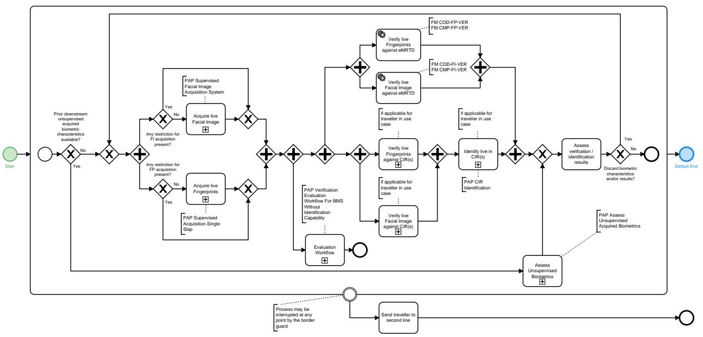

**Figure 2.1.** Overview Process Manual Border Control

## **2.1.2. Mandatory Function Modules**

All Function Modules which SHALL be applied for this Application Profile are listed in [Table 2.1](#page-8-1). All listed Function Modules (separated by commas) are mandatory for this Application Profile unless specified other

| Module Category                   | Required Function Modules                                                                                                                                               |
|-----------------------------------|-------------------------------------------------------------------------------------------------------------------------------------------------------------------------|
| Acquisition Hardware              | FM AH-FP-OPT                                                                                                                                                            |
| Acquisition Software              | FM AS-FP-MF, FM AS-FP-SLP                                                                                                                                            |
| Biometric Image Processing        | FM BIP-FP-APP                                                                                                                                                           |
| Quality Assessment                | FM QA-FP-APP                                                                                                                                                            |
| Presentation Attack Detec tion | FM PAD-FP-APP1                                                                                                                                                          |
| Compression                       | FM COM-FI-GENERIC, FM COM-FI-BCL, FM COM-FP-WSQ, FM COM-FP-BCL                                                                                                 |
| Operation                         | FM O-ALL-LNK                                                                                                                                                            |
| User Interface                    | FM UI-FI-OP, FM UI-FP-OP                                                                                                                                             |
| Reference Storage                 | FM REF-FP-EES, FM REF-FI-EES                                                                                                                                         |
| Biometric Comparison              | FM CMP-FI-VER, FM CMP-FP-VER                                                                                                                                         |
| Logging                           | FM LOG-ALL-GENERIC, FM LOG-ALL-BCL, FM LOG-FI-GENERIC, FM LOG-FP-GE NERIC                                                                                   |
| Coding                            | FM COD-ALL-BCL, FM COD-FI-VER (for FI verification logging), FM COD-FI-EES (for FI data to CS EES), FM COD-FP-EES (for FP data to CS EES), FM COD-FP-VER |
| Evaluation                        | -                                                                                                                                                                       |

wise. Function Modules separated by slash are alternatives to each other. Function Modules in brackets are RECOMMENDED.

**Table 2.1** Required Function Modules Application Profile Manual Border Control

# **2.1.3. Mandatory Application Profiles**

For the acquisition of facial images, the [Application Profile Facial Image Acquisition System Manual Border](#page-8-0) [Control](#page-8-0) SHALL be applied by this Application Profile.

# **2.1.4. Mandatory Partial Application Processes**

All Partial Application Processes and Tasks which SHALL be applied for this Application Profile are listed in [Table 2.2](#page-8-2). All listed Processes (separated by commas) are mandatory for this Application Profile unless specified otherwise. Processes separated by slash are alternatives to each other.

| No. | Required Partial Application Process                                                           |
|-----|------------------------------------------------------------------------------------------------|
| 1   | PAP ASS-B-USV-1: Assess Unsupervised Acquired Biometrics                                       |
| 2   | PAP ID-1: CIR Identification                                                                   |
| 3   | PAP EVA-VER-nCIR-1: Verification Evaluation Workflow for BMS without Identification Capability |
| 4   | PAP ACQ-FPS-SV-1: Supervised Acquisition Single Slap                                           |

**Table 2.2** Required Partial Application Processes Application Profile Manual Border Control

# **2.2. Application Profile Facial Image Acquisition System Manual Border Control**

This Application Profile specifies a facial image acquisition system for manual border control booths. The facial image acquisition system is used to automatically acquire or manually capture images for enrol ment, verification or identification purposes.

## **2.2.1. Mandatory Process**

The following subsection specifies the overall process of the biometric operations of a facial image acquisition system used at the [MBC](#page-89-4).

## **2.2.1.1. Overview Process**

[Figure 2.2](#page-9-0) depicts the general biometric process of the facial image acquisition system. Note, that [PAP ACQ-](#page-18-2)[FI-SV-5: Supervised Facial Image Acquisition System](#page-18-2) is used here.

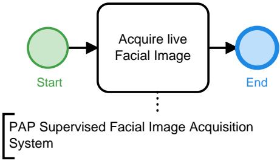

**Figure 2.2.** Overview Process Facial Image Acquisition System at MBC Border Crossing

## **2.2.2. Mandatory Function Modules**

All Function Modules which SHALL be applied for this Application Profile are listed in [Table 2.3](#page-9-1). All listed Function Modules (separated by commas) are mandatory for this Application Profile unless specified other wise. Function Modules separated by slash are alternatives to each other. Function Modules in brackets are RECOMMENDED.

| Module Category               | Required Function Modules                          |
|-------------------------------|----------------------------------------------------|
| Acquisition Hardware          | FM AH-FI-ICS, FM AH-FI-BCL                      |
| Acquisition Software          | FM AS-FI-ICS, FM AS-FI-ICS3                     |
| Biometric Image Processing    | FM BIP-FI-APP                                      |
| Quality Assessment            | FM QA-FI-PRE, FM QA-FI-GENERIC, FM QA-FI-BCL |
| Presentation Attack Detection | -                                                  |
| Compression                   | FM COM-FI-GENERIC, FM COM-FI-BCL                |
| Operation                     | FM O-ALL-USV, FM O-FI-ALL, FM O-FI-DC        |
| User Interface                | FM UI-FI-BSJ                                       |
| Reference Storage             | -                                                  |
| Biometric Comparison          | -                                                  |
| Logging                       | FM LOG-ALL-BCL, FM LOG-FI-GENERIC               |
| Coding                        | FM COD-ALL-EES, FM COD-FI-GENERIC               |
| Evaluation                    | -                                                  |

**Table 2.3** Required Function Modules Application Profile Facial Image Acquisition Manual Border Control

## **2.2.3. Mandatory Partial Application Processes**

All Partial Application Processes and Tasks which SHALL be applied for this Application Profile are listed in [Table 2.4](#page-10-3). All listed Processes (separated by commas) are mandatory for this Application Profile unless specified otherwise. Processes separated by slash are alternatives to each other.

| No. | Required Partial Application Process                        |  |
|-----|-------------------------------------------------------------|--|
| 1   | PAP ACQ-FI-SV-5: Supervised Facial Image Acquisition System |  |
| 2   | PAP ACQ-FI-AUTO-1: Automated Facial Image Acquisition       |  |

**Table 2.4** Required Partial Application Processes Application Profile Facial Image Acquisition Manual Border Control

# **2.3. Application Profile Mobile Manual Border Control**

This Application Profile specifies the requirements for a mobile manual border control with handheld devices. It will be amended in a future version of this [Technical Guideline \(TR\)](#page-90-0).

# **2.4. Application Profile Semi-Mobile Manual Border Control**

This Application Profile specifies the requirements for semi-mobile [MBC](#page-89-4) systems equipped with a facial image camera and a fingerprint acquisition system.

## **2.4.1. Mandatory Process**

[Figure 2.3](#page-10-2) depicts the acquisition process at semi-mobile manual border control. Semi-mobile equip ment is meant to be portable (e.g. placed within in a suit-case), but is not hand-held.

In general, the biometric data of the biometric subject SHALL be captured sequentially. Depending on the use case it is required to acquire fingerprints and / or a facial image of the biometric subject. For all acquisitions enrolment quality SHALL be used in order to simplify the over all processes (e.g. a facial image that has been used for a verification is not needed to be recaptured for an enrolment).

In the end the acquired biometrics are used for enrolment, verifications and / or identifications within one or multiple [Central Indentity Registers \(CIRs\).](#page-89-5)

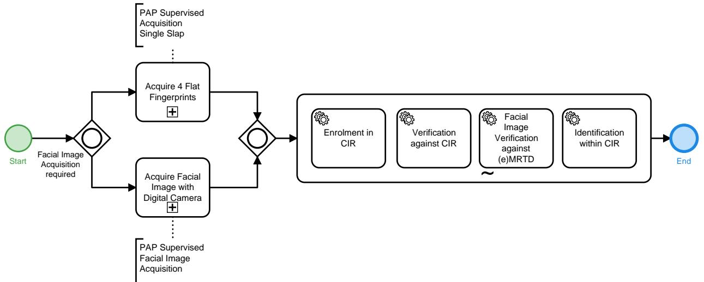

**Figure 2.3.** Overview Process at Semi-Mobile Manual Border Control

## **2.4.2. Mandatory Function Modules**

All Function Modules which SHALL be applied for this Application Profile are listed in [Table 2.5](#page-11-1). All listed Function Modules (separated by commas) are mandatory for this Application Profile unless specified other wise. Function Modules separated by slash are alternatives to each other. Function Modules in brackets are RECOMMENDED.

| Module Category               | Required Function Modules                                                                      |
|-------------------------------|------------------------------------------------------------------------------------------------|
| Acquisition Hardware          | FM AH-FI-DC, FM AH-FP-OPT                                                                   |
| Acquisition Software          | FM AS-FI-DC, FM AS-FP-MF, FM AS-FP-SLP                                                   |
| Biometric Image Processing    | FM BIP-FI-APP, FM BIP-FP-APP                                                                |
| Quality Assessment            | FM QA-FI-GENERIC, FM QA-FI-BCL, FM QA-FP-APP                                             |
| Presentation Attack Detection | FM PAD-FP-APP1                                                                                 |
| Coding                        | FM COD-ALL-BCL, FM COD-ALL-EES, FM COD-FI-GENERIC, FM COD-FI-EES, FM COD-FP-EES |
| Compression                   | FM COM-FI-GENERIC, FM COM-FI-BCL, FM COM-FP-BCL, FM COM-FP-WSQ                     |
| Operation                     | FM O-FI-ALL, FM O-FI-DC, FM O-FP-ALL                                                     |
| User Interface                | FM UI-FI-OP, FM UI-FP-OP                                                                    |
| Reference Storage             | -                                                                                              |
| Biometric Comparison          | -                                                                                              |
| Logging                       | FM LOG-ALL-GENERIC, FM LOG-ALL-BCL, FM LOG-FI-GENERIC, FM LOG-FP-GENERIC              |
| Evaluation                    | -                                                                                              |

**Table 2.5** Required Function Modules Application Profile Semi-Mobile Manual Border Control

## **2.4.3. Mandatory Partial Application Processes**

All Partial Application Processes and Tasks which SHALL be applied for this Application Profile are listed in [Table 2.6](#page-11-2). All listed Processes (separated by commas) are mandatory for this Application Profile unless specified otherwise. Processes separated by slash are alternatives to each other.

|   | No. Required Partial Application Process             |  |
|---|------------------------------------------------------|--|
| 1 | PAP ACQ-FI-SV-4: Supervised Facial Image Acquisition |  |
| 2 | PAP ACQ-FPS-SV-1: Supervised Acquisition Single Slap |  |

**Table 2.6** Required Partial Application Processes Application Profile Semi-Mobile Manual Border Control

# **2.5. Application Profile Automated Border Control (Face-Verification Only)**

This Application Profile specifies the requirements for integrated two-step man trap [Automated Border Con](#page-89-6) [trol \(ABC\)](#page-89-6) (Face-Verification Only) which are equipped with a facial image acquisition system inside the man trap and a document reader at the entrance of the system.

## **2.5.1. Mandatory Process**

The following subsections specify the overall process of biometric operations of the [ABC](#page-89-6) (Face-Verification Only) and the biometric border control checks required per border control use case at the [ABC \(Face-Verifi](#page-89-6) cation Only).

Note, this is an one modality system with a facial image camera for face verification with [Presentation Attack](#page-89-7) [Detection \(PAD\)](#page-89-7) only. The acquired images in this system do not have enrolment quality.

#### **2.5.1.1. Overview Process**

[Figure 2.4](#page-12-0) depicts the general biometric process of the [ABC](#page-89-6) (Face-Verification Only).

If the candidate's facial image is not available or an [PAD](#page-89-7) alarm is triggered, the situation MUST be checked by a border guard.

Also, if any verification fails, the situation MUST be checked by a border guard.

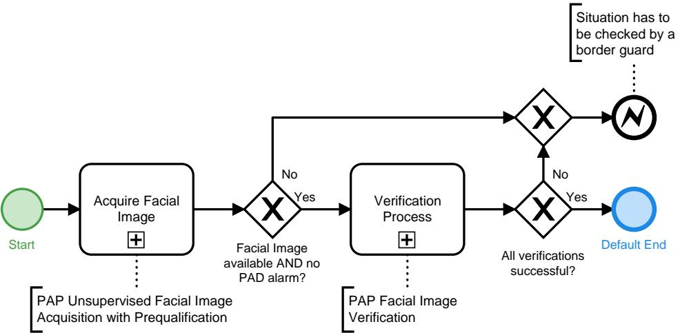

**Figure 2.4.** Overview Process ABC (Face-Verification Only) Border Crossing

## **2.5.2. Mandatory Function Modules**

All Function Modules which SHALL be applied for this Application Profile are listed in [Table 2.7](#page-12-1). All listed Function Modules (separated by commas) are mandatory for this Application Profile unless specified other wise. Function Modules separated by slash are alternatives to each other. Function Modules in brackets are RECOMMENDED.

| Module Category                   | Required Function Modules                                                                                                                           |
|-----------------------------------|-----------------------------------------------------------------------------------------------------------------------------------------------------|
| Acquisition Hardware              | FM AH-FI-EGT, FM AH-FI-ICS                                                                                                                       |
| Acquisition Software              | FM AS-FI-ICS                                                                                                                                        |
| Biometric Image Processing        | FM BIP-FI-APP                                                                                                                                       |
| Quality Assessment                | FM QA-FI-PRE                                                                                                                                        |
| Presentation Attack Detec tion | FM PAD-FI-APP                                                                                                                                       |
| Compression                       | FM COM-FI-GENERIC, FM COM-FI-BCL                                                                                                                 |
| Operation                         | FM O-ALL-USV, FM O-FI-DC                                                                                                                         |
| User Interface                    | FM UI-FI-OP, FM UI-FI-BSJ                                                                                                                        |
| Reference Storage                 | -                                                                                                                                                   |
| Biometric Comparison              | FM CMP-FI-VER                                                                                                                                       |
| Logging                           | FM LOG-ALL-GENERIC, FM LOG-ALL-BCL, FM LOG-FI-GENERIC                                                                                         |
| Coding                            | FM COD-ALL-BCL, FM COD-FI-GENERIC, FM COD-FI-VER (for FI verification logging), FM COD-FI-EES (for FI data to Central System EES (CS EES)) |

| Module Category | Required Function Modules |
|-----------------|---------------------------|
| Evaluation      | -                         |

**Table 2.7** Required Function Modules Application Profile Automated Border Control

## **2.5.3. Mandatory Partial Application Processes**

All Partial Application Processes and Tasks which SHALL be applied for this Application Profile are listed in [Table 2.8](#page-13-1). All listed Processes (separated by commas) are mandatory for this Application Profile unless specified otherwise. Processes separated by slash are alternatives to each other.

| No. | Required Partial Application Process                                                           |
|-----|------------------------------------------------------------------------------------------------|
| 1   | PAP ACQ-FI-USV-1: Unsupervised Facial Image Acquisition with Prequalification                  |
| 2   | PAP VER-FI-ALL-1: Facial Image Verification                                                    |
| 3   | PAP EVA-VER-nCIR-1: Verification Evaluation Workflow for BMS without Identification Capability |

**Table 2.8** Required Partial Application Processes Application Profile Automated Border Control

# **2.6. Application Profile Self-Service System**

This Application Profile specifies the requirements for [self-service systems \(SSSs\)](#page-90-1) equipped with a facial image acquisition system, a fingerprint acquisition system and a document reader.

## **2.6.1. Mandatory Process**

The following subsections specify the overall process of the biometric operations of the [SSS](#page-90-1) and the biometric border control checks required per border control use case at the [SSS.](#page-90-1)

## **2.6.1.1. Overview Process**

[Figure 2.5](#page-14-0) depicts the general biometric process of the [SSS.](#page-90-1)

A live facial image of the biometric subject is acquired. In some use cases acquisition finger prints is started in parallel. In case an applicable biometric modality could not be acquired from the biometric subject, the following process steps requiring this modality are skipped and the next border control step is the [MBC.](#page-89-4)

Afterwards, the verification of the live facial image is carried out against the reference facial image on the [Electronic Machine Readable Travel Document \(eMRTD\)](#page-89-9) and the evaluation workflow is started. In some use cases fingerprint verifications against [CIRs](#page-89-5) (e.g. [CS EES](#page-89-8) or [Visa Information System \(VIS\)](#page-90-2)) are performed in parallel. If the verification against a [CIR](#page-89-5) failed, an identification is performed within the same system which SHALL be multimodal if possible. The retrieval of the identification results SHALL never block the release message to the biometric subject to proceed to the next border control system.

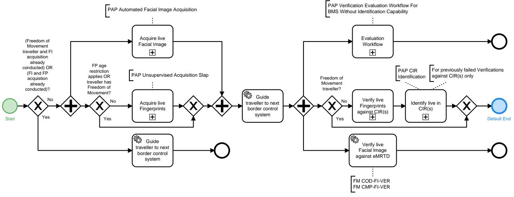

**Figure 2.5.** Overview Process Self-Service System Usage

## **2.6.2. Mandatory Function Modules**

All Function Modules which SHALL be applied for this Application Profile are listed in [Table 2.9](#page-14-1). All listed Function Modules (separated by commas) are mandatory for this Application Profile unless specified other wise. Function Modules separated by slash are alternatives to each other. Function Modules in brackets are RECOMMENDED.

| Module Category                   | Required Function Modules                                                                                                                             |  |
|-----------------------------------|-------------------------------------------------------------------------------------------------------------------------------------------------------|--|
| Acquisition Hardware              | FM AH-ALL-SSS, FM AH-FI-ICS, FM AH-FI-BCL, FM AH-FI-SSS, FM AH-FP-OPT, FM AH-FP-SSS                                                    |  |
| Acquisition Software              | FM AS-FI-ICS, FM AS-FI-ICS3, FM AS-FP-MF, FM AS-FP-SLP                                                                                       |  |
| Biometric Image Processing        | FM BIP-FI-APP, FM BIP-FP-APP                                                                                                                       |  |
| Quality Assessment                | FM QA-FI-GENERIC, FM QA-FI-BCL, FM QA-FP-APP                                                                                                    |  |
| Presentation Attack Detec tion | FM PAD-FI-APP, FM PAD-FP-APP1                                                                                                                      |  |
| Compression                       | FM COM-FI-GENERIC, FM COM-FI-BCL, FM COM-FP-WSQ, FM COM-FP-BCL, FM COM-CCTV-JPG                                                        |  |
| Operation                         | FM O-ALL-USV, FM O-FI-ALL, FM O-FI-DC, FM O-FP-ALL                                                                                           |  |
| User Interface                    | FM UI-FI-BSJ, FM UI-FP-BSJ                                                                                                                         |  |
| Reference Storage                 | -                                                                                                                                                     |  |
| Biometric Comparison              | FM CMP-FI-VER, FM CMP-FP-VER                                                                                                                       |  |
| Logging                           | FM LOG-ALL-GENERIC, FM LOG-ALL-BCL, FM LOG-FI-GENERIC, FM LOG-FP-GE NERIC                                                                 |  |
| Coding                            | FM COD-ALL-BCL, FM COD-FI-VER (for FI verification logging), FM COD-FI-EES (for FI data to CS EES), FM COD-FP-EES (for FP data to CS EES) |  |
| Evaluation                        | -                                                                                                                                                     |  |

**Table 2.9** Required Function Modules Application Profile Self-Service System

## **2.6.3. Mandatory Partial Application Processes**

All Partial Application Processes and Tasks which SHALL be applied for this Application Profile are listed in [Table 2.10.](#page-15-2) All listed Processes (separated by commas) are mandatory for this Application Profile unless specified otherwise. Processes separated by slash are alternatives to each other.

| No. | Required Partial Application Process                                                           |
|-----|------------------------------------------------------------------------------------------------|
| 1   | PAP ACQ-FPS-USV-1: Unsupervised Acquisition Slap                                               |
| 2   | PAP ACQ-FI-AUTO-1: Automated Facial Image Acquisition                                          |
| 3   | PAP ID-1: CIR Identification                                                                   |
| 4   | PAP EVA-VER-nCIR-1: Verification Evaluation Workflow for BMS without Identification Capability |

**Table 2.10** Required Partial Application Processes Application Profile Self-Service System

# **2.7. Application Profile Biometric Matching Systems**

This Application Profile specifies requirements for a [Biometric Matching System \(BMS\)](#page-89-10).

## **2.7.1. Mandatory Process**

The following subsections specify the overall process of the [BMS](#page-89-10) as well as different evaluation workflows.

## **2.7.1.1. Overview Process**

[Figure 2.6](#page-15-1) depicts the overall [BMS](#page-89-10) process.

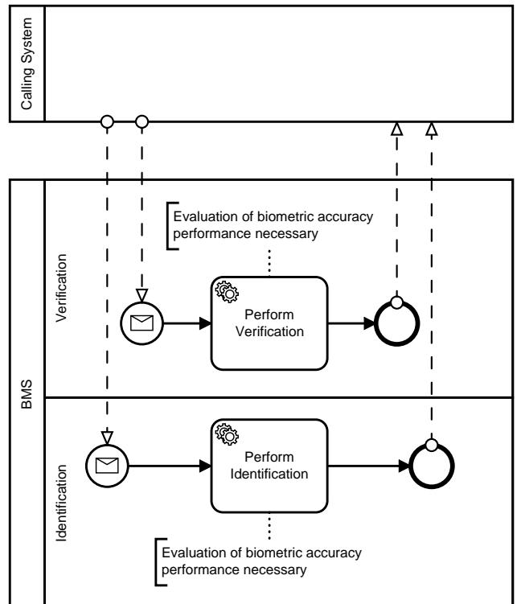

#### **Figure 2.6.** Overall BMS Process

## **2.7.1.2. Evaluation Worflows**

The outcome of a biometric verification (match vs. non-match) [1](#page-16-0) or identification (candidate list) is only relia ble if the corresponding error rates are quantified and monitored. In order to enable a competent authority to evaluate false and true match rates and to configure the [BMS](#page-89-10) comparison thresholds, the Application Profile specifies evaluation workflows which SHALL be executed in parallel for requests received by the [BMS](#page-89-10) or made available to the [BMS,](#page-89-10) unless the main working processes would be impaired in times of high load.

Note, the specifications of evaluation workflows do not distinguish between the type of biometric modality and are generic. Thus, they SHALL be applied to measure biometric performance of fingerprint, facial image and multimodal verification and identification depending on the used biometric modalities of the relevant system.

The evaluation workflows enable a competent authority...

- **•** ... to continuously monitor biometric accuracy in terms of security and usability of the system.
- **•** ... to precisely reconfigure comparison thresholds in order to meet defined security or usability targets.
- **•** ... to assess the biometric performance of new comparison algorithms or updates of deployed comparison algorithms prior to deployment.
- **•** ... to determine thresholds for deploying new or updated algorithms in order to meet defined security and usability targets.
- **•** ... to evaluate and compare new quality algorithms or updates of deployed quality algorithms.
- **•** ... to determine quality thresholds for biometric modalities to be included or excluded in a [BMS](#page-89-10) to meet the defined accuracy targets.
- **•** ... to evaluate and compare comparison algorithms to attribute type specific performance differences, e.g. sex or age.

The process specified by [PAP EVA-ID-wCIR-1: Identification Evaluation Workflow for BMS with Identifi](#page-32-1) [cation Capability and with Verification Capability](#page-32-1) SHALL be executed if an identification request is received.

The process specified by [PAP EVA-VER-wCIR-1: Verification Evaluation Workflow for BMS with Identifi](#page-38-0) [cation Capability and with Verification Capability](#page-38-0) SHALL be executed if a verification request is received and the [BMS](#page-89-10) does not offer an identification capability.

The process specified by [PAP EVA-VER-nCIR-1: Verification Evaluation Workflow for BMS without Iden](#page-44-0) [tification Capability](#page-44-0) SHALL be executed if a verification request is received and the [BMS](#page-89-10) does offer an iden tification capability.

## **2.7.2. Mandatory Function Modules**

All Function Modules which SHALL be applied for this Application Profile are listed in [Table 2.11](#page-16-1). All listed Function Modules (separated by commas) are mandatory for this Application Profile unless specified other wise. Function Modules separated by slash are alternatives to each other. Function Modules in brackets are RECOMMENDED.

| Module Category            | Required Function Modules |
|----------------------------|---------------------------|
| Acquisition Hardware       |                           |
| Acquisition Software       |                           |
| Biometric Image Processing |                           |

1 The term "biometric match" is ambiguous and could literally mean both "biometric recognition/comparison" or "biometric conformity/hit/ equivalence". In the European Regulations and Implementing Acts, it appears being used for both meanings. For the sake of clarity, "match" will only correspond to a hit in the biometric recognition in the following, unless used within the fixed term "biometric matching system", where it is used in the sense of "recognition".

| Module Category               | Required Function Modules                          |
|-------------------------------|----------------------------------------------------|
| Quality Assessment            | FM QA-FI-GENERIC, FM QA-FI-BCL, FM QA-FP-APP |
| Presentation Attack Detection |                                                    |
| Compression                   | FM COM-FI-GENERIC                                  |
| Operation                     |                                                    |
| User Interface                |                                                    |
| Reference Storage             |                                                    |
| Biometric Comparison          | FM CMP-FI-VER, FM CMP-FP-VER                    |
| Logging                       | Will be amended in a future version of this TR.    |
| Coding                        |                                                    |
| Evaluation                    | Will be amended in a future version of this TR.    |

**Table 2.11** Required Function Modules Application Profile Biometric Matching System Control

## **2.7.3. Mandatory Partial Application Processes**

All Partial Application Processes and Tasks which SHALL be applied for this Application Profile are listed in [Table 2.12.](#page-17-0) All listed Processes (separated by commas) are mandatory for this Application Profile unless specified otherwise. Processes separated by slash are alternatives to each other.

|   | No. Required Partial Application Process                                                                            |
|---|---------------------------------------------------------------------------------------------------------------------|
| 1 | PAP EVA-ID-wCIR-1: Identification Evaluation Workflow for BMS with Capability and Verificati                        |
|   | on Capability / PAP EVA-VER-wCIR-1: Verification Evaluation Workflow for BMS with Identification Capability and  |
|   | with Verification Capability / PAP EVA-VER-nCIR-1: Verification Evaluation Workflow for BMS without Identificati |
|   | on Capability                                                                                                       |

**Table 2.12** Required Partial Application Processes Application Profile Automated Border Control

# **3. Partial Application Processes**

The [Partial Application Processes \(PAPs\)](#page-90-3) specified by the following sections provide process specifications of basic biometric processes, e.g. the acquisition, identification or verification of biometrics or the evaluation processes for verification and identification. The [PAPs](#page-90-3) are referenced by the relevant Application Profiles and are part of the overall processes specified therein.

A [PAP](#page-90-3) MAY also be a task. A task is a process which functions as a generic reusable building block which is used by another [PAP](#page-90-3) and is not referenced by an Application Profile directly.

The specific Function Modules that SHALL be implemented in the processes of this chapter are specified by the relevant Application Profiles.

# **3.1. PAP ACQ-FI-SV-5: Supervised Facial Image Acquisition System**

This Partial Application Process specifies a facial image acquisition system to automatically acquire or manu ally capture facial images for enrolment, verification or identification purposes. Note, that the [PAP ACQ-FI-](#page-24-0)[AUTO-1: Automated Facial Image Acquisition](#page-24-0) is used here.

## **3.1.1. Process**

The facial image acquisition system consists of two main processes, whereby the automatied acquisition is mandatory in all application scenarios while the manual mode is

- **•** OPTIONAL for devices that are subject to TR volume German Identity Documents (GID)
- **•** MANDATORY for other devices, especially in the context of TR volume Border Control (BCL).

The overall process is depicted in [Figure 3.1:](#page-19-0)

- 1. The operator triggers the automatic acquisition of a facial image for enrolment or verification/iden tification. The operator reviews the acquired facial image and the results of the software based [Quality](#page-90-4) [Assessment \(QA\).](#page-90-4) The operator SHALL have the option to manually crop and de-rotate the image. In case the manual review revealed bad quality of the facial image, the operator MAY discard the facial image in order to acquire a new facial image. The operator releases the image for further processing.
- 2. The operator triggers the manual acquisition of a facial image for enrolment or verification/identifi cation. The operator manually configures the camera system to the body height of the biometric subject (or triggers automatic height configuration). Next, the operator triggers the capture of a facial image of the biometric subject. The operator reviews the results of the software based [QA.](#page-90-4) The operator SHALL have the option to manually crop and de-rotate the image. In case the manual review revealed bad quality of the facial image, the operator MAY discard the facial image in order to acquire a new facial image. The operator releases the image for further processing.

To support the two processes, the system provides the following two service modes via its interface, refer to [Section 3.1.1.1:](#page-19-1)

1. *automated mode*

In this mode, the system obtains a request from the calling application to acquire an image by a certain quality level (enrolment, verification/identification quality). The system executes the required process au tonomously and returns the final image to calling application. Thereby, system handles pro cess execution, e.g. configuration of the camera system to the height of the biometric subject, mandatory repetitions due to quality issues, [QA](#page-90-4), automatic capture of the facial image etc. The system SHALL imple

ment the processes specified by the [PAP ACQ-FI-AUTO-1: Automated Facial Image Acquisition](#page-24-0) for the automated mode. This service mode is MANDATORY in all application scenrios.

2. *manual mode*

In this mode, the system acts as a capture device for the calling application. The calling application sends atomic requests to the system, e.g. to adjust the system to the height of the biometric subject, to switch on the lighting or to capture a facial image. This service mode is OPTIONAL in the application context German Identity Documents (GID).

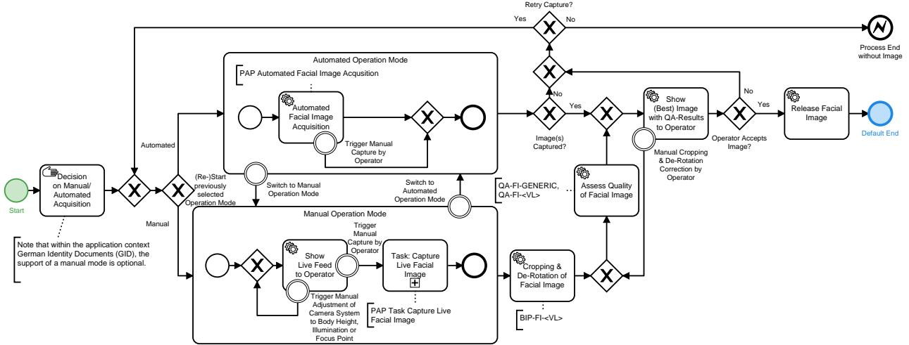

**Figure 3.1.** Supervised Facial Image Acquisition System: Overall Process

## **3.1.1.1. Interface Requirements**

If [High Level Biometric Services \(HLBS\)](#page-89-11) is used by the system, the "Service Definition Facial Image Acquisition System" of Part 2, Volume 2 of this Technical Guideline SHALL be implemented.

## **3.1.2. PAP Task ACQ-FI-1: Capture Live Facial Image**

[Figure 3.2](#page-20-1) depicts the basic process of a live facial image capture. If the image acquisition is not supervised [PAD](#page-89-7) SHALL be performed[1](#page-19-2) . In case of supervised image acquisition [PAD](#page-89-7) is OPTIONAL.

1 Note that the requirement for PAD in supervised settings might be subject to transitional arrangements. The final obligation is regulated through the selection of mandatory Function Modules within the respective Application Profiles.

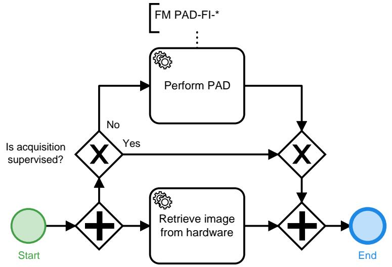

**Figure 3.2.** Partial Application Process Task "Capture Live Facial Image"

# **3.2. PAP ACQ-FI-SV-4: Supervised Facial Image Acquisition**

## **3.2.1. Process**

The facial image acquisition process, refer to [Figure 3.3](#page-21-1), described by this section requires a supervised si tuation. Note, that the [PAP Task ACQ-FI-1: Capture Live Facial Image](#page-19-3) is used here. The biometric subject's facial image is captured using live enrolment equipment (including a digital camera within a photo studio setup) operated by an operator[2](#page-20-2) .

In case the acquisition system detects a face, the facial image capture SHALL be performed automatically. However, the operator SHALL also have option to perform capture manually. An immediately per formed cropping and de-rotation of the face and software quality assessment for the captured facial image ensures its biometric usability. If the quality assessment succeeds positively, the image SHALL be shown to the operator. If the quality is assessed as insufficient and the timeout has not exceeded yet, the system SHALL recapture. If the operator has captured manually, the image SHALL be shown to the operator in any case. In case the timeout has exceeded, the system SHALL identify the best captured facial image and show this image to the operator. The operator SHALL have the option to correct the cropping and de-rotation on the shown image manually. The operator SHALL also have the option to accept the captured facial image. The image is then release to the calling application. This is also the case, if the quality has been assessed as insufficient by the system. In the negative case, the facial image SHALL be discarded, the timeout is reset and a recapture is performed.

If the timeout exceeds and no facial image has been captured (neither with sufficient nor with insufficient quality), the process terminates without releasing an image. It is operator's decision to restart acquisi tion process or to perform other actions.

The process SHALL be supervised by an operator.

2 See ISO/IEC 19794-5, Annex B for "Best practices for Face Images"

**Figure 3.3.** Partial Application Process "Supervised Facial Image Acquisition"

#### **3.2.1.1. Interface Requirements**

If [HLBS](#page-89-11) is used by the system, the "Service Definition Basic Facial Image Acquisition System" of Part 2, Volume 2 of this Technical Guideline SHALL be implemented.

## **3.2.2. PAP Task ACQ-FI-1: Capture Live Facial Image**

[Figure 3.2](#page-20-1) depicts the basic process of a live facial image capture. If the image acquisition is not supervised [PAD](#page-89-7) SHALL be performed[3](#page-21-3) . In case of supervised image acquisition [PAD](#page-89-7) is OPTIONAL.

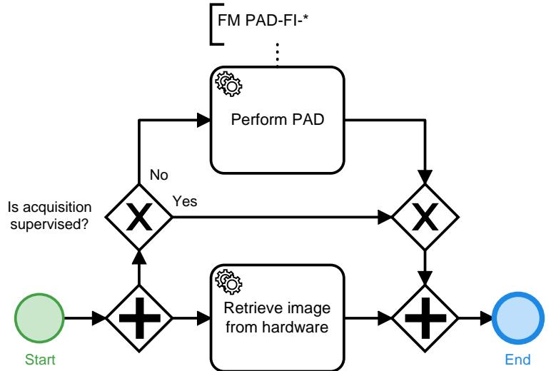

**Figure 3.4.** Partial Application Process Task "Capture Live Facial Image"

# **3.3. PAP ACQ-FI-USV-1: Unsupervised Facial Image Acquisition with Prequalification**

The facial image acquisition process described by this section applies to unsupervised acquisition situations. The full process of image acquisition and the prequalification of the live facial image is presented in [Figu](#page-22-0) [re 3.5](#page-22-0). Note, that the [PAP Task ACQ-FI-1: Capture Live Facial Image](#page-19-3) is used here.

The following steps SHALL be performed. Live image data is captured with respect to [FM Category Acqui](#page-56-3) [sition Hardware](#page-56-3), [FM Category Acquisition Software,](#page-62-3) [FM Category Biometric Image Processing](#page-64-0) and [FM](#page-65-0) [Category Quality Assessment](#page-65-0). Prequalification (as defined by [FM QA-FI-PRE\)](#page-68-1) ensures that only images of sufficient quality are taken. Live image data MAY be compressed according to [FM Category Compression](#page-75-0).

3 Note that the requirement for PAD in supervised settings might be subject to transitional arrangements. The final obligation is regulated through the selection of mandatory Function Modules within the respective Application Profiles.

If the image quality is not sufficient and the specified timeout is not reached and no [PAD](#page-89-7) alarm is triggered, the following SHALL be done: The captured image SHALL be added to a sorted list (sorted by image quality) and a new image SHALL be captured.

This process will finish in one of the following conditions:

- **•** If the image quality is sufficient and the specified timeout is not reached and no [PAD](#page-89-7) alarm is triggered, the acquired image SHALL be returned.
- **•** If the timeout is reached and the sorted image list is not empty, the best quality image from the image list SHALL be returned. Otherwise if the list is empty no image SHALL be returned.
- **•** If a [PAD](#page-89-7) alarm is triggered, the [PAD](#page-89-7) alarm message and the acquired image SHALL be returned to the calling application and displayed to the operator.

The timeout SHALL be configurable.

All gathered information is logged and coded according to [FM Category Coding](#page-86-0) and [FM Category Logging](#page-83-2).

During the complete transaction of acquisition an operator SHOULD ensure that the biometric subject does not try to illegally bypass the system by using presentation attack instruments or other mechanisms. By me ans of [FM Category Presentation Attack Detection](#page-71-0) the operator SHALL receive a warning when the PAD subsystem detects a spoofing attack.

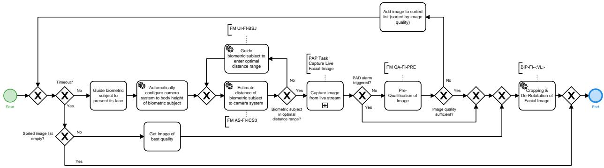

**Figure 3.5.** Partial Application Process "Unsupervised Facial Image Acquisition with Prequalification"

## **3.3.1. Interface Requirements**

If [HLBS](#page-89-11) is used by the system, the "Service Definition Facial Image Acquisition System" of Part 2, Volume 2 of this Technical Guideline SHALL be implemented.

## **3.3.2. PAP Task ACQ-FI-1: Capture Live Facial Image**

[Figure 3.2](#page-20-1) depicts the basic process of a live facial image capture. If the image acquisition is not supervised [PAD](#page-89-7) SHALL be performed[4](#page-22-1) . In case of supervised image acquisition [PAD](#page-89-7) is OPTIONAL.

4 Note that the requirement for PAD in supervised settings might be subject to transitional arrangements. The final obligation is regulated through the selection of mandatory Function Modules within the respective Application Profiles.

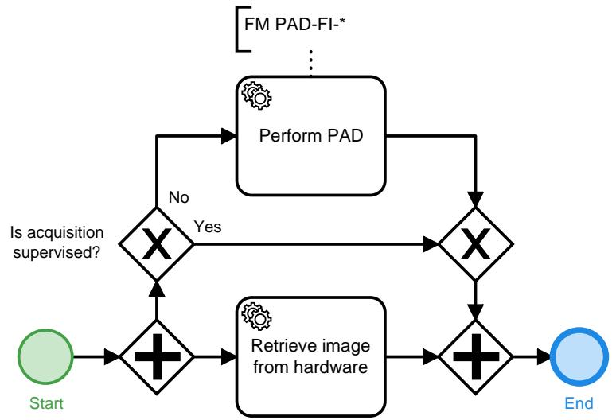

**Figure 3.6.** Partial Application Process Task "Capture Live Facial Image"

# **3.4. PAP VER-FI-ALL-1: Facial Image Verification**

[Figure 3.7](#page-24-1) depicts the basic process of a facial image varification in an unsupervised scenario. The verification SHALL be performed according to [FM Category Biometric Comparison](#page-82-3).

The facial image of the biometric subject is verified against the reference facial image on the [eMRTD](#page-89-9) chip. If the biometric subject is a [Third-Country National \(TCN\)](#page-90-5), verification against applicable [CIRs](#page-89-5) is carried out additionally.

Also, the evaluation workflow is carried out in order to determine the biometric performance of the deployed comparison algorithm.

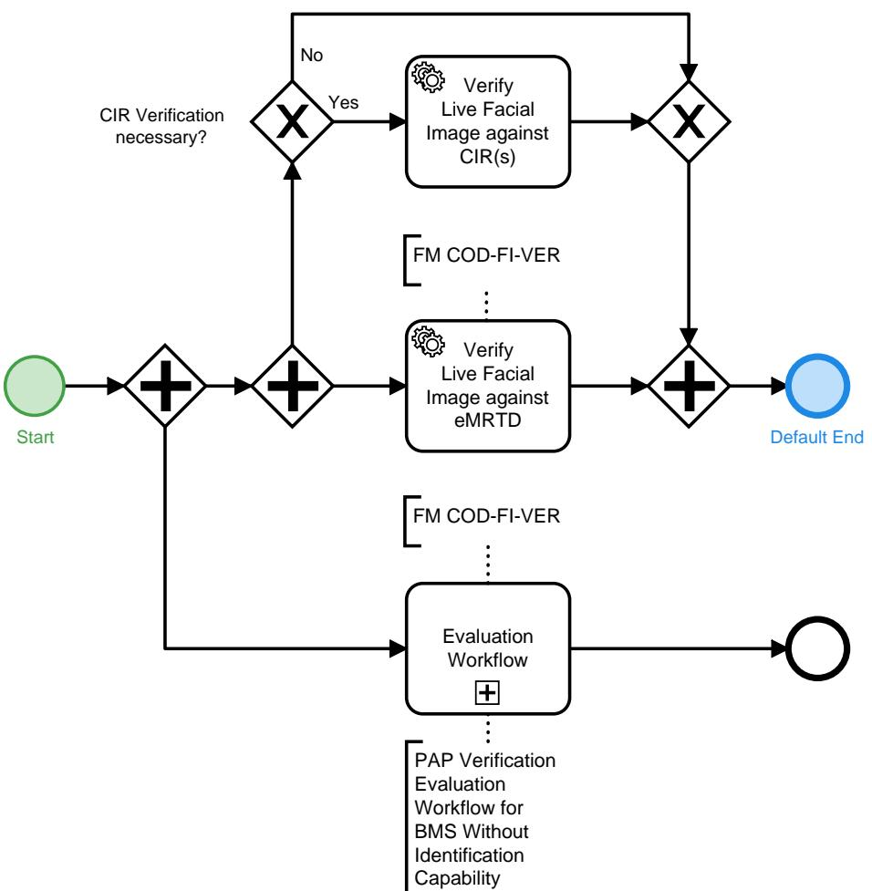

**Figure 3.7.** Partial Application Process "Facial Image Verification"

# **3.5. PAP ACQ-FI-AUTO-1: Automated Facial Image Acquisition**

The facial image acquisition process described by this section applies to acquisition processes where the facial image is acquired automatically, refer to [Figure 3.8](#page-25-0). Note, that the [PAP Task ACQ-FI-1: Capture Live Facial](#page-19-3) [Image](#page-19-3) is used here.

An acquisition system SHALL be used that works with an integrated quality assessment Function Module (see [FM Category Quality Assessment](#page-65-0)). The requirements of [FM Category Acquisition Hardware,](#page-56-3) [FM Category](#page-62-3) [Acquisition Software](#page-62-3) and [FM Category Biometric Image Processing](#page-64-0) SHALL apply. The process SHALL use the following steps:

- 1. The biometric subject SHALL be guided to present its face.
- 2. The camera system SHALL be automatically configured for the body height of the person.
- 3. Multiple faces in the acquisition image area SHALL be detected. Note, the detection SHALL be carried out all the time while the acquisition is ongoing until the facial image is captured.
- 4. If multiple faces are detected, a guidance SHALL advice the biometric subject to appear alone in front of the acquisition system.
- 5. The distance of the biometric subject to the camera system SHALL be determined.
- 6. If the biometric subject is not in the optimal capture range, a guidance SHALL advice the biometric subject to enter the optimal distance range.
- 7. If a facial image can not be captured within a configured timeout, e.g. the biometric subject does not look in the camera or disappears from the system, the acquisition processes ends. The timeout SHALL be configurable.
- 8. The facial image of the biometric subject SHALL be captured. The image SHALL then be cropped and derotated to the face.
- 9. The quality of the facial image SHALL be assessed according to the specific Function Module in [FM](#page-65-0) [Category Quality Assessment.](#page-65-0)
- 10. If the quality is not sufficient and the timeout is not exceeded, a new facial image is captured. The timer for the timeout SHALL start with the retrieval of the first facial image from the capture system.
- 11. If the quality is sufficient, the facial image is released for the calling application.
- 12. If the timeout is exceeded and no image is of sufficient quality, the best facial image is selected among the captured images according to the specific Function Module in [FM Category Quality Assessment](#page-65-0) and the image SHALL be released for the calling application.
- 13. With optimal conditions (bona fide) the overall facial image acquisition process SHALL NOT exceed the following time limits:
	- a. For devices that are subject to TR volume Border Control (BCL), the overall facial image acquisition process SHALL NOT exceed ten seconds. In case the system is not required to perform a [PAD](#page-89-7) (e.g. supervised scenario) the overall facial image acquisition process SHALL NOT exceed seven seconds.
	- b. For devices that are subject to TR volume German Identity Documents (GID), the overall facial image acquisition process SHALL NOT exceed thirty seconds (including [PAD\)](#page-89-7).

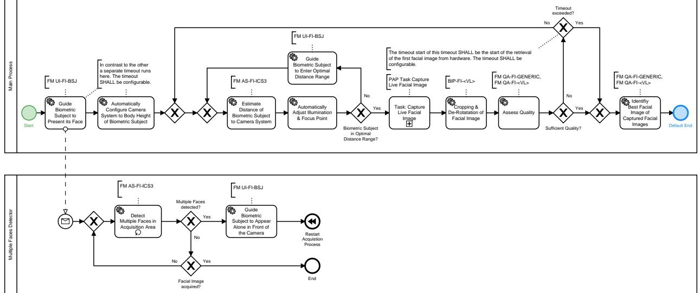

**Figure 3.8.** Partial Application Process "Automated Facial Image Acquisition"

## **3.5.1. Interface Requirements**

If [HLBS](#page-89-11) is used by the system, the "Service Definition Facial Image Acquisition System" of Part 2, Volume 2 of this Technical Guideline SHALL be implemented.

## **3.5.2. PAP Task ACQ-FI-1: Capture Live Facial Image**

[Figure 3.2](#page-20-1) depicts the basic process of a live facial image capture. If the image acquisition is not supervised [PAD](#page-89-7) SHALL be performed[5](#page-26-3) . In case of supervised image acquisition [PAD](#page-89-7) is OPTIONAL.

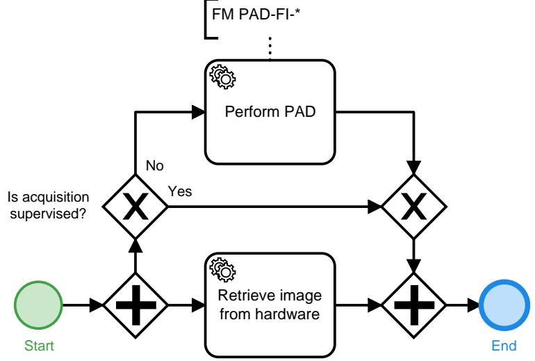

**Figure 3.9.** Partial Application Process Task "Capture Live Facial Image"

# **3.6. PAP ACQ-FPS-SV-1: Supervised Acquisition Single Slap**

## **3.6.1. Process**

[Figure 3.10](#page-26-2) depicts the supervised acquisition process of a slap.

At first the operator flags the missing fingers of the hand of the biometric subject. (Alternative: The operator flags the missing fingers of both hands of the biometric subject.)

The biometric subject SHALL be guided to place the hand correctly on the scanner and the slap SHALL be captured. Note, that the [Section 3.6.2](#page-27-0) is used here.

If already slaps of both hands were acquired, the process SHALL end here. Otherwise the operator SHALL decide if he likes to capture the slap of the other hand, too.

The process SHALL be supervised by an operator.

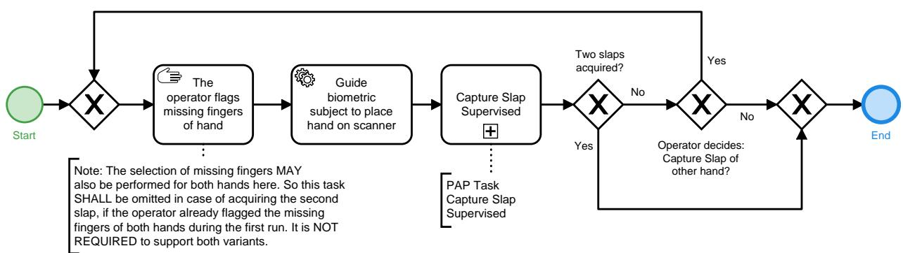

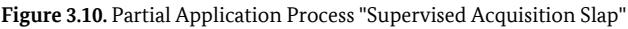

5 Note that the requirement for PAD in supervised settings might be subject to transitional arrangements. The final obligation is regulated through the selection of mandatory Function Modules within the respective Application Profiles.

## **3.6.1.1. Interface Requirements**

If [HLBS](#page-89-11) is used by the system, the "Service Definition Fingerprint Acquisition" of Part 2, Volume 2 of this Technical Guideline SHALL be implemented.

## **3.6.2. PAP Task ACQ-FPS-SV-1: Capture Slap Supervised**

[Figure 3.11](#page-28-0) depicts the basic process for a plain supervised slap capture. A plain slap capture can be part of more complex acquisition processes, e.g. a ten finger acquisition by the 4-1-4-1 capture sequence. The plain slap capture is subsequently described in detail. The quality assessment conducted according to the requi rements of the applicable [FM Category Quality Assessment](#page-65-0). Note, that the [PAP Task ACQ-FPP-SV-2: Cap](#page-28-1) [ture Plain Fingerprint Supervised](#page-28-1) is used here.

If the biometric subject is physically not capable to place all fingers of the slap on the capture hardware at the same time to achieve a slap image of good quality, the operator can decide to capture each finger of the slap in single finger capture mode. This SHALL be possible during the entire process. Hereby, single finger capture mode refers to the [PAP Task ACQ-FPP-SV-2: Capture Plain Fingerprint Supervised](#page-28-1) as described below.

- 1. The counter variable for the number of attempts for capturing the current slap SHALL be initialized as *i* = 1.
- 2. The slap image SHALL be retrieved from hardware. While the image is retrieved from hardware, [PAD](#page-89-7) SHALL be performed. Note: The operator have the option to manually conduct capture of sla p(s).
- 3. The fingerprints SHALL be segmented and each fingerprint SHALL be quality assessed.
	- a. In case the quality of the fingerprints meets the quality requirements defined in the corresponding [QA](#page-90-4) Function Module, the captured slap and the set of segmented fingerprints and parameter data (e.g. quality values) SHALL be temporarily stored.
	- b. In case the quality requirements for one or more fingerprints of the slap are not met, the capture SHALL be repeated up to two times (i.e. the acquisition of a single slap consists of a maximum of three capture attempts). The counter SHALL be set to *i* = *i* + 1.
- 4. A uniqueness check SHALL be conducted for the captured slap image to detect capture of wrong fin gers, e.g. due to interchanged hands or multiple acquisition of the same hand finger. Note, that it is RE COMMENDED to conduct the uniqueness check as early as possible after a fingerprint image is available.
	- a. In case
		- **•** the comparison of any fingerprint of the current slap with any previously accepted fingerprint of a previous slap or
		- **•** the comparison of any fingerprint of the current slap with another fingerprint of the current slap
		- is successful, the uniqueness check SHALL raise a warning.
	- b. In case the comparisons of all fingerprints of the current slap with all fingerprints of previous slaps are not successful, the uniqueness check SHALL NOT show a warning.
- 5. Generally, a slap classifier SHALL be used for the captured slap image to detect the capture of the wrong slap. It SHALL be configurable to switch the classifier off or in evaluation mode (logging of result wi thout showing the result/warning to the operator). Note, that the slap classifier is only required for 4 finger slaps. Other acquisitions currently do not require the corresponding FM.
	- a. If the result of the classification concludes that the acquired slap mismatches the expected slap, a warning SHALL be reported.
	- b. If the result of the classification concludes that the acquired slap matches the expected slap, no warning SHALL be reported.

If the quality check of the third capture attempt fails (counter *i* is set to 3), the best of the captured slaps SHALL be identified according to the corresponding [QA](#page-90-4) Function Module and temporarily stored along with the corresponding information.

The process SHALL be supervised by an operator.

At the end of the process the operator decides on one of the three options:

- 1. Use the acquired slap.
- 2. Recapture the current slap. The counter SHALL be reset to *i* = 1.
- 3. Restart the total slap acquisition workflow.

The operator SHALL have the following veto options:

- **•** Select none of the captured slaps despite sufficient quality.
- **•** Select a slap of insufficient quality from the acquisition process.

At any point of the process the operator MAY decide to acquire any finger of the slap individually.

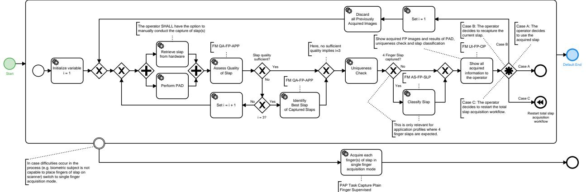

**Figure 3.11.** Partial Application Process Task "Capture Slap Supervised"

## **3.6.2.1. PAP Task ACQ-FPP-SV-2: Capture Plain Fingerprint Supervised**

[Figure 3.12](#page-29-1) depicts the basic supervised capture process for a plain fingerprint capture. A plain fingerprint capture can be part of more complex acquisition processes, e.g. a ten finger acquisition by the 4-1-4-1 capture process. The plain fingerprint capture is described in detail subsequently. The quality assessment is conducted according to the requirements of the applicable [FM Category Quality Assessment.](#page-65-0)

- 1. The counter variable for the number of attempts capturing current fingerprints SHALL be initia lized as *i* = 1.
- 2. The fingerprint image SHALL be retrieved from hardware. While the image is retrieved from hardware, [PAD](#page-89-7) SHALL be performed. Note: The operator SHALL have the option to manually conduct the capture of fingerprint(s).
- 3. The fingerprint SHALL be quality assessed and the captured fingerprint and parameter data (e.g. quality values) SHALL be temporarily stored.
- 4. In case the quality requirements for the fingerprint are not met, the capture SHALL be repeated up to two times (i.e. the acquisition of a finger consists of a maximum of three capture attempts). The counter SHALL be set to *i* = *i* + 1.
- 5. A uniqueness check SHALL be conducted for the captured fingerprint image to detect the capture of wrong fingers, e.g. due to interchanged hands or multiple acquisition of the same hand finger. Note: It is RE COMMENDED to conduct the uniqueness check as early as possible after a fingerprint image is available.
- a. In case the comparison of current fingerprint with any previously captured is success ful, the uniqueness check SHALL report a warning.
- b. In case the comparison of current fingerprint with any previously captured is not suc cessful, the uniqueness check SHALL NOT report a warning.
- 6. The acquired finger prints and the results of [PAD,](#page-89-7) [QA](#page-90-4) and uniqueness check SHALL be displayed to the operator.

If the quality check of the third capture attempt fails (counter *i* is set to 3), the best of the captured fingerprint images SHALL be identified according to the corresponding [QA](#page-90-4) Function Module and temporarily stored along with the corresponding information.

The process SHALL be supervised by an operator.

At the end of the process the operator decides on one of the three options:

- 1. Use the acquired fingerprint.
- 2. Recapture the current fingerprint. The counter SHALL be reset to *i* = 1.
- 3. Restart the [Figure 3.12](#page-29-1) acquisition workflow.

The operator SHALL have the following veto options:

- **•** Select none of the captured fingerprints despite sufficient quality.
- **•** Select a fingerprint of insufficient quality from the acquisition process.

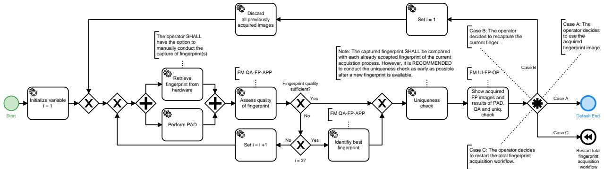

**Figure 3.12.** Partial Application Process Task "Capture Plain Fingerprint Supervised"

## **3.7. PAP ACQ-FPS-USV-1: Unsupervised Acquisition Slap**

[Figure 3.13](#page-30-0) depicts the unsupervised acquisition process for slaps:

- 1. It SHALL be checked if all fingers of the desired slap are available, if not the process SHALL end.
- 2. The biometric subject SHALL be guided to place the hand on the scanner.
- 3. The slap SHALL be captured. Note, that the [PAP Task ACQ-FPS-USV-1: Capture Slap Unsupervised](#page-30-1) is used here. In parallel the surveillance images SHALL be captured, too.
- 4. If not four fingers were acquired: Acquired finger images and associated surveillance images SHALL be discarded.

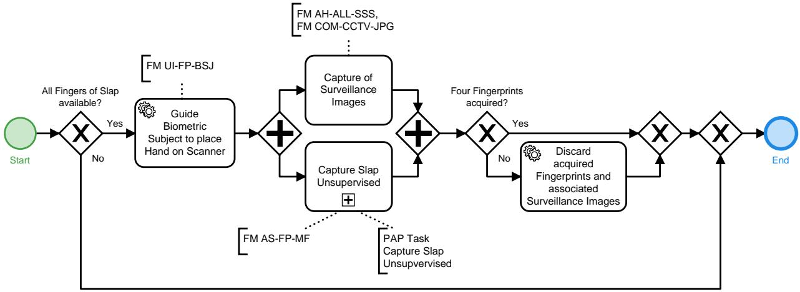

**Figure 3.13.** Partial Application Process "Unsupervised Acquisition Slap"

## **3.7.1. Interface Requirements**

If [HLBS](#page-89-11) is used by the system, the "Service Definition Fingerprint Acquisition System" of Part 2, Volume 2 of this Technical Guideline SHALL be implemented.

## **3.7.2. PAP Task ACQ-FPS-USV-1: Capture Slap Unsupervised**

[Figure 3.14](#page-31-1) depicts the basic process for a plain unsupervised slap capture. A plain slap capture can be part of more complex acquisition processes, e.g. a ten finger acquisition by the 4-1-4-1 capture sequence. The plain unsupervised slap capture is subsequently described in detail. The quality assessment is conducted according to the requirements of the applicable [FM Category Quality Assessment](#page-65-0).

In a uniqueness check, each segmented fingerprint of the current slap SHALL be compared with each already accepted fingerprint of the current acquisition process. Note, this is only required in case more than one slap is captured within the acquisition process.

- 1. The slap image SHALL be retrieved from hardware. The timer for timeout SHALL be configurable and SHALL start right away with beginning of the whole process. Note, that this timeout can also occur before performing [PAD](#page-89-7) respectively before retrieving slap from hardware.
	- a. If the Pre-Qualification is insufficient and timeout has exceeded, the acquisition process, described in this chapter, SHALL continue as follows:
		- i. In case no slap has been captured, it SHALL end without an acquired slap.
		- ii. In case at least one slap has been captured, the best one SHALL be identified and the acquisition process SHALL end afterwards.
	- b. If the Pre-Qualification is insufficient and timeout has not exceeded, the retrieval of an image SHALL be retried.
- 2. If the hardware returns a [PAD](#page-89-7) alarm, the acquisition process SHALL end. Note, that relevant informa tion described in [Section 4.5](#page-71-0) SHALL be stored before ending the acquisition process.
- 3. [QA](#page-90-4) SHALL be conducted. In case the quality of the fingerprints meet the quality requirements defined in the corresponding [Section 4.4](#page-65-0), the captured slap and the set of segmented fingerprints and parameter data (e.g. quality values) SHALL be temporarily stored.
- a. In case the quality requirements for one or more fingerprints of the slap are not met, the capture SHALL be repeated if the timeout is not reached.
- b. In case the timeout is reached and no slap image of sufficient quality was captured, the best slap image according to the corresponding [QA](#page-90-4) Function Module SHALL be stored with the set of segmented fin gerprints and parameter data (e.g. quality values).
- 4. The uniqueness check SHALL be conducted. If the uniqueness check fails, all captured images SHALL be discarded and the capture process SHALL be repeated from the beginning, but if the uniqueness check fails for the second time for the same slap, the acquisition process, described in this chapter, SHALL end without an acquired slap and a warning message SHALL be returned to the calling application, which SHALL be shown to the operator.
- 5. With optimal conditions (bona fide) the overall slap capture process SHALL NOT exceed ten seconds.
- 6. Generally, a slap classifier SHALL be used for the captured slap image to detect the capture of the wrong slap. It SHALL be configurable to switch the classifier off or in evaluation mode (logging of result wi thout showing the result/warning to the operator). Note, that the slap classifier is only required for 4 finger slaps. Other acquisitions currently do not require the corresponding FM.
	- a. If the result of the classification concludes that the acquired slap mismatches the expected slap, a warning SHALL be shown to the biometric subject, all captured images SHALL be discarded and the capture process SHALL be repeated from the beginning. The number of allowed retries con figurable.
	- b. If the result of the classification concludes that the acquired slap mismatches the expected slap and the image is transferred to the calling process, a warning SHALL be reported and shown to the operator. The operator decides whether the slap will be recaptured or the process continuous with the current slap.
	- c. If the result of the classification concludes that the acquired slap matches the expected slap, no warning SHALL be reported.

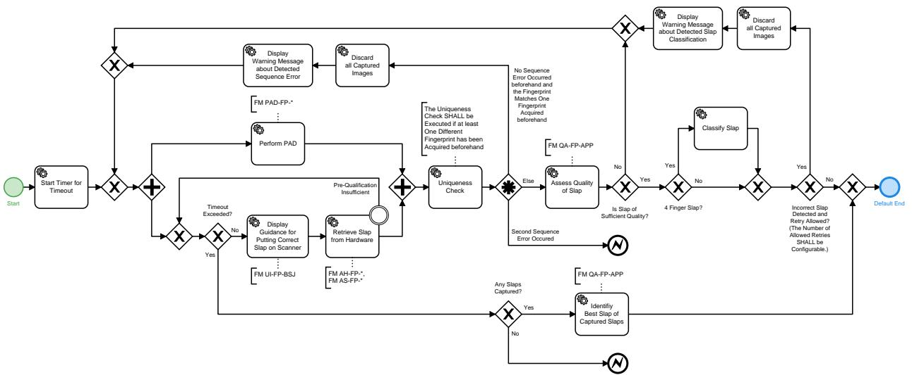

**Figure 3.14.** Partial Application Process Task "Capture Slap Unsupervised"

## **3.8. PAP ID-1: CIR Identification**

[Figure 3.15](#page-32-2) depicts the process of a [CIR](#page-89-5) identification.

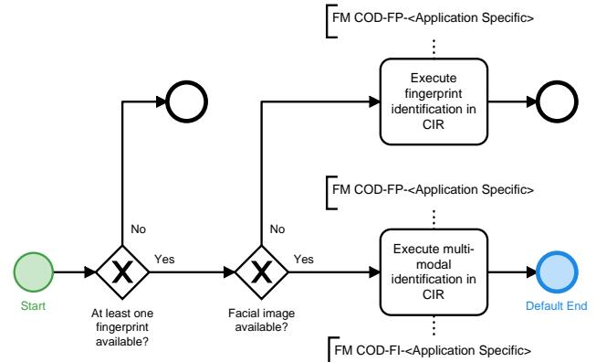

**Figure 3.15.** Partial Application Process "CIR Identification"

# **3.9. PAP ASS-B-USV-1: Assess Unsupervised Acquired Biometrics**

[Figure 3.16](#page-32-3) depicts the process of assessment of unsupervised acquired biometrics by an operator.

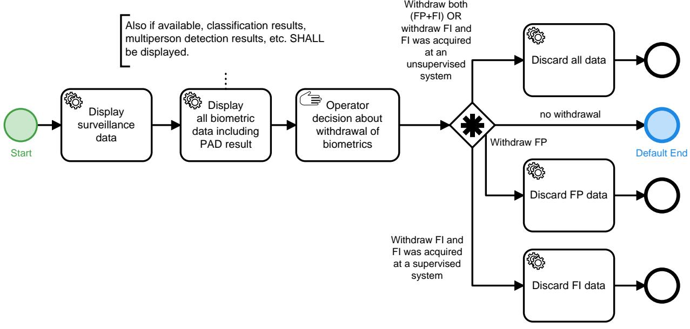

**Figure 3.16.** Partial Application Process "Assess Unsupervised Acquired Biometrics"

# **3.10. PAP EVA-ID-wCIR-1: Identification Evaluation Workflow for BMS with Identification Capability and with Verification Capability**

This Partial Application Process specifies how the evaluation of biometric identification SHALL be carried out for biometric matching systems with identification and verification capability.

Our notation and exposition in this section closely follows the ISO-standard.

## **3.10.1. Identification Results and Identification Errors**

The goal of *(algorithmic) identification* is to identify a subject by means of a given *(biometric) sample* (for in stance, a facial image) inside a register that contains *(biometric) reference templates* of a set of individuals. In a typical algorithmic setting, the outcome of an identification process is based on the computation of numerical scores that are meant to quantify the resemblance between the given sample and the reference (templates) from the register. The algorithm then outputs a *candidate list* that contains all those subjects from the register for which the corresponding numerical score exceeds a pre-defined threshold. In particular, the algorithm can return an empty list (no matching subject was found in the register), or a list which only contains a single subject.

An identification is also known as a (1:*n* comparison), since a single probe sample is compared to a set of *n* references, as opposed to the *verification setting* where we compare a single probe sample with a single reference sample. Accordingly, verification is also referred to as 1:1 comparison.

We now discuss the expected outcome of an identification process. First of all, if a subject *P* is enrolled in the register, then we expect that the identification system returns a candidate list *CL* which contains the subject *P*. We denote this expected *true-positive identification result* by *P 2 CL*. If, on the other hand, the identification system returns a candidate list that lacks the subject *P*, although *P* is enrolled in the register, then this is considered to be an erroneous result, namely a *false-negative identification (FNI)* result.

Analogously, let us consider the case where the subject *P* is not enrolled in the register. Obviously, in this case *P* cannot be on the returned candidate list. In this case we would expect that the algorithm returns an empty candidate list, denote by *CL* = *;*. This is a *true-negative identification* result. If, on the other hand, the identification system returns a non-empty candidate list, then it wrongly claims that *P* is contained in the register. This erroneous event is referred to as a *false-positive identification (FPI)* result.

In order to analyse the quality of the identification system it is important to approximate the probabilities for these two types of erroneous results. Indeed, without any kind of knowledge about the range of these two probabilities, the results of the identification system are more or less meaningless. To this end, we introduce appropriate empirical rates to control the quality of the identification results. But before we do this, let us summarise our setting in the following table:

|                  | P enrolled    | P not enrolled |
|------------------|---------------|----------------|
| Expected Result  | P CL 2  | CL = ;   |
| Erroneous Result | P CL 62 | CL 6= ;  |

**Table 3.1** Identification Results

## **3.10.2. Introduction to the Error Rates**

An identification (1:*n* comparison) consists of *n* successive comparisons between the current probe template and *n* references templates, where *n* usually denotes all reference templates enrolled in the identity register. Each match is added to a candidate list. Under the assumption that the [BMS](#page-89-10) supports deduplication, i.e. at most one mated template is among the *n* reference templates, two different initial situations for each identification are possible:

- **•** The identity register contains one *mated* (or *related*) reference to the current probe. This event is denoted as *R* in the context of identifications.
- **•** The identity register contains only *non-mated* (or *unrelated*) references to the current probe. This event is denoted as *R*¹ in the context of identifications.

In identifications with registers containing one mated reference, i.e. in case of event *R*, the following outcomes are possible:

- **•** The mated reference is correctly returned in the candidate list. This event is denoted as *IR*.
- **•** The mated reference is not included in the returned candidate list. This event is denoted as ¹*IR*. Since the mated reference was among the *n* references for identification, this is a *false-negative-identification* error (event *R ^* ¹*IR*).

In identifications with registers containing only non-mated references, i.e. in case of event *R*¹, the following outcomes are possible:

**•** The candidate list is empty. This event is denoted as *I;* . Since the mated reference was not among the *n* references for identification, this is the correct outcome.

**•** The candidate list is not empty. This event is denoted as *I*¹*;* . Since the mated reference was not among the *n* references for identification, this is a *false-positive-identification* (event *R*¹ *^ I*¹*;* ).

#### **3.10.2.1. Calculation of the Error Rates for Identification**

In the following context of identification evaluation, *jRj* and *jR*¹*j* denote the counts of the events *R* and *R*¹, respectively; i.e. *jRj* is the number of identifications with a probe, where the identity register contains one mated reference, and *jR*¹*j* is the number of identifications, where the identity register does not contain a mated reference. The quantities *j*¹*IRj*, *jR ^* ¹*IRj*, *j*¹*I*¹*; j* and *jR*¹ *^* ¹*I*¹*; j* are defined accordingly as counts of the corresponding events.

The following definitions of the error rates are in accordance to [\[BIB\\_ISO\\_19795-1:2021\].](#page-91-1)

#### **3.10.2.1.1. False-Negative Identification-Rate**

The false-negative identification-rate ([false-negative-identification-rate \(FNIR\)\)](#page-89-12) is defined as the fraction of identifications not returning the mated reference as candidate among conducted with re gisters including a mated reference:

$$FNIR \quad = \frac{|R \land \bar{I}\_R|}{|R|}. \tag{3.1}$$

This quantity can be measured under laboratory conditions, but the daily application may lack the certain information, whether the mated reference was contained among the *n* references for identification (i.e. whe ther the identification represents event *jRj* or event *jR*¹*j*) and whether the correct mated reference is returned in the candidate list (i.e. whether the identification result represent event *IR* or ¹*IR*). Therefore, the calculation of the [FNIR](#page-89-12) SHOULD only use identifications, where the mated reference is assumed to be contained in the identity register and to be known, e.g. by comparison of associated identity information or by an operator decision as described in [Section 3.10.3.3.](#page-37-0) In this case, an estimate of the [FNIR can be calculated using the fol](#page-89-12) lowing approximation and by estimating the count *j*¹*IRj* by the number of cases, in which the assumed mated reference is not returned in the candidate list. [6](#page-34-0)

$$FNIR \quad \approx \frac{|\bar{I}\_R|}{N\_{\rm FNIR}},\tag{3.2}$$

where *N*FNIR is the number of identifications performed to determine the [FNIR](#page-89-12).

#### **3.10.2.1.2. False-Positive Identification-Rate**

The false-positive identifications-rate ([false-positive-identification-rate \(FPIR\)](#page-89-13)) is defined as the fraction of identifications returning a non-empty candidate list among the conducted which did not in clude a comparison with the mated reference:[7](#page-34-1)

$$FPIR \quad = \frac{|\bar{R} \land I\_{\bar{0}}|}{|\bar{R}|}. \tag{3.3}$$

This quantity can be measured under laboratory conditions, but the daily application may lack the certain information, whether the mated reference is contained among the *n* references for identification (i.e. whether the identification represents event *jRj* or event *jR*¹*j*). Therefore, the calculation of the [FPIR](#page-89-13) SHOULD use only identifications, where the mated reference is assumed to be not contained in the identity register. If the mated reference is assumed to be known, e.g. by comparison of associated identity information or by an operator

6 Ideally, the addition of non-mated references in the register should have no influence on the occurrence of mated references in the candidate list. If this property can be assumed for an identification algorithm, a minimal register containing only the mated reference can be used to evaluate the [FNIR](#page-89-12).

7 The [FPIR](#page-89-13) is not affected by the results of comparisons between mated templates.

decision as described in [Section 3.10.3.3, it can be \(temporarily\) excluded from the identity register for eva](#page-37-0) luation purposes. [8](#page-35-1)

Under the assumption that multiple references do not refer to same biometric subject in identity re gister and that the true mated reference is excluded in nearly all *N*FPIR identifications (*jR*¹*j ¼ N*FPIR), the [FPIR](#page-89-13) can be calculated as the fraction of identifications returning at least one candidate among the identifications with excluded mated reference:

$$FPIR \quad \approx \frac{|I\_{\bar{0}}|}{N\_{\text{FPIR}}},\tag{3.4}$$

where *N*FPIR is the number of identifications performed to determine the [FPIR](#page-89-13).

## **3.10.3. Identification Evaluation Workflow for BMS**

The identification evaluation workflow can be triggered by both a verification request and an identification request and uses the biometric probe and, in case of a verification request, the reference from the request for evaluation. Depending on the biometric algorithm, the templates may be generated either explicitly prior to the comparison or implicitly during the comparison.

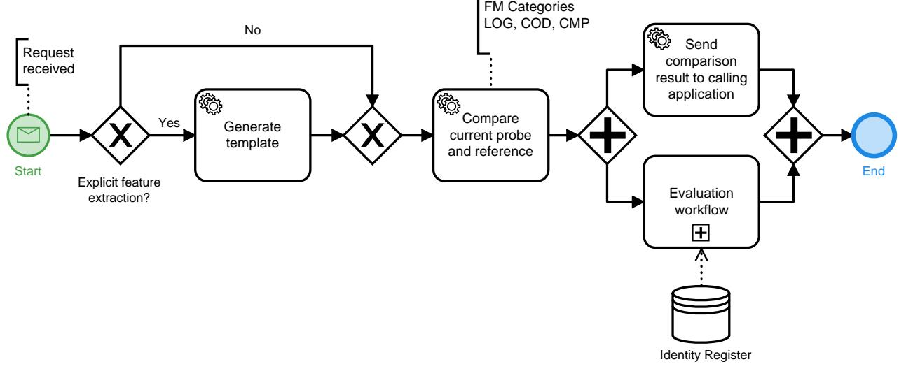

**Figure 3.17.** Overall Identification Workflow

This Partial Application Process allows to determine the error rates [\(FNIRs](#page-89-12) and [FPIRs\)](#page-89-13) of [BMS](#page-89-10) for identification purpose.

## **3.10.3.1. Overall Process**

The overall process is comprised of two workflows:

**•** Either a verification workflow, which compares the presented candidate (probe) and reference, or an iden tification workflow, which compares the presented candidate (probe) with all references from the identity register. After execution of the verification or identification workflow, respectively, the result is returned to the calling application. [9](#page-35-2)

8 Ideally, the inclusion of a mated reference in the register should have no influence on the occurrence of non-mated references in the candidate list. If this property can be assumed for an identification algorithm, the mated reference does not need to be excluded from the register; instead it can be simply ignored in the candidate list.

9 The confidence in the assumed identity of the reference presented for verification is typically quite high, in particular, in case of a positive outcome. Therefore, these references from verification requests can be used to set up the identity registers used for the evaluation process.

**•** The evaluation workflow which conducts identifications with the presented probe by algorithms de ployed and under evaluation.

[Figure 3.17](#page-35-0) shows a general overview over the complete process within the [BMS.](#page-89-10) Note, that the process "Evaluation workflow" is detailed in the following subsection. The probe data (and reference data in case of a verification request) are received or made available to the [BMS. Templates are generated and the compari](#page-89-10) son is performed and logged according to [FM Category Logging.](#page-83-2) Identification and evaluation logging data SHALL be linked by means of the provided transaction identifiers. Note, that the evaluation workflow MAY be scheduled to reduce system load at peak times. Templates MAY be cached to execute the evaluation workflow while low load is on the system.

## **3.10.3.2. Evaluation Workflow**

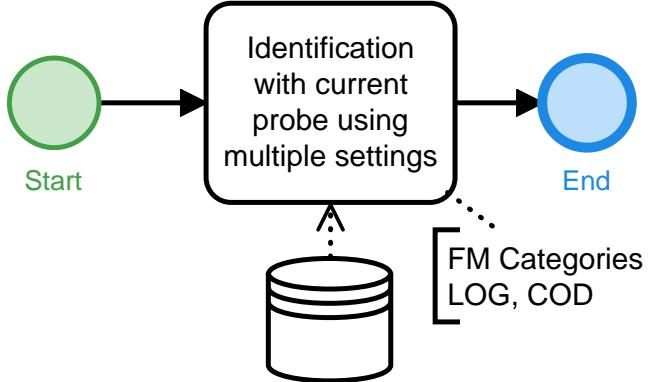

**Figure 3.18.** Evaluation Workflow for Identification

An overview of the evaluation workflow is given in [Figure 3.18](#page-36-0). The evaluation workflow executes an iden tification with the current probe from the current (verification or identification) request. The result of the identification is logged according to [FM Category Coding](#page-86-0) and [FM Category Logging.](#page-83-2) The identification and evaluation SHALL be conducted for each modality available separately and for the multimodal identification if multiple modalities are supplied in the initial (verification or identification) request. The evaluation work flow SHALL be an automatic process without manual processing.

In detail, the following process SHALL be executed in the evaluation workflow for identification:

- 1. A probe (sample or template) with one or more biometric modalities is received.
- 2. If not already conducted in a previous step, e.g. in a verification evaluation workflow, [QA MAY be conduc](#page-90-4) ted according to [FM Category Quality Assessment](#page-65-0).
- 3. To enhance the quality of the calculation, measures SHOULD be taken to ensure that a mated reference is contained in the register for the following identifications; exemplary measures are listed in [Sec](#page-37-0) [tion 3.10.3.3](#page-37-0). The following steps are REQUIRED to calculate the [FNIR](#page-89-12):
	- a. The score for the comparison of the current probe against the (assumed) mated reference from the identity register (genuine comparison) is obtained for the current identification setup under evalua tion. If this score is already available, e.g. due to a previous comparison between both templates, this result MAY be reused if the algorithms coincided. In particular for the calculation of a [Detection Error](#page-89-14)

[Trade-Off \(DET\)](#page-89-14) curve, where the threshold profile is the only varying parameter, scores need to be obtained just once for each probe-reference-pair.

- b. If the resulting score is below the threshold value for the identification under evaluation, the amount of false-negative-identifications *j*¹*IRj* is counted up.
- c. The amount of identifications for [FNIR](#page-89-12) evaluation, *N*FNIR, is counted up.
- d. In addition to the evaluation of the identification workflow in the current setup, steps 3(a) to 3(c) SHOULD be performed using other comparison algorithms and/or other threshold profiles. Note that for each algorithm (or deviating threshold profile), separate counts are REQUIRED.
- e. The [FNIRs](#page-89-12) for each setup under evaluation can be calculated by the fraction of both counts according to [Equation 3.1](#page-34-2).
- 4. To enhance the quality of the calculation, measures SHOULD be taken to ensure that a mated reference is not contained in the register for the following identifications; exemplary measures are listed in [Sec](#page-37-0) [tion 3.10.3.3](#page-37-0). The following steps are REQUIRED to calculate the [FPIR:](#page-89-13)
	- a. An identification is run, comparing the current probe template against all (assumed) non-mated refe rence templates from the identity register (imposter comparisons). If a comparison score exceeds the current threshold profile, the candidate is set on the candidate list.
	- b. If at least one candidate is returned during an identification, the amount of false-positive-identificati ons, *jIR*¹*j*, is counted up.
	- c. At the end of each identification, the amount of identifications for [FPIR](#page-89-13) evaluation, *N*FPIR, is counted up.
	- d. In addition to the evaluation of the identification workflow in the current setup, steps 4(a) to 4(c) SHOULD be performed using other identification algorithms under evaluation or threshold pro files. It should be noted that...
		- **•** ... for each setup under evaluation (register, algorithm, threshold profile), separate counts are RE QUIRED.
		- **•** ... the [FPIRs](#page-89-13) depends on the number *n* of references in the identity register and thus, the calculation of the [FPIRs](#page-89-13) (for a given algorithm) SHOULD NOT combine identifications with considerably vary ing register sizes *n* (e.g. due to amendments to the register),
		- **•** ... for the calculation of a [DET](#page-89-14) curve, i.e. [FPIRs](#page-89-13) for varying threshold values, the identification needs to be performed just on (using a low threshold profile) and the resulting scores can be checked against all required threshold values (greater or equal than the used in identification operati on) without successive reproduction of the comparison scores.
	- e. The [FPIR](#page-89-13) for each setup under evaluation is calculated by the fraction of both corresponding counts according to [Equation 3.4.](#page-35-3)
- 5. The results SHALL be logged according to [FM Category Coding](#page-86-0) and [FM Category Logging.](#page-83-2)

## **3.10.3.3. Optional Measures to Enhance the Quality of the Evaluation**

For the assumptions made above to calculate the error rates, it is essential to ensure, that the correct mated reference template is (or is not) contained in the pool of reference templates. Following implementations MAY be used to achieve this goal:

**•** For the accuracy evaluation of identifications or verifications using only one biometric modality, a pre ceding verification based on another biometric modality could give insight about the true nature (ma ted or non-mated) of the relation between probe and reference. As false-non-matches (or respectively fal se-matches) for different biometric modalities are independent, this does not introduce a bias. This is only possible if more biometric modalities are transmitted for the probe and are available for the references than required for the evaluation. Additionally, it MUST be ensured that the accuracy provided by verification of another modality is sufficiently high to prevent from introducing errors.

**•** Further insight about the true nature (mated or non-mated) of the relation between probe and reference can be obtained by operator decisions from the main-workflow. Any non-match appearing during the border control process will require further inspection by an operator. The final decision entered by the operator can be used as additional information. If the operator ends this inspection by deciding on a true-non-match, the probe-reference pair SHOULD be excluded in evaluation workflows requiring mated pairs. Thus, the evaluation workflow itself will still be completely automatic, though its start SHALL be delayed until the main border control process is terminated, see [Figure 3.19.](#page-38-1)

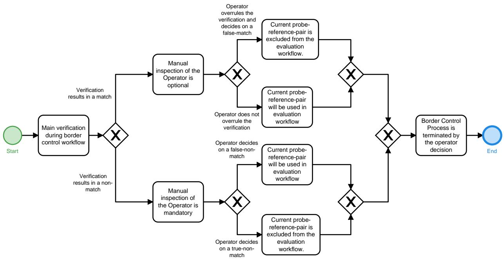

**Figure 3.19.** Use of Operator Decisions as a Background Filter

# **3.11. PAP EVA-VER-wCIR-1: Verification Evaluation Workflow for BMS with Identification Capability and with Verification Capability**

This Partial Application Process specifies how the evaluation of biometric verification SHALL be carried out for biometric matching systems with identification and verification capability.

## **3.11.1. Introduction to the Error Rates**

Biometric verifications and identifications are based on single algorithmic comparisons between a probe and a reference template, quantifying the resemblance between each pair of templates by a numerical score. The binary result of a comparison (match or non-match) depends on whether this numerical score exceeds a preset threshold value.

A verification consist of a single 1:1 comparison between one probe template and one reference template. Therefore, two scenarios are possible for the incoming probe and reference templates:

- **•** Probe and reference are *mated* (or *related*), i.e. belong to the biometric characteristic of the same biometric subject. In the following context of verifications, this event is denoted as *R*.
- **•** Probe and reference are *non-mated* (or *unrelated*), i.e. do not belong to the same biometric characteristic of the same biometric subject. In the following context of verifications, this event is denoted as *R*¹.

A verification-threshold-value is set, so that two results for the biometric comparison are possible:

- **•** If the score is above or equal to the threshold, the result of the comparison is a *match*. In the following context of verifications, this event is denoted as *M*.
- **•** If the score is below the threshold, the result of the comparison is a *non-match*. In the following context of verifications, this event is denoted as *M*¹ .

As a consequence, four different scenarios between income and outcome are possible in a verification:

- **•** Probe and reference are *mated* and the verification returns a *match*. This is a correct result (*true-match*) and denoted as *R ^ M*.
- **•** Probe and reference are *mated* and the verification returns a *non-match*. This is an error referred to as *fal se-non-match* and denoted as *R ^ M*¹ .
- **•** Probe and reference are *non-mated* and the verification returns a *match*. This is an error referred to as *fal se-match* and denoted as *R*¹ *^ M*.
- **•** Probe and reference are *non-mated* and the verification returns a *non-match*. This is a correct result (*truenon-match*) and denoted as *R*¹ *^ M*¹ .

A false-match is usually security related, as access might be granted to an imposter. Therefore, an acceptable false-match-rate (FMR) needs to be predefined depending on the application and a strict obedience SHALL be monitored. A false-non-match can be related to a denial of access for a genuine user. This error is usually not security related, though a low false-non-match-rate (FNMR) is important to ensure a high performance, usability and acceptance by the users of the application.

## **3.11.1.1. Calculation of the Error Rates for Verification**

In the following context of verification evaluation, *jRj* denotes the amount of comparisons between mated templates for a set of *N* independent comparisons. The quantities *jR*¹*j*, *jMj*, *jM*¹ *j*, *jR ^ Mj*, *jR ^ M*¹ *j*, *jR*¹ *^ Mj*, *jR*¹ *^ M*¹ *j* are defined accordingly as counts of the corresponding events. This implies *N* = *jRj* + *jR*¹*j* = *jMj* + *jM*¹ *j*.

The following definitions of the error rates are in accordance to [\[BIB\\_ISO\\_19795-1:2021\].](#page-91-1)

#### **3.11.1.1.1. False-Non-Match-Rate (FNMR)**

The FNMR is defined as the fraction of comparisons returning a non-match among the comparisons between mated images:

$$\text{FNMR} \quad = \frac{|R \land \bar{M}|}{|R|}. \tag{3.5}$$

Under laboratory conditions, *R* is known, i.e. whether two images are mated, thus *jR ^ M*¹ *j* can be measured and the FNMR exactly calculated. Though the evaluation within the daily application lacks information about whether or not two images are truly mated, thus *R* is unknown. Therefore, the FNMR needs to be approxi mated:

$$\begin{split} \text{FNMR} \quad &= \frac{|R \wedge \bar{M}|}{|R|} \\ &= \frac{|\bar{M}|}{N\_{\text{FNMR}}} \left( 1 + \frac{|\bar{R}|}{|R|} \right) - \frac{|\bar{R} \wedge \bar{M}|}{|R|} \\ &\approx \frac{|\bar{M}|}{N\_{\text{FNMR}}} \,, \end{split} \tag{3.6}$$

where *N*FNMR is the number of verifications performed to determine the [false-non-match-rate \(FNMR\)](#page-89-15).

Here, both quantities *jM*¹ *j* and *N*FNMR can be measured. The approximation in [Equation 3.6](#page-39-0) holds if *jR*¹*j ¿ jRj ) jRj ¼ N*FNMR, thus the amount of true-non-matches is negligible to the amount of false-nonmatches. Therefore, the calculation of the [FNMR](#page-89-15) SHOULD only use verifications, where the reference and probe can be assumed to be mated, e.g. by comparison of associated identity information or by an operator decision as described in [Section 3.10.3.3](#page-37-0). [10](#page-40-0)

#### **3.11.1.1.2. False-Match-Rate (FMR)**

The FMR is defined as the fraction of comparisons returning a match among the comparisons between nonmated images:

$$\text{FMR}^{\quad} = \frac{|\bar{R} \land M|}{|\bar{R}|}. \tag{3.7}$$

Under laboratory conditions, *R*¹ is known, i.e. whether two images are non-mated, thus *jR*¹ *^ Mj* can be mea sured and the FMR exactly calculated. Though the evaluation within the daily application lacks information about whether or not two images are truely mated, thus *R*¹ is unknown. Therefore, FMR needs to be approxi mated:

$$\begin{aligned} \text{FMR} \quad &= \frac{|\bar{R} \wedge M|}{|\bar{R}|} \\ &= \frac{|M|}{N\_{\text{FMR}}} \left( 1 + \frac{|R|}{|\bar{R}|} \right) - \frac{|R \wedge M|}{|\bar{R}|} \\ &\approx \frac{|M|}{N\_{\text{FMR}}} \,, \end{aligned} \tag{3.8}$$

where *N*FMR is the number of identifications performed to determine the [false-match-rate \(FMR\)](#page-89-16).

Here, both quantities *jMj* and *N*FMR can be measured. The approximation in [Equation 3.8](#page-40-1) holds if *jRj ¿ jR*¹*j ) jR*¹*j ¼ N*FMR, thus the amount of true-matches is negligible to false-matches. The refore, the calculation of the [FMR](#page-89-16) SHOULD only use verifications, where the reference and probe are assumed to be non-mated.

## **3.11.2. Verification Evaluation Workflow for BMS with Connected Identity Register**

The verification evaluation workflow is triggered by a verification request and uses the biometric probe and reference from the request for evaluation. Depending on biometric algorithm, templates may be ge nerated either explicitly prior to the comparison or implicitly during the comparison.

10 Non-mated images could occur due to imposters or due to accidentally changed documents within travel groups.

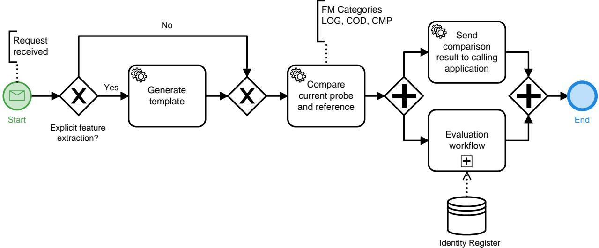

**Figure 3.20.** Overall Verification Workflow with CIR

[Figure 3.20](#page-41-0) shows a general overview over the complete verification workflow within the [BMS.](#page-89-10) Note, that the process "Evaluation workflow" is detailed in the following subsection and [Figure 3.21.](#page-42-0) The reference and probe data are received or made available to the [BMS](#page-89-10). Templates are generated and the comparison is performed and logged according to [FM Category Logging.](#page-83-2) Verification and evaluation logging data SHALL be linked by means of the provided transaction identifiers.

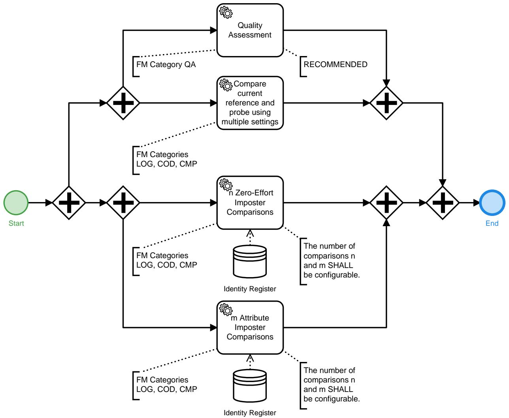

**Figure 3.21.** Verification Evaluation Workflow with Connected Identity Register

## **3.11.2.1. Evaluation Workflow**

An overview over the evaluation workflow is given in [Figure 3.21](#page-42-0). The evaluation workflow itself SHALL be comprised of three main tasks:

- **•** recommended [QA](#page-90-4) of the current probe and reference image
- **•** comparison of the current probe with the current reference using an additional comparison algorithm, which was not used for the normal verification, or varying threshold profiles
- **•** control-verifications of the current probe with non-mated reference templates

In detail, the following process SHALL be executed in the evaluation workflow for verification:

- 1. A probe template and the mated reference template are received.
- 2. [QA](#page-90-4) for evaluation purposes MAY be conducted according to [FM Category Quality Assessment](#page-65-0).
- 3. To enhance the quality of the calculation, measures SHOULD be taken to exclude non-mated comparisons in the following genuine comparisons. Exemplary measures are listed in [Section 3.10.3.3.](#page-37-0) The following steps are REQUIRED to calculate the [FNMR](#page-89-15):
	- a. The current probe is compared against the current (assumed mated) reference (genuine comparison) to obtain a score. If this score is already available, e.g due previous comparison between both tem

plates, this result MAY be reused if the algorithms coincided. In particular, for calculation of a De tection-Error-Tradeoff curve, where the threshold profile is the only varying parameter, scores need to be obtained just once for each probe-template-pair.

- b. If the score is below the threshold profile under evaluation, the amount of non-matches (*M*¹ ) is counted up.
- c. The amount of total comparisons (*N*FNMR) is counted up.
- d. In addition to the setup of the standard verification workflow, other comparison algorithms and/or other threshold profiles SHALL be evaluated here. Note that for each algorithm (or deviating threshold profile), the non-matches SHALL be counted separately.
- e. The [FNMR](#page-89-15) based on the yet evaluated data can be calculated for each setup according to [Equation 3.6](#page-39-0).
- 4. To enhance the quality of the calculation, measures SHOULD be taken to exclude mated comparisons in the following impostor comparisons. Exemplary measures are listed in [Section 3.10.3.3](#page-37-0). The following steps are REQUIRED to calculate [FMR](#page-89-16) as follows:
	- a. Comparisons of the current probe with a sufficiently large amount of *n* templates in a pool of nonmated references from the identity register are conducted without respect to similiar attributes (zero effort). It SHALL be ensured that the pool neither contains mated reference to probe nor mul tiple references of the same biometric subject.
	- b. For each comparison, *N*FMR is increased by 1.
	- c. For each comparison score exceeding the current threshold profile under evaluation, the (false) match counter *jMj* is increased by 1. As all templates without restriction are used, these the "zero-ef fort"-counts.
	- d. The [FMRs](#page-89-16) for probe-reference-pairs coinciding in certain attributes SHALL be accessed by separated counts for matches and comparisons when one of the following attributes coincides:
		- i. Age groups
		- ii. Sex
		- iii. Nationality
		- iv. Document Issuer of Identity Document

Additional attributes MAY be evaluated.

- e. The [FMRs](#page-89-16) for the zero-effort and all attributes based on yet evaluated data can be calculated ac cording to [Equation 3.8](#page-40-1).
- 5. The results are logged according to [FM Category Coding](#page-86-0) and [FM Category Logging.](#page-83-2)

## **3.11.2.2. Optional Measures to Enhance the Quality of the Evaluation**

For the assumptions made above to calculate the error rates, it is essential to ensure, that the correct mated reference template is (or is not) contained in the pool of reference templates. Following implementations MAY be used to achieve this goal:

**•** For the accuracy evaluation of identifications or verifications using only one biometric modality, a pre ceding verification based on another biometric modality could give insight about the true nature (ma ted or non-mated) of the relation between probe and reference. As false-non-matches (or respectively fal se-matches) for different biometric modalities are independent, this does not introduce a bias. This is only possible if more biometric modalities are transmitted for the probe and are available for the references than required for the evaluation. Additionally, it MUST be ensured that the accuracy provided by verification of another modality is sufficiently high to prevent from introducing errors.

**•** Further insight about the true nature (mated or non-mated) of the relation between probe and reference can be obtained by operator decisions from the main-workflow. Any non-match appearing during the border control process will require further inspection by an operator. The final decision entered by the operator can be used as additional information. If the operator ends this inspection by deciding on a true-non-match, the probe-reference pair SHOULD be excluded in evaluation workflows requiring mated pairs. Thus, the evaluation workflow itself will still be completely automatic, though its start SHALL be delayed until the main border control process is terminated, see [Figure 3.19.](#page-38-1)

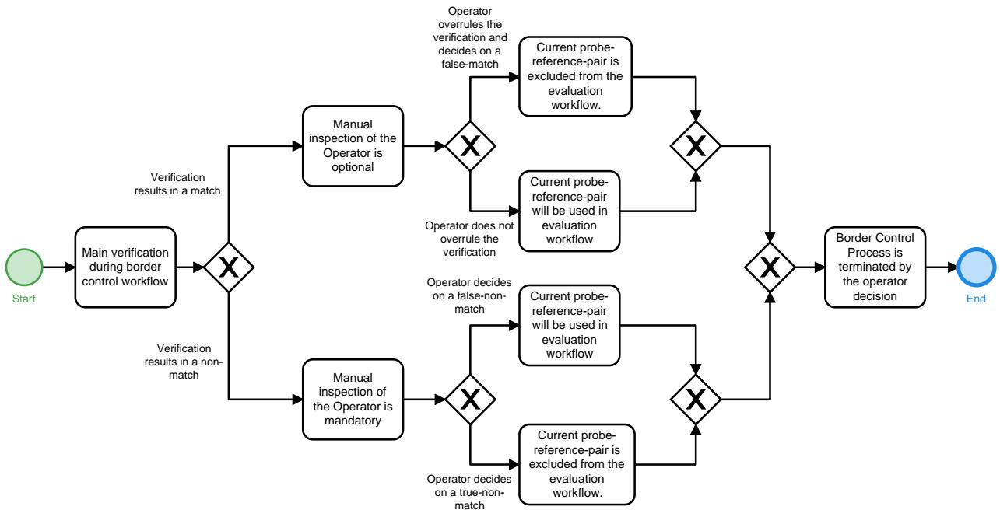

**Figure 3.22.** Use of Operator Decisions as a Background Filter

# **3.12. PAP EVA-VER-nCIR-1: Verification Evaluation Workflow for BMS without Identification Capability**

This Partial Application Process specifies how the evaluation of biometric verification SHALL be carried out for biometric matching systems without identification capability.

## **3.12.1. Introduction to the Error Rates**

Biometric verifications and identifications are based on single algorithmic comparisons between a probe and a reference template, quantifying the resemblance between each pair of templates by a numerical score. The binary result of a comparison (match or non-match) depends on whether this numerical score exceeds a preset threshold value.

A verification consist of a single 1:1 comparison between one probe template and one reference template. Therefore, two scenarios are possible for the incoming probe and reference templates:

- **•** Probe and reference are *mated* (or *related*), i.e. belong to the biometric characteristic of the same biometric subject. In the following context of verifications, this event is denoted as *R*.
- **•** Probe and reference are *non-mated* (or *unrelated*), i.e. do not belong to the same biometric characteristic of the same biometric subject. In the following context of verifications, this event is denoted as *R*¹.

A verification-threshold-value is set, so that two results for the biometric comparison are possible:

**•** If the score is above or equal to the threshold, the result of the comparison is a *match*. In the following context of verifications, this event is denoted as *M*.

**•** If the score is below the threshold, the result of the comparison is a *non-match*. In the following context of verifications, this event is denoted as *M*¹ .

As a consequence, four different scenarios between income and outcome are possible in a verification:

- **•** Probe and reference are *mated* and the verification returns a *match*. This is a correct result (*true-match*) and denoted as *R ^ M*.
- **•** Probe and reference are *mated* and the verification returns a *non-match*. This is an error referred to as *fal se-non-match* and denoted as *R ^ M*¹ .
- **•** Probe and reference are *non-mated* and the verification returns a *match*. This is an error referred to as *fal se-match* and denoted as *R*¹ *^ M*.
- **•** Probe and reference are *non-mated* and the verification returns a *non-match*. This is a correct result (*truenon-match*) and denoted as *R*¹ *^ M*¹ .

A false-match is usually security related, as access might be granted to an imposter. Therefore, an acceptable false-match-rate (FMR) needs to be predefined depending on the application and a strict obedience SHALL be monitored. A false-non-match can be related to a denial of access for a genuine user. This error is usually not security related, though a low false-non-match-rate (FNMR) is important to ensure a high performance, usability and acceptance by the users of the application.

## **3.12.1.1. Calculation of the Error Rates for Verification**

In the following context of verification evaluation, *jRj* denotes the amount of comparisons between mated templates for a set of *N* independent comparisons. The quantities *jR*¹*j*, *jMj*, *jM*¹ *j*, *jR ^ Mj*, *jR ^ M*¹ *j*, *jR*¹ *^ Mj*, *jR*¹ *^ M*¹ *j* are defined accordingly as counts of the corresponding events. This implies *N* = *jRj* + *jR*¹*j* = *jMj* + *jM*¹ *j*.

The following definitions of the error rates are in accordance to [\[BIB\\_ISO\\_19795-1:2021\].](#page-91-1)

#### **3.12.1.1.1. False-Non-Match-Rate (FNMR)**

The FNMR is defined as the fraction of comparisons returning a non-match among the comparisons between mated images:

$$\text{FNMR}^{\quad} = \frac{|R \wedge \bar{M}|}{|R|}. \tag{3.9}$$

Under laboratory conditions, *R* is known, i.e. whether two images are mated, thus *jR ^ M*¹ *j* can be measured and the FNMR exactly calculated. Though the evaluation within the daily application lacks information about whether or not two images are truly mated, thus *R* is unknown. Therefore, the FNMR needs to be approxi mated:

$$\begin{split} \text{FNMR} \quad &= \frac{|R \wedge \bar{M}|}{|R|} \\ &= \frac{|\bar{M}|}{N\_{\text{FNMR}}} \left( 1 + \frac{|\bar{R}|}{|R|} \right) - \frac{|\bar{R} \wedge \bar{M}|}{|R|} \\ &\approx \frac{|\bar{M}|}{N\_{\text{FNMR}}} \,, \end{split} \tag{3.10}$$

where *N*FNMR is the number of verifications performed to determine the [FNMR](#page-89-15).

Here, both quantities *jM*¹ *j* and *N*FNMR can be measured. The approximation in [Equation 3.6](#page-39-0) holds if *jR*¹*j ¿ jRj ) jRj ¼ N*FNMR, thus the amount of true-non-matches is negligible to the amount of false-nonmatches. Therefore, the calculation of the [FNMR](#page-89-15) SHOULD only use verifications, where the reference and probe can be assumed to be mated, e.g. by comparison of associated identity information or by an operator decision as described in [Section 3.10.3.3](#page-37-0). [11](#page-46-0)

#### **3.12.1.1.2. False-Match-Rate (FMR)**

The FMR is defined as the fraction of comparisons returning a match among the comparisons between nonmated images:

$$\text{FMR}^{\quad} = \frac{|\bar{R} \land M|}{|\bar{R}|}. \tag{3.11}$$

Under laboratory conditions, *R*¹ is known, i.e. whether two images are non-mated, thus *jR*¹ *^ Mj* can be mea sured and the FMR exactly calculated. Though the evaluation within the daily application lacks information about whether or not two images are truely mated, thus *R*¹ is unknown. Therefore, FMR needs to be approxi mated:

$$\begin{aligned} \text{FMR} \quad &= \frac{|\bar{R} \wedge M|}{|\bar{R}|} \\ &= \frac{|M|}{N\_{\text{FMR}}} \left( 1 + \frac{|R|}{|\bar{R}|} \right) - \frac{|R \wedge M|}{|\bar{R}|} \\ &\approx \frac{|M|}{N\_{\text{FMR}}} \,, \end{aligned} \tag{3.12}$$

where *N*FMR is the number of identifications performed to determine the [FMR.](#page-89-16)

Here, both quantities *jMj* and *N*FMR can be measured. The approximation in [Equation 3.8](#page-40-1) holds if *jRj ¿ jR*¹*j ) jR*¹*j ¼ N*FMR, thus the amount of true-matches is negligible to false-matches. The refore, the calculation of the [FMR](#page-89-16) SHOULD only use verifications, where the reference and probe are assumed to be non-mated.

## **3.12.2. Verification Evaluation Workflow for BMS without Connected Identity Register**

The overall verification process is comprised of two workflows:

- **•** the verification workflow which compares the presented candidate (probe) with a reference and returns the result to the calling application
- **•** the evaluation workflow which conducts comparisons with algorithms under evaluation, executes im poster control-verifications for accuracy evaluation and may evaluate the quality of biometric modalities by quality algorithms under evaluation

11 Non-mated images could occur due to imposters or due to accidentally changed documents within travel groups.

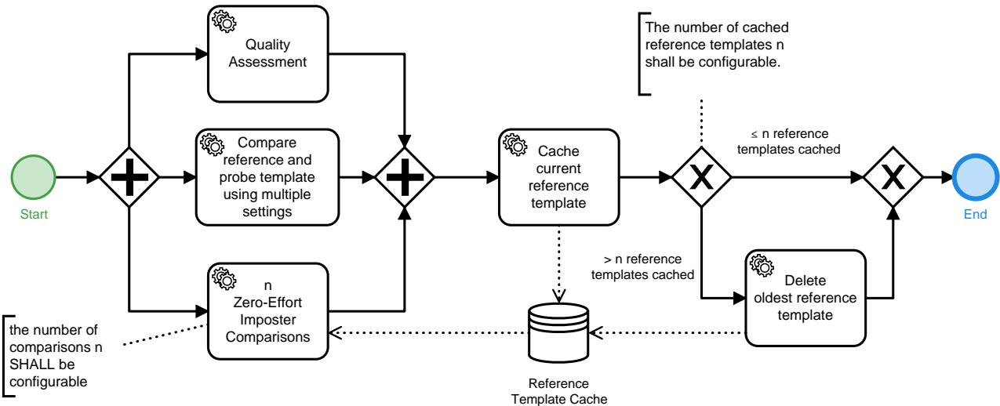

**Figure 3.23.** Overall Verification Workflow without CIR

[Figure 3.23](#page-47-0) shows a general overview over the complete verification workflow within the [BMS.](#page-89-10) Note, that the process "Evaluation workflow" is detailed in the following subsection and [Figure 3.24.](#page-48-0) The reference and probe data are received or made available to the [BMS](#page-89-10). Templates are generated and the comparison is performed and logged according to [FM Category Logging.](#page-83-2) Verification and evaluation logging data SHALL be linked by means of the provided transaction identifiers.

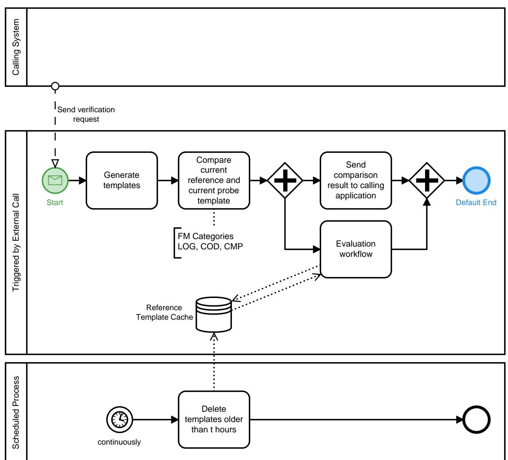

**Figure 3.24.** Verification Evaluation Workflow without Connected Identity Register

## **3.12.2.1. Evaluation Workflow**

An overview over the evaluation workflow is given in [Figure 3.24](#page-48-0). The evaluation workflow itself SHALL be comprised of three main tasks:

- **•** recommended [QA](#page-90-4) of the current probe and reference image
- **•** comparison of the current probe with the current reference using an additional comparison algorithm, which was not used for the normal verification, or varying threshold profiles
- **•** control-verifications of the current probe with non-mated reference templates

In detail, the following process SHALL be executed in the evaluation workflow for verification:

- 1. A probe template and the mated reference template are recieved.
- 2. [QA](#page-90-4) for evaluation purposes MAY be conducted according to [FM Category Quality Assessment](#page-65-0).
- 3. To enhance the quality of the calculation, measures SHOULD be taken to exclude non-mated comparisons in the evaluation. Exemplary measures are listed in [Section 3.10.3.3](#page-37-0). The following steps are REQUIRED to calculate the [FNMR:](#page-89-15)
	- a. The current probe is compared against the current (assumed mated) reference (genuine comparison) to obtain a score. If this score is already available, e.g due previous comparison between both tem plates, this result MAY be reused if the algorithms coincided. In particular for calculation of a De tection-Error-Tradeoff curve, where the threshold profile is the only varying parameter, scores need to be obtained just once for each probe-template-pair.
	- b. If the score is below the threshold profile under evaluation, the amount of non-matches (*M*¹ ) is counted up.
	- c. The amount of total comparisons (*N*FNMR) is counted up.
	- d. In addition to the setup of the standard verification workflow, other comparison algorithms and/or other threshold profiles SHALL be evaluated here. Note that for each algorithm (or deviating threshold profile), the non-matches SHALL be counted separately.
	- e. The [FNMR](#page-89-15) based on the yet evaluated data can be calculated for each setup according to [Equation 3.6](#page-39-0).
- 4. It is RECOMMENDED to take measures to exclude mated comparisons in the following evaluation steps (e.g. in analogy to [Section 3.10.3.3](#page-37-0)) as the current probe template from the verification process is assumed to be compared against non-mated reference templates (imposter comparisons) to calculate the [FMR](#page-89-16) as follows:
	- a. Comparisons of the current probe with a sufficiently large amount of *n* templates in a pool of cached non-mated references are conducted without respect to similiar attributes (zero effort). The pool SHALL NOT contain the mated reference to the probe or multiple references of the same biometric subject.
	- b. For each comparison, *N*FMR is increased by 1.
	- c. For each comparison score exceeding the current threshold profile under evaluation, the (false) match counter *jMj* is increased by 1. As all templates without restriction are used, these the "zero-ef fort"-counts.
	- d. The [FMRs](#page-89-16) for probe-reference-pairs coinciding in certain attributes MAY be accessed by separated counts for matches and comparisons when one of the following attributes coincides:
		- i. Age groups
		- ii. Sex
		- iii. Nationality
		- iv. Document Issuer of Identity Document

Additional attributes MAY be evaluated.

- e. The cache is updated:
	- **•** The reference mated to the current probe SHALL be added cache after imposter compa risons. It SHALL be ensured, that no reference of this biometric subject is already contained in the cache, e.g. by using the alphanumeric data from the identity document corresponding to the images.
	- **•** The oldest reference in the cache SHALL be deleted, if more than *n* references are currently stored in the cache. This maximum amount *n* of references in the cache SHALL be configurable.
	- **•** Additionally, cached references SHALL be deleted after a configurable time *t* in accordance with the applicable data protection regulations.
- f. The [FMRs](#page-89-16) for the zero-effort and all attributes based on yet evaluated data can be calculated ac cording to [Equation 3.8](#page-40-1).

5. The results are logged according to [FM Category Coding](#page-86-0) and [FM Category Logging.](#page-83-2)

## **3.12.2.2. Optional Measures to Enhance the Quality of the Evaluation**

For the assumptions made above to calculate the error rates, it is essential to ensure, that the correct mated reference template is (or is not) contained in the pool of reference templates. Following implementations MAY be used to achieve this goal:

- **•** For the accuracy evaluation of identifications or verifications using only one biometric modality, a pre ceding verification based on another biometric modality could give insight about the true nature (ma ted or non-mated) of the relation between probe and reference. As false-non-matches (or respectively fal se-matches) for different biometric modalities are independent, this does not introduce a bias. This is only possible if more biometric modalities are transmitted for the probe and are available for the references than required for the evaluation. Additionally, it MUST be ensured that the accuracy provided by verification of another modality is sufficiently high to prevent from introducing errors.
- **•** Further insight about the true nature (mated or non-mated) of the relation between probe and reference can be obtained by operator decisions from the main-workflow. Any non-match appearing during the border control process will require further inspection by an operator. The final decision entered by the operator can be used as additional information. If the operator ends this inspection by deciding on a true-non-match, the probe-reference pair SHOULD be excluded in evaluation workflows requiring mated pairs. Thus, the evaluation workflow itself will still be completely automatic, though its start SHALL be delayed until the main border control process is terminated, see [Figure 3.19.](#page-38-1)

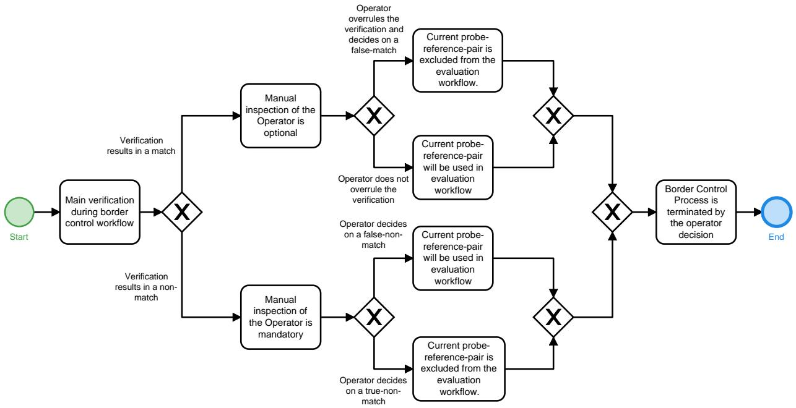

**Figure 3.25.** Use of Operator Decisions as a Background Filter

## **3.13. PAP UPD-B-EES-1: Update EES Reference Biometrics**

This PAP it not used yet and is only part of this [TR](#page-90-0) due to temporary reasons.

[Figure 3.26](#page-51-0) depicts the update process of reference biometrics in a [CIR](#page-89-5) (here: [CS EES\)](#page-89-8) by live acquired images. Note, that the [PAP Task UPD-FP-EES-1: EES Biometric Update Fingerprints](#page-52-2) and [Section 3.13.1](#page-51-1) are used here.

The process specified here SHALL only be executed if all prior verifications of the biometric subject were successful or, if a verification failed, an operator has qualified the prior verification result as false non-match.

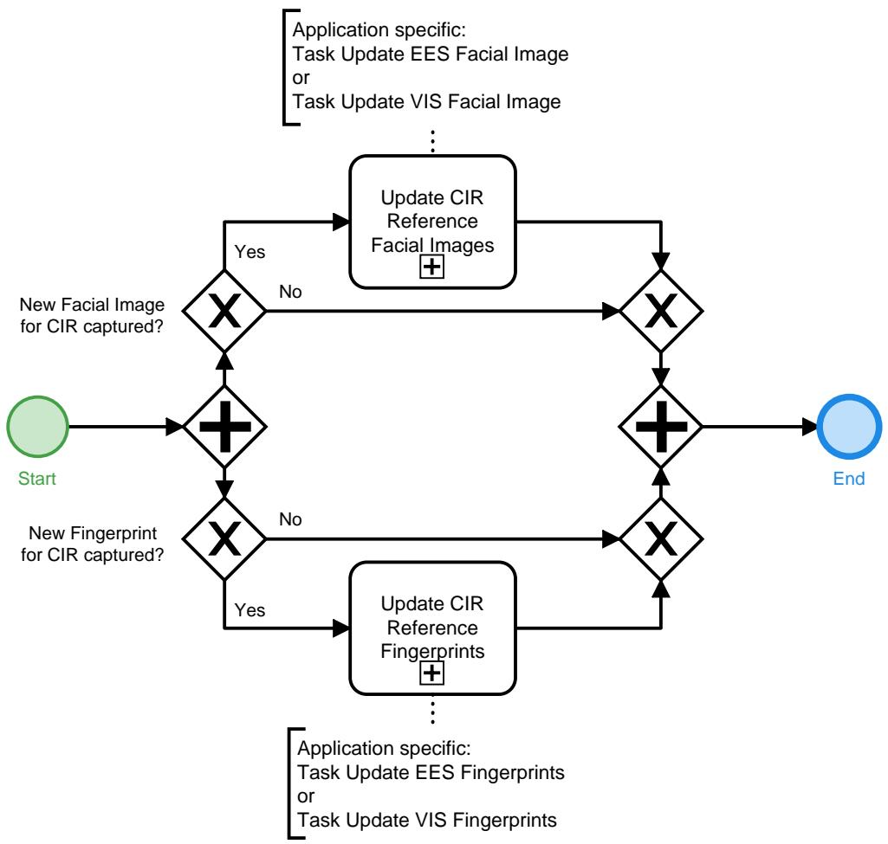

**Figure 3.26.** Partial Application Process "Update CIR Reference Biometrics"

## **3.13.1. PAP Task UPD-FI-EES-1: EES Biometric Update Facial Images**

[Figure 3.27](#page-52-0) depicts the update process of reference facial images in the [CS EES](#page-89-8) by live acquired facial images.

For the process decision of expired [Entry-Exit System \(EES\)](#page-89-17) reference facial images, the following rule SHALL be applied. An [EES](#page-89-17) reference facial image SHALL be considered as expired if one of the following statements hold true for the [EES](#page-89-17) reference facial image:

- **•** if the age of biometric subject was *less than or equal to 12 years* at the create timestamps of the [EES](#page-89-17) reference facial image and the time range between the [EES](#page-89-17) reference facial image create timestamps and the current date is *greater than 1 year*
- **•** if the age of biometric subject was *greater than 12 years* at the create timestamps of the [EES](#page-89-17) reference facial image and the time range between the [EES](#page-89-17) reference image create timestamps and the current date is *greater than 3 years*

For the process decision of whether the [EES](#page-89-17) reference facial images is superior in terms of quality to the live facial image, the [FM QA-FI-GENERIC](#page-65-2) and [FM QA-FI-BCL](#page-67-0) SHALL be applied.

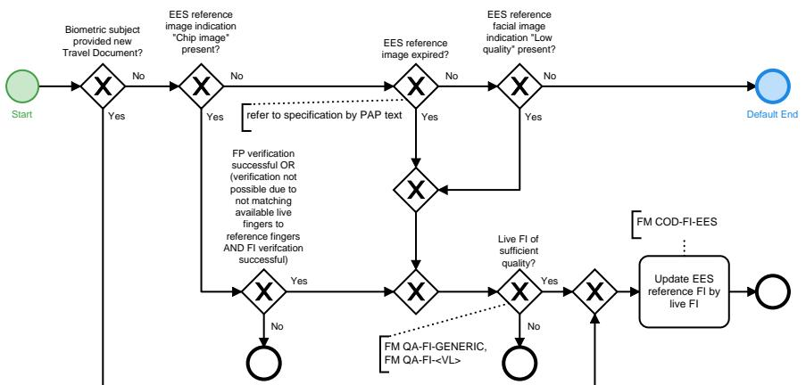

**Figure 3.27.** Partial Application Process Task "EES Biometric Update Facial Images"

## **3.13.2. PAP Task UPD-FP-EES-1: EES Biometric Update Fingerprints**

[Figure 3.28](#page-52-1) depicts the update process of reference fingerprints in the [CS EES](#page-89-8) by live acquired fingerprints.

For the decision on the conditions and fingerprint update actions, the process in [Figure 3.28 SHALL be ap](#page-52-1) plied.

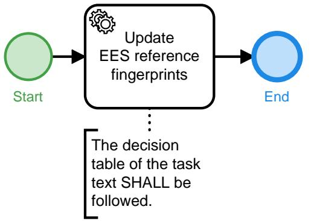

**Figure 3.28.** Partial Application Process Task "EES Biometric Update Fingerprints"

An update of [EES](#page-89-17) reference fingerprint SHALL be conducted according to [Table 3.2.](#page-53-0) In addition, a reasoning for the specified update rules will be amended in a next version of this Technical Guideline.

Note, that the following constraints have to be met by the update rules from a legislative point of view:

- **•** Right and left hand fingerprint images SHALL never be stored simultaneously in the [CS EES](#page-89-8).
- **•** If at least one finger of the right hand is available, the right hand slap SHALL be used, even if only one finger is available and four fingers of the left hand would be available.
- **•** A "best of" slap SHALL NOT be created, i.e. a slap stored with single fingers acquired in different acquisition processes.

In addition, the following constraint is set:

- **•** The quality of a fingerprint image is considered as sufficient if the quality score of the relevant finger excels a threshold. Update of fingerprints above the threshold SHALL NOT affect the update rules.
- **•** As many fingerprint images as possible of suitable quality SHALL be enrolled in the EES.
- **•** Information about the status of the missing fingers SHOULD be as accurate as possible.

For the decision whether the [EES](#page-89-17) reference fingerprints are of better quality compared to the live fingerprint, the [FM QA-FP-APP](#page-68-0) SHALL be applied.

|                            |                                 |                                                                                    | Right Hand Fingerprints                               |                                                                                                                                                                                                                                                                                                         |                                                                                                                                                                                                                                                                                                                                                                                                                                                                                                                                                                                                                                 |                                                                                                                                                                                                                                                                                                                                                        |
|----------------------------|---------------------------------|------------------------------------------------------------------------------------|-------------------------------------------------------|---------------------------------------------------------------------------------------------------------------------------------------------------------------------------------------------------------------------------------------------------------------------------------------------------------|---------------------------------------------------------------------------------------------------------------------------------------------------------------------------------------------------------------------------------------------------------------------------------------------------------------------------------------------------------------------------------------------------------------------------------------------------------------------------------------------------------------------------------------------------------------------------------------------------------------------------------|--------------------------------------------------------------------------------------------------------------------------------------------------------------------------------------------------------------------------------------------------------------------------------------------------------------------------------------------------------|
|                            |                                 |                                                                                    | no fingerprint stored in EES                          |                                                                                                                                                                                                                                                                                                         | at least one fingerprint stored in EES                                                                                                                                                                                                                                                                                                                                                                                                                                                                                                                                                                                       |                                                                                                                                                                                                                                                                                                                                                        |
|                            |                                 |                                                                                    | at least one live fingerprint available12       | no live finger print available                                                                                                                                                                                                                                                                       | at least one live fingerprint available13                                                                                                                                                                                                                                                                                                                                                                                                                                                                                                                                                                                 | no live finger print available                                                                                                                                                                                                                                                                                                                      |
| Left Hand Fin gerprints | no fingerprint stored in EES | at least one live fingerprint available no live finger print available | 1. add live right fingers to EES Traveller File | 2. • update EES reference right fingers' missing rea son • add live left fingers to EES Travel ler File 5. • update EES Traveller File right fingers' mis sing reason • update EES Traveller File left fin gers' missing reason | 3. if more live right fingers are available than EES Traveller File right fin gers OR (the bad quality flag for any EES Traveller File right fin gers is set AND the same live right finger as bad quality EES Traveller File fingers are available AND all live right fingers are of better or same quality than the EES Traveller File right fin gers AND not less live right hand finger prints are avail able than EES Traveller File right fingers): replace EES Traveller File right fingers by live right fin gers | 4. • delete EES Traveller File right fingers and add live right fingers' missing rea son • add live left fingers to EES Traveller File 6. if all live right fingers marked as permanent ly missing: dele te EES Traveller File right fingers and add live left fingers' missing reason. |

12 Note, if no [EES](#page-89-17) reference fingerprint is stored and at least one right live fingerprint is available, the acquisition of a left hand fingerprint SHALL NOT happen as it is not required for any purpose. Thus, no distinction between the case of *at least one live fingerprint available* and *no live fingerprint available* for left hand fingerprints is required

13 Note, if at least one right [EES](#page-89-17) reference fingerprint is stored and at least one right live fingerprint is available, the acquisition of a left hand fingerprint SHALL NOT happen as it is not required for any purpose. Thus, no distinction between the case of *at least one live fingerprint available* and *no live fingerprint available* for left hand fingerprints is required

|                                               |                                                                                    | Right Hand Fingerprints                                                                                                    |                                                                                                                                                                                                                                                                                                                                                                                                                                                                                     |                                                                                                 |                                   |
|-----------------------------------------------|------------------------------------------------------------------------------------|----------------------------------------------------------------------------------------------------------------------------|-------------------------------------------------------------------------------------------------------------------------------------------------------------------------------------------------------------------------------------------------------------------------------------------------------------------------------------------------------------------------------------------------------------------------------------------------------------------------------------|-------------------------------------------------------------------------------------------------|-----------------------------------|
|                                               |                                                                                    | no fingerprint stored in EES                                                                                               |                                                                                                                                                                                                                                                                                                                                                                                                                                                                                     | at least one fingerprint stored in EES                                                       |                                   |
|                                               |                                                                                    | at least one live fingerprint available12                                                                            | no live finger print available                                                                                                                                                                                                                                                                                                                                                                                                                                                   | at least one live fingerprint available13                                                 | no live finger print available |
| at least one fin gerprint stored in EES | at least one live fingerprint available no live finger print available | 7. • delete EES Traveller File left fin gers • add live right fingers to EES Tra veller File | 8. • update EES Traveller File right fingers' mis sing reasons • do number 3 with live left hand finger prints and left EES Tra veller File fingers ins tead 9. • update EES Traveller File right fingers' mis sing reason • if all live left fingers mar ked as per manently missing: de lete EES Tra veller File left fingers and add live left fingers' missing rea son | By EU-regulation, CS EES never stores left and right hand finger prints at the same time. |                                   |

**Table 3.2** Decision Table EES Reference Fingerprint Update

## **3.13.2.1. Annotations to Decision [Table 3.2](#page-53-0)**

The following annotations explain the reasoning behind the decision table. Each annotation refers to the cell of the decision table by its number.

- 1. If no fingerprints of the right hand are enrolled, though currently available, they SHALL be enrolled.
- 2. The reason for fingerprint images missing in the EES might change, e.g. from temporary missing fingers to permanently missing fingers. Therefore, an update is REQUIRED even if no fingerprint images can be ac quired. If no fingerprint images of the right hand are available, the left hand SHALL be used for enrolment.

12 Note, if no [EES](#page-89-17) reference fingerprint is stored and at least one right live fingerprint is available, the acquisition of a left hand fingerprint SHALL NOT happen as it is not required for any purpose. Thus, no distinction between the case of *at least one live fingerprint available* and *no live fingerprint available* for left hand fingerprints is required

13 Note, if at least one right [EES](#page-89-17) reference fingerprint is stored and at least one right live fingerprint is available, the acquisition of a left hand fingerprint SHALL NOT happen as it is not required for any purpose. Thus, no distinction between the case of *at least one live fingerprint available* and *no live fingerprint available* for left hand fingerprints is required

- 3. Following the aim to store as many fingerprint images of sufficient quality of the right hand as possible in the EES.
- 4. -
- 5. If no fingerprint images of the right hand are available, left SHALL be enrolment. As only fin gerprints of one hand must be enrolled in the EES, the right hand fingerprints SHALL be deleted and the missing reasons saved.
- 6. If no fingerprints of any hand are currently available, an update SHALL NOT be done as it would delete the currently enrolled fingerprint images. The only exception is the case, where all fingers of the right hand are now permanently missing. In this case, the fingerprint images of the right hand SHALL be deleted in the EES, as they can no longer be used for traveller verification. In this case, at least the reasons for the missing left fingers SHALL be enrolled.
- 7. Following the legal requirements, that the fingers of the right hand SHALL always be enrolled if possible.
- 8. -
- 9. If no fingerprints of any hand are currently available, an update SHALL NOT be done as it would delete the currently enrolled fingerprint images. The only exception is the case, where all fingers of the left hand are now permanently missing. In this case, the fingerprint images of the left hand SHALL be deleted in the EES, as they can no longer be used for traveller verification. In this case, at least the reasons for the missing right fingers SHALL be enrolled.

# **4. Function Modules**

This chapter lists all Function Modules for the defined Application Profiles.

## **4.1. FM Category Acquisition Hardware**

Devices that are used for digitising physical, representable biometric characteristics are called [Acquisition](#page-89-18) [Hardware \(AH\).](#page-89-18) Digital cameras to capture images of the face, fingerprint sensors, or signature tablets can be named as examples.

## **4.1.1. FM AH-ALL-SSS**

This Function Module describes the requirements for [SSSs](#page-90-1) that are used to obtain digitised facial images and fingerprints.

## **4.1.1.1. Requirements**

#### **4.1.1.1.1. General Requirements**

- **•** An environment surveillance camera system SHALL supervise the area around the [SSS.](#page-90-1)
	- **•** The camera images SHALL allow to identify whether more than one person was in range of the [SSS](#page-90-1) during the capture of the fingerprints.
	- **•** The surveillance camera system SHALL capture an image of the surrounding area at the moment of each finger capture attempt. The face of the biometric subject using the fingerprint scanner SHALL be visible in the image of the surveillance camera.
	- **•** The images SHALL be cached locally on the [SSS.](#page-90-1)
	- **•** A maximum of 100 ms SHALL be allowed to elapse between the fingerprint capture attempt image and the capture of the surveillance camera system.
	- **•** For the fingerprint image selected in the acquisition process, the corresponding surveillance image SHALL be made available from the cache.
	- **•** A colour camera SHALL be used for the environment surveillance.
	- **•** The camera SHALL be capable to capture images with a resolution of at least 1280 x 720 pixels.
- **•** A camera system SHALL closely supervise the fingerprint capture system.
	- **•** The camera image is intended to identify whether presentation attack instruments are applied to the fingerprint capture system.
	- **•** The camera system SHALL capture an image of the fingerprint acquisition area at the moment of each finger capture attempt.
	- **•** The images SHALL be cached locally on the [SSS.](#page-90-1)
	- **•** A maximum of 100 ms SHALL be allowed to elapse between the fingerprint capture attempt image and the capture of the surveillance camera system.
	- **•** A colour camera SHALL be used for the fingerprint capture surveillance.
	- **•** The camera SHALL be capable to capture images with a resolution of at least 1280 x 720 pixels.

**•** In case the biometric subject leaves the corridor in front of the [SSS](#page-90-1) system, the running [SSS](#page-90-1) process SHALL be stopped. The corridor is defined by a distance of 100 cm in front of the [SSS](#page-90-1) and the width of the [SSS](#page-90-1). Note, this requirement does not mandate a dedicate hardware sensor to enable the detection of leaving. The detection MAY also happen in software based on the surveillance images. In this case, the requirement does not affect any additional hardware.

#### **4.1.1.2. Recommendations**

In case the biometric subject is approaching close to the maximum allowed distance of the [SSS](#page-90-1) the biometric subject SHOULD be warned.

## **4.1.2. FM AH-FI-BCL**

This Function Module describes the requirements for systems where a digitised facial image is obtained. Note, the distance between camera system and biometric subject is defined as the geometrical optical-path length between the forehead of the biometric subject and the active camera system's optic. The optical-path MAY, for example, follow a straight line from forehead to optic, or be rerouted by using mirrors so that the biometric subject can stand closer to the device.

#### **4.1.2.1. Requirements**

- **•** The system MAY measure the distance between the biometric subject and the camera system.
- **•** The camera system SHALL capture images in colour.
- **•** The system SHALL allow high quality acquisitions independently from the environmental light situation.
- **•** The camera system SHALL at least allow to acquire facial images compliant to this Technical Guideline of biometric subject which have a body height in range of 140 cm to 200 cm if standing upright in front of the camera system.
- **•** If the biometric subject is standing at 60 cm distance to camera system, minimum physical reso lution of the camera system SHALL allow to crop the full frontal facial image of the biometric subject to 1600 x 1200 pixels with an allowed deviation of maximum negative 10 %.
- **•** The camera system SHALL capture sharp full frontal images with minimized distortion of biometric sub jects which
	- **•** stand upright 40 cm to 100 cm[1](#page-57-2) in front of the camera system and
	- **•** look frontal.
- **•** Biometric subjects with a distance of less than 40 cm or more than 100 cm SHALL NOT be captured.
- **•** If the biometric subject is in capture area of maximum 100 cm and minimum 40 cm distance to ca mera system, the camera installation SHALL be able to capture an image according to the definition of "full frontal" (see [\[BIB\\_ISO\\_FACE\]\)](#page-91-2) on a hardware level. Especially an image capturing at "Frankfurt Horizon" SHALL be possible for all biometric subjects within the defined range of body height.

## **4.1.3. FM AH-FI-DC**

This Function Module describes the requirements for facial image cameras and physical setups that are used to obtain facial images.

#### **4.1.3.1. Requirements**

**•** The minimum physical resolution of the camera SHALL allow a cropping of an image to 1200 x 1600 pixels without any upscaling. Note, this requirement is OPTIONAL for scenarios where only a facial verification is performed.

1 Note, that the physical construction of the system may not allow the biometric subject to stand at the maximum distance.

- **•** Adequate image quality to meet the requirements of [\[BIB\\_ISO\\_FACE\]](#page-91-2) SHALL be provided.
- **•** The physical and environmental conditions for capturing facial images, such as the positioning of ca mera, proper lighting of the face and a uniform background as described in [\[BIB\\_ISO\\_FACE\]](#page-91-2) and [\[BIB\\_I](#page-91-3) [CAO\\_TR\\_Portrait\\_Quality\]](#page-91-3) SHALL be complied with. It is RECOMMENDED to use a uniform background in grey (i.e. R=G=B) between #A1A1A1 and #E1E1E1.
- **•** The camera system SHALL be able to capture images in colour (24 bit sRGB). Note, this requirement is OP TIONAL for scenarios where only a facial verification is performed.
- **•** The requirements for focal length (depending on the size of the camera sensor) as described in [\[BIB\\_I](#page-91-3) [CAO\\_TR\\_Portrait\\_Quality\]](#page-91-3) (chapters 5.2.1 and 5.2.2) SHALL be complied with. Wide-angle settings MUST NOT be used.

## **4.1.4. FM AH-FI-EGT**

This Function Module describes the requirements for e-gate scenarios where a digitised facial image is obtai ned.

## **4.1.4.1. Requirements**

- **•** The camera system SHALL cover at least a range of 140 cm to 200 cm of a person's body height (if standing in front of the camera system).
- **•** The minimum physical resolution of the captured facial image SHALL be at least 600 x 800 pixels without any upscaling.
- **•** The camera system SHALL be designed to placed in the moving direction of biometric subject (side ways attached camera units which require a rotation of the moving person SHALL NOT be used).
- **•** Biometric subjects SHALL be captured within a typical range of at least 200 cm with sufficient sharpness and with minimized distortion of the captured face.

## **4.1.4.2. Recommendations**

- **•** The physical resolution of the captured facial image is RECOMMENDED to be 1200 x 1600 pixels without any upscaling.
- **•** It is RECOMMENDED that at a distance of 70 cm before the end of the gate (typically the exit door), the necessary rotation of the person requires less than 15 degrees.

## **4.1.5. FM AH-FI-ICS**

This Function Module describes the requirements for integrated camera systems that are used to obtain digi tised facial images.

## **4.1.5.1. Requirements**

- **•** The camera SHALL be able to capture a frontal image of the person if the person is looking straight to the camera.
- **•** The camera system SHALL use diffuse lighting which SHALL adapt to the environmental light conditions for a uniform illumination of the biometric subject's face to ensure the capture of a well-exposed facial image; mirroring effects of glasses SHALL be avoided.
- **•** The camera system SHALL provide a feedback screen for displaying the live acquisition image (di gital mirror). If the biometric subject is looking straight to the feedback screen the viewing direction of the person SHALL be frontal. The feedback SHALL include guidance to help the biometric subject for correct positioning in front of the camera.
- **•** The system SHALL allow high quality acquisitions independently from the environmental light situation that can usually be found in the environment in question.
- **•** The camera system SHALL guarantee the sharpness of the captured image within the designated capture area.
- **•** The camera system SHALL minimise the distortion of the captured face within the whole capture area.
- **•** The minimum physical resolution of the captured facial image SHALL be at least 1200 x 1600 pixels without any upscaling. Note, this requirement is OPTIONAL for scenarios where only a facial verification perfor med.
- **•** The camera system SHALL be able to capture images in colour (24 bit sRGB). Note, this requirement is OP TIONAL for scenarios where only a facial verification is performed.
- **•** The requirements for focal length (depending on the size of the camera sensor) as described in [\[BIB\\_I](#page-91-3) [CAO\\_TR\\_Portrait\\_Quality\]](#page-91-3) (chapters 5.2.1 and 5.2.2) SHALL be complied with. Wide-angle settings MUST NOT be used.

## **4.1.6. FM AH-FI-SSS**

This Function Module describes the requirements for [SSS](#page-90-1) scenarios where a digitised facial image is obtained.

#### **4.1.6.1. Requirements**

The camera system SHALL NOT require the biometric subject to rotate its standing position while interacting with the graphical user interface in order to look straight to the camera system.

## **4.1.7. FM AH-FP-OPT**

This Function Module describes the requirements for optical high quality fingerprint scanners (single finger and multi finger).

#### **4.1.7.1. Requirements**

- **•** For the acquisition of the fingerprints, optical sensors using the principal of frustrated total reflection or direct contact (the imaging system is the sensor surface, typically separated by a transparent protection layer) according to the certification requirements of [\[BIB\\_ISO\\_FINGER\]](#page-91-4) (especially this means a resolution of 500 ppi or 1000 ppi) SHALL be used exclusively.
- **•** For the acquisition of the fingerprints, only devices are permitted which meet the following requirements (in analogy to [\[BIB\\_EBTS/F\]](#page-91-5)). Notwithstanding, a capturing area of at minimum 16 mm width and 20 mm height is REQUIRED (deviating from table F 1 in [\[BIB\\_EBTS/F\]\)](#page-91-5) for single finger scanners.

#### **4.1.7.1.1. Grey Scale Linearity**

When measuring a stepped series of uniform target reflectance patches ("step tablet") that substantially covers the scanner's grey range, the average value of each patch SHALL be within 7.65 grey levels of a linear, least squares regression line fitted between target reflectance patch values (independent variable) and scanner out put grey levels of 8 bit resolution (dependent variable).

#### **4.1.7.1.2. Resolution and Geometrical Accuracy**

Resolution: The scanner's final output fingerprint image SHALL have a resolution, in both sensor detector row and column directions, in the range: (*R ¡* 0*:*01*R*) to (*R* + 0*:*01*R*). The magnitude of *R* is either 500 ppi or 1000 ppi; a scanner MAY be certified at either one or both of these resolution levels. The scanner's true optical resolution SHALL be greater than or equal to *R*.

Across-Bar geometric accuracy: When scanning a 1.0 cy/mm, multiple parallel bar target, in both vertical bar and horizontal bar orientations, the absolute value of the difference (*D*) between the actual distance across parallel target bars (*X*), and the corresponding distance measured in the image (*Y*) SHALL NOT exceed the following values for at least 99 % of the tested cases in each print block measurement area and in each of the two directions:

**•** for 500 ppi scanners:

*D ·* 0*:*0007, for 0*:*00 *< X ·* 0*:*07 and

*D ·* 0*:*01*X*, for 0*:*07 *· X ·* 1*:*50

**•** for 1000 ppi scanners:

*D ·* 0*:*0005, for 0*:*00 *< X ·* 0*:*07 and

$$D \le 0.0071X, \text{for } 0.07 \le X \le 1.50$$

where *D* = *jY ¡ Xj*, *X* = actual target distance, *Y* = measured image distance (*D; X; Y* are in inches).

Along-Bar geometric accuracy: When scanning a 1.0 cy/mm, multiple parallel bar target, in both vertical bar and horizontal bar orientations, the maximum difference in the horizontal or vertical direction, respectively, between the locations of any two points within a 1.5 inch segment of a given bar image, SHALL be less than 0.016 inches for at least 99 % of the tested cases in each print block measurement area and in each of the two orthogonal directions.

#### **4.1.7.1.3. Contrast Transfer Function**

The spatial frequency response SHALL be measured using a binary grid target (Ronchi-Grating), denoted as [contrast transfer function \(CTF\)](#page-89-19) measurement. When measuring the bar [CTF,](#page-89-19) it SHALL meet or exceed the minimum modulation values defined by equation [Equation 4.1](#page-60-0) or equation [Equation 4.2, in both the de](#page-60-1) tector's row and detector's column directions, and over any region of the scanner's field of view. [CTF](#page-89-19) values computed from equations [Equation 4.1](#page-60-0) and [Equation 4.2 for nominal test frequencies are given in the fol](#page-60-1) lowing table. None of the [CTF](#page-89-19) modulation values measured at specification spatial frequencies SHALL exceed 1.05. The output bar target image SHALL NOT exhibit any significant amount of aliasing. It is NOT REQUIRED that the bar target contains the exact frequencies listed in [Table 4.1,](#page-60-2) however, the target does need to cover the listed frequency range and contain bar patterns close to each of the listed frequencies.

The following equations are used to obtain the minimum acceptable [CTF](#page-89-19) modulation values when using bar targets that contain frequencies not listed in [Table 4.1](#page-60-2):

**•** 500 ppi scanner, for f = 1.0 to 10.0 cy/mm:

$$CTF = 3.04105 \cdot 10^{-4} \cdot f^2 - 7.99095 \cdot 10^{-2} \cdot f + 1.02774 \tag{4.1}$$

**•** 1000 ppi scanner, for f = 1.0 to 20.0 cy/mm:

$$CTF = -1.85487 \cdot 10^{-5} \cdot f^3 + 1.41666 \cdot 10^{-3} \cdot f^2 - 5.73701 \cdot 10^{-2} \cdot f + 1.01341 \tag{4.2}$$

For a given bar target, the specification frequencies include all of the bar frequencies which that target has in the range 1 to 10 cy/mm (500 ppi scanner) or 1 to 20 cy/mm (1000 ppi scanner).

| Frequency [cy/mm] | Minimum Modulation for 500 ppi scanners | Minimum Modulation for 1000 ppi scanners | Maximum Modulation |
|-------------------|--------------------------------------------|---------------------------------------------|--------------------|
| 1.0               | 0.948                                      | 0.957                                       | 1.05               |
| 2.0               | 0.869                                      | 0.904                                       | 1.05               |
| 3.0               | 0.791                                      | 0.854                                       | 1.05               |
| 4.0               | 0.713                                      | 0.805                                       | 1.05               |
| 5.0               | 0.636                                      | 0.760                                       | 1.05               |
| 6.0               | 0.559                                      | 0.716                                       | 1.05               |
| 7.0               | 0.483                                      | 0.675                                       | 1.05               |
| 8.0               | 0.408                                      | 0.636                                       | 1.05               |
| 9.0               | 0.333                                      | 0.598                                       | 1.05               |
| 10.0              | 0.259                                      | 0.563                                       | 1.05               |

| Frequency [cy/mm] | Minimum Modulation for 500 ppi scanners | Minimum Modulation for 1000 ppi scanners | Maximum Modulation |
|-------------------|--------------------------------------------|---------------------------------------------|--------------------|
| 12.0              | ---                                        | 0.497                                       | 1.05               |
| 14.0              | ---                                        | 0.437                                       | 1.05               |
| 16.0              | ---                                        | 0.382                                       | 1.05               |
| 18.0              | ---                                        | 0.332                                       | 1.05               |
| 20.0              | ---                                        | 0.284                                       | 1.05               |

**Table 4.1** Minimum and Maximum Modulation

#### **4.1.7.1.4. Signal-to-Noise Ratio and the Grey–Level Uniformity**

The white [signal-to-noise ratio \(SNR\)](#page-90-6) and black [SNR](#page-90-6) SHALL each be greater than or equal to 125.0, in at least 97 % of respective cases, within each measurement area.

The grey level uniformity is defined for the three following cases:

- **•** Adjacent row, column uniformity: At least 99 % of the average grey levels between every two adjacent quar ter-inch long rows and 99 % between every two adjacent quarter-inch long columns, within each imaged area, SHALL NOT differ by more than 1.0 grey levels when scanning a uniform low reflectance target, and SHALL NOT differ by more than 2.0 grey levels when scanning a uniform high reflectance target.
- **•** Pixel to pixel uniformity: For at least 99.9 % of all pixels within every independent 0.25 inch by 0.25 inch area located within each imaged area, individual pixel's grey level SHALL NOT vary from the average by more than 22.0 grey levels, when scanning a uniform high reflectance target, and SHALL NOT vary from the average by more than 8.0 grey levels, when scanning a uniform low reflectance target.
- **•** Small area uniformity: For every two independent 0.25 inch by 0.25 inch areas located within each imaged area, the average grey levels of the two areas SHALL NOT differ by more than 12.0 grey levels when scanning a uniform high reflectance target, and SHALL NOT differ by more than 3.0 grey levels when scanning a uniform low reflectance target.

## **4.1.7.1.5. Grey Scale Range of Fingerprint Images**

A fingerprint scanner operating at 500 ppi or 1000 ppi, SHALL perform the following sets of live scans:

- **•** For a standard roll and plain finger live scanner: capture complete set of fingerprints from each 10 sub jects; i.e. 10 rolls (all 5 fingers from each hand), 2 plain thumb impressions, and 2 plain 4-finger impressions.
- **•** For a palm scanner component of a live scan system: capture left and right palms from each of 10 subjects.
- **•** For an identification flat live scanner: capture left and right 4-finger plain impressions and dual thumb plain impressions from each of 10 subjects.

Within the histogram of each image all grey values with at least 5 Pixels in this are counted. The histo gram SHALL show no break and no other artefact. At least 80 % of the captured individual fingerprint images SHALL have a grey scale dynamic range of at least 200 grey levels, and at least 99% SHALL have a dynamic range of at least 128 grey levels.

## **4.1.8. FM AH-FP-SSS**

This Function Module describes the requirements for [SSS](#page-90-1) scenarios where digitised fingerprints are obtained.

#### **4.1.8.1. Requirements**

- **•** The spatial configuration of the fingerprint acquisition system SHALL be optimal for primary right hand acquisition.
- **•** The spatial configuration of the fingerprint acquisition system SHALL allow the acquisition of left hands.
- **•** During the fingerprint acquisition process multiple persons within the reach of the fingerprint acquisition system of the [SSS](#page-90-1) SHALL be detected.
- **•** The multiple person detection result SHALL be cached locally on the [SSS.](#page-90-1)

## **4.1.8.2. Recommendation**

Measures SHOULD be taken to make the fingerprint acquisition system apparent to the biometric subject as the active part of the [SSS](#page-90-1) to interact with in the moment where an acquisition of fingerprints is foreseen.

# **4.2. FM Category Acquisition Software**

The Function Module category [Acquisition Software \(AS\) contains all functionality regarding image proces](#page-89-20) sing for biometric purposes. Therefore, these Function Modules usually contains device driver software for the acquisition hardware or, in general, software that is very close to the physical hardware such as firmware. Furthermore, colour management and image enhancement mechanisms are part of this software layer.

## **4.2.1. FM AS-FI-DC**

This Function Module describes the requirements and interfaces for acquisition software used for facial image cameras in order to obtain digitised images.

#### **4.2.1.1. Requirements**

- **•** In regard to the application scenario an adequate resolution of the camera SHALL be chosen to acquire a facial image of at least 1200 x 1600 pixels with an inter eye distance of at least 120 pixels.
- **•** The images SHALL be captured and stored in colour (24 bit sRGB). Note, this requirement is OPTIONAL for scenarios where only a facial verification is performed.
- **•** In normal mode of operation, no compression artefacts SHALL be detectable in the image.

## **4.2.1.2. Recommendations**

- **•** The image data SHOULD be provided without any compression or with lossless compression. If the acqui sition device does not support a lossless mode, the image MAY alternatively be provided with the minimal level of compression possible.
- **•** Acquisition software that supports calibration procedures for the respective digital camera SHOULD be used (in particular colour management).

## **4.2.2. FM AS-FI-ICS**

This Function Module describes the requirements and interfaces for acquisition software used for integrated camera systems in order to obtain digitised facial images.

#### **4.2.2.1. Requirements**

- **•** The acquisition software of the camera system SHALL provide uncompressed image data for further pro cessing.
- **•** The selected resolution within the camera settings (e.g. configurable via camera firmware SHALL be at least 1200 x 1600 pixels. Note, this requirement is OPTIONAL for scenarios where only a facial verification is performed.
- **•** The integrated camera system SHALL have the diffuse lighting activated within software.
- **•** The capture of images in colour (24 bit sRGB) SHALL be selected. Note, this requirement is OPTIONAL for scenarios where only a facial verification is performed.

## **4.2.3. FM AS-FI-ICS3**

This Function Module describes the requirements and interfaces for acquisition software used for integrated camera systems in order to obtain digitised facial images.

#### **4.2.3.1. Requirements**

- **•** The acquisition software of the camera system SHALL detect whether multiple faces are presented to the camera system simultaneously in the capture area.
- **•** The acquisition software of the camera system SHALL detect whether a face which is presented to ca mera system completely leaves the capture area. The process SHALL then terminate after a configurable timeout.

## **4.2.4. FM AS-FP-MF**

This Function Module describes the requirements and interfaces for acquisition software for multi finger scanners.

## **4.2.4.1. Requirements**

- **•** The image provided by acquisition software SHALL meet the criteria of fingerprints as described in [\[BIB\\_ISO\\_FINGER\]](#page-91-4). The requirements according to the certification requirements of [\[BIB\\_ISO\\_FINGER\]](#page-91-4) SHALL be met.
- **•** For the acquisition process, a pre-qualification of the fingerprints to prefer high quality SHALL be used. The activation of the acquisition SHALL occur automatically. The capture SHOULD prefer the highest quality image of a sequence.
- **•** This functionality MAY be part of the hardware firmware and MAY NOT be available as separate software component.
- **•** The thresholds of the pre-qualification for performing a capture SHALL be documented by the vendor.
- **•** If the acquisition software allows multiple thresholds for pre-qualification, it SHALL be configurable by the system administrator.
- **•** In case further requirements demand for an export of the uncompressed fingerprint image data BMP SHALL be used as image format.

## **4.2.4.2. Recommendations**

In order to prevent unwanted duplicate acquisitions of the same fingers or slaps, the software SHOULD start the acquisition process not before the fingers from a previous acquisition have been removed from the sensor surface.

## **4.2.5. FM AS-FP-SF**

This Function Module describes the requirements and interfaces for acquisition software for single finger scanners.

#### **4.2.5.1. Requirements**

- **•** The image provided by acquisition software SHALL meet the criteria of fingerprints as described in [\[BIB\\_ISO\\_FINGER\]](#page-91-4). The requirements according to the certification requirements of [\[BIB\\_ISO\\_FINGER\]](#page-91-4) SHALL be met.
- **•** For the acquisition process, a pre-qualification of the fingerprints to prefer high quality SHALL be used. The activation of the acquisition SHALL occur automatically. The capture SHOULD prefer the highest quality image of a sequence. This functionality MAY be part of the hardware firmware and MAY NOT be available as separate software component.
- **•** The thresholds of the pre-qualification for performing a capture SHALL be documented by the vendor.
- **•** If the acquisition software allows multiple thresholds for pre-qualification, it SHALL be configurable by the system administrator.
- **•** In case further requirements demand for an export of the uncompressed fingerprint image data BMP SHALL be used as image format.

#### **4.2.5.2. Recommendations**

In order to prevent unwanted duplicate acquisitions of the same finger, software SHOULD start ac quisition process not before the finger from a previous acquisition has been removed from the sensor surface.

## **4.2.6. FM AS-FP-SLP**

This Function Module describes the requirements and interfaces for acquisition software for four finger slap scanners running in slap acquisition mode.

#### **4.2.6.1. Requirements**

- **•** It SHALL be classified by software whether the left or right hand slap has been acquired. Thumb clas sification is NOT REQUIRED. This MAY be achieved by using the acquired fingerprint images or with the help of further sensors or images (e.g. surveillance) if available.
- **•** The classification SHALL have a performance of at least 99% i.e. 99% of all left hand slaps SHALL be correctly classified as left hand slaps and 99% of all right hand slaps SHALL be correctly classified as right hand slaps.
- **•** In case the classification can return more than two possible results, e.g. "left", "right", or "unknown", a clas sification threshold SHALL be configurable.
- **•** It SHALL be configurable to switch the classification off or to only use the classification result information for evaluation purposes.

## **4.3. FM Category Biometric Image Processing**

The Function Module [Biometric Image Processing \(BIP\) provides the extraction of all relevant biometric in](#page-89-21) formation from the data which is provided by the acquisition hardware or the acquisition software layer. Thus, a proprietary data block is transformed to a digital image of a biometric characteristic. In general, specific image processing for biometric characteristics is addressed here.

## **4.3.1. FM BIP-FI-APP**

This Function Module describes requirements and interfaces for biometric image processing with respect to the output of (integrated) camera systems to obtain a facial image that fulfils the requirements.

#### **4.3.1.1. Requirements**

- **•** The colour depth SHALL be 24 bit sRGB. Note, this requirement is OPTIONAL for scenarios where only a facial verification is performed.
- **•** The face SHALL be fully visible in the foreground of the provided image.
- **•** The minimum distance between both eyes for capture positions of the biometric subject in the preferred area of the camera range SHALL be 120 pixels.
- **•** The face SHALL be cropped and de-rotated from the overall scene in the captured image. Post processing of the image orientation in regard to pitch and jaw (see [\[BIB\\_ISO\\_FACE\]](#page-91-2)) SHALL NOT be done.
- **•** The size of the face within the image SHALL be according to the geometric requirements of [\[BIB\\_ISO\\_FACE\]](#page-91-2) and [QA](#page-90-4) category of this [TR.](#page-90-0)

## **4.3.2. FM BIP-FP-APP**

This Function Module describes requirements and interfaces for the biometric image processing to provide up to four single finger images for the subsequent reference storage or biometric comparison.

#### **4.3.2.1. Requirements**

- **•** The resolution of the fingerprint image has to be 500 ppi or 1000 ppi corresponding to the certification requirements of [\[BIB\\_ISO\\_FINGER\]](#page-91-4) and, therefore, MAY differ from the scan resolution.
- **•** Depending on the call, as many individual fingerprints as requested SHALL be extracted from the input image and provided as single fingerprints.

Note: Segmentation for single finger scanners is OPTIONAL.

For this segmentation process, the following requirements SHALL be fulfilled:

- **•** ability to accept fingerprints which are rotated in the same direction up to 45 degrees
- **•** in the same direction rotated fingerprints have to be corrected to be vertical
- **•** segment the first part over the finger (fingertip)
- **•** segmentation has to occur on uncompressed data
- **•** Fingerprint images SHALL NOT be upscaled. If the targeted system or database requires fingerprint images of higher size than captured the fingerprint image SHALL be evenly surrounded with white pixels to reach the desired size.

# **4.4. FM Category Quality Assessment**

The Function Module [Quality Assessment contains all kinds of mechanisms and procedures to check the qua](#page-90-4) lity of the biometric data or to select the best quality data out of multiple instances.

## **4.4.1. FM QA-FI-GENERIC**

This Function Module describes requirements and interfaces for software that is used for quality assessment of digital images to ensure compliance with [\[BIB\\_ISO\\_FACE\].](#page-91-2)

#### **4.4.1.1. Requirements**

#### **4.4.1.1.1. General Requirements**

The [QA](#page-90-4) module is used for the software-based automatic check of the conformance of the picture to [\[BIB\\_ISO\\_FACE\]](#page-91-2) after the digitisation. Thereby, the geometric properties of the picture as well as the digital parameters of the image are analysed and rated.

The standard which is relevant for the quality of facial images [\[BIB\\_ISO\\_FACE\] hierarchically describes requi](#page-91-2) rements for the facial images. In the following, full frontal images are expected.

The [QA](#page-90-4) module SHALL analyse and evaluate all of the quality criteria listed in [Table 4.2](#page-66-0). For the criteria marked with "M", the quality values SHALL be provided while quality values for the criteria marked with "O" MAY be provided in the defined format according to the respective criteria.

A criterion is fulfilled if its calculated value is in the given threshold boundaries.

Based on the results of all provided quality criteria the [QA](#page-90-4) module SHALL reject or approve the picture. The total result is true if every single quality criteria is fulfilled.

The [QA](#page-90-4) module SHALL provide an interface for conformance testing where a single image can be processed and the calculated values and configuration data are returned. The image type to process depends on the image type requirements of the application profile to implement.

The [QA](#page-90-4) module SHOULD operate on cropped images retrieved from the image processing according to [FM](#page-64-0) [Category Biometric Image Processing.](#page-64-0)

| ID               | Criterion                                              | ISO-Ref., compare [BIB_ISO_FACE] | Mandatory / Optional | Unit/Range               |  |
|------------------|--------------------------------------------------------|-------------------------------------|----------------------|--------------------------|--|
|                  | Pose of the head                                       |                                     |                      |                          |  |
| 1.1              | Yaw, neck axis                                         | 7.2.2                               | O                    | Degrees                  |  |
| 1.2              | Pitch, ear axis                                        | 7.2.2                               | O                    | Degrees                  |  |
| 1.3              | Roll, nose axis                                        | 7.2.2                               | M                    | Degrees                  |  |
|                  | Facial expression                                      |                                     |                      |                          |  |
| 2.1              | Neutral expression                                     | 7.2.3                               | O                    | Arbitrary units          |  |
| 2.2              | Mouth closed                                           | 7.2.3                               | M                    | Arbitrary units          |  |
| 2.3              | No raised eyebrows                                     | 7.2.3                               | O                    | Arbitrary units          |  |
| Eyes             |                                                        |                                     |                      |                          |  |
| 3.1              | Eyes open                                              | 7.2.3                               | O                    | Arbitrary units          |  |
| 3.2              | No occlusion (glasses, hair, eye patch)             | 7.2.11 7.2.12                       | O                    | Arbitrary units          |  |
| 3.3              | Eyes looking to the ca mera                         | 7.2.3                               | O                    | Arbitrary units          |  |
| Background       |                                                        |                                     |                      |                          |  |
| 4.1              | Uniformity (plainness, no textures, colour)         | 7.2.6 A.2.4.3                       | O                    | Arbitrary units          |  |
| 4.2              | No shadows                                             | 7.2.6 A.2.4.2                       | O                    | Arbitrary units          |  |
| 4.3              | No further people / ob jects                        | 7.2.4 A2.3                          | O                    | Arbitrary units          |  |
| Geometry         |                                                        |                                     |                      |                          |  |
| 5.1              | Image height                                           | 8.3.5 A.3.1.1 A.3.2.1               | M                    | In pixel                 |  |
| 5.2              | Image width                                            | 8.3.4 A.3.1.1 A.3.2.1               | M                    | In pixel                 |  |
| 5.3              | Ratio: Head width / image width                     | 8.3.4                               | M                    | As ratio between 0 and 1 |  |
| 5.4              | Ratio: Head height / image height                   | 8.3.5                               | M                    | As ratio between 0 and 1 |  |
| 5.5              | Vertical position of the face                       | 8.3.3                               | M                    | As ratio between 0 and 1 |  |
| 5.6              | Horizontally centred face                           | 8.3.2                               | M                    | As ratio between 0 and 1 |  |
| 5.7              | Eye distance                                           | 8.4.1 A3.1.1                        | M                    | In pixel                 |  |
| Subject lighting |                                                        |                                     |                      |                          |  |
| 6.1              | Equally distributed lighting                        | 7.2.7                               | O                    | Arbitrary units          |  |
| 6.2              | No shadows over the face nor in the eye-so ckets | 7.2.8 7.2.9                         | O                    | Arbitrary units          |  |
| 6.3              | No hot spots on skin                                   | 7.2.10                              | O                    | Arbitrary units          |  |
| 6.4              | No effects on glasses                                  | 7.2.11                              | O                    | Arbitrary units          |  |

| ID  | Criterion                                   | ISO-Ref., compare [BIB_ISO_FACE] | Mandatory / Optional | Unit/Range                                                                                                                                                          |  |
|-----|---------------------------------------------|-------------------------------------|----------------------|---------------------------------------------------------------------------------------------------------------------------------------------------------------------|--|
|     | Photographic requirements                   |                                     |                      |                                                                                                                                                                     |  |
| 7.1 | Proper exposure                             | 7.3.2                               | M                    | Arbitrary units                                                                                                                                                     |  |
| 7.2 | Focus and depth of field                    | 7.3.3                               | M                    | Arbitrary units                                                                                                                                                     |  |
| 7.3 | No unnatural colours                        | 7.3.4                               | O                    | Arbitrary units                                                                                                                                                     |  |
| 7.4 | No red eyes                                 | 7.3.4                               | O                    | Arbitrary units                                                                                                                                                     |  |
| 7.5 | Colour space                                | 7.4.2.3                             | M                    | According to [BIB_ISO_FACE] using Decimal notation (e.g. "1" for RGB-24bit, "2" for YUV422 or "3" for 8bit-grey scale and "0" for unknown or errors) |  |
| 7.6 | Grey scale density and colour saturation | 7.4.2.1 7.4.2.2                     | M                    | Counted numbers of intensi ty values existing within the image                                                                                                |  |

**Table 4.2** Mapping of Relevant Quality Criteria

#### **4.4.1.1.2. Identification of the Best Capture**

When multiple facial images and their corresponding set of quality metrics are present, the best capture of the list SHALL be identified in an automated manner as described in the following[2](#page-67-1) :

- 1. If exactly one facial image conforms to more mandatory criteria than all other images, this image is chosen.
- 2. If more than one facial image is conform to more mandatory criteria than all other facial images, the facial image fulfilling the most optional criteria SHALL be chosen.
- 3. If more than one facial image is conform to more mandatory and optional criteria than all other facial images, the most recent facial image within this selection SHALL be chosen. If no timestamp is available, a random selection MAY be applied among the facial images fulfilling the most criteria.

## **4.4.2. FM QA-FI-BCL**

This Function Module describes requirements and interfaces for software that is used for quality assessment of digital images within the context of border control to ensure compliance with [\[BIB\\_ISO\\_FACE\]](#page-91-2).

## **4.4.2.1. Requirements**

The threshold requirements of [Table 4.3](#page-67-2) SHALL be in place within the context of border control. These thres holds relate to the generic quality criteria of [FM QA-FI-GENERIC.](#page-65-2)

| ID  | Criterion                         | Minimum | Maximum | Unit/Range               |
|-----|-----------------------------------|---------|---------|--------------------------|
| 1.1 | Yaw, neck axis                    | -5      | 5       | Degrees                  |
| 1.2 | Pitch, ear axis                   | -5      | 5       | Degrees                  |
| 1.3 | Roll, nose axis                   | -8      | 8       | Degrees                  |
| 5.1 | Image height                      | 800     | 1600    | In pixel                 |
| 5.2 | Image width                       | 600     | 1200    | In pixel                 |
| 5.3 | Ratio: Head width / image width   | 0,5     | 0,75    | As ratio between 0 and 1 |
| 5.4 | Ratio: Head height / image height | 0,6     | 0,9     | As ratio between 0 and 1 |

2 Note that this is a description of the automated selection of the best capture among a list of facial images. Operators may always decide otherwise during the process (veto).

| ID  | Criterion                     | Minimum | Maximum | Unit/Range               |
|-----|-------------------------------|---------|---------|--------------------------|
| 5.5 | Vertical position of the face | 0,3     | 0,5     | As ratio between 0 and 1 |
| 5.6 | Horizontally centred face     | 0,45    | 0,55    | As ratio between 0 and 1 |
| 5.7 | Eye distance                  | 120     | -       | In pixel                 |

**Table 4.3** Quality Threshold Requirements for Facial Images for Border Control

## **4.4.3. FM QA-FI-PRE**

This Function Module describes quality requirements for a digital live facial image that is used for automated face recognition (pre-qualification).

#### **4.4.3.1. Requirements**

- **•** Pre-qualification of captured live facial images from the acquisition stream SHALL be used. Images SHALL be ranked according to the conducted pre-qualification and passed to the subsequent stage as indicated by the rank.
- **•** Pre-qualification SHALL be conducted at least according to the following criteria, refer to [\[BIB\\_ISO\\_FACE\]](#page-91-2):
	- **•** pose of the head
	- **•** illumination of the face
	- **•** position of the eyes
- **•** The pre-qualification result SHALL depend only on the provided live-captured facial image. In particular, the pre-qualification SHALL be independet of any other biometric sample that might be extracted from other sources, e.g. [eMRTD](#page-89-9), etc.

## **4.4.4. FM QA-FP-APP**

This Function Module describes requirements for the quality assessment of plain or rolled fingerprints inclu ding quality assessment of single fingerprint, respectively slap and selection of the best quality image out of multiple instances.

## **4.4.4.1. Requirements**

#### **4.4.4.1.1. Quality Algorithm**

As quality algorithm, the latest version of [NIST Fingerprint Image Quality 2.2 \(NFIQ2.2\)](#page-89-22) [\[BIB\\_NFIQ2.2\]](#page-91-6) SHALL be used, and therefore, images with 1000 ppi SHALL be resampled to 500 ppi before application of [NFIQ2.2](#page-89-22). Note, that the resampled image SHALL be used for [NFIQ2.2](#page-89-22) only. As resulting quality value, the output value of [NFIQ2.2](#page-89-22) in the integer range of [0,100] SHALL be used. In the case of failure, the returned error code 255 indicates that a computation was not successful and the resulting quality value SHALL be returned as the result, as described in [Section 4.11.1](#page-83-1).

#### **4.4.4.1.2. Quality Evaluation Process for a Slap or Single Fingerprint**

In case a single captured fingerprint, respectively slap is passed, the [QA](#page-90-4) SHALL be performed as described in the following. Beforehand, the fingerprints of the passed capture SHALL be segmented (considering missing fingers). Note, that in verification applications, a [QA](#page-90-4) is not conducted. Thus, every slap capture is considered sufficient and no thresholds are specified here. Skipping the [QA](#page-90-4) is expected to accelerate the overall process. OPTIONALLY, a [QA](#page-90-4) can be performed.

1. For each segmented fingerprint *FA;j* of a passed capture *A*, a quality value *QA;j* is calculated with *j 2* 1*; :::;* 10 (up to 4 fingers in one slap) representing the specific finger code according to [\[BIB\\_ISO\\_FIN](#page-91-4) [GER\].](#page-91-4)

- 2. The resulting quality value is compared with the defined threshold *T Hj* for this finger. The application specific thresholds as defined in the following section apply.
- 3. In case all of the fingerprint qualities reach the specified threshold (i.e. *8j; QA;j ¸ T Hj* ), the boolean infor mation *b* = 1 indicates a successful capture.
- 4. In case one or more fingerprints do not reach the threshold (i.e. *9j; QA;j < T Hj* ), the boolean information *b* = 0 indicates insufficient quality of the capture.
- 5. For the segmented fingerprint *FA;j* the corresponding parameter set *PA;j* is compiled and returned.
- 6. As a result of the [QA](#page-90-4) process, the following values are returned to the calling process:
	- a. the boolean information *b*
	- b. the parameter set *PA* = *QA;j ; :::; QA;l* with *j; l 2* 1*; :::;* 10 representing the specific finger code

#### **4.4.4.1.3. Identification of the Best Capture out of Multiple Captures**

When multiple captures *Ai ;i 2* 1*; :::; n* and their corresponding set of segmented fingerprints *FAi ;j* with *j 2* 1*; :::;* 10 representing the specific finger code according to [\[BIB\\_ISO\\_FINGER\]](#page-91-4) are passed, the best of the captures SHALL be identified as described in the following section:

- 1. For each segmented fingerprint *FAi ;j* of a passed capture *Ai* , the quality value *QAi ;j* is calculated with re presenting the specific finger code according to [\[BIB\\_ISO\\_FINGER\]](#page-91-4).
- 2. The captures are ranked according to the quality values of the fingerprints according to the following (lexicographical) order. The highest ranked capture is considered as the capture yielding the best quality.
	- a. for left/right four-finger slaps, the order is as follows:
		- i. index finger (highest priority)
		- ii. middle finger
		- iii. ring finger
		- iv. little finger (lowest priority)

Example 1: Two Slaps of a right hand. Middle finger, ring finger and little finger of the first slap have a better quality than the middle finger, ring finger and little finger of the second slap, but the quality of the index finger is better in the second slap. Consequently, the second slap SHALL be taken.

Example 2: Three Slaps of a left hand. The quality of the index finger and the middle finger is the same in all three slaps, but the quality of the ring finger is better in the first slap. So the first slap SHALL be taken, no matter how high or low the quality of the little finger is in any slap.

- b. for thumb slaps, the order is as follows:
	- i. right thumb (highest priority)
	- ii. left thumb (lowest priority)
- c. for index finger slaps:
	- i. In contrast to the other two slap types, the best capture of index finger slaps is a set of the best captures of each index finger as indicated by the following two options.

If each index finger yields sufficient quality in at least one of the already conducted captures, the index fingers of sufficient quality are accepted and the total index finger slap capture is considered as of sufficient quality.

If not both index fingers yield at least once sufficient quality in a capture, the best image for each index finger is returned as the best capture and the slap captured is considered as of insufficient quality.

- ii. If for a single slap both index fingers yield to sufficient quality, those two index fingers SHALL be selected even if an index finger of another slap yield to better quality.
- d. for rolled single finger captures:
	- i. Of the set of captured images obtained in the process beforehand, which are not annotated by a hardware reported issue, the capture with the highest quality value is considered as the best image.
	- ii. If the set of captured images obtained in the process beforehand on does only contain images which are annotated by hardware reported issues, the capture with the highest quality value of the entire set is considered as the best image.
	- iii. In case several captures yield to the same highest quality value, the last (temporal) of highest quality captures is considered as the best image.
- 3. As a result of the [QA](#page-90-4) process, the following values are returned:
	- a. the identifier *i* representing the capture yielding the best quality
	- b. the parameter set *PA* = *QAi;j ; QAi;l* with *j; l 2* 1*; :::*10.

#### **4.4.4.1.4. Thresholds for Plain Fingerprints for Enrolment Purposes**

The following thresholds as indicated in [Table 4.4](#page-70-0) apply when fingerprints are captured plain for enrolment purposes. Note, the thresholds in [Table 4.4](#page-70-0) do not apply to plain captured fingerprint in enrolment scenarios where the plain fingerprints are captured for control purpose of rolled fingerprints. In that case, thresholds as indicated in [Table 4.5](#page-71-2) apply for the plain fingerprints.

| Finger Position     | Finger Code | NFIQ2.2 Threshold |
|---------------------|-------------|-------------------|
| Right thumb         | 1           | 30                |
| Right index finger  | 2           | 30                |
| Right middle finger | 3           | 20                |
| Right ring finger   | 4           | 10                |
| Right little finger | 5           | 10                |
| Left thumb          | 6           | 30                |
| Left index finger   | 7           | 30                |
| Left middle finger  | 8           | 20                |
| Left ring finger    | 9           | 10                |
| Left little finger  | 10          | 10                |

**Table 4.4** Thresholds for Plain Fingerprints for Enrolment Purposes

#### **4.4.4.1.5. Thresholds for Plain Control Fingerprints and Fingerprints used for Identification Searches**

The following thresholds as indicated in [Table 4.5](#page-71-2) apply when fingerprints are captured plain for the purpose of control slaps (used for comparison with rolled prints) or use in identification searches. Note, the thres holds in [Table 4.5](#page-71-2) do apply to plain captured fingerprint in enrolment scenarios where the plain fingerprints are captured for control purpose of rolled fingerprints.

| Finger Position     | Finger Code | NFIQ2.2 Threshold |
|---------------------|-------------|-------------------|
| Right thumb         | 1           | 20                |
| Right index finger  | 2           | 20                |
| Right middle finger | 3           | 20                |
| Right ring finger   | 4           | 10                |
| Right little finger | 5           | 10                |
| Left thumb          | 6           | 20                |
| Left index finger   | 7           | 20                |
| Left middle finger  | 8           | 20                |
| Left ring finger    | 9           | 10                |
| Left little finger  | 10          | 10                |

**Table 4.5** Thresholds for Plain Control /Identification Fingerprints

#### **4.4.4.1.6. Thresholds for Rolled Fingerprints**

The following thresholds as indicated in [Table 4.6](#page-71-3) apply when fingerprints are captured rolled for enrolment purposes.

| Finger Position     | Finger Code | NFIQ2.2 Threshold |
|---------------------|-------------|-------------------|
| Right thumb         | 1           | 20                |
| Right index finger  | 2           | 15                |
| Right middle finger | 3           | 15                |
| Right ring finger   | 4           | 10                |
| Right little finger | 5           | 5                 |
| Left thumb          | 6           | 20                |
| Left index finger   | 7           | 15                |
| Left middle finger  | 8           | 15                |
| Left ring finger    | 9           | 10                |
| Left little finger  | 10          | 5                 |

**Table 4.6** Thresholds for Rolled Fingerprints

## **4.5. FM Category Presentation Attack Detection**

The objective of the Function Module [Presentation Attack Detection](#page-89-7) is to avoid presentations with the goal to subvert an enrolment, verification of identification process.

## **4.5.1. FM PAD-FI-APP**

This Function Module describes requirements for [PAD](#page-89-7) in the context of the acquisition of facial images. This Function Module is especially relevant for use cases where no direct observation of the acquisition process by an operator is possible (e.g. in [SSS](#page-90-1) scenarios).

## **4.5.1.1. Requirements**

#### **4.5.1.1.1. General Requirements**

The capture subsystem SHALL contain a [PAD](#page-89-7) subsystem detecting spoofing attempts using artefacts by which an attacker is trying to establish a different biometric characteristic as probe in the verification or identifica tion process.

The [PAD](#page-89-7) subsystem MAY consist of hardware and software (e.g. the used camera system MAY have additional sensors designed for this purpose).

The [PAD](#page-89-7) subsystem SHALL be able to detect different artefact classes listed in the following:

- **•** Complete artefacts (covering the whole or nearly the whole face of the attacker), either built from one piece or from multiple pieces.
- **•** Partial artefacts (covering only parts of the attacker's face, such as artefacts covering the chin only), either built from one piece or from multiple pieces.

The [PAD](#page-89-7) subsystem SHALL be able to detect all well-known artefact material types listed in the following:

- **•** Photographs printed on paper with different thicknesses and structures of paper and different structures of printing (colouring, etc.).
- **•** Photographs displayed on electronic devices (e.g. phones, tablets, laptops, etc.) where different methods of displaying might be used.
- **•** Videos displayed on electronic devices, especially showing motion of the biometric subject.
- **•** Photographs printed on fabrics with different thicknesses and structures of the me thods of printing (flock print, silk screening, etc.).
- **•** 3D masks in big (size of a face) and small (smaller than a normal face) sizes and different thicknesses based on,
	- **•** Paper
	- **•** Casted silicon
	- **•** 3D-printer
	- **•** Latex

On top of the listed attack classes and materials, additional MAY be detected by PAD sub system:

- **•** Makeup (normal or professional)
- **•** Additional artefacts beyond the imitation of faces, such as glasses etc.

Under optimal testing conditions, the [PAD](#page-89-7) subsystem SHALL feature a false-alarm-rate of 2% maximum when tested with bona fide biometric subjects. This rate is monitored via logfiles analysis within the operational environment. If this rate is significantly exceeded, any certification that may have been issued might be reevaluated (depending on application context)[3](#page-72-0) .

Also, the detection subsystem SHALL be adequate to the usage setting in correspondence with the security requirements in question. The performance MAY be described by a risk analysis for every considered attack type. The current version of [\[BIB\\_ISO\\_PAD\\_3\]](#page-91-7) SHALL be taken into account.

#### **4.5.1.1.2. Integration Requirements**

The [PAD](#page-89-7) subsystem SHALL be independent of the regular capture subsystem, i.e. it NOT inhibit captu ring image data in case of a suspected attack. It SHALL signal its detection results in the form of a [PAD](#page-89-7) score to

3 Note that during certification a relaxed false-alarm-rate is tested. The requirement of the rate specified in this Function Module is tested on operational collected data only.

the calling application. The score SHALL be a normalized double in the range [0,1] using at least ten uniformly distributed interim values, where 0 indicates bona fide and 1 presentation attack. A binary score SHALL NOT be used (e.g. True or False, 1 or 0). Detailed information about the [PAD](#page-89-7) (results) SHALL be logged as described in [Section 4.12](#page-86-0). The technical information including the result value and description of the mapping between technical result and interpretation SHALL be stored additionally, if they are provided.

Even if the Function Module is used within a comparison scenario, the detection result SHALL be signalled in any case, independent from any biometric comparison score. Also, the omission of the detection result SHALL be signalled in any case.

The [PAD](#page-89-7) result SHALL correspond to the chosen facial image.

Note that a facial image SHALL be taken independently of a possible PAD alarm.

#### **4.5.1.1.3. Maintenance Requirements**

As new technologies and new attack mechanisms are developed over time, the [PAD](#page-89-7) subsystem SHALL be regularly updated and re-evaluated.

#### **4.5.1.1.4. Certification Requirements**

To ensure comparable performance of presentation attack detection subsystems, the system SHALL be certi fied

- **•** either under the Common Criteria Agreement according to the Protection Profile "BSI-CC-PP-0118-2022: Common Criteria Protection Profile - Biometric Mechanisms Protection Profile (BMPP), Version 2.0, base PP and at least the functional package PAD"
- **•** or according to BSI TR-03122: Conformance Test Specification for Technical Guideline TR-03121 Bio metrics for Public Sector Applications, respectively this technical guideline.

## **4.5.2. FM PAD-FP-APP1**

This Function Module describes requirements for [PAD](#page-89-7) in the context of acquisition biometric charac teristics of fingerprints.

#### **4.5.2.1. Requirements**

#### **4.5.2.1.1. General Requirements**

The capture system SHALL contain a [PAD](#page-89-7) subsystem according to [\[BIB\\_ISO\\_PAD\\_1\] detecting spoofing at](#page-91-8) tempts using artefacts by which an attacker is trying to establish a different biometric characteristic as probe in the verification or identification process.

The [PAD](#page-89-7) subsystem MAY consist of hardware and software (e.g. the used fingerprint scanner have addi tional sensors designed for this purpose).

According to the used fingerprint scanner, [PAD](#page-89-7) subsystem SHALL be able to detect artefact classes listed in the following:

- **•** Fingertips, created in different thicknesses
- **•** Single fingers (massive)

The [PAD](#page-89-7) subsystem SHALL be able to detect all typical artefact material types listed in the following:

- **•** Artefacts created from different kinds of silicon
- **•** Artefacts created from different kinds of latex
- **•** Artefacts created from different kinds of gelatine
- **•** Artefacts created from different kinds of wood glue
- **•** Artefacts created from different kinds of window painting

**•** Artefacts created from different kinds of paper

each in different colourings.

Under optimal testing conditions, the [PAD](#page-89-7) subsystem SHALL feature a false-alarm-rate of 2% maximum when tested with bona fide biometric subjects with generally good quality fingerprints. This rate is monitored via logfiles analysis within the operational environment. If this rate is significantly exceeded, any certification that may have been issued might be re-evaluated (depending on application context) [4](#page-74-0) .

Also, the detection subsystem SHALL be adequate to the usage setting in correspondence with the security requirements in question. The performance MAY be described by a risk analysis for every considered attack type. The current version of [\[BIB\\_ISO\\_PAD\\_3\]](#page-91-7) SHALL be taken into account.

The [PAD SHALL be conducted both in supervised acquisition scenarios, e.g. a counter scenario, and un](#page-89-7) supervised acquisition scenarios, e.g. in [SSS](#page-90-1) scenarios. Thereby, the [PAD](#page-89-7) SHALL be conducted for all acquisi tion purposes, e.g. enrolment, identification and verification.

#### **4.5.2.1.2. Integration Requirements**

The [PAD](#page-89-7) subsystem SHALL be independent of the regular capture subsystem.

It SHALL signal its detection results in the form of a [PAD](#page-89-7) score for each finger individually. Additionally, an overall result SHALL be returned to the calling application.

The score for each finger SHALL be a normalized as double in the range [0,1] using at least ten uniformly distributed interim values, where 0 indicates bona fide and 1 presentation attack. A binary score SHALL NOT be used (e.g. True or False, 1 or 0). The [PAD](#page-89-7) subsystem SHALL additionally provide detailed information about the scores of the [PAD.](#page-89-7)

The overall result SHALL be a boolean value (e.g. True or False). The value SHALL be true, if any of the fingers individual result triggers a [PAD](#page-89-7) alarm.

Even if the Function Module is used within a comparison scenario, the detection result SHALL be signalled in any case, independent from any biometric comparison score. Also, the omission of the detection result SHALL be signalled in any case.

The [PAD](#page-89-7) result SHALL correspond to the respective finger capture attempt.

Note, that an image of the fingerprint or slap in question SHALL be acquired independently of a possible PAD alarm.

#### **4.5.2.1.3. Maintenance Requirements**

As new technologies and new attack mechanisms are developed over time, the [PAD](#page-89-7) subsystem SHALL be updated and checked whenever necessary, so it stays capable against old and new attacks and attack types.

#### **4.5.2.1.4. Certification Requirements**

To ensure comparable performance of presentation attack detection subsystems, the system SHALL be certi fied either under the Common Criteria Agreement according to one of following Protection Profiles:

- **•** BSI-CC-PP-0063-2010: Fingerprint Spoof Detection Protection Profile (FSDPP)
- **•** BSI-CC-PP-0062-2010: Fingerprint Spoof Detection Protection Profile based on Organisational Security Policies (FSDPP\_OSP)
- **•** BSI-CC-PP-0118-2022: Common Criteria Protection Profile Biometric Mechanisms Protection Profile (BMPP), Version 2.0, base PP and at least the functional package PAD

or according to BSI TR-03122: Conformance Test Specification for Technical Guideline TR-03121 - Biometrics for Public Sector Applications, respectively this technical guideline. Note that the PAD certification according

4 Note that during certification a relaxed false-alarm-rate is tested. The requirement of the rate specified in this Function Module is tested on operational collected data only.

to BSI TR-03122 is preliminary and still subject to amendments. Anticipating certification under this Function Modul MAY only be realised with the permission of the Federal Ministry of the Interior and Community and upon consultation with the Federal Office for Information Security.

#### **4.5.2.1.5. Transitional Rules**

The following transition rules are defined for the requirements of this Function Module.

- **•** The requirements of this Function Module only apply to devices and software put into operation after No vember 1, 2020.
- **•** However, this transition rule ends by May 1, 2025: By May 1, 2025, all devices and software SHALL apply to the requirements of this Function Module.
- **•** For non-certified [PAD](#page-89-7) devices that are already in use and meet the [PAD requirements, only software up](#page-89-7) dates are allowed. This applies to the period from November 1, 2020 to May 1, 2025.

# **4.6. FM Category Compression**

The objective of the Function Module [Compression \(COM\)](#page-89-23) is to keep the biometric data within a feasible size without losing too much quality for a biometric verification or identification.

## **4.6.1. FM COM-CCTV-JPG**

This Function Module describes requirements and interfaces for the compression of surveillance images.

#### **4.6.1.1. Requirements**

- **•** The compression method for surveillance images SHALL be JPEG (compare [\[BIB\\_ISO\\_10918-1\]\)](#page-91-9). Multiple lossy compressions SHALL NOT take place.
- **•** The compression ratio SHALL be configurable.
- **•** The image resolution SHALL be at least 1280 x 720 pixels.

## **4.6.2. FM COM-FI-GENERIC**

The following requirements are generic and apply to all [Function Modules \(FMs\)](#page-89-24) regarding compression of facial images.

#### **4.6.2.1. Requirements**

Multiple lossy compressions of the facial image data SHALL NOT take place with the exception of the initial capture by a digital camera whenever that camera does not support uncompressed image capture.

## **4.6.3. FM COM-FI-BCL**

This Function Module describes requirements and interfaces for the compression of live images used within the context of border control.

#### **4.6.3.1. Requirements**

#### **4.6.3.1.1. General Requirements**

For conformance testing the software component encapsulating the compression SHALL provide an interface that accepts predefined test data instead of performing the regular process.

#### **4.6.3.2. Compression Requirements**

| Property                          | Value                                                                      |
|-----------------------------------|----------------------------------------------------------------------------|
| Compression method (Image format) | JPEG 2000 (compare [BIB_ISO_15444]) or JPEG (compare [BIB_ISO_10918-1]) |

| Property                    | Value       |
|-----------------------------|-------------|
| Multiple lossy compressions | not allowed |
| Maximum compression ratio   | 20:1        |
| Minimum file size           | -           |
| Maximum file size           | 375 kB      |

**Table 4.7** Compression Requirements for Facial Images for Border Control

## **4.6.4. FM COM-FP-BCL**

This Function Module describes requirements and interfaces for the compression of fingerprint images con tained in [\[BIB\\_ANSI\\_NIST\\_2011:2015\]](#page-91-11) files within the context of border control.

## **4.6.4.1. Requirements**

The NIST file size after compression SHALL have a maximum file size of 5332 kB for [EES](#page-89-17) purposes.

The NIST file size after compression SHALL have a maximum file size of 3000 kB for [Schengen Information](#page-90-7) [System \(SIS\)](#page-90-7) purposes.

## **4.6.5. FM COM-FP-WSQ**

This Function Module describes requirements and interfaces for the compression of fingerprint images by [Wavelet Scalar Quantisation \(WSQ\)](#page-90-8) method.

#### **4.6.5.1. Requirements**

[WSQ](#page-90-8) SHALL be used as compression method for fingerprint images. A bit rate of 0.75 SHALL be used as compression parameter. This is equivalent to a compression factor of approximately 15:1[5](#page-76-4) (according to [\[BIB\\_ISO\\_FINGER\]\)](#page-91-4). The implementation of the used [WSQ](#page-90-8) algorithm SHALL be certified by the FBI and SHALL be referenced by the respective certificate number (coded in the [WSQ](#page-90-8) header). The certified [WSQ](#page-90-8) im plementation SHALL be version 3.1 and SHALL base on NBIS Version 5.0. Multiple lossy compressions SHALL NOT take place.

## **4.7. FM Category Operation**

Within the Function Module [Operation \(O\),](#page-89-25) the working process is specified for the respective operator. All steps that have to be executed are described sequentially and in more detail. This also includes descriptions of how to proceed in error cases.

## **4.7.1. FM O-ALL-LNK**

This Function Module describes requirements to be observed by the operator who handles the identification process.

## **4.7.1.1. Requirements**

#### **4.7.1.1.1. Organisational Requirements**

- **•** The operator SHALL determine whether the identification was positive by means of manually assessing the returned candidate list.
- **•** If multiple identities of the biometric subject are revealed by the identification, the operator SHALL assure the identities are linked in the [Automated Biometric Identification System \(ABIS\) for deduplication pur](#page-89-26) pose.

5 For estimation of compression factor it is allowed to crop to the minimum size containing the fingerprint defined if a sensor is used with a larger capturing area than this minimum.

## **4.7.2. FM O-ALL-USV**

This Function Module describes requirements to be observed by the responsible operator of the unsupervised acquisition process of biometric characteristics.

## **4.7.2.1. Requirements**

#### **4.7.2.1.1. General Organisational Requirements**

During operating hours the device SHALL be (potentially) visible to an authority employee. Curtains, doors or similar SHALL NOT be used during operating hours. The installation in the visible area is intended to prevent manipulation of the device, as well vandalism. Note that this requirement does not necessitate an aut hority employee watches the device permanently.

#### **4.7.2.1.2. Additional Organisational Requirements within the application context German Identity Documents (GID)**

For devices which are subject to the TR volume German Identity Documents the following requirements apply additionally:

The device SHALL be set up in such a way that the capture process can be permanently observed by an official during opening hours. The installation in the observable area is intended to prevent counterfeits and misuse of the device. Note, the usage of monitoring technology (exclusively) is not sufficient to fulfil this requirement.

## **4.7.2.2. Recommendations**

#### **4.7.2.2.1. Organisational Recommendations within the application context Border Control (BCL)**

For devices which are subject to the TR volume Border Control the following requirement is recommended additionally:

The operator SHOULD assure that only one person was in near distance of the biometric capture devices. The operator MAY be assisted in this requirement, e.g. by corresponding sensors. This is typically used conjunc tion with additional video surveillance.

## **4.7.3. FM O-FI-ALL**

This Function Module describes requirements to be observed by the operator who handles the facial image acquisition process. This includes the full working process.

## **4.7.3.1. Requirements**

- **•** If the software based [QA](#page-90-4) rejects the image, the operator SHALL have the option to give a veto in order to release the image despite a negative software decision and vice versa.
- **•** The operator SHALL be responsible for an adequate cleanliness of all capture hardware components.

## **4.7.3.2. Recommendations**

OPTIONALLY, the operator can use the photo guideline.

## **4.7.4. FM O-FI-DC**

This Function Module describes requirements to be observed by the operator who handles the facial image acquisition process with a digital camera.

#### **4.7.4.1. Requirements**

**•** The operator SHALL ensure that different environmental lighting conditions caused by direct or indirect sunlight and different seasons of the year SHALL NOT influence the proper and uniform lighting of the captured facial image.

**•** Direct and cross irradiation of lighting SHALL be avoided by the operator.

## **4.7.5. FM O-FP-ALL**

This Function Module describes requirements to be observed by the operator who handles the acquisition process of fingerprint images.

#### **4.7.5.1. Requirements**

#### **4.7.5.1.1. Operation of Devices**

- **•** The operator SHALL be responsible for an adequate cleanliness of all capture hardware components. Fin gerprint scanners SHALL be cleaned regularly to provide good probe images.
- **•** The fingerprint scanner SHALL be regularly calibrated (e.g. once a day), if the used tech nology requires such a calibration. The operator SHALL ensure that the sensor platen is clean before cali bration to reduce the risk of ghost images.

#### **4.7.5.1.2. Environmental Requirements**

- **•** The operator SHALL ensure that different environmental lighting conditions caused by direct or indirect sunlight and different seasons of the year SHALL NOT influence the scanner capture process.
- **•** Direct and cross irradiation of lighting on the sensor platen SHALL be avoided completely.

# **4.8. FM Category User Interface**

It is the task of the [User Interface \(UI\)](#page-90-9) to display and visualise the respective information that is obtained from the underlying Function Modules.

## **4.8.1. FM UI-FI-BSJ**

This Function Module describes requirements for the user interface of facial image acquisition shown to the biometric subject.

#### **4.8.1.1. Requirements**

If [PAD](#page-89-7) was conducted: Neither the [PAD](#page-89-7) result nor [PAD](#page-89-7) score SHALL be displayed to the person whose facial image is acquired. In a supervised acquisition scenario the process operator MAY be responsible for screen po sitioning, so that the [PAD](#page-89-7) result or the [PAD](#page-89-7) score is not displayed to the person whose facial image is acquired.

If the acquisition system is required to have a feedback screen for the facial image acquisition within a specific application context, or if the vendor decided to implement a feedback screen although it is not mandatory in the respective application context, the following requirements SHALL be fulfilled:

- **•** The acquisition system SHALL show a digital mirror or physical mirror image to the biometric subject to guide it for the correct positioning in front of the camera.
- **•** The acquisition system SHALL show user guidance information to help the biometric subject with cor rect positioning in front of the camera when one of the following conditions is met:
- **•** The biometric subject is too close to or too far away from the camera.
- **•** The biometric subject is too far left or right to the camera.
- **•** The biometric subject is too high or low and the camera is not able to compensate this with a vertical adjustment.
- **•** The biometric subject is in too much movement.
- **•** The biometric subject is not facing frontally to the camera.
- **•** The eyes of the biometric subject are closed.
- **•** The mouth of the biometric subject is opened.
- **•** Multiple faces were detected in front of the camera.

#### **4.8.1.2. Recommendations**

- **•** An indicator showing the capture status SHOULD be displayed to the biometric subject.
- **•** Graphics (e.g. buttons or pictograms) SHOULD use a uniform colour palette without utilizing clashing co lours.

## **4.8.2. FM UI-FI-OP**

This Function Module describes requirements for the user interface of the software displaying the result of the quality assessment and verification (if performed) of facial images to the operator.

#### **4.8.2.1. Requirements**

- **•** The current evaluated picture SHALL be displayed to the operator for the enrolment.
- **•** All criteria evaluated with the current value and threshold as well their relation: OK/NOK for every cri terion SHALL be displayed to the operator for the enrolment.
- **•** The summarised result OK/NOK for the current picture SHALL be displayed to operator enrol ment.
- **•** The provision of the veto power for the operator SHALL be shown to the operator for the enrolment:
	- **•** enforcement of OK for obvious reasons (e.g. disability)
	- **•** enforcement of OK without obvious reasons
	- **•** enforcement of NOK to overrule software based quality assessment
- **•** If [PAD](#page-89-7) was performed and a presentation attack was detected, a warning with the overall result SHALL be displayed to the operator. All facial images that have caused a PAD alarm SHALL be displayed to the operator as well. In addition, all facial images within an acquisition where at least one facial image caused a PAD alarm SHALL be displayed to the operator.

If verifications are performed[6](#page-79-1) :

- **•** Visual feedback of the verification process SHALL be provided for the operator. At least both images (live and reference) and the (Boolean) result of the verification SHALL be displayed to the operator.
- **•** If the verification fails, then the operator SHALL get access to at least one complete and coherent set of biometric samples and verification results corresponding to a single verification attempt. For instance, in case of verification of a live-captured facial image against a facial image from chip (Data Group 2) and [CIR](#page-89-5), such a complete set would consist of the live-captured facial image, the facial image extracted from chip, the facial image stored in the [CIR](#page-89-5), and both corresponding verification results of the live-captured facial image against the facial image from chip and the [CIR](#page-89-5) image.

6 This is only the case if the application profile defines verification processes explicitly.

## **4.8.3. FM UI-FP-BSJ**

This Function Module describes requirements for the user interface of the biometric subject for fingerprint acquisitions. The user interface MAY be e.g. monitors, buttons, pictograms or status lights.

#### **4.8.3.1. Requirements**

The following requirements SHALL be met for the user interface:

- **•** An indicator showing the capture status and an indication when the capture process has finished SHALL be displayed to the biometric subject. The capture status SHALL include: Where to place the fingers, an indication of the scanning process and the feedback in case of mispositioning of fingers.
- **•** In an unsupervised scenario a visualisation which fingerprint or hand to place on the sensor SHALL be given, whereby in the case of a supervised scenario the visualisation MAY be given.

If [PAD](#page-89-7) was conducted: Neither the [PAD](#page-89-7) result nor [PAD](#page-89-7) score SHALL be displayed to the person whose finger prints are acquired. In a supervised acquisition scenario the process operator MAY be responsible for screen positioning, so that the [PAD](#page-89-7) result or the [PAD](#page-89-7) score is not displayed to the person whose fingerprints are acquired.

#### **4.8.3.2. Recommendations**

The following recommendations SHOULD be met for the user interface:

- **•** Graphics (e.g. buttons or pictograms) SHOULD use a uniform colour palette without utilizing clashing co lours.
- **•** The acquisition process SHOULD be displayed as real time feedback to the biometric subject (e.g. with the help of a feedback monitor).

## **4.8.4. FM UI-FP-OP**

This Function Module describes requirements for the user interface of software displaying live feed back and results of the fingerprint acquisition, [QA and control verification of fingerprint images to the ope](#page-90-4) rator.

#### **4.8.4.1. Requirements**

- **•** The user interface SHALL signal which fingerprints are expected for the current slap or fingerprint acqui sition such that the operator can guide the biometric subject to place the correct fingers on the fingerprint scanner.
- **•** Visual feedback of the fingerprint acquisition at least displaying of the final images SHALL be provided to the operator.
- **•** If a uniqueness check error occurs, the fingers involved in the unexpected successful comparisons SHALL be pictorially displayed to the operator and in case of a slap image, only the affected finger(s) SHALL be marked in the displayed image. In case a control verification was attempted and no successful comparison occurred during the control verification, a warning SHALL be displayed to the operator that the control verification was not successful.
- **•** The segmented single fingerprints SHALL be visualised to the operator identify potential failures in seg mentation. This can be realised by displaying the result containing up to ten segmented single fingerprints. In case the amount of captured fingerprints mismatches with the amount of expected fingers a warning SHALL be displayed to the operator.
- **•** If a slap acquisition is in place and a slap classifier is in use (and activated not only for evaluation purpose), a warning SHALL be displayed to the operator when the classification result mismatches with the expected slap of the current acquisition.
- **•** If [PAD](#page-89-7) was performed and a presentation attack was detected, a warning SHALL be displayed to the operator and displayed for each finger individually. An overall result SHALL also be displayed additionally.
- **•** The indication of the quality level SHALL be displayed to the operator.
- **•** The provision of the veto power for the operator SHALL be shown to the operator for the enrolment:
	- **•** enforcement of OK for obvious reasons (e.g. disability)
	- **•** enforcement of OK without obvious reasons
	- **•** enforcement of NOK to overrule software based quality assessment

#### **4.8.4.2. Recommendations**

A live view from the fingerprint scanner SHOULD be displayed to operator during acquisi tion. This also includes live information, e.g. about the correct positioning of fingers on fingerprint scan ner or about the current quality level, that supports the operator guiding the biometric subject.

The user interface SHOULD show a graphical representation of the fingerprints that are expected for cur rent slap or fingerprint acquisition.

## **4.8.5. FM UI-FP-VER**

This Function Module describes requirements for the user interface of operator verification finger print images.

#### **4.8.5.1. Requirements**

Visual feedback of the verification process SHALL be provided for the operator. At least the (boolean) result of the verification SHALL be displayed to the operator.

#### **4.8.5.2. Recommendations**

- **•** A visualization which fingerprint / hand to place on the sensor SHOULD be displayed.
- **•** An indicator showing the capture status SHOULD be displayed to the biometric subject.
- **•** An indication when the capture process has finished or the capture process is to be retried.
- **•** Information about the successful or failed verification process SHOULD be displayed.
- **•** Graphics SHOULD avoid multiple colours or harsh contrast.

## **4.9. FM Category Reference Storage**

The objective of the Function Module [Reference Storage \(REF\)](#page-90-10) is to store biometric data in a way that it can be used for reference purposes later on.

## **4.9.1. FM REF-FI-EES**

This Function Module describes requirements how facial images are stored as reference data in the [EES](#page-89-17).

#### **4.9.1.1. Requirements**

The acquired facial image data SHALL be stored in the [CS EES](#page-89-8) if enrolment or update of facial images is re quired by the relevant use case.

## **4.9.2. FM REF-FP-EES**

This Function Module describes requirements how fingerprint images are stored as reference data in the [EES](#page-89-17).

#### **4.9.2.1. Requirements**

The acquired fingerprint data SHALL be stored in the [CS EES](#page-89-8) if enrolment or update of fingerprints is required by the relevant use case.

## **4.10. FM Category Biometric Comparison**

The Function Module [Biometric Comparison \(CMP\)](#page-89-27) encloses the mechanisms and algorithms to verify or identify an identity based on a 1:1 or 1:*n* biometric comparison between reference data and a current biometric probe (usually a live presented image) regardless of where the reference is stored (e.g. passport, identity card, [ABIS,](#page-89-26) database, ...).

It is RECOMMENDED that the verifications conducted during uniqueness checks comply with this [FM.](#page-89-24)

## **4.10.1. FM CMP-FI-VER**

This Function Module contains requirements for the verification of an identity in relation to a stored reference facial image.

#### **4.10.1.1. Requirements**

#### **4.10.1.1.1. Requirements on the Algorithm Performance**

The following requirements SHALL be met for a face verification algorithm:

- **•** The face verification algorithm SHALL be configured at a security level (threshold) guaranteeing an [FMR](#page-89-16) of at most 0.1 % (1:1000) (0.01 %, 1:10,000 is RECOMMENDED ) in conjunction with an [FNMR](#page-89-15) less than 2 %.
- **•** The threshold SHALL be configurable by the system administrator to allow for stricter settings when ne cessary.
- **•** Furthermore, the overall system has to be calibrated for the security level set within this specific scenario of verification. The vendor of the verification algorithm has to provide calibration data based on the actual verification performance.
- **•** The output of the algorithm SHALL be a comparison score[7](#page-82-4) and the result of the verification (the achieved [FMR](#page-89-16) and an indication whether the threshold has been reached) depending on the chosen security level (threshold) of the algorithm.

To ensure the validity of proclaimed values, a vendor SHALL provide test results that support the designated claim. The following requirements apply to those test results:

- **•** The vendor SHALL provide a [DET](#page-89-14) curve of the algorithm performance.
- **•** Such performance SHALL be on the basis of images of comparable characteristic (e.g. images in size and resolution and pose variation of a typical Electronic Passport deployment).

#### **4.10.1.1.2. Requirements on the System Performance**

The following requirements SHALL be met for the system performance (including [failure to enrol \(FTE\)](#page-89-28) and [failure to aquire \(FTA\)](#page-89-29) rates):

The [false reject rate \(FRR\)](#page-89-30) SHALL be less than 4 % at an [false accept rate \(FAR\)](#page-89-31) of at most 0.1 %.

## **4.10.2. FM CMP-FP-VER**

This Function Module contains requirements for the verification of an identity in relation to stored reference fingerprint images.

7 Typically a vendor-specific uncalibrated raw score

## **4.10.2.1. Requirements**

#### **4.10.2.1.1. Requirements on the Algorithm Performance**

The following requirements SHALL be met for a fingerprint verification algorithm:

- **•** The fingerprint verification algorithm has to be configured at a security level (threshold) guaranteeing an [FMR](#page-89-16) of 0.1 % (1:1000) in conjunction with an [FNMR](#page-89-15) less than 2 %.
- **•** The threshold SHALL be configurable by the system administrator to allow for stricter settings when ne cessary.
- **•** Furthermore, the overall system has to be calibrated for the security level set within this specific scenario of verification. The vendor of the verification algorithm has to provide calibration data based on the actual verification performance.
- **•** The output of the algorithm SHALL be a comparison score[8](#page-83-3) and the result of the verification (the achieved [FMR](#page-89-16) and an indication whether the threshold has been reached) depending on the chosen security level (threshold) of the algorithm.

To ensure the validity of proclaimed values, a vendor SHALL provide test results that support the designated claim. The following requirements apply to those test results:

- **•** The vendor SHALL provide a [DET](#page-89-14) curve of the algorithm performance.
- **•** Such performance SHALL be on the basis of images of comparable characteristic (e.g. images in size and resolution and pose variation of a typical Electronic Passport deployment).

#### **4.10.2.1.2. Requirements on the System Performance**

The following requirements SHALL be met for the system performance (including [FTE\)](#page-89-28) and [FTA](#page-89-29) rates):

The [FRR](#page-89-30) SHALL be less than 4 % at an [FAR](#page-89-31) of 0.1 %.

# **4.11. FM Category Logging**

The Function Module [Logging \(LOG\)](#page-89-32) contains logging requirements. The requirements of this chapter and the requirements of the schema of information to log apply both.

## **4.11.1. FM LOG-ALL-GENERIC**

The Function Module Logging contains requirements as to which data has be logged for a specific appli cation.

## **4.11.1.1. Requirements**

- **•** A transaction SHALL cover all information concerning one single biometric subject. Created IDs SHALL be unique globally. During the biometric process all data SHALL be gathered or created by the application.
- **•** Each transaction SHALL contain the generic process information about the system that are defined in ty pe.transaction. The exact semantic for the location of station is profile-dependent. See the specific profile for a refined definition. If the transaction is dependent or derived from another transaction the ID of the reference SHALL be set.
- **•** In case of abnormal termination the transaction or any its sub-processes, error code SHALL be log ged. The vendor SHALL provide a detailed list of all error codes used with complete semantic descriptions.
- **•** During the transaction performed enrolment processes SHALL be logged as Enrolment. In cases where the central system replies directly with enrolment status information the submit time SHALL be recorded. If any control verification is performed during enrolment the result SHALL be contained.

8 Typically a vendor-specific uncalibrated raw score

- **•** For identification processes the data defined in Identification SHALL be recorded. The list of candidates SHALL be contained if detailed scoring information is provided by the central system.
- **•** A verification processes SHALL be recorded based on the Verification element. Per verification all perfor med comparisons SHALL be included. For each comparison the vendor specific score as well thres hold SHALL be contained.

## **4.11.2. FM LOG-ALL-BCL**

The Function Module Logging contains requirements as to which data has to be logged for the application of border control.

#### **4.11.2.1. Requirements**

In case a record is stored externally, the external reference SHALL be defined giving information about the actual location of the data. For this purpose the externalReference attribute of the bio:BinaryRecord element SHALL be used.There SHALL NOT be data within the respective record of the log when the external reference is used.

In order to allocate border control logs to their respective application profile the element ApplicationProfile SHALL be filled as described in [Table 4.8.](#page-84-2)

| Application Profile within TR                                             | ApplicationProfile-Element                |
|---------------------------------------------------------------------------|-------------------------------------------|
| Application Profile Manual Border Control                                 | BCL_ManualBorderControl                   |
| Application Profile Semi-Mobile Manual Border Control                     | BCL_SemiMobileManualBorderControl         |
| Application Profile Automated Border Control (Face-Verifi cation Only) | BCL_AutomatedBorderControlFaceVerfication |
| Application Profile Self-Service System                                   | BCL_SelfServiceSystem                     |
|                                                                           |                                           |

**Table 4.8** Mapping Logs to Application Profiles

## **4.11.2.2. Recommendations**

It is RECOMMENDED to store the images of the fingerprints and the facial image not only in the application specific container (e.g. EES-ANSI-NIST) record within the log, but also as separated records (e.g. in JPEG, BMP, WSQ). Thereby, the log-reading applications are able to parse the images easier, as they only need knowledge about the syntax of the BSI TR-03121 log schema.

## **4.11.3. FM LOG-FI-GENERIC**

This Function Module describes requirements and interfaces for the logging of information regarding facial images for all profiles.

## **4.11.3.1. Requirements**

- **•** Within a transaction for each facial image acquisition or delivery performed for enrolment, verification or identification, all data defined in FaceAcquisition (of which some MAY be contained within a MultiModa lAcquisition) or FaceDelivery SHALL be collected, if available.
- **•** During an acquisition process, the available details for all captures SHALL be logged.
- **•** If a veto was put by the operator the type of veto (OK/NOK) SHALL be set.
- **•** Detailed quality information SHALL be logged at least for the selected facial image. The overall result MAY be omitted if it is undefined. For each criterion the identifier, upper and lower value bound as well as the upper and lower threshold bound SHALL be included if available. When more than one facial image is present, all face quality elements SHALL reference to the corresponding record element.
- **•** For each performed [PAD](#page-89-7) the detailed [PAD](#page-89-7) quality values accompanied by identifiers, upper and lower value bounds and upper and lower threshold bounds SHALL be collected.
- **•** If a user interface is available during the acquisition process, the displayed information, e.g. an indication of a PAD alert or live feedback screen SHALL be logged.
- **•** In case of abnormal termination of the facial image acquisition process or any of its sub-processes, the error code SHALL be logged. The vendor SHALL provide a detailed list of all error codes used with complete semantic descriptions.

## **4.11.4. FM LOG-FP-GENERIC**

This Function Module describes requirements and interfaces for the logging of information regarding finger print images for all profiles.

#### **4.11.4.1. Requirements**

- **•** Within a transaction for each fingerprint acquisition or delivery performed for enrolment, verification, control verification or identification, all data defined in FingerAcquisition (of which some MAY be con tained within a MultiModalAcquisition) or FingerDelivery SHALL be collected, if available. If a fingerprint could not be acquired, the reason for each missing finger SHALL be logged.
- **•** For each capture process of a dedicated fingerprint or slap, all available information SHALL be logged. In case of multiple captures for a finger or slap the number of the capture details for which slap was selected as the best capture SHALL be specified. Within the finger capture the reference to the corresponding record of the probe SHALL be set. Further details of each during capture performed attempt pro vided, including the reference to the corresponding record if available. In case of an unacceptable capture attempt the reason for rejection of this capture attempt SHALL be selected. If the rejection reason is other an error code detailing the reason of rejection SHALL be set.
- **•** If a veto was put by the operator the type of veto (OK/NOK) SHALL be set.
- **•** For the best capture attempt, detailed quality information about the result SHALL be logged. For all other capture attempts quality information, if calculated during the process, SHOULD be logged. For each finger or slap within a capture the quality result value and the threshold SHALL be presented within a range from 0 to 100 when available. If an overall quality value can be estimated by the quality assessment algorithm it SHALL be specified.
- **•** If a slap classification is performed during the acquisition process, the details SHALL be logged as Finger ClassifierInformation. This includes the classification results, information about the configured threshold of the algorithm and whether the classifier has been used in evaluation mode.
- **•** When a uniqueness check is performed, the results SHALL be collected. If the FMR is known, the security level for the uniqueness check SHALL be contained. The log SHALL specify all detected duplicate fingers.
- **•** For each performed [PAD](#page-89-7) the detailed [PAD quality values accompanied by identifiers, upper and lower va](#page-89-7) lue bounds and upper and lower threshold bounds SHALL be collected. In case the probe is a slap and a [PAD](#page-89-7) result is expected for each individual finger of the slap, the finger code SHALL be defined and [PAD](#page-89-7) information SHALL be present for each finger.
- **•** If a user interface is available during the acquisition process, the displayed information, e.g. an indication of a [PAD](#page-89-7) alert or live feedback screen SHALL be logged.
- **•** In unsupervised acquisition scenarios all available surveillance information SHALL be stored for each cor responding capture attempt. The surveillance image contained within a record SHALL be linked to the fin gerprint capture attempt.
- **•** It SHALL be logged if multiple persons have been detected or not during the fingerprint acquisition process or single capture attempts.
- **•** When the acquisition process is performed with the presence of a configured timeout the corresponding value SHALL be specified in milliseconds. The logging of the configured value SHALL be independent from the occurrence of a timeout.
- **•** If a control verification is performed (e.g. for rolled vs flat fingerprints or for fingerprints acquired at a [SSS](#page-90-1) vs fingerprints acquired at the counter) all available information SHALL be logged within a Verification element.
- **•** In case of abnormal termination of the fingerprint acquisition process or any of its sub-processes, the error code SHALL be logged. Errors during the fingerprint segmentation or uniqueness check SHALL be specified additionally by their corresponding error element. The vendor SHALL provide a detailed list of all error codes used with complete semantic descriptions.
- **•** Information about the configured pixel density in dpi (dots-per-inch) of the fingerprint scanner SHALL be contained in FingerAcquisition/Hardware/ConfigurationInformation using *PixelDensity* as type.

# **4.12. FM Category Coding**

This Function Module [Coding \(COD\)](#page-89-33) contains the procedures to encode quality data as well as biometric data in defined formats. Interoperability is provided by means of standard compliant coding.

## **4.12.1. FM COD-ALL-BCL**

This Function Module describes requirements and interfaces for the overall coding of biometric biogra phic data used within the context of border control.

## **4.12.1.1. Requirements**

- **•** The logging data as defined by the FM of the [FM Category Logging](#page-83-2) SHALL be encoded as XML according to the schema definition as bcl-log element. The XML encoding is defined by the XML schema definition in the file "bcl5v1.xsd" and referenced schema files.
- **•** Optional attributes and elements of the schema SHALL be considered as far as possible (e.g. error codes only need to be logged, in case an error occurred; an acquisition element is only required, in case an acquisition process has at least been started).
- **•** All log data SHALL be encoded as far as it is available throughout the acquisition process (e.g. fingerprint quality data is encoded if and only if fingerprint capture was performed).

## **4.12.2. FM COD-ALL-EES**

This Function Module describes requirements and interfaces for the coding of general information according to EES-ANSI-NIST transactions.

## **4.12.2.1. Requirements**

The general coding SHALL be conformant to the current version of the [\[BIB\\_EES\\_ICD\]](#page-91-12) in the binary format. Some required EES-ANSI-NIST data fields (e.g. biographic information) may not be available for the acquisi tion system (see [Table 4.9](#page-86-3)) . In order to keep the schema conformance during the entire process, these fields SHALL be filled with conformant placeholders. These placeholders SHALL be replaced as soon as possible with the actual values by the calling application.

| Record Type | Mnemonic | Field Name                    |
|-------------|----------|-------------------------------|
| 1           | PRY      | Priority                      |
| 1           | ORI      | Originating Agency Identifier |
| 10          | SRC      | Source Agency                 |

| Record Type | Mnemonic | Field Name    |
|-------------|----------|---------------|
| 14          | SRC      | Source Agency |

**Table 4.9** Potential EES-ANSI-NIST Fields for Placeholders

## **4.12.3. FM COD-FI-GENERIC**

This Function Module describes requirements for the coding used during the acquisition process of facial images.

## **4.12.3.1. Requirements**

All results of the acquisition or delivery process SHALL be encoded in XML as FaceAcquisition or FaceDelivery.

The XML encoding is defined by the XML schema definition in biotypes5v1.xsd for all volumes.

## **4.12.4. FM COD-FI-EES**

This Function Module describes requirements for the coding used within the context of border control.

## **4.12.4.1. Requirements**

- **•** The coding for facial images SHALL be conformant to the current version of the [\[BIB\\_EES\\_ICD\]](#page-91-12) in the binary format.
- **•** The minimum image resolution SHALL be 600 x 800 pixels.
- **•** The maximum image resolution SHALL be 1200 x 1600 pixels.

## **4.12.5. FM COD-FI-VER**

This Function Module describes requirements for the coding used during the verification process of facial images.

## **4.12.5.1. Requirements**

The result data of the verification process is collected from different components. The verification and the evaluation work flow return separate logging data:

- **•** All results of the verification work flow SHALL be encoded in XML according to the schema definition as Verification within bcl-log element.
- **•** All results of the evaluation work flow SHALL be encoded in XML according to the schema definition as fi-bcl-eval element.

The XML encoding is defined by the XML schema definition in "bcl5v1.xsd". Examples can be found in "bcllog.xml" and "fi-bcl-eval.xml".

## **4.12.6. FM COD-FP-EES**

This Function Module describes requirements for the coding used to send fingerprint images to the [CS EES.](#page-89-8)

## **4.12.6.1. Requirements**

The coding for fingerprint images SHALL be conformant to the current version of the [\[BIB\\_EES\\_ICD\]](#page-91-12) in the binary format.

## **4.12.7. FM COD-FP-VER**

This Function Module describes requirements for the coding used during verification process of finger print images.

## **4.12.7.1. Requirements**

The result data of the verification process is collected from different components. The verification and the evaluation work flow return separate logging data:

- **•** All results of the verification work flow SHALL be encoded in XML as Verification within "bcl-log".
- **•** All results of the evaluation work flow SHALL be encoded in XML as "fp-bcl-eval".

The XML encoding is defined by the XML schema definition in "bcl5v1.xsd". Examples can be found in "bcllog.xml" and "fp-bcl-eval.xml".

# **4.13. FM Category Evaluation**

Will be amended in a future version of this [TR.](#page-90-0)

# **List of Abbreviations**

| Abbreviation | Description                                 |
|--------------|---------------------------------------------|
| ABC          | Automated Border Control                    |
| ABIS         | Automated Biometric Identification System   |
| AH           | Acquisition Hardware                        |
| AS           | Acquisition Software                        |
| BCL          | Border Control                              |
| BIP          | Biometric Image Processing                  |
| BMS          | Biometric Matching System                   |
| CIR          | Central Identity Register                   |
| CMP          | Biometric Comparison                        |
| COD          | Coding                                      |
| COM          | Compression                                 |
| CS EES       | Central System EES                          |
| CTF          | contrast transfer function                  |
| DET          | Detection Error Trade-Off                   |
| EES          | Entry-Exit System                           |
| eMRTD        | Electronic Machine Readable Travel Document |
| FAR          | false accept rate                           |
| FI           | facial image                                |
| FM           | Function Module                             |
| FMR          | false-match-rate                            |
| FNIR         | false-negative-identification-rate          |
| FNMR         | false-non-match-rate                        |
| FP           | fingerprint                                 |
| FPIR         | false-positive-identification-rate          |
| FRR          | false reject rate                           |
| FTA          | failure to aquire                           |
| FTE          | failure to enrol                            |
| HLBS         | High Level Biometric Services               |
| LOG          | Logging                                     |
| MBC          | Manual Border Control                       |
| NFIQ2.2      | NIST Fingerprint Image Quality 2.2          |
| O            | Operation                                   |
| PAD          | Presentation Attack Detection               |

| Abbreviation | Description                 |
|--------------|-----------------------------|
| PAP          | Partial Application Process |
| QA           | Quality Assessment          |
| REF          | Reference Storage           |
| SIS          | Schengen Information System |
| SNR          | signal-to-noise ratio       |
| SSS          | self-service system         |
| TCN          | Third-Country National      |
| TR           | Technical Guideline         |
| UI           | User Interface              |
| VIS          | Visa Information System     |
| WSQ          | Wavelet Scalar Quantisation |

#  **Bibliography**

- [BIB\_ANSI\_NIST\_2011:2015] *ANSI/NIST-ITL 1-2011: Update 2015, American National Standard for Infor mation Systems – Data Format for the Interchange of Fingerprint, Facial & Other Biometric Informa tion ANSI/NIST-ITL 1-2011 NIST Special Publication 500-290 Edition 3, available at: http://dx.doi.or g/10.6028/NIST.SP.500-290e3.*
- [BIB\_EBTS/F] *FBI Electronic Biometric Transmission Specification Version 11, Appendix F, April 2021.*
- [BIB\_EES\_ICD] *euLISA EES Interface Control Document, Annex 5 - NIST Fields, Version 0.7.2, 2023, 05.07.2023.*
- [BIB\_ICAO\_TR\_Portrait\_Quality] *ICAO Technical Report: Portrait Quality (Reference Facial Images for MRTD), version 1.0, April 2018.*
- [BIB\_ISO\_10918-1] *ISO/IEC 10918-1:1994 "Information technology – Digital compression and coding of conti nuous-tone still images: Requirements and guidelines".*
- [BIB\_ISO\_15444] *ISO/IEC 15444-1:2004 "Information technology – JPEG 2000 image coding system: Core coding system".*
- [BIB\_ISO\_19795-1:2021] *ISO/IEC 19795-1:2021 "Information technology — Biometric performance testing and reporting — Part 1: Principles and framework".*
- [BIB\_ISO\_FACE] *ISO/IEC 19794-5:2005 "Information technology - Biometric data interchange formats – Part 5: Face image data".*
- [BIB\_ISO\_FINGER] *ISO/IEC 19794-4:2005 "Information technology - Biometric data interchange formats – Part 4: Finger image data".*
- [BIB\_ISO\_PAD\_1] *ISO/IEC 30107-1:2016 "Information technology – Biometric presentation attack detection – Part 1: Framework".*
- [BIB\_ISO\_PAD\_3] *ISO/IEC 30107-3:2017 "Information technology – Biometric presentation attack detection – Part 3: Testing and reporting".*
- [BIB\_NFIQ2.2] *NIST Fingerprint Image Quality 2.2.*