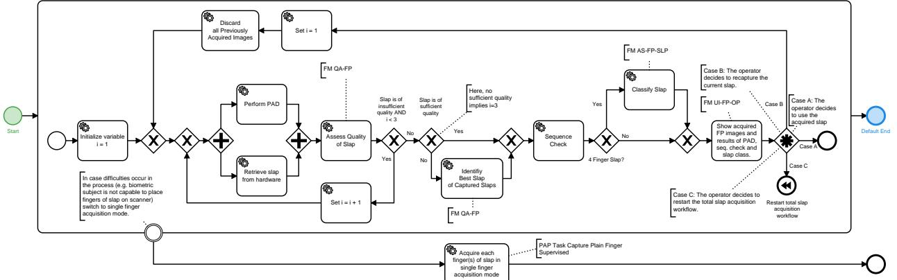

# BSI Technical Guideline TR-03121-3

# Biometrics for Public Sector Applications

Part 3: Application Profiles, Function Modules and Processes

Volume 2: Enrolment Scenarios for Identity Documents

Version 5.2.1

Federal Office for Information Security PO Box 20 03 63 53133 Bonn E-Mail: [TRBiometrics@bsi.bund.de](mailto:TRBiometrics@bsi.bund.de) Internet:<https://bsi.bund.de> © Federal Office for Information Security 2022

# Table of Content

| 1    | Volume Enrolment Scenarios of Identity Documents  1                                                                   |  |  |
|------|-----------------------------------------------------------------------------------------------------------------------------|--|--|
| 2    | Application Profiles  2                                                                                               |  |  |
| 2.1  | Application Profile German Electronic Passport  2                                                                     |  |  |
| 2.2  | Application Profile German Identity Card  8                                                                           |  |  |
| 2.3  | Application Profile German Electronic Residence Permit  14                                                            |  |  |
| 3    | Partial Application Processes  21                                                                                     |  |  |
| 3.1  | PAP ACQ-FI-SV-1: Supervised Facial Image Acquisition by Scanned Image  21                                             |  |  |
| 3.2  | PAP ACQ-FP2P-SV-2: Supervised Acquisition of Two Plain Fingerprints on Single-Finger Hard ware for Enrolment  21   |  |  |
| 3.3  | PAP ACQ-FP2P-SV-1: Supervised Acquisition of Two Plain Fingerprints on Multi-Finger Hard ware for Enrolment  23    |  |  |
| 3.4  | PAP ACQ-FP2P-USV-2: Unsupervised Acquisition of Two Plain Fingerprints on Single-Finger Hardware for Enrolment  26 |  |  |
| 3.5  | PAP ACQ-FP2P-USV-1: Unsupervised Acquisition of Two Plain Fingerprints on Multi-Finger Hardware for Enrolment  28  |  |  |
| 4    | Function Modules  31                                                                                                  |  |  |
| 4.1  | FM Category Acquisition Hardware  31                                                                                  |  |  |
| 4.2  | FM Category Acquisition Software  35                                                                                  |  |  |
| 4.3  | FM Category Biometric Image Processing  36                                                                            |  |  |
| 4.4  | FM Category Quality Assessment  37                                                                                    |  |  |
| 4.5  | FM Category Presentation Attack Detection  44                                                                         |  |  |
| 4.6  | FM Category Compression  47                                                                                           |  |  |
| 4.7  | FM Category Operation  48                                                                                             |  |  |
| 4.8  | FM Category User Interface  49                                                                                        |  |  |
| 4.9  | FM Category Reference Storage  52                                                                                     |  |  |
| 4.10 | FM Category Biometric Comparison  52                                                                                  |  |  |
| 4.11 | FM Category Logging  53                                                                                               |  |  |
| 4.12 | FM Category Coding  60                                                                                                |  |  |
| 4.13 | FM Category Evaluation  64                                                                                            |  |  |
|      | List of Abbreviations  143                                                                                            |  |  |
|      | Bibliography  144                                                                                                     |  |  |

# List of figures

| 2.1. | Overview Process Biometric Application German ePass                                                                             | 2  |
|------|---------------------------------------------------------------------------------------------------------------------------------|----|
| 2.2. | Facial Image Acquisition Process by Scan of Photograph                                                                       | 3  |
| 2.3. | Facial Image Acquisition Process by an Unsupervised Self-Service System                                                      | 4  |
| 2.4. | Facial Image Acquisition Process in Studio Set-up by Official                                                                | 4  |
| 2.5. | Facial Image Acquisition Process by Digital Transmission of the Photograph                                                   | 5  |
| 2.6. | Fingerprint Acquisition by Supervised Live Enrolment                                                                         | 6  |
| 2.7. | Fingerprint Acquisition Process by Unsupervised Self-Service Live Enrolment                                                  | 6  |
| 2.8. | Overview Process Biometric Application German Identity Card                                                                  | 8  |
| 2.9. | Facial Image Acquisition Process by Scan of Photograph                                                                       | 9  |
|      | 2.10.Facial Image Acquisition Process by an Unsupervised Self-Service System                                                 | 10 |
|      | 2.11.Facial Image Acquisition Process in Studio Set-up by Official                                                           | 10 |
|      | 2.12.Facial Image Acquisition Process by Digital Transmission of the Photograph                                              | 11 |
|      | 2.13.Fingerprint Acquisition by Supervised Live Enrolment                                                                    | 12 |
|      | 2.14.Fingerprint Acquisition Process by Unsupervised Self-Service Live Enrolment                                             | 12 |
|      | 2.15.Overview Process Biometric Application German Electronic Residence Permit                                               | 14 |
|      | 2.16.Facial Image Acquisition Process by Scan of Photograph                                                                  | 15 |
|      | 2.17.Facial Image Acquisition Process by an Unsupervised Self-Service System                                                 | 16 |
|      | 2.18.Facial Image Acquisition Process in Studio Set-up by Official                                                           | 16 |
|      | 2.19.Facial Image Acquisition Process by Digital Transmission of the Photograph                                              | 17 |
|      | 2.20.Fingerprint Acquisition by Supervised Live Enrolment                                                                    | 18 |
|      | 2.21.Fingerprint Acquisition Process by Unsupervised Self-Service Live Enrolment                                             | 18 |
| 3.1. | Partial Application Process "Supervised Facial Image Acquisition by Scanned Image"                                           | 21 |
| 3.2. | Partial Application Process "Supervised Acquisition of Two Plain Fingerprints on Single-Finger Hard ware for Enrolment"   | 22 |
| 3.3. | Partial Application Process Task "Capture Plain Fingerprint Supervised"                                                      | 23 |
| 3.4. | Partial Application Process "Supervised Acquisition of Two Plain Fingerprints on Multi-Finger Hard ware for Enrolment"    | 24 |
| 3.5. | Partial Application Process Task "Capture Slap Supervised"                                                                   | 25 |
| 3.6. | Partial Application Process Task "Capture Plain Fingerprint Supervised"                                                      | 26 |
| 3.7. | Partial Application Process "Unsupervised Acquisition of Two Plain Fingerprints on Single-Finger Hardware for Enrolment"  | 27 |
| 3.8. | Partial Application Process Task "Capture Plain Fingerprint Unsupervised"                                                    | 28 |

| 3.9. | Partial Application Process "Unsupervised Acquisition of Two Plain Fingerprints on Multi-Finger Hard ware for Enrolment"  | 29  |
|------|---------------------------------------------------------------------------------------------------------------------------------|-----|
|      | 3.10.Partial Application Process Task "Capture Slap Unsupervised"                                                            | 30  |
| 4.1. | Example Heat Map                                                                                                             | 68  |
| 4.2. | Example Box Plot                                                                                                             | 69  |
| 4.3. | Example Scatter Plot                                                                                                         | 70  |
| 4.4. | Example Line Plot                                                                                                            | 71  |
| 4.5. | Example Histogram Plot                                                                                                       | 72  |
| 4.6. | Example Histogram with Empirical Cumulative Distribution Function                                                            | 73  |
| 4.7. | Example Bar Plot                                                                                                             | 74  |
| 4.8. | Example Horizontal Stacked Bar Plot                                                                                          | 75  |
| 4.9. | Example Vertical Stacked Bar Plot                                                                                            | 75  |
|      | 4.10.Example Grouped Bar Plot                                                                                                | 76  |
|      | 4.11.Example Table with Alternation Background Colour                                                                        | 76  |
|      | 4.12.Example Line Plot Number of Acquisition Processes                                                                       | 85  |
|      | 4.13.Example Histogram Finger Identification Process Duration                                                                | 87  |
|      | 4.14.Example Stacked Bar Plot Global Identification Process Result                                                           | 90  |
|      | 4.15.Example Histogram Finger Identification Candidate's Achieved FMR                                                        | 91  |
|      | 4.16.Example Histogram Number of Applications                                                                                | 92  |
|      | 4.17.Example Stacked Bar Plot Global Single Verification Process Result                                                      | 93  |
|      | 4.18.Example Histogram Single Verification Achieved FMR                                                                      | 94  |
|      | 4.19.Example Histogram Single Verification Process Duration                                                                  | 96  |
|      | 4.20.Heat Map Facial Image Acquisitions by Software                                                                          | 98  |
|      | 4.21.Heat Map Facial Image Acquisitions by Hardware                                                                          | 99  |
|      | 4.22.Example Stacked Bar Plot Total Facial Image Quality                                                                     | 100 |
|      | 4.23.Example Stacked Bar Plot Acceptability of Facial Images by Quality Metrics                                              | 101 |
|      | 4.24.Example Stacked Bar Plot Total Central Facial Image Quality                                                             | 103 |
|      | 4.25.Example Stacked Bar Plot Central Acceptability of Facial Images by Quality Metrics                                      | 104 |
|      | 4.26.Heat Map Finger Acquisitions by Software                                                                                | 106 |
|      | 4.27.Heat Map Finger Acquisitions by Hardware                                                                                | 107 |
|      | 4.28.Example Stacked Bar Plot Number of Finger Captures                                                                      | 108 |
|      | 4.29.Example Heat Map Number of Finger Captures by Time                                                                      | 110 |

| 4.30.Example Stacked Bar Plot Number of Finger Captures by Finger Plot                  | 111 |
|--------------------------------------------------------------------------------------------|-----|
| 4.31.Example Stacked Bar Rejection Reasons of Finger Capture Attempts                   | 112 |
| 4.32.Example Stacked Bar Rejection Reasons of Finger Capture Attempts by Finger         | 113 |
| 4.33.Example Stacked Bar Success Rate of Finger Capture Attempts                        | 114 |
| 4.34.Example Stacked Bar Success Rate of Finger Capture Attempts by Finger              | 116 |
| 4.35.Example Histogram Number of Finger Capture Attempts per Applicant                  | 117 |
| 4.36.Example Stacked Bar Plot Relative Finger Quality Assessment Errors                 | 118 |
| 4.37.Example Histogram NFIQ 2.0 Fingerprint Image Quality                               | 119 |
| 4.38.Example Box Plot NFIQ 2.0 Fingerprint Image Quality Finger Comparison              | 120 |
| 4.39.Example Histogram Finger Capture Duration per Finger                               | 122 |
| 4.40.Example Box Plot Finger Capture Duration Comparison                                | 123 |
| 4.41.Example Stacked Bar Plot Relative Frequencies of Applicants with a Missing Finger  | 124 |
| 4.42.Example Stacked Bar Plot Relative Frequencies Missing Finger Reason                | 125 |
| 4.43.Example Histogram Number of Missing Fingers                                        | 126 |
| 4.44.Example Stacked Bar Plot Relative Frequencies Missing Fingers                      | 127 |
| 4.45.Example Stacked Bar Finger Acquisitions With Sequence Errors                       | 128 |
| 4.46.Example Histogram Number of Sequence Errors                                        | 129 |
| 4.47.Example Stacked Bar Finger Acquisitions With Segmentation Errors                   | 130 |
| 4.48.Example Stacked Bar Uniqueness Check Errors per Finger Acquisition                 | 131 |
| 4.49.Example Stacked Bar Finger Duplicates                                              | 131 |
| 4.50.Example Stacked bar plot finger quality errors                                     | 133 |
| 4.51.Example Histogram NFIQ 2.0 Fingerprint Image Quality                               | 134 |
| 4.52.Example Box plot NFIQ 2.0 fingerprint image quality comparison by finger           | 135 |
| 4.53.Example Stacked Bar Plot Fingerprint Capture Allowed                               | 136 |
| 4.54.Example Stacked Bar Plot Fingerprint Exclude Option                                | 138 |
| 4.55.Example Stacked Bar Finger Acquisitions with Presentation Attack Detection         | 140 |
| 4.56.Example Histogram Number of Presentation Attack Detection Scores                   | 142 |

# 1 Volume Enrolment Scenarios of Identity Documents

This document defines Application Profiles for the enrolment of biometric data specific Identity Docu ments, namely the electronic Passport, German Identity Card and Electronic Residence Per mit.

Note, that with this version only certifications valid until April 30, 2025 will be issued.

# 2 Application Profiles

# 2.1 Application Profile German Electronic Passport

The following Application Profile describes the biometric application process for a German [Electronic](#page-150-1) [Passport \(ePass\).](#page-150-1)

The requirements for the application of a German [ePass](#page-150-1) are determined by the [\[BIB\\_PassG\],](#page-151-1) which mandates biometric characteristics to be included in the chip of the German Electronic Passport. These requirements are based on the EU regulation 2252/2004, refer to [\[BIB\\_EC\\_2252/2004\].](#page-151-2)

By legal requirements, the inclusion of a facial image is mandatory, the inclusion of fingerprints for persons up to the age of six is not allowed but is mandatory for applicants older than six.

# 2.1.1 Mandatory Process

For the application of a German electronic passport a facial image as well as two fingerprints of the applicant have to be captured electronically[1](#page-9-3) . This is done in accordance with [FM Category Acquisition Hardware](#page-38-2), [FM Category Acquisition Software](#page-42-0) and [FM Category Biometric Image Processing](#page-43-1).

The resulting biometric data of the facial image and fingerprints can be reduced in size by lossy compression. However, multiple lossy compressions SHALL NOT be allowed. For facial images software-based quality as surance SHALL be conducted on the processed and compressed image data. For fingerprints, the compression SHALL be performed after the quality assurance process. The facial image and the fingerprint images as well as additional quality information, which is connected to the biometric data, SHALL be coded and then passed to the calling application.

Hereby, the facial image SHALL be passed to the calling application in two different encoding formats: The applying formats that SHALL be used for storing the facial image in passport and a local re ference storage ("Passregister", [\[BIB\\_PassG\]](#page-151-1), §21), are stated within [FM REF-FI-GID,](#page-59-2) [FM REF-FI-CHIP.](#page-59-3) [FM](#page-70-0) [COD-FI-GID](#page-70-0) contains general details on the XML encodings. The software-based quality assurance SHALL be conducted on basis of the processed and compressed images for storage in the chip of the passport.

# 2.1.1.1 Overview Process

[Figure 2.1](#page-9-2) depicts the biometric overview process of an application for a German [ePass](#page-150-1). The process depicted is for illustration purpose only. Note, that the following sections will detail this process for fingerprint and facial image acquisition.

**Figure 2.1.** Overview Process Biometric Application German [ePass](#page-150-1)

1 Furthermore a signature is captured, but this is not part of the description within TR Biometrics.

# 2.1.1.2 Facial Image Acquisition Process

The facial image acquisition application system SHALL implement one ore more of the processes defined by the following subsections:

- 1. scan-of-photograph process
- 2. live-enrolment process
- 3. BSI [\[BIB\\_TR-03146\]](#page-151-3) digital-transmission process

In any case, a quality assurance module (software) SHALL be used in the facial image acquisition process. In case a facial image is deemed non-compliant by the quality assurance module, the official SHALL make a final decision regarding exceptions (based on legal rules) for further processing.

The final facial image SHALL be transferred to the calling application twice in different formats, refer to [FM](#page-43-1) [Category Biometric Image Processing](#page-43-1), one image to be stored within the passport chip, and the other facial image to be stored within the local reference storage ("Passregister", refer to [\[BIB\\_PassG\] §21\). The software-ba](#page-151-1) sed quality assurance SHALL be conducted on basis of the processed and compressed images for storage in the chip of the passport.

### 2.1.1.2.1 Scan-of-Photograph Process

The facial image MAY be acquired by scanning a photograph which the applicant hands over to the official.

The photograph SHALL be compliant with the requirements for biometric images [\[BIB\\_ISO\\_FACE\]](#page-151-4). The offi cial manually verifies whether the photograph depicts the applicant. After the official visually inspected the facial image with the help of a photo guideline and, if needed, with the help of a photo template the facial image SHALL be scanned, refer to [FM QA-FI-PT](#page-45-0) and [FM QA-FI-PG.](#page-44-1) Afterwards, the facial image SHALL be processed by the quality assurance module (software).

[Figure 2.2](#page-10-0) depicts the facial image acquisition process by scanning a photograph which the applicant hands over to the official. The process is defined in detail by [PAP ACQ-FI-SV-1: Supervised Facial Image Acquisition](#page-28-4) [by Scanned Image.](#page-28-4)

**Figure 2.2.** Facial Image Acquisition Process by Scan of Photograph

#### 2.1.1.2.2 Live Enrolment Process

The facial image MAY be acquired live at a [self-service system \(SSS\)](#page-150-2) or in a studio set-up by the official.

# **Self-Service System**

[Figure 2.3](#page-11-0) depicts the overall facial image self-service acquisition process at the [SSS](#page-150-2) and the counter.

The facial image is acquired at the [SSS](#page-150-2). The official at the counter retrieves the acquired facial image.

The official SHALL verify the acquired facial image is of applicant at counter. software based qua lity metrics SHALL be displayed to the official. The official SHALL decide to accept or reject the facial image, i.e. he MAY follow the quality software decision or MAY overrule a negative software [Quality Assessment \(QA\)](#page-150-3) or MAY reject the facial image despite a positive software [QA](#page-150-3) .

[Section 4.5.2](#page-53-0) only applies for [SSS](#page-150-2) but not until May 2025.

**Figure 2.3.** Facial Image Acquisition Process by an Unsupervised Self-Service System

# **Studio Set-Up**

[Figure 2.4](#page-11-1) depicts the overall facial image acquisition process in a studio set-up by an official, refer to [FM](#page-38-3) [AH-FI-DC](#page-38-3) for the studio set-up requirements.

The facial image is acquired by the official with a digital camera. The software based quality metrics SHALL be determined and be displayed to the official. The official SHALL decide to accept or reject the facial image, i.e. the quality software decision MAY be followed or MAY be overruled in case of a negative software [QA](#page-150-3). In addition, the official MAY reject the facial image despite a positive software [QA](#page-150-3).

**Figure 2.4.** Facial Image Acquisition Process in Studio Set-up by Official

# 2.1.1.2.3 BSI TR-03146 Digital-Transmission Process

The facial image MAY be transmitted to the counter by a photographer.

[Figure 2.5](#page-12-0) depicts the facial image acquisition process whereby the facial image acquisition is conducted detached from the counter office and is electronically transferred to the official counter.

The image SHALL be acquired and compressed according to [FM Category Acquisition Hardware](#page-38-2), [FM Cate](#page-42-0) [gory Acquisition Software](#page-42-0), [FM Category Biometric Image Processing](#page-43-1) and [FM Category Compression befo](#page-54-1) re transferring. The electronic transmission of the image SHALL comply to [\[BIB\\_TR-03146\]. In order to gua](#page-151-3) rantee the connection between the facial image and the respective applicant, a manual verification SHALL be conducted by the official. In the successful case, the facial image SHALL be checked by the quality software. Finally, the operator SHALL have the option to give a veto in order to overrule the [QA](#page-150-3) software decision.

**Figure 2.5.** Facial Image Acquisition Process by Digital Transmission of the Photograph

### 2.1.1.3 Fingerprint Acquisition Process

The fingerprint acquisition application system SHALL implement one or more of the following live-enrol ment processes defined in the following subsections:

- 1. supervised live-enrolment process
- 2. unsupervised self-service live-enrolment process

#### 2.1.1.3.1 Supervised Live Enrolment Process

The fingerprint images MAY be acquired by a supervised acquisition process at the counter of the official.

[Figure 2.6 depicts the fingerprint acquisition process by a supervised at counter of offi](#page-13-0) cial. Depending on the type of fingerprint scanner at counter, detailed process is defined either detai led by [PAP ACQ-FP2P-SV-2: Supervised Acquisition of Two Plain Fingerprints on Single-Finger Hardware](#page-28-5) [for Enrolment](#page-28-5) or [PAP ACQ-FP2P-SV-1: Supervised Acquisition of Two Plain Fingerprints on Multi-Finger](#page-30-0) [Hardware for Enrolment.](#page-30-0)

**Figure 2.6.** Fingerprint Acquisition by Supervised Live Enrolment

#### 2.1.1.3.2 Unsupervised Self-Service Live Enrolment Process

The fingerprint images MAY be acquired by a unsupervised acquisition process at a [SSS](#page-150-2).

[Figure 2.7](#page-13-1) depicts the overall fingerprint acquisition process at the [SSS](#page-150-2) and the counter.

The fingerprint is acquired at the [SSS](#page-150-2). The official at the counter retrieves the acquired fingerprints.

The applicant's fingerprints which have been acquired at the [SSS SHALL additionally be acquired at the offi](#page-150-2) cial's desk for verification according to [FM Category Biometric Comparison.](#page-59-4) A verification comparison with the previously enrolled fingerprints at the [SSS](#page-150-2) SHALL be conducted. Thereby, it is ensured that the legitimated applicant's fingerprints have been captured at the live enrolment self-service station. In case the verification fails, the fingerprint enrolment SHALL be repeated at the official's desk.

**Figure 2.7.** Fingerprint Acquisition Process by Unsupervised Self-Service Live Enrolment

# 2.1.2 Relevant Standards and Conditions

In addition to the legal requirements (see above), further basic directives and standards SHALL be applicable:

- **•** [\[BIB\\_ICAO\\_9303\]](#page-151-5)
- **•** [\[BIB\\_ISO\\_FINGER\]](#page-151-6)
- **•** [\[BIB\\_ISO\\_FACE\]](#page-151-4)

# 2.1.3 Mandatory Function Modules

All Function Modules which SHALL be applied for the Application Profile are presented in [Table 2.1 where](#page-14-0) by slash-separated entries denote alternative Function Modules and comma-separated requi rements for all specified Function Modules.

| Module Category               | Required Function Modules                                                                                                                                                                                                                                               |
|-------------------------------|-------------------------------------------------------------------------------------------------------------------------------------------------------------------------------------------------------------------------------------------------------------------------|
| Acquisition Hardware          | FM AH-FI-FBS (for scan-of-photograph process) / FM AH-FI-DC (for live-enrol ment process using digital cameras) / FM AH-FI-ICS, FM AH-FI-SSS2 (for live-en rolment process using self-service systems) FM AH-FP-OPT (for Fingerprint Acqui sition) |
| Acquisition Software          | FM AS-FI-FBS/ FM AS-FI-DC , FM AS-FP-SF/ FM AS-FP-MF                                                                                                                                                                                                           |
| Biometric Image Processing    | FM BIP-FI-FBS/ FM BIP-FI-GID , FM BIP-FP-APP                                                                                                                                                                                                                      |
| Quality Assessment            | FM QA-FI-PG, FM QA-FI-PT, FM QA-FI-GENERIC, FM QA-FI-GID , FM QA FP-APP                                                                                                                                                                                  |
| Presentation Attack Detection | FM PAD-FP-APP, FM PAD-FI-APP1 (only applies for SSS but not until May 2025)                                                                                                                                                                                          |
| Compression                   | FM COM-FI-JP2, FM COM-FI-JPG , FM COM-FP-WSQR                                                                                                                                                                                                                     |
| Operation                     | FM O-ALL-USV , FM O-FI-ALL , FM O-FI-DC, FM O-FI-FBS , FM O-FP-ALL                                                                                                                                                                                          |
| User Interface                | FM UI-FI-OP, FM UI-FI-BSJ , FM UI-FP-OP, FM UI-FP-BSJ                                                                                                                                                                                                          |
| Reference Storage             | FM REF-FP-CHIP , FM REF-FI-GID, FM REF-FI-CHIP                                                                                                                                                                                                                    |
| Biometric Comparison          | FM CMP-FP-VER (for control verifications if using a self-service system for finger print acquisition)                                                                                                                                                                |
| Logging                       | FM LOG-ALL-GENERIC, FM LOG-ALL-GID , FM LOG-FI-GENERIC, FM LOG FI-GID , FM LOG-FP-GENERIC, FM LOG-FP-GID                                                                                                                                              |
| Coding                        | FM COD-ALL-GID, FM COD-FI-GID, FM COD-FP-GID                                                                                                                                                                                                                      |
| Evaluation                    | FM EVA-ALL-GID , FM EVA-FI-GID , FM EVA-FP-GID                                                                                                                                                                                                                    |

**Table 2.1** Required Function Modules Application Profile German Electronic Passport

# 2.1.4 Mandatory Partial Application Processes

All Partial Application Processes which SHALL be applied for the Application Profile are presented in [Ta](#page-14-1) [ble 2.2](#page-14-1) whereby slash-separated entries denote alternative Partial Application Processes and comma-separa ted entries denote requirements for all specified Partial Application Processes.

| No.    | Required Partial Application Process                                                                                                                                                                                              |
|--------|-----------------------------------------------------------------------------------------------------------------------------------------------------------------------------------------------------------------------------------|
| 1 2 | PAP ACQ-FI-SV-1: Supervised Facial Image Acquisition by Scanned Image                                                                                                                                                             |
| 2      | PAP ACQ-FP2P-SV-2: Supervised Acquisition of Two Plain Fingerprints on Single-Finger Hard ware for Enrolment/ PAP ACQ-FP2P-SV-1: Supervised Acquisition of Two Plain Fingerprints on Multi-Finger Hardware for Enrolment |

2 Note, as alternative the defined processes of the application profile are allowed. However, for these no dedicated Partial Application Processes exist.

| No. | Required Partial Application Process                                                                                                                                                                                                                           |
|-----|----------------------------------------------------------------------------------------------------------------------------------------------------------------------------------------------------------------------------------------------------------------|
| 3   | PAP ACQ-FP2P-USV-2: Unsupervised Acquisition of Two Plain Fingerprints on Single-Finger Hardware for Enrolment/ PAP ACQ-FP2P-USV-1: Unsupervised Acquisition of Two Plain Finger prints on Multi-Finger Hardware for Enrolment (if a SSS is deployed) |

**Table 2.2** Required Partial Application Processes Application Profile German Electronic Passport

# 2.2 Application Profile German Identity Card

The following Application Profile describes the biometric application process for a German Identity Card.

The requirements for the application of an electronic German Identity Card are determined by the [\[BIB\\_PAuswG\]](#page-151-7), which mandates biometric characteristics to be included in the chip of the German Identity Card. By legal requirements, the inclusion of a facial image is mandatory, the inclusion of fingerprints for persons up to the age of six is not allowed. The inclusion of fingerprints for applicants older than six years is mandatory since 02.08.2021.

# 2.2.1 Mandatory Process

For the application of a German Identity Card facial image as well two fingerprints (optional) appli cant have to be captured electronically[3](#page-15-2) . This is done in accordance with [FM Category Acquisition Hardware](#page-38-2), [FM Category Acquisition Software](#page-42-0) and [FM Category Biometric Image Processing](#page-43-1).

The resulting biometric data of the facial image and fingerprints can be reduced in size by lossy compression. However, multiple lossy compressions SHALL NOT be allowed. For facial images software-based quality as surance SHALL be conducted on the processed and compressed image data. For fingerprints, the compression SHALL be performed after the quality assurance process. The facial image and the fingerprint images as well as additional quality information, which is connected to the biometric data, SHALL be coded and then passed to the calling application.

Hereby, the facial image SHALL be passed to the calling application in two different encoding formats: The first format SHALL be used for storing the facial image in the passport, the second format SHALL be used for storing in a local reference storage ("Personalausweisregister", [\[BIB\\_PAuswG\],](#page-151-7) §23), refer to [FM COM-FI-](#page-54-3)[JPG](#page-54-3), [FM COM-FI-JP2](#page-54-2) and [FM COD-FI-GID](#page-70-0) for details on the encodings etc. The software-based quality assurance SHALL be conducted on basis of the processed and compressed images for storage on the chip of the identity card.

# 2.2.1.1 Overview Process

[Figure 2.8](#page-15-1) depicts the biometric overview process of an application for a German Identity Card. The process depicted is for illustration purpose only. Note, that the following section will detail this process for fingerprint and facial image acquisition.

**Figure 2.8.** Overview Process Biometric Application German Identity Card

3 Furthermore a signature is captured, too, but this is not part of the description within TR Biometrics.

# 2.2.1.2 Facial Image Acquisition Process

The facial image acquisition application system SHALL implement one ore more of the processes defined by the following subsections:

- 1. scan-of-photograph process
- 2. live-enrolment process
- 3. BSI [\[BIB\\_TR-03146\]](#page-151-3) digital-transmission process

In any case, a quality assurance module (software) SHALL be used in the facial image acquisition process. In case a facial image is deemed non-compliant by the quality assurance module, the official SHALL make a final decision regarding exceptions (based on legal rules) for further processing.

The final facial image SHALL be transferred to the calling application twice in different formats, one image to be stored within the passport chip, and the other facial image to be stored within the local reference storage ("Passregister", refer to [\[BIB\\_PAuswG\]](#page-151-7) §23). The software-based quality assurance SHALL be conducted on basis of the processed and compressed images for storage on the chip of the identity card.

### 2.2.1.2.1 Scan-of-Photograph Process

The facial image MAY be acquired by scanning a photograph which the applicant hands over to the official.

The photograph SHALL be compliant with the requirements for biometric images [\[BIB\\_ISO\\_FACE\]](#page-151-4). The offi cial manually verifies whether the photograph depicts the applicant. After the official visually inspected the facial image with the help of a photo guideline and, if needed, with the help of a photo template the facial image SHALL be scanned, refer to [FM QA-FI-PT](#page-45-0) and [FM QA-FI-PG.](#page-44-1) Afterwards, the facial image SHALL be processed by the quality assurance module (software).

[Figure 2.9](#page-16-0) depicts the facial image acquisition process by scanning a photograph which the applicant hands over to the official. The process is defined in detail by [PAP ACQ-FI-SV-1: Supervised Facial Image Acquisition](#page-28-4) [by Scanned Image.](#page-28-4)

**Figure 2.9.** Facial Image Acquisition Process by Scan of Photograph

# 2.2.1.2.2 Live Enrolment Process

The facial image MAY be acquired live at a [SSS](#page-150-2) or in a studio set-up by the official.

# **Self-Service System**

[Figure 2.10](#page-17-0) depicts the overall facial image self-service acquisition process at the [SSS](#page-150-2) and the counter.

The facial image is acquired at the [SSS](#page-150-2). The official at the counter retrieves the acquired facial image.

The official SHALL verify the acquired facial image is of applicant at counter. software based qua lity metrics SHALL be displayed to the official. The official SHALL decide to accept or reject the facial image, i.e. he MAY follow the quality software decision or MAY overrule a negative software [QA](#page-150-3) or MAY reject the facial image despite a positive software [QA.](#page-150-3)

[Section 4.5.2](#page-53-0) only applies for [SSS](#page-150-2) but not until May 2025.

**Figure 2.10.** Facial Image Acquisition Process by an Unsupervised Self-Service System

# **Studio Set-Up**

[Figure 2.11](#page-17-1) depicts the overall facial image acquisition process in a studio set-up by an official, refer to [FM](#page-38-3) [AH-FI-DC](#page-38-3) for the studio set-up requirements.

The facial image is acquired by the official with a digital camera. The software based quality metrics SHALL be determined and be displayed to the official. The official SHALL decide to accept or reject the facial image, i.e. the quality software decision MAY be followed or MAY be overruled in case of a negative software [QA](#page-150-3). In addition, the official MAY reject the facial image despite a positive software [QA](#page-150-3).

**Figure 2.11.** Facial Image Acquisition Process in Studio Set-up by Official

# 2.2.1.2.3 BSI TR-03146 Digital-Transmission Process

The facial image MAY be transmitted to the counter by a photographer.

[Figure 2.12](#page-18-0) depicts the facial image acquisition process whereby the facial image acquisition is conducted detached from the counter office and is electronically transferred to the official counter.

The image SHALL be acquired and compressed according to [FM Category Acquisition Hardware](#page-38-2), [FM Cate](#page-42-0) [gory Acquisition Software](#page-42-0), [FM Category Biometric Image Processing](#page-43-1) and [FM Category Compression befo](#page-54-1) re transferring. The electronic transmission of the image SHALL comply to [\[BIB\\_TR-03146\]. In order to gua](#page-151-3) rantee the connection between the facial image and the respective applicant, a manual verification SHALL be conducted by the official. In the successful case, the facial image SHALL be checked by the quality software. Finally, the operator SHALL have the option to give a veto in order to overrule the [QA](#page-150-3) software decision.

**Figure 2.12.** Facial Image Acquisition Process by Digital Transmission of the Photograph

# 2.2.1.3 Fingerprint Acquisition Process

The fingerprint acquisition application system SHALL implement one or more of the following live-enrol ment processes defined in the following subsections:

- 1. supervised live-enrolment process
- 2. unsupervised self-service live-enrolment process

#### 2.2.1.3.1 Supervised Live Enrolment Process

The fingerprint images MAY be acquired by a supervised acquisition process at the counter of the official.

[Figure 2.13 depicts the fingerprint acquisition process by a supervised at counter of offi](#page-19-0) cial. Depending on the type of fingerprint scanner at counter, detailed process is defined either detai led by [PAP ACQ-FP2P-SV-2: Supervised Acquisition of Two Plain Fingerprints on Single-Finger Hardware](#page-28-5) [for Enrolment](#page-28-5) or [PAP ACQ-FP2P-SV-1: Supervised Acquisition of Two Plain Fingerprints on Multi-Finger](#page-30-0) [Hardware for Enrolment.](#page-30-0)

**Figure 2.13.** Fingerprint Acquisition by Supervised Live Enrolment

#### 2.2.1.3.2 Unsupervised Self-Service Live Enrolment Process

The fingerprint images MAY be acquired by a unsupervised acquisition process at a [SSS](#page-150-2).

[Figure 2.14](#page-19-1) depicts the overall fingerprint acquisition process at the [SSS](#page-150-2) and the counter.

The fingerprint is acquired at the [SSS](#page-150-2). The official at the counter retrieves the acquired fingerprints.

The applicant's fingerprints which have been acquired at the [SSS SHALL additionally be acquired at the offi](#page-150-2) cial's desk for verification according to [FM Category Biometric Comparison.](#page-59-4) A verification comparison with the previously enrolled fingerprints at the [SSS](#page-150-2) SHALL be conducted. Thereby, it is ensured that the legitimated applicant's fingerprints have been captured at the live enrolment self-service station. In case the verification fails, the fingerprint enrolment SHALL be repeated at the official's desk.

**Figure 2.14.** Fingerprint Acquisition Process by Unsupervised Self-Service Live Enrolment

# 2.2.2 Relevant Standards and Conditions

In addition to the legal requirements (see above), further basic directives and standards SHALL be applicable:

- **•** [\[BIB\\_ICAO\\_9303\]](#page-151-5)
- **•** [\[BIB\\_ISO\\_FINGER\]](#page-151-6)
- **•** [\[BIB\\_ISO\\_FACE\]](#page-151-4)

# 2.2.3 Mandatory Function Modules

All Function Modules which SHALL be applied for the Application Profile are presented in [Table 2.3 where](#page-20-0) by slash-separated entries denote alternative Function Modules and comma-separated requi rements for all specified Function Modules.

| Module Category               | Required Function Modules                                                                                                                                                                                                                                               |
|-------------------------------|-------------------------------------------------------------------------------------------------------------------------------------------------------------------------------------------------------------------------------------------------------------------------|
| Acquisition Hardware          | FM AH-FI-FBS (for scan-of-photograph process) / FM AH-FI-DC (for live-enrol ment process using digital cameras) / FM AH-FI-ICS, FM AH-FI-SSS2 (for live-en rolment process using self-service systems) FM AH-FP-OPT (for Fingerprint Acqui sition) |
| Acquisition Software          | FM AS-FI-FBS/ FM AS-FI-DC, FM AS-FP-SF/ FM AS-FP-MF                                                                                                                                                                                                            |
| Biometric Image Processing    | FM BIP-FI-FBS/ FM BIP-FI-GID, FM BIP-FP-APP                                                                                                                                                                                                                       |
| Quality Assessment            | FM QA-FI-PG, FM QA-FI-PT, FM QA-FI-GENERIC, FM QA-FI-GID, FM QA FP-APP                                                                                                                                                                                   |
| Presentation Attack Detection | FM PAD-FP-APP, FM PAD-FI-APP1 (only applies for SSS but not until May 2025)                                                                                                                                                                                          |
| Compression                   | FM COM-FI-JP2, FM COM-FI-JPG, FM COM-FP-WSQR                                                                                                                                                                                                                      |
| Operation                     | FM O-ALL-USV, FM O-FI-ALL, FM O-FI-DC, FM O-FI-FBS, FM O-FP-ALL                                                                                                                                                                                             |
| User Interface                | FM UI-FI-OP, FM UI-FI-BSJ, FM UI-FP-OP, FM UI-FP-BSJ                                                                                                                                                                                                           |
| Reference Storage             | FM REF-FP-CHIP, FM REF-FI-GID, FM REF-FI-CHIP                                                                                                                                                                                                                     |
| Biometric Comparison          | FM CMP-FP-VER (for control verifications if using a self-service system for finger print acquisition)                                                                                                                                                                |
| Logging                       | FM LOG-ALL-GENERIC, FM LOG-ALL-GID, FM LOG-FI-GENERIC, FM LOG FI-GID, FM LOG-FP-GENERIC, FM LOG-FP-GID                                                                                                                                                |
| Coding                        | FM COD-ALL-GID, FM COD-FI-GID, FM COD-FP-GID                                                                                                                                                                                                                      |
| Evaluation                    | FM EVA-ALL-GID, FM EVA-FI-GID, FM EVA-FP-GID                                                                                                                                                                                                                      |

**Table 2.3** Required Function Modules Application Profile German Identity Card

# 2.2.4 Mandatory Partial Application Processes

All Partial Application Processes which SHALL be applied for the Application Profile are presented in [Ta](#page-20-1) [ble 2.4](#page-20-1) whereby slash-separated entries denote alternative Partial Application Processes and comma-separa ted entries denote requirements for all specified Partial Application Processes.

| No.    | Required Partial Application Process                                                                                                                                                                                              |
|--------|-----------------------------------------------------------------------------------------------------------------------------------------------------------------------------------------------------------------------------------|
| 1 4 | PAP ACQ-FI-SV-1: Supervised Facial Image Acquisition by Scanned Image                                                                                                                                                             |
| 2      | PAP ACQ-FP2P-SV-2: Supervised Acquisition of Two Plain Fingerprints on Single-Finger Hard ware for Enrolment/ PAP ACQ-FP2P-SV-1: Supervised Acquisition of Two Plain Fingerprints on Multi-Finger Hardware for Enrolment |

4 Note, as alternative the defined processes of the application profile are allowed. However, for these no dedicated Partial Application Processes exist.

| No. | Required Partial Application Process                                                                                                                                                                                                                           |
|-----|----------------------------------------------------------------------------------------------------------------------------------------------------------------------------------------------------------------------------------------------------------------|
| 3   | PAP ACQ-FP2P-USV-2: Unsupervised Acquisition of Two Plain Fingerprints on Single-Finger Hardware for Enrolment/ PAP ACQ-FP2P-USV-1: Unsupervised Acquisition of Two Plain Fin gerprints on Multi-Finger Hardware for Enrolment (if a SSS is deployed) |

**Table 2.4** Required Partial Application Processes Application Profile German Identity Card

# 2.3 Application Profile German Electronic Residence Permit

The following Application Profile describes the application for a German Electronic Residence Permit.

The requirements for the application of a German Electronic Residence Permit are determined by the [\[BIB\\_AufenthG\]](#page-151-8), which mandates biometric characteristics to be included in the chip of German Electro nic Residence Permit. These requirements are based on [\[BIB\\_EC\\_1030\\_2002\].](#page-151-9)

By legal requirements, the inclusion of a facial image is mandatory, the inclusion of fingerprints for persons up to the age of six is not allowed but is mandatory for applicants older than six.

# 2.3.1 Mandatory Process

For the application of a German Electronic Residence Permit a facial image as well as two fingerprints of the applicant have to be captured electronically[5](#page-21-2) . This is done in accordance with [FM Category Acquisition](#page-38-2) [Hardware](#page-38-2), [FM Category Acquisition Software](#page-42-0) and [FM Category Biometric Image Processing](#page-43-1).

The resulting biometric data of the facial image and fingerprints can be reduced in size by lossy compression. However, multiple lossy compressions SHALL NOT be allowed. For facial images software-based quality as surance SHALL be conducted on the processed and compressed image data. For fingerprints, the compression SHALL be performed after the quality assurance process. The facial image and the fingerprint images as well as additional quality information, which is connected to the biometric data, SHALL be coded and then passed to the calling application.

#### 2.3.1.1 Overview Process

[Figure 2.15](#page-21-1) depicts the biometric overview process of an application for a German Residence Permit. The process depicted is for illustration purpose only. Note, that the following section will detail this process for fingerprint and facial image acquisition.

**Figure 2.15.** Overview Process Biometric Application German Electronic Residence Permit

# 2.3.1.2 Facial Image Acquisition Process

The facial image acquisition application system SHALL implement one ore more of the processes defined by the following subsections:

1. scan-of-photograph process

5 Furthermore a signature is captured, too, but this is not part of the description within TR Biometrics.

- 2. live-enrolment process
- 3. BSI [\[BIB\\_TR-03146\]](#page-151-3) digital-transmission process

In any case, a quality assurance module (software) in the facial image acquisition process SHALL be used. In case a facial image is deemed non-compliant by the quality assurance module, the official SHALL make a final decision regarding exceptions (based on legal rules) for further processing.

#### 2.3.1.2.1 Scan-of-Photograph Process

The facial image MAY be acquired by scanning a photograph which the applicant hands over to the official.

The photograph SHALL be compliant with the requirements for biometric images [\[BIB\\_ISO\\_FACE\]](#page-151-4). The offi cial manually verifies whether the photograph depicts the applicant. After the official visually inspected the facial image with the help of a photo guideline and, if needed, with the help of a photo template the facial image SHALL be scanned, refer to [FM QA-FI-PT](#page-45-0) and [FM QA-FI-PG.](#page-44-1) Afterwards, the facial image SHALL be processed by the quality assurance module (software).

[Figure 2.16](#page-22-0) depicts the facial image acquisition process by scanning a photograph which the applicant hands over to the official. The process is defined in detail by [PAP ACQ-FI-SV-1: Supervised Facial Image Acquisition](#page-28-4) [by Scanned Image.](#page-28-4)

**Figure 2.16.** Facial Image Acquisition Process by Scan of Photograph

#### 2.3.1.2.2 Live Enrolment Process

The facial image MAY be acquired live at a [SSS](#page-150-2) or in a studio set-up by the official.

# **Self-Service System**

[Figure 2.17](#page-23-0) depicts the overall facial image self-service acquisition process at the [SSS](#page-150-2) and the counter.

The facial image is acquired at the [SSS](#page-150-2). The official at the counter retrieves the acquired facial image.

At the counter, official SHALL verify acquired facial image is of applicant at counter. The soft ware based quality metrics SHALL be displayed to the official. The official SHALL decide to accept or reject the facial image, i.e. he MAY follow the quality software decision or MAY overrule a negative software [QA](#page-150-3) or MAY reject the facial image despite a positive software [QA.](#page-150-3)

[Section 4.5.2](#page-53-0) only applies for [SSS](#page-150-2) but not until May 2025.

**Figure 2.17.** Facial Image Acquisition Process by an Unsupervised Self-Service System

# **Studio Set-Up**

[Figure 2.18](#page-23-1) depicts the overall facial image acquisition process in a studio set-up by an official, refer to [FM](#page-38-3) [AH-FI-DC](#page-38-3) for the studio set-up requirements.

The facial image is acquired by the official with a digital camera. The software based quality metrics SHALL be determined and be displayed to the official. The official SHALL decide to accept or reject the facial image, i.e. the quality software decision MAY be followed or MAY be overruled in case of a negative software [QA](#page-150-3). In addition, the official MAY reject the facial image despite a positive software [QA](#page-150-3).

**Figure 2.18.** Facial Image Acquisition Process in Studio Set-up by Official

# 2.3.1.2.3 BSI TR-03146 Digital-Transmission Process

The facial image MAY be transmitted to the counter by a photographer.

[Figure 2.19](#page-24-0) depicts the facial image acquisition process whereby the facial image acquisition is conducted detached from the counter office and is electronically transferred to the official counter.

The image SHALL be acquired and compressed according to [FM Category Acquisition Hardware](#page-38-2), [FM Cate](#page-42-0) [gory Acquisition Software](#page-42-0), [FM Category Biometric Image Processing](#page-43-1) and [FM Category Compression befo](#page-54-1) re transferring. The electronic transmission of the image SHALL comply to [\[BIB\\_TR-03146\]. In order to gua](#page-151-3) rantee the connection between the facial image and the respective applicant, a manual verification SHALL be conducted by the official. In the successful case, the facial image SHALL be checked by the quality software. Finally, the operator SHALL have the option to give a veto in order to overrule the [QA](#page-150-3) software decision.

**Figure 2.19.** Facial Image Acquisition Process by Digital Transmission of the Photograph

# 2.3.1.3 Fingerprint Acquisition Process

The fingerprint acquisition application system SHALL implement one or more of the following live-enrol ment processes defined in the following subsections:

- 1. supervised live-enrolment process
- 2. unsupervised self-service live-enrolment process

#### 2.3.1.3.1 Supervised Live Enrolment Process

The fingerprint images MAY be acquired by a supervised acquisition process at the counter of the official.

[Figure 2.20 depicts the fingerprint acquisition process by a supervised at counter of offi](#page-25-0) cial. Depending on the type of fingerprint scanner at counter, detailed process is defined either detai led by [PAP ACQ-FP2P-SV-2: Supervised Acquisition of Two Plain Fingerprints on Single-Finger Hardware](#page-28-5) [for Enrolment](#page-28-5) or [PAP ACQ-FP2P-SV-1: Supervised Acquisition of Two Plain Fingerprints on Multi-Finger](#page-30-0) [Hardware for Enrolment.](#page-30-0)

**Figure 2.20.** Fingerprint Acquisition by Supervised Live Enrolment

#### 2.3.1.3.2 Unsupervised Self-Service Live Enrolment Process

The fingerprint images MAY be acquired by a unsupervised acquisition process at a [SSS](#page-150-2).

[Figure 2.21](#page-25-1) depicts the overall fingerprint acquisition process at the [SSS](#page-150-2) and the counter.

The fingerprint is acquired at the [SSS](#page-150-2). The official at the counter retrieves the acquired fingerprints.

The applicant's fingerprints which have been acquired at the [SSS SHALL additionally be acquired at the offi](#page-150-2) cial's desk for verification according to [FM Category Biometric Comparison.](#page-59-4) A verification comparison with the previously enrolled fingerprints at the [SSS](#page-150-2) SHALL be conducted. Thereby, it is ensured that the legitimated applicant's fingerprints have been captured at the live enrolment self-service station. In case the verification fails, the fingerprint enrolment SHALL be repeated at the official's desk.

**Figure 2.21.** Fingerprint Acquisition Process by Unsupervised Self-Service Live Enrolment

# 2.3.2 Relevant Standards and Conditions

In addition to the legal requirements (see above), further basic directives and standards SHALL be applicable:

- **•** [\[BIB\\_ICAO\\_9303\]](#page-151-5)
- **•** [\[BIB\\_ISO\\_FINGER\]](#page-151-6)
- **•** [\[BIB\\_ISO\\_FACE\]](#page-151-4)

# 2.3.3 Mandatory Function Modules

All Function Modules which SHALL be applied for the Application Profile are presented in [Table 2.5 where](#page-26-0) by slash-separated entries denote alternative Function Modules and comma-separated requi rements for all specified Function Modules.

| Module Category               | Required Function Modules                                                                                                                                                                                                                                               |
|-------------------------------|-------------------------------------------------------------------------------------------------------------------------------------------------------------------------------------------------------------------------------------------------------------------------|
| Acquisition Hardware          | FM AH-FI-FBS (for scan-of-photograph process) / FM AH-FI-DC (for live-enrol ment process using digital cameras) / FM AH-FI-ICS, FM AH-FI-SSS2 (for live-en rolment process using self-service systems) FM AH-FP-OPT (for Fingerprint Acqui sition) |
| Acquisition Software          | FM AS-FI-FBS/ FM AS-FI-DC, FM AS-FP-SF/ FM AS-FP-MF                                                                                                                                                                                                            |
| Biometric Image Processing    | FM BIP-FI-FBS/ FM BIP-FI-GID, FM BIP-FP-APP                                                                                                                                                                                                                       |
| Quality Assessment            | FM QA-FI-PG, FM QA-FI-PT, FM QA-FI-GENERIC, FM QA-FI-GID, FM QA FP-APP                                                                                                                                                                                   |
| Presentation Attack Detection | FM PAD-FP-APP, FM PAD-FI-APP1 (only applies for SSS but not until May 2025)                                                                                                                                                                                          |
| Compression                   | FM COM-FI-JPG, FM COM-FP-WSQR                                                                                                                                                                                                                                        |
| Operation                     | FM O-ALL-USV, FM O-FI-ALL, FM O-FI-DC, FM O-FI-FBS, FM O-FP-ALL                                                                                                                                                                                             |
| User Interface                | FM UI-FI-OP, FM UI-FI-BSJ, FM UI-FP-OP, FM UI-FP-BSJ                                                                                                                                                                                                           |
| Reference Storage             | FM REF-FP-CHIP, FM REF-FI-CHIP                                                                                                                                                                                                                                       |
| Biometric Comparison          | FM CMP-FP-VER (for control verifications if using a self-service system for finger print acquisition)                                                                                                                                                                |
| Logging                       | FM LOG-ALL-GENERIC, FM LOG-ALL-GID, FM LOG-FI-GENERIC, FM LOG FI-GID, FM LOG-FP-GENERIC, FM LOG-FP-GID                                                                                                                                                |
| Coding                        | FM COD-ALL-GID, FM COD-FI-GID, FM COD-FP-GID                                                                                                                                                                                                                      |
| Evaluation                    | FM EVA-ALL-GID, FM EVA-FI-GID, FM EVA-FP-GID                                                                                                                                                                                                                      |

**Table 2.5** Required Function Modules Application Profile German Electronic Residence Permit

# 2.3.4 Mandatory Partial Application Processes

All Partial Application Processes which SHALL be applied for the Application Profile are presented in [Ta](#page-26-1) [ble 2.6](#page-26-1) whereby slash-separated entries denote alternative Partial Application Processes and comma-separa ted entries denote requirements for all specified Partial Application Processes.

| No.    | Required Partial Application Process                                                                                                                                                                                              |
|--------|-----------------------------------------------------------------------------------------------------------------------------------------------------------------------------------------------------------------------------------|
| 1 6 | PAP ACQ-FI-SV-1: Supervised Facial Image Acquisition by Scanned Image                                                                                                                                                             |
| 2      | PAP ACQ-FP2P-SV-2: Supervised Acquisition of Two Plain Fingerprints on Single-Finger Hard ware for Enrolment/ PAP ACQ-FP2P-SV-1: Supervised Acquisition of Two Plain Fingerprints on Multi-Finger Hardware for Enrolment |

6 Note, as alternative the defined processes of the application profile are allowed. However, for these no dedicated Partial Application Processes exist.

| No. | Required Partial Application Process                                                                                                                                                                                                                           |
|-----|----------------------------------------------------------------------------------------------------------------------------------------------------------------------------------------------------------------------------------------------------------------|
| 3   | PAP ACQ-FP2P-USV-2: Unsupervised Acquisition of Two Plain Fingerprints on Single-Finger Hardware for Enrolment/ PAP ACQ-FP2P-USV-1: Unsupervised Acquisition of Two Plain Fin gerprints on Multi-Finger Hardware for Enrolment (if a SSS is deployed) |

**Table 2.6** Required Partial Application Processes Application Profile German Electronic Residence Permit

# 3 Partial Application Processes

The [Partial Application Process \(PAP\)](#page-150-4) specified by the following sections provide process specifications of basic biometric processes, e.g. the acquisition, identification or verification of biometrics or the evaluation processes for verification and identification. The processes are referenced by the relevant Application Profiles and are part of the overall processes specified by the relevant Application Profiles.

A [PAP](#page-150-4) MAY also be a task. A task is a process which functions as a generic reusable building block which is used by another [PAP](#page-150-4) and is not referenced by an Application Profile directly.

The specific Function Modules that SHALL be implemented in the processes of this chapter are specified by the relevant Application Profiles.

# 3.1 PAP ACQ-FI-SV-1: Supervised Facial Image Acquisition by Scanned Image

The facial image acquisition process described by this section applies to supervised situations whe re the facial image is acquired by an operator scanning a printed image, refer to [Figure 3.1](#page-28-3).

A photo taken and printed by a photographer is provided by the biometric subject. At first, a visual check SHALL be performed by the operator, refer to [Section 4.7](#page-55-4) and [Section 4.4.](#page-44-0) The operator SHALL manually verify whether the photo depicts the biometric subject. Depending on the result of the visual inspection, the photo is rejected or accepted for further processing. In the successful case, the image SHALL be digitised with a scanner by the operator, refer to [Section 4.1](#page-38-2), [Section 4.2](#page-42-0) and [Section 4.3,](#page-43-1) and be compressed, refer to [Section 4.6.](#page-54-1) Afterwards, the scanned image SHALL be subject to quality assessment, refer to [Section 4.4](#page-44-0). Finally, the operator SHALL have the option, to give a veto in order to overrule the [QA](#page-150-3) software decision.

**Figure 3.1.** Partial Application Process "Supervised Facial Image Acquisition by Scanned Image"

In addition to the check by [QA](#page-150-3) software, the operator MAY verify the geometric features of the image using a photo template (one for adults and one for children), refer to [Section 4.4](#page-44-0). If the operator gives a veto (veto equals yes) a negative software decision of the quality assessment SHALL be overruled and the facial image SHALL be released. The operator SHALL in addition have the option to reject an image despite a positive software [QA](#page-150-3) decision.

The process SHALL be supervised by an operator.

# 3.2 PAP ACQ-FP2P-SV-2: Supervised Acquisition of Two Plain Fingerprints on Single-Finger Hardware for Enrolment

[Figure 3.2](#page-29-0) depicts the acquisition process for two finger enrolment on single finger hardware. Note, that the [PAP Task ACQ-FPP-SV-2: Capture Plain Fingerprint Supervised](#page-29-1) is used here.

The process SHALL be supervised by an operator.

**Figure 3.2.** Partial Application Process "Supervised Acquisition of Two Plain Fingerprints on Single-Finger Hardware for Enrolment"

# 3.2.1 PAP Task ACQ-FPP-SV-2: Capture Plain Fingerprint Supervised

[Figure 3.3](#page-30-1) depicts the basic supervised capture sequence for a plain fingerprint capture. A plain fingerprint capture can be part of more complex acquisition processes, e.g. a ten finger acquisition by the 4-1-4-1 capture sequence. The plain fingerprint capture is described in detail subsequently. quality assessment conduc ted according to the requirements of the applicable [FM Category Quality Assessment](#page-44-0).

- 1. The counter variable for the number of attempts for capturing the current slap SHALL be initialized as *i* = 0.
- 2. The fingerprint image SHALL be retrieved from hardware.
- 3. The fingerprint SHALL be assessed and the captured fingerprint and parameter data (e.g. quality values) SHALL be temporarily stored.
- 4. In case the quality requirements for the fingerprint is not met, the capture SHALL be repeated up to two times (i.e. the acquisition of a finger consists of a maximum of three capture attempts). The counter SHALL be set to *i* = *i* + 1.
- 5. A sequence check SHALL be conducted for the captured fingerprint image to detect the capture of wrong fingers, e.g. due to interchanged hands or multiple acquisition of the same hand finger. Note: It is RE COMMENDED to conduct the sequence check as early as possible after a fingerprint image is available.
- a. In case the comparison of current fingerprint with any previously captured is success ful, the sequence check SHALL report an error.
- b. In case the comparison of current fingerprint with any previously captured is not suc cessful, the sequence check SHALL NOT report an error.

If the quality check of the third capture attempt fails (counter *i* is set to 3), the best of the captured fingerprint images SHALL be identified according to the corresponding [QA](#page-150-3) Function Module and temporarily stored along with the corresponding information.

The process SHALL be supervised by an operator.

At the end of the process the operator decides on one of the three options:

- 1. Use the acquired fingerprint.
- 2. Recapture the current fingerprint. The counter SHALL be reset to *i* = 1.
- 3. Restart the total fingerprint acquisition workflow.

**Figure 3.3.** Partial Application Process Task "Capture Plain Fingerprint Supervised"

# 3.3 PAP ACQ-FP2P-SV-1: Supervised Acquisition of Two Plain Fingerprints on Multi-Finger Hardware for Enrolment

[Figure 3.4](#page-31-0) depicts the acquisition process for two finger enrolment on multi finger hardware. Note, that the [PAP Task ACQ-FPS-SV-1: Capture Slap Supervised](#page-31-1) is used here.

The process SHALL be supervised by an operator.

**Figure 3.4.** Partial Application Process "Supervised Acquisition of Two Plain Fingerprints on Multi-Finger Hardware for Enrolment"

# 3.3.1 PAP Task ACQ-FPS-SV-1: Capture Slap Supervised

[Figure 3.5](#page-32-0) depicts the basic process for a plain supervised slap capture. A plain slap capture can be part of more complex acquisition processes, e.g. a ten finger acquisition by the 4-1-4-1 capture sequence. The plain slap capture is subsequently described in detail. The quality assessment conducted according to the requi rements of the applicable [FM Category Quality Assessment](#page-44-0). Note, that the [PAP Task ACQ-FPP-SV-2: Cap](#page-29-1) [ture Plain Fingerprint Supervised](#page-29-1) is used here.

If the biometric subject is physically not capable to place all fingers of the slap on the capture hardware at the same time to achieve a good quality image, the operator can decide to capture each finger of the slap in single finger capture mode. This SHALL be possible during the entire process. Hereby, single finger capture mode refers to the [PAP Task ACQ-FPP-SV-2: Capture Plain Fingerprint Supervised](#page-29-1) as described below.

- 1. The counter variable for the number of attempts for capturing the current slap SHALL be initialized as *i* = 1.
- 2. The slap image SHALL be retrieved from hardware. While the image is retrieved from hardware, [presen](#page-150-5) [tation attack detection \(PAD\)](#page-150-5) SHALL be performed.
- 3. The fingerprints SHALL be segmented and each SHALL be assessed.
	- a. In case the quality of the fingerprints meets the quality requirements defined in the corresponding [QA](#page-150-3) Function Module, the captured slap and the set of segmented fingerprints and parameter data (e.g. quality values) SHALL be temporarily stored.
	- b. In case the quality requirements for one or more fingerprints of the slap are not met, the capture SHALL be repeated up to two times (i.e. the acquisition of a single slap consists of a maximum of three capture attempts). The counter SHALL be set to *i* = *i* + 1.
- 4. A sequence check SHALL be conducted for the captured slap image to detect the capture of wrong fingers, e.g. due to interchanged hands or multiple acquisition of the same hand finger. Note, that it is RECOM MENDED to conduct the sequence check as early as possible after a fingerprint image is available.
- a. In case the comparison of any fingerprint of the current slap with any previously accepted fingerprint of a previous slap is successful, the sequence check SHALL show a warning.
- b. In case the comparisons of all fingerprints of the current slap with all fingerprints of previous slaps are not successful, the sequence check SHALL NOT show a warning.
- 5. Generally, a slap classifier SHALL be used for the captured slap image to detect the capture of the wrong slap. It SHALL be configurable to switch the classifier off or in evaluation mode (logging of result wi thout showing the result/error to the operator). Note, that the slap classifier is only required for 4 finger slaps. Other acquisitions currently do not require the corresponding FM.
	- a. If the result of the classification concludes that the acquired slap mismatches the expected slap, an error SHALL be thrown.
	- b. If the result of the classification concludes that the acquired slap matches the expected slap, no error SHALL be thrown.

If the quality check of the third capture attempt fails (counter *i* is set to 3), the best of the captured slaps SHALL be identified according to the corresponding [QA](#page-150-3) Function Module and temporarily stored along with the corresponding information.

The process SHALL be supervised by an operator.

At the end of the process the operator decides on one of the three options:

- 1. Use the acquired slap.
- 2. Recapture the current slap. The counter SHALL be reset to *i* = 1.
- 3. Restart the total slap acquisition workflow.

At any point of the process the operator MAY decide to acquire any finger of the slap individually.

**Figure 3.5.** Partial Application Process Task "Capture Slap Supervised"

# 3.3.1.1 PAP Task ACQ-FPP-SV-2: Capture Plain Fingerprint Supervised

[Figure 3.3](#page-30-1) depicts the basic supervised capture sequence for a plain fingerprint capture. A plain fingerprint capture can be part of more complex acquisition processes, e.g. a ten finger acquisition by the 4-1-4-1 capture sequence. The plain fingerprint capture is described in detail subsequently. quality assessment conduc ted according to the requirements of the applicable [FM Category Quality Assessment](#page-44-0).

- 1. The counter variable for the number of attempts for capturing the current slap SHALL be initialized as *i* = 0.
- 2. The fingerprint image SHALL be retrieved from hardware.
- 3. The fingerprint SHALL be assessed and the captured fingerprint and parameter data (e.g. quality values) SHALL be temporarily stored.
- 4. In case the quality requirements for the fingerprint is not met, the capture SHALL be repeated up to two times (i.e. the acquisition of a finger consists of a maximum of three capture attempts). The counter SHALL be set to *i* = *i* + 1.
- 5. A sequence check SHALL be conducted for the captured fingerprint image to detect the capture of wrong fingers, e.g. due to interchanged hands or multiple acquisition of the same hand finger. Note: It is RE COMMENDED to conduct the sequence check as early as possible after a fingerprint image is available.
	- a. In case the comparison of current fingerprint with any previously captured is success ful, the sequence check SHALL report an error.
	- b. In case the comparison of current fingerprint with any previously captured is not suc cessful, the sequence check SHALL NOT report an error.

If the quality check of the third capture attempt fails (counter *i* is set to 3), the best of the captured fingerprint images SHALL be identified according to the corresponding [QA](#page-150-3) Function Module and temporarily stored along with the corresponding information.

The process SHALL be supervised by an operator.

At the end of the process the operator decides on one of the three options:

- 1. Use the acquired fingerprint.
- 2. Recapture the current fingerprint. The counter SHALL be reset to *i* = 1.
- 3. Restart the total fingerprint acquisition workflow.

**Figure 3.6.** Partial Application Process Task "Capture Plain Fingerprint Supervised"

# 3.4 PAP ACQ-FP2P-USV-2: Unsupervised Acquisition of Two Plain Fingerprints on Single-Finger Hardware for Enrolment

[Figure 3.7](#page-34-0) depicts the unsupervised acquisition process for two finger enrolment on single finger hardware. Note, that the [PAP Task ACQ-FPP-USV-1: Capture Plain Fingerprint Unsupervised](#page-34-1) as defined below is used here.

Note, in case the acquisition system is equipped with two single-fingerprint scanners, simultaneous ac quisition of two fingers with equal finger type from different hands (e.g. both index fingers) SHALL be allowed.

Note, in case a supervised acquisition at a supervised downstream system is possible, the implementation of the unsupervised process MAY only include flow of sufficient quality acquisitions and abort in case suffi cient quality is not yield. In this situation, the acquisition SHALL be conducted at the downstream supervised system.

**Figure 3.7.** Partial Application Process "Unsupervised Acquisition of Two Plain Fingerprints on Single-Finger Hardware for Enrolment"

# 3.4.1 PAP Task ACQ-FPP-USV-1: Capture Plain Fingerprint Unsupervised

[Figure 3.8](#page-35-1) depicts the basic process for a plain unsupervised fingerprint capture. A plain fingerprint capture can be part of more complex acquisition processes, e.g. a ten finger acquisition. The plain unsupervised fin gerprint capture is subsequently described in detail. The [QA](#page-150-3) is conducted according to the requirements of the applicable [Section 4.4.](#page-44-0)

- 1. The fingerprint image SHALL be retrieved from hardware.
- 2. The fingerprint SHALL be assessed.
	- a. The [PAD](#page-150-5) SHALL be carried out.
	- b. The sequence check SHALL be conducted.
		- i. If the sequence check fails for the first time for a finger:

The captured image SHALL be discarded.

A warning message that a sequence error was detected SHALL be displayed to the user.

The capture SHALL be repeated.

- ii. If the sequence check fails for the second time for the same finger, the acquisition process, described in this chapter, SHALL end without an acquired fingerprint.
- iii. If the sequence check yields to no error, the [QA](#page-150-3) SHALL be conducted.
- c. In case the quality of the fingerprint meets the quality requirements defined in the corresponding [Section 4.4,](#page-44-0) the captured fingerprint and parameter data (e.g. quality values) SHALL be temporarily stored.
- d. [QA](#page-150-3) SHALL be conducted within 300 ms.
- e. Slap classification SHALL be performed, if configured and SHALL be conducted within 300 ms. Slap classification MAY be done for evaluation purpose only.
- f. In case the timeout is reached and no fingerprint image of sufficient quality was captured, the best fingerprint image according to the corresponding [QA](#page-150-3) Function Module and corresponding parameter data (e.g. quality values) SHALL be stored.
- g. In case the quality requirements for the fingerprint is not met, the capture SHALL be repeated if the timeout is not reached. The timeout SHALL start with the try of retrieval of the first fingerprint image from hardware and SHALL be configurable.
- h. With optimal conditions (bona fide) the overall fingerprintt capture process SHALL NOT exceed five seconds.

If a second sequence error occurs, an error message SHALL be returned to the calling process.

**Figure 3.8.** Partial Application Process Task "Capture Plain Fingerprint Unsupervised"

# 3.5 PAP ACQ-FP2P-USV-1: Unsupervised Acquisition of Two Plain Fingerprints on Multi-Finger Hardware for Enrolment

[Figure 3.9](#page-36-0) depicts the unsupervised acquisition process for two finger enrolment on multi finger hardware. Note, that the [PAP Task ACQ-FPS-USV-1: Capture Slap Unsupervised](#page-36-1) is used here. The sequence is described in detail subsequently:

- 1. Acquire right index finger, left index finger (as two-finger slap).
- 2. In case of insufficient index finger quality, alternative finger(s) SHOULD be acquired for each index finger of insufficient quality. First further fingers from the right hand SHALL be acquired in single-finger mode (if any available), then further fingers from the left hand. Further fingers are considered in the following order: thumb, middle finger, ring finger. The index fingers are not recaptured.
- 3. In any case, at least one further finger (if available) for each hand SHALL be acquired if the index finger does not fulfil the quality requirements. Note, the fingers to capture SHOULD be selected by the following

ordered priority (right, then left hand) thumb, middle finger, ring finger. If a fingerprint did not yield to sufficient quality, additional fingers in order of their priority SHALL be captured until sufficient quality is yield for a fingerprint or the operator stops acquisition of further available fingers (at least one alternative finger SHALL be captured). If none of the captured fingerprints yield to sufficient quality, the fingerprint with the highest quality score is accepted. If two fingerprints yield same quality values, the fingerprint with the higher priority is accepted.

Note, in case a supervised acquisition at a supervised downstream system is possible, the implementation of the unsupervised process MAY only include flow of sufficient quality acquisitions and abort in case suffi cient quality is not yield. In this situation, the acquisition SHALL be conducted at the downstream supervised system.

**Figure 3.9.** Partial Application Process "Unsupervised Acquisition of Two Plain Fingerprints on Multi-Finger Hardware for Enrolment"

# 3.5.1 PAP Task ACQ-FPS-USV-1: Capture Slap Unsupervised

[Figure 3.10](#page-37-0) depicts the basic process for a plain unsupervised slap capture. A plain slap capture can be part of more complex acquisition processes, e.g. a ten finger acquisition by the 4-1-4-1 capture sequence. The plain unsupervised slap capture is subsequently described in detail. The quality assessment is conducted according to the requirements of the applicable [FM Category Quality Assessment](#page-44-0).

In a sequence check, each segmented finger of the current slap SHALL be compared with each already accepted finger of the current acquisition process. Note, this is only required in case more than one slap is captured within the acquisition process.

- 1. The slap image SHALL be retrieved from hardware.
- 2. The fingerprints SHALL be segmented and each SHALL be assessed.
	- a. The [PAD](#page-150-5) SHALL be carried out.
	- b. The sequence check SHALL be conducted.
- i. If the sequence check fails, the captured image SHALL be discarded and the capture repeated, but if the sequence check fails for the second time for the same finger, the acquisition process, described in this chapter, SHALL end without an acquired slap.
- ii. If the sequence check yields to no error, the quality assessment SHALL be conducted.
- c. In case the quality of the fingerprints meet the quality requirements defined in the corresponding [Section 4.4,](#page-44-0) the captured slap and the set of segmented fingerprints and parameter data (e.g. quality values) SHALL be temporarily stored.
- d. In case the timeout is reached and no slap image of sufficient quality was captured, the best slap image according to the corresponding [QA](#page-150-3) Function Module SHALL be stored with the set of segmented fin gerprints and parameter data (e.g. quality values).
- e. In case the quality requirements for one or more fingerprints of the slap are not met, the capture SHALL be repeated if the timeout is not reached. The timeout SHALL start with the try of retrieval of the first slap image from hardware and SHALL be configurable.
- f. With optimal conditions (bona fide) the overall finger slap capture process SHALL NOT exceed ten seconds.
- g. Generally, a slap classifier SHALL be used for the captured slap image to detect the capture of the wrong slap. It SHALL be configurable to switch the classifier off or in evaluation mode (logging of the result without showing the result/error to the operator). Note, that the slap classifier is only required for 4 finger slaps. Other acquisitions currently do not require the corresponding FM.
	- i. If the result of the classification concludes that the acquired slap mismatches the expected slap, an error SHALL be thrown.
	- ii. If the result of the classification concludes that the acquired slap matches the expected slap, no error SHALL be thrown.

**Figure 3.10.** Partial Application Process Task "Capture Slap Unsupervised"

# 4 Function Modules

This chapter lists all the [Function Modules \(FMs\)](#page-150-6) for the defined Application Profiles.

# 4.1 FM Category Acquisition Hardware

Devices that are used for digitising physical, representable biometric characteristics are called [Acquisition](#page-150-7) [Hardware \(AH\)](#page-150-7). Scanners for capturing photographs, digital cameras to capture images of the face, fingerprint sensors, or signature tablets can be named as examples.

# 4.1.1 FM AH-FI-FBS

This function block describes the requirements and interfaces in particular for flat bed scanners that are used to scan photos for enrolment purposes.

# 4.1.1.1 Requirements

- **•** The minimum physical resolution of the scanner SHALL be 300 ppi.
- **•** Adequate image quality to meet the requirements of [\[BIB\\_ISO\\_FACE\]](#page-151-4) SHALL be provided.

# 4.1.2 FM AH-FI-DC

This Function Module describes the requirements for digital cameras and physical setup that are used to obtain facial biometrics.

# 4.1.2.1 Requirements

- **•** The minimum physical resolution of the camera SHALL allow a cropping of an image to 1600x1200 pixels without any up-scaling.
- **•** Adequate image quality to meet the requirements of [\[BIB\\_ISO\\_FACE\]](#page-151-4) SHALL be provided.
- **•** The physical and environmental conditions for capturing facial photos, such as the positioning of ca mera, proper lighting of the face and a uniform background as described in [\[BIB\\_ISO\\_FACE\]](#page-151-4) SHALL be complied with.

# 4.1.3 FM AH-FI-ICS

This Function Module describes the requirements for integrated camera systems that are used to obtain digi tised facial images.

# 4.1.3.1 Requirements

- **•** The camera SHALL be able to capture a frontal image of the person if the person is looking straight to the camera.
- **•** The camera system SHALL use diffuse lighting which SHALL adapt to the environmental light conditions for a uniform illumination of the biometric subject's face to ensure the capture of a well-exposed facial image; mirroring effects of glasses SHALL be avoided.
- **•** The system SHALL allow high quality acquisitions independently from the environmental light situation that can usually be found in the environment in question.
- **•** The camera system SHALL guarantee the sharpness of the captured image within the designated capture area.
- **•** The camera system SHALL minimise the distortion of the captured face within the whole capture area.
- **•** The minimum physical resolution of the captured facial image SHALL be at least 1200 x 1600 pixels without any up-scaling. Note, this requirement is not MANDATORY for scenarios where only a facial verification is performed.
- **•** The camera system SHALL be able to capture images in colour (24 bit RGB). Note, this requirement is not MANDATORY for scenarios where only a facial verification is performed.

# 4.1.3.2 Recommendations

The camera system MAY provide a feedback screen for displaying the camera live acquisition image (digital mirror). If the biometric subject is looking straight to the feedback screen the viewing direction of the person SHALL be frontal. The feedback SHALL include guidance to help the biometric subject for correct positioning in front of the camera.

# 4.1.4 FM AH-FI-SSS2

This Function Module describes the requirements for self-service systems scenarios where a digitised facial image is obtained. Note, the distance between camera system and biometric subject is defined as the horizontal distance between the forehead of the biometric subject to the active camera system's optic.

# 4.1.4.1 Requirements

- **•** The system MAY measure the distance between the biometric subject and the camera system.
- **•** The camera system SHALL NOT require the biometric subject to rotate its standing position while interac ting with the graphical user interface in order to look straight to the camera system.
- **•** The camera system SHALL at least allow to acquire facial images compliant to this Technical Guideline of biometric subject which have a body height in range of 140 cm to 200 cm if standing upright in front of the camera system.
- **•** If the biometric subject is standing at maximum in 130 cm[1](#page-39-2) distance to the camera system, the minimum physical resolution of the camera system SHALL allow to crop the full frontal facial image of the biometric subject to 640 x 480 pixels with an allowed deviation of maximum negative 10 %.
- **•** The camera system SHALL at least capture sharp full frontal images with minimized distortion of biometric subjects which
	- **•** stand upright 70 cm in front of the camera system to 120 cm[2](#page-39-3) back of the camera system and
	- **•** look frontal.
- **•** If the biometric subject is in the capture area of maximum 120 cm distance to the camera system, the camera installation SHALL be able to capture an image according to the definition of "full frontal" (see [\[BIB\\_ISO\\_FACE\]](#page-151-4)) on a hardware level. Especially an image capturing at "Frankfurt Horizon" SHALL be pos sible for all biometric subjects within the defined range of body height.

# 4.1.5 FM AH-FP-OPT

This Function Module describes the requirements for high quality fingerprint scanners (single finger and mul ti finger).

# 4.1.5.1 Requirements

- **•** For the acquisition of the fingerprints, optical sensors using the principal of frustrated total reflection or direct contact (the imaging system is the sensor surface, typically separated by a transparent protection layer) according to the certification requirements of [\[BIB\\_ISO\\_FINGER\]](#page-151-6) (especially this means a resolution of 500 ppi or 1000 ppi) SHALL be used exclusively.
- **•** For the acquisition of the fingerprints, only devices are permitted which meet the following requirements (in analogy to [\[BIB\\_EBTS/F\]](#page-151-10)). Notwithstanding, a capturing area of at minimum 16 mm width and 20 mm height is REQUIRED (deviating from table F 1 in [\[BIB\\_EBTS/F\]\)](#page-151-10) for single finger scanners.

# 4.1.5.1.1 Grey Scale Linearity

When measuring a stepped series of uniform target reflectance patches ("step tablet") that substantially covers the scanner's grey range, the average value of each patch SHALL be within 7.65 grey levels of a linear, least

1 Note, that the physical construction of the system may not allow the biometric subject to stand at the maximum distance.

2 Note, that the physical construction of the system may not allow the biometric subject to stand at the maximum distance.

squares regression line fitted between target reflectance patch values (independent variable) and scanner out put grey levels of 8 bit resolution (dependent variable).

# 4.1.5.1.2 Resolution and Geometrical Accuracy

Resolution: The scanner's final output fingerprint image SHALL have a resolution, in both sensor detector row and column directions, in the range: (*R ¡* 0*:*01*R*) to (*R* + 0*:*01*R*). The magnitude of *R* is either 500 ppi or 1000 ppi; a scanner MAY be certified at either one or both of these resolution levels. The scanner's true optical resolution SHALL be greater than or equal to *R*.

Across-Bar geometric accuracy: When scanning a 1.0 cy/mm, multiple parallel bar target, in both vertical bar and horizontal bar orientations, the absolute value of the difference (*D*) between the actual distance across parallel target bars (*X*), and the corresponding distance measured in the image (*Y*) SHALL NOT exceed the following values for at least 99 % of the tested cases in each print block measurement area and in each of the two directions:

**•** for 500 ppi scanners:

*D ·* 0*:*0007, for 0*:*00 *< X ·* 0*:*07 and

- *D ·* 0*:*01*X*, for 0*:*07 *· X ·* 1*:*50
- **•** for 1000 ppi scanners:

*D ·* 0*:*0005, for 0*:*00 *< X ·* 0*:*07 and

*D ·* 0*:*0071*X*, for 0*:*07 *· X ·* 1*:*50

where *D* = *jY ¡ Xj*, *X* = actual target distance, *Y* = measured image distance (*D; X; Y* are in inches).

Along-Bar geometric accuracy: When scanning a 1.0 cy/mm, multiple parallel bar target, in both vertical bar and horizontal bar orientations, the maximum difference in the horizontal or vertical direction, respectively, between the locations of any two points within a 1.5 inch segment of a given bar image, SHALL be less than 0.016 inches for at least 99 % of the tested cases in each print block measurement area and in each of the two orthogonal directions.

# 4.1.5.1.3 Contrast Transfer Function

The spatial frequency response SHALL be measured using a binary grid target (Ronchi-Grating), denoted as [contrast transfer function \(CTF\)](#page-150-8) measurement. When measuring the bar [CTF,](#page-150-8) it SHALL meet or exceed the minimum modulation values defined by equation [Equation 4.1](#page-40-0) or equation [Equation 4.2, in both the de](#page-40-1) tector's row and detector's column directions, and over any region of the scanner's field of view. [CTF](#page-150-8) values computed from equations [Equation 4.1](#page-40-0) and [Equation 4.2 for nominal test frequencies are given in the fol](#page-40-1) lowing table. None of the [CTF](#page-150-8) modulation values measured at specification spatial frequencies SHALL exceed 1.05. The output bar target image SHALL NOT exhibit any significant amount of aliasing. It is NOT REQUIRED that the bar target contains the exact frequencies listed in [Table 4.1,](#page-40-2) however, the target does need to cover the listed frequency range and contain bar patterns close to each of the listed frequencies.

The following equations are used to obtain the minimum acceptable [CTF](#page-150-8) modulation values when using bar targets that contain frequencies not listed in [Table 4.1](#page-40-2):

**•** 500 ppi scanner, for f = 1.0 to 10.0 cy/mm:

$$CTF = 3.04105 \cdot 10^{-4} \cdot f^2 - 7.99095 \cdot 10^{-2} \cdot f + 1.02774 \tag{4.1}$$

**•** 1000 ppi scanner, for f = 1.0 to 20.0 cy/mm:

$$CTF = -1.85487 \cdot 10^{-5} \cdot f^3 + 1.41666 \cdot 10^{-3} \cdot f^2 - 5.73701 \cdot 10^{-2} \cdot f + 1.01341 \tag{4.2}$$

For a given bar target, the specification frequencies include all of the bar frequencies which that target has in the range 1 to 10 cy/mm (500 ppi scanner) or 1 to 20 cy/mm (1000 ppi scanner).

| Frequency [cy/mm] | Minimum Modulation for 500 ppi scanners | Minimum Modulation for 1000 ppi scanners | Maximum Modulation |
|-------------------|--------------------------------------------|---------------------------------------------|--------------------|
| 1.0               | 0.948                                      | 0.957                                       | 1.05               |

| Frequency [cy/mm] | Minimum Modulation for 500 ppi scanners | Minimum Modulation for 1000 ppi scanners | Maximum Modulation |
|-------------------|--------------------------------------------|---------------------------------------------|--------------------|
| 2.0               | 0.869                                      | 0.904                                       | 1.05               |
| 3.0               | 0.791                                      | 0.854                                       | 1.05               |
| 4.0               | 0.713                                      | 0.805                                       | 1.05               |
| 5.0               | 0.636                                      | 0.760                                       | 1.05               |
| 6.0               | 0.559                                      | 0.716                                       | 1.05               |
| 7.0               | 0.483                                      | 0.675                                       | 1.05               |
| 8.0               | 0.408                                      | 0.636                                       | 1.05               |
| 9.0               | 0.333                                      | 0.598                                       | 1.05               |
| 10.0              | 0.259                                      | 0.563                                       | 1.05               |
| 12.0              | ---                                        | 0.497                                       | 1.05               |
| 14.0              | ---                                        | 0.437                                       | 1.05               |
| 16.0              | ---                                        | 0.382                                       | 1.05               |
| 18.0              | ---                                        | 0.332                                       | 1.05               |
| 20.0              | ---                                        | 0.284                                       | 1.05               |

**Table 4.1** Minimum and Maximum Modulation

# 4.1.5.1.4 Signal-to-Noise Ratio and the Grey–Level Uniformity

The white [signal-to-noise ratio \(SNR\)](#page-150-9) and black [SNR](#page-150-9) SHALL each be greater than or equal to 125.0, in at least 97 % of respective cases, within each measurement area.

The grey level uniformity is defined for the three following cases:

- **•** Adjacent row, column uniformity: At least 99 % of the average grey levels between every two adjacent quar ter-inch long rows and 99 % between every two adjacent quarter-inch long columns, within each imaged area, SHALL NOT differ by more than 1.0 grey levels when scanning a uniform low reflectance target, and SHALL NOT differ by more than 2.0 grey levels when scanning a uniform high reflectance target.
- **•** Pixel to pixel uniformity: For at least 99.9 % of all pixels within every independent 0.25 inch by 0.25 inch area located within each imaged area, individual pixel's grey level SHALL NOT vary from the average by more than 22.0 grey levels, when scanning a uniform high reflectance target, and SHALL NOT vary from the average by more than 8.0 grey levels, when scanning a uniform low reflectance target.
- **•** Small area uniformity: For every two independent 0.25 inch by 0.25 inch areas located within each imaged area, the average grey levels of the two areas SHALL NOT differ by more than 12.0 grey levels when scanning a uniform high reflectance target, and SHALL NOT differ by more than 3.0 grey levels when scanning a uniform low reflectance target.

#### 4.1.5.1.5 Grey Scale Range of Fingerprint Images

A fingerprint scanner operating at 500 ppi or 1000 ppi, SHALL perform the following sets of live scans:

- **•** For a standard roll and plain finger live scanner: capture complete set of fingerprints from each 10 sub jects; i.e. 10 rolls (all 5 fingers from each hand), 2 plain thumb impressions, and 2 plain 4-finger impressions.
- **•** For a palm scanner component of a live scan system: capture left and right palms from each of 10 subjects.
- **•** For an identification flat live scanner: capture left and right 4-finger plain impressions and dual thumb plain impressions from each of 10 subjects.

Within the histogram of each image all grey values with at least 5 Pixels in this are counted. The histo gram SHALL show no break and no other artefact. At least 80 % of the captured individual fingerprint images SHALL have a grey scale dynamic range of at least 200 grey levels, and at least 99% SHALL have a dynamic range of at least 128 grey levels.

# 4.2 FM Category Acquisition Software

[Acquisition Software \(AS\)](#page-150-10) contains all functionality regarding image processing except for biometric purposes. Therefore, this Function Module usually contains device driver software for the acquisition hardware or, in general, software that is very close to the physical hardware such as firmware. Furthermore, colour manage ment and image enhancement mechanisms are part of this software layer.

# 4.2.1 FM AS-FI-FBS

This function block describes the requirements and interfaces of Acquisition Software in particular for flat bed scanners that are used for the provisioning of digitised application form for the application of a German Identity Document.

# 4.2.1.1 Requirements

The image data SHALL be provided without any compression in Windows Bitmap Format Version 3.

# 4.2.1.2 Recommendations

Acquisition Software that supports calibration procedures for the respective scanner SHOULD be used (in particular colour management).

# 4.2.2 FM AS-FI-DC

This function block describes the requirements and interfaces for acquisition software used for digital cameras in order to obtain digitised images.

# 4.2.2.1 Requirements

- **•** In regard to the application scenario an adequate resolution of the camera SHALL be chosen to acquire a facial image of at least 1200 x 1600 pixels with an inter eye distance of at least 120 pixels.
- **•** The images SHALL be captured and stored in colour (24 bit RGB). Note, this requirement is not MANDA TORY for scenarios where only a facial verification is performed.
- **•** The image data SHOULD be provided without any compression in one of the following image formats: Windows Bitmap Format Version 3, JPEG Lossless, DNG (in combination with JPEG Lossless).
- **•** If the acquisition device does not support a lossless mode, the image MAY alternatively be provided in JPEG mode with the minimal level of compression possible.
- **•** In normal mode of operation, no compression artefacts SHALL be detectable in the image.

# 4.2.2.2 Recommendations

Acquisition software that supports calibration procedures for the respective digital camera SHOULD be used (in particular colour management).

# 4.2.3 FM AS-FP-SF

This Function Module describes the requirements and interfaces for acquisition software for single finger scanners.

# 4.2.3.1 Requirements

- **•** The image provided by acquisition software SHALL meet the criteria of fingerprints as described in [\[BIB\\_ISO\\_FINGER\]](#page-151-6). The requirements according to the certification requirements of [\[BIB\\_ISO\\_FINGER\]](#page-151-6) are in force.
- **•** For the acquisition process, a pre-qualification of the fingerprints to prefer high quality SHALL be used. The activation of the acquisition SHALL occur automatically and SHALL have a configurable timeout, which starts together with the activation. The capture SHOULD prefer the highest quality image of a sequence, at least the last captured image (after timeout) of a sequence. This functionality MAY be part of the hardware firmware and MAY NOT be available as separate software component.

**•** If the sensor was not able to capture an image (e.g. because no finger was placed on it), it is OPTIONAL to return an image after timeout. In this case, an adequate error code SHALL be returned.

# 4.2.3.2 Recommendations

In order to prevent unwanted duplicate acquisitions of the same finger, software SHOULD start ac quisition process not before the finger from a previous acquisition has been removed from the sensor surface.

# 4.2.4 FM AS-FP-MF

This Function Module describes the requirements and interfaces for acquisition software for multi finger scanners.

# 4.2.4.1 Requirements

- **•** The image provided by acquisition software SHALL meet the criteria of fingerprints as described in [\[BIB\\_ISO\\_FINGER\]](#page-151-6). The requirements according to the certification requirements of [\[BIB\\_ISO\\_FINGER\]](#page-151-6) are mandatory.
- **•** For the acquisition process, a pre-qualification of the fingerprints to prefer high quality SHALL be used. The activation of the acquisition SHALL occur automatically and SHALL have a configurable timeout, which starts together with the activation. The capture SHOULD prefer the highest quality image of a sequence, at least the last captured image (after time-out) of a sequence.
- **•** This functionality MAY be part of the hardware firmware and MAY NOT be available as separate software component.
- **•** The thresholds of the pre-qualification for performing a capture SHALL be documented by the vendor.
- **•** If the acquisition software allows multiple thresholds for pre-qualification, it SHALL be configurable by the system administrator.
- **•** In case further requirements demand for an export of the uncompressed fingerprint image data BMP SHALL be used as image format.
- **•** If the sensor was not able to capture an image (e.g. because no finger was placed on it), it is OPTIONAL to return an image after timeout. In this case, an adequate error code SHALL be returned.

# 4.2.4.2 Recommendations

In order to prevent unwanted duplicate acquisitions of the same fingers or slaps, the software SHOULD start the acquisition process not before the fingers from a previous acquisition have been removed from the sensor surface.

# 4.3 FM Category Biometric Image Processing

The Function Module [Biometric Image Processing \(BIP\) provides the extraction of all relevant biometric in](#page-150-11) formation from the data which is provided by the acquisition hardware or the acquisition software layer. Thus, a proprietary data block is transformed to a digital image of a biometric characteristic. In general, specific image processing for biometric characteristics is addressed here.

# 4.3.1 FM BIP-FI-FBS

This function block describes requirements and interfaces for Biometric Image Processing with respect to the output of flat bed scanners to obtain a facial image for enrolment purposes.

# 4.3.1.1 Requirements

As a result of the image processing of this module, a facial image SHALL be generated that is compliant to the requirements of full frontal images specified in [\[BIB\\_ISO\\_FACE\].](#page-151-4) As a precondition, the input photograph SHALL fulfil the requirements of [\[BIB\\_ISO\\_FACE\]](#page-151-4) as well and the photograph must be positioned on ap plication form in a correct manner.

Basically, the facial image processing SHALL enclose the cropping to the facial image. In the following, the requirements for the image cropping are specified:

- **•** The size of the facial image SHALL be 3.5 cm x 4.5 cm (width x height) with an image resolution of 300 ppi i.e. 413 pixels width, 531 pixels height and with a tolerance of +/- 10 pixels.
- **•** The colour depth SHALL be 24 bit RGB (for colour and black-and-white pictures) or 8 bit grey scale (just for black-and-white-pictures).

# 4.3.2 FM BIP-FI-GID

This function block describes requirements and interfaces for Biometric Image Processing with respect to the output of digital cameras to obtain a facial image that fulfils the ICAO requirements for travel documents.

# 4.3.2.1 Requirements

As a result of the image processing of this module, a facial image SHALL be generated that is compliant to the requirements of full frontal images specified in [\[BIB\\_ISO\\_FACE\]](#page-151-4).

Basically, the facial image processing SHALL enclose the cropping to the facial image. In the following, the requirements for the image cropping are specified:

- **•** The size of the facial image SHALL be 3.5 cm x 4.5 cm (width x height) with an image resolution of 300 ppi i.e. 413 pixels width, 531 pixels height and with a tolerance of +/- 10 pixels.
- **•** The colour depth SHALL be 24 bit RGB (for colour and black-and-white pictures) or 8 bit grey scale (just for black-and-white-pictures).

# 4.3.3 FM BIP-FP-APP

This Function Module describes requirements and interfaces for the biometric image processing to provide up to four single finger images for the subsequent reference storage or biometric comparison.

# 4.3.3.1 Requirements

- **•** The resolution of the fingerprint image has to be 500 ppi corresponding to the certification requirements of [\[BIB\\_ISO\\_FINGER\]](#page-151-6) and, therefore, MAY differ from the scan resolution.
- **•** Depending on the call, as many individual fingerprints as requested SHALL be extracted from the input image and provided as single fingerprints.

Note: Segmentation for single finger scanners is OPTIONAL.

For this segmentation process, the following requirements SHALL be fulfilled:

- **•** ability to accept fingerprints which are rotated in the same direction up to 45 degrees
- **•** in the same direction rotated fingerprints have to be corrected to be vertical
- **•** segment the first part over the finger (fingertip)
- **•** segmentation has to occur on uncompressed data
- **•** Fingerprint images SHALL NOT be upscaled. If the targeted system or database requires fingerprint images of higher size than captured the fingerprint image SHALL be evenly surrounded with white pixels to reach the desired size.

# 4.4 FM Category Quality Assessment

The Function Module [Quality Assessment contains all kinds of mechanisms and procedures to check the qua](#page-150-3) lity of the biometric data or to select the best quality data out of multiple instances.

# 4.4.1 FM QA-FI-PG

This function block describes requirements for a photo guideline that is used for Quality Assessment.

# 4.4.1.1 Recommendations

If the [QA](#page-150-3) is to be performed by a person, visual tools like a photo guideline MAY be used for support.

If the visual check is conducted with the photo guideline, it always SHALL be done even if the checks with the photo template and/or the [QA](#page-150-3) software will be performed afterwards. A recent picture is required according to [\[BIB\\_ISO\\_FACE\]](#page-151-4) .

If these basic criteria are not met, the image SHALL be rejected without any further checks by the software or the photo template.

In the case of the photo guideline, the following criteria SHALL be described, preferably using sample images for compliant and non compliant images (compare [\[BIB\\_ISO\\_FACE\]](#page-151-4) ):

- **•** frontal pose
- **•** neutral expression
- **•** mouth closed
- **•** eyes open
- **•** no occlusion (glasses, hair, eye patch)
- **•** eyes looking to the camera
- **•** background uniformity (plainness, no textures, colour)
- **•** no shadows
- **•** no head coverings
- **•** no further people / objects
- **•** equally distributed lighting
- **•** no shadows over the face
- **•** no shadows in the eye sockets
- **•** no hot spots on skin
- **•** no effects from glasses
- **•** correct exposure
- **•** correct contrast
- **•** focus and depth of field
- **•** no unnatural colours
- **•** no red eyes

# 4.4.2 FM QA-FI-PT

This function block describes requirements for a photo template that is used for [QA](#page-150-3).

#### 4.4.2.1 Requirements

The photo template SHALL be used to determine if the geometric requirements of [\[BIB\\_ISO\\_FACE\] are ful](#page-151-4) filled (e.g. format, the height of the face and the centred alignment of the face). For this purpose, the photo template SHALL be placed on the image (physically or digitally) and SHALL be checked by the official.

For the photo template at least the following criteria out of [\[BIB\\_ISO\\_FACE\]](#page-151-4) SHALL be supported.

- **•** image height
- **•** image width
- **•** head height
- **•** eye positions

**•** centred horizontally

For images of children under the age of 10, different requirements for the height of the head and the area of the eyes MAY be used. That is why a special photo template for children SHALL exist to check the acceptability of the image.

For the images of infants and babies younger than 6 years, additional tolerances concerning the pose of the head, the facial expression and the line of sight MAY be allowed, compared to those already described by the photo template for children.

# 4.4.3 FM QA-FI-GENERIC

This Function Module describes requirements and interfaces for software that is used for quality assessment of digital images to ensure compliance with [\[BIB\\_ISO\\_FACE\].](#page-151-4)

#### 4.4.3.1 Requirements

#### 4.4.3.1.1 General Requirements

The [QA](#page-150-3) module is used for the software-based automatic check of the conformance of the picture to [\[BIB\\_ISO\\_FACE\]](#page-151-4) after the digitisation. Thereby, the geometric properties of the picture as well as the digital parameters of the image are analysed and rated.

The standard which is relevant for the quality of facial images [\[BIB\\_ISO\\_FACE\] hierarchically describes requi](#page-151-4) rements for the facial images. In the following, full frontal images are expected.

The [QA](#page-150-3) module SHALL analyse and evaluate all of the quality criteria listed in [Table 4.2](#page-46-1). For the criteria marked with "M", the quality values SHALL be provided while quality values for the criteria marked with "O" MAY be provided in the defined format according to the respective criteria.

A criterion is fulfilled if its calculated value is in the given threshold boundaries.

Based on the results of all provided quality criteria the [QA](#page-150-3) module SHALL reject or approve the picture. The total result is true if every single quality criteria is fulfilled.

The [QA](#page-150-3) module SHALL provide an interface for conformance testing where a single image (JPEG or JPEG2000 encoded) can be processed and the calculated values and configuration data are returned. The image type to process depends on the image type requirements of the application profile to implement.

The [QA](#page-150-3) module SHOULD operate on cropped images retrieved from the image processing according to [FM](#page-43-1) [Category Biometric Image Processing.](#page-43-1)

| ID                | Criterion                                  | ISO-Ref., compare [BIB_ISO_FACE] | Mandatory / Optional | Unit/Range      |  |
|-------------------|--------------------------------------------|-------------------------------------|----------------------|-----------------|--|
|                   | Pose of the head                           |                                     |                      |                 |  |
| 1.1               | Yaw, neck axis                             | 7.2.2                               | O                    | Degrees         |  |
| 1.2               | Pitch, ear axis                            | 7.2.2                               | O                    | Degrees         |  |
| 1.3               | Roll, nose axis                            | 7.2.2                               | M                    | Degrees         |  |
| Facial expression |                                            |                                     |                      |                 |  |
| 2.1               | Neutral expression                         | 7.2.3                               | O                    | Arbitrary units |  |
| 2.2               | Mouth closed                               | 7.2.3                               | M                    | Arbitrary units |  |
| 2.3               | No raised eyebrows                         | 7.2.3                               | O                    | Arbitrary units |  |
| Eyes              |                                            |                                     |                      |                 |  |
| 3.1               | Eyes open                                  | 7.2.3                               | O                    | Arbitrary units |  |
| 3.2               | No occlusion (glasses, hair, eye patch) | 7.2.11 7.2.12                       | O                    | Arbitrary units |  |
| 3.3               | Eyes looking to the ca mera             | 7.2.3                               | O                    | Arbitrary units |  |

| ID                        | Criterion                                              | ISO-Ref., compare [BIB_ISO_FACE] | Mandatory / Optional | Unit/Range                                                                                                                         |
|---------------------------|--------------------------------------------------------|-------------------------------------|----------------------|------------------------------------------------------------------------------------------------------------------------------------|
| Background                |                                                        |                                     |                      |                                                                                                                                    |
| 4.1                       | Uniformity (plainness, no textures, colour)         | 7.2.6 A.2.4.3                       | O                    | Arbitrary units                                                                                                                    |
| 4.2                       | No shadows                                             | 7.2.6 A.2.4.2                       | O                    | Arbitrary units                                                                                                                    |
| 4.3                       | No further people / ob jects                        | 7.2.4 A2.3                          | O                    | Arbitrary units                                                                                                                    |
| Geometry                  |                                                        |                                     |                      |                                                                                                                                    |
| 5.1                       | Image height                                           | 8.3.5 A.3.1.1 A.3.2.1               | M                    | In pixel                                                                                                                           |
| 5.2                       | Image width                                            | 8.3.4 A.3.1.1 A.3.2.1               | M                    | In pixel                                                                                                                           |
| 5.3                       | Ratio: Head width / image width                     | 8.3.4                               | M                    | As ratio between 0 and 1                                                                                                           |
| 5.4                       | Ratio: Head height / image height                   | 8.3.5                               | M                    | As ratio between 0 and 1                                                                                                           |
| 5.5                       | Vertical position of the face                       | 8.3.3                               | M                    | As ratio between 0 and 1                                                                                                           |
| 5.6                       | Horizontally centred face                           | 8.3.2                               | M                    | As ratio between 0 and 1                                                                                                           |
| 5.7                       | Eye distance                                           | 8.4.1 A3.1.1                        | M                    | In pixel                                                                                                                           |
|                           | Subject lighting                                       |                                     |                      |                                                                                                                                    |
| 6.1                       | Equally distributed lighting                        | 7.2.7                               | O                    | Arbitrary units                                                                                                                    |
| 6.2                       | No shadows over the face nor in the eye-so ckets | 7.2.8 7.2.9                         | O                    | Arbitrary units                                                                                                                    |
| 6.3                       | No hot spots on skin                                   | 7.2.10                              | O                    | Arbitrary units                                                                                                                    |
| 6.4                       | No effects on glasses                                  | 7.2.11                              | O                    | Arbitrary units                                                                                                                    |
| Photographic requirements |                                                        |                                     |                      |                                                                                                                                    |
| 7.1                       | Proper exposure                                        | 7.3.2                               | M                    | Arbitrary units                                                                                                                    |
| 7.2                       | Focus and depth of field                               | 7.3.3                               | M                    | Arbitrary units                                                                                                                    |
| 7.3                       | No unnatural colours                                   | 7.3.4                               | O                    | Arbitrary units                                                                                                                    |
| 7.4                       | No red eyes                                            | 7.3.4                               | O                    | Arbitrary units                                                                                                                    |
| 7.5                       | Colour space                                           | 7.4.2.3                             | M                    | According to [BIB_ISO_FACE] using Decimal notation (e.g. "1" for RGB-24bit, "2" for YUV422 or "3" for 8bit-grey scale) |
| 7.6                       | Grey scale density and colour saturation            | 7.4.2.1 7.4.2.2                     | M                    | Counted numbers of intensi ty values existing within the image                                                               |

**Table 4.2** Mapping of Relevant Quality Criteria

#### 4.4.3.1.2 Requirements Identification of the Best Capture

When multiple captures of facial images and their corresponding set of quality metrics are passed, the best capture of the captures SHALL be identified as described in the following:

- 1. If exactly one facial image conforms to more mandatory criteria than all other images, this image is chosen.
- 2. If no image is conform to more mandatory criteria than all other images, the last temporal image with the most fulfilled mandatory criteria is chosen among the facial images fulfilling the most criteria. If no

temporal information is available, a random selection SHALL be applied among the facial images fulfilling the most criteria

# 4.4.4 FM QA-FI-GID

This Function Module describes requirements and interfaces for software that is used for quality assessment of digital images within the context of enrolment scenarios for identity documents to ensure compliance with [\[BIB\\_ISO\\_FACE\]](#page-151-4).

# 4.4.4.1 Requirements

The threshold requirements of [Table 4.3](#page-48-2) SHALL be in place within the context of enrolment scenarios for identity documents. These thresholds relate to the generic quality criteria of [FM QA-FI-GENERIC.](#page-46-0)

| ID  | Criterion                                  | Minimum | Maximum | Unit/Range               |  |
|-----|--------------------------------------------|---------|---------|--------------------------|--|
|     | Image for passport chip (GID), ratio 45:35 |         |         |                          |  |
| 1.1 | Yaw, neck axis                             | -5      | 5       | Degrees                  |  |
| 1.2 | Pitch, ear axis                            | -5      | 5       | Degrees                  |  |
| 1.3 | Roll, nose axis                            | -8      | 8       | Degrees                  |  |
| 5.1 | Image height                               | 521     | 541     | In pixel                 |  |
| 5.2 | Image width                                | 403     | 423     | In pixel                 |  |
| 5.3 | Ratio: Head width / image width            | 0,5     | 0,75    | As ratio between 0 and 1 |  |
| 5.4 | Ratio: Head height / image height          | 0,6     | 0,9     | As ratio between 0 and 1 |  |
| 5.5 | Vertical position of the face              | 0,3     | 0,5     | As ratio between 0 and 1 |  |
| 5.6 | Horizontally centred face                  | 0,45    | 0,55    | As ratio between 0 and 1 |  |
| 5.7 | Eye distance                               | 90      | -       | In pixel                 |  |

**Table 4.3** Quality Threshold Requirements for Facial Images for Enrolment Scenarios for Identity Documents

# 4.4.5 FM QA-FP-APP

This Function Module describes requirements for the quality assessment of plain or rolled fingerprints inclu ding quality assessment of single fingerprint, respectively slap and selection of the best quality image out of multiple instances.

# 4.4.5.1 Requirements

# 4.4.5.1.1 Quality Algorithm

As quality algorithm NFIQ 2.0 [\[BIB\\_NFIQ2.0\]](#page-151-11) SHALL be used. As resulting quality value, the output value of NFIQ 2.0 in the integer range of [0,100] SHALL be used. In the case of failure, the returned value 255 indicates that a computation was not successful. In this case, the value SHALL be returned as dedicated error code.

# 4.4.5.1.2 Quality Evaluation Process for a Slap or Single Fingerprint

In case a single captured fingerprint, respectively slap is passed, the [QA](#page-150-3) SHALL be performed as described in the following. Beforehand, the fingerprints of the passed capture SHALL be segmented (considering missing fingers). Note, that in verification applications, a [QA](#page-150-3) is not conducted. Thus, every slap capture is considered sufficient and no thresholds are specified here. Skipping the [QA](#page-150-3) is expected to accelerate the overall process. OPTIONALLY, a [QA](#page-150-3) can be performed.

- 1. For each segmented fingerprint *FA;j* of a passed capture *A*, a quality value *QA;j* is calculated with *j 2* 1*; :::;* 10 (up to 4 fingers in one slap) representing the specific finger code according to [\[BIB\\_ISO\\_FIN](#page-151-6) [GER\].](#page-151-6)
- 2. The resulting quality value is compared with the defined threshold *T Hj* for this finger. The application specific thresholds as defined in the following section apply.
- 3. In case all of the fingerprint qualities reach the specified threshold (i.e. *8j; QA;j ¸ T Hj* ), the boolean infor mation *b* = 1 indicates a successful capture.
- 4. In case one or more fingerprints do not reach the threshold (i.e. *9j; QA;j < T Hj* ), the boolean information *b* = 0 indicates insufficient quality of the capture.
- 5. For the segmented fingerprint *FA;j* the corresponding parameter set *PA;j* is compiled and returned.
- 6. As a result of the [QA](#page-150-3) process, the following values are returned to the calling process:
	- a. the boolean information *b*
	- b. the parameter set *PA* = *QA;j ; :::; QA;l* with *j; l 2* 1*; :::;* 10 representing the specific finger code

#### 4.4.5.1.3 Identification of the Best Capture out of Multiple Captures

When multiple captures *Ai ;i 2* 1*; :::; n* and their corresponding set of segmented fingerprints *FAi ;j* with *j 2* 1*; :::;* 10 representing the specific finger code according to [\[BIB\\_ISO\\_FINGER\]](#page-151-6) are passed, the best of the captures SHALL be identified as described in the following section:

- 1. For each segmented fingerprint *FAi ;j* of a passed capture *Ai* , the quality value *QAi ;j* is calculated with re presenting the specific finger code according to [\[BIB\\_ISO\\_FINGER\]](#page-151-6).
- 2. The captures are ranked according to the quality values of the fingerprints according to the following (lexicographical) order. The highest ranked capture is considered as the capture yielding the best quality.
	- a. for left/right four-finger slaps, the order is as follows:
		- i. index finger (highest priority)
		- ii. middle finger
		- iii. ring finger
		- iv. little finger (lowest priority)

Example 1: Two Slaps of a right hand. Middle finger, ring finger and little finger of the first slap have a better quality than the middle finger, ring finger and little finger of the second slap, but the quality of the index finger is better in the second slap. Consequently, the second slap SHALL be taken.

Example 2: Three Slaps of a left hand. The quality of the index finger and the middle finger is the same in all three slaps, but the quality of the ring finger is better in the first slap. So the first slap SHALL be taken, no matter how high or low the quality of the little finger is in any slap.

- b. for thumb slaps, the order is as follows:
	- i. right thumb (highest priority)
	- ii. left thumb (lowest priority)
- c. for index finger slaps:
	- i. In contrast to the other two slap types, the best capture of index finger slaps is a set of the best captures of each index finger as indicated by the following two options.

If each index finger yields sufficient quality in at least one of the already conducted captures, the index fingers of sufficient quality are accepted and the total index finger slap capture is considered as of sufficient quality.

If not both index fingers yield at least once sufficient quality in a capture, the best image for each index finger is returned as the best capture and the slap captured is considered as of insufficient quality.

- ii. If for a single slap both index fingers yield to sufficient quality, those two index fingers SHALL be selected even if an index finger of another slap yield to better quality.
- d. for rolled single finger captures:
- i. Of the set of captured images obtained in the process beforehand, which are not annotated by a hardware reported issue, the capture with the highest quality value is considered as the best image.
- ii. If the set of captured images obtained in the process beforehand on does only contain images which are annotated by hardware reported issues, the capture with the highest quality value of the entire set is considered as the best image.
- iii. In case several captures yield to the same highest quality value, the last (temporal) of highest quality captures is considered as the best image.
- 3. As a result of the [QA](#page-150-3) process, the following values are returned:
	- a. the identifier *i* representing the capture yielding the best quality
	- b. the parameter set *PA* = *QAi;j ; QAi;l* with *j; l 2* 1*; :::*10.

#### 4.4.5.1.4 Thresholds for Plain Fingerprints for Enrolment Purposes

The following thresholds as indicated in [Table 4.4](#page-50-0) apply when fingerprints are captured plain for enrolment purposes. Note, the thresholds in [Table 4.4](#page-50-0) do not apply to plain captured fingerprint in enrolment scenarios where the plain fingerprints are captured for control purpose of rolled fingerprints. In that case, thresholds as indicated in [Table 4.5](#page-50-1) apply for the plain fingerprints.

| Finger Position     | Finger Code | NFIQ 2.0 Threshold |
|---------------------|-------------|--------------------|
| Right thumb         | 1           | 30                 |
| Right index finger  | 2           | 30                 |
| Right middle finger | 3           | 20                 |
| Right ring finger   | 4           | 10                 |
| Right little finger | 5           | 10                 |
| Left thumb          | 6           | 30                 |
| Left index finger   | 7           | 30                 |
| Left middle finger  | 8           | 20                 |
| Left ring finger    | 9           | 10                 |
| Left little finger  | 10          | 10                 |

**Table 4.4** Thresholds for Plain Fingerprints for Enrolment Purposes

### 4.4.5.1.5 Thresholds for Plain Control Fingerprints and Fingerprints used for Identification Searches

The following thresholds as indicated in [Table 4.5](#page-50-1) apply when fingerprints are captured plain for the purpose of control slaps (used for comparison with rolled prints) or use in identification searches. Note, the thres holds in [Table 4.5](#page-50-1) do apply to plain captured fingerprint in enrolment scenarios where the plain fingerprints are captured for control purpose of rolled fingerprints.

| Finger Position     | Finger Code | NFIQ 2.0 Threshold |
|---------------------|-------------|--------------------|
| Right thumb         | 1           | 20                 |
| Right index finger  | 2           | 20                 |
| Right middle finger | 3           | 20                 |
| Right ring finger   | 4           | 10                 |
| Right little finger | 5           | 10                 |
| Left thumb          | 6           | 20                 |
| Left index finger   | 7           | 20                 |
| Left middle finger  | 8           | 20                 |

| Finger Position    | Finger Code | NFIQ 2.0 Threshold |
|--------------------|-------------|--------------------|
| Left ring finger   | 9           | 10                 |
| Left little finger | 10          | 10                 |

**Table 4.5** Thresholds for Plain Control /Identification Fingerprints

#### 4.4.5.1.6 Thresholds for Rolled Fingerprints

The following thresholds as indicated in [Table 4.6](#page-51-2) apply when fingerprints are captured rolled for enrolment purposes.

| Finger Position     | Finger Code | NFIQ 2.0 Threshold |
|---------------------|-------------|--------------------|
| Right thumb         | 1           | 20                 |
| Right index finger  | 2           | 15                 |
| Right middle finger | 3           | 15                 |
| Right ring finger   | 4           | 10                 |
| Right little finger | 5           | 5                  |
| Left thumb          | 6           | 20                 |
| Left index finger   | 7           | 15                 |
| Left middle finger  | 8           | 15                 |
| Left ring finger    | 9           | 10                 |
| Left little finger  | 10          | 5                  |

**Table 4.6** Thresholds for Rolled Fingerprints

# 4.5 FM Category Presentation Attack Detection

The objective of the Function Module [presentation attack detection](#page-150-5) is to avoid presentations with the goal to subvert an enrolment, verification of identification process.

# 4.5.1 FM PAD-FP-APP

This Function Module describes requirements for [PAD](#page-150-5) in the context of acquisition biometric charac teristics of fingerprints. This Function Module is especially relevant for use cases where no direct observation of the acquisition process by an operator is possible (e.g. in [SSS](#page-150-2) scenarios).

### 4.5.1.1 Requirements

#### 4.5.1.1.1 General Requirements

The capture system SHALL contain a [PAD](#page-150-5) subsystem according to [\[BIB\\_ISO\\_PAD\\_1\] detecting spoofing at](#page-151-12) tempts using artefacts by which an attacker is trying to establish a different biometric characteristic as probe in the verification or identification process.

The [PAD](#page-150-5) subsystem MAY consist of hardware and software (e.g. the used fingerprint scanner have addi tional sensors designed for this purpose).

According to the used fingerprint scanner, [PAD](#page-150-5) subsystem SHALL be able to detect artefact classes listed in the following:

- **•** Fingertips, created in different thicknesses
- **•** Single fingers (massive)
- **•** Complete hands (massive)
- **•** Artefacts with two to four fingers (massive)

The [PAD](#page-150-5) subsystem SHALL be able to detect all typical artefact material types listed in the following:

- **•** Artefacts created from different kinds of silicon, in different colouring
- **•** Artefacts created from different kinds of latex, in different colouring
- **•** Artefacts created from different kinds of gelatine, in different colouring
- **•** Artefacts created from different kinds of wood glue, in different colouring
- **•** Artefacts created from different kinds of window painting, in different colouring

Also, the detection subsystem SHALL be adequate to the usage setting in correspondence with the security requirements in question. The performance MAY be described by a risk analysis for every considered attack type. The current version of [\[BIB\\_ISO\\_PAD\\_3\]](#page-151-13) SHALL be taken into account.

The [PAD SHALL be conducted both in supervised acquisition scenarios, e.g. a counter scenario, and un](#page-150-5) supervised acquisition scenarios, e.g. in [SSS](#page-150-2) scenarios. Thereby, the [PAD](#page-150-5) SHALL be conducted for all acquisi tion purposes, e.g. enrolment, identification and verification.

#### 4.5.1.1.2 Integration Requirements

The [PAD](#page-150-5) subsystem SHALL be independent of the regular capture subsystem.

It SHALL signal its detection results in the form of a [PAD](#page-150-5) for each finger individually. An overall result to the calling application SHALL also be applied additionally.

The score SHALL be a normalized double in the range [0,...,1] using at least ten uniformly distributed interim values, where 1 indicates bona fide and 0 presentation attack. A binary score SHALL NOT be used (e.g. True or False, 1 or 0). It SHALL additionally provide detailed information about the scores of the [PAD.](#page-150-5)

OPTIONAL, if the Function Module is used within a comparison scenario, it allowed to only signal de tection result in conjunction with a match (comparison decision stating that the biometric probe and bio metric reference are from the same source) to the operator.

The [PAD](#page-150-5) result SHALL correspond to the respective finger capture attempt.

Note that an image of the fingerprint or slap in question SHALL be taken independently of a possible PAD alarm.

#### 4.5.1.1.3 Maintenance Requirements

As new technologies and new attack mechanisms are developed over time, the [PAD](#page-150-5) subsystem SHALL be updated and checked whenever necessary, so it stays capable agianst old and new attacks and attack types.

#### 4.5.1.1.4 Certification Requirements

To ensure comparable performance of presentation attack detection subsystems, the system SHALL be certi fied under the Common Criteria Agreement according to one of following Protection Profiles:

- **•** BSI-CC-PP-0063-2010: Fingerprint Spoof Detection Protection Profile (FSDPP)
- **•** BSI-CC-PP-0062-2010: Fingerprint Spoof Detection Protection Profile based on Organisational Security Policies (FSDPP\_OSP)

#### 4.5.1.1.5 Transitional Rules

The following transition rules are defined for the requirements of this Function Module.

- **•** The requirements of this Function Module only apply to devices and software put into operation after No vember 1, 2020.
- **•** However, this transition rule ends by November 1, 2024: By November 1, 2024, all devices and software SHALL apply to the requirements of this Function Module.
- **•** From November 1, 2020 to November 1, 2024, only software updates are allowed for non-certified [PAD](#page-150-5) devices for which the [PAD](#page-150-5) requirement holds.

# 4.5.2 FM PAD-FI-APP1

This Function Module describes requirements for [PAD](#page-150-5) in the context of the acquisition of facial biometrics. This Function Module is especially relevant for use cases where no direct observation of the acquisition pro cess by an operator is possible (e.g. in self-service scenarios).

# 4.5.2.1 Requirements

### 4.5.2.1.1 General Requirements

The capture subsystem SHALL contain a [PAD](#page-150-5) subsystem detecting spoofing attempts using artefacts by which an attacker is trying to establish a different biometric characteristic as probe in the verification or identifica tion process.

The [PAD](#page-150-5) subsystem MAY consist of hardware and software (e.g. the used camera system MAY have additional sensors designed for this purpose).

The [PAD](#page-150-5) subsystem SHALL be able to detect different artefact classes listed in the following:

- **•** Complete artefacts (covering the whole or nearly the whole face of the attacker), either built from one piece or from multiple pieces.
- **•** Partial artefacts (covering only parts of the attacker's face, such as artefacts covering the chin only), either built from one piece or from multiple pieces.

The [PAD](#page-150-5) subsystem SHALL be able to detect all well-known artefact material types listed in the following:

- **•** Photographs printed on paper with different thicknesses and structures of paper and different structures of printing (colouring, etc.).
- **•** Photographs displayed on electronic devices (e.g. phones, tablets, laptops, etc.) where different methods of displaying might be used.
- **•** Videos displayed on electronic devices, especially showing motion of the biometric subject.
- **•** Photographs printed on fabrics with different thicknesses and structures of the me thods of printing (flock print, silk screening, etc.).
- **•** 3D masks in big (size of a face) and small (smaller than a normal face) sizes and different thicknesses based on,
	- **•** Paper
	- **•** Casted silicon
	- **•** 3D-printer
	- **•** Latex

On top of the listed attack classes and materials, additional MAY be detected by PAD sub system:

- **•** Makeup (normal or professional)
- **•** Additional artefacts beyond the imitation of faces, such as glasses etc.

Also, the detection subsystem SHALL be adequate to the usage setting in correspondence with the security requirements in question. The performance MAY be described by a risk analysis for every considered attack type. The current version of [\[BIB\\_ISO\\_PAD\\_3\]](#page-151-13) SHALL be taken into account.

#### 4.5.2.1.2 Integration Requirements

The [PAD subsystem SHALL be independent of the regular capture subsystem, i.e. it NOT inhibit cap](#page-150-5) turing image data in case of a suspected attack. It SHALL signal its detection results in the form of a [PAD](#page-150-5) score to the calling application. The score SHALL be a normalized double in the range [0,...,1] using at least ten uniformly distributed interim values, where 1 indicates bona fide and 0 presentation attack. A binary score SHALL NOT be used (e.g. True or False, 1 or 0). It SHALL additionally provide detailed information about the results of the [PAD](#page-150-5).

If the Function Module is used within a comparison scenario, it MAY only signal detection result in con junction with a match (comparison decision stating that the biometric probe and the biometric reference are from the same source). In any case, the omission of the detection result SHALL be signalled.

The [PAD](#page-150-5) result SHALL correspond to the chosen facial image.

#### 4.5.2.1.3 Maintenance Requirements

As new technologies and new attack mechanisms are developed over time, the [PAD](#page-150-5) subsystem SHALL be regularly updated and reevaluated.

### 4.5.2.2 Transition Rules

The requirements of this module do not apply until May 2025.

# 4.6 FM Category Compression

The objective of the Function Module [Compression \(COM\)](#page-150-12) is to keep the biometric data within a feasible size without losing too much quality for a biometric verification or identification.

# 4.6.1 FM COM-FI-JP2

This function block describes requirements and interfaces for the compression of photos using the JPEG 2000 format for reference storage usable for enrolment, verification, and identification purposes.

#### 4.6.1.1 Requirements

The compression method for facial images SHALL be JPEG 2000 (compare [\[BIB\\_ISO\\_15444\]\)](#page-151-14). The compression SHALL result in a constant file size of 15 kB[3](#page-54-4) with a tolerance of +/- 5%. A well-known implementation of JPEG 2000 SHALL be used.

Within the Compression Module multiple lossy compressions SHALL NOT be allowed.

For conformance testing the compression module SHALL provide an interface that accepts predefined test data instead of performing the regular process.

# 4.6.2 FM COM-FI-JPG

This function block describes requirements and interfaces for the compression of photos using JPEG for mat for reference storage.

# 4.6.2.1 Requirements

The compression method for facial images SHALL be JPEG (compare [\[BIB\\_ISO\\_10918-1\]](#page-151-15)). The compression algorithm SHALL be parametrized in such a way that the application specific requirements as listed in [Ta](#page-54-5) [ble 4.7 are met by the resulting compressed image. Within Compression Module multiple lossy compres](#page-54-5) sions SHALL NOT be allowed.

| Minimum File Size                     | Recommended Compression Ratio |  |  |
|---------------------------------------|-------------------------------|--|--|
| Small size image (531x413 pixel)      |                               |  |  |
| 25 KiB                                | 20:1                          |  |  |
| Medium size image (800x600 pixel)     |                               |  |  |
| 35 KiB                                | 20:1                          |  |  |
| Standard size image (1600x1200 pixel) |                               |  |  |
| 100 KiB                               | 20:1                          |  |  |

**Table 4.7** Requirements to Compression Using JPEG Format

For conformance the implementation encapsulating the compression has to provide an interface that accepts predefined test data instead of performing the regular process.

3 1 kB equals 1024 bytes

# 4.6.3 FM COM-FP-WSQR

This Function Module describes requirements and interfaces for the compression of fingerprint images by [Wavelet Scalar Quantisation \(WSQ\)](#page-150-13) method for reference storage on electronic chips.

# 4.6.3.1 Requirements

[WSQ](#page-150-13) SHALL be used as compression method for fingerprint images. A bit rate of 0.75 SHALL be used as compression parameter. This is equivalent to a compression factor of approximately 1:15[4](#page-55-5) (according to [\[BIB\\_ISO\\_FINGER\]\)](#page-151-6). The implementation of the used [WSQ](#page-150-13) algorithm SHALL be certified by the FBI and SHALL be referenced by the respective certificate number (coded in the [WSQ](#page-150-13) header). The certified [WSQ](#page-150-13) im plementation SHALL be version 3.1 and base on NBIS Version 5.0. Within the Function Module Com pression multiple lossy compressions SHALL NOT be allowed.

The resulting image file of a fingerprint SHALL NOT exceed the maximum size of 18 kB.

If the resulting image file compressed with the above-named bit rate is larger than the defined maximum size, for this particular case a stronger compression SHALL be used. Therefore, an iterative process SHALL be applied, which results in an image file smaller or equal to the maximum size, yet differs at least 1 kB from the maximum size. Therefore the result is between or equal 17 and 18 kB.

# 4.7 FM Category Operation

Within the Function Module [Operation \(O\),](#page-150-14) the working process is specified for the respective operator. All steps that have to be executed are described sequentially and in more detail. This also includes descriptions of how to proceed in error cases.

# 4.7.1 FM O-ALL-USV

This Function Module describes requirements to be observed by the operator who handles the unsupervised acquisition process of biometric characteristics.

# 4.7.1.1 Requirements

#### 4.7.1.1.1 Organisational Requirements

The operator SHALL check that the acquired digital image belongs to the biometric subject.

# 4.7.1.2 Recommendations

#### 4.7.1.2.1 Organisational Recommendations

The operator SHOULD assure that only one person was in near distance of the biometric capture devices. The operator MAY be assisted in this requirement, e.g. by corresponding sensors. This is typically used conjunc tion with additional video surveillance.

# 4.7.2 FM O-FI-ALL

This Function Module describes requirements to be observed by the operator who handles the facial image acquisition process. This includes the full working process.

# 4.7.2.1 Requirements

- **•** If the software based [QA](#page-150-3) rejects the image, the operator SHALL have the option to give a veto in order to release the image despite a negative software decision and vice versa.
- **•** The operator SHALL be responsible for an adequate cleanliness of all capture hardware components.

### 4.7.2.2 Recommendations

OPTIONALLY, the operator can use the photo guideline.

4 For estimation of compression factor it is allowed to crop to the minimum size containing the fingerprint defined if a sensor is used with a larger capturing area than this minimum.

# 4.7.3 FM O-FI-DC

This Function Module describes requirements to be observed by the operator who handles the facial image acquisition process with a digital camera.

# 4.7.3.1 Requirements

- **•** The operator SHALL ensure that different environmental lighting conditions caused by direct or indirect sunlight and different seasons of the year SHALL NOT influence the proper and uniform lighting of the captured facial image.
- **•** Direct and cross irradiation of lighting SHALL be avoided by the operator.

# 4.7.4 FM O-FI-FBS

This Function Module describes requirements to be observed by the operator who handles the facial image acquisition process with a flat bet scanner.

#### 4.7.4.1 Requirements

- **•** The operator SHALL be responsible for a clean scanning surface so that adequate image results can ob tained in the following.
- **•** The operator SHALL consider the photo guideline.
- **•** The person on the photo SHALL be doubtlessly identified by the operator.

# 4.7.4.2 Recommendations

OPTIONALLY, the operator can use the photo template.

# 4.7.5 FM O-FP-ALL

This Function Module describes requirements to be observed by the operator who handles the acquisition process of fingerprint images.

#### 4.7.5.1 Requirements

#### 4.7.5.1.1 Operation of Devices

- **•** The operator SHALL be responsible for an adequate cleanliness of all capture hardware components. Fin gerprint scanners SHALL be cleaned regularly to provide good probe images.
- **•** The fingerprint scanner SHALL be regularly calibrated (e.g. once a day), if the used tech nology requires such a calibration. The operator SHALL ensure that the sensor platen is clean before cali bration to reduce the risk of ghost images.

#### 4.7.5.1.2 Environmental Requirements

- **•** The operator SHALL ensure that different environmental lighting conditions caused by direct or indirect sunlight and different seasons of the year SHALL NOT influence the scanner capture process.
- **•** Direct and cross irradiation of lighting on the sensor platen SHALL be avoided completely.

# 4.8 FM Category User Interface

It is the task of the [User Interface \(UI\)](#page-150-15) to display and visualise the respective information that is obtained from the underlying Function Modules.

# 4.8.1 FM UI-FI-OP

This Function Module describes requirements for the user interface of the software displaying the result of the quality assessment and verification of facial images to the operator.

# 4.8.1.1 Requirements

The following SHALL be shown to the operator for the enrolment:

- **•** displaying of the current evaluated picture
- **•** displaying of all criteria evaluated with the current value and threshold as well as their relation: OK/NOK for every criterion
- **•** displaying of the summarised result OK/NOK for the current picture
- **•** provision of the veto power for the operator
	- **•** enforcement of OK for obvious reasons (e.g. disability)
	- **•** enforcement of OK without obvious reasons
	- **•** enforcement of NOK to overrule software based quality assessment

The following SHALL be shown to operator for the verification:

- **•** Visual feedback of the verification process SHALL be provided for the operator. At least both images (live and reference) and the (boolean) result of the verification SHALL be displayed to the operator.
- **•** If the verification fails, then operator SHALL get access to at least one complete and coherent set of bio metric samples and verification results corresponding to a single verification attempt. For instance, in case of verification of a live-captured facial image against a facial image from chip (Data Group 2) and [Central](#page-150-16) [Identity Register \(CIR\)](#page-150-16), such a complete set would consist of the live-captured facial image, the facial image extracted from chip, the facial image stored in the [CIR,](#page-150-16) and both corresponding verification results of the live-captured facial image against the facial image from chip and the [CIR](#page-150-16) image.

# 4.8.2 FM UI-FI-BSJ

This Function Module describes requirements for the user interface of facial image acquisition shown to the biometric subject.

# 4.8.2.1 Requirements

In case the acquisition system is required by another[5](#page-57-1) Function Module to have a feedback screen for the facial acquisition, the following requirements SHALL be fulfilled:

- **•** The acquisition system SHALL show a digital or physical mirror image to the biometric subject to guide it for the correct positioning in front of the camera.
- **•** The acquisition system SHALL show user guidance information to help the biometric subject with cor rect positioning in front of the camera when one of the following conditions is met:
	- **•** The biometric subject is too close to or too far away from the camera.
	- **•** The biometric subject is too far left or right to the camera.
	- **•** The biometric subject is too high or low and the camera is not able to compensate this with a vertical adjustment.
	- **•** The biometric subject is in too much movement.
	- **•** The biometric subject is not facing frontally to the camera.
	- **•** The eyes of the biometric subject are closed.
	- **•** The mouth of the biometric subject is opened.
	- **•** Multiple faces were detected in front of the camera.

5 If no Function Module of the Application Profile to implement requires a feedback screen, there is no need to implement the requirements within this section.

# 4.8.2.2 Recommendations

- **•** An indicator showing the capture status SHOULD be displayed to the biometric subject.
- **•** Graphics (e.g. buttons or pictograms) SHOULD use a uniform colour palette without utilizing clashing co lours.

# 4.8.3 FM UI-FP-OP

This Function Module describes requirements for the user interface of software displaying live feed back and results of the fingerprint acquisition, [QA and control verification of fingerprint images to the ope](#page-150-3) rator.

# 4.8.3.1 Requirements

- **•** The user interface SHALL signal which fingerprints are expected for the current slap or fingerprint acqui sition such that the operator can guide the biometric subject to place the correct fingers on the fingerprint scanner.
- **•** Visual feedback of the fingerprint acquisition at least displaying of the final images SHALL be provided to the operator.
- **•** If a control verification or sequence check error occurs, the fingers involved in the unexpected successful comparisons SHALL be displayed to the operator and in case of a slap image only the affected finger(s) SHALL be marked in the displayed image. In case a control verification was attempted and no successful comparison occurred during the control verification, a warning SHALL be displayed to the operator that the control verification was not successful.
- **•** The segmented single fingerprints SHALL be visualised to the operator identify potential failures in seg mentation. This can be realised by displaying the result containing up to ten segmented single fingerprints. In case the amount of captured fingerprints mismatches with the amount of expected fingers a warning SHALL be displayed to the operator.
- **•** If a slap acquisition is in place and a slap classifier is in use (and activated not only for evaluation purpose), a warning SHALL be displayed to the operator when the classification result mismatches with the expected slap of the current acquisition.
- **•** If [PAD](#page-150-5) was performed and a presentation attack was detected, a warning SHALL be displayed to the operator and displayed for each finger individually. An overall result SHALL also be displayed additionally.
- **•** The indication of the quality level SHALL be displayed to the operator.
- **•** The provision of the veto power for the operator SHALL be shown to the operator for the enrolment:
	- **•** enforcement of OK for obvious reasons (e.g. disability)
	- **•** enforcement of OK without obvious reasons
	- **•** enforcement of NOK to overrule software based quality assessment

# 4.8.3.2 Recommendations

A live view from the fingerprint scanner SHOULD be displayed to operator during acquisi tion. This also includes live information, e.g. about the correct positioning of fingers on fingerprint scan ner or about the current quality level, that supports the operator guiding the biometric subject.

The user interface SHOULD show a graphical representation of the fingerprints that are expected for cur rent slap or fingerprint acquisition.

# 4.8.4 FM UI-FP-BSJ

This Function Module describes requirements for the user interface of the biometric subject for fingerprint acquisitions.

# 4.8.4.1 Requirements

The following requirements SHALL be met for the user interface:

- **•** An indicator showing the capture status and an indication when the capture process has finished SHALL be displayed to the biometric subject. The capture status SHALL include: Where to place the fingers, an indication of the scanning process and the feedback in case of mispositioning of fingers.
- **•** A visualization which fingerprint or hand to place on the sensor SHALL be given.

If [PAD](#page-150-5) was conducted: Neither the [PAD](#page-150-5) result nor [PAD](#page-150-5) score SHALL be displayed to the person whose finger prints are acquired. In a supervised acquisition scenario the process operator MAY be responsible for screen positioning, so that the [PAD](#page-150-5) result or the [PAD](#page-150-5) score is not displayed to the person whose fingerprints are acquired.

# 4.8.4.2 Recommendations

The following recommendations SHOULD be met for the user interface:

- **•** Graphics (e.g. buttons or pictograms) SHOULD use a uniform colour palette without utilizing clashing co lours.
- **•** The acquisition process SHOULD be displayed as real time feedback to the biometric subject (e.g. with the help of a feedback monitor).

# 4.9 FM Category Reference Storage

The objective of the Function Module [Reference Storage \(REF\)](#page-150-17) is to store biometric data in a way that it can be used for reference purposes later on.

# 4.9.1 FM REF-FP-CHIP

This function block describes requirements how fingerprint images are stored as reference data in context of electronic chips.

# 4.9.1.1 Requirements

According to the ICAO document Doc 9303 the data is put on the chip.

# 4.9.2 FM REF-FI-GID

This function block describes requirements how facial images are stored as reference data in context of Ger man identity documents.

# 4.9.2.1 Requirements on Facial Images for Local Reference Storages

According to §21 [\[BIB\\_PassG\]](#page-151-1) and §23 [\[BIB\\_PAuswG\]](#page-151-7) the data SHALL be stored within the local reference storage. The image data SHALL be stored according to [FM COM-FI-JPG](#page-54-3).

# 4.9.3 FM REF-FI-CHIP

This function block describes requirements how facial images are stored as reference data in context of elec tronic chips.

# 4.9.3.1 Requirements on Chip Facial Images

According to the [\[BIB\\_ICAO\\_9303\]](#page-151-5) and the [FM COM-FI-JP2](#page-54-2) the data SHALL be put on the chip.

# 4.10 FM Category Biometric Comparison

The Function Module [Biometric Comparison \(CMP\)](#page-150-18) encloses the mechanisms and algorithms to verify or identify an identity based on a 1:1 or 1:*n* biometric comparison between reference data and a current biometric probe (usually a live presented image) regardless of where the reference is stored (e.g. passport, identity card, [Automated Biometric Identification System \(ABIS\)](#page-150-19), database, ...).

It is RECOMMENDED that the verifications conducted during sequence checks comply with this [FM](#page-150-6).

# 4.10.1 FM CMP-FP-VER

This Function Module contains requirements for the verification of an identity in relation to stored reference fingerprint images.

#### 4.10.1.1 Requirements

#### 4.10.1.1.1 Requirements on the Algorithm Performance

The following requirements SHALL be met for a fingerprint verification algorithm:

- **•** The fingerprint verification algorithm has to be configured at a security level (threshold) guaranteeing a [false-match-rate \(FMR\)](#page-150-20) of 0.1 % (1:1000) in conjunction with a [false-non-match-rate \(FNMR\)](#page-150-21) less than 2 %.
- **•** The threshold SHALL be configurable to allow for stricter settings when necessary.
- **•** Furthermore, the overall system has to be calibrated for the security level set within this specific scenario of verification. The vendor of the verification algorithm has to provide calibration data based on the actual verification performance.
- **•** The output of the algorithm SHALL be a comparison score[6](#page-60-3) and the result of the verification (the achieved [FMR](#page-150-20) and an indication whether the threshold has been reached) depending on the chosen security level (threshold) of the algorithm.

To ensure the validity of proclaimed values, a vendor SHALL provide test results that support the designated claim. The following requirements apply to those test results:

- **•** The vendor SHALL provide a [Detection Error Trade-Off \(DET\)](#page-150-22) curve of the algorithm performance.
- **•** Such performance SHALL be on the basis of images of comparable characteristic (e.g. images in size and resolution and pose variation of a typical ePassport deployment).

#### 4.10.1.1.2 Requirements on the System Performance

The following requirements SHALL be met for the system performance (including [failure to enrol \(FTE\)\)](#page-150-23) and [failure to aquire \(FTA\)](#page-150-24) rates):

The [false reject rate \(FRR\)](#page-150-25) SHALL be less than 4 % at a [false accept rate \(FAR\)](#page-150-26) of 0.1 %.

# 4.11 FM Category Logging

The Function Module [Logging \(LOG\)](#page-150-27) contains logging requirements. The requirements of this chapter and the requirements of the schema of information to log apply both.

# 4.11.1 FM LOG-ALL-GENERIC

The Function Module Logging contains requirements as to which data has be logged for a specific appli cation.

#### 4.11.1.1 Requirements

- **•** A transaction SHALL cover all information concerning one single biometric subject. Created IDs (except the transaction UUID) only need to be unique locally within one transaction, as usually only one transaction is stored per XML-file. However, for scenarios where multiple transactions are collected within one XMLfile, the created IDs SHALL be unique globally.
- **•** During the biometric process all available data SHALL be gathered / created by the application.
- **•** generic process information:

6 Typically a vendor-specific uncalibrated raw score

- **•** name of the implemented application profile (e.g. BCL\_ManualBorderControl) if suitable (for scheme version 4v7)
- **•** a globally unique Transaction ID conforming to [\[BIB\\_RFC4122\]](#page-151-16) Version 1 UUID specification
- **•** global start time of the transaction (timestamp of the beginning of the biometric process as defined by the application profile[7](#page-61-0) )
- **•** global end time of the transaction (timestamp biometric process as defined by ap plication profile)
- **•** fully qualified host name (or if not available any other locally unique identifier serving as host name) of the station
- **•** type of station (e.g. stationary/mobile)
- **•** location of station (The exact semantic of this value is profile-dependent. See the specific profile for a refined definition.)
- **•** the software used in this transaction (biometric component), at least with the following identifiers
	- **•** vendor name
	- **•** software name
	- **•** version number (Using a version numbering scheme which allows for proper lexicographic ordering is highly recommended)
	- **•** optional configuration information
- **•** error code (optional) detailing any abnormal termination of the process
- **•** a transaction reference if this transaction is dependent or derived from another transaction (reference to [Transaction ID\)](#page-61-1)
- **•** information about any identification processes performed during this transaction:
	- **•** start time of the identification process (i.e. beginning of capturing biometric data)
	- **•** submit time of the identification process (i.e. when the captured data is submitted to the backend system for identification)
	- **•** end time of the identification process (i.e. when the results from the backend system are available or the process terminated with a timeout)
	- **•** a list of modalities used for identification
	- **•** the result of the identification
	- **•** the count of candidates available
	- **•** for each candidate:
		- **•** the rank of the candidate
		- **•** score and threshold information
	- **•** an error code in case of abnormal termination of the identification process
- **•** information about any enrolment processes performed during this transaction:

7 For example this may be the moment in time when the operator has started the process by clicking on "start acquisition".

- **•** start time of the enrolment process (i.e. beginning of capturing biometric data)
- **•** optional submit time of the enrolment process (i.e. when the captured data is submitted to the backend for identification). This element SHALL be present in cases where the central system replies directly with enrolment status information.
- **•** end time of the enrolment process (e.g. when the process terminated with a timeout)
- **•** a list of modalities used for enrolment
- **•** the enrolment status (i.e. whether the subject was enrolled successfully)
- **•** an error code in case of abnormal termination of the enrolment process
- **•** information about any control verifications performed during enrolment
- **•** information about any verification processes performed during this transaction
	- **•** start time of the verification process (i.e. beginning of capturing biometric data)
	- **•** end time of the verification process
	- **•** information about the references used for this verification processes (image type, position codes)
	- **•** the verification result
	- **•** for each verification:
		- **•** the verification result
		- **•** for each comparison: the result of the comparison, the duration of the comparison process, detailed scoring and threshold information an error code in case of abnormal termination the compa rison process
		- **•** an error code in case of abnormal termination of the verification process
- **•** information about the records collected in this transaction:
	- **•** unique ID of record
	- **•** size of record
	- **•** type of record (encoding format)
	- **•** purpose of the record (enrolment, identification, verification)

The vendor SHALL provide a detailed list of error codes used with complete semantic descriptions.

# 4.11.2 FM LOG-ALL-GID

This Function Module block describes additional requirements and interfaces for the logging of process in formation for the application of German Identity Documents.

# 4.11.2.1 Requirements

The following additional data SHALL be gathered during the biometric process:

- **•** Information whether fingerprint are legally allowed to be captured (i.e. person not under age)
- **•** Information about the applicant's choice of not including fingerprints in the document

The location shall be logged by the "Behördenkennziffer" (BHKZ).

# 4.11.3 FM LOG-FP-GENERIC

This Function Module describes requirements and interfaces for the logging of information regarding finger print images for all profiles.

#### 4.11.3.1 Requirements

Within a transaction for each set of fingerprints used for enrolment / verification / identification, all available data items SHALL be collected

- **•** name of the implemented application profile (e.g. BCL\_ManualBorderControl) if suitable (for scheme ver sion 4v7)
- **•** the purpose of the acquisition (enrolment, identification, verification)
- **•** the overall result for the acquisition process (for scheme version 4v7)
- **•** start time of the fingerprint acquisition process
- **•** end time of the fingerprint acquisition process
- **•** the time out if configured (for scheme version 4v7)
- **•** software components used in this fingerprint acquisition process
- **•** hardware components used in this fingerprint acquisition process
- **•** the finger capture mode (plain, rolled, contactless)
- **•** information about missing fingers (in relation to the requirement of the profile)
- **•** information for each capture process for a dedicated fingerprint of the slap, detailing:
	- **•** fingerprint or slap code
	- **•** duration of the capture
	- **•** information whether this capture satisfies the quality requirements of the profile
	- **•** count of single capture attempts performed for this fingerprint of the slap
	- **•** the capture number of the selected fingerprint or slap in case of multiple acquisitions
	- **•** results from the control verification process for each finger (when comparing a rolled image against a finger extracted from a control slap)
	- **•** reference to the selected probe
	- **•** for each capture attempt, detailing:
		- **•** whether this was an acceptable capture attempt (from the application software perspective, indepen dent of the quality assessment)
		- **•** the duration of the capture attempt
		- **•** in case of an unacceptable capture attempt: the reason for rejecting this capture attempt and an error code detailing the reason for rejection (SHOULD be present when acceptableCapture is false, it SHALL be present when the rejection reason is "other")
- **•** For the best capture attempt, detailed quality information about the result SHALL be logged. For all other capture attempts detailed quality information, if calculated during the process, SHOULD be logged:
	- **•** information about the quality assessment software
	- **•** duration of quality assessment
	- **•** detailed quality values in the range 0-100
	- **•** fingerprint or slap code
	- **•** any error code in case of abnormal termination of the quality assessment
- **•** for the acquisition of slaps: finger classifier information, detailing:
	- **•** information about the slap classifier algorithm
	- **•** information whether the classifier has been used in evaluation mode
	- **•** classification result
	- **•** information about the configured threshold of the algorithm
- **•** uniqueness check information, detailing:
- **•** information about the uniqueness check algorithm
- **•** the configured security level (only required, if known)
- **•** information about potential duplicates including finger codes and detailed scoring information
- **•** any error code in case of abnormal termination of the uniqueness check
- **•** information about [PAD](#page-150-5) data during the capture:
	- **•** information about the [PAD](#page-150-5) subsystem
	- **•** the overall [PAD](#page-150-5) assessment result
	- **•** for each probe:
		- **•** the [PAD](#page-150-5) result
		- **•** detailed [PAD](#page-150-5) quality values accompanied by identifiers, upper and lower value bounds and upper and lower threshold bounds
- **•** an error code in case of abnormal termination of the fingerprint acquisition process
- **•** information about the user interface:
	- **•** an indication of a displayed [PAD](#page-150-5) alert if [PAD](#page-150-5) was performed during the acquisition process, the [PAD](#page-150-5) result was at least once detected and displayed to the operator during the acquisition process
	- **•** an indication that a live feedback screen was available to the biometric subject if alive feedback screen was available to the biometric subject

the vendor SHALL provide a detailed list of error codes used with complete semantic descriptions

# 4.11.4 FM LOG-FP-GID

This function block describes the requirements for the logging of fingerprint quality information data used within application for German Identity Documents.

# 4.11.4.1 Requirements

#### 4.11.4.1.1 Central Reference Algorithms

For the assessment of fingerprint quality information data, document producer SHALL apply a cen tral reference quality algorithm to all incoming fingerprints. Alternative or additional reference algorithms (comparators or quality algorithms) MAY be defined by the technical responsible authority.

The output of the quality algorithm shall be encoded in XML according to the "fp-gid-eval" record structure, according to [FM COD-ALL-GID.](#page-67-1)

#### 4.11.4.1.2 Collection of Data for the Central Statistics

The document producer is responsible for the data collection for the central statistics.

The following data SHALL be collected from each application:

- **•** authority identification number
- **•** all quality information from the application according to [FM Category Logging,](#page-60-4) in particular
	- **•** information about the quality assessment software
	- **•** duration of quality assessment
	- **•** detailed quality values in the range 0-100
	- **•** fingerprint or slap code
	- **•** any error code in case of abnormal termination of the quality assessment

Additionally, the data of the reference algorithms, as described above, SHALL be stored in the central statistics.

The storage scheme SHALL be devised by the given types of the corresponding XML encoding, it shall be able to reproduce the complete content of the originally received "fp-gid-eval".

# 4.11.4.1.3 Export of Data from the Central Statistics

As an export format, the given "fp-gid-eval" record structure, according to [FM Category Coding](#page-67-3), sorted by authority identification number, SHALL be used.

### 4.11.4.1.4 Omission of Person-Related Data

No person-related data SHALL be saved for QA statistics.

#### 4.11.4.1.5 Storage Duration and Deletion of Data from the Central Statistics

The data of the central statistics SHALL be stored for a duration of 36 months. Data of the central statistics, which are older than 36 months, SHALL be deleted monthly.

# 4.11.5 FM LOG-FI-GENERIC

This Function Module describes requirements and interfaces for the logging of information regarding facial images for all profiles.

# 4.11.5.1 Requirements

Within a transaction for each facial image used for enrolment / verification / identification, all available data items SHALL be collected

- **•** name of the implemented application profile (e.g. BCL\_ManualBorderControl) if suitable (for scheme ver sion 4v7)
- **•** the overall result for the acquisition process (for scheme version 4v7)
- **•** the purpose of the acquisition (enrolment, identification, verification)
- **•** start time of the facial acquisition process
- **•** end time of the facial acquisition process
- **•** the time out if configured (for scheme version 4v7)
- **•** software used in this facial acquisition process
- **•** hardware used in this facial acquisition process
- **•** the source of the facial image under consideration
- **•** the count of face captures performed
- **•** for each face capture:
	- **•** if a veto was put by the operator: the type of veto (OK/NOK)
	- **•** the operation mode (if information is available)
	- **•** the vertical position of the camera (if information is available, for scheme version 4v7)
	- **•** the illumination level (if information is available, for scheme version 4v7)
	- **•** the focus distance (if information is available, for scheme version 4v7)
- **•** for the selected capture, detailed quality information about the result, detailing:
	- **•** information about the quality assessment software
	- **•** duration of quality assessment
	- **•** detailed quality values accompanied by:
- **•** identifiers
- **•** upper and lower value bounds, if available
- **•** upper and lower threshold bounds, if available
- **•** any error code in case of abnormal termination of the quality assessment
- **•** information about [PAD](#page-150-5) data during the capture:
	- **•** information about the [PAD](#page-150-5) subsystem
	- **•** the overall [PAD](#page-150-5) assessment result
	- **•** for each probe:
		- **•** the [PAD](#page-150-5) result
		- **•** detailed [PAD](#page-150-5) quality values accompanied by identifiers, upper and lower value bounds and upper and lower threshold bounds
- **•** information about the user interface:
	- **•** an indication of a displayed [PAD](#page-150-5) alert if [PAD](#page-150-5) was performed during the acquisition process, the [PAD](#page-150-5) result was at least once detected and displayed to the operator during the acquisition process
	- **•** an indication that a live feedback screen was available to the biometric subject if a live feedback screen was available to the biometric subject
- **•** an error code in case of abnormal termination of the facial acquisition process

the vendor SHALL provide a detailed list of error codes used with complete semantic descriptions

# 4.11.6 FM LOG-FI-GID

This function block describes the best practice for the logging of photo quality information data used during application for German Identity Documents.

#### 4.11.6.1 Requirements

#### 4.11.6.1.1 Central Reference Algorithms

For the assessment of photo quality information data, document producer SHALL apply a central re ference quality algorithm to all incoming facial images. Alternative or additional reference algorithms (com parators or quality algorithms) MAY be defined by the technical responsible authority.

The output of the quality algorithm SHALL be encoded in XML according to "ph-gid-eval" record struc ture, according to [FM COD-ALL-GID](#page-67-1).

#### 4.11.6.1.2 Collection of Data for the Central Statistics

The document producer is responsible for the data collection for the central statistics.

The following SHALL be collected from each application.

- **•** authority identification number
- **•** all quality information from the application, in particular
	- **•** information about the quality assessment software
	- **•** duration of quality assessment
	- **•** detailed quality values accompanied by
	- **•** identifiers
	- **•** upper and lower value bounds
	- **•** upper and lower threshold bounds
	- **•** any error code in case of abnormal termination of the quality assessment

Additionally, the data of the reference algorithms, as described above, SHALL be stored in the central statistics.

The output of the quality algorithm SHALL be encoded in XML according to "ph-gid-eval" record struc ture, according to [FM COD-ALL-GID](#page-67-1).

# 4.11.6.1.3 Export of Data from the Central Statistics

As an export format, the given "ph-gid-eval" record structure according to [FM COD-ALL-GID,](#page-67-1) sorted by authority identification number, SHALL be used.

### 4.11.6.1.4 Omission of Person-Related Data

No person-related data SHALL be saved for [QA](#page-150-3) statistics.

#### 4.11.6.1.5 Storage Duration and Deletion of Data from the Central Statistics

The data of the central statistics SHALL be stored for a duration of 36 months. Data of the central statistics, which are older than 36 months, SHALL be deleted monthly.

# 4.12 FM Category Coding

This Function Module [Coding \(COD\)](#page-150-28) contains the procedures to encode quality data as well as biometric data in defined formats. Interoperability is provided by means of standard compliant coding.

# 4.12.1 FM COD-ALL-GID

This function block describes requirements and interfaces for the overall coding of biometric data used within the context of the German Identity Documents.

#### 4.12.1.1 Requirements

- **•** The logging data as defined by the [Section 4.11 SHALL be encoded as XML according to the schema defini](#page-60-4) tion as gid-app element. The XML encoding is defined by the XML schema definition in the file "gid4v6.xsd" and referenced schema files. Note that the corresponding XML schemata are always published together with the [Technical Guideline \(TR\)](#page-150-29) and can be obtained from the same location.
- **•** Optional attributes and elements of the schema SHALL be considered as far as possible (e.g. error codes only need to be logged, in case an error occurred; an acquisition element is only required, in case an acquisition process has at least been started).
- **•** All log data SHALL be encoded as far as it is available throughout the acquisition process (e.g. fingerprint quality data is encoded if and only if fingerprint capture was performed).
- **•** The biometric data containers SHALL be embedded in the XML log (Record element).

# 4.12.2 FM COD-FP-GID

This function block describes requirements and interfaces for the coding of fingerprint images used app lication of German Identity Documents.

#### 4.12.2.1 Requirements

The biometric data (zero, one or two fingers) SHALL be coded as a [Biometric Information Template \(BIT\)](#page-150-30) ac cording to [\[BIB\\_ISO\\_19785-3\].](#page-151-17) The [BIT](#page-150-30) SHALL contain at least the fields header version, [Biometric Data Block](#page-150-31) [\(BDB\)](#page-150-31) Format Owner, [BDB](#page-150-31) Format Type, [BDB](#page-150-31) Biometric Type, and [BDB](#page-150-31) Biometric Subtype in the header and [BDB](#page-150-31) data according to [\[BIB\\_ISO\\_FINGER\]. The field for finger image quality information defined in \[ISO\\_FIN](#page-151-6) GER] SHALL be occupied with the result of the quality evaluation algorithm (of the selected fingerprint). The [BIT](#page-150-30) SHALL be encoded Base64 and stored in the output XML data.

Note, it SHALL be the task of the document producer to combine the [BIT](#page-150-30) into the data group 3 according to [\[BIB\\_ICAO\\_9303\]](#page-151-5).

# 4.12.2.2 Working Example

This working example ( [Table 4.8](#page-68-0)) gives an overview how a [WSQ](#page-150-13) image (containing the finger image) MAY be extracted by the application from the [BIT.](#page-150-30) The [BIT](#page-150-30) is composed of the [Biometric Header Template \(BHT\)](#page-150-32) and the [BDB](#page-150-31) containing the general record header, the finger image header record, and the finger image data. In the example "??" is representing a placeholder for a byte and <WSQ> is representing a placeholder for the actual fingerprint image).

| Tag  | Length | Value |        |        |                                               |                                                            |  |
|------|--------|-------|--------|--------|-----------------------------------------------|------------------------------------------------------------|--|
| 7F60 | var.   | BIT   |        |        |                                               |                                                            |  |
|      |        | Tag   | Length | Value  |                                               |                                                            |  |
|      |        | A1    | var.   |        | Biometric Header Template                     |                                                            |  |
|      |        |       |        | Tag    | Length                                        | Value                                                      |  |
|      |        |       |        | 80     | 02                                            | 0101                                                       |  |
|      |        |       |        |        |                                               | CBEFF_patron_header_version                                |  |
|      |        |       |        | 81     | 01                                            | 08                                                         |  |
|      |        |       |        |        |                                               | CBEFF_BDB_biometric_type                                   |  |
|      |        |       |        | 82     | 01                                            | ??                                                         |  |
|      |        |       |        |        |                                               | CBEFF_BDB_biometric_subtype                                |  |
|      |        |       |        | 87     | 02                                            | 0101                                                       |  |
|      |        |       |        |        |                                               | CBEFF_BDB_format_owner (ISO/IEC JTC 1 SC 37-Biometrics) |  |
|      |        |       |        | 88     | 02                                            | 0007                                                       |  |
|      |        |       |        |        |                                               | CBEFF_BDB_format_type (ISO/IEC JTC 1 SC 37- Biometrics) |  |
|      |        |       | Tag    | Length | Value                                         |                                                            |  |
|      |        |       | 5F2E   | var.   | CBEFF BDB                                     |                                                            |  |
|      |        |       |        |        |                                               | General Record Header                                      |  |
|      |        |       |        |        | 46495200                                      |                                                            |  |
|      |        |       |        |        |                                               | Format Identifier (Finger Image Record (FIR))              |  |
|      |        |       |        |        | 30313000                                      |                                                            |  |
|      |        |       |        |        | Version Number ("010")                        |                                                            |  |
|      |        |       |        |        |                                               | 32+ 1 * (14 bytes + Data length)                           |  |
|      |        |       |        |        | Record Length (6 bytes)                       |                                                            |  |
|      |        |       |        |        | ?? ??                                         |                                                            |  |
|      |        |       |        |        | Capture device ID (2 bytes, Vendor specified) |                                                            |  |
|      |        |       |        |        |                                               | 001F (Level 31) or 0029 (Level 41)                         |  |
|      |        |       |        |        |                                               | Image Acquisition Level                                    |  |
|      |        |       |        |        | 01                                            |                                                            |  |
|      |        |       |        |        |                                               | Number of fingers                                          |  |
|      |        |       |        |        | 01                                            |                                                            |  |
|      |        |       |        |        | Scale units                                   |                                                            |  |
|      |        |       |        |        | 01F4                                          |                                                            |  |
|      |        |       |        |        | Scan resolution (horizontal) (500ppi)         |                                                            |  |

| Tag | Length | Value |  |                                          |  |  |
|-----|--------|-------|--|------------------------------------------|--|--|
|     |        |       |  | 01F4                                     |  |  |
|     |        |       |  | Scan resolution (vertical) (500ppi)      |  |  |
|     |        |       |  | 01F4                                     |  |  |
|     |        |       |  | Image resolution (horizontal)            |  |  |
|     |        |       |  | 01F4                                     |  |  |
|     |        |       |  | Image resolution (vertical)              |  |  |
|     |        |       |  | 08                                       |  |  |
|     |        |       |  | Pixel depth                              |  |  |
|     |        |       |  | 02                                       |  |  |
|     |        |       |  | Image compression algorithm (WSQ)        |  |  |
|     |        |       |  | 0000                                     |  |  |
|     |        |       |  | Reserved                                 |  |  |
|     |        |       |  | Finger Image Header Record               |  |  |
|     |        |       |  | ?? ?? ?? ??                              |  |  |
|     |        |       |  | Length of finger data block              |  |  |
|     |        |       |  | 07                                       |  |  |
|     |        |       |  | Finger position (e.g. left index finger) |  |  |
|     |        |       |  | 01                                       |  |  |
|     |        |       |  | Count of views                           |  |  |
|     |        |       |  | 01                                       |  |  |
|     |        |       |  | View number                              |  |  |
|     |        |       |  | ??                                       |  |  |
|     |        |       |  | Finger image quality                     |  |  |
|     |        |       |  | 00                                       |  |  |
|     |        |       |  | Impression type                          |  |  |
|     |        |       |  | ?? ??                                    |  |  |
|     |        |       |  | Horizontal line length                   |  |  |
|     |        |       |  | ?? ??                                    |  |  |
|     |        |       |  | Vertical line length                     |  |  |
|     |        |       |  | 00                                       |  |  |
|     |        |       |  | Reserved                                 |  |  |
|     |        |       |  | Finger Image Data                        |  |  |
|     |        |       |  | <WSQ>                                    |  |  |

**Table 4.8** Example for a Data Element containing a WSQ Image

As an example the following [BIT](#page-150-30) in hexadecimal representation is presumed ( representing a placeholder with variable length, ?? representing a placeholder for a byte, and [WSQ](#page-150-13) representing a placeholder for the actual fingerprint image):

7F 60 \$\$ A1 \$\$ 80 02 01 01 81 01 08 82 01 ?? 87 02 01 01 88 02 00 07 5F 2E 46 49 52 00 30 31 30 00 ?? ?? ?? ?? ?? ?? ?? ?? 00 1F 01 01 01 F4 01 F4 01 F4 01 F4 08 02 00 00 ?? ?? ?? ?? 07 01 01 ?? 00 ?? ?? ?? ?? 00 WSQ

# 4.12.2.2.1 Requirements on XML Encoding

The following section specifies requirements for data coding for the purpose of sending the fingerprint images to the document producer.

- **•** The XML-element FingerAcquisition SHALL occur at least once for applicants older than 6 years applying for:
	- **•** Resindence Permit.
	- **•** Passport.
	- **•** Identity Card (from 2. August 2021).
- **•** The XML-element FingerAcquisition SHALL NOT occur for applicants younger than 6 years.
- **•** The XML-element FingerAcquisition/Records MAY be missing e.g. if fingers are physically impossible to acquire.
- **•** The XML-element FingerAcquisition/Records SHALL occur at maximum once in one of the FingerAcquiss tion XML-elements.
- **•** The XML-element FingerAcquisition/Records/XMLRecord SHALL NOT be used.
- **•** The XML-element FingerAcquisition/Records/Record SHALL occur at least once and at maximum two times.
- **•** The XML-attribute FingerAcquisition/Records/Record/@type SHALL be *icao-cbeff-bit-bdb-19794-4*
- **•** The XML-element FingerAcquisition/Records/Record/Data SHALL occur exactly once per record.

# 4.12.3 FM COD-FI-GENERIC

This function block describes requirements for the coding used during the acquisition process of facial images.

### 4.12.3.1 Requirements

All results of the acquisition process SHALL be encoded in XML as FaceAcquisition.

The XML encoding is defined by the XML schema definition in biotypes4v7.xsd for volumes BCL and IMA or biotypes4v6.xsd.

# 4.12.4 FM COD-FI-GID

This function block describes requirements and interfaces for the coding of facial images used for application of German Identity Documents.

# 4.12.4.1 Requirements on Chip Facial Images

The biometric data (face) SHALL be coded as a [BIT](#page-150-30) according to [\[BIB\\_ISO\\_19785-3\]](#page-151-17). The [BIT](#page-150-30) SHALL contain at least the fields header version, [BDB](#page-150-31) Format Owner, [BDB](#page-150-31) Format Type, [BDB](#page-150-31) Biometric Type, and [BDB](#page-150-31) Bio metric Subtype in the header and [BDB](#page-150-31) data according to [\[BIB\\_ISO\\_FACE\]](#page-151-4) containing a Full Frontal JPEG 2000 image, refer to [FM Category Compression](#page-54-1). The [BIT](#page-150-30) SHALL be encoded Base64 and stored in the output XML data.

# 4.12.4.2 Requirements on Facial Images for Local Reference Storage

The biometric data (facial image) SHALL be encoded as JPG image, refer to [FM Category Compression](#page-54-1).

# 4.12.4.3 Requirements on XML Encoding

The following section specifies requirements for data coding for the purpose of sending the facial image to the document producer.

- **•** The XML-element FaceAcquisition SHALL occurs once.
- **•** The XML-element FaceAcquisition/Records SHALL occur once.
- **•** The XML-element FaceAcquisition/Records/XMLRecord SHALL NOT be used.
- **•** The XML-element FaceAcquisition/Records/Record SHALL occur once.
- **•** The XML-element FaceAcquisition/Records/Record/@type SHALL be *icao-cbeff-bit-bdb-19794-5*.
- **•** The XML-element FaceAcquisition/Records/Record/Data SHALL occur once.

# 4.13 FM Category Evaluation

This Function Module Evaluation contains methods and interfaces which are used in the scope of evaluation based on the specified log data of this Technical Guideline.

# 4.13.1 FM EVA-ALL-GENERIC

This Function Module defines general requirements for evaluations realized by plots, graphics and tables.

# 4.13.1.1 Requirements

The general requirements for plots, graphics, tables etc. defined in this module SHALL apply for all evaluations if not overruled by evaluation specific requirements.

# 4.13.1.2 Representation of Component Information

If an evaluation specification requires to use information of an XML-element of type type.component, e.g. for a software or hardware, a string concatenation of its child elements Vendor, Name, Version and FirmwareVersion SHALL be used to represent the XML-element of type type.component. If a child element is empty, this child element SHALL be excluded from the string representation.

If the child element ConfigurationInformation is used for the application, the configuration information SHALL be added to the string representation if reasonable for the specific evaluation e.g. if the configuration parameter may influence the aspects addressed by the specific evaluation.

The elements of the string representation SHALL be separated by ",".

# 4.13.1.3 Number and Date Formatting

The following applies for all numbers in plots, graphics and tables:

- **•** The "." or a blank SHALL be used as thousands separator.
- **•** The "," SHALL be used as decimal separator.
- **•** Small numerics, i.e. smaller than 10*¡*4 , SHOULD be denoted in scientific notation e.g. 5*;* 34 *¢* 10*¡*7 .
- **•** Large numerics, i.e. bigger than 10 6 , SHOULD be denoted in scientific notation or by reasonable abbrevia tions e.g. "M" for million.
- **•** Decimal fractions SHOULD be rounded to not more than two digits.
- **•** Relative frequencies SHALL be noted as decimal.

The following applies for all numbers in tables:

Leading zeros in the table body's cells SHOULD be omitted for decimal fractions e.g. ".34" instead of "0.34".

The following applies for all dates in plots, graphics and tables:

- **•** The order of date components SHALL be (year, month, day). Note, that not all components are required.
- **•** Day, month and year components SHALL be numeric.
- **•** The "." SHALL be used as separator between numeric components.
- **•** Leading zeros SHALL be used to fill up numeric months and days to two digits.
- **•** Years SHALL be presented by four digits.

# 4.13.1.4 Use of Colours

The following requirements apply for colours used in plots and graphics:

- **•** The used colours SALL be consistent over all plots and graphics generated. Colours SHALL be consistent over variable types, i.e. the same colour schema SHALL be used for the same variable type in different plots and graphics.
- **•** Colours commonly connoted with specific attributes SHALL be used only in coherence to the coloured object's meaning e.g. a plot or graphic object indicating an error fraction SHALL NOT be coloured green.
- **•** If no need to use more than one colour in a plot or graphic, e.g. to distinguish different types of plot elements by colour or to emphasis the denotation of an element by colour, the default colour SHOULD be black.

If more than one colour is used in a plot, a meaningful legend SHALL explain the applied colour schema.

Two RECOMMENDED colour palettes for e.g. line colours or stacked bar plot partitions are given in [Table 4.9](#page-72-0).

| Palette 1 Hex Colour Codes | Palette 2 RGB Colour Codes |
|----------------------------|----------------------------|
| #3E647D                    | 255, 200, 25               |
| #7B92A8                    | 242, 133, 2                |
| #82C0E9                    | 196, 0, 70                 |
| #2D6D66                    | 137, 13, 72                |
| #BFA19C                    | 0, 184, 242                |
| #008BBC                    | 7, 120, 165                |
| #97B6B0                    | 0, 79,128                  |
| #D7D29E                    | 116, 185, 23               |
| #1A476F                    | 35, 97, 78                 |
| #90353B                    | 107, 117, 129              |
| #9C8847                    |                            |
| #938DD2                    |                            |
| #6E8E84                    |                            |
| #C10534                    |                            |
| #CAC27E                    |                            |

**Table 4.9** Recommended Colour Palettes

# 4.13.1.5 Definitions of Terms

The term "Geographic Region" SHALL be defined according to [\[BIB\\_UN REGIO\].](#page-151-18)

# 4.13.1.6 Trimmed Values

For trimming of values the following applies:

- **•** Trimming of values SHALL only be allowed for input variables of plots and graphics to e.g. remove outliers.
- **•** Trimming of values SHALL NOT be allowed for any kind of variables in table presentation, especially in lookup tables.
- **•** In case plot input variables have been trimmed, the trimming method and parameters as well as the number of excluded observation SHALL be denoted as remark at the resulting plot or graphic.
- **•** Trimming in context of this document refers to omitting the visualisation of the trimmed data e.g. for a box plot, the median and quartiles of the box SHALL still be calculated based on the total data but not on the trimmed data. However, the trimmed data points SHALL NOT be depicted in the box plot as outliers.

# 4.13.1.7 Plots, Graphics and Table in General

The following applies for all plots, graphics and tables:

**•** An explanatory description for each plot, graphic and table SHALL be given within a generated report.

- **•** Every plot, graphic or table SHALL have a meaningful caption or heading.
- **•** If finger codes are used, they SHALL be explained at the plot, graphic or table e.g. by a label or footnote.
- **•** The units of axis, cell values and other metrics SHALL be denoted either at each value or annotated as e.g. footnote or label of axis, rows, columns.

# 4.13.1.8 Plots and Graphics in General

The following applies for all plots and graphics:

- **•** Every axis of a plot or graphic SHALL have a meaningful labelling.
- **•** If not specifically defined by the plot definition, plot axis and their labels SHALL be scaled and chosen meaningfully.
- **•** Every plot with multiple colours or other means of coding to distinguish elements SHALL have a mea ningful legend explaining the coding.
- **•** If an axis range is defined on an interval, e.g. [0,1] or [0,100], the respective axis SHALL be scaled for the full interval e.g. quality scores (0 to 100) or relative frequencies (0 to 1).

# 4.13.1.9 Plots and Graphic Types

The following plot and graphic types MAY be used by evaluation modules. The subsequent general plot and graphic requirement applies if not otherwise specified by the specific evaluation.

#### 4.13.1.9.1 Pie Charts

It is RECOMMENDED to use stacked bar plots instead of pie charts.

#### 4.13.1.9.2 Heat Map

A heat map depicts the values of a matrix by colours. Thereby, the following applies:

The matrix cell values SHALL be mapped to a colour via two steps. Step 1 SHALL map every cell value to a value in the range [0,1]. Step 2 SHALL map every value within the range [0,1] to a heat colour. The exact computation SHALL be conducted in the following way:

- **•** Step 0
	- **•** If negative cell values are given in the relevant matrix, Step 0 SHALL be executed before the other Steps 1 and 2.
	- **•** Step 0 SHALL subtract from every cell value the minimum value of the column (case 1), the row (case 2) or of the whole matrix (case 3). In this way all values are mapped to non-negative numbers. Then all the other computations SHALL build on the non-negative cell values.
- **•** Step 1
	- **•** The matrix SHALL depict the values of the cells relatively to a given maximum value. Three types of modalities are possible: The cell values colours can orientate on
		- **•** the maximum value in their column (case 1) or
		- **•** the maximum value in their row (case 2) or
		- **•** the maximum value of the entire matrix (case 3).
	- **•** Which of the possible cases SHALL be considered is defined in specifications this Technical Gui deline for the respective heat map by the "Colour" attribute. It SHALL be visible to the viewer of heat map if the maximum of the columns, the rows or the entire table is considered. This can be done by a legend to the plot or a footnote.
	- **•** Every cell value SHALL be divided by …
- **•** the maximal value of the column (case 1)
- **•** the maximal value of the row (case 2)
- **•** the maximal value of the hole matrix (case 3)
- **•** In this way every cell SHALL be mapped to a value in the range [0,1]. Every maximal value SHALL be mapped to the value 1. Please note that this computation SHALL only be used to compute the heat map colour and SHALL NOT be used to label the cells itself (except for the case that it is the same value).
- **•** Step 2: The values derived in Step 1 SHALL be mapped to a colour following the mapping defined in [Ta](#page-74-0) [ble 4.10.](#page-74-0) Every maximal value of the column (case 1), of the row (case 2) or of the entire matrix (case 3) SHALL be coloured in #FF0000. Note, multiple maxima MAY be possible.

| ID | Value Interval | Corresponding Colour of the Heat Map Cell |
|----|----------------|-------------------------------------------|
| 1  | [0, 0.05]      | #FFFFE6                                   |
| 2  | (0.05, 0.1]    | #FFFFB3                                   |
| 3  | (0.1, 0.15]    | #FFFF80                                   |
| 4  | (0.15, 0.2]    | #FFFF4D                                   |
| 5  | (0.2, 0.25]    | #FFFF19                                   |
| 6  | (0.25, 0.3]    | #FFFF00                                   |
| 7  | (0.3, 0.35]    | #FFED00                                   |
| 8  | (0.35, 0.4]    | #FFDB00                                   |
| 9  | (0.4, 0.45]    | #FFC800                                   |
| 10 | (0.45, 0.5]    | #FFB600                                   |
| 11 | (0.5, 0.55]    | #FFA400                                   |
| 12 | (0.55, 0.6]    | #FF9200                                   |
| 13 | (0.6, 0.65]    | #FF8000                                   |
| 14 | (0.65, 0.7]    | #FF6D00                                   |
| 15 | (0.7, 0.75]    | #FF5B00                                   |
| 16 | (0.75, 0.8]    | #FF4900                                   |
| 17 | (0.8, 0.85]    | #FF3700                                   |
| 18 | (0.85, 0.9]    | #FF2400                                   |
| 19 | (0.9, 0.95]    | #FF1200                                   |
| 20 | (0.95, 1]      | #FF0000                                   |

**Table 4.10** Heat Map Colours

An exemplary heat map is depicted in [Figure 4.1](#page-75-0). In this example the colours of the cells are derived relatively to the maximum value of the matrix (case 3) which occurs in the fourth row and the fourth column of the matrix.

|      | Var1 |      |      |      |      |      |      |  |
|------|------|------|------|------|------|------|------|--|
| Var2 | val1 | val2 | val3 | val4 | val5 | val6 | val7 |  |
| val1 |      |      |      |      |      |      |      |  |
| val2 |      |      |      |      |      |      |      |  |
| val3 |      |      |      |      |      |      |      |  |
| val4 |      |      |      |      |      |      |      |  |
| val5 |      |      |      |      |      |      |      |  |
| val6 |      |      |      |      |      |      |      |  |
| val7 |      |      |      |      |      |      |      |  |

**Figure 4.1.** Example Heat Map

#### 4.13.1.9.3 Box Plot

A box plot depicts distributions by central distribution metrics. Thereby, the following applies:

- **•** The lower whisker SHALL be at maximum within a 1.5 inter quartile range from the lowest quartile and the higher whisker shall be within a 1.5 inter quartile range from the highest quartile.
- **•** Outliers SHOULD be depicted as black filled dots with 33% transparency.

An exemplary box plot is depicted in [Figure 4.2](#page-76-0).

**Figure 4.2.** Example Box Plot

#### 4.13.1.9.4 Scatter Plot

A scatter plot depicts two dimensional data points on an X- and Y-axis. Thereby, the following applies: Data points SHALL be depicted as filled dots with 33% transparency.

An exemplary scatter plot is depicted in [Figure 4.3](#page-77-0).

**Figure 4.3.** Example Scatter Plot

#### 4.13.1.9.5 Line Plot

A line plot depicts two dimensional data points on an X- and Y-axis. Thereby, the following applies:

- **•** Data points SHALL be connected by straight lines.
- **•** Data points SHALL be visible i.e. not only the line shall be depicted.

An exemplary line plot is depicted in [Figure 4.4](#page-78-0).

**Figure 4.4.** Example Line Plot

#### 4.13.1.9.6 Histogram

A histogram is composed of vertical columns plotted on a graph for which the following applies:

- **•** Histograms SHALL be based on continuous variables.
- **•** It is RECOMMENDED that there is no space between adjacent columns.
- **•** The X-axis labels SHALL be single values or a range of value descriptions, i.e. bin names.
- **•** The height of each individual column SHALL indicate the size of the group defined by the column bin.
- **•** The Y-axis SHALL be located at the left hand side of the histogram.
- **•** The median of the input variable SHALL be indicated by a red solid vertical line.
- **•** The mean of the input variable SHALL be indicated by a red dashed vertical line.
- **•** If the number of bins is not defined by the evaluation, the number of bins SHOULD be calculated by Scott's formula, refer to [Equation 4.3](#page-78-1), or Sturges' formula, refer to [Equation 4.4](#page-78-2). Whereby *k* denotes the number of bins, *¾* the standard deviation of the input data and n the number of data points.
- **•** If the data is of type integer the number of bins *k* SHALL NOT be greater than the range of the data plus one e.g. the minimum data point is -5 and the maximum data point is 64, the number of bins SHALL NOT be greater than 70.

$$\frac{3,49\*\sigma}{\sqrt[3]{n}}\tag{4.3}$$

$$k = 1 + \log\_2 \* n\tag{4.4}$$

An exemplary histogram is depicted in [Figure 4.5.](#page-79-0)

**Figure 4.5.** Example Histogram Plot

#### 4.13.1.9.7 Histogram with Empirical Cumulative Distribution Function

A histogram with empirical cumulative distribution function is a histogram with an empirical [Cumulative](#page-150-34) [Distribution Function \(CDF\) added to the base histogram plot. All requirements for histograms apply. In ad](#page-150-34) dition, the following applies:

- **•** The [CDF](#page-150-34) SHALL be plotted as step function.
- **•** No additional X-axis for the [CDF](#page-150-34) SHALL be added to the base histogram.
- **•** An additional Y-axis for the [CDF SHALL be added to the base histogram on right hand side, histo](#page-150-34) gram Y-axis SHALL be on the left hand side.
- **•** The [CDF](#page-150-34) Y-axis SHALL be scaled from 0 to 1 by 0.1 steps.

It is RECOMMENDED to colour the [CDF](#page-150-34) and its Y-axis in red.

An exemplary histogram with empirical [CDF](#page-150-34) is depicted in [Figure 4.6](#page-80-0).

**Figure 4.6.** Example Histogram with Empirical Cumulative Distribution Function

# 4.13.1.10 Bar Plot

A bar plot is composed of vertical or horizontal bars plotted on a graph for which the following applies:

- **•** The bars SHALL be labelled.
- **•** A bar label SHALL represent a categorical variable.
- **•** The height of a bar SHALL indicate the size of the group defined by the bar label.

An exemplary bar plot is depicted in [Figure 4.7.](#page-81-0)

**Figure 4.7.** Example Bar Plot

# 4.13.1.11 Stacked Bar Plot

A stacked bar plot is a bar plot whose columns are partitioned by the relative frequencies of a variable. The following applies for stacked bar plots:

- **•** Partitions SHALL be separated by different colours.
- **•** If multiple bars are present, the order of partitions SHALL be consistent across all bars.

It is RECOMMENDED to add an axis for both, relative frequencies and absolute frequencies.

An example horizontal stacked bar plot is depicted in [Figure 4.8](#page-82-0), an example vertical stacked bar plot is depicted in [Figure 4.9.](#page-82-1)

**Figure 4.9.** Example Vertical Stacked Bar Plot

# 4.13.1.12 Grouped Bar Plot

A grouped bar plot displays two variables on the X-axis by grouping the bars for the instances of one variable for every instance of the other variable. It is comparable to a stacked bar plot, where the sub-bars are not stacked but grouped next to each other. The following applies for grouped bar plots:

- **•** Bars within a group SHALL be separated by different colours.
- **•** If multiple bar-groups are present, the order of partitions SHALL be consistent across all groups.

An example for a grouped bar plot is displayed in [Figure 4.10](#page-83-0).

**Figure 4.10.** Example Grouped Bar Plot

# 4.13.1.13 Table Types

For all table types defined subsequently, the following applies:

- **•** Input data for table representation SHALL never be trimmed by any means.
- **•** Rows SHALL be visually separated, e.g. by alternating background colour.

An example table is depicted by [Figure 4.11.](#page-83-1)

# 4.13.1.14 Lookup Tables

A lookup table is designated to convey the exact values of a plot or graphic to the viewer. The following applies:

- **•** Only the aggregated or processed absolute or relative data which is the direct input for a plot or graphic SHALL be present in the lookup table if not specified otherwise.
- **•** A plot or graphic SHALL be reproducible, in terms of required data, only by using its corresponding lookup table.

### 4.13.1.14.1 Lookup Tables Heat Map

For lookup tables for heat maps the following applies:

- **•** It is RECOMMENDED to separate relative and absolute frequencies in separated lookup tables.
- **•** Row and column sums, means and medians SHALL be present for the absolute frequency table.
- **•** Total sum, mean and median SHALL be present for the absolute frequency table.

The lookup table for absolute frequencies is defined by the table definition in [Table 4.11](#page-84-0).

| Attribute        | Value                                                                                                                                          |  |  |
|------------------|------------------------------------------------------------------------------------------------------------------------------------------------|--|--|
| Name             | Heat map absolute frequencies lookup table                                                                                                     |  |  |
| Purpose          | Presenting absolute frequencies and distribution summaries of the input data for a given heat map broken down by the heat map's dimensions. |  |  |
| Row Labelling    | The row dimension of the heat map.                                                                                                             |  |  |
| Column Labelling | The column dimension of the heat map.                                                                                                          |  |  |
| Cell             | The absolute frequency of the heat map's figure of interest.                                                                                   |  |  |
| Miscellaneous    | The column and row sum, median and mean shall be present in the lookup table.                                                                  |  |  |

**Table 4.11** Heat Map Absolute Frequency Lookup Table Definition

#### An exemplary heat map lookup table for absolute frequencies is depicted in [Table 4.12](#page-84-1).

|                   | Var1          |               |               |            |             |               |  |
|-------------------|---------------|---------------|---------------|------------|-------------|---------------|--|
|                   | Val1.1        | Val1.2        | Val1.3        | Row Sum    | Row Mean    | Row Median    |  |
| Val2.1            | Count 4       | Count 5       | Count 6       | Sum Val2.2 | Mean Val2.2 | Median Val2.2 |  |
| Val2.2            | Count 7       | Count 8       | Count 9       | Sum Val2.3 | Mean Val2.3 | Median Val2.3 |  |
| Val2.3            | Count 10      | Count 11      | Count 12      | Sum Val2.4 | Mean Val2.4 | Median Val2.4 |  |
| Val2.4            | Count 1       | Count 2       | Count 3       | Sum Val2.1 | Mean Val2.1 | Median Val2.1 |  |
| Column Sum        | Sum Val1.1    | Sum Val1.2    | Sum Val1.3    | Total Sum  |             |               |  |
| Column Mean       | Mean Val1.1   | Mean Val1.2   | Mean Val1.3   |            | Total Mean  |               |  |
| Column Medi an | Median Val1.1 | Median Val1.2 | Median Val1.3 |            |             | Total Median  |  |

**Table 4.12** Example Heat Map Lookup Table Absolute Frequencies

#### The lookup table for relative frequencies is defined by the table definition in [Table 4.13](#page-84-2).

| Attribute        | Value                                                                                                                                          |
|------------------|------------------------------------------------------------------------------------------------------------------------------------------------|
| Name             | Heat map absolute frequencies lookup table                                                                                                     |
| Purpose          | Presenting relative frequencies and distribution summaries of the input data for a given heat map broken down by the heat map's dimensions. |
| Row Labelling    | The row dimension of the heat map.                                                                                                             |
| Column Labelling | The column dimension of the heat map.                                                                                                          |

| Attribute | Value                                                        |
|-----------|--------------------------------------------------------------|
| Cell      | The relative frequency of the heat map's figure of interest. |

**Table 4.13** Heat Map Absolute Frequency Lookup Table Definition

#### An exemplary heat map lookup table for relative frequency is depicted in [Table 4.14.](#page-85-0)

|      |        | Var1    |         |         |
|------|--------|---------|---------|---------|
|      |        | Val1.1  | Val1.2  | Val1.3  |
| Var2 | Val2.1 | Share 4 | Share 5 | Share 6 |
|      | Val2.2 | Share 1 | Share 2 | Share 3 |

**Table 4.14** Example Heat Map Lookup Table for Relative Frequencies

#### 4.13.1.14.2 Lookup Table Histogram

For lookup tables for histograms the following applies:

- **•** For every bin, its name, value and cumulative probability SHALL be present in the lookup table.
- **•** Mean and median SHALL be listed in the lookup table.
- **•** The sum of the input variable SHALL be listed at the end of the lookup table.

The lookup table for histograms is defined by the table definition in [Table 4.15.](#page-85-1)

| Attribute        | Value                                                                                                                                       |
|------------------|---------------------------------------------------------------------------------------------------------------------------------------------|
| Name             | Histogram lookup table                                                                                                                      |
| Purpose          | Presenting relative frequencies and distribution summaries of the input data for a given his togram as well as cumulative probabilities. |
| Row Labelling    | The bin variable of the histogram. Median and Mean shall be present.                                                                        |
| Column Labelling | a column representing the absolute frequencies of the bin •                                                                              |
|                  | • a column representing the relative frequencies of the bin                                                                              |
|                  | • a column representing the empirical cumulative probability of the bin                                                                  |
| Cell             | The relative, absolute frequencies or cumulative probability of the histogram's figure inte rest.                                        |
| Miscellaneous    | The absolute sum of the histogram's figure of interest shall be present in the lookup table.                                                |

**Table 4.15** Histogram Lookup Table Definition

An exemplary histogram lookup table is depicted in [Table 4.16](#page-85-2).

| Bin          | Absolute Bin Value | Relative Bin Value     | Empirical Cumulative Probability |
|--------------|--------------------|------------------------|----------------------------------|
| Bin name 1   | Bin value 1        | Relative Bin value 1   | Cumulative probability 1         |
| Bin name 2   | Bin value 2        | Relative Bin value 2   | Cumulative probability 2         |
|              |                    |                        |                                  |
| Bin name n   | Bin value n        | Relative Bin value n   | Cumulative probability n         |
| Bin name n-1 | Bin value n-1      | Relative Bin value n-1 | Cumulative probability n-1       |
| Median       | Median value       |                        |                                  |
| Mean         | Mean value         |                        |                                  |
| Sum          | Sum value          | 1                      |                                  |

**Table 4.16** Example Histogram Lookup Table

# 4.13.1.14.3 Lookup Table Stacked Bar Plot

For lookup tables for stacked bar plots the following applies:

- **•** For every bar, its absolute and relative frequencies SHALL be present.
- **•** It is RECOMMENDED to separate absolute and relative frequencies in separate lookup tables.
- **•** The sum of the values of the intra and inter bar variables SHALL be present in the absolute count lookup table.
- **•** The total sum of counts SHALL be present in the absolute count lookup table.

Note, a stacked bar plot MAY have only a single stacked bar. In this case, no inter bar variable exists and row and sum columns SHALL be omitted.

The lookup table for absolute frequency stacked bar plot lookup table is defined by the table definition in [Table 4.17.](#page-86-0)

| Attribute        | Value                                                                                                  |
|------------------|--------------------------------------------------------------------------------------------------------|
| Name             | Absolute frequency stacked bar plot lookup table                                                       |
| Purpose          | Presenting absolute frequencies and sums of the input data for a given stacked bar plot.               |
| Row Labelling    | The stacked bar plot's intra bar variable. •                                                        |
|                  | • A column sum row.                                                                                 |
| Column Labelling | • The stacked bar plot's inter bar variable.                                                        |
|                  | • A row sum column.                                                                                 |
| Cell             | The absolute frequencies of figure of interest for the stacked bar plot's partitions.                  |
| Miscellaneous    | The absolute sum of the stacked bar plot's figure of interest shall be present in the lookup table. |

**Table 4.17** Absolute Frequency Stacked Bar Plot Lookup Table Definition

An exemplary absolute frequency stacked bar plot lookup table is depicted in [Table 4.18](#page-86-1).

|                              |        | Inter Bar Variable |            |            |            |            |
|------------------------------|--------|--------------------|------------|------------|------------|------------|
|                              |        | Val1.1             | Val1.2     | Val1.3     | Val1.4     |            |
| Inter Bar Variable Val2.1 |        | Count              | Count      | Count      | Count      | Sum Val2.1 |
|                              | Val2.2 | Count              | Count      | Count      | Count      | Sum Val2.2 |
|                              | Val2.3 | Count              | Count      | Count      | Count      | Sum Val2.3 |
|                              | Val2.4 | Count              | Count      | Count      | Count      | Sum Val2.4 |
|                              | Val2.5 | Count              | Count      | Count      | Count      | Sum Val2.1 |
|                              | Sum    | Sum Val1.1         | Sum Val1.2 | Sum Val1.3 | Sum Val1.4 | Total Sum  |

**Table 4.18** Example Absolute Frequency Stacked Bar Plot Lookup Table

The lookup table for relative frequency stacked bar plot lookup table is defined by the table definition in [Table 4.19.](#page-86-2)

| Attribute        | Value                                                                                 |
|------------------|---------------------------------------------------------------------------------------|
| Name             | Relative frequency stacked bar plot lookup table                                      |
| Purpose          | Presenting relative frequencies of the input data for a given stacked bar plot.       |
| Row Labelling    | The stacked bar plot's intra bar variable.                                            |
| Column Labelling | The stacked bar plot's inter bar variable.                                            |
| Cell             | The relative frequencies of figure of interest for the stacked bar plot's partitions. |

**Table 4.19** Relative Frequency Stacked Bar Plot Lookup Table Definition

An exemplary relative frequency stacked bar plot lookup table is depicted in [Table 4.20](#page-87-0).

|                    |        | Inter Bar Variable |         |         |
|--------------------|--------|--------------------|---------|---------|
|                    |        | Val1.1             | Val1.2  | Val1.3  |
| Intra Bar Variable | Val2.1 | Share 1            | Share 2 | Share 3 |
|                    | Val2.2 | Share 4            | Share 5 | Share 6 |

**Table 4.20** Example Relative Frequency Stacked Bar Plot Lookup Table

### 4.13.1.14.4 Lookup Table for Box Plots

For lookup tables for box plots the following applies: For every box, its minimum, first and third quartile, median, mean and maximum SHALL be present.

The lookup table for box plots is defined by the table definition in [Table 4.21.](#page-87-1)

| Attribute        | Value                                                             |
|------------------|-------------------------------------------------------------------|
| Name             | Box plots lookup table                                            |
| Purpose          | Presenting the distribution metrics for each box of the box plot. |
| Row Labelling    | The box group variable.                                           |
| Column Labelling | The distribution metrics.                                         |
| Cell             | The value of the distribution metric for the relevant box group.  |

**Table 4.21** Box Plot Lookup Table Definition

An exemplary box plot lookup table is depicted in [Table 4.22](#page-87-2).

|                         |           | Distribution Metric |        |        |      |        |     |
|-------------------------|-----------|---------------------|--------|--------|------|--------|-----|
|                         |           | Min.                | 1. Qu. | Median | Mean | 3. Qu. | Max |
| Box Descriptor Variable | Box1 name | val                 | val    | val    | val  | val    | val |
|                         | Box2 name | val                 | val    | val    | val  | val    | val |

**Table 4.22** Example Box Plot Lookup Table

# 4.13.1.14.5 Top and Bottom Tables

A top or bottom table is a table, ordered by a set of value columns. The following applies:

- **•** "Value columns" SHALL be columns of the table which shall be considered and which are decisive for the ordering of the rows.
- **•** A fixed number of rows SHALL be present. If the number of rows to display is not defined by the evaluation, the default number SHALL be 20 rows.
- **•** In case of a top table, the table SHALL be ordered descending regarding the considered set of value columns and the row with the highest order SHALL be the first row of the table. In case of a bottom table, the table SHALL be ordered ascending by the set of value columns and the row with the lowest order SHALL be the first row of the table.
- **•** The ordering SHALL be conducted in the order of the value columns defined in the respective evaluation. In case of ties, the next value column of the set SHALL be evaluated.
- **•** If ties can not be resolved, the rank for same ranked rows SHALL be equal. The rank SHALL continue in the original order for following rows.
- **•** In case relative frequencies are in the set of value columns, a goodness indicator SHALL be present to esti mate the meaningfulness of the relative frequency i.e. the denominator of the relative frequency SHALL be the goodness estimator.
- **•** A rank column SHALL be present giving the rank of the record according to the ordering by the value columns.
- **•** The value columns SHALL be highlighted in the table header and a remark SHALL denote which columns are used for the ordering.
- **•** The ordering SHALL be unambiguous so that it is clear in which ordering the different rows appear in the table. This MAY be realised by ordering the rows by a name column. If the rows differ only by the name the rank SHALL be equal for all of those rows.

The top and bottom table is defined by the table definition in [Table 4.23](#page-88-0).

| Attribute        | Value                                                                            |
|------------------|----------------------------------------------------------------------------------|
| Name             | Top and bottom table                                                             |
| Purpose          | Presenting records with lowest and highest rank according to a set of variables. |
| Row Labelling    | The records.                                                                     |
| Column Labelling | The records variables.                                                           |
| Cell             | The value of the record variable for the given record.                           |

**Table 4.23** Top and Bottom Table Definition

An exemplary top table is depicted in [Table 4.24.](#page-88-1)

| Rank | Goodness Esti mator | Value Co lumn 1 | Value Co lumn 2 | Value Co lumn 3 | Column 4 | Column 5 | Column 6 |
|------|------------------------|--------------------|--------------------|--------------------|----------|----------|----------|
| 1    | 891                    | val                | val                | val                | val      | val      | val      |
| 2    | 753                    | val                | val                | val                | val      | val      | val      |

**Table 4.24** Example Top Table

An exemplary bottom table is depicted in [Table 4.25.](#page-88-2)

| Rank | Goodness Esti mator | Value Co lumn 1 | Value Co lumn 2 | Value Co lumn 3 | Column 4 | Column 5 | Column 6 |
|------|------------------------|--------------------|--------------------|--------------------|----------|----------|----------|
| 82   | 4                      | val                | val                | val                | val      | val      | val      |
| 81   | 27                     | val                | val                | val                | val      | val      | val      |

**Table 4.25** Example Bottom Table

# 4.13.1.14.6 Component Usage Table

A component usage table presents the type and usage period of components of interest. Components can be hardware or software components. The following applies:

- **•** The first and last day of operation in the reporting period SHALL be present.
- **•** Component descriptors SHALL be present i.e. the triple vendor, name and version of the component.
- **•** The number of occurrences and number of locations using the component in the reporting period SHALL be present.

The component usage table is defined by the table definition in [Table 4.26.](#page-88-3)

| Attribute     | Value                                                                                                                                                                                          |
|---------------|------------------------------------------------------------------------------------------------------------------------------------------------------------------------------------------------|
| Name          | Component usage table                                                                                                                                                                          |
| Purpose       | Allowing to investigate the type and number of used components in the reporting period as well as investigating the first and last day of operation of the components in the report period. |
| Row Labelling | The components                                                                                                                                                                                 |

| Attribute     | Value                                                                                                                                                                                  |
|---------------|----------------------------------------------------------------------------------------------------------------------------------------------------------------------------------------|
| Columns       | A consecutive numbering column, starting with 1 •                                                                                                                                   |
|               | Vendor, name, version and firmware version of the component •                                                                                                                       |
|               | • First day of operation in the reporting period                                                                                                                                    |
|               | • Last day of operation in the reporting period                                                                                                                                     |
|               | • Number of occurrences                                                                                                                                                             |
|               | • Number of distinct locations with at last one occurrence of the component                                                                                                         |
| Data Source   | • The component usage table always refers to XML nodes of type type.component                                                                                                       |
|               | An available location or host data field shall be used to calculate the number of distinct locati • ons or hosts which used the component at least once in the reporting period. |
|               | An XML node StartTime must be used for period filtering and calculation of first and last • day of operation                                                                     |
| Miscellaneous | The table shall be ordered by the number of occurrences.                                                                                                                               |

**Table 4.26** Component Usage Table Definition

An exemplary component usage table is depicted in [Table 4.27.](#page-89-0)

|    | Vendor | Name | Version | Firmware Version | First Day of Operation | Last Day of Operation | Number of Oc currences | Number of Locations |
|----|--------|------|---------|---------------------|---------------------------|--------------------------|---------------------------|------------------------|
| 1. | XYZ    | XYZ2 | 1.2     | 12 Test             | 03.01.1999                | 04.01.1999               | 744                       | 32                     |
| 2. | XYZ    | XYZ1 | 3.2     | 6.4.2               | 01.01.1999                | 06.01.1999               | 345                       | 12                     |

**Table 4.27** Example Component Usabe Table

#### 4.13.1.14.7 Threshold Configuration Table

A threshold configuration table presents the configured threshold of a component. The following applies:

- **•** The first and last day of operation in the reporting period SHALL be present.
- **•** Component descriptors SHALL be present i.e. the triple vendor, name and version of the component.
- **•** The number of occurrences and number of locations using the component in the reporting period SHALL be present.

| Attribute     | Value                                                                          |  |  |  |  |
|---------------|--------------------------------------------------------------------------------|--|--|--|--|
| Name          | Threshold Configuration table                                                  |  |  |  |  |
| Purpose       | Allowing to investigate the configured thresholds in the report period.        |  |  |  |  |
| Row Labelling | configured thresholds                                                          |  |  |  |  |
| Columns       | • A consecutive numbering column, starting with 1                           |  |  |  |  |
|               | • Vendor, name, version and firmware version of the component               |  |  |  |  |
|               | • The first day the configuration was logged in the reporting period        |  |  |  |  |
|               | • The last day the configuration was logged in the reporting period         |  |  |  |  |
|               | The optional ID to note the ID of the corresponding measurement. •          |  |  |  |  |
|               | Configured lower bound of the possible range •                              |  |  |  |  |
|               | • Configured upper bound of the possible range                              |  |  |  |  |
|               | • Number of occurrences                                                     |  |  |  |  |
|               | • Number of distinct locations with at last one occurrence of the component |  |  |  |  |

The component usage table is defined by the table definition in [Table 4.28.](#page-89-1)

| Attribute     | Value                                                                                                                                                                                                                                                                                                                                                                                  |
|---------------|----------------------------------------------------------------------------------------------------------------------------------------------------------------------------------------------------------------------------------------------------------------------------------------------------------------------------------------------------------------------------------------|
| Data Source   | • The threshold configuration table refers to XML nodes of type type.configuration.parame ters, type.value.with.threshold, type.finger.quality.integer and a XML node of type type.component on the same hierarchy level or the first node of type type.component on a hig her level.                                                                                      |
|               | • The column "Lower Bound" refers to XML nodes tmin                                                                                                                                                                                                                                                                                                                                 |
|               | The column "Upper Bound" refers to XML nodes tmax •                                                                                                                                                                                                                                                                                                                                 |
|               | An available location or host data field SHALL be used to calculate the number of distinct locati • ons or hosts which used the component at least once in the reporting period.                                                                                                                                                                                                 |
|               | • An XML node StartTime must be used for period filtering and calculation of first and last day of operation                                                                                                                                                                                                                                                                     |
|               | • Note, that depending on the context a component may have several threshold for different me asurements configured e.g. a face image quality component may evaluate facial on se veral different indicators or thresholds are configured for fingers. In those ca ses, an optional ID column SHALL be used to note the of corresponding measurement, fin ger code etc. |
|               | • Note, if only a threshold is specified and no upper and lower bounds, a single threshold column SHALL replace the lower and upper bound columns.                                                                                                                                                                                                                               |
| Miscellaneous | The table SHALL be ordered by the number of occurrences.                                                                                                                                                                                                                                                                                                                               |

**Table 4.28** Threshold Configuration Table Definition

An exemplary threshold configuration table is depicted in [Table 4.29](#page-90-0).

|   | Ven dor | Na me | Version | Firmware Version | First Day of Configurati on | Last Day of Configurati on | ID  | Lower bound | Upper bound | Number of Occurrences | Number of Locati ons |
|---|------------|----------|---------|---------------------|-----------------------------------|----------------------------------|-----|----------------|----------------|--------------------------|----------------------------|
| 1 | XYZ        | XYZ2     | 1.2     | 12 Test             | 03.01.1999                        | 04.01.1999                       | 1.1 | 0              | 60             | 744                      | 32                         |
| 2 | XYZ        | XYZ1     | 3.2     | 6.4.2               | 01.01.1999                        | 06.01.1999                       | 1.2 | 0.4            | 1              | 345                      | 12                         |

**Table 4.29** Example Threshold Configuration Table

#### 4.13.1.14.8 Lookup Table for Line Plots

For lookup tables for line plots the following applies:

- **•** For every line, its absolute and relative frequencies SHALL be present. If there is only one line in the plot there SHALL be no relative frequencies.
- **•** It is RECOMMENDED to separate absolute and relative frequencies in separate lookup tables.
- **•** The sum of the X-axis and Y-axis variable SHALL be present in the absolute count lookup table.
- **•** The total sum of counts SHALL be present in the absolute count lookup table.

The absolute frequency line plot lookup table is defined by the table definition in [Table 4.30.](#page-90-1)

| Attribute        | Value                                                                                     |
|------------------|-------------------------------------------------------------------------------------------|
| Name             | Absolute frequency line plot lookup table                                                 |
| Purpose          | Presenting absolute frequencies and sums of the input data for a given line plot.         |
| Row Labelling    | The stacked line plot's Y-axis variable. •                                             |
|                  | • A row called "Sum" which shows all the sums of the values of each column.            |
| Column Labelling | • The stacked line plot's X-axis variable.                                             |
|                  | • A column called "Sum" which shows all the sums of the values of each row.            |
| Cell             | The absolute frequencies of figure of interest for the line plots data points.            |
| Miscellaneous    | The absolute sum of the line plot's figure interest SHALL be present in lookup ta ble. |

**Table 4.30** Absolute Frequency Line Plot Lookup Table Definition

#### An exemplary absolute frequency line plot lookup table is depicted in [Table 4.31.](#page-91-0)

|                 |        | X-Axis Variable |            |            |            |            |
|-----------------|--------|-----------------|------------|------------|------------|------------|
|                 |        | Val1.1          | Val1.2     | Val1.3     | Val1.4     | Sum        |
| Y-Axis Variable | Val2.1 | Count           | Count      | Count      | Count      | Sum Val2.1 |
|                 | Val2.2 | Count           | Count      | Count      | Count      | Sum Val2.2 |
|                 | Val2.3 | Count           | Count      | Count      | Count      | Sum Val2.3 |
|                 | Val2.4 | Count           | Count      | Count      | Count      | Sum Val2.4 |
|                 | Val2.5 | Count           | Count      | Count      | Count      | Sum Val2.1 |
|                 | Sum    | Sum Val1.1      | Sum Val1.2 | Sum Val1.3 | Sum Val1.4 | Total Sum  |

**Table 4.31** Example Absolute Frequency Line Plot Lookup Table

The lookup table for relative frequency line plot lookup table is defined by the table definition in [Table 4.32](#page-91-1).

| Attribute        | Value                                                                            |
|------------------|----------------------------------------------------------------------------------|
| Name             | Relative frequency stacked line plot lookup table                                |
| Purpose          | Presenting relative frequencies of the input data for a given line plot.         |
| Row Labelling    | The line plot's X-axis variable.                                                 |
| Column Labelling | The line plot's Y-axis variable.                                                 |
| Cell             | The relative frequencies of a figure of interest for the line plot's partitions. |

**Table 4.32** Relative Frequency Line Plot Lookup Table Definition

#### An exemplary relative frequency line plot lookup table is depicted in [Table 4.33.](#page-91-2)

|                 |                  | X-Axis Variable |         |         |
|-----------------|------------------|-----------------|---------|---------|
|                 | Val1.1 Val1.2 |                 |         | Val1.3  |
| Y-Axis Variable | Val2.1           | Share 1         | Share 2 | Share 3 |
|                 | Val2.2           | Share 4         | Share 5 | Share 6 |

**Table 4.33** Example Relative Frequency Line Plot Lookup Table

# 4.13.2 FM EVA-ALL-PROCESS

This functional module defines general process evaluations which are not directly related to a biometric mo dality.

# 4.13.2.1 Requirements

The evaluations defined by this module SHALL be provided if the application specific EVA-ALL re quires them.

# 4.13.2.2 Number of Acquisition Processes

| Attribute | Value                                                                            |
|-----------|----------------------------------------------------------------------------------|
| ID        | ALL-PROCESS-1                                                                    |
| Name      | Number of acquisition processes                                                  |
| Purpose   | This evaluation SHALL deliver insights into the number of acquisition processes. |
| Plots     | Line Plot ( Table 4.35)                                                       |
| Tables    | Lookup table for line plot ( Table 4.35)                                      |

**Table 4.34** Evaluation Number of Acquisition Processes

| Attribute             | Value                                                                                                                                                                                                    |
|-----------------------|----------------------------------------------------------------------------------------------------------------------------------------------------------------------------------------------------------|
| Name                  | Line plot of number of acquisition processes                                                                                                                                                             |
| Purpose               | This line plot depicts the number of acquisition processes by type.                                                                                                                                      |
| Type                  | Line plot                                                                                                                                                                                                |
| X-Axis                | Time, calendar weeks if yearly report, days if monthly report.                                                                                                                                           |
| Y-Axis                | Number of processes                                                                                                                                                                                      |
| Data Source           | • The number of XML nodes FingerAcquisition for Y-axis if relevant the application pro file, if finger acquisition is conducted in the domain                                                      |
|                       | • The number of XML nodes FaceAcquisition for Y-axis if relevant for the application profile, if face acquisition is conducted in the domain                                                       |
|                       | • The number of XML nodes IrisAcquisition for Y-axis if relevant for the application profile, if iris acquisition is conducted in the domain                                                       |
|                       | • The XML node FingerAcquisition/StartTime for period filtering and X-axis, if finger ac quisition is not conducted in the domain, face or iris element SHALL be used to extract the start time |
| Example Visualisation | Figure 4.12                                                                                                                                                                                              |

**Table 4.35** Line Plot Number of Acquisition Processes

# 4.13.2.3 Identification Process Duration

| Attribute | Value         |
|-----------|---------------|
| ID        | ALL-PROCESS-2 |

| Attribute | Value                                                                                                                                                                      |
|-----------|----------------------------------------------------------------------------------------------------------------------------------------------------------------------------|
| Name      | Identification process duration                                                                                                                                            |
| Purpose   | This evaluation SHALL deliver insights into the duration of identification processes. Thereby, e.g. the detection of identifications with long duration is of interest. |
| Facet     | • Modalities used for identification                                                                                                                                    |
|           | • identification System                                                                                                                                                 |
| Plots     | Histogram ( Table 4.37)                                                                                                                                                 |
| Tables    | • Lookup table for histogram ( Table 4.37)                                                                                                                           |
|           | • Top and bottom table ( Table 4.42)                                                                                                                                 |

#### **Table 4.36** Evaluation Identification Duration

| Attribute             | Value                                                                                                                                      |
|-----------------------|--------------------------------------------------------------------------------------------------------------------------------------------|
| Name                  | Histogram identification process duration                                                                                                  |
| Purpose               | This histogram depicts the distribution of the identification process duration. Thereby, e.g. the detection of outliers is of interest. |
| Type                  | Histogram with Cumulative Distribution Function                                                                                            |
| X-Axis                | Identification duration                                                                                                                    |
| Y-Axis 1              | Frequency of identification processes                                                                                                      |
| Y-Axis 2              | Axis for empirical cumulative distribution function scaled from 0 to 1.                                                                    |
| Trimming              | The input data of the histograms SHALL be trimmed by the respective 95% percentile.                                                        |
| Data Source           | distribution of time difference between XML-Nodes •                                                                                     |
|                       | /Identification/SubmitTime and Identification/EndTime in XML-node                                                                          |
|                       | • XML-node Identification/StartTime for period filtering                                                                                |
|                       | • XML-attribute Identification/@system for facet                                                                                        |
|                       | • XML-node Identification/Modalities for facet                                                                                          |
| Example Visualisation | Figure 4.13                                                                                                                                |

**Table 4.37** Histogram Finger Identification Process Duration

**Figure 4.13.** Example Histogram Finger Identification Process Duration

| Attribute     | Value                                                                                                                                                     |
|---------------|-----------------------------------------------------------------------------------------------------------------------------------------------------------|
| Name          | Top and bottom table locations by identification process duration median                                                                                  |
| Purpose       | Presenting locations with lowest and highest rank according to the identification processes du ration median                                           |
| Row           | The finger acquisition location.                                                                                                                          |
| Columns       | • Median of identification process duration of the location (EndTime - SubmitTime)                                                                     |
|               | • Number of identification process at the location as goodness estimator                                                                               |
| Miscellaneous | • value column for ordering is the median of identification duration median                                                                            |
|               | ascending order (the lower, the better) •                                                                                                              |
| Data Source   | An XML-node with location or host information for location column. This data may also be • located in sources external to this Technical Guideline. |
|               | XML-nodes Identification/SubmitTime and Identification/EndTime for the median • duration calculation                                                |
|               | • XML-node Identification/StartTime for period filtering                                                                                               |
|               | • Attributable Identification/@system for facet                                                                                                        |
|               | • XML-node Identification/Modalities for facet                                                                                                         |

**Table 4.38** Top and Bottom Locations by Finger Identification Process Duration

# 4.13.2.4 Identification Candidate Count

| Attribute | Value                                                                                                |
|-----------|------------------------------------------------------------------------------------------------------|
| ID        | ALL-PROCESS-3                                                                                        |
| Name      | Identification candidate count                                                                       |
| Purpose   | This evaluation shall deliver insights into the number of candidates of an identification processes. |
| Facet     | • Modalities used for identification                                                              |
|           | • Identification System                                                                           |
| Plots     | Histogram ( Table 4.40) per finger                                                                |
| Tables    | • Lookup table for histogram ( Table 4.40) per finger                                          |
|           | • Top and bottom table ( Table 4.41)                                                           |

**Table 4.39** Evaluation Identification Candidate Count

| Attribute   | Value                                                                                                      |
|-------------|------------------------------------------------------------------------------------------------------------|
| Name        | Stacked bar plot relative frequencies of global identification candidate count                             |
| Purpose     | This stacked bar plot shall deliver insights into how many candidates are returned on identi fications. |
| Type        | Stacked Bar Plot (horizontal)                                                                              |
| X-Axis      | Relative frequencies of candidate counts.                                                                  |
| Data Source | • distribution XML-Nodes Identification/CandidateCount for X-axis.                                      |
|             | • XML-node Identification/StartTime for period filtering                                                |
|             | • XML-attribute system of XML-node Identification for facet                                             |
|             | • XML-node Identification/Modalities for facet                                                          |

**Table 4.40** Stacked Bar Plot Global Identification Candidate Count

| Attribute     | Value                                                                                                                                                     |
|---------------|-----------------------------------------------------------------------------------------------------------------------------------------------------------|
| Name          | Top and bottom table locations by average candidate count.                                                                                                |
| Purpose       | Presenting locations with lowest and highest rank according to the average identification candi date count.                                            |
| Row           | The identification location.                                                                                                                              |
| Columns       | • Average candidate count of successful identification processes at the location (Value)                                                               |
|               | • Number of successful identification process at the location as goodness estimator                                                                    |
| Miscellaneous | ascending order (the lower, the better)                                                                                                                   |
| Data Source   | • An XML-node with location or host information for location column. This data may also be located in sources external to this Technical Guideline. |
|               | • XML-nodes Identification/Result for filtering only successful identification processes                                                               |
|               | XML-nodes Identification/CandidateCount for calculation of average candidate count • per location                                                   |
|               | XML-node Identification/StartTime for period filtering •                                                                                               |
|               | • XML-attribute Identification/@system for facet                                                                                                       |
|               | • XML-node Identification/Modalities for facet                                                                                                         |

**Table 4.41** Top and Bottom Locations by Average Identification Candidate Count

# 4.13.2.5 Identification Process Result

| Attribute | Value                                                                                                                                                                                                     |
|-----------|-----------------------------------------------------------------------------------------------------------------------------------------------------------------------------------------------------------|
| ID        | ALL-PROCESS-4                                                                                                                                                                                             |
| Name      | Identification process result                                                                                                                                                                             |
| Purpose   | This evaluation SHALL deliver insights into the result of identification processes. Thereby, e.g. detec tion of identifications with high number of hits is of interest.                               |
| Facet     | • Modalities used for identification                                                                                                                                                                   |
|           | • Identification System                                                                                                                                                                                |
| Plots     | • Stacked Bar Plot ( Table 4.43)                                                                                                                                                                    |
|           | • Histogram ( Table 4.45)                                                                                                                                                                           |
| Tables    | • Lookup table for stacked bar plot ( Table 4.43)                                                                                                                                                   |
|           | Lookup table for histogram ( Table 4.45) •                                                                                                                                                          |
|           | • Top and bottom table for Identification Process Result ( Table 4.44)                                                                                                                              |
|           | • Threshold Configuration Table                                                                                                                                                                        |
|           | • use XML-node Identification/System for component information if present. If this informati on is not present or only part of the information available for table, omit corresponding co lumns. |
|           | • use XML-node Verification Identification/Candidates/Candidate/AchievedFMR or if not exis ting RawScore for threshold information                                                                  |

**Table 4.42** Evaluation Identification Process Result

| Attribute             | Value                                                                                                                     |
|-----------------------|---------------------------------------------------------------------------------------------------------------------------|
| Name                  | Stacked bar plot global identification result                                                                             |
| Purpose               | This stacked bar plot SHALL deliver insights into how frequently an identification is success fully on a global scope. |
| Type                  | Stacked Bar Plot (horizontal)                                                                                             |
| X-Axis                | Relative frequencies of identification results.                                                                           |
| Data Source           | • distribution XML-Nodes Identification/Result for X-axis.                                                             |
|                       | • XML-node Identification/StartTime for period filtering                                                               |
|                       | XML-attribute Identification/@system for facet •                                                                       |
|                       | • XML-node Identification/Modalities for facet                                                                         |
| Example Visualisation | Figure 4.14                                                                                                               |

**Table 4.43** Stacked Bar Plot Global Identification Process Result

**Figure 4.14.** Example Stacked Bar Plot Global Identification Process Result

| Attribute     | Value                                                                                                                                                     |
|---------------|-----------------------------------------------------------------------------------------------------------------------------------------------------------|
| Name          | Top and bottom table locations by successful identification result.                                                                                       |
| Purpose       | Presenting locations with lowest and highest rank according to the identification processes re sult successful                                         |
| Row           | The finger acquisition location.                                                                                                                          |
| Columns       | • Relative frequencies of successful identification processes at the location (Value)                                                                  |
|               | • Number of identification process at the location as goodness estimator                                                                               |
| Miscellaneous | ascending order (the lower, the better)                                                                                                                   |
| Data Source   | • An XML-node with location or host information for location column. This data may also be located in sources external to this Technical Guideline. |
|               | • XML-nodes Identification/Result for value column                                                                                                     |
|               | • XML-node Identification/StartTime for period filtering                                                                                               |
|               | • XML-attribute Identification/@system for facet                                                                                                       |
|               | XML-node Identification/Modalities for facet •                                                                                                         |

**Table 4.44** Top and Bottom Locations by Identification Process Result

| Attribute     | Value                                                                                                                                                                          |
|---------------|--------------------------------------------------------------------------------------------------------------------------------------------------------------------------------|
| Name          | Histogram identification candidate's achieved FMR                                                                                                                              |
| Purpose       | This histogram depicts the distribution of the identification candidate's achieved FMR. Thereby, e.g. the detection of unusual distribution characteristics is of interest. |
| Type          | Histogram with Cumulative Distribution Function                                                                                                                                |
| X-Axis        | Identification candidate's achieved FMR                                                                                                                                        |
| Y-Axis 1      | Frequency of identifications                                                                                                                                                   |
| Y-Axis 2      | Axis for empirical cumulative distribution function scaled from 0 to 1.                                                                                                        |
| Miscellaneous | If the applied threshold is equal over all candidates, the threshold SHALL be added as vertical line to the histogram.                                                      |

| Value                                                                         |
|-------------------------------------------------------------------------------|
| • XML-nodes Identification/Candidates/Candidate/AchievedFMR                |
| • XML-attribute Identification/Candidates/Candidate/AchievedFMR/@threshold |
| XML-node Identification/StartTime for period filtering •                   |
| • XML-attribute Identification/@system for facet                           |
| • XML-node Identification/Modalities for facet                             |
| Figure 4.15                                                                   |
|                                                                               |

**Table 4.45** Histogram Finger Identification Candidate's Achieved FMR

**Figure 4.15.** Example Histogram Finger Identification Candidate's Achieved FMR

# 4.13.2.6 Applications by Time

| Attribute | Value                                                                                                                                                                                                                                         |
|-----------|-----------------------------------------------------------------------------------------------------------------------------------------------------------------------------------------------------------------------------------------------|
| ID        | ALL-PROCESS-5                                                                                                                                                                                                                                 |
| Name      | Applications by time                                                                                                                                                                                                                          |
| Purpose   | This evaluation shall deliver insights into the number of applications. Thereby, e.g. the detection of time periods with low and high number of applications is interest the distribution application num bers over a given time frame. |
| Plots     | Histogram ( Table 4.47)                                                                                                                                                                                                                    |
| Tables    | Lookup table for histogram ( Table 4.47)                                                                                                                                                                                                   |

**Table 4.46** Histogram Applications by Time

| Attribute | Value                                                                                                                                           |
|-----------|-------------------------------------------------------------------------------------------------------------------------------------------------|
| Name      | Number of applications over time                                                                                                                |
| Purpose   | This histogram depicts the number of applications over a given time period to recognize e.g. periods of low and high number of applications. |
| Type      | Histogram with Cumulative Distribution Function                                                                                                 |

| Attribute             | Value                                                                                      |
|-----------------------|--------------------------------------------------------------------------------------------|
| X-Axis                | Time, bin size shall be one calendar week for yearly report and one day for monthly report |
| Y-Axis 1              | Number of applications                                                                     |
| Y-Axis 2              | Axis for empirical cumulative distribution function scaled from 0 to 1.                    |
| Data Source           | Count of applications with existing TR-03121 logging data in considered time frame •    |
|                       | • /StartTime                                                                            |
| Miscellaneous         | The mean shall not be indicated by a vertical line.                                        |
| Example Visualisation | Figure 4.16                                                                                |

**Table 4.47** Histogram Number of Applications

**Figure 4.16.** Example Histogram Number of Applications

#### 4.13.2.7 Single Verification Process Result

| Attribute | Value                                                                                                                                                                 |
|-----------|-----------------------------------------------------------------------------------------------------------------------------------------------------------------------|
| ID        | ALL-PROCESS-6                                                                                                                                                         |
| Name      | Verification process results                                                                                                                                          |
| Purpose   | This evaluation shall deliver insights into the result of verification processes. Thereby, e.g. global re lative frequency of failed verifications is of interest. |
| Facet     | • Modalities used for verification                                                                                                                                 |
|           | • Identification System                                                                                                                                            |
| Plots     | • Stacked Bar Plot ( Table 4.49)                                                                                                                                |
|           | • Histogram ( Table 4.50)                                                                                                                                       |

| Attribute | Value                                                                                                                              |
|-----------|------------------------------------------------------------------------------------------------------------------------------------|
| Tables    | • Lookup table for stacked bar plot ( Table 4.49)                                                                            |
|           | • Lookup table for histogram ( Table 4.50)                                                                                   |
|           | • Top and bottom table for ( Table 4.48)                                                                                     |
|           | Threshold Configuration Table •                                                                                                 |
|           | use XML-node Verification Verification/Software for component information •                                                     |
|           | • use XML-node Verification/SingleVerification/Comparison/AchievedFMR or if not exis ting RawScore for threshold information |

#### **Table 4.48** Evaluation Single Verification Process Result

| Attribute             | Value                                                                                                                 |
|-----------------------|-----------------------------------------------------------------------------------------------------------------------|
| Name                  | Stacked bar plot global verification result                                                                           |
| Purpose               | This stacked bar plot shall deliver insights into how frequently a verification is successfully on a global scope. |
| Type                  | Stacked Bar Plot (horizontal)                                                                                         |
| X-Axis                | Relative frequencies of verification results.                                                                         |
| Data Source           | • distribution XML attribute Verification/@result for X-axis.                                                      |
|                       | XML-node Verification/StartTime for period filtering •                                                             |
|                       | XML-attribute Verification/@system for facet •                                                                     |
|                       | • XML-node Verification/Modalities for facet                                                                       |
| Example Visualisation | Figure 4.17                                                                                                           |

**Table 4.49** Stacked Bar Plot Global Single Verification Process Result

#### **Figure 4.17.** Example Stacked Bar Plot Global Single Verification Process Result

| Attribute | Value                                                                                                                                                       |
|-----------|-------------------------------------------------------------------------------------------------------------------------------------------------------------|
| Name      | Histogram verification achieved FMR                                                                                                                         |
| Purpose   | This histogram depicts the distribution of verification's achieved FMR. Thereby, e.g. de tection of unusual distribution characteristics is of interest. |
| Type      | Histogram with Cumulative Distribution Function                                                                                                             |
| X-Axis    | Verification achieved FMR                                                                                                                                   |

| Attribute             | Value                                                                                    |
|-----------------------|------------------------------------------------------------------------------------------|
| Y-Axis 1              | Frequency of verifications                                                               |
| Y-Axis 2              | Axis for empirical cumulative distribution function scaled from 0 to 1.                  |
| Data Source           | • XML-nodes Verification/SingleVerification/Comparison/AchievedFMR                    |
|                       | XML-attribute Verification/SingleVerification/Comparison/AchievedFMR/@thres • hold |
|                       | XML-node Verification/StartTime for period filtering •                                |
|                       | • XML-attribute Verification/@systemfor facet                                         |
|                       | • XML-node Verification/Modalities for facet                                          |
| Example Visualisation | Figure 4.18                                                                              |

**Table 4.50** Histogram Single Verification Achieved FMR

**Figure 4.18.** Example Histogram Single Verification Achieved FMR

# 4.13.2.8 Single Verification Process Duration

| Attribute | Value                                                                                                                                                              |
|-----------|--------------------------------------------------------------------------------------------------------------------------------------------------------------------|
| ID        | ALL-PROCESS-7                                                                                                                                                      |
| Name      | Verification process duration                                                                                                                                      |
| Purpose   | This evaluation SHALL deliver insights into the duration of verification processes. Thereby, e.g. de tection of verification with long duration is of interest. |
| Facet     | • Modalities used for verification                                                                                                                              |
|           | • Verification System                                                                                                                                           |

| Attribute | Value                                                                                        |
|-----------|----------------------------------------------------------------------------------------------|
| Plots     | Histogram ( Table 4.52) per verification system and modalities used                       |
| Tables    | • Lookup table for histogram ( Table 4.52) per verification system and modalities used |
|           | • Top and bottom table ( Table 4.53) per verification system and modalities used.      |

**Table 4.51** Evaluation Single Verification Process Duration

| Attribute             | Value                                                                                                                                    |
|-----------------------|------------------------------------------------------------------------------------------------------------------------------------------|
| Name                  | Histogram verification process duration                                                                                                  |
| Purpose               | This histogram depicts the distribution of the verification process duration. Thereby, e.g. the detection of outliers is of interest. |
| Type                  | Histogram with Cumulative Distribution Function                                                                                          |
| X-Axis                | Verification duration                                                                                                                    |
| Y-Axis 1              | Frequency of verification processes                                                                                                      |
| Y-Axis 2              | Axis for empirical cumulative distribution function scaled from 0 to 1.                                                                  |
| Trimming              | The input data of the histograms SHALL be trimmed by the respective 95% percentile.                                                      |
| Data Source           | distribution of time difference between XML-Nodes •                                                                                   |
|                       | /Verification/StartTime and Verification/EndTime in XML-node                                                                             |
|                       | • XML-node Verification/StartTime for period filtering                                                                                |
|                       | • XML-attribute Verification/@system for facet                                                                                        |
|                       | • XML-node Verification/Modalities for facet                                                                                          |
| Example Visualisation | Figure 4.19                                                                                                                              |

**Table 4.52** Histogram Single Verification Process Duration

**Figure 4.19.** Example Histogram Single Verification Process Duration

| Attribute     | Value                                                                                                                                                     |
|---------------|-----------------------------------------------------------------------------------------------------------------------------------------------------------|
| Name          | Top and bottom table locations by verification process duration median                                                                                    |
| Purpose       | Presenting locations with lowest and highest rank according to the verification processes durati on median                                             |
| Row           | The finger acquisition location.                                                                                                                          |
| Columns       | • Median of verification process duration of the location (EndTime - StartTime)                                                                        |
|               | • Number of verification process at the location as goodness estimator                                                                                 |
| Miscellaneous | • value column for ordering is the median of verification duration median                                                                              |
|               | • ascending order (the lower, the better)                                                                                                              |
| Data Source   | • An XML-node with location or host information for location column. This data may also be located in sources external to this Technical Guideline. |
|               | XML-nodes Verification/StartTime and Verification/EndTime for the median durati • on calculation                                                    |
|               | XML-node Verification/StartTime for period filtering •                                                                                                 |
|               | • XML-attribute Verification/@system for facet                                                                                                         |
|               | • XML-node Verification/Modalities for facet                                                                                                           |

**Table 4.53** Top and Bottom Locations by Single Verification Process Duration

# 4.13.3 FM EVA-ALL-GID

This functional module defines general evaluations for the German Identity Documents application profiles.

### 4.13.3.1 Requirements

The evaluations specified by this module SHALL be provided for the German Identity Documents application profiles. In addition all evaluation defined by [Table 4.54](#page-104-0) SHALL be provided. The requirements by EVA-ALL-GENERIC SHALL apply.

| ID            | Remark                                               |
|---------------|------------------------------------------------------|
| ALL-PROCESS-1 | none                                                 |
| ALL-PROCESS-5 | none                                                 |
| ALL-PROCESS-6 | For control verification in self -service scenarios. |
| ALL-PROCESS-7 | For control verification in self -service scenarios. |

**Table 4.54** Required Evaluations EVA-ALL-GID

# 4.13.4 FM EVA-FI-GENERIC

This functional module defines requirements for the evaluation of facial image acquisitions.

### 4.13.4.1 Requirements

The evaluations defined by this module SHALL be provided if the application specific EVA-FI module requires them.

# 4.13.4.2 Facial Image Capture Components

| Attribute | Value                                                                                                             |
|-----------|-------------------------------------------------------------------------------------------------------------------|
| ID        | FI-GENERIC-1                                                                                                      |
| Name      | Software version of facial image capture                                                                          |
| Purpose   | This evaluation SHALL give insights in the used software for capturing facial images during the report period. |
| Plots     | • Heat Map facial image acquisition software usage (Table 2)                                                   |
|           | • Heat Map facial image hardware usage (Table 3)                                                               |
| Tables    | • Lookup table for heat maps ( Table 4.56 and Table 4.57)                                                |
|           | • Component Usage Tables for                                                                                   |
|           | • software of facial image acquisition FaceAcquisition/Software                                                |
|           | • hardware of facial image acquisition FaceAcquisition/Hardware                                                |

**Table 4.55** Evaluation Facial Image Capture Component

| Attribute        | Value                                                                                                                                                                                                   |
|------------------|---------------------------------------------------------------------------------------------------------------------------------------------------------------------------------------------------------|
| Name             | Heat map of the number of facial image acquisitions by software version                                                                                                                                 |
| Purpose          | This heat map depicts the distributions of the number of facial image acquisitions by software version over a given period to recognize e.g. new software versions and their introduction pha se. |
| Type             | Heat Map                                                                                                                                                                                                |
| Row Labelling    | The facial image acquisition software version                                                                                                                                                           |
| Column Labelling | Time, calender week if yearly report, day if monthly report                                                                                                                                             |
| Cells            | The frequency of facial image acquisitions with the given software version                                                                                                                              |
| Data Source      | • The number of XML nodes FaceAcquisition for the cell counts                                                                                                                                        |
|                  | • The XML nodes FaceAcquisition/Software for the row dimension                                                                                                                                       |
|                  | • XML node FaceAcquisition/StartTime for period filtering and the column dimension                                                                                                                   |
| Colours          | Maximum: "column wise" (case 1)                                                                                                                                                                         |

| Attribute             | Value       |
|-----------------------|-------------|
| Example Visualisation | Figure 4.20 |

**Table 4.56** Heat Map Facial Image Acquisitions by Software

|  |  |  | Figure 4.20. Heat Map Facial Image Acquisitions by Software |  |
|--|--|--|-------------------------------------------------------------|--|
|--|--|--|-------------------------------------------------------------|--|

| Attribute             | Value                                                                                                                                                                                                          |  |
|-----------------------|----------------------------------------------------------------------------------------------------------------------------------------------------------------------------------------------------------------|--|
| Name                  | Heat map of the number of facial image acquisitions by hardware version                                                                                                                                        |  |
| Purpose               | This heat map depicts the distributions of the number of facial image acquisitions by hardware version over a given period to recognize e.g. detect new hardware versions and their introduc tion phase. |  |
| Type                  | Heat Map                                                                                                                                                                                                       |  |
| Row Labelling         | The facial image acquisition hardware version                                                                                                                                                                  |  |
| Column Labelling      | Time, calendar week if yearly report, day if monthly report                                                                                                                                                    |  |
| Cells                 | The count of facial image acquisitions with the relevant hardware version                                                                                                                                      |  |
| Data Source           | The number of XML nodes FaceAcquisition for the cell counts •                                                                                                                                               |  |
|                       | • The XML nodes FaceAcquisition/Hardware for the row dimension                                                                                                                                              |  |
|                       | • XML node FaceAcquisition/StartTime for period filtering and the column dimension                                                                                                                          |  |
| Colours               | Maximum: "column wise" (case 1)                                                                                                                                                                                |  |
| Example Visualisation | Figure 4.21                                                                                                                                                                                                    |  |

**Table 4.57** Heat Map Facial Image Acquisitions by Hardware

**Figure 4.21.** Heat Map Facial Image Acquisitions by Hardware

# 4.13.4.3 Facial Image Acceptability

| Attribute | Value                                                                                                                                                          |  |
|-----------|----------------------------------------------------------------------------------------------------------------------------------------------------------------|--|
| ID        | FI-GENERIC-2                                                                                                                                                   |  |
| Name      | Facial image acceptability                                                                                                                                     |  |
| Purpose   | This evaluation SHALL give insights in the acceptability of facial images. Thereby it can be measured if the percentage of acceptable images is reasonable. |  |
| Plots     | • Stacked Bar Plot ( Table 4.59)                                                                                                                         |  |
|           | • Stacked Bar Plot ( Table 4.60)                                                                                                                         |  |
| Tables    | Lookup table for stacked bar plot ( Table 4.59) •                                                                                                        |  |
|           | Lookup table for stacked bar plot ( Table 4.60) •                                                                                                        |  |
|           | • Top and bottom table ( Table 4.61)                                                                                                                     |  |
|           | • Threshold Configuration Table                                                                                                                             |  |
|           | • FaceAcquisition/FaceQuality/Software for component information                                                                                            |  |
|           | • FaceAcquisition/FaceQuality/qa for threshold information.                                                                                                 |  |

**Table 4.58** Evaluation Facial Image Acceptability

| Attribute | Value                                                                                |
|-----------|--------------------------------------------------------------------------------------|
| Name      | Stacked bar plot of the total acceptability of facial images in the reporting period |

| Attribute             | Value                                                                                                                                                                              |  |
|-----------------------|------------------------------------------------------------------------------------------------------------------------------------------------------------------------------------|--|
| Purpose               | This stacked bar plot SHALL give insights in the total acceptability of the facial images. Thereby, it SHALL e.g. be measured if the total quality of the images is reasonable. |  |
| Type                  | Stacked Bar Plot (horizontal)                                                                                                                                                      |  |
| X-Axis                | Relative percentage of acceptable and unacceptable facial images.                                                                                                                  |  |
| Miscellaneous         | • An image is acceptable if it fulfils all quality criteria defined by the function module FM QA FI-GENERIC.                                                              |  |
|                       | • If any quality criteria is not fulfilled, the facial image's total acceptability SHALL be nominated as unacceptable.                                                       |  |
| Data Source           | • XML-attribute bio:FaceQuality/@total for the X-axis calculation                                                                                                               |  |
|                       | • XML node FaceAcquisition/StartTime for period filtering                                                                                                                       |  |
| Example Visualisation | Figure 4.22                                                                                                                                                                        |  |

**Table 4.59** Stacked Bar Plot Total Facial Image Quality

**Figure 4.22.** Example Stacked Bar Plot Total Facial Image Quality

| Attribute             | Value                                                                                                                                                                                                                        |  |
|-----------------------|------------------------------------------------------------------------------------------------------------------------------------------------------------------------------------------------------------------------------|--|
| Name                  | Stacked bar plot acceptability of facial images by quality criteria.                                                                                                                                                         |  |
| Purpose               | This plot SHALL give insights in the distribution of results for different facial image quality crite ria. This information can give insight in which aspects have to be addressed for future technology improvements. |  |
| Y-Axis                | Relative percentage of facial images which are acceptable and unacceptable for each quality crite ria.                                                                                                                    |  |
| X-Axis                | The facial image quality criteria ( FM QA-FI-GENERIC)                                                                                                                                                                     |  |
| Data Sources          | • XML-attribute FaceAcquisition/FaceQuality/qa/@result, FaceAcquisition/FaceQua lity/qa/@tmin, FaceAcquisition/FaceQuality/qa/@tmax for the Y-axis                                                                     |  |
|                       | • XML-attribute FaceAcquisition/FaceQuality/qa/@id                                                                                                                                                                        |  |
|                       | for the X-axis                                                                                                                                                                                                               |  |
|                       | • XML node FaceAcquisition/StartTime for period filtering                                                                                                                                                                 |  |
| Example Visualisation | Figure 4.23                                                                                                                                                                                                                  |  |

**Table 4.60** Stacked Bar Plot Acceptability of Facial Images by Quality Metrics

**Figure 4.23.** Example Stacked Bar Plot Acceptability of Facial Images by Quality Metrics

| Attribute     | Value                                                                                                                                             |
|---------------|---------------------------------------------------------------------------------------------------------------------------------------------------|
| Name          | Top and bottom table locations by total acceptability of facial images                                                                            |
| Purpose       | Presenting locations with lowest and highest rank according to total facial image quality                                                         |
| Row Labelling | The facial image acquisition location.                                                                                                            |
| Columns       | • Relative frequencies of results of facial image total acceptability                                                                          |
|               | • Number of facial image acquisitions at the location as goodness estimator                                                                    |
| Miscellaneous | • ascending order (the lower, the better)                                                                                                      |
|               | An image is acceptable if it fulfils all quality criteria defined by FM QA-FI-GENERIC. •                                                    |
|               | • If any quality criteria is not fulfilled, the image's total acceptability is unacceptable.                                                   |
| Data Source   | • XML-attributes FaceAcquisition/FaceQuality/qa/@result, FaceAcquisition/FaceQua lity/qa/@tmin, FaceAcquisition/FaceQuality/qa/@tmax        |
|               | XML-attribute FaceAcquisition/FaceQuality/qa/@id to determine whether criteria is man • datory                                              |
|               | XML node FaceAcquisition/StartTime for period filtering •                                                                                      |
|               | • An XML-node with location or host information for column. This data may also be lo cated in sources external to this Technical Guideline. |

**Table 4.61** Top and Bottom Locations by Total Acceptability of Facial Images

# 4.13.5 FM EVA-FI-CENTRAL

This functional module defines requirements for the evaluation of facial image acquisitions on central systems different from acquisition clients based on the XML-element "ph-gid-eval".

# 4.13.5.1 Requirements

The evaluations defined by this module SHALL be provided if the application specific EVA-FI module requires them. For each quality algorithm deployed at the central side, the evaluations defined by this module SHALL be made provided.

# 4.13.5.2 Facial Image Central Acceptability

| Attribute | Value                                                                                                                                                          |
|-----------|----------------------------------------------------------------------------------------------------------------------------------------------------------------|
| ID        | FI-CENTRAL-1                                                                                                                                                   |
| Name      | Facial image acceptability                                                                                                                                     |
| Purpose   | This evaluation SHALL give insights in the acceptability of facial images. Thereby it can be measured if the percentage of acceptable images is reasonable. |
| Plots     | • Stacked Bar Plot ( Table 4.63)                                                                                                                         |
|           | • Stacked Bar Plot ( Table 4.64)                                                                                                                         |
| Tables    | • Lookup table for stacked bar plot ( Table 4.63)                                                                                                        |
|           | • Lookup table for stacked bar plot ( Table 4.64)                                                                                                        |
|           | Threshold Configuration Table •                                                                                                                             |
|           | FaceQualityAssurance/FaceQuality/Software for component information •                                                                                       |
|           | • FaceQualityAssurance/FaceQuality/qa for threshold information.                                                                                            |

**Table 4.62** Evaluation Facial Image Central Acceptability

| Attribute             | Value                                                                                                                                                                                   |
|-----------------------|-----------------------------------------------------------------------------------------------------------------------------------------------------------------------------------------|
| Name                  | Stacked bar plot of the total acceptability of facial images in the reporting period                                                                                                    |
| Purpose               | This stacked bar plot SHALL give insights in the total acceptability of the facial images. Thereby, it SHALL e.g. be measured if the total quality of the images is reasonable.      |
| Type                  | Stacked Bar Plot (horizontal)                                                                                                                                                           |
| X-Axis                | Relative percentage of acceptable and unacceptable facial images.                                                                                                                       |
| Miscellaneous         | • An image is acceptable if it fulfils all mandatory quality criteria defined by the function module FM QA-FI-GENERIC.                                                            |
|                       | • If any mandatory quality criteria is not fulfilled, the facial image's total acceptability SHALL be nominated as unacceptable.                                                  |
| Data Source           | • XML-attributes FaceQualityAssurance/FaceQuality/qa/@result, FaceQualityAssuran ce/FaceQuality/qa/@tmin, FaceQualityAssurance/FaceQuality/qa/@tmax for the X-axis calculation |
|                       | • XML node StartTime for period filtering                                                                                                                                            |
| Example Visualisation | Figure 4.24                                                                                                                                                                             |

**Table 4.63** Stacked Bar Plot Total Central Facial Image Quality

**Figure 4.24.** Example Stacked Bar Plot Total Central Facial Image Quality

| Attribute             | Value                                                                                                                                                                                                                        |
|-----------------------|------------------------------------------------------------------------------------------------------------------------------------------------------------------------------------------------------------------------------|
| Name                  | Stacked bar plot acceptability of facial images by quality criteria.                                                                                                                                                         |
| Purpose               | This plot SHALL give insights in the distribution of results for different facial image quality criteria. This information can give insight in which aspects have to be addressed for future technology im provements. |
| Y-Axis                | Relative frequencies of results of quality criteria.                                                                                                                                                                         |
| X-Axis                | The facial image quality criteria ( FM QA-FI-GENERIC)                                                                                                                                                                     |
| Data Sources          | • XML-attribute FaceQualityAssurance/FaceQuality/qa/@result, FaceQualityAssuran ce/FaceQuality/qa/@tmin, FaceQualityAssurance/FaceQuality/qa/@tmax for the Y-axis                                                      |
|                       | • XML-attribute FaceAcquisition/FaceQuality/qa/@id                                                                                                                                                                        |
|                       | for the X-axis                                                                                                                                                                                                               |
|                       | • XML node StartTime for period filtering                                                                                                                                                                                 |
| Example Visualisation | Figure 4.25                                                                                                                                                                                                                  |

**Table 4.64** Stacked Bar Plot Central Acceptability of Facial Images by Quality Metrics

**Figure 4.25.** Example Stacked Bar Plot Central Acceptability of Facial Images by Quality Metrics

# 4.13.6 FM EVA-FI-GID

This functional module defines facial image evaluations for the German Identity Documents application pro files.

# 4.13.6.1 Requirements

The evaluations specified by this module SHALL be provided. In addition all evaluation defined by [Table 4.65](#page-111-2) SHALL be provided.

| ID           | Remark |
|--------------|--------|
| FI-CENTRAL-* | none   |
| FI-GENERIC-* | none   |

**Table 4.65** Required Evaluations EVA-FI-GID

# 4.13.7 FM EVA-FP-GENERIC

This functional module defines requirements for the evaluation of fingerprint acquisitions.

# 4.13.7.1 Requirements

The evaluations defined by this module SHALL be provided if the application specific EVA-FP module requires them. The evaluations related to Finger Capture Attempts SHALL be provided if finger capture attempts occur in the relevant application profile.

# 4.13.7.2 Finger Capture Components

| Attribute | Value                                                                                                                    |
|-----------|--------------------------------------------------------------------------------------------------------------------------|
| ID        | FP-GENERIC-1                                                                                                             |
| Name      | Software and hardware version of finger capture                                                                          |
| Purpose   | This evaluation SHALL give insights in the used software and hardware for capturing fingers during the report period. |
| Plots     | • Heat Map finger acquisition software usage ( Table 4.67)                                                         |
|           | • Heat Map finger hardware usage ( Table 4.68)                                                                     |
| Tables    | Lookup table for heat maps Table 4.67 and Table 4.68) •                                                         |
|           | Component Usage Tables for •                                                                                          |
|           | software of finger acquisition XML node FingerAcquisition/Software/ •                                                 |
|           | • hardware of finger acquisition XML node FingerAcquisition/Hardware/                                                 |

**Table 4.66** Evaluation Finger Capture Component

| Attribute             | Value                                                                                                                                                                        |
|-----------------------|------------------------------------------------------------------------------------------------------------------------------------------------------------------------------|
| Name                  | Heat map of the number of finger acquisitions by software version                                                                                                            |
| Purpose               | This heat map depicts the distributions of number finger acquisitions by software versi on and time to recognize e.g. new software versions and their introduction phase. |
| Type                  | Heat Map                                                                                                                                                                     |
| Row Labelling         | The finger acquisition software version                                                                                                                                      |
| Column Labelling      | Time, calendar week if yearly report, day if monthly report                                                                                                                  |
| Cells                 | The frequency of finger acquisitions with the given software version                                                                                                         |
| Data Source           | • The number of XML nodes FingerAcquisition for the cell counts                                                                                                           |
|                       | • The XML nodes FingerAcquisition/Software for the row dimension                                                                                                          |
|                       | • XML node FingerAcquisition/StartTime/ for period filtering and the column dimensi on                                                                                 |
| Colours               | Maximum: "column wise" (case 1)                                                                                                                                              |
| Example Visualisation | Figure 4.26                                                                                                                                                                  |

**Table 4.67** Heat Map Finger Acquisitions by Software

**Figure 4.26.** Heat Map Finger Acquisitions by Software

| Attribute             | Value                                                                                                                                                                                                |
|-----------------------|------------------------------------------------------------------------------------------------------------------------------------------------------------------------------------------------------|
| Name                  | Heat map of the number of finger acquisitions by hardware version                                                                                                                                    |
| Purpose               | This heat map depicts the distributions of the number of finger acquisitions by hardware version over a given period to recognize e.g. detect new hardware versions and their introduction phase. |
| Type                  | Heat Map                                                                                                                                                                                             |
| Row Labelling         | The finger acquisition hardware version                                                                                                                                                              |
| Column Labelling      | Time, calendar week if yearly report, day if monthly report                                                                                                                                          |
| Cells                 | The count of finger acquisitions with the relevant hardware version                                                                                                                                  |
| Data Source           | • The number of XML nodes FingerAcquisition for the cell counts                                                                                                                                   |
|                       | • The XML nodes FingerAcquisition/Hardware/Version for the row dimension                                                                                                                          |
|                       | XML node FingerAcquisition/StartTime for period filtering and the column dimension •                                                                                                              |
| Colours               | Maximum: "column wise" (case 1)                                                                                                                                                                      |
| Example Visualisation | Figure 4.27                                                                                                                                                                                          |

**Table 4.68** Heat Map Finger Acquisitions by Hardware

**Figure 4.27.** Heat Map Finger Acquisitions by Hardware

# 4.13.7.3 Number of Finger Captures

| Attribute | Value                                                                                                                                                              |
|-----------|--------------------------------------------------------------------------------------------------------------------------------------------------------------------|
| ID        | FP-GENERIC-2                                                                                                                                                       |
| Name      | Number of finger captures                                                                                                                                          |
| Purpose   | This evaluation SHALL give insights in the number of captures needed to digitise a finger. Thereby, e.g. the detection of digitization problems is of interest. |
| Plots     | Stacked Bar Plot ( Table 4.70)                                                                                                                                  |
| Tables    | • Lookup table for stacked bar plot ( Table 4.70)                                                                                                            |
|           | Top and bottom table ( Table 4.71) •                                                                                                                         |
| Facet     | Finger capture mode                                                                                                                                                |

**Table 4.69** Evaluation Number of Finger Captures

| Attribute     | Value                                                                                                                                                                                         |
|---------------|-----------------------------------------------------------------------------------------------------------------------------------------------------------------------------------------------|
| Name          | Stacked bar plot for the number of necessary captures for finger digitalization                                                                                                               |
| Purpose       | This stacked bar plot depicts the number of finger captures needed to digitise a finger for a given period to recognize e.g. global high number of necessary attempts to capture a finger. |
| Type          | Stacked Bar Plot (horizontal)                                                                                                                                                                 |
| X-Axis        | Relative frequencies of the observed counts of finger captures needed to digitise a finger.                                                                                                   |
| Miscellaneous | At maximum a count of nine SHALL be depicted. All exceeding counts SHALL be summarised in a single category (only for plot, not for lookup table).                                         |

| Attribute             | Value                                                                    |
|-----------------------|--------------------------------------------------------------------------|
| Data Source           | • XML-attribute FingerAcquisition/FingerCapture/@count for the X-axis |
|                       | • XML node FingerAcquisition/StartTime for period filtering           |
|                       | • XML node FingerAcquisition/FingerCaptureMode for facet              |
| Example Visualisation | Figure 4.28                                                              |

**Table 4.70** Stacked Bar Plot Number of Finger Captures

**Figure 4.28.** Example Stacked Bar Plot Number of Finger Captures

| Attribute     | Value                                                                                                                                             |
|---------------|---------------------------------------------------------------------------------------------------------------------------------------------------|
| Name          | Top and bottom table locations with high number of finger captures                                                                                |
| Purpose       | Presenting locations with lowest and highest rank according to the mean of needed finger capture per finger.                                   |
| Row Labelling | The finger acquisition location.                                                                                                                  |
| Columns       | Mean of number of captures per finger capture (Value) •                                                                                        |
|               | • Number of FingerAcquisition/FingerCapture as goodness estimator column                                                                       |
| Miscellaneous | • value column for ordering is the mean of number of captures per finger capture                                                               |
|               | • ascending order (the lower, the better)                                                                                                      |
| Data Source   | • XML-attribute FingerAcquisition/FingerCapture/@count for mean                                                                                |
|               | • number of FingerAcquisition as goodness estimator column                                                                                     |
|               | • An XML-node with location or host information for column. This data may also be lo cated in sources external to this Technical Guideline. |
|               | XML node FingerAcquisition/StartTime for period filtering •                                                                                    |
|               | XML node FingerAcquisition/FingerCaptureMode for facet •                                                                                       |

**Table 4.71** Top and Bottom Locations by Finger Capture Count Mean

# 4.13.7.4 Number of Finger Captures by Time

| Attribute | Value                             |
|-----------|-----------------------------------|
| ID        | FP-GENERIC-3                      |
| Name      | Number of finger captures by time |

| Attribute | Value                                                                                                                                                                                                                                 |
|-----------|---------------------------------------------------------------------------------------------------------------------------------------------------------------------------------------------------------------------------------------|
| Purpose   | This evaluation shall give insights in the number captures needed to digitise a finger over period. The reby, e.g. the detection of permanent or temporary shifts over time in the number of needed captures shall be detected. |
| Facet     | Finger capture mode                                                                                                                                                                                                                   |
| Plots     | Heat Map ( Table 4.73)                                                                                                                                                                                                             |
| Tables    | Absolute and relative lookup tables for heat map ( Table 4.73)                                                                                                                                                                     |

**Table 4.72** Evaluation Number of Finger Captures by Time

| Attribute             | Value                                                                                                                                                                                                  |
|-----------------------|--------------------------------------------------------------------------------------------------------------------------------------------------------------------------------------------------------|
| Name                  | Heat map of the number of finger captures by time                                                                                                                                                      |
| Purpose               | This heat map depicts the distributions of number finger captures needed over a given pe riod to recognize e.g. permanent or temporary shifts in the needed number of finger captures over time. |
| Type                  | Heat map                                                                                                                                                                                               |
| Row Labelling         | The observed counts of finger captures needed to digitise a finger.                                                                                                                                    |
| Column Labelling      | Time, calendar week if yearly report, day if monthly report                                                                                                                                            |
| Data Source           | • XML-attribute FingerAcquisition/FingerCapture/@count for the row dimension                                                                                                                        |
|                       | XML node FingerAcquisition/StartTime for period filtering and the column dimension •                                                                                                                |
|                       | • XML node FingerAcquisition/FingerCaptureMode for facet                                                                                                                                            |
| Colours               | Maximum: "column wise"(case 1)                                                                                                                                                                         |
| Miscellaneous         | At maximum a count of nine shall be depicted in the row dimension. All exceeding counts shall be summarised in a single category (only for plot, not for lookup table).                             |
| Example Visualisation | Figure 4.29                                                                                                                                                                                            |

**Table 4.73** Heat Map Number of Finger Captures by Time

**Figure 4.29.** Example Heat Map Number of Finger Captures by Time

# 4.13.7.5 Number of Finger Captures by Finger

| Attribute | Value                                                                                                                                                                                                |
|-----------|------------------------------------------------------------------------------------------------------------------------------------------------------------------------------------------------------|
| ID        | FP-GENERIC-4                                                                                                                                                                                         |
| Name      | Number of finger captures by finger                                                                                                                                                                  |
| Purpose   | This evaluation SHALL give insights in the number of needed finger captures by finger. Thereby, e.g. the detection of fingers with low and high numbers of needed finger captures is of interest. |
| Facet     | Finger capture mode                                                                                                                                                                                  |
| Plots     | Stacked bar plot ( Table 4.75)                                                                                                                                                                    |
| Tables    | Absolute and relative lookup table for stacked bar plot ( Table 4.75)                                                                                                                             |

**Table 4.74** Evaluation Number of Finger Captures by Finger

| Attribute | Value                                                                                                                                         |
|-----------|-----------------------------------------------------------------------------------------------------------------------------------------------|
| Name      | Stacked bar plot of the number of finger captures by finger                                                                                   |
| Purpose   | This stacked bar plot depicts the number of finger captures by finger to e.g. identify fingers with low or high number of finger captures. |
| Type      | Stacked Bar Plot (vertical)                                                                                                                   |
| X-Axis    | Finger code                                                                                                                                   |
| Y-Axis    | Relative frequency of the number of captures scaled from 0 to 1.                                                                              |

| Attribute             | Value                                                                    |
|-----------------------|--------------------------------------------------------------------------|
| Data Source           | • XML-attribute FingerAcquisition/FingerCapture/@count for the Y-axis |
|                       | • XML-attribute FingerAcquisition/FingerCapture/@fc for the X-axis    |
|                       | XML node FingerAcquisition/StartTime for period filtering •           |
|                       | XML node FingerAcquisition/FingerCaptureMode for facet •              |
| Example Visualisation | Figure 4.30                                                              |

**Table 4.75** Stacked Bar Plot Number of Finger Captures by Finger

**Figure 4.30.** Example Stacked Bar Plot Number of Finger Captures by Finger Plot

# 4.13.7.6 Rejection Reasons of Finger Capture Attempts

| Attribute | Value                                                                                                                                                                                           |
|-----------|-------------------------------------------------------------------------------------------------------------------------------------------------------------------------------------------------|
| ID        | FP-GENERIC-5                                                                                                                                                                                    |
| Name      | Rejection reasons of finger capture attempts                                                                                                                                                    |
| Purpose   | This evaluation shall give insights in the rejection reasons of finger capture attempts needed to digitise a finger. Thereby, e.g. the detection of specific sensor problems is of interest. |
| Plots     | Stacked Bar Plot (Table 12)                                                                                                                                                                     |
| Tables    | Lookup table for stacked bar plot (Table 12)                                                                                                                                                    |
| Facet     | Finger capture mode                                                                                                                                                                             |

**Table 4.76** Evaluation Rejection Reason of Finger Capture Attempts

| Attribute                 | Value                                                                                                                                                                       |
|---------------------------|-----------------------------------------------------------------------------------------------------------------------------------------------------------------------------|
| Name                      | Stacked bar plot for the rejection reasons of finger capture attempts                                                                                                       |
| Purpose                   | This stacked bar plot depicts the rejection reasons of finger capture attempts occurred for a given period to recognize e.g. globally unusual balances of sensor errors. |
| Type                      | Stacked Bar Plot (horizontal)                                                                                                                                               |
| X-Axis                    | Relative frequencies of finger capture rejection reasons.                                                                                                                   |
| Miscellaneous             | If the rejection reason is "other", the error code shall be used as value in addition e.g. "other, Error Code 5".                                                        |
| Data Source               | • XML-attributes FingerAcquisition/FingerCapture/FingerCaptureAttempt/@ rejectionRe ason and                                                                          |
|                           | FingerAcquisition/FingerCapture/FingerCaptureAttempt/@errorCode for the X-axis                                                                                              |
|                           | XML node FingerAcquisition/StartTime for period filtering •                                                                                                              |
|                           | • XML node FingerAcquisition/FingerCaptureMode for facet                                                                                                                 |
| Example Visuali sation | Figure 4.31                                                                                                                                                                 |

**Table 4.77** Stacked Bar Rejection Reasons of Finger Capture Attempts

**Figure 4.31.** Example Stacked Bar Rejection Reasons of Finger Capture Attempts

# 4.13.7.7 Rejection Reasons of Finger Capture Attempts by Finger

| Attribute | Value                                                                                                                                                                                                                  |
|-----------|------------------------------------------------------------------------------------------------------------------------------------------------------------------------------------------------------------------------|
| ID        | FP-GENERIC-6                                                                                                                                                                                                           |
| Name      | Rejection Reasons of finger capture attempts by finger                                                                                                                                                                 |
| Purpose   | This evaluation SHALL give insights in the rejection reasons of finger capture attempts by finger needed to digitise a finger. Thereby, e.g. the detection of fingers with specific sensor problems is of interest. |
| Plots     | Stacked Bar Plot ( Table 4.79)                                                                                                                                                                                      |
| Tables    | Lookup table for stacked bar plot ( Table 4.79)                                                                                                                                                                     |
| Facet     | Finger capture mode                                                                                                                                                                                                    |

**Table 4.78** Evaluation Rejection Reason of Finger Capture Attempts by Finger

| Attribute                 | Value                                                                                                                                                                           |
|---------------------------|---------------------------------------------------------------------------------------------------------------------------------------------------------------------------------|
| Name                      | Stacked bar plot for the rejection reasons of finger capture attempts by finger                                                                                                 |
| Purpose                   | This stacked bar plot depicts the rejection reasons of finger capture attempts occurred for a given period to recognize e.g. globally unusual balances of sensor errors.     |
| Type                      | Stacked Bar Plot (vertical)                                                                                                                                                     |
| X-Axis                    | Finger code                                                                                                                                                                     |
| Y-Axis                    | Relative frequencies of finger capture rejection reasons. If the rejection reason is "other", the error code SHALL be used as value in addition e.g. "other, Error Code 5".  |
| Miscellaneous             | If the rejection reason is "other", the error code SHALL be used as value in addition e.g. "other, Error Code 5".                                                            |
| Data Source               | • XML-attributes FingerAcquisition/FingerCapture/FingerCaptureAttempt/@rejectionRea sonand FingerAcquisition/FingerCapture/FingerCaptureAttempt/@errorCode for the X-axis |
|                           | • XML node FingerAcquisition/StartTime for period filtering                                                                                                                  |
|                           | • XML-attribute FingerAcquisition/FingerCapture@fc for the X-axis                                                                                                            |
|                           | • XML node FingerAcquisition/FingerCaptureMode for facet                                                                                                                     |
| Example Visuali sation | Figure 4.32                                                                                                                                                                     |

**Table 4.79** Stacked Bar Rejection Reasons of Finger Capture Attempts by Finger

**Figure 4.32.** Example Stacked Bar Rejection Reasons of Finger Capture Attempts by Finger

# 4.13.7.8 Success Rate of Finger Capture Attempts

| Attribute | Value                                                                                                                                                                               |
|-----------|-------------------------------------------------------------------------------------------------------------------------------------------------------------------------------------|
| ID        | FP-GENERIC-7                                                                                                                                                                        |
| Name      | Success rate of finger capture attempts                                                                                                                                             |
| Purpose   | This evaluation shall give insights in the global success rate of finger capture attempts needed to digitise a finger. Thereby, the detection of global problems is of interest. |
| Plots     | Stacked Bar Plot ( Table 4.81)                                                                                                                                                   |
| Tables    | • Lookup table for stacked bar plot ( Table 4.81)                                                                                                                             |
|           | • Top and bottom table ( Table 4.82)                                                                                                                                          |
| Facet     | Finger capture mode                                                                                                                                                                 |

**Table 4.80** Evaluation Success Rate of Finger Capture Attempts

| Attribute                 | Value                                                                                                                                                                             |
|---------------------------|-----------------------------------------------------------------------------------------------------------------------------------------------------------------------------------|
| Name                      | Stacked bar plot for the success rate of finger capture attempts                                                                                                                  |
| Purpose                   | This stacked bar plot depicts the global success rate of finger capture attempts occurred for a given peri od to recognize e.g. global high number of failed capture attempts. |
| Type                      | Stacked Bar Plot (horizontal)                                                                                                                                                     |
| X-Axis                    | Relative frequencies of successful and not successful finger captures.                                                                                                            |
| Data Source               | • XML-attribute FingerAcquisition/FingerCapture/FingerCaptureAttempt/@ acceptable Capture for the X-axis                                                                    |
|                           | • XML node FingerAcquisition/StartTime for period filtering                                                                                                                    |
|                           | • XML node FingerAcquisition/FingerCaptureMode for facet                                                                                                                       |
| Example Visuali sation | Figure 4.33                                                                                                                                                                       |

**Table 4.81** Stacked Bar Success Rate of Finger Capture Attempts

**Figure 4.33.** Example Stacked Bar Success Rate of Finger Capture Attempts

| Attribute | Value                                                                     |
|-----------|---------------------------------------------------------------------------|
| Name      | Top and bottom table locations by success rate of finger capture attempts |
|           |                                                                           |

| Attribute     | Value                                                                                                                                                     |
|---------------|-----------------------------------------------------------------------------------------------------------------------------------------------------------|
| Purpose       | Presenting locations with lowest and highest rank according to the success rate of finger capture at tempts.                                           |
| Row Labelling | The finger acquisition location.                                                                                                                          |
| Columns       | • Success rate of finger capture attempts of the location (Value)                                                                                      |
|               | • Number of finger capture attempts of the location as goodness estimator                                                                              |
| Miscellaneous | • value column for ordering is the success rate of finger capture attempts                                                                             |
|               | • descending order (the higher, the better)                                                                                                            |
| Data Source   | • An XML-node with location or host information for location column. This data may also be located in sources external to this Technical Guideline. |
|               | XML-attribute FingerAcquisition/FingerCapture/FingerCaptureAttempt/@ acceptable • Capture for the success rate                                      |
|               | the number of XML nodes FingerAcquisition/FingerCapture/FingerCaptureAttempt for the • success rate and goodness estimator column                   |
|               | XML node FingerAcquisition/StartTime for period filtering •                                                                                            |
|               | • XML node FingerAcquisition/FingerCaptureMode for facet                                                                                               |

**Table 4.82** Top and Bottom Locations by Success Rate of Finger Capture Attempts

# 4.13.7.9 Success Rate of Finger Capture Attempts by Finger

| Attribute | Value                                                                                                                                                                                                             |
|-----------|-------------------------------------------------------------------------------------------------------------------------------------------------------------------------------------------------------------------|
| ID        | FP-GENERIC-8                                                                                                                                                                                                      |
| Name      | Success rate of finger capture attempts by finger                                                                                                                                                                 |
| Purpose   | This evaluation SHALL give insights in the success rate by finger of finger capture attempts needed to digitise the specific finger. Thereby, detection of fingers with digitisation problems is inte rest. |
| Plots     | Stacked Bar Plot ( Table 4.84)                                                                                                                                                                                 |
| Tables    | Lookup table for stacked bar plot ( Table 4.84)                                                                                                                                                                |
| Facet     | Finger capture mode                                                                                                                                                                                               |

**Table 4.83** Evaluation Success Rate of Finger Capture Attempts by Finger

| Attribute                 | Value                                                                                                                                                                                     |
|---------------------------|-------------------------------------------------------------------------------------------------------------------------------------------------------------------------------------------|
| Name                      | Stacked bar plot for the success rate of finger capture attempts by finger                                                                                                                |
| Purpose                   | This stacked bar plot depicts the success rate by finger of finger capture attempts occurred for a given period to recognize e.g. fingers with high number of failed capture attempts. |
| Type                      | Stacked Bar Plot (vertical)                                                                                                                                                               |
| X-Axis                    | Finger code                                                                                                                                                                               |
| Y-Axis                    | Relative frequencies of successful and not successful finger captures.                                                                                                                    |
| Data Source               | XML-attribute FingerAcquisition/FingerCapture/FingerCaptureAttempt/@acceptableCap • ture for the Y-axis                                                                             |
|                           | • XML node FingerAcquisition/StartTime for period filtering                                                                                                                            |
|                           | • XML-attribute FingerAcquisition/FingerCapture/@fc for the X-axis                                                                                                                     |
|                           | • XML node FingerAcquisition/FingerCaptureMode for facet                                                                                                                               |
| Example Visuali sation | Figure 4.34                                                                                                                                                                               |

**Table 4.84** Stacked Bar Success Rate of Finger Capture Attempts by Finger

**Figure 4.34.** Example Stacked Bar Success Rate of Finger Capture Attempts by Finger

# 4.13.7.10 Number of Finger Captures per Applicant

| Attribute | Value                                                                                                                                                                    |
|-----------|--------------------------------------------------------------------------------------------------------------------------------------------------------------------------|
| ID        | FP-GENERIC-9                                                                                                                                                             |
| Name      | Number of finger capture per Applicant                                                                                                                                   |
| Purpose   | This evaluation SHALL give insights in the number finger captures per applicant. Thereby, e.g. sha re of applicants with very high number of captures is of interest. |
| Plots     | Histogram ( Table 4.86)                                                                                                                                               |
| Tables    | Lookup table for histogram ( Table 4.86)                                                                                                                              |

**Table 4.85** Number of Finger Captures per Applicant

| Attribute | Value                                                                                                                                                                      |
|-----------|----------------------------------------------------------------------------------------------------------------------------------------------------------------------------|
| Name      | Histogram number of finger captures per applicant                                                                                                                          |
| Purpose   | This histogram depicts the number of finger captures per applicant for a given time period to re cognize e.g. groups of applicants with high number of finger captures. |
| Type      | Histogram with Cumulative Distribution Function                                                                                                                            |
| X-Axis    | Number of captures per applicant                                                                                                                                           |

| Attribute             | Value                                                                                                      |
|-----------------------|------------------------------------------------------------------------------------------------------------|
| Y-Axis 1              | Number of applicants                                                                                       |
| Y-Axis 2              | Axis for empirical cumulative distribution function scaled from 0 to 1.                                    |
| Data Source           | • distribution of the sum of the XML-attributes FingerAcquisition/FingerCapture/@count per applicant |
|                       | • XML node FingerAcquisition/StartTime for period filtering                                             |
| Miscellaneous         | The mean SHALL NOT be indicated by a vertical line.                                                        |
| Example Visualisation | Figure 4.35                                                                                                |

**Table 4.86** Histogram Number of Finger Capture Attempts per Applicant

**Figure 4.35.** Example Histogram Number of Finger Capture Attempts per Applicant

| Attribute | Value                                                                                                                                                                          |
|-----------|--------------------------------------------------------------------------------------------------------------------------------------------------------------------------------|
| ID        | FP-GENERIC-10                                                                                                                                                                  |
| Name      | NFIQ 2.0 fingerprint image quality                                                                                                                                             |
| Purpose   | This evaluation SHALL give insights in the NFIQ 2.0 fingerprint image quality. Thereby, e.g. the detection of fingers with quality below defined thresholds is of interest. |
| Plots     | • Stacked Bar Plot ( Table 4.88) Histogram ( Table 4.89) per finger • • Box plot ( Table 4.90)                                                         |

| Attribute | Value                                                                   |
|-----------|-------------------------------------------------------------------------|
| Tables    | • Lookup table for stacked bar plot ( Table 4.88)                 |
|           | • Lookup table for histogram ( Table 4.89) per finger             |
|           | • Lookup table for box plot ( Table 4.90)                         |
|           | Top and bottom table ( Table 4.91) •                              |
|           | Threshold Configuration Table •                                      |
|           | FingerAcquisition/FingerQuality/Software for component information • |
|           | • FingerAcquisition/FingerQuality/fp for threshold information.      |

**Table 4.87** Evaluation NFIQ 2.0 Fingerprint Image Quality

| Attribute             | Value                                                                                                                                                                                                                                    |
|-----------------------|------------------------------------------------------------------------------------------------------------------------------------------------------------------------------------------------------------------------------------------|
| Name                  | Stacked bar plot finger quality errors                                                                                                                                                                                                   |
| Purpose               | This figure depicts a stacked bar plot of the relative frequencies of finger quality assessments with and without errors. Thereby, e.g. the detection of high numbers of fingers which no quality was measured for is of interest. |
| Type                  | Stacked bar plot (horizontal)                                                                                                                                                                                                            |
| X-Axis                | Relative frequencies of the finger quality assessments without error and with error (by error code).                                                                                                                                     |
| Miscellaneous         | Note, that the bar segment of fingers with error code SHALL be further segmented by the error code values itself. If the rejection reason is "other", error SHALL be used as value in additi on e.g. "other, Error Code 5".        |
| Data Source           | • counts of XML nodes FingerAcquisition/FingerQuality/ with and without FingerAcqui sition/FingerQuality/ErrorCodes                                                                                                                |
|                       | • XML-nodes FingerAcquisition/FingerQuality/ErrorCode                                                                                                                                                                                 |
|                       | • XML node FingerAcquisition/StartTime for period filtering                                                                                                                                                                           |
| Example Visualisation | Figure 4.36                                                                                                                                                                                                                              |

**Table 4.88** Stacked Bar Plot Relative Finger Quality Assessment Errors

**Figure 4.36.** Example Stacked Bar Plot Relative Finger Quality Assessment Errors

| Attribute | Value                                                   |
|-----------|---------------------------------------------------------|
| Name      | Histogram NFIQ 2.0 fingerprint image quality per finger |

| Attribute             | Value                                                                                                                                                                                 |
|-----------------------|---------------------------------------------------------------------------------------------------------------------------------------------------------------------------------------|
| Purpose               | This histogram depicts the distribution of NFIQ 2.0 fingerprint image quality for a single finger. Thereby, e.g. the share of fingers below the finger's threshold is of interest. |
| Type                  | Histogram with Cumulative Distribution Function                                                                                                                                       |
| X-Axis                | NFIQ 2.0 score scaled from 0 to 100                                                                                                                                                   |
| Y-Axis 1              | Number of fingers                                                                                                                                                                     |
| Y-Axis 2              | Axis for empirical cumulative distribution function scaled from 0 to 1.                                                                                                               |
| Facet                 | Finger Code                                                                                                                                                                           |
| Miscellaneous         | • The histogram SHALL only depict the quality distribution for a single finger. No wi thout facet grouping.                                                                     |
|                       | • A vertical line SHALL indicate the threshold for the finger. The line SHALL be annotated with the numeric threshold and the relative number of fingers below the threshold.   |
| Data Source           | distribution of XML attribute FingerAcquisition/FingerQuality/fp/@result •                                                                                                         |
|                       | XML-attribute FingerAcquisition/FingerQuality/fp/@fc for finger filtering •                                                                                                        |
|                       | • XML-attribute                                                                                                                                                                    |
|                       | FingerAcquisition/FingerQuality/fp/@threshold for threshold of finger                                                                                                                 |
|                       | • XML node FingerAcquisition/StartTime for period filtering                                                                                                                        |
| Example Visualisation | Figure 4.37                                                                                                                                                                           |

**Table 4.89** Histogram NFIQ 2.0 Fingerprint Image Quality

**Figure 4.37.** Example Histogram NFIQ 2.0 Fingerprint Image Quality

| Attribute             | Value                                                                                                                                                                                                      |
|-----------------------|------------------------------------------------------------------------------------------------------------------------------------------------------------------------------------------------------------|
| Name                  | Box plot NFIQ 2.0 fingerprint image quality comparison by finger                                                                                                                                           |
| Purpose               | This figure depicts box plots of the distributions of NFIQ 2.0 fingerprint image quality for multiple fingers. Thereby, e.g. the fingers with unusual distribution characteristics SHALL be identified. |
| Type                  | Box plot                                                                                                                                                                                                   |
| X-Axis                | Finger code                                                                                                                                                                                                |
| Y-Axis                | NFIQ 2.0 score                                                                                                                                                                                             |
| Data Source           | • distribution of XML-attribute FingerAcquisition/FingerQuality/fp/@result for Y-axis                                                                                                                   |
|                       | • XML-attribute FingerAcquisition/FingerQuality/fp/@fc for X-axis                                                                                                                                       |
|                       | • XML node FingerAcquisition/StartTime for period filtering                                                                                                                                             |
| Example Visualisation | Figure 4.38                                                                                                                                                                                                |

**Table 4.90** Box Plot NFIQ 2.0 Fingerprint Image Quality Finger Comparison

**Figure 4.38.** Example Box Plot NFIQ 2.0 Fingerprint Image Quality Finger Comparison

| Attribute     | Value                                                                                |
|---------------|--------------------------------------------------------------------------------------|
| Name          | Top and bottom table locations by NFIQ 2.0 result                                    |
| Purpose       | Presenting locations with lowest and highest rank according to the NFIQ 2.0 results  |
| Row Labelling | The finger acquisition location.                                                     |
| Columns       | A column for the median of the NFIQ 2.0 results for each finger (value columns) • |
|               | • Number of total finger captures at the location as goodness estimator           |

| Attribute     | Value                                                                                                                                                                                                                                                                                                      |
|---------------|------------------------------------------------------------------------------------------------------------------------------------------------------------------------------------------------------------------------------------------------------------------------------------------------------------|
| Miscellaneous | • The value column for ordering are the median NFIQ 2.0 columns. The order priority is as follows: right index, left index, right thumb, left thumb, right middle, left middle, right ring, left ring, right little, left little. Note that some fingers may not be available in the application. |
|               | • Rank: descending order (the higher, the better)                                                                                                                                                                                                                                                       |
| Data Source   | • An XML-node with location or host information for column. This data may also be loca ted in sources external to this Technical Guideline.                                                                                                                                                          |
|               | distribution of XML-attribute FingerAcquisition/FingerQuality/fp/@result for median •                                                                                                                                                                                                                   |
|               | XML-attribute FingerAcquisition/FingerQuality/fp/@fc for filtering the median columns •                                                                                                                                                                                                                 |
|               | • XML node FingerAcquisition/StartTime for period filtering                                                                                                                                                                                                                                             |

**Table 4.91** Top and Bottom Locations by NFIQ 2.0 Result

# 4.13.7.12 Finger Capture Duration

| Attribute | Value                                                                                                                                                        |
|-----------|--------------------------------------------------------------------------------------------------------------------------------------------------------------|
| ID        | FP-GENERIC-11                                                                                                                                                |
| Name      | Finger capture duration                                                                                                                                      |
| Purpose   | This evaluation SHALL give insights in the duration of finger captures. Thereby, e.g. the detection of fingers with long capture duration is of interest. |
| Plots     | • Histogram ( Table 4.93) per finger                                                                                                                   |
|           | • Box plot ( Table 4.94)                                                                                                                               |
| Tables    | • Lookup table for histogram ( Table 4.93) per finger                                                                                                  |
|           | Lookup table for box plot ( Table 4.94) •                                                                                                              |
|           | Top and bottom table ( Table 4.95) •                                                                                                                   |

#### **Table 4.92** Evaluation Finger Capture Duration

| Attribute             | Value                                                                                                                                           |
|-----------------------|-------------------------------------------------------------------------------------------------------------------------------------------------|
| Name                  | Histogram finger capture duration per finger                                                                                                    |
| Purpose               | This histogram depicts the distribution of the capture duration for a single finger. Thereby, e.g. the detection of outliers is of interest. |
| Type                  | Histogram with Cumulative Distribution Function                                                                                                 |
| X-Axis                | Finger capture duration                                                                                                                         |
| Y-Axis 1              | Number of fingers                                                                                                                               |
| Y-Axis 2              | Axis for empirical cumulative distribution function scaled from 0 to 1.                                                                         |
| Facet                 | Finger Code                                                                                                                                     |
| Trimming              | The input data of the histograms SHALL be trimmed by the respective 95% percentile.                                                             |
| Data Source           | distribution of XML-attribute FingerAcquisition/FingerCapture/@duration •                                                                    |
|                       | XML-attribute FingerAcquisition/FingerCapture/@fc for finger filtering •                                                                     |
|                       | • XML node FingerAcquisition/StartTime for period filtering                                                                                  |
| Example Visualisation | Figure 4.39                                                                                                                                     |

**Table 4.93** Histogram Finger Capture Duration per Finger

**Figure 4.39.** Example Histogram Finger Capture Duration per Finger

| Attribute             | Value                                                                                                                                                                                                             |
|-----------------------|-------------------------------------------------------------------------------------------------------------------------------------------------------------------------------------------------------------------|
| Name                  | Box Plot Finger capture duration comparison by finger                                                                                                                                                             |
| Purpose               | This figure depicts box plots of the distributions of finger capture durations for multiple fingers. Thereby, e.g. fingers with unusual capture duration distribution characteristics SHALL be identi fied. |
| Type                  | Box plot (vertical)                                                                                                                                                                                               |
| X-Axis                | Finger code                                                                                                                                                                                                       |
| Y-Axis                | Finger capture duration                                                                                                                                                                                           |
| Miscellaneous         | The boxes SHALL be ordered by their finger code.                                                                                                                                                                  |
| Trimming              | The input data of the boxes SHALL be trimmed by the respective 95% percentile. The percentile SHALL be calculated for each box separately.                                                                     |
| Data Source           | distribution of XML-attribute FingerAcquisition/FingerCapture/@duration for Y-axis •                                                                                                                           |
|                       | XML-attribute FingerAcquisition/FingerCapture/@fc for X-axis •                                                                                                                                                 |
|                       | • XML node FingerAcquisition/StartTime for period filtering                                                                                                                                                    |
| Example Visualisation | Figure 4.40                                                                                                                                                                                                       |

**Table 4.94** Box Plot Finger Capture Duration Comparison

**Figure 4.40.** Example Box Plot Finger Capture Duration Comparison

| Attribute     | Value                                                                                                                                             |
|---------------|---------------------------------------------------------------------------------------------------------------------------------------------------|
| Name          | Top and bottom table locations by finger acquisition duration                                                                                     |
| Purpose       | Presenting locations with lowest and highest rank according to the finger acquisition duration                                                    |
| Row Labelling | The finger acquisition location.                                                                                                                  |
| Columns       | • Median of finger acquisition duration at the location. The can be calculated by sub tracting StartTime from EndTime.                      |
|               | • Number of finger acquisitions at the location as goodness estimator                                                                          |
| Miscellaneous | value column for ordering is the median of finger acquisition duration •                                                                       |
|               | ascending order (the lower, the better) •                                                                                                      |
| Data Source   | • An XML-node with location or host information for column. This data may also be lo cated in sources external to this Technical Guideline. |
|               | • XML nodes FingerAcquisition/StartTime and                                                                                                    |
|               | FingerAcquisition/EndTime for the median duration calculation                                                                                     |
|               | • XML node FingerAcquisition/StartTime for period filtering                                                                                    |

**Table 4.95** Top and Bottom Locations by Finger Acquisition Duration

# 4.13.7.13 Missing Fingers

| Attribute | Value           |
|-----------|-----------------|
| ID        | FP-GENERIC-12   |
| Name      | Missing fingers |

| Attribute | Value                                                                   |
|-----------|-------------------------------------------------------------------------|
| Purpose   | This evaluation SHALL give insights in distribution of missing fingers. |
| Plots     | • Stacked bar plot ( Table 4.97)                                  |
|           | Stacked bar plot ( Table 4.98) •                                  |
|           | • Histograms ( Table 4.99, facet)                                 |
|           | • Stacked bar plots ( Table 4.100)                                |
| Tables    | • Lookup table for stacked bar plot ( Table 4.97)                 |
|           | • Lookup table for stacked bar plot ( Table 4.98)                 |
|           | Lookup tables for histogram ( Table 4.99) •                       |
|           | • Lookup tables for stacked bar plot ( Table 4.100)               |
|           | • Top and bottom table ( Table 4.101)                             |

**Table 4.96** Evaluation Missing Fingers

| Attribute             | Value                                                                                                                                                                                                                     |
|-----------------------|---------------------------------------------------------------------------------------------------------------------------------------------------------------------------------------------------------------------------|
| Name                  | Stacked bar plot relative frequencies of applicants with at least one missing finger                                                                                                                                      |
| Purpose               | This figure depicts a stacked bar plot of the relative frequencies of applicants with at least one missing finger. Thereby, e.g. globally unusually frequent numbers of applicants with fin gers SHALL be detected. |
| Type                  | Stacked bar plot (horizontal)                                                                                                                                                                                             |
| X-Axis                | Relative frequencies of applicants with at least on missing finger and no missing finger scaled from 0 to 1.                                                                                                           |
| Data Source           | • Number of processes with at least one and without any XML node FingerAcquisition/Fin gerMissing                                                                                                                   |
|                       | • XML node FingerAcquisition/StartTime for period filtering                                                                                                                                                            |
| Example Visualisation | Figure 4.41                                                                                                                                                                                                               |

**Table 4.97** Stacked Bar Plot Relative Frequencies of Applicants with a Missing Finger

**Figure 4.41.** Example Stacked Bar Plot Relative Frequencies of Applicants with a Missing Finger

| Attribute             | Value                                                                                                                                                                                          |
|-----------------------|------------------------------------------------------------------------------------------------------------------------------------------------------------------------------------------------|
| Name                  | Stacked bar plot reason for missing fingers                                                                                                                                                    |
| Purpose               | This figure depicts a stacked bar plot of the relative frequencies of missing fingers by reason for finger missing. Thereby, e.g. the major reason for missing fingers SHALL be identified. |
| Type                  | Stacked bar plot (horizontal)                                                                                                                                                                  |
| X-Axis                | Relative frequencies of the number of missing fingers by reason for missing scaled from 0 to 1.                                                                                                |
| Data Source           | counts of XML nodes FingerAcquisition/FingerMissing •                                                                                                                                       |
|                       | XML-attribute FingerAcquisition/FingerMissing/@reason for bar partitioning •                                                                                                                |
|                       | • XML node FingerAcquisition/StartTime for period filtering                                                                                                                                 |
| Example Visualisation | Figure 4.42                                                                                                                                                                                    |

**Table 4.98** Stacked Bar Plot Relative Frequencies Missing Finger Reason

**Figure 4.42.** Example Stacked Bar Plot Relative Frequencies Missing Finger Reason

| Attribute             | Value                                                                                                                                              |
|-----------------------|----------------------------------------------------------------------------------------------------------------------------------------------------|
| Name                  | Histogram missing fingers                                                                                                                          |
| Purpose               | This histogram depicts the distribution of missing fingers. Thereby, e.g. detection unex pected high numbers of missing fingers is of interest. |
| Type                  | Histogram with Cumulative Distribution Function                                                                                                    |
| X-Axis                | Number of missing fingers per applicant                                                                                                            |
| Y-Axis 1              | Number of applicants                                                                                                                               |
| Y-Axis 2              | Axis for empirical cumulative distribution function scaled from 0 to 1.                                                                            |
| Facet                 | Reason for missing finger                                                                                                                          |
| Data Source           | • distribution of the number of XML nodes FingerAcquisition/FingerMissing per appli cant                                                     |
|                       | • XML node FingerAcquisition/StartTime for period filtering                                                                                     |
|                       | • XML-attribute FingerAcquisition/FingerMissing/@reason for facet                                                                               |
| Example Visualisation | Figure 4.43                                                                                                                                        |

**Table 4.99** Histogram Number of Missing Fingers

**Figure 4.43.** Example Histogram Number of Missing Fingers

| Attribute             | Value                                                                                                                                                                     |
|-----------------------|---------------------------------------------------------------------------------------------------------------------------------------------------------------------------|
| Name                  | Stacked bar plot missing finger relative frequencies by finger                                                                                                            |
| Purpose               | This figure depicts a stacked bar plot of the relative frequencies missing fingers by finger. Ther eby, e.g. fingers which are frequently missing SHALL be identified. |
| Type                  | Stacked bar plot (horizontal)                                                                                                                                             |
| X-Axis                | Finger Code                                                                                                                                                               |
| Y-Axis                | Relative frequencies of the finger acquisitions with finger missing scaled from 0 to 1.                                                                                   |
| Facet                 | reason for missing finger                                                                                                                                                 |
| Data Source           | • counts of XML nodes FingerAcquisition/FingerMissing relative to counts of XML nodes FingerAcquisition                                                             |
|                       | XML-attribute FingerAcquisition/FingerMissing/@fc for bar partitioning •                                                                                               |
|                       | XML node FingerAcquisition/StartTime for period filtering •                                                                                                            |
|                       | • XML-attribute FingerAcquisition/FingerMissing/@reason for facet                                                                                                      |
| Example Visualisation | Figure 4.44                                                                                                                                                               |

**Table 4.100** Stacked Bar Plot Relative Frequencies Missing Fingers

**Figure 4.44.** Example Stacked Bar Plot Relative Frequencies Missing Fingers

| Attribute     | Value                                                                                                                                                                                  |
|---------------|----------------------------------------------------------------------------------------------------------------------------------------------------------------------------------------|
| Name          | Top and bottom table locations by relative frequencies of at least on missing finger per process                                                                                       |
| Purpose       | Presenting locations with lowest and highest rank according to the relative frequencies of process with at least one missing finger.                                                |
| Row Labelling | The finger acquisition location.                                                                                                                                                       |
| Columns       | • Relative frequencies of finger acquisition processes with at least on missing finger (Value)                                                                                      |
|               | • Number of finger acquisitions at the location as goodness estimator                                                                                                               |
| Miscellaneous | ascending order (the lower, the better)                                                                                                                                                |
| Data Source   | • Number of processes with and without existing XML nodes FingerAcquisition/FingerMis sing. If no XML node exists this process SHALL count for processes without missing fingers |
|               | • XML node FingerAcquisition/StartTime for period filtering                                                                                                                         |
|               | • An XML-node with location or host information for column. This data may also be lo cated in sources external to this Technical Guideline.                                      |

**Table 4.101** Top and Bottom Locations by Relative Frequencies of at least one Missing Finger per Process

# 4.13.7.14 Sequence Errors

| Attribute | Value                                                                       |  |
|-----------|-----------------------------------------------------------------------------|--|
| ID        | FP-GENERIC-13                                                               |  |
| Name      | Sequence Errors                                                             |  |
| Purpose   | This evaluation SHALL give insights in the distribution of sequence errors. |  |
| Plots     | Histograms ( Table 4.104) •                                           |  |
|           | • Stacked Bar Plot ( Table 4.103)                                     |  |
| Tables    | • Lookup table for histograms ( Table 4.104)                          |  |
|           | • Lookup table for stacked bar plot ( Table 4.103)                    |  |

**Table 4.102** Evaluation Sequence Errors

| Attribute | Value                                                                      |
|-----------|----------------------------------------------------------------------------|
| Name      | Stacked bar plot for proportion of finger acquisition with sequence errors |

| Attribute             | Value                                                                                                                                                                                                       |
|-----------------------|-------------------------------------------------------------------------------------------------------------------------------------------------------------------------------------------------------------|
| Purpose               | This stacked bar plot depicts the relative frequencies of finger acquisitions with and without se quence errors to recognize e.g. globally unusual high number of acquisitions with sequence er rors. |
| Type                  | Stacked Bar Plot (horizontal)                                                                                                                                                                               |
| X-Axis                | Relative frequencies of finger acquisitions with and without sequence errors.                                                                                                                               |
| Data Source           | Number of processes with and without existing XML node FingerAcquisition/Sequen • ceError                                                                                                             |
|                       | • XML node FingerAcquisition/StartTime for period filtering                                                                                                                                              |
| Example Visualisation | Figure 4.45                                                                                                                                                                                                 |

**Table 4.103** Stacked Bar Finger Acquisitions With Sequence Errors

| Figure 4.45. Example Stacked Bar Finger Acquisitions With Sequence Errors |  |
|---------------------------------------------------------------------------|--|
|---------------------------------------------------------------------------|--|

| Attribute             | Value                                                                                                                                                           |
|-----------------------|-----------------------------------------------------------------------------------------------------------------------------------------------------------------|
| Name                  | Histogram number of sequence errors                                                                                                                             |
| Purpose               | This histogram depicts the distribution of number sequence errors. Thereby, e.g. de tection of unexpected high numbers of sequence errors SHALL be possible. |
| Type                  | Histogram with Cumulative Distribution Function                                                                                                                 |
| X-Axis                | Number of sequence errors                                                                                                                                       |
| Y-Axis 1              | Number of finger acquisitions with sequence errors                                                                                                              |
| Y-Axis 2              | Axis for empirical cumulative distribution function scaled from 0 to 1.                                                                                         |
| Data Source           | XML node FingerAcquisition/StartTime for period filtering •                                                                                                  |
|                       | distribution of XML nodes FingerAcquisition/SequenceError •                                                                                                  |
| Example Visualisation | Figure 4.46                                                                                                                                                     |

**Table 4.104** Histogram Number of Sequence Errors

**Figure 4.46.** Example Histogram Number of Sequence Errors

# 4.13.7.15 Segmentation Errors

| Attribute | Value                                                                           |
|-----------|---------------------------------------------------------------------------------|
| ID        | FP-GENERIC-14                                                                   |
| Name      | Segmentation Errors                                                             |
| Purpose   | This evaluation SHALL give insights in the distribution of segmentation errors. |
| Plots     | Stacked Bar Plot ( Table 4.106)                                              |
| Tables    | Lookup table for stacked bar plot ( Table 4.106)                             |

**Table 4.105** Evaluation Segmentation Errors

| Attribute   | Value                                                                                                                                                                                                               |
|-------------|---------------------------------------------------------------------------------------------------------------------------------------------------------------------------------------------------------------------|
| Name        | Stacked bar plot for proportion of finger acquisition with segmentation errors                                                                                                                                      |
| Purpose     | This stacked bar plot depicts the relative frequencies of finger acquisitions with and without seg mentation errors to recognize e.g. globally unusual high number of acquisitions with segmentati on errors. |
| Type        | Stacked Bar Plot (horizontal)                                                                                                                                                                                       |
| X-Axis      | Relative frequencies of finger acquisitions with and without segmentation errors.                                                                                                                                   |
| Data Source | • Number processes with and without existing XML node FingerAcquisition/Segmentatio nError                                                                                                                    |
|             | • XML node FingerAcquisition/StartTime for period filtering                                                                                                                                                      |

**Figure 4.47.** Example Stacked Bar Finger Acquisitions With Segmentation Errors

# 4.13.7.16 Uniqueness Checks

| Attribute | Value                                                                         |
|-----------|-------------------------------------------------------------------------------|
| ID        | FP-GENERIC-15                                                                 |
| Name      | Uniqueness Checks                                                             |
| Purpose   | This evaluation SHALL give insights in the distribution of uniqueness checks. |
| Plots     | Stacked Bar Plot ( Table 4.108) •                                       |
|           | • Stacked Bar Plot ( Table 4.109)                                       |
| Tables    | • Lookup table for stacked bar plots ( Table 4.109, Table 4.108)     |
|           | • Top and bottom table ( Table 4.110)                                   |

**Table 4.107** Evaluation Uniqueness Checks

| Attribute             | Value                                                                                                                                                                                                                                                      |
|-----------------------|------------------------------------------------------------------------------------------------------------------------------------------------------------------------------------------------------------------------------------------------------------|
| Name                  | Stacked bar plot for proportion of finger acquisition with uniqueness check errors                                                                                                                                                                         |
| Purpose               | This stacked bar plot depicts the relative frequencies of finger acquisitions with and without uni queness errors to recognize e.g. globally unusual high number of acquisitions with uniqueness er rors.                                            |
| Type                  | Stacked Bar Plot (horizontal)                                                                                                                                                                                                                              |
| X-Axis                | Relative frequencies of finger acquisitions with and without uniqueness errors.                                                                                                                                                                            |
| Data Source           | • Number of processes with and without existing XML node FingerAcquisition/Uniquen essCheck. If no XML node exists or if it exists and its XML-attribute result is false, this process SHALL count for processes without uniqueness check errors. |
|                       | • XML node FingerAcquisition/StartTime for period filtering                                                                                                                                                                                             |
| Example Visualisation | Figure 4.48                                                                                                                                                                                                                                                |

**Table 4.108** Stacked Bar Uniqueness Check Errors per Finger Acquisition

**Figure 4.48.** Example Stacked Bar Uniqueness Check Errors per Finger Acquisition

| Attribute             | Value                                                                                                                                                               |
|-----------------------|---------------------------------------------------------------------------------------------------------------------------------------------------------------------|
| Name                  | Stacked bar plot of relative frequencies of finger duplicates                                                                                                       |
| Purpose               | This stacked bar plot depicts the relative frequencies of finger duplicates for each code to re cognize e.g. duplicates with unusual high number of occurrences. |
| Type                  | Stacked Bar Plot (horizontal)                                                                                                                                       |
| X-Axis                | Relative frequencies of duplicates                                                                                                                                  |
| Y-Axis                | Finger Code                                                                                                                                                         |
| Data Source           | • Distribution of XML node                                                                                                                                       |
|                       | FingerAcquisition/UniquenessCheck/Duplicates/Duplicate                                                                                                              |
|                       | • XML node FingerAcquisition/StartTime for period filtering                                                                                                      |
| Example Visualisation | Figure 4.49                                                                                                                                                         |

**Table 4.109** Stacked Bar Finger Duplicates

**Figure 4.49.** Example Stacked Bar Finger Duplicates

| Attribute     | Value                                                                                                                                                                                                                                               |
|---------------|-----------------------------------------------------------------------------------------------------------------------------------------------------------------------------------------------------------------------------------------------------|
| Name          | Top and bottom table locations by number of uniqueness check errors                                                                                                                                                                                 |
| Purpose       | Presenting locations with lowest and highest rank according to the number of uniqueness                                                                                                                                                             |
| Row Labelling | The finger acquisition location.                                                                                                                                                                                                                    |
| Columns       | • Relative frequencies of finger acquisition processes with uniqueness check errors of the location (Value)                                                                                                                                   |
|               | • Number of finger acquisitions at the location as goodness estimator                                                                                                                                                                            |
| Miscellaneous | • value column for ordering is the relative frequencies of finger acquisitions with uniqueness check error                                                                                                                                    |
|               | • ascending order (the lower, the better)                                                                                                                                                                                                        |
| Data Source   | • Number of processes with and without existing XML node FingerAcquisition/Uni qunessCheck. If no XML node exists or if it and its XML-attribute result is false, this pro cess SHALL count for processes without uniqueness check errors. |
|               | • XML node FingerAcquisition/StartTime for period filtering                                                                                                                                                                                      |

**Table 4.110** Top and Bottom Locations by Number of Uniqueness Check Errors

# 4.13.8 FM EVA-FP-CENTRAL

This functional module defines requirements for the evaluation of fingerprint images in central systems dif ferent from acquisition clients based on the XML-element "fp-gid-eval".

# 4.13.8.1 Requirements

The evaluations defined by this module SHALL be provided if the application specific EVA-FP module requires them. For each quality algorithm deployed at the central side, the evaluations defined by this module SHALL be made provided.

# 4.13.8.2 NFIQ 2.0 Fingerprint Image Quality

| Attribute | Value                                                                                                                                                                          |
|-----------|--------------------------------------------------------------------------------------------------------------------------------------------------------------------------------|
| ID        | FP-CENTRAL-1                                                                                                                                                                   |
| Name      | NFIQ 2.0 fingerprint image quality                                                                                                                                             |
| Purpose   | This evaluation SHALL give insights in the NFIQ 2.0 fingerprint image quality. Thereby, e.g. the detection of fingers with quality below defined thresholds is of interest. |
| Plots     | • Stacked bar plot ( Table 4.112)                                                                                                                                        |
|           | • Histogram ( Table 4.113) per finger                                                                                                                                    |
|           | Box plot ( Table 4.114) •                                                                                                                                                |
| Tables    | • Lookup table for histogram ( Table 4.113) per finger                                                                                                                   |
|           | • Lookup table for box plot ( Table 4.114)                                                                                                                               |
|           | • Threshold Configuration Table                                                                                                                                             |
|           | • FingerQualityAssurance/FingerQuality/Software for component information                                                                                                   |
|           | • FingerQualityAssurance/FingerQuality/fp for threshold information.                                                                                                        |

**Table 4.111** Evaluation NFIQ 2.0 Fingerprint Image Quality

| Attribute | Value                                                                                                                                                                                                                                  |
|-----------|----------------------------------------------------------------------------------------------------------------------------------------------------------------------------------------------------------------------------------------|
| Name      | Stacked bar plot finger quality errors                                                                                                                                                                                                 |
| Purpose   | This figure depicts a stacked bar plot of the relative frequencies of finger quality assessments with and without errors. Thereby, e.g. the detection of high numbers fingers which no quality was me asured for is of interest. |

| Attribute             | Value                                                                                                                                                                                                                                                |
|-----------------------|------------------------------------------------------------------------------------------------------------------------------------------------------------------------------------------------------------------------------------------------------|
| Type                  | Stacked bar plot (horizontal)                                                                                                                                                                                                                        |
| X-Axis                | Relative frequencies of the finger quality assessments without error and with error (by error code).                                                                                                                                                 |
| Miscellaneous         | Note, that the bar segment of fingers with error code SHALL be further segmented by the error code values itself. If the rejection reason is "other", the error code SHALL be used as value in addition e.g. "other, Error Code 5".            |
| Data Source           | • counts of XML nodes FingerQualityAssurance/FingerQuality/ with and without Finger QualityAssurance/FingerQuality/ErrorCodes XML-nodes FingerQualityAssurance/FingerQuality/ErrorCode • XML node StartTime for period filtering • |
| Example Visualisation | Figure 4.50.                                                                                                                                                                                                                                         |

**Table 4.112** Stacked Bar Plot Relative Finger Quality Assessment Errors

**Figure 4.50.** Example Stacked bar plot finger quality errors

| Attribute     | Value                                                                                                                                                                                  |
|---------------|----------------------------------------------------------------------------------------------------------------------------------------------------------------------------------------|
| Name          | Histogram NFIQ 2.0 fingerprint image quality per finger                                                                                                                                |
| Purpose       | This histogram depicts the distribution of NFIQ 2.0 fingerprint image quality for a single finger. The reby, e.g. the share of fingers below the finger's threshold is of interest. |
| Type          | Histogram with Cumulative Distribution Function                                                                                                                                        |
| X-Axis        | NFIQ 2.0 score scaled from 0 to 100                                                                                                                                                    |
| Y-Axis 1      | Number of fingers                                                                                                                                                                      |
| Y-Axis 2      | Axis for empirical cumulative distribution function scaled from 0 to 1.                                                                                                                |
| Facet         | Finger Code                                                                                                                                                                            |
| Miscellaneous | • The histogram SHALL only depict the quality distribution for a single finger. No wi thout facet grouping.                                                                      |
|               | A vertical line SHALL indicate the threshold for the finger. The line SHALL be annotated with the • numeric threshold and the relative number of fingers below the threshold.    |

| Attribute             | Value                                                                                            |
|-----------------------|--------------------------------------------------------------------------------------------------|
| Data Source           | distribution of XML attribute FingerQualityAssurance/FingerQuality/fp/@result •               |
|                       | XML-attribute FingerQualityAssurance/FingerQuality/fp/@fc for finger filtering •              |
|                       | • XML-attribute FingerQualityAssurance/FingerQuality/fp/@threshold for threshold of finger |
|                       | • XML node StartTime for period filtering                                                     |
| Example Visualisation | Figure 4.51                                                                                      |

**Table 4.113** Histogram NFIQ 2.0 Fingerprint Image Quality

**Figure 4.51.** Example Histogram NFIQ 2.0 Fingerprint Image Quality

| Attribute   | Value                                                                                                                                                                                                      |
|-------------|------------------------------------------------------------------------------------------------------------------------------------------------------------------------------------------------------------|
| Name        | Box plot NFIQ 2.0 fingerprint image quality comparison by finger                                                                                                                                           |
| Purpose     | This figure depicts box plots of the distributions of NFIQ 2.0 fingerprint image quality for multiple fingers. Thereby, e.g. the fingers with unusual distribution characteristics SHALL be identified. |
| Type        | Box plot                                                                                                                                                                                                   |
| X-Axis      | Finger code                                                                                                                                                                                                |
| Y-Axis      | NFIQ 2.0 score                                                                                                                                                                                             |
| Data Source | • distribution of XML-attribute FingerQualityAssurance/FingerQuality/fp/@result for Y axis                                                                                                           |
|             | • XML-attribute FingerQualityAssurance/FingerQuality/fp/@fc for X-axis                                                                                                                                  |
|             | • XML node StartTime for period filtering                                                                                                                                                               |

| Attribute             | Value       |
|-----------------------|-------------|
| Example Visualisation | Figure 4.52 |

**Table 4.114** Box Plot NFIQ 2.0 Fingerprint Image Quality Finger Comparison

**Figure 4.52.** Example Box plot NFIQ 2.0 fingerprint image quality comparison by finger

# 4.13.9 FM EVA-FP-GID

This functional module defines fingerprint evaluations for the German Identity Documents application pro files.

#### 4.13.9.1 Requirements

The evaluations specified by this module SHALL be provided. In addition all evaluation defined by [Ta](#page-142-2) [ble 4.115](#page-142-2) SHALL be provided.

| ID           | Remark |
|--------------|--------|
| FP-PAD-*     | none   |
| FP-CENTRAL-* | none   |
| FP-GENERIC-* | none   |

**Table 4.115** Required Evaluations EVA-FP-GID

# 4.13.9.2 Fingerprint Capture Allowed

| Attribute | Value    |
|-----------|----------|
| ID        | FP-GID-1 |

| Attribute | Value                                                                                                              |
|-----------|--------------------------------------------------------------------------------------------------------------------|
| Name      | Fingerprint Capture Allowed                                                                                        |
| Purpose   | This evaluation SHALL give insights in the distribution of applications regarding allowed fingerprint captures. |
| Plots     | Stacked bar plot ( Table 4.117)                                                                                 |
| Tables    | • Absolute and relative lookup table for stacked bar plot ( Table 4.117)                                     |
|           | • Top and bottom table ( Table 4.118)                                                                        |

**Table 4.116** Evaluation Fingerprint Capture Allowed

| Attribute             | Value                                                                                                            |
|-----------------------|------------------------------------------------------------------------------------------------------------------|
| Name                  | Stacked bar plot share of applications where fingerprint capture is allowed                                      |
| Purpose               | This stacked bar plot depicts the share of applications where fingerprint capture is allowed and not allowed. |
| Type                  | Stacked Bar Plot (horizontal)                                                                                    |
| X-Axis                | Relative frequency of values from fingerprint capture allowed logging field.                                     |
| Data Source           | • XML-nodes FingerprintCaptureAllowed for X-axis shares                                                       |
|                       | • XML-node StartTime for period filtering                                                                     |
| Example Visualisation | Figure 4.53                                                                                                      |

**Table 4.117** Stacked Bar Plot Fingerprint Capture Allowed

**Figure 4.53.** Example Stacked Bar Plot Fingerprint Capture Allowed

| Attribute | Value                                                                                                       |
|-----------|-------------------------------------------------------------------------------------------------------------|
| Name      | Top and bottom table locations by fingerprint capture allowed                                               |
| Purpose   | Presenting locations with lowest and highest rank according to the share of allowed fingerprint captures |
| Row       | The finger acquisition location.                                                                            |
| Columns   | • Share of applications with TRUE FingerprintCaptureAllowed field                                        |
|           | • Number of log files at the location as goodness estimator                                              |

| Attribute     | Value                                                                                                                                                     |
|---------------|-----------------------------------------------------------------------------------------------------------------------------------------------------------|
| Miscellaneous | • value column for ordering is the share of applications with TRUE FingerprintCaptureAl lowed                                                       |
|               | descending order (the higher, the better) •                                                                                                            |
| Data Source   | An XML-node with location or host information for location column. This data may also be • located in sources external to this Technical Guideline. |
|               | XML-node FingerprintCaptureAllowed •                                                                                                                   |
|               | • XML-node StartTime for period filtering                                                                                                              |

**Table 4.118** Top and Bottom Locations by Fingerprint Capture Allowed

# 4.13.9.3 Fingerprint Exclude Option

| Attribute | Value                                                                                                             |
|-----------|-------------------------------------------------------------------------------------------------------------------|
| ID        | FP-GID-2                                                                                                          |
| Name      | Fingerprint Exclude Option                                                                                        |
| Purpose   | This evaluation SHALL give insights in the distribution of applications regarding fingerprint ex clude option. |
| Plots     | Stacked bar plot ( Table 4.120)                                                                                |
| Tables    | • Absolute and relative lookup table for stacked bar plot ( Table 4.120)                                    |
|           | • Top and bottom table ( Table 4.121)                                                                       |

**Table 4.119** Evaluation Fingerprint Exclude Option

| Attribute             | Value                                                                                                                |
|-----------------------|----------------------------------------------------------------------------------------------------------------------|
| Name                  | Stacked bar plot share of applications where fingerprint exclude option is TRUE                                      |
| Purpose               | This stacked bar plot depicts the share of applications where fingerprint exclude option is TRUE and not allowed. |
| Type                  | Stacked Bar Plot (horizontal)                                                                                        |
| X-Axis                | Relative frequency of values of fingerprint exclude option.                                                          |
| Data Source           | XML-nodes FingerprintExcludeOption for X-axis shares •                                                            |
|                       | XML-node StartTime for period filtering •                                                                         |
| Example Visualisation | Figure 4.54                                                                                                          |

**Table 4.120** Stacked Bar Plot Fingerprint Exclude Option

**Figure 4.54.** Example Stacked Bar Plot Fingerprint Exclude Option

| Attribute     | Value                                                                                                                                                     |
|---------------|-----------------------------------------------------------------------------------------------------------------------------------------------------------|
| Name          | Top and Bottom Locations by Fingerprint Exclude Option                                                                                                    |
| Purpose       | Presenting locations with lowest and highest rank according to the share of TRUE fingerprint exclude option                                            |
| Row           | The finger acquisition location.                                                                                                                          |
| Columns       | • Share of applications with TRUE FingerprintExcludeOption field                                                                                       |
|               | • Number of log files the location as goodness estimator                                                                                               |
| Miscellaneous | • value column for ordering is the share of applications with TRUE FingerprintExclude Option                                                        |
|               | ascending order (the lower, the better) •                                                                                                              |
| Data Source   | An XML-node with location or host information for location column. This data may also be • located in sources external to this Technical Guideline. |
|               | XML-node FingerprintExcludeOption •                                                                                                                    |
|               | • XML-node StartTime for period filtering                                                                                                              |

**Table 4.121** Top and Bottom Locations by Fingerprint Exclude Option

# 4.13.9.4 Fingerprint Exclude Option vs. Fingerprint Capture Allowed

| Attribute | Value                                                                                                                                                                                  |
|-----------|----------------------------------------------------------------------------------------------------------------------------------------------------------------------------------------|
| ID        | FP-GID-3                                                                                                                                                                               |
| Name      | Fingerprint Exclude Option vs. Fingerprint Capture Allowed                                                                                                                             |
| Purpose   | This evaluation SHALL give insights in the combination of Fingerprint Capture Allowed vs. Fingerprint Exclude Option e.g. to detect misconfiguration (allowed FALSE, excluded TRUE) |
| Tables    | • Absolute and relative contingency table ( Table 4.123 and Table 4.124)                                                                                                      |
|           | • Top and bottom table ( Table 4.125)                                                                                                                                            |

**Table 4.122** Evaluation Fingerprint Exclude Option vs. Fingerprint Capture Allowed

| Attribute | Value                                                                                                                                                                         |
|-----------|-------------------------------------------------------------------------------------------------------------------------------------------------------------------------------|
| Name      | Absolute Contingency Table Fingerprint Exclude Option vs. Fingerprint Capture Allowed                                                                                         |
| Purpose   | This table provides insights in the absolute frequencies of applications with different value combi nations of Fingerprint Exclude Option and Fingerprint Capture Allowed. |

| Attribute        | Value                                                                                                                                              |
|------------------|----------------------------------------------------------------------------------------------------------------------------------------------------|
| Row Labelling    | Value of Fingerprint Exclude Option                                                                                                                |
| Column Labelling | Value of Fingerprint Capture Allowed                                                                                                               |
| Cell             | The cell SHALL be the absolute frequency of applications with specific Fingerprint Exclude Op tion and Fingerprint Capture Allowed combination. |
| Data Source      | • XML-node FingerprintExcludeOption                                                                                                             |
|                  | • XML-node FingerprintCaptureAllowed                                                                                                            |
|                  | • XML-node StartTime for period filtering                                                                                                       |

**Table 4.123** Absolute Contingency Table Fingerprint Exclude Option vs. Fingerprint Capture Allowed

| Attribute        | Value                                                                                                                                                                         |
|------------------|-------------------------------------------------------------------------------------------------------------------------------------------------------------------------------|
| Name             | Relative Contingency Table Fingerprint Exclude Option vs. Fingerprint Capture Allowed                                                                                         |
| Purpose          | This table provides insights in the relative frequencies of applications with different value combi nations of Fingerprint Exclude Option and Fingerprint Capture Allowed. |
| Row Labelling    | Value of Fingerprint Exclude Option                                                                                                                                           |
| Column Labelling | Value of Fingerprint Capture Allowed                                                                                                                                          |
| Cell             | The cell SHALL be the relative frequency of applications with specific Fingerprint Exclude Op tion and Fingerprint Capture Allowed combination.                            |
| Data Source      | • XML-node FingerprintExcludeOption                                                                                                                                        |
|                  | • XML-node FingerprintCaptureAllowed                                                                                                                                       |
|                  | XML-node StartTime for period filtering •                                                                                                                                  |

**Table 4.124** Relative Contingency Table Fingerprint Exclude Option vs. Fingerprint Capture Allowed

| Attribute     | Value                                                                                                                                                     |
|---------------|-----------------------------------------------------------------------------------------------------------------------------------------------------------|
| Name          | Top and bottom table locations by allowed but excluded fingerprints                                                                                       |
| Purpose       | Presenting locations with lowest and highest rank according to the share of allowed but exclu ded fingerprints flags.                                  |
| Row           | The finger acquisition location.                                                                                                                          |
| Columns       | • Share of applications with TRUE FingerprintExcludeOption field and TRUE Finger printCaptureAllowed field                                          |
|               | • Number of applications process at the location as goodness estimator                                                                                 |
| Miscellaneous | • value column for ordering is the share of applications with TRUE FingerprintExclude Option field and TRUE FingerprintCaptureAllowed field         |
|               | • ascending order (the lower, the better)                                                                                                              |
| Data Source   | • An XML-node with location or host information for location column. This data may also be located in sources external to this Technical Guideline. |
|               | • XML-node FingerprintExcludeOption                                                                                                                    |
|               | XML-node FingerprintCaptureAllowed •                                                                                                                   |
|               | XML-node StartTime for period filtering •                                                                                                              |

**Table 4.125** Top and Bottom Locations by Allowed but Excluded Fingerprints

# 4.13.10 FM EVA-FP-PAD

This functional module defines requirements for the evaluation of presentation attack detection at fingerprint acquisitions.

# 4.13.10.1 Requirements

The evaluations defined by this module shall be provided if the application specific EVA-FP module requires them.

# 4.13.10.2 Finger Presentation Attack Detection

| Attribute | Value                                                                                             |
|-----------|---------------------------------------------------------------------------------------------------|
| ID        | FP-PAD-1                                                                                          |
| Name      | Presentation attack detection                                                                     |
| Purpose   | This evaluation shall give insights in the distribution of presentation attack detection results. |
| Plots     | • Histograms ( Table 4.130)                                                                 |
|           | • Stacked bar plot ( Table 4.127)                                                           |
| Tables    | Lookup table for histograms ( Table 4.127) •                                                |
|           | • Top and bottom tables ( Table 4.128, Table 4.129)                                      |

**Table 4.126** Evaluation Finger Presentation Attack Detection

| Attribute             | Value                                                                                                                                                                                   |
|-----------------------|-----------------------------------------------------------------------------------------------------------------------------------------------------------------------------------------|
| Name                  | Stacked bar plot activation of presentation attack detection                                                                                                                            |
| Purpose               | This stacked bar plot depicts the relative frequencies of finger acquisition processes with and wi thout activated presentation attack detection e.g. to detect misconfigured hosts. |
| Type                  | Stacked Bar Plot (horizontal)                                                                                                                                                           |
| X-Axis                | Relative frequencies of finger acquisition processes with and without presentation detection enabled.                                                                                |
| Data Source           | • Number of processes with and without existing FingerAcquisition/PADInformation                                                                                                     |
|                       | • XML node FingerAcquisition/StartTime for period filtering                                                                                                                          |
| Example Visualisation | Figure 4.55                                                                                                                                                                             |

**Table 4.127** Stacked Bar Finger Acquisitions with Presentation Attack Detection

#### **Figure 4.55.** Example Stacked Bar Finger Acquisitions with Presentation Attack Detection

| Attribute | Value                                                                                            |
|-----------|--------------------------------------------------------------------------------------------------|
| Name      | Top and bottom table locations with low and high presentation attack detection activation quote. |

| Attribute     | Value                                                                                                                                  |
|---------------|----------------------------------------------------------------------------------------------------------------------------------------|
| Purpose       | Presenting locations with high and low activation of presentation attack detection functionality.                                      |
| Row Labelling | The finger acquisition location.                                                                                                       |
| Columns       | Relative frequency of finger acquisition processes with a FingerAcquisition/PADInformati • on                                    |
|               | • Number of finger acquisitions as goodness estimator                                                                               |
| Miscellaneous | • value column for ordering is relative frequency of finger acquisition processes with a Finger Acquisition/PADInformation       |
|               | • ascending order (the lower, the better)                                                                                           |
| Data Source   | • count of XML-node FingerAcquistion/PADInformation/ProbePADInfo/                                                                   |
|               | • count of XML-node FingerAcquistion                                                                                                |
|               | • An XML-node with location or host information. This data may also be located in sources exter nal to this Technical Guideline. |
|               | • XML node FingerAcquisition/StartTime for period filtering                                                                         |

**Table 4.128** Top and Bottom Locations by Activation of Presentation Attack Detection

| Attribute     | Value                                                                                                                                  |
|---------------|----------------------------------------------------------------------------------------------------------------------------------------|
| Name          | Top and bottom table locations with low and high detected presentation attacks.                                                        |
| Purpose       | Presenting locations with high and low relative numbers of detections of presentation attacks.                                         |
| Row Labelling | The finger acquisition location.                                                                                                       |
| Columns       | • Share of presentation attack detection probes with "detected" presentation attack detection.                                      |
|               | • Number of presentation attack detection probes as goodness estimator                                                              |
| Miscellaneous | • value column for ordering is the share of "detected" results                                                                      |
|               | • ascending order (the lower, the better)                                                                                           |
| Data Source   | • XML-attribute FingerAcquistion/PADInformation/ProbePADInfo/@total for share of PAD probes with "detected" result               |
|               | • An XML-node with location or host information. This data may also be located in sources exter nal to this Technical Guideline. |
|               | XML node FingerAcquisition/StartTime for period filtering •                                                                         |

**Table 4.129** Top and Bottom Locations by Detected Presentation Attack Detection

| Attribute | Value                                                                                                                                                                                                   |
|-----------|---------------------------------------------------------------------------------------------------------------------------------------------------------------------------------------------------------|
| Name      | Histogram presentation attack detection scores                                                                                                                                                          |
| Purpose   | This histogram depicts the distribution of presentation attack detection scores. Thereby, e.g. de tection of unexpected high numbers of low presentation attack detection results shall be possible. |
| Type      | Histogram with Cumulative Distribution Function                                                                                                                                                         |
| X-Axis    | Presentation attack detection score                                                                                                                                                                     |
| Y-Axis 1  | Number of probes                                                                                                                                                                                        |
| Y-Axis 2  | Axis for empirical cumulative distribution function scaled from 0 to 1.                                                                                                                                 |
| Facet     | • Finger Code                                                                                                                                                                                        |
|           | PAD Subsystem •                                                                                                                                                                                      |
|           | Finger Acquisition Hardware •                                                                                                                                                                        |

| Attribute                 | Value                                                                                                    |
|---------------------------|----------------------------------------------------------------------------------------------------------|
| Data Source               | • XML node FingerAcquisition/StartTime for period filtering                                           |
|                           | • distribution of XML-attribute FingerAcquisition/PADInformation/ProbePADInfo/pad/ @result         |
|                           | XML-attribute FingerAcquisition/FingerCapture/@fc for facet •                                         |
|                           | XML node FingerAcquisition/PADInformation/PADSubsystem for facet, child node values • concatenated |
|                           | • XML node FingerAcquisition/Hardware for facet, child node values concatenated                       |
| Example Visualisati on | Figure 4.56                                                                                              |

**Table 4.130** Histogram Number of Presentation Attack Detection Scores

**Figure 4.56.** Example Histogram Number of Presentation Attack Detection Scores

# List of Abbreviations

| Abbreviation | Description                               |
|--------------|-------------------------------------------|
| ABIS         | Automated Biometric Identification System |
| AH           | Acquisition Hardware                      |
| AS           | Acquisition Software                      |
| BDB          | Biometric Data Block                      |
| BHT          | Biometric Header Template                 |
| BIP          | Biometric Image Processing                |
| BIT          | Biometric Information Template            |
| CDF          | Cumulative Distribution Function          |
| CIR          | Central Identity Register                 |
| CMP          | Biometric Comparison                      |
| COD          | Coding                                    |
| COM          | Compression                               |
| CTF          | contrast transfer function                |
| DET          | Detection Error Trade-Off                 |
| ePass        | Electronic Passport                       |
| FAR          | false accept rate                         |
| FIR          | Finger Image Record                       |
| FM           | Function Module                           |
| FMR          | false-match-rate                          |
| FNMR         | false-non-match-rate                      |
| FRR          | false reject rate                         |
| FTA          | failure to aquire                         |
| FTE          | failure to enrol                          |
| LOG          | Logging                                   |
| O            | Operation                                 |
| PAD          | presentation attack detection             |
| PAP          | Partial Application Process               |
| QA           | Quality Assessment                        |
| REF          | Reference Storage                         |
| SNR          | signal-to-noise ratio                     |
| SSS          | self-service system                       |
| TR           | Technical Guideline                       |
| UI           | User Interface                            |
| WSQ          | Wavelet Scalar Quantisation               |

# Bibliography

- [BIB\_AufenthG] *Aufenthaltsgesetz of 25. Feburary 2008 (BGBl. I S. 162), last changed by law from 12. July 2018 (BGBl. I S. 1147).*
- [BIB\_EBTS/F] *FBI Electronic Biometric Transmission Specification Version 8, Appendix F, September 2007.*
- [BIB\_EC\_1030\_2002] *Regulation (EC) No 1030/2002 of 13 June 2002 laying down a uniform format for residence permits for third-country nationals.*
- [BIB\_EC\_2252/2004] *Regulation (EC) No 2252/2004 of the European Parliament and Council 13 Decem ber 2004 on standards for security features and biometrics in passports and travel documents issued by Member States.*
- [BIB\_ICAO\_9303] *ICAO Document 9303, Machine Readable Travel Documents, 7th edition, 2016.*
- [BIB\_ISO\_10918-1] *ISO/IEC 10918-1:1994 "Information technology – Digital compression and coding of conti nuous-tone still images: Requirements and guidelines".*
- [BIB\_ISO\_15444] *ISO/IEC 15444-1:2004 "Information technology – JPEG 2000 image coding system: Core coding system".*
- [BIB\_ISO\_19785-3] *ISO/IEC 19785-3:2007 "Information technology – Common Biometric Exchange Formats Framework – Part 3: Patron format specification".*
- [BIB\_ISO\_FACE] *ISO/IEC 19794-5:2005 "Information technology - Biometric data interchange formats – Part 5: Face image data".*
- [BIB\_ISO\_FINGER] *ISO/IEC 19794-4:2005 "Information technology - Biometric data interchange formats – Part 4: Finger image data".*
- [BIB\_ISO\_PAD\_1] *ISO/IEC 30107-1:2016 "Information technology – Biometric presentation attack detection – Part 1: Framework".*
- [BIB\_ISO\_PAD\_3] *ISO/IEC 30107-3:2017 "Information technology – Biometric presentation attack detection – Part 3: Testing and reporting".*
- [BIB\_NFIQ2.0] *http://www.nist.gov/itl/iad/ig/development\_nfiq\_2.cfm, Source code from Apr 28, 2016.*
- [BIB\_PassG] *Paßgesetz of 19. April 1986 (BGBl. I S. 537), last change by Article 2 of law from 7. July 2017 (BGBl. I S. 2310).*
- [BIB\_PAuswG] *Personalausweisgesetz of 18. Juni 2009 (BGBl. I S. 1346), last changed by Article 4 of law from 18. Juli 2017 (BGBl. I S. 2745).*
- [BIB\_RFC4122] *RFC 4122: A Universally Unique IDentifier (UUID) URN Namespace.*
- [BIB\_TR-03146] *BSI TR-03146 Elektronische Bildübermittlung zur Beantragung hoheitlicher Dokumente (E-Bild hD), Version 1.0.*
- [BIB\_UN REGIO] *Standard Country or Area Codes for statistical Use, United Nations Department Of Economic and Social Affairs Statistics Division, 1999.*