BSI Technical Guideline TR-03121-3

# Biometrics for Public Sector Applications

Part 3: Application Profiles, Function Modules and Processes

Volume 2: German Identity Documents (GID)

Version 6.0

Federal Office for Information Security P.O. Box 20 03 63 53133 Bonn E-Mail: trbiometrics@bsi.bund.de Internet: https://bsi.bund.de © Federal Office for Information Security 2023

# **Table of Contents**

| 1.    | Volume German Identity Documents<br>                                                                                  | 1  |
|-------|-----------------------------------------------------------------------------------------------------------------------|----|
| 2.    | Basics for German Identity Documents<br>                                                                              | 2  |
| 2.1.  | Legal Requirements<br>                                                                                                | 2  |
| 2.2.  | Relevant Standards and Conditions<br>                                                                                 | 2  |
| 2.3.  | Overview Process<br>                                                                                                  | 2  |
| 2.4.  | Sources of Facial Images<br>                                                                                          | 4  |
| 3.    | Application Profiles<br>                                                                                              | 5  |
| 3.1.  | Application Profile Unsupervised Self-Service Facial Image Acquisition System<br>                                     | 5  |
| 3.2.  | Application Profile Supervised Facial Image Acquisition System<br>                                                    | 6  |
| 3.3.  | Application Profile Supervised Basic Facial Image Acquisition System<br>                                              | 7  |
| 3.4.  | Application Profile Facial Image Digital Delivery by Digital Camera<br>                                               | 9  |
| 3.5.  | Application Profile Facial Image Digital Delivery via Cloud (BSI TR-03170)<br>                                        | 11 |
| 3.6.  | Application Profile Facial Image Delivery by Scan of Photograph<br>                                                   | 12 |
| 3.7.  | Application Profile Unsupervised Self-Service Fingerprint Acquisition System<br>                                      | 14 |
| 3.8.  | Application Profile Supervised Fingerprint Acquisition<br>                                                            | 15 |
| 3.9.  | Application Profile Biometric Data Selection<br>                                                                      | 16 |
| 3.10. | Application Profile Processing for Document Production<br>                                                            | 20 |
| 4.    | Partial Application Processes<br>                                                                                     | 23 |
| 4.1.  | PAP ACQ-FI-AUTO-1: Automated Facial Image Acquisition<br>                                                             | 23 |
| 4.2.  | PAP ACQ-FI-SV-4: Supervised Facial Image Acquisition<br>                                                              | 25 |
| 4.3.  | PAP ACQ-FI-SV-5: Supervised Facial Image Acquisition System<br>                                                       | 26 |
| 4.4.  | PAP ACQ-FI-SV-1: Supervised Facial Image Acquisition by Scan of Photograph<br>                                        | 28 |
| 4.5.  | PAP DEL-FI-SV-1: Supervised Facial Image Digital Delivery<br>                                                         | 29 |
| 4.6.  | PAP ACQ-FP2P-SV-1: Supervised Acquisition of Two Plain Fingerprints on Multi-Finger Hardware<br>for Enrolment<br>     | 30 |
| 4.7.  | PAP ACQ-FP2P-SV-2: Supervised Acquisition of Two Plain Fingerprints on Single-Finger Hard                             |    |
|       | ware for Enrolment<br>                                                                                                | 34 |
| 4.8.  | PAP ACQ-FP2P-USV-1: Unsupervised Acquisition of Two Plain Fingerprints on Multi-Finger Hard<br>ware for Enrolment<br> | 37 |
| 4.9.  | PAP ACQ-FP2P-USV-2: Unsupervised Acquisition of Two Plain Fingerprints on Single-Finger<br>Hardware for Enrolment<br> | 39 |
| 5.    | Function Modules<br>                                                                                                  | 42 |
| 5.1.  | FM Category Acquisition Hardware<br>                                                                                  | 42 |
| 5.2.  | FM Category Acquisition Software<br>                                                                                  | 46 |
| 5.3.  | FM Category Biometric Image Processing<br>                                                                            | 49 |
| 5.4.  | FM Category Quality Assessment<br>                                                                                    | 50 |
| 5.5.  | FM Category Presentation Attack Detection<br>                                                                         | 58 |
| 5.6.  | FM Category Compression<br>                                                                                           | 61 |
| 5.7.  | FM Category Operation<br>                                                                                             | 62 |

| 5.8.  | FM Category User Interface<br>       | 64 |
|-------|--------------------------------------|----|
| 5.9.  | FM Category Reference Storage<br>    | 67 |
| 5.10. | FM Category Biometric Comparison<br> | 67 |
| 5.11. | FM Category Logging<br>              | 68 |
| 5.12. | FM Category Coding<br>               | 76 |
| 5.13. | FM Category Evaluation<br>           | 80 |
|       | List of Abbreviations<br>            | 81 |
|       | Bibliography<br>                     | 83 |

# **List of Figures**

| 2.1.  | Overview Process<br><br>3                                                                                                                                               |
|-------|-------------------------------------------------------------------------------------------------------------------------------------------------------------------------|
| 3.1.  | Overview Process of Unsupervised Self-Service Facial Image Acquisition System<br><br>5                                                                                  |
| 3.2.  | Overview Process of Supervised Facial Image Acquisition System<br><br>6                                                                                                 |
| 3.3.  | Overview Process of Application Profile Supervised Facial Image Acquisition with a Digitial Camera in<br>a "Basic Facial Image Acquisition System" setting<br><br>8     |
| 3.4.  | Overview Process of Application Profile Facial Image Digital Delivery by Digital Camera<br><br>10                                                                       |
| 3.5.  | Overview Process of Application Profile Facial Image Digital Delivery via Cloud (BSI TR-03170)<br><br>11                                                                |
| 3.6.  | Overview Process of Application Profile Facial Image Delivery by Scan of Photograph<br><br>13                                                                           |
| 3.7.  | Overview Process of Application Profile Unsupervised Self-Service Fingerprint Acquisition Sys<br>tem<br><br>14                                                          |
| 3.8.  | Overview Process of Application Profile Supervised Fingerprint Acquisition<br><br>15                                                                                    |
| 3.9.  | Overview Process of Application Profile Biometric Data Selection<br><br>17                                                                                              |
| 3.10. | Overview Process of Control Verification of Fingerprints<br><br>18                                                                                                      |
| 3.11. | Process Facial Image Selection Procedure for German Identity Documents purposes<br><br>19                                                                               |
| 3.12. | Overview Process of Application Profile Processing for Document Production<br><br>21                                                                                    |
| 4.1.  | Partial Application Process "Automated Facial Image Acquisition"<br><br>24                                                                                              |
| 4.2.  | Partial Application Process Task "Capture Live Facial Image"<br><br>25                                                                                                  |
| 4.3.  | Partial Application Process "Supervised Facial Image Acquisition"<br><br>26                                                                                             |
| 4.4.  | Partial Application Process Task "Capture Live Facial Image"<br><br>26                                                                                                  |
| 4.5.  | Supervised Facial Image Acquisition System: Overall Process<br><br>27                                                                                                   |
| 4.6.  | Partial Application Process Task "Capture Live Facial Image"<br><br>28                                                                                                  |
| 4.7.  | Partial Application Process "Supervised Facial Image Acquisition by Scanned Image"<br><br>28                                                                            |
| 4.8.  | Partial Application Process "Supervised Facial Image Digital Delivery"<br><br>29                                                                                        |
| 4.9.  | Partial Application Process "Supervised Acquisition of Two Plain Fingerprints on Multi-Finger Hard<br>ware for Enrolment"<br><br>30                                     |
| 4.10. | Capture Alternative Fingerprints for Partial Application Process "Supervised Acquisition of Two Plain<br>Fingerprints on Multi-Finger Hardware for Enrolment"<br><br>31 |
| 4.11. | Partial Application Process Task "Capture Slap Supervised"<br><br>33                                                                                                    |
| 4.12. | Partial Application Process Task "Capture Plain Fingerprint Supervised"<br><br>34                                                                                       |
| 4.13. | Partial Application Process "Supervised Acquisition of Two Plain Fingerprints on Single-Finger Hard<br>ware for Enrolment"<br><br>35                                    |

| 4.14. | Partial Application Process Task "Capture Plain Fingerprint Supervised"<br>                                                     | 37 |
|-------|---------------------------------------------------------------------------------------------------------------------------------|----|
| 4.15. | Partial Application Process "Unsupervised Acquisition of Two Plain Fingerprints on Multi-Finger<br>Hardware for Enrolment"<br>  | 37 |
| 4.16. | Partial Application Process Task "Capture Slap Unsupervised"<br>                                                                | 39 |
| 4.17. | Partial Application Process "Unsupervised Acquisition of Two Plain Fingerprints on Single-Finger<br>Hardware for Enrolment"<br> | 39 |
| 4.18. | Partial Application Process Task "Capture Plain Fingerprint Unsupervised"<br>                                                   | 41 |

# <span id="page-6-0"></span>**1. Volume German Identity Documents**

This document defines Application Profiles, Function Modules and processes for the enrolment of biometric data for specific [German Identity Documents \(GID\)](#page-86-1), namely

- **•** the German Electronic Passport (including temporary passports),
- **•** the German Identity Card (including temporary identity cards and replacement identity cards) and
- **•** the German Electronic Residence Permit (including residence cards, permanent cards and tem porary residence permit documents).

# <span id="page-7-0"></span>**2. Basics for German Identity Documents**

This chapter defines basics for the enrolment of biometric data specific German Identity Documents, na mely the German Electronic Passport, the German Identity Card and the German Electronic Residence Permit.

# <span id="page-7-4"></span><span id="page-7-1"></span>**2.1. Legal Requirements**

The requirements for the application of a German Electronic Passport are determined by the [\[BIB\\_PassG\]](#page-88-1), which mandates biometric characteristics to be included in the chip of the German Electronic Passport. These requirements are based on the EU regulation 2252/2004, refer to [\[BIB\\_EC\\_2252/2004\]](#page-88-2).

The requirements for the application of an electronic German Identity Card are determined by the [\[BIB\\_PAuswG\]](#page-88-3), which mandates biometric characteristics to be included in the chip of the German Identity Card. These requirements are based on the EU regulation 2019/1157, refer to [\[BIB\\_EU\\_2019/1157\]](#page-88-4).

The requirements for the application of a German Electronic Residence Permit are determined by the [\[BIB\\_AufenthG\]](#page-88-5), which mandates biometric characteristics to be included in the chip of the German Electronic Residence Permit. These requirements are based on the EU regulation 1030/2002, refer to [\[BIB\\_EC\\_1030\\_2002\]](#page-88-6).

By legal requirements, the inclusion of a facial image is mandatory. The inclusion of fingerprints for persons up to the age of five is not allowed, but is mandatory for applicants from the age of six years and older.

# <span id="page-7-2"></span>**2.2. Relevant Standards and Conditions**

In addition to the legal requirements ( [Section 2.1\)](#page-7-4), further basic directives and standards SHALL be applied:

- **•** [\[BIB\\_ICAO\\_9303\]](#page-88-7)
- **•** [\[BIB\\_ISO\\_FINGER\]](#page-88-8)
- **•** [\[BIB\\_ISO\\_FACE\]](#page-88-9)

# <span id="page-7-3"></span>**2.3. Overview Process**

For the acquisition of biometric data required for a German Identity Document it depends on the agency which application profiles are implemented locally. For the acquisition and the subsequent enrolment for a German Identity Document at least one application profile for the facial image acquisition at the counter and the application profile for the fingerprint acquisition at the counter have to be implemented. Note that additional application profiles MAY be used, such as for example unsupervised acquisition with Self-Service Systems but a manual acquisition of both, facial images and fingerprints, SHALL always be possible to allow for a manual intervention by the official.

The biometric data selection takes place at the counter. This procedure always includes quality as sessment for facial images, possibly in addition to quality assessment done during the acquisition process. For fingerprints, quality assessment is only done during enrolment but not necessary within the acquisition pro cess done for control verification. For a successful acquisition and enrolment the overview process from the biometric point of view is depicted in [Figure 2.1](#page-8-0).

A copy of the facial image is stored within the Register of Documents ("Pass- und Personalausweisregister"). The biometric data (facial image and fingerprints if applicable) are then transferred to the central Document Production.

For facial images, live enrolment SHALL be the primary source for acquisition from 1st May 2025 on. Scanning of photographs MAY only take place in special cases which are defined by the German Federal Ministry of the Interior and within German represenations abroad only.

<span id="page-8-0"></span>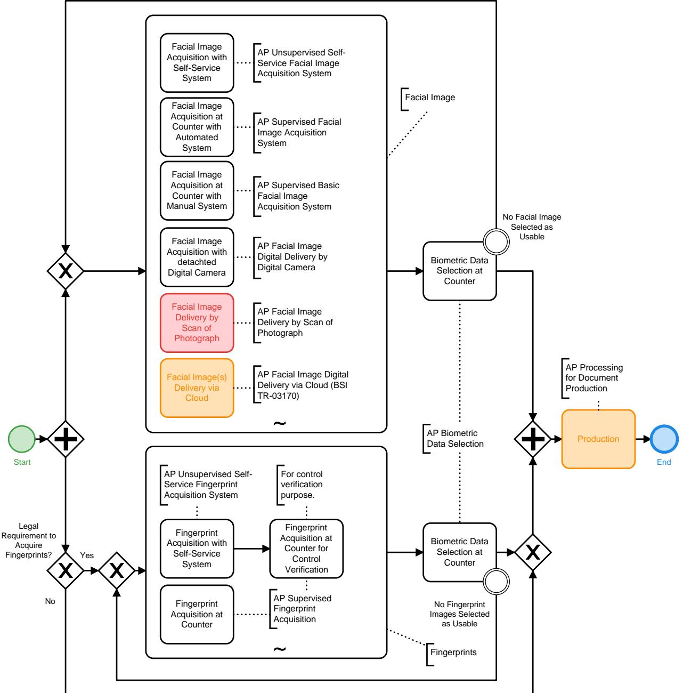

**Figure 2.1.** Overview Process

The application profiles marked orange do not take place in the agency. The application profile marked in red is only allowed in special use cases (refer to [Application Profile Facial Image Delivery by Scan of Photograph\)](#page-17-1).

When Application Profiles or Partial Processes are combined in an application, redundant pro cesses and operations MAY be reduced to one. These processes and operations SHALL then be combined at the point where they occur first, e.g. if an algorithm for quality assessment with the same configuration respective threshold values and the same input (i.e. unchanged image) is called again, it SHALL not be executed again.

# <span id="page-9-0"></span>**2.4. Sources of Facial Images**

With regard to facial images, this Technical Guideline distinguishes between the following types:

- **•** "live images": Facial images that have been acquired live within the authority (supervised or unsupervised) where the acquisition process is handled via a process in this TR.
- **•** "delivered images": Facial images that have been acquired using equipment outside the agency's network. These are in turn divided into:
	- **•** "cloud images": Facial images that were acquired by a facial image service provider in a studio set-up outside of the agency and sent to the agency electronically via a cloud solution (refer to [Application](#page-16-0) [Profile Facial Image Digital Delivery via Cloud \(BSI TR-03170\)](#page-16-0)).
	- **•** "scanned images": Facial images that were scanned from a passport photo within the agency. Note, that scanning is only applicable in a few special cases (refer to [Application Profile Facial Image Delivery by](#page-17-1) [Scan of Photograph](#page-17-1)).
	- **•** "digital camera images": Facial images that were taken by an agency's operator (official) with a digital camera that is detached from the operator's application. Note, this type of delivery only applica ble in a few special cases (refer to [Application Profile Facial Image Digital Delivery by Digital Camera\)](#page-14-0). However, if the digital camera is attached to operator's application and operated through this ap plication, [Application Profile Supervised Basic Facial Image Acquisition System](#page-12-0) applies (which is then not a delivered image).

# <span id="page-10-0"></span>**3. Application Profiles**

# <span id="page-10-5"></span><span id="page-10-1"></span>**3.1. Application Profile Unsupervised Self-Service Facial Image Acquisition System**

This Application Profile describes [self-service systems \(SSSs\)](#page-86-2) that are located within an agency and that are connected directly to the agency's local network. The facial image is acquired live by an unsupervised acquisi tion process at the [SSS](#page-86-2). [Figure 3.1](#page-10-2) depicts the overall facial image self-service acquisition process at the [SSS.](#page-86-2) [1](#page-10-3)

<span id="page-10-2"></span>For [SSS](#page-86-2), [Presentation Attack Detection \(PAD\)](#page-86-3) ( [Section 5.5.1](#page-63-1)) MAY be used until 30th April 2025 but SHALL be used from 1st May 2025 on.

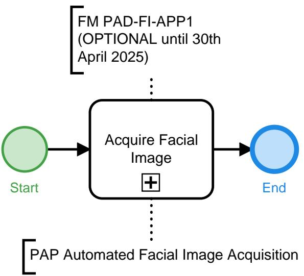

**Figure 3.1.** Overview Process of Unsupervised Self-Service Facial Image Acquisition System

# **3.1.1. Mandatory Function Modules**

All Function Modules which SHALL be applied for this Application Profile are listed in [Table 3.1](#page-10-4). All listed Function Modules (separated by commas) are mandatory for this Application Profile unless specified other wise. Function Modules separated by slash are alternatives to each other. Function Modules in brackets are RECOMMENDED.

<span id="page-10-4"></span>

| Module Category            | Required Function Modules         |
|----------------------------|-----------------------------------|
| Acquisition Hardware       | FM AH-FI-ICS2,<br>FM AH-FI-SSS2   |
| Acquisition Software       | FM AS-FI-ICS2,<br>FM AS-FI-ICS3   |
| Biometric Image Processing | FM BIP-FI-GID                     |
| Quality Assessment         | FM QA-FI-GENERIC,<br>FM QA-FI-GID |

<span id="page-10-3"></span>1 In the acquisition process at the SSS, it is possible that multiple facial images meet the same maximum amount of first mandatory and second optional quality criteria. In this case the biometric subject is allowed to choose the prefered facial image out of this selection of best images. Note, this prodecure is only valid within this Application Profile and is treated equivalent to the described temporal and random selection in the third step of Identification of the Best Capture in [FM QA-FI-GENERIC](#page-56-0).

| Module Category               | Required Function Modules                               |
|-------------------------------|---------------------------------------------------------|
| Presentation Attack Detection | FM PAD-FI-APP1 (OPTIONAL until 30th April 2025)         |
| Compression                   | FM COM-FI-GENERIC                                       |
| Operation                     | FM O-ALL-USV                                            |
| User Interface                | FM UI-FI-BSJ                                            |
| Reference Storage             | -                                                       |
| Biometric Comparison          | -                                                       |
| Logging                       | FM LOG-ALL-GID ,<br>FM LOG-FI-GENERIC,<br>FM LOG-FI-GID |
| Coding                        | FM COD-ALL-GID,<br>FM COD-FI-GID                        |
| Evaluation                    | -                                                       |

**Table 3.1** Required Function Modules for Application Profile Unsupervised Self-Service Facial Image Acquisition System

# **3.1.2. Mandatory Partial Application Processes**

All Partial Application Processes and Tasks which SHALL be applied for this Application Profile are listed in [Table 3.2](#page-11-2). All listed Processes (separated by commas) are mandatory for this Application Profile unless specified otherwise. Processes separated by slash are alternatives to each other.

<span id="page-11-2"></span>

| No. | Required Partial Application Process                  |
|-----|-------------------------------------------------------|
| 1   | PAP ACQ-FI-AUTO-1: Automated Facial Image Acquisition |

**Table 3.2** Required Partial Application Processes for Application Profile Unsupervised Self-Service Facial Image Acquisition System

# <span id="page-11-0"></span>**3.2. Application Profile Supervised Facial Image Acquisition System**

This Application Profile specifies a facial image acquisition system for supervised acquisitions at the counter. The facial image acquisition system is used to acquire facial images automatically and (possibly) manually. If the system does not provide a manual mode, the manual acquisition of facial images (in case the automated system is not able to capture a facial image due to medical reasons or due to other failures) SHALL be able using other manual systems (refer to [Application Profile Supervised Basic Facial Image Acquisition System](#page-12-0) and/or [Application Profile Facial Image Digital Delivery by Digital Camera](#page-14-0)).

#### **3.2.1. Mandatory Process**

The following subsection specifies the overall process of the biometric operations of a facial image acquisition system used at the counter.

#### **3.2.1.1. Overview Process**

<span id="page-11-1"></span>[Figure 3.2](#page-11-1) depicts the general biometric process of the facial image acquisition system.

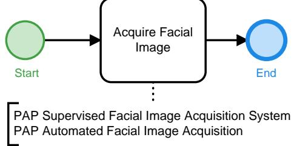

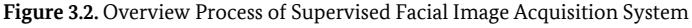

# **3.2.2. Mandatory Function Modules**

All Function Modules which SHALL be applied for this Application Profile are listed in [Table 3.3](#page-12-1). All listed Function Modules (separated by commas) are mandatory for this Application Profile unless specified other wise. Function Modules separated by slash are alternatives to each other. Function Modules in brackets are RECOMMENDED.

<span id="page-12-1"></span>

| Module Category               | Required Function Modules                              |
|-------------------------------|--------------------------------------------------------|
| Acquisition Hardware          | FM AH-FI-ICS2                                          |
| Acquisition Software          | FM AS-FI-ICS2,<br>FM AS-FI-ICS3                        |
| Biometric Image Processing    | FM BIP-FI-GID                                          |
| Quality Assessment            | FM QA-FI-GENERIC,<br>FM QA-FI-GID                      |
| Presentation Attack Detection | -                                                      |
| Compression                   | FM COM-FI-GENERIC                                      |
| Operation                     | FM O-FI-ALL,<br>FM O-FI-DC                             |
| User Interface                | FM UI-FI-BSJ,<br>FM UI-FI-OP                           |
| Reference Storage             | -                                                      |
| Biometric Comparison          | -                                                      |
| Logging                       | FM LOG-ALL-GID,<br>FM LOG-FI-GENERIC,<br>FM LOG-FI-GID |
| Coding                        | FM COD-ALL-GID,<br>FM COD-FI-GID                       |
| Evaluation                    | -                                                      |

**Table 3.3** Required Function Modules for Application Profile Supervised Facial Image Acquisition System

# **3.2.3. Mandatory Partial Application Processes**

All Partial Application Processes and Tasks which SHALL be applied for this Application Profile are listed in [Table 3.4](#page-12-2). All listed Processes (separated by commas) are mandatory for this Application Profile unless specified otherwise. Processes separated by slash are alternatives to each other.

<span id="page-12-2"></span>

| No. | Required Partial Application Process                        |  |
|-----|-------------------------------------------------------------|--|
| 1   | PAP ACQ-FI-SV-5: Supervised Facial Image Acquisition System |  |
| 2   | PAP ACQ-FI-AUTO-1: Automated Facial Image Acquisition       |  |

**Table 3.4** Required Partial Application Processes for Application Profile Supervised Facial Image Acquisition System

# <span id="page-12-0"></span>**3.3. Application Profile Supervised Basic Facial Image Acquisition System**

This Application Profile specifies the supervised facial image acquisition that takes place within the agency and is conducted by the operator with a digital camera in a "Basic Facial Image Acquisition System" setting. The facial image acquisition system is used to automatically acquire or manually capture facial images with a digital camera that is attached to the operator's application.

The software based quality metrics SHALL be determined and be displayed to the operator. The operator SHALL decide to accept or reject the facial image.

Note, this Application Profile does not apply to facial image acquisitions by photographers in a studio set-up using digital cameras (refer to [Application Profile Facial Image Digital Delivery via Cloud \(BSI TR-03170\)\)](#page-16-0) nor to a facial image acquisition setting using a detached digital camera (refer to [Application Profile Facial](#page-14-0) [Image Digital Delivery by Digital Camera](#page-14-0)).

#### **3.3.1. Mandatory Process**

<span id="page-13-0"></span>[Figure 3.3](#page-13-0) depicts the overall facial image acquisition process in a studio setup by an operator, refer to [FM](#page-47-3) [AH-FI-DC2](#page-47-3) for the studio setup requirements and [\[BIB\\_ISO\\_FACE\]](#page-88-9) for further detailed information about the studio setup requirements.

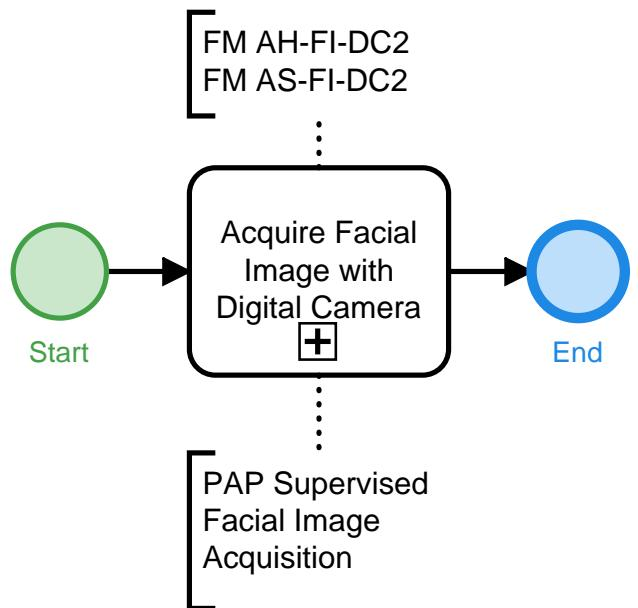

**Figure 3.3.** Overview Process of Application Profile Supervised Facial Image Acquisition with a Digitial Camera in "Basic Acqui sition System" setting

# **3.3.2. Mandatory Function Modules**

All Function Modules which SHALL be applied for this Application Profile are listed in [Table 3.5](#page-13-1). All listed Function Modules (separated by commas) are mandatory for this Application Profile unless specified other wise. Function Modules separated by slash are alternatives to each other. Function Modules in brackets are RECOMMENDED.

<span id="page-13-1"></span>

| Module Category               | Required Function Modules                               |
|-------------------------------|---------------------------------------------------------|
| Acquisition Hardware          | FM AH-FI-DC2                                            |
| Acquisition Software          | FM AS-FI-DC2                                            |
| Biometric Image Processing    | FM BIP-FI-GID                                           |
| Quality Assessment            | FM QA-FI-GENERIC,<br>FM QA-FI-GID                       |
| Presentation Attack Detection | -                                                       |
| Compression                   | FM COM-FI-GENERIC                                       |
| Operation                     | FM O-FI-ALL,<br>FM O-FI-DC                              |
| User Interface                | FM UI-FI-OP                                             |
| Reference Storage             | -                                                       |
| Biometric Comparison          | -                                                       |
| Logging                       | FM LOG-ALL-GID ,<br>FM LOG-FI-GENERIC,<br>FM LOG-FI-GID |

| Module Category | Required Function Modules        |
|-----------------|----------------------------------|
| Coding          | FM COD-ALL-GID,<br>FM COD-FI-GID |
| Evaluation      | -                                |

**Table 3.5** Required Function Modules for Application Profile Supervised Facial Image Acquisition with Digitial Camera

# **3.3.3. Mandatory Partial Application Processes**

All Partial Application Processes and Tasks which SHALL be applied for this Application Profile are listed in [Table 3.6](#page-14-1). All listed Processes (separated by commas) are mandatory for this Application Profile unless specified otherwise. Processes separated by slash are alternatives to each other.

<span id="page-14-1"></span>

| No. | Required Partial Application Process                 |
|-----|------------------------------------------------------|
| 1   | PAP ACQ-FI-SV-4: Supervised Facial Image Acquisition |

**Table 3.6** Required Partial Application Processes for Application Profile Supervised Facial Image Acquisition with Digitial Camera

# <span id="page-14-0"></span>**3.4. Application Profile Facial Image Digital Delivery by Digital Camera**

This Application Profile is only applicable in a few specific use cases, in which an automated acquisition is not possible or the application scenario is excluded from the underlying legal specifications:

- **•** Capturing of facial images within German representations abroad.
- **•** Capturing of facial images by German officials outside the agency ("Bürgerkoffer").
- **•** Capturing of facial images by German officials inside the agency as fall-back scenario in case, automated equipment cannot be used (e.g. due to failures or if applicants cannot be captured automatically due to medical reasons).

The special cases, in which this Application Profile is applicable, are defined by the German Federal Ministry of the Interior.

Within this application profile the supervised manual facial image acquisition with a digital camera is speci fied. The facial image acquisition system is used to manually capture facial images with a digital camera that is detached from the operators application in the moment of capturing. Note, that the operator MAY acquire more than one facial image (per session) to increase the likelihood of having at least suf ficient quality.

The captured facial images are loaded into the operators application for post-processing. Here, the software based quality metrics SHALL be determined and be displayed to the operator. The operator SHALL decide to accept or reject the facial image. After post-processing, the final facial image is released into the further application process (refer to [Application Profile Biometric Data Selection](#page-21-0)).

Note, the facial images captured SHALL be handled, transported and loaded into the operator's application by the agency's operators (officials) only. Applicants or service providers MUST NOT gain access to the facial images at any time during this process.

Also note that this Application Profile does not apply to facial image acquisition by photo service providers in a studio set-up using digital cameras (refer to [Application Profile Facial Image Digital Delivery via Cloud](#page-16-0) [\(BSI TR-03170\)](#page-16-0)) nor to facial image acquisition setting using a digital camera directly attached to the operators application (refer to [Application Profile Supervised Basic Facial Image Acquisition System\)](#page-12-0).

# **3.4.1. Mandatory Process**

[Figure 3.4](#page-15-0) depicts the overall facial image acquisition process in a studio setup by an operator, refer to [FM](#page-47-3) [AH-FI-DC2](#page-47-3) for the studio setup requirements and [\[BIB\\_ISO\\_FACE\]](#page-88-9) for further detailed information about the studio setup requirements.

<span id="page-15-0"></span>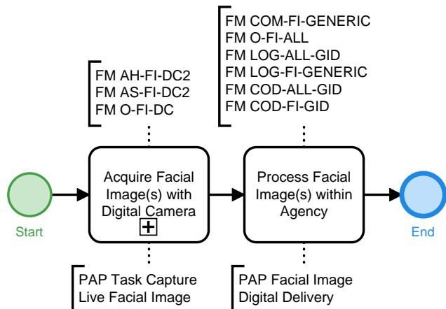

**Figure 3.4.** Overview Process of Application Profile Facial Image Digital Delivery by Digital Camera

## **3.4.2. Mandatory Function Modules**

All Function Modules which SHALL be applied for this Application Profile are listed in [Table 3.7](#page-15-1). All listed Function Modules (separated by commas) are mandatory for this Application Profile unless specified other wise. Function Modules separated by slash are alternatives to each other. Function Modules in brackets are RECOMMENDED.

<span id="page-15-1"></span>

| Module Category               | Required Function Modules                               |
|-------------------------------|---------------------------------------------------------|
| Acquisition Hardware          | FM AH-FI-DC2                                            |
| Acquisition Software          | FM AS-FI-DC2                                            |
| Biometric Image Processing    | FM BIP-FI-GID                                           |
| Quality Assessment            | FM QA-FI-GENERIC,<br>FM QA-FI-GID                       |
| Presentation Attack Detection | -                                                       |
| Compression                   | FM COM-FI-GENERIC                                       |
| Operation                     | FM O-FI-ALL,<br>FM O-FI-DC                              |
| User Interface                | FM UI-FI-OP                                             |
| Reference Storage             | -                                                       |
| Biometric Comparison          | -                                                       |
| Logging                       | FM LOG-ALL-GID ,<br>FM LOG-FI-GENERIC,<br>FM LOG-FI-GID |
| Coding                        | FM COD-ALL-GID,<br>FM COD-FI-GID                        |
| Evaluation                    | -                                                       |

**Table 3.7** Required Function Modules for Application Profile Facial Image Digital Delivery by Digital Camera

### **3.4.3. Mandatory Partial Application Process Tasks**

All Partial Application Processes and Tasks which SHALL be applied for this Application Profile are listed in [Table 3.8](#page-15-2). All listed Processes (separated by commas) are mandatory for this Application Profile unless specified otherwise. Processes separated by slash are alternatives to each other.

<span id="page-15-2"></span>

| No. | Required Partial Application Processes and Partial Application Process Tasks |  |
|-----|------------------------------------------------------------------------------|--|
| 1   | PAP Task ACQ-FI-1: Capture Live Facial Image                                 |  |

| No. | Required Partial Application Processes and Partial Application Process Tasks |  |
|-----|------------------------------------------------------------------------------|--|
| 2   | PAP DEL-FI-SV-1: Supervised Facial Image Digital Delivery                    |  |

**Table 3.8** Required Partial Application Process Tasks for Application Profile Facial Image Digital Delivery by Digital Camera

# <span id="page-16-0"></span>**3.5. Application Profile Facial Image Digital Delivery via Cloud (BSI TR-03170)**

Within this application profile the facial image(s) for enrolment of a German Identity Document are acqui red by a facial image service provider (e.g. photographer), who then uploads the acquired image(s) to fa cial images cloud provider. This implies that the image acquisition is conducted detached from the agency. The facial image(s) are delivered to the agency from a facial images cloud provider according to [\[BIB\\_TR-03170\]](#page-89-0).

Facial images that are delivered within this Application Profile SHALL comply with the following require ments:

- **•** High-quality facial images: The facial image SHALL comply with the quality requirements defined within this Technical Guideline. In particular facial images taken by the enrolee him- or herself (selfie) SHALL NOT be used.
- **•** Use of wide-angle shots: The requiqrements for focal length (depending on the size of the camera sensor) as described within this Technical Guideline SHALL be complied with. The facial image SHALL NOT be captured using a wide-angle setting.
- **•** Live capture by natural person: The facial image that is delivered was captured live by a natural person who ensures that the requirements for facial images (especially facial image quality and the exclusion of presentation attacks) are met.
- **•** Use of surveillance equipment: The usage equipment is not sufficient to ensure the requi rements above especially regarding facial image quality and the exclusion of presentation attacks.
- **•** Personal responsibility and registration of capturing person: For details see [\[BIB\\_TR-03170\]](#page-89-0).

The facial images cloud provider SHALL ensure that the facial images that will be delivered to the agency fulfil the requirements defined in this application profile. Lossy compressions or upscaling SHALL NOT be performed on the facial images within the facial images cloud.

<span id="page-16-1"></span>[Figure 3.5](#page-16-1) depicts the biometric overview process within a facial images cloud. The process depicted is for illustration purpose only:

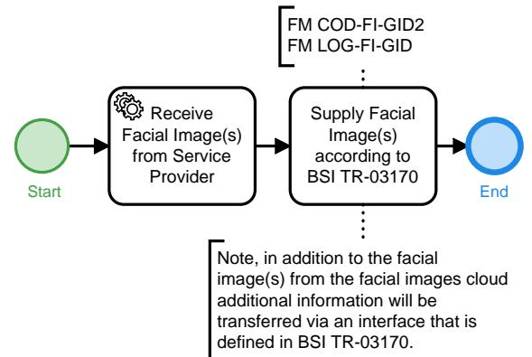

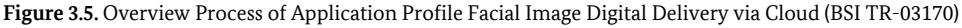

# **3.5.1. Mandatory Function Modules**

All Function Modules which SHALL be applied for this Application Profile are listed in [Table 3.9](#page-17-2). All listed Function Modules (separated by commas) are mandatory for this Application Profile unless specified other wise. Function Modules separated by slash are alternatives to each other. Function Modules in brackets are RECOMMENDED.

<span id="page-17-2"></span>

| Module Category               | Required Function Modules |
|-------------------------------|---------------------------|
| Acquisition Hardware          | -                         |
| Acquisition Software          | -                         |
| Biometric Image Processing    | -                         |
| Quality Assessment            | -                         |
| Presentation Attack Detection | -                         |
| Compression                   | -                         |
| Operation                     | -                         |
| User Interface                | -                         |
| Reference Storage             | -                         |
| Biometric Comparison          | -                         |
| Logging                       | FM LOG-FI-GID             |
| Coding                        | FM COD-FI-GID             |
| Evaluation                    | -                         |

**Table 3.9** Required Function Modules for Application Profile Facial Image Digital Delivery via Cloud (BSI TR-03170)

# **3.5.2. Mandatory Partial Application Processes**

There are no Partial Application Processes to be applied for this Application Profile.

# <span id="page-17-1"></span><span id="page-17-0"></span>**3.6. Application Profile Facial Image Delivery by Scan of Photograph**

This Application Profile is only applicable in a few special cases which are defined by the German Federal Ministry of the Interior and within German represenations abroad (Foreign Office) only. Apart from these specific cases, scanning of photographs MUST NOT be used after 30th April 2025.

Within this application profile the facial image(s) for enrolment of a German Identity Document are ac quired by scanning of a photograph which the applicant hands over to the operator. Note that the photograph of the applicant MAY be a grey scale image.

The photograph SHALL be compliant with the requirements for biometric images [\[BIB\\_ISO\\_FACE\]](#page-88-9). The ope rator manually verifies whether the photograph depicts the applicant. After the operator visually inspected the photograph with the help of a photo guideline, and, if needed, with the help of a photo template (refer to [FM QA-FI-PG](#page-58-1) and [FM QA-FI-PT\)](#page-59-0), the photograph SHALL be scanned (refer to [PAP ACQ-FI-SV-1: Su](#page-33-0) [pervised Facial Image Acquisition by Scan of Photograph\)](#page-33-0). Afterwards, the scanned facial image SHALL be processed by the quality assurance module (software, refert to [FM Category Quality Assessment\)](#page-55-0).

[Figure 3.6](#page-18-0) depicts the facial image acquisition process by scanning the photograph of the applicant.

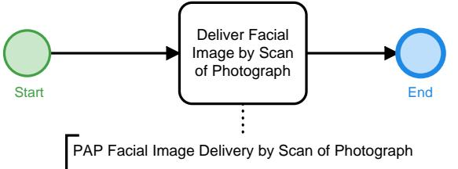

<span id="page-18-0"></span>**Figure 3.6.** Overview Process of Application Profile Facial Image Delivery by Scan of Photograph

## **3.6.1. Mandatory Function Modules**

All Function Modules which SHALL be applied for this Application Profile are listed in [Table 3.10](#page-18-1). All listed Function Modules (separated by commas) are mandatory for this Application Profile unless specified other wise. Function Modules separated by slash are alternatives to each other. Function Modules in brackets are RECOMMENDED.

<span id="page-18-1"></span>

| Module Category               | Required Function Modules                                         |
|-------------------------------|-------------------------------------------------------------------|
| Acquisition Hardware          | FM AH-FI-FBS                                                      |
| Acquisition Software          | FM AS-FI-FBS                                                      |
| Biometric Image Processing    | FM BIP-FI-FBS                                                     |
| Quality Assessment            | FM QA-FI-PG,<br>FM QA-FI-PT,<br>FM QA-FI-GENERIC,<br>FM QA-FI-GID |
| Presentation Attack Detection | -                                                                 |
| Compression                   | FM COM-FI-GENERIC                                                 |
| Operation                     | FM O-FI-ALL,<br>FM O-FI-FBS                                       |
| User Interface                | FM UI-FI-OP                                                       |
| Reference Storage             | -                                                                 |
| Biometric Comparison          | -                                                                 |
| Logging                       | FM LOG-ALL-GID ,<br>FM LOG-FI-GENERIC                             |
| Coding                        | FM COD-ALL-GID,<br>FM COD-FI-GID                                  |
| Evaluation                    | -                                                                 |

**Table 3.10** Required Function Modules for Application Profile Facial Image Delivery by Scan of Photograph

### **3.6.2. Mandatory Partial Application Processes**

All Partial Application Processes and Tasks which SHALL be applied for this Application Profile are listed in [Table 3.11.](#page-18-2) All listed Processes (separated by commas) are mandatory for this Application Profile unless specified otherwise. Processes separated by slash are alternatives to each other.

<span id="page-18-2"></span>

| No. | Required Partial Application Process                                       |
|-----|----------------------------------------------------------------------------|
| 1   | PAP ACQ-FI-SV-1: Supervised Facial Image Acquisition by Scan of Photograph |

**Table 3.11** Required Partial Application Processes for Application Profile Facial Image Delivery by Scan of Photograph

# <span id="page-19-0"></span>**3.7. Application Profile Unsupervised Self-Service Fingerprint Acquisition System**

This Application Profile describes [SSSs](#page-86-2) that are located within an agency and that are connected directly to the agency's local network. The fingerprints are acquired live by an unsupervised acquisition process at the [SSS.](#page-86-2) [Figure 3.7](#page-19-1) depicts the overall fingerprint self-service acquisition process at the [SSS.](#page-86-2)

Note, that the applicant's fingerprints which have been acquired at the [SSS](#page-86-2) SHALL additionally be acquired at the counter for control verification according to [FM Category Biometric Comparison,](#page-72-2) see [Application](#page-21-0) [Profile Biometric Data Selection](#page-21-0) for futher details.

<span id="page-19-1"></span>PAP Unsupervised Acquisition of Two Finger Plain on Single-Finger Hardware for Enrolment OR PAP Unsupervised Acquisition of Two Plain Fingers on Multi-Finger Hardware for Enrolment

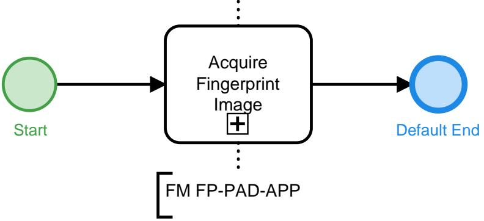

**Figure 3.7.** Overview Process of Application Profile Unsupervised Self-Service Fingerprint Acquisition System

# **3.7.1. Mandatory Function Modules**

All Function Modules which SHALL be applied for this Application Profile are listed in [Table 3.12](#page-19-2). All listed Function Modules (separated by commas) are mandatory for this Application Profile unless specified other wise. Function Modules separated by slash are alternatives to each other. Function Modules in brackets are RECOMMENDED.

<span id="page-19-2"></span>

| Module Category               | Required Function Modules                              |
|-------------------------------|--------------------------------------------------------|
| Acquisition Hardware          | FM AH-FP-OPT                                           |
| Acquisition Software          | FM AS-FP-SF/<br>FM AS-FP-MF                            |
| Biometric Image Processing    | FM BIP-FP-APP                                          |
| Quality Assessment            | FM QA-FP-APP                                           |
| Presentation Attack Detection | FM PAD-FP-APP                                          |
| Compression                   | FM COM-FP-WSQR                                         |
| Operation                     | FM O-ALL-USV,<br>FM O-FP-ALL                           |
| User Interface                | FM UI-FP-BSJ                                           |
| Reference Storage             | -                                                      |
| Biometric Comparison          | -                                                      |
| Logging                       | FM LOG-ALL-GID,<br>FM LOG-FP-GENERIC,<br>FM LOG-FP-GID |
| Coding                        | FM COD-ALL-GID,<br>FM COD-FP-CHIP                      |

| Module Category | Required Function Modules |
|-----------------|---------------------------|
| Evaluation      | -                         |

**Table 3.12** Required Function Modules for Application Profile Unsupervised Self-Service Fingerprint Acquisition System

### **3.7.2. Mandatory Partial Application Processes**

All Partial Application Processes and Tasks which SHALL be applied for this Application Profile are listed in [Table 3.13.](#page-20-2) All listed Processes (separated by commas) are mandatory for this Application Profile unless specified otherwise. Processes separated by slash are alternatives to each other.

<span id="page-20-2"></span>

| No. | Required Partial Application Process                                                                                                                                                                                                    |
|-----|-----------------------------------------------------------------------------------------------------------------------------------------------------------------------------------------------------------------------------------------|
| 1   | PAP ACQ-FP2P-USV-2: Unsupervised Acquisition of Two Plain Fingerprints on Single-Finger<br>Hardware for Enrolment/<br>PAP ACQ-FP2P-USV-1: Unsupervised Acquisition of Two Plain Finger<br>prints on Multi-Finger Hardware for Enrolment |

**Table 3.13** Required Partial Application Processes for Application Profile Unsupervised Self-Service Fingerprint Acquisition System

# <span id="page-20-0"></span>**3.8. Application Profile Supervised Fingerprint Acquisition**

The fingerprint images are acquired by a supervised acquisition process at the counter of the operator.

[Figure 3.8](#page-20-1) depicts the fingerprint acquisition process by a supervised at counter of opera tor. Depending on the type of fingerprint scanner at counter, detailed process is defined either detai led by [PAP ACQ-FP2P-SV-2: Supervised Acquisition of Two Plain Fingerprints on Single-Finger Hardware](#page-39-0) [for Enrolment](#page-39-0) or [PAP ACQ-FP2P-SV-1: Supervised Acquisition of Two Plain Fingerprints on Multi-Finger](#page-35-0) [Hardware for Enrolment.](#page-35-0)

<span id="page-20-1"></span>In case the acquisition of fingerprints is part of a control verification (described in: [Section 3.9.1.2](#page-22-1) [Finger](#page-22-1) [print Selection Procedure\)](#page-22-1), quality thresholds SHALL NOT be applied during acquisition.

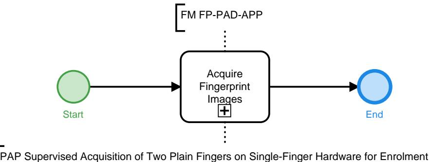

OR PAP Supervised Acquisition of Two Plain Fingers on Multi-Finger Hardware for Enrolment

**Figure 3.8.** Overview Process of Application Profile Supervised Fingerprint Acquisition

# **3.8.1. Mandatory Function Modules**

All Function Modules which SHALL be applied for this Application Profile are listed in [Table 3.14](#page-20-3). All listed Function Modules (separated by commas) are mandatory for this Application Profile unless specified other wise. Function Modules separated by slash are alternatives to each other. Function Modules in brackets are RECOMMENDED.

<span id="page-20-3"></span>

| Module Category      | Required Function Modules |
|----------------------|---------------------------|
| Acquisition Hardware | FM AH-FP-OPT              |

| Module Category               | Required Function Modules                                                        |
|-------------------------------|----------------------------------------------------------------------------------|
| Acquisition Software          | FM AS-FP-SF/<br>FM AS-FP-MF                                                      |
| Biometric Image Processing    | FM BIP-FP-APP                                                                    |
| Quality Assessment            | FM QA-FP-APP                                                                     |
| Presentation Attack Detection | FM PAD-FP-APP                                                                    |
| Compression                   | FM COM-FP-WSQR                                                                   |
| Operation                     | FM O-ALL-USV,<br>FM O-FP-ALL                                                     |
| User Interface                | FM UI-FP-OP                                                                      |
| Reference Storage             | -                                                                                |
| Biometric Comparison          | -                                                                                |
| Logging                       | FM LOG-ALL-GENERIC,<br>FM LOG-ALL-GID,<br>FM LOG-FP-GENERIC,<br>FM LOG<br>FP-GID |
| Coding                        | FM COD-ALL-GID,<br>FM COD-FP-CHIP                                                |
| Evaluation                    | -                                                                                |

**Table 3.14** Required Function Modules for Application Profile Supervised Fingerprint Acquisition

# **3.8.2. Mandatory Partial Application Processes**

All Partial Application Processes and Tasks which SHALL be applied for this Application Profile are listed in [Table 3.15.](#page-21-1) All listed Processes (separated by commas) are mandatory for this Application Profile unless specified otherwise. Processes separated by slash are alternatives to each other.

<span id="page-21-1"></span>

| No. | Required Partial Application Process                                                                                                                                                                                              |
|-----|-----------------------------------------------------------------------------------------------------------------------------------------------------------------------------------------------------------------------------------|
| 1   | PAP ACQ-FP2P-SV-2: Supervised Acquisition of Two Plain Fingerprints on Single-Finger Hard<br>ware for Enrolment/<br>PAP ACQ-FP2P-SV-1: Supervised Acquisition of Two Plain Fingerprints on<br>Multi-Finger Hardware for Enrolment |

**Table 3.15** Required Partial Application Processes for Application Profile Supervised Fingerprint Acquisition

# <span id="page-21-0"></span>**3.9. Application Profile Biometric Data Selection**

This Application Profile specifies the selection of acquired biometric data by an operator for a German Identity Document.

### **3.9.1. Mandatory Process**

The following subsection specifies the overall process of selection already acquired biometric data, fin gerprint and facial images, for a German Identity Document. For all German Identity Documents, a facial image (for every applicant) as well as two fingerprints (only for applicants from the age of six years and older) of the applicant have to be captured electronically[2](#page-21-2) . This is done in accordance with [FM Category Acquisiti](#page-47-4) [on Hardware](#page-47-4), [FM Category Acquisition Software](#page-51-2) and [FM Category Biometric Image Processing](#page-54-3).

The resulting facial image SHALL not be compressed. For facial images a software-based quality assessment SHALL be conducted. For live images and cloud images, the facial image of the size 1244x1600 pixels SHALL be used for quality assessment. For scanned images, the facial image of the size 622x800 pixels SHALL be used for quality assessment.

<span id="page-21-2"></span><sup>2</sup> Furthermore a signature is captured, but this is not part of the description within this document.

The resulting biometric data of the fingerprints can be reduced in size by lossy compression. However, multi ple lossy compressions SHALL NOT take place. If not already compressed, the compression of the fingerprint images SHALL be performed after the quality assessment process.

The facial image and the fingerprint images as well as additional quality information, which is connected to the biometric data, SHALL be coded and then passed to the calling application.

#### **3.9.1.1. Overview Process**

[Figure 3.9](#page-22-0) depicts the biometric overview process of selection already acquired data, fin gerprint and facial images, for German Identity Documents purposes. A copy of the facial image SHALL be processed for usage in the Register of Documents.

After selection of all necessary biometric data, all data is coded into the respective transmission format and stored within the final log that is sent to the central document production.

The process depicted is for illustration purpose only. Note, that the following section will detail this process for fingerprint and facial image selection.

<span id="page-22-0"></span>If biometric data were acquired in an unsupervised manner (e.g. at a [SSS\), all data \(facial images and finger](#page-86-2) prints if applicable) are to be retrieved from this device together in one call.

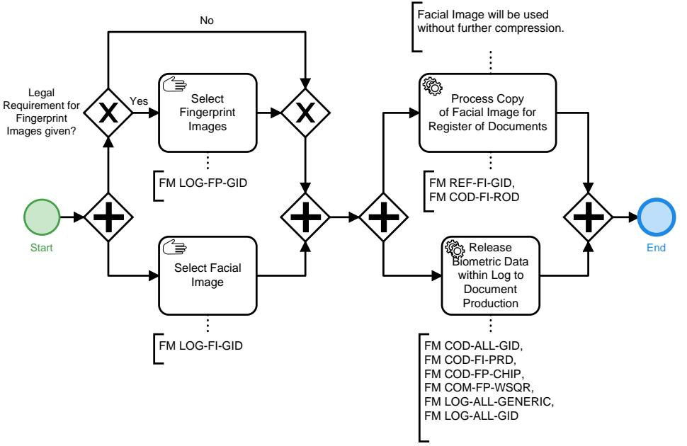

**Figure 3.9.** Overview Process of Application Profile Biometric Data Selection

#### <span id="page-22-1"></span>**3.9.1.2. Fingerprint Selection Procedure**

The fingerprint image acquisition and the detailed selection procedures applicable to this Application Profile are described in [Application Profile Supervised Fingerprint Acquisition.](#page-20-0) Note, the requirements from [Ap](#page-20-0) [plication Profile Supervised Fingerprint Acquisition apply to this Application Profile as well. For further in](#page-20-0) formation regarding applicable Partial Application Processes and Function Modules, see [Section 3.8.](#page-20-0)

Fingerprint images that were acquired beforehand by an unsupervised acquisition process, e.g. at a [SSS](#page-86-2), SHALL be verified at the counter according to [FM Category Biometric Comparison](#page-72-2). This control verification ensu res that the legitimated applicant's fingerprints have been captured at the previous unsupervised system. The control verification required in this Application Profile is described in [Application Profile Supervised Fin](#page-20-0) [gerprint Acquisition](#page-20-0). During control verification, all fingerprints from unsupervised sources SHALL be veri fied against the fingerprints that are captured supervised. Note, for acquisitions of fingerprint verifi

cation purposes, no quality thresholds apply. In case the verification fails, the fingerprint enrolment SHALL be repeated at the counter.

[Figure 3.10](#page-23-0) depicts the overall control verification process at the counter.

<span id="page-23-0"></span>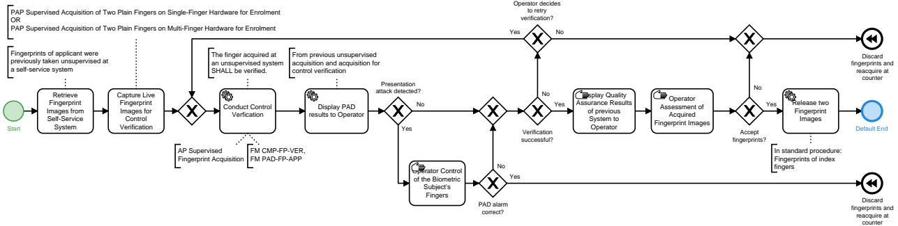

**Figure 3.10.** Overview Process of Control Verification of Fingerprints

#### **3.9.1.3. Facial Image Selection Procedure**

[Figure 3.11](#page-24-0) depicts the general biometric process of the facial image selection procedure, which is performed by an operator.

- 1. The facial images of the applicant from different possible sources SHALL be made available. The possible sources are:
	- **•** Facial images taken at a [SSS](#page-86-2) (see [Section 3.1](#page-10-5))
	- **•** Facial images taken at the clerks desk by an automated system (Facial Image Acquisition System, see [Section 3.2](#page-11-0))
	- **•** Facial images taken at the clerks desk with an attached digital camera (Basic Facial Image Acquisition System, see [Section 3.3](#page-12-0))
	- **•** Facial images taken with a detached digital camera (see [Section 3.4\)](#page-14-0)
	- **•** Facial images delivered to the agency via cloud (see [Section 3.5](#page-16-0))
	- **•** Facial images scanned at the clerks desk (see [Section 3.6](#page-17-1), only for special cases)
- 2. The quality of the images SHALL be assessed.
- 3. All images with sufficient quality SHALL be presented to the operator, they MAY be sorted according to different characteristics, such as: quality, age of image, etc. If images with sufficient quality are present, an additional option to make images with insufficient quality viewable SHOULD be available. If no images with sufficient quality are present, all images with insufficient quality SHALL be presented to the operator.
- 4. In case a PAD alarm was raised, the operator SHALL evaluate whether the PAD alarm was legitimate. A PAD alarm is legitimate if e.g. the applicant tried to deceive the system or tested the limits of the system. If the operator decides that the PAD alarm was legitimate, the entire document enrolment process SHALL be aborted.
- 5. The applicant SHALL be visually verified by the operator. Especially in cases of live captured or delivered facial images, the operator SHALL check that the acquired facial image shows the applicant.
- 6. The images SHALL be inspected visually by the operator. In addition to the check by [Quality Assessment](#page-86-4) [\(QA\)](#page-86-4) software, the operator MAY verify geometric features of images using a digital photo templa te (one for adults and one for children, refer to [Section 5.4.4\)](#page-59-0) as well as a photo guideline (refer to [Sec](#page-58-1) [tion 5.4.3\)](#page-58-1).

The operator SHALL have the option to give a veto in order to overrule the [QA](#page-86-4) software decisions. If the operator gives a veto (veto equals "no") a positive software decision of the quality assessment SHALL be overruled and the facial images SHALL be rejected. In case, the operator rejects all facial images with a positive software decision, all other facial images with insufficient quality SHALL be presented. Thus, the operator SHALL have the option to accept images despite a negative software [QA](#page-86-4) decision (veto equals "yes").

7. If at least one image is left, the operator SHALL choose and release one image. Otherwise no image SHALL be released.

<span id="page-24-0"></span>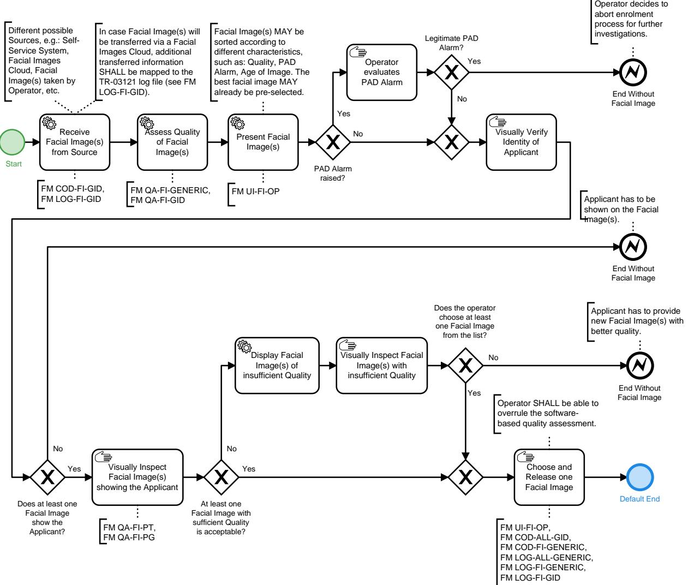

**Figure 3.11.** Process Facial Image Selection Procedure for German Identity Documents purposes

# **3.9.2. Mandatory Function Modules**

All Function Modules which SHALL be applied for this Application Profile are listed in [Table 3.16](#page-24-1). All listed Function Modules (separated by commas) are mandatory for this Application Profile unless specified other wise. Function Modules separated by slash are alternatives to each other. Function Modules in brackets are RECOMMENDED.

<span id="page-24-1"></span>

| Module Category      | Required Function Modules |  |
|----------------------|---------------------------|--|
| Acquisition Hardware | -                         |  |

| Module Category               | Required Function Modules                                                                                                           |
|-------------------------------|-------------------------------------------------------------------------------------------------------------------------------------|
| Acquisition Software          | -                                                                                                                                   |
| Biometric Image Processing    | -                                                                                                                                   |
| Quality Assessment            | FM QA-FI-GENERIC,<br>FM QA-FI-GID,<br>FM QA-FI-PT,<br>FM QA-FI-PG                                                                   |
| Presentation Attack Detection | -                                                                                                                                   |
| Compression                   | FM COM-FP-WSQR                                                                                                                      |
| Operation                     | FM O-FI-ALL                                                                                                                         |
| User Interface                | FM UI-FI-OP,<br>FM UI-FP-OP                                                                                                         |
| Reference Storage             | FM REF-FI-GID (register of documents, printings on document)                                                                        |
| Biometric Comparison          | FM CMP-FP-VER                                                                                                                       |
| Logging                       | FM LOG-ALL-GENERIC,<br>FM LOG-ALL-GID,<br>FM LOG-FI-GENERIC,<br>FM<br>LOG-FI-GID,<br>FM LOG-FP-GID                                  |
| Coding                        | FM COD-ALL-GID,<br>FM COD-FI-GID,<br>FM COD-FI-GENERIC,<br>FM COD-FI<br>PRD,<br>FM COD-FI-ROD,<br>FM COD-FI-CHIP,<br>FM COD-FP-CHIP |
| Evaluation                    | -                                                                                                                                   |

**Table 3.16** Required Function Modules for Application Profile Biometric Data Selection

# **3.9.3. Mandatory Partial Application Processes**

There are no Partial Application Processes to be applied for this Application Profile.

# <span id="page-25-0"></span>**3.10. Application Profile Processing for Document Production**

The biometric data selected beforehand by the operator are processed by the central Document Production to produce the document(s) for applicant in question. This application profile is not available for certification purposes. [Figure 3.12](#page-26-0) depicts the overview process of the document production.

<span id="page-26-0"></span>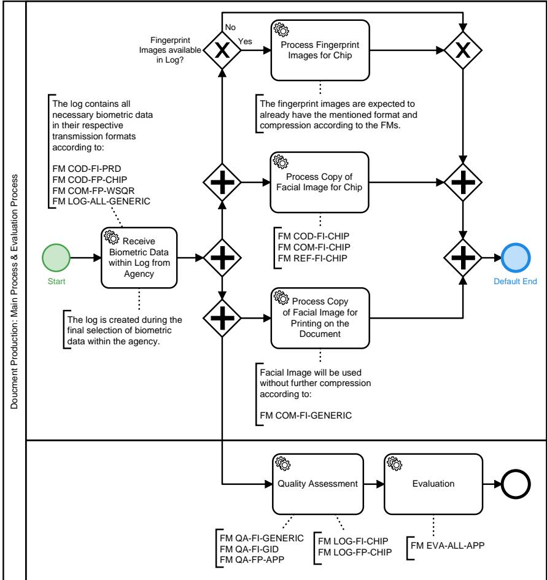

**Figure 3.12.** Overview Process of Application Profile Processing for Document Production

The application data is received from the agency and processed to produce the requested document(s) of the applicant. Note, that the process described above only focusses on biometric data. Additional application data is not subject to this technical guideline. [Figure 3.12 depicts the processing of facial image and fin](#page-26-0) gerprints (if present) for the document production process.

At first the facial image SHALL be received by central Document Production from the agency in charge (refer to [FM COD-FI-PRD\)](#page-82-1). From this facial image several copies SHALL be generated. Each image SHALL satisfy the respective [QA](#page-86-4) standards ( [FM QA-FI-GENERIC](#page-56-0) and [FM QA-FI-GID](#page-58-0) for facial images and [FM QA-FP-](#page-60-0)[APP](#page-60-0) for finger prints). The original received facial image MAY be deleted afterwards at any time. Every copy of the facial image SHALL be compressed according to its purpose:

- **•** One copy of the facial image SHALL be processed for usage in the chip personalisation.
- **•** Another copy of the facial image SHALL be processed for usage for printing on the document.

Note, that more copies of the original facial image are produced which not subject to this Technical Gui deline (e.g. facial images for laser engraving etc.).

Compression of an already compressed image SHALL NOT be done. (E.g.: An already compressed image for usage in the Register of Documents SHALL NOT be compressed for usage in chip personalisation.)

Second, (if present) the fingerprint images SHALL be received by central Document Production from agen cy in charge and SHALL be processed for usage in the chip personalisation.

Parallel to production preparations, an overall evaluation of the biometric data SHALL be applied. The results of the respective [QA](#page-86-4) standards application ( [FM QA-FI-GENERIC](#page-56-0) and [FM QA-FI-GID](#page-58-0) for facial images and

[FM QA-FP-APP](#page-60-0) for finger prints) SHALL be included in the evaluation (further details see [FM Category](#page-85-1) [Evaluation](#page-85-1)).

# **3.10.1. Mandatory Function Modules**

All Function Modules which SHALL be applied for this Application Profile are listed in [Table 3.17](#page-27-0). All listed Function Modules (separated by commas) are mandatory for this Application Profile unless specified other wise. Function Modules separated by slash are alternatives to each other. Function Modules in brackets are RECOMMENDED.

<span id="page-27-0"></span>

| Module Category               | Required Function Modules                                                                                      |
|-------------------------------|----------------------------------------------------------------------------------------------------------------|
| Acquisition Hardware          | -                                                                                                              |
| Acquisition Software          | -                                                                                                              |
| Biometric Image Processing    | -                                                                                                              |
| Quality Assessment            | FM QA-FI-GENERIC,<br>FM QA-FI-GID,<br>FM QA-FP-APP                                                             |
| Presentation Attack Detection | -                                                                                                              |
| Compression                   | FM COM-FI-GENERIC,<br>FM COM-FI-CHIP (facial image on chip),<br>FM COM-FP<br>WSQR (fingerprint images on chip) |
| Operation                     | -                                                                                                              |
| User Interface                | -                                                                                                              |
| Reference Storage             | FM REF-FI-CHIP (facial image on chip),<br>FM REF-FP-CHIP (fingerprint images on<br>chip)                       |
| Biometric Comparison          | -                                                                                                              |
| Logging                       | FM LOG-FI-CHIP,<br>FM LOG-FP-CHIP                                                                              |
| Coding                        | FM COD-FI-CHIP (facial image on chip),<br>FM COD-FP-CHIP (fingerprint images<br>on chip)                       |
| Evaluation                    | FM EVA-ALL-APP                                                                                                 |

**Table 3.17** Required Function Modules for Application Profile Processing for Document Production

# **3.10.2. Mandatory Partial Application Processes**

There are no Partial Application Processes to be applied for this Application Profile.

# <span id="page-28-0"></span>**4. Partial Application Processes**

The [Partial Application Processes \(PAPs\)](#page-86-5) specified by the following sections provide process specifications of basic biometric processes, e.g. the acquisition, identification or verification of biometrics or the evaluation processes for verification and identification. The [PAPs](#page-86-5) are referenced by the relevant Application Profiles and are part of the overall processes specified therein.

A [PAP](#page-86-5) MAY also be a task. A task is a process which functions as a generic reusable building block which is used by another [PAP](#page-86-5) and is not referenced by an Application Profile directly.

The specific Function Modules that SHALL be implemented in the processes of this chapter are specified by the relevant Application Profiles.

# <span id="page-28-2"></span><span id="page-28-1"></span>**4.1. PAP ACQ-FI-AUTO-1: Automated Facial Image Acquisition**

The facial image acquisition process described by this section applies to acquisition processes where the facial image is acquired automatically, refer to [Figure 4.1](#page-29-0). Note, that the [PAP Task ACQ-FI-1: Capture Live Facial](#page-29-1) [Image](#page-29-1) is used here.

An acquisition system SHALL be used that works with an integrated quality assessment Function Module (see [FM Category Quality Assessment](#page-55-0)). The requirements of [FM Category Acquisition Hardware,](#page-47-4) [FM Category](#page-51-2) [Acquisition Software](#page-51-2) and [FM Category Biometric Image Processing](#page-54-3) SHALL apply. The process SHALL use the following steps:

- 1. The biometric subject SHALL be guided to present its face.
- 2. The camera system SHALL be automatically configured for the body height of the person.
- 3. Multiple faces in the acquisition image area SHALL be detected. Note, the detection SHALL be carried out all the time while the acquisition is ongoing until the facial image is captured.
- 4. If multiple faces are detected, a guidance SHALL advice the biometric subject to appear alone in front of the acquisition system.
- 5. The distance of the biometric subject to the camera system SHALL be determined.
- 6. If the biometric subject is not in the optimal capture range, a guidance SHALL advice the biometric subject to enter the optimal distance range.
- 7. If a facial image can not be captured within a configured timeout, e.g. the biometric subject does not look in the camera or disappears from the system, the acquisition processes ends. The timeout SHALL be configurable.
- 8. The facial image of the biometric subject SHALL be captured. The image SHALL then be cropped and derotated to the face.
- 9. The quality of the facial image SHALL be assessed according to the specific Function Module in [FM](#page-55-0) [Category Quality Assessment.](#page-55-0)
- 10. If the quality is not sufficient and the timeout is not exceeded, a new facial image is captured. The timer for the timeout SHALL start with the retrieval of the first facial image from the capture system.
- 11. If the quality is sufficient, the facial image is released for the calling application.
- 12. If the timeout is exceeded and no image is of sufficient quality, the best facial image is selected among the captured images according to the specific Function Module in [FM Category Quality Assessment](#page-55-0) and the image SHALL be released for the calling application.
- 13. With optimal conditions (bona fide) the overall facial image acquisition process SHALL NOT exceed the following time limits:
	- a. For devices that are subject to TR volume Border Control (BCL), the overall facial image acquisition process SHALL NOT exceed ten seconds. In case the system is not required to perform a [PAD](#page-86-3) (e.g. supervised scenario) the overall facial image acquisition process SHALL NOT exceed seven seconds.
	- b. For devices that are subject to TR volume German Identity Documents (GID), the overall facial image acquisition process SHALL NOT exceed thirty seconds (including [PAD\)](#page-86-3).

<span id="page-29-0"></span>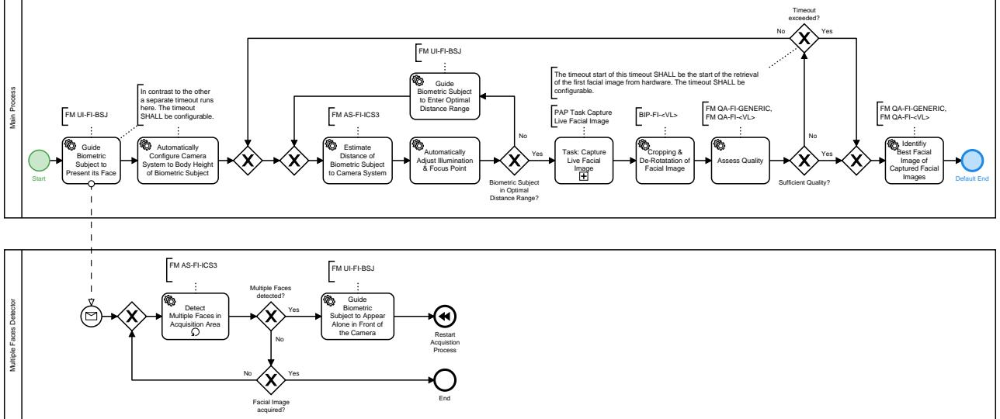

**Figure 4.1.** Partial Application Process "Automated Facial Image Acquisition"

### **4.1.1. Interface Requirements**

If [High Level Biometric Services \(HLBS\)](#page-86-6) is used by the system, the "Service Definition Facial Image Acquisition System" of Part 2, Volume 2 of this Technical Guideline SHALL be implemented.

# <span id="page-29-1"></span>**4.1.2. PAP Task ACQ-FI-1: Capture Live Facial Image**

[Figure 4.2](#page-30-1) depicts the basic process of a live facial image capture. If the image acquisition is not supervised [PAD](#page-86-3) SHALL be performed[1](#page-29-2) . In case of supervised image acquisition [PAD](#page-86-3) is OPTIONAL.

<span id="page-29-2"></span><sup>1</sup> Note that the requirement for PAD in supervised settings might be subject to transitional arrangements. The final obligation is regulated through the selection of mandatory Function Modules within the respective Application Profiles.

<span id="page-30-1"></span>

**Figure 4.2.** Partial Application Process Task "Capture Live Facial Image"

# <span id="page-30-0"></span>**4.2. PAP ACQ-FI-SV-4: Supervised Facial Image Acquisition**

## **4.2.1. Process**

The facial image acquisition process, refer to [Figure 4.3](#page-31-1), described by this section requires a supervised si tuation. Note, that the [PAP Task ACQ-FI-1: Capture Live Facial Image](#page-29-1) is used here. The biometric subject's facial image is captured using live enrolment equipment (including a digital camera within a photo studio setup) operated by an operator[2](#page-30-2) .

In case the acquisition system detects a face, the facial image capture SHALL be performed automatically. However, the operator SHALL also have option to perform capture manually. An immediately per formed cropping and de-rotation of the face and software quality assessment for the captured facial image ensures its biometric usability. If the quality assessment succeeds positively, the image SHALL be shown to the operator. If the quality is assessed as insufficient and the timeout has not exceeded yet, the system SHALL recapture. If the operator has captured manually, the image SHALL be shown to the operator in any case. In case the timeout has exceeded, the system SHALL identify the best captured facial image and show this image to the operator. The operator SHALL have the option to correct the cropping and de-rotation on the shown image manually. The operator SHALL also have the option to accept the captured facial image. The image is then release to the calling application. This is also the case, if the quality has been assessed as insufficient by the system. In the negative case, the facial image SHALL be discarded, the timeout is reset and a recapture is performed.

If the timeout exceeds and no facial image has been captured (neither with sufficient nor with insufficient quality), the process terminates without releasing an image. It is operator's decision to restart acquisi tion process or to perform other actions.

The process SHALL be supervised by an operator.

<span id="page-30-2"></span><sup>2</sup> See ISO/IEC 19794-5, Annex B for "Best practices for Face Images"

<span id="page-31-1"></span>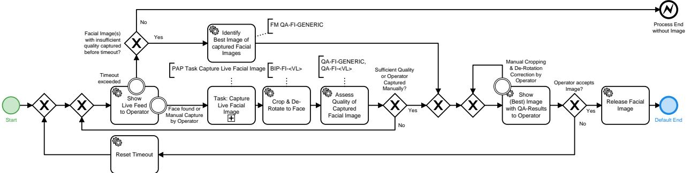

**Figure 4.3.** Partial Application Process "Supervised Facial Image Acquisition"

#### **4.2.1.1. Interface Requirements**

If [HLBS](#page-86-6) is used by the system, the "Service Definition Basic Facial Image Acquisition System" of Part 2, Volume 2 of this Technical Guideline SHALL be implemented.

# **4.2.2. PAP Task ACQ-FI-1: Capture Live Facial Image**

<span id="page-31-2"></span>[Figure 4.2](#page-30-1) depicts the basic process of a live facial image capture. If the image acquisition is not supervised [PAD](#page-86-3) SHALL be performed[3](#page-31-3) . In case of supervised image acquisition [PAD](#page-86-3) is OPTIONAL.

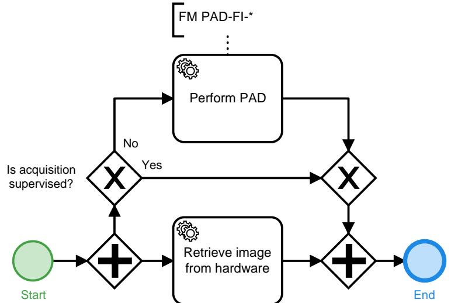

**Figure 4.4.** Partial Application Process Task "Capture Live Facial Image"

# <span id="page-31-0"></span>**4.3. PAP ACQ-FI-SV-5: Supervised Facial Image Acquisition System**

This Partial Application Process specifies a facial image acquisition system to automatically acquire or manu ally capture facial images for enrolment, verification or identification purposes. Note, that the [PAP ACQ-FI-](#page-28-2)[AUTO-1: Automated Facial Image Acquisition](#page-28-2) is used here.

### **4.3.1. Process**

The facial image acquisition system consists of two main processes, whereby the automatied acquisition is mandatory in all application scenarios while the manual mode is

**•** OPTIONAL for devices that are subject to TR volume German Identity Documents (GID)

<span id="page-31-3"></span><sup>3</sup> Note that the requirement for PAD in supervised settings might be subject to transitional arrangements. The final obligation is regulated through the selection of mandatory Function Modules within the respective Application Profiles.

**•** MANDATORY for other devices, especially in the context of TR volume Border Control (BCL).

The overall process is depicted in [Figure 4.5:](#page-32-0)

- 1. The operator triggers the automatic acquisition of a facial image for enrolment or verification/iden tification. The operator reviews the acquired facial image and the results of the software based [QA](#page-86-4). The operator SHALL have the option to manually crop and de-rotate the image. In case the manual review revealed bad quality of the facial image, the operator MAY discard the facial image in order to acquire a new facial image. The operator releases the image for further processing.
- 2. The operator triggers the manual acquisition of a facial image for enrolment or verification/identifi cation. The operator manually configures the camera system to the body height of the biometric subject (or triggers automatic height configuration). Next, the operator triggers the capture of a facial image of the biometric subject. The operator reviews the results of the software based [QA.](#page-86-4) The operator SHALL have the option to manually crop and de-rotate the image. In case the manual review revealed bad quality of the facial image, the operator MAY discard the facial image in order to acquire a new facial image. The operator releases the image for further processing.

To support the two processes, the system provides the following two service modes via its interface, refer to [Section 4.3.1.1:](#page-32-1)

1. *automated mode*

In this mode, the system obtains a request from the calling application to acquire an image by a certain quality level (enrolment, verification/identification quality). The system executes the required process au tonomously and returns the final image to calling application. Thereby, system handles pro cess execution, e.g. configuration of the camera system to the height of the biometric subject, mandatory repetitions due to quality issues, [QA](#page-86-4), automatic capture of the facial image etc. The system SHALL imple ment the processes specified by the [PAP ACQ-FI-AUTO-1: Automated Facial Image Acquisition](#page-28-2) for the automated mode. This service mode is MANDATORY in all application scenrios.

2. *manual mode*

In this mode, the system acts as a capture device for the calling application. The calling application sends atomic requests to the system, e.g. to adjust the system to the height of the biometric subject, to switch on the lighting or to capture a facial image. This service mode is OPTIONAL in the application context German Identity Documents (GID).

<span id="page-32-0"></span>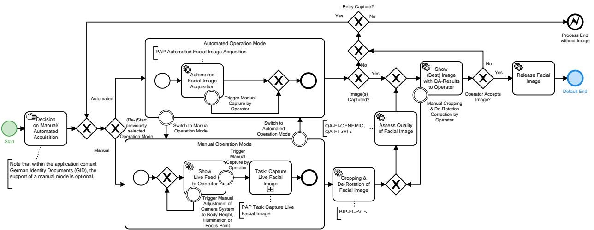

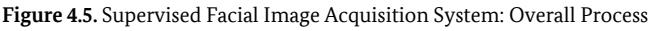

### <span id="page-32-1"></span>**4.3.1.1. Interface Requirements**

If [HLBS](#page-86-6) is used by the system, the "Service Definition Facial Image Acquisition System" of Part 2, Volume 2 of this Technical Guideline SHALL be implemented.

# **4.3.2. PAP Task ACQ-FI-1: Capture Live Facial Image**

<span id="page-33-1"></span>[Figure 4.2](#page-30-1) depicts the basic process of a live facial image capture. If the image acquisition is not supervised [PAD](#page-86-3) SHALL be performed[4](#page-33-3) . In case of supervised image acquisition [PAD](#page-86-3) is OPTIONAL.

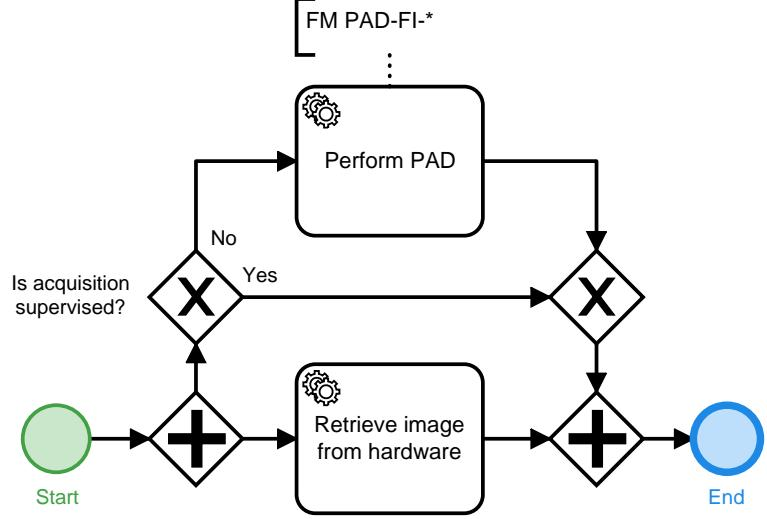

**Figure 4.6.** Partial Application Process Task "Capture Live Facial Image"

# <span id="page-33-0"></span>**4.4. PAP ACQ-FI-SV-1: Supervised Facial Image Acquisition by Scan of Photograph**

This Partial Application Process is only applicable in a few special cases which are defined by the German Federal Ministry of the Interior. Apart from these specific cases, scanning of photographs MUST NOT be used.

The facial image acquisition process described by this section applies to supervised situations whe re the facial image is acquired by an operator scanning a printed image, refer to [Figure 4.7](#page-33-2).

A photo taken and printed by a photographer is provided by the biometric subject. At first, a visual check SHALL be performed by the operator, refer to [Section 5.7](#page-67-3) and [Section 5.4.](#page-55-0) The operator SHALL manually verify whether the photo depicts the biometric subject. Depending on the result of the visual inspection, the photo is rejected or accepted for further processing. In the successful case, the image SHALL be digitised with a scanner by the operator, refer to [Section 5.1](#page-47-4), [Section 5.2](#page-51-2) and [Section 5.3,](#page-54-3) and be compressed, refer to [Section 5.6.](#page-66-3) Afterwards, the scanned image SHALL be subject to quality assessment, refer to [Section 5.4](#page-55-0). Finally, the operator SHALL have the option, to give a veto in order to overrule the [QA](#page-86-4) software decision.

<span id="page-33-2"></span>

**Figure 4.7.** Partial Application Process "Supervised Facial Image Acquisition by Scanned Image"

<span id="page-33-3"></span><sup>4</sup> Note that the requirement for PAD in supervised settings might be subject to transitional arrangements. The final obligation is regulated through the selection of mandatory Function Modules within the respective Application Profiles.

In addition to the check by [QA](#page-86-4) software, the operator MAY verify the geometric features of the image using a photo template (one for adults and one for children), refer to [Section 5.4](#page-55-0). If the operator gives a veto (veto

equals yes) a negative software decision of the quality assessment SHALL be overruled and the facial image SHALL be released. The operator SHALL in addition have the option to reject an image despite a positive software [QA](#page-86-4) decision.

The process SHALL be supervised by an operator.

# <span id="page-34-2"></span><span id="page-34-0"></span>**4.5. PAP DEL-FI-SV-1: Supervised Facial Image Digital Delivery**

## **4.5.1. Process**

The facial image delivery process, refer to [Figure 4.8](#page-34-1), described by this section requires a supervised situation performed by an operator [5](#page-34-3) .

After loading the captured facial image(s) into the operators application, an immediately performed cropping and de-rotation of the face software quality assessment for captured facial image(s) ensures its bio metric usability. Following a quality assessment the image(s) SHALL be shown to the operator. The system MAY identify the best captured facial image, show this image to the operator and preselect it. The operator SHALL have the option to correct the cropping and de-rotation on the shown image(s) manually. The operator SHALL also have the option to accept one of the captured facial image(s). The image is then released to the calling application. This is also the case, if the quality has been assessed as insufficient by the system.

In the case that the operator rejects the image(s) the process terminates without releasing an image. This is also the case, if the quality has been assessed as sufficient by the system.

Note, the facial image(s) captured SHALL be handled, transported and loaded into the operators application by the operators only. The biometric subject MUST NOT gain access to the facial image(s) at any time during this process.

<span id="page-34-1"></span>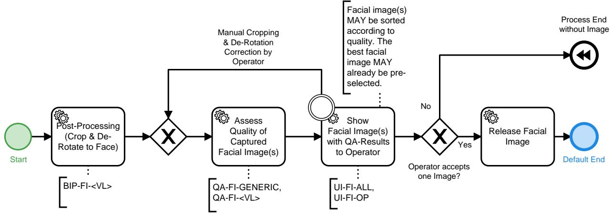

**Figure 4.8.** Partial Application Process "Supervised Facial Image Digital Delivery"

### **4.5.1.1. Interface Requirements**

If [HLBS](#page-86-6) is used by the system, the "Service Definition Facial Image Delivery System" of Part 2, Volume 2 of this Technical Guideline SHALL be implemented.

<span id="page-34-3"></span><sup>5</sup> See ISO/IEC 19794-5, Annex B for "Best practices for Face Images"

# <span id="page-35-0"></span>**4.6. PAP ACQ-FP2P-SV-1: Supervised Acquisition of Two Plain Fingerprints on Multi-Finger Hardware for Enrolment**

[Figure 4.9](#page-35-1) depicts the acquisition process for two finger enrolment on multi finger hardware. Note, that [PAP Task ACQ-FPS-SV-1: Capture Slap Supervised](#page-36-1) and [PAP Task ACQ-FPP-SV-2: Capture Plain Finger](#page-38-1) [print Supervised](#page-38-1) are used here.

The process is described the following way:

- 1. At the first the missing fingers of both hands SHALL be selected by the operator.
- 2. If both index fingers are available, [PAP Task ACQ-FPS-SV-1: Capture Slap Supervised](#page-36-1) SHALL be executed.
- 3. If only one index finger is available, [PAP Task ACQ-FPP-SV-2: Capture Plain Fingerprint Supervised](#page-38-1) SHALL be executed for this index finger.
- 4. If the index finger of the right hand could not be captured or is of insufficient quality, the capture for alternative fingerprints SHALL be done for the right hand, as described in [Figure 4.10](#page-36-0).
- 5. If none of the fingerprints of the right hand has sufficient quality, the Fingerprint with the highest quality value SHALL be selected. In case there are more than one fingerprint with the highest quality value, the selection SHALL be done with the following priority:
	- a. Index finger
	- b. Thumb
	- c. Middle Finger
- 6. If the index finger of left hand could not be captured or is insufficient quality, capture for alter native fingerprints SHALL be done for the left hand, as described in [Figure 4.10.](#page-36-0)
- 7. If none of the fingerprints of the left hand has sufficient quality, the Fingerprint with the highest quality value SHALL be selected. In case there are more than one fingerprint with the highest quality value, the selection SHALL be done with the following priority:
	- a. Index finger
	- b. Thumb
	- c. Middle Finger

The process SHALL be supervised by an operator.

<span id="page-35-1"></span>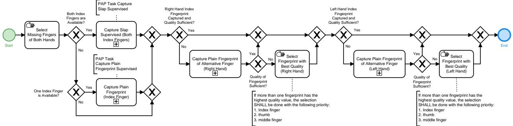

**Figure 4.9.** Partial Application Process "Supervised Acquisition of Two Plain Fingerprints on Multi-Finger Hardware for Enrolment"

[Figure 4.10](#page-36-0) depicts the acquisition process for capturing alternative fingerprints, if necessary. The possible necessity is described in [Figure 4.9](#page-35-1). Note, that [PAP Task ACQ-FPP-SV-2: Capture Plain Fingerprint Super](#page-38-1) [vised](#page-38-1) is used here.

The process is described the following way:

- 1. If the thumb is available, the fingerprint of the thumb SHALL be acquired as described in [PAP Task ACQ-](#page-38-1)[FPP-SV-2: Capture Plain Fingerprint Supervised](#page-38-1).
- 2. In case the thumb is not available or the quality is insufficient, the fingerprint of the middle finger SHALL be acquired, if available. The acquisition SHALL be done as described in [PAP Task ACQ-FPP-SV-2: Cap](#page-38-1) [ture Plain Fingerprint Supervised](#page-38-1).
- 3. In case the middle finger is not available or the quality is insufficient, the fingerprint of the ring finger SHALL be acquired, if available. The acquisition SHALL be done as described in [PAP Task ACQ-FPP-SV-2:](#page-38-1) [Capture Plain Fingerprint Supervised](#page-38-1).
- 4. In case fingerprints were acquired, but none of them with sufficient quality, the process SHALL end with these fingerprints.
- 5. In case no fingerprints were acquired, the process SHALL end without fingerprints.

The process SHALL be supervised by an operator.

<span id="page-36-0"></span>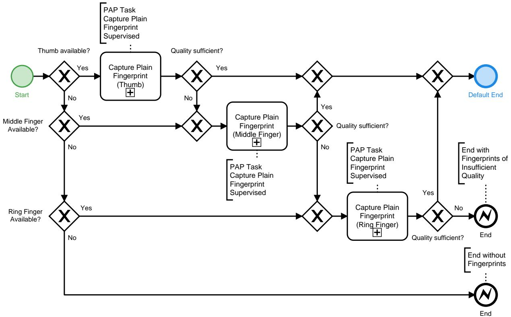

**Figure 4.10.** Capture Alternative Fingerprints for Partial Application Process "Supervised Acquisition of Two Plain on Multi-Fin ger Hardware for Enrolment"

# **4.6.1. Interface Requirements**

If [HLBS](#page-86-6) is used by the system, the "Service Definition Fingerprint Acquisition System" of Part 2, Volume 2 of this Technical Guideline SHALL be implemented.

# <span id="page-36-1"></span>**4.6.2. PAP Task ACQ-FPS-SV-1: Capture Slap Supervised**

[Figure 4.11](#page-38-0) depicts the basic process for a plain supervised slap capture. A plain slap capture can be part of more complex acquisition processes, e.g. a ten finger acquisition by the 4-1-4-1 capture sequence. The plain slap capture is subsequently described in detail. The quality assessment conducted according to the requi rements of the applicable [FM Category Quality Assessment](#page-55-0). Note, that the [PAP Task ACQ-FPP-SV-2: Cap](#page-38-1) [ture Plain Fingerprint Supervised](#page-38-1) is used here.

If the biometric subject is physically not capable to place all fingers of the slap on the capture hardware at the same time to achieve a slap image of good quality, the operator can decide to capture each finger of the slap in single finger capture mode. This SHALL be possible during the entire process. Hereby, single finger capture mode refers to the [PAP Task ACQ-FPP-SV-2: Capture Plain Fingerprint Supervised](#page-38-1) as described below.

- 1. The counter variable for the number of attempts for capturing the current slap SHALL be initialized as *i* = 1.
- 2. The slap image SHALL be retrieved from hardware. While the image is retrieved from hardware, [PAD](#page-86-3) SHALL be performed. Note: The operator have the option to manually conduct capture of sla p(s).
- 3. The fingerprints SHALL be segmented and each fingerprint SHALL be quality assessed.
	- a. In case the quality of the fingerprints meets the quality requirements defined in the corresponding [QA](#page-86-4) Function Module, the captured slap and the set of segmented fingerprints and parameter data (e.g. quality values) SHALL be temporarily stored.
	- b. In case the quality requirements for one or more fingerprints of the slap are not met, the capture SHALL be repeated up to two times (i.e. the acquisition of a single slap consists of a maximum of three capture attempts). The counter SHALL be set to *i* = *i* + 1.
- 4. A uniqueness check SHALL be conducted for the captured slap image to detect capture of wrong fin gers, e.g. due to interchanged hands or multiple acquisition of the same hand finger. Note, that it is RE COMMENDED to conduct the uniqueness check as early as possible after a fingerprint image is available.
	- a. In case
		- **•** the comparison of any fingerprint of the current slap with any previously accepted fingerprint of a previous slap or
		- **•** the comparison of any fingerprint of the current slap with another fingerprint of the current slap

is successful, the uniqueness check SHALL raise a warning.

- b. In case the comparisons of all fingerprints of the current slap with all fingerprints of previous slaps are not successful, the uniqueness check SHALL NOT show a warning.
- 5. Generally, a slap classifier SHALL be used for the captured slap image to detect the capture of the wrong slap. It SHALL be configurable to switch the classifier off or in evaluation mode (logging of result wi thout showing the result/warning to the operator). Note, that the slap classifier is only required for 4 finger slaps. Other acquisitions currently do not require the corresponding FM.
	- a. If the result of the classification concludes that the acquired slap mismatches the expected slap, a warning SHALL be reported.
	- b. If the result of the classification concludes that the acquired slap matches the expected slap, no warning SHALL be reported.

If the quality check of the third capture attempt fails (counter *i* is set to 3), the best of the captured slaps SHALL be identified according to the corresponding [QA](#page-86-4) Function Module and temporarily stored along with the corresponding information.

The process SHALL be supervised by an operator.

At the end of the process the operator decides on one of the three options:

- 1. Use the acquired slap.
- 2. Recapture the current slap. The counter SHALL be reset to *i* = 1.
- 3. Restart the total slap acquisition workflow.

The operator SHALL have the following veto options:

- **•** Select none of the captured slaps despite sufficient quality.
- **•** Select a slap of insufficient quality from the acquisition process.

At any point of the process the operator MAY decide to acquire any finger of the slap individually.

<span id="page-38-0"></span>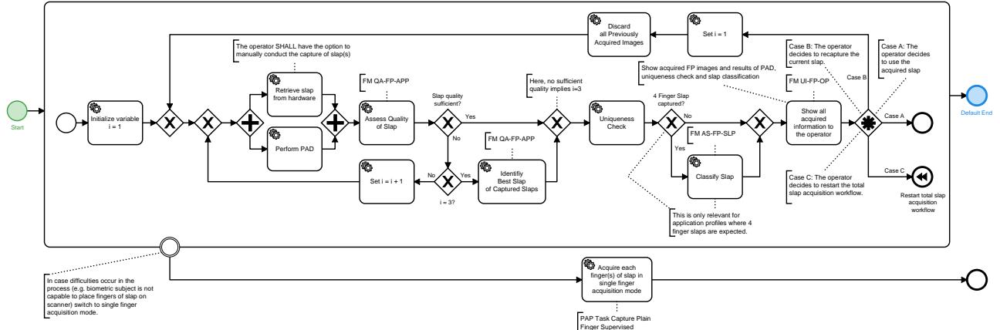

**Figure 4.11.** Partial Application Process Task "Capture Slap Supervised"

### <span id="page-38-1"></span>**4.6.2.1. PAP Task ACQ-FPP-SV-2: Capture Plain Fingerprint Supervised**

[Figure 4.12](#page-39-1) depicts the basic supervised capture process for a plain fingerprint capture. A plain fingerprint capture can be part of more complex acquisition processes, e.g. a ten finger acquisition by the 4-1-4-1 capture process. The plain fingerprint capture is described in detail subsequently. The quality assessment is conducted according to the requirements of the applicable [FM Category Quality Assessment.](#page-55-0)

- 1. The counter variable for the number of attempts capturing current fingerprints SHALL be initia lized as *i* = 1.
- 2. The fingerprint image SHALL be retrieved from hardware. While the image is retrieved from hardware, [PAD](#page-86-3) SHALL be performed. Note: The operator SHALL have the option to manually conduct the capture of fingerprint(s).
- 3. The fingerprint SHALL be quality assessed and the captured fingerprint and parameter data (e.g. quality values) SHALL be temporarily stored.
- 4. In case the quality requirements for the fingerprint are not met, the capture SHALL be repeated up to two times (i.e. the acquisition of a finger consists of a maximum of three capture attempts). The counter SHALL be set to *i* = *i* + 1.
- 5. A uniqueness check SHALL be conducted for the captured fingerprint image to detect the capture of wrong fingers, e.g. due to interchanged hands or multiple acquisition of the same hand finger. Note: It is RE COMMENDED to conduct the uniqueness check as early as possible after a fingerprint image is available.
	- a. In case the comparison of current fingerprint with any previously captured is success ful, the uniqueness check SHALL report a warning.
	- b. In case the comparison of current fingerprint with any previously captured is not suc cessful, the uniqueness check SHALL NOT report a warning.
- 6. The acquired finger prints and the results of [PAD,](#page-86-3) [QA](#page-86-4) and uniqueness check SHALL be displayed to the operator.

If the quality check of the third capture attempt fails (counter *i* is set to 3), the best of the captured fingerprint images SHALL be identified according to the corresponding [QA](#page-86-4) Function Module and temporarily stored along with the corresponding information.

The process SHALL be supervised by an operator.

At the end of the process the operator decides on one of the three options:

- 1. Use the acquired fingerprint.
- 2. Recapture the current fingerprint. The counter SHALL be reset to *i* = 1.
- 3. Restart the [Figure 4.12](#page-39-1) acquisition workflow.

The operator SHALL have the following veto options:

- **•** Select none of the captured fingerprints despite sufficient quality.
- **•** Select a fingerprint of insufficient quality from the acquisition process.

<span id="page-39-1"></span>

**Figure 4.12.** Partial Application Process Task "Capture Plain Fingerprint Supervised"

# <span id="page-39-0"></span>**4.7. PAP ACQ-FP2P-SV-2: Supervised Acquisition of Two Plain Fingerprints on Single-Finger Hardware for Enrolment**

[Figure 4.13](#page-40-0) depicts the acquisition process for two finger enrolment on single finger hardware. Note, that the [PAP Task ACQ-FPP-SV-2: Capture Plain Fingerprint Supervised](#page-38-1) is used here.

The process SHALL be supervised by an operator.

<span id="page-40-0"></span>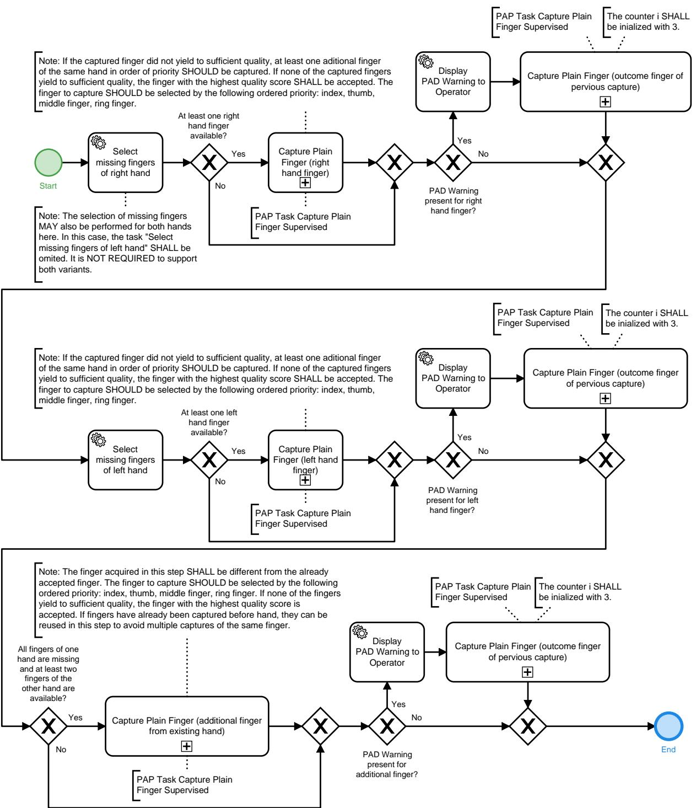

**Figure 4.13.** Partial Application Process "Supervised Acquisition of Two Plain Fingerprints on Single-Finger Hardware for Enrolment"

# **4.7.1. Interface Requirements**

If [HLBS](#page-86-6) is used by the system, the "Service Definition Fingerprint Acquisition System" of Part 2, Volume 2 of this Technical Guideline SHALL be implemented.

# **4.7.2. PAP Task ACQ-FPP-SV-2: Capture Plain Fingerprint Supervised**

[Figure 4.12](#page-39-1) depicts the basic supervised capture process for a plain fingerprint capture. A plain fingerprint capture can be part of more complex acquisition processes, e.g. a ten finger acquisition by the 4-1-4-1 capture process. The plain fingerprint capture is described in detail subsequently. The quality assessment is conducted according to the requirements of the applicable [FM Category Quality Assessment.](#page-55-0)

- 1. The counter variable for the number of attempts capturing current fingerprints SHALL be initia lized as *i* = 1.
- 2. The fingerprint image SHALL be retrieved from hardware. While the image is retrieved from hardware, [PAD](#page-86-3) SHALL be performed. Note: The operator SHALL have the option to manually conduct the capture of fingerprint(s).
- 3. The fingerprint SHALL be quality assessed and the captured fingerprint and parameter data (e.g. quality values) SHALL be temporarily stored.
- 4. In case the quality requirements for the fingerprint are not met, the capture SHALL be repeated up to two times (i.e. the acquisition of a finger consists of a maximum of three capture attempts). The counter SHALL be set to *i* = *i* + 1.
- 5. A uniqueness check SHALL be conducted for the captured fingerprint image to detect the capture of wrong fingers, e.g. due to interchanged hands or multiple acquisition of the same hand finger. Note: It is RE COMMENDED to conduct the uniqueness check as early as possible after a fingerprint image is available.
	- a. In case the comparison of current fingerprint with any previously captured is success ful, the uniqueness check SHALL report a warning.
	- b. In case the comparison of current fingerprint with any previously captured is not suc cessful, the uniqueness check SHALL NOT report a warning.
- 6. The acquired finger prints and the results of [PAD,](#page-86-3) [QA](#page-86-4) and uniqueness check SHALL be displayed to the operator.

If the quality check of the third capture attempt fails (counter *i* is set to 3), the best of the captured fingerprint images SHALL be identified according to the corresponding [QA](#page-86-4) Function Module and temporarily stored along with the corresponding information.

The process SHALL be supervised by an operator.

At the end of the process the operator decides on one of the three options:

- 1. Use the acquired fingerprint.
- 2. Recapture the current fingerprint. The counter SHALL be reset to *i* = 1.
- 3. Restart the [Figure 4.12](#page-39-1) acquisition workflow.

The operator SHALL have the following veto options:

- **•** Select none of the captured fingerprints despite sufficient quality.
- **•** Select a fingerprint of insufficient quality from the acquisition process.

<span id="page-42-1"></span>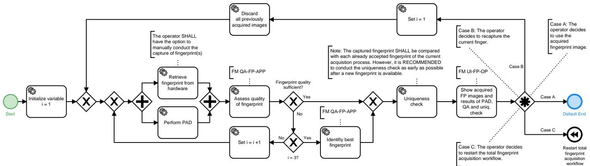

**Figure 4.14.** Partial Application Process Task "Capture Plain Fingerprint Supervised"

# <span id="page-42-0"></span>**4.8. PAP ACQ-FP2P-USV-1: Unsupervised Acquisition of Two Plain Fingerprints on Multi-Finger Hardware for Enrolment**

[Figure 4.15](#page-42-2) depicts the unsupervised acquisition process for two finger enrolment on multi finger hardware. Note, that the [PAP Task ACQ-FPS-USV-1: Capture Slap Unsupervised](#page-42-3) is used here.

During the acquisition process, the right and left index finger are recorded as a two-finger slap.

Note, that only index fingers SHALL be recorded in an unsupervised scenario. In case only one index finger is available, or no fingerprints were recorded, sufficient quality not yield, the acquisition SHALL be con ducted at a downstream supervised system.

<span id="page-42-2"></span>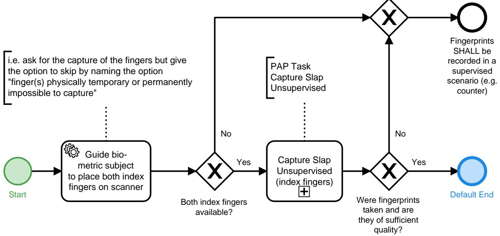

**Figure 4.15.** Partial Application Process "Unsupervised Acquisition of Two Plain Fingerprints on Multi-Finger Hardware for Enrolment"

# **4.8.1. Interface Requirements**

If [HLBS](#page-86-6) is used by the system, the "Service Definition Fingerprint Acquisition System" of Part 2, Volume 2 of this Technical Guideline SHALL be implemented.

# <span id="page-42-3"></span>**4.8.2. PAP Task ACQ-FPS-USV-1: Capture Slap Unsupervised**

[Figure 4.16](#page-44-1) depicts the basic process for a plain unsupervised slap capture. A plain slap capture can be part of more complex acquisition processes, e.g. a ten finger acquisition by the 4-1-4-1 capture sequence. The plain unsupervised slap capture is subsequently described in detail. The quality assessment is conducted according to the requirements of the applicable [FM Category Quality Assessment](#page-55-0).

In a uniqueness check, each segmented fingerprint of the current slap SHALL be compared with each already accepted fingerprint of the current acquisition process. Note, this is only required in case more than one slap is captured within the acquisition process.

- 1. The slap image SHALL be retrieved from hardware. The timer for timeout SHALL be configurable and SHALL start right away with beginning of the whole process. Note, that this timeout can also occur before performing [PAD](#page-86-3) respectively before retrieving slap from hardware.
	- a. If the Pre-Qualification is insufficient and timeout has exceeded, the acquisition process, described in this chapter, SHALL continue as follows:
		- i. In case no slap has been captured, it SHALL end without an acquired slap.
		- ii. In case at least one slap has been captured, the best one SHALL be identified and the acquisition process SHALL end afterwards.
	- b. If the Pre-Qualification is insufficient and timeout has not exceeded, the retrieval of an image SHALL be retried.
- 2. If the hardware returns a [PAD](#page-86-3) alarm, the acquisition process SHALL end. Note, that relevant informa tion described in [Section 5.5](#page-63-0) SHALL be stored before ending the acquisition process.
- 3. [QA](#page-86-4) SHALL be conducted. In case the quality of the fingerprints meet the quality requirements defined in the corresponding [Section 5.4](#page-55-0), the captured slap and the set of segmented fingerprints and parameter data (e.g. quality values) SHALL be temporarily stored.
	- a. In case the quality requirements for one or more fingerprints of the slap are not met, the capture SHALL be repeated if the timeout is not reached.
	- b. In case the timeout is reached and no slap image of sufficient quality was captured, the best slap image according to the corresponding [QA](#page-86-4) Function Module SHALL be stored with the set of segmented fin gerprints and parameter data (e.g. quality values).
- 4. The uniqueness check SHALL be conducted. If the uniqueness check fails, all captured images SHALL be discarded and the capture process SHALL be repeated from the beginning, but if the uniqueness check fails for the second time for the same slap, the acquisition process, described in this chapter, SHALL end without an acquired slap and a warning message SHALL be returned to the calling application, which SHALL be shown to the operator.
- 5. With optimal conditions (bona fide) the overall slap capture process SHALL NOT exceed ten seconds.
- 6. Generally, a slap classifier SHALL be used for the captured slap image to detect the capture of the wrong slap. It SHALL be configurable to switch the classifier off or in evaluation mode (logging of result wi thout showing the result/warning to the operator). Note, that the slap classifier is only required for 4 finger slaps. Other acquisitions currently do not require the corresponding FM.
	- a. If the result of the classification concludes that the acquired slap mismatches the expected slap, a warning SHALL be shown to the biometric subject, all captured images SHALL be discarded and the capture process SHALL be repeated from the beginning. The number of allowed retries con figurable.
	- b. If the result of the classification concludes that the acquired slap mismatches the expected slap and the image is transferred to the calling process, a warning SHALL be reported and shown to the operator. The operator decides whether the slap will be recaptured or the process continuous with the current slap.
	- c. If the result of the classification concludes that the acquired slap matches the expected slap, no warning SHALL be reported.

<span id="page-44-1"></span>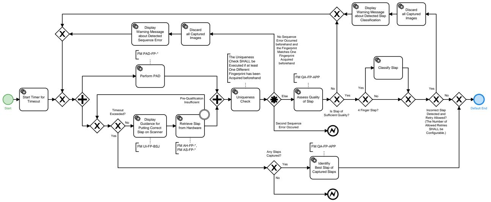

**Figure 4.16.** Partial Application Process Task "Capture Slap Unsupervised"

# <span id="page-44-0"></span>**4.9. PAP ACQ-FP2P-USV-2: Unsupervised Acquisition of Two Plain Fingerprints on Single-Finger Hardware for Enrolment**

[Figure 4.17](#page-44-2) depicts the unsupervised acquisition process for two finger enrolment on single finger hardware. Note, that the [PAP Task ACQ-FPP-USV-1: Capture Plain Fingerprint Unsupervised](#page-44-3) as defined below is used here.

During the acquisition process, first the right index finger SHALL be recorded and then the left index finger.

Note, in case the acquisition system is equipped with two single-fingerprint scanners, simultaneous ac quisition of two fingers with equal finger type from different hands (e.g. both index fingers) SHALL be allowed.

Note, that only index fingers SHALL be recorded in an unsupervised scenario. In case only one index finger is available, or no fingerprints were recorded, sufficient quality not yield, the acquisition SHALL be con ducted at a downstream supervised system.

<span id="page-44-2"></span>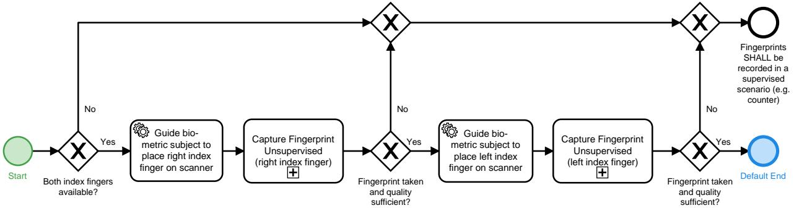

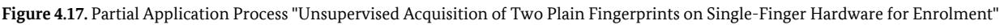

# **4.9.1. Interface Requirements**

If [HLBS](#page-86-6) is used by the system, the "Service Definition Fingerprint Acquisition System" of Part 2, Volume 2 of this Technical Guideline SHALL be implemented.

# <span id="page-44-3"></span>**4.9.2. PAP Task ACQ-FPP-USV-1: Capture Plain Fingerprint Unsupervised**

[Figure 4.18](#page-46-0) depicts the basic process for a plain unsupervised fingerprint capture. A cap ture can be part of more complex acquisition processes, e.g. a ten finger acquisition. The plain unsupervised fingerprint capture is subsequently described in detail. The [QA](#page-86-4) is conducted according to the requirements of the applicable [Section 5.4](#page-55-0).

- 1. The fingerprint image SHALL be retrieved from hardware. The timer for timeout SHALL be configurable and SHALL start right away with beginning of the whole process. Note, that this timeout can also occur before performing [PAD](#page-86-3) respectively before retrieving a fingerprint image from hardware.
	- a. If the Pre-Qualification is insufficient and the timeout has exceeded, the acquisition process, described in this chapter, SHALL end without an acquired fingerprint image.
	- b. If the Pre-Qualification is insufficient and the timeout has not exceeded, the retrieval of an image SHALL be retried.
- 2. The fingerprint SHALL be quality assessed.
- 3. The [PAD](#page-86-3) SHALL be carried out.
- 4. The uniqueness check SHALL be conducted.
	- a. If the uniqueness check fails for the first time for a finger:

All captured images SHALL be discarded.

A warning message that a sequence error was detected SHALL be displayed to the user.

The capture process SHALL be repeated from the beginning.

- b. If the uniqueness check fails for the second time for the same finger, the acquisition process, described in this chapter, SHALL end without an acquired fingerprint and a warning message SHALL be returned to the calling application, which SHALL be shown to the operator.
- c. If the uniqueness check yields to no warning, [QA](#page-86-4) SHALL be conducted.
- 5. In case the quality of the fingerprint meets the quality requirements defined in the corresponding [Sec](#page-55-0) [tion 5.4,](#page-55-0) the captured fingerprint and parameter data (e.g. quality values) SHALL be temporarily stored.
- 6. [QA](#page-86-4) SHALL be conducted within 300 ms.
- 7. In case the timeout is reached and no fingerprint image of sufficient quality was captured, best finger print image according to the corresponding [QA](#page-86-4) Function Module and corresponding parameter data (e.g. quality values) SHALL be stored.
- 8. In case the quality requirements for fingerprint is not met, capture SHALL be repeated if time out is not reached.
- 9. With optimal conditions (bona fide) the overall fingerprint capture process SHALL NOT exceed five se conds.

<span id="page-46-0"></span>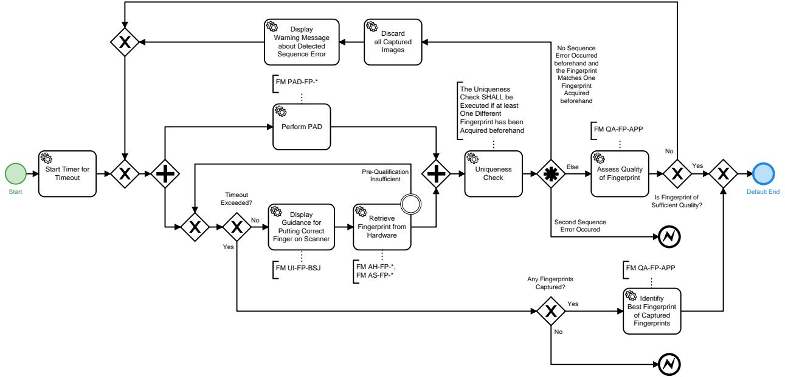

**Figure 4.18.** Partial Application Process Task "Capture Plain Fingerprint Unsupervised"

# <span id="page-47-0"></span>**5. Function Modules**

This chapter lists all Function Modules for the defined Application Profiles.

# <span id="page-47-4"></span><span id="page-47-1"></span>**5.1. FM Category Acquisition Hardware**

Devices that are used for digitising physical, representable biometric characteristics are called [Acquisition](#page-86-7) [Hardware \(AH\).](#page-86-7) Digital cameras to capture images of the face, fingerprint sensors, or signature tablets can be named as examples.

## <span id="page-47-3"></span>**5.1.1. FM AH-FI-DC2**

This Function Module describes the requirements for digital cameras and physical setup that are used to obtain facial images.

#### **5.1.1.1. Requirements**

- **•** The minimum physical resolution of the camera SHALL allow a cropping of the facial image to 1244 x 1600 pixels without any upscaling.
- **•** Adequate image quality to meet the requirements of [\[BIB\\_ISO\\_FACE\]](#page-88-9) SHALL be provided.
- **•** The physical and environmental conditions for capturing facial images, such as the positioning of ca mera, proper lighting of the face and a uniform background as described in [\[BIB\\_ISO\\_FACE\]](#page-88-9) and [\[BIB\\_I](#page-88-10) [CAO\\_TR\\_Portrait\\_Quality\]](#page-88-10) SHALL be complied with. It is RECOMMENDED to use a uniform background in grey (i.e. R=G=B) between #A1A1A1 and #E1E1E1.
- **•** The camera system SHALL be able to capture images in colour (24 bit sRGB).
- **•** The requirements for focal length (depending on the size of the camera sensor) as described in [\[BIB\\_I](#page-88-10) [CAO\\_TR\\_Portrait\\_Quality\]](#page-88-10) (chapters 5.2.1 and 5.2.2) SHALL be complied with. Wide-angle settings MUST NOT be used.

### <span id="page-47-2"></span>**5.1.2. FM AH-FI-ICS2**

This Function Module describes the requirements for integrated camera systems that are used to obtain digi tised facial images.

#### **5.1.2.1. Requirements**

- **•** The camera SHALL be able to capture a frontal image of the person if the biometric subject is standing or sitting upright in front of the camera system and is looking straight into the camera.
- **•** The camera system SHALL at least allow to acquire facial images compliant to this Technical Guideline of biometric subjects which have a body height in the range of 140 cm to 200 cm.
- **•** The camera system SHALL use diffuse lighting which SHALL adapt to the environmental light conditions for a uniform illumination of the biometric subject's face to ensure the capture of a well-exposed facial image; mirroring effects of glasses SHALL be avoided.
- **•** The camera system MAY provide a feedback screen for displaying the live camera image (digital mirror). If the camera system provides a feedback screen, the following requirements SHALL be taken into account:
- **•** If the biometric subject is looking straight to the feedback screen the viewing direction of the person SHALL be frontal.
- **•** The feedback SHALL include guidance to help the biometric subject for correct positioning in front of the camera.
- **•** The system SHALL allow high quality acquisitions independently from the environmental light situation, provided that the system is set up in an environment that can usually be found in agencies and that offers normal lighting conditions (no direct light from windows etc.).
- **•** The requirements for focal length (depending on the size of the camera sensor) as described in [\[BIB\\_I](#page-88-10) [CAO\\_TR\\_Portrait\\_Quality\]](#page-88-10) (chapters 5.2.1 and 5.2.2) SHALL be complied with. Wide-angle settings MUST NOT be used.
- **•** The camera system SHALL guarantee the sharpness of the captured image within the designated capture area.
- **•** The camera system SHALL minimise the distortion of the captured face within the whole capture area.
- **•** The minimum physical resolution of the camera SHALL allow a cropping of the facial image to 1244 x 1600 pixels without any upscaling.
- **•** The camera system SHALL be able to capture images in colour (24 bit sRGB).
- **•** Regarding background for capturing facial images exactly one out of two options SHALL be selected:
	- **•** A uniform background for capturing facial images as described in [\[BIB\\_ISO\\_FACE\]](#page-88-9) and [\[BIB\\_I](#page-88-10) [CAO\\_TR\\_Portrait\\_Quality\]](#page-88-10) SHALL be selected. t is RECOMMENDED to use a uniform background in grey (i.e. R=G=B) between #A1A1A1 and #E1E1E1.
	- **•** Otherwise, when dispensing with a uniform background, the background of the captured facial image SHALL be eliminated and replaced in accordance with [Section 5.2.2](#page-52-0).

### <span id="page-48-0"></span>**5.1.3. FM AH-FI-SSS2**

This Function Module describes the requirements for self-service systems scenarios where a digitised facial image is obtained. Note, the distance between camera system and biometric subject defined as geometri cal optical-path length between the forehead of the biometric subject and the active camera system's optic. The optical-path MAY, for example, follow a straight line from forehead to optic, or be rerouted by using mir rors so that the biometric subject can stand closer to the device.

#### **5.1.3.1. Requirements**

- **•** The system MAY measure the distance between the biometric subject and the camera system by hardware means.
- **•** The system SHALL allow to capture facial images of biometric subjects either in standing position or in sitting position. A change of position SHALL NOT be required.
- **•** The camera system SHALL NOT require the biometric subject to rotate its standing or sitting position while interacting with the graphical user interface in order to look straight to the camera system.
- **•** The camera system SHALL at least allow to acquire facial images compliant to this Technical Guideline of biometric subjects which have a body height in the range of 140 cm to 200 cm.
- **•** The camera system SHALL at least capture sharp full frontal images of the biometric subject which stand or sit upright in a range from at least 70 cm up to 100 cm in front of the camera system and look frontal whereas the following conditions SHALL be met. In case the manufacturer can provide a greater range than 100 cm, this SHALL be documented.
- **•** The minimum physical resolution of the camera SHALL allow a cropping of the facial image to 1244 x 1600 pixels without any upscaling.
- **•** The camera system SHALL be able to capture images in colour (24 bit sRGB).
- **•** The camera installation SHALL be able to capture an image according the definition of "full fron tal" (see [\[BIB\\_ISO\\_FACE\]\)](#page-88-9) on a hardware level. Especially an image capturing at "Frankfurt Horizon" SHALL be possible for all biometric subjects within the defined range of body height. The "Frankfurt Horizon" is a plane which is uniquely defined for each biometric subject by the following three points: the inferior margin of the left orbit and the superior margin of each ear canal.

## <span id="page-49-0"></span>**5.1.4. FM AH-FI-FBS**

This Function Module describes the requirements and interfaces in particular for flat bed scanners that are used to scan images for enrolment purposes.

#### **5.1.4.1. Requirements**

- **•** The minimum physical resolution of the scanner SHALL be 600 dpi.
- **•** Adequate image quality to meet the requirements of [\[BIB\\_ISO\\_FACE\]](#page-88-9) SHALL be provided.

## <span id="page-49-1"></span>**5.1.5. FM AH-FP-OPT**

This Function Module describes the requirements for optical high quality fingerprint scanners (single finger and multi finger).

#### **5.1.5.1. Requirements**

- **•** For the acquisition of the fingerprints, optical sensors using the principal of frustrated total reflection or direct contact (the imaging system is the sensor surface, typically separated by a transparent protection layer) according to the certification requirements of [\[BIB\\_ISO\\_FINGER\]](#page-88-8) (especially this means a resolution of 500 ppi or 1000 ppi) SHALL be used exclusively.
- **•** For the acquisition of the fingerprints, only devices are permitted which meet the following requirements (in analogy to [\[BIB\\_EBTS/F\]](#page-88-11)). Notwithstanding, a capturing area of at minimum 16 mm width and 20 mm height is REQUIRED (deviating from table F 1 in [\[BIB\\_EBTS/F\]\)](#page-88-11) for single finger scanners.

#### **5.1.5.1.1. Grey Scale Linearity**

When measuring a stepped series of uniform target reflectance patches ("step tablet") that substantially covers the scanner's grey range, the average value of each patch SHALL be within 7.65 grey levels of a linear, least squares regression line fitted between target reflectance patch values (independent variable) and scanner out put grey levels of 8 bit resolution (dependent variable).

#### **5.1.5.1.2. Resolution and Geometrical Accuracy**

Resolution: The scanner's final output fingerprint image SHALL have a resolution, in both sensor detector row and column directions, in the range: (*R ¡* 0*:*01*R*) to (*R* + 0*:*01*R*). The magnitude of *R* is either 500 ppi or 1000 ppi; a scanner MAY be certified at either one or both of these resolution levels. The scanner's true optical resolution SHALL be greater than or equal to *R*.

Across-Bar geometric accuracy: When scanning a 1.0 cy/mm, multiple parallel bar target, in both vertical bar and horizontal bar orientations, the absolute value of the difference (*D*) between the actual distance across parallel target bars (*X*), and the corresponding distance measured in the image (*Y*) SHALL NOT exceed the following values for at least 99 % of the tested cases in each print block measurement area and in each of the two directions:

- **•** for 500 ppi scanners:
	- *D ·* 0*:*0007, for 0*:*00 *< X ·* 0*:*07 and

*D ·* 0*:*01*X*, for 0*:*07 *· X ·* 1*:*50

**•** for 1000 ppi scanners:

*D ·* 0*:*0005, for 0*:*00 *< X ·* 0*:*07 and

$$D \le 0.0071X, \text{for } 0.07 \le X \le 1.50$$

where *D* = *jY ¡ Xj*, *X* = actual target distance, *Y* = measured image distance (*D; X; Y* are in inches).

Along-Bar geometric accuracy: When scanning a 1.0 cy/mm, multiple parallel bar target, in both vertical bar and horizontal bar orientations, the maximum difference in the horizontal or vertical direction, respectively, between the locations of any two points within a 1.5 inch segment of a given bar image, SHALL be less than 0.016 inches for at least 99 % of the tested cases in each print block measurement area and in each of the two orthogonal directions.

#### **5.1.5.1.3. Contrast Transfer Function**

The spatial frequency response SHALL be measured using a binary grid target (Ronchi-Grating), denoted as [contrast transfer function \(CTF\)](#page-86-8) measurement. When measuring the bar [CTF,](#page-86-8) it SHALL meet or exceed the minimum modulation values defined by equation [Equation 5.1](#page-50-0) or equation [Equation 5.2, in both the de](#page-50-1) tector's row and detector's column directions, and over any region of the scanner's field of view. [CTF](#page-86-8) values computed from equations [Equation 5.1](#page-50-0) and [Equation 5.2 for nominal test frequencies are given in the fol](#page-50-1) lowing table. None of the [CTF](#page-86-8) modulation values measured at specification spatial frequencies SHALL exceed 1.05. The output bar target image SHALL NOT exhibit any significant amount of aliasing. It is NOT REQUIRED that the bar target contains the exact frequencies listed in [Table 5.1,](#page-50-2) however, the target does need to cover the listed frequency range and contain bar patterns close to each of the listed frequencies.

The following equations are used to obtain the minimum acceptable [CTF](#page-86-8) modulation values when using bar targets that contain frequencies not listed in [Table 5.1](#page-50-2):

<span id="page-50-0"></span>**•** 500 ppi scanner, for f = 1.0 to 10.0 cy/mm:

$$CTF = 3.04105 \cdot 10^{-4} \cdot f^2 - 7.99095 \cdot 10^{-2} \cdot f + 1.02774 \tag{5.1}$$

<span id="page-50-1"></span>**•** 1000 ppi scanner, for f = 1.0 to 20.0 cy/mm:

$$CTF = -1.85487 \cdot 10^{-5} \cdot f^3 + 1.41666 \cdot 10^{-3} \cdot f^2 - 5.73701 \cdot 10^{-2} \cdot f + 1.01341 \tag{5.2}$$

For a given bar target, the specification frequencies include all of the bar frequencies which that target has in the range 1 to 10 cy/mm (500 ppi scanner) or 1 to 20 cy/mm (1000 ppi scanner).

<span id="page-50-2"></span>

| Frequency [cy/mm] | Minimum Modulation for 500 ppi<br>scanners | Minimum Modulation for<br>1000 ppi scanners | Maximum Modulation |
|-------------------|--------------------------------------------|---------------------------------------------|--------------------|
| 1.0               | 0.948                                      | 0.957                                       | 1.05               |
| 2.0               | 0.869                                      | 0.904                                       | 1.05               |
| 3.0               | 0.791                                      | 0.854                                       | 1.05               |
| 4.0               | 0.713                                      | 0.805                                       | 1.05               |
| 5.0               | 0.636                                      | 0.760                                       | 1.05               |
| 6.0               | 0.559                                      | 0.716                                       | 1.05               |
| 7.0               | 0.483                                      | 0.675                                       | 1.05               |
| 8.0               | 0.408                                      | 0.636                                       | 1.05               |
| 9.0               | 0.333                                      | 0.598                                       | 1.05               |
| 10.0              | 0.259                                      | 0.563                                       | 1.05               |
| 12.0              | ---                                        | 0.497                                       | 1.05               |

| Frequency [cy/mm] | Minimum Modulation for 500 ppi<br>scanners | Minimum Modulation for<br>1000 ppi scanners | Maximum Modulation |
|-------------------|--------------------------------------------|---------------------------------------------|--------------------|
| 14.0              | ---                                        | 0.437                                       | 1.05               |
| 16.0              | ---                                        | 0.382                                       | 1.05               |
| 18.0              | ---                                        | 0.332                                       | 1.05               |
| 20.0              | ---                                        | 0.284                                       | 1.05               |

**Table 5.1** Minimum and Maximum Modulation

#### **5.1.5.1.4. Signal-to-Noise Ratio and the Grey–Level Uniformity**

The white [signal-to-noise ratio \(SNR\)](#page-86-9) and black [SNR](#page-86-9) SHALL each be greater than or equal to 125.0, in at least 97 % of respective cases, within each measurement area.

The grey level uniformity is defined for the three following cases:

- **•** Adjacent row, column uniformity: At least 99 % of the average grey levels between every two adjacent quar ter-inch long rows and 99 % between every two adjacent quarter-inch long columns, within each imaged area, SHALL NOT differ by more than 1.0 grey levels when scanning a uniform low reflectance target, and SHALL NOT differ by more than 2.0 grey levels when scanning a uniform high reflectance target.
- **•** Pixel to pixel uniformity: For at least 99.9 % of all pixels within every independent 0.25 inch by 0.25 inch area located within each imaged area, individual pixel's grey level SHALL NOT vary from the average by more than 22.0 grey levels, when scanning a uniform high reflectance target, and SHALL NOT vary from the average by more than 8.0 grey levels, when scanning a uniform low reflectance target.
- **•** Small area uniformity: For every two independent 0.25 inch by 0.25 inch areas located within each imaged area, the average grey levels of the two areas SHALL NOT differ by more than 12.0 grey levels when scanning a uniform high reflectance target, and SHALL NOT differ by more than 3.0 grey levels when scanning a uniform low reflectance target.

#### **5.1.5.1.5. Grey Scale Range of Fingerprint Images**

A fingerprint scanner operating at 500 ppi or 1000 ppi, SHALL perform the following sets of live scans:

- **•** For a standard roll and plain finger live scanner: capture complete set of fingerprints from each 10 sub jects; i.e. 10 rolls (all 5 fingers from each hand), 2 plain thumb impressions, and 2 plain 4-finger impressions.
- **•** For a palm scanner component of a live scan system: capture left and right palms from each of 10 subjects.
- **•** For an identification flat live scanner: capture left and right 4-finger plain impressions and dual thumb plain impressions from each of 10 subjects.

Within the histogram of each image all grey values with at least 5 Pixels in this are counted. The histo gram SHALL show no break and no other artefact. At least 80 % of the captured individual fingerprint images SHALL have a grey scale dynamic range of at least 200 grey levels, and at least 99% SHALL have a dynamic range of at least 128 grey levels.

# <span id="page-51-2"></span><span id="page-51-0"></span>**5.2. FM Category Acquisition Software**

The Function Module category [Acquisition Software \(AS\) contains all functionality regarding image proces](#page-86-10) sing for biometric purposes. Therefore, these Function Modules usually contains device driver software for the acquisition hardware or, in general, software that is very close to the physical hardware such as firmware. Furthermore, colour management and image enhancement mechanisms are part of this software layer.

### <span id="page-51-1"></span>**5.2.1. FM AS-FI-DC2**

This Function Module describes the requirements and interfaces for acquisition software used digital ca meras in order to obtain digitised images.

#### **5.2.1.1. Requirements**

- **•** The camera-settings in place SHALL allow a cropping of the facial image to 1244 x 1600 pixels without any upscaling. If necessary, downscaling of the facial image MAY be done before cropping.
- **•** The images SHALL be captured and stored in colour (24 bit sRGB).
- **•** In normal mode of operation, no compression artefacts SHALL be detectable in the image.
- **•** The image data SHALL be provided without any compression or with lossless compression. If the acqui sition device does not support a lossless mode, the image SHALL be provided with the minimal level of compression possible.

#### **5.2.1.2. Recommendations**

Acquisition software that supports calibration procedures for the respective digital camera SHOULD be used (in particular colour management).

## <span id="page-52-0"></span>**5.2.2. FM AS-FI-ICS2**

This Function Module describes the requirements and interfaces for acquisition software used for integrated camera systems in order to obtain digitised facial images.

#### **5.2.2.1. Requirements**

- **•** The acquisition software of the camera system SHALL provide uncompressed image data for further pro cessing.
- **•** The selected resolution within the camera settings (e.g. configurable via camera firmware) SHALL be at least 1244 x 1600 pixels. Note, this requirement is OPTIONAL for scenarios where only a facial verification is performed.
- **•** The capture of images in colour (24 bit sRGB) SHALL be selected.
- **•** In normal mode of operation, no compression artefacts SHALL be detectable in the image.
- **•** Regarding background for capturing facial images exactly one out of two options SHALL be selected:
	- **•** A uniform background for capturing facial images as described in [\[BIB\\_ISO\\_FACE\]](#page-88-9) and [\[BIB\\_I](#page-88-10) [CAO\\_TR\\_Portrait\\_Quality\]](#page-88-10) SHALL be selected. t is RECOMMENDED to use a uniform background in grey (i.e. R=G=B) between #A1A1A1 and #E1E1E1.
	- **•** Otherwise, when dispensing with a uniform background, the background of the captured facial image SHALL be eliminated and replaced by a background according to the following parameters:
		- **•** The colour of the uniform background SHALL be a grey (i.e. R=G=B) between #A1A1A1 and #E1E1E1.
		- **•** The image noise SHALL be medium noise, but not more than 0.5 / FF.

#### **5.2.2.2. Recommendations**

- **•** The image data SHOULD be provided without any compression or with lossless compression. If the acqui sition device does not support a lossless mode, the image MAY alternatively be provided with the minimal level of compression possible.
- **•** Acquisition software that supports calibration procedures for the respective digital camera SHOULD be used (in particular colour management).

# <span id="page-52-1"></span>**5.2.3. FM AS-FI-ICS3**

This Function Module describes the requirements and interfaces for acquisition software used for integrated camera systems in order to obtain digitised facial images.

#### **5.2.3.1. Requirements**

- **•** The acquisition software of the camera system SHALL detect whether multiple faces are presented to the camera system simultaneously in the capture area.
- **•** The acquisition software of the camera system SHALL detect whether a face which is presented to ca mera system completely leaves the capture area. The process SHALL then terminate after a configurable timeout.

# <span id="page-53-0"></span>**5.2.4. FM AS-FI-FBS**

This Function Module describes the requirements and interfaces of Acquisition Software in particular for flat bed scanners that are used for the provisioning of digitised application form for the application of a German Identity Document.

#### **5.2.4.1. Requirements**

The facial image SHALL meet the following specifications:

- **•** The image data SHALL be provided without any prior or further compression in JPEG, meaning that, apart from the compression of JPEG itself, no further compression SHALL be applied. The facial image SHALL be provided with the least compression possible.
- **•** If the photograph of the applicant is a colour image, the scanning of images in colour (24 bit sRGB) SHALL be selected. If the photograph of the applicant is a grey scale image, the scanning in grey scale (8 bit sRGB) SHALL be selected.

#### **5.2.4.2. Recommendations**

Acquisition Software that supports calibration procedures for the respective scanner SHOULD be used (in particular colour management).

### <span id="page-53-1"></span>**5.2.5. FM AS-FP-MF**

This Function Module describes the requirements and interfaces for acquisition software for multi finger scanners.

#### **5.2.5.1. Requirements**

- **•** The image provided by acquisition software SHALL meet the criteria of fingerprints as described in [\[BIB\\_ISO\\_FINGER\]](#page-88-8). The requirements according to the certification requirements of [\[BIB\\_ISO\\_FINGER\]](#page-88-8) SHALL be met.
- **•** For the acquisition process, a pre-qualification of the fingerprints to prefer high quality SHALL be used. The activation of the acquisition SHALL occur automatically. The capture SHOULD prefer the highest quality image of a sequence.
- **•** This functionality MAY be part of the hardware firmware and MAY NOT be available as separate software component.
- **•** The thresholds of the pre-qualification for performing a capture SHALL be documented by the vendor.
- **•** If the acquisition software allows multiple thresholds for pre-qualification, it SHALL be configurable by the system administrator.
- **•** In case further requirements demand for an export of the uncompressed fingerprint image data BMP SHALL be used as image format.

#### **5.2.5.2. Recommendations**

In order to prevent unwanted duplicate acquisitions of the same fingers or slaps, the software SHOULD start the acquisition process not before the fingers from a previous acquisition have been removed from the sensor surface.

## <span id="page-54-2"></span>**5.2.6. FM AS-FP-SF**

This Function Module describes the requirements and interfaces for acquisition software for single finger scanners.

#### **5.2.6.1. Requirements**

- **•** The image provided by acquisition software SHALL meet the criteria of fingerprints as described in [\[BIB\\_ISO\\_FINGER\]](#page-88-8). The requirements according to the certification requirements of [\[BIB\\_ISO\\_FINGER\]](#page-88-8) SHALL be met.
- **•** For the acquisition process, a pre-qualification of the fingerprints to prefer high quality SHALL be used. The activation of the acquisition SHALL occur automatically. The capture SHOULD prefer the highest quality image of a sequence. This functionality MAY be part of the hardware firmware and MAY NOT be available as separate software component.
- **•** The thresholds of the pre-qualification for performing a capture SHALL be documented by the vendor.
- **•** If the acquisition software allows multiple thresholds for pre-qualification, it SHALL be configurable by the system administrator.
- **•** In case further requirements demand for an export of the uncompressed fingerprint image data BMP SHALL be used as image format.

#### **5.2.6.2. Recommendations**

In order to prevent unwanted duplicate acquisitions of the same finger, software SHOULD start ac quisition process not before the finger from a previous acquisition has been removed from the sensor surface.

# <span id="page-54-3"></span><span id="page-54-0"></span>**5.3. FM Category Biometric Image Processing**

The Function Module [Biometric Image Processing \(BIP\) provides the extraction of all relevant biometric in](#page-86-11) formation from the data which is provided by the acquisition hardware or the acquisition software layer. Thus, a proprietary data block is transformed to a digital image of a biometric characteristic. In general, specific image processing for biometric characteristics is addressed here.

### <span id="page-54-1"></span>**5.3.1. FM BIP-FI-GID**

This Function Module describes requirements and interfaces for Biometric Image Processing with respect to the output of digital cameras or integrated cameras in order to obtain a facial image that fulfils the ICAO requirements for travel documents.

#### **5.3.1.1. Requirements**

As a result of the image processing of this module, a facial image SHALL be generated that is compliant to the requirements of full frontal images specified in [\[BIB\\_ISO\\_FACE\]](#page-88-9) as well as the [QA](#page-86-4) category of this [Technical](#page-86-12) [Guideline \(TR\).](#page-86-12)

Generally, the facial image processing SHALL enclose the cropping and de-rotating to the facial image. In the following, the requirements for the image cropping and de-rotation are specified:

- **•** The resolution of the facial image SHALL be 1244 x 1600 pixels with an inter eye distance of at least 300 pixels and without any upscaling.
- **•** The facial image SHALL be a color image (24 bit sRGB).

**•** Post processing of the image orientation in regard to pitch and yaw (see [\[BIB\\_ISO\\_FACE\]\)](#page-88-9) SHALL NOT be done.

# <span id="page-55-1"></span>**5.3.2. FM BIP-FI-FBS**

This Function Module describes requirements and interfaces for Biometric Image Processing with respect to the output of flat bed scanners to obtain a facial image for enrolment purposes.

#### **5.3.2.1. Requirements**

As a result of the image processing of this module, a facial image SHALL be generated that is compliant to the requirements of full frontal images specified in [\[BIB\\_ISO\\_FACE\].](#page-88-9) As a precondition, the input photograph SHALL fulfil the requirements of [\[BIB\\_ISO\\_FACE\]](#page-88-9) as well and the photograph must be positioned on ap plication form in a correct manner.

Basically, the facial image processing SHALL enclose the cropping to the facial image. In the following, the requirements for the image cropping are specified:

- **•** The size of the photograph SHALL be 3.5 cm x 4.5 cm (width x height).
- **•** The photograph SHALL be scanned with an resolution of 600 dpi. The resulting facial image SHALL be downsized zu 622 pixels width and 800 pixels height. Note, upscaling of the resulting facial image MUST NOT take place.
- **•** The facial image SHALL be a color image (24 bit sRGB) or a grey scale image (8 bit sRGB).

# <span id="page-55-2"></span>**5.3.3. FM BIP-FP-APP**

This Function Module describes requirements and interfaces for the biometric image processing to provide up to four single finger images for the subsequent reference storage or biometric comparison.

#### **5.3.3.1. Requirements**

- **•** The resolution of the fingerprint image has to be 500 ppi or 1000 ppi corresponding to the certification requirements of [\[BIB\\_ISO\\_FINGER\]](#page-88-8) and, therefore, MAY differ from the scan resolution.
- **•** Depending on the call, as many individual fingerprints as requested SHALL be extracted from the input image and provided as single fingerprints.

Note: Segmentation for single finger scanners is OPTIONAL.

For this segmentation process, the following requirements SHALL be fulfilled:

- **•** ability to accept fingerprints which are rotated in the same direction up to 45 degrees
- **•** in the same direction rotated fingerprints have to be corrected to be vertical
- **•** segment the first part over the finger (fingertip)
- **•** segmentation has to occur on uncompressed data
- **•** Fingerprint images SHALL NOT be upscaled. If the targeted system or database requires fingerprint images of higher size than captured the fingerprint image SHALL be evenly surrounded with white pixels to reach the desired size.

# <span id="page-55-0"></span>**5.4. FM Category Quality Assessment**

The Function Module [Quality Assessment contains all kinds of mechanisms and procedures to check the qua](#page-86-4) lity of the biometric data or to select the best quality data out of multiple instances.

# <span id="page-56-0"></span>**5.4.1. FM QA-FI-GENERIC**

This Function Module describes requirements and interfaces for software that is used for quality assessment of digital images to ensure compliance with [\[BIB\\_ISO\\_FACE\].](#page-88-9)

#### **5.4.1.1. Requirements**

#### **5.4.1.1.1. General Requirements**

The [QA](#page-86-4) module is used for the software-based automatic check of the conformance of the picture to [\[BIB\\_ISO\\_FACE\]](#page-88-9) after the digitisation. Thereby, the geometric properties of the picture as well as the digital parameters of the image are analysed and rated.

The standard which is relevant for the quality of facial images [\[BIB\\_ISO\\_FACE\] hierarchically describes requi](#page-88-9) rements for the facial images. In the following, full frontal images are expected.

The [QA](#page-86-4) module SHALL analyse and evaluate all of the quality criteria listed in [Table 5.2](#page-56-1). For the criteria marked with "M", the quality values SHALL be provided while quality values for the criteria marked with "O" MAY be provided in the defined format according to the respective criteria.

A criterion is fulfilled if its calculated value is in the given threshold boundaries.

Based on the results of all provided quality criteria the [QA](#page-86-4) module SHALL reject or approve the picture. The total result is true if every single quality criteria is fulfilled.

The [QA](#page-86-4) module SHALL provide an interface for conformance testing where a single image can be processed and the calculated values and configuration data are returned. The image type to process depends on the image type requirements of the application profile to implement.

The [QA](#page-86-4) module SHOULD operate on cropped images retrieved from the image processing according to [FM](#page-54-3) [Category Biometric Image Processing.](#page-54-3)

<span id="page-56-1"></span>

| ID         | Criterion                                      | ISO-Ref., compare<br>[BIB_ISO_FACE] | Mandatory / Optional | Unit/Range      |  |
|------------|------------------------------------------------|-------------------------------------|----------------------|-----------------|--|
|            | Pose of the head                               |                                     |                      |                 |  |
| 1.1        | Yaw, neck axis                                 | 7.2.2                               | O                    | Degrees         |  |
| 1.2        | Pitch, ear axis                                | 7.2.2                               | O                    | Degrees         |  |
| 1.3        | Roll, nose axis                                | 7.2.2                               | M                    | Degrees         |  |
|            | Facial expression                              |                                     |                      |                 |  |
| 2.1        | Neutral expression                             | 7.2.3                               | O                    | Arbitrary units |  |
| 2.2        | Mouth closed                                   | 7.2.3                               | M                    | Arbitrary units |  |
| 2.3        | No raised eyebrows                             | 7.2.3                               | O                    | Arbitrary units |  |
| Eyes       |                                                |                                     |                      |                 |  |
| 3.1        | Eyes open                                      | 7.2.3                               | O                    | Arbitrary units |  |
| 3.2        | No occlusion (glasses,<br>hair, eye patch)     | 7.2.11 7.2.12                       | O                    | Arbitrary units |  |
| 3.3        | Eyes looking to the ca<br>mera                 | 7.2.3                               | O                    | Arbitrary units |  |
| Background |                                                |                                     |                      |                 |  |
| 4.1        | Uniformity (plainness,<br>no textures, colour) | 7.2.6 A.2.4.3                       | O                    | Arbitrary units |  |
| 4.2        | No shadows                                     | 7.2.6 A.2.4.2                       | O                    | Arbitrary units |  |

| ID                        | Criterion                                              | ISO-Ref., compare<br>[BIB_ISO_FACE] | Mandatory / Optional | Unit/Range                                                                                                                                                          |
|---------------------------|--------------------------------------------------------|-------------------------------------|----------------------|---------------------------------------------------------------------------------------------------------------------------------------------------------------------|
| 4.3                       | No further people / ob<br>jects                        | 7.2.4 A2.3                          | O                    | Arbitrary units                                                                                                                                                     |
| Geometry                  |                                                        |                                     |                      |                                                                                                                                                                     |
| 5.1                       | Image height                                           | 8.3.5 A.3.1.1 A.3.2.1               | M                    | In pixel                                                                                                                                                            |
| 5.2                       | Image width                                            | 8.3.4 A.3.1.1 A.3.2.1               | M                    | In pixel                                                                                                                                                            |
| 5.3                       | Ratio: Head width /<br>image width                     | 8.3.4                               | M                    | As ratio between 0 and 1                                                                                                                                            |
| 5.4                       | Ratio: Head height /<br>image height                   | 8.3.5                               | M                    | As ratio between 0 and 1                                                                                                                                            |
| 5.5                       | Vertical position of the<br>face                       | 8.3.3                               | M                    | As ratio between 0 and 1                                                                                                                                            |
| 5.6                       | Horizontally centred<br>face                           | 8.3.2                               | M                    | As ratio between 0 and 1                                                                                                                                            |
| 5.7                       | Eye distance                                           | 8.4.1 A3.1.1                        | M                    | In pixel                                                                                                                                                            |
|                           | Subject lighting                                       |                                     |                      |                                                                                                                                                                     |
| 6.1                       | Equally distributed<br>lighting                        | 7.2.7                               | O                    | Arbitrary units                                                                                                                                                     |
| 6.2                       | No shadows over the<br>face nor in the eye-so<br>ckets | 7.2.8 7.2.9                         | O                    | Arbitrary units                                                                                                                                                     |
| 6.3                       | No hot spots on skin                                   | 7.2.10                              | O                    | Arbitrary units                                                                                                                                                     |
| 6.4                       | No effects on glasses                                  | 7.2.11                              | O                    | Arbitrary units                                                                                                                                                     |
| Photographic requirements |                                                        |                                     |                      |                                                                                                                                                                     |
| 7.1                       | Proper exposure                                        | 7.3.2                               | M                    | Arbitrary units                                                                                                                                                     |
| 7.2                       | Focus and depth of field                               | 7.3.3                               | M                    | Arbitrary units                                                                                                                                                     |
| 7.3                       | No unnatural colours                                   | 7.3.4                               | O                    | Arbitrary units                                                                                                                                                     |
| 7.4                       | No red eyes                                            | 7.3.4                               | O                    | Arbitrary units                                                                                                                                                     |
| 7.5                       | Colour space                                           | 7.4.2.3                             | M                    | According to [BIB_ISO_FACE]<br>using Decimal notation (e.g.<br>"1" for RGB-24bit, "2" for<br>YUV422 or "3" for 8bit-grey<br>scale and "0" for unknown or<br>errors) |
| 7.6                       | Grey scale density and<br>colour saturation            | 7.4.2.1 7.4.2.2                     | M                    | Counted numbers of intensi<br>ty values existing within the<br>image                                                                                                |

**Table 5.2** Mapping of Relevant Quality Criteria

#### **5.4.1.1.2. Identification of the Best Capture**

When multiple facial images and their corresponding set of quality metrics are present, the best capture of the list SHALL be identified in an automated manner as described in the following[1](#page-57-0) :

1. If exactly one facial image conforms to more mandatory criteria than all other images, this image is chosen.

<span id="page-57-0"></span><sup>1</sup> Note that this is a description of the automated selection of the best capture among a list of facial images. Operators may always decide otherwise during the process (veto).

- 2. If more than one facial image is conform to more mandatory criteria than all other facial images, the facial image fulfilling the most optional criteria SHALL be chosen.
- 3. If more than one facial image is conform to more mandatory and optional criteria than all other facial images, the most recent facial image within this selection SHALL be chosen. If no timestamp is available, a random selection MAY be applied among the facial images fulfilling the most criteria.

# <span id="page-58-0"></span>**5.4.2. FM QA-FI-GID**

This Function Module describes requirements and interfaces for software that is used for quality assessment of digital images within the context of enrolment scenarios for identity documents to ensure compliance with [\[BIB\\_ISO\\_FACE\]](#page-88-9).

#### **5.4.2.1. Requirements**

The threshold requirements of [Table 5.3](#page-58-2) SHALL be in place within the context of enrolment scenarios for identity documents. These thresholds relate to the generic quality criteria of [FM QA-FI-GENERIC.](#page-56-0)

<span id="page-58-2"></span>

| ID  | Criterion                                               | Minimum | Maximum | Unit/Range               |
|-----|---------------------------------------------------------|---------|---------|--------------------------|
| 1.1 | Yaw, neck axis                                          | -5      | 5       | Degrees                  |
| 1.2 | Pitch, ear axis                                         | -5      | 5       | Degrees                  |
| 1.3 | Roll, nose axis                                         | -8      | 8       | Degrees                  |
| 5.1 | Image height, for live images and cloud<br>images       | 1600    | 1600    | In pixel                 |
| 5.1 | Image height, for scanned facial images                 | 800     | 800     | In pixel                 |
| 5.2 | Image width, for live images and cloud images           | 1244    | 1244    | In pixel                 |
| 5.2 | Image width, for scanned facial images                  | 622     | 622     | In pixel                 |
| 5.3 | Ratio: Head width / image width                         | 0,5     | 0,75    | As ratio between 0 and 1 |
| 5.4 | Ratio: Head height / image height                       | 0,6     | 0,9     | As ratio between 0 and 1 |
| 5.5 | Vertical position of the face                           | 0,3     | 0,5     | As ratio between 0 and 1 |
| 5.6 | Horizontally centred face                               | 0,45    | 0,55    | As ratio between 0 and 1 |
| 5.7 | Inter Eye distance, for live images and cloud<br>images | 300     | -       | In pixel                 |
| 5.7 | Inter Eye distance, for scanned images                  | 120     | -       | In pixel                 |

**Table 5.3** Quality Threshold Requirements for Facial Images for Enrolment Scenarios for Identity Documents

# <span id="page-58-1"></span>**5.4.3. FM QA-FI-PG**

This Function Module describes requirements for a photo guideline that is used for Quality Assessment.

#### **5.4.3.1. Recommendations**

If the [QA](#page-86-4) is to be performed by a person, visual tools like a photo guideline MAY be used for support.

If the visual check is conducted with the photo guideline, it always SHALL be done even if the checks with the photo template and/or the [QA](#page-86-4) software will be performed afterwards. A recent picture is required according to [\[BIB\\_ISO\\_FACE\]](#page-88-9) .

If these basic criteria are not met, the image SHALL be rejected without any further checks by the software or the photo template.

In the case of the photo guideline, the following criteria SHALL be described, preferably using sample images for compliant and non compliant images (compare [\[BIB\\_ISO\\_FACE\]](#page-88-9) ):

- **•** frontal pose
- **•** neutral expression
- **•** mouth closed
- **•** eyes open
- **•** no occlusion (glasses, hair, eye patch)
- **•** eyes looking to the camera
- **•** background uniformity (plainness, no textures, colour)
- **•** no shadows
- **•** no head coverings
- **•** no further people / objects
- **•** equally distributed lighting
- **•** no shadows over the face
- **•** no shadows in the eye sockets
- **•** no hot spots on skin
- **•** no effects from glasses
- **•** correct exposure
- **•** correct contrast
- **•** focus and depth of field
- **•** no unnatural colours
- **•** no red eyes

# <span id="page-59-0"></span>**5.4.4. FM QA-FI-PT**

This Function Module describes requirements for a photo template that is used for [QA.](#page-86-4)

#### **5.4.4.1. Requirements**

The photo template SHALL be used to determine if the geometric requirements of [\[BIB\\_ISO\\_FACE\] are ful](#page-88-9) filled (e.g. format, the height of the face and the centred alignment of the face). For this purpose, the photo template SHALL be placed digitally on the image and SHALL be checked by the operator.

For the photo template at least the following criteria out of [\[BIB\\_ISO\\_FACE\]](#page-88-9) SHALL be supported.

- **•** image height
- **•** image width
- **•** head height
- **•** eye positions
- **•** centred horizontally

For images of children under the age of 10, different requirements for the height of the head and the area of the eyes MAY be used. That is why a special photo template for children SHALL exist to check the acceptability of the image.

For the images of infants and babies younger than 6 years, additional tolerances concerning the pose of the head, the facial expression and the line of sight MAY be allowed, compared to those already described by the photo template for children.

### <span id="page-60-0"></span>**5.4.5. FM QA-FP-APP**

This Function Module describes requirements for the quality assessment of plain or rolled fingerprints inclu ding quality assessment of single fingerprint, respectively slap and selection of the best quality image out of multiple instances.

#### **5.4.5.1. Requirements**

#### **5.4.5.1.1. Quality Algorithm**

As quality algorithm, the latest version of [NIST Fingerprint Image Quality 2.2 \(NFIQ2.2\)](#page-86-13) [\[BIB\\_NFIQ2.2\]](#page-88-12) SHALL be used, and therefore, images with 1000 ppi SHALL be resampled to 500 ppi before application of [NFIQ2.2](#page-86-13). Note, that the resampled image SHALL be used for [NFIQ2.2](#page-86-13) only. As resulting quality value, the output value of [NFIQ2.2](#page-86-13) in the integer range of [0,100] SHALL be used. In the case of failure, the returned error code 255 indicates that a computation was not successful and the resulting quality value SHALL be returned as the result, as described in [Section 5.11.1](#page-73-1).

#### **5.4.5.1.2. Quality Evaluation Process for a Slap or Single Fingerprint**

In case a single captured fingerprint, respectively slap is passed, the [QA](#page-86-4) SHALL be performed as described in the following. Beforehand, the fingerprints of the passed capture SHALL be segmented (considering missing fingers). Note, that in verification applications, a [QA](#page-86-4) is not conducted. Thus, every slap capture is considered sufficient and no thresholds are specified here. Skipping the [QA](#page-86-4) is expected to accelerate the overall process. OPTIONALLY, a [QA](#page-86-4) can be performed.

- 1. For each segmented fingerprint *FA;j* of a passed capture *A*, a quality value *QA;j* is calculated with *j 2* 1*; :::;* 10 (up to 4 fingers in one slap) representing the specific finger code according to [\[BIB\\_ISO\\_FIN](#page-88-8) [GER\].](#page-88-8)
- 2. The resulting quality value is compared with the defined threshold *T Hj* for this finger. The application specific thresholds as defined in the following section apply.
- 3. In case all of the fingerprint qualities reach the specified threshold (i.e. *8j; QA;j ¸ T Hj* ), the boolean infor mation *b* = 1 indicates a successful capture.
- 4. In case one or more fingerprints do not reach the threshold (i.e. *9j; QA;j < T Hj* ), the boolean information *b* = 0 indicates insufficient quality of the capture.
- 5. For the segmented fingerprint *FA;j* the corresponding parameter set *PA;j* is compiled and returned.
- 6. As a result of the [QA](#page-86-4) process, the following values are returned to the calling process:
	- a. the boolean information *b*
	- b. the parameter set *PA* = *QA;j ; :::; QA;l* with *j; l 2* 1*; :::;* 10 representing the specific finger code

#### **5.4.5.1.3. Identification of the Best Capture out of Multiple Captures**

When multiple captures *Ai ;i 2* 1*; :::; n* and their corresponding set of segmented fingerprints *FAi ;j* with *j 2* 1*; :::;* 10 representing the specific finger code according to [\[BIB\\_ISO\\_FINGER\]](#page-88-8) are passed, the best of the captures SHALL be identified as described in the following section:

- 1. For each segmented fingerprint *FAi ;j* of a passed capture *Ai* , the quality value *QAi ;j* is calculated with re presenting the specific finger code according to [\[BIB\\_ISO\\_FINGER\]](#page-88-8).
- 2. The captures are ranked according to the quality values of the fingerprints according to the following (lexicographical) order. The highest ranked capture is considered as the capture yielding the best quality.
	- a. for left/right four-finger slaps, the order is as follows:
- i. index finger (highest priority)
- ii. middle finger
- iii. ring finger
- iv. little finger (lowest priority)

Example 1: Two Slaps of a right hand. Middle finger, ring finger and little finger of the first slap have a better quality than the middle finger, ring finger and little finger of the second slap, but the quality of the index finger is better in the second slap. Consequently, the second slap SHALL be taken.

Example 2: Three Slaps of a left hand. The quality of the index finger and the middle finger is the same in all three slaps, but the quality of the ring finger is better in the first slap. So the first slap SHALL be taken, no matter how high or low the quality of the little finger is in any slap.

- b. for thumb slaps, the order is as follows:
	- i. right thumb (highest priority)
	- ii. left thumb (lowest priority)
- c. for index finger slaps:
	- i. In contrast to the other two slap types, the best capture of index finger slaps is a set of the best captures of each index finger as indicated by the following two options.

If each index finger yields sufficient quality in at least one of the already conducted captures, the index fingers of sufficient quality are accepted and the total index finger slap capture is considered as of sufficient quality.

If not both index fingers yield at least once sufficient quality in a capture, the best image for each index finger is returned as the best capture and the slap captured is considered as of insufficient quality.

- ii. If for a single slap both index fingers yield to sufficient quality, those two index fingers SHALL be selected even if an index finger of another slap yield to better quality.
- d. for rolled single finger captures:
	- i. Of the set of captured images obtained in the process beforehand, which are not annotated by a hardware reported issue, the capture with the highest quality value is considered as the best image.
	- ii. If the set of captured images obtained in the process beforehand on does only contain images which are annotated by hardware reported issues, the capture with the highest quality value of the entire set is considered as the best image.
	- iii. In case several captures yield to the same highest quality value, the last (temporal) of highest quality captures is considered as the best image.
- 3. As a result of the [QA](#page-86-4) process, the following values are returned:
	- a. the identifier *i* representing the capture yielding the best quality
	- b. the parameter set *PA* = *QAi;j ; QAi;l* with *j; l 2* 1*; :::*10.

#### **5.4.5.1.4. Thresholds for Plain Fingerprints for Enrolment Purposes**

The following thresholds as indicated in [Table 5.4](#page-62-0) apply when fingerprints are captured plain for enrolment purposes. Note, the thresholds in [Table 5.4](#page-62-0) do not apply to plain captured fingerprint in enrolment scenarios where the plain fingerprints are captured for control purpose of rolled fingerprints. In that case, thresholds as indicated in [Table 5.5](#page-62-1) apply for the plain fingerprints.

<span id="page-62-0"></span>

| Finger Position     | Finger Code | NFIQ2.2 Threshold |
|---------------------|-------------|-------------------|
| Right thumb         | 1           | 30                |
| Right index finger  | 2           | 30                |
| Right middle finger | 3           | 20                |
| Right ring finger   | 4           | 10                |
| Right little finger | 5           | 10                |
| Left thumb          | 6           | 30                |
| Left index finger   | 7           | 30                |
| Left middle finger  | 8           | 20                |
| Left ring finger    | 9           | 10                |
| Left little finger  | 10          | 10                |

**Table 5.4** Thresholds for Plain Fingerprints for Enrolment Purposes

#### **5.4.5.1.5. Thresholds for Plain Control Fingerprints and Fingerprints used for Identification Searches**

The following thresholds as indicated in [Table 5.5](#page-62-1) apply when fingerprints are captured plain for the purpose of control slaps (used for comparison with rolled prints) or use in identification searches. Note, the thres holds in [Table 5.5](#page-62-1) do apply to plain captured fingerprint in enrolment scenarios where the plain fingerprints are captured for control purpose of rolled fingerprints.

<span id="page-62-1"></span>

| Finger Position     | Finger Code | NFIQ2.2 Threshold |
|---------------------|-------------|-------------------|
| Right thumb         | 1           | 20                |
| Right index finger  | 2           | 20                |
| Right middle finger | 3           | 20                |
| Right ring finger   | 4           | 10                |
| Right little finger | 5           | 10                |
| Left thumb          | 6           | 20                |
| Left index finger   | 7           | 20                |
| Left middle finger  | 8           | 20                |
| Left ring finger    | 9           | 10                |
| Left little finger  | 10          | 10                |

**Table 5.5** Thresholds for Plain Control /Identification Fingerprints

#### **5.4.5.1.6. Thresholds for Rolled Fingerprints**

The following thresholds as indicated in [Table 5.6](#page-62-2) apply when fingerprints are captured rolled for enrolment purposes.

<span id="page-62-2"></span>

| Finger Position     | Finger Code | NFIQ2.2 Threshold |
|---------------------|-------------|-------------------|
| Right thumb         | 1           | 20                |
| Right index finger  | 2           | 15                |
| Right middle finger | 3           | 15                |
| Right ring finger   | 4           | 10                |

| Finger Position     | Finger Code | NFIQ2.2 Threshold |
|---------------------|-------------|-------------------|
| Right little finger | 5           | 5                 |
| Left thumb          | 6           | 20                |
| Left index finger   | 7           | 15                |
| Left middle finger  | 8           | 15                |
| Left ring finger    | 9           | 10                |
| Left little finger  | 10          | 5                 |

**Table 5.6** Thresholds for Rolled Fingerprints

# <span id="page-63-0"></span>**5.5. FM Category Presentation Attack Detection**

The objective of the Function Module [Presentation Attack Detection](#page-86-3) is to avoid presentations with the goal to subvert an enrolment, verification of identification process.

# <span id="page-63-1"></span>**5.5.1. FM PAD-FI-APP1**

This Function Module describes requirements for [PAD](#page-86-3) in the context of the acquisition of facial images. This Function Module is especially relevant for use cases where no direct observation of the acquisition process by an operator is possible (e.g. in self-service scenarios).

### **5.5.1.1. Requirements**

#### **5.5.1.1.1. General Requirements**

The capture subsystem SHALL contain a [PAD](#page-86-3) subsystem detecting spoofing attempts using artefacts by which an attacker is trying to establish a different biometric characteristic as probe in the verification or identifica tion process.

The [PAD](#page-86-3) subsystem MAY consist of hardware and software (e.g. the used camera system MAY have additional sensors designed for this purpose).

The [PAD](#page-86-3) subsystem SHALL be able to detect different artefact classes listed in the following:

- **•** Complete artefacts (covering the whole or nearly the whole face of the attacker), either built from one piece or from multiple pieces.
- **•** Partial artefacts (covering only parts of the attacker's face, such as artefacts covering the chin only), either built from one piece or from multiple pieces.

The [PAD](#page-86-3) subsystem SHALL be able to detect all well-known artefact material types listed in the following:

- **•** Photographs printed on paper with different thicknesses and structures of paper and different structures of printing (colouring, etc.).
- **•** Photographs displayed on electronic devices (e.g. phones, tablets, laptops, etc.) where different methods of displaying might be used.
- **•** Videos displayed on electronic devices, especially showing motion of the biometric subject.
- **•** Photographs printed on fabrics with different thicknesses and structures of the me thods of printing (flock print, silk screening, etc.).
- **•** 3D masks in big (size of a face) and small (smaller than a normal face) sizes and different thicknesses based on,
- **•** Paper
- **•** Casted silicon
- **•** 3D-printer
- **•** Latex

On top of the listed attack classes and materials, additional MAY be detected by PAD sub system:

- **•** Makeup (normal or professional)
- **•** Additional artefacts beyond the imitation of faces, such as glasses etc.

Under optimal testing conditions, the [PAD](#page-86-3) subsystem SHALL feature a false-alarm-rate of 2% maximum when tested with bona fide biometric subjects. This rate is monitored via logfiles analysis within the operational environment. If this rate is significantly exceeded, any certification that may have been issued might be reevaluated (depending on application context)[2](#page-64-0) .

Also, the detection subsystem SHALL be adequate to the usage setting in correspondence with the security requirements in question. The performance MAY be described by a risk analysis for every considered attack type. The current version of [\[BIB\\_ISO\\_PAD\\_3\]](#page-88-13) SHALL be taken into account.

#### **5.5.1.1.2. Integration Requirements**

The [PAD](#page-86-3) subsystem SHALL be independent of the regular capture subsystem, i.e. it NOT inhibit captu ring image data in case of a suspected attack. It SHALL signal its detection results in the form of a [PAD](#page-86-3) score to the calling application. The score SHALL be a normalized double in the range [0,1] using at least ten uniformly distributed interim values, where 0 indicates bona fide and 1 presentation attack. A binary score SHALL NOT be used (e.g. True or False, 1 or 0). Detailed information about the [PAD](#page-86-3) (results) SHALL be logged as described in [Section 5.12](#page-81-0). The technical information including the result value and description of the mapping between technical result and interpretation SHALL be stored additionally, if they are provided.

Even if the Function Module is used within a comparison scenario, the detection result SHALL be signalled in any case, independent from any biometric comparison score. Also, the omission of the detection result SHALL be signalled in any case.

The [PAD](#page-86-3) result SHALL correspond to the chosen facial image.

#### **5.5.1.1.3. Maintenance Requirements**

As new technologies and new attack mechanisms are developed over time, the [PAD](#page-86-3) subsystem SHALL be regularly updated and reevaluated.

#### **5.5.1.1.4. Certification Requirements**

To ensure comparable performance of presentation attack detection subsystems, the system SHALL be certi fied

- **•** either under the Common Criteria Agreement according to the Protection Profile "BSI-CC-PP-0118-2022: Common Criteria Protection Profile - Biometric Mechanisms Protection Profile (BMPP), Version 2.0, base PP and at least the functional package PAD"
- **•** or according to BSI TR-03122: Conformance Test Specification for Technical Guideline TR-03121 Bio metrics for Public Sector Applications, respectively this technical guideline.

#### **5.5.1.1.5. Transition Rules**

The requirements of this module do not apply until May 2025.

<span id="page-64-0"></span><sup>2</sup> Note that during certification a relaxed false-alarm-rate is tested. The requirement of the rate specified in this Function Module is tested on operational collected data only.

### <span id="page-65-0"></span>**5.5.2. FM PAD-FP-APP**

This Function Module describes requirements for [PAD](#page-86-3) in the context of acquisition biometric charac teristics of fingerprints.

#### **5.5.2.1. Requirements**

#### **5.5.2.1.1. General Requirements**

The capture system SHALL contain a [PAD](#page-86-3) subsystem according to [\[BIB\\_ISO\\_PAD\\_1\] detecting spoofing at](#page-88-14) tempts using artefacts by which an attacker is trying to establish a different biometric characteristic as probe in the verification or identification process.

The [PAD](#page-86-3) subsystem MAY consist of hardware and software (e.g. the used fingerprint scanner have addi tional sensors designed for this purpose).

According to the used fingerprint scanner, [PAD](#page-86-3) subsystem SHALL be able to detect artefact classes listed in the following:

- **•** Fingertips, created in different thicknesses
- **•** Single fingers (massive)

The [PAD](#page-86-3) subsystem SHALL be able to detect all typical artefact material types listed in the following:

- **•** Artefacts created from different kinds of silicon
- **•** Artefacts created from different kinds of latex
- **•** Artefacts created from different kinds of gelatine
- **•** Artefacts created from different kinds of wood glue
- **•** Artefacts created from different kinds of window painting
- **•** Artefacts created from different kinds of paper

each in different colourings.

Under optimal testing conditions, the [PAD](#page-86-3) subsystem SHALL feature a false-alarm-rate of 2% maximum when tested with bona fide biometric subjects with generally good quality fingerprints. This rate is monitored via logfiles analysis within the operational environment. If this rate is significantly exceeded, any certification that may have been issued might be re-evaluated (depending on application context) [3](#page-65-1) .

Also, the detection subsystem SHALL be adequate to the usage setting in correspondence with the security requirements in question. The performance MAY be described by a risk analysis for every considered attack type. The current version of [\[BIB\\_ISO\\_PAD\\_3\]](#page-88-13) SHALL be taken into account.

The [PAD SHALL be conducted both in supervised acquisition scenarios, e.g. a counter scenario, and un](#page-86-3) supervised acquisition scenarios, e.g. in [SSS](#page-86-2) scenarios. Thereby, the [PAD](#page-86-3) SHALL be conducted for all acquisi tion purposes, e.g. enrolment, identification and verification.

#### **5.5.2.1.2. Integration Requirements**

The [PAD](#page-86-3) subsystem SHALL be independent of the regular capture subsystem.

It SHALL signal its detection results in the form of a [PAD](#page-86-3) score for each finger individually. Additionally, an overall result SHALL be returned to the calling application.

The score for each finger SHALL be a normalized as double in the range [0,1] using at least ten uniformly distributed interim values, where 0 indicates bona fide and 1 presentation attack. A binary score SHALL NOT be used (e.g. True or False, 1 or 0). The [PAD](#page-86-3) subsystem SHALL additionally provide detailed information about the scores of the [PAD.](#page-86-3)

<span id="page-65-1"></span><sup>3</sup> Note that during certification a relaxed false-alarm-rate is tested. The requirement of the rate specified in this Function Module is tested on operational collected data only.

The overall result SHALL be a boolean value (e.g. True or False). The value SHALL be true, if any of the fingers individual result triggers a [PAD](#page-86-3) alarm.

Even if the Function Module is used within a comparison scenario, the detection result SHALL be signalled in any case, independent from any biometric comparison score. Also, the omission of the detection result SHALL be signalled in any case.

The [PAD](#page-86-3) result SHALL correspond to the respective finger capture attempt.

Note, that an image of the fingerprint or slap in question SHALL be acquired independently of a possible PAD alarm.

#### **5.5.2.1.3. Maintenance Requirements**

As new technologies and new attack mechanisms are developed over time, the [PAD](#page-86-3) subsystem SHALL be updated and checked whenever necessary, so it stays capable against old and new attacks and attack types.

#### **5.5.2.1.4. Certification Requirements**

To ensure comparable performance of presentation attack detection subsystems, the system SHALL be certi fied either under the Common Criteria Agreement according to one of following Protection Profiles:

- **•** BSI-CC-PP-0063-2010: Fingerprint Spoof Detection Protection Profile (FSDPP)
- **•** BSI-CC-PP-0062-2010: Fingerprint Spoof Detection Protection Profile based on Organisational Security Policies (FSDPP\_OSP)
- **•** BSI-CC-PP-0118-2022: Common Criteria Protection Profile Biometric Mechanisms Protection Profile (BMPP), Version 2.0, base PP and at least the functional package PAD

or according to BSI TR-03122: Conformance Test Specification for Technical Guideline TR-03121 - Biometrics for Public Sector Applications, respectively this technical guideline. Note that the PAD certification according to BSI TR-03122 is preliminary and still subject to amendments. Anticipating certification under this Function Modul MAY only be realised with the permission of the Federal Ministry of the Interior and Community and upon consultation with the Federal Office for Information Security.

# <span id="page-66-3"></span><span id="page-66-0"></span>**5.6. FM Category Compression**

The objective of the Function Module [Compression \(COM\)](#page-86-14) is to keep the biometric data within a feasible size without losing too much quality for a biometric verification or identification.

# <span id="page-66-1"></span>**5.6.1. FM COM-FI-GENERIC**

The following requirements are generic and apply to all [Function Modules \(FMs\)](#page-86-15) regarding compression of facial images.

#### **5.6.1.1. Requirements**

Multiple lossy compressions of the facial image data SHALL NOT take place with the exception of the initial capture by a digital camera whenever that camera does not support uncompressed image capture.

#### <span id="page-66-2"></span>**5.6.2. FM COM-FI-CHIP**

This Function Module describes requirements and interfaces for the compression of facial images in JPEG 2000 format that are stored on the chip of German Identity Documents.

#### **5.6.2.1. Requirements**

The compression method for facial images SHALL be JPEG 2000 (compare [\[BIB\\_ISO\\_15444\]\)](#page-88-15). The compression SHALL result in a constant file size of 17 kB[4](#page-66-4) (including all necessary header information[5](#page-67-4) ) with an image size

```
4 1 kB equals 1024 bytes
```
of 622x800 pixels. The file size (facial image together with header information) SHALL NOT be more than 5% smaller. A well-known implementation of JPEG 2000 SHALL be used.

Multiple lossy compressions SHALL NOT take place.

## <span id="page-67-2"></span>**5.6.3. FM COM-FP-WSQR**

This Function Module describes requirements and interfaces for the compression of fingerprint images by [Wavelet Scalar Quantisation \(WSQ\)](#page-87-0) method for reference storage on electronic chips.

#### **5.6.3.1. Requirements**

[WSQ](#page-87-0) SHALL be used as compression method for fingerprint images. A bit rate of 0.75 SHALL be used as compression parameter. This is equivalent to a compression factor of approximately 15:1[6](#page-67-5) (according to [\[BIB\\_ISO\\_FINGER\]\)](#page-88-8). The implementation of the used [WSQ](#page-87-0) algorithm SHALL be certified by the FBI and SHALL be referenced by the respective certificate number (coded in the [WSQ](#page-87-0) header). The certified [WSQ](#page-87-0) im plementation SHALL be version 3.1 and SHALL base on NBIS Version 5.0. Multiple lossy compressions SHALL NOT take place.

The resulting image file of a fingerprint SHALL NOT exceed the maximum size of 18 kB.

If the resulting image file compressed with the above-named bit rate is larger than the defined maximum size, for this particular case a stronger compression SHALL be used. Therefore, an iterative process SHALL be applied, which results in an image file smaller or equal to the maximum size, yet differs at least 1 kB from the maximum size. Therefore the result is between or equal 17 and 18 kB.

# <span id="page-67-3"></span><span id="page-67-0"></span>**5.7. FM Category Operation**

Within the Function Module [Operation \(O\),](#page-86-16) the working process is specified for the respective operator. All steps that have to be executed are described sequentially and in more detail. This also includes descriptions of how to proceed in error cases.

### <span id="page-67-1"></span>**5.7.1. FM O-ALL-USV**

This Function Module describes requirements to be observed by the responsible operator of the unsupervised acquisition process of biometric characteristics.

#### **5.7.1.1. Requirements**

#### **5.7.1.1.1. General Organisational Requirements**

During operating hours the device SHALL be (potentially) visible to an authority employee. Curtains, doors or similar SHALL NOT be used during operating hours. The installation in the visible area is intended to prevent manipulation of the device, as well vandalism. Note that this requirement does not necessitate an aut hority employee watches the device permanently.

#### **5.7.1.1.2. Additional Organisational Requirements within the application context German Identity Documents (GID)**

For devices which are subject to the TR volume German Identity Documents the following requirements apply additionally:

The device SHALL be set up in such a way that the capture process can be permanently observed by an official during opening hours. The installation in the observable area is intended to prevent counterfeits and misuse of the device. Note, the usage of monitoring technology (exclusively) is not sufficient to fulfil this requirement.

<span id="page-67-4"></span><sup>5</sup> Such as ISO header, ICAO header and CBEFF header

<span id="page-67-5"></span><sup>6</sup> For estimation of compression factor it is allowed to crop to the minimum size containing the fingerprint defined if a sensor is used with a larger capturing area than this minimum.

### **5.7.1.2. Recommendations**

#### **5.7.1.2.1. Organisational Recommendations within the application context Border Control (BCL)**

For devices which are subject to the TR volume Border Control the following requirement is recommended additionally:

The operator SHOULD assure that only one person was in near distance of the biometric capture devices. The operator MAY be assisted in this requirement, e.g. by corresponding sensors. This is typically used conjunc tion with additional video surveillance.

# <span id="page-68-0"></span>**5.7.2. FM O-FI-ALL**

This Function Module describes requirements to be observed by the operator who handles the facial image acquisition process. This includes the full working process.

#### **5.7.2.1. Requirements**

- **•** If the software based [QA](#page-86-4) rejects the image, the operator SHALL have the option to give a veto in order to release the image despite a negative software decision and vice versa.
- **•** The operator SHALL be responsible for an adequate cleanliness of all capture hardware components.

### **5.7.2.2. Recommendations**

OPTIONALLY, the operator can use the photo guideline.

# <span id="page-68-1"></span>**5.7.3. FM O-FI-DC**

This Function Module describes requirements to be observed by the operator who handles the facial image acquisition process with a digital camera.

#### **5.7.3.1. Requirements**

- **•** The operator SHALL ensure that different environmental lighting conditions caused by direct or indirect sunlight and different seasons of the year SHALL NOT influence the proper and uniform lighting of the captured facial image.
- **•** Direct and cross irradiation of lighting SHALL be avoided by the operator.

# <span id="page-68-2"></span>**5.7.4. FM O-FI-FBS**

This Function Module describes requirements to be observed by the operator who handles the facial image acquisition process with a flat bet scanner.

#### **5.7.4.1. Requirements**

- **•** The operator SHALL be responsible for a clean scanning surface so that adequate image results can ob tained in the following.
- **•** The operator SHALL consider the photo guideline.
- **•** The person on the photo SHALL be doubtlessly identified by the operator.

### **5.7.4.2. Recommendations**

OPTIONALLY, the operator can use the photo template.

# <span id="page-68-3"></span>**5.7.5. FM O-FP-ALL**

This Function Module describes requirements to be observed by the operator who handles the acquisition process of fingerprint images.

#### **5.7.5.1. Requirements**

#### **5.7.5.1.1. Operation of Devices**

- **•** The operator SHALL be responsible for an adequate cleanliness of all capture hardware components. Fin gerprint scanners SHALL be cleaned regularly to provide good probe images.
- **•** The fingerprint scanner SHALL be regularly calibrated (e.g. once a day), if the used tech nology requires such a calibration. The operator SHALL ensure that the sensor platen is clean before cali bration to reduce the risk of ghost images.

#### **5.7.5.1.2. Environmental Requirements**

- **•** The operator SHALL ensure that different environmental lighting conditions caused by direct or indirect sunlight and different seasons of the year SHALL NOT influence the scanner capture process.
- **•** Direct and cross irradiation of lighting on the sensor platen SHALL be avoided completely.

# <span id="page-69-0"></span>**5.8. FM Category User Interface**

It is the task of the [User Interface \(UI\)](#page-87-1) to display and visualise the respective information that is obtained from the underlying Function Modules.

#### <span id="page-69-1"></span>**5.8.1. FM UI-FI-BSJ**

This Function Module describes requirements for the user interface of facial image acquisition shown to the biometric subject.

#### **5.8.1.1. Requirements**

If [PAD](#page-86-3) was conducted: Neither the [PAD](#page-86-3) result nor [PAD](#page-86-3) score SHALL be displayed to the person whose facial image is acquired. In a supervised acquisition scenario the process operator MAY be responsible for screen po sitioning, so that the [PAD](#page-86-3) result or the [PAD](#page-86-3) score is not displayed to the person whose facial image is acquired.

If the acquisition system is required to have a feedback screen for the facial image acquisition within a specific application context, or if the vendor decided to implement a feedback screen although it is not mandatory in the respective application context, the following requirements SHALL be fulfilled:

- **•** The acquisition system SHALL show a digital mirror or physical mirror image to the biometric subject to guide it for the correct positioning in front of the camera.
- **•** The acquisition system SHALL show user guidance information to help the biometric subject with cor rect positioning in front of the camera when one of the following conditions is met:
	- **•** The biometric subject is too close to or too far away from the camera.
	- **•** The biometric subject is too far left or right to the camera.
	- **•** The biometric subject is too high or low and the camera is not able to compensate this with a vertical adjustment.
	- **•** The biometric subject is in too much movement.
	- **•** The biometric subject is not facing frontally to the camera.
	- **•** The eyes of the biometric subject are closed.
	- **•** The mouth of the biometric subject is opened.
	- **•** Multiple faces were detected in front of the camera.

#### **5.8.1.2. Recommendations**

**•** An indicator showing the capture status SHOULD be displayed to the biometric subject.

**•** Graphics (e.g. buttons or pictograms) SHOULD use a uniform colour palette without utilizing clashing co lours.

# <span id="page-70-0"></span>**5.8.2. FM UI-FI-OP**

This Function Module describes requirements for the user interface of the software displaying the result of the quality assessment and verification (if performed) of facial images to the operator.

#### **5.8.2.1. Requirements**

- **•** The current evaluated picture SHALL be displayed to the operator for the enrolment.
- **•** All criteria evaluated with the current value and threshold as well their relation: OK/NOK for every cri terion SHALL be displayed to the operator for the enrolment.
- **•** The summarised result OK/NOK for the current picture SHALL be displayed to operator enrol ment.
- **•** The provision of the veto power for the operator SHALL be shown to the operator for the enrolment:
	- **•** enforcement of OK for obvious reasons (e.g. disability)
	- **•** enforcement of OK without obvious reasons
	- **•** enforcement of NOK to overrule software based quality assessment
- **•** If [PAD](#page-86-3) was performed and a presentation attack was detected, a warning with the overall result SHALL be displayed to the operator. All facial images that have caused a PAD alarm SHALL be displayed to the operator as well. In addition, all facial images within an acquisition where at least one facial image caused a PAD alarm SHALL be displayed to the operator.

If verifications are performed[7](#page-70-2) :

- **•** Visual feedback of the verification process SHALL be provided for the operator. At least both images (live and reference) and the (Boolean) result of the verification SHALL be displayed to the operator.
- **•** If the verification fails, then operator SHALL get access to at least one complete and coherent set of bio metric samples and verification results corresponding to a single verification attempt. For instance, in case of verification of a live-captured facial image against a facial image from chip (Data Group 2) and [Central](#page-86-17) [Identity Register \(CIR\)](#page-86-17), such a complete set would consist of the live-captured facial image, the facial image extracted from chip, the facial image stored in the [CIR,](#page-86-17) and both corresponding verification results of the live-captured facial image against the facial image from chip and the [CIR](#page-86-17) image.

### <span id="page-70-1"></span>**5.8.3. FM UI-FP-BSJ**

This Function Module describes requirements for the user interface of the biometric subject for fingerprint acquisitions. The user interface MAY be e.g. monitors, buttons, pictograms or status lights.

#### **5.8.3.1. Requirements**

The following requirements SHALL be met for the user interface:

- **•** An indicator showing the capture status and an indication when the capture process has finished SHALL be displayed to the biometric subject. The capture status SHALL include: Where to place the fingers, an indication of the scanning process and the feedback in case of mispositioning of fingers.
- **•** In an unsupervised scenario a visualisation which fingerprint or hand to place on the sensor SHALL be given, whereby in the case of a supervised scenario the visualisation MAY be given.

If [PAD](#page-86-3) was conducted: Neither the [PAD](#page-86-3) result nor [PAD](#page-86-3) score SHALL be displayed to the person whose finger prints are acquired. In a supervised acquisition scenario the process operator MAY be responsible for screen

<span id="page-70-2"></span><sup>7</sup> This is only the case if the application profile defines verification processes explicitly.

positioning, so that the [PAD](#page-86-3) result or the [PAD](#page-86-3) score is not displayed to the person whose fingerprints are acquired.

#### **5.8.3.2. Recommendations**

The following recommendations SHOULD be met for the user interface:

- **•** Graphics (e.g. buttons or pictograms) SHOULD use a uniform colour palette without utilizing clashing co lours.
- **•** The acquisition process SHOULD be displayed as real time feedback to the biometric subject (e.g. with the help of a feedback monitor).

### <span id="page-71-0"></span>**5.8.4. FM UI-FP-OP**

This Function Module describes requirements for the user interface of software displaying live feed back and results of the fingerprint acquisition, [QA and control verification of fingerprint images to the ope](#page-86-4) rator.

#### **5.8.4.1. Requirements**

- **•** The user interface SHALL signal which fingerprints are expected for the current slap or fingerprint acqui sition such that the operator can guide the biometric subject to place the correct fingers on the fingerprint scanner.
- **•** Visual feedback of the fingerprint acquisition at least displaying of the final images SHALL be provided to the operator.
- **•** If a uniqueness check error occurs, the fingers involved in the unexpected successful comparisons SHALL be pictorially displayed to the operator and in case of a slap image, only the affected finger(s) SHALL be marked in the displayed image. In case a control verification was attempted and no successful comparison occurred during the control verification, a warning SHALL be displayed to the operator that the control verification was not successful.
- **•** The segmented single fingerprints SHALL be visualised to the operator identify potential failures in seg mentation. This can be realised by displaying the result containing up to ten segmented single fingerprints. In case the amount of captured fingerprints mismatches with the amount of expected fingers a warning SHALL be displayed to the operator.
- **•** If a slap acquisition is in place and a slap classifier is in use (and activated not only for evaluation purpose), a warning SHALL be displayed to the operator when the classification result mismatches with the expected slap of the current acquisition.
- **•** If [PAD](#page-86-3) was performed and a presentation attack was detected, a warning SHALL be displayed to the operator and displayed for each finger individually. An overall result SHALL also be displayed additionally.
- **•** The indication of the quality level SHALL be displayed to the operator.
- **•** The provision of the veto power for the operator SHALL be shown to the operator for the enrolment:
	- **•** enforcement of OK for obvious reasons (e.g. disability)
	- **•** enforcement of OK without obvious reasons
	- **•** enforcement of NOK to overrule software based quality assessment

#### **5.8.4.2. Recommendations**

A live view from the fingerprint scanner SHOULD be displayed to operator during acquisi tion. This also includes live information, e.g. about the correct positioning of fingers on fingerprint scan ner or about the current quality level, that supports the operator guiding the biometric subject. The user interface SHOULD show a graphical representation of the fingerprints that are expected for cur rent slap or fingerprint acquisition.

# <span id="page-72-0"></span>**5.9. FM Category Reference Storage**

The objective of the Function Module [Reference Storage \(REF\)](#page-86-18) is to store biometric data in a way that it can be used for reference purposes later on.

# <span id="page-72-4"></span>**5.9.1. FM REF-FI-CHIP**

This Function Module describes requirements how facial images are stored as reference data in context of electronic chips.

#### **5.9.1.1. Requirements on Chip Facial Images**

According to the [\[BIB\\_ICAO\\_9303\]](#page-88-7) and the [FM COM-FI-CHIP](#page-66-2) the data SHALL be put on the chip.

### <span id="page-72-3"></span>**5.9.2. FM REF-FI-GID**

This Function Module describes requirements how facial images are stored as reference data in context of German identity documents.

#### **5.9.2.1. Requirements for Facial Images for Register of Documents ("Pass- und Personalausweisregister")**

According to §21 [\[BIB\\_PassG\]](#page-88-1) and §23 [\[BIB\\_PAuswG\]](#page-88-3) the facial image as well as other additional data (such as name etc.) SHALL be stored within the Register of Documents. Also, the location where the facial image was taken ("Lichtbildaufnehmende Stelle") is to be stored as follows:

- **•** for scanned images: "nicht bekannt" (unknown).
- **•** for facial images taken live within the agency according to §1f [\[BIB\\_PassDEÜV\]](#page-88-16) or §6a [\[BIB\\_PAuswV\]:](#page-88-17) The agency ("Behördenkennziffer", BHKZ).
- **•** for facial images taken live within the agency through self-service stations according to §1e [\[BIB\\_PassDE](#page-88-16) [ÜV\]](#page-88-16) or §5e [\[BIB\\_PAuswV\]:](#page-88-17) The name of the service provider who provided the self-service station and the identifier of the self-service station used.
- **•** for facial images delivered via cloud according to §1c [\[BIB\\_PassDEÜV\]](#page-88-16) or §5c [\[BIB\\_PAuswV\]](#page-88-17): The pseud onym (UUIDs of the cloud, the user account and the user registration, see [\[BIB\\_TR-03170\]](#page-89-0).

# <span id="page-72-5"></span>**5.9.3. FM REF-FP-CHIP**

This Function Module describes requirements how fingerprint images are stored as reference data in context of electronic chips.

#### **5.9.3.1. Requirements**

According to the [\[BIB\\_ICAO\\_9303\]](#page-88-7) the data is put on the chip.

# <span id="page-72-2"></span><span id="page-72-1"></span>**5.10. FM Category Biometric Comparison**

The Function Module [Biometric Comparison \(CMP\)](#page-86-19) encloses the mechanisms and algorithms to verify or identify an identity based on a 1:1 or 1:*n* biometric comparison between reference data and a current biometric probe (usually a live presented image) regardless of where the reference is stored (e.g. passport, identity card, [Automated Biometric Identification System \(ABIS\)](#page-86-20), database, ...).

It is RECOMMENDED that the verifications conducted during uniqueness checks comply with this [FM.](#page-86-15)

### <span id="page-73-2"></span>**5.10.1. FM CMP-FP-VER**

This Function Module contains requirements for the verification of an identity in relation to stored reference fingerprint images.

#### **5.10.1.1. Requirements**

#### **5.10.1.1.1. Requirements on the Algorithm Performance**

The following requirements SHALL be met for a fingerprint verification algorithm:

- **•** The fingerprint verification algorithm has to be configured at a security level (threshold) guaranteeing an [false-match-rate \(FMR\)](#page-86-21) of 0.1 % (1:1000) in conjunction with an [false-non-match-rate \(FNMR\)](#page-86-22) less than 2 %.
- **•** The threshold SHALL be configurable by the system administrator to allow for stricter settings when ne cessary.
- **•** Furthermore, the overall system has to be calibrated for the security level set within this specific scenario of verification. The vendor of the verification algorithm has to provide calibration data based on the actual verification performance.
- **•** The output of the algorithm SHALL be a comparison score[8](#page-73-3) and the result of the verification (the achieved [FMR](#page-86-21) and an indication whether the threshold has been reached) depending on the chosen security level (threshold) of the algorithm.

To ensure the validity of proclaimed values, a vendor SHALL provide test results that support the designated claim. The following requirements apply to those test results:

- **•** The vendor SHALL provide a [Detection Error Trade-Off \(DET\)](#page-86-23) curve of the algorithm performance.
- **•** Such performance SHALL be on the basis of images of comparable characteristic (e.g. images in size and resolution and pose variation of a typical Electronic Passport deployment).

#### **5.10.1.1.2. Requirements on the System Performance**

The following requirements SHALL be met for the system performance (including [failure to enrol \(FTE\)\)](#page-86-24) and [failure to aquire \(FTA\)](#page-86-25) rates):

The [false reject rate \(FRR\)](#page-86-26) SHALL be less than 4 % at an [false accept rate \(FAR\)](#page-86-27) of 0.1 %.

# <span id="page-73-4"></span><span id="page-73-0"></span>**5.11. FM Category Logging**

The Function Module [Logging \(LOG\)](#page-86-28) contains logging requirements. The requirements of this chapter and the requirements of the schema of information to log apply both.

### <span id="page-73-1"></span>**5.11.1. FM LOG-ALL-GENERIC**

The Function Module Logging contains requirements as to which data has be logged for a specific appli cation.

#### **5.11.1.1. Requirements**

- **•** A transaction SHALL cover all information concerning one single biometric subject. Created IDs SHALL be unique globally. During the biometric process all data SHALL be gathered or created by the application.
- **•** Each transaction SHALL contain the generic process information about the system that are defined in ty pe.transaction. The exact semantic for the location of station is profile-dependent. See the specific profile for a refined definition. If the transaction is dependent or derived from another transaction the ID of the reference SHALL be set.

<span id="page-73-3"></span><sup>8</sup> Typically a vendor-specific uncalibrated raw score

- **•** In case of abnormal termination the transaction or any its sub-processes, error code SHALL be log ged. The vendor SHALL provide a detailed list of all error codes used with complete semantic descriptions.
- **•** During the transaction performed enrolment processes SHALL be logged as Enrolment. In cases where the central system replies directly with enrolment status information the submit time SHALL be recorded. If any control verification is performed during enrolment the result SHALL be contained.
- **•** For identification processes the data defined in Identification SHALL be recorded. The list of candidates SHALL be contained if detailed scoring information is provided by the central system.
- **•** A verification processes SHALL be recorded based on the Verification element. Per verification all perfor med comparisons SHALL be included. For each comparison the vendor specific score as well thres hold SHALL be contained.

## <span id="page-74-0"></span>**5.11.2. FM LOG-ALL-GID**

This Function Module block describes additional requirements and interfaces for the logging of process in formation for the application of German Identity Documents.

#### **5.11.2.1. Requirements**

- **•** An indication whether there was a legal basis to take fingerprints (i.e. person not under age) SHALL be logged. The information SHALL be independent of whether the fingerprints could actually be captured, for example, if the person has temporarily or permanently injured hands.
- **•** The Location element SHALL be logged by the "Behördenkennziffer" (BHKZ).
- **•** There are two enrolments using the Enrolment element which SHALL be logged in the following manner:
	- **•** For the first enrolment the @system attribute SHALL be set to *DocumentProduction*. The @references at tribute SHALL state the actual used facial image record (the shrinken one in jpeg2000 format) as well as the fingerprint records to be used for the document production.
	- **•** For the second enrolment the @system attribute SHALL be set to *RegisterOfDocuments* and state as @re ferences the actual selected facial image record (the large one in jpeg format) to be stored in the Register of Documents (e.g. "Pass- und Personalausweisregister").
	- **•** The timestamps of both Enrolment elements SHALL be logged in the following manner:
		- **•** The @StartTime attribute SHALL contain the time when the first selection process started (first timestamp within process).
		- **•** The @EndTime attribute SHALL contain the time when the operator finishes the overall process.
- **•** If the enrolment of the facial image to the Register of Documents has been performed and all required records have been selected and gathered (including nessessary conversions) for document production all tradd:Value instances within the log SHALL be deleted that are not required for document production. In practice maximum three instances of tradd:Value will be kept: two icao-cbeff-bit-bdb-19794-4 files (if fingerprint capture was allowed, one for each finger) and one jpeg2000 file within.
- **•** In order to allocate German Identity Documents logs to their respective application profile the element ApplicationProfile SHALL be filled as described in [Table 5.7.](#page-74-1)
- **•** All information gatherd throughout the application process SHALL be stored in the final log to allow later evaluation within the central Document Production. This excludes information that are to be deleted ex plicitely according to this [TR](#page-86-12) but includes all acquisitions, deliveries and other steps (especially [QA\)](#page-86-4).

<span id="page-74-1"></span>

| Application Profile within TR                                                 | ApplicationProfile-Element             |
|-------------------------------------------------------------------------------|----------------------------------------|
| Application Profile Biometric Data Selection                                  | GID_BiometricDataSelection             |
| Application Profile Facial Image Digital Delivery via Cloud<br>(BSI TR-03170) | GID_FacialImageDigitalDeliveryViaCloud |

| Application Profile within TR                                                    | ApplicationProfile-Element                                  |
|----------------------------------------------------------------------------------|-------------------------------------------------------------|
| Application Profile Facial Image Delivery by Scan of Photo<br>graph              | GID_FacialImageDeliveryByScanOfPhotograph                   |
| Application Profile Unsupervised Self-Service Facial Image<br>Acquisition System | GID_UnsupervisedSelfServiceFacialImageAcquisiti<br>onSystem |
| Application Profile Supervised Facial Image Acquisition<br>System                | GID_SupervisedFacialImageAcquisitionSystem                  |
| Application Profile Supervised Basic Facial Image Acquisiti<br>on System         | GID_SupervisedBasicFacialImageAcquisitionSystem             |
| Application Profile Facial Image Digital Delivery by Digital<br>Camera           | GID_FacialImageDeliveryByDigitalCamera                      |
| Application Profile Supervised Fingerprint Acquisition                           | GID_SupervisedFingerprintAcquisition                        |
| Application Profile Unsupervised Self-Service Fingerprint<br>Acquisition System  | GID_UnsupervisedSelfServiceFingerprintAcquisiti<br>onSystem |

**Table 5.7** Mapping Logs to Application Profiles

# <span id="page-75-0"></span>**5.11.3. FM LOG-FI-GENERIC**

This Function Module describes requirements and interfaces for the logging of information regarding facial images for all profiles.

#### **5.11.3.1. Requirements**

- **•** Within a transaction for each facial image acquisition or delivery performed for enrolment, verification or identification, all data defined in FaceAcquisition (of which some MAY be contained within a MultiModa lAcquisition) or FaceDelivery SHALL be collected, if available.
- **•** During an acquisition process, the available details for all captures SHALL be logged.
- **•** If a veto was put by the operator the type of veto (OK/NOK) SHALL be set.
- **•** Detailed quality information SHALL be logged at least for the selected facial image. The overall result MAY be omitted if it is undefined. For each criterion the identifier, upper and lower value bound as well as the upper and lower threshold bound SHALL be included if available. When more than one facial image is present, all face quality elements SHALL reference to the corresponding record element.
- **•** For each performed [PAD](#page-86-3) the detailed [PAD](#page-86-3) quality values accompanied by identifiers, upper and lower value bounds and upper and lower threshold bounds SHALL be collected.
- **•** If a user interface is available during the acquisition process, the displayed information, e.g. an indication of a PAD alert or live feedback screen SHALL be logged.
- **•** In case of abnormal termination of the facial image acquisition process or any of its sub-processes, the error code SHALL be logged. The vendor SHALL provide a detailed list of all error codes used with complete semantic descriptions.

# <span id="page-75-1"></span>**5.11.4. FM LOG-FI-CHIP**

This Function Module describes the best practice for the logging of quality information data in regard to the facial chip image used during application for German Identity Documents.

#### **5.11.4.1. Requirements**

#### **5.11.4.1.1. Central Reference Algorithms**

For the assessment of facial image quality information data, document producer SHALL apply a cen tral reference quality algorithm to all incoming facial images. Alternative or additional reference algorithms (comparators or quality algorithms) MAY be defined by the technical responsible authority.

The output of the quality algorithm SHALL be encoded in XML according to the fi-gid-eval record structure, according to [FM COD-ALL-GID.](#page-81-1)

#### **5.11.4.1.2. Collection of Data for the Central Statistics**

The document producer is responsible for the data collection for the central statistics. For each facial image quality assessment a transaction according to fi-gid-eval SHALL be logged. The authority identification number SHALL be set as location.

All information for the evaluation of facial image quality assurances SHALL be stored. For each facial image acquisition all evaluated quality criteria SHALL be included by its identifier, upper and lower value bound as well as the upper and lower threshold if available.

In case of abnormal termination of the facial image acquisition process or any of its sub-processes, the error code SHALL be logged. The vendor provide a detailed list of all error codes used with complete seman tic descriptions.

Additionally, the data of the reference algorithms, as described above, SHALL be stored in the central statistics.

The output of the quality algorithm SHALL be encoded in XML according to the fi-gid-eval record structure, according to [FM COD-ALL-GID.](#page-81-1)

#### **5.11.4.1.3. Export of Data from the Central Statistics**

As an export format, the given fi-gid-eval record structure according to [FM COD-ALL-GID](#page-81-1), sorted by aut hority identification number, SHALL be used.

#### **5.11.4.1.4. Omission of Person-Related Data**

No person-related data SHALL be saved for [QA](#page-86-4) statistics.

#### **5.11.4.1.5. Storage Duration and Deletion of Data from the Central Statistics**

The data of the central statistics SHALL be stored for a duration of 36 months. Data of the central statistics, which are older than 36 months, SHALL be deleted monthly.

### <span id="page-76-0"></span>**5.11.5. FM LOG-FI-GID**

This Function Module describes the best practice for the logging of facial image information data used during application for German Identity Documents.

#### **5.11.5.1. Requirements on XML Encoding**

The following section specifies requirements for data coding for the purpose of sending the facial image to the document producer:

- **•** There MAY exist multiple FaceAcquisition (of which some MAY be contained within a MultiModalAcquisi tion) and/or FaceDelivery XML-elements.
	- **•** The XML-element FaceAcquisition SHALL be used for live acquisitions within the agency (e.g. at Self-Service System or live-enrolment at the counter).
	- **•** The XML-element FaceDelivery SHALL be used for delivered facial images that have been acquired using equipment outside the agency's network. This includes facial images from the cloud, scanned facial images as well as facial images taken with a digital camera by an agency's operator.
- **•** The following requirements apply for the Records XML-element:
	- **•** The XML-element Records/XMLRecord SHALL NOT be used.
	- **•** The XML-element Records/BinaryRecord/@type SHALL be *jpeg* up to the facial image selection procedure.
	- **•** If present meta information about the original timestamp (e.g. via *Exif.Image.DateTimeOriginal*) of the facial image SHALL be extracted to Records/BinaryRecord/@timestamp. For converted images the creation of the converted image SHALL be used.
	- **•** For the nessessary conversion of the facial image in the end of the facial image selection procedure the converted image (jpeg2000 SHALL be stored within its own Records/BinaryRecord (created within the same FacialAcquisition or FacialDelivery instance).
- **•** For the selection process performed by the operator at the counter the XML-element FaceSelection SHALL be used.
- **•** All available facial images within the selection process SHALL be listed in FaceSelection/@selectionBasis.
- **•** The best facial image according to quality assessment and/or further criteria SHALL be pre-selected within FaceSelection/@preSelected.
- **•** FaceSelection/@selected SHALL link to the operator selected BinaryRecord XML-element. Within the selec ted BinaryRecord XML-element the XML-element Records/BinaryRecord/BinaryData SHALL occur. Within every other BinaryRecord XML-element the Records/BinaryRecord/BinaryData XML-element SHALL NOT occur.

If a facial image has been transmitted from a facial images cloud the following logging requirements SHALL apply:

- **•** The XML-attribute FaceDelivery/@timestamp SHALL contain the timestamp of receiving the facial images of the respective facial images cloud.
- **•** The XML-element FaceDelivery/Origin/CIR SHALL be filled with additional information:
	- **•** The XML-element CIRName SHALL be filled with *FacialImagesCloud*.
	- **•** The XML-element CIRInstance SHALL be filled with the unique identifier of the respective facial images cloud ("UUID der Cloud").
	- **•** The XML-element CIRInstanceGroup SHALL be filled with the unique identifier of the facial image service provider ("UUID des Nutzerkontos"). This identifier MAY only be unique within one facial images cloud.
	- **•** The XML-element CIRInstanceGroupUser SHALL be filled with the unique identifier of the facial image service provider user who is responsible for the taken facial image ("UUID der Nutzerregistrierung"). This identifier MAY only be unique within one facial images cloud and facial image service provider.
	- **•** The XML-element CIRRecord SHALL be used for each delivered facial image. The following information SHALL be set:
		- **•** The XML-attribute CIRRecord/@reference SHALL be filled with the unique identifier of the facial image that the facial images cloud has given ("Lichtbildidentifier"). This identifier MAY only be unique within CIRInstance (within one facial images cloud) or CIRInstanceGroup (within the set of facial images that have been transmitted by one facial image service provider to one facial images cloud) or the actual CIRInstanceGroupUser (the one who is responsible for the taken facial image).
		- **•** The XML-attribute CIRRecord/@probe containing the identifier of the BinaryRecord in the log (MAY dif fer from the identifier of CIRRecord/@reference).
		- **•** The XML-element CIRRecord/MetaInformation (including its child-elements) SHALL be filled as far as possible, if meta information is present in the respective delivered facial image. For further infor mation *Exif.Photo.ExposureTime*, *Exif.Photo.FNumber*, *Exif.Photo.FocalLength*, *Exif.Photo.ISOSpeedRa tings* and *Exif.Photo.LensModel*) CIRRecord/MetaInformation/Hardware/ConfigurationInformation ele ments SHALL be used.

If a facial image has been aquired with a digital camera by an agency's operator where the acquisition process is not handled via a pocess defined in this TR: The XML-element FaceDelivery/Origin/CIR SHALL be used and filled with additional data:

- **•** The XML-element CIRName SHALL be filled with *LocalStorage*.
- **•** The XML-element CIRRecord SHALL be used for each delivered facial image. The following information SHALL be set:
	- **•** The XML-attribute CIRRecord/@probe containing the identifier of the BinaryRecord in the log.
	- **•** The XML-element CIRRecord/MetaInformation (including its child-elements) SHALL be filled as far pos sible, if meta information is present in the respective delivered facial image.

If a facial image has been digitilized by scanning the following logging requirements SHALL apply:

- **•** The XML-element FaceDelivery/Origin/Scan SHALL be filled including its sub-elements containing infor mation about the used software and hardware of the scanner.
- **•** Information about the configured pixel density in dpi (dots-per-inch) of the scan SHALL be contained in FaceDelivery/Origin/Scan/Hardware/ConfigurationInformation using *PixelDensity* as type.

# <span id="page-78-0"></span>**5.11.6. FM LOG-FP-GENERIC**

This Function Module describes requirements and interfaces for the logging of information regarding finger print images for all profiles.

#### **5.11.6.1. Requirements**

- **•** Within a transaction for each fingerprint acquisition or delivery performed for enrolment, verification, control verification or identification, all data defined in FingerAcquisition (of which some MAY be con tained within a MultiModalAcquisition) or FingerDelivery SHALL be collected, if available. If a fingerprint could not be acquired, the reason for each missing finger SHALL be logged.
- **•** For each capture process of a dedicated fingerprint or slap, all available information SHALL be logged. In case of multiple captures for a finger or slap the number of the capture details for which slap was selected as the best capture SHALL be specified. Within the finger capture the reference to the corresponding record of the probe SHALL be set. Further details of each during capture performed attempt pro vided, including the reference to the corresponding record if available. In case of an unacceptable capture attempt the reason for rejection of this capture attempt SHALL be selected. If the rejection reason is other an error code detailing the reason of rejection SHALL be set.
- **•** If a veto was put by the operator the type of veto (OK/NOK) SHALL be set.
- **•** For the best capture attempt, detailed quality information about the result SHALL be logged. For all other capture attempts quality information, if calculated during the process, SHOULD be logged. For each finger or slap within a capture the quality result value and the threshold SHALL be presented within a range from 0 to 100 when available. If an overall quality value can be estimated by the quality assessment algorithm it SHALL be specified.
- **•** If a slap classification is performed during the acquisition process, the details SHALL be logged as Finger ClassifierInformation. This includes the classification results, information about the configured threshold of the algorithm and whether the classifier has been used in evaluation mode.
- **•** When a uniqueness check is performed, the results SHALL be collected. If the FMR is known, the security level for the uniqueness check SHALL be contained. The log SHALL specify all detected duplicate fingers.
- **•** For each performed [PAD](#page-86-3) the detailed [PAD quality values accompanied by identifiers, upper and lower va](#page-86-3) lue bounds and upper and lower threshold bounds SHALL be collected. In case the probe is a slap and a [PAD](#page-86-3) result is expected for each individual finger of the slap, the finger code SHALL be defined and [PAD](#page-86-3) information SHALL be present for each finger.
- **•** If a user interface is available during the acquisition process, the displayed information, e.g. an indication of a [PAD](#page-86-3) alert or live feedback screen SHALL be logged.
- **•** In unsupervised acquisition scenarios all available surveillance information SHALL be stored for each cor responding capture attempt. The surveillance image contained within a record SHALL be linked to the fin gerprint capture attempt.
- **•** It SHALL be logged if multiple persons have been detected or not during the fingerprint acquisition process or single capture attempts.
- **•** When the acquisition process is performed with the presence of a configured timeout the corresponding value SHALL be specified in milliseconds. The logging of the configured value SHALL be independent from the occurrence of a timeout.
- **•** If a control verification is performed (e.g. for rolled vs flat fingerprints or for fingerprints acquired at a [SSS](#page-86-2) vs fingerprints acquired at the counter) all available information SHALL be logged within a Verification element.
- **•** In case of abnormal termination of the fingerprint acquisition process or any of its sub-processes, the error code SHALL be logged. Errors during the fingerprint segmentation or uniqueness check SHALL be specified additionally by their corresponding error element. The vendor SHALL provide a detailed list of all error codes used with complete semantic descriptions.
- **•** Information about the configured pixel density in dpi (dots-per-inch) of the fingerprint scanner SHALL be contained in FingerAcquisition/Hardware/ConfigurationInformation using *PixelDensity* as type.

# <span id="page-79-0"></span>**5.11.7. FM LOG-FP-CHIP**

This Function Module describes the requirements for the logging of fingerprint quality information data used within application for German Identity Documents.

#### **5.11.7.1. Requirements**

#### **5.11.7.1.1. Central Reference Algorithms**

For the assessment of fingerprint quality information data, document producer SHALL apply a cen tral reference quality algorithm to all incoming fingerprints. Alternative or additional reference algorithms (comparators or quality algorithms) MAY be defined by the technical responsible authority.

The output of the quality algorithm shall be encoded in XML according to the fp-gid-eval record structure, according to [FM COD-ALL-GID.](#page-81-1)

#### **5.11.7.1.2. Collection of Data for the Central Statistics**

The document producer is responsible for the data collection for the central statistics. For each finger quality assessment a transaction according to fp-gid-eval SHALL be logged. The authority identification number SHALL be set as location.

All information for the evaluation of finger quality assurances SHALL be stored. For each finger or slap within the quality assessment the result value and the threshold SHALL be presented within a range from 0 to 100 when available. If an overall quality value can be estimated by the quality assessment algorithm it SHALL be specified.

In case of abnormal termination of the fingerprint acquisition process or any of its sub-processes, the error code SHALL be logged. The vendor provide a detailed list of all error codes used with complete seman tic descriptions.

Additionally, the data of the reference algorithms, as described above, SHALL be stored in the central statistics.

The storage scheme SHALL be devised by the given types of the corresponding XML encoding, it SHALL be able to reproduce the complete content of the originally received fp-gid-eval.

#### **5.11.7.1.3. Export of Data from the Central Statistics**

As an export format, the given fp-gid-eval record structure, according to [FM Category Coding,](#page-81-0) sorted by authority identification number, SHALL be used.

#### **5.11.7.1.4. Omission of Person-Related Data**

No person-related data SHALL be saved for QA statistics.

#### **5.11.7.1.5. Storage Duration and Deletion of Data from the Central Statistics**

The data of the central statistics SHALL be stored for a duration of 36 months. Data of the central statistics, which are older than 36 months, SHALL be deleted monthly.

### <span id="page-80-0"></span>**5.11.8. FM LOG-FP-GID**

This Function Module describes the requirements for the logging of fingerprint information data used within application for German Identity Documents.

#### **5.11.8.1. Requirements on XML Encoding**

The following section specifies requirements for data coding for the purpose of sending the fingerprint images to the document producer.

- **•** For applicants older than 6 years the XML-element FingerprintCaptureAllowed SHALL be set to true. The XML-element FingerAcquisition SHALL occur at least once for applicants older than 6 years applying for:
	- **•** Residence Permit.
	- **•** Passport.
	- **•** Identity Card (from 2. August 2021).
- **•** For applicants younger than 6 years the XML-element FingerprintCaptureAllowed SHALL be set to false and the XML-element FingerAcquisition SHALL NOT occur .
- **•** There MAY exist multiple FingerAcquisition XML-elements (of which some MAY be contained within a MultiModalAcquisition). The XML-element FingerDelivery SHALL NOT be used.
- **•** The following requirements apply for the Records XML-element:
	- **•** The XML-element FingerAcquisition/Records MAY be missing e.g. if fingers are physically impossible to acquire.
	- **•** The XML-element Records/XMLRecord SHALL NOT be used.
	- **•** The XML-element Records/BinaryRecord/@type SHALL be *icao-cbeff-bit-bdb-19794-4*.
	- **•** If present meta information about the original timestamp of the fingerprint image SHALL be extracted to Records/BinaryRecord/@timestamp. For compositions of multiple fingers in a record , this is the timestamp of the latest captured finger.
- **•** For the selection process performed by the operator at the counter the XML-element FingerSelection SHALL be used.
- **•** All available finger images within the selection process SHALL be listed in FingerSelection/@selectionBa sis.
- **•** The best finger images according to quality assessment and/or further criteria SHALL be pre-selected within FingerSelection/@preSelected.
- **•** The XML-attribute FingerSelection/@selected SHALL link to the operator selected Record XML-elements. Within a selected Record XML-element the XML-element Records/BinaryRecord/BinaryData SHALL occur. Within every other Record XML-element the Records/BinaryRecord/BinaryData XML-element SHALL NOT occur.

# <span id="page-81-0"></span>**5.12. FM Category Coding**

This Function Module [Coding \(COD\)](#page-86-29) contains the procedures to encode quality data as well as biometric data in defined formats. Interoperability is provided by means of standard compliant coding.

# <span id="page-81-1"></span>**5.12.1. FM COD-ALL-GID**

This Function Module describes requirements and interfaces for the overall coding of biometric data used within the context of the German Identity Documents.

#### **5.12.1.1. Requirements**

- **•** The logging data as defined by the [Section 5.11 SHALL be encoded as XML according to the schema defini](#page-73-4) tion as gid-log element. The XML encoding is defined by the XML schema definition in the file "gid5v1.xsd" and referenced schema files. Note that the corresponding XML schemata are always published together with the [TR](#page-86-12) and can be obtained from the same location.
- **•** Optional attributes and elements of the schema SHALL be considered as far as possible (e.g. error codes only need to be logged, in case an error occurred; an acquisition element is only required, in case an acquisition process has at least been started).
- **•** All log data SHALL be encoded as far as it is available throughout the acquisition process (e.g. fingerprint quality data is encoded if and only if fingerprint capture was performed).
- **•** The biometric data containers SHALL be embedded in the XML log (Record element).

# <span id="page-81-2"></span>**5.12.2. FM COD-FI-GENERIC**

This Function Module describes requirements for the coding used during the acquisition process of facial images.

#### **5.12.2.1. Requirements**

All results of the acquisition or delivery process SHALL be encoded in XML as FaceAcquisition or FaceDelivery.

The XML encoding is defined by the XML schema definition in biotypes5v1.xsd for all volumes.

# <span id="page-81-3"></span>**5.12.3. FM COD-FI-CHIP**

This Function Module describes requirements and interfaces for the coding of facial images used for storing on the chip of German Identity Documents.

#### **5.12.3.1. Requirements on Chip Facial Images**

The biometric data (face) SHALL be coded as a [Biometric Information Template \(BIT\)](#page-86-30) according to [\[BIB\\_ISO\\_19785-3\].](#page-88-18) The [BIT](#page-86-30) SHALL contain at least the fields header version, [Biometric Data Block \(BDB\)](#page-86-31) For mat Owner, [BDB](#page-86-31) Format Type, [BDB](#page-86-31) Biometric Type, and [BDB](#page-86-31) Biometric Subtype in the header and [BDB](#page-86-31) data according to [\[BIB\\_ISO\\_FACE\]](#page-88-9) containing a Full Frontal JPEG 2000 image, refer to [FM Category Compression](#page-66-3). The [BIT](#page-86-30) SHALL be encoded Base64 and stored in the output XML data.

According to [\[BIB\\_ISO\\_FACE\],](#page-88-9) the Source Type of the facial image SHALL be stored in the Image Information Block within the CBEFF structure as follows (1 byte, hex):

- **•** for scanned images (refer to [Application Profile Facial Image Delivery by Scan of Photograph](#page-17-1)): static pho tograph from a scanner (0x03)
- **•** for cloud images (refer to [Application Profile Facial Image Digital Delivery via Cloud \(BSI TR-03170\)](#page-16-0)): static photograph from an unknown source (0x01)
- **•** for live images and digital camera images (all other Application Profiles): static photograph from a digital still-image camera (0x02)

# <span id="page-82-0"></span>**5.12.4. FM COD-FI-GID**

This Function Module describes requirements and interfaces for the coding of facial images used applica tion of German Identity Documents.

#### **5.12.4.1. Requirements**

The facial image SHALL meet the following specifications:

- **•** For live images or cloud images, the resolution of the facial image SHALL be at least 1244 x 1600 pixels. For scanned images, the resolution of the facial image SHALL be at least 622 x 800 pixels.
- **•** Upscaling of facial images MUST NOT take place.
- **•** The aspect ratio of the facial image SHALL be kept.
- **•** The facial image SHALL be a color image (24 bit sRGB) for live images or cloud images. For scanned images, the facial image MAY be a grey scale image (8 bit sRGB).
- **•** The facial image SHALL be encoded as JPEG (using the highest quality level, i.e. least compression pos sible).

## <span id="page-82-1"></span>**5.12.5. FM COD-FI-PRD**

This Function Module describes requirements and interfaces for the coding of facial images that are sent to the central document production.

#### **5.12.5.1. Requirements**

The facial image SHALL meet the following specifications:

- **•** The resolution of the facial image SHALL be 622 x 800 pixels without any upscaling.
- **•** The facial image SHALL be a color image (24 bit sRGB) for live images or cloud images. For scanned images, the facial image MAY be a grey scale image (8 bit sRGB).
- **•** The facial image SHALL be encoded as JPEG 2000 (using the highest quality level, i.e. the least compression possible).

### <span id="page-82-2"></span>**5.12.6. FM COD-FI-ROD**

This Function Module describes requirements and interfaces for the coding of facial images used for Register of Documents (Pass- und Personalausweisregister).

#### **5.12.6.1. Requirements**

The facial image SHALL meet the following specifications:

- **•** For live images or cloud images, the resolution of the facial image SHALL be at least 1244 x 1600 pixels. For scanned images, the resolution of the facial image SHALL be at least 622 x 800 pixels.
- **•** Upscaling of facial images MUST NOT take place.
- **•** The aspect ratio of the facial image SHALL be kept.
- **•** The facial image SHALL be a color image (24 bit sRGB) for live images or cloud images. For scanned images, the facial image MAY be a grey scale image (8 bit sRGB).
- **•** The facial image SHALL be encoded as JPEG (using the highest quality level, i.e. least compression pos sible).

#### **5.12.6.2. Recommendations**

Agencies MAY use a higher resolution than 622 x 800 pixels (scanned images) respectively 1244 x 1600 pixels (for live images or cloud images) for storage within the Register of Documents if the higher resolution can be achieved without upscaling and without changing the aspect ratio of the facial image in question.

## <span id="page-83-0"></span>**5.12.7. FM COD-FP-CHIP**

This Function Module describes requirements and interfaces for the coding of fingerprint images used for application of German Identity Documents.

#### **5.12.7.1. Requirements**

The biometric data (zero, one or two fingers) SHALL be coded as a [BIT](#page-86-30) according to [\[BIB\\_ISO\\_19785-3\].](#page-88-18) The [BIT](#page-86-30) SHALL contain at least the fields header version, [BDB](#page-86-31) Format Owner, [BDB](#page-86-31) Format Type, [BDB](#page-86-31) Biometric Type, and [BDB](#page-86-31) Biometric Subtype in the header and [BDB](#page-86-31) data according to [\[BIB\\_ISO\\_FINGER\].](#page-88-8) The field for finger image quality information defined in [ISO\_FINGER] SHALL be occupied with the result of the quality evaluation algorithm (of the selected fingerprint). The [BIT](#page-86-30) SHALL be encoded Base64 and stored in the output XML data.

Note, it SHALL be the task of the document producer to combine the [BIT](#page-86-30) into the data group 3 according to [\[BIB\\_ICAO\\_9303\]](#page-88-7).

#### **5.12.7.2. Working Example**

This working example ( [Table 5.8](#page-83-1)) gives an overview how a [WSQ](#page-87-0) image (containing the finger image) MAY be extracted by the application from the [BIT.](#page-86-30) The [BIT](#page-86-30) is composed of the [Biometric Header Template \(BHT\)](#page-86-32) and the [BDB](#page-86-31) containing the general record header, the finger image header record, and the finger image data. In the example "??" is representing a placeholder for a byte and <WSQ> is representing a placeholder for the actual fingerprint image).

<span id="page-83-1"></span>

| Tag  | Length | Value |        |                           |                       |                                                            |  |
|------|--------|-------|--------|---------------------------|-----------------------|------------------------------------------------------------|--|
| 7F60 | var.   | BIT   |        |                           |                       |                                                            |  |
|      |        | Tag   | Length | Value                     |                       |                                                            |  |
|      |        | A1    | var.   | Biometric Header Template |                       |                                                            |  |
|      |        |       |        | Tag                       | Length                | Value                                                      |  |
|      |        |       |        | 80                        | 02                    | 0101                                                       |  |
|      |        |       |        |                           |                       | CBEFF_patron_header_version                                |  |
|      |        |       |        | 81                        | 01                    | 08                                                         |  |
|      |        |       |        |                           |                       | CBEFF_BDB_biometric_type                                   |  |
|      |        |       |        | 82                        | 01                    | ??                                                         |  |
|      |        |       |        |                           |                       | CBEFF_BDB_biometric_subtype                                |  |
|      |        |       |        | 87                        | 02                    | 0101                                                       |  |
|      |        |       |        |                           |                       | CBEFF_BDB_format_owner (ISO/IEC JTC 1 SC<br>37-Biometrics) |  |
|      |        |       |        | 88                        | 02                    | 0007                                                       |  |
|      |        |       |        |                           |                       | CBEFF_BDB_format_type (ISO/IEC JTC 1 SC 37-<br>Biometrics) |  |
|      |        |       | Tag    | Length                    | Value                 |                                                            |  |
|      |        |       | 5F2E   | var.                      | CBEFF BDB             |                                                            |  |
|      |        |       |        |                           | General Record Header |                                                            |  |

| Tag | Length | Value |  |                                               |
|-----|--------|-------|--|-----------------------------------------------|
|     |        |       |  | 46495200                                      |
|     |        |       |  | Format Identifier (Finger Image Record (FIR)) |
|     |        |       |  | 30313000                                      |
|     |        |       |  | Version Number ("010")                        |
|     |        |       |  | 32+ 1 * (14 bytes + Data length)              |
|     |        |       |  | Record Length (6 bytes)                       |
|     |        |       |  | ?? ??                                         |
|     |        |       |  | Capture device ID (2 bytes, Vendor specified) |
|     |        |       |  | 001F (Level 31) or 0029 (Level 41)            |
|     |        |       |  | Image Acquisition Level                       |
|     |        |       |  | 01                                            |
|     |        |       |  | Number of fingers                             |
|     |        |       |  | 01                                            |
|     |        |       |  | Scale units                                   |
|     |        |       |  | 01F4                                          |
|     |        |       |  | Scan resolution (horizontal) (500ppi)         |
|     |        |       |  | 01F4                                          |
|     |        |       |  | Scan resolution (vertical) (500ppi)           |
|     |        |       |  | 01F4                                          |
|     |        |       |  | Image resolution (horizontal)                 |
|     |        |       |  | 01F4                                          |
|     |        |       |  | Image resolution (vertical)                   |
|     |        |       |  | 08                                            |
|     |        |       |  | Pixel depth                                   |
|     |        |       |  | 02                                            |
|     |        |       |  | Image compression algorithm (WSQ)             |
|     |        |       |  | 0000                                          |
|     |        |       |  | Reserved                                      |
|     |        |       |  | Finger Image Header Record                    |
|     |        |       |  | ?? ?? ?? ??                                   |
|     |        |       |  | Length of finger data block                   |
|     |        |       |  | 07                                            |
|     |        |       |  | Finger position (e.g. left index finger)      |
|     |        |       |  | 01                                            |
|     |        |       |  | Count of views                                |
|     |        |       |  | 01                                            |
|     |        |       |  | View number                                   |
|     |        |       |  | ??                                            |
|     |        |       |  | Finger image quality                          |

| Tag | Length | Value |  |                        |
|-----|--------|-------|--|------------------------|
|     |        |       |  | 00                     |
|     |        |       |  | Impression type        |
|     |        |       |  | ?? ??                  |
|     |        |       |  | Horizontal line length |
|     |        |       |  | ?? ??                  |
|     |        |       |  | Vertical line length   |
|     |        |       |  | 00                     |
|     |        |       |  | Reserved               |
|     |        |       |  | Finger Image Data      |
|     |        |       |  | <WSQ>                  |

**Table 5.8** Example for a Data Element containing a WSQ Image

As an example the following [BIT](#page-86-30) in hexadecimal representation is presumed ( representing a placeholder with variable length, ?? representing a placeholder for a byte, and [WSQ](#page-87-0) representing a placeholder for the actual fingerprint image):

```
7F 60 $$ A1 $$ 80 02 01 01 81 01 08 82 01 ?? 87 02 01 01 88 02 00 07 5F 2E 46 49 52 00 30 31 30
00 ?? ?? ?? ?? ?? ?? ?? ?? 00 1F 01 01 01 F4 01 F4 01 F4 01 F4 08 02 00 00 ?? ?? ?? ?? 07 01
01 ?? 00 ?? ?? ?? ?? 00 WSQ
```
# <span id="page-85-1"></span><span id="page-85-0"></span>**5.13. FM Category Evaluation**

This section contains information abount the evaluation of quality scores within German document pro duction and is therefore applicable to the German passport production only.

#### <span id="page-85-2"></span>**5.13.1. FM EVA-ALL-APP**

This Function Module defines general requirements for evaluations within the German document produc tion.

#### **5.13.1.1. Requirements**

According to §5 [\[BIB\\_PassDEÜV\]](#page-88-16) and §9 [\[BIB\\_PAuswV\]](#page-88-17), the German document manufacturer creates quality statistics which contains anonymized quality values for facial images and fingerprints.

These quality statistics are to be created by the document manufacturer on the basis of these [TR.](#page-86-12) The template for this will be specified in an appendix **to be created in a future version** of this [TR.](#page-86-12)

# <span id="page-86-0"></span>**List of Abbreviations**

<span id="page-86-33"></span><span id="page-86-32"></span><span id="page-86-31"></span><span id="page-86-30"></span><span id="page-86-29"></span><span id="page-86-28"></span><span id="page-86-27"></span><span id="page-86-26"></span><span id="page-86-25"></span><span id="page-86-24"></span><span id="page-86-23"></span><span id="page-86-22"></span><span id="page-86-21"></span><span id="page-86-20"></span><span id="page-86-19"></span><span id="page-86-18"></span><span id="page-86-17"></span><span id="page-86-16"></span><span id="page-86-15"></span><span id="page-86-14"></span><span id="page-86-13"></span><span id="page-86-12"></span><span id="page-86-11"></span><span id="page-86-10"></span><span id="page-86-9"></span><span id="page-86-8"></span><span id="page-86-7"></span><span id="page-86-6"></span><span id="page-86-5"></span><span id="page-86-4"></span><span id="page-86-3"></span><span id="page-86-2"></span><span id="page-86-1"></span>

| Abbreviation | Description                               |
|--------------|-------------------------------------------|
| ABIS         | Automated Biometric Identification System |
| AH           | Acquisition Hardware                      |
| AS           | Acquisition Software                      |
| BDB          | Biometric Data Block                      |
| BHT          | Biometric Header Template                 |
| BIP          | Biometric Image Processing                |
| BIT          | Biometric Information Template            |
| CIR          | Central Identity Register                 |
| CMP          | Biometric Comparison                      |
| COD          | Coding                                    |
| COM          | Compression                               |
| CTF          | contrast transfer function                |
| DET          | Detection Error Trade-Off                 |
| FAR          | false accept rate                         |
| FIR          | Finger Image Record                       |
| FM           | Function Module                           |
| FMR          | false-match-rate                          |
| FNMR         | false-non-match-rate                      |
| FRR          | false reject rate                         |
| FTA          | failure to aquire                         |
| FTE          | failure to enrol                          |
| GID          | German Identity Documents                 |
| HLBS         | High Level Biometric Services             |
| LOG          | Logging                                   |
| NFIQ2.2      | NIST Fingerprint Image Quality 2.2        |
| O            | Operation                                 |
| PAD          | Presentation Attack Detection             |
| PAP          | Partial Application Process               |
| QA           | Quality Assessment                        |
| REF          | Reference Storage                         |
| SNR          | signal-to-noise ratio                     |
| SSS          | self-service system                       |
| TR           | Technical Guideline                       |

<span id="page-87-1"></span><span id="page-87-0"></span>

| Abbreviation | Description                 |
|--------------|-----------------------------|
| UI           | User Interface              |
| WSQ          | Wavelet Scalar Quantisation |

# <span id="page-88-0"></span> **Bibliography**

- <span id="page-88-5"></span>[BIB\_AufenthG] *Aufenthaltsgesetz of 25. Feburary 2008 (BGBl. I S. 162), last changed by law from 12. July 2018 (BGBl. I S. 1147).*
- <span id="page-88-11"></span>[BIB\_EBTS/F] *FBI Electronic Biometric Transmission Specification Version 11, Appendix F, April 2021.*
- <span id="page-88-6"></span>[BIB\_EC\_1030\_2002] *Regulation (EC) No 1030/2002 of 13 June 2002 laying down a uniform format for residence permits for third-country nationals.*
- <span id="page-88-2"></span>[BIB\_EC\_2252/2004] *Regulation (EC) No 2252/2004 of the European Parliament and Council 13 Decem ber 2004 on standards for security features and biometrics in passports and travel documents issued by Member States.*
- <span id="page-88-4"></span>[BIB\_EU\_2019/1157] *Regulation (EU) 2019/1157 of the European Parliament and of the Council of 20 June 2019 on strengthening the security of identity cards of Union citizens and of residence documents issued to Union citizens and their family members exercising their right of free movement (Text with EEA relevance.).*
- <span id="page-88-7"></span>[BIB\_ICAO\_9303] *ICAO Document 9303, Machine Readable Travel Documents, 8th edition, 2021.*
- <span id="page-88-10"></span>[BIB\_ICAO\_TR\_Portrait\_Quality] *ICAO Technical Report: Portrait Quality (Reference Facial Images for MRTD), version 1.0, April 2018.*
- <span id="page-88-15"></span>[BIB\_ISO\_15444] *ISO/IEC 15444-1:2004 "Information technology – JPEG 2000 image coding system: Core coding system".*
- <span id="page-88-18"></span>[BIB\_ISO\_19785-3] *ISO/IEC 19785-3:2007 "Information technology – Common Biometric Exchange Formats Framework – Part 3: Patron format specification".*
- <span id="page-88-9"></span>[BIB\_ISO\_FACE] *ISO/IEC 19794-5:2005 "Information technology - Biometric data interchange formats – Part 5: Face image data".*
- <span id="page-88-8"></span>[BIB\_ISO\_FINGER] *ISO/IEC 19794-4:2005 "Information technology - Biometric data interchange formats – Part 4: Finger image data".*
- <span id="page-88-14"></span>[BIB\_ISO\_PAD\_1] *ISO/IEC 30107-1:2016 "Information technology – Biometric presentation attack detection – Part 1: Framework".*
- <span id="page-88-13"></span>[BIB\_ISO\_PAD\_3] *ISO/IEC 30107-3:2017 "Information technology – Biometric presentation attack detection – Part 3: Testing and reporting".*
- <span id="page-88-12"></span>[BIB\_NFIQ2.2] *NIST Fingerprint Image Quality 2.2.*
- <span id="page-88-16"></span>[BIB\_PassDEÜV] *Verordnung zur Erfassung und Qualitätssicherung des Lichtbildes und der Fingerabdrücke in den Passbehörden und der Übermittlung der Passantragsdaten an den Passhersteller from 9. October 2007 (BGBl. I S. 2312), last changed by article 3 of law from 19. June 2020 (BGBl. I S. 1328).*
- <span id="page-88-1"></span>[BIB\_PassG] *Paßgesetz of 19. April 1986 (BGBl. I S. 537), last change by Article 2 of law from 7. July 2017 (BGBl. I S. 2310).*
- <span id="page-88-3"></span>[BIB\_PAuswG] *Personalausweisgesetz of 18. Juni 2009 (BGBl. I S. 1346), last changed by Article 4 of law from 18. Juli 2017 (BGBl. I S. 2745).*
- <span id="page-88-17"></span>[BIB\_PAuswV] *Verordnung über Personalausweise, eID-Karten für Unionsbürger und Angehörige des Europäi schen Wirtschaftsraums und den elektronischen Identitätsnachweis from 1. November 2010 (BGBl. I S. 1460), last changed by article 79 of law from 20. August 2021 (BGBl. I S. 3682).*

<span id="page-89-0"></span>[BIB\_TR-03170] *BSI TR-03170 Sichere elektronische Übermittlung von Lichtbildern an die Pass-, Personalaus weis- oder Ausländerbehörden.*