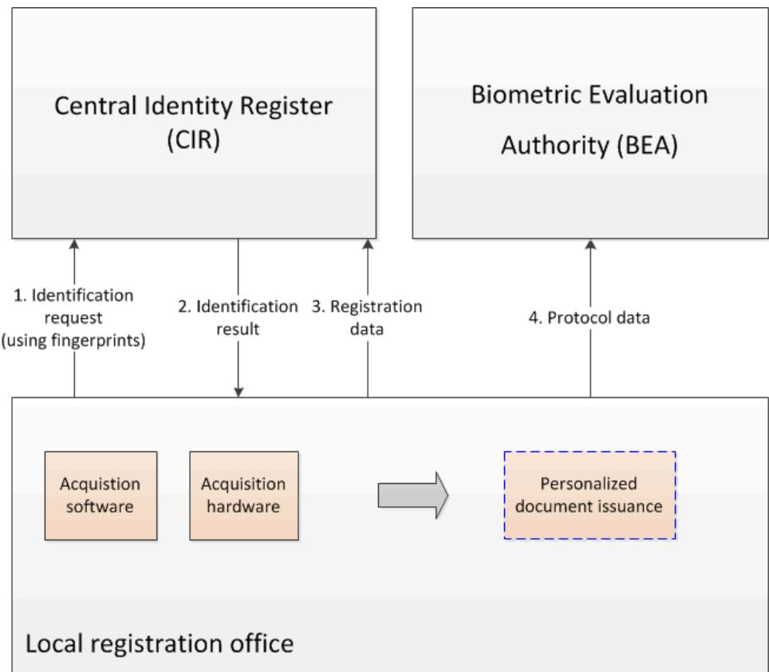
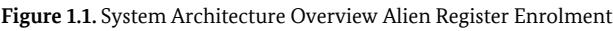
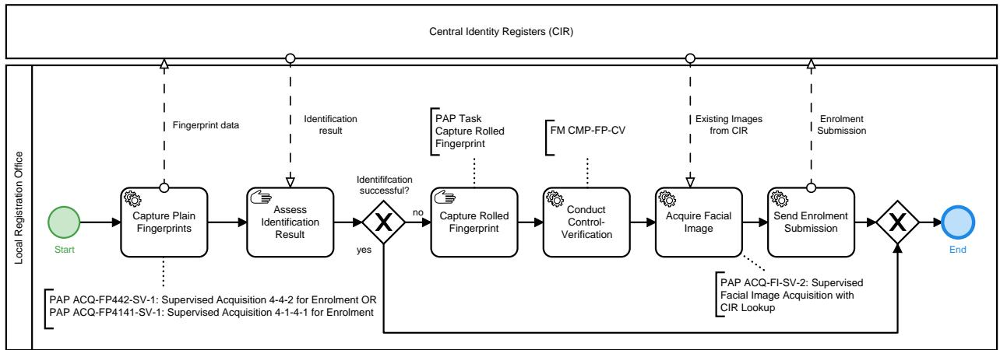
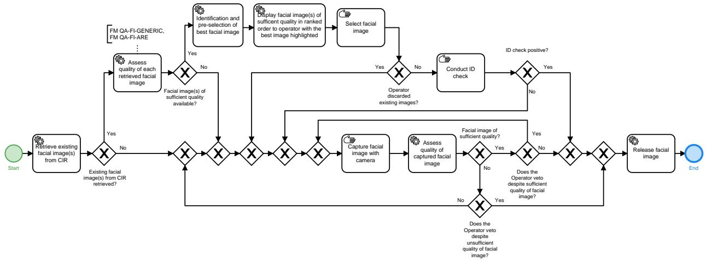
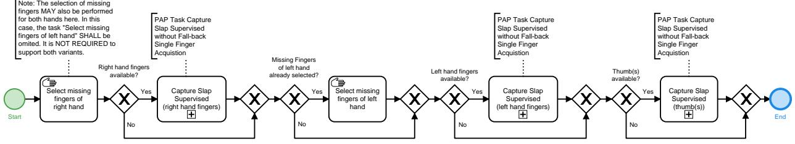
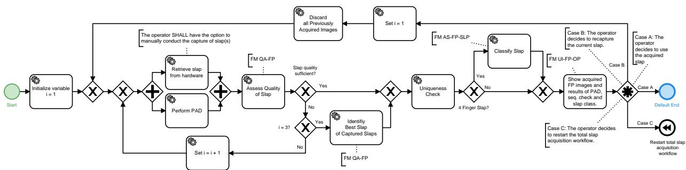
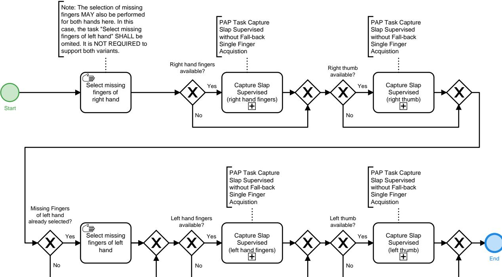
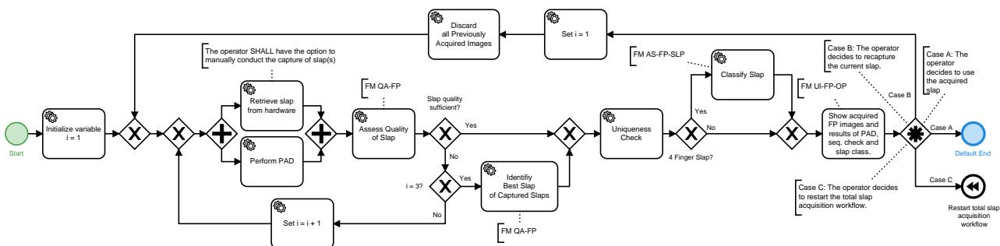
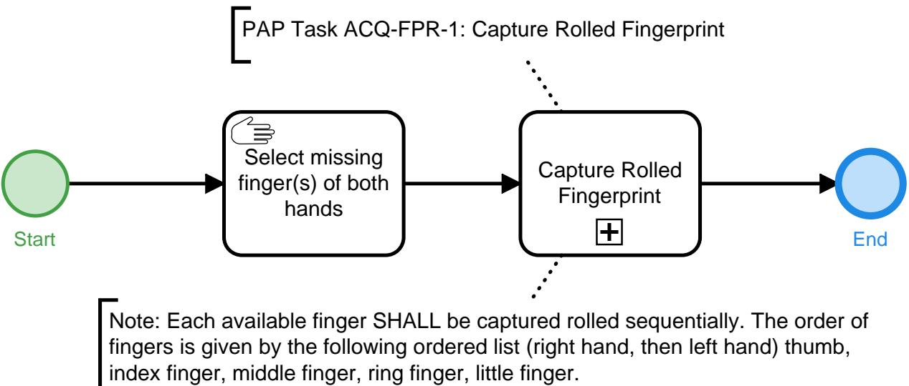
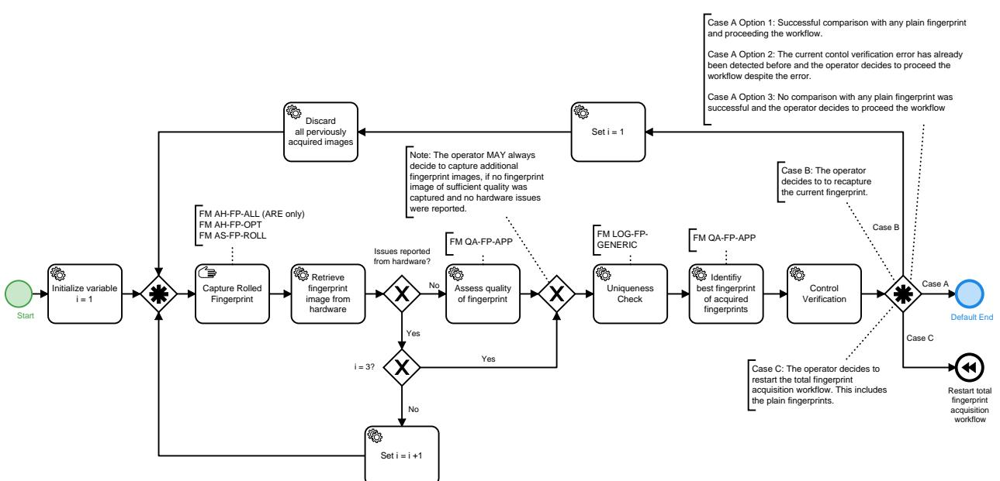

BSI Technical Guideline TR-03121-3

# Biometrics for Public Sector Applications

Part 3: Application Profiles, Function Modules and Processes

Volume 4: Alien Register Enrolment (ARE)

Version 5.3

Federal Office for Information Security P.O. Box 20 03 63 53133 Bonn E-Mail: TRBiometrics@bsi.bund.de Internet: https://bsi.bund.de © Federal Office for Information Security 2022

| 1.    | Volume Alien Register Enrolment  1                                                                                   |  |
|-------|----------------------------------------------------------------------------------------------------------------------------|--|
| 1.1.  | System Overview  1                                                                                                   |  |
| 2.    | Application Profiles  2                                                                                              |  |
| 2.1.  | Application Profile Arrival Attestation Document  2                                                                  |  |
| 2.2.  | Application Profile Arrival Attestation Document in Special Situations  4                                            |  |
| 3.    | Partial Application Processes  8                                                                                     |  |
| 3.1.  | PAP ACQ-FI-SV-2: Supervised Facial Image Acquisition with CIR Lookup  8                                              |  |
| 3.2.  | PAP ACQ-FP442-SV-2: Supervised Acquisition 4-4-2 for Enrolment without Fall-back Single Finger Acquisition  9     |  |
| 3.3.  | PAP ACQ-FP4141-SV-2: Supervised Acquisition 4-1-4-1 for Enrolment without Fall-back Single Finger Acquisition  11 |  |
| 3.4.  | PAP ACQ-FP10R-SV-1: Ten Finger Rolled Supervised Acquisition for Enrolment  13                                       |  |
| 4.    | Function Modules  16                                                                                                 |  |
| 4.1.  | FM Category Acquisition Hardware  16                                                                                 |  |
| 4.2.  | FM Category Acquisition Software  19                                                                                 |  |
| 4.3.  | FM Category Biometric Image Processing  22                                                                           |  |
| 4.4.  | FM Category Quality Assessment  23                                                                                   |  |
| 4.5.  | FM Category Presentation Attack Detection  30                                                                        |  |
| 4.6.  | FM Category Compression  31                                                                                          |  |
| 4.7.  | FM Category Operation  33                                                                                            |  |
| 4.8.  | FM Category User Interface  34                                                                                       |  |
| 4.9.  | FM Category Reference Storage  36                                                                                    |  |
| 4.10. | FM Category Biometric Comparison  37                                                                                 |  |
| 4.11. | FM Category Logging  37                                                                                              |  |
| 4.12. | FM Category Coding  43                                                                                               |  |
|       | List of Abbreviations  45                                                                                            |  |
|       | Bibliography  46                                                                                                     |  |

# **List of Figures**

| 1.1. | System Architecture Overview Alien Register Enrolment                                                                      | 1  |
|------|-------------------------------------------------------------------------------------------------------------------------------|----|
| 2.1. | Process Overview Arrival Attestation Document                                                                              | 3  |
| 2.2. | Process Overview Arrival Attestation Document in Special Situations                                                        | 5  |
| 3.1. | Partial Application Process "Supervised Facial Image Acquisition Process with CIR Lookup"                                  | 8  |
| 3.2. | Partial Application Process "Supervised Acquisition 4-4-2 for Enrolment without Fall-back Single Fin ger Acquisition"   | 9  |
| 3.3. | Partial Application Process Task "Capture Slap Supervised without Fall-back Single Finger Acquisiti on"                 | 11 |
| 3.4. | Partial Application Process "Supervised Acquisition 4-1-4-1 for Enrolment without Fall-back Single Finger Acquisition"  | 11 |
| 3.5. | Partial Application Process Task "Capture Slap Supervised without Fall-back Single Finger Acquisiti on"                 | 13 |
| 3.6. | Partial Application Process "Ten Finger Rolled Supervised Acquisition for Enrolment"                                       | 13 |
| 3.7. | Partial Application Process Task "Capture Rolled Finger"                                                                   | 15 |

# **1. Volume Alien Register Enrolment**

This document defines Application Profiles, Function Modules and Processes for the [Alien Register Enrolment](#page-48-1) [\(ARE\)](#page-48-1) of biometric data for Identity Documents of asylum seekers.

# **1.1. System Overview**

The main components in this context consist of the [Central Indentity Registers \(CIRs\)](#page-48-2), the [Biometric Evalua](#page-48-3) [tion Authority \(BEA\)](#page-48-3) and the local registration authority as depicted in [Figure 1.1](#page-4-2). Any request for biometric and biographic data retrieval or storage is performed via the [CIRs, which connects and proxies further back](#page-48-2) ground systems. The [BEA](#page-48-3) represents the destination for log files documenting process in detail. The ap plicant appears in person at the local registration authority, where an operator controls the live enrolment equipment and guides the process.

In the depicted architecture, the [CIRs](#page-48-2) comprises of the Central Register of Foreigners (operated by Federal Office of Administration) in conjunction with the [Automated Fingerprint Identification System \(AFIS\) \(ope](#page-48-4) rated by Federal Criminal Office). The [BEA](#page-48-3) is also operated by the Federal Office of Administration.

# **2. Application Profiles**

The following sections specify the Application Profiles of this Volume.

# **2.1. Application Profile Arrival Attestation Document**

The following Application Profile describes the application for an Arrival Attestation Document. [Function](#page-48-5) [Modules \(FMs\)](#page-48-5) may have additional transition rules for their requirements.

The requirements for the application and issuance of an Arrival Attestation Document are determined by national law [\[BIB\\_AsylG\]](#page-49-1) §63a according to [\[BIB\\_AKNV\]](#page-49-2).

By legal requirements, the enrolment of the applicant´s facial image and fingerprints (only for applicants 14 years of age or older) is mandatory. In addition to the issued document, the recorded information must be transferred to the Central Register of Foreigners (according to [\[BIB\\_AZRG\]](#page-49-3) §3 and [\[BIB\\_AZRGDV\]](#page-49-4) §5).

#### **2.1.1. Mandatory Process**

In general, two different scenarios exist, refer to [Figure 2.1](#page-6-0): One scenario is the pre-registration with storage of the applicant's biographic and biometric data in the [CIR.](#page-48-2) The issuance of the Arrival Attestation Document is performed at any registration office later on in a separate process by retrieving the already existing data from the [CIR](#page-48-2). In the other scenario, the process consists of both biographic and biometric data assessment and the immediate subsequent issuance of the document.

In any case, the main process SHALL begin with an initial identification request to the [CIR](#page-48-2). Up to ten plain fingerprints SHALL be captured from the applicant and sent to the [CIR in order to perform a biometric iden](#page-48-2) tification and check whether the applicant has already been registered upfront. The returned result is either empty or contains a set of identification results.

In case the identification fails, i.e. no record is returned from the [CIR](#page-48-2), a new data record for the applicant SHALL be created and subsequently sent to the [CIR](#page-48-2) for storage. For this purpose, rolled fingerprints SHALL be captured additionally. A biometric control verification (cross verification) with the previously captured plain fingerprints SHALL be used as [Quality Assessment \(QA\)](#page-48-6) in this process.

In case one or more facial images of the applicant are present in a retrieved record, they SHALL be assessed in regard to quality requirements and re-usability for the issuance of the Arrival Attestation Document. If no facial image is available from the [CIR,](#page-48-2) a high quality image SHALL be captured live by the operator using a facial image camera with subsequently applied [QA](#page-48-6). Note that this Application Profile allows for high quality digital cameras only, the use of webcams is not permitted within this application context.

The applicant´s biographic and biometric data including process and quality information are coded and passed to the calling application, which directs the data to the back-end system for enrolment.

**Figure 2.1.** Process Overview Arrival Attestation Document

### **2.1.2. Relevant Standards and Conditions**

In addition to the legal requirements, further basic directives and standards are applicable.

- **•** [\[BIB\\_GSAT3\]](#page-49-5)
- **•** [\[BIB\\_ISO\\_FACE\]](#page-49-6)
- **•** [\[BIB\\_ISO\\_FINGER\]](#page-49-7)

#### **2.1.3. Mandatory Function Modules**

All [FMs](#page-48-5) which SHALL be applied for the Application Profile are presented in [Table 2.1](#page-6-1) whereby slash-sepa rated entries denote alternative [FMs,](#page-48-5) comma-separated entries denote requirements for all specified [FMs,](#page-48-5) and bracketed entries denote RECOMMENDED [FMs](#page-48-5).

| Module Category               | Required Function Modules                          |
|-------------------------------|----------------------------------------------------|
| Acquisition Hardware          | FM AH-FI-DC                                        |
|                               | FM AH-FP-ALL / FM AH-FP-OPT                     |
| Acquisition Software          | FM AS-FI-DC                                        |
|                               | FM AS-FP-MF, ( FM AS-FP-SLP ), FM AS-FP-ROLL |
| Biometric Image Processing    | FM BIP-FI-DC-HQ                                    |
|                               | FM BIP-FP-APP                                      |
| Quality Assessment            | FM QA-FI-PG, FM QA-FI-GENERIC, FM QA-FI-ARE  |
|                               | FM QA-FP-APP                                       |
| Presentation Attack Detection | FM PAD-FP-APP                                      |
| Compression                   | FM COM-FI-GENERIC                                  |
|                               | FM COM-FI-JPG                                      |
|                               | FM COM-FP-WSQE                                     |
| Operation                     | FM O-FI-ALL                                        |
|                               | FM O-FI-DC                                         |
|                               | FM O-FP-ALL                                        |

| Module Category      | Required Function Modules             |
|----------------------|---------------------------------------|
| User Interface       | FM UI-FI-OP, FM UI-FI-BSJ          |
|                      | FM UI-FP-OP, FM UI-FP-BSJ          |
| Reference Storage    | FM REF-FI-ARE                         |
|                      | FM REF-FP-ARE                         |
| Biometric Comparison | FM CMP-FP-CV                          |
| Logging              | FM LOG-ALL-GENERIC, FM LOG-ALL-ARE |
|                      | FM LOG-FI-GENERIC                     |
|                      | FM LOG-FP-GENERIC                     |
| Coding               | FM COD-ALL-ARE                        |
|                      | FM COD-FI-GSAT3                       |
|                      | FM COD-FP-GSAT3                       |
| Evaluation           | -                                     |

**Table 2.1** Required Function Modules Application Profile Arrival Attestation Document

### **2.1.4. Mandatory Partial Application Processes**

All Partial Application Processes which SHALL be applied for the Application Profile are presented in [Ta](#page-7-1) [ble 2.2](#page-7-1) whereby slash-separated entries denote alternative Partial Application Processes and comma-separa ted entries denote requirements for all specified Partial Application Processes.

| No. | Required Partial Application Process                                                                                                                                                                                          |
|-----|-------------------------------------------------------------------------------------------------------------------------------------------------------------------------------------------------------------------------------|
| 1   | PAP ACQ-FP10R-SV-1: Ten Finger Rolled Supervised Acquisition for Enrolment                                                                                                                                                    |
| 2   | PAP ACQ-FP442-SV-2: Supervised Acquisition 4-4-2 for Enrolment without Fall-back Single Finger Acquisition / PAP ACQ-FP4141-SV-2: Supervised Acquisition 4-1-4-1 for Enrolment without Fall-back Single Finger Acquisition |
| 3   | PAP ACQ-FI-SV-2: Supervised Facial Image Acquisition with CIR Lookup                                                                                                                                                          |

**Table 2.2** Required Partial Application Processes Application Profile Arrival Attention Document

# **2.2. Application Profile Arrival Attestation Document in Special Situations**

The following Application Profile describes the application for an Arrival Attestation Document in special situations. A special situation is in place, e.g. when the number of applicants for an Arrival Attestation Docu ment is significantly higher than usual due to external events. Note that applications under this profile can only be used at particular (temporary) agencies in charge that are specifically approved for this special situa tion by the German Federal Ministry of the Interior.

Instead of the usual process (described in [Section 2.1](#page-5-2)), the capture of rolled fingerprints is neglected in favour of the capture of plain fingerprints, as described in [Section 3.2](#page-12-2) or [Section 3.3.](#page-14-0) [FMs](#page-48-5) may have additional transition rules for their requirements.

The requirements for the application and issuance of an Arrival Attestation Document are determined by national law [\[BIB\\_AsylG\]](#page-49-1) §63a according to [\[BIB\\_AKNV\]](#page-49-2).

By legal requirements, the enrolment of the applicant`s facial image and fingerprints (only for applicants 14 years of age or older) is mandatory. In addition to the issued document, the recorded information must be transferred to the Central Register of Foreigners (according to [\[BIB\\_AZRG\]](#page-49-3) §3 and [\[BIB\\_AZRGDV\]](#page-49-4) §5).

#### **2.2.1. Mandatory Process**

In general, two different scenarios exist, refer to [Figure 2.2](#page-8-0): One scenario is the pre-registration with storage of the applicant's biographic and biometric data in the [CIR.](#page-48-2) The issuance of the Arrival Attestation Document is performed at any registration office later on in a separate process by retrieving the already existing data from the [CIR](#page-48-2). In the other scenario, the process consists of both biographic and biometric data assessment and the immediate subsequent issuance of the document.

In any case, the main process SHALL begin with an initial identification request to the [CIR](#page-48-2). Up to ten plain fingerprints SHALL be captured from the applicant and sent to the [CIR in order to perform a biometric iden](#page-48-2) tification and check whether the applicant has already been registered upfront. The returned result is either empty or contains a set of identification results.

In case the identification fails, i.e. no record is returned from the [CIR](#page-48-2), a new data record for the applicant SHALL be created and subsequently sent to the [CIR](#page-48-2) for storage.

In case one or more facial images of the applicant are present in a retrieved record, they SHALL be assessed in regard to quality requirements and re-usability for the issuance of the Arrival Attestation Document. If no facial image is available from the [CIR](#page-48-2), a facial image SHALL be captured live by the operator using a facial image camera with subsequently applied [QA](#page-48-6). Note that this Application Profile allows for digital cameras as well as for webcams.

The applicant´s biographic and biometric data including process and quality information are coded and passed to the calling application, which directs the data to the back-end system for enrolment.

**Figure 2.2.** Process Overview Arrival Attestation Document in Special Situations

### **2.2.2. Relevant Standards and Conditions**

In addition to the legal requirements, further basic directives and standards are applicable.

- **•** [\[BIB\\_GSAT3\]](#page-49-5)
- **•** [\[BIB\\_ISO\\_FACE\]](#page-49-6)
- **•** [\[BIB\\_ISO\\_FINGER\]](#page-49-7)

### **2.2.3. Mandatory Function Modules**

All [FMs](#page-48-5) which SHALL be applied for the Application Profile are presented in [Table 2.3](#page-9-0) whereby slash-sepa rated entries denote alternative [FMs,](#page-48-5) comma-separated entries denote requirements for all specified [FMs,](#page-48-5) and bracketed entries denote RECOMMENDED [FMs](#page-48-5).

| Module Category               | Required Function Modules                         |
|-------------------------------|---------------------------------------------------|
| Acquisition Hardware          | FM AH-FI-DC , FM AH-FP-ALL / FM AH-FP-OPT   |
| Acquisition Software          | FM AS-FI-DC                                       |
|                               | FM AS-FP-MF, ( FM AS-FP-SLP )                  |
| Biometric Image Processing    | FM BIP-FI-DC-HQ                                   |
|                               | FM BIP-FP-APP                                     |
| Quality Assessment            | FM QA-FI-PG, FM QA-FI-GENERIC, FM QA-FI-ARE |
|                               | FM QA-FP-APP                                      |
| Presentation Attack Detection | ( FM PAD-FP-APP )                              |
| Compression                   | FM COM-FI-GENERIC                                 |
|                               | FM COM-FI-JPG                                     |
|                               | FM COM-FP-WSQE                                    |
| Operation                     | FM O-FI-ALL                                       |
|                               | FM O-FI-DC                                        |
|                               | FM O-FP-ALL                                       |
| User Interface                | FM UI-FI-OP, FM UI-FI-BSJ                      |
|                               | FM UI-FP-OP, FM UI-FP-BSJ                      |
| Reference Storage             | FM REF-FI-ARE                                     |
|                               | FM REF-FP-ARE                                     |
| Biometric Comparison          | FM CMP-FP-CV                                      |
| Logging                       | FM LOG-ALL-GENERIC, FM LOG-ALL-ARE             |
|                               | FM LOG-FI-GENERIC                                 |
|                               | FM LOG-FP-GENERIC                                 |
| Coding                        | FM COD-ALL-ARE                                    |
|                               | FM COD-FI-GSAT3                                   |
|                               | FM COD-FP-GSAT3                                   |
| Evaluation                    | -                                                 |

**Table 2.3** Required Function Modules Application Profile Arrival Attestation Document

#### **2.2.4. Mandatory Partial Application Processes**

All Partial Application Processes which SHALL be applied for the Application Profile are presented in [Ta](#page-10-0) [ble 2.4](#page-10-0) whereby slash-separated entries denote alternative Partial Application Processes and comma-separa ted entries denote requirements for all specified Partial Application Processes.

| No. | Required Partial Application Process                                                                                                                                                                                          |
|-----|-------------------------------------------------------------------------------------------------------------------------------------------------------------------------------------------------------------------------------|
| 1   | PAP ACQ-FP442-SV-2: Supervised Acquisition 4-4-2 for Enrolment without Fall-back Single Finger Acquisition / PAP ACQ-FP4141-SV-2: Supervised Acquisition 4-1-4-1 for Enrolment without Fall-back Single Finger Acquisition |
| 2   | PAP ACQ-FI-SV-2: Supervised Facial Image Acquisition with CIR Lookup                                                                                                                                                          |

**Table 2.4** Required Partial Application Processes Application Profile Arrival Attention Document

# **3. Partial Application Processes**

The [Partial Application Processes \(PAPs\)](#page-48-7) specified by the following sections provide process specifications of basic biometric processes, e.g. the acquisition, identification or verification of biometrics or the evaluation processes for verification and identification. The [PAPs](#page-48-7) are referenced by the relevant Application Profiles and are part of the overall processes specified therein.

A [PAP](#page-48-7) MAY also be a task. A task is a process which functions as a generic reusable building block which is used by another [PAP](#page-48-7) and is not referenced by an Application Profile directly.

The specific Function Modules that SHALL be implemented in the processes of this chapter are specified by the relevant Application Profiles.

# **3.1. PAP ACQ-FI-SV-2: Supervised Facial Image Acquisition with CIR Lookup**

The facial image acquisition process described in this section SHALL be supervised. Also, the required [CIRs](#page-48-2) which MAY already contain a facial image of the biometric subject SHALL be available. Thus, two options of how an image of the biometric subject can be obtained are available, refer to [Figure 3.1](#page-11-2):

- 1. The biometric subject's facial image is captured by an operator using live enrolment equipment (including a facial image camera within a photo studio setup)[1](#page-11-4) . Note that the requirements regarding the facial image camera in use (digital camera, webcam, etc.) depend on the specific application context. Refer to cor responding Application Profile for further information.
- 2. One or more facial images of the biometric subject already exist in the [CIR](#page-48-2) and can be retrieved to be examined for re-use.

In the first case, a facial image of the biometric subject is taken live by the operator using a facial image camera. An immediately performed software [QA](#page-48-6) for the captured facial image ensures its biometric usability. If the [QA](#page-48-6) succeeds, the facial image is released to the calling software. If the quality is assessed as insufficient, the operator can recapture or has the option to put a veto in order to accept the captured facial image despite the negative software decision. In case of an overruling veto, the facial image is accepted and released to the calling application. In the negative case, the facial image is discarded and a re-capture is performed.

**Figure 3.1.** Partial Application Process "Supervised Facial Image Acquisition Process with CIR Lookup"

1 See ISO/IEC 19794-5, Annex B for "Best practices for Face Images"

In case one or more facial images of the biometric subject are available in the [CIR,](#page-48-2) they can potentially be reused for the issuance of the document. In case the [CIR](#page-48-2) does provide information about the capture date or date of storing, only facial images SHALL be retrieved which are not older than six months by capture date or date of storing. The quality of each retrieved facial image SHALL be assessed by the software in regard to quality requirements and usability for the purpose of enrolment. Additionally, the best retrieved image SHALL be identified by the software [QA.](#page-48-6) After the images were processed by the software [QA](#page-48-6), they are displayed to the operating operator for selection via the [graphical user interface \(GUI\)](#page-48-8) of the software in order to be selected for release. Thereby, only those images are displayed which pass the [QA](#page-48-6) with a positive result and they SHALL be displayed in descending order of [QA](#page-48-6)-rating. Further, the best image SHALL be clearly marked and automatically pre-selected, so that the operator still needs to confirm the pre-selection of the image. In case none of the retrieved images are considered to be of sufficient quality a live facial image SHALL be captured (see first case).

The operator SHALL have the following veto options:

- **•** Select none of the retrieved facial images despite sufficient quality from the [CIR.](#page-48-2)
- **•** Select a facial image of insufficient quality from the acquisition process.

The process SHALL be supervised by an operator.

# **3.2. PAP ACQ-FP442-SV-2: Supervised Acquisition 4-4-2 for Enrolment without Fall-back Single Finger Acquisition**

The capture process for the 4-4-2 enrolment scenario is shown in [Figure 3.2.](#page-12-1) Single finger acquisition as fallback is not allowed in this process. Note, that the [PAP Task ACQ-FPS-SV-2: Capture Slap Supervised without](#page-12-3) [Fall-back Single Finger Acquisition](#page-12-3) is used here. The 4-4-2 sequences are described in detail subsequently:

- 1. acquire right slap: index finger, middle finger, ring finger, little finger
- 2. acquire left slap: index finger, middle finger, ring finger, little finger
- 3. thumbs of both hands (simultaneously)

The process SHALL be supervised by an operator.

**Figure 3.2.** Partial Application Process "Supervised Acquisition 4-4-2 for Enrolment without Fall-back Single Finger Acquisition"

#### **3.2.1. PAP Task ACQ-FPS-SV-2: Capture Slap Supervised without Fall-back Single Finger Acquisition**

[Figure 3.3](#page-14-1) depicts the basic process for a plain supervised slap capture. A plain slap capture can be part of more complex acquisition processes, e.g. a ten finger acquisition by the 4-1-4-1 capture sequence. The plain slap capture is subsequently described in detail. The [QA](#page-48-6) is conducted according to the requirements of the applicable [FM Category Quality Assessment](#page-26-0).

1. The counter variable for the number of attempts for capturing the current slap SHALL be initialized as *i* = 1.

- 2. The slap image SHALL be retrieved from hardware. While the image is retrieved from hardware, [Presenta](#page-48-9) [tion Attack Detection \(PAD\)](#page-48-9) SHALL be performed. Note: The operator SHALL have the option to manually conduct the capture of slap(s).
- 3. The fingerprints SHALL be segmented and each SHALL be quality assessed.
	- a. In case the quality of the fingerprints meets the quality requirements defined in the corresponding [QA](#page-48-6) [FM,](#page-48-5) the captured slap and the set of segmented fingerprints and parameter data (e.g. quality values) SHALL be temporarily stored.
	- b. In case the quality requirements for one or more fingerprints of the slap are not met, the capture SHALL be repeated up to two times (i.e. the acquisition of a single slap consists of a maximum of three capture attempts). The counter SHALL be set to *i* = *i* + 1.
- 4. A uniqueness check SHALL be conducted for the captured slap image to detect capture of wrong fin gers, e.g. due to interchanged hands or multiple acquisition of the same hand finger. Note, that it is RE COMMENDED to conduct the uniqueness check as early as possible after a fingerprint image is available.
	- a. In case
		- **•** the comparison of any fingerprint of the current slap with any previously accepted fingerprint of a previous slap or
		- **•** the comparison of a fingerprint of the current slap with another finger print of the current slap

is successful, the uniqueness check SHALL show a warning.

- b. In case the comparisons of all fingers current slap with previous slaps are not suc cessful, the uniqueness check SHALL report no error.
- 5. Generally, a slap classifier SHALL[2](#page-13-0) be used for the captured slap image to detect the capture of the wrong slap. It SHALL be configurable to switch the classifier off or in evaluation mode (logging of result wi thout showing the result/error to the operator). Note, that the slap classifier is only required for 4 finger slaps. Other acquisitions currently do not require the corresponding [FM.](#page-48-5)
	- a. If the result of the classification concludes that the acquired slap mismatches the expected slap, an error SHALL be reported.
	- b. If the result of the classification concludes that the acquired slap matches the expected slap, no error SHALL be reported.

If the quality check of the third capture attempt fails (counter *i* is set to 3), the best of the captured slaps SHALL be identified according to the corresponding [QA](#page-48-6) Function Module and temporarily stored along with corresponding information.

The process SHALL be supervised by an operator.

At the end of the process the operator decides on one of the three options:

- 1. Use the acquired slap.
- 2. Recapture the current slap. The counter will be reset to *i* = 1.
- 3. Restart the total slap acquisition workflow.

2 For Volume ARE, this is only RECOMMENDED.

**Figure 3.3.** Partial Application Process Task "Capture Slap Supervised without Fall-back Single Finger Acquisition"

# **3.3. PAP ACQ-FP4141-SV-2: Supervised Acquisition 4-1-4-1 for Enrolment without Fall-back Single Finger Acquisition**

[Figure 3.4](#page-14-2) depicts the acquisition process for 4-1-4-1 the enrolment scenarios. Note, that the [PAP Task](#page-12-3) [ACQ-FPS-SV-2: Capture Slap Supervised without Fall-back Single Finger Acquisition](#page-12-3) is used here. The 4-1-4-1 sequence is described in detail subsequently:

- 1. capture right hand: index finger, middle finger, ring finger, little finger
- 2. capture right hand: thumb
- 3. capture left hand: index finger, middle finger, ring finger, little finger
- 4. capture left hand: thumb

The process SHALL be supervised by an operator.

**Figure 3.4.** Partial Application Process "Supervised Acquisition 4-1-4-1 for Enrolment without Fall-back Single Finger Acquisition"

### **3.3.1. PAP Task ACQ-FPS-SV-2: Capture Slap Supervised without Fall-back Single Finger Acquisition**

[Figure 3.3](#page-14-1) depicts the basic process for a plain supervised slap capture. A plain slap capture can be part of more complex acquisition processes, e.g. a ten finger acquisition by the 4-1-4-1 capture sequence. The plain slap capture is subsequently described in detail. The [QA](#page-48-6) is conducted according to the requirements of the applicable [FM Category Quality Assessment](#page-26-0).

- 1. The counter variable for the number of attempts for capturing the current slap SHALL be initialized as *i* = 1.
- 2. The slap image SHALL be retrieved from hardware. While the image is retrieved from hardware, [PAD](#page-48-9) SHALL be performed. Note: The operator have the option to manually conduct capture of sla p(s).
- 3. The fingerprints SHALL be segmented and each SHALL be quality assessed.
	- a. In case the quality of the fingerprints meets the quality requirements defined in the corresponding [QA](#page-48-6) [FM,](#page-48-5) the captured slap and the set of segmented fingerprints and parameter data (e.g. quality values) SHALL be temporarily stored.
	- b. In case the quality requirements for one or more fingerprints of the slap are not met, the capture SHALL be repeated up to two times (i.e. the acquisition of a single slap consists of a maximum of three capture attempts). The counter SHALL be set to *i* = *i* + 1.
- 4. A uniqueness check SHALL be conducted for the captured slap image to detect capture of wrong fin gers, e.g. due to interchanged hands or multiple acquisition of the same hand finger. Note, that it is RE COMMENDED to conduct the uniqueness check as early as possible after a fingerprint image is available.
	- a. In case
		- **•** the comparison of any fingerprint of the current slap with any previously accepted fingerprint of a previous slap or
		- **•** the comparison of a fingerprint of the current slap with another finger print of the current slap

is successful, the uniqueness check SHALL show a warning.

- b. In case the comparisons of all fingers current slap with previous slaps are not suc cessful, the uniqueness check SHALL report no error.
- 5. Generally, a slap classifier SHALL[3](#page-15-0) be used for the captured slap image to detect the capture of the wrong slap. It SHALL be configurable to switch the classifier off or in evaluation mode (logging of result wi thout showing the result/error to the operator). Note, that the slap classifier is only required for 4 finger slaps. Other acquisitions currently do not require the corresponding [FM.](#page-48-5)
	- a. If the result of the classification concludes that the acquired slap mismatches the expected slap, an error SHALL be reported.
	- b. If the result of the classification concludes that the acquired slap matches the expected slap, no error SHALL be reported.

If the quality check of the third capture attempt fails (counter *i* is set to 3), the best of the captured slaps SHALL be identified according to the corresponding [QA](#page-48-6) Function Module and temporarily stored along with corresponding information.

The process SHALL be supervised by an operator.

At the end of the process the operator decides on one of the three options:

1. Use the acquired slap.

3 For Volume ARE, this is only RECOMMENDED.

- 2. Recapture the current slap. The counter will be reset to *i* = 1.
- 3. Restart the total slap acquisition workflow.

**Figure 3.5.** Partial Application Process Task "Capture Slap Supervised without Fall-back Single Finger Acquisition"

# **3.4. PAP ACQ-FP10R-SV-1: Ten Finger Rolled Supervised Acquisition for Enrolment**

[Figure 3.6](#page-16-2) depicts the acquisition process for ten rolled fingers. Note, that the [PAP Task ACQ-FPR-1: Cap](#page-16-3) [ture Rolled Fingerprint](#page-16-3) is used here. The sequence is described in detail subsequently:

- 1. The permanently and temporarily missing fingers are selected.
- 2. Each available finger is captured according to "Capture Rolled Fingerprint" process. In case the finger to be captured is permanently or temporarily missing (e.g. due to injury) or unable to be captured, the current capture is skipped.

When all available fingers have been captured, the process finishes.

**Figure 3.6.** Partial Application Process "Ten Finger Rolled Supervised Acquisition for Enrolment"

### **3.4.1. PAP Task ACQ-FPR-1: Capture Rolled Fingerprint**

[Figure 3.7 defines the basic sequence for a rolled fingerprint capture. The finger](#page-18-0) print capture can be part of more complex acquisition processes, e.g. a ten finger rolled acquisition. The basic sequence for a rolled fingerprint capture is described in detail subsequently. The [QA](#page-48-6) is conducted according to the requirements of the applicable [Section 4.4.](#page-26-0)

- 1. The counter variable for the number of attempts for capturing is initialized as *i* = 1.
- 2. The finger SHALL be placed on the fingerprint sensor with the guidance of the operator.
- 3. The rolled fingerprint images is retrieved from the acquisition hardware.
- 4. If the hardware reports an issue of the rolling process, the capture SHALL be repeated if i < 3. i is increased by 1.
- 5. If no hardware reported issue was found, [QA](#page-48-6) SHALL ensure proper quality of the captured fingerprint.
	- a. In case the quality of the fingerprint meets the quality requirements defined in the corresponding [QA](#page-48-6) Function Module, the captured fingerprint and parameter data (e.g. quality values) are temporarily stored and the capture of the current finger finishes.
	- b. In case the quality requirements of the rolled fingerprint is not met, the capture SHALL be repeated if i < 3. i is increased by 1.
- 6. A uniqueness check SHALL be conducted for the captured fingerprint image to detect the capture of wrong fingers, e.g. due to interchanged hands or multiple acquisition of the same hand finger. Note: It is RE COMMENDED to conduct the uniqueness check as early as possible after a fingerprint image is available.
	- a. In case the comparison of current fingerprint with any previously captured is success ful, the uniqueness check SHALL report an alert.
	- b. In case the comparison of current fingerprint with any previously captured is not suc cessful, the uniqueness check SHALL NOT report an alert.
- 7. A control verification SHALL be conducted for each captured rolled image. Therefore, plain control slaps have to be captured in a workflow upfront. Note, it is RECOMMENDED to conduct the control verification as early as possible after a fingerprint image is available.
	- a. In case the comparison of the rolled finger and its corresponding plain finger is successful, the control verification is considered successful.
	- b. In case the comparison of the rolled finger and its plain finger is not successful and the rolled finger is successfully compared with any other plain finger, the control verification is considered not successful.
	- c. In case no successful comparison of the rolled finger and any plain occurs, control verifica tion is considered undetermined.
- 8. The capture SHALL be repeated up to two times because of hardware reported issues of the rolling process or quality issues. The operator SHALL be allowed to capture additional images if after the third attempt no fingerprint without hardware reported issue and sufficient quality was conducted.

If the quality check of the third capture attempt fails or the hardware reported an issue of the rolling process, the best of the previously captured images is identified according to the corresponding [QA](#page-48-6) Function Module and temporarily stored along with corresponding information.

**Figure 3.7.** Partial Application Process Task "Capture Rolled Finger"

# **4. Function Modules**

This chapter lists all Function Modules for the defined Application Profiles.

# **4.1. FM Category Acquisition Hardware**

Devices that are used for digitising physical, representable biometric characteristics are called [Acquisition](#page-48-10) [Hardware \(AH\).](#page-48-10) Digital cameras to capture images of the face, fingerprint sensors, or signature tablets can be named as examples.

#### **4.1.1. FM AH-FI-DC**

This Function Module describes the requirements for facial image cameras and physical setups that are used to obtain facial images.

#### **4.1.1.1. Requirements**

- **•** The minimum physical resolution of the camera SHALL allow a cropping of an image to 1200 x 1600 pixels without any upscaling. Note, this requirement is OPTIONAL for scenarios where only a facial verification is performed.
- **•** Adequate image quality to meet the requirements of [\[BIB\\_ISO\\_FACE\]](#page-49-6) SHALL be provided.
- **•** The physical and environmental conditions for capturing facial images, such as the positioning of ca mera, proper lighting of the face and a uniform background as described in [\[BIB\\_ISO\\_FACE\]](#page-49-6) SHALL be complied with.
- **•** The camera system SHALL be able to capture images in colour (24 bit RGB). Note, this requirement is OP TIONAL for scenarios where only a facial verification is performed.

#### **4.1.2. FM AH-FP-ALL**

This Function Module describes requirements for high quality fingerprint scanners (single finger and multi finger). In this set of requirements, one of the following certification SHALL be used:

- **•** FBI/CJIS Image Quality Specifications from [Electronic Biometric Transmission Specification \(EBTS\) Ap](#page-48-11) pendix F [\[BIB\\_EBTS/F\]](#page-49-8)
- **•** FBI/CJIS Biometric Specifications, [Personal Identity Verification \(PIV\) Image Quality Specification for Sing](#page-48-12) le Finger Capture Devices [\[BIB\\_PIV\]](#page-49-9)

Note, that the FBI certification allows for multiple types of fingerprint scanners e.g. capacitive and optical fingerprint scanners.

#### **4.1.2.1. Requirements**

For the acquisition of the fingerprints, only devices are permitted which meet the following requirements (in analogy to [\[BIB\\_EBTS/F\]](#page-49-8) and [\[BIB\\_PIV\]\)](#page-49-9).

- **•** Multi fingerprint scanners SHALL be certified according to [\[BIB\\_EBTS/F\]](#page-49-8) and the respective certificate SHALL be at hand.
- **•** Single fingerprint scanners SHALL be certified according to [\[BIB\\_EBTS/F\]](#page-49-8) or [\[BIB\\_PIV\]](#page-49-9) and the respective certificate SHALL be at hand.
- **•** For single singer scanners, a capturing area of at minimum 16 mm width and 20 mm height is REQUIRED (deviating from table F 1 in [\[BIB\\_EBTS/F\]](#page-49-8)).
- **•** The certificate according to [\[BIB\\_EBTS/F\]](#page-49-8) or [\[BIB\\_PIV\]](#page-49-9) SHOULD NOT be older than 5 years in order to ensure proper actuality. The certificate SHALL NOT be older than a maximum of 10 years.

#### **4.1.3. FM AH-FP-OPT**

This Function Module describes the requirements for optical high quality fingerprint scanners (single finger and multi finger).

#### **4.1.3.1. Requirements**

- **•** For the acquisition of the fingerprints, optical sensors using the principal of frustrated total reflection or direct contact (the imaging system is the sensor surface, typically separated by a transparent protection layer) according to the certification requirements of [\[BIB\\_ISO\\_FINGER\]](#page-49-7) (especially this means a resolution of 500 ppi or 1000 ppi) SHALL be used exclusively.
- **•** For the acquisition of the fingerprints, only devices are permitted which meet the following requirements (in analogy to [\[BIB\\_EBTS/F\]](#page-49-8)). Notwithstanding, a capturing area of at minimum 16 mm width and 20 mm height is REQUIRED (deviating from table F 1 in [\[BIB\\_EBTS/F\]\)](#page-49-8) for single finger scanners.

#### **4.1.3.1.1. Grey Scale Linearity**

When measuring a stepped series of uniform target reflectance patches ("step tablet") that substantially covers the scanner's grey range, the average value of each patch SHALL be within 7.65 grey levels of a linear, least squares regression line fitted between target reflectance patch values (independent variable) and scanner out put grey levels of 8 bit resolution (dependent variable).

#### **4.1.3.1.2. Resolution and Geometrical Accuracy**

Resolution: The scanner's final output fingerprint image SHALL have a resolution, in both sensor detector row and column directions, in the range: (*R ¡* 0*:*01*R*) to (*R* + 0*:*01*R*). The magnitude of *R* is either 500 ppi or 1000 ppi; a scanner MAY be certified at either one or both of these resolution levels. The scanner's true optical resolution SHALL be greater than or equal to *R*.

Across-Bar geometric accuracy: When scanning a 1.0 cy/mm, multiple parallel bar target, in both vertical bar and horizontal bar orientations, the absolute value of the difference (*D*) between the actual distance across parallel target bars (*X*), and the corresponding distance measured in the image (*Y*) SHALL NOT exceed the following values for at least 99 % of the tested cases in each print block measurement area and in each of the two directions:

- **•** for 500 ppi scanners:
	- *D ·* 0*:*0007, for 0*:*00 *< X ·* 0*:*07 and
	- *D ·* 0*:*01*X*, for 0*:*07 *· X ·* 1*:*50
- **•** for 1000 ppi scanners:
	- *D ·* 0*:*0005, for 0*:*00 *< X ·* 0*:*07 and
	- *D ·* 0*:*0071*X*, for 0*:*07 *· X ·* 1*:*50

where *D* = *jY ¡ Xj*, *X* = actual target distance, *Y* = measured image distance (*D; X; Y* are in inches).

Along-Bar geometric accuracy: When scanning a 1.0 cy/mm, multiple parallel bar target, in both vertical bar and horizontal bar orientations, the maximum difference in the horizontal or vertical direction, respectively, between the locations of any two points within a 1.5 inch segment of a given bar image, SHALL be less than 0.016 inches for at least 99 % of the tested cases in each print block measurement area and in each of the two orthogonal directions.

#### **4.1.3.1.3. Contrast Transfer Function**

The spatial frequency response SHALL be measured using a binary grid target (Ronchi-Grating), denoted as [contrast transfer function \(CTF\)](#page-48-13) measurement. When measuring the bar [CTF,](#page-48-13) it SHALL meet or exceed the minimum modulation values defined by equation [Equation 4.1](#page-21-0) or equation [Equation 4.2, in both the de](#page-21-1) tector's row and detector's column directions, and over any region of the scanner's field of view. [CTF](#page-48-13) values computed from equations [Equation 4.1](#page-21-0) and [Equation 4.2 for nominal test frequencies are given in the fol](#page-21-1) lowing table. None of the [CTF](#page-48-13) modulation values measured at specification spatial frequencies SHALL exceed 1.05. The output bar target image SHALL NOT exhibit any significant amount of aliasing. It is NOT REQUIRED that the bar target contains the exact frequencies listed in [Table 4.1,](#page-21-2) however, the target does need to cover the listed frequency range and contain bar patterns close to each of the listed frequencies.

The following equations are used to obtain the minimum acceptable [CTF](#page-48-13) modulation values when using bar targets that contain frequencies not listed in [Table 4.1](#page-21-2):

**•** 500 ppi scanner, for f = 1.0 to 10.0 cy/mm:

$$CTF = 3.04105 \cdot 10^{-4} \cdot f^2 - 7.99095 \cdot 10^{-2} \cdot f + 1.02774 \tag{4.1}$$

**•** 1000 ppi scanner, for f = 1.0 to 20.0 cy/mm:

$$CTF = -1.85487 \cdot 10^{-5} \cdot f^3 + 1.41666 \cdot 10^{-3} \cdot f^2 - 5.73701 \cdot 10^{-2} \cdot f + 1.01341 \tag{4.2}$$

For a given bar target, the specification frequencies include all of the bar frequencies which that target has in the range 1 to 10 cy/mm (500 ppi scanner) or 1 to 20 cy/mm (1000 ppi scanner).

| Frequency [cy/mm] | Minimum Modulation for 500 ppi scanners | Minimum Modulation for 1000 ppi scanners | Maximum Modulation |
|-------------------|--------------------------------------------|---------------------------------------------|--------------------|
| 1.0               | 0.948                                      | 0.957                                       | 1.05               |
| 2.0               | 0.869                                      | 0.904                                       | 1.05               |
| 3.0               | 0.791                                      | 0.854                                       | 1.05               |
| 4.0               | 0.713                                      | 0.805                                       | 1.05               |
| 5.0               | 0.636                                      | 0.760                                       | 1.05               |
| 6.0               | 0.559                                      | 0.716                                       | 1.05               |
| 7.0               | 0.483                                      | 0.675                                       | 1.05               |
| 8.0               | 0.408                                      | 0.636                                       | 1.05               |
| 9.0               | 0.333                                      | 0.598                                       | 1.05               |
| 10.0              | 0.259                                      | 0.563                                       | 1.05               |
| 12.0              | ---                                        | 0.497                                       | 1.05               |
| 14.0              | ---                                        | 0.437                                       | 1.05               |
| 16.0              | ---                                        | 0.382                                       | 1.05               |
| 18.0              | ---                                        | 0.332                                       | 1.05               |
| 20.0              | ---                                        | 0.284                                       | 1.05               |

**Table 4.1** Minimum and Maximum Modulation

#### **4.1.3.1.4. Signal-to-Noise Ratio and the Grey–Level Uniformity**

The white [signal-to-noise ratio \(SNR\)](#page-48-14) and black [SNR](#page-48-14) SHALL each be greater than or equal to 125.0, in at least 97 % of respective cases, within each measurement area.

The grey level uniformity is defined for the three following cases:

- **•** Adjacent row, column uniformity: At least 99 % of the average grey levels between every two adjacent quar ter-inch long rows and 99 % between every two adjacent quarter-inch long columns, within each imaged area, SHALL NOT differ by more than 1.0 grey levels when scanning a uniform low reflectance target, and SHALL NOT differ by more than 2.0 grey levels when scanning a uniform high reflectance target.
- **•** Pixel to pixel uniformity: For at least 99.9 % of all pixels within every independent 0.25 inch by 0.25 inch area located within each imaged area, individual pixel's grey level SHALL NOT vary from the average by more than 22.0 grey levels, when scanning a uniform high reflectance target, and SHALL NOT vary from the average by more than 8.0 grey levels, when scanning a uniform low reflectance target.
- **•** Small area uniformity: For every two independent 0.25 inch by 0.25 inch areas located within each imaged area, the average grey levels of the two areas SHALL NOT differ by more than 12.0 grey levels when scanning a uniform high reflectance target, and SHALL NOT differ by more than 3.0 grey levels when scanning a uniform low reflectance target.

#### **4.1.3.1.5. Grey Scale Range of Fingerprint Images**

A fingerprint scanner operating at 500 ppi or 1000 ppi, SHALL perform the following sets of live scans:

- **•** For a standard roll and plain finger live scanner: capture complete set of fingerprints from each 10 sub jects; i.e. 10 rolls (all 5 fingers from each hand), 2 plain thumb impressions, and 2 plain 4-finger impressions.
- **•** For a palm scanner component of a live scan system: capture left and right palms from each of 10 subjects.
- **•** For an identification flat live scanner: capture left and right 4-finger plain impressions and dual thumb plain impressions from each of 10 subjects.

Within the histogram of each image all grey values with at least 5 Pixels in this are counted. The histo gram SHALL show no break and no other artefact. At least 80 % of the captured individual fingerprint images SHALL have a grey scale dynamic range of at least 200 grey levels, and at least 99% SHALL have a dynamic range of at least 128 grey levels.

# **4.2. FM Category Acquisition Software**

The Function Module category [Acquisition Software \(AS\) contains all functionality regarding image proces](#page-48-15) sing for biometric purposes. Therefore, these Function Modules usually contains device driver software for the acquisition hardware or, in general, software that is very close to the physical hardware such as firmware. Furthermore, colour management and image enhancement mechanisms are part of this software layer.

#### **4.2.1. FM AS-FI-DC**

This Function Module describes the requirements and interfaces for acquisition software used for facial image cameras in order to obtain digitised images.

#### **4.2.1.1. Requirements**

- **•** In regard to the application scenario an adequate resolution of the camera SHALL be chosen to acquire a facial image of at least 1200 x 1600 pixels with an inter eye distance of at least 120 pixels.
- **•** The images SHALL be captured and stored in colour (24 bit RGB). Note, this requirement is OPTIONAL for scenarios where only a facial verification is performed.
- **•** In normal mode of operation, no compression artefacts SHALL be detectable in the image.

#### **4.2.1.2. Recommendations**

**•** The image data SHOULD be provided without any compression or with lossless compression. If the acqui sition device does not support a lossless mode, the image MAY alternatively be provided with the minimal level of compression possible.

**•** Acquisition software that supports calibration procedures for the respective digital camera SHOULD be used (in particular colour management).

#### **4.2.2. FM AS-FP-ROLL**

This Function Module describes the requirements and interfaces for Acquisition Software scanners sup porting rolled fingerprint capture.

#### **4.2.2.1. Requirements**

The acquisition software SHALL support the of rolled fingerprints. Therefore, following requi rements apply:

- 1. The captured fingerprint image SHALL depict the fingerprint from nail to nail.
- 2. The captured fingerprint image SHALL depict a faithful reproduction of the fingerprint, especially in the areas where the rolled fingerprint overlaps with the corresponding plain print.
- 3. Uniform Depiction
	- a. The captured fingerprint image SHALL NOT depict visible distortion or interruptions.
	- b. The captured fingerprint image SHALL NOT depict puzzle effects such that parts of the fingerprint image are displaced from their actual position.
- 4. Clear Depiction
	- a. The captured fingerprint image SHALL clearly depict friction ridges and ridge pattern.
	- b. The captured fingerprint image SHALL NOT depict blurring and smearing. Blurring also smea ring SHALL be detected by the acquisition software. If any blurring or smearing is detected, a warning SHALL be shown to the operator. The acquisition software NOT perform any correction con cerning the blurring and smearing.
	- c. If features exists for the given fingerprint:
		- i. The captured fingerprint image SHALL clearly depict features.
		- ii. If loop features exists for the given fingerprint: The captured fingerprint image SHALL clearly de pict loop features (core and delta).
	- d. The captured fingerprint image SHALL clearly depict existing features at the border zone of the image.
- 5. Complete Fingerprint
	- a. The captured fingerprint image SHALL depict the fingerprint's upper part.
	- b. The captured fingerprint image SHALL depict the fingerprint's core area with ridge lines.
	- c. If delta features exists for the given fingerprint: The captured fingerprint image SHALL depict fin gerprints delta features.
	- d. The captured fingerprint image SHALL depict the fingerprint's baseline (bottom area).
- 6. The captured fingerprint image SHALL be unrotated. Thus, the vertical axis of the fingerprint depicted in the captured image SHALL be in parallel with the fingerprint image's vertical axis.
- 7. The captured fingerprint image provided by Acquisition Software SHALL meet the criteria of fingerprints as described in [\[BIB\\_ISO\\_FINGER\].](#page-49-7) The requirements according to [Table 4.2](#page-24-2) are MANDATORY.
- 8. The acquisition software SHALL detect and provide information about issues while rolling a finger which affect the quality of captured fingerprint. Those information SHALL be considered as hardware repor ted issues in the capture process, see relevant [PAP](#page-48-7).

| Setting Level | Scan Resolution Pixels/Centi meter (ppcm) | Scan Resolution Pi xels/Inch (ppi) | Pixel Depth (bits) | Dynamic Ran ge (Grey Levels) | Certification |
|---------------|----------------------------------------------|---------------------------------------|-----------------------|---------------------------------|---------------|
| 31            | 197                                          | 500                                   | 8                     | 200                             | EFTS/F        |
| 41            | 394                                          | 1000                                  | 8                     | 200                             | EFTS/F        |

**Table 4.2** Image Acquisition Settings Levels

#### **4.2.3. FM AS-FP-MF**

This Function Module describes the requirements and interfaces for acquisition software for multi finger scanners.

#### **4.2.3.1. Requirements**

- **•** The image provided by acquisition software SHALL meet the criteria of fingerprints as described in [\[BIB\\_ISO\\_FINGER\]](#page-49-7). The requirements according to the certification requirements of [\[BIB\\_ISO\\_FINGER\]](#page-49-7) SHALL be met.
- **•** For the acquisition process, a pre-qualification of the fingerprints to prefer high quality SHALL be used. The activation of the acquisition SHALL occur automatically. The capture SHOULD prefer the highest quality image of a sequence.
- **•** This functionality MAY be part of the hardware firmware and MAY NOT be available as separate software component.
- **•** The thresholds of the pre-qualification for performing a capture SHALL be documented by the vendor.
- **•** If the acquisition software allows multiple thresholds for pre-qualification, it SHALL be configurable by the system administrator.
- **•** In case further requirements demand for an export of the uncompressed fingerprint image data BMP SHALL be used as image format.

#### **4.2.3.2. Recommendations**

In order to prevent unwanted duplicate acquisitions of the same fingers or slaps, the software SHOULD start the acquisition process not before the fingers from a previous acquisition have been removed from the sensor surface.

#### **4.2.4. FM AS-FP-SLP**

This Function Module describes the requirements and interfaces for acquisition software for four finger slap scanners running in slap acquisition mode.

#### **4.2.4.1. Requirements**

- **•** It SHALL be classified by software whether the left or right hand slap has been acquired. Thumb clas sification is NOT REQUIRED. This MAY be achieved by using the acquired fingerprint images or with the help of further sensors or images (e.g. surveillance) if available.
- **•** The classification SHALL have a performance of at least 99% i.e. 99% of all left hand slaps SHALL be correctly classified as left hand slaps and 99% of all right hand slaps SHALL be correctly classified as right hand slaps.
- **•** In case the classification can return more than two possible results, e.g. "left", "right", or "unknown", a clas sification threshold SHALL be configurable.
- **•** It SHALL be configurable to switch the classification off or to only use the classification result information for evaluation purposes.

# **4.3. FM Category Biometric Image Processing**

The Function Module [Biometric Image Processing \(BIP\) provides the extraction of all relevant biometric in](#page-48-16) formation from the data which is provided by the acquisition hardware or the acquisition software layer. Thus, a proprietary data block is transformed to a digital image of a biometric characteristic. In general, specific image processing for biometric characteristics is addressed here.

#### **4.3.1. FM BIP-FI-DC-HQ**

This Function Module describes requirements and interfaces for Biometric Image Processing with respect to the output of digital cameras to obtain a high quality facial image that fulfils the ISO requirements.

#### **4.3.1.1. General Requirements**

As a result of the image processing of this module, a facial image SHALL be compliant to the requirements of full frontal images specified in [\[BIB\\_ISO\\_FACE\]](#page-49-6). The minimum distance between both eyes for capture positions of the applicant in the preferred area of the camera range SHALL be at least 120 pixel.

The image processing SHALL enclose cropping the facial image, resulting in images with a height/width ratio of 4:3. The general requirements for the image cropping in [Table 4.3](#page-25-2) SHALL apply to all images if no dedicate requirements are defined for a given use case in this Function Module. If the image is smaller than described in [Table 4.3](#page-25-2) it SHALL NOT be rescaled.

Depending on the requirements of the modules of [Section 4.12,](#page-46-2) multiple differently cropped versions of the image might be created at this step of image processing.

| Criterion    | Value | Unit  |
|--------------|-------|-------|
| Image height | 1600  | Pixel |
| Image width  | 1200  | Pixel |

**Table 4.3** Requirements for the Size of Facial Images

#### **4.3.1.2. Requirements GSAT Transactions**

Requirements in [Table 4.3](#page-25-2) SHALL NOT apply for [German Standard for AFIS Transactions Version 3 \(GSAT3\)](#page-48-17) transactions. The requirements in [Table 4.4](#page-25-3) SHALL apply to images used in [GSAT3](#page-48-17) transactions.If the image is smaller than described in [Table 4.4](#page-25-3) it SHALL NOT be rescaled.

Note, the requirements regarding the image resolution for [GSAT3](#page-48-17) transactions of [Table 4.4](#page-25-3) MAY be outdated. If the current version of [\[BIB\\_GSAT3\]](#page-49-5) requires a different resolution the image resolution of [\[BIB\\_GSAT3\]](#page-49-5) SHALL be applied instead.

| Criterion    | Value | Unit  |
|--------------|-------|-------|
| Image height | 800   | Pixel |
| Image width  | 600   | Pixel |

**Table 4.4** Requirements for the Size of Facial Images in GSAT Transactions

#### **4.3.1.3. Requirements on Printing**

If the image is also used for printing to the target size of 45mm x 35mm, it SHALL be cropped equidistantly from the original 4:3 aspect ratio.

Note that for the purpose of biometric processing, the 45:35 image SHALL NOT be considered any further.

#### **4.3.2. FM BIP-FP-APP**

This Function Module describes requirements and interfaces for the biometric image processing to provide up to four single finger images for the subsequent reference storage or biometric comparison.

#### **4.3.2.1. Requirements**

- **•** The resolution of the fingerprint image has to be 500 ppi corresponding to the certification requirements of [\[BIB\\_ISO\\_FINGER\]](#page-49-7) and, therefore, MAY differ from the scan resolution.
- **•** Depending on the call, as many individual fingerprints as requested SHALL be extracted from the input image and provided as single fingerprints.

Note: Segmentation for single finger scanners is OPTIONAL.

For this segmentation process, the following requirements SHALL be fulfilled:

- **•** ability to accept fingerprints which are rotated in the same direction up to 45 degrees
- **•** in the same direction rotated fingerprints have to be corrected to be vertical
- **•** segment the first part over the finger (fingertip)
- **•** segmentation has to occur on uncompressed data
- **•** Fingerprint images SHALL NOT be upscaled. If the targeted system or database requires fingerprint images of higher size than captured the fingerprint image SHALL be evenly surrounded with white pixels to reach the desired size.

# **4.4. FM Category Quality Assessment**

The Function Module [Quality Assessment contains all kinds of mechanisms and procedures to check the qua](#page-48-6) lity of the biometric data or to select the best quality data out of multiple instances.

#### **4.4.1. FM QA-FI-PG**

This Function Module describes requirements for a photo guideline that is used for Quality Assessment.

#### **4.4.1.1. Recommendations**

If the [QA](#page-48-6) is to be performed by a person, visual tools like a photo guideline MAY be used for support.

If the visual check is conducted with the photo guideline, it always SHALL be done even if the checks with the photo template and/or the [QA](#page-48-6) software will be performed afterwards. A recent picture is required according to [\[BIB\\_ISO\\_FACE\]](#page-49-6) .

If these basic criteria are not met, the image SHALL be rejected without any further checks by the software or the photo template.

In the case of the photo guideline, the following criteria SHALL be described, preferably using sample images for compliant and non compliant images (compare [\[BIB\\_ISO\\_FACE\]](#page-49-6) ):

- **•** frontal pose
- **•** neutral expression
- **•** mouth closed
- **•** eyes open
- **•** no occlusion (glasses, hair, eye patch)
- **•** eyes looking to the camera
- **•** background uniformity (plainness, no textures, colour)
- **•** no shadows
- **•** no head coverings
- **•** no further people / objects
- **•** equally distributed lighting
- **•** no shadows over the face
- **•** no shadows in the eye sockets
- **•** no hot spots on skin
- **•** no effects from glasses
- **•** correct exposure
- **•** correct contrast
- **•** focus and depth of field
- **•** no unnatural colours
- **•** no red eyes

### **4.4.2. FM QA-FI-GENERIC**

This Function Module describes requirements and interfaces for software that is used for quality assessment of digital images to ensure compliance with [\[BIB\\_ISO\\_FACE\].](#page-49-6)

#### **4.4.2.1. Requirements**

#### **4.4.2.1.1. General Requirements**

The [QA](#page-48-6) module is used for the software-based automatic check of the conformance of the picture to [\[BIB\\_ISO\\_FACE\]](#page-49-6) after the digitisation. Thereby, the geometric properties of the picture as well as the digital parameters of the image are analysed and rated.

The standard which is relevant for the quality of facial images [\[BIB\\_ISO\\_FACE\] hierarchically describes requi](#page-49-6) rements for the facial images. In the following, full frontal images are expected.

The [QA](#page-48-6) module SHALL analyse and evaluate all of the quality criteria listed in [Table 4.5](#page-27-1). For the criteria marked with "M", the quality values SHALL be provided while quality values for the criteria marked with "O" MAY be provided in the defined format according to the respective criteria.

A criterion is fulfilled if its calculated value is in the given threshold boundaries.

Based on the results of all provided quality criteria the [QA](#page-48-6) module SHALL reject or approve the picture. The total result is true if every single quality criteria is fulfilled.

The [QA](#page-48-6) module SHALL provide an interface for conformance testing where a single image (JPEG or JPEG2000 encoded) can be processed and the calculated values and configuration data are returned. The image type to process depends on the image type requirements of the application profile to implement.

The [QA](#page-48-6) module SHOULD operate on cropped images retrieved from the image processing according to [FM](#page-25-0) [Category Biometric Image Processing.](#page-25-0)

| ID               | Criterion       | ISO-Ref., compare [BIB_ISO_FACE] | Mandatory / Optional | Unit/Range |  |
|------------------|-----------------|-------------------------------------|----------------------|------------|--|
| Pose of the head |                 |                                     |                      |            |  |
| 1.1              | Yaw, neck axis  | 7.2.2                               | O                    | Degrees    |  |
| 1.2              | Pitch, ear axis | 7.2.2                               | O                    | Degrees    |  |

| ID                        | Criterion                                              | ISO-Ref., compare [BIB_ISO_FACE] | Mandatory / Optional | Unit/Range               |
|---------------------------|--------------------------------------------------------|-------------------------------------|----------------------|--------------------------|
| 1.3                       | Roll, nose axis                                        | 7.2.2                               | M                    | Degrees                  |
|                           | Facial expression                                      |                                     |                      |                          |
| 2.1                       | Neutral expression                                     | 7.2.3                               | O                    | Arbitrary units          |
| 2.2                       | Mouth closed                                           | 7.2.3                               | M                    | Arbitrary units          |
| 2.3                       | No raised eyebrows                                     | 7.2.3                               | O                    | Arbitrary units          |
| Eyes                      |                                                        |                                     |                      |                          |
| 3.1                       | Eyes open                                              | 7.2.3                               | O                    | Arbitrary units          |
| 3.2                       | No occlusion (glasses, hair, eye patch)             | 7.2.11 7.2.12                       | O                    | Arbitrary units          |
| 3.3                       | Eyes looking to the ca mera                         | 7.2.3                               | O                    | Arbitrary units          |
| Background                |                                                        |                                     |                      |                          |
| 4.1                       | Uniformity (plainness, no textures, colour)         | 7.2.6 A.2.4.3                       | O                    | Arbitrary units          |
| 4.2                       | No shadows                                             | 7.2.6 A.2.4.2                       | O                    | Arbitrary units          |
| 4.3                       | No further people / ob jects                        | 7.2.4 A2.3                          | O                    | Arbitrary units          |
| Geometry                  |                                                        |                                     |                      |                          |
| 5.1                       | Image height                                           | 8.3.5 A.3.1.1 A.3.2.1               | M                    | In pixel                 |
| 5.2                       | Image width                                            | 8.3.4 A.3.1.1 A.3.2.1               | M                    | In pixel                 |
| 5.3                       | Ratio: Head width / image width                     | 8.3.4                               | M                    | As ratio between 0 and 1 |
| 5.4                       | Ratio: Head height / image height                   | 8.3.5                               | M                    | As ratio between 0 and 1 |
| 5.5                       | Vertical position of the face                       | 8.3.3                               | M                    | As ratio between 0 and 1 |
| 5.6                       | Horizontally centred face                           | 8.3.2                               | M                    | As ratio between 0 and 1 |
| 5.7                       | Eye distance                                           | 8.4.1 A3.1.1                        | M                    | In pixel                 |
|                           | Subject lighting                                       |                                     |                      |                          |
| 6.1                       | Equally distributed lighting                        | 7.2.7                               | O                    | Arbitrary units          |
| 6.2                       | No shadows over the face nor in the eye-so ckets | 7.2.8 7.2.9                         | O                    | Arbitrary units          |
| 6.3                       | No hot spots on skin                                   | 7.2.10                              | O                    | Arbitrary units          |
| 6.4                       | No effects on glasses                                  | 7.2.11                              | O                    | Arbitrary units          |
| Photographic requirements |                                                        |                                     |                      |                          |
| 7.1                       | Proper exposure                                        | 7.3.2                               | M                    | Arbitrary units          |
| 7.2                       | Focus and depth of field                               | 7.3.3                               | M                    | Arbitrary units          |
| 7.3                       | No unnatural colours                                   | 7.3.4                               | O                    | Arbitrary units          |
| 7.4                       | No red eyes                                            | 7.3.4                               | O                    | Arbitrary units          |

| ID  | Criterion                                   | ISO-Ref., compare [BIB_ISO_FACE] | Mandatory / Optional | Unit/Range                                                                                                                                                          |
|-----|---------------------------------------------|-------------------------------------|----------------------|---------------------------------------------------------------------------------------------------------------------------------------------------------------------|
| 7.5 | Colour space                                | 7.4.2.3                             | M                    | According to [BIB_ISO_FACE] using Decimal notation (e.g. "1" for RGB-24bit, "2" for YUV422 or "3" for 8bit-grey scale and "0" for unknown or errors) |
| 7.6 | Grey scale density and colour saturation | 7.4.2.1 7.4.2.2                     | M                    | Counted numbers of intensi ty values existing within the image                                                                                                |

**Table 4.5** Mapping of Relevant Quality Criteria

#### **4.4.2.1.2. Requirements Identification of the Best Capture**

When multiple captures of facial images and their corresponding set of quality metrics are passed, the best capture of the captures SHALL be identified as described in the following:

- 1. If exactly one facial image conforms to more mandatory criteria than all other images, this image is chosen.
- 2. If more than one image is conform to most mandatory criteria than all other images, the most recent image among the facial images fulfilling the most criteria SHALL be choosen. If no timestamp is available, a random selection SHALL be applied among the facial images fulfilling the most criteria.

#### **4.4.3. FM QA-FI-ARE**

This Function Module describes requirements and interfaces for software that is used for quality assessment of digital images within the context of alien register enrolment to ensure compliance with [\[BIB\\_ISO\\_FACE\].](#page-49-6)

#### **4.4.3.1. Requirements**

The threshold requirements of [Table 4.6](#page-29-1) SHALL be in place within the context of alien register enrolment. These thresholds relate to the generic quality criteria of [FM QA-FI-GENERIC.](#page-27-0)

| ID  | Criterion                                    | Minimum | Maximum | Unit/Range                                                                                                                                                        |  |
|-----|----------------------------------------------|---------|---------|-------------------------------------------------------------------------------------------------------------------------------------------------------------------|--|
|     | Image ratio 4:3 (Image height / image width) |         |         |                                                                                                                                                                   |  |
| 1.1 | Yaw, neck axis                               | -5      | 5       | Degrees                                                                                                                                                           |  |
| 1.2 | Pitch, ear axis                              | -5      | 5       | Degrees                                                                                                                                                           |  |
| 1.3 | Roll, nose axis                              | -8      | 8       | Degrees                                                                                                                                                           |  |
| 5.1 | Image height                                 | 800     | 1600    | In pixel                                                                                                                                                          |  |
| 5.2 | Image width                                  | 600     | 1200    | In pixel                                                                                                                                                          |  |
| 5.3 | Ratio: Head width / image width              | 0,5     | 0,75    | As ratio between 0 and 1                                                                                                                                          |  |
| 5.4 | Ratio: Head height / image height            | 0,6     | 0,9     | As ratio between 0 and 1                                                                                                                                          |  |
| 5.5 | Vertical position of the face                | 0,3     | 0,5     | As ratio between 0 and 1                                                                                                                                          |  |
| 5.6 | Horizontally centred face                    | 0,45    | 0,55    | As ratio between 0 and 1                                                                                                                                          |  |
| 5.7 | Eye distance                                 | 120     | -       | In pixel                                                                                                                                                          |  |
| 7.5 | Colour space                                 | -       | -       | According to [BIB_ISO_FACE] using Decimal notation (e.g. "1" for RGB-24bit, "2" for YUV422 or "3" for 8bit-grey scale and "0" for unk nown or errors) |  |

**Table 4.6** Quality Threshold Requirements for Facial Images for Alien Register Enrolment

Please note, that for criterion 7.5 (Colour space) there still might be facial images from [CIR](#page-48-2) that are greyscale images.

#### **4.4.4. FM QA-FP-APP**

This Function Module describes requirements for the quality assessment of plain or rolled fingerprints inclu ding quality assessment of single fingerprint, respectively slap and selection of the best quality image out of multiple instances.

#### **4.4.4.1. Requirements**

#### **4.4.4.1.1. Quality Algorithm**

As quality algorithm, the latest version of [NIST Fingerprint Image Quality 2 \(NFIQ2\)](#page-48-18) [\[BIB\\_NFIQ2\]](#page-49-10) SHALL be used, and therefore, images with 1000 ppi SHALL be resampled to 500 ppi before application of [NFIQ2](#page-48-18). Note, that the resampled image SHALL be used for [NFIQ2](#page-48-18) only. As resulting quality value, the output value of [NFIQ2](#page-48-18) in the integer range of [0,100] SHALL be used. In the case of failure, the returned error code 255 indicates that a computation was not successful and the resulting quality value SHALL be returned as the result, as described in [Section 4.11.1](#page-40-4).

#### **4.4.4.1.2. Quality Evaluation Process for a Slap or Single Fingerprint**

In case a single captured fingerprint, respectively slap is passed, the [QA](#page-48-6) SHALL be performed as described in the following. Beforehand, the fingerprints of the passed capture SHALL be segmented (considering missing fingers). Note, that in verification applications, a [QA](#page-48-6) is not conducted. Thus, every slap capture is considered sufficient and no thresholds are specified here. Skipping the [QA](#page-48-6) is expected to accelerate the overall process. OPTIONALLY, a [QA](#page-48-6) can be performed.

- 1. For each segmented fingerprint *FA;j* of a passed capture *A*, a quality value *QA;j* is calculated with *j 2* 1*; :::;* 10 (up to 4 fingers in one slap) representing the specific finger code according to [\[BIB\\_ISO\\_FIN](#page-49-7) [GER\].](#page-49-7)
- 2. The resulting quality value is compared with the defined threshold *T Hj* for this finger. The application specific thresholds as defined in the following section apply.
- 3. In case all of the fingerprint qualities reach the specified threshold (i.e. *8j; QA;j ¸ T Hj* ), the boolean infor mation *b* = 1 indicates a successful capture.
- 4. In case one or more fingerprints do not reach the threshold (i.e. *9j; QA;j < T Hj* ), the boolean information *b* = 0 indicates insufficient quality of the capture.
- 5. For the segmented fingerprint *FA;j* the corresponding parameter set *PA;j* is compiled and returned.
- 6. As a result of the [QA](#page-48-6) process, the following values are returned to the calling process:
	- a. the boolean information *b*
	- b. the parameter set *PA* = *QA;j ; :::; QA;l* with *j; l 2* 1*; :::;* 10 representing the specific finger code

#### **4.4.4.1.3. Identification of the Best Capture out of Multiple Captures**

When multiple captures *Ai ;i 2* 1*; :::; n* and their corresponding set of segmented fingerprints *FAi ;j* with *j 2* 1*; :::;* 10 representing the specific finger code according to [\[BIB\\_ISO\\_FINGER\]](#page-49-7) are passed, the best of the captures SHALL be identified as described in the following section:

- 1. For each segmented fingerprint *FAi ;j* of a passed capture *Ai* , the quality value *QAi ;j* is calculated with re presenting the specific finger code according to [\[BIB\\_ISO\\_FINGER\]](#page-49-7).
- 2. The captures are ranked according to the quality values of the fingerprints according to the following (lexicographical) order. The highest ranked capture is considered as the capture yielding the best quality.
	- a. for left/right four-finger slaps, the order is as follows:
- i. index finger (highest priority)
- ii. middle finger
- iii. ring finger
- iv. little finger (lowest priority)

Example 1: Two Slaps of a right hand. Middle finger, ring finger and little finger of the first slap have a better quality than the middle finger, ring finger and little finger of the second slap, but the quality of the index finger is better in the second slap. Consequently, the second slap SHALL be taken.

Example 2: Three Slaps of a left hand. The quality of the index finger and the middle finger is the same in all three slaps, but the quality of the ring finger is better in the first slap. So the first slap SHALL be taken, no matter how high or low the quality of the little finger is in any slap.

- b. for thumb slaps, the order is as follows:
	- i. right thumb (highest priority)
	- ii. left thumb (lowest priority)
- c. for index finger slaps:
	- i. In contrast to the other two slap types, the best capture of index finger slaps is a set of the best captures of each index finger as indicated by the following two options.

If each index finger yields sufficient quality in at least one of the already conducted captures, the index fingers of sufficient quality are accepted and the total index finger slap capture is considered as of sufficient quality.

If not both index fingers yield at least once sufficient quality in a capture, the best image for each index finger is returned as the best capture and the slap captured is considered as of insufficient quality.

- ii. If for a single slap both index fingers yield to sufficient quality, those two index fingers SHALL be selected even if an index finger of another slap yield to better quality.
- d. for rolled single finger captures:
	- i. Of the set of captured images obtained in the process beforehand, which are not annotated by a hardware reported issue, the capture with the highest quality value is considered as the best image.
	- ii. If the set of captured images obtained in the process beforehand on does only contain images which are annotated by hardware reported issues, the capture with the highest quality value of the entire set is considered as the best image.
	- iii. In case several captures yield to the same highest quality value, the last (temporal) of highest quality captures is considered as the best image.
- 3. As a result of the [QA](#page-48-6) process, the following values are returned:
	- a. the identifier *i* representing the capture yielding the best quality
	- b. the parameter set *PA* = *QAi;j ; QAi;l* with *j; l 2* 1*; :::*10.

#### **4.4.4.1.4. Thresholds for Plain Fingerprints for Enrolment Purposes**

The following thresholds as indicated in [Table 4.7](#page-32-0) apply when fingerprints are captured plain for enrolment purposes. Note, the thresholds in [Table 4.7](#page-32-0) do not apply to plain captured fingerprint in enrolment scenarios where the plain fingerprints are captured for control purpose of rolled fingerprints. In that case, thresholds as indicated in [Table 4.8](#page-32-1) apply for the plain fingerprints.

| Finger Position     | Finger Code | NFIQ2 Threshold |
|---------------------|-------------|-----------------|
| Right thumb         | 1           | 30              |
| Right index finger  | 2           | 30              |
| Right middle finger | 3           | 20              |
| Right ring finger   | 4           | 10              |
| Right little finger | 5           | 10              |
| Left thumb          | 6           | 30              |
| Left index finger   | 7           | 30              |
| Left middle finger  | 8           | 20              |
| Left ring finger    | 9           | 10              |
| Left little finger  | 10          | 10              |

**Table 4.7** Thresholds for Plain Fingerprints for Enrolment Purposes

#### **4.4.4.1.5. Thresholds for Plain Control Fingerprints and Fingerprints used for Identification Searches**

The following thresholds as indicated in [Table 4.8](#page-32-1) apply when fingerprints are captured plain for the purpose of control slaps (used for comparison with rolled prints) or use in identification searches. Note, the thres holds in [Table 4.8](#page-32-1) do apply to plain captured fingerprint in enrolment scenarios where the plain fingerprints are captured for control purpose of rolled fingerprints.

| Finger Position     | Finger Code | NFIQ2 Threshold |
|---------------------|-------------|-----------------|
| Right thumb         | 1           | 20              |
| Right index finger  | 2           | 20              |
| Right middle finger | 3           | 20              |
| Right ring finger   | 4           | 10              |
| Right little finger | 5           | 10              |
| Left thumb          | 6           | 20              |
| Left index finger   | 7           | 20              |
| Left middle finger  | 8           | 20              |
| Left ring finger    | 9           | 10              |
| Left little finger  | 10          | 10              |

**Table 4.8** Thresholds for Plain Control /Identification Fingerprints

#### **4.4.4.1.6. Thresholds for Rolled Fingerprints**

The following thresholds as indicated in [Table 4.9](#page-32-2) apply when fingerprints are captured rolled for enrolment purposes.

| Finger Position     | Finger Code | NFIQ2 Threshold |
|---------------------|-------------|-----------------|
| Right thumb         | 1           | 20              |
| Right index finger  | 2           | 15              |
| Right middle finger | 3           | 15              |
| Right ring finger   | 4           | 10              |

| Finger Position     | Finger Code | NFIQ2 Threshold |
|---------------------|-------------|-----------------|
| Right little finger | 5           | 5               |
| Left thumb          | 6           | 20              |
| Left index finger   | 7           | 15              |
| Left middle finger  | 8           | 15              |
| Left ring finger    | 9           | 10              |
| Left little finger  | 10          | 5               |

**Table 4.9** Thresholds for Rolled Fingerprints

# **4.5. FM Category Presentation Attack Detection**

The objective of the Function Module [Presentation Attack Detection](#page-48-9) is to avoid presentations with the goal to subvert an enrolment, verification of identification process.

#### **4.5.1. FM PAD-FP-APP**

This Function Module describes requirements for [PAD](#page-48-9) in the context of acquisition biometric charac teristics of fingerprints.

#### **4.5.1.1. Requirements**

#### **4.5.1.1.1. General Requirements**

The capture system SHALL contain a [PAD](#page-48-9) subsystem according to [\[BIB\\_ISO\\_PAD\\_1\] detecting spoofing at](#page-49-11) tempts using artefacts by which an attacker is trying to establish a different biometric characteristic as probe in the verification or identification process.

The [PAD](#page-48-9) subsystem MAY consist of hardware and software (e.g. the used fingerprint scanner have addi tional sensors designed for this purpose).

According to the used fingerprint scanner, [PAD](#page-48-9) subsystem SHALL be able to detect artefact classes listed in the following:

- **•** Fingertips, created in different thicknesses
- **•** Single fingers (massive)

The [PAD](#page-48-9) subsystem SHALL be able to detect all typical artefact material types listed in the following:

- **•** Artefacts created from different kinds of silicon
- **•** Artefacts created from different kinds of latex
- **•** Artefacts created from different kinds of gelatine
- **•** Artefacts created from different kinds of wood glue
- **•** Artefacts created from different kinds of window painting
- **•** Artefacts created from different kinds of paper

each in different colourings.

Also, the detection subsystem SHALL be adequate to the usage setting in correspondence with the security requirements in question. The performance MAY be described by a risk analysis for every considered attack type. The current version of [\[BIB\\_ISO\\_PAD\\_3\]](#page-49-12) SHALL be taken into account.

The [PAD SHALL be conducted both in supervised acquisition scenarios, e.g. a counter scenario, and un](#page-48-9) supervised acquisition scenarios, e.g. in [self-service system \(SSS\)](#page-48-19) scenarios. Thereby, the [PAD SHALL be con](#page-48-9) ducted for all acquisition purposes, e.g. enrolment, identification and verification.

#### **4.5.1.1.2. Integration Requirements**

The [PAD](#page-48-9) subsystem SHALL be independent of the regular capture subsystem.

It SHALL signal its detection results in the form of a [PAD](#page-48-9) score for each finger individually. Additionally, an overall result SHALL be returned to the calling application.

The score for each finger SHALL be a normalized as double in the range [0,1] using at least ten uniformly distributed interim values, where 1 indicates bona fide and 0 presentation attack. A binary score SHALL NOT be used (e.g. True or False, 1 or 0). The [PAD](#page-48-9) subsystem SHALL additionally provide detailed information about the scores of the [PAD.](#page-48-9)

The overall result SHALL be a boolean value (e.g. True or False). The value SHALL be true, if any of the fingers individual result triggers a [PAD](#page-48-9) alarm.

Even if the Function Module is used within a comparison scenario, the detection result SHALL be signaled in any case, independent from any biometric matching score. Also, the omission of the detection result SHALL be signalled in any case.

The [PAD](#page-48-9) result SHALL correspond to the respective finger capture attempt.

Note, that an image of the fingerprint or slap in question SHALL be acquired independently of a possible PAD alarm.

#### **4.5.1.1.3. Maintenance Requirements**

As new technologies and new attack mechanisms are developed over time, the [PAD](#page-48-9) subsystem SHALL be updated and checked whenever necessary, so it stays capable against old and new attacks and attack types.

#### **4.5.1.1.4. Certification Requirements**

To ensure comparable performance of presentation attack detection subsystems, the system SHALL be certi fied either under the Common Criteria Agreement according to one of following Protection Profiles:

- **•** BSI-CC-PP-0063-2010: Fingerprint Spoof Detection Protection Profile (FSDPP)
- **•** BSI-CC-PP-0062-2010: Fingerprint Spoof Detection Protection Profile based on Organisational Security Policies (FSDPP\_OSP)
- **•** BSI-CC-PP-0118-2022: Common Criteria Protection Profile Biometric Mechanisms Protection Profile (BMPP), Version 2.0, base PP and at least the functional package PAD

or according to BSI TR-03122: Conformance Test Specification for Technical Guideline TR-03121 - Biometrics for Public Sector Applications, respectively this technical guideline. Note that the PAD certification according to BSI TR-03122 is preliminary and still subject to amendments. Anticipating certification under this Function Modul MAY only be realised with the permission of the Federal Ministry of the Interior and Community and upon consultation with the Federal Office for Information Security.

# **4.6. FM Category Compression**

The objective of the Function Module [Compression \(COM\)](#page-48-20) is to keep the biometric data within a feasible size without losing too much quality for a biometric verification or identification.

#### **4.6.1. FM COM-FI-GENERIC**

The following requirements are generic and apply to all [FMs](#page-48-5) regarding compression of facial images.

#### **4.6.1.1. Requirements**

Multiple lossy compressions of the facial image data SHALL NOT take place with the exception of the initial capture by a digital camera whenever that camera does not support uncompressed image capture.

#### **4.6.2. FM COM-FI-JPG**

This Function Module describes requirements and interfaces for the compression of images using the JPEG format for reference storage.

#### **4.6.2.1. Requirements**

The compression method for facial images SHALL be JPEG (compare [\[BIB\\_ISO\\_10918-1\]](#page-49-13)). The compression algorithm SHALL be parametrized in such a way that the application specific requirements as listed in [Ta](#page-35-2) [ble 4.10](#page-35-2) are met by the resulting compressed image. Multiple lossy compressions SHALL NOT take place.

| Minimum File Size                                 | Recommended Com pression Ratio | Maximum Compressi on Ratio |
|---------------------------------------------------|-----------------------------------|-------------------------------|
| Small size image (600x800 /622x800 pixel)         |                                   |                               |
| 35 KiB                                            | 5:1                               | 15:1                          |
| Standard size image (1200x1600 / 1244x1600 pixel) |                                   |                               |
| 100 KiB                                           | 5:1                               | 15:1                          |

**Table 4.10** Requirements to Compression Using JPEG Format

For conformance the implementation encapsulating the compression has to provide an interface that accepts predefined test data instead of performing the regular process.

#### **4.6.3. FM COM-FP-WSQE**

This Function Module describes requirements and interfaces for the compression of fingerprint images by [Wavelet Scalar Quantisation \(WSQ\)](#page-48-21) method.

#### **4.6.3.1. Requirements**

[WSQ](#page-48-21) SHALL be used as compression method for fingerprint images. A bit rate of 0.75 SHALL be used as compression parameter. This is equivalent to a compression factor of approximately 1:15[1](#page-35-3) (according to [\[BIB\\_ISO\\_FINGER\]\)](#page-49-7). The implementation of the used [WSQ](#page-48-21) algorithm SHALL be certified by the FBI and SHALL be referenced by the respective certificate number (coded in the [WSQ](#page-48-21) header). The certified [WSQ](#page-48-21) im plementation SHALL be version 3.1 and SHALL base on NBIS Version 5.0. Multiple lossy compressions SHALL NOT take place.

If the resulting effective compression rate *C* does not fulfil the requirement of [Equation 4.3](#page-35-4) for this particular case only a stronger or weaker compression *C* SHALL be used.

$$1 : 20 \text{ } \text{c} = C \text{ } \text{c} = 1 : 10 \text{ } \tag{4.3}$$

Therefore, an iterative process SHALL be applied, which results in an image file with an effective compression rate within the defined range, refer to [Equation 4.3](#page-35-4).

The effective compression rate SHALL be calculated by [Equation 4.4](#page-35-5) where *Swsq* is the size in bytes of the resulting [WSQ](#page-48-21) file and *Sraw* is the size in bytes of the raw fingerprint image.

$$C = \frac{S\_{wsq}}{S\_{raw}}\tag{4.4}$$

1 For estimation of compression factor it is allowed to crop to the minimum size containing the fingerprint defined if a sensor is used with a larger capturing area than this minimum.

# **4.7. FM Category Operation**

Within the Function Module [Operation \(O\),](#page-48-22) the working process is specified for the respective operator. All steps that have to be executed are described sequentially and in more detail. This also includes descriptions of how to proceed in error cases.

### **4.7.1. FM O-FI-ALL**

This Function Module describes requirements to be observed by the operator who handles the facial image acquisition process. This includes the full working process.

#### **4.7.1.1. Requirements**

- **•** If the software based [QA](#page-48-6) rejects the image, the operator SHALL have the option to give a veto in order to release the image despite a negative software decision and vice versa.
- **•** The operator SHALL be responsible for an adequate cleanliness of all capture hardware components.

#### **4.7.1.2. Recommendations**

OPTIONALLY, the operator can use the photo guideline.

#### **4.7.2. FM O-FI-DC**

This Function Module describes requirements to be observed by the operator who handles the facial image acquisition process with a digital camera.

#### **4.7.2.1. Requirements**

- **•** The operator SHALL ensure that different environmental lighting conditions caused by direct or indirect sunlight and different seasons of the year SHALL NOT influence the proper and uniform lighting of the captured facial image.
- **•** Direct and cross irradiation of lighting SHALL be avoided by the operator.

#### **4.7.3. FM O-FP-ALL**

This Function Module describes requirements to be observed by the operator who handles the acquisition process of fingerprint images.

#### **4.7.3.1. Requirements**

#### **4.7.3.1.1. Operation of Devices**

- **•** The operator SHALL be responsible for an adequate cleanliness of all capture hardware components. Fin gerprint scanners SHALL be cleaned regularly to provide good probe images.
- **•** The fingerprint scanner SHALL be regularly calibrated (e.g. once a day), if the used tech nology requires such a calibration. The operator SHALL ensure that the sensor platen is clean before cali bration to reduce the risk of ghost images.

#### **4.7.3.1.2. Environmental Requirements**

- **•** The operator SHALL ensure that different environmental lighting conditions caused by direct or indirect sunlight and different seasons of the year SHALL NOT influence the scanner capture process.
- **•** Direct and cross irradiation of lighting on the sensor platen SHALL be avoided completely.

# **4.8. FM Category User Interface**

It is the task of the [User Interface \(UI\)](#page-48-23) to display and visualise the respective information that is obtained from the underlying Function Modules.

#### **4.8.1. FM UI-FI-OP**

This Function Module describes requirements for the user interface of the software displaying the result of the quality assessment and verification (if performed) of facial images to the operator.

#### **4.8.1.1. Requirements**

The following SHALL be shown to the operator for the enrolment:

- **•** displaying of the current evaluated picture
- **•** displaying of all criteria evaluated with the current value and threshold as well as their relation: OK/NOK for every criterion
- **•** displaying of the summarised result OK/NOK for the current picture
- **•** provision of the veto power for the operator
	- **•** enforcement of OK for obvious reasons (e.g. disability)
	- **•** enforcement of OK without obvious reasons
	- **•** enforcement of NOK to overrule software based quality assessment

If verifications are performed[2](#page-37-3) the following SHALL be shown to operator:

- **•** Visual feedback of the verification process SHALL be provided for the operator. At least both images (live and reference) and the (boolean) result of the verification SHALL be displayed to the operator.
- **•** If the verification fails, then the operator SHALL get access to at least one complete and coherent set of biometric samples and verification results corresponding to a single verification attempt. For instance, in case of verification of a live-captured facial image against a facial image from chip (Data Group 2) and [CIR](#page-48-2), such a complete set would consist of the live-captured facial image, the facial image extracted from chip, the facial image stored in the [CIR](#page-48-2), and both corresponding verification results of the live-captured facial image against the facial image from chip and the [CIR](#page-48-2) image.

#### **4.8.2. FM UI-FI-BSJ**

This Function Module describes requirements for the user interface of facial image acquisition shown to the biometric subject.

#### **4.8.2.1. Requirements**

In case the acquisition system is required by another[3](#page-37-4) Function Module to have a feedback screen for the facial acquisition, the following requirements SHALL be fulfilled:

- **•** The acquisition system SHALL show a digital or physical mirror image to the biometric subject to guide it for the correct positioning in front of the camera.
- **•** The acquisition system SHALL show user guidance information to help the biometric subject with cor rect positioning in front of the camera when one of the following conditions is met:

2 This is only the case if the application profile defines verification processes explicitly.

3 If no Function Module of the Application Profile to implement requires a feedback screen, there is no need to implement the requirements within this section.

- **•** The biometric subject is too close to or too far away from the camera.
- **•** The biometric subject is too far left or right to the camera.
- **•** The biometric subject is too high or low and the camera is not able to compensate this with a vertical adjustment.
- **•** The biometric subject is in too much movement.
- **•** The biometric subject is not facing frontally to the camera.
- **•** The eyes of the biometric subject are closed.
- **•** The mouth of the biometric subject is opened.
- **•** Multiple faces were detected in front of the camera.

If [PAD](#page-48-9) was conducted: Neither the [PAD](#page-48-9) result nor [PAD](#page-48-9) score SHALL be displayed to the person whose facial image is acquired. In a supervised acquisition scenario the process operator MAY be responsible for screen po sitioning, so that the [PAD](#page-48-9) result or the [PAD](#page-48-9) score is not displayed to the person whose facial image is acquired.

#### **4.8.2.2. Recommendations**

- **•** An indicator showing the capture status SHOULD be displayed to the biometric subject.
- **•** Graphics (e.g. buttons or pictograms) SHOULD use a uniform colour palette without utilizing clashing co lours.

#### **4.8.3. FM UI-FP-OP**

This Function Module describes requirements for the user interface of software displaying live feed back and results of the fingerprint acquisition, [QA and control verification of fingerprint images to the ope](#page-48-6) rator.

#### **4.8.3.1. Requirements**

- **•** The user interface SHALL signal which fingerprints are expected for the current slap or fingerprint acqui sition such that the operator can guide the biometric subject to place the correct fingers on the fingerprint scanner.
- **•** Visual feedback of the fingerprint acquisition at least displaying of the final images SHALL be provided to the operator.
- **•** If a uniqueness check error occurs, the fingers involved in the unexpected successful comparisons SHALL be pictorially displayed to the operator and in case of a slap image only the affected finger(s) SHALL be marked in the displayed image. In case a control verification was attempted and no successful comparison occurred during the control verification, a warning SHALL be displayed to the operator that the control verification was not successful.
- **•** The segmented single fingerprints SHALL be visualised to the operator identify potential failures in seg mentation. This can be realised by displaying the result containing up to ten segmented single fingerprints. In case the amount of captured fingerprints mismatches with the amount of expected fingers a warning SHALL be displayed to the operator.
- **•** If a slap acquisition is in place and a slap classifier is in use (and activated not only for evaluation purpose), a warning SHALL be displayed to the operator when the classification result mismatches with the expected slap of the current acquisition.
- **•** If [PAD](#page-48-9) was performed and a presentation attack was detected, a warning SHALL be displayed to the operator and displayed for each finger individually. An overall result SHALL also be displayed additionally.
- **•** The indication of the quality level SHALL be displayed to the operator.
- **•** The provision of the veto power for the operator SHALL be shown to the operator for the enrolment:
- **•** enforcement of OK for obvious reasons (e.g. disability)
- **•** enforcement of OK without obvious reasons
- **•** enforcement of NOK to overrule software based quality assessment

#### **4.8.3.2. Recommendations**

A live view from the fingerprint scanner SHOULD be displayed to operator during acquisi tion. This also includes live information, e.g. about the correct positioning of fingers on fingerprint scan ner or about the current quality level, that supports the operator guiding the biometric subject.

The user interface SHOULD show a graphical representation of the fingerprints that are expected for cur rent slap or fingerprint acquisition.

#### **4.8.4. FM UI-FP-BSJ**

This Function Module describes requirements for the user interface of the biometric subject for fingerprint acquisitions. The user interface MAY be e.g. monitors, buttons, pictograms or status lights.

#### **4.8.4.1. Requirements**

The following requirements SHALL be met for the user interface:

- **•** An indicator showing the capture status and an indication when the capture process has finished SHALL be displayed to the biometric subject. The capture status SHALL include: Where to place the fingers, an indication of the scanning process and the feedback in case of mispositioning of fingers.
- **•** In an unsupervised scenario a visualisation which fingerprint or hand to place on the sensor SHALL be given, whereby in the case of a supervised scenario the visualisation MAY be given.

If [PAD](#page-48-9) was conducted: Neither the [PAD](#page-48-9) result nor [PAD](#page-48-9) score SHALL be displayed to the person whose finger prints are acquired. In a supervised acquisition scenario the process operator MAY be responsible for screen positioning, so that the [PAD](#page-48-9) result or the [PAD](#page-48-9) score is not displayed to the person whose fingerprints are acquired.

#### **4.8.4.2. Recommendations**

The following recommendations SHOULD be met for the user interface:

- **•** Graphics (e.g. buttons or pictograms) SHOULD use a uniform colour palette without utilizing clashing co lours.
- **•** The acquisition process SHOULD be displayed as real time feedback to the biometric subject (e.g. with the help of a feedback monitor).

# **4.9. FM Category Reference Storage**

The objective of the Function Module [Reference Storage \(REF\)](#page-48-24) is to store biometric data in a way that it can be used for reference purposes later on.

#### **4.9.1. FM REF-FP-ARE**

This Function Module describes requirements how fingerprint images are stored as reference data within the context of the Application Arrival Document.

#### **4.9.1.1. Requirements**

The captured fingerprints of an applicant SHALL be stored in the [CIR](#page-48-2) and made available immediately for further identification requests.

#### **4.9.2. FM REF-FI-ARE**

This Function Module describes requirements how facial images are stored as reference data in the context of the Application Arrival Document.

#### **4.9.2.1. Requirements**

The facial image of an applicant SHALL be stored in the [CIR](#page-48-2) and made available immediately for further iden tification requests.

# **4.10. FM Category Biometric Comparison**

The Function Module [Biometric Comparison \(CMP\)](#page-48-25) encloses the mechanisms and algorithms to verify or identify an identity based on a 1:1 or 1:*n* biometric comparison between reference data and a current biometric probe (usually a live presented image) regardless of where the reference is stored (e.g. passport, identity card, [Automated Biometric Identification System \(ABIS\)](#page-48-26), database, ...).

It is RECOMMENDED that the verifications conducted during uniqueness checks comply with this [FM.](#page-48-5)

#### **4.10.1. FM CMP-FP-CV**

This Function Module contains requirements for the control-verification of plain and rolled captured finger prints.

#### **4.10.1.1. Requirements**

A fingerprint verification algorithm SHALL be used for control-verification of the plain and rolled captured fingerprints intended for enrolment.

The used verification algorithm SHALL be configured at a security level (threshold) guaranteeing a maximum [false-match-rate \(FMR\)](#page-48-27) of at least 0,1 % (1/1000) at a [false-non-match-rate \(FNMR\)](#page-48-28) below 2 %. It SHALL be allowed to configure a threshold which allows stronger settings (lower [FMR](#page-48-27) and/or [FNMR\)](#page-48-28).

Furthermore, the overall system SHALL be calibrated for the security level set within this specific scenario of verification. The vendor of the verification algorithm SHALL provide calibration data based on the actual system performance.

Input data of the verification are the segmented plain and rolled captured fingerprints from the applicant. Output of the algorithm SHALL be a comparison score for both prints of each captured finger and the result of the verification depending on the configured threshold of the algorithm.

# **4.11. FM Category Logging**

The Function Module [Logging \(LOG\)](#page-48-29) contains logging requirements. The requirements of this chapter and the requirements of the schema of information to log apply both.

#### **4.11.1. FM LOG-ALL-GENERIC**

The Function Module Logging contains requirements as to which data has be logged for a specific appli cation.

#### **4.11.1.1. Requirements**

- **•** A transaction SHALL cover all information concerning one single biometric subject. Created IDs (except the transaction UUID) only need to be unique locally within one transaction, as usually only one transaction is stored per XML-file. However, for scenarios where multiple transactions are collected within one XMLfile, the created IDs SHALL be unique globally.
- **•** During the biometric process all available data SHALL be gathered / created by the application.
- **•** generic process information:
- **•** name of the implemented application profile (e.g. BCL\_ManualBorderControl) if suitable (only applicable for scheme version 4v7 and higher)
- **•** a globally unique Transaction ID conforming to [\[BIB\\_RFC4122\]](#page-49-14) Version 1 UUID specification
- **•** global start time of the transaction (timestamp of the beginning of the biometric process as defined by the application profile[4](#page-41-0) )
- **•** global end time of the transaction (timestamp biometric process as defined by ap plication profile)
- **•** fully qualified host name (or if not available any other locally unique identifier serving as host name) of the station
- **•** type of station (e.g. stationary/mobile)
- **•** location of station (The exact semantic of this value is profile-dependent. See the specific profile for a refined definition.)
- **•** the software used in this transaction (biometric component), at least with the following identifiers
	- **•** vendor name
	- **•** software name
	- **•** version number (Using a version numbering scheme which allows for proper lexicographic ordering is highly recommended)
	- **•** optional configuration information
- **•** error code (optional) detailing any abnormal termination of the process
- **•** a transaction reference if this transaction is dependent or derived from another transaction (reference to [Transaction ID\)](#page-41-1)
- **•** information about any identification processes performed during this transaction:
	- **•** a globally unique ID conforming to [\[BIB\\_RFC4122\]](#page-49-14) Version 1 UUID specification for the identification (only applicable for scheme version 4v7 and higher)
	- **•** start time of the identification process (i.e. beginning of capturing biometric data)
	- **•** submit time of the identification process (i.e. when the captured data is submitted to the backend system for identification)
	- **•** end time of the identification process (i.e. when the results from the backend system are available or the process terminated with a timeout)
	- **•** a list of modalities used for identification
	- **•** the result of the identification
	- **•** the count of candidates available
	- **•** for each candidate:
		- **•** the rank of the candidate
		- **•** score and threshold information
	- **•** an error code in case of abnormal termination of the identification process
- **•** information about any enrolment processes performed during this transaction:

4 For example this may be the moment in time when the operator has started the process by clicking on "start acquisition".

- **•** a globally unique ID conforming to [\[BIB\\_RFC4122\]](#page-49-14) Version 1 UUID specification for the enrolment (only applicable for scheme version 4v7 and higher)
- **•** start time of the enrolment process (i.e. beginning of capturing biometric data)
- **•** optional submit time of the enrolment process (i.e. when the captured data is submitted to the backend for identification). This element SHALL be present in cases where the central system replies directly with enrolment status information.
- **•** end time of the enrolment process (e.g. when the process terminated with a timeout)
- **•** a list of modalities used for enrolment
- **•** the enrolment status (i.e. whether the subject was enrolled successfully)
- **•** an error code in case of abnormal termination of the enrolment process
- **•** information about any control verifications performed during enrolment
- **•** information about any verification processes performed during this transaction
	- **•** a globally unique ID conforming to [\[BIB\\_RFC4122\]](#page-49-14) Version 1 UUID specification for the verificationcr (only applicable for scheme version 4v7 and higher)
	- **•** start time of the verification process (i.e. beginning of capturing biometric data)
	- **•** end time of the verification process
	- **•** information about the references used for this verification processes (image type, position codes)
	- **•** the verification result
	- **•** for each verification:
		- **•** the verification result
		- **•** for each comparison: the result of the comparison, the duration of the comparison process, detailed scoring and threshold information an error code in case of abnormal termination the compa rison process
		- **•** an error code in case of abnormal termination of the verification process
- **•** information about the records collected in this transaction:
	- **•** unique ID of record
	- **•** size of record
	- **•** type of record (encoding format)
	- **•** purpose of the record (enrolment, identification, verification)

The vendor SHALL provide a detailed list of error codes used with complete semantic descriptions.

#### **4.11.2. FM LOG-ALL-ARE**

This Function Module describes additional requirements and interfaces for the logging of process information for the application Arrival Attestation Document.

#### **4.11.2.1. Requirements**

The following additional data SHALL be gathered during the biometric process:

**•** Information about any existing facial images of the applicant in the [CIR](#page-48-2)

- **•** number of images
- **•** whether an acceptable image is available and
- **•** whether any of the acceptable images was used.
- **•** Issuance status of Arrival Attestation Document (i.e. document issued vs. issuance postponed Within the scope of the process leading to the corresponding log file it is to be logged (in the field "Issuance status of Arrival Attestation Document" (boolean)) whether an Arrival Attestation Document was issued (true) or not (false).)
- **•** Information whether fingerprints are legally allowed to be captured

The location SHALL be logged by the name of the city or village where the biometric process takes place.

#### **4.11.3. FM LOG-FP-GENERIC**

This Function Module describes requirements and interfaces for the logging of information regarding finger print images for all profiles.

#### **4.11.3.1. Requirements**

Within a transaction for each set of fingerprints used for enrolment / verification / identification, all available data items SHALL be collected

- **•** a globally unique ID conforming to [\[BIB\\_RFC4122\]](#page-49-14) Version 1 UUID specification for the acquisition (only applicable for scheme version 4v7 and higher)
- **•** name of the implemented application profile (e.g. BCL\_ManualBorderControl) if suitable (only applicable for scheme version 4v7 and higher)
- **•** the purpose of the acquisition (enrolment, identification, verification)
- **•** the overall result for the acquisition process (only applicable for scheme version 4v7 and higher)
- **•** start time of the fingerprint acquisition process
- **•** end time of the fingerprint acquisition process
- **•** the time out if configured (only applicable for scheme version 4v7 and higher)
- **•** software components used in this fingerprint acquisition process
- **•** hardware components used in this fingerprint acquisition process
- **•** the finger capture mode (plain, rolled, contactless)
- **•** information about missing fingers (in relation to the requirement of the profile)
- **•** information for each capture process for a dedicated fingerprint of the slap, detailing:
	- **•** fingerprint or slap code
	- **•** duration of the capture
	- **•** information whether this capture satisfies the quality requirements of the profile
	- **•** count of single capture attempts performed for this fingerprint of the slap
	- **•** the capture number of the selected fingerprint or slap in case of multiple acquisitions
	- **•** results from the control verification process for each finger (when comparing a rolled image against a finger extracted from a control slap)
	- **•** reference to the selected probe
	- **•** for each capture attempt, detailing:
- **•** whether this was an acceptable capture attempt (from the application software perspective, indepen dent of the quality assessment)
- **•** the duration of the capture attempt
- **•** in case of an unacceptable capture attempt: the reason for rejecting this capture attempt and an error code detailing the reason for rejection (SHOULD be present when acceptableCapture is false, it SHALL be present when the rejection reason is "other")
- **•** For the best capture attempt, detailed quality information about the result SHALL be logged. For all other capture attempts detailed quality information, if calculated during the process, SHOULD be logged:
	- **•** information about the quality assessment software
	- **•** duration of quality assessment
	- **•** detailed quality values in the range 0-100
	- **•** fingerprint or slap code
	- **•** any error code in case of abnormal termination of the quality assessment
- **•** for the acquisition of slaps: finger classifier information, detailing:
	- **•** information about the slap classifier algorithm
	- **•** information whether the classifier has been used in evaluation mode
	- **•** classification result
	- **•** information about the configured threshold of the algorithm
- **•** uniqueness check information, detailing:
	- **•** information about the uniqueness check algorithm
	- **•** the configured security level (only required, if known)
	- **•** information about potential duplicates including finger codes and detailed scoring information
	- **•** any error code in case of abnormal termination of the uniqueness check
- **•** information about [PAD](#page-48-9) data during the capture:
	- **•** information about the [PAD](#page-48-9) subsystem
	- **•** the overall [PAD](#page-48-9) assessment result
	- **•** for each probe:
		- **•** the [PAD](#page-48-9) result
		- **•** detailed [PAD](#page-48-9) quality values accompanied by identifiers, upper and lower value bounds and upper and lower threshold bounds
		- **•** In case the probe is a slap and a [PAD](#page-48-9) result is expected for each individual finger of the slap, the finger code SHALL be defined and [PAD](#page-48-9) information SHALL be present for each finger.
- **•** an error code in case of abnormal termination of the fingerprint acquisition process
- **•** information about the user interface:
	- **•** an indication of a displayed [PAD](#page-48-9) alert if [PAD](#page-48-9) was performed during the acquisition process, the [PAD](#page-48-9) result was at least once detected and displayed to the operator during the acquisition process
	- **•** an indication that a live feedback screen was available to the biometric subject if alive feedback screen was available to the biometric subject
- **•** additional information for unsupervised scenarios:
- **•** if available, adding surveillance images for each fingerprint acquisition attempt with
	- **•** a reference of the fingerprint's probe and
	- **•** for each surveillance image an annotation about the camera's field of view.
- **•** adding finger/slap classification information with:
	- **•** information about the used subsystem and
	- **•** for each performed classification: the probe where this classification refers to, the finger code which is expected, the finger code which has been determined by the finger classifier and details about the confidence and/or occurred errors.
- **•** adding information whether multiple persons have been present during acquisition attempts

The vendor SHALL provide a detailed list of error codes used with complete semantic descriptions

#### **4.11.4. FM LOG-FI-GENERIC**

This Function Module describes requirements and interfaces for the logging of information regarding facial images for all profiles.

#### **4.11.4.1. Requirements**

Within a transaction for each facial image used for enrolment / verification / identification, all available data items SHALL be collected

- **•** a globally unique ID conforming to [\[BIB\\_RFC4122\]](#page-49-14) Version 1 UUID specification for the acquisition (only applicable for scheme version 4v7 and higher)
- **•** name of the implemented application profile (e.g. BCL\_ManualBorderControl) if suitable (only applicable for scheme version 4v7 and higher)
- **•** the overall result for the acquisition process (only applicable for scheme version 4v7 and higher)
- **•** the purpose of the acquisition (enrolment, identification, verification)
- **•** start time of the facial acquisition process
- **•** end time of the facial acquisition process
- **•** the time out if configured (only applicable for scheme version 4v7 and higher)
- **•** software used in this facial acquisition process
- **•** hardware used in this facial acquisition process
- **•** the source of the facial image under consideration
- **•** the count of face captures performed
- **•** for each face capture:
	- **•** if a veto was put by the operator: the type of veto (OK/NOK)
	- **•** the operation mode (if information is available)
	- **•** the vertical position of the camera (if information is available, only applicable for scheme version 4v7 and higher)
	- **•** the illumination level (if information is available, only applicable for scheme version 4v7 and higher)
	- **•** the focus distance (if information is available, only applicable for scheme version 4v7 and higher)
- **•** for the selected capture, detailed quality information about the result, detailing:
- **•** information about the quality assessment software
- **•** duration of quality assessment
- **•** detailed quality values accompanied by:
	- **•** identifiers
	- **•** upper and lower value bounds, if available
	- **•** upper and lower threshold bounds, if available
- **•** any error code in case of abnormal termination of the quality assessment
- **•** information about [PAD](#page-48-9) data during the capture:
	- **•** information about the [PAD](#page-48-9) subsystem
	- **•** the overall [PAD](#page-48-9) assessment result
	- **•** for each probe:
		- **•** the [PAD](#page-48-9) result
		- **•** detailed [PAD](#page-48-9) quality values accompanied by identifiers, upper and lower value bounds and upper and lower threshold bounds
- **•** information about the user interface:
	- **•** an indication of a displayed [PAD](#page-48-9) alert if [PAD](#page-48-9) was performed during the acquisition process, the [PAD](#page-48-9) result was at least once detected and displayed to the operator during the acquisition process
	- **•** an indication that a live feedback screen was available to the biometric subject if a live feedback screen was available to the biometric subject
- **•** an error code in case of abnormal termination of the facial acquisition process

The vendor SHALL provide a detailed list of error codes used with complete semantic descriptions

# **4.12. FM Category Coding**

This Function Module [Coding \(COD\)](#page-48-30) contains the procedures to encode quality data as well as biometric data in defined formats. Interoperability is provided by means of standard compliant coding.

#### **4.12.1. FM COD-ALL-ARE**

This Function Module describes requirements and interfaces for the overall coding of biometric biogra phic data used within the context of the Arrival Attestation Document.

#### **4.12.1.1. Requirements on Biometric and Biographic Data Encoding for the Central Foreigners Register**

Biographic data and the facial image are delivered to the Central Foreigners Register in the compressed format as defined by [Section 4.6](#page-34-2) with further encoding.

#### **4.12.1.2. Requirements on Biometric and Biographic Data Encoding in GSAT 3**

In general the XML-based standard [\[BIB\\_GSAT3\]](#page-49-5) does apply for coding of both biometric and biographic data of an applicant and process related data. Depending on the biometric modality, the corresponding coding Function Module SHALL be considered. The current version of the [GSAT3](#page-48-17) SHALL be used.

#### **4.12.1.3. Requirements on Encoding Logging Data**

- **•** The logging data as defined by the [Section 4.11 SHALL be encoded as XML according to the schema defini](#page-40-5) tion as aad-app element. The XML encoding is defined by the XML schema definition in the file "aad4v6.xsd" and referenced schema files.
- **•** Optional attributes and elements of the schema SHALL be considered as far as possible (e.g. error codes only need to be logged, in case an error occurred; an acquisition element is only required, in case an acquisition process has at least been started).
- **•** All log data SHALL be encoded as far as it is available throughout the acquisition process (e.g. fingerprint quality data is encoded if and only if fingerprint capture was performed).
- **•** The [GSAT3](#page-48-17) transaction container SHALL be embedded in the XML log (XMLRecord element) for conformance testing of the encoding. Alternatively, the base64 encoded [GSAT3](#page-48-17) transaction container SHALL be embed ded in the XML log (Record element).

#### **4.12.2. FM COD-FP-GSAT3**

This Function Module describes requirements and interfaces for the coding of fingerprint images according to the German Standard for [AFIS](#page-48-4) transactions in XML format.

#### **4.12.2.1. Requirements on Encoding**

For data format and encoding, the XML-based standard [\[BIB\\_GSAT3\]](#page-49-5) SHALL apply. The current version of the [GSAT3](#page-48-17) SHALL be used.

Note, if all fingers are available, a total number of 14 fingerprint records (itl:PackageFingerprintImageRecord) is to be transferred (10 fingerprints plus 4 slap images of right hand, left hand, right thumb and left thumb), regardless of the setting in use (4-1-4-1 or 4-4-2).

#### **4.12.3. FM COD-FI-GSAT3**

This Function Module describes requirements and interfaces for the coding of facial images according to the German Standard for [AFIS](#page-48-4) transactions in XML format.

#### **4.12.3.1. Requirements on Encoding**

For data format and encoding, the XML-based standard [\[BIB\\_GSAT3\]](#page-49-5) SHALL apply. The current version of [GSAT3](#page-48-17) SHALL be used.

# **List of Abbreviations**

| Abbreviation | Description                                     |
|--------------|-------------------------------------------------|
| ABIS         | Automated Biometric Identification System       |
| AFIS         | Automated Fingerprint Identification System     |
| AH           | Acquisition Hardware                            |
| ARE          | Alien Register Enrolment                        |
| AS           | Acquisition Software                            |
| BEA          | Biometric Evaluation Authority                  |
| BIP          | Biometric Image Processing                      |
| CIR          | Central Identity Register                       |
| CMP          | Biometric Comparison                            |
| COD          | Coding                                          |
| COM          | Compression                                     |
| CTF          | contrast transfer function                      |
| EBTS         | Electronic Biometric Transmission Specification |
| FM           | Function Module                                 |
| FMR          | false-match-rate                                |
| FNMR         | false-non-match-rate                            |
| GSAT3        | German Standard for AFIS Transactions Version 3 |
| GUI          | graphical user interface                        |
| LOG          | Logging                                         |
| NFIQ2        | NIST Fingerprint Image Quality 2                |
| O            | Operation                                       |
| PAD          | Presentation Attack Detection                   |
| PAP          | Partial Application Process                     |
| PIV          | Personal Identity Verification                  |
| QA           | Quality Assessment                              |
| REF          | Reference Storage                               |
| SNR          | signal-to-noise ratio                           |
| SSS          | self-service system                             |
| UI           | User Interface                                  |
| WSQ          | Wavelet Scalar Quantisation                     |

#  **Bibliography**

- [BIB\_AKNV] *Ankunftsnachweisverordnung.*
- [BIB\_AsylG] *Asylgesetz of 02. September 2008 (BGBl. I S. 1798), last changed by law from 20. July 2017 (BGBl. I S. 2780).*
- [BIB\_AZRG] *Allgemeine Verwaltungsvorschrift zum Gesetz über das Ausländerzentralregister und zur Verord nung zur Durchführung des Gesetzes über das Ausländerzentralregister of 26. October 2009.*
- [BIB\_AZRGDV] *Verordnung zur Durchführung des Gesetzes über das Ausländerzentralregister of 17. May 1995 (BGBl. I S. 695), last changed by Art. 3 VO zur Umsetzung aufenthaltsrechtlicher Richtlinien der EU Arbeits migration of 1. August 2017 (BGBl. I S. 3066).*
- [BIB\_EBTS/F] *FBI Electronic Biometric Transmission Specification Version 11, Appendix F, April 2021.*
- [BIB\_GSAT3] *German Standard for AFIS transactions. XML schema files current version..*
- [BIB\_ISO\_10918-1] *ISO/IEC 10918-1:1994 "Information technology – Digital compression and coding of conti nuous-tone still images: Requirements and guidelines".*
- [BIB\_ISO\_FACE] *ISO/IEC 19794-5:2005 "Information technology - Biometric data interchange formats – Part 5: Face image data".*
- [BIB\_ISO\_FINGER] *ISO/IEC 19794-4:2005 "Information technology - Biometric data interchange formats – Part 4: Finger image data".*
- [BIB\_ISO\_PAD\_1] *ISO/IEC 30107-1:2016 "Information technology – Biometric presentation attack detection – Part 1: Framework".*
- [BIB\_ISO\_PAD\_3] *ISO/IEC 30107-3:2017 "Information technology – Biometric presentation attack detection – Part 3: Testing and reporting".*
- [BIB\_NFIQ2] *NIST Fingerprint Image Quality 2.*
- [BIB\_PIV] *Personal Identity Verification (PIV) Image Quality Specification for Single Finger Capture Devices, FBI/ CJIS Biometric Specifications, 10 July 2006.*
- [BIB\_RFC4122] *RFC 4122: A Universally Unique IDentifier (UUID) URN Namespace.*