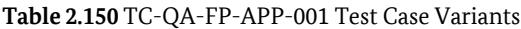
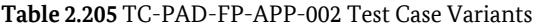
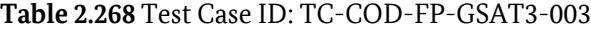
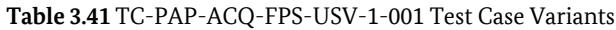

Technical Guideline TR-03122-3

# Conformance Test Specification for BSI-TR 03121 Biometrics for Public Sector Applications

Part 3: Test Cases for Function Modules and Processes

Version 5.2

Federal Office for Information Security P.O. Box 20 03 63 53133 Bonn E-Mail: TRBiometrics@bsi.bund.de Internet: https://bsi.bund.de © Federal Office for Information Security 2021

# **Table of Contents**

| 1.    | Introduction                                                                                                                 | 1   |
|-------|---------------------------------------------------------------------------------------------------------------------------------|-----|
| 2.    | Test Cases Function Modules                                                                                                  | 2   |
| 2.1.  | Test Cases Acquisition Hardware                                                                                              | 2   |
| 2.2.  | Test Cases Acquisition Software                                                                                              | 23  |
| 2.3.  | Test Cases Biometric Image Processing                                                                                        | 40  |
| 2.4.  | Test Cases Quality Assurance                                                                                                 | 54  |
| 2.5.  | Test Cases Compression                                                                                                       | 77  |
| 2.6.  | Test Cases User Interface                                                                                                    | 87  |
| 2.7.  | Test Cases Presentation Attack Detection                                                                                     | 94  |
| 2.8.  | Test Cases Biometric Comparison                                                                                              | 98  |
| 2.9.  | Test Cases Logging  103                                                                                                   |     |
| 2.10. | Test Cases Coding  114                                                                                                    |     |
| 3.    | Test Cases Partial Application Processes  149                                                                             |     |
| 3.1.  | Test Cases PAP ACQ-FI-SV-5: Supervised Facial Image Acquisition System  149                                               |     |
| 3.2.  | Test Cases PAP ACQ-FI-AUTO-1: Automated Facial Image Acquisition  155                                                     |     |
| 3.3.  | Test Cases PAP ACQ-FI-SV-2: Supervised Facial Image Acquisition with CIR Lookup  158                                      |     |
| 3.4.  | Test Cases PAP ACQ-FI-SV-4: Supervised Facial Image Acquisition without CIR Lookup  160                                   |     |
| 3.5.  | Test Cases PAP ACQ-FPS-SV-1: Supervised Acquisition Single Slap  163                                                      |     |
| 3.6.  | Test Cases PAP ACQ-FP442-SV-1: Supervised Acquisition 4-4-2 for Enrolment  167                                            |     |
| 3.7.  | Test Cases PAP ACQ-FP4141-SV-1: Supervised Acquisition 4-1-4-1 for Enrolment  167                                         |     |
| 3.8.  | Test Cases PAP ACQ-FP2P-SV-1: Supervised Acquisition of Two Plain Fingers on Multi-Finger Hardware for Enrolment  168  |     |
| 3.9.  | Test Cases PAP ACQ-FP2P-SV-2: Supervised Acquisition of Two Plain Fingers on Single-Finger Hardware for Enrolment  171 |     |
| 3.10. | Test Cases PAP ACQ-FP10R-SV-1: Ten Finger Rolled Supervised Acquisition for Enrolment                                        | 174 |
| 3.11. | Test Cases PAP ACQ-FPS-USV-1: Unsupervised Acquisition Single Slap  178                                                   |     |
|       | List of Abbreviations  181                                                                                                |     |
|       | Bibliography  182                                                                                                         |     |

# **1. Introduction**

This document is part three of the Conformance Test Specification (TR-03122). It is the counterpart of TR-03121-3 describing the test cases for the defined Function Modules.

Not all Function Modules have test cases associated with them.

# **2. Test Cases Function Modules**

The following sections define test cases for Function Modules.

# **2.1. Test Cases Acquisition Hardware**

For test cases for dark field and light field scanners based on the optical principle of frustrated total reflection, the reader is referred to [\[TR-03118\]](#page-184-1) (German only). These test cases will be incorporated here in a future version of this guideline. Test cases for direct contact imaging scanners are defined in the following.

# **2.1.1. Test Cases FM AH-FI-BCL**

| Test Case ID: TC-AH-FI-BCL-001 |               |                                                                                                                                                         |  |  |  |
|--------------------------------|---------------|---------------------------------------------------------------------------------------------------------------------------------------------------------|--|--|--|
| Scope                          |               | Examination of technical specifications of the digital camera used to obtain facial biometrics.                                                         |  |  |  |
| Preconditions                  | •             | The camera used in the specific application profile is at hand and ready for operation.                                                                 |  |  |  |
|                                | •             | Product documentation of the camera model is at hand (e.g. data sheet, manual).                                                                         |  |  |  |
| CTS Mode                       | Not supported |                                                                                                                                                         |  |  |  |
| Description                    | Step          | Description / Expected Result                                                                                                                           |  |  |  |
|                                | 1             | Description:                                                                                                                                            |  |  |  |
|                                |               | Consult product documentation of the camera system.                                                                                                     |  |  |  |
|                                |               | Expected Result:                                                                                                                                        |  |  |  |
|                                |               | The product documentation states that the camera system supports the capture of color images.                                                        |  |  |  |
|                                | 2             | Description:                                                                                                                                            |  |  |  |
|                                |               | Consult the product documentation of the camera system.                                                                                                 |  |  |  |
|                                |               | Expected Result:                                                                                                                                        |  |  |  |
|                                |               | The product documentation states the support of capturing facial images of a biometric subjects with a body height in the range of 140 cm to 200 cm. |  |  |  |
|                                |               | Table 2.2 TC-AH-FI-BCL-001 Description                                                                                                                  |  |  |  |

### **Table 2.1** Test Case ID: TC-AH-FI-BCL-001

| Test Case ID: TC-AH-FI-BCL-002                                                                                            |                                                                                                    |  |  |  |  |
|---------------------------------------------------------------------------------------------------------------------------|----------------------------------------------------------------------------------------------------|--|--|--|--|
| Examination of image resolution and cropping features of the digital camera used to obtain facial Scope biometrics. |                                                                                                    |  |  |  |  |
| Preconditions                                                                                                             | The camera used in the specific application profile is at hand and ready for operation. •       |  |  |  |  |
|                                                                                                                           | • The IUT implements an interface for conformance testing where a single image can be captured. |  |  |  |  |
|                                                                                                                           | • The IUT is able to return the results for every captured image via the test interface.        |  |  |  |  |
|                                                                                                                           | • One test subject is available to test the Implementation Under Test (IUT)'s behaviour.        |  |  |  |  |

| Test Case ID: TC-AH-FI-BCL-002 |                                             |                                                                                                                                             |  |  |  |
|--------------------------------|---------------------------------------------|---------------------------------------------------------------------------------------------------------------------------------------------|--|--|--|
| CTS Mode                       | • interactive                            |                                                                                                                                             |  |  |  |
|                                | no provision of pre-defined input data • |                                                                                                                                             |  |  |  |
|                                | • HTTP method: GET                       |                                                                                                                                             |  |  |  |
| • test case variants:       |                                             |                                                                                                                                             |  |  |  |
|                                | /TR03122/TC-AH-FI-BCL-002/1                 |                                                                                                                                             |  |  |  |
|                                |                                             | Table 2.4 TC-AH-FI-BCL-002 Test Case Variants                                                                                               |  |  |  |
| Description                    | Step                                        | Description / Expected Result                                                                                                               |  |  |  |
|                                | 1                                           | Description:                                                                                                                                |  |  |  |
|                                |                                             | • Position the biometric subject in a distance of 60 cm towards the camera system.                                                       |  |  |  |
|                                |                                             | • Acquire an image with the camera system via the CTS interface.                                                                         |  |  |  |
|                                |                                             | Expected Result:                                                                                                                            |  |  |  |
|                                |                                             | • A message conforming to TR-03121 XML containing the encoded facial image is re turned via the test interface (bio:FaceAcquisition). |  |  |  |
|                                |                                             | • The CTS verifies that the image returned by the IUT has a resolution of 1600 x 1200 pixels with a maximal deviation of -10%.        |  |  |  |
|                                |                                             | Table 2.5 TC-AH-FI-BCL-002 Description                                                                                                      |  |  |  |

#### **Table 2.3** Test Case ID: TC-AH-FI-BCL-002

| Test Case ID: TC-AH-FI-BCL-003 |                                                                                                                                     |  |  |  |  |
|--------------------------------|-------------------------------------------------------------------------------------------------------------------------------------|--|--|--|--|
| Scope                          | Examination of image processing features of the digital camera or provided/integrated software used to obtain facial biometrics. |  |  |  |  |
| Preconditions                  | • The camera used in the specific application profile is at hand and ready for operation.                                        |  |  |  |  |
|                                | The IUT implements an interface for conformance testing where a single image can be captured. •                                  |  |  |  |  |
|                                | The IUT is able to return the results for every captured image via the test interface. •                                         |  |  |  |  |
|                                | • Two biometric test subjects are available to test the IUT's behaviour.                                                         |  |  |  |  |
| CTS Mode                       | • interactive                                                                                                                    |  |  |  |  |
|                                | • no provision of pre-defined input data                                                                                         |  |  |  |  |
|                                | • HTTP method: GET                                                                                                               |  |  |  |  |
|                                | • Test case variants:                                                                                                            |  |  |  |  |
|                                | /TR03122/TC-AH-FI-BCL-003/1                                                                                                         |  |  |  |  |

**Table 2.7** TC-AH-FI-BCL-003 Test Case Variants

| Test Case ID: TC-AH-FI-BCL-003 |      |                                                                                                                                                                                           |  |  |  |  |
|--------------------------------|------|-------------------------------------------------------------------------------------------------------------------------------------------------------------------------------------------|--|--|--|--|
| Description                    | Step | Description / Expected Result                                                                                                                                                             |  |  |  |  |
|                                | 1    | Description:                                                                                                                                                                              |  |  |  |  |
|                                |      | • Position one biometric subject in front of the camera system. Verify that this bio metric subject is standing in a distance above 40 cm and below 100 cm to the camera system. |  |  |  |  |
|                                |      | • Position the second biometric subject in front of the camera system. Verify that the biometric subject is standing in a distance below 40 cm to the camera system.                |  |  |  |  |
|                                |      | Attempt to acquire an image with the camera system by using the CTS. •                                                                                                                 |  |  |  |  |
|                                |      | Expected Result:                                                                                                                                                                          |  |  |  |  |
|                                |      | • The camera system does not acquire an image.                                                                                                                                         |  |  |  |  |
|                                |      | • A message conforming to TR-03121 XML but not containing facial image data is re turned via the test interface (bio:FaceAcquisition).                                              |  |  |  |  |

**Table 2.8** TC-AH-FI-BCL-003 Description

#### **Table 2.6** Test Case ID: TC-AH-FI-BCL-003

| Test Case ID: TC-AH-FI-BCL-004 |                                                                                                                                     |  |  |
|--------------------------------|-------------------------------------------------------------------------------------------------------------------------------------|--|--|
| Scope                          | Examination of image processing features of the digital camera or provided/integrated software used to obtain facial biometrics. |  |  |
| Preconditions                  | The camera used in the specific application profile is at hand and ready for operation. •                                        |  |  |
|                                | • The IUT implements an interface for conformance testing where a single image can be captured.                                  |  |  |
|                                | • The IUT is able to return the results for every captured image via the test interface.                                         |  |  |
|                                | • Two biometric test subjects are available to test the IUT's behaviour.                                                         |  |  |
| CTS Mode                       | • interactive                                                                                                                    |  |  |
|                                | • no provision of pre-defined input data                                                                                         |  |  |
|                                | • HTTP method: GET                                                                                                               |  |  |
|                                | test case variants: •                                                                                                            |  |  |
|                                |                                                                                                                                     |  |  |
|                                | /TR03122/TC-AH-FI-BCL-004/1                                                                                                         |  |  |

**Table 2.10** TC-AH-FI-BCL-004 Test Case Variants

| Test Case ID: TC-AH-FI-BCL-004 |      |                                                                                                                                                                                           |  |  |
|--------------------------------|------|-------------------------------------------------------------------------------------------------------------------------------------------------------------------------------------------|--|--|
| Description                    | Step | Description / Expected Result                                                                                                                                                             |  |  |
|                                | 1    | Description:                                                                                                                                                                              |  |  |
|                                |      | • Position one biometric subject in front of the camera system. Verify that this bio metric subject is standing in a distance above 40 cm and below 100 cm to the camera system. |  |  |
|                                |      | • Position the second biometric subject in front of the camera system. Verify that the biometric subject is standing in a distance above 100 cm to the camera system.               |  |  |
|                                |      | • Acquire an image with the camera system by using the CTS.                                                                                                                            |  |  |
|                                |      | Expected Result:                                                                                                                                                                          |  |  |
|                                |      | A message conforming to TR-03121 XML containing the encoded facial image is re • turned via the test interface (bio:FaceAcquisition).                                               |  |  |
|                                |      | The returned image depicts the biometric subject which was positioned in a distance • above 40 cm and below 100 cm to the camera system.                                            |  |  |
|                                |      |                                                                                                                                                                                           |  |  |

**Table 2.11** TC-AH-FI-BCL-004 Description

**Table 2.9** Test Case ID: TC-AH-FI-BCL-004

# **2.1.2. Test Cases FM AH-FI-FBS**

| Test Case ID: TC-AH-FI-FBS-001 |                                                                                                            |                                                                                          |  |  |
|--------------------------------|------------------------------------------------------------------------------------------------------------|------------------------------------------------------------------------------------------|--|--|
| Scope                          | Examination of capable image resolution of flat bed scanner used to scan photos for enrolment purposes. |                                                                                          |  |  |
| Precondition                   | Product documentation of the scanner model is at hand (e.g. data sheet, manual).                           |                                                                                          |  |  |
| CTS Mode                       | Not supported                                                                                              |                                                                                          |  |  |
| Description                    | Step                                                                                                       | Description / Expected Result                                                            |  |  |
|                                | 1                                                                                                          | Description:                                                                             |  |  |
|                                |                                                                                                            | • Verify that the scanner provides a physical resolution of at least 300ppi.          |  |  |
|                                |                                                                                                            | • Consult product documentation of the scanner.                                       |  |  |
|                                |                                                                                                            | Expected Result:                                                                         |  |  |
|                                |                                                                                                            | The product documentation states that the physical/native resolution is at least 300ppi. |  |  |
|                                |                                                                                                            |                                                                                          |  |  |

**Table 2.13** TC-AH-FI-FBS-001 Description

#### **Table 2.12** Test Case ID: TC-AH-FI-FBS-001

| Test Case ID: TC-AH-FI-FBS-002 |                                                                                             |  |  |
|--------------------------------|---------------------------------------------------------------------------------------------|--|--|
| Scope                          | Examination of image quality of flat bed scanner used to scan photos for enrolment purposes |  |  |
| Precondition                   | • IUT is running, required modules are loaded.                                           |  |  |
|                                | • The scanner used in the specific application profile is connected.                     |  |  |
|                                | • As necessary test resources: a photo with at least 36 mm x 45 mm.                      |  |  |

| CTS Mode    | •    | Interactive                                                                                              |  |  |
|-------------|------|----------------------------------------------------------------------------------------------------------|--|--|
|             | •    | No provision of pre-defined input data                                                                   |  |  |
|             | •    | HTTP method: GET                                                                                         |  |  |
|             | •    | Test case variants:                                                                                      |  |  |
|             |      |                                                                                                          |  |  |
|             |      | /TR03122/TC-AH-FI-FBS-002/1                                                                              |  |  |
|             |      | Table 2.15 TC-AH-FI-FBS-002 Test Case Variants                                                           |  |  |
| Description | Step | Description / Expected Result                                                                            |  |  |
|             | 1    | Description:                                                                                             |  |  |
|             |      | • A photo is placed on the scan area.                                                                 |  |  |
|             |      | The IUT is called via the CTS. •                                                                      |  |  |
|             |      | Expected Result:                                                                                         |  |  |
|             |      | • The image dimension is 413 pixels width and 531 pixels height with a tolerance of +/- 10 pixels. |  |  |
|             |      | • The image has a file size of at least 11 KB.                                                        |  |  |
|             |      | • The image is compressed via the JPEG2000 or JPEG standard.                                          |  |  |

#### **Table 2.14** Test Case ID: TC-AH-FI-FBS-002

### **2.1.3. Test Cases FM AH-FI-DC**

| Test Case ID: TC-AH-FI-DC-001 |                                                                                                |  |
|-------------------------------|------------------------------------------------------------------------------------------------|--|
| Scope                         | Examination of technical specifications of the digital camera used to obtain facial biometrics |  |
| Precondition                  | • The camera used in the specific application profile is at hand                            |  |
|                               | • Product documentation of the camera model is at hand (e.g. data sheet, manual)            |  |

| Test Case ID: TC-AH-FI-DC-001 |      |                                                                                                                                                                                 |  |  |
|-------------------------------|------|---------------------------------------------------------------------------------------------------------------------------------------------------------------------------------|--|--|
| Description                   | Step | Description / Expected Result                                                                                                                                                   |  |  |
|                               | 1    | Description:                                                                                                                                                                    |  |  |
|                               |      | Verify that the sensor of the camera provides a physical resolution of at least 1200 x 1600 pixels.                                                                          |  |  |
|                               |      | Consult product documentation of the camera.                                                                                                                                    |  |  |
|                               |      | Expected Result:                                                                                                                                                                |  |  |
|                               |      | The product documentation states that the physical, native resolution is at least 1200 x 1600 pixels.                                                                        |  |  |
|                               | 2    | Description:                                                                                                                                                                    |  |  |
|                               |      | Verify that the active camera setting (e.g. configurable via camera firmware) used for the specific application provides an image resolution of at least 1200 x 1600 pixels. |  |  |
|                               |      | Consult product documentation of the camera or options in the cameras firmware.                                                                                                 |  |  |
|                               |      | Expected Result:                                                                                                                                                                |  |  |
|                               |      | • The setting provides a native image resolution of at least 1200 x 1600 pixels.                                                                                             |  |  |
|                               |      | • This setting is the active setting for the application profile                                                                                                             |  |  |
|                               |      |                                                                                                                                                                                 |  |  |

**Table 2.18** TC-AH-FI-DC-001 Description

**Table 2.17** Test Case ID: TC-AH-FI-DC-001

# **2.1.4. Test Cases FM AH-FI-ICS**

| Test Case ID: TC-AH-FI-ICS-001 |                                                                                                                                                                                                                                                                                                                  |                                                                                                                                    |  |  |
|--------------------------------|------------------------------------------------------------------------------------------------------------------------------------------------------------------------------------------------------------------------------------------------------------------------------------------------------------------|------------------------------------------------------------------------------------------------------------------------------------|--|--|
| Scope                          | Examination of technical specifications of the integrated camera systems used to obtain digitised facial images. This test case covers the minimum physical resolution of the captured facial image. Note, this requirement is not MANDATORY for scenarios where only a facial verification per formed. |                                                                                                                                    |  |  |
| Precondition                   | Product documentation of the camera unit is at hand (e.g. data sheet, manual).                                                                                                                                                                                                                                   |                                                                                                                                    |  |  |
| CTS Mode                       |                                                                                                                                                                                                                                                                                                                  | Not supported                                                                                                                      |  |  |
| Description                    | Step                                                                                                                                                                                                                                                                                                             | Description / Expected Result                                                                                                      |  |  |
|                                | 1                                                                                                                                                                                                                                                                                                                | Description:                                                                                                                       |  |  |
|                                |                                                                                                                                                                                                                                                                                                                  | Verify that the sensor of the camera provides a physical resolution of at least • 1200 x 1600 pixels without any up-scaling. |  |  |
|                                |                                                                                                                                                                                                                                                                                                                  | Consult product documentation of the camera. •                                                                                  |  |  |
|                                |                                                                                                                                                                                                                                                                                                                  | Expected Result:                                                                                                                   |  |  |
|                                |                                                                                                                                                                                                                                                                                                                  | The product documentation states that the physical, native resolution is at least 1200 x 1600 pixels.                           |  |  |

**Table 2.20** TC-AH-FI-ICS-001 Description

#### **Table 2.19** Test Case ID: TC-AH-FI-ICS-001

| Test Case ID: TC-AH-FI-ICS-002 |                                                                                                                                                             |  |
|--------------------------------|-------------------------------------------------------------------------------------------------------------------------------------------------------------|--|
| Scope                          | Examination of technical specifications of the integrated camera systems used to obtain digitised facial images. This test case covers the illumination. |  |
| Precondition                   | Product documentation of the integrated camera system is at hand (e.g. data sheet, manual).                                                                 |  |

| Test Case ID: TC-AH-FI-ICS-002 |               |                                                                                                                                                                                                                     |  |  |
|--------------------------------|---------------|---------------------------------------------------------------------------------------------------------------------------------------------------------------------------------------------------------------------|--|--|
| CTS Mode                       | Not supported |                                                                                                                                                                                                                     |  |  |
| Description                    | Step          | Description / Expected Result                                                                                                                                                                                       |  |  |
|                                | 1             | Description:                                                                                                                                                                                                        |  |  |
|                                |               | • Verify that the integrated camera system provides diffuse lighting adapting to the environmental light conditions.                                                                                          |  |  |
|                                |               | • Verify that the integrated camera system allows high quality acquisitions indepen dently from the environmental light situation.                                                                            |  |  |
|                                |               | • Consult product documentation of the integrated camera system.                                                                                                                                                 |  |  |
|                                |               | Expected Result:                                                                                                                                                                                                    |  |  |
|                                |               | The product documentation states that the camera system uses diffuse lighting • adapting to the environmental light conditions.                                                                               |  |  |
|                                |               | The product documentation states that the camera system allows high quality ac • quisitions independently from the environmental light situation that can usually be found in the environment in question. |  |  |

**Table 2.22** TC-AH-FI-ICS-002 Description

#### **Table 2.21** Test Case ID: TC-AH-FI-ICS-002

| Test Case ID: TC-AH-FI-ICS-003 |                                                                                                                                                                                                                                                                                        |                                                                                                     |  |  |
|--------------------------------|----------------------------------------------------------------------------------------------------------------------------------------------------------------------------------------------------------------------------------------------------------------------------------------|-----------------------------------------------------------------------------------------------------|--|--|
| Scope                          | Examination of technical specifications of the integrated camera systems used to obtain digitised facial images. This test case covers the colour space of captured image. Note, this require ment is not MANDATORY for scenarios where only a facial verification is performed. |                                                                                                     |  |  |
| Precondition                   | Product documentation of the camera unit is at hand (e.g. data sheet, manual).                                                                                                                                                                                                         |                                                                                                     |  |  |
| CTS Mode                       |                                                                                                                                                                                                                                                                                        | Not supported                                                                                       |  |  |
| Description                    | Step                                                                                                                                                                                                                                                                                   | Description / Expected Result                                                                       |  |  |
|                                | 1                                                                                                                                                                                                                                                                                      | Description:                                                                                        |  |  |
|                                |                                                                                                                                                                                                                                                                                        | • Verify that the integrated camera system provides a 24 bit RGB mode.                           |  |  |
|                                |                                                                                                                                                                                                                                                                                        | • Consult product documentation of the integrated camera system.                                 |  |  |
|                                |                                                                                                                                                                                                                                                                                        | Expected Result:                                                                                    |  |  |
|                                |                                                                                                                                                                                                                                                                                        | The product documentation states that the camera system is able to capture images in 24 bit RGB. |  |  |

**Table 2.24** TC-AH-FI-ICS-003 Description

**Table 2.23** Test Case ID: TC-AH-FI-ICS-003

### **2.1.5. Test Cases FM AH-FP-OPT**

#### **Test Case ID: TC-AH-FP-OPT-001**

*Scope* Test of image sensor linearity.

| Test Case ID: TC-AH-FP-OPT-001 |                                                                                                                                                            |  |
|--------------------------------|------------------------------------------------------------------------------------------------------------------------------------------------------------|--|
| Preconditions                  | • The scanner is connected.                                                                                                                             |  |
|                                | • The scanner software is set to output unprocessed images.                                                                                             |  |
|                                | • Captured images can be saved for subsequent evaluation.                                                                                               |  |
|                                | Depending on the following conditions method A, B, C or D is chosen for the test: •                                                                     |  |
|                                | Method A: It is possible to control the integration time of the scanner's image sensor. •                                                               |  |
|                                | • Method B: It is possible to control the intensity of the scanner's illumination.                                                                      |  |
|                                | • Method C: It is only possible to turn the scanner's illumination on and off.                                                                          |  |
|                                | • Method D: Neither of the above can be controlled.                                                                                                     |  |
|                                | • Test resources:                                                                                                                                       |  |
|                                | • Method A and B: A diffuse reflecting uniform white target (e.g. Munsell N9).                                                                          |  |
|                                | Method C: An external extended uniform light source (e.g. LED backlight or similar). •                                                                  |  |
|                                | Method B and C: Measurement equipment for measuring the luminance of the illumination. •                                                                |  |
|                                | • Method D: A diffuse reflecting target with a grey scale step tablet or a set of uniform neutral grey targets cards with various known reflectance. |  |
|                                | • Image processing software to determine the average grey value in a region of interest in the image.                                                |  |
| CTS Mode                       | Not supported                                                                                                                                              |  |

| Description | Step | Description / Expected Result                                                                                                                                                                                                                                                                         |  |  |
|-------------|------|-------------------------------------------------------------------------------------------------------------------------------------------------------------------------------------------------------------------------------------------------------------------------------------------------------|--|--|
|             | 1    | Description:                                                                                                                                                                                                                                                                                          |  |  |
|             |      | • Method A: The white target is placed on the scanner platen. scanner's illumina tion is turned on and left unchanged during the test. Multiple images are taken while varying the integration time of the image sensor. The setting of the integration time is recorded with each image. |  |  |
|             |      | • Method B: The white target is placed on the scanner platen. Multiple images are tak en while varying the intensity of the illumination of the scanner. The luminance of the illumination is monitored at the same time and recorded with each image.                                       |  |  |
|             |      | • Method C: The scanner's illumination is turned off. The external light source is placed on the scanner platen. Multiple images are taken while varying intensi ty of the external illumination. The luminance illumination is moni tored at the same time and recorded with each image. |  |  |
|             |      | • Method D: The grey scale target is placed on the scanner platen and an image tak en. In case of a set of uniform targets images of each target are taken sequentially and the reflectance of the target is recorded with each image.                                                       |  |  |
|             |      | • All methods: At least nine images/individual grey values are required that substan tially cover the scanners dynamic range.                                                                                                                                                                   |  |  |
|             |      | Expected Result:                                                                                                                                                                                                                                                                                      |  |  |
|             |      | Set of images with a uniform area covered by the target or a single image of a target with a grey scale step tablet.                                                                                                                                                                               |  |  |
|             | 2    | Description:                                                                                                                                                                                                                                                                                          |  |  |
|             |      | For each of the images the average grey value is determined in the area covered by the colour test card. The average grey value is plotted against the previously recorded inte gration time (Method A), luminance (Method B, C) or reflectance (Method D).                                     |  |  |
|             |      | Expected Result:                                                                                                                                                                                                                                                                                      |  |  |
|             |      | The resulting plot should be close to a linear function.                                                                                                                                                                                                                                              |  |  |
|             |      | A linear regression is performed over the value pairs (integration time, average grey val ue),(luminance, average grey value) or (reflectance, grey value). The difference between the average grey value and from regression is calculated for each mea surement.                           |  |  |
|             |      | None of the calculated differences SHALL exceed 7.65 grey levels.                                                                                                                                                                                                                                     |  |  |
|             | 3    | Description:                                                                                                                                                                                                                                                                                          |  |  |
|             |      | A linear regression is performed over the value pairs (integration time, average grey val ue),(luminance, average grey value) or (reflectance, grey value). The difference between the average grey value and from regression is calculated for each mea surement.                           |  |  |
|             |      | Expected Result:                                                                                                                                                                                                                                                                                      |  |  |
|             |      | None of the calculated differences SHALL exceed 7.65 grey levels.                                                                                                                                                                                                                                     |  |  |

#### **Table 2.25** Test Case ID: TC-AH-FP-OPT-001

#### **Test Case ID: TC-AH-FP-OPT-002**

*Scope* Test of scanner resolution and geometrical accuracy.

| Test Case ID: TC-AH-FP-OPT-002 |                                                                                                                                                                                                                                                                |  |  |  |
|--------------------------------|----------------------------------------------------------------------------------------------------------------------------------------------------------------------------------------------------------------------------------------------------------------|--|--|--|
| Preconditions                  | • The scanner is connected.                                                                                                                                                                                                                                 |  |  |  |
|                                | The scanner software is set to output unprocessed images. •                                                                                                                                                                                                 |  |  |  |
|                                | Captured images can be saved for subsequent evaluation. •                                                                                                                                                                                                   |  |  |  |
|                                | • Test resources:                                                                                                                                                                                                                                           |  |  |  |
|                                | • A Ronchi bar pattern target, that consists of an equal-width and space square wave pat tern at 1.0 cy/mm, preferably on a flexible, diffuse white reflecting substrate. The target pat tern SHALL cover at least 70% of the scanner's capture area. |  |  |  |
|                                | • The test software WinGeo (IQS Test Tools CD).                                                                                                                                                                                                             |  |  |  |
| CTS Mode                       | Not supported                                                                                                                                                                                                                                                  |  |  |  |

| Test Case ID: TC-AH-FP-OPT-002 |      |                                                                                                                                                                                                                                                                                                                                                                                                                                                                                                                                                                                                                                 |  |  |  |
|--------------------------------|------|---------------------------------------------------------------------------------------------------------------------------------------------------------------------------------------------------------------------------------------------------------------------------------------------------------------------------------------------------------------------------------------------------------------------------------------------------------------------------------------------------------------------------------------------------------------------------------------------------------------------------------|--|--|--|
| Description                    | Step | Description / Expected Result                                                                                                                                                                                                                                                                                                                                                                                                                                                                                                                                                                                                   |  |  |  |
|                                | 1    | Description:                                                                                                                                                                                                                                                                                                                                                                                                                                                                                                                                                                                                                    |  |  |  |
|                                |      | The target is placed on the scanner platen and images are taken with the lines of the Ronchi pattern parallel to the pixel columns (vertical bars) and rows (horizontal bars) of the image sensor, respectively. A flexible target has to be pressed against the scanner platen to make sure the target is in contact with the platen over the entire pattern area. To discern properties of the scanner and the target the procedure may be repeated with the target being rotated by 180 degrees. If accuracy failures in the images remain at the same location they are most probably due to the scanner. |  |  |  |
|                                |      | Expected Result:                                                                                                                                                                                                                                                                                                                                                                                                                                                                                                                                                                                                                |  |  |  |
|                                |      | Set of images with the lines of the Ronchi pattern in vertical and horizontal direction, respectively.                                                                                                                                                                                                                                                                                                                                                                                                                                                                                                                       |  |  |  |
|                                | 2    | Description:                                                                                                                                                                                                                                                                                                                                                                                                                                                                                                                                                                                                                    |  |  |  |
|                                |      | The obtained image files are converted to raw image data (pixel grey values without header) and are processed with the software WinGeo. The program calculates the 1- bar and 6-bar distances of the pattern in the image (across-bar accuracy) as well as the along-bar accuracy. Also the resolution is calculated from the 6-bar distances.                                                                                                                                                                                                                                                                         |  |  |  |
|                                |      | Expected Result:                                                                                                                                                                                                                                                                                                                                                                                                                                                                                                                                                                                                                |  |  |  |
|                                |      | Resolution: The scanner's output resolution in both sensor detector row and column • directions SHALL be (R ± 0.01 R), with R being 500 pixels per inch or 1000 pixels per inch.                                                                                                                                                                                                                                                                                                                                                                                                                                       |  |  |  |
|                                |      | Across-bar accuracy: The difference D between the distance of the bars on the target • and the corresponding distance measured in the image SHALL not exceed in at least 99% of the tested cases in horizontal and vertical direction, respectively:                                                                                                                                                                                                                                                                                                                                                                   |  |  |  |
|                                |      | For 500-ppi scanner: •                                                                                                                                                                                                                                                                                                                                                                                                                                                                                                                                                                                                       |  |  |  |
|                                |      | D ≤ 0.0007, for 0.00 < X ≤ 0.07                                                                                                                                                                                                                                                                                                                                                                                                                                                                                                                                                                                                 |  |  |  |
|                                |      | D ≤ 0.01 X, for 0.07 ≤ X ≤ 1.50                                                                                                                                                                                                                                                                                                                                                                                                                                                                                                                                                                                                 |  |  |  |
|                                |      | • For 1,000-ppi scanner:                                                                                                                                                                                                                                                                                                                                                                                                                                                                                                                                                                                                     |  |  |  |
|                                |      | D ≤ 0.0005, for 0.00 < X ≤ 0.07                                                                                                                                                                                                                                                                                                                                                                                                                                                                                                                                                                                                 |  |  |  |
|                                |      | D ≤ 0.0071 X, for 0.07 ≤ X ≤ 1.5                                                                                                                                                                                                                                                                                                                                                                                                                                                                                                                                                                                                |  |  |  |
|                                |      | where:                                                                                                                                                                                                                                                                                                                                                                                                                                                                                                                                                                                                                          |  |  |  |
|                                |      | D =  Y-X                                                                                                                                                                                                                                                                                                                                                                                                                                                                                                                                                                                                                        |  |  |  |
|                                |      | X = actual target distance                                                                                                                                                                                                                                                                                                                                                                                                                                                                                                                                                                                                      |  |  |  |
|                                |      | Y = measured image distance                                                                                                                                                                                                                                                                                                                                                                                                                                                                                                                                                                                                     |  |  |  |
|                                |      | D, X, Y are in inches.                                                                                                                                                                                                                                                                                                                                                                                                                                                                                                                                                                                                          |  |  |  |
|                                |      | • Along-bar accuracy: In both vertical bar and horizontal orientations, the maxi mum difference in the horizontal or vertical direction, respectively, between lo cations of any two points within a 1.5-inch segment of a given bar image SHALL not exceed 0.016 inches for at least 99.0 percent of the tested cases.                                                                                                                                                                                                                                                                                             |  |  |  |

**Table 2.28** TC-AH-FP-OPT-002 Description

**Table 2.27** Test Case ID: TC-AH-FP-OPT-002

#### **Test Case ID: TC-AH-FP-OPT-003**

*Scope* Test of spatial frequency response.

| Test Case ID: TC-AH-FP-OPT-003 |                                                                                                                                                                                                                                                                                                                                                                                                                                                                                                                                                                                                                                         |  |  |  |  |
|--------------------------------|-----------------------------------------------------------------------------------------------------------------------------------------------------------------------------------------------------------------------------------------------------------------------------------------------------------------------------------------------------------------------------------------------------------------------------------------------------------------------------------------------------------------------------------------------------------------------------------------------------------------------------------------|--|--|--|--|
| Preconditions                  | • The scanner is connected.                                                                                                                                                                                                                                                                                                                                                                                                                                                                                                                                                                                                          |  |  |  |  |
|                                | • The scanner software is set to output unprocessed images.                                                                                                                                                                                                                                                                                                                                                                                                                                                                                                                                                                          |  |  |  |  |
|                                | Captured images can be saved for evaluation. •                                                                                                                                                                                                                                                                                                                                                                                                                                                                                                                                                                                       |  |  |  |  |
|                                | • Test resources:                                                                                                                                                                                                                                                                                                                                                                                                                                                                                                                                                                                                                    |  |  |  |  |
|                                | • A test chart containing Ronchi patterns meeting or exceeding the minimum require ments given in Table 2.31 for 500 ppi scanners or in Table 2.32 for 1000 ppi scanners. The target must also contain large black and white patches for normalizing the contrast. Prefer ably the target should consist of dark patterns on a flexible, diffuse white reflecting substrate material. The material SHALL be optically opaque and exhibit no significant volume scatter ing as this degrades the contrast of patterns. Rigid materials should not be used, if possi ble, to avoid damage to the image sensor. |  |  |  |  |
|                                | • A file describing the type, position and size of the different patterns on the test chart. This is required for processing the captured images with WinMTF.                                                                                                                                                                                                                                                                                                                                                                                                                                                                     |  |  |  |  |
|                                | • The test software WinMTF (IQS Test Tools CD).                                                                                                                                                                                                                                                                                                                                                                                                                                                                                                                                                                                      |  |  |  |  |
| CTS Mode                       | Not supported                                                                                                                                                                                                                                                                                                                                                                                                                                                                                                                                                                                                                           |  |  |  |  |

| Test Case ID: TC-AH-FP-OPT-003 |      |                                                                                                                                                                                                                                                                                                                                                                                                                                                                                                                                                                                                                                                                                                                                                                                              |  |  |
|--------------------------------|------|----------------------------------------------------------------------------------------------------------------------------------------------------------------------------------------------------------------------------------------------------------------------------------------------------------------------------------------------------------------------------------------------------------------------------------------------------------------------------------------------------------------------------------------------------------------------------------------------------------------------------------------------------------------------------------------------------------------------------------------------------------------------------------------------|--|--|
| Description                    | Step | Description / Expected Result                                                                                                                                                                                                                                                                                                                                                                                                                                                                                                                                                                                                                                                                                                                                                                |  |  |
|                                | 1    | Description:                                                                                                                                                                                                                                                                                                                                                                                                                                                                                                                                                                                                                                                                                                                                                                                 |  |  |
|                                |      | The target is placed on the scanner platen and images are taken with the lines of the Ronchi pattern parallel to the pixel columns (vertical bars) and rows (horizontal bars) of the image sensor, respectively. A flexible target has to be pressed against scan ner platen to make sure the target is in contact with the platen over the entire pattern area. If the target pattern covers less than 25% of scanners capture area, proce dure is applied to the right and the left half of the capture area, respectively. The bars of the Ronchi patterns have to be aligned with the pixel rows and columns to an angle less than 0.5°. If the images from the scanner are inverted they have to be inverted back to show dark patterns on a bright background. |  |  |
|                                |      | Expected Result:                                                                                                                                                                                                                                                                                                                                                                                                                                                                                                                                                                                                                                                                                                                                                                             |  |  |
|                                |      | Set of images with the bars of the Ronchi pattern in vertical and horizontal direction, showing dark patterns on a bright background.                                                                                                                                                                                                                                                                                                                                                                                                                                                                                                                                                                                                                                                     |  |  |
|                                | 2    | Description:                                                                                                                                                                                                                                                                                                                                                                                                                                                                                                                                                                                                                                                                                                                                                                                 |  |  |
|                                |      | The resulting images files are converted to TIFF format and are processed with the tool WinMTF. This program determines the modulation in each of the Ronchi test patterns. These modulation values are absolute with respect to the dynamic range of the image and do not represent the contrast transfer function (CTF).                                                                                                                                                                                                                                                                                                                                                                                                                                                          |  |  |
|                                |      | Expected Result:                                                                                                                                                                                                                                                                                                                                                                                                                                                                                                                                                                                                                                                                                                                                                                             |  |  |
|                                |      | Absolute modulation values for each of the Ronchi patterns on the test chart.                                                                                                                                                                                                                                                                                                                                                                                                                                                                                                                                                                                                                                                                                                                |  |  |
|                                | 3    | Description:                                                                                                                                                                                                                                                                                                                                                                                                                                                                                                                                                                                                                                                                                                                                                                                 |  |  |
|                                |      | The absolute modulation values have to be normalized by the modulation of the large black and white patches on the test chart, representing a spatial frequency of approxi mately zero cycles per millimetre. The average grey level in the black and white patches                                                                                                                                                                                                                                                                                                                                                                                                                                                                                                                    |  |  |
|                                |      | Gwhite Gblack ¡ is calculated and the modulation is calculated as follows: M0 = Gwhite + Gblack                                                                                                                                                                                                                                                                                                                                                                                                                                                                                                                                                                                                                                                                         |  |  |
|                                |      | with                                                                                                                                                                                                                                                                                                                                                                                                                                                                                                                                                                                                                                                                                                                                                                                         |  |  |
|                                |      | • M0: Modulation for 0 cy/mm                                                                                                                                                                                                                                                                                                                                                                                                                                                                                                                                                                                                                                                                                                                                                              |  |  |
|                                |      | • Gwhite: average grey level in the white patch                                                                                                                                                                                                                                                                                                                                                                                                                                                                                                                                                                                                                                                                                                                                           |  |  |
|                                |      | • Gblack: average grey level in the black patch                                                                                                                                                                                                                                                                                                                                                                                                                                                                                                                                                                                                                                                                                                                                           |  |  |
|                                |      | Having determined M0 the value of the CTF can be calculated from the modulation of M(R)) the Ronchi pattern: CTF(R) = M0                                                                                                                                                                                                                                                                                                                                                                                                                                                                                                                                                                                                                                                         |  |  |
|                                |      | with M(R) Modulation at spatial frequency R                                                                                                                                                                                                                                                                                                                                                                                                                                                                                                                                                                                                                                                                                                                                                  |  |  |
|                                |      | Expected Result:                                                                                                                                                                                                                                                                                                                                                                                                                                                                                                                                                                                                                                                                                                                                                                             |  |  |
|                                |      | • The values of the CTF for each of the spatial frequencies specified in Table 2.31 (500 ppi scanners) or Table 2.32 (1000 ppi scanners) must be greater than the corre sponding minimum CTF and less than the corresponding maximum CTF specified in the same table.                                                                                                                                                                                                                                                                                                                                                                                                                                                                                                      |  |  |
|                                |      | • The resulting image SHALL be free from significant effects of aliasing.                                                                                                                                                                                                                                                                                                                                                                                                                                                                                                                                                                                                                                                                                                                 |  |  |

**Table 2.30** TC-AH-FP-OPT-003 Description

**Table 2.29** Test Case ID: TC-AH-FP-OPT-003

| Spatial Fre quency R [cy cles/mm] | R/Rnyquist 500ppi | Min. Number of Bars | Bar width [mm] | Min. Length of Bars [mm] | Min. CTF 500ppi | Max. CTF |
|-----------------------------------------|----------------------|------------------------|-------------------|-----------------------------|--------------------|----------|
| <0,3                                    | 3%                   | 1                      | >1.7              | 1.7                         | -                  | -        |
| 1                                       | 10%                  | 4                      | 0.500             | 2.5                         | 0.948              | 1.05     |
| 2                                       | 20%                  | 5                      | 0.250             | 2.5                         | 0.869              | 1.05     |
| 3                                       | 30%                  | 5                      | 0.167             | 2.5                         | 0.791              | 1.05     |
| 4                                       | 40%                  | 5                      | 0.125             | 2.5                         | 0.713              | 1.05     |
| 5                                       | 50%                  | 10                     | 0.100             | 2.5                         | 0.636              | 1.05     |
| 6                                       | 60%                  | 10                     | 0.083             | 2.5                         | 0.559              | 1.05     |
| 7                                       | 70%                  | 10                     | 0.071             | 2.5                         | 0.483              | 1.05     |
| 8                                       | 80%                  | 10                     | 0.063             | 2.5                         | 0.408              | 1.05     |
| 9                                       | 90%                  | 10                     | 0.056             | 2.5                         | 0.333              | 1.05     |
| 10                                      | 100%                 | 10                     | 0.050             | 2.5                         | 0.259              | 1.05     |

**Table 2.31** Requirements for CTF test charts for 500 ppi scanners

| Spatial Fre quency R [cy cles/mm] | R/Rnyquist 500ppi | Min. Number of Bars | Bar width [mm] | Min. Length of Bars [mm] | Min. CTF 500ppi | Max. CTF |
|-----------------------------------------|----------------------|------------------------|-------------------|-----------------------------|--------------------|----------|
| <0,3                                    | 2%                   | 1                      | >1.7              | 1.7                         | -                  | -        |
| 1                                       | 5%                   | 4                      | 0.500             | 2.5                         | 0.957              | 1.05     |
| 2                                       | 10%                  | 4                      | 0.250             | 2.5                         | 0.904              | 1.05     |
| 3                                       | 15%                  | 5                      | 0.167             | 2.5                         | 0.854              | 1.05     |
| 4                                       | 20%                  | 5                      | 0.125             | 2.5                         | 0.805              | 1.05     |
| 5                                       | 25%                  | 5                      | 0.100             | 2.5                         | 0.760              | 1.05     |
| 6                                       | 30%                  | 5                      | 0.083             | 2.5                         | 0.716              | 1.05     |
| 7                                       | 35%                  | 5                      | 0.071             | 2.5                         | 0.675              | 1.05     |
| 8                                       | 40%                  | 5                      | 0.063             | 2.5                         | 0.636              | 1.05     |
| 9                                       | 45%                  | 10                     | 0.056             | 2.5                         | 0.598              | 1.05     |
| 10                                      | 50%                  | 10                     | 0.050             | 2.5                         | 0.563              | 1.05     |
| 12                                      | 60%                  | 10                     | 0.042             | 2.5                         | 0.497              | 1.05     |
| 14                                      | 70%                  | 10                     | 0.036             | 2.5                         | 0.437              | 1.05     |
| 16                                      | 80%                  | 10                     | 0.031             | 2.5                         | 0.382              | 1.05     |
| 18                                      | 90%                  | 10                     | 0.028             | 2.5                         | 0.332              | 1.05     |
| 20                                      | 100%                 | 10                     | 0.025             | 2.5                         | 0.284              | 1.05     |

**Table 2.32** Requirements for CTF test charts for 1000 ppi scanners

#### **Test Case ID: TC-AH-FP-OPT-004**

*Scope* Test of signal to noise ratio and grey level uniformity.

| Test Case ID: TC-AH-FP-OPT-004                    |                                                                                                                                              |  |  |
|---------------------------------------------------|----------------------------------------------------------------------------------------------------------------------------------------------|--|--|
| Preconditions                                     | • The scanner is connected.                                                                                                               |  |  |
|                                                   | • The scanner software is set to output unprocessed images.                                                                               |  |  |
| • Captured images can be saved for evaluation. |                                                                                                                                              |  |  |
|                                                   | Test resources:                                                                                                                              |  |  |
|                                                   | A uniform diffuse reflecting neutral grey target of high reflectance that covers the scanner's • entire capture area (e.g Munsell N9). |  |  |
|                                                   | • A uniform diffuse reflecting neutral grey target of low reflectance that covers the scanner's entire capture area (e.g Munsell N2).  |  |  |
|                                                   | • The test software signal-to-noise ratio (SNR)(IQS Test Tools CD).                                                                       |  |  |
|                                                   |                                                                                                                                              |  |  |

*CTS Mode* Not supported

| Test Case ID: TC-AH-FP-OPT-004 |      |                                                                                                                                                                                                                                                                                                                                                                                                                                                                                                                                                                                                                                                                                                                           |
|--------------------------------|------|---------------------------------------------------------------------------------------------------------------------------------------------------------------------------------------------------------------------------------------------------------------------------------------------------------------------------------------------------------------------------------------------------------------------------------------------------------------------------------------------------------------------------------------------------------------------------------------------------------------------------------------------------------------------------------------------------------------------------|
| Description                    | Step | Description / Expected Result                                                                                                                                                                                                                                                                                                                                                                                                                                                                                                                                                                                                                                                                                             |
|                                | 1    | Description:                                                                                                                                                                                                                                                                                                                                                                                                                                                                                                                                                                                                                                                                                                              |
|                                |      | The black target is placed on the scanner platen and an image is taken. After that the procedure is repeated with the white target. The definition of "black image" and "white image" for the subsequent analyses depends on the grey value that the target would produce in the final fingerprint image. If high reflectance produces a high grey value in the final fingerprint image then the image obtained with the high reflectance target is considered the "white image". If low reflectance produces a high grey value (inverting behaviour) then the image obtained with the low reflectance target is considered the "white image". The other image is then considered the "black image". |
|                                |      | Expected Result:                                                                                                                                                                                                                                                                                                                                                                                                                                                                                                                                                                                                                                                                                                          |
|                                |      | • A black image with the average grey value in the image being at least 4 grey levels above the scanner's minimum output grey level.                                                                                                                                                                                                                                                                                                                                                                                                                                                                                                                                                                                |
|                                |      | • A white image with the average grey value in the image being at least 4 grey levels below the scanner's maximum output grey level.                                                                                                                                                                                                                                                                                                                                                                                                                                                                                                                                                                                |
|                                | 2    | Description:                                                                                                                                                                                                                                                                                                                                                                                                                                                                                                                                                                                                                                                                                                              |
|                                |      | The black and white images are converted to raw image data (pixel grey values without header) and are processed with the software SNR. The program divides the images in blocks of 6.35 mm x and determines the average grey level, standard devi ation, the grey level averages in the columns and rows, respectively, and the number of pixels with a higher-than-allowed difference of the grey level from the average in each of the blocks. With these quantities the required tests regarding signal-noise-ratio and grey level uniformity are performed.                                                                                                                                         |
|                                |      | Expected Result:                                                                                                                                                                                                                                                                                                                                                                                                                                                                                                                                                                                                                                                                                                          |
|                                |      | Signal to noise ratio: is defined as the difference between average grey lev • els of corresponding blocks in the white and the black image. Noise is defined as the standard deviation of the grey levels in each block white and black image, re spectively. The signal-noise ratio is calculated as                                                                                                                                                                                                                                                                                                                                                                                                        |
|                                |      | Gwhite Gblack Gwhite Gblack ¡ ¡ with SNRblack = ; SNRwhite = ¾black ¾white                                                                                                                                                                                                                                                                                                                                                                                                                                                                                                                                                                                                            |
|                                |      | Gblack: average grey level in a block of the black and white image, respectively Gwhite;                                                                                                                                                                                                                                                                                                                                                                                                                                                                                                                                                                                                                               |
|                                |      | ¾black: standard deviation of the grey levels in a block of the black and white ¾white; image, respectively                                                                                                                                                                                                                                                                                                                                                                                                                                                                                                                                                                                                         |
|                                |      | The signal to noise ratio SHALL exceed 125 for at least 97% of the tested blocks in both the black and the white image.                                                                                                                                                                                                                                                                                                                                                                                                                                                                                                                                                                                                |
|                                |      | • Grey level uniformity requirement #1 (adjacent row, column uniformity): At least 99% of the average grey levels between every two adjacent 6.35 mm long rows and 99% between every two adjacent 6.35 mm long columns, SHALL not differ by more than 1.0 grey levels in the black and SHALL not differ by more than 2.0 grey levels in the white image.                                                                                                                                                                                                                                                                                                                                                   |
|                                |      | • Grey level uniformity requirement #2 (pixel to pixel uniformity): For at least 99.9% of all pixels within every independent 6.35 mm x 6.35 mm block no individual pixel's grey level SHALL vary from the average by more than 8.0 levels in black im age, and SHALL not vary from the average by more than 22.0 grey levels in the white image.                                                                                                                                                                                                                                                                                                                                                          |
|                                |      | • Grey level uniformity requirement #3 (small area uniformity): For every two inde pendent 6.35 mm x 6.35 mm blocks the average grey levels of the two blocks SHALL not differ by more than 3.0 grey levels in the black image, and SHALL not differ by more than 12.0 grey levels in the white image.                                                                                                                                                                                                                                                                                                                                                                                                        |
|                                |      | Table 2.34 TC-AH-FP-OPT-004 Description                                                                                                                                                                                                                                                                                                                                                                                                                                                                                                                                                                                                                                                                                   |

**Table 2.33** Test Case ID: TC-AH-FP-OPT-004

| Test Case ID: TC-AH-FP-OPT-005 |                                                                                                              |                                                                                                                                                                                     |  |
|--------------------------------|--------------------------------------------------------------------------------------------------------------|-------------------------------------------------------------------------------------------------------------------------------------------------------------------------------------|--|
| Scope                          | Test of fingerprint image quality.                                                                           |                                                                                                                                                                                     |  |
| Preconditions                  | • The scanner is connected.                                                                               |                                                                                                                                                                                     |  |
|                                | • The scanner software is set to output completely processed fingerprint images.                          |                                                                                                                                                                                     |  |
|                                | • Captured images can be saved for evaluation. • Test resources: 10 different test persons. • |                                                                                                                                                                                     |  |
|                                |                                                                                                              |                                                                                                                                                                                     |  |
|                                |                                                                                                              |                                                                                                                                                                                     |  |
|                                | • Image processing software for histogram analysis.                                                       |                                                                                                                                                                                     |  |
| CTS Mode                       | Not supported                                                                                                |                                                                                                                                                                                     |  |
| Description                    | Step Description / Expected Result                                                                        |                                                                                                                                                                                     |  |
|                                | 1                                                                                                            | Description:                                                                                                                                                                        |  |
|                                |                                                                                                              | Images of every finger of each test person are taken with the scanner. If the scanner is capable of capturing 4-finger images additional 4-finger images of each hand are taken. |  |
|                                |                                                                                                              | Expected Result:                                                                                                                                                                    |  |
|                                |                                                                                                              | Images of every finger each test person. In case a 4-finger scanner also im ages of every hand of each test person.                                                              |  |
|                                | 2                                                                                                            | Description:                                                                                                                                                                        |  |
|                                |                                                                                                              | For each image a histogram of the grey levels is produced. The histogram is tested for gaps and the number of grey levels with at least 5 counts in the image are counted.       |  |
|                                |                                                                                                              | Expected Result:                                                                                                                                                                    |  |
|                                |                                                                                                              | • The number of grey levels present with at least 5 pixels in the image SHALL be at least 128 for at least 99% of the tested images.                                          |  |
|                                |                                                                                                              | • The number of grey levels present with at least 5 pixels in the image SHALL be at least 200 for at least 80% of the tested images.                                          |  |
|                                |                                                                                                              | • There SHALL be no gaps in the histogram.                                                                                                                                       |  |
|                                |                                                                                                              |                                                                                                                                                                                     |  |

**Table 2.36** TC-AH-FP-OPT-004 Description

**Table 2.35** Test Case ID: TC-AH-FP-OPT-005

# **2.1.6. Test Cases FM AH-ALL-SSS**

| Test Case ID: TC-AH-ALL-SSS-001 |                                                                                                                                                 |  |  |
|---------------------------------|-------------------------------------------------------------------------------------------------------------------------------------------------|--|--|
| Scope                           | Examination of the surveillance camera systems of the self-service system (SSS) used for to obtain digitised facial images and fingerprints. |  |  |
| Preconditions                   | • The IUT's SSS is ready for operation.                                                                                                      |  |  |
|                                 | • A environment surveillance camera system which supervises the area around the SSS is avail able.                                        |  |  |
|                                 | • A environment surveillance camera system which supervises the fingerprint capture system of the SSS is available.                       |  |  |
|                                 | • The IUT implements a graphical user interface.                                                                                             |  |  |
|                                 | • The IUT implements a user interface of fingerprint acquisition shown to the biometric subject.                                             |  |  |
|                                 | • Two test subjects are available to test the IUT's behaviour.                                                                               |  |  |
| CTS Mode                        | Not supported                                                                                                                                   |  |  |
|                                 |                                                                                                                                                 |  |  |

| Description | Step | Description / Expected Result                                                                                                                                                                                              |
|-------------|------|----------------------------------------------------------------------------------------------------------------------------------------------------------------------------------------------------------------------------|
|             | 1    | Description:                                                                                                                                                                                                               |
|             |      | • A single biometric subject initiates the SSS process of the IUT.                                                                                                                                                      |
|             |      | Perform a bona fide fingerprint presentation on the fingerprint scanner of the IUT. •                                                                                                                                   |
|             |      | • Interact with the graphical user interface of the IUT.                                                                                                                                                                |
|             |      | Expected Result:                                                                                                                                                                                                           |
|             |      | • A fingerprint image is captured.                                                                                                                                                                                      |
|             |      | • The surveillance camera system captures a colour image of the surrounding area at the moment of the finger capture attempt in which the face of the biometric subject using the fingerprint scanner is visible. |
|             |      | • The surveillance camera system captures a colour image of the fingerprint acquisi tion area at the moment of the finger capture attempt.                                                                           |
|             |      | • The images captured by the surveillance camera systems are cached locally.                                                                                                                                            |
|             |      | The images captured by the surveillance camera systems are at least of resolution • 1280 x 720 pixels.                                                                                                               |
|             |      | The differences of capture times between the images captured by the surveillance • camera systems and the fingerprint capture attempt image are below 100 ms.                                                        |
|             | 2    | Description:                                                                                                                                                                                                               |
|             |      | A single biometric subject initiates the SSS process of the IUT.                                                                                                                                                           |
|             |      | Expected Result:                                                                                                                                                                                                           |
|             |      | The IUT starts the SSS process and enables interaction via the graphical user interface.                                                                                                                                   |
|             | 3    | Description:                                                                                                                                                                                                               |
|             |      | A second biometric subject moves into the corridor of the SSS (distance of 100 cm in front the SSS).                                                                                                                    |
|             |      | Expected Result:                                                                                                                                                                                                           |
|             |      | The image captured by the surveillance camera system of the surrounding area allows to identify whether that more than one person is in range of the SSS.                                                               |
|             | 4    | Description:                                                                                                                                                                                                               |
|             |      | Both biometric subjects leave the corridor of the SSS.                                                                                                                                                                     |
|             |      | Expected Result:                                                                                                                                                                                                           |
|             |      | The IUT stops the SSS process.                                                                                                                                                                                             |

**Table 2.38** TC-AH-ALL-SSS-001 Description

**Table 2.37** Test Case ID: TC-AH-ALL-SSS-001

# **2.1.7. Test Cases FM AH-FI-SSS**

| Test Case ID: TC-AH-FI-SSS-001 |                                                                                                   |  |  |  |
|--------------------------------|---------------------------------------------------------------------------------------------------|--|--|--|
| Scope                          | Examination of SSS scenarios where a digitised facial image is obtained.                          |  |  |  |
| Preconditions                  | • The IUT's SSS is ready for operation.                                                        |  |  |  |
|                                | • The SSS implements a graphical user interface and an where single image can be cap tured. |  |  |  |
|                                | • One test subject is available to test the IUT's behaviour.                                   |  |  |  |
| CTS Mode                       | Not supported                                                                                     |  |  |  |

| Test Case ID: TC-AH-FI-SSS-001 |      |                                                                                                                                                                                                          |  |  |
|--------------------------------|------|----------------------------------------------------------------------------------------------------------------------------------------------------------------------------------------------------------|--|--|
| Description                    | Step | Description / Expected Result                                                                                                                                                                            |  |  |
|                                | 1    | Description:                                                                                                                                                                                             |  |  |
|                                |      | • The biometric subject initiates the SSS process of the IUT.                                                                                                                                         |  |  |
|                                |      | • Acquire an image with the camera system of the IUT.                                                                                                                                                 |  |  |
|                                |      | • Interact with the graphical user interface of the IUT.                                                                                                                                              |  |  |
|                                |      | Expected Result:                                                                                                                                                                                         |  |  |
|                                |      | • A facial image is captured.                                                                                                                                                                         |  |  |
|                                |      | During the interation with the IUT's graphical user interface the biometric subject • did not have to rotate his/her head towards the camera system of the IUT for captur ing the facial image. |  |  |
|                                |      | Table 2.40 TC-AH-FI-SSS-001 Description                                                                                                                                                                  |  |  |

**Table 2.39** Test Case ID: TC-AH-FI-SSS-001

# **2.1.8. Test Cases FM AH-FI-SSS2**

| Test Case ID: TC-AH-FI-SSS2-001 |                                                                                                 |                                                                                                                                                                  |  |  |  |
|---------------------------------|-------------------------------------------------------------------------------------------------|------------------------------------------------------------------------------------------------------------------------------------------------------------------|--|--|--|
| Scope                           | Examination of technical specifications of the digital camera used to obtain facial biometrics. |                                                                                                                                                                  |  |  |  |
| Preconditions                   | • The camera used in the specific application profile is at hand and ready for operation.    |                                                                                                                                                                  |  |  |  |
|                                 | •                                                                                               | Product documentation of the camera model is at hand (e.g. data sheet, manual).                                                                                  |  |  |  |
| CTS Mode                        | Not supported                                                                                   |                                                                                                                                                                  |  |  |  |
| Description                     | Step                                                                                            | Description / Expected Result                                                                                                                                    |  |  |  |
|                                 | 1                                                                                               | Description:                                                                                                                                                     |  |  |  |
|                                 |                                                                                                 | Consult the product documentation of the camera system.                                                                                                          |  |  |  |
|                                 |                                                                                                 | Expected Result:                                                                                                                                                 |  |  |  |
|                                 |                                                                                                 | The product documentation states the support of capturing facial images of a biometric subjects with a body height at least in the range of 140 cm to 200 cm. |  |  |  |

**Table 2.42** TC-AH-FI-SSS2-001 Description

#### **Table 2.41** Test Case ID: TC-AH-FI-SSS2-001

| Test Case ID: TC-AH-FI-SSS2-002 |                                                                                                   |  |  |
|---------------------------------|---------------------------------------------------------------------------------------------------|--|--|
| Scope                           | Examination of SSS scenarios where a digitised facial image is obtained.                          |  |  |
| Preconditions                   | • The IUT's SSS is ready for operation.                                                        |  |  |
|                                 | • The SSS implements a graphical user interface and an where single image can be cap tured. |  |  |
|                                 | • One test subject is available to test the IUT's behaviour.                                   |  |  |
| CTS Mode                        | Not supported                                                                                     |  |  |

| Test Case ID: TC-AH-FI-SSS2-002 |      |                                                                                                                                                                                                          |  |  |
|---------------------------------|------|----------------------------------------------------------------------------------------------------------------------------------------------------------------------------------------------------------|--|--|
| Description                     | Step | Description / Expected Result                                                                                                                                                                            |  |  |
|                                 | 1    | Description:                                                                                                                                                                                             |  |  |
|                                 |      | • The biometric subject initiates the SSS process of the IUT.                                                                                                                                         |  |  |
|                                 |      | • Acquire a facial image with the camera system of the IUT.                                                                                                                                           |  |  |
|                                 |      | • Interact with the graphical user interface of the IUT.                                                                                                                                              |  |  |
|                                 |      | Expected Result:                                                                                                                                                                                         |  |  |
|                                 |      | A facial image is captured. •                                                                                                                                                                         |  |  |
|                                 |      | • During the interation with the IUT's graphical user interface the biometric subject did not have to rotate his/her head towards the camera system of the IUT for captur ing the facial image. |  |  |
|                                 |      | Table 2.44 TC-AH-FI-SSS2-002 Description                                                                                                                                                                 |  |  |

#### **Table 2.43** Test Case ID: TC-AH-FI-SSS2-002

| Test Case ID: TC-AH-FI-SSS2-003 |                                                                                                             |                                                                                                                                             |  |  |
|---------------------------------|-------------------------------------------------------------------------------------------------------------|---------------------------------------------------------------------------------------------------------------------------------------------|--|--|
| Scope                           | Examination of image resolution and cropping features of the digital camera used to obtain facial image. |                                                                                                                                             |  |  |
| Preconditions                   | • The camera used in the specific application profile is at hand and ready for operation.                |                                                                                                                                             |  |  |
|                                 | The IUT implements an interface for conformance testing where a single image can be captured. •          |                                                                                                                                             |  |  |
|                                 | The IUT is able to return the results for every captured image via the test interface. •                 |                                                                                                                                             |  |  |
|                                 | • One test subject is available to test the IUT's behaviour.                                             |                                                                                                                                             |  |  |
| CTS Mode                        | • interactive                                                                                            |                                                                                                                                             |  |  |
|                                 | • no provision of pre-defined input data                                                                 |                                                                                                                                             |  |  |
|                                 | • HTTP method: GET                                                                                       |                                                                                                                                             |  |  |
|                                 | •                                                                                                           | test case variants:                                                                                                                         |  |  |
|                                 |                                                                                                             |                                                                                                                                             |  |  |
|                                 |                                                                                                             | /TR03122/TC-AH-FI-SSS2-003/1                                                                                                                |  |  |
|                                 |                                                                                                             | Table 2.46 TC-AH-FI-SSS2-003 Test Case Variants                                                                                             |  |  |
| Description                     | Step                                                                                                        | Description / Expected Result                                                                                                               |  |  |
|                                 | 1                                                                                                           | Description:                                                                                                                                |  |  |
|                                 |                                                                                                             | • Position the biometric subject in a distance of 130 cm towards the camera system.                                                      |  |  |
|                                 |                                                                                                             | Acquire a facial image with the camera system via the CTS interface. •                                                                   |  |  |
|                                 |                                                                                                             | Expected Result:                                                                                                                            |  |  |
|                                 |                                                                                                             | • A message conforming to TR-03121 XML containing the encoded facial image is re turned via the test interface (bio:FaceAcquisition). |  |  |
|                                 |                                                                                                             | • The CTS verifies that the image returned by the IUT has a resolution of 680 x 480 pixels with a maximal deviation of -10%.          |  |  |
|                                 |                                                                                                             | Table 2.47 TC-AH-FI-SSS2-003 Description                                                                                                    |  |  |

**Table 2.45** Test Case ID: TC-AH-FI-SSS2-003

| Test Case ID: TC-AH-FI-SSS2-004 |                                                                                                             |                                                                                                                                                                                                 |  |  |  |
|---------------------------------|-------------------------------------------------------------------------------------------------------------|-------------------------------------------------------------------------------------------------------------------------------------------------------------------------------------------------|--|--|--|
| Scope                           | Examination of image resolution and cropping features of the digital camera used to obtain facial image. |                                                                                                                                                                                                 |  |  |  |
| Preconditions                   | • The camera used in the specific application profile is at hand and ready for operation.                |                                                                                                                                                                                                 |  |  |  |
|                                 | • The IUT implements an interface for conformance testing where a single image can be captured.          |                                                                                                                                                                                                 |  |  |  |
|                                 | • The IUT is able to return the results for every captured image via the test interface.                 |                                                                                                                                                                                                 |  |  |  |
|                                 | One test subject is available to test the IUT's behaviour. •                                             |                                                                                                                                                                                                 |  |  |  |
| CTS Mode                        | Interactive •                                                                                            |                                                                                                                                                                                                 |  |  |  |
|                                 | • No provision of pre-defined input data                                                                 |                                                                                                                                                                                                 |  |  |  |
|                                 | • HTTP method: GET                                                                                       |                                                                                                                                                                                                 |  |  |  |
|                                 | • Test case variants:                                                                                    |                                                                                                                                                                                                 |  |  |  |
|                                 |                                                                                                             |                                                                                                                                                                                                 |  |  |  |
|                                 |                                                                                                             | /TR03122/TC-AH-FI-SSS2-004/1                                                                                                                                                                    |  |  |  |
|                                 |                                                                                                             | Table 2.49 TC-AH-FI-SSS2-004 Test Case Variants                                                                                                                                                 |  |  |  |
| Description                     | Step                                                                                                        | Description / Expected Result                                                                                                                                                                   |  |  |  |
|                                 | 1                                                                                                           | Description:                                                                                                                                                                                    |  |  |  |
|                                 |                                                                                                             | • Position the biometric subject at a distance of 120 cm towards the camera system looking frontal. If the IUTs maximum distance is below 120 cm use the next possible distance limit. |  |  |  |
|                                 |                                                                                                             | • Acquire a facial image with the camera system via the CTS interface.                                                                                                                       |  |  |  |
|                                 |                                                                                                             | • Verify the image returned by the CTS.                                                                                                                                                      |  |  |  |
|                                 |                                                                                                             | Expected Result:                                                                                                                                                                                |  |  |  |
|                                 |                                                                                                             | A message conforming to TR-03121 XML containing the encoded facial image is re • turned via the test interface (bio:FaceAcquisition).                                                     |  |  |  |
|                                 |                                                                                                             | • The CTS shows a facial image according to the definition of "full frontal" (see [ISO_FACE]).                                                                                            |  |  |  |
|                                 | 2                                                                                                           | Description:                                                                                                                                                                                    |  |  |  |
|                                 |                                                                                                             | • Position the biometric subject in a distance of 70 cm towards the camera system looking frontal.                                                                                        |  |  |  |
|                                 |                                                                                                             | • Acquire a facial image with the camera system via the CTS interface.                                                                                                                       |  |  |  |
|                                 |                                                                                                             | • Verify the image returned by the CTS.                                                                                                                                                      |  |  |  |
|                                 |                                                                                                             | Expected Result:                                                                                                                                                                                |  |  |  |
|                                 |                                                                                                             | A message conforming to TR-03121 XML containing the encoded facial image is re • turned via the test interface (bio:FaceAcquisition).                                                     |  |  |  |
|                                 |                                                                                                             | The CTS shows a facial image according to the definition of "full frontal" (see • [ISO_FACE]).                                                                                            |  |  |  |
|                                 |                                                                                                             | Table 2.50 TC-AH-FI-SSS2-004 Description                                                                                                                                                        |  |  |  |

**Table 2.48** Test Case ID: TC-AH-FI-SSS2-004

# **2.1.9. Test Cases FM AH-FP-SSS**

#### **Test Case ID: TC-AH-FP-SSS-001**

*Scope* Examination of [SSS](#page-183-4) scenarios where digitised fingerprint images are obtained.

| Test Case ID: TC-AH-FP-SSS-001 |                                                                                                                  |                                                                                                                                                                          |  |  |  |
|--------------------------------|------------------------------------------------------------------------------------------------------------------|--------------------------------------------------------------------------------------------------------------------------------------------------------------------------|--|--|--|
| Preconditions                  | • The IUT's SSS is ready for operation.                                                                       |                                                                                                                                                                          |  |  |  |
|                                | The SSS implements a graphical user interface and an interface where fingerprint images can be • captured. |                                                                                                                                                                          |  |  |  |
|                                | Two test subjects are available to test the IUT's behaviour. •                                                |                                                                                                                                                                          |  |  |  |
| CTS Mode                       | Not supported                                                                                                    |                                                                                                                                                                          |  |  |  |
| Description                    | Step                                                                                                             | Description / Expected Result                                                                                                                                            |  |  |  |
|                                | 1                                                                                                                | Description:                                                                                                                                                             |  |  |  |
|                                |                                                                                                                  | • The biometric subject initiates the SSS process of the IUT.                                                                                                         |  |  |  |
|                                |                                                                                                                  | • Acquire fingerprint images with the acquisition system of the IUT using the right hand.                                                                          |  |  |  |
|                                |                                                                                                                  | • Interact with the graphical user interface of the IUT.                                                                                                              |  |  |  |
|                                |                                                                                                                  | Expected Result:                                                                                                                                                         |  |  |  |
|                                |                                                                                                                  | Fingerpint images of the right hand are captured.                                                                                                                        |  |  |  |
|                                | 2                                                                                                                | Description:                                                                                                                                                             |  |  |  |
|                                |                                                                                                                  | • The biometric subject initiates the SSS process of the IUT.                                                                                                         |  |  |  |
|                                |                                                                                                                  | • Acquire fingerprint images with the acquisition system of the IUT using the left hand.                                                                           |  |  |  |
|                                |                                                                                                                  | • Interact with the graphical user interface of the IUT.                                                                                                              |  |  |  |
|                                |                                                                                                                  | Expected Result:                                                                                                                                                         |  |  |  |
|                                |                                                                                                                  | Fingerpint images of the left hand are captured.                                                                                                                         |  |  |  |
|                                | 3                                                                                                                | Description:                                                                                                                                                             |  |  |  |
|                                |                                                                                                                  | • The biometric subject initiates the SSS process of the IUT with another subject being present within the reach of the fingerprint acquisition system of the SSS. |  |  |  |
|                                |                                                                                                                  | • Acquire fingerprint images with the acquisition system of the IUT using the left or right hand.                                                                  |  |  |  |
|                                |                                                                                                                  | • Interact with the graphical user interface of the IUT.                                                                                                              |  |  |  |
|                                |                                                                                                                  | Expected Result:                                                                                                                                                         |  |  |  |
|                                |                                                                                                                  | • During the fingerprint acquisition process multiple persons are detected by the SSS.                                                                                |  |  |  |
|                                |                                                                                                                  | The acceptance conditions are not met, i.e. the total result of acquisitionis is neg • ative.                                                                      |  |  |  |
|                                |                                                                                                                  | The multiple person detection result is cached locally on the SSS. •                                                                                                  |  |  |  |

**Table 2.52** TC-AH-FP-SSS-001 Description

**Table 2.51** Test Case ID: TC-AH-FP-SSS-001

# **2.2. Test Cases Acquisition Software**

# **2.2.1. Test Cases FM AS-FI-BCL**

#### **Test Case ID: TC-AS-FI-BCL-001**

*Scope* Examination of correctness of the software module used for integrated camera systems in order to obtain digitised facial images for detection of multiple faces.

| Test Case ID: TC-AS-FI-BCL-001 |                                                                                                    |                                                                                                                                              |  |  |
|--------------------------------|----------------------------------------------------------------------------------------------------|----------------------------------------------------------------------------------------------------------------------------------------------|--|--|
| Preconditions                  | The IUT is in operation, required modules are loaded. •                                         |                                                                                                                                              |  |  |
|                                | The integrated camera system used in the specific application scenario is connected. •          |                                                                                                                                              |  |  |
|                                | • The IUT implements an interface for conformance testing where a single image can be captured. |                                                                                                                                              |  |  |
|                                | • The IUT is able to return the results for every captured image via the test interface.        |                                                                                                                                              |  |  |
|                                | • At least two test subjects are available to test the IUT's behaviour.                         |                                                                                                                                              |  |  |
| CTS Mode                       | • interactive                                                                                   |                                                                                                                                              |  |  |
|                                | • no provision of pre-defined input data                                                        |                                                                                                                                              |  |  |
|                                | • HTTP method: GET                                                                              |                                                                                                                                              |  |  |
|                                | • test case variants:                                                                           |                                                                                                                                              |  |  |
|                                |                                                                                                    |                                                                                                                                              |  |  |
|                                |                                                                                                    | /TR03122/TC-AS-FI-BCL-001/1/                                                                                                                 |  |  |
|                                |                                                                                                    | Table 2.54 TC-AS-FI-BCL-001 Test Case Variants                                                                                               |  |  |
| Description                    | Step                                                                                               | Descriptions/ Expected Results                                                                                                               |  |  |
|                                | 1                                                                                                  | Description:                                                                                                                                 |  |  |
|                                |                                                                                                    | • A single biometric subject is present in the IUT's capture area.                                                                        |  |  |
|                                |                                                                                                    | • The IUT is called via the conformance test interface and a compliant face presenta tion is performed according to AS-FI-BCL.         |  |  |
|                                |                                                                                                    | Expected Results:                                                                                                                            |  |  |
|                                |                                                                                                    | • A compliant facial image is acquired according to AS-FI-BCL.                                                                            |  |  |
|                                |                                                                                                    | • The acceptance conditions (i.e. no multiple faces detected) are satisfied and achieved.                                                 |  |  |
|                                |                                                                                                    | • A message conforming to TR-03121 XML containing the encoded facial image is re turned via the test interface (bio:FaceAcquisition).  |  |  |
|                                | 2                                                                                                  | Description:                                                                                                                                 |  |  |
|                                |                                                                                                    | More than one biometric subjects are present in the IUT's capture area. •                                                                 |  |  |
|                                |                                                                                                    | • The IUT is called via the conformance test interface and non-compliant face presen tation containing multiple faces is performed.    |  |  |
|                                |                                                                                                    | Expected Results:                                                                                                                            |  |  |
|                                |                                                                                                    | • Facial image acquisition by the IUT is omitted.                                                                                         |  |  |
|                                |                                                                                                    | • The acceptance conditions are not met, i.e. the total result of acquisition is nega tive.                                            |  |  |
|                                |                                                                                                    | • A message conforming to TR-03121 XML but not containing facial image data is re turned via the test interface (bio:FaceAcquisition). |  |  |

**Table 2.55** TC-AS-FI-BCL-001 Description

**Table 2.53** Test Case ID: TC-AS-FI-BCL-001

| Test Case ID: TC-AS-FI-BCL-002 |                                                                                                                                                                                                                                                      |  |  |
|--------------------------------|------------------------------------------------------------------------------------------------------------------------------------------------------------------------------------------------------------------------------------------------------|--|--|
| Scope                          | Examination of correctness of the software module used for integrated camera systems in order to obtain digitised facial images for estimating the distance between the forehead of the biometric subject and the optics of the camera system. |  |  |
|                                | For the estimation of the distance between the forehead of the biometric subject and the optics of the camera system a tolerance of 10 % is taken into account.                                                                                   |  |  |

| Test Case ID: TC-AS-FI-BCL-002 |                                                                                                    |  |  |  |
|--------------------------------|----------------------------------------------------------------------------------------------------|--|--|--|
| Preconditions                  | The IUT is in operation, required modules are loaded. •                                         |  |  |  |
|                                | The integrated camera system used in the specific application scenario is connected. •          |  |  |  |
|                                | • The IUT implements an interface for conformance testing where a single image can be captured. |  |  |  |
|                                | • The IUT is able to return the results for every captured image via the test interface.        |  |  |  |
|                                | • One test subject is available to test the IUT's behaviour.                                    |  |  |  |
| CTS Mode                       | • interactive                                                                                   |  |  |  |
|                                | no provision of pre-defined input data •                                                        |  |  |  |
|                                | • HTTP method: GET                                                                              |  |  |  |
|                                | • test case variants:                                                                           |  |  |  |
|                                |                                                                                                    |  |  |  |
|                                | /TR03122/TC-AS-FI-BCL-002/1/                                                                       |  |  |  |

**Table 2.57** TC-AS-FI-BCL-002 Test Case Variants

| Test Case ID: TC-AS-FI-BCL-002 |      |                                                                                                                                                                                                                                                                                                                    |  |  |
|--------------------------------|------|--------------------------------------------------------------------------------------------------------------------------------------------------------------------------------------------------------------------------------------------------------------------------------------------------------------------|--|--|
| Description                    | Step | Descriptions/ Expected Results                                                                                                                                                                                                                                                                                     |  |  |
|                                | 1    | Description:                                                                                                                                                                                                                                                                                                       |  |  |
|                                |      | The IUT is called via the conformance test interface and a compliant face presentation is performed, i.e. the distance of subject is within the IUT's specified optimal range (40 cm +10% to 100 cm -10% resulting in 44 cm to 90 cm) for acquisition according to AS FI-BCL and AH-FI-BCL, respectively. |  |  |
|                                |      | Expected Results:                                                                                                                                                                                                                                                                                                  |  |  |
|                                |      | • A compliant facial image is captured according to AS-FI-BCL                                                                                                                                                                                                                                                   |  |  |
|                                |      | • The acceptance conditions (i.e. tolerable distance of the presented face) are satisfied and achieved.                                                                                                                                                                                                      |  |  |
|                                |      | • The IUT behaves according to the test description, i.e. no positional adjustment of subject is required.                                                                                                                                                                                                   |  |  |
|                                |      | • As a result, a message conforming to TR-03121 XML containing the encoded facial image is returned via the test interface (bio:FaceAcquisition).                                                                                                                                                            |  |  |
|                                | 2    | Description:                                                                                                                                                                                                                                                                                                       |  |  |
|                                |      | The IUT is called via the conformance test interface and non-compliant face presenta tion is performed, i.e. the subject moves foward until its distance to the IUT falls below the specified optimal range for acquisition (40 cm -10% resulting in 36 cm) according to AS-FI-BCL.                       |  |  |
|                                |      | Expected Results:                                                                                                                                                                                                                                                                                                  |  |  |
|                                |      | • No facial image is captured by the IUT.                                                                                                                                                                                                                                                                       |  |  |
|                                |      | • The acceptance conditions are not met, i.e. the total result of acquisition is nega tive.                                                                                                                                                                                                                  |  |  |
|                                | 3    | Description:                                                                                                                                                                                                                                                                                                       |  |  |
|                                |      | The IUT is called via the conformance test interface and non-compliant face presenta tion is performed, i.e. the test subject moves backwards until its distance to the IUT rises above the specified optimal range for acquisition (100 cm +10% resulting in 110 cm) ac cording to AS-FI-BCL.            |  |  |
|                                |      | Expected Results:                                                                                                                                                                                                                                                                                                  |  |  |
|                                |      | • No facial image is captured by the IUT.                                                                                                                                                                                                                                                                       |  |  |
|                                |      | The acceptance conditions are not met, i.e. the total result of acquisition is nega • tive.                                                                                                                                                                                                                  |  |  |

**Table 2.58** TC-AS-FI-BCL-002 Description

**Table 2.56** Test Case ID: TC-AS-FI-BCL-002

# **2.2.2. Test Cases FM AS-FI-ICS**

| Test Case ID: TC-AS-FI-ICS-001 |                                                                                                                                                                                                                                                        |  |  |
|--------------------------------|--------------------------------------------------------------------------------------------------------------------------------------------------------------------------------------------------------------------------------------------------------|--|--|
| Scope                          | Examination of technical specifications for acquisition software used integrated camera sys tems in order to obtain digitised facial images. This test case covers the image formats supported by the acquisition software of the camera system. |  |  |
| Precondition                   | Product documentation of the utilised camera system is at hand (e.g. data sheet, manual).                                                                                                                                                              |  |  |
| CTS Mode                       | Not supported                                                                                                                                                                                                                                          |  |  |

| Test Case ID: TC-AS-FI-ICS-001 |      |                                                                                                                                                                                               |  |  |
|--------------------------------|------|-----------------------------------------------------------------------------------------------------------------------------------------------------------------------------------------------|--|--|
| Description                    | Step | Description / Expected Result                                                                                                                                                                 |  |  |
|                                | 1    | Description:                                                                                                                                                                                  |  |  |
|                                |      | Consult the product documentation of camera system and check supported im age formats.                                                                                                     |  |  |
|                                |      | Expected Result:                                                                                                                                                                              |  |  |
|                                |      | The product documentation states that the software provides raw uncompressed image data e.g. YUV422 or RGB or the software provides a lossless image container format (e.g. BMP, TIFF). |  |  |

**Table 2.60** TC-AS-FI-ICS-001 Description

#### **Table 2.59** Test Case ID: TC-AS-FI-ICS-001

| Test Case ID: TC-AS-FI-ICS-002 |                                                                                                                                                                                                                                                                                                                                                 |                                                                                                                                                                                                                |  |  |
|--------------------------------|-------------------------------------------------------------------------------------------------------------------------------------------------------------------------------------------------------------------------------------------------------------------------------------------------------------------------------------------------|----------------------------------------------------------------------------------------------------------------------------------------------------------------------------------------------------------------|--|--|
| Scope                          | Examination of technical specifications for acquisition software used integrated camera sys tems in order to obtain digitised facial images. This test case covers the minimum physical resolu tion of the captured facial image. Note, this requirement is not MANDATORY for scenarios where only a facial verification is performed. |                                                                                                                                                                                                                |  |  |
| Preconditions                  | • The integrated camera system used in the specific application profile is connected and sys tem is ready for capturing.                                                                                                                                                                                                                  |                                                                                                                                                                                                                |  |  |
|                                | • Product documentation of the camera unit is at hand (e.g. data sheet, manual).                                                                                                                                                                                                                                                             |                                                                                                                                                                                                                |  |  |
| CTS Mode                       | Not supported                                                                                                                                                                                                                                                                                                                                   |                                                                                                                                                                                                                |  |  |
| Description                    | Step                                                                                                                                                                                                                                                                                                                                            | Description / Expected Result                                                                                                                                                                                  |  |  |
|                                | 1                                                                                                                                                                                                                                                                                                                                               | Description:                                                                                                                                                                                                   |  |  |
|                                |                                                                                                                                                                                                                                                                                                                                                 | Verify that the active camera setting (e.g. configurable via camera firmware) used for • the specific application provides an image resolution of at least 1200 x 1600 pixels without any up-scaling. |  |  |
|                                |                                                                                                                                                                                                                                                                                                                                                 | Consult product documentation of the camera and options in the cameras firmware. •                                                                                                                          |  |  |
|                                |                                                                                                                                                                                                                                                                                                                                                 | Expected Results:                                                                                                                                                                                              |  |  |
|                                |                                                                                                                                                                                                                                                                                                                                                 | • The setting provides a native image resolution of at least 1200 x 1600 pixels.                                                                                                                            |  |  |
|                                |                                                                                                                                                                                                                                                                                                                                                 | • This setting is the active setting for the application profile.                                                                                                                                           |  |  |
|                                |                                                                                                                                                                                                                                                                                                                                                 |                                                                                                                                                                                                                |  |  |

**Table 2.62** TC-AS-FI-ICS-002 Description

#### **Table 2.61** Test Case ID: TC-AS-FI-ICS-002

| Test Case ID: TC-AS-FI-ICS-003 |                                                                                                                                                                                         |  |  |
|--------------------------------|-----------------------------------------------------------------------------------------------------------------------------------------------------------------------------------------|--|--|
| Scope                          | Examination of technical specifications for acquisition software used integrated camera sys tems in order to obtain digitised facial images. This test case covers the illumination. |  |  |
| Preconditions                  | The integrated camera system used in the specific application profile is connected and sys • tem is ready for capturing.                                                          |  |  |
|                                | Product documentation of the integrated camera system is at hand (e.g. data sheet, manual). •                                                                                        |  |  |
| CTS Mode                       | Not supported                                                                                                                                                                           |  |  |

| Test Case ID: TC-AS-FI-ICS-003 |      |                                                                                                                                                                                    |  |  |
|--------------------------------|------|------------------------------------------------------------------------------------------------------------------------------------------------------------------------------------|--|--|
| Description                    | Step | Description / Expected Result                                                                                                                                                      |  |  |
|                                | 1    | Description:                                                                                                                                                                       |  |  |
|                                |      | • Verify that the active setting of the integrated camera system used for the specific application provides diffuse lighting adapting to the environmental light conditions. |  |  |
|                                |      | • Consult product documentation of the integrated camera system and options in the firmware.                                                                                 |  |  |
|                                |      | Expected Results:                                                                                                                                                                  |  |  |
|                                |      | • The setting provides diffuse lighting adapting to the environmental light conditions.                                                                                         |  |  |
|                                |      | • The setting is the active setting for the application profile.                                                                                                                |  |  |

**Table 2.64** TC-AS-FI-ICS-003 Description

#### **Table 2.63** Test Case ID: TC-AS-FI-ICS-003

| Test Case ID: TC-AS-FI-ICS-004 |                                                                                                                                                                                                                                                                                                                           |                                                                                                                                                            |  |  |
|--------------------------------|---------------------------------------------------------------------------------------------------------------------------------------------------------------------------------------------------------------------------------------------------------------------------------------------------------------------------|------------------------------------------------------------------------------------------------------------------------------------------------------------|--|--|
| Scope                          | Examination of technical specifications for acquisition software used integrated camera sys tems in order to obtain digitised facial images. This test case covers the colour space of the captured facial image. Note, this requirement is not MANDATORY for scenarios where only a verifica tion is performed. |                                                                                                                                                            |  |  |
| Preconditions                  | • The integrated camera system used in the specific application profile is connected and sys tem is ready for capturing.                                                                                                                                                                                            |                                                                                                                                                            |  |  |
|                                | • Product documentation of the camera unit is at hand (e.g. data sheet, manual).                                                                                                                                                                                                                                       |                                                                                                                                                            |  |  |
| CTS Mode                       | Not supported                                                                                                                                                                                                                                                                                                             |                                                                                                                                                            |  |  |
| Description                    | Step                                                                                                                                                                                                                                                                                                                      | Description / Expected Result                                                                                                                              |  |  |
|                                | 1                                                                                                                                                                                                                                                                                                                         | Description:                                                                                                                                               |  |  |
|                                |                                                                                                                                                                                                                                                                                                                           | Verify that the active setting of the integrated camera system used for the specific • application provides the ability to capture images in colour. |  |  |
|                                |                                                                                                                                                                                                                                                                                                                           | • Consult product documentation of the integrated camera system and options in the firmware.                                                         |  |  |
|                                |                                                                                                                                                                                                                                                                                                                           | Expected Result:                                                                                                                                           |  |  |
|                                |                                                                                                                                                                                                                                                                                                                           | The setting provides the ability to capture images in colour (24 bit RGB).                                                                                 |  |  |
|                                |                                                                                                                                                                                                                                                                                                                           | Table 2.66 TC-AS-FI-ICS-004 Description                                                                                                                    |  |  |

**Table 2.65** Test Case ID: TC-AS-FI-ICS-004

# **2.2.3. Test Cases FM AS-FI-DC**

| Test Case ID: TC-AS-FI-DC-001 |                                                                                                                                                 |  |
|-------------------------------|-------------------------------------------------------------------------------------------------------------------------------------------------|--|
| Scope                         | Examination of the software module used for acquisition of digitised facial images                                                              |  |
| Precondition                  | • IUT is running, required modules are loaded                                                                                                |  |
|                               | • The digital camera used in the specific application scenario is connected                                                                  |  |
|                               | No provision of pre-defined input data; Test case initiation via test interface (TR-03122-1, Chap • ter 4, "Conformance Test Interfaces") |  |
|                               | Test case path: /TR03122/TC-AS-PH-DC-001/1 •                                                                                                 |  |
|                               | • HTTP method: GET                                                                                                                           |  |

| Description | Step | Description / Expected Result                                                                                                                                                                                                                                     |
|-------------|------|-------------------------------------------------------------------------------------------------------------------------------------------------------------------------------------------------------------------------------------------------------------------|
|             | 1    | Description:                                                                                                                                                                                                                                                      |
|             |      | Check proper data encoding, resolution and format of the returned image                                                                                                                                                                                           |
|             |      | • Initiate test case by calling the IUT via the test interface                                                                                                                                                                                                 |
|             |      | • Capture an image with the camera, examine the digitised image data                                                                                                                                                                                           |
|             |      | • Check the resulting image for visible compression artefacts                                                                                                                                                                                                  |
|             |      | Expected Result:                                                                                                                                                                                                                                                  |
|             |      | As a result, a message conforming to TR-03121 XML containing the encoded facial • image is returned via the test interface (bio:FaceAcquisition and bio:Records)                                                                                            |
|             |      | The image is at least of resolution 1200 x 1600 pixels with an inter eye distance of at • least 120 pixels and stored in colour (24 bit RGB). Note, the latter requirement is not mandatory for scenarios where only a facial verification is performed. |
|             |      | • The image is encoded in one of the following lossless formats and can be properly decoded:                                                                                                                                                                |
|             |      | • Windows Bitmap Format Version 3                                                                                                                                                                                                                              |
|             |      | • JPEG Lossless                                                                                                                                                                                                                                                |
|             |      | • DNG (in combination with JPEG Lossless)                                                                                                                                                                                                                      |
|             |      | • Note: This is a recommendation in the specification. Usage of another lossless for mat is considered acceptable when none of the described options are available.                                                                                         |
|             |      | • If no lossless mode is supported by the IUT, the image is encodes as JPEG with mini mal compression mode                                                                                                                                                  |
|             |      | There are no visible compression artefacts in the resulting image •                                                                                                                                                                                            |

**Table 2.67** Test Case ID: TC-AS-FI-DC-001

# **2.2.4. Test Cases FM AS-FI-FBS**

| Test Case ID: TC-AS-FI-FBS-001 |                                                                                                                                                                                                                             |
|--------------------------------|-----------------------------------------------------------------------------------------------------------------------------------------------------------------------------------------------------------------------------|
| Scope                          | Examination of acquisition software for flat bed scanners that are used the provisioning digi tised application forms. This test case covers the image format used by the acquisition software of the scanner system. |
| Precondition                   | • IUT is running, required modules are loaded                                                                                                                                                                            |
|                                | • A document scanner is connected                                                                                                                                                                                        |
|                                | As test resource: a application form preferable for German Identity Document (GID) •                                                                                                                                     |
| CTS Mode                       | Automatic •                                                                                                                                                                                                              |
|                                | • Image provision as JPEG or JPEG2000 using the test interface (see TR-03122-1, Chapter 4, "Con formance Test Interfaces")                                                                                            |
|                                | • HTTP method: GET                                                                                                                                                                                                       |
|                                | • test case variants:                                                                                                                                                                                                    |
|                                |                                                                                                                                                                                                                             |
|                                | /TR03122/TC-AS-FI-FBS-001/1                                                                                                                                                                                                 |

**Table 2.70** TC-AS-FI-FBS-001 Test Case Variants

| Test Case ID: TC-AS-FI-FBS-001 |      |                                                                                                               |  |  |
|--------------------------------|------|---------------------------------------------------------------------------------------------------------------|--|--|
| Description                    | Step | Description / Expected Result                                                                                 |  |  |
|                                | 1    | Description:                                                                                                  |  |  |
|                                |      | • Initiate the test case via the test interface.                                                           |  |  |
|                                |      | • Verfiy compression of file with BMP decoder/viewer.                                                      |  |  |
|                                |      | Expected Result:                                                                                              |  |  |
|                                |      | • A message conforming to TR-03121 XML containing the encoded image is returned via the test interface. |  |  |
|                                |      | The image is compressed with Windows Bitmap Version 3 standard. •                                          |  |  |
|                                |      | The image can be displayed. •                                                                              |  |  |
|                                |      |                                                                                                               |  |  |

**Table 2.71** TC-AS-FI-FBS-001 Description

**Table 2.69** Test Case ID: TC-AS-FI-FBS-001

# **2.2.5. Test Cases FM AS-FP-MF**

| Test Case ID: TC-AS-FP-MF-001 |                                                                                                                                                                                         |  |
|-------------------------------|-----------------------------------------------------------------------------------------------------------------------------------------------------------------------------------------|--|
| Scope                         | Examination of automatic acquisition of the fingerprint image, the automatic acquisition timeout, and the automatic acquisition behaviour with fingerprints of insufficient quality. |  |
| Preconditions                 | • IUT is running, required modules are loaded.                                                                                                                                       |  |
|                               | • A multi fingerprint scanner is connected.                                                                                                                                          |  |
|                               | • As necessary test resources: a test person to perform the fingerprint acquisition with.                                                                                            |  |
|                               | • Test case initiation via test interface (TR-03122-1, Chapter 4, "Conformance Test Interfaces").                                                                                    |  |
| CTS Mode                      | • interactive                                                                                                                                                                        |  |
|                               | no provision of pre-defined input data •                                                                                                                                             |  |
|                               | • HTTP method: GET                                                                                                                                                                   |  |
|                               | • test case variants:                                                                                                                                                                |  |
|                               |                                                                                                                                                                                         |  |
|                               | /TR03122/TC-AS-FP-MF-001/1/                                                                                                                                                             |  |

**Table 2.73** TC-AS-FP-MF-001 Test Case Variants

| Description | Step | Descriptions/ Expected Results                                                                                                                                                                             |
|-------------|------|------------------------------------------------------------------------------------------------------------------------------------------------------------------------------------------------------------|
|             | 1    | Description:                                                                                                                                                                                               |
|             |      | Initiate test case by calling the IUT via the test interface. •                                                                                                                                         |
|             |      | • Place fingers properly on the scanner.                                                                                                                                                                |
|             |      | Expected Results:                                                                                                                                                                                          |
|             |      | • The activation of the acquisition occurs automatically.                                                                                                                                               |
|             |      | • A message is given that the required fingerprints were captured successfully.                                                                                                                         |
|             |      | • As a result, message conforming to TR-03121 XML containing the encoded finger print image in Windows Bitmap Version 3 (BMP) format is returned via the test in terface (bio:FingerAcquisition). |
|             | 2    | Description:                                                                                                                                                                                               |
|             |      | Initiate test case by calling the IUT via the test interface. •                                                                                                                                         |
|             |      | Do not place any fingers on the fingerprint scanner. •                                                                                                                                                  |
|             |      | Expected Results:                                                                                                                                                                                          |
|             |      | • The acquisition automatically stops after reaching timeout.                                                                                                                                           |
|             |      | • An adequate error message is given that no fingerprint has been captured.                                                                                                                             |
|             | 3    | Description:                                                                                                                                                                                               |
|             |      | • Initiate test case by calling the IUT via the test interface.                                                                                                                                         |
|             |      | Place fingers incorrectly on the scanner, e.g. such that only fingertips are slightly vis • ible to scanner, but automatic acquisition is not performed.                                             |
|             |      | Expected Results:                                                                                                                                                                                          |
|             |      | • When the timeout is reached, the automatic acquisition is optional.                                                                                                                                   |
|             |      | • An optional adequate error message is displayed stating fingerprints of insufficient quality have been captured.                                                                                   |
|             |      | • As a result, message conforming to TR-03121 XML containing the encoded finger print image in Windows Bitmap Version 3 (BMP) format is returned via the test in terface (bio:FingerAcquisition). |

### **Table 2.72** Test Case ID: TC-AS-FP-MF-001

| Test Case ID: TC-AS-FP-MF-002 |                                                                                                                                                                                                                                                        |  |  |
|-------------------------------|--------------------------------------------------------------------------------------------------------------------------------------------------------------------------------------------------------------------------------------------------------|--|--|
| Scope                         | Examination of correct functionality the fingerprint scanners pre-qualification regarding a medi um/default setting and test configurability of pre-qualification thresholds, regarding a relaxed and strict settings (if supported by the IUT). |  |  |
| Preconditions                 | • IUT is running, required modules are loaded.                                                                                                                                                                                                      |  |  |
|                               | • A multi fingerprint scanner is connected.                                                                                                                                                                                                         |  |  |
|                               | • As necessary test resources: a test person to perform the fingerprint acquisition with.                                                                                                                                                           |  |  |
|                               | Test case initiation via test interface (TR-03122-1, Chapter 4, "Conformance Test Interfaces"). •                                                                                                                                                   |  |  |

#### **Test Case ID: TC-AS-FP-MF-002**

- *CTS Mode* **•** interactive
	- **•** no provision of pre-defined input data
	- **•** HTTP method: GET
	- **•** test case variants:

/TR03122/TC-AS-FP-MF-002/1/

**Table 2.76** TC-AS-FP-MF-002 Test Case Variants

| Test Case ID: TC-AS-FP-MF-002 Description |      |                                                                                                                                                                                                            |
|----------------------------------------------|------|------------------------------------------------------------------------------------------------------------------------------------------------------------------------------------------------------------|
|                                              | Step | Descriptions/ Expected Results                                                                                                                                                                             |
|                                              | 1    | Description:                                                                                                                                                                                               |
|                                              |      | • Configure a medium pre-qualification threshold (e.g. default value, via soft ware/firmware, consult product documentation).                                                                        |
|                                              |      | • Initiate test case by calling the IUT via the test interface.                                                                                                                                         |
|                                              |      | • Place fingers on the scanner, at first with slightest pressure.                                                                                                                                       |
|                                              |      | • Successively increase pressure and improve finger position on the scanner, until au to capture is performed.                                                                                       |
|                                              |      | Expected Results:                                                                                                                                                                                          |
|                                              |      | The automatic activation of the acquisition does not occur immediately. •                                                                                                                               |
|                                              |      | • With improving fingerprint quality over time, the scanner performs the automatic acquisition.                                                                                                      |
|                                              |      | • A message is given that the required fingerprints were captured successfully.                                                                                                                         |
|                                              |      | • As a result, message conforming to TR-03121 XML containing the encoded finger print image in Windows Bitmap Version 3 (BMP) format is returned via the test in terface (bio:FingerAcquisition). |
|                                              | 2    | Description:                                                                                                                                                                                               |
|                                              |      | • Configure pre-qualification threshold as relaxed as possible.                                                                                                                                         |
|                                              |      | • Initiate test case by calling the IUT via the test interface.                                                                                                                                         |
|                                              |      | Place fingers on the scanner, at first with slightest pressure. •                                                                                                                                       |
|                                              |      | • Successively increase pressure and improve finger position on the scanner.                                                                                                                            |
|                                              |      | Expected Results:                                                                                                                                                                                          |
|                                              |      | • The automatic activation of the scanner triggers early (in comparison to step 1.).                                                                                                                    |
|                                              |      | • A message is given that the required fingerprints were captured successfully.                                                                                                                         |
|                                              |      | • As a result, message conforming to TR-03121 XML containing the encoded finger print image is returned via the test interface (bio:FingerAcquisition).                                              |
|                                              | 3    | Description:                                                                                                                                                                                               |
|                                              |      | Configure pre-qualification threshold as strict as possible. •                                                                                                                                          |
|                                              |      | • Initiate test case by calling the IUT via the test interface.                                                                                                                                         |
|                                              |      | • Place fingers on the scanner, at first with slightest pressure.                                                                                                                                       |
|                                              |      | • Successively increase pressure and improve finger position on the scanner.                                                                                                                            |
|                                              |      | Expected Results:                                                                                                                                                                                          |
|                                              |      | • The automatic activation of the scanner triggers very late (in comparison to step 1.), respectively an acquisition timeout occurs.                                                                 |
|                                              |      | • A message is given that the required fingerprints were captured successfully, respec tively that no fingerprints were captured (in case of acquisition timeout).                                   |
|                                              |      | As a result, message conforming to TR-03121 XML containing the encoded fin • gerprint image is returned via the test interface (bio:FingerAcquisition and bio:Records).                           |

**Table 2.77** TC-AS-FP-MF-002 Description

#### **Table 2.75** Test Case ID: TC-AS-FP-MF-002

| Test Case ID: TC-AS-FP-MF-003 |                                                                                                                            |                                                                                                                                      |  |  |
|-------------------------------|----------------------------------------------------------------------------------------------------------------------------|--------------------------------------------------------------------------------------------------------------------------------------|--|--|
| Scope                         | Examination of the fingerprint scanners resulting image resolution.                                                        |                                                                                                                                      |  |  |
| Preconditions                 | Product documentation of the fingerprint scanner model is at hand (e.g. data sheet, manual, manu facturer declaration). |                                                                                                                                      |  |  |
| CTS Mode                      | not supported                                                                                                              |                                                                                                                                      |  |  |
| Description                   | Step                                                                                                                       | Descriptions/ Expected Results                                                                                                       |  |  |
|                               | 1                                                                                                                          | Description:                                                                                                                         |  |  |
|                               |                                                                                                                            | • Verify that the resolution of fingerprint scanner fulfils requirements for ac quisition setting levels 31 or 41 [ISO_FINGER] |  |  |
|                               |                                                                                                                            | Consult product documentation •                                                                                                   |  |  |
|                               |                                                                                                                            | Expected Results:                                                                                                                    |  |  |
|                               |                                                                                                                            | The documentation attests that the requirements are fulfilled.                                                                       |  |  |
|                               |                                                                                                                            | Table 2.79 TC-AS-FP-MF-003 Description                                                                                               |  |  |

**Table 2.78** Test Case ID: TC-AS-FP-MF-003

# **2.2.6. Test Cases FM AS-FP-SF**

| Test Case ID: TC-AS-FP-SF-001 |                                                                                                                                                                                               |  |
|-------------------------------|-----------------------------------------------------------------------------------------------------------------------------------------------------------------------------------------------|--|
| Scope                         | Examination of automatic acquisition of a single fingerprint, the automatic acquisition timeout, and the automatic acquisition behaviour with a fingerprint image of insufficient quality. |  |
| Preconditions                 | • IUT is running, required modules are loaded.                                                                                                                                             |  |
|                               | • A single fingerprint scanner is connected.                                                                                                                                               |  |
|                               | • As necessary test resources: a test person to perform the fingerprint acquisition with.                                                                                                  |  |
|                               | • Test case initiation via test interface (TR-03122-1, Chapter 4, "Conformance Test Interfaces").                                                                                          |  |
| CTS Mode                      | Interactive •                                                                                                                                                                              |  |
|                               | No provision of pre-defined input data •                                                                                                                                                   |  |
|                               | • HTTP method: GET                                                                                                                                                                         |  |
|                               | • Test case variants:                                                                                                                                                                      |  |
|                               | /TR03122/TC-AS-FP-SF-001/1/                                                                                                                                                                   |  |

**Table 2.81** TC-AS-FP-SF-001 Test Case Variants

| Test Case ID: TC-AS-FP-SF-001 |      |                                                                                                                                                                                                                                  |  |
|-------------------------------|------|----------------------------------------------------------------------------------------------------------------------------------------------------------------------------------------------------------------------------------|--|
| Description                   | Step | Descriptions/ Expected Results                                                                                                                                                                                                   |  |
|                               | 1    | Description:                                                                                                                                                                                                                     |  |
|                               |      | • Initiate test case by calling the IUT via the test interface.                                                                                                                                                               |  |
|                               |      | • Place a single finger properly on the scanner.                                                                                                                                                                              |  |
|                               |      | Expected Results:                                                                                                                                                                                                                |  |
|                               |      | • The activation of the acquisition occurs automatically.                                                                                                                                                                     |  |
|                               |      | As a result, message conforming to TR-03121 XML containing the encoded finger • print image in Windows Bitmap Version 3 (BMP) format is returned via the test in terface (bio:FingerAcquisition).                       |  |
|                               |      | A message is given that the required fingerprint was captured successfully. •                                                                                                                                                 |  |
|                               | 2    | Description:                                                                                                                                                                                                                     |  |
|                               |      | • Initiate test case by calling the IUT via the test interface.                                                                                                                                                               |  |
|                               |      | • Do not place any finger on the fingerprint scanner.                                                                                                                                                                         |  |
|                               |      | Expected Results:                                                                                                                                                                                                                |  |
|                               |      | • The acquisition automatically stops after reaching timeout.                                                                                                                                                                 |  |
|                               |      | As a result a message conforming to TR-03121 XML (bio:FingerAcquisition) is • returned via the CTS containing an adequate error message stating that no finger print has been captured.                                 |  |
|                               | 3    | Description:                                                                                                                                                                                                                     |  |
|                               |      | Initiate test case by calling the IUT via the test interface. •                                                                                                                                                               |  |
|                               |      | • Place finger incorrectly on the scanner, e.g. such that only a fingertip is slightly visi ble to scanner, but automatic acquisition is not performed.                                                                    |  |
|                               |      | Expected Results:                                                                                                                                                                                                                |  |
|                               |      | • When the timeout is reached, automatic acquisition performed optionally (ac cording to the IUT's active configuration during test case execution).                                                                       |  |
|                               |      | • An optional adequate error message is displayed stating fingerprint of insufficient quality has been captured.                                                                                                           |  |
|                               |      | • As a result, message conforming to TR-03121 XML containing the encoded finger print image in Windows Bitmap Version 3 (BMP) format and the error message is re turned via the test interface (bio:FingerAcquisition). |  |
|                               |      | Table 2.82 TC-AS-FP-SF-001 Description                                                                                                                                                                                           |  |

**Table 2.80** Test Case ID: TC-AS-FP-SF-001

# **2.2.7. Test Cases FM AS-FP-SLP**

| Test Case ID: TC-AS-FP-SLP-001 |                                                                                                      |  |
|--------------------------------|------------------------------------------------------------------------------------------------------|--|
| Scope                          | Examination of correctness of automatic classification of left and right hand slap.                  |  |
| Preconditions                  | • IUT is running, required modules are loaded.                                                    |  |
|                                | • A four finger slap scanner is connected.                                                        |  |
|                                | • As necessary test resources: a test person to perform the fingerprint acquisition with.         |  |
|                                | • Test case initiation via test interface (TR-03122-1, Chapter 4, "Conformance Test Interfaces"). |  |

| Test Case ID: TC-AS-FP-SLP-001 |      |                                                                                                                                                                                                  |  |  |  |
|--------------------------------|------|--------------------------------------------------------------------------------------------------------------------------------------------------------------------------------------------------|--|--|--|
| CTS Mode                       |      | • interactive                                                                                                                                                                                 |  |  |  |
|                                |      | • no provision of pre-defined input data                                                                                                                                                      |  |  |  |
|                                | •    | HTTP method: GET                                                                                                                                                                                 |  |  |  |
|                                | •    | test case variants:                                                                                                                                                                              |  |  |  |
|                                |      |                                                                                                                                                                                                  |  |  |  |
|                                |      | /TR03122/TC-AS-FP-SLP-001/1/                                                                                                                                                                     |  |  |  |
|                                |      | Table 2.84 TC-AS-FP-SLP-001 Test Case Variants                                                                                                                                                   |  |  |  |
| Description                    | Step | Descriptions/ Expected Results                                                                                                                                                                   |  |  |  |
|                                | 1    | Description:                                                                                                                                                                                     |  |  |  |
|                                |      | Initiate test case by calling the IUT via the test interface. •                                                                                                                               |  |  |  |
|                                |      | Place left hand slap properly on the scanner. •                                                                                                                                               |  |  |  |
|                                |      | • Perform a capture of the hand slap, e.g. according to PAP Task ACQ-FPS-SV-2: Cap ture Slap Supervised.                                                                                   |  |  |  |
|                                |      | Expected Results:                                                                                                                                                                                |  |  |  |
|                                |      | • The activation of the acquisition occurs automatically.                                                                                                                                     |  |  |  |
|                                |      | • A message is given that the required fingerprints were captured successfully.                                                                                                               |  |  |  |
|                                |      | • As a result, a message conforming to TR-03121 XML containing the correct slap code is returned via the test interface (bio:FingerClassifierInformation within bio:FingerAcquisition). |  |  |  |
|                                | 2    | Description:                                                                                                                                                                                     |  |  |  |
|                                |      | Initiate test case by calling the IUT via the test interface. •                                                                                                                               |  |  |  |
|                                |      | Place right hand slap properly on the scanner. •                                                                                                                                              |  |  |  |
|                                |      | • Perform a capturing of the hand slap, e.g. according to PAP Task ACQ-FPS-SV-2: Capture Slap Supervised.                                                                                  |  |  |  |
|                                |      | Expected Results:                                                                                                                                                                                |  |  |  |
|                                |      | • The activation of the acquisition occurs automatically.                                                                                                                                     |  |  |  |
|                                |      | • A message is given that the required fingerprints were captured successfully.                                                                                                               |  |  |  |
|                                |      | • As a result, a message conforming to TR-03121 XML containing the correct slap                                                                                                               |  |  |  |
|                                |      | code is returned via the test interface (bio:FingerClassifierInformation within bio:FingerAcquisition).                                                                                       |  |  |  |
|                                |      |                                                                                                                                                                                                  |  |  |  |

**Table 2.85** TC-AS-FP-SLP-001 Description

#### **Table 2.83** Test Case ID: TC-AS-FP-SLP-001

| Test Case ID: TC-AS-FP-SLP-002 |                                                                                                                                  |  |  |
|--------------------------------|----------------------------------------------------------------------------------------------------------------------------------|--|--|
| Scope                          | Examination of the performance and configurability of the automated hand slap classification.                                    |  |  |
| Preconditions                  | The vendor of the algorithm provides a documentation which gives information about accura cy of the classification algorithm. |  |  |

| Test Case ID: TC-AS-FP-SLP-002 |      |                                                                                                                                                                                                                                                                    |  |  |
|--------------------------------|------|--------------------------------------------------------------------------------------------------------------------------------------------------------------------------------------------------------------------------------------------------------------------|--|--|
| Description                    | Step | Descriptions/ Expected Results                                                                                                                                                                                                                                     |  |  |
|                                | 1    | Description:                                                                                                                                                                                                                                                       |  |  |
|                                |      | Examination of the documentation provided by vendor classification algo rithm.                                                                                                                                                                                  |  |  |
|                                |      | Expected Results:                                                                                                                                                                                                                                                  |  |  |
|                                |      | • The documentation gives information of the performance of the algorithm based on a reference database.                                                                                                                                                     |  |  |
|                                |      | • The documentation gives evidence that the classification algorithm ensures an accu racy of at least 99%, i.e. 99% of left and right hand slaps are correctly classified.                                                                                   |  |  |
|                                |      | • The documentation gives evidence that the classification algorithm can be calibrated for accuracy levels using configurable thresholds in case the classification algorithm returns more than two possible results, e.g. "left", "right" and "unknown". |  |  |
|                                |      | Table 2.87 TC-AS-FP-SLP-002 Description                                                                                                                                                                                                                            |  |  |

#### **Table 2.86** Test Case ID: TC-AS-FP-SLP-002

| Test Case ID: TC-AS-FP-SLP-003 |                                                                                                      |  |  |
|--------------------------------|------------------------------------------------------------------------------------------------------|--|--|
| Scope                          | Examination of deactivation of automated hand slap classification.                                   |  |  |
| Preconditions                  | • IUT is running, required modules are loaded.                                                    |  |  |
|                                | • A four finger slap scanner is connected.                                                        |  |  |
|                                | • As necessary test resources: a test person to perform the fingerprint acquisition with.         |  |  |
|                                | Test case initiation via test interface (TR-03122-1, Chapter 4, "Conformance Test Interfaces"). • |  |  |
| CTS Mode                       | • interactive                                                                                     |  |  |
|                                | • no provision of pre-defined input data                                                          |  |  |
|                                | • HTTP method: GET                                                                                |  |  |
|                                | • test case variants:                                                                             |  |  |
|                                |                                                                                                      |  |  |
|                                | /TR03122/TC-AS-FP-SLP-003/1/                                                                         |  |  |
|                                |                                                                                                      |  |  |

**Table 2.89** TC-AS-FP-SLP-003 Test Case Variants

| Test Case ID: TC-AS-FP-SLP-003 |      |                                                                                                                                                                                                  |  |  |
|--------------------------------|------|--------------------------------------------------------------------------------------------------------------------------------------------------------------------------------------------------|--|--|
| Description                    | Step | Descriptions/ Expected Results                                                                                                                                                                   |  |  |
|                                | 1    | Description:                                                                                                                                                                                     |  |  |
|                                |      | • Activate automated hand slap classification (e.g. via software/firmware, consult product documentation).                                                                                 |  |  |
|                                |      | • Initiate test case by calling the IUT via the test interface.                                                                                                                               |  |  |
|                                |      | • Place hand slap properly on the scanner.                                                                                                                                                    |  |  |
|                                |      | Perform a capture of the hand slap, e.g. according to PAP Task ACQ-FPS-SV-2: Cap • ture Slap Supervised.                                                                                   |  |  |
|                                |      | Expected Results:                                                                                                                                                                                |  |  |
|                                |      | • The activation of the acquisition occurs automatically.                                                                                                                                     |  |  |
|                                |      | • A message is given that the required fingerprints were captured successfully.                                                                                                               |  |  |
|                                |      | • As a result, a message conforming to TR-03121 XML containing the correct slap code is returned via the test interface (bio:FingerClassifierInformation within bio:FingerAcquisition). |  |  |
|                                | 2    | Description:                                                                                                                                                                                     |  |  |
|                                |      | • Deactivate automated hand slap classification (e.g. via software/firmware, consult product documentation).                                                                               |  |  |
|                                |      | • Initiate test case by calling the IUT via the test interface.                                                                                                                               |  |  |
|                                |      | Place hand slap properly on the scanner. •                                                                                                                                                    |  |  |
|                                |      | Perform a capturing of the hand slap, e.g. according to PAP Task ACQ-FPS-SV-2: • Capture Slap Supervised.                                                                                  |  |  |
|                                |      | Expected Results:                                                                                                                                                                                |  |  |
|                                |      | • The activation of the acquisition occurs automatically.                                                                                                                                     |  |  |
|                                |      | • A message is given that the required fingerprints were captured successfully.                                                                                                               |  |  |
|                                |      | • As a result, a message conforming to TR-03121 XML containing no slap code is returned via the test interface (bio:FingerClassifierInformation within bio:FingerAcquisition).          |  |  |
|                                |      | Table 2.90 TC-AS-FP-SLP-003 Description                                                                                                                                                          |  |  |

### **Table 2.88** Test Case ID: TC-AS-FP-SLP-003

# **2.2.8. Test Cases FM AS-FP-ROLL**

| Test Case ID: TC-AS-FP-ROLL-001 |                                                                                                                                                 |  |  |  |
|---------------------------------|-------------------------------------------------------------------------------------------------------------------------------------------------|--|--|--|
| Scope                           | Examination of the software module used for rolled fingerprint acquisition                                                                      |  |  |  |
| Precondition                    | • The IUT is running and required modules are loaded                                                                                         |  |  |  |
|                                 | • A fingerprint scanner providing rolled fingerprints is connected                                                                           |  |  |  |
|                                 | Five test persons are available in order to perform fingerprint acquisition •                                                                |  |  |  |
|                                 | A trained operator conducts the capture process with the test persons •                                                                      |  |  |  |
|                                 | • No provision of pre-defined input data; Test case initiation via test interface (TR-03122-1, Chap ter 4, "Conformance Test Interfaces") |  |  |  |
|                                 | • Test case path: /TR03122/TC-AS-FP-ROLL-001/1                                                                                               |  |  |  |
|                                 | • HTTP method: GET                                                                                                                           |  |  |  |
|                                 |                                                                                                                                                 |  |  |  |

| Test Case ID: TC-AS-FP-ROLL-001 |                                                                                                                                                                                              |  |  |
|---------------------------------|----------------------------------------------------------------------------------------------------------------------------------------------------------------------------------------------|--|--|
| Description                     | Check the captured rolled fingerprint image                                                                                                                                                  |  |  |
|                                 | For each finger of each test person:                                                                                                                                                         |  |  |
|                                 | • Initiate test case by calling the IUT via the test interface                                                                                                                            |  |  |
|                                 | • Start the acquisition                                                                                                                                                                   |  |  |
|                                 | Roll finger uniformly from nail to nail •                                                                                                                                                 |  |  |
|                                 | • Examine resulting image from acquisition                                                                                                                                                |  |  |
|                                 | Note:                                                                                                                                                                                        |  |  |
|                                 | • It is not required to acquire the fingerprints of all test persons directly in line                                                                                                     |  |  |
|                                 | • It is required to acquire all ten fingerprints of different test persons and not from one test person several times to achieve five capture processes                                |  |  |
|                                 | The operator is required to be trained in capturing fingerprints of persons to ensure a realistic finger roll process                                                                     |  |  |
| Expected Result                 | As a result per acquisition, message conforming to TR-03121 XML containing the encoded finger print images is returned via the test interface (bio:FingerAcquisition and bio:Records)     |  |  |
|                                 | For each captured fingerprint image of each test person, the following results are expected:                                                                                                 |  |  |
|                                 | The resulting image shows the full width of the rolled fingerprint. Typically the image will • roughly be of rectangular shape.                                                        |  |  |
|                                 | • The captured fingerprint image does not depict visible distortion or interruptions. The captured fingerprint image depicts the fingerprint from nail to nail.                        |  |  |
|                                 | • The captured fingerprint image depicts a faithful reproduction of the fingerprint, especially in the areas where the rolled fingerprint overlaps with the corresponding plain print. |  |  |
|                                 | • The captured fingerprint image does not depict visible distortion or interruptions.                                                                                                     |  |  |
|                                 | • The captured fingerprint image does not depict puzzle effects such that parts of the fingerprint image are displaced from their actual position.                                     |  |  |
|                                 | • The captured fingerprint image clearly depicts friction ridges.                                                                                                                         |  |  |
|                                 | • The captured fingerprint image does not depict blurring and smearing.                                                                                                                   |  |  |
|                                 | The captured fingerprint image clearly depicts ridge patterns. •                                                                                                                          |  |  |
|                                 | If features exists for the given fingerprint: •                                                                                                                                           |  |  |
|                                 | • The captured fingerprint image clearly depicts features.                                                                                                                                |  |  |
|                                 | • If loop features exists for the given fingerprint:                                                                                                                                      |  |  |
|                                 | The captured fingerprint image clearly depicts loop features (core and delta).                                                                                                               |  |  |
|                                 | • The captured fingerprint image clearly depicts existing features at the border zone of the image.                                                                                       |  |  |
|                                 | • The captured fingerprint image depicts the fingerprint's upper part.                                                                                                                    |  |  |
|                                 | The captured fingerprint image depicts the fingerprint's core area with ridge lines. •                                                                                                    |  |  |
|                                 | If delta features exists for the given fingerprint: •                                                                                                                                     |  |  |
|                                 | The captured fingerprint image depicts the fingerprints delta features.                                                                                                                      |  |  |
|                                 | • The captured fingerprint image depicts the fingerprint's baseline (bottom area).                                                                                                        |  |  |
|                                 | • The vertical axis of the fingerprint depicted in captured image is parallel with finger print image's vertical axis.                                                                 |  |  |
|                                 | • Note: In case of doubt whether one or several of the conditions above hold true for the given fingerprint, a dactyloscopy expert SHALL be consulted for clarification.               |  |  |

#### **Table 2.91** Test Case ID: TC-AS-FP-ROLL-001

| Test Case ID: TC-AS-FP-ROLL-002 |                                                                                                                                        |  |  |  |
|---------------------------------|----------------------------------------------------------------------------------------------------------------------------------------|--|--|--|
| Scope                           | Examination of the fingerprint scanners resulting image resolution                                                                     |  |  |  |
| Precondition                    | Product documentation of the fingerprint scanner model is at hand (e.g. data sheet, manual, manu facturer declaration)              |  |  |  |
| Description                     | Verify that the resolution of the fingerprint scanner fulfils the requirements for acquisition setting levels 31 or 41 [ISO_FINGER] |  |  |  |
|                                 | Consult product documentation                                                                                                          |  |  |  |
| Expected Result                 | The documentation attests that the requirements are fulfilled                                                                          |  |  |  |

**Table 2.92** Test Case ID: TC-AS-FP-ROLL-002

# **2.3. Test Cases Biometric Image Processing**

# **2.3.1. Test Cases FM BIP-FI-DC-HQ**

| Test Case ID: TC-BIP-FI-DC-HQ-001 |                                                                                                                                                                                                                                                                                                                                                              |  |  |  |  |
|-----------------------------------|--------------------------------------------------------------------------------------------------------------------------------------------------------------------------------------------------------------------------------------------------------------------------------------------------------------------------------------------------------------|--|--|--|--|
| Scope                             | Verify correct facial image processing                                                                                                                                                                                                                                                                                                                       |  |  |  |  |
| Precondition                      | IUT is running, required modules are loaded •                                                                                                                                                                                                                                                                                                             |  |  |  |  |
|                                   | As necessary test resource: •                                                                                                                                                                                                                                                                                                                             |  |  |  |  |
|                                   | • A locally available facial image of a test person, with resolution greater than 1600*1200 pix els (in both height and width)                                                                                                                                                                                                                         |  |  |  |  |
|                                   | • Image is provided via XML file using the test interface (TR-03122-1, Chapter 4, "Conformance Test Interfaces")                                                                                                                                                                                                                                       |  |  |  |  |
|                                   | • Test case path: /TR03122/TC-BIP-PH-DC-HQ-001/1                                                                                                                                                                                                                                                                                                          |  |  |  |  |
|                                   | • HTTP method: POST                                                                                                                                                                                                                                                                                                                                       |  |  |  |  |
|                                   | • The IUT SHALL provide an option to select the image output type for the scope of this test case (generic facial image, facial image for German Standard for AFIS Transactions (GSAT) transaction). Alternatively, the IUT can provide both output types in parallel (the output type, which is not needed, can then be discarded/disregarded). |  |  |  |  |
|                                   | • The second test step SHALL only be performed if producing GSAT data is in scope of the consid ered Application Profile. If this is the case, the facial image meeting the specific requirements of the Application Profile must be returned in the defined XML format.                                                                            |  |  |  |  |
|                                   |                                                                                                                                                                                                                                                                                                                                                              |  |  |  |  |

| Test Case ID: TC-BIP-FI-DC-HQ-001 |      |                                                                                                                                                                                                                                                                                                                      |  |  |  |
|-----------------------------------|------|----------------------------------------------------------------------------------------------------------------------------------------------------------------------------------------------------------------------------------------------------------------------------------------------------------------------|--|--|--|
| Description                       | Step | Description / Expected Result                                                                                                                                                                                                                                                                                        |  |  |  |
|                                   | 1    | Description:                                                                                                                                                                                                                                                                                                         |  |  |  |
|                                   |      | Check correct processing of generic facial images                                                                                                                                                                                                                                                                    |  |  |  |
|                                   |      | Initiate test case by loading the reference facial image using the test interface •                                                                                                                                                                                                                               |  |  |  |
|                                   |      | • Examine the processed image                                                                                                                                                                                                                                                                                     |  |  |  |
|                                   |      | Expected Result:                                                                                                                                                                                                                                                                                                     |  |  |  |
|                                   |      | • As a result, a message conforming to TR-03121 XML containing the encoded facial image is returned via the test interface (bio:FaceAcquisitionand bio:Records)                                                                                                                                                |  |  |  |
|                                   |      | • The processed image has dimensions of exactly 1600*1200 pixels (in regard to height and width), if it was larger before. Otherwise the dimensions of image are un changed                                                                                                                                 |  |  |  |
|                                   |      | • The height/width ratio of the processed image is 4:3                                                                                                                                                                                                                                                            |  |  |  |
|                                   |      | • The minimum distance between both eyes is at least 120 pixels                                                                                                                                                                                                                                                   |  |  |  |
|                                   | 2    | Description:                                                                                                                                                                                                                                                                                                         |  |  |  |
|                                   |      | Check correct processing of facial images for GSAT                                                                                                                                                                                                                                                                   |  |  |  |
|                                   |      | • Initiate test case by loading the reference facial image using the test interface                                                                                                                                                                                                                               |  |  |  |
|                                   |      | • Examine the processed image                                                                                                                                                                                                                                                                                     |  |  |  |
|                                   |      | Expected Result:                                                                                                                                                                                                                                                                                                     |  |  |  |
|                                   |      | • The resulting image data is encoded and returned via the test interface in an appro priate XML format, i.e. as GSAT XML embedded within a TR-03121 XML (element bio:XMLRecord[@type="GSAT-xml"]), whereby only the contained facial image da ta (Element itl:FaceImage) is relevant for this test case |  |  |  |
|                                   |      | • The processed image has dimensions of exactly 800*600 pixels, if it was larger before. Otherwise the dimensions of the image are unchanged (height/width ratio is 4:3)                                                                                                                                       |  |  |  |
|                                   |      | The minimum distance between both eyes is at least 120 pixels •                                                                                                                                                                                                                                                   |  |  |  |
|                                   |      | Table 2.94 TC-BIP-FI-DC-HQ-001 Description                                                                                                                                                                                                                                                                           |  |  |  |

### **Table 2.93** Test Case ID: TC-BIP-FI-DC-HQ-001

# **2.3.2. Test Cases FM BIP-FI-FBS**

#### **Test Case ID: TC-BIP-FI-FBS-001**

| Scope         | Verify correct image processing of application forms and the cropping of the facial image on the application form using a flat bad scanner. |  |  |
|---------------|------------------------------------------------------------------------------------------------------------------------------------------------|--|--|
| Preconditions | • The IUT is in operation, required modules are loaded.                                                                                     |  |  |
|               | As test resource: an application form with a facial image that fulfills the requirements of "full • frontal" specified in [ISO_FACE].    |  |  |
| CTS Mode      | Interactive •                                                                                                                               |  |  |
|               | • Image provision as JPEG or 2000 using the test interface (see TR-03122-1, Chapter 4, "Con formance Test Interfaces")                   |  |  |
|               | • HTTP method: POST                                                                                                                         |  |  |
|               | • Test case variants:                                                                                                                       |  |  |
|               |                                                                                                                                                |  |  |

/TR03122/TC-BIP-FI-FBS-001/1

**Table 2.96** TC-BIP-FI-FBS-001 Test Case Variants

| Test Case ID: TC-BIP-FI-FBS-001 |      |                                                                                                                                                                |  |  |  |
|---------------------------------|------|----------------------------------------------------------------------------------------------------------------------------------------------------------------|--|--|--|
| Description                     | Step | Description / Expected Result                                                                                                                                  |  |  |  |
|                                 | 1    | Description:                                                                                                                                                   |  |  |  |
|                                 |      | Check correct processing of the output of flat bad scanner:                                                                                                    |  |  |  |
|                                 |      | • Initiate test case by loading the reference application form using the test interface.                                                                    |  |  |  |
|                                 |      | • Examine the processed image, i.e.:                                                                                                                        |  |  |  |
|                                 |      | • The image crop.                                                                                                                                           |  |  |  |
|                                 |      | • The image width and height.                                                                                                                               |  |  |  |
|                                 |      | The colour depth. •                                                                                                                                         |  |  |  |
|                                 |      | Expected Results:                                                                                                                                              |  |  |  |
|                                 |      | • A message conforming to TR-03121 XML containing the encoded facial image is re turned via the test interface (bio:FaceAcquisition).                    |  |  |  |
|                                 |      | • The processed image is cropped.                                                                                                                           |  |  |  |
|                                 |      | • The face is centered and fully visible in the foreground.                                                                                                 |  |  |  |
|                                 |      | • The image dimension is 413 pixels width and 531 pixels height with a tolerance of +/- 10 pixels.                                                       |  |  |  |
|                                 |      | • The colour depth is 24 bit RGB. Note, for scenarios where only a facial verification is performed a colour depth of 8 bit grey scale is also possible. |  |  |  |
|                                 |      | Table 2.97 TC-BIP-FI-FBS-001 Description                                                                                                                       |  |  |  |

**Table 2.95** Test Case ID: TC-BIP-FI-FBS-001

# **2.3.3. Test Cases FM BIP-FI-GID**

| Test Case ID: TC-BIP-FI-GID-001 |                                                                                              |  |  |  |
|---------------------------------|----------------------------------------------------------------------------------------------|--|--|--|
| Scope                           | Verify correct image processing and the cropping of the facial image using a digital camera. |  |  |  |
| Preconditions                   | • The IUT is in operation, required modules are loaded.                                   |  |  |  |
|                                 | • As test resource: a biometric test subject.                                             |  |  |  |
| CTS Mode                        | • Interactive                                                                             |  |  |  |
|                                 | • No provision of pre-defined input data                                                  |  |  |  |
|                                 | • HTTP method: GET                                                                        |  |  |  |
|                                 | Test case variants: •                                                                     |  |  |  |
|                                 |                                                                                              |  |  |  |

/TR03122/TC-BIP-FI-GID-001/1

**Table 2.99** TC-BIP-FI-GID-001 Test Case Variants

| Test Case ID: TC-BIP-FI-GID-001 |      |                                                                                                                                                                |  |  |
|---------------------------------|------|----------------------------------------------------------------------------------------------------------------------------------------------------------------|--|--|
| Description                     | Step | Description / Expected Result                                                                                                                                  |  |  |
|                                 | 1    | Description:                                                                                                                                                   |  |  |
|                                 |      | Check correct processing of the output of the digital camera:                                                                                                  |  |  |
|                                 |      | • Position the biometric test subject properly in front of the digital camera.                                                                              |  |  |
|                                 |      | • Initiate test case using the test interface.                                                                                                              |  |  |
|                                 |      | Examine the processed image, i.e.: •                                                                                                                        |  |  |
|                                 |      | The image crop. •                                                                                                                                           |  |  |
|                                 |      | • The image width and height.                                                                                                                               |  |  |
|                                 |      | • The colour depth.                                                                                                                                         |  |  |
|                                 |      | Expected Results:                                                                                                                                              |  |  |
|                                 |      | • A message conforming to TR-03121 XML containing the encoded facial image is re turned via the test interface (bio:FaceAcquisition).                    |  |  |
|                                 |      | • The processed image is cropped.                                                                                                                           |  |  |
|                                 |      | The face is centered and fully visible in the foreground. •                                                                                                 |  |  |
|                                 |      | The image size is 413 pixels width and 531 pixels height with a tolerance of +/- 10 • pixels.                                                            |  |  |
|                                 |      | The colour depth is 24 bit RGB. Note, for scenarios where only a facial verification is • performed a colour depth of 8 bit grey scale is also possible. |  |  |
|                                 |      |                                                                                                                                                                |  |  |

**Table 2.100** TC-BIP-FI-GID-001 Description

**Table 2.98** Test Case ID: TC-BIP-FI-GID-001

# **2.3.4. Test Cases FM BIP-FI-APP**

| Test Case ID: TC-BIP-FI-APP-001 |                                                                                                                                                                                                                                                                      |  |  |
|---------------------------------|----------------------------------------------------------------------------------------------------------------------------------------------------------------------------------------------------------------------------------------------------------------------|--|--|
| Scope                           | Verify correct facial image processing with respect to the output of integrated camera systems to obtain a facial image. The metrics applied for assessment are based on [ISO_FACE] .                                                                             |  |  |
| Preconditions                   | • The IUT is in operation, required modules are loaded.                                                                                                                                                                                                           |  |  |
|                                 | • A database with facial images for conformance test and the CTS are at hand.                                                                                                                                                                                     |  |  |
|                                 | • The following definitions according to [ISO_FACE] are relevant for verifying the geometric re quirements:                                                                                                                                                    |  |  |
|                                 | • The intersection of the vertical line passing through the approximate horizontal midpoints of the mouth and the bridge of the nose, and the horizontal line connecting the centres of the two eyes, is called the centre of the face.                     |  |  |
|                                 | • The width of the head is defined as the distance between the two imaginary lines parallel to the vertical line mentioned above. Each line is drawn between the upper and lower lobes of each ear and positioned where the external ear connects the head. |  |  |
|                                 | • The length of the head is defined as the distance between the base of the chin and the crown (i.e. the top of the head ignoring any hair) measured on the vertical line mentioned above.                                                                     |  |  |

| Test Case ID: TC-BIP-FI-APP-001 |                                                                                                |                                                                                                                                                                  |  |  |  |
|---------------------------------|------------------------------------------------------------------------------------------------|------------------------------------------------------------------------------------------------------------------------------------------------------------------|--|--|--|
| CTS Mode                        | • interactive                                                                               |                                                                                                                                                                  |  |  |  |
|                                 | image provision as JPEG or 2000 using the test interface (see TR-03122-1, Chapter 4, "Con • | formance Test Interfaces")                                                                                                                                       |  |  |  |
|                                 | • HTTP method: POST                                                                         |                                                                                                                                                                  |  |  |  |
|                                 | •                                                                                              | test case variants:                                                                                                                                              |  |  |  |
|                                 |                                                                                                |                                                                                                                                                                  |  |  |  |
|                                 | /TR03122/TC-BIP-FI-APP-001/1/                                                                  |                                                                                                                                                                  |  |  |  |
|                                 |                                                                                                | Table 2.102 TC-BIP-FI-APP-001 Test Case Variants                                                                                                                 |  |  |  |
| Description                     | Step                                                                                           | Description / Expected Result                                                                                                                                    |  |  |  |
|                                 | 1                                                                                              | Description:                                                                                                                                                     |  |  |  |
|                                 |                                                                                                | Check correct processing of the output of integrated camera systems:                                                                                             |  |  |  |
|                                 |                                                                                                | • Initiate test case by loading the reference facial image using the test interface.                                                                          |  |  |  |
|                                 |                                                                                                | • Examine the processed image, i.e.:                                                                                                                          |  |  |  |
|                                 |                                                                                                | • Determine the width of the image and the head width.                                                                                                        |  |  |  |
|                                 |                                                                                                | • Determine the height of the image and the head length.                                                                                                      |  |  |  |
|                                 |                                                                                                | Determine the X and Y coordinates of the centre of the face, assuming that the • origin of the coordinate system is in the upper left corner of the image. |  |  |  |
|                                 |                                                                                                | Expected Results:                                                                                                                                                |  |  |  |
|                                 |                                                                                                | • A message conforming to TR-03121 XML containing the encoded facial image is re turned via the test interface (bio:FaceAcquisition).                      |  |  |  |
|                                 |                                                                                                | • The colour depth is 24 bit RGB. Note, for scenarios where only a facial verification is performed a colour depth of 8 bit grey scale is also possible.   |  |  |  |
|                                 |                                                                                                | • The face is fully visible in foreground.                                                                                                                    |  |  |  |
|                                 |                                                                                                | • The minimum distance between both eyes is 120 pixels.                                                                                                       |  |  |  |
|                                 |                                                                                                | • The processed image is cropped and de-rotated.                                                                                                              |  |  |  |
|                                 |                                                                                                | The size of the face within the processed image meets the geometric requirements of • [ISO_FACE] , chapter 8.3, i.e.:                                      |  |  |  |
|                                 |                                                                                                | The X coordinate of the centre of the face is between 45 % and 55 % of the image • width.                                                                  |  |  |  |
|                                 |                                                                                                | The Y coordinate of the centre of the face is between 30 % and 50 % (for children • under the age of 11 between 30 % and 60 %) of the image height.        |  |  |  |
|                                 |                                                                                                | • The head width is between 50 % and 75 % of the image width.                                                                                                 |  |  |  |
|                                 |                                                                                                | • The head length is between 60 % and 90 % (for children under the age of 11 be tween 50 % and 90 %) of the vertical length of the image.                  |  |  |  |

**Table 2.103** TC-BIP-FI-APP-001 Description

**Table 2.101** Test Case ID: TC-BIP-FI-APP-001

### **2.3.5. Test Cases FM BIP-FP-APP**

The acquisition of fingerprints can be performed with the help a single fingerprint sensor or multi finger print sensor. In the first case TC-BIP-FP-APP-001 has to be applied, in the second case TC-BIP-FP-APP-002. Furthermore, in the case of four finger sensors TC-BIP-FP-APP-003 has to applied additionally.

| Test Case ID: TC-BIP-FP-APP-001                                                                                                                  |  |  |  |
|--------------------------------------------------------------------------------------------------------------------------------------------------|--|--|--|
| Examination of segmentation in connection with single finger scanners.                                                                           |  |  |  |
| • IUT is running, required modules are loaded.                                                                                                |  |  |  |
| • A single fingerprint sensor is connected.                                                                                                   |  |  |  |
| • As necessary test resources: a test person to perform the fingerprint acquisition with.                                                     |  |  |  |
| interactive •                                                                                                                                 |  |  |  |
| No provision of pre-defined input data; Test case initiation via test interface (TR-03122-1, Chap • ter 4, "Conformance Test Interfaces"). |  |  |  |
| • HTTP method: GET                                                                                                                            |  |  |  |
| • test case variants:                                                                                                                         |  |  |  |
| /TR03122/TC-BIP-FP-APP-001/1/                                                                                                                    |  |  |  |
|                                                                                                                                                  |  |  |  |

**Table 2.105** TC-BIP-FP-APP-001 Test Case Variants

The test case is repeated 10 times for every test step in order to be able to estimate the quality of the segmentation process. The fingers have to be lifted after every acquisition.

| Test Case ID: TC-BIP-FP-APP-001 |      |                                                                                                                                                                                                                                                                                         |  |  |
|---------------------------------|------|-----------------------------------------------------------------------------------------------------------------------------------------------------------------------------------------------------------------------------------------------------------------------------------------|--|--|
| Description                     | Step | Description / Expected Result                                                                                                                                                                                                                                                           |  |  |
|                                 | 1    | Description:                                                                                                                                                                                                                                                                            |  |  |
|                                 |      | Start of the acquisition of one fingerprint by correct placement of this finger on the • sensor and extraction of the fingerprint image from the resulting data.                                                                                                                  |  |  |
|                                 |      | Initiate test case by calling the IUT via the test interface. •                                                                                                                                                                                                                      |  |  |
|                                 |      | Expected Results:                                                                                                                                                                                                                                                                       |  |  |
|                                 |      | • As a result, message conforming to TR-03121 XML containing an encoded finger print image is returned via the test interface (element bio:FingerAcquisition and bio:Records).                                                                                                 |  |  |
|                                 |      | • A correct segmentation has been performed. In case of uncertainty, the test SHALL be repeated. Note: segmentation for single finger scanners is optional.                                                                                                                       |  |  |
|                                 |      | • No upscaling has been applied to the fingerprint image. The fingerprint image may have been evenly surrounded with white pixels to reach the desired size if target ed system or database requires fingerprint images of higher size than captured the fingerprint image. |  |  |
|                                 | 2    | Description:                                                                                                                                                                                                                                                                            |  |  |
|                                 |      | • Start of the acquisition of one fingerprint by positioning this finger rotated up to 45 degree on the sensor and extraction of the fingerprint image from the resulting data.                                                                                                   |  |  |
|                                 |      | • Initiate test case by calling the IUT via the test interface.                                                                                                                                                                                                                      |  |  |
|                                 |      | • Note: In case the IUT rejects strongly rotated fingerprints such that the capture process does not yield a biometric sample, the capture can be initiated man ually.                                                                                                         |  |  |
|                                 |      | Expected Results:                                                                                                                                                                                                                                                                       |  |  |
|                                 |      | As a result, message conforming to TR-03121 XML containing an encoded finger • print image is returned via the test interface (element bio:FingerAcquisition and bio:Records).                                                                                                 |  |  |
|                                 |      | The fingerprint is corrected to be vertical in the image which is manually verified by • the examiner.                                                                                                                                                                            |  |  |
|                                 |      | • A correct segmentation has been performed. In case of uncertainty, the test SHALL be repeated. Note: segmentation for single finger scanners is optional.                                                                                                                       |  |  |
|                                 |      | • No upscaling has been applied to the fingerprint image. The fingerprint image may have been evenly surrounded with white pixels to reach the desired size if target ed system or database requires fingerprint images of higher size than captured the fingerprint image. |  |  |

**Table 2.106** TC-BIP-FP-APP-001 Description

| Test Case ID: TC-BIP-FP-APP-001 |                                                                                                                                                                                                                                                                                         |  |  |
|---------------------------------|-----------------------------------------------------------------------------------------------------------------------------------------------------------------------------------------------------------------------------------------------------------------------------------------|--|--|
| Step                            | Description / Expected Result                                                                                                                                                                                                                                                           |  |  |
| 3                               | Description:                                                                                                                                                                                                                                                                            |  |  |
|                                 | • Start of the acquisition of one fingerprint by positioning this finger on the sensor such that all phalanges are captured during acquisition and extraction of the finger print image from the resulting data.                                                               |  |  |
|                                 | • Initiate test case by calling the IUT via the test interface.                                                                                                                                                                                                                      |  |  |
|                                 | Expected Results:                                                                                                                                                                                                                                                                       |  |  |
|                                 | As a result, message conforming to TR-03121 XML containing an encoded finger • print image is returned via the test interface (element bio:FingerAcquisition and bio:Records).                                                                                                 |  |  |
|                                 | • The image contains only the first part of the finger.                                                                                                                                                                                                                              |  |  |
|                                 | • A correct segmentation has been performed. In case of uncertainty, the test SHALL be repeated. Note: segmentation for single finger scanners is optional.                                                                                                                       |  |  |
|                                 | • No upscaling has been applied to the fingerprint image. The fingerprint image may have been evenly surrounded with white pixels to reach the desired size if target ed system or database requires fingerprint images of higher size than captured the fingerprint image. |  |  |

**Table 2.104** Test Case ID: TC-BIP-FP-APP-001

| Test Case ID: TC-BIP-FP-APP-002 |                                                                                                                                                  |  |  |
|---------------------------------|--------------------------------------------------------------------------------------------------------------------------------------------------|--|--|
| Scope                           | Examination of segmentation in connection with multi finger scanners.                                                                            |  |  |
| Preconditions                   | • IUT is running, required modules are loaded.                                                                                                |  |  |
|                                 | • A multi fingerprint sensor is connected.                                                                                                    |  |  |
|                                 | • As necessary test resources: a test person to perform the fingerprint acquisition with.                                                     |  |  |
| CTS Mode                        | interactive •                                                                                                                                 |  |  |
|                                 | No provision of pre-defined input data; Test case initiation via test interface (TR-03122-1, Chap • ter 4, "Conformance Test Interfaces"). |  |  |
|                                 | • HTTP method: GET                                                                                                                            |  |  |
|                                 | • test case variants:                                                                                                                         |  |  |
|                                 |                                                                                                                                                  |  |  |
|                                 | /TR03122/TC-BIP-FP-APP-002/1/                                                                                                                    |  |  |
|                                 |                                                                                                                                                  |  |  |

**Table 2.109** TC-BIP-FP-APP-002 Test Case Variants

The test case is repeated 10 times for every test step in order to be able to evaluate the quality of the segmentation process. The fingers have to be lifted after every acquisition.

| Test Case ID: TC-BIP-FP-APP-002 |      |                                                                                                                                                                                                                                                                                            |  |  |  |
|---------------------------------|------|--------------------------------------------------------------------------------------------------------------------------------------------------------------------------------------------------------------------------------------------------------------------------------------------|--|--|--|
| Description                     | Step | Description / Expected Result                                                                                                                                                                                                                                                              |  |  |  |
|                                 | 1    | Description:                                                                                                                                                                                                                                                                               |  |  |  |
|                                 |      | • Start of the acquisition of two fingerprints by correct placement of two fingers on the sensor and extraction of the fingerprint images from the resulting data.                                                                                                                   |  |  |  |
|                                 |      | • Initiate test case by calling the IUT via the test interface.                                                                                                                                                                                                                         |  |  |  |
|                                 |      | Expected Results:                                                                                                                                                                                                                                                                          |  |  |  |
|                                 |      | • As a result, message conforming to TR-03121 XML containing two encoded finger print images is returned via the test interface (element bio:FingerAcquisition and bio:Records).                                                                                                  |  |  |  |
|                                 |      | • Two independent images are returned within the data.                                                                                                                                                                                                                                  |  |  |  |
|                                 |      | • A correct segmentation has been performed. In case of uncertainty, the test SHALL be repeated.                                                                                                                                                                                     |  |  |  |
|                                 |      | • No upscaling has been applied to the fingerprint images. The fingerprint images may have been evenly surrounded with white pixels to reach the desired size if target ed system or database requires fingerprint images of higher size than captured the fingerprint images. |  |  |  |
|                                 | 2    | Description:                                                                                                                                                                                                                                                                               |  |  |  |
|                                 |      | • Start of the acquisition of one fingerprint by correct placement of one finger on the sensor and extraction of the fingerprint image from the resulting data.                                                                                                                      |  |  |  |
|                                 |      | • Initiate test case by calling the IUT via the test interface.                                                                                                                                                                                                                         |  |  |  |
|                                 |      | Expected Results:                                                                                                                                                                                                                                                                          |  |  |  |
|                                 |      | As a result, message conforming to TR-03121 XML containing one encoded finger • print image is returned via the test interface (element bio:FingerAcquisition and bio:Records).                                                                                                   |  |  |  |
|                                 |      | A correct segmentation has been performed. In case of uncertainty, the test SHALL • be repeated.                                                                                                                                                                                     |  |  |  |
|                                 |      | • No upscaling has been applied to the fingerprint image. The fingerprint image may have been evenly surrounded with white pixels to reach the desired size if target ed system or database requires fingerprint images of higher size than captured the fingerprint image.    |  |  |  |

**Table 2.110** TC-BIP-FP-APP-002 Description

| Step | Description / Expected Result                                                                                                                                                                                                                                                              |
|------|--------------------------------------------------------------------------------------------------------------------------------------------------------------------------------------------------------------------------------------------------------------------------------------------|
| 3    | Description:                                                                                                                                                                                                                                                                               |
|      | • Start of the acquisition of two fingerprints by positioning the fingers rotated up to 45 degrees on the sensor (both fingers in same direction) and extraction of fin gerprint images from the resulting data.                                                                  |
|      | • Initiate test case by calling the IUT via the test interface.                                                                                                                                                                                                                         |
|      | • Note: In case the IUT rejects strongly rotated fingerprints such that the capture process does not yield a biometric sample, the capture can be initiated man ually.                                                                                                            |
|      | Expected Results:                                                                                                                                                                                                                                                                          |
|      | As a result, message conforming to TR-03121 XML containing two encoded finger • print images is returned via the test interface (element bio:FingerAcquisition and bio:Records).                                                                                                  |
|      | Two independent images are returned within the data. •                                                                                                                                                                                                                                  |
|      | • The fingerprints are corrected to be vertical in the image which is manually verified by the examiner.                                                                                                                                                                             |
|      | • A correct segmentation has been performed. In case of uncertainty, the test SHALL be repeated.                                                                                                                                                                                     |
|      | • No upscaling has been applied to the fingerprint images. The fingerprint images may have been evenly surrounded with white pixels to reach the desired size if target ed system or database requires fingerprint images of higher size than captured the fingerprint images. |
| 4    | Description:                                                                                                                                                                                                                                                                               |
|      | • Start of the acquisition of one fingerprint by positioning the finger rotated up to 45 degrees on the sensor and extraction of fingerprint image from resulting da ta.                                                                                                          |
|      | • Initiate test case by calling the IUT via the test interface.                                                                                                                                                                                                                         |
|      | • Note: In case the IUT rejects strongly rotated fingerprints such that the capture process does not yield a biometric sample, the capture can be initiated man ually.                                                                                                            |
|      | Expected Results:                                                                                                                                                                                                                                                                          |
|      | As a result, message conforming to TR-03121 XML containing an encoded finger • print image is returned via the test interface (element bio:FingerAcquisition and bio:Records).                                                                                                    |
|      | The fingerprint is corrected to be vertical in the image which is manually verified by • the examiner.                                                                                                                                                                               |
|      | • A correct segmentation has been performed. In case of uncertainty, the test SHALL be repeated.                                                                                                                                                                                     |
|      | • No upscaling has been applied to the fingerprint image. The fingerprint image may have been evenly surrounded with white pixels to reach the desired size if target ed system or database requires fingerprint images of higher size than captured the fingerprint image.    |

| Step | Description / Expected Result                                                                                                                                                                                                                                                              |
|------|--------------------------------------------------------------------------------------------------------------------------------------------------------------------------------------------------------------------------------------------------------------------------------------------|
| 5    | Description:                                                                                                                                                                                                                                                                               |
|      | • Start of the acquisition of two fingerprints by positioning two fingers on the sensor such that all phalanges are captured during acquisition and extraction of the finger print images from the resulting data.                                                                |
|      | Initiate test case by calling the IUT via the test interface. •                                                                                                                                                                                                                         |
|      | Expected Results:                                                                                                                                                                                                                                                                          |
|      | • As a result, message conforming to TR-03121 XML containing two encoded finger print images is returned via the test interface (element bio:FingerAcquisition and bio:Records).                                                                                                  |
|      | • Both images contain only the first part of the finger.                                                                                                                                                                                                                                |
|      | • A correct segmentation has been performed. In case of uncertainty, the test SHALL be repeated.                                                                                                                                                                                     |
|      | • No upscaling has been applied to the fingerprint images. The fingerprint images may have been evenly surrounded with white pixels to reach the desired size if target ed system or database requires fingerprint images of higher size than captured the fingerprint images. |
| 6    | Description:                                                                                                                                                                                                                                                                               |
|      | • Start of the acquisition of one fingerprint by positioning this finger on the sensor such that all phalanges are captured during acquisition and extraction of the finger print image from the resulting data.                                                                  |
|      | • Initiate test case by calling the IUT via the test interface.                                                                                                                                                                                                                         |
|      | Expected Results:                                                                                                                                                                                                                                                                          |
|      | As a result, message conforming to TR-03121 XML containing one encoded finger • print image is returned via the test interface (element bio:FingerAcquisition and bio:Records).                                                                                                   |
|      | Image contains only the first part of the finger. •                                                                                                                                                                                                                                     |
|      | • A correct segmentation has been performed. In case of uncertainty, the test SHALL be repeated.                                                                                                                                                                                     |
|      | • No upscaling has been applied to the fingerprint image. The fingerprint image may have been evenly surrounded with white pixels to reach the desired size if target ed system or database requires fingerprint images of higher size than captured the fingerprint image.    |

#### **Table 2.108** Test Case ID: TC-BIP-FP-APP-002

| Test Case ID: TC-BIP-FP-APP-003 |                                                                                              |  |
|---------------------------------|----------------------------------------------------------------------------------------------|--|
| Scope                           | Examination of segmentation in connection with four finger scanners.                         |  |
| Preconditions                   | • IUT is running, required modules are loaded.                                            |  |
|                                 | • A multi fingerprint sensor is connected.                                                |  |
|                                 | • As necessary test resources: a test person to perform the fingerprint acquisition with. |  |

#### **Test Case ID: TC-BIP-FP-APP-003**

- *CTS Mode* **•** interactive
	- **•** No provision of pre-defined input data; Test case initiation via test interface (TR-03122-1, Chap ter 4, "Conformance Test Interfaces").
	- **•** HTTP method: GET
	- **•** test case variants:

/TR03122/TC-BIP-FP-APP-003/1/

**Table 2.114** TC-BIP-FP-APP-003 Test Case Variants

The test case is repeated 10 times for every test step in order to be able to evaluate the quality of the segmentation process. The fingers have to be lifted after every acquisition.

| Description | Step                       | Description / Expected Result                                                                                                                                                                                                                                                              |
|-------------|----------------------------|--------------------------------------------------------------------------------------------------------------------------------------------------------------------------------------------------------------------------------------------------------------------------------------------|
|             | 1                          | Description:                                                                                                                                                                                                                                                                               |
|             | • • • • • • | Start of the acquisition of three fingerprints by correct placement of three fingers on the sensor and extraction of the fingerprint images from the resulting data.                                                                                                                    |
|             |                            | Initiate test case by calling the IUT via the test interface.                                                                                                                                                                                                                              |
|             |                            | Expected Results:                                                                                                                                                                                                                                                                          |
|             |                            | As a result, message conforming to TR-03121 XML containing three encoded fin gerprint images is returned via the test interface (element bio:FingerAcquisition and bio:Records).                                                                                                     |
|             |                            | Three independent images are returned within the data.                                                                                                                                                                                                                                     |
|             |                            | A correct segmentation has been performed. In case of uncertainty, the test SHALL be repeated.                                                                                                                                                                                          |
|             |                            | No upscaling has been applied to the fingerprint images. The fingerprint images may have been evenly surrounded with white pixels to reach the desired size if target ed system or database requires fingerprint images of higher size than captured the fingerprint images.      |
|             | 2 • • • • • | Description:                                                                                                                                                                                                                                                                               |
|             |                            | Start of the acquisition of four fingerprints by correct placement of four fingers on the sensor and extraction of the fingerprint images from the resulting data.                                                                                                                      |
|             |                            | Initiate test case by calling the IUT via the test interface.                                                                                                                                                                                                                              |
|             |                            | Expected Results:                                                                                                                                                                                                                                                                          |
|             |                            | As a result, message conforming to TR-03121 XML containing four encoded fin gerprint images is returned via the test interface (element bio:FingerAcquisition and bio:Records).                                                                                                      |
|             |                            | Four independent images are returned within the data.                                                                                                                                                                                                                                      |
|             |                            | A correct segmentation has been performed. In case of uncertainty, the test SHALL be repeated.                                                                                                                                                                                          |
|             |                            | • No upscaling has been applied to the fingerprint images. The fingerprint images may have been evenly surrounded with white pixels to reach the desired size if target ed system or database requires fingerprint images of higher size than captured the fingerprint images. |

**Table 2.115** TC-BIP-FP-APP-003 Description

| Test Case ID: TC-BIP-FP-APP-003 |                                                                                                                                                                                                                                                                                            |  |
|---------------------------------|--------------------------------------------------------------------------------------------------------------------------------------------------------------------------------------------------------------------------------------------------------------------------------------------|--|
| Step                            | Description / Expected Result                                                                                                                                                                                                                                                              |  |
| 3                               | Description:                                                                                                                                                                                                                                                                               |  |
|                                 | • Start of the acquisition of three fingerprints by positioning the fingers rotated up to 45 degrees on the sensor (all fingers in same direction) and extraction of fin gerprint images from the resulting data.                                                                 |  |
|                                 | • Initiate test case by calling the IUT via the test interface.                                                                                                                                                                                                                         |  |
|                                 | • Note: In case the IUT rejects strongly rotated fingerprints such that the capture process does not yield a biometric sample, the capture can be initiated man ually.                                                                                                            |  |
|                                 | Expected Results:                                                                                                                                                                                                                                                                          |  |
|                                 | As a result, message conforming to TR-03121 XML containing three encoded fin • gerprint images is returned via the test interface (element bio:FingerAcquisition and bio:Records).                                                                                                |  |
|                                 | Three independent images are returned within the data. •                                                                                                                                                                                                                                |  |
|                                 | • The fingerprints are corrected to be vertical in the image which is manually verified by the examiner.                                                                                                                                                                             |  |
|                                 | • A correct segmentation has been performed. In case of uncertainty, the test SHALL be repeated.                                                                                                                                                                                     |  |
|                                 | • No upscaling has been applied to the fingerprint images. The fingerprint images may have been evenly surrounded with white pixels to reach the desired size if target ed system or database requires fingerprint images of higher size than captured the fingerprint images. |  |
| 4                               | Description:                                                                                                                                                                                                                                                                               |  |
|                                 | • Start of the acquisition of four fingerprints by positioning the fingers rotated up to 45 degrees on the sensor (all fingers in same direction) and extraction of fin gerprint images from the resulting data.                                                                  |  |
|                                 | • Initiate test case by calling the IUT via the test interface.                                                                                                                                                                                                                         |  |
|                                 | • Note: In case the IUT rejects strongly rotated fingerprints such that the capture process does not yield a biometric sample, the capture can be initiated man ually.                                                                                                            |  |
|                                 | Expected Results:                                                                                                                                                                                                                                                                          |  |
|                                 | As a result, message conforming to TR-03121 XML containing four encoded fin • gerprint images is returned via the test interface (element bio:FingerAcquisition and bio:Records).                                                                                                 |  |
|                                 | Four independent images are returned within the data. •                                                                                                                                                                                                                                 |  |
|                                 | • The fingerprints are corrected to be vertical in the image which is manually verified by the examiner.                                                                                                                                                                             |  |
|                                 | • A correct segmentation has been performed. In case of uncertainty, the test SHALL be repeated.                                                                                                                                                                                     |  |
|                                 | • No upscaling has been applied to the fingerprint images. The fingerprint images may have been evenly surrounded with white pixels to reach the desired size if target ed system or database requires fingerprint images of higher size than captured the fingerprint images. |  |

**Table 2.116** TC-BIP-FP-APP-003 Description

| Test Case ID: TC-BIP-FP-APP-003 |      |                                                                                                                                                                                                                                                                                            |
|---------------------------------|------|--------------------------------------------------------------------------------------------------------------------------------------------------------------------------------------------------------------------------------------------------------------------------------------------|
|                                 | Step | Description / Expected Result                                                                                                                                                                                                                                                              |
|                                 | 5    | Description:                                                                                                                                                                                                                                                                               |
|                                 |      | • Start of the acquisition three fingerprints by positioning fingers on sen sor such that all phalanges are captured during acquisition and extraction of the fin gerprint images from the resulting data.                                                                        |
|                                 |      | • Initiate test case by calling the IUT via the test interface.                                                                                                                                                                                                                         |
|                                 |      | Expected Results:                                                                                                                                                                                                                                                                          |
|                                 |      | As a result, message conforming to TR-03121 XML containing three encoded fin • gerprint images is returned via the test interface (element bio:FingerAcquisition and bio:Records).                                                                                                |
|                                 |      | Three independent images are returned within the data. •                                                                                                                                                                                                                                |
|                                 |      | All images contain only the first part of the finger. •                                                                                                                                                                                                                                 |
|                                 |      | • A correct segmentation has been performed. In case of uncertainty, the test SHALL be repeated.                                                                                                                                                                                     |
|                                 |      | • No upscaling has been applied to the fingerprint images. The fingerprint images may have been evenly surrounded with white pixels to reach the desired size if target ed system or database requires fingerprint images of higher size than captured the fingerprint images. |
|                                 | 6    | Description:                                                                                                                                                                                                                                                                               |
|                                 |      | • Start of the acquisition of four fingerprints by positioning four fingers on the sensor such that all phalanges are captured during acquisition and extraction of the finger print images from the resulting data.                                                              |
|                                 |      | • Initiate test case by calling the IUT via the test interface.                                                                                                                                                                                                                         |
|                                 |      | Expected Results:                                                                                                                                                                                                                                                                          |
|                                 |      | • As a result, message conforming to TR-03121 XML containing four encoded fin gerprint images is returned via the test interface (element bio:FingerAcquisition and bio:Records).                                                                                                 |
|                                 |      | Four independent images are returned within the data. •                                                                                                                                                                                                                                 |
|                                 |      | Each image contains only the first part of the finger. •                                                                                                                                                                                                                                |
|                                 |      | • A correct segmentation has been performed. In case of uncertainty, the test SHALL be repeated.                                                                                                                                                                                     |
|                                 |      | • No upscaling has been applied to the fingerprint images. The fingerprint images may have been evenly surrounded with white pixels to reach the desired size if target ed system or database requires fingerprint images of higher size than captured the fingerprint images. |

**Table 2.117** TC-BIP-FP-APP-003 Description

**Table 2.113** Test Case ID: TC-BIP-FP-APP-003

# **2.4. Test Cases Quality Assurance**

# **2.4.1. Test Cases FM QA-FI-GENERIC**

#### **Test Case ID: TC-QA-FI-GENERIC-001**

| Scope         | Examination of the software-based quality assurance for facial images regarding the generic quality evaluation criteria.                                               |  |  |
|---------------|---------------------------------------------------------------------------------------------------------------------------------------------------------------------------|--|--|
|               | Note that the examination for fixed parameters and thresholds are not part of this test case, as they are specified by the volume specific Function Module.            |  |  |
| Preconditions | • The IUT is in operation, required modules are loaded.                                                                                                                |  |  |
|               | • As necessary test resources, a Ground Truth database for conformance test and the CTS are at hand.                                                                |  |  |
|               | • The database contains:                                                                                                                                               |  |  |
|               | Compliant images for all criteria to be tested. •                                                                                                                      |  |  |
|               | • Acceptance conditions (error rates) for each criterion, based on the statistical significance of data in the database for the corresponding criterion.            |  |  |
|               | • The IUT implements an interface for conformance testing where a single image can be provided and the computed quality values and configuration data are returned. |  |  |
|               | • The IUT is able to return the results from the quality assessment for every provided image via the test interface.                                                |  |  |
| CTS Mode      | • Automatic                                                                                                                                                            |  |  |
|               | • Image provision as JPEG or 2000 using the test interface (see TR-03122-1, Chapter 4, "Con formance Test Interfaces")                                              |  |  |
|               | • HTTP method: POST                                                                                                                                                    |  |  |
|               | • Test case variants:                                                                                                                                                  |  |  |
|               |                                                                                                                                                                           |  |  |
|               | /TR03122/TC-QA-FI-GENERIC-001/1                                                                                                                                           |  |  |

**Table 2.119** TC-QA-FI-GENERIC-001 Test Case Variants

| Test Case ID: TC-QA-FI-GENERIC-001 |      |                                                                                                                                                                                                 |  |  |
|------------------------------------|------|-------------------------------------------------------------------------------------------------------------------------------------------------------------------------------------------------|--|--|
| Description                        | Step | Description / Expected Result                                                                                                                                                                   |  |  |
|                                    | 1    | Description:                                                                                                                                                                                    |  |  |
|                                    |      | The IUT is called via the conformance test interface and compliant facial images • from the conformance test database are committed consecutively according to QA FI-GENERIC criteria. |  |  |
|                                    |      | The results returned by the IUT are checked (depending on the specific application • profile at hand) if the expected quality values are available.                                       |  |  |
|                                    |      | Expected Results:                                                                                                                                                                               |  |  |
|                                    |      | • For every facial image a "bio:FaceQuality" element is returned by the IUT via the test interface.                                                                                       |  |  |
|                                    |      | • The IUT provides the quality values for all criteria marked with "M" in the respective Function Module.                                                                                 |  |  |
|                                    |      | • If applicable, the quality values are correctly set:                                                                                                                                       |  |  |
|                                    |      | • "id" (type string) – identifier for the criteria                                                                                                                                           |  |  |
|                                    |      | • "min" (type double) – minimum value from the range of this criteria                                                                                                                        |  |  |
|                                    |      | "max" (type double) – maximum value from the range of this criteria •                                                                                                                        |  |  |
|                                    |      | "tmin" (type double) – minimum value of the allowed tolerance range this cri • teria                                                                                                      |  |  |
|                                    |      | • "tmax" (type double) – maximum value of the allowed tolerance range this cri teria                                                                                                      |  |  |
|                                    |      | • "result" (type double) value of the quality evaluation result.                                                                                                                             |  |  |
|                                    |      | • The acceptance conditions (i.e. defined tolerances, depending on the specific applica tion at hand) are satisfied:                                                                      |  |  |
|                                    |      | • tmin ¸ min, tmax · max                                                                                                                                                                     |  |  |
|                                    |      | • min · result · max                                                                                                                                                                         |  |  |

**Table 2.120** TC-QA-FI-GENERIC-001 Description

| Test Case ID: TC-QA-FI-GENERIC-001 |      |                                                                                                                                                                                                 |  |  |
|------------------------------------|------|-------------------------------------------------------------------------------------------------------------------------------------------------------------------------------------------------|--|--|
|                                    | Step | Description / Expected Result                                                                                                                                                                   |  |  |
|                                    | 2    | Description:                                                                                                                                                                                    |  |  |
|                                    |      | The IUT is called via the conformance test interface and compliant facial images • from the conformance test database are committed consecutively according to QA FI-GENERIC criteria. |  |  |
|                                    |      | The results returned by the IUT are checked (depending on the specific application • profile at hand) if the expected quality values are available.                                       |  |  |
|                                    |      | Expected Results:                                                                                                                                                                               |  |  |
|                                    |      | • For every facial image a "bio:FaceQuality" element is returned by the IUT via the test interface.                                                                                       |  |  |
|                                    |      | • The IUT may provide quality values for criteria marked with "O" in the respective Function Module.                                                                                      |  |  |
|                                    |      | • If applicable, the quality values are correctly set:                                                                                                                                       |  |  |
|                                    |      | • "id" (type string) – identifier for the criteria                                                                                                                                           |  |  |
|                                    |      | • "min" (type double) – minimum value from the range of this criteria                                                                                                                        |  |  |
|                                    |      | "max" (type double) – maximum value from the range of this criteria •                                                                                                                        |  |  |
|                                    |      | "tmin" (type double) – minimum value of the allowed tolerance range this cri • teria                                                                                                      |  |  |
|                                    |      | • "tmax" (type double) – maximum value of the allowed tolerance range this cri teria                                                                                                      |  |  |
|                                    |      | • "result" (type double) value of the quality evaluation result.                                                                                                                             |  |  |
|                                    |      | • The acceptance conditions (i.e. defined tolerances, depending on the specific applica tion at hand) are satisfied:                                                                      |  |  |
|                                    |      | • tmin ¸ min, tmax · max                                                                                                                                                                     |  |  |
|                                    |      | • min · result · max                                                                                                                                                                         |  |  |
|                                    |      |                                                                                                                                                                                                 |  |  |

**Table 2.121** TC-QA-FI-GENERIC-001 Description

### **Table 2.118** Test Case ID: TC-QA-FI-GENERIC-001

#### **Test Case ID: TC-QA-FI-GENERIC-002**

*Scope* Examination of correctness of the Quality Assurance module for identification of the best capture.

The test object consists of the quality assurance software and a fixed parameter set describing the application profile specific tolerances threshold regarding several assessment criteria.

Note that there exist different variants of this testcase.

| Test Case ID: TC-QA-FI-GENERIC-002 |                                                                                                                              |                                                                                                                                                                            |  |  |  |
|------------------------------------|------------------------------------------------------------------------------------------------------------------------------|----------------------------------------------------------------------------------------------------------------------------------------------------------------------------|--|--|--|
| Preconditions                      | •                                                                                                                            | IUT is in operation, required modules are loaded                                                                                                                           |  |  |  |
|                                    | •                                                                                                                            | As necessary test resources, a Ground Truth database for conformance test and the CTS are at hand.                                                                      |  |  |  |
|                                    | •                                                                                                                            | The database contains:                                                                                                                                                     |  |  |  |
|                                    | •                                                                                                                            | sequences of images for all criteria to be tested                                                                                                                          |  |  |  |
|                                    | • Ground Truth for best capture of each image sequence according to the identifi                                          | cation process defined in the respective Function Module.                                                                                                                  |  |  |  |
|                                    | •                                                                                                                            | The IUT implements an interface for conformance testing where a sequence of images can be provided and the computed quality values and configuration data are returned. |  |  |  |
|                                    | •                                                                                                                            | The IUT is able to return the results from the quality assessment for every provided sequence of images via the test interface.                                         |  |  |  |
| CTS Mode                           | automatic •                                                                                                               |                                                                                                                                                                            |  |  |  |
|                                    | image provision as JPEG or 2000 using the test interface (see TR-03122-1, Chapter 4, "Con • formance Test Interfaces") |                                                                                                                                                                            |  |  |  |
|                                    | • HTTP method: POST                                                                                                       |                                                                                                                                                                            |  |  |  |
|                                    | • test case variants:                                                                                                     |                                                                                                                                                                            |  |  |  |
|                                    |                                                                                                                              |                                                                                                                                                                            |  |  |  |
|                                    | /TR03122/TC-QA-FI-GEN                                                                                                        | ERIC-002/1                                                                                                                                                                 |  |  |  |
|                                    |                                                                                                                              | Table 2.123 TC-QA-FI-GENERIC-002 Test Case Variants                                                                                                                        |  |  |  |
| Description                        | Step                                                                                                                         | Description / Expected Result                                                                                                                                              |  |  |  |
|                                    | 1                                                                                                                            | Description:                                                                                                                                                               |  |  |  |
|                                    |                                                                                                                              | • All face image sequences from the conformance test database for this test case are committing consecutively.                                                       |  |  |  |
|                                    |                                                                                                                              | • The test case is initiated by calling the IUT via the test interface.                                                                                                 |  |  |  |
|                                    |                                                                                                                              | Expected Results:                                                                                                                                                          |  |  |  |
|                                    |                                                                                                                              | For every input sequence the final selected face image capture and quality information (bio:FaceAcquisiton) is returned by the IUT via the test interface.              |  |  |  |
|                                    | 2                                                                                                                            | Description:                                                                                                                                                               |  |  |  |
|                                    |                                                                                                                              | Examination of correct identification and comparison of the IUTs selection of the best capture out of multiple captures with the Ground Truth database.                 |  |  |  |
|                                    |                                                                                                                              | Expected Results:                                                                                                                                                          |  |  |  |
|                                    |                                                                                                                              | All best captures (as specified in the Ground Truth database) are identical with actu al received results of face images and corresponding quality information.         |  |  |  |

**Table 2.124** TC-QA-FI-GENERIC-002 Description

**Table 2.122** Test Case ID: TC-QA-FI-GENERIC-002

# **2.4.2. Test Cases FM QA-FI-BCL**

| Test Case ID: TC-QA-FI-BCL-001 |                                                                                                                                                                                                 |  |  |  |
|--------------------------------|-------------------------------------------------------------------------------------------------------------------------------------------------------------------------------------------------|--|--|--|
| Scope                          | Examination of the software-based quality assurance for facial images within the context of border control.                                                                                  |  |  |  |
|                                | The test object consists of the quality assurance software and a fixed parameter set describing the application profile specific tolerances threshold regarding several assessment criteria. |  |  |  |

| Test Case ID: TC-QA-FI-BCL-001 |                                                                                                                                                                           |  |  |  |
|--------------------------------|---------------------------------------------------------------------------------------------------------------------------------------------------------------------------|--|--|--|
| Preconditions                  | The IUT is in operation, required modules are loaded.                                                                                                                     |  |  |  |
|                                | • As necessary test resources, a Ground Truth database for conformance test and the CTS are at hand.                                                                |  |  |  |
|                                | • The database contains:                                                                                                                                               |  |  |  |
|                                | • Compliant images and non-compliant images for all criteria to be tested.                                                                                             |  |  |  |
|                                | Acceptance conditions (error rates) for each criterion, based on the statistical significance of • data in the database for the corresponding criterion.            |  |  |  |
|                                | The IUT implements an interface for conformance testing where a single image can be provided • and the computed quality values and configuration data are returned. |  |  |  |
|                                | • The IUT is able to return the results from the quality assessment for every provided image via the test interface.                                                |  |  |  |
| CTS Mode                       | • Automatic                                                                                                                                                            |  |  |  |
|                                | • Image provision as JPEG or 2000 using the test interface (see TR-03122-1, Chapter 4, "Con formance Test Interfaces")                                              |  |  |  |
|                                | • HTTP method: POST                                                                                                                                                    |  |  |  |
|                                | • Test case variants:                                                                                                                                                  |  |  |  |
|                                |                                                                                                                                                                           |  |  |  |
|                                | /TR03122/TC-QA-FI-BCL-001/1                                                                                                                                               |  |  |  |

**Table 2.126** TC-QA-FI-BCL-001 Test Case Variants

| Test Case ID: TC-QA-FI-BCL-001 |      |                                                                                                                                                                                                                                                               |  |  |
|--------------------------------|------|---------------------------------------------------------------------------------------------------------------------------------------------------------------------------------------------------------------------------------------------------------------|--|--|
| Description                    | Step | Description / Expected Result                                                                                                                                                                                                                                 |  |  |
|                                | 1    | Description:                                                                                                                                                                                                                                                  |  |  |
|                                |      | • The IUT is called via the conformance test interface and compliant facial images from the conformance test database are committed consecutively according to the respective table for quality threshold requirements of Function Module QA-FI-BCL. |  |  |
|                                |      | The results returned by the IUT are checked (depending on the specific application • profile at hand) if the expected quality values are available.                                                                                                     |  |  |
|                                |      | Expected Results:                                                                                                                                                                                                                                             |  |  |
|                                |      | • For every facial image a "bio:FaceQuality" element is returned by the IUT via the test interface.                                                                                                                                                     |  |  |
|                                |      | • The IUT provides the quality values for all criteria marked with "M" in the respective table for quality threshold requirements of Function Module QA-FI-BCL.                                                                                         |  |  |
|                                |      | • If applicable, the quality values are correctly set:                                                                                                                                                                                                     |  |  |
|                                |      | • "id" (type string) – identifier for the criteria                                                                                                                                                                                                         |  |  |
|                                |      | • "min" (type double) – minimum value from the range of this criteria                                                                                                                                                                                      |  |  |
|                                |      | • "max" (type double) – maximum value from the range of this criteria                                                                                                                                                                                      |  |  |
|                                |      | "tmin" (type double) – minimum value of the allowed tolerance range this cri • teria                                                                                                                                                                    |  |  |
|                                |      | "tmax" (type double) – maximum value of the allowed tolerance range this cri • teria                                                                                                                                                                    |  |  |
|                                |      | • "result" (type double) value of the quality evaluation result.                                                                                                                                                                                           |  |  |
|                                |      | • The acceptance conditions (i.e. defined tolerances, depending on the specific applica tion at hand) are satisfied:                                                                                                                                    |  |  |
|                                |      | • tmin ¸ min, tmax · max                                                                                                                                                                                                                                   |  |  |
|                                |      | • min · result · max                                                                                                                                                                                                                                       |  |  |

**Table 2.127** TC-QA-FI-BCL-001 Description

| Test Case ID: TC-QA-FI-BCL-001 |                                                                                                                                                                                                                                                               |
|--------------------------------|---------------------------------------------------------------------------------------------------------------------------------------------------------------------------------------------------------------------------------------------------------------|
| Step                           | Description / Expected Result                                                                                                                                                                                                                                 |
| 2                              | Description:                                                                                                                                                                                                                                                  |
|                                | The IUT is called via the conformance test interface and compliant facial images • from the conformance test database are committed consecutively according to the respective table for quality threshold requirements of Function Module QA-FI-BCL. |
|                                | The results returned by the IUT are checked (depending on the specific application • profile at hand) if the expected quality values are available.                                                                                                     |
|                                | Expected Results:                                                                                                                                                                                                                                             |
|                                | • For every facial image a "bio:FaceQuality" element is returned by the IUT via the test interface.                                                                                                                                                     |
|                                | • The IUT may provide quality values for criteria marked with "O" in the respective ta ble for quality threshold requirements of Function Module QA-FI-BCL.                                                                                             |
|                                | • If applicable, the quality values are correctly set:                                                                                                                                                                                                     |
|                                | • "id" (type string) – identifier for the criteria                                                                                                                                                                                                         |
|                                | • "min" (type double) – minimum value from the range of this criteria                                                                                                                                                                                      |
|                                | "max" (type double) – maximum value from the range of this criteria •                                                                                                                                                                                      |
|                                | "tmin" (type double) – minimum value of the allowed tolerance range this cri • teria                                                                                                                                                                    |
|                                | • "tmax" (type double) – maximum value of the allowed tolerance range this cri teria                                                                                                                                                                    |
|                                | • "result" (type double) value of the quality evaluation result.                                                                                                                                                                                           |
|                                | • The acceptance conditions (i.e. defined tolerances, depending on the specific applica tion at hand) are satisfied:                                                                                                                                    |
|                                | • tmin ¸ min, tmax · max                                                                                                                                                                                                                                   |
|                                | • min · result · max                                                                                                                                                                                                                                       |

**Table 2.128** TC-QA-FI-BCL-001 Description

### **Test Case ID: TC-QA-FI-BCL-001 Step Description / Expected Result** *Description:* **•** The [IUT is called via the conformance test interface and non-compliant facial im](#page-183-1) ages from the conformance test database are committed consecutively according to the respective table for quality threshold requirements of Function Module QA-FI-BCL. This has to be done for all criteria that have been identified as mandatory. **•** The results returned by the [IUT](#page-183-1) are checked (depending on the specific application profile at hand) if the expected quality values are available. 3 *Expected Results:* **•** For every facial image a "bio:FaceQuality" element is returned by the [IUT](#page-183-1) via the test interface. **•** The [IUT](#page-183-1) provides the quality values for all criteria marked with "M" in the respective table for quality threshold requirements of Function Module QA-FI-BCL. **•** If applicable, the quality values are correctly set: **•** "id" (type string) – identifier for the criteria **•** "min" (type double) – minimum value from the range of this criteria **•** "max" (type double) – maximum value from the range of this criteria **•** "tmin" (type double) – minimum value of the allowed tolerance range this cri teria **•** "tmax" (type double) – maximum value of the allowed tolerance range this cri teria **•** "result" (type double) value of the quality evaluation result **•** The acceptance conditions are not met, i.e. the total result of the quality evaluation is negative.

**Table 2.129** TC-QA-FI-BCL-001 Description

| Test Case ID: TC-QA-FI-BCL-001 |                                                                                                                                                                                                                                                                                                                                                   |  |
|--------------------------------|---------------------------------------------------------------------------------------------------------------------------------------------------------------------------------------------------------------------------------------------------------------------------------------------------------------------------------------------------|--|
| Step                           | Description / Expected Result                                                                                                                                                                                                                                                                                                                     |  |
| 4                              | Description:                                                                                                                                                                                                                                                                                                                                      |  |
|                                | The IUT is called via the conformance test interface and non-compliant facial im • ages from the conformance test database are committed consecutively according to the respective table for quality threshold requirements of Function Module QA-FI BCL. This has to be done for all criteria that have been identified as optional. |  |
|                                | The results returned by the IUT are checked (depending on the specific application • profile at hand) if the expected quality values are available.                                                                                                                                                                                         |  |
|                                | Expected Results:                                                                                                                                                                                                                                                                                                                                 |  |
|                                | • For every facial image a "bio:FaceQuality" element is returned by the IUT via the test interface.                                                                                                                                                                                                                                         |  |
|                                | • The IUT may provide quality values for criteria marked with "O" in the respective ta ble for quality threshold requirements of Function Module QA-FI-BCL.                                                                                                                                                                                 |  |
|                                | • If applicable, the quality values are correctly set:                                                                                                                                                                                                                                                                                         |  |
|                                | • "id" (type string) – identifier for the criteria                                                                                                                                                                                                                                                                                             |  |
|                                | • "min" (type double) – minimum value from the range of this criteria                                                                                                                                                                                                                                                                          |  |
|                                | "max" (type double) – maximum value from the range of this criteria •                                                                                                                                                                                                                                                                          |  |
|                                | "tmin" (type double) – minimum value of the allowed tolerance range this cri • teria                                                                                                                                                                                                                                                        |  |
|                                | • "tmax" (type double) – maximum value of the allowed tolerance range this cri teria                                                                                                                                                                                                                                                        |  |
|                                | • "result" (type double) value of the quality evaluation result                                                                                                                                                                                                                                                                                |  |

**Table 2.125** Test Case ID: TC-QA-FI-BCL-001

# **2.4.3. Test Cases FM QA-FI-GID**

#### **Test Case ID: TC-QA-FI-GID-001**

| Scope         | Examination of the software-based quality assurance for facial images within context ger man identity documents.                                                                             |
|---------------|-------------------------------------------------------------------------------------------------------------------------------------------------------------------------------------------------|
|               | The test object consists of the quality assurance software and a fixed parameter set describing the application profile specific tolerances threshold regarding several assessment criteria. |
| Preconditions | • The IUT is in operation, required modules are loaded.                                                                                                                                      |
|               | • As necessary test resources, a Ground Truth database for conformance test and the CTS are at hand.                                                                                      |
|               | • The database contains:                                                                                                                                                                     |
|               | Compliant images and non-compliant images for all criteria to be tested. •                                                                                                                   |
|               | Acceptance conditions (error rates) for each criterion, based on the statistical significance of • data in the database for the corresponding criterion.                                  |
|               | • The IUT implements an interface for conformance testing where a single image can be provided and the computed quality values and configuration data are returned.                       |
|               | • The IUT is able to return the results from the quality assessment for every provided image via the test interface.                                                                      |

#### **Test Case ID: TC-QA-FI-GID-001**

*CTS Mode* **•** Automatic

- **•** Image provision as JPEG or 2000 using the test interface (see TR-03122-1, Chapter 4, "Con formance Test Interfaces")
- **•** HTTP method: POST
- **•** Test case variants:

#### /TR03122/TC-QA-FI-GID-001/1

**Table 2.132** TC-QA-FI-GID-001 Test Case Variants

| Description | Step | Description / Expected Result                                                                                                                                                                                                                            |
|-------------|------|----------------------------------------------------------------------------------------------------------------------------------------------------------------------------------------------------------------------------------------------------------|
|             | 1    | Description:                                                                                                                                                                                                                                             |
|             | •    | The IUT is called via the conformance test interface and compliant facial images from the conformance test database are committed consecutively according to the respective table for quality threshold requirements of Function Module QA-FI-GID. |
|             | •    | The results returned by the IUT are checked (depending on the specific application profile at hand) if the expected quality values are available.                                                                                                     |
|             |      | Expected Results:                                                                                                                                                                                                                                        |
|             | •    | For every facial image a "bio:FaceQuality" element is returned by the IUT via the test interface.                                                                                                                                                     |
|             | •    | The IUT provides the quality values for all criteria marked with "M" in the respective table for quality threshold requirements of Function Module QA-FI-GID.                                                                                         |
|             | •    | If applicable, the quality values are correctly set:                                                                                                                                                                                                     |
|             |      | • "id" (type string) – identifier for the criteria                                                                                                                                                                                                    |
|             |      | • "min" (type double) – minimum value from the range of this criteria                                                                                                                                                                                 |
|             |      | • "max" (type double) – maximum value from the range of this criteria                                                                                                                                                                                 |
|             |      | • "tmin" (type double) – minimum value of the allowed tolerance range this cri teria                                                                                                                                                               |
|             |      | • "tmax" (type double) – maximum value of the allowed tolerance range this cri teria                                                                                                                                                               |
|             |      | "result" (type double) value of the quality evaluation result. •                                                                                                                                                                                      |
|             | •    | The acceptance conditions (i.e. defined tolerances, depending on the specific applica tion at hand) are satisfied:                                                                                                                                    |
|             |      | • tmin ¸ min, tmax leq max                                                                                                                                                                                                                            |
|             |      | • min · result · max                                                                                                                                                                                                                                  |

**Table 2.133** TC-QA-FI-GID-001 Description

| Test Case ID: TC-QA-FI-GID-001 |                                                                                                                                                                                                                                                               |  |  |  |
|--------------------------------|---------------------------------------------------------------------------------------------------------------------------------------------------------------------------------------------------------------------------------------------------------------|--|--|--|
| Step                           | Description / Expected Result                                                                                                                                                                                                                                 |  |  |  |
| 2                              | Description:                                                                                                                                                                                                                                                  |  |  |  |
|                                | The IUT is called via the conformance test interface and compliant facial images • from the conformance test database are committed consecutively according to the respective table for quality threshold requirements of Function Module QA-FI-GID. |  |  |  |
|                                | The results returned by the IUT are checked (depending on the specific application • profile at hand) if the expected quality values are available.                                                                                                     |  |  |  |
|                                | Expected Results:                                                                                                                                                                                                                                             |  |  |  |
|                                | • For every facial image a "bio:FaceQuality" element is returned by the IUT via the test interface.                                                                                                                                                     |  |  |  |
|                                | • The IUT may provide quality values for criteria marked with "O" in the respective ta ble for quality threshold requirements of Function Module QA-FI-GID.                                                                                             |  |  |  |
|                                | • If applicable, the quality values are correctly set:                                                                                                                                                                                                     |  |  |  |
|                                | • "id" (type string) – identifier for the criteria                                                                                                                                                                                                         |  |  |  |
|                                | • "min" (type double) – minimum value from the range of this criteria                                                                                                                                                                                      |  |  |  |
|                                | "max" (type double) – maximum value from the range of this criteria •                                                                                                                                                                                      |  |  |  |
|                                | "tmin" (type double) – minimum value of the allowed tolerance range this cri • teria                                                                                                                                                                    |  |  |  |
|                                | • "tmax" (type double) – maximum value of the allowed tolerance range this cri teria                                                                                                                                                                    |  |  |  |
|                                | • "result" (type double) value of the quality evaluation result.                                                                                                                                                                                           |  |  |  |
|                                | • The acceptance conditions (i.e. defined tolerances, depending on the specific applica tion at hand) are satisfied:                                                                                                                                    |  |  |  |
|                                | • tmin ¸ min, tmax · max                                                                                                                                                                                                                                   |  |  |  |
|                                | • min · result · max                                                                                                                                                                                                                                       |  |  |  |

**Table 2.134** TC-QA-FI-GID-001 Description

| Test Case ID: TC-QA-FI-GID-001 |                                                                                                                                                                                                                                                                                                                                                    |  |  |  |
|--------------------------------|----------------------------------------------------------------------------------------------------------------------------------------------------------------------------------------------------------------------------------------------------------------------------------------------------------------------------------------------------|--|--|--|
| Step                           | Description / Expected Result                                                                                                                                                                                                                                                                                                                      |  |  |  |
| 3                              | Description:                                                                                                                                                                                                                                                                                                                                       |  |  |  |
|                                | The IUT is called via the conformance test interface and non-compliant facial im • ages from the conformance test database are committed consecutively according to the respective table for quality threshold requirements of Function Module QA-FI GID. This has to be done for all criteria that have been identified as mandatory. |  |  |  |
|                                | The results returned by the IUT are checked (depending on the specific application • profile at hand) if the expected quality values are available.                                                                                                                                                                                          |  |  |  |
|                                | Expected Results:                                                                                                                                                                                                                                                                                                                                  |  |  |  |
|                                | • For every facial image a "bio:FaceQuality" element is returned by the IUT via the test interface.                                                                                                                                                                                                                                          |  |  |  |
|                                | • The IUT provides the quality values for all criteria marked with "M" in the respective table for quality threshold requirements of Function Module QA-FI-GID.                                                                                                                                                                              |  |  |  |
|                                | • If applicable, the quality values are correctly set:                                                                                                                                                                                                                                                                                          |  |  |  |
|                                | • "id" (type string) – identifier for the criteria                                                                                                                                                                                                                                                                                              |  |  |  |
|                                | • "min" (type double) – minimum value from the range of this criteria                                                                                                                                                                                                                                                                           |  |  |  |
|                                | "max" (type double) – maximum value from the range of this criteria •                                                                                                                                                                                                                                                                           |  |  |  |
|                                | "tmin" (type double) – minimum value of the allowed tolerance range this cri • teria                                                                                                                                                                                                                                                         |  |  |  |
|                                | • "tmax" (type double) – maximum value of the allowed tolerance range this cri teria                                                                                                                                                                                                                                                         |  |  |  |
|                                | • "result" (type double) value of the quality evaluation result                                                                                                                                                                                                                                                                                 |  |  |  |
|                                | • The acceptance conditions are not met, i.e. the total result of the quality evaluation is negative.                                                                                                                                                                                                                                        |  |  |  |
|                                |                                                                                                                                                                                                                                                                                                                                                    |  |  |  |

**Table 2.135** TC-QA-FI-GID-001 Description

| Test Case ID: TC-QA-FI-GID-001 |                                                                                                                                                                                                                                                                                                                                                   |  |  |  |
|--------------------------------|---------------------------------------------------------------------------------------------------------------------------------------------------------------------------------------------------------------------------------------------------------------------------------------------------------------------------------------------------|--|--|--|
| Step                           | Description / Expected Result                                                                                                                                                                                                                                                                                                                     |  |  |  |
| 4                              | Description:                                                                                                                                                                                                                                                                                                                                      |  |  |  |
|                                | • The IUT is called via the conformance test interface and non-compliant facial im ages from the conformance test database are committed consecutively according to the respective table for quality threshold requirements of Function Module QA-FI GID. This has to be done for all criteria that have been identified as optional. |  |  |  |
|                                | • The results returned by the IUT are checked (depending on the specific application profile at hand) if the expected quality values are available.                                                                                                                                                                                         |  |  |  |
|                                | Expected Results:                                                                                                                                                                                                                                                                                                                                 |  |  |  |
|                                | • For every facial image a "bio:FaceQuality" element is returned by the IUT via the test interface.                                                                                                                                                                                                                                         |  |  |  |
|                                | • The IUT may provide quality values for criteria marked with "O" in the respective ta ble for quality threshold requirements of Function Module QA-FI-GID.                                                                                                                                                                                 |  |  |  |
|                                | If applicable, the quality values are correctly set: •                                                                                                                                                                                                                                                                                         |  |  |  |
|                                | "id" (type string) – identifier for the criteria •                                                                                                                                                                                                                                                                                             |  |  |  |
|                                | • "min" (type double) – minimum value from the range of this criteria                                                                                                                                                                                                                                                                          |  |  |  |
|                                | • "max" (type double) – maximum value from the range of this criteria                                                                                                                                                                                                                                                                          |  |  |  |
|                                | • "tmin" (type double) – minimum value of the allowed tolerance range this cri teria                                                                                                                                                                                                                                                        |  |  |  |
|                                | • "tmax" (type double) – maximum value of the allowed tolerance range this cri teria                                                                                                                                                                                                                                                        |  |  |  |
|                                | • "result" (type double) value of the quality evaluation result                                                                                                                                                                                                                                                                                |  |  |  |

**Table 2.131** Test Case ID: TC-QA-FI-GID-001

# **2.4.4. Test Cases FM QA-FI-ARE**

#### **Test Case ID: TC-QA-FI-ARE-001**

| Scope         | Examination of the software-based quality assurance for facial images within the context of alien register enrolment.                                                                        |
|---------------|-------------------------------------------------------------------------------------------------------------------------------------------------------------------------------------------------|
|               | The test object consists of the quality assurance software and a fixed parameter set describing the application profile specific tolerances threshold regarding several assessment criteria. |
| Preconditions | • The IUT is in operation, required modules are loaded.                                                                                                                                      |
|               | • As necessary test resources, a Ground Truth database for conformance test and the CTS are at hand.                                                                                      |
|               | • The database contains:                                                                                                                                                                     |
|               | Compliant images and non-compliant images for all criteria to be tested. •                                                                                                                   |
|               | Acceptance conditions (error rates) for each criterion, based on the statistical significance of • data in the database for the corresponding criterion.                                  |
|               | • The IUT implements an interface for conformance testing where a single image can be provided and the computed quality values and configuration data are returned.                       |
|               | • The IUT is able to return the results from the quality assessment for every provided image via the test interface.                                                                      |

#### **Test Case ID: TC-QA-FI-ARE-001**

*CTS Mode* **•** Automatic

- **•** Image provision as JPEG or 2000 using the test interface (see TR-03122-1, Chapter 4, "Con formance Test Interfaces")
- **•** HTTP method: POST
- **•** Test case variants:

/TR03122/TC-QA-FI-ARE-001/1

**Table 2.138** TC-QA-FI-ARE-001 Test Case Variants

| Description Step | Description / Expected Result                                                                                                                                                                                                                                 |
|---------------------|---------------------------------------------------------------------------------------------------------------------------------------------------------------------------------------------------------------------------------------------------------------|
| 1                   | Description:                                                                                                                                                                                                                                                  |
|                     | • The IUT is called via the conformance test interface and compliant facial images from the conformance test database are committed consecutively according to the respective table for quality threshold requirements of Function Module QA-FI-ARE. |
|                     | • The results returned by the IUT are checked (depending on the specific application profile at hand) if the expected quality values are available.                                                                                                     |
|                     | Expected Results:                                                                                                                                                                                                                                             |
|                     | • For every facial image a "bio:FaceQuality" element is returned by the IUT via the test interface.                                                                                                                                                     |
|                     | • The IUT provides the quality values for all criteria marked with "M" in the respective table for quality threshold requirements of Function Module QA-FI-ARE.                                                                                         |
|                     | • If applicable, the quality values are correctly set:                                                                                                                                                                                                     |
|                     | "id" (type string) – identifier for the criteria •                                                                                                                                                                                                         |
|                     | "min" (type double) – minimum value from the range of this criteria •                                                                                                                                                                                      |
|                     | • "max" (type double) – maximum value from the range of this criteria                                                                                                                                                                                      |
|                     | • "tmin" (type double) – minimum value of the allowed tolerance range this cri teria                                                                                                                                                                    |
|                     | • "tmax" (type double) – maximum value of the allowed tolerance range this cri teria                                                                                                                                                                    |
|                     | • "result" (type double) value of the quality evaluation result.                                                                                                                                                                                           |
|                     | • The acceptance conditions (i.e. defined tolerances, depending on the specific applica tion at hand) are satisfied:                                                                                                                                    |
|                     | tmin ¸ min, tmax · max •                                                                                                                                                                                                                                   |
|                     | min · result · max •                                                                                                                                                                                                                                       |

**Table 2.139** TC-QA-FI-ARE-001 Description

| Test Case ID: TC-QA-FI-ARE-001 |                                                                                                                                                                                                                                                               |  |
|--------------------------------|---------------------------------------------------------------------------------------------------------------------------------------------------------------------------------------------------------------------------------------------------------------|--|
| Step                           | Description / Expected Result                                                                                                                                                                                                                                 |  |
| 2                              | Description:                                                                                                                                                                                                                                                  |  |
|                                | The IUT is called via the conformance test interface and compliant facial images • from the conformance test database are committed consecutively according to the respective table for quality threshold requirements of Function Module QA-FI-ARE. |  |
|                                | The results returned by the IUT are checked (depending on the specific application • profile at hand) if the expected quality values are available.                                                                                                     |  |
|                                | Expected Results:                                                                                                                                                                                                                                             |  |
|                                | • For every facial image a "bio:FaceQuality" element is returned by the IUT via the test interface.                                                                                                                                                     |  |
|                                | • The IUT may provide quality values for criteria marked with "O" in the respective ta ble for quality threshold requirements of Function Module QA-FI-ARE.                                                                                             |  |
|                                | • If applicable, the quality values are correctly set:                                                                                                                                                                                                     |  |
|                                | • "id" (type string) – identifier for the criteria                                                                                                                                                                                                         |  |
|                                | • "min" (type double) – minimum value from the range of this criteria                                                                                                                                                                                      |  |
|                                | "max" (type double) – maximum value from the range of this criteria •                                                                                                                                                                                      |  |
|                                | "tmin" (type double) – minimum value of the allowed tolerance range this cri • teria                                                                                                                                                                    |  |
|                                | • "tmax" (type double) – maximum value of the allowed tolerance range this cri teria                                                                                                                                                                    |  |
|                                | • "result" (type double) value of the quality evaluation result.                                                                                                                                                                                           |  |
|                                | • The acceptance conditions (i.e. defined tolerances, depending on the specific applica tion at hand) are satisfied:                                                                                                                                    |  |
|                                | • tmin ¸ min, tmax · max                                                                                                                                                                                                                                   |  |
|                                | • min · result · max                                                                                                                                                                                                                                       |  |

**Table 2.140** TC-QA-FI-ARE-001 Description

| Test Case ID: TC-QA-FI-ARE-001 |                                                                                                                                                                                                                                                                                                                                                    |  |
|--------------------------------|----------------------------------------------------------------------------------------------------------------------------------------------------------------------------------------------------------------------------------------------------------------------------------------------------------------------------------------------------|--|
| Step                           | Description / Expected Result                                                                                                                                                                                                                                                                                                                      |  |
| 3                              | Description:                                                                                                                                                                                                                                                                                                                                       |  |
|                                | The IUT is called via the conformance test interface and non-compliant facial im • ages from the conformance test database are committed consecutively according to the respective table for quality threshold requirements of Function Module QA-FI ARE. This has to be done for all criteria that have been identified as mandatory. |  |
|                                | The results returned by the IUT are checked (depending on the specific application • profile at hand) if the expected quality values are available.                                                                                                                                                                                          |  |
|                                | Expected Results:                                                                                                                                                                                                                                                                                                                                  |  |
|                                | • For every facial image a "bio:FaceQuality" element is returned by the IUT via the test interface.                                                                                                                                                                                                                                          |  |
|                                | • The IUT provides the quality values for all criteria marked with "M" in the respective table for quality threshold requirements of Function Module QA-FI-ARE.                                                                                                                                                                              |  |
|                                | • If applicable, the quality values are correctly set:                                                                                                                                                                                                                                                                                          |  |
|                                | • "id" (type string) – identifier for the criteria                                                                                                                                                                                                                                                                                              |  |
|                                | • "min" (type double) – minimum value from the range of this criteria                                                                                                                                                                                                                                                                           |  |
|                                | "max" (type double) – maximum value from the range of this criteria •                                                                                                                                                                                                                                                                           |  |
|                                | "tmin" (type double) – minimum value of the allowed tolerance range this cri • teria                                                                                                                                                                                                                                                         |  |
|                                | • "tmax" (type double) – maximum value of the allowed tolerance range this cri teria                                                                                                                                                                                                                                                         |  |
|                                | • "result" (type double) value of the quality evaluation result                                                                                                                                                                                                                                                                                 |  |
|                                | • The acceptance conditions are not met, i.e. the total result of the quality evaluation is negative.                                                                                                                                                                                                                                        |  |

**Table 2.141** TC-QA-FI-ARE-001 Description

| Test Case ID: TC-QA-FI-ARE-001 |                                                                                                                                                                                                                                                                                                                                                   |  |
|--------------------------------|---------------------------------------------------------------------------------------------------------------------------------------------------------------------------------------------------------------------------------------------------------------------------------------------------------------------------------------------------|--|
| Step                           | Description / Expected Result                                                                                                                                                                                                                                                                                                                     |  |
| 4                              | Description:                                                                                                                                                                                                                                                                                                                                      |  |
|                                | • The IUT is called via the conformance test interface and non-compliant facial im ages from the conformance test database are committed consecutively according to the respective table for quality threshold requirements of Function Module QA-FI ARE. This has to be done for all criteria that have been identified as optional. |  |
|                                | • The results returned by the IUT are checked (depending on the specific application profile at hand) if the expected quality values are available.                                                                                                                                                                                         |  |
|                                | Expected Results:                                                                                                                                                                                                                                                                                                                                 |  |
|                                | For every facial image a "bio:FaceQuality" element is returned by the IUT via the • test interface.                                                                                                                                                                                                                                         |  |
|                                | The IUT may provide quality values for criteria marked with "O" in the respective ta • ble for quality threshold requirements of Function Module QA-FI-ARE.                                                                                                                                                                                 |  |
|                                | • If applicable, the quality values are correctly set:                                                                                                                                                                                                                                                                                         |  |
|                                | • "id" (type string) – identifier for the criteria                                                                                                                                                                                                                                                                                             |  |
|                                | • "min" (type double) – minimum value from the range of this criteria                                                                                                                                                                                                                                                                          |  |
|                                | • "max" (type double) – maximum value from the range of this criteria                                                                                                                                                                                                                                                                          |  |
|                                | • "tmin" (type double) – minimum value of the allowed tolerance range this cri teria                                                                                                                                                                                                                                                        |  |
|                                | • "tmax" (type double) – maximum value of the allowed tolerance range this cri teria                                                                                                                                                                                                                                                        |  |
|                                | "result" (type double) value of the quality evaluation result •                                                                                                                                                                                                                                                                                |  |

**Table 2.137** Test Case ID: TC-QA-FI-ARE-001

# **2.4.5. Test Cases FM QA-FI-IMA**

#### **Test Case ID: TC-QA-FI-IMA-001**

| Scope         | Examination of the software-based quality assurance for facial images within context immi gration authorities.                                                                               |
|---------------|-------------------------------------------------------------------------------------------------------------------------------------------------------------------------------------------------|
|               | The test object consists of the quality assurance software and a fixed parameter set describing the application profile specific tolerances threshold regarding several assessment criteria. |
| Preconditions | • The IUT is in operation, required modules are loaded.                                                                                                                                      |
|               | • As necessary test resources, a Ground Truth database for conformance test and the CTS are at hand.                                                                                      |
|               | The database contains: •                                                                                                                                                                     |
|               | compliant images and non-compliant images for all criteria to be tested. •                                                                                                                   |
|               | • acceptance conditions (error rates) for each criterion, based on the statistical significance of data in the database for the corresponding criterion.                                  |
|               | • The IUT implements an interface for conformance testing where a single image can be provided and the computed quality values and configuration data are returned.                       |
|               | • The IUT is able to return the results from the quality assessment for every provided image via the test interface.                                                                      |

#### **Test Case ID: TC-QA-FI-IMA-001**

*CTS Mode* **•** automatic

- **•** image provision as JPEG or 2000 using the test interface (see TR-03122-1, Chapter 4, "Con formance Test Interfaces")
- **•** HTTP method: POST
- **•** test case variants:

/TR03122/TC-QA-FI-IMA-001/1

#### **Table 2.144** TC-QA-FI-IMA-001 Test Case Variants

| Description | Step | Description / Expected Result                                                                                                                                                                                                                                 |
|-------------|------|---------------------------------------------------------------------------------------------------------------------------------------------------------------------------------------------------------------------------------------------------------------|
|             | 1    | Description:                                                                                                                                                                                                                                                  |
|             |      | • The IUT is called via the conformance test interface and compliant facial images from the conformance test database are committed consecutively according to the respective table for quality threshold requirements of Function Module QA-FI-IMA. |
|             |      | The results returned by the IUT are checked (depending on the specific application • profile at hand) if the expected quality values are available.                                                                                                     |
|             |      | Expected Results:                                                                                                                                                                                                                                             |
|             |      | For every facial image a "bio:FaceQuality" element is returned by the IUT via the • test interface.                                                                                                                                                     |
|             |      | • The IUT provides the quality values for all criteria marked with "M" in the respective table for quality threshold requirements of Function Module QA-FI-IMA.                                                                                         |
|             |      | • If applicable, the quality values are correctly set:                                                                                                                                                                                                     |
|             |      | • "id" (type string) – identifier for the criteria                                                                                                                                                                                                         |
|             |      | • "min" (type double) – minimum value from the range of this criteria                                                                                                                                                                                      |
|             |      | • "max" (type double) – maximum value from the range of this criteria                                                                                                                                                                                      |
|             |      | "tmin" (type double) – minimum value of the allowed tolerance range this cri • teria                                                                                                                                                                    |
|             |      | "tmax" (type double) – maximum value of the allowed tolerance range this cri • teria                                                                                                                                                                    |
|             |      | "result" (type double) value of the quality evaluation result. •                                                                                                                                                                                           |
|             |      | • The acceptance conditions (i.e. defined tolerances, depending on the specific applica tion at hand) are satisfied:                                                                                                                                    |
|             |      | • tmin ¸ min, tmax · max                                                                                                                                                                                                                                   |
|             |      | • min · result leq max                                                                                                                                                                                                                                     |

**Table 2.145** TC-QA-FI-IMA-001 Description

| Test Case ID: TC-QA-FI-IMA-001 |      |                                                                                                                                                                                                                                                               |  |  |
|--------------------------------|------|---------------------------------------------------------------------------------------------------------------------------------------------------------------------------------------------------------------------------------------------------------------|--|--|
| Description                    | Step | Description / Expected Result                                                                                                                                                                                                                                 |  |  |
|                                | 2    | Description:                                                                                                                                                                                                                                                  |  |  |
|                                |      | • The IUT is called via the conformance test interface and compliant facial images from the conformance test database are committed consecutively according to the respective table for quality threshold requirements of Function Module QA-FI-IMA. |  |  |
|                                |      | • The results returned by the IUT are checked (depending on the specific application profile at hand) if the expected quality values are available.                                                                                                     |  |  |
|                                |      | Expected Results:                                                                                                                                                                                                                                             |  |  |
|                                |      | For every facial image a "bio:FaceQuality" element is returned by the IUT via the • test interface.                                                                                                                                                     |  |  |
|                                |      | • The IUT may provide quality values for criteria marked with "O" in the respective ta ble for quality threshold requirements of Function Module QA-FI-IMA.                                                                                             |  |  |
|                                |      | • If applicable, the quality values are correctly set:                                                                                                                                                                                                     |  |  |
|                                |      | • "id" (type string) – identifier for the criteria                                                                                                                                                                                                         |  |  |
|                                |      | • "min" (type double) – minimum value from the range of this criteria                                                                                                                                                                                      |  |  |
|                                |      | • "max" (type double) – maximum value from the range of this criteria                                                                                                                                                                                      |  |  |
|                                |      | • "tmin" (type double) – minimum value of the allowed tolerance range this cri teria                                                                                                                                                                    |  |  |
|                                |      | "tmax" (type double) – maximum value of the allowed tolerance range this cri • teria                                                                                                                                                                    |  |  |
|                                |      | "result" (type double) value of the quality evaluation result. •                                                                                                                                                                                           |  |  |
|                                |      | • The acceptance conditions (i.e. defined tolerances, depending on the specific applica tion at hand) are satisfied:                                                                                                                                    |  |  |
|                                |      | • tmin ¸ min, tmax · max                                                                                                                                                                                                                                   |  |  |
|                                |      | • min · result · max                                                                                                                                                                                                                                       |  |  |

**Table 2.146** TC-QA-FI-IMA-001 Description

### **Test Case ID: TC-QA-FI-IMA-001 Step Description / Expected Result** *Description:* **•** The [IUT is called via the conformance test interface and non-compliant facial im](#page-183-1) ages from the conformance test database are committed consecutively according to the respective table for quality threshold requirements of Function Module QA-FI-IMA. This has to be done for all criteria that have been identified as mandatory. **•** The results returned by the [IUT](#page-183-1) are checked (depending on the specific application profile at hand) if the expected quality values are available. 3 *Expected Results:* **•** For every facial image a "bio:FaceQuality" element is returned by the [IUT](#page-183-1) via the test interface. **•** The [IUT](#page-183-1) provides the quality values for all criteria marked with "M" in the respective table for quality threshold requirements of Function Module QA-FI-IMA. **•** If applicable, the quality values are correctly set: **•** "id" (type string) – identifier for the criteria **•** "min" (type double) – minimum value from the range of this criteria **•** "max" (type double) – maximum value from the range of this criteria **•** "tmin" (type double) – minimum value of the allowed tolerance range this cri teria **•** "tmax" (type double) – maximum value of the allowed tolerance range this cri teria **•** "result" (type double) value of the quality evaluation result **•** The acceptance conditions are not met, i.e. the total result of the quality evaluation is negative.

**Table 2.147** TC-QA-FI-IMA-001 Description

| Test Case ID: TC-QA-FI-IMA-001 |                                                                                                                                                                                                                                                                                                                                                   |  |
|--------------------------------|---------------------------------------------------------------------------------------------------------------------------------------------------------------------------------------------------------------------------------------------------------------------------------------------------------------------------------------------------|--|
| Step                           | Description / Expected Result                                                                                                                                                                                                                                                                                                                     |  |
| 4                              | Description:                                                                                                                                                                                                                                                                                                                                      |  |
|                                | The IUT is called via the conformance test interface and non-compliant facial im • ages from the conformance test database are committed consecutively according to the respective table for quality threshold requirements of Function Module QA-FI IMA. This has to be done for all criteria that have been identified as optional. |  |
|                                | The results returned by the IUT are checked (depending on the specific application • profile at hand) if the expected quality values are available.                                                                                                                                                                                         |  |
|                                | Expected Results:                                                                                                                                                                                                                                                                                                                                 |  |
|                                | • For every facial image a "bio:FaceQuality" element is returned by the IUT via the test interface.                                                                                                                                                                                                                                         |  |
|                                | • The IUT may provide quality values for criteria marked with "O" in the respective ta ble for quality threshold requirements of Function Module QA-FI-IMA.                                                                                                                                                                                 |  |
|                                | • If applicable, the quality values are correctly set:                                                                                                                                                                                                                                                                                         |  |
|                                | • "id" (type string) – identifier for the criteria                                                                                                                                                                                                                                                                                             |  |
|                                | • "min" (type double) – minimum value from the range of this criteria                                                                                                                                                                                                                                                                          |  |
|                                | "max" (type double) – maximum value from the range of this criteria •                                                                                                                                                                                                                                                                          |  |
|                                | "tmin" (type double) – minimum value of the allowed tolerance range this cri • teria                                                                                                                                                                                                                                                        |  |
|                                | • "tmax" (type double) – maximum value of the allowed tolerance range this cri teria                                                                                                                                                                                                                                                        |  |
|                                | • "result" (type double) value of the quality evaluation result                                                                                                                                                                                                                                                                                |  |

**Table 2.143** Test Case ID: TC-QA-FI-IMA-001

# **2.4.6. Test Cases FM QA-FP-APP**

#### **Test Case ID: TC-QA-FP-APP-001**

| Scope         | Examination of correctness of the Quality Assurance module for fingerprint acquisition sequence 4-4-2.                                                                                                                                           |
|---------------|-----------------------------------------------------------------------------------------------------------------------------------------------------------------------------------------------------------------------------------------------------|
| Preconditions | • IUT is running, a Ground Truth database for conformance test and the CTS are at hand.                                                                                                                                                          |
|               | • The test database contains:                                                                                                                                                                                                                    |
|               | Sequences of fingerprint images including corresponding finger codes. •                                                                                                                                                                          |
|               | Corresponding Ground Truth values. •                                                                                                                                                                                                             |
| CTS Mode      | • automatic                                                                                                                                                                                                                                      |
|               | • Image provision as Windows Bitmap Version 3 (BMP) using the test interface (TR-03122-1, Chapter 4, "Conformance Test Interfaces"), whereby multiple segmented single fingerprint im ages are provided (encoded in biocts-testsetup XML). |
|               | • HTTP method: POST                                                                                                                                                                                                                              |
|               | • test case variants:                                                                                                                                                                                                                            |
|               |                                                                                                                                                                                                                                                     |
|               | /TR03122/TC-QA-FP-APP-001/1                                                                                                                                                                                                                         |

| Test Case ID: TC-QA-FP-APP-001 |      |                                                                                                                                                                                                                                                 |  |  |
|--------------------------------|------|-------------------------------------------------------------------------------------------------------------------------------------------------------------------------------------------------------------------------------------------------|--|--|
| Description                    | Step | Description / Expected Result                                                                                                                                                                                                                   |  |  |
|                                | 1    | Description:                                                                                                                                                                                                                                    |  |  |
|                                |      | Start of the module by committing consecutively all fingerprints sequences for this test case from the conformance test database.                                                                                                            |  |  |
|                                |      | Initiate test case by calling the IUT via the test interface.                                                                                                                                                                                   |  |  |
|                                |      | Expected Result:                                                                                                                                                                                                                                |  |  |
|                                |      | For every input sequence an XML element is returned, containing the final selected sets of fingerprints (bio:Records) and the corresponding capture and quality information (bio:FingerAcquisiton).                                       |  |  |
|                                | 2    | Description:                                                                                                                                                                                                                                    |  |  |
|                                |      | Examination of correct identification and comparison of the IUTs selection of the best capture out of multiple captures with the Ground Truth database.                                                                                      |  |  |
|                                |      | Expected Result:                                                                                                                                                                                                                                |  |  |
|                                |      | All expected finger codes and best sets of captures (as specified in the Ground Truth database) are identical with the actual received results of finger codes and returned fin gerprint sequences and corresponding quality information. |  |  |

**Table 2.151** TC-QA-FP-APP-001 Description

#### **Table 2.149** Test Case ID: TC-QA-FP-APP-001

| Test Case ID: TC-QA-FP-APP-002 |                                                                                                                                                                                                                                                     |  |  |  |
|--------------------------------|-----------------------------------------------------------------------------------------------------------------------------------------------------------------------------------------------------------------------------------------------------|--|--|--|
| Scope                          | Examination of correctness of the Quality Assurance module for fingerprint acquisition sequence 4-1-4-1.                                                                                                                                         |  |  |  |
| Preconditions                  | • IUT is running, a Ground Truth database for conformance test and the CTS are at hand.                                                                                                                                                          |  |  |  |
|                                | The test database contains: •                                                                                                                                                                                                                    |  |  |  |
|                                | Sequences of fingerprint images including corresponding finger codes. •                                                                                                                                                                          |  |  |  |
|                                | • Corresponding Ground Truth values.                                                                                                                                                                                                             |  |  |  |
| CTS Mode                       | • automatic                                                                                                                                                                                                                                      |  |  |  |
|                                | • Image provision as Windows Bitmap Version 3 (BMP) using the test interface (TR-03122-1, Chapter 4, "Conformance Test Interfaces"), whereby multiple segmented single fingerprint im ages are provided (encoded in biocts-testsetup XML). |  |  |  |
|                                | • HTTP method: POST                                                                                                                                                                                                                              |  |  |  |
|                                | • test case variants:                                                                                                                                                                                                                            |  |  |  |
|                                |                                                                                                                                                                                                                                                     |  |  |  |
|                                | /TR03122/TC-QA-FP-APP-002/1                                                                                                                                                                                                                         |  |  |  |
|                                | Table 2.153 TC-QA-FP-APP-002 Test Case Variants                                                                                                                                                                                                     |  |  |  |

| Test Case ID: TC-QA-FP-APP-002 |      |                                                                                                                                                                                                                                                 |  |  |
|--------------------------------|------|-------------------------------------------------------------------------------------------------------------------------------------------------------------------------------------------------------------------------------------------------|--|--|
| Description                    | Step | Description / Expected Result                                                                                                                                                                                                                   |  |  |
|                                | 1    | Description:                                                                                                                                                                                                                                    |  |  |
|                                |      | Start of the module by committing consecutively all fingerprints sequences for this test case from the conformance test database.                                                                                                            |  |  |
|                                |      | Initiate test case by calling the IUT via the test interface.                                                                                                                                                                                   |  |  |
|                                |      | Expected Result:                                                                                                                                                                                                                                |  |  |
|                                |      | For every input sequence an XML element is returned, containing the final selected sets of fingerprints (bio:Records) and the corresponding capture and quality information (bio:FingerAcquisiton).                                       |  |  |
|                                | 2    | Description:                                                                                                                                                                                                                                    |  |  |
|                                |      | Examination of correct identification and comparison of the IUTs selection of the best capture out of multiple captures with the Ground Truth database.                                                                                      |  |  |
|                                |      | Expected Result:                                                                                                                                                                                                                                |  |  |
|                                |      | All expected finger codes and best sets of captures (as specified in the Ground Truth database) are identical with the actual received results of finger codes and returned fin gerprint sequences and corresponding quality information. |  |  |

**Table 2.154** TC-QA-FP-APP-002 Description

#### **Table 2.152** Test Case ID: TC-QA-FP-APP-002

| Test Case ID: TC-QA-FP-APP-003 |                                                                                                                                            |  |  |
|--------------------------------|--------------------------------------------------------------------------------------------------------------------------------------------|--|--|
| Scope                          | Examination of correctness of NFIQ 2.0 algorithm implementation.                                                                           |  |  |
| Preconditions                  | • IUT is running, a Ground Truth database for conformance test and the CTS are at hand                                                  |  |  |
|                                | • The test database contains:                                                                                                           |  |  |
|                                | • Fingerprint images including corresponding finger codes.                                                                              |  |  |
|                                | • Corresponding NFIQ 2.0 quality values as Ground Truth.                                                                                |  |  |
|                                | • For every provided image, the results from the quality assessment are returned by the IUT.                                            |  |  |
| CTS Mode                       | automatic •                                                                                                                             |  |  |
|                                | Image provision as Windows Bitmap Version 3 (BMP) using the test interface (TR-03122-1, • Chapter 4, "Conformance Test Interfaces"). |  |  |
|                                | • HTTP method: POST                                                                                                                     |  |  |
|                                | • test case variants:                                                                                                                   |  |  |
|                                |                                                                                                                                            |  |  |
|                                | /TR03122/TC-QA-FP-APP-003/1                                                                                                                |  |  |
|                                | Table 2.156 TC-QA-FP-APP-003 Test Case Variants                                                                                            |  |  |

| Test Case ID: TC-QA-FP-APP-003 |      |                                                                                                                                             |  |  |
|--------------------------------|------|---------------------------------------------------------------------------------------------------------------------------------------------|--|--|
| Description                    | Step | Description / Expected Result                                                                                                               |  |  |
|                                | 1    | Description:                                                                                                                                |  |  |
|                                |      | The fingerprint images are consecutively passed to the IUT for quality evaluation and compared to the Ground Truth values.               |  |  |
|                                |      | Initiate test case by calling the IUT via the test interface.                                                                               |  |  |
|                                |      | Expected Result:                                                                                                                            |  |  |
|                                |      | • For each passed fingerprint image a result containing a "bio:FingerQuality" ele ment is returned by the IUT via the test interface. |  |  |
|                                |      | The quality value returned by the IUT for the current fingerprint image equals the • corresponding Ground Truth value.                |  |  |
|                                |      | Note: Minor deviations of the quality value from Ground Truth may only be ac ceptable after a case specific analyse of the reasoning.    |  |  |
|                                | 2    | Description:                                                                                                                                |  |  |
|                                |      | Data expected to yield an error code (in BMP format) during quality assessment is used as input for the IUT.                             |  |  |
|                                |      | Initiate test case by calling the IUT via the test interface                                                                                |  |  |
|                                |      | Expected Result:                                                                                                                            |  |  |
|                                |      | • For such a passed data a result containing a "bio:FingerQuality" element is re turned by the IUT via the test interface.            |  |  |
|                                |      | • The decimal error code 255 is returned therein, indicating an error during quality computation.                                     |  |  |
|                                |      |                                                                                                                                             |  |  |

**Table 2.157** TC-QA-FP-APP-003 Description

**Table 2.155** Test Case ID: TC-QA-FP-APP-003

# **2.5. Test Cases Compression**

# **2.5.1. Test Cases FM COM-FI-JPG**

| Test Case ID: TC-COM-FI-JPG-001 |                                                                                                                                                                                      |  |
|---------------------------------|--------------------------------------------------------------------------------------------------------------------------------------------------------------------------------------|--|
| Scope                           | Examine correct parametrisation of JPEG compression                                                                                                                                  |  |
| Precondition                    | IUT is running, required modules are loaded •                                                                                                                                     |  |
|                                 | As necessary test resources: a test database containing multiple compressed and uncompressed • (including losslessly compressed) facial reference images of varying resolution |  |
|                                 | • small size (531*413 pixel)                                                                                                                                                      |  |
|                                 | • medium size (800*600 pixel)                                                                                                                                                     |  |
|                                 | • standard size (1600*1200 pixel)                                                                                                                                                 |  |
|                                 | • Image provision using the test interface (TR-03122-1, Chapter 4, "Conformance Test Interfaces")                                                                                 |  |
|                                 | • Test case path: /TR03122/TC-COM-PH-JPG-001/1                                                                                                                                    |  |
|                                 | HTTP method: POST •                                                                                                                                                               |  |
|                                 |                                                                                                                                                                                      |  |

|             |      | Test Case ID: TC-COM-FI-JPG-001                                                                                                                                     |
|-------------|------|---------------------------------------------------------------------------------------------------------------------------------------------------------------------|
| Description | Step | Description / Expected Result                                                                                                                                       |
|             | 1    | Description:                                                                                                                                                        |
|             |      | Check minimum file size after compression of small sized images (531*413 pixel)                                                                                     |
|             |      | Initiate test case by loading a uncompressed or losslessly compressed reference facial • image using the test interface, given small sized images as input    |
|             |      | • Verify integrity of compressed file by decoding with a standard JPEG viewer/decoder                                                                            |
|             |      | Expected Result:                                                                                                                                                    |
|             |      | • As a result, message conforming to TR-03121 XML containing the compressed fa cial image is returned via the test interface (bio:Record)                     |
|             |      | • The actual file size the compressed image is greater than or equal to 25 KiB                                                                                   |
|             |      | • The resolution of the compressed images remains 531*413 pixel                                                                                                  |
|             |      | The resulting image can be decoded by a standard JPEG viewer/decoder •                                                                                           |
|             | 2    | Description:                                                                                                                                                        |
|             |      | Check minimum file size after compression of medium sized images (800*600 pixel)                                                                                    |
|             |      | • Initiate test case by loading a uncompressed or losslessly compressed reference facial image using the test interface, given medium sized images as input   |
|             |      | • Verify integrity of compressed file by decoding with a standard JPEG viewer/decoder                                                                            |
|             |      | Expected Result:                                                                                                                                                    |
|             |      | • As a result, message conforming to TR-03121 XML containing the compressed fa cial image is returned via the test interface (bio:Record)                     |
|             |      | • The actual file size of the compressed image is greater than or equal to 35 KiB                                                                                |
|             |      | The resolution of the compressed images remains 800*600 pixel •                                                                                                  |
|             |      | • The resulting images can be decoded by a standard JPEG viewer/decoder                                                                                          |
|             | 3    | Description:                                                                                                                                                        |
|             |      | Check minimum file size after compression of standard sized images (1600*1200 pixel)                                                                                |
|             |      | • Initiate test case by loading a uncompressed or losslessly compressed reference facial image using the test interface, given standard sized images as input |
|             |      | • Verify integrity of compressed file by decoding with a standard JPEG viewer/decoder                                                                            |
|             |      | Expected Result:                                                                                                                                                    |
|             |      | As a result, message conforming to TR-03121 XML containing the compressed fa • cial image is returned via the test interface (bio:Record)                     |
|             |      | The actual file size of the compressed image is greater than or equal to 100 KiB •                                                                               |
|             |      | • The resolution of the compressed images remains 1600*1200 pixel                                                                                                |
|             |      | • The resulting images can be decoded by a standard JPEG viewer/decoder                                                                                          |

**Table 2.159** TC-COM-FI-JPG-001 Description

| Test Case ID: TC-COM-FI-JPG-001 |                                                                                                                                      |
|---------------------------------|--------------------------------------------------------------------------------------------------------------------------------------|
| Step                            | Description / Expected Result                                                                                                        |
| 4                               | Description:                                                                                                                         |
|                                 | Check rejection of already compressed face images                                                                                    |
|                                 | Initiate test case by loading a compressed reference facial image using the inter • face, given standard sized images as input |
|                                 | Verify integrity of compressed file by decoding with a standard JPEG viewer/decoder •                                             |
|                                 | Expected Result:                                                                                                                     |
|                                 | As a result, message that the acceptance conditions are not met is returned, since mul tiple lossy compression is not allowed.    |

**Table 2.160** TC-COM-FI-JPG-001 Description

**Table 2.158** Test Case ID: TC-COM-FI-JPG-001

# **2.5.2. Test Cases FM COM-FI-JP2**

| Test Case ID: TC-COM-FI-JP2-001 |                                                                                                                                                                                                                                              |  |  |
|---------------------------------|----------------------------------------------------------------------------------------------------------------------------------------------------------------------------------------------------------------------------------------------|--|--|
| Scope                           | Examine correct parametrisation of JPEG2000 compression.                                                                                                                                                                                     |  |  |
| Precondition                    | • IUT is running, required modules are loaded                                                                                                                                                                                             |  |  |
|                                 | • As necessary test resources: a test database containing multiple compressed and uncompressed (including losslessly compressed) facial reference images of resolution 531*413 pixel; JPEG2000 Decoder according to ISO/IEC 15444-1 |  |  |
|                                 | • Provision of the according biometric container including the image data                                                                                                                                                                 |  |  |
| CTS Mode                        | • Automatic                                                                                                                                                                                                                               |  |  |
|                                 | Image provision as JPEG or JPEG2000 using the test interface (see TR-03122-1, Chapter 4, "Con • formance Test Interfaces")                                                                                                             |  |  |
|                                 | • HTTP method: POST                                                                                                                                                                                                                       |  |  |
|                                 | • Test case variants:                                                                                                                                                                                                                     |  |  |
|                                 |                                                                                                                                                                                                                                              |  |  |
|                                 | /TR03122/TC-COM-FI-JP2-001/1                                                                                                                                                                                                                 |  |  |

**Table 2.162** TC-COM-FI-JP2-001 Test Case Variants

| Description | Step | Description / Expected Result                                                                                                                                        |
|-------------|------|----------------------------------------------------------------------------------------------------------------------------------------------------------------------|
|             | 1    | Description:                                                                                                                                                         |
|             |      | Extraction of the compressed facial image file from the biometric container                                                                                          |
|             |      | Initiate test case by loading a uncompressed or losslessly compressed reference facial • image using the test interface, given standard sized images as input. |
|             |      | • Verify compression of file with JPEG decoder/viewer.                                                                                                            |
|             |      | Expected Result:                                                                                                                                                     |
|             |      | • The actual file size of the compressed image is 15 kB with a tolerance of +/- 5%.                                                                               |
|             |      | • The resolution of the compressed images remains 531*413 pixel                                                                                                   |
|             |      | • The resulting image can be decoded by a standard JPEG2000 viewer/decoder and the JPEG2000 header is coded correctly                                          |
|             | 2    | Description:                                                                                                                                                         |
|             |      | Check minimum file size after compression of standard sized images (531*413 pixel)                                                                                   |
|             |      | • Initiate test case by loading a uncompressed or losslessly compressed reference facial image using the test interface, given standard sized images as input  |
|             |      | • Verify integrity of compressed file by decoding with a standard JPEG2000 viewer/de coder                                                                     |
|             |      | Expected Result:                                                                                                                                                     |
|             |      | • As a result, message conforming to TR-03121 XML containing the compressed fa cial image is returned via the test interface (bio:Record)                      |
|             |      | • The actual file size of the compressed image is 15 kB with a tolerance of +/- 5%.                                                                               |
|             |      | • The resolution of the compressed images remains 531*413 pixel                                                                                                   |
|             |      | The resulting image can be decoded by a standard JPEG2000 viewer/decoder and the • JPEG2000 header is coded correctly                                          |
|             | 3    | Description:                                                                                                                                                         |
|             |      | Check rejection of already compressed face images                                                                                                                    |
|             |      | • Initiate test case by loading a compressed reference facial image using the inter face, given standard sized images as input                                 |
|             |      | • Verify integrity of compressed file by decoding with a standard JPEG2000 viewer/de coder                                                                     |
|             |      | Expected Result:                                                                                                                                                     |
|             |      | As a result, message that the acceptance conditions are not met is returned, since mul tiple lossy compression is not allowed.                                    |

**Table 2.163** TC-COM-FI-JP2-001 Description

**Table 2.161** Test Case ID: TC-COM-FI-JP2-001

### **2.5.3. Test Cases FM COM-FI-BCL**

#### **Test Case ID: TC-COM-FI-BCL-001**

*Scope* Examine the correctness of compression live images used within context border con

trol.

| Test Case ID: TC-COM-FI-BCL-001 |                                                                                                                                                       |                                                                                                                                                      |  |  |
|---------------------------------|-------------------------------------------------------------------------------------------------------------------------------------------------------|------------------------------------------------------------------------------------------------------------------------------------------------------|--|--|
| Precondition                    | • IUT is running, required modules are loaded.                                                                                                     |                                                                                                                                                      |  |  |
|                                 | • As necessary test resources: a test database containing multiple compressed and uncompressed (including losslessly compressed) facial images. |                                                                                                                                                      |  |  |
|                                 | • Provision of the according biometric container including the image data.                                                                         |                                                                                                                                                      |  |  |
| Description                     | Step                                                                                                                                                  | Description / Expected Result                                                                                                                        |  |  |
|                                 | 1                                                                                                                                                     | Description:                                                                                                                                         |  |  |
|                                 |                                                                                                                                                       | 1. Extraction of the compressed facial image file from the biometric container.                                                                      |  |  |
|                                 |                                                                                                                                                       | Expected Result:                                                                                                                                     |  |  |
|                                 |                                                                                                                                                       | • The resulting image is compressed using JPEG2000 (according to ISO/IEC 15444-1) or JPEG (according to ISO/IEC 10918-1) compression standard. |  |  |
|                                 |                                                                                                                                                       | • The actual file size of the compressed image is below 375 kB.                                                                                   |  |  |
|                                 |                                                                                                                                                       | • The compression level is below 1:20.                                                                                                            |  |  |
|                                 |                                                                                                                                                       | Table 2.165 TC-COM-FI-BCL-001 Description                                                                                                            |  |  |

**Table 2.164** Test Case ID: TC-COM-FI-BCL-001

### **2.5.4. Test Cases FM COM-FI-IMA**

| Test Case ID: TC-COM-FI-IMA-001 |                                                                                                                                                       |  |  |
|---------------------------------|-------------------------------------------------------------------------------------------------------------------------------------------------------|--|--|
| Scope                           | Examine the correctness of the compression of live images used within the context of immigration authorities.                                      |  |  |
| Precondition                    | • IUT is running, required modules are loaded.                                                                                                     |  |  |
|                                 | As necessary test resources: a test database containing multiple compressed and uncompressed • (including losslessly compressed) facial images. |  |  |
|                                 | Provision of the according biometric container including the image data. •                                                                         |  |  |
| CTS Mode                        | • Automatic                                                                                                                                        |  |  |
|                                 | • Image provision using the test interface (see TR-03122-1, Chapter 4, "Conformance Test Inter faces")                                          |  |  |
|                                 | • HTTP method: POST                                                                                                                                |  |  |
|                                 | • Test case variants:                                                                                                                              |  |  |
|                                 |                                                                                                                                                       |  |  |
|                                 | /TR03122/TC-COM-FI-IMA-001/1                                                                                                                          |  |  |

**Table 2.167** TC-COM-FI-IMA-001 Test Case Variants

| Test Case ID: TC-COM-FI-IMA-001 |      |                                                                                                                                                                                                                                                                         |  |  |
|---------------------------------|------|-------------------------------------------------------------------------------------------------------------------------------------------------------------------------------------------------------------------------------------------------------------------------|--|--|
| Description                     | Step | Description / Expected Result                                                                                                                                                                                                                                           |  |  |
|                                 | 1    | Description:                                                                                                                                                                                                                                                            |  |  |
|                                 |      | Check file size and file compression.                                                                                                                                                                                                                                   |  |  |
|                                 |      | Initiate test via CTS. •                                                                                                                                                                                                                                             |  |  |
|                                 |      | • Verify integrity of compressed file by decoding with a standard JPEG viewer/decoder                                                                                                                                                                                |  |  |
|                                 |      | Expected Result:                                                                                                                                                                                                                                                        |  |  |
|                                 |      | • The resulting image is compressed using JPEG2000 (according to ISO/IEC 15444-1) or JPEG (according to ISO/IEC 10918-1) compression standard.                                                                                                                    |  |  |
|                                 |      | • The actual file size of the compressed image is below 375 kB.                                                                                                                                                                                                      |  |  |
|                                 |      | • The compression level is below 1:20.                                                                                                                                                                                                                               |  |  |
|                                 | 2    | Description:                                                                                                                                                                                                                                                            |  |  |
|                                 |      | Check rejection of already compressed face images and initiate test case by loading a compressed reference facial image using the test interface, given standard sized images as input.                                                                           |  |  |
|                                 |      | Expected Result:                                                                                                                                                                                                                                                        |  |  |
|                                 |      | Since multiple lossy compression is not allowed, either an error code that the accep tance conditions are not met is returned, or no additional processing is performed on the input image (i. e. the returned image is bitwise identical to the provided image). |  |  |
|                                 |      | Table 2.168 TC-COM-FI-IMA-001 Description                                                                                                                                                                                                                               |  |  |

**Table 2.166** Test Case ID: TC-COM-FI-IMA-001

# **2.5.5. Test Cases FM COM-FP-WSQ**

| A necessary test resource: IUT with FBI certified Wavelet Scalar Quantisation (WSQ) algorithm. |  |  |
|------------------------------------------------------------------------------------------------|--|--|
|                                                                                                |  |  |
|                                                                                                |  |  |
| • A FBI certificate for the used WSQ implementation of the IUT is available                 |  |  |
| • IUT is running, required modules are loaded.                                              |  |  |
| As necessary test resources: a Ground Truth database for conformance test and the CTS are at   |  |  |
|                                                                                                |  |  |
|                                                                                                |  |  |
| Corresponding Ground Truth values of WSQ compressed images with a bit-rate of 0.75.            |  |  |
|                                                                                                |  |  |
|                                                                                                |  |  |
|                                                                                                |  |  |
|                                                                                                |  |  |
|                                                                                                |  |  |
|                                                                                                |  |  |

#### **Table 2.170** TC-COM-FP-WSQ-001 Test Case Variants

| Description | Step | Description / Expected Result                                                                                                                                              |
|-------------|------|----------------------------------------------------------------------------------------------------------------------------------------------------------------------------|
|             | 1    | Description:                                                                                                                                                               |
|             |      | • Committing consecutively fingerprint images for this test case from the confor mance test data base.                                                               |
|             |      | • Initiate test case by calling the IUT and providing the images via the test interface.                                                                                |
|             |      | Expected Result:                                                                                                                                                           |
|             |      | As a result, for every input sequence message conforming to TR-03121 XML contain ing the compressed fingerprint images is returned via the test interface (bio:Record). |
|             | 2    | Description:                                                                                                                                                               |
|             |      | Examination of the size of the WSQ image data.                                                                                                                             |
|             |      | Expected Result:                                                                                                                                                           |
|             |      | The size of the compressed WSQ image is between 1/10 and 1/20 of the original raw im age.                                                                               |
|             | 2    | Description:                                                                                                                                                               |
|             |      | Examination of the software implementation value (sf) from the WSQ header of the im age data and the certification of the WSQ algorithm used by the IUT.                |
|             |      | Expected Result:                                                                                                                                                           |
|             |      | • The sf value in the WSQ header is not 0.                                                                                                                              |
|             |      | • The sf value is referenced in the FBI certificate for the WSQ implementation of the module.                                                                        |
|             |      | • The WSQ implementation is certified by the FBI.                                                                                                                       |
|             |      | The WSQ implementation of the module is version 3.1 and based on NBIS Version • 5.0.                                                                                 |
|             | 3    | Description:                                                                                                                                                               |
|             |      | Examination of the resulting format images (decode image data from biomet ric container using a certified WSQ implementation).                                          |
|             |      | Expected Result:                                                                                                                                                           |
|             |      | All returned fingerprint images can be decoded with the WSQ algorithm.                                                                                                     |

**Table 2.171** TC-COM-FP-WSQ-001 Description

**Table 2.169** Test Case ID: TC-COM-FP-WSQ-001

# **2.5.6. Test Cases FM COM-FP-WSQE**

| Test Case ID: TC-COM-FP-WSQE-001 |                                                                                                           |  |  |
|----------------------------------|-----------------------------------------------------------------------------------------------------------|--|--|
| Scope                            | Examination of the size and compression format of the resulting fingerprint images                        |  |  |
| Precondition                     | • A necessary test resource: IUT with FBI certified WSQ algorithm                                      |  |  |
|                                  | • IUT is running, required modules are loaded                                                          |  |  |
|                                  | As necessary test resources: a Ground Truth database for conformance test and the CTS are at • hand |  |  |
|                                  | The test data base contains: •                                                                         |  |  |
|                                  | • Sequences of fingerprint images                                                                      |  |  |
|                                  | • Corresponding Ground Truth values of WSQ compressed images with a bit-rate of 0.75                   |  |  |
|                                  | • Image provision using the test interface (TR-03122-1, Chapter 4, "Conformance Test Interfaces")      |  |  |

| Test Case ID: TC-COM-FP-WSQE-001 |                                                                                                              |                                                                                                                                                                           |  |  |  |  |
|----------------------------------|--------------------------------------------------------------------------------------------------------------|---------------------------------------------------------------------------------------------------------------------------------------------------------------------------|--|--|--|--|
| CTS Mode                         |                                                                                                              | • Automatic                                                                                                                                                            |  |  |  |  |
|                                  | • Image provision using the test interface (see TR-03122-1, Chapter 4, "Conformance Test Inter faces") |                                                                                                                                                                           |  |  |  |  |
|                                  | •                                                                                                            | HTTP method: POST                                                                                                                                                         |  |  |  |  |
|                                  | •                                                                                                            | Test case variants:                                                                                                                                                       |  |  |  |  |
|                                  |                                                                                                              |                                                                                                                                                                           |  |  |  |  |
|                                  |                                                                                                              | Examination of the WSQ 3.0 compatibility /TR03122/TC-COM-FP-WSQE-001/1                                                                                                 |  |  |  |  |
|                                  |                                                                                                              | Examination of the WSQ 3.1 compatibility /TR03122/TC-COM-FP-WSQE-001/2                                                                                                 |  |  |  |  |
|                                  |                                                                                                              | Table 2.173 TC-COM-FP-WSQ-001 Test Case Variants                                                                                                                          |  |  |  |  |
| Description                      | Step                                                                                                         | Description / Expected Result                                                                                                                                             |  |  |  |  |
|                                  | 1                                                                                                            | Description:                                                                                                                                                              |  |  |  |  |
|                                  |                                                                                                              | Committing consecutively fingerprint images for this test case from the conformance test data base                                                                     |  |  |  |  |
|                                  |                                                                                                              | Initiate test case by calling the IUT and providing the images via the test interface                                                                                     |  |  |  |  |
|                                  |                                                                                                              | Expected Result:                                                                                                                                                          |  |  |  |  |
|                                  |                                                                                                              | As a result, for every input sequence message conforming to TR-03121 XML contain ing the compressed fingerprint images is returned via the test interface (bio:Record) |  |  |  |  |
|                                  | 2                                                                                                            | Description:                                                                                                                                                              |  |  |  |  |
|                                  |                                                                                                              | Examination of the size of the WSQ image data                                                                                                                             |  |  |  |  |
|                                  |                                                                                                              | Expected Result:                                                                                                                                                          |  |  |  |  |
|                                  |                                                                                                              | The size of the compressed WSQ image is between 1/10 and 1/20 of the original raw im age.                                                                              |  |  |  |  |
|                                  | 3                                                                                                            | Description:                                                                                                                                                              |  |  |  |  |
|                                  |                                                                                                              | Examination of the software implementation value (sf) from the WSQ header of the im age data                                                                           |  |  |  |  |
|                                  |                                                                                                              | Expected Result:                                                                                                                                                          |  |  |  |  |
|                                  |                                                                                                              | • The sf value in the WSQ header is not equal 0                                                                                                                        |  |  |  |  |
|                                  |                                                                                                              | • The sf value is referenced in the FBI certificate for the WSQ implementation of the module                                                                        |  |  |  |  |
|                                  | 4                                                                                                            | Description:                                                                                                                                                              |  |  |  |  |
|                                  |                                                                                                              | Examination of the resulting format images (decode image data from biomet ric container using a certified WSQ implementation)                                          |  |  |  |  |
|                                  |                                                                                                              | Expected Result:                                                                                                                                                          |  |  |  |  |
|                                  |                                                                                                              | All returned fingerprint images can be decoded with the WSQalgorithm.                                                                                                     |  |  |  |  |

### **Table 2.172** Test Case ID: TC-COM-FP-WSQE-001

| Test Case ID: TC-COM-FP-WSQE-002 |                                                                           |  |
|----------------------------------|---------------------------------------------------------------------------|--|
| Scope                            | Examination of the certification of the WSQ algorithm used by the IUT.    |  |
| Precondition                     | A FBI certificate for the used WSQ implementation of the IUT is available |  |

| Test Case ID: TC-COM-FP-WSQE-002 |  |  |  |
|----------------------------------|--|--|--|
|                                  |  |  |  |

| Description | Step | Description / Expected Result                               |
|-------------|------|-------------------------------------------------------------|
|             | 1    | Description:                                                |
|             |      | Check of the FBI certificate of the used WSQ implementation |
|             |      | Expected Result:                                            |
|             |      | The WSQ implementation is certified by the FBI.             |

**Table 2.176** TC-COM-FP-WSQE-002 Description

**Table 2.175** Test Case ID: TC-COM-FP-WSQE-002

# **2.5.7. Test Cases FM COM-FP-WSQR**

| Test Case ID: TC-COM-FP-WSQR-001 |      |                                                                                                   |  |  |
|----------------------------------|------|---------------------------------------------------------------------------------------------------|--|--|
| Scope                            |      | Examination of the size and compression format of the resulting fingerprint images                |  |  |
| Precondition                     | •    | A necessary test resource: IUT with FBI certified WSQ algorithm                                   |  |  |
|                                  | •    | IUT is running, required modules are loaded                                                       |  |  |
|                                  | •    | Acquisition of a fingerprint with the IUT                                                         |  |  |
| Description                      | Step | Description / Expected Result                                                                     |  |  |
|                                  | 1    | Description:                                                                                      |  |  |
|                                  |      | Extraction of the compressed facial image file from the biometric container                       |  |  |
|                                  |      | Expected Result:                                                                                  |  |  |
|                                  |      | • The size of the compressed WSQ image is smaller than or equal to 18 kB.                      |  |  |
|                                  |      | • The sf value in the WSQ header is not equal 0                                                |  |  |
|                                  |      | • The sf value is referenced in the FBI certificate for the WSQimplementation of the module |  |  |
|                                  |      | All returned fingerprint images can be decoded with the WSQ algorithm •                        |  |  |
|                                  |      | Table 2.178 TC-COM-FP-WSQR-001 Description                                                        |  |  |

#### **Table 2.177** Test Case ID: TC-COM-FP-WSQR-001

# **2.5.8. Test Cases FM COM-FP-BCL**

| Test Case ID: TC-COM-FP-BCL-001 |                                                                                                                                                       |  |  |
|---------------------------------|-------------------------------------------------------------------------------------------------------------------------------------------------------|--|--|
| Scope                           | Examine the correctness of the compression of fingerprint images contained in ANSI/NIST-ITL 1 files within the context of border control.          |  |  |
| Precondition                    | • IUT is running, required modules are loaded.                                                                                                     |  |  |
|                                 | • As necessary test resources: a test database containing multiple compressed and uncompressed (including losslessly compressed) facial images. |  |  |
|                                 | • Provision of the according biometric container including the image data.                                                                         |  |  |

| Test Case ID: TC-COM-FP-BCL-001 |      |                                                                                                      |  |  |
|---------------------------------|------|------------------------------------------------------------------------------------------------------|--|--|
| Description                     | Step | Description / Expected Result                                                                        |  |  |
|                                 | 1    | Description:                                                                                         |  |  |
|                                 |      | 1. Extraction of the compressed facial image file from the biometric container.                      |  |  |
|                                 |      | Expected Result:                                                                                     |  |  |
|                                 |      | • The resulting image is compressed using JPEG or JPEG2000 compression standard.                  |  |  |
|                                 |      | • The actual file size of the compressed image is between 50 kB and 100 kB per Type-14 record. |  |  |
|                                 |      | • The compression level is below 1:20.                                                            |  |  |

**Table 2.180** TC-COM-FP-BCL-001 Description

**Table 2.179** Test Case ID: TC-COM-FP-BCL-001

# **2.5.9. Test Cases FM COM-FP-IMA**

| Test Case ID: TC-COM-FP-IMA-001 |                                                                                                                                                       |                                                                                                                                    |  |  |
|---------------------------------|-------------------------------------------------------------------------------------------------------------------------------------------------------|------------------------------------------------------------------------------------------------------------------------------------|--|--|
| Scope                           | Examine the correctness of the compression of fingerprint images contained in ANSI/NIST-ITL 1 files within the context of immigration authorities. |                                                                                                                                    |  |  |
| Precondition                    | • IUT is running, required modules are loaded.                                                                                                     |                                                                                                                                    |  |  |
|                                 | • As necessary test resources: a test database containing multiple fingerprint and slap images.                                                    |                                                                                                                                    |  |  |
| CTS Mode                        | • Automatic                                                                                                                                        |                                                                                                                                    |  |  |
|                                 | • Image provision using the test interface (see TR-03122-1, Chapter 4, "Conformance Test Inter faces")                                          |                                                                                                                                    |  |  |
|                                 | • HTTP method: POST                                                                                                                                |                                                                                                                                    |  |  |
|                                 | Test case variants: •                                                                                                                              |                                                                                                                                    |  |  |
|                                 |                                                                                                                                                       | /TR03122/TC-COM-FP-IMA-001/1                                                                                                       |  |  |
|                                 |                                                                                                                                                       | Table 2.182 TC-COM-FP-IMA-001 Test Case Variants                                                                                   |  |  |
| Description                     | Step                                                                                                                                                  | Description / Expected Result                                                                                                      |  |  |
|                                 | 1                                                                                                                                                     | Description:                                                                                                                       |  |  |
|                                 |                                                                                                                                                       | Check file size and file compression: initiate test case by loading fingerprint and slap images using the test interface.       |  |  |
|                                 |                                                                                                                                                       | Expected Result:                                                                                                                   |  |  |
|                                 |                                                                                                                                                       | • The IUT returns a message conforming to TR-03121 XML containing an ANSI/NIST container within type.bio.Record              |  |  |
|                                 |                                                                                                                                                       | • For each provided image a Type 14 record exists and the actual file size of com pressed image is between 50 kB and 100 kB. |  |  |
|                                 |                                                                                                                                                       | Table 2.183 TC-COM-FP-IMA-001 Description                                                                                          |  |  |

**Table 2.181** Test Case ID: TC-COM-FP-IMA-001

# **2.6. Test Cases User Interface**

# **2.6.1. Test Cases FM UI-FI-BSJ**

| Test Case ID: TC-UI-FI-BSJ-001 |                                                                                                                                                                     |                                                                                                                                                                                    |  |  |
|--------------------------------|---------------------------------------------------------------------------------------------------------------------------------------------------------------------|------------------------------------------------------------------------------------------------------------------------------------------------------------------------------------|--|--|
| Scope                          | Examination of availability digital or physical mirror image and user guidance in the inter face shown to the biometric subject during facial image acquisition. |                                                                                                                                                                                    |  |  |
| Preconditions                  | •                                                                                                                                                                   | The IUT is in operation, required modules are loaded.                                                                                                                              |  |  |
|                                | •                                                                                                                                                                   | The integrated camera system used in the specific application scenario is connected.                                                                                               |  |  |
|                                | •                                                                                                                                                                   | The IUT implements a user interface of facial image acquisition shown to the biometric subject.                                                                                    |  |  |
|                                | •                                                                                                                                                                   | The IUT is able to display a digital or physical mirror image and information for guidance to help the biometric subject with the correct positioning.                          |  |  |
|                                | •                                                                                                                                                                   | The acquisition system is required by another Function Module to have a feedback screen for the facial acquisition                                                              |  |  |
| CTS Mode                       | Not supported                                                                                                                                                       |                                                                                                                                                                                    |  |  |
| Description                    | Step                                                                                                                                                                | Descriptions/ Expected Results                                                                                                                                                     |  |  |
|                                | 1                                                                                                                                                                   | Description:                                                                                                                                                                       |  |  |
|                                |                                                                                                                                                                     | A biometric subject performs a compliant face presentation in the IUT's capture area.                                                                                              |  |  |
|                                |                                                                                                                                                                     | Expected Results:                                                                                                                                                                  |  |  |
|                                |                                                                                                                                                                     | • A digital or physical mirror image is shown by the IUT for guidance to help the bio metric subject with the correct positioning.                                           |  |  |
|                                |                                                                                                                                                                     | A compliant facial image is acquired. •                                                                                                                                         |  |  |
|                                | 2                                                                                                                                                                   | Description:                                                                                                                                                                       |  |  |
|                                |                                                                                                                                                                     | A biometric subject performs a non-compliant face presentation in the IUT's capture area where positional requirements are not met.                                             |  |  |
|                                |                                                                                                                                                                     | Expected Results:                                                                                                                                                                  |  |  |
|                                |                                                                                                                                                                     | • A digital or physical mirror image is shown by the IUT for guidance to help the bio metric subject with the correct positioning.                                           |  |  |
|                                |                                                                                                                                                                     | • The IUT displays user guidance information to help the biometric subject with the correct positioning in front of the camera.                                              |  |  |
|                                |                                                                                                                                                                     | • The facial image acquisition is ommitted by the IUT.                                                                                                                          |  |  |
|                                | 3                                                                                                                                                                   | Description:                                                                                                                                                                       |  |  |
|                                |                                                                                                                                                                     | A biometric subject initially performs a non-compliant face presentation in the IUT's • capture area where positional requirements are not met.                              |  |  |
|                                |                                                                                                                                                                     | The biometric subject follows the user guidance information provided by the IUT • until a compliant face presentation is performed where positional requirements are met. |  |  |
|                                |                                                                                                                                                                     | Expected Results:                                                                                                                                                                  |  |  |
|                                |                                                                                                                                                                     | • A digital or physical mirror image is shown by the IUT for guidance to help the bio metric subject with the correct positioning.                                           |  |  |
|                                |                                                                                                                                                                     | • A compliant facial image is acquired.                                                                                                                                         |  |  |
|                                |                                                                                                                                                                     |                                                                                                                                                                                    |  |  |

**Table 2.185** TC-UI-FI-BSJ-001 Description

**Table 2.184** Test Case ID: TC-UI-FI-BSJ-001

# **2.6.2. Test Cases FM UI-FI-OP**

| Test Case ID: TC-UI-FI-OP-001 |                                                                                                                                                                                                                                        |                                                                                                                                                                                                    |  |
|-------------------------------|----------------------------------------------------------------------------------------------------------------------------------------------------------------------------------------------------------------------------------------|----------------------------------------------------------------------------------------------------------------------------------------------------------------------------------------------------|--|
| Scope                         |                                                                                                                                                                                                                                        | Examination of the correct user interface for facial images with sufficient quality                                                                                                                |  |
| Precondition                  | • IUT is running, required modules are loaded • If the IUT does not provide a graphical user interface (e.g. it is implemented as library), rudi mentary example user interface has to be provided for evaluation purposes |                                                                                                                                                                                                    |  |
|                               |                                                                                                                                                                                                                                        |                                                                                                                                                                                                    |  |
| Description                   | Step                                                                                                                                                                                                                                   | Description / Expected Result                                                                                                                                                                      |  |
|                               | 1                                                                                                                                                                                                                                      | Description:                                                                                                                                                                                       |  |
|                               |                                                                                                                                                                                                                                        | An image with sufficient quality is captured using the IUT.                                                                                                                                        |  |
|                               |                                                                                                                                                                                                                                        | Expected Result:                                                                                                                                                                                   |  |
|                               |                                                                                                                                                                                                                                        | • Any relevant quality criteria is displayed in the GUI (each resulting in OK)                                                                                                                  |  |
|                               |                                                                                                                                                                                                                                        | • The overall quality is indicated visually by the IUT (OK)                                                                                                                                     |  |
|                               |                                                                                                                                                                                                                                        | • The IUT provides the option to put in veto before release of the image (veto is put in via UI, i.e. image is rejected despite positive Quality Assessment (QA) result comput ed by IUT) |  |
|                               |                                                                                                                                                                                                                                        | Table 2.187 TC-UI-FI-OP-001 Description                                                                                                                                                            |  |

### **Table 2.186** Test Case ID: TC-UI-FI-OP-001

| Test Case ID: TC-UI-FI-OP-002 |                                                                                                       |                                                                                                                                                                            |  |  |
|-------------------------------|-------------------------------------------------------------------------------------------------------|----------------------------------------------------------------------------------------------------------------------------------------------------------------------------|--|--|
| Scope                         |                                                                                                       | Examination of the correct user interface for facial images with insufficient quality.                                                                                     |  |  |
| Precondition                  | • IUT is running, required modules are loaded                                                      |                                                                                                                                                                            |  |  |
|                               | • If the IUT does not provide a graphical user interface (e.g. it is implemented as library), rudi | mentary example user interface has to be provided for evaluation purposes                                                                                                  |  |  |
| Description                   | Step                                                                                                  | Description / Expected Result                                                                                                                                              |  |  |
|                               | 1                                                                                                     | Description:                                                                                                                                                               |  |  |
|                               |                                                                                                       | An image with insufficient quality is captured using the IUT e.g. the eye are closed test person closes the eyes and rotates the head.                                  |  |  |
|                               |                                                                                                       | Initiate test case calling the IUT via the test interface                                                                                                                  |  |  |
|                               |                                                                                                       | Expected Result:                                                                                                                                                           |  |  |
|                               |                                                                                                       | • Any relevant quality criteria is displayed in the GUI (at least one resulting in NOK)                                                                                 |  |  |
|                               |                                                                                                       | • The overall quality is indicated visually by the IUT (NOK)                                                                                                            |  |  |
|                               |                                                                                                       | • The cause for the negative overall quality assessment is displayed                                                                                                    |  |  |
|                               |                                                                                                       | • The IUT provides the option to put in veto before release of the image (veto is put in via UI, i.e. image is accepted despite negative QA result computed by IUT ) |  |  |
|                               |                                                                                                       | Table 2.189 TC-UI-FI-OP-002 Description                                                                                                                                    |  |  |

#### **Table 2.188** Test Case ID: TC-UI-FI-OP-002

### **2.6.3. Test Cases FM UI-FP-BSJ**

#### **Test Case ID: TC-UI-FP-BSJ-001**

*Scope* Examination of availability of real-time feedback and user guidance in the user interface shown to the biometric subject during fingerprint acquisition.

| Test Case ID: TC-UI-FP-BSJ-001 |                                                                                                                                                |  |  |
|--------------------------------|------------------------------------------------------------------------------------------------------------------------------------------------|--|--|
| Preconditions                  | The IUT is in operation, required modules are loaded. •                                                                                     |  |  |
|                                | • The fingerprint scanner used in the specific application scenario is connected.                                                           |  |  |
|                                | • The IUT implements a user interface of fingerprint acquisition shown to the biometric subject.                                            |  |  |
|                                | • The IUT is able to display a digital feedback and information for guidance to help the biometric subject with the correct positioning. |  |  |
|                                | • Fake fingerprints (e.g. made of silicone) are available as necessary test resource.                                                       |  |  |
| CTS Mode                       | Not supported                                                                                                                                  |  |  |

| Test Case ID: TC-UI-FP-BSJ-001 |      |                                                                                                                                                                                                                                                                                |  |  |  |
|--------------------------------|------|--------------------------------------------------------------------------------------------------------------------------------------------------------------------------------------------------------------------------------------------------------------------------------|--|--|--|
| Description                    | Step | Descriptions/ Expected Results                                                                                                                                                                                                                                                 |  |  |  |
|                                | 1    | Description:                                                                                                                                                                                                                                                                   |  |  |  |
|                                |      | A biometric subject performs a compliant fingerprint presentation on the IUT's finger print scanner.                                                                                                                                                                        |  |  |  |
|                                |      | Expected Results:                                                                                                                                                                                                                                                              |  |  |  |
|                                |      | • A digital feedback is shown by the IUT in real-time including the acquisition process status and guidance to help the biometric subject with the fingerprint selection and correct positioning.                                                                     |  |  |  |
|                                |      | A compliant fingerprint image is acquired. •                                                                                                                                                                                                                                |  |  |  |
|                                | 2    | Description:                                                                                                                                                                                                                                                                   |  |  |  |
|                                |      | A biometric subject performs a compliant fingerprint presentation on the IUT's finger print scanner where positional requirements are not met.                                                                                                                              |  |  |  |
|                                |      | Expected Results:                                                                                                                                                                                                                                                              |  |  |  |
|                                |      | • A digital feedback is shown by the IUT in real-time including the acquisition process status and guidance to help the biometric subject with the fingerprint selection and correct positioning.                                                                     |  |  |  |
|                                |      | • The IUT displays user guidance information to help the biometric subject with the correct positioning on the sensor.                                                                                                                                                   |  |  |  |
|                                |      | • The fingerprint image acquisition is ommitted by the IUT.                                                                                                                                                                                                                 |  |  |  |
|                                | 3    | Description:                                                                                                                                                                                                                                                                   |  |  |  |
|                                |      | A biometric subject initially performs a non-compliant fingerprint presentation on • the IUT's fingerprint scanner where positional requirements are not met.                                                                                                            |  |  |  |
|                                |      | The biometric subject follows the user guidance information provided by the IUT • until a compliant fingerprint presentation is performed where positional require ments are met.                                                                                     |  |  |  |
|                                |      | Expected Results:                                                                                                                                                                                                                                                              |  |  |  |
|                                |      | • A digital feedback is shown by the IUT in real-time including the acquisition process status and guidance to help the biometric subject with the fingerprint selection and correct positioning.                                                                     |  |  |  |
|                                |      | • A compliant fingerprint image is acquired.                                                                                                                                                                                                                                |  |  |  |
|                                | 4    | Description:                                                                                                                                                                                                                                                                   |  |  |  |
|                                |      | A biometric subject initially performs a fingerprint presentation attack on the IUT's fin gerprint scanner.                                                                                                                                                                 |  |  |  |
|                                |      | Expected Results:                                                                                                                                                                                                                                                              |  |  |  |
|                                |      | A fingerprint or slap image is captured and the resulting image is displayed by the IUT.                                                                                                                                                                                       |  |  |  |
|                                |      | The IUT's presentation attack detection (PAD) displays a warning for each finger in • dividually and an overall result in the form of a normlized PAD score in the range [0,,1] where 1 indicates bona fide and 0 presentation attack to the calling applica tion. |  |  |  |
|                                |      | The PAD score returned by the IUT indcates a presentation attack. •                                                                                                                                                                                                         |  |  |  |
|                                |      | The PAD result or score is only displayed to the operator and not to the person • whose fingerprints are acquired.                                                                                                                                                       |  |  |  |

**Table 2.191** TC-UI-FP-BSJ-001 Description

**Table 2.190** Test Case ID: TC-UI-FP-BSJ-001

# **2.6.4. Test Cases FM UI-FP-OP**

| Test Case ID: TC-UI-FP-OP-001 |                                                                                                                                                                                     |  |  |
|-------------------------------|-------------------------------------------------------------------------------------------------------------------------------------------------------------------------------------|--|--|
| Scope                         | Examination of the correct user interface for capturing fingerprints.                                                                                                               |  |  |
| Preconditions                 | The IUT is in operation, required modules are loaded. •                                                                                                                          |  |  |
|                               | • The fingerprint scanner used in the specific application scenario is connected.                                                                                                |  |  |
|                               | • The IUT implements a user interface of fingerprint acquisition shown to the biometric subject.                                                                                 |  |  |
|                               | • The IUT is able to display a digital feedback and information for guidance to help the biometric subject with the correct positioning.                                      |  |  |
|                               | • If the IUT does not provide a graphical user interface (e.g. it is implemented as library), rudi mentary example user interface has to be provided for evaluation purposes. |  |  |
| CTS Mode                      | Not supported                                                                                                                                                                       |  |  |
|                               |                                                                                                                                                                                     |  |  |

| Test Case ID: TC-UI-FP-OP-001 |      |                                                                                                                                                                                      |  |  |
|-------------------------------|------|--------------------------------------------------------------------------------------------------------------------------------------------------------------------------------------|--|--|
| Description                   | Step | Descriptions/ Expected Results                                                                                                                                                       |  |  |
|                               | 1    | Description:                                                                                                                                                                         |  |  |
|                               |      | A biometric subject performs a compliant fingerprint presentation on the IUT's finger print scanner.                                                                              |  |  |
|                               |      | Expected Results:                                                                                                                                                                    |  |  |
|                               |      | • Guidance to help the biometric subject with fingerprint selection and correct po sitioning is shown by the IUT.                                                              |  |  |
|                               |      | • Visual feedback of the actual fingerprints is given by the IUT (at least by displaying the resulting captured images).                                                       |  |  |
|                               |      | The IUT provides the following information to the operator: •                                                                                                                     |  |  |
|                               |      | Visual feedback of all segmented fingerprints. •                                                                                                                                  |  |  |
|                               |      | • Feedback on the quality level of captured fingerprints.                                                                                                                         |  |  |
|                               |      | • A warning message if a slap acquisition is in place, a slap classifier is in use and the classification result mismatches with the expected slap of the current acquisition. |  |  |
|                               |      | • A warning message if PAD was performed and a presentation attack was detected (for each finger individually and in form of an overall result).                               |  |  |
|                               |      | • The IUT provides veto power for the operator for the enrolment.                                                                                                                 |  |  |
|                               | 2    | Description:                                                                                                                                                                         |  |  |
|                               |      | A biometric subject performs a non-compliant fingerprint presentation on the IUT's fingerprint scanner.                                                                           |  |  |
|                               |      | Expected Results:                                                                                                                                                                    |  |  |
|                               |      | Guidance to help the biometric subject with fingerprint selection and correct po • sitioning is shown by the IUT.                                                              |  |  |
|                               |      | • Visual feedback of the actual fingerprints is given by the IUT (at least by displaying the resulting captured images).                                                       |  |  |
|                               |      | • The IUT provides the following information to the operator:                                                                                                                     |  |  |
|                               |      | • Visual feedback of all segmented fingerprints.                                                                                                                                  |  |  |
|                               |      | • Feedback on the quality level of captured fingerprints.                                                                                                                         |  |  |
|                               |      | • A warning message if a slap acquisition is in place, a slap classifier is in use and the classification result mismatches with the expected slap of the current acquisition. |  |  |
|                               |      | • A warning message if PAD was performed and a presentation attack was detected (for each finger individually and in form of an overall result).                               |  |  |
|                               |      | The IUT provides veto power for the operator for the enrolment. •                                                                                                                 |  |  |

**Table 2.193** TC-UI-FP-OP-001 Description

#### **Table 2.192** Test Case ID: TC-UI-FP-OP-001

| Test Case ID: TC-UI-FP-OP-002 |                                                                                                                                                                                     |  |  |
|-------------------------------|-------------------------------------------------------------------------------------------------------------------------------------------------------------------------------------|--|--|
| Scope                         | Examination of the correct user interface for capturing fingerprints if a sequence error occurs.                                                                                    |  |  |
| Preconditions                 | • The IUT is in operation, required modules are loaded.                                                                                                                          |  |  |
|                               | • The fingerprint scanner used in the specific application scenario is connected.                                                                                                |  |  |
|                               | • The IUT implements a user interface of fingerprint acquisition shown to the biometric subject.                                                                                 |  |  |
|                               | • If the IUT does not provide a graphical user interface (e.g. it is implemented as library), rudi mentary example user interface has to be provided for evaluation purposes. |  |  |

| Test Case ID: TC-UI-FP-OP-002 |               |                                                                                                                                                      |  |  |
|-------------------------------|---------------|------------------------------------------------------------------------------------------------------------------------------------------------------|--|--|
| CTS Mode                      | Not supported |                                                                                                                                                      |  |  |
| Description                   | Step          | Descriptions/ Expected Results                                                                                                                       |  |  |
|                               | 1             | Description:                                                                                                                                         |  |  |
|                               |               | A biometric subject performs a compliant fingerprint presentation on the IUT's finger print scanner.                                              |  |  |
|                               |               | The biometric subject performs a fingerprint presentation on the IUT's fingerprint scanner using the same finger for a different finger position. |  |  |
|                               |               | Expected Results:                                                                                                                                    |  |  |
|                               |               | The IUT displays a warning message that a sequence error was detected. •                                                                          |  |  |
|                               |               | • The fingers involved in the unexpected successful comparisons shall be displayed to the official.                                            |  |  |

**Table 2.195** TC-UI-FP-OP-002 Description

**Table 2.194** Test Case ID: TC-UI-FP-OP-002

# **2.6.5. Test Cases FM UI-FP-VER**

| Test Case ID: TC-UI-FP-VER-001 |               |                                                                                                                                         |  |  |  |
|--------------------------------|---------------|-----------------------------------------------------------------------------------------------------------------------------------------|--|--|--|
| Scope                          |               | Examination of availability of user interface for operator during fingerprint verification.                                             |  |  |  |
| Preconditions                  | •             | The IUT is in operation, required modules are loaded.                                                                                   |  |  |  |
|                                | •             | The fingerprint scanner used in the specific application scenario is connected.                                                         |  |  |  |
|                                | •             | The IUT implements a user interface of fingerprint acquisition shown to the operator.                                                   |  |  |  |
|                                | •             | The IUT is able to display a visual feedback of the fingerprint verification to the operator.                                           |  |  |  |
| CTS Mode                       | Not supported |                                                                                                                                         |  |  |  |
| Description                    | Step          | Descriptions/ Expected Results                                                                                                          |  |  |  |
|                                | 1             | Description:                                                                                                                            |  |  |  |
|                                |               | • A biometric subject performs a compliant fingerprint presentation on the IUT's fin gerprint scanner.                            |  |  |  |
|                                |               | • Depending on the used scanner a compliant presentation of a single finger, multiple fingers or slap is conducted, respectively. |  |  |  |
|                                |               | Expected Results:                                                                                                                       |  |  |  |
|                                |               | A compliant fingerprint image is acquired.                                                                                              |  |  |  |
|                                | 2             | Description:                                                                                                                            |  |  |  |
|                                |               | The operator initiates a fingerprint verification process.                                                                              |  |  |  |
|                                |               | Expected Results:                                                                                                                       |  |  |  |
|                                |               | A visual feedback about the result of the verification process is shown by the IUT to the operator.                                  |  |  |  |
|                                |               |                                                                                                                                         |  |  |  |

**Table 2.197** TC-UI-FP-VER-001 Description

**Table 2.196** Test Case ID: TC-UI-FP-VER-001

# **2.7. Test Cases Presentation Attack Detection**

# **2.7.1. Test Cases FM PAD-FI-APP and APP1**

#### **Test Case ID: TC-PAD-FI-APP-001**

| Scope         | Examination of correctness and availability of PAD functionality in the context of the acquisition of facial images.                                          |  |  |  |
|---------------|------------------------------------------------------------------------------------------------------------------------------------------------------------------|--|--|--|
| Preconditions | The IUT is in operation, required modules are loaded. •                                                                                                       |  |  |  |
|               | • The integrated camera system used in the specific application scenario is connected.                                                                        |  |  |  |
|               | • The IUT implements an interface for conformance testing where a single image can be captured.                                                               |  |  |  |
|               | • The PAD functionality of the IUT is activated for performing the test case.                                                                                 |  |  |  |
|               | • The IUT is able to return the results for every captured image via the test interface.                                                                      |  |  |  |
|               | • The IUT is able to return the results for the conducted PAD.                                                                                                |  |  |  |
|               | The following artefacts (partial and full) can be used during test cases: •                                                                                   |  |  |  |
|               | 1. Masks created from casted silicon, big (size of a face) and small (smaller than a normal face), in different thicknesses                                |  |  |  |
|               | 2. Masks created from latex in different thicknesses and made from different materials                                                                        |  |  |  |
|               | 3. Masks printed on paper in different thicknesses and styles                                                                                                 |  |  |  |
|               | 4. Masks printed with 3D-printer in different thicknesses and styles                                                                                          |  |  |  |
|               | 5. Photographs on displays, e.g. phones, tablets, laptops, etc                                                                                                |  |  |  |
|               | 6. Videos on displays                                                                                                                                         |  |  |  |
|               | 7. Faces printed on paper with different thicknesses and structures of paper and different structures of printing (colouring, etc.)                        |  |  |  |
|               | 8. Faces printed on fabrics with different thicknesses and structures of the fabrics and different methods of printing (flock print, silk screening, etc.) |  |  |  |
| CTS Mode      | • interactive                                                                                                                                                 |  |  |  |
|               | • no provision of pre-defined input data                                                                                                                      |  |  |  |
|               | • HTTP method: GET                                                                                                                                            |  |  |  |
|               | • test case variants:                                                                                                                                         |  |  |  |
|               |                                                                                                                                                                  |  |  |  |

/TR03122/TC-PAD-FI-APP-001/1/

**Table 2.199** TC-PAD-FI-APP-001 Test Case Variants

| Description | Step | Descriptions/ Expected Results                                                                                                                                                                                                                                                        |
|-------------|------|---------------------------------------------------------------------------------------------------------------------------------------------------------------------------------------------------------------------------------------------------------------------------------------|
|             | 1    | Description:                                                                                                                                                                                                                                                                          |
|             |      | • At least two biometric subjects perform a compliant face presentation (bona fide) in the IUT's capture area.                                                                                                                                                                  |
|             |      | • The IUT is called via the conformance test interface and a compliant face presenta tion is performed.                                                                                                                                                                         |
|             |      | Expected Results:                                                                                                                                                                                                                                                                     |
|             |      | • A compliant facial image is acquired.                                                                                                                                                                                                                                            |
|             |      | All acceptance conditions for the facial image acquisition are satisfied and achieved. •                                                                                                                                                                                           |
|             |      | The IUT's PAD returns its detection results in the form of a normlized PAD score in • the range [0,,1] where 1 indicates bona fide and 0 presentation attack to the calling application.                                                                                     |
|             |      | The PAD score returned by the IUT indcates a bona fide face presentation. •                                                                                                                                                                                                        |
|             |      | • A message conforming to TR-03121 XML containing the encoded facial image is re turned via the test interface (bio:FaceAcquisition).                                                                                                                                           |
|             | 2    | Description:                                                                                                                                                                                                                                                                          |
|             |      | • At least two biometric subjects present each mask made from different materials in cluding paper, silicon, printed 3D and latex a number of pre-defined times, either by wearing the mask or by using a special construction in the IUT's capture area.                    |
|             |      | • The IUT is called via the conformance test interface and a compliant face presenta tion is performed.                                                                                                                                                                         |
|             |      | Expected Results:                                                                                                                                                                                                                                                                     |
|             |      | • The IUT's PAD returns its detection results in the form of a normlized PAD score in the range [0,,1] where 1 indicates bona fide and 0 presentation attack to the calling application.                                                                                     |
|             |      | The PAD score returned by the IUT indcates a presentation attack. •                                                                                                                                                                                                                |
|             | 3    | Description:                                                                                                                                                                                                                                                                          |
|             |      | • At least two biometric subjects present photographs displayed on electronic devices (e.g. phones etc.) where different methods of displaying might be used, either by holding the display into the camera or by using a special construction in the IUT's capture area. |
|             |      | • The IUT is called via the conformance test interface and a compliant face presenta tion is performed.                                                                                                                                                                         |
|             |      | Expected Results:                                                                                                                                                                                                                                                                     |
|             |      | • The IUT's PAD returns its detection results in the form of a normlized PAD score in the range [0,,1] where 1 indicates bona fide and 0 presentation attack to the calling application.                                                                                     |
|             |      | • The PAD score returned by the IUT indcates a presentation attack.                                                                                                                                                                                                                |
|             | 4    | Description:                                                                                                                                                                                                                                                                          |
|             |      | • At least two biometric subjects present videos displayed on electronic devices, espe cially showing motion of a biometric subject, either by holding the display into the camera or by using a special construction in the IUT's capture area.                             |
|             |      | • The IUT is called via the conformance test interface and a compliant face presenta tion is performed.                                                                                                                                                                         |

**Table 2.200** TC-PAD-FI-APP-001 Description

| Test Case ID: TC-PAD-FI-APP-001 |      |                                                                                                                                                                                                                                                                                                             |
|---------------------------------|------|-------------------------------------------------------------------------------------------------------------------------------------------------------------------------------------------------------------------------------------------------------------------------------------------------------------|
|                                 | Step | Descriptions/ Expected Results                                                                                                                                                                                                                                                                              |
|                                 | 4    | Expected Results:                                                                                                                                                                                                                                                                                           |
|                                 |      | The IUT's PAD returns its detection results in the form of a normlized PAD score in • the range [0,,1] where 1 indicates bona fide and 0 presentation attack to the calling application.                                                                                                           |
|                                 |      | The PAD score returned by the IUT indcates a presentation attack. •                                                                                                                                                                                                                                      |
|                                 | 5    | Description:                                                                                                                                                                                                                                                                                                |
|                                 |      | • At least two biometric subjects present photographs printed on paper (parts of the face or complete face with holes in the paper) with different thicknesses, either by holding the picture into camera, by wraping it arond face or using a spe cial construction in the IUT's capture area. |
|                                 |      | • The IUT is called via the conformance test interface and a compliant face presenta tion is performed.                                                                                                                                                                                               |
|                                 |      | Expected Results:                                                                                                                                                                                                                                                                                           |
|                                 |      | • The IUT's PAD returns its detection results in the form of a normlized PAD score in the range [0,,1] where 1 indicates bona fide and 0 presentation attack to the calling application.                                                                                                           |
|                                 |      | • The PAD score returned by the IUT indcates a presentation attack.                                                                                                                                                                                                                                      |
|                                 | 6    | Description:                                                                                                                                                                                                                                                                                                |
|                                 |      | At least two biometric subjects present photographs printed on fabrics, e.g. t-shirt, • with different thicknesses and structures of the fabrics, either by holding the picture into the camera or by using a special construction in the IUT's capture area.                                      |
|                                 |      | The IUT is called via the conformance test interface and a compliant face presenta • tion is performed.                                                                                                                                                                                               |
|                                 |      | Expected Results:                                                                                                                                                                                                                                                                                           |
|                                 |      | • The IUT's PAD returns its detection results in the form of a normlized PAD score in the range [0,,1] where 1 indicates bona fide and 0 presentation attack to the calling application.                                                                                                           |
|                                 |      | • The PAD score returned by the IUT indcates a presentation attack.                                                                                                                                                                                                                                      |
|                                 |      | Table 2.201 TC-PAD-FI-APP-001 Description                                                                                                                                                                                                                                                                   |
| Evaluation                      | •    | Four artifacts of each of the eight artifact class SHALL be created, so that a total of 32 artifacts are obtained.                                                                                                                                                                                       |

- **•** Each artifact SHALL be tested ten times.
- **•** An artifact is considered as detected, if the device recognize six out of ten attempts. Further indepth tests are not required.
- **•** A device failed the total test, if a single artifact class was never recognized and/or nine artifacts in total were not detected (more than 25% failure rate).

**Table 2.198** Test Case ID: TC-PAD-FI-APP-001

# **2.7.2. Test Cases FM PAD-FP-APP and APP1**

Note, the test case 001 is optional for FM PAD-FP-APP1.

#### **Test Case ID: TC-PAD-FP-APP-001**

| Scope         | Examination of the certification of the PAD subsystem.                                                                     |
|---------------|----------------------------------------------------------------------------------------------------------------------------|
| Preconditions | Product documentation of the fingerprint scanner model is at hand (e.g. data sheet, manual, manu facturer declaration). |

| Test Case ID: TC-PAD-FP-APP-001 |      |                                                                                                                                                          |  |  |
|---------------------------------|------|----------------------------------------------------------------------------------------------------------------------------------------------------------|--|--|
| Description                     | Step | Descriptions/ Expected Results                                                                                                                           |  |  |
|                                 | 1    | Description:                                                                                                                                             |  |  |
|                                 |      | Consult product documentation and verify that the subsystem certification meets the requirements.                                                     |  |  |
|                                 |      | i                                                                                                                                                        |  |  |
|                                 |      | Expected Results:                                                                                                                                        |  |  |
|                                 |      | • The documentation attest that the system is certified under the Common Criteria Agreement according to one of the following Protection profiles. |  |  |
|                                 |      | • BSI-CC-PP-0063-2010: Fingerprint Spoof Detection Protection Profile (FSDPP).                                                                        |  |  |
|                                 |      | BSI-CC-PP-0062-2010: Fingerprint Spoof Detection Protection Profile based on Or • ganisational Security Policies (FSDPP_OSP).                      |  |  |

**Table 2.203** TC-PAD-FP-APP-001 Description

#### **Table 2.202** Test Case ID: TC-PAD-FP-APP-001

| Test Case ID: TC-PAD-FP-APP-002 |                                                                                                                              |  |  |
|---------------------------------|------------------------------------------------------------------------------------------------------------------------------|--|--|
| Scope                           | Examination of correctness and availability of PAD functionality in the context of the acquisition of fingerprint images. |  |  |
| Preconditions                   | • The IUT is in operation, required modules are loaded.                                                                   |  |  |
|                                 | • The scanner used in the specific application scenario is connected.                                                     |  |  |
|                                 | • The IUT implements an interface for conformance testing where a single finger can be captured.                          |  |  |
|                                 | • The PAD functionality of the IUT is activated for performing the test case.                                             |  |  |
|                                 | The IUT is able to return the results for every captured finger via the test interface. •                                 |  |  |
|                                 | The IUT is able to return the results for the conducted PAD. •                                                            |  |  |
|                                 | • Fake fingerprints (e.g. made of silicone) are available as necessary test resource.                                     |  |  |
| CTS Mode                        | • interactive                                                                                                             |  |  |
|                                 | • no provision of pre-defined input data                                                                                  |  |  |
|                                 | • HTTP method: GET                                                                                                        |  |  |
|                                 | • test case variants:                                                                                                     |  |  |
|                                 | /TR03122/TC-PAD-FP-APP-002/1/                                                                                                |  |  |
|                                 |                                                                                                                              |  |  |

| Test Case ID: TC-PAD-FP-APP-002 |      |                                                                                                                                                                                                                                                                                                                 |  |  |
|---------------------------------|------|-----------------------------------------------------------------------------------------------------------------------------------------------------------------------------------------------------------------------------------------------------------------------------------------------------------------|--|--|
| Description                     | Step | Descriptions/ Expected Results                                                                                                                                                                                                                                                                                  |  |  |
|                                 | 1    | Description:                                                                                                                                                                                                                                                                                                    |  |  |
|                                 |      | The IUT is called via the conformance test interface and a compliant fingerprint pre sentation (bona fide) is performed.                                                                                                                                                                                     |  |  |
|                                 |      | Expected Results:                                                                                                                                                                                                                                                                                               |  |  |
|                                 |      | • A fingerprint or slap image is captured by the IUT.                                                                                                                                                                                                                                                        |  |  |
|                                 |      | • All acceptance conditions for the finger image acquisition are satisfied and achieved.                                                                                                                                                                                                                     |  |  |
|                                 |      | • The IUT's PAD returns its detection results corresponding to the respective finger capture attempt for each finger individually and an overall result in the form of a normlized PAD score in the range [0,,1] where 1 indicates bona fide and 0 presenta tion attack to the calling application. |  |  |
|                                 |      | • The PAD score returned by the IUT indicates a bona fide finger presentation.                                                                                                                                                                                                                               |  |  |
|                                 |      | • A message conforming to TR-03121 XML containing the encoded fingerprint image is returned via the test interface (bio:FingerAcquisition).                                                                                                                                                               |  |  |
|                                 | 2    | Description:                                                                                                                                                                                                                                                                                                    |  |  |
|                                 |      | The IUT is called via the conformance test interface and a fingerprint presentation at tack is performed.                                                                                                                                                                                                    |  |  |
|                                 |      | Expected Results:                                                                                                                                                                                                                                                                                               |  |  |
|                                 |      | A fingerprint or slap image is captured by the IUT. •                                                                                                                                                                                                                                                        |  |  |
|                                 |      | • The IUT's PAD returns its detection results corresponding to the respective finger capture attempt for each finger individually and an overall result in the form of a normlized PAD score in the range [0,,1] where 1 indicates bona fide and 0 presenta tion attack to the calling application. |  |  |
|                                 |      | • The PAD score returned by the IUT indcates a presentation attack.                                                                                                                                                                                                                                          |  |  |
|                                 |      | Table 2.206 TC-PAD-FP-APP-002 Description                                                                                                                                                                                                                                                                       |  |  |

**Table 2.204** Test Case ID: TC-PAD-FP-APP-002

# **2.8. Test Cases Biometric Comparison**

# **2.8.1. Test Cases FM CMP-FP-CC**

#### **Test Case ID: TC-CMP-FP-CC-001**

| Scope        | Examination of the configured security level for biometric comparison                                                                                       |
|--------------|-------------------------------------------------------------------------------------------------------------------------------------------------------------|
| Precondition | The vendor of the biometric comparison algorithm provides a documentation which gives infor mation about the operating point of the comparison algorithm |

| Test Case ID: TC-CMP-FP-CC-001 |      |                                                                                                                                                                                                 |  |  |
|--------------------------------|------|-------------------------------------------------------------------------------------------------------------------------------------------------------------------------------------------------|--|--|
| Description                    | Step | Description / Expected Result                                                                                                                                                                   |  |  |
|                                | 1    | Description:                                                                                                                                                                                    |  |  |
|                                |      | Examination of the documentation provided by vendor comparison algo rithm                                                                                                                    |  |  |
|                                |      | Expected Result:                                                                                                                                                                                |  |  |
|                                |      | • The documentation gives information (typically a DET curve) of the performance of the algorithm based on a reference database.                                                          |  |  |
|                                |      | • The documentation gives evidence that the comparison algorithm ensures an oper ating point of a maximum false match rate (FMR) of 0.1 % and a false non-match rate (FNMR) below 2 %. |  |  |
|                                |      | • The documentation gives evidence that the comparison algorithm can be calibrated for the security level set within this specific scenario of verification.                              |  |  |

**Table 2.208** TC-CMP-FP-CC-001 Description

#### **Table 2.207** Test Case ID: TC-CMP-FP-CC-001

| Test Case ID: TC-CMP-FP-CC-002 |                                                                                                                                                                                                                                               |  |  |
|--------------------------------|-----------------------------------------------------------------------------------------------------------------------------------------------------------------------------------------------------------------------------------------------|--|--|
| Scope                          | Examination of proper crossmatching functionality of plain and rolled fingerprints                                                                                                                                                            |  |  |
| Precondition                   | • IUT is running, required modules are loaded                                                                                                                                                                                              |  |  |
|                                | • A multi fingerprint scanner is connected                                                                                                                                                                                                 |  |  |
|                                | • As necessary test resources: a test person to perform the fingerprint acquisition with                                                                                                                                                   |  |  |
|                                | • IUT is configured to perform the identification process including following steps                                                                                                                                                        |  |  |
|                                | • Manual acquisition of ten plain fingerprints using the IUT                                                                                                                                                                               |  |  |
|                                | Provision of any other than biometric data (e.g. biographic, agency or process related) may be • done in form of static dummy values by IUT, so that the process can be finalized and re sulting data is returned by IUT as GSAT XML |  |  |
|                                | Test case initiation via test interface (TR-03122-1, Chapter 4, "Conformance Test Interfaces") •                                                                                                                                           |  |  |
|                                | • Test case path: /TR03122/TC-CMP-FP-CC-002/1                                                                                                                                                                                              |  |  |
|                                | • HTTP method: GET                                                                                                                                                                                                                         |  |  |

| Test Case ID: TC-CMP-FP-CC-002 |      |                                                                                                                                                                                                |  |  |
|--------------------------------|------|------------------------------------------------------------------------------------------------------------------------------------------------------------------------------------------------|--|--|
| Description                    | Step | Description / Expected Result                                                                                                                                                                  |  |  |
|                                | 1    | Description:                                                                                                                                                                                   |  |  |
|                                |      | Check IUT correct behaviour of a mated crossmatching                                                                                                                                           |  |  |
|                                |      | • Initiate test case by calling the IUT via the test interface                                                                                                                              |  |  |
|                                |      | • Capture 10 fingerprints, each fingerprint plain and rolled (in identical, mated order)                                                                                                    |  |  |
|                                |      | Resulting in a total of 10 captured fingerprint pairs (plain, rolled) identical finger • prints                                                                                          |  |  |
|                                |      | Expected Result:                                                                                                                                                                               |  |  |
|                                |      | • As a result, message conforming to TR-03121 XML is returned via the test inter face (element bio:FingerAcquisition, including information on the capture and crossmatching results) |  |  |
|                                |      | • The IUT returns a comparison score per pair of prints and each finger and a result of each verification (element bio:ControlVerification)                                              |  |  |
|                                |      | • Each single comparison score is above the threshold and each verification result is positive                                                                                           |  |  |
|                                | 2    | Description:                                                                                                                                                                                   |  |  |
|                                |      | Check IUT correct behaviour of a non-mated crossmatching                                                                                                                                       |  |  |
|                                |      | • Initiate test case by calling the IUT via the test interface                                                                                                                              |  |  |
|                                |      | • Capture 10 fingerprints, each fingerprint rolled and plain (non-mated, e.g. by apply ing fingerprints of a second person or permuting fingers)                                         |  |  |
|                                |      | Resulting in a total of 10 captured pairs (rolled, plain) of distinct fingerprints •                                                                                                        |  |  |
|                                |      | Expected Result:                                                                                                                                                                               |  |  |
|                                |      | • As a result, message conforming to TR-03121 XML is returned via the test inter face (element bio:FingerAcquisition, including information on the capture and crossmatching results) |  |  |
|                                |      | • The IUT returns a comparison score per pair of prints and each finger and a result of each verification (element bio:ControlVerification)                                              |  |  |
|                                |      | • Non-mated crossmatchings (distinct fingers) yield a comparison score below the threshold and a negative verification result                                                            |  |  |
|                                |      | Table 2.210 TC-CMP-FP-CC-002 Description                                                                                                                                                       |  |  |

**Table 2.209** Test Case ID: TC-CMP-FP-CC-002

# **2.8.2. Test Cases FM CMP-FP-VER**

| Test Case ID: TC-CMP-FP-VER-001 |                                                                                                                                                            |  |  |
|---------------------------------|------------------------------------------------------------------------------------------------------------------------------------------------------------|--|--|
| Scope                           | Examination of the configured security level for biometric comparison.                                                                                     |  |  |
| Preconditions                   | The vendor of the biometric comparison algorithm provides a documentation which gives infor mation about the working point of the comparison algorithm. |  |  |
| CTS Mode                        | Not supported                                                                                                                                              |  |  |

| Test Case ID: TC-CMP-FP-VER-001 |      |                                                                                                                                                                                                                                                     |  |  |
|---------------------------------|------|-----------------------------------------------------------------------------------------------------------------------------------------------------------------------------------------------------------------------------------------------------|--|--|
| Description                     | Step | Description / Expected Result                                                                                                                                                                                                                       |  |  |
|                                 | 1    | Description:                                                                                                                                                                                                                                        |  |  |
|                                 |      | Examination of the documentation provided by vendor comparison algo rithm.                                                                                                                                                                       |  |  |
|                                 |      | Expected Results:                                                                                                                                                                                                                                   |  |  |
|                                 |      | • The documentation gives information (typically a Detection Error Trade-Off (DET) curve) of the performance of the algorithm based on a data.                                                                                                |  |  |
|                                 |      | • The documentation gives evidence that the comparison algorithm ensures a work ing point of a maximum false-match-rate (FMR) of 0.1 % and a false-non-match-rate (FNMR) below 2 %. Stronger settings are allowed (lower FMR and/or FNMR). |  |  |
|                                 |      | • The documentation gives evidence that the comparison algorithm can be calibrated for the security level set within this specific scenario of verification.                                                                                  |  |  |
|                                 |      | Table 2.212 TC-CMP-FP-VER-001 Description                                                                                                                                                                                                           |  |  |

**Table 2.211** Test Case ID: TC-CMP-FP-VER-001

# **2.8.3. Test Cases FM CMP-FI-VER**

| Test Case ID: TC-CMP-FI-VER-001 |                                                                                                                                                            |                                                                                                                                                                                                           |  |  |
|---------------------------------|------------------------------------------------------------------------------------------------------------------------------------------------------------|-----------------------------------------------------------------------------------------------------------------------------------------------------------------------------------------------------------|--|--|
| Scope                           | Examination of the configured security level for biometric comparison.                                                                                     |                                                                                                                                                                                                           |  |  |
| Preconditions                   | The vendor of the biometric comparison algorithm provides a documentation which gives infor mation about the working point of the comparison algorithm. |                                                                                                                                                                                                           |  |  |
| CTS Mode                        | Not supported                                                                                                                                              |                                                                                                                                                                                                           |  |  |
| Description                     | Step                                                                                                                                                       | Description / Expected Result                                                                                                                                                                             |  |  |
|                                 | 1                                                                                                                                                          | Description:                                                                                                                                                                                              |  |  |
|                                 |                                                                                                                                                            | Examination of the documentation provided by vendor comparison algo rithm.                                                                                                                             |  |  |
|                                 |                                                                                                                                                            | Expected Results:                                                                                                                                                                                         |  |  |
|                                 |                                                                                                                                                            | The documentation gives information (typically a DET curve) of the performance of • the algorithm based on a data.                                                                                  |  |  |
|                                 |                                                                                                                                                            | The documentation gives evidence that the comparison algorithm ensures a work • ing point of a maximum FMR of 0.1 % and a FNMR below 2 %. Stronger settings are allowed (lower FMR and/or FNMR). |  |  |
|                                 |                                                                                                                                                            | The documentation gives evidence that the comparison algorithm can be calibrated • for the security level set within this specific scenario of verification.                                        |  |  |

**Table 2.214** TC-CMP-FI-VER-001 Description

**Table 2.213** Test Case ID: TC-CMP-FI-VER-001

# **2.8.4. Test Cases FM CMP-FP-GENERIC**

| Test Case ID: TC-CMP-FP-GENERIC-001 |                                                                                                                                                                                    |  |
|-------------------------------------|------------------------------------------------------------------------------------------------------------------------------------------------------------------------------------|--|
| Scope                               | Examination of the configured security level for biometric comparison                                                                                                              |  |
| Precondition                        | The vendor of the biometric comparison algorithm provides the documentation for his system which gives information about the implemented fingerprint identification algorithms. |  |

| Test Case ID: TC-CMP-FP-GENERIC-001 |      |                                                                                                                                                                                                                                                                      |
|-------------------------------------|------|----------------------------------------------------------------------------------------------------------------------------------------------------------------------------------------------------------------------------------------------------------------------|
| Description                         | Step | Description / Expected Result                                                                                                                                                                                                                                        |
|                                     | 1    | Description:                                                                                                                                                                                                                                                         |
|                                     |      | Examination of the documentation provided by vendor identification algo rithm.                                                                                                                                                                                    |
|                                     |      | Expected Result:                                                                                                                                                                                                                                                     |
|                                     |      | • The documentation gives evidence that the comparison algorithms achieve one of the following operating points:                                                                                                                                               |
|                                     |      | • A maximum false-positive-identification-rate (FPIR) of 0.1 % and a false-nega tive-identification-rate (FNIR) below 1,5 %                                                                                                                                    |
|                                     |      | or                                                                                                                                                                                                                                                                   |
|                                     |      | a maximum FPIR of 0.01 % and a FNIR below 3 %. •                                                                                                                                                                                                                  |
|                                     |      | The claims stated above are supported by test results for a series of tests performed • on a database which is of similar size and characteristics as the one been used in the current application scenario.                                                |
|                                     |      | • Information about the data used for calibration of algorithm is provided, es pecially                                                                                                                                                                        |
|                                     |      | • the size and image characteristics of the database which was used for training the algorithm is stated.                                                                                                                                                      |
|                                     |      | • the conversion routine between raw scores and threshold defined by False Posi tive Identification Rate is stated.                                                                                                                                            |
|                                     |      | • The documentation gives proof that the number of fingerprints used by algo rithm for each query can be configured up to the maximum of 10.                                                                                                                   |
|                                     |      | • The documentation states that the system also provides a list of potential matches for which their respective score exceeds the thresholds configured for the system. The documentation gives proof that the maximum size of this list can be configured. |
|                                     |      | • The documentation gives evidence that the comparison algorithm can be calibrated for different use cases, especially higher FPIR values in case of watchlist comparison scenarios.                                                                        |

**Table 2.215** Test Case ID: TC-CMP-FP-GENERIC-001

# **2.8.5. Test Cases FM CMP-FI-GENERIC**

| Test Case ID: TC-CMP-FI-GENERIC-001 |                                                                                                                                                                                     |  |
|-------------------------------------|-------------------------------------------------------------------------------------------------------------------------------------------------------------------------------------|--|
| Scope                               | Examination of the configured security level for biometric comparison                                                                                                               |  |
| Precondition                        | The vendor of the biometric comparison algorithm provides the documentation for his system which gives information about the implemented facial image identification algorithms. |  |

| Test Case ID: TC-CMP-FI-GENERIC-001 |      |                                                                                                                                                                                                                                                                      |  |  |
|-------------------------------------|------|----------------------------------------------------------------------------------------------------------------------------------------------------------------------------------------------------------------------------------------------------------------------|--|--|
| Description                         | Step | Description / Expected Result                                                                                                                                                                                                                                        |  |  |
|                                     | 1    | Description:                                                                                                                                                                                                                                                         |  |  |
|                                     |      | Examination of the documentation provided by vendor identification algo rithm.                                                                                                                                                                                    |  |  |
|                                     |      | Expected Result:                                                                                                                                                                                                                                                     |  |  |
|                                     |      | • The documentation gives evidence that the comparison algorithms achieve one of the following operating points:                                                                                                                                               |  |  |
|                                     |      | A maximum FPIR of 1 % and a FNIR below 2,5 % •                                                                                                                                                                                                                    |  |  |
|                                     |      | or                                                                                                                                                                                                                                                                   |  |  |
|                                     |      | • a maximum FPIR of 0.1 % and a FNIR below 5 %.                                                                                                                                                                                                                   |  |  |
|                                     |      | or                                                                                                                                                                                                                                                                   |  |  |
|                                     |      | • a maximum FPIR of 0.01 % and a FNIR below 10 %.                                                                                                                                                                                                                 |  |  |
|                                     |      | • The claims stated above are supported by test results for a series of tests performed on a database which is of similar size and characteristics as the one been used in the current application scenario.                                                |  |  |
|                                     |      | • Information about the data used for calibration of algorithm is provided, es pecially                                                                                                                                                                        |  |  |
|                                     |      | • the size and image characteristics of the database which was used for training the algorithm is stated.                                                                                                                                                      |  |  |
|                                     |      | the conversion routine between raw scores and threshold defined by False Posi • tive Identification Rate is stated.                                                                                                                                            |  |  |
|                                     |      | The documentation states that the system also provides a list of potential matches • for which their respective score exceeds the thresholds configured for the system. The documentation gives proof that the maximum size of this list can be configured. |  |  |
|                                     |      | The documentation gives evidence that the comparison algorithm can be calibrated • for different use cases, especially higher FPIR values in case of watchlist comparison scenarios.                                                                        |  |  |
|                                     |      | Table 2.218 TC-CMP-FI-GENERIC-001 Description                                                                                                                                                                                                                        |  |  |

**Table 2.217** Test Case ID: TC-CMP-FI-GENERIC-001

# **2.9. Test Cases Logging**

# **2.9.1. Test Cases FM LOG-ALL-ARE**

| Test Case ID: TC-LOG-ALL-ARE-001 |                                                                                                                                         |  |  |
|----------------------------------|-----------------------------------------------------------------------------------------------------------------------------------------|--|--|
| Scope                            | Examination of the correct semantics of logging data.                                                                                   |  |  |
| Precondition                     | • Availability of five sets of logging data (encoded as XML) each, e.g. produced by performing five deviating processes using IUT |  |  |
|                                  | • Documentation about the used version scheme for all used components                                                                |  |  |

| Test Case ID: TC-LOG-ALL-ARE-001 |      |                                                                                                       |  |  |
|----------------------------------|------|-------------------------------------------------------------------------------------------------------|--|--|
| Description                      | Step | Description / Expected Result                                                                         |  |  |
|                                  | 1    | Description:                                                                                          |  |  |
|                                  |      | Verify semantics of logging data and information contained therein                                    |  |  |
|                                  |      | Expected Result:                                                                                      |  |  |
|                                  |      | • Information about any existing facial images of the applicant in the CIR                         |  |  |
|                                  |      | • number of images                                                                                 |  |  |
|                                  |      | whether an acceptable image is available and •                                                     |  |  |
|                                  |      | whether any of the acceptable images was used. •                                                   |  |  |
|                                  |      | • Issuance status of Arrival Attestation Document (i.e. document issued vs. issuance postponed) |  |  |
|                                  |      | • Information whether fingerprints are legally allowed to be captured                              |  |  |

**Table 2.220** TC-LOG-ALL-ARE-001 Description

#### **Table 2.219** Test Case ID: TC-LOG-ALL-ARE-001

# **2.9.2. Test Cases FM LOG-ALL-BCL**

#### **Test Case ID: TC-LOG-ALL-BCL-001**

| Scope         | Examination of correct syntax and semantics for the logging information in context bor der control.                                |  |  |  |
|---------------|---------------------------------------------------------------------------------------------------------------------------------------|--|--|--|
| Preconditions | • Five sets of logging data (encoded as XML) containing bcl-log elements are available.                                            |  |  |  |
|               | • Each logging data set is produced by performing five deviating processes using the IUT, which include but are not limited to: |  |  |  |
|               | • bona-fide acquisition of at least one modality with fulfilled quality criteria                                                   |  |  |  |
|               | • acquisition of at least one modality with unfulfilled quality criteria                                                           |  |  |  |
|               | • cancelled acquisition process                                                                                                    |  |  |  |
|               | rejected image acquisition result via veto by operator and repeated acquisition •                                                  |  |  |  |
|               | failed acquisition process based on incorrect behaviour of the subject. •                                                          |  |  |  |
|               | • The performed steps for each log data set are documented.                                                                        |  |  |  |
|               | • TR-03121 XML schema definition files and documentation are at hand.                                                              |  |  |  |
| CTS Mode      | File based                                                                                                                            |  |  |  |

| Description Step | Description / Expected Result                                                                                                                                                       |
|---------------------|-------------------------------------------------------------------------------------------------------------------------------------------------------------------------------------|
| 1                   | Description:                                                                                                                                                                        |
|                     | Validate each log file against the TR-03121 schema definition "trbio4v7.xsd".                                                                                                       |
|                     | Expected Result:                                                                                                                                                                    |
|                     | Each file passes the validation process without errors.                                                                                                                             |
| 2                   | Description:                                                                                                                                                                        |
|                     | Verify the content of each log file and check the contained information.                                                                                                            |
|                     | Expected Result:                                                                                                                                                                    |
|                     | • The process flow and information described by the contents of the log file matches the actually performed process using the IUT.                                            |
|                     | • For externally stored images the embedded type.data.record elements refer to the image via the attribute externalReference and furthermore do not contain Data elements. |
|                     | • The element ApplicationProfile is filled with a valid application profile of vol ume BCL.                                                                                   |

### **Table 2.221** Test Case ID: TC-LOG-ALL-BCL-001

# **2.9.3. Test Cases FM LOG-ALL-GID**

| Test Case ID: TC-LOG-ALL-GID-001 |                                                                                                                                         |                                                                                                                                                 |  |  |
|----------------------------------|-----------------------------------------------------------------------------------------------------------------------------------------|-------------------------------------------------------------------------------------------------------------------------------------------------|--|--|
| Scope                            | Examination of the correct semantics of logging data.                                                                                   |                                                                                                                                                 |  |  |
| Precondition                     | • Availability of five sets of logging data (encoded as XML) each, e.g. produced by performing five deviating processes using IUT |                                                                                                                                                 |  |  |
|                                  | Documentation about the used version scheme for all used components •                                                                |                                                                                                                                                 |  |  |
|                                  | •                                                                                                                                       | Note: If the IUT is a biometric component only, this test case shall not be applied as the relevant data are not acquired by the IUT itself. |  |  |
| Description                      | Step                                                                                                                                    | Description / Expected Result                                                                                                                   |  |  |
|                                  | 1                                                                                                                                       | Description:                                                                                                                                    |  |  |
|                                  |                                                                                                                                         | Verify semantics of logging data and information contained therein                                                                              |  |  |
|                                  |                                                                                                                                         | Expected Result:                                                                                                                                |  |  |
|                                  |                                                                                                                                         | • Information whether fingerprint are legally allowed to be captured (i.e. person not under age)                                          |  |  |
|                                  |                                                                                                                                         | • Information about the applicant's choice of not including fingerprints in docu ment                                                     |  |  |
|                                  |                                                                                                                                         | Table 2.224 TC-LOG-ALL-GID-001 Description                                                                                                      |  |  |

**Table 2.223** Test Case ID: TC-LOG-ALL-GID-001

# **2.9.4. Test Cases FM LOG-ALL-GENERIC**

#### **Test Case ID: TC-LOG-ALL-GENERIC-001**

*Scope* Examination of the correct semantics of logging data.

Note that the exact scheme version for this test case is depending on the context of the volume.

|              | Test Case ID: TC-LOG-ALL-GENERIC-001                                     |                                                                                                                                                                                                         |  |  |  |  |
|--------------|--------------------------------------------------------------------------|---------------------------------------------------------------------------------------------------------------------------------------------------------------------------------------------------------|--|--|--|--|
| Precondition | •                                                                        | Availability of five sets of logging data (encoded as XML) each, e.g. produced by performing five deviating processes using IUT                                                                      |  |  |  |  |
|              | • Documentation about the used version scheme for all used components |                                                                                                                                                                                                         |  |  |  |  |
| Description  | Step                                                                     | Description / Expected Result                                                                                                                                                                           |  |  |  |  |
|              | 1                                                                        | Description:                                                                                                                                                                                            |  |  |  |  |
|              |                                                                          | Verify semantics of logging data and information contained therein against the TR-03121 schema definition "trbio4v7.xsd" (for volumes BCL and IMA) and "tr bio4v6.xsd" (for volumes GID and ARE). |  |  |  |  |
|              |                                                                          | Expected Result:                                                                                                                                                                                        |  |  |  |  |
|              |                                                                          | • Generic process information                                                                                                                                                                        |  |  |  |  |
|              |                                                                          | • a globally unique Transaction ID according to RFC 4122 Version 1 (time-based)                                                                                                                      |  |  |  |  |
|              |                                                                          | • name of the implemented application profile (e.g. BCL_ManualBorderControl) (for scheme version 4v7)                                                                                             |  |  |  |  |
|              |                                                                          | • global start time of the transaction                                                                                                                                                               |  |  |  |  |
|              |                                                                          | • global end time of the transaction                                                                                                                                                                 |  |  |  |  |
|              |                                                                          | • fully qualified host name (or any other unique identifier serving as host name) of the station                                                                                                  |  |  |  |  |
|              |                                                                          | type of station (e.g. stationary/mobile) •                                                                                                                                                           |  |  |  |  |
|              |                                                                          | location of station1 •                                                                                                                                                                               |  |  |  |  |
|              |                                                                          | • the software used in this transaction, at least with the following identifiers                                                                                                                     |  |  |  |  |
|              |                                                                          | vendor name •                                                                                                                                                                                        |  |  |  |  |
|              |                                                                          | software name •                                                                                                                                                                                      |  |  |  |  |
|              |                                                                          | • version number2                                                                                                                                                                                    |  |  |  |  |
|              |                                                                          | error code (optional) detailing any abnormal termination of the process •                                                                                                                            |  |  |  |  |
|              |                                                                          | a transaction reference if this transaction is dependent or derived from another • transaction                                                                                                    |  |  |  |  |
|              |                                                                          | • Information about any identification processes performed during this transaction                                                                                                                   |  |  |  |  |
|              |                                                                          | • start time of the identification process (i.e. beginning of capturing biometric data)                                                                                                              |  |  |  |  |
|              |                                                                          | • submit time of the identification process (i.e. when the captured data is submitted to the backend system for identification)                                                                   |  |  |  |  |
|              |                                                                          | • end time of the identification process (i.e. when results from backend sys tem are available or the process terminated with a timeout)                                                          |  |  |  |  |
|              |                                                                          | • a list of modalities used for identification                                                                                                                                                       |  |  |  |  |
|              |                                                                          | • the result of the identification                                                                                                                                                                   |  |  |  |  |
|              |                                                                          | the count of candidates available •                                                                                                                                                                  |  |  |  |  |
|              |                                                                          | • for each candidate                                                                                                                                                                                 |  |  |  |  |
|              |                                                                          | • the rank of the candidate                                                                                                                                                                          |  |  |  |  |
|              |                                                                          | • score and threshold information                                                                                                                                                                    |  |  |  |  |
|              |                                                                          | • an error code in case of abnormal termination of the identification process                                                                                                                        |  |  |  |  |

#### **Table 2.226** TC-LOG-ALL-GENERIC-001 Description

1 The exact semantic of this value is profile-dependent. See the profile's function module for a refined definition

2 Using a version numbering scheme which allows for proper lexicographic ordering is highly recommended.

| Test Case ID: TC-LOG-ALL-GENERIC-001 |                                                                                                                                                                                                                |  |
|--------------------------------------|----------------------------------------------------------------------------------------------------------------------------------------------------------------------------------------------------------------|--|
| Step                                 | Description / Expected Result                                                                                                                                                                                  |  |
| 1                                    | • Information about any enrolment processes performed during this transaction                                                                                                                               |  |
|                                      | start time of the enrolment process (i.e. beginning of capturing biometric data) •                                                                                                                          |  |
|                                      | • submit time of the enrolment process (i.e. when the captured data is submitted to the backend system for identification)                                                                               |  |
|                                      | • end time of the enrolment process (i.e. when the results from the backend system are available or the process terminated with a timeout)                                                               |  |
|                                      | • a list of modalities used for enrolment                                                                                                                                                                   |  |
|                                      | • Information about any control verifications performed during enrolment                                                                                                                                    |  |
|                                      | • the enrolment status (i.e. whether the subject was enrolled successfully)                                                                                                                                 |  |
|                                      | • an error code in case of abnormal termination of the enrolment process                                                                                                                                    |  |
|                                      | information about any verification processes performed during this transaction •                                                                                                                            |  |
|                                      | start time of the verification process (i.e. beginning of capturing biometric data) •                                                                                                                       |  |
|                                      | • end time of the verification process                                                                                                                                                                      |  |
|                                      | • information about the references used for this verification processes (image type, position codes)                                                                                                     |  |
|                                      | • the verification result                                                                                                                                                                                   |  |
|                                      | • for each verification                                                                                                                                                                                     |  |
|                                      | • the verification result                                                                                                                                                                                   |  |
|                                      | for each comparison: the result of comparison, duration com • parison process, detailed scoring and threshold information and an error code in case of abnormal termination of the comparison process |  |
|                                      | an error code in case of abnormal termination of the verification process •                                                                                                                                 |  |
|                                      | • Information about the records collected in this transaction                                                                                                                                               |  |
|                                      | • type of record (encoding format)                                                                                                                                                                          |  |
|                                      | • size of record                                                                                                                                                                                            |  |
|                                      | • purpose of the record (enrolment, identification, verification)                                                                                                                                           |  |
| 2                                    | Description:                                                                                                                                                                                                   |  |
|                                      | Check availability of detailed error code list                                                                                                                                                                 |  |
|                                      | Expected Result:                                                                                                                                                                                               |  |
|                                      | A detailed list of error codes used with complete semantic descriptions is available for                                                                                                                       |  |
|                                      | • if implemented, any error code detailing any abnormal termination of the process                                                                                                                          |  |
|                                      | • any error code in case of abnormal termination of the identification process                                                                                                                              |  |
|                                      | • any error code in case of abnormal termination of the enrolment process                                                                                                                                   |  |
|                                      | • any error code in case of abnormal termination of the comparison process                                                                                                                                  |  |
|                                      | any error code in case of abnormal termination of the verification process •                                                                                                                                |  |

**Table 2.227** TC-LOG-ALL-GENERIC-001 Description

### **Table 2.225** Test Case ID: TC-LOG-ALL-GENERIC-001

# **2.9.5. Test Cases FM LOG-FI-GENERIC**

| Test Case ID: TC-LOG-FI-GENERIC-001 |              |                                                                                                                                                          |  |  |  |  |
|-------------------------------------|--------------|----------------------------------------------------------------------------------------------------------------------------------------------------------|--|--|--|--|
| Scope                               | acquisition. | Examination of correct syntax and semantics for the logging of information regarding facial image                                                        |  |  |  |  |
|                                     |              | Note that the exact scheme version for this test case is depending on the context of the volume.                                                         |  |  |  |  |
| Preconditions                       | •            | Five sets of logging data (encoded as XML) containing at least one FaceAcquisition element are available.                                             |  |  |  |  |
|                                     | •            | Each logging data set is produced by performing five deviating processes using the IUT, which include but are not limited to:                         |  |  |  |  |
|                                     | •            | bona-fide facial image acquisition with fulfilled quality criteria                                                                                       |  |  |  |  |
|                                     | •            | facial image acquisition with unfulfilled quality criteria                                                                                               |  |  |  |  |
|                                     | •            | cancelled acquisition process • rejected image acquisition result via veto by operator and repeated acquisition                                    |  |  |  |  |
|                                     |              |                                                                                                                                                          |  |  |  |  |
|                                     | •            | failed acquisition process based on incorrect behaviour of the subject.                                                                                  |  |  |  |  |
|                                     | •            | The performed steps for each log data set are documented.                                                                                                |  |  |  |  |
|                                     | •            | TR-03121 XML schema definition files and documentation are at hand.                                                                                      |  |  |  |  |
| CTS Mode                            | File based   |                                                                                                                                                          |  |  |  |  |
| Description                         | Step         | Description / Expected Result                                                                                                                            |  |  |  |  |
|                                     | 1            | Description:                                                                                                                                             |  |  |  |  |
|                                     |              | Validate each log file against the TR-03121 schema definition "trbio4v7.xsd" (for vol umes BCL and IMA) and "trbio4v6.xsd" (for volumes GID and ARE). |  |  |  |  |
|                                     |              | Expected Result:                                                                                                                                         |  |  |  |  |
|                                     |              | Each file passes the validation process without errors.                                                                                                  |  |  |  |  |
|                                     | 2            | Description:                                                                                                                                             |  |  |  |  |
|                                     |              | Verify the content of each log file and check the contained information.                                                                                 |  |  |  |  |
|                                     |              | Expected Result:                                                                                                                                         |  |  |  |  |
|                                     |              | • name of the implemented application profile (e.g. BCL_ManualBorderControl) (for scheme version 4v7)                                              |  |  |  |  |
|                                     |              | • the overall result for the acquisition process (for scheme version 4v7)                                                                             |  |  |  |  |
|                                     |              | • the purpose of the acquisition (enrolment, identification, verification)                                                                            |  |  |  |  |
|                                     |              | • start time of the facial acquisition process                                                                                                        |  |  |  |  |
|                                     |              | end time of the facial acquisition process •                                                                                                          |  |  |  |  |
|                                     |              | • the time out if configured (for scheme version 4v7)                                                                                                 |  |  |  |  |
|                                     |              | • software used in this facial acquisition process                                                                                                    |  |  |  |  |
|                                     |              | • hardware used in this facial acquisition process                                                                                                    |  |  |  |  |
|                                     |              | • the source of the facial image under consideration                                                                                                  |  |  |  |  |
|                                     |              | • the count of face captures performed                                                                                                                |  |  |  |  |

**Table 2.229** TC-LOG-FI-GENERIC-001 Description

| Test Case ID: TC-LOG-FI-GENERIC-001 |                                                                                                                                                                                                                 |  |
|-------------------------------------|-----------------------------------------------------------------------------------------------------------------------------------------------------------------------------------------------------------------|--|
| Step                                | Description / Expected Result                                                                                                                                                                                   |  |
| 2                                   | Expected Result:                                                                                                                                                                                                |  |
|                                     | • for each face capture:                                                                                                                                                                                     |  |
|                                     | • if a veto was put by the operator: the type of veto (OK/NOK)                                                                                                                                               |  |
|                                     | the operation mode (if information is available) •                                                                                                                                                           |  |
|                                     | the vertical position of the camera (if information is available, for scheme version • 4v7)                                                                                                               |  |
|                                     | • the illumination level (if information is available, for scheme version 4v7)                                                                                                                               |  |
|                                     | • the focus distance (if information is available, for scheme version 4v7)                                                                                                                                   |  |
|                                     | • for the selected capture, detailed quality information about the result, detailing:                                                                                                                        |  |
|                                     | • information about the quality assessment software                                                                                                                                                          |  |
|                                     | • duration of quality assessment                                                                                                                                                                             |  |
|                                     | detailed quality values accompanied by: •                                                                                                                                                                    |  |
|                                     | identifiers •                                                                                                                                                                                                |  |
|                                     | • upper and lower value bounds, if available                                                                                                                                                                 |  |
|                                     | • upper and lower threshold bounds, if available                                                                                                                                                             |  |
|                                     | • any error code in case of abnormal termination of the quality assessment                                                                                                                                   |  |
|                                     | • information about PAD data during the capture:                                                                                                                                                             |  |
|                                     | • information about the PAD subsystem                                                                                                                                                                        |  |
|                                     | the overall PAD assessment result •                                                                                                                                                                          |  |
|                                     | • for each probe:                                                                                                                                                                                            |  |
|                                     | • the PAD result                                                                                                                                                                                             |  |
|                                     | • detailed PAD quality values accompanied by identifiers, upper and lower value bounds and upper and lower threshold bounds                                                                               |  |
|                                     | • information about the user interface:                                                                                                                                                                      |  |
|                                     | • an indication of a displayed PAD alert if PAD was performed during the acquisi tion process, the PAD result was at least once detected and displayed to the opera tor during the acquisition process |  |
|                                     | • an indication that a live feedback screen was available to the biometric subject if a live feedback screen was available to the biometric subject                                                       |  |
| 3                                   | Description:                                                                                                                                                                                                    |  |
|                                     | Check the availability of detailed error code list.                                                                                                                                                             |  |
|                                     | Expected Result:                                                                                                                                                                                                |  |
|                                     | A detailed list of error codes used with complete semantic descriptions is available for:                                                                                                                       |  |
|                                     | • any error code in case of abnormal termination of the quality assessment                                                                                                                                   |  |
|                                     | • any error code in case of abnormal termination of the facial acquisition process.                                                                                                                          |  |

#### **Table 2.230** TC-LOG-FI-GENERIC-001 Description

#### **Table 2.228** Test Case ID: TC-LOG-FI-GENERIC-001

# **2.9.6. Test Cases FM LOG-FP-GENERIC**

#### **Test Case ID: TC-LOG-FP-GENERIC-001**

| Scope        | Examination of correct syntax and semantics for the logging of information regarding fingerprint acquisition.    |
|--------------|---------------------------------------------------------------------------------------------------------------------|
|              | Note that the exact scheme version for this test case is depending on the context of the volume.                    |
| Precondition | Five sets of logging data (encoded as XML) containing at least one FingerAcquisition element • are available. |
|              | • The performed steps for each log data set are documented.                                                      |

**•** TR-03121 XML schema definition files and documentation are at hand.

| Test Case ID: TC-LOG-FP-GENERIC-001 |      |                                                                                                                                                                                                         |  |  |
|-------------------------------------|------|---------------------------------------------------------------------------------------------------------------------------------------------------------------------------------------------------------|--|--|
| Description                         | Step | Description / Expected Result                                                                                                                                                                           |  |  |
|                                     | 1    | Description:                                                                                                                                                                                            |  |  |
|                                     |      | Verify semantics of logging data and information contained therein against the TR-03121 schema definition "trbio4v7.xsd" (for volumes BCL and IMA) and "tr bio4v6.xsd" (for volumes GID and ARE). |  |  |
|                                     |      | Expected Result:                                                                                                                                                                                        |  |  |
|                                     |      | • name of the implemented application profile (e.g. BCL_ManualBorderControl) (for scheme version 4v7)                                                                                             |  |  |
|                                     |      | • the purpose of the acquisition (enrolment, identification, verification)                                                                                                                           |  |  |
|                                     |      | • the overall result for the acquisition process (for scheme version 4v7)                                                                                                                            |  |  |
|                                     |      | • start time of the fingerprint acquisition process                                                                                                                                                  |  |  |
|                                     |      | end time of the fingerprint acquisition process •                                                                                                                                                    |  |  |
|                                     |      | the time out if configured (for scheme version 4v7) •                                                                                                                                                |  |  |
|                                     |      | • software used in this fingerprint acquisition process                                                                                                                                              |  |  |
|                                     |      | • hardware used in this fingerprint acquisition process                                                                                                                                              |  |  |
|                                     |      | • the finger capture mode (flat, roll, contactless)                                                                                                                                                  |  |  |
|                                     |      | • information about missing fingers (in relation to the requirement of the profile)                                                                                                                  |  |  |
|                                     |      | • information for each capture process for a dedicated fingerprint of slap, detailing                                                                                                                |  |  |
|                                     |      | fingerprint or slap code •                                                                                                                                                                           |  |  |
|                                     |      | duration of the capture •                                                                                                                                                                            |  |  |
|                                     |      | • information whether this capture satisfies the quality requirements of the profile                                                                                                                 |  |  |
|                                     |      | • count of single capture attempts performed for this fingerprint of slap                                                                                                                            |  |  |
|                                     |      | • the capture number of selected fingerprint or slap in case multiple acquisi tions                                                                                                               |  |  |
|                                     |      | • results from the control verification process for each finger (when comparing a rolled image against a finger extracted from a control slap)                                                    |  |  |
|                                     |      | • for each capture attempt, detailing                                                                                                                                                                |  |  |
|                                     |      | whether the capture attempt was acceptable •                                                                                                                                                         |  |  |
|                                     |      | the duration of the capture attempt •                                                                                                                                                                |  |  |
|                                     |      | • in case of a capture attempt failure: the rejection reason and the error code                                                                                                                      |  |  |
|                                     |      | • for all captures, detailed quality information about the result, containing                                                                                                                        |  |  |
|                                     |      | • information about the quality assessment software                                                                                                                                                  |  |  |
|                                     |      | • duration of quality assessment                                                                                                                                                                     |  |  |
|                                     |      | • detailed quality values in the range 0-100                                                                                                                                                         |  |  |
|                                     |      | fingerprint or slap code •                                                                                                                                                                           |  |  |
|                                     |      | any error code in case of abnormal termination of the quality assessment •                                                                                                                           |  |  |

**Table 2.232** TC-LOG-FP-GENERIC-001 Description

| Test Case ID: TC-LOG-FP-GENERIC-001 |                                                                                                                                |  |
|-------------------------------------|--------------------------------------------------------------------------------------------------------------------------------|--|
| Step                                | Description / Expected Result                                                                                                  |  |
|                                     | • if a sequence check has been performed as part of the fingerprint acquisition, uniqueness check information, detailing |  |
|                                     | information about the uniqueness check algorithm •                                                                          |  |
|                                     | the configured security level •                                                                                             |  |
|                                     | • information about potential duplicates including finger codes and detailed scor ing information                        |  |
|                                     | • any error code in case of abnormal termination of the uniqueness check                                                    |  |
|                                     | • an error code in case of abnormal termination of the fingerprint acquisition process.                                     |  |
|                                     | • If PAD is supported, the semantics of following logging data SHALL be tested in ad dition                              |  |
|                                     | information about PAD data during the capture                                                                                  |  |
|                                     | information about the PAD subsystem •                                                                                       |  |
|                                     | the overall PAD assessment result •                                                                                         |  |
|                                     | • for each probe                                                                                                            |  |
|                                     | • the PAD result                                                                                                            |  |
|                                     | • detailed PAD quality values accompanied by                                                                                |  |
|                                     | - identifiers                                                                                                                  |  |
|                                     | - upper and lower value bounds                                                                                                 |  |
|                                     | - upper and lower threshold bounds                                                                                             |  |

**Table 2.233** TC-LOG-FP-GENERIC-001 Description

Check availability of detailed error code list

Expected Result A detailed list of error codes used with complete semantic descriptions is available for

- **•** any error code in case of abnormal termination of the quality assessment
- **•** any error code in case of abnormal termination of the uniqueness check
- **•** any error code in case of abnormal termination of the fingerprint acquisition process.

**Table 2.231** Test Case ID: TC-LOG-FP-GENERIC-001

# **2.9.7. Test Cases FM LOG-FP-BCL**

#### **Test Case ID: TC-LOG-FP-BCL-001**

#### Description

Verify semantics of logging data and information contained therein.

**Table 2.234** Test Case ID: TC-LOG-FP-BCL-001

# **2.9.8. Test Cases FM LOG-FP-GID**

#### **Test Case ID: TC-LOG-FP-GID-001**

#### Scope

Examination of the correct semantics of logging data.

# **Test Case ID: TC-LOG-FP-GID-001** Precondition **•** Availability of five sets of verification work flow logging data and evaluation work flow logging data (encoded as XML) each **•** Documentation about the used version scheme for all used components **•** Documentation about the used verification thresholds and the used mapping between raw scores and BioAPI [FM](#page-183-11) [RA](#page-183-11)chieved values. Description Correct semantics of the verification work flow logging data Expected Result **•** The transaction identifier is present and unique across all transactions. **•** The time stamp is semantically correct (including any time zone information). **•** Information about the used software is present and conforms to the component version scheme. **•** Information about the process duration is present and plausible. **•** Information about the location is present. **•** Information about the loaded reference images (image type and image format) is present and correct. **•** Information about the read document (document type and issuing state) is present and correct. **•** Demographic data of the document holder (gender, age class and nationality) is present cor rect. **•** For the capture sub-fields: **•** Duration of capture for each captured image is present and plausible. **•** Information about the used capture software and hardware is present and conforms to the component version scheme. **•** Information about the probe images (size and type) is present and plausible. **•** For each captured image used for a verification attempt: **•** Duration of the verification is present and plausible. **•** Information about the software used for verification is present and conforms to compo nent version scheme. **•** The configured threshold of the verification software is present and conforms to docu mentation. **•** Result of the genuine comparison (result, score and achieved [FMR](#page-183-11)) are present and conform to the documentation, the BioAPI score mapping is correctly implemented.

Correct semantics of the evaluation work flow logging data

| Test Case ID: TC-LOG-FP-GID-001 |                                                                                                                                                                           |  |
|---------------------------------|---------------------------------------------------------------------------------------------------------------------------------------------------------------------------|--|
| Expected Result                 | • The transaction identifier is present and unique across all transactions.                                                                                            |  |
|                                 | • The time stamp is semantically correct (including any time zone information).                                                                                        |  |
|                                 | • Information about the used software is present and conforms to the component version scheme.                                                                      |  |
|                                 | Information about the process duration is present and plausible. •                                                                                                     |  |
|                                 | Information about the location is present. •                                                                                                                           |  |
|                                 | • The transaction identifier corresponds to an existing transaction in the verification work flow.                                                                     |  |
|                                 | • Information about the quality assurance software are present and conform to the component version scheme.                                                         |  |
|                                 | • For cross-comparison:                                                                                                                                                |  |
|                                 | • The configured threshold of the verification software is present and conforms to docu mentation.                                                                  |  |
|                                 | • Result of the cross-comparisons (result, score and achieved FMR) are present and conform to the documentation, the BioAPI score mapping is correctly implemented. |  |

**Table 2.235** Test Case ID: TC-LOG-FP-GID-001

# **2.10. Test Cases Coding**

# **2.10.1. Test Cases FM COD-ALL-BCL**

#### **Test Case ID: TC-COD-ALL-BCL-001**

| Scope         | Examine requirements and interfaces for the overall coding of biometric (facial image finger prints) and biographic data used within the context of border control.                                                                                                                                                                                                                                                                                       |
|---------------|--------------------------------------------------------------------------------------------------------------------------------------------------------------------------------------------------------------------------------------------------------------------------------------------------------------------------------------------------------------------------------------------------------------------------------------------------------------|
| Preconditions | • The IUT is in operation, required modules are loaded.                                                                                                                                                                                                                                                                                                                                                                                                   |
|               | • All required acquisition devices, i.e. a fingerprint scanner respectively a digital camera are at hand and connected to the IUT.                                                                                                                                                                                                                                                                                                                     |
|               | The IUT implements an interface for conformance testing where biometric data can be ac • quired.                                                                                                                                                                                                                                                                                                                                                       |
|               | Provision of any other than biometric data (e.g. biographic, agency or process related) may be • done in form of static and fictitious dummy values by the IUT. The goal is to focus on en coding of biometric data so that the process can be finalized and the resulting data is returned by IUT in TR-03121 XML format, i.e. a FaceAcquisition element is returned for facial data respec tively a FingerAcquisition for fingerprint data. |
|               | As necessary test resources: a biometric test subject whose biometric features are acquired using • the IUT.                                                                                                                                                                                                                                                                                                                                           |
| CTS Mode      | Interactive •                                                                                                                                                                                                                                                                                                                                                                                                                                             |
|               | • No provision of pre-defined input data                                                                                                                                                                                                                                                                                                                                                                                                                  |
|               | • HTTP method: GET                                                                                                                                                                                                                                                                                                                                                                                                                                        |
|               | • Test case variants:                                                                                                                                                                                                                                                                                                                                                                                                                                     |
|               |                                                                                                                                                                                                                                                                                                                                                                                                                                                              |
|               | /TR03122/TC-COD-ALL-BCL-001/1                                                                                                                                                                                                                                                                                                                                                                                                                                |
|               |                                                                                                                                                                                                                                                                                                                                                                                                                                                              |

**Table 2.237** TC-COD-ALL-BCL-001 Test Case Variants

| Test Case ID: TC-COD-ALL-BCL-001 |      |                                                                                                                                           |  |  |
|----------------------------------|------|-------------------------------------------------------------------------------------------------------------------------------------------|--|--|
| Description                      | Step | Description / Expected Result                                                                                                             |  |  |
|                                  | 1    | Description:                                                                                                                              |  |  |
|                                  |      | Perform the acquisition process of all desired biometric elements using the IUT with subsequent examination of returned result data.   |  |  |
|                                  |      | Expected Result:                                                                                                                          |  |  |
|                                  |      | The resulting data is encoded in an appropriate XML TR-03121 format:                                                                      |  |  |
|                                  |      | • The XML data can be successfully validated against the TR-03121 schema defin ition file "bcl4v7.xsd" and referenced schema files. |  |  |
|                                  |      | • The XML data contains biometric containers as record element only for the ac quired biometric modalities.                         |  |  |
|                                  |      | Biometric data containers are embedded within a FaceAcquisition respectively • FingerAcquisition element.                           |  |  |
|                                  |      | The contained biometric data can be successfully decoded. •                                                                            |  |  |
|                                  |      | Table 2.238 TC-COD-ALL-BCL-001 Description                                                                                                |  |  |

**Table 2.236** Test Case ID: TC-COD-ALL-BCL-001

# **2.10.2. Test Cases FM COD-ALL-IMA**

### **Test Case ID: TC-COD-ALL-IMA-001** *Scope* Examine requirements and interfaces for the overall coding of biometric (facial image finger prints) and biographic data used within the context of Immigration Authorities. *Preconditions* **•** The [IUT](#page-183-1) is in operation, required modules are loaded. **•** All required acquisition devices, i.e. a fingerprint scanner respectively a digital camera are at hand and connected to the [IUT](#page-183-1). **•** The [IUT implements an interface for conformance testing where biometric data can be ac](#page-183-1) quired. **•** Provision of any other than biometric data (e.g. biographic, agency or process related) may be done in form of static and fictitious dummy values by the IUT. The goal is to focus on en coding of biometric data so that the process can be finalized and the resulting data is returned by IUT in TR-03121 XML format, i.e. a FaceAcquisition element is returned for facial data respec tively a FingerAcquisition for fingerprint data. **•** As necessary test resources: a biometric test subject whose biometric features are acquired using the [IUT.](#page-183-1) *CTS Mode* **•** Interactive **•** No provision of pre-defined input data **•** HTTP method: GET **•** Test case variants: /TR03122/TC-COD-ALL-IMA-001/1 **Table 2.240** TC-COD-ALL-IMA-001 Test Case Variants

| Test Case ID: TC-COD-ALL-IMA-001 |      |                                                                                                                                           |  |  |
|----------------------------------|------|-------------------------------------------------------------------------------------------------------------------------------------------|--|--|
| Description                      | Step | Description / Expected Result                                                                                                             |  |  |
|                                  | 1    | Description:                                                                                                                              |  |  |
|                                  |      | Perform the acquisition process of all desired biometric elements using the IUT with subsequent examination of returned result data.   |  |  |
|                                  |      | Expected Result:                                                                                                                          |  |  |
|                                  |      | The resulting data is encoded in an appropriate XML TR-03121 format:                                                                      |  |  |
|                                  |      | The XML data can be successfully validated against the TR-03121 schema defin • ition file "ima4v7.xsd" and referenced schema files. |  |  |
|                                  |      | • The XML data contains biometric containers as record element only for the ac quired biometric modalities.                         |  |  |
|                                  |      | • Biometric data containers are embedded within a bio:FaceAcquisition respec tively bio:FingerAcquisition element.                  |  |  |
|                                  |      | • The contained biometric data can be successfully decoded.                                                                            |  |  |
|                                  |      | Table 2.241 TC-COD-ALL-IMA-001 Description                                                                                                |  |  |

**Table 2.239** Test Case ID: TC-COD-ALL-IMA-001

# **2.10.3. Test Cases FM COD-FI-GENERIC**

| Test Case ID: TC-COD-FI-GENERIC-001 |                                                                                                                     |  |
|-------------------------------------|---------------------------------------------------------------------------------------------------------------------|--|
| Scope                               | Examine requirements and interfaces for the overall coding used during the acquisition process of facial images. |  |
| Preconditions                       | The IUT is in operation, required modules are loaded. •                                                          |  |
|                                     | • The integrated camera system used in the specific application scenario is connected.                           |  |
|                                     | • The IUT implements an interface for conformance testing where a single image can be captured.                  |  |
|                                     | • The IUT is able to return the results as TR XML for every captured image via the test interface.               |  |
|                                     | • As necessary test resources: a biometric test subject whose biometric features are acquired using the IUT.  |  |
| CTS Mode                            | • interactive                                                                                                    |  |
|                                     | no provision of pre-defined input data •                                                                         |  |
|                                     | • HTTP method: GET                                                                                               |  |
|                                     | • test case variants:                                                                                            |  |
|                                     |                                                                                                                     |  |
|                                     | /TR03122/TC-COD-FI-GENERIC-001/1                                                                                    |  |

#### **Table 2.243** TC-COD-FI-GENERIC-001 Test Case Variants

| Description | Step | Description / Expected Result                                                                                     |
|-------------|------|-------------------------------------------------------------------------------------------------------------------|
|             | 1    | Description:                                                                                                      |
|             |      | In this test case a successful facial image acquisition is conducted.                                             |
|             |      | Perform the facial image acquisition process using IUT with subsequent examina tion of returned result data.   |
|             |      | Initiate test case by calling the IUT via the test interface.                                                     |
|             |      | Expected Result:                                                                                                  |
|             |      | The resulting data is encoded in an appropriate XML TR-03121 format:                                              |
|             |      | • The XML data can be successfully validated against the TR-03121 schema defin ition files.                 |
|             |      | • The XML data contains biometric containers as record element only for the ac quired biometric modality.   |
|             |      | • Biometric data containers are embedded as record elements within the acquisition element FaceAcquisition. |
|             |      | • The contained biometric data can be successfully decoded.                                                    |

### **Table 2.242** Test Case ID: TC-COD-FI-GENERIC-001

# **2.10.4. Test Cases FM COD-ALL-ARE**

| Test Case ID: TC-COD-ALL-ARE-001 |                                                                                                                                                                                                                                               |  |  |
|----------------------------------|-----------------------------------------------------------------------------------------------------------------------------------------------------------------------------------------------------------------------------------------------|--|--|
| Scope                            | Examine proper overall encoding of input data (considering biographic, biometric and transaction specific data) for identification purposes.                                                                                               |  |  |
| Preconditions                    | • IUT is running, required modules are loaded                                                                                                                                                                                              |  |  |
|                                  | • A multi fingerprint scanner and facial camera is connected                                                                                                                                                                               |  |  |
|                                  | • As necessary test resources: a test person to perform the biometric acquisition with                                                                                                                                                     |  |  |
|                                  | • IUT is configured to perform the identification process including following steps                                                                                                                                                        |  |  |
|                                  | • Manual acquisition of ten plain fingerprints using the IUT                                                                                                                                                                               |  |  |
|                                  | Provision of any other than biometric data (e.g. biographic, agency or process related) may be • done in form of static dummy values by IUT, so that the process can be finalized and re sulting data is returned by IUT as GSAT XML |  |  |
| CTS Mode                         | Interactive •                                                                                                                                                                                                                              |  |  |
|                                  | • No provision of pre-defined input data                                                                                                                                                                                                   |  |  |
|                                  | • HTTP method: GET                                                                                                                                                                                                                         |  |  |
|                                  | • Test case variants:                                                                                                                                                                                                                      |  |  |
|                                  |                                                                                                                                                                                                                                               |  |  |
|                                  | /TR03122/TC-COD-ALL-ARE-001/1                                                                                                                                                                                                                 |  |  |
|                                  | Table 2.246 TC-COD-ALL-ARE-001 Test Case Variants                                                                                                                                                                                             |  |  |

| Test Case ID: TC-COD-ALL-ARE-001 |      |                                                                                                                                                                                                       |  |  |
|----------------------------------|------|-------------------------------------------------------------------------------------------------------------------------------------------------------------------------------------------------------|--|--|
| Description                      | Step | Description / Expected Result                                                                                                                                                                         |  |  |
|                                  | 1    | Description:                                                                                                                                                                                          |  |  |
|                                  |      | Perform the whole acquisition process using the IUT in the identification scenario with subsequent examination of returned result data                                                             |  |  |
|                                  |      | Initiate test case by calling the IUT via the test interface                                                                                                                                          |  |  |
|                                  |      | Expected Result:                                                                                                                                                                                      |  |  |
|                                  |      | • The resulting data is encoded and returned via the test interface in an appropri ate XML format, i.e. as GSAT XML embedded within a TR-03121 XML (element bio:XMLRecord[@type="GSAT-xml"]) |  |  |
|                                  |      | • The XML data can be successfully validated against the TR-03121 schema defin ition file "aad4v6.xsd" and referenced schema files                                                              |  |  |
|                                  |      | Namespaces are declared according to GSAT 3.0 standard •                                                                                                                                           |  |  |
|                                  |      | The XML root element itl:NISTBiometricInformationExchangePackage exists • and contains the following sub-elements                                                                               |  |  |
|                                  |      | • itl:PackageInformationRecord                                                                                                                                                                     |  |  |
|                                  |      | • itl:PackageDescriptiveTextRecord                                                                                                                                                                 |  |  |
|                                  |      | • itl:PackageFingerprintImageRecord (multiple occurences)                                                                                                                                          |  |  |
|                                  | 2    | Description:                                                                                                                                                                                          |  |  |
|                                  |      | Examination of Package Information Record contents (itl:PackageInformation Record) in regard to syntax                                                                                             |  |  |
|                                  |      | Expected Result:                                                                                                                                                                                      |  |  |
|                                  |      | The following sub-elements are contained within itl:PackageInformationRecord •                                                                                                                     |  |  |
|                                  |      | • ansi- nist:RecordCategoryCode                                                                                                                                                                    |  |  |
|                                  |      | • int- i:Transaction                                                                                                                                                                               |  |  |
|                                  |      | • The following mandatory sub-elements are contained within int-i:Transaction (referenced by mnemonic code as listed in corresponding FM of TR-03121-3)                                         |  |  |
|                                  |      | • DAT                                                                                                                                                                                              |  |  |
|                                  |      | • DAI                                                                                                                                                                                              |  |  |
|                                  |      | • ORI                                                                                                                                                                                              |  |  |
|                                  |      | GMT •                                                                                                                                                                                              |  |  |
|                                  |      | • TCN                                                                                                                                                                                              |  |  |
|                                  |      | • DOM                                                                                                                                                                                              |  |  |
|                                  |      | • NSR                                                                                                                                                                                              |  |  |
|                                  |      | • NTR                                                                                                                                                                                              |  |  |
|                                  |      | • VER                                                                                                                                                                                              |  |  |
|                                  |      | PRY •                                                                                                                                                                                              |  |  |
|                                  |      | CNT •                                                                                                                                                                                              |  |  |
|                                  |      | • TOT                                                                                                                                                                                              |  |  |

**Table 2.247** TC-COD-ALL-ARE-001 Description

### **Test Case ID: TC-COD-ALL-ARE-001 Step Description / Expected Result** *Description:* Examination of Package Descriptive Text Record contents (itl:PackageDescrip tiveTextRecord) in regard to syntax 3 *Expected Result:* **•** The following mandatory sub-elements are contained within itl:Pack ageDescriptiveTextRecord (if available, referenced by mnemonic code as listed in corresponding FM of TR-03121-3) **•** ansi- nist:RecordCategoryCode **•** IDC **•** itl:UserDefinedDescriptiveText/ GSAT:DomainDefinedDescriptive Fields **•** The following mandatory sub-elements are contained within elementitl:UserDe finedDescriptiveText/ GSAT:DomainDefinedDescriptiveFields (referenced by mnemonic code as listed in corresponding FM of TR-03121-3) **•** DPR **•** OBU **•** SEX **•** PCN **•** PTM

**Table 2.248** TC-COD-ALL-ARE-001 Description

| Test Case ID: TC-COD-ALL-ARE-001 |                                                                                                                                                                                                                             |
|----------------------------------|-----------------------------------------------------------------------------------------------------------------------------------------------------------------------------------------------------------------------------|
| Step                             | Description / Expected Result                                                                                                                                                                                               |
| 4                                | Description:                                                                                                                                                                                                                |
|                                  | Examination ofthe contents of each occurring Package Fingerprint Image Record (itl:PackageFingerprintImageRecord) in regard to syntax                                                                                    |
|                                  | Expected Result:                                                                                                                                                                                                            |
|                                  | • The following mandatory sub-elements are contained within each occurrence of ele ment itl:PackageFingerprintImageRecord (if available, referenced by mnemon ic code as listed in corresponding FM of TR-03121-3) |
|                                  | • ansi-nist:RecordCategoryCode                                                                                                                                                                                           |
|                                  | • IDC                                                                                                                                                                                                                    |
|                                  | • itl:FingerprintImage                                                                                                                                                                                                   |
|                                  | • The following mandatory sub-elements are contained in element itl:Finger printImage (referenced by mnemonic code as listed in corresponding FM of TR-03121-3)                                                    |
|                                  | • DAT                                                                                                                                                                                                                    |
|                                  | • BPX                                                                                                                                                                                                                    |
|                                  | • FCD                                                                                                                                                                                                                    |
|                                  | • SRC                                                                                                                                                                                                                    |
|                                  | • CGA                                                                                                                                                                                                                    |
|                                  | HLL •                                                                                                                                                                                                                    |
|                                  | HPS •                                                                                                                                                                                                                    |
|                                  | • SLC                                                                                                                                                                                                                    |
|                                  | • VLL                                                                                                                                                                                                                    |
|                                  | • VPS                                                                                                                                                                                                                    |
|                                  | • IMP                                                                                                                                                                                                                    |
|                                  | • FGP                                                                                                                                                                                                                    |

**Table 2.249** TC-COD-ALL-ARE-001 Description

| Test Case ID: TC-COD-ALL-ARE-001 |                                                                                                                                                                                                                                                                                                                                        |  |
|----------------------------------|----------------------------------------------------------------------------------------------------------------------------------------------------------------------------------------------------------------------------------------------------------------------------------------------------------------------------------------|--|
| Step                             | Description / Expected Result                                                                                                                                                                                                                                                                                                          |  |
| 5                                | Description:                                                                                                                                                                                                                                                                                                                           |  |
|                                  | Examination of the contents of Package Information Record (itl:PackageInforma tionRecord) in regard to semantics                                                                                                                                                                                                                    |  |
|                                  | Expected Result:                                                                                                                                                                                                                                                                                                                       |  |
|                                  | • Elementansi- nist:RecordCategoryCode contains value '1'                                                                                                                                                                                                                                                                           |  |
|                                  | • The following mandatory sub-elements within element int- i:Transaction con tain the correct values as previously manually provided or programmatically gen erated by the IUT (referenced by mnemonic code as listed in corresponding FM of TR-03121-3)                                                                   |  |
|                                  | • DAT                                                                                                                                                                                                                                                                                                                               |  |
|                                  | • DAI                                                                                                                                                                                                                                                                                                                               |  |
|                                  | ORI •                                                                                                                                                                                                                                                                                                                               |  |
|                                  | GMT •                                                                                                                                                                                                                                                                                                                               |  |
|                                  | • TCN                                                                                                                                                                                                                                                                                                                               |  |
|                                  | • DOM                                                                                                                                                                                                                                                                                                                               |  |
|                                  | • NSR                                                                                                                                                                                                                                                                                                                               |  |
|                                  | • NTR                                                                                                                                                                                                                                                                                                                               |  |
|                                  | • VER                                                                                                                                                                                                                                                                                                                               |  |
|                                  | PRY •                                                                                                                                                                                                                                                                                                                               |  |
|                                  | CNT •                                                                                                                                                                                                                                                                                                                               |  |
|                                  | • TOT                                                                                                                                                                                                                                                                                                                               |  |
| 6                                | Description:                                                                                                                                                                                                                                                                                                                           |  |
|                                  | Examination ofthe contents of Package Descriptive Text Record(itl:Pack ageDescriptiveTextRecord) in regard to semantics                                                                                                                                                                                                             |  |
|                                  | Expected Result:                                                                                                                                                                                                                                                                                                                       |  |
|                                  | • Elementansi- nist:RecordCategoryCode contains value '2'                                                                                                                                                                                                                                                                           |  |
|                                  | Element with mnemonic code IDC is filled. •                                                                                                                                                                                                                                                                                         |  |
|                                  | The following mandatory sub-elements within element itl:UserDefinedDe • scriptiveText/ GSAT:DomainDefinedDescriptiveFields contain the cor rect values as previously manually provided or programmatically generated by the IUT (if available, referenced by mnemonic code as listed in corresponding FM of TR-03121-3) |  |
|                                  | DPR •                                                                                                                                                                                                                                                                                                                               |  |
|                                  | • OBU                                                                                                                                                                                                                                                                                                                               |  |
|                                  | • SEX                                                                                                                                                                                                                                                                                                                               |  |
|                                  | • PCN                                                                                                                                                                                                                                                                                                                               |  |
|                                  | • PTM                                                                                                                                                                                                                                                                                                                               |  |

**Table 2.250** TC-COD-ALL-ARE-001 Description

| Test Case ID: TC-COD-ALL-ARE-001 |                                                                                                                                                                                                                                                                                      |
|----------------------------------|--------------------------------------------------------------------------------------------------------------------------------------------------------------------------------------------------------------------------------------------------------------------------------------|
| Step                             | Description / Expected Result                                                                                                                                                                                                                                                        |
| 7                                | Description:                                                                                                                                                                                                                                                                         |
|                                  | Examination ofthe contents of each occurring Package Fingerprint Image Record (itl:PackageFingerprintImageRecord) in regard to semantics                                                                                                                                          |
|                                  | Expected Result:                                                                                                                                                                                                                                                                     |
|                                  | Element ansi- nist:RecordCategoryCode contains value '14' •                                                                                                                                                                                                                       |
|                                  | • Element with mnemonic code IDC is filled.                                                                                                                                                                                                                                       |
|                                  | • The following mandatory sub-elements within element itl: FingerprintImage contain the correct values as previously manually provided or programmatically generated by the IUT (if available, referenced by mnemonic code as listed in corre sponding FM of TR-03121-3) |
|                                  | • DAT                                                                                                                                                                                                                                                                             |
|                                  | • BPX                                                                                                                                                                                                                                                                             |
|                                  | • FCD                                                                                                                                                                                                                                                                             |
|                                  | • SRC                                                                                                                                                                                                                                                                             |
|                                  | CGA •                                                                                                                                                                                                                                                                             |
|                                  | HLL •                                                                                                                                                                                                                                                                             |
|                                  | • HPS                                                                                                                                                                                                                                                                             |
|                                  | • SLC                                                                                                                                                                                                                                                                             |
|                                  | • VLL                                                                                                                                                                                                                                                                             |
|                                  | • VPS                                                                                                                                                                                                                                                                             |
|                                  | • IMP                                                                                                                                                                                                                                                                             |
|                                  | FGP •                                                                                                                                                                                                                                                                             |

**Table 2.251** TC-COD-ALL-ARE-001 Description

**Table 2.245** Test Case ID: TC-COD-ALL-ARE-001

| Test Case ID: TC-COD-ALL-ARE-002 |                                                                                                                                                                                                                                               |  |  |  |
|----------------------------------|-----------------------------------------------------------------------------------------------------------------------------------------------------------------------------------------------------------------------------------------------|--|--|--|
| Scope                            | Examine proper overall encoding of input data (considering biographic, biometric and transaction specific data) for enrolment purposes.                                                                                                    |  |  |  |
| Preconditions                    | • IUT is running, required modules are loaded                                                                                                                                                                                              |  |  |  |
|                                  | • As necessary test resources: fingers and face of a person to perform the biometric acquisi tion with                                                                                                                                  |  |  |  |
|                                  | IUT is configured to perform the enrolment process including following steps •                                                                                                                                                             |  |  |  |
|                                  | Manual acquisition of ten rolled and plain fingerprints and a facial image using the IUT •                                                                                                                                                 |  |  |  |
|                                  | • Provision of any other than biometric data (e.g. biographic, agency or process related) may be done in form of static dummy values by IUT, so that the process can be finalized and re sulting data is returned as GSAT XML by IUT |  |  |  |

#### **Test Case ID: TC-COD-ALL-ARE-002**

- *CTS Mode* **•** interactive
	- **•** no provision of pre-defined input data
	- **•** HTTP method: GET
	- **•** test case variants:

/TR03122/TC-COD-ALL-ARE-002/1

**Table 2.253** TC-COD-ALL-ARE-002 Test Case Variants

| Test Case ID: TC-COD-ALL-ARE-002 |      |                                                                                                                                                                                                        |  |  |  |
|----------------------------------|------|--------------------------------------------------------------------------------------------------------------------------------------------------------------------------------------------------------|--|--|--|
| Description                      | Step | Description / Expected Result                                                                                                                                                                          |  |  |  |
|                                  | 1    | Description:                                                                                                                                                                                           |  |  |  |
|                                  |      | Perform the whole acquisition process using the IUT in the enrolment scenario with subsequent examination of returned result data containing transaction related, bio graphic and biometric data |  |  |  |
|                                  |      | Initiate test case by calling the IUT via the test interface                                                                                                                                           |  |  |  |
|                                  |      | Expected Result:                                                                                                                                                                                       |  |  |  |
|                                  |      | Namespaces are declared according to GSAT 3.0 standard •                                                                                                                                            |  |  |  |
|                                  |      | • The XML root element itl:NISTBiometricInformationExchangePackage exists and contains the following sub-elements                                                                                |  |  |  |
|                                  |      | • itl:PackageInformationRecord                                                                                                                                                                      |  |  |  |
|                                  |      | • itl:PackageDescriptiveTextRecord                                                                                                                                                                  |  |  |  |
|                                  |      | • itl:PackageFingerprintImageRecord (multiple occurences for both rolled and plain captured fingerprints)                                                                                        |  |  |  |
|                                  |      | • itl:PackageFacialAndSMTImageRecord                                                                                                                                                                |  |  |  |
|                                  | 2    | Description:                                                                                                                                                                                           |  |  |  |
|                                  |      | Examination of Package Information Record contents (itl:PackageInformation Record) in regard to syntax                                                                                              |  |  |  |
|                                  |      | Expected Result:                                                                                                                                                                                       |  |  |  |
|                                  |      | • The following sub-elements are contained within itl:PackageInformation Record                                                                                                                  |  |  |  |
|                                  |      | • ansi- nist:RecordCategoryCode                                                                                                                                                                     |  |  |  |
|                                  |      | • int- i:Transaction                                                                                                                                                                                |  |  |  |
|                                  |      | • The following mandatory sub-elements are contained within int- i:Transaction (referenced by mnemonic code as listed in corresponding FM of TR-03121-3)                                         |  |  |  |
|                                  |      | • DAT                                                                                                                                                                                               |  |  |  |
|                                  |      | DAI •                                                                                                                                                                                               |  |  |  |
|                                  |      | ORI •                                                                                                                                                                                               |  |  |  |
|                                  |      | • GMT                                                                                                                                                                                               |  |  |  |
|                                  |      | • TCN                                                                                                                                                                                               |  |  |  |
|                                  |      | • DOM                                                                                                                                                                                               |  |  |  |
|                                  |      | • NSR                                                                                                                                                                                               |  |  |  |
|                                  |      | • NTR                                                                                                                                                                                               |  |  |  |
|                                  |      | VER •                                                                                                                                                                                               |  |  |  |
|                                  |      | PRY •                                                                                                                                                                                               |  |  |  |
|                                  |      | • CNT                                                                                                                                                                                               |  |  |  |
|                                  |      | • TOT                                                                                                                                                                                               |  |  |  |

**Table 2.254** TC-COD-ALL-ARE-002 Description

| Step | Description / Expected Result                                                                                                                                                                                              |
|------|----------------------------------------------------------------------------------------------------------------------------------------------------------------------------------------------------------------------------|
| 3    | Description:                                                                                                                                                                                                               |
|      | Examination of Package Descriptive Text Record contents (itl:PackageDescrip tiveTextRecord) in regard to syntax                                                                                                         |
|      | Expected Result:                                                                                                                                                                                                           |
|      | • The following mandatory sub-elements are contained within itl:Pack ageDescriptiveTextRecord (if available, referenced by mnemonic code as listed in corresponding FM of TR-03121-3)                             |
|      | • ansi- nist:RecordCategoryCode                                                                                                                                                                                         |
|      | • IDC                                                                                                                                                                                                                   |
|      | itl:UserDefinedDescriptiveText/ GSAT:DomainDefinedDescriptive • Fields                                                                                                                                               |
|      | The following mandatory sub-elements are contained within elementitl:UserDe • finedDescriptiveText/ GSAT:DomainDefinedDescriptiveFields (referenced by mnemonic code as listed in corresponding FM of TR-03121-3) |
|      | DPR •                                                                                                                                                                                                                   |
|      | • OBU                                                                                                                                                                                                                   |
|      | • SEX                                                                                                                                                                                                                   |
|      | • PCN                                                                                                                                                                                                                   |
|      | • PTM                                                                                                                                                                                                                   |
|      | • RFP                                                                                                                                                                                                                   |
|      | DOB •                                                                                                                                                                                                                   |
|      | DBR •                                                                                                                                                                                                                   |
|      | • POB                                                                                                                                                                                                                   |
|      | • NAT                                                                                                                                                                                                                   |
|      | • NAM                                                                                                                                                                                                                   |
|      | • OTY                                                                                                                                                                                                                   |
|      | • MN1                                                                                                                                                                                                                   |
|      | PAA •                                                                                                                                                                                                                   |
|      | DAA •                                                                                                                                                                                                                   |
|      | • NOO                                                                                                                                                                                                                   |

**Table 2.255** TC-COD-ALL-ARE-002 Description

| Test Case ID: TC-COD-ALL-ARE-002 |                                                                                                                                                                                                                             |  |  |  |
|----------------------------------|-----------------------------------------------------------------------------------------------------------------------------------------------------------------------------------------------------------------------------|--|--|--|
| Step                             | Description / Expected Result                                                                                                                                                                                               |  |  |  |
| 4                                | Description:                                                                                                                                                                                                                |  |  |  |
|                                  | Examination of the contents of each occurring Package Fingerprint Image Record (itl:PackageFingerprintImageRecord) in regard to syntax                                                                                   |  |  |  |
|                                  | Expected Result:                                                                                                                                                                                                            |  |  |  |
|                                  | • The following mandatory sub-elements are contained within each occurrence of ele ment itl:PackageFingerprintImageRecord (if available, referenced by mnemon ic code as listed in corresponding FM of TR-03121-3) |  |  |  |
|                                  | • ansi- nist:RecordCategoryCode                                                                                                                                                                                          |  |  |  |
|                                  | • IDC                                                                                                                                                                                                                    |  |  |  |
|                                  | • itl:FingerprintImage                                                                                                                                                                                                   |  |  |  |
|                                  | The following mandatory sub-elements are contained in element itl:Finger • printImage (referenced by mnemonic code as listed in corresponding FM of TR-03121-3)                                                    |  |  |  |
|                                  | DAT •                                                                                                                                                                                                                    |  |  |  |
|                                  | • BPX                                                                                                                                                                                                                    |  |  |  |
|                                  | • FCD                                                                                                                                                                                                                    |  |  |  |
|                                  | • SRC                                                                                                                                                                                                                    |  |  |  |
|                                  | • CGA                                                                                                                                                                                                                    |  |  |  |
|                                  | • HLL                                                                                                                                                                                                                    |  |  |  |
|                                  | HPS •                                                                                                                                                                                                                    |  |  |  |
|                                  | SLC •                                                                                                                                                                                                                    |  |  |  |
|                                  | • VLL                                                                                                                                                                                                                    |  |  |  |
|                                  | • VPS                                                                                                                                                                                                                    |  |  |  |
|                                  | • IMP                                                                                                                                                                                                                    |  |  |  |
|                                  | • FGP                                                                                                                                                                                                                    |  |  |  |

**Table 2.256** TC-COD-ALL-ARE-002 Description

| Test Case ID: TC-COD-ALL-ARE-002 |      |                                                                                                                                                                                                                            |  |  |
|----------------------------------|------|----------------------------------------------------------------------------------------------------------------------------------------------------------------------------------------------------------------------------|--|--|
|                                  | Step | Description / Expected Result                                                                                                                                                                                              |  |  |
|                                  | 5    | Description:                                                                                                                                                                                                               |  |  |
|                                  |      | Examination of the contents of the Package Facial and SMT Image Record (itl:Pack ageFacialAndSMTImageRecord) in regard to syntax                                                                                        |  |  |
|                                  |      | Expected Result:                                                                                                                                                                                                           |  |  |
|                                  |      | The following mandatory sub-elements are contained within each occurrence of • element itl:PackageFacialAndSMTImageRecord (if available, referenced by mnemonic code as listed in corresponding FM of TR-03121-3) |  |  |
|                                  |      | • ansi- nist:RecordCategoryCode                                                                                                                                                                                         |  |  |
|                                  |      | • IDC                                                                                                                                                                                                                   |  |  |
|                                  |      | • itl:FaceImage                                                                                                                                                                                                         |  |  |
|                                  |      | • The following mandatory sub-elements are contained in element itl:FaceImage (referenced by mnemonic code as listed in corresponding FM of TR-03121-3)                                                              |  |  |
|                                  |      | • DAT                                                                                                                                                                                                                   |  |  |
|                                  |      | • PHD                                                                                                                                                                                                                   |  |  |
|                                  |      | SRC •                                                                                                                                                                                                                   |  |  |
|                                  |      | • CSP                                                                                                                                                                                                                   |  |  |
|                                  |      | • CGA                                                                                                                                                                                                                   |  |  |
|                                  |      | • HLL                                                                                                                                                                                                                   |  |  |
|                                  |      | • HPS                                                                                                                                                                                                                   |  |  |
|                                  |      | • SLC                                                                                                                                                                                                                   |  |  |
|                                  |      | IMT •                                                                                                                                                                                                                   |  |  |
|                                  |      | VLL •                                                                                                                                                                                                                   |  |  |
|                                  |      | • VPS                                                                                                                                                                                                                   |  |  |
|                                  |      | • SAP                                                                                                                                                                                                                   |  |  |

**Table 2.257** TC-COD-ALL-ARE-002 Description

| Test Case ID: TC-COD-ALL-ARE-002 |                                                                                                                                                                                                                                                                      |  |  |  |
|----------------------------------|----------------------------------------------------------------------------------------------------------------------------------------------------------------------------------------------------------------------------------------------------------------------|--|--|--|
| Step                             | Description / Expected Result                                                                                                                                                                                                                                        |  |  |  |
| 6                                | Description:                                                                                                                                                                                                                                                         |  |  |  |
|                                  | Examination of the contents of Package Information Record (itl:PackageInforma tionRecord) in regard to semantics                                                                                                                                                  |  |  |  |
|                                  | Expected Result:                                                                                                                                                                                                                                                     |  |  |  |
|                                  | Elementansi- nist:RecordCategoryCode contains value '1' •                                                                                                                                                                                                         |  |  |  |
|                                  | The following mandatory sub-elements within element int- i:Transaction con • tain the correct values as previously manually provided or programmatically gen erated by the IUT (referenced by mnemonic code as listed in corresponding FM of TR-03121-3) |  |  |  |
|                                  | DAT •                                                                                                                                                                                                                                                             |  |  |  |
|                                  | • DAI                                                                                                                                                                                                                                                             |  |  |  |
|                                  | • ORI                                                                                                                                                                                                                                                             |  |  |  |
|                                  | • GMT                                                                                                                                                                                                                                                             |  |  |  |
|                                  | • TCN                                                                                                                                                                                                                                                             |  |  |  |
|                                  | • DOM                                                                                                                                                                                                                                                             |  |  |  |
|                                  | NSR •                                                                                                                                                                                                                                                             |  |  |  |
|                                  | NTR •                                                                                                                                                                                                                                                             |  |  |  |
|                                  | • VER                                                                                                                                                                                                                                                             |  |  |  |
|                                  | • PRY                                                                                                                                                                                                                                                             |  |  |  |
|                                  | • CNT                                                                                                                                                                                                                                                             |  |  |  |
|                                  | • TOT                                                                                                                                                                                                                                                             |  |  |  |

**Table 2.258** TC-COD-ALL-ARE-002 Description

| Test Case ID: TC-COD-ALL-ARE-002 |                                                                                                                                                                                                                                                                                                                      |  |
|----------------------------------|----------------------------------------------------------------------------------------------------------------------------------------------------------------------------------------------------------------------------------------------------------------------------------------------------------------------|--|
| Step                             | Description / Expected Result                                                                                                                                                                                                                                                                                        |  |
| 7                                | Description:                                                                                                                                                                                                                                                                                                         |  |
|                                  | Examination of the contents of Package Descriptive Text Record(itl:Pack ageDescriptiveTextRecord) in regard to semantics                                                                                                                                                                                          |  |
|                                  | Expected Result:                                                                                                                                                                                                                                                                                                     |  |
|                                  | • Elementansi- nist:RecordCategoryCode contains value '2'                                                                                                                                                                                                                                                         |  |
|                                  | • Element with mnemonic code IDC is filled.                                                                                                                                                                                                                                                                       |  |
|                                  | • The following mandatory sub-elements within element itl:UserDefinedDe scriptiveText/ GSAT:DomainDefinedDescriptiveFields contain the correct values as previously manually provided or programmatically generated by the IUT (referenced by mnemonic code as listed in corresponding FM of TR-03121-3) |  |
|                                  | • DPR                                                                                                                                                                                                                                                                                                             |  |
|                                  | • OBU                                                                                                                                                                                                                                                                                                             |  |
|                                  | • SEX                                                                                                                                                                                                                                                                                                             |  |
|                                  | PCN •                                                                                                                                                                                                                                                                                                             |  |
|                                  | PTM •                                                                                                                                                                                                                                                                                                             |  |
|                                  | • RFP                                                                                                                                                                                                                                                                                                             |  |
|                                  | • DOB                                                                                                                                                                                                                                                                                                             |  |
|                                  | • DBR                                                                                                                                                                                                                                                                                                             |  |
|                                  | • POB                                                                                                                                                                                                                                                                                                             |  |
|                                  | • NAT                                                                                                                                                                                                                                                                                                             |  |
|                                  | NAM •                                                                                                                                                                                                                                                                                                             |  |
|                                  | OTY •                                                                                                                                                                                                                                                                                                             |  |
|                                  | • MN1                                                                                                                                                                                                                                                                                                             |  |
|                                  | • PAA                                                                                                                                                                                                                                                                                                             |  |
|                                  | • DAA                                                                                                                                                                                                                                                                                                             |  |
|                                  | • NOO                                                                                                                                                                                                                                                                                                             |  |

**Table 2.259** TC-COD-ALL-ARE-002 Description

| Test Case ID: TC-COD-ALL-ARE-002 |                                                                                                                                                                                                                                                                       |
|----------------------------------|-----------------------------------------------------------------------------------------------------------------------------------------------------------------------------------------------------------------------------------------------------------------------|
| Step                             | Description / Expected Result                                                                                                                                                                                                                                         |
| 8                                | Description:                                                                                                                                                                                                                                                          |
|                                  | Examination of the contents of each occurring Package Fingerprint Image Record (itl:PackageFingerprintImageRecord) in regard to semantics                                                                                                                          |
|                                  | Expected Result:                                                                                                                                                                                                                                                      |
|                                  | • Element ansi- nist:RecordCategoryCode contains value '14'                                                                                                                                                                                                        |
|                                  | • Element with mnemonic code IDC is filled.                                                                                                                                                                                                                        |
|                                  | • The following mandatory sub-elements within element itl: FingerprintImage contain the correct values as previously manually provided or programmatically generated by the IUT (referenced by mnemonic code as listed in corresponding FM of TR-03121-3) |
|                                  | • DAT                                                                                                                                                                                                                                                              |
|                                  | • BPX                                                                                                                                                                                                                                                              |
|                                  | FCD •                                                                                                                                                                                                                                                              |
|                                  | SRC •                                                                                                                                                                                                                                                              |
|                                  | • CGA                                                                                                                                                                                                                                                              |
|                                  | • HLL                                                                                                                                                                                                                                                              |
|                                  | • HPS                                                                                                                                                                                                                                                              |
|                                  | • SLC                                                                                                                                                                                                                                                              |
|                                  | • VLL                                                                                                                                                                                                                                                              |
|                                  | VPS •                                                                                                                                                                                                                                                              |
|                                  | IMP •                                                                                                                                                                                                                                                              |
|                                  | • FGP                                                                                                                                                                                                                                                              |

**Table 2.260** TC-COD-ALL-ARE-002 Description

| Test Case ID: TC-COD-ALL-ARE-002 |                                                                                                                                                                                                                                                            |  |
|----------------------------------|------------------------------------------------------------------------------------------------------------------------------------------------------------------------------------------------------------------------------------------------------------|--|
| Step                             | Description / Expected Result                                                                                                                                                                                                                              |  |
| 9                                | Description:                                                                                                                                                                                                                                               |  |
|                                  | Examination of the contents of the Package Facial and SMT Image Record (itl:Pack ageFacialAndSMTImageRecord) in regard to semantics                                                                                                                     |  |
|                                  | Expected Result:                                                                                                                                                                                                                                           |  |
|                                  | • ansi- nist:RecordCategoryCode contains value '10'                                                                                                                                                                                                     |  |
|                                  | • Element with mnemonic code IDC is filled.                                                                                                                                                                                                             |  |
|                                  | • The following mandatory sub-elements within element itl:FaceImage contain the correct values as previously manually provided or programmatically generated by the IUT (referenced by mnemonic code as listed in corresponding FM of TR-03121-3) |  |
|                                  | • DAT                                                                                                                                                                                                                                                   |  |
|                                  | • PHD                                                                                                                                                                                                                                                   |  |
|                                  | SRC •                                                                                                                                                                                                                                                   |  |
|                                  | CSP •                                                                                                                                                                                                                                                   |  |
|                                  | • CGA                                                                                                                                                                                                                                                   |  |
|                                  | • HLL                                                                                                                                                                                                                                                   |  |
|                                  | • HPS                                                                                                                                                                                                                                                   |  |
|                                  | • SLC                                                                                                                                                                                                                                                   |  |
|                                  | • IMT                                                                                                                                                                                                                                                   |  |
|                                  | VLL •                                                                                                                                                                                                                                                   |  |
|                                  | • VPS                                                                                                                                                                                                                                                   |  |
|                                  | • SAP                                                                                                                                                                                                                                                   |  |

**Table 2.261** TC-COD-ALL-ARE-002 Description

**Table 2.252** Test Case ID: TC-COD-ALL-ARE-002

# **2.10.5. Test Cases FM COD-ALL-GID**

| Test Case ID: TC-COD-ALL-GID-001                                                                                                                                                                                                                                                                                                                                                                                                                             |
|--------------------------------------------------------------------------------------------------------------------------------------------------------------------------------------------------------------------------------------------------------------------------------------------------------------------------------------------------------------------------------------------------------------------------------------------------------------|
| Examine requirements and interfaces for the overall coding of biometric (facial image finger prints) and biographic data used within the context of German Identity Document.                                                                                                                                                                                                                                                                             |
| The IUT is in operation, required modules are loaded. •                                                                                                                                                                                                                                                                                                                                                                                                   |
| All required acquisition devices, i.e. a fingerprint scanner respectively a digital camera are at • hand and connected to the IUT.                                                                                                                                                                                                                                                                                                                     |
| • The IUT implements an interface for conformance testing where biometric data can be ac quired.                                                                                                                                                                                                                                                                                                                                                       |
| • Provision of any other than biometric data (e.g. biographic, agency or process related) may be done in form of static and fictitious dummy values by the IUT. The goal is to focus on en coding of biometric data so that the process can be finalized and the resulting data is returned by IUT in TR-03121 XML format, i.e. a FaceAcquisition element is returned for facial data respec tively a FingerAcquisition for fingerprint data. |
| • As necessary test resources: a biometric test subject whose biometric features are acquired using the IUT.                                                                                                                                                                                                                                                                                                                                           |
|                                                                                                                                                                                                                                                                                                                                                                                                                                                              |

| Test Case ID: TC-COD-ALL-GID-001 |      |                                                                                                                                           |  |  |  |
|----------------------------------|------|-------------------------------------------------------------------------------------------------------------------------------------------|--|--|--|
| CTS Mode                         | •    | Interactive                                                                                                                               |  |  |  |
|                                  | •    | No provision of pre-defined input data                                                                                                    |  |  |  |
|                                  | •    | HTTP method: GET                                                                                                                          |  |  |  |
|                                  | •    | Test case variants:                                                                                                                       |  |  |  |
|                                  |      |                                                                                                                                           |  |  |  |
|                                  |      | /TR03122/TC-COD-ALL-GID-001/1                                                                                                             |  |  |  |
|                                  |      | Table 2.263 TC-COD-ALL-GID-001 Test Case Variants                                                                                         |  |  |  |
| Description                      | Step | Description / Expected Result                                                                                                             |  |  |  |
|                                  | 1    | Description:                                                                                                                              |  |  |  |
|                                  |      | Perform the acquisition process of all desired biometric elements using the IUT with subsequent examination of returned result data.   |  |  |  |
|                                  |      | Expected Result:                                                                                                                          |  |  |  |
|                                  |      |                                                                                                                                           |  |  |  |
|                                  |      | The resulting data is encoded in an appropriate XML TR-03121 format:                                                                      |  |  |  |
|                                  |      | The XML data can be successfully validated against the TR-03121 schema defin • ition file "gid4v6.xsd" and referenced schema files. |  |  |  |
|                                  |      | • The XML data contains biometric containers as record element only for the ac quired biometric modalities.                         |  |  |  |
|                                  |      | • Biometric data containers are embedded within a bio:FaceAcquisition respec tively bio:FingerAcquisition element.                  |  |  |  |

**Table 2.262** Test Case ID: TC-COD-ALL-GID-001

# **2.10.6. Test Cases FM COD-FI-GSAT3**

| Test Case ID: TC-COD-FI-GSAT3-001                                                                                                                                                                                                             |
|-----------------------------------------------------------------------------------------------------------------------------------------------------------------------------------------------------------------------------------------------|
| Scope                                                                                                                                                                                                                                         |
| Examine correct encoding of a facial image                                                                                                                                                                                                    |
| • IUT is running, required modules are loaded                                                                                                                                                                                              |
| A facial camera is connected •                                                                                                                                                                                                             |
| As necessary test resources: a test person to perform the facial acquisition with •                                                                                                                                                        |
| • IUT is configured to perform a facial capture for conformance testing purposes                                                                                                                                                           |
| • Perform manual acquisition of a facial image with IUT                                                                                                                                                                                    |
| • Provision of any other than biometric data (e.g. biographic, agency or process related) may be done in form of static dummy values by IUT, so that the process can be finalized and the resulting data is returned by IUT as GSAT XML |
| • Test case initiation via test interface (TR-03122-1, Chapter 4, "Conformance Test Interfaces")                                                                                                                                           |
| • Test case path: /TR03122/TC-COD-PH-GSAT3-001/1                                                                                                                                                                                           |
| HTTP method: GET •                                                                                                                                                                                                                         |
| Description                                                                                                                                                                                                                                   |
|                                                                                                                                                                                                                                               |

# **Test Case ID: TC-COD-FI-GSAT3-001** Perform the acquisition process using the [IUT](#page-183-1) with subsequent examination of returned result data Initiate test case by calling the [IUT](#page-183-1) via the test interface Expected Result **•** The resulting data is encoded and returned via the test interface in an appropriate XML format, i.e. as [GSAT](#page-183-6) XML embedded within a TR-03121 XML (element bio:XML Record[@type="GSAT-xml"]) **•** The root element within element bio:XMLRecord isitl:NISTBiometricInformationEx changePackage **•** The contained sub-element itl:PackageFacialAndSMTImageRecord exists and further con tains the following sub-elements (if available, referenced by mnemonic code as listed in corre sponding FM of TR-03121-3) **•** ansi-nist:RecordCategoryCode **•** IDC **•** itl:FaceImage **•** The following mandatory sub-elements are contained in element itl:FaceImage (referenced by mnemonic code as listed in corresponding FM of TR-03121-3) **•** DAT **•** PHD **•** SRC **•** CSP **•** CGA **•** HLL **•** HPS **•** SLC **•** IMT **•** VLL **•** VPS **•** SAP Examination of transaction related information within element itl:PackageFacialAndSMTImageRecord in regard to se mantics Expected Result **•** ansi-nist:RecordCategoryCode contains value '10' **•** The following mandatory sub-elements within element itl:FaceImage contain the correct values as previously manually provided or programmatically generated by the [IUT](#page-183-1) (referenced by mnemonic code as listed in corresponding FM of TR-03121-3) **•** PHD **•** IDC **•** SRC **•** IMT contains value 'FACE' **•** SAP Examination of photo related information within element itl:FaceImage in regard to semantics

| Test Case ID: TC-COD-FI-GSAT3-001 |                                                                                                                                                                                    |  |
|-----------------------------------|------------------------------------------------------------------------------------------------------------------------------------------------------------------------------------|--|
| Expected Result                   | • Element with mnemonic code DAT contains a base64-encoded string value                                                                                                         |  |
|                                   | • The string value can be correctly decoded to a binary image file using a suitable software tool                                                                               |  |
|                                   | • The resulting binary file can be decoded by a standard image viewer application and visually represents the photo previously used as reference input                       |  |
|                                   | The information represented by the following elements match the decoded image properties at • hand (referenced by mnemonic code as listed in corresponding FM of TR-03121-3) |  |
|                                   | CSP •                                                                                                                                                                           |  |
|                                   | • CGA                                                                                                                                                                           |  |
|                                   | • HLL                                                                                                                                                                           |  |
|                                   | • HPS                                                                                                                                                                           |  |
|                                   | • SLC                                                                                                                                                                           |  |
|                                   | • VLL                                                                                                                                                                           |  |
|                                   | VPS •                                                                                                                                                                           |  |

**Table 2.265** Test Case ID: TC-COD-FI-GSAT3-001

# **2.10.7. Test Cases FM COD-FP-GSAT3**

#### **Test Case ID: TC-COD-FP-GSAT3-001**

Scope

Examine proper encoding of plain captured fingerprints for identification

Precondition

- **•** [IUT](#page-183-1) is running, required modules are loaded
- **•** A multi fingerprint scanner is connected
- **•** As necessary test resources: a test person to perform the fingerprint acquisition with
- **•** [IUT](#page-183-1) is configured to capture plain fingerprints for conformance testing purposes
	- **•** Perform manual acquisition of ten fingerprints using [IUT](#page-183-1)
	- **•** Provision of any other than biometric data (e.g. biographic, agency or process related) may be done in form of static dummy values by [IUT](#page-183-1), so that the process can be finalized and the resulting data is returned by [IUT](#page-183-1) as [GSAT](#page-183-6) XML
- **•** Test case initiation via test interface (TR-03122-1, Chapter 4, "Conformance Test Interfaces")
	- **•** Test case path: /TR03122/TC-COD-FP-GSAT3-001/1
	- **•** HTTP method: GET

Description

Perform the acquisition process using the [IUT](#page-183-1) with subsequent examination of returned result data

Initiate test case by calling the [IUT](#page-183-1) via the test interface

| Test Case ID: TC-COD-FP-GSAT3-001 |                                                                                                                                                                                                                                                                                                                                |
|-----------------------------------|--------------------------------------------------------------------------------------------------------------------------------------------------------------------------------------------------------------------------------------------------------------------------------------------------------------------------------|
| Expected Result                   | • The resulting data is encoded and returned via the test interface in an appropriate XML format, i.e. as GSAT XML embedded within a TR-03121 XML (element bio:XML Record[@type="GSAT-xml"])                                                                                                                          |
|                                   | • The element within the sub-element bio:Data of element bio:XMLRecord is itl:NISTBio metricInformationExchangePackage                                                                                                                                                                                                   |
|                                   | • A total of 14 occurrences (segmented fingerprints and slaps, in case scenario 4-4-2 with seg mented thumbs) of sub-element itl:PackageFingerprintImageRecord exist and further, each contains the following sub-elements (if available, referenced by mnemonic code as listed in corresponding FM of TR-03121-3) |
|                                   | • ansi-nist:RecordCategoryCode                                                                                                                                                                                                                                                                                              |
|                                   | • IDC                                                                                                                                                                                                                                                                                                                       |
|                                   | • itl:FingerprintImage                                                                                                                                                                                                                                                                                                      |
|                                   | The following mandatory sub-elements are contained in each occuring element itl:Finger • printImage (referenced by mnemonic code as listed in corresponding FM of TR-03121-3)                                                                                                                                            |
|                                   | DAT •                                                                                                                                                                                                                                                                                                                       |
|                                   | • BPX                                                                                                                                                                                                                                                                                                                       |
|                                   | • FCD                                                                                                                                                                                                                                                                                                                       |
|                                   | • SRC                                                                                                                                                                                                                                                                                                                       |
|                                   | • CGA                                                                                                                                                                                                                                                                                                                       |
|                                   | • HLL                                                                                                                                                                                                                                                                                                                       |
|                                   | HPS •                                                                                                                                                                                                                                                                                                                       |
|                                   | SLC •                                                                                                                                                                                                                                                                                                                       |
|                                   | • VLL                                                                                                                                                                                                                                                                                                                       |
|                                   | • VPS                                                                                                                                                                                                                                                                                                                       |
|                                   | • IMP                                                                                                                                                                                                                                                                                                                       |
|                                   | • FGP                                                                                                                                                                                                                                                                                                                       |
| mantics                           | Examination of information within each occurrence of element itl:PackageFingerprintImageRecord in regard to se                                                                                                                                                                                                                 |
| Expected Result                   | • ansi-nist:RecordCategoryCode contains value '14'                                                                                                                                                                                                                                                                          |
|                                   | • Element with mnemonic code IDC contains a value                                                                                                                                                                                                                                                                           |
|                                   | • The following mandatory sub-elements within element itl:FingerprintImage contain the correct values as previously manually provided or programmatically generated by the IUT (ref erenced by mnemonic code as listed in corresponding FM of TR-03121-3)                                                             |
|                                   | • FCD                                                                                                                                                                                                                                                                                                                       |
|                                   | • SRC                                                                                                                                                                                                                                                                                                                       |
|                                   | IMP •                                                                                                                                                                                                                                                                                                                       |
|                                   | Examination of fingerprint related information within element itl:FingerprintImage in regard to semantics (to be per formed for each occurrence of element itl:PackageFingerprintImageRecord within GSAT XML fragment)                                                                                                      |

| Test Case ID: TC-COD-FP-GSAT3-001 |                                                                                                                                                                                |  |
|-----------------------------------|--------------------------------------------------------------------------------------------------------------------------------------------------------------------------------|--|
| Expected Result •              | Element with mnemonic code DAT contains a base64-encoded string value                                                                                                          |  |
| •                                 | The string value can be properly decoded to a binary fingerprint image file (WSQ format) using a suitable software tool                                                     |  |
| •                                 | The resulting file can be decoded by a standard image viewer application and visually represents a fingerprint                                                              |  |
| •                                 | The information represented by the following elements match the decoded fingerprint image at hand (referenced by mnemonic code as listed in corresponding FM of TR-03121-3) |  |
|                                   | • BPX                                                                                                                                                                       |  |
|                                   | • CGA                                                                                                                                                                       |  |
|                                   | • HLL                                                                                                                                                                       |  |
|                                   | • HPS                                                                                                                                                                       |  |
|                                   | SLC •                                                                                                                                                                       |  |
|                                   | VLL •                                                                                                                                                                       |  |
|                                   | • VPS                                                                                                                                                                       |  |
|                                   | • FGP                                                                                                                                                                       |  |

**Table 2.266** Test Case ID: TC-COD-FP-GSAT3-001

#### **Test Case ID: TC-COD-FP-GSAT3-002**

#### Scope

Examine proper encoding of plain captured fingerprints for identification, with at least one missing finger during capture

Precondition

- **•** [IUT](#page-183-1) is running, required modules are loaded
- **•** A multi fingerprint scanner is connected
- **•** As necessary test resources: a test person to perform the fingerprint acquisition with
- **•** [IUT](#page-183-1) is configured to capture plain fingerprints for conformance testing purposes
	- **•** Perform manual acquisition of fingerprints, omit acquisition of at least one finger (i.e. by marking it as missing)
	- **•** Provision of any other than biometric data (e.g. biographic, agency or process related) may be done in form of static dummy values by [IUT](#page-183-1), so that the process can be finalized and the resulting data is returned by [IUT](#page-183-1) as [GSAT](#page-183-6) XML
- **•** Test case initiation via test interface (TR-03122-1, Chapter 4, "Conformance Test Interfaces")
	- **•** Test case path: /TR03122/TC-COD-FP-GSAT3-002/1
	- **•** HTTP method: GET

Description

Perform the acquisition process using the [IUT](#page-183-1) with subsequent examination of returned result data

Initiate test case by calling the [IUT](#page-183-1) via the test interface

| Test Case ID: TC-COD-FP-GSAT3-002  |                                                                                                                                                                                                                                                                                                                                |
|------------------------------------|--------------------------------------------------------------------------------------------------------------------------------------------------------------------------------------------------------------------------------------------------------------------------------------------------------------------------------|
| Expected Result                    | The resulting data is encoded and returned via the test interface in an appropriate • XML format, i.e. as GSAT XML embedded within a TR-03121 XML (element bio:XML Record[@type="GSAT-xml"])                                                                                                                          |
|                                    | The element within the sub-element bio:Data of element bio:XMLRecord is itl:NISTBio • metricInformationExchangePackage                                                                                                                                                                                                   |
|                                    | • A total of 14 occurrences (segmented fingerprints and slaps, in case scenario 4-4-2 with seg mented thumbs) of sub-element itl:PackageFingerprintImageRecord exist and further, each contains the following sub-elements (if available, referenced by mnemonic code as listed in corresponding FM of TR-03121-3) |
|                                    | • ansi-nist:RecordCategoryCode                                                                                                                                                                                                                                                                                              |
|                                    | • IDC                                                                                                                                                                                                                                                                                                                       |
|                                    | • itl:FingerprintImage                                                                                                                                                                                                                                                                                                      |
|                                    | • The following mandatory sub-elements are contained in element itl:FingerprintImage (ref erenced by mnemonic code as listed in corresponding FM of TR-03121-3)                                                                                                                                                          |
|                                    | • DAT                                                                                                                                                                                                                                                                                                                       |
|                                    | BPX •                                                                                                                                                                                                                                                                                                                       |
|                                    | FCD •                                                                                                                                                                                                                                                                                                                       |
|                                    | • SRC                                                                                                                                                                                                                                                                                                                       |
|                                    | • CGA                                                                                                                                                                                                                                                                                                                       |
|                                    | • HLL                                                                                                                                                                                                                                                                                                                       |
|                                    | • HPS                                                                                                                                                                                                                                                                                                                       |
|                                    | • SLC                                                                                                                                                                                                                                                                                                                       |
|                                    | VLL •                                                                                                                                                                                                                                                                                                                       |
|                                    | VPS •                                                                                                                                                                                                                                                                                                                       |
|                                    | • IMP                                                                                                                                                                                                                                                                                                                       |
|                                    | • FGP                                                                                                                                                                                                                                                                                                                       |
| mantics                            | Examination of information within each occurrence of element itl:PackageFingerprintImageRecord in regard to se                                                                                                                                                                                                                 |
| Expected Result                    | ansi-nist:RecordCategoryCode contains value '14' •                                                                                                                                                                                                                                                                          |
|                                    | • Element with mnemonic code IDC contains a value                                                                                                                                                                                                                                                                           |
|                                    | • The following mandatory sub-elements within element itl:FingerprintImage contain the correct values as previously manually provided or programmatically generated by the IUT (ref erenced by mnemonic code as listed in corresponding FM of TR-03121-3)                                                             |
|                                    | • FCD                                                                                                                                                                                                                                                                                                                       |
|                                    | • SRC                                                                                                                                                                                                                                                                                                                       |
|                                    | • IMP                                                                                                                                                                                                                                                                                                                       |
| apply to fingers actually captured | Examination of fingerprint related information within element itl:FingerprintImage in regard to semantics, only does                                                                                                                                                                                                           |

(for each occurrence of element itl:PackageFingerprintImageRecord)

| Test Case ID: TC-COD-FP-GSAT3-002 |                                                                                                                                                                                                                                                                    |
|-----------------------------------|--------------------------------------------------------------------------------------------------------------------------------------------------------------------------------------------------------------------------------------------------------------------|
| Expected Result                   | Element with mnemonic code DAT contains a base64-encoded string value •                                                                                                                                                                                         |
|                                   | The string value can be properly decoded to a binary fingerprint image file (WSQ format) using a • suitable software tool                                                                                                                                    |
|                                   | • The resulting file can be decoded by a standard image viewer application                                                                                                                                                                                      |
|                                   | • The information represented by the following elements match the decoded fingerprint image at hand (referenced by mnemonic code as listed in corresponding FM of TR-03121-3)                                                                                |
|                                   | • BPX                                                                                                                                                                                                                                                           |
|                                   | • CGA                                                                                                                                                                                                                                                           |
|                                   | • HLL                                                                                                                                                                                                                                                           |
|                                   | HPS •                                                                                                                                                                                                                                                           |
|                                   | SLC •                                                                                                                                                                                                                                                           |
|                                   | • VLL                                                                                                                                                                                                                                                           |
|                                   | • VPS                                                                                                                                                                                                                                                           |
|                                   | • FGP                                                                                                                                                                                                                                                           |
| apply to fingers NOT captured     | Examination of fingerprint related information within element itl:FingerprintImage in regard to semantics, only does                                                                                                                                               |
|                                   | (for each occurrence of element itl:PackageFingerprintImageRecord)                                                                                                                                                                                                 |
| Expected Result                   | • ansi-nist:RecordCategoryCode contains value '14'                                                                                                                                                                                                              |
|                                   | • Element with mnemonic code IDC contains a value                                                                                                                                                                                                               |
|                                   | • The following mandatory sub-elements within element itl:FingerprintImage contain the correct values as previously manually provided or programmatically generated by the IUT (ref erenced by mnemonic code as listed in corresponding FM of TR-03121-3) |
|                                   | • IMP                                                                                                                                                                                                                                                           |
|                                   | • FGP (additionally check if specified finger code value equals specific for which the ac quisition was omitted for)                                                                                                                                         |
|                                   | AMP (additionally check if specified finger code value equals specific for which the ac • quisition was omitted for)                                                                                                                                         |
|                                   | Table 2.267 Test Case ID: TC-COD-FP-GSAT3-002                                                                                                                                                                                                                      |

#### **Test Case ID: TC-COD-FP-GSAT3-003**

Scope

Examine proper encoding of rolled captured fingerprints for enrolment

Precondition

| Test Case ID: TC-COD-FP-GSAT3-003 |                                                                                                                                                                                                                                           |  |
|-----------------------------------|-------------------------------------------------------------------------------------------------------------------------------------------------------------------------------------------------------------------------------------------|--|
| •                                 | IUT is running, required modules are loaded                                                                                                                                                                                               |  |
| •                                 | A multi fingerprint scanner is connected                                                                                                                                                                                                  |  |
| •                                 | As necessary test resources: a test person to perform the fingerprint acquisition with                                                                                                                                                    |  |
| •                                 | IUT is configured to capture rolled fingerprints for conformance testing purposes                                                                                                                                                         |  |
| •                                 | Perform manual acquisition of fingerprints                                                                                                                                                                                                |  |
| •                                 | Provision of any other than biometric data (e.g. biographic, agency or process related) may be done in form of static dummy values by IUT, so that the process can be finalized and the resulting data is returned by IUT as GSAT XML  |  |
| •                                 | Test case initiation via test interface (TR-03122-1, Chapter 4, "Conformance Test Interfaces")                                                                                                                                            |  |
| •                                 | Test case path: /TR03122/TC-COD-FP-GSAT3-003/1                                                                                                                                                                                            |  |
| • HTTP method: GET             |                                                                                                                                                                                                                                           |  |
| Description                       |                                                                                                                                                                                                                                           |  |
|                                   | Perform the acquisition process using the IUT with subsequent examination of returned result data                                                                                                                                         |  |
|                                   | Initiate test case by calling the IUT via the test interface                                                                                                                                                                              |  |
|                                   |                                                                                                                                                                                                                                           |  |
| Expected Result                   | • The resulting data is encoded and returned via the test interface in an appropriate XML format, i.e. as GSAT XML embedded within a TR-03121 XML (element bio:XML Record[@type="GSAT-xml"])                                     |  |
|                                   | • The element within the sub-element bio:Data of element bio:XMLRecord is itl:NISTBio metricInformationExchangePackage                                                                                                              |  |
|                                   | • A total of 14 occurrences of sub-element itl:PackageFingerprintImageRecord exist and further, each contains the following sub-elements (if available, referenced by mnemonic code as listed in corresponding FM of TR-03121-3) |  |
|                                   | • ansi-nist:RecordCategoryCode                                                                                                                                                                                                         |  |
|                                   | • IDC                                                                                                                                                                                                                                  |  |
|                                   | • itl:FingerprintImage                                                                                                                                                                                                                 |  |
|                                   | The following mandatory sub-elements are contained in element itl:FingerprintImage (ref • erenced by mnemonic code as listed in corresponding FM of TR-03121-3)                                                                     |  |
|                                   | DAT •                                                                                                                                                                                                                                  |  |
|                                   | • BPX                                                                                                                                                                                                                                  |  |
|                                   | • FCD                                                                                                                                                                                                                                  |  |
|                                   | • SRC                                                                                                                                                                                                                                  |  |
|                                   | • CGA                                                                                                                                                                                                                                  |  |
|                                   | • HLL                                                                                                                                                                                                                                  |  |
|                                   | HPS •                                                                                                                                                                                                                                  |  |
|                                   | SLC •                                                                                                                                                                                                                                  |  |
|                                   | • VLL                                                                                                                                                                                                                                  |  |
|                                   | • VPS                                                                                                                                                                                                                                  |  |
|                                   | • IMP                                                                                                                                                                                                                                  |  |
|                                   | • FGP                                                                                                                                                                                                                                  |  |
|                                   | Examination of information within each occurrence of element itl:PackageFingerprintImageRecord in regard to se                                                                                                                            |  |

mantics

| Test Case ID: TC-COD-FP-GSAT3-003                                                                                                                                                                                         |                                                                                                                                                                                                                                                               |  |
|---------------------------------------------------------------------------------------------------------------------------------------------------------------------------------------------------------------------------|---------------------------------------------------------------------------------------------------------------------------------------------------------------------------------------------------------------------------------------------------------------|--|
| Expected Result •                                                                                                                                                                                                      | ansi-nist:RecordCategoryCode contains value '14'                                                                                                                                                                                                              |  |
| •                                                                                                                                                                                                                         | Element with mnemonic code IDC contains a value                                                                                                                                                                                                               |  |
| •                                                                                                                                                                                                                         | The following mandatory sub-elements within element itl:FingerprintImage contain the correct values as previously manually provided or programmatically generated by the IUT (ref erenced by mnemonic code as listed in corresponding FM of TR-03121-3) |  |
|                                                                                                                                                                                                                           | FCD •                                                                                                                                                                                                                                                      |  |
|                                                                                                                                                                                                                           | SRC •                                                                                                                                                                                                                                                      |  |
|                                                                                                                                                                                                                           | • IMP                                                                                                                                                                                                                                                      |  |
| Examination of fingerprint related information within element itl:FingerprintImage in regard to semantics (to be per formed for each occurrence of element itl:PackageFingerprintImageRecord within GSAT XML fragment) |                                                                                                                                                                                                                                                               |  |
| Expected Result •                                                                                                                                                                                                      | Element with mnemonic code DAT contains a base64-encoded string value                                                                                                                                                                                         |  |
| •                                                                                                                                                                                                                         | The string value can be properly decoded to a binary fingerprint image file (WSQ format) using a suitable software tool                                                                                                                                    |  |
| •                                                                                                                                                                                                                         | The resulting file can be decoded by a standard image viewer application and visually represents a fingerprint                                                                                                                                             |  |
| •                                                                                                                                                                                                                         | The information represented by the following elements match the decoded fingerprint image at hand (referenced by mnemonic code as listed in corresponding FM of TR-03121-3)                                                                                |  |
|                                                                                                                                                                                                                           | • BPX                                                                                                                                                                                                                                                      |  |
|                                                                                                                                                                                                                           | • CGA                                                                                                                                                                                                                                                      |  |
|                                                                                                                                                                                                                           | • HLL                                                                                                                                                                                                                                                      |  |
|                                                                                                                                                                                                                           | • HPS                                                                                                                                                                                                                                                      |  |
|                                                                                                                                                                                                                           | SLC •                                                                                                                                                                                                                                                      |  |
|                                                                                                                                                                                                                           | VLL •                                                                                                                                                                                                                                                      |  |
|                                                                                                                                                                                                                           | • VPS                                                                                                                                                                                                                                                      |  |
|                                                                                                                                                                                                                           | • FGP                                                                                                                                                                                                                                                      |  |

#### **Test Case ID: TC-COD-FP-GSAT3-004**

#### Scope

Examine proper encoding of rolled captured fingerprints for enrolment, with at least one missing finger during capture Precondition

- **•** [IUT](#page-183-1) is running, required modules are loaded
- **•** A multi fingerprint scanner is connected
- **•** As necessary test resources: a test person to perform the fingerprint acquisition with
- **•** [IUT](#page-183-1) is configured to capture rolled fingerprints for conformance testing purposes
	- **•** Perform manual acquisition of fingerprints, omit acquisition of at least one finger (i.e. by marking it as missing)
	- **•** Provision of any other than biometric data (e.g. biographic, agency or process related) may be done in form of static dummy values by [IUT](#page-183-1), so that the process can be finalized and the resulting data is returned by [IUT](#page-183-1) as [GSAT](#page-183-6) XML
- **•** Test case initiation via test interface (TR-03122-1, Chapter 4, "Conformance Test Interfaces")
	- **•** Test case path: /TR03122/TC-COD-FP-GSAT3-004/1
	- **•** HTTP method: GET

#### **Test Case ID: TC-COD-FP-GSAT3-004**

#### Description

Perform the acquisition process using the [IUT](#page-183-1) with subsequent examination of returned result data

Initiate test case by calling the [IUT](#page-183-1) via the test interface

| Expected Result                   | The resulting data is encoded and returned via the test interface in an appropriate • XML format, i.e. as GSAT XML embedded within a TR-03121 XML (element bio:XML Record[@type="GSAT-xml"])                                                              |
|-----------------------------------|--------------------------------------------------------------------------------------------------------------------------------------------------------------------------------------------------------------------------------------------------------------------|
|                                   | • The element within the sub-element bio:Data of element bio:XMLRecord is itl:NISTBio metricInformationExchangePackage                                                                                                                                       |
|                                   | • A total of 14 occurrences of sub-element itl:PackageFingerprintImageRecord exist and further, each contains the following sub-elements (if available, referenced by mnemonic code as listed in corresponding FM of TR-03121-3)                          |
|                                   | • ansi-nist:RecordCategoryCode                                                                                                                                                                                                                                  |
|                                   | • IDC                                                                                                                                                                                                                                                           |
|                                   | • itl:FingerprintImage                                                                                                                                                                                                                                          |
|                                   | • The following mandatory sub-elements are contained in element itl:FingerprintImage (ref erenced by mnemonic code as listed in corresponding FM of TR-03121-3)                                                                                              |
|                                   | DAT •                                                                                                                                                                                                                                                           |
|                                   | BPX •                                                                                                                                                                                                                                                           |
|                                   | • FCD                                                                                                                                                                                                                                                           |
|                                   | • SRC                                                                                                                                                                                                                                                           |
|                                   | • CGA                                                                                                                                                                                                                                                           |
|                                   | • HLL                                                                                                                                                                                                                                                           |
|                                   | • HPS                                                                                                                                                                                                                                                           |
|                                   | SLC •                                                                                                                                                                                                                                                           |
|                                   | VLL •                                                                                                                                                                                                                                                           |
|                                   | • VPS                                                                                                                                                                                                                                                           |
|                                   | • IMP                                                                                                                                                                                                                                                           |
|                                   | • FGP                                                                                                                                                                                                                                                           |
| mantics                           | Examination of information within each occurrence of element itl:PackageFingerprintImageRecord in regard to se                                                                                                                                                     |
| Expected Result                   | • ansi-nist:RecordCategoryCode contains value '14'                                                                                                                                                                                                              |
|                                   | • Element with mnemonic code IDC contains a value                                                                                                                                                                                                               |
|                                   | • The following mandatory sub-elements within element itl:FingerprintImage contain the correct values as previously manually provided or programmatically generated by the IUT (ref erenced by mnemonic code as listed in corresponding FM of TR-03121-3) |
|                                   | • FCD                                                                                                                                                                                                                                                           |
|                                   | • SRC                                                                                                                                                                                                                                                           |
|                                   | • IMP                                                                                                                                                                                                                                                           |
| apply to fingers actuallycaptured | Examination of fingerprint related information within element itl:FingerprintImage in regard to semantics, only does                                                                                                                                               |

(for each occurrence of element itl:PackageFingerprintImageRecord)

| Test Case ID: TC-COD-FP-GSAT3-004 |                                                                                                                                                                                                                                                                    |
|-----------------------------------|--------------------------------------------------------------------------------------------------------------------------------------------------------------------------------------------------------------------------------------------------------------------|
| Expected Result                   | • Element with mnemonic code DAT contains a base64-encoded string value                                                                                                                                                                                         |
|                                   | The string value can be properly decoded to a binary fingerprint image file (WSQ format) using a • suitable software tool                                                                                                                                    |
|                                   | The resulting file can be decoded by a standard image viewer application •                                                                                                                                                                                      |
|                                   | The information represented by the following elements match the decoded fingerprint image at • hand (referenced by mnemonic code as listed in corresponding FM of TR-03121-3)                                                                                |
|                                   | • BPX                                                                                                                                                                                                                                                           |
|                                   | • CGA                                                                                                                                                                                                                                                           |
|                                   | • HLL                                                                                                                                                                                                                                                           |
|                                   | • HPS                                                                                                                                                                                                                                                           |
|                                   | • SLC                                                                                                                                                                                                                                                           |
|                                   | VLL •                                                                                                                                                                                                                                                           |
|                                   | VPS •                                                                                                                                                                                                                                                           |
|                                   | • FGP                                                                                                                                                                                                                                                           |
| apply to fingers NOT captured     | Examination of fingerprint related information within element itl:FingerprintImage in regard to semantics, only does                                                                                                                                               |
|                                   | (for each occurrence of element itl:PackageFingerprintImageRecord)                                                                                                                                                                                                 |
| Expected Result                   | ansi-nist:RecordCategoryCode contains value '14' •                                                                                                                                                                                                              |
|                                   | • Element with mnemonic code IDC contains a value                                                                                                                                                                                                               |
|                                   | • The following mandatory sub-elements within element itl:FingerprintImage contain the correct values as previously manually provided or programmatically generated by the IUT (ref erenced by mnemonic code as listed in corresponding FM of TR-03121-3) |
|                                   | • IMP                                                                                                                                                                                                                                                           |
|                                   | • FGP                                                                                                                                                                                                                                                           |
|                                   | • AMP                                                                                                                                                                                                                                                           |
|                                   | Table 2.269 Test Case ID: TC-COD-FP-GSAT3-004                                                                                                                                                                                                                      |

# **2.10.8. Test Cases FM COD-FP-GID**

| Test Case ID: TC-COD-FP-GID-001 |                                                                                     |
|---------------------------------|-------------------------------------------------------------------------------------|
| Scope                           | Correct coding of the Common Biometric Exchange Formats Framework (CBEFF) container |
| Preconditions                   | Acquisition of the fingerprint of two different fingers •                        |
|                                 | • Provision of the according biometric container including the fingerprint data  |

|             | Test Case ID: TC-COD-FP-GID-001 |                                                                                                             |  |  |  |
|-------------|---------------------------------|-------------------------------------------------------------------------------------------------------------|--|--|--|
| Description | Step                            | Description / Expected Result                                                                               |  |  |  |
|             | 1                               | Description:                                                                                                |  |  |  |
|             |                                 | Decoding of the CBEFF Header, Biometric Header Template (BHT) (XML element <da ta>) for each fingerprint |  |  |  |
|             |                                 | Expected Result:                                                                                            |  |  |  |
|             |                                 | • CBEFF Patron Header Version = '0101'                                                                   |  |  |  |
|             |                                 | • Biometric Data Block (BDB) Biometric Type: value = '08' (Fingerprint)                                  |  |  |  |
|             |                                 | • BDB Biometric Subtype: one of the following values:                                                    |  |  |  |
|             |                                 | • 0000 0101 (thumb right)                                                                                |  |  |  |
|             |                                 | • 0000 0110 (thumb left)                                                                                 |  |  |  |
|             |                                 | 0000 1001 (index right) •                                                                                |  |  |  |
|             |                                 | 0000 1010 (index left) •                                                                                 |  |  |  |
|             |                                 | • 0000 1101 (middle finger right)                                                                        |  |  |  |
|             |                                 | • 0000 1110 (middle finger left)                                                                         |  |  |  |
|             |                                 | • 0001 0001 (ring finger right)                                                                          |  |  |  |
|             |                                 | • 0001 0010 (ring finger left)                                                                           |  |  |  |
|             |                                 | • BDB Format Owner: value = '0x0101' (ISO/IEC JTC 1 SC 37-Biometrics)                                    |  |  |  |
|             |                                 | BDB Format Type: value = '0x0007' (ISO/IEC JTC 1 SC 37-Biometrics) •                                     |  |  |  |
|             | 2                               | Description:                                                                                                |  |  |  |
|             |                                 | Decoding of the general record header                                                                       |  |  |  |
|             |                                 | Expected Result:                                                                                            |  |  |  |
|             |                                 | • Format Identifier = 0x46495200 ("FIR" - Finger Image Record)                                           |  |  |  |
|             |                                 | • Version Number = 0x30313000 ("010")                                                                    |  |  |  |
|             |                                 | • Record Length = 32+ 1 * (14 bytes + Data length)                                                       |  |  |  |
|             |                                 | Capture device ID = 2 bytes (Vendor specified) •                                                         |  |  |  |
|             |                                 | Image acquisition level = '0x001F' (Level 31) or '0x0029' (Level 41) •                                   |  |  |  |
|             |                                 | • Number of fingers = 1                                                                                  |  |  |  |
|             |                                 | • Scale units = 1 (pixel/inch)                                                                           |  |  |  |
|             |                                 | • Scan resolution (horiz) = 01F4 (500ppi)                                                                |  |  |  |
|             |                                 | • Scan resolution (vert) = 01F4 (500ppi)                                                                 |  |  |  |
|             |                                 | Image resolution (horiz) <= Scan resolution (horiz) •                                                    |  |  |  |
|             |                                 | Image resolution (vert) <= Scan resolution (vert) •                                                      |  |  |  |
|             |                                 | • Pixel depth = 08 (256 gray levels)                                                                     |  |  |  |
|             |                                 | • Image compression Algorithm = 02 (WSQ)                                                                 |  |  |  |
|             |                                 | • Reserved = 00 00                                                                                       |  |  |  |

**Table 2.271** TC-COD-FP-GID-001 Description

| Test Case ID: TC-COD-FP-GID-001 |                                                                                     |  |  |
|---------------------------------|-------------------------------------------------------------------------------------|--|--|
| Step                            | Description / Expected Result                                                       |  |  |
| 3                               | Description:                                                                        |  |  |
|                                 | Decoding of the finger image header record                                          |  |  |
|                                 | Expected Result:                                                                    |  |  |
|                                 | • Length of finger data block (bytes) = includes header and the image data block |  |  |
|                                 | Finger position = fingercode {1,2,3,4,6,7,8,9} •                                 |  |  |
|                                 | Count of views = '01' •                                                          |  |  |
|                                 | • View number = '01'                                                             |  |  |
|                                 | • Finger image quality {0-100} or 255 in case of error                           |  |  |
|                                 | • Impression type = 0 (Live-scan plain)                                          |  |  |
|                                 | • Horizontal line length >0                                                      |  |  |
|                                 | • Vertical line length >0                                                        |  |  |
|                                 | Reserved = 00 •                                                                  |  |  |
| 4                               | Description:                                                                        |  |  |
|                                 | Examination of the finger image data                                                |  |  |
|                                 | Expected Result:                                                                    |  |  |
|                                 | • Finger image data size < 18432 bytes                                           |  |  |
|                                 | • Encoded as WSQ image                                                           |  |  |
|                                 | • sf value coded in the image header unequal 0                                   |  |  |

#### **Table 2.270** Test Case ID: TC-COD-FP-GID-001

| Test Case ID: TC-COD-FP-GID-002 |                                                                              |  |  |
|---------------------------------|------------------------------------------------------------------------------|--|--|
| Scope                           | Check of consistency of coded values                                         |  |  |
| Preconditions                   | Acquisition of the fingerprints of two different fingers •                |  |  |
|                                 | • Provision of the according biometric container including the image data |  |  |

| Test Case ID: TC-COD-FP-GID-002 |      |                                                                                                                                                                                                                    |
|---------------------------------|------|--------------------------------------------------------------------------------------------------------------------------------------------------------------------------------------------------------------------|
| Description                     | Step | Description / Expected Result                                                                                                                                                                                      |
|                                 | 1    | Description:                                                                                                                                                                                                       |
|                                 |      | For both elements of record in bio:FingerAcquistion:                                                                                                                                                               |
|                                 |      | Examination of the values in the field BDB Biometric Subtype in the CBEFF Header and finger position code in the finger image header                                                                            |
|                                 |      | Expected Result:                                                                                                                                                                                                   |
|                                 |      | For each record:                                                                                                                                                                                                   |
|                                 |      | the BDB Biometric Subtype contains the value for the same finger as the finger position code in the finger image header record                                                                                  |
|                                 | 2    | Description:                                                                                                                                                                                                       |
|                                 |      | For both elements record in bio:FingerAcquistion: Examination of the finger posi tion code in the finger image header and for both elements bio:FingerCapture: Ex amination of the value in the attribute fc |
|                                 |      | Expected Result:                                                                                                                                                                                                   |
|                                 |      | For both finger position codes in record there is a corresponding fc in qa_finger                                                                                                                                  |
|                                 | 3    | Description:                                                                                                                                                                                                       |
|                                 |      | Check if the fingerprint positioned on the fingerprint sensor (as demanded in the IUT graphical user interface (GUI)) is coded with the correct value in fc within bio:Fin gerAcquistion.                    |
|                                 |      | Expected Result:                                                                                                                                                                                                   |
|                                 |      | Value of fc is equal to the fingerprint positioned on the fingerprint sensor                                                                                                                                       |
|                                 | 4    | Description:                                                                                                                                                                                                       |
|                                 |      | Examination of the XML Encoding                                                                                                                                                                                    |
|                                 |      | Expected Result:                                                                                                                                                                                                   |
|                                 |      | The XML-element FingerAcquisition occurs at least once for applicants older • than 6 years applying for:                                                                                                     |
|                                 |      | • Resindence Permit                                                                                                                                                                                             |
|                                 |      | • Passport                                                                                                                                                                                                      |
|                                 |      | • Identity Card (from 2. August 2021)                                                                                                                                                                           |
|                                 |      | • The XML-element FingerAcquisition does not occur for applicants younger than 6 years.                                                                                                                      |
|                                 |      | • The XML-element FingerAcquisition/Records may be missing e.g. if fingers are physically impossible to acquire.                                                                                             |
|                                 |      | The XML-element FingerAcquisition/Records occurs at maximum once in one • of the FingerAcquisstion XML-elements.                                                                                             |
|                                 |      | The XML-element FingerAcquisition/Records/XMLRecord is not used. •                                                                                                                                              |
|                                 |      | The XML-element FingerAcquisition/Records/Record occurs at least once and • at maximum two times.                                                                                                            |
|                                 |      | • The XML-element FingerAcquisition/Records/Record/@type is icao-cbeff-bit bdb-19794-4                                                                                                                       |
|                                 |      | • The XML-element FingerAcquisition/Records/Record/Data occurs exactly once per record.                                                                                                                      |
|                                 |      | Table 2.274 TC-COD-FP-GID-002 Description                                                                                                                                                                          |

**Table 2.273** Test Case ID: TC-COD-FP-GID-002

# **2.10.9. Test Cases FM COD-FI-GID**

| Test Case ID: TC-COD-FI-GID-001 |                                                                                                                |                                                                             |  |  |  |
|---------------------------------|----------------------------------------------------------------------------------------------------------------|-----------------------------------------------------------------------------|--|--|--|
| Scope                           | Correct coding of the CBEFF container                                                                          |                                                                             |  |  |  |
| Preconditions                   | Scanning of application form or capturing of the facial image and provision of a selected single • image |                                                                             |  |  |  |
|                                 | Provision of the according biometric container including the image data •                                   |                                                                             |  |  |  |
|                                 | • Determination of width and height of the image data                                                       |                                                                             |  |  |  |
| Description                     | Step                                                                                                           | Description / Expected Result                                               |  |  |  |
|                                 | 1                                                                                                              | Description:                                                                |  |  |  |
|                                 |                                                                                                                | Decoding of the CBEFF Header, BHT (XML element <data>) for the facial image |  |  |  |
|                                 |                                                                                                                | Expected Result:                                                            |  |  |  |
|                                 |                                                                                                                | CBEFF Patron Header Version = '0101' •                                   |  |  |  |
|                                 |                                                                                                                | BDB Biometric Type: value = '02' (Facial Features) •                     |  |  |  |
|                                 |                                                                                                                | • BDB Format Owner: value = '0x0101' (ISO/IEC JTC 1 SC 37-Biometrics)    |  |  |  |
|                                 |                                                                                                                | • BDB Format Type: value = '0x0008' (ISO/IEC JTC 1 SC 37-Biometrics)     |  |  |  |
|                                 | 2                                                                                                              | Description:                                                                |  |  |  |
|                                 |                                                                                                                | Further decoding of data: BDB data                                          |  |  |  |
|                                 |                                                                                                                | Expected Result:                                                            |  |  |  |
|                                 |                                                                                                                | Facial Record Header •                                                   |  |  |  |
|                                 |                                                                                                                | • Format Identifier = 0x46414300                                         |  |  |  |
|                                 |                                                                                                                | • Version Number = 0x30313000                                            |  |  |  |
|                                 |                                                                                                                | • Length of Record = 20 bytes + size of Facial Record Data Length        |  |  |  |
|                                 |                                                                                                                | • Number of Facial Images = 1                                            |  |  |  |
|                                 |                                                                                                                | • Facial Record Data                                                     |  |  |  |
|                                 |                                                                                                                | Facial Information •                                                     |  |  |  |
|                                 |                                                                                                                | Facial Record Data Length = 32 bytes + size of Image Data Block •        |  |  |  |
|                                 |                                                                                                                | (+ size of Feature Point blocks)                                            |  |  |  |
|                                 |                                                                                                                | • Number of Feature Points ≥ 0                                           |  |  |  |
|                                 |                                                                                                                | • Image Information                                                      |  |  |  |
|                                 |                                                                                                                | • Face Image Type = 0x01                                                 |  |  |  |
|                                 |                                                                                                                | • Image Data Type = 0x01                                                 |  |  |  |
|                                 |                                                                                                                | Width = determined width of input image •                                |  |  |  |
|                                 |                                                                                                                | Height = determined height of input image •                              |  |  |  |
|                                 |                                                                                                                | • Image Data                                                             |  |  |  |
|                                 |                                                                                                                | JPEG2000                                                                    |  |  |  |

**Table 2.276** TC-COD-FI-GID-001 Description

### **Table 2.275** Test Case ID: TC-COD-FI-GID-001

#### **Test Case ID: TC-COD-FI-GID-002**

*Scope* Check of consistency of coded values

| Test Case ID: TC-COD-FI-GID-002 |                                                                                                                |                                                                                                        |  |  |
|---------------------------------|----------------------------------------------------------------------------------------------------------------|--------------------------------------------------------------------------------------------------------|--|--|
| Preconditions                   | Scanning of application form or capturing of the facial image and provision of a selected single • image |                                                                                                        |  |  |
|                                 | •                                                                                                              | Provision of the according biometric container including the image data                                |  |  |
| Description                     | Step                                                                                                           | Description / Expected Result                                                                          |  |  |
|                                 | 1                                                                                                              | Description:                                                                                           |  |  |
|                                 |                                                                                                                | Examination of relation of the range and/or tolerance if values are available                          |  |  |
|                                 |                                                                                                                | Expected Result:                                                                                       |  |  |
|                                 |                                                                                                                | If min, max, tmin or tmax are present the following relation has to be valid: min<=t min<=tmax<=max |  |  |
|                                 | 2                                                                                                              | Description:                                                                                           |  |  |
|                                 |                                                                                                                | Examination of the XML Encoding                                                                        |  |  |
|                                 |                                                                                                                | Expected Result:                                                                                       |  |  |
|                                 |                                                                                                                | • The XML-element FaceAcquisition occurs once.                                                      |  |  |
|                                 |                                                                                                                | • The XML-element FaceAcquisition/Records occurs once.                                              |  |  |
|                                 |                                                                                                                | • The XML-element FaceAcquisition/Records/XMLRecord is not used.                                    |  |  |
|                                 |                                                                                                                | • The XML-element FingerAcquisition/Records/Record occurs once.                                     |  |  |
|                                 |                                                                                                                | The XML-element FingerAcquisition/Records/Record/@type is icao-cbeff-bit • bdb-19794-5           |  |  |
|                                 |                                                                                                                | The XML-element FingerAcquisition/Records/Record/Data occurs once. •                                |  |  |

**Table 2.278** TC-COD-FI-GID-002 Description

**Table 2.277** Test Case ID: TC-COD-FI-GID-002

# **2.10.10. Test Cases FM COD-FP-VER**

| Test Case ID: TC-COD-FP-VER-001 |                                                                                                                    |  |  |
|---------------------------------|--------------------------------------------------------------------------------------------------------------------|--|--|
| Scope                           | Examine requirements for the coding used during the verification process of fingerpint images.                     |  |  |
| Preconditions                   | • The IUT is in operation, required modules are loaded.                                                         |  |  |
|                                 | • The integrated camera system used in the specific application scenario is connected.                          |  |  |
|                                 | • The IUT implements an interface for conformance testing where fingerprint images can be cap tured.         |  |  |
|                                 | • The IUT is able to return the results as TR XML for every verification process of fingerprint im ages.     |  |  |
|                                 | • As necessary test resources: a biometric test subject whose biometric features are acquired using the IUT. |  |  |
| CTS Mode                        | interactive •                                                                                                   |  |  |
|                                 | no provision of pre-defined input data •                                                                        |  |  |
|                                 | • HTTP method: GET                                                                                              |  |  |
|                                 | • test case variants:                                                                                           |  |  |
|                                 |                                                                                                                    |  |  |
|                                 | /TR03122/TC-COD-FP-VER-001/1                                                                                       |  |  |
|                                 | Table 2.280 TC-COD-FP-VER-001 Test Case Variants                                                                   |  |  |

| Test Case ID: TC-COD-FP-VER-001 |      |                                                                                                                                                                                           |  |  |
|---------------------------------|------|-------------------------------------------------------------------------------------------------------------------------------------------------------------------------------------------|--|--|
| Description                     | Step | Description / Expected Result                                                                                                                                                             |  |  |
|                                 | 1    | Description:                                                                                                                                                                              |  |  |
|                                 |      | • Perform the fingerprint image acquisition process using the IUT.                                                                                                                     |  |  |
|                                 |      | • Initiate a fingerprint verification process.                                                                                                                                         |  |  |
|                                 |      | Expected Result:                                                                                                                                                                          |  |  |
|                                 |      | The resulting data of the verification process is encoded in an appropriate XML TR-03121 format and can be successfully validated against the TR-03121 XML schema definition files. |  |  |

**Table 2.281** TC-COD-FP-VER-001 Description

**Table 2.279** Test Case ID: TC-COD-FP-VER-001

# **2.10.11. Test Cases FM COD-FI-VER**

| Test Case ID: TC-COD-FI-VER-001                  |                                                                                            |                                                                                                                                                                                           |  |  |
|--------------------------------------------------|--------------------------------------------------------------------------------------------|-------------------------------------------------------------------------------------------------------------------------------------------------------------------------------------------|--|--|
| Scope                                            | Examine requirements for the coding used during the verification process of facial images. |                                                                                                                                                                                           |  |  |
| Preconditions                                    | • The IUT is in operation, required modules are loaded.                                 |                                                                                                                                                                                           |  |  |
|                                                  | •                                                                                          | The integrated camera system used in the specific application scenario is connected.                                                                                                      |  |  |
|                                                  | •                                                                                          | The IUT implements an interface for conformance testing where facial images can be captured.                                                                                              |  |  |
|                                                  | •                                                                                          | The IUT is able to return the results as TR XML for every verification process of facial images.                                                                                          |  |  |
|                                                  | •                                                                                          | As necessary test resources: a biometric test subject whose biometric features are acquired using the IUT.                                                                             |  |  |
| CTS Mode                                         | • interactive                                                                           |                                                                                                                                                                                           |  |  |
|                                                  | •                                                                                          | no provision of pre-defined input data                                                                                                                                                    |  |  |
|                                                  | • HTTP method: GET                                                                      |                                                                                                                                                                                           |  |  |
|                                                  | • test case variants:                                                                   |                                                                                                                                                                                           |  |  |
|                                                  |                                                                                            |                                                                                                                                                                                           |  |  |
|                                                  |                                                                                            | /TR03122/TC-COD-FI-VER-001/1                                                                                                                                                              |  |  |
| Table 2.283 TC-COD-FI-VER-001 Test Case Variants |                                                                                            |                                                                                                                                                                                           |  |  |
| Description                                      | Step                                                                                       | Description / Expected Result                                                                                                                                                             |  |  |
|                                                  | 1                                                                                          | Description:                                                                                                                                                                              |  |  |
|                                                  |                                                                                            | • Perform the facial image acquisition process using the IUT.                                                                                                                          |  |  |
|                                                  |                                                                                            | Initiate a face verification process. •                                                                                                                                                |  |  |
|                                                  |                                                                                            | Expected Result:                                                                                                                                                                          |  |  |
|                                                  |                                                                                            | The resulting data of the verification process is encoded in an appropriate XML TR-03121 format and can be successfully validated against the TR-03121 XML schema definition files. |  |  |
|                                                  |                                                                                            | Table 2.284 TC-COD-FI-VER-001 Description                                                                                                                                                 |  |  |

**Table 2.282** Test Case ID: TC-COD-FI-VER-001

# **3. Test Cases Partial Application Processes**

The following sections define test cases for Partial Application Processes.

# **3.1. Test Cases PAP ACQ-FI-SV-5: Supervised Facial Image Acquisition System**

#### **Test Case ID: TC-PAP-ACQ-FI-SV-5-001**

| Examination of the availability and the correctness of veto power of the operator in the automated |
|----------------------------------------------------------------------------------------------------|
|                                                                                                    |
| Steps A.*: Test of manual rejection succeeded by an acceptance during automated facial image       |
|                                                                                                    |
|                                                                                                    |
|                                                                                                    |
|                                                                                                    |

| Test Case ID: TC-PAP-ACQ-FI-SV-5-001 |      |                                                                                                                                                                                                  |  |  |
|--------------------------------------|------|--------------------------------------------------------------------------------------------------------------------------------------------------------------------------------------------------|--|--|
| Description                          | Step | Descriptions/ Expected Results                                                                                                                                                                   |  |  |
|                                      | A.1  | Description:                                                                                                                                                                                     |  |  |
|                                      |      | • A single biometric subject is present in the IUT's acquisiton area.                                                                                                                         |  |  |
|                                      |      | • The operator starts an automated acquisition process of a facial image for enrolment or verification/identification.                                                                     |  |  |
|                                      |      | The operator triggers the capturing process of a facial image. •                                                                                                                              |  |  |
|                                      |      | Expected Results:                                                                                                                                                                                |  |  |
|                                      |      | • The IUT executes the process autonomously, i.e. the system handles the entire process execution, including configuration of the camera system to the height of the biometric subject. |  |  |
|                                      |      | • The operator conducts a manual QA of the acquired facial image and reviews the software-based QA result.                                                                                 |  |  |
|                                      | A.2  | Description:                                                                                                                                                                                     |  |  |
|                                      |      | The operator rejects the acquired facial image.                                                                                                                                                  |  |  |
|                                      |      | Expected Results:                                                                                                                                                                                |  |  |
|                                      |      | The IUT starts a new automated acquisition process of a facial image for enrolment or verification/identification.                                                                            |  |  |
|                                      | A.3  | Description:                                                                                                                                                                                     |  |  |
|                                      |      | The operator triggers the capturing process of a facial image.                                                                                                                                   |  |  |
|                                      |      | Expected Results:                                                                                                                                                                                |  |  |
|                                      |      | • The IUT executes the process autonomously, i.e. the system handles the entire process execution, including configuration of the camera system to the height of the biometric subject. |  |  |
|                                      |      | • The operator conducts a manual QA of the acquired facial image and reviews the software-based QA result.                                                                                 |  |  |
|                                      | A.4  | Description:                                                                                                                                                                                     |  |  |
|                                      |      | The operator accepts the acquired facial image.                                                                                                                                                  |  |  |
|                                      |      | Expected Results:                                                                                                                                                                                |  |  |
|                                      |      | As a result, message conforming to TR-03121 XML containing the encoded facial im age is returned (bio:FaceAcquisition).                                                                       |  |  |
|                                      | B.1  | Description:                                                                                                                                                                                     |  |  |
|                                      |      | • A single biometric subject is present in the IUT's acquisition area.                                                                                                                        |  |  |
|                                      |      | • The operator starts a manual acquisition process of a facial image for enrolment or verification/identification.                                                                         |  |  |
|                                      |      | Expected Results:                                                                                                                                                                                |  |  |
|                                      |      | • The IUT executes the process where each sub-process requires manual handling of the operator.                                                                                            |  |  |
|                                      |      | • The IUT's test interface offers the operator the option to manually adjust the camera system to the height of the biometric subject.                                                     |  |  |

**Table 3.2** TC-PAP-ACQ-FI-SV-5-001 Description

|      | Test Case ID: TC-PAP-ACQ-FI-SV-5-001                                                                                                              |
|------|---------------------------------------------------------------------------------------------------------------------------------------------------|
| Step | Descriptions/ Expected Results                                                                                                                    |
| B.2  | Description:                                                                                                                                      |
|      | The operator triggers the automatic height configuration process of a facial image for enrolment or verification/identification.               |
|      | Expected Results:                                                                                                                                 |
|      | The IUT adjusts the configuration of the camera system to the height of the biometric subject.                                                 |
| B.3  | Description:                                                                                                                                      |
|      | The operator triggers the facial image capturing process.                                                                                         |
|      | Expected Results:                                                                                                                                 |
|      | The IUT executes the face image capturing process. •                                                                                           |
|      | • The operator conducts a manual QA of the acquired facial image and reviews the software-based QA result.                                  |
| B.4  | Description:                                                                                                                                      |
|      | The operator rejects the acquired facial image.                                                                                                   |
|      | Expected Results:                                                                                                                                 |
|      | • The IUT starts a new manual acquisition process of a facial image for enrolment or verification/identification.                           |
|      | The IUT executes the process where each sub-process requires manual handling of • the operator.                                             |
| B.5  | Description:                                                                                                                                      |
|      | The operator triggers the automatic height configuration process of a facial image for enrolment or verification/identification.               |
|      | Expected Results:                                                                                                                                 |
|      | The IUT adjusts the configuration of the camera system to the height of the biometric subject.                                                 |
| B.6  | Description:                                                                                                                                      |
|      | The operator triggers the facial image capturing process.                                                                                         |
|      | Expected Results:                                                                                                                                 |
|      | The IUT executes the face image capturing process. •                                                                                           |
|      | The operator conducts a manual QA of the acquired facial image and reviews the • software-based QA result.                                  |
| B.7  | Description:                                                                                                                                      |
|      | The operator accepts the acquired facial image.                                                                                                   |
|      | Expected Results:                                                                                                                                 |
|      | As a result, message conforming to TR-03121 XML containing the encoded facial im age is returned via the test interface (bio:FaceAcquisition). |

**Table 3.3** TC-PAP-ACQ-FI-SV-5-001 Description

#### **Table 3.1** Test Case ID: TC-PAP-ACQ-FI-SV-5-001

| Test Case ID: TC-PAP-ACQ-FI-SV-5-002 |                                                                                                                                 |                                                                                                                                              |  |  |  |
|--------------------------------------|---------------------------------------------------------------------------------------------------------------------------------|----------------------------------------------------------------------------------------------------------------------------------------------|--|--|--|
| Scope                                | Examination of the availability and correctness camera adjustment in manual cap turing process for facial image acquisition. |                                                                                                                                              |  |  |  |
| Preconditions                        | • The IUT implements the HLBS service definition interface for "Facial Image Acquisition" speci fied in TR 03121-2.2      |                                                                                                                                              |  |  |  |
|                                      | The integrated camera system used in the specific application scenario is connected. •                                       |                                                                                                                                              |  |  |  |
| Description                          | Step                                                                                                                            | Descriptions/ Expected Results                                                                                                               |  |  |  |
|                                      | 1                                                                                                                               | Description:                                                                                                                                 |  |  |  |
|                                      |                                                                                                                                 | • A single biometric subject is present in the IUT's acquisition area.                                                                    |  |  |  |
|                                      |                                                                                                                                 | • The operator starts a manual acquisition process of a facial image for enrolment or verification/identification.                     |  |  |  |
|                                      |                                                                                                                                 | Expected Results:                                                                                                                            |  |  |  |
|                                      |                                                                                                                                 | • The IUT executes the process where each sub-process requires manual handling of the operator.                                        |  |  |  |
|                                      |                                                                                                                                 | • The IUT's test interface offers the operator the option to manually adjust the camera system to the height of the biometric subject. |  |  |  |
|                                      | 2                                                                                                                               | Description:                                                                                                                                 |  |  |  |
|                                      |                                                                                                                                 | The operator triggers the automatic height configuration process of a facial image for enrolment or verification/identification.          |  |  |  |
|                                      |                                                                                                                                 | Expected Results:                                                                                                                            |  |  |  |
|                                      |                                                                                                                                 | The IUT adjusts the configuration of the camera system to the height of the biometric subject.                                            |  |  |  |
|                                      | 3                                                                                                                               | Description:                                                                                                                                 |  |  |  |
|                                      |                                                                                                                                 | The operator triggers the facial image capturing process.                                                                                    |  |  |  |
|                                      |                                                                                                                                 | Expected Results:                                                                                                                            |  |  |  |
|                                      |                                                                                                                                 | • The IUT executes the face image capturing process.                                                                                      |  |  |  |
|                                      |                                                                                                                                 | The operator conducts a manual QA of the acquired facial image and reviews the • software-based QA result.                             |  |  |  |
|                                      | 4                                                                                                                               | Description:                                                                                                                                 |  |  |  |
|                                      |                                                                                                                                 | The operator rejects the acquired facial image.                                                                                              |  |  |  |
|                                      |                                                                                                                                 | Expected Results:                                                                                                                            |  |  |  |
|                                      |                                                                                                                                 | • The IUT starts a new manual acquisition process of a facial image for enrolment or verification/identification.                      |  |  |  |
|                                      |                                                                                                                                 | • The IUT executes the process where each sub-process requires manual handling of the operator.                                        |  |  |  |
|                                      |                                                                                                                                 | • The IUT's test interface offers the operator the option to manually adjust the camera system to the height of the biometric subject. |  |  |  |
|                                      | 5                                                                                                                               | Description:                                                                                                                                 |  |  |  |
|                                      |                                                                                                                                 | The operator manually increases the height configuration of the camara system until the maximum height configuration.                     |  |  |  |
|                                      |                                                                                                                                 | Expected Results:                                                                                                                            |  |  |  |
|                                      |                                                                                                                                 | The IUT adjusts the configuration of the camera system to the height configured by the operator.                                          |  |  |  |

**Table 3.5** TC-PAP-ACQ-FI-SV-5-002 Description

#### **Test Case ID: TC-PAP-ACQ-FI-SV-5-002**

| Step | Descriptions/ Expected Results                                                                                                                    |
|------|---------------------------------------------------------------------------------------------------------------------------------------------------|
| 6    | Description:                                                                                                                                      |
|      | The operator manually decreases the height configuration of the camara system until the minimum height configuration.                          |
|      | Expected Results:                                                                                                                                 |
|      | The IUT adjusts the configuration of the camera system to the height configured by the operator.                                               |
| 7    | Description:                                                                                                                                      |
|      | The operator triggers the facial image capturing process.                                                                                         |
|      | Expected Results:                                                                                                                                 |
|      | • The IUT executes the face image capturing process.                                                                                           |
|      | The operator conducts a manual QA of the acquired facial image and reviews the • software-based QA result.                                  |
| 8    | Description:                                                                                                                                      |
|      | The operator accepts the acquired facial image.                                                                                                   |
|      | Expected Results:                                                                                                                                 |
|      | As a result, message conforming to TR-03121 XML containing the encoded facial im age is returned via the test interface (bio:FaceAcquisition). |
|      |                                                                                                                                                   |

**Table 3.6** TC-PAP-ACQ-FI-SV-5-002 Description

#### **Table 3.4** Test Case ID: TC-PAP-ACQ-FI-SV-5-002

| Test Case ID: TC-PAP-ACQ-FI-SV-5-003 |                                                                                                                                                              |  |  |  |
|--------------------------------------|--------------------------------------------------------------------------------------------------------------------------------------------------------------|--|--|--|
| Scope                                | Examination of the availability and correctness switching functionality between au tomated and the manual capturing process for facial image acquisition. |  |  |  |
| Preconditions                        | • The IUT implements the HLBS service definition interface for "Facial Image Acquisition" speci fied in TR 03121-2.2                                   |  |  |  |
|                                      | • The integrated camera system used in the specific application scenario is connected.                                                                    |  |  |  |

| Test Case ID: TC-PAP-ACQ-FI-SV-5-003 |      |                                                                                                                                                                                                  |  |  |
|--------------------------------------|------|--------------------------------------------------------------------------------------------------------------------------------------------------------------------------------------------------|--|--|
| Description                          | Step | Descriptions/ Expected Results                                                                                                                                                                   |  |  |
|                                      | 1    | Description:                                                                                                                                                                                     |  |  |
|                                      |      | • A single biometric subject is present in the IUT's acquisition area.                                                                                                                        |  |  |
|                                      |      | • The operator starts a manual acquisition process of a facial image for enrolment or verification/identification.                                                                         |  |  |
|                                      |      | • The operator switches from the manual acquisition process to an automated acquisi tion process.                                                                                          |  |  |
|                                      |      | • The operator triggers the capturing process of a facial image.                                                                                                                              |  |  |
|                                      |      | Expected Results:                                                                                                                                                                                |  |  |
|                                      |      | The IUT executes the process autonomously, i.e. the system handles the entire • process execution, including configuration of the camera system to the height of the biometric subject. |  |  |
|                                      |      | The operator conducts a manual QA of the acquired facial image and reviews the • software-based QA result.                                                                                 |  |  |
|                                      | 2    | Description:                                                                                                                                                                                     |  |  |
|                                      |      | The operator rejects the acquired facial image.                                                                                                                                                  |  |  |
|                                      |      | Expected Results:                                                                                                                                                                                |  |  |
|                                      |      | The IUT starts a new automated acquisition process of a facial image for enrolment or verification/identification.                                                                            |  |  |
|                                      | 3    | Description:                                                                                                                                                                                     |  |  |
|                                      |      | The operator switches from the automated acquisition process to a manual acquisition process.                                                                                                 |  |  |
|                                      |      | Expected Results:                                                                                                                                                                                |  |  |
|                                      |      | The IUT executes the process where each sub-process requires manual handling of • the operator.                                                                                            |  |  |
|                                      |      | • The IUT's test interface offers the operator the option to manually adjust the camera system to the height of the biometric subject.                                                     |  |  |
|                                      | 4    | Description:                                                                                                                                                                                     |  |  |
|                                      |      | The operator triggers the automatic height configuration process of a facial image for enrolment or verification/identification.                                                              |  |  |
|                                      |      | Expected Results:                                                                                                                                                                                |  |  |
|                                      |      | The IUT adjusts the configuration of the camera system to the height of the biometric subject.                                                                                                |  |  |
|                                      | 5    | Description:                                                                                                                                                                                     |  |  |
|                                      |      | The operator triggers the facial image capturing process.                                                                                                                                        |  |  |
|                                      |      | Expected Results:                                                                                                                                                                                |  |  |
|                                      |      | • The IUT executes the face image capturing process.                                                                                                                                          |  |  |
|                                      |      | • The operator conducts a manual QA of the acquired facial image and reviews the software-based QA result.                                                                                 |  |  |

**Table 3.8** TC-PAP-ACQ-FI-SV-5-003 Description

**Test Case ID: TC-PAP-ACQ-FI-SV-5-003**

| Step | Descriptions/ Expected Results                                                                                                                    |
|------|---------------------------------------------------------------------------------------------------------------------------------------------------|
| 6    | Description:                                                                                                                                      |
|      | The operator accepts the acquired facial image.                                                                                                   |
|      | Expected Results:                                                                                                                                 |
|      | As a result, message conforming to TR-03121 XML containing the encoded facial im age is returned via the test interface (bio:FaceAcquisition). |

**Table 3.9** TC-PAP-ACQ-FI-SV-5-003 Description

**Table 3.7** Test Case ID: TC-PAP-ACQ-FI-SV-5-003

# **3.2. Test Cases PAP ACQ-FI-AUTO-1: Automated Facial Image Acquisition**

| Test Case ID: TC-ACQ-FI-AUTO-1-001 |                                                                                                                                                                                                                                                                 |  |
|------------------------------------|-----------------------------------------------------------------------------------------------------------------------------------------------------------------------------------------------------------------------------------------------------------------|--|
| Scope                              | Examination of the correctness and duration of the unsupervised automated face image acquisition processes for optimal face presentations (bona fide).                                                                                                       |  |
| Preconditions                      | • The IUT implements the HLBS service definition for "Facial Image Acquisition" specified in TR 03121-2.2.                                                                                                                                                |  |
|                                    | • The integrated camera system used in the specific application scenario is connected.                                                                                                                                                                       |  |
|                                    | • Depending on the scenario the IUT is used in (supervised or non-supervised), PAD functionali ty is to be activated or disabled for performing the test case. The active setting has to be regarded when the results of this test case are evaluated. |  |

| Description | Step | Descriptions/ Expected Results                                                                                                                                     |
|-------------|------|--------------------------------------------------------------------------------------------------------------------------------------------------------------------|
|             | 1    | Description:                                                                                                                                                       |
|             |      | • A single biometric subject is present in the IUT's capture area.                                                                                              |
|             |      | • The process for automated facial image acquisition is started.                                                                                                |
|             |      | Expected Results:                                                                                                                                                  |
|             |      | The IUT guides the biometric subject to present a compliant face presentation ac • cording to AS-FI-BCL.                                                     |
|             |      | The IUT adjusts the configuration of camera system to height biomet • ric subject.                                                                           |
|             | 2    | Description:                                                                                                                                                       |
|             |      | The biometric subject enters alone in the optimal distance range.                                                                                                  |
|             |      | Expected Results:                                                                                                                                                  |
|             |      | All acceptance conditions (no multiple faces and optimal distance) are met according to AS-FI-BCL.                                                              |
|             | 3    | Description:                                                                                                                                                       |
|             |      | The biometric subject performs an optimal (bona fide) face presentation.                                                                                           |
|             |      | Expected Results:                                                                                                                                                  |
|             |      | • The IUT captures a face image.                                                                                                                                |
|             |      | • Depending on the PAD configuration, the IUT performs a PAD.                                                                                                   |
|             |      | • In case the IUT performs a PAD, all acceptance conditions are met according to PAD-FI-APP.                                                                 |
|             |      | • The IUT assesses the quality of the captured face image.                                                                                                      |
|             |      | • All acceptance conditions are met according to QA-FI-SB.                                                                                                      |
|             |      | As a result, a message conforming to TR-03121 XML containing the encoded facial • image is returned (bio:FaceAcquisition).                                   |
|             |      | The time required for the overall facial image acquisition process did not exceed ten • seconds if PAD is performed or seven seconds if no PAD is performed. |

#### **Table 3.10** Test Case ID: TC-ACQ-FI-AUTO-1-001

| Test Case ID: TC-ACQ-FI-AUTO-1-002 |                                                                                                                                                                                                                                                                 |  |  |
|------------------------------------|-----------------------------------------------------------------------------------------------------------------------------------------------------------------------------------------------------------------------------------------------------------------|--|--|
| Scope                              | Examination of the correctness and availability timeout unsupervised automated face im age acquisition processes for non-compliant face presentations.                                                                                                       |  |  |
| Preconditions                      | The IUT implements the HLBS service definition for "Facial Image Acquisition" specified in TR • 03121-2.2.                                                                                                                                                |  |  |
|                                    | The integrated camera system used in the specific application scenario is connected. •                                                                                                                                                                       |  |  |
|                                    | • Depending on the scenario the IUT is used in (supervised or non-supervised), PAD functionali ty is to be activated or disabled for performing the test case. The active setting has to be regarded when the results of this test case are evaluated. |  |  |

| Test Case ID: TC-ACQ-FI-AUTO-1-002 |      |                                                                                                                                                                                                             |  |  |
|------------------------------------|------|-------------------------------------------------------------------------------------------------------------------------------------------------------------------------------------------------------------|--|--|
| Description                        | Step | Descriptions/ Expected Results                                                                                                                                                                              |  |  |
|                                    | 1    | Description:                                                                                                                                                                                                |  |  |
|                                    |      | • A single biometric subject is present in the IUT's capture area.                                                                                                                                       |  |  |
|                                    |      | • The process for automated facial image acquisition is started.                                                                                                                                         |  |  |
|                                    |      | Expected Results:                                                                                                                                                                                           |  |  |
|                                    |      | • The IUT guides the biometric subject to present a compliant face presentation ac cording to AS-FI-BCL.                                                                                              |  |  |
|                                    |      | The IUT adjusts the configuration of camera system to height biomet • ric subject.                                                                                                                    |  |  |
|                                    | 2    | Description:                                                                                                                                                                                                |  |  |
|                                    |      | The biometric subject enters alone in the optimal distance range.                                                                                                                                           |  |  |
|                                    |      | Expected Results:                                                                                                                                                                                           |  |  |
|                                    |      | • All acceptance conditions (no multiple faces and optimal distance) are met according to AS-FI-BCL.                                                                                                  |  |  |
|                                    |      | • As a result, a message conforming to TR-03121 XML containing the encoded facial image is returned (bio:FaceAcquisition).                                                                            |  |  |
|                                    | 3    | Description:                                                                                                                                                                                                |  |  |
|                                    |      | The biometric subject performs an non-conformant face presentation, e.g. the biomet ric subject does not look in the camera or disappears from the system.                                               |  |  |
|                                    |      | Expected Results:                                                                                                                                                                                           |  |  |
|                                    |      | The IUT captures a face image. •                                                                                                                                                                         |  |  |
|                                    |      | • Depending on the PAD configuration, the IUT performs a PAD.                                                                                                                                            |  |  |
|                                    |      | • In case the IUT performs a PAD, all acceptance conditions are met according to PAD-FI-APP.                                                                                                          |  |  |
|                                    |      | • The IUT assesses the quality of the captured face image.                                                                                                                                               |  |  |
|                                    |      | • The acceptance conditions are not met are met according to QA-FI-SB.                                                                                                                                   |  |  |
|                                    | 4    | Description:                                                                                                                                                                                                |  |  |
|                                    |      | The biometric subject repeats Step 3 for the duration of the configured timeout.                                                                                                                            |  |  |
|                                    |      | Expected Results:                                                                                                                                                                                           |  |  |
|                                    |      | • The IUT repeats the automated face image acquisition process until timeout ex ceeds.                                                                                                                |  |  |
|                                    |      | • After the timeout is exceeded the IUT aborts the face image acquisition process.                                                                                                                       |  |  |
|                                    |      | • After the timeout is exceeded the IUT aborts the face image acquisition process.                                                                                                                       |  |  |
|                                    |      | • After the timeout is exceeded a message conforming to TR-03121 XML containing the encoded facial image exhibiting the best quality of all captured images may be returned (bio:FaceAcquisition). |  |  |

**Table 3.13** TC-ACQ-FI-AUTO-1-002 Description

**Table 3.12** Test Case ID: TC-ACQ-FI-AUTO-1-002

# **3.3. Test Cases PAP ACQ-FI-SV-2: Supervised Facial Image Acquisition with CIR Lookup**

#### **Test Case ID: TC-PAP-ACQ-FI-SV-2\_001**

#### Scope

Verify correct behaviour of the image acquisition process when a single admissible image is available from [Central Identity](#page-183-19) [Register \(CIR\)](#page-183-19)

#### Precondition

- **•** [IUT](#page-183-1) is running, required modules are loaded
- **•** As necessary test resource:

A locally available facial image of a test person (simulating [CIR](#page-183-19) data)

- **•** Image provision as BMP or JPEG using the test interface (TR-03122-1, Chapter 4, "Conformance Test Interfaces")
	- **•** Test case path: /TR03122/TC-P-PH-ARE-001/1
	- **•** HTTP method: POST

#### Description

#### Step 1

Check display of loaded image in [IUT](#page-183-1)

Initiate test case by loading the reference facial image using the test interface

| Expected Result                        | The resource image used as input is displayed within the GUI of the IUT, if applicable cropped and aligned                                                                                     |  |  |
|----------------------------------------|---------------------------------------------------------------------------------------------------------------------------------------------------------------------------------------------------|--|--|
| Step 2                                 |                                                                                                                                                                                                   |  |  |
|                                        | Check quality indication of loaded image                                                                                                                                                          |  |  |
| Expected Result                        | A bio:FaceQuality element is returned by the IUT via the test interface and an indication whether the face image from the CIR is reusable is given by the IUT                                  |  |  |
| Step 3                                 |                                                                                                                                                                                                   |  |  |
|                                        | Verify availability option for manual capture                                                                                                                                                     |  |  |
| Expected Result                        | Besides displaying the loaded image, the IUT presents the option to capture a new live image (do not perform)                                                                                  |  |  |
| Step 4                                 |                                                                                                                                                                                                   |  |  |
| Check proper take over of image by IUT |                                                                                                                                                                                                   |  |  |
| Select the displayed image for re-use  |                                                                                                                                                                                                   |  |  |
| Expected Result                        | The selected image is accepted for the further process within the IUT (either sufficient quality indica tion or by operator veto)                                                              |  |  |
| Step 5                                 |                                                                                                                                                                                                   |  |  |
| Verify encoding of selected image      |                                                                                                                                                                                                   |  |  |
|                                        | Proceed in the process until the facial image is encoded in the output format for export to CIR                                                                                                   |  |  |
| Expected Result                        | • The selected image is encoded and returned via the test interface in an appropriate XML format, e.g. as GSAT XML embedded within a TR-03121 XML (element bio:XMLRecord[@type="GSAT-xml"]) |  |  |
|                                        | • The therein contained image data matches the data of the previously selected image (after proper decoding of element itl:FaceImage)                                                       |  |  |

**Table 3.14** Test Case ID: TC-PAP-ACQ-FI-SV-2\_001

| Test Case ID: TC-PAP-ACQ-FI-SV-2_002                                                                                |                                                                                                                                                                                                   |  |  |  |
|---------------------------------------------------------------------------------------------------------------------|---------------------------------------------------------------------------------------------------------------------------------------------------------------------------------------------------|--|--|--|
| Scope                                                                                                               |                                                                                                                                                                                                   |  |  |  |
| Verify correct behaviour of the image acquisition process in case multiple admissible images are available from CIR |                                                                                                                                                                                                   |  |  |  |
| Precondition                                                                                                        |                                                                                                                                                                                                   |  |  |  |
| •                                                                                                                   | IUT is running, required modules are loaded                                                                                                                                                       |  |  |  |
| • As necessary test resource:                                                                                    |                                                                                                                                                                                                   |  |  |  |
|                                                                                                                     | Multiple locally available facial images of a test person (simulating CIR data)                                                                                                                   |  |  |  |
| • Test Interfaces")                                                                                              | Images are provided as BMP or JPEG in a single XML file using the test interface (TR-03122-1, Chapter 4, "Conformance                                                                             |  |  |  |
| •                                                                                                                   | Test case path: /TR03122/TC-P-PH-ARE-002/1                                                                                                                                                        |  |  |  |
| • HTTP method: POST                                                                                              |                                                                                                                                                                                                   |  |  |  |
| Description                                                                                                         |                                                                                                                                                                                                   |  |  |  |
| Step 1                                                                                                              |                                                                                                                                                                                                   |  |  |  |
| Check display of loaded images in IUT                                                                               |                                                                                                                                                                                                   |  |  |  |
|                                                                                                                     | Initiate test case by loading the reference facial images using the test interface                                                                                                                |  |  |  |
| Expected Result                                                                                                     | The resource images used as input are displayed within the GUI of the IUT, if applicable cropped and aligned                                                                                   |  |  |  |
| Step 2                                                                                                              |                                                                                                                                                                                                   |  |  |  |
|                                                                                                                     | Check quality indication of loaded images                                                                                                                                                         |  |  |  |
| Expected Result                                                                                                     | The quality assessment result for each displayed image is indicated and a hint regarding re-usability of each image is given by the IUT                                                        |  |  |  |
| Step 3                                                                                                              |                                                                                                                                                                                                   |  |  |  |
|                                                                                                                     | Verify availability option for manual capture                                                                                                                                                     |  |  |  |
| Expected Result                                                                                                     | Besides the display of the available images, the IUT presents the option to capture a new live image (do not perform)                                                                          |  |  |  |
| Step 4                                                                                                              |                                                                                                                                                                                                   |  |  |  |
| Check proper take over of image by IUT                                                                              |                                                                                                                                                                                                   |  |  |  |
| Select one of the displayed images for re-use                                                                       |                                                                                                                                                                                                   |  |  |  |
| Expected Result                                                                                                     | The selected image is accepted for the further process within the IUT (either sufficient quality indica tion or by operator veto)                                                              |  |  |  |
| Step 5                                                                                                              |                                                                                                                                                                                                   |  |  |  |
| Verify encoding of selected image                                                                                   |                                                                                                                                                                                                   |  |  |  |
|                                                                                                                     | Proceed in the process until the facial image is encoded in the output format for export to CIR                                                                                                   |  |  |  |
| Expected Result                                                                                                     | • The selected image is encoded and returned via the test interface in an appropriate XML format, e.g. as GSAT XML embedded within a TR-03121 XML (element bio:XMLRecord[@type="GSAT-xml"]) |  |  |  |
|                                                                                                                     | • The therein contained image data matches the data of the previously selected image (after proper decoding of element itl:FaceImage)                                                       |  |  |  |

#### **Table 3.15** Test Case ID: TC-PAP-ACQ-FI-SV-2\_002

#### **Test Case ID: TC-PAP-ACQ-FI-SV-2\_003**

Scope

Verify correct behaviour of the image acquisition when no admissible image is available from [CIR](#page-183-19)

| Test Case ID: TC-PAP-ACQ-FI-SV-2_003                                                                                                           |                                                                                                                                                                                                   |  |  |  |  |
|------------------------------------------------------------------------------------------------------------------------------------------------|---------------------------------------------------------------------------------------------------------------------------------------------------------------------------------------------------|--|--|--|--|
| Precondition                                                                                                                                   |                                                                                                                                                                                                   |  |  |  |  |
| •                                                                                                                                              | IUT is running, required modules are loaded                                                                                                                                                       |  |  |  |  |
| •                                                                                                                                              | A connected digital camera, accessible by IUT                                                                                                                                                     |  |  |  |  |
| No provision of pre-defined input data; Test case initiation via test interface (TR-03122-1, Chapter 4, "Conformance Test • Interfaces") |                                                                                                                                                                                                   |  |  |  |  |
| • Test case path: /TR03122/TC-P-PH-ARE-003/1                                                                                                |                                                                                                                                                                                                   |  |  |  |  |
| • HTTP method: GET                                                                                                                          |                                                                                                                                                                                                   |  |  |  |  |
| Description                                                                                                                                    |                                                                                                                                                                                                   |  |  |  |  |
| Step 1                                                                                                                                         |                                                                                                                                                                                                   |  |  |  |  |
| Verify proper behaviour of IUT                                                                                                                 |                                                                                                                                                                                                   |  |  |  |  |
|                                                                                                                                                | Initiate test case by calling the IUT via the test interface                                                                                                                                      |  |  |  |  |
| Check for dialogue in order to perform a live capture                                                                                          |                                                                                                                                                                                                   |  |  |  |  |
| Expected Result                                                                                                                                | IUT does not display any images                                                                                                                                                                   |  |  |  |  |
|                                                                                                                                                | IUT displays the option to perform a live capture                                                                                                                                                 |  |  |  |  |
| Step 2                                                                                                                                         |                                                                                                                                                                                                   |  |  |  |  |
|                                                                                                                                                | Check availability of live image acquisition process                                                                                                                                              |  |  |  |  |
| Expected Result                                                                                                                                | When option for live acquisition is selected, the process starts                                                                                                                                  |  |  |  |  |
| Step 3                                                                                                                                         |                                                                                                                                                                                                   |  |  |  |  |
|                                                                                                                                                | Check availability of live image acquisition process                                                                                                                                              |  |  |  |  |
| Perform a facial capture intentionally resulting in subsequent quality assessment to fail •                                                 |                                                                                                                                                                                                   |  |  |  |  |
| Check for hint and option to re-capture in IUT (ignore both) •                                                                              |                                                                                                                                                                                                   |  |  |  |  |
| • Check for availability of option to veto (i.e. override the negative result of the quality assessment)                                    |                                                                                                                                                                                                   |  |  |  |  |
| • Put in veto                                                                                                                               |                                                                                                                                                                                                   |  |  |  |  |
| Expected Result                                                                                                                                | Veto is accepted by IUT                                                                                                                                                                           |  |  |  |  |
|                                                                                                                                                | Captured photo is used in further steps of process                                                                                                                                                |  |  |  |  |
| Step 4                                                                                                                                         |                                                                                                                                                                                                   |  |  |  |  |
| Verify encoding of selected image                                                                                                              |                                                                                                                                                                                                   |  |  |  |  |
|                                                                                                                                                | Proceed in the process until the facial image is encoded in the output format for export to CIR                                                                                                   |  |  |  |  |
| Expected Result                                                                                                                                | The selected image is encoded and returned via the test interface in an appropriate XML format, e.g. • as GSAT XML embedded within a TR-03121 XML (element bio:XMLRecord[@type="GSAT-xml"]) |  |  |  |  |
|                                                                                                                                                | The therein contained image data matches the data of the previously captured image (after proper • decoding of element itl:FaceImage)                                                       |  |  |  |  |

**Table 3.16** Test Case ID: TC-PAP-ACQ-FI-SV-2\_003

# **3.4. Test Cases PAP ACQ-FI-SV-4: Supervised Facial Image Acquisition without CIR Lookup**

#### **Test Case ID: TC-PAP-ACQ-FI-SV-4-001**

*Scope* Verify correct behaviour of facial image acquisition process without [CIR](#page-183-19) using live enrolment equipment operated by an operator.

| Test Case ID: TC-PAP-ACQ-FI-SV-4-001 |                                                  |                                                                                                                                                                                                                   |  |  |  |
|--------------------------------------|--------------------------------------------------|-------------------------------------------------------------------------------------------------------------------------------------------------------------------------------------------------------------------|--|--|--|
| Preconditions                        | •                                                | The IUT is in operation, required modules are loaded.                                                                                                                                                             |  |  |  |
|                                      | • As test resource: a biometric test subject. |                                                                                                                                                                                                                   |  |  |  |
| CTS Mode                             | • interactive                                 |                                                                                                                                                                                                                   |  |  |  |
|                                      | no provision of pre-defined input data •      |                                                                                                                                                                                                                   |  |  |  |
|                                      | •                                                | HTTP method: POST                                                                                                                                                                                                 |  |  |  |
|                                      | •                                                | test case variants:                                                                                                                                                                                               |  |  |  |
|                                      |                                                  |                                                                                                                                                                                                                   |  |  |  |
|                                      |                                                  | /TR03122/TC-PAP-ACQ-FI-SV-4-001/1/                                                                                                                                                                                |  |  |  |
|                                      |                                                  | Table 3.18 TC-PAP-ACQ-FI-SV-4-001 Test Case Variants                                                                                                                                                              |  |  |  |
| Description                          | Step                                             | Description / Expected Result                                                                                                                                                                                     |  |  |  |
|                                      | 1                                                | Description:                                                                                                                                                                                                      |  |  |  |
|                                      |                                                  | Check the automatic capturing of a proper facial image.                                                                                                                                                           |  |  |  |
|                                      |                                                  | • Initiate test case using the test interface.                                                                                                                                                                 |  |  |  |
|                                      |                                                  | • Place the biometric test subject properly in front of the digital camera.                                                                                                                                    |  |  |  |
|                                      |                                                  | • Wait for an automatic captured image.                                                                                                                                                                        |  |  |  |
|                                      |                                                  | Verify the displayed image and accept it. •                                                                                                                                                                    |  |  |  |
|                                      |                                                  | Expected Results:                                                                                                                                                                                                 |  |  |  |
|                                      |                                                  | • The IUT captured a facial image automatically.                                                                                                                                                               |  |  |  |
|                                      |                                                  | • The captured image is cropped and derotated.                                                                                                                                                                 |  |  |  |
|                                      |                                                  | • A quality assessment of the captured image has been performed.                                                                                                                                               |  |  |  |
|                                      |                                                  | • The image is displayed by the IUT.                                                                                                                                                                           |  |  |  |
|                                      |                                                  | • The image is released to the requesting application after beeing accepted.                                                                                                                                   |  |  |  |
|                                      |                                                  | As a result, an image is returned via the test interface in a XML-Log conforming to • TR-03121 XML.                                                                                                         |  |  |  |
|                                      | 2                                                | Description:                                                                                                                                                                                                      |  |  |  |
|                                      |                                                  | Check the automatic capturing of an insufficient facial image.                                                                                                                                                    |  |  |  |
|                                      |                                                  | • Initiate test case using the test interface.                                                                                                                                                                 |  |  |  |
|                                      |                                                  | • Place the biometric test subject inproperly in front of the digital camera. The quality assessment of the captured images has to be negative for every capture. At least two images SHALL be captured. |  |  |  |
|                                      |                                                  | • Wait for the timeout.                                                                                                                                                                                        |  |  |  |
|                                      |                                                  | • Accept the displayed image.                                                                                                                                                                                  |  |  |  |
|                                      |                                                  | Expected Results:                                                                                                                                                                                                 |  |  |  |
|                                      |                                                  | The IUT captured a facial images automatically. •                                                                                                                                                              |  |  |  |
|                                      |                                                  | • A quality assessment of the captured images was negative.                                                                                                                                                    |  |  |  |
|                                      |                                                  | • The IUT chose the best captured image and displayes it.                                                                                                                                                      |  |  |  |
|                                      |                                                  | • The image can be cropped and rotated manually.                                                                                                                                                               |  |  |  |
|                                      |                                                  | • The image is released to the requesting application after beeing accepted.                                                                                                                                   |  |  |  |
|                                      |                                                  | • As a result, an image is returned via the test interface in a XML-Log conforming to TR-03121 XML.                                                                                                         |  |  |  |

#### **Table 3.19** TC-PAP-ACQ-FI-SV-4-001 Description

| Step | Description / Expected Result                                                                                     |
|------|-------------------------------------------------------------------------------------------------------------------|
| 3    | Description:                                                                                                      |
|      | Check the manual capturing of an image. Note, the quality of the captured image is not relevant for this test. |
|      | Initiate test case using the test interface. •                                                                 |
|      | • Verifiy the option to capture an image manually.                                                             |
|      | • Capture an image manually.                                                                                   |
|      | • Verifiy the option to crop and rotate the captured image.                                                    |
|      | • Accept the image.                                                                                            |
|      | Expected Results:                                                                                                 |
|      | The IUT displayes an option to take an image manually. •                                                       |
|      | • An image was captured and is displayed by the IUT.                                                           |
|      | • The displayed image can be cropped and rotated manually.                                                     |
|      | • The image is released to the requesting application after beeing accepted.                                   |
|      | • As a result, an image is returned via the test interface in a XML-Log conforming to TR-03121 XML.         |
| 4    | Description:                                                                                                      |
|      | Check correct timeout handling.                                                                                   |
|      | Initiate test case using the test interface without placing a test subject in front of the • camera.        |
|      | Wait for the timeout to trigger. •                                                                             |
|      | Expected Results:                                                                                                 |
|      | • No image was captured.                                                                                       |
|      | • The acquisition process ended.                                                                               |
| 5    | Description:                                                                                                      |
|      | Check the the rejection of a captured image and restart of the capturing process after image rejection.        |
|      | Initiate test case using the test interface. •                                                                 |
|      | Wait roughly 70 % of the timeout time. •                                                                       |
|      | • Capture an image.                                                                                            |
|      | • Reject the captured image.                                                                                   |
|      | • Wait roughly 70 % of the timeout time.                                                                       |
|      | • Capture a new image without restarting the capturing process manually.                                       |
|      | Expected Results:                                                                                                 |
|      | The IUT displayes an image. •                                                                                  |
|      | • An image can be and was manually rejected.                                                                   |
|      | • The image capture process was restarted automatically.                                                       |
|      | • The timeout was reseted and did not end the capturing process.                                               |
|      | • A new image could be captured.                                                                               |

# **Table 3.17** Test Case ID: TC-PAP-ACQ-FI-SV-4-001

#### 162 Federal Office for Information Security

# **3.5. Test Cases PAP ACQ-FPS-SV-1: Supervised Acquisition Single Slap**

| Test Case ID: TC-PAP-ACQ-FPS-SV-1_001 |                                                                                                                                         |  |  |  |
|---------------------------------------|-----------------------------------------------------------------------------------------------------------------------------------------|--|--|--|
| Scope                                 | Verify the overall supervised acquisition process for single slap images.                                                               |  |  |  |
| Preconditions                         | • The IUT is in operation, required modules are loaded.                                                                              |  |  |  |
|                                       | • Hardware capable of capturing fingerprint images is connected.                                                                     |  |  |  |
|                                       | As test resource: a biometric test subject for fingerprint capture. •                                                                |  |  |  |
|                                       | If HLBS is used by the system, the "Service Definition Fingerprint Acquisition" of Part 2, Volume • 2 of TR-03121 is implemented. |  |  |  |
| CTS Mode                              | • Interactive                                                                                                                        |  |  |  |
|                                       | • No provision of pre-defined input data                                                                                             |  |  |  |
|                                       | • HTTP method: GET                                                                                                                   |  |  |  |
|                                       | • Test case variants:                                                                                                                |  |  |  |
|                                       |                                                                                                                                         |  |  |  |
|                                       | /TR03122/TC-PAP-ACQ-FPS-SV-1-001/1                                                                                                      |  |  |  |
|                                       |                                                                                                                                         |  |  |  |

**Table 3.22** TC-PAP-ACQ-FPS-SV-1-001 Test Case Variants

| Test Case ID: TC-PAP-ACQ-FPS-SV-1_001 |      |                                                                                                                              |  |  |
|---------------------------------------|------|------------------------------------------------------------------------------------------------------------------------------|--|--|
| Description                           | Step | Description / Expected Result                                                                                                |  |  |
|                                       | 1    | Description:                                                                                                                 |  |  |
|                                       |      | Check the Process without a second slap capture.                                                                             |  |  |
|                                       |      | • Initiate test case using the test interface.                                                                            |  |  |
|                                       |      | Select one finger as missing. •                                                                                           |  |  |
|                                       |      | Follow the instructions of the IUT for the slap placement on scanner bio • metric test subject.                        |  |  |
|                                       |      | Choose not to capture the second slap. •                                                                                  |  |  |
|                                       |      | Expected Results:                                                                                                            |  |  |
|                                       |      | • The instructions were displayed and correct for the captured fingers.                                                   |  |  |
|                                       |      | • The process ended without capturing the second slap.                                                                    |  |  |
|                                       |      | • A message conforming to TR-03121 XML containing the images for captured fin gers is returned via the test interface. |  |  |
|                                       | 2    | Description:                                                                                                                 |  |  |
|                                       |      | Check the Process with a second slap capture.                                                                                |  |  |
|                                       |      | Initiate test case using the test interface. •                                                                            |  |  |
|                                       |      | • Follow the instructions of the IUT for the slap placement on scanner bio metric test subject.                        |  |  |
|                                       |      | • Choose to capture the second slap.                                                                                      |  |  |
|                                       |      | • Follow the instructions of the IUT for the slap placement on scanner bio metric test subject.                        |  |  |
|                                       |      | Expected Results:                                                                                                            |  |  |
|                                       |      | • The instructions were displayed for both slaps and correct for the captured fingers.                                    |  |  |
|                                       |      | The process ended after capturing the second slap. •                                                                      |  |  |
|                                       |      | A message conforming to TR-03121 XML containing the encoded images is returned • via the test interface.               |  |  |
|                                       |      | Table 3.23 TC-PAP-ACQ-FPS-SV-1_001 Description                                                                               |  |  |

#### **Table 3.21** Test Case ID: TC-PAP-ACQ-FPS-SV-1\_001

| Test Case ID: TC-PAP-ACQ-FPS-SV-1_002 |                                                                          |  |  |
|---------------------------------------|--------------------------------------------------------------------------|--|--|
| Scope                                 | Verify the correct acquisition process for a single slap.                |  |  |
| Preconditions                         | • The IUT is in operation, required modules are loaded.               |  |  |
|                                       | Hardware capable of capturing fingerprint images is connected. •      |  |  |
|                                       | As test resource: a biometric test subject for fingerprint capture. • |  |  |
| CTS Mode                              | • Interactive                                                         |  |  |
|                                       | • No provision of pre-defined input data                              |  |  |
|                                       | • HTTP method: GET                                                    |  |  |
|                                       | • Test case variants:                                                 |  |  |
|                                       | /TR03122/TC-PAP-ACQ-FPS-SV-1-002/1                                       |  |  |

**Table 3.25** TC-PAP-ACQ-FPS-SV-1-002 Test Case Variants

| Step | Description / Expected Result                                                                                                                   |  |
|------|-------------------------------------------------------------------------------------------------------------------------------------------------|--|
| 1    | Description:                                                                                                                                    |  |
|      | Check the segmentation, quality assessment and PAD of the slap image acquisition.                                                               |  |
|      | • Initiate test case using the test interface.                                                                                               |  |
|      | Follow the instructions of the IUT for the slap placement on scanner bio • metric test subject.                                           |  |
|      | Choose not to capture the second slap. •                                                                                                     |  |
|      | Expected Results:                                                                                                                               |  |
|      | • The captured slap image has been segmented into four single fingerprint images.                                                            |  |
|      | • The quality assesment is performed for each single fingerprint image individually.                                                         |  |
|      | • PAD has been performed and no warning or error is shown.                                                                                   |  |
|      | • Sequence check has been performed and no warning or error for duplicated finger prints is shown.                                        |  |
|      | • A message conforming to TR-03121 XML containing the encoded images with the QA value and PAD result is returned via the test interface. |  |
| 2    | Description:                                                                                                                                    |  |
|      | Check the sequence check of the slap image acquisition.                                                                                         |  |
|      | • Initiate test case using the test interface.                                                                                               |  |
|      | • Follow the instructions of the IUT for the slap placement on scanner bio metric test subject.                                           |  |
|      | • Choose to capture the second slap                                                                                                          |  |
|      | • Place the same hand again on the finger scan area.                                                                                         |  |
|      | Expected Results:                                                                                                                               |  |
|      | The IUT shows a warning or error for duplicated fingerprint images. •                                                                        |  |
|      | A message conforming to TR-03121 XML containing the warning was returned via • the test interface.                                        |  |
| 3    | Description:                                                                                                                                    |  |
|      | Check the slap classifier.                                                                                                                      |  |
|      | • Verfiy the option to toggle the slap classifier between off and evaluation mode.                                                           |  |
|      | • Set the slap classifier to evaluation mode.                                                                                                |  |
|      | • Initiate test case using the test interface.                                                                                               |  |
|      | Follow the instructions of the IUT for the slap placement on scanner bio • metric test subject.                                           |  |
|      | Choose to capture the second slap •                                                                                                          |  |
|      | • Place the same hand again on the finger scan area.                                                                                         |  |
|      | Expected Results:                                                                                                                               |  |
|      | • The IUT threw an error.                                                                                                                    |  |
|      | • A message conforming to TR-03121 XML containing the error was returned via the test interface.                                          |  |

**Table 3.24** Test Case ID: TC-PAP-ACQ-FPS-SV-1\_002

| Test Case ID: TC-PAP-ACQ-FPS-SV-1_003                                                                  |                                                                                                                              |  |  |  |  |
|--------------------------------------------------------------------------------------------------------|------------------------------------------------------------------------------------------------------------------------------|--|--|--|--|
| Verify the correct behaviour of supervised acquisition process for a single finger. This test case cov | ers PAP Task ACQ-FPP-SV-2.                                                                                                   |  |  |  |  |
| •                                                                                                      | The IUT is in operation, required modules are loaded.                                                                        |  |  |  |  |
| •                                                                                                      | Hardware capable of capturing fingerprint images is connected.                                                               |  |  |  |  |
| •                                                                                                      | As test resource: a biometric test subject for fingerprint capture.                                                          |  |  |  |  |
| •                                                                                                      | Interactive                                                                                                                  |  |  |  |  |
| •                                                                                                      | No provision of pre-defined input data                                                                                       |  |  |  |  |
| •                                                                                                      | HTTP method: POST                                                                                                            |  |  |  |  |
| •                                                                                                      | Test case variants:                                                                                                          |  |  |  |  |
|                                                                                                        |                                                                                                                              |  |  |  |  |
|                                                                                                        | /TR03122/TC-PAP_ACQ-FPS-SV-1-003/1                                                                                           |  |  |  |  |
|                                                                                                        | Table 3.28 TC-PAP_ACQ-FPP-SV-2-001 Test Case Variants                                                                        |  |  |  |  |
| Step                                                                                                   | Description / Expected Result                                                                                                |  |  |  |  |
| 1                                                                                                      | Description:                                                                                                                 |  |  |  |  |
|                                                                                                        | Check the behaviour of captured images.                                                                                      |  |  |  |  |
|                                                                                                        | Initiate test case using the test interface. •                                                                            |  |  |  |  |
|                                                                                                        | Start the acquisition process and switch to the single finger acquisition. •                                              |  |  |  |  |
|                                                                                                        | • Follow the instructions of the IUT for the single finger placement on the scanner for the biometric test subject.    |  |  |  |  |
|                                                                                                        | Expected Results:                                                                                                            |  |  |  |  |
|                                                                                                        | • PAD has been performed and no warning or error is shown.                                                                |  |  |  |  |
|                                                                                                        | • Sequence check has been performed and no warning or error for duplicated finger prints is shown.                     |  |  |  |  |
|                                                                                                        | • A message conforming to TR-03121 XML containing the fingerprint and its QA value is returned via the test interface. |  |  |  |  |
| 2                                                                                                      | Description:                                                                                                                 |  |  |  |  |
|                                                                                                        | Check the sequence check.                                                                                                    |  |  |  |  |
|                                                                                                        | • Initiate test case using the test interface.                                                                            |  |  |  |  |
|                                                                                                        | • Select one finger as missing.                                                                                           |  |  |  |  |
|                                                                                                        | • Start the acquisition process and switch to the single finger acquisition.                                              |  |  |  |  |
|                                                                                                        | • Follow the instructions of the IUT for the single finger placement on the scanner for the biometric test subject.    |  |  |  |  |
|                                                                                                        | • Place the same finger on the finger scan area.                                                                          |  |  |  |  |
|                                                                                                        | Expected Results:                                                                                                            |  |  |  |  |
|                                                                                                        | The IUT shows a warning or error for duplicated fingerprint images. •                                                     |  |  |  |  |
|                                                                                                        | • A message conforming to TR-03121 XML containing the error was returned via the test interface.                       |  |  |  |  |
|                                                                                                        |                                                                                                                              |  |  |  |  |

**Table 3.29** TC-PAP\_ACQ-FPS-SV-1-003 Description

**Table 3.27** Test Case ID: TC-PAP-ACQ-FPS-SV-1\_003

# **3.6. Test Cases PAP ACQ-FP442-SV-1: Supervised Acquisition 4-4-2 for Enrolment**

| Test Case ID: TC-PAP-ACQ-FP442-SV-1_001 |                                                                                                 |                                                                                                                                                                                                                                                                       |  |  |  |
|-----------------------------------------|-------------------------------------------------------------------------------------------------|-----------------------------------------------------------------------------------------------------------------------------------------------------------------------------------------------------------------------------------------------------------------------|--|--|--|
| Scope                                   | Verify the overall process of supervised acquisition of fingeprint slaps in the order of 4-4-2. |                                                                                                                                                                                                                                                                       |  |  |  |
| Preconditions                           | The IUT is in operation, required modules are loaded. •                                      |                                                                                                                                                                                                                                                                       |  |  |  |
|                                         | Hardware capable of capturing fingerprint images is connected. •                             |                                                                                                                                                                                                                                                                       |  |  |  |
|                                         | •                                                                                               | As test resource: a biometric test subject for fingerprint capture.                                                                                                                                                                                                   |  |  |  |
|                                         | •                                                                                               | If HLBS is used by the system, the "Service Definition Fingerprint Acquisition" of Part 2, Volume 2 of TR-03121 is implemented.                                                                                                                                    |  |  |  |
| CTS Mode                                | • Interactive                                                                                |                                                                                                                                                                                                                                                                       |  |  |  |
|                                         | • No provision of pre-defined input data                                                     |                                                                                                                                                                                                                                                                       |  |  |  |
|                                         | •                                                                                               | HTTP method: GET                                                                                                                                                                                                                                                      |  |  |  |
|                                         | •                                                                                               | Test case variants:                                                                                                                                                                                                                                                   |  |  |  |
|                                         |                                                                                                 |                                                                                                                                                                                                                                                                       |  |  |  |
|                                         |                                                                                                 | /TR03122/TC-PAP-ACQ-FP442-SV-1-001/1                                                                                                                                                                                                                                  |  |  |  |
|                                         |                                                                                                 | Table 3.31 TC-PAP-ACQ-FP442-SV-1-001 Test Case Variants                                                                                                                                                                                                               |  |  |  |
| Description                             | Step                                                                                            | Description / Expected Result                                                                                                                                                                                                                                         |  |  |  |
|                                         | 1                                                                                               | Description:                                                                                                                                                                                                                                                          |  |  |  |
|                                         |                                                                                                 | Verifys the order of captured fingerprint images.                                                                                                                                                                                                                     |  |  |  |
|                                         |                                                                                                 | Initiate test case using the test interface. •                                                                                                                                                                                                                     |  |  |  |
|                                         |                                                                                                 | • Follow the instructions of the IUT for the slap placement on scanner bio metric test subject.                                                                                                                                                                 |  |  |  |
|                                         |                                                                                                 | Expected Results:                                                                                                                                                                                                                                                     |  |  |  |
|                                         |                                                                                                 | • The instructions are displayed and correct.                                                                                                                                                                                                                      |  |  |  |
|                                         |                                                                                                 | • The order of captured fingerprint images is right slap, left slep, both thumbs.                                                                                                                                                                                  |  |  |  |
|                                         |                                                                                                 | • A message conforming to TR-03121 XML containing the encoded images within FingerAcquisition is returned via the test interface .                                                                                                                              |  |  |  |
|                                         | 2                                                                                               | Description:                                                                                                                                                                                                                                                          |  |  |  |
|                                         |                                                                                                 | This test case PAP ACQ-FP4141-SV-1 uses PAP Task ACQ-FPS-SV-1 and PAP Task ACQ-FPP-SV-2 which have been defined as part of PAP ACQ-FPS-SV-1. Test Cases PAP ACQ-FPS-SV-1: Supervised Acquisition Single Slap has to be tested separately for conformance. |  |  |  |
|                                         |                                                                                                 | Expected Results:                                                                                                                                                                                                                                                     |  |  |  |
|                                         |                                                                                                 | Test Cases PAP ACQ-FPS-SV-1: Supervised Acquisition Single Slap is passed.                                                                                                                                                                                            |  |  |  |

**Table 3.32** TC-PAP-ACQ-FP442-SV-1\_001 Description

**Table 3.30** Test Case ID: TC-PAP-ACQ-FP442-SV-1\_001

# **3.7. Test Cases PAP ACQ-FP4141-SV-1: Supervised Acquisition 4-1-4-1 for Enrolment**

**Test Case ID: TC-PAP-ACQ-FP4141-SV-1\_001**

*Scope* Verify the overall process of supervised acquisition of fingeprint slaps in the order of 4-1-4-1.

| Test Case ID: TC-PAP-ACQ-FP4141-SV-1_001 |                                                                                                                                         |                                                                                                                                                                                                                                                                       |  |
|------------------------------------------|-----------------------------------------------------------------------------------------------------------------------------------------|-----------------------------------------------------------------------------------------------------------------------------------------------------------------------------------------------------------------------------------------------------------------------|--|
| Preconditions                            | • The IUT is in operation, required modules are loaded.                                                                              |                                                                                                                                                                                                                                                                       |  |
|                                          | • Hardware capable of capturing fingerprint images is connected.                                                                     |                                                                                                                                                                                                                                                                       |  |
|                                          | • As test resource: a biometric test subject for fingerprint capture.                                                                |                                                                                                                                                                                                                                                                       |  |
|                                          | • If HLBS is used by the system, the "Service Definition Fingerprint Acquisition" of Part 2, Volume 2 of TR-03121 is implemented. |                                                                                                                                                                                                                                                                       |  |
| CTS Mode                                 | • Interactive                                                                                                                        |                                                                                                                                                                                                                                                                       |  |
|                                          | No provision of pre-defined input data •                                                                                             |                                                                                                                                                                                                                                                                       |  |
|                                          | • HTTP method: GET                                                                                                                   |                                                                                                                                                                                                                                                                       |  |
|                                          | • Test case variants:                                                                                                                |                                                                                                                                                                                                                                                                       |  |
|                                          |                                                                                                                                         |                                                                                                                                                                                                                                                                       |  |
|                                          |                                                                                                                                         | /TR03122/TC-PAP-ACQ-FP4141-SV-1-001/1                                                                                                                                                                                                                                 |  |
|                                          |                                                                                                                                         | Table 3.34 TC-PAP-ACQ-FP4141-SV-1-001 Test Case Variants                                                                                                                                                                                                              |  |
| Description                              | Step                                                                                                                                    | Description / Expected Result                                                                                                                                                                                                                                         |  |
|                                          | 1                                                                                                                                       | Description:                                                                                                                                                                                                                                                          |  |
|                                          |                                                                                                                                         | Verifys the order of captured fingerprint images.                                                                                                                                                                                                                     |  |
|                                          |                                                                                                                                         | • Initiate test case using the test interface.                                                                                                                                                                                                                     |  |
|                                          |                                                                                                                                         | • Follow the instructions of the IUT for the slap placement on scanner bio metric test subject.                                                                                                                                                                 |  |
|                                          |                                                                                                                                         | Expected Results:                                                                                                                                                                                                                                                     |  |
|                                          |                                                                                                                                         | • The instructions are displayed and correct.                                                                                                                                                                                                                      |  |
|                                          |                                                                                                                                         | The order of captured fingerprint images is right slap, right thumb, left slap, left • thumb.                                                                                                                                                                   |  |
|                                          |                                                                                                                                         | A message conforming to TR-03121 XML containing the encoded images within • FingerAcquisition is returned via the test interface .                                                                                                                              |  |
|                                          | 2                                                                                                                                       | Description:                                                                                                                                                                                                                                                          |  |
|                                          |                                                                                                                                         | This test case PAP ACQ-FP4141-SV-1 uses PAP Task ACQ-FPS-SV-1 and PAP Task ACQ-FPP-SV-2 which have been defined as part of PAP ACQ-FPS-SV-1. Test Cases PAP ACQ-FPS-SV-1: Supervised Acquisition Single Slap has to be tested separately for conformance. |  |
|                                          |                                                                                                                                         | Expected Results:                                                                                                                                                                                                                                                     |  |
|                                          |                                                                                                                                         | Test Cases PAP ACQ-FPS-SV-1: Supervised Acquisition Single Slap is passed.                                                                                                                                                                                            |  |

**Table 3.35** TC-PAP-ACQ-FP4141-SV-1\_001 Description

**Table 3.33** Test Case ID: TC-PAP-ACQ-FP4141-SV-1\_001

# **3.8. Test Cases PAP ACQ-FP2P-SV-1: Supervised Acquisition of Two Plain Fingers on Multi-Finger Hardware for Enrolment**

**Test Case ID: TC-PAP-ACQ-FP2P-SV-1\_001**

Scope

Examination of the correct process for the acquisition of up to two fingerprints using the two finger capture mode with a multi fingerprint scanner

Precondition

### **Test Case ID: TC-PAP-ACQ-FP2P-SV-1\_001 •** [IUT](#page-183-1) is running, required modules are loaded **•** A multi fingerprint scanner is connected **•** As necessary test resources: a test person to perform the fingerprint acquisition with **•** No provision of pre-defined input data; Test case initiation via test interface (TR-03122-1, Chapter 4, "Conformance Test Interfaces") **•** Test case path: /TR03122/TC-P-FP-PLAIN-003/1 **•** HTTP method: GET Description Step 1 Check the correct execution of the acquisition process with fingerprints of sufficient quality **•** Initiate test case by calling the [IUT](#page-183-1) via the test interface **•** Perform the acquisition process of the two fingerprints Expected Result **•** The acquisition is triggered by placing the finger(s) on the acquisition hardware in the two finger mode (right index and left index) **•** The [IUT](#page-183-1) finishes without any error message **•** As a result, two encoded fingerprints (left and right index fingers) are returned via the test interface in a message conforming to TR-03121 XML. The XML must also include the information corresponding to the performed acquisition process (element bio:FingerAcquisition and relevant sub-elements). The raw fingerprint data may be stored either as sub-element of this element or as descendant of the sibling element bio:Records Step 2 Check the correct execution of the acquisition process with fingerprints of sufficient quality, with a handicap on the right hand **•** Initiate test case by calling the [IUT](#page-183-1) via the test interface **•** Mark index finger of the right hand as handicapped **•** Perform the acquisition process Expected Result **•** The [IUT](#page-183-1) allows marking handicapped fingers before acquisition **•** The acquisition is triggered by placing the finger(s) on the acquisition hardware **•** The marked finger is excluded from the acquisition process **•** The [IUT](#page-183-1) changes to single finger mode **•** The [IUT](#page-183-1) finishes without any error message **•** As a result, two encoded fingerprints (right thumb, left index finger) are returned via the test interface in a message conforming to TR-03121 XML. The XML must also include the information correspond ing to the performed acquisition process (element bio:FingerAcquisition and relevant sub-ele ments). The raw fingerprint data may be stored either as sub-element of this element or as descendant of the sibling element bio:Records Step 3 Check the correct execution of the acquisition process with fingerprints of sufficient quality, with a handicap on the left hand

**•** Initiate test case by calling the [IUT](#page-183-1) via the test interface

- **•** Mark index finger of the left hand as handicapped
- **•** Perform the acquisition process

| Test Case ID: TC-PAP-ACQ-FP2P-SV-1_001 |                                                                                                                                                                                                                                                                                                                                                                                                                                                                                          |  |  |  |
|----------------------------------------|------------------------------------------------------------------------------------------------------------------------------------------------------------------------------------------------------------------------------------------------------------------------------------------------------------------------------------------------------------------------------------------------------------------------------------------------------------------------------------------|--|--|--|
| Expected Result                        | • The IUT allows marking handicapped fingers before acquisition                                                                                                                                                                                                                                                                                                                                                                                                                       |  |  |  |
|                                        | • The acquisition is triggered by placing the finger(s) on the acquisition hardware                                                                                                                                                                                                                                                                                                                                                                                                   |  |  |  |
|                                        | • The marked finger is excluded from the acquisition process                                                                                                                                                                                                                                                                                                                                                                                                                          |  |  |  |
|                                        | • The IUT changes to single finger mode                                                                                                                                                                                                                                                                                                                                                                                                                                               |  |  |  |
|                                        | The IUT finishes without any error message •                                                                                                                                                                                                                                                                                                                                                                                                                                          |  |  |  |
|                                        | • As a result, two encoded fingerprints (right index finger, left thumb) are returned via the test interface in a message conforming to TR-03121 XML. The XML must also include the information correspond ing to the performed acquisition process (element bio:FingerAcquisition and relevant sub-ele ments). The raw fingerprint data may be stored either as sub-element of this element or as descendant of the sibling element bio:Records                          |  |  |  |
| Step 4                                 |                                                                                                                                                                                                                                                                                                                                                                                                                                                                                          |  |  |  |
|                                        | Check the correct execution of the acquisition process with fingerprints of sufficient quality, with a missing hand                                                                                                                                                                                                                                                                                                                                                                      |  |  |  |
| •                                      | Initiate test case by calling the IUT via the test interface                                                                                                                                                                                                                                                                                                                                                                                                                             |  |  |  |
| •                                      | Mark a whole hand (right or left) as not available/handicapped                                                                                                                                                                                                                                                                                                                                                                                                                           |  |  |  |
| •                                      | Perform the acquisition process                                                                                                                                                                                                                                                                                                                                                                                                                                                          |  |  |  |
| Expected Result                        | • The IUT allows marking a hand (or all fingers of one individually) as not available before acquisi tion                                                                                                                                                                                                                                                                                                                                                                          |  |  |  |
|                                        | • The acquisition is triggered by placing the finger(s) on the acquisition hardware                                                                                                                                                                                                                                                                                                                                                                                                   |  |  |  |
|                                        | The marked hand is excluded from the acquisition process •                                                                                                                                                                                                                                                                                                                                                                                                                            |  |  |  |
|                                        | The IUT changes to single finger mode for the existing hand •                                                                                                                                                                                                                                                                                                                                                                                                                         |  |  |  |
|                                        | • The IUT finishes without any error message                                                                                                                                                                                                                                                                                                                                                                                                                                          |  |  |  |
|                                        | • As a result, two encoded fingerprints (index finger and thumb of left, respectively right hand) are re turned via the test interface in a message conforming to TR-03121 XML. The XML must also include the information corresponding to the performed acquisition process (element bio:FingerAcquisi tion and relevant sub-elements). The raw fingerprint data may be stored either as sub-element of this element or as descendant of the sibling element bio:Records |  |  |  |
| Step 5                                 |                                                                                                                                                                                                                                                                                                                                                                                                                                                                                          |  |  |  |
|                                        | Check the correct execution of the acquisition process with fingerprints of insufficient quality, regarding capture repetition                                                                                                                                                                                                                                                                                                                                                           |  |  |  |
| •                                      | Initiate test case by calling the IUT via the test interface                                                                                                                                                                                                                                                                                                                                                                                                                             |  |  |  |
| •                                      | Enforce insufficient quality of at least one fingerprint during capture                                                                                                                                                                                                                                                                                                                                                                                                                  |  |  |  |
| •                                      | Perform the acquisition process                                                                                                                                                                                                                                                                                                                                                                                                                                                          |  |  |  |
| Expected Result                        | The IUT detects the insufficient quality and restarts the acquisition of the current slap •                                                                                                                                                                                                                                                                                                                                                                                           |  |  |  |
|                                        | • The acquisition of the slap insufficient fingerprint quality is repeated twice (i.e. total three per formed attempts)                                                                                                                                                                                                                                                                                                                                                            |  |  |  |
|                                        | • The IUT finishes without any error message                                                                                                                                                                                                                                                                                                                                                                                                                                          |  |  |  |
|                                        | • As a result, two encoded fingerprints (both index fingers) returned via the test interface in a message conforming to TR-03121 XML. The XML must also include the information corresponding per formed acquisition process (element bio:FingerAcquisition and relevant sub-elements). The raw fingerprint data may be stored either as sub-element of this element or descendant the sibling el ement bio:Records                                                       |  |  |  |

#### **Test Case ID: TC-PAP-ACQ-FP2P-SV-1\_001**

#### Step 6

Check whether the [IUT](#page-183-1) supports the execution of the mandatory fallback single-finger acquisition process for cases where a slap capture is not practical.

- **•** Initiate test case by calling the [IUT](#page-183-1) via the test interface
- **•** Perform the acquisition process

| Expected Result | After selecting the two-finger sequence for multi-finger hardware, the IUT offers an option to start ac • quisition in single finger mode                                                                                                                                                                                                                                                                                             |
|-----------------|---------------------------------------------------------------------------------------------------------------------------------------------------------------------------------------------------------------------------------------------------------------------------------------------------------------------------------------------------------------------------------------------------------------------------------------------|
|                 | As a result, two encoded fingerprints (both index fingers) are returned via the test interface in mes • sage conforming to TR-03121 XML. The XML must also include the information corresponding to the performed acquisition process (element bio:FingerAcquisition and relevant sub-elements). The raw fingerprint data may be stored either as sub-element of this element or descendant the sib ling element bio:Records |
|                 |                                                                                                                                                                                                                                                                                                                                                                                                                                             |

#### Step 7

In case of a plain fingerprint enrolment scenario: Check whether the [IUT](#page-183-1) supports the execution of the mandatory fallback single finger acquisition process for fingers of insufficient quality.

- **•** Initiate test case by calling the [IUT](#page-183-1) via the test interface
- **•** Ensure insufficient fingerprint quality of at least one fingerprint
- **•** Perform the acquisition process

| Expected Result | After capturing the slap, the IUT offers an option to start acquisition in single finger mode •                                                                                                                                                                                                                                                                                                                                          |
|-----------------|---------------------------------------------------------------------------------------------------------------------------------------------------------------------------------------------------------------------------------------------------------------------------------------------------------------------------------------------------------------------------------------------------------------------------------------------|
|                 | As a result, two encoded fingerprints (both index fingers) are returned via the test interface in mes • sage conforming to TR-03121 XML. The XML must also include the information corresponding to the performed acquisition process (element bio:FingerAcquisition and relevant sub-elements). The raw fingerprint data may be stored either as sub-element of this element or descendant the sib ling element bio:Records |

#### Step 8

In case of a plain fingerprint enrolment scenario: Check whether the mandatory fallback single finger acquisition process ac tually replaces the corresponding fingerprints from the slap capture.

- **•** Initiate test case by calling the [IUT](#page-183-1) via the test interface
- **•** Enforce insufficient quality of one fingerprint during capture of slap
- **•** Ensure sufficient quality of the same fingerprint during capture in single-finger acquisition
- **•** Perform the acquisition process

| Expected Result | • As a result, two encoded fingerprints (both index fingers) are returned via the test interface in mes sage conforming to TR-03121 XML. The XML must also include the information corresponding to the performed acquisition process (element bio:FingerAcquisition and relevant sub-elements). The raw fingerprint data may be stored either as sub-element of this element or descendant the sib ling element bio:Records |
|-----------------|---------------------------------------------------------------------------------------------------------------------------------------------------------------------------------------------------------------------------------------------------------------------------------------------------------------------------------------------------------------------------------------------------------------------------------------------|
|                 | • The enforced fingerprint of insufficient quality is replaced by the fingerprint of ensured good quality from single-finger acquisition                                                                                                                                                                                                                                                                                              |

**Table 3.36** Test Case ID: TC-PAP-ACQ-FP2P-SV-1\_001

# **3.9. Test Cases PAP ACQ-FP2P-SV-2: Supervised Acquisition of Two Plain Fingers on Single-Finger Hardware for Enrolment**

#### **Test Case ID: TC-PAP-ACQ-FP2P-SV-2\_001**

Scope

#### **Test Case ID: TC-PAP-ACQ-FP2P-SV-2\_001**

Examination of the correct process for the acquisition of up to two fingerprints using the two finger capture mode with a single fingerprint scanner

#### Precondition

- **•** [IUT](#page-183-1) is running, required modules are loaded
- **•** A single fingerprint scanner is connected
- **•** As necessary test resources: a test person to perform the fingerprint acquisition with
- **•** No provision of pre-defined input data; Test case initiation via test interface (TR-03122-1, Chapter 4, "Conformance Test Interfaces")
	- **•** Test case path: /TR03122/TC-P-FP-PLAIN-004/1
	- **•** HTTP method: GET

#### Description

#### Step 1

Check the correct execution of the acquisition process with fingerprints of sufficient quality

- **•** Initiate test case by calling the [IUT](#page-183-1) via the test interface
- **•** Perform the acquisition process of the two fingerprints

| Expected Result | • The acquisition is triggered by placing the finger(s) on the acquisition hardware in the two finger mode (right index and left index)                                                                                                                                                                                                                                                                                               |
|-----------------|---------------------------------------------------------------------------------------------------------------------------------------------------------------------------------------------------------------------------------------------------------------------------------------------------------------------------------------------------------------------------------------------------------------------------------------------|
|                 | • The IUT finishes without any error message                                                                                                                                                                                                                                                                                                                                                                                             |
|                 | As a result, two encoded fingerprints (both index fingers) are returned via the test interface in mes • sage conforming to TR-03121 XML. The XML must also include the information corresponding to the performed acquisition process (element bio:FingerAcquisition and relevant sub-elements). The raw fingerprint data may be stored either as sub-element of this element or descendant the sib ling element bio:Records |

#### Step 2

Check the correct execution of the acquisition process with fingerprints of sufficient quality, with a handicap on the right slap

- **•** Initiate test case by calling the [IUT](#page-183-1) via the test interface
- **•** Mark index finger of the right slap as handicapped
- **•** Perform the acquisition process

| Expected Result | • The IUT allows marking handicapped fingers before acquisition                                                                                                                                                                                                                                                                                                                                                                                              |
|-----------------|-----------------------------------------------------------------------------------------------------------------------------------------------------------------------------------------------------------------------------------------------------------------------------------------------------------------------------------------------------------------------------------------------------------------------------------------------------------------|
|                 | • The acquisition is triggered by placing the finger(s) on the acquisition hardware                                                                                                                                                                                                                                                                                                                                                                          |
|                 | • The marked finger is excluded from the acquisition process                                                                                                                                                                                                                                                                                                                                                                                                 |
|                 | • The IUT changes to single finger mode                                                                                                                                                                                                                                                                                                                                                                                                                      |
|                 | The IUT finishes without any error message •                                                                                                                                                                                                                                                                                                                                                                                                                 |
|                 | As a result, two encoded fingerprints (right thumb, left index finger) are returned via the test interface • in a message conforming to TR-03121 XML. The XML must also include the information correspond ing to the performed acquisition process (element bio:FingerAcquisition and relevant sub-ele ments). The raw fingerprint data may be stored either as sub-element of this element or as descendant of the sibling element bio:Records |

#### **Test Case ID: TC-PAP-ACQ-FP2P-SV-2\_001**

#### Step 3

Check the correct execution of the acquisition process with fingerprints of sufficient quality, with a handicap on the left slap

- **•** Initiate test case by calling the [IUT](#page-183-1) via the test interface
- **•** Mark index finger of the left slap as handicapped
- **•** Perform the acquisition process

| Expected Result | • The IUT allows marking handicapped fingers before acquisition                                                                                                                                                                                                                                                                                                                                                        |
|-----------------|---------------------------------------------------------------------------------------------------------------------------------------------------------------------------------------------------------------------------------------------------------------------------------------------------------------------------------------------------------------------------------------------------------------------------|
|                 | • The acquisition is triggered by placing the finger(s) on the acquisition hardware                                                                                                                                                                                                                                                                                                                                    |
|                 | • The marked finger is excluded from the acquisition process                                                                                                                                                                                                                                                                                                                                                           |
|                 | • The IUT changes to single finger mode                                                                                                                                                                                                                                                                                                                                                                                |
|                 | The IUT finishes without any error message •                                                                                                                                                                                                                                                                                                                                                                           |
|                 | As a result, two encoded fingerprints (right index finger, left thumb) are returned via the test interface • in a message conforming to TR-03121 XML. The XML must also include the information correspond ing to the performed acquisition process (element bio:FingerAcquisition and relevant sub-ele ments). The raw fingerprint data may be stored either as sub-element of this element or as descendant |

Step 4

Check the correct execution of the acquisition process with fingerprints of sufficient quality, with a missing hand.

- **•** Initiate test case by calling the [IUT](#page-183-1) via the test interface
- **•** Mark a whole hand (right or left) as not available/handicapped

of the sibling element bio:Records

**•** Perform the acquisition process

| Expected Result                                                                                                                | • The IUT allows marking a hand (or all fingers of one individually) as not available before acquisi tion                                                                                                                                                                                                                                                                                                                                                                          |
|--------------------------------------------------------------------------------------------------------------------------------|------------------------------------------------------------------------------------------------------------------------------------------------------------------------------------------------------------------------------------------------------------------------------------------------------------------------------------------------------------------------------------------------------------------------------------------------------------------------------------------|
|                                                                                                                                | The acquisition is triggered by placing the finger(s) on the acquisition hardware •                                                                                                                                                                                                                                                                                                                                                                                                   |
|                                                                                                                                | The marked hand is excluded from the acquisition process •                                                                                                                                                                                                                                                                                                                                                                                                                            |
|                                                                                                                                | • The IUT captures two fingerprints from the existing hand                                                                                                                                                                                                                                                                                                                                                                                                                            |
|                                                                                                                                | • The IUT finishes without any error message                                                                                                                                                                                                                                                                                                                                                                                                                                          |
|                                                                                                                                | • As a result, two encoded fingerprints (index finger and thumb of left, respectively right hand) are re turned via the test interface in a message conforming to TR-03121 XML. The XML must also include the information corresponding to the performed acquisition process (element bio:FingerAcquisi tion and relevant sub-elements). The raw fingerprint data may be stored either as sub-element of this element or as descendant of the sibling element bio:Records |
| Step 5                                                                                                                         |                                                                                                                                                                                                                                                                                                                                                                                                                                                                                          |
| Check the correct execution of the acquisition process with fingerprints of insufficient quality, regarding capture repetition |                                                                                                                                                                                                                                                                                                                                                                                                                                                                                          |
|                                                                                                                                |                                                                                                                                                                                                                                                                                                                                                                                                                                                                                          |

- **•** Initiate test case by calling the [IUT](#page-183-1) via the test interface
- **•** Enforce insufficient quality of at least one fingerprint during capture
- **•** Perform the acquisition process

| Test Case ID: TC-PAP-ACQ-FP2P-SV-2_001 |                                                                                                                                                                                                                                                                                                                                                                                                                           |  |
|----------------------------------------|---------------------------------------------------------------------------------------------------------------------------------------------------------------------------------------------------------------------------------------------------------------------------------------------------------------------------------------------------------------------------------------------------------------------------|--|
| Expected Result                        | The IUT detects the insufficient quality and restarts the acquisition of the current slap •                                                                                                                                                                                                                                                                                                                            |  |
|                                        | • The acquisition of the slap insufficient fingerprint quality is repeated twice (i.e. total three per formed attempts)                                                                                                                                                                                                                                                                                             |  |
|                                        | • The IUT finishes without any error message                                                                                                                                                                                                                                                                                                                                                                           |  |
|                                        | • As a result, two encoded fingerprints are returned via the test interface in a message conforming to TR-03121 XML. The XML must also include the information corresponding to performed acqui sition process (element bio:FingerAcquisition and relevant sub-elements). The raw fingerprint data may be stored either as sub-element of this element or as descendant of the sibling element bio:Records |  |

**Table 3.37** Test Case ID: TC-PAP-ACQ-FP2P-SV-2\_001

# **3.10. Test Cases PAP ACQ-FP10R-SV-1: Ten Finger Rolled Supervised Acquisition for Enrolment**

**Test Case ID: TC-PAP-ACQ-FP10R-SV-1\_001**

Scope

Examination of the correct process for the acquisition of up to ten rolled fingerprints

Precondition

**•** [IUT](#page-183-1) is running

- **•** A fingerprint scanner providing rolled fingerprints is connected
- **•** As necessary test resources: a test person to perform the fingerprint acquisition with
- **•** No provision of pre-defined input data; Test case initiation via test interface (TR-03122-1, Chapter 4, "Conformance Test Interfaces")
	- **•** Test case path: /TR03122/TC-P-FP-ROLL-001/1
	- **•** HTTP method: GET

Description

Step 1

Check the correct execution of the acquisition process with fingerprints of sufficient quality

- **•** Initiate test case by calling the [IUT](#page-183-1) via the test interface
- **•** Perform the flat acquisition process of all fingers in order to obtain necessary reference data for control verifica tion
- **•** Perform the rolled acquisition process of all fingers, beginning with thumb right hand and ending lit tle finger of the left hand

| Expected Result | • The acquisition of the reference slaps is performed by the IUT                                                                                                                                                                                                                                                                                                                                                       |
|-----------------|---------------------------------------------------------------------------------------------------------------------------------------------------------------------------------------------------------------------------------------------------------------------------------------------------------------------------------------------------------------------------------------------------------------------------|
|                 | The IUT successively performs the acquisition of the rolled fingerprints •                                                                                                                                                                                                                                                                                                                                             |
|                 | • The IUT finishes without any error message                                                                                                                                                                                                                                                                                                                                                                           |
|                 | • As a result, ten encoded fingerprints are returned via the test interface in a message conforming to TR-03121 XML. The XML must also include the information corresponding to performed acqui sition process (element bio:FingerAcquisition and relevant sub-elements). The raw fingerprint data may be stored either as sub-element of this element or as descendant of the sibling element bio:Records |

#### **Test Case ID: TC-PAP-ACQ-FP10R-SV-1\_001**

#### Step 2

Check the correct execution of the acquisition process with fingerprints of sufficient quality, with a handicapped finger

- **•** Initiate test case by calling the [IUT](#page-183-1) via the test interface
- **•** Mark one finger as handicapped in the [IUT](#page-183-1)
- **•** Perform the acquisition process for the control slaps
- **•** Perform the acquisition process for the rolled prints

| Expected Result | • The IUT allows marking handicapped fingers before acquisition                                                                                                                                                                                                                                                                                                                                                       |
|-----------------|--------------------------------------------------------------------------------------------------------------------------------------------------------------------------------------------------------------------------------------------------------------------------------------------------------------------------------------------------------------------------------------------------------------------------|
|                 | • The marked finger is excluded from both acquisition processes                                                                                                                                                                                                                                                                                                                                                       |
|                 | • The IUT finishes without any error message                                                                                                                                                                                                                                                                                                                                                                          |
|                 | • As a result, nine encoded fingerprints are returned via the test interface in a message conforming to TR-03121 XML. The XML must also include the information corresponding performed ac quisition process (element bio:FingerAcquisition and relevant sub-elements). The raw finger print data may be stored either as sub-element of this element or as descendant of the sibling element bio:Records |

#### Step 3

Check the correct execution of acquisition process with fingerprints sufficient quality, multiple handicapped fin gers

- **•** Initiate test case by calling the [IUT](#page-183-1) via the test interface
- **•** Mark multiple fingers as handicapped in the [IUT](#page-183-1)
- **•** Perform the acquisition process for the control slaps

**•** Perform the acquisition process for the rolled prints

| Expected Result | The IUT allows marking multiple handicapped fingers before acquisition •                                                                                                                                                                                                                                                                                                                                                                          |
|-----------------|------------------------------------------------------------------------------------------------------------------------------------------------------------------------------------------------------------------------------------------------------------------------------------------------------------------------------------------------------------------------------------------------------------------------------------------------------|
|                 | • The marked fingers are excluded from both acquisition processes                                                                                                                                                                                                                                                                                                                                                                                 |
|                 | • The IUT finishes without any error message                                                                                                                                                                                                                                                                                                                                                                                                      |
|                 | • As a result, encoded fingerprints (depending on missing ones) are returned via the test interface in a message conforming to TR-03121 XML. The XML must also include the information corresponding to the performed acquisition process (element bio:FingerAcquisition and relevant sub-elements). The raw fingerprint data may be stored either as sub-element of this element or as descendant of the sibling element bio:Records |
|                 |                                                                                                                                                                                                                                                                                                                                                                                                                                                      |

#### Step 4

Check the correct execution of the acquisition process with fingerprints of insufficient quality, regarding capture repetition

- **•** Initiate test case by calling the [IUT](#page-183-1) via the test interface
- **•** Enforce insufficient quality of at least one fingerprint during capture
- **•** Perform the acquisition process for the control slaps
- **•** Perform the acquisition process for the rolled prints

| Test Case ID: TC-PAP-ACQ-FP10R-SV-1_001 |                                                                                                                                                                                                                                                                                                                                                                                                                           |  |  |
|-----------------------------------------|---------------------------------------------------------------------------------------------------------------------------------------------------------------------------------------------------------------------------------------------------------------------------------------------------------------------------------------------------------------------------------------------------------------------------|--|--|
| Expected Result                         | • The IUT detects the insufficient quality and restarts the acquisition of the current finger                                                                                                                                                                                                                                                                                                                          |  |  |
|                                         | • Perform the control slap acquisition regularly, e.g. without inducing errors                                                                                                                                                                                                                                                                                                                                         |  |  |
|                                         | The rolled acquisition of the finger with insufficient fingerprint quality is repeated twice (i.e. total of • three performed attempts)                                                                                                                                                                                                                                                                             |  |  |
|                                         | The IUT finishes without any error message •                                                                                                                                                                                                                                                                                                                                                                           |  |  |
|                                         | • As a result, ten encoded fingerprints are returned via the test interface in a message conforming to TR-03121 XML. The XML must also include the information corresponding to performed acqui sition process (element bio:FingerAcquisition and relevant sub-elements). The raw fingerprint data may be stored either as sub-element of this element or as descendant of the sibling element bio:Records |  |  |

#### **Table 3.38** Test Case ID: TC-PAP-ACQ-FP10R-SV-1\_001

#### **Test Case ID: TC-PAP-ACQ-FP10R-SV-1\_002**

#### Scope

Examination of the correct process for the acquisition of rolled fingerprints in case the [IUT](#page-183-1)s hardware reports issues

#### Precondition

- **•** [IUT](#page-183-1) is running
- **•** A fingerprint scanner providing rolled fingerprints is connected
- **•** As necessary test resources: a test person to perform the fingerprint acquisition with
- **•** No provision of pre-defined input data; Test case initiation via test interface (TR-03122-1, Chapter 4, "Conformance Test Interfaces")
	- **•** Test case path: /TR03122/TC-P-FP-ROLL-002/1
	- **•** HTTP method: GET

#### Description

Step 1

Check the correct execution of acquisition process with fingerprints sufficient quality, but hardware reported is sues

- **•** Initiate test case by calling the [IUT](#page-183-1) via the test interface
- **•** Perform the control slap acquisition regularly, e.g. without inducing errors
- **•** Enforce a hardware reported issue during the rolled capture process for at least one finger. Consult the documentation of the hardware in regards of supported issues (e.g. "finger shifted")

| •                   | Repeat the capture without enforcing any further errors and finalize the acquisition process                                                                                                                                                                                                                                                                                                                                                                                                      |
|---------------------|---------------------------------------------------------------------------------------------------------------------------------------------------------------------------------------------------------------------------------------------------------------------------------------------------------------------------------------------------------------------------------------------------------------------------------------------------------------------------------------------------|
| Expected Re sult | • The IUT detects the hardware issue and restarts the acquisition of the current finger                                                                                                                                                                                                                                                                                                                                                                                                        |
|                     | The IUT finishes without any error message •                                                                                                                                                                                                                                                                                                                                                                                                                                                   |
|                     | • As a result, ten encoded fingerprints are returned via the test interface in a message conforming to TR-03121 XML. The XML must also include the information corresponding to performed acqui sition process (element bio:FingerAcquisition and relevant sub-elements). The raw fingerprint data may be stored either as sub-element of this element or as descendant of the sibling element bio:Records. The rejectionReason element matches the reason chosen by the operator. |

#### **Test Case ID: TC-PAP-ACQ-FP10R-SV-1\_002**

Step 2

Check the correct execution of the acquisition process with fingerprints of insufficient quality and with hardware reported issues

- **•** Initiate test case by calling the [IUT](#page-183-1) via the test interface
- **•** Perform the control slap acquisition regularly, e.g. without inducing errors
- **•** Enforce a hardware reported issue during the rolled capture process for at least one finger. Consult the documentation of the hardware in regards of supported issues (e.g. shift)
- **•** Two times: Enforce insufficient quality of the same fingerprint during the capture
- **•** For the remaining fingers: perform the acquisition process as usual

| Expected Re sult | • The IUT detects the hardware issue and restarts the rolled acquisition of the current finger                                                                                                                                                                                                                                                                                                                                                                                                                                                                                     |
|---------------------|---------------------------------------------------------------------------------------------------------------------------------------------------------------------------------------------------------------------------------------------------------------------------------------------------------------------------------------------------------------------------------------------------------------------------------------------------------------------------------------------------------------------------------------------------------------------------------------|
|                     | • The IUT detects the insufficient quality and restarts the rolled acquisition of the current finger                                                                                                                                                                                                                                                                                                                                                                                                                                                                               |
|                     | • The acquisition was repeated twice in total (one time due to the rolling issue, one quali ty)                                                                                                                                                                                                                                                                                                                                                                                                                                                                                 |
|                     | • The IUT finishes without any error message                                                                                                                                                                                                                                                                                                                                                                                                                                                                                                                                       |
|                     | As a result, ten encoded fingerprints are returned via the test interface in a message conforming to • TR-03121 XML. The XML must also include the information corresponding to performed acqui sition process (element bio:FingerAcquisition and relevant sub-elements). The raw fingerprint data may be stored either as sub-element of this element or as descendant of the sibling element bio:Records. The repetition with the best QA score is marked as "selected" and the rejectionReason for the first attempts matches the reason chosen by the operator. |

#### Step 3

Check the ability of operators to accept negative capture results in case both fingerprints insufficient quality and hard ware reported issues are encountered

- **•** Initiate test case by calling the [IUT](#page-183-1) via the test interface
- **•** Perform the control slap acquisition regularly, e.g. without inducing errors
- **•** Enforce a hardware reported issue during the rolled capture process for at least one finger. Consult the documentation of the hardware in regards of supported issues (e.g. shift)
- **•** Enforce insufficient quality of the same fingerprint during capture
- **•** Enforce another hardware reported issue during the final capture attempt for the finger. Afterwards select the option to keep the current results
- **•** For the remaining fingers: perform the acquisition process as usual

| Expected Re sult | The IUT detects the hardware issue and restarts the acquisition of the current finger •                                                                                                                                                                                                                                                                                                                                                                                                                                                                                                                |
|---------------------|-----------------------------------------------------------------------------------------------------------------------------------------------------------------------------------------------------------------------------------------------------------------------------------------------------------------------------------------------------------------------------------------------------------------------------------------------------------------------------------------------------------------------------------------------------------------------------------------------------------|
|                     | The IUT detects the insufficient quality and restarts the acquisition of the current finger •                                                                                                                                                                                                                                                                                                                                                                                                                                                                                                          |
|                     | • The detects the hardware issue and offers to either restart the capture or to continue with the current result                                                                                                                                                                                                                                                                                                                                                                                                                                                                                    |
|                     | • As a result, ten encoded fingerprints are returned via the test interface in a message conforming to TR-03121 XML. The XML must also include the information corresponding to performed acqui sition process (element bio:FingerAcquisition and relevant sub-elements). The raw fingerprint data may be stored either as sub-element of this element or as descendant of the sibling element bio:Records. The first repetition with insufficient QA score is marked as "selected" and the rejec tionReason for the first and last attempts matches the reason chosen by the operator. |

#### **Table 3.39** Test Case ID: TC-PAP-ACQ-FP10R-SV-1\_002

# **3.11. Test Cases PAP ACQ-FPS-USV-1: Unsupervised Acquisition Single Slap**

| Test Case ID: TC-PAP-ACQ-FPS-USV-1_001 |                                                                                                   |  |
|----------------------------------------|---------------------------------------------------------------------------------------------------|--|
| Scope                                  | Verify the correct acquisition process for a single slap with four fingers and missing finger(s). |  |
| Preconditions                          | The IUT is in operation, required modules are loaded. •                                        |  |
|                                        | • Hardware capable of capturing fingerprint images is connected.                               |  |
|                                        | • As test resource: a biometric test subject for fingerprint capture.                          |  |
| CTS Mode                               | • Interactive                                                                                  |  |
|                                        | • No provision of pre-defined input data                                                       |  |
|                                        | • HTTP method: GET                                                                             |  |
|                                        | Test case variants: •                                                                          |  |
|                                        |                                                                                                   |  |
|                                        | /TR03122/TC-PAP-ACQ-FPS-USV-1-001/1                                                               |  |

| Test Case ID: TC-PAP-ACQ-FPS-USV-1_001 |      |                                                                                                                                                                                                                                                                                                        |  |  |
|----------------------------------------|------|--------------------------------------------------------------------------------------------------------------------------------------------------------------------------------------------------------------------------------------------------------------------------------------------------------|--|--|
| Description                            | Step | Description / Expected Result                                                                                                                                                                                                                                                                          |  |  |
|                                        | 1    | Description:                                                                                                                                                                                                                                                                                           |  |  |
|                                        |      | Check the capturing of surveillance images, segmentation, quality assessment, PAD and time required for the slap image acquisition.                                                                                                                                                                 |  |  |
|                                        |      | • Initiate test case using the test interface.                                                                                                                                                                                                                                                      |  |  |
|                                        |      | Present slap with four fingers. •                                                                                                                                                                                                                                                                   |  |  |
|                                        |      | Follow the instructions of the IUT for the slap placement on scanner bio • metric test subject.                                                                                                                                                                                                  |  |  |
|                                        |      | Expected Results:                                                                                                                                                                                                                                                                                      |  |  |
|                                        |      | • The captured slap image are segmented into four single fingerprint images.                                                                                                                                                                                                                        |  |  |
|                                        |      | • PAD has been performed for each single fingerprint image and no warning or error is shown.                                                                                                                                                                                                     |  |  |
|                                        |      | • Surveillance images are captured.                                                                                                                                                                                                                                                                 |  |  |
|                                        |      | • The quality assesment is performed for each single fingerprint image individually.                                                                                                                                                                                                                |  |  |
|                                        |      | The slap classification is performed. •                                                                                                                                                                                                                                                             |  |  |
|                                        |      | The overall finger slap capture process was perfromed in under ten seconds. •                                                                                                                                                                                                                       |  |  |
|                                        |      | • A message conforming to TR-03121 XML containing the encoded images with the QA value, the PAD result, the result of the slap classifier and captured surveillance images is returned via the test interface.                                                                                |  |  |
|                                        | 2    | Description:                                                                                                                                                                                                                                                                                           |  |  |
|                                        |      | Check the timeout of the capturing process.                                                                                                                                                                                                                                                            |  |  |
|                                        |      | • Initiate test case using the test interface.                                                                                                                                                                                                                                                      |  |  |
|                                        |      | • Increase the minimum required quality thresholds for each fingerprint to 100.                                                                                                                                                                                                                     |  |  |
|                                        |      | • Consecutively present slap with four fingers.                                                                                                                                                                                                                                                     |  |  |
|                                        |      | Follow the instructions of the IUT for the slap placement on scanner bio • metric test subject.                                                                                                                                                                                                  |  |  |
|                                        |      | Expected Results:                                                                                                                                                                                                                                                                                      |  |  |
|                                        |      | • The captured slap image are segmented into four single fingerprint images.                                                                                                                                                                                                                        |  |  |
|                                        |      | • PAD has been performed for each single fingerprint image and no warning or error is shown.                                                                                                                                                                                                     |  |  |
|                                        |      | • Surveillance images are captured.                                                                                                                                                                                                                                                                 |  |  |
|                                        |      | • The quality assesment is performed for each single fingerprint image individually and the overall quality assesment is negative.                                                                                                                                                               |  |  |
|                                        |      | • The slap classification is performed.                                                                                                                                                                                                                                                             |  |  |
|                                        |      | The capturing process is restarted until the timeout of 10 seconds is reached. •                                                                                                                                                                                                                    |  |  |
|                                        |      | After the timeout is reached the captured slap with best quality is identified and a • message conforming to TR-03121 XML containing the encoded images with the QA value, the PAD result, result of slap classifier and captured surveillance im ages is returned via the test interface. |  |  |

**Table 3.42** TC-PAP-ACQ-FPS-USV-1-001 Description

#### **Test Case ID: TC-PAP-ACQ-FPS-USV-1\_001**

| Step | Description / Expected Result                                                                         |
|------|-------------------------------------------------------------------------------------------------------|
| 3    | Description:                                                                                          |
|      | Check the Process with missing fingers.                                                               |
|      | • Initiate test case using the test interface.                                                     |
|      | • Present slap with at least one finger missing.                                                   |
|      | Follow the instructions of the IUT for the slap placement on scanner bio • metric test subject. |
|      | Expected Results:                                                                                     |
|      | • The captured finger and surveillance images are discarded.                                       |
|      | • The process ended without capturing the slap.                                                    |

**Table 3.43** TC-PAP-ACQ-FPS-USV-1-001 Description

**Table 3.40** Test Case ID: TC-PAP-ACQ-FPS-USV-1\_001

# **List of Abbreviations**

| Abbreviation | Description                                 |
|--------------|---------------------------------------------|
| BDB          | Biometric Data Block                        |
| BHT          | Biometric Header Template                   |
| CBEFF        | Common Biometric Exchange Formats Framework |
| CIR          | Central Identity Register                   |
| CTF          | contrast transfer function                  |
| DET          | Detection Error Trade-Off                   |
| FMR          | false-match-rate                            |
| FNIR         | false-negative-identification-rate          |
| FNMR         | false-non-match-rate                        |
| FPIR         | false-positive-identification-rate          |
| GID          | German Identity Document                    |
| GSAT         | German Standard for AFIS Transactions       |
| GUI          | graphical user interface                    |
| IUT          | Implementation Under Test                   |
| PAD          | presentation attack detection               |
| QA           | Quality Assessment                          |
| SNR          | signal-to-noise ratio                       |
| SSS          | self-service system                         |
| WSQ          | Wavelet Scalar Quantisation                 |

#  **Bibliography**

- [ISO\_FACE] *ISO/IEC 19794-5:2005 "Information technology - Biometric data interchange formats – Part 5: Face image data".*
- [ISO\_FINGER] *ISO/IEC 19794-4:2005 "Information technology - Biometric data interchange formats – Part 4: Finger image data".*

[TR-03118] *BSI TR-03118 Part 1 Prüfspezifikation zur TR-PDÜ.*