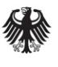

Technical Guideline TR-03122-3

# Conformance Test Specification for BSI TR-03121 Biometrics for Public Sector Applications

Part 3: Test Cases for Function Modules and Processes

Version 5.3

Federal Office for Information Security P.O. Box 20 03 63 53133 Bonn E-Mail: TRBiometrics@bsi.bund.de Internet: https://bsi.bund.de © Federal Office for Information Security 2022

# **Table of Contents**

| 1.    | Introduction                                                                                                                   | 1   |
|-------|-----------------------------------------------------------------------------------------------------------------------------------|-----|
| 2.    | Test Cases Function Modules                                                                                                    | 2   |
| 2.1.  | Test Cases Acquisition Hardware                                                                                                | 2   |
| 2.2.  | Test Cases Acquisition Software                                                                                                | 27  |
| 2.3.  | Test Cases Biometric Image Processing                                                                                          | 45  |
| 2.4.  | Test Cases Quality Assessment                                                                                                  | 57  |
| 2.5.  | Test Cases Compression                                                                                                         | 75  |
| 2.6.  | Test Cases User Interface                                                                                                      | 84  |
| 2.7.  | Test Cases Presentation Attack Detection                                                                                       | 89  |
| 2.8.  | Test Cases Biometric Comparison                                                                                                | 101 |
| 2.9.  | Test Cases Logging                                                                                                             | 106 |
| 2.10. | Test Cases Coding                                                                                                              | 115 |
| 3.    | Test Cases Partial Application Processes                                                                                       | 127 |
| 3.1.  | Test Cases PAP ACQ-FI-SV-5: Supervised Facial Image Acquisition System                                                         | 127 |
| 3.2.  | Test Cases PAP ACQ-FI-AUTO-1: Automated Facial Image Acquisition                                                               | 132 |
| 3.3.  | Test Cases PAP ACQ-FI-SV-2: Supervised Facial Image Acquisition with CIR Lookup                                                | 135 |
| 3.4.  | Test Cases PAP ACQ-FI-SV-4: Supervised Facial Image Acquisition without CIR Lookup                                             | 138 |
| 3.5.  | Test Cases PAP ACQ-FPS-SV-1: Supervised Acquisition Single Slap                                                                | 140 |
| 3.6.  | Test Cases PAP ACQ-FP442-SV-1: Supervised Acquisition 4-4-2 for Enrolment                                                      | 146 |
| 3.7.  | Test Cases PAP ACQ-FP4141-SV-1: Supervised Acquisition 4-1-4-1 for Enrolment                                                   | 146 |
| 3.8.  | Test Cases PAP ACQ-FP2P-SV-1: Supervised Acquisition of Two Plain Fingers on Multi-Finger Hardware for Enrolment            | 147 |
| 3.9.  | Test Cases PAP ACQ-FP2P-SV-2: Supervised Acquisition of Two Plain Fingers on Single-Finger                                        |     |
|       | Hardware for Enrolment                                                                                                         | 152 |
| 3.10. | Test Cases PAP ACQ-FP10R-SV-1: Ten Finger Rolled Supervised Acquisition for Enrolment                                          | 156 |
| 3.11. | Test Cases PAP ACQ-FPS-USV-1: Unsupervised Acquisition Single Slap                                                             | 160 |
| 3.12. | Test Cases PAP ACQ-FP2P-USV-1: Unsupervised Acquisition of Two Plain Fingerprints on Mul ti-Finger Hardware for Enrolment   | 162 |
| 3.13. | Test Cases PAP ACQ-FP2P-USV-2: Unsupervised Acquisition of Two Plain Fingerprints on Sing le-Finger Hardware for Enrolment  | 164 |
|       | List of Abbreviations                                                                                                          | 166 |
|       | Bibliography                                                                                                                   | 167 |
|       |                                                                                                                                   |     |

# **1. Introduction**

This document is part three of the Conformance Test Specification (TR-03122). It is the counterpart of TR-03121-3 describing the test cases for the defined Function Modules.

Not all Function Modules have test cases associated with them.

# **2. Test Cases Function Modules**

The following sections define test cases for Function Modules.

### **2.1. Test Cases Acquisition Hardware**

### **2.1.1. Test Cases FM AH-ALL-SSS**

#### **Test Case ID: TC-AH-ALL-SSS-001**

| Scope         |                                                                                                                           | Examination of the surveillance camera systems of the self-service system (SSS) used for to obtain digitised facial images and fingerprints. |  |  |
|---------------|---------------------------------------------------------------------------------------------------------------------------|-------------------------------------------------------------------------------------------------------------------------------------------------|--|--|
| Preconditions | •                                                                                                                         | The Implementation Under Test (IUT)'s SSS is ready for operation.                                                                               |  |  |
|               | A environment surveillance camera system which supervises the area around the SSS is avail • able.                  |                                                                                                                                                 |  |  |
|               | A environment surveillance camera system which supervises the fingerprint capture system of • the SSS is available. |                                                                                                                                                 |  |  |
|               | The IUT implements a graphical user interface. •                                                                       |                                                                                                                                                 |  |  |
|               | • The IUT implements a user interface of fingerprint acquisition shown to the biometric subject.                       |                                                                                                                                                 |  |  |
|               | • Two test subjects are available to test the IUT's behaviour.                                                         |                                                                                                                                                 |  |  |
| CTS Mode      | • interactive                                                                                                          |                                                                                                                                                 |  |  |
|               | • no provision of pre-defined input data                                                                               |                                                                                                                                                 |  |  |
|               | • HTTP method: GET                                                                                                     |                                                                                                                                                 |  |  |
|               | test case variants: •                                                                                                  |                                                                                                                                                 |  |  |
|               |                                                                                                                           |                                                                                                                                                 |  |  |
|               |                                                                                                                           | /TR03122/TC-AH-ALL-SSS-001/1                                                                                                                    |  |  |
|               |                                                                                                                           | Table 2.2 TC-AH-ALL-SSS-001 Test Case Variants                                                                                                  |  |  |
| Description   | Step                                                                                                                      | Description / Expected Result                                                                                                                   |  |  |
|               | 1                                                                                                                         | Description:                                                                                                                                    |  |  |
|               |                                                                                                                           | • A single biometric subject initiates the SSS process of the IUT.                                                                           |  |  |
|               |                                                                                                                           | • Perform a bona fide fingerprint presentation on the fingerprint scanner of the IUT.                                                     |  |  |
|               |                                                                                                                           | Interact with the graphical user interface of the IUT. •                                                                                     |  |  |

| Test Case ID: TC-AH-ALL-SSS-001 |                                                                                                                                                                                                                            |  |
|---------------------------------|----------------------------------------------------------------------------------------------------------------------------------------------------------------------------------------------------------------------------|--|
|                                 | Expected Result:                                                                                                                                                                                                           |  |
|                                 | • A fingerprint image is captured.                                                                                                                                                                                      |  |
|                                 | The surveillance camera system captures a colour image of the surrounding • area at the moment of the finger capture attempt in which the face of the biometric subject using the fingerprint scanner is visible. |  |
|                                 | The surveillance camera system captures a colour image of the fingerprint • acquisition area at the moment of the finger capture attempt.                                                                            |  |
|                                 | The images captured by the surveillance camera systems are cached locally. •                                                                                                                                            |  |
|                                 | • The images captured by the surveillance camera systems are at least of reso lution 1280 x 720 pixels.                                                                                                              |  |
|                                 | • The differences of capture times between the images captured by sur veillance camera systems and the fingerprint capture attempt image are logged and below 100 ms.                                             |  |
| 2                               | Description:                                                                                                                                                                                                               |  |
|                                 | A single biometric subject initiates the SSS process of the IUT.                                                                                                                                                           |  |
|                                 | Expected Result:                                                                                                                                                                                                           |  |
|                                 | The IUT starts the SSS process and enables interaction via the graphical user interface.                                                                                                                                |  |
| 3                               | Description:                                                                                                                                                                                                               |  |
|                                 | A second biometric subject moves into the corridor of the SSS (distance of 100 cm in front the SSS).                                                                                                                    |  |
|                                 | Expected Result:                                                                                                                                                                                                           |  |
|                                 | The image captured by the surveillance camera system of the surrounding area allows to identify whether that more than one person is in range of the SSS.                                                               |  |
| 4                               | Description:                                                                                                                                                                                                               |  |
|                                 | Both biometric subjects leave the corridor of the SSS.                                                                                                                                                                     |  |
|                                 | Expected Result:                                                                                                                                                                                                           |  |
|                                 | The IUT stops the SSS process.                                                                                                                                                                                             |  |
|                                 |                                                                                                                                                                                                                            |  |

**Table 2.1** Test Case ID: TC-AH-ALL-SSS-001

### **2.1.2. Test Cases FM AH-FI-BCL**

| Test Case ID: TC-AH-FI-BCL-001 |                                                                                                 |                                                                                               |  |  |  |  |
|--------------------------------|-------------------------------------------------------------------------------------------------|-----------------------------------------------------------------------------------------------|--|--|--|--|
| Scope                          | Examination of technical specifications of the digital camera used to obtain facial biometrics. |                                                                                               |  |  |  |  |
| Preconditions                  | The camera used in the specific application profile is at hand and ready for operation. •    |                                                                                               |  |  |  |  |
|                                | • Product documentation of the camera model is at hand (e.g. data sheet, manual).            |                                                                                               |  |  |  |  |
| CTS Mode                       | Not supported                                                                                   |                                                                                               |  |  |  |  |
| Description                    | Step                                                                                            | Description / Expected Result                                                                 |  |  |  |  |
|                                | 1                                                                                               | Description:                                                                                  |  |  |  |  |
|                                |                                                                                                 | Consult product documentation of the camera system.                                           |  |  |  |  |
|                                |                                                                                                 | Expected Result:                                                                              |  |  |  |  |
|                                |                                                                                                 | The product documentation states that the camera system supports captu re of color images. |  |  |  |  |

| Test Case ID: TC-AH-FI-BCL-001 |                                                                                                                                                         |  |  |  |
|--------------------------------|---------------------------------------------------------------------------------------------------------------------------------------------------------|--|--|--|
| 2                              | Description:                                                                                                                                            |  |  |  |
|                                | Consult the product documentation of the camera system.                                                                                                 |  |  |  |
|                                | Expected Result:                                                                                                                                        |  |  |  |
|                                | The product documentation states the support of capturing facial images of a biometric subjects with a body height in the range of 140 cm to 200 cm. |  |  |  |

**Table 2.3** Test Case ID: TC-AH-FI-BCL-001

| Test Case ID: TC-AH-FI-BCL-002 |                                                                                                    |                                                                                                                                            |  |  |  |
|--------------------------------|----------------------------------------------------------------------------------------------------|--------------------------------------------------------------------------------------------------------------------------------------------|--|--|--|
| Scope                          | biometrics.                                                                                        | Examination of image resolution and cropping features of the digital camera used to obtain facial                                          |  |  |  |
| Preconditions                  | •                                                                                                  | The camera used in the specific application profile is at hand and ready for operation.                                                    |  |  |  |
|                                | • The IUT implements an interface for conformance testing where a single image can be captured. |                                                                                                                                            |  |  |  |
|                                | The IUT is able to return the results for every captured image via the test interface. •        |                                                                                                                                            |  |  |  |
|                                | •                                                                                                  | One test subject is available to test the IUT's behaviour.                                                                                 |  |  |  |
| CTS Mode                       | • interactive                                                                                   |                                                                                                                                            |  |  |  |
|                                | • no provision of pre-defined input data                                                        |                                                                                                                                            |  |  |  |
|                                | • HTTP method: GET                                                                              |                                                                                                                                            |  |  |  |
|                                | • test case variants:                                                                           |                                                                                                                                            |  |  |  |
|                                |                                                                                                    | /TR03122/TC-AH-FI-BCL-002/1                                                                                                                |  |  |  |
|                                |                                                                                                    | Table 2.5 TC-AH-FI-BCL-002 Test Case Variants                                                                                              |  |  |  |
| Description                    | Step                                                                                               | Description / Expected Result                                                                                                              |  |  |  |
|                                | 1                                                                                                  | Description:                                                                                                                               |  |  |  |
|                                |                                                                                                    | • Position the biometric subject in a distance of 60 cm towards the camera system.                                                   |  |  |  |
|                                |                                                                                                    | • Acquire an image with the camera system via the CTS interface.                                                                        |  |  |  |
|                                |                                                                                                    | Expected Result:                                                                                                                           |  |  |  |
|                                |                                                                                                    | • A message conforming to TR-03121 XML containing the encoded facial image is returned via the test interface (bio:FaceAcquisition). |  |  |  |
|                                |                                                                                                    | • The CTS verifies that the image returned by the IUT has a resolution of 1600 x 1200 pixels with a maximal deviation of -10%.       |  |  |  |

**Table 2.4** Test Case ID: TC-AH-FI-BCL-002

| Test Case ID: TC-AH-FI-BCL-003 |                                                                                                                                     |  |
|--------------------------------|-------------------------------------------------------------------------------------------------------------------------------------|--|
| Scope                          | Examination of image processing features of the digital camera or provided/integrated software used to obtain facial biometrics. |  |
| Preconditions                  | • The camera used in the specific application profile is at hand and ready for operation.                                        |  |
|                                | • The IUT implements an interface for conformance testing where a single image can be captured.                                  |  |
|                                | • The IUT is able to return the results for every captured image via the test interface.                                         |  |
|                                | Two biometric test subjects are available to test the IUT's behaviour. •                                                         |  |

| Test Case ID: TC-AH-FI-BCL-003           |                                             |                                                                                                                                                                                          |  |  |  |
|------------------------------------------|---------------------------------------------|------------------------------------------------------------------------------------------------------------------------------------------------------------------------------------------|--|--|--|
| CTS Mode                                 | • interactive                            |                                                                                                                                                                                          |  |  |  |
|                                          | • no provision of pre-defined input data |                                                                                                                                                                                          |  |  |  |
|                                          | • HTTP method: GET                       |                                                                                                                                                                                          |  |  |  |
|                                          | test case variants: •                    |                                                                                                                                                                                          |  |  |  |
|                                          |                                             |                                                                                                                                                                                          |  |  |  |
|                                          |                                             | /TR03122/TC-AH-FI-BCL-003/1                                                                                                                                                              |  |  |  |
|                                          |                                             | Table 2.7 TC-AH-FI-BCL-003 Test Case Variants                                                                                                                                            |  |  |  |
| Description                              | Step                                        | Description / Expected Result                                                                                                                                                            |  |  |  |
|                                          | 1                                           | Description:                                                                                                                                                                             |  |  |  |
|                                          |                                             | • Position one biometric subject in front of the camera system. Verify that this biometric subject is standing in a distance above 40 cm and below 100 cm to the camera system. |  |  |  |
|                                          |                                             | • Position the second biometric subject in front of camera system. Veri fy that the biometric subject is standing in a distance below 40 cm to ca mera system.                  |  |  |  |
|                                          |                                             | • Attempt to acquire an image with the camera system by using the CTS.                                                                                                                |  |  |  |
|                                          |                                             | Expected Result:                                                                                                                                                                         |  |  |  |
|                                          |                                             | The camera system does not acquire an image. •                                                                                                                                        |  |  |  |
|                                          |                                             | • A message conforming to TR-03121 XML but not containing facial image data is returned via the test interface (bio:FaceAcquisition).                                              |  |  |  |
| Table 2.6 Test Case ID: TC-AH-FI-BCL-003 |                                             |                                                                                                                                                                                          |  |  |  |

| Test Case ID: TC-AH-FI-BCL-004 |                                                                                                                                     |  |  |
|--------------------------------|-------------------------------------------------------------------------------------------------------------------------------------|--|--|
| Scope                          | Examination of image processing features of the digital camera or provided/integrated software used to obtain facial biometrics. |  |  |
| Preconditions                  | • The camera used in the specific application profile is at hand and ready for operation.                                        |  |  |
|                                | • The IUT implements an interface for conformance testing where a single image can be captured.                                  |  |  |
|                                | The IUT is able to return the results for every captured image via the test interface. •                                         |  |  |
|                                | Two biometric test subjects are available to test the IUT's behaviour. •                                                         |  |  |
| CTS Mode                       | • interactive                                                                                                                    |  |  |
|                                | • no provision of pre-defined input data                                                                                         |  |  |
|                                | • HTTP method: GET                                                                                                               |  |  |
|                                | • test case variants:                                                                                                            |  |  |
|                                |                                                                                                                                     |  |  |
|                                | /TR03122/TC-AH-FI-BCL-004/1                                                                                                         |  |  |
|                                | Table 2.9 TC-AH-FI-BCL-004 Test Case Variants                                                                                       |  |  |
| Description                    | Step Description / Expected Result                                                                                               |  |  |

| Test Case ID: TC-AH-FI-BCL-004           |                                                                                                                                                                                          |
|------------------------------------------|------------------------------------------------------------------------------------------------------------------------------------------------------------------------------------------|
| 1                                        | Description:                                                                                                                                                                             |
|                                          | • Position one biometric subject in front of the camera system. Verify that this biometric subject is standing in a distance above 40 cm and below 100 cm to the camera system. |
|                                          | • Position the second biometric subject in front of the camera system. Verify that the biometric subject is standing in a distance above 100 cm to ca mera system.              |
|                                          | • Acquire an image with the camera system by using the CTS.                                                                                                                           |
|                                          | Expected Result:                                                                                                                                                                         |
|                                          | A message conforming to TR-03121 XML containing the encoded facial • image is returned via the test interface (bio:FaceAcquisition).                                               |
|                                          | • The returned image depicts the biometric subject which was positioned in a distance above 40 cm and below 100 cm to the camera system.                                           |
| Table 2.8 Test Case ID: TC-AH-FI-BCL-004 |                                                                                                                                                                                          |

**2.1.3. Test Cases FM AH-FI-DC**

#### **Test Case ID: TC-AH-FI-DC-001**

| Scope                                    | Examination of technical specifications of the facial image camera used to obtain facial biometrics. Note, this requirement is OPTIONAL for scenarios where only a facial verification is performed. |                                                                                                                                                                                    |  |  |  |
|------------------------------------------|---------------------------------------------------------------------------------------------------------------------------------------------------------------------------------------------------------|------------------------------------------------------------------------------------------------------------------------------------------------------------------------------------|--|--|--|
| Precondition                             | • The camera used in the specific application profile is at hand                                                                                                                                     |                                                                                                                                                                                    |  |  |  |
|                                          | • Product documentation of the camera model is at hand (e.g. data sheet, manual)                                                                                                                     |                                                                                                                                                                                    |  |  |  |
| CTS Mode                                 | Not supported                                                                                                                                                                                           |                                                                                                                                                                                    |  |  |  |
| Description                              | Step                                                                                                                                                                                                    | Description / Expected Result                                                                                                                                                      |  |  |  |
|                                          | 1                                                                                                                                                                                                       | Description:                                                                                                                                                                       |  |  |  |
|                                          |                                                                                                                                                                                                         | Verify that the sensor of the camera provides a physical resolution of at least 1200 x 1600 pixels.                                                                             |  |  |  |
|                                          |                                                                                                                                                                                                         | Consult product documentation of the camera.                                                                                                                                       |  |  |  |
|                                          |                                                                                                                                                                                                         | Expected Result:                                                                                                                                                                   |  |  |  |
|                                          |                                                                                                                                                                                                         | The product documentation states that the physical, native resolution is at least 1200 x 1600 pixels.                                                                           |  |  |  |
|                                          | 2                                                                                                                                                                                                       | Description:                                                                                                                                                                       |  |  |  |
|                                          |                                                                                                                                                                                                         | Verify that the active camera setting (e.g. configurable via camera firmware) used for the specific application provides an image resolution of at least 1200 x 1600 pixels. |  |  |  |
|                                          |                                                                                                                                                                                                         | Consult product documentation of the camera or options in cameras firm ware.                                                                                                    |  |  |  |
|                                          |                                                                                                                                                                                                         | Expected Result:                                                                                                                                                                   |  |  |  |
|                                          |                                                                                                                                                                                                         | • The setting provides a native image resolution of at least 1200 x 1600 pixels.                                                                                                |  |  |  |
|                                          |                                                                                                                                                                                                         | This setting is the active setting for the application profile •                                                                                                                |  |  |  |
| Table 2.10 Test Case ID: TC-AH-FI-DC-001 |                                                                                                                                                                                                         |                                                                                                                                                                                    |  |  |  |

| Scope        | Examination of technical specifications of the digital camera used to obtain digitised facial images. This test case covers the colour space of captured facial image. Note, this requirement is OP TIONAL for scenarios where only a facial verification is performed. |                                                                                                      |  |
|--------------|-------------------------------------------------------------------------------------------------------------------------------------------------------------------------------------------------------------------------------------------------------------------------------|------------------------------------------------------------------------------------------------------|--|
| Precondition | Product documentation of the camera unit is at hand (e.g. data sheet, manual).                                                                                                                                                                                                |                                                                                                      |  |
| CTS Mode     | Not supported                                                                                                                                                                                                                                                                 |                                                                                                      |  |
| Description  | Step                                                                                                                                                                                                                                                                          | Description / Expected Result                                                                        |  |
|              | 1                                                                                                                                                                                                                                                                             | Description:                                                                                         |  |
|              |                                                                                                                                                                                                                                                                               | Verify that the digital camera provides a 24 bit RGB mode. •                                      |  |
|              |                                                                                                                                                                                                                                                                               | • Consult product documentation of the digital camera.                                            |  |
|              |                                                                                                                                                                                                                                                                               | Expected Result:                                                                                     |  |
|              |                                                                                                                                                                                                                                                                               | The product documentation states that the digital camera is able to capture images in 24 bit RGB. |  |
|              |                                                                                                                                                                                                                                                                               |                                                                                                      |  |

#### **Test Case ID: TC-AH-FI-DC-002**

**Table 2.11** Test Case ID: TC-AH-FI-DC-002

### **2.1.4. Test Cases FM AH-FI-DC2**

| Test Case ID: TC-AH-FI-DC2-001            |                                                                                                                                                                                                    |                                                                                                                                                                                    |  |  |
|-------------------------------------------|----------------------------------------------------------------------------------------------------------------------------------------------------------------------------------------------------|------------------------------------------------------------------------------------------------------------------------------------------------------------------------------------|--|--|
| Scope                                     | Examination of technical specifications of the digital camera used to obtain facial biometrics. Note, this requirement is OPTIONAL for scenarios where only a facial verification is performed. |                                                                                                                                                                                    |  |  |
| Precondition                              | The camera used in the specific application profile is at hand •                                                                                                                                |                                                                                                                                                                                    |  |  |
|                                           | Product documentation of the camera model is at hand (e.g. data sheet, manual) •                                                                                                                |                                                                                                                                                                                    |  |  |
| CTS Mode                                  | Not supported                                                                                                                                                                                      |                                                                                                                                                                                    |  |  |
| Description                               | Step                                                                                                                                                                                               | Description / Expected Result                                                                                                                                                      |  |  |
|                                           | 1                                                                                                                                                                                                  | Description:                                                                                                                                                                       |  |  |
|                                           |                                                                                                                                                                                                    | Verify that the sensor of the camera provides a physical resolution of at least 1244 x 1600 pixels.                                                                             |  |  |
|                                           |                                                                                                                                                                                                    | Consult product documentation of the camera.                                                                                                                                       |  |  |
|                                           |                                                                                                                                                                                                    | Expected Result:                                                                                                                                                                   |  |  |
|                                           |                                                                                                                                                                                                    | The product documentation states that the physical, native resolution is at least 1244 x 1600 pixels.                                                                           |  |  |
|                                           | 2                                                                                                                                                                                                  | Description:                                                                                                                                                                       |  |  |
|                                           |                                                                                                                                                                                                    | Verify that the active camera setting (e.g. configurable via camera firmware) used for the specific application provides an image resolution of at least 1244 x 1600 pixels. |  |  |
|                                           |                                                                                                                                                                                                    | Consult product documentation of the camera or options in cameras firm ware.                                                                                                    |  |  |
|                                           |                                                                                                                                                                                                    | Expected Result:                                                                                                                                                                   |  |  |
|                                           |                                                                                                                                                                                                    | • The setting provides a native image resolution of at least 1244 x 1600 pixels.                                                                                                |  |  |
|                                           |                                                                                                                                                                                                    | • This setting is the active setting for the application profile                                                                                                                |  |  |
| Table 2.12 Test Case ID: TC-AH-FI-DC2-001 |                                                                                                                                                                                                    |                                                                                                                                                                                    |  |  |

| Scope                                     | Examination of technical specifications of the digital camera used to obtain digitised facial images. This test case covers the colour space of captured facial image. Note, this requirement is OP TIONAL for scenarios where only a facial verification is performed. |                                                                                                      |  |
|-------------------------------------------|-------------------------------------------------------------------------------------------------------------------------------------------------------------------------------------------------------------------------------------------------------------------------------|------------------------------------------------------------------------------------------------------|--|
| Precondition                              | Product documentation of the camera unit is at hand (e.g. data sheet, manual).                                                                                                                                                                                                |                                                                                                      |  |
| CTS Mode                                  | Not supported                                                                                                                                                                                                                                                                 |                                                                                                      |  |
| Description                               | Step                                                                                                                                                                                                                                                                          | Description / Expected Result                                                                        |  |
|                                           | 1                                                                                                                                                                                                                                                                             | Description:                                                                                         |  |
|                                           |                                                                                                                                                                                                                                                                               | Verify that the digital camera provides a 24 bit RGB mode. •                                      |  |
|                                           |                                                                                                                                                                                                                                                                               | Consult product documentation of the digital camera. •                                            |  |
|                                           |                                                                                                                                                                                                                                                                               | Expected Result:                                                                                     |  |
|                                           |                                                                                                                                                                                                                                                                               | The product documentation states that the digital camera is able to capture images in 24 bit RGB. |  |
| Table 2.13 Test Case ID: TC-AH-FI-DC2-002 |                                                                                                                                                                                                                                                                               |                                                                                                      |  |

#### **Test Case ID: TC-AH-FI-DC2-002**

**2.1.5. Test Cases FM AH-FI-EGT**

### **Test Case ID: TC-AH-FI-EGT-001** *Scope* Examination of technical specifications of the camera system used to obtain digitised facial images in an e-gate scenario. *Preconditions* **•** The camera system used in the specific application profile is at hand and ready for operation. **•** Product documentation of the camera system is at hand (e.g. data sheet, manual). *CTS Mode* Not supported *Description* **Step Description / Expected Result** *Description:* Consult product documentation of the camera system. 1 *Expected Result:* **•** The product documentation states the support of capturing facial images a bio metric subject with a body height in the range of 140 cm to 200 cm standing in front of the camera system. **•** The product documentation states a physical resolution of at least 600x800 pixels wi thout application of upscaling. *Description:* Assess the design of the camera system. 2 *Expected Result:* **•** The camera system is designed to be placed in the moving direction of the biometric subject. **•** The camera system obviously does not require a rotation of the biometric subject for acquisition. **Table 2.15** TC-AH-FI-EGT-001 Description **Table 2.14** Test Case ID: TC-AH-FI-EGT-001

#### **Test Case ID: TC-AH-FI-EGT-002**

*Scope* Examination of properties of digitised facial images captured by the camera system in an e-gate scenario.

| Test Case ID: TC-AH-FI-EGT-002 |                                                                                                     |
|--------------------------------|-----------------------------------------------------------------------------------------------------|
| Preconditions                  | • The camera system used in the specific application profile is at hand and ready for operation. |
|                                | The IUT implements an interface for conformance testing where a single image can be captured. •  |
|                                | The IUT is able to return the results for every captured image via the test interface. •         |
|                                | • One test subject is available to test the IUT's behaviour.                                     |
| CTS Mode                       | • interactive                                                                                    |
|                                | • no provision of pre-defined input data                                                         |
|                                | • HTTP method: GET                                                                               |

**•** test case variants:

/TR03122/TC-AH-FI-EGT-002/1

**Table 2.17** TC-AH-FI-EGT-002 Test Case Variants

| Description                               | Step | Description / Expected Result                                                                                                               |
|-------------------------------------------|------|---------------------------------------------------------------------------------------------------------------------------------------------|
|                                           | 1    | Description:                                                                                                                                |
|                                           |      | • Position the biometric subject in a distance of 50 cm towards the camera system.                                                       |
|                                           |      | • Acquire an image with the camera system via the CTS interface.                                                                         |
|                                           |      | Expected Result:                                                                                                                            |
|                                           |      | • A message conforming to TR-03121 XML containing the encoded facial image is re turned via the test interface (bio:FaceAcquisition). |
|                                           |      | • The CTS verifies that the image returned by the IUT has a resolution of at least 600x800 pixels.                                    |
|                                           |      | • The image has sufficient sharpness for visual identification of the subject and does not obviously distort the captured face.       |
|                                           | 2    | Description:                                                                                                                                |
|                                           |      | Position the biometric subject in a distance of 100 cm towards the camera system. •                                                      |
|                                           |      | • Acquire an image with the camera system via the CTS interface.                                                                         |
|                                           |      | Expected Result:                                                                                                                            |
|                                           |      | • A message conforming to TR-03121 XML containing the encoded facial image is re turned via the test interface (bio:FaceAcquisition). |
|                                           |      | • The CTS verifies that the image returned by the IUT has a resolution of at least 600x800 pixels.                                    |
|                                           |      | • The image has sufficient sharpness for visual identification of the subject and does not obviously distort the captured face.       |
|                                           | 3    | Description:                                                                                                                                |
|                                           |      | Position the biometric subject in a distance of 200 cm towards the camera system. •                                                      |
|                                           |      | • Acquire an image with the camera system via the CTS interface.                                                                         |
|                                           |      | Expected Result:                                                                                                                            |
|                                           |      | • A message conforming to TR-03121 XML containing the encoded facial image is re turned via the test interface (bio:FaceAcquisition). |
|                                           |      | • The CTS verifies that the image returned by the IUT has a resolution of at least 600x800 pixels.                                    |
|                                           |      | • The image has sufficient sharpness for visual identification of the subject and does not obviously distort the captured face.       |
|                                           |      | Table 2.18 TC-AH-FI-EGT-002 Description                                                                                                     |
| Table 2.16 Test Case ID: TC-AH-FI-EGT-002 |      |                                                                                                                                             |

### **2.1.6. Test Cases FM AH-FI-FBS**

| Test Case ID: TC-AH-FI-FBS-001 |                                                                                                            |                               |  |  |  |
|--------------------------------|------------------------------------------------------------------------------------------------------------|-------------------------------|--|--|--|
| Scope                          | Examination of capable image resolution of flat bed scanner used to scan photos for enrolment purposes. |                               |  |  |  |
| Precondition                   | Product documentation of the scanner model is at hand (e.g. data sheet, manual).                           |                               |  |  |  |
| CTS Mode                       | Not supported                                                                                              |                               |  |  |  |
| Description                    | Step                                                                                                       | Description / Expected Result |  |  |  |

| Test Case ID: TC-AH-FI-FBS-001 |                                                                                             |
|--------------------------------|---------------------------------------------------------------------------------------------|
| 1                              | Description:                                                                                |
|                                | • Verify that the scanner provides a physical resolution of at least 300ppi.             |
|                                | • Consult product documentation of the scanner.                                          |
|                                | Expected Result:                                                                            |
|                                | The product documentation states that the physical/native resolution is at least 300ppi. |

**Table 2.19** Test Case ID: TC-AH-FI-FBS-001

| Test Case ID: TC-AH-FI-FBS-002 |                                                                                             |                                                                                                    |  |
|--------------------------------|---------------------------------------------------------------------------------------------|----------------------------------------------------------------------------------------------------|--|
| Scope                          | Examination of image quality of flat bed scanner used to scan photos for enrolment purposes |                                                                                                    |  |
| Precondition                   | • IUT is running, required modules are loaded.                                           |                                                                                                    |  |
|                                | • The scanner used in the specific application profile is connected.                     |                                                                                                    |  |
|                                | • As necessary test resources: a photo with at least 36 mm x 45 mm.                      |                                                                                                    |  |
| CTS Mode                       | interactive •                                                                            |                                                                                                    |  |
|                                | • no provision of pre-defined input data                                                 |                                                                                                    |  |
|                                | • HTTP method: GET                                                                       |                                                                                                    |  |
|                                | • test case variants:                                                                    |                                                                                                    |  |
|                                |                                                                                             | /TR03122/TC-AH-FI-FBS-002/1                                                                        |  |
|                                | Table 2.21 TC-AH-FI-FBS-002 Test Case Variants                                              |                                                                                                    |  |
| Description                    | Step                                                                                        | Description / Expected Result                                                                      |  |
|                                | 1                                                                                           | Description:                                                                                       |  |
|                                |                                                                                             | A photo is placed on the scan area. •                                                           |  |
|                                |                                                                                             | • The IUT is called via the CTS.                                                                |  |
|                                |                                                                                             | Expected Result:                                                                                   |  |
|                                |                                                                                             | • The image dimension is 413 pixels width and 531 height with a to lerance of +/- 10 pixels. |  |
|                                |                                                                                             | • The image has a file size of at least 11 KB.                                                  |  |
|                                |                                                                                             | • The image is compressed via the JPEG2000 or JPEG standard.                                    |  |

**Table 2.20** Test Case ID: TC-AH-FI-FBS-002

### **2.1.7. Test Cases FM AH-FI-ICS**

| Test Case ID: TC-AH-FI-ICS-001 |               |                                                                                                                                                                                                                                                                                                            |  |  |
|--------------------------------|---------------|------------------------------------------------------------------------------------------------------------------------------------------------------------------------------------------------------------------------------------------------------------------------------------------------------------|--|--|
| Scope                          |               | Examination of technical specifications of the integrated camera systems used to obtain digitised facial images. This test case covers the minimum physical resolution of the captured facial image. Note, this requirement is OPTIONAL for scenarios where only a facial verification is performed. |  |  |
| Precondition                   |               | Product documentation of the camera unit is at hand (e.g. data sheet, manual).                                                                                                                                                                                                                             |  |  |
| CTS Mode                       | Not supported |                                                                                                                                                                                                                                                                                                            |  |  |
| Description                    | Step          | Description / Expected Result                                                                                                                                                                                                                                                                              |  |  |

| Test Case ID: TC-AH-FI-ICS-001 |                                                                                                                                    |
|--------------------------------|------------------------------------------------------------------------------------------------------------------------------------|
| 1                              | Description:                                                                                                                       |
|                                | • Verify that the sensor of the camera provides a physical resolution of at least 1200 x 1600 pixels without any up-scaling. |
|                                | • Consult product documentation of the camera.                                                                                  |
|                                | Expected Result:                                                                                                                   |
|                                | The product documentation states that the physical, native resolution is at least 1200 x 1600 pixels.                           |

**Table 2.22** Test Case ID: TC-AH-FI-ICS-001

| Test Case ID: TC-AH-FI-ICS-002            |                                                                                                                                                             |                                                                                                                                                                                                                     |
|-------------------------------------------|-------------------------------------------------------------------------------------------------------------------------------------------------------------|---------------------------------------------------------------------------------------------------------------------------------------------------------------------------------------------------------------------|
| Scope                                     | Examination of technical specifications of the integrated camera systems used to obtain digitised facial images. This test case covers the illumination. |                                                                                                                                                                                                                     |
| Precondition                              | Product documentation of the integrated camera system is at hand (e.g. data sheet, manual).                                                                 |                                                                                                                                                                                                                     |
| CTS Mode                                  | Not supported                                                                                                                                               |                                                                                                                                                                                                                     |
| Description                               | Step                                                                                                                                                        | Description / Expected Result                                                                                                                                                                                       |
|                                           | 1                                                                                                                                                           | Description:                                                                                                                                                                                                        |
|                                           |                                                                                                                                                             | Verify that the integrated camera system provides diffuse lighting adapting • to the environmental light conditions.                                                                                          |
|                                           |                                                                                                                                                             | Verify that the integrated camera system allows high quality acquisitions in • dependently from the environmental light situation.                                                                            |
|                                           |                                                                                                                                                             | Consult product documentation of the integrated camera system. •                                                                                                                                                 |
|                                           |                                                                                                                                                             | Expected Result:                                                                                                                                                                                                    |
|                                           |                                                                                                                                                             | • The product documentation states that the camera system uses diffuse lighting adapting to the environmental light conditions.                                                                               |
|                                           |                                                                                                                                                             | • The product documentation states that the camera system allows high qua lity acquisitions independently from the environmental light situation that can usually be found in the environment in question. |
| Table 2.23 Test Case ID: TC-AH-FI-ICS-002 |                                                                                                                                                             |                                                                                                                                                                                                                     |

| Test Case ID: TC-AH-FI-ICS-003 |                                                                                                                                                                                                                                                                                   |                                                                                                     |
|--------------------------------|-----------------------------------------------------------------------------------------------------------------------------------------------------------------------------------------------------------------------------------------------------------------------------------|-----------------------------------------------------------------------------------------------------|
| Scope                          | Examination of technical specifications of the integrated camera systems used to obtain digitised facial images. This test case covers the colour space of captured image. Note, this require ment is OPTIONAL for scenarios where only a facial verification is performed. |                                                                                                     |
| Precondition                   | Product documentation of the camera unit is at hand (e.g. data sheet, manual).                                                                                                                                                                                                    |                                                                                                     |
| CTS Mode                       | Not supported                                                                                                                                                                                                                                                                     |                                                                                                     |
| Description                    | Step                                                                                                                                                                                                                                                                              | Description / Expected Result                                                                       |
|                                | 1                                                                                                                                                                                                                                                                                 | Description:                                                                                        |
|                                |                                                                                                                                                                                                                                                                                   | • Verify that the integrated camera system provides a 24 bit RGB mode.                           |
|                                |                                                                                                                                                                                                                                                                                   | • Consult product documentation of the integrated camera system.                                 |
|                                |                                                                                                                                                                                                                                                                                   | Expected Result:                                                                                    |
|                                |                                                                                                                                                                                                                                                                                   | The product documentation states that the camera system is able to capture images in 24 bit RGB. |
|                                |                                                                                                                                                                                                                                                                                   |                                                                                                     |

**Table 2.24** Test Case ID: TC-AH-FI-ICS-003

### **2.1.8. Test Cases FM AH-FI-ICS2**

#### **Test Case ID: TC-AH-FI-ICS2-001**

| Scope        |      | Examination of technical specifications of the integrated camera systems used to obtain digitised facial images. This test case covers the minimum physical resolution of the captured facial image. Note, this requirement is OPTIONAL for scenarios where only a facial verification is performed. |  |  |
|--------------|------|------------------------------------------------------------------------------------------------------------------------------------------------------------------------------------------------------------------------------------------------------------------------------------------------------------|--|--|
| Precondition |      | Product documentation of the camera unit is at hand (e.g. data sheet, manual).                                                                                                                                                                                                                             |  |  |
| CTS Mode     |      | Not supported                                                                                                                                                                                                                                                                                              |  |  |
| Description  | Step | Description / Expected Result                                                                                                                                                                                                                                                                              |  |  |
|              | 1    | Description:                                                                                                                                                                                                                                                                                               |  |  |
|              |      | Verify that the sensor of the camera provides a physical resolution of at least • 1244 x 1600 pixels without any up-scaling.                                                                                                                                                                         |  |  |
|              |      | Consult product documentation of the camera. •                                                                                                                                                                                                                                                          |  |  |
|              |      | Expected Result:                                                                                                                                                                                                                                                                                           |  |  |
|              |      | The product documentation states that the physical, native resolution is at least 1244 x 1600 pixels.                                                                                                                                                                                                   |  |  |

#### **Table 2.25** Test Case ID: TC-AH-FI-ICS2-001

| Test Case ID: TC-AH-FI-ICS2-002 |                                                                                                                                                             |                                                                                                                                                                                                                     |
|---------------------------------|-------------------------------------------------------------------------------------------------------------------------------------------------------------|---------------------------------------------------------------------------------------------------------------------------------------------------------------------------------------------------------------------|
| Scope                           | Examination of technical specifications of the integrated camera systems used to obtain digitised facial images. This test case covers the illumination. |                                                                                                                                                                                                                     |
| Precondition                    | Product documentation of the integrated camera system is at hand (e.g. data sheet, manual).                                                                 |                                                                                                                                                                                                                     |
| CTS Mode                        | Not supported                                                                                                                                               |                                                                                                                                                                                                                     |
| Description                     | Step                                                                                                                                                        | Description / Expected Result                                                                                                                                                                                       |
|                                 | 1                                                                                                                                                           | Description:                                                                                                                                                                                                        |
|                                 |                                                                                                                                                             | • Verify that the integrated camera system provides diffuse lighting adapting to the environmental light conditions.                                                                                          |
|                                 |                                                                                                                                                             | Verify that the integrated camera system allows high quality acquisitions in • dependently from the environmental light situation.                                                                            |
|                                 |                                                                                                                                                             | Consult product documentation of the integrated camera system. •                                                                                                                                                 |
|                                 |                                                                                                                                                             | Expected Result:                                                                                                                                                                                                    |
|                                 |                                                                                                                                                             | • The product documentation states that the camera system uses diffuse lighting adapting to the environmental light conditions.                                                                               |
|                                 |                                                                                                                                                             | • The product documentation states that the camera system allows high qua lity acquisitions independently from the environmental light situation that can usually be found in the environment in question. |

**Table 2.26** Test Case ID: TC-AH-FI-ICS2-002

| Test Case ID: TC-AH-FI-ICS2-003 |                                                                                                                                                                                                                                                                                   |  |
|---------------------------------|-----------------------------------------------------------------------------------------------------------------------------------------------------------------------------------------------------------------------------------------------------------------------------------|--|
| Scope                           | Examination of technical specifications of the integrated camera systems used to obtain digitised facial images. This test case covers the colour space of captured image. Note, this require ment is OPTIONAL for scenarios where only a facial verification is performed. |  |
| Precondition                    | Product documentation of the camera unit is at hand (e.g. data sheet, manual).                                                                                                                                                                                                    |  |
| CTS Mode                        | Not supported                                                                                                                                                                                                                                                                     |  |
| Description                     | Step Description / Expected Result                                                                                                                                                                                                                                             |  |

| Test Case ID: TC-AH-FI-ICS2-003 |                                                                                                     |
|---------------------------------|-----------------------------------------------------------------------------------------------------|
| 1                               | Description:                                                                                        |
|                                 | • Verify that the integrated camera system provides a 24 bit RGB mode.                           |
|                                 | • Consult product documentation of the integrated camera system.                                 |
|                                 | Expected Result:                                                                                    |
|                                 | The product documentation states that the camera system is able to capture images in 24 bit RGB. |

**Table 2.27** Test Case ID: TC-AH-FI-ICS2-003

| Test Case ID: TC-AH-FI-ICS2-004            |                                                                                                                                                             |                                                                                                                                                                  |  |
|--------------------------------------------|-------------------------------------------------------------------------------------------------------------------------------------------------------------|------------------------------------------------------------------------------------------------------------------------------------------------------------------|--|
| Scope                                      | Examination of technical specifications of the integrated camera systems used to obtain digitised facial images regarding required range for body hight. |                                                                                                                                                                  |  |
| Precondition                               | Product documentation of the camera unit is at hand (e.g. data sheet, manual).                                                                              |                                                                                                                                                                  |  |
| CTS Mode                                   | Not supported                                                                                                                                               |                                                                                                                                                                  |  |
| Description                                | Step                                                                                                                                                        | Description / Expected Result                                                                                                                                    |  |
|                                            | 1                                                                                                                                                           | Description:                                                                                                                                                     |  |
|                                            |                                                                                                                                                             | Consult the product documentation of the camera system.                                                                                                          |  |
|                                            |                                                                                                                                                             | Expected Result:                                                                                                                                                 |  |
|                                            |                                                                                                                                                             | The product documentation states the support of capturing facial images of a biometric subjects with a body height at least in the range of 140 cm to 200 cm. |  |
|                                            | 2                                                                                                                                                           | Description:                                                                                                                                                     |  |
|                                            |                                                                                                                                                             | Position a face in front of the camera system in such a way that the upper edge of the head is at the minimum height of 140 cm. Capture a facial image.       |  |
|                                            |                                                                                                                                                             | Expected Result:                                                                                                                                                 |  |
|                                            |                                                                                                                                                             | The entire face is visible on the image, in the required resolution.                                                                                             |  |
|                                            | 3                                                                                                                                                           | Description:                                                                                                                                                     |  |
|                                            |                                                                                                                                                             | Position a face in front of the camera system in such a way that the upper edge of the head is at the height of 170 cm. Capture a facial image.               |  |
|                                            |                                                                                                                                                             | Expected Result:                                                                                                                                                 |  |
|                                            |                                                                                                                                                             | The entire face is visible on the image, in the required resolution.                                                                                             |  |
|                                            | 4                                                                                                                                                           | Description:                                                                                                                                                     |  |
|                                            |                                                                                                                                                             | Position a face in front of the camera system in such a way that the upper edge of the head is at the maximum height of 200 cm. Capture a facial image.       |  |
|                                            |                                                                                                                                                             | Expected Result:                                                                                                                                                 |  |
|                                            |                                                                                                                                                             | The entire face is visible on the image, in the required resolution.                                                                                             |  |
| Table 2.28 Test Case ID: TC-AH-FI-ICS2-004 |                                                                                                                                                             |                                                                                                                                                                  |  |

### **2.1.9. Test Cases FM AH-FI-SSS**

#### **Test Case ID: TC-AH-FI-SSS-001**

*Scope* Examination of [SSS](#page-168-1) scenarios where a digitised facial image is obtained.

| Test Case ID: TC-AH-FI-SSS-001 |                                                                                                   |                                                                                                                                                                                                          |  |  |
|--------------------------------|---------------------------------------------------------------------------------------------------|----------------------------------------------------------------------------------------------------------------------------------------------------------------------------------------------------------|--|--|
| Preconditions                  | • The IUT's SSS is ready for operation.                                                        |                                                                                                                                                                                                          |  |  |
|                                | The SSS implements a graphical user interface and an where single image can be cap • tured. |                                                                                                                                                                                                          |  |  |
|                                | One test subject is available to test the IUT's behaviour. •                                   |                                                                                                                                                                                                          |  |  |
| CTS Mode                       | Not supported                                                                                     |                                                                                                                                                                                                          |  |  |
| Description                    | Step                                                                                              | Description / Expected Result                                                                                                                                                                            |  |  |
|                                | 1                                                                                                 | Description:                                                                                                                                                                                             |  |  |
|                                |                                                                                                   | • The biometric subject initiates the SSS process of the IUT.                                                                                                                                         |  |  |
|                                |                                                                                                   | • Acquire an image with the camera system of the IUT.                                                                                                                                                 |  |  |
|                                |                                                                                                   | • Interact with the graphical user interface of the IUT.                                                                                                                                              |  |  |
|                                |                                                                                                   | Expected Result:                                                                                                                                                                                         |  |  |
|                                |                                                                                                   | A facial image is captured. •                                                                                                                                                                         |  |  |
|                                |                                                                                                   | • During the interaction with the IUT's graphical user interface the biometric subject did not have to rotate his/her head towards the camera system of the IUT for capturing the facial image. |  |  |

**Table 2.29** Test Case ID: TC-AH-FI-SSS-001

### **2.1.10. Test Cases FM AH-FI-SSS2**

|  |  | Test Case ID: TC-AH-FI-SSS2-001 |
|--|--|---------------------------------|
|--|--|---------------------------------|

| Scope                                      | Examination of technical specifications of the digital camera used to obtain facial biometrics. |                                                                                                                                                                  |  |
|--------------------------------------------|-------------------------------------------------------------------------------------------------|------------------------------------------------------------------------------------------------------------------------------------------------------------------|--|
| Preconditions                              | • The camera used in the specific application profile is at hand and ready for operation.    |                                                                                                                                                                  |  |
|                                            | • Product documentation of the camera model is at hand (e.g. data sheet, manual).            |                                                                                                                                                                  |  |
| CTS Mode                                   | Not supported                                                                                   |                                                                                                                                                                  |  |
| Description                                | Step                                                                                            | Description / Expected Result                                                                                                                                    |  |
|                                            | 1                                                                                               | Description:                                                                                                                                                     |  |
|                                            |                                                                                                 | Consult the product documentation of the camera system.                                                                                                          |  |
|                                            |                                                                                                 | Expected Result:                                                                                                                                                 |  |
|                                            |                                                                                                 | The product documentation states the support of capturing facial images of a biometric subjects with a body height at least in the range of 140 cm to 200 cm. |  |
| Table 2.30 Test Case ID: TC-AH-FI-SSS2-001 |                                                                                                 |                                                                                                                                                                  |  |

| Test Case ID: TC-AH-FI-SSS2-002 |                                                                                                   |  |  |  |
|---------------------------------|---------------------------------------------------------------------------------------------------|--|--|--|
| Scope                           | Examination of SSS scenarios where a digitised facial image is obtained.                          |  |  |  |
| Preconditions                   | The IUT's SSS is ready for operation. •                                                        |  |  |  |
|                                 | The SSS implements a graphical user interface and an where single image can be cap • tured. |  |  |  |
|                                 | • One test subject is available to test the IUT's behaviour.                                   |  |  |  |
| CTS Mode                        | Not supported                                                                                     |  |  |  |
| Description                     | Step Description / Expected Result                                                             |  |  |  |

| Test Case ID: TC-AH-FI-SSS2-002 |                                                                                                                                                                                                         |
|---------------------------------|---------------------------------------------------------------------------------------------------------------------------------------------------------------------------------------------------------|
| 1                               | Description:                                                                                                                                                                                            |
|                                 | • The biometric subject initiates the SSS process of the IUT.                                                                                                                                        |
|                                 | • Acquire a facial image with the camera system of the IUT.                                                                                                                                          |
|                                 | • Interact with the graphical user interface of the IUT.                                                                                                                                             |
|                                 | Expected Result:                                                                                                                                                                                        |
|                                 | • A facial image is captured.                                                                                                                                                                        |
|                                 | During the interation with the IUT's graphical user interface the biometric • subject did not have to rotate his/her head towards the camera system of the IUT for capturing the facial image. |

**Table 2.31** Test Case ID: TC-AH-FI-SSS2-002

| Test Case ID: TC-AH-FI-SSS2-003 |                                                                                                 |                                                                                                                                                                                                                                                                                               |  |  |
|---------------------------------|-------------------------------------------------------------------------------------------------|-----------------------------------------------------------------------------------------------------------------------------------------------------------------------------------------------------------------------------------------------------------------------------------------------|--|--|
| Scope                           | Examination of technical specifications of the digital camera used to obtain facial biometrics. |                                                                                                                                                                                                                                                                                               |  |  |
| Preconditions                   | • The camera used in the specific application profile is at hand and ready for operation.    |                                                                                                                                                                                                                                                                                               |  |  |
|                                 | Product documentation of the camera model is at hand (e.g. data sheet, manual). •            |                                                                                                                                                                                                                                                                                               |  |  |
| CTS Mode                        | Not supported                                                                                   |                                                                                                                                                                                                                                                                                               |  |  |
| Description                     | Step                                                                                            | Description / Expected Result                                                                                                                                                                                                                                                                 |  |  |
|                                 | 1                                                                                               | Description:                                                                                                                                                                                                                                                                                  |  |  |
|                                 |                                                                                                 | Consult the product documentation of the camera system.                                                                                                                                                                                                                                       |  |  |
|                                 |                                                                                                 | Expected Result:                                                                                                                                                                                                                                                                              |  |  |
|                                 |                                                                                                 | The product documentation states the support of capturing facial images of a biometric subject is at least in the range from at least of 70 cm up to 100 cm. In case the product documentation states that it can operate in a greater range than 100 cm, the exact range is listed. |  |  |

**Table 2.32** Test Case ID: TC-AH-FI-SSS2-003

| Test Case ID: TC-AH-FI-SSS2-004 |                                                                                                             |  |  |
|---------------------------------|-------------------------------------------------------------------------------------------------------------|--|--|
| Scope                           | Examination of image resolution and cropping features of the digital camera used to obtain facial image. |  |  |
| Preconditions                   | The camera used in the specific application profile is at hand and ready for operation. •                |  |  |
|                                 | • The IUT implements an interface for conformance testing where a single image can be captured.          |  |  |
|                                 | • The IUT is able to return the results for every captured image via the test interface.                 |  |  |
|                                 | • One test subject is available to test the IUT's behaviour.                                             |  |  |
| CTS Mode                        | • interactive                                                                                            |  |  |
|                                 | • no provision of pre-defined input data                                                                 |  |  |
|                                 | • HTTP method: GET                                                                                       |  |  |
|                                 | test case variants: •                                                                                    |  |  |
|                                 |                                                                                                             |  |  |
|                                 | /TR03122/TC-AH-FI-SSS2-004/1                                                                                |  |  |
|                                 | Table 2.34 TC-AH-FI-SSS2-004 Test Case Variants                                                             |  |  |
| Description                     | Step Description / Expected Result                                                                       |  |  |

| Test Case ID: TC-AH-FI-SSS2-004            |                                                                                                                                                             |  |  |  |  |
|--------------------------------------------|-------------------------------------------------------------------------------------------------------------------------------------------------------------|--|--|--|--|
| 1                                          | Description:                                                                                                                                                |  |  |  |  |
|                                            | • Position the biometric subject at a distance of 70 cm towards the camera system looking frontal.                                                    |  |  |  |  |
|                                            | • Acquire a facial image with the camera system via the CTS interface.                                                                                   |  |  |  |  |
|                                            | • Verify the image returned by the CTS.                                                                                                                  |  |  |  |  |
|                                            | Expected Result:                                                                                                                                            |  |  |  |  |
|                                            | A message conforming to TR-03121 XML containing the encoded facial • image is returned via the test interface (bio:FaceAcquisition).                  |  |  |  |  |
|                                            | • The CTS verifies that the image returned by the IUT has at least a resolution of 1244 x 1600 pixels and the colour space is 24 bit RGB.             |  |  |  |  |
|                                            | • The CTS shows a facial image according to the definition of "full fron tal" (see [ISO_FACE]).                                                       |  |  |  |  |
| 2                                          | Description:                                                                                                                                                |  |  |  |  |
|                                            | • Position the biometric subject in a distance of 100 cm towards the camera system looking frontal.                                                   |  |  |  |  |
|                                            | • Acquire a facial image with the camera system via the CTS interface.                                                                                   |  |  |  |  |
|                                            | • Verify the image returned by the CTS.                                                                                                                  |  |  |  |  |
|                                            | Expected Result:                                                                                                                                            |  |  |  |  |
|                                            | A message conforming to TR-03121 XML containing the encoded facial • image is returned via the test interface (bio:FaceAcquisition).                  |  |  |  |  |
|                                            | • The CTS verifies that the image returned by the IUT has at least a resolution of 1244 x 1600 pixels and the colour space is 24 bit RGB.             |  |  |  |  |
|                                            | • The CTS shows a facial image according to the definition of "full fron tal" (see [ISO_FACE]).                                                       |  |  |  |  |
| 3                                          | Description:                                                                                                                                                |  |  |  |  |
|                                            | • Position the biometric subject at the maximum possible distance (according to the vendor/document sheet) towards the camera system looking frontal. |  |  |  |  |
|                                            | • Acquire a facial image with the camera system via the CTS interface.                                                                                   |  |  |  |  |
|                                            | • Verify the image returned by the CTS.                                                                                                                  |  |  |  |  |
|                                            | Expected Result:                                                                                                                                            |  |  |  |  |
|                                            | A message conforming to TR-03121 XML containing the encoded facial • image is returned via the test interface (bio:FaceAcquisition).                  |  |  |  |  |
|                                            | • The CTS verifies that the image returned by the IUT has at least a resolution of 1244 x 1600 pixels and the colour space is 24 bit RGB.             |  |  |  |  |
|                                            | • The CTS shows a facial image according to the definition of "full fron tal" (see [ISO_FACE]).                                                       |  |  |  |  |
| Table 2.33 Test Case ID: TC-AH-FI-SSS2-004 |                                                                                                                                                             |  |  |  |  |
| 2.1.11. Test Cases FM AH-FP-ALL            |                                                                                                                                                             |  |  |  |  |
| Test Case ID: TC-AH-FP-ALL-001             |                                                                                                                                                             |  |  |  |  |
|                                            |                                                                                                                                                             |  |  |  |  |

| Scope        | Check of the image sensors FBI certification.                                                    |                               |  |  |
|--------------|--------------------------------------------------------------------------------------------------|-------------------------------|--|--|
| Precondition | The vendor of the image sensor provides the FBI certificate of the successful FBI certification. |                               |  |  |
| CTS Mode     | Not supported                                                                                    |                               |  |  |
| Description  | Step                                                                                             | Description / Expected Result |  |  |

### **Test Case ID: TC-AH-FP-ALL-001**

#### 1

### *Description:*

Examination of the FBI certificate provided by the vendor.

*Expected Result:*

In case of multi finger scanners:

- **•** The FBI certificate shows, that the device under test is certified according to [\[EBTS/F\].](#page-169-2)
- **•** The successful FBI certification is not older than 10 years.

In case of single finger scanners:

- **•** The FBI certificate shows, that the device under test is certified according to [\[EBTS/F\]](#page-169-2) or [\[PIV\].](#page-169-3)
- **•** The successful FBI certification is not older than 10 years.

#### **Table 2.35** Test Case ID: TC-AH-FP-ALL-001

### **2.1.12. Test Cases FM AH-FP-OPT**

#### **Test Case ID: TC-AH-FP-OPT-001**

| Scope         | Test of image sensor linearity.                                                                                                                            |  |  |  |  |
|---------------|------------------------------------------------------------------------------------------------------------------------------------------------------------|--|--|--|--|
| Preconditions | • The scanner is connected.                                                                                                                             |  |  |  |  |
|               | • The scanner software is set to output unprocessed images.                                                                                             |  |  |  |  |
|               | • Captured images can be saved for subsequent evaluation.                                                                                               |  |  |  |  |
|               | Depending on the following conditions method A, B, C or D is chosen for the test: •                                                                     |  |  |  |  |
|               | Method A: It is possible to control the integration time of the scanner's image sensor. •                                                               |  |  |  |  |
|               | • Method B: It is possible to control the intensity of the scanner's illumination.                                                                      |  |  |  |  |
|               | • Method C: It is only possible to turn the scanner's illumination on and off.                                                                          |  |  |  |  |
|               | • Method D: Neither of the above can be controlled.                                                                                                     |  |  |  |  |
|               | • Test resources:                                                                                                                                       |  |  |  |  |
|               | • Method A and B: A diffuse reflecting uniform white target (e.g. Munsell N9).                                                                          |  |  |  |  |
|               | Method C: An external extended uniform light source (e.g. LED backlight or similar). •                                                                  |  |  |  |  |
|               | • Method B and C: Measurement equipment for measuring the luminance of the illumination.                                                                |  |  |  |  |
|               | • Method D: A diffuse reflecting target with a grey scale step tablet or a set of uniform neutral grey targets cards with various known reflectance. |  |  |  |  |
|               | • Image processing software to determine the average grey value in a region of interest in the image.                                                |  |  |  |  |
| CTS Mode      | Not supported                                                                                                                                              |  |  |  |  |
| Description   | Step Description / Expected Result                                                                                                                      |  |  |  |  |

| Test Case ID: TC-AH-FP-OPT-001            |                                                                                                                                                                                                                                                                                                    |
|-------------------------------------------|----------------------------------------------------------------------------------------------------------------------------------------------------------------------------------------------------------------------------------------------------------------------------------------------------|
| 1                                         | Description:                                                                                                                                                                                                                                                                                       |
|                                           | • Method A: The white target is placed on the scanner platen. scanner's il lumination is turned on and left unchanged during the test. Multiple images are taken while varying the integration time of image sensor. The set ting of the integration time is recorded with each image. |
|                                           | • Method B: The white target is placed on the scanner platen. Multiple images are taken while varying the intensity of the illumination of the scanner. The luminance of the illumination is monitored at the same time and recorded with each image.                                  |
|                                           | • Method C: The scanner's illumination is turned off. external light sour ce is placed on the scanner platen. Multiple images are taken while varying the intensity of external illumination. The luminance il lumination is monitored at the same time and recorded with each image.  |
|                                           | • Method D: The grey scale target is placed on the scanner platen and an image is taken. In case of a set of uniform targets images of each target are taken sequentially and the reflectance of the target is recorded with each image.                                               |
|                                           | All methods: At least nine images/individual grey values are required that • substantially cover the scanners dynamic range.                                                                                                                                                                 |
|                                           | Expected Result:                                                                                                                                                                                                                                                                                   |
|                                           | Set of images with a uniform area covered by the target or a single image of a target with a grey scale step tablet.                                                                                                                                                                            |
| 2                                         | Description:                                                                                                                                                                                                                                                                                       |
|                                           | For each of the images the average grey value is determined in the area covered by the colour test card. The average grey value is plotted against the previously recorded integration time (Method A), luminance (Method B, C) or reflectance (Method D).                                |
|                                           | Expected Result:                                                                                                                                                                                                                                                                                   |
|                                           | The resulting plot should be close to a linear function.                                                                                                                                                                                                                                           |
|                                           | A linear regression is performed over the value pairs (integration time, average grey value),(luminance, average value) or (reflectance, value). The dif ference between the average grey value and the grey value from regression is calculated for each measurement.                    |
|                                           | None of the calculated differences SHALL exceed 7.65 grey levels.                                                                                                                                                                                                                                  |
| 3                                         | Description:                                                                                                                                                                                                                                                                                       |
|                                           | A linear regression is performed over the value pairs (integration time, average grey value),(luminance, average value) or (reflectance, value). The dif ference between the average grey value and the grey value from regression is calculated for each measurement.                    |
|                                           | Expected Result:                                                                                                                                                                                                                                                                                   |
|                                           | None of the calculated differences SHALL exceed 7.65 grey levels.                                                                                                                                                                                                                                  |
| Table 2.36 Test Case ID: TC-AH-FP-OPT-001 |                                                                                                                                                                                                                                                                                                    |

#### **Test Case ID: TC-AH-FP-OPT-002**

*Scope* Test of scanner resolution and geometrical accuracy.

| Test Case ID: TC-AH-FP-OPT-002 |                                                                                                                                                                                                                                                                |                                                                                                                                                                                                                                                                                                                                                                                                                                                                                                                                                                                                                                  |  |  |  |
|--------------------------------|----------------------------------------------------------------------------------------------------------------------------------------------------------------------------------------------------------------------------------------------------------------|----------------------------------------------------------------------------------------------------------------------------------------------------------------------------------------------------------------------------------------------------------------------------------------------------------------------------------------------------------------------------------------------------------------------------------------------------------------------------------------------------------------------------------------------------------------------------------------------------------------------------------|--|--|--|
| Preconditions                  | The scanner is connected. •                                                                                                                                                                                                                                 |                                                                                                                                                                                                                                                                                                                                                                                                                                                                                                                                                                                                                                  |  |  |  |
|                                | • The scanner software is set to output unprocessed images.                                                                                                                                                                                                 |                                                                                                                                                                                                                                                                                                                                                                                                                                                                                                                                                                                                                                  |  |  |  |
|                                | • Captured images can be saved for subsequent evaluation.                                                                                                                                                                                                   |                                                                                                                                                                                                                                                                                                                                                                                                                                                                                                                                                                                                                                  |  |  |  |
|                                | • Test resources:                                                                                                                                                                                                                                           |                                                                                                                                                                                                                                                                                                                                                                                                                                                                                                                                                                                                                                  |  |  |  |
|                                | • A Ronchi bar pattern target, that consists of an equal-width and space square wave pat tern at 1.0 cy/mm, preferably on a flexible, diffuse white reflecting substrate. The target pat tern SHALL cover at least 70% of the scanner's capture area. |                                                                                                                                                                                                                                                                                                                                                                                                                                                                                                                                                                                                                                  |  |  |  |
|                                | • The test software WinGeo (IQS Test Tools CD).                                                                                                                                                                                                             |                                                                                                                                                                                                                                                                                                                                                                                                                                                                                                                                                                                                                                  |  |  |  |
| CTS Mode                       | Not supported                                                                                                                                                                                                                                                  |                                                                                                                                                                                                                                                                                                                                                                                                                                                                                                                                                                                                                                  |  |  |  |
| Description                    | Step                                                                                                                                                                                                                                                           | Description / Expected Result                                                                                                                                                                                                                                                                                                                                                                                                                                                                                                                                                                                                    |  |  |  |
|                                | 1                                                                                                                                                                                                                                                              | Description:                                                                                                                                                                                                                                                                                                                                                                                                                                                                                                                                                                                                                     |  |  |  |
|                                |                                                                                                                                                                                                                                                                | The target is placed on the scanner platen and images are taken with the lines of the Ronchi pattern parallel to pixel columns (vertical bars) and rows (ho rizontal bars) of the image sensor, respectively. A flexible target has to be pres sed against the scanner platen to make sure the target is in contact with the platen over the entire pattern area. To discern properties of the scanner and the target the procedure may be repeated with the target being rotated by 180 degrees. If accuracy failures in the images remain at the same location they are most probably due to the scanner. |  |  |  |
|                                |                                                                                                                                                                                                                                                                | Expected Result:                                                                                                                                                                                                                                                                                                                                                                                                                                                                                                                                                                                                                 |  |  |  |
|                                |                                                                                                                                                                                                                                                                | Set of images with the lines Ronchi pattern in vertical and horizontal di rection, respectively.                                                                                                                                                                                                                                                                                                                                                                                                                                                                                                                              |  |  |  |
|                                | 2                                                                                                                                                                                                                                                              | Description:                                                                                                                                                                                                                                                                                                                                                                                                                                                                                                                                                                                                                     |  |  |  |
|                                |                                                                                                                                                                                                                                                                | The obtained image files are converted to raw data (pixel grey values wi thout header) and are processed with the software WinGeo. The program cal culates the 1-bar and 6-bar distances of pattern in image (across-bar ac curacy) as well as the along-bar accuracy. Also the resolution is calculated from                                                                                                                                                                                                                                                                                                           |  |  |  |

the 6-bar distances.

#### **Test Case ID: TC-AH-FP-OPT-002**

*Expected Result:*

- **•** Resolution: The scanner's output resolution in both sensor detector row and column directions SHALL be (R ± 0.01 R), with R being 500 pixels per inch or 1000 pixels per inch.
- **•** Across-bar accuracy: The difference D between the distance of the bars on the target and the corresponding distance measured in the image SHALL not exceed in at least 99% of the tested cases horizontal and vertical di rection, respectively:
	- **•** For 500-ppi scanner:
		- D ≤ 0.0007, for 0.00 < X ≤ 0.07
		- D ≤ 0.01 X, for 0.07 ≤ X ≤ 1.50
	- **•** For 1,000-ppi scanner:
		- D ≤ 0.0005, for 0.00 < X ≤ 0.07

D ≤ 0.0071 X, for 0.07 ≤ X ≤ 1.5

where:

- D = |Y-X|
- X = actual target distance
- Y = measured image distance
- D, X, Y are in inches.
- **•** Along-bar accuracy: In both vertical bar and horizontal bar orientations, the maximum difference in the horizontal or vertical direction, respectively, between the locations of any two points within a 1.5-inch segment gi ven bar image SHALL not exceed 0.016 inches for at least 99.0 percent of the tested cases.

| Test Case ID: TC-AH-FP-OPT-003 |                                                                                                                                                                                                                                                                                                                                                                                                                                                                                                                                                                                                                                                                                                                                                                                                                |  |  |  |  |
|--------------------------------|----------------------------------------------------------------------------------------------------------------------------------------------------------------------------------------------------------------------------------------------------------------------------------------------------------------------------------------------------------------------------------------------------------------------------------------------------------------------------------------------------------------------------------------------------------------------------------------------------------------------------------------------------------------------------------------------------------------------------------------------------------------------------------------------------------------|--|--|--|--|
| Scope                          | Test of spatial frequency response.                                                                                                                                                                                                                                                                                                                                                                                                                                                                                                                                                                                                                                                                                                                                                                            |  |  |  |  |
| Preconditions                  | • The scanner is connected.                                                                                                                                                                                                                                                                                                                                                                                                                                                                                                                                                                                                                                                                                                                                                                                 |  |  |  |  |
|                                | • The scanner software is set to output unprocessed images.                                                                                                                                                                                                                                                                                                                                                                                                                                                                                                                                                                                                                                                                                                                                                 |  |  |  |  |
|                                | • Captured images can be saved for evaluation.                                                                                                                                                                                                                                                                                                                                                                                                                                                                                                                                                                                                                                                                                                                                                              |  |  |  |  |
|                                | • Test resources:                                                                                                                                                                                                                                                                                                                                                                                                                                                                                                                                                                                                                                                                                                                                                                                           |  |  |  |  |
|                                | A test chart containing Ronchi patterns meeting or exceeding the minimum require • ments given in Table 2.39 for 500 ppi scanners or in Table 2.40 for 1000 ppi scanners. The target must also contain large black and white patches for normalizing the contrast. Prefera bly the target should consist of dark patterns on a flexible, diffuse white reflecting substrate material. The material SHALL be optically opaque and exhibit no significant volume scatte ring as this degrades the contrast of patterns. Rigid materials should not be used, if possi ble, to avoid damage to the image sensor. • A file describing the type, position and size of the different patterns on the test chart. This is required for processing the captured images with WinMTF. |  |  |  |  |
| CTS Mode                       | • The test software WinMTF (IQS Test Tools CD). Not supported                                                                                                                                                                                                                                                                                                                                                                                                                                                                                                                                                                                                                                                                                                                                            |  |  |  |  |
| Description                    | Step Description / Expected Result                                                                                                                                                                                                                                                                                                                                                                                                                                                                                                                                                                                                                                                                                                                                                                          |  |  |  |  |

**Table 2.37** Test Case ID: TC-AH-FP-OPT-002

#### **Test Case ID: TC-AH-FP-OPT-003**

1

2

3

#### *Description:*

The target is placed on the scanner platen and images are taken with the lines of the Ronchi pattern parallel to pixel columns (vertical bars) and rows (ho rizontal bars) of the image sensor, respectively. A flexible target has to be pres sed against the scanner platen to make sure the target is in contact with the platen over the entire pattern area. If the target pattern covers less than 25% of the scanners capture area, the procedure is applied to the right and the left half of the capture area, respectively. The bars Ronchi patterns have to be ali gned with the pixel rows and columns to an angle less than 0.5°. If the images from the scanner are inverted they have to be back show dark pat terns on a bright background.

#### *Expected Result:*

Set of images with the bars Ronchi pattern in vertical and horizontal di rection, showing dark patterns on a bright background.

*Description:*

The resulting images files are converted to TIFF format and are processed with the tool WinMTF. This program determines the modulation in each of the Ronchi test patterns. These modulation values are absolute with respect to the dynamic range of the image and do not represent the [contrast transfer func](#page-168-3) [tion \(CTF\)](#page-168-3).

#### *Expected Result:*

Absolute modulation values for each of the Ronchi patterns on the test chart.

*Description:*

The absolute modulation values have to be normalized by the modulation of the large black and white patches on test chart, representing a spatial fre quency of approximately zero cycles per millimetre. The average grey level in the black and white patches is calculated and the modulation is calculated as

$$\text{followes: } M\_0 = \frac{G\_{white} - G\_{black}}{G\_{white} + G\_{black}}$$

with

- **•** *M*0: Modulation for 0 cy/mm
- **•** *Gwhite*: average grey level in the white patch
- **•** *Gblack*: average grey level in the black patch

Having determined *M*0 the value of the [CTF can be calculated from the modu](#page-168-3) lation of the Ronchi pattern: *CTF*(*R*) = *M*(*R*)) *M*0

with *M*(*R*) Modulation at spatial frequency *R*

*Expected Result:*

- **•** The values of the [CTF](#page-168-3) for each of the spatial frequencies specified in [Ta](#page-25-0) [ble 2.39](#page-25-0) (500 ppi scanners) or [Table 2.40](#page-25-1) (1000 ppi scanners) must be grea ter than the corresponding minimum [CTF](#page-168-3) and less than the corresponding maximum [CTF](#page-168-3) specified in the same table.
- **•** The resulting image SHALL be free from significant effects of aliasing.

**Table 2.38** Test Case ID: TC-AH-FP-OPT-003

| Spatial Fre quency R [cy cles/mm] | R/Rnyquist 500ppi | Min. Number of Bars | Bar width [mm] | Min. Length of Bars [mm] | Min. CTF 500ppi | Max. CTF |
|-----------------------------------------|----------------------|------------------------|-------------------|-----------------------------|--------------------|----------|
| <0,3                                    | 3%                   | 1                      | >1.7              | 1.7                         | -                  | -        |
| 1                                       | 10%                  | 4                      | 0.500             | 2.5                         | 0.948              | 1.05     |
| 2                                       | 20%                  | 5                      | 0.250             | 2.5                         | 0.869              | 1.05     |
| 3                                       | 30%                  | 5                      | 0.167             | 2.5                         | 0.791              | 1.05     |
| 4                                       | 40%                  | 5                      | 0.125             | 2.5                         | 0.713              | 1.05     |
| 5                                       | 50%                  | 10                     | 0.100             | 2.5                         | 0.636              | 1.05     |
| 6                                       | 60%                  | 10                     | 0.083             | 2.5                         | 0.559              | 1.05     |
| 7                                       | 70%                  | 10                     | 0.071             | 2.5                         | 0.483              | 1.05     |
| 8                                       | 80%                  | 10                     | 0.063             | 2.5                         | 0.408              | 1.05     |
| 9                                       | 90%                  | 10                     | 0.056             | 2.5                         | 0.333              | 1.05     |
| 10                                      | 100%                 | 10                     | 0.050             | 2.5                         | 0.259              | 1.05     |

**Table 2.39** Requirements for CTF test charts for 500 ppi scanners

| Spatial Fre quency R [cy cles/mm] | R/Rnyquist 500ppi | Min. Number of Bars | Bar width [mm] | Min. Length of Bars [mm] | Min. CTF 500ppi | Max. CTF |
|-----------------------------------------|----------------------|------------------------|-------------------|-----------------------------|--------------------|----------|
| <0,3                                    | 2%                   | 1                      | >1.7              | 1.7                         | -                  | -        |
| 1                                       | 5%                   | 4                      | 0.500             | 2.5                         | 0.957              | 1.05     |
| 2                                       | 10%                  | 4                      | 0.250             | 2.5                         | 0.904              | 1.05     |
| 3                                       | 15%                  | 5                      | 0.167             | 2.5                         | 0.854              | 1.05     |
| 4                                       | 20%                  | 5                      | 0.125             | 2.5                         | 0.805              | 1.05     |
| 5                                       | 25%                  | 5                      | 0.100             | 2.5                         | 0.760              | 1.05     |
| 6                                       | 30%                  | 5                      | 0.083             | 2.5                         | 0.716              | 1.05     |
| 7                                       | 35%                  | 5                      | 0.071             | 2.5                         | 0.675              | 1.05     |
| 8                                       | 40%                  | 5                      | 0.063             | 2.5                         | 0.636              | 1.05     |
| 9                                       | 45%                  | 10                     | 0.056             | 2.5                         | 0.598              | 1.05     |
| 10                                      | 50%                  | 10                     | 0.050             | 2.5                         | 0.563              | 1.05     |
| 12                                      | 60%                  | 10                     | 0.042             | 2.5                         | 0.497              | 1.05     |
| 14                                      | 70%                  | 10                     | 0.036             | 2.5                         | 0.437              | 1.05     |
| 16                                      | 80%                  | 10                     | 0.031             | 2.5                         | 0.382              | 1.05     |
| 18                                      | 90%                  | 10                     | 0.028             | 2.5                         | 0.332              | 1.05     |
| 20                                      | 100%                 | 10                     | 0.025             | 2.5                         | 0.284              | 1.05     |

**Table 2.40** Requirements for CTF test charts for 1000 ppi scanners

#### **Test Case ID: TC-AH-FP-OPT-004**

*Scope* Test of signal to noise ratio and grey level uniformity.

| Test Case ID: TC-AH-FP-OPT-004 |                                                                                                                                              |                                                                                                                                                                                                                                                                                                                                                                                                                                                                                                                                                                                                                                                                                                                 |  |
|--------------------------------|----------------------------------------------------------------------------------------------------------------------------------------------|-----------------------------------------------------------------------------------------------------------------------------------------------------------------------------------------------------------------------------------------------------------------------------------------------------------------------------------------------------------------------------------------------------------------------------------------------------------------------------------------------------------------------------------------------------------------------------------------------------------------------------------------------------------------------------------------------------------------|--|
| Preconditions                  | • The scanner is connected.                                                                                                               |                                                                                                                                                                                                                                                                                                                                                                                                                                                                                                                                                                                                                                                                                                                 |  |
|                                | • The scanner software is set to output unprocessed images.                                                                               |                                                                                                                                                                                                                                                                                                                                                                                                                                                                                                                                                                                                                                                                                                                 |  |
|                                | • Captured images can be saved for evaluation.                                                                                            |                                                                                                                                                                                                                                                                                                                                                                                                                                                                                                                                                                                                                                                                                                                 |  |
|                                | • Test resources:                                                                                                                         |                                                                                                                                                                                                                                                                                                                                                                                                                                                                                                                                                                                                                                                                                                                 |  |
|                                | • A uniform diffuse reflecting neutral grey target of high reflectance that covers the scanner's entire capture area (e.g Munsell N9). |                                                                                                                                                                                                                                                                                                                                                                                                                                                                                                                                                                                                                                                                                                                 |  |
|                                | A uniform diffuse reflecting neutral grey target of low reflectance that covers the scanner's • entire capture area (e.g Munsell N2).  |                                                                                                                                                                                                                                                                                                                                                                                                                                                                                                                                                                                                                                                                                                                 |  |
|                                | The test software signal-to-noise ratio (SNR)(IQS Test Tools CD). •                                                                       |                                                                                                                                                                                                                                                                                                                                                                                                                                                                                                                                                                                                                                                                                                                 |  |
| CTS Mode                       | Not supported                                                                                                                                |                                                                                                                                                                                                                                                                                                                                                                                                                                                                                                                                                                                                                                                                                                                 |  |
| Description                    | Step                                                                                                                                         | Description / Expected Result                                                                                                                                                                                                                                                                                                                                                                                                                                                                                                                                                                                                                                                                                   |  |
|                                | 1                                                                                                                                            | Description:                                                                                                                                                                                                                                                                                                                                                                                                                                                                                                                                                                                                                                                                                                    |  |
|                                |                                                                                                                                              | The black target is placed on the scanner platen and an image is taken. After that the procedure is repeated with the white target. The definition of "black image" and "white for the subsequent analyses depends on grey va lue that the target would produce in final fingerprint image. If high reflec tance produces a high grey value in the final fingerprint image then the image obtained with the high reflectance target is considered the "white image". If low reflectance produces a high grey value (inverting behaviour) then the image obtained with the low reflectance target is considered the "white image". The other image is then considered the "black image". |  |
|                                |                                                                                                                                              | Expected Result:                                                                                                                                                                                                                                                                                                                                                                                                                                                                                                                                                                                                                                                                                                |  |
|                                |                                                                                                                                              | • A black image with the average grey value in the image being at least 4 grey levels above the scanner's minimum output grey level.                                                                                                                                                                                                                                                                                                                                                                                                                                                                                                                                                                      |  |
|                                |                                                                                                                                              | • A white image with the average grey value in the image being at least 4 grey levels below the scanner's maximum output grey level.                                                                                                                                                                                                                                                                                                                                                                                                                                                                                                                                                                      |  |
|                                | 2                                                                                                                                            | Description:                                                                                                                                                                                                                                                                                                                                                                                                                                                                                                                                                                                                                                                                                                    |  |
|                                |                                                                                                                                              | The black and white images are converted to raw image data (pixel grey values without header) and are processed with the software SNR. The program divides the images in blocks of 6.35 mm x 6.35 mm and determines the average grey level, the standard deviation, the grey level averages in the columns and rows, respectively, and the number of pixels with a higher-than-allowed difference of the grey level from the average in each of the blocks. With these quantities the required tests regarding signal-noise-ratio and grey level uniformity are                                                                                                                               |  |

performed.

#### **Test Case ID: TC-AH-FP-OPT-004**

*Expected Result:*

**•** Signal to noise ratio: Signal is defined as the difference between the average grey levels of corresponding blocks in the white and black image. Noi se is defined as the standard deviation of the grey levels in each block of the white and black image, respectively. The signal-noise ratio is calculated as

$$\text{with } SNR\_{black} = \frac{\overline{G\_{white}} - \overline{G\_{black}}}{\sigma\_{black}}, SNR\_{white} = \frac{\overline{G\_{white}} - \overline{G\_{black}}}{\sigma\_{white}}$$

*Gwhite; Gblack*: average grey level in a block of the black and white image, re spectively

*¾white; ¾black*: standard deviation of the grey levels in a block of the black and white image, respectively

The signal to noise ratio SHALL exceed 125 for at least 97% of the tested blocks in both the black and the white image.

- **•** Grey level uniformity requirement #1 (adjacent row, column uniformi ty): At least 99% of the average grey levels between every two adjacent 6.35 mm long rows and 99% between every two adjacent 6.35 mm long columns, SHALL not differ by more than 1.0 grey levels in the black and SHALL not differ by more than 2.0 grey levels in the white image.
- **•** Grey level uniformity requirement #2 (pixel to pixel uniformity): For at least 99.9% of all pixels within every independent 6.35 mm x 6.35 mm block no individual pixel's grey level SHALL vary from the average by more than 8.0 grey levels in the black image, and SHALL not vary from average by mo re than 22.0 grey levels in the white image.
- **•** Grey level uniformity requirement #3 (small area uniformity): For every two independent 6.35 mm x 6.35 mm blocks the average grey levels of the two blocks SHALL not differ by more than 3.0 grey levels in the black image, and SHALL not differ by more than 12.0 grey levels in the white image.

| Test Case ID: TC-AH-FP-OPT-005                                                                                    |                                                                                     |                                                                                                                                                                                        |  |
|-------------------------------------------------------------------------------------------------------------------|-------------------------------------------------------------------------------------|----------------------------------------------------------------------------------------------------------------------------------------------------------------------------------------|--|
| Scope                                                                                                             | Test of fingerprint image quality.                                                  |                                                                                                                                                                                        |  |
| Preconditions                                                                                                     | The scanner is connected. •                                                      |                                                                                                                                                                                        |  |
|                                                                                                                   | The scanner software is set to output completely processed fingerprint images. • |                                                                                                                                                                                        |  |
|                                                                                                                   | • Captured images can be saved for evaluation.                                   |                                                                                                                                                                                        |  |
| • Test resources: • 10 different test persons. • Image processing software for histogram analysis. |                                                                                     |                                                                                                                                                                                        |  |
|                                                                                                                   |                                                                                     |                                                                                                                                                                                        |  |
|                                                                                                                   |                                                                                     |                                                                                                                                                                                        |  |
| CTS Mode                                                                                                          | Not supported                                                                       |                                                                                                                                                                                        |  |
| Description                                                                                                       | Step                                                                                | Description / Expected Result                                                                                                                                                          |  |
|                                                                                                                   | 1                                                                                   | Description:                                                                                                                                                                           |  |
|                                                                                                                   |                                                                                     | Images of every finger of each test person are taken with the scanner. If the scanner is capable of capturing 4-finger images additional 4-finger images of each hand are taken. |  |
|                                                                                                                   |                                                                                     | Expected Result:                                                                                                                                                                       |  |
|                                                                                                                   |                                                                                     | Images of every finger of each test person. In case of a 4-finger scanner also 4- finger images of every hand of each test person.                                                  |  |
|                                                                                                                   |                                                                                     |                                                                                                                                                                                        |  |

**Table 2.41** Test Case ID: TC-AH-FP-OPT-004

| Test Case ID: TC-AH-FP-OPT-005            |                                                                                                                                                                                  |
|-------------------------------------------|----------------------------------------------------------------------------------------------------------------------------------------------------------------------------------|
| 2                                         | Description:                                                                                                                                                                     |
|                                           | For each image a histogram of the grey levels is produced. The histogram is tested for gaps and the number of grey levels with at least 5 counts in the image are counted. |
|                                           | Expected Result:                                                                                                                                                                 |
|                                           | • The number of grey levels present with at least 5 pixels in the image SHALL be at least 128 for at least 99% of the tested images.                                       |
|                                           | • The number of grey levels present with at least 5 pixels in the image SHALL be at least 200 for at least 80% of the tested images.                                       |
|                                           | There SHALL be no gaps in the histogram. •                                                                                                                                    |
| Table 2.42 Test Case ID: TC-AH-FP-OPT-005 |                                                                                                                                                                                  |

### **2.1.13. Test Cases FM AH-FP-SSS**

| Test Case ID: TC-AH-FP-SSS-001 |                                                                                                                  |                                                                                                 |  |  |
|--------------------------------|------------------------------------------------------------------------------------------------------------------|-------------------------------------------------------------------------------------------------|--|--|
| Scope                          | Examination of SSS scenarios where digitised fingerprint images are obtained.                                    |                                                                                                 |  |  |
| Preconditions                  | The IUT's SSS is ready for operation. •                                                                       |                                                                                                 |  |  |
|                                | The SSS implements a graphical user interface and an interface where fingerprint images can be • captured. |                                                                                                 |  |  |
|                                | • Two test subjects are available to test the IUT's behaviour.                                                |                                                                                                 |  |  |
| CTS Mode                       | • interactive                                                                                                 |                                                                                                 |  |  |
|                                | • no provision of pre-defined input data                                                                      |                                                                                                 |  |  |
|                                | • HTTP method: GET                                                                                            |                                                                                                 |  |  |
|                                | • test case variants:                                                                                         |                                                                                                 |  |  |
|                                |                                                                                                                  |                                                                                                 |  |  |
|                                |                                                                                                                  | /TR03122/TC-AH-FP-SSS-001/1                                                                     |  |  |
|                                |                                                                                                                  | Table 2.44 TC-AH-FP-SSS-001 Test Case Variants                                                  |  |  |
| Description                    | Step                                                                                                             | Description / Expected Result                                                                   |  |  |
|                                | 1                                                                                                                | Description:                                                                                    |  |  |
|                                |                                                                                                                  | • The biometric subject initiates the SSS process of the IUT.                                |  |  |
|                                |                                                                                                                  | • Acquire fingerprint images with the acquisition system of the IUT using the right hand. |  |  |
|                                |                                                                                                                  | • Interact with the graphical user interface of the IUT.                                     |  |  |
|                                |                                                                                                                  | Expected Result:                                                                                |  |  |
|                                |                                                                                                                  | Fingerpint images of the right hand are captured.                                               |  |  |
|                                | 2                                                                                                                | Description:                                                                                    |  |  |
|                                |                                                                                                                  | • The biometric subject initiates the SSS process of the IUT.                                |  |  |
|                                |                                                                                                                  | • Acquire fingerprint images with the acquisition system of the IUT using the left hand.  |  |  |
|                                |                                                                                                                  | • Interact with the graphical user interface of the IUT.                                     |  |  |
|                                |                                                                                                                  | Expected Result:                                                                                |  |  |
|                                |                                                                                                                  | Fingerpint images of the left hand are captured.                                                |  |  |
|                                |                                                                                                                  |                                                                                                 |  |  |

| Test Case ID: TC-AH-FP-SSS-001 |                                                                                                                                                                              |
|--------------------------------|------------------------------------------------------------------------------------------------------------------------------------------------------------------------------|
| 3                              | Description:                                                                                                                                                                 |
|                                | The biometric subject initiates the SSS process of the IUT with another sub • ject being present within the reach of the fingerprint acquisition system of the SSS. |
|                                | Acquire fingerprint images with the acquisition system of the IUT using the • left or right hand.                                                                      |
|                                | Interact with the graphical user interface of the IUT. •                                                                                                                  |
|                                | Expected Result:                                                                                                                                                             |
|                                | • During the fingerprint acquisition process multiple persons are detected by the SSS.                                                                                 |
|                                | • The acceptance conditions are not met, i.e. the total result of acquisitio nis is negative.                                                                          |
|                                | • The multiple person detection result is cached locally on the SSS.                                                                                                      |

**Table 2.43** Test Case ID: TC-AH-FP-SSS-001

## **2.2. Test Cases Acquisition Software**

### **2.2.1. Test Cases FM AS-FI-ICS3**

#### **Test Case ID: TC-AS-FI-ICS3-001**

| Scope         |                                             | Examination of correctness of the software module used for integrated camera systems in order to obtain digitised facial images for detection of multiple faces. |  |  |  |
|---------------|---------------------------------------------|---------------------------------------------------------------------------------------------------------------------------------------------------------------------|--|--|--|
| Preconditions | •                                           | The IUT is in operation, required modules are loaded.                                                                                                               |  |  |  |
|               | •                                           | The integrated camera system used in the specific application scenario is connected.                                                                                |  |  |  |
|               | •                                           | The IUT implements an interface for conformance testing where a single image can be captured.                                                                       |  |  |  |
|               | •                                           | The IUT is able to return the results for every captured image via the test interface.                                                                              |  |  |  |
|               | •                                           | At least two test subjects are available to test the IUT's behaviour.                                                                                               |  |  |  |
| CTS Mode      | •                                           | interactive                                                                                                                                                         |  |  |  |
|               | • no provision of pre-defined input data |                                                                                                                                                                     |  |  |  |
|               | •                                           | HTTP method: GET                                                                                                                                                    |  |  |  |
|               | • test case variants:                    |                                                                                                                                                                     |  |  |  |
|               |                                             | /TR03122/TC-AS-FI-ICS3-001/1/                                                                                                                                       |  |  |  |
|               |                                             | Table 2.46 TC-AS-FI-ICS3-001 Test Case Variants                                                                                                                     |  |  |  |
| Description   | Step                                        | Descriptions/ Expected Results                                                                                                                                      |  |  |  |
|               | 1                                           | Description:                                                                                                                                                        |  |  |  |
|               |                                             | • A single biometric subject is present in the IUT's capture area.                                                                                               |  |  |  |
|               |                                             | • The IUT is called via the conformance test interface and a compliant face presentation is performed according to FM AS-FI-ICS3.                             |  |  |  |

| Test Case ID: TC-AS-FI-ICS3-001 |                                                                                                                                            |
|---------------------------------|--------------------------------------------------------------------------------------------------------------------------------------------|
|                                 | Expected Results:                                                                                                                          |
|                                 | • A compliant facial image is acquired according to FM AS-FI-ICS3.                                                                      |
|                                 | • The acceptance conditions (i.e. no multiple faces detected) are satisfied and achieved.                                            |
|                                 | • A message conforming to TR-03121 XML containing the encoded facial image is returned via the test interface (bio:FaceAcquisition). |
| 2                               | Description:                                                                                                                               |
|                                 | • More than one biometric subjects are present in the IUT's capture area.                                                               |
|                                 | The IUT is called via the conformance test interface and non-compliant face • presentation containing multiple faces is performed.   |
|                                 | Expected Results:                                                                                                                          |
|                                 | • Facial image acquisition by the IUT is omitted.                                                                                       |
|                                 | • The acceptance conditions are not met, i.e. the total result of the acquisition is negative.                                       |
|                                 |                                                                                                                                            |

**•** A message conforming to TR-03121 XML but not containing facial image data is returned via the test interface (bio:FaceAcquisition).

**Table 2.45** Test Case ID: TC-AS-FI-ICS3-001

| Test Case ID: TC-AS-FI-ICS3-002 |                                                                                                                                                                    |                                                                                                                                                                                                                                                      |                                                                                                                                                                                                                                                                                                                    |  |  |
|---------------------------------|--------------------------------------------------------------------------------------------------------------------------------------------------------------------|------------------------------------------------------------------------------------------------------------------------------------------------------------------------------------------------------------------------------------------------------|--------------------------------------------------------------------------------------------------------------------------------------------------------------------------------------------------------------------------------------------------------------------------------------------------------------------|--|--|
| Scope                           |                                                                                                                                                                    | Examination of correctness of the software module used for integrated camera systems in order to obtain digitised facial images for estimating the distance between the forehead of the biometric subject and the optics of the camera system. |                                                                                                                                                                                                                                                                                                                    |  |  |
|                                 | For the estimation of the distance between the forehead of the biometric subject and the optics of the camera system a tolerance of 10 % is taken into account. |                                                                                                                                                                                                                                                      |                                                                                                                                                                                                                                                                                                                    |  |  |
| Preconditions                   | • The IUT is in operation, required modules are loaded.                                                                                                         |                                                                                                                                                                                                                                                      |                                                                                                                                                                                                                                                                                                                    |  |  |
|                                 | • The integrated camera system used in the specific application scenario is connected.                                                                          |                                                                                                                                                                                                                                                      |                                                                                                                                                                                                                                                                                                                    |  |  |
|                                 | • The IUT implements an interface for conformance testing where a single image can be captured.                                                                 |                                                                                                                                                                                                                                                      |                                                                                                                                                                                                                                                                                                                    |  |  |
|                                 | •                                                                                                                                                                  | The IUT is able to return the results for every captured image via the test interface.                                                                                                                                                               |                                                                                                                                                                                                                                                                                                                    |  |  |
|                                 | • One test subject is available to test the IUT's behaviour.                                                                                                    |                                                                                                                                                                                                                                                      |                                                                                                                                                                                                                                                                                                                    |  |  |
| CTS Mode                        | interactive •                                                                                                                                                   |                                                                                                                                                                                                                                                      |                                                                                                                                                                                                                                                                                                                    |  |  |
|                                 | • no provision of pre-defined input data                                                                                                                        |                                                                                                                                                                                                                                                      |                                                                                                                                                                                                                                                                                                                    |  |  |
|                                 | • HTTP method: GET                                                                                                                                              |                                                                                                                                                                                                                                                      |                                                                                                                                                                                                                                                                                                                    |  |  |
|                                 | •                                                                                                                                                                  | test case variants:                                                                                                                                                                                                                                  |                                                                                                                                                                                                                                                                                                                    |  |  |
|                                 |                                                                                                                                                                    |                                                                                                                                                                                                                                                      |                                                                                                                                                                                                                                                                                                                    |  |  |
|                                 |                                                                                                                                                                    | /TR03122/TC-AS-FI-ICS3-002/1/                                                                                                                                                                                                                        |                                                                                                                                                                                                                                                                                                                    |  |  |
|                                 |                                                                                                                                                                    |                                                                                                                                                                                                                                                      | Table 2.48 TC-AS-FI-ICS3-002 Test Case Variants                                                                                                                                                                                                                                                                    |  |  |
| Description                     | Step                                                                                                                                                               |                                                                                                                                                                                                                                                      | Descriptions/ Expected Results                                                                                                                                                                                                                                                                                     |  |  |
|                                 | 1                                                                                                                                                                  |                                                                                                                                                                                                                                                      | Description:                                                                                                                                                                                                                                                                                                       |  |  |
|                                 |                                                                                                                                                                    |                                                                                                                                                                                                                                                      | The IUT is called via the conformance test interface and a compliant face pre sentation is performed, i.e. the distance of subject is within the IUT's specified optimal range (40 cm +10% to 100 -10% resulting in 44 90 cm) for ac quisition according to FM AS-FI-ICS3 and FM AH-FI-BCL, respectively. |  |  |

| Test Case ID: TC-AS-FI-ICS3-002 |                                                                                                                                                                                                                                                                                                            |
|---------------------------------|------------------------------------------------------------------------------------------------------------------------------------------------------------------------------------------------------------------------------------------------------------------------------------------------------------|
|                                 | Expected Results:                                                                                                                                                                                                                                                                                          |
|                                 | A compliant facial image is captured according to FM AS-FI-ICS3 •                                                                                                                                                                                                                                       |
|                                 | The acceptance conditions (i.e. tolerable distance of the presented face) are • satisfied and achieved.                                                                                                                                                                                              |
|                                 | • The IUT behaves according to the test description, i.e. no positional adjust ment of subject is required.                                                                                                                                                                                          |
|                                 | • As a result, a message conforming to TR-03121 XML containing the encoded facial image is returned via the test interface (bio:FaceAcquisition).                                                                                                                                                    |
| 2                               | Description:                                                                                                                                                                                                                                                                                               |
|                                 | The IUT is called via the conformance test interface and non-compliant face presentation is performed, i.e. the subject moves foward until its distance to the IUT falls below the specified optimal range for acquisition (40 cm -10% re sulting in 36 cm) according to FM AS-FI-ICS3.           |
|                                 | Expected Results:                                                                                                                                                                                                                                                                                          |
|                                 | • No facial image is captured by the IUT.                                                                                                                                                                                                                                                               |
|                                 | • The acceptance conditions are not met, i.e. the total result of the acquisition is negative.                                                                                                                                                                                                       |
| 3                               | Description:                                                                                                                                                                                                                                                                                               |
|                                 | The IUT is called via the conformance test interface and non-compliant face presentation is performed, i.e. the test subject moves backwards until its dis tance to the IUT rises above the specified optimal range for acquisition (100 cm +10% resulting in 110 cm) according to FM AS-FI-ICS3. |
|                                 | Expected Results:                                                                                                                                                                                                                                                                                          |
|                                 | • No facial image is captured by the IUT.                                                                                                                                                                                                                                                               |

**•** The acceptance conditions are not met, i.e. the total result of the acquisition is negative.

**Table 2.47** Test Case ID: TC-AS-FI-ICS3-002

### **2.2.2. Test Cases FM AS-FI-DC**

| Test Case ID: TC-AS-FI-DC-001 |                                                                                                                                                 |  |  |
|-------------------------------|-------------------------------------------------------------------------------------------------------------------------------------------------|--|--|
| Scope                         | Examination of the software module used for acquisition of digitised facial images                                                              |  |  |
| Precondition                  | IUT is running, required modules are loaded •                                                                                                |  |  |
|                               | The digital camera used in the specific application scenario is connected •                                                                  |  |  |
| CTS Mode                      | • interactive                                                                                                                                |  |  |
|                               | • no provision of pre-defined input data; Test case initiation via test interface (TR-03122-1, Chap ter 4, "Conformance Test Interfaces") |  |  |
|                               | HTTP method: GET test case variants:                                                                                                         |  |  |
|                               |                                                                                                                                                 |  |  |
|                               | /TR03122/TC-AS-FI-DC-001/1                                                                                                                      |  |  |
|                               | Table 2.50 TC-AS-FI-DC-001 Test Case Variants                                                                                                   |  |  |
| Description                   | Step Description / Expected Result                                                                                                           |  |  |
|                               |                                                                                                                                                 |  |  |

| Test Case ID: TC-AS-FI-DC-001            |                                                                                                                                                                                                                                                                       |
|------------------------------------------|-----------------------------------------------------------------------------------------------------------------------------------------------------------------------------------------------------------------------------------------------------------------------|
| 1                                        | Description:                                                                                                                                                                                                                                                          |
|                                          | Check proper data encoding, resolution and format of the returned image                                                                                                                                                                                               |
|                                          | Initiate test case by calling the IUT via the test interface •                                                                                                                                                                                                     |
|                                          | Capture an image with the camera, examine the digitised image data •                                                                                                                                                                                               |
|                                          | • Check the resulting image for visible compression artefacts                                                                                                                                                                                                      |
|                                          | Expected Result:                                                                                                                                                                                                                                                      |
|                                          | • As a result, a message conforming to TR-03121 XML containing the encoded facial image is returned via the test interface (bio:FaceAcquisition and bio:Records)                                                                                             |
|                                          | • The image is at least of resolution 1200 x 1600 pixels with an inter eye dis tance of at least 120 pixels and stored in colour (24 bit RGB). Note, the latter requirement is not mandatory for scenarios where only a facial verification is performed. |
|                                          | • Regarding compression artefacts:                                                                                                                                                                                                                                 |
|                                          | • For digital cameras, no compression artefacts are visible in the resulting image.                                                                                                                                                                             |
|                                          | • For webcams, no severe compression artefacts are visible in the resulting image.                                                                                                                                                                              |
| Table 2.49 Test Case ID: TC-AS-FI-DC-001 |                                                                                                                                                                                                                                                                       |

### **2.2.3. Test Cases FM AS-FI-DC2**

#### **Test Case ID: TC-AS-FI-DC2-001**

| Scope        | Examination of the software module used for acquisition of digitised facial images                                                              |                                                                         |  |
|--------------|-------------------------------------------------------------------------------------------------------------------------------------------------|-------------------------------------------------------------------------|--|
| Precondition | • IUT is running, required modules are loaded                                                                                                |                                                                         |  |
|              | • The digital camera used in the specific application scenario is connected                                                                  |                                                                         |  |
| CTS Mode     | interactive •                                                                                                                                |                                                                         |  |
|              | no provision of pre-defined input data; Test case initiation via test interface (TR-03122-1, Chap • ter 4, "Conformance Test Interfaces") |                                                                         |  |
|              | • HTTP method: GET                                                                                                                           |                                                                         |  |
|              | • test case variants:                                                                                                                        |                                                                         |  |
|              |                                                                                                                                                 |                                                                         |  |
|              |                                                                                                                                                 | /TR03122/TC-AS-FI-DC2-001/1                                             |  |
|              |                                                                                                                                                 | Table 2.52 TC-AS-FI-DC2-001 Test Case Variants                          |  |
| Description  | Step                                                                                                                                            | Description / Expected Result                                           |  |
|              | 1                                                                                                                                               | Description:                                                            |  |
|              |                                                                                                                                                 | Check proper data encoding, resolution and format of the returned image |  |
|              |                                                                                                                                                 | Initiate test case by calling the IUT via the test interface •       |  |
|              |                                                                                                                                                 | • Capture an image with the camera, examine the digitised image data |  |
|              |                                                                                                                                                 | • Check the resulting image for visible compression artefacts        |  |

| Test Case ID: TC-AS-FI-DC2-001 |                                                                                                                                                                                                                                                                  |
|--------------------------------|------------------------------------------------------------------------------------------------------------------------------------------------------------------------------------------------------------------------------------------------------------------|
|                                | Expected Result:                                                                                                                                                                                                                                                 |
| •                              | As a result, a message conforming to TR-03121 XML containing the encoded facial image is returned via the test interface (bio:FaceAcquisition and bio:Records)                                                                                             |
| •                              | The image is at least of resolution 1244 x 1600 pixels with an inter eye dis tance of at least 300 pixels and stored in colour (24 bit RGB). Note, the latter requirement is not mandatory for scenarios where only a facial verification is performed. |
| •                              | There are no visible compression artefacts in the resulting image                                                                                                                                                                                                |

**Table 2.51** Test Case ID: TC-AS-FI-DC2-001

### **2.2.4. Test Cases FM AS-FI-FBS**

#### **Test Case ID: TC-AS-FI-FBS-001**

| Scope                                     | Examination of acquisition software for flat bed scanners that are used the provisioning digi the scanner system.             | tised application forms. This test case covers the image format used by the acquisition software of           |  |  |
|-------------------------------------------|----------------------------------------------------------------------------------------------------------------------------------|---------------------------------------------------------------------------------------------------------------|--|--|
| Precondition                              | • IUT is running, required modules are loaded                                                                                 |                                                                                                               |  |  |
|                                           | • A document scanner is connected                                                                                             |                                                                                                               |  |  |
|                                           | • As test resource: a application form preferable for German Identity Document (GID)                                          |                                                                                                               |  |  |
| CTS Mode                                  | • automatic                                                                                                                   |                                                                                                               |  |  |
|                                           | Image provision as JPEG or JPEG2000 using the test interface (see TR-03122-1, Chapter 4, "Con • formance Test Interfaces") |                                                                                                               |  |  |
|                                           | • HTTP method: GET                                                                                                            |                                                                                                               |  |  |
|                                           | • test case variants:                                                                                                         |                                                                                                               |  |  |
|                                           |                                                                                                                                  | /TR03122/TC-AS-FI-FBS-001/1                                                                                   |  |  |
|                                           |                                                                                                                                  | Table 2.54 TC-AS-FI-FBS-001 Test Case Variants                                                                |  |  |
| Description                               | Step                                                                                                                             | Description / Expected Result                                                                                 |  |  |
|                                           | 1                                                                                                                                | Description:                                                                                                  |  |  |
|                                           |                                                                                                                                  | • Initiate the test case via the test interface.                                                           |  |  |
|                                           |                                                                                                                                  | Verfiy compression of file with BMP decoder/viewer. •                                                      |  |  |
|                                           |                                                                                                                                  | Expected Result:                                                                                              |  |  |
|                                           |                                                                                                                                  | • A message conforming to TR-03121 XML containing the encoded image is returned via the test interface. |  |  |
|                                           |                                                                                                                                  | • The image is compressed with Windows Bitmap Version 3 standard.                                          |  |  |
|                                           |                                                                                                                                  | • The image can be displayed.                                                                              |  |  |
| Table 2.53 Test Case ID: TC-AS-FI-FBS-001 |                                                                                                                                  |                                                                                                               |  |  |

### **2.2.5. Test Cases FM AS-FI-ICS**

#### **Test Case ID: TC-AS-FI-ICS-001**

| Scope        | Examination of technical specifications for acquisition software used integrated camera sys tems in order to obtain digitised facial images. This test case covers the image formats supported by the acquisition software of the camera system. |
|--------------|--------------------------------------------------------------------------------------------------------------------------------------------------------------------------------------------------------------------------------------------------------|
| Precondition | Product documentation of the utilised camera system is at hand (e.g. data sheet, manual).                                                                                                                                                              |

| Test Case ID: TC-AS-FI-ICS-001 |               |                                                                                                                                                                                                |  |  |  |
|--------------------------------|---------------|------------------------------------------------------------------------------------------------------------------------------------------------------------------------------------------------|--|--|--|
| CTS Mode                       | Not supported |                                                                                                                                                                                                |  |  |  |
| Description                    | Step          | Description / Expected Result                                                                                                                                                                  |  |  |  |
|                                | 1             | Description:                                                                                                                                                                                   |  |  |  |
|                                |               | Consult the product documentation of camera system and check sup ported image formats.                                                                                                      |  |  |  |
|                                |               | Expected Result:                                                                                                                                                                               |  |  |  |
|                                |               | The product documentation states that the software provides raw uncompres sed image data e.g. YUV422 or RGB or the software provides a lossless image container format (e.g. BMP, TIFF). |  |  |  |

#### **Table 2.55** Test Case ID: TC-AS-FI-ICS-001

| Test Case ID: TC-AS-FI-ICS-002            |                                                                                                                                                                                                                                                                                                                                                 |                                                                                                                                                                                                                |  |
|-------------------------------------------|-------------------------------------------------------------------------------------------------------------------------------------------------------------------------------------------------------------------------------------------------------------------------------------------------------------------------------------------------|----------------------------------------------------------------------------------------------------------------------------------------------------------------------------------------------------------------|--|
| Scope                                     | Examination of technical specifications for acquisition software used integrated camera sys tems in order to obtain digitised facial images. This test case covers the minimum physical resolu tion of the captured facial image. Note, this requirement is not MANDATORY for scenarios where only a facial verification is performed. |                                                                                                                                                                                                                |  |
| Preconditions                             | The integrated camera system used in the specific application profile is connected and sys • tem is ready for capturing.                                                                                                                                                                                                                  |                                                                                                                                                                                                                |  |
|                                           | • Product documentation of the camera unit is at hand (e.g. data sheet, manual).                                                                                                                                                                                                                                                             |                                                                                                                                                                                                                |  |
| CTS Mode                                  | Not supported                                                                                                                                                                                                                                                                                                                                   |                                                                                                                                                                                                                |  |
| Description                               | Step                                                                                                                                                                                                                                                                                                                                            | Description / Expected Result                                                                                                                                                                                  |  |
|                                           | 1                                                                                                                                                                                                                                                                                                                                               | Description:                                                                                                                                                                                                   |  |
|                                           |                                                                                                                                                                                                                                                                                                                                                 | • Verify that the active camera setting (e.g. configurable via camera firmware) used for the specific application provides an image resolution of at least 1200 x 1600 pixels without any up-scaling. |  |
|                                           |                                                                                                                                                                                                                                                                                                                                                 | • Consult product documentation of the camera and options in the cameras firmware.                                                                                                                       |  |
|                                           |                                                                                                                                                                                                                                                                                                                                                 | Expected Results:                                                                                                                                                                                              |  |
|                                           |                                                                                                                                                                                                                                                                                                                                                 | The setting provides a native image resolution of at least 1200 x 1600 pixels. •                                                                                                                            |  |
|                                           |                                                                                                                                                                                                                                                                                                                                                 | This setting is the active setting for the application profile. •                                                                                                                                           |  |
| Table 2.56 Test Case ID: TC-AS-FI-ICS-002 |                                                                                                                                                                                                                                                                                                                                                 |                                                                                                                                                                                                                |  |

| Test Case ID: TC-AS-FI-ICS-003 |                                                                                                                                                                                         |  |  |
|--------------------------------|-----------------------------------------------------------------------------------------------------------------------------------------------------------------------------------------|--|--|
| Scope                          | Examination of technical specifications for acquisition software used integrated camera sys tems in order to obtain digitised facial images. This test case covers the illumination. |  |  |
| Preconditions                  | The integrated camera system used in the specific application profile is connected and sys • tem is ready for capturing.                                                          |  |  |
|                                | • Product documentation of the integrated camera system is at hand (e.g. data sheet, manual).                                                                                        |  |  |
| CTS Mode                       | Not supported                                                                                                                                                                           |  |  |
| Description                    | Step Description / Expected Result                                                                                                                                                   |  |  |

| Test Case ID: TC-AS-FI-ICS-003            |                                                                                                                                                                                       |
|-------------------------------------------|---------------------------------------------------------------------------------------------------------------------------------------------------------------------------------------|
| 1                                         | Description:                                                                                                                                                                          |
|                                           | • Verify that the active setting of the integrated camera system used for the specific application provides diffuse lighting adapting to the environmental light conditions. |
|                                           | • Consult product documentation of the integrated camera system and opti ons in the firmware.                                                                                   |
|                                           | Expected Results:                                                                                                                                                                     |
|                                           | • The setting provides diffuse lighting adapting to the environmental light conditions.                                                                                         |
|                                           | The setting is the active setting for the application profile. •                                                                                                                   |
| Table 2.57 Test Case ID: TC-AS-FI-ICS-003 |                                                                                                                                                                                       |

**Test Case ID: TC-AS-FI-ICS-004** *Scope* Examination of technical specifications for acquisition software used integrated camera sys tems in order to obtain digitised facial images. This test case covers the colour space of the captured facial image. Note, this requirement is not MANDATORY for scenarios where only a verifica tion is performed. *Preconditions* **•** The integrated camera system used in the specific application profile is connected and sys tem is ready for capturing. **•** Product documentation of the camera unit is at hand (e.g. data sheet, manual). *CTS Mode* Not supported **Step Description / Expected Result** *Description:* **•** Verify that the active setting of the integrated camera system used for the specific application provides the ability to capture images in colour. **•** Consult product documentation of the integrated camera system and opti ons in the firmware. *Description* 1 *Expected Result:* The setting provides the ability to capture images in colour (24 bit RGB).

**Table 2.58** Test Case ID: TC-AS-FI-ICS-004

### **2.2.6. Test Cases FM AS-FI-ICS2**

| Test Case ID: TC-AS-FI-ICS2-001 |                                                                                                                                                                                                                                                        |                                                                                           |  |  |
|---------------------------------|--------------------------------------------------------------------------------------------------------------------------------------------------------------------------------------------------------------------------------------------------------|-------------------------------------------------------------------------------------------|--|--|
| Scope                           | Examination of technical specifications for acquisition software used integrated camera sys tems in order to obtain digitised facial images. This test case covers the image formats supported by the acquisition software of the camera system. |                                                                                           |  |  |
| Precondition                    | Product documentation of the utilised camera system is at hand (e.g. data sheet, manual).                                                                                                                                                              |                                                                                           |  |  |
| CTS Mode                        | Not supported                                                                                                                                                                                                                                          |                                                                                           |  |  |
| Description                     | Step                                                                                                                                                                                                                                                   | Description / Expected Result                                                             |  |  |
|                                 | 1                                                                                                                                                                                                                                                      | Description:                                                                              |  |  |
|                                 |                                                                                                                                                                                                                                                        | Consult the product documentation of camera system and check sup ported image formats. |  |  |

**Test Case ID: TC-AS-FI-ICS2-001**

#### *Expected Result:*

The product documentation states that the software provides raw uncompres sed image data e.g. YUV422 or RGB or the software provides a lossless image container format (e.g. BMP, TIFF).

**Table 2.59** Test Case ID: TC-AS-FI-ICS2-001

| Test Case ID: TC-AS-FI-ICS2-002 |                                                                                                                                                                                                                                                                                                                                                 |                                                                                                                                                                                                                |  |
|---------------------------------|-------------------------------------------------------------------------------------------------------------------------------------------------------------------------------------------------------------------------------------------------------------------------------------------------------------------------------------------------|----------------------------------------------------------------------------------------------------------------------------------------------------------------------------------------------------------------|--|
| Scope                           | Examination of technical specifications for acquisition software used integrated camera sys tems in order to obtain digitised facial images. This test case covers the minimum physical resolu tion of the captured facial image. Note, this requirement is not MANDATORY for scenarios where only a facial verification is performed. |                                                                                                                                                                                                                |  |
| Preconditions                   | • The integrated camera system used in the specific application profile is connected and sys tem is ready for capturing.                                                                                                                                                                                                                  |                                                                                                                                                                                                                |  |
|                                 | • Product documentation of the camera unit is at hand (e.g. data sheet, manual).                                                                                                                                                                                                                                                             |                                                                                                                                                                                                                |  |
| CTS Mode                        | Not supported                                                                                                                                                                                                                                                                                                                                   |                                                                                                                                                                                                                |  |
| Description                     | Step                                                                                                                                                                                                                                                                                                                                            | Description / Expected Result                                                                                                                                                                                  |  |
|                                 | 1                                                                                                                                                                                                                                                                                                                                               | Description:                                                                                                                                                                                                   |  |
|                                 |                                                                                                                                                                                                                                                                                                                                                 | Verify that the active camera setting (e.g. configurable via camera firmware) • used for the specific application provides an image resolution of at least 1244 x 1600 pixels without any up-scaling. |  |
|                                 |                                                                                                                                                                                                                                                                                                                                                 | Consult product documentation of the camera and options in the cameras • firmware.                                                                                                                       |  |
|                                 |                                                                                                                                                                                                                                                                                                                                                 | Expected Results:                                                                                                                                                                                              |  |
|                                 |                                                                                                                                                                                                                                                                                                                                                 | • The setting provides a native image resolution of at least 1244 x 1600 pixels.                                                                                                                            |  |
|                                 |                                                                                                                                                                                                                                                                                                                                                 | • This setting is the active setting for the application profile.                                                                                                                                           |  |

**Table 2.60** Test Case ID: TC-AS-FI-ICS2-002

| Test Case ID: TC-AS-FI-ICS2-003 |                                                                                                                                                                                         |                                                                                                                                                                                       |  |
|---------------------------------|-----------------------------------------------------------------------------------------------------------------------------------------------------------------------------------------|---------------------------------------------------------------------------------------------------------------------------------------------------------------------------------------|--|
| Scope                           | Examination of technical specifications for acquisition software used integrated camera sys tems in order to obtain digitised facial images. This test case covers the illumination. |                                                                                                                                                                                       |  |
| Preconditions                   | The integrated camera system used in the specific application profile is connected and sys • tem is ready for capturing.                                                          |                                                                                                                                                                                       |  |
|                                 | •                                                                                                                                                                                       | Product documentation of the integrated camera system is at hand (e.g. data sheet, manual).                                                                                           |  |
| CTS Mode                        | Not supported                                                                                                                                                                           |                                                                                                                                                                                       |  |
| Description                     | Step                                                                                                                                                                                    | Description / Expected Result                                                                                                                                                         |  |
|                                 | 1                                                                                                                                                                                       | Description:                                                                                                                                                                          |  |
|                                 |                                                                                                                                                                                         | • Verify that the active setting of the integrated camera system used for the specific application provides diffuse lighting adapting to the environmental light conditions. |  |
|                                 |                                                                                                                                                                                         | • Consult product documentation of the integrated camera system and opti ons in the firmware.                                                                                   |  |

**Test Case ID: TC-AS-FI-ICS2-003** *Expected Results:* **•** The setting provides diffuse lighting adapting to the environmental light

conditions.

**•** The setting is the active setting for the application profile.

**Table 2.61** Test Case ID: TC-AS-FI-ICS2-003

| Test Case ID: TC-AS-FI-ICS2-004 |                                                                                                                                                                                                                                                                                                                           |                                                                                                                                                            |  |  |
|---------------------------------|---------------------------------------------------------------------------------------------------------------------------------------------------------------------------------------------------------------------------------------------------------------------------------------------------------------------------|------------------------------------------------------------------------------------------------------------------------------------------------------------|--|--|
| Scope                           | Examination of technical specifications for acquisition software used integrated camera sys tems in order to obtain digitised facial images. This test case covers the colour space of the captured facial image. Note, this requirement is not MANDATORY for scenarios where only a verifica tion is performed. |                                                                                                                                                            |  |  |
| Preconditions                   | The integrated camera system used in the specific application profile is connected and sys • tem is ready for capturing.                                                                                                                                                                                            |                                                                                                                                                            |  |  |
|                                 | Product documentation of the camera unit is at hand (e.g. data sheet, manual). •                                                                                                                                                                                                                                       |                                                                                                                                                            |  |  |
| CTS Mode                        | Not supported                                                                                                                                                                                                                                                                                                             |                                                                                                                                                            |  |  |
| Description                     | Step                                                                                                                                                                                                                                                                                                                      | Description / Expected Result                                                                                                                              |  |  |
|                                 | 1                                                                                                                                                                                                                                                                                                                         | Description:                                                                                                                                               |  |  |
|                                 |                                                                                                                                                                                                                                                                                                                           | • Verify that the active setting of the integrated camera system used for the specific application provides the ability to capture images in colour. |  |  |
|                                 |                                                                                                                                                                                                                                                                                                                           | • Consult product documentation of the integrated camera system and opti ons in the firmware.                                                        |  |  |
|                                 |                                                                                                                                                                                                                                                                                                                           | Expected Result:                                                                                                                                           |  |  |
|                                 |                                                                                                                                                                                                                                                                                                                           | The setting provides the ability to capture images in colour (24 bit RGB).                                                                                 |  |  |

**Table 2.62** Test Case ID: TC-AS-FI-ICS2-004

| Test Case ID: TC-AS-FI-ICS2-005            |                                                                                                                                |                                                                                                                                                                                                                                                                       |  |
|--------------------------------------------|--------------------------------------------------------------------------------------------------------------------------------|-----------------------------------------------------------------------------------------------------------------------------------------------------------------------------------------------------------------------------------------------------------------------|--|
| Scope                                      | Examination of the software module used for acquisition of digitised facial images                                             |                                                                                                                                                                                                                                                                       |  |
| Precondition                               | The integrated camera system used in the specific application profile is connected and sys • tem is ready for capturing. |                                                                                                                                                                                                                                                                       |  |
|                                            | Product documentation of the camera unit is at hand (e.g. data sheet, manual). •                                            |                                                                                                                                                                                                                                                                       |  |
| CTS Mode                                   | Not supported                                                                                                                  |                                                                                                                                                                                                                                                                       |  |
| Description                                | Step                                                                                                                           | Description / Expected Result                                                                                                                                                                                                                                         |  |
|                                            | 1                                                                                                                              | Description:                                                                                                                                                                                                                                                          |  |
|                                            |                                                                                                                                | Check proper data encoding, resolution and format of the returned image                                                                                                                                                                                               |  |
|                                            |                                                                                                                                | • Capture an image with the camera, examine the digitised image data                                                                                                                                                                                               |  |
|                                            |                                                                                                                                | • Check the resulting image for visible compression artefacts                                                                                                                                                                                                      |  |
|                                            |                                                                                                                                | Expected Result:                                                                                                                                                                                                                                                      |  |
|                                            |                                                                                                                                | The image is at least of resolution 1244 x 1600 pixels with an inter eye dis • tance of at least 300 pixels and stored in colour (24 bit RGB). Note, the latter requirement is not mandatory for scenarios where only a facial verification is performed. |  |
|                                            |                                                                                                                                | There are no visible compression artefacts in the resulting image •                                                                                                                                                                                                |  |
| Table 2.63 Test Case ID: TC-AS-FI-ICS2-005 |                                                                                                                                |                                                                                                                                                                                                                                                                       |  |

### **2.2.7. Test Cases FM AS-FP-MF**

#### **Test Case ID: TC-AS-FP-MF-001**

| Scope         | Examination of correct functionality the fingerprint scanners pre-qualification regarding a me | dium/default setting and test configurability of pre-qualification thresholds, regarding relaxed and strict settings (if supported by the IUT).                                                         |  |  |  |  |
|---------------|------------------------------------------------------------------------------------------------|------------------------------------------------------------------------------------------------------------------------------------------------------------------------------------------------------------|--|--|--|--|
| Preconditions | •                                                                                              | IUT is running, required modules are loaded.                                                                                                                                                               |  |  |  |  |
|               | •                                                                                              | A multi fingerprint scanner is connected.                                                                                                                                                                  |  |  |  |  |
|               | •                                                                                              | As necessary test resources: a test person to perform the fingerprint acquisition with.                                                                                                                    |  |  |  |  |
|               | •                                                                                              | Test case initiation via test interface (TR-03122-1, Chapter 4, "Conformance Test Interfaces").                                                                                                            |  |  |  |  |
| CTS Mode      | • interactive                                                                               |                                                                                                                                                                                                            |  |  |  |  |
|               | •                                                                                              | no provision of pre-defined input data                                                                                                                                                                     |  |  |  |  |
|               | •                                                                                              | HTTP method: GET                                                                                                                                                                                           |  |  |  |  |
|               | • test case variants:                                                                       |                                                                                                                                                                                                            |  |  |  |  |
|               |                                                                                                | /TR03122/TC-AS-FP-MF-001/1/                                                                                                                                                                                |  |  |  |  |
|               |                                                                                                | Table 2.65 TC-AS-FP-MF-001 Test Case Variants                                                                                                                                                              |  |  |  |  |
| Description   | Step                                                                                           | Descriptions/ Expected Results                                                                                                                                                                             |  |  |  |  |
|               | 1                                                                                              | Description:                                                                                                                                                                                               |  |  |  |  |
|               |                                                                                                | • Configure a medium pre-qualification threshold (e.g. default value, via soft ware/firmware, consult product documentation).                                                                        |  |  |  |  |
|               |                                                                                                | • Initiate test case by calling the IUT via the test interface.                                                                                                                                         |  |  |  |  |
|               |                                                                                                | • Place fingers on the scanner, at first with slightest pressure.                                                                                                                                       |  |  |  |  |
|               |                                                                                                | • Successively increase pressure and improve finger position on the scanner, until auto capture is performed.                                                                                        |  |  |  |  |
|               |                                                                                                | Expected Results:                                                                                                                                                                                          |  |  |  |  |
|               |                                                                                                | The automatic activation of the acquisition does not occur immediately. •                                                                                                                               |  |  |  |  |
|               |                                                                                                | • With improving fingerprint quality over time, the scanner performs au tomatic acquisition.                                                                                                         |  |  |  |  |
|               |                                                                                                | • A message is given that the required fingerprints were captured successfully.                                                                                                                         |  |  |  |  |
|               |                                                                                                | • As a result, a message conforming to TR-03121 XML containing the encoded fingerprint image in Windows Bitmap Version 3 (BMP) format is returned via the test interface (bio:FingerAcquisition). |  |  |  |  |
|               | 2                                                                                              | Description:                                                                                                                                                                                               |  |  |  |  |
|               |                                                                                                | • Configure pre-qualification threshold as relaxed as possible.                                                                                                                                         |  |  |  |  |
|               |                                                                                                | • Initiate test case by calling the IUT via the test interface.                                                                                                                                         |  |  |  |  |
|               |                                                                                                | Place fingers on the scanner, at first with slightest pressure. •                                                                                                                                       |  |  |  |  |
|               |                                                                                                | Successively increase pressure and improve finger position on the scanner. •                                                                                                                            |  |  |  |  |
|               |                                                                                                | Expected Results:                                                                                                                                                                                          |  |  |  |  |
|               |                                                                                                | • The automatic activation of the scanner triggers early (in comparison to step 1.).                                                                                                                 |  |  |  |  |
|               |                                                                                                | • A message is given that the required fingerprints were captured successfully.                                                                                                                         |  |  |  |  |
|               |                                                                                                | • As a result, a message conforming to TR-03121 XML containing the encoded fingerprint image in Windows Bitmap Version 3 (BMP) format is returned                                                    |  |  |  |  |

via the test interface (bio:FingerAcquisition).

| Test Case ID: TC-AS-FP-MF-001 |                                                                                                                                                                                                                            |
|-------------------------------|----------------------------------------------------------------------------------------------------------------------------------------------------------------------------------------------------------------------------|
| 3                             | Description:                                                                                                                                                                                                               |
|                               | • Configure pre-qualification threshold as strict as possible.                                                                                                                                                          |
|                               | • Initiate test case by calling the IUT via the test interface.                                                                                                                                                         |
|                               | • Place fingers on the scanner, at first with slightest pressure.                                                                                                                                                       |
|                               | • Successively increase pressure and improve finger position on the scanner.                                                                                                                                            |
|                               | Expected Results:                                                                                                                                                                                                          |
|                               | The automatic activation of the scanner triggers very late (in comparison to • step 1.) or not at all.                                                                                                               |
|                               | A message is given that the required fingerprints were captured successfully • respectively no message is given at all.                                                                                              |
|                               | As a result, a message conforming to TR-03121 XML containing the encoded • fingerprint image in Windows Bitmap Version 3 (BMP) format is returned via the test interface (bio:FingerAcquisition and bio:Records). |

**Table 2.64** Test Case ID: TC-AS-FP-MF-001

| Test Case ID: TC-AS-FP-MF-002            |                                                                                                                            |                                                                                                                                             |  |
|------------------------------------------|----------------------------------------------------------------------------------------------------------------------------|---------------------------------------------------------------------------------------------------------------------------------------------|--|
| Scope                                    | Examination of the fingerprint scanners resulting image resolution.                                                        |                                                                                                                                             |  |
| Preconditions                            | Product documentation of the fingerprint scanner model is at hand (e.g. data sheet, manual, manu facturer declaration). |                                                                                                                                             |  |
| CTS Mode                                 | Not supported                                                                                                              |                                                                                                                                             |  |
| Description                              | Step                                                                                                                       | Descriptions/ Expected Results                                                                                                              |  |
|                                          | 1                                                                                                                          | Description:                                                                                                                                |  |
|                                          |                                                                                                                            | • Verify that the resolution of the fingerprint scanner fulfils the requirements for acquisition setting levels 31 or 41 [ISO_FINGER] |  |
|                                          |                                                                                                                            | Consult product documentation •                                                                                                          |  |
|                                          |                                                                                                                            | Expected Results:                                                                                                                           |  |
|                                          |                                                                                                                            | The documentation attests that the requirements are fulfilled.                                                                              |  |
| Table 2.66 Test Case ID: TC-AS-FP-MF-002 |                                                                                                                            |                                                                                                                                             |  |

| Test Case ID: TC-AS-FP-MF-003 |                                                                                                                            |                                                                                  |  |  |
|-------------------------------|----------------------------------------------------------------------------------------------------------------------------|----------------------------------------------------------------------------------|--|--|
| Scope                         | Examination of the fingerprint scanners pre-qualification regarding their configuration.                                   |                                                                                  |  |  |
| Preconditions                 | Product documentation of the fingerprint scanner model is at hand (e.g. data sheet, manual, manu facturer declaration). |                                                                                  |  |  |
| CTS Mode                      | Not supported                                                                                                              |                                                                                  |  |  |
| Description                   | Step                                                                                                                       | Descriptions/ Expected Results                                                   |  |  |
|                               | 1                                                                                                                          | Description:                                                                     |  |  |
|                               |                                                                                                                            | • Verify that the pre-qualification is configurable by a system administrator |  |  |
|                               |                                                                                                                            | • Consult product documentation                                               |  |  |
|                               |                                                                                                                            | Expected Results:                                                                |  |  |
|                               |                                                                                                                            | The documentation attests that the requirements are fulfilled.                   |  |  |
|                               |                                                                                                                            |                                                                                  |  |  |

**Table 2.67** Test Case ID: TC-AS-FP-MF-003

### **2.2.8. Test Cases FM AS-FP-ROLL**

| Test Case ID: TC-AS-FP-ROLL-001 |                                                                                                                                                 |                                                                                                                                                               |  |  |
|---------------------------------|-------------------------------------------------------------------------------------------------------------------------------------------------|---------------------------------------------------------------------------------------------------------------------------------------------------------------|--|--|
| Scope                           | Examination of the software module used for rolled fingerprint acquisition                                                                      |                                                                                                                                                               |  |  |
| Precondition                    | • The IUT is running and required modules are loaded                                                                                         |                                                                                                                                                               |  |  |
|                                 | • A fingerprint scanner providing rolled fingerprints is connected                                                                           |                                                                                                                                                               |  |  |
|                                 | Five test persons are available in order to perform fingerprint acquisition •                                                                |                                                                                                                                                               |  |  |
|                                 | •                                                                                                                                               | A trained operator conducts the capture process with the test persons                                                                                         |  |  |
| CTS Mode                        | • interactive                                                                                                                                |                                                                                                                                                               |  |  |
|                                 | • no provision of pre-defined input data; Test case initiation via test interface (TR-03122-1, Chap ter 4, "Conformance Test Interfaces") |                                                                                                                                                               |  |  |
|                                 | •                                                                                                                                               | HTTP method: GET                                                                                                                                              |  |  |
|                                 | •                                                                                                                                               | test case variants:                                                                                                                                           |  |  |
|                                 |                                                                                                                                                 | /TR03122/TC-AS-FP-ROLL-001/1                                                                                                                                  |  |  |
|                                 |                                                                                                                                                 | Table 2.69 TC-AS-FP-ROLL-001 Test Case Variants                                                                                                               |  |  |
| Description                     | Step                                                                                                                                            | Description / Expected Result                                                                                                                                 |  |  |
|                                 | 1                                                                                                                                               | Description:                                                                                                                                                  |  |  |
|                                 |                                                                                                                                                 | Check the captured rolled fingerprint image                                                                                                                   |  |  |
|                                 |                                                                                                                                                 | For each finger of each test person:                                                                                                                          |  |  |
|                                 |                                                                                                                                                 | • Initiate test case by calling the IUT via the test interface                                                                                             |  |  |
|                                 |                                                                                                                                                 | • Start the acquisition                                                                                                                                    |  |  |
|                                 |                                                                                                                                                 | • Roll finger uniformly from nail to nail                                                                                                                  |  |  |
|                                 |                                                                                                                                                 | Examine resulting image from acquisition •                                                                                                                 |  |  |
|                                 |                                                                                                                                                 | Note:                                                                                                                                                         |  |  |
|                                 |                                                                                                                                                 | • It is not required to acquire the fingerprints of all test persons directly in li ne                                                                  |  |  |
|                                 |                                                                                                                                                 | • It is required to acquire all ten fingerprints of different test persons and not from one test person several times to achieve five capture processes |  |  |
|                                 |                                                                                                                                                 | The operator is required to be trained in capturing fingerprints of persons to ensure a realistic finger roll process                                      |  |  |

#### **Test Case ID: TC-AS-FP-ROLL-001**

#### *Expected Result*

As a result per acquisition, a message conforming to TR-03121 XML containing the encoded fingerprint images is returned via the test interface (bio:Finger Acquisition and bio:Records)

For each captured fingerprint image of each test person, the following results are expected:

- **•** The resulting image shows the full width of the rolled fingerprint. Typically the image will roughly be of rectangular shape.
- **•** The captured fingerprint image does not depict visible distortion or inter ruptions. The captured fingerprint image depicts the fingerprint from nail to nail.
- **•** The captured fingerprint image depicts a faithful reproduction of the fin gerprint, especially in the areas where the rolled fingerprint overlaps with the corresponding plain print.
- **•** The captured fingerprint image does not depict visible distortion or inter ruptions.
- **•** The captured fingerprint image does not depict puzzle effects such that parts of the fingerprint image are displaced from their actual position.
- **•** The captured fingerprint image clearly depicts friction ridges.
- **•** The captured fingerprint image does not depict blurring and smearing.
- **•** The captured fingerprint image clearly depicts ridge patterns.
- **•** If features exists for the given fingerprint:
	- **•** The captured fingerprint image clearly depicts features.
	- **•** If loop features exists for the given fingerprint:
	- The captured fingerprint image clearly depicts loop features (core and delta).
- **•** The captured fingerprint image clearly depicts existing features at the bor der zone of the image.
- **•** The captured fingerprint image depicts the fingerprint's upper part.
- **•** The captured fingerprint image depicts the fingerprint's core area with ridge lines.
- **•** If delta features exists for the given fingerprint:

The captured fingerprint image depicts the fingerprints delta features.

- **•** The captured fingerprint image depicts the fingerprint's baseline (bottom area).
- **•** The vertical axis of the fingerprint depicted in captured image is par allel with the fingerprint image's vertical axis.
- **•** Note: In case of doubt whether one or several of the conditions above hold true for the given fingerprint, a dactyloscopy expert SHALL be consulted for clarification.

**Table 2.68** Test Case ID: TC-AS-FP-ROLL-001

| Test Case ID: TC-AS-FP-ROLL-002 |
|---------------------------------|
|---------------------------------|

| Scope        | Examination of the fingerprint scanners resulting image resolution                                                        |
|--------------|---------------------------------------------------------------------------------------------------------------------------|
| Precondition | Product documentation of the fingerprint scanner model is at hand (e.g. data sheet, manual, manu facturer declaration) |

| Test Case ID: TC-AS-FP-ROLL-002 |                                                                                                                                        |  |  |  |  |
|---------------------------------|----------------------------------------------------------------------------------------------------------------------------------------|--|--|--|--|
| Not supported                   |                                                                                                                                        |  |  |  |  |
| Step                            | Description / Expected Result                                                                                                          |  |  |  |  |
| 1                               | Description:                                                                                                                           |  |  |  |  |
|                                 | Verify that the resolution of the fingerprint scanner fulfils the requirements for acquisition setting levels 31 or 41 [ISO_FINGER] |  |  |  |  |
|                                 | Consult product documentation                                                                                                          |  |  |  |  |
|                                 | Expected Result:                                                                                                                       |  |  |  |  |
|                                 | The documentation attests that the requirements are fulfilled                                                                          |  |  |  |  |
|                                 |                                                                                                                                        |  |  |  |  |

**Table 2.70** Test Case ID: TC-AS-FP-ROLL-002

| Test Case ID: TC-AS-FP-ROLL-003            |                                                                             |                                                                                                                           |  |  |
|--------------------------------------------|-----------------------------------------------------------------------------|---------------------------------------------------------------------------------------------------------------------------|--|--|
| Scope                                      | Examination of the software module used for rolled fingerprint acquisition  |                                                                                                                           |  |  |
| Precondition                               | The IUT is running and required modules are loaded •                     |                                                                                                                           |  |  |
|                                            | A fingerprint scanner providing rolled fingerprints is connected •       |                                                                                                                           |  |  |
|                                            | • A test person is available in order to perform fingerprint acquisition |                                                                                                                           |  |  |
|                                            | • A trained operator conducts the capture process with the test person   |                                                                                                                           |  |  |
| CTS Mode                                   | Not supported                                                               |                                                                                                                           |  |  |
| Description                                | Step                                                                        | Description / Expected Result                                                                                             |  |  |
|                                            | 1                                                                           | Description:                                                                                                              |  |  |
|                                            |                                                                             | Check the captured rolled fingerprint image                                                                               |  |  |
|                                            |                                                                             | For exactly two different fingers of the test person:                                                                     |  |  |
|                                            |                                                                             | Initiate test case by calling the IUT via the test interface. •                                                        |  |  |
|                                            |                                                                             | • Start the acquisition.                                                                                               |  |  |
|                                            |                                                                             | • Roll finger from nail to nail, causing blurring and smearing each exactly on ce.                                  |  |  |
|                                            |                                                                             | • Examine resulting image from acquisition                                                                             |  |  |
|                                            |                                                                             | Note:                                                                                                                     |  |  |
|                                            |                                                                             | The operator is required to be trained in capturing fingerprints of persons to ensure a realistic finger roll process. |  |  |
|                                            |                                                                             | Expected Result:                                                                                                          |  |  |
|                                            |                                                                             | For both captured fingerprint images of the test person, the following results are expected:                           |  |  |
|                                            |                                                                             | • One captured fingerprint image depicts blurring and the other one smea ring.                                      |  |  |
|                                            |                                                                             | • In both cases the acquisition software detects the occurrence of blurring or smearing.                            |  |  |
|                                            |                                                                             | • In both cases a warning is shown to the operator.                                                                    |  |  |
|                                            |                                                                             | • In both cases the acquisition software does not perform any correction con cerning the blurring and smearing.     |  |  |
| Table 2.71 Test Case ID: TC-AS-FP-ROLL-003 |                                                                             |                                                                                                                           |  |  |

### **2.2.9. Test Cases FM AS-FP-SF**

#### **Test Case ID: TC-AS-FP-SF-001**

| Scope         | Examination of correct functionality the fingerprint scanners pre-qualification regarding a me | dium/default setting and test configurability of pre-qualification thresholds, regarding relaxed and strict settings (if supported by the IUT).                                                         |  |  |  |  |
|---------------|------------------------------------------------------------------------------------------------|------------------------------------------------------------------------------------------------------------------------------------------------------------------------------------------------------------|--|--|--|--|
| Preconditions | •                                                                                              | IUT is running, required modules are loaded.                                                                                                                                                               |  |  |  |  |
|               | •                                                                                              | A single fingerprint scanner is connected.                                                                                                                                                                 |  |  |  |  |
|               | •                                                                                              | As necessary test resources: a test person to perform the fingerprint acquisition with.                                                                                                                    |  |  |  |  |
|               | •                                                                                              | Test case initiation via test interface (TR-03122-1, Chapter 4, "Conformance Test Interfaces").                                                                                                            |  |  |  |  |
| CTS Mode      | •                                                                                              | interactive                                                                                                                                                                                                |  |  |  |  |
|               | •                                                                                              | no provision of pre-defined input data                                                                                                                                                                     |  |  |  |  |
|               | •                                                                                              | HTTP method: GET                                                                                                                                                                                           |  |  |  |  |
|               | • test case variants:                                                                       |                                                                                                                                                                                                            |  |  |  |  |
|               |                                                                                                | /TR03122/TC-AS-FP-SF-001/1/                                                                                                                                                                                |  |  |  |  |
|               |                                                                                                | Table 2.73 TC-AS-FP-SF-001 Test Case Variants                                                                                                                                                              |  |  |  |  |
| Description   | Step                                                                                           | Descriptions/ Expected Results                                                                                                                                                                             |  |  |  |  |
|               | 1                                                                                              | Description:                                                                                                                                                                                               |  |  |  |  |
|               |                                                                                                | Configure a medium pre-qualification threshold (e.g. default value, via soft • ware/firmware, consult product documentation).                                                                        |  |  |  |  |
|               |                                                                                                | Initiate test case by calling the IUT via the test interface. •                                                                                                                                         |  |  |  |  |
|               |                                                                                                | • Place single finger on the scanner, at first with slightest pressure.                                                                                                                                 |  |  |  |  |
|               |                                                                                                | • Successively increase pressure and improve finger position on the scanner, until auto capture is performed.                                                                                        |  |  |  |  |
|               |                                                                                                | Expected Results:                                                                                                                                                                                          |  |  |  |  |
|               |                                                                                                | • The automatic activation of the acquisition does not occur immediately.                                                                                                                               |  |  |  |  |
|               |                                                                                                | • With improving fingerprint quality over time, the scanner performs au tomatic acquisition.                                                                                                         |  |  |  |  |
|               |                                                                                                | A message is given that the required fingerprint was captured successfully. •                                                                                                                           |  |  |  |  |
|               |                                                                                                | As a result, a message conforming to TR-03121 XML containing the encoded • fingerprint image in Windows Bitmap Version 3 (BMP) format is returned via the test interface (bio:FingerAcquisition). |  |  |  |  |
|               | 2                                                                                              | Description:                                                                                                                                                                                               |  |  |  |  |
|               |                                                                                                | • Configure pre-qualification threshold as relaxed as possible.                                                                                                                                         |  |  |  |  |
|               |                                                                                                | • Initiate test case by calling the IUT via the test interface.                                                                                                                                         |  |  |  |  |
|               |                                                                                                | • Place single finger on the scanner, at first with slightest pressure.                                                                                                                                 |  |  |  |  |
|               |                                                                                                | • Successively increase pressure and improve finger position on the scanner.                                                                                                                            |  |  |  |  |
|               |                                                                                                | Expected Results:                                                                                                                                                                                          |  |  |  |  |
|               |                                                                                                | The automatic activation of the scanner triggers early (in comparison to • step 1.).                                                                                                                 |  |  |  |  |
|               |                                                                                                | A message is given that the required fingerprint was captured successfully. •                                                                                                                           |  |  |  |  |
|               |                                                                                                | • As a result, a message conforming to TR-03121 XML containing the encoded fingerprint image in Windows Bitmap Version 3 (BMP) format is returned                                                    |  |  |  |  |

via the test interface (bio:FingerAcquisition).

| Test Case ID: TC-AS-FP-SF-001 |                                                                                                                                                                                                                            |
|-------------------------------|----------------------------------------------------------------------------------------------------------------------------------------------------------------------------------------------------------------------------|
| 3                             | Description:                                                                                                                                                                                                               |
|                               | • Configure pre-qualification threshold as strict as possible.                                                                                                                                                          |
|                               | Initiate test case by calling the IUT via the test interface. •                                                                                                                                                         |
|                               | • Place single finger on the scanner, at first with slightest pressure.                                                                                                                                                 |
|                               | • Successively increase pressure and improve finger position on the scanner.                                                                                                                                            |
|                               | Expected Results:                                                                                                                                                                                                          |
|                               | • The automatic activation of the scanner triggers very late (in comparison to step 1.) or not at all.                                                                                                               |
|                               | • A message is given that the required fingerprint was captured successfully respectively no message is given at all.                                                                                                |
|                               | • As a result, a message conforming to TR-03121 XML containing the encoded fingerprint image in Windows Bitmap Version 3 (BMP) format is returned via the test interface (bio:FingerAcquisition and bio:Records). |

**Table 2.72** Test Case ID: TC-AS-FP-SF-001

| Test Case ID: TC-AS-FP-SF-002 |                                                                                                                            |                                                                                  |  |  |  |
|-------------------------------|----------------------------------------------------------------------------------------------------------------------------|----------------------------------------------------------------------------------|--|--|--|
| Scope                         | Examination of the fingerprint scanners pre-qualification regarding their configuration.                                   |                                                                                  |  |  |  |
| Preconditions                 | Product documentation of the fingerprint scanner model is at hand (e.g. data sheet, manual, manu facturer declaration). |                                                                                  |  |  |  |
| CTS Mode                      | Not supported                                                                                                              |                                                                                  |  |  |  |
| Description                   | Step                                                                                                                       | Descriptions/ Expected Results                                                   |  |  |  |
|                               | 1                                                                                                                          | Description:                                                                     |  |  |  |
|                               |                                                                                                                            | • Verify that the pre-qualification is configurable by a system administrator |  |  |  |
|                               |                                                                                                                            | • Consult product documentation                                               |  |  |  |
|                               |                                                                                                                            | Expected Results:                                                                |  |  |  |
|                               |                                                                                                                            | The documentation attests that the requirements are fulfilled.                   |  |  |  |
|                               |                                                                                                                            |                                                                                  |  |  |  |

**Table 2.74** Test Case ID: TC-AS-FP-SF-002

### **2.2.10. Test Cases FM AS-FP-SLP**

| Test Case ID: TC-AS-FP-SLP-001 |                                                                                                      |  |  |  |
|--------------------------------|------------------------------------------------------------------------------------------------------|--|--|--|
| Scope                          | Examination of correctness of automatic classification of left and right hand slap.                  |  |  |  |
| Preconditions                  | IUT is running, required modules are loaded. •                                                    |  |  |  |
|                                | A four finger slap scanner is connected. •                                                        |  |  |  |
|                                | • As necessary test resources: a test person to perform the fingerprint acquisition with.         |  |  |  |
|                                | • Test case initiation via test interface (TR-03122-1, Chapter 4, "Conformance Test Interfaces"). |  |  |  |
| CTS Mode                       | • interactive                                                                                     |  |  |  |
|                                | • no provision of pre-defined input data                                                          |  |  |  |
|                                | • HTTP method: GET                                                                                |  |  |  |
|                                | test case variants: •                                                                             |  |  |  |
|                                |                                                                                                      |  |  |  |
|                                | /TR03122/TC-AS-FP-SLP-001/1/                                                                         |  |  |  |

**Table 2.76** TC-AS-FP-SLP-001 Test Case Variants

| Test Case ID: TC-AS-FP-SLP-001 |      |                                                                                                                                                                                                   |  |  |  |
|--------------------------------|------|---------------------------------------------------------------------------------------------------------------------------------------------------------------------------------------------------|--|--|--|
| Description                    | Step | Descriptions/ Expected Results                                                                                                                                                                    |  |  |  |
|                                | 1    | Description:                                                                                                                                                                                      |  |  |  |
|                                |      | Initiate test case by calling the IUT via the test interface. •                                                                                                                                |  |  |  |
|                                |      | Place left hand slap properly on the scanner. •                                                                                                                                                |  |  |  |
|                                |      | • Perform a capture of the hand slap, e.g. according to PAP Task ACQ-FPS SV-2: Capture Slap Supervised.                                                                                     |  |  |  |
|                                |      | Expected Results:                                                                                                                                                                                 |  |  |  |
|                                |      | • The activation of the acquisition occurs automatically.                                                                                                                                      |  |  |  |
|                                |      | • A message is given that the required fingerprints were captured successfully.                                                                                                                |  |  |  |
|                                |      | • As a result, a message conforming to TR-03121 XML containing the correct slap code is returned via the test interface (bio:FingerClassifierInfor mation within bio:FingerAcquisition). |  |  |  |
|                                | 2    | Description:                                                                                                                                                                                      |  |  |  |
|                                |      | Initiate test case by calling the IUT via the test interface. •                                                                                                                                |  |  |  |
|                                |      | Place right hand slap properly on the scanner. •                                                                                                                                               |  |  |  |
|                                |      | • Perform a capturing of the hand slap, e.g. according to PAP Task ACQ-FPS SV-2: Capture Slap Supervised.                                                                                   |  |  |  |
|                                |      | Expected Results:                                                                                                                                                                                 |  |  |  |
|                                |      | • The activation of the acquisition occurs automatically.                                                                                                                                      |  |  |  |
|                                |      | • A message is given that the required fingerprints were captured successfully.                                                                                                                |  |  |  |
|                                |      | • As a result, a message conforming to TR-03121 XML containing the correct slap code is returned via the test interface (bio:FingerClassifierInfor mation within bio:FingerAcquisition). |  |  |  |

**Table 2.75** Test Case ID: TC-AS-FP-SLP-001

| Test Case ID: TC-AS-FP-SLP-002 |                                                                                                                                  |                                                                  |  |  |  |  |
|--------------------------------|----------------------------------------------------------------------------------------------------------------------------------|------------------------------------------------------------------|--|--|--|--|
| Scope                          | Examination of the performance and configurability of the automated hand slap classification.                                    |                                                                  |  |  |  |  |
| Preconditions                  | The vendor of the algorithm provides a documentation which gives information about accura cy of the classification algorithm. |                                                                  |  |  |  |  |
| CTS Mode                       | Not supported                                                                                                                    |                                                                  |  |  |  |  |
| Description                    | Step                                                                                                                             | Descriptions/ Expected Results                                   |  |  |  |  |
|                                | 1                                                                                                                                | Description:                                                     |  |  |  |  |
|                                |                                                                                                                                  | Examination of the documentation provided by vendor classificati |  |  |  |  |

on algorithm.

| Test Case ID: TC-AS-FP-SLP-002            |                                                                                                                                                                                                                                                                        |  |  |
|-------------------------------------------|------------------------------------------------------------------------------------------------------------------------------------------------------------------------------------------------------------------------------------------------------------------------|--|--|
|                                           | Expected Results:                                                                                                                                                                                                                                                      |  |  |
|                                           | The documentation gives information of the performance of the algorithm • based on a reference database.                                                                                                                                                         |  |  |
|                                           | The documentation gives evidence that the classification algorithm ensures • an accuracy of at least 99%, i.e. 99% of left and right hand slaps are correctly classified.                                                                                     |  |  |
|                                           | The documentation gives evidence that the classification algorithm can be • calibrated for accuracy levels using configurable thresholds in case the clas sification algorithm returns more than two possible results, e.g. "left", "right" and "unknown". |  |  |
| Table 2.77 Test Case ID: TC-AS-FP-SLP-002 |                                                                                                                                                                                                                                                                        |  |  |
| Test Case ID: TC-AS-FP-SLP-003            |                                                                                                                                                                                                                                                                        |  |  |
| Scope                                     | Examination of deactivation of automated hand slap classification.                                                                                                                                                                                                     |  |  |
| Preconditions                             | • IUT is running, required modules are loaded.                                                                                                                                                                                                                      |  |  |

- **•** A four finger slap scanner is connected.
- **•** As necessary test resources: a test person to perform the fingerprint acquisition with.
- **•** Test case initiation via test interface (TR-03122-1, Chapter 4, "Conformance Test Interfaces").

| CTS Mode | • | interactive |
|----------|---|-------------|
|----------|---|-------------|

1

- **•** no provision of pre-defined input data
- **•** HTTP method: GET
- **•** test case variants:

#### /TR03122/TC-AS-FP-SLP-003/1/

**Table 2.79** TC-AS-FP-SLP-003 Test Case Variants

*Description*

### **Step Descriptions/ Expected Results**

*Description:*

- **•** Activate automated hand slap classification (e.g. via software/firmware, consult product documentation).
- **•** Initiate test case by calling the [IUT](#page-168-2) via the test interface.
- **•** Place hand slap properly on the scanner.
- **•** Perform a capture of the hand slap, e.g. according to PAP Task ACQ-FPS-SV-2: Capture Slap Supervised.

*Expected Results:*

- **•** The activation of the acquisition occurs automatically.
- **•** A message is given that the required fingerprints were captured successfully.
- **•** As a result, a message conforming to TR-03121 XML containing the correct slap code is returned via the test interface (bio:FingerClassifierInfor mation within bio:FingerAcquisition).

| Test Case ID: TC-AS-FP-SLP-003 |                                                                                                                                                                                          |
|--------------------------------|------------------------------------------------------------------------------------------------------------------------------------------------------------------------------------------|
| 2                              | Description:                                                                                                                                                                             |
|                                | Deactivate automated hand slap classification (e.g. via software/firmware, • consult product documentation).                                                                       |
|                                | • Initiate test case by calling the IUT via the test interface.                                                                                                                       |
|                                | • Place hand slap properly on the scanner.                                                                                                                                            |
|                                | • Perform a capturing of the hand slap, e.g. according to PAP Task ACQ-FPS SV-2: Capture Slap Supervised.                                                                          |
|                                | Expected Results:                                                                                                                                                                        |
|                                | • The activation of the acquisition occurs automatically.                                                                                                                             |
|                                | A message is given that the required fingerprints were captured successfully. •                                                                                                       |
|                                | As a result, a message conforming to TR-03121 XML containing no slap code • is returned via the test interface (bio:FingerClassifierInformation wi thin bio:FingerAcquisition). |
|                                |                                                                                                                                                                                          |

**Table 2.78** Test Case ID: TC-AS-FP-SLP-003

### **2.3. Test Cases Biometric Image Processing**

### **2.3.1. Test Cases FM BIP-FI-APP**

#### **Test Case ID: TC-BIP-FI-APP-001**

| Scope         | Verify correct facial image processing with respect to the output of integrated camera systems to obtain a facial image. The metrics applied for assessment are based on [ISO_FACE] .                                                                             |  |  |
|---------------|----------------------------------------------------------------------------------------------------------------------------------------------------------------------------------------------------------------------------------------------------------------------|--|--|
| Preconditions | The IUT is in operation, required modules are loaded. •                                                                                                                                                                                                           |  |  |
|               | • A database with facial images for conformance test and the CTS are at hand.                                                                                                                                                                                     |  |  |
|               | • The following definitions according to [ISO_FACE] are relevant for verifying the geometric re quirements:                                                                                                                                                    |  |  |
|               | • The intersection of the vertical line passing through the approximate horizontal midpoints of the mouth and the bridge of the nose, and the horizontal line connecting the centres of the two eyes, is called the centre of the face.                     |  |  |
|               | • The width of the head is defined as the distance between the two imaginary lines parallel to the vertical line mentioned above. Each line is drawn between the upper and lower lobes of each ear and positioned where the external ear connects the head. |  |  |
|               | • The length of the head is defined as the distance between the base of the chin and the crown (i.e. the top of the head ignoring any hair) measured on the vertical line mentioned above.                                                                     |  |  |
| CTS Mode      | • interactive                                                                                                                                                                                                                                                     |  |  |
|               | • image provision as JPEG or 2000 using the test interface (see TR-03122-1, Chapter 4, "Con formance Test Interfaces")                                                                                                                                         |  |  |
|               | • HTTP method: POST                                                                                                                                                                                                                                               |  |  |
|               | test case variants: •                                                                                                                                                                                                                                             |  |  |
|               |                                                                                                                                                                                                                                                                      |  |  |
|               | /TR03122/TC-BIP-FI-APP-001/1/                                                                                                                                                                                                                                        |  |  |
|               | Table 2.81 TC-BIP-FI-APP-001 Test Case Variants                                                                                                                                                                                                                      |  |  |
| Description   | Step Description / Expected Result                                                                                                                                                                                                                                |  |  |
|               |                                                                                                                                                                                                                                                                      |  |  |

| Test Case ID: TC-BIP-FI-APP-001 |                                                                                                                                                                     |
|---------------------------------|---------------------------------------------------------------------------------------------------------------------------------------------------------------------|
| 1                               | Description:                                                                                                                                                        |
|                                 | Check correct processing of the output of integrated camera systems:                                                                                                |
|                                 | Initiate test case by loading the reference facial image using inter • face.                                                                                  |
|                                 | • Examine the processed image, i.e.:                                                                                                                             |
|                                 | • Determine the width of the image and the head width.                                                                                                           |
|                                 | • Determine the height of the image and the head length.                                                                                                         |
|                                 | • Determine the X and Y coordinates of the centre of the face, assuming that the origin of the coordinate system is in the upper left corner of the image. |
|                                 | Expected Results:                                                                                                                                                   |
|                                 | • A message conforming to TR-03121 XML containing the encoded facial image is returned via the test interface (bio:FaceAcquisition).                          |
|                                 | The colour depth is 24 bit RGB. Note, for scenarios where only a facial verifi • cation is performed a colour depth of 8 bit grey scale is also possible.     |
|                                 | The face is fully visible in foreground. •                                                                                                                       |
|                                 | • The minimum distance between both eyes is 120 pixels.                                                                                                          |
|                                 | • The processed image is cropped and de-rotated.                                                                                                                 |
|                                 | • The size of the face within processed image meets geometric requi rements of [ISO_FACE] , chapter 8.3, i.e.:                                                |
|                                 | • The X coordinate of the centre of the face is between 45 % and 55 % of the image width.                                                                     |
|                                 | • The Y coordinate of the centre of the face is between 30 % and 50 % (for children under the age of 11 between 30 % and 60 %) of the image height.           |
|                                 | • The head width is between 50 % and 75 % of the image width.                                                                                                    |
|                                 | The head length is between 60 % and 90 % (for children under the age of •                                                                                        |

11 between 50 % and 90 %) of the vertical length of the image.

**Table 2.80** Test Case ID: TC-BIP-FI-APP-001

### **2.3.2. Test Cases FM BIP-FI-DC-HQ**

### **Test Case ID: TC-BIP-FI-DC-HQ-001**

| Scope        | Verify correct facial image processing                                                                                                                                                                                                                                                                                                                                  |  |
|--------------|-------------------------------------------------------------------------------------------------------------------------------------------------------------------------------------------------------------------------------------------------------------------------------------------------------------------------------------------------------------------------|--|
| Precondition | • IUT is running, required modules are loaded                                                                                                                                                                                                                                                                                                                        |  |
|              | • As necessary test resource:                                                                                                                                                                                                                                                                                                                                        |  |
|              | A locally available facial image of a test person, with resolution greater than 1600*1200 pi • xels (in both height and width)                                                                                                                                                                                                                                    |  |
|              | The IUT SHALL provide an option to select the image output type for the scope of this test • case (generic facial image, facial image for German Standard for AFIS Transactions Version 3 (GSAT3) transaction). Alternatively, the IUT can provide both output types in parallel (the output type, which is not needed, can then be discarded/disregarded). |  |
|              | The second test step SHALL only be performed if producing GSAT3 data is in scope of the con •                                                                                                                                                                                                                                                                        |  |

sidered Application Profile. If this is the case, the facial image meeting the specific requirements of the Application Profile must be returned in the defined XML format.

| Test Case ID: TC-BIP-FI-DC-HQ-001 |                                                                                                                        |                                                                                                                                                                                                                                                                                                                        |  |
|-----------------------------------|------------------------------------------------------------------------------------------------------------------------|------------------------------------------------------------------------------------------------------------------------------------------------------------------------------------------------------------------------------------------------------------------------------------------------------------------------|--|
| CTS Mode                          | • automatic                                                                                                         |                                                                                                                                                                                                                                                                                                                        |  |
|                                   | • Image is provided via XML file using the test interface (TR-03122-1, Chapter 4, "Conformance Test Interfaces") |                                                                                                                                                                                                                                                                                                                        |  |
|                                   | • HTTP method: POST                                                                                                 |                                                                                                                                                                                                                                                                                                                        |  |
|                                   | • test case variants:                                                                                               |                                                                                                                                                                                                                                                                                                                        |  |
|                                   |                                                                                                                        |                                                                                                                                                                                                                                                                                                                        |  |
|                                   |                                                                                                                        | /TR03122/TC-BIP-FI-DC-HQ-001/1                                                                                                                                                                                                                                                                                         |  |
|                                   |                                                                                                                        | Table 2.83 TC-BIP-FI-DC-HQ-001 Test Case Variants                                                                                                                                                                                                                                                                      |  |
| Description                       | Step                                                                                                                   | Description / Expected Result                                                                                                                                                                                                                                                                                          |  |
|                                   | 1                                                                                                                      | Description:                                                                                                                                                                                                                                                                                                           |  |
|                                   |                                                                                                                        | Check correct processing of generic facial images                                                                                                                                                                                                                                                                      |  |
|                                   |                                                                                                                        | • Initiate test case by loading the reference facial image using inter face                                                                                                                                                                                                                                      |  |
|                                   |                                                                                                                        | • Examine the processed image                                                                                                                                                                                                                                                                                       |  |
|                                   |                                                                                                                        | Expected Result:                                                                                                                                                                                                                                                                                                       |  |
|                                   |                                                                                                                        | As a result, a message conforming to TR-03121 XML containing the encoded • facial image is returned via the test interface (bio:FaceAcquisitionand bio:Records)                                                                                                                                               |  |
|                                   |                                                                                                                        | The processed image has dimensions of exactly 1600*1200 pixels (in regard • to height and width), if it was larger before. Otherwise the dimensions of the image are unchanged                                                                                                                                |  |
|                                   |                                                                                                                        | The height/width ratio of the processed image is 4:3 •                                                                                                                                                                                                                                                              |  |
|                                   |                                                                                                                        | • The minimum distance between both eyes is at least 120 pixels                                                                                                                                                                                                                                                     |  |
|                                   | 2                                                                                                                      | Description:                                                                                                                                                                                                                                                                                                           |  |
|                                   |                                                                                                                        | Check correct processing of facial images for GSAT3                                                                                                                                                                                                                                                                    |  |
|                                   |                                                                                                                        | • Initiate test case by loading the reference facial image using inter face                                                                                                                                                                                                                                      |  |
|                                   |                                                                                                                        | • Examine the processed image                                                                                                                                                                                                                                                                                       |  |
|                                   |                                                                                                                        | Expected Result:                                                                                                                                                                                                                                                                                                       |  |
|                                   |                                                                                                                        | The resulting image data is encoded and returned via the test interface in an • appropriate XML format, i.e. as GSAT3 XML embedded within a TR-03121 XML (element bio:XMLRecord[@type="GSAT-xml"]), whereby only the contained facial image data (Element itl:FaceImage) is relevant for this test case |  |
|                                   |                                                                                                                        | The processed image has dimensions of exactly 800*600 pixels, if it was lar • ger before. Otherwise the dimensions of the image are unchanged (height/ width ratio is 4:3)                                                                                                                                    |  |
|                                   |                                                                                                                        | The minimum distance between both eyes is at least 120 pixels •                                                                                                                                                                                                                                                     |  |

**Table 2.82** Test Case ID: TC-BIP-FI-DC-HQ-001

### **2.3.3. Test Cases FM BIP-FI-FBS**

### **Test Case ID: TC-BIP-FI-FBS-001**

*Scope* Verify correct image processing of application forms and the cropping of the facial image on the application form using a flat bad scanner.

| Test Case ID: TC-BIP-FI-FBS-001 |                                                                                                                                             |                                                                                                                                                                 |  |  |
|---------------------------------|---------------------------------------------------------------------------------------------------------------------------------------------|-----------------------------------------------------------------------------------------------------------------------------------------------------------------|--|--|
| Preconditions                   | •                                                                                                                                           | The IUT is in operation, required modules are loaded.                                                                                                           |  |  |
|                                 | As test resource: an application form with a facial image that fulfills the requirements of "full • frontal" specified in [ISO_FACE]. |                                                                                                                                                                 |  |  |
| CTS Mode                        | interactive •                                                                                                                            |                                                                                                                                                                 |  |  |
|                                 | • Image provision as JPEG or 2000 using the test interface (see TR-03122-1, Chapter 4, "Con                                              | formance Test Interfaces")                                                                                                                                      |  |  |
|                                 | • HTTP method: POST • test case variants:                                                                                          |                                                                                                                                                                 |  |  |
|                                 |                                                                                                                                             |                                                                                                                                                                 |  |  |
|                                 |                                                                                                                                             | /TR03122/TC-BIP-FI-FBS-001/1                                                                                                                                    |  |  |
|                                 |                                                                                                                                             | Table 2.85 TC-BIP-FI-FBS-001 Test Case Variants                                                                                                                 |  |  |
| Description                     | Step                                                                                                                                        | Description / Expected Result                                                                                                                                   |  |  |
|                                 | 1                                                                                                                                           | Description:                                                                                                                                                    |  |  |
|                                 |                                                                                                                                             | Check correct processing of the output of flat bad scanner:                                                                                                     |  |  |
|                                 |                                                                                                                                             | • Initiate test case by loading the reference application form using in terface.                                                                          |  |  |
|                                 |                                                                                                                                             | • Examine the processed image, i.e.:                                                                                                                         |  |  |
|                                 |                                                                                                                                             | • The image crop.                                                                                                                                            |  |  |
|                                 |                                                                                                                                             | • The image width and height.                                                                                                                                |  |  |
|                                 |                                                                                                                                             | • The colour depth.                                                                                                                                          |  |  |
|                                 |                                                                                                                                             | Expected Results:                                                                                                                                               |  |  |
|                                 |                                                                                                                                             | A message conforming to TR-03121 XML containing the encoded facial • image is returned via the test interface (bio:FaceAcquisition).                      |  |  |
|                                 |                                                                                                                                             | • The processed image is cropped.                                                                                                                            |  |  |
|                                 |                                                                                                                                             | • The face is centered and fully visible in the foreground.                                                                                                  |  |  |
|                                 |                                                                                                                                             | • The image dimension is 413 pixels width and 531 height with a to lerance of +/- 10 pixels.                                                              |  |  |
|                                 |                                                                                                                                             | • The colour depth is 24 bit RGB. Note, for scenarios where only a facial verifi cation is performed a colour depth of 8 bit grey scale is also possible. |  |  |

**Table 2.84** Test Case ID: TC-BIP-FI-FBS-001

### **2.3.4. Test Cases FM BIP-FI-GID**

#### **Test Case ID: TC-BIP-FI-GID-001**

| Scope         | Verify correct image processing and the cropping of the facial image using a digital camera. |  |
|---------------|----------------------------------------------------------------------------------------------|--|
| Preconditions | • The IUT is in operation, required modules are loaded.                                   |  |
|               | • As test resource: a biometric test subject.                                             |  |

| Test Case ID: TC-BIP-FI-GID-001 |                  |                                                                                                                                            |  |  |  |  |
|---------------------------------|------------------|--------------------------------------------------------------------------------------------------------------------------------------------|--|--|--|--|
| CTS Mode                        | • interactive |                                                                                                                                            |  |  |  |  |
|                                 | •                | no provision of pre-defined input data                                                                                                     |  |  |  |  |
|                                 | •                | HTTP method: GET                                                                                                                           |  |  |  |  |
|                                 | •                | test case variants:                                                                                                                        |  |  |  |  |
|                                 |                  |                                                                                                                                            |  |  |  |  |
|                                 |                  | /TR03122/TC-BIP-FI-GID-001/1                                                                                                               |  |  |  |  |
|                                 |                  | Table 2.87 TC-BIP-FI-GID-001 Test Case Variants                                                                                            |  |  |  |  |
| Description                     | Step             | Description / Expected Result                                                                                                              |  |  |  |  |
|                                 | 1                | Description:                                                                                                                               |  |  |  |  |
|                                 |                  | Check correct processing of the output of the digital camera:                                                                              |  |  |  |  |
|                                 |                  | • Position the biometric test subject properly in front of the digital camera.                                                          |  |  |  |  |
|                                 |                  | • Initiate test case using the test interface.                                                                                          |  |  |  |  |
|                                 |                  | • Examine the processed image, i.e.:                                                                                                    |  |  |  |  |
|                                 |                  | • The image crop.                                                                                                                       |  |  |  |  |
|                                 |                  | The image width and height. •                                                                                                           |  |  |  |  |
|                                 |                  | • The colour depth.                                                                                                                     |  |  |  |  |
|                                 |                  | Expected Results:                                                                                                                          |  |  |  |  |
|                                 |                  | • A message conforming to TR-03121 XML containing the encoded facial image is returned via the test interface (bio:FaceAcquisition). |  |  |  |  |
|                                 |                  | • The processed image is cropped.                                                                                                       |  |  |  |  |
|                                 |                  | • The face is centered and fully visible in the foreground.                                                                             |  |  |  |  |
|                                 |                  | • The image size is 1244 x 1600 pixels with an inter eye distance of at least 300 pixels.                                            |  |  |  |  |

**•** The colour depth is 24 bit RGB. Note, for scenarios where only a facial verifi cation is performed a colour depth of 8 bit grey scale is also possible.

**Table 2.86** Test Case ID: TC-BIP-FI-GID-001

### **2.3.5. Test Cases FM BIP-FP-APP**

The acquisition of fingerprints can be performed with the help a single fingerprint sensor or multi finger print sensor. In the first case TC-BIP-FP-APP-001 has to be applied, in the second case TC-BIP-FP-APP-002. Furthermore, in the case of four finger sensors TC-BIP-FP-APP-003 has to applied additionally.

| Test Case ID: TC-BIP-FP-APP-001 |                                                                                              |  |  |
|---------------------------------|----------------------------------------------------------------------------------------------|--|--|
| Scope                           | Examination of segmentation in connection with single finger scanners.                       |  |  |
| Preconditions                   | • IUT is running, required modules are loaded.                                            |  |  |
|                                 | • A single fingerprint sensor is connected.                                               |  |  |
|                                 | • As necessary test resources: a test person to perform the fingerprint acquisition with. |  |  |

- *CTS Mode* **•** interactive
	- **•** no provision of pre-defined input data; Test case initiation via test interface (TR-03122-1, Chap ter 4, "Conformance Test Interfaces").
	- **•** HTTP method: GET
	- **•** test case variants:

/TR03122/TC-BIP-FP-APP-001/1/

**Table 2.89** TC-BIP-FP-APP-001 Test Case Variants

The test case is repeated 10 times for every test step in order to be able to estimate the quality of the segmentation process. The fingers have to be lifted after every acquisition.

| Description | Step | Description / Expected Result                                                                                                                                                                                                                                                               |
|-------------|------|---------------------------------------------------------------------------------------------------------------------------------------------------------------------------------------------------------------------------------------------------------------------------------------------|
|             | 1    | Description:                                                                                                                                                                                                                                                                                |
|             |      | • Start of the acquisition of one fingerprint by correct placement of this finger on the sensor and extraction of fingerprint image from resulting da ta.                                                                                                                          |
|             |      | • Initiate test case by calling the IUT via the test interface.                                                                                                                                                                                                                          |
|             |      | Expected Results:                                                                                                                                                                                                                                                                           |
|             |      | As a result, a message conforming to TR-03121 XML containing an encoded • fingerprint image is returned via the test interface (element bio:FingerAc quisition and bio:Records).                                                                                                   |
|             |      | A correct segmentation has been performed. In case of uncertainty, the test • SHALL be repeated. Note: segmentation for single finger scanners is optio nal.                                                                                                                       |
|             |      | No upscaling has been applied to the fingerprint image. The fingerprint • image may have been evenly surrounded with white pixels to reach the de sired size if the targeted system or database requires fingerprint images of higher size than captured the fingerprint image. |
|             | 2    | Description:                                                                                                                                                                                                                                                                                |
|             |      | • Start of the acquisition of one fingerprint by positioning this finger rotated up to 45 degree on the sensor and extraction of the fingerprint image from the resulting data.                                                                                                    |
|             |      | • Initiate test case by calling the IUT via the test interface.                                                                                                                                                                                                                          |
|             |      | • Note: In case the IUT rejects strongly rotated fingerprints such that the cap ture process does not yield a biometric sample, the capture process can be initiated manually.                                                                                                     |
|             |      | Expected Results:                                                                                                                                                                                                                                                                           |
|             |      | • As a result, a message conforming to TR-03121 XML containing an encoded fingerprint image is returned via the test interface (element bio:FingerAc quisition and bio:Records).                                                                                                   |
|             |      | • The fingerprint is corrected to be vertical in the image which is manually verified by the examiner.                                                                                                                                                                                |
|             |      | • A correct segmentation has been performed. In case of uncertainty, the test SHALL be repeated. Note: segmentation for single finger scanners is optio nal.                                                                                                                       |
|             |      | • No upscaling has been applied to the fingerprint image. The fingerprint image may have been evenly surrounded with white pixels to reach the de sired size if the targeted system or database requires fingerprint images of higher size than captured the fingerprint image. |

| Test Case ID: TC-BIP-FP-APP-001 |                                                                                                                                                                                                                                                                                             |
|---------------------------------|---------------------------------------------------------------------------------------------------------------------------------------------------------------------------------------------------------------------------------------------------------------------------------------------|
| 3                               | Description:                                                                                                                                                                                                                                                                                |
|                                 | • Start of the acquisition of one fingerprint by positioning this finger on the sensor such that all phalanges are captured during acquisition and extrac tion of the fingerprint image from the resulting data.                                                                   |
|                                 | • Initiate test case by calling the IUT via the test interface.                                                                                                                                                                                                                          |
|                                 | Expected Results:                                                                                                                                                                                                                                                                           |
|                                 | • As a result, a message conforming to TR-03121 XML containing an encoded fingerprint image is returned via the test interface (element bio:FingerAc quisition and bio:Records).                                                                                                   |
|                                 | • The image contains only the first part of the finger.                                                                                                                                                                                                                                  |
|                                 | A correct segmentation has been performed. In case of uncertainty, the test • SHALL be repeated. Note: segmentation for single finger scanners is optio nal.                                                                                                                       |
|                                 | No upscaling has been applied to the fingerprint image. The fingerprint • image may have been evenly surrounded with white pixels to reach the de sired size if the targeted system or database requires fingerprint images of higher size than captured the fingerprint image. |

**Table 2.88** Test Case ID: TC-BIP-FP-APP-001

| Test Case ID: TC-BIP-FP-APP-002 |                                                                                                                                                                                           |                                                                                                                                                             |  |  |  |
|---------------------------------|-------------------------------------------------------------------------------------------------------------------------------------------------------------------------------------------|-------------------------------------------------------------------------------------------------------------------------------------------------------------|--|--|--|
| Scope                           | Examination of segmentation in connection with multi finger scanners.                                                                                                                     |                                                                                                                                                             |  |  |  |
| Preconditions                   | • IUT is running, required modules are loaded.                                                                                                                                         |                                                                                                                                                             |  |  |  |
|                                 | • A multi fingerprint sensor is connected.                                                                                                                                             |                                                                                                                                                             |  |  |  |
|                                 | • As necessary test resources: a test person to perform the fingerprint acquisition with.                                                                                              |                                                                                                                                                             |  |  |  |
| CTS Mode                        | • interactive                                                                                                                                                                          |                                                                                                                                                             |  |  |  |
|                                 | no provision of pre-defined input data; Test case initiation via test interface (TR-03122-1, Chap • ter 4, "Conformance Test Interfaces").                                          |                                                                                                                                                             |  |  |  |
|                                 | • HTTP method: GET                                                                                                                                                                     |                                                                                                                                                             |  |  |  |
|                                 | • test case variants:                                                                                                                                                                  |                                                                                                                                                             |  |  |  |
|                                 |                                                                                                                                                                                           |                                                                                                                                                             |  |  |  |
|                                 | /TR03122/TC-BIP-FP-APP-002/1/                                                                                                                                                             |                                                                                                                                                             |  |  |  |
|                                 | Table 2.91 TC-BIP-FP-APP-002 Test Case Variants                                                                                                                                           |                                                                                                                                                             |  |  |  |
|                                 | The test case is repeated 10 times for every test step in order to be able to evaluate the quality of the segmentation process. The fingers have to be lifted after every acquisition. |                                                                                                                                                             |  |  |  |
| Description                     | Step                                                                                                                                                                                      | Description / Expected Result                                                                                                                               |  |  |  |
|                                 | 1                                                                                                                                                                                         | Description:                                                                                                                                                |  |  |  |
|                                 |                                                                                                                                                                                           | Start of the acquisition two fingerprints by correct placement fin • gers on the sensor and extraction of fingerprint images from resul ting data. |  |  |  |
|                                 |                                                                                                                                                                                           | Initiate test case by calling the IUT via the test interface. •                                                                                          |  |  |  |

#### *Expected Results:*

- **•** As a result, a message conforming to TR-03121 XML containing two encoded fingerprint images is returned via the test interface (element bio:FingerAcquisition and bio:Records).
- **•** Two independent images are returned within the data.
- **•** A correct segmentation has been performed. In case of uncertainty, the test SHALL be repeated.
- **•** No upscaling has been applied to the fingerprint images. The fingerprint images may have been evenly surrounded with white pixels to reach the de sired size if the targeted system or database requires fingerprint images of higher size than captured the fingerprint images.

#### *Description:*

- **•** Start of the acquisition of one fingerprint by correct placement of one finger on the sensor and extraction of fingerprint image from resulting da ta.
- **•** Initiate test case by calling the [IUT](#page-168-2) via the test interface.

#### *Expected Results:*

- **•** As a result, a message conforming to TR-03121 XML containing one encoded fingerprint image is returned via the test interface (element bio:FingerAcquisition and bio:Records).
- **•** A correct segmentation has been performed. In case of uncertainty, the test SHALL be repeated.
- **•** No upscaling has been applied to the fingerprint image. The fingerprint image may have been evenly surrounded with white pixels to reach the de sired size if the targeted system or database requires fingerprint images of higher size than captured the fingerprint image.

#### *Description:*

- **•** Start of the acquisition of two fingerprints by positioning the fingers rotated up to 45 degrees on the sensor (both fingers in same direction) and ex traction of the fingerprint images from the resulting data.
- **•** Initiate test case by calling the [IUT](#page-168-2) via the test interface.
- **•** Note: In case the [IUT rejects strongly rotated fingerprints such that the cap](#page-168-2) ture process does not yield a biometric sample, the capture process can be initiated manually.

#### *Expected Results:*

- **•** As a result, a message conforming to TR-03121 XML containing two encoded fingerprint images is returned via the test interface (element bio:FingerAcquisition and bio:Records).
- **•** Two independent images are returned within the data.
- **•** The fingerprints are corrected to be vertical in the image which is manually verified by the examiner.
- **•** A correct segmentation has been performed. In case of uncertainty, the test SHALL be repeated.
- **•** No upscaling has been applied to the fingerprint images. The fingerprint images may have been evenly surrounded with white pixels to reach the de sired size if the targeted system or database requires fingerprint images of higher size than captured the fingerprint images.

3

2

| 4 Description: Start of the acquisition of one fingerprint by positioning the finger rotated • the resulting data. • Initiate test case by calling the IUT via the test interface. • Note: In case the IUT rejects strongly rotated fingerprints such that the cap ture process does not yield a biometric sample, the capture process can be initiated manually. Expected Results: • fingerprint image is returned via the test interface (element bio:FingerAc quisition and bio:Records). • The fingerprint is corrected to be vertical in the image which is manually verified by the examiner. • SHALL be repeated. • No upscaling has been applied to the fingerprint image. The fingerprint image may have been evenly surrounded with white pixels to reach the de sired size if the targeted system or database requires fingerprint images of higher size than captured the fingerprint image. 5 Description: • sensor such that all phalanges are captured during acquisition and extrac tion of the fingerprint images from the resulting data. Initiate test case by calling the IUT via the test interface. • Expected Results: • As a result, a message conforming to TR-03121 XML containing two encoded fingerprint images is returned via the test interface (element bio:FingerAcquisition and bio:Records). • Both images contain only the first part of the finger. • SHALL be repeated. • No upscaling has been applied to the fingerprint images. The fingerprint images may have been evenly surrounded with white pixels to reach the de sired size if the targeted system or database requires fingerprint images of higher size than captured the fingerprint images. 6 Description: • Start of the acquisition of one fingerprint by positioning this finger on the sensor such that all phalanges are captured during acquisition and extrac tion of the fingerprint image from the resulting data. |                                                                                |
|-------------------------------------------------------------------------------------------------------------------------------------------------------------------------------------------------------------------------------------------------------------------------------------------------------------------------------------------------------------------------------------------------------------------------------------------------------------------------------------------------------------------------------------------------------------------------------------------------------------------------------------------------------------------------------------------------------------------------------------------------------------------------------------------------------------------------------------------------------------------------------------------------------------------------------------------------------------------------------------------------------------------------------------------------------------------------------------------------------------------------------------------------------------------------------------------------------------------------------------------------------------------------------------------------------------------------------------------------------------------------------------------------------------------------------------------------------------------------------------------------------------------------------------------------------------------------------------------------------------------------------------------------------------------------------------------------------------------------------------------------------------------------------------------------------------------------------------------------------------------------------------------------------------------------------------------------------------------------------------------------------------------------------------------------------------------------------------------|--------------------------------------------------------------------------------|
|                                                                                                                                                                                                                                                                                                                                                                                                                                                                                                                                                                                                                                                                                                                                                                                                                                                                                                                                                                                                                                                                                                                                                                                                                                                                                                                                                                                                                                                                                                                                                                                                                                                                                                                                                                                                                                                                                                                                                                                                                                                                                           |                                                                                |
|                                                                                                                                                                                                                                                                                                                                                                                                                                                                                                                                                                                                                                                                                                                                                                                                                                                                                                                                                                                                                                                                                                                                                                                                                                                                                                                                                                                                                                                                                                                                                                                                                                                                                                                                                                                                                                                                                                                                                                                                                                                                                           | up to 45 degrees on the sensor and extraction of the fingerprint image from    |
|                                                                                                                                                                                                                                                                                                                                                                                                                                                                                                                                                                                                                                                                                                                                                                                                                                                                                                                                                                                                                                                                                                                                                                                                                                                                                                                                                                                                                                                                                                                                                                                                                                                                                                                                                                                                                                                                                                                                                                                                                                                                                           |                                                                                |
|                                                                                                                                                                                                                                                                                                                                                                                                                                                                                                                                                                                                                                                                                                                                                                                                                                                                                                                                                                                                                                                                                                                                                                                                                                                                                                                                                                                                                                                                                                                                                                                                                                                                                                                                                                                                                                                                                                                                                                                                                                                                                           |                                                                                |
|                                                                                                                                                                                                                                                                                                                                                                                                                                                                                                                                                                                                                                                                                                                                                                                                                                                                                                                                                                                                                                                                                                                                                                                                                                                                                                                                                                                                                                                                                                                                                                                                                                                                                                                                                                                                                                                                                                                                                                                                                                                                                           |                                                                                |
|                                                                                                                                                                                                                                                                                                                                                                                                                                                                                                                                                                                                                                                                                                                                                                                                                                                                                                                                                                                                                                                                                                                                                                                                                                                                                                                                                                                                                                                                                                                                                                                                                                                                                                                                                                                                                                                                                                                                                                                                                                                                                           | As a result, a message conforming to TR-03121 XML containing an encoded        |
|                                                                                                                                                                                                                                                                                                                                                                                                                                                                                                                                                                                                                                                                                                                                                                                                                                                                                                                                                                                                                                                                                                                                                                                                                                                                                                                                                                                                                                                                                                                                                                                                                                                                                                                                                                                                                                                                                                                                                                                                                                                                                           |                                                                                |
|                                                                                                                                                                                                                                                                                                                                                                                                                                                                                                                                                                                                                                                                                                                                                                                                                                                                                                                                                                                                                                                                                                                                                                                                                                                                                                                                                                                                                                                                                                                                                                                                                                                                                                                                                                                                                                                                                                                                                                                                                                                                                           | A correct segmentation has been performed. In case of uncertainty, the test    |
|                                                                                                                                                                                                                                                                                                                                                                                                                                                                                                                                                                                                                                                                                                                                                                                                                                                                                                                                                                                                                                                                                                                                                                                                                                                                                                                                                                                                                                                                                                                                                                                                                                                                                                                                                                                                                                                                                                                                                                                                                                                                                           |                                                                                |
|                                                                                                                                                                                                                                                                                                                                                                                                                                                                                                                                                                                                                                                                                                                                                                                                                                                                                                                                                                                                                                                                                                                                                                                                                                                                                                                                                                                                                                                                                                                                                                                                                                                                                                                                                                                                                                                                                                                                                                                                                                                                                           |                                                                                |
|                                                                                                                                                                                                                                                                                                                                                                                                                                                                                                                                                                                                                                                                                                                                                                                                                                                                                                                                                                                                                                                                                                                                                                                                                                                                                                                                                                                                                                                                                                                                                                                                                                                                                                                                                                                                                                                                                                                                                                                                                                                                                           | Start of the acquisition of two fingerprints by positioning two fingers on the |
|                                                                                                                                                                                                                                                                                                                                                                                                                                                                                                                                                                                                                                                                                                                                                                                                                                                                                                                                                                                                                                                                                                                                                                                                                                                                                                                                                                                                                                                                                                                                                                                                                                                                                                                                                                                                                                                                                                                                                                                                                                                                                           |                                                                                |
|                                                                                                                                                                                                                                                                                                                                                                                                                                                                                                                                                                                                                                                                                                                                                                                                                                                                                                                                                                                                                                                                                                                                                                                                                                                                                                                                                                                                                                                                                                                                                                                                                                                                                                                                                                                                                                                                                                                                                                                                                                                                                           |                                                                                |
|                                                                                                                                                                                                                                                                                                                                                                                                                                                                                                                                                                                                                                                                                                                                                                                                                                                                                                                                                                                                                                                                                                                                                                                                                                                                                                                                                                                                                                                                                                                                                                                                                                                                                                                                                                                                                                                                                                                                                                                                                                                                                           |                                                                                |
|                                                                                                                                                                                                                                                                                                                                                                                                                                                                                                                                                                                                                                                                                                                                                                                                                                                                                                                                                                                                                                                                                                                                                                                                                                                                                                                                                                                                                                                                                                                                                                                                                                                                                                                                                                                                                                                                                                                                                                                                                                                                                           |                                                                                |
|                                                                                                                                                                                                                                                                                                                                                                                                                                                                                                                                                                                                                                                                                                                                                                                                                                                                                                                                                                                                                                                                                                                                                                                                                                                                                                                                                                                                                                                                                                                                                                                                                                                                                                                                                                                                                                                                                                                                                                                                                                                                                           | A correct segmentation has been performed. In case of uncertainty, the test    |
|                                                                                                                                                                                                                                                                                                                                                                                                                                                                                                                                                                                                                                                                                                                                                                                                                                                                                                                                                                                                                                                                                                                                                                                                                                                                                                                                                                                                                                                                                                                                                                                                                                                                                                                                                                                                                                                                                                                                                                                                                                                                                           |                                                                                |
|                                                                                                                                                                                                                                                                                                                                                                                                                                                                                                                                                                                                                                                                                                                                                                                                                                                                                                                                                                                                                                                                                                                                                                                                                                                                                                                                                                                                                                                                                                                                                                                                                                                                                                                                                                                                                                                                                                                                                                                                                                                                                           |                                                                                |
|                                                                                                                                                                                                                                                                                                                                                                                                                                                                                                                                                                                                                                                                                                                                                                                                                                                                                                                                                                                                                                                                                                                                                                                                                                                                                                                                                                                                                                                                                                                                                                                                                                                                                                                                                                                                                                                                                                                                                                                                                                                                                           |                                                                                |
|                                                                                                                                                                                                                                                                                                                                                                                                                                                                                                                                                                                                                                                                                                                                                                                                                                                                                                                                                                                                                                                                                                                                                                                                                                                                                                                                                                                                                                                                                                                                                                                                                                                                                                                                                                                                                                                                                                                                                                                                                                                                                           | • Initiate test case by calling the IUT via the test interface.             |

### **Test Case ID: TC-BIP-FP-APP-002** *Expected Results:* **•** As a result, a message conforming to TR-03121 XML containing one encoded fingerprint image is returned via the test interface (element bio:FingerAcquisition and bio:Records). **•** Image contains only the first part of the finger. **•** A correct segmentation has been performed. In case of uncertainty, the test

SHALL be repeated.

**•** No upscaling has been applied to the fingerprint image. The fingerprint image may have been evenly surrounded with white pixels to reach the de sired size if the targeted system or database requires fingerprint images of higher size than captured the fingerprint image.

#### **Table 2.90** Test Case ID: TC-BIP-FP-APP-002

| Test Case ID: TC-BIP-FP-APP-003 |                                                                                                                                                                                           |                                                                                                                                                                                                                                                                                                |  |
|---------------------------------|-------------------------------------------------------------------------------------------------------------------------------------------------------------------------------------------|------------------------------------------------------------------------------------------------------------------------------------------------------------------------------------------------------------------------------------------------------------------------------------------------|--|
| Scope                           |                                                                                                                                                                                           | Examination of segmentation in connection with four finger scanners.                                                                                                                                                                                                                           |  |
| Preconditions                   | •                                                                                                                                                                                         | IUT is running, required modules are loaded.                                                                                                                                                                                                                                                   |  |
|                                 | •                                                                                                                                                                                         | A multi fingerprint sensor is connected.                                                                                                                                                                                                                                                       |  |
|                                 | • As necessary test resources: a test person to perform the fingerprint acquisition with.                                                                                              |                                                                                                                                                                                                                                                                                                |  |
| CTS Mode                        | • interactive                                                                                                                                                                          |                                                                                                                                                                                                                                                                                                |  |
|                                 | • no provision of pre-defined input data; Test case initiation via test interface (TR-03122-1, Chap                                                                                    | ter 4, "Conformance Test Interfaces").                                                                                                                                                                                                                                                         |  |
|                                 | • HTTP method: GET                                                                                                                                                                     |                                                                                                                                                                                                                                                                                                |  |
|                                 | • test case variants:                                                                                                                                                                  |                                                                                                                                                                                                                                                                                                |  |
|                                 |                                                                                                                                                                                           |                                                                                                                                                                                                                                                                                                |  |
|                                 |                                                                                                                                                                                           | /TR03122/TC-BIP-FP-APP-003/1/                                                                                                                                                                                                                                                                  |  |
|                                 |                                                                                                                                                                                           | Table 2.93 TC-BIP-FP-APP-003 Test Case Variants                                                                                                                                                                                                                                                |  |
|                                 | The test case is repeated 10 times for every test step in order to be able to evaluate the quality of the segmentation process. The fingers have to be lifted after every acquisition. |                                                                                                                                                                                                                                                                                                |  |
| Description                     | Step                                                                                                                                                                                      | Description / Expected Result                                                                                                                                                                                                                                                                  |  |
|                                 | 1                                                                                                                                                                                         | Description:                                                                                                                                                                                                                                                                                   |  |
|                                 |                                                                                                                                                                                           | • Start of the acquisition of three fingerprints by correct placement of three fingers on the sensor and extraction of fingerprint images from re sulting data.                                                                                                                       |  |
|                                 |                                                                                                                                                                                           | • Initiate test case by calling the IUT via the test interface.                                                                                                                                                                                                                             |  |
|                                 |                                                                                                                                                                                           | Expected Results:                                                                                                                                                                                                                                                                              |  |
|                                 |                                                                                                                                                                                           | As a result, a message conforming to TR-03121 XML containing three • encoded fingerprint images is returned via the test interface (element bio:FingerAcquisition and bio:Records).                                                                                                   |  |
|                                 |                                                                                                                                                                                           | Three independent images are returned within the data. •                                                                                                                                                                                                                                    |  |
|                                 |                                                                                                                                                                                           | A correct segmentation has been performed. In case of uncertainty, the test • SHALL be repeated.                                                                                                                                                                                         |  |
|                                 |                                                                                                                                                                                           | • No upscaling has been applied to the fingerprint images. The fingerprint images may have been evenly surrounded with white pixels to reach the de sired size if the targeted system or database requires fingerprint images of higher size than captured the fingerprint images. |  |

**Test Case ID: TC-BIP-FP-APP-003** *Description:* **•** Start of the acquisition four fingerprints by correct placement fin gers on the sensor and extraction of fingerprint images from resul ting data. **•** Initiate test case by calling the [IUT](#page-168-2) via the test interface. 2 *Expected Results:* **•** As a result, a message conforming to TR-03121 XML containing four encoded fingerprint images is returned via the test interface (element bio:FingerAcquisition and bio:Records). **•** Four independent images are returned within the data. **•** A correct segmentation has been performed. In case of uncertainty, the test SHALL be repeated. **•** No upscaling has been applied to the fingerprint images. The fingerprint images may have been evenly surrounded with white pixels to reach the de sired size if the targeted system or database requires fingerprint images of higher size than captured the fingerprint images. *Description:* **•** Start of the acquisition three fingerprints by positioning fingers rota ted up to 45 degrees on the sensor (all fingers in same direction) and ex traction of the fingerprint images from the resulting data. **•** Initiate test case by calling the [IUT](#page-168-2) via the test interface. **•** Note: In case the [IUT rejects strongly rotated fingerprints such that the cap](#page-168-2) ture process does not yield a biometric sample, the capture process can be initiated manually. 3 *Expected Results:* **•** As a result, a message conforming to TR-03121 XML containing three encoded fingerprint images is returned via the test interface (element bio:FingerAcquisition and bio:Records). **•** Three independent images are returned within the data. **•** The fingerprints are corrected to be vertical in the image which is manually verified by the examiner. **•** A correct segmentation has been performed. In case of uncertainty, the test SHALL be repeated. **•** No upscaling has been applied to the fingerprint images. The fingerprint images may have been evenly surrounded with white pixels to reach the de sired size if the targeted system or database requires fingerprint images of higher size than captured the fingerprint images. 4 *Description:* **•** Start of the acquisition four fingerprints by positioning fingers rota ted up to 45 degrees on the sensor (all fingers in same direction) and ex traction of the fingerprint images from the resulting data. **•** Initiate test case by calling the [IUT](#page-168-2) via the test interface.

> **•** Note: In case the [IUT rejects strongly rotated fingerprints such that the cap](#page-168-2) ture process does not yield a biometric sample, the capture process can be initiated manually.

Federal Office for Information Security 55

5

6

#### *Expected Results:*

- **•** As a result, a message conforming to TR-03121 XML containing four encoded fingerprint images is returned via the test interface (element bio:FingerAcquisition and bio:Records).
- **•** Four independent images are returned within the data.
- **•** The fingerprints are corrected to be vertical in the image which is manually verified by the examiner.
- **•** A correct segmentation has been performed. In case of uncertainty, the test SHALL be repeated.
- **•** No upscaling has been applied to the fingerprint images. The fingerprint images may have been evenly surrounded with white pixels to reach the de sired size if the targeted system or database requires fingerprint images of higher size than captured the fingerprint images.

#### *Description:*

- **•** Start of the acquisition of three fingerprints by positioning three fingers on the sensor such that all phalanges are captured during acquisition and ex traction of the fingerprint images from the resulting data.
- **•** Initiate test case by calling the [IUT](#page-168-2) via the test interface.

#### *Expected Results:*

- **•** As a result, a message conforming to TR-03121 XML containing three encoded fingerprint images is returned via the test interface (element bio:FingerAcquisition and bio:Records).
- **•** Three independent images are returned within the data.
- **•** All images contain only the first part of the finger.
- **•** A correct segmentation has been performed. In case of uncertainty, the test SHALL be repeated.
- **•** No upscaling has been applied to the fingerprint images. The fingerprint images may have been evenly surrounded with white pixels to reach the de sired size if the targeted system or database requires fingerprint images of higher size than captured the fingerprint images.

#### *Description:*

- **•** Start of the acquisition of four fingerprints by positioning four fingers on the sensor such that all phalanges are captured during acquisition and ex traction of the fingerprint images from the resulting data.
- **•** Initiate test case by calling the [IUT](#page-168-2) via the test interface.

*Expected Results:*

- **•** As a result, a message conforming to TR-03121 XML containing four encoded fingerprint images is returned via the test interface (element bio:FingerAcquisition and bio:Records).
- **•** Four independent images are returned within the data.
- **•** Each image contains only the first part of the finger.
- **•** A correct segmentation has been performed. In case of uncertainty, the test SHALL be repeated.
- **•** No upscaling has been applied to the fingerprint images. The fingerprint images may have been evenly surrounded with white pixels to reach the de sired size if the targeted system or database requires fingerprint images of higher size than captured the fingerprint images.

**Table 2.92** Test Case ID: TC-BIP-FP-APP-003

### **2.4. Test Cases Quality Assessment**

### **2.4.1. Test Cases FM QA-FI-ARE**

#### **Test Case ID: TC-QA-FI-ARE-001**

| Scope         | register enrolment.                                                                            | Examination of the software-based quality assessment for facial images within the context of alien                                                                                                                                                                |  |  |
|---------------|------------------------------------------------------------------------------------------------|-------------------------------------------------------------------------------------------------------------------------------------------------------------------------------------------------------------------------------------------------------------------|--|--|
|               |                                                                                                | The test object consists of the quality assessment software and a fixed parameter set describing the application profile specific tolerances threshold regarding several assessment criteria.                                                                  |  |  |
| Preconditions | •                                                                                              | The IUT is in operation, required modules are loaded.                                                                                                                                                                                                             |  |  |
|               | • hand.                                                                                     | As necessary test resources, a Ground Truth database for conformance test and the CTS are at                                                                                                                                                                      |  |  |
|               | •                                                                                              | The database contains:                                                                                                                                                                                                                                            |  |  |
|               | •                                                                                              | Compliant images and non-compliant images for all criteria to be tested. The size of an image can be up to 2.1MB. The total number of images can be up to 200 images per criterion.                                                                            |  |  |
|               | •                                                                                              | Acceptance conditions (error rates) for each criterion, based on the statistical significance of data in the database for the corresponding criterion.                                                                                                         |  |  |
|               | •                                                                                              | The IUT implements an interface for conformance testing where a single image can be provided and the computed quality values and configuration data are returned.                                                                                              |  |  |
|               | •                                                                                              | The IUT is able to return the results from the quality assessment for every provided image via the test interface.                                                                                                                                             |  |  |
| CTS Mode      | • automatic                                                                                 |                                                                                                                                                                                                                                                                   |  |  |
|               | • Image provision as JPEG or 2000 using the test interface (see TR-03122-1, Chapter 4, "Con | formance Test Interfaces")                                                                                                                                                                                                                                        |  |  |
|               | •                                                                                              | HTTP method: POST                                                                                                                                                                                                                                                 |  |  |
|               | test case variants: •                                                                       |                                                                                                                                                                                                                                                                   |  |  |
|               |                                                                                                |                                                                                                                                                                                                                                                                   |  |  |
|               |                                                                                                | /TR03122/TC-QA-FI-ARE-001/1                                                                                                                                                                                                                                       |  |  |
|               |                                                                                                | Table 2.95 TC-QA-FI-ARE-001 Test Case Variants                                                                                                                                                                                                                    |  |  |
| Description   | Step                                                                                           | Description / Expected Result                                                                                                                                                                                                                                     |  |  |
|               | 1                                                                                              | Description:                                                                                                                                                                                                                                                      |  |  |
|               |                                                                                                | • The IUT is called via the conformance test interface and compliant facial images from the conformance test database are committed consecutive ly according to the respective table for quality threshold requirements of Function Module QA-FI-ARE. |  |  |
|               |                                                                                                | • The results returned by the IUT are checked (depending on the specific app lication profile at hand) if the expected quality values are available.                                                                                                        |  |  |

#### **Test Case ID: TC-QA-FI-ARE-001**

#### *Expected Results:*

- **•** For every facial image a "bio:FaceQuality" element is returned by the [IUT](#page-168-2) via the test interface.
- **•** The [IUT](#page-168-2) provides the quality values for all criteria marked with "M" in the respective table for quality threshold requirements of Function Module QA-FI-ARE.
- **•** If applicable, the quality values are correctly set:
	- **•** "id" (type string) identifier for the criteria
	- **•** "min" (type double) minimum value from the range of this criteria
	- **•** "max" (type double) maximum value from the range of this criteria
	- **•** "tmin" (type double) minimum value of the allowed tolerance range of this criteria
	- **•** "tmax" (type double) maximum value of the allowed tolerance range of this criteria
	- **•** "result" (type double) value of the quality evaluation result.
- **•** The acceptance conditions (i.e. defined tolerances, depending on the specific application at hand) are satisfied:
	- **•** tmin *¸* min, tmax *·* max
	- **•** min *·* result *·* max

2

- **•** The [IUT](#page-168-2) is called via the conformance test interface and compliant facial images from the conformance test database are committed consecutive ly according to the respective table for quality threshold requirements of Function Module QA-FI-ARE.
- **•** The results returned by the [IUT are checked \(depending on the specific app](#page-168-2) lication profile at hand) if the expected quality values are available.

#### *Expected Results:*

- **•** For every facial image a "bio:FaceQuality" element is returned by the [IUT](#page-168-2) via the test interface.
- **•** The [IUT](#page-168-2) may provide quality values for criteria marked with "O" in the re spective table for quality threshold requirements of Function Module QA-FI-ARE.
- **•** If applicable, the quality values are correctly set:
	- **•** "id" (type string) identifier for the criteria
	- **•** "min" (type double) minimum value from the range of this criteria
	- **•** "max" (type double) maximum value from the range of this criteria
	- **•** "tmin" (type double) minimum value of the allowed tolerance range of this criteria
	- **•** "tmax" (type double) maximum value of the allowed tolerance range of this criteria
	- **•** "result" (type double) value of the quality evaluation result.
- **•** The acceptance conditions (i.e. defined tolerances, depending on the specific application at hand) are satisfied:
	- **•** tmin *¸* min, tmax *·* max
	- **•** min *·* result *·* max

| Test Case ID: TC-QA-FI-ARE-001 |                                                                                                                                                                                                                                                                                                                                                        |
|--------------------------------|--------------------------------------------------------------------------------------------------------------------------------------------------------------------------------------------------------------------------------------------------------------------------------------------------------------------------------------------------------|
| 3                              | Description:                                                                                                                                                                                                                                                                                                                                           |
|                                | The IUT is called via the conformance test interface and non-compliant fa • cial images from the conformance test database are committed consecutive ly according to the respective table for quality threshold requirements of Function Module QA-FI-ARE. This has to be done for all criteria that have been identified as mandatory. |
|                                | • The results returned by the IUT are checked (depending on the specific app lication profile at hand) if the expected quality values are available.                                                                                                                                                                                             |
|                                | Expected Results:                                                                                                                                                                                                                                                                                                                                      |
|                                | For every facial image a "bio:FaceQuality" element is returned by the IUT • via the test interface.                                                                                                                                                                                                                                              |
|                                | • The IUT provides the quality values for all criteria marked with "M" in the respective table for quality threshold requirements of Function Module QA FI-ARE.                                                                                                                                                                               |
|                                | • If applicable, the quality values are correctly set:                                                                                                                                                                                                                                                                                              |
|                                | • "id" (type string) – identifier for the criteria                                                                                                                                                                                                                                                                                                  |
|                                | • "min" (type double) – minimum value from the range of this criteria                                                                                                                                                                                                                                                                               |
|                                | • "max" (type double) – maximum value from the range of this criteria                                                                                                                                                                                                                                                                               |
|                                | • "tmin" (type double) – minimum value of the allowed tolerance range of this criteria                                                                                                                                                                                                                                                           |
|                                | "tmax" (type double) – maximum value of the allowed tolerance range of • this criteria                                                                                                                                                                                                                                                           |
|                                | "result" (type double) value of the quality evaluation result •                                                                                                                                                                                                                                                                                     |
|                                | • The acceptance conditions are not met, i.e. the total result of the quality evaluation is negative.                                                                                                                                                                                                                                            |
| 4                              | Description:                                                                                                                                                                                                                                                                                                                                           |
|                                | • The IUT is called via the conformance test interface and non-compliant fa cial images from the conformance test database are committed consecutive ly according to the respective table for quality threshold requirements of Function Module QA-FI-ARE. This has to be done for all criteria that have been identified as optional.  |
|                                |                                                                                                                                                                                                                                                                                                                                                        |

**•** The results returned by the [IUT are checked \(depending on the specific app](#page-168-2) lication profile at hand) if the expected quality values are available.

#### **Test Case ID: TC-QA-FI-ARE-001**

#### *Expected Results:*

- **•** For every facial image a "bio:FaceQuality" element is returned by the [IUT](#page-168-2) via the test interface.
- **•** The [IUT](#page-168-2) may provide quality values for criteria marked with "O" in the re spective table for quality threshold requirements of Function Module QA-FI-ARE.
- **•** If applicable, the quality values are correctly set:
	- **•** "id" (type string) identifier for the criteria
	- **•** "min" (type double) minimum value from the range of this criteria
	- **•** "max" (type double) maximum value from the range of this criteria
	- **•** "tmin" (type double) minimum value of the allowed tolerance range of this criteria
	- **•** "tmax" (type double) maximum value of the allowed tolerance range of this criteria
	- **•** "result" (type double) value of the quality evaluation result

**Table 2.94** Test Case ID: TC-QA-FI-ARE-001

### **2.4.2. Test Cases FM QA-FI-BCL**

#### **Test Case ID: TC-QA-FI-BCL-001**

| Scope         | Examination of the software-based quality assessment for facial images within context bor der control.                                                                                        |
|---------------|--------------------------------------------------------------------------------------------------------------------------------------------------------------------------------------------------|
|               | The test object consists of the quality assessment software and a fixed parameter set describing the application profile specific tolerances threshold regarding several assessment criteria. |
| Preconditions | • The IUT is in operation, required modules are loaded.                                                                                                                                       |
|               | • As necessary test resources, a Ground Truth database for conformance test and the CTS are at hand.                                                                                       |
|               | • The database contains:                                                                                                                                                                      |
|               | Compliant images and non-compliant images for all criteria to be tested. The size of an image • can be up to 2.1MB. The total number of images can be up to 200 images per criterion.      |
|               | Acceptance conditions (error rates) for each criterion, based on the statistical significance of • data in the database for the corresponding criterion.                                   |
|               | • The IUT implements an interface for conformance testing where a single image can be provided and the computed quality values and configuration data are returned.                        |
|               | • The IUT is able to return the results from the quality assessment for every provided image via the test interface.                                                                       |
| CTS Mode      | • automatic                                                                                                                                                                                   |
|               | • Image provision as JPEG or 2000 using the test interface (see TR-03122-1, Chapter 4, "Con formance Test Interfaces")                                                                     |
|               | • HTTP method: POST                                                                                                                                                                           |
|               | • test case variants:                                                                                                                                                                         |
|               | /TR03122/TC-QA-FI-BCL-001/1                                                                                                                                                                      |
|               | Table 2.97 TC-QA-FI-BCL-001 Test Case Variants                                                                                                                                                   |
| Description   | Step Description / Expected Result                                                                                                                                                            |

| Test Case ID: TC-QA-FI-BCL-001 |                                                                                                                                                                                                                                                                   |
|--------------------------------|-------------------------------------------------------------------------------------------------------------------------------------------------------------------------------------------------------------------------------------------------------------------|
| 1                              | Description:                                                                                                                                                                                                                                                      |
|                                | • The IUT is called via the conformance test interface and compliant facial images from the conformance test database are committed consecutive ly according to the respective table for quality threshold requirements of Function Module QA-FI-BCL. |
|                                | • The results returned by the IUT are checked (depending on the specific app lication profile at hand) if the expected quality values are available.                                                                                                        |
|                                | Expected Results:                                                                                                                                                                                                                                                 |
|                                | • For every facial image a "bio:FaceQuality" element is returned by the IUT via the test interface.                                                                                                                                                         |
|                                | The IUT provides the quality values for all criteria marked with "M" in the • respective table for quality threshold requirements of Function Module QA FI-BCL.                                                                                          |
|                                | If applicable, the quality values are correctly set: •                                                                                                                                                                                                         |
|                                | • "id" (type string) – identifier for the criteria                                                                                                                                                                                                             |
|                                | • "min" (type double) – minimum value from the range of this criteria                                                                                                                                                                                          |
|                                | • "max" (type double) – maximum value from the range of this criteria                                                                                                                                                                                          |
|                                | • "tmin" (type double) – minimum value of the allowed tolerance range of this criteria                                                                                                                                                                      |
|                                | • "tmax" (type double) – maximum value of the allowed tolerance range of this criteria                                                                                                                                                                      |
|                                | • "result" (type double) value of the quality evaluation result.                                                                                                                                                                                               |
|                                | The acceptance conditions (i.e. defined tolerances, depending on the specific • application at hand) are satisfied:                                                                                                                                         |
|                                | tmin ¸ min, tmax · max •                                                                                                                                                                                                                                       |
|                                | • min · result · max                                                                                                                                                                                                                                           |
| 2                              | Description:                                                                                                                                                                                                                                                      |
|                                | • The IUT is called via the conformance test interface and compliant facial images from the conformance test database are committed consecutive ly according to the respective table for quality threshold requirements of Function Module QA-FI-BCL. |
|                                |                                                                                                                                                                                                                                                                   |

**•** The results returned by the [IUT are checked \(depending on the specific app](#page-168-2) lication profile at hand) if the expected quality values are available.

#### **Test Case ID: TC-QA-FI-BCL-001**

#### *Expected Results:*

- **•** For every facial image a "bio:FaceQuality" element is returned by the [IUT](#page-168-2) via the test interface.
- **•** The [IUT](#page-168-2) may provide quality values for criteria marked with "O" in the re spective table for quality threshold requirements of Function Module QA-FI-BCL.
- **•** If applicable, the quality values are correctly set:
	- **•** "id" (type string) identifier for the criteria
	- **•** "min" (type double) minimum value from the range of this criteria
	- **•** "max" (type double) maximum value from the range of this criteria
	- **•** "tmin" (type double) minimum value of the allowed tolerance range of this criteria
	- **•** "tmax" (type double) maximum value of the allowed tolerance range of this criteria
	- **•** "result" (type double) value of the quality evaluation result.
- **•** The acceptance conditions (i.e. defined tolerances, depending on the specific application at hand) are satisfied:
	- **•** tmin *¸* min, tmax *·* max
	- **•** min *·* result *·* max

3

- *Description:*
- **•** The [IUT](#page-168-2) is called via the conformance test interface and non-compliant fa cial images from the conformance test database are committed consecutive ly according to the respective table for quality threshold requirements of Function Module QA-FI-BCL. This has to be done for all criteria that have been identified as mandatory.
- **•** The results returned by the [IUT are checked \(depending on the specific app](#page-168-2) lication profile at hand) if the expected quality values are available.

*Expected Results:*

- **•** For every facial image a "bio:FaceQuality" element is returned by the [IUT](#page-168-2) via the test interface.
- **•** The [IUT](#page-168-2) provides the quality values for all criteria marked with "M" in the respective table for quality threshold requirements of Function Module QA-FI-BCL.
- **•** If applicable, the quality values are correctly set:
	- **•** "id" (type string) identifier for the criteria
	- **•** "min" (type double) minimum value from the range of this criteria
	- **•** "max" (type double) maximum value from the range of this criteria
	- **•** "tmin" (type double) minimum value of the allowed tolerance range of this criteria
	- **•** "tmax" (type double) maximum value of the allowed tolerance range of this criteria
	- **•** "result" (type double) value of the quality evaluation result
- **•** The acceptance conditions are not met, i.e. the total result of the quality evaluation is negative.

| Test Case ID: TC-QA-FI-BCL-001            |                                                                                                                                                                                                                                                                                                                                                       |  |  |  |
|-------------------------------------------|-------------------------------------------------------------------------------------------------------------------------------------------------------------------------------------------------------------------------------------------------------------------------------------------------------------------------------------------------------|--|--|--|
| 4                                         | Description:                                                                                                                                                                                                                                                                                                                                          |  |  |  |
|                                           | • The IUT is called via the conformance test interface and non-compliant fa cial images from the conformance test database are committed consecutive ly according to the respective table for quality threshold requirements of Function Module QA-FI-BCL. This has to be done for all criteria that have been identified as optional. |  |  |  |
|                                           | • The results returned by the IUT are checked (depending on the specific app lication profile at hand) if the expected quality values are available.                                                                                                                                                                                            |  |  |  |
|                                           | Expected Results:                                                                                                                                                                                                                                                                                                                                     |  |  |  |
|                                           | For every facial image a "bio:FaceQuality" element is returned by the IUT • via the test interface.                                                                                                                                                                                                                                             |  |  |  |
|                                           | The IUT may provide quality values for criteria marked with "O" in the re • spective table for quality threshold requirements of Function Module QA FI-BCL.                                                                                                                                                                                  |  |  |  |
|                                           | If applicable, the quality values are correctly set: •                                                                                                                                                                                                                                                                                             |  |  |  |
|                                           | • "id" (type string) – identifier for the criteria                                                                                                                                                                                                                                                                                                 |  |  |  |
|                                           | • "min" (type double) – minimum value from the range of this criteria                                                                                                                                                                                                                                                                              |  |  |  |
|                                           | • "max" (type double) – maximum value from the range of this criteria                                                                                                                                                                                                                                                                              |  |  |  |
|                                           | • "tmin" (type double) – minimum value of the allowed tolerance range of this criteria                                                                                                                                                                                                                                                          |  |  |  |
|                                           | • "tmax" (type double) – maximum value of the allowed tolerance range of this criteria                                                                                                                                                                                                                                                          |  |  |  |
|                                           | "result" (type double) value of the quality evaluation result •                                                                                                                                                                                                                                                                                    |  |  |  |
| Table 2.96 Test Case ID: TC-QA-FI-BCL-001 |                                                                                                                                                                                                                                                                                                                                                       |  |  |  |

### **2.4.3. Test Cases FM QA-FI-GENERIC**

### **Test Case ID: TC-QA-FI-GENERIC-001**

| Scope         | Examination of the software-based quality assessment for facial images regarding generic qua lity evaluation criteria.                                                 |
|---------------|---------------------------------------------------------------------------------------------------------------------------------------------------------------------------|
|               | Note that the examination for fixed parameters and thresholds are not part of this test case, as they are specified by the volume specific Function Module.            |
| Preconditions | The IUT is in operation, required modules are loaded. •                                                                                                                |
|               | As necessary test resources, a Ground Truth database for conformance test and the CTS are at • hand.                                                                |
|               | • The database contains:                                                                                                                                               |
|               | • Compliant images for all criteria to be tested. The size of an image can up 2.1MB. to tal number of images can be up to 200 images per criterion.                 |
|               | • Acceptance conditions (error rates) for each criterion, based on the statistical significance of data in the database for the corresponding criterion.            |
|               | • The IUT implements an interface for conformance testing where a single image can be provided and the computed quality values and configuration data are returned. |
|               |                                                                                                                                                                           |

**•** The [IUT](#page-168-2) is able to return the results from the quality assessment for every provided image via the test interface.

#### **Test Case ID: TC-QA-FI-GENERIC-001**

*CTS Mode* **•** automatic

1

- **•** Image provision as JPEG or 2000 using the test interface (see TR-03122-1, Chapter 4, "Con formance Test Interfaces")
- **•** HTTP method: POST
- **•** test case variants:

/TR03122/TC-QA-FI-GENERIC-001/1

**Table 2.99** TC-QA-FI-GENERIC-001 Test Case Variants

**Step Description / Expected Result**

| Description |
|-------------|
|-------------|

### *Description:*

- **•** The [IUT](#page-168-2) is called via the conformance test interface and compliant facial images from the conformance test database are committed consecutively according to QA-FI-GENERIC criteria.
- **•** The results returned by the [IUT are checked \(depending on the specific app](#page-168-2) lication profile at hand) if the expected quality values are available.

#### *Expected Results:*

- **•** For every facial image a "bio:FaceQuality" element is returned by the [IUT](#page-168-2) via the test interface.
- **•** The [IUT](#page-168-2) provides the quality values for all criteria marked with "M" in the respective Function Module.
- **•** If applicable, the quality values are correctly set:
	- **•** "id" (type string) identifier for the criteria
	- **•** "min" (type double) minimum value from the range of this criteria
	- **•** "max" (type double) maximum value from the range of this criteria
	- **•** "tmin" (type double) minimum value of the allowed tolerance range of this criteria
	- **•** "tmax" (type double) maximum value of the allowed tolerance range of this criteria
	- **•** "result" (type double) value of the quality evaluation result.
- **•** The acceptance conditions (i.e. defined tolerances, depending on the specific application at hand) are satisfied:
	- **•** tmin *¸* min, tmax *·* max
	- **•** min *·* result *·* max

- 2 *Description:*
	- **•** The [IUT](#page-168-2) is called via the conformance test interface and compliant facial images from the conformance test database are committed consecutively according to QA-FI-GENERIC criteria.
	- **•** The results returned by the [IUT are checked \(depending on the specific app](#page-168-2) lication profile at hand) if the expected quality values are available.

#### **Test Case ID: TC-QA-FI-GENERIC-001**

#### *Expected Results:*

- **•** For every facial image a "bio:FaceQuality" element is returned by the [IUT](#page-168-2) via the test interface.
- **•** The [IUT](#page-168-2) may provide quality values for criteria marked with "O" in the re spective Function Module.
- **•** If applicable, the quality values are correctly set:
	- **•** "id" (type string) identifier for the criteria
	- **•** "min" (type double) minimum value from the range of this criteria
	- **•** "max" (type double) maximum value from the range of this criteria
	- **•** "tmin" (type double) minimum value of the allowed tolerance range of this criteria
	- **•** "tmax" (type double) maximum value of the allowed tolerance range of this criteria
	- **•** "result" (type double) value of the quality evaluation result.
- **•** The acceptance conditions (i.e. defined tolerances, depending on the specific application at hand) are satisfied:
	- **•** tmin *¸* min, tmax *·* max
	- **•** min *·* result *·* max

**Table 2.98** Test Case ID: TC-QA-FI-GENERIC-001

| Test Case ID: TC-QA-FI-GENERIC-002 |                                                                                                                                                                                                  |  |  |
|------------------------------------|--------------------------------------------------------------------------------------------------------------------------------------------------------------------------------------------------|--|--|
| Scope                              | Examination of correctness of the Quality Assessment module for identification of the best capture.                                                                                              |  |  |
|                                    | The test object consists of the quality assessment software and a fixed parameter set describing the application profile specific tolerances threshold regarding several assessment criteria. |  |  |
|                                    | Note that there exist different variants of this testcase.                                                                                                                                       |  |  |
| Preconditions                      | • IUT is in operation, required modules are loaded                                                                                                                                            |  |  |
|                                    | • As necessary test resources, a Ground Truth database for conformance test and the CTS are at hand.                                                                                       |  |  |
|                                    | • The database contains:                                                                                                                                                                      |  |  |
|                                    | • Sequences of images for all criteria to be tested. The size of an image can be up to 2.1MB. The total number of images can be up to 200 images per criterion.                            |  |  |
|                                    | • Ground Truth for best capture of each image sequence according to the identifi cation process defined in the respective Function Module.                                                 |  |  |
|                                    | • The IUT implements an interface for conformance testing where a sequence of images can be provided and the computed quality values and configuration data are returned.                  |  |  |
|                                    | The IUT is able to return the results from the quality assessment for every provided sequence of • images via the test interface.                                                          |  |  |
|                                    |                                                                                                                                                                                                  |  |  |

| Test Case ID: TC-QA-FI-GENERIC-002 |                                                                                                |                                                                                                                                                                           |  |
|------------------------------------|------------------------------------------------------------------------------------------------|---------------------------------------------------------------------------------------------------------------------------------------------------------------------------|--|
| CTS Mode                           | • automatic                                                                                 |                                                                                                                                                                           |  |
|                                    | image provision as JPEG or 2000 using the test interface (see TR-03122-1, Chapter 4, "Con • | formance Test Interfaces")                                                                                                                                                |  |
|                                    | • HTTP method: POST                                                                         |                                                                                                                                                                           |  |
|                                    | • test case variants:                                                                       |                                                                                                                                                                           |  |
|                                    |                                                                                                |                                                                                                                                                                           |  |
|                                    |                                                                                                | /TR03122/TC-QA-FI-GENERIC-002/1                                                                                                                                           |  |
|                                    |                                                                                                | Table 2.101 TC-QA-FI-GENERIC-002 Test Case Variants                                                                                                                       |  |
| Description                        | Step                                                                                           | Description / Expected Result                                                                                                                                             |  |
|                                    | 1                                                                                              | Description:                                                                                                                                                              |  |
|                                    |                                                                                                | • All face image sequences from the conformance test database for this test case are committing consecutively.                                                      |  |
|                                    |                                                                                                | The test case is initiated by calling the IUT via the test interface. •                                                                                                |  |
|                                    |                                                                                                | Expected Results:                                                                                                                                                         |  |
|                                    |                                                                                                | For every input sequence the final selected face image capture and quality in formation (bio:FaceAcquisiton) is returned by the IUT via the test interface.            |  |
|                                    | 2                                                                                              | Description:                                                                                                                                                              |  |
|                                    |                                                                                                | Examination of correct identification and comparison of the IUTs selection of the best capture out of multiple captures with the Ground Truth database.                |  |
|                                    |                                                                                                | Expected Results:                                                                                                                                                         |  |
|                                    |                                                                                                | All best captures (as specified in the Ground Truth database) are identical with the actual received results of face images and corresponding quality informati on. |  |

**Table 2.100** Test Case ID: TC-QA-FI-GENERIC-002

### **2.4.4. Test Cases FM QA-FI-GID**

#### **Test Case ID: TC-QA-FI-GID-001**

| Scope         | Examination of the software-based quality assessment for facial images within context ger man identity documents.                                                                             |
|---------------|--------------------------------------------------------------------------------------------------------------------------------------------------------------------------------------------------|
|               | The test object consists of the quality assessment software and a fixed parameter set describing the application profile specific tolerances threshold regarding several assessment criteria. |
| Preconditions | • The IUT is in operation, required modules are loaded.                                                                                                                                       |
|               | • As necessary test resources, a Ground Truth database for conformance test and the CTS are at hand.                                                                                       |
|               | • The database contains:                                                                                                                                                                      |
|               | • Compliant images and non-compliant images for all criteria to be tested. The size of an image can be up to 2.1MB. The total number of images can be up to 200 images per criterion.      |
|               | Acceptance conditions (error rates) for each criterion, based on the statistical significance of • data in the database for the corresponding criterion.                                   |
|               | The IUT implements an interface for conformance testing where a single image can be provided • and the computed quality values and configuration data are returned.                        |
|               | • The IUT is able to return the results from the quality assessment for every provided image via the test interface.                                                                       |
|               |                                                                                                                                                                                                  |

### **Test Case ID: TC-QA-FI-GID-001** *CTS Mode* **•** automatic **•** Image provision as JPEG or 2000 using the test interface (see TR-03122-1, Chapter 4, "Con formance Test Interfaces") **•** HTTP method: POST **•** test case variants: /TR03122/TC-QA-FI-GID-001/1 **Table 2.103** TC-QA-FI-GID-001 Test Case Variants **Step Description / Expected Result** *Description:* **•** The [IUT](#page-168-2) is called via the conformance test interface and compliant facial images from the conformance test database are committed consecutive ly according to the respective table for quality threshold requirements of Function Module QA-FI-GID. **•** The results returned by the [IUT are checked \(depending on the specific app](#page-168-2) lication profile at hand) if the expected quality values are available. 1 *Expected Results:* **•** For every facial image a "bio:FaceQuality" element is returned by the [IUT](#page-168-2) via the test interface. **•** The [IUT](#page-168-2) provides the quality values for all criteria marked with "M" in the respective table for quality threshold requirements of Function Module QA-FI-GID. **•** If applicable, the quality values are correctly set: **•** "id" (type string) – identifier for the criteria **•** "min" (type double) – minimum value from the range of this criteria **•** "max" (type double) – maximum value from the range of this criteria **•** "tmin" (type double) – minimum value of the allowed tolerance range of this criteria **•** "tmax" (type double) – maximum value of the allowed tolerance range of this criteria **•** "result" (type double) value of the quality evaluation result. **•** The acceptance conditions (i.e. defined tolerances, depending on the specific application at hand) are satisfied: **•** tmin *¸* min, tmax *·* max **•** min *·* result *·* max *Description* 2 *Description:* **•** The [IUT](#page-168-2) is called via the conformance test interface and compliant facial images from the conformance test database are committed consecutive ly according to the respective table for quality threshold requirements of Function Module QA-FI-GID. **•** The results returned by the [IUT are checked \(depending on the specific app](#page-168-2)

lication profile at hand) if the expected quality values are available.

#### **Test Case ID: TC-QA-FI-GID-001**

#### *Expected Results:*

- **•** For every facial image a "bio:FaceQuality" element is returned by the [IUT](#page-168-2) via the test interface.
- **•** The [IUT](#page-168-2) may provide quality values for criteria marked with "O" in the re spective table for quality threshold requirements of Function Module QA-FI-GID.
- **•** If applicable, the quality values are correctly set:
	- **•** "id" (type string) identifier for the criteria
	- **•** "min" (type double) minimum value from the range of this criteria
	- **•** "max" (type double) maximum value from the range of this criteria
	- **•** "tmin" (type double) minimum value of the allowed tolerance range of this criteria
	- **•** "tmax" (type double) maximum value of the allowed tolerance range of this criteria
	- **•** "result" (type double) value of the quality evaluation result.
- **•** The acceptance conditions (i.e. defined tolerances, depending on the specific application at hand) are satisfied:
	- **•** tmin *¸* min, tmax *·* max
	- **•** min *·* result *·* max

3

- **•** The [IUT](#page-168-2) is called via the conformance test interface and non-compliant fa cial images from the conformance test database are committed consecutive ly according to the respective table for quality threshold requirements of Function Module QA-FI-GID. This has to be done for all criteria that have been identified as mandatory.
- **•** The results returned by the [IUT are checked \(depending on the specific app](#page-168-2) lication profile at hand) if the expected quality values are available.

#### *Expected Results:*

- **•** For every facial image a "bio:FaceQuality" element is returned by the [IUT](#page-168-2) via the test interface.
- **•** The [IUT](#page-168-2) provides the quality values for all criteria marked with "M" in the respective table for quality threshold requirements of Function Module QA-FI-GID.
- **•** If applicable, the quality values are correctly set:
	- **•** "id" (type string) identifier for the criteria
	- **•** "min" (type double) minimum value from the range of this criteria
	- **•** "max" (type double) maximum value from the range of this criteria
	- **•** "tmin" (type double) minimum value of the allowed tolerance range of this criteria
	- **•** "tmax" (type double) maximum value of the allowed tolerance range of this criteria
	- **•** "result" (type double) value of the quality evaluation result
- **•** The acceptance conditions are not met, i.e. the total result of the quality evaluation is negative.

| Test Case ID: TC-QA-FI-GID-001             |                                                                                                                                                                                                                                                                                                                                                       |
|--------------------------------------------|-------------------------------------------------------------------------------------------------------------------------------------------------------------------------------------------------------------------------------------------------------------------------------------------------------------------------------------------------------|
| 4                                          | Description:                                                                                                                                                                                                                                                                                                                                          |
|                                            | • The IUT is called via the conformance test interface and non-compliant fa cial images from the conformance test database are committed consecutive ly according to the respective table for quality threshold requirements of Function Module QA-FI-GID. This has to be done for all criteria that have been identified as optional. |
|                                            | • The results returned by the IUT are checked (depending on the specific app lication profile at hand) if the expected quality values are available.                                                                                                                                                                                            |
|                                            | Expected Results:                                                                                                                                                                                                                                                                                                                                     |
|                                            | For every facial image a "bio:FaceQuality" element is returned by the IUT • via the test interface.                                                                                                                                                                                                                                             |
|                                            | • The IUT may provide quality values for criteria marked with "O" in the re spective table for quality threshold requirements of Function Module QA FI-GID.                                                                                                                                                                                  |
|                                            | • If applicable, the quality values are correctly set:                                                                                                                                                                                                                                                                                             |
|                                            | • "id" (type string) – identifier for the criteria                                                                                                                                                                                                                                                                                                 |
|                                            | • "min" (type double) – minimum value from the range of this criteria                                                                                                                                                                                                                                                                              |
|                                            | • "max" (type double) – maximum value from the range of this criteria                                                                                                                                                                                                                                                                              |
|                                            | • "tmin" (type double) – minimum value of the allowed tolerance range of this criteria                                                                                                                                                                                                                                                          |
|                                            | "tmax" (type double) – maximum value of the allowed tolerance range of • this criteria                                                                                                                                                                                                                                                          |
|                                            | "result" (type double) value of the quality evaluation result •                                                                                                                                                                                                                                                                                    |
| Table 2.102 Test Case ID: TC-QA-FI-GID-001 |                                                                                                                                                                                                                                                                                                                                                       |

### **2.4.5. Test Cases FM QA-FI-IMA**

#### **Test Case ID: TC-QA-FI-IMA-001**

| Scope         | Examination of the software-based quality assessment for facial images within context im migration authorities.                                                                               |
|---------------|--------------------------------------------------------------------------------------------------------------------------------------------------------------------------------------------------|
|               | The test object consists of the quality assessment software and a fixed parameter set describing the application profile specific tolerances threshold regarding several assessment criteria. |
| Preconditions | • The IUT is in operation, required modules are loaded.                                                                                                                                       |
|               | • As necessary test resources, a Ground Truth database for conformance test and the CTS are at hand.                                                                                       |
|               | The database contains: •                                                                                                                                                                      |
|               | Compliant images and non-compliant images for all criteria to be tested. The size of an image • can be up to 2.1MB. The total number of images can be up to 200 images per criterion.      |
|               | • acceptance conditions (error rates) for each criterion, based on the statistical significance of data in the database for the corresponding criterion.                                   |
|               | • The IUT implements an interface for conformance testing where a single image can be provided and the computed quality values and configuration data are returned.                        |
|               |                                                                                                                                                                                                  |

**•** The [IUT](#page-168-2) is able to return the results from the quality assessment for every provided image via the test interface.

#### **Test Case ID: TC-QA-FI-IMA-001**

*CTS Mode* **•** automatic

1

- **•** image provision as JPEG or 2000 using the test interface (see TR-03122-1, Chapter 4, "Con formance Test Interfaces")
- **•** HTTP method: POST
- **•** test case variants:

### /TR03122/TC-QA-FI-IMA-001/1

**Table 2.105** TC-QA-FI-IMA-001 Test Case Variants **Step Description / Expected Result**

| Description |  |
|-------------|--|

- **•** The [IUT](#page-168-2) is called via the conformance test interface and compliant facial images from the conformance test database are committed consecutive ly according to the respective table for quality threshold requirements of Function Module QA-FI-IMA.
- **•** The results returned by the [IUT are checked \(depending on the specific app](#page-168-2) lication profile at hand) if the expected quality values are available.

#### *Expected Results:*

- **•** For every facial image a "bio:FaceQuality" element is returned by the [IUT](#page-168-2) via the test interface.
- **•** The [IUT](#page-168-2) provides the quality values for all criteria marked with "M" in the respective table for quality threshold requirements of Function Module QA-FI-IMA.
- **•** If applicable, the quality values are correctly set:
	- **•** "id" (type string) identifier for the criteria
	- **•** "min" (type double) minimum value from the range of this criteria
	- **•** "max" (type double) maximum value from the range of this criteria
	- **•** "tmin" (type double) minimum value of the allowed tolerance range of this criteria
	- **•** "tmax" (type double) maximum value of the allowed tolerance range of this criteria
	- **•** "result" (type double) value of the quality evaluation result.
- **•** The acceptance conditions (i.e. defined tolerances, depending on the specific application at hand) are satisfied:
	- **•** tmin *¸* min, tmax *·* max
	- **•** min *·* result *·* max

- **•** The [IUT](#page-168-2) is called via the conformance test interface and compliant facial images from the conformance test database are committed consecutive ly according to the respective table for quality threshold requirements of Function Module QA-FI-IMA.
- **•** The results returned by the [IUT are checked \(depending on the specific app](#page-168-2) lication profile at hand) if the expected quality values are available.

#### **Test Case ID: TC-QA-FI-IMA-001**

#### *Expected Results:*

- **•** For every facial image a "bio:FaceQuality" element is returned by the [IUT](#page-168-2) via the test interface.
- **•** The [IUT](#page-168-2) may provide quality values for criteria marked with "O" in the re spective table for quality threshold requirements of Function Module QA-FI-IMA.
- **•** If applicable, the quality values are correctly set:
	- **•** "id" (type string) identifier for the criteria
	- **•** "min" (type double) minimum value from the range of this criteria
	- **•** "max" (type double) maximum value from the range of this criteria
	- **•** "tmin" (type double) minimum value of the allowed tolerance range of this criteria
	- **•** "tmax" (type double) maximum value of the allowed tolerance range of this criteria
	- **•** "result" (type double) value of the quality evaluation result.
- **•** The acceptance conditions (i.e. defined tolerances, depending on the specific application at hand) are satisfied:
	- **•** tmin *¸* min, tmax *·* max
	- **•** min *·* result *·* max

3

- *Description:*
- **•** The [IUT](#page-168-2) is called via the conformance test interface and non-compliant fa cial images from the conformance test database are committed consecutive ly according to the respective table for quality threshold requirements of Function Module QA-FI-IMA. This has to be done for all criteria that have been identified as mandatory.
- **•** The results returned by the [IUT are checked \(depending on the specific app](#page-168-2) lication profile at hand) if the expected quality values are available.

*Expected Results:*

- **•** For every facial image a "bio:FaceQuality" element is returned by the [IUT](#page-168-2) via the test interface.
- **•** The [IUT](#page-168-2) provides the quality values for all criteria marked with "M" in the respective table for quality threshold requirements of Function Module QA-FI-IMA.
- **•** If applicable, the quality values are correctly set:
	- **•** "id" (type string) identifier for the criteria
	- **•** "min" (type double) minimum value from the range of this criteria
	- **•** "max" (type double) maximum value from the range of this criteria
	- **•** "tmin" (type double) minimum value of the allowed tolerance range of this criteria
	- **•** "tmax" (type double) maximum value of the allowed tolerance range of this criteria
	- **•** "result" (type double) value of the quality evaluation result
- **•** The acceptance conditions are not met, i.e. the total result of the quality evaluation is negative.

| Test Case ID: TC-QA-FI-IMA-001             |                                                                                                                                                                                                                                                                                                                                                       |
|--------------------------------------------|-------------------------------------------------------------------------------------------------------------------------------------------------------------------------------------------------------------------------------------------------------------------------------------------------------------------------------------------------------|
| 4                                          | Description:                                                                                                                                                                                                                                                                                                                                          |
|                                            | • The IUT is called via the conformance test interface and non-compliant fa cial images from the conformance test database are committed consecutive ly according to the respective table for quality threshold requirements of Function Module QA-FI-IMA. This has to be done for all criteria that have been identified as optional. |
|                                            | • The results returned by the IUT are checked (depending on the specific app lication profile at hand) if the expected quality values are available.                                                                                                                                                                                            |
|                                            | Expected Results:                                                                                                                                                                                                                                                                                                                                     |
|                                            | • For every facial image a "bio:FaceQuality" element is returned by the IUT via the test interface.                                                                                                                                                                                                                                             |
|                                            | The IUT may provide quality values for criteria marked with "O" in the re • spective table for quality threshold requirements of Function Module QA FI-IMA.                                                                                                                                                                                  |
|                                            | If applicable, the quality values are correctly set: •                                                                                                                                                                                                                                                                                             |
|                                            | "id" (type string) – identifier for the criteria •                                                                                                                                                                                                                                                                                                 |
|                                            | • "min" (type double) – minimum value from the range of this criteria                                                                                                                                                                                                                                                                              |
|                                            | • "max" (type double) – maximum value from the range of this criteria                                                                                                                                                                                                                                                                              |
|                                            | • "tmin" (type double) – minimum value of the allowed tolerance range of this criteria                                                                                                                                                                                                                                                          |
|                                            | • "tmax" (type double) – maximum value of the allowed tolerance range of this criteria                                                                                                                                                                                                                                                          |
|                                            | • "result" (type double) value of the quality evaluation result                                                                                                                                                                                                                                                                                    |
| Table 2.104 Test Case ID: TC-QA-FI-IMA-001 |                                                                                                                                                                                                                                                                                                                                                       |
|                                            |                                                                                                                                                                                                                                                                                                                                                       |

### **2.4.6. Test Cases FM QA-FP-APP**

#### **Test Case ID: TC-QA-FP-APP-001**

| Scope         | Examination of correctness of the Quality Assessment module for fingerprint acquisition sequence 4-4-2.                                                                                                                                         |  |
|---------------|----------------------------------------------------------------------------------------------------------------------------------------------------------------------------------------------------------------------------------------------------|--|
| Preconditions | • IUT is running, a Ground Truth database for conformance test and the CTS are at hand.                                                                                                                                                         |  |
|               | • The test database contains:                                                                                                                                                                                                                   |  |
|               | • Sequences of fingerprint images including corresponding finger codes.                                                                                                                                                                         |  |
|               | Corresponding Ground Truth values. •                                                                                                                                                                                                            |  |
| CTS Mode      | automatic •                                                                                                                                                                                                                                     |  |
|               | • Image provision as Windows Bitmap Version 3 (BMP) using the test interface (TR-03122-1, Chapter 4, "Conformance Test Interfaces"), whereby multiple segmented single fingerprint images are provided (encoded in biocts-testsetup XML). |  |
|               | • HTTP method: POST                                                                                                                                                                                                                             |  |
|               | • test case variants:                                                                                                                                                                                                                           |  |
|               |                                                                                                                                                                                                                                                    |  |
|               | /TR03122/TC-QA-FP-APP-001/1                                                                                                                                                                                                                        |  |
|               | Table 2.107 TC-QA-FP-APP-001 Test Case Variants                                                                                                                                                                                                    |  |
| Description   | Step Description / Expected Result                                                                                                                                                                                                              |  |
|               |                                                                                                                                                                                                                                                    |  |

| Test Case ID: TC-QA-FP-APP-001 |                                                                                                                                                                                                                                                |
|--------------------------------|------------------------------------------------------------------------------------------------------------------------------------------------------------------------------------------------------------------------------------------------|
| 1                              | Description:                                                                                                                                                                                                                                   |
|                                | Start of the module by committing consecutively all fingerprints sequences for this test case from the conformance test database.                                                                                                           |
|                                | Initiate test case by calling the IUT via the test interface.                                                                                                                                                                                  |
|                                | Expected Result:                                                                                                                                                                                                                               |
|                                | For every input sequence an XML element is returned, containing the final selected sets of fingerprints (bio:Records) and the corresponding capture and quality information (bio:FingerAcquisiton).                                      |
| 2                              | Description:                                                                                                                                                                                                                                   |
|                                | Examination of correct identification and comparison of the IUTs selection of the best capture out of multiple captures with the Ground Truth database.                                                                                     |
|                                | Expected Result:                                                                                                                                                                                                                               |
|                                | All expected finger codes and best sets of captures (as specified in the Ground Truth database) are identical with the actual received results of finger codes and returned fingerprint sequences and corresponding quality information. |

**Table 2.106** Test Case ID: TC-QA-FP-APP-001

| Test Case ID: TC-QA-FP-APP-002 |                                                                                                                                                                                                                                                    |                                                                                                                                                                                                           |  |  |
|--------------------------------|----------------------------------------------------------------------------------------------------------------------------------------------------------------------------------------------------------------------------------------------------|-----------------------------------------------------------------------------------------------------------------------------------------------------------------------------------------------------------|--|--|
| Scope                          | 4-1-4-1.                                                                                                                                                                                                                                           | Examination of correctness of the Quality Assessment module for fingerprint acquisition sequence                                                                                                          |  |  |
| Preconditions                  | •                                                                                                                                                                                                                                                  | IUT is running, a Ground Truth database for conformance test and the CTS are at hand.                                                                                                                     |  |  |
|                                | The test database contains:                                                                                                                                                                                                                        |                                                                                                                                                                                                           |  |  |
|                                | • Sequences of fingerprint images including corresponding finger codes.                                                                                                                                                                         |                                                                                                                                                                                                           |  |  |
|                                | • Corresponding Ground Truth values.                                                                                                                                                                                                            |                                                                                                                                                                                                           |  |  |
| CTS Mode                       | • automatic                                                                                                                                                                                                                                     |                                                                                                                                                                                                           |  |  |
|                                | • Image provision as Windows Bitmap Version 3 (BMP) using the test interface (TR-03122-1, Chapter 4, "Conformance Test Interfaces"), whereby multiple segmented single fingerprint images are provided (encoded in biocts-testsetup XML). |                                                                                                                                                                                                           |  |  |
|                                | • HTTP method: POST                                                                                                                                                                                                                             |                                                                                                                                                                                                           |  |  |
|                                | •                                                                                                                                                                                                                                                  | test case variants:                                                                                                                                                                                       |  |  |
|                                |                                                                                                                                                                                                                                                    |                                                                                                                                                                                                           |  |  |
|                                |                                                                                                                                                                                                                                                    | /TR03122/TC-QA-FP-APP-002/1                                                                                                                                                                               |  |  |
|                                |                                                                                                                                                                                                                                                    | Table 2.109 TC-QA-FP-APP-002 Test Case Variants                                                                                                                                                           |  |  |
| Description                    | Step                                                                                                                                                                                                                                               | Description / Expected Result                                                                                                                                                                             |  |  |
|                                | 1                                                                                                                                                                                                                                                  | Description:                                                                                                                                                                                              |  |  |
|                                |                                                                                                                                                                                                                                                    | Start of the module by committing consecutively all fingerprints sequences for this test case from the conformance test database.                                                                      |  |  |
|                                |                                                                                                                                                                                                                                                    | Initiate test case by calling the IUT via the test interface.                                                                                                                                             |  |  |
|                                |                                                                                                                                                                                                                                                    | Expected Result:                                                                                                                                                                                          |  |  |
|                                |                                                                                                                                                                                                                                                    | For every input sequence an XML element is returned, containing the final selected sets of fingerprints (bio:Records) and the corresponding capture and quality information (bio:FingerAcquisiton). |  |  |

| Test Case ID: TC-QA-FP-APP-002 |                                                                                                                                                                                                                                                |
|--------------------------------|------------------------------------------------------------------------------------------------------------------------------------------------------------------------------------------------------------------------------------------------|
| 2                              | Description:                                                                                                                                                                                                                                   |
|                                | Examination of correct identification and comparison of the IUTs selection of the best capture out of multiple captures with the Ground Truth database.                                                                                     |
|                                | Expected Result:                                                                                                                                                                                                                               |
|                                | All expected finger codes and best sets of captures (as specified in the Ground Truth database) are identical with the actual received results of finger codes and returned fingerprint sequences and corresponding quality information. |
|                                |                                                                                                                                                                                                                                                |

**Table 2.108** Test Case ID: TC-QA-FP-APP-002

| Test Case ID: TC-QA-FP-APP-003 |                                                                                                                                            |                                                                                                                          |  |
|--------------------------------|--------------------------------------------------------------------------------------------------------------------------------------------|--------------------------------------------------------------------------------------------------------------------------|--|
| Scope                          | Examination of correctness of NFIQ2 algorithm implementation.                                                                              |                                                                                                                          |  |
| Preconditions                  | IUT is running, a Ground Truth database for conformance test and the CTS are at hand •                                                  |                                                                                                                          |  |
|                                | • The test database contains:                                                                                                           |                                                                                                                          |  |
|                                | • Fingerprint images including corresponding finger codes.                                                                              |                                                                                                                          |  |
|                                | • Fingerprint images with 1000 ppi and 500 ppi.                                                                                         |                                                                                                                          |  |
|                                | • Corresponding NFIQ2 [NFIQ2] quality values as Ground Truth.                                                                           |                                                                                                                          |  |
|                                | • For every provided image, the results from the quality assessment are returned by the IUT.                                            |                                                                                                                          |  |
| CTS Mode                       | automatic •                                                                                                                             |                                                                                                                          |  |
|                                | Image provision as Windows Bitmap Version 3 (BMP) using the test interface (TR-03122-1, • Chapter 4, "Conformance Test Interfaces"). |                                                                                                                          |  |
|                                | • HTTP method: POST                                                                                                                     |                                                                                                                          |  |
|                                | • test case variants:                                                                                                                   |                                                                                                                          |  |
|                                |                                                                                                                                            |                                                                                                                          |  |
|                                |                                                                                                                                            | /TR03122/TC-QA-FP-APP-003/1                                                                                              |  |
|                                | Table 2.111 TC-QA-FP-APP-003 Test Case Variants                                                                                            |                                                                                                                          |  |
| Description                    | Step                                                                                                                                       | Description / Expected Result                                                                                            |  |
|                                | 1                                                                                                                                          | Description:                                                                                                             |  |
|                                |                                                                                                                                            | The fingerprint images are consecutively passed to the IUT. If necessary, they are resampled for quality evaluation.  |  |
|                                |                                                                                                                                            | Initiate test case by calling the IUT via the test interface.                                                            |  |
|                                |                                                                                                                                            | Expected Result:                                                                                                         |  |
|                                |                                                                                                                                            | • In case the fingerprint image has a resolution of 500 ppi, no resampling is performed.                           |  |
|                                |                                                                                                                                            | • In case the fingerprint image has a resolution of 1000 ppi, is res ampled to 500 ppi.                            |  |
|                                | 2                                                                                                                                          | Description:                                                                                                             |  |
|                                |                                                                                                                                            | The quality evaluation is consecutively performed for each fingerprint image and compared to the Ground Truth values. |  |

| Test Case ID: TC-QA-FP-APP-003 |                                                                                                                                             |
|--------------------------------|---------------------------------------------------------------------------------------------------------------------------------------------|
|                                | Expected Result:                                                                                                                            |
|                                | For each passed fingerprint image a result containing a "bio:FingerQua • lity" element is returned by the IUT via the test interface. |
|                                | The quality value returned by the IUT for the current fingerprint image • equals the corresponding Ground Truth value.                |
|                                | Note: Minor deviations of the quality value from Ground Truth may on ly be acceptable after a case specific analyse of the reasoning.    |
| 3                              | Description:                                                                                                                                |
|                                | Data expected to yield an error code (in BMP format) during quality assessment is used as input for the IUT.                             |
|                                | Initiate test case by calling the IUT via the test interface                                                                                |
|                                | Expected Result:                                                                                                                            |
|                                | • For such a passed data a result containing a "bio:FingerQuality" element is returned by the IUT via the test interface.             |
|                                | The decimal error code 255 is returned therein, indicating an error during • quality computation.                                     |

**Table 2.110** Test Case ID: TC-QA-FP-APP-003

### **2.5. Test Cases Compression**

### **2.5.1. Test Cases FM COM-FI-BCL**

#### **Test Case ID: TC-COM-FI-BCL-001**

| Scope        | Examine the correctness of compression live images used within context border con trol.                                                                                                                     |                                                                                 |  |
|--------------|----------------------------------------------------------------------------------------------------------------------------------------------------------------------------------------------------------------|---------------------------------------------------------------------------------|--|
| Precondition | • IUT is running, required modules are loaded.                                                                                                                                                              |                                                                                 |  |
|              | • As necessary test resources: a test database containing multiple compressed and uncompressed (including losslessly compressed) facial images. The provided formats are BMP, PNG, JPEG and JPEG2000. |                                                                                 |  |
|              | • Provision of the according biometric container including the image data.                                                                                                                                  |                                                                                 |  |
| CTS Mode     | • automatic                                                                                                                                                                                                 |                                                                                 |  |
|              | • Image provision using the test interface (see TR-03122-1, Chapter 4, "Conformance Test Inter faces")                                                                                                   |                                                                                 |  |
|              | • HTTP method: POST                                                                                                                                                                                         |                                                                                 |  |
|              | test case variants: •                                                                                                                                                                                       |                                                                                 |  |
|              |                                                                                                                                                                                                                |                                                                                 |  |
|              | /TR03122/TC-COM-FI-BCL-001/1                                                                                                                                                                                   |                                                                                 |  |
|              | Table 2.113 TC-COM-FI-BCL-001 Test Case Variants                                                                                                                                                               |                                                                                 |  |
| Description  | Step                                                                                                                                                                                                           | Description / Expected Result                                                   |  |
|              | 1                                                                                                                                                                                                              | Description:                                                                    |  |
|              |                                                                                                                                                                                                                | 1. Extraction of the compressed facial image file from the biometric container. |  |

**Test Case ID: TC-COM-FI-BCL-001**

#### *Expected Result:*

- **•** The resulting image is compressed using JPEG2000 (according to ISO/IEC 15444-1) or JPEG (according to ISO/IEC 10918-1) compression standard.
- **•** The actual file size of the compressed image is below 375 kB.
- **•** The compression level is below 1:20.

**Table 2.112** Test Case ID: TC-COM-FI-BCL-001

### **2.5.2. Test Cases FM COM-FI-IMA**

| Test Case ID: TC-COM-FI-IMA-001 |                                                                                                                                                       |                                                                                                                                                                                                                                                                           |  |
|---------------------------------|-------------------------------------------------------------------------------------------------------------------------------------------------------|---------------------------------------------------------------------------------------------------------------------------------------------------------------------------------------------------------------------------------------------------------------------------|--|
| Scope                           | authorities.                                                                                                                                          | Examine the correctness of the compression of live images used within the context of immigration                                                                                                                                                                          |  |
| Precondition                    | IUT is running, required modules are loaded. •                                                                                                     |                                                                                                                                                                                                                                                                           |  |
|                                 | As necessary test resources: a test database containing multiple compressed and uncompressed • (including losslessly compressed) facial images. |                                                                                                                                                                                                                                                                           |  |
|                                 | • Provision of the according biometric container including the image data.                                                                         |                                                                                                                                                                                                                                                                           |  |
| CTS Mode                        | • automatic                                                                                                                                        |                                                                                                                                                                                                                                                                           |  |
|                                 | • Image provision using the test interface (see TR-03122-1, Chapter 4, "Conformance Test Inter faces")                                          |                                                                                                                                                                                                                                                                           |  |
|                                 | • HTTP method: POST                                                                                                                                |                                                                                                                                                                                                                                                                           |  |
|                                 | • test case variants:                                                                                                                              |                                                                                                                                                                                                                                                                           |  |
|                                 |                                                                                                                                                       | /TR03122/TC-COM-FI-IMA-001/1                                                                                                                                                                                                                                              |  |
|                                 |                                                                                                                                                       | Table 2.115 TC-COM-FI-IMA-001 Test Case Variants                                                                                                                                                                                                                          |  |
| Description                     | Step                                                                                                                                                  | Description / Expected Result                                                                                                                                                                                                                                             |  |
|                                 | 1                                                                                                                                                     | Description:                                                                                                                                                                                                                                                              |  |
|                                 |                                                                                                                                                       | Check file size and file compression.                                                                                                                                                                                                                                     |  |
|                                 |                                                                                                                                                       | • Initiate test via CTS.                                                                                                                                                                                                                                               |  |
|                                 |                                                                                                                                                       | • Verify integrity of compressed file by decoding with a standard JPEG view er/decoder                                                                                                                                                                              |  |
|                                 |                                                                                                                                                       | Expected Result:                                                                                                                                                                                                                                                          |  |
|                                 |                                                                                                                                                       | The resulting image is compressed using JPEG2000 (according to ISO/IEC • 15444-1) or JPEG (according to ISO/IEC 10918-1) compression standard.                                                                                                                      |  |
|                                 |                                                                                                                                                       | The actual file size of the compressed image is below 375 kB. •                                                                                                                                                                                                        |  |
|                                 |                                                                                                                                                       | The compression level is below 1:20. •                                                                                                                                                                                                                                 |  |
|                                 | 2                                                                                                                                                     | Description:                                                                                                                                                                                                                                                              |  |
|                                 |                                                                                                                                                       | Check rejection of already compressed face images and initiate test case by loa ding a compressed reference facial image using the test interface, given stan dard sized images as input.                                                                           |  |
|                                 |                                                                                                                                                       | Expected Result:                                                                                                                                                                                                                                                          |  |
|                                 |                                                                                                                                                       | Since multiple lossy compression is not allowed, either an error code that the acceptance conditions are not met is returned, or no additional processing is performed on the input image (i. e. the returned image is bitwise identical to the provided image). |  |

**Table 2.114** Test Case ID: TC-COM-FI-IMA-001

### **2.5.3. Test Cases FM COM-FI-JPG**

| Test Case ID: TC-COM-FI-JPG-001 |                                                                                                                                                                                                      |                                                                                                                                                                          |  |  |
|---------------------------------|------------------------------------------------------------------------------------------------------------------------------------------------------------------------------------------------------|--------------------------------------------------------------------------------------------------------------------------------------------------------------------------|--|--|
| Scope                           | Examine correct parametrisation of JPEG compression                                                                                                                                                  |                                                                                                                                                                          |  |  |
| Precondition                    | • IUT is running, required modules are loaded                                                                                                                                                     |                                                                                                                                                                          |  |  |
|                                 | • As necessary test resources: a test database containing multiple compressed and uncompressed (including losslessly compressed) facial reference images encoded in JPEG of varying resolution |                                                                                                                                                                          |  |  |
|                                 | small size (600 x 800 pixels) in the context of BCL and ARE •                                                                                                                                     |                                                                                                                                                                          |  |  |
|                                 | small size (622 x 800 pixels) in the context of GID •                                                                                                                                             |                                                                                                                                                                          |  |  |
|                                 | • standard size (1200 x 1600 pixels) in the context of BCL and ARE                                                                                                                                |                                                                                                                                                                          |  |  |
|                                 | •                                                                                                                                                                                                    | standard size (1244 x 1600 pixels) in the context of GID                                                                                                                 |  |  |
| CTS Mode                        | • automatic                                                                                                                                                                                       |                                                                                                                                                                          |  |  |
|                                 | •                                                                                                                                                                                                    | Image provision using the test interface (TR-03122-1, Chapter 4, "Conformance Test Interfaces")                                                                          |  |  |
|                                 | • HTTP method: POST                                                                                                                                                                               |                                                                                                                                                                          |  |  |
|                                 | test case variants: •                                                                                                                                                                             |                                                                                                                                                                          |  |  |
|                                 |                                                                                                                                                                                                      |                                                                                                                                                                          |  |  |
|                                 | /TR03122/TC-COM-FI-JPG-001/1 Table 2.117 TC-COM-FI-JPG-001 Test Case Variants                                                                                                                     |                                                                                                                                                                          |  |  |
| Description                     | Step                                                                                                                                                                                                 | Description / Expected Result                                                                                                                                            |  |  |
|                                 | 1                                                                                                                                                                                                    | Description:                                                                                                                                                             |  |  |
|                                 |                                                                                                                                                                                                      | Check minimum file size after compression of small sized images (600 x 800 / 622 X 800 pixels)                                                                        |  |  |
|                                 |                                                                                                                                                                                                      | • Initiate test case by loading a uncompressed or losslessly compressed refe rence facial image using the test interface, given small sized images as input        |  |  |
|                                 |                                                                                                                                                                                                      | • Verify integrity of compressed file by decoding with a standard JPEG view er/decoder                                                                             |  |  |
|                                 |                                                                                                                                                                                                      | Expected Result:                                                                                                                                                         |  |  |
|                                 |                                                                                                                                                                                                      | As a result, message conforming to TR-03121 XML containing the com • pressed facial image is returned via the test interface (bio:Record)                          |  |  |
|                                 |                                                                                                                                                                                                      | • The actual file size the compressed image is greater than or equal to 35 KiB                                                                                        |  |  |
|                                 |                                                                                                                                                                                                      | • The resolution of the compressed images remains 600 x 800 / 622 pi xels                                                                                          |  |  |
|                                 |                                                                                                                                                                                                      | • The resulting image can be decoded by a standard JPEG viewer/decoder                                                                                                |  |  |
|                                 | 2                                                                                                                                                                                                    | Description:                                                                                                                                                             |  |  |
|                                 |                                                                                                                                                                                                      | Check minimum file size after compression of standard sized images (1200 x 1600 / 1244 x 1600 pixels)                                                                 |  |  |
|                                 |                                                                                                                                                                                                      | • Initiate test case by loading a uncompressed or losslessly compressed refe rence facial image using the test interface, given standard sized images as in put |  |  |
|                                 |                                                                                                                                                                                                      | Verify integrity of compressed file by decoding with a standard JPEG view • er/decoder                                                                             |  |  |

| Test Case ID: TC-COM-FI-JPG-001 |                                                                                                                                                 |
|---------------------------------|-------------------------------------------------------------------------------------------------------------------------------------------------|
|                                 | Expected Result:                                                                                                                                |
|                                 | As a result, message conforming to TR-03121 XML containing the com • pressed facial image is returned via the test interface (bio:Record) |
|                                 | The actual file size of the compressed image is greater than or equal to 100 • KiB                                                        |
|                                 | • The resolution of the compressed images remains 1200 x 1600 / 1244 x 1600 pixels                                                        |
|                                 | • The resulting images can be decoded by a standard JPEG viewer/decoder                                                                      |
| 3                               | Description:                                                                                                                                    |
|                                 | Check rejection of already compressed face images                                                                                               |
|                                 | • Initiate test case by loading a compressed reference facial image using the test interface, given standard sized images as input        |
|                                 | • Verify integrity of compressed file by decoding with a standard JPEG view er/decoder                                                    |
|                                 | Expected Result:                                                                                                                                |
|                                 |                                                                                                                                                 |

As a result, a message that the acceptance conditions are not met is returned, since multiple lossy compression is not allowed.

**Table 2.116** Test Case ID: TC-COM-FI-JPG-001

### **2.5.4. Test Cases FM COM-FI-JP2**

| Test Case ID: TC-COM-FI-JP2-001 |                                                                                                                                                                                                                                              |                                                                                                                                                                           |  |
|---------------------------------|----------------------------------------------------------------------------------------------------------------------------------------------------------------------------------------------------------------------------------------------|---------------------------------------------------------------------------------------------------------------------------------------------------------------------------|--|
| Scope                           |                                                                                                                                                                                                                                              | Examine correct parametrisation of JPEG2000 compression.                                                                                                                  |  |
| Precondition                    | IUT is running, required modules are loaded •                                                                                                                                                                                             |                                                                                                                                                                           |  |
|                                 | As necessary test resources: a test database containing multiple compressed and uncompressed • (including losslessly compressed) facial reference images of resolution 622x800 pixel; JPEG2000 Decoder according to ISO/IEC 15444-1 |                                                                                                                                                                           |  |
|                                 | • Provision of the according biometric container including the image data                                                                                                                                                                 |                                                                                                                                                                           |  |
| CTS Mode                        | • automatic                                                                                                                                                                                                                               |                                                                                                                                                                           |  |
|                                 | • Image provision as JPEG or JPEG2000 using the test interface (see TR-03122-1, Chapter 4, "Con formance Test Interfaces")                                                                                                             |                                                                                                                                                                           |  |
|                                 | • HTTP method: POST                                                                                                                                                                                                                       |                                                                                                                                                                           |  |
|                                 | • test case variants:                                                                                                                                                                                                                     |                                                                                                                                                                           |  |
|                                 |                                                                                                                                                                                                                                              |                                                                                                                                                                           |  |
|                                 |                                                                                                                                                                                                                                              | /TR03122/TC-COM-FI-JP2-001/1                                                                                                                                              |  |
|                                 |                                                                                                                                                                                                                                              | Table 2.119 TC-COM-FI-JP2-001 Test Case Variants                                                                                                                          |  |
| Description                     | Step                                                                                                                                                                                                                                         | Description / Expected Result                                                                                                                                             |  |
|                                 | 1                                                                                                                                                                                                                                            | Description:                                                                                                                                                              |  |
|                                 |                                                                                                                                                                                                                                              | Extraction of the compressed facial image file from the biometric container                                                                                               |  |
|                                 |                                                                                                                                                                                                                                              | • Initiate test case by loading a uncompressed or losslessly compressed refe rence facial image using the test interface, given standard sized images as in put. |  |
|                                 |                                                                                                                                                                                                                                              | • Verify compression of file with JPEG decoder/viewer.                                                                                                                 |  |

| Test Case ID: TC-COM-FI-JP2-001 |                                                                                                                                                                          |
|---------------------------------|--------------------------------------------------------------------------------------------------------------------------------------------------------------------------|
|                                 | Expected Result:                                                                                                                                                         |
|                                 | • The actual file size of the compressed image is 17 kB. The file size shall not be more than 5% smaller.                                                          |
|                                 | The resolution of the compressed images remains 622*800 pixel •                                                                                                       |
|                                 | The resulting image can be decoded by a standard JPEG2000 viewer/deco • der and the JPEG2000 header is coded correctly                                             |
| 2                               | Description:                                                                                                                                                             |
|                                 | Check minimum file size after compression of standard sized images (622*800 pixel)                                                                                    |
|                                 | • Initiate test case by loading a uncompressed or losslessly compressed refe rence facial image using the test interface, given standard sized images as in put |
|                                 | • Verify integrity of compressed file by decoding with a standard JPEG2000 viewer/decoder                                                                          |
|                                 | Expected Result:                                                                                                                                                         |
|                                 | • As a result, message conforming to TR-03121 XML containing the com pressed facial image is returned via the test interface (bio:Record)                          |
|                                 | • The actual file size of the compressed image is 17 kB. The file size shall not be more than 5% smaller.                                                          |
|                                 | The resolution of the compressed images remains 622*800 pixel •                                                                                                       |
|                                 | The resulting image can be decoded by a standard JPEG2000 viewer/deco • der and the JPEG2000 header is coded correctly                                             |
| 3                               | Description:                                                                                                                                                             |
|                                 | Check rejection of already compressed face images                                                                                                                        |
|                                 | • Initiate test case by loading a compressed reference facial image using the test interface, given standard sized images as input                                 |
|                                 | • Verify integrity of compressed file by decoding with a standard JPEG2000 viewer/decoder                                                                          |
|                                 | Expected Result:                                                                                                                                                         |

since multiple lossy compression is not allowed.

**Table 2.118** Test Case ID: TC-COM-FI-JP2-001

### **2.5.5. Test Cases FM COM-FP-BCL**

#### **Test Case ID: TC-COM-FP-BCL-001**

| Scope        | Examine the correctness of the compression of fingerprint images contained in ANSI/NIST-ITL 1 files within the context of border control. |
|--------------|----------------------------------------------------------------------------------------------------------------------------------------------|
| Precondition | • IUT is running, required modules are loaded.                                                                                            |
|              | • As necessary test resources: a test database containing multiple fingerprint and slap images.                                           |

As a result, a message that the acceptance conditions are not met is returned,

#### **Test Case ID: TC-COM-FP-BCL-001**

- *CTS Mode* **•** automatic
	- **•** Image provision using the test interface (see TR-03122-1, Chapter 4, "Conformance Test Inter faces")
	- **•** HTTP method: POST
	- **•** test case variants:

/TR03122/TC-COM-FP-BCL-001/1

**Table 2.121** TC-COM-FP-BCL-001 Test Case Variants

#### *Description*

| Step | Description / Expected Result |
|------|-------------------------------|
| 1    | Description:                  |

Check file size and file compression: initiate test case by loading fingerprint and slap images using the test interface.

*Expected Result:*

- **•** The IUT returns a message conforming to TR-03121 XML containing an ANSI/NIST container within type.bio.Record
- **•** The NIST file has either a maximum file size of 5332 kB [\(Entry-Exit System](#page-168-7) [\(EES\)](#page-168-7) purposes) or 3000 kB ([Schengen Information System \(SIS\)](#page-168-8) purposes).

**Table 2.120** Test Case ID: TC-COM-FP-BCL-001

### **2.5.6. Test Cases FM COM-FP-IMA**

#### **Test Case ID: TC-COM-FP-IMA-001**

| Scope        | Examine the correctness of the compression of fingerprint images contained in ANSI/NIST-ITL 1 files within the context of immigration authorities. |                                                                                                                              |  |
|--------------|-------------------------------------------------------------------------------------------------------------------------------------------------------|------------------------------------------------------------------------------------------------------------------------------|--|
| Precondition | • IUT is running, required modules are loaded.                                                                                                     |                                                                                                                              |  |
|              | • As necessary test resources: a test database containing multiple fingerprint and slap images.                                                    |                                                                                                                              |  |
| CTS Mode     | • automatic                                                                                                                                        |                                                                                                                              |  |
|              | • Image provision using the test interface (see TR-03122-1, Chapter 4, "Conformance Test Inter faces")                                          |                                                                                                                              |  |
|              | • HTTP method: POST                                                                                                                                |                                                                                                                              |  |
|              | test case variants: •                                                                                                                              |                                                                                                                              |  |
|              |                                                                                                                                                       |                                                                                                                              |  |
|              |                                                                                                                                                       | /TR03122/TC-COM-FP-IMA-001/1                                                                                                 |  |
|              | Table 2.123 TC-COM-FP-IMA-001 Test Case Variants                                                                                                      |                                                                                                                              |  |
| Description  | Step                                                                                                                                                  | Description / Expected Result                                                                                                |  |
|              | 1                                                                                                                                                     | Description:                                                                                                                 |  |
|              |                                                                                                                                                       | Check file size and file compression: initiate test case by loading fingerprint and slap images using the test interface. |  |
|              |                                                                                                                                                       | Expected Result:                                                                                                             |  |
|              |                                                                                                                                                       | The IUT returns a message conforming to TR-03121 XML containing an • ANSI/NIST container within type.bio.Record        |  |
|              |                                                                                                                                                       | The NIST file has either a maximum file size of 5332 kB (EES purposes) or • 3000 kB (SIS purposes).                    |  |
|              |                                                                                                                                                       |                                                                                                                              |  |

**Table 2.122** Test Case ID: TC-COM-FP-IMA-001

### **2.5.7. Test Cases FM COM-FP-WSQ**

| Test Case ID: TC-COM-FP-WSQ-001 |                                                                                                              |                                                                                                                                                                                |  |  |
|---------------------------------|--------------------------------------------------------------------------------------------------------------|--------------------------------------------------------------------------------------------------------------------------------------------------------------------------------|--|--|
| Scope                           |                                                                                                              | Examination of the size and compression format of the resulting fingerprint images.                                                                                            |  |  |
| Preconditions                   | A necessary test resource: IUT with FBI certified Wavelet Scalar Quantisation (WSQ) algorithm. •          |                                                                                                                                                                                |  |  |
|                                 | • A FBI certificate for the used WSQ implementation of the IUT is available                               |                                                                                                                                                                                |  |  |
|                                 | • IUT is running, required modules are loaded.                                                            |                                                                                                                                                                                |  |  |
|                                 | • As necessary test resources: a Ground Truth database for conformance test and the CTS are at hand.   |                                                                                                                                                                                |  |  |
|                                 | • The test data base contains:                                                                            |                                                                                                                                                                                |  |  |
|                                 | • Sequences of fingerprint images.                                                                        |                                                                                                                                                                                |  |  |
|                                 | • Corresponding Ground Truth values of WSQ compressed images with a bit-rate of 0.75.                     |                                                                                                                                                                                |  |  |
| CTS Mode                        | automatic •                                                                                               |                                                                                                                                                                                |  |  |
|                                 | • image provision using the test interface (see TR-03122-1, Chapter 4, "Conformance Test Inter faces") |                                                                                                                                                                                |  |  |
|                                 | • HTTP method: POST                                                                                       |                                                                                                                                                                                |  |  |
|                                 | • test case variants:                                                                                     |                                                                                                                                                                                |  |  |
|                                 |                                                                                                              | /TR03122/TC-COM-FP-WSQ-001/1                                                                                                                                                   |  |  |
|                                 |                                                                                                              | Table 2.125 TC-COM-FP-WSQ-001 Test Case Variants                                                                                                                               |  |  |
| Description                     | Step                                                                                                         | Description / Expected Result                                                                                                                                                  |  |  |
|                                 | 1                                                                                                            | Description:                                                                                                                                                                   |  |  |
|                                 |                                                                                                              | Committing consecutively fingerprint images for this test case from the • conformance test data base.                                                                    |  |  |
|                                 |                                                                                                              | Initiate test case by calling the IUT and providing the images via test in • terface.                                                                                    |  |  |
|                                 |                                                                                                              | Expected Result:                                                                                                                                                               |  |  |
|                                 |                                                                                                              | As a result, for every input sequence a message conforming to TR-03121 XML containing the compressed fingerprint images is returned via the test interface (bio:Record). |  |  |
|                                 | 2                                                                                                            | Description:                                                                                                                                                                   |  |  |
|                                 |                                                                                                              | Examination of the size of the WSQ image data.                                                                                                                                 |  |  |
|                                 |                                                                                                              | Expected Result:                                                                                                                                                               |  |  |
|                                 |                                                                                                              | The size of the compressed WSQ image is between 1/10 and 1/20 of the origi nal raw image.                                                                                   |  |  |
|                                 | 3                                                                                                            | Description:                                                                                                                                                                   |  |  |
|                                 |                                                                                                              | Examination of the software implementation value (sf) from the WSQ header of the image data and the certification of the WSQ algorithm used by the IUT.                     |  |  |
|                                 |                                                                                                              | Expected Result:                                                                                                                                                               |  |  |
|                                 |                                                                                                              | • The sf value in the WSQ header is not 0.                                                                                                                                  |  |  |
|                                 |                                                                                                              | • The sf value is referenced in the FBI certificate for the WSQ implementation of the module.                                                                            |  |  |
|                                 |                                                                                                              | • The WSQ implementation is certified by the FBI.                                                                                                                           |  |  |
|                                 |                                                                                                              | • The WSQ implementation of the module is version 3.1 and based on NBIS Version 5.0.                                                                                     |  |  |

| Test Case ID: TC-COM-FP-WSQ-001 |                                                                                                                                             |
|---------------------------------|---------------------------------------------------------------------------------------------------------------------------------------------|
| 4                               | Description:                                                                                                                                |
|                                 | Examination of the resulting format of the images (decode image data from the biometric container using a certified WSQ implementation). |
|                                 | Expected Result:                                                                                                                            |
|                                 | All returned fingerprint images can be decoded with the WSQ algorithm.                                                                      |

**Table 2.124** Test Case ID: TC-COM-FP-WSQ-001

### **2.5.8. Test Cases FM COM-FP-WSQE**

| Test Case ID: TC-COM-FP-WSQE-001 |                                                                                                              |                                                                                                                                                                               |  |
|----------------------------------|--------------------------------------------------------------------------------------------------------------|-------------------------------------------------------------------------------------------------------------------------------------------------------------------------------|--|
| Scope                            |                                                                                                              | Examination of the size and compression format of the resulting fingerprint images                                                                                            |  |
| Precondition                     | •                                                                                                            | A necessary test resource: IUT with FBI certified WSQ algorithm                                                                                                               |  |
|                                  | •                                                                                                            | IUT is running, required modules are loaded                                                                                                                                   |  |
|                                  | • hand                                                                                                    | As necessary test resources: a Ground Truth database for conformance test and the CTS are at                                                                                  |  |
|                                  | • The test data base contains:                                                                            |                                                                                                                                                                               |  |
|                                  | • Sequences of fingerprint images                                                                         |                                                                                                                                                                               |  |
|                                  | •                                                                                                            | Corresponding Ground Truth values of WSQ compressed images with a bit-rate of 0.75                                                                                            |  |
|                                  | •                                                                                                            | Image provision using the test interface (TR-03122-1, Chapter 4, "Conformance Test Interfaces")                                                                               |  |
| CTS Mode                         | automatic •                                                                                               |                                                                                                                                                                               |  |
|                                  | Image provision using the test interface (see TR-03122-1, Chapter 4, "Conformance Test Inter • faces") |                                                                                                                                                                               |  |
|                                  | • HTTP method: POST                                                                                       |                                                                                                                                                                               |  |
|                                  | • test case variants:                                                                                     |                                                                                                                                                                               |  |
|                                  |                                                                                                              | Examination of the WSQ 3.0 compatibility /TR03122/TC-COM-FP-WSQE-001/1                                                                                                     |  |
|                                  |                                                                                                              | Examination of the WSQ 3.1 compatibility /TR03122/TC-COM-FP-WSQE-001/2                                                                                                     |  |
|                                  |                                                                                                              | Table 2.127 TC-COM-FP-WSQE-001 Test Case Variants                                                                                                                             |  |
|                                  |                                                                                                              |                                                                                                                                                                               |  |
| Description                      | Step                                                                                                         | Description / Expected Result                                                                                                                                                 |  |
|                                  | 1                                                                                                            | Description:                                                                                                                                                                  |  |
|                                  |                                                                                                              | Committing consecutively fingerprint images for this test case from the con formance test data base                                                                        |  |
|                                  |                                                                                                              | Initiate test case by calling the IUT and providing the images via test inter face                                                                                         |  |
|                                  |                                                                                                              | Expected Result:                                                                                                                                                              |  |
|                                  |                                                                                                              | As a result, for every input sequence a message conforming to TR-03121 XML containing the compressed fingerprint images is returned via the test interface (bio:Record) |  |
|                                  | 2                                                                                                            | Description:                                                                                                                                                                  |  |
|                                  |                                                                                                              | Examination of the size of the WSQ image data                                                                                                                                 |  |
|                                  |                                                                                                              | Expected Result:                                                                                                                                                              |  |
|                                  |                                                                                                              | The size of the compressed WSQ image is between 1/10 and 1/20 of the origi nal raw image.                                                                                  |  |

| Test Case ID: TC-COM-FP-WSQE-001             |                                                                                                                                            |
|----------------------------------------------|--------------------------------------------------------------------------------------------------------------------------------------------|
| 3                                            | Description:                                                                                                                               |
|                                              | Examination of the software implementation value (sf) from the WSQ header of the image data                                             |
|                                              | Expected Result:                                                                                                                           |
|                                              | • The sf value in the WSQ header is not equal 0                                                                                         |
|                                              | • The sf value is referenced in the FBI certificate for the WSQ implementation of the module                                         |
| 4                                            | Description:                                                                                                                               |
|                                              | Examination of the resulting format of the images (decode image data from the biometric container using a certified WSQ implementation) |
|                                              | Expected Result:                                                                                                                           |
|                                              | All returned fingerprint images can be decoded with the WSQalgorithm.                                                                      |
| Table 2.126 Test Case ID: TC-COM-FP-WSQE-001 |                                                                                                                                            |

| Test Case ID: TC-COM-FP-WSQE-002 |                                                                           |                                                             |  |
|----------------------------------|---------------------------------------------------------------------------|-------------------------------------------------------------|--|
| Scope                            | Examination of the certification of the WSQ algorithm used by the IUT.    |                                                             |  |
| Precondition                     | A FBI certificate for the used WSQ implementation of the IUT is available |                                                             |  |
| CTS Mode                         | Not supported                                                             |                                                             |  |
| Description                      | Step                                                                      | Description / Expected Result                               |  |
|                                  | 1                                                                         | Description:                                                |  |
|                                  |                                                                           | Check of the FBI certificate of the used WSQ implementation |  |
|                                  |                                                                           | Expected Result:                                            |  |
|                                  |                                                                           | The WSQ implementation is certified by the FBI.             |  |

**Table 2.128** Test Case ID: TC-COM-FP-WSQE-002

### **2.5.9. Test Cases FM COM-FP-WSQR**

| Test Case ID: TC-COM-FP-WSQR-001 |                                                                                    |                                                                             |  |
|----------------------------------|------------------------------------------------------------------------------------|-----------------------------------------------------------------------------|--|
| Scope                            | Examination of the size and compression format of the resulting fingerprint images |                                                                             |  |
| Precondition                     | A necessary test resource: IUT with FBI certified WSQ algorithm •               |                                                                             |  |
|                                  | The FBI certificate is at hand •                                                |                                                                             |  |
|                                  | • IUT is running, required modules are loaded                                   |                                                                             |  |
|                                  | • Acquisition of a fingerprint with the IUT                                     |                                                                             |  |
| CTS Mode                         | Not supported                                                                      |                                                                             |  |
| Description                      | Step                                                                               | Description / Expected Result                                               |  |
|                                  | 1                                                                                  | Description:                                                                |  |
|                                  |                                                                                    | Extraction of the compressed facial image file from the biometric container |  |

**Test Case ID: TC-COM-FP-WSQR-001**

*Expected Result:*

- **•** The size of the compressed [WSQ](#page-168-9) image is smaller than or equal to 18 kB.
- **•** The sf value in the [WSQ](#page-168-9) header is not equal 0
- **•** The sf value is referenced in the FBI certificate for the [WSQ](#page-168-9)implementation of the module
- **•** All returned fingerprint images can be decoded with the [WSQ](#page-168-9) algorithm

**Table 2.129** Test Case ID: TC-COM-FP-WSQR-001

### **2.6. Test Cases User Interface**

### **2.6.1. Test Cases FM UI-FI-BSJ**

#### **Test Case ID: TC-UI-FI-BSJ-001**

| Scope         | Examination of availability digital or physical mirror image and user guidance in the inter face shown to the biometric subject during facial image acquisition. |                                                                                                                                                           |  |  |  |
|---------------|---------------------------------------------------------------------------------------------------------------------------------------------------------------------|-----------------------------------------------------------------------------------------------------------------------------------------------------------|--|--|--|
| Preconditions | •                                                                                                                                                                   | The IUT is in operation, required modules are loaded.                                                                                                     |  |  |  |
|               | •                                                                                                                                                                   | The integrated camera system used in the specific application scenario is connected.                                                                      |  |  |  |
|               | •                                                                                                                                                                   | The IUT implements a user interface of facial image acquisition shown to the biometric subject.                                                           |  |  |  |
|               | •                                                                                                                                                                   | The IUT is able to display a digital or physical mirror image and information for guidance to help the biometric subject with the correct positioning. |  |  |  |
|               | •                                                                                                                                                                   | The acquisition system is required by another Function Module to have a feedback screen for the facial acquisition                                     |  |  |  |
|               | •                                                                                                                                                                   | Fake facial images (e.g. created with a 3D-printer) are available as necessary test resource.                                                             |  |  |  |
| CTS Mode      |                                                                                                                                                                     | Not supported                                                                                                                                             |  |  |  |
| Description   | Step                                                                                                                                                                | Descriptions/ Expected Results                                                                                                                            |  |  |  |
|               | 1                                                                                                                                                                   | Description:                                                                                                                                              |  |  |  |
|               |                                                                                                                                                                     | A biometric subject performs a compliant face presentation in the IUT's captu re area.                                                                 |  |  |  |
|               |                                                                                                                                                                     | Expected Results:                                                                                                                                         |  |  |  |
|               |                                                                                                                                                                     | • A digital or physical mirror image is shown by the IUT for guidance to help the biometric subject with the correct positioning.                   |  |  |  |
|               |                                                                                                                                                                     | A compliant facial image is acquired. •                                                                                                                |  |  |  |
|               | 2                                                                                                                                                                   | Description:                                                                                                                                              |  |  |  |
|               |                                                                                                                                                                     | A biometric subject performs a non-compliant face presentation in the IUT's capture area where positional requirements are not met.                    |  |  |  |
|               |                                                                                                                                                                     | Expected Results:                                                                                                                                         |  |  |  |
|               |                                                                                                                                                                     | • A digital or physical mirror image is shown by the IUT for guidance to help the biometric subject with the correct positioning.                   |  |  |  |
|               |                                                                                                                                                                     | • The IUT displays user guidance information to help the biometric subject with the correct positioning in front of the camera.                     |  |  |  |
|               |                                                                                                                                                                     | • The facial image acquisition is ommitted by the IUT.                                                                                                 |  |  |  |

| Test Case ID: TC-UI-FI-BSJ-001 |   |                                                                                                                                                                                    |
|--------------------------------|---|------------------------------------------------------------------------------------------------------------------------------------------------------------------------------------|
|                                | 3 | Description:                                                                                                                                                                       |
|                                |   | • A biometric subject initially performs a non-compliant face presentation in the IUT's capture area where positional requirements are not met.                              |
|                                |   | • The biometric subject follows the user guidance information provided by the IUT until a compliant face presentation is performed where positional requirements are met. |
|                                |   | Expected Results:                                                                                                                                                                  |
|                                |   | • A digital or physical mirror image is shown by the IUT for guidance to help the biometric subject with the correct positioning.                                            |
|                                |   | A compliant facial image is acquired. •                                                                                                                                         |
|                                | 4 | Description:                                                                                                                                                                       |
|                                |   | A biometric subject initially performs a facial image presentation attack in the IUT's capture area.                                                                            |
|                                |   | Expected Results:                                                                                                                                                                  |
|                                |   | • A facial image is captured and the resulting image is displayed by the IUT.                                                                                                   |
|                                |   | • Both the Presentation Attack Detection (PAD) result and the PAD score are only displayed to the operator. Neither the PAD result nor the PAD score are                     |

displayed to the biometric subject.

**Table 2.130** Test Case ID: TC-UI-FI-BSJ-001

### **2.6.2. Test Cases FM UI-FI-OP**

| Test Case ID: TC-UI-FI-OP-001             |                                                                                                                                                                                    |                                                                                                                                                                                                |  |
|-------------------------------------------|------------------------------------------------------------------------------------------------------------------------------------------------------------------------------------|------------------------------------------------------------------------------------------------------------------------------------------------------------------------------------------------|--|
| Scope                                     | Examination of the correct user interface for facial images with sufficient quality                                                                                                |                                                                                                                                                                                                |  |
| Precondition                              | IUT is running, required modules are loaded •                                                                                                                                   |                                                                                                                                                                                                |  |
|                                           | • If the IUT does not provide a graphical user interface (e.g. it is implemented as library), rudi mentary example user interface has to be provided for evaluation purposes |                                                                                                                                                                                                |  |
| CTS Mode                                  | Not supported                                                                                                                                                                      |                                                                                                                                                                                                |  |
| Description                               | Step                                                                                                                                                                               | Description / Expected Result                                                                                                                                                                  |  |
|                                           | 1                                                                                                                                                                                  | Description:                                                                                                                                                                                   |  |
|                                           |                                                                                                                                                                                    | An image with sufficient quality is captured using the IUT.                                                                                                                                    |  |
|                                           |                                                                                                                                                                                    | Expected Result:                                                                                                                                                                               |  |
|                                           |                                                                                                                                                                                    | Any relevant quality criteria is displayed in the GUI (each resulting in OK) •                                                                                                              |  |
|                                           |                                                                                                                                                                                    | The overall quality is indicated visually by the IUT (OK) •                                                                                                                                 |  |
|                                           |                                                                                                                                                                                    | • The IUT provides the option to put in veto before release of image (ve to is put in via UI, i.e. image is rejected despite positive Quality Assessment (QA) result computed by IUT) |  |
|                                           |                                                                                                                                                                                    | • The IUT provides a warning message to the operator if PAD was performed and a presentation attack was detected                                                                         |  |
| Table 2.131 Test Case ID: TC-UI-FI-OP-001 |                                                                                                                                                                                    |                                                                                                                                                                                                |  |

#### **Test Case ID: TC-UI-FI-OP-002**

*Scope* Examination of the correct user interface for facial images with insufficient quality.

| Test Case ID: TC-UI-FI-OP-002 |                                                                                                                                                                                    |                                                                                                                                                                               |  |
|-------------------------------|------------------------------------------------------------------------------------------------------------------------------------------------------------------------------------|-------------------------------------------------------------------------------------------------------------------------------------------------------------------------------|--|
| Precondition                  | • IUT is running, required modules are loaded                                                                                                                                   |                                                                                                                                                                               |  |
|                               | • If the IUT does not provide a graphical user interface (e.g. it is implemented as library), rudi mentary example user interface has to be provided for evaluation purposes |                                                                                                                                                                               |  |
| CTS Mode                      | Not supported                                                                                                                                                                      |                                                                                                                                                                               |  |
| Description                   | Step                                                                                                                                                                               | Description / Expected Result                                                                                                                                                 |  |
|                               | 1                                                                                                                                                                                  | Description:                                                                                                                                                                  |  |
|                               |                                                                                                                                                                                    | An image with insufficient quality is captured using the IUT e.g. the eye are closed test person closes the eyes and rotates the head.                                     |  |
|                               |                                                                                                                                                                                    | Initiate test case calling the IUT via the test interface                                                                                                                     |  |
|                               |                                                                                                                                                                                    | Expected Result:                                                                                                                                                              |  |
|                               |                                                                                                                                                                                    | • Any relevant quality criteria is displayed in the GUI (at least one resulting in NOK)                                                                                 |  |
|                               |                                                                                                                                                                                    | • The overall quality is indicated visually by the IUT (NOK)                                                                                                               |  |
|                               |                                                                                                                                                                                    | • The cause for the negative overall quality assessment is displayed                                                                                                       |  |
|                               |                                                                                                                                                                                    | The IUT provides the option to put in veto before release of the image (veto • is put in via UI, i.e. image is accepted despite negative QA result computed by IUT ) |  |
|                               |                                                                                                                                                                                    | The IUT provides a warning message to the operator if PAD was performed • and a presentation attack was detected                                                        |  |

**Table 2.132** Test Case ID: TC-UI-FI-OP-002

### **2.6.3. Test Cases FM UI-FP-BSJ**

| Test Case ID: TC-UI-FP-BSJ-001 |                                                                                                                                                             |                                                                                                                                                                                                         |  |
|--------------------------------|-------------------------------------------------------------------------------------------------------------------------------------------------------------|---------------------------------------------------------------------------------------------------------------------------------------------------------------------------------------------------------|--|
| Scope                          | Examination of availability of real-time feedback and user guidance in the user interface shown to the biometric subject during fingerprint acquisition. |                                                                                                                                                                                                         |  |
| Preconditions                  | The IUT is in operation, required modules are loaded. •                                                                                                  |                                                                                                                                                                                                         |  |
|                                | The fingerprint scanner used in the specific application scenario is connected. •                                                                        |                                                                                                                                                                                                         |  |
|                                | • The IUT implements a user interface of fingerprint acquisition shown to the biometric subject.                                                         |                                                                                                                                                                                                         |  |
|                                | • The IUT is able to display feedback and information for guidance to help the biometric subject with the correct positioning.                        |                                                                                                                                                                                                         |  |
|                                | • Fake fingerprints (e.g. made of silicone) are available as necessary test resource.                                                                    |                                                                                                                                                                                                         |  |
| CTS Mode                       | Not supported                                                                                                                                               |                                                                                                                                                                                                         |  |
| Description                    | Step                                                                                                                                                        | Descriptions/ Expected Results                                                                                                                                                                          |  |
|                                | 1                                                                                                                                                           | Description:                                                                                                                                                                                            |  |
|                                |                                                                                                                                                             | A biometric subject performs a compliant fingerprint presentation on the IUT's fingerprint scanner.                                                                                                  |  |
|                                |                                                                                                                                                             | Expected Results:                                                                                                                                                                                       |  |
|                                |                                                                                                                                                             | • A digital feedback is shown by the IUT in real-time including the acquisition process status and guidance to help the biometric subject with finger print selection and correct positioning. |  |
|                                |                                                                                                                                                             | • A compliant fingerprint image is acquired.                                                                                                                                                         |  |

| Test Case ID: TC-UI-FP-BSJ-001             |   |                                                                                                                                                                                                         |
|--------------------------------------------|---|---------------------------------------------------------------------------------------------------------------------------------------------------------------------------------------------------------|
|                                            | 2 | Description:                                                                                                                                                                                            |
|                                            |   | A biometric subject performs a non-compliant fingerprint presentation on the IUT's fingerprint scanner where positional requirements are not met.                                                    |
|                                            |   | Expected Results:                                                                                                                                                                                       |
|                                            |   | • A digital feedback is shown by the IUT in real-time including the acquisition process status and guidance to help the biometric subject with finger print selection and correct positioning. |
|                                            |   | • The IUT displays user guidance information to help the biometric subject with the correct positioning on the sensor.                                                                            |
|                                            |   | • The fingerprint image acquisition is ommitted by the IUT.                                                                                                                                          |
|                                            | 3 | Description:                                                                                                                                                                                            |
|                                            |   | • A biometric subject initially performs a non-compliant fingerprint presen tation on the IUT's fingerprint scanner where positional requirements are not met.                                 |
|                                            |   | • The biometric subject follows the user guidance information provided by the IUT until a compliant fingerprint presentation is performed where posi tional requirements are met.              |
|                                            |   | Expected Results:                                                                                                                                                                                       |
|                                            |   | A digital feedback is shown by the IUT in real-time including the acquisition • process status and guidance to help the biometric subject with finger print selection and correct positioning. |
|                                            |   | A compliant fingerprint image is acquired. •                                                                                                                                                         |
|                                            | 4 | Description:                                                                                                                                                                                            |
|                                            |   | A biometric subject initially performs a fingerprint presentation attack on the IUT's fingerprint scanner.                                                                                           |
|                                            |   | Expected Results:                                                                                                                                                                                       |
|                                            |   | • A fingerprint or slap image is captured and the resulting image is displayed by the IUT.                                                                                                        |
|                                            |   | • Both the PAD result and the PAD score are only displayed to the operator. Neither the PAD result nor the PAD score are displayed to the biometric subject.                                   |
| Table 2.133 Test Case ID: TC-UI-FP-BSJ-001 |   |                                                                                                                                                                                                         |
| 2.6.4. Test Cases FM UI-FP-OP              |   |                                                                                                                                                                                                         |
| Test Case ID: TC-UI-FP-OP-001              |   |                                                                                                                                                                                                         |
| Scope                                      |   | Examination of the correct user interface for capturing fingerprints.                                                                                                                                   |

| Preconditions | •                                                                                                                                                                                   | The IUT is in operation, required modules are loaded.                                          |  |  |
|---------------|-------------------------------------------------------------------------------------------------------------------------------------------------------------------------------------|------------------------------------------------------------------------------------------------|--|--|
|               | • The fingerprint scanner used in the specific application scenario is connected.                                                                                                |                                                                                                |  |  |
|               | •                                                                                                                                                                                   | The IUT implements a user interface of fingerprint acquisition shown to the biometric subject. |  |  |
|               | • The IUT is able to display a digital feedback and information for guidance to help the biometric subject with the correct positioning.                                      |                                                                                                |  |  |
|               | • If the IUT does not provide a graphical user interface (e.g. it is implemented as library), rudi mentary example user interface has to be provided for evaluation purposes. |                                                                                                |  |  |
| CTS Mode      | Not supported                                                                                                                                                                       |                                                                                                |  |  |
| Description   | Step                                                                                                                                                                                | Descriptions/ Expected Results                                                                 |  |  |
|               |                                                                                                                                                                                     |                                                                                                |  |  |

| Test Case ID: TC-UI-FP-OP-001             |                                                                                                              |                                                                                                                                                                                         |
|-------------------------------------------|--------------------------------------------------------------------------------------------------------------|-----------------------------------------------------------------------------------------------------------------------------------------------------------------------------------------|
|                                           | 1                                                                                                            | Description:                                                                                                                                                                            |
|                                           |                                                                                                              | A biometric subject performs a compliant fingerprint presentation on the IUT's fingerprint scanner.                                                                                  |
|                                           |                                                                                                              | Expected Results:                                                                                                                                                                       |
|                                           |                                                                                                              | • Guidance to help the biometric subject with the fingerprint selection and correct positioning is shown by the IUT.                                                              |
|                                           |                                                                                                              | Visual feedback of the actual fingerprints is given by the IUT (at least by dis • playing the resulting captured images).                                                         |
|                                           |                                                                                                              | The IUT provides the following information to the operator: •                                                                                                                        |
|                                           |                                                                                                              | • Visual feedback of all segmented fingerprints.                                                                                                                                     |
|                                           |                                                                                                              | • Feedback on the quality level of captured fingerprints.                                                                                                                            |
|                                           |                                                                                                              | • A warning message if a slap acquisition is in place, a slap classifier is in use and the classification result mismatches with the expected slap of the current acquisition. |
|                                           |                                                                                                              | • A warning message if PAD was performed and a presentation attack was detected (for each finger individually and in form of an overall result).                                  |
|                                           |                                                                                                              | • The IUT provides veto power for the operator for the enrolment.                                                                                                                    |
| 2                                         |                                                                                                              | Description:                                                                                                                                                                            |
|                                           |                                                                                                              | A biometric subject performs a non-compliant fingerprint presentation on the IUT's fingerprint scanner.                                                                              |
|                                           |                                                                                                              | Expected Results:                                                                                                                                                                       |
|                                           |                                                                                                              | • Guidance to help the biometric subject with the fingerprint selection and correct positioning is shown by the IUT.                                                              |
|                                           |                                                                                                              | • Visual feedback of the actual fingerprints is given by the IUT (at least by dis playing the resulting captured images).                                                         |
|                                           |                                                                                                              | • The IUT provides the following information to the operator:                                                                                                                        |
|                                           |                                                                                                              | • Visual feedback of all segmented fingerprints.                                                                                                                                     |
|                                           |                                                                                                              | • Feedback on the quality level of captured fingerprints.                                                                                                                            |
|                                           |                                                                                                              | • A warning message if a slap acquisition is in place, a slap classifier is in use and the classification result mismatches with the expected slap of the current acquisition. |
|                                           |                                                                                                              | A warning message if PAD was performed and a presentation attack was • detected (for each finger individually and in form of an overall result).                                  |
|                                           |                                                                                                              | The IUT provides veto power for the operator for the enrolment. •                                                                                                                    |
| Table 2.134 Test Case ID: TC-UI-FP-OP-001 |                                                                                                              |                                                                                                                                                                                         |
| Test Case ID: TC-UI-FP-OP-002             |                                                                                                              |                                                                                                                                                                                         |
| Scope                                     | Examination of the correct user interface for capturing fingerprints if a uniqueness check error oc curs. |                                                                                                                                                                                         |
|                                           |                                                                                                              |                                                                                                                                                                                         |

- *Preconditions* **•** The [IUT](#page-168-2) is in operation, required modules are loaded.
	- **•** The fingerprint scanner used in the specific application scenario is connected.
	- **•** The [IUT](#page-168-2) implements a user interface of fingerprint acquisition shown to the biometric subject.
	- **•** If the [IUT does not provide a graphical user interface \(e.g. it is implemented as library\), rudi](#page-168-2) mentary example user interface has to be provided for evaluation purposes.

| Test Case ID: TC-UI-FP-OP-002             |               |                                                                                                                                                       |  |
|-------------------------------------------|---------------|-------------------------------------------------------------------------------------------------------------------------------------------------------|--|
| CTS Mode                                  | Not supported |                                                                                                                                                       |  |
| Description                               | Step          | Descriptions/ Expected Results                                                                                                                        |  |
|                                           | 1             | Description:                                                                                                                                          |  |
|                                           |               | A biometric subject performs a compliant fingerprint presentation on the IUT's fingerprint scanner.                                                |  |
|                                           |               | The biometric subject performs a fingerprint presentation on the IUT's finger print scanner using the same finger for a different finger position. |  |
|                                           |               | Expected Results:                                                                                                                                     |  |
|                                           |               | • The IUT displays a warning message that uniqueness check error was de tected.                                                                 |  |
|                                           |               | • The fingers involved in the unexpected successful comparisons SHALL be pictorially displayed to the operator.                                 |  |
| Table 2.135 Test Case ID: TC-UI-FP-OP-002 |               |                                                                                                                                                       |  |

### **2.6.5. Test Cases FM UI-FP-VER**

| Test Case ID: TC-UI-FP-VER-001 |                                                                                                    |                                                                                                                                         |  |
|--------------------------------|----------------------------------------------------------------------------------------------------|-----------------------------------------------------------------------------------------------------------------------------------------|--|
| Scope                          | Examination of availability of user interface for operator during fingerprint verification.        |                                                                                                                                         |  |
| Preconditions                  | • The IUT is in operation, required modules are loaded.                                         |                                                                                                                                         |  |
|                                | • The fingerprint scanner used in the specific application scenario is connected.               |                                                                                                                                         |  |
|                                | • The IUT implements a user interface of fingerprint acquisition shown to the operator.         |                                                                                                                                         |  |
|                                | The IUT is able to display a visual feedback of the fingerprint verification to the operator. • |                                                                                                                                         |  |
| CTS Mode                       | Not supported                                                                                      |                                                                                                                                         |  |
| Description                    | Step                                                                                               | Descriptions/ Expected Results                                                                                                          |  |
|                                | 1                                                                                                  | Description:                                                                                                                            |  |
|                                |                                                                                                    | • A biometric subject performs a compliant fingerprint presentation on the IUT's fingerprint scanner.                             |  |
|                                |                                                                                                    | • Depending on the used scanner a compliant presentation of a single finger, multiple fingers or slap is conducted, respectively. |  |
|                                |                                                                                                    | Expected Results:                                                                                                                       |  |
|                                |                                                                                                    | A compliant fingerprint image is acquired.                                                                                              |  |
|                                | 2                                                                                                  | Description:                                                                                                                            |  |
|                                |                                                                                                    | The operator initiates a fingerprint verification process.                                                                              |  |
|                                |                                                                                                    | Expected Results:                                                                                                                       |  |
|                                |                                                                                                    | A visual feedback about the result of the verification process is shown by the IUT to the operator.                                  |  |
|                                |                                                                                                    |                                                                                                                                         |  |

**Table 2.136** Test Case ID: TC-UI-FP-VER-001

## **2.7. Test Cases Presentation Attack Detection**

### **2.7.1. Test Cases FM PAD-FI-APP and APP1**

Note, test cases 001 and 002 are interchangeable alternatives to each other.

| Test Case ID: TC-PAD-FI-APP-001             |                                                                                                                                                                      |                                                                                                                                                                                                                                                                                                                           |
|---------------------------------------------|----------------------------------------------------------------------------------------------------------------------------------------------------------------------|---------------------------------------------------------------------------------------------------------------------------------------------------------------------------------------------------------------------------------------------------------------------------------------------------------------------------|
| Scope                                       | Examination of the Common Criteria certification of the PAD subsystem.                                                                                               |                                                                                                                                                                                                                                                                                                                           |
| Preconditions                               | Product documentation and Common Criteria Agreement certificate of the facial image camera system is at hand (e.g. data sheet, manual, manufacturer declaration). |                                                                                                                                                                                                                                                                                                                           |
| CTS Mode                                    | Not supported                                                                                                                                                        |                                                                                                                                                                                                                                                                                                                           |
| Description                                 | Step                                                                                                                                                                 | Descriptions/ Expected Results                                                                                                                                                                                                                                                                                            |
|                                             | 1                                                                                                                                                                    | Description:                                                                                                                                                                                                                                                                                                              |
|                                             |                                                                                                                                                                      | Consult product documentation and verify that the subsystem certification meets the requirements.                                                                                                                                                                                                                      |
|                                             |                                                                                                                                                                      | Expected Results:                                                                                                                                                                                                                                                                                                         |
|                                             |                                                                                                                                                                      | The documentation attest that the system is certified under the Common Criteria Agreement according the following Protection Profile: BSI-CC PP-0118-2022: Common Criteria Protection Profile - Biometric Mechanis ms Protection Profile (BMPP, Version 2.0, base PP and at least the functional package PAD) |
| Table 2.137 Test Case ID: TC-PAD-FI-APP-001 |                                                                                                                                                                      |                                                                                                                                                                                                                                                                                                                           |
|                                             |                                                                                                                                                                      |                                                                                                                                                                                                                                                                                                                           |

### **Test Case ID: TC-PAD-FI-APP-002** *Scope* Examination of availability and correctness of [PAD](#page-168-10) functionality in the context of the acquisition of facial images with and without [Presentation Attack Instrument \(PAI\)](#page-168-12) in use. *Preconditions* **•** The [IUT](#page-168-2) is in operation, required modules are loaded. **•** The camera system used in the specific application scenario is connected. **•** The [IUT](#page-168-2) implements an interface for conformance testing where a single image can be captured. **•** The [PAD](#page-168-10) functionality of the [IUT](#page-168-2) is activated for performing the test case. **•** The [IUT](#page-168-2) is able to return the results for every captured image via the test interface. **•** The [IUT](#page-168-2) is able to return the results for the conducted [PAD](#page-168-10). **•** Four different artefacts of each of the eight artefact classes SHALL be created, so that a total of 32 artefacts are obtained. The following artefacts (partial and full) can be used during test cases: 1. Masks created from casted silicon, big (size of a face) and small (smaller than a normal face), in different thicknesses 2. Masks created from latex in different thicknesses and styles 3. Masks printed on paper in different thicknesses and styles 4. Masks printed with 3D-printer in different thicknesses and styles 5. Photographs displayed on electronic devices, e.g. phones, tablets, laptops, etc. 6. Videos displayed on electronic devices, e.g. phones, tablets, laptops, etc. 7. Faces printed on paper with different thicknesses and structures of paper and different structures of printing (colouring, etc.) 8. Faces printed on fabrics with different thicknesses and structures of the fabrics and different methods of printing (flock print, silk screening, etc.)

**•** At least two different biometric subjects SHALL present bona fide faces during the test case.

**Test Case ID: TC-PAD-FI-APP-002** *CTS Mode* **•** interactive **•** no provision of pre-defined input data **•** HTTP method: GET **•** test case variants: /TR03122/TC-PAD-FI-APP-001/1/ **Table 2.139** TC-PAD-FI-APP-002 Test Case Variants **Step Descriptions/ Expected Results** *Description:* **•** The [IUT](#page-168-2) is called via the conformance test interface and a compliant face presentation is performed. **•** At least two biometric subjects perform a compliant face presentation (bona fide) in the [IUT](#page-168-2)'s capture area. The bona fide face of each biometric subject SHALL be tested ten times. 1 *Expected Results:* **•** A compliant facial image is acquired. **•** All acceptance conditions for the facial image acquisition are satisfied and achieved. **•** No [PAD](#page-168-10) alarm is shown to the operator. **•** The [IUT](#page-168-2)'s [PAD](#page-168-10) returns its detection results in the form of a normalized PAD score in the range [0,1] where 1 indicates bona fide and 0 presentation attack to the calling application. **•** The [PAD](#page-168-10) score returned by the [IUT](#page-168-2) indicates a bona fide face presentation. **•** A message conforming to TR-03121 XML containing the encoded facial image is returned via the test interface (bio:FaceAcquisition). *Description:* **•** The [IUT](#page-168-2) is called via the conformance test interface and a face presentation is performed. **•** At least two biometric subjects present each mask made from different ma terials including paper, silicon, printed 3D and latex, either by wearing the mask or by using a special construction in the [IUT](#page-168-2)'s capture area. Each arte fact SHALL be tested ten times. *Description* 2 *Expected Results:* **•** A facial image is acquired. **•** A [PAD](#page-168-10) alarm is shown to the operator. **•** The [IUT](#page-168-2)'s [PAD](#page-168-10) returns its detection results in the form of a normalized PAD score in the range [0,1] where 1 indicates bona fide and 0 presentation attack to the calling application. **•** The [PAD](#page-168-10) score returned by the [IUT](#page-168-2) indicates a presentation attack. **•** A message conforming to TR-03121 XML containing the encoded facial image is returned via the test interface (bio:FaceAcquisition).

| Test Case ID: TC-PAD-FI-APP-002 |                                                                                                                                                                                                                                                                                                                                                         |
|---------------------------------|---------------------------------------------------------------------------------------------------------------------------------------------------------------------------------------------------------------------------------------------------------------------------------------------------------------------------------------------------------|
| 3                               | Description:                                                                                                                                                                                                                                                                                                                                            |
|                                 | The IUT is called via the conformance test interface and a face presentation • is performed.                                                                                                                                                                                                                                                      |
|                                 | At least two biometric subjects present photographs displayed on electro • nic devices (e.g. phones etc.) where different methods of displaying might be used, either by holding the display into the camera or by using a special construction in the IUT's capture area. Each artefact SHALL be tested ten times.                      |
|                                 | Expected Results:                                                                                                                                                                                                                                                                                                                                       |
|                                 | A facial image is acquired. •                                                                                                                                                                                                                                                                                                                        |
|                                 | • A PAD alarm is shown to the operator.                                                                                                                                                                                                                                                                                                              |
|                                 | • The IUT's PAD returns its detection results in the form of a normalized PAD score in the range [0,1] where 1 indicates bona fide and 0 presentation attack to the calling application.                                                                                                                                                       |
|                                 | • The PAD score returned by the IUT indicates a presentation attack.                                                                                                                                                                                                                                                                                 |
|                                 | • A message conforming to TR-03121 XML containing the encoded facial image is returned via the test interface (bio:FaceAcquisition).                                                                                                                                                                                                              |
| 4                               | Description:                                                                                                                                                                                                                                                                                                                                            |
|                                 | • The IUT is called via the conformance test interface and a face presentation is performed.                                                                                                                                                                                                                                                      |
|                                 | At least two biometric subjects present videos displayed on electronic de • vices, especially showing motion of a biometric subject, either by holding the display into the camera or by using a special construction in the IUT's capture area. Each artefact SHALL be tested ten times.                                                   |
|                                 | Expected Results:                                                                                                                                                                                                                                                                                                                                       |
|                                 | A facial image is acquired. •                                                                                                                                                                                                                                                                                                                        |
|                                 | • A PAD alarm is shown to the operator.                                                                                                                                                                                                                                                                                                              |
|                                 | • The IUT's PAD returns its detection results in the form of a normalized PAD score in the range [0,1] where 1 indicates bona fide and 0 presentation attack to the calling application.                                                                                                                                                       |
|                                 | • The PAD score returned by the IUT indicates a presentation attack.                                                                                                                                                                                                                                                                                 |
|                                 | • A message conforming to TR-03121 XML containing the encoded facial image is returned via the test interface (bio:FaceAcquisition).                                                                                                                                                                                                              |
| 5                               | Description:                                                                                                                                                                                                                                                                                                                                            |
|                                 | The IUT is called via the conformance test interface and a face presentation • is performed.                                                                                                                                                                                                                                                      |
|                                 | At least two biometric subjects present photographs printed on paper (parts • of the face or complete with holes in paper) different thicknes ses, either by holding the picture into the camera, by wrapping it around the face or by using a special construction in the IUT's capture area. Each arte fact SHALL be tested ten times. |
|                                 |                                                                                                                                                                                                                                                                                                                                                         |

| Test Case ID: TC-PAD-FI-APP-002 |   |                                                                                                                                                                                                                                                                                                                    |
|---------------------------------|---|--------------------------------------------------------------------------------------------------------------------------------------------------------------------------------------------------------------------------------------------------------------------------------------------------------------------|
|                                 |   | Expected Results:                                                                                                                                                                                                                                                                                                  |
|                                 |   | • A facial image is acquired.                                                                                                                                                                                                                                                                                   |
|                                 |   | • A PAD alarm is shown to the operator.                                                                                                                                                                                                                                                                         |
|                                 |   | The IUT's PAD returns its detection results in the form of a normalized PAD • score in the range [0,1] where 1 indicates bona fide and 0 presentation attack to the calling application.                                                                                                                  |
|                                 |   | The PAD score returned by the IUT indicates a presentation attack. •                                                                                                                                                                                                                                            |
|                                 |   | A message conforming to TR-03121 XML containing the encoded facial • image is returned via the test interface (bio:FaceAcquisition).                                                                                                                                                                         |
|                                 | 6 | Description:                                                                                                                                                                                                                                                                                                       |
|                                 |   | • The IUT is called via the conformance test interface and a face presentation is performed.                                                                                                                                                                                                                 |
|                                 |   | • At least two biometric subjects present photographs printed on fabrics, e.g. t-shirt, with different thicknesses and structures of the fabrics, either by holding the picture into the camera or by using a special construction in the IUT's capture area. Each artefact SHALL be tested ten times. |
|                                 |   | Expected Results:                                                                                                                                                                                                                                                                                                  |
|                                 |   | • A facial image is acquired.                                                                                                                                                                                                                                                                                   |
|                                 |   | • A PAD alarm is shown to the operator.                                                                                                                                                                                                                                                                         |
|                                 |   | The IUT's PAD returns its detection results in the form of a normalized PAD • score in the range [0,1] where 1 indicates bona fide and 0 presentation attack to the calling application.                                                                                                                  |
|                                 |   | The PAD score returned by the IUT indicates a presentation attack. •                                                                                                                                                                                                                                            |
|                                 |   | • A message conforming to TR-03121 XML containing the encoded facial image is returned via the test interface (bio:FaceAcquisition).                                                                                                                                                                         |
| Evaluation                      | • | An artefact is considered as detected, if the device shows a PAD alarm in six out of ten attempts.                                                                                                                                                                                                                 |
|                                 | • | A device failed the total test, if a single artefact class was never recognized as stated above.                                                                                                                                                                                                                   |
|                                 | • | A device failed the total test, if nine or more artefacts in total were not detected as stated above.                                                                                                                                                                                                              |
|                                 | • | A device failed the total test, if any of the bona fide facial images is not recognized as bona fide.                                                                                                                                                                                                              |

**Table 2.138** Test Case ID: TC-PAD-FI-APP-002

### **2.7.2. Test Cases FM PAD-FP-APP and APP1**

Note, test cases 001 and 002 are interchangeable alternatives to each other.

| Test Case ID: TC-PAD-FP-APP-001 |                                                                                                                                                                     |                                                                                                      |  |
|---------------------------------|---------------------------------------------------------------------------------------------------------------------------------------------------------------------|------------------------------------------------------------------------------------------------------|--|
| Scope                           | Examination of the Common Criteria certification of the PAD subsystem.                                                                                              |                                                                                                      |  |
| Preconditions                   | Product documentation and Common Criteria Agreement certificate of the fingerprint scanner model is at hand (e.g. data sheet, manual, manufacturer declaration). |                                                                                                      |  |
| CTS Mode                        | Not supported                                                                                                                                                       |                                                                                                      |  |
| Description                     | Step                                                                                                                                                                | Descriptions/ Expected Results                                                                       |  |
|                                 | 1                                                                                                                                                                   | Description:                                                                                         |  |
|                                 |                                                                                                                                                                     | Consult product documentation and verify that the subsystem certification meets the requirements. |  |

| Test Case ID: TC-PAD-FP-APP-001             |                                                                                                                                                                                    |
|---------------------------------------------|------------------------------------------------------------------------------------------------------------------------------------------------------------------------------------|
|                                             | Expected Results: The documentation attest that the system is certified under the Common Criteria Agreement according to one of the following Protection Profiles:           |
|                                             | • BSI-CC-PP-0063-2010: Fingerprint Spoof Detection Protection Profile (FSD PP).                                                                                              |
|                                             | • BSI-CC-PP-0062-2010: Fingerprint Spoof Detection Protection Profile based on Organisational Security Policies (FSDPP_OSP).                                                 |
|                                             | • BSI-CC-PP-0118-2022: Common Criteria Protection Profile - Biometric Me chanisms Protection Profile (BMPP, Version 2.0, base PP and at least the functional package PAD) |
| Table 2.140 Test Case ID: TC-PAD-FP-APP-001 |                                                                                                                                                                                    |

| Test Case ID: TC-PAD-FP-APP-002 |                                                                                                                                                                                                                                                                        |  |  |  |
|---------------------------------|------------------------------------------------------------------------------------------------------------------------------------------------------------------------------------------------------------------------------------------------------------------------|--|--|--|
| Scope                           | Examination of availability and correctness of PAD functionality and finger codes in the context of the acquisition of fingerprint images with and without PAI in use.                                                                                              |  |  |  |
| Preconditions                   | The IUT is in operation, required modules are loaded. •                                                                                                                                                                                                             |  |  |  |
|                                 | The scanner used in the specific application scenario is connected. •                                                                                                                                                                                               |  |  |  |
|                                 | • The IUT implements an interface for conformance testing where fingerprints can be captured.                                                                                                                                                                       |  |  |  |
|                                 | • The PAD functionality of the IUT is activated for performing the test case.                                                                                                                                                                                       |  |  |  |
|                                 | • The IUT is able to return the results for every captured finger via the test interface.                                                                                                                                                                           |  |  |  |
|                                 | • The IUT is able to return the results for the conducted PAD.                                                                                                                                                                                                      |  |  |  |
|                                 | • Three different artefacts of each of the six artefact classes SHALL be created, so that a total of 18 artefacts are obtained. The following artefacts classes (fingertips in different thicknesses and/or massive fingers) SHALL be used during test cases: |  |  |  |
|                                 | 1. Artefacts created from different kinds of silicon, in different colouring                                                                                                                                                                                        |  |  |  |
|                                 | 2. Artefacts created from different kinds of latex, in different colouring                                                                                                                                                                                          |  |  |  |
|                                 | 3. Artefacts created from different kinds of gelatine, in different colouring                                                                                                                                                                                       |  |  |  |
|                                 | 4. Artefacts created from different kinds of wood glue, in different colouring                                                                                                                                                                                      |  |  |  |
|                                 | 5. Artefacts created from different kinds of window painting, in different colouring                                                                                                                                                                                |  |  |  |
|                                 | 6. Artefacts created from different kinds of paper, in different colouring                                                                                                                                                                                          |  |  |  |
|                                 | • At least two different biometric subjects SHALL present bona fide fingerprints during the test case.                                                                                                                                                           |  |  |  |
| CTS Mode                        | • interactive                                                                                                                                                                                                                                                       |  |  |  |
|                                 | no provision of pre-defined input data •                                                                                                                                                                                                                            |  |  |  |
|                                 | • HTTP method: GET                                                                                                                                                                                                                                                  |  |  |  |
|                                 | • test case variants:                                                                                                                                                                                                                                               |  |  |  |
|                                 | /TR03122/TC-PAD-FP-APP-002/1/                                                                                                                                                                                                                                          |  |  |  |
|                                 | Table 2.142 TC-PAD-FP-APP-002 Test Case Variants                                                                                                                                                                                                                       |  |  |  |
| Description                     | Step Descriptions/ Expected Results                                                                                                                                                                                                                                 |  |  |  |

| Test Case ID: TC-PAD-FP-APP-002 |                                                                                                                                                                                                                                                                   |  |  |
|---------------------------------|-------------------------------------------------------------------------------------------------------------------------------------------------------------------------------------------------------------------------------------------------------------------|--|--|
| 1                               | Description:                                                                                                                                                                                                                                                      |  |  |
|                                 | • The IUT is called via the conformance test interface and a compliant finger print presentation is performed.                                                                                                                                              |  |  |
|                                 | • At least two biometric subjects perform a compliant fingerprint presentati on (bona fide). The bona fide fingerprint of each biometric subject SHALL be tested ten times.                                                                              |  |  |
|                                 | Expected Results:                                                                                                                                                                                                                                                 |  |  |
|                                 | • A compliant fingerprint image is acquired.                                                                                                                                                                                                                   |  |  |
|                                 | • All acceptance conditions for the fingerprint image acquisition are satisfied and achieved.                                                                                                                                                               |  |  |
|                                 | No PAD alarm is shown to the operator. •                                                                                                                                                                                                                       |  |  |
|                                 | The IUT's PAD returns its detection results in the form of a normalized PAD • score in the range [0,1] where 1 indicates bona fide and 0 presentation attack to the calling application. Also, an overall PAD score (boolean) is returned.               |  |  |
|                                 | • The individual PAD scores returned by the IUT indicate a bona fide finger print presentation.                                                                                                                                                             |  |  |
|                                 | • The overall PAD score returned by the IUT indicates no PAD alarms.                                                                                                                                                                                           |  |  |
|                                 | • A message conforming to TR-03121 XML containing the encoded finger print image is returned via the test interface (bio:FingerAcquisition).                                                                                                                |  |  |
| 2                               | Description:                                                                                                                                                                                                                                                      |  |  |
|                                 | • The IUT is called via the conformance test interface and a fingerprint pre sentation attack is performed, using the artefacts created from silicon. Each artefact SHALL be tested ten times.                                                           |  |  |
|                                 | • To test whether the fingers for which there is a positive PAD result are also assigned to the correct finger codes, proceed as follows:                                                                                                                   |  |  |
|                                 | • The artefact SHOULD be present for at least three different fingers of at least one hand.                                                                                                                                                                 |  |  |
|                                 | Exactly one finger of exactly hand SHOULD be equipped with the ar • tefact per fingerprint acquisition.                                                                                                                                                     |  |  |
|                                 | In order to ensure that not always the same finger is equipped with an • artefact for each fingerprint acquisition, a rotation principle should be in place that specifies the equipment of a finger with an artefact chan ges or rolls in each pass. |  |  |

#### *Expected Results:*

- **•** Fingerprint images are acquired.
- **•** A [PAD](#page-168-10) alarm is shown to the operator.
- **•** The [IUT](#page-168-2)'s [PAD](#page-168-10) returns its detection results in the form of a normalized PAD score in the range [0,1] where 1 indicates bona fide and 0 presentation attack to the calling application. Also, an overall [PAD](#page-168-10) score (boolean) is returned.
- **•** The individual [PAD](#page-168-10) scores returned by the [IUT indicate a presentation at](#page-168-2) tack for fingers with artefacts and bona fide for fingers without artefacts.
- **•** The overall [PAD](#page-168-10) score returned by the [IUT](#page-168-2) indicates a [PAD](#page-168-10) alarm.
- **•** Every finger originating from an artefact is correctly assigned to its corre sponding finger code. (Abstract example: If there is a hand with four bona fide fingers and one finger originating from an artefact, then the [PAD](#page-168-10) score stating it is a presentation attack is assigned to the corresponding finger. Concrete example: If there is a hand with only the index finger coming from an artefact, then the [PAD](#page-168-10) score stating it is a presentation attack is assigned to the index finger.)
- **•** A message conforming to TR-03121 XML containing the encoded finger print images is returned via the test interface (bio:FingerAcquisition).

- **•** The [IUT](#page-168-2) is called via the conformance test interface and a fingerprint pre sentation attack is performed, using the artefacts created from latex. Each artefact SHALL be tested ten times.
- **•** To test whether the fingers for which there is a positive [PAD](#page-168-10) result are also assigned to the correct finger codes, proceed as follows:
	- **•** The artefact SHOULD be present for at least three different fingers of at least one hand.
	- **•** Exactly one finger of exactly hand SHOULD be equipped with the ar tefact per fingerprint acquisition.
	- **•** In order to ensure that not always the same finger is equipped with an artefact for each fingerprint acquisition, a rotation principle should be in place that specifies the equipment of a finger with an artefact chan ges or rolls in each pass.

#### *Expected Results:*

- **•** Fingerprint images are acquired.
- **•** A [PAD](#page-168-10) alarm is shown to the operator.
- **•** The [IUT](#page-168-2)'s [PAD](#page-168-10) returns its detection results in the form of a normalized PAD score in the range [0,1] where 1 indicates bona fide and 0 presentation attack to the calling application. Also, an overall [PAD](#page-168-10) score (boolean) is returned.
- **•** The individual [PAD](#page-168-10) scores returned by the [IUT indicate a presentation at](#page-168-2) tack for fingers with artefacts and bona fide for fingers without artefacts.
- **•** The overall [PAD](#page-168-10) score returned by the [IUT](#page-168-2) indicates a [PAD](#page-168-10) alarm.
- **•** Every finger originating from an artefact is correctly assigned to its corre sponding finger code. (Abstract example: If there is a hand with four bona fide fingers and one finger originating from an artefact, then the [PAD](#page-168-10) score stating it is a presentation attack is assigned to the corresponding finger. Concrete example: If there is a hand with only the index finger coming from an artefact, then the [PAD](#page-168-10) score stating it is a presentation attack is assigned to the index finger.)
- **•** A message conforming to TR-03121 XML containing the encoded finger print images is returned via the test interface (bio:FingerAcquisition).

- **•** The [IUT](#page-168-2) is called via the conformance test interface and a fingerprint pre sentation attack is performed, using the artefacts created from gelatine. Each artefact SHALL be tested ten times.
- **•** To test whether the fingers for which there is a positive [PAD](#page-168-10) result are also assigned to the correct finger codes, proceed as follows:
	- **•** The artefact SHOULD be present for at least three different fingers of at least one hand.
	- **•** Exactly one finger of exactly hand SHOULD be equipped with the ar tefact per fingerprint acquisition.
	- **•** In order to ensure that not always the same finger is equipped with an artefact for each fingerprint acquisition, a rotation principle should be in place that specifies the equipment of a finger with an artefact chan ges or rolls in each pass.

#### *Expected Results:*

- **•** Fingerprint images are acquired.
- **•** A [PAD](#page-168-10) alarm is shown to the operator.
- **•** The [IUT](#page-168-2)'s [PAD](#page-168-10) returns its detection results in the form of a normalized PAD score in the range [0,1] where 1 indicates bona fide and 0 presentation attack to the calling application. Also, an overall [PAD](#page-168-10) score (boolean) is returned.
- **•** The individual [PAD](#page-168-10) scores returned by the [IUT indicate a presentation at](#page-168-2) tack for fingers with artefacts and bona fide for fingers without artefacts.
- **•** The overall [PAD](#page-168-10) score returned by the [IUT](#page-168-2) indicates a [PAD](#page-168-10) alarm.
- **•** Every finger originating from an artefact is correctly assigned to its corre sponding finger code. (Abstract example: If there is a hand with four bona fide fingers and one finger originating from an artefact, then the [PAD](#page-168-10) score stating it is a presentation attack is assigned to the corresponding finger. Concrete example: If there is a hand with only the index finger coming from an artefact, then the [PAD](#page-168-10) score stating it is a presentation attack is assigned to the index finger.)
- **•** A message conforming to TR-03121 XML containing the encoded finger print images is returned via the test interface (bio:FingerAcquisition).

- **•** The [IUT](#page-168-2) is called via the conformance test interface and a fingerprint pre sentation attack is performed, using the artefacts created from wood glue. Each artefact SHALL be tested ten times.
- **•** To test whether the fingers for which there is a positive [PAD](#page-168-10) result are also assigned to the correct finger codes, proceed as follows:
	- **•** The artefact SHOULD be present for at least three different fingers of at least one hand.
	- **•** Exactly one finger of exactly hand SHOULD be equipped with the ar tefact per fingerprint acquisition.
	- **•** In order to ensure that not always the same finger is equipped with an artefact for each fingerprint acquisition, a rotation principle should be in place that specifies the equipment of a finger with an artefact chan ges or rolls in each pass.

#### *Expected Results:*

- **•** Fingerprint images are acquired.
- **•** A [PAD](#page-168-10) alarm is shown to the operator.
- **•** The [IUT](#page-168-2)'s [PAD](#page-168-10) returns its detection results in the form of a normalized PAD score in the range [0,1] where 1 indicates bona fide and 0 presentation attack to the calling application. Also, an overall [PAD](#page-168-10) score (boolean) is returned.
- **•** The individual [PAD](#page-168-10) scores returned by the [IUT indicate a presentation at](#page-168-2) tack for fingers with artefacts and bona fide for fingers without artefacts.
- **•** The overall [PAD](#page-168-10) score returned by the [IUT](#page-168-2) indicates a [PAD](#page-168-10) alarm.
- **•** Every finger originating from an artefact is correctly assigned to its corre sponding finger code. (Abstract example: If there is a hand with four bona fide fingers and one finger originating from an artefact, then the [PAD](#page-168-10) score stating it is a presentation attack is assigned to the corresponding finger. Concrete example: If there is a hand with only the index finger coming from an artefact, then the [PAD](#page-168-10) score stating it is a presentation attack is assigned to the index finger.)
- **•** A message conforming to TR-03121 XML containing the encoded finger print images is returned via the test interface (bio:FingerAcquisition).

- **•** The [IUT](#page-168-2) is called via the conformance test interface and a fingerprint pre sentation attack is performed, using the artefacts created from window painting. Each artefact SHALL be tested ten times.
- **•** To test whether the fingers for which there is a positive [PAD](#page-168-10) result are also assigned to the correct finger codes, proceed as follows:
	- **•** The artefact SHOULD be present for at least three different fingers of at least one hand.
	- **•** Exactly one finger of exactly hand SHOULD be equipped with the ar tefact per fingerprint acquisition.
	- **•** In order to ensure that not always the same finger is equipped with an artefact for each fingerprint acquisition, a rotation principle should be in place that specifies the equipment of a finger with an artefact chan ges or rolls in each pass.

#### *Expected Results:*

- **•** Fingerprint images are acquired.
- **•** A [PAD](#page-168-10) alarm is shown to the operator.
- **•** The [IUT](#page-168-2)'s [PAD](#page-168-10) returns its detection results in the form of a normalized PAD score in the range [0,1] where 1 indicates bona fide and 0 presentation attack to the calling application. Also, an overall [PAD](#page-168-10) score (boolean) is returned.
- **•** The individual [PAD](#page-168-10) scores returned by the [IUT indicate a presentation at](#page-168-2) tack for fingers with artefacts and bona fide for fingers without artefacts.
- **•** The overall [PAD](#page-168-10) score returned by the [IUT](#page-168-2) indicates a [PAD](#page-168-10) alarm.
- **•** Every finger originating from an artefact is correctly assigned to its corre sponding finger code. (Abstract example: If there is a hand with four bona fide fingers and one finger originating from an artefact, then the [PAD](#page-168-10) score stating it is a presentation attack is assigned to the corresponding finger. Concrete example: If there is a hand with only the index finger coming from an artefact, then the [PAD](#page-168-10) score stating it is a presentation attack is assigned to the index finger.)
- **•** A message conforming to TR-03121 XML containing the encoded finger print images is returned via the test interface (bio:FingerAcquisition).

- **•** The [IUT](#page-168-2) is called via the conformance test interface and a fingerprint pre sentation attack is performed, using the artefacts created from paper. Each artefact SHALL be tested ten times.
- **•** To test whether the fingers for which there is a positive [PAD](#page-168-10) result are also assigned to the correct finger codes, proceed as follows:
	- **•** The artefact SHOULD be present for at least three different fingers of at least one hand.
	- **•** Exactly one finger of exactly hand SHOULD be equipped with the ar tefact per fingerprint acquisition.
	- **•** In order to ensure that not always the same finger is equipped with an artefact for each fingerprint acquisition, a rotation principle should be in place that specifies the equipment of a finger with an artefact chan ges or rolls in each pass.

| Test Case ID: TC-PAD-FP-APP-002 |                                                                                                                                                                                                                                                                                                                                                                                                                                                                                                                            |
|---------------------------------|----------------------------------------------------------------------------------------------------------------------------------------------------------------------------------------------------------------------------------------------------------------------------------------------------------------------------------------------------------------------------------------------------------------------------------------------------------------------------------------------------------------------------|
|                                 | Expected Results:                                                                                                                                                                                                                                                                                                                                                                                                                                                                                                          |
|                                 | • Fingerprint images are acquired.                                                                                                                                                                                                                                                                                                                                                                                                                                                                                      |
|                                 | A PAD alarm is shown to the operator. •                                                                                                                                                                                                                                                                                                                                                                                                                                                                                 |
|                                 | The IUT's PAD returns its detection results in the form of a normalized PAD • score in the range [0,1] where 1 indicates bona fide and 0 presentation attack to the calling application. Also, an overall PAD score (boolean) is returned.                                                                                                                                                                                                                                                                        |
|                                 | • The individual PAD scores returned by the IUT indicate a presentation at tack for fingers with artefacts and bona fide for fingers without artefacts.                                                                                                                                                                                                                                                                                                                                                              |
|                                 | • The overall PAD score returned by the IUT indicates a PAD alarm.                                                                                                                                                                                                                                                                                                                                                                                                                                                      |
|                                 | • Every finger originating from an artefact is correctly assigned to its corre sponding finger code. (Abstract example: If there is a hand with four bona fide fingers and one finger originating from an artefact, then the PAD score stating it is a presentation attack is assigned to the corresponding finger. Concrete example: If there is a hand with only the index finger coming from an artefact, then the PAD score stating it is a presentation attack is assigned to the index finger.) |
|                                 | • A message conforming to TR-03121 XML containing the encoded finger print images is returned via the test interface (bio:FingerAcquisition).                                                                                                                                                                                                                                                                                                                                                                        |
| Evaluation •                 | An artefact is considered as detected, if the device shows a PAD alarm in six out of ten attempts.                                                                                                                                                                                                                                                                                                                                                                                                                         |
| •                               | A device failed the total test, if a single artefact class was never recognized as stated above.                                                                                                                                                                                                                                                                                                                                                                                                                           |
| •                               | A device failed the total test, if four or more artefacts in total were not detected as stated above.                                                                                                                                                                                                                                                                                                                                                                                                                      |

**•** A device failed the total test, if any of the bona fide fingerprints is not recognized as bona fide.

**Table 2.141** Test Case ID: TC-PAD-FP-APP-002

### **2.8. Test Cases Biometric Comparison**

### **2.8.1. Test Cases FM CMP-FI-GENERIC**

| Test Case ID: TC-CMP-FI-GENERIC-001 |                                                                                                                                                                                     |                                                                                   |  |
|-------------------------------------|-------------------------------------------------------------------------------------------------------------------------------------------------------------------------------------|-----------------------------------------------------------------------------------|--|
| Scope                               | Examination of the configured security level for biometric comparison                                                                                                               |                                                                                   |  |
| Precondition                        | The vendor of the biometric comparison algorithm provides the documentation for his system which gives information about the implemented facial image identification algorithms. |                                                                                   |  |
| CTS Mode                            | Not supported                                                                                                                                                                       |                                                                                   |  |
| Description                         | Step                                                                                                                                                                                | Description / Expected Result                                                     |  |
|                                     | 1                                                                                                                                                                                   | Description:                                                                      |  |
|                                     |                                                                                                                                                                                     | Examination of the documentation provided by vendor identificati on algorithm. |  |

### **Test Case ID: TC-CMP-FI-GENERIC-001**

#### *Expected Result:*

- **•** The documentation gives evidence that the comparison algorithms achieve one of the following operating points:
	- **•** A maximum [false-positive-identification-rate \(FPIR\)](#page-168-13) of 1 % and a [fal](#page-168-14) [se-negative-identification-rate \(FNIR\)](#page-168-14) below 2,5 %

or

**•** a maximum [FPIR](#page-168-13) of 0.1 % and a [FNIR](#page-168-14) below 5 %.

or

- **•** a maximum [FPIR](#page-168-13) of 0.01 % and a [FNIR](#page-168-14) below 10 %.
- **•** The claims stated above are supported by test results for a series of tests per formed on a database which is of similar size and characteristics as the one been used in the current application scenario.
- **•** Information about the data used for calibration of algorithm is pro vided, especially
	- **•** the size and image characteristics of the database which was used for training the algorithm is stated.
	- **•** the conversion routine between raw scores and threshold defined by Fal se Positive Identification Rate is stated.
- **•** The documentation states that the system also provides a list of potential matches for which their respective score exceeds the thresholds configured for the system. The documentation gives proof that the maximum size of this list can be configured.
- **•** The documentation gives evidence that the comparison algorithm can be calibrated for different use cases, especially higher [FPIR](#page-168-13) values in case of watchlist comparison scenarios.

**Table 2.143** Test Case ID: TC-CMP-FI-GENERIC-001

### **2.8.2. Test Cases FM CMP-FI-VER**

#### **Test Case ID: TC-CMP-FI-VER-001**

| Scope         |                                                                                             | Examination of the configured security level for biometric comparison.                  |  |
|---------------|---------------------------------------------------------------------------------------------|-----------------------------------------------------------------------------------------|--|
| Preconditions | The vendor of the biometric comparison algorithm provides a documentation which gives infor | mation about the working point of the comparison algorithm.                             |  |
| CTS Mode      |                                                                                             | Not supported                                                                           |  |
| Description   | Step                                                                                        | Description / Expected Result                                                           |  |
|               | 1                                                                                           | Description:                                                                            |  |
|               |                                                                                             | Examination of the documentation provided by the vendor of the comparison algorithm. |  |

| Test Case ID: TC-CMP-FI-VER-001 |                                                                                                                                                                                                                                                        |
|---------------------------------|--------------------------------------------------------------------------------------------------------------------------------------------------------------------------------------------------------------------------------------------------------|
|                                 | Expected Results:                                                                                                                                                                                                                                      |
|                                 | The documentation gives information (typically a Detection Error Tra • de-Off (DET) curve) of the performance of the algorithm based on a data.                                                                                                  |
|                                 | The documentation gives evidence that the comparison algorithm ensures • a working point of a maximum false-match-rate (FMR) of 0.1 % and a fal se-non-match-rate (FNMR) below 2 %. Stronger settings are allowed (lower FMR and/or FNMR). |
|                                 |                                                                                                                                                                                                                                                        |

**•** The documentation gives evidence that the comparison algorithm can be calibrated for the security level set within this specific scenario of verificati on.

**Table 2.144** Test Case ID: TC-CMP-FI-VER-001

### **2.8.3. Test Cases FM CMP-FP-CC**

| Test Case ID: TC-CMP-FP-CC-001 |                                                                                                                                                             |                                                                                                                                                                                                |  |
|--------------------------------|-------------------------------------------------------------------------------------------------------------------------------------------------------------|------------------------------------------------------------------------------------------------------------------------------------------------------------------------------------------------|--|
| Scope                          | Examination of the configured security level for biometric comparison                                                                                       |                                                                                                                                                                                                |  |
| Precondition                   | The vendor of the biometric comparison algorithm provides a documentation which gives infor mation about the operating point of the comparison algorithm |                                                                                                                                                                                                |  |
| CTS Mode                       | Not supported                                                                                                                                               |                                                                                                                                                                                                |  |
| Description                    | Step                                                                                                                                                        | Description / Expected Result                                                                                                                                                                  |  |
|                                | 1                                                                                                                                                           | Description:                                                                                                                                                                                   |  |
|                                |                                                                                                                                                             | Examination of the documentation provided by the vendor of the comparison algorithm                                                                                                         |  |
|                                |                                                                                                                                                             | Expected Result:                                                                                                                                                                               |  |
|                                |                                                                                                                                                             | • The documentation gives information (typically a DET curve) of the perfor mance of the algorithm based on a reference database.                                                        |  |
|                                |                                                                                                                                                             | • The documentation gives evidence that the comparison algorithm ensures an operating point of a maximum false match rate (FMR) of 0.1 % and a false non-match rate (FNMR) below 2 %. |  |
|                                |                                                                                                                                                             | • The documentation gives evidence that the comparison algorithm can be calibrated for the security level set within this specific scenario of verificati on.                         |  |
|                                |                                                                                                                                                             |                                                                                                                                                                                                |  |

#### **Table 2.145** Test Case ID: TC-CMP-FP-CC-001

| Test Case ID: TC-CMP-FP-CC-002 |                                                                                                                                                                                                                                                |  |  |
|--------------------------------|------------------------------------------------------------------------------------------------------------------------------------------------------------------------------------------------------------------------------------------------|--|--|
| Scope                          | Examination of proper crossmatching functionality of plain and rolled fingerprints                                                                                                                                                             |  |  |
| Precondition                   | • IUT is running, required modules are loaded                                                                                                                                                                                               |  |  |
|                                | • A multi fingerprint scanner is connected                                                                                                                                                                                                  |  |  |
|                                | • As necessary test resources: a test person to perform the fingerprint acquisition with                                                                                                                                                    |  |  |
|                                | • IUT is configured to perform the identification process including following steps                                                                                                                                                         |  |  |
|                                | Manual acquisition of ten plain fingerprints using the IUT •                                                                                                                                                                                |  |  |
|                                | Provision of any other than biometric data (e.g. biographic, agency or process related) may be • done in form of static dummy values by IUT, so that the process can be finalized and re sulting data is returned by IUT as GSAT3 XML |  |  |

| Test Case ID: TC-CMP-FP-CC-002             |                                                                                                        |                                                                                                                                                                                                 |  |  |  |  |
|--------------------------------------------|--------------------------------------------------------------------------------------------------------|-------------------------------------------------------------------------------------------------------------------------------------------------------------------------------------------------|--|--|--|--|
| CTS Mode                                   | •                                                                                                      | interactive                                                                                                                                                                                     |  |  |  |  |
|                                            | no provision of pre-defined input data; Test case initiation via test interface (TR-03122-1, Chap • | ter 4, "Conformance Test Interfaces")                                                                                                                                                           |  |  |  |  |
|                                            | •                                                                                                      | HTTP method: GET                                                                                                                                                                                |  |  |  |  |
|                                            | •                                                                                                      | test case variants:                                                                                                                                                                             |  |  |  |  |
|                                            |                                                                                                        |                                                                                                                                                                                                 |  |  |  |  |
|                                            |                                                                                                        | /TR03122/TC-CMP-FP-CC-002/1                                                                                                                                                                     |  |  |  |  |
|                                            |                                                                                                        | Table 2.147 TC-CMP-FP-CC-002 Test Case Variants                                                                                                                                                 |  |  |  |  |
| Description                                | Step                                                                                                   | Description / Expected Result                                                                                                                                                                   |  |  |  |  |
|                                            | 1                                                                                                      | Description:                                                                                                                                                                                    |  |  |  |  |
|                                            |                                                                                                        | Check IUT correct behaviour of a mated crossmatching                                                                                                                                            |  |  |  |  |
|                                            |                                                                                                        | Initiate test case by calling the IUT via the test interface •                                                                                                                               |  |  |  |  |
|                                            |                                                                                                        | • Capture 10 fingerprints, each fingerprint plain and rolled (in identical, ma ted order)                                                                                                 |  |  |  |  |
|                                            |                                                                                                        | • Resulting in a total of 10 captured fingerprint pairs (plain, rolled) of identical fingerprints                                                                                         |  |  |  |  |
|                                            |                                                                                                        | Expected Result:                                                                                                                                                                                |  |  |  |  |
|                                            |                                                                                                        | • As a result, a message conforming to TR-03121 XML is returned via the test interface (element bio:FingerAcquisition, including information on the capture and crossmatching results) |  |  |  |  |
|                                            |                                                                                                        | • The IUT returns a comparison score per pair of prints and each finger and a result of each verification (element bio:ControlVerification)                                               |  |  |  |  |
|                                            |                                                                                                        | • Each single comparison score is above the threshold and each verification result is positive                                                                                            |  |  |  |  |
|                                            | 2                                                                                                      | Description:                                                                                                                                                                                    |  |  |  |  |
|                                            |                                                                                                        | Check IUT correct behaviour of a non-mated crossmatching                                                                                                                                        |  |  |  |  |
|                                            |                                                                                                        | • Initiate test case by calling the IUT via the test interface                                                                                                                               |  |  |  |  |
|                                            |                                                                                                        | • Capture 10 fingerprints, each fingerprint rolled and plain (non-mated, e.g. by applying fingerprints of a second person or permuting fingers)                                           |  |  |  |  |
|                                            |                                                                                                        | • Resulting in a total of 10 captured pairs (rolled, plain) of distinct fingerprints                                                                                                         |  |  |  |  |
|                                            |                                                                                                        | Expected Result:                                                                                                                                                                                |  |  |  |  |
|                                            |                                                                                                        | • As a result, a message conforming to TR-03121 XML is returned via the test interface (element bio:FingerAcquisition, including information on the capture and crossmatching results) |  |  |  |  |
|                                            |                                                                                                        | • The IUT returns a comparison score per pair of prints and each finger and a result of each verification (element bio:ControlVerification)                                               |  |  |  |  |
|                                            |                                                                                                        | Non-mated crossmatchings (distinct fingers) yield a comparison score be • low the threshold and a negative verification result                                                            |  |  |  |  |
| Table 2.146 Test Case ID: TC-CMP-FP-CC-002 |                                                                                                        |                                                                                                                                                                                                 |  |  |  |  |

### **2.8.4. Test Cases FM CMP-FP-GENERIC**

### **Test Case ID: TC-CMP-FP-GENERIC-001**

*Scope* Examination of the configured security level for biometric comparison

| Test Case ID: TC-CMP-FP-GENERIC-001 |                                                                                                                                                                                    |                                                                                                                                                                                                                                                                         |  |  |
|-------------------------------------|------------------------------------------------------------------------------------------------------------------------------------------------------------------------------------|-------------------------------------------------------------------------------------------------------------------------------------------------------------------------------------------------------------------------------------------------------------------------|--|--|
| Precondition                        | The vendor of the biometric comparison algorithm provides the documentation for his system which gives information about the implemented fingerprint identification algorithms. |                                                                                                                                                                                                                                                                         |  |  |
| CTS Mode                            | Not supported                                                                                                                                                                      |                                                                                                                                                                                                                                                                         |  |  |
| Description                         | Step                                                                                                                                                                               | Description / Expected Result                                                                                                                                                                                                                                           |  |  |
|                                     | 1                                                                                                                                                                                  | Description:                                                                                                                                                                                                                                                            |  |  |
|                                     |                                                                                                                                                                                    | Examination of the documentation provided by vendor identificati on algorithm.                                                                                                                                                                                       |  |  |
|                                     |                                                                                                                                                                                    | Expected Result:                                                                                                                                                                                                                                                        |  |  |
|                                     |                                                                                                                                                                                    | • The documentation gives evidence that the comparison algorithms achieve one of the following operating points:                                                                                                                                                  |  |  |
|                                     |                                                                                                                                                                                    | • A maximum FPIR of 0.1 % and a FNIR below 1,5 %                                                                                                                                                                                                                     |  |  |
|                                     |                                                                                                                                                                                    | or                                                                                                                                                                                                                                                                      |  |  |
|                                     |                                                                                                                                                                                    | • a maximum FPIR of 0.01 % and a FNIR below 3 %.                                                                                                                                                                                                                     |  |  |
|                                     |                                                                                                                                                                                    | The claims stated above are supported by test results for a series of tests per • formed on a database which is of similar size and characteristics as the one been used in the current application scenario.                                                  |  |  |
|                                     |                                                                                                                                                                                    | Information about the data used for calibration of algorithm is pro • vided, especially                                                                                                                                                                           |  |  |
|                                     |                                                                                                                                                                                    | • the size and image characteristics of the database which was used for training the algorithm is stated.                                                                                                                                                         |  |  |
|                                     |                                                                                                                                                                                    | • the conversion routine between raw scores and threshold defined by Fal se Positive Identification Rate is stated.                                                                                                                                               |  |  |
|                                     |                                                                                                                                                                                    | • The documentation gives proof that the number of fingerprints used by the algorithm for each query can be configured up to the maximum of 10.                                                                                                                   |  |  |
|                                     |                                                                                                                                                                                    | • The documentation states that the system also provides a list of potential matches for which their respective score exceeds the thresholds configured for the system. The documentation gives proof that the maximum size of this list can be configured. |  |  |
|                                     |                                                                                                                                                                                    | • The documentation gives evidence that the comparison algorithm can be calibrated for different use cases, especially higher FPIR values in case of                                                                                                              |  |  |

**Table 2.148** Test Case ID: TC-CMP-FP-GENERIC-001

### **2.8.5. Test Cases FM CMP-FP-VER**

| Test Case ID: TC-CMP-FP-VER-001 |                                                                                                                                                            |                                                                                         |  |
|---------------------------------|------------------------------------------------------------------------------------------------------------------------------------------------------------|-----------------------------------------------------------------------------------------|--|
| Scope                           | Examination of the configured security level for biometric comparison.                                                                                     |                                                                                         |  |
| Preconditions                   | The vendor of the biometric comparison algorithm provides a documentation which gives infor mation about the working point of the comparison algorithm. |                                                                                         |  |
| CTS Mode                        | Not supported                                                                                                                                              |                                                                                         |  |
| Description                     | Step                                                                                                                                                       | Description / Expected Result                                                           |  |
|                                 | 1                                                                                                                                                          | Description:                                                                            |  |
|                                 |                                                                                                                                                            | Examination of the documentation provided by the vendor of the comparison algorithm. |  |

watchlist comparison scenarios.

#### **Test Case ID: TC-CMP-FP-VER-001**

#### *Expected Results:*

- **•** The documentation gives information (typically a [DET](#page-168-15) curve) of the perfor mance of the algorithm based on a data.
- **•** The documentation gives evidence that the comparison algorithm ensures a working point of a maximum [FMR](#page-168-16) of 0.1 % and a [FNMR below 2 %. Stron](#page-168-17) ger settings are allowed (lower [FMR](#page-168-16) and/or [FNMR\)](#page-168-17).
- **•** The documentation gives evidence that the comparison algorithm can be calibrated for the security level set within this specific scenario of verificati on.

**Table 2.149** Test Case ID: TC-CMP-FP-VER-001

## **2.9. Test Cases Logging**

### **2.9.1. Test Cases FM LOG-ALL-ARE**

| Test Case ID: TC-LOG-ALL-ARE-001 |                                                                                                                                         |                                                                                                                                                                                                                                                                                                                                                          |  |
|----------------------------------|-----------------------------------------------------------------------------------------------------------------------------------------|----------------------------------------------------------------------------------------------------------------------------------------------------------------------------------------------------------------------------------------------------------------------------------------------------------------------------------------------------------|--|
| Scope                            | Examination of the correct semantics of logging data.                                                                                   |                                                                                                                                                                                                                                                                                                                                                          |  |
| Precondition                     | Availability of five sets of logging data (encoded as XML) each, e.g. produced by performing five • deviating processes using IUT |                                                                                                                                                                                                                                                                                                                                                          |  |
|                                  | •                                                                                                                                       | Documentation about the used version scheme for all used components                                                                                                                                                                                                                                                                                      |  |
| CTS Mode                         | File based                                                                                                                              |                                                                                                                                                                                                                                                                                                                                                          |  |
| Description                      | Step                                                                                                                                    | Description / Expected Result                                                                                                                                                                                                                                                                                                                            |  |
|                                  | 1                                                                                                                                       | Description:                                                                                                                                                                                                                                                                                                                                             |  |
|                                  |                                                                                                                                         | Verify semantics of logging data and information contained therein                                                                                                                                                                                                                                                                                       |  |
|                                  |                                                                                                                                         | Expected Result:                                                                                                                                                                                                                                                                                                                                         |  |
|                                  |                                                                                                                                         | • Information about any existing facial images of the applicant in the CIR                                                                                                                                                                                                                                                                            |  |
|                                  |                                                                                                                                         | number of images •                                                                                                                                                                                                                                                                                                                                    |  |
|                                  |                                                                                                                                         | whether an acceptable image is available and •                                                                                                                                                                                                                                                                                                        |  |
|                                  |                                                                                                                                         | • whether any of the acceptable images was used.                                                                                                                                                                                                                                                                                                      |  |
|                                  |                                                                                                                                         | • Issuance status of Arrival Attestation Document (i.e. document issued vs. issuance postponed - Within the scope of process leading to corre sponding log file it is to be logged (in the field "Issuance status of Arrival At testation Document" (boolean)) whether an Arrival Attestation Document was issued (true) or not (false).) |  |
|                                  |                                                                                                                                         | • Information whether fingerprints are legally allowed to be captured                                                                                                                                                                                                                                                                                 |  |

**Table 2.150** Test Case ID: TC-LOG-ALL-ARE-001

### **2.9.2. Test Cases FM LOG-ALL-BCL**

#### **Test Case ID: TC-LOG-ALL-BCL-001**

*Scope* Examination of correct syntax and semantics for the logging information in context bor

der control.

| Preconditions | •                                                                                                                                     | Five sets of logging data (encoded as XML) containing bcl-log elements are available.                                                                                               |  |  |  |
|---------------|---------------------------------------------------------------------------------------------------------------------------------------|-------------------------------------------------------------------------------------------------------------------------------------------------------------------------------------|--|--|--|
|               | • Each logging data set is produced by performing five deviating processes using the IUT, which include but are not limited to: |                                                                                                                                                                                     |  |  |  |
|               | bona-fide acquisition of at least one modality with fulfilled quality criteria •                                                   |                                                                                                                                                                                     |  |  |  |
|               | acquisition of at least one modality with unfulfilled quality criteria •                                                           |                                                                                                                                                                                     |  |  |  |
|               | • cancelled acquisition process                                                                                                    |                                                                                                                                                                                     |  |  |  |
|               | • rejected image acquisition result via veto by operator and repeated acquisition                                                  |                                                                                                                                                                                     |  |  |  |
|               | • failed acquisition process based on incorrect behaviour of the subject.                                                          |                                                                                                                                                                                     |  |  |  |
|               | •                                                                                                                                     | The performed steps for each log data set are documented.                                                                                                                           |  |  |  |
|               | • TR-03121 XML schema definition files and documentation are at hand.                                                              |                                                                                                                                                                                     |  |  |  |
| CTS Mode      | File based                                                                                                                            |                                                                                                                                                                                     |  |  |  |
| Description   | Step                                                                                                                                  | Description / Expected Result                                                                                                                                                       |  |  |  |
|               | 1                                                                                                                                     | Description:                                                                                                                                                                        |  |  |  |
|               |                                                                                                                                       | Validate each log file against the TR-03121 schema definition "trbio4v7.xsd".                                                                                                       |  |  |  |
|               |                                                                                                                                       | Expected Result:                                                                                                                                                                    |  |  |  |
|               |                                                                                                                                       | Each file passes the validation process without errors.                                                                                                                             |  |  |  |
|               | 2                                                                                                                                     | Description:                                                                                                                                                                        |  |  |  |
|               |                                                                                                                                       | Verify the content of each log file and check the contained information.                                                                                                            |  |  |  |
|               |                                                                                                                                       | Expected Result:                                                                                                                                                                    |  |  |  |
|               |                                                                                                                                       | The process flow and information described by the contents of the log file • matches the actually performed process using the IUT.                                            |  |  |  |
|               |                                                                                                                                       | • For externally stored images the embedded type.data.record elements refer to the image via the attribute externalReference and furthermore do not contain Data elements. |  |  |  |
|               |                                                                                                                                       | • The element ApplicationProfile is filled with a valid application profile of volume BCL.                                                                                    |  |  |  |

### **Test Case ID: TC-LOG-ALL-BCL-001**

**Table 2.151** Test Case ID: TC-LOG-ALL-BCL-001

### **2.9.3. Test Cases FM LOG-ALL-GENERIC**

### **Test Case ID: TC-LOG-ALL-GENERIC-001** *Scope* Examination of the correct semantics of logging data. Note that the exact scheme version for this test case is depending on the context of the volume. *Precondition* **•** Availability of five sets of logging data (encoded as XML) each, e.g. produced by performing five deviating processes using [IUT](#page-168-2) **•** Documentation about the used version scheme for all used components *CTS Mode* File based *Description* **Step Description / Expected Result** 1 *Description:* Verify semantics of logging data and information contained therein against the TR-03121 schema definition *"trbio4v7.xsd"* (for volumes BCL and IMA), *"trbio5v1.xsd"* (for volume GID) and *"trbio4v6.xsd"* (for volume ARE).

#### **Test Case ID: TC-LOG-ALL-GENERIC-001**

#### *Expected Result:*

- **•** Generic process information
	- **•** a globally unique Transaction ID according to RFC 4122 Version 1 (timebased)
	- **•** name of the implemented application profile (e.g. BCL\_ManualBorder Control) (only applicable for scheme version 4v7 and higher)
	- **•** global start time of the transaction
	- **•** global end time of the transaction
	- **•** fully qualified host name (or any other unique identifier serving as host name) of the station
	- **•** type of station (e.g. stationary/mobile)
	- **•** location of station[1](#page-110-0)
	- **•** the software used in this transaction, at least with following identi fiers
		- **•** vendor name
		- **•** software name
		- **•** version number[2](#page-110-1)
	- **•** error code (optional) detailing any abnormal termination of the process
	- **•** a transaction reference if this transaction is dependent or derived from another transaction
- **•** Information about any identification processes performed during this tran saction
	- **•** start time of the identification process (i.e. beginning capturing bio metric data)
	- **•** submit time of the identification process (i.e. when the captured data is submitted to the backend system for identification)
	- **•** end time of the identification process (i.e. when results from ba ckend system are available or the process terminated with a timeout)
	- **•** a list of modalities used for identification
	- **•** the result of the identification
	- **•** the count of candidates available
	- **•** for each candidate
		- **•** the rank of the candidate
		- **•** score and threshold information
	- **•** an error code in case of abnormal termination the identification pro cess

1 The exact semantic of this value is profile-dependent. See the profile's function module for a refined definition

2 Using a version numbering scheme which allows for proper lexicographic ordering is highly recommended.

#### **Test Case ID: TC-LOG-ALL-GENERIC-001**

- **•** Information about any enrolment processes performed during this transac tion
	- **•** start time of the enrolment process (i.e. beginning of capturing biometric data)
	- **•** submit time of the enrolment process (i.e. when captured data is sub mitted to the backend system for identification)
	- **•** end time of the enrolment process (i.e. when results from ba ckend system are available or the process terminated with a timeout)
	- **•** a list of modalities used for enrolment
- **•** Information about any control verifications performed during enrolment
	- **•** the enrolment status (i.e. whether the subject was enrolled successfully)
	- **•** an error code in case of abnormal termination of the enrolment process
	- **•** information about any verification processes performed during this transaction
	- **•** start time of the verification process (i.e. beginning capturing bio metric data)
	- **•** end time of the verification process
	- **•** information about the references used for this verification processes (image type, position codes)
	- **•** the verification result
	- **•** for each verification
		- **•** the verification result
		- **•** for each comparison: the result of the comparison, the duration of the comparison process, detailed scoring and threshold information and an error code in case of abnormal termination the comparison pro cess
		- **•** an error code in case of abnormal termination the verification pro cess
- **•** Information about the records collected in this transaction
	- **•** type of record (encoding format)
	- **•** size of record
	- **•** purpose of the record (enrolment, identification, verification)

#### 2

*Description:*

Check availability of detailed error code list

#### *Expected Result:*

A detailed list of error codes used with complete semantic descriptions is avail able for

- **•** if implemented, any error code detailing any abnormal termination of the process
- **•** any error code in case of abnormal termination of the identification process
- **•** any error code in case of abnormal termination of the enrolment process
- **•** any error code in case of abnormal termination of the comparison process
- **•** any error code in case of abnormal termination of the verification process

**Table 2.152** Test Case ID: TC-LOG-ALL-GENERIC-001

### **2.9.4. Test Cases FM LOG-ALL-GID**

### **Test Case ID: TC-LOG-ALL-GID-001**

| Scope        | Examination of the correct semantics of logging data.                                                                                                |                                                                                                         |  |
|--------------|------------------------------------------------------------------------------------------------------------------------------------------------------|---------------------------------------------------------------------------------------------------------|--|
| Precondition | • Availability of five sets of logging data (encoded as XML) each, e.g. produced by performing five deviating processes using IUT              |                                                                                                         |  |
|              | Documentation about the used version scheme for all used components •                                                                             |                                                                                                         |  |
|              | Note: If the IUT is a biometric component only, this test case shall not be applied as the relevant • data are not acquired by the IUT itself. |                                                                                                         |  |
| CTS Mode     | File based                                                                                                                                           |                                                                                                         |  |
| Description  | Step                                                                                                                                                 | Description / Expected Result                                                                           |  |
|              | 1                                                                                                                                                    | Description:                                                                                            |  |
|              |                                                                                                                                                      | Verify semantics of logging data and information contained therein                                      |  |
|              |                                                                                                                                                      | Expected Result:                                                                                        |  |
|              |                                                                                                                                                      | • Information whether fingerprint are legally allowed to be captured (i.e. per son not under age) |  |
|              |                                                                                                                                                      | Information about the applicant's choice of not including fingerprints in • the document          |  |

**Table 2.153** Test Case ID: TC-LOG-ALL-GID-001

### **2.9.5. Test Cases FM LOG-FI-GENERIC**

| Test Case ID: TC-LOG-FI-GENERIC-001 |                                                                                                                                       |                                                                                                                                                                                    |  |  |
|-------------------------------------|---------------------------------------------------------------------------------------------------------------------------------------|------------------------------------------------------------------------------------------------------------------------------------------------------------------------------------|--|--|
| Scope                               | Examination of correct syntax and semantics for the logging of information regarding facial image acquisition.                     |                                                                                                                                                                                    |  |  |
|                                     | Note that the exact scheme version for this test case is depending on the context of the volume.                                      |                                                                                                                                                                                    |  |  |
| Preconditions                       | Five sets of logging data (encoded as XML) containing at least one FaceAcquisition element • are available.                     |                                                                                                                                                                                    |  |  |
|                                     | • Each logging data set is produced by performing five deviating processes using the IUT, which include but are not limited to: |                                                                                                                                                                                    |  |  |
|                                     | • bona-fide facial image acquisition with fulfilled quality criteria                                                               |                                                                                                                                                                                    |  |  |
|                                     | • facial image acquisition with unfulfilled quality criteria                                                                       |                                                                                                                                                                                    |  |  |
|                                     | • cancelled acquisition process                                                                                                    |                                                                                                                                                                                    |  |  |
|                                     | • rejected image acquisition result via veto by operator and repeated acquisition                                                  |                                                                                                                                                                                    |  |  |
|                                     | • failed acquisition process based on incorrect behaviour of the subject.                                                          |                                                                                                                                                                                    |  |  |
|                                     | The performed steps for each log data set are documented. •                                                                        |                                                                                                                                                                                    |  |  |
|                                     | • TR-03121 XML schema definition files and documentation are at hand.                                                              |                                                                                                                                                                                    |  |  |
| CTS Mode                            | File based                                                                                                                            |                                                                                                                                                                                    |  |  |
| Description                         | Step                                                                                                                                  | Description / Expected Result                                                                                                                                                      |  |  |
|                                     | 1                                                                                                                                     | Description:                                                                                                                                                                       |  |  |
|                                     |                                                                                                                                       | Validate each log file against the TR-03121 schema definition "trbio4v7.xsd" (for volumes BCL and IMA), "trbio5v1.xsd" (for volume GID) and "trbio4v6.xsd" (for volume ARE). |  |  |
|                                     |                                                                                                                                       | Expected Result:                                                                                                                                                                   |  |  |

Each file passes the validation process without errors.

### **Test Case ID: TC-LOG-FI-GENERIC-001** *Description:* Verify the content of each log file and check the contained information. 2 *Expected Result:* **•** name of the implemented application profile (e.g. BCL\_ManualBorderCon trol) (only applicable for scheme version 4v7 and higher) **•** the overall result for the acquisition process (only applicable for scheme version 4v7 and higher) **•** the purpose of the acquisition (enrolment, identification, verification) **•** start time of the facial acquisition process **•** end time of the facial acquisition process **•** the time out if configured (only applicable for scheme version 4v7 and hig her) **•** software used in this facial acquisition process **•** hardware used in this facial acquisition process **•** the source of the facial image under consideration **•** the count of face captures performed

#### **Test Case ID: TC-LOG-FI-GENERIC-001**

- **•** for each face capture:
	- **•** if a veto was put by the operator: the type of veto (OK/NOK)
	- **•** the operation mode (if information is available)
	- **•** the vertical position of camera (if information is available, only app licable for scheme version 4v7 and higher)
	- **•** the illumination level (if information is available, only applicable for scheme version 4v7 and higher)
	- **•** the focus distance (if information is available, only applicable for scheme version 4v7 and higher)
- **•** for the selected capture, detailed quality information about result, de tailing:
	- **•** information about the quality assessment software
	- **•** duration of quality assessment
	- **•** detailed quality values accompanied by:
		- **•** identifiers
		- **•** upper and lower value bounds, if available
		- **•** upper and lower threshold bounds, if available
	- **•** any error code in case of abnormal termination of the quality assessment
- **•** information about [PAD](#page-168-10) data during the capture:
	- **•** information about the [PAD](#page-168-10) subsystem
	- **•** the overall [PAD](#page-168-10) assessment result
	- **•** for each probe:
		- **•** the [PAD](#page-168-10) result
		- **•** detailed [PAD](#page-168-10) quality values accompanied by identifiers, upper and lo wer value bounds and upper and lower threshold bounds
- **•** information about the user interface:
	- **•** an indication of a displayed [PAD](#page-168-10) alert if [PAD](#page-168-10) was performed during the acquisition process, the [PAD](#page-168-10) result was at least once detected and dis played to the operator during the acquisition process
	- **•** an indication that a live feedback screen was available to the biometric subject if a live feedback screen was available to the biometric subject

#### *Description:*

Check the availability of detailed error code list.

#### *Expected Result:*

A detailed list of error codes used with complete semantic descriptions is avail able for:

- **•** any error code in case of abnormal termination of the quality assessment
- **•** any error code in case of abnormal termination the facial acquisition pro cess.

**Table 2.154** Test Case ID: TC-LOG-FI-GENERIC-001

3

### **2.9.6. Test Cases FM LOG-FP-GENERIC**

#### **Test Case ID: TC-LOG-FP-GENERIC-001**

| Scope        | acquisition.                                                                                                        | Examination of correct syntax and semantics for the logging of information regarding fingerprint                                                                                                                              |  |
|--------------|---------------------------------------------------------------------------------------------------------------------|-------------------------------------------------------------------------------------------------------------------------------------------------------------------------------------------------------------------------------|--|
|              |                                                                                                                     | Note that the exact scheme version for this test case is depending on the context of the volume.                                                                                                                              |  |
| Precondition | • Five sets of logging data (encoded as XML) containing at least one FingerAcquisition element are available. |                                                                                                                                                                                                                               |  |
|              | • The performed steps for each log data set are documented.                                                      |                                                                                                                                                                                                                               |  |
|              | •                                                                                                                   | TR-03121 XML schema definition files and documentation are at hand.                                                                                                                                                           |  |
| CTS Mode     | File based                                                                                                          |                                                                                                                                                                                                                               |  |
| Description  | Step                                                                                                                | Description / Expected Result                                                                                                                                                                                                 |  |
|              | 1                                                                                                                   | Description:                                                                                                                                                                                                                  |  |
|              |                                                                                                                     | Verify semantics of logging data and information contained therein against the TR-03121 schema definition "trbio4v7.xsd" (for volumes BCL and IMA), "trbio5v1.xsd" (for volume GID) and "trbio4v6.xsd"(for volume ARE). |  |

#### **Test Case ID: TC-LOG-FP-GENERIC-001**

#### *Expected Result:*

- **•** name of the implemented application profile (e.g. BCL\_ManualBorderCon trol) (only applicable for scheme version 4v7 and higher)
- **•** the purpose of the acquisition (enrolment, identification, verification)
- **•** the overall result for the acquisition process (only applicable for scheme version 4v7 and higher)
- **•** start time of the fingerprint acquisition process
- **•** end time of the fingerprint acquisition process
- **•** the time out if configured (only applicable for scheme version 4v7 and hig her)
- **•** software used in this fingerprint acquisition process
- **•** hardware used in this fingerprint acquisition process
- **•** the finger capture mode (flat, roll, contactless)
- **•** information about missing fingers (in relation to the requirement of the profile)
- **•** information for each capture process a dedicated fingerprint of slap, de tailing
	- **•** fingerprint or slap code
	- **•** duration of the capture
	- **•** information whether this capture satisfies the quality requirements of the profile
	- **•** count of single capture attempts performed for this fingerprint of slap
	- **•** the capture number of the selected fingerprint or slap in case of multiple acquisitions
	- **•** results from the control verification process for each finger (when com paring a rolled image against a finger extracted from a control slap)
	- **•** for each capture attempt, detailing
		- **•** whether the capture attempt was acceptable
		- **•** the duration of the capture attempt
		- **•** in case of a capture attempt failure: the rejection reason and the error code
- **•** for all captures, detailed quality information about the result, containing
	- **•** information about the quality assessment software
	- **•** duration of quality assessment
	- **•** detailed quality values in the range 0-100
	- **•** fingerprint or slap code
	- **•** any error code in case of abnormal termination of the quality assessment

| Test Case ID: TC-LOG-FP-GENERIC-001 |                                                                                                                                   |
|-------------------------------------|-----------------------------------------------------------------------------------------------------------------------------------|
|                                     | • if a uniqueness check has been performed as part of the fingerprint acquisi tion, uniqueness check information, detailing |
|                                     | information about the uniqueness check algorithm •                                                                             |
|                                     | the configured security level •                                                                                                |
|                                     | • information about potential duplicates including finger codes and detai led scoring information                           |
|                                     | • any error code in case of abnormal termination of the uniqueness check                                                       |
|                                     | • an error code in case of abnormal termination of the fingerprint acquisition process.                                     |
|                                     | • If PAD is supported, the semantics of following logging data SHALL be tested in addition                                  |
|                                     | information about PAD data during the capture                                                                                     |
|                                     | • information about the PAD subsystem                                                                                          |
|                                     | the overall PAD assessment result •                                                                                            |
|                                     | for each probe •                                                                                                               |
|                                     | • the PAD result                                                                                                               |
|                                     | • detailed PAD quality values accompanied by                                                                                   |
|                                     | - identifiers                                                                                                                     |
|                                     | - upper and lower value bounds                                                                                                    |
|                                     | - upper and lower threshold bounds                                                                                                |
| 2                                   | Description:                                                                                                                      |
|                                     | Check availability of detailed error code list                                                                                    |
|                                     | Expected Result:                                                                                                                  |
|                                     | A detailed list of error codes used with complete semantic descriptions is avail able for                                      |
|                                     | • any error code in case of abnormal termination of the quality assessment                                                     |
|                                     | • any error code in case of abnormal termination of the uniqueness check                                                       |

**•** any error code in case of abnormal termination the fingerprint acquisiti on process.

**Table 2.155** Test Case ID: TC-LOG-FP-GENERIC-001

### **2.10. Test Cases Coding**

### **2.10.1. Test Cases FM COD-ALL-ARE**

#### **Test Case ID: TC-COD-ALL-ARE-001**

*Scope* Examine proper overall encoding of input data (considering biographic, biometric and transaction specific data) for identification purposes.

| Test Case ID: TC-COD-ALL-ARE-001 |                                                                                                                                                                                                                                                |                                                                                                                                                                                                        |  |  |
|----------------------------------|------------------------------------------------------------------------------------------------------------------------------------------------------------------------------------------------------------------------------------------------|--------------------------------------------------------------------------------------------------------------------------------------------------------------------------------------------------------|--|--|
| Preconditions                    | IUT is running, required modules are loaded •                                                                                                                                                                                               |                                                                                                                                                                                                        |  |  |
|                                  | • A multi fingerprint scanner and facial camera is connected                                                                                                                                                                                |                                                                                                                                                                                                        |  |  |
|                                  | • As necessary test resources: a test person to perform the biometric acquisition with                                                                                                                                                      |                                                                                                                                                                                                        |  |  |
|                                  | • IUT is configured to perform the identification process including following steps                                                                                                                                                         |                                                                                                                                                                                                        |  |  |
|                                  | • Manual acquisition of ten plain fingerprints using the IUT                                                                                                                                                                                |                                                                                                                                                                                                        |  |  |
|                                  | • Provision of any other than biometric data (e.g. biographic, agency or process related) may be done in form of static dummy values by IUT, so that the process can be finalized and re sulting data is returned by IUT as GSAT3 XML |                                                                                                                                                                                                        |  |  |
| CTS Mode                         | • interactive                                                                                                                                                                                                                               |                                                                                                                                                                                                        |  |  |
|                                  | no provision of pre-defined input data •                                                                                                                                                                                                    |                                                                                                                                                                                                        |  |  |
|                                  | • HTTP method: GET                                                                                                                                                                                                                          |                                                                                                                                                                                                        |  |  |
|                                  | • test case variants:                                                                                                                                                                                                                       |                                                                                                                                                                                                        |  |  |
|                                  |                                                                                                                                                                                                                                                | /TR03122/TC-COD-ALL-ARE-001/1                                                                                                                                                                          |  |  |
|                                  |                                                                                                                                                                                                                                                | Table 2.157 TC-COD-ALL-ARE-001 Test Case Variants                                                                                                                                                      |  |  |
| Description                      | Step                                                                                                                                                                                                                                           | Description / Expected Result                                                                                                                                                                          |  |  |
|                                  | 1                                                                                                                                                                                                                                              | Description:                                                                                                                                                                                           |  |  |
|                                  |                                                                                                                                                                                                                                                | Perform the whole acquisition process using the IUT in the identification sce nario with subsequent examination of returned result data                                                             |  |  |
|                                  |                                                                                                                                                                                                                                                | Initiate test case by calling the IUT via the test interface                                                                                                                                           |  |  |
|                                  |                                                                                                                                                                                                                                                | Expected Result:                                                                                                                                                                                       |  |  |
|                                  |                                                                                                                                                                                                                                                | • The resulting data is encoded and returned via the test interface in an ap propriate XML format, i.e. as GSAT3 XML embedded within a TR-03121 XML (element bio:XMLRecord[@type="GSAT-xml"]) |  |  |
|                                  |                                                                                                                                                                                                                                                | • The XML data can be successfully validated against the TR-03121 sche ma definition file "aad4v6.xsd" and referenced schema files                                                               |  |  |

**Table 2.156** Test Case ID: TC-COD-ALL-ARE-001

### **2.10.2. Test Cases FM COD-ALL-BCL**

### **Test Case ID: TC-COD-ALL-BCL-001**

| Scope         | Examine requirements and interfaces for the overall coding of biometric (facial image finger prints) and biographic data used within the context of border control.                                                                                                                                                                                                                                                                                       |  |  |
|---------------|--------------------------------------------------------------------------------------------------------------------------------------------------------------------------------------------------------------------------------------------------------------------------------------------------------------------------------------------------------------------------------------------------------------------------------------------------------------|--|--|
| Preconditions | • The IUT is in operation, required modules are loaded.                                                                                                                                                                                                                                                                                                                                                                                                   |  |  |
|               | • All required acquisition devices, i.e. a fingerprint scanner respectively a digital camera are at hand and connected to the IUT.                                                                                                                                                                                                                                                                                                                     |  |  |
|               | • The IUT implements an interface for conformance testing where biometric data can be acqui red.                                                                                                                                                                                                                                                                                                                                                       |  |  |
|               | Provision of any other than biometric data (e.g. biographic, agency or process related) may be • done in form of static and fictitious dummy values by the IUT. The goal is to focus on enco ding of biometric data so that the process can be finalized and the resulting data is returned by IUT in TR-03121 XML format, i.e. a FaceAcquisition element is returned for facial data respec tively a FingerAcquisition for fingerprint data. |  |  |
|               | As necessary test resources: a biometric test subject whose biometric features are acquired using • the IUT.                                                                                                                                                                                                                                                                                                                                           |  |  |

| Test Case ID: TC-COD-ALL-BCL-001 |                                                                                                  |                                                                                                                                           |                                                   |
|----------------------------------|--------------------------------------------------------------------------------------------------|-------------------------------------------------------------------------------------------------------------------------------------------|---------------------------------------------------|
| CTS Mode                         | interactive •                                                                                 |                                                                                                                                           |                                                   |
|                                  | no provision of pre-defined input data • • HTTP method: GET • test case variants: |                                                                                                                                           |                                                   |
|                                  |                                                                                                  |                                                                                                                                           |                                                   |
|                                  |                                                                                                  |                                                                                                                                           |                                                   |
|                                  |                                                                                                  |                                                                                                                                           | Table 2.159 TC-COD-ALL-BCL-001 Test Case Variants |
| Description                      | Step                                                                                             | Description / Expected Result                                                                                                             |                                                   |
|                                  | 1                                                                                                | Description:                                                                                                                              |                                                   |
|                                  |                                                                                                  | Perform the acquisition process of all desired biometric elements using the IUT with subsequent examination of returned result data.   |                                                   |
|                                  |                                                                                                  | Expected Result:                                                                                                                          |                                                   |
|                                  |                                                                                                  | The resulting data is encoded in an appropriate XML TR-03121 format:                                                                      |                                                   |
|                                  |                                                                                                  | • The XML data can be successfully validated against the TR-03121 sche ma definition file "bcl4v7.xsd" and referenced schema files. |                                                   |
|                                  |                                                                                                  | • The XML data contains biometric data containers as record element only for the acquired biometric modalities.                     |                                                   |
|                                  |                                                                                                  | • Biometric data containers are embedded within a FaceAcquisition re spectively FingerAcquisition element.                          |                                                   |
|                                  |                                                                                                  | • The contained biometric data can be successfully decoded.                                                                            |                                                   |

**Table 2.158** Test Case ID: TC-COD-ALL-BCL-001

### **2.10.3. Test Cases FM COD-ALL-GID**

#### **Test Case ID: TC-COD-ALL-GID-001**

| Scope         | Examine requirements and interfaces for the overall coding of biometric (facial image finger prints) and biographic data used within the context of German Identity Document.                                                                                                                                                                                                                                                                             |
|---------------|--------------------------------------------------------------------------------------------------------------------------------------------------------------------------------------------------------------------------------------------------------------------------------------------------------------------------------------------------------------------------------------------------------------------------------------------------------------|
| Preconditions | The IUT is in operation, required modules are loaded. •                                                                                                                                                                                                                                                                                                                                                                                                   |
|               | All required acquisition devices, i.e. a fingerprint scanner respectively a digital camera are at • hand and connected to the IUT.                                                                                                                                                                                                                                                                                                                     |
|               | • The IUT implements an interface for conformance testing where biometric data can be acqui red.                                                                                                                                                                                                                                                                                                                                                       |
|               | • Provision of any other than biometric data (e.g. biographic, agency or process related) may be done in form of static and fictitious dummy values by the IUT. The goal is to focus on enco ding of biometric data so that the process can be finalized and the resulting data is returned by IUT in TR-03121 XML format, i.e. a FaceAcquisition element is returned for facial data respec tively a FingerAcquisition for fingerprint data. |
|               | • As necessary test resources: a biometric test subject whose biometric features are acquired using the IUT.                                                                                                                                                                                                                                                                                                                                           |
|               |                                                                                                                                                                                                                                                                                                                                                                                                                                                              |

| Test Case ID: TC-COD-ALL-GID-001 |                                                                                                                      |                                                                                                                                                                                                                                                                                                                                                                                                                                                                                                                                                                                                                                                                                                                        |  |
|----------------------------------|----------------------------------------------------------------------------------------------------------------------|------------------------------------------------------------------------------------------------------------------------------------------------------------------------------------------------------------------------------------------------------------------------------------------------------------------------------------------------------------------------------------------------------------------------------------------------------------------------------------------------------------------------------------------------------------------------------------------------------------------------------------------------------------------------------------------------------------------------|--|
| CTS Mode                         | • interactive • no provision of pre-defined input data • HTTP method: GET • test case variants: |                                                                                                                                                                                                                                                                                                                                                                                                                                                                                                                                                                                                                                                                                                                        |  |
|                                  |                                                                                                                      | /TR03122/TC-COD-ALL-GID-001/1 Table 2.161 TC-COD-ALL-GID-001 Test Case Variants                                                                                                                                                                                                                                                                                                                                                                                                                                                                                                                                                                                                                                     |  |
| Description                      | Step                                                                                                                 | Description / Expected Result                                                                                                                                                                                                                                                                                                                                                                                                                                                                                                                                                                                                                                                                                          |  |
|                                  | 1                                                                                                                    | Description: Perform the acquisition process of all desired biometric elements using the IUT with subsequent examination of returned result data. Expected Result: The resulting data is encoded in an appropriate XML TR-03121 format: • The XML data can be successfully validated against the TR-03121 sche ma definition file "gid5v1.xsd" and referenced schema files. • The XML data contains biometric data containers as record element only for the acquired biometric modalities. Biometric data containers are embedded within a bio:FaceAcquisition • respectively bio:FingerAcquisition element. The contained biometric data can be successfully decoded. • |  |

**Table 2.160** Test Case ID: TC-COD-ALL-GID-001

### **2.10.4. Test Cases FM COD-ALL-IMA**

#### **Test Case ID: TC-COD-ALL-IMA-001**

| Scope         | Examine requirements and interfaces for the overall coding of biometric (facial image finger prints) and biographic data used within the context of Immigration Authorities.                                                                                                                                                                                                                                                                              |  |  |
|---------------|--------------------------------------------------------------------------------------------------------------------------------------------------------------------------------------------------------------------------------------------------------------------------------------------------------------------------------------------------------------------------------------------------------------------------------------------------------------|--|--|
| Preconditions | The IUT is in operation, required modules are loaded. •                                                                                                                                                                                                                                                                                                                                                                                                   |  |  |
|               | All required acquisition devices, i.e. a fingerprint scanner respectively a digital camera are at • hand and connected to the IUT.                                                                                                                                                                                                                                                                                                                     |  |  |
|               | • The IUT implements an interface for conformance testing where biometric data can be acqui red.                                                                                                                                                                                                                                                                                                                                                       |  |  |
|               | • Provision of any other than biometric data (e.g. biographic, agency or process related) may be done in form of static and fictitious dummy values by the IUT. The goal is to focus on enco ding of biometric data so that the process can be finalized and the resulting data is returned by IUT in TR-03121 XML format, i.e. a FaceAcquisition element is returned for facial data respec tively a FingerAcquisition for fingerprint data. |  |  |
|               | • As necessary test resources: a biometric test subject whose biometric features are acquired using the IUT.                                                                                                                                                                                                                                                                                                                                           |  |  |
|               |                                                                                                                                                                                                                                                                                                                                                                                                                                                              |  |  |

| Test Case ID: TC-COD-ALL-IMA-001 |                                             |                                                                                                                                           |  |  |
|----------------------------------|---------------------------------------------|-------------------------------------------------------------------------------------------------------------------------------------------|--|--|
| CTS Mode                         | • interactive                            |                                                                                                                                           |  |  |
|                                  | • no provision of pre-defined input data |                                                                                                                                           |  |  |
|                                  | • HTTP method: GET                       |                                                                                                                                           |  |  |
|                                  | • test case variants:                    |                                                                                                                                           |  |  |
|                                  |                                             | /TR03122/TC-COD-ALL-IMA-001/1                                                                                                             |  |  |
|                                  |                                             | Table 2.163 TC-COD-ALL-IMA-001 Test Case Variants                                                                                         |  |  |
| Description                      | Step                                        | Description / Expected Result                                                                                                             |  |  |
|                                  | 1                                           | Description:                                                                                                                              |  |  |
|                                  |                                             | Perform the acquisition process of all desired biometric elements using the IUT with subsequent examination of returned result data.   |  |  |
|                                  |                                             | Expected Result:                                                                                                                          |  |  |
|                                  |                                             | The resulting data is encoded in an appropriate XML TR-03121 format:                                                                      |  |  |
|                                  |                                             | • The XML data can be successfully validated against the TR-03121 sche ma definition file "ima4v7.xsd" and referenced schema files. |  |  |
|                                  |                                             | The XML data contains biometric data containers as record element only for • the acquired biometric modalities.                     |  |  |
|                                  |                                             | Biometric data containers are embedded within a bio:FaceAcquisition • respectively bio:FingerAcquisition element.                   |  |  |
|                                  |                                             | • The contained biometric data can be successfully decoded.                                                                            |  |  |

**Table 2.162** Test Case ID: TC-COD-ALL-IMA-001

### **2.10.5. Test Cases FM COD-FI-GENERIC**

| Test Case ID: TC-COD-FI-GENERIC-001 |                                                                                                                     |  |  |  |
|-------------------------------------|---------------------------------------------------------------------------------------------------------------------|--|--|--|
| Scope                               | Examine requirements and interfaces for the overall coding used during the acquisition process of facial images. |  |  |  |
| Preconditions                       | The IUT is in operation, required modules are loaded. •                                                          |  |  |  |
|                                     | The integrated camera system used in the specific application scenario is connected. •                           |  |  |  |
|                                     | • The IUT implements an interface for conformance testing where a single image can be captured.                  |  |  |  |
|                                     | • The IUT is able to return the results as TR XML for every captured image via the test interface.               |  |  |  |
|                                     | • As necessary test resources: a biometric test subject whose biometric features are acquired using the IUT.  |  |  |  |
| CTS Mode                            | • interactive                                                                                                    |  |  |  |
|                                     | • no provision of pre-defined input data                                                                         |  |  |  |
|                                     | • HTTP method: GET                                                                                               |  |  |  |
|                                     | test case variants: •                                                                                            |  |  |  |
|                                     | /TR03122/TC-COD-FI-GENERIC-001/1                                                                                    |  |  |  |
|                                     |                                                                                                                     |  |  |  |
|                                     | Table 2.165 TC-COD-FI-GENERIC-001 Test Case Variants                                                                |  |  |  |
| Description                         | Step Description / Expected Result                                                                               |  |  |  |

#### **Test Case ID: TC-COD-FI-GENERIC-001**

1

*Description:*

In this test case a successful facial image acquisition is conducted.

Perform the facial image acquisition process using IUT with subsequent ex amination of returned result data.

Initiate test case by calling the IUT via the test interface.

*Expected Result:*

The resulting data is encoded in an appropriate XML TR-03121 format:

- **•** The XML data can be successfully validated against the TR-03121 sche ma definition files.
- **•** The XML data contains biometric data containers as record element only for the acquired biometric modality.
- **•** Biometric data containers are embedded as record elements within the ac quisition element FaceAcquisition.
- **•** The contained biometric data can be successfully decoded.

**Table 2.164** Test Case ID: TC-COD-FI-GENERIC-001

### **2.10.6. Test Cases FM COD-FI-GID**

#### **Test Case ID: TC-COD-FI-GID-001**

| Scope         | Correct coding of the Common Biometric Exchange Formats Framework (CBEFF) container |                                                                                                             |  |
|---------------|-------------------------------------------------------------------------------------|-------------------------------------------------------------------------------------------------------------|--|
| Preconditions | • image                                                                          | Scanning of application form or capturing of the facial image and provision of a selected single            |  |
|               | • Provision of the according biometric container including the image data        |                                                                                                             |  |
|               | Determination of width and height of the image data •                            |                                                                                                             |  |
| CTS Mode      | Not supported                                                                       |                                                                                                             |  |
| Description   | Step                                                                                | Description / Expected Result                                                                               |  |
|               | 1                                                                                   | Description:                                                                                                |  |
|               |                                                                                     | Decoding of the CBEFF Header, Biometric Header Template (BHT) (XML ele ment <data>) for the facial image |  |
|               |                                                                                     | Expected Result:                                                                                            |  |
|               |                                                                                     | • CBEFF Patron Header Version = '0101'                                                                   |  |
|               |                                                                                     | • Biometric Data Block (BDB) Biometric Type: value = '02' (Facial Features)                              |  |
|               |                                                                                     | BDB Format Owner: value = '0x0101' (ISO/IEC JTC 1 SC 37-Biometrics) •                                    |  |
|               |                                                                                     | BDB Format Type: value = '0x0008' (ISO/IEC JTC 1 SC 37-Biometrics) •                                     |  |
|               | 2                                                                                   | Description:                                                                                                |  |
|               |                                                                                     | Further decoding of data: BDB data                                                                          |  |

#### **Test Case ID: TC-COD-FI-GID-001**

*Expected Result:*

- **•** Facial Record Header
	- **•** Format Identifier = 0x46414300
	- **•** Version Number = 0x30313000
	- **•** Length of Record = 20 bytes + size of Facial Record Data Length
	- **•** Number of Facial Images = 1
- **•** Facial Record Data
	- **•** Facial Information
		- **•** Facial Record Data Length = 32 bytes + size of Image Data Block (+ size of Feature Point blocks)
		- **•** Number of Feature Points ≥ 0
	- **•** Image Information
		- **•** Face Image Type = 0x01
		- **•** Image Data Type = 0x01
		- **•** Width = determined width of input image
		- **•** Height = determined height of input image
	- **•** Image Data

JPEG2000

**Table 2.166** Test Case ID: TC-COD-FI-GID-001

### **2.10.7. Test Case FM COD-FI-GID2**

| Test Case ID: TC-COD-FI-GID2-001             |                                                                                                               |                                                                                            |
|----------------------------------------------|---------------------------------------------------------------------------------------------------------------|--------------------------------------------------------------------------------------------|
| Scope                                        | This test case checks the requirements and interfaces for coding of facial images used appli cation of GID |                                                                                            |
| Preconditions                                | As necessary test resources: Facial images intended to be stored on a GID chip card.                          |                                                                                            |
| CTS Mode                                     | File based                                                                                                    |                                                                                            |
| Description                                  | Step                                                                                                          | Description / Expected Result                                                              |
|                                              | 1                                                                                                             | Description: Examine the processed image, i.e.:                                            |
|                                              |                                                                                                               | • the resolution of the facial image,                                                   |
|                                              |                                                                                                               | • the colour depth,                                                                     |
|                                              |                                                                                                               | the encoded file format of the image. •                                                 |
|                                              |                                                                                                               | Expected Result: The facial images meet the following criteria:                            |
|                                              |                                                                                                               | • The resolution of the facial images is 1244 x 1600 pixels without any up-sca ling. |
|                                              |                                                                                                               | • The colour depth for all facial images is 24 bit RGB.                                 |
|                                              |                                                                                                               | • The facial images are encoded as JPEG.                                                |
| Table 2.167 Test Case ID: TC-COD-FI-GID2-001 |                                                                                                               |                                                                                            |

### **2.10.8. Test Case FM COD-FI-PRD**

| Test Case ID: TC-COD-FI-PRD-001             |                                                                                                                 |                                                                                          |
|---------------------------------------------|-----------------------------------------------------------------------------------------------------------------|------------------------------------------------------------------------------------------|
| Scope                                       | This test case checks the requirements and interfaces for coding of facial images used docu ment production. |                                                                                          |
| Preconditions                               | As necessary test resources: Facial images intended to be used for document production.                         |                                                                                          |
| CTS Mode                                    | File based                                                                                                      |                                                                                          |
| Description                                 | Step                                                                                                            | Description / Expected Result                                                            |
|                                             | 1                                                                                                               | Description: Examine the processed image, i.e.:                                          |
|                                             |                                                                                                                 | • the resolution of the facial image,                                                 |
|                                             |                                                                                                                 | • the colour depth,                                                                   |
|                                             |                                                                                                                 | • the encoded file format of the image.                                               |
|                                             |                                                                                                                 | Expected Result: The facial images meet the following criteria:                          |
|                                             |                                                                                                                 | The resolution of the facial images is 622 x 800 pixels without any up-sca • ling. |
|                                             |                                                                                                                 | The colour depth for all facial images is 24 bit RGB. •                               |
|                                             |                                                                                                                 | • The facial images are encoded as JPEG.                                              |
| Table 2.168 Test Case ID: TC-COD-FI-PRD-001 |                                                                                                                 |                                                                                          |

### **2.10.9. Test Case FM COD-FI-ROR**

| Test Case ID: TC-COD-FI-ROR-001             |                                                                                                                                               |                                                                                                                           |
|---------------------------------------------|-----------------------------------------------------------------------------------------------------------------------------------------------|---------------------------------------------------------------------------------------------------------------------------|
| Scope                                       | This test case checks the requirements and interfaces for coding of facial images used Regis ter of Residence (Pass- und Ausweisregister). |                                                                                                                           |
| Preconditions                               |                                                                                                                                               | As necessary test resources: Facial images intended to be stored Register of Residence.                                   |
| CTS Mode                                    | File based                                                                                                                                    |                                                                                                                           |
| Description                                 | Step                                                                                                                                          | Description / Expected Result                                                                                             |
|                                             | 1                                                                                                                                             | Description: Examine the processed image, i.e.:                                                                           |
|                                             |                                                                                                                                               | • the resolution of the facial image,                                                                                  |
|                                             |                                                                                                                                               | • the aspect ratio,                                                                                                    |
|                                             |                                                                                                                                               | • the colour depth,                                                                                                    |
|                                             |                                                                                                                                               | the encoded file format of the image. •                                                                                |
|                                             |                                                                                                                                               | Expected Result: The facial images meet the following criteria:                                                           |
|                                             |                                                                                                                                               | • The resolution of the facial images is at least 622 x 800 pixels up to 1244 x 1600 pixels without any up-scaling. |
|                                             |                                                                                                                                               | • The aspect ration of 622 x 800 pixels is kept if the image has a higher resolu tion.                              |
|                                             |                                                                                                                                               | • The colour depth for all facial images is 24 bit RGB.                                                                |
|                                             |                                                                                                                                               | • The facial images are encoded as JPEG.                                                                               |
| Table 2.169 Test Case ID: TC-COD-FI-ROR-001 |                                                                                                                                               |                                                                                                                           |

### **2.10.10. Test Cases FM COD-FI-VER**

### **Test Case ID: TC-COD-FI-VER-001**

*Scope* Examine requirements for the coding used during the verification process of facial images.

| Test Case ID: TC-COD-FI-VER-001             |                                                                                                                    |                                                                                                                                                                                           |  |  |
|---------------------------------------------|--------------------------------------------------------------------------------------------------------------------|-------------------------------------------------------------------------------------------------------------------------------------------------------------------------------------------|--|--|
| Preconditions                               | •                                                                                                                  | The IUT is in operation, required modules are loaded.                                                                                                                                     |  |  |
|                                             | •                                                                                                                  | The integrated camera system used in the specific application scenario is connected.                                                                                                      |  |  |
|                                             | •                                                                                                                  | The IUT implements an interface for conformance testing where facial images can be captured.                                                                                              |  |  |
|                                             | •                                                                                                                  | The IUT is able to return the results as TR XML for every verification process of facial images.                                                                                          |  |  |
|                                             | • As necessary test resources: a biometric test subject whose biometric features are acquired using the IUT. |                                                                                                                                                                                           |  |  |
| CTS Mode                                    | • interactive                                                                                                   |                                                                                                                                                                                           |  |  |
|                                             | •                                                                                                                  | no provision of pre-defined input data                                                                                                                                                    |  |  |
|                                             | •                                                                                                                  | HTTP method: GET                                                                                                                                                                          |  |  |
|                                             | • test case variants:                                                                                           |                                                                                                                                                                                           |  |  |
|                                             |                                                                                                                    |                                                                                                                                                                                           |  |  |
|                                             |                                                                                                                    | /TR03122/TC-COD-FI-VER-001/1                                                                                                                                                              |  |  |
|                                             |                                                                                                                    | Table 2.171 TC-COD-FI-VER-001 Test Case Variants                                                                                                                                          |  |  |
| Description                                 | Step                                                                                                               | Description / Expected Result                                                                                                                                                             |  |  |
|                                             | 1                                                                                                                  | Description:                                                                                                                                                                              |  |  |
|                                             |                                                                                                                    | • Perform the facial image acquisition process using the IUT.                                                                                                                          |  |  |
|                                             |                                                                                                                    | • Initiate a face verification process.                                                                                                                                                |  |  |
|                                             |                                                                                                                    | Expected Result:                                                                                                                                                                          |  |  |
|                                             |                                                                                                                    | The resulting data of the verification process is encoded in an appropriate XML TR-03121 format and can be successfully validated against the TR-03121 XML schema definition files. |  |  |
| Table 2.170 Test Case ID: TC-COD-FI-VER-001 |                                                                                                                    |                                                                                                                                                                                           |  |  |

### **2.10.11. Test Cases FM COD-FP-GID**

| Test Case ID: TC-COD-FP-GID-001 |                                                                                    |                                                                                 |
|---------------------------------|------------------------------------------------------------------------------------|---------------------------------------------------------------------------------|
| Scope                           | Correct coding of the CBEFF container                                              |                                                                                 |
| Preconditions                   | • Acquisition of the fingerprint of two different fingers                       |                                                                                 |
|                                 | • Provision of the according biometric container including the fingerprint data |                                                                                 |
| CTS Mode                        | Not supported                                                                      |                                                                                 |
| Description                     | Step                                                                               | Description / Expected Result                                                   |
|                                 | 1                                                                                  | Description:                                                                    |
|                                 |                                                                                    | Decoding of the CBEFF Header, BHT (XML element <data>) for each finger print |

#### **Test Case ID: TC-COD-FP-GID-001**

#### *Expected Result:*

- **•** CBEFF Patron Header Version = '0101'
- **•** [BDB](#page-168-20) Biometric Type: value = '08' (Fingerprint)
- **•** [BDB](#page-168-20) Biometric Subtype: one of the following values:
- **•** 0000 0101 (thumb right)
- **•** 0000 0110 (thumb left)
- **•** 0000 1001 (index right)
- **•** 0000 1010 (index left)
- **•** 0000 1101 (middle finger right)
- **•** 0000 1110 (middle finger left)
- **•** 0001 0001 (ring finger right)
- **•** 0001 0010 (ring finger left)
- **•** [BDB](#page-168-20) Format Owner: value = '0x0101' (ISO/IEC JTC 1 SC 37-Biometrics)
- **•** [BDB](#page-168-20) Format Type: value = '0x0007' (ISO/IEC JTC 1 SC 37-Biometrics)

*Description:*

Decoding of the general record header

*Expected Result:*

- **•** Format Identifier = 0x46495200 ("FIR" Finger Image Record)
- **•** Version Number = 0x30313000 ("010")
- **•** Record Length = 32+ 1 \* (14 bytes + Data length)
- **•** Capture device ID = 2 bytes (Vendor specified)
- **•** Image acquisition level = '0x001F' (Level 31) or '0x0029' (Level 41)
- **•** Number of fingers = 1
- **•** Scale units = 1 (pixel/inch)
- **•** Scan resolution (horiz) = 01F4 (500ppi)
- **•** Scan resolution (vert) = 01F4 (500ppi)
- **•** Image resolution (horiz) <= Scan resolution (horiz)
- **•** Image resolution (vert) <= Scan resolution (vert)
- **•** Pixel depth = 08 (256 gray levels)
- **•** Image compression Algorithm = 02 ([WSQ\)](#page-168-9)

Decoding of the finger image header record

**•** Reserved = 00 00

2

**Test Case ID: TC-COD-FP-GID-001**

#### *Expected Result:*

- **•** Length of finger data block (bytes) = includes header and the image data block
- **•** Finger position = finger code {1,2,3,4,6,7,8,9}
- **•** Count of views = '01'
- **•** View number = '01'
- **•** Finger image quality {0-100} or 255 in case of error
- **•** Impression type = 0 (Live-scan plain)
- **•** Horizontal line length >0
- **•** Vertical line length >0
- **•** Reserved = 00

#### *Description:*

Examination of the finger image data

*Expected Result:*

- **•** Finger image data size < 18432 bytes
- **•** Encoded as [WSQ](#page-168-9) image
- **•** sf value coded in the image header unequal 0

#### **Table 2.172** Test Case ID: TC-COD-FP-GID-001

### **2.10.12. Test Cases FM COD-FP-VER**

4

#### **Test Case ID: TC-COD-FP-VER-001**

| Scope         |                                                                                                                    | Examine requirements for the coding used during the verification process of fingerpint images. |  |  |
|---------------|--------------------------------------------------------------------------------------------------------------------|------------------------------------------------------------------------------------------------|--|--|
| Preconditions | •                                                                                                                  | The IUT is in operation, required modules are loaded.                                          |  |  |
|               | •                                                                                                                  | The integrated camera system used in the specific application scenario is connected.           |  |  |
|               | • The IUT implements an interface for conformance testing where fingerprint images can be cap tured.         |                                                                                                |  |  |
|               | • images.                                                                                                       | The IUT is able to return the results as TR XML for every verification process of fingerprint  |  |  |
|               | • As necessary test resources: a biometric test subject whose biometric features are acquired using the IUT. |                                                                                                |  |  |
| CTS Mode      | • interactive                                                                                                   |                                                                                                |  |  |
|               | •                                                                                                                  | no provision of pre-defined input data                                                         |  |  |
|               | • HTTP method: GET                                                                                              |                                                                                                |  |  |
|               | test case variants: •                                                                                           |                                                                                                |  |  |
|               |                                                                                                                    | /TR03122/TC-COD-FP-VER-001/1                                                                   |  |  |
|               |                                                                                                                    | Table 2.174 TC-COD-FP-VER-001 Test Case Variants                                               |  |  |
| Description   | Step                                                                                                               | Description / Expected Result                                                                  |  |  |
|               | 1                                                                                                                  | Description:                                                                                   |  |  |
|               |                                                                                                                    | • Perform the fingerprint image acquisition process using the IUT.                          |  |  |
|               |                                                                                                                    | • Initiate a fingerprint verification process.                                              |  |  |

#### **Test Case ID: TC-COD-FP-VER-001**

*Expected Result:*

The resulting data of the verification process is encoded in an appropriate XML TR-03121 format and can be successfully validated against the TR-03121 XML schema definition files.

**Table 2.173** Test Case ID: TC-COD-FP-VER-001

# **3. Test Cases Partial Application Processes**

The following sections define test cases for Partial Application Processes.

## **3.1. Test Cases PAP ACQ-FI-SV-5: Supervised Facial Image Acquisition System**

#### **Test Case ID: TC-PAP-ACQ-FI-SV-5-001**

| Scope         | Examination of the availability and the correctness of veto power of the operator in the automated and manual capturing process for facial image acquisition. |                                                                                                                                                                                           |  |
|---------------|------------------------------------------------------------------------------------------------------------------------------------------------------------------|-------------------------------------------------------------------------------------------------------------------------------------------------------------------------------------------|--|
|               | The test case is separated in different groups of steps:                                                                                                         |                                                                                                                                                                                           |  |
|               | • Steps A.*: Test of manual rejection succeeded by an acceptance during automated facial image acquisition.                                                |                                                                                                                                                                                           |  |
|               | • Steps B.*: Test of manual rejection succeeded by an acceptance, including switching from manu al to automated facial image acquisition.                  |                                                                                                                                                                                           |  |
| Preconditions | • If HLBS is used by the system, service definition interface for "Facial Image Acquisiti on" specified in TR-03121-2.2 is implemented.                    |                                                                                                                                                                                           |  |
|               | • The integrated camera system used in the specific application scenario is connected.                                                                        |                                                                                                                                                                                           |  |
| CTS Mode      | interactive •                                                                                                                                                 |                                                                                                                                                                                           |  |
|               | • no provision of pre-defined input data                                                                                                                      |                                                                                                                                                                                           |  |
|               | • HTTP method: GET                                                                                                                                            |                                                                                                                                                                                           |  |
|               | • test case variants:                                                                                                                                         |                                                                                                                                                                                           |  |
|               |                                                                                                                                                                  |                                                                                                                                                                                           |  |
|               |                                                                                                                                                                  | /TR03122/TC-PAP-ACQ-FI-SV-5-001/1                                                                                                                                                         |  |
|               | Table 3.2 TC-PAP-ACQ-FI-SV-5-001 Test Case Variants                                                                                                              |                                                                                                                                                                                           |  |
| Description   | Step                                                                                                                                                             | Descriptions/ Expected Results                                                                                                                                                            |  |
|               | A.1                                                                                                                                                              | Description:                                                                                                                                                                              |  |
|               |                                                                                                                                                                  | A single biometric subject is present in the IUT's acquisition area. •                                                                                                                 |  |
|               |                                                                                                                                                                  | • The operator starts an automated acquisition process of a facial image for enrolment or verification/identification.                                                              |  |
|               |                                                                                                                                                                  | • The operator triggers the capturing process of a facial image.                                                                                                                       |  |
|               |                                                                                                                                                                  | Expected Results:                                                                                                                                                                         |  |
|               |                                                                                                                                                                  | • The IUT executes the process autonomously, i.e. system handles ent ire process execution, including configuration of the camera system to the height of the biometric subject. |  |
|               |                                                                                                                                                                  | • The operator conducts a manual QA of the acquired facial image and re views the software-based QA result.                                                                         |  |
|               | A.2                                                                                                                                                              | Description:                                                                                                                                                                              |  |
|               |                                                                                                                                                                  | The operator rejects the acquired facial image.                                                                                                                                           |  |

| Test Case ID: TC-PAP-ACQ-FI-SV-5-001 |                                                                                                                                                                                           |
|--------------------------------------|-------------------------------------------------------------------------------------------------------------------------------------------------------------------------------------------|
|                                      | Expected Results:                                                                                                                                                                         |
|                                      | The IUT starts a new automated acquisition process of facial image for enrol ment or verification/identification.                                                                      |
| A.3                                  | Description:                                                                                                                                                                              |
|                                      | The operator triggers the capturing process of a facial image.                                                                                                                            |
|                                      | Expected Results:                                                                                                                                                                         |
|                                      | • The IUT executes the process autonomously, i.e. system handles ent ire process execution, including configuration of the camera system to the height of the biometric subject. |
|                                      | • The operator conducts a manual QA of the acquired facial image and re views the software-based QA result.                                                                         |
| A.4                                  | Description:                                                                                                                                                                              |
|                                      | The operator accepts the acquired facial image.                                                                                                                                           |
|                                      | Expected Results:                                                                                                                                                                         |
|                                      | As a result, a message conforming to TR-03121 XML containing the encoded facial image is returned (bio:FaceAcquisition).                                                               |
| B.1                                  | Description:                                                                                                                                                                              |
|                                      | • A single biometric subject is present in the IUT's acquisition area.                                                                                                                 |
|                                      | • The operator starts a manual acquisition process of facial image for enrol ment or verification/identification.                                                                   |
|                                      | Expected Results:                                                                                                                                                                         |
|                                      | • The IUT executes the process where each sub-process requires manual handling of the operator.                                                                                     |
|                                      | • The IUT's test interface offers the operator the option to manually adjust the camera system to the height of the biometric subject.                                              |
| B.2                                  | Description:                                                                                                                                                                              |
|                                      | The operator triggers the automatic height configuration process of a facial image for enrolment or verification/identification.                                                       |
|                                      | Expected Results:                                                                                                                                                                         |
|                                      | The IUT adjusts the configuration of the camera system to the height of the biometric subject.                                                                                         |
| B.3                                  | Description:                                                                                                                                                                              |
|                                      | The operator triggers the facial image capturing process.                                                                                                                                 |
|                                      | Expected Results:                                                                                                                                                                         |
|                                      | The IUT executes the face image capturing process. •                                                                                                                                   |
|                                      | The operator conducts a manual QA of the acquired facial image and re • views the software-based QA result.                                                                         |
| B.4                                  | Description:                                                                                                                                                                              |
|                                      | The operator rejects the acquired facial image.                                                                                                                                           |
|                                      | Expected Results:                                                                                                                                                                         |
|                                      | • The IUT starts a new manual acquisition process of facial image for enrol ment or verification/identification.                                                                    |
|                                      | • The IUT executes the process where each sub-process requires manual handling of the operator.                                                                                     |

| Test Case ID: TC-PAP-ACQ-FI-SV-5-001 |                                                                                                                                                    |  |  |  |
|--------------------------------------|----------------------------------------------------------------------------------------------------------------------------------------------------|--|--|--|
| B.5                                  | Description:                                                                                                                                       |  |  |  |
|                                      | The operator triggers the automatic height configuration process of a facial image for enrolment or verification/identification.                |  |  |  |
|                                      | Expected Results:                                                                                                                                  |  |  |  |
|                                      | The IUT adjusts the configuration of the camera system to the height of the biometric subject.                                                  |  |  |  |
| B.6                                  | Description:                                                                                                                                       |  |  |  |
|                                      | The operator triggers the facial image capturing process.                                                                                          |  |  |  |
|                                      | Expected Results:                                                                                                                                  |  |  |  |
|                                      | • The IUT executes the face image capturing process.                                                                                            |  |  |  |
|                                      | The operator conducts a manual QA of the acquired facial image and re • views the software-based QA result.                                  |  |  |  |
| B.7                                  | Description:                                                                                                                                       |  |  |  |
|                                      | The operator accepts the acquired facial image.                                                                                                    |  |  |  |
|                                      | Expected Results:                                                                                                                                  |  |  |  |
|                                      | As a result, a message conforming to TR-03121 XML containing the encoded facial image is returned via the test interface (bio:FaceAcquisition). |  |  |  |

**Table 3.1** Test Case ID: TC-PAP-ACQ-FI-SV-5-001

#### **Test Case ID: TC-PAP-ACQ-FI-SV-5-002**

| Scope         | Examination of the availability and correctness camera adjustment in manual captu ring process for facial image acquisition.               |                                                                                                                                              |  |
|---------------|-----------------------------------------------------------------------------------------------------------------------------------------------|----------------------------------------------------------------------------------------------------------------------------------------------|--|
| Preconditions | If HLBS is used by the system, service definition interface for "Facial Image Acquisiti • on" specified in TR-03121-2.2 is implemented. |                                                                                                                                              |  |
|               | The integrated camera system used in the specific application scenario is connected. •                                                     |                                                                                                                                              |  |
| CTS Mode      | • interactive                                                                                                                              |                                                                                                                                              |  |
|               | • no provision of pre-defined input data                                                                                                   |                                                                                                                                              |  |
|               | • test case variants:                                                                                                                      |                                                                                                                                              |  |
|               |                                                                                                                                               | /TR03122/TC-PAP-ACQ-FI-SV-5-002/1                                                                                                            |  |
|               | Table 3.4 TC-PAP-ACQ-FI-SV-5-002 Test Case Variants                                                                                           |                                                                                                                                              |  |
| Description   | Step                                                                                                                                          | Descriptions/ Expected Results                                                                                                               |  |
|               | 1                                                                                                                                             | Description:                                                                                                                                 |  |
|               |                                                                                                                                               | • A single biometric subject is present in the IUT's acquisition area.                                                                    |  |
|               |                                                                                                                                               | • The operator starts a manual acquisition process of facial image for enrol ment or verification/identification.                      |  |
|               |                                                                                                                                               | Expected Results:                                                                                                                            |  |
|               |                                                                                                                                               | • The IUT executes the process where each sub-process requires manual handling of the operator.                                        |  |
|               |                                                                                                                                               | • The IUT's test interface offers the operator the option to manually adjust the camera system to the height of the biometric subject. |  |

| Test Case ID: TC-PAP-ACQ-FI-SV-5-002 |                                                                                                                                              |
|--------------------------------------|----------------------------------------------------------------------------------------------------------------------------------------------|
| 2                                    | Description:                                                                                                                                 |
|                                      | The operator triggers the automatic height configuration process of a facial image for enrolment or verification/identification.          |
|                                      | Expected Results:                                                                                                                            |
|                                      | The IUT adjusts the configuration of the camera system to the height of the biometric subject.                                            |
| 3                                    | Description:                                                                                                                                 |
|                                      | The operator triggers the facial image capturing process.                                                                                    |
|                                      | Expected Results:                                                                                                                            |
|                                      | • The IUT executes the face image capturing process.                                                                                      |
|                                      | The operator conducts a manual QA of the acquired facial image and re • views the software-based QA result.                            |
| 4                                    | Description:                                                                                                                                 |
|                                      | The operator rejects the acquired facial image.                                                                                              |
|                                      | Expected Results:                                                                                                                            |
|                                      | • The IUT starts a new manual acquisition process of facial image for enrol ment or verification/identification.                       |
|                                      | • The IUT executes the process where each sub-process requires manual handling of the operator.                                        |
|                                      | • The IUT's test interface offers the operator the option to manually adjust the camera system to the height of the biometric subject. |
| 5                                    | Description:                                                                                                                                 |
|                                      | The operator manually increases the height configuration of camera sys tem up to the maximum height configuration.                        |
|                                      | Expected Results:                                                                                                                            |
|                                      | The IUT adjusts the configuration of camera system to height configu red by the operator.                                                 |
| 6                                    | Description:                                                                                                                                 |
|                                      | The operator manually decreases the height configuration of camera sys tem down to the minimum height configuration.                      |
|                                      | Expected Results:                                                                                                                            |
|                                      | The IUT adjusts the configuration of camera system to height configu red by the operator.                                                 |
| 7                                    | Description:                                                                                                                                 |
|                                      | The operator triggers the facial image capturing process.                                                                                    |
|                                      | Expected Results:                                                                                                                            |
|                                      | • The IUT executes the face image capturing process.                                                                                      |
|                                      | • The operator conducts a manual QA of the acquired facial image and re views the software-based QA result.                            |
| 8                                    | Description:                                                                                                                                 |

The operator accepts the acquired facial image.

#### **Test Case ID: TC-PAP-ACQ-FI-SV-5-002**

#### *Expected Results:*

As a result, a message conforming to TR-03121 XML containing the encoded facial image is returned via the test interface (bio:FaceAcquisition).

**Table 3.3** Test Case ID: TC-PAP-ACQ-FI-SV-5-002

| Test Case ID: TC-PAP-ACQ-FI-SV-5-003 |                                                                                                                                                              |                                                                                                                                                                                           |  |  |  |
|--------------------------------------|--------------------------------------------------------------------------------------------------------------------------------------------------------------|-------------------------------------------------------------------------------------------------------------------------------------------------------------------------------------------|--|--|--|
| Scope                                | Examination of the availability and correctness switching functionality between au tomated and the manual capturing process for facial image acquisition. |                                                                                                                                                                                           |  |  |  |
| Preconditions                        | • If HLBS is used by the system, service definition interface for "Facial Image Acquisiti on" specified in TR-03121-2.2 is implemented.                |                                                                                                                                                                                           |  |  |  |
|                                      | • The integrated camera system used in the specific application scenario is connected.                                                                    |                                                                                                                                                                                           |  |  |  |
| CTS Mode                             | interactive •                                                                                                                                             |                                                                                                                                                                                           |  |  |  |
|                                      | no provision of pre-defined input data •                                                                                                                  |                                                                                                                                                                                           |  |  |  |
|                                      | • test case variants:                                                                                                                                     |                                                                                                                                                                                           |  |  |  |
|                                      |                                                                                                                                                              | /TR03122/TC-PAP-ACQ-FI-SV-5-001/3                                                                                                                                                         |  |  |  |
|                                      |                                                                                                                                                              | Table 3.6 TC-PAP-ACQ-FI-SV-5-003 Test Case Variants                                                                                                                                       |  |  |  |
| Description                          | Step                                                                                                                                                         | Descriptions/ Expected Results                                                                                                                                                            |  |  |  |
|                                      | 1                                                                                                                                                            | Description:                                                                                                                                                                              |  |  |  |
|                                      |                                                                                                                                                              | • A single biometric subject is present in the IUT's acquisition area.                                                                                                                 |  |  |  |
|                                      |                                                                                                                                                              | The operator starts a manual acquisition process of facial image for enrol • ment or verification/identification.                                                                   |  |  |  |
|                                      |                                                                                                                                                              | The operator switches from the manual acquisition process to an automated • acquisition process.                                                                                    |  |  |  |
|                                      |                                                                                                                                                              | • The operator triggers the capturing process of a facial image.                                                                                                                       |  |  |  |
|                                      |                                                                                                                                                              | Expected Results:                                                                                                                                                                         |  |  |  |
|                                      |                                                                                                                                                              | • The IUT executes the process autonomously, i.e. system handles ent ire process execution, including configuration of the camera system to the height of the biometric subject. |  |  |  |
|                                      |                                                                                                                                                              | • The operator conducts a manual QA of the acquired facial image and re views the software-based QA result.                                                                         |  |  |  |
|                                      | 2                                                                                                                                                            | Description:                                                                                                                                                                              |  |  |  |
|                                      |                                                                                                                                                              | The operator rejects the acquired facial image.                                                                                                                                           |  |  |  |
|                                      |                                                                                                                                                              | Expected Results:                                                                                                                                                                         |  |  |  |
|                                      |                                                                                                                                                              | The IUT starts a new automated acquisition process of facial image for enrol ment or verification/identification.                                                                      |  |  |  |
|                                      | 3                                                                                                                                                            | Description:                                                                                                                                                                              |  |  |  |
|                                      |                                                                                                                                                              | The operator switches from the automated acquisition process to a manual ac quisition process.                                                                                         |  |  |  |
|                                      |                                                                                                                                                              | Expected Results:                                                                                                                                                                         |  |  |  |
|                                      |                                                                                                                                                              | • The IUT executes the process where each sub-process requires manual handling of the operator.                                                                                     |  |  |  |
|                                      |                                                                                                                                                              | • The IUT's test interface offers the operator the option to manually adjust the camera system to the height of the biometric subject.                                              |  |  |  |

| Test Case ID: TC-PAP-ACQ-FI-SV-5-003 |                                                                                                                                                    |
|--------------------------------------|----------------------------------------------------------------------------------------------------------------------------------------------------|
| 4                                    | Description:                                                                                                                                       |
|                                      | The operator triggers the automatic height configuration process of a facial image for enrolment or verification/identification.                |
|                                      | Expected Results:                                                                                                                                  |
|                                      | The IUT adjusts the configuration of the camera system to the height of the biometric subject.                                                  |
| 5                                    | Description:                                                                                                                                       |
|                                      | The operator triggers the facial image capturing process.                                                                                          |
|                                      | Expected Results:                                                                                                                                  |
|                                      | • The IUT executes the face image capturing process.                                                                                            |
|                                      | • The operator conducts a manual QA of the acquired facial image and re views the software-based QA result.                                  |
| 6                                    | Description:                                                                                                                                       |
|                                      | The operator accepts the acquired facial image.                                                                                                    |
|                                      | Expected Results:                                                                                                                                  |
|                                      | As a result, a message conforming to TR-03121 XML containing the encoded facial image is returned via the test interface (bio:FaceAcquisition). |

**Table 3.5** Test Case ID: TC-PAP-ACQ-FI-SV-5-003

## **3.2. Test Cases PAP ACQ-FI-AUTO-1: Automated Facial Image Acquisition**

| Test Case ID: TC-PAP-ACQ-FI-AUTO-1-001 |                                                                                                                                                                                                                                                                 |                                                                       |  |  |
|----------------------------------------|-----------------------------------------------------------------------------------------------------------------------------------------------------------------------------------------------------------------------------------------------------------------|-----------------------------------------------------------------------|--|--|
| Scope                                  | Examination of the correctness and duration of the unsupervised automated face image acquisition processes for optimal face presentations (bona fide).                                                                                                       |                                                                       |  |  |
| Preconditions                          | If HLBS is used by the system, service definition for "Facial Image Acquisition" speci • fied in TR-03121-2.2 is implemented.                                                                                                                             |                                                                       |  |  |
|                                        | The integrated camera system used in the specific application scenario is connected. •                                                                                                                                                                       |                                                                       |  |  |
|                                        | • Depending on the scenario the IUT is used in (supervised or non-supervised), PAD functionali ty is to be activated or disabled for performing the test case. The active setting has to be regarded when the results of this test case are evaluated. |                                                                       |  |  |
| CTS Mode                               | • interactive                                                                                                                                                                                                                                                |                                                                       |  |  |
|                                        | • No provision of pre-defined input data                                                                                                                                                                                                                     |                                                                       |  |  |
|                                        | • HTTP method: GET                                                                                                                                                                                                                                           |                                                                       |  |  |
|                                        | • test case variants:                                                                                                                                                                                                                                        |                                                                       |  |  |
|                                        |                                                                                                                                                                                                                                                                 | /TR03122/TC-PAP-ACQ-FI-AUTO-1-001/1                                   |  |  |
|                                        |                                                                                                                                                                                                                                                                 | Table 3.8 TC-PAP-ACQ-FI-AUTO-1-001 Test Case Variants                 |  |  |
| Description                            | Step                                                                                                                                                                                                                                                            | Descriptions/ Expected Results                                        |  |  |
|                                        | 1                                                                                                                                                                                                                                                               | Description:                                                          |  |  |
|                                        |                                                                                                                                                                                                                                                                 | • A single biometric subject is present in the IUT's capture area. |  |  |
|                                        |                                                                                                                                                                                                                                                                 | • The process for automated facial image acquisition is started.   |  |  |
|                                        |                                                                                                                                                                                                                                                                 |                                                                       |  |  |

#### **Test Case ID: TC-PAP-ACQ-FI-AUTO-1-001**

2

3

| Expected Results: |  |  |
|-------------------|--|--|
|-------------------|--|--|

- **•** The [IUT](#page-168-2) guides the biometric subject to present a compliant face presentati on according to FM AS-FI-ICS3.
- **•** The [IUT](#page-168-2) adjusts the configuration of the camera system to the height of the biometric subject.
- *Description:*

The biometric subject enters alone in the optimal distance range.

#### *Expected Results:*

All acceptance conditions (no multiple faces and optimal distance) are met ac cording to FM AS-FI-ICS3.

*Description:*

The biometric subject performs an optimal (bona fide) face presentation.

*Expected Results:*

- **•** The [IUT](#page-168-2) captures a face image.
- **•** Depending on the [PAD](#page-168-10) configuration, the [IUT](#page-168-2) performs a [PAD](#page-168-10).
- **•** In case the [IUT](#page-168-2) performs a [PAD, all acceptance conditions are met accord](#page-168-10) ing to PAD-FI-APP.
- **•** The [IUT](#page-168-2) assesses the quality of the captured face image.
- **•** All acceptance conditions are met according to QA-FI-SB.
- **•** As a result, a message conforming to TR-03121 XML containing the encoded facial image is returned (bio:FaceAcquisition).
- **•** The time required for the overall facial image acquisition process did not exceed ten seconds if [PAD](#page-168-10) is performed or seven seconds if no [PAD is per](#page-168-10) formed.

**Table 3.7** Test Case ID: TC-ACQ-FI-AUTO-1-001

**Test Case ID: TC-ACQ-FI-AUTO-1-002** *Scope* Examination of the correctness and availability of timeout of the unsupervised automated face image acquisition processes for non-compliant face presentations. *Preconditions* **•** If HLBS is used by the system, service definition for "Facial Image Acquisition" speci fied in TR-03121-2.2 is implemented. **•** The integrated camera system used in the specific application scenario is connected. **•** Depending on the scenario the [IUT](#page-168-2) is used in (supervised or non-supervised), [PAD](#page-168-10) functionali ty is to be activated or disabled for performing the test case. The active setting has to be regarded when the results of this test case are evaluated. *CTS Mode* **•** interactive **•** no provision of pre-defined input data **•** test case variants: /TR03122/TC-PAP-ACQ-FI-AUTO-1-002/1 **Table 3.10** TC-PAP-ACQ-FI-AUTO-1-002 Test Case Variants *Description* **Step Descriptions/ Expected Results**

| Test Case ID: TC-ACQ-FI-AUTO-1-002           |                                                                                                                                                                                                              |  |  |  |
|----------------------------------------------|--------------------------------------------------------------------------------------------------------------------------------------------------------------------------------------------------------------|--|--|--|
| 1                                            | Description:                                                                                                                                                                                                 |  |  |  |
|                                              | • A single biometric subject is present in the IUT's capture area.                                                                                                                                        |  |  |  |
|                                              | • The process for automated facial image acquisition is started.                                                                                                                                          |  |  |  |
|                                              | Expected Results:                                                                                                                                                                                            |  |  |  |
|                                              | The IUT guides the biometric subject to present a compliant face presentati • on according to FM AS-FI-ICS3.                                                                                           |  |  |  |
|                                              | • The IUT adjusts the configuration of the camera system to the height of the biometric subject.                                                                                                       |  |  |  |
| 2                                            | Description:                                                                                                                                                                                                 |  |  |  |
|                                              | The biometric subject enters alone in the optimal distance range.                                                                                                                                            |  |  |  |
|                                              | Expected Results:                                                                                                                                                                                            |  |  |  |
|                                              | • All acceptance conditions (no multiple faces and optimal distance) are met according to FM AS-FI-ICS3.                                                                                               |  |  |  |
|                                              | As a result, a message conforming to TR-03121 XML containing the encoded • facial image is returned (bio:FaceAcquisition).                                                                             |  |  |  |
| 3                                            | Description:                                                                                                                                                                                                 |  |  |  |
|                                              | The biometric subject performs an non-conformant face presentation, e.g. the biometric subject does not look in the camera or disappears from the system.                                                 |  |  |  |
|                                              | Expected Results:                                                                                                                                                                                            |  |  |  |
|                                              | • The IUT captures a face image.                                                                                                                                                                          |  |  |  |
|                                              | • Depending on the PAD configuration, the IUT performs a PAD.                                                                                                                                             |  |  |  |
|                                              | • In case the IUT performs a PAD, all acceptance conditions are met accord ing to PAD-FI-APP.                                                                                                          |  |  |  |
|                                              | • The IUT assesses the quality of the captured face image.                                                                                                                                                |  |  |  |
|                                              | The acceptance conditions are not met are met according to QA-FI-SB. •                                                                                                                                    |  |  |  |
| 4                                            | Description:                                                                                                                                                                                                 |  |  |  |
|                                              | The biometric subject repeats Step 3 for the duration of configured time out.                                                                                                                             |  |  |  |
|                                              | Expected Results:                                                                                                                                                                                            |  |  |  |
|                                              | • The IUT repeats the automated face image acquisition process until the timeout exceeds.                                                                                                              |  |  |  |
|                                              | • After the timeout is exceeded the IUT aborts the face image acquisition pro cess.                                                                                                                    |  |  |  |
|                                              | • After the timeout is exceeded the IUT aborts the face image acquisition pro cess.                                                                                                                    |  |  |  |
|                                              | • After the timeout is exceeded a message conforming to TR-03121 XML con taining the encoded facial image exhibiting the best quality of all captured images may be returned (bio:FaceAcquisition). |  |  |  |
| Table 3.9 Test Case ID: TC-ACQ-FI-AUTO-1-002 |                                                                                                                                                                                                              |  |  |  |

## **3.3. Test Cases PAP ACQ-FI-SV-2: Supervised Facial Image Acquisition with CIR Lookup**

#### **Test Case ID: TC-PAP-ACQ-FI-SV-2\_001**

| Scope        | Verify correct behaviour of the image acquisition process when a single admissible is avail able from Central Identity Register (CIR) |                                                                                                                                                                                       |  |
|--------------|------------------------------------------------------------------------------------------------------------------------------------------|---------------------------------------------------------------------------------------------------------------------------------------------------------------------------------------|--|
| Precondition | • IUT is running, required modules are loaded                                                                                         |                                                                                                                                                                                       |  |
|              | • As necessary test resource:                                                                                                         |                                                                                                                                                                                       |  |
|              | A locally available facial image of a test person (simulating CIR data)                                                                  |                                                                                                                                                                                       |  |
|              | Image provision as BMP or JPEG using the test interface (TR-03122-1, Chapter 4, "Conformance • Test Interfaces")                   |                                                                                                                                                                                       |  |
| CTS Mode     | interactive •                                                                                                                         |                                                                                                                                                                                       |  |
|              | • no provision of pre-defined input data                                                                                              |                                                                                                                                                                                       |  |
|              | • HTTP method: GET                                                                                                                    |                                                                                                                                                                                       |  |
|              | • test case variants:                                                                                                                 |                                                                                                                                                                                       |  |
|              |                                                                                                                                          |                                                                                                                                                                                       |  |
|              |                                                                                                                                          | /TR03122/TC-PAP-ACQ-FI-SV-2-001/1/                                                                                                                                                    |  |
|              |                                                                                                                                          | Table 3.12 TC-PAP-ACQ-FI-SV-2-001 Test Case Variants                                                                                                                                  |  |
| Description  | Step                                                                                                                                     | Description / Expected Result                                                                                                                                                         |  |
|              | 1                                                                                                                                        | Description:                                                                                                                                                                          |  |
|              |                                                                                                                                          | Check display of loaded image in IUT                                                                                                                                                  |  |
|              |                                                                                                                                          | Initiate test case by loading the reference facial image using the test interface                                                                                                     |  |
|              |                                                                                                                                          | Expected Result: The resource image used as input is displayed within the GUI of the IUT, if applicable cropped and aligned                                                        |  |
|              | 2                                                                                                                                        | Description:                                                                                                                                                                          |  |
|              |                                                                                                                                          | Check quality indication of loaded image                                                                                                                                              |  |
|              |                                                                                                                                          | Expected Result: A bio:FaceQuality element is returned by the IUT via the test interface and an indication whether the face image from the CIR is reusa ble is given by the IUT |  |
|              | 3                                                                                                                                        | Description:                                                                                                                                                                          |  |
|              |                                                                                                                                          | Verify availability option for manual capture                                                                                                                                         |  |
|              |                                                                                                                                          | Expected Result: Besides displaying the loaded image, the IUT presents the opti on to capture a new live image (do not perform)                                                    |  |
|              | 4                                                                                                                                        | Description:                                                                                                                                                                          |  |
|              |                                                                                                                                          | Check proper take over of image by IUT                                                                                                                                                |  |
|              |                                                                                                                                          | Select the displayed image for re-use                                                                                                                                                 |  |
|              |                                                                                                                                          | Expected Result:                                                                                                                                                                      |  |
|              |                                                                                                                                          | The selected image is accepted for the further process within the IUT (either sufficient quality indication or by operator veto)                                                   |  |
|              | 5                                                                                                                                        | Description:                                                                                                                                                                          |  |
|              |                                                                                                                                          | Verify encoding of selected image                                                                                                                                                     |  |
|              |                                                                                                                                          | Proceed in the process until the facial image is encoded in the output format for export to CIR                                                                                    |  |

| Test Case ID: TC-PAP-ACQ-FI-SV-2_001 |  |
|--------------------------------------|--|
|--------------------------------------|--|

#### *Expected Result:*

- **•** The selected image is encoded and returned via the test interface in an ap propriate XML format, e.g. as [GSAT3](#page-168-6) XML embedded within a TR-03121 XML (element bio:XMLRecord[@type="GSAT-xml"])
- **•** The therein contained image data matches the of previously selec ted image (after proper decoding of element itl:FaceImage)

**Table 3.11** Test Case ID: TC-PAP-ACQ-FI-SV-2\_001

**Test Case ID: TC-PAP-ACQ-FI-SV-2\_002** *Scope* Verify correct behaviour of the image acquisition process in case multiple admissible images are available from [CIR](#page-168-21) *Precondition* **•** [IUT](#page-168-2) is running, required modules are loaded **•** As necessary test resource: Multiple locally available facial images of a test person (simulating [CIR](#page-168-21) data) **•** Images are provided as BMP or JPEG in a single XML file using the test interface (TR-03122-1, Chapter 4, "Conformance Test Interfaces") *CTS Mode* **•** interactive **•** no provision of pre-defined input data **•** HTTP method: POST **•** test case variants: /TR03122/TC-PAP-ACQ-FI-SV-4-002/1/ **Table 3.14** TC-PAP-ACQ-FI-SV-4-002 Test Case Variants **Step Description / Expected Result** *Description:* Check display of loaded images in [IUT](#page-168-2) Initiate test case by loading the reference facial images using the test interface 1 *Expected Result:* The resource images used as input are displayed within the GUI of the [IUT,](#page-168-2) if applicable cropped and aligned *Description:* Check quality indication of loaded images 2 *Expected Result:* The quality assessment result for each displayed image is indi cated and a hint regarding re-usability of each image is given by the [IUT](#page-168-2). Fur ther, the images are displayed in descending order of [QA-](#page-168-11)rating and the best image is indicated and pre-selected. *Description:* Verify availability option for manual capture 3 *Expected Result:* Besides the display of the available images, the [IUT](#page-168-2) presents the option to capture a new live image (do not perform) *Description:* Check proper take over of image by [IUT](#page-168-2) Select one of the displayed images for re-use *Description* 4 *Expected Result:* The selected image is accepted for the further process within the [IUT](#page-168-2) (either sufficient quality indication or by operator veto)

| Test Case ID: TC-PAP-ACQ-FI-SV-2_002 |                                                                                                                                                                                                        |
|--------------------------------------|--------------------------------------------------------------------------------------------------------------------------------------------------------------------------------------------------------|
| 5                                    | Description:                                                                                                                                                                                           |
|                                      | Verify encoding of selected image                                                                                                                                                                      |
|                                      | Proceed in the process until the facial image is encoded in the output format for export to CIR                                                                                                     |
|                                      | Expected Result:                                                                                                                                                                                       |
|                                      | The selected image is encoded and returned via the test interface in an ap • propriate XML format, e.g. as GSAT3 XML embedded within a TR-03121 XML (element bio:XMLRecord[@type="GSAT-xml"]) |
|                                      | The therein contained image data matches the of previously selec • ted image (after proper decoding of element itl:FaceImage)                                                                    |
|                                      |                                                                                                                                                                                                        |

**Table 3.13** Test Case ID: TC-PAP-ACQ-FI-SV-2\_002

| Test Case ID: TC-PAP-ACQ-FI-SV-2_003 |                                                                                                                                                 |                                                                                                  |  |
|--------------------------------------|-------------------------------------------------------------------------------------------------------------------------------------------------|--------------------------------------------------------------------------------------------------|--|
| Scope                                |                                                                                                                                                 | Verify correct behaviour of the image acquisition when no admissible image is available from CIR |  |
| Precondition                         | • IUT is running, required modules are loaded                                                                                                |                                                                                                  |  |
|                                      | • A connected digital camera, accessible by IUT                                                                                              |                                                                                                  |  |
|                                      | • no provision of pre-defined input data; Test case initiation via test interface (TR-03122-1, Chap ter 4, "Conformance Test Interfaces") |                                                                                                  |  |
| CTS Mode                             | • interactive                                                                                                                                |                                                                                                  |  |
|                                      | no provision of pre-defined input data •                                                                                                     |                                                                                                  |  |
|                                      | • HTTP method: GET                                                                                                                           |                                                                                                  |  |
|                                      | • test case variants:                                                                                                                        |                                                                                                  |  |
|                                      | /TR03122/TC-PAP-ACQ-FI-SV-4-003/1/                                                                                                              |                                                                                                  |  |
|                                      | Table 3.16 TC-PAP-ACQ-FI-SV-4-003 Test Case Variants                                                                                            |                                                                                                  |  |
| Description                          | Step                                                                                                                                            | Description / Expected Result                                                                    |  |
|                                      | 1                                                                                                                                               | Description:                                                                                     |  |
|                                      |                                                                                                                                                 | Verify proper behaviour of IUT                                                                   |  |
|                                      |                                                                                                                                                 | Initiate test case by calling the IUT via the test interface                                     |  |
|                                      |                                                                                                                                                 | Check for dialogue in order to perform a live capture                                            |  |
|                                      |                                                                                                                                                 | Expected Result:                                                                                 |  |
|                                      |                                                                                                                                                 | IUT does not display any images                                                                  |  |
|                                      |                                                                                                                                                 | IUT displays the option to perform a live capture                                                |  |
|                                      | 2                                                                                                                                               | Description:                                                                                     |  |
|                                      |                                                                                                                                                 | Check availability of live image acquisition process                                             |  |
|                                      |                                                                                                                                                 | Expected Result: When option for live acquisition is selected, the process starts                |  |

| Test Case ID: TC-PAP-ACQ-FI-SV-2_003 |                                                                                                                                                                                                        |
|--------------------------------------|--------------------------------------------------------------------------------------------------------------------------------------------------------------------------------------------------------|
| 3                                    | Description:                                                                                                                                                                                           |
|                                      | Check availability of live image acquisition process                                                                                                                                                   |
|                                      | • Perform a facial capture intentionally resulting in subsequent quality as sessment to fail                                                                                                     |
|                                      | Check for hint and option to re-capture in IUT (ignore both) •                                                                                                                                      |
|                                      | Check for availability of option to veto (i.e. override the negative result of • the quality assessment)                                                                                         |
|                                      | • Put in veto                                                                                                                                                                                       |
|                                      | Expected Result:                                                                                                                                                                                       |
|                                      | Veto is accepted by IUT                                                                                                                                                                                |
|                                      | Captured photo is used in further steps of process                                                                                                                                                     |
| 4                                    | Description:                                                                                                                                                                                           |
|                                      | Verify encoding of selected image                                                                                                                                                                      |
|                                      | Proceed in the process until the facial image is encoded in the output format for export to CIR                                                                                                     |
|                                      | Expected Result:                                                                                                                                                                                       |
|                                      | • The selected image is encoded and returned via the test interface in an ap propriate XML format, e.g. as GSAT3 XML embedded within a TR-03121 XML (element bio:XMLRecord[@type="GSAT-xml"]) |
|                                      | • The therein contained image data matches the of previously captu red image (after proper decoding of element itl:FaceImage)                                                                    |

**Table 3.15** Test Case ID: TC-PAP-ACQ-FI-SV-2\_003

### **3.4. Test Cases PAP ACQ-FI-SV-4: Supervised Facial Image Acquisition without CIR Lookup**

| Test Case ID: TC-PAP-ACQ-FI-SV-4-001 |                                                                                                                                     |  |  |  |
|--------------------------------------|-------------------------------------------------------------------------------------------------------------------------------------|--|--|--|
| Scope                                | Verify correct behaviour of facial image acquisition process without CIR using live enrolment equipment operated by an operator. |  |  |  |
| Preconditions                        | • The IUT is in operation, required modules are loaded.                                                                          |  |  |  |
|                                      | • As test resource: a biometric test subject.                                                                                    |  |  |  |
| CTS Mode                             | • interactive                                                                                                                    |  |  |  |
|                                      | • no provision of pre-defined input data                                                                                         |  |  |  |
|                                      | • HTTP method: POST                                                                                                              |  |  |  |
|                                      | test case variants: •                                                                                                            |  |  |  |
|                                      |                                                                                                                                     |  |  |  |
|                                      | /TR03122/TC-PAP-ACQ-FI-SV-4-001/1/                                                                                                  |  |  |  |
|                                      | Table 3.18 TC-PAP-ACQ-FI-SV-4-001 Test Case Variants                                                                                |  |  |  |
| Description                          | Step Description / Expected Result                                                                                               |  |  |  |
|                                      |                                                                                                                                     |  |  |  |

#### **Test Case ID: TC-PAP-ACQ-FI-SV-4-001**

1

#### *Description:*

Check the automatic capturing of a proper facial image.

- **•** Initiate test case using the test interface.
- **•** Place the biometric test subject properly in front of the digital camera.
- **•** Wait for an automatic captured image.
- **•** Verify the displayed image and accept it.

*Expected Results:*

- **•** The [IUT](#page-168-2) captured a facial image automatically.
- **•** The captured image is cropped and derotated.
- **•** A quality assessment of the captured image has been performed.
- **•** The image is displayed by the [IUT](#page-168-2).
- **•** The image is released to the requesting application after beeing accepted.
- **•** As a result, an image is returned via the test interface in XML-Log confor ming to TR-03121 XML.
- 2

#### *Description:*

Check the automatic capturing of an insufficient facial image.

- **•** Initiate test case using the test interface.
- **•** Place the biometric test subject inproperly in front of the digital camera. The quality assessment of the captured images has to be negative for every capture. At least two images SHALL be captured.
- **•** Wait for the timeout.
- **•** Accept the displayed image.

#### *Expected Results:*

- **•** The [IUT](#page-168-2) captured a facial images automatically.
- **•** A quality assessment of the captured images was negative.
- **•** The [IUT](#page-168-2) chose the best captured image and displayes it.
- **•** The image can be cropped and rotated manually.
- **•** The image is released to the requesting application after beeing accepted.
- **•** As a result, an image is returned via the test interface in XML-Log confor ming to TR-03121 XML.

#### 3 *Description:*

Check the manual capturing of an image. Note, the quality of the captured image is not relevant for this test.

- **•** Initiate test case using the test interface.
- **•** Verifiy the option to capture an image manually.
- **•** Capture an image manually.
- **•** Verifiy the option to crop and rotate the captured image.
- **•** Accept the image.

**Test Case ID: TC-PAP-ACQ-FI-SV-4-001**

4

5

*Expected Results:*

- **•** The [IUT](#page-168-2) displayes an option to take an image manually.
- **•** An image was captured and is displayed by the [IUT.](#page-168-2)
- **•** The displayed image can be cropped and rotated manually.
- **•** The image is released to the requesting application after beeing accepted.
- **•** As a result, an image is returned via the test interface in XML-Log confor ming to TR-03121 XML.
- *Description:*

Check correct timeout handling.

- **•** Initiate test case using the test interface without placing a test subject in front of the camera.
- **•** Wait for the timeout to trigger.

*Expected Results:*

- **•** No image was captured.
- **•** The acquisition process ended.
- *Description:*

Check the rejection of a captured image and restart capturing pro cess after image rejection.

- **•** Initiate test case using the test interface.
- **•** Wait roughly 70 % of the timeout time.
- **•** Capture an image.
- **•** Reject the captured image.
- **•** Wait roughly 70 % of the timeout time.
- **•** Capture a new image without restarting the capturing process manually.

*Expected Results:*

- **•** The [IUT](#page-168-2) displayes an image.
- **•** An image can be and was manually rejected.
- **•** The image capture process was restarted automatically.
- **•** The timeout was reseted and did not end the capturing process.
- **•** A new image could be captured.

**Table 3.17** Test Case ID: TC-PAP-ACQ-FI-SV-4-001

### **3.5. Test Cases PAP ACQ-FPS-SV-1: Supervised Acquisition Single Slap**

#### **Test Case ID: TC-PAP-ACQ-FPS-SV-1\_001**

- *Scope* Verify the overall supervised acquisition process for single slap images.
- 
- *Preconditions* **•** The [IUT](#page-168-2) is in operation, required modules are loaded.
	- **•** Hardware capable of capturing fingerprint images is connected.
	- **•** As test resource: a biometric test subject for fingerprint capture.
	- **•** If HLBS is used by the system, the "Service Definition Fingerprint Acquisition" of Part 2, Volume 2 of TR-03121 is implemented.

| Test Case ID: TC-PAP-ACQ-FPS-SV-1_001            |                          |                                                                                                                              |  |  |
|--------------------------------------------------|--------------------------|------------------------------------------------------------------------------------------------------------------------------|--|--|
| CTS Mode                                         | • interactive         |                                                                                                                              |  |  |
|                                                  | •                        | no provision of pre-defined input data                                                                                       |  |  |
|                                                  | •                        | HTTP method: GET                                                                                                             |  |  |
|                                                  | test case variants: • |                                                                                                                              |  |  |
|                                                  |                          | /TR03122/TC-PAP-ACQ-FPS-SV-1-001/1                                                                                           |  |  |
|                                                  |                          | Table 3.20 TC-PAP-ACQ-FPS-SV-1-001 Test Case Variants                                                                        |  |  |
| Description                                      | Step                     | Description / Expected Result                                                                                                |  |  |
|                                                  | 1                        | Description:                                                                                                                 |  |  |
|                                                  |                          | Check the Process without a second slap capture.                                                                             |  |  |
|                                                  |                          | Initiate test case using the test interface. •                                                                            |  |  |
|                                                  |                          | Select one finger as missing. •                                                                                           |  |  |
|                                                  |                          | • Follow the instructions of the IUT for the slap placement on the scanner for the biometric test subject.             |  |  |
|                                                  |                          | • Choose not to capture the second slap.                                                                                  |  |  |
|                                                  |                          | Expected Results:                                                                                                            |  |  |
|                                                  |                          | • The instructions were displayed and correct for the captured fingers.                                                   |  |  |
|                                                  |                          | • The process ended without capturing the second slap.                                                                    |  |  |
|                                                  |                          | A message conforming to TR-03121 XML containing the images for cap • tured fingers is returned via the test interface. |  |  |
|                                                  | 2                        | Description:                                                                                                                 |  |  |
|                                                  |                          | Check the Process with a second slap capture.                                                                                |  |  |
|                                                  |                          | • Initiate test case using the test interface.                                                                            |  |  |
|                                                  |                          | • Follow the instructions of the IUT for the slap placement on the scanner for the biometric test subject.             |  |  |
|                                                  |                          | • Choose to capture the second slap.                                                                                      |  |  |
|                                                  |                          | • Follow the instructions of the IUT for the slap placement on the scanner for the biometric test subject.             |  |  |
|                                                  |                          | Expected Results:                                                                                                            |  |  |
|                                                  |                          | The instructions were displayed for both slaps and correct for the captured • fingers.                                 |  |  |
|                                                  |                          | The process ended after capturing the second slap. •                                                                      |  |  |
|                                                  |                          | • A message conforming to TR-03121 XML containing the encoded images is returned via the test interface.               |  |  |
| Table 3.19 Test Case ID: TC-PAP-ACQ-FPS-SV-1_001 |                          |                                                                                                                              |  |  |

| Test Case ID: TC-PAP-ACQ-FPS-SV-1_002 |                                                                          |  |  |
|---------------------------------------|--------------------------------------------------------------------------|--|--|
| Scope                                 | Verify the correct acquisition process for a single slap.                |  |  |
| Preconditions                         | The IUT is in operation, required modules are loaded. •               |  |  |
|                                       | Hardware capable of capturing fingerprint images is connected. •      |  |  |
|                                       | • As test resource: a biometric test subject for fingerprint capture. |  |  |

#### **Test Case ID: TC-PAP-ACQ-FPS-SV-1\_002**

1

2

- *CTS Mode* **•** interactive
	- **•** no provision of pre-defined input data
	- **•** HTTP method: GET
	- **•** test case variants:

/TR03122/TC-PAP-ACQ-FPS-SV-1-002/1

**Table 3.22** TC-PAP-ACQ-FPS-SV-1-002 Test Case Variants

*Description*

#### **Step Description / Expected Result**

*Description:*

Check the segmentation, quality assessment and [PAD](#page-168-10) of the slap image acqui sition.

- **•** Initiate test case using the test interface.
- **•** Follow the instructions of the [IUT](#page-168-2) for the slap placement on the scanner for the biometric test subject.
- **•** Choose not to capture the second slap.

*Expected Results:*

- **•** The captured slap image has been segmented into four single fingerprint images.
- **•** The quality assesment is performed for each single fingerprint image indivi dually.
- **•** [PAD](#page-168-10) has been performed and no warning or error is shown.
- **•** Uniqueness check has been performed and no warning or error for duplica ted fingerprints is shown.
- **•** A message conforming to TR-03121 XML containing the encoded images with the QA value and PAD result is returned via the test interface.

#### *Description:*

- Check the uniqueness check of the slap image acquisition.
- **•** Initiate test case using the test interface.
- **•** Follow the instructions of the [IUT](#page-168-2) for the slap placement on the scanner for the biometric test subject.
- **•** Choose to capture the second slap
- **•** Place the same hand again on the finger scan area.

*Expected Results:*

- **•** The [IUT](#page-168-2) shows a warning or error for duplicated fingerprint images.
- **•** A message conforming to TR-03121 XML containing the warning was retur ned via the test interface.

| Test Case ID: TC-PAP-ACQ-FPS-SV-1_002 |                                                                                                                                     |
|---------------------------------------|-------------------------------------------------------------------------------------------------------------------------------------|
| 3                                     | Description:                                                                                                                        |
|                                       | Check the slap classifier. (Only for Volume ARE: This test step is skipped if the re commended FM AS-FP-SLP is not implemented.) |
|                                       | Verfiy the option to toggle the slap classifier between off and evaluation • mode.                                            |
|                                       | • Set the slap classifier to evaluation mode.                                                                                    |
|                                       | • Initiate test case using the test interface.                                                                                   |
|                                       | • Follow the instructions of the IUT for the slap placement on the scanner for the biometric test subject.                    |
|                                       | • Choose to capture the second slap                                                                                              |
|                                       | • Place the same hand again on the finger scan area.                                                                             |
|                                       | Expected Results:                                                                                                                   |
|                                       | The IUT threw an error. •                                                                                                        |
|                                       | • A message conforming to TR-03121 XML containing the error was returned                                                         |

via the test interface.

**Table 3.21** Test Case ID: TC-PAP-ACQ-FPS-SV-1\_002

#### **Test Case ID: TC-PAP-ACQ-FPS-SV-1\_003**

| Scope         | Verify the correct behaviour of supervised acquisition process for a single finger. This test case co vers PAP Task ACQ-FPP-SV-2. |                                                                                                                              |  |  |
|---------------|--------------------------------------------------------------------------------------------------------------------------------------|------------------------------------------------------------------------------------------------------------------------------|--|--|
| Preconditions | • The IUT is in operation, required modules are loaded.                                                                           |                                                                                                                              |  |  |
|               | • Hardware capable of capturing fingerprint images is connected.                                                                  |                                                                                                                              |  |  |
|               | • As test resource: a biometric test subject for fingerprint capture.                                                             |                                                                                                                              |  |  |
| CTS Mode      | • interactive                                                                                                                     |                                                                                                                              |  |  |
|               | no provision of pre-defined input data •                                                                                          |                                                                                                                              |  |  |
|               | • HTTP method: POST                                                                                                               |                                                                                                                              |  |  |
|               | • test case variants:                                                                                                             |                                                                                                                              |  |  |
|               |                                                                                                                                      |                                                                                                                              |  |  |
|               |                                                                                                                                      | /TR03122/TC-PAP_ACQ-FPS-SV-1-003/1                                                                                           |  |  |
|               | Table 3.24 TC-PAP-ACQ-FPS-SV-1_003 Test Case Variants                                                                                |                                                                                                                              |  |  |
| Description   | Step                                                                                                                                 | Description / Expected Result                                                                                                |  |  |
|               | 1                                                                                                                                    | Description:                                                                                                                 |  |  |
|               |                                                                                                                                      | Check the behaviour of captured images.                                                                                      |  |  |
|               |                                                                                                                                      | Initiate test case using the test interface. •                                                                            |  |  |
|               |                                                                                                                                      | • Start the acquisition process and switch to the single finger acquisition.                                              |  |  |
|               |                                                                                                                                      | • Follow the instructions of the IUT for the single finger placement on the scanner for the biometric test subject.    |  |  |
|               |                                                                                                                                      | Expected Results:                                                                                                            |  |  |
|               |                                                                                                                                      | • PAD has been performed and no warning or error is shown.                                                                |  |  |
|               |                                                                                                                                      | • Uniqueness check has been performed and no warning or error for duplica ted fingerprints is shown.                   |  |  |
|               |                                                                                                                                      | • A message conforming to TR-03121 XML containing the fingerprint and its QA value is returned via the test interface. |  |  |

#### **Test Case ID: TC-PAP-ACQ-FPS-SV-1\_003**

2

#### *Description:*

Check the uniqueness check.

- **•** Initiate test case using the test interface.
- **•** Select one finger as missing.
- **•** Start the acquisition process and switch to the single finger acquisition.
- **•** Follow the instructions of the [IUT](#page-168-2) for the single finger placement on the scanner for the biometric test subject.
- **•** Place the same finger on the finger scan area.

*Expected Results:*

- **•** The [IUT](#page-168-2) shows a warning or error for duplicated fingerprint images.
- **•** A message conforming to TR-03121 XML containing the error was returned via the test interface.

#### **Table 3.23** Test Case ID: TC-PAP-ACQ-FPS-SV-1\_003

| Test Case ID: TC-PAP-ACQ-FPS-SV-1_004 |                                                                                                                                         |                                                                                                                                                                                                                           |  |  |
|---------------------------------------|-----------------------------------------------------------------------------------------------------------------------------------------|---------------------------------------------------------------------------------------------------------------------------------------------------------------------------------------------------------------------------|--|--|
| Scope                                 | manually.                                                                                                                               | Verify the overall supervised acquisition process for single slap images where the capture is forced                                                                                                                      |  |  |
| Preconditions                         | The IUT is in operation, required modules are loaded. •                                                                              |                                                                                                                                                                                                                           |  |  |
|                                       | • Hardware capable of capturing fingerprint images is connected.                                                                     |                                                                                                                                                                                                                           |  |  |
|                                       | • As test resource: a biometric test subject for fingerprint capture.                                                                |                                                                                                                                                                                                                           |  |  |
|                                       | • If HLBS is used by the system, the "Service Definition Fingerprint Acquisition" of Part 2, Volume 2 of TR-03121 is implemented. |                                                                                                                                                                                                                           |  |  |
| CTS Mode                              | • interactive                                                                                                                        |                                                                                                                                                                                                                           |  |  |
|                                       | • no provision of pre-defined input data                                                                                             |                                                                                                                                                                                                                           |  |  |
|                                       | • HTTP method: GET                                                                                                                   |                                                                                                                                                                                                                           |  |  |
|                                       | test case variants: •                                                                                                                |                                                                                                                                                                                                                           |  |  |
|                                       |                                                                                                                                         | /TR03122/TC-PAP-ACQ-FPS-SV-1-004/1                                                                                                                                                                                        |  |  |
|                                       | Table 3.26 TC-PAP-ACQ-FPS-SV-1-004 Test Case Variants                                                                                   |                                                                                                                                                                                                                           |  |  |
| Description                           | Step                                                                                                                                    | Description / Expected Result                                                                                                                                                                                             |  |  |
|                                       | 1                                                                                                                                       | Description:                                                                                                                                                                                                              |  |  |
|                                       |                                                                                                                                         | Check the Process without a second slap capture.                                                                                                                                                                          |  |  |
|                                       |                                                                                                                                         | Initiate test case using the test interface. •                                                                                                                                                                         |  |  |
|                                       |                                                                                                                                         | Follow the instructions of the IUT for the slap placement on the scanner for • the biometric test subject, but place the fingers in such a manner (with bad quality) that the pre-qualification is insufficient. |  |  |
|                                       |                                                                                                                                         | The operator forces the capture manually. •                                                                                                                                                                            |  |  |
|                                       |                                                                                                                                         | • Choose not to capture the second slap.                                                                                                                                                                               |  |  |

#### **Test Case ID: TC-PAP-ACQ-FPS-SV-1\_004**

*Expected Results:*

- **•** The instructions were displayed and correct for the captured fingers.
- **•** The process ended without capturing the second slap.
- **•** A message conforming to TR-03121 XML containing the images for cap tured fingers is returned via the test interface.
- **•** In case the quality of captured slap was too bad and therefore a segmen tation was not possible, an error message is shown. In this case a TR-03121 XML is not required.

**Table 3.25** Test Case ID: TC-PAP-ACQ-FPS-SV-1\_004

| Test Case ID: TC-PAP-ACQ-FPS-SV-1_005            |                                                                                                                                                                          |                                                                                                                                                                                                                                 |  |  |
|--------------------------------------------------|--------------------------------------------------------------------------------------------------------------------------------------------------------------------------|---------------------------------------------------------------------------------------------------------------------------------------------------------------------------------------------------------------------------------|--|--|
| Scope                                            | Verify the correct behaviour of supervised acquisition process for a single finger where the capture is forced manually. This test case covers PAP Task ACQ-FPP-SV-2. |                                                                                                                                                                                                                                 |  |  |
| Preconditions                                    | The IUT is in operation, required modules are loaded. •                                                                                                               |                                                                                                                                                                                                                                 |  |  |
|                                                  | Hardware capable of capturing fingerprint images is connected. •                                                                                                      |                                                                                                                                                                                                                                 |  |  |
|                                                  | • As test resource: a biometric test subject for fingerprint capture.                                                                                                 |                                                                                                                                                                                                                                 |  |  |
| CTS Mode                                         | • interactive                                                                                                                                                         |                                                                                                                                                                                                                                 |  |  |
|                                                  | • no provision of pre-defined input data                                                                                                                              |                                                                                                                                                                                                                                 |  |  |
|                                                  | • HTTP method: POST                                                                                                                                                   |                                                                                                                                                                                                                                 |  |  |
|                                                  | • test case variants:                                                                                                                                                 |                                                                                                                                                                                                                                 |  |  |
|                                                  |                                                                                                                                                                          |                                                                                                                                                                                                                                 |  |  |
|                                                  |                                                                                                                                                                          | /TR03122/TC-PAP_ACQ-FPS-SV-1-005/1                                                                                                                                                                                              |  |  |
|                                                  |                                                                                                                                                                          | Table 3.28 TC-PAP-ACQ-FPS-SV-1_005 Test Case Variants                                                                                                                                                                           |  |  |
| Description                                      | Step                                                                                                                                                                     | Description / Expected Result                                                                                                                                                                                                   |  |  |
|                                                  | 1                                                                                                                                                                        | Description:                                                                                                                                                                                                                    |  |  |
|                                                  |                                                                                                                                                                          | Check the behaviour of captured images.                                                                                                                                                                                         |  |  |
|                                                  |                                                                                                                                                                          | • Initiate test case using the test interface.                                                                                                                                                                               |  |  |
|                                                  |                                                                                                                                                                          | • Start the acquisition process and switch to the single finger acquisition.                                                                                                                                                 |  |  |
|                                                  |                                                                                                                                                                          | • Follow the instructions of the IUT for the single finger placement on the scanner for the biometric test subject, but place fingers in such a man ner (with bad quality) that the pre-qualification is insufficient. |  |  |
|                                                  |                                                                                                                                                                          | The operator forces the capture manually. •                                                                                                                                                                                  |  |  |
|                                                  |                                                                                                                                                                          | Expected Results:                                                                                                                                                                                                               |  |  |
|                                                  |                                                                                                                                                                          | • PAD has been performed and no warning or error is shown.                                                                                                                                                                   |  |  |
|                                                  |                                                                                                                                                                          | • Uniqueness check has been performed and no warning or error for duplica ted fingerprints is shown.                                                                                                                      |  |  |
|                                                  |                                                                                                                                                                          | • A message conforming to TR-03121 XML containing the fingerprint and its QA value is returned via the test interface.                                                                                                    |  |  |
| Table 3.27 Test Case ID: TC-PAP-ACQ-FPS-SV-1_005 |                                                                                                                                                                          |                                                                                                                                                                                                                                 |  |  |

## **3.6. Test Cases PAP ACQ-FP442-SV-1: Supervised Acquisition 4-4-2 for Enrolment**

| Test Case ID: TC-PAP-ACQ-FP442-SV-1_001 |                                                                                                                                         |                                                                                                                                                                                                                              |  |  |  |
|-----------------------------------------|-----------------------------------------------------------------------------------------------------------------------------------------|------------------------------------------------------------------------------------------------------------------------------------------------------------------------------------------------------------------------------|--|--|--|
| Scope                                   | Verify the overall process of supervised acquisition of fingerprint slaps in the order of 4-4-2.                                        |                                                                                                                                                                                                                              |  |  |  |
| Preconditions                           | • The IUT is in operation, required modules are loaded.                                                                              |                                                                                                                                                                                                                              |  |  |  |
|                                         | • Hardware capable of capturing fingerprint images is connected.                                                                     |                                                                                                                                                                                                                              |  |  |  |
|                                         | •                                                                                                                                       | As test resource: a biometric test subject for fingerprint capture.                                                                                                                                                          |  |  |  |
|                                         | If HLBS is used by the system, the "Service Definition Fingerprint Acquisition" of Part 2, Volume • 2 of TR-03121 is implemented. |                                                                                                                                                                                                                              |  |  |  |
| CTS Mode                                | interactive •                                                                                                                        |                                                                                                                                                                                                                              |  |  |  |
|                                         | • no provision of pre-defined input data                                                                                             |                                                                                                                                                                                                                              |  |  |  |
|                                         | • HTTP method: GET                                                                                                                   |                                                                                                                                                                                                                              |  |  |  |
|                                         | • test case variants:                                                                                                                |                                                                                                                                                                                                                              |  |  |  |
|                                         |                                                                                                                                         | /TR03122/TC-PAP-ACQ-FP442-SV-1-001/1                                                                                                                                                                                         |  |  |  |
|                                         |                                                                                                                                         | Table 3.30 TC-PAP-ACQ-FP442-SV-1-001 Test Case Variants                                                                                                                                                                      |  |  |  |
| Description                             | Step                                                                                                                                    | Description / Expected Result                                                                                                                                                                                                |  |  |  |
|                                         | 1                                                                                                                                       | Description:                                                                                                                                                                                                                 |  |  |  |
|                                         |                                                                                                                                         | Verifies the order of captured fingerprint images.                                                                                                                                                                           |  |  |  |
|                                         |                                                                                                                                         | • Initiate test case using the test interface.                                                                                                                                                                            |  |  |  |
|                                         |                                                                                                                                         | • Follow the instructions of the IUT for the slap placement on the scanner for the biometric test subject.                                                                                                             |  |  |  |
|                                         |                                                                                                                                         | Expected Results:                                                                                                                                                                                                            |  |  |  |
|                                         |                                                                                                                                         | • The instructions are displayed and correct.                                                                                                                                                                             |  |  |  |
|                                         |                                                                                                                                         | The order of captured fingerprint images is right slap, left slap, both thumbs. •                                                                                                                                         |  |  |  |
|                                         |                                                                                                                                         | A message conforming to TR-03121 XML containing the encoded images • within FingerAcquisition is returned via the test interface .                                                                                     |  |  |  |
|                                         | 2                                                                                                                                       | Description:                                                                                                                                                                                                                 |  |  |  |
|                                         |                                                                                                                                         | This test case PAP ACQ-FP4141-SV-1 uses PAP Task ACQ-FPS-SV-1 and PAP Task ACQ-FPP-SV-2 which have been defined as part of PAP ACQ-FPS-SV-1. Test Cases PAP ACQ-FPS-SV-1: Supervised Acquisition Single Slap has to be |  |  |  |
|                                         |                                                                                                                                         | tested separately for conformance.                                                                                                                                                                                           |  |  |  |
|                                         |                                                                                                                                         | Expected Results:                                                                                                                                                                                                            |  |  |  |
|                                         |                                                                                                                                         | Test Cases PAP ACQ-FPS-SV-1: Supervised Acquisition Single Slap is passed.                                                                                                                                                   |  |  |  |

**Table 3.29** Test Case ID: TC-PAP-ACQ-FP442-SV-1\_001

## **3.7. Test Cases PAP ACQ-FP4141-SV-1: Supervised Acquisition 4-1-4-1 for Enrolment**

### **Test Case ID: TC-PAP-ACQ-FP4141-SV-1\_001**

*Scope* Verify the overall process of supervised acquisition of fingeprint slaps in the order of 4-1-4-1.

| Test Case ID: TC-PAP-ACQ-FP4141-SV-1_001 |                                                                          |                                                                                                                                                                                                                                                                    |  |  |
|------------------------------------------|--------------------------------------------------------------------------|--------------------------------------------------------------------------------------------------------------------------------------------------------------------------------------------------------------------------------------------------------------------|--|--|
| Preconditions                            | •                                                                        | The IUT is in operation, required modules are loaded.                                                                                                                                                                                                              |  |  |
|                                          | •                                                                        | Hardware capable of capturing fingerprint images is connected.                                                                                                                                                                                                     |  |  |
|                                          | As test resource: a biometric test subject for fingerprint capture. • |                                                                                                                                                                                                                                                                    |  |  |
|                                          | •                                                                        | If HLBS is used by the system, the "Service Definition Fingerprint Acquisition" of Part 2, Volume 2 of TR-03121 is implemented.                                                                                                                                 |  |  |
| CTS Mode                                 | • interactive                                                         |                                                                                                                                                                                                                                                                    |  |  |
|                                          | •                                                                        | no provision of pre-defined input data                                                                                                                                                                                                                             |  |  |
|                                          | •                                                                        | HTTP method: GET                                                                                                                                                                                                                                                   |  |  |
|                                          | •                                                                        | test case variants:                                                                                                                                                                                                                                                |  |  |
|                                          |                                                                          | /TR03122/TC-PAP-ACQ-FP4141-SV-1-001/1                                                                                                                                                                                                                              |  |  |
|                                          |                                                                          | Table 3.32 TC-PAP-ACQ-FP4141-SV-1-001 Test Case Variants                                                                                                                                                                                                           |  |  |
| Description                              | Step                                                                     | Description / Expected Result                                                                                                                                                                                                                                      |  |  |
|                                          | 1                                                                        | Description:                                                                                                                                                                                                                                                       |  |  |
|                                          |                                                                          | Verifys the order of captured fingerprint images.                                                                                                                                                                                                                  |  |  |
|                                          |                                                                          | • Initiate test case using the test interface.                                                                                                                                                                                                                  |  |  |
|                                          |                                                                          | • Follow the instructions of the IUT for the slap placement on the scanner for the biometric test subject.                                                                                                                                                   |  |  |
|                                          |                                                                          | Expected Results:                                                                                                                                                                                                                                                  |  |  |
|                                          |                                                                          | The instructions are displayed and correct. •                                                                                                                                                                                                                   |  |  |
|                                          |                                                                          | The order of captured fingerprint images is right slap, right thumb, left slap, • left thumb.                                                                                                                                                                |  |  |
|                                          |                                                                          | • A message conforming to TR-03121 XML containing the encoded images within FingerAcquisition is returned via the test interface .                                                                                                                           |  |  |
|                                          | 2                                                                        | Description:                                                                                                                                                                                                                                                       |  |  |
|                                          |                                                                          | This test case PAP ACQ-FP4141-SV-1 uses PAP Task ACQ-FPS-SV-1 and PAP Task ACQ-FPP-SV-2 which have been defined as part of PAP ACQ-FPS-SV-1. Test Cases PAP ACQ-FPS-SV-1: Supervised Acquisition Single Slap has to be tested separately for conformance. |  |  |
|                                          |                                                                          | Expected Results:                                                                                                                                                                                                                                                  |  |  |

[Test Cases PAP ACQ-FPS-SV-1: Supervised Acquisition Single Slap](#page-142-0) is passed.

**Table 3.31** Test Case ID: TC-PAP-ACQ-FP4141-SV-1\_001

### **3.8. Test Cases PAP ACQ-FP2P-SV-1: Supervised Acquisition of Two Plain Fingers on Multi-Finger Hardware for Enrolment**

#### **Test Case ID: TC-PAP-ACQ-FP2P-SV-1\_001**

| Scope         | Examination of the correct process for acquisition up to two fingerprints using fin ger capture mode with a multi fingerprint scanner |
|---------------|------------------------------------------------------------------------------------------------------------------------------------------|
| Preconditions | • IUT is running, required modules are loaded                                                                                         |
|               | • A multi fingerprint scanner is connected                                                                                            |
|               | • As necessary test resources: a test person to perform the fingerprint acquisition with                                              |

#### **Test Case ID: TC-PAP-ACQ-FP2P-SV-1\_001**

1

2

- *CTS Mode* **•** interactive
	- **•** no provision of pre-defined input data
	- **•** HTTP method: GET
	- **•** test case variants:

/TR03122/TC-PAP-ACQ-FP2P-SV-1-001/1

**Table 3.34** TC-PAP-ACQ-FP2P-SV-1-001 Test Case Variants

*Description*

#### **Step Description / Expected Result**

*Description:*

Check the correct execution of acquisition process with fingerprints suf ficient quality

- **•** Initiate test case by calling the [IUT](#page-168-2) via the test interface
- **•** Perform the acquisition process of the two fingerprints

#### *Expected Result:*

- **•** The acquisition is triggered by placing the finger(s) on hard ware in the two finger mode (right index and left index)
- **•** The [IUT](#page-168-2) finishes without any error message
- **•** As a result, two encoded fingerprints (left and right index fingers) are retur ned via the test interface in a message conforming to TR-03121 XML. The XML must also include the information corresponding to performed ac quisition process (element bio:FingerAcquisition and relevant sub-ele ments). The raw fingerprint data may be stored either as sub-element of this element or as descendant of the sibling element bio:Records

#### *Description:*

Check the correct execution of acquisition process with fingerprints suf ficient quality, with a handicap on the right hand

- **•** Initiate test case by calling the [IUT](#page-168-2) via the test interface
- **•** Mark index finger of the right hand as handicapped
- **•** Perform the acquisition process

#### *Expected Result:*

- **•** The [IUT](#page-168-2) allows marking handicapped fingers before acquisition
- **•** The acquisition is triggered by placing the finger(s) on hard ware
- **•** The marked finger is excluded from the acquisition process
- **•** The [IUT](#page-168-2) changes to single finger mode
- **•** The [IUT](#page-168-2) finishes without any error message
- **•** As a result, two encoded fingerprints (right thumb, left index finger) are re turned via the test interface in a message conforming to TR-03121 XML. The XML must also include the information corresponding to performed ac quisition process (element bio:FingerAcquisition and relevant sub-ele ments). The raw fingerprint data may be stored either as sub-element of this element or as descendant of the sibling element bio:Records

**Test Case ID: TC-PAP-ACQ-FP2P-SV-1\_001**

3

4

#### *Description:*

Check the correct execution of acquisition process with fingerprints suf ficient quality, with a handicap on the left hand

- **•** Initiate test case by calling the [IUT](#page-168-2) via the test interface
- **•** Mark index finger of the left hand as handicapped
- **•** Perform the acquisition process

#### *Expected Result:*

- **•** The [IUT](#page-168-2) allows marking handicapped fingers before acquisition
- **•** The acquisition is triggered by placing the finger(s) on hard ware
- **•** The marked finger is excluded from the acquisition process
- **•** The [IUT](#page-168-2) changes to single finger mode
- **•** The [IUT](#page-168-2) finishes without any error message
- **•** As a result, two encoded fingerprints (right index finger, left thumb) are re turned via the test interface in a message conforming to TR-03121 XML. The XML must also include the information corresponding to performed ac quisition process (element bio:FingerAcquisition and relevant sub-ele ments). The raw fingerprint data may be stored either as sub-element of this element or as descendant of the sibling element bio:Records

#### *Description:*

Check the correct execution of acquisition process with fingerprints suf ficient quality, with a missing hand

- **•** Initiate test case by calling the [IUT](#page-168-2) via the test interface
- **•** Mark a whole hand (right or left) as not available/handicapped
- **•** Perform the acquisition process

#### *Expected Result:*

- **•** The [IUT](#page-168-2) allows marking a hand (or all fingers of one hand individually) as not available before acquisition
- **•** The acquisition is triggered by placing the finger(s) on hard ware
- **•** The marked hand is excluded from the acquisition process
- **•** The [IUT](#page-168-2) changes to single finger mode for the existing hand
- **•** The [IUT](#page-168-2) finishes without any error message
- **•** As a result, two encoded fingerprints (index finger and thumb of left, re spectively right hand) are returned via the test interface in a message con forming to TR-03121 XML. The XML must also include the information cor responding to the performed acquisition process (element bio:FingerAc quisition and relevant sub-elements). The raw fingerprint data may be stored either as sub-element of this element or as descendant of the sibling element bio:Records

**Test Case ID: TC-PAP-ACQ-FP2P-SV-1\_001** *Description:* Check the correct execution of acquisition process with fingerprints in sufficient quality, regarding capture repetition **•** Initiate test case by calling the [IUT](#page-168-2) via the test interface **•** Enforce insufficient quality of at least one fingerprint during capture **•** Perform the acquisition process 5 *Expected Result:* **•** The [IUT](#page-168-2) detects the insufficient quality and restarts the acquisition of the current slap **•** The acquisition of the slap of insufficient fingerprint quality is repeated twice (i.e. total of three performed attempts) **•** The [IUT](#page-168-2) finishes without any error message **•** As a result, two encoded fingerprints (both index fingers) returned via the test interface in a message conforming to TR-03121 XML. The XML must al so include the information corresponding to performed acquisition pro cess (element bio:FingerAcquisition and relevant sub-elements). The raw fingerprint data may be stored either as sub-element of this element or as descendant of the sibling element bio:Records *Description:* Check whether the [IUT](#page-168-2) supports the execution of mandatory fallback sin gle-finger acquisition process for cases where a slap capture is not practical. **•** Initiate test case by calling the [IUT](#page-168-2) via the test interface **•** Perform the acquisition process 6 *Expected Result:* **•** After selecting the two-finger sequence for multi-finger hardware, the [IUT](#page-168-2) offers an option to start acquisition in single finger mode **•** As a result, two encoded fingerprints (both index fingers) are returned via the test interface in a message conforming to TR-03121 XML. The XML must

#### 7 *Description:*

The raw fingerprint data may be stored either as sub-element of this ele

In case of a plain fingerprint enrolment scenario: Check whether the [IUT sup](#page-168-2) ports the execution of the mandatory fallback single finger acquisition process for fingers of insufficient quality.

also include the information corresponding to the performed acquisition process (element bio:FingerAcquisition and relevant sub-elements).

- **•** Initiate test case by calling the [IUT](#page-168-2) via the test interface
- **•** Ensure insufficient fingerprint quality of at least one fingerprint

ment or as descendant of the sibling element bio:Records

**•** Perform the acquisition process

#### **Test Case ID: TC-PAP-ACQ-FP2P-SV-1\_001**

8

#### *Expected Result:*

- **•** After capturing the slap, the [IUT offers an option to start acquisition in sin](#page-168-2) gle finger mode
- **•** As a result, two encoded fingerprints (both index fingers) are returned via the test interface in a message conforming to TR-03121 XML. The XML must also include the information corresponding to the performed acquisition process (element bio:FingerAcquisition and relevant sub-elements). The raw fingerprint data may be stored either as sub-element of this ele ment or as descendant of the sibling element bio:Records

#### *Description:*

In case of a plain fingerprint enrolment scenario: Check whether the mandato ry fallback single finger acquisition process actually replaces the corresponding fingerprints from the slap capture.

- **•** Initiate test case by calling the [IUT](#page-168-2) via the test interface
- **•** Enforce insufficient quality of one fingerprint during capture of slap
- **•** Ensure sufficient quality of the same fingerprint during capture in sin gle-finger acquisition
- **•** Perform the acquisition process

#### *Expected Result:*

- **•** As a result, two encoded fingerprints (both index fingers) are returned via the test interface in a message conforming to TR-03121 XML. The XML must also include the information corresponding to the performed acquisition process (element bio:FingerAcquisition and relevant sub-elements). The raw fingerprint data may be stored either as sub-element of this ele ment or as descendant of the sibling element bio:Records
- **•** The enforced fingerprint of insufficient quality is replaced by the finger print of ensured good quality from single-finger acquisition

**Table 3.33** Test Case ID: TC-PAP-ACQ-FP2P-SV-1\_001

| Test Case ID: TC-PAP-ACQ-FP2P-SV-1_002 |                                                                                                                                                                                |  |
|----------------------------------------|--------------------------------------------------------------------------------------------------------------------------------------------------------------------------------|--|
| Scope                                  | Examination of the correct process for acquisition up to two fingerprints using fin ger capture mode with a multi fingerprint scanner where the capture is forced manually. |  |
| Preconditions                          | IUT is running, required modules are loaded •                                                                                                                               |  |
|                                        | • A multi fingerprint scanner is connected                                                                                                                                  |  |
|                                        | • As necessary test resources: a test person to perform the fingerprint acquisition with                                                                                    |  |
| CTS Mode                               | • interactive                                                                                                                                                               |  |
|                                        | • no provision of pre-defined input data                                                                                                                                    |  |
|                                        | • HTTP method: GET                                                                                                                                                          |  |
|                                        | test case variants: •                                                                                                                                                       |  |
|                                        |                                                                                                                                                                                |  |
|                                        | /TR03122/TC-PAP-ACQ-FP2P-SV-1-002/1                                                                                                                                            |  |
|                                        | Table 3.36 TC-PAP-ACQ-FP2P-SV-1-002 Test Case Variants                                                                                                                         |  |
| Description                            | Step Description / Expected Result                                                                                                                                          |  |
|                                        |                                                                                                                                                                                |  |

| Test Case ID: TC-PAP-ACQ-FP2P-SV-1_002 |                                                                                                                                                                                                                                                                                                                                                                                                                                                               |  |
|----------------------------------------|---------------------------------------------------------------------------------------------------------------------------------------------------------------------------------------------------------------------------------------------------------------------------------------------------------------------------------------------------------------------------------------------------------------------------------------------------------------|--|
| 1                                      | Description:                                                                                                                                                                                                                                                                                                                                                                                                                                                  |  |
|                                        | Check the correct execution of acquisition process with fingerprints suf ficient quality                                                                                                                                                                                                                                                                                                                                                                   |  |
|                                        | Initiate test case by calling the IUT via the test interface, but place fin • gers in such a manner (with bad quality) that the pre-qualification is insuffi cient.                                                                                                                                                                                                                                                                                  |  |
|                                        | • The operator then forces the capture of the two fingerprints manually.                                                                                                                                                                                                                                                                                                                                                                                   |  |
|                                        | Expected Result:                                                                                                                                                                                                                                                                                                                                                                                                                                              |  |
|                                        | • The acquisition is triggered by placing the finger(s) on hard ware in the two finger mode (right index and left index)                                                                                                                                                                                                                                                                                                                                |  |
|                                        | • The acquisition is triggered not until the operator forced capture manu ally.                                                                                                                                                                                                                                                                                                                                                                         |  |
|                                        | • The IUT finishes without any error message                                                                                                                                                                                                                                                                                                                                                                                                               |  |
|                                        | • As a result, two encoded fingerprints (left and right index fingers) are retur ned via the test interface in a message conforming to TR-03121 XML. The XML must also include the information corresponding to performed ac quisition process (element bio:FingerAcquisition and relevant sub-ele ments). The raw fingerprint data may be stored either as sub-element of this element or as descendant of the sibling element bio:Records |  |
| 2                                      | Description:                                                                                                                                                                                                                                                                                                                                                                                                                                                  |  |
|                                        | Check whether the IUT supports the execution of mandatory fallback sin gle-finger acquisition process for cases where a slap capture is not practical.                                                                                                                                                                                                                                                                                                     |  |
|                                        | Initiate test case by calling the IUT via the test interface, but place fin • gers in such a manner (with bad quality) that the pre-qualification is insuffi cient.                                                                                                                                                                                                                                                                                  |  |
|                                        | The operator then forces the capture of the two fingerprints manually. •                                                                                                                                                                                                                                                                                                                                                                                   |  |
|                                        | Expected Result:                                                                                                                                                                                                                                                                                                                                                                                                                                              |  |
|                                        | • After selecting the two-finger sequence for multi-finger hardware, the IUT offers an option to start acquisition in single finger mode                                                                                                                                                                                                                                                                                                                |  |
|                                        | • The acquisition is triggered not until the operator forced capture manu ally.                                                                                                                                                                                                                                                                                                                                                                         |  |
|                                        | • As a result, two encoded fingerprints (both index fingers) are returned via the test interface in a message conforming to TR-03121 XML. The XML must also include the information corresponding to the performed acquisition process (element bio:FingerAcquisition and relevant sub-elements). The raw fingerprint data may be stored either as sub-element of this ele ment or as descendant of the sibling element bio:Records         |  |

**Table 3.35** Test Case ID: TC-PAP-ACQ-FP2P-SV-1\_002

## **3.9. Test Cases PAP ACQ-FP2P-SV-2: Supervised Acquisition of Two Plain Fingers on Single-Finger Hardware for Enrolment**

### **Test Case ID: TC-PAP-ACQ-FP2P-SV-2\_001**

| Scope        | Examination of the correct process for acquisition up to two fingerprints using fin ger capture mode with a single fingerprint scanner |  |
|--------------|-------------------------------------------------------------------------------------------------------------------------------------------|--|
| Precondition | • IUT is running, required modules are loaded                                                                                          |  |
|              | • A single fingerprint scanner is connected                                                                                            |  |
|              | As necessary test resources: a test person to perform the fingerprint acquisition with •                                               |  |

#### **Test Case ID: TC-PAP-ACQ-FP2P-SV-2\_001**

1

2

- *CTS Mode* **•** interactive
	- **•** no provision of pre-defined input data
	- **•** HTTP method: GET
	- **•** test case variants:

/TR03122/TC-PAP-ACQ-FP2P-SV-2-001/1

**Table 3.38** TC-PAP-ACQ-FP2P-SV-2-001 Test Case Variants

*Description*

#### **Step Description / Expected Result**

*Description:*

Check the correct execution of acquisition process with fingerprints suf ficient quality

- **•** Initiate test case by calling the [IUT](#page-168-2) via the test interface
- **•** Perform the acquisition process of the two fingerprints

#### *Expected Result:*

- **•** The acquisition is triggered by placing the finger(s) on hard ware in the two finger mode (right index and left index)
- **•** The [IUT](#page-168-2) finishes without any error message
- **•** As a result, two encoded fingerprints (both index fingers) are returned via the test interface in a message conforming to TR-03121 XML. The XML must also include the information corresponding to the performed acquisition process (element bio:FingerAcquisition and relevant sub-elements). The raw fingerprint data may be stored either as sub-element of this ele ment or as descendant of the sibling element bio:Records

#### *Description:*

Check the correct execution of acquisition process with fingerprints suf ficient quality, with a handicap on the right slap

- **•** Initiate test case by calling the [IUT](#page-168-2) via the test interface
- **•** Mark index finger of the right slap as handicapped
- **•** Perform the acquisition process

#### *Expected Result:*

- **•** The [IUT](#page-168-2) allows marking handicapped fingers before acquisition
- **•** The acquisition is triggered by placing the finger(s) on hard ware
- **•** The marked finger is excluded from the acquisition process
- **•** The [IUT](#page-168-2) changes to single finger mode
- **•** The [IUT](#page-168-2) finishes without any error message
- **•** As a result, two encoded fingerprints (right thumb, left index finger) are re turned via the test interface in a message conforming to TR-03121 XML. The XML must also include the information corresponding to performed ac quisition process (element bio:FingerAcquisition and relevant sub-ele ments). The raw fingerprint data may be stored either as sub-element of this element or as descendant of the sibling element bio:Records

**Test Case ID: TC-PAP-ACQ-FP2P-SV-2\_001**

3

4

#### *Description:*

Check the correct execution of acquisition process with fingerprints suf ficient quality, with a handicap on the left slap

- **•** Initiate test case by calling the [IUT](#page-168-2) via the test interface
- **•** Mark index finger of the left slap as handicapped
- **•** Perform the acquisition process

#### *Expected Result:*

- **•** The [IUT](#page-168-2) allows marking handicapped fingers before acquisition
- **•** The acquisition is triggered by placing the finger(s) on hard ware
- **•** The marked finger is excluded from the acquisition process
- **•** The [IUT](#page-168-2) changes to single finger mode
- **•** The [IUT](#page-168-2) finishes without any error message
- **•** As a result, two encoded fingerprints (right index finger, left thumb) are re turned via the test interface in a message conforming to TR-03121 XML. The XML must also include the information corresponding to performed ac quisition process (element bio:FingerAcquisition and relevant sub-ele ments). The raw fingerprint data may be stored either as sub-element of this element or as descendant of the sibling element bio:Records

#### *Description:*

Check the correct execution of acquisition process with fingerprints suf ficient quality, with a missing hand.

- **•** Initiate test case by calling the [IUT](#page-168-2) via the test interface
- **•** Mark a whole hand (right or left) as not available/handicapped
- **•** Perform the acquisition process

#### *Expected Result:*

- **•** The [IUT](#page-168-2) allows marking a hand (or all fingers of one hand individually) as not available before acquisition
- **•** The acquisition is triggered by placing the finger(s) on hard ware
- **•** The marked hand is excluded from the acquisition process
- **•** The [IUT](#page-168-2) captures two fingerprints from the existing hand
- **•** The [IUT](#page-168-2) finishes without any error message
- **•** As a result, two encoded fingerprints (index finger and thumb of left, re spectively right hand) are returned via the test interface in a message con forming to TR-03121 XML. The XML must also include the information cor responding to the performed acquisition process (element bio:FingerAc quisition and relevant sub-elements). The raw fingerprint data may be stored either as sub-element of this element or as descendant of the sibling element bio:Records

| Test Case ID: TC-PAP-ACQ-FP2P-SV-2_001 |                                                                                                                                                                                                                                                                                                                                                                                                                                 |
|----------------------------------------|---------------------------------------------------------------------------------------------------------------------------------------------------------------------------------------------------------------------------------------------------------------------------------------------------------------------------------------------------------------------------------------------------------------------------------|
| 5                                      | Description:                                                                                                                                                                                                                                                                                                                                                                                                                    |
|                                        | Check the correct execution of acquisition process with fingerprints in sufficient quality, regarding capture repetition                                                                                                                                                                                                                                                                                                     |
|                                        | Initiate test case by calling the IUT via the test interface •                                                                                                                                                                                                                                                                                                                                                               |
|                                        | Enforce insufficient quality of at least one fingerprint during capture •                                                                                                                                                                                                                                                                                                                                                    |
|                                        | • Perform the acquisition process                                                                                                                                                                                                                                                                                                                                                                                            |
|                                        | Expected Result:                                                                                                                                                                                                                                                                                                                                                                                                                |
|                                        | • The IUT detects the insufficient quality and restarts the acquisition of the current slap                                                                                                                                                                                                                                                                                                                               |
|                                        | • The acquisition of the slap of insufficient fingerprint quality is repeated twice (i.e. total of three performed attempts)                                                                                                                                                                                                                                                                                              |
|                                        | • The IUT finishes without any error message                                                                                                                                                                                                                                                                                                                                                                                 |
|                                        | As a result, two encoded fingerprints are returned via the test interface in • a message conforming to TR-03121 XML. The XML must also include the information corresponding to the performed acquisition process (element bio:FingerAcquisition and relevant sub-elements). The raw fingerprint data may be stored either as sub-element of this element or as descendant of the sibling element bio:Records |

**Table 3.37** Test Case ID: TC-PAP-ACQ-FP2P-SV-2\_001

| Test Case ID: TC-PAP-ACQ-FP2P-SV-2_002 |                                                                                     |                                                                                                                                                                              |  |  |
|----------------------------------------|-------------------------------------------------------------------------------------|------------------------------------------------------------------------------------------------------------------------------------------------------------------------------|--|--|
| Scope                                  | Examination of the correct process for acquisition up to two fingerprints using fin | ger capture mode with a single fingerprint scanner where the capture is forced manually.                                                                                     |  |  |
| Precondition                           | •                                                                                   | IUT is running, required modules are loaded                                                                                                                                  |  |  |
|                                        | •                                                                                   | A single fingerprint scanner is connected                                                                                                                                    |  |  |
|                                        | •                                                                                   | As necessary test resources: a test person to perform the fingerprint acquisition with                                                                                       |  |  |
| CTS Mode                               | • interactive                                                                    |                                                                                                                                                                              |  |  |
|                                        | •                                                                                   | no provision of pre-defined input data                                                                                                                                       |  |  |
|                                        | •                                                                                   | HTTP method: GET                                                                                                                                                             |  |  |
|                                        | •                                                                                   | test case variants:                                                                                                                                                          |  |  |
|                                        |                                                                                     | /TR03122/TC-PAP-ACQ-FP2P-SV-2-002/1                                                                                                                                          |  |  |
|                                        |                                                                                     | Table 3.40 TC-PAP-ACQ-FP2P-SV-2-002 Test Case Variants                                                                                                                       |  |  |
| Description                            | Step                                                                                | Description / Expected Result                                                                                                                                                |  |  |
|                                        | 1                                                                                   | Description:                                                                                                                                                                 |  |  |
|                                        |                                                                                     | Check the correct execution of acquisition process with fingerprints suf ficient quality                                                                                  |  |  |
|                                        |                                                                                     | • Initiate test case by calling the IUT via the test interface, but place fin gers in such a manner (with bad quality) that the pre-qualification is insuffi cient. |  |  |
|                                        |                                                                                     | • The operator then forces the capture of the two fingerprints manually.                                                                                                  |  |  |

#### **Test Case ID: TC-PAP-ACQ-FP2P-SV-2\_002**

#### *Expected Result:*

- **•** The acquisition is triggered by placing the finger(s) on hard ware in the two finger mode (right index and left index)
- **•** The acquisition is triggered not until the operator forced capture manu ally.
- **•** The [IUT](#page-168-2) finishes without any error message
- **•** As a result, two encoded fingerprints (both index fingers) are returned via the test interface in a message conforming to TR-03121 XML. The XML must also include the information corresponding to the performed acquisition process (element bio:FingerAcquisition and relevant sub-elements). The raw fingerprint data may be stored either as sub-element of this ele ment or as descendant of the sibling element bio:Records

**Table 3.39** Test Case ID: TC-PAP-ACQ-FP2P-SV-2\_002

## **3.10. Test Cases PAP ACQ-FP10R-SV-1: Ten Finger Rolled Supervised Acquisition for Enrolment**

| Test Case ID: TC-PAP-ACQ-FP10R-SV-1_001 |                                                                                             |                                                                                                                                                              |  |  |
|-----------------------------------------|---------------------------------------------------------------------------------------------|--------------------------------------------------------------------------------------------------------------------------------------------------------------|--|--|
| Scope                                   | Examination of the correct process for the acquisition of up to ten rolled fingerprints     |                                                                                                                                                              |  |  |
| Precondition                            | IUT is running •                                                                         |                                                                                                                                                              |  |  |
|                                         | A fingerprint scanner providing rolled fingerprints is connected •                       |                                                                                                                                                              |  |  |
|                                         | • As necessary test resources: a test person to perform the fingerprint acquisition with |                                                                                                                                                              |  |  |
| CTS Mode                                | • interactive                                                                            |                                                                                                                                                              |  |  |
|                                         | • no provision of pre-defined input data                                                 |                                                                                                                                                              |  |  |
|                                         | • HTTP method: GET                                                                       |                                                                                                                                                              |  |  |
|                                         | • test case variants:                                                                    |                                                                                                                                                              |  |  |
|                                         | /TR03122/TC-PAP-ACQ-FP10R-SV-1-001/1                                                        |                                                                                                                                                              |  |  |
|                                         | Table 3.42 TC-PAP-ACQ-FP10R-SV-1-001 Test Case Variants                                     |                                                                                                                                                              |  |  |
| Description                             | Step                                                                                        | Description / Expected Result                                                                                                                                |  |  |
|                                         | 1                                                                                           | Description:                                                                                                                                                 |  |  |
|                                         |                                                                                             | Check the correct execution of acquisition process with fingerprints suf ficient quality                                                                  |  |  |
|                                         |                                                                                             | • Initiate test case by calling the IUT via the test interface                                                                                            |  |  |
|                                         |                                                                                             | • Perform the flat acquisition process of all fingers in order to obtain ne cessary reference data for the control verification                        |  |  |
|                                         |                                                                                             | • Perform the rolled acquisition process of all fingers, beginning with the thumb of the right hand and ending with the little finger of the left hand |  |  |

#### **Test Case ID: TC-PAP-ACQ-FP10R-SV-1\_001**

*Expected Result:*

- **•** The acquisition of the reference slaps is performed by the [IUT](#page-168-2)
- **•** The [IUT](#page-168-2) successively performs the acquisition of the rolled fingerprints
- **•** The [IUT](#page-168-2) finishes without any error message
- **•** As a result, ten encoded fingerprints are returned via the test interface in a message conforming to TR-03121 XML. The XML must also include the information corresponding to the performed acquisition process (element bio:FingerAcquisition and relevant sub-elements). The raw fingerprint data may be stored either as sub-element of this element or as descendant of the sibling element bio:Records
- 2

#### *Description:*

Check the correct execution of acquisition process with fingerprints suf ficient quality, with a handicapped finger

- **•** Initiate test case by calling the [IUT](#page-168-2) via the test interface
- **•** Mark one finger as handicapped in the [IUT](#page-168-2)
- **•** Perform the acquisition process for the control slaps
- **•** Perform the acquisition process for the rolled prints

*Expected Result:*

- **•** The [IUT](#page-168-2) allows marking handicapped fingers before acquisition
- **•** The marked finger is excluded from both acquisition processes
- **•** The [IUT](#page-168-2) finishes without any error message
- **•** As a result, nine encoded fingerprints are returned via the test interface in a message conforming to TR-03121 XML. The XML must also include the information corresponding to the performed acquisition process (element bio:FingerAcquisition and relevant sub-elements). The raw fingerprint data may be stored either as sub-element of this element or as descendant of the sibling element bio:Records

#### 3

*Description:*

Check the correct execution of acquisition process with fingerprints suf ficient quality, with multiple handicapped fingers

- **•** Initiate test case by calling the [IUT](#page-168-2) via the test interface
- **•** Mark multiple fingers as handicapped in the [IUT](#page-168-2)
- **•** Perform the acquisition process for the control slaps
- **•** Perform the acquisition process for the rolled prints

*Expected Result:*

- **•** The [IUT](#page-168-2) allows marking multiple handicapped fingers before acquisition
- **•** The marked fingers are excluded from both acquisition processes
- **•** The [IUT](#page-168-2) finishes without any error message
- **•** As a result, encoded fingerprints (depending on missing ones) are returned via the test interface in a message conforming to TR-03121 XML. The XML must also include the information corresponding to performed acqui sition process (element bio:FingerAcquisition and relevant sub-ele ments). The raw fingerprint data may be stored either as sub-element of this element or as descendant of the sibling element bio:Records

| Test Case ID: TC-PAP-ACQ-FP10R-SV-1_001 |                                                                                                                                                                                                                                                                                                                                                                                                                                 |  |
|-----------------------------------------|---------------------------------------------------------------------------------------------------------------------------------------------------------------------------------------------------------------------------------------------------------------------------------------------------------------------------------------------------------------------------------------------------------------------------------|--|
| 4                                       | Description:                                                                                                                                                                                                                                                                                                                                                                                                                    |  |
|                                         | Check the correct execution of acquisition process with fingerprints in sufficient quality, regarding capture repetition                                                                                                                                                                                                                                                                                                     |  |
|                                         | Initiate test case by calling the IUT via the test interface •                                                                                                                                                                                                                                                                                                                                                               |  |
|                                         | • Enforce insufficient quality of at least one fingerprint during capture                                                                                                                                                                                                                                                                                                                                                    |  |
|                                         | • Perform the acquisition process for the control slaps                                                                                                                                                                                                                                                                                                                                                                      |  |
|                                         | • Perform the acquisition process for the rolled prints                                                                                                                                                                                                                                                                                                                                                                      |  |
|                                         | Expected Result:                                                                                                                                                                                                                                                                                                                                                                                                                |  |
|                                         | • The IUT detects the insufficient quality and restarts the acquisition of the current finger                                                                                                                                                                                                                                                                                                                             |  |
|                                         | Perform the control slap acquisition regularly, e.g. without inducing errors •                                                                                                                                                                                                                                                                                                                                               |  |
|                                         | The rolled acquisition of the finger with insufficient fingerprint quality is • repeated twice (i.e. total of three performed attempts)                                                                                                                                                                                                                                                                                   |  |
|                                         | • The IUT finishes without any error message                                                                                                                                                                                                                                                                                                                                                                                 |  |
|                                         | • As a result, ten encoded fingerprints are returned via the test interface in a message conforming to TR-03121 XML. The XML must also include the information corresponding to the performed acquisition process (element bio:FingerAcquisition and relevant sub-elements). The raw fingerprint data may be stored either as sub-element of this element or as descendant of the sibling element bio:Records |  |

**Table 3.41** Test Case ID: TC-PAP-ACQ-FP10R-SV-1\_001

| Test Case ID: TC-PAP-ACQ-FP10R-SV-1_002 |                                                                                                                            |  |
|-----------------------------------------|----------------------------------------------------------------------------------------------------------------------------|--|
| Scope                                   | Examination of the correct process for the acquisition of rolled fingerprints in case the IUTs hard ware reports issues |  |
| Precondition                            | • IUT is running                                                                                                        |  |
|                                         | A fingerprint scanner providing rolled fingerprints is connected •                                                      |  |
|                                         | As necessary test resources: a test person to perform the fingerprint acquisition with •                                |  |
| CTS Mode                                | • interactive                                                                                                           |  |
|                                         | • no provision of pre-defined input data                                                                                |  |
| • HTTP method: GET                   |                                                                                                                            |  |
|                                         | • test case variants:                                                                                                   |  |
|                                         |                                                                                                                            |  |
|                                         | /TR03122/TC-PAP-ACQ-FP10R-SV-1-002/1                                                                                       |  |
|                                         | Table 3.44 TC-PAP-ACQ-FP10R-SV-1-002 Test Case Variants                                                                    |  |
| Description                             | Step Description / Expected Result                                                                                      |  |

**Test Case ID: TC-PAP-ACQ-FP10R-SV-1\_002**

1

2

#### *Description:*

Check the correct execution of acquisition process with fingerprints suf ficient quality, but with hardware reported issues

- **•** Initiate test case by calling the [IUT](#page-168-2) via the test interface
- **•** Perform the control slap acquisition regularly, e.g. without inducing errors
- **•** Enforce a hardware reported issue during the rolled capture process for at least one finger. Consult the documentation of the hardware in regards of supported issues (e.g. "finger shifted")
- **•** Repeat the capture without enforcing any further errors and finalize ac quisition process

#### *Expected Result:*

- **•** The [IUT](#page-168-2) detects the hardware issue and restarts acquisition of cur rent finger
- **•** The [IUT](#page-168-2) finishes without any error message
- **•** As a result, ten encoded fingerprints are returned via the test interface in a message conforming to TR-03121 XML. The XML must also include the information corresponding to the performed acquisition process (element bio:FingerAcquisition and relevant sub-elements). The raw finger print data may be stored either as sub-element of this element or descen dant of the sibling element bio:Records. The rejectionReason element matches the reason chosen by the operator.

#### *Description:*

Check the correct execution of acquisition process with fingerprints in sufficient quality and with hardware reported issues

- **•** Initiate test case by calling the [IUT](#page-168-2) via the test interface
- **•** Perform the control slap acquisition regularly, e.g. without inducing errors
- **•** Enforce a hardware reported issue during the rolled capture process for at least one finger. Consult the documentation of the hardware in regards of supported issues (e.g. shift)
- **•** Two times: Enforce insufficient quality of the same fingerprint during the capture
- **•** For the remaining fingers: perform the acquisition process as usual

*Expected Result:*

- **•** The [IUT](#page-168-2) detects the hardware issue and restarts the rolled acquisition of the current finger
- **•** The [IUT](#page-168-2) detects the insufficient quality and restarts the rolled acquisition of the current finger
- **•** The acquisition was repeated twice in total (one time due to the rolling is sue, one time due to the quality)
- **•** The [IUT](#page-168-2) finishes without any error message
- **•** As a result, ten encoded fingerprints are returned via the test interface in a message conforming to TR-03121 XML. The XML must also include the information corresponding to the performed acquisition process (element bio:FingerAcquisition and relevant sub-elements). The raw fingerprint data may be stored either as sub-element of this element or as descendant of the sibling element bio:Records. The repetition with the best [QA](#page-168-11) score is marked as "selected" and the rejectionReason for the first attempts matches the reason chosen by the operator.

**Test Case ID: TC-PAP-ACQ-FP10R-SV-1\_002**

3

#### *Description:*

Check the ability of operators to accept negative capture results in case both fingerprints of insufficient quality and hardware reported issues are encounte red

- **•** Initiate test case by calling the [IUT](#page-168-2) via the test interface
- **•** Perform the control slap acquisition regularly, e.g. without inducing errors
- **•** Enforce a hardware reported issue during the rolled capture process for at least one finger. Consult the documentation of the hardware in regards of supported issues (e.g. shift)
- **•** Enforce insufficient quality of the same fingerprint during capture
- **•** Enforce another hardware reported issue during the final capture attempt for the finger. Afterwards select the option to keep the current results
- **•** For the remaining fingers: perform the acquisition process as usual

*Expected Result:*

- **•** The [IUT](#page-168-2) detects the hardware issue and restarts acquisition of cur rent finger
- **•** The [IUT](#page-168-2) detects the insufficient quality and restarts the acquisition of the current finger
- **•** The detects the hardware issue and offers to either restart the capture or to continue with the current result
- **•** As a result, ten encoded fingerprints are returned via the test interface in a message conforming to TR-03121 XML. The XML must also include the information corresponding to the performed acquisition process (element bio:FingerAcquisition and relevant sub-elements). The raw fingerprint data may be stored either as sub-element of this element or as descendant of the sibling element bio:Records. The first repetition with insufficient [QA](#page-168-11) score is marked as "selected" and the rejectionReason for the first and last attempts matches the reason chosen by the operator.

**Table 3.43** Test Case ID: TC-PAP-ACQ-FP10R-SV-1\_002

### **3.11. Test Cases PAP ACQ-FPS-USV-1: Unsupervised Acquisition Single Slap**

| Test Case ID: TC-PAP-ACQ-FPS-USV-1_001 |                                                                                                   |  |
|----------------------------------------|---------------------------------------------------------------------------------------------------|--|
| Scope                                  | Verify the correct acquisition process for a single slap with four fingers and missing finger(s). |  |
| Preconditions                          | The IUT is in operation, required modules are loaded. •                                        |  |
|                                        | Hardware capable of capturing fingerprint images is connected. •                               |  |
|                                        | • As test resource: a biometric test subject for fingerprint capture.                          |  |
| CTS Mode                               | • interactive                                                                                  |  |
|                                        | • no provision of pre-defined input data                                                       |  |
|                                        | • HTTP method: GET                                                                             |  |
|                                        | • test case variants:                                                                          |  |
|                                        |                                                                                                   |  |
|                                        | /TR03122/TC-PAP-ACQ-FPS-USV-1-001/1                                                               |  |
|                                        | Table 3.46 TC-PAP-ACQ-FPS-USV-1-001 Test Case Variants                                            |  |
| Description                            | Step Description / Expected Result                                                             |  |
|                                        |                                                                                                   |  |

**Test Case ID: TC-PAP-ACQ-FPS-USV-1\_001**

1

#### *Description:*

Check the capturing of surveillance images, segmentation, quality assessment, [PAD,](#page-168-10) uniqueness check result and time required for the slap image acquisition.

- **•** Initiate test case using the test interface.
- **•** Present slap with four fingers.
- **•** Follow the instructions of the [IUT](#page-168-2) for the slap placement on the scanner for the biometric test subject.

#### *Expected Results:*

- **•** The captured slap image are segmented into four single fingerprint images.
- **•** [PAD](#page-168-10) has been performed for each single fingerprint image and no warning or error (such as uniqueness check error) is shown.
- **•** Surveillance images are captured.
- **•** The quality assessment is performed for each single fingerprint image indi vidually.
- **•** The slap classification is performed.
- **•** The overall finger slap capture process was performed in under ten seconds.
- **•** A message conforming to TR-03121 XML containing the encoded images with the QA value, PAD result, result of slap classifier, uni queness check result and captured surveillance images is returned via the test interface.

#### 2

#### *Description:*

Check the timeout of the capturing process.

- **•** Initiate test case using the test interface.
- **•** Increase the minimum required quality thresholds for each fingerprint to 100.
- **•** Consecutively present slap with four fingers.
- **•** Follow the instructions of the [IUT](#page-168-2) for the slap placement on the scanner for the biometric test subject.

*Expected Results:*

- **•** The captured slap image are segmented into four single fingerprint images.
- **•** [PAD](#page-168-10) has been performed for each single fingerprint image and no warning or error (such as uniqueness check error) is shown.
- **•** Surveillance images are captured.
- **•** The quality assessment is performed for each single fingerprint image indi vidually and the overall quality assessment is negative.
- **•** The slap classification is performed.
- **•** The capturing process is restarted until the timeout of 10 seconds is reached.
- **•** After the timeout is reached captured slap with best quality identi fied and a message conforming to TR-03121 XML containing the encoded images with the QA value, the PAD result, the result of the slap classifier, the uniqueness check result and captured surveillance images is returned via the test interface.

| Test Case ID: TC-PAP-ACQ-FPS-USV-1_001 |                                                                                                                  |
|----------------------------------------|------------------------------------------------------------------------------------------------------------------|
| 3                                      | Description:                                                                                                     |
|                                        | Check the Process with missing fingers.                                                                          |
|                                        | Initiate test case using the test interface. •                                                                |
|                                        | • Present slap with at least one finger missing.                                                              |
|                                        | • Follow the instructions of the IUT for the slap placement on the scanner for the biometric test subject. |
|                                        | Expected Results:                                                                                                |
|                                        | • The captured finger and surveillance images are discarded.                                                  |
|                                        | • The process ended without capturing the slap.                                                               |

**Table 3.45** Test Case ID: TC-PAP-ACQ-FPS-USV-1\_001

## **3.12. Test Cases PAP ACQ-FP2P-USV-1: Unsupervised Acquisition of Two Plain Fingerprints on Multi-Finger Hardware for Enrolment**

| Test Case ID: TC-PAP-ACQ-FP2P-USV-1_001 |                                                                          |                                                                                                                              |  |  |
|-----------------------------------------|--------------------------------------------------------------------------|------------------------------------------------------------------------------------------------------------------------------|--|--|
| Scope                                   |                                                                          | Verify the correct acquisition process for a single slap with two fingers and missing finger(s).                             |  |  |
| Preconditions                           | The IUT is in operation, required modules are loaded. •               |                                                                                                                              |  |  |
|                                         | Hardware capable of capturing fingerprint images is connected. •      |                                                                                                                              |  |  |
|                                         | • As test resource: a biometric test subject for fingerprint capture. |                                                                                                                              |  |  |
| CTS Mode                                | • interactive                                                         |                                                                                                                              |  |  |
|                                         | • no provision of pre-defined input data                              |                                                                                                                              |  |  |
|                                         | • HTTP method: GET                                                    |                                                                                                                              |  |  |
|                                         | • test case variants:                                                 |                                                                                                                              |  |  |
|                                         |                                                                          |                                                                                                                              |  |  |
|                                         |                                                                          | /TR03122/TC-PAP-ACQ-FP2P-USV-1-001/1                                                                                         |  |  |
|                                         |                                                                          | Table 3.48 TC-PAP-ACQ-FP2P-USV-1-001 Test Case Variants                                                                      |  |  |
| Description                             | Step                                                                     | Description / Expected Result                                                                                                |  |  |
|                                         | 1                                                                        | Description:                                                                                                                 |  |  |
|                                         |                                                                          | Check the segmentation, quality assessment, PAD,uniqueness check result and time required for the slap image acquisition. |  |  |
|                                         |                                                                          | • Initiate test case using the test interface.                                                                            |  |  |
|                                         |                                                                          | • Present slap with two fingers.                                                                                          |  |  |
|                                         |                                                                          | • Follow the instructions of the IUT for the slap placement on the scanner for the biometric test subject.             |  |  |

#### **Test Case ID: TC-PAP-ACQ-FP2P-USV-1\_001**

#### *Expected Results:*

- **•** The captured slap image are segmented into two single fingerprint images.
- **•** [PAD](#page-168-10) has been performed for each single fingerprint image and no warning or error (such as uniqueness check error) is shown.
- **•** The quality assessment is performed for each single fingerprint image indi vidually.
- **•** The slap classification is performed.
- **•** The overall finger slap capture process was performed in under ten seconds.
- **•** A message conforming to TR-03121 XML containing the encoded images with the QA value, PAD result, result of slap classifier, uni queness check result and potentially captured surveillance images is retur ned via the test interface.

#### 2

#### *Description:*

Check the timeout of the capturing process.

- **•** Initiate test case using the test interface.
- **•** Increase the minimum required quality thresholds for each fingerprint to 100.
- **•** Consecutively present slap with two fingers.
- **•** Follow the instructions of the [IUT](#page-168-2) for the slap placement on the scanner for the biometric test subject.

#### *Expected Results:*

- **•** The captured slap image are segmented into two single fingerprint images.
- **•** [PAD](#page-168-10) has been performed for each single fingerprint image and no warning or error (such as uniqueness check error) is shown.
- **•** The quality assessment is performed for each single fingerprint image indi vidually and the overall quality assessment is negative.
- **•** The slap classification is performed.
- **•** The capturing process is restarted until the timeout of 10 seconds is reached.
- **•** After the timeout is reached captured slap with best quality identi fied and a message conforming to TR-03121 XML containing the encoded images with the QA value, the PAD result, the result of the slap classifier, the uniqueness check result and potentially captured surveillance images is re turned via the test interface.

#### *Description:*

Check the Process with missing fingers.

- **•** Initiate test case using the test interface.
- **•** Present slap with at least one finger missing.
- **•** Follow the instructions of the [IUT](#page-168-2) for the slap placement on the scanner for the biometric test subject.

#### *Expected Results:*

- **•** The captured fingers are discarded.
- **•** The process ended without capturing the slap.

**Table 3.47** Test Case ID: TC-PAP-ACQ-FP2P-USV-1\_001

3

## **3.13. Test Cases PAP ACQ-FP2P-USV-2: Unsupervised Acquisition of Two Plain Fingerprints on Single-Finger Hardware for Enrolment**

| Test Case ID: TC-PAP-ACQ-FP2P-USV-2_001                             |                                                                                                                                                                                                                        |  |  |  |
|---------------------------------------------------------------------|------------------------------------------------------------------------------------------------------------------------------------------------------------------------------------------------------------------------|--|--|--|
|                                                                     | Verify the correct acquisition process for two fingers and missing finger(s).                                                                                                                                          |  |  |  |
| •                                                                   | The IUT is in operation, required modules are loaded.                                                                                                                                                                  |  |  |  |
| Hardware capable of capturing fingerprint images is connected.      |                                                                                                                                                                                                                        |  |  |  |
| As test resource: a biometric test subject for fingerprint capture. |                                                                                                                                                                                                                        |  |  |  |
| interactive •                                                    |                                                                                                                                                                                                                        |  |  |  |
| no provision of pre-defined input data                              |                                                                                                                                                                                                                        |  |  |  |
| HTTP method: GET                                                    |                                                                                                                                                                                                                        |  |  |  |
| • test case variants:                                            |                                                                                                                                                                                                                        |  |  |  |
|                                                                     |                                                                                                                                                                                                                        |  |  |  |
|                                                                     | /TR03122/TC-PAP-ACQ-FP2P-USV-2-001/1                                                                                                                                                                                   |  |  |  |
|                                                                     | Table 3.50 TC-PAP-ACQ-FP2P-USV-2-001 Test Case Variants                                                                                                                                                                |  |  |  |
|                                                                     | Description / Expected Result                                                                                                                                                                                          |  |  |  |
|                                                                     | Description:                                                                                                                                                                                                           |  |  |  |
|                                                                     | Check the quality assessment, PAD, uniqueness check result and time required for the fingerprint image acquisition.                                                                                                 |  |  |  |
|                                                                     | • Initiate test case using the test interface.                                                                                                                                                                      |  |  |  |
|                                                                     | • Present single fingers subsequently.                                                                                                                                                                              |  |  |  |
|                                                                     | • Follow the instructions of the IUT for the placement of one finger on the scanner for the biometric test subject.                                                                                              |  |  |  |
|                                                                     | Expected Results:                                                                                                                                                                                                      |  |  |  |
|                                                                     | • PAD has been performed for the fingerprint image and no warning or error (such as uniqueness check error) is shown.                                                                                            |  |  |  |
|                                                                     | The quality assessment is performed for the fingerprint image. •                                                                                                                                                    |  |  |  |
|                                                                     | The overall fingerprint capture process was performed in under ten se • conds.                                                                                                                                   |  |  |  |
|                                                                     | • A message conforming to TR-03121 XML containing the encoded images with the QA value, PAD result, uniqueness check result and potenti ally captured surveillance images is returned via the test interface. |  |  |  |
| 2                                                                   | Description:                                                                                                                                                                                                           |  |  |  |
|                                                                     | Check the timeout of the capturing process.                                                                                                                                                                            |  |  |  |
|                                                                     | • Initiate test case using the test interface.                                                                                                                                                                      |  |  |  |
|                                                                     | • Increase the minimum required quality thresholds for the fingerprint to 100.                                                                                                                                   |  |  |  |
|                                                                     | • Consecutively present single fingerprints.                                                                                                                                                                        |  |  |  |
|                                                                     | Follow the instructions of the IUT for the placement of the single finger on • the scanner for the biometric test subject.                                                                                       |  |  |  |
|                                                                     | • • • • Step 1                                                                                                                                                                                          |  |  |  |

### **Test Case ID: TC-PAP-ACQ-FP2P-USV-2\_001** *Expected Results:* **•** [PAD](#page-168-10) has been performed for the fingerprint image and no warning or error (such as uniqueness check error) is shown. **•** The quality assessment is performed for the fingerprint image and over all quality assessment is negative. **•** The capturing process is restarted until the timeout of ten seconds is reached. **•** After the timeout is reached the captured fingerprint with best quality is identified and a message conforming to TR-03121 XML containing the en coded images with the QA value, PAD result, uniqueness check re sult and potentially captured surveillance images is returned via the test in terface. *Description:* Check the Process with missing fingers. **•** Initiate test case using the test interface. **•** Present no finger. 3 *Expected Results:*

The process ended without capturing the fingerprint.

**Table 3.49** Test Case ID: TC-PAP-ACQ-FP2P-USV-1\_001

# **List of Abbreviations**

| Abbreviation | Description                                     |  |  |
|--------------|-------------------------------------------------|--|--|
| BDB          | Biometric Data Block                            |  |  |
| BHT          | Biometric Header Template                       |  |  |
| CBEFF        | Common Biometric Exchange Formats Framework     |  |  |
| CIR          | Central Identity Register                       |  |  |
| CTF          | contrast transfer function                      |  |  |
| DET          | Detection Error Trade-Off                       |  |  |
| EES          | Entry-Exit System                               |  |  |
| FMR          | false-match-rate                                |  |  |
| FNIR         | false-negative-identification-rate              |  |  |
| FNMR         | false-non-match-rate                            |  |  |
| FPIR         | false-positive-identification-rate              |  |  |
| GID          | German Identity Document                        |  |  |
| GSAT3        | German Standard for AFIS Transactions Version 3 |  |  |
| IUT          | Implementation Under Test                       |  |  |
| PAD          | Presentation Attack Detection                   |  |  |
| PAI          | Presentation Attack Instrument                  |  |  |
| QA           | Quality Assessment                              |  |  |
| SIS          | Schengen Information System                     |  |  |
| SNR          | signal-to-noise ratio                           |  |  |
| SSS          | self-service system                             |  |  |
| WSQ          | Wavelet Scalar Quantisation                     |  |  |

#  **Bibliography**

[EBTS/F] *FBI Electronic Biometric Transmission Specification Version 11, Appendix F, April 2021.*

- [ISO\_FACE] *ISO/IEC 19794-5:2005 "Information technology - Biometric data interchange formats – Part 5: Face image data".*
- [ISO\_FINGER] *ISO/IEC 19794-4:2005 "Information technology - Biometric data interchange formats – Part 4: Finger image data".*

[NFIQ2] *NIST Fingerprint Image Quality 2.*

[PIV] *Personal Identity Verification (PIV) Image Quality Specification for Single Finger Capture Devices, FBI/CJIS Biometric Specifications, 10 July 2006.*