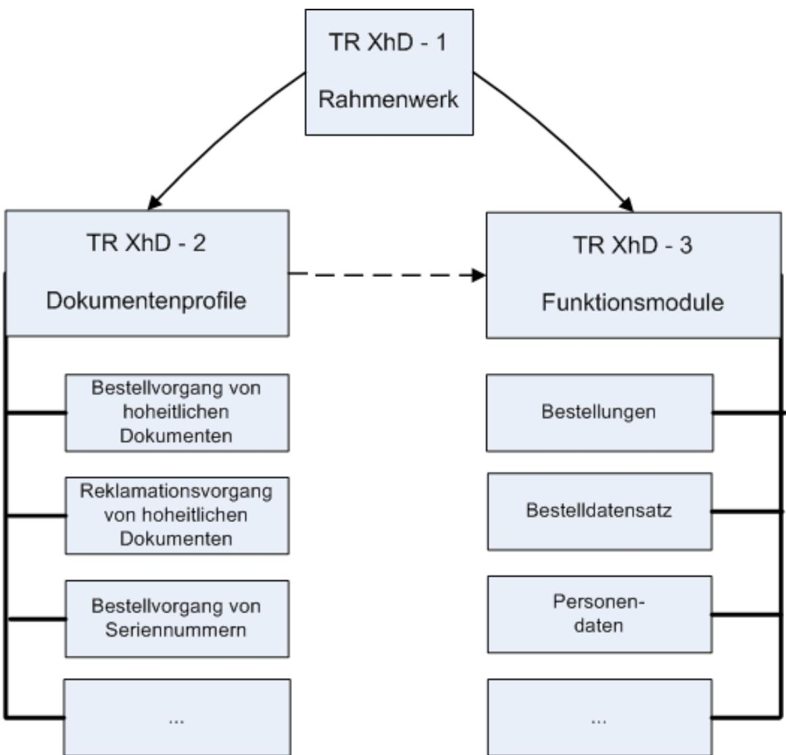

# Technische Richtlinie TR-03123 XML-Datenaustauschformat für hoheitliche Dokumente (TR XhD)

Teil 1 - Rahmenwerk

Version 1.5.2 13.03.2020

## Änderungshistorie

| Version | Datum      | Beschreibung                                                     |
|---------|------------|------------------------------------------------------------------|
| 1.3     | 14.05.2012 | Anpassung der XML-Beispiele                                      |
| 1.3.1   | 14.12.2012 | Keine Veränderung zur Version 1.3                                |
| 1.4     | 18.11.2013 | Entfernen der XML-Beispiele und Verweis auf die Beispieldateien. |
| 1.5.0   | 26.10.2018 | Layoutaktualisierung                                             |
| 1.5.2   | 13.03.2020 | Layoutaktualisierung - Barrierefreiheit                          |

Bundesamt für Sicherheit in der Informationstechnik Postfach 20 03 63 53133 Bonn

E-Mail: xhd@bsi.bund.de Internet: https://www.bsi.bund.de © Bundesamt für Sicherheit in der Informationstechnik 2020

### Inhaltsverzeichnis

| Anderungshistorie………………………………………………………………………………………………………………………………………………………………………………………………………………………………………………………………………………………………………………………………………………………………………………………………………………………………… |  |
|--------------------------------------------------------------------------------------------------------------------------------------------------------------------------------|--|
| 1                                                                                                                                                                              |  |
| 1.1                                                                                                                                                                            |  |
| 1.2                                                                                                                                                                            |  |
| 1.3                                                                                                                                                                            |  |
| Struktur der TR XhD                                                                                                                                                            |  |
| 2.1                                                                                                                                                                            |  |
| 2.2                                                                                                                                                                            |  |
| 2.3                                                                                                                                                                            |  |
| 3                                                                                                                                                                              |  |
| 4                                                                                                                                                                              |  |
| 5 XML Beispiele                                                                                                                                                                |  |
| Literaturverzeichnis                                                                                                                                                           |  |
| Stichwort- und Abkürzungsverzeichnis                                                                                                                                           |  |

### Abbildungsverzeichnis

| bbildung 1: Aufbau der Dokumente der TR XhD. ставляется продавания с принадание фильм иментивник |  |
|-----------------------------------------------------------------------------------------------------|--|

### Tabellenverzeichnis

### 1 Einleitung

Die Technische Richtlinie – XML-Datenaustauschformat für hoheitliche Dokumente (TR XhD) ist eine technische Richtlinie, die ein XML-Datenaustauschformat basierend auf den fachlichen Standards für den elektronischen Datenaustausch in der öffentlichen Verwaltung [XÖV] definiert. Dieses Datenaustauschformat dient der Übertragung von Bestelldaten hoheitlicher Dokumente zwischen Behörden und Dokumentenherstellern. Durch die Beschreibung der Datenstrukturen in XML ist die Datenübertragung unabhängig vom Betriebssystem und der Anwendungssoftware der Kommunikationsbeteiligten. Die TR XhD besteht aus drei Teilen:

- TR XhD 1 Rahmenwerk
- TR XhD 2 Dokumentenprofile
- TR XhD 3 Funktionsmodule

Benutzer, die noch nicht mit der TR XhD gearbeitet haben, sollten das TR XhD-Rahmenwerk (dieses Dokument) als Einstiegsdokument nutzen, um sich über die Inhalte und die generelle Struktur der TR XhD zu informieren.

#### 1.1 Motivation und Zielsetzung

Die TR XhD wurde entwickelt, um einen system- und anwendungsunabhängigen, elektronischen Datenaustausch innerhalb der Prozesse zur Beantragung hoheitlicher Dokumente zu ermöglichen.

Aus diesem Grund spezifiziert die TR XhD, ein verbindliches Format, das auf Basis etablierter Technologien (XML) und Standards ([XÖV]) entwickelt wurde.

Ein weiteres Ziel dieser Richtlinie ist es, neue Anwendungsfälle und hoheitliche Dokumente einfach, zeitnah und kostengünstig integrieren zu können. Dieses Ziel wird durch eine komponenten-orientierte Struktur der Richtlinie erreicht, die die Verwendung bestehender Komponenten und die Erweiterbarkeit der Richtlinie um neue Komponenten ermöglicht.

#### 1.2 Grundlagen

Die TR XhD definiert ein Datenaustauschformat, welches den XÖV-Standardisierungsempfehlungen [XÖV] folgt. [XÖV] dient dem elektronischen Datenaustausch in der öffentlichen Verwaltung und enthält eine Sammlung von XML-Komponenten zur Datenübertragung. Aus diesen XML-Komponenten werden wiederum Fachstandards gebildet, wie z.B. XMeld zur Übertragung von Einwohnermeldedaten oder die vorliegende TR XhD. Ziel von [XÖV] ist es, die Kommunikation in der öffentlichen Verwaltung zu standardisieren und durch die Verwendung der Komponenten in verschiedensten Bereichen Kosten zu senken.

Um die technische Richtlinie möglichst schlank zu halten, werden weitere technische und etablierte Standards in diesem Dokument lediglich referenziert.

#### 1.3 Zielgruppe

Die TR XhD richtet sich an die für die Antragsdatenerfassung verantwortlichen Behörden sowie an die Dokumentenhersteller und Verfahrensentwickler.

### 2 Struktur der TR XhD

#### 2.1 TR XhD 1 – Rahmenwerk

Das vorliegende Dokument, "Technische Richtlinie – XML-Datenaustauschformat für hoheitliche Dokumente (TR XhD) 1 – Rahmenwerk", ist das Hauptdokument der Technischen Richtlinie – XML-Datenaustauschformat für hoheitliche Dokumente (TR XhD) und enthält die Beschreibung und Darstellung des strukturellen und inhaltlichen Aufbaus der TR XhD. Darüber hinaus beinhaltet das Rahmenwerk eine Anleitung zur Integration von Inhalten für neue (zukünftige) hoheitliche Dokumente in die TR XhD.

#### 2.2 TR XhD 2 – Dokumentenprofile

Das Dokument "Technische Richtlinie – XML-Datenaustauschformat für hoheitliche Dokumente (TR XhD) 2 - Dokumentenprofile" [TR XhD-2] enthält eine Zuordnung der verschiedenen Prozesse (Bestell- und Reklamationsvorgänge) auf die jeweils dafür benötigten Nachrichtentypen und die Elemente der Funktionsmodule. Außerdem beinhaltet das Dokument Vorgaben zu Feldlängen und weitere Regelungen zu den Datenfeldern.

#### 2.3 TR XhD 3 – Funktionsmodule

Im dritten Teildokument "Technische Richtlinie – XML-Datenaustauschformat für hoheitliche Dokumente (TR XhD) 3 – Funktionsmodule" [TR XhD-3] werden die technischen Anforderungen, Abläufe und XML-Formate zur Aufnahme, Erstellung und Übermittlung der Antrags- und Bestelldatensätze definiert.

Die Beschreibung der technischen Sachverhalte erfolgt in Form so genannter Funktionsmodule. Diese Module können konkrete technische Vorgaben enthalten oder aus weiteren Funktionsmodulen zusammengesetzt sein. Die nachfolgend aufgelisteten Typen von Funktionsmodulen werden in dem Dokument genutzt.

• Nachrichten

Funktionsmodule vom Typ "Nachrichten" enthalten eine Beschreibung einer elektronischen Nachricht. Sie sind aus Funktionsmodulen der Typen "Baukasten" und "Datentypen" zusammengesetzt.

• Baukasten

Funktionsmodule vom Typ "Baukasten" enthalten Schemata, die aus Datentypen zusammengesetzt sind und die Basis zur Definition von elektronischen Nachrichten (s.o.) bilden.

• Datentypen

Diese Funktionsmodule enthalten spezifische Datentypen, die in Baukasten-Modulen und Nachrichten genutzt werden können.

• Codelisten

Die Codelisten-Module enthalten Wertelisten, Codelisten und Schlüsseltabellen, die zur Definition von Datentypen genutzt werden.

• Weitere Funktionsmodule

Diese Funktionsmodule definieren technische Vorgaben, die nicht im Zusammenhang mit der Definition von Schemata und Datentypen stehen (z.B. Aspekte der Datensicherheit).

Um vielfältige Einsatzmöglichkeiten der Komponenten zu erreichen, werden die Inhalte auf Basis der verschiedenen Nachrichtentypen logisch modularisiert. Die spezifizierten XML-Elemente werden detailliert beschrieben und die kompletten XML-Schemata der Module werden im Anhang aufgeführt.

### 3 Anleitung zur Nutzung der TR XhD

Dieses Kapitel dient als Anleitung zur Benutzung der TR XhD. In den vorherigen Abschnitten wurden Sinn und Zweck der TR XhD sowie deren grobe Struktur dargestellt. Basierend darauf wird nachfolgend beschrieben, wie und in welcher Reihenfolge die einzelnen Dokumente gelesen werden sollten, damit der Leser am effizientesten an die von ihm benötigten Informationen gelangen kann.

*Abbildung 1: Aufbau der Dokumente der TR XhD*

[Abbildung 1](#page-7-0) stellt den schematischen Aufbau der Dokumente der TR XhD dar.

Im Anschluss an dieses Dokument sollte der weitere Einstieg in die Thematik über die Dokumentenprofile [TR XhD-2] erfolgen. Diese enthalten eine Darstellung relevanter Daten und referenzieren alle für den jeweiligen Prozess (Bestell- oder Reklamationsvorgang) relevanten Funktionsmodule. Außerdem beinhaltet das Dokument Vorgaben zu Feldlängen und weitere Regelungen zu den Datenfeldern.

Es wird empfohlen das jeweilige Dokumentenprofil, als Ausgangspunkt für die Nutzung der Funktionsmodule, einzusetzen. Diese Module sind in [TR XhD-3] zu finden. Sie enthalten technische Vorgaben und spezifizieren alle notwendigen Datenstrukturen und -formate.

Durch die Nutzung aller in einem Dokumentenprofil referenzierten Funktionsmodule kann der Nutzer alle relevanten technischen Informationen (im Kontext der Datenerfassung, -qualitätssicherung und übermittlung) für den jeweiligen Prozess finden.

In Kapitel [4](#page-9-0) des Rahmenwerk-Dokuments existiert eine Anleitung zur Integration neuer Dokumentenprofile und Funktionsmodule.

#### 4 Anleitung zur Integration neuer Dokumentenprofile und Funktionsmodule

Dieses Kapitel stellt die notwendigen Schritte zur Erstellung neuer Dokumentenprofile und Funktionsmodule dar. Dies kann beispielsweise dann notwendig werden, wenn neue hoheitliche Dokumente eingeführt oder existierende Dokumente um Funktionalitäten erweitert werden.

Um zu gewährleisten, dass die Integration der neuen Profile und Module effizient realisiert wird und keine unnötigen neuen Inhalte generiert werden, sollte die nachfolgend beschriebene Vorgehensweise eingehalten werden.

1. Erfassung fachlicher Anforderungen

In einem ersten Schritt sollten immer die jeweiligen fachlichen Anforderungen und Vorgaben zusammengetragen und spezifiziert werden.

2. Erstellung neuer oder Anpassung existierender Dokumentenprofile

Die zusammengetragenen fachlichen Aspekte sollten in neuen oder existierenden Dokumentenprofilen erfasst werden.

3. Erfassung und Erstellung technischer Spezifikationen

Anschließend kann basierend auf den fachlichen Anforderungen die Spezifizierung der technischen Aspekte erfolgen. Dazu sollte zuerst evaluiert werden, welche existierenden Funktionsmodule genutzt werden können bzw. durch Erweiterungen nutzbar gemacht werden können. Für Datenstrukturen und -formate sollte darüber hinaus geprüft werden, ob existierende XÖV-Komponenten genutzt werden können.

4. Erstellung neuer oder Anpassung existierender Funktionsmodule

Ist eine Verwendung existierender Module und Komponenten nicht möglich, so müssen Funktionsmodule neu erstellt oder entsprechend angepasst werden.

5. Erstellung der Referenzen in den Dokumentenprofilen

In den Dokumentenprofilen müssen die Referenzen zwischen Prozessen und Nachrichtentypen sowie alle relevanten Funktionsmodule erfasst werden.

6. Integration der Profile und Module in die TR XhD-Dokumente

Abschließend müssen die neuen Dokumentenprofile und Funktionsmodule in [TR XhD-2] und [TR XhD-3] vom Herausgeber der technischen Richtlinie integriert werden.

### 5 XML Beispiele

XML Beispiele für alle in [TR XhD-3] definierten Nachrichtentypen werden zusammen mit den Schemata-Dateien veröffentlicht.

#### Literaturverzeichnis

| [XÖV]      | : Fachliche Standards für den elektronischen Datenaustausch in der öffentlichen |
|------------|---------------------------------------------------------------------------------|
|            | Verwaltung, XÖV                                                                 |
| [TR XhD-2] | : Technische Richtlinie – XML-Datenaustauschformat für hoheitliche Dokumente    |
|            |                                                                                 |

(TR XhD) 2 - Dokumentenprofile, TR-03123-2, BSI [TR XhD-3] : Technische Richtlinie – XML-Datenaustauschformat für hoheitliche Dokumente (TR XhD) 3 – Funktionsmodule, TR-03123-3

#### Stichwort- und Abkürzungsverzeichnis

| Abkürzung | Beschreibung                                                                            |
|-----------|-----------------------------------------------------------------------------------------|
| TR        | Technische Richtlinie                                                                   |
| TR XhD    | Technische Richtlinie – XML-Datenaustauschformat für hoheitliche Dokumente, TR 03123 |
| XML       | Extensible Markup Language                                                              |