# Technische Richtlinie BSI TR-03123 XML-Datenaustauschformat für hoheitliche Dokumente (TR-XhD)

Teil 2 – Dokumentenprofile

Version 1.5.1

05. Februar 2019

Bundesamt für Sicherheit in der Informationstechnik Postfach 20 03 63 53133 Bonn Tel.: +49 22899 9582-0 E-Mail: xhd@bsi.bund.de Internet: [https://www.bsi.bund.de](https://www.bsi.bund.de/) © Bundesamt für Sicherheit in der Informationstechnik 2018

## Versionshistorie

| Version | Datum      | Kommentar                                                                                                                                                           |
|---------|------------|---------------------------------------------------------------------------------------------------------------------------------------------------------------------|
| 1.3     | 15.05.2012 | Keine Veränderung zur Version 1.2.3                                                                                                                                 |
| 1.3.1   | 14.12.2012 | Korrektur der Nummerierung von Anmerkungen.                                                                                                                         |
| 1.4     | 18.11.2013 | Aufnahme der Elemente AntragsdatensatzPassbuchType, Amt licherVermerkType beim ePass und eRA sowie des Felds Auf enthaltstitelDokumentGueltigVon für den eAT. |
|         |            | Entfernen der Elemente Zusatzinformationen und StatusCode aus dem Datentyp AntragsbezogeneDatenType.                                                             |
|         |            | Entfernen des Basisdatentyps ZusatzinformationType. Entfernen des Wertes Andere aus der Codeliste Aufenthaltsti telartCodeContentType.                        |
|         |            | Anpassung des Kommentars zu dem Element Aufenthaltstitel art in dem Datentyp AntragsdatensatzAufenthaltstitelType.                                               |
|         |            | Das Element AmtlicherVermerk im Datentyp xhd:Antragsda tensatzPassbuchType ist optional.                                                                         |
|         |            | Das Element Vermerk im Datentyp xhd:AmtlicherVermerkTy pe ist entfernt worden.                                                                                   |
|         |            | Der Wert Andere ist aus der Codeliste DruckzeilenCodeCon tentType entfernt worden.                                                                               |
|         |            | Die Beschreibung des Elements xhd:AntragsdatensatzAufent haltstitelType/AufenthaltstitelDokumentGueltigVon ist ange passt worden.                             |
|         |            | Erweiterung der Code-Liste "GeschlechterCodeContentType" um den Wert "unbekanntes Geschlecht" (kodiert als "003").                                               |
|         |            | Erweiterung der Code-Liste "ReklamationsklasseCodeContent Type" um den Wert "Kostenpflichtig".                                                                   |
|         |            | Aufnahme des Elements "AmtlicherVermerk" in die Tabelle 7 "Relevante Daten für die Druckrepräsentation".                                                         |
| 1.4.2   | 28.09.2017 | Neue Aufenthaltstitelarten ICT-Karte und Mobiler-ICT-Karte in Teil 3                                                                                             |
| 1.5     | 26.10.18   | Änderungsanträge der TechAG: Ergänzung des Codewerts "Geburtsname" in der Codeliste "DruckzeileCodeContentType".                                              |
|         |            | Erweiterung der Codeliste ReklamationsklasseCodeContentTy pe um die Codewerte "VersandVerlust" und "VersandSchaden".                                             |
|         |            | Anreicherung des Datentyps ReklamationType um die Ele                                                                                                               |

|  | mente "Kontaktdaten", "ausgehaendigt" und "NichterhaltBIN Brief".                                                                                                                                                                                                                                                                                                                      |
|--|-------------------------------------------------------------------------------------------------------------------------------------------------------------------------------------------------------------------------------------------------------------------------------------------------------------------------------------------------------------------------------------------|
|  | Anreicherung des Datentyps RueckmeldungType um die Ele mente "kostenUebernahmeHersteller", "ruecksendungAnBe hoerde" und "Infoblatt".                                                                                                                                                                                                                                               |
|  | Entfernung des Datentyps "AmtlicherVermerk" sowie des ent sprechenden Druckzeilen-Typs.                                                                                                                                                                                                                                                                                                |
|  | Typänderung des Elements "Ruecksendeadresse" im Datentyp PinDatenType. Entsprechend Entfernung des Druckzeilentyps RuecksendeAdressePIN                                                                                                                                                                                                                                             |
|  | Anpassungen des Datentyps OptionaleEintragungenType: An passung von Multiplizitäten der Länderangaben "land" und "land_ausname", sowie deren Gruppierung mit "gueltigfueral le" in einem Auswahl-Block.                                                                                                                                                                          |
|  | Abbildung von Normtexten ("optionaltext") über die Codeliste OptionaltextCodeContentType.                                                                                                                                                                                                                                                                                              |
|  | Typänderung des Elements "unterlagen" in Druckrepräsentati on sowie Ergänzung eines entsprechenden Druckzeilen-Typs;                                                                                                                                                                                                                                                                   |
|  | Änderungen am elektronischen Aufenthaltstitel (eAT): Entfernung des Codewerts NF (Niederlassungserlaubnis Fami lienangehöriger) aus der Codeliste AufenthaltstitelartCode ContentType.                                                                                                                                                                                           |
|  | Entfernung der Elemente "Unbefristet" und "Aufenthaltstitel DokumentGueltigVon" aus dem Datentyp Antragsdatensatz AufenthaltstitelType.                                                                                                                                                                                                                                             |
|  | Ergänzung der Elemente "AnmerkungenRechtsgrundlagen UndPassdokument", "AnmerkungenErwerbstätigkeit" jeweils als Unterelemente vom Typ Druckrepräsentation im Datentyp AntragsdatensatzAufenthaltstitelType, Entfernung des Ele ments "Anmerkungen" sowie des Druckzeilen-Typs "Anmer kungen". Entfernung des Elements AufenthaltstitelDatenType.- Druckrepraesentation. |
|  | Erweiterung der Codeliste "DruckzeileCodeContentType" um die Codewerte "BehördennameKurzeZeile", "Anmerkungen RechtsgrundlagenUndPassdokument", "AnmerkungenEr werbstätigkeit".                                                                                                                                                                                                  |
|  | Erweiterung von Personalausweis eAT und eID-UB um eine Auslandsanschrift: Ergänzung des Elements "Staat" in den An schriften. Anpassung von Feldlängen für Namen, Anschrift, An merkungen und weitere.                                                                                                                                                                           |
|  | Die Elemente ElektronischeIDType.WohnortAusland sowie                                                                                                                                                                                                                                                                                                                                     |

|       |          | PINDaten.PINBriefLand wurden daher entfernt, ebenso wie der Druckzeilen-Typ PINBriefLand.                                                                                                                                                                                    |
|-------|----------|---------------------------------------------------------------------------------------------------------------------------------------------------------------------------------------------------------------------------------------------------------------------------------|
|       |          | Ergänzung der eID-Karte für Unionsbürger (eID-UB): Darstellung der neuen Dokumentenart eID-Karte für Unions bürger (eID-UB).                                                                                                                                              |
|       |          | Weitere Änderungen: Aktualisierung der Biometrie-Bestandteile (gemäß BSI TR 03121): Ersetzung der Elemente bio-face und bio-finger durch Element gid-app in biometrischen Merkmalen.                                                                                   |
|       |          | Zusammenlegung von Straße und Hausnummer in Anschrift Type zu StrasseUndHausnummer, außerdem Ergänzung des Elements Region.                                                                                                                                               |
| 1.5.1 | 05.02.19 | Emendation sowie Festlegung der Personalisierung des PA mit "keine Wohnung in Deutschland" in Druck und Chip, wenn ein Adressfeld ohne Unterelemente übertragen wird. Diese Funkti onalität wird mit der nächsten Schemaänderung durch ein ge eignetes Flag ersetzt |

|                | Versionshistorie 3                                                             |  |
|----------------|--------------------------------------------------------------------------------|--|
| 1              | Einleitung 10                                                                  |  |
| 2              | Nachrichtenüberblick 11                                                        |  |
| 2.1            | Bestellung 11                                                                  |  |
| 2.2            | Auftragsinformation 11                                                         |  |
| 2.3            | Lieferinformation 11                                                           |  |
| 2.4            | Quittierung 11                                                                 |  |
| 2.5            | Reklamationsinformation 11                                                     |  |
| 2.6            | Fehlerinformation 11                                                           |  |
| 3              | Allgemeine Vorgaben zu Datenfeldern 12                                         |  |
| 3.1            | Druckrepräsentation von Daten 12                                               |  |
| 3.2            | Zeichensätze 12                                                                |  |
| 3.2.1          | Eingeschränkter Zeichensatz für Seriennummern12                                |  |
| 3.2.2          | Sonderzeichensatz 13                                                           |  |
| 3.2.3          | String.LatinXhD Zeichensatz 13                                                 |  |
| 3.3            | Seriennummern 13                                                               |  |
| 3.4            | Nachrichtenkopf 15                                                             |  |
| 4              | Dokumenten- und nachrichtenspezifische Regelungen17                            |  |
| 4.1            | Bestellung 17                                                                  |  |
| 4.1.1          | Elektronischer Personalausweis (ePA)20                                         |  |
| 4.1.2          | Elektronischer Reisepass (ePass) 34                                            |  |
| 4.1.3 4.1.4 | Elektronischer Aufenthaltstitel (eAT)44 Elektronischer Reiseausweis (eRA)54 |  |
| 4.1.5          | eID-Karte für Unionsbürger (eID-UB)62                                          |  |
| 4.1.6          | Bestellung von Seriennummern 69                                                |  |
| 4.1.7          | Reklamation von hoheitlichen Dokumenten70                                      |  |
| 4.2            | Auftragsinformation 71                                                         |  |
| 4.3            | Lieferinformation 72                                                           |  |
| 4.3.1          | Elektronischer Personalausweis (ePA)72                                         |  |
| 4.3.2          | Elektronischer Reisepass (ePass) 73                                            |  |
| 4.3.3 4.3.4 | Elektronischer Aufenthaltstitel (eAT)74 Elektronischer Reiseausweis (eRA)74 |  |
| 4.3.5          | Elektronische ID-Karte für Unionsbürger (eID-UB)74                             |  |
| 4.3.6          | Seriennummern 75                                                               |  |
| 4.4            | Quittierung 76                                                                 |  |
| 4.5            | Reklamationsinformation 76                                                     |  |
| 4.5.1          | Hoheitliche Dokumente 76                                                       |  |
| 4.6            | Fehlerinformation 77                                                           |  |
| 5              | Literaturverzeichnis 78                                                        |  |
| 6              | Abkürzungsverzeichnis 79                                                       |  |
|                | Abbildungsverzeichnis                                                          |  |
|                | Abbildung 1: Nachrichtenkopf 15                                                |  |
|                |                                                                                |  |

| Abbildung 4: Bestellung elektronischer Reisepass34 Abbildung 5: Antragsdatensatz elektronischer Reisepass37 Abbildung 6: Antragsdatensatz elektronischer Aufenthaltstitel44 |
|-----------------------------------------------------------------------------------------------------------------------------------------------------------------------------------|
|                                                                                                                                                                                   |
|                                                                                                                                                                                   |
|                                                                                                                                                                                   |
| Abbildung 7: Antragsdatensatz elektronischer Reiseausweis54                                                                                                                       |
| Abbildung 8: Antragsdatensatz eID-Karte für Unionsbürger62                                                                                                                        |
| Abbildung 9: Bestellung Seriennummern 69                                                                                                                                          |
| Abbildung 10: Reklamation hoheitliche Dokumente70                                                                                                                                 |
| Abbildung 11: Auftragsinformation 71                                                                                                                                              |
| Abbildung 12: Lieferinformation neuer Personalausweis73                                                                                                                           |
| Abbildung 13: Lieferinformation elektronischer Reisepass74                                                                                                                        |
| Abbildung 14: Lieferinformation Seriennummern 75                                                                                                                                  |
| Abbildung 15: Reklamationsinformation 76                                                                                                                                          |
| Abbildung 16: Fehlerinformation 77                                                                                                                                                |

| Tabelle 1: Sonderzeichen 12                                                         |  |
|-------------------------------------------------------------------------------------|--|
| Tabelle 2: Sonderzeichensatz 13                                                     |  |
| Tabelle 3: Zeichen die nicht Bestandteil des String.LatinXhD Zeichensatzes sind13   |  |
| Tabelle 4: Seriennummern 14                                                         |  |
| Tabelle 5: Nachrichtenkopf 16                                                       |  |
| Tabelle 6: Relevante Daten für die Bestellung 19                                    |  |
| Tabelle 7: Relevante Daten für die Druckrepräsentation20                            |  |
| Tabelle 8: Bestellung Personalausweis 21                                            |  |
| Tabelle 9: Antragsdatensatz Personalausweis 25                                      |  |
| Tabelle 10: Bestellung elektronischer Reisepass 34                                  |  |
| Tabelle 11: Antragsdatensatz elektronischer Reisepass38                             |  |
| Tabelle 12: Antragsdatensatz elektronischer Aufenthaltstitel45                      |  |
| Tabelle 13: Antragsdatensatz elektronischer Reiseausweis55                          |  |
| Tabelle 14: Antragsdatensatz elektronische ID-Karte für Unionsbürger63              |  |
| Tabelle 15: Relevante Daten für die Bestellung (Seriennummern)69                    |  |
| Tabelle 16: Bestellung Seriennummern 69                                             |  |
| Tabelle 17: Relevante Daten für die Bestellung (Reklamation)70                      |  |
| Tabelle 18: Reklamation hoheitliche Dokumente 70                                    |  |
| Tabelle 19: Auftragsinformation hoheitliche Dokumente72                             |  |
| Tabelle 20: Relevante Daten für die Lieferinformation von hoheitlichen Dokumenten72 |  |
| Tabelle 21: Lieferinformation neuer Personalausweis73                               |  |
| Tabelle 22: Lieferinformation elektronischer Reisepass74                            |  |
| Tabelle 23: Relevante Daten für die Lieferinformation von Seriennummern75           |  |
| Tabelle 24: Lieferinformation Seriennummern75                                       |  |
| Tabelle 25: Reklamationsinformation 76                                              |  |
| Tabelle 26: Fehlerinformation 77                                                    |  |
|                                                                                     |  |

# 1 Einleitung

Dieses Dokument bezieht sich auf das in [\[TR XhD-3\]](#page-77-2) definierte Datenmodell und formuliert weitere Regelungen zu dessen konkreter Verwendung. Diese Spezifikationen resultieren unter anderem aus drucktechnischen (z.B. Beschreibung von Feldlängen) und organisatorischen (z.B. Beschreibung des Formats von Seriennummern-Blöcken) Vorgaben. Neben den bestellenden Behörden respektive deren Verfahrensentwicklern, welche die Software für die bestellenden Behörden implementieren, richtet sich dieses Dokument auch an die Hersteller von hoheitlichen Dokumenten, in ihrer Rolle als Empfänger der Bestellungen.

Für die Behörden werden primär die einzuhaltenden Vorgaben zur Erzeugung valider Bestellungen von hoheitlichen Dokumenten beschrieben. Darüber hinaus werden aber auch Vorgaben zu den Nachrichten, die vor (z.B. Seriennummernbestellung) und nach (z.B. Lieferinformation) der Bestellung von hoheitlichen Dokumenten ausgetauscht werden, gemacht. Resultierend daraus werden hier sowohl Vorgaben zur Interpretation von empfangenen Nachrichten für die Behörden als auch für die Dokumentenhersteller festgelegt.

Dieses Dokument ist nach den Prozessen der Technische Richtlinie zur Produktionsdatenerfassung, -qualitätsprüfung und -übermittlung für hoheitliche Dokumente [\[TR 03104\]](#page-77-1) gegliedert. Es werden die folgenden hoheitlichen Dokumente betrachtet:

- Elektronischer Reisepass (ePass),
- Elektronischer Reiseausweis für Ausländer, Staatenlose und Flüchtlinge (eRA),
- Elektronischer (neuer) Personalausweis (ePA) und
- Elektronischer Aufenthaltstitel (eAT)
- Elektronische ID-Karte für Unionsbürger (eID-UB).

## 2 Nachrichtenüberblick

Im folgenden Abschnitt werden die für die Übermittlung der Daten aller Bestellprozesse zu nutzenden Nachrichtentypen beschrieben.

## 2.1 Bestellung

Der Nachrichtentyp "Bestellung" wird für alle Bestelldatenübertragungen genutzt und enthält alle relevanten Bestellinformationen.

## 2.2 Auftragsinformation

Der Nachrichtentyp "Auftragsinformation" wird vom Dokumentenhersteller als Antwort auf eine Bestellung genutzt. Er enthält die Rückmeldung über die Korrektheit der erhaltenen Bestelldaten und ggf. eine Beschreibung aufgetretener Fehler.

## 2.3 Lieferinformation

Der Nachrichtentyp "Lieferinformation" wird vom Dokumentenhersteller genutzt, um die Behörden über die Lieferung von produzierten Dokumenten oder Seriennummern zu informieren. Für einige Dokumententypen wird dieser Nachrichtentyp ebenfalls dazu genutzt, weitere Daten (z. B. das sogenannte Sperrkennwort eines Dokuments) an die Behörden zu versenden. In der Lieferinformation gibt der Dokumentenhersteller auch an, ob eine Quittierung zur Bestätigung der Lieferinformation von der Behörde gesendet werden muss.

## 2.4 Quittierung

Der Nachrichtentyp "Quittierung" wird von den Behörden dazu genutzt, dem Dokumentenhersteller den Empfang einer Nachricht vom Typ "Lieferinformation" und die Korrektheit der darin enthalten Daten zu bestätigen. Dieser Nachrichtentyp wird nur für die Bestätigung der Lieferinformation zu hoheitlichen Dokumenten vom Typ "Elektronischer Personalausweis (ePA)", "Elektronischer Aufenthaltstitel (eAT)" und "Elektronische ID-Karte für Unionsbürger (eID-UB)" genutzt.

## 2.5 Reklamationsinformation

Nachrichten vom Typ "Reklamationsinformation" werden vom Dokumentenhersteller an die Behörden versendet, um diese über den Status von Reklamationen ("anerkannt" / "nicht anerkannt") zu informieren.

## 2.6 Fehlerinformation

Der Nachrichtentyp "Fehlerinformation" wird verwendet bei fehlerhaften Nachrichten, die im fachlichen Kontext nicht verarbeitet werden können. Der Empfänger der fehlerhaften Nachricht sendet eine Nachricht vom Typ "Fehlerinformation" an den ursprünglichen Sender der fehlerhaften Nachricht.

# 3 Allgemeine Vorgaben zu Datenfeldern

Dieses Kapitel fasst allgemeine Vorgaben zusammen, die für alle hoheitlichen Dokumente und Nachrichten gelten. Diese allgemeinen Vorgaben bilden die Grundlage für einige Festlegungen in den folgenden Kapiteln dieses Dokuments und müssen zwingend berücksichtigt werden.

## 3.1 Druckrepräsentation von Daten

Die [\[TR XhD-3\]](#page-77-2) macht Vorgaben zu einigen Datenfeldern, deren Repräsentation sich im späteren Druckbild über mehrere Zeilen erstreckt. Außerdem werden einige Datenfelder in der späteren Druckrepräsentation zu Druckfeldern zusammengefasst. In jedem Fall muss von der Behörde die Druckrepräsentation der entsprechenden Felder zusätzlich zu den eigentlichen Datenfeldern (im weiteren Verlauf des Dokuments "Einzelfelder" genannt) übertragen werden, da nur so eine korrekte Verarbeitung der Daten auf Seiten des Herstellers und eine optimale Lesbarkeit des hoheitlichen Dokuments gewährleistet werden kann.

Die Definition der Druckrepräsentation erfolgt stets typ- und zeilenbasiert. Die Zeilen eines Typs werden fortlaufend nummeriert (1, 2, 3, …). Jede Druckrepräsentation hat eine eindeutig in diesem Dokument festgelegte Typenbezeichnung. Welche Typen zur Druckrepräsentation, für welche hoheitlichen Dokumente, zulässig sind, ist den Tabellen der folgenden Kapitel zu entnehmen.

Es kann mehrere mögliche Druckvarianten geben. Die Auswahl sollte so erfolgen, dass die maximale Schriftgröße erzielt wird.

Sind aufgrund der Druckrepräsentation Kürzungen in Datenfeldern notwendig, so ist die Kürzung auch äquivalent in den Einzelfeldern durchzuführen. Druckbild und Einzelfelder müssen dementsprechend inhaltlich identisch sein.

In den Tabellen der folgenden Kapitel werden insbesondere für die Festlegung der Feldlängen der Elemente der Druckrepräsentation die Sonderzeichen ≤ (kleiner gleich) und ∑ (Summe) verwendet. Die Sonderzeichen sind entsprechend der folgenden Tabelle zu interpretieren.

| Sonderzeichen      | Interpretation                                                                                                                                                                                                                                                                                                                                                                                                        |
|--------------------|-----------------------------------------------------------------------------------------------------------------------------------------------------------------------------------------------------------------------------------------------------------------------------------------------------------------------------------------------------------------------------------------------------------------------|
| ≤ (kleiner gleich) | Dieses Sonderzeichen wird verwendet, um zu kennzeichnen wie viele Zeichen maxi mal in einer Druckzeile, wenn eine bestimmte Schriftgröße verwendet wird, unter gebracht werden können. Die Schriftgröße ist in diesen Fällen in der linken Spalte "Regelungen" auf Höhe der Feldlängenangabe zu finden. Im Kontext der Einzelfelder wird es lediglich verwendet, um die maximale Feldlänge zu definieren. |
| ∑ (Summe)          | Die Summe beschreibt die maximale Anzahl an Zeichen verteilt auf alle übertragba ren Zeilen, wenn eine bestimmte Schriftgröße verwendet wird und wird dement sprechend aus "Anzahl Zeilen" multipliziert mit "maximale Anzahl Zeichen pro Zei le" gebildet.                                                                                                                                                  |

*Tabelle 1: Sonderzeichen*

## 3.2 Zeichensätze

## 3.2.1 Eingeschränkter Zeichensatz für Seriennummern

Der eingeschränkte Zeichensatz dient unter anderem der einfacheren Lesbarkeit der Seriennummer. So werden zum Beispiel Verwechslungen des Buchstaben O und der Zahl 0 ausgeschlossen.

## 3.2.2 Sonderzeichensatz

| Zeichen | Zeichenbeschreibung        |  |
|---------|----------------------------|--|
| :       | Doppelpunkt                |  |
|         | Punkt                      |  |
| _       | Unterstrich                |  |
| -       | Bindestrich, Minus         |  |
| <       | kleiner als                |  |
| >       | Größer als                 |  |
| (       | runde Klammer links        |  |
| )       | runde Klammer rechts       |  |
| [       | eckige Klammer links       |  |
| ]       | eckige Klammer rechts      |  |
| {       | geschweifte Klammer links  |  |
| }       | geschweifte Klammer rechts |  |
| /       | Schrägstrich               |  |

Der Sonderzeichensatz ist der folgenden Tabelle zu entnehmen.

*Tabelle 2: Sonderzeichensatz*

### 3.2.3 String.LatinXhD Zeichensatz

Der Zeichensatz String.LatinXhD ist eine reduzierte Version des Zeichensatzes String.Latin in der Version 1.1.1 (vom 27.01.2012). Der vollständige Zeichensatz String.Latin ist zu finden unter [\[String.Latin\].](#page-77-3) Die folgende Tabelle beinhaltet die Zeichen aus String.Latin, die **nicht** im Zeichensatz String.LatinXhD enthalten sind.

| Zeichen | Zeichenbeschreibung                   | Unicode (UCS2) |             |
|---------|---------------------------------------|----------------|-------------|
|         |                                       | Dezimal        | Hexadezimal |
|         | Horizontaltabulator                   | 9              | 0009        |
|         | Zeilenvorschub (engl. line feed)      | 10             | 000A        |
|         | Wagenrücklauf (engl. carriage return) | 13             | 000D        |

*Tabelle 3: Zeichen die nicht Bestandteil des String.LatinXhD Zeichensatzes sind*

## 3.3 Seriennummern

Der Dokumentenhersteller liefert Blöcke von Seriennummern in dem, wie folgt beschriebenen, Dateiformat. Der Dateiheader orientiert sich am INI-Datei-Format. Die Informationszeilen im Dateiheader werden immer von einem in [] eingeschlossenen Bezeichner angeführt, auf den in der nächsten Zeile ein Wert folgt. Die eigentlichen Nutzdaten werden vom Bezeichner [ZAP-LISTE] eingeführt und folgen hintereinander ohne weitere Überschriften mit 10 ZAP pro Zeile. Hinter jeder ZAP folgt ein Semikolon. Die Zeilenumbrüche sind Windows-gemäß CR/LF (0x0d, 0x0a). Die Datei wird im ASCII-7-Bit-Code erstellt.

| Zeile Nr. | Bezeichner        | Inhalt                                    |
|-----------|-------------------|-------------------------------------------|
| 1         | [APPLICATION]     | Name des Erzeugungs-Moduls                |
| 3         | [ABKZ]            | Behördenkennzahl                          |
| 5         | [DATE_AND_TIME]   | Datum der Erzeugung der Liste             |
| 7         | [ZAP_FILE_INDEX]  | laufende Nummer der ZAP-Datei der Behörde |
| 9         | [ZAP_START_VALUE] | dezimaler Eingabe-Startwert               |
| 11        | [ZAP_COUNTER]     | Anzahl der enthaltenen ZAP                |
| 13        | [ZAP_LISTE]       | in einer Zeile 10 ZAP                     |
| 14 …      |                   | alle weiteren ZAP-Zeilen                  |

*Tabelle 4: Seriennummern*

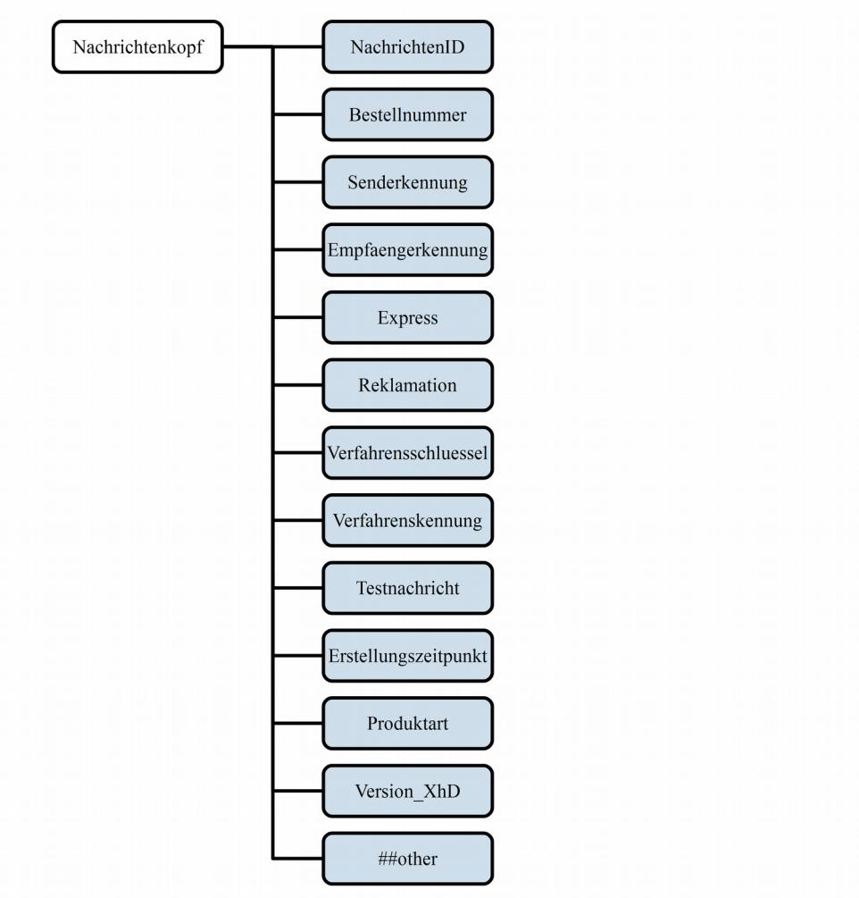

*Abbildung 1: Nachrichtenkopf*

## 3.4 Nachrichtenkopf

| Datenfeld       | Pflicht feld | Feld länge | Regelungen                                                                                                                                                                                                                                                                                                   |
|-----------------|-----------------|---------------|--------------------------------------------------------------------------------------------------------------------------------------------------------------------------------------------------------------------------------------------------------------------------------------------------------------|
| Nachrichtenkopf | X               |               |                                                                                                                                                                                                                                                                                                              |
| NachrichtenID   | X               | ≤ 40          | Eindeutiger Schlüssel für jede Nachricht eines Senders.                                                                                                                                                                                                                                                   |
| Bestellnummer   | X               | 28            | Die Bestellnummer besteht aus der Kennziffer für eine Bestellung mit angehängtem Zeitstempel. 1 bis 4: Behördenkennzahl 5 bis 7: laufender Index 8: Prüfziffer 9: "_"-Zeichen 10 bis 28: Zeitstempel in der Form YYYY-MM-DD_hh:mm:ss Es sind nur die Zeichen des eingeschränkten Zei |

| Datenfeld            | Pflicht feld | Feld länge  | Regelungen                                                                                                                                                                                                                                                                                       |
|----------------------|-----------------|----------------|--------------------------------------------------------------------------------------------------------------------------------------------------------------------------------------------------------------------------------------------------------------------------------------------------|
|                      |                 |                | chensatzes entsprechend Kapitel 3.2.1 erlaubt, so wie für den Zeitstempel die Zeichen "-", "_" und ":".                                                                                                                                                                                    |
| Senderkennung        | X               | 8 ≤ L ≤ 225 | Die Kennung des Senders der Nachricht (DVDV Identifier1 ) entsprechend [TR SiSKo hD] Kapitel 5.3.2 "Verzeichnung der Behörden und Kategori en".                                                                                                                                      |
| Empfaengerkennung    | X               | 8 ≤ L ≤ 225 | Die Kennung des Empfängers der Nachricht (DVDV-Identifier) entsprechend [TR SiSKo hD] Kapitel 5.3.2 "Verzeichnung der Behörden und Kategorien".                                                                                                                                         |
| Express              |                 |                | Hat dieses Element den Wert "true", so ist die Nachricht eine Expressbestellung. Der Wert des Elements wird vom Dokumentenhersteller igno riert, wenn für das bestellte hoheitliche Doku ment keine Expressbestellung möglich ist.                                                   |
| Reklamation          |                 |                | Hat dieses Element den Wert "true", so ist die Nachricht eine Reklamation.                                                                                                                                                                                                                    |
| Verfahrensschluessel |                 | ≤ 100          | Hier sind nur Ziffern von 0 bis 9, Groß- und Kleinbuchstaben, Sonderzeichen entsprechend Kapitel 3.2.2 und Leerzeichen zu verwenden.                                                                                                                                                       |
| Verfahrenskennung    | X               | ≤ 100          | Hier ist der String.LatinXhD Zeichensatz aus Ka pitel 3.2.3 zu verwenden.                                                                                                                                                                                                                     |
| Testnachricht        |                 | ≤ 2            | Dieses optionale Feld markiert die Nachricht als Testnachricht. Es sind nur Ziffern von 0 bis 9 zu verwenden. Das Feld darf nicht den Wert "0" haben. Eine Liste gültiger Testcodes wird von dem Dokumenten hersteller zur Verfügung gestellt.                                    |
| Erstellungszeitpunkt | X               |                |                                                                                                                                                                                                                                                                                                  |
| Produktart           | X               |                | In diesem Feld können alle in der Codeliste in Ka pitel 5.2.2 Codeliste Art des Dokuments aus [TR XhD-3] aufgezählten Werte übertragen werden. Darüber hinaus ist zu beachten, dass innerhalb ei ner Bestellung ausschließlich Dokumente einer Produktart bestellt werden können. |
| Version_XhD          | X               | 5              | Version des XhD-Schemas, auf dessen Basis die Nachricht erstellt wurde.                                                                                                                                                                                                                       |

*Tabelle 5: Nachrichtenkopf*

1 Der DVDV-Identifier ist die Kombination aus dem DVDV-Präfix und dem primären Behördenschlüssel.

## 4 Dokumenten- und nachrichtenspezifische Regelungen

## 4.1 Bestellung

In [Tabelle 6](#page-18-0) werden die fachlichen Daten für die "Bestellung von hoheitlichen Dokumenten" aufgelistet. Die technischen Details sind in [\[TR XhD-3\]](#page-77-2) im Funktionsmodul "Bestellung" detailliert beschrieben.

**Hinweis:** Für die Produktarten Reisepass (RP), Reiseausweis (RA), Personalausweis (PA), Aufenthaltstitel (AT) und eID-Karte für Unionsbürger (eID-UB) werden die Datenfelder in der folgenden Tabelle dargestellt. "X" kennzeichnet hier ein Pflichtfeld, während leere Felder bei den jeweiligen Produktarten nicht verwendet werden. Wenn eine optionale Verwendung eines Datenfeldes möglich ist, ist dies durch den Eintrag "optional" gekennzeichnet. Für Datenfelder, die mit einem "\*" gekennzeichnet sind, gelten die Vorgaben des Dokumentenherstellers.

| Daten                      | RP           | RA           | PA           | AT               | eID UB    | Funktionsmodul.Element                               |  |
|----------------------------|--------------|--------------|--------------|------------------|--------------|------------------------------------------------------|--|
| Seriennummer               | X            | X            | X            | X                | X            | Dokumentendaten.Seriennummer                         |  |
| Beginn der Gültigkeit      | X            | X            | X            | X                |              | Dokumentendaten.GueltigVon                           |  |
| Letzter Tag der Gültigkeit | X            | X            | X            | X                | X            | Dokumentendaten.GueltigBis                           |  |
| Behördenname               | X            | X            | X            | X                | X            | Dokumentendaten.Behoerdenname                        |  |
| Ausstellungsort            | *            | *            |              |                  |              | Dokumentendaten.Ausstellungsort                      |  |
| Lieferadresse              | X            | X            | X            | X                | X            | Nutzdaten.Lieferadresse                              |  |
| Rechnungsadresse           | X            | X            | X            | X                | X            | Nutzdaten.Rechnungsadresse                           |  |
| Zertifizierungsinformation | X            | X            | X            | X                | X            | Nutzdaten.Zertifizierungsinformation                 |  |
| Familienname               | X            | X            | X            | X                | X            | NameNatuerlichePerson.Familienname                   |  |
| Vorname                    | X            | X            | X            | X                | X            | NameNatuerlichePerson.Vorname                        |  |
| Geburtsname                | optio nal | optio nal | optio nal | optio nal (8) | optio nal | NameNatuerlichePerson.Geburstname                    |  |
| Titel                      | optio nal | optio nal | optio nal | optio nal     | optio nal | NameNatuerlichePerson.Titel                          |  |
| Ordens- und Künstlername   | optio nal |              | optio nal |                  | optio nal | NameNatuerlichePerson.Ordens_Kuens tlername       |  |
| Straße und Hausnummer      |              |              | optio nal | optio nal     | optio nal | NatuerlichePerson.Anschrift.Stras seUndHausnummer |  |
| Postleitzahl               |              |              | optio nal | optio nal     | optio nal | NatuerlichePerson.Anschrift.Postleit zahl         |  |
| Region                     |              |              | optio nal | optio nal     | optio nal | NatuerlichePerson.Anschrift.Region                   |  |
| Wohnort                    | optio nal | optio nal | X            | X                | X            | NatuerlichePerson.Anschrift.Ort                      |  |
| Staat                      |              |              | optio nal | optio nal     | optio nal | NatuerlichePerson.Anschrift.Staat                    |  |

| Daten                                                     | RP               | RA              | PA                  | AT              | eID UB       | Funktionsmodul.Element                                                              |  |
|-----------------------------------------------------------|------------------|-----------------|---------------------|-----------------|-----------------|-------------------------------------------------------------------------------------|--|
| Staatsangehörigkeit                                       | optio nal (4) | X               | optio nal        | X               | X               | NatuerlichePerson.Staatsangehoerigkeit                                              |  |
| Geschlecht                                                | X                | X               | optio nal        | X               |                 | NatuerlichePerson.Geschlecht                                                        |  |
| Geburtsdatum                                              | X                | X               | X                   | X               | X               | Geburt.Geburtsdatum                                                                 |  |
| Geburtsort                                                | X                | X               | X                   | X               | X               | Geburt.Geburtsort                                                                   |  |
| Größe                                                     | X                | X               | X                   | X               |                 | Personendaten.Groesse                                                               |  |
| Augenfarbe                                                | X                | X               | X                   | X               |                 | Personendaten.Augenfarbe                                                            |  |
| Lichtbild (1)                                             | X                | X               | X                   | X               |                 | AntragsdatensatzDokument.Biometri scheMerkmale                                   |  |
| Fingerabdrücke (2)                                        | optio nal (3) | optio nal(3) | optio nal        | optio nal(3) |                 | AntragsdatensatzDokument.Biometri scheMerkmale                                   |  |
| Unterschrift                                              | X                | X               | X                   | X               |                 | AntragsdatensatzDokument.Unter schrift                                           |  |
| Daten zur eID-Funktion des hoheitlichen Doku mentes |                  |                 | X                   | X               | X               | AntragsdatensatzEIDDokument.Elek tronischeID                                     |  |
| Angabe zur Aktivierung der eID-Funktion                |                  |                 | X (6)               | X               | X               | AntragsdatensatzEIDDokument.Elek tronischeID.NutzungElektronischeID              |  |
| Angabe zum Versand eines PIN-Briefes                   |                  |                 | optio nal        | optio nal    | optio nal    | AntragsdatensatzEIDDokument.Elek tronischeID.Versand_PIN_Brief                   |  |
| Lieferadresse des PIN-Brie fes                         |                  |                 | X                   | X               | X               | AntragsdatensatzEIDDokument.Elek tronischeID.PINDaten.Lieferadresse              |  |
| Rücksendeadresse des PIN Briefes                       |                  |                 | X                   | X               | X               | AntragsdatensatzEIDDokument.Elek tronischeID.PINDaten.Ruecksende adresse      |  |
| Wohnort-ID des Wohnsit zes des Dokumenteninha bers  |                  |                 | optio nal (7) | X               | optio nal(7) | AntragsdatensatzEIDDokument.Elek tronischeID.WohnortID                           |  |
| Aufenthaltstitelart                                       |                  |                 |                     | X               |                 | AntragsdatensatzAufenthaltstitel.Auf enthaltstitelart                            |  |
| Nebenbestimmungen                                         |                  |                 |                     | optio nal    |                 | AntragsdatensatzAufenthaltstitel.Ne benbestimmungen                              |  |
| Anmerkungen (Rechts grundlagen und Passdoku ment)   |                  |                 |                     | X               |                 | AntragsdatensatzAufenthaltstitel.An merkungenRechtsgrundlagenUndPass dokument |  |
| Anmerkungen (Erwerbstä tigkeit)                        |                  |                 |                     | optio nal    |                 | AntragsdatensatzAufenthaltstitel.An merkungenErwerbstaetigkeit                   |  |
| Selbsterklärung                                           |                  | optio nal    |                     |                 |                 | AntragsdatensatzReiseausweis.Selbster klaerung                                   |  |

| Daten                  | RP              | RA           | PA | AT | eID UB | Funktionsmodul.Element                                 |
|------------------------|-----------------|--------------|----|----|-----------|--------------------------------------------------------|
| Reiseausweisart        |                 | X            |    |    |           | AntragsdatensatzReiseausweis.Rei seausweisArt       |
| Optionale Eintragungen |                 | optio nal |    |    |           | AntragsdatensatzReiseausweis.optiona leEintragungen |
| Dienstinfo             | optio nal(5) |              |    |    |           | AntragsdatensatzPass.Dienstinfo                        |
| Passart                | X               |              |    |    |           | AntragsdatensatzPass.Passart                           |
| Extra Seiten           | optio nal    |              |    |    |           | AntragsdatensatzPass.ExtraSeiten                       |

*Tabelle 6: Relevante Daten für die Bestellung*

### **Anmerkungen für alle hoheitlichen Dokumente:**

- 1 Details zur Erfassung und Übermittlung des Lichtbildes befinden sich in der Technischen Richtlinie Biometrics for Public Sector Applications [\[TR Biometrie\]](#page-77-5)
- 2 Details zur Erfassung und Übermittlung der Fingerabdrücke befinden sich in [\[TR Biometrie\]](#page-77-5)
- 3 Zur Erfassung der Fingerabdrücke sind die gesetzlichen Regelungen zu beachten. (Zum Beispiel Antragsstellern unter sechs Jahren.)

### **Anmerkungen für den RP:**

- 4 Erfolgt kein Eintrag, wird vom Dokumentenhersteller "Deutsch" verwendet. Ein von "Deutsch" abweichender Eintrag kann nur bei den Passarten Dienstpass und Diplomatenpass auftreten.
- 5 Für Dienstpass und Diplomatenpass verpflichtend

### **Anmerkungen für den PA:**

- 6 False, wenn die antragsstellende Person zum Zeitpunkt der Antragstellung noch nicht 16 Jahre alt ist.
- 7 Die Übermittlung der Wohnort-ID ist Pflicht, sofern ein Wohnort in Deutschland gemeldet ist.

### **Anmerkungen für den AT:**

8 Aufgrund der gesetzlichen Regelung darf der Geburtsname beim AT seit dem 01.12.2014 übermittelt werden.

| Druckrepräsentation für                        | RP       | RA       | PA       | AT       | eID-UB   |
|------------------------------------------------|----------|----------|----------|----------|----------|
| Namensblock                                    | X        | X        | X        | X        | X        |
| Vornamensblock                                 | X        | X        | X        |          |          |
| Ordens- und Künstlername                       |          |          | optional |          |          |
| Wohnort                                        | optional | X        | X        | X        |          |
| Straße und Hausnummer                          |          |          | optional | optional |          |
| Geburtsort                                     | X        | X        | X        | X        | X        |
| Behördenname                                   | X        | X        | X        | 2 X   | X        |
| BehoerdennameKurzeZeile                        |          |          |          | optional | optional |
| Lieferadresse des PIN-Briefes                  |          |          | X        | X        | X        |
| Rechnungsadresse                               | *        | *        | *        | *        | *        |
| Lieferadresse                                  | *        | *        | *        | *        | *        |
| Dienstinfo                                     | optional |          |          |          |          |
| Geburtsname                                    | optional | optional | optional | optional |          |
| AnmerkungenRechtsgrundlagenUndPassdo kument |          |          |          | X        |          |
| AnmerkungenErwerbstaetigkeit                   |          |          |          | optional |          |
| Unterlagen                                     |          | optional |          |          |          |

### *Tabelle 7: Relevante Daten für die Druckrepräsentation*

**Hinweis:** Für die folgenden Tabellen mit den Bestelldaten der jeweiligen hoheitlichen Dokumente kennzeichnet "X" ein Pflichtfeld. Ein leeres Tabellenfeld kennzeichnet ein optionales Datenfeld. Bei der Verwendung von "\*" sind die Vorgaben des Dokumentenherstellers zu beachten.

## 4.1.1 Elektronischer Personalausweis (ePA)

Die in der folgenden Abbildung und Tabelle abgebildeten Datenfelder werden pro Bestellung übertragen. Sie sind zur Übersichtlichkeit von den Datenfeldern, die pro [Antrag](#page-22-0) übertragen werden, getrennt.

2 Wenn BehoerdennameKurzeZeile verwendet wird und keine weitere Zeile benötigt wird, muss das Feld Behördenname nicht befüllt werden.

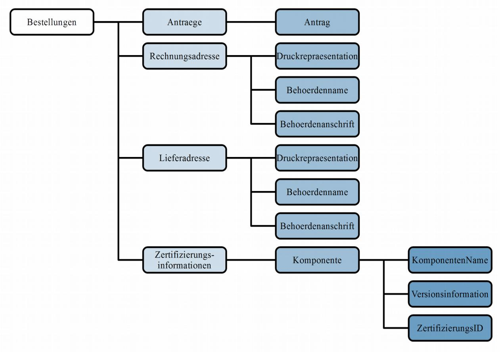

*Abbildung 2: Bestellung neuer Personalausweis*

|                      | Tabelle 8: Bestellung Personalausweis |                 |               |                                                                                                                                                                                                                                            |  |  |  |
|----------------------|---------------------------------------|-----------------|---------------|--------------------------------------------------------------------------------------------------------------------------------------------------------------------------------------------------------------------------------------------|--|--|--|
| Datenfeld            |                                       | Pflicht feld | Feld länge | Regelungen                                                                                                                                                                                                                                 |  |  |  |
| Antraege             |                                       | X               |               | Eine Bestellung muss 1- 150 Anträge beinhalten.                                                                                                                                                                                            |  |  |  |
| Antrag               |                                       | X               |               | Der Antragsdatensatz wird entsprechend Abbil dung 2 und der folgenden Tabelle übermittelt.                                                                                                                                              |  |  |  |
| Rechnungsadresse     |                                       |                 |               |                                                                                                                                                                                                                                            |  |  |  |
| Druckrepraesentation |                                       | *               |               |                                                                                                                                                                                                                                            |  |  |  |
|                      | Zeile @Nummer="1*"                 | X               | *             | Die zulässigen Ziffern werden durch den Doku mentenhersteller vorgegeben.                                                                                                                                                               |  |  |  |
|                      | content                               | X               | *             | Zu verwenden sind hier nur Zeichen aus dem String.LatinXhD Zeichensatz entsprechend Kapi tel 3.2.3. Die Druckrepräsentation der Rechnungsadresse enthält die folgenden Angaben: • Behördenname • Behördenanschrift |  |  |  |
|                      | Typ                                   | X               |               | Es ist der Wert Rechnungsadresse aus der Code liste in Kapitel 5.2.8 Codeliste Typ der Druckzeile                                                                                                                                       |  |  |  |

| Tabelle 8: Bestellung Personalausweis |                 |               |                                                                                                                                                                                                                                          |  |  |  |
|---------------------------------------|-----------------|---------------|------------------------------------------------------------------------------------------------------------------------------------------------------------------------------------------------------------------------------------------|--|--|--|
| Datenfeld                             | Pflicht feld | Feld länge | Regelungen                                                                                                                                                                                                                               |  |  |  |
|                                       |                 |               | aus [TR XhD-3] zu verwenden.                                                                                                                                                                                                             |  |  |  |
| Behoerdenname                         | *               | *             | Zu verwenden sind hier nur Zeichen aus dem String.LatinXhD Zeichensatz entsprechend Kapi tel 3.2.3.                                                                                                                                |  |  |  |
| Behoerdenanschrift                    | *               | *             |                                                                                                                                                                                                                                          |  |  |  |
| StrasseUndHausnummer                  | *               | *             | Zu verwenden sind hier nur Zeichen aus dem String.LatinXhD Zeichensatz entsprechend Kapi tel 3.2.3.                                                                                                                                |  |  |  |
| Postleitzahl                          | *               | *             | Hier sind nur Ziffern von 0 bis 9 zu verwenden.                                                                                                                                                                                          |  |  |  |
| Ort                                   | *               | *             | Zu verwenden sind hier nur Zeichen aus dem String.LatinXhD Zeichensatz entsprechend Kapi tel 3.2.3.                                                                                                                                |  |  |  |
| Lieferadresse                         | X               |               |                                                                                                                                                                                                                                          |  |  |  |
| Druckrepraesentation                  | *               |               |                                                                                                                                                                                                                                          |  |  |  |
| Zeile @Nummer="1*"                 | X               | *             | Die zulässigen Ziffern werden durch den Doku mentenhersteller vorgegeben.                                                                                                                                                             |  |  |  |
| content                               | X               | *             | Zu Verwenden sind hier nur Zeichen aus dem String.LatinXhD Zeichensatz entsprechend Kapi tel 3.2.3. Die Druckrepräsentation der Lieferadresse ent hält die folgenden Angaben: • Behördenname • Behördenanschrift |  |  |  |
| Typ                                   | X               |               | Es ist der Wert Lieferadresse aus der Codeliste in Kapitel 5.2.8 Codeliste Typ der Druckzeile aus [TR XhD-3] zu verwenden.                                                                                                         |  |  |  |
| Behoerdenname                         | *               | *             | Zu verwenden sind hier nur Zeichen aus dem String.LatinXhD Zeichensatz entsprechend Kapi tel 3.2.3.                                                                                                                                |  |  |  |
| Behoerdenanschrift                    | *               | *             |                                                                                                                                                                                                                                          |  |  |  |
| StrasseUndHausnummer                  | *               | *             | Zu verwenden sind hier nur Zeichen aus dem String.LatinXhD Zeichensatz entsprechend Kapi tel 3.2.3.                                                                                                                                |  |  |  |
|                                       |                 |               |                                                                                                                                                                                                                                          |  |  |  |
| Postleitzahl                          | *               | *             | Hier sind nur Ziffern von 0 bis 9 zu verwenden.                                                                                                                                                                                          |  |  |  |
| Ort                                   | *               | *             | Zu verwenden sind hier nur Zeichen aus dem String.LatinXhD Zeichensatz entsprechend Kapi tel 3.2.3.                                                                                                                                |  |  |  |
| Zertifizierungsinformationen          | X               |               |                                                                                                                                                                                                                                          |  |  |  |
| Komponente                            | X               |               |                                                                                                                                                                                                                                          |  |  |  |

|           | Tabelle 8: Bestellung Personalausweis |                 |               |                                                                                                                                 |
|-----------|---------------------------------------|-----------------|---------------|---------------------------------------------------------------------------------------------------------------------------------|
| Datenfeld |                                       | Pflicht feld | Feld länge | Regelungen                                                                                                                      |
|           | KomponentenName                       | X               | ≤ 40          | Zu verwenden sind hier nur Zeichen aus dem String.LatinXhD Zeichensatz entsprechend Kapi tel 3.2.3.                       |
|           | Versionsinformation                   | X               | ≤ 40          | Zu verwenden sind hier nur Zeichen aus dem String.LatinXhD Zeichensatz entsprechend Kapi tel 3.2.3.                       |
|           | ZertifizierungsID                     | X               | ≤ 40          | ID der Zertifizierungsbescheinigung in der fol genden Syntax:                                                                |
|           |                                       |                 |               | BSI-K-TR-AAAA-YYYY                                                                                                              |
|           |                                       |                 |               | AAAA - Laufende Nummer YYYY - Jahr der Zertifizierung                                                                        |
|           |                                       |                 |               | Falls keine Zertifizierung vorliegt, muss der fol gende Text eingetragen werden:                                             |
|           |                                       |                 |               | BSI-K-TR-0000-0000 Zu Verwenden sind hier nur Zeichen aus dem String.LatinXhD Zeichensatz entsprechend Kapi tel 3.2.3. |

Die in der folgenden Abbildung und Tabelle abgebildeten Datenfelder werden pro Antrag übertragen. Sie sind zur Übersichtlichkeit von den Datenfeldern, die pro [Bestellung](#page-19-1) übertragen werden, getrennt.

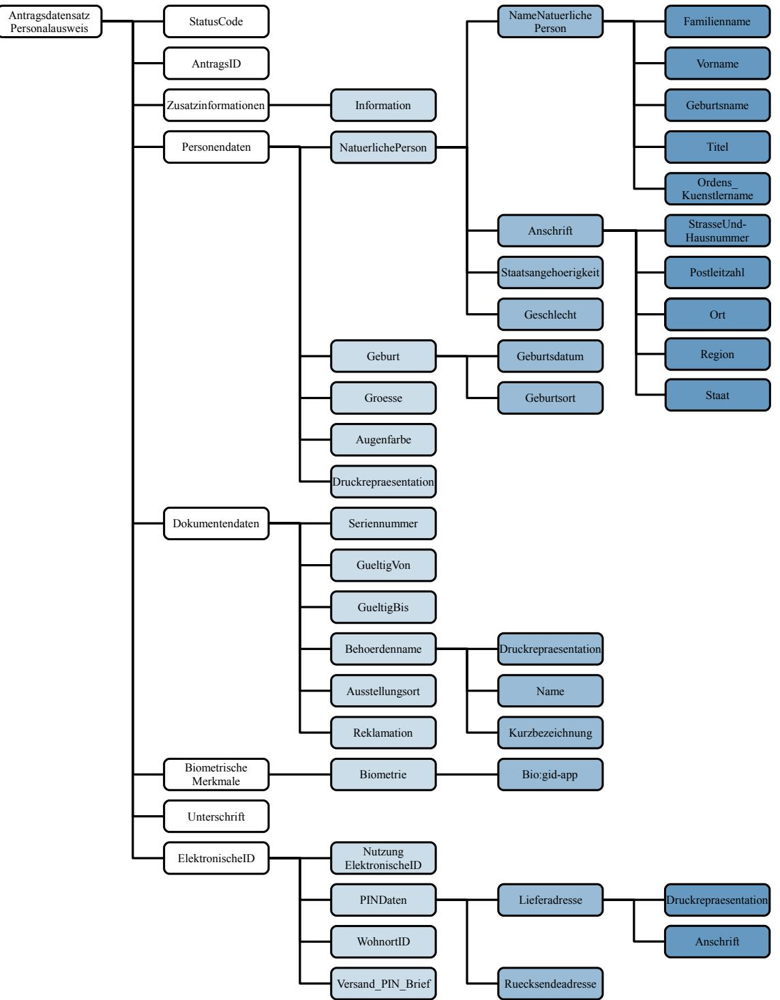

*Abbildung 3: Antragsdatensatz Personalausweis*

| Tabelle 9: Antragsdatensatz Personalausweis |  |                       |               |                                                                                                                                                                                                                               |                                                                                                                                                                                                                                                                                                          |
|---------------------------------------------|--|-----------------------|---------------|-------------------------------------------------------------------------------------------------------------------------------------------------------------------------------------------------------------------------------|----------------------------------------------------------------------------------------------------------------------------------------------------------------------------------------------------------------------------------------------------------------------------------------------------------|
| Datenfeld                                   |  | Pflicht feld       | Feld länge | Regelungen                                                                                                                                                                                                                    |                                                                                                                                                                                                                                                                                                          |
| AntragsID                                   |  | X                     | ≤ 40          | Die AntragsID muss von der bestellenden Behör de je Bestellung eindeutig vergeben werden. Es sind nur Ziffern von 0 bis 9, Groß- und Klein buchstaben und Sonderzeichen entsprechend Ka pitel 3.2.2 zu verwenden. |                                                                                                                                                                                                                                                                                                          |
| Personendaten                               |  | X                     |               |                                                                                                                                                                                                                               |                                                                                                                                                                                                                                                                                                          |
| NatuerlichePersonType                       |  | X                     |               |                                                                                                                                                                                                                               |                                                                                                                                                                                                                                                                                                          |
|                                             |  | NameNatuerlichePerson | X             |                                                                                                                                                                                                                               |                                                                                                                                                                                                                                                                                                          |
|                                             |  | Familienname          | X             |                                                                                                                                                                                                                               |                                                                                                                                                                                                                                                                                                          |
|                                             |  | Name                  | X             | ≤ 120                                                                                                                                                                                                                         | Zu verwenden sind hier nur Zeichen aus dem String.LatinXhD Zeichensatz entsprechend Kapi tel 3.2.3. Hinweis: Bei der Erfassung der Daten ist sicher zustellen, dass die Gesamtlänge für Familienna me, Titel und Geburtsname nicht mehr als 120 Zeichen beträgt.                       |
|                                             |  | Vorname               | X             |                                                                                                                                                                                                                               |                                                                                                                                                                                                                                                                                                          |
|                                             |  | Name                  | X             | ≤ 80                                                                                                                                                                                                                          | Zu verwenden sind hier nur Zeichen aus dem String.LatinXhD Zeichensatz entsprechend Kapi tel 3.2.3.                                                                                                                                                                                                |
|                                             |  | Geburtsname           |               |                                                                                                                                                                                                                               |                                                                                                                                                                                                                                                                                                          |
|                                             |  | Name                  |               | ≤ 75                                                                                                                                                                                                                          | Zu verwenden sind hier nur Zeichen aus dem String.LatinXhD Zeichensatz entsprechend Kapi tel 3.2.3. Hinweis: Bei der Erfassung der Daten ist sicher zustellen, dass die Gesamtlänge für Familienna me, Titel und Geburtsname nicht mehr als 120 Zeichen beträgt.                       |
|                                             |  | Titel                 |               | *                                                                                                                                                                                                                             | Hier können nur anerkannte Doktorgrade ange geben werden. Es sind die jeweils gültigen rechtli chen Vorgaben zu beachten. Hinweis: Bei der Erfassung der Daten ist sicher zustellen, dass die Gesamtlänge für Familienna me, Titel und Geburtsname nicht mehr als 120 Zeichen beträgt. |
|                                             |  | Ordens_Kuenstlername  |               | ≤ 60                                                                                                                                                                                                                          | Zu verwenden sind hier nur Zeichen aus dem String.LatinXhD Zeichensatz entsprechend Kapi tel 3.2.3.                                                                                                                                                                                                |

| Tabelle 9: Antragsdatensatz Personalausweis |                      |                 |               |                                                                                                                                                                                                                                                                                                                                                                                                                                                                                                                                                                    |
|---------------------------------------------|----------------------|-----------------|---------------|--------------------------------------------------------------------------------------------------------------------------------------------------------------------------------------------------------------------------------------------------------------------------------------------------------------------------------------------------------------------------------------------------------------------------------------------------------------------------------------------------------------------------------------------------------------------|
|                                             | Datenfeld            | Pflicht feld | Feld länge | Regelungen                                                                                                                                                                                                                                                                                                                                                                                                                                                                                                                                                         |
|                                             | Anschrift            | X               |               | Hinweis: Beantragt ein im Ausland lebender Bür ger einen Personalausweis mit eID-Funktion und hat dort keinen festen oder nachvollziehbaren Wohnsitz, muss das Element Anschrift ohne Kin delemente übertragen werden. Daraus folgend wird der Text "keine Wohnung in Deutschland" durch den Hersteller anstelle der Anschrift aufge druckt und im Chip im UTF8String von noPla ceInfo gespeichert. Eventuell übermittelte Druck repräsentationen zur Anschrift (welche später in dieser Tabelle beschrieben sind) werden ignoriert. |
|                                             | StrasseUndHausnummer |                 | ≤ 50          | Zu verwenden sind hier nur Zeichen aus dem String.LatinXhD Zeichensatz entsprechend Kapi tel 3.2.3.                                                                                                                                                                                                                                                                                                                                                                                                                                                          |
|                                             |                      |                 |               | Hinweis: Bei der Erfassung der Daten ist sicher zustellen, dass die Gesamtlänge von Straße, tren nendem Leerzeichen und Hausnummer nicht mehr als 50 Zeichen beträgt.                                                                                                                                                                                                                                                                                                                                                                                     |
|                                             | Postleitzahl         |                 | *             | Hier sind nur Ziffern von 0 bis 9, Groß- und Klein buchstaben, Sonderzeichen entsprechend Kapitel 3.2.2 und Leerzeichen zu verwenden.                                                                                                                                                                                                                                                                                                                                                                                                                        |
|                                             |                      |                 |               | Postleitzahlen für Anschriften innerhalb Deutschlands müssen 5-stellig sein und es sind nur Ziffern von 0 bis 9 zu verwenden.                                                                                                                                                                                                                                                                                                                                                                                                                                |
|                                             |                      |                 |               | Bei der Erfassung der Daten ist sicherzustellen, dass bei Adressen innerhalb Deutschlands die kombinierte Länge von Postleitzahl und Ort 49 Zeichen nicht überschreitet. Im Druck bedeutet dies: 5 Zeichen Postleitzahl + 1 Leerzeichen + bis zu 44 Zeichen Ort <= 50                                                                                                                                                                                                                                                                            |
|                                             |                      |                 |               | Für ausländische Anschriften gelten landestypi sche Regelungen bezüglich der Ausprägung der Postleitzahl.                                                                                                                                                                                                                                                                                                                                                                                                                                                    |
|                                             |                      |                 |               | Bei Adressen außerhalb Deutschlands ist eine kombinierte Länge von 45 Zeichen für Postleit zahl und Ort nicht zu überschreiten. Für den Druck bedeutet dies: 3 Zeichen ICAO Ländercode + 1 "Bindestrich" + Postleitzahl + 1 Leerzeichen + Ort <= 50 Beispiel: FRA-75001 Paris                                                                                                                                                                                                                                                                    |

| Tabelle 9: Antragsdatensatz Personalausweis |                      |                 |               |                                                                                                                                                                                                                                                                                                                                                                                                                                                                                                                                                                                                                                                                     |
|---------------------------------------------|----------------------|-----------------|---------------|---------------------------------------------------------------------------------------------------------------------------------------------------------------------------------------------------------------------------------------------------------------------------------------------------------------------------------------------------------------------------------------------------------------------------------------------------------------------------------------------------------------------------------------------------------------------------------------------------------------------------------------------------------------------|
| Datenfeld                                   |                      | Pflicht feld | Feld länge | Regelungen                                                                                                                                                                                                                                                                                                                                                                                                                                                                                                                                                                                                                                                          |
|                                             | Ort                  | X               | *             | Zu verwenden sind hier nur Zeichen aus dem String.LatinXhD Zeichensatz entsprechend Kapi tel 3.2.3.                                                                                                                                                                                                                                                                                                                                                                                                                                                                                                                                                           |
|                                             |                      |                 |               | Hinweis: Für die Feldlänge gelten die o.g. unter Postleitzahl erläuterten Vorgaben für die Kombi nation von Staat, Postleitzahl und Ort.                                                                                                                                                                                                                                                                                                                                                                                                                                                                                                                      |
|                                             | Region               |                 |               | Zu verwenden sind hier nur Zeichen aus dem String.LatinXhD Zeichensatz entsprechend Kapi tel 3.2.3.                                                                                                                                                                                                                                                                                                                                                                                                                                                                                                                                                           |
|                                             | Staat                |                 |               | Hier sind Abkürzungen für den Staaten nach dreistelligem ICAO-Code gemäß ICAO Doc 9303 einzutragen. Abweichungen der Codes werden durch das BMI geregelt.                                                                                                                                                                                                                                                                                                                                                                                                                                                                                                  |
|                                             |                      |                 |               | Für nicht-deutsche Anschriften ist der Ge brauch dieses Feldes verpflichtend!                                                                                                                                                                                                                                                                                                                                                                                                                                                                                                                                                                                    |
|                                             | Staatsangehoerigkeit |                 |               |                                                                                                                                                                                                                                                                                                                                                                                                                                                                                                                                                                                                                                                                     |
|                                             | Staat                |                 | 3             | Der Personalausweise wird grundsätzlich nur an Bürger mit deutscher Staatsbürgerschaft ausgege ben.                                                                                                                                                                                                                                                                                                                                                                                                                                                                                                                                                           |
|                                             | Geschlecht           |                 |               |                                                                                                                                                                                                                                                                                                                                                                                                                                                                                                                                                                                                                                                                     |
|                                             | Geschlecht           |                 |               | Hier sind nur Werte entsprechend der Codeliste in Kapitel 5.2.5 Codeliste Geschlechter aus der [TR XhD-3] zulässig.                                                                                                                                                                                                                                                                                                                                                                                                                                                                                                                                           |
|                                             | Geburt               | X               |               |                                                                                                                                                                                                                                                                                                                                                                                                                                                                                                                                                                                                                                                                     |
|                                             | Geburtsdatum         | X               | 10            | Das Geburtsdatum besteht aus zehn Zeichen und wird im folgenden Format dargestellt: YYYY-MM-DD. Verwendet werden hier nur die Zeichen "-", "X" und die Ziffern von 0 bis 9. Bei unbekanntem Geburtstag kann dieser durch einfügen von XX ergänzt werden (Bsp.: 2000-12- XX). Ist sowohl der Geburtstag als auch der Monat unbekannt, kann dies ebenfalls durch Einfügen von XX ergänzt werden (Bsp.: 2000-XX-XX). Auf die Angabe des Geburtsjahrs kann nicht verzich tet werden. Die Auswirkungen der Verwendung von Platzhaltern im Geburtsdatum sind in [TR Architektur ePA] Kapitel 3.2.3 "eID-Anwendung" beschrieben. |
|                                             | Geburtsort           | X               | ≤ 80          | Zu verwenden sind hier nur Zeichen aus dem String.LatinXhD Zeichensatz entsprechend Kapi tel 3.2.3.                                                                                                                                                                                                                                                                                                                                                                                                                                                                                                                                                           |

| Tabelle 9: Antragsdatensatz Personalausweis |                 |                               |                                                                                                                                                                                                                                                                                                                                                                                                                                                                                                                                                                                                                                    |  |
|---------------------------------------------|-----------------|-------------------------------|------------------------------------------------------------------------------------------------------------------------------------------------------------------------------------------------------------------------------------------------------------------------------------------------------------------------------------------------------------------------------------------------------------------------------------------------------------------------------------------------------------------------------------------------------------------------------------------------------------------------------------|--|
| Datenfeld                                   | Pflicht feld | Feld länge                 | Regelungen                                                                                                                                                                                                                                                                                                                                                                                                                                                                                                                                                                                                                         |  |
| Groesse                                     | X               | 3                             | Die Größe wird in Zentimetern angegeben. Es ste hen hierfür drei Stellen zur Verfügung. Kann die Größe nicht ermittelt werden, ist "---" zu übertra gen. Im Dokument muss für diesen Fall "---" durch den Dokumentenhersteller eingetragen werden. Verwendet werden hier nur Ziffern von 0 bis 9 und "-".                                                                                                                                                                                                                                                                                                        |  |
| Augenfarbe                                  | X               | ≤ 19                          | Enthält Angaben zur Augenfarbe des Antragstel lers. Hierfür steht eine Zeile zur Verfügung. Zu verwenden sind hier nur Zeichen aus dem String.LatinXhD Zeichensatz entsprechend Kapi tel 3.2.3. Bei nicht ermittelbarer Augenfarbe wird "---" übertragen.                                                                                                                                                                                                                                                                                                                                                        |  |
| Druckrepraesentation                        | X               |                               |                                                                                                                                                                                                                                                                                                                                                                                                                                                                                                                                                                                                                                    |  |
| Zeile @Nummer="13"                       | X               |                               | Hier sind nur Ziffern von 0 bis 9 zu verwenden.                                                                                                                                                                                                                                                                                                                                                                                                                                                                                                                                                                                    |  |
| content                                     | X               | ≤ 26 ∑ 52 ≤ 40 ∑ 120 | Normale Schriftgröße: Für den Namensblock stehen maximal 2 Zeilen zur Verfügung. Kleine Schriftgröße: Für den Namensblock stehen maximal 3 Zeilen zur Verfügung. Zu verwenden sind hier nur Zeichen aus dem String.LatinXhD Zeichensatz entsprechend Kapi tel 3.2.3. Die Druckrepräsentation des Namensblocks ent hält die folgenden Angaben: • ggf. Titel • Familienname Sofern ein Geburtsname übertragen wird, muss dieser in der Druckrepräsentation in einer neuen Zeile übertragen und abgedruckt werden. Hierfür ist der Druckzeilentyp Geburtsname zu verwen den. |  |
| Typ                                         | X               |                               | Es ist der Wert Namensblock aus der Codeliste in Kapitel 5.2.8 Codeliste Typ der Druckzeile aus [TR XhD-3] zu verwenden.                                                                                                                                                                                                                                                                                                                                                                                                                                                                                                     |  |
| Zeile @Nummer="12"                       | X               |                               | Hier sind nur Ziffern von 0 bis 9 zu verwenden.                                                                                                                                                                                                                                                                                                                                                                                                                                                                                                                                                                                    |  |

| Tabelle 9: Antragsdatensatz Personalausweis |                 |               |                                                                                                                                                                                                                                                                       |  |
|---------------------------------------------|-----------------|---------------|-----------------------------------------------------------------------------------------------------------------------------------------------------------------------------------------------------------------------------------------------------------------------|--|
| Datenfeld                                   | Pflicht feld | Feld länge | Regelungen                                                                                                                                                                                                                                                            |  |
| content                                     | X               | ≤ 26          | Normale Schriftgröße: Für den Vornamensblock steht maximal 1 Zeile zur Verfügung.                                                                                                                                                                               |  |
|                                             |                 | ≤ 40 ∑ 80  | Kleine Schriftgröße: Für den Vornamensblock stehen maximal 2 Zei len zur Verfügung.                                                                                                                                                                             |  |
|                                             |                 |               | Zu verwenden sind hier nur Zeichen aus dem String.LatinXhD Zeichensatz entsprechend Kapi tel 3.2.3. In der Druckrepräsentation des Vornamensblocks sind die Angaben zum Vornamen enthalten.                                                               |  |
| Typ                                         | X               |               | Es ist der Wert Vornamensblock aus der Codelis te in Kapitel 5.2.8 Codeliste Typ der Druckzeile aus [TR XhD-3] zu verwenden.                                                                                                                                    |  |
| Zeile @Nummer="12"                       | 3 X          |               | Hier sind nur Ziffern von 0 bis 9 zu verwenden.                                                                                                                                                                                                                       |  |
| content                                     | X               | ≤ 20          | Normale Schriftgröße: Für den Ordens- und Künstlernamensblock steht maximal 1 Zeile zur Verfügung.                                                                                                                                                              |  |
|                                             |                 | ≤ 30 ∑ 60  | Kleine Schriftgröße: Für den Ordens- und Künstlernamensblock ste hen maximal 2 Zeilen zur Verfügung. Zu verwenden sind hier nur Zeichen aus dem String.LatinXhD Zeichensatz entsprechend Kapi tel 3.2.3. In der Druckrepräsentation des Ordens- und |  |
|                                             |                 |               | Kuenstlernamen sind die Angaben zum Ordens_Kuenstlername enthalten.                                                                                                                                                                                                |  |
| Typ                                         | X               |               | Es ist der Wert Ordens_Kuenstlername aus der Codeliste in Kapitel 5.2.8 Codeliste Typ der Druckzeile aus [TR XhD-3] zu verwenden.                                                                                                                               |  |
| Zeile @Nummer="12"                       | X               |               | Hier sind nur Ziffern von 0 bis 9 zu verwenden.                                                                                                                                                                                                                       |  |

3 Pflichtfeld, wenn das Einzelfeld "NameNatuerlichePersonType/**Ordens\_Kuenstlername**" genutzt wird.

| Tabelle 9: Antragsdatensatz Personalausweis |                 |               |                                                                                                                                                                                                                                                                                                                                                                                                                                                                                                                                                                                                                                                                                                                                                                                                                                                                                                                                                               |
|---------------------------------------------|-----------------|---------------|---------------------------------------------------------------------------------------------------------------------------------------------------------------------------------------------------------------------------------------------------------------------------------------------------------------------------------------------------------------------------------------------------------------------------------------------------------------------------------------------------------------------------------------------------------------------------------------------------------------------------------------------------------------------------------------------------------------------------------------------------------------------------------------------------------------------------------------------------------------------------------------------------------------------------------------------------------------|
| Datenfeld                                   | Pflicht feld | Feld länge | Regelungen                                                                                                                                                                                                                                                                                                                                                                                                                                                                                                                                                                                                                                                                                                                                                                                                                                                                                                                                                    |
| content                                     | X               | ≤ 25 ∑ 50  | Für den Wohnort stehen maximal 2 Zeilen zur Verfügung. Zu verwenden sind hier nur Zeichen aus dem String.LatinXhD Zeichensatz entsprechend Kapi tel 3.2.3. Die Druckrepräsentation des Wohnorts enthält die folgenden Angaben: • bei ausländischen Adressen: ICAO-Ländercode (3-stellig) • Postleitzahl • Ort Bei der Erfassung der Daten ist sicherzustellen, dass bei Adressen innerhalb Deutschlands die kombinierte Länge von Postleitzahl und Ort 49 Zeichen nicht überschreitet. Im Druck bedeutet dies: 5 Zeichen Postleitzahl + 1 Leerzeichen + bis zu 44 Zeichen Ort <= 50 Bei außerdeutschen Adressen außerhalb Deutsch lands ist eine kombinierte Länge von Postleitzahl und Ort 45 Zeichen nicht zu überschreiten. Für den Druck bedeutet dies: 3 Zeichen ICAO Ländercode + 1 "Bindestrich" + Postleitzahl + 1 Leerzeichen + Ort <= 50 Beispiel: FRA-75001 Paris |
| Typ                                         | X               |               | Es ist der Wert Wohnort aus der Codeliste in Ka pitel 5.2.8 Codeliste Typ der Druckzeile aus [TR XhD-3] zu verwenden.                                                                                                                                                                                                                                                                                                                                                                                                                                                                                                                                                                                                                                                                                                                                                                                                                                   |
| Zeile @Nummer="12" content            |                 | ≤ 25          | Hier sind nur Ziffern von 0 bis 9 zu verwenden. Normale Schriftgröße:                                                                                                                                                                                                                                                                                                                                                                                                                                                                                                                                                                                                                                                                                                                                                                                                                                                                                      |
|                                             |                 | ∑ 50          | Für die Straße und Hausnummer stehen maximal 2 Zeilen zur Verfügung. Zu verwenden sind hier nur Zeichen aus dem String.LatinXhD Zeichensatz entsprechend Kapi tel 3.2.3. Die Druckrepräsentation der Straße enthält die folgenden Angaben: • StraßeUndHausnummer                                                                                                                                                                                                                                                                                                                                                                                                                                                                                                                                                                                                                                                                      |
| Typ                                         |                 |               | Es ist der Wert Strasse_Hausnummer aus der Codeliste in Kapitel 5.2.8 Codeliste Typ der Druckzeile aus [TR XhD-3] zu verwenden.                                                                                                                                                                                                                                                                                                                                                                                                                                                                                                                                                                                                                                                                                                                                                                                                                         |
| Zeile @Nummer="12"                       | X               |               | Hier sind nur Ziffern von 0 bis 9 zu verwenden.                                                                                                                                                                                                                                                                                                                                                                                                                                                                                                                                                                                                                                                                                                                                                                                                                                                                                                               |

| Tabelle 9: Antragsdatensatz Personalausweis |                 |               |                                                                                                                                                                                                                                                                                               |  |
|---------------------------------------------|-----------------|---------------|-----------------------------------------------------------------------------------------------------------------------------------------------------------------------------------------------------------------------------------------------------------------------------------------------|--|
| Datenfeld                                   | Pflicht feld | Feld länge | Regelungen                                                                                                                                                                                                                                                                                    |  |
| content                                     | X               | ≤ 26          | Normale Schriftgröße: Für den Geburtsort steht maximal 1 Zeile zur Ver fügung.                                                                                                                                                                                                          |  |
|                                             |                 | ≤ 40 ∑ 80  | Kleine Schriftgröße: Für den Geburtsort stehen maximal 2 Zeilen zur Verfügung. Zu verwenden sind hier nur Zeichen aus dem String.LatinXhD Zeichensatz entsprechend Kapi tel 3.2.3. In der Druckrepräsentation des Geburtsorts sind die Angaben zum Geburtsort enthalten. |  |
| Typ                                         | X               |               | Es ist der Wert Geburtsort aus der Codeliste in Kapitel 5.2.8 Codeliste Typ der Druckzeile aus [TR XhD-3] zu verwenden.                                                                                                                                                                 |  |
| Dokumentendaten                             | X               |               |                                                                                                                                                                                                                                                                                               |  |
| Seriennummer                                | X               | 10            | Die Seriennummer besteht aus 10 Zeichen und bildet sich aus: 4 Zeichen Behördenkennziffer 5 Zeichen eindeutige Nummer 1 Zeichen Prüfziffer Es sind nur die Zeichen des eingeschränkten Zei chensatzes für Seriennummern entsprechend Ka pitel 3.2.1 erlaubt.             |  |
| GueltigVon                                  | X               |               | Für die Übertragung des Datums, ab dem das zu produzierende Dokument gültig sein soll, sind die gesetzlichen Regelungen zu beachten.                                                                                                                                                    |  |
| GueltigBis                                  | X               |               | Für die Übertragung des Datums bis zu dem das zu produzierende Dokument gültig sein soll sind die gesetzlichen Regelungen zu beachten.                                                                                                                                                  |  |
| Behoerdenname                               | X               |               |                                                                                                                                                                                                                                                                                               |  |
| Druckrepraesentation                        | X               |               |                                                                                                                                                                                                                                                                                               |  |
| Zeile @Nummer="13"                       | X               |               | Hier sind nur Ziffern von 0 bis 9 zu verwenden.                                                                                                                                                                                                                                               |  |

| Tabelle 9: Antragsdatensatz Personalausweis |                        |                 |               |                                                                                                                                                                                                                                                                                                                                                                                                                                                                                                                                                                                                                                 |
|---------------------------------------------|------------------------|-----------------|---------------|---------------------------------------------------------------------------------------------------------------------------------------------------------------------------------------------------------------------------------------------------------------------------------------------------------------------------------------------------------------------------------------------------------------------------------------------------------------------------------------------------------------------------------------------------------------------------------------------------------------------------------|
|                                             | Datenfeld              | Pflicht feld | Feld länge | Regelungen                                                                                                                                                                                                                                                                                                                                                                                                                                                                                                                                                                                                                      |
|                                             | content                | X               | ≤ 19 ∑ 38  | Normale Schriftgröße: Für die Kurzbezeichnung der Behörde stehen ma ximal 2 Zeilen zur Verfügung.                                                                                                                                                                                                                                                                                                                                                                                                                                                                                                                         |
|                                             |                        |                 | ≤ 28 ∑ 84  | Kleine Schriftgröße: Für die Kurzbezeichnung der Behörde stehen maximal 3 Zeilen zur Verfügung. Beim Abdruck erfolgt keine Trennung von Wör tern. Passt die Kurzbezeichnung nicht in eine ein zelne Zeile, so erfolgt eine Trennung nach dem letzten in die Zeile passenden Wort. Die Kurzbe zeichnung muss von der beantragenden Behörde so geliefert werden, dass dies möglich ist. Die Be hörde ist ebenfalls für die Übermittlung der kor rekten Kurzbezeichnung verantwortlich. Zu verwenden sind hier nur Zeichen aus dem String.LatinXhD Zeichensatz entsprechend Kapi tel 3.2.3. |
|                                             | Typ                    | X               |               | Es ist der Wert Behoerdenname aus der Codeliste in Kapitel 5.2.8 Codeliste Typ der Druckzeile aus [TR XhD-3] zu verwenden.                                                                                                                                                                                                                                                                                                                                                                                                                                                                                                |
|                                             | Name                   |                 | ≤ 84          | Zu verwenden sind hier nur Zeichen aus dem String.LatinXhD Zeichensatz entsprechend Kapi tel 3.2.3.                                                                                                                                                                                                                                                                                                                                                                                                                                                                                                                       |
|                                             | Kurzbezeichnung        | X               | ≤ 84          | Zu verwenden sind hier nur Zeichen aus dem String.LatinXhD Zeichensatz entsprechend Kapi tel 3.2.3.                                                                                                                                                                                                                                                                                                                                                                                                                                                                                                                       |
|                                             | Reklamation            |                 |               | Dieses Datenfeld darf ausschließlich verwendet werden, wenn es sich tatsächlich um eine Rekla mation (vgl. Kapitel 4.1.7) handelt und nicht wie in diesem Fall beschrieben um die reguläre Be stellung eines elektronischen Personalausweises.                                                                                                                                                                                                                                                                                                                                                                      |
|                                             | BiometrischeMerkmale   | X               |               |                                                                                                                                                                                                                                                                                                                                                                                                                                                                                                                                                                                                                                 |
|                                             | Biometrie              | X               |               |                                                                                                                                                                                                                                                                                                                                                                                                                                                                                                                                                                                                                                 |
|                                             | bio:gid-app            | X               |               | Das biometrischen Daten werden gemäß der Vor gaben von [TR Biometrie] erfasst und kodiert.                                                                                                                                                                                                                                                                                                                                                                                                                                                                                                                                   |
| Unterschrift                                |                        | X               |               | Die Unterschrift wird als JPEG-Datei übermittelt. Das Format beträgt 710 x 130 Pixel.                                                                                                                                                                                                                                                                                                                                                                                                                                                                                                                                        |
| ElektronischeID                             |                        | X               |               |                                                                                                                                                                                                                                                                                                                                                                                                                                                                                                                                                                                                                                 |
|                                             | NutzungElektronischeID | X               |               | Das Feld "ElektronischeID" bestimmt, ob das Do kument mit der elektronischen ID-Funktion er stellt wird. Dieses Flag muss durch die Behörde bzw. das Fachverfahren gesetzt werden.                                                                                                                                                                                                                                                                                                                                                                                                                                     |

| Tabelle 9: Antragsdatensatz Personalausweis |                       |                 |               |                                                                                                                                                                                                                                                        |
|---------------------------------------------|-----------------------|-----------------|---------------|--------------------------------------------------------------------------------------------------------------------------------------------------------------------------------------------------------------------------------------------------------|
| Datenfeld                                   |                       | Pflicht feld | Feld länge | Regelungen                                                                                                                                                                                                                                             |
| PINDaten                                    |                       | X               |               |                                                                                                                                                                                                                                                        |
|                                             | Lieferadresse         | X               |               |                                                                                                                                                                                                                                                        |
|                                             | Druckrepraesentation  | *               |               |                                                                                                                                                                                                                                                        |
|                                             | Zeile @Nummer="1*" | X               | *             | Die zulässigen Ziffern werden durch den Doku mentenhersteller vorgegeben.                                                                                                                                                                           |
|                                             | content               | X               | *             | Zu verwenden sind hier nur Zeichen aus dem String.LatinXhD Zeichensatz entsprechend Kapi tel 3.2.3.                                                                                                                                              |
|                                             | Typ                   | X               |               | Es ist der Wert LieferadressePIN aus der Codelis te in Kapitel 5.2.8 Codeliste Typ der Druckzeile aus [TR XhD-3] zu verwenden.                                                                                                                   |
|                                             | Anschrift             | *               | *             |                                                                                                                                                                                                                                                        |
|                                             | StrasseUndHausnummer  | *               | *             | Zu verwenden sind hier nur Zeichen aus dem String.LatinXhD Zeichensatz entsprechend Kapi tel 3.2.3.                                                                                                                                              |
|                                             | Postleitzahl          | *               | *             | Hier sind nur Ziffern von 0 bis 9 zu verwenden.                                                                                                                                                                                                        |
|                                             | Ort                   | *               | *             | Zu verwenden sind hier nur Zeichen aus dem String.LatinXhD Zeichensatz entsprechend Kapi tel 3.2.3.                                                                                                                                              |
|                                             | Staat                 |                 |               | Hier sind Abkürzungen für den Staaten nach dreistelligem ICAO-Code gemäß ICAO Doc 9303 einzutragen. Abweichungen der Codes werden durch das BMI geregelt. Für nicht-deutsche Anschriften ist der Ge brauch dieses Feldes verpflichtend! |
|                                             | Ruecksendeadresse     | X               |               | Zu verwenden sind hier nur Zeichen aus dem String.LatinXhD Zeichensatz entsprechend Kapi tel 3.2.3.                                                                                                                                              |
| WohnortID                                   |                       |                 | 14            | Die WohnortID wird entsprechend [TR Architek tur ePA] Kapitel 3.2.3 "eID-Anwendung" übertra gen. Es sind nur Ziffern von 0 bis 9 zu verwenden.                                                                                                   |
|                                             | Versand_PIN_Brief     | *               |               | Wenn dieses Datenfeld auf false gesetzt ist, wird kein PIN-Brief versendet.                                                                                                                                                                         |

## 4.1.2 Elektronischer Reisepass (ePass)

Die in der folgenden Abbildung und Tabelle abgebildeten Datenfelder werden pro Bestellung übertragen. Sie sind zur Übersichtlichkeit von den Datenfeldern, die pro Antrag übertragen werden, getrennt.

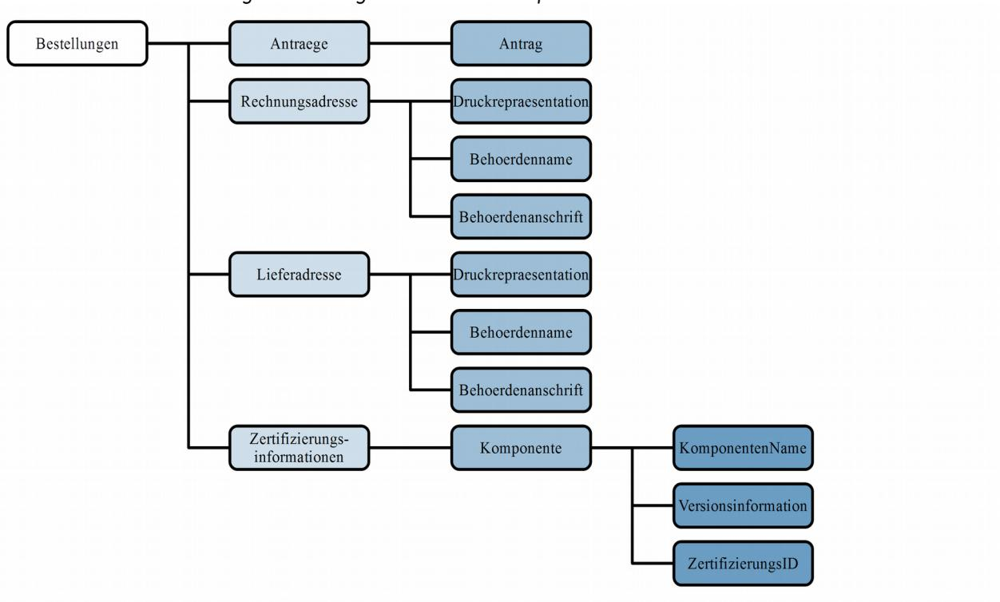

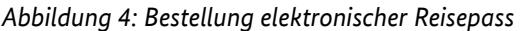

|  | Tabelle 10: Bestellung elektronischer Reisepass |                 |               |                                                                                                                                                                                                                                            |  |
|--|-------------------------------------------------|-----------------|---------------|--------------------------------------------------------------------------------------------------------------------------------------------------------------------------------------------------------------------------------------------|--|
|  | Datenfeld                                       | Pflicht feld | Feld länge | Regelungen                                                                                                                                                                                                                                 |  |
|  | Antraege                                        | X               |               | Eine Bestellung muss 1- 150 Anträge beinhalten.                                                                                                                                                                                            |  |
|  | Antrag                                          | X               |               | Der Antragsdatensatz wird entsprechend Abbil dung 4 und der folgenden Tabelle übermittelt.                                                                                                                                              |  |
|  | Rechnungsadresse                                | X               |               |                                                                                                                                                                                                                                            |  |
|  | Druckrepraesentation                            | *               |               |                                                                                                                                                                                                                                            |  |
|  | Zeile @Nummer="1*"                           | X               | *             | Die zulässigen Ziffern werden durch den Doku mentenhersteller vorgegeben.                                                                                                                                                               |  |
|  | content                                         | X               | *             | Zu verwenden sind hier nur Zeichen aus dem String.LatinXhD Zeichensatz entsprechend Kapi tel 3.2.3. Die Druckrepräsentation der Rechnungsadresse enthält die folgenden Angaben: • Behördenname • Behördenanschrift |  |
|  | Typ                                             | X               |               | Es ist der Wert Rechnungsadresse aus der Code                                                                                                                                                                                              |  |

| Tabelle 10: Bestellung elektronischer Reisepass |                 |               |                                                                                                                                                                                                                                            |
|-------------------------------------------------|-----------------|---------------|--------------------------------------------------------------------------------------------------------------------------------------------------------------------------------------------------------------------------------------------|
| Datenfeld                                       | Pflicht feld | Feld länge | Regelungen                                                                                                                                                                                                                                 |
|                                                 |                 |               | liste in Kapitel 5.2.8 Codeliste Typ der Druckzeile aus [TR XhD-3] zu verwenden.                                                                                                                                                        |
| Behoerdenname                                   | *               | *             | Zu verwenden sind hier nur Zeichen aus dem String.LatinXhD Zeichensatz entsprechend Kapi tel 3.2.3.                                                                                                                                  |
| Behoerdenanschrift                              | *               | *             |                                                                                                                                                                                                                                            |
| StrasseUndHausnummer                            | *               | *             | Zu verwenden sind hier nur Zeichen aus dem String.LatinXhD Zeichensatz entsprechend Kapi tel 3.2.3.                                                                                                                                  |
| Postleitzahl                                    | *               | *             | Hier sind nur Ziffern von 0 bis 9 zu verwenden.                                                                                                                                                                                            |
| Ort                                             | *               | *             | Zu verwenden sind hier nur Zeichen aus dem String.LatinXhD Zeichensatz entsprechend Kapi tel 3.2.3.                                                                                                                                  |
| Lieferadresse                                   | X               |               |                                                                                                                                                                                                                                            |
| Druckrepraesentation                            | *               |               |                                                                                                                                                                                                                                            |
| Zeile @Nummer="1*"                           | X               | *             | Die zulässigen Ziffern werden durch den Doku mentenhersteller vorgegeben.                                                                                                                                                               |
| content                                         | X               | *             | Zu verwenden sind hier nur Zeichen aus dem String.LatinXhD Zeichensatz entsprechend Kapi tel 3.2.3. Die Druckrepräsentation der Rechnungsadresse enthält die folgenden Angaben: • Behördenname • Behördenanschrift |
| Typ                                             | X               |               | Es ist der Wert Lieferadresse aus der Codeliste in Kapitel 5.2.8 Codeliste Typ der Druckzeile aus [TR XhD-3] zu verwenden.                                                                                                           |
| Behoerdenname                                   | *               | *             | Zu verwenden sind hier nur Zeichen aus dem String.LatinXhD Zeichensatz entsprechend Kapi tel 3.2.3.                                                                                                                                  |
| Behoerdenanschrift                              | *               | *             |                                                                                                                                                                                                                                            |
| StrasseUndHausnummer                            | *               | *             | Zu verwenden sind hier nur Zeichen aus dem String.LatinXhD Zeichensatz entsprechend Kapi tel 3.2.3.                                                                                                                                  |
| Postleitzahl                                    | *               | *             | Hier sind nur Ziffern von 0 bis 9 zu verwenden.                                                                                                                                                                                            |
| Ort                                             | *               | *             | Zu verwenden sind hier nur Zeichen aus dem String.LatinXhD Zeichensatz entsprechend Kapi tel 3.2.3.                                                                                                                                  |
| Zertifizierungsinformationen                    | X               |               |                                                                                                                                                                                                                                            |
| Komponente                                      | X               |               |                                                                                                                                                                                                                                            |

|           | Tabelle 10: Bestellung elektronischer Reisepass |                 |               |                                                                                                                                 |  |
|-----------|-------------------------------------------------|-----------------|---------------|---------------------------------------------------------------------------------------------------------------------------------|--|
| Datenfeld |                                                 | Pflicht feld | Feld länge | Regelungen                                                                                                                      |  |
|           | KomponentenName                                 | X               | ≤ 40          | Zu verwenden sind hier nur Zeichen aus dem String.LatinXhD Zeichensatz entsprechend Kapi tel 3.2.3.                       |  |
|           | Versionsinformation                             | X               | ≤ 40          | Zu verwenden sind hier nur Zeichen aus dem String.LatinXhD Zeichensatz entsprechend Kapi tel 3.2.3.                       |  |
|           | ZertifizierungsID                               | X               | ≤ 40          | ID der Zertifizierungsbescheinigung in der fol genden Syntax:                                                                |  |
|           |                                                 |                 |               | BSI-K-TR-AAAA-YYYY                                                                                                              |  |
|           |                                                 |                 |               | AAAA - Laufende Nummer YYYY - Jahr der Zertifizierung                                                                        |  |
|           |                                                 |                 |               | Falls keine Zertifizierung vorliegt, muss der fol gende Text eingetragen werden:                                             |  |
|           |                                                 |                 |               | BSI-K-TR-0000-0000 Zu verwenden sind hier nur Zeichen aus dem String.LatinXhD Zeichensatz entsprechend Kapi tel 3.2.3. |  |

Die in der folgenden Abbildung und Tabelle abgebildeten Datenfelder werden pro Antrag übertragen. Sie sind zur Übersichtlichkeit von den Datenfeldern, die pro Bestellung übertragen werden, getrennt.

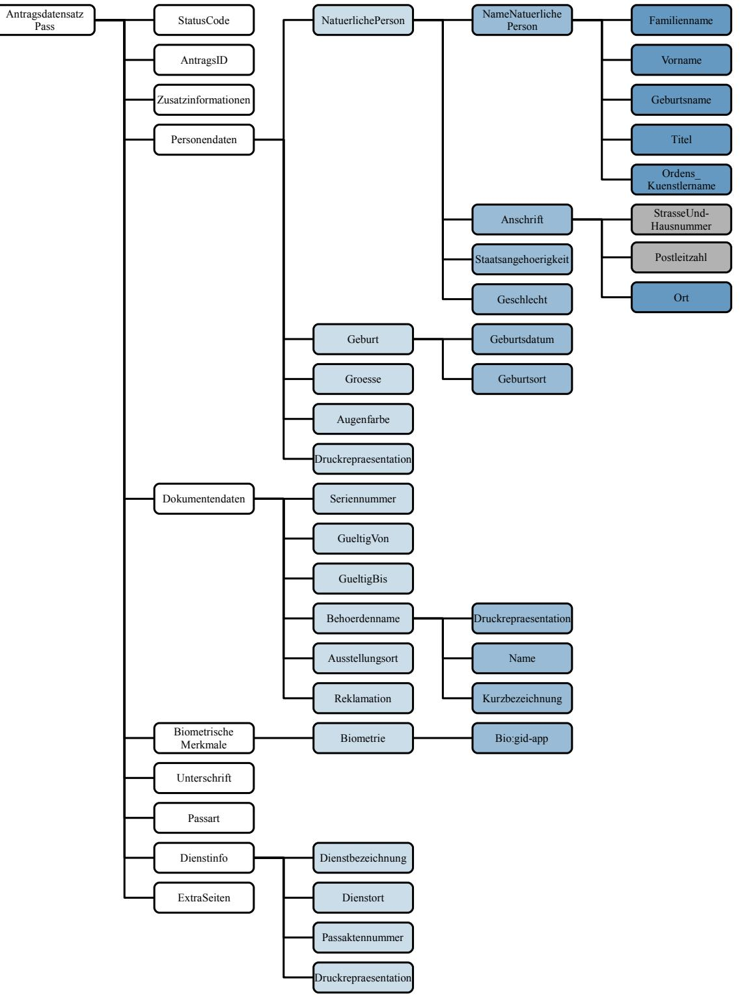

*Abbildung 5: Antragsdatensatz elektronischer Reisepass*

| Tabelle 11: Antragsdatensatz elektronischer Reisepass |                       |                 |               |                                                                                                                                                                                                                                                                                                          |
|-------------------------------------------------------|-----------------------|-----------------|---------------|----------------------------------------------------------------------------------------------------------------------------------------------------------------------------------------------------------------------------------------------------------------------------------------------------------|
| Datenfeld                                             |                       | Pflicht feld | Feld länge | Regelungen                                                                                                                                                                                                                                                                                               |
| AntragsID                                             |                       | X               | ≤ 40          | Die AntragsID muss von der bestellenden Behör de je Bestellung eindeutig vergeben werden. Hier sind nur Ziffern von 0 bis 9, Groß- und Klein buchstaben und Sonderzeichen entsprechend Ka pitel 3.2.2 zu verwenden.                                                                          |
| Personendaten                                         |                       | X               |               |                                                                                                                                                                                                                                                                                                          |
| NatuerlichePersonType                                 |                       | X               |               |                                                                                                                                                                                                                                                                                                          |
|                                                       | NameNatuerlichePerson | X               |               |                                                                                                                                                                                                                                                                                                          |
|                                                       | Familienname          | X               |               |                                                                                                                                                                                                                                                                                                          |
|                                                       | Name                  | X               | ≤ 186         | Zu verwenden sind hier nur Zeichen aus dem String.LatinXhD Zeichensatz entsprechend Kapi tel 3.2.3. Hinweis: Bei der Erfassung der Daten ist sicher zustellen, dass die Gesamtlänge für Familienna me, Titel und Geburtsname nicht mehr als 186 Zeichen beträgt.                       |
|                                                       | Vorname               | X               |               |                                                                                                                                                                                                                                                                                                          |
|                                                       | Name                  | X               | ≤ 186         | Zu verwenden sind hier nur Zeichen aus dem String.LatinXhD Zeichensatz entsprechend Kapi tel 3.2.3.                                                                                                                                                                                                |
|                                                       | Geburtsname           |                 |               |                                                                                                                                                                                                                                                                                                          |
|                                                       | Name                  |                 | ≤ 124         | Zu verwenden sind hier nur Zeichen aus dem String.LatinXhD Zeichensatz entsprechend Kapi tel 3.2.3. Hinweis: Bei der Erfassung der Daten ist sicher zustellen, dass die Gesamtlänge für Familienna me, Titel und Geburtsname nicht mehr als 186 Zeichen beträgt.                       |
|                                                       | Titel                 |                 | *             | Hier können nur anerkannte Doktorgrade ange geben werden. Es sind die jeweils gültigen rechtli chen Vorgaben zu beachten. Hinweis: Bei der Erfassung der Daten ist sicher zustellen, dass die Gesamtlänge für Familienna me, Titel und Geburtsname nicht mehr als 186 Zeichen beträgt. |
|                                                       | Ordens_Kuenstlername  |                 | ≤ 35          | Zu verwenden sind hier nur Zeichen aus dem String.LatinXhD Zeichensatz entsprechend Kapi tel 3.2.3.                                                                                                                                                                                                |
|                                                       | Anschrift             | *               |               |                                                                                                                                                                                                                                                                                                          |
|                                                       | Ort                   | *               | ≤ 105         | Zu verwenden sind hier nur Zeichen aus dem String.LatinXhD Zeichensatz entsprechend Kapi tel 3.2.3.                                                                                                                                                                                                |

| Tabelle 11: Antragsdatensatz elektronischer Reisepass |                 |               |                                                                                                                                                                                                                                                                                                                                                                                                                                                                                                                   |  |
|-------------------------------------------------------|-----------------|---------------|-------------------------------------------------------------------------------------------------------------------------------------------------------------------------------------------------------------------------------------------------------------------------------------------------------------------------------------------------------------------------------------------------------------------------------------------------------------------------------------------------------------------|--|
| Datenfeld                                             | Pflicht feld | Feld länge | Regelungen                                                                                                                                                                                                                                                                                                                                                                                                                                                                                                        |  |
| Staatsangehoerigkeit                                  |                 |               |                                                                                                                                                                                                                                                                                                                                                                                                                                                                                                                   |  |
| Staat                                                 |                 | ≤ 3           | Abhängig von der Produktart. Ein Reisepass kann nur an Bürger mit deutscher Staatsangehörigkeit herausgegeben werden. Für Dienstpass und Di plomatenpass ist auch eine von D=Deutsch ab weichende Nationalität (angegeben im dreistelli gen Code gemäß der Staatenliste in ICAO Doc 9303, Part 3 Chapter 5) zulässig. Abweichungen der Codes werden durch das BMI geregelt.                                                                                                                  |  |
| Geschlecht                                            | X               |               |                                                                                                                                                                                                                                                                                                                                                                                                                                                                                                                   |  |
| Geschlecht                                            | X               |               | Hier sind nur Werte entsprechend der Codeliste in Kapitel 5.2.5 Codeliste Geschlechter aus der [TR XhD-3] zulässig.                                                                                                                                                                                                                                                                                                                                                                                         |  |
| Geburt                                                | X               |               |                                                                                                                                                                                                                                                                                                                                                                                                                                                                                                                   |  |
| Geburtsdatum                                          | X               |               | Das Geburtsdatum besteht aus zehn Zeichen und wird im folgenden Format dargestellt: YYYY-MM-DD. Verwendet werden hier nur die Zeichen "-", "X" und die Ziffern von 0 bis 9. Bei unbekanntem Geburtstag kann dieser durch einfügen von XX ergänzt werden (Bsp.: 2000-12- XX). Ist sowohl der Geburtstag als auch der Monat unbekannt, kann dies ebenfalls durch Einfügen von XX ergänzt werden (Bsp.: 2000-XX-XX). Auf die Angabe des Geburtsjahrs kann nicht verzich tet werden. |  |
| Geburtsort                                            | X               | ≤ 124         | Zu verwenden sind hier nur Zeichen aus dem String.LatinXhD Zeichensatz entsprechend Kapi tel 3.2.3.                                                                                                                                                                                                                                                                                                                                                                                                         |  |
| Groesse                                               | X               | 3             | Die Größe wird in Zentimetern angegeben. Es ste hen hierfür drei Stellen zur Verfügung. Kann die Größe nicht ermittelt werden, ist "---" zu übertra gen. Im Dokument muss für diesen Fall "---" durch den Dokumentenhersteller eingetragen werden. Verwendet werden hier nur Ziffern von 0 bis 9 und "-".                                                                                                                                                                                    |  |
| Augenfarbe                                            | X               | ≤ 35          | Enthält Angaben zur Augenfarbe des Antragstel lers. Hierfür steht eine Zeile zur Verfügung. Zu verwenden sind hier nur Zeichen aus dem String.LatinXhD Zeichensatz entsprechend Kapi tel 3.2.3. Bei nicht ermittelbarer Augenfarbe wird "---" übertragen.                                                                                                                                                                                                                                       |  |
| Druckrepraesentation                                  | X               |               |                                                                                                                                                                                                                                                                                                                                                                                                                                                                                                                   |  |

| Tabelle 11: Antragsdatensatz elektronischer Reisepass |                 |                               |                                                                                                                                                                                                                                                                                                                                                                                                    |  |
|-------------------------------------------------------|-----------------|-------------------------------|----------------------------------------------------------------------------------------------------------------------------------------------------------------------------------------------------------------------------------------------------------------------------------------------------------------------------------------------------------------------------------------------------|--|
| Datenfeld                                             | Pflicht feld | Feld länge                 | Regelungen                                                                                                                                                                                                                                                                                                                                                                                         |  |
| Zeile @Nummer="13"                                 | X               |                               | Hier sind nur Ziffern von 0 bis 9 zu verwenden.                                                                                                                                                                                                                                                                                                                                                    |  |
| content                                               | X               | ≤ 40 ∑ 80                  | Normale Schriftgröße: Für den Namensblock stehen 2 Zeilen zur Verfü gung.                                                                                                                                                                                                                                                                                                                    |  |
|                                                       |                 | ≤62 ∑ 186                  | Kleine Schriftgröße: Für den Namensblock stehen 3 Zeilen zur Verfü gung. Zu verwenden sind hier nur Zeichen aus dem String.LatinXhD Zeichensatz entsprechend Kapi tel 3.2.3. Die Druckrepräsentation des Namensblocks ent hält die folgenden Angaben: • ggf. Titel • Familienname Sofern ein Geburtsname übertragen wird, muss                                 |  |
|                                                       |                 |                               | dieser in der Druckrepräsentation in einer neuen Zeile übertragen und abgedruckt werden. Dafür ist der Druckzeilentyp Geburtsname zu verwen den.                                                                                                                                                                                                                                          |  |
| Typ                                                   | X               |                               | Es ist der Wert Namensblock aus der Codeliste in Kapitel 5.2.8 Codeliste Typ der Druckzeile aus [TR XhD-3] zu verwenden.                                                                                                                                                                                                                                                                     |  |
| Zeile @Nummer="13"                                 | X               |                               | Hier sind nur Ziffern von 0 bis 9 zu verwenden.                                                                                                                                                                                                                                                                                                                                                    |  |
| content                                               | X               | ≤ 40 ∑ 80 ≤ 62 ∑ 186 | Normale Schriftgröße: Für den Vornamensblock stehen maximal 2 Zei len zur Verfügung. Kleine Schriftgröße: Für den Vornamensblock stehen maximal 3 Zei len zur Verfügung. Zu verwenden sind hier nur Zeichen aus dem String.LatinXhD Zeichensatz entsprechend Kapi tel 3.2.3. In der Druckrepräsentation des Vornamensblocks sind die Angaben zum Vornamen enthalten. |  |
| Typ                                                   | X               |                               | Es ist der Wert Vornamensblock aus der Codelis te in Kapitel 5.2.8 Codeliste Typ der Druckzeile aus [TR XhD-3] zu verwenden.                                                                                                                                                                                                                                                                 |  |
| Zeile @Nummer="13"                                 |                 |                               | Hier sind nur Ziffern von 0 bis 9 zu verwenden.                                                                                                                                                                                                                                                                                                                                                    |  |
| content                                               | X               | ≤ 35 ∑ 105                 | Normale Schriftgröße: Für den Wohnort stehen maximal 3 Zeilen zur Verfügung. Zu verwenden sind hier nur Zeichen aus dem                                                                                                                                                                                                                                                                   |  |

| Tabelle 11: Antragsdatensatz elektronischer Reisepass |                 |                               |                                                                                                                                                                                                                                                                                   |  |
|-------------------------------------------------------|-----------------|-------------------------------|-----------------------------------------------------------------------------------------------------------------------------------------------------------------------------------------------------------------------------------------------------------------------------------|--|
| Datenfeld                                             | Pflicht feld | Feld länge                 | Regelungen                                                                                                                                                                                                                                                                        |  |
|                                                       |                 |                               | String.LatinXhD Zeichensatz entsprechend Kapi tel 3.2.3. In der Druckrepräsentation des Wohnorts sind die Angaben zum Ort enthalten.                                                                                                                                     |  |
| Typ                                                   | X               |                               | Es ist der Wert Wohnort aus der Codeliste in Ka pitel 5.2.8 Codeliste Typ der Druckzeile aus [TR XhD-3] zu verwenden.                                                                                                                                                       |  |
| Zeile @Nummer="12"                                 | X               |                               | Hier sind nur Ziffern von 0 bis 9 zu verwenden.                                                                                                                                                                                                                                   |  |
| content                                               | X               | ≤ 40 ∑ 40 ≤ 62 ∑ 124 | Normale Schriftgröße: Für den Geburtsort steht eine Zeile zur Verfü gung. Kleine Schriftgröße: Für den Geburtsort stehen 2 Zeilen zur Verfü gung.                                                                                                                  |  |
|                                                       |                 |                               | Zu verwenden sind hier nur Zeichen aus dem String.LatinXhD Zeichensatz entsprechend Kapi tel 3.2.3. In der Druckrepräsentation des Geburtsorts sind die Angaben zum Geburtsort enthalten.                                                                             |  |
| Typ                                                   | X               |                               | Es ist der Wert Geburtsort aus der Codeliste in Kapitel 5.2.8 Codeliste Typ der Druckzeile aus [TR XhD-3] zu verwenden.                                                                                                                                                     |  |
| Dokumentendaten                                       | X               |                               |                                                                                                                                                                                                                                                                                   |  |
| Seriennummer                                          | X               | 10                            | Die Seriennummer besteht aus 10 Zeichen und bildet sich aus: 4 Zeichen Behördenkennziffer 5 Zeichen eindeutige Nummer 1 Zeichen Prüfziffer Es sind nur die Zeichen des eingeschränkten Zei chensatzes für Seriennummern entsprechend Ka pitel 3.2.1 erlaubt. |  |
| GueltigVon                                            | X               |                               | Für die Übertragung des Datums, ab dem das zu produzierende Dokument gültig sein soll, sind die gesetzlichen Regelungen zu beachten.                                                                                                                                        |  |
| GueltigBis                                            | X               |                               | Für die Übertragung des Datums bis zu dem das zu produzierende Dokument gültig sein soll sind die gesetzlichen Regelungen zu beachten.                                                                                                                                      |  |
| Behoerdenname                                         | X               |                               |                                                                                                                                                                                                                                                                                   |  |
| Druckrepraesentation                                  | X               |                               |                                                                                                                                                                                                                                                                                   |  |
| Zeile @Nummer="13"                                 |                 |                               | Hier sind nur Ziffern von 0 bis 9 zu verwenden.                                                                                                                                                                                                                                   |  |

|              | Tabelle 11: Antragsdatensatz elektronischer Reisepass |                 |                               |                                                                                                                                                                                                                                                                                    |  |
|--------------|-------------------------------------------------------|-----------------|-------------------------------|------------------------------------------------------------------------------------------------------------------------------------------------------------------------------------------------------------------------------------------------------------------------------------|--|
|              | Datenfeld                                             | Pflicht feld | Feld länge                 | Regelungen                                                                                                                                                                                                                                                                         |  |
|              | content                                               | X               | ≤ 28 ∑ 56 ≤ 35 ∑ 105 | Normale Schriftgröße: Für den Behördennamen stehen 2 Zeilen zur Ver fügung. Kleine Schriftgröße: Für den Behördennamen stehen 3 Zeilen zur Ver fügung. Zu verwenden sind hier nur Zeichen aus dem String.LatinXhD Zeichensatz entsprechend Kapi tel 3.2.3. |  |
|              | Typ                                                   | X               | *                             | Es ist der Wert Behoerdenname aus der Codeliste in Kapitel 5.2.8 Codeliste Typ der Druckzeile aus [TR XhD-3] zu verwenden.                                                                                                                                                   |  |
|              | Name                                                  | *               | *                             | Zu verwenden sind hier nur Zeichen aus dem String.LatinXhD Zeichensatz entsprechend Kapi tel 3.2.3.                                                                                                                                                                          |  |
|              | Kurzbezeichnung                                       | X               | *                             | Zu verwenden sind hier nur Zeichen aus dem String.LatinXhD Zeichensatz entsprechend Kapi tel 3.2.3.                                                                                                                                                                          |  |
|              | Ausstellungsort                                       | *               | ≤ 35                          | Zu verwenden sind hier nur Zeichen aus dem String.LatinXhD Zeichensatz entsprechend Kapi tel 3.2.3.                                                                                                                                                                          |  |
|              | Reklamation                                           |                 |                               | Dieses Datenfeld darf ausschließlich verwendet werden, wenn es sich tatsächlich um eine Rekla mation (vgl. Kapitel 4.1.7) handelt und nicht wie in diesem Fall beschrieben um die reguläre Be stellung eines elektronischen Reisepasses.                               |  |
|              | BiometrischeMerkmale                                  | X               |                               |                                                                                                                                                                                                                                                                                    |  |
|              | Biometrie                                             | X               |                               |                                                                                                                                                                                                                                                                                    |  |
|              | Bio:gid-app                                           | X               |                               | Das biometrischen Daten werden gemäß der Vor gaben von [TR Biometrie] erfasst und kodiert.                                                                                                                                                                                      |  |
| Unterschrift |                                                       | X               |                               | Die Unterschrift wird als JPEG-Datei übermittelt. Das Format beträgt 630 x 188 Pixel.                                                                                                                                                                                           |  |
| Passart      |                                                       | X               |                               | Hier sind nur Werte entsprechend der Codeliste in Kapitel 5.2.3 Codeliste Art des Passes aus [TR XhD-3] zulässig.                                                                                                                                                            |  |
| Dienstinfo   |                                                       |                 |                               |                                                                                                                                                                                                                                                                                    |  |
|              | Dienstbezeichnung                                     | X               | ≤ 315                         | Insgesamt stehen für Dienstort und Dienstbe zeichnung 315 Zeichen (9 Zeilen mit je 35 Zei chen) zur Verfügung. Zu verwenden sind hier nur Zeichen aus dem String.LatinXhD Zeichensatz entsprechend Kapi tel 3.2.3.                                                  |  |

| Tabelle 11: Antragsdatensatz elektronischer Reisepass |                 |               |                                                                                                                                                                                                                                                                                                                   |
|-------------------------------------------------------|-----------------|---------------|-------------------------------------------------------------------------------------------------------------------------------------------------------------------------------------------------------------------------------------------------------------------------------------------------------------------|
| Datenfeld                                             | Pflicht feld | Feld länge | Regelungen                                                                                                                                                                                                                                                                                                        |
| Dienstort                                             | X               | ≤ 315         | Insgesamt stehen für Dienstort und Dienstbe zeichnung 315 Zeichen (9 Zeilen mit je 35 Zei chen) zur Verfügung. Zu verwenden sind hier nur Zeichen aus dem String.LatinXhD Zeichensatz entsprechend Kapi tel 3.2.3.                                                                                 |
| Passaktennummer                                       | X               | ≤ 35          | Zu verwenden sind hier nur Zeichen aus dem String.LatinXhD Zeichensatz entsprechend Kapi tel 3.2.3. Hinweis: Die Passaktennummer wird nur für Dienstpässe und Diplomatenpässe verwendet und ist daher auch nur dort verpflichtend.                                                                 |
| Druckrepraesentation4                                 |                 |               |                                                                                                                                                                                                                                                                                                                   |
| Zeile @Nummer="19"                                 |                 |               | Hier sind nur Ziffern von 0 bis 9 zu verwenden.                                                                                                                                                                                                                                                                   |
| content                                               |                 | ≤ 35 ∑ 315 | Für die Dienstinfo stehen 9 Zeilen mit je 35 Zei chen zur Verfügung. Zu verwenden sind hier nur Zeichen aus dem String.LatinXhD Zeichensatz entsprechend Kapi tel 3.2.3. Die Druckrepräsentation der Dienstinfo enthält die folgenden Angaben: • Dienstbezeichnung, • Dienstort und |
| Typ @typ="Dienstinfo"                              |                 |               | Es ist der Wert Dienstinfo aus der Codeliste in Kapitel 5.2.8 Codeliste Typ der Druckzeile aus [TR XhD-3] zu verwenden.                                                                                                                                                                                     |
| ExtraSeiten                                           |                 |               | Wird dieses Feld "true" gesetzt, wird ein Pass mit 48 Seiten produziert, statt mit 32 Seiten.                                                                                                                                                                                                                  |

4 Pflichtfeld, wenn das Element "**Dienstinfo**" genutzt wird.

## 4.1.3 Elektronischer Aufenthaltstitel (eAT)

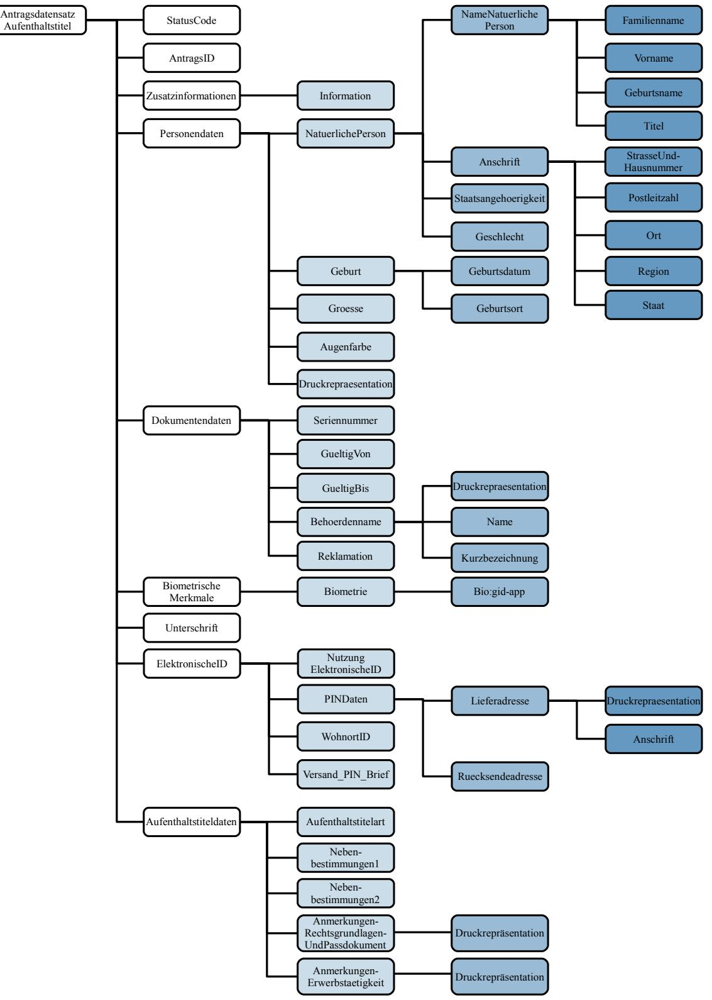

*Abbildung 6: Antragsdatensatz elektronischer Aufenthaltstitel*

Die Bestellung wird entsprechend Abbildung [2](#page-20-0) und Tabelle [8](#page-22-1) im Kapitel [4.1.1](#page-19-2) [Elektronischer](#page-19-2)  [Personalausweis \(ePA\)](#page-19-2) übermittelt.Die in der folgenden Abbildung und Tabelle abgebildeten Datenfelder werden pro Antrag übertragen. Sie sind zur Übersichtlichkeit von den Datenfeldern, die pro Bestellung übertragen werden, getrennt.

| Tabelle 12: Antragsdatensatz elektronischer Aufenthaltstitel |                 |               |                                                                                                                                                                                                                                                                                                                                                                                                                                                                                                                                                                                                                                                                    |
|--------------------------------------------------------------|-----------------|---------------|--------------------------------------------------------------------------------------------------------------------------------------------------------------------------------------------------------------------------------------------------------------------------------------------------------------------------------------------------------------------------------------------------------------------------------------------------------------------------------------------------------------------------------------------------------------------------------------------------------------------------------------------------------------------|
| Datenfeld                                                    | Pflicht feld | Feld länge | Regelungen                                                                                                                                                                                                                                                                                                                                                                                                                                                                                                                                                                                                                                                         |
| AntragsID                                                    | X               | ≤ 40          | Die AntragsID muss von der bestellenden Behör de je Bestellung eindeutig vergeben werden. Es sind nur Ziffern von 0 bis 9, Groß- und Klein buchstaben und Sonderzeichen entsprechend Ka pitel 3.2.2 zu verwenden.                                                                                                                                                                                                                                                                                                                                                                                                                                      |
| Personendaten                                                | X               |               |                                                                                                                                                                                                                                                                                                                                                                                                                                                                                                                                                                                                                                                                    |
| NatuerlichePersonType                                        | X               |               |                                                                                                                                                                                                                                                                                                                                                                                                                                                                                                                                                                                                                                                                    |
| NameNatuerlichePerson                                        | X               |               |                                                                                                                                                                                                                                                                                                                                                                                                                                                                                                                                                                                                                                                                    |
| Familienname                                                 | X               |               |                                                                                                                                                                                                                                                                                                                                                                                                                                                                                                                                                                                                                                                                    |
| Name                                                         | X               |               | Der Nachname ist vollständig in Großbuchstaben zu schreiben.5 Besitzt der Karteninhaber keinen Vornamen, kann der Nachname inklusive Titel auf drei Zei len ausgeweitet werden. Im Falle eines nicht vor handenen Nachnamens wird der Vorname als Name eingetragen und kann sich über maximal 3 Zeilen erstrecken. Zu verwenden sind hier nur Zeichen aus dem String.LatinXhD Zeichensatz entsprechend Kapi tel 3.2.3. Hinweis: Bei der Erfassung der Daten ist sicher zustellen, dass die Gesamtlänge von Name, Vorna me und Titel nicht mehr als 84 Zeichen (große Schrift) bzw. 114 Zeichen (kleine Schrift) beträgt. |
| Vorname                                                      | X               |               |                                                                                                                                                                                                                                                                                                                                                                                                                                                                                                                                                                                                                                                                    |
| Name                                                         | X               |               | Im Falle eines nicht vorhandenen Nachnamens wird der Vorname als Name eingetragen und kann sich über maximal 3 Zeilen erstrecken. Zu verwenden sind hier nur Zeichen aus dem String.LatinXhD Zeichensatz entsprechend Kapi tel 3.2.3. Hinweis: Bei der Erfassung der Daten ist sicher zustellen, dass die Gesamtlänge von Name, Vorna me und Titel nicht mehr als 84 Zeichen (große Schrift) bzw. 114 Zeichen (kleine Schrift) beträgt.                                                                                                                                                                                                 |
| Geburtsname                                                  |                 |               |                                                                                                                                                                                                                                                                                                                                                                                                                                                                                                                                                                                                                                                                    |
| Name                                                         |                 |               | Zu verwenden sind hier nur Zeichen aus dem String.LatinXhD Zeichensatz entsprechend Kapi                                                                                                                                                                                                                                                                                                                                                                                                                                                                                                                                                                        |

5 Die Variante, den Nachnamen auch in Groß- und Kleinschreibung bei enthaltenem "ß" zu schreiben, ist nicht mehr möglich.

| Tabelle 12: Antragsdatensatz elektronischer Aufenthaltstitel |                 |               |                                                                                                                                                                                                                                                                                                                                                                                                                                                                                                                                                                                                                                                                                                                                                                                                                                                                                                                                                                                                     |
|--------------------------------------------------------------|-----------------|---------------|-----------------------------------------------------------------------------------------------------------------------------------------------------------------------------------------------------------------------------------------------------------------------------------------------------------------------------------------------------------------------------------------------------------------------------------------------------------------------------------------------------------------------------------------------------------------------------------------------------------------------------------------------------------------------------------------------------------------------------------------------------------------------------------------------------------------------------------------------------------------------------------------------------------------------------------------------------------------------------------------------------|
| Datenfeld                                                    | Pflicht feld | Feld länge | Regelungen                                                                                                                                                                                                                                                                                                                                                                                                                                                                                                                                                                                                                                                                                                                                                                                                                                                                                                                                                                                          |
|                                                              |                 |               | tel 3.2.3.                                                                                                                                                                                                                                                                                                                                                                                                                                                                                                                                                                                                                                                                                                                                                                                                                                                                                                                                                                                          |
| Titel                                                        |                 |               | Hier können nur anerkannte Doktorgrade ange geben werden. Es sind die jeweils gültigen rechtli chen Vorgaben zu beachten. Hinweis: Bei der Erfassung der Daten ist sicher zustellen, dass die Gesamtlänge von Name, Vorna me und Titel nicht mehr als 84 Zeichen (große Schrift) bzw. 114 Zeichen (kleine Schrift) beträgt.                                                                                                                                                                                                                                                                                                                                                                                                                                                                                                                                                                                                                                                       |
| Anschrift                                                    | X               |               |                                                                                                                                                                                                                                                                                                                                                                                                                                                                                                                                                                                                                                                                                                                                                                                                                                                                                                                                                                                                     |
| StrasseUndHausnummer                                         |                 | ≤ 50          | Zu verwenden sind hier nur Zeichen aus dem String.LatinXhD Zeichensatz entsprechend Kapi tel 3.2.3. Hinweis: Bei der Erfassung der Daten ist sicher zustellen, dass die Gesamtlänge von Straße, tren nendem Leerzeichen und Hausnummer nicht mehr als 50 Zeichen beträgt.                                                                                                                                                                                                                                                                                                                                                                                                                                                                                                                                                                                                                                                                                                         |
| Postleitzahl                                                 |                 | *             | Hier sind nur Ziffern von 0 bis 9, Groß- und Klein buchstaben, Sonderzeichen entsprechend Kapitel 3.2.2 und Leerzeichen zu verwenden. Postleitzahlen für Anschriften innerhalb Deutschlands müssen 5-stellig sein und es sind nur Ziffern von 0 bis 9 zu verwenden. Bei der Erfassung der Daten ist sicherzustellen, dass bei Adressen innerhalb Deutschlands die kombinierte Länge von Postleitzahl und Ort 49 Zeichen nicht überschreitet. Im Druck bedeutet dies: 5 Zeichen Postleitzahl + 1 Leerzeichen + bis zu 44 Zeichen Ort <= 50 Für ausländische Anschriften gelten landestypi sche Regelungen bezüglich der Ausprägung der Postleitzahl. Bei Adressen außerhalb Deutschlands ist eine kombinierte Länge von 45 Zeichen für Postleit zahl und Ort nicht zu überschreiten. Für den Druck bedeutet dies: 3 Zeichen ICAO Ländercode + 1 "Bindestrich" + Postleitzahl + 1 Leerzeichen + Ort <= 50 Beispiel: FRA-75001 Paris |

| Tabelle 12: Antragsdatensatz elektronischer Aufenthaltstitel |                 |               |                                                                                                                                                                                                                                                                                                                                                                                                                                                                                                                                                                                                                                                                     |
|--------------------------------------------------------------|-----------------|---------------|---------------------------------------------------------------------------------------------------------------------------------------------------------------------------------------------------------------------------------------------------------------------------------------------------------------------------------------------------------------------------------------------------------------------------------------------------------------------------------------------------------------------------------------------------------------------------------------------------------------------------------------------------------------------|
| Datenfeld                                                    | Pflicht feld | Feld länge | Regelungen                                                                                                                                                                                                                                                                                                                                                                                                                                                                                                                                                                                                                                                          |
| Ort                                                          | X               | *             | Zu verwenden sind hier nur Zeichen aus dem String.LatinXhD Zeichensatz entsprechend Kapi tel 3.2.3. Hinweis: Für die Feldlänge gelten die o.g. unter                                                                                                                                                                                                                                                                                                                                                                                                                                                                                                       |
|                                                              |                 |               | Postleitzahl erläuterten Vorgaben für die Kombi nation von Staat, Postleitzahl und Ort.                                                                                                                                                                                                                                                                                                                                                                                                                                                                                                                                                                          |
| Region                                                       |                 |               | Zu verwenden sind hier nur Zeichen aus dem String.LatinXhD Zeichensatz entsprechend Kapi tel 3.2.3.                                                                                                                                                                                                                                                                                                                                                                                                                                                                                                                                                           |
| Staat                                                        |                 |               | Hier sind Abkürzungen für den Staaten nach dreistelligem ICAO-Code gemäß ICAO Doc 9303 einzutragen. Abweichungen der Codes werden durch das BMI geregelt.                                                                                                                                                                                                                                                                                                                                                                                                                                                                                                  |
|                                                              |                 |               | Für nicht-deutsche Anschriften ist der Gebrauch dieses Feldes verpflichtend!                                                                                                                                                                                                                                                                                                                                                                                                                                                                                                                                                                                     |
| Staatsangehoerigkeit                                         | X               |               |                                                                                                                                                                                                                                                                                                                                                                                                                                                                                                                                                                                                                                                                     |
| Staat                                                        | X               | 3             | Hier sind Abkürzungen für den Staaten nach dreistelligem ICAO-Code gemäß ICAO Doc 9303 einzutragen.Abweichungen der Codes werden durch das BMI geregelt.                                                                                                                                                                                                                                                                                                                                                                                                                                                                                                   |
| Geschlecht                                                   | X               |               |                                                                                                                                                                                                                                                                                                                                                                                                                                                                                                                                                                                                                                                                     |
| Geschlecht                                                   | X               |               | Hier sind nur Werte entsprechend der Codeliste in Kapitel 5.2.5 Codeliste Geschlechter aus der [TR XhD-3] zulässig.                                                                                                                                                                                                                                                                                                                                                                                                                                                                                                                                           |
| Geburt                                                       | X               |               |                                                                                                                                                                                                                                                                                                                                                                                                                                                                                                                                                                                                                                                                     |
| Geburtsdatum                                                 | X               | 10            | Das Geburtsdatum besteht aus zehn Zeichen und wird im folgenden Format dargestellt: TT MM JJJJ. Verwendet werden hier nur die Zeichen " ", "X" und die Ziffern von 0 bis 9. Bei unbekanntem Geburtstag kann dieser durch einfügen von XX ergänzt werden (Bsp.: XX 12 2000). Ist sowohl der Geburtstag als auch der Mo nat unbekannt, kann dies ebenfalls durch Einfü gen von XX ergänzt werden (Bsp.:XX XX 2000). Auf die Angabe des Geburtsjahrs kann nicht verzich tet werden. Die Auswirkungen der Verwendung von Platzhaltern im Geburtsdatum sind in [TR Architektur ePA] Kapitel 3.2.3 "eID-Anwendung" beschrieben. |

| Tabelle 12: Antragsdatensatz elektronischer Aufenthaltstitel |                 |                 |                                                                                                                                                                                                                                                                                                                                |
|--------------------------------------------------------------|-----------------|-----------------|--------------------------------------------------------------------------------------------------------------------------------------------------------------------------------------------------------------------------------------------------------------------------------------------------------------------------------|
| Datenfeld                                                    | Pflicht feld | Feld länge   | Regelungen                                                                                                                                                                                                                                                                                                                     |
| Geburtsort                                                   | X               | ≤ 58            | Zu verwenden sind hier nur Zeichen aus dem String.LatinXhD Zeichensatz entsprechend Kapi tel 3.2.3.                                                                                                                                                                                                                      |
|                                                              |                 |                 | Hinweis: Die Druckdarstellung des Geburtsorts ist zweizeilig (insgesamt maximal 58 Zeichen), entsprechend sind im Feld PersonendatenType.- Druckrepraesentation zwei Druckzeilen für den Geburtsort anzugeben.                                                                                                     |
| Groesse                                                      | X               | 3               | Die Größe wird in Zentimetern angegeben. Es ste hen hierfür drei Stellen zur Verfügung. Kann die Größe nicht ermittelt werden, ist "---" zu übertra gen. Im Dokument muss für diesen Fall "---" durch den Dokumentenhersteller eingetragen werden. Verwendet werden hier nur Ziffern von 0 bis 9 und "-". |
| Augenfarbe                                                   | X               | ≤ 13            | Enthält Angaben zur Augenfarbe des Antragstel lers. Hierfür steht eine Zeile zur Verfügung. Zu verwenden sind hier nur Zeichen aus dem String.LatinXhD Zeichensatz entsprechend Kapi tel 3.2.3. Bei nicht ermittelbarer Augenfarbe wird "---" übertragen.                                                    |
| Druckrepraesentation                                         | X               |                 |                                                                                                                                                                                                                                                                                                                                |
| Zeile @Nummer="13"                                        | X               |                 | Hier sind nur Ziffern von 0 bis 9 zu verwenden.                                                                                                                                                                                                                                                                                |
| content                                                      | X               | 3 * 28 = 84  | Normale Schriftgröße: Für den Namensblock stehen maximal 3 Zeilen zur Verfügung.                                                                                                                                                                                                                                         |
|                                                              |                 | 3 * 38 = 114 | Kleine Schriftgröße: Für den Namensblock stehen maximal 3 Zeilen zur Verfügung.                                                                                                                                                                                                                                          |
|                                                              |                 |                 | Zu verwenden sind hier nur Zeichen aus dem String.LatinXhD Zeichensatz entsprechend Kapi tel 3.2.3. Die Druckrepräsentation des Namensblocks be steht aus folgenden Feldern: • ggf. Titel • Familienname • Vorname                                                                               |
| Typ                                                          | X               |                 | Es ist der Wert Namensblock aus der Codeliste in Kapitel 5.2.8 Codeliste Typ der Druckzeile aus [TR XhD-3] zu verwenden.                                                                                                                                                                                                 |

| Tabelle 12: Antragsdatensatz elektronischer Aufenthaltstitel |                 |               |                                                                                                                                                                                                                                                                                                                                                                                                                                                                                                                                                                                                                                                                                                                                                                                                                                                                                                                                           |
|--------------------------------------------------------------|-----------------|---------------|-------------------------------------------------------------------------------------------------------------------------------------------------------------------------------------------------------------------------------------------------------------------------------------------------------------------------------------------------------------------------------------------------------------------------------------------------------------------------------------------------------------------------------------------------------------------------------------------------------------------------------------------------------------------------------------------------------------------------------------------------------------------------------------------------------------------------------------------------------------------------------------------------------------------------------------------|
| Datenfeld                                                    | Pflicht feld | Feld länge | Regelungen                                                                                                                                                                                                                                                                                                                                                                                                                                                                                                                                                                                                                                                                                                                                                                                                                                                                                                                                |
| Zeile @nummer="12"                                        | X               |               | Hier sind nur Ziffern von 0 bis 9 zu verwenden.                                                                                                                                                                                                                                                                                                                                                                                                                                                                                                                                                                                                                                                                                                                                                                                                                                                                                           |
| content                                                      | X               | ≤ 25 ∑ 50  | Normale Schriftgröße: Für den Wohnort stehen maximal 2 Zeilen zur Verfügung. Zu verwenden sind hier nur Zeichen aus dem String.LatinXhD Zeichensatz entsprechend Kapi tel 3.2.3. Die Druckrepräsentation des Wohnorts enthält die folgenden Angaben: • bei ausländischen Adressen: ICAO-Ländercode (3-stellig) • Postleitzahl • Ort Bei der Erfassung der Daten ist sicherzustellen, dass bei Adressen innerhalb Deutschlands die kombinierte Länge von Postleitzahl und Ort 49 Zeichen nicht überschreitet. Im Druck bedeutet dies: 5 Zeichen Postleitzahl + 1 Leerzeichen + bis zu 44 Zeichen Ort <= 50 Bei Adressen außerhalb Deutschlands ist eine kombinierte Länge von Postleitzahl und Ort 45 Zeichen nicht zu überschreiten. Für den Druck bedeutet dies: 3 Zeichen ICAO Ländercode + 1 "Bindestrich" + Postleitzahl + 1 Leerzeichen + Ort <= 50 |
| Typ                                                          | X               |               | Beispiel: FRA-75001 Paris Es ist der Wert Wohnort aus der Codeliste in Ka pitel 5.2.8 Codeliste Typ der Druckzeile aus [TR XhD-3] zu verwenden.                                                                                                                                                                                                                                                                                                                                                                                                                                                                                                                                                                                                                                                                                                                                                                                  |
| Zeile @Nummer="12"                                        |                 |               | Hier sind nur Ziffern von 0 bis 9 zu verwenden.                                                                                                                                                                                                                                                                                                                                                                                                                                                                                                                                                                                                                                                                                                                                                                                                                                                                                           |
| content                                                      |                 | ≤ 25 ∑ 50  | Normale Schriftgröße: Für die Straße und Hausnummer stehen maximal 2 Zeilen zur Verfügung. Zu verwenden sind hier nur Zeichen aus dem String.LatinXhD Zeichensatz entsprechend Kapi tel 3.2.3. Die Druckrepräsentation der Straße enthält die folgenden Angaben: • StrasseUndHausnummer.                                                                                                                                                                                                                                                                                                                                                                                                                                                                                                                                                                                                                       |

|           | Tabelle 12: Antragsdatensatz elektronischer Aufenthaltstitel |                       |                 |               |                                                                                                                                                                                                                                                                                   |  |
|-----------|--------------------------------------------------------------|-----------------------|-----------------|---------------|-----------------------------------------------------------------------------------------------------------------------------------------------------------------------------------------------------------------------------------------------------------------------------------|--|
| Datenfeld |                                                              |                       | Pflicht feld | Feld länge | Regelungen                                                                                                                                                                                                                                                                        |  |
|           |                                                              | Typ                   |                 |               | Es ist der Wert Strasse_Hausnummer aus der Codeliste in Kapitel 5.2.8 Codeliste Typ der Druckzeile aus [TR XhD-3] zu verwenden.                                                                                                                                             |  |
|           |                                                              | Zeile @Nummer="12" |                 |               |                                                                                                                                                                                                                                                                                   |  |
|           |                                                              | content               |                 | ≤ 29 ∑ 58  | Für den Geburtsort stehen maximal 2 Zeilen zur Verfügung. Zu verwenden sind hier nur Zeichen aus dem String.LatinXhD Zeichensatz entspre chend Kapitel 3.2.3.                                                                                                            |  |
|           |                                                              | Typ                   |                 |               | Es ist der Wert Geburtsort aus der Codeliste in Kapitel 5.2.8 Codeliste Typ der Druckzeile aus [TR XhD-3] zu verwenden.                                                                                                                                                     |  |
|           |                                                              | Dokumentendaten       | X               |               |                                                                                                                                                                                                                                                                                   |  |
|           |                                                              | Seriennummer          | X               | 10            | Die Seriennummer besteht aus 10 Zeichen und bildet sich aus: 4 Zeichen Behördenkennziffer 5 Zeichen eindeutige Nummer 1 Zeichen Prüfziffer Es sind nur die Zeichen des eingeschränkten Zei chensatzes für Seriennummern entsprechend Ka pitel 3.2.1 erlaubt. |  |
|           |                                                              | GueltigVon            | X               |               | Das Datum ab/seit dem das Dokument gültig ist. Es sind die gesetzlichen Regelungen zu beachten.                                                                                                                                                                                |  |
|           |                                                              | GueltigBis            | X               |               | Für die Übertragung des Datums, bis zu dem das zu produzierende Dokument gültig sein soll, sind die gesetzlichen Regelungen zu beachten.                                                                                                                                    |  |
|           |                                                              | Behoerdenname         | X               |               | Die Gesamtlänge des Behördennamens beträgt maximal 71 Zeichen.                                                                                                                                                                                                                 |  |
|           |                                                              | Druckrepraesentation  | X               |               |                                                                                                                                                                                                                                                                                   |  |
|           |                                                              | Zeile @Nummer="1"  | X               |               | Hier sind nur Ziffern von 0 bis 9 zu verwenden.                                                                                                                                                                                                                                   |  |
|           |                                                              | content               | X               | 1*15 =15   | Zu verwenden sind hier nur Zeichen aus dem String.LatinXhD Zeichensatz entsprechend Kapi tel 3.2.3.                                                                                                                                                                         |  |
|           |                                                              | Typ                   | X               |               | Es ist der Wert BehoerdennameKurzeZeile aus der Codeliste in Kapitel 5.2.8 Codeliste Typ der Druckzeile aus [TR XhD-3] zu verwenden. Hinweis: Wenn BehoerdennameKurzeZeile ver wendet wird, muss das Feld Behördenname nicht befüllt werden.                       |  |
|           |                                                              | Zeile @Nummer="12" | X               |               | Hier sind nur Ziffern von 0 bis 9 zu verwenden.                                                                                                                                                                                                                                   |  |

|                 | Tabelle 12: Antragsdatensatz elektronischer Aufenthaltstitel |                 |               |                                                                                        |   |             |                                                                                                                                                                                                                                                            |
|-----------------|--------------------------------------------------------------|-----------------|---------------|----------------------------------------------------------------------------------------|---|-------------|------------------------------------------------------------------------------------------------------------------------------------------------------------------------------------------------------------------------------------------------------------|
| Datenfeld       |                                                              | Pflicht feld | Feld länge | Regelungen                                                                             |   |             |                                                                                                                                                                                                                                                            |
|                 |                                                              |                 |               | content                                                                                | X | 2*28 =56 | Zu verwenden sind hier nur Zeichen aus dem String.LatinXhD Zeichensatz entsprechend Kapi tel 3.2.3.                                                                                                                                                  |
|                 |                                                              |                 |               | Typ                                                                                    | X |             | Es ist der Wert Behoerdenname aus der Codeliste in Kapitel 5.4 DruckzeilenCodeContent aus [TR XhD-3] zu verwenden.                                                                                                                                   |
|                 |                                                              |                 | Name          |                                                                                        |   | ≤ 71        | Zu verwenden sind hier nur Zeichen aus dem String.LatinXhD Zeichensatz entsprechend Kapi tel 3.2.3.                                                                                                                                                  |
|                 |                                                              |                 |               | Kurzbezeichnung                                                                        | X | ≤ 90        | Zu verwenden sind hier nur Zeichen aus dem String.LatinXhD Zeichensatz entsprechend Kapi tel 3.2.3.                                                                                                                                                  |
|                 |                                                              |                 |               | Reklamation                                                                            |   |             | Dieses Datenfeld darf ausschließlich verwendet werden, wenn es sich tatsächlich um eine Rekla mation (vgl. Kapitel 4.1.7) handelt und nicht wie in diesem Fall beschrieben um die reguläre Be stellung eines elektronischen Aufenthaltstitels. |
|                 | BiometrischeMerkmale                                         |                 |               |                                                                                        | X |             |                                                                                                                                                                                                                                                            |
|                 |                                                              |                 |               | Biometrie                                                                              | X |             |                                                                                                                                                                                                                                                            |
|                 |                                                              |                 |               | Bio:gid-app                                                                            | X |             | Das biometrischen Daten werden gemäß der Vor gaben von [TR Biometrie] erfasst und kodiert.                                                                                                                                                              |
| Unterschrift    |                                                              | X               |               | Die Unterschrift wird als JPEG-Datei übermittelt. Das Format beträgt 561x182 Pixel. |   |             |                                                                                                                                                                                                                                                            |
| ElektronischeID |                                                              | X               |               |                                                                                        |   |             |                                                                                                                                                                                                                                                            |
|                 |                                                              |                 |               | NutzungElektronischeID                                                                 | X |             | Das Feld "ElektronischeID" bestimmt, ob das Do kument mit der ElektronischenID Funktion er stellt wird. Dieses Flag muss durch die Behörde bzw. das Fachverfahren gesetzt werden.                                                                 |
|                 |                                                              |                 |               | PINDaten                                                                               | X |             |                                                                                                                                                                                                                                                            |
|                 |                                                              |                 |               | Lieferadresse                                                                          | X |             |                                                                                                                                                                                                                                                            |
|                 |                                                              |                 |               | Druckrepraesentation                                                                   | * |             |                                                                                                                                                                                                                                                            |
|                 |                                                              |                 |               | Zeile @Nummer="1*"                                                                  | X | *           | Die zulässigen Ziffern werden durch den Doku mentenhersteller vorgegeben                                                                                                                                                                                |
|                 |                                                              |                 |               | content                                                                                | X | *           | Zu verwenden sind hier nur Zeichen aus dem String.LatinXhD Zeichensatz entsprechend Kapi tel 3.2.3.                                                                                                                                                  |
|                 |                                                              |                 |               | Typ                                                                                    | X |             | Hier ist der Codewert LieferadressePIN der Code liste in Kapitel 5.2.8 Codeliste Typ der Druckzeile aus [TR XhD-3]anzugeben.                                                                                                                         |

|                                                | Tabelle 12: Antragsdatensatz elektronischer Aufenthaltstitel    |   |                       |                                                                                |                                                                                                                                    |                                                                                                                                                                                     |
|------------------------------------------------|-----------------------------------------------------------------|---|-----------------------|--------------------------------------------------------------------------------|------------------------------------------------------------------------------------------------------------------------------------|-------------------------------------------------------------------------------------------------------------------------------------------------------------------------------------|
| Datenfeld                                      |                                                                 |   |                       | Pflicht feld                                                                | Feld länge                                                                                                                      | Regelungen                                                                                                                                                                          |
|                                                |                                                                 |   | Anschrift             | *                                                                              | *                                                                                                                                  |                                                                                                                                                                                     |
|                                                |                                                                 |   | StrasseUndHausnummer  | *                                                                              | *                                                                                                                                  | Zu verwenden sind hier nur Zeichen aus dem String.LatinXhD Zeichensatz entsprechend Kapi tel 3.2.3.                                                                           |
|                                                |                                                                 |   | Postleitzahl          | *                                                                              | *                                                                                                                                  | Hier sind nur Ziffern von 0 bis 9 zu verwenden.                                                                                                                                     |
|                                                |                                                                 |   | Ort                   | *                                                                              | *                                                                                                                                  | Zu verwenden sind hier nur Zeichen aus dem String.LatinXhD Zeichensatz entsprechend Kapi tel 3.2.3.                                                                           |
|                                                |                                                                 |   | Staat                 | *                                                                              |                                                                                                                                    | Hier sind Abkürzungen für den Staaten nach dreistelligem ICAO-Code gemäß ICAO Doc 9303 einzutragen. Abweichungen der Codes werden durch das BMI geregelt.                  |
|                                                |                                                                 |   | Ruecksendeadresse     | X                                                                              |                                                                                                                                    | Zu verwenden sind hier nur Zeichen aus dem String.LatinXhD Zeichensatz entsprechend Kapi tel 3.2.3.                                                                           |
|                                                |                                                                 |   | WohnortID             | X                                                                              | 14                                                                                                                                 | Die WohnortID wird entsprechend [TR Architek tur ePA] Kapitel 3.2.3 "eID-Anwendung" übertra gen. Es sind nur Ziffern von 0 bis 9 zu verwenden.                                |
| Versand_PIN_Brief                              |                                                                 | * |                       | Wenn dieses Datenfeld auf false gesetzt ist, wird kein PIN-Brief versendet. |                                                                                                                                    |                                                                                                                                                                                     |
| Aufenthaltstiteldaten                          |                                                                 |   |                       | X                                                                              |                                                                                                                                    |                                                                                                                                                                                     |
|                                                | Aufenthaltstitelart Nebenbestimmungen1 Nebenbestimmungen2 |   | X                     |                                                                                | Hier sind nur Werte entsprechend der Codeliste in Kapitel 5.2.1 Codeliste Art des Aufenthaltstitels aus [TR XhD-3] zulässig. |                                                                                                                                                                                     |
|                                                |                                                                 |   |                       |                                                                                | ≤ 750                                                                                                                              | Zu verwenden sind hier nur Zeichen aus dem String.LatinXhD Zeichensatz entsprechend Kapi tel 3.2.3.                                                                           |
|                                                |                                                                 |   |                       | ≤ 250                                                                          | Zu verwenden sind hier nur Zeichen aus dem String.LatinXhD Zeichensatz entsprechend Kapi tel 3.2.3.                          |                                                                                                                                                                                     |
| AnmerkungenRechtsgrundlagen UndPassdokument |                                                                 | X |                       |                                                                                |                                                                                                                                    |                                                                                                                                                                                     |
|                                                |                                                                 |   | Druckrepraesentation  |                                                                                |                                                                                                                                    |                                                                                                                                                                                     |
|                                                |                                                                 |   | Zeile @Nummer="12" | X                                                                              |                                                                                                                                    | Hier sind nur Ziffern von 0 bis 9 zu verwenden.                                                                                                                                     |
|                                                |                                                                 |   | content               | X                                                                              | 2 * 38 = 76                                                                                                                     | Hier ist der Inhalt der Anmerkungszeile auf der Vorderseite anzugeben. Zu verwenden sind hier nur Zeichen aus dem String.LatinXhD Zeichen satz entsprechend Kapitel 3.2.3. |

| Tabelle 12: Antragsdatensatz elektronischer Aufenthaltstitel |                              |                 |                |                                                                                                                                                                                  |
|--------------------------------------------------------------|------------------------------|-----------------|----------------|----------------------------------------------------------------------------------------------------------------------------------------------------------------------------------|
| Datenfeld                                                    |                              | Pflicht feld | Feld länge  | Regelungen                                                                                                                                                                       |
| Typ                                                          |                              | X               |                | Hier ist der Codewert "AnmerkungenRechts grundlagenUndPassdokument" der Codeliste in Kapitel 5.2.8 Codeliste Typ der Druckzeile aus [TR XhD-3]anzugeben.                |
|                                                              | AnmerkungenErwerbstaetigkeit |                 |                |                                                                                                                                                                                  |
|                                                              | Druckrepraesentation         |                 |                |                                                                                                                                                                                  |
| Zeile                                                        | @Nummer="12"                 |                 |                |                                                                                                                                                                                  |
| content                                                      |                              | X               | 2 * 28 = 56 | Hier ist der Inhalt der Anmerkungszeile auf der Rückseite anzugeben. Zu verwenden sind hier nur Zeichen aus dem String.LatinXhD Zeichensatz entsprechend Kapitel 3.2.3. |
| Typ                                                          |                              | X               |                | Hier ist der Codewert "AnmerkungenErwerbs taetigkeit" der Codeliste in Kapitel 5.2.8 Codeliste Typ der Druckzeile aus [TR XhD-3]anzugeben.                                 |

## 4.1.4 Elektronischer Reiseausweis (eRA)

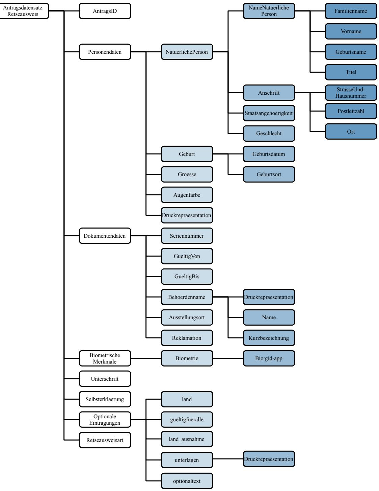

*Abbildung 7: Antragsdatensatz elektronischer Reiseausweis*

Die Bestellung wird entsprechend Abbildung [4](#page-33-0) und Tabelle [10](#page-35-0) im Kapitel [4.1.2](#page-33-1) [Elektronischer Reisepass](#page-33-1)  [\(ePass\)](#page-33-1) übermittelt.Die in der folgenden Abbildung und Tabelle abgebildeten Datenfelder werden pro Antrag übertragen. Sie sind zur Übersichtlichkeit von den Datenfeldern, die pro Bestellung übertragen werden, getrennt.

|               | Tabelle 13: Antragsdatensatz elektronischer Reiseausweis |                       |                 |               |                                                                                                                                                                                                                                                                                                                                                  |  |
|---------------|----------------------------------------------------------|-----------------------|-----------------|---------------|--------------------------------------------------------------------------------------------------------------------------------------------------------------------------------------------------------------------------------------------------------------------------------------------------------------------------------------------------|--|
| Datenfeld     |                                                          |                       | Pflicht feld | Feld länge | Regelungen                                                                                                                                                                                                                                                                                                                                       |  |
| AntragsID     |                                                          |                       | X               | ≤ 40          | Die AntragsID muss von der bestellenden Behör de je Bestellung eindeutig vergeben werden. Hier sind nur Ziffern von 0 bis 9, Groß- und Klein buchstaben und Sonderzeichen entsprechend Ka pitel 3.2.2 zu verwenden.                                                                                                                  |  |
| Personendaten |                                                          | X                     |                 |               |                                                                                                                                                                                                                                                                                                                                                  |  |
|               |                                                          | NatuerlichePersonType | X               |               |                                                                                                                                                                                                                                                                                                                                                  |  |
|               |                                                          | NameNatuerlichePerson | X               |               |                                                                                                                                                                                                                                                                                                                                                  |  |
|               |                                                          | Familienname          | X               |               |                                                                                                                                                                                                                                                                                                                                                  |  |
|               |                                                          | Name                  | X               | ≤ 186         | Zu verwenden sind hier nur Zeichen aus dem String.LatinXhD Zeichensatz entsprechend Kapi tel 3.2.3. Hinweis: Bei der Erfassung der Daten ist sicher zustellen, dass die Gesamtlänge für Familienna me, Titel und Geburtsname nicht mehr als 186 Zeichen beträgt.                                                               |  |
|               |                                                          | Vorname               | X               |               |                                                                                                                                                                                                                                                                                                                                                  |  |
|               |                                                          | Name                  | X               | ≤ 186         | Zu verwenden sind hier nur Zeichen aus dem String.LatinXhD Zeichensatz entsprechend Kapi tel 3.2.3.                                                                                                                                                                                                                                        |  |
|               |                                                          | Geburtsname           |                 |               |                                                                                                                                                                                                                                                                                                                                                  |  |
|               |                                                          | Name                  |                 | ≤ 124         | Zu verwenden sind hier nur Zeichen aus dem String.LatinXhD Zeichensatz entsprechend Kapi tel 3.2.3. Hinweis: Bei der Erfassung der Daten ist sicher zustellen, dass die Gesamtlänge für Familienna me, Titel und Geburtsname nicht mehr als 186 Zeichen beträgt.                                                               |  |
|               |                                                          | Titel                 |                 | *             | Hier können nur nach deutschem Recht aner kannte Doktorgrade angegeben werden. Es gelten die Vorgaben aus der Passverwaltungsvorschrift vom 17. Dezember 2009. Hinweis: Bei der Erfassung der Daten ist sicher zustellen, dass die Gesamtlänge für Familienna me, Titel und Geburtsname nicht mehr als 236 Zeichen beträgt. |  |
|               |                                                          | Anschrift             | *               |               |                                                                                                                                                                                                                                                                                                                                                  |  |
|               |                                                          | Ort                   | *               | ≤ 105         | Zu verwenden sind hier nur Zeichen aus dem String.LatinXhD Zeichensatz entsprechend Kapi                                                                                                                                                                                                                                                      |  |

| Tabelle 13: Antragsdatensatz elektronischer Reiseausweis |                 |               |                                                                                                                                                                                                                                                                                                                                                                                                                                                                                                                                                                                                                                                                     |  |  |
|----------------------------------------------------------|-----------------|---------------|---------------------------------------------------------------------------------------------------------------------------------------------------------------------------------------------------------------------------------------------------------------------------------------------------------------------------------------------------------------------------------------------------------------------------------------------------------------------------------------------------------------------------------------------------------------------------------------------------------------------------------------------------------------------|--|--|
| Datenfeld                                                | Pflicht feld | Feld länge | Regelungen                                                                                                                                                                                                                                                                                                                                                                                                                                                                                                                                                                                                                                                          |  |  |
|                                                          |                 |               | tel 3.2.3.                                                                                                                                                                                                                                                                                                                                                                                                                                                                                                                                                                                                                                                          |  |  |
| Staatsangehoerigkeit                                     | X               |               |                                                                                                                                                                                                                                                                                                                                                                                                                                                                                                                                                                                                                                                                     |  |  |
| Staat                                                    | X               | 3             | Von D=Deutsch abweichende Nationalität (ange geben im dreistelligen Code gemäß der Staaten liste in ICAO Doc 9303, Part 3 Chapter 5). Abwei chungen der Codes werden durch das BMI gere gelt.                                                                                                                                                                                                                                                                                                                                                                                                                                                           |  |  |
| Geschlecht                                               | X               |               |                                                                                                                                                                                                                                                                                                                                                                                                                                                                                                                                                                                                                                                                     |  |  |
| Geschlecht                                               | X               | ≤ 3           | Hier sind nur Werte entsprechend der Codeliste in Kapitel 5.2.5 Codeliste Geschlechter aus der [TR XhD-3] zulässig.                                                                                                                                                                                                                                                                                                                                                                                                                                                                                                                                           |  |  |
| Geburt                                                   | X               |               |                                                                                                                                                                                                                                                                                                                                                                                                                                                                                                                                                                                                                                                                     |  |  |
| Geburtsdatum                                             | X               |               | Das Geburtsdatum besteht aus zehn Zeichen und wird im folgenden Format dargestellt: YYYY-MM-DD. Verwendet werden hier nur die Zeichen "-", "X" und die Ziffern von 0 bis 9. Bei unbekanntem Geburtstag kann dieser durch einfügen von XX ergänzt werden (Bsp.: 2000-12- XX). Ist sowohl der Geburtstag als auch der Monat unbekannt, kann dies ebenfalls durch Einfügen von XX ergänzt werden (Bsp.: 2000-XX-XX). Auf die Angabe des Geburtsjahrs kann nicht verzich tet werden. Die Auswirkungen der Verwendung von Platzhaltern im Geburtsdatum sind in [TR Architektur ePA] Kapitel 3.2.3 "eID-Anwendung" beschrieben. |  |  |
| Geburtsort                                               | X               | ≤ 124         | Zu verwenden sind hier nur Zeichen aus dem String.LatinXhD Zeichensatz entsprechend Kapi tel 3.2.3.                                                                                                                                                                                                                                                                                                                                                                                                                                                                                                                                                           |  |  |
| Groesse                                                  | X               | 3             | Die Größe wird in Zentimetern angegeben. Es ste hen hierfür drei Stellen zur Verfügung. Kann die Größe nicht ermittelt werden, ist "---" zu übertra gen. Im Dokument muss für diesen Fall "---" durch den Dokumentenhersteller eingetragen werden. Verwendet werden hier nur Ziffern von 0 bis 9 und "-".                                                                                                                                                                                                                                                                                                                                      |  |  |
| Augenfarbe                                               | X               | ≤ 35          | Enthält Angaben zur Augenfarbe des Antragstel lers. Hierfür steht eine Zeile zur Verfügung. Zu verwenden sind hier nur Zeichen aus dem String.LatinXhD Zeichensatz entsprechend Kapi tel 3.2.3. Bei nicht ermittelbarer Augenfarbe wird "---" übertragen.                                                                                                                                                                                                                                                                                                                                                                                         |  |  |

| Tabelle 13: Antragsdatensatz elektronischer Reiseausweis |                 |               |                                                                                                                                                                                                                                                                                                      |  |
|----------------------------------------------------------|-----------------|---------------|------------------------------------------------------------------------------------------------------------------------------------------------------------------------------------------------------------------------------------------------------------------------------------------------------|--|
| Datenfeld                                                | Pflicht feld | Feld länge | Regelungen                                                                                                                                                                                                                                                                                           |  |
| Druckrepraesentation                                     | X               |               |                                                                                                                                                                                                                                                                                                      |  |
| Zeile @Nummer="13"                                    | X               |               | Hier sind nur Ziffern von 0 bis 9 zu verwenden.                                                                                                                                                                                                                                                      |  |
| content                                                  | X               | ≤ 40 ∑ 80  | Normale Schriftgröße: Für den Namensblock steht 2 Zeile zur Verfü gung.                                                                                                                                                                                                                        |  |
|                                                          |                 | ≤ 62 ∑ 186 | Kleine Schriftgröße: Für den Namensblock stehen 3 Zeilen zur Verfü gung.                                                                                                                                                                                                                       |  |
|                                                          |                 |               | Zu verwenden sind hier nur Zeichen aus dem String.LatinXhD Zeichensatz entsprechend Kapi tel 3.2.3. Die Druckrepräsentation des Namensblocks ent hält die folgenden Angaben: • Titel • Familienname                                                                          |  |
|                                                          |                 |               | Sofern ein Geburtsname übertragen wird, muss dieser in der Druckrepräsentation in einer neuen Zeile übertragen und abgedruckt werden. Dafür ist der Druckzeilentyp Geburtsname zu verwen den.                                                                                            |  |
| Typ                                                      | X               |               | Es ist der Wert Namensblock aus der Codeliste in Kapitel 5.2.8 Codeliste Typ der Druckzeile aus [TR XhD-3] zu verwenden.                                                                                                                                                                       |  |
| Zeile @Nummer="13"                                    | X               |               | Hier sind nur Ziffern von 0 bis 9 zu verwenden.                                                                                                                                                                                                                                                      |  |
| content                                                  | X               | ≤ 40 ∑ 80  | Normale Schriftgröße Für den Vornamensblock stehen maximal 2 Zei len zur Verfügung.                                                                                                                                                                                                            |  |
|                                                          |                 | ≤ 62 ∑ 186 | Kleine Schriftgröße: Für den Vornamensblock stehen maximal 3 Zei len zur Verfügung. Zu verwenden sind hier nur Zeichen aus dem String.LatinXhD Zeichensatz entsprechend Kapi tel 3.2.3. In der Druckrepräsentation des Vornamensblocks sind die Angaben zum Vornamen enthalten. |  |
| Typ                                                      | X               |               | Es ist der Wert Vornamensblock aus der Codelis te in Kapitel 5.2.8 Codeliste Typ der Druckzeile aus [TR XhD-3] zu verwenden.                                                                                                                                                                   |  |
| Zeile @Nummer="13"                                    |                 |               | Hier sind nur Ziffern von 0 bis 9 zu verwenden.                                                                                                                                                                                                                                                      |  |

|              | Tabelle 13: Antragsdatensatz elektronischer Reiseausweis |                 |               |                                                                                                                                                                                                                                                                                   |  |  |
|--------------|----------------------------------------------------------|-----------------|---------------|-----------------------------------------------------------------------------------------------------------------------------------------------------------------------------------------------------------------------------------------------------------------------------------|--|--|
| Datenfeld    |                                                          | Pflicht feld | Feld länge | Regelungen                                                                                                                                                                                                                                                                        |  |  |
|              | content                                                  | X               | ≤ 35 ∑ 105 | Normale Schriftgröße: Für den Wohnort stehen maximal 3Zeilen zur Verfügung. Zu verwenden sind hier nur Zeichen aus dem String.LatinXhD Zeichensatz entsprechend Kapi tel 3.2.3. In der Druckrepräsentation des Wohnorts sind die Angaben zum Ort enthalten.  |  |  |
|              | Typ                                                      | X               |               | Es ist der Wert Wohnort aus der Codeliste in Ka pitel 5.2.8 Codeliste Typ der Druckzeile aus [TR XhD-3] zu verwenden.                                                                                                                                                       |  |  |
|              | Zeile @Nummer="12"                                    | X               |               | Hier sind nur Ziffern von 0 bis 9 zu verwenden.                                                                                                                                                                                                                                   |  |  |
|              | content                                                  | X               | ≤ 40 ∑40   | Normale Schriftgröße: Für den Geburtsort steht eine Zeile zur Verfü gung.                                                                                                                                                                                                   |  |  |
|              |                                                          |                 | ≤ 62 ∑ 124 | Kleine Schriftgröße: Für den Geburtsort stehen 2 Zeilen zur Verfü gung.                                                                                                                                                                                                     |  |  |
|              |                                                          |                 |               | Zu verwenden sind hier nur Zeichen aus dem String.LatinXhD Zeichensatz entsprechend Kapi tel 3.2.3. In der Druckrepräsentation des Geburtsorts sind die Angaben zum Geburtsort enthalten.                                                                             |  |  |
|              | Typ                                                      | X               |               | Es ist der Wert Geburtsort aus der Codeliste in Kapitel 5.2.8 Codeliste Typ der Druckzeile aus [TR XhD-3] zu verwenden.                                                                                                                                                     |  |  |
|              | Dokumentendaten                                          | X               |               |                                                                                                                                                                                                                                                                                   |  |  |
| Seriennummer |                                                          | X               | 10            | Die Seriennummer besteht aus 10 Zeichen und bildet sich aus: 4 Zeichen Behördenkennziffer 5 Zeichen eindeutige Nummer 1 Zeichen Prüfziffer Es sind nur die Zeichen des eingeschränkten Zei chensatzes für Seriennummern entsprechend Ka pitel 3.2.1 erlaubt. |  |  |
|              | GueltigVon                                               | X               |               | Für die Übertragung des Datums, ab dem das zu produzierende Dokument gültig sein soll, sind die gesetzlichen Regelungen zu beachten.                                                                                                                                        |  |  |
|              | GueltigBis                                               | X               |               | Für die Übertragung des Datums bis zu dem das zu produzierende Dokument gültig sein soll sind die gesetzlichen Regelungen zu beachten.                                                                                                                                      |  |  |
|              | Behoerdenname                                            | X               |               |                                                                                                                                                                                                                                                                                   |  |  |

| Tabelle 13: Antragsdatensatz elektronischer Reiseausweis |                       |                 |               |                                                                                                                                                                                                                                                         |  |
|----------------------------------------------------------|-----------------------|-----------------|---------------|---------------------------------------------------------------------------------------------------------------------------------------------------------------------------------------------------------------------------------------------------------|--|
| Datenfeld                                                |                       | Pflicht feld | Feld länge | Regelungen                                                                                                                                                                                                                                              |  |
| Druckrepraesentation                                     |                       | X               |               |                                                                                                                                                                                                                                                         |  |
|                                                          | Zeile @Nummer="13" |                 |               | Hier sind nur Ziffern von 0 bis 9 zu verwenden.                                                                                                                                                                                                         |  |
|                                                          | content               | *               | ≤ 28 ∑ 56  | Normale Schriftgröße: Für den Behoerdennamen stehen 2 Zeilen zur Verfügung.                                                                                                                                                                       |  |
|                                                          |                       |                 | ≤ 35 ∑ 105 | Kleine Schriftgröße: Für den Behoerdennamen stehen 3 Zeilen zur Verfügung.                                                                                                                                                                        |  |
|                                                          |                       |                 |               | Zu verwenden sind hier nur Zeichen aus dem String.LatinXhD Zeichensatz entsprechend Kapi tel 3.2.3.                                                                                                                                               |  |
|                                                          | Typ                   |                 |               | Es ist der Wert Behoerdenname aus der Codeliste in Kapitel 5.2.8 Codeliste Typ der Druckzeile aus [TR XhD-3] zu verwenden.                                                                                                                        |  |
|                                                          | Name                  | *               | *             | Zu verwenden sind hier nur Zeichen aus dem String.LatinXhD Zeichensatz entsprechend Kapi tel 3.2.3.                                                                                                                                               |  |
|                                                          | Kurzbezeichnung       | X               | *             | Zu verwenden sind hier nur Zeichen aus dem String.LatinXhD Zeichensatz entsprechend Kapi tel 3.2.3.                                                                                                                                               |  |
|                                                          | Ausstellungsort       |                 |               | - wird nicht verwendet -                                                                                                                                                                                                                                |  |
| Reklamation                                              |                       |                 |               | Dieses Datenfeld darf ausschließlich verwendet werden, wenn es sich tatsächlich um eine Rekla mation (vgl. Kapitel 4.1.7) handelt und nicht wie in diesem Fall beschrieben um die reguläre Be stellung eines elektronischen Reiseausweises. |  |
|                                                          | BiometrischeMerkmale  | X               |               |                                                                                                                                                                                                                                                         |  |
|                                                          | Biometrie             | X               |               |                                                                                                                                                                                                                                                         |  |
|                                                          | Bio:gid-app           | X               |               | Das biometrischen Daten werden gemäß der Vor gaben von [TR Biometrie] erfasst und kodiert.                                                                                                                                                           |  |
| Unterschrift                                             |                       | X               |               | Die Unterschrift wird als JPEG-Datei übermittelt. Das Format beträgt 630 x 188 Pixel.                                                                                                                                                                |  |
| ReiseausweisArt                                          |                       | X               |               | Hier sind nur Werte entsprechend der Codeliste in Kapitel 5.2.4 Codeliste Art des Reiseausweises aus [TR XhD-3] zulässig.                                                                                                                         |  |
| Selbsterklaerung                                         |                       |                 |               | Hier kann ein Wahrheitswert eingetragen, um zu kennzeichnen, dass es sich bei den Personendaten um Angaben aus einer Selbsterklärung des An tragstellers handelt.                                                                              |  |

| Tabelle 13: Antragsdatensatz elektronischer Reiseausweis |                 |               |                                                                                                                                                                                                                                                                                                                                                                                                                                                                                                                                                                                 |  |  |
|----------------------------------------------------------|-----------------|---------------|---------------------------------------------------------------------------------------------------------------------------------------------------------------------------------------------------------------------------------------------------------------------------------------------------------------------------------------------------------------------------------------------------------------------------------------------------------------------------------------------------------------------------------------------------------------------------------|--|--|
| Datenfeld                                                | Pflicht feld | Feld länge | Regelungen                                                                                                                                                                                                                                                                                                                                                                                                                                                                                                                                                                      |  |  |
| optionaleEintragungen                                    |                 |               | Hinweis: Beim Reiseausweis für Ausländer darf nur eine der drei Möglichkeiten angegeben wer den.                                                                                                                                                                                                                                                                                                                                                                                                                                                                          |  |  |
| land                                                     |                 |               | Beim Reiseausweis für Ausländer sind hier nur Abkürzungen für die Staaten nach dreistelligem ICAO-Code einzutragen, für welche der Reiseaus weis gültig ist. Es können maximal 81 Staaten ge nannt werden. Beim Reiseausweis für Flüchtlinge und Staatenlose sind hier nur Abkürzungen für die Staaten nach dreistelligem ICAO-Code einzutragen, für welche der Reiseausweis nicht gültig ist. Es können ma ximal 84 Staaten genannt werden. Hinweis: Aus den Feldern "land", "gueltigfueralle" und "land_ausnahme" ist nur eines zu befüllen. |  |  |
| gueltigfueralle                                          |                 |               | Hinweis: Dieses Feld gilt nur für den Reiseaus weis für Ausländer. Dieses Feld ist nur als "true" zu setzen, wenn der Reiseausweis für alle Länder gültig ist. Hinweis: Aus den Feldern "land", "gueltigfueralle" und "land_ausnahme" ist nur eines zu befüllen.                                                                                                                                                                                                                                                                                                 |  |  |
| land_ausnahme                                            |                 |               | Hinweis: Dieses Feld darf nur beim Reiseausweis für Ausländer genutzt werden. Hier sind nur Abkürzungen für die Staaten nach dreistelligem ICAO-Code einzutragen, für welche der Reiseausweis nicht gültig ist. Es können maxi mal 45 Staaten genannt werden. Hinweis: Aus den Feldern "land", "gueltigfueralle" und "land_ausnahme" ist nur eines zu befüllen.                                                                                                                                                                                            |  |  |
| unterlagen                                               |                 |               |                                                                                                                                                                                                                                                                                                                                                                                                                                                                                                                                                                                 |  |  |
| Druckrepraesentation                                     |                 |               |                                                                                                                                                                                                                                                                                                                                                                                                                                                                                                                                                                                 |  |  |
| Zeile @Nummer="1-6"                                   |                 |               | Hier sind nur Ziffern von 0 bis 9 zu verwenden.                                                                                                                                                                                                                                                                                                                                                                                                                                                                                                                                 |  |  |
| content                                                  |                 | <=35          | Zu verwenden sind hier nur Zeichen aus dem String.LatinXhD Zeichensatz entsprechend Kapi tel 3.2.3.                                                                                                                                                                                                                                                                                                                                                                                                                                                                       |  |  |
| Typ @typ="Unterlagen"                                 |                 |               | Es ist der Wert Unterlagen aus der Codeliste in Kapitel 5.2.8 Codeliste Typ der Druckzeile aus [TR XhD-3] zu verwenden.                                                                                                                                                                                                                                                                                                                                                                                                                                                   |  |  |

| Tabelle 13: Antragsdatensatz elektronischer Reiseausweis |                 |               |                                                                                                                                                                                                   |  |
|----------------------------------------------------------|-----------------|---------------|---------------------------------------------------------------------------------------------------------------------------------------------------------------------------------------------------|--|
| Datenfeld                                                | Pflicht feld | Feld länge | Regelungen                                                                                                                                                                                        |  |
| optionaltext                                             |                 |               | Der Optionaltext ist als Codewert gemäß der Codeliste "OptionaltextCodeContentType" in Ab schnitt 5.2.7 in [TR XhD-3] einzutragen. Es kön nen bis zu sechs Codewerte eingetragen werden. |  |

## 4.1.5 eID-Karte für Unionsbürger (eID-UB)

Die Bestellung wird entsprechend Abbildung [2](#page-20-0) und Tabelle [8](#page-22-1) im Kapitel [4.1.1](#page-19-2) [Elektronischer](#page-19-2)  [Personalausweis \(ePA\)](#page-19-2) übermittelt.

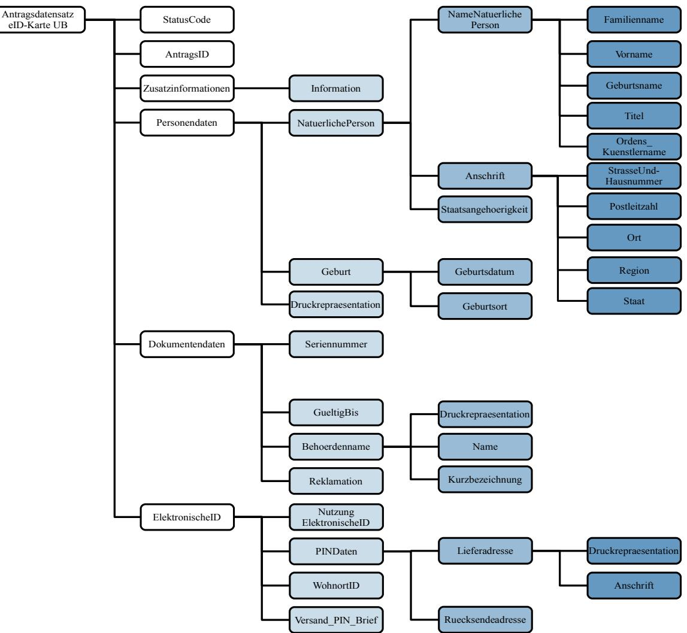

*Abbildung 8: Antragsdatensatz eID-Karte für Unionsbürger*

| Tabelle 14: Antragsdatensatz elektronische ID-Karte für Unionsbürger |               |   |                       |                                                                                                                                                                                                                               |               |                                                                                                                                                                                                                                                                                                                                                                                                                                                                                                                                                                                                                                                                    |
|----------------------------------------------------------------------|---------------|---|-----------------------|-------------------------------------------------------------------------------------------------------------------------------------------------------------------------------------------------------------------------------|---------------|--------------------------------------------------------------------------------------------------------------------------------------------------------------------------------------------------------------------------------------------------------------------------------------------------------------------------------------------------------------------------------------------------------------------------------------------------------------------------------------------------------------------------------------------------------------------------------------------------------------------------------------------------------------------|
|                                                                      |               |   | Datenfeld             | Pflicht feld                                                                                                                                                                                                               | Feld länge | Regelungen                                                                                                                                                                                                                                                                                                                                                                                                                                                                                                                                                                                                                                                         |
| AntragsID                                                            |               | X | ≤ 40                  | Die AntragsID muss von der bestellenden Behör de je Bestellung eindeutig vergeben werden. Es sind nur Ziffern von 0 bis 9, Groß- und Klein buchstaben und Sonderzeichen entsprechend Ka pitel 3.2.2 zu verwenden. |               |                                                                                                                                                                                                                                                                                                                                                                                                                                                                                                                                                                                                                                                                    |
|                                                                      | Personendaten |   | X                     |                                                                                                                                                                                                                               |               |                                                                                                                                                                                                                                                                                                                                                                                                                                                                                                                                                                                                                                                                    |
|                                                                      |               |   | NatuerlichePersonType | X                                                                                                                                                                                                                             |               |                                                                                                                                                                                                                                                                                                                                                                                                                                                                                                                                                                                                                                                                    |
|                                                                      |               |   | NameNatuerlichePerson | X                                                                                                                                                                                                                             |               |                                                                                                                                                                                                                                                                                                                                                                                                                                                                                                                                                                                                                                                                    |
|                                                                      |               |   | Familienname          | X                                                                                                                                                                                                                             |               |                                                                                                                                                                                                                                                                                                                                                                                                                                                                                                                                                                                                                                                                    |
|                                                                      |               |   | Name                  | X                                                                                                                                                                                                                             | *             | Der Nachname ist vollständig in Großbuchstaben zu schreiben.6 Besitzt der Karteninhaber keinen Vornamen, kann der Nachname inklusive Titel auf drei Zei len ausgeweitet werden. Im Falle eines nicht vor handenen Nachnamens wird der Vorname als Name eingetragen und kann sich über maximal 3 Zeilen erstrecken. Zu verwenden sind hier nur Zeichen aus dem String.LatinXhD Zeichensatz entsprechend Kapi tel 3.2.3. Hinweis: Bei der Erfassung der Daten ist sicher zustellen, dass die Gesamtlänge von Name, Vorna me und Titel nicht mehr als 84 Zeichen (große Schrift) bzw. 114 Zeichen (kleine Schrift) beträgt. |
|                                                                      |               |   | Vorname               | X                                                                                                                                                                                                                             |               |                                                                                                                                                                                                                                                                                                                                                                                                                                                                                                                                                                                                                                                                    |
|                                                                      |               |   | Name                  | X                                                                                                                                                                                                                             | *             | Im Falle eines nicht vorhandenen Nachnamens wird der Vorname als Name eingetragen und kann sich über maximal 3 Zeilen erstrecken. Zu verwenden sind hier nur Zeichen aus dem String.LatinXhD Zeichensatz entsprechend Kapi tel 3.2.3. Hinweis: Bei der Erfassung der Daten ist sicher zustellen, dass die Gesamtlänge von Name, Vorna me und Titel nicht mehr als 84 Zeichen (große Schrift) bzw. 114 Zeichen (kleine Schrift) beträgt.                                                                                                                                                                                                 |
|                                                                      | Geburtsname   |   |                       |                                                                                                                                                                                                                               |               |                                                                                                                                                                                                                                                                                                                                                                                                                                                                                                                                                                                                                                                                    |
|                                                                      |               |   | Name                  |                                                                                                                                                                                                                               |               | Zu verwenden sind hier nur Zeichen aus dem                                                                                                                                                                                                                                                                                                                                                                                                                                                                                                                                                                                                                         |

Die in der folgenden Abbildung und Tabelle abgebildeten Datenfelder werden pro Antrag übertragen. Sie sind zur Übersichtlichkeit von den Datenfeldern, die pro Bestellung übertragen werden, getrennt.

6 Die Variante, den Nachnamen auch in Groß- und Kleinschreibung bei enthaltenem "ß" zu schreiben, ist nicht mehr möglich.

| Tabelle 14: Antragsdatensatz elektronische ID-Karte für Unionsbürger |                 |               |                                                                                                                                                                                                                                                                                                                                                                                                                                                                                                                                                           |  |  |
|----------------------------------------------------------------------|-----------------|---------------|-----------------------------------------------------------------------------------------------------------------------------------------------------------------------------------------------------------------------------------------------------------------------------------------------------------------------------------------------------------------------------------------------------------------------------------------------------------------------------------------------------------------------------------------------------------|--|--|
| Datenfeld                                                            | Pflicht feld | Feld länge | Regelungen                                                                                                                                                                                                                                                                                                                                                                                                                                                                                                                                                |  |  |
|                                                                      |                 |               | String.LatinXhD Zeichensatz entsprechend Kapi tel 3.2.3.                                                                                                                                                                                                                                                                                                                                                                                                                                                                                               |  |  |
| Titel                                                                |                 |               | Hier können nur anerkannte Doktorgrade ange geben werden. Es sind die jeweils gültigen rechtli chen Vorgaben zu beachten. Hinweis: Bei der Erfassung der Daten ist sicher zustellen, dass die Gesamtlänge von Name, Vorna me und Titel nicht mehr als 84 Zeichen (große Schrift) bzw. 114 Zeichen (kleine Schrift) beträgt.                                                                                                                                                                                                             |  |  |
| Ordens_Kuenstlername                                                 |                 | ≤ 60          | Zu verwenden sind hier nur Zeichen aus dem String.LatinXhD Zeichensatz entsprechend Kapi tel 3.2.3.                                                                                                                                                                                                                                                                                                                                                                                                                                                 |  |  |
| Anschrift                                                            | X               |               | Hinweis: Beantragt eine im Ausland lebende Per son eine eID-Karte für Unionsbürger und hat dort keinen festen oder nachvollziehbaren Wohnsitz, muss das Element Anschrift ohne Kindelemente übertragen werden. Daraus folgend wird der Text "keine Wohnung in Deutschland" durch den Her steller anstelle der Anschrift aufgedruckt und im Chip im UTF8String von noPlaceInfo gespeichert. Eventuell übermittelte Druckrepräsentationen zur Anschrift (welche später in dieser Tabelle be schrieben sind) werden ignoriert. |  |  |
| StrasseUndHausnummer                                                 |                 | ≤ 50          | Die Straße und Hausnummer der Adresse ggf. inklusiv notwendiger Zusätze in üblicher Reihenfolge des Staates.                                                                                                                                                                                                                                                                                                                                                                                                                                        |  |  |
|                                                                      |                 |               | Zu verwenden sind hier nur Zeichen aus dem String.LatinXhD Zeichensatz entsprechend Kapi tel 3.2.3.                                                                                                                                                                                                                                                                                                                                                                                                                                                 |  |  |
|                                                                      |                 |               | Hinweis: Bei der Erfassung der Daten ist sicher zustellen, dass die Gesamtlänge von Straße, tren nendem Leerzeichen und Hausnummer nicht mehr als 50 Zeichen beträgt.                                                                                                                                                                                                                                                                                                                                                                            |  |  |

| Tabelle 14: Antragsdatensatz elektronische ID-Karte für Unionsbürger |                      |   |               |                                                                                                                                                                                                                                                                                                                                                                                                                                                                                                                                                                                                                                                                                                                                                                                                                                                                                                                                                                                                     |  |  |  |
|----------------------------------------------------------------------|----------------------|---|---------------|-----------------------------------------------------------------------------------------------------------------------------------------------------------------------------------------------------------------------------------------------------------------------------------------------------------------------------------------------------------------------------------------------------------------------------------------------------------------------------------------------------------------------------------------------------------------------------------------------------------------------------------------------------------------------------------------------------------------------------------------------------------------------------------------------------------------------------------------------------------------------------------------------------------------------------------------------------------------------------------------------------|--|--|--|
| Datenfeld                                                            |                      |   | Feld länge | Regelungen                                                                                                                                                                                                                                                                                                                                                                                                                                                                                                                                                                                                                                                                                                                                                                                                                                                                                                                                                                                          |  |  |  |
|                                                                      | Postleitzahl         |   | *             | Hier sind nur Ziffern von 0 bis 9, Groß- und Klein buchstaben, Sonderzeichen entsprechend Kapitel 3.2.2 und Leerzeichen zu verwenden. Postleitzahlen für Anschriften innerhalb Deutschlands müssen 5-stellig sein und es sind nur Ziffern von 0 bis 9 zu verwenden. Bei der Erfassung der Daten ist sicherzustellen, dass bei Adressen innerhalb Deutschlands die kombinierte Länge von Postleitzahl und Ort 49 Zeichen nicht überschreitet. Im Druck bedeutet dies: 5 Zeichen Postleitzahl + 1 Leerzeichen + bis zu 44 Zeichen Ort <= 50 Für ausländische Anschriften gelten landestypi sche Regelungen bezüglich der Ausprägung der Postleitzahl. Bei Adressen außerhalb Deutschlands ist eine kombinierte Länge von 45 Zeichen für Postleit zahl und Ort nicht zu überschreiten. Für den Druck bedeutet dies: 3 Zeichen ICAO Ländercode + 1 "Bindestrich" + Postleitzahl + 1 Leerzeichen + Ort <= 50 Beispiel: FRA-75001 Paris |  |  |  |
|                                                                      | Ort                  | X | *             | Zu verwenden sind hier nur Zeichen aus dem String.LatinXhD Zeichensatz entsprechend Kapi tel 3.2.3. Hinweis: Für die Feldlänge gelten die o.g. unter Postleitzahl erläuterten Vorgaben für die Kombi nation von Staat, Postleitzahl und Ort.                                                                                                                                                                                                                                                                                                                                                                                                                                                                                                                                                                                                                                                                                                                                         |  |  |  |
|                                                                      | Region               |   |               | Zu verwenden sind hier nur Zeichen aus dem String.LatinXhD Zeichensatz entsprechend Kapi tel 3.2.3.                                                                                                                                                                                                                                                                                                                                                                                                                                                                                                                                                                                                                                                                                                                                                                                                                                                                                           |  |  |  |
|                                                                      | Staat                |   |               | Hier sind Abkürzungen für den Staaten nach dreistelligem ICAO-Code gemäß ICAO Doc 9303 einzutragen. Abweichungen der Codes werden durch das BMI geregelt. Für nicht-deutsche Anschriften ist der Gebrauch                                                                                                                                                                                                                                                                                                                                                                                                                                                                                                                                                                                                                                                                                                                                                                               |  |  |  |
|                                                                      |                      |   |               | dieses Feldes verpflichtend!                                                                                                                                                                                                                                                                                                                                                                                                                                                                                                                                                                                                                                                                                                                                                                                                                                                                                                                                                                        |  |  |  |
|                                                                      | Staatsangehoerigkeit | X |               |                                                                                                                                                                                                                                                                                                                                                                                                                                                                                                                                                                                                                                                                                                                                                                                                                                                                                                                                                                                                     |  |  |  |

|           | Tabelle 14: Antragsdatensatz elektronische ID-Karte für Unionsbürger |                       |                 |                                   |                                                                                                                                                                                                                                                                                                                                                                                                                                                                                                                                                                                                                                                                     |  |  |
|-----------|----------------------------------------------------------------------|-----------------------|-----------------|-----------------------------------|---------------------------------------------------------------------------------------------------------------------------------------------------------------------------------------------------------------------------------------------------------------------------------------------------------------------------------------------------------------------------------------------------------------------------------------------------------------------------------------------------------------------------------------------------------------------------------------------------------------------------------------------------------------------|--|--|
| Datenfeld |                                                                      |                       | Pflicht feld | Feld länge                     | Regelungen                                                                                                                                                                                                                                                                                                                                                                                                                                                                                                                                                                                                                                                          |  |  |
|           |                                                                      | Staat                 | X               | 3                                 | Hier sind Abkürzungen für den Staaten nach dreistelligem ICAO-Code gemäß ICAO Doc 9303 einzutragen.Abweichungen der Codes werden durch das BMI geregelt.                                                                                                                                                                                                                                                                                                                                                                                                                                                                                                   |  |  |
|           |                                                                      | Geburt                | X               |                                   |                                                                                                                                                                                                                                                                                                                                                                                                                                                                                                                                                                                                                                                                     |  |  |
|           |                                                                      | Geburtsdatum          | X               | 10                                | Das Geburtsdatum besteht aus zehn Zeichen und wird im folgenden Format dargestellt: TT MM JJJJ. Verwendet werden hier nur die Zeichen " ", "X" und die Ziffern von 0 bis 9. Bei unbekanntem Geburtstag kann dieser durch einfügen von XX ergänzt werden (Bsp.: XX 12 2000). Ist sowohl der Geburtstag als auch der Mo nat unbekannt, kann dies ebenfalls durch Einfü gen von XX ergänzt werden (Bsp.:XX XX 2000). Auf die Angabe des Geburtsjahrs kann nicht verzich tet werden. Die Auswirkungen der Verwendung von Platzhaltern im Geburtsdatum sind in [TR Architektur ePA] Kapitel 3.2.3 "eID-Anwendung" beschrieben. |  |  |
|           |                                                                      | Geburtsort            | X               | ≤ 58                              | Zu verwenden sind hier nur Zeichen aus dem String.LatinXhD Zeichensatz entsprechend Kapi tel 3.2.3. Hinweis: Die Druckdarstellung des Geburtsorts ist zweizeilig (insgesamt maximal 58 Zeichen), ent sprechend sind im Feld PersonendatenType.- Druckrepraesentation zwei Druckzeilen für den Geburtsort anzugeben.                                                                                                                                                                                                                                                                                                                            |  |  |
|           |                                                                      | Druckrepraesentation  | X               |                                   |                                                                                                                                                                                                                                                                                                                                                                                                                                                                                                                                                                                                                                                                     |  |  |
|           |                                                                      | Zeile @Nummer="13" | X               |                                   | Hier sind nur Ziffern von 0 bis 9 zu verwenden.                                                                                                                                                                                                                                                                                                                                                                                                                                                                                                                                                                                                                     |  |  |
|           |                                                                      | content               | X               | 3 * 28 = 84 3 * 38 = 114 | Normale Schriftgröße: Für den Namensblock stehen maximal 3 Zeilen zur Verfügung. Kleine Schriftgröße: Für den Namensblock stehen maximal 3 Zeilen zur Verfügung. Zu verwenden sind hier nur Zeichen aus dem String.LatinXhD Zeichensatz entsprechend Kapi tel 3.2.3. Die Druckrepräsentation des Namensblocks be steht aus folgenden Feldern: • Familienname • Vorname                                                                                                                                                                                                                                                    |  |  |

|           | Tabelle 14: Antragsdatensatz elektronische ID-Karte für Unionsbürger |  |                       |                 |                                                                                                                                                |                                                                                                                                                                                                                                                                                   |  |  |
|-----------|----------------------------------------------------------------------|--|-----------------------|-----------------|------------------------------------------------------------------------------------------------------------------------------------------------|-----------------------------------------------------------------------------------------------------------------------------------------------------------------------------------------------------------------------------------------------------------------------------------|--|--|
| Datenfeld |                                                                      |  |                       | Pflicht feld | Feld länge                                                                                                                                  | Regelungen                                                                                                                                                                                                                                                                        |  |  |
|           |                                                                      |  | Typ                   | X               |                                                                                                                                                | Es ist der Wert Namensblock aus der Codeliste in Kapitel 5.2.8 Codeliste Typ der Druckzeile aus [TR XhD-3] zu verwenden.                                                                                                                                                    |  |  |
|           |                                                                      |  | Zeile @Nummer="12" |                 |                                                                                                                                                |                                                                                                                                                                                                                                                                                   |  |  |
|           |                                                                      |  | content               |                 | ≤ 29 ∑ 58                                                                                                                                   | Für den Geburtsort stehen maximal 2 Zeilen zur Verfügung. Zu verwenden sind hier nur Zeichen aus dem String.LatinXhD Zeichensatz entspre chend Kapitel 3.2.3.                                                                                                            |  |  |
|           |                                                                      |  | Typ                   |                 |                                                                                                                                                | Es ist der Wert Geburtsort aus der Codeliste in Kapitel 5.2.8 Codeliste Typ der Druckzeile aus [TR XhD-3] zu verwenden.                                                                                                                                                     |  |  |
|           |                                                                      |  | Dokumentendaten       | X               |                                                                                                                                                |                                                                                                                                                                                                                                                                                   |  |  |
|           | Seriennummer                                                         |  |                       | X               | 10                                                                                                                                             | Die Seriennummer besteht aus 10 Zeichen und bildet sich aus: 4 Zeichen Behördenkennziffer 5 Zeichen eindeutige Nummer 1 Zeichen Prüfziffer Es sind nur die Zeichen des eingeschränkten Zei chensatzes für Seriennummern entsprechend Ka pitel 3.2.1 erlaubt. |  |  |
|           | GueltigBis Behoerdenname                                          |  | X                     |                 | Für die Übertragung des Datums, bis zu dem das zu produzierende Dokument gültig sein soll, sind die gesetzlichen Regelungen zu beachten. |                                                                                                                                                                                                                                                                                   |  |  |
|           |                                                                      |  | X                     |                 | Die Gesamtlänge des Behördennamens beträgt maximal 71 Zeichen.                                                                              |                                                                                                                                                                                                                                                                                   |  |  |
|           |                                                                      |  | Druckrepraesentation  | X               |                                                                                                                                                |                                                                                                                                                                                                                                                                                   |  |  |
|           |                                                                      |  | Zeile @Nummer="1." | X               |                                                                                                                                                | Hier sind nur Ziffern von 0 bis 9 zu verwenden.                                                                                                                                                                                                                                   |  |  |
|           |                                                                      |  | content               | X               | 1*15 =15                                                                                                                                    |                                                                                                                                                                                                                                                                                   |  |  |
|           |                                                                      |  | Typ                   | X               |                                                                                                                                                | Es ist der Wert BehoerdennameKurzeZeile aus der Codeliste in Kapitel 5.2.8 Codeliste Typ der Druckzeile aus [TR XhD-3] zu verwenden.                                                                                                                                        |  |  |
|           |                                                                      |  | Zeile @Nummer="23" | X               |                                                                                                                                                | Hier sind nur Ziffern von 0 bis 9 zu verwenden.                                                                                                                                                                                                                                   |  |  |
|           |                                                                      |  | content               | X               | 2*28 =56                                                                                                                                    | Zu verwenden sind hier nur Zeichen aus dem String.LatinXhD Zeichensatz entsprechend Kapi tel 3.2.3.                                                                                                                                                                         |  |  |
|           |                                                                      |  | Typ                   | X               |                                                                                                                                                | Es ist der Wert Behoerdenname aus der Codeliste in Kapitel 5.2.8 Codeliste Typ der Druckzeile aus [TR XhD-3] zu verwenden.                                                                                                                                                  |  |  |

|           | Tabelle 14: Antragsdatensatz elektronische ID-Karte für Unionsbürger |             |                      |                       |                 |               |                                                                                                                                                                                                                                                            |
|-----------|----------------------------------------------------------------------|-------------|----------------------|-----------------------|-----------------|---------------|------------------------------------------------------------------------------------------------------------------------------------------------------------------------------------------------------------------------------------------------------------|
| Datenfeld |                                                                      |             |                      |                       | Pflicht feld | Feld länge | Regelungen                                                                                                                                                                                                                                                 |
|           |                                                                      |             |                      | Name                  |                 | ≤ 71          | Zu verwenden sind hier nur Zeichen aus dem String.LatinXhD Zeichensatz entsprechend Kapi tel 3.2.3.                                                                                                                                                  |
|           |                                                                      |             |                      | Kurzbezeichnung       | X               | ≤ 90          | Zu verwenden sind hier nur Zeichen aus dem String.LatinXhD Zeichensatz entsprechend Kapi tel 3.2.3.                                                                                                                                                  |
|           |                                                                      | Reklamation |                      |                       |                 |               | Dieses Datenfeld darf ausschließlich verwendet werden, wenn es sich tatsächlich um eine Rekla mation (vgl. Kapitel 4.1.7) handelt und nicht wie in diesem Fall beschrieben um die reguläre Be stellung eines elektronischen Aufenthaltstitels. |
|           |                                                                      |             |                      | ElektronischeID       | X               |               |                                                                                                                                                                                                                                                            |
|           | NutzungElektronischeID                                               |             |                      |                       | X               |               | Das Feld "ElektronischeID" bestimmt, ob das Do kument mit der ElektronischenID Funktion er stellt wird. Dieses Flag muss durch die Behörde bzw. das Fachverfahren gesetzt werden.                                                                 |
|           | PINDaten Lieferadresse                                            |             | X                    |                       |                 |               |                                                                                                                                                                                                                                                            |
|           |                                                                      |             | X                    |                       |                 |               |                                                                                                                                                                                                                                                            |
|           |                                                                      |             | Druckrepraesentation |                       | *               |               |                                                                                                                                                                                                                                                            |
|           |                                                                      |             |                      | Zeile @Nummer="1*" | X               | *             | Die zulässigen Ziffern werden durch den Doku mentenhersteller vorgegeben                                                                                                                                                                                |
|           |                                                                      |             |                      | content               | X               | *             | Zu verwenden sind hier nur Zeichen aus dem String.LatinXhD Zeichensatz entsprechend Kapi tel 3.2.3.                                                                                                                                                  |
|           |                                                                      |             |                      | Typ                   | X               |               | Hier ist der Codewert LieferadressePIN der Code liste in Kapitel 5.2.8 Codeliste Typ der Druckzeile aus [TR XhD-3]anzugeben.                                                                                                                         |
|           |                                                                      |             |                      | Anschrift             | *               | *             |                                                                                                                                                                                                                                                            |
|           |                                                                      |             |                      | StrasseUndHausnummer  | *               | *             | Zu verwenden sind hier nur Zeichen aus dem String.LatinXhD Zeichensatz entsprechend Kapi tel 3.2.3.                                                                                                                                                  |
|           |                                                                      |             |                      | Postleitzahl          | *               | *             | Hier sind nur Ziffern von 0 bis 9 zu verwenden.                                                                                                                                                                                                            |
|           |                                                                      |             |                      | Ort                   | *               | *             | Zu verwenden sind hier nur Zeichen aus dem String.LatinXhD Zeichensatz entsprechend Kapi tel 3.2.3.                                                                                                                                                  |

|                   | Tabelle 14: Antragsdatensatz elektronische ID-Karte für Unionsbürger |                 |               |                                                                                                                                                                                                                                                       |  |  |
|-------------------|----------------------------------------------------------------------|-----------------|---------------|-------------------------------------------------------------------------------------------------------------------------------------------------------------------------------------------------------------------------------------------------------|--|--|
|                   | Datenfeld                                                            | Pflicht feld | Feld länge | Regelungen                                                                                                                                                                                                                                            |  |  |
|                   | Staat                                                                |                 |               | Hier sind Abkürzungen für den Staaten nach dreistelligem ICAO-Code gemäß ICAO Doc 9303 einzutragen. Abweichungen der Codes werden durch das BMI geregelt. Für nicht-deutsche Anschriften ist der Gebrauch dieses Feldes verpflichtend! |  |  |
|                   | Ruecksendeadresse                                                    | X               |               | Zu verwenden sind hier nur Zeichen aus dem String.LatinXhD Zeichensatz entsprechend Kapi tel 3.2.3.                                                                                                                                             |  |  |
|                   | WohnortID                                                            |                 | 14            | Die WohnortID wird entsprechend [TR Architek tur ePA] Kapitel 3.2.3 "eID-Anwendung" übertra gen. Es sind nur Ziffern von 0 bis 9 zu verwenden.                                                                                                  |  |  |
| Versand_PIN_Brief |                                                                      | *               |               | Wenn dieses Datenfeld auf false gesetzt ist, wird kein PIN-Brief versendet.                                                                                                                                                                        |  |  |

### 4.1.6 Bestellung von Seriennummern

In [Tabelle 15](#page-68-0) werden die fachlichen Daten für die "Bestellung von Seriennummern" aufgelistet. Die technischen Details sind in [\[TR XhD-3\]](#page-77-2) im Funktionsmodul "Bestellung" detailliert beschrieben.

| Daten            | RP | RA | PA | AT | eID-UB | Funktionsmodul.Element                     |
|------------------|----|----|----|----|--------|--------------------------------------------|
| Behördenkennzahl | X  | X  | X  | X  | X      | CTYPE_Bestellungen_Seriennum mer.BKZ    |
| Anzahl           | X  | X  | X  | X  | X      | CTYPE_Bestellungen_Seriennum mer.Anzahl |

*Tabelle 15: Relevante Daten für die Bestellung (Seriennummern)*

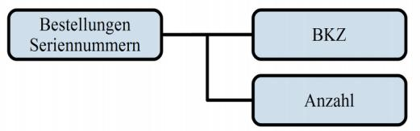

*Abbildung 9: Bestellung Seriennummern*

| Tabelle 16: Bestellung Seriennummern |                 |               |            |  |  |
|--------------------------------------|-----------------|---------------|------------|--|--|
| Datenfeld                            | Pflicht feld | Feld länge | Regelungen |  |  |

| BestellungSeriennummern |        | X |   |                                                                                                                                    |
|-------------------------|--------|---|---|------------------------------------------------------------------------------------------------------------------------------------|
|                         | BKZ    | X | 4 | Es sind nur Zeichen des eingeschränkten Zei chensatzes für Seriennummern entsprechend Ka pitel 3.2.1 erlaubt.                |
|                         | Anzahl | X | 6 | Die Anzahl der bestellten Seriennummern muss zwischen 1 und 100.000 liegen. Hier sind nur Zif fern von 0 bis 9 zu verwenden. |

### 4.1.7 Reklamation von hoheitlichen Dokumenten

Zusätzlich zu den Datenfeldern, die bei der regulären Bestellung eines hoheitlichen Dokuments übertragen werden (vgl. Kapitel [4.1.1](#page-19-2)[-4.1.4\)](#page-53-0), müssen im Falle einer Reklamation die folgenden Datenfelder entsprechend der hier gemachten Vorgaben verwendet werden. Seriennummernbestellungen können nicht reklamiert werden.

| Daten                        | RP | RA | PA | AT | eID UB | Funktionsmodul.Element        |
|------------------------------|----|----|----|----|-----------|-------------------------------|
| Reklamierte Serien nummer | X  | X  | X  | X  | X         | Reklamation.Seriennummer      |
| Reklamationsgrund            | X  | X  | X  | X  | X         | Reklamation.Reklamationsgrund |

*Tabelle 17: Relevante Daten für die Bestellung (Reklamation)*

*Abbildung 10: Reklamation hoheitliche Dokumente*

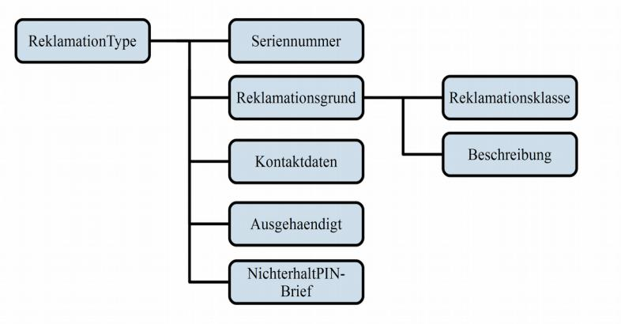

| Tabelle 18: Reklamation hoheitliche Dokumente |                 |               |                                                                                                                     |  |
|-----------------------------------------------|-----------------|---------------|---------------------------------------------------------------------------------------------------------------------|--|
| Datenfeld                                     | Pflicht feld | Feld länge | Regelungen                                                                                                          |  |
| Reklamation                                   |                 |               |                                                                                                                     |  |
| Seriennummer                                  | X               |               | Es sind nur Zeichen des eingeschränkten Zei chensatzes für Seriennummern entsprechend Ka pitel 3.2.1 erlaubt. |  |

| Tabelle 18: Reklamation hoheitliche Dokumente |                 |               |                                                                                                                                                                                                                           |  |
|-----------------------------------------------|-----------------|---------------|---------------------------------------------------------------------------------------------------------------------------------------------------------------------------------------------------------------------------|--|
| Datenfeld                                     | Pflicht feld | Feld länge | Regelungen                                                                                                                                                                                                                |  |
| Reklamationsgrund                             | X               |               |                                                                                                                                                                                                                           |  |
| Reklamationsklasse                            | X               |               | Erlaubt sind alle in der Codeliste in Kapitel 5.2.6 Codeliste Klasse der Reklamation aus [TR XhD-3] aufgelisteten Werte. Bei Reisepass und Reiseausweis ist die Reklamati onsklasse PIN-Brief nicht zulässig. |  |
| Beschreibung                                  |                 | ≤ 40          | In diesem Datenfeld erfolgt eine textuelle Be schreibung des Reklamationsgrundes. Zu verwen den sind hier nur Zeichen aus dem String.LatinX hD Zeichensatz entsprechend Kapitel 3.2.3.                           |  |
| Kontaktdaten                                  |                 |               | Zu verwenden sind hier nur Zeichen aus dem String.LatinXhD Zeichensatz entsprechend Kapi tel 3.2.3.                                                                                                                 |  |
| Ausgehaendigt                                 |                 |               | Information, ob das Dokument an den Bürger ausgehändigt wurde. WAHR - Dokument war an den Bürger ausgehän digt. FALSCH - Dokument wurde noch nicht ausge händigt.                                          |  |
| NichterhaltPINBrief                           |                 |               | Information, ob eine Erklärung zum Nichterhalt des PIN-Briefs vorliegt. WAHR - Erklärung liegt vor. FALSCH - Erklärung liegt nicht vor.                                                                          |  |

## 4.2 Auftragsinformation

Da sich die Auftragsinformation der einzelnen hoheitlichen Dokumente und Seriennummern im Wesentlichen durch die im Nachrichtenkopf angegebene Produktart unterscheidet, sind die Datenfelder der Auftragsinformation hier zusammengefasst.

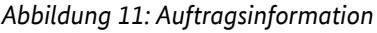

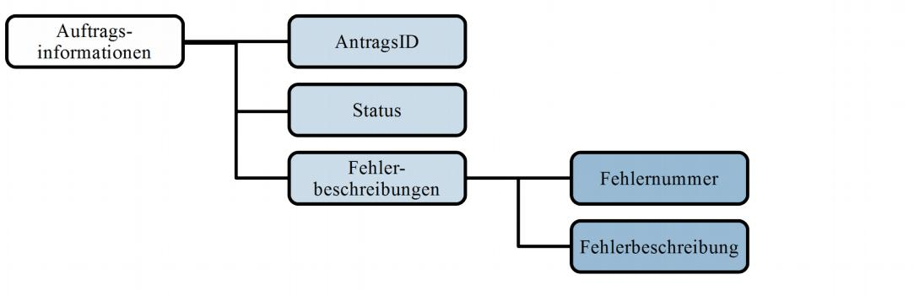

|                                | Tabelle 19: Auftragsinformation hoheitliche Dokumente |                 |               |                                                                                                                                                                                                            |  |
|--------------------------------|-------------------------------------------------------|-----------------|---------------|------------------------------------------------------------------------------------------------------------------------------------------------------------------------------------------------------------|--|
| Datenfeld                      |                                                       | Pflicht feld | Feld länge | Regelungen                                                                                                                                                                                                 |  |
| Auftragsinformationen          |                                                       | X               |               |                                                                                                                                                                                                            |  |
|                                | AntragsID                                             | X               | ≤ 40          | Der Dokumentenhersteller verwendet hier die von der Behörde übertragene AntragsID als Refe renz. Hier sind nur Ziffern von 0 bis 9, Groß- und Kleinbuchstaben und Sonderzeichen zu verwen den. |  |
| Status Fehlerbeschreibungen |                                                       | X               |               |                                                                                                                                                                                                            |  |
|                                |                                                       |                 |               |                                                                                                                                                                                                            |  |
|                                | Fehlernummer                                          |                 | ≤ 6           | Eine Liste gültiger Fehlernummern wird vom Do kumentenhersteller zur Verfügung gestellt. Hier sind nur Ziffern von 0 bis 9 zu verwenden.                                                             |  |
|                                | Fehlerbeschreibung                                    |                 | ≤ 80          | Zu verwenden sind hier nur Zeichen aus dem String.LatinXhD Zeichensatz entsprechend Kapi tel 3.2.3.                                                                                                  |  |

## 4.3 Lieferinformation

In [Tabelle 20](#page-71-0) werden die fachlichen Daten für die "Lieferinformation" aufgelistet. Die technischen Details sind in [\[TR XhD-3\]](#page-77-2) im Funktionsmodul "Lieferinformation" detailliert beschrieben.

| Daten                       | RP | RA | PA | AT | eID-UB | Funktionsmodul.Element                              |
|-----------------------------|----|----|----|----|--------|-----------------------------------------------------|
| QuittierungErfor derlich | X  | X  | X  | X  | X      | LieferinformationInhalt.Quittierun gErforderlich |
| Sperrkennwort               |    |    | X  | X  | X      | LieferinformationDokument.Sperr kennwort         |
| Sperrsumme                  |    |    | X  | X  | X      | LieferinformationDokument.Sperr summe            |

*Tabelle 20: Relevante Daten für die Lieferinformation von hoheitlichen Dokumenten*

### 4.3.1 Elektronischer Personalausweis (ePA)

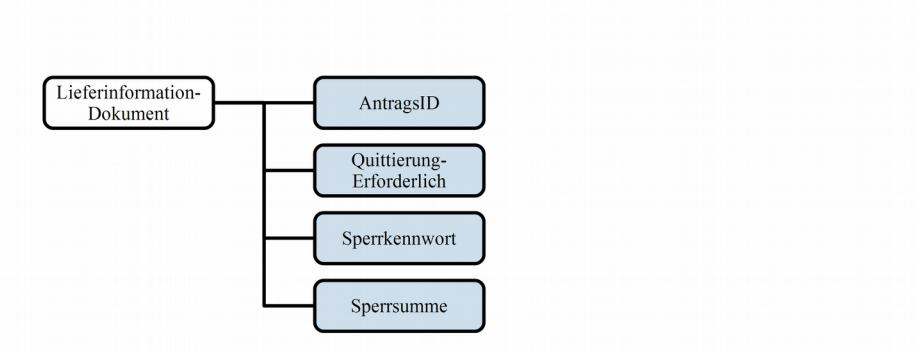

*Abbildung 12: Lieferinformation neuer Personalausweis*

|           | Tabelle 21: Lieferinformation neuer Personalausweis |                 |               |                                                                                                                                                                                                                                                                    |  |
|-----------|-----------------------------------------------------|-----------------|---------------|--------------------------------------------------------------------------------------------------------------------------------------------------------------------------------------------------------------------------------------------------------------------|--|
| Datenfeld |                                                     | Pflicht feld | Feld länge | Regelungen                                                                                                                                                                                                                                                         |  |
|           | LieferinformationDokument                           | X               |               |                                                                                                                                                                                                                                                                    |  |
|           | AntragsID                                           | X               | ≤ 40          | Der Dokumentenhersteller verwendet hier die von der Behörde übertragene AntragsID als Refe renz. Hier sind nur Ziffern von 0 bis 9, Groß- und Kleinbuchstaben und Sonderzeichen zu verwen den.                                                         |  |
|           | QuittierungErforderlich                             | X               |               | Die Quittierung ist beim elektronischen Perso nalausweis immer zu fordern, da mit der Quittie rung der Erhalt des Sperrkennworts quittiert wird.                                                                                                          |  |
|           | Sperrkennwort                                       | X               | ≤ 40          | Mit der Lieferinformation jedes elektronischen Personalausweises muss vom Dokumentenher steller ein Sperrkennwort übertragen werden. Dieses wird entsprechend der Spezifikation in Ka pitel 5.3.1 respektive Anhang B [TR Architektur ePA] erzeugt. |  |
|           | Sperrsumme                                          | X               |               | Die Sperrsumme wird entsprechend der Spezifi kation in Kapitel 5.3.1 respektive Anhang B [TR Architektur ePA] erzeugt.                                                                                                                                       |  |

## 4.3.2 Elektronischer Reisepass (ePass)

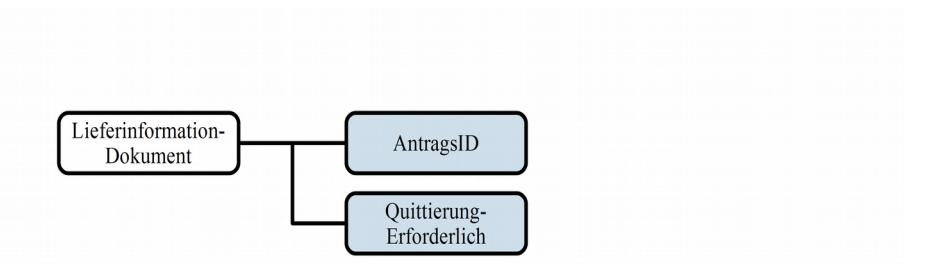

*Abbildung 13: Lieferinformation elektronischer Reisepass*

| Tabelle 22: Lieferinformation elektronischer Reisepass |                 |               |                                                                                                                                                                                                            |
|--------------------------------------------------------|-----------------|---------------|------------------------------------------------------------------------------------------------------------------------------------------------------------------------------------------------------------|
| Datenfeld                                              | Pflicht feld | Feld länge | Regelungen                                                                                                                                                                                                 |
| LieferinformationDokument                              | X               |               |                                                                                                                                                                                                            |
| AntragsID                                              | X               | ≤ 40          | Der Dokumentenhersteller verwendet hier die von der Behörde übertragene AntragsID als Refe renz. Hier sind nur Ziffern von 0 bis 9, Groß- und Kleinbuchstaben und Sonderzeichen zu verwen den. |
| QuittierungErforderlich                                | X               |               |                                                                                                                                                                                                            |

### 4.3.3 Elektronischer Aufenthaltstitel (eAT)

Die Lieferinformation wird entsprechend Abbildung [12](#page-72-1) und Tabelle [21](#page-72-0) aus Kapitel [4.3.1](#page-71-1) [Elektronischer](#page-71-1)  [Personalausweis \(ePA\)](#page-71-1) übermittelt.

### 4.3.4 Elektronischer Reiseausweis (eRA)

Die Lieferinformation wird entsprechend Abbildung [13](#page-73-1) und Tabelle [22](#page-73-0) aus Kapitel [4.3.2](#page-72-2) [Elektronischer](#page-53-0)  [Reiseausweis \(eRA\)](#page-53-0) übermittelt.

### 4.3.5 Elektronische ID-Karte für Unionsbürger (eID-UB)

Die Lieferinformation wird entsprechend Abbildung [12](#page-72-1) und Tabelle [21](#page-72-0) aus Kapitel [4.3.1](#page-71-1) [Elektronischer](#page-71-1)  [Personalausweis \(ePA\)](#page-71-1) übermittelt.

## 4.3.6 Seriennummern

| Daten                       | RP | RA | PA | AT | eID-UB | Funktionsmodul.Element                              |
|-----------------------------|----|----|----|----|--------|-----------------------------------------------------|
| QuittierungErfor derlich | X  | X  | X  | X  | X      | LieferinformationInhalt.Quittierun gErforderlich |
| Seriennummern               | X  | X  | X  | X  | X      | LieferinformationSeriennummer.Seri ennummern     |

*Tabelle 23: Relevante Daten für die Lieferinformation von Seriennummern*

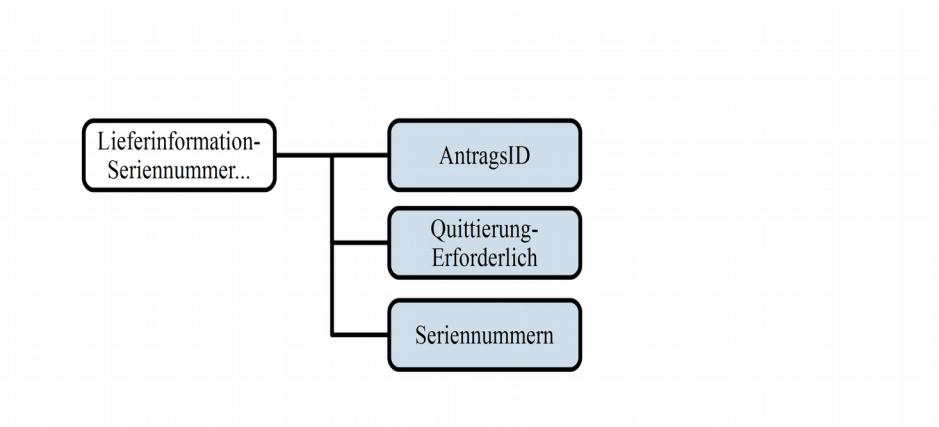

*Abbildung 14: Lieferinformation Seriennummern*

|           | Tabelle 24: Lieferinformation Seriennummern |                 |               |                                                                                                                          |  |
|-----------|---------------------------------------------|-----------------|---------------|--------------------------------------------------------------------------------------------------------------------------|--|
| Datenfeld |                                             | Pflicht feld | Feld länge | Regelungen                                                                                                               |  |
|           | LieferinformationSeriennummer               | X               |               |                                                                                                                          |  |
|           | AntragsID                                   | X               | ≤ 40          | Hier sind nur Ziffern von 0 bis 9, Groß- und Kleinbuchstaben und Sonderzeichen zu verwen den.                      |  |
|           | QuittierungErforderlich                     | X               |               |                                                                                                                          |  |
|           | Seriennummern                               | X               |               | Vom Dokumentenhersteller werden die Serien nummern entsprechend dem in Kapitel 3.3 defi nierten Format übertragen. |  |

## 4.4 Quittierung

An Nachrichten vom Typ Quittierung werden keine Vorgaben, die über die in [\[TR XhD-3\]](#page-77-2) definierten Vorgaben hinausgehen, gestellt. Es wird lediglich festgestellt, dass der Empfänger einer Nachricht, die das Element "QuittierungErforderlich" (vgl. Kapitel [4.3\)](#page-71-2) als zutreffend enthält, aufgefordert ist den Empfang der Nachricht zu quittieren.

## 4.5 Reklamationsinformation

## 4.5.1 Hoheitliche Dokumente

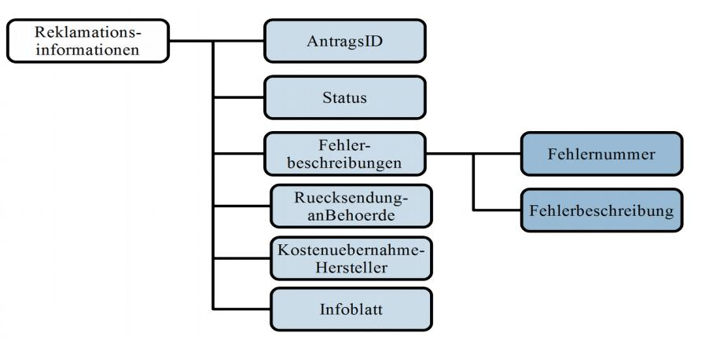

*Abbildung 15: Reklamationsinformation*

| Tabelle 25: Reklamationsinformation |                 |               |                                                                                                                                                                                                                                                |  |
|-------------------------------------|-----------------|---------------|------------------------------------------------------------------------------------------------------------------------------------------------------------------------------------------------------------------------------------------------|--|
| Daten                               | Pflicht feld | Feld länge | Regelungen                                                                                                                                                                                                                                     |  |
| Reklamationsinformationen           | X               |               | Die Reklamationsinformationen beinhalteten die Bestätigungen oder Zurückweisungen der Reklamationen.                                                                                                                                     |  |
| AntragsID                           | X               | ≤ 40          | Hier sind nur Ziffern von 0 bis 9, Groß- und Kleinbuchstaben und Sonderzeichen zu ver wenden.                                                                                                                                            |  |
| Status                              | X               |               | Hier ist ein boolscher Wert zu verwenden. Ist der Wert positiv, wurde die Reklamation angenom men. Ist der Wert negativ, wurde die Reklamati on abgelehnt und das Feld Fehlerbeschreibung beinhaltet weiterführende Informationen. |  |
| Fehlerbeschreibungen                |                 |               |                                                                                                                                                                                                                                                |  |
| Fehlernummer                        |                 |               | Die aktuelle Liste der Zahlencodes zur Fehlerbe schreibung wird vom Dokumentenhersteller ge pflegt. Hier sind nur Ziffern von 0 bis 9 zu verwenden.                                                                                   |  |
| Fehlerbeschreibung                  |                 |               | Zu verwenden sind hier nur Zeichen aus dem String.LatinXhD Zeichensatz entsprechend Ka pitel 3.2.3.                                                                                                                                      |  |

| Tabelle 25: Reklamationsinformation |                 |               |                                                                                                                                                                 |
|-------------------------------------|-----------------|---------------|-----------------------------------------------------------------------------------------------------------------------------------------------------------------|
| Daten                               | Pflicht feld | Feld länge | Regelungen                                                                                                                                                      |
| RuecksendungAnBehoerde              |                 |               | Information, ob der Hersteller das Dokument zurücksendet. WAHR: Hersteller sendet das Dokument zurück. FALSCH: Hersteller behält das Dokument ein.     |
| KostenUebernahmeHersteller          |                 |               | Information, ob der Hersteller die Kosten der Reklamation übernimmt. WAHR: Hersteller übernimmt die Kosten. FALSCH: Hersteller übernimmt Kosten nicht. |
| Infoblatt                           |                 |               | Anhang eines Informationsblatts als PDF                                                                                                                         |

## 4.6 Fehlerinformation

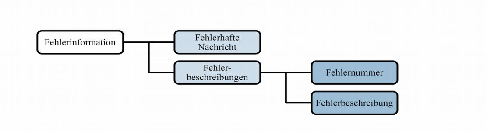

*Abbildung 16: Fehlerinformation*

|  | Tabelle 26: Fehlerinformation |                 |               |                                                                                                                                                                                                                                                               |  |
|--|-------------------------------|-----------------|---------------|---------------------------------------------------------------------------------------------------------------------------------------------------------------------------------------------------------------------------------------------------------------|--|
|  | Daten                         | Pflicht feld | Feld länge | Regelungen                                                                                                                                                                                                                                                    |  |
|  | Fehlerinformation             | X               |               |                                                                                                                                                                                                                                                               |  |
|  | FehlerhafteNachricht          | X               |               | Enthält die Base64-codierte Nachricht, die den Fehler hervorgerufen hat bzw. beinhaltet.                                                                                                                                                                   |  |
|  | Fehlerbeschreibung            | X               |               |                                                                                                                                                                                                                                                               |  |
|  | Fehlernummer                  | X               | *             | Die aktuelle Liste der Zahlencodes zur Fehlerbe schreibung wird vom Dokumentenhersteller ge pflegt. Hier sind nur Ziffern von 0 bis 9 zu verwenden.                                                                                                  |  |
|  | Fehlerbeschreibung            | X               | *             | Die textuelle Beschreibung der Fehler wird vom Dokumentenhersteller festgelegt. Die aktuelle Liste wird vom Dokumentenhersteller gepflegt. Zu verwenden sind hier nur Zeichen aus dem String.LatinXhD Zeichensatz entsprechend Kapi tel 3.2.3. |  |

## 5 Literaturverzeichnis

| [String.Latin]       | Einheitlicher Zeichensatz String.Latin zur Verwendung in XÖV-Projekten in der Version 1.1.1                                                                                      |
|----------------------|-------------------------------------------------------------------------------------------------------------------------------------------------------------------------------------|
| [TR 03104]           | http://xoev.de/latinchars/1_1/ Technische Richtlinie zur Produktionsdatenerfassung, -qualitätsprüfung und -übermittlung für hoheitliche Dokumente (TR PDÜ hD) BSI TR-03104 |
| [TR XhD-3]           | Technische Richtlinie – XML-Datenaustauschformat für hoheitliche Dokumente (TR XhD) 3 - Funktionsmodule BSI TR-03123-3                                                        |
| [TR SiSKo hD]        | Technische Richtlinie – Sichere Szenarien für Kommunikationsprozesse im Be reich hoheitlicher Dokumente (TR SiSKo hD) BSI TR-03132                                            |
| [TR Architektur ePA] | Technische Richtlinie – Architektur neuer Personalausweis und elektronischer Aufenthaltstitel BSI TR-03127                                                                    |
| [TR Biometrie]       | Technische Richtlinie – Biometrics for Public Sector Applications                                                                                                                   |
|                      | BSI TR-03121                                                                                                                                                                        |

## 6 Abkürzungsverzeichnis

| Abkürzung | Beschreibung                                                                                                                     |
|-----------|----------------------------------------------------------------------------------------------------------------------------------|
| BKZ       | Behördenkennzahl                                                                                                                 |
| eAT       | Elektronischer Aufenthaltstitel                                                                                                  |
| eID       | Elektronischer Identitätsnachweis                                                                                                |
| EPA       | Elektronischer (neuer) Personalausweis                                                                                           |
| ePass     | Elektronischer Reisepass                                                                                                         |
| eRA       | Elektronischer Reiseausweis für Ausländer, Staatenlose und Flüchtlinge                                                           |
| ID        | Identifikations-Nummer                                                                                                           |
| TR        | Technische Richtlinie                                                                                                            |
| TR PDÜ hD | Technische Richtlinie zur Produktionsdatenerfassung, -qualitätsprüfung und -übermitt lung für hoheitliche Dokumente, TR-03104 |
| TR XhD    | Technische Richtlinie – XML-Datenaustauschformat für hoheitliche Dokumente, TR 03123                                          |
| XML       | Extensible Markup Language                                                                                                       |