## Technische Richtlinie – XML-Datenaustauschformat für hoheitliche Dokumente (TR XhD)

3 - Funktionsmodule

Version 1.6.1

25.01.2021

BSI TR-03123-3

 Bundesamt für Sicherheit in der Informationstechnik Postfach 20 03 63 53133 Bonn

 

 E-Mail: xhd@bsi.bund.de Internet: https://www.bsi.bund.de © Bundesamt für Sicherheit in der Informationstechnik 2021

| Versionshistorie 1                                       |    |  |  |  |
|----------------------------------------------------------|----|--|--|--|
| 1 Struktur                                               | 5  |  |  |  |
| 2 Nachrichten                                            | 7  |  |  |  |
| 2.1 Übersicht 7                                          |    |  |  |  |
| 2.2 AbstrakteNachrichtType 7                             |    |  |  |  |
| 2.2.1 Nutzung des Datentyps 8                            |    |  |  |  |
| 2.3 BestellungDokument 8                                 |    |  |  |  |
| 2.4 BestellungSeriennummern 9                            |    |  |  |  |
| 2.5 Auftragsinformation 9                                |    |  |  |  |
| 2.6 Reklamationsinformation 10                           |    |  |  |  |
| 2.7 Lieferinformation 11                                 |    |  |  |  |
| 2.8 Quittierung                                          | 11 |  |  |  |
| 2.9 Fehlerinformation 12                                 |    |  |  |  |
| 3 Baukasten 15                                           |    |  |  |  |
| 3.1 Nachrichtenmodule 15                                 |    |  |  |  |
| 3.1.1 Übersicht                                          | 15 |  |  |  |
| 3.1.2 NachrichtenkopfType 18                             |    |  |  |  |
| 3.1.3 AntraegeType 20                                    |    |  |  |  |
| 3.1.4 AntragsbezogeneDatenType 21                        |    |  |  |  |
| 3.1.5 AntragsdatensatzType                               | 21 |  |  |  |
| 3.1.6 AntragsdatensatzDokumentType 22                    |    |  |  |  |
| 3.1.7 AntragsdatensatzPassbuchType                       | 22 |  |  |  |
| 3.1.8 AntragsdatensatzPassType                           | 23 |  |  |  |
| 3.1.9 AntragsdatensatzReiseausweisType 23                |    |  |  |  |
| 3.1.10 AntragsdatensatzEIDDokumentType 24                |    |  |  |  |
| 3.1.11 AntragsdatensatzEIDKarteUBType                    |    |  |  |  |
| 3.1.12 AntragsdatensatzPersonalausweisType 25            |    |  |  |  |
| 3.1.13 AntragsdatensatzAufenthaltstitelType 25           |    |  |  |  |
| 3.1.14 AufenthaltstiteldatenType 26                      |    |  |  |  |
| 3.1.15 AnmerkungenRechtsgrundlagenUndPassdokumentType 27 |    |  |  |  |
| 3.1.16 AnmerkungenErwerbstaetigkeitType 27               |    |  |  |  |
| 3.1.17 FehlerbeschreibungType                            | 27 |  |  |  |
| 3.1.18 LieferinformationInhaltType 28                    |    |  |  |  |
| 3.1.19 LieferinformationSeriennummerType                 | 29 |  |  |  |
| 3.1.20 LieferinformationDokumentType                     | 29 |  |  |  |
| 3.1.21 RueckmeldungType 30                               |    |  |  |  |
| 3.1.22 RueckmeldungReklamationType 30                    |    |  |  |  |
| 3.2 Datenmodule 31                                       |    |  |  |  |
| 3.2.1 BehoerdenadresseType 31                            |    |  |  |  |
| 3.2.2 DienstinfoType 32                                  |    |  |  |  |
| 3.2.3 CTYPE_AuftragsinformationType                      | 33 |  |  |  |
| 3.2.4 CTYPE_Bestellungen_SeriennummerType 33             |    |  |  |  |
| 3.2.5 CTYPE_BestellungenType                             | 34 |  |  |  |
| 3.2.6 CTYPE_FehlerinformationType                        | 35 |  |  |  |
| 3.2.7 CTYPE_LieferinformationType                        | 35 |  |  |  |
| 3.2.8 CTYPE_NachrichtenType 36                           |    |  |  |  |
| 3.2.9 CTYPE_QuittierungType 36                           |    |  |  |  |
| 3.2.10 CTYPE_ReklamationsinformationType                 | 36 |  |  |  |
| 3.2.11 DokumentendatenType                               | 37 |  |  |  |
| 3.2.12 DruckrepraesentationType 38                       |    |  |  |  |

| 3.2.13 ElektronischeIDType                | 39 |
|-------------------------------------------|----|
| 3.2.14 GeburtType                         | 40 |
| 3.2.15 OptionaleEintragungenType 40       |    |
| 3.2.16 PersonendatenType 41               |    |
| 3.2.17 PINAdresseType 42                  |    |
| 3.2.18 PINDatenType                       | 43 |
| 3.2.19 ReklamationType 43                 |    |
| 3.2.20 ReklamationsgrundType              | 44 |
| 3.2.21 TRBiometricsXMLType                | 45 |
| 3.2.22 ZertifizierteKomponentenType 45    |    |
| 3.2.23 ZertifizierteKomponenteType 45     |    |
| 3.3 XÖV-Module                            | 46 |
| 3.3.1 AllgemeinerNameType 46              |    |
| 3.3.2 AnschriftType 47                    |    |
| 3.3.3 GeschlechtType                      | 48 |
| 3.3.4 NameNatuerlichePersonType 48        |    |
| 3.3.5 NameOrganisationType 49             |    |
| 3.3.6 NatuerlichePersonType               | 50 |
| 3.3.7 StaatType 50                        |    |
| 4 Datentypen 53                           |    |
| 4.1 Übersicht                             | 53 |
| 4.2 BildType                              | 53 |
|                                           |    |
| 4.2.1 Nutzung des Datentyps               | 54 |
| 4.3 DruckzeileType 54                     |    |
| 4.3.1 Nutzung des Datentyps               | 54 |
| 4.4 GroesseType 54                        |    |
| 4.4.1 Nutzung des Datentyps               | 54 |
| 4.5 TestflagType 55                       |    |
| 4.5.1 Nutzung des Datentyps               | 55 |
| 4.6 String.MRZ 55                         |    |
| 4.6.1 Nutzung des Datentyps               | 55 |
| 4.7 Übersicht über die Code-Datentypen 55 |    |
| 4.7.1 AufenthaltstitelartCodeType         | 55 |
| 4.7.2 DokumentenartCodeType 55            |    |
| 4.7.3 DruckzeilenCodeType                 | 56 |
| 4.7.4 GeschlechterCodeType                | 56 |
| 4.7.5 OptionaltextCodeType 56             |    |
| 4.7.6 PassartCodeType 57                  |    |
| 4.7.7 ReiseausweisartCodeType             | 57 |
| 4.7.8 ReklamationsklasseCodeType 57       |    |
| 4.7.9 StaatenCodeType 57                  |    |
| 5 Codelisten                              | 59 |
| 5.1 Überblick                             | 59 |
| 5.2 Codelisten                            | 59 |
| 5.2.1 Übersicht                           | 59 |
| 5.2.2 Details                             | 60 |
| 6 Referenzen                              | 71 |
| 7 Eingebundene externe Modelle 73         |    |
| 7.1 TR Bio                                | 73 |
| 7.2 XOEV-Bibliothek 73                    |    |
|                                           |    |

| 1.1 Struktur der TRXhD-Schemata 5                     |    |  |  |  |
|-------------------------------------------------------|----|--|--|--|
| 2.1 Nachrichten Übersicht                             | 7  |  |  |  |
| 2.2 AbstrakteNachrichtType 8                          |    |  |  |  |
| 2.3 BestellungDokument 8                              |    |  |  |  |
| 2.4 BestellungSeriennummern 9                         |    |  |  |  |
| 2.5 Auftragsinformation 10                            |    |  |  |  |
| 2.6 Reklamationsinformation                           | 10 |  |  |  |
| 2.7 Lieferinformation 11                              |    |  |  |  |
| 2.8 Quittierung                                       | 12 |  |  |  |
| 2.9 Fehlerinformation 12                              |    |  |  |  |
| 3.1 Übersicht Nachrichtenmodule 15                    |    |  |  |  |
| 3.2 Übersicht Antragsdatensatz 16                     |    |  |  |  |
| 3.3 AntragsdatensatzDokumentType 17                |    |  |  |  |
| 3.4 Übersicht Lieferinformationen 18                  |    |  |  |  |
| 3.5 NachrichtenkopfType 19                            |    |  |  |  |
| 3.6 AntraegeType                                      | 20 |  |  |  |
| 3.7 AntragsbezogeneDatenType                          | 21 |  |  |  |
| 3.8 AntragsdatensatzDokumentType                      | 22 |  |  |  |
| 3.9 AntragsdatensatzPassType 23                       |    |  |  |  |
| 3.10 AntragsdatensatzReiseausweisType 24              |    |  |  |  |
| 3.11 AntragsdatensatzEIDDokumentType                  | 24 |  |  |  |
| 3.12 AntragsdatensatzAufenthaltstitelType 25          |    |  |  |  |
| 3.13 AufenthaltstiteldatenType                        | 26 |  |  |  |
| 3.14 AnmerkungenRechtsgrundlagenUndPassdokumentType   | 27 |  |  |  |
| 3.15 AnmerkungenErwerbstaetigkeitType 27              |    |  |  |  |
| 3.16 FehlerbeschreibungType 28                        |    |  |  |  |
|                                                       |    |  |  |  |
| 3.17 LieferinformationInhaltType                      |    |  |  |  |
|                                                       | 28 |  |  |  |
| 3.18 LieferinformationSeriennummerType 29             |    |  |  |  |
| 3.19 LieferinformationDokumentType 29                 |    |  |  |  |
| 3.20 RueckmeldungType 30                              |    |  |  |  |
| 3.21 RueckmeldungReklamationType 31                   |    |  |  |  |
| 3.22 BehoerdenadresseType 31                          |    |  |  |  |
| 3.23 DienstinfoType 32                                |    |  |  |  |
| 3.24 CTYPE_AuftragsinformationType 33                 |    |  |  |  |
| 3.25 CTYPE_Bestellungen_SeriennummerType              | 33 |  |  |  |
| 3.26 CTYPE_BestellungenType 34                        |    |  |  |  |
| 3.27 CTYPE_FehlerinformationType 35                   |    |  |  |  |
| 3.28 CTYPE_LieferinformationType 35                   |    |  |  |  |
| 3.29 CTYPE_QuittierungType 36                         |    |  |  |  |
| 3.30 CTYPE_ReklamationsinformationType 37             |    |  |  |  |
| 3.31 DokumentendatenType 37                           |    |  |  |  |
| 3.32 DruckrepraesentationType                         | 38 |  |  |  |
| 3.33 ElektronischeIDType 39                           |    |  |  |  |
| 3.34 GeburtType 40                                    |    |  |  |  |
| 3.35 OptionaleEintragungenType 40                     |    |  |  |  |
| 3.36 PersonendatenType                                | 41 |  |  |  |
| 3.37 PINAdresseType 42                                |    |  |  |  |
| 3.38 PINDatenType                                     | 43 |  |  |  |
| 3.39 ReklamationType 3.40 ReklamationsgrundType 44 | 43 |  |  |  |

| 3.41 TRBiometricsXMLType          | 45 |  |  |  |
|-----------------------------------|----|--|--|--|
| 3.42 ZertifizierteKomponentenType | 45 |  |  |  |
| 3.43 ZertifizierteKomponenteType  |    |  |  |  |
| 3.44 AllgemeinerNameType 46       |    |  |  |  |
| 3.45 AnschriftType                | 47 |  |  |  |
| 3.46 GeschlechtType 48            |    |  |  |  |
| 3.47 NameNatuerlichePersonType 48 |    |  |  |  |
| 3.48 NameOrganisationType 49      |    |  |  |  |
| 3.49 NatuerlichePersonType 50     |    |  |  |  |
| 3.50 StaatType                    | 51 |  |  |  |
| 4.1 Datentypen                    | 53 |  |  |  |
| 4.2 DruckzeileType 54             |    |  |  |  |
| 5.1 Codelisten                    | 59 |  |  |  |

| Version | Datum      | Kommentar                                                                                                                                               |
|---------|------------|---------------------------------------------------------------------------------------------------------------------------------------------------------|
| 1.3     | 15.05.2012 | Migration auf die XÖV-Produktionsumgebung V1.05.                                                                                                        |
| 1.3.1   | 14.12.2012 | Keine Änderungen an der TR XhD. Austausch der importierten Datei bio_face.xsd. Abbil dungen 3.8, 3.12 und 3.27 hinzugefügt.                          |
| 1.4     | 18.11.2013 | Einführung des abstrakten Typ AntragsdatensatzPassbuchType und dessen Element AmtlicherVermerk vom Typ AmtlicherVermerkType.                         |
|         |            | AntragsdatensatzPassbuchType ist der neue Basistyp von AntragsdatensatzReiseausweis Type und AntragsdatensatzPassType.                               |
|         |            | Erweiterung der Codeliste DruckzeilenCodeContentType um den Eintrag AmtlicherVer merk.                                                               |
|         |            | Erweiterung des AntragsdatensatzAufenthaltstitelType um das Element Aufenthaltsti telDokumentGueltigVon.                                             |
|         |            | Entfernen der Elemente Zusatzinformationen und StatusCode aus dem Datentyp AntragsbezogeneDatenType.                                                 |
|         |            | Entfernen aus dem Model des Basisdatentyps ZusatzinformationType.                                                                                       |
|         |            | Entfernen des Wertes Andere aus der Codeliste AufenthaltstitelartCodeContentType.                                                                       |
|         |            | Anpassung des Kommentars zu dem Element Aufenthaltstitelart in dem Datentyp AntragsdatensatzAufenthaltstitelType.                                    |
|         |            | Austausch der importierten Datei bio_face.xsd (das Element bio_face:qa_face ist optional).                                                              |
|         |            | Das Element AmtlicherVermerk im Datentyp xhd:AntragsdatensatzPassbuchType ist optional.                                                              |
|         |            | Das Element Vermerk im Datentyp xhd:AmtlicherVermerkType ist entfernt worden.                                                                           |
|         |            | Der Wert Andere ist aus der Codeliste DruckzeilenCodeContentType entfernt worden.                                                                       |
|         |            | Die Beschreibung des Elements xhd:AntragsdatensatzAufenthaltstitelType/Aufenthalts titelDokumentGueltigVon ist angepasst worden.                     |
|         |            | Hinzufügen des Wertes Kostenpflichtig zur Codeliste ReklamationsklasseCodeContent Type.                                                              |
|         |            | Hinzufügen des Wertes unbekanntes Geschlecht zur Codeliste GeschlechterCodeCon tentType.                                                             |
|         |            | Das Element Verfahrenskennung im Datentyp NachrichtenkopfType ist verpflichtend.                                                                        |
| 1.4.1   | 18.11.2014 | Portierung auf das XöV-Handbuch 2.0.                                                                                                                    |
| 1.4.2   | 28.09.2017 | Ergänzung der Aufenthaltstitelarten ICT-Karte und Mobiler-ICT-Karte.                                                                                    |
| 1.5     | 26.10.2018 | Änderungsanträge der TechAG:                                                                                                                            |
|         |            | Ergänzung des Codewerts "Geburtsname" in der Codeliste "DruckzeileCodeContentTy pe".                                                                 |
|         |            | Erweiterung der Codeliste ReklamationsklasseCodeContentType um die Codewerte "VersandVerlust" und "VersandSchaden".                                  |
|         |            | Anreicherung des Datentyps ReklamationType um die Elemente "Kontaktdaten", "aus gehaendigt" und "NichterhaltBINBrief".                               |
|         |            | Anreicherung des Datentyps CTYPE_ReklamationsinformationType um die Elemente "kostenUebernahmeHersteller", "ruecksendungAnBehoerde" und "Infoblatt". |
|         |            | Entfernung des Datentyps "AmtlicherVermerk" sowie des entsprechenden Druckzei len-Typs.                                                              |
|         |            | Typänderung des Elements "Ruecksendeadresse" im Datentyp PinDatenType. Entspre chend Entfernung des Druckzeilentyps RuecksendeAdressePIN             |

#### Versionshistorie

| Version | Datum      | Kommentar                                                                                                                                                                                                                                                                                                                                                                                |
|---------|------------|------------------------------------------------------------------------------------------------------------------------------------------------------------------------------------------------------------------------------------------------------------------------------------------------------------------------------------------------------------------------------------------|
|         |            | Anpassungen des Datentyps OptionaleEintragungenType: Anpassung von Multiplizitä ten der Länderangaben "land" und "land_ausname", sowie deren Gruppierung mit "guel tigfueralle" in einem Auswahl-Block.                                                                                                                                                                            |
|         |            | Abbildung von Normtexten ("optionaltext") über die Codeliste OptionaltextCodeCon tentType.                                                                                                                                                                                                                                                                                            |
|         |            | Typänderung des Elements "unterlagen" in Druckrepräsentation sowie Ergänzung eines entsprechenden Druckzeilen-Typs;                                                                                                                                                                                                                                                                   |
|         |            | Änderungen am elektronischen Aufenthaltstitel (eAT):                                                                                                                                                                                                                                                                                                                                     |
|         |            | Entfernung des Codewerts NF (Niederlassungserlaubnis Familienangehöriger) aus der Codeliste AufenthaltstitelartCodeContentType.                                                                                                                                                                                                                                                       |
|         |            | Entfernung der Elemente "Unbefristet" und "AufenthaltstitelDokumentGueltigVon" aus dem Datentyp AntragsdatensatzAufenthaltstitelType.                                                                                                                                                                                                                                                 |
|         |            | Ergänzung der Elemente "AnmerkungenRechtsgrundlagenUndPassdokument", "AnmerkungenErwerbstätigkeit" jeweils als Unterelemente vom Typ Druckrepräsen tation im Datentyp AntragsdatensatzAufenthaltstitelType, Entfernung des Elements "Anmerkungen" sowie des Druckzeilen-Typs "Anmerkungen". Entfernung des Elements AufenthaltstitelDatenType.Druckrepraesentation. |
|         |            | Erweiterung der Codeliste "DruckzeileCodeContentType" um die Codewerte "Behörden nameKurzeZeile", "AnmerkungenRechtsgrundlagenUndPassdokument", "Anmerkun genErwerbstätigkeit".                                                                                                                                                                                                    |
|         |            | Erweiterung von Personalausweis eAT und eID-UB um eine Auslandsanschrift: Ergän zung des Elements "Staat" in den Anschriften. Anpassung von Feldlängen für Namen, Anschrift, Anmerkungen und weitere.                                                                                                                                                                              |
|         |            | Die Elemente ElektronischeIDType.WohnortAusland sowie PINDaten.PINBriefLand wurden daher entfernt, ebenso wie der Druckzeilen-Typ PINBriefLand.                                                                                                                                                                                                                                       |
|         |            | Ergänzung der eID-Karte für Unionsbürger (eID-UB):                                                                                                                                                                                                                                                                                                                                       |
|         |            | Darstellung der neuen Dokumentenart eID-Karte für Unionsbürger (eID-UB).                                                                                                                                                                                                                                                                                                                 |
|         |            | Weitere Änderungen:                                                                                                                                                                                                                                                                                                                                                                      |
|         |            | Aktualisierung der Biometrie-Bestandteile (gemäß BSI TR-03121): Ersetzung der Elemen te bio-face und bio-finger durch Element gid-app in biometrischen Merkmalen.                                                                                                                                                                                                                     |
|         |            | Zusammenlegung von Straße und Hausnummer in AnschriftType zu StrasseUndHaus nummer, außerdem Ergänzung des Elements Region.                                                                                                                                                                                                                                                           |
| 1.5.2   | 12.03.2020 | Ergänzung der Aufenthaltsdokumentarten nach Artikel 50 EUV.                                                                                                                                                                                                                                                                                                                              |
| 1.6.0   | 20.10.2020 | Einbindung der aktuellen Schema-Version 4.6 der BSI TR-03121 Biometrie in hoheitli chen Anwendungen.                                                                                                                                                                                                                                                                                  |
|         |            | Erweiterung der Anschrift um ein Flag "ImAusLandLebendKeinNachvollziehbarer Wohnsitz" für die Verwendung im Personalausweis und in der eID-Karte für Unionsbür ger (Aufhebung der Übergangslösung aus Version 1.5.1).                                                                                                                                                              |
|         |            | Generierung eines neuen Datentyps "RueckmeldungReklamationType", der die Elemen te "RuecksendungAnBehoerde", "KostenUebernahmeHersteller" und "Infoblatt" in die Klammer "Reklamationsinformationen" aufnimmt.                                                                                                                                                                     |
|         |            | Ergänzung eines Datenfeldes für die Übertragung einer alternativen Kürzung der Namensbestandteile für die MRZ. Hinzunahme eines neuen Datentyps "String.MRZ", der hierbei verwendet wird.                                                                                                                                                                                          |
|         |            | Ersetzung des Datentyps "String.LatinXhD" um den "Datentyp B" des String.Latin+ 1.2.                                                                                                                                                                                                                                                                                                     |
| 1.6.1   | 25.01.2021 | Ergänzung um die Bestellmöglichkeit zweier weiterer Dokumente, als Folge der am 26. 11.2020 in Kraft getretenen Anpassung des Freizügigkeitsgesetzes EU an das Unionsrecht:                                                                                                                                                                                                           |

| Version | Datum | Kommentar                                                                                                                                          |
|---------|-------|----------------------------------------------------------------------------------------------------------------------------------------------------|
|         |       | - Aufenthaltskarte für eine nahestehende Person eines Unionsbürgers                                                                                |
|         |       | - Daueraufenthaltskarte für eine nahestehende Person eines Unionsbürgers                                                                           |
|         |       | Hieraus folgt eine neue Codeliste "Art des Aufenthaltstitels". Weitere Unterschiede zwi schen Version 1.6.0 und Version 1.6.1 existieren nicht. |

# **1 Struktur**

Die TR XhD besteht, entsprechend den Vorgaben und Empfehlungen der XÖV-Standardisierung, aus den vier XML-Schemata Nachrichten.xsd, Baukasten.xsd, Datentypen.xsd und Codelisten.xsd. Die folgende Abbildung zeigt die Abhängigkeiten der einzelnen Schemata der TR XhD:

#### **Abbildung 1.1. Struktur der TRXhD-Schemata**

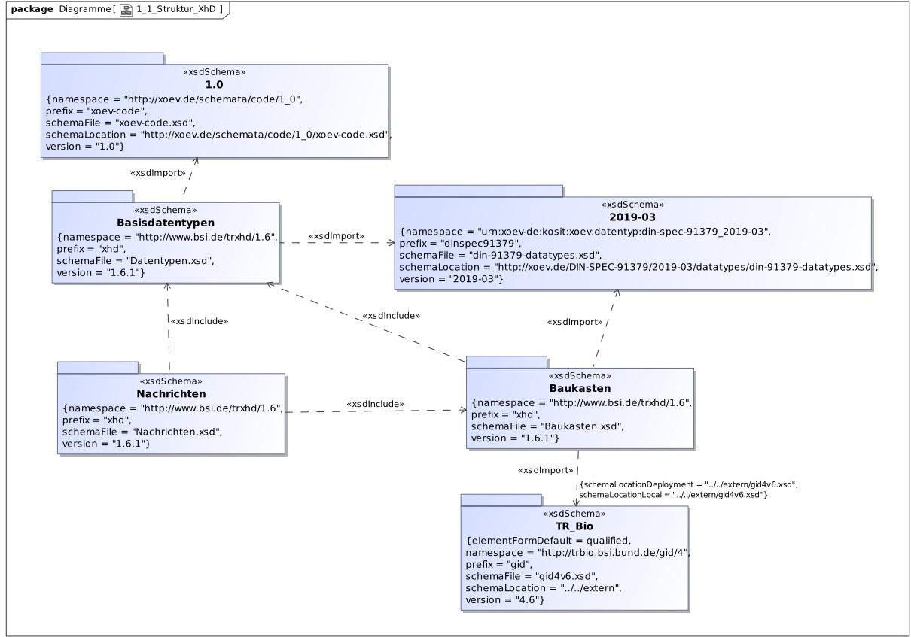

| Nachrichten | Enthält alle in der TR XhD elektronisch ausgetauschten Nachrichten.                                                                                                                                                                                                                                                                                          |
|-------------|--------------------------------------------------------------------------------------------------------------------------------------------------------------------------------------------------------------------------------------------------------------------------------------------------------------------------------------------------------------|
| Baukasten   | Enthält alle projektspezifisch erstellten Schema-Typen, die direkt oder indirekt in den Nach richten verwendet werden.                                                                                                                                                                                                                                    |
|             | Die Typen im Schema Baukasten lassen sich weiter in die Gruppen Nachrichtenmodule, Daten module und XÖV-Module unterteilen. Diese Gruppierung wird in dieser Dokumentation zum leichteren Verständnis verwendet und ist, analog den XÖV-Standardisierungsempfehlungen, nicht im Schema abgebildet.                                                  |
|             | Dabei sind Nachrichtenmodule Schema-Typen, die direkt in den Nachrichten verwendet wer den. Die Nachrichtenmodule setzen sich aus den Schema-Typen der Datenmodule, XÖV Module und der Typen aus dem Schema Datentypen zusammen. In der Gruppe der Datenmo dule sind komplexe Schema-Typen enthalten, die nicht direkt in den Nachrichten verwendet |

|                               |     | werden und auch nicht von XÖV-Komponenten abgeleitet sind. In der Gruppe XÖV-Module sind die Schema-Typen enthalten, die von XÖV-Komponenten abgeleitet sind.                                                                |
|-------------------------------|-----|---------------------------------------------------------------------------------------------------------------------------------------------------------------------------------------------------------------------------------|
| Datentypen                    |     | Enthält alle projektspezifisch erstellten Datentypen einfachen Inhalts, z. B. begrenzte Zeichen ketten sowie Wertelisten, Codelisten, Schlüsseltabellen, etc., die im Baukasten und in den Nach richten verwendet werden. |
| Komponenten XÖV-Bibliothek | der | Die Schemata din-91379-datatypes.xsd (2019-03) sowie xoev-code.xsd (1.0) enthalten XÖV-Spe zifische Datentypen für die Abbildung von Strings und Katalogen/Codelisten.                                                       |

Die Version der XML-Schemata (Nachrichten.xsd, Baukasten.xsd, Datentypen.xsd und Codelisten.xsd) wird im Namespace der Schema-Dateien (targetNamespace) festgelegt. Erfolgen Schemaänderungen, die Inkompatibilitäten zur Folge haben, wird die Versionsnummer im Namespace hochgezählt.

# **2 Nachrichten**

## 2.1 Übersicht

### **Abbildung 2.1. Nachrichten Übersicht**

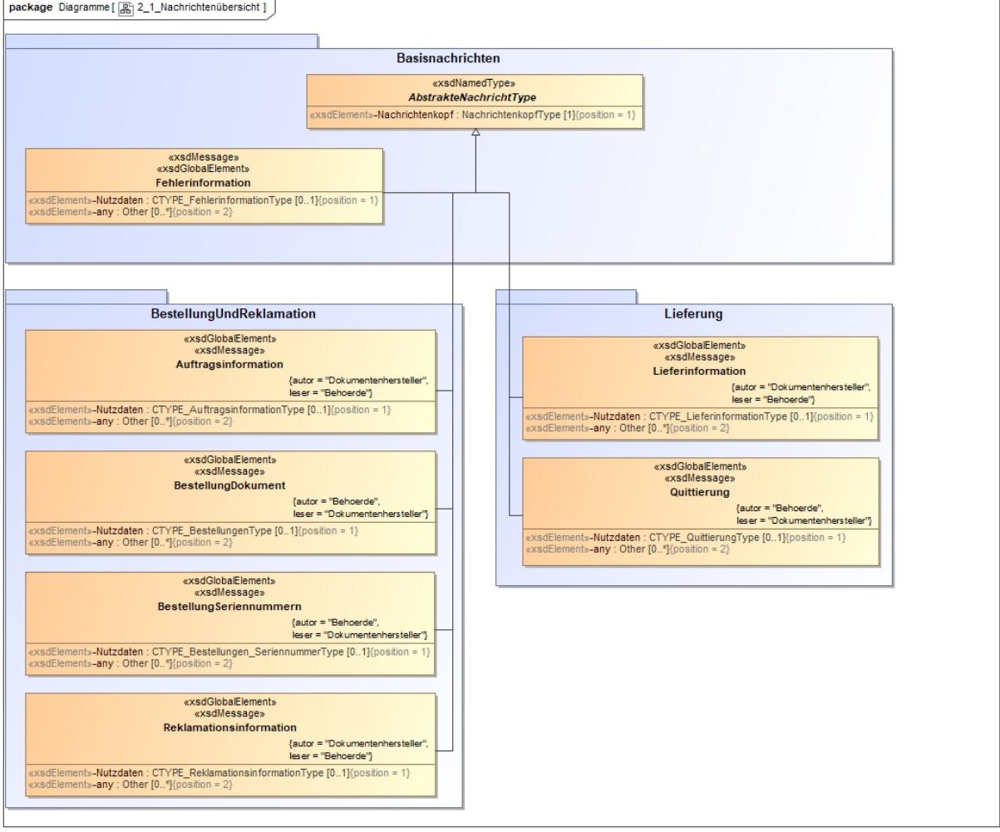

## 2.2 AbstrakteNachrichtType

Die AbstrakteNachricht ist das Basiselement aller Nachrichten, von der alle Nachrichten abgeleitet werden. Eine AbstrakteNachricht wird nie selbst versendet. Sie fasst die gemeinsamen Elemente, wie Nachrichtenkopf und Zusatzinformationen, aller Nachrichten zusammen.

#### **Abbildung 2.2. AbstrakteNachrichtType**

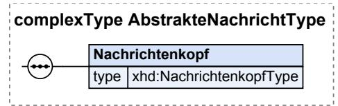

| Kindelement von AbstrakteNachrichtType               |  |                     |  |      |       |       |  |
|------------------------------------------------------|--|---------------------|--|------|-------|-------|--|
| Kindelement                                          |  | Typ                 |  | Anz. | Ref.  | Seite |  |
| Nachrichtenkopf                                      |  | NachrichtenkopfType |  | 1    | 3.1.2 | 18    |  |
| Der allgemeine Nachrichtenkopf für alle Nachrichten. |  |                     |  |      |       |       |  |

## 2.2.1 Nutzung des Datentyps

Von diesem Typ leiten ab: [Auftragsinformation](#page-14-1), [BestellungDokument,](#page-13-1) [BestellungSeriennummern,](#page-14-0) [Fehler](#page-17-0)[information](#page-17-0), [Lieferinformation](#page-16-0), [Quittierung,](#page-16-1) [Reklamationsinformation](#page-15-0)

## 2.3 BestellungDokument

Mit der Nachricht Bestellung bestellt die Behörde Dokumente beim Dokumentenhersteller.

| Eigenschaft       | Wert                 |
|-------------------|----------------------|
| Autor (allgemein) | Behoerde             |
| Leser (allgemein) | Dokumentenhersteller |

#### **Abbildung 2.3. BestellungDokument**

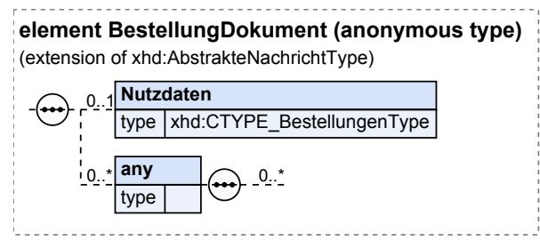

#### Diese Nachricht ist eine Erweiterung des Basistyps **AbstrakteNachrichtType** (siehe [Abschnitt 2.2 auf](#page-12-2) [Seite 7\)](#page-12-2).

| Kindelemente von BestellungDokument                   |                        |      |       |       |  |  |  |
|-------------------------------------------------------|------------------------|------|-------|-------|--|--|--|
| Kindelement                                           | Typ                    | Anz. | Ref.  | Seite |  |  |  |
| Nutzdaten                                             | CTYPE_BestellungenType | 01   | 3.2.5 | 34    |  |  |  |
| Nutzdaten für die Nachrichten vom Typ "Bestellungen". |                        |      |       |       |  |  |  |
| any                                                   |                        | 0n   |       |       |  |  |  |

| Kindelemente von BestellungDokument                                      |     |      |      |       |
|--------------------------------------------------------------------------|-----|------|------|-------|
| Kindelement                                                              | Typ | Anz. | Ref. | Seite |
| Dieses Element kann für Signatur und Schemaerweiterungen genutzt werden. |     |      |      |       |

## 2.4 BestellungSeriennummern

Mit der Nachricht Bestellung bestellt die Behörde Seriennummern beim Dokumentenhersteller.

| Eigenschaft       | Wert                 |
|-------------------|----------------------|
| Autor (allgemein) | Behoerde             |
| Leser (allgemein) | Dokumentenhersteller |

#### **Abbildung 2.4. BestellungSeriennummern**

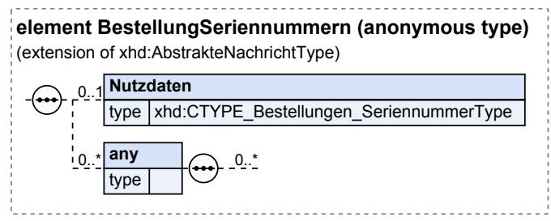

Diese Nachricht ist eine Erweiterung des Basistyps **AbstrakteNachrichtType** (siehe [Abschnitt 2.2 auf](#page-12-2) [Seite 7\)](#page-12-2).

| Kindelemente von BestellungSeriennummern                        |                                                                          |      |       |       |
|-----------------------------------------------------------------|--------------------------------------------------------------------------|------|-------|-------|
| Kindelement                                                     | Typ                                                                      | Anz. | Ref.  | Seite |
| Nutzdaten                                                       | CTYPE_Bestellungen_ SeriennummerType                                  | 01   | 3.2.4 | 33    |
| Nutzdaten für die Nachrichten zur Bestellung von Seriennummern. |                                                                          |      |       |       |
| any                                                             |                                                                          | 0n   |       |       |
|                                                                 | Dieses Element kann für Signatur und Schemaerweiterungen genutzt werden. |      |       |       |

## 2.5 Auftragsinformation

Die Nachricht Auftragsinformation wird vom Dokumentenhersteller als Antwort auf die Nachricht Bestellung gesendet. Mit der Nachricht werden die bestellten Positionen bestätigt oder Fehlerinformationen zu Positionen übertragen.

| Eigenschaft       | Wert                 |
|-------------------|----------------------|
| Autor (allgemein) | Dokumentenhersteller |
| Leser (allgemein) | Behoerde             |

#### **Abbildung 2.5. Auftragsinformation**

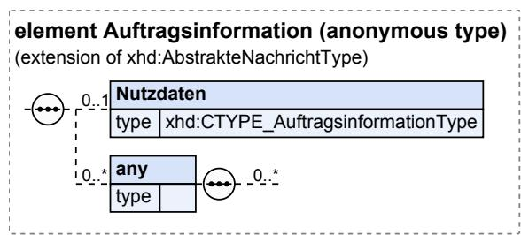

Diese Nachricht ist eine Erweiterung des Basistyps **AbstrakteNachrichtType** (siehe [Abschnitt 2.2 auf](#page-12-2) [Seite 7\)](#page-12-2).

| Kindelemente von Auftragsinformation                                     |                               |      |       |       |
|--------------------------------------------------------------------------|-------------------------------|------|-------|-------|
| Kindelement                                                              | Typ                           | Anz. | Ref.  | Seite |
| Nutzdaten                                                                | CTYPE_AuftragsinformationType | 01   | 3.2.3 | 33    |
| Nutzdaten für die Nachrichten vom Typ "Auftragsinformation".             |                               |      |       |       |
| any                                                                      |                               | 0n   |       |       |
| Dieses Element kann für Signatur und Schemaerweiterungen genutzt werden. |                               |      |       |       |

## 2.6 Reklamationsinformation

Mit der Nachricht Reklamationsinformation sendet der Dokumentenhersteller die Informationen, ob eine Reklamation anerkannt oder abgelehnt wird. Reklamationen können sich nur auf Dokumente beziehen.

| Eigenschaft       | Wert                 |
|-------------------|----------------------|
| Autor (allgemein) | Dokumentenhersteller |
| Leser (allgemein) | Behoerde             |

#### **Abbildung 2.6. Reklamationsinformation**

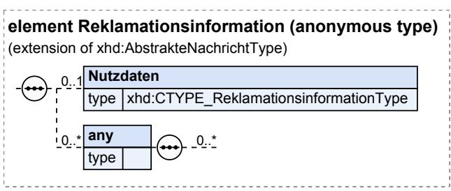

Diese Nachricht ist eine Erweiterung des Basistyps **AbstrakteNachrichtType** (siehe [Abschnitt 2.2 auf](#page-12-2) [Seite 7\)](#page-12-2).

| Kindelemente von Reklamationsinformation |                                   |      |        |       |
|------------------------------------------|-----------------------------------|------|--------|-------|
| Kindelement                              | Typ                               | Anz. | Ref.   | Seite |
| Nutzdaten                                | CTYPE_ReklamationsinformationType | 01   | 3.2.10 | 36    |

| Kindelemente von Reklamationsinformation                                 |     |      |      |       |
|--------------------------------------------------------------------------|-----|------|------|-------|
| Kindelement                                                              | Typ | Anz. | Ref. | Seite |
| Nutzdaten für die Nachrichten vom Typ "Reklamation".                     |     |      |      |       |
| any                                                                      |     | 0n   |      |       |
| Dieses Element kann für Signatur und Schemaerweiterungen genutzt werden. |     |      |      |       |

## 2.7 Lieferinformation

Die Lieferinformation wird vom Dokumentenhersteller an die Behörde gesendet. Sie ist bestellorientiert, d.h. sie enthält Informationen zu genau einer Bestellung.

| Eigenschaft       | Wert                 |
|-------------------|----------------------|
| Autor (allgemein) | Dokumentenhersteller |
| Leser (allgemein) | Behoerde             |

#### **Abbildung 2.7. Lieferinformation**

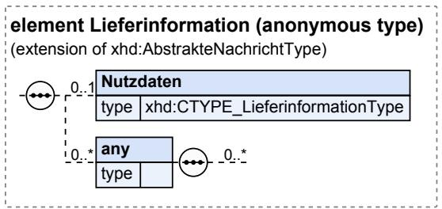

Diese Nachricht ist eine Erweiterung des Basistyps **AbstrakteNachrichtType** (siehe [Abschnitt 2.2 auf](#page-12-2) [Seite 7\)](#page-12-2).

| Kindelemente von Lieferinformation                                       |                             |      |       |       |
|--------------------------------------------------------------------------|-----------------------------|------|-------|-------|
| Kindelement                                                              | Typ                         | Anz. | Ref.  | Seite |
| Nutzdaten                                                                | CTYPE_LieferinformationType | 01   | 3.2.7 | 35    |
| Nutzdaten für die Nachrichten vom Typ "Lieferinformation".               |                             |      |       |       |
| any                                                                      |                             | 0n   |       |       |
| Dieses Element kann für Signatur und Schemaerweiterungen genutzt werden. |                             |      |       |       |

## 2.8 Quittierung

Mit der Nachricht Quittierung bestätigt die Behörde den Empfang und die Verarbeitung von Lieferinformationen des Dokumentenherstellers.

| Eigenschaft       | Wert                 |
|-------------------|----------------------|
| Autor (allgemein) | Behoerde             |
| Leser (allgemein) | Dokumentenhersteller |

#### **Abbildung 2.8. Quittierung**

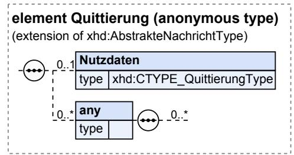

Diese Nachricht ist eine Erweiterung des Basistyps **AbstrakteNachrichtType** (siehe [Abschnitt 2.2 auf](#page-12-2) [Seite 7\)](#page-12-2).

| Kindelemente von Quittierung                                             |                       |      |       |       |
|--------------------------------------------------------------------------|-----------------------|------|-------|-------|
| Kindelement                                                              | Typ                   | Anz. | Ref.  | Seite |
| Nutzdaten                                                                | CTYPE_QuittierungType | 01   | 3.2.9 | 36    |
| Nutzdaten für die Nachrichten vom Typ "Quittierung".                     |                       |      |       |       |
| any                                                                      |                       | 0n   |       |       |
| Dieses Element kann für Signatur und Schemaerweiterungen genutzt werden. |                       |      |       |       |

## 2.9 Fehlerinformation

Eine Fehlerinformation ist eine Rückmeldung an einen Sender auf eine Nachricht, deren Inhalt aus technischen Gründen nicht verarbeitet werden konnte (siehe TR SiSKohD) z. B. weil die Nachricht nicht wohlgeformt, valide oder von einem unbekannten Typ ist. Inhaltliche Fehler werden nicht durch eine Fehlerinformation, sondern durch die Rückmeldungen auf die gesendeten Nachrichten übermittelt.

#### **Abbildung 2.9. Fehlerinformation**

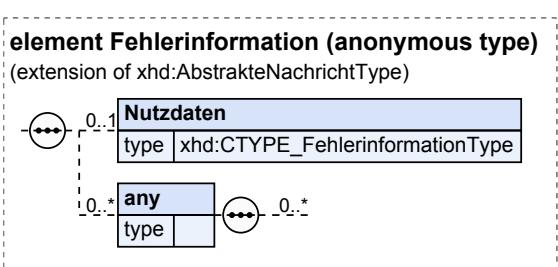

Diese Nachricht ist eine Erweiterung des Basistyps **AbstrakteNachrichtType** (siehe [Abschnitt 2.2 auf](#page-12-2) [Seite 7\)](#page-12-2).

| Kindelemente von Fehlerinformation                                                                                                                                                                 |                             |      |       |       |
|----------------------------------------------------------------------------------------------------------------------------------------------------------------------------------------------------|-----------------------------|------|-------|-------|
| Kindelement                                                                                                                                                                                        | Typ                         | Anz. | Ref.  | Seite |
| Nutzdaten                                                                                                                                                                                          | CTYPE_FehlerinformationType | 01   | 3.2.6 | 35    |
| Nutzdaten für die Nachrichten vom Typ "Fehlerinformation". Das Element "FehlerhafteNachricht" enthält die ursprüngliche Nachricht (deren NachrichtenID zur Identifikation genutzt werden kann). |                             |      |       |       |

| Kindelemente von Fehlerinformation                                       |     |      |      |       |
|--------------------------------------------------------------------------|-----|------|------|-------|
| Kindelement                                                              | Typ | Anz. | Ref. | Seite |
| any                                                                      |     | 0n   |      |       |
| Dieses Element kann für Signatur und Schemaerweiterungen genutzt werden. |     |      |      |       |

## 3.1 Nachrichtenmodule

## 3.1.1 Übersicht

### **Abbildung 3.1. Übersicht Nachrichtenmodule**

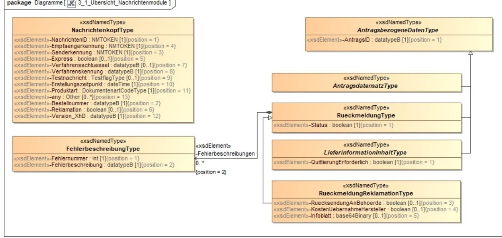

#### 3.1.1.1 Übersicht Antragsdatensatz

#### **Abbildung 3.2. Übersicht Antragsdatensatz**

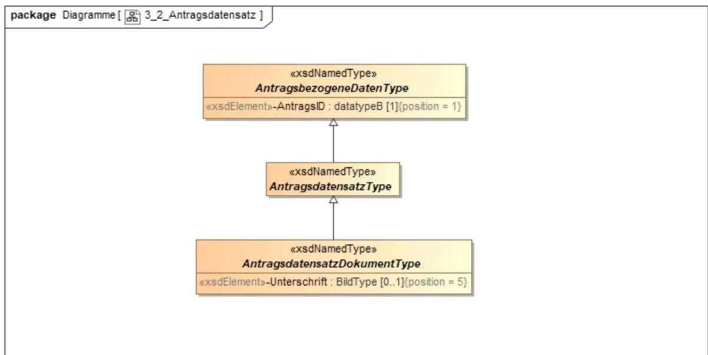

#### 3.1.1.1.1 Übersicht AntragsdatensatzDokument

#### **Abbildung 3.3. AntragsdatensatzDokumentType**

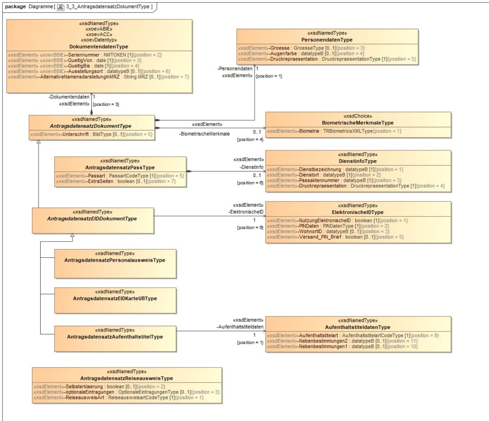

#### 3.1.1.2 Übersicht Lieferinformationen

#### **Abbildung 3.4. Übersicht Lieferinformationen**

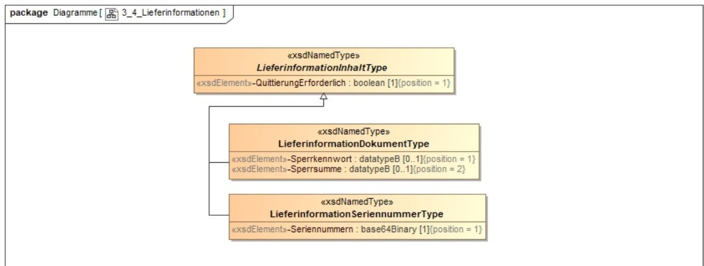

## 3.1.2 NachrichtenkopfType

Der allgemeine Nachrichtenkopf für alle Nachrichten.

#### **Abbildung 3.5. NachrichtenkopfType**

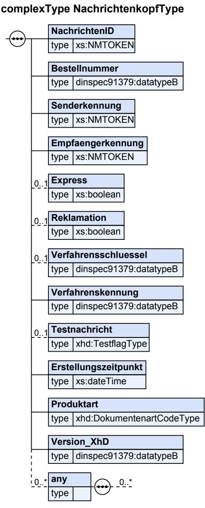

| Kindelemente von NachrichtenkopfType                                                                                                                                         |            |      |      |       |
|------------------------------------------------------------------------------------------------------------------------------------------------------------------------------|------------|------|------|-------|
| Kindelement                                                                                                                                                                  | Typ        | Anz. | Ref. | Seite |
| NachrichtenID                                                                                                                                                                | xs:NMTOKEN | 1    |      |       |
| Die NachrichtenID in Verbindung mit der Senderkennung ist ein eindeutiger Schlüssel für jede Nachricht eines Senders. Die Verwendung des Felds ist dem Sender überlassen. |            |      |      |       |
| Bestellnummer                                                                                                                                                                | datatypeB  | 1    | 7.2  | 73    |
| Die Bestellnummer der Bestellung, für die die Nachricht generiert wird.                                                                                                      |            |      |      |       |
| Senderkennung                                                                                                                                                                | xs:NMTOKEN | 1    |      |       |
| Die Kennung des Senders der Nachricht (DVDV-Identifier).                                                                                                                     |            |      |      |       |
| Empfaengerkennung                                                                                                                                                            | xs:NMTOKEN | 1    |      |       |

| Kindelemente von NachrichtenkopfType                                                                                                                                                                                                                                                                                 |                                                                                                    |      |       |       |  |
|----------------------------------------------------------------------------------------------------------------------------------------------------------------------------------------------------------------------------------------------------------------------------------------------------------------------|----------------------------------------------------------------------------------------------------|------|-------|-------|--|
| Kindelement                                                                                                                                                                                                                                                                                                          | Typ                                                                                                | Anz. | Ref.  | Seite |  |
|                                                                                                                                                                                                                                                                                                                      | Die Kennung des Empfängers der Nachricht (DVDV-Identifier).                                        |      |       |       |  |
| Express                                                                                                                                                                                                                                                                                                              | xs:boolean                                                                                         | 01   |       |       |  |
|                                                                                                                                                                                                                                                                                                                      | Hat dieses Element den Wert "true", so bezieht sich die Nachricht auf eine Expressbestellung.      |      |       |       |  |
| Reklamation                                                                                                                                                                                                                                                                                                          | xs:boolean                                                                                         | 01   |       |       |  |
|                                                                                                                                                                                                                                                                                                                      | Hat dieses Element den Wert "true", so bezieht sich die Nachricht auf eine Reklamationsbestellung. |      |       |       |  |
| Verfahrensschluessel                                                                                                                                                                                                                                                                                                 | datatypeB                                                                                          | 01   | 7.2   | 73    |  |
| Der Verfahrensschlüssel ist ein Kennzeichen der beantragenden Behörde für eine Bestellung. Dieses Kennzeichen muss vom Dokumentenhersteller für jede Nachricht, die die Bestellung betrifft, mitgeschickt werden. Der Verfahrensschlüs sel dient der Behörde zum Zuordnen von Nachrichten zu einer Bestellung. |                                                                                                    |      |       |       |  |
| Verfahrenskennung                                                                                                                                                                                                                                                                                                    | datatypeB                                                                                          | 1    | 7.2   | 73    |  |
| Identifier der sendenden Anwendung.                                                                                                                                                                                                                                                                                  |                                                                                                    |      |       |       |  |
| Testnachricht                                                                                                                                                                                                                                                                                                        | TestflagType                                                                                       | 01   | 4.5   | 55    |  |
| Exisitiert dieses Element im Nachrichtenkopf, so handelt es sich um eine Testnachricht. Die Art der Testnachricht wird über den Wert dieses Elements festgelegt.                                                                                                                                                  |                                                                                                    |      |       |       |  |
| Erstellungszeitpunkt                                                                                                                                                                                                                                                                                                 | xs:dateTime                                                                                        | 1    |       |       |  |
| Zeitpunkt der Erstellung der Nachricht.                                                                                                                                                                                                                                                                              |                                                                                                    |      |       |       |  |
| Produktart                                                                                                                                                                                                                                                                                                           | DokumentenartCodeType                                                                              | 1    | 4.7.2 | 55    |  |
| Art der bestellten hoheitlichen Dokumente                                                                                                                                                                                                                                                                            |                                                                                                    |      |       |       |  |
| Version_XhD                                                                                                                                                                                                                                                                                                          | datatypeB                                                                                          | 1    | 7.2   | 73    |  |
| Die Version des XhD-Schemas, auf dessen Basis die Nachricht erstellt wurde.                                                                                                                                                                                                                                          |                                                                                                    |      |       |       |  |
| any                                                                                                                                                                                                                                                                                                                  |                                                                                                    | 0n   |       |       |  |
| Dieses Element kann für Erweiterungen genutzt werden.                                                                                                                                                                                                                                                                |                                                                                                    |      |       |       |  |

#### 3.1.2.1 Nutzung des Datentyps

| Dieser Typ kann in den folgenden Nachrichten übermittelt werden: Auftragsinformation, BestellungDoku |
|------------------------------------------------------------------------------------------------------|
| ment, BestellungSeriennummern, Fehlerinformation, Lieferinformation, Quittierung, Reklamationsinfor  |
| mation                                                                                               |

Der Typ wird in folgenden Datentypen verwendet: [AbstrakteNachrichtType](#page-12-2)

#### 3.1.3 AntraegeType

Enthält mindestens einen und maximal 150 Antragsdatensätze.

#### **Abbildung 3.6. AntraegeType**

| complexType AntraegeType |        |                               |  |
|--------------------------|--------|-------------------------------|--|
| 1150                     | Antrag |                               |  |
|                          |        | type xhd:AntragsdatensatzType |  |
|                          |        |                               |  |

| Kindelement von AntraegeType |                      |      |       |       |  |
|------------------------------|----------------------|------|-------|-------|--|
| Kindelement                  | Typ                  | Anz. | Ref.  | Seite |  |
| Antrag                       | AntragsdatensatzType | 1150 | 3.1.5 | 21    |  |

| Kindelement von AntraegeType                                                                             |     |      |      |       |  |
|----------------------------------------------------------------------------------------------------------|-----|------|------|-------|--|
| Kindelement                                                                                              | Typ | Anz. | Ref. | Seite |  |
| Das Element Antragsdatensatz ist das abstrakte Basiselement für alle Elemente die Bestelldaten abbilden. |     |      |      |       |  |

#### 3.1.3.1 Nutzung des Datentyps

Dieser Typ kann in den folgenden Nachrichten übermittelt werden: [BestellungDokument](#page-13-1)

Der Typ wird in folgenden Datentypen verwendet: [CTYPE\\_BestellungenType](#page-39-0)

## 3.1.4 AntragsbezogeneDatenType

Das Element AntragsbezogeneDaten ist das abstrakte Basiselement für alle Elemente die Daten eines Antrages abbilden.

#### **Abbildung 3.7. AntragsbezogeneDatenType**

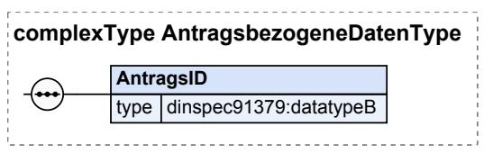

| Kindelement von AntragsbezogeneDatenType                                                                                                  |           |      |      |       |  |
|-------------------------------------------------------------------------------------------------------------------------------------------|-----------|------|------|-------|--|
| Kindelement                                                                                                                               | Typ       | Anz. | Ref. | Seite |  |
| AntragsID                                                                                                                                 | datatypeB | 1    | 7.2  | 73    |  |
| Die AntragsID wird von der Behörde bei der Bestellung vergeben, um einen Antrag innerhalb einer Nachricht eindeutig zu identifizieren. |           |      |      |       |  |

#### 3.1.4.1 Nutzung des Datentyps

Von diesem Typ leiten ab: [AntragsdatensatzType,](#page-26-1) [LieferinformationInhaltType,](#page-33-0) [RueckmeldungType](#page-35-0)

## 3.1.5 AntragsdatensatzType

Das Element Antragsdatensatz ist das abstrakte Basiselement für alle Elemente die Bestelldaten abbilden.

Dieser Typ ist eine Erweiterung des Basistyps **AntragsbezogeneDatenType** (siehe [Abschnitt 3.1.4 auf](#page-26-0) [Seite 21\)](#page-26-0).

#### 3.1.5.1 Nutzung des Datentyps

Dieser Typ kann in den folgenden Nachrichten übermittelt werden: [BestellungDokument](#page-13-1)

Von diesem Typ leiten ab: [AntragsdatensatzDokumentType](#page-27-0)

Der Typ ersetzt folgende abstrakte Datentypen: [AntragsbezogeneDatenType](#page-26-0)

Der Typ wird in folgenden Datentypen verwendet: [AntraegeType](#page-25-0)

## 3.1.6 AntragsdatensatzDokumentType

Ein generisches Element zur Abbildung der Antragsdaten für ein hoheitliches Dokument.

#### **Abbildung 3.8. AntragsdatensatzDokumentType**

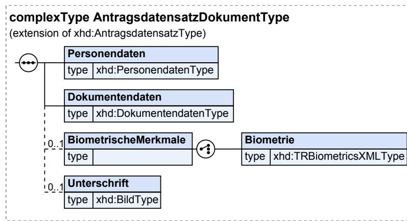

Dieser Typ ist eine Erweiterung des Basistyps **AntragsdatensatzType** (siehe [Abschnitt 3.1.5 auf Sei](#page-26-1)[te 21](#page-26-1)).

| Kindelemente von AntragsdatensatzDokumentType                                                                              |                            |                     |      |        |       |
|----------------------------------------------------------------------------------------------------------------------------|----------------------------|---------------------|------|--------|-------|
|                                                                                                                            | Kindelement                | Typ                 | Anz. | Ref.   | Seite |
|                                                                                                                            | Personendaten              | PersonendatenType   | 1    | 3.2.16 | 41    |
| Bildet Personen-bezogene Daten ab, die in allen hoheitlichen Dokumenten benötigt werden.                                   |                            |                     |      |        |       |
|                                                                                                                            | Dokumentendaten            | DokumentendatenType | 1    | 3.2.11 | 37    |
| Das Element Dokumentendaten fasst nicht-personenbezogene Daten und Verfahrenshinweise zur Herstellung des Dokuments ab. |                            |                     |      |        |       |
|                                                                                                                            | BiometrischeMerkmale 01 |                     |      |        |       |
| Beinhaltet die biometrischen Merkmale zur Beantragung von hoheitlichen Dokumenten.                                         |                            |                     |      |        |       |
|                                                                                                                            | Biometrie                  | TRBiometricsXMLType | 1    | 3.2.21 | 45    |
| Beinhaltet die biometrischen Merkmale zur Beantragung von hoheitlichen Dokumenten.                                         |                            |                     |      |        |       |
| Unterschrift                                                                                                               |                            | BildType            | 01   | 4.2    | 53    |
| Ein Element zum Übertragen von Bilddaten.                                                                                  |                            |                     |      |        |       |

#### 3.1.6.1 Nutzung des Datentyps

Von diesem Typ leiten ab: [AntragsdatensatzEIDDokumentType](#page-29-0), [AntragsdatensatzPassbuchType](#page-27-1) Der Typ ersetzt folgende abstrakte Datentypen: [AntragsdatensatzType](#page-26-1)

## 3.1.7 AntragsdatensatzPassbuchType

Abstrakter Basistyp für alle Antragsdaten von Dokumenten mit einem amtlichen Vermerk.

Dieser Typ ist eine Erweiterung des Basistyps **AntragsdatensatzDokumentType** (siehe [Abschnitt 3.1.](#page-27-0) [6 auf Seite 22\)](#page-27-0).

#### 3.1.7.1 Nutzung des Datentyps

Von diesem Typ leiten ab: [AntragsdatensatzPassType,](#page-28-0) [AntragsdatensatzReiseausweisType](#page-28-1)

Der Typ ersetzt folgende abstrakte Datentypen: [AntragsdatensatzDokumentType](#page-27-0)

### 3.1.8 AntragsdatensatzPassType

Beinhaltet die Pass-spezifischen Daten.

#### **Abbildung 3.9. AntragsdatensatzPassType**

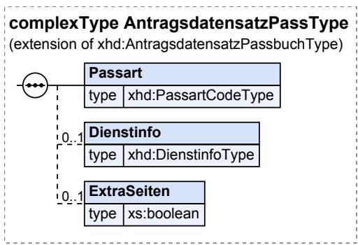

Dieser Typ ist eine Erweiterung des Basistyps **AntragsdatensatzPassbuchType** (siehe [Abschnitt 3.1.](#page-27-1) [7 auf Seite 22\)](#page-27-1).

| Kindelemente von AntragsdatensatzPassType                                                                                            |                 |      |       |       |  |
|--------------------------------------------------------------------------------------------------------------------------------------|-----------------|------|-------|-------|--|
| Kindelement                                                                                                                          | Typ             | Anz. | Ref.  | Seite |  |
| Passart                                                                                                                              | PassartCodeType | 1    | 4.7.6 | 57    |  |
| Wenn die Passart den Wert "PO" für Dienstpass bzw. "PD" für Diplomatenpass besitzt, muss das Feld Dienstinfo über mittelt werden. |                 |      |       |       |  |
| Dienstinfo                                                                                                                           | DienstinfoType  | 01   | 3.2.2 | 32    |  |
| Das Feld Dienstinfo ist verpflichtend, wenn die Passart den Wert PO für Dienstpass besitzt. Ansonsten ist das Feld nicht erlaubt. |                 |      |       |       |  |
| ExtraSeiten                                                                                                                          | xs:boolean      | 01   |       |       |  |
| Wenn das Feld ExtraSeiten den Wert true hat, wird ein Reisepass bestellt der zusätzliche Seiten beinhaltet.                          |                 |      |       |       |  |

#### 3.1.8.1 Nutzung des Datentyps

Der Typ ersetzt folgende abstrakte Datentypen: [AntragsdatensatzPassbuchType](#page-27-1)

## 3.1.9 AntragsdatensatzReiseausweisType

Beinhaltet die Reiseausweis-spezifischen Daten.

#### **Abbildung 3.10. AntragsdatensatzReiseausweisType**

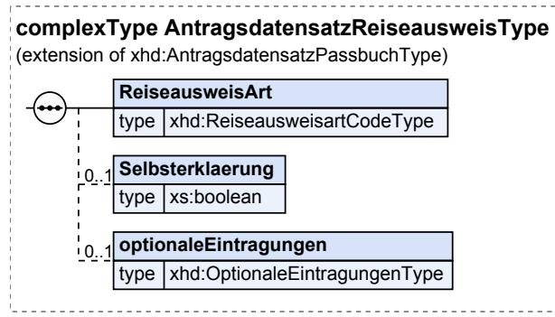

Dieser Typ ist eine Erweiterung des Basistyps **AntragsdatensatzPassbuchType** (siehe [Abschnitt 3.1.](#page-27-1) [7 auf Seite 22\)](#page-27-1).

| Kindelemente von AntragsdatensatzReiseausweisType                                                                                                    |                           |      |        |       |  |
|------------------------------------------------------------------------------------------------------------------------------------------------------|---------------------------|------|--------|-------|--|
| Kindelement                                                                                                                                          | Typ                       | Anz. | Ref.   | Seite |  |
| ReiseausweisArt                                                                                                                                      | ReiseausweisartCodeType   | 1    | 4.7.7  | 57    |  |
| Ein Datentyp zur Angabe der Art eines Reiseausweise.                                                                                                 |                           |      |        |       |  |
| Selbsterklaerung                                                                                                                                     | xs:boolean                | 01   |        |       |  |
| Mit der Selbsterklärung und dem Wert true wird der Hinweis übermittelt, dass die Persondaten auf den eigenen Anga ben des Antragstellers beruhen. |                           |      |        |       |  |
| optionaleEintragungen                                                                                                                                | OptionaleEintragungenType | 01   | 3.2.15 | 40    |  |
| Enthält die optionalen Daten für die Reisausweise.                                                                                                   |                           |      |        |       |  |

#### 3.1.9.1 Nutzung des Datentyps

Der Typ ersetzt folgende abstrakte Datentypen: [AntragsdatensatzPassbuchType](#page-27-1)

#### 3.1.10 AntragsdatensatzEIDDokumentType

Antragsdaten zur Bestellung eines hoheitlichen Dokumentes mit eID-Funktion

#### **Abbildung 3.11. AntragsdatensatzEIDDokumentType**

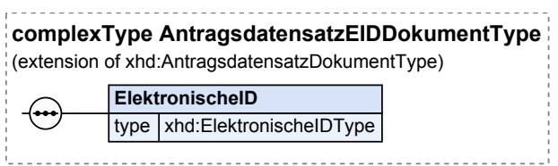

Dieser Typ ist eine Erweiterung des Basistyps **AntragsdatensatzDokumentType** (siehe [Abschnitt 3.1.](#page-27-0) [6 auf Seite 22\)](#page-27-0).

| Kindelement von AntragsdatensatzEIDDokumentType |                     |      |        |       |  |
|-------------------------------------------------|---------------------|------|--------|-------|--|
| Kindelement                                     | Typ                 | Anz. | Ref.   | Seite |  |
| ElektronischeID                                 | ElektronischeIDType | 1    | 3.2.13 | 39    |  |

| Kindelement von AntragsdatensatzEIDDokumentType |  |     |  |      |      |       |
|-------------------------------------------------|--|-----|--|------|------|-------|
| Kindelement                                     |  | Typ |  | Anz. | Ref. | Seite |
| Elektronische ID                                |  |     |  |      |      |       |

#### 3.1.10.1 Nutzung des Datentyps

Von diesem Typ leiten ab: [AntragsdatensatzAufenthaltstitelType](#page-30-2), [AntragsdatensatzEIDKarteUBType](#page-30-0), [AntragsdatensatzPersonalausweisType](#page-30-1)

Der Typ ersetzt folgende abstrakte Datentypen: [AntragsdatensatzDokumentType](#page-27-0)

#### 3.1.11 AntragsdatensatzEIDKarteUBType

Beinhaltet die spezifischen Daten der eID-Karte für Unionsbürger.

Dieser Typ ist eine Erweiterung des Basistyps **AntragsdatensatzEIDDokumentType** (siehe [Abschnitt](#page-29-0) [3.1.10 auf Seite 24\)](#page-29-0).

#### 3.1.11.1 Nutzung des Datentyps

Der Typ ersetzt folgende abstrakte Datentypen: [AntragsdatensatzEIDDokumentType](#page-29-0)

#### 3.1.12 AntragsdatensatzPersonalausweisType

Beinhaltet die Personalausweis-spezifischen Daten.

Dieser Typ ist eine Erweiterung des Basistyps **AntragsdatensatzEIDDokumentType** (siehe [Abschnitt](#page-29-0) [3.1.10 auf Seite 24\)](#page-29-0).

#### 3.1.12.1 Nutzung des Datentyps

Der Typ ersetzt folgende abstrakte Datentypen: [AntragsdatensatzEIDDokumentType](#page-29-0)

### 3.1.13 AntragsdatensatzAufenthaltstitelType

Beinhaltet die Aufenthaltstitel-spezifischen Daten.

#### **Abbildung 3.12. AntragsdatensatzAufenthaltstitelType**

**complexType AntragsdatensatzAufenthaltstitelType** (extension of xhd:AntragsdatensatzEIDDokumentType) **Aufenthaltstiteldaten** type xhd:AufenthaltstiteldatenType

Dieser Typ ist eine Erweiterung des Basistyps **AntragsdatensatzEIDDokumentType** (siehe [Abschnitt](#page-29-0) [3.1.10 auf Seite 24\)](#page-29-0).

| Kindelement von AntragsdatensatzAufenthaltstitelType |                           |      |        |       |  |
|------------------------------------------------------|---------------------------|------|--------|-------|--|
| Kindelement                                          | Typ                       | Anz. | Ref.   | Seite |  |
| Aufenthaltstiteldaten                                | AufenthaltstiteldatenType | 1    | 3.1.14 | 26    |  |

| Kindelement von AntragsdatensatzAufenthaltstitelType |     |      |      |       |  |
|------------------------------------------------------|-----|------|------|-------|--|
| Kindelement                                          | Typ | Anz. | Ref. | Seite |  |
| Angaben zum Aufenthaltstitel.                        |     |      |      |       |  |

#### 3.1.13.1 Nutzung des Datentyps

Der Typ ersetzt folgende abstrakte Datentypen: [AntragsdatensatzEIDDokumentType](#page-29-0)

## 3.1.14 AufenthaltstiteldatenType

Daten zum Aufenthaltstitel.

#### **Abbildung 3.13. AufenthaltstiteldatenType**

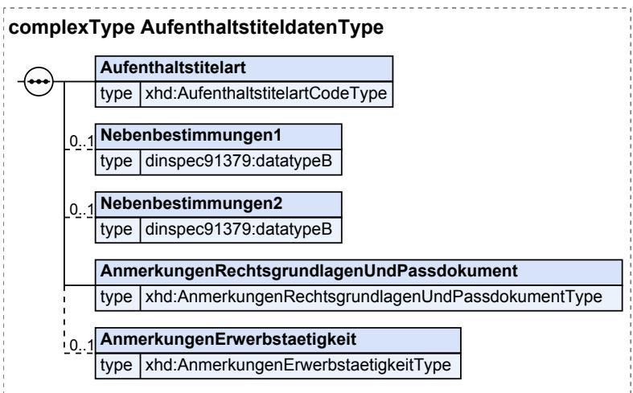

| Kindelemente von AufenthaltstiteldatenType            |                                                    |    |        |       |  |  |  |
|-------------------------------------------------------|----------------------------------------------------|----|--------|-------|--|--|--|
| Kindelement                                           | Typ                                                |    |        | Seite |  |  |  |
| Aufenthaltstitelart                                   | AufenthaltstitelartCodeType                        | 1  | 4.7.1  | 55    |  |  |  |
| Die Art des bestellten Aufenthaltstitels.             |                                                    |    |        |       |  |  |  |
| Nebenbestimmungen1                                    | datatypeB                                          | 01 | 7.2    | 73    |  |  |  |
| Erstes Datenfeld zur Erfassung der Nebenbestimmungen  |                                                    |    |        |       |  |  |  |
| Nebenbestimmungen2                                    | datatypeB                                          | 01 | 7.2    | 73    |  |  |  |
| Zweites Datenfeld zur Erfassung der Nebenbestimmungen |                                                    |    |        |       |  |  |  |
| AnmerkungenRechtsgrundlagenUnd Passdokument        | AnmerkungenRechtsgrundlagenUnd PassdokumentType | 1  | 3.1.15 | 27    |  |  |  |
| Anmerkungsfeld auf der Vorderseite des Dokuments.     |                                                    |    |        |       |  |  |  |
| AnmerkungenErwerbstaetigkeit                          | AnmerkungenErwerbstaetigkeitType                   | 01 | 3.1.16 | 27    |  |  |  |
| Anmerkungsfeld auf der Rückseite des Dokuments.       |                                                    |    |        |       |  |  |  |

#### 3.1.14.1 Nutzung des Datentyps

Der Typ wird in folgenden Datentypen verwendet: [AntragsdatensatzAufenthaltstitelType](#page-30-2)

## 3.1.15 AnmerkungenRechtsgrundlagenUndPassdokumentType

Anmerkungsfeld auf der Vorderseite des elektronischen Aufenthaltstitels.

#### **Abbildung 3.14. AnmerkungenRechtsgrundlagenUndPassdokumentType**

|  | complexType AnmerkungenRechtsgrundlagenUndPassdokumentType |  |  |
|--|------------------------------------------------------------|--|--|
|  | Druckrepraesentation                                       |  |  |
|  | type xhd:DruckrepraesentationType                          |  |  |
|  |                                                            |  |  |

| Kindelement von AnmerkungenRechtsgrundlagenUndPassdokumentType |                          |      |        |       |  |
|----------------------------------------------------------------|--------------------------|------|--------|-------|--|
| Kindelement                                                    | Typ                      | Anz. | Ref.   | Seite |  |
| Druckrepraesentation                                           | DruckrepraesentationType | 1    | 3.2.12 | 38    |  |
| Druckrepräsentation der Anmerkungen.                           |                          |      |        |       |  |

#### 3.1.15.1 Nutzung des Datentyps

Der Typ wird in folgenden Datentypen verwendet: [AufenthaltstiteldatenType](#page-31-0)

## 3.1.16 AnmerkungenErwerbstaetigkeitType

Anmerkungsfeld auf der Rückseite des elektronischen Aufenthaltstitels.

#### **Abbildung 3.15. AnmerkungenErwerbstaetigkeitType**

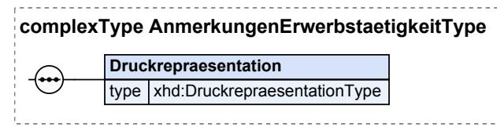

| Kindelement von AnmerkungenErwerbstaetigkeitType |                          |      |        |       |  |
|--------------------------------------------------|--------------------------|------|--------|-------|--|
| Kindelement                                      | Typ                      | Anz. | Ref.   | Seite |  |
| Druckrepraesentation                             | DruckrepraesentationType | 1    | 3.2.12 | 38    |  |
| Druckrepräsentation der Anmerkungen.             |                          |      |        |       |  |

#### 3.1.16.1 Nutzung des Datentyps

Der Typ wird in folgenden Datentypen verwendet: [AufenthaltstiteldatenType](#page-31-0)

## 3.1.17 FehlerbeschreibungType

Eine Fehlerbeschreibung ist ein Element mit dem allgemein Fehler beschrieben werden können. Worauf sich eine Fehlerbeschreibung bezieht ist abhängig vom Kontext in dem das Element verwendet wird und muss im Kontext definiert werden.

Eine Fehlerbeschreibung besteht immer aus einer Fehlernummer zur Klassifizierung des Fehlers und einer textuellen Beschreibung der Fehlerursache.

#### **Abbildung 3.16. FehlerbeschreibungType**

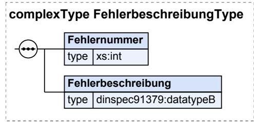

| Kindelemente von FehlerbeschreibungType                                                                                                   |           |      |      |       |  |  |
|-------------------------------------------------------------------------------------------------------------------------------------------|-----------|------|------|-------|--|--|
| Kindelement                                                                                                                               | Typ       | Anz. | Ref. | Seite |  |  |
| Fehlernummer                                                                                                                              | xs:int    | 1    |      |       |  |  |
| Eine Fehlernummer klassifiziert eine Fehlerbeschreibung. Die Fehlernummern werden von dem jeweiligen Dokumen tenhersteller festgelegt. |           |      |      |       |  |  |
| Fehlerbeschreibung                                                                                                                        | datatypeB | 1    | 7.2  | 73    |  |  |
| Die Fehlerbeschreibung enthält eine prägnante, textuelle Beschreibung der Fehlerursache.                                                  |           |      |      |       |  |  |

#### 3.1.17.1 Nutzung des Datentyps

Dieser Typ kann in den folgenden Nachrichten übermittelt werden: [Auftragsinformation](#page-14-1), [Fehlerinformati](#page-17-0)[on](#page-17-0), [Quittierung,](#page-16-1) [Reklamationsinformation](#page-15-0)

Der Typ wird in folgenden Datentypen verwendet: [CTYPE\\_FehlerinformationType](#page-40-0), [RueckmeldungType](#page-35-0)

## 3.1.18 LieferinformationInhaltType

Eine Lieferinformation bildet das abstrakte Basiselement für alle Elemente die Daten über für die Lieferung einer bestellten Position abbilden.

#### **Abbildung 3.17. LieferinformationInhaltType**

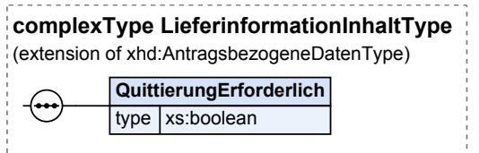

Dieser Typ ist eine Erweiterung des Basistyps **AntragsbezogeneDatenType** (siehe [Abschnitt 3.1.4 auf](#page-26-0) [Seite 21\)](#page-26-0).

| Kindelement von LieferinformationInhaltType |            |      |  |      |       |
|---------------------------------------------|------------|------|--|------|-------|
| Kindelement                                 | Typ        | Anz. |  | Ref. | Seite |
| QuittierungErforderlich                     | xs:boolean | 1    |  |      |       |
|                                             |            |      |  |      |       |

Gibt an, ob der Erhalt der Lieferinformation mit einer Quittierungsnachricht bestätigt werden muss.

#### 3.1.18.1 Nutzung des Datentyps

Dieser Typ kann in den folgenden Nachrichten übermittelt werden: [Lieferinformation](#page-16-0)

Von diesem Typ leiten ab: [LieferinformationDokumentType](#page-34-1), [LieferinformationSeriennummerType](#page-34-0) Der Typ ersetzt folgende abstrakte Datentypen: [AntragsbezogeneDatenType](#page-26-0) Der Typ wird in folgenden Datentypen verwendet: [CTYPE\\_LieferinformationType](#page-40-1)

## 3.1.19 LieferinformationSeriennummerType

Enthält die Lieferinformation für ein bestellte Seriennummern.

#### **Abbildung 3.18. LieferinformationSeriennummerType**

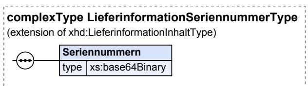

#### Dieser Typ ist eine Erweiterung des Basistyps **LieferinformationInhaltType** (siehe [Abschnitt 3.1.18](#page-33-0) [auf Seite 28](#page-33-0)).

| Kindelement von LieferinformationSeriennummerType                                                                                                                                 |                 |  |      |      |       |
|-----------------------------------------------------------------------------------------------------------------------------------------------------------------------------------|-----------------|--|------|------|-------|
| Kindelement                                                                                                                                                                       | Typ             |  | Anz. | Ref. | Seite |
| Seriennummern                                                                                                                                                                     | xs:base64Binary |  | 1    |      |       |
| Die Seriennummern werden in einer Liste geliefert. In dieser Liste werden die einzelnen 5-stelligen Seriennummern (ohne BKZ und ohne Prüfziffer) durch ein Semikolon getrennt. |                 |  |      |      |       |

#### 3.1.19.1 Nutzung des Datentyps

Der Typ ersetzt folgende abstrakte Datentypen: [LieferinformationInhaltType](#page-33-0)

### 3.1.20 LieferinformationDokumentType

Enthält die Lieferinformation für ein bestelltes Dokument.

#### **Abbildung 3.19. LieferinformationDokumentType**

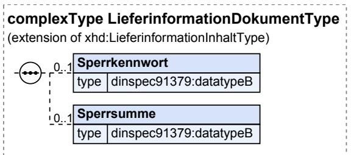

Dieser Typ ist eine Erweiterung des Basistyps **LieferinformationInhaltType** (siehe [Abschnitt 3.1.18](#page-33-0) [auf Seite 28](#page-33-0)).

| Kindelemente von LieferinformationDokumentType |           |      |      |       |  |
|------------------------------------------------|-----------|------|------|-------|--|
| Kindelement                                    | Typ       | Anz. | Ref. | Seite |  |
| Sperrkennwort                                  | datatypeB | 01   | 7.2  | 73    |  |

| Kindelemente von LieferinformationDokumentType                                         |           |      |      |       |  |  |
|----------------------------------------------------------------------------------------|-----------|------|------|-------|--|--|
| Kindelement                                                                            | Typ       | Anz. | Ref. | Seite |  |  |
| Das Sperrkennwort wird nur für Dokumente mit einer ElektronischenID Funktion benötigt. |           |      |      |       |  |  |
| Sperrsumme                                                                             | datatypeB | 01   | 7.2  | 73    |  |  |
| Die Sperrsumme wird nur für Dokumente mit einer ElektronischenID Funktion benötigt.    |           |      |      |       |  |  |

#### 3.1.20.1 Nutzung des Datentyps

Der Typ ersetzt folgende abstrakte Datentypen: [LieferinformationInhaltType](#page-33-0)

## 3.1.21 RueckmeldungType

Mit einer Rückmeldung wird eine zuvor gesendete Information bestätigt oder abgelehnt. Die Bedeutung der Rückmeldung ist abhängig vom Kontext in dem die Rückmeldung verwendet wird.

#### **Abbildung 3.20. RueckmeldungType**

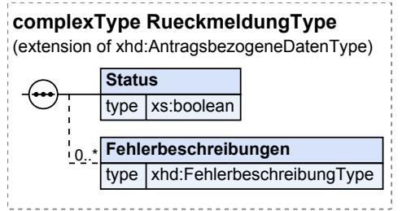

Dieser Typ ist eine Erweiterung des Basistyps **AntragsbezogeneDatenType** (siehe [Abschnitt 3.1.4 auf](#page-26-0) [Seite 21\)](#page-26-0).

| Kindelemente von RueckmeldungType                                                                                                                                                                                                       |                        |      |        |       |  |
|-----------------------------------------------------------------------------------------------------------------------------------------------------------------------------------------------------------------------------------------|------------------------|------|--------|-------|--|
| Kindelement                                                                                                                                                                                                                             | Typ                    | Anz. | Ref.   | Seite |  |
| Status                                                                                                                                                                                                                                  | xs:boolean             | 1    |        |       |  |
| Wenn eine Rückmeldung positiv ist, hat das Feld Status den Wert true. Ist die Rückmeldung negativ, so ist das Feld Status false und im Element Fehlerbeschreibung müssen die Gründe für die negative Rückmeldung beschrieben werden. |                        |      |        |       |  |
| Fehlerbeschreibungen                                                                                                                                                                                                                    | FehlerbeschreibungType | 0n   | 3.1.17 | 27    |  |
|                                                                                                                                                                                                                                         |                        |      |        |       |  |

Fehlerbeschreibungen werden in einer Rückmeldung nur übermittelt wenn diese negativ ist.

#### 3.1.21.1 Nutzung des Datentyps

Dieser Typ kann in den folgenden Nachrichten übermittelt werden: [Auftragsinformation](#page-14-1), [Quittierung](#page-16-1) Von diesem Typ leiten ab: [RueckmeldungReklamationType](#page-35-1)

Der Typ ersetzt folgende abstrakte Datentypen: [AntragsbezogeneDatenType](#page-26-0)

Der Typ wird in folgenden Datentypen verwendet: [CTYPE\\_AuftragsinformationType](#page-38-0), [CTYPE\\_QuittierungType](#page-41-1)

## 3.1.22 RueckmeldungReklamationType

Weitere Informationen zu einer Rückmeldung in Bezug auf eine Reklamation.

#### **Abbildung 3.21. RueckmeldungReklamationType**

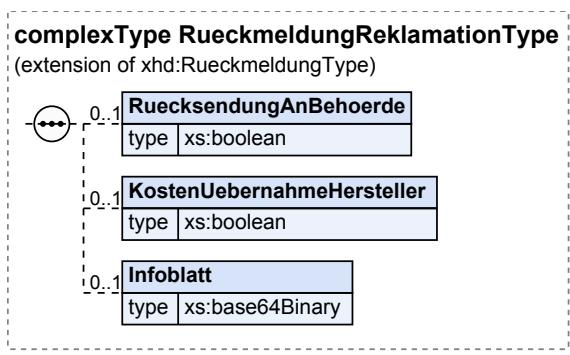

Dieser Typ ist eine Erweiterung des Basistyps **RueckmeldungType** (siehe [Abschnitt 3.1.21 auf Seite 30](#page-35-0)).

| Kindelemente von RueckmeldungReklamationType                                                                                                              |                 |      |      |       |  |
|-----------------------------------------------------------------------------------------------------------------------------------------------------------|-----------------|------|------|-------|--|
| Kindelement                                                                                                                                               | Typ             | Anz. | Ref. | Seite |  |
| RuecksendungAnBehoerde                                                                                                                                    | xs:boolean      | 01   |      |       |  |
| Information, ob der Hersteller das Dokument zurücksendet. WAHR: Hersteller sendet das Dokument zurück. FALSCH: Hersteller behält das Dokument ein.     |                 |      |      |       |  |
| KostenUebernahmeHersteller                                                                                                                                | xs:boolean      | 01   |      |       |  |
| Information, ob der Hersteller die Kosten der Reklamation übernimmt. WAHR: Hersteller übernimmt die Kosten. FALSCH: Hersteller übernimmt Kosten nicht. |                 |      |      |       |  |
| Infoblatt                                                                                                                                                 | xs:base64Binary | 01   |      |       |  |
| Anhang eines Informationsblatts als PDF                                                                                                                   |                 |      |      |       |  |

#### 3.1.22.1 Nutzung des Datentyps

Dieser Typ kann in den folgenden Nachrichten übermittelt werden: [Reklamationsinformation](#page-15-0) Der Typ wird in folgenden Datentypen verwendet: [CTYPE\\_ReklamationsinformationType](#page-41-2)

## 3.2 Datenmodule

#### 3.2.1 BehoerdenadresseType

Die Adresse einer Behörde.

#### **Abbildung 3.22. BehoerdenadresseType**

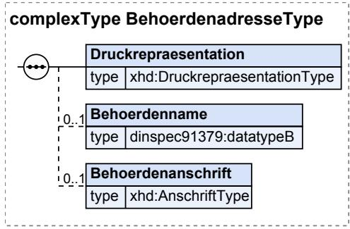

| Kindelemente von BehoerdenadresseType                                                                                       |                          |      |        |       |  |
|-----------------------------------------------------------------------------------------------------------------------------|--------------------------|------|--------|-------|--|
| Kindelement                                                                                                                 | Typ                      | Anz. | Ref.   | Seite |  |
| Druckrepraesentation                                                                                                        | DruckrepraesentationType | 1    | 3.2.12 | 38    |  |
| Enthält die druckbare Adresse.                                                                                              |                          |      |        |       |  |
| Behoerdenname                                                                                                               | datatypeB                | 01   | 7.2    | 73    |  |
| Enthält den Namen der Behörde zur Prüfung der Zustellbarkeit.                                                               |                          |      |        |       |  |
| Behoerdenanschrift                                                                                                          | AnschriftType            | 01   | 3.3.2  | 47    |  |
| Enthält die Anschrift der Behörde zur Prüfung der Zustellbarkeit. Als Anschrift kann auch ein Postfach angegeben wer den |                          |      |        |       |  |

#### 3.2.1.1 Nutzung des Datentyps

Dieser Typ kann in den folgenden Nachrichten übermittelt werden: [BestellungDokument](#page-13-1) Der Typ wird in folgenden Datentypen verwendet: [CTYPE\\_BestellungenType](#page-39-0)

## 3.2.2 DienstinfoType

Beinhaltet Informationen zur Dienstbezeichnung und dem Dienstort des Dokumentenbesitzers.

#### **Abbildung 3.23. DienstinfoType**

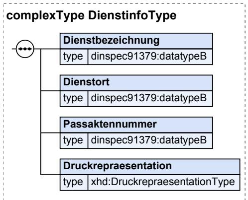

| Kindelemente von DienstinfoType                    |                          |      |        |       |  |
|----------------------------------------------------|--------------------------|------|--------|-------|--|
| Kindelement                                        | Typ                      | Anz. | Ref.   | Seite |  |
| Dienstbezeichnung                                  | datatypeB                | 1    | 7.2    | 73    |  |
| Die Dienstbezeichnung des Dokumenteninhabers       |                          |      |        |       |  |
| Dienstort                                          | datatypeB                | 1    | 7.2    | 73    |  |
| Der Dienstort des Dokumenteninhabers               |                          |      |        |       |  |
| Passaktennummer                                    | datatypeB                | 1    | 7.2    | 73    |  |
| Die Passaktennummer des Dokuments                  |                          |      |        |       |  |
| Druckrepraesentation                               | DruckrepraesentationType | 1    | 3.2.12 | 38    |  |
| Repräsentation der Druckdarstellung der Dienstinfo |                          |      |        |       |  |

#### 3.2.2.1 Nutzung des Datentyps

Der Typ wird in folgenden Datentypen verwendet: [AntragsdatensatzPassType](#page-28-0)

## 3.2.3 CTYPE\_AuftragsinformationType

Nutzdaten für die Nachrichten vom Typ "Auftragsinformation".

#### **Abbildung 3.24. CTYPE\_AuftragsinformationType**

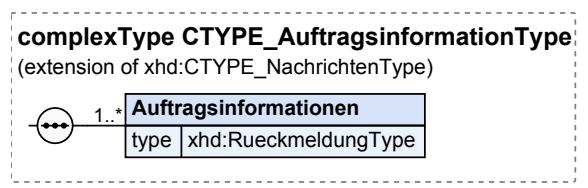

Dieser Typ ist eine Erweiterung des Basistyps **CTYPE\_NachrichtenType** (siehe [Abschnitt 3.2.8 auf Sei](#page-41-0)[te 36](#page-41-0)).

| Kindelement von CTYPE_AuftragsinformationType                                                                                                                                                       |                  |      |        |       |  |
|-----------------------------------------------------------------------------------------------------------------------------------------------------------------------------------------------------|------------------|------|--------|-------|--|
| Kindelement                                                                                                                                                                                         | Typ              | Anz. | Ref.   | Seite |  |
| Auftragsinformationen                                                                                                                                                                               | RueckmeldungType | 1n   | 3.1.21 | 30    |  |
| Mit den Auftragsinformationen werden die zuvor übermittelten Bestelldatensätze bestätigt oder Informationen zu Feh lern übermittelt, die bei der Verarbeitung der Bestelldaten aufgetreten sind. |                  |      |        |       |  |

#### 3.2.3.1 Nutzung des Datentyps

Dieser Typ kann in den folgenden Nachrichten übermittelt werden: [Auftragsinformation](#page-14-1)

Der Typ ersetzt folgende abstrakte Datentypen: [CTYPE\\_NachrichtenType](#page-41-0)

### 3.2.4 CTYPE\_Bestellungen\_SeriennummerType

Nutzdaten für die Nachrichten zur Bestellung von Seriennummern

#### **Abbildung 3.25. CTYPE\_Bestellungen\_SeriennummerType**

|                             |        | complexType CTYPE_Bestellungen_SeriennummerType (extension of xhd:CTYPE_NachrichtenType) |  |  |  |  |  |  |  |
|-----------------------------|--------|---------------------------------------------------------------------------------------------|--|--|--|--|--|--|--|
|                             | BKZ    |                                                                                             |  |  |  |  |  |  |  |
| type dinspec91379:datatypeB |        |                                                                                             |  |  |  |  |  |  |  |
|                             | Anzahl |                                                                                             |  |  |  |  |  |  |  |
|                             |        | type xs:int                                                                                 |  |  |  |  |  |  |  |
|                             |        |                                                                                             |  |  |  |  |  |  |  |

Dieser Typ ist eine Erweiterung des Basistyps **CTYPE\_NachrichtenType** (siehe [Abschnitt 3.2.8 auf Sei](#page-41-0)[te 36](#page-41-0)).

Bundesamt für Sicherheit in der Informationstechnik 33

| Kindelemente von CTYPE_Bestellungen_SeriennummerType        |  |           |  |      |      |       |  |  |
|-------------------------------------------------------------|--|-----------|--|------|------|-------|--|--|
| Kindelement                                                 |  | Typ       |  | Anz. | Ref. | Seite |  |  |
| BKZ                                                         |  | datatypeB |  | 1    | 7.2  | 73    |  |  |
| BKZ der bestellenden Behörde.                               |  |           |  |      |      |       |  |  |
| Anzahl                                                      |  | xs:int    |  | 1    |      |       |  |  |
| Anzahl der bestellten Seriennummern zwischen 1 und 100.000. |  |           |  |      |      |       |  |  |

#### 3.2.4.1 Nutzung des Datentyps

Dieser Typ kann in den folgenden Nachrichten übermittelt werden: [BestellungSeriennummern](#page-14-0)

Der Typ ersetzt folgende abstrakte Datentypen: [CTYPE\\_NachrichtenType](#page-41-0)

## 3.2.5 CTYPE\_BestellungenType

Nutzdaten für die Nachrichten vom Typ "Bestellungen".

#### **Abbildung 3.26. CTYPE\_BestellungenType**

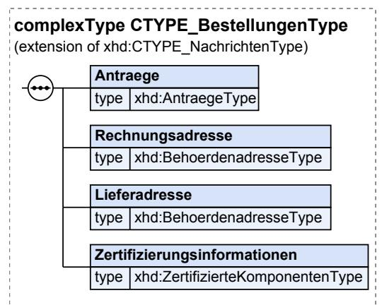

Dieser Typ ist eine Erweiterung des Basistyps **CTYPE\_NachrichtenType** (siehe [Abschnitt 3.2.8 auf Sei](#page-41-0)[te 36](#page-41-0)).

| Kindelemente von CTYPE_BestellungenType                                                |                              |      |        |       |  |  |  |  |
|----------------------------------------------------------------------------------------|------------------------------|------|--------|-------|--|--|--|--|
| Kindelement                                                                            | Typ                          | Anz. | Ref.   | Seite |  |  |  |  |
| Antraege                                                                               | AntraegeType                 | 1    | 3.1.3  | 20    |  |  |  |  |
| Enthält die Anträge der Bestellung.                                                    |                              |      |        |       |  |  |  |  |
| Rechnungsadresse                                                                       | BehoerdenadresseType         | 1    | 3.2.1  | 31    |  |  |  |  |
| Enthält die Rechnungsadresse.                                                          |                              |      |        |       |  |  |  |  |
| Lieferadresse                                                                          | BehoerdenadresseType         | 1    | 3.2.1  | 31    |  |  |  |  |
| Enthält die Lieferadresse.                                                             |                              |      |        |       |  |  |  |  |
| Zertifizierungsinformationen                                                           | ZertifizierteKomponentenType | 1    | 3.2.22 | 45    |  |  |  |  |
| Informationen über die für den Bestellprozess eingesetzten zertifizierten Komponenten. |                              |      |        |       |  |  |  |  |

#### 3.2.5.1 Nutzung des Datentyps

Dieser Typ kann in den folgenden Nachrichten übermittelt werden: [BestellungDokument](#page-13-1)

Der Typ ersetzt folgende abstrakte Datentypen: [CTYPE\\_NachrichtenType](#page-41-0)

## 3.2.6 CTYPE\_FehlerinformationType

Nutzdaten für die Nachrichten vom Typ "Fehlerinformation". Das Element "FehlerhafteNachricht" enthält die ursprüngliche Nachricht (deren NachrichtenID zur Identifikation genutzt werden kann).

#### **Abbildung 3.27. CTYPE\_FehlerinformationType**

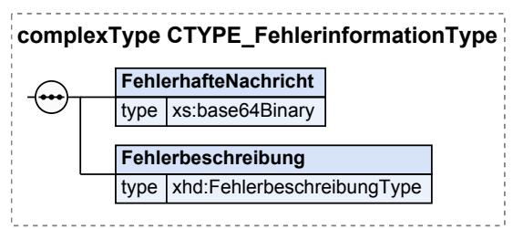

| Kindelemente von CTYPE_FehlerinformationType                                            |     |      |      |       |  |  |  |  |
|-----------------------------------------------------------------------------------------|-----|------|------|-------|--|--|--|--|
| Kindelement                                                                             | Typ | Anz. | Ref. | Seite |  |  |  |  |
| FehlerhafteNachricht                                                                    | 1   |      |      |       |  |  |  |  |
| Enthält die Nachricht, die den Fehler hervorgerufen hat bzw. beinhaltet                 |     |      |      |       |  |  |  |  |
| Fehlerbeschreibung 1 3.1.17 27 FehlerbeschreibungType                       |     |      |      |       |  |  |  |  |
| Die Fehlerbeschreibung beinhaltet die textuelle Beschreibung des aufgetretenen Fehlers. |     |      |      |       |  |  |  |  |

#### 3.2.6.1 Nutzung des Datentyps

Dieser Typ kann in den folgenden Nachrichten übermittelt werden: [Fehlerinformation](#page-17-0)

## 3.2.7 CTYPE\_LieferinformationType

Nutzdaten für die Nachrichten vom Typ "Lieferinformation".

#### **Abbildung 3.28. CTYPE\_LieferinformationType**

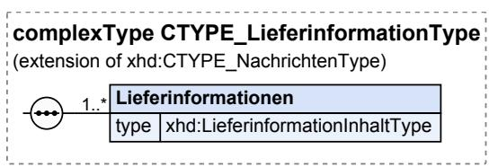

Dieser Typ ist eine Erweiterung des Basistyps **CTYPE\_NachrichtenType** (siehe [Abschnitt 3.2.8 auf Sei](#page-41-0)[te 36](#page-41-0)).

| Kindelement von CTYPE_LieferinformationType |                             |    |        |    |  |  |  |  |
|---------------------------------------------|-----------------------------|----|--------|----|--|--|--|--|
| Kindelement Typ Anz. Ref. Seite |                             |    |        |    |  |  |  |  |
| Lieferinformationen                         | LieferinformationInhaltType | 1n | 3.1.18 | 28 |  |  |  |  |

| Kindelement von CTYPE_LieferinformationType                              |     |      |      |       |  |  |  |  |
|--------------------------------------------------------------------------|-----|------|------|-------|--|--|--|--|
| Kindelement                                                              | Typ | Anz. | Ref. | Seite |  |  |  |  |
| Eine Lieferinformation bildet Daten über eine zu lieferende Position ab. |     |      |      |       |  |  |  |  |

#### 3.2.7.1 Nutzung des Datentyps

Dieser Typ kann in den folgenden Nachrichten übermittelt werden: [Lieferinformation](#page-16-0)

Der Typ ersetzt folgende abstrakte Datentypen: [CTYPE\\_NachrichtenType](#page-41-0)

## 3.2.8 CTYPE\_NachrichtenType

Abstraktes Element für die Nutzdaten von Nachrichten

#### 3.2.8.1 Nutzung des Datentyps

Von diesem Typ leiten ab: [CTYPE\\_AuftragsinformationType](#page-38-0), [CTYPE\\_BestellungenType](#page-39-0), [CTYPE\\_Bestellungen\\_SeriennummerType,](#page-38-1) [CTYPE\\_LieferinformationType](#page-40-1), [CTYPE\\_QuittierungType](#page-41-1), [CTYPE\\_ReklamationsinformationType](#page-41-2)

## 3.2.9 CTYPE\_QuittierungType

Nutzdaten für die Nachrichten vom Typ "Quittierung".

#### **Abbildung 3.29. CTYPE\_QuittierungType**

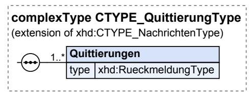

Dieser Typ ist eine Erweiterung des Basistyps **CTYPE\_NachrichtenType** (siehe [Abschnitt 3.2.8 auf Sei](#page-41-0)[te 36](#page-41-0)).

| Kindelement von CTYPE_QuittierungType                         |                  |      |        |       |
|---------------------------------------------------------------|------------------|------|--------|-------|
| Kindelement                                                   | Typ              | Anz. | Ref.   | Seite |
| Quittierungen                                                 | RueckmeldungType | 1n   | 3.1.21 | 30    |
| Enthält Quittierungen für die erhaltenen Lieferinformationen. |                  |      |        |       |

#### 3.2.9.1 Nutzung des Datentyps

Dieser Typ kann in den folgenden Nachrichten übermittelt werden: [Quittierung](#page-16-1)

Der Typ ersetzt folgende abstrakte Datentypen: [CTYPE\\_NachrichtenType](#page-41-0)

### 3.2.10 CTYPE\_ReklamationsinformationType

Nutzdaten für die Nachrichten vom Typ "Reklamation".

#### **Abbildung 3.30. CTYPE\_ReklamationsinformationType**

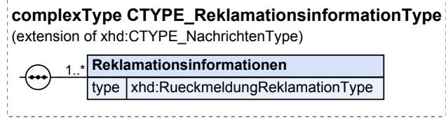

Dieser Typ ist eine Erweiterung des Basistyps **CTYPE\_NachrichtenType** (siehe [Abschnitt 3.2.8 auf Sei](#page-41-0)[te 36](#page-41-0)).

| Kindelement von CTYPE_ReklamationsinformationType                                                    |                             |      |        |       |
|------------------------------------------------------------------------------------------------------|-----------------------------|------|--------|-------|
| Kindelement                                                                                          | Typ                         | Anz. | Ref.   | Seite |
| Reklamationsinformationen                                                                            | RueckmeldungReklamationType | 1n   | 3.1.22 | 30    |
| Die Reklamationsinformationen beinhalteten die Bestätigungen oder Zurückweisungen der Reklamationen. |                             |      |        |       |

#### 3.2.10.1 Nutzung des Datentyps

Dieser Typ kann in den folgenden Nachrichten übermittelt werden: [Reklamationsinformation](#page-15-0)

Der Typ ersetzt folgende abstrakte Datentypen: [CTYPE\\_NachrichtenType](#page-41-0)

#### 3.2.11 DokumentendatenType

Das Element Dokumentendaten fasst nicht-personenbezogene Daten und Verfahrenshinweise zur Herstellung des Dokuments ab.

#### **Abbildung 3.31. DokumentendatenType**

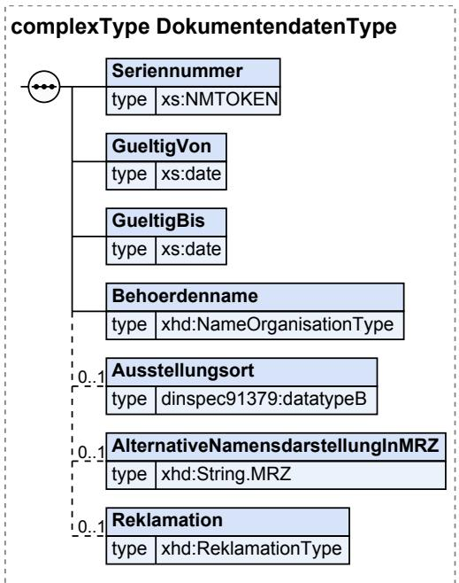

| Kindelemente von DokumentendatenType                                                                                                                                                                                                                                                                                                                                                                                                                                                                                                                                                                                                                                                                                                                                                                                                        |                                                                                                           |      |       |       |  |
|---------------------------------------------------------------------------------------------------------------------------------------------------------------------------------------------------------------------------------------------------------------------------------------------------------------------------------------------------------------------------------------------------------------------------------------------------------------------------------------------------------------------------------------------------------------------------------------------------------------------------------------------------------------------------------------------------------------------------------------------------------------------------------------------------------------------------------------------|-----------------------------------------------------------------------------------------------------------|------|-------|-------|--|
| Kindelement                                                                                                                                                                                                                                                                                                                                                                                                                                                                                                                                                                                                                                                                                                                                                                                                                                 | Typ                                                                                                       | Anz. | Ref.  | Seite |  |
| Seriennummer                                                                                                                                                                                                                                                                                                                                                                                                                                                                                                                                                                                                                                                                                                                                                                                                                                | xs:NMTOKEN                                                                                                | 1    |       |       |  |
|                                                                                                                                                                                                                                                                                                                                                                                                                                                                                                                                                                                                                                                                                                                                                                                                                                             | 10-stellige Seriennummer des Dokumentes (9-stellige Seriennumer gemäß ICAO 9303 + 1-stellige Prüfziffer). |      |       |       |  |
| GueltigVon                                                                                                                                                                                                                                                                                                                                                                                                                                                                                                                                                                                                                                                                                                                                                                                                                                  | xs:date                                                                                                   | 1    |       |       |  |
| Das Datum der Antragsstellung durch den Bürger. Dieses Datum wird zur Berechnung der Regelgültigkeit herangezo gen.                                                                                                                                                                                                                                                                                                                                                                                                                                                                                                                                                                                                                                                                                                                      |                                                                                                           |      |       |       |  |
| GueltigBis                                                                                                                                                                                                                                                                                                                                                                                                                                                                                                                                                                                                                                                                                                                                                                                                                                  | xs:date                                                                                                   | 1    |       |       |  |
| Das Datum bis wann das Dokument gültig ist. Die Festlegung dieses Datums liegt im Verantwortungsbereich der Behör de.                                                                                                                                                                                                                                                                                                                                                                                                                                                                                                                                                                                                                                                                                                                    |                                                                                                           |      |       |       |  |
| Behoerdenname                                                                                                                                                                                                                                                                                                                                                                                                                                                                                                                                                                                                                                                                                                                                                                                                                               | NameOrganisationType                                                                                      | 1    | 3.3.5 | 49    |  |
| Name und Bezeichnung der ausstellenden Behörde                                                                                                                                                                                                                                                                                                                                                                                                                                                                                                                                                                                                                                                                                                                                                                                              |                                                                                                           |      |       |       |  |
| Ausstellungsort                                                                                                                                                                                                                                                                                                                                                                                                                                                                                                                                                                                                                                                                                                                                                                                                                             | datatypeB                                                                                                 | 01   | 7.2   | 73    |  |
| Ort der Ausstellung des Dokumentes.                                                                                                                                                                                                                                                                                                                                                                                                                                                                                                                                                                                                                                                                                                                                                                                                         |                                                                                                           |      |       |       |  |
| AlternativeNamensdarstellungInMRZ                                                                                                                                                                                                                                                                                                                                                                                                                                                                                                                                                                                                                                                                                                                                                                                                           | String.MRZ                                                                                                | 01   | 4.6   | 55    |  |
| Für den Fall, dass die automatische Kürzung der Namensbestandteile für die maschinenlesbare Zone (MRZ) zu einer ehrenverletzenden Darstellung führt, kann dieses Feld mit einer alternative Kürzung der Namensbestandteile für die MRZ befüllt werden. Es sind nur die Namensbestandteile zu übermitteln. Andere Teile der MRZ dürfen nicht übertra gen werden. Einzelne Bestandteile des Familiennamens als auch mehrere Vornamen werden durch das Zeichen "<" getrennt. Familienname und Vornamen werden durch die Zeichen "<<" getrennt. Weitere Vorschriften zur Darstellung sind den "Regeln für die automatisierte Zusammensetzung der Namensbestandteile in der maschinenlesbaren Zone deutscher Reisedokumente" des BMI zu entnehmen. Wenn das Element vorhanden ist, ist es als MRZ-Bestandteil zu verwenden. |                                                                                                           |      |       |       |  |

| Reklamation                                                                      | ReklamationType | 01 | 3.2.19 | 43 |
|----------------------------------------------------------------------------------|-----------------|----|--------|----|
| Enthält Informationen, die bei der Reklamation von Dokumenten übertragen werden. |                 |    |        |    |

#### 3.2.11.1 Nutzung des Datentyps

Der Typ wird in folgenden Datentypen verwendet: [AntragsdatensatzDokumentType](#page-27-0)

#### 3.2.12 DruckrepraesentationType

Die Druckrepraesentation wird zur Übertragung von mehrzeiligen Daten genutzt. 1.) Für Personendaten / Dokumentendaten 2.) Für Adressen die (z.B. auf Briefe) gedruckt werden.

#### **Abbildung 3.32. DruckrepraesentationType**

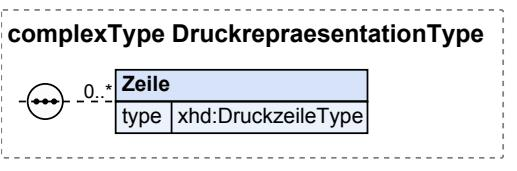

| Kindelement von DruckrepraesentationType |                |      |      |       |  |
|------------------------------------------|----------------|------|------|-------|--|
| Kindelement                              | Typ            | Anz. | Ref. | Seite |  |
| Zeile                                    | DruckzeileType | 0n   | 4.3  | 54    |  |

| Kindelement von DruckrepraesentationType       |     |      |      |       |  |
|------------------------------------------------|-----|------|------|-------|--|
| Kindelement                                    | Typ | Anz. | Ref. | Seite |  |
| Eine einzelne Zeile einer Druckrepraesentation |     |      |      |       |  |

#### 3.2.12.1 Nutzung des Datentyps

Dieser Typ kann in den folgenden Nachrichten übermittelt werden: [BestellungDokument](#page-13-1)

Der Typ wird in folgenden Datentypen verwendet: [AnmerkungenErwerbstaetigkeitType](#page-32-1), [Anmerkungen-](#page-32-0)[RechtsgrundlagenUndPassdokumentType,](#page-32-0) [BehoerdenadresseType,](#page-36-1) [DienstinfoType](#page-37-0), [NameOrganisationTy](#page-54-0)[pe](#page-54-0), [OptionaleEintragungenType](#page-45-1), [PINAdresseType](#page-47-0), [PersonendatenType](#page-46-0)

#### 3.2.13 ElektronischeIDType

Typ Elektronische ID

#### **Abbildung 3.33. ElektronischeIDType**

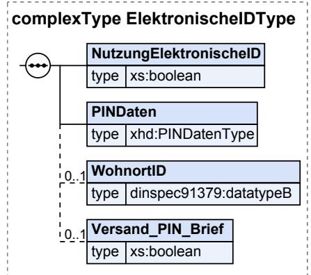

| Kindelemente von ElektronischeIDType                                                                                                                                                                                               |              |      |        |       |  |  |
|------------------------------------------------------------------------------------------------------------------------------------------------------------------------------------------------------------------------------------|--------------|------|--------|-------|--|--|
| Kindelement                                                                                                                                                                                                                        | Typ          | Anz. | Ref.   | Seite |  |  |
| NutzungElektronischeID                                                                                                                                                                                                             | xs:boolean   | 1    |        |       |  |  |
| Das Feld "NutzungElektronischeID" bestimmt, ob das Dokument mit der ElektronischenID Funktion erstellt wird. Die ses Flag muss verpflichtend durch die Behörde bzw. das Fachverfahren gesetzt werden.                           |              |      |        |       |  |  |
| PINDaten                                                                                                                                                                                                                           | PINDatenType | 1    | 3.2.18 | 43    |  |  |
| Enthält die Adressen für Lieferung und Rücksendung der PIN-Briefe.                                                                                                                                                                 |              |      |        |       |  |  |
| WohnortID                                                                                                                                                                                                                          | datatypeB    | 01   | 7.2    | 73    |  |  |
| Enthält den Identifikator für den Wohnort des Antragstellers. Dieses Element dient zur Nutzung der eID-Anwendung "Abfrage Wohnort" und muss angegeben werden, wenn sich der Wohnort des Antragstellers in Deutschland befindet. |              |      |        |       |  |  |
| Versand_PIN_Brief                                                                                                                                                                                                                  | xs:boolean   | 01   |        |       |  |  |
| Hat dieses Feld den Wert "false" wird kein PIN-Brief versandt.                                                                                                                                                                     |              |      |        |       |  |  |

#### 3.2.13.1 Nutzung des Datentyps

Der Typ wird in folgenden Datentypen verwendet: [AntragsdatensatzEIDDokumentType](#page-29-0)

## 3.2.14 GeburtType

Das Element Geburt beinhaltet das Geburtsdatum und den Geburtsort. Aufgrund des abweichenden Datentyps Geburtsdatum wurde nicht die XÖV-Kernkomponente Geburt verwendet.

#### **Abbildung 3.34. GeburtType**

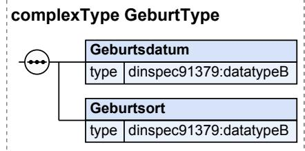

| Kindelemente von GeburtType                                        |           |      |      |       |  |
|--------------------------------------------------------------------|-----------|------|------|-------|--|
| Kindelement                                                        | Typ       | Anz. | Ref. | Seite |  |
| Geburtsdatum                                                       | datatypeB | 1    | 7.2  | 73    |  |
| Der Geburtsort des Antragstellers.                                 |           |      |      |       |  |
| Geburtsort                                                         | datatypeB | 1    | 7.2  | 73    |  |
| Der Geburtsort des Antragsstellers ohne Länder- oder Staatsangabe. |           |      |      |       |  |

#### 3.2.14.1 Nutzung des Datentyps

Der Typ wird in folgenden Datentypen verwendet: [PersonendatenType](#page-46-0)

## 3.2.15 OptionaleEintragungenType

Enthält die optionalen Daten für die Reiseausweise.

#### **Abbildung 3.35. OptionaleEintragungenType**

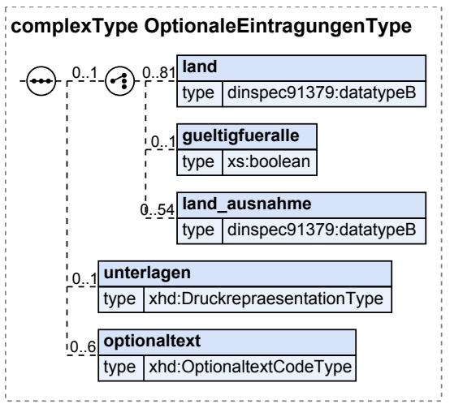

| Kindelemente von OptionaleEintragungenType                                                                                                                                                                                                                        |                                                                                                             |      |        |       |  |  |  |
|-------------------------------------------------------------------------------------------------------------------------------------------------------------------------------------------------------------------------------------------------------------------|-------------------------------------------------------------------------------------------------------------|------|--------|-------|--|--|--|
| Kindelement                                                                                                                                                                                                                                                       | Typ                                                                                                         | Anz. | Ref.   | Seite |  |  |  |
| laenderangaben                                                                                                                                                                                                                                                    |                                                                                                             | 01   |        |       |  |  |  |
| Auswahl-Optionen für Länderangaben in den optionalen Eintragungen eines Reiseausweises.                                                                                                                                                                           |                                                                                                             |      |        |       |  |  |  |
| land                                                                                                                                                                                                                                                              | datatypeB                                                                                                   | 081  | 7.2    | 73    |  |  |  |
|                                                                                                                                                                                                                                                                   | Hier sind nur Abkürzungen für die Staaten nach dreistelligem ICAO-Code nach folgenden Vorgaben einzutragen: |      |        |       |  |  |  |
| Reiseausweis für Ausländer - Staaten für welche der Reiseausweis gültig ist.                                                                                                                                                                                      |                                                                                                             |      |        |       |  |  |  |
| Reiseausweis für Flüchtlinge und Staatenlose - Staaten für welche der Reiseausweis nicht gültig ist.                                                                                                                                                              |                                                                                                             |      |        |       |  |  |  |
| gueltigfueralle                                                                                                                                                                                                                                                   | xs:boolean                                                                                                  | 01   |        |       |  |  |  |
| Hinweis: Dieses Feld gilt nur für den Reiseausweis für Ausländer. Dieses Feld ist nur als 'true' zu setzen, wenn der Reiseausweis für alle Länder gültig ist.                                                                                                  |                                                                                                             |      |        |       |  |  |  |
| land_ausnahme                                                                                                                                                                                                                                                     | datatypeB                                                                                                   | 054  | 7.2    | 73    |  |  |  |
| Hinweis: Dieses Feld darf nur beim Reiseausweis für Ausländer genutzt werden. Hier sind nur Abkürzungen für die Staaten nach dreistelligem ICAO-Code einzutragen für welche der Reiseausweis nicht gültig ist. Es können maximal 54 Staaten genannt werden. |                                                                                                             |      |        |       |  |  |  |
| unterlagen                                                                                                                                                                                                                                                        | DruckrepraesentationType                                                                                    | 01   | 3.2.12 | 38    |  |  |  |
| Dieser Datentyp repräsentiert innerhalb der optionalen Daten für Reiseausweise die Angaben der Behörde für das Feld "Dieser Ausweis wird auf Grund der folgenden Unterlagen ausgestellt"                                                                       |                                                                                                             |      |        |       |  |  |  |
| optionaltext                                                                                                                                                                                                                                                      | OptionaltextCodeType                                                                                        | 06   | 4.7.5  | 56    |  |  |  |
| Optionale Eintragungen (Seite 3 des Reiseausweises). Es können bis zu 6 Werte angegeben werden. Für die Verwendung gelten die entsprechenden gesetzlichen Regelungen.                                                                                          |                                                                                                             |      |        |       |  |  |  |

#### 3.2.15.1 Nutzung des Datentyps

Der Typ wird in folgenden Datentypen verwendet: [AntragsdatensatzReiseausweisType](#page-28-1)

## 3.2.16 PersonendatenType

Bildet Personen-bezogene Daten ab, die in allen hoheitlichen Dokumenten benötigt werden.

#### **Abbildung 3.36. PersonendatenType**

| complexType PersonendatenType |        |                                   |  |  |  |  |
|-------------------------------|--------|-----------------------------------|--|--|--|--|
|                               |        | NatuerlichePerson                 |  |  |  |  |
|                               |        | type xhd:NatuerlichePersonType    |  |  |  |  |
|                               | Geburt |                                   |  |  |  |  |
|                               |        | type xhd:GeburtType               |  |  |  |  |
|                               | 01     | Groesse                           |  |  |  |  |
|                               |        | type xhd:GroesseType              |  |  |  |  |
| 01                            |        | Augenfarbe                        |  |  |  |  |
|                               |        | type dinspec91379:datatypeB       |  |  |  |  |
|                               |        | Druckrepraesentation              |  |  |  |  |
|                               |        | type xhd:DruckrepraesentationType |  |  |  |  |
|                               |        |                                   |  |  |  |  |

| Kindelemente von PersonendatenType                                                                                                                                          |                          |      |        |       |  |  |
|-----------------------------------------------------------------------------------------------------------------------------------------------------------------------------|--------------------------|------|--------|-------|--|--|
| Kindelement                                                                                                                                                                 | Typ                      | Anz. | Ref.   | Seite |  |  |
| NatuerlichePerson                                                                                                                                                           | NatuerlichePersonType    | 1    | 3.3.6  | 50    |  |  |
| Bildet die Daten einer natürlichen Person ab.                                                                                                                               |                          |      |        |       |  |  |
| Geburt                                                                                                                                                                      | GeburtType               | 1    | 3.2.14 | 40    |  |  |
| Das Element Geburt beinhaltet das Geburtsdatum und den Geburtsort. Aufgrund des abweichenden Datentyps Geburtsdatum wurde nicht die XÖV-Kernkomponente Geburt verwendet. |                          |      |        |       |  |  |
| Groesse                                                                                                                                                                     | GroesseType              | 01   | 4.4    | 54    |  |  |
| Groesse in Zentimetern                                                                                                                                                      |                          |      |        |       |  |  |
| Augenfarbe                                                                                                                                                                  | datatypeB                | 01   | 7.2    | 73    |  |  |
| Element zur Erfassung der Augenfarbe                                                                                                                                        |                          |      |        |       |  |  |
| Druckrepraesentation                                                                                                                                                        | DruckrepraesentationType | 1    | 3.2.12 | 38    |  |  |
| Druckrepraesentation der Personendaten zur Spezifikation der Inhalte der Druckzeilen für das jeweilige beantragte Dokument.                                              |                          |      |        |       |  |  |

#### 3.2.16.1 Nutzung des Datentyps

Der Typ wird in folgenden Datentypen verwendet: [AntragsdatensatzDokumentType](#page-27-0)

## 3.2.17 PINAdresseType

Typ PIN-Adresse

#### **Abbildung 3.37. PINAdresseType**

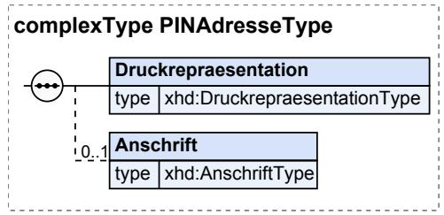

| Kindelemente von PINAdresseType                                                                             |                          |      |        |       |  |
|-------------------------------------------------------------------------------------------------------------|--------------------------|------|--------|-------|--|
| Kindelement                                                                                                 | Typ                      | Anz. | Ref.   | Seite |  |
| Druckrepraesentation                                                                                        | DruckrepraesentationType | 1    | 3.2.12 | 38    |  |
| Enthält die druckbare Adresse.                                                                              |                          |      |        |       |  |
| Anschrift                                                                                                   | AnschriftType            | 01   | 3.3.2  | 47    |  |
| Enthält die Anschrift zur Prüfung der Zustellbarkeit. Als Anschrift kann auch ein Postfach angegeben werden |                          |      |        |       |  |

#### 3.2.17.1 Nutzung des Datentyps

Der Typ wird in folgenden Datentypen verwendet: [PINDatenType](#page-48-0)

## 3.2.18 PINDatenType

Enthält Liefer- und Rücksendeadresse für den PIN-Brief eines hoheitlichen Dokumentes mit eID-Funktion

#### **Abbildung 3.38. PINDatenType**

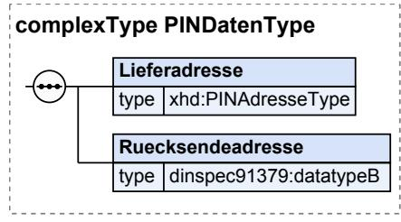

| Kindelemente von PINDatenType                                                                        |                |      |        |       |  |
|------------------------------------------------------------------------------------------------------|----------------|------|--------|-------|--|
| Kindelement                                                                                          | Typ            | Anz. | Ref.   | Seite |  |
| Lieferadresse                                                                                        | PINAdresseType | 1    | 3.2.17 | 42    |  |
| Die Adresse zur Auslieferung des PIN-Briefes.                                                        |                |      |        |       |  |
| Ruecksendeadresse                                                                                    | datatypeB      | 1    | 7.2    | 73    |  |
| Die Adresse zur Rücksendung des PIN-Briefes für den Fall, das dieser nicht ausgeliefert werden kann. |                |      |        |       |  |

#### 3.2.18.1 Nutzung des Datentyps

Der Typ wird in folgenden Datentypen verwendet: [ElektronischeIDType](#page-44-0)

#### 3.2.19 ReklamationType

Enthält Informationen zur Reklamtionen eines hoheitlichen Dokumentes.

#### **Abbildung 3.39. ReklamationType**

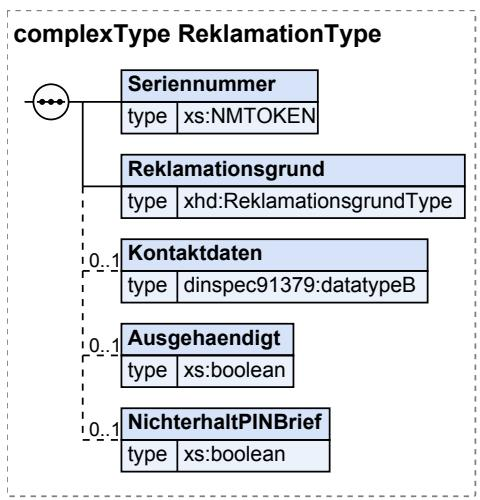

| Kindelemente von ReklamationType                                                                                                                                    |                       |      |        |       |  |
|---------------------------------------------------------------------------------------------------------------------------------------------------------------------|-----------------------|------|--------|-------|--|
| Kindelement                                                                                                                                                         | Typ                   | Anz. | Ref.   | Seite |  |
| Seriennummer                                                                                                                                                        | xs:NMTOKEN            | 1    |        |       |  |
| Die Seriennummer des reklamierten Dokuments.                                                                                                                        |                       |      |        |       |  |
| Reklamationsgrund                                                                                                                                                   | ReklamationsgrundType | 1    | 3.2.20 | 44    |  |
| Zu einer Reklamation muss immer mindestens einen Reklamationsgrund angegeben werden.                                                                                |                       |      |        |       |  |
| Kontaktdaten                                                                                                                                                        | datatypeB             | 01   | 7.2    | 73    |  |
| Kontaktdaten eines direkten Ansprechpartners falls der Dokumentenhersteller Rückfragen zur Reklamation hat.                                                         |                       |      |        |       |  |
| Ausgehaendigt                                                                                                                                                       | xs:boolean            | 01   |        |       |  |
| Information, ob das Dokument an den Bürger ausgehändigt wurde. WAHR - Dokument war an den Bürger ausgehän digt. FALSCH - Dokument wurde noch nicht ausgehändigt. |                       |      |        |       |  |
| NichterhaltPINBrief                                                                                                                                                 | xs:boolean            | 01   |        |       |  |
| Information, ob eine Erklärung zum Nichterhalt des PIN-Briefs vorliegt. WAHR - Erklärung liegt vor. FALSCH - Erklä rung liegt nicht vor.                         |                       |      |        |       |  |

#### 3.2.19.1 Nutzung des Datentyps

Der Typ wird in folgenden Datentypen verwendet: [DokumentendatenType](#page-42-0)

## 3.2.20 ReklamationsgrundType

Beschreibung eines Reklamationsgrundes für ein hoheitliches Dokument.

#### **Abbildung 3.40. ReklamationsgrundType**

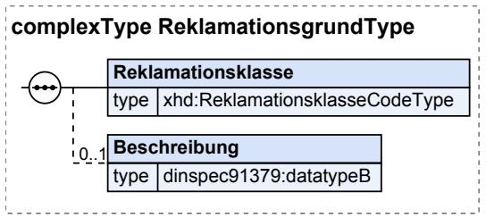

| Kindelemente von ReklamationsgrundType                                       |                            |      |       |       |  |
|------------------------------------------------------------------------------|----------------------------|------|-------|-------|--|
| Kindelement                                                                  | Typ                        | Anz. | Ref.  | Seite |  |
| Reklamationsklasse                                                           | ReklamationsklasseCodeType | 1    | 4.7.8 | 57    |  |
| Ein Datentyp zur Klassifizierung einer Reklamation.                          |                            |      |       |       |  |
| Beschreibung                                                                 | datatypeB                  | 01   | 7.2   | 73    |  |
| Die Beschreibung beinhaltet zusätzliche Informationen zum Reklamationsgrund. |                            |      |       |       |  |

#### 3.2.20.1 Nutzung des Datentyps

Der Typ wird in folgenden Datentypen verwendet: [ReklamationType](#page-48-1)

## 3.2.21 TRBiometricsXMLType

Beinhaltet die biometrischen Merkmale zur Beantragung von hoheitlichen Dokumenten.

#### **Abbildung 3.41. TRBiometricsXMLType**

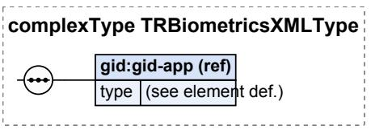

| Kindelement von TRBiometricsXMLType         |     |      |      |       |
|---------------------------------------------|-----|------|------|-------|
| Kindelement                                 | Typ | Anz. | Ref. | Seite |
| gid-app (ref)                               |     | 1    | 7.1  | 73    |
| Referenz auf http://trbio.bsi.bund.de/gid/4 |     |      |      |       |

#### 3.2.21.1 Nutzung des Datentyps

Der Typ wird in folgenden Datentypen verwendet: [AntragsdatensatzDokumentType](#page-27-0)

### 3.2.22 ZertifizierteKomponentenType

Typ Zertifizierte Komponenten

#### **Abbildung 3.42. ZertifizierteKomponentenType**

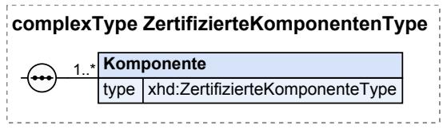

| Kindelement von ZertifizierteKomponentenType                                                |                             |      |        |       |
|---------------------------------------------------------------------------------------------|-----------------------------|------|--------|-------|
| Kindelement                                                                                 | Typ                         | Anz. | Ref.   | Seite |
| Komponente                                                                                  | ZertifizierteKomponenteType | 1n   | 3.2.23 | 45    |
| Informationen zur Zertifizierung der für die Beantragungsprozesse eingesetzten Komponenten. |                             |      |        |       |

#### 3.2.22.1 Nutzung des Datentyps

Dieser Typ kann in den folgenden Nachrichten übermittelt werden: [BestellungDokument](#page-13-1) Der Typ wird in folgenden Datentypen verwendet: [CTYPE\\_BestellungenType](#page-39-0)

### 3.2.23 ZertifizierteKomponenteType

Informationen zur Zertifizierung der für die Beantragungsprozesse eingesetzten Komponenten.

#### **Abbildung 3.43. ZertifizierteKomponenteType**

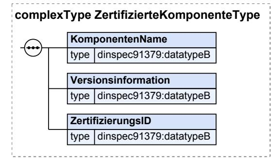

| Kindelemente von ZertifizierteKomponenteType |           |      |      |       |  |
|----------------------------------------------|-----------|------|------|-------|--|
| Kindelement                                  | Typ       | Anz. | Ref. | Seite |  |
| KomponentenName                              | datatypeB | 1    | 7.2  | 73    |  |
| Name der zertifizierten Komponente           |           |      |      |       |  |
| Versionsinformation                          | datatypeB | 1    | 7.2  | 73    |  |
| Version der zeritfizierten Komponente        |           |      |      |       |  |
| ZertifizierungsID                            | datatypeB | 1    | 7.2  | 73    |  |
| Die ID der Zeritfizierungsbescheinigung      |           |      |      |       |  |

#### 3.2.23.1 Nutzung des Datentyps

Dieser Typ kann in den folgenden Nachrichten übermittelt werden: [BestellungDokument](#page-13-1) Der Typ wird in folgenden Datentypen verwendet: [ZertifizierteKomponentenType](#page-50-1)

## 3.3 XÖV-Module

### 3.3.1 AllgemeinerNameType

Das Element AllgemeinerName ist von der gleichnamigen XÖV-Kernkomponente abgeleitet und bildet die Basis für alle Personen-bezogenen Namensfelder.

#### **Abbildung 3.44. AllgemeinerNameType**

**complexType AllgemeinerNameType Name** type dinspec91379:datatypeB

| Kindelement von AllgemeinerNameType |           |      |      |       |  |
|-------------------------------------|-----------|------|------|-------|--|
| Kindelement                         | Typ       | Anz. | Ref. | Seite |  |
| Name                                | datatypeB | 1    | 7.2  | 73    |  |

| Kindelement von AllgemeinerNameType                                                |     |      |      |       |  |
|------------------------------------------------------------------------------------|-----|------|------|-------|--|
| Kindelement                                                                        | Typ | Anz. | Ref. | Seite |  |
| Die Komponente "name" ist der eigentliche Familien- oder Vorname als Zeichenkette. |     |      |      |       |  |

#### 3.3.1.1 Nutzung des Datentyps

Der Typ wird in folgenden Datentypen verwendet: [NameNatuerlichePersonType](#page-53-1)

#### 3.3.2 AnschriftType

Element zur Erfassung einer Anschrift

#### **Abbildung 3.45. AnschriftType**

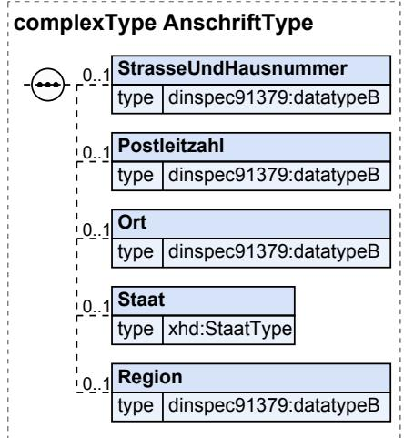

| Kindelemente von AnschriftType                                                                                                                                                                               |                                                                                                              |      |       |       |  |
|--------------------------------------------------------------------------------------------------------------------------------------------------------------------------------------------------------------|--------------------------------------------------------------------------------------------------------------|------|-------|-------|--|
| Kindelement                                                                                                                                                                                                  | Typ                                                                                                          | Anz. | Ref.  | Seite |  |
| StrasseUndHausnummer                                                                                                                                                                                         | datatypeB                                                                                                    | 01   | 7.2   | 73    |  |
|                                                                                                                                                                                                              | Die Straße und Hausnummer der Adresse ggf. inklusiv notwendiger Zusätze in üblicher Reihenfolge des Staates. |      |       |       |  |
| Postleitzahl                                                                                                                                                                                                 | datatypeB                                                                                                    | 01   | 7.2   | 73    |  |
| Postleitzahl als Angabe, um postalische Zustellgebiete unabhängig von Gebietskörperschaften (Gemeinde, Kreis, ?) zu bezeichnen. Möglich sind Zahlen und Buchstaben, in üblicher Schreibweise des Staates. |                                                                                                              |      |       |       |  |
| Ort                                                                                                                                                                                                          | datatypeB                                                                                                    | 01   | 7.2   | 73    |  |
| Der Ort der Adresse                                                                                                                                                                                          |                                                                                                              |      |       |       |  |
| Staat                                                                                                                                                                                                        | StaatType                                                                                                    | 01   | 3.3.7 | 50    |  |
| Der Codewert des Staates der Anschrift.                                                                                                                                                                      |                                                                                                              |      |       |       |  |
| Region                                                                                                                                                                                                       | datatypeB                                                                                                    | 01   | 7.2   | 73    |  |
| Regionale Unterteilung des Staates. Entspricht je nach Staat einer Region, einem Land, einem Bundesland, "State", "County" oder einer ähnlichen Unterteilung.                                             |                                                                                                              |      |       |       |  |

#### 3.3.2.1 Nutzung des Datentyps

Dieser Typ kann in den folgenden Nachrichten übermittelt werden: [BestellungDokument](#page-13-1)

Der Typ wird in folgenden Datentypen verwendet: [BehoerdenadresseType](#page-36-1), [NatuerlichePersonType](#page-55-0), [PINAdresseType](#page-47-0)

#### 3.3.3 GeschlechtType

Datentyp für das Geschlecht einer natürlichen Person

#### **Abbildung 3.46. GeschlechtType**

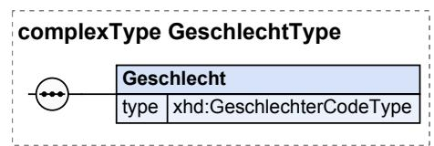

| Kindelement von GeschlechtType       |                      |      |       |       |
|--------------------------------------|----------------------|------|-------|-------|
| Kindelement                          | Typ                  | Anz. | Ref.  | Seite |
| Geschlecht                           | GeschlechterCodeType | 1    | 4.7.4 | 56    |
| Datentyp zur Angabe des Geschlechtes |                      |      |       |       |

#### 3.3.3.1 Nutzung des Datentyps

Der Typ wird in folgenden Datentypen verwendet: [NatuerlichePersonType](#page-55-0)

#### 3.3.4 NameNatuerlichePersonType

Diese Komponente basiert auf der gleichnamigen XÖV-Kernkomponente

#### **Abbildung 3.47. NameNatuerlichePersonType**

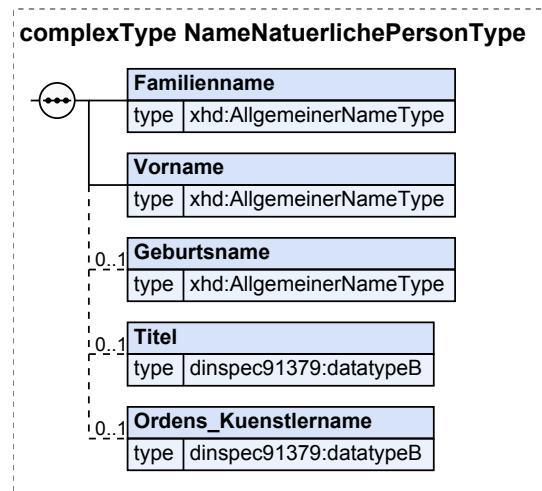

| Kindelemente von NameNatuerlichePersonType |                     |      |       |       |  |
|--------------------------------------------|---------------------|------|-------|-------|--|
| Kindelement                                | Typ                 | Anz. | Ref.  | Seite |  |
| Familienname                               | AllgemeinerNameType | 1    | 3.3.1 | 46    |  |

| Kindelemente von NameNatuerlichePersonType                                                                                                            |                     |      |       |       |  |
|-------------------------------------------------------------------------------------------------------------------------------------------------------|---------------------|------|-------|-------|--|
| Kindelement                                                                                                                                           | Typ                 | Anz. | Ref.  | Seite |  |
| Das Element AllgemeinerName ist von der gleichnamigen XÖV-Kernkomponente abgeleitet und bildet die Basis für alle Personen-bezogenen Namensfelder. |                     |      |       |       |  |
| Vorname                                                                                                                                               | AllgemeinerNameType | 1    | 3.3.1 | 46    |  |
| Das Element AllgemeinerName ist von der gleichnamigen XÖV-Kernkomponente abgeleitet und bildet die Basis für alle Personen-bezogenen Namensfelder. |                     |      |       |       |  |
| Geburtsname                                                                                                                                           | AllgemeinerNameType | 01   | 3.3.1 | 46    |  |
| Das Element AllgemeinerName ist von der gleichnamigen XÖV-Kernkomponente abgeleitet und bildet die Basis für alle Personen-bezogenen Namensfelder. |                     |      |       |       |  |
| Titel                                                                                                                                                 | datatypeB           | 01   | 7.2   | 73    |  |
| Der Titel, der vor dem Vornamen steht.                                                                                                                |                     |      |       |       |  |
| Ordens_Kuenstlername                                                                                                                                  | datatypeB           | 01   | 7.2   | 73    |  |
| Das Element zur Erfassung des Ordensnamens/Künstlernamens                                                                                             |                     |      |       |       |  |

#### 3.3.4.1 Nutzung des Datentyps

Der Typ wird in folgenden Datentypen verwendet: [NatuerlichePersonType](#page-55-0)

#### 3.3.5 NameOrganisationType

Wird zur Abbildung des Namens einer Behörde verwendet.

#### **Abbildung 3.48. NameOrganisationType**

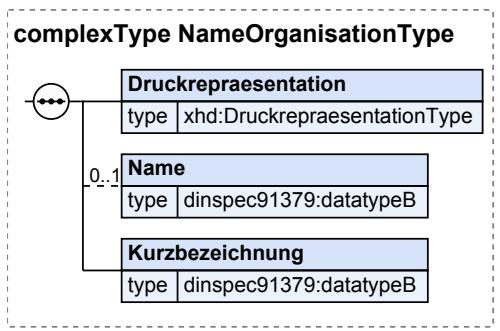

| Kindelemente von NameOrganisationType               |                          |      |        |       |
|-----------------------------------------------------|--------------------------|------|--------|-------|
| Kindelement                                         | Typ                      | Anz. | Ref.   | Seite |
| Druckrepraesentation                                | DruckrepraesentationType | 1    | 3.2.12 | 38    |
| Die Druckrepraesentation der Behoerdenbezeichnung   |                          |      |        |       |
| Name                                                | datatypeB                | 01   | 7.2    | 73    |
| Der offizielle und vollständige Name einer Behörde. |                          |      |        |       |
| Kurzbezeichnung                                     | datatypeB                | 1    | 7.2    | 73    |
| Die Kurzbezeichnung einer Behoerde                  |                          |      |        |       |

#### 3.3.5.1 Nutzung des Datentyps

Der Typ wird in folgenden Datentypen verwendet: [DokumentendatenType](#page-42-0)

## 3.3.6 NatuerlichePersonType

Bildet die Daten einer natürlichen Person ab.

#### **Abbildung 3.49. NatuerlichePersonType**

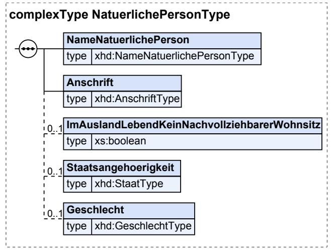

| Kindelemente von NatuerlichePersonType                                                                                                                                                                                                                                                                         |                           |      |       |       |
|----------------------------------------------------------------------------------------------------------------------------------------------------------------------------------------------------------------------------------------------------------------------------------------------------------------|---------------------------|------|-------|-------|
| Kindelement                                                                                                                                                                                                                                                                                                    | Typ                       | Anz. | Ref.  | Seite |
| NameNatuerlichePerson                                                                                                                                                                                                                                                                                          | NameNatuerlichePersonType | 1    | 3.3.4 | 48    |
| Diese Komponente basiert auf der gleichnamigen XÖV-Kernkomponente                                                                                                                                                                                                                                              |                           |      |       |       |
| Anschrift                                                                                                                                                                                                                                                                                                      | AnschriftType             | 1    | 3.3.2 | 47    |
| Element zur Erfassung einer Anschrift                                                                                                                                                                                                                                                                          |                           |      |       |       |
| ImAuslandLebendKeinNachvollziehba rerWohnsitz                                                                                                                                                                                                                                                               | xs:boolean                | 01   |       |       |
| Beantragt ein im Ausland lebender Bürger einen Personalausweis mit eID-Funktion oder eine eID-Karte für Unions bürger und hat dort keinen festen oder nachvollziehbaren Wohnsitz, muss das Element übertragen werden und auf WAHR gesetzt werden. In allen anderen Fällen ist der Wert FALSCH zu wählen. |                           |      |       |       |
| Staatsangehoerigkeit                                                                                                                                                                                                                                                                                           | StaatType                 | 01   | 3.3.7 | 50    |
| Staaten nach ICAO Doc 9303, Part 3 Chapter 5                                                                                                                                                                                                                                                                   |                           |      |       |       |
| Geschlecht                                                                                                                                                                                                                                                                                                     | GeschlechtType            | 01   | 3.3.3 | 48    |
| Datentyp für das Geschlecht einer natürlichen Person                                                                                                                                                                                                                                                           |                           |      |       |       |

#### 3.3.6.1 Nutzung des Datentyps

Der Typ wird in folgenden Datentypen verwendet: [PersonendatenType](#page-46-0)

## 3.3.7 StaatType

Staaten nach ICAO Doc 9303, Part 3 Chapter 5. Abweichungen der Codes werden durch das BMI geregelt.

#### **Abbildung 3.50. StaatType**

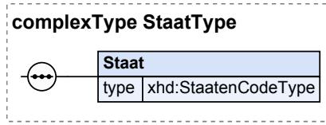

| Kindelement von StaatType                    |                 |      |       |       |
|----------------------------------------------|-----------------|------|-------|-------|
| Kindelement                                  | Typ             | Anz. | Ref.  | Seite |
| Staat                                        | StaatenCodeType | 1    | 4.7.9 | 57    |
| Staaten nach ICAO Doc 9303, Part 3 Chapter 5 |                 |      |       |       |

#### 3.3.7.1 Nutzung des Datentyps

Dieser Typ kann in den folgenden Nachrichten übermittelt werden: [BestellungDokument](#page-13-1) Der Typ wird in folgenden Datentypen verwendet: [AnschriftType,](#page-52-0) [NatuerlichePersonType](#page-55-0)

# **4 Datentypen**

## 4.1 Übersicht

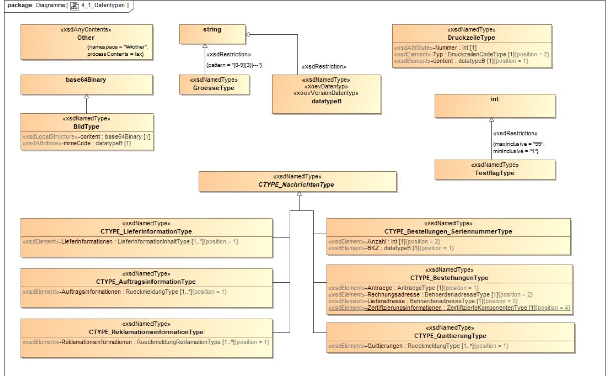

## 4.2 BildType

Ein Element zum Übertragen von Bilddaten.

Dieser Typ ist eine Erweiterung des Basistyps **xs:base64Binary**.

| Kindelemente von BildType                               |                 |      |      |       |
|---------------------------------------------------------|-----------------|------|------|-------|
| Kindelement                                             | Typ             | Anz. | Ref. | Seite |
| mimeCode                                                | datatypeB       | 1    | 7.2  | 73    |
| Zulässige MimeType Werte sind image/jpeg und image/jp2. |                 |      |      |       |
| content                                                 | xs:base64Binary | 1    |      |       |
| Das Bild im Binärformat.                                |                 |      |      |       |

## 4.2.1 Nutzung des Datentyps

Der Typ wird in folgenden Datentypen verwendet: [AntragsdatensatzDokumentType](#page-27-0)

## 4.3 DruckzeileType

Typ Druckzeile

### **Abbildung 4.2. DruckzeileType**

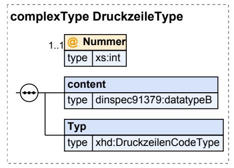

| Kindelemente von DruckzeileType                                                                                                                  |                     |      |       |       |
|--------------------------------------------------------------------------------------------------------------------------------------------------|---------------------|------|-------|-------|
| Kindelement                                                                                                                                      | Typ                 | Anz. | Ref.  | Seite |
| Nummer                                                                                                                                           | xs:int              | 1    |       |       |
| Nummer                                                                                                                                           |                     |      |       |       |
| content                                                                                                                                          | datatypeB           | 1    | 7.2   | 73    |
| Element zur Erfassung von content.                                                                                                               |                     |      |       |       |
| Typ                                                                                                                                              | DruckzeilenCodeType | 1    | 4.7.3 | 56    |
| Der Typ einer Druckzeile. Wird der Werte "Andere" genutzt, so muss in der Zusatzinformation angegeben werden, um welchen Typ es sich handelt. |                     |      |       |       |

## 4.3.1 Nutzung des Datentyps

Dieser Typ kann in den folgenden Nachrichten übermittelt werden: [BestellungDokument](#page-13-1) Der Typ wird in folgenden Datentypen verwendet: [DruckrepraesentationType](#page-43-0)

## 4.4 GroesseType

Typ Größe Dieser Typ ist eine Einschränkung des Basistyps **xs:string**. Die Werte müssen dem Muster '[0-9]{3}|---' entsprechen.

## 4.4.1 Nutzung des Datentyps

Der Typ wird in folgenden Datentypen verwendet: [PersonendatenType](#page-46-0)

## 4.5 TestflagType

Ein Testflag (ein Integer größer 0)

Dieser Typ ist eine Einschränkung des Basistyps **xs:int**.

Beschränkungen (XML-Schema-Facetten): maxInclusive:99; minInclusive:1

## 4.5.1 Nutzung des Datentyps

Dieser Typ kann in den folgenden Nachrichten übermittelt werden: [Auftragsinformation,](#page-14-1) [BestellungDoku](#page-13-1)[ment,](#page-13-1) [BestellungSeriennummern,](#page-14-0) [Fehlerinformation](#page-17-0), [Lieferinformation](#page-16-0), [Quittierung,](#page-16-1) [Reklamationsinfor](#page-15-0)[mation](#page-15-0)

Der Typ wird in folgenden Datentypen verwendet: [NachrichtenkopfType](#page-23-0)

## 4.6 String.MRZ

Der Zeichensatz für die maschinenlesbare Zone (MRZ). Erlaubt sind die Zeichen: A-Z (ohne Kleinbuchstaben), 0-9 und das Zeichen "<".

Dieser Typ ist eine Einschränkung des Basistyps **xs:string**.

Die Werte müssen dem Muster '[A-Z0-9<]\*' entsprechen.

## 4.6.1 Nutzung des Datentyps

Der Typ wird in folgenden Datentypen verwendet: [DokumentendatenType](#page-42-0)

## 4.7 Übersicht über die Code-Datentypen

## 4.7.1 AufenthaltstitelartCodeType

Ein Datentyp zur Angabe der Art eines Aufenthaltstitels.

| Codelisten    |                                                       |
|---------------|-------------------------------------------------------|
| -beschreibung | Die verschiedenen Typen von Aufenthaltstiteln.        |
| -nutzung      | Typ: 1, Inhalte der Codeliste siehe Seite 60          |
| -kennung      | urn:de:xhd:codelisten:aufenthaltstitelcodecontenttype |
| -version      | 1.0                                                   |

4.7.1.1 Nutzung des Datentyps

Der Typ wird in folgenden Datentypen verwendet: [AufenthaltstiteldatenType](#page-31-0)

## 4.7.2 DokumentenartCodeType

Ein Datentyp zur Angabe der Art eines hoheitlichen Dokumentes.

| Codelisten    |                                                    |
|---------------|----------------------------------------------------|
| -beschreibung | Die verschiedenen Typen hoheitlicher Dokumente.    |
| -nutzung      | Typ: 1, Inhalte der Codeliste siehe Seite 62       |
| -kennung      | urn:de:xhd:codelisten:dokumentenartcodecontenttype |

#### 4 Datentypen

| Codelisten |     |
|------------|-----|
| -version   | 1.0 |

#### 4.7.2.1 Nutzung des Datentyps

Dieser Typ kann in den folgenden Nachrichten übermittelt werden: [Auftragsinformation,](#page-14-1) [BestellungDoku](#page-13-1)[ment,](#page-13-1) [BestellungSeriennummern,](#page-14-0) [Fehlerinformation](#page-17-0), [Lieferinformation](#page-16-0), [Quittierung,](#page-16-1) [Reklamationsinfor](#page-15-0)[mation](#page-15-0)

Der Typ wird in folgenden Datentypen verwendet: [NachrichtenkopfType](#page-23-0)

## 4.7.3 DruckzeilenCodeType

Der Typ einer Druckzeile. Wird der Werte "Andere" genutzt, so muss in der Zusatzinformation angegeben werden, um welchen Typ es sich handelt.

| Codelisten    |                                                  |
|---------------|--------------------------------------------------|
| -beschreibung | Die verschiedenen Typen von Druckzeilen.         |
| -nutzung      | Typ: 1, Inhalte der Codeliste siehe Seite 63     |
| -kennung      | urn:de:xhd:codelisten:druckzeilencodecontenttype |
| -version      | 1.0                                              |

#### 4.7.3.1 Nutzung des Datentyps

Dieser Typ kann in den folgenden Nachrichten übermittelt werden: [BestellungDokument](#page-13-1)

Der Typ wird in folgenden Datentypen verwendet: [DruckzeileType](#page-59-1)

## 4.7.4 GeschlechterCodeType

Datentyp zur Angabe des Geschlechtes

| Codelisten    |                                                   |
|---------------|---------------------------------------------------|
| -beschreibung | Die verschiedenen Geschlechter.                   |
| -nutzung      | Typ: 1, Inhalte der Codeliste siehe Seite 64      |
| -kennung      | urn:de:xhd:codelisten:geschlechtercodecontenttype |
| -version      | 1.0                                               |

#### 4.7.4.1 Nutzung des Datentyps

Der Typ wird in folgenden Datentypen verwendet: [GeschlechtType](#page-53-0)

## 4.7.5 OptionaltextCodeType

Ein Datentyp zur Angabe der Art eines Reisepasses.

| Codelisten    |                                                     |
|---------------|-----------------------------------------------------|
| -beschreibung | Optionale Eintragungen (Seite 3 des Reiseausweises) |
| -nutzung      | Typ: 1, Inhalte der Codeliste siehe Seite 65        |
| -kennung      | urn:de:xhd:codelisten:optionaltextcodecontenttype   |
| -version      | 1.0                                                 |

#### 4.7.5.1 Nutzung des Datentyps

Der Typ wird in folgenden Datentypen verwendet: [OptionaleEintragungenType](#page-45-1)

## 4.7.6 PassartCodeType

Ein Datentyp zur Angabe der Art eines Reisepasses.

| Codelisten    |                                              |
|---------------|----------------------------------------------|
| -beschreibung | Die verschiedenen Typen von Reisepässen.     |
| -nutzung      | Typ: 1, Inhalte der Codeliste siehe Seite 66 |
| -kennung      | urn:de:xhd:codelisten:passartcodecontenttype |
| -version      | 1.0                                          |

#### 4.7.6.1 Nutzung des Datentyps

Der Typ wird in folgenden Datentypen verwendet: [AntragsdatensatzPassType](#page-28-0)

### 4.7.7 ReiseausweisartCodeType

Ein Datentyp zur Angabe der Art eines Reiseausweise.

| Codelisten    |                                                      |
|---------------|------------------------------------------------------|
| -beschreibung | Die verschiedenen Typen von Reiseausweisen.          |
| -nutzung      | Typ: 1, Inhalte der Codeliste siehe Seite 67         |
| -kennung      | urn:de:xhd:codelisten:reiseausweisartcodecontenttype |
| -version      | 1.0                                                  |

#### 4.7.7.1 Nutzung des Datentyps

Der Typ wird in folgenden Datentypen verwendet: [AntragsdatensatzReiseausweisType](#page-28-1)

## 4.7.8 ReklamationsklasseCodeType

Ein Datentyp zur Klassifizierung einer Reklamation.

| Codelisten    |                                                                   |  |
|---------------|-------------------------------------------------------------------|--|
| -beschreibung | Klassen von Gründen für die Reklamationen hoheitlicher Dokumente. |  |
| -nutzung      | Typ: 1, Inhalte der Codeliste siehe Seite 68                      |  |
| -kennung      | urn:de:xhd:codelisten:reklamationsklassecodecontenttype           |  |
| -version      | 1.0                                                               |  |

#### 4.7.8.1 Nutzung des Datentyps

Der Typ wird in folgenden Datentypen verwendet: [ReklamationsgrundType](#page-49-0)

## 4.7.9 StaatenCodeType

Staaten nach ICAO Doc 9303, Part 3 Chapter 5. Abweichungen der Codes werden durch das BMI geregelt.

#### 4 Datentypen

| Codelisten    |                                                                                                         |
|---------------|---------------------------------------------------------------------------------------------------------|
| -beschreibung | Staaten nach ICAO Doc 9303, Part 3 Chapter 5. Abweichungen der Codes werden durch das BMI gere gelt. |
| -nutzung      | Typ: 2, siehe Beschreibung                                                                              |
| -kennung      | urn:de.xhd.codelisten.staaten                                                                           |
| -version      | 1.0                                                                                                     |

#### 4.7.9.1 Nutzung des Datentyps

Dieser Typ kann in den folgenden Nachrichten übermittelt werden: [BestellungDokument](#page-13-1)

Der Typ wird in folgenden Datentypen verwendet: [StaatType](#page-55-1)

## **5 Codelisten**

## 5.1 Überblick

#### **Abbildung 5.1. Codelisten**

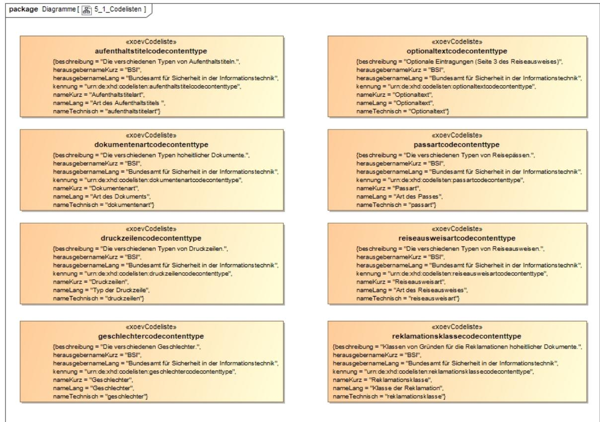

## 5.2 Codelisten

In diesem Abschnitt sind die in TR XhD verwendeten Codelisten und ihre Inhalte aufgeführt.

## 5.2.1 Übersicht

In der nachstehenden Tabelle werden die folgenden Informationen dargestellt:

#### **Codeliste**

Alle in TR XhD genutzten Codelisten in alphabetischer Reihenfolge, die in mindestens einem Code-Datentyp genutzt werden (Typ der Codelistennutzung 1 bis 3).1

Bundesamt für Sicherheit in der Informationstechnik 59

1 Sofern in der Spalte "Code-Datentyp(en)" kein Eintrag vorhanden ist, bedeutet dies, dass der Standard die jeweilige Codeliste verwendet und dokumentieren möchte. Der die Codeliste nutzende Code-Datentyp ist jedoch nicht im Standard spezifiziert.

#### **Version**

Die Version der Codeliste.

#### **Code-Datentyp(en)**

Die die jeweilige Codeliste nutzenden Code-Datentypen.1

Die Namen der Code-Datentypen und der Codelisten stellen Links zu den jeweiligen Detail-Abschnitten dar.

| Codeliste                  | Version | Code-Datentyp(en)           |
|----------------------------|---------|-----------------------------|
| Aufenthaltstitelart 1.0 |         | AufenthaltstitelartCodeType |
| Dokumentenart              | 1.0     | DokumentenartCodeType       |
| Druckzeilen                | 1.0     | DruckzeilenCodeType         |
| Geschlechter               | 1.0     | GeschlechterCodeType        |
| Optionaltext               | 1.0     | OptionaltextCodeType        |
| Passart                    | 1.0     | PassartCodeType             |
| Reiseausweisart            | 1.0     | ReiseausweisartCodeType     |
| Reklamationsklasse         | 1.0     | ReklamationsklasseCodeType  |
| Staaten                    | 1.0     | StaatenCodeType             |

#### 5.2.2 Details

#### 5.2.2.1 Aufenthaltstitelart

Die verschiedenen Typen von Aufenthaltstiteln.

#### 5.2.2.1.1 Metadaten

| Metadatenelement | Wert                                                      |  |
|------------------|-----------------------------------------------------------|--|
| Name (lang)      | Art des Aufenthaltstitels                                 |  |
| Name (kurz)      | Aufenthaltstitelart                                       |  |
| Kennung          | urn:de:xhd:codelisten:aufenthaltstitelcodecontenttype     |  |
| Herausgeber      | Bundesamt für Sicherheit in der Informationstechnik (BSI) |  |
| Version          | 1.0                                                       |  |

#### 5.2.2.1.2 Daten

| code (Code) | name (Name)                                | beschreibung (Beschreibung)                                                                                                                                                                                                                                                                                                                                                                                                                                                                                                                                                                                                                                                                                                     |
|-------------|--------------------------------------------|---------------------------------------------------------------------------------------------------------------------------------------------------------------------------------------------------------------------------------------------------------------------------------------------------------------------------------------------------------------------------------------------------------------------------------------------------------------------------------------------------------------------------------------------------------------------------------------------------------------------------------------------------------------------------------------------------------------------------------|
| AE          | Aufenthaltserlaubnis                       | Aufenthaltserlaubnis nach § 4 Abs. 5, § 7 Abs. 1 S. 3, § 16 Abs. 1, 5, 6, 7 und 9, § 16b Abs. 1 und 3, § 17 Abs. 1 und 3, § 17a Abs. 1, 4 und 5, § 17b Abs. 1, § 18 Abs. 3, 4 S. 1 und 2 sowie Abs. 4a, § 18a Abs. 1 Nr. 1 A, B und C, § 18c, § 18d, § 20 Abs. 1 und 8, § 20b, § 21 Abs. 1, 2, 2a und 5, § 22 S. 1 und 2, § 23 Abs. 1, 2 und 4, § 23a, § 24, § 25 Abs. 1, 2, 3, 4 S. 1 und 2 sowie Abs. 4a und 5, § 25a Abs. 1 sowie Abs. 2 S. 1, 2, 3 und 5, § 25b Abs. 1 S. 1 sowie Abs. 4, § 30, § 31 Abs. 1, 2 und 4, § 32 Abs. 1, 2, 3 und 4, § 33, § 34 Abs. 2, § 36 Abs. 1 und 2, § 37 Abs. 1 und 5, § 38 Abs. 1 Nr. 2 sowie Abs. 2 und 5, § 38a des Aufenthaltsge setzes (AufenthG) |
| AF          | Aufenthaltserlaubnis (Familienangehöriger) | Aufenthaltserlaubnis nach § 28 Abs. 1 S. 1 Nr. 1, 2 und 3 sowie Abs. 4 AufenthG)                                                                                                                                                                                                                                                                                                                                                                                                                                                                                                                                                                                                                                             |

| code (Code) | name (Name)                                       | beschreibung (Beschreibung)                                                                                                                                                                                                                                                                                                                                                                                                                                                                                                                                                                                                                                                                                                                                                                                                                         |
|-------------|---------------------------------------------------|-----------------------------------------------------------------------------------------------------------------------------------------------------------------------------------------------------------------------------------------------------------------------------------------------------------------------------------------------------------------------------------------------------------------------------------------------------------------------------------------------------------------------------------------------------------------------------------------------------------------------------------------------------------------------------------------------------------------------------------------------------------------------------------------------------------------------------------------------------|
| AK          | Aufenthaltskarte (Familienangehöriger EU)         | Aufenthaltskarte für (drittstaatsangehörige) Fami lienangehörige eines Unionsbürgers oder eines Staatsangehörigen eines EWR-Staates (§ 5 Abs. 1 FreizügG/EU)                                                                                                                                                                                                                                                                                                                                                                                                                                                                                                                                                                                                                                                                               |
| AN          | Aufenthaltskarte (nahestehende Person)            | Aufenthaltskarte für eine nahestehende Person eines Unionsbürgers nach § 3a FreizügG/EU (ART 3 ABS 2 RL 2004/38/EG)                                                                                                                                                                                                                                                                                                                                                                                                                                                                                                                                                                                                                                                                                                                           |
| AS          | Aufenthaltserlaubnis CH                           | Aufenthaltserlaubnis für Staatsangehörige der Schweizerischen Eidgenossenschaft und ihre Familienangehörigen, die nicht Staatsangehörige der Schweizerischen Eidgenossenschaft sind (§28 AufenthV)                                                                                                                                                                                                                                                                                                                                                                                                                                                                                                                                                                                                                                      |
| BK          | Blaue Karte EU                                    | Aufenthaltstitel nach § 19 a AufenthG                                                                                                                                                                                                                                                                                                                                                                                                                                                                                                                                                                                                                                                                                                                                                                                                               |
| DA          | Daueraufenthaltskarte (Familienangehöriger EU) | Daueraufenthaltskarte für (drittstaatsangehörige) Familienangehörige von Unionsbürgern oder von Staatsangehörigen eines EWR-Staates (§5 Abs. 5 FreizügG/EU)                                                                                                                                                                                                                                                                                                                                                                                                                                                                                                                                                                                                                                                                                |
| DE          | Erlaubnis zum Daueraufenthalt-EU                  | Erlaubnis zum Daueraufenthalt-EU (§ 9a Aufen thG)                                                                                                                                                                                                                                                                                                                                                                                                                                                                                                                                                                                                                                                                                                                                                                                                |
| DN          | Daueraufenthaltskarte (nahestehende Person)       | Daueraufenthaltskarte für eine nahestehende Per son eines Unionsbürgers § 3a in Verbindung mit § 4a FreizügG/EU (ART 3 ABS 2 RL 2004/38/EG)                                                                                                                                                                                                                                                                                                                                                                                                                                                                                                                                                                                                                                                                                                   |
| IC          | ICT-Karte                                         | ICT-Karte für unternehmensintern transferierte Arbeitnehmer gemäß §19b AufenthG                                                                                                                                                                                                                                                                                                                                                                                                                                                                                                                                                                                                                                                                                                                                                                  |
| MI          | Mobiler-ICT-Karte                                 | Mobiler-ICT-Karte gemäß §19d AufenthG                                                                                                                                                                                                                                                                                                                                                                                                                                                                                                                                                                                                                                                                                                                                                                                                               |
| NE          | Niederlassungserlaubnis                           | Niederlassungserlaubnis gemäß §9, § 18b, § 19 Abs. 1, 2 Nr. 1 und 2, § 19a Ab 6 S. 1 und 3, § 21 Abs. 4, § 23 Abs. 2, § 26. Abs. 2, 3 S. 1 und 2 sowie Abs. 3 und 4, §28 Abs. 2, § 31 Abs. 3, § 35, § 38 Abs. 1 Nr. 1 des Aufenthaltsgesetzes (AufenthG)und 5, § 17b Abs. 1, § 18 Abs. 3, 4 S. 1 und 2 sowie Abs. 4a, § 18a Abs. 1 Nr. 1 A, B und C, § 18c, § 18d, § 20 Abs. 1 und 8, § 20b, § 21 Abs. 1, 2, 2a und 5, § 22 S. 1 und 2, § 23 Abs. 1, 2 und 4, § 23a, § 24, § 25 Abs. 1, 2, 3, 4 S. 1 und 2 sowie Abs. 4a und 5, § 25a Abs. 1 sowie Abs. 2 S. 1, 2, 3 und 5, § 25b Abs. 1 S. 1 sowie Abs. 4, § 30, § 31 Abs. 1, 2 und 4, § 32 Abs. 1, 2, 3 und 4, § 33, § 34 Abs. 2, § 36 Abs. 1 und 2, § 37 Abs. 1 und 5, § 38 Abs. 1 Nr. 2 sowie Abs. 2 und 5, § 38a des Aufenthaltsge setzes (AufenthG) |
| XA          | Artikel 50 EUV                                    | Aufenthaltsdokument für Personen, die nach einem Abkommen der EU mit einem Staat, der nach Artikel 50 des Vertrags über die Europäische Union aus der EU ausgeschieden ist, eine besonde re aufenthaltsrechtliche Stellung innehaben.                                                                                                                                                                                                                                                                                                                                                                                                                                                                                                                                                                                                   |
| XG          | Artikel 50 EUV - Grenzgänger                      | Aufenthaltserlaubnis für Grenzgänger, nach einem Abkommen der EU mit einem Staat, der nach Artikel 50 des Vertrags über die Europäische Uni on aus der EU ausgeschieden ist, eine besondere Berechtigung zur Erwerbstätigkeit in Deutschland haben, und die außerhalb Deutschlands leben.                                                                                                                                                                                                                                                                                                                                                                                                                                                                                                                                            |

5 Codelisten

#### 5.2.2.2 Dokumentenart

Die verschiedenen Typen hoheitlicher Dokumente.

#### 5.2.2.2.1 Metadaten

| Metadatenelement | Wert                                                      |  |
|------------------|-----------------------------------------------------------|--|
| Name (lang)      | Art des Dokuments                                         |  |
| Name (kurz)      | Dokumentenart                                             |  |
| Kennung          | urn:de:xhd:codelisten:dokumentenartcodecontenttype        |  |
| Herausgeber      | Bundesamt für Sicherheit in der Informationstechnik (BSI) |  |
| Version          | 1.0                                                       |  |

#### 5.2.2.2.2 Daten

| code (Code) | name (Name)                | beschreibung (Beschreibung)     |
|-------------|----------------------------|---------------------------------|
| AT          | Aufenthaltstitel           | Aufenthaltstitel gemäß AufenthG |
| PA          | Personalausweis            | Personalausweis gemäß PAuswG    |
| RA          | Reiseausweis               | Reiseausweis gemäß AufenthG     |
| RP          | Reisepass                  | Reisepass gemäß PassG           |
| UB          | eID-Karte für Unionsbürger | eID-Karte für Unionsbürger      |

#### 5.2.2.3 Druckzeilen

#### Die verschiedenen Typen von Druckzeilen.

#### 5.2.2.3.1 Metadaten

| Metadatenelement | Wert                                                      |  |
|------------------|-----------------------------------------------------------|--|
| Name (lang)      | Typ der Druckzeile                                        |  |
| Name (kurz)      | Druckzeilen                                               |  |
| Kennung          | urn:de:xhd:codelisten:druckzeilencodecontenttype          |  |
| Herausgeber      | Bundesamt für Sicherheit in der Informationstechnik (BSI) |  |
| Version          | 1.0                                                       |  |

#### 5.2.2.3.2 Daten

| code (Code)                                            | name (Name)                                    | beschreibung (Beschreibung)                                                                                                                                          |
|--------------------------------------------------------|------------------------------------------------|----------------------------------------------------------------------------------------------------------------------------------------------------------------------|
| Anmerkungen Erwerbstaetig keit                   | AnmerkungenErwerbstaetigkeit                   | Anmerkungen auf der Rückseite des elektroni schen Aufenthaltstitels                                                                                               |
| Anmerkungen Rechtsgrundla genUndPassdo kument | AnmerkungenRechtsgrundlagenUndPassdo kument | Anmerkungen auf der Vorderseite des elektroni schen Aufenthaltstitels                                                                                             |
| Behoerdenname                                          | Behoerdenname                                  | Name der ausstellenden Behörde                                                                                                                                       |
| Behoerdenna meKurzeZeile                            | BehoerdennameKurzeZeile                        | Kurze Zeile zum Druck im Kombi-Feld Ausstel lungsdatum/-Behörde                                                                                                   |
| Dienstinfo                                             | Dienstinfo                                     | Das Feld Dienstinfo ist verpflichtend für die Pas sarten PO (Dienstpass) und PD (Diplomatenpass). Für die Passart P (Reisepass) ist das Feld nicht erlaubt. |
| Geburtsname                                            | Geburtsname                                    | Geburtsname                                                                                                                                                          |
| Geburtsort                                             | Geburtsort                                     | Geburtsort                                                                                                                                                           |
| Lieferadresse                                          | Lieferadresse                                  | Lieferadresse für das Ausweisdokument                                                                                                                                |
|                                                        | LieferadressePIN LieferadressePIN              | Lieferadresse für den PIN-Brief                                                                                                                                      |
| Namensblock                                            | Namensblock                                    | Familienname des/der Ausweisinhabers/-in                                                                                                                             |
| Ordens_Kuenst lername                               | Ordens_Kuenstlername                           | Ordens- oder Künstlername des/der Ausweisinha bers/-in.                                                                                                           |
| Rechnungs adresse                                   | Rechnungsadresse                               | Rechnungsadresse                                                                                                                                                     |
| Strasse_Haus nummer                                 | Strasse_Hausnummer                             | Zeile für die Druckrepräsentation der Straße und Hausnummer                                                                                                       |
| Unterlagen                                             | Unterlagen                                     | Unterlagen                                                                                                                                                           |
|                                                        | Vornamensblock Vornamensblock                  | Vorname(n) des/der Ausweisinhabers/-in                                                                                                                               |
| Wohnort                                                | Wohnort                                        | Wohnort des/der Ausweisinhabers/-in                                                                                                                                  |

5 Codelisten

#### 5.2.2.4 Geschlechter

#### Die verschiedenen Geschlechter.

#### 5.2.2.4.1 Metadaten

| Metadatenelement | Wert                                                      |  |
|------------------|-----------------------------------------------------------|--|
| Name (lang)      | Geschlechter                                              |  |
| Name (kurz)      | Geschlechter                                              |  |
| Kennung          | urn:de:xhd:codelisten:geschlechtercodecontenttype         |  |
| Herausgeber      | Bundesamt für Sicherheit in der Informationstechnik (BSI) |  |
| Version          | 1.0                                                       |  |

#### 5.2.2.4.2 Daten

| code (Code) | name (Name)            | beschreibung (Beschreibung)                                                                |
|-------------|------------------------|--------------------------------------------------------------------------------------------|
| 001         | weiblich               | Geschlecht der Ausweisinhaberin weiblich                                                   |
| 002         | männlich               | Geschlecht des Ausweisinhabers männlich                                                    |
| 003         | unbekanntes Geschlecht | Geschlecht des/der Ausweisinhabers/-in weder als weiblich noch als männlich einzutragen |

#### 5.2.2.5 Optionaltext

#### Optionale Eintragungen (Seite 3 des Reiseausweises)

#### 5.2.2.5.1 Metadaten

| Metadatenelement | Wert                                                      |  |
|------------------|-----------------------------------------------------------|--|
| Name (lang)      | Optionaltext                                              |  |
| Name (kurz)      | Optionaltext                                              |  |
| Kennung          | urn:de:xhd:codelisten:optionaltextcodecontenttype         |  |
| Herausgeber      | Bundesamt für Sicherheit in der Informationstechnik (BSI) |  |
| Version          | 1.0                                                       |  |

#### 5.2.2.5.2 Daten

| code (Code)    | name (Name)    | beschreibung (Beschreibung)                                                                                                                                                                                                                                                               |
|----------------|----------------|-------------------------------------------------------------------------------------------------------------------------------------------------------------------------------------------------------------------------------------------------------------------------------------------|
| Asylberechtigt | Asylberechtigt | Der Inhaber / Die Inhaberin dieses Reiseausweises ist als Asylberechtigter anerkannt.                                                                                                                                                                                                  |
| Ausserhalb     | Ausserhalb     | Der Inhaber / Die Inhaberin dieses Reiseauswei ses hat außerhalb des Gebietes der Bundesrepu blik Deutschland Anerkennung als Flüchtling nach dem Abkommen über die Rechtsstellung der Flüchtlinge gefunden.                                                                  |
| Fluechtling    | Fluechtling    | Der Inhaber / Die Inhaberin dieses Reiseausweises ist Flüchtling im Sinne des Abkommens über die Rechtsstellung der Flüchtlinge.                                                                                                                                                    |
| Heimatlos      | Heimatlos      | Der Inhaber / Die Inhaberin dieses Reiseauswei ses ist heimatloser Ausländer nach dem Gesetz über die Rechtsstellung heimatloser Ausländer im Bundesgebiet vom 25. April 1951 und zum Aufent halt im Gebiet der Bundesrepublik Deutschland berechtigt.                     |
| Humanitaer     | Humanitaer     | Der Ausweisinhaber / Die Ausweisinhaberin ist als ausländischer Flüchtling nach § 1 Abs. 1 des Geset zes über Maßnahmen im Rahmen humanitärer Hilfsaktionen, das am 1. Januar 2005 außer Kraft trat, aufgenommen worden. Die Rechtsstellung gilt nach § 103 AufenthG fort. |
| Nationalpass   | Nationalpass   | Der Inhaber / Die Inhaberin ist auch Inhaber eines Nationalpasses.                                                                                                                                                                                                                     |

5 Codelisten

#### 5.2.2.6 Passart

Die verschiedenen Typen von Reisepässen.

#### 5.2.2.6.1 Metadaten

| Metadatenelement | Wert                                                      |  |
|------------------|-----------------------------------------------------------|--|
| Name (lang)      | Art des Passes                                            |  |
| Name (kurz)      | Passart                                                   |  |
| Kennung          | urn:de:xhd:codelisten:passartcodecontenttype              |  |
| Herausgeber      | Bundesamt für Sicherheit in der Informationstechnik (BSI) |  |
| Version          | 1.0                                                       |  |

#### 5.2.2.6.2 Daten

| code (Code) | name (Name)    | beschreibung (Beschreibung) |
|-------------|----------------|-----------------------------|
| P           | Reisepass      | Reisepass                   |
| PD          | Diplomatenpass | Diplomatenpass              |
| PO          | Dienstpass     | Dienstpass                  |

#### 5.2.2.7 Reiseausweisart

Die verschiedenen Typen von Reiseausweisen.

#### 5.2.2.7.1 Metadaten

| Metadatenelement | Wert                                                      |
|------------------|-----------------------------------------------------------|
| Name (lang)      | Art des Reiseausweises                                    |
| Name (kurz)      | Reiseausweisart                                           |
| Kennung          | urn:de:xhd:codelisten:reiseausweisartcodecontenttype      |
| Herausgeber      | Bundesamt für Sicherheit in der Informationstechnik (BSI) |
| Version          | 1.0                                                       |

#### 5.2.2.7.2 Daten

| code (Code) | name (Name)                  | beschreibung (Beschreibung)                 |
|-------------|------------------------------|---------------------------------------------|
| RA          | Reiseausweis für Ausländer   | Reiseausweis für Ausländer gemäß AufenthG   |
| RF          | Reiseausweis für Flüchtlinge | Reiseausweis für Flüchtlinge gemäß AufenthG |
| RS          | Reiseausweis für Staatenlose | Reiseausweis für Staatenlose gemäß AufenthG |

#### 5.2.2.8 Reklamationsklasse

Klassen von Gründen für die Reklamationen hoheitlicher Dokumente.

#### 5.2.2.8.1 Metadaten

| Metadatenelement | Wert                                                      |
|------------------|-----------------------------------------------------------|
| Name (lang)      | Klasse der Reklamation                                    |
| Name (kurz)      | Reklamationsklasse                                        |
| Kennung          | urn:de:xhd:codelisten:reklamationsklassecodecontenttype   |
| Herausgeber      | Bundesamt für Sicherheit in der Informationstechnik (BSI) |
| Version          | 1.0                                                       |

#### 5.2.2.8.2 Daten

| code (Code)     | name (Name)     | beschreibung (Beschreibung)            |
|-----------------|-----------------|----------------------------------------|
| Bild            | Bild            | Lichtbild des/der Ausweisinhabers/-in. |
| Chip            | Chip            | Chip                                   |
| Daten           | Daten           | Daten                                  |
| Kostenpflichtig | Kostenpflichtig | Kostenpflichtig                        |
| Material        | Material        | Material                               |
| PIN-Brief       | PIN-Brief       | Nicht-zustellbarer PIN-Brief           |
| Sonstiges       | Sonstiges       | Sonstiges                              |
| Unterschrift    | Unterschrift    | Unterschrift                           |
| VersandSchaden  | Versandschaden  | Beschädigung während des Versands      |
| VersandVerlust  | Versandverlust  | Verlust während des Versands           |

#### 5.2.2.9 Staaten

Staaten nach ICAO Doc 9303, Part 3 Chapter 5. Abweichungen der Codes werden durch das BMI geregelt.

#### 5.2.2.9.1 Metadaten

| Metadatenelement | Wert                                                      |  |
|------------------|-----------------------------------------------------------|--|
| Name (lang)      | Staaten                                                   |  |
| Name (kurz)      | Staaten                                                   |  |
| Kennung          | urn:de.xhd.codelisten.staaten                             |  |
| Herausgeber      | Bundesamt für Sicherheit in der Informationstechnik (BSI) |  |
| Version          | 1.0                                                       |  |

## **6 Referenzen**

[TR SiSKohD] BSI Technische Richtlinie Sichere Szenarien fuer Kommunikationsprozesse im Bereich hoheitlicher Dokumente (BSI TR-03132)

# **7 Eingebundene externe Modelle**

## 7.1 TR Bio

BSI TR-03121 Biometrie in hoheitlichen Anwendungen, XML-Schema; Version 4.6 Folgende Datentypen aus dem externen Modell werden in dieser Spezifikation verwendet:

• gid-app

## 7.2 XOEV-Bibliothek

XOEV-Bibliothek; Fassung 2020-08-31

Folgende Datentypen aus dem externen Modell werden in dieser Spezifikation verwendet:

- Code
- datatypeB