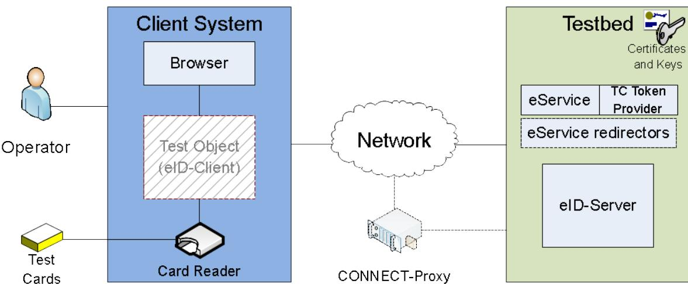
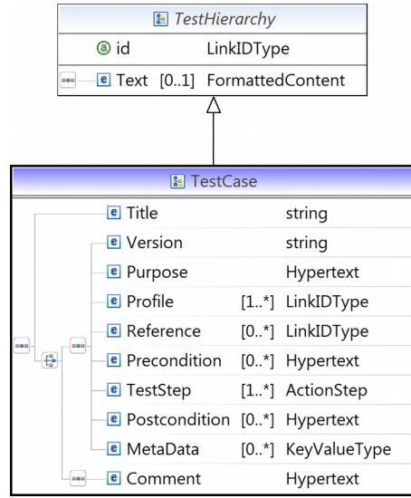

# Technical Guideline TR-03124-2 eID-Client – Part 2: Conformance Test Specification

Version 1.3

12. June 2017


Federal Office for Information Security Post Box 20 03 63 D-53133 Bonn Phone: +49 22899 9582-0 E-Mail: eid@bsi.bund.de Internet: https://www.bsi.bund.de © Federal Office for Information Security 2017

| 1      | Introduction 7                                                  |  |
|--------|-----------------------------------------------------------------|--|
| 1.1    | Motivation and objectives of the conformity test specification7 |  |
| 1.2    | Key Words 7                                                     |  |
| 2      | General Test Requirements 8                                     |  |
| 2.1    | Test Environment 8                                              |  |
| 2.1.1  | Overview 8                                                      |  |
| 2.1.2  | Client System 8                                                 |  |
| 2.1.3  | Smart Card Readers and eID-Cards 8                              |  |
| 2.1.4  | Testbed System 9                                                |  |
| 2.1.5  | Network 9                                                       |  |
| 2.1.6  | Operator 10                                                     |  |
| 2.2    | Test profiles 10                                                |  |
| 3      | Implementation Conformance Statement 2                          |  |
| 3.1    | Software Version and type of eID-Client 2                       |  |
| 3.2    | Profiles 2                                                      |  |
| 3.3    | Client Interface 4                                              |  |
| 3.4    | Supported Cryptography 4                                        |  |
| 3.4.1  | TLS channels 4                                                  |  |
| 3.4.2  | Connection to Card Readers 5                                    |  |
| 3.5    | Card Reader Interface 5                                         |  |
| 3.6    | Trust store of the eID-Client 5                                 |  |
| 3.7    | Implemented interim provisions 6                                |  |
| 3.8    | Integrated eID-Client 6                                         |  |
| 3.9    | eID-Kernel 6                                                    |  |
| 4      | Definition of Configuration Data 7                              |  |
| 4.1    | Test setup 7                                                    |  |
| 4.2    | Certificate specification 10                                    |  |
| 4.2.1  | CERT_SET_1 10                                                   |  |
| 4.2.2  | CERT_SET_2 17                                                   |  |
| 4.2.3  | CERT_SET_3 21                                                   |  |
| 4.2.4  | CERT_SET_4 27                                                   |  |
| 5      | Definitions for Test Cases 30                                   |  |
| 5.1    | Test case notation 30                                           |  |
| 5.2    | Commonly used elements 31                                       |  |
| 5.2.1  | TC Token 31                                                     |  |
| 5.2.2  | StartPAOS 32                                                    |  |
| 5.2.3  | InitializeFramework 33                                          |  |
| 5.2.4  | InitializeFrameworkResponse 33                                  |  |
| 5.2.5  | DIDAuthenticate_EAC1InputType34                                 |  |
| 5.2.6  | DIDAuthenticateResponse_EAC1OutputType34                        |  |
| 5.2.7  | DIDAuthenticate_EAC2InputType35                                 |  |
| 5.2.8  | DIDAuthenticateResponse_EAC2OutputType_A36                      |  |
| 5.2.9  | DIDAuthenticateResponse_EAC2OutputType_B36                      |  |
| 5.2.10 | EACAdditionalInputType 36                                       |  |

| 5.2.11 | Transmit 37                                        |  |
|--------|----------------------------------------------------|--|
| 5.2.12 | TransmitResponse 37                                |  |
| 5.2.13 | StartPAOSResponse 38                               |  |
| 6      | Test Specification 39                              |  |
| 6.1    | Module A – Online-Authentication 39                |  |
| 6.1.1  | Module A1 – Client Activation 39                   |  |
| 6.1.2  | Module A2 – Connection Establishment39             |  |
| 6.1.3  | Module A3 – eID-Server Communication41             |  |
| 6.1.4  | Module A4 – Online-Authentication Finalization42   |  |
| 6.2    | Module B – eCardAPI Profile 43                     |  |
| 6.3    | Module C – Smart Card Reader and PIN-Management46  |  |
| 6.3.1  | Module C1 – [TR-03105-5.3] Conformance46           |  |
| 6.3.2  | Module C2 – CHAT handling for card communication46 |  |
| 6.3.3  | Module C3 – Certificate Chain Handling47           |  |
| 6.4    | Module D – User Interface 48                       |  |
| 6.5    | Module E – Cryptography 50                         |  |
|        | Reference Documentation 53                         |  |
|        | Keywords and Abbreviations 54                      |  |

| Figure 1: Test Environment 8       |  |
|------------------------------------|--|
| Figure 2: XML Schema Test Case 30  |  |
| Figure 3: XML Schema ActionStep 31 |  |

| Table 1: Basic Test Profiles 10                              |  |
|--------------------------------------------------------------|--|
| Table 2: Optional/Recommended Test Profiles 0                |  |
| Table 3: Software Version 2                                  |  |
| Table 4: Type of eID-Client 2                                |  |
| Table 5: Supported Basic Test Profiles 2                     |  |
| Table 6: Supported Optional/Recommended Test Profiles3       |  |
| Table 7: Requirements of eID-Client types 4                  |  |
| Table 8: Supported TLS versions and cipher suites4           |  |
| Table 9: Supported Key lengths 4                             |  |
| Table 10: Supported elliptic curves 5                        |  |
| Table 11: Supported Signature Algorithms 5                   |  |
| Table 12: Supported algorithms for PACE and TA 5             |  |
| Table 13: Supported Reader interfaces 5                      |  |
| Table 14: Certificates in the trust store of the eID-Client6 |  |
| Table 15: Implemented interim providions from [Cert-IP]6     |  |
| Table 16: Declaration for Integrated eID-Clients 6           |  |
| Table 17: Declaration for eID-Kernels 6                      |  |
| Table 18: Testing environment parameters 10                  |  |
| Table 19: Description of CERT_TLS_ESERVICE_1 11              |  |
| Table 20: Description of CERT_TLS_ESERVICE_1_NSOP11          |  |
| Table 21: Description of CERT_TLS_EIDSERVER_111              |  |
| Table 22: Description of CERT_TLS_REDIRECT_1_A12             |  |
| Table 23: Description of CERT_TLS_REDIRECT_1_B12             |  |
|                                                              |  |

| Table 24: Description of CERT_TLS_REDIRECT_1_C12  |  |
|---------------------------------------------------|--|
| Table 25: Description of CERT_TLS_REDIRECT_1_D13  |  |
| Table 26: Description of CERT_TLS_TCTOKEN_113     |  |
| Table 27: Description of CERT_CV_TERM_1_A13       |  |
| Table 28: Description of CERT_CV_TERM_1_B14       |  |
| Table 29: Description of CERT_CV_TERM_1_C 14      |  |
| Table 30: Description of CERT_CV_TERM_1_D14       |  |
| Table 31: Description of CERT_CV_TERM_1_E 15      |  |
| Table 32: Description of CERT_CV_TERM_1_F 15      |  |
| Table 33: Description of CERT_CV_TERM_1_G 15      |  |
| Table 34: Description of CERT_CV_TERM_1_H 16      |  |
| Table 35: Description of CERT_CV_DV_1_A 16        |  |
| Table 36: Description of CERT_CV_DV_1_B 16        |  |
| Table 37: Description of CERT_CV_CVCA_1 17        |  |
| Table 38: Description of CERT_TLS_ESERVICE_2 17   |  |
| Table 39: Description of CERT_TLS_ESERVICE_2 18   |  |
| Table 40: Description of CERT_CV_TERM_2_A18       |  |
| Table 41: Description of CERT_CV_TERM_2_B18       |  |
| Table 42: Description of CERT_CV_TERM_2_C 19      |  |
| Table 43: Description of CERT_CV_TERM_2_D19       |  |
| Table 44: Description of CERT_CV_DV_2_A 19        |  |
| Table 45: Description of CERT_CV_DV_2_B 20        |  |
| Table 46: Description of CERT_CV_DV_2_D 20        |  |
| Table 47: Description of CERT_CV_LINK_2_A 20      |  |
| Table 48: Description of CERT_CV_LINK_2_B 20      |  |
| Table 49: Description of CERT_CV_LINK_2_D 21      |  |
| Table 50: Description of CERT_CV_CVCA_2_A 21      |  |
| Table 51: Description of CERT_CV_CVCA_2_B21       |  |
| Table 52: Description of CERT_TLS_ESERVICE_3_A 22 |  |
| Table 53: Description of CERT_TLS_ESERVICE_3_B22  |  |
| Table 54: Description of CERT_TLS_ESERVICE_3_C22  |  |
| Table 55: Description of CERT_TLS_ESERVICE_3_D23  |  |
| Table 56: Description of CERT_TLS_ESERVICE_3_E23  |  |
| Table 57: Description of CERT_TLS_ESERVICE_3_F23  |  |
| Table 58: Description of CERT_TLS_ESERVICE_3_G23  |  |
| Table 59: Description of CERT_TLS_ESERVICE_3_H24  |  |
| Table 60: Description of CERT_TLS_ESERVICE_3_I24  |  |
| Table 61: Description of CERT_TLS_ESERVICE_3_J24  |  |
| Table 62: Description of CERT_TLS_ESERVICE_3_K24  |  |
| Table 63: Description of CERT_TLS_ESERVICE_3_L25  |  |
| Table 64: Description of CERT_TLS_ESERVICE_3_M25  |  |
| Table 65: Description of CERT_TLS_ESERVICE_3_N25  |  |
| Table 66: Description of CERT_TLS_ESERVICE_3_O25  |  |
| Table 67: Description of CERT_TLS_ESERVICE_3_P26  |  |
| Table 68: Description of CERT_SSL_ESERVICE_3_A26  |  |
| Table 69: Description of CERT_TLS_EIDSERVER_3_A26 |  |
| Table 70: Description of CERT_TLS_EIDSERVER_3_B26 |  |
| Table 71: Description of CERT_TLS_EIDSERVER_3_C27 |  |
|                                                   |  |
| Table 72: Description of CERT_TLS_ESERVICE_4_A 28 |  |
| Table 73: Description of CERT_TLS_EIDSERVER_4_A28 |  |
| Table 74: Description of CERT_CV_TERM_4_A28       |  |
| Table 75: Description of CERT_CV_DV_4_A 29        |  |
| Table 76: Description of CERT_CV_LINK_4_* 29      |  |

| Table 77: Description of CERT_CV_CVCA_4_* 29                      |  |
|-------------------------------------------------------------------|--|
| Table 78: Structure of a TC Token 32                              |  |
| Table 79: Structure of a StartPAOS message 33                     |  |
| Table 80: Structure of an InitializeFrameworkResponse message34   |  |
| Table 81: Structure of DIDAuthenticate_EAC1InputType34            |  |
| Table 82: Structure of DIDAuthenticateResponse_EAC1OutputType35   |  |
| Table 83: Structure of DIDAuthenticate_EAC2InputType35            |  |
| Table 84: Structure of DIDAuthenticateResponse_EAC2OutputType_A36 |  |
| Table 85: Structure of DIDAuthenticateResponse_EAC2OutputType_B36 |  |
| Table 86: Structure of EACAdditionalInputType 37                  |  |
| Table 87: Structure of Transmit 37                                |  |
| Table 88: Structure of TransmitResponse 38                        |  |
| Table 89: Structure of StartPAOSResponse 38                       |  |
| Table 90: Test Cases of Module A1 39                              |  |
| Table 91: Test Cases of Module A2 41                              |  |
| Table 92: Test Cases of Module A3 42                              |  |
| Table 93: Test Cases of Module A4 43                              |  |
| Table 94: Test Cases of Module B 46                               |  |
| Table 95: Test cases of Module C2_1 47                            |  |
| Table 96: Test Cases of Module C2 48                              |  |
| Table 97: Test Cases of Module D 49                               |  |
| Table 98: Test Cases for profile HTTP_MESSAGES 50                 |  |
| Table 99: Test Cases of Module E 51                               |  |
| Table 100: Sub test cases for EID_CLIENT_E_05_T 52                |  |
| Table 101: Sub test cases for EID_CLIENT_E_11_T 52                |  |
| Table 102: TLS parameters 52                                      |  |

## <span id="page-6-0"></span>1 Introduction

This Technical Guideline specifies conformity tests for the eID-Client software performing Online-Authentication based on Extended Access Control (EAC2) according to [TR-03124-1]. In this context, the eID-Client communicates with an eService, an eID-Server [TR-03130] and an eID-Card. Both, eID-Client and eID-Server are based on the eCard-API-Framework [TR-03112] and support a subset of functions specified by the framework. Cards like the German eID-Card or the German electronic Residence Permit are accessed via card readers compliant to [TR-03119].

#### 1.1 Motivation and objectives of the conformity test specification

The requirements on eID-Clients, as defined in [TR-03124-1], can be implemented by different vendors. The objective of this Technical Guideline is to offer a base for consistent and comparable quality assurance regarding the different eID-Client implementations. The conformity tests are blackbox tests at the external interfaces of the eID-Client and focus on the use cases Online-Authentication and PIN-Management using an eID-Card based on EAC2. The following aspects are covered by the conformity tests:

- The tests verify the fulfillment of the requirements specified in [TR-03124-1].
- The tests verify correct utilization of card readers compliant to [TR-03119] (see [TR-03105-5.2] for test cases).
- The tests verify correct utilization of eID-Cards compliant to [TR-03127] and [TR-03110].
- The tests do not comprise security tests unless explicitly stated otherwise in [TR-03124-1].
- The tests do not comprise the correct configuration of a possible key store for CV trust points within the eID-Client.
- The tests are designed in a way which enables an automation where applicable. Due to the construction of the Online-Authentication, which is based on an activating click in the browser and a PIN entry as a starting trigger, only semiautomatic testing may be possible in most cases.

It is expected that eID-Client implementations which pass the conformity tests can be used with arbitrary eID-Server implementations, card readers, eID-Cards and eServices in order to perform Online Authentication as long as these components are compliant to the respective Technical Guidelines.

#### 1.2 Key Words

The key words "MUST", "MUST NOT", "REQUIRED", "SHALL", "SHALL NOT", "SHOULD", "SHOULD NOT", "RECOMMENDED", "MAY", and "OPTIONAL" in this document are to be interpreted as described in [RFC2119]. The key word "CONDITIONAL" is to be interpreted as follows:

CONDITIONAL: The usage of an item is dependent on the usage of other items. It is therefore further qualified under which conditions the item is REQUIRED or RECOMMENDED.

## <span id="page-7-0"></span>2 General Test Requirements

Each party willing to conduct the test series according to this document is going to need appropriate equipment and materials. This chapter introduces the general test requirements.

#### 2.1 Test Environment

The set up consists of several parts that MUST be prepared prior to starting the test series. These parts will be introduced and explained in the current section.

#### NOTE

A concrete implementation of the testing environment is not described here. In particular, this means that all components may be simulated by any kind of hardware or software.

#### 2.1.1 Overview

In general, Figure [1](#page-7-1) depicts the most important parts of the environment.



<span id="page-7-1"></span>*Figure 1: Test Environment*

#### 2.1.2 Client System

The client software, which is the test object, requires a dedicated system. Any software other than explicitly used one for the test purposes MUST NOT be installed, as it may negatively influence the test results. It is important to exclude any negative effects due to redundant software.

The used host requires at least one working network interface, since the communication with the eService is performed via the HTTPS protocol. Additionally, document [TR-03124-1] section 2.4.1 requires the eID-Client to be activated by a browser with a HTTP GET message. Since the eID-Client listening port is only available locally, a browser software or an appropriate simulation is installed on the same host.

#### 2.1.3 Smart Card Readers and eID-Cards

In order to provide its services, the eID-Client requires access the data stored on an eID-Card.

Smart card readers utilized in the test cases SHOULD be certified according to [TR-03119]. For practical reasons it is further assumed that the devices employed have either both PIN-Pad and display or none of it.

Different use cases require different kinds of eID-Cards to be available, e. g. when correct handling of a fresh eID-Card with active transport PIN is tested or during an update of CV certificate trust points.

Furthermore, it is essential to have respective PINs and PUKs in order to test the functionality.

#### 2.1.4 Testbed System

The testbed software used in the test series MUST be installed on a dedicated host. This host requires at least two network interfaces in order to support the generic communication model according to [TR-03124-1] section 2.1 "Communication Model". That is, a web interface (called "eService" in Figure [1\)](#page-9-0) and an eCardAPI interface (called "eID-Server" in Figure [1\)](#page-7-1) terminating at different domains. The hardware itself MAY be simulated as well.

The testbed system MUST be able to process browser communication requests (acting as eService) and eID-Client communication requests (acting as eID-Server). In general, it is further possible to split up the web application and the TC Token provider. Therefore, the testing system is also expected to consider this scenario.

#### 2.1.5 Network

The network environment and its configuration lie within the responsibility of the testing laboratory. The operator MUST set up the communication according to [TR-03124-1] section 3.4 "HTTP Communication". This includes the configuration of IP addresses, DNS names, routing, and so forth prior to the actual tests launch.

There are some special network-related cases to be considered, as follows:

#### 2.1.5.1 Attached eID-Server Model

The attached eID-Server model introduced in [TR-03124-1] section 2.1 "Communication Model" has a number of differences from the generic communication model. These are defined separately below.

In general, the attached eID-Server model is characterized by the communication, where both channels TLS-1 and TLS-2 terminate at the same domain. Therefore, the intermediary channel TLS-1-2 is not required and the same TLS certificates are used for both channels TLS-1 and TLS-2.

Furthermore, no PSK mechanisms are applied during the whole procedure of Online-Authentication. As a consequence, the PathSecurity-Protocol and PathSecurity-Parameters elements are not used in the TC Token.

#### 2.1.5.2 Support for proxy servers

According to [TR-03124-1] section 3.4 "HTTP Communication", the ability of the eID-Client to communicate via CONNECT-proxy has to be tested. In order to achieve this, the modules A1, A2, A4 and E MUST be performed twice. The first run is done without a CONNECT-proxy, the second run utilizes a CONNECTproxy, that is properly configured in the eID-Client and the testing environment.

#### 2.1.6 Operator

The operator is responsible for initiating and supervising the test series. Since several test units cannot be run automatically, t tester MUST perform these manually. Such cases mainly concern PIN handling and user interface. For example, the user interface is evaluated for conformity to the [TR-03124-1], section 3.6 "User Interface". The operator MUST hence observe the behavior and messages presented and decide about conformity.

#### 2.2 Test profiles

Table [1](#page-9-0) describes the basic test profiles referenced by the test cases. These profiles MUST be supported by the eID-Client.

| Profile ID | Description                                              |
|------------|----------------------------------------------------------|
| CRYPTO     | Cryptographic tests                                      |
| EAC        | Extended Access Control protocol according to [TR-03112] |
| OA         | Online-Authentication                                    |
| PAOS       | Reverse SOAP (=PAOS) communication                       |
| CCH        | Certificate chain handling for card communication        |

<span id="page-9-0"></span>*Table 1: Basic Test Profiles*

In addition, the applicant MUST declare which optional profiles are met. Table [2](#page-10-0) describes several optional test profiles referenced by the test cases.

| Profile ID             | Description                                                                                                                                                                                                                                             |  |
|------------------------|---------------------------------------------------------------------------------------------------------------------------------------------------------------------------------------------------------------------------------------------------------|--|
| PREVERIFICATION        | The eID-Client supports Pre-verification of the eService CV certificates.                                                                                                                                                                               |  |
| NO_PREVERIFICATION     | The eID-Client does not support Pre-verification of the eService CV<br>certificates.                                                                                                                                                                    |  |
| CLIENT_INTERFACE       | The eID-Client offers an client interface as described in [TR-03124-1]                                                                                                                                                                                  |  |
| HTTP_MESSAGES          | The eID-Client includes a meaningful human-readable error<br>messages/descriptions into the body of the response to the browser in<br>case of HTTP errors "404 Not Found" and/or "400 Bad Request".                                                     |  |
| PROXY_CONFIG           | The eID-Client provides appropriate configuration options to configure<br>the proxy settings.                                                                                                                                                           |  |
| ACTION_STATUS          | The eID-Client implements the action to return status information to the<br>caller as described in<br>[TR-03124-1], section 2.2.1.2 "Query Status<br>Information".                                                                                      |  |
| ACTION_SHOWUI          | The eID-Client implements the action to open the User Interface as<br>described in [TR-03124-1], section 2.2.1.3 "Open User Interface".                                                                                                                 |  |
| ACTION_SHOWUI_SETTINGS | The eID-Client implements the action to open the User Interface as<br>described in [TR-03124-1], section 2.2.1.3 "Open User Interface". The<br>opened module is the settings dialogue.                                                                  |  |
| PIN_MANAGEMENT         | The eID-Client offers a PIN-Management functionality.                                                                                                                                                                                                   |  |
| USER_INTERFACE         | The eID-Client offers a user interface according to [TR-03124-1].                                                                                                                                                                                       |  |
| PRESELECT_RIGHTS       | The eID-Client preselects all access rights given in OptionalCHAT<br>elements in EAC1InputType (if present). If these elements are not<br>present, the eID-Client preselects all access rights contained in the CHAT<br>of the eService CV certificate. |  |
| DISABLE_RIGHTS         | The eID-Client does not allow selection of rights in the UI which are not<br>granted in the CHAT of the eService CV certificate.                                                                                                                        |  |
| REFRESH_REDIRECT       | The eID-Client supports the redirect algorithm during determination of<br>the refreshURL.                                                                                                                                                               |  |
| ECAPI_INITFW           | The eID-Client supports the eCardAPI command "InitializeFramework".                                                                                                                                                                                     |  |
| SESSION_RESUMPTION     | The eID-Client supports session resumption                                                                                                                                                                                                              |  |
| NO_SESSION_RESUMPTION  | The eID-Client does not support session resumption                                                                                                                                                                                                      |  |

<span id="page-10-0"></span>*Table 2: Optional/Recommended Test Profiles*

Support of the optional test profiles is communicated via the ICS (see chapter [3\)](#page-12-0). The applicant SHALL support the test laboratory in order to be able to perform all required test cases appropriately.

If the eID-Client implements a trust store of root or link CV certificates (cf. also profile PREVERIFICATION), the applicant MUST support the test laboratory appropriately[1](#page-10-1) , in order to enable the operator to control the CV trust points, which are managed by the eID-Client. The operator MUST be able to set those trust points according to the certificate sets generated by the test laboratory and the requirements given in the test cases.

<span id="page-10-1"></span>1 In general, there exist two possible approaches for this: the test laboratory provides all necessary certificates to the applicant to be added into the Trust Store. Alternatively, if the Trust Store is modifiable by the test laboratory, the applicant may describe the required steps for adjusting the Trust Store. This also includes descriptions how to reset the Trust Store in case it was automatically updated by a test case.

In case of an eID-Kernel, the applicant SHALL provide a suitable user interface for testing purposes [2](#page-11-0) in order to be able to perform to relevant test cases.

Furthermore, if the eID-Client performs additional chain verification of the TLS certificates, the test laboratory MUST be supported so that the test cases can be properly executed.

<span id="page-11-0"></span>2 As the user interface is not part of the eID-Kernel, this interface is not part of the conformance tests.

## <span id="page-12-0"></span>3 Implementation Conformance Statement

The purpose of the Implementation Conformance Statement is the declaration of supported functionality of the eID-Client to be approved by the applicant. The declarations of the applicant are used for the determination of the set of test cases to be performed.

The Implementation Conformance Statement MUST be filled completely by the applicant. The information of the filled ICS MUST be documented in the test report.

#### 3.1 Software Version and type of eID-Client

An applicant SHALL provide a declaration containing version of the software under test. Table [3](#page-12-2) describes the required structure. This declaration MUST contain the same information as the element UserAgent sent in the StartPAOS message to the eID-Server.

| Element         | Value |
|-----------------|-------|
| Name            |       |
| VersionMajor    |       |
| VersionMinor    |       |
| VersionSubminor |       |

<span id="page-12-2"></span>*Table 3: Software Version*

An applicant SHALL provide a declaration containing information for the type of eID-Client under test.

| Type of eID-Client    | Yes/No |
|-----------------------|--------|
| Full eID-Client       |        |
| eID-Kernel            |        |
| Integrated eID-Client |        |

*Table 4: Type of eID-Client*

#### 3.2 Profiles

An applicant SHALL provide a declaration containing information of the supported profiles. Table [5](#page-12-1) describes required basic test profiles.

| Profile ID | Description                                              | Yes / No |
|------------|----------------------------------------------------------|----------|
| CRYPTO     | Cryptographic tests                                      |          |
| EAC        | Extended Access Control protocol according to [TR-03112] |          |
| OA         | Online-Authentication                                    |          |
| PAOS       | Reverse SOAP (=PAOS) communication                       |          |
| CCH        | Certificate chain handling for card communication        |          |

<span id="page-12-1"></span>*Table 5: Supported Basic Test Profiles*

In addition, the applicant MUST specify which optional profiles are met. Table [6](#page-13-0) describes the required structure of this declaration.

| Profile ID                 | Description                                                                                                                                                                                                                                                                           | Yes / No |
|----------------------------|---------------------------------------------------------------------------------------------------------------------------------------------------------------------------------------------------------------------------------------------------------------------------------------|----------|
| PREVERIFICATION            | The eID-Client supports Pre-verification of the eService CV<br>certificates.                                                                                                                                                                                                          |          |
| NO_PREVERIFICATION         | The eID-Client does not support Pre-verification of the eService<br>CV certificates.                                                                                                                                                                                                  |          |
| CLIENT_INTERFACE           | The eID-Client offers an client interface as described in [TR<br>03124-1]                                                                                                                                                                                                             |          |
| HTTP_MESSAGES              | The eID-Client includes a meaningful human-readable error<br>message/description into the body of the response to the browser<br>in case of HTTP errors "404 Not Found" and/or "400 Bad Request".                                                                                     |          |
| PROXY_CONFIG               | The eID-Client provides appropriate configuration options to<br>configure the proxy settings.                                                                                                                                                                                         |          |
| ACTION_STATUS              | The eID-Client implements the action to return status<br>information to the caller as described in [TR-03124-1], section<br>2.2.1.2 "Query Status Information".                                                                                                                       |          |
| ACTION_SHOWUI              | The eID-Client implements the action to open the User Interface<br>as described in [TR-03124-1], section 2.2.1.3 "Open User Interface".                                                                                                                                               |          |
| ACTION_SHOWUI_SETTING<br>S | The eID-Client implements the action to open the User Interface<br>as described in [TR-03124-1], section 2.2.1.3 "Open User Interface".<br>The opened module is the settings dialogue.                                                                                                |          |
| PIN_MANAGEMENT             | The eID-Client offers a PIN-Management functionality.                                                                                                                                                                                                                                 |          |
| USER_INTERFACE             | The eID-Client offers an user interface according to [TR-03124-1].                                                                                                                                                                                                                    |          |
| PRESELECT_RIGHTS           | The eID-Client preselects all access rights given in the<br>RequiredCHAT-<br>or<br>OptionalCHAT-elements<br>in<br>EAC1InputType (if present). If these elements are not present,<br>the eID-Client preselects all access rights contained in the CHAT<br>of the eService certificate. |          |
| DISABLE_RIGHTS             | The eID-Client does not allow selection of rights which are not<br>granted in the CHAT of the eService CV certificate.                                                                                                                                                                |          |
| REFRESH_REDIRECT           | The eID-Client supports the redirect algorithm during<br>determination of the refreshURL.                                                                                                                                                                                             |          |
| ECAPI_INITFW               | The<br>eID-Client<br>supports<br>the<br>eCardAPI<br>command<br>"InitializeFramework".                                                                                                                                                                                                 |          |
| SESSION_RESUMPTION         | The eID-Client supports session resumption                                                                                                                                                                                                                                            |          |
| NO_SESSION_RESUMPTION      | The eID-Client does not support session resumption                                                                                                                                                                                                                                    |          |

<span id="page-13-0"></span>*Table 6: Supported Optional/Recommended Test Profiles*

The following table describes the relationship between different types of eID-Clients and their test profile requirements.

| Profile ID    | Full eID-Client | eID-Kernel   | Integrated<br>eID-Client |
|---------------|-----------------|--------------|--------------------------|
| HTTP_MESSAGES | OPTIONAL        | Out of scope | MUST NOT                 |
| ACTION_STATUS | OPTIONAL        | Out of scope | MUST NOT                 |
| ACTION_SHOWUI | OPTIONAL        | Out of scope | MUST NOT                 |

| Profile ID                 | Full eID-Client | eID-Kernel   | Integrated<br>eID-Client |
|----------------------------|-----------------|--------------|--------------------------|
| ACTION_SHOWUI_SETTI<br>NGS | OPTIONAL        | Out of scope | MUST NOT                 |
| PIN_MANAGEMENT             | REQUIRED        | OPTIONAL     | OPTIONAL                 |
| USER_INTERFACE             | REQUIRED        | Out of scope | OPTIONAL                 |
| PRESELECT_RIGHTS           | OPTIONAL        | Out of scope | OPTIONAL                 |
| DISABLE_RIGHTS             | OPTIONAL        | Out of scope | OPTIONAL                 |
| CLIENT_INTERFACE           | REQUIRED        | Out of scope | MUST NOT                 |
| DISPLAY_ALL_RIGHTS         | OPTIONAL        | Out of scope | OPTIONAL                 |
| REFRESH_REDIRECT           | REQUIRED        | CONDITIONAL  | CONDITIONAL              |

*Table 7: Requirements of eID-Client types*

#### 3.3 Client Interface

The applicant SHALL provide a declaration containing the necessary information on the Client Interface to perform the tests. This includes the Client-URL and the mechanism to offer the ClientURL.

#### 3.4 Supported Cryptography

#### 3.4.1 TLS channels

An applicant SHALL provide a declaration containing information on the supported cryptography. The declaration MUST contain the following tables which MUST be filled completely with all cryptographic parameters that are supported by the test object, i. e. other cryptographic parameters than listed in the ICS SHALL NOT be supported. The declaration MUST be filled for each TLS channel (i.e. TLS-1-2 and TLS-2) separately.

Table [8](#page-14-1) MUST contain the supported cipher suites for each supported TLS version.

| TLS version | Cipher Suite |
|-------------|--------------|
|             |              |
|             |              |
|             |              |
|             |              |

<span id="page-14-1"></span>*Table 8: Supported TLS versions and cipher suites*

Table [9](#page-14-0) MUST contain the key lengths that are accepted for the different crypto algorithms.

| TLS versions | Algorithm | Minimal supported key length |
|--------------|-----------|------------------------------|
|              |           |                              |
|              |           |                              |

<span id="page-14-0"></span>*Table 9: Supported Key lengths*

Table [10](#page-15-0) MUST contain the supported elliptic curves.

| TLS versions | Supported elliptic curves |  |
|--------------|---------------------------|--|
|              |                           |  |
|              |                           |  |

<span id="page-15-0"></span>*Table 10: Supported elliptic curves*

Table [11](#page-15-1) MUST contain the signature algorithms that are accepted by the eID-Clients[3](#page-15-2) .

| TLS versions | Supported signature algorithms |  |
|--------------|--------------------------------|--|
|              |                                |  |
|              |                                |  |

<span id="page-15-1"></span>*Table 11: Supported Signature Algorithms*

The test laboratory MUST verify that the declaration of the applicant conforms to the requirements of [TR-03124-1]. The result of the verification MUST be documented in the test report.

#### 3.4.2 Connection to Card Readers

If the test cases of module C are performed as part of the conformity evaluation according to this document, the applicant SHALL declare the supported algorithms for PACE, Terminal Authentication and Chip Authentication . The algorithm identifiers as defined in [TR-03110] MUST be used.

| Protocol | Supported algorithms |
|----------|----------------------|
| PACE     |                      |
| TA       |                      |
| CA       |                      |

*Table 12: Supported algorithms for PACE and TA*

The declaration MUST be documented in the test report. The test laboratory MUST verify that the declaration of the applicant conforms to the requirements of [TR-03124-1]. The test result will only cover the functions of this declaration.

#### 3.5 Card Reader Interface

If the test cases of module C are performed as part of the conformity evaluation according to this document, the applicant SHALL declare the supported card interfaces for the host platform.

| Interface            | Yes/No |
|----------------------|--------|
| PC/SC                |        |
| CCID                 |        |
| Embedded Card Reader |        |

*Table 13: Supported Reader interfaces*

#### <span id="page-15-3"></span>3.6 Trust store of the eID-Client

Furthermore, the applicant MUST declare if the eID-Client implements a trust store for root or link CV certificates. If a trust store is implemented, the eID-Clients MUST declare the exact configuration of the trust

<span id="page-15-2"></span>3 Cf. also [RFC 5246], chapter 7.4.

store to be used in regular operation. The declaration MUST provide all necessary information to prepare an equivalent trust store with test certificates.

Furthermore, the information MUST include the structure of the trust store, the list of the corresponding certificate holder references and the order of certificates within the trust store. The configuration MUST be documented in the test report.

| CHRs |  |
|------|--|
|      |  |
|      |  |
|      |  |

*Table 14: Certificates in the trust store of the eID-Client*

#### 3.7 Implemented interim provisions

In case interim provisions according to [Cert-IP] have to be applied, the applicant MUST give a declaration with the implemented provisions together with a corresponding reason and -if applicable- further explanations. The applied provisions MUST be documented in the test report.

| Numer of the provision | Reason/Explanation |
|------------------------|--------------------|
|                        |                    |

*Table 15: Implemented interim providions from [Cert-IP]*

#### 3.8 Integrated eID-Client

For integrated eID-Clients, the applicant must declare that it can not be called externally.

| Statement                                           | Explanation |
|-----------------------------------------------------|-------------|
| Can the integrated eID-Client be called externally? | Yes / No    |

*Table 16: Declaration for Integrated eID-Clients*

#### 3.9 eID-Kernel

In the case of an eID-Kernel, the explicit direction of the caller to the refreshURL may be replaced by other means which ensure that the corresponding Integrated Client is using the correct address.

The testing application provided by the applicant SHALL be configurable by the testing laboratory. Especially, it SHALL call the refreshURL that is determined by the eID-Kernel.

| Statement                                                                                                                                                                | Explanation |
|--------------------------------------------------------------------------------------------------------------------------------------------------------------------------|-------------|
| Is the explicit direction of the caller to the refreshURL replaced by other means<br>which ensure that the corresponding Integrated Client is using the correct address? | Yes / No    |

*Table 17: Declaration for eID-Kernels*

## <span id="page-17-0"></span>4 Definition of Configuration Data

#### <span id="page-17-1"></span>4.1 Test setup

This section presents the testing environment parameters to be used in the test setup of the conformance tests, see Table [18.](#page-20-0) These parameters are configured prior to the test begin and are constant for the complete test series.

| Variable                      | Description                                                                                                                                                                                                                                                                                                                                                                                                                | Referenced in                                                                                        |  |
|-------------------------------|----------------------------------------------------------------------------------------------------------------------------------------------------------------------------------------------------------------------------------------------------------------------------------------------------------------------------------------------------------------------------------------------------------------------------|------------------------------------------------------------------------------------------------------|--|
| COMMUNICATION<br>ERRORADDRESS | A http- or https-URL submitted to the<br>eID-Client in the TC Token. It is used<br>by the eID-Client to redirect the<br>browser if a communication error<br>occurred and no valid refreshURL<br>could be determined.                                                                                                                                                                                                       | Table 78,<br>EID_CLIENT_A2_05,<br>EID_CLIENT_A2_26,<br>EID_CLIENT_A2_27,<br>EID_CLIENT_A3_01         |  |
| IP_EID_CLIENT                 | IP address of the client system.                                                                                                                                                                                                                                                                                                                                                                                           | EID_CLIENT_A1_02                                                                                     |  |
| RADDRESS                      | A https-URL including the default<br>port number submitted to the eID<br>Client in the TC Token. It is used by<br>the eID-Client to redirect the browser<br>after conclusion of the Online<br>Authentication.<br>This address is conforming to the<br>Same-origin policy according to<br>[RFC6454] with the subjectURL<br>contained<br>in<br>the<br>CertificateDescription<br>extension of the eService CV<br>certificate. | Table 78,<br>EID_CLIENT_A3_04,<br>EID_CLIENT_A3_05,<br>EID_CLIENT_A4_05,<br>EID_CLIENT_A4_08         |  |
| RADDRESS_HTTP                 | A http-URL submitted to the eID<br>Client in the TC Token. It is used by<br>the eID-Client to redirect the browser<br>after conclusion of the Online<br>Authentication.<br>This address is conforming to the<br>Same-origin policy according to<br>[RFC6454] with the subjectURL<br>contained in the<br>CertificateDescription<br>extension of the eService CV<br>certificate.                                             | EID_CLIENT_A4_07                                                                                     |  |
| RADDRESS_SOP                  | This address equals to the RADDRESS<br>defined above, but does not contain<br>the port number.                                                                                                                                                                                                                                                                                                                             | EID_CLIENT_A4_04                                                                                     |  |
| RADDRESS_NSOP_1               | A https-URL submitted to the eID<br>Client in the TC Token. It is used by<br>the eID-Client to redirect the browser<br>after conclusion of the Online<br>Authentication.                                                                                                                                                                                                                                                   | EID_CLIENT_A4_05,<br>EID_CLIENT_A4_06,<br>EID_CLIENT_A4_07,<br>EID_CLIENT_A4_08,<br>EID_CLIENT_A4_09 |  |

| Variable        | Description                                                                                                                                                                                                                                                                                                                                                                                                                                                                                                                | Referenced in    |
|-----------------|----------------------------------------------------------------------------------------------------------------------------------------------------------------------------------------------------------------------------------------------------------------------------------------------------------------------------------------------------------------------------------------------------------------------------------------------------------------------------------------------------------------------------|------------------|
|                 | This address is not conforming to the<br>Same-origin policy according to<br>[RFC6454] with the subjectURL<br>contained<br>in<br>the<br>CertificateDescription<br>extension of the eService CV<br>certificate.<br>The [RADDRESS_NSOP_1] and the<br>redirect location MUST have different<br>URLs, but the same IP addresses.<br>[RADDRESS_NSOP_1],<br>[RADDRESS_NSOP_2]<br>and<br>[RADDRESS_NSOP_3]<br>MUST<br>be<br>different in context of Same-origin<br>policy.                                                         |                  |
| RADDRESS_NSOP_2 | A https-URL submitted to the eID<br>Client in the TC Token. It is used by<br>the eID-Client to redirect the browser<br>after conclusion of the Online<br>Authentication.<br>This address is not conforming to the<br>Same-origin policy according to<br>[RFC6454] with the subjectURL<br>contained in the<br>CertificateDescription<br>extension of the eService CV<br>certificate.<br>[RADDRESS_NSOP_1],<br>[RADDRESS_NSOP_2]<br>and<br>[RADDRESS_NSOP_3]<br>MUST<br>be<br>different in context of Same-origin<br>policy. | EID_CLIENT_A4_05 |
| RADDRESS_NSOP_3 | A https-URL submitted to the eID<br>Client in the TC Token. It is used by<br>the eID-Client to redirect the browser<br>after conclusion of the Online<br>Authentication.<br>This address is not conforming to the<br>Same-origin policy according to<br>[RFC6454] with the subjectURL<br>contained in the<br>CertificateDescription<br>extension of the eService CV<br>certificate.<br>[RADDRESS_NSOP_1],<br>[RADDRESS_NSOP_2]<br>and<br>[RADDRESS_NSOP_3]<br>MUST<br>be<br>different in context of Same-origin<br>policy. | EID_CLIENT_A4_05 |

| Variable                | Description                                                                                                                                                                                                                                                                                                                                                                          | Referenced in                                                                                                                                                                                                                                                                                                                                                                                                                                                                                                                                                                                                |  |
|-------------------------|--------------------------------------------------------------------------------------------------------------------------------------------------------------------------------------------------------------------------------------------------------------------------------------------------------------------------------------------------------------------------------------|--------------------------------------------------------------------------------------------------------------------------------------------------------------------------------------------------------------------------------------------------------------------------------------------------------------------------------------------------------------------------------------------------------------------------------------------------------------------------------------------------------------------------------------------------------------------------------------------------------------|--|
| SERVERADDRESS           | A https-URL submitted to the eID<br>Client in the TC Token. It is used by<br>the eID-Client to connect to the eID<br>Server.                                                                                                                                                                                                                                                         | Table 78                                                                                                                                                                                                                                                                                                                                                                                                                                                                                                                                                                                                     |  |
| SERVERADDRESS_N<br>NM   | A valid https-URL where the eID<br>Server can be reached. However, this<br>URL does not match with the identity<br>contained in the X.509 certificate of<br>the eID-Server                                                                                                                                                                                                           | EID_CLIENT_E_11_T                                                                                                                                                                                                                                                                                                                                                                                                                                                                                                                                                                                            |  |
| TC_TOKEN_URL            | A default valid https-URL including<br>the port number where the TC Token<br>can be retrieved by the eID-Client.                                                                                                                                                                                                                                                                     | EID_CLIENT_A1_01,<br>EID_CLIENT_A1_02,<br>EID_CLIENT_A2_01,<br>EID_CLIENT_A2_05,<br>EID_CLIENT_A2_06,<br>EID_CLIENT_A2_07,<br>EID_CLIENT_A2_08,<br>EID_CLIENT_A2_09,EID_CLIENT_A2_10,<br>EID_CLIENT_A2_11,<br>EID_CLIENT_A2_12,<br>EID_CLIENT_A2_13,<br>EID_CLIENT_A2_14,<br>EID_CLIENT_A2_15,<br>EID_CLIENT_A2_18,<br>EID_CLIENT_A2_19,<br>EID_CLIENT_A2_20,<br>EID_CLIENT_A2_21,<br>EID_CLIENT_A2_26,<br>EID_CLIENT_A2_27, EID_CLIENT_E_01_T,<br>EID_CLIENT_E_03,<br>EID_CLIENT_E_04,<br>EID_CLIENT_E_06_T, EID_CLIENT_E_07_T,<br>EID_CLIENT_E_08,<br>EID_CLIENT_E_10,<br>EID_CLIENT_E_11, EID_CLIENT_E_12 |  |
| TC_TOKEN_URL_NS<br>OP_1 | A valid https-URL where the TC Token<br>can be retrieved by the eID-Client.<br>However, this URL does not<br>conforming to the Same-origin policy<br>according to<br>[RFC6454]<br>with the<br>subjectURL<br>contained in the<br>CertificateDescription<br>extension of the eService CV<br>certificate, because the DNS name<br>does<br>not<br>match<br>with<br>the<br>subjectURL.    | EID_CLIENT_A3_04                                                                                                                                                                                                                                                                                                                                                                                                                                                                                                                                                                                             |  |
| TC_TOKEN_URL_NS<br>OP_2 | A valid https-URL where the TC Token<br>can be retrieved by the eID-Client.<br>However, this URL does not<br>conforming to the Same-origin policy<br>according to<br>[RFC6454]<br>with the<br>subjectURL<br>contained in the<br>CertificateDescription<br>extension of the eService CV<br>certificate, because the port number<br>does<br>not<br>match<br>with<br>the<br>subjectURL. | EID_CLIENT_A3_05                                                                                                                                                                                                                                                                                                                                                                                                                                                                                                                                                                                             |  |

| Variable                  | Description                                                                                                                                                                                                                           | Referenced in                                                                |  |
|---------------------------|---------------------------------------------------------------------------------------------------------------------------------------------------------------------------------------------------------------------------------------|------------------------------------------------------------------------------|--|
| TC_TOKEN_URL_RE<br>DIRECT | A valid https-URL which redirects the<br>eID-Client to the location where the<br>TC Token can be retrieved.<br>The<br>[TC_TOKEN_URL_REDIRECT]<br>and the redirect location MUST have<br>different URLs, but the same IP<br>addresses. | EID_CLIENT_A2_06,<br>EID_CLIENT_A2_07,<br>EID_CLIENT_A2_08, EID_CLIENT_A2_09 |  |
| TC_TOKEN_URL_NN<br>M      | A valid https-URL where the TC Token<br>can be retrieved by the eID-Client.<br>However, this URL does not match<br>with the server identity contained in<br>the X.509 certificate of the TC Token<br>Provider.                        | EID_CLIENT_E_05_T                                                            |  |

<span id="page-20-0"></span>*Table 18: Testing environment parameters*

#### 4.2 Certificate specification

Due to the communication model specified in [TR-03124-1], there are sets of certificates needed. In order to be able to perform the tests both types of valid certificates CV and TLS are required. Further, a number of invalid certificates MUST also be prepared for evaluating the behavior of the eID-Client. The invalidating issues include wrong host name, short keys, mismatches between CV and TLS certificates, and so forth.

This document defines unique names for certificates in order to present a clear description of the tests and the materials used thereby. Those names are placeholders and MAY differ from the ones used within a concrete testing environment.

```
The naming convention is: CERT_<type>_<position>_<# of set>_{letter of
variation}
```
#### <span id="page-20-1"></span>4.2.1 CERT\_SET\_1

This certificate set is a valid basic set of CV and TLS certificates which are used in all test cases where no special properties are needed.

#### 4.2.1.1 CERT\_TLS\_ESERVICE\_1

Table [19](#page-21-0) describes a TLS certificate.

| ID          | CERT_TLS_ESERVICE_1                                                                                                                                              |                                                                                                                                                                  |                                                                                                                                                                  |                                                                                                                                                                 |
|-------------|------------------------------------------------------------------------------------------------------------------------------------------------------------------|------------------------------------------------------------------------------------------------------------------------------------------------------------------|------------------------------------------------------------------------------------------------------------------------------------------------------------------|-----------------------------------------------------------------------------------------------------------------------------------------------------------------|
| Purpose     | This certificate is used for a regular TLS-1-2 connection establishment between the eID-Client<br>and the eService.                                              |                                                                                                                                                                  |                                                                                                                                                                  |                                                                                                                                                                 |
| Referred by | EID_CLIENT_A3_02,<br>EID_CLIENT_A3_06,<br>EID_CLIENT_A4_05,<br>EID_CLIENT_A4_09,<br>EID_CLIENT_B_03,<br>EID_CLIENT_B_07,<br>EID_CLIENT_B_11,<br>EID_CLIENT_B_15, | EID_CLIENT_A3_03,<br>EID_CLIENT_A4_01,<br>EID_CLIENT_A4_06,<br>EID_CLIENT_A4_10,<br>EID_CLIENT_B_04,<br>EID_CLIENT_B_08,<br>EID_CLIENT_B_12,<br>EID_CLIENT_B_19, | EID_CLIENT_A3_04,<br>EID_CLIENT_A4_03,<br>EID_CLIENT_A4_07,<br>EID_CLIENT_A4_11,<br>EID_CLIENT_B_05,<br>EID_CLIENT_B_09,<br>EID_CLIENT_B_13,<br>EID_CLIENT_B_20, | EID_CLIENT_A3_05,<br>EID_CLIENT_A4_04,<br>EID_CLIENT_A4_08,<br>EID_CLIENT_B_01,<br>EID_CLIENT_B_06,<br>EID_CLIENT_B_10,<br>EID_CLIENT_B_14,<br>EID_CLIENT_B_21, |
|             | EID_CLIENT_B_22,                                                                                                                                                 | EID_CLIENT_B_23,                                                                                                                                                 | EID_CLIENT_B_24,                                                                                                                                                 | EID_CLIENT_B_25,                                                                                                                                                |

|             | EID_CLIENT_B_27,<br>EID_CLIENT_B_31, EID_CLIENT_B_33, EID_CLIENT_C2_01                                                                                                                        | EID_CLIENT_B_28, | EID_CLIENT_B_29, | EID_CLIENT_B_30, |
|-------------|-----------------------------------------------------------------------------------------------------------------------------------------------------------------------------------------------|------------------|------------------|------------------|
| Description | This is a valid certificate accepted by the eID-Client.<br>The hash of this certificate is contained in the CertificateDescription of the eService<br>CV certificate defined within this set. |                  |                  |                  |

<span id="page-21-0"></span>*Table 19: Description of CERT\_TLS\_ESERVICE\_1*

#### 4.2.1.2 CERT\_TLS\_ESERVICE\_1\_NSOP

Table [20](#page-21-2) describes a TLS certificate.

| ID          | CERT_TLS_ESERVICE_1_NSOP                                                                                                                                                                                                                                                                                                                                                                                       |
|-------------|----------------------------------------------------------------------------------------------------------------------------------------------------------------------------------------------------------------------------------------------------------------------------------------------------------------------------------------------------------------------------------------------------------------|
| Purpose     | This certificate is used for a regular TLS-1-2 connection establishment between the eID-Client<br>and the eService.                                                                                                                                                                                                                                                                                            |
| Referred by | EID_CLIENT_A3_04                                                                                                                                                                                                                                                                                                                                                                                               |
| Description | This is a valid certificate accepted by the eID-Client.<br>The hash of this certificate is contained in the CertificateDescription of the eService<br>CV certificate defined within this set. However, the URL, this certificate is used for, is not<br>conforming to the Same-origin policy<br>with the<br>subjectURL<br>contained in the<br>CertificateDescription extension of the eService CV certificate. |

<span id="page-21-2"></span>*Table 20: Description of CERT\_TLS\_ESERVICE\_1\_NSOP*

#### 4.2.1.3 CERT\_TLS\_EIDSERVER\_1

Table [21](#page-21-1) describes a TLS certificate.

| ID          | CERT_TLS_EIDSERVER_1                                                                                                                                                                                     |                                                                                                                                                                                                          |                                                                                                                                                                                                                                                                                  |                                                                                                                                                                                                         |
|-------------|----------------------------------------------------------------------------------------------------------------------------------------------------------------------------------------------------------|----------------------------------------------------------------------------------------------------------------------------------------------------------------------------------------------------------|----------------------------------------------------------------------------------------------------------------------------------------------------------------------------------------------------------------------------------------------------------------------------------|---------------------------------------------------------------------------------------------------------------------------------------------------------------------------------------------------------|
| Purpose     |                                                                                                                                                                                                          | and the eID-Server, if applicable, i.e. for certificate-based cipher suites.                                                                                                                             | This certificate is used for a regular TLS-2 connection establishment between the eID-Client                                                                                                                                                                                     |                                                                                                                                                                                                         |
| Referred by | EID_CLIENT_A3_01,<br>EID_CLIENT_A3_06,<br>EID_CLIENT_A4_05,<br>EID_CLIENT_A4_09,<br>EID_CLIENT_B_03,<br>EID_CLIENT_B_07,<br>EID_CLIENT_B_11,<br>EID_CLIENT_B_15,<br>EID_CLIENT_B_22,<br>EID_CLIENT_B_27, | EID_CLIENT_A3_03,<br>EID_CLIENT_A4_01,<br>EID_CLIENT_A4_06,<br>EID_CLIENT_A4_10,<br>EID_CLIENT_B_04,<br>EID_CLIENT_B_08,<br>EID_CLIENT_B_12,<br>EID_CLIENT_B_19,<br>EID_CLIENT_B_23,<br>EID_CLIENT_B_28, | EID_CLIENT_A3_04,<br>EID_CLIENT_A4_03,<br>EID_CLIENT_A4_07,<br>EID_CLIENT_A4_11,<br>EID_CLIENT_B_05,<br>EID_CLIENT_B_09,<br>EID_CLIENT_B_13,<br>EID_CLIENT_B_20,<br>EID_CLIENT_B_24,<br>EID_CLIENT_B_29,<br>EID_CLIENT_B_31, EID_CLIENT_B_33, EID_CLIENT_C2_01, EID_CLIENT_E_10, | EID_CLIENT_A3_05,<br>EID_CLIENT_A4_04,<br>EID_CLIENT_A4_08,<br>EID_CLIENT_B_01,<br>EID_CLIENT_B_06,<br>EID_CLIENT_B_10,<br>EID_CLIENT_B_14,<br>EID_CLIENT_B_21,<br>EID_CLIENT_B_25,<br>EID_CLIENT_B_30, |
| Description | CV certificate defined within this set.                                                                                                                                                                  | This is a valid certificate accepted by the eID-Client.                                                                                                                                                  | The hash of this certificate is contained in the CertificateDescription of the eService                                                                                                                                                                                          |                                                                                                                                                                                                         |

<span id="page-21-1"></span>*Table 21: Description of CERT\_TLS\_EIDSERVER\_1*

#### 4.2.1.4 CERT\_TLS\_REDIRECT\_1\_A

Table [22](#page-22-0) describes a TLS certificate.

| ID          | CERT_TLS_REDIRECT_1_A                                                                                                                                                                                                                              |
|-------------|----------------------------------------------------------------------------------------------------------------------------------------------------------------------------------------------------------------------------------------------------|
| Purpose     | This certificate is used for a regular TLS-1-2 connection establishment between the eID-Client<br>and the redirect URL included in the TC Token.                                                                                                   |
| Referred by | EID_CLIENT_A2_06, EID_CLIENT_A2_07, EID_CLIENT_A2_08, EID_CLIENT_A2_09,<br>EID_CLIENT_A4_05, EID_CLIENT_A4_06, EID_CLIENT_A4_07, EID_CLIENT_A4_09                                                                                                  |
| Description | This is a valid certificate accepted by the eID-Client.<br>The hash of this certificate is contained in the CertificateDescription of the eService<br>CV certificate defined within this set.<br>This certificate is issued for [RADDRESS_NSOP_1]. |

<span id="page-22-0"></span>*Table 22: Description of CERT\_TLS\_REDIRECT\_1\_A*

#### 4.2.1.5 CERT\_TLS\_REDIRECT\_1\_B

Table [23](#page-22-2) describes a TLS certificate.

| ID          | CERT_TLS_REDIRECT_1_B                                                                                                                                                                                                                              |
|-------------|----------------------------------------------------------------------------------------------------------------------------------------------------------------------------------------------------------------------------------------------------|
| Purpose     | This certificate is used for a regular TLS-1-2 connection establishment between the eID-Client<br>and the redirect URL included in the TC Token.                                                                                                   |
| Referred by | EID_CLIENT_A4_05                                                                                                                                                                                                                                   |
| Description | This is a valid certificate accepted by the eID-Client.<br>The hash of this certificate is contained in the CertificateDescription of the eService<br>CV certificate defined within this set.<br>This certificate is issued for [RADDRESS_NSOP_2]. |

<span id="page-22-2"></span>*Table 23: Description of CERT\_TLS\_REDIRECT\_1\_B*

#### 4.2.1.6 CERT\_TLS\_REDIRECT\_1\_C

Table [24](#page-22-1) describes a TLS certificate.

| ID          | CERT_TLS_REDIRECT_1_C                                                                                                                                                                                                                              |
|-------------|----------------------------------------------------------------------------------------------------------------------------------------------------------------------------------------------------------------------------------------------------|
| Purpose     | This certificate is used for a regular TLS-1-2 connection establishment between the eID-Client<br>and the redirect URL included in the TC Token.                                                                                                   |
| Referred by | EID_CLIENT_A4_05                                                                                                                                                                                                                                   |
| Description | This is a valid certificate accepted by the eID-Client.<br>The hash of this certificate is contained in the CertificateDescription of the eService<br>CV certificate defined within this set.<br>This certificate is issued for [RADDRESS_NSOP_3]. |

<span id="page-22-1"></span>*Table 24: Description of CERT\_TLS\_REDIRECT\_1\_C*

#### 4.2.1.7 CERT\_TLS\_REDIRECT\_1\_D

Table [25](#page-23-0) describes a TLS certificate.

| ID          | CERT_TLS_REDIRECT_1_D                                                                                                                    |
|-------------|------------------------------------------------------------------------------------------------------------------------------------------|
| Purpose     | This certificate is used for a TLS-1-2 connection establishment between the eID-Client and<br>the redirect URL included in the TC Token. |
| Referred by | EID_CLIENT_A4_08                                                                                                                         |

| Description | This is a valid certificate accepted by the eID-Client.                              |  |
|-------------|--------------------------------------------------------------------------------------|--|
|             | However, the hash of this certificate is not contained in the CertificateDescription |  |
|             | of the eService CV certificate defined within this set.                              |  |
|             | This certificate is issued for [RADDRESS_NSOP_1].                                    |  |

<span id="page-23-0"></span>*Table 25: Description of CERT\_TLS\_REDIRECT\_1\_D*

#### 4.2.1.8 CERT\_TLS\_TCTOKEN\_1

Table [26](#page-23-2) describes a TLS certificate.

| ID          | CERT_TLS_TCTOKEN_1                                                                                                                                                                                                                                     |
|-------------|--------------------------------------------------------------------------------------------------------------------------------------------------------------------------------------------------------------------------------------------------------|
| Purpose     | This certificate is used for a TLS connection establishment between the eID-Client and the TC<br>Token Provider.                                                                                                                                       |
| Referred by | EID_CLIENT_A3_04                                                                                                                                                                                                                                       |
| Description | This is a valid certificate accepted by the eID-Client.<br>The hash of this certificate is contained in the CertificateDescription of the eService<br>CV certificate defined within this set.<br>This certificate is issued for [TC_TOKEN_URL_NSOP_1]. |

<span id="page-23-2"></span>*Table 26: Description of CERT\_TLS\_TCTOKEN\_1*

#### 4.2.1.9 CERT\_CV\_TERM\_1\_A

Table [27](#page-23-1) describes a CV certificate.

| ID          | CERT_CV_TERM_1_A                                                                                                                                  |                   |                                                                                                                                                                |                   |
|-------------|---------------------------------------------------------------------------------------------------------------------------------------------------|-------------------|----------------------------------------------------------------------------------------------------------------------------------------------------------------|-------------------|
| Purpose     | This certificate is used as a regular eService CV certificate.                                                                                    |                   |                                                                                                                                                                |                   |
| Referred by | EID_CLIENT_A3_01,                                                                                                                                 | EID_CLIENT_A3_02, | EID_CLIENT_A3_06,                                                                                                                                              | EID_CLIENT_A4_01, |
|             | EID_CLIENT_A4_04,                                                                                                                                 | EID_CLIENT_A4_05, | EID_CLIENT_A4_06,                                                                                                                                              | EID_CLIENT_A4_07, |
|             | EID_CLIENT_A4_08,                                                                                                                                 | EID_CLIENT_A4_09, | EID_CLIENT_A4_10,                                                                                                                                              | EID_CLIENT_A4_11, |
|             | EID_CLIENT_B_01,                                                                                                                                  | EID_CLIENT_B_03,  | EID_CLIENT_B_04,                                                                                                                                               | EID_CLIENT_B_05,  |
|             | EID_CLIENT_B_06,                                                                                                                                  | EID_CLIENT_B_07,  | EID_CLIENT_B_11,                                                                                                                                               | EID_CLIENT_B_12,  |
|             | EID_CLIENT_B_13,                                                                                                                                  | EID_CLIENT_B_14,  | EID_CLIENT_B_15,                                                                                                                                               | EID_CLIENT_B_20,  |
|             | EID_CLIENT_B_21,                                                                                                                                  | EID_CLIENT_B_22,  | EID_CLIENT_B_23,                                                                                                                                               | EID_CLIENT_B_24,  |
|             | EID_CLIENT_B_25,                                                                                                                                  | EID_CLIENT_B_31,  | EID_CLIENT_B_33,                                                                                                                                               | EID_CLIENT_C3_02, |
|             |                                                                                                                                                   |                   | EID_CLIENT_D_03_a, EID_CLIENT_D_03_b, EID_CLIENT_D_03_c, EID_CLIENT_D_04,                                                                                      |                   |
| Description |                                                                                                                                                   |                   | This certificate is signed with the corresponding private key of the certificate<br>[CERT_CV_DV_1_A]. It is a valid CV certificate accepted by the eID-Client. |                   |
|             |                                                                                                                                                   |                   | The CertificateDescription of this eService certificate contains all hashes of the TLS                                                                         |                   |
|             |                                                                                                                                                   |                   | certificates defined within this set. It also contains the element termsOfUsage in plain text                                                                  |                   |
|             | format.                                                                                                                                           |                   |                                                                                                                                                                |                   |
|             |                                                                                                                                                   |                   | The RefreshAddress [RADDRESS] given in the TC Token and the subjectURL                                                                                         |                   |
|             |                                                                                                                                                   |                   | contained in the CertificateDescription extension of the eService certificate                                                                                  |                   |
|             |                                                                                                                                                   |                   |                                                                                                                                                                |                   |
|             | conform to the Same-origin policy according to [RFC6454].<br>The hash of CertificateDescription is correctly stored in the appropriate extension. |                   |                                                                                                                                                                |                   |
|             | Furthermore, the CHAT of the certificate MUST contain authorization                                                                               |                   |                                                                                                                                                                |                   |
|             | •<br>to read all data groups and                                                                                                                  |                   |                                                                                                                                                                |                   |
|             | •<br>Restricted Identification.                                                                                                                   |                   | to perform the special functions Age Verification, Municipality ID Verification and                                                                            |                   |

<span id="page-23-1"></span>*Table 27: Description of CERT\_CV\_TERM\_1\_A*

#### 4.2.1.10 CERT\_CV\_TERM\_1\_B

Table [28](#page-24-2) describes a CV certificate.

| ID          | CERT_CV_TERM_1_B                                                                                                                                                                                                                                                                                                                                                                                                                                                                               |  |
|-------------|------------------------------------------------------------------------------------------------------------------------------------------------------------------------------------------------------------------------------------------------------------------------------------------------------------------------------------------------------------------------------------------------------------------------------------------------------------------------------------------------|--|
| Purpose     | This certificate is used as a regular eService CV certificate.                                                                                                                                                                                                                                                                                                                                                                                                                                 |  |
| Referred by | EID_CLIENT_C2_01, EID_CLIENT_D_05,                                                                                                                                                                                                                                                                                                                                                                                                                                                             |  |
| Description | This certificate is signed with the corresponding private key of the certificate<br>[CERT_CV_DV_1_A]. It is a valid CV certificate accepted by the eID-Client.<br>The CertificateDescription of this eService certificate contains all hashes of the TLS<br>certificates defined within the [CERT_SET_1].<br>The hash of CertificateDescription is correctly stored in the appropriate extension.<br>The CHAT certificate MUST contain full access rights, i.e. it has value '3F FF FF FF FF'. |  |

<span id="page-24-2"></span>*Table 28: Description of CERT\_CV\_TERM\_1\_B*

#### 4.2.1.11 CERT\_CV\_TERM\_1\_C

Table [29](#page-24-1) describes a CV certificate.

| ID          | CERT_CV_TERM_1_C                                                                                                                                                                                                                                                                                                                                                                                                                                                                                                                                                                                                                                                                                                                                                       |  |
|-------------|------------------------------------------------------------------------------------------------------------------------------------------------------------------------------------------------------------------------------------------------------------------------------------------------------------------------------------------------------------------------------------------------------------------------------------------------------------------------------------------------------------------------------------------------------------------------------------------------------------------------------------------------------------------------------------------------------------------------------------------------------------------------|--|
| Purpose     | This certificate is used as a regular eService CV certificate.                                                                                                                                                                                                                                                                                                                                                                                                                                                                                                                                                                                                                                                                                                         |  |
| Referred by | EID_CLIENT_D_20                                                                                                                                                                                                                                                                                                                                                                                                                                                                                                                                                                                                                                                                                                                                                        |  |
| Description | This certificate is signed with the corresponding private key of the certificate<br>[CERT_CV_DV_1_A]. It is a valid CV certificate accepted by the eID-Client.<br>The CertificateDescription of this eService certificate contains all hashes of the TLS<br>certificates defined within this set. It also contains the element termsOfUsage in plain text<br>format.<br>The RefreshAddress [RADDRESS] given in the TC Token and the subjectURL<br>contained in the CertificateDescription extension of the eService certificate<br>conform to the Same-origin policy according to [RFC6454].<br>The hash of CertificateDescription is correctly stored in the appropriate extension.<br>The CHAT of the certificate MUST contain authorization only for one data group |  |

<span id="page-24-1"></span>*Table 29: Description of CERT\_CV\_TERM\_1\_C*

#### 4.2.1.12 CERT\_CV\_TERM\_1\_D

Table [30](#page-24-0) describes a CV certificate.

| ID          | CERT_CV_TERM_1_D |
|-------------|------------------|
| Purpose     | Obsolete         |
| Referred by |                  |
| Description | Removed          |

<span id="page-24-0"></span>*Table 30: Description of CERT\_CV\_TERM\_1\_D*

#### 4.2.1.13 CERT\_CV\_TERM\_1\_E

Table [31](#page-25-2) describes a CV certificate.

| ID          | CERT_CV_TERM_1_E                                                                                                                                                                                                                                                                                                                                                                                                                                                                                  |  |  |  |  |  |  |
|-------------|---------------------------------------------------------------------------------------------------------------------------------------------------------------------------------------------------------------------------------------------------------------------------------------------------------------------------------------------------------------------------------------------------------------------------------------------------------------------------------------------------|--|--|--|--|--|--|
| Purpose     | This certificate is used as a regular eService CV certificate.                                                                                                                                                                                                                                                                                                                                                                                                                                    |  |  |  |  |  |  |
| Referred by | EID_CLIENT_A3_03                                                                                                                                                                                                                                                                                                                                                                                                                                                                                  |  |  |  |  |  |  |
| Description | This certificate is signed with the corresponding private key of the certificate<br>[CERT_CV_DV_1_A]. It is a valid CV certificate accepted by the eID-Client.<br>The CertificateDescription of this eService certificate contains all hashes of the TLS<br>certificates defined within this set.<br>The CertificateDescription extension of this certificate misses the mandatory<br>element subjectURL.<br>The hash of CertificateDescription is correctly stored in the appropriate extension. |  |  |  |  |  |  |

<span id="page-25-2"></span>*Table 31: Description of CERT\_CV\_TERM\_1\_E*

#### 4.2.1.14 CERT\_CV\_TERM\_1\_F

Table [32](#page-25-1) describes a CV certificate.

| ID          | CERT_CV_TERM_1_F                                                                                                                                                                                                                                                                                                                                                                                                                                                                                           |  |  |  |  |  |
|-------------|------------------------------------------------------------------------------------------------------------------------------------------------------------------------------------------------------------------------------------------------------------------------------------------------------------------------------------------------------------------------------------------------------------------------------------------------------------------------------------------------------------|--|--|--|--|--|
| Purpose     | This certificate is used as a regular eService CV certificate.                                                                                                                                                                                                                                                                                                                                                                                                                                             |  |  |  |  |  |
| Referred by | EID_CLIENT_A3_04, EID_CLIENT_A3_05                                                                                                                                                                                                                                                                                                                                                                                                                                                                         |  |  |  |  |  |
| Description | This certificate is signed with the corresponding private key of the certificate<br>[CERT_CV_DV_1_A]. It is a valid CV certificate accepted by the eID-Client.<br>The CertificateDescription of this eService certificate contains all hashes of the TLS<br>certificates defined within this set.<br>The CertificateDescription extension of this certificate encodes [TC_TOKEN_URL]<br>in the element subjectURL.<br>The hash of CertificateDescription is correctly stored in the appropriate extension. |  |  |  |  |  |

<span id="page-25-1"></span>*Table 32: Description of CERT\_CV\_TERM\_1\_F*

#### 4.2.1.15 CERT\_CV\_TERM\_1\_G

Table [33](#page-25-0) describes a CV certificate.

| ID          | CERT_CV_TERM_1_G                                                                                                                                              |
|-------------|---------------------------------------------------------------------------------------------------------------------------------------------------------------|
| Purpose     | This certificate is used as a regular eService CV certificate.                                                                                                |
| Referred by | EID_CLIENT_D_03_b                                                                                                                                             |
| Description | This certificate duplicates the certificate CERT_CV_TERM_1_A. However, the element<br>termsOfUsage contained in the CertificateDescription is in HTML format. |

<span id="page-25-0"></span>*Table 33: Description of CERT\_CV\_TERM\_1\_G*

#### 4.2.1.16 CERT\_CV\_TERM\_1\_H

Table [34](#page-26-0) describes a CV certificate.

| ID | CERT_CV_TERM_1_H |
|----|------------------|
|    |                  |

| Purpose     | This certificate is used as a regular eService CV certificate.                                                                                               |  |  |  |  |  |
|-------------|--------------------------------------------------------------------------------------------------------------------------------------------------------------|--|--|--|--|--|
| Referred by | EID_CLIENT_D_03_c                                                                                                                                            |  |  |  |  |  |
| Description | This certificate duplicates the certificate CERT_CV_TERM_1_A. However, the element<br>termsOfUsage contained in the CertificateDescription is in PDF format. |  |  |  |  |  |

<span id="page-26-0"></span>*Table 34: Description of CERT\_CV\_TERM\_1\_H*

#### 4.2.1.17 CERT\_CV\_DV\_1\_A

Table [35](#page-26-2) describes a CV certificate.

| ID          | CERT_CV_DV_1_A                                                                                                                                                                                                                                             |                                                                                                                                                                  |                                                                                                                                                                  |                                                                                                                                                                 |  |  |
|-------------|------------------------------------------------------------------------------------------------------------------------------------------------------------------------------------------------------------------------------------------------------------|------------------------------------------------------------------------------------------------------------------------------------------------------------------|------------------------------------------------------------------------------------------------------------------------------------------------------------------|-----------------------------------------------------------------------------------------------------------------------------------------------------------------|--|--|
| Purpose     | This certificate is used as a regular DV certificate.                                                                                                                                                                                                      |                                                                                                                                                                  |                                                                                                                                                                  |                                                                                                                                                                 |  |  |
| Referred by | EID_CLIENT_A3_01,<br>EID_CLIENT_A3_05,<br>EID_CLIENT_A4_05,<br>EID_CLIENT_A4_09,<br>EID_CLIENT_B_03,<br>EID_CLIENT_B_07,<br>EID_CLIENT_B_15,<br>EID_CLIENT_B_23,<br>EID_CLIENT_C2_01                                                                       | EID_CLIENT_A3_02,<br>EID_CLIENT_A3_06,<br>EID_CLIENT_A4_06,<br>EID_CLIENT_A4_10,<br>EID_CLIENT_B_04,<br>EID_CLIENT_B_12,<br>EID_CLIENT_B_20,<br>EID_CLIENT_B_25, | EID_CLIENT_A3_03,<br>EID_CLIENT_A4_01,<br>EID_CLIENT_A4_07,<br>EID_CLIENT_A4_11,<br>EID_CLIENT_B_05,<br>EID_CLIENT_B_13,<br>EID_CLIENT_B_21,<br>EID_CLIENT_B_31, | EID_CLIENT_A3_04,<br>EID_CLIENT_A4_04,<br>EID_CLIENT_A4_08,<br>EID_CLIENT_B_01,<br>EID_CLIENT_B_06,<br>EID_CLIENT_B_14,<br>EID_CLIENT_B_22,<br>EID_CLIENT_B_33, |  |  |
| Description | This certificate is signed with the corresponding private key of the certificate<br>[CERT_CV_CVCA_1]. It is a valid CV certificate accepted by the eID-Client.<br>This certificate can be used to successfully verify Service CV certificates of this set. |                                                                                                                                                                  |                                                                                                                                                                  |                                                                                                                                                                 |  |  |

<span id="page-26-2"></span>*Table 35: Description of CERT\_CV\_DV\_1\_A*

#### 4.2.1.18 CERT\_CV\_DV\_1\_B

Table [36](#page-26-1) describes a CV certificate.

| ID          | CERT_CV_DV_1_B                                                                                                                                                                        |
|-------------|---------------------------------------------------------------------------------------------------------------------------------------------------------------------------------------|
| Purpose     | This certificate is used as a DV certificate in test cases where the eID-Client is expected to<br>perform the pre-verification.                                                       |
| Referred by | EID_CLIENT_B_24                                                                                                                                                                       |
| Description | The content of this certificate is identical with the certificate [CERT_CV_DV_1_A], however,<br>the signature is manipulated. Therefore, it cannot be pre-verified by the eID-Client. |

<span id="page-26-1"></span>*Table 36: Description of CERT\_CV\_DV\_1\_B*

#### 4.2.1.19 CERT\_CV\_CVCA\_1

Table [37](#page-27-0) describes a CV certificate.

| ID          | CERT_CV_CVCA_1                                                                 |                                                                                |                                                                                |                                                                                |
|-------------|--------------------------------------------------------------------------------|--------------------------------------------------------------------------------|--------------------------------------------------------------------------------|--------------------------------------------------------------------------------|
| Purpose     |                                                                                | This certificate is used as a regular CVCA certificate.                        |                                                                                |                                                                                |
| Referred by | EID_CLIENT_A3_01,<br>EID_CLIENT_A3_05,<br>EID_CLIENT_B_01,<br>EID_CLIENT_B_06, | EID_CLIENT_A3_02,<br>EID_CLIENT_A3_06,<br>EID_CLIENT_B_03,<br>EID_CLIENT_B_07, | EID_CLIENT_A3_03,<br>EID_CLIENT_A4_10,<br>EID_CLIENT_B_04,<br>EID_CLIENT_B_11, | EID_CLIENT_A3_04,<br>EID_CLIENT_A4_11,<br>EID_CLIENT_B_05,<br>EID_CLIENT_B_12, |

|             | EID_CLIENT_B_13,                  | EID_CLIENT_B_14, | EID_CLIENT_B_15,                                                                                                                                                                               | EID_CLIENT_B_19, |
|-------------|-----------------------------------|------------------|------------------------------------------------------------------------------------------------------------------------------------------------------------------------------------------------|------------------|
|             | EID_CLIENT_B_20,                  | EID_CLIENT_B_21, | EID_CLIENT_B_22,                                                                                                                                                                               | EID_CLIENT_B_23, |
|             | EID_CLIENT_B_24,                  | EID_CLIENT_B_25, | EID_CLIENT_B_27,                                                                                                                                                                               | EID_CLIENT_B_31, |
|             | EID_CLIENT_B_33, EID_CLIENT_C2_01 |                  |                                                                                                                                                                                                |                  |
| Description |                                   |                  | This certificate is self-signed. It is a valid CV certificate accepted by the eID-Client.<br>This certificate can be used to successfully verify the certificate [CERT_CV_DV_1_A] of this set. |                  |

<span id="page-27-0"></span>*Table 37: Description of CERT\_CV\_CVCA\_1*

#### <span id="page-27-3"></span>4.2.2 CERT\_SET\_2

This certificate set defines CV and TLS certificates which are used in a number test cases where an alternative certificate chain is required. The CV chain is valid, but has been initiated by a newer root CA, not yet known to the chip. Therefore, the eID-Card is not able to verify the eService CV certificate without a link certificate binding the new CVCA certificate to the old CVCA certificate. Note that if the eID-Card performs the update procedure, the state of the card will change afterward.

The TLS certificates defined here are valid. However, the hash value is not included into Certificate Description of the eService CV certificate sent in the DIDAuthenticate\_EAC1InputType message.

#### 4.2.2.1 CERT\_TLS\_ESERVICE\_2

Table [38](#page-27-2) describes a TLS certificate.

| ID          | CERT_TLS_ESERVICE_2                                                                                                                                                                                                                         |
|-------------|---------------------------------------------------------------------------------------------------------------------------------------------------------------------------------------------------------------------------------------------|
| Purpose     | This certificate is used for TLS-1-2 connection establishment between the eID-Client and the<br>eService in test cases where the hash of this certificate is not contained in the<br>CertificateDescription of the eService CV certificate. |
| Referred by | EID_CLIENT_A3_01                                                                                                                                                                                                                            |
| Description | This is a valid certificate initially accepted by the eID-Client. However, the hash of this<br>certificate is not contained in the CertificateDescription of the respective eService<br>CV certificate.                                     |

<span id="page-27-2"></span>*Table 38: Description of CERT\_TLS\_ESERVICE\_2*

#### 4.2.2.2 CERT\_TLS\_EIDSERVER\_2

Table [39](#page-27-1) describes a TLS certificate.

| ID          | CERT_TLS_EIDSERVER_2                                                                                                                                                                                                                        |
|-------------|---------------------------------------------------------------------------------------------------------------------------------------------------------------------------------------------------------------------------------------------|
| Purpose     | This certificate is used for TLS-2 connection establishment between the eID-Client and the<br>eID-Server in test cases where the hash of this certificate is not contained in the<br>CertificateDescription of the eService CV certificate. |
| Referred by | EID_CLIENT_A3_02                                                                                                                                                                                                                            |
| Description | This is a valid certificate initially accepted by the eID-Client. However, the hash of this<br>certificate is not contained in the CertificateDescription of the respective eService<br>CV certificate.                                     |

<span id="page-27-1"></span>*Table 39: Description of CERT\_TLS\_ESERVICE\_2*

#### 4.2.2.3 CERT\_CV\_TERM\_2\_A

Table [40](#page-28-2) describes a CV certificate.

| ID          | CERT_CV_TERM_2_A                                                                                                                                                                                                                                                                                                                                                                                  |
|-------------|---------------------------------------------------------------------------------------------------------------------------------------------------------------------------------------------------------------------------------------------------------------------------------------------------------------------------------------------------------------------------------------------------|
| Purpose     | This certificate is used as an eService CV certificate in test cases where the CVCA certificates<br>stored on the eID-Card are outdated and cannot be validated without a corresponding Link<br>Certificate.                                                                                                                                                                                      |
| Referred by | EID_CLIENT_A3_06,<br>EID_CLIENT_B_08,<br>EID_CLIENT_B_09,<br>EID_CLIENT_B_10,<br>EID_CLIENT_B_27, EID_CLIENT_B_29, EID_CLIENT_B_30                                                                                                                                                                                                                                                                |
| Description | This certificate is signed with the corresponding private key of the certificate<br>[CERT_CV_DV_2_A]. It is a valid CV certificate accepted by the eID-Client.<br>The CertificateDescription of this eService certificate contains all hashes of the TLS<br>certificates defined within the [CERT_SET_1].<br>The hash of CertificateDescription is correctly stored in the appropriate extension. |

<span id="page-28-2"></span>*Table 40: Description of CERT\_CV\_TERM\_2\_A*

#### 4.2.2.4 CERT\_CV\_TERM\_2\_B

Table [41](#page-28-1) describes a CV certificate.

| ID          | CERT_CV_TERM_2_B                                                                                                                                                                                                                                                                                                                                                                                                          |
|-------------|---------------------------------------------------------------------------------------------------------------------------------------------------------------------------------------------------------------------------------------------------------------------------------------------------------------------------------------------------------------------------------------------------------------------------|
| Purpose     | This certificate is used as an eService CV certificate in test cases where the eID-Client is<br>expected to indicate a validation error.                                                                                                                                                                                                                                                                                  |
| Referred by | EID_CLIENT_B_10, EID_CLIENT_B_28                                                                                                                                                                                                                                                                                                                                                                                          |
| Description | This certificate is signed with the corresponding private key of the certificate<br>[CERT_CV_DV_2_A]. It is an outdated CV certificate which cannot be validated by the eID<br>Client.<br>The CertificateDescription of this eService certificate contains all hashes of the TLS<br>certificates defined within the [CERT_SET_1].<br>The hash of CertificateDescription is correctly stored in the appropriate extension. |

<span id="page-28-1"></span>*Table 41: Description of CERT\_CV\_TERM\_2\_B*

#### 4.2.2.5 CERT\_CV\_TERM\_2\_C

Table [42](#page-28-0) describes a CV certificate.

| ID          | CERT_CV_TERM_2_C                                                                                                                                                                                                                                                                                                                                                                                  |
|-------------|---------------------------------------------------------------------------------------------------------------------------------------------------------------------------------------------------------------------------------------------------------------------------------------------------------------------------------------------------------------------------------------------------|
| Purpose     | This certificate is used as an eService CV certificate in test cases where the CVCA certificates<br>stored on the eID-Card are outdated and cannot be validated without a corresponding Link<br>Certificate.                                                                                                                                                                                      |
| Referred by | EID_CLIENT_B_09, EID_CLIENT_B_30                                                                                                                                                                                                                                                                                                                                                                  |
| Description | This certificate is signed with the corresponding private key of the certificate<br>[CERT_CV_DV_2_A]. It is a valid CV certificate accepted by the eID-Client.<br>The CertificateDescription of this eService certificate contains all hashes of the TLS<br>certificates defined within the [CERT_SET_1].<br>The hash of CertificateDescription is correctly stored in the appropriate extension. |

<span id="page-28-0"></span>*Table 42: Description of CERT\_CV\_TERM\_2\_C*

#### 4.2.2.6 CERT\_CV\_TERM\_2\_D

Table [43](#page-29-2) describes a CV certificate.

| ID          | CERT_CV_TERM_2_D                                                   |
|-------------|--------------------------------------------------------------------|
| Purpose     | Removed                                                            |
| Referred by |                                                                    |
| Description | Obsolete since version 1.1 (corresponding test cases were removed) |

<span id="page-29-2"></span>*Table 43: Description of CERT\_CV\_TERM\_2\_D*

#### 4.2.2.7 CERT\_CV\_DV\_2\_A

Table [44](#page-29-1) describes a CV certificate.

| ID          | CERT_CV_DV_2_A                                                                                                                                                                                                                                                                                                                                                                                                  |
|-------------|-----------------------------------------------------------------------------------------------------------------------------------------------------------------------------------------------------------------------------------------------------------------------------------------------------------------------------------------------------------------------------------------------------------------|
| Purpose     | This certificate is used as regular DV certificate in test cases where the CVCA certificates stored<br>on the eID-Card are outdated and cannot be validated without a corresponding Link<br>Certificate.                                                                                                                                                                                                        |
| Referred by | EID_CLIENT_B_08, EID_CLIENT_B_09, EID_CLIENT_B_10, EID_CLIENT_B_27,<br>EID_CLIENT_B_28, EID_CLIENT_B_29, EID_CLIENT_B_30                                                                                                                                                                                                                                                                                        |
| Description | This certificate is signed with the corresponding private key of the certificate<br>[CERT_CV_LINK_2_A]. It is a valid CV certificate accepted by the eID-Client. However, a link<br>certificate needs to be sent first to bind the issuer of this certificate with the CVCA certificate<br>stored on the eID-Card.<br>This certificate can be used to successfully verify eService CV certificates of this set. |

<span id="page-29-1"></span>*Table 44: Description of CERT\_CV\_DV\_2\_A*

#### 4.2.2.8 CERT\_CV\_DV\_2\_B

Table [45](#page-29-0) describes a CV certificate.

| ID          | CERT_CV_DV_2_B                                                                                                                                                                                  |
|-------------|-------------------------------------------------------------------------------------------------------------------------------------------------------------------------------------------------|
| Purpose     | This certificate is used as a DV certificate in test cases where the CVCA certificates stored on<br>the eID-Card are outdated and cannot be validated without a corresponding Link-Certificate. |
| Referred by | EID_CLIENT_B_08                                                                                                                                                                                 |
| Description | This is a valid CV certificate. However, it was signed by the corresponding private key of the<br>certificate [CERT_CV_LINK_2_B] which cannot be validated by the eID-Card.                     |

<span id="page-29-0"></span>*Table 45: Description of CERT\_CV\_DV\_2\_B*

#### 4.2.2.9 CERT\_CV\_DV\_2\_D

Table [46](#page-30-0) describes a CV certificate.

| ID          | CERT_CV_DV_2_D                                                     |
|-------------|--------------------------------------------------------------------|
| Purpose     | Removed                                                            |
| Referred by |                                                                    |
| Description | Obsolete since version 1.1 (corresponding test cases were removed) |

<span id="page-30-0"></span>*Table 46: Description of CERT\_CV\_DV\_2\_D*

#### 4.2.2.10 CERT\_CV\_LINK\_2\_A

Table [47](#page-30-3) describes a CV certificate.

| ID          | CERT_CV_LINK_2_A                                                                                                                                                                                                                                                                                                                                                                                                                                                     |  |  |  |  |
|-------------|----------------------------------------------------------------------------------------------------------------------------------------------------------------------------------------------------------------------------------------------------------------------------------------------------------------------------------------------------------------------------------------------------------------------------------------------------------------------|--|--|--|--|
| Purpose     | This certificate is used as regular CVCA link certificate in test cases where the CVCA update is<br>tested.                                                                                                                                                                                                                                                                                                                                                          |  |  |  |  |
| Referred by | EID_CLIENT_B_09, EID_CLIENT_B_10, EID_CLIENT_B_27, EID_CLIENT_B_28,<br>EID_CLIENT_B_30                                                                                                                                                                                                                                                                                                                                                                               |  |  |  |  |
| Description | This certificate is signed with the corresponding private key of the certificate<br>[CERT_CV_CVCA_2_A]. It is a valid CV certificate accepted by the eID-Client.<br>This certificate can be used to successfully verify the certificate [CERT_CV_DV_2_A] of this set.<br>In order to test the pre-verification mechanism, the certificate MUST NOT be stored as a trust<br>point within the eID-Clients secure storage, if the eID-Client supports pre-verification. |  |  |  |  |

<span id="page-30-3"></span>*Table 47: Description of CERT\_CV\_LINK\_2\_A*

#### 4.2.2.11 CERT\_CV\_LINK\_2\_B

Table [48](#page-30-2) describes a CV certificate.

| ID          | CERT_CV_LINK_2_B                                                                                                                                                                                                                                                                                                                                         |  |  |  |
|-------------|----------------------------------------------------------------------------------------------------------------------------------------------------------------------------------------------------------------------------------------------------------------------------------------------------------------------------------------------------------|--|--|--|
| Purpose     | This certificate is used as a CVCA link certificate in particular test cases.                                                                                                                                                                                                                                                                            |  |  |  |
| Referred by | EID_CLIENT_B_08                                                                                                                                                                                                                                                                                                                                          |  |  |  |
| Description | It is a valid CV certificate accepted by the eID-Client. However, this certificate is signed with<br>private key that not accepted by the eID-Card, because it does not match with the<br>CertificationAuthorityReference returned by the eID-Card.<br>This certificate can be used to successfully verify the certificate [CERT_CV_DV_2_B] of this set. |  |  |  |

<span id="page-30-2"></span>*Table 48: Description of CERT\_CV\_LINK\_2\_B*

#### 4.2.2.12 CERT\_CV\_LINK\_2\_D

Table [49](#page-30-1) describes a CV certificate.

| ID          | CERT_CV_LINK_2_D                                                   |
|-------------|--------------------------------------------------------------------|
| Purpose     | Removed                                                            |
| Referred by |                                                                    |
| Description | Obsolete since version 1.1 (corresponding test cases were removed) |

<span id="page-30-1"></span>*Table 49: Description of CERT\_CV\_LINK\_2\_D*

#### 4.2.2.13 CERT\_CV\_CVCA\_2\_A

Table [50](#page-31-2) describes a CV certificate.

| ID          | CERT_CV_CVCA_2_A                                                                                                                                                                                                                                                                                                                                                                               |  |  |  |  |
|-------------|------------------------------------------------------------------------------------------------------------------------------------------------------------------------------------------------------------------------------------------------------------------------------------------------------------------------------------------------------------------------------------------------|--|--|--|--|
| Purpose     | This certificate is used as a regular root CVCA certificate in test cases where the trust point<br>update is tested.                                                                                                                                                                                                                                                                           |  |  |  |  |
| Referred by | EID_CLIENT_B_08,<br>EID_CLIENT_B_09,<br>EID_CLIENT_B_10,<br>EID_CLIENT_B_27,<br>EID_CLIENT_B_28, EID_CLIENT_B_29, EID_CLIENT_B_30                                                                                                                                                                                                                                                              |  |  |  |  |
| Description | This certificate is self-signed. It is a valid CV certificate accepted by the eID-Client.<br>This certificate can be used to successfully verify the certificate [CERT_CV_LINK_2_A] of this<br>set.<br>In order to pass the pre-verification mechanism, the certificate MUST be stored as a trust<br>point within the eID-Clients secure storage, if the eID-Client supports pre-verification. |  |  |  |  |

<span id="page-31-2"></span>*Table 50: Description of CERT\_CV\_CVCA\_2\_A*

#### 4.2.2.14 CERT\_CV\_CVCA\_2\_B

Table [51](#page-31-1) describes a CV certificate.

| ID          | CERT_CV_CVCA_2_B                                                   |
|-------------|--------------------------------------------------------------------|
| Purpose     | Removed                                                            |
| Referred by |                                                                    |
| Description | Obsolete since version 1.2 (corresponding test cases were removed) |

<span id="page-31-1"></span>*Table 51: Description of CERT\_CV\_CVCA\_2\_B*

#### 4.2.3 CERT\_SET\_3

This certificate set of TLS certificates is used during tests concerning Connection Establishment where special properties are needed.

#### 4.2.3.1 CERT\_TLS\_ESERVICE\_3\_A

Table [52](#page-31-0) describes a TLS certificate.

| ID          | CERT_TLS_ESERVICE_3_A                                                                                                                                                                                                                                        |                                                                                                                                                               |                                                                                                        |                                                                                                      |  |  |
|-------------|--------------------------------------------------------------------------------------------------------------------------------------------------------------------------------------------------------------------------------------------------------------|---------------------------------------------------------------------------------------------------------------------------------------------------------------|--------------------------------------------------------------------------------------------------------|------------------------------------------------------------------------------------------------------|--|--|
| Purpose     | This certificate is used as a default certificate for regular TLS-1-2 connection establishment<br>between the eID-Client and the eService.                                                                                                                   |                                                                                                                                                               |                                                                                                        |                                                                                                      |  |  |
| Referred by | EID_CLIENT_A2_01,<br>EID_CLIENT_A2_08,<br>EID_CLIENT_A2_12,<br>EID_CLIENT_A2_20,<br>EID_CLIENT_E_01_T,                                                                                                                                                       | EID_CLIENT_A2_05,<br>EID_CLIENT_A2_09,<br>EID_CLIENT_A2_13,<br>EID_CLIENT_A2_21,<br>EID_CLIENT_E_05_a,<br>EID_CLIENT_E_10, EID_CLIENT_E_11_T, EID_CLIENT_E_12 | EID_CLIENT_A2_06,<br>EID_CLIENT_A2_10,<br>EID_CLIENT_A2_14,<br>EID_CLIENT_A2_26,<br>EID_CLIENT_E_07_T, | EID_CLIENT_A2_07,<br>EID_CLIENT_A2_11,<br>EID_CLIENT_A2_15,<br>EID_CLIENT_A2_27,<br>EID_CLIENT_E_08, |  |  |
| Description | This is a valid certificate accepted by the eID-Client. The certified key fulfills the requirements<br>from [TR-03124-1]. The certificate is issued for [RADDRESS]. The certificate contains a<br>SubjectAltName of type dNSName with the server's identity. |                                                                                                                                                               |                                                                                                        |                                                                                                      |  |  |

<span id="page-31-0"></span>*Table 52: Description of CERT\_TLS\_ESERVICE\_3\_A*

#### 4.2.3.2 CERT\_TLS\_ESERVICE\_3\_B

Table [53](#page-32-3) describes a TLS certificate.

| ID          | CERT_TLS_ESERVICE_3_B                                                                                                             |
|-------------|-----------------------------------------------------------------------------------------------------------------------------------|
| Purpose     | This certificate is used for regular TLS-1-2 connection establishment between the eID-Client<br>and the eService.                 |
| Referred by | EID_CLIENT_E_04                                                                                                                   |
| Description | This is a valid certificate. The certified key is an RSA key with a key length not conforming to<br>[TR-03124-1] (see Table 102). |

<span id="page-32-3"></span>*Table 53: Description of CERT\_TLS\_ESERVICE\_3\_B*

#### 4.2.3.3 CERT\_TLS\_ESERVICE\_3\_C

Table [54](#page-32-2) describes a TLS certificate.

| ID          | CERT_TLS_ESERVICE_3_C                                                                                                               |
|-------------|-------------------------------------------------------------------------------------------------------------------------------------|
| Purpose     | This certificate is used for regular TLS-1-2 connection establishment between the eID-Client<br>and the eService.                   |
| Referred by | EID_CLIENT_E_04,                                                                                                                    |
| Description | This is a valid certificate. The certified key is an ECDSA key with a key length not conforming<br>to [TR-03124-1] (see Table 102). |

<span id="page-32-2"></span>*Table 54: Description of CERT\_TLS\_ESERVICE\_3\_C*

#### 4.2.3.4 CERT\_TLS\_ESERVICE\_3\_D

Table [55](#page-32-1) describes a TLS certificate.

| ID          | CERT_TLS_ESERVICE_3_D                                              |
|-------------|--------------------------------------------------------------------|
| Purpose     | Removed                                                            |
| Referred by |                                                                    |
| Description | Obsolete since version 0.2 (corresponding test cases were removed) |
|             |                                                                    |

<span id="page-32-1"></span>*Table 55: Description of CERT\_TLS\_ESERVICE\_3\_D*

#### 4.2.3.5 CERT\_TLS\_ESERVICE\_3\_E

Table [56](#page-32-0) describes a TLS certificate.

| ID          | CERT_TLS_ESERVICE_3_E                                              |
|-------------|--------------------------------------------------------------------|
| Purpose     | Removed                                                            |
| Referred by |                                                                    |
| Description | Obsolete since version 0.2 (corresponding test cases were removed) |

<span id="page-32-0"></span>*Table 56: Description of CERT\_TLS\_ESERVICE\_3\_E*

#### 4.2.3.6 CERT\_TLS\_ESERVICE\_3\_F

Table [57](#page-33-3) describes a TLS certificate.

| ID          | CERT_TLS_ESERVICE_3_F                                              |
|-------------|--------------------------------------------------------------------|
| Purpose     | Removed                                                            |
| Referred by |                                                                    |
| Description | Obsolete since version 0.2 (corresponding test cases were removed) |

<span id="page-33-3"></span>*Table 57: Description of CERT\_TLS\_ESERVICE\_3\_F*

#### 4.2.3.7 CERT\_TLS\_ESERVICE\_3\_G

Table [58](#page-33-2) describes a TLS certificate.

| ID          | CERT_TLS_ESERVICE_3_G                                              |
|-------------|--------------------------------------------------------------------|
| Purpose     | Removed                                                            |
| Referred by |                                                                    |
| Description | Obsolete since version 0.2 (corresponding test cases were removed) |

<span id="page-33-2"></span>*Table 58: Description of CERT\_TLS\_ESERVICE\_3\_G*

#### 4.2.3.8 CERT\_TLS\_ESERVICE\_3\_H

Table [59](#page-33-1) describes a TLS certificate.

| ID          | CERT_TLS_ESERVICE_3_H                                              |
|-------------|--------------------------------------------------------------------|
| Purpose     | Removed                                                            |
| Referred by |                                                                    |
| Description | Obsolete since version 0.2 (corresponding test cases were removed) |

<span id="page-33-1"></span>*Table 59: Description of CERT\_TLS\_ESERVICE\_3\_H*

#### 4.2.3.9 CERT\_TLS\_ESERVICE\_3\_I

Table [60](#page-33-0) describes a TLS certificate.

| ID          | CERT_TLS_ESERVICE_3_I                                              |
|-------------|--------------------------------------------------------------------|
| Purpose     | Removed                                                            |
| Referred by |                                                                    |
| Description | Obsolete since version 0.2 (corresponding test cases were removed) |

<span id="page-33-0"></span>*Table 60: Description of CERT\_TLS\_ESERVICE\_3\_I*

#### 4.2.3.10 CERT\_TLS\_ESERVICE\_3\_J

Table [61](#page-34-0) describes a TLS certificate.

| ID      | CERT_TLS_ESERVICE_3_J                                                                                  |
|---------|--------------------------------------------------------------------------------------------------------|
| Purpose | This certificate is used for connection establishment to the eService in attached eID-Server<br>model. |

| Referred by | EID_CLIENT_A2_18, EID_CLIENT_A2_19                                                                                                           |
|-------------|----------------------------------------------------------------------------------------------------------------------------------------------|
| Description | This is a valid certificate accepted by the eID-Client. The certified key is a RSA key which<br>fulfills the requirements from [TR-03124-1]. |

<span id="page-34-0"></span>*Table 61: Description of CERT\_TLS\_ESERVICE\_3\_J*

#### 4.2.3.11 CERT\_TLS\_ESERVICE\_3\_K

Table [62](#page-34-3) describes a TLS certificate.

| ID          | CERT_TLS_ESERVICE_3_K                                                                                                                        |
|-------------|----------------------------------------------------------------------------------------------------------------------------------------------|
| Purpose     | This certificate is used for regular TLS-1-2 connection establishment between the eID-Client<br>and the eService.                            |
| Referred by | EID_CLIENT_E_03                                                                                                                              |
| Description | This is a valid certificate accepted by the eID-Client. The certified key is a RSA key which<br>fulfills the requirements from [TR-03124-1]. |

<span id="page-34-3"></span>*Table 62: Description of CERT\_TLS\_ESERVICE\_3\_K*

#### 4.2.3.12 CERT\_TLS\_ESERVICE\_3\_L

Table [63](#page-34-2) describes a TLS certificate.

| ID          | CERT_TLS_ESERVICE_3_L                                                                                                                        |
|-------------|----------------------------------------------------------------------------------------------------------------------------------------------|
| Purpose     | This certificate is used for regular TLS-1-2 connection establishment between the eID-Client<br>and the eService.                            |
| Referred by | EID_CLIENT_E_06_T                                                                                                                            |
| Description | This is a valid certificate accepted by the eID-Client. The certified key is a RSA key which<br>fulfills the requirements from [TR-03124-1]. |

<span id="page-34-2"></span>*Table 63: Description of CERT\_TLS\_ESERVICE\_3\_L*

#### 4.2.3.13 CERT\_TLS\_ESERVICE\_3\_M

Table [64](#page-34-1) describes a TLS certificate.

| ID          | CERT_TLS_ESERVICE_3_M                                                                                                                          |
|-------------|------------------------------------------------------------------------------------------------------------------------------------------------|
| Purpose     | This certificate is used for regular TLS-1-2 connection establishment between the eID-Client<br>and the eService.                              |
| Referred by | EID_CLIENT_E_06_T                                                                                                                              |
| Description | This is a valid certificate accepted by the eID-Client. The certified key is a ECDSA key which<br>fulfills the requirements from [TR-03124-1]. |

<span id="page-34-1"></span>*Table 64: Description of CERT\_TLS\_ESERVICE\_3\_M*

#### 4.2.3.14 CERT\_TLS\_ESERVICE\_3\_N

Table [65](#page-35-0) describes a TLS certificate.

| ID      | CERT_TLS_ESERVICE_3_N                                                                        |
|---------|----------------------------------------------------------------------------------------------|
| Purpose | This certificate is used for regular TLS-1-2 connection establishment between the eID-Client |

|             | and the eService.                                                                                                                            |
|-------------|----------------------------------------------------------------------------------------------------------------------------------------------|
| Referred by | EID_CLIENT_E_06_T                                                                                                                            |
| Description | This is a valid certificate accepted by the eID-Client. The certified key is a DSS key which<br>fulfills the requirements from [TR-03124-1]. |

<span id="page-35-0"></span>*Table 65: Description of CERT\_TLS\_ESERVICE\_3\_N*

#### 4.2.3.15 CERT\_TLS\_ESERVICE\_3\_O

Table [66](#page-35-3) describes a TLS certificate.

| ID          | CERT_TLS_ESERVICE_3_O                                                                                                             |
|-------------|-----------------------------------------------------------------------------------------------------------------------------------|
| Purpose     | This certificate is used for regular TLS-1-2 connection establishment between the eID-Client<br>and the eService.                 |
| Referred by | EID_CLIENT_E_04                                                                                                                   |
| Description | This is a valid certificate. The certified key is an DSS key with a key length not conforming to<br>[TR-03124-1] (see Table 102). |

<span id="page-35-3"></span>*Table 66: Description of CERT\_TLS\_ESERVICE\_3\_O*

#### 4.2.3.16 CERT\_TLS\_ESERVICE\_3\_P

Table [67](#page-35-2) describes a TLS certificate.

| ID          | CERT_TLS_ESERVICE_3_P                                                                                                                                                                                                                                                                                                   |
|-------------|-------------------------------------------------------------------------------------------------------------------------------------------------------------------------------------------------------------------------------------------------------------------------------------------------------------------------|
| Purpose     | This certificate is used for regular TLS-1-2 connection establishment between the eID-Client<br>and the eService.                                                                                                                                                                                                       |
| Referred by | EID_CLIENT_E_05_b                                                                                                                                                                                                                                                                                                       |
| Description | This is a valid certificate accepted by the eID-Client. The certified key fulfills the requirements<br>from [TR-03124-1]. The certificate is issued for [RADDRESS]. The certificate does not contain a<br>SubjectAltName of type dNSName, i.e. the server's identity is given in the common name of<br>the certificate. |

<span id="page-35-2"></span>*Table 67: Description of CERT\_TLS\_ESERVICE\_3\_P*

#### 4.2.3.17 CERT\_SSL\_ESERVICE\_3\_A

Table [68](#page-35-1) describes a SSL certificate.

| ID          | CERT_SSL_ESERVICE_3_A      |
|-------------|----------------------------|
| Purpose     | Removed                    |
| Referred by |                            |
| Description | Obsolete since version 0.2 |
|             |                            |

<span id="page-35-1"></span>*Table 68: Description of CERT\_SSL\_ESERVICE\_3\_A*

#### 4.2.3.18 CERT\_TLS\_EIDSERVER\_3\_A

Table [69](#page-36-0) describes a TLS certificate.

| ID<br>CERT_TLS_EIDSERVER_3_A |  |
|------------------------------|--|
|------------------------------|--|

| Purpose     | This certificate is used for regular TLS-2 connection establishment between the eID-Client<br>and the eID-Server.                                                                                                                                                                        |
|-------------|------------------------------------------------------------------------------------------------------------------------------------------------------------------------------------------------------------------------------------------------------------------------------------------|
| Referred by | EID_CLIENT_A2_01,<br>EID_CLIENT_A2_06,<br>EID_CLIENT_A2_07,<br>EID_CLIENT_A2_08,<br>EID_CLIENT_A2_15, EID_CLIENT_E_06_T, EID_CLIENT_E_07_T                                                                                                                                               |
| Description | This is a valid certificate accepted by the eID-Client. The certified key is a RSA key which<br>fulfills the requirements from [TR-03124-1]. The certificate is issued for [SERVERADDRESS].<br>The certificate contains a SubjectAltName of type dNSName with the eID-Server's identity. |

<span id="page-36-0"></span>*Table 69: Description of CERT\_TLS\_EIDSERVER\_3\_A*

#### 4.2.3.19 CERT\_TLS\_EIDSERVER\_3\_B

Table [70](#page-36-2) describes a TLS certificate.

| ID          | CERT_TLS_EIDSERVER_3_B                                                                                                                |
|-------------|---------------------------------------------------------------------------------------------------------------------------------------|
| Purpose     | This certificate is used for regular TLS-2 connection establishment between the eID-Client<br>and the eID-Server.                     |
| Referred by | EID_CLIENT_E_12                                                                                                                       |
| Description | This is a valid TLS certificate. The certified key is an RSA key with a key length not conforming<br>to [TR-03124-1] (see Table 102). |

<span id="page-36-2"></span>*Table 70: Description of CERT\_TLS\_EIDSERVER\_3\_B*

#### 4.2.3.20 CERT\_TLS\_EIDSERVER\_3\_C

Table [71](#page-36-1) describes a TLS certificate.

| ID          | CERT_TLS_EIDSERVER_3_C                                                                                                                                                                                                                                                                                                                              |
|-------------|-----------------------------------------------------------------------------------------------------------------------------------------------------------------------------------------------------------------------------------------------------------------------------------------------------------------------------------------------------|
| Purpose     | This certificate is used for regular TLS-2 connection establishment between the eID-Client<br>and the eID-Server.                                                                                                                                                                                                                                   |
| Referred by | EID_CLIENT_E_11_b                                                                                                                                                                                                                                                                                                                                   |
| Description | This is a valid certificate accepted by the eID-Client. The certified key is a RSA key which<br>fulfills the requirements from [TR-03124-1]. The certificate is issued for [SERVERADDRESS].<br>The certificate does not contain a SubjectAltName of type dNSName, i.e. the eID-Server's<br>identity is given in the common name of the certificate. |

<span id="page-36-1"></span>*Table 71: Description of CERT\_TLS\_EIDSERVER\_3\_C*

#### 4.2.4 CERT\_SET\_4

The certificates defined within this set are defined to particularly meet the requirements of Module C3 (cf. Table [96\)](#page-58-0). The intention is to simulate the regular certificates that in particular may be contained in a possible trust store of the test object. If applicable, the applicant provides according to chapter [3.6](#page-15-3) all necessary information on the trust store. The test laboratory MUST use this information to prepare a set of test certificates that may be used to simulate the regular setting of certificates. Including the configuration of the trust store.

Consequently, only certificate templates can be defined here as every test object can have different trust points in its trust store. These templates MUST be resolved into specific certificates during the preparation stage.

The following notation is used to denote certificates within this set:

- **•** *CERT\_CV\_CVCA\_4\_1* denotes the initial self signed root CVCA certificate. It may no longer be valid.
- **•** *CERT\_CV\_CVCA\_4\_2* denotes the initial self signed root CVCA certificate. It may no longer be valid.
- **•** *CERT\_CV\_CVCA\_4\_i* denotes the i-th self signed root CVCA certificate replacing CERT\_CV\_CVCA\_4\_i-1.

For link certificates, the following notation is used:

- **•** CERT\_CV\_LINK\_\_4\_1 denotes the link certificate chaining from CERT\_CV\_CVCA\_4\_1 to CERT\_CV\_CVCA\_4\_2.
- **•** CERT\_CV\_LINK\_4\_i denotes the link certificate chaining from CERT\_CV\_CVCA\_4\_i to CERT\_CV\_CVCA\_4\_i+1.

The following indices define special certificates within this chain:

- **•** r defines the index of the oldest CVCA root certificates contained as trust point on an eID-Card that is still valid.
- **•** s defines the index of the current CVCA certificate. This certificate is used to sign the DV certificates.

If the test object implements an trust store, the following index is also important within the test series:

**•** b defines the index of the most recent CVCA certificate whose public key is contained (as self signed or link certificate) within the trust store of the test object.

Note that the certificates previous to CERT\_CV\_CVCA\_1\_s are not used within the test cases and therefore irrelevant for the test series. In the following description, the CVCA and link certificates are defined as templates using the abbreviated notations CERT\_CV\_CVCA\_4\_\* and CERT\_CV\_LINK\_\*.

#### 4.2.4.1 CERT\_TLS\_ESERVICE\_4\_A

Table [72](#page-37-0) describes a TLS certificate.

| ID          | CERT_TLS_ESERVICE_4_A                                                                                                                                                                         |
|-------------|-----------------------------------------------------------------------------------------------------------------------------------------------------------------------------------------------|
| Purpose     | This certificate is used for a regular TLS-1-2 connection establishment between the eID-Client<br>and the eService.                                                                           |
| Referred by | EID_CLIENT_C3_01,<br>EID_CLIENT_C3_02,<br>EID_CLIENT_C3_03,<br>EID_CLIENT_C3_04,<br>EID_CLIENT_C3_05, EID_CLIENT_C3_06, EID_CLIENT_C3_07, EID_CLIENT_C3_08                                    |
| Description | This is a valid certificate accepted by the eID-Client.<br>The hash of this certificate is contained in the CertificateDescription of the eService<br>CV certificate defined within this set. |

<span id="page-37-0"></span>*Table 72: Description of CERT\_TLS\_ESERVICE\_4\_A*

#### 4.2.4.2 CERT\_TLS\_EIDSERVER\_4\_A

Table [73](#page-38-0) describes a TLS certificate.

| ID          | CERT_TLS_EIDSERVER_4_A                                                                                                                                                        |
|-------------|-------------------------------------------------------------------------------------------------------------------------------------------------------------------------------|
| Purpose     | This certificate is used for a regular TLS-2 connection establishment between the eID-Client<br>and the eID-Server, if applicable, i. e. for certificate-based cipher suites. |
| Referred by | EID_CLIENT_C3_01, EID_CLIENT_C3_02, EID_CLIENT_C3_03, EID_CLIENT_C3_04,<br>EID_CLIENT_C3_05, EID_CLIENT_C3_06, EID_CLIENT_C3_07, EID_CLIENT_C3_08                             |
| Description | This is a valid certificate accepted by the eID-Client.                                                                                                                       |

| The hash of this certificate is contained in the CertificateDescription of the eService |
|-----------------------------------------------------------------------------------------|
| CV certificate defined within this set.                                                 |

<span id="page-38-0"></span>*Table 73: Description of CERT\_TLS\_EIDSERVER\_4\_A*

#### 4.2.4.3 CERT\_CV\_TERM\_4\_A

Table [74](#page-38-2) describes a CV certificate.

| ID          | CERT_CV_TERM_4_A                                                                                                                                                                                                                                                                                                                                                                                                                                                                                                                                      |  |  |
|-------------|-------------------------------------------------------------------------------------------------------------------------------------------------------------------------------------------------------------------------------------------------------------------------------------------------------------------------------------------------------------------------------------------------------------------------------------------------------------------------------------------------------------------------------------------------------|--|--|
| Purpose     | This certificate is used as a regular eService CV certificate.                                                                                                                                                                                                                                                                                                                                                                                                                                                                                        |  |  |
| Referred by | EID_CLIENT_C3_01, EID_CLIENT_C3_02, EID_CLIENT_C3_03, EID_CLIENT_C3_04,<br>EID_CLIENT_C3_05, EID_CLIENT_C3_06, EID_CLIENT_C3_07, EID_CLIENT_C3_08                                                                                                                                                                                                                                                                                                                                                                                                     |  |  |
| Description | This certificate is signed with the private key that corresponds to the public key of the<br>certificate [CERT_CV_DV_4_A]. It is a valid CV certificate accepted by the eID-Client.<br>The CertificateDescription of this eService certificate contains all hashes of the TLS<br>certificates defined within this set.<br>The hash of CertificateDescription is correctly stored in the appropriate extension.<br>The access rights granted by this certificate are not relevant for the test series and are<br>therefore not further addressed here. |  |  |

<span id="page-38-2"></span>*Table 74: Description of CERT\_CV\_TERM\_4\_A*

#### 4.2.4.4 CERT\_CV\_DV\_4\_A

Table [75](#page-38-1) describes a CV certificate.

| ID          | CERT_CV_DV_4_A                                                                                                                                                                                                                                             |  |  |
|-------------|------------------------------------------------------------------------------------------------------------------------------------------------------------------------------------------------------------------------------------------------------------|--|--|
| Purpose     | This certificate is used as a regular DV certificate.                                                                                                                                                                                                      |  |  |
| Referred by | EID_CLIENT_C3_01, EID_CLIENT_C3_02, EID_CLIENT_C3_03, EID_CLIENT_C3_04,<br>EID_CLIENT_C3_05, EID_CLIENT_C3_06, EID_CLIENT_C3_07, EID_CLIENT_C3_08                                                                                                          |  |  |
| Description | This certificate is signed with the private key of the certificate CERT_CV_CVCA_4_s. It is a valid<br>CV certificate accepted by the eID-Client.<br>This certificate can be used to successfully verify the certificate [CERT_CV_TERM_4_A] of this<br>set. |  |  |

<span id="page-38-1"></span>*Table 75: Description of CERT\_CV\_DV\_4\_A*

#### 4.2.4.5 CERT\_CV\_LINK\_4\_\*

Table [76](#page-39-0) describes a CV certificate.

| ID          | CERT_CV_LINK_4_*                                                                                                                                                                                                                                                                                                                                                                                                                                                                                                         |  |  |  |
|-------------|--------------------------------------------------------------------------------------------------------------------------------------------------------------------------------------------------------------------------------------------------------------------------------------------------------------------------------------------------------------------------------------------------------------------------------------------------------------------------------------------------------------------------|--|--|--|
| Purpose     | This certificate is used as regular CVCA link certificate.                                                                                                                                                                                                                                                                                                                                                                                                                                                               |  |  |  |
| Referred by | EID_CLIENT_C3_01, EID_CLIENT_C3_02, EID_CLIENT_C3_03, EID_CLIENT_C3_04,<br>EID_CLIENT_C3_05, EID_CLIENT_C3_06, EID_CLIENT_C3_07, EID_CLIENT_C3_08                                                                                                                                                                                                                                                                                                                                                                        |  |  |  |
| Description | This is a template CVCA certificate representing all link certificates within this set. All link<br>certificates chain older self signed root certificates with the successors and have the same<br>properties. They are signed with the respective private key of the older self signed root<br>certificate. Further these are valid CV certificates accepted by the eID-Client.<br>The most current certificate CERT_CV_LINK_4_s-1 can be used to successfully verify the<br>certificate [CERT_CV_DV_4_A] of this set. |  |  |  |

<span id="page-39-0"></span>*Table 76: Description of CERT\_CV\_LINK\_4\_\**

#### 4.2.4.6 CERT\_CV\_CVCA\_4\_\*

Table [77](#page-39-1) describes a CV certificate.

| ID          | CERT_CV_CVCA_4_*                                                                                                                                                                                                                                                                                                                                                   |  |  |
|-------------|--------------------------------------------------------------------------------------------------------------------------------------------------------------------------------------------------------------------------------------------------------------------------------------------------------------------------------------------------------------------|--|--|
| Purpose     | This certificate is used as a regular self signed root CVCA certificate.                                                                                                                                                                                                                                                                                           |  |  |
| Referred by | EID_CLIENT_C3_01, EID_CLIENT_C3_02, EID_CLIENT_C3_03, EID_CLIENT_C3_04,<br>EID_CLIENT_C3_05, EID_CLIENT_C3_06, EID_CLIENT_C3_07, EID_CLIENT_C3_08,                                                                                                                                                                                                                 |  |  |
| Description | This is a template self signed root CVCA certificate representing all root certificates within this<br>set. All root certificates have the same properties.<br>They are valid CV certificates accepted by the eID-Client.<br>The most current certificate CERT_CV_CVCA_4_s can be used to successfully verify the<br>certificate [CERT_CV_LINK_4_s-1] of this set. |  |  |

<span id="page-39-1"></span>*Table 77: Description of CERT\_CV\_CVCA\_4\_\**

## <span id="page-40-0"></span>5 Definitions for Test Cases

This chapter explains the test case notation and commonly used elements.

#### 5.1 Test case notation

All test cases are described within a set of XML files. An overview over the corresponding XML scheme is given in the following. The scheme is particularly designed to meet the requirements of eID-Client test.

As depicted in Figure [2,](#page-40-1) each test is an object of the type TestCase. All test cases are organized hierarchically which is realized in XML using the abstract base type called TestHierarchy.



<span id="page-40-1"></span>*Figure 2: XML Schema Test Case*

Each TestCase object has a unique *id* attribute and contains the following elements:

- Title title of the test case.
- Version current version of the test case.
- Purpose a short description of the intention of the test.
- Profile links to all relevant profiles.
- Reference optional reference to any kind of specification this test case is based on.
- Precondition all requirements which need to be fulfilled before running the test.
- TestStep this XML element is a complex type and consists of the different sub-elements addressed below.
- Postcondition the description of conditions which may be met after the test completion

#### • MetaData

optional elements in form of key-value pairs containing meta information.

If a test has been moved or deleted, the body of TestCase only contains a Title and a respective description in the Comment element.

The TestStep object of type ActionStep is used at least once and contains the elements from Figure [3.](#page-41-0)

|     | & ActionStep                    |  |                    |  |  |  |
|-----|---------------------------------|--|--------------------|--|--|--|
| 000 | e Command                       |  | Command            |  |  |  |
|     | @ TechnicalCommand [0 1] string |  |                    |  |  |  |
|     | TestDataReference               |  | [0  * ] LinkIDType |  |  |  |
|     | e Description                   |  | [0  * ] Hypertext  |  |  |  |
|     | E ExpectedResult                |  | [1  *] Result      |  |  |  |

<span id="page-41-0"></span>*Figure 3: XML Schema ActionStep*

In particular, it consists of:

• Command

represents the actual action that is performed within a single step.

• TechnicalCommand

can optionally be used to specify a technical representation of the command to be able to process the step automatically by some testing suite.

• TestDataReference

If the step refers to some predefined test data, such as certificates, the data element is referred using this element.

- Description adds further information about the command that is performed in the step.
- ExpectedResult denotes the behavior of the test object in order to pass the test.

### <span id="page-41-1"></span>5.2 Commonly used elements

This chapter summarizes the messages including their structure which are used during the communication with an eID-Client.

Several test cases are designed to check the behavior of the eID-Client by sending a malformed message. These deviate from the correct messages and their structure as described in [TR-03112] for EAC. The TC Token is introduced in [TR-03124-1]. A brief extraction of the messages used for conformity tests can be found below. Each XML message coming from the eID-Client MUST be validated against the requirements of [TR-03124-1] and [TR-03112]. Furthermore, the HTTP messages coming from the eID-Client MUST be validated against the requirements of [TR-03124-1]. This includes requirements on the content of the header-field (e.g. in the case the web server based Client-Interface according to [TR-03124-1]).

The results MUST be respected for the outcome of the corresponding test case.

Each description of XML messages from the eID-Server contains a number of default values. The parameters deviating from the listed default values are described directly in the respective test cases.

#### 5.2.1 TC Token

TC Token is an XML fragment defined in [TR-03124-1]. This section specifies default TC Token values utilized in the most test cases. Individual parameters deviating from these for a particular test case will be described directly in the respective test definition.

The TC Token type presented in the Table [78](#page-42-0) has the full length, which means it contains all parameters specified for a TC Token. In case only a single channel TLS-1 is used, the elements <PathSecurity-Protocol> and <PathSecurity-Parameters> MUST be omitted.

| ID                            | [TC_TOKEN]                                                                                                                                                                                                                                                                              |                                                                                                                                                                                                                               |
|-------------------------------|-----------------------------------------------------------------------------------------------------------------------------------------------------------------------------------------------------------------------------------------------------------------------------------------|-------------------------------------------------------------------------------------------------------------------------------------------------------------------------------------------------------------------------------|
| Descriptio<br>n               | The TC Token entirely conforms to the specification provided in the [TR-03124-1]. Any<br>deviations from the elements described below are provided within the respective test case<br>description.                                                                                      |                                                                                                                                                                                                                               |
| Content<br>definition         | <TCTokenType><br><ServerAddress><br><SessionIdentifier><br><RefreshAddress> {RAddress}<br><CommunicationErrorAddress><br>{CommunicationErrorAddress}<br></CommunicationErrorAddress><br><PathSecurity-Parameters><br><PSK> {PSK} </PSK><br></PathSecurity-Parameters><br></TCTokenType> | {ServerAddress}<br></ServerAddress><br>{SessionIdentifier}<br></SessionIdentifier><br></RefreshAddress><br><Binding> urn:liberty:paos:2006-08 </Binding><br><PathSecurity-Protocol> urn:ietf:rfc:4279</PathSecurity-Protocol> |
| Default                       | {ServerAddress}                                                                                                                                                                                                                                                                         | As described in section 4.1, Table 18.                                                                                                                                                                                        |
| variable<br>element<br>values | {SessionIdentifier}                                                                                                                                                                                                                                                                     | A unique random [SID].                                                                                                                                                                                                        |
|                               | {RAddress}                                                                                                                                                                                                                                                                              | As described in section 4.1, Table 18.                                                                                                                                                                                        |
|                               | {CommunicationErrorAddress<br>}                                                                                                                                                                                                                                                         | As described in section 4.1, Table 18.                                                                                                                                                                                        |
|                               | {PSK}                                                                                                                                                                                                                                                                                   | A randomly set PSK.                                                                                                                                                                                                           |

<span id="page-42-0"></span>*Table 78: Structure of a TC Token*

#### 5.2.2 StartPAOS

StartPAOS is an XML message sent from the eID-Client to the eID-Server. It establishes a PAOS channel which is used until the eID-Server returns StartPAOSResponse. A typical content of this message is described in Table [79.](#page-43-0) The default values provided there have to be altered for some test cases. Any deviations are described directly in the respective test definition.

| ID          | StartPAOS                                                                                 |  |
|-------------|-------------------------------------------------------------------------------------------|--|
| Description | The function StartPAOS is used for the establishment of a PAOS communication. The eID     |  |
|             | Client SHALL incorporate information about connected card terminals and card applications |  |
|             | in form of ConnectionHandle-elements into the StartPAOS-structure.                        |  |

| Content    |                                                                          |  |  |
|------------|--------------------------------------------------------------------------|--|--|
| definition | <StartPAOS>                                                              |  |  |
|            | <SessionIdentifier> {SessionIdentifier} </SessionIdentifier>             |  |  |
|            | <ConnectionHandle> {ConnectionHandle} </ConnectionHandle><br><UserAgent> |  |  |
|            |                                                                          |  |  |
|            | <Name> {Name} </Name>                                                    |  |  |
|            | <VersionMajor> {VersionMajor} </VersionMajor>                            |  |  |
|            | <VersionMinor> {VersionMinor} </VersionMinor>                            |  |  |
|            | <VersionSubminor> {VersionSubminor} </VersionSubminor>                   |  |  |
|            | </UserAgent>                                                             |  |  |
|            | <SupportedAPIVersions>                                                   |  |  |
|            | <Major> {Major} </Major>                                                 |  |  |
|            | <Minor> {Major} </Minor>                                                 |  |  |
|            | <Subminor> {Subminor} </Subminor>                                        |  |  |
|            | </SupportedAPIVersions>                                                  |  |  |
|            | <SupportedDIDProtocols>                                                  |  |  |
|            | {SupportedDIDProtocols}                                                  |  |  |
|            | </SupportedDIDProtocols>                                                 |  |  |
|            | </StartPAOS>                                                             |  |  |
|            |                                                                          |  |  |

<span id="page-43-0"></span>*Table 79: Structure of a StartPAOS message*

#### 5.2.3 InitializeFramework

The InitializeFramework function initializes the eCard-API-Framework and can be used to query the version of the framework implementation. It has no invocation parameters and is sent from the eID-Server to the eID-Client.

#### 5.2.4 InitializeFrameworkResponse

InitializeFrameworkResponse is a message returned to the eID-Server. It is described in Table [80.](#page-44-0) Afterwards, the eCard-API-Framework is initialized, and the functions available according to the APIACL can be invoked by the client application.

| ID                    | InitializeFrameworkResponse                                                                                                                                                                                                  |  |
|-----------------------|------------------------------------------------------------------------------------------------------------------------------------------------------------------------------------------------------------------------------|--|
| Description           | The function InitializeFrameworkResponse is used to respond the<br>InitializeFramework. The eID-Client SHALL incorporate the status information and<br>the version of the eCard-API-Framework started with this function.    |  |
| Content<br>definition | <InitializeFrameworkResponse><br><Result><br>{Result}<br></Result><br><Version><br><Major> {Major} </Major><br><Minor> {Minor} </Minor><br><SubMinor> {SubMinor} </SubMinor><br></Version><br></InitializeFrameworkResponse> |  |

<span id="page-44-0"></span>*Table 80: Structure of an InitializeFrameworkResponse message*

#### 5.2.5 DIDAuthenticate\_EAC1InputType

In the Phase 1 of the EAC the eID-Server invokes DIDAuthenticate with the DIDName provided for PACE and AuthenticationProtocolData of the EAC1InputType explained in more detail below in Table [81.](#page-44-1)

| ID                             | EAC1InputType                                                                                                                                                                                                                                                                                                                                                                                                                                                                                                                                                                                                                                          |                                                                                                                  |
|--------------------------------|--------------------------------------------------------------------------------------------------------------------------------------------------------------------------------------------------------------------------------------------------------------------------------------------------------------------------------------------------------------------------------------------------------------------------------------------------------------------------------------------------------------------------------------------------------------------------------------------------------------------------------------------------------|------------------------------------------------------------------------------------------------------------------|
| Description                    | The message EAC1InputType is used the test cases when the eService CV certificate is issued<br>by a new root CA not known to the eID-Card. Further, additional information is sent to the<br>eID-Client.                                                                                                                                                                                                                                                                                                                                                                                                                                               |                                                                                                                  |
| Content<br>definition          | <DIDAuthenticate><br><ConnectionHandle type="ConnectionHandleType"><br>{ConnectionHandle}<br></ConnectionHandle><br><DIDName>PIN</DIDName><br><AuthenticationProtocolData type="EAC1InputType"><br><Certificate> {Certificate} </Certificate><br><CertificateDescription><br>{CertificateDescription}<br></CertificateDescription><br><RequiredCHAT> {RequiredCHAT} </RequiredCHAT><br><OptionalCHAT> {OptionalCHAT} </OptionalCHAT><br><AuthenticatedAuxiliaryData><br>{AuthenticatedAuxiliaryData}<br></AuthenticatedAuxiliaryData><br><TransactionInfo> {TransactionInfo} </TransactionInfo><br></AuthenticationProtocolData><br></DIDAuthenticate> |                                                                                                                  |
| Default<br>variable<br>element | {Certificate}<br>{CertificateDescription}                                                                                                                                                                                                                                                                                                                                                                                                                                                                                                                                                                                                              | CV certificate of the eService.<br>A regular certificate description containing the required set of<br>elements. |
| values                         | {RequiredCHAT}                                                                                                                                                                                                                                                                                                                                                                                                                                                                                                                                                                                                                                         | This element is not sent by default.                                                                             |
|                                | {OptionalCHAT}                                                                                                                                                                                                                                                                                                                                                                                                                                                                                                                                                                                                                                         | This element is not sent by default.                                                                             |
|                                | {AuthenticatedAuxiliar<br>yData}                                                                                                                                                                                                                                                                                                                                                                                                                                                                                                                                                                                                                       | This element is not sent by default.                                                                             |
|                                | {TransactionInfo}                                                                                                                                                                                                                                                                                                                                                                                                                                                                                                                                                                                                                                      | This element is not sent by default.                                                                             |

<span id="page-44-1"></span>*Table 81: Structure of DIDAuthenticate\_EAC1InputType*

#### 5.2.6 DIDAuthenticateResponse\_EAC1OutputType

This message is an XML data set in response to the EAC1InputType message received from the eID-Server.

| ID<br>DIDAuthenticateResponse_EAC1OutputType |
|----------------------------------------------|
|----------------------------------------------|

| Description           | This message is sent by the eID-Client in response to the EAC1InputType message received<br>from the eID-Server.                                                                                                                                                                                                                                                                                   |
|-----------------------|----------------------------------------------------------------------------------------------------------------------------------------------------------------------------------------------------------------------------------------------------------------------------------------------------------------------------------------------------------------------------------------------------|
| Content<br>definition | <DIDAuthenticateResponse><br><Result>                                                                                                                                                                                                                                                                                                                                                              |
|                       | {Result}<br></Result>                                                                                                                                                                                                                                                                                                                                                                              |
|                       | <AuthenticationProtocolData type="EAC1OutputType"><br><CertificateHolderAuthorizationTemplate><br>{CHAT}<br></CertificateHolderAuthorizationTemplate><br><CertificationAuthorityReference><br>{CAR}<br></CertificationAuthorityReference><br><EFCardAccess> {EFCardAccess} </EFCardAccess><br><IDPICC> {IDPICC} </IDPICC><br><Challenge> {Challenge} </Challenge><br></AuthenticationProtocolData> |
|                       | </DIDAuthenticateResponse>                                                                                                                                                                                                                                                                                                                                                                         |

*Table 82: Structure of DIDAuthenticateResponse\_EAC1OutputType*

#### 5.2.7 DIDAuthenticate\_EAC2InputType

Using the Chip Authentication domain parameters, the eID-Server generates a fresh key pair in the next step, forms an appropriate chain of additionally required certificates and finally, where required, signs the Challenge which has been transmitted.

The eID-Server then invokes DIDAuthenticate and relays Authentication ProtocolData of type EAC2InputType, which is described in more detail below in Table [83,](#page-45-0) to the eID-Client.

| ID                                       | DIDAuthenticate_EAC2InputType                                                                                                                                                                                                                                                                                                                                                                                   |                                                                                                                  |
|------------------------------------------|-----------------------------------------------------------------------------------------------------------------------------------------------------------------------------------------------------------------------------------------------------------------------------------------------------------------------------------------------------------------------------------------------------------------|------------------------------------------------------------------------------------------------------------------|
| Description                              | The message EAC2InputType defined here describes possible elements sent to the client.                                                                                                                                                                                                                                                                                                                          |                                                                                                                  |
| Content<br>definition                    | <DIDAuthenticate><br><ConnectionHandle type="ConnectionHandleType"><br>{ConnectionHandle}<br></ConnectionHandle><br><DIDName>PIN</DIDName><br><AuthenticationProtocolData type="EAC2InputType"><br><Certificate> {Certificate} </Certificate><br><EphemeralPublicKey> {EphemeralPublicKey} </EphemeralPublicKey><br><Signature> {Signature} </Signature><br></AuthenticationProtocolData><br></DIDAuthenticate> |                                                                                                                  |
| Default<br>variable<br>element<br>values | {Certificate}<br>{EphemeralPublicKey}<br>{Signature}                                                                                                                                                                                                                                                                                                                                                            | This element is not sent by default.<br>A freshly generated ephemeral public key.<br>A correct signed challenge. |

<span id="page-45-0"></span>*Table 83: Structure of DIDAuthenticate\_EAC2InputType*

#### 5.2.8 DIDAuthenticateResponse\_EAC2OutputType\_A

This type specifies the structure of the EAC2OutputType which is used in the EAC protocol on the second request of DIDAuthenticate. If EAC2InputType does not contain a signature, the Challenge is again returned in here. Otherwise, the elements EFCardSecurity, AuthenticationToken and Nonce are returned. The following Table [84](#page-46-0) describes the response to the message where the signature was included.

| ID                    | DIDAuthenticateResponse_EAC2OutputType_A                                                                                                                                                                                                                                                                              |  |
|-----------------------|-----------------------------------------------------------------------------------------------------------------------------------------------------------------------------------------------------------------------------------------------------------------------------------------------------------------------|--|
| Description           | This message describes a response of the eID-Client in case the Signature-element was<br>actually included into the EAC2InputType message.                                                                                                                                                                            |  |
| Content<br>definition | <DIDAuthenticateResponse><br><Result> {Result} </Result><br><AuthenticationProtocolData type="EAC2OutputType"><br><EFCardSecurity> {EFCardSecurity} </EFCardSecurity><br><AuthenticationToken> {AT} </AuthenticationToken><br><Nonce> {Nonce} </Nonce><br></AuthenticationProtocolData><br></DIDAuthenticateResponse> |  |

<span id="page-46-0"></span>*Table 84: Structure of DIDAuthenticateResponse\_EAC2OutputType\_A*

#### 5.2.9 DIDAuthenticateResponse\_EAC2OutputType\_B

This type specifies the structure of the EAC2OutputType which is used in the EAC protocol on the second request of DIDAuthenticate. If EAC2InputType does not contain a signature, the Challenge is again returned in EAC2OutputType. Otherwise, the elements EFCardSecurity, AuthenticationToken and Nonce are returned. The following table describes the response to the message where the signature was not included.

| ID                    | DIDAuthenticateResponse_EAC2OutputType_B                                                                                                                                                                                    |  |
|-----------------------|-----------------------------------------------------------------------------------------------------------------------------------------------------------------------------------------------------------------------------|--|
| Description           | This message describes a response of the eID-Client in case the Signature-element was<br>not included into the EAC2InputType message.                                                                                       |  |
| Content<br>definition | <DIDAuthenticateResponse><br><Result><br>{Result}<br></Result><br><AuthenticationProtocolData type="EAC2OutputType"><br><Challenge> {Challenge} </Challenge><br></AuthenticationProtocolData><br></DIDAuthenticateResponse> |  |

*Table 85: Structure of DIDAuthenticateResponse\_EAC2OutputType\_B*

#### 5.2.10 EACAdditionalInputType

This type specifies the structure of the EACAdditionalInputType which is used in the optional additional message that is required if the Challenge was not included in the first phase.

| ID                                       | EACAdditionalInputType                                                                                                                                                                                                                                                                                  |  |
|------------------------------------------|---------------------------------------------------------------------------------------------------------------------------------------------------------------------------------------------------------------------------------------------------------------------------------------------------------|--|
| Description                              | This message only contains the signature of the challenge received from the eID-Client.                                                                                                                                                                                                                 |  |
| Content<br>definition                    | <DIDAuthenticate><br><ConnectionHandle type="ConnectionHandleType"><br>{ConnectionHandle}<br></ConnectionHandle><br><DIDName>PIN</DIDName><br><AuthenticationProtocolData type="EACAdditionalInputType"><br><Signature> {Signature} </Signature><br></AuthenticationProtocolData><br></DIDAuthenticate> |  |
| Default<br>variable<br>element<br>values | {Signature}<br>A correctly signed challenge.                                                                                                                                                                                                                                                            |  |

*Table 86: Structure of EACAdditionalInputType*

#### 5.2.11 Transmit

The Transmit function sends one or more APDU(s) to a connected eID-Card. In order to support the batch processing a set of AcceptableStatusCode-elements (9000 etc.) MAY be attached to each InputAPDU. If the eID-Card returns some not expected status code it is – even in case of secure messaging – clear that there is a serious error and it does not make sense to feed the remaining InputAPDU-elements in the batch to the eCard.

| ID                                       | Transmit                                                                                                                                                                                                    |                                                                                             |  |
|------------------------------------------|-------------------------------------------------------------------------------------------------------------------------------------------------------------------------------------------------------------|---------------------------------------------------------------------------------------------|--|
| Description                              | This message contains APDUs sent to the eID-Card.                                                                                                                                                           |                                                                                             |  |
| Content<br>definition                    | <Transmit><br><SlotHandle> {SlotHandle} </SlotHandle><br><InputAPDUInfo><br><InputAPDU> {InputAPDU} </InputAPDU><br><AcceptableStatusCode> {ASC} </AcceptableStatusCode><br></InputAPDUInfo><br></Transmit> |                                                                                             |  |
| Default<br>variable<br>element<br>values | {InputAPDU}<br>{ASC}                                                                                                                                                                                        | Each APDU is described in the respective test case.<br>This element is not sent by default. |  |

*Table 87: Structure of Transmit*

#### 5.2.12 TransmitResponse

The TransmitResponse function defines the return of the Transmit function.

| ID | TransmitResponse |
|----|------------------|
|    |                  |

| Description           | This message describes the response to the Transmit function.  |  |  |
|-----------------------|----------------------------------------------------------------|--|--|
| Content<br>definition | <TransmitResponse><br><Result><br>{Result}<br></Result>        |  |  |
|                       | <OutputAPDU> {OutputAPDU} </OutputAPDU><br></TransmitResponse> |  |  |

*Table 88: Structure of TransmitResponse*

#### 5.2.13 StartPAOSResponse

The StartPAOSResponse command closes the PAOS channel and returns to the established TLS session.

| ID                    | StartPAOSResponse                                                          |  |
|-----------------------|----------------------------------------------------------------------------|--|
| Description           | This message finishes PAOS communication.                                  |  |
| Content<br>definition | <StartPAOSResponse><br><Result> {Result} </Result><br></StartPAOSResponse> |  |

*Table 89: Structure of StartPAOSResponse*

## <span id="page-49-0"></span>6 Test Specification

### 6.1 Module A – Online-Authentication

This test module is divided into four parts according to the different phases of Online-Authentication.

#### 6.1.1 Module A1 – Client Activation

This module comprises tests concerning the local provisioning of eID-Client services and the activation of the eID-Client. Furthermore it is checked if the availability of the services is restricted to local calls. The test cases of this module apply to the interface an eID-Client offers towards a browser.

Table [90](#page-49-1) lists all test cases of this module.

| ID               | Purpose                                                                                                                                     | Profiles                                        |
|------------------|---------------------------------------------------------------------------------------------------------------------------------------------|-------------------------------------------------|
| EID_CLIENT_A1_01 | Positive test checking the activation of the eID-Client via the<br>"ClientURL" to start an authentication procedure.                        | CLIENT_INTERFACE                                |
| EID_CLIENT_A1_02 | Check non-accessibility of the eID-Client to external callers.                                                                              | CLIENT_INTERFACE                                |
| EID_CLIENT_A1_03 | The test case for verifying the behavior of the eID-Client if<br>the activation message is malformed, i. e. the TC Token URL<br>is missing. | CLIENT_INTERFACE                                |
| EID_CLIENT_A1_04 | This test case checks the behavior of the eID-Client in case<br>the TC Token URL is a http-URL.                                             | CLIENT_INTERFACE                                |
| EID_CLIENT_A1_05 | Positive test of the action to return status information to the<br>caller.                                                                  | CLIENT_INTERFACE,<br>ACTION_STATUS              |
| EID_CLIENT_A1_06 | Positive test of the action to open the UI for PIN<br>Management.                                                                           | CLIENT_INTERFACE,<br>ACTION_SHOWUI              |
| EID_CLIENT_A1_07 | Positive test of the action to open the settings dialogue.                                                                                  | CLIENT_INTERFACE,<br>ACTION_SHOWUI_S<br>ETTINGS |
| EID_CLIENT_A1_08 | Positive test of the action to open the User Interface in case<br>the Module is not set.                                                    | CLIENT_INTERFACE,<br>ACTION_SHOWUI              |
| EID_CLIENT_A1_09 | Positive test of the action to open the User Interface in case<br>the Module is set to an unknown value.                                    | CLIENT_INTERFACE,<br>ACTION_SHOWUI              |

<span id="page-49-1"></span>*Table 90: Test Cases of Module A1*

#### <span id="page-49-2"></span>6.1.2 Module A2 – Connection Establishment

This section comprises test cases concerning the Connection Establishment of an eID-Client with an eID-Server and considers the following aspects:

- Retrieval of TC Token from the eService.
- Negotiation of a TLS channel between eID-Client and eID-Server.
- Establishment of a PAOS connection over the previously negotiated TLS channel.

The tests in this section concern the establishment of the channels TLS-1-2 and TLS-2 and the respective interfaces of the eID-Client.

| ID               | Purpose                                                                                                                                                                                                 | Profiles |
|------------------|---------------------------------------------------------------------------------------------------------------------------------------------------------------------------------------------------------|----------|
| EID_CLIENT_A2_01 | Positive test describing the Connection Establishment<br>between the eID-Client and the eID-Server.                                                                                                     | OA       |
| EID_CLIENT_A2_02 |                                                                                                                                                                                                         | Removed  |
| EID_CLIENT_A2_03 |                                                                                                                                                                                                         | Removed  |
| EID_CLIENT_A2_04 |                                                                                                                                                                                                         | Removed  |
| EID_CLIENT_A2_05 | This test case checks the behavior of the eID-Client in case<br>the eService encounters an error during the generation of<br>the TC Token.                                                              | OA       |
| EID_CLIENT_A2_06 | Positive test describing the Connection Establishment<br>between the eID-Client and the eID-Server. The TC Token is<br>retrieved via the redirect "302 Found".                                          | OA       |
| EID_CLIENT_A2_07 | Positive test describing the Connection Establishment<br>between the eID-Client and the eID-Server. The TC Token is<br>retrieved via the redirect "303 See Other".                                      | OA       |
| EID_CLIENT_A2_08 | Positive test describing the Connection Establishment<br>between the eID-Client and the eID-Server. The TC Token is<br>retrieved via the redirect "307 Temporary Redirect".                             | OA       |
| EID_CLIENT_A2_09 | This test case checks the behavior of the eID-Client in case<br>the retrieval of the TC Token fails. Instead of the TC Token<br>the redirector responds with "404 Not Found".                           | OA       |
| EID_CLIENT_A2_10 | This test case checks the behavior of the eID-Client in case<br>of a redirect to a http-URL during the retrieval of the TC<br>Token.                                                                    | OA       |
| EID_CLIENT_A2_11 | This test case checks the behavior of the eID-Client in case<br>the retrieval of the TC Token fails. Instead of the TC Token<br>the eID-Client receives "404 Not Found".                                | OA       |
| EID_CLIENT_A2_12 | This test case checks the behavior of the eID-Client in case<br>the retrieval of the TC Token fails. Instead of the TC Token<br>the eID-Client receives a blank character.                              | OA       |
| EID_CLIENT_A2_13 | This test case checks the behavior of the eID-Client in case<br>the parameter "ServerAddress" contained in the retrieved TC<br>Token is empty.                                                          | OA       |
| EID_CLIENT_A2_14 | This test case checks the behavior of the eID-Client in case<br>the parameter "ServerAddress" contained in the retrieved TC<br>Token is not a https-URL.                                                | OA       |
| EID_CLIENT_A2_15 | This test case checks the behavior of the eID-Client in case<br>the parameter "ServerAddress" contained in the retrieved TC<br>Token contains an unreachable address answering with "404<br>Not Found". | OA       |
| EID_CLIENT_A2_16 |                                                                                                                                                                                                         | Removed  |
| EID_CLIENT_A2_17 |                                                                                                                                                                                                         | Removed  |

| ID               | Purpose                                                                                                                                                                                       | Profiles                         |
|------------------|-----------------------------------------------------------------------------------------------------------------------------------------------------------------------------------------------|----------------------------------|
| EID_CLIENT_A2_18 | Positive test describing the Connection Establishment<br>between the eID-Client with an attached eID-Server<br>(PathSecurity-Protocols and PathSecurity-Parameters are<br>missing).           | OA                               |
| EID_CLIENT_A2_19 | Positive test describing the Connection Establishment<br>between the eID-Client with an attached eID-Server (no PSK<br>is given).                                                             | OA                               |
| EID_CLIENT_A2_20 | This test case checks the behavior of the eID-Client in case<br>the TC Token parameter "PSK" contains an odd number of<br>characters.                                                         | OA                               |
| EID_CLIENT_A2_21 | This test case checks the behavior of the eID-Client in case<br>the TC Token parameter "PSK" contains invalid characters.                                                                     | OA                               |
| EID_CLIENT_A2_22 |                                                                                                                                                                                               | Removed                          |
| EID_CLIENT_A2_23 |                                                                                                                                                                                               | Removed                          |
| EID_CLIENT_A2_24 |                                                                                                                                                                                               | Removed                          |
| EID_CLIENT_A2_25 |                                                                                                                                                                                               | Removed                          |
| EID_CLIENT_A2_26 | This test checks the behavior of the eID-Client in case the<br>parameter "RefreshAddress" contained in the retrieved TC<br>Token is not a https-URL.                                          | OA                               |
| EID_CLIENT_A2_27 | This test case checks the behavior of the eID-Client in case<br>the eService encounters an error during the generation of<br>the TC Token and the CommunicationErrorAddress is a<br>http-URL. | OA                               |
| EID_CLIENT_A2_28 | Positive test describing the Connection (Re-)establishment<br>between the eID-Client and the attached eID-Server.                                                                             | OA,<br>SESSION_RESUMPTI<br>ON    |
| EID_CLIENT_A2_29 | Negative test describing the Connection (Re-)establishment<br>between the eID-Client and the attached eID-Server, if the<br>server tries to establish a new TLS session.                      | OA,<br>SESSION_RESUMPTI<br>ON    |
| EID_CLIENT_A2_30 | Negative<br>test<br>describing<br>the<br>failing<br>Connection<br>(Re-)establishment between the eID-Client and the attached<br>eID-Server after the server closed the TLS session.           | OA,<br>NO_SESSION_RESU<br>MPTION |

*Table 91: Test Cases of Module A2*

#### 6.1.3 Module A3 – eID-Server Communication

The test cases specified in this section check the additional requirements of Online-Authentication (as stated in [TR-03124-1] Section 2.5.3 "Online-Authentication") while the eID-Client and the eID-Server perform EAC protocol.

Mainly, the correct relationship between CV certificates, TLS certificates and eService URLs is checked.

Table [92](#page-52-0) lists all test cases of this module.

| ID               | Purpose     |                                                             |    |     |         | Profiles |  |
|------------------|-------------|-------------------------------------------------------------|----|-----|---------|----------|--|
| EID_CLIENT_A3_01 |             | This test checks the behavior of the eID-Client in case the |    |     |         | OA       |  |
|                  | certificate | description                                                 | in | the | message |          |  |

| ID               | Purpose                                                                                                                                                                                                                                                                                                             | Profiles |
|------------------|---------------------------------------------------------------------------------------------------------------------------------------------------------------------------------------------------------------------------------------------------------------------------------------------------------------------|----------|
|                  | DIDAuthenticate_EAC1InputType does not contain the hash<br>of the eService X.509 certificate.                                                                                                                                                                                                                       |          |
| EID_CLIENT_A3_02 | This test checks the behavior of the eID-Client in case the<br>certificate<br>description<br>in<br>the<br>message<br>DIDAuthenticate_EAC1InputType does not contain the hash<br>of the eID-Server X.509 certificate.                                                                                                | OA       |
| EID_CLIENT_A3_03 | This test checks the behavior of the eID-Client in case the<br>"subjectURL" is not contained in the "CertificateDescription"<br>of DIDAuthenticate_EAC1InputType.                                                                                                                                                   | OA       |
| EID_CLIENT_A3_04 | This test checks the behavior of the eID-Client in case the<br>"subjectURL" contained in the "CertificateDescription"<br>extension of the eService CV certificate and the TC Token<br>URL conform not to the Same-origin policy, because the<br>DNS name differs from the "subjectURL".                             | OA       |
| EID_CLIENT_A3_05 | This test checks the behavior of the eID-Client in case the<br>"subjectURL" contained in the "CertificateDescription"<br>extension of the eService CV certificate and the TC Token<br>URL conform not to the Same-origin policy with the TC<br>Token URL, because the port number differs from the<br>"subjectURL". | OA       |
| EID_CLIENT_A3_06 | This test checks the behavior of the eID-Client in case the<br>hash of the element "CertificateDescription" does not match<br>with the hash value stored in the eService CV certificate.                                                                                                                            | OA       |

<span id="page-52-0"></span>*Table 92: Test Cases of Module A3*

#### 6.1.4 Module A4 – Online-Authentication Finalization

After the communication between the eID-Client and eID-Server took place, communication channels are released and control is returned to the caller.

The module addresses this topic and specifies dedicated test cases for finalization procedures. These are destruction of any channels established during Online-Authentication and returning to the caller as described in [TR-03124-1] Section 2.5.4 "Return to the caller".

Table [93](#page-53-0) lists all test cases of this module.

| ID               | Purpose                                                                                                                                                                | Profiles               |
|------------------|------------------------------------------------------------------------------------------------------------------------------------------------------------------------|------------------------|
| EID_CLIENT_A4_01 | Positive test describing the eID-Client returning to the<br>caller.                                                                                                    | OA                     |
| EID_CLIENT_A4_02 |                                                                                                                                                                        | Removed                |
| EID_CLIENT_A4_03 | This test checks the refresh address validation by the eID<br>Client in case the "subjectURL" is not known. The eID-Client<br>is expected to utilize the TC Token URL. | OA                     |
| EID_CLIENT_A4_04 | Positive test describing the behavior of the eID-Client in<br>case the default port number is omitted<br>in the<br>RefreshAddress element of the TC Token.             | OA                     |
| EID_CLIENT_A4_05 | Positive test describing the eID-Client returning to the caller<br>following the redirects.                                                                            | OA,<br>REFRESH_REDIREC |

| ID               | Purpose                                                                                                                                                                                                                                                                                                                                                                                                                     | Profiles                    |
|------------------|-----------------------------------------------------------------------------------------------------------------------------------------------------------------------------------------------------------------------------------------------------------------------------------------------------------------------------------------------------------------------------------------------------------------------------|-----------------------------|
|                  |                                                                                                                                                                                                                                                                                                                                                                                                                             | T                           |
| EID_CLIENT_A4_06 | This test checks the behavior of the eID-Client in case the<br>"RefreshAddress" from the TC Token and the "subjectURL"<br>contained in the "CertificateDescription" extension of the<br>eService certificate conform not to the Same-origin policy<br>according to [RFC6454] and the response is not a redirect.                                                                                                            | OA,<br>REFRESH_REDIREC<br>T |
| EID_CLIENT_A4_07 | This test checks the behavior of the eID-Client in case the<br>"RefreshAddress" from the TC Token and the "subjectURL"<br>contained in the "CertificateDescription" extension of the<br>eService certificate conform not to the Same-origin policy<br>according to [RFC6454] and the response is not a https<br>redirect.                                                                                                   | OA,<br>REFRESH_REDIREC<br>T |
| EID_CLIENT_A4_08 | This test checks the behavior of the eID-Client in case the<br>"RefreshAddress" from the TC Token and the "subjectURL"<br>contained in the "CertificateDescription" extension of the<br>eService certificate conform not to the Same-origin policy<br>according to [RFC6454] and the hash of the retrieved server<br>certificate is not contained in the "CertificateDescription"<br>extension of the eService certificate. | OA,<br>REFRESH_REDIREC<br>T |
| EID_CLIENT_A4_09 | This test checks the behavior of the eID-Client in case of an<br>error, but the "CommunicationErrorAddress" element is not<br>included in the TC Token.                                                                                                                                                                                                                                                                     | OA,<br>REFRESH_REDIREC<br>T |
| EID_CLIENT_A4_10 | This test case checks the behavior of the eID-Client in case<br>the user aborts Online-Authentication before PIN entry.                                                                                                                                                                                                                                                                                                     | OA                          |
| EID_CLIENT_A4_11 | This test case checks the behavior of the eID-Client in case<br>Online Authentication is aborted after PIN entry.                                                                                                                                                                                                                                                                                                           | OA                          |

<span id="page-53-0"></span>*Table 93: Test Cases of Module A4*

### 6.2 Module B – eCardAPI Profile

The test cases specified in this section check the correct implementation of functions offered by the eID-Client to the eID-Server in order to perform EAC2 and communicate with the eID-Card. The test cases require a successfully established PAOS connection between eID-Client and eID-Server (cf. Section [6.1.2\)](#page-49-2). They are specified under the assumption, that Client-Application and Client-SAL are implemented as a single component, that means that the tests focus on the functions of the eCard-API-Framework which have been marked as "required" or "recommended" in [TR-03124-1]

In particular, the following messages are used to evaluate the conformity:

- InitializeFramework
- DIDAuthenticate\_EAC1InputType
- DIDAuthenticate\_EAC2InputType
- DIDAuthenticate\_EACAdditionalInputType
- Transmit
- StartPAOSResponse

Each message is prepared in a particular way in order to enforce a desired behavior. The default values of each element are described in Section [5.2.](#page-41-1) The certificate sets utilized in this module are defined in Section [4.2.1](#page-20-1) and [4.2.2.](#page-27-3)

According to [TR-03112], the Result elements exchanged during the test series of this module are of the the following form

- <http://www.bsi.bund.de/ecard/api/1.1/resultmajor#ok> resp.
- <http://www.bsi.bund.de/ecard/api/1.1/resultmajor#error>.

For simplicity, the test case definitions provide a short from of this element, i. e. without the leading URI.

Table [94](#page-56-0) lists all test cases of this module.

| ID              | Purpose                                                                                                                                                                                                                                     | Profiles                             |
|-----------------|---------------------------------------------------------------------------------------------------------------------------------------------------------------------------------------------------------------------------------------------|--------------------------------------|
| EID_CLIENT_B_01 | Positive test describing the PAOS communication between<br>the eID-Client and the eID-Server.                                                                                                                                               | EAC, PAOS                            |
| EID_CLIENT_B_02 |                                                                                                                                                                                                                                             | Removed                              |
| EID_CLIENT_B_03 | Positive test describing the PAOS communication between<br>the eID-Client and a non-confoming eID-Server that does<br>not respond the "Signature" element in the EAC2InputType<br>message.                                                  | EAC, PAOS                            |
| EID_CLIENT_B_04 | Positive test describing the PAOS communication between<br>the eID-Client and the eID-Server in case the CHAT given in<br>the OptionalCHAT field is restricted by the user.                                                                 | EAC, PAOS                            |
| EID_CLIENT_B_05 | Positive test describing the PAOS communication between<br>the eID-Client and the eID-Server in case the element<br>"AuthenticatedAuxiliaryData" is used.                                                                                   | EAC, PAOS                            |
| EID_CLIENT_B_06 | Positive test checking the ability of the eID-Client to process<br>multiple elements "AcceptableStatusCode".                                                                                                                                | EAC, PAOS                            |
| EID_CLIENT_B_07 | This test checks the ability of the eID-Client to process batch<br>APDU commands with unexpected status codes.                                                                                                                              | EAC, PAOS                            |
| EID_CLIENT_B_08 | This test case checks the behavior of a not pre-verifying eID<br>Client in case the CV certificates transmitted to the eID-Card<br>cannot be validated.                                                                                     | EAC, PAOS,<br>NO_PREVERIFICATI<br>ON |
| EID_CLIENT_B_09 | Positive test describing the PAOS communication between<br>the eID-Client and the eID-Server in case the message<br>EAC2InputType contains a valid eService CV certificate that<br>differs from the one sent in the message EAC1InputType.T | EAC, PAOS                            |
| EID_CLIENT_B_10 | Positive test describing the PAOS communication between<br>the eID-Client and the eID-Server in case the message<br>EAC2InputType contains an outdated eService CV<br>certificate.                                                          | EAC, PAOS                            |
| EID_CLIENT_B_11 | This test case checks the behavior of the eID-Client in case<br>the message EAC1InputType does not contain a mandatory<br>element "Certificate".                                                                                            | EAC, PAOS                            |
| EID_CLIENT_B_12 | This test case checks the behavior of the eID-Client in case<br>the message EAC1InputType does not contain a mandatory<br>element "CertificateDescription".                                                                                 | EAC, PAOS                            |

| ID              | Purpose                                                                                                                                                                                                                                                                         | Profiles                             |
|-----------------|---------------------------------------------------------------------------------------------------------------------------------------------------------------------------------------------------------------------------------------------------------------------------------|--------------------------------------|
| EID_CLIENT_B_13 | This test checks the behavior of the eID-Client in case the<br>message<br>EAC1InputType<br>contains<br>two<br>"CertificateDescription" elements.                                                                                                                                | EAC, PAOS                            |
| EID_CLIENT_B_14 | This test checks the behavior of the eID-Client in case a<br>mandatory<br>element<br>"EphemeralPublicKey"<br>of<br>the<br>EAC2InputType message is missing.                                                                                                                     | EAC, PAOS                            |
| EID_CLIENT_B_15 | This test checks the behavior of the eID-Client in case the<br>message<br>EAC2InputType<br>contains<br>two<br>"EphemeralPublicKey" elements.                                                                                                                                    | EAC, PAOS                            |
| EID_CLIENT_B_16 |                                                                                                                                                                                                                                                                                 | Removed                              |
| EID_CLIENT_B_17 |                                                                                                                                                                                                                                                                                 | Removed                              |
| EID_CLIENT_B_18 |                                                                                                                                                                                                                                                                                 | Removed                              |
| EID_CLIENT_B_19 |                                                                                                                                                                                                                                                                                 | Removed                              |
| EID_CLIENT_B_20 | This test checks the behavior of the eID-Client in case the<br>message "StartPAOSResponse" is received directly after the<br>message DIDAuthenticate_EAC1OutputType.                                                                                                            | EAC, PAOS                            |
| EID_CLIENT_B_21 | This test checks the behavior of the eID-Client in case the<br>message "StartPAOSResponse" is received directly after the<br>message DIDAuthenticate_EAC2OutputType.                                                                                                            | EAC, PAOS                            |
| EID_CLIENT_B_22 | This test checks the behavior of the eID-Client in case the<br>message "StartPAOSResponse" is received directly after the<br>message DIDAuthenticate_EAC2OutputType as a response<br>to the DIDAuthenticate_EACAdditionalInputType message.                                     | EAC, PAOS                            |
| EID_CLIENT_B_23 | This test checks the behavior of the eID-Client in case the<br>message "StartPAOSResponse" contains an erroneous result.                                                                                                                                                        | EAC, PAOS                            |
| EID_CLIENT_B_24 | This test case checks the behavior of the eID-Client in case it<br>receives an invalid DV certificate for pre-verification.                                                                                                                                                     | EAC, PAOS,<br>PREVERIFICATION        |
| EID_CLIENT_B_25 | Positive test describing the PAOS communication between<br>the eID-Client and the eID-Server in case the message<br>"InitializeFramework" is used by the eID-Server.                                                                                                            | EAC, PAOS,<br>ECAPI_INITFW           |
| EID_CLIENT_B_26 |                                                                                                                                                                                                                                                                                 | Removed                              |
| EID_CLIENT_B_27 | Positive tests checking that a pre-verifying eID-Client is able<br>to update trust point within the secure storage.                                                                                                                                                             | EAC, PAOS,<br>PREVERIFICATION        |
| EID_CLIENT_B_28 | This test case checks the behavior of the eID-Client in case it<br>receives an outdated eService CV certificate for pre<br>verification.                                                                                                                                        | EAC, PAOS,<br>PREVERIFICATION        |
| EID_CLIENT_B_29 | This test case checks the behavior of a pre-verifying eID<br>Client in case the CV certificates transmitted to the eID-Card<br>cannot be validated.                                                                                                                             | EAC, PAOS,<br>PREVERIFICATION        |
| EID_CLIENT_B_30 | This test case checks the behavior of a not pre-verifying eID<br>Client in case the message EAC2InputType contains a valid<br>eService CV certificate that differs from the one sent in the<br>message EAC1InputType and the eID card has only old<br>CVCA certificates stored. | EAC, PAOS,<br>NO_PREVERIFICATI<br>ON |

| ID              | Purpose                                                                                                                                                | Profiles  |
|-----------------|--------------------------------------------------------------------------------------------------------------------------------------------------------|-----------|
| EID_CLIENT_B_31 | Positive test describing the PAOS communication between<br>the eID-Client and the eID-Server, where the CV certificates<br>are sent in reverted order. | EAC, PAOS |
| EID_CLIENT_B_32 |                                                                                                                                                        | Removed   |
| EID_CLIENT_B_33 | This test checks the ability of the eID-Client to process batch<br>APDU commands with "AcceptableStatusCode"-elements<br>containing only one byte.     | EAC, PAOS |
| EID_CLIENT_B_34 |                                                                                                                                                        | Removed   |

<span id="page-56-0"></span>*Table 94: Test Cases of Module B*

If applicable, all test cases of module B MUST be performed twice, i. e. with readers of Cat-B and readers of Cat-S/Cat-K according to [TR-03119], respectively.

#### 6.3 Module C – Smart Card Reader and PIN-Management

#### 6.3.1 Module C1 – [TR-03105-5.3] Conformance

For validation of the connection to card readers according to [TR-03119] and the execution of PIN-Management functions, at least the tests of the profiles TS\_PACE, TS\_TA, TS\_CA, TS-eID and TS\_PIN\_MGT\_uT of [TR-03105-5.3] which do not contain the TS\_NO\_eID\_Client profile have to be performed for each supported card reader interface as stated in the ICS.

The profiles TS\_PACE, TS\_TA, TS\_CA and TS-eID SHALL be performed using CV certificates with terminal role 'Authentication Terminal' and password PIN, employing cryptographic algorithms and key lengths according to [TR-03116-2]. The profile TS\_PIN\_MGT\_uT correlates directly to the PIN\_MANAGEMENT profile and, if set to YES, MUST be performed completely, with the sole exception of tests containing the TS\_NO\_eID\_Client profile.

If applicable for the particular interface, the profiles TS\_PACE MUST be performed twice, i. e. with readers of Cat-B and readers of Cat-S/Cat-K according to [TR-03119], respectively. The test with readers of CAT-B MUST be performed applying the algorithms stated in the ICS. For Cat-S/Cat-K readers, the algorithms are determined by the readers.

Instead of performing the tests as part of the conformity evaluation according to this document, a conformity certificate according to [TR-03105-5.3] applying the same conditions is also sufficient. All test reports of the conformity evaluation are to be submitted as proof of conformity.

#### 6.3.2 Module C2 – CHAT handling for card communication

This module verifies the ability of the eID-Client to handle the CHAT for card communication

| ID               | Purpose                                                                                                                                                                                                       | Profiles  |
|------------------|---------------------------------------------------------------------------------------------------------------------------------------------------------------------------------------------------------------|-----------|
| EID_CLIENT_C2_01 | Positive test checking the ability of the eID-Client to set to<br>zero all access rights in the CHAT which are not presented<br>to the user during the CHAT dialogue.                                         | EAC, PAOS |
| EID_CLIENT_C2_02 | Positive test checking the ability of eID-Client to send the<br>correct CHAT to eID-Card and eID-Server in case no<br>RequiredChat field is given in EAC1InputType and the<br>CHAT is restricted by the user. | EAC, PAOS |

Table 95: Test cases of Module C2\_1

#### 6.3.3 Module C3 – Certificate Chain Handling

This module intends to verify the ability of the eID-Client to prepare a chain of CV certificates verifiable by the eID-Card. Different test scenarios apply different trust points to the eID-Card. Further, the eService is advised to send different CV certificate chains in the DIDAuthenticate\_EAC1InputType.

Following tests are part of this module.

| ID               | Purpose                                                                                                                                                                                                                                                                                                               | Profiles                                   |
|------------------|-----------------------------------------------------------------------------------------------------------------------------------------------------------------------------------------------------------------------------------------------------------------------------------------------------------------------|--------------------------------------------|
| EID_CLIENT_C3_01 | Positive test that checks the ability of the eID-Client to<br>built a suitable certificate chain for Terminal<br>Authentication if the ICC contains an old trust point and<br>the eID-Server sends a full chain of link certificates in<br>EAC1InputType.                                                             | EAC, PAOS, CCH                             |
| EID_CLIENT_C3_02 | Positive test that checks the ability of the eID-Client to<br>built a suitable certificate chain for Terminal<br>Authentication if the ICC contains an old trust point and<br>the eID-Server sends a minimal chain to pass Pre<br>Verification in EAC1InputType.                                                      | EAC,<br>PAOS<br>CCH,<br>PREVERIFICATION    |
| EID_CLIENT_C3_03 | Positive test that checks the ability of the eID-Client to<br>built a suitable certificate chain for Terminal<br>Authentication if the ICC contains an old trust point and<br>the eID-Server sends no additional link certificates in<br>EAC1InputType.                                                               | EAC,<br>PAOS,<br>CCH,<br>NOPREVERIFICATION |
| EID_CLIENT_C3_04 | Positive test that checks the ability of the eID-Client to<br>built a suitable certificate chain for Terminal<br>Authentication if the ICC contains the two newest trust<br>points and the eID-Server sends a full chain of link<br>certificates in EAC1InputType.                                                    | EAC, PAOS, CCH                             |
| EID_CLIENT_C3_05 | Positive test that checks the ability of the eID-Client to<br>built a suitable certificate chain for Terminal<br>Authentication if the ICC contains the two newest trust<br>points and the eID-Server sends only a minimal chain of<br>link<br>certificates<br>to<br>pass<br>Pre-Verification<br>in<br>EAC1InputType. | EAC,<br>PAOS<br>CCH,<br>PREVERIFICATION    |
| EID_CLIENT_C3_06 | Positive test that checks the ability of the eID-Client to<br>built a suitable certificate chain for Terminal<br>Authentication if the ICC contains the two newest trust<br>points and the eID-Server sends no link certificates in<br>EAC1InputType.                                                                 | EAC,<br>PAOS,<br>CCH,<br>NOPREVERIFICATION |
| EID_CLIENT_C3_07 | Positive test that checks the ability of the eID-Client to<br>built a suitable certificate chain for Terminal<br>Authentication if the ICC contains a new trust point and<br>the eID-Server sends a full chain of link certificates in<br>EAC1InputType.                                                              | EAC, PAOS, CCH                             |
| EID_CLIENT_C3_08 | Positive test that checks the ability of the eID-Client to<br>built a suitable certificate chain for Terminal<br>Authentication if the ICC contains a new trust point and<br>the eID-Server sends no additional link certificates in<br>EAC1InputType.                                                                | EAC, PAOS CCH                              |

<span id="page-58-0"></span>*Table 96: Test Cases of Module C2*

#### 6.4 Module D – User Interface

This section defines test cases concerning the user interface of the eID-Client in the context of Online-Authentication. The display of CertificateDescription and the intended comparison data from AuthenticatedAuxiliaryData information is tested in terms of correctness and completeness as well as the display and restriction of access rights contained in RequestedCHAT and OptionalCHAT.

In addition, the use cases PIN-Verify (verify PIN using the current PIN) and PIN-Resume (resuming the PIN using the CAN) are tested in the context of Online-Authentication. This test unit utilizes Basic Readers as well as Standard/Comfort Readers.

Table [97](#page-60-0) lists all test cases of this module.

| ID              | Purpose                                                                                                                                                                                               | Profiles       |
|-----------------|-------------------------------------------------------------------------------------------------------------------------------------------------------------------------------------------------------|----------------|
| EID_CLIENT_D_01 | This test case evaluates the requirement for the user<br>interface of the eID-Client to be clearly distinguishable<br>from the web browser by the user while performing the<br>Online-Authentication. | USER_INTERFACE |
| EID_CLIENT_D_02 | This test case evaluates the mandatory information from<br>the Phase 1 of the EAC protocol displayed to the user prior<br>to the PIN entry.                                                           | USER_INTERFACE |
| EID_CLIENT_D_03 | This test case evaluates the additional information<br>displayed to the user prior to the PIN entry.                                                                                                  | USER_INTERFACE |
| EID_CLIENT_D_04 | This test unit evaluates the eService certificate displayed to<br>the user.                                                                                                                           | USER_INTERFACE |
| EID_CLIENT_D_05 | This test evaluates that the texts to denote the access<br>rights displayed by the eID-Client conform to [TR-03119].                                                                                  | USER_INTERFACE |
| EID_CLIENT_D_06 | This unit evaluates the user interface informing about the<br>current status of the Online-Authentication.                                                                                            | USER_INTERFACE |
| EID_CLIENT_D_07 | This test evaluates the user interface in case the<br>connection establishment fails.                                                                                                                 | USER_INTERFACE |
| EID_CLIENT_D_08 | This test case evaluates the user interface if the<br>authentication fails.                                                                                                                           | USER_INTERFACE |
| EID_CLIENT_D_09 | This test case evaluates the user interface of the eID-Client<br>regarding the PIN-Pad functionality if the card reader has<br>secure PIN entry.                                                      | USER_INTERFACE |
| EID_CLIENT_D_10 | This test case verifies the eID-Client to advise the user<br>about the current value of the retry counter of the PIN if<br>the PIN verification fails.                                                | PIN_MANAGEMENT |
| EID_CLIENT_D_11 | This test case evaluates the user interface of the eID-Client<br>providing the PIN-Management.                                                                                                        | PIN_MANAGEMENT |
| EID_CLIENT_D_12 | This test case evaluates the user interface of the eID-Client<br>regarding the PIN-Pad functionality if the card reader has<br>no secure PIN entry.                                                   | USER_INTERFACE |
| EID_CLIENT_D_13 | This test case evaluates the user interface for resuming of a<br>suspended PIN using the correct CAN.                                                                                                 | PIN_MANAGEMENT |
| EID_CLIENT_D_14 | This test evaluates the user interface in case of a<br>communication error where the refresh URL cannot be<br>determined.                                                                             | USER_INTERFACE |
| EID_CLIENT_D_15 | This test case checks whether the user is requested to<br>enter his PUK on the secure PIN entry if the card reader<br>provides one.                                                                   | PIN_MANAGEMENT |

| ID                | Purpose                                                                                                                                                                                          | Profiles                            |
|-------------------|--------------------------------------------------------------------------------------------------------------------------------------------------------------------------------------------------|-------------------------------------|
| EID_CLIENT_D_16_T | This test case verifies that the eID-Client includes a<br>meaningful human-readable error message/description<br>into the body of the response to the browser in cases<br>described in Table 98. | UI_ONLINE,<br>HTTP_MESSAGES         |
| EID_CLIENT_D_17   | This test case evaluates the configuration options of the<br>eID-Client available to configure the proxy settings.                                                                               | PROXY_CONFIG                        |
| EID_CLIENT_D_18   | This test unit evaluates the preselection of the access<br>rights requested by the eID-Server in the EAC1InputType<br>message (CHAT restriction).                                                | USER_INTERFACE,<br>PRESELECT_RIGHTS |
| EID_CLIENT_D_19   | This test unit evaluates the preselection of the access<br>rights contained in the CHAT of the eService certificate<br>(CHAT restriction).                                                       | USER_INTERFACE,<br>PRESELECT_RIGHTS |
| EID_CLIENT_D_20   | This test unit evaluates the eID-Client disallowing the<br>selection of access rights which are not granted in the<br>CHAT of the eService certificate.                                          | USER_INTERFACE,<br>DISABLE_RIGHTS   |
| EID_CLIENT_D_21   | This test unit evaluates the possibility for the user to<br>restrict the access rights requested by the eService (CHAT<br>restriction) if no RequiredCHAT is present.                            | USER_INTERFACE                      |
| EID_CLIENT_D_22   | This test unit evaluates that the user is not able to restrict<br>the access rights requested by the eService (CHAT<br>restriction) if contained in RequiredCHAT.                                | USER_INTERFACE                      |
| EID_CLIENT_D_23   | This test unit evaluates the possibility for the user to<br>restrict the access rights requested by the eService (CHAT<br>restriction) contained in OptionalCHAT.                                | USER_INTERFACE,<br>PRESELECT_RIGHTS |
| EID_CLIENT_D_24   | This test unit evaluates the ability of the eID-Client to<br>display the content of the element "TransactionInfo" of<br>EAC1InputType message.                                                   | USER_INTERFACE                      |

<span id="page-60-0"></span>*Table 97: Test Cases of Module D*

If the profile HTTP MESSAGES is part of the conformity evaluation, the test case EID\_CLIENT\_D\_16\_T MUST be performed several times using underlying test cases according to Table [98.](#page-61-0)

| ID                | Underlying Testcase                              |
|-------------------|--------------------------------------------------|
| EID_CLIENT_D_16_a | The underlying test case is [EID_CLIENT_A1_03].  |
| EID_CLIENT_D_16_b | The underlying test case is [EID_CLIENT_A1_04].  |
| EID_CLIENT_D_16_c | The underlying test case is [EID_CLIENT_A2_09].  |
| EID_CLIENT_D_16_d | The underlying test case is [EID_CLIENT_A2_10].  |
| EID_CLIENT_D_16_e | The underlying test case is [EID_CLIENT_A2_11].  |
| EID_CLIENT_D_16_f | The underlying test case is [EID_CLIENT_A2_12].  |
| EID_CLIENT_D_16_g | The underlying test case is [EID_CLIENT_A4_09].  |
| EID_CLIENT_D_16_h | The underlying test case is [EID_CLIENT_E_01_T]. |
| EID_CLIENT_D_16_i | The underlying test case is [EID_CLIENT_E_03].   |
| EID_CLIENT_D_16_j | The underlying test case is [EID_CLIENT_E_04_T]. |
| EID_CLIENT_D_16_k | The underlying test case is [EID_CLIENT_E_08_T]. |

<span id="page-61-0"></span>*Table 98: Test Cases for profile HTTP\_MESSAGES*

#### 6.5 Module E – Cryptography

This section comprises test cases concerning fulfillment of the cryptographic requirements for Online-Authentication that are given in [TR-03124-1] and [TR-03116-4], respectively.

The tests in this section concern the establishment of the channels TLS-1-2 and TLS-2 and the respective interfaces of the eID-Client.

Table [99](#page-62-0) lists all test cases of this module.

| ID                | Purpose                                                                                                                                                                                              | Profiles |
|-------------------|------------------------------------------------------------------------------------------------------------------------------------------------------------------------------------------------------|----------|
| EID_CLIENT_E_01_T | This test case checks the behavior of the eID-Client in case<br>the TC Token Provider offers only TLS/SSL versions during<br>the TLS-1-2 handshake that are not conforming to [TR<br>03124-1].       | CRYPTO   |
| EID_CLIENT_E_02   |                                                                                                                                                                                                      | Removed  |
| EID_CLIENT_E_03   | This test case checks the behavior of the eID-Client in case<br>the TC Token Provider only offers the Cipher Suites that are<br>not conforming to [TR-03124-1]                                       | CRYPTO   |
| EID_CLIENT_E_04_T | This test case checks the behavior of the eID-Client in case<br>the TC Token Provider offers a TLS server certificate based<br>on domain parameters not conforming to [TR-03124-1].                  | CRYPTO   |
| EID_CLIENT_E_05_T | This test case checks the behavior of the eID-Client in case<br>the host name of the TC Token Provider does not match<br>with the server identity contained in the TC Token Provider<br>certificate. | CRYPTO   |
| EID_CLIENT_E_06_T | Positive test verifying the eID-Client to support all cipher<br>suites and parameters listed in the ICS.                                                                                             | CRYPTO   |
| EID_CLIENT_E_07_T | This test case checks the behavior of the eID-Client in case<br>the eID-Server offers only SSL/TLS versions during the TLS<br>2 handshake that are not conforming to [TR-03124-1].                   | CRYPTO   |
| EID_CLIENT_E_08_T | This test case checks the behavior of the eID-Client in case<br>the eService only offers ephemeral domain parameters not<br>conforming to [TR-03124-1] for the key negotiation in TLS<br>1-2.        | CRYPTO   |
| EID_CLIENT_E_09   |                                                                                                                                                                                                      | Removed  |
| EID_CLIENT_E_10_T | This test case checks the behavior of the eID-Client in case<br>the eID-Server only offers cipher suites not conforming to<br>[TR-03124-1] for TLS-2.                                                | CRYPTO   |
| EID_CLIENT_E_11_T | This test case checks the behavior of the eID-Client in case<br>the host name of the eID-Server does not match with the<br>server identity contained eID-Server certificate.                         | CRYPTO   |
| EID_CLIENT_E_12_T | This test case checks the behavior of the eID-Client in case<br>the eID-Server offers a TLS server certificate that is not<br>conforming to [TR-03124-1].                                            | CRYPTO   |

<span id="page-62-0"></span>*Table 99: Test Cases of Module E*

The test case EID\_CLIENT\_E\_06\_T is a template. This test case MUST be performed for all cipher suites and parameters listed in the ICS of the eID-Client. In general, all cipher suites provided in the ICS for a particular TLS version MUST be tested with this version.

Any conforming parameters, e. g. named elliptic curve or RSA/DSA key length, from the table [102](#page-63-0) MAY be used for this test run. Additionally, to evaluate the support for the remaining conforming parameters from the table [102,](#page-63-0) respective certificates MUST be created. These MUST be tested with the mandatory cipher suites from [TR-03124-1] and MAY be further tested with any other supported cipher suite from the ICS.

Each of the test cases EID\_CLIENT\_E\_01\_T and EID\_CLIENT\_E\_07\_T MUST be performed for all TLS versions of table [102](#page-63-0) to the client that conform not to [TR-03124-1].

The test case EID\_CLIENT\_E\_04\_T MUST be performed for each supported cipher suite for TLS-1-2 as listed in the ICS using a certificate with suitable domain parameters that conforms not to [TR-03124-1].

- **•** For RSA and DSA, domain parameters with the corresponding maximal key length of table [102](#page-63-0) that conform not to [TR-03124-1] MUST be used
- **•** For ECDSA, the domain parameters with maximal key length of table [102](#page-63-0) that conform not to [TR-03124-1] MUST be used

The test case EID\_CLIENT\_E\_08\_T MUST be performed for each supported cipher suite for TLS-1-2 as listed in the ICS using ephemeral domain parameters not conforming to [TR-03124-1].

- **•** For DHE, domain parameters with the corresponding maximal key length of table [102](#page-63-0) that conform not to [TR-03124-1]. MUST be used
- **•** For ECDHE, the domain parameters with maximal key length of table [102](#page-63-0) that conform not to [TR-03124-1] MUST be used.

The test case EID\_CLIENT\_E10 MUST be performed for the following types of cipher suites:

- **•** a RSA\_PSK\_\* cipher suite not conforming to [TR-03124-1].
- **•** other PSK-based cipher suites or not PSK-based cipher suites according to [TR-03116-4].

The test case EID\_CLIENT\_E\_05\_T MUST be performed several times, applying the certificate settings as listed in table [100](#page-63-2)

| ID                | Setting of name mismatch                                                                                  |
|-------------------|-----------------------------------------------------------------------------------------------------------|
| EID_CLIENT_E_05_a | The SubjectAltName of type DNSName in the host certificate does not match<br>with the server's host name. |
| EID_CLIENT_E_05_b | The common name of the host certificate does not match with the server's host<br>name.                    |

<span id="page-63-2"></span>*Table 100: Sub test cases for EID\_CLIENT\_E\_05\_T*

The test case EID\_CLIENT\_E\_11\_T MUST be performed several times, applying the certificate settings as listed in table [101](#page-63-1)

| ID                | Setting of name mismatch                                                                                      |
|-------------------|---------------------------------------------------------------------------------------------------------------|
| EID_CLIENT_E_11_a | The SubjectAltName of type dNSName in the host certificate does not match<br>with the eID-Server's host name. |
| EID_CLIENT_E_11_b | The common name of the host certificate does not match with the eID-Server's<br>host name.                    |

<span id="page-63-1"></span>*Table 101: Sub test cases for EID\_CLIENT\_E\_11\_T*

The test case EID\_CLIENT\_E\_12\_T MUST be performed for each supported cipher suite for TLS-2 as listed in the ICS using a RSA certificate with maximal key length of table [102](#page-63-0) that is not conforming to [TR-03124-1].

| TLS versions | Parameters                 |                         |
|--------------|----------------------------|-------------------------|
|              | Elliptic curves            | RSA/DSA/DHE Key lengths |
| SSL v2/v3    | secp192r1                  | 1024                    |
| TLS v1.0     | secp224r1                  | 1536                    |
| TLS v1.1     | secp256r1, brainpoolP256r1 | 2048                    |
| TLS v1.2     | secp384r1, brainpoolP384r1 | 3072                    |
|              | secp521r1, brainpoolP512r1 | 4096                    |

<span id="page-63-0"></span>*Table 102: TLS parameters*

## <span id="page-64-0"></span>Reference Documentation

| TR-03124-1   | BSI, Technische Richtlinie TR-03124-1 eID-Client - Specifications                                                   |
|--------------|---------------------------------------------------------------------------------------------------------------------|
| TR-03130     | BSI, Technical Guideline TR-03130 eID-Server                                                                        |
| TR-03112     | BSI, Technical Guideline TR-03112 eCard-API-Framework                                                               |
| TR-03119     | BSI, Technical Guideline TR-03119 Requirements for Smart Card Readers Supporting eID                                |
|              | and eSign Based on Extended Access Control                                                                          |
| TR-03105-5.2 | BSI, Technical Guideline TR-03105 Part 5.2 Test plan for eID and eSign compliant eCard<br>reader systems with EAC 2 |
| TR-03127     | BSI, Technische Richtlinie TR-03127 Architektur elektronischer Personalausweis und                                  |
|              | elektronischer Aufenthaltstitel                                                                                     |
| TR-03110     | BSI, Technical Guideline TR-03110 Advanced Security Mechanisms for Machine Readable                                 |
|              | Travel Documents and eIDAS Token                                                                                    |
| RFC 5246     | IETF RFC 5246, T. Dierks, S. Rescorla, Transport Layer Security (TLS) Version 1.2, 2008                             |
| Cert-IP      | BSI, Übergangsregelungen für die Zertifierung von eID-Clients nach TR-03124-2                                       |
| RFC6454      | IETF RFC 6454, A. Barth, The Web Origin Concept                                                                     |
| TR-03105-5.3 | BSI, Technical Guideline TR-03105 Part 5.3 Test plan for eID and eSign compliant                                    |
|              | terminal software with EAC 2                                                                                        |
| TR-03116-2   | BSI, Technische Richtlinie TR-03116-2 Kryptographische Vorgaben für Projekte der                                    |
|              | Bundesregierung - Hoheitliche Ausweisdokumente                                                                      |
| TR-03116-4   | BSI, Technische Richtlinie TR-03116-4 Kryptographische Vorgaben für Projekte der                                    |
|              | Bundesregierung - Kommunikationsverfahren in Anwendungen                                                            |

## <span id="page-65-0"></span>Keywords and Abbreviations

| Term                  | Explanation                                                                                                                  |
|-----------------------|------------------------------------------------------------------------------------------------------------------------------|
| Blocked eID-Card      | The state of an eID-Card after three false PIN entries                                                                       |
| Client-SAL            | The client's implementation of SAL                                                                                           |
| eID-Card              | Smart card with an integrated RF chip used for Online-Authentication                                                         |
| eID-Client            | Client-software that is necessary to perform Online-Authentication                                                           |
| eID-Server            | Server-software that is necessary to perform Online-Authentication                                                           |
| eService              | Remote service requiring/supporting Online-Authentication using an eID-Card                                                  |
| Online-Authentication | Mutual authentication between eService and eID-Card                                                                          |
| PIN-Pad               | Secure PIN entry module                                                                                                      |
| Suspended eID-Card    | The state of an eID-Card after two false PIN entries. Activation for the further use<br>is only possible by entering the CAN |
| TC Token              | An XML struct containing the necessary information for setting up a Trusted<br>Channel between eID-Client and eID-Server.    |

| Abbreviation | Explanation                                     |
|--------------|-------------------------------------------------|
| CAN          | Card Access Number                              |
| CEA          | Communication Error Address                     |
| CHAT         | Certificate Holder Authorization Template       |
| GUI          | Graphical User Interface                        |
| ICS          | Implementation Conformance Statement            |
| PACE         | Password Authenticated Connection Establishment |
| PIN          | Personal Identification Number                  |
| RFID         | Radio-Frequency Identification                  |
| SAL          | Service Access Layer                            |