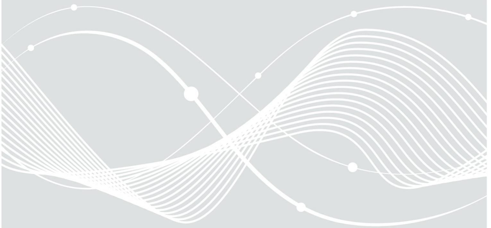
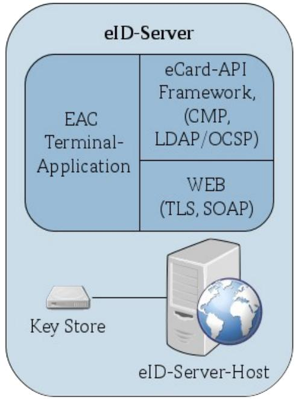

# Technical Guideline TR-03130 eID-Server

# Part 2: Security Framework for eID-Server operations

Version 2.1.2 October 25, 2017

# Document history

| Version   | Date              | Description                                                                       |
|-----------|-------------------|-----------------------------------------------------------------------------------|
| 0.4 Draft | August 20, 2013   | Initial External Draft                                                            |
| 2.0.1 RC  | December 2, 2013  | Major improvements based on external feedback (see comment sheet for details)  |
| 2.0.1     | January 15, 2014  | Minor improvements                                                                |
| 2.0.2     | November 16, 2016 | No documented changes                                                             |
| 2.1.2     | October 25, 2017  | Alignment with new Personalausweisgesetz and -Verordnung. Editorial revisions. |

Federal Office for Information Security Post Box 20 03 63 D-53133 Bonn Phone: +49 22899 9582-0 E-Mail: eid@bsi.bund.de Internet: https://www.bsi.bund.de © Federal Office for Information Security 2017

|                                | Document history 2                                                                 |  |
|--------------------------------|------------------------------------------------------------------------------------|--|
| 1                              | Introduction 5                                                                     |  |
| 1.1                            | Out of scope 5                                                                     |  |
| 2                              | Functional Architecture 6                                                          |  |
| 2.1                            | Overview of the eID-Infrastructure 6                                               |  |
| 2.2 2.2.1 2.2.2 2.2.3 | Components of an eID-Server 7 IT-Systems 7 Applications 8 Communication 8 |  |
| 3                              | Security objectives 9                                                              |  |
| 4                              | Security requirements 10                                                           |  |
| 4.1                            | Organization of information security 10                                            |  |
| 4.2                            | Human resource security 11                                                         |  |
| 4.3                            | Access control 11                                                                  |  |
| 4.4                            | Cryptography 12                                                                    |  |
| 4.5                            | Physical and environmental security 12                                             |  |
| 4.6                            | Operations security 13                                                             |  |
| 4.7                            | Communications security 14                                                         |  |
| 4.8                            | Supplier Relationships 15                                                          |  |
| 4.9                            | Compliance 15                                                                      |  |
|                                | References 16                                                                      |  |

| Figure 1: Overview of the functional architecture of the eID-Infrastructure6 |  |
|------------------------------------------------------------------------------|--|
| Figure 2: Architecture of a typical eID-Server 7                             |  |
| Figure 3: Separation of the local network 14                                 |  |
|                                                                              |  |

| Table 1: Fundamental security objectives for the eID-Data9 |  |
|------------------------------------------------------------|--|
| Table 2: Role descriptions 10                              |  |
| Table 3: Role exclusion matrix 11                          |  |

# 1 Introduction

This second part of the technical guideline TR-03130 defines information security management guidelines for the operation of eID-Servers by service providers (including on-site service providers). For the immediate operational aspects, the same requirements apply to eID-Services that offer outsourced eID-Server operations on behalf of service providers. The information security management guidelines defined in this document address only the specific aspects of secure eID-Server operations. To be effective, they must be embedded in a general Information Security Management System (ISMS) according to [ISO27001] or ISO 27001 based on [IT-GS]. Data protection requirements (in particular [BDSG]/[GDPR][1](#page-4-2) ) are not in scope of this technical guideline and remain unaffected.

A service provider is the owner of an authorization received from the issuing office for authorization certificates (*Vergabestelle für Berechtigungszertifikate* - *VfB*) and is thus responsible for adherence of all specifications and requirements in-house as well as in case of delegation to a third party.

# 1.1 Out of scope

Only the operational security requirements of the eID-Server are considered in this technical guideline. Related but out of scope are in particular the following aspects:

- all functional security requirements within the eID-Server (those are considered in [TR-03130-1])
- procedures and security requirements described in the certificate policy [CP CVCA eID] and in [TR-03129]
- applicable regulatory requirements, including ISMS and other certification requirements
- any security requirements applicable for services provides beyond the aspect of eID-Server operations, for example integrity and confidentiality of communication interfaces of the services provider with external entities (a consolidated overview of security requirements for service providers is described in [TR-03128-2])

For informative purposes, an overview of the functional architecture of the eID-Infrastructure is included in Section [2,](#page-5-0) although that aspect is also out of the normative scope of this technical guideline.

# 2 Functional Architecture

This section describes the functional architecture of the eID-Server in the eID-Infrastructure. The components and communication channels are shown in a logical overview. The entities included in this overview are: eID-Server, eService, EAC-PKI and the User (of the eService).

# 2.1 Overview of the eID-Infrastructure

The role of the eID-Server within the eID-Infrastructure includes:

- communication with the User's client-sided eCard-API-Framework implementation (eID-Client)
- connection to the EAC-PKI, for verification that the data received are from a valid eID-Document, and to allow the eID-Document to verify the authenticity of the eService
- transmission of the result of the Online-Authentication to the eService of the Service Provider

In most cases, all components of the eID-Infrastructure communicate over the Internet, using cryptographic protocols for secure communication. The functional architecture of the eID-Infrastructure as described in [TR-03130-1] is illustrated in *[Figure 1: Overview of the functional architecture of the eID-Infrastructure](#page-5-1)*.

*Figure 1: Overview of the functional architecture of the eID-Infrastructure*

Differing from the infrastructure described in *[Figure 1: Overview of the functional architecture of the eID-](#page-5-1)[Infrastructure,](#page-5-1)* the eID-Server may also communicate directly with the eService. Nevertheless, the eID-Server is connected to the Internet for the communication with the eID-Client of the User and the EAC-PKI.

*[Figure 2: Architecture of a typical eID-Server](#page-6-2)* shows a typical architecture of an eID-Server as it may be operated in-house by a services provider or by an eID-Service in case of outsourced operations. The

components of a typical eID-Server are briefly described in the following section. They include at least a computer called eID-Server-Host on which the EAC Terminal Application, eCard-API-Framework and the Web-Server are running. Furthermore, a Key Store is required for the key storage according to [CP CVCA eID].

*Figure 2: Architecture of a typical eID-Server*

## 2.2 Components of an eID-Server

This section provides an informative description of the various components needed to fulfill the functional requirements for the operation of an eID-Server.

### 2.2.1 IT-Systems

At least two IT-Systems are required to operate an eID-Server: The eID-Server-Host and the Key Store.

#### 2.2.1.1 eID-Server-Host

The eID-Server-Host is the IT-system on which the eID-Server (including EAC Terminal-Application, eCard-API-Framework and web interface) is running.

#### 2.2.1.2 Key Store

The Key Store is the central component for signature-creation and storage of the private key(s) of the terminal authorization certificate(s). The Key Store is directly attached to the eID-Server-Host. The Key Store must be implemented according to [CP CVCA eID].

### 2.2.2 Applications

The following sections show the minimal set of applications required to be running on the eID-Server-Host.

### 2.2.2.1 EAC Terminal-Application

The EAC Terminal-Application reads the identity data from the eID-Document using the eCard-API-Framework and provides these data to the business logic of the eService.

#### 2.2.2.2 WEB

The web service (WEB) provides an interface to the eService, encapsulating the complexity of the protocols and components involved in the eID-Function.

#### 2.2.2.3 eCard-API-Framework

The communication between the eID-Server and the eID-Client (e.g. AusweisApp2[2](#page-7-3) ) is managed by an implementation of the eCard-API-Framework.

### 2.2.3 Communication

The eID-Server uses the protocols listed in *Section [2.2.3.2: Protocols](#page-7-2)* to communicate with other components of the eID-Infrastructure via networks.

#### 2.2.3.1 Networks

To offer the web service of the eID-Server to the eService or connect to the eID-Client of the User, Internet access is required. An additional connection to a local network may be necessary for administrative purposes.

#### 2.2.3.2 Protocols

The general message flow between the eID-Server, eService and the eID-Client of the User is based on SAML or SOAP with the use of Transport Layer Security (TLS).

The eID-Server must have access to the Public Key Directory (PKD), a Certification Authority (CA) and to Certificate Revocation Lists (CRLs) of the EAC-PKI. Alternatively or in addition to PKD access, certificates may be exchanged bilaterally through secure mechanisms. Protocols used for the above described purposes are Lightweight Directory Access Protocol (LDAP), Online Certificate Status Protocol (OCSP) and Certificate Management Protocol (CMP). For retrieving the service provider specific eID-Document blacklist, the message *GetBlackList* must be supported, for retrieving the signed list of trusted certificates (Master List), the message *GetMasterList* must be supported. See [TR-03129] for details on both messages.

These requirements only refer to the Public Key Infrastructure (PKI) used for Extended Access Control (EAC). Certificates from other PKIs may have different protocols and organizational requirements.

#### 2 https://www.ausweisapp.bund.de

# 3 Security objectives

This section discusses the top level security objectives in view of the operation of eID-Servers. For the determination of these security objectives within the German eID-Infrastructure, the security concept of the German national identity card was used as a basis. Based on the security objectives (protection requirements) defined in this Section, corresponding security requirements are defined in Section [4.](#page-9-1)

The eID-Data, i.e. the personal data of the User stored in an eID-Document (e.g. Germany's national ID card) and the result of operations performed on the User's eID-Document, are the assets to be primarily protected. Other data requiring protection in the context of the eID-Infrastructure are assigned to protect these eID-Data (e. g. private keys). This other data require the same level of protection as the eID-Data. To protect the data, the fundamental values of information security, **confidentiality** (non-disclosure of data) and **integrity** (verification that data isn't being manipulated and transactions and information exchanges can be trusted, i.e. authenticity) were considered at the topmost level. Therefore, the resulting security objectives (SO) of the eID-Server are:

#### **SO1: Confidentiality of the eID-Data must be guaranteed.**

#### **SO2: Integrity (including authenticity) of the eID-Data must be guaranteed.**

See Table [1](#page-8-1) for a more detailed description of the security objectives.

| Security objective | Description                                                                                                                                                                                                                                                                                                                                                                                                                                                                                                                                                                                  |
|--------------------|----------------------------------------------------------------------------------------------------------------------------------------------------------------------------------------------------------------------------------------------------------------------------------------------------------------------------------------------------------------------------------------------------------------------------------------------------------------------------------------------------------------------------------------------------------------------------------------------|
| Confidentiality    | The eID-Data is confidential and must not be registered, stored or forwarded without proper authorization. This applies particularly to reading of personal data, including the communication between the chip of the eID-Document and the receiver of the data. The overall responsibility lies with the entity owning the authorization certificate that is used for the readout of the eID-Data. Limitations of [BDSG]/[GDPR]3 apply. In particular, the data read out must not be stored in the eID-Server longer than needed for a specific authentication procedure. |
| Integrity          | The correctness of the data read from the eID-Document and the processes, applications and systems associated with it, in this case the eID-Server, must be ensured. The authenticity of the eID-Data must be verifiable. At the same time the authenticity of persons and technical components that want to access the eID-Data or are at least involved in the process must be guaranteed.                                                                                                                                                                                  |

Table 1: Fundamental security objectives for the eID-Data

Availability of the eID-Server may be considered as an additional security objective. This aspect, however, is not taken into consideration within this technical guideline. In contrast to confidentiality and integrity, there are no general legal regulations related to availability of eID-Servers. The requirements for availability depend solely on the individual requirements of the eServices relying on the eID-Server operations.

Ensuring confidentiality and integrity of the eID-Data according to this technical guideline can contribute to fulfill any applicable data privacy regulations. However, any legal requirements related to data privacy remain unaffected.

#### 3 [GDPR] comes into force on the 25th May 2018.

# 4 Security requirements

This chapter defines specific security requirements for the operation of an eID-Server. Those requirements should be understood as additional, refined or interpreted controls and implementation guidance of a general ISMS. To facilitate their necessary embedding into a general ISMS, these security requirements are categorized according to the clauses of [ISO27002].

# 4.1 Organization of information security

#### *R.1 Internal organization - Role concept*

A role concept must be developed and documented that adopts the following principles:

- Segregation of duties and
- Need-to-know principle

Role exclusions must always adhere to the following principles (segregation of duties):

- The Persons in Charge (PiCs) shall not perform operative or administrative tasks
- Persons with controlling tasks shall not perform operative or administrative tasks
- Administrative rights shall be limited to a restricted number of persons

Table [2](#page-9-2) describes the minimal role set.

| Role                                        | Description                                                                                                                                                                                                                                                                                                                                                                                                                                                                                                                |
|---------------------------------------------|----------------------------------------------------------------------------------------------------------------------------------------------------------------------------------------------------------------------------------------------------------------------------------------------------------------------------------------------------------------------------------------------------------------------------------------------------------------------------------------------------------------------------|
| eID-Service's Person in Charge (PiC)     | The Person in Charge (PiC) holds the general responsibility for the eID-Service's organisational unit. The PiC is part of the IS management team.                                                                                                                                                                                                                                                                                                                                                                       |
| eID-Service's IT Security Officer (ITSO) | The IT Security Officer (ITSO) is part of the IS management team and helps to fullfil the four-eyes principle on the HSM with the Administrator. Together with the Administrator, the ITSO is responsible for the administration of the applications, cryptographic key and certificate management, administration of networks and firewalls and facility access control.                                                                                                                                      |
| Data Protection Officer (DPO)            | The Data Protection Officer (DPO) for data according to [BDSG]. The DPO may support the IS management team.                                                                                                                                                                                                                                                                                                                                                                                                             |
| Administrator(s)                            | The (preferably: group of) Administrator(s) has the authoritative rights on all IT systems of the eID-Service. Administrators are responsible for the implementation of backup, malware protection and periodical update of protective measures (e.g. malware signature files). Together with the ITSO, the Administrator is responsible for the administration of the applications, cryptographic key and certificate management, administration of networks and firewalls and facility access control. |
| User                                        | The User of the eID-Service. This includes the User of the eService and the eService itself as both use the eID-Server for mutual authentication. A person in the role of the User must not gain administrative rights while acting as User.                                                                                                                                                                                                                                                                         |

#### Table 2: Role descriptions

Table [3](#page-10-2) shows the role exclusion matrix. An "E" means exclusion, those roles must not be assigned to a single person. A "C" means that the corresponding roles may be assigned to a single person.

| Role          | PiC | ITSO | DPO | Administrator | User |
|---------------|-----|------|-----|---------------|------|
| Role          |     |      |     |               |      |
| PiC           |     |      |     |               |      |
| ITSO          | E   |      |     |               |      |
| DPO           | E   | C    |     |               |      |
| Administrator | E   | E    | E   |               |      |
| User          | C   | C    | C   | C             |      |

Table 3: Role exclusion matrix

### 4.2 Human resource security

#### *R.2 Technical qualification of employees*

Employees must have sufficient training before starting their work. The training must include at least an introduction to their tasks and an awareness training, which covers the security relevance of their tasks considering [BDSG] and the security concept.

The technical qualification of employees must be checked regularly by the Person in Charge to determine if a retraining is required. The Person in Charge shall ensure that a qualified deputy is available, if a person fulfiling one of the roles defined in [R.1 Internal organization - Role concept](#page-9-3) (except User) is not able to fulfil his role.

### 4.3 Access control

#### *R.3 Admission concept*

Admission means to have a user account on the IT system in order to use the functionality of the IT system. An admission concept that ensures that only authorised persons have admission shall be established, documented and reviewed.

Minimal requirements are:

- The admission concept must define that every IT system is protected against unauthorised admission by adequate admission mechanisms.
- Within the admission concept it must be defined how a single role has to be authenticated by the IT system. A minimal requirement is the authentication via username and password. Therefore, an adequate password directive must be developed. Only strong passwords shall be allowed. As a minimum requirement, the rules for password usage of [IT-GS] (part *M 2.11*) must be fulfilled. Preferably, a combination of hardware token and password should be required for authentication.
- Remote administration requires appropriate consideration within the admission concept. The communication channel for the administration must be protected by using strong authentication mechanisms and strong encryption. Adequate cryptographic parameters and algorithms can be found in [TR-02102].
- Only an Administrator has admission to all IT components of the eID-Server.
- Users must not have admission to other IT components of the eID-Server than the web service.
- The admission authorization for the eID-Server must be assigned according to the requirements of the role concept and its exclusions.

#### *R.4 Access concept*

An access concept shall be established, documented and reviewed.

Within the access concept, the access rights to the data with protection requirements must be defined according to the role concept. The access authorization must be assigned according to the requirements of the role concept and its exclusions.

The four-eyes principle must be ensured for the access to and the use of the data stored in the HSM (e.g. privates keys). Use of the HSM may imply an extension of the four-eyes principle to the whole eID-Server.

## 4.4 Cryptography

#### *R.5 Policy on the use of cryptographic controls (Crypto concept)*

In order to fulfill the cryptographic requirements of the *Technical Guideline eID-Server Part 1: Functional Specification (Section 4.5 and 5.8),* a crypto concept must be developed regarding key management and certificate management of the eID-Service. This crypto concept must consider key lengths and algorithms according to [TR-02102] and the requirements resulting from the certificate policy [CP CVCA eID].

The Administrator is responsible for key management and certificate management and for requesting certificates as well as secure storage of private keys.

## 4.5 Physical and environmental security

#### *R.6 Facility access concept*

A facility access concept for the eID-Server location (building, room) must be developed and documented. The number of persons with access to the facility shall be limited to the required minimum.

**Remark:** The facility access concept may be part of a general access control policy that defines access restrictions to information and information processing facilities.

#### *R.7 Secure areas – Physical security perimeter*

The required IT components and technical equipment for eID-Server operation must be hosted within buildings. These buildings must provide secure areas where the IT components and technical equipment are hosted.

Backup data media must be stored in a security area that represents a separate fire area.

Every security area must provide an entrance control service that uses entrance control technique.

At least one state-of-the-art hazard alert system must be established. It must be ensured that the alerts are sent to the officials immediately.

Security areas must be protected against unauthorised entrance. This must include adequate access control systems and constructional measures. The constructional infrastructure must provide a high resistance. It must be ensured that an unauthorised entrance attempt will be defended until alerted officials can arrive.

#### *R.8 Secure areas – Physical entry controls (Entrance control technique)*

The entrance to and the presence in security areas must be checked, monitored and documented. An entrance control technique must be established.

#### *R.9 Secure areas - Working in secure areas*

The following entrance rules must be enforced:

- Only Administrators are allowed to enter the security area where the IT systems are administered and hosted.
- All other roles and external persons (e.g. visitors) must be continuously escorted by an Administrator.

# 4.6 Operations security

#### *R.10 Operational procedures and responsibilities - Change management*

A change management must be established. This includes life cycle regulations for the operational usage of hard- and software. The change management also includes the release procedures for new hardware and software and regulations for the update policy.

On all IT systems of the eID-Server stable and officially released hard- and software shall be used. The release procedure must be implemented according to clause *12.5 Control of operational software* of [ISO27002] or similar. The roll-out procedure requires well defined criteria including test procedures of the new hard- and software.

Further criteria for removing hardware and deinstallation of software must be established. Especially the handling of data media is important. It must be ensured that residual data are irretrievably deleted (e.g. destruction of hard disk).

#### *R.11 Protection from malware*

All IT systems of the eID-Server except the HSM must be equipped with active malware scanners. Only checked malware-free data media are allowed to be used. The used malware signature files must be up to date.

#### *R.12 Updating software*

The newest stable software patches must be installed on every IT system of the eID-Service. All rules defined in change management must be considered before updating software.

#### *R.13 Logging and monitoring*

Every IT system of the eID-Service must have logging capability. At least the following events must be logged:

- System log-in (successful and unsuccessful)
- Access attempts
- Every administrative access
- Every access via web service

In case of more than 3 unsuccessful system log-in attempts, an alert must be generated. This alert must be caught by the Administrator. In this case the Administrator must involve the ITSO to decide the further procedure (e.g. shut down the eID-Server or reset the accounts).

#### *R.14 Secure installation and secure operation of the IT systems*

The IT systems must be installed and operated in a secure way. That means that all instructions of the user guidance concerning installation and operation must be considered.

Every IT system must be installed and operated based on a minimized/hardened operating system. This means that only services needed for the eID-Service may be activated. Software that is not required for the eID-Service must not be installed.

The assignment of permissions must be done in a way that all roles get only the minimal required permissions. The assignment of permissions must be documented.

Adequate measures (e.g. BIOS settings) must enforce that a system boot is only possible from the designated media (e.g. specific hard disk drive).

The operating system or the application must be configured in a way that the identification and authorization mechanisms according to *[R.3 Admission concept](#page-10-4)* and *[R.4 Access concept](#page-10-3)* are enforced.

#### *R.15 Integrity protection for IT systems*

The integrity of every IT system of the eID-Service must be checked at least once a week by using adequate measures. The result of the check must be documented.

If the integrity check fails, the affected IT system of the eID-Service must be shut down. If applicable, redundant components must be started according to the availability concept.

## 4.7 Communications security

#### *R.16 Network security management - Network security zones*

The local network of the eID-Server must be separated into three security zones:

- internet zone,
- external zone (i.e. DMZ) and
- internal zone.

The separation of these zones must be achieved by a firewall system.

The eID-Server must be split into two separate physical components, an eID web server host (i.e. web front end) and eID application server host (i.e. application server). The eID web server host must be placed in the external zone and the eID application server host must be placed in the internal zone.

An eID-Service is connected to the Internet via the internet zone.

The following *[Figure 3: Separation of the local network](#page-13-1)* shows the separation of the local network.

*Figure 3: Separation of the local network*

#### *R.17 Network security management - Firewall system (security gateway)*

As *[Figure 3: Separation of the local network](#page-13-1)* shows, security zones must be separated by a firewall system (FW). The firewall system must be state-of-the-art. It must be designed as a combination of a packet filter (PAP), Application Level Gateway (ALG) and another packet filter (PAP).

The firewall system must be configured in a way that unauthorised access attempts via internet zone are rejected. Every communication with external entities must pass the firewall system. Furthermore, the firewall system must log all connections.

The log files must be checked regularly, at least every day. Detected attacks and attempts of attacks must be evaluated and an adequate reaction must be performed. In case of failure of the logging functionality an alert must be sent to the Administrator. If the logging functionality cannot be restarted by the Administrator the firewall system must block all communication.

#### *R.18 Network security management - Intrusion Detection System*

In order to detect attacks on the eID-Service, a state-of-the-art Intrusion Detection System (IDS) must be established. Organisational and technical measures must ensure that in case of security relevant attacks a reliable and prompt alert is sent to the Administrator.

The IDS must support the following modes of analysis:

- Signature based detection (detection by comparison with known standard attack signatures)
- Protocol based detection (detection of protocol irregularities)
- Anomaly based detection (detection of unusual network traffic)

### 4.8 Supplier Relationships

#### *R.19 Outsourcing*

If the eID-Server is hosted by a third party (eID-Service) on behalf of a services provider, contractual arrangements with the outsourcing service provider must include a commitment by the eID-Service to fulfill the security requirements of this technical guideline.

### 4.9 Compliance

#### *R.20 Compliance with legal requirements*

Besides compliance to all applicable laws and degrees (in particular [PAuswG] and [PAuswV]), all security measures referenced in Section 3.5 and 4.9 of [TR-03130-1] must be implemented by the participating entities.

# References

| BDSG        | Federal Data Protection Act (Bundesdatenschutzgesetz - as of 30 Juni 2017)                |
|-------------|-------------------------------------------------------------------------------------------|
| CP CVCA eID | BSI: Certificate Policy für die Country Verifying Certification Authority eID-Anwendung.  |
|             | Elektronischer Identitätsnachweis mit hoheitlichen Ausweisdokumenten.                     |
| GDPR        | General Data Protection Regulation (Regulation (EU) 2016/679, coming into force on the    |
|             | 25th May 2018)                                                                            |
| ISO27001    | ISO / IEC 27001: Information technology — Security techniques — Information security      |
|             | management systems — Requirements                                                         |
| ISO27002    | ISO / IEC 27002: Information technology — Security techniques — Code of practice for      |
|             | information security controls                                                             |
| IT-GS       | BSI: IT-Grundschutz Catalogues                                                            |
| PAuswG      | Act on Identity Cards and Electronic Identification (Personalausweisgesetz - as of 8 July |
|             | 2017)                                                                                     |
| PAuswV      | Verordnung über Personalausweise und den elektronischen Identitätsnachweis                |
|             | (Personalausweisverordnung)                                                               |
| TR-02102    | BSI: TR-02102, Kryptographische Verfahren: Empfehlungen und Schlüssellängen; V13.02       |
| TR-03128-2  | BSI: TR 03128, Diensteanbieter für die eID-Funktion. Teil 2: Organisatorische und         |
|             | technische Sicherheitsanforderungen                                                       |
| TR-03129    | BSI: TR 03129, PKIs for Machine Readable Travel Documents                                 |
| TR-03130-1  | BSI: TR-03130-1, eID-Server. Part 1: Functional Specification. V2.0.2                     |