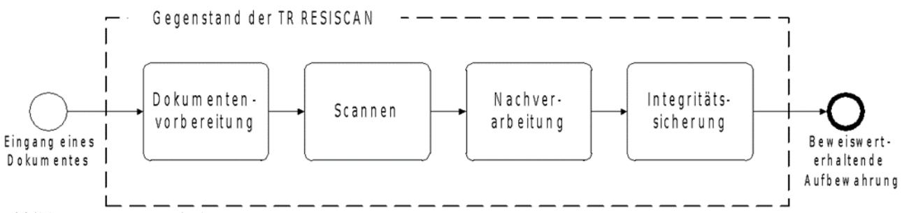
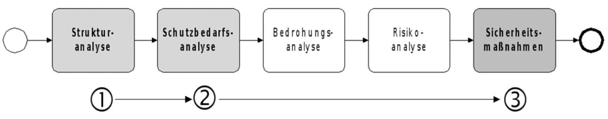
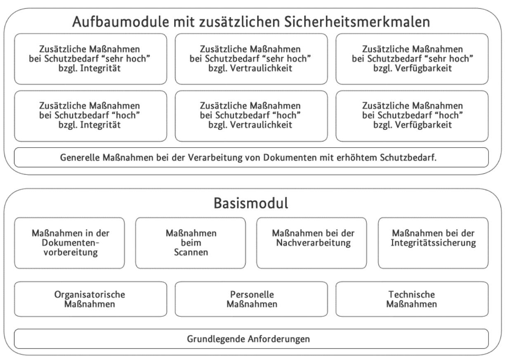

# BSI Technische Richtlinie 03138 Ersetzendes Scannen

Bezeichnung: Ersetzendes Scannen (RESISCAN) Kürzel: BSI TR-03138 RESISCAN Version: 1.4.1 Datum: 23.04.2020

Bundesamt für Sicherheit in der Informationstechnik Postfach 20 03 63 53133 Bonn Tel.: +49 228 99 9582-0 E-Mail[: resiscan@bsi.bund.de](mailto:resiscan@bsi.bund.de) Internet: [https://www.bsi.bund.de](https://www.bsi.bund.de/) © Bundesamt für Sicherheit in der Informationstechnik 2016 Bundesamt für Sicherheit in der Informationstechnik Postfach 20 03 63 53133 Bonn Tel.: +49 22899 9582-0 E-Mail[: resiscan@bsi.bund.de](mailto:resiscan@bsi.bund.de) Internet: [https://www.bsi.bund.de](https://www.bsi.bund.de/) © Bundesamt für Sicherheit in der Informationstechnik 2021

| 1              | Vorbemerkung5                                                                                                                 |  |
|----------------|-------------------------------------------------------------------------------------------------------------------------------|--|
| 1.1            | Zielsetzung und Titel 5                                                                                                    |  |
| 1.2            | Kennzeichnung6                                                                                                                |  |
| 1.3            | Fachlich zuständige Stelle 6                                                                                               |  |
| 1.4            | Versionsverwaltung6                                                                                                           |  |
| 1.5            | Änderungsdienst / Fortschreibung7                                                                                             |  |
| 1.6            | Veröffentlichung7                                                                                                             |  |
| 1.7            | Konventionen7                                                                                                                 |  |
| 1.8            | Anwendungsbereich 8                                                                                                        |  |
| 2              | Allgemeines und Übersicht 9                                                                                                |  |
| 2.1            | Regelungsgegenstand und wichtige Hinweise 9                                                                                |  |
|                |                                                                                                                               |  |
| 3              | Vorgehensweise zur Anwendung der Richtlinie 10                                                                             |  |
| 3.1            | Strukturanalyse 10                                                                                                         |  |
| 3.2            | Schutzbedarfsanalyse 10                                                                                                    |  |
| 3.3            | Sicherheitsmaßnahmen11                                                                                                        |  |
| 4              | Anforderungen für das ersetzende Scannen12                                                                                    |  |
| 4.1            | Modulkonzept12                                                                                                                |  |
| 4.2            | Basismodul 12                                                                                                              |  |
| 4.2.1          | Grundlegende Anforderungen13                                                                                                  |  |
| 4.2.2          | Organisatorische Maßnahmen14                                                                                               |  |
| 4.2.3          | Personelle Maßnahmen16                                                                                                        |  |
| 4.2.4          | Technische Maßnahmen18                                                                                                        |  |
| 4.2.5          | Sicherheitsmaßnahmen bei der Dokumentenvorbereitung19                                                                         |  |
| 4.2.6          | Sicherheitsmaßnahmen beim Scannen20                                                                                           |  |
| 4.2.7          | Sicherheitsmaßnahmen bei der Nachbearbeitung24                                                                                |  |
| 4.2.8          | Sicherheitsmaßnahmen bei der Integritätssicherung25                                                                           |  |
| 4.3            | Aufbaumodule 26                                                                                                            |  |
| 4.3.1          | Generelle Maßnahmen bei erhöhtem Schutzbedarf26                                                                               |  |
| 4.3.2 4.3.3 | Zusätzliche Maßnahmen bei hohen Integritätsanforderungen27 Zusätzliche Maßnahmen bei sehr hohen Integritätsanforderungen29 |  |
| 4.3.4          | Zusätzliche Maßnahmen bei hohen Vertraulichkeitsanforderungen30                                                               |  |
| 4.3.5          | Zusätzliche Maßnahmen bei sehr hohen Vertraulichkeitsanforderungen30                                                          |  |
| 4.3.6          | Zusätzliche Maßnahmen bei hohen Verfügbarkeitsanforderungen31                                                                 |  |
| 4.3.7          | Zusätzliche Maßnahmen bei sehr hohen Verfügbarkeitsanforderungen32                                                            |  |
|                | Abkürzungsverzeichnis33                                                                                                       |  |
|                |                                                                                                                               |  |
|                | Glossar35                                                                                                                     |  |
|                | Literaturverzeichnis38                                                                                                        |  |

| Abbildung 1: Der "generische Scanprozess"9                                 |  |
|----------------------------------------------------------------------------|--|
| Abbildung 2: Vorgehensweise zur Anwendung der Technischen Richtlinie 10 |  |
| Abbildung 3: Das Modulkonzept der Technischen Richtlinie12                 |  |

# Tabellenverzeichnis

| Tabelle 1: Aufbau und Bestandteile der TR RESISCAN7                                |  |
|------------------------------------------------------------------------------------|--|
| Tabelle 2: Grundlegende Anforderungen13                                            |  |
| Tabelle 3: Organisatorische Maßnahmen im Überblick14                               |  |
| Tabelle 4: Personelle Maßnahmen im Überblick16                                     |  |
| Tabelle 5: Technische Maßnahmen im Überblick18                                     |  |
| Tabelle 6: Sicherheitsmaßnahmen bei der Dokumentenvorbereitung 19               |  |
| Tabelle 7: Sicherheitsmaßnahmen beim Scannen20                                     |  |
| Tabelle 8: Sicherheitsmaßnahmen bei der Nachbearbeitung24                          |  |
| Tabelle 9: Sicherheitsmaßnahmen bei der Integritätssicherung 25                 |  |
| Tabelle 10: Zusätzliche Maßnahmen bei erhöhtem Schutzbedarf26                      |  |
| Tabelle 11: Zusätzliche Maßnahmen bei hohen Integritätsanforderungen 27         |  |
| Tabelle 12: Zusätzliche Maßnahmen bei sehr hohen Integritätsanforderungen 29    |  |
| Tabelle 13: Zusätzliche Maßnahmen bei hohen Vertraulichkeitsanforderungen 30 |  |
| Tabelle 14: Zusätzliche Maßnahmen bei sehr hohen Vertraulichkeitsanforderungen30   |  |
| Tabelle 15: Zusätzliche Maßnahmen bei hohen Verfügbarkeitsanforderungen31          |  |
| Tabelle 16: Zusätzliche Maßnahmen bei sehr hohen Verfügbarkeitsanforderungen32     |  |

# 1 Vorbemerkung

Dieses Kapitel enthält Angaben zur Bezeichnung dieser Technischen Richtlinie (TR), zur fachlich zuständigen Stelle, zur Versionsverwaltung, zum Änderungsdienst und der Fortschreibung der TR.

# 1.1 Zielsetzung und Titel

Diese Technische Richtlinie zielt auf eine Steigerung der **Rechtssicherheit im Bereich des ersetzenden Scannens** ab und trägt den Titel "**Ersetzendes Scannen (RESISCAN)**".

Hierbei wird unter dem "ersetzenden Scannen" der Vorgang des elektronischen Erfassens von Papierdokumenten mit dem Ziel der elektronischen Weiterverarbeitung und Aufbewahrung des hierbei entstehenden elektronischen Abbildes (Scanprodukt) und der späteren Vernichtung des papiergebundenen Originals verstanden. Insofern ist das Scannen und Vernichten von Papierkopien bzw. das Ersetzen konventioneller Kopien durch Scanprodukte kein ersetzendes Scannen im Sinne dieser Richtlinie.

Die TR RESISCAN soll Anwendern in Justiz, Verwaltung, Wirtschaft und Gesundheitswesen als Handlungsleitfaden und Entscheidungshilfe dienen, wenn es darum geht, Papierdokumente nicht nur einzuscannen, sondern nach Erstellung des Scanproduktes auch zu vernichten. Dies betrifft insbesondere solche Anwendungen, in denen gesetzliche oder anders begründete Aufbewahrungs- und Dokumentationspflichten bestehen, die eine besondere Handhabung digitalisierter Dokumente nach sich ziehen, wenn das Original vernichtet werden soll. Die TR hat ohne besondere rechtliche Bestimmungen lediglich empfehlenden Charakter.

Während in manchen Anwendungsbereichen, wie etwa dem kaufmännischen oder steuerlich relevanten Umfeld nach Abgabenordnung (AO) und Handelsgesetzbuch (HGB) seit 1995 Grundsätze zur ordnungsgemäßen Ausführung der elektronischen Aufbewahrung existieren, nach denen bereits ersetzend gescannt wird, fehlen konkrete Umsetzungsvorgaben für die meisten anderen, aber zunehmend betroffenen Bereiche (Ausnahme: Sozialversicherungsrecht). Darüber hinaus gibt es auch in den bereits von unterschiedlich detaillierten Regelungen betroffenen Bereichen zunehmend davon nicht erfasste Dokumente (zum Beispiel solche, die nicht nur nach AO/HGB sondern auch zur zivilrechtlichen Beweissicherung aufbewahrt werden sollen), die vor allem aus Gründen der Wirtschaftlichkeit zukünftig ebenfalls ersetzend gescannt werden sollen. Um dies auf einer möglichst sicheren technischorganisatorischen Grundlage tun zu können, wurden die Empfehlungen in dieser TR erarbeitet. Ziel ist es, die mit einer Vernichtung des Originaldokuments stets einhergehende Verringerung des Beweiswerts für den jeweiligen Anwender durch einen an das Original möglichst weit angenäherten Beweiswert des - in einem nachweisbar ordnungsgemäßen Prozess erstellten - Scanproduktes selbst auszugleichen, zu minimieren oder sichtbar zu machen. Schließlich kann die TR im Rahmen künftiger Regelungsvorhaben als Referenz dienen, wenn es z.B. konkret um die Schaffung weiterer Zulässigkeitstatbestände für das ersetzende Scannen insbesondere im Bereich der elektronischen Aktenführung geht.

Die TR beruht auf den langjährigen Erfahrungen der Praxis in den verschiedenen Anwendungsbereichen in Verwaltung und Wirtschaft. Sie berücksichtigt so umfassend wie möglich die hier etablierten Prozesse. Der Mehrwert für alle Scanprozesse, in denen das Scanprodukt das Original tatsächlich ersetzen soll, liegt insbesondere in der systematischen Darstellung der im Ablauf eines Scanprozesses bedeutsamen Bedrohungen für die wesentlichen Grundziele der Informationssicherheit. Diese werden in einer Strukturanalyse u.a. dezidiert für alle betroffenen Datenobjekte und Kommunikationsbeziehungen dargestellt. Auf Grundlage einer darauf aufbauenden sorgfältigen Schutzbedarfsanalyse und anhand der entlang der verschiedenen Scanphasen durchgeführten Risikoanalyse werden konkrete Sicherheitsmaßnahmen beschrieben. Dadurch wird der Anwender in die Lage versetzt, die für seine Fachanwendung notwendigen Maßnahmen zu identifizieren und "seinen" Scanprozess angemessen sicher zu gestalten. Auch bereits etablierte Scanprozesse können von der TR profitieren, in dem diese mit den Anforderungen der TR abgeglichen, gegebenenfalls die bereits bestehende Ordnungsmäßigkeit des Scanprozesses weiter optimiert und letztendlich die Konformität dazu erklärt werden kann.

Aufgrund der enormen Unterschiede der fachspezifischen Anforderungen jedes Anwendungsbereichs, sieht die TR einen modularen Anforderungskatalog vor, der unterschiedliche praxisrelevante Sicherheitsstufen umfasst. In der Basisstufe geht es vor allem um einen grundsätzlich ordnungsgemäßen und mit grundlegenden Sicherheitsmaßnahmen ausgestalteten Scanprozess. In den Ausbaustufen wird besonderen Anforderungen an Integrität, Verfügbarkeit und Vertraulichkeit mit entsprechend angepassten und erhöhten Sicherheitsmaßnahmen Rechnung getragen.

Gegenstand der TR (und damit potentieller Zertifizierungsgegenstand) ist der Prozess des (ersetzenden) Scannens als solcher in technischer und organisatorischer Hinsicht, nicht aber bestimmte Soft- oder Hardwarekomponenten zur tatsächlichen Durchführung des Scannens. Im Rahmen der nach der TR möglichen Nachweisführung der Konformität durch eine Zertifizierung des Scanprozesses werden daher Soft- und Hardware nicht explizit betrachtet. Ebenso ist die sich an einen Scanprozess im Rahmen eines Vorgangsbearbeitungssystems und/oder Dokumentenmanagementsystems anschließende Langzeitspeicherung oder Archivierung nicht Gegenstand der TR. Diesbezüglich wird lediglich die notwendige Interoperabilität und Kompatibilität zu gängigen Archivformaten berücksichtigt.

Die hier formulierten Empfehlungen beinhalten nicht nur funktionale und auf die Sicherheitseigenschaften bezogene Maßnahmen, sondern auch gleichrangig organisatorische Empfehlungen, die gerade beim Scannen von besonderer Relevanz sind. Denn ein Scanprozess kann in keinem Fall vollständig automatisiert erfolgen, sondern bedarf immer auch der sorgfältigen Bedienung durch Menschen, die damit eine potentielle und nicht zu unterschätzende Fehlerquelle des Scanprozesses darstellen.

## 1.2 Kennzeichnung

Diese TR wird gekennzeichnet mit "BSI TR 03138".

# 1.3 Fachlich zuständige Stelle

Fachlich zuständig für die Formulierung und Betreuung dieser TR ist das Bundesamt für Sicherheit in der Informationstechnik (BSI).

Anschrift: Bundesamt für Sicherheit in der Informationstechnik (BSI)

Postfach 20 03 63

53133 Bonn

Tel.: +49 228 99 9582-0

E-Mail[: resiscan@bsi.bund.de](mailto:resiscan@bsi.bund.de)

Internet:<https://www.bsi.bund.de/resiscan>

### 1.4 Versionsverwaltung

Diese TR besteht aus diesem Hauptdokument und der dazugehörigen normativen Prüfspezifikation für die Konformitätsprüfung (Anlage P).

Darüber hinaus existieren verschiedene informative Anwendungshinweise, die das Ergebnis der im Zuge der Erstellung durchgeführten Risikoanalyse dokumentieren (Anwendungshinweis A), rechtliche Erläuterungen zur leichteren Anwendung der TR beinhalten (Anwendungshinweis R) sowie eine exemplarische Verfahrensanweisung bereitstellen (Anwendungshinweis V).

Die TR besteht zurzeit somit aus zwei normativen und vier informativen Teilen:

| Technische Richtlinie                                                         | Version | Zustand    | Bemerkung                           |
|-------------------------------------------------------------------------------|---------|------------|-------------------------------------|
| TR RESISCAN - Hauptdokument                                                | 1.4.1   | normativ   | dieses Dokument                     |
| TR RESISCAN - Anlage P: Prüfspezifikation                                  | 1.4.1   | normativ   | referenziert als [BSI-TR03138-P]    |
| TR RESISCAN - Anwendungshinweis A: Ergebnis der Risikoanalyse           | 1.2     | informativ | referenziert als [BSI-TR03138-A] |
| TR RESISCAN - Anwendungshinweis F: Häufig gestellte Fragen              | 1.2     | informativ | referenziert als [BSI-TR03138-F]    |
| TR RESISCAN - Anwendungshinweis R: Unverbindliche rechtliche Hinweise   | 1.2     | informativ | referenziert als [BSI-TR03138-R]    |
| TR RESISCAN - Anwendungshinweis V: Exemplarische Verfahrensanweisung | 1.2     | informativ | referenziert als [BSI-TR03138-V]    |
| Tabelle 1: Aufbau und Bestandteile der TR RESISCAN                            |         |            |                                     |

# 1.5 Änderungsdienst / Fortschreibung

Die verschiedenen Bestandteile der TR unterliegen einem fortwährenden Aktualisierungsprozess, in dem neue und/oder geänderte Anforderungen berücksichtigt werden. Die Fortschreibung verläuft in einem geordneten Verfahren, in dem abgestimmte Versionen der TR in einem formalen Akt freigegeben werden.

Formal freigegebene Versionen werden auf der Webseite des BSI veröffentlicht.

## 1.6 Veröffentlichung

Die gültigen Versionen werden auf der Webseite des BSI unter [www.bsi.bund.de/resiscan](http://www.bsi.bund.de/resiscan) zum Download angeboten.

### 1.7 Konventionen

Die in dieser Technischen Richtlinie spezifizierten Anforderungen an Prozesse und Systeme zum ordnungsgemäßen ersetzenden Scannen werden eindeutig gekennzeichnet.

Für die genauere Unterscheidung zwischen normativen und informativen Inhalten werden die dem [RFC2119] entsprechenden in Großbuchstaben geschriebenen, deutschen Schlüsselworte verwendet:

- **MUSS** bedeutet, dass es sich um eine absolutgültige und normative Festlegung bzw. Anforderung handelt.
- **DARF NICHT** bezeichnet den absolutgültigen und normativen Ausschluss einer Eigenschaft.
- **SOLL** bzw. **EMPFOHLEN** beschreibt eine nachdrückliche Empfehlung. Abweichungen zu diesen Festlegungen sind in wohlbegründeten Ausnahmefällen möglich.
- **SOLL NICHT** kennzeichnet die Empfehlung, eine Eigenschaft auszuschließen. Abweichungen sind in begründeten Fällen möglich.
- **KANN** bedeutet, dass die Eigenschaften fakultativ oder optional sind. Diese Festlegungen haben keinen Normierungs- und keinen allgemeingültigen Empfehlungscharakter.

# 1.8 Anwendungsbereich

Die vorliegende Technische Richtlinie bietet Anwendern aus den verschiedensten Branchen wie z.B. Justiz, Verwaltung, Wirtschaft und Gesundheitswesen einen Handlungsleitfaden zur möglichst rechtssicheren Gestaltung der Prozesse und Systeme für das ersetzende Scannen.

Durch eine definierte Konformitätsprüfung können Anwender oder Anbieter von Scandienstleistungen einen dokumentierten Nachweis darüber erbringen, dass ihre Prozesse und Systeme für das ersetzende Scannen die hier aufgestellten technischen und organisatorischen Anforderungen nach dem jeweils gewählten Modul erfüllen.

Eine nachgewiesene Konformitätsbestätigung und ein darüber erteiltes Zertifikat des BSI kann für Vergabeverfahren vom Bedarfsträger als Leistungskriterium herangezogen werden.

Neben einer Zertifizierung kommen je nach Anwendungsfall auch Eigenerklärungen1 von Scandienstleistern oder auch Anwendern in Betracht. Die TR dient somit insgesamt als praxisorientierter Handlungsleitfaden für die Ordnungsmäßigkeit eines Scanprozesses ohne eine damit verbundene Verpflichtung zur Zertifizierung.

Schließlich kann die TR z.B. für die Erfüllung des Stands der Technik im Rahmen von Gesetzgebungsverfahren2 referenziert werden sowie auf der untergesetzlichen Ebene der weiteren Konkretisierung technisch-organisatorischer Anforderungen dienen.

1 Im Rahmen einer Eigenerklärung, die sich auf eine vollständig ausgefüllte Prüfspezifikation gemäß [BSI-TR03138-P] stützen sollte, erklärt ein Scandienstleister oder Anwender, dass er die Anforderungen der vorliegenden TR erfüllt. Während für derartige Eigenerklärungen keine formale Prüfung vorgesehen ist, können diese ein nachfolgend durchzuführendes Zertifizierungsverfahren erleichtern.

2 Siehe Erläuterungen zu § 7 EGovG in [EGovG-MK].

# 2 Allgemeines und Übersicht

In diesem Kapitel werden der Aufbau und die Inhalte der Technischen Richtlinie sowie die grundsätzlichen Ziele und Herausforderungen für das rechtssichere ersetzende Scannen erläutert.

# 2.1 Regelungsgegenstand und wichtige Hinweise

Wie in Abbildung 1 dargestellt, umfasst der "generische Scanprozess", der bei der Entwicklung3 der vorliegenden TR zu Grunde gelegt wurde,

- die Dokumentenvorbereitung,
- das Scannen,
- die Nachverarbeitung und schließlich
- die Integritätssicherung.

#### *Abbildung 1: Der "generische Scanprozess"*

Prozessschritte jenseits der Integritätssicherung (z.B. Sachbearbeitung, Zwischenspeicherung, langfristige Aufbewahrung und Archivierung) sind nicht Gegenstand dieser TR. Auch die spezifischen Anforderungen der Beweiswert-erhaltenden Aufbewahrung von kryptographisch signierten Daten sind nicht Gegenstand der vorliegenden TR, sondern in [BSI-TR03125] adressiert.

Diese TR regelt insbesondere nicht die Zulässigkeit des ersetzenden Scannens als solches. Die Zulässigkeit des ersetzenden Scannens ist von jedem Anwender in seinem Anwendungs- und Verantwortungsbereich auf der Grundlage der für diese einschlägigen Rechtsvorschriften zu prüfen. Rechtliche Betrachtungen hierzu finden sich beispielsweise in [RFJW08], [JaWi09], [RoNe14b] und [BSI-TR03138-R]. Die Ergebnisse der im Jahr 2014 durchgeführten Simulationsstudie "Ersetzendes Scannen" finden sich in [RoNe14a].

3 Weitere Informationen zur Vorgehensweise bei der Erstellung der TR finden sich in [SGHJ12].

# 3 Vorgehensweise zur Anwendung der Richtlinie

Dieser Abschnitt beschreibt die Vorgehensweise bei der Anwendung der Richtlinie:

*Abbildung 2: Vorgehensweise zur Anwendung der Technischen Richtlinie*

Wie in Abbildung 2 dargestellt, umfasst die Anwendung der Richtlinie drei Schritte:

- Strukturanalyse
- Schutzbedarfsanalyse
- Sicherheitsmaßnahmen

Während bei der Erstellung der TR (siehe [SGHJ12]) eine Bedrohungs- und Risikoanalyse4 durchgeführt wurde, können Anwender der Richtlinie auf diese Schritte verzichten. Vielmehr ist es ausreichend, die dem ermittelten Schutzbedarf entsprechenden Sicherheitsmaßnahmen aus dem modularen Maßnahmenkatalog umzusetzen.

# 3.1 Strukturanalyse

Im ersten Schritt muss ein Anwender der TR eine Strukturanalyse für sein Scansystem durchführen und hierbei die für seinen Scanprozess relevanten IT-Systeme, Netze, Anwendungen und Datenobjekte identifizieren und einen bereinigten Netzplan5 erstellen.

# 3.2 Schutzbedarfsanalyse

Im nächsten Schritt muss der Anwender der TR für seine konkret verarbeiteten Dokumente eine Schutzbedarfsanalyse (vgl. A.G.2 und [BSI-200-2], Abschnitte 7.5 und 8.2) erstellen. Hierbei können die in [BSI-TR03138-R] dokumentierten Ergebnisse der exemplarischen Schutzbedarfsanalysen zur Orientierung dienen.

Da sich, wie in [BSI-TR03138-A] gezeigt, der Schutzbedarf der weiteren Datenobjekte aus dem Schutzbedarf der Papieroriginale ergibt, ist es ausreichend, den Schutzbedarf derselben hinsichtlich der Grundwerte Integrität, Vertraulichkeit und Verfügbarkeit zu bestimmen. Bei der Bestimmung des Schutzbedarfs empfiehlt sich die Klassifizierung6 und Zusammenfassung gleichartiger Dokumente.

4 Siehe [BSI-TR03138-A].

5 Siehe [BSI-200-2], Abschnitt 8.1.4.

6 Im Rahmen der Klassifizierung können auch Dokumente vom ersetzenden Scannen ausgenommen werden.

# 3.3 Sicherheitsmaßnahmen

Aus der Schutzbedarfsanalyse ergibt sich die Einstufung der klassifizierten Dokumente in die Schutzbedarfskategorien "normal", "hoch" und "sehr hoch"7 . Daraus ergibt sich, welche Module (Basismodul und Aufbaumodule) benötigt werden und welche Sicherheitsmaßnahmen aus dem modularen Maßnahmenkatalog (siehe Abschnitt 4) für das Erreichen eines angemessenen Schutzniveaus notwendig sind.

7 Siehe [BSI-TR03138-A] (Tabelle 5).

# 4 Anforderungen für das ersetzende Scannen

# 4.1 Modulkonzept

Um beim ersetzenden Scannen ein grundlegendes Maß an Sicherheit gewährleisten zu können, wird hier ein Basismodul (siehe Abschnitt 4.2) vorgesehen, das grundlegende organisatorische, personelle und technische Maßnahmen sowie spezifische Maßnahmen in den verschiedenen Phasen des "generischen Scanprozesses" (Dokumentenvorbereitung, Scannen, Nachverarbeitung, Integritätssicherung, vgl. Abbildung 1) umfasst.

Um auch erhöhten Schutzbedarfsanforderungen bzgl. Verfügbarkeit, Integrität oder Vertraulichkeit gerecht werden zu können, sind zusätzlich entsprechende "Aufbaumodule" (siehe Abschnitt 4.3) vorgesehen. Neben generellen Maßnahmen, die grundsätzlich umzusetzen sind, falls Dokumente mit erhöhtem Schutzbedarf verarbeitet werden, existieren spezifische Maßnahmen für die Verarbeitung von Dokumenten mit Schutzbedarf "hoch" bzw. "sehr hoch" bzgl. der Integrität, Vertraulichkeit und Verfügbarkeit.

Die in den verschiedenen Modulen beschriebenen Anforderungen wurden aus der im Rahmen der Erstellung der TR durchgeführten und in [BSI-TR03138-A] näher dargestellten Risikoanalyse abgeleitet. Auf diese kann somit bei Bedarf für weiterführende Informationen zurückgegriffen werden.

*Abbildung 3: Das Modulkonzept der Technischen Richtlinie*

# 4.2 Basismodul

Durch die Umsetzung der nachfolgend dargestellten Anforderungen aus dem Basismodul soll ein grundlegendes Maß an Sicherheit beim ersetzenden Scannen erreicht werden. Dies wird durch die Kombination von grundlegenden (A.G.x) und übergreifenden organisatorischen (A.O.x), personellen (A.P.x) und technischen Maßnahmen (A.T.x) mit spezifischen Maßnahmen in den einzelnen Phasen des generischen Scanprozesses erreicht. Wie in Abbildung 1 und Abbildung 3 dargestellt, umfasst dies Maßnahmen in der Dokumentenvorbereitung (A.DV.x), Maßnahmen beim Scannen (A.SC.x), Maßnahmen bei der Nachbearbeitung (A.NB.x) und schließlich Maßnahmen bei der Integritätssicherung (A.IS.x).

#### 4.2.1 Grundlegende Anforderungen

| ID    |                         | Grundlegende Anforderungen |
|-------|-------------------------|----------------------------|
| A.G.1 | Verfahrensdokumentation |                            |
| A.G.2 | Schutzbedarfsanalyse    |                            |

Tabelle 2: Grundlegende Anforderungen

#### 4.2.1.1 A.G.1 Verfahrensdokumentation

Um einen geordneten Ablauf beim ersetzenden Scannen zu ermöglichen MUSS eine Verfahrensdokumentation existieren. Diese Verfahrensdokumentation MUSS insbesondere die folgenden Aspekte umfassen:

- a) Die Art der verarbeiteten Dokumente (siehe auch A.G.2, unten) und Regelungen für nicht verarbeitbare Dokumente8 , die Festlegung von Verantwortlichkeiten, Abläufen und Aufgaben im Scanprozess (siehe auch A.O.1),
- b) die Festlegung von Maßnahmen zur Qualifizierung und Sensibilisierung der Mitarbeiter (siehe auch A.P.1),
- c) die Beschreibung der dem Schutzbedarf entsprechenden Anforderungen für die in den Scanprozess involvierten Räume, IT-Systeme, Anwendungen und Sicherungsmittel,
- d) Regelungen für die Administration und Wartung der IT-Systeme und Anwendungen (siehe auch A.O.2) sowie
- e) bei Bedarf die Festlegung von geeigneten Sicherheitsmaßnahmen für IT-Systeme, Netze und Anwendungen.

Die Verfahrensdokumentation9 umfasst insbesondere eine Verfahrensanweisung, die sich an die in den Scanprozess eingebundenen Personen richtet. Eine beispielhafte Verfahrensanweisung findet sich in [BSI-TR03138-V]. Neben der Verfahrensanweisung wird die Verfahrensdokumentation regelmäßig weitere Unterlagen, wie beispielsweise ein entsprechendes Sicherheitskonzept (vgl. e), umfassen. Die Verfahrensanweisung kann auf mitgeltende Unterlagen, wie z.B. Konzepte, Spezifikationen, Handbücher, Arbeitsanweisungen, Stellenbeschreibungen, verweisen.

#### 4.2.1.2 A.G.2 Schutzbedarfsanalyse

Damit ein für die jeweils verarbeiteten Dokumente angemessenes Sicherheitsniveau erreicht werden kann, MUSS für diese eine sorgfältig begründete Schutzbedarfsanalyse10 hinsichtlich der verschiedenen

8 Dies kann beispielsweise wertvolle und/oder mit Siegelschnur versehene Urkunden oder Dokumente in technisch nicht verarbeitbaren Formaten umfassen.

9 Der Umfang der im Einzelfall erforderlichen Dokumentation wird dadurch bestimmt, was zum Verständnis des Scanverfahrens sowie der aufzubewahrenden Unterlagen notwendig ist. Die Verfahrensdokumentation muss verständlich und damit für einen sachverständigen Dritten in angemessener Zeit nachprüfbar sein.

10 Exemplarische Schutzbedarfsanalysen für verschiedene Anwendungsbereiche finden sich in [BSI-TR03138-R].

Grundwerte der IT-Sicherheit11 ("Integrität", "Vertraulichkeit" und "Verfügbarkeit") durchgeführt werden, um diesbezüglich die Schutzbedarfsklasse ("normal", "hoch" oder "sehr hoch") zu bestimmen.

#### 4.2.2 Organisatorische Maßnahmen

Im Basismodul sind die in Tabelle 3 aufgeführten organisatorischen Maßnahmen vorgesehen.

| ID    | Organisatorische Maßnahmen                                                |  |  |
|-------|---------------------------------------------------------------------------|--|--|
| A.O.1 | Festlegung von Verantwortlichkeiten, Abläufen und Aufgaben im Scanprozess |  |  |
| A.O.2 | Regelungen für Wartungs- und Reparaturarbeiten                         |  |  |
| A.O.3 | Abnahme- und Freigabe-Verfahren für Hardware und Software              |  |  |
| A.O.4 | Aufrechterhaltung der Informationssicherheit                              |  |  |

A.O.5 Anforderungen beim Outsourcing des Scanprozesses

Tabelle 3: Organisatorische Maßnahmen im Überblick

#### 4.2.2.1 A.O.1 Festlegung von Verantwortlichkeiten, Abläufen und Aufgaben im Scanprozess

Um die Ordnungsmäßigkeit der Abläufe beim ersetzenden Scannen sicher zu stellen, sind die Verantwortlichkeiten, Abläufe und Aufgaben im Scanprozess festzulegen. Dies umfasst insbesondere die Festlegung

- a) welche Schritte durch wen ausgeführt werden müssen und wie dabei im Einzelnen vorzugehen ist,
- b) welche Dokumente gescannt und welche Daten12 hierbei erzeugt werden,
- c) welche Qualitätskontrollen durch wen in welchen Zeitabständen und nach welchen Kriterien durchzuführen sind und
- d) welche Sicherungsdaten oder Sicherungssysteme für den Schutz der Integrität dieser Daten vorgesehen sind.
- e) Qualitätskontrollen MÜSSEN zumindest stichprobenartig erfolgen und SOLLEN regelmäßig durch Mitarbeiter durchgeführt werden, die nicht mit der operativen Durchführung des zu kontrollierenden Arbeitsschrittes betraut sind.
- f) Für die in den Scanprozess involvierten Datenobjekte (Originaldokument, Scanprodukt etc.) sowie für die im Scanprozess genutzten IT-Systeme und Anwendungen SOLLEN13 Verantwortliche benannt werden.
- g) Bei der Zuweisung des Personals zu den operativen Aufgaben im Scanprozess MÜSSEN potenzielle Interessenkonflikte berücksichtigt und SOLLEN nach Möglichkeit vermieden werden.
- h) Darüber hinaus MÜSSEN typische Fehlerquellen14 berücksichtigt werden und es SOLLEN entsprechende Vorsichtsmaßnahmen festgelegt werden.

11 Die Definition der Grundwerte der IT-Sicherheit und der diesen zuordenbaren differenzierten Sicherheitszielen ("Integrität", "Authentizität", "Vollständigkeit", "Verfügbarkeit", "Lesbarkeit", "Verkehrsfähigkeit", "Vertraulichkeit" und "Löschbarkeit") findet sich im informativen Anwendungshinweis [BSI-TR03138-A] (Tabelle 6). Rechtliche Betrachtungen zu den Sicherheitszielen finden sich auch in [BSI-TR03138-R] (Abschnitt R1.1).

12 Siehe Tabelle "Liste der Datenobjekte" in [BSI-TR03138-A].

13 Ungeachtet der Tatsache, dass hier lediglich eine Empfehlung ausgesprochen wurde, kann die Benennung von Verantwortlichen durch die anwendbaren Gesetze und Verordnungen zwingend gefordert sein.

- i) Außerdem MUSS unter Berücksichtigung der anwendbaren rechtlichen Vorschriften festgelegt werden, unter welchen Umständen und ab welchem Zeitpunkt das Originaldokument vernichtet werden darf.
- j) Zusätzlich MUSS ein Verfahren zur Klärung von "Zweifelsfragen"15 etabliert werden.
- k) Es wird EMPFOHLEN, das Scannen vor der Vorgangsbearbeitung durchzuführen ("frühes Scannen"). Die Simulationsstudie [RoNe14a] hat die Relevanz des Scanzeitpunktes verdeutlicht: "Ein früher Zeitpunkt des Scannens sowie die Durchführung des Scanprozesses durch einen Dritten erleichtert die Beweisführung, weil dann zu diesem Zeitpunkt oft noch kein Manipulationsinteresse vorgelegen haben kann. Zeitstempel oder ein vom Beweisführer unabhängiges Dokumentenmanagementsystem sind zum Nachweis des Scanzeitpunkts zwingend erforderlich, wenn der Nachweis des Scanzeitpunkts entscheidend ist."

#### 4.2.2.2 A.O.2 – Regelungen für Wartungs- und Reparaturarbeiten

Um den sicheren Betrieb zu gewährleisten, SOLLEN Regelungen für die Wartung und die Reparatur der für den Scanvorgang eingesetzten IT-Systeme und Anwendungen getroffen werden. Dies umfasst insbesondere

- l) die Festlegung der Verantwortlichkeit für die Beauftragung, Durchführung und gegebenenfalls Kontrolle von Wartungs- und Reparaturarbeiten (siehe auch A.O.1),
- m) Verfahren für die regelmäßige Bereitstellung und Anwendung von sicherheitsrelevanten Updates,
- n) Regelungen zur Authentisierung und zum Nachweis der Autorisierung des Wartungspersonals,
- o) Regelungen zum Schutz personenbezogener oder anderweitig besonders schützenswerter Daten (z.B. Betriebsgeheimnisse) auf den zu wartenden IT-Systemen,
- p) die Dokumentation von sicherheitsrelevanten Veränderungen an den involvierten IT-Systemen und Anwendungen sowie
- q) die Dokumentation der erfolgreichen Durchführung der Maßnahmen zur Qualitätskontrolle und Freigabe (siehe auch A.O.3) vor der Wiederaufnahme des regulären Betriebs.

#### 4.2.2.3 A.O.3 – Abnahme- und Freigabe-Verfahren für Hardware und Software

Um eine unbemerkte Manipulation der zum Scannen verwendeten IT-Systeme und Anwendungen zu verhindern und die Ordnungsmäßigkeit der Systeme zu dokumentieren, MUSS ein geregeltes Verfahren für die Abnahme und Freigabe der eingesetzten Hardware und Software etabliert werden. Dies umfasst sowohl den Scanner als auch die Scan-Workstation sowie bei Bedarf den Scan-Cache. Neben der initialen Inbetriebnahme ist dieses Abnahmeverfahren auch bei der Wiederaufnahme des Betriebs nach Wartungsund Reparaturarbeiten (siehe auch A.O.2) durchzuführen.

#### 4.2.2.4 A.O.4 – Aufrechterhaltung der Informationssicherheit

In angemessenen zeitlichen Abständen SOLL eine Überprüfung der Wirksamkeit und Vollständigkeit der für die Informationssicherheit beim ersetzenden Scannen vorgesehenen Maßnahmen durchgeführt werden. In Bundesbehörden SOLL die Überprüfung mindestens alle drei Jahre (vgl. [BSI-IS-Rev]) stattfinden. In diesen Audits MUSS geprüft werden,

- a) ob die implementierten Prozesse und Sicherheitsmaßnahmen korrekt implementiert wurden und tatsächlich wirksam sind, und
- 14 Beispielsweise ist bei ursprünglich geklammerten Papierdokumenten eine besonders sorgfältige Vollständigkeitsprüfung geboten.
- 15 Hiervon sind alle Aspekte umfasst, die von den handelnden Personen auf Basis der Verfahrensanweisung nicht zweifelsfrei entschieden werden können.

b) ob die implementierten Sicherheitsmaßnahmen ausreichend vor den potenziellen Bedrohungen schützen oder ob zusätzliche oder korrigierte Sicherheitsmaßnahmen notwendig sind.

Um Interessenkonflikte zu vermeiden und eine unvoreingenommene Prüfung zu ermöglichen, SOLLEN die Audits möglichst von unabhängigen Personen, d.h. Personen, die nicht mit dem ersetzenden Scannen oder der Administration der verwendeten Systeme betraut sind und nicht an Weisungen dieser Personen gebunden sind, durchgeführt werden.

Die Ergebnisse dieser Überprüfungen SOLLEN schriftlich dokumentiert werden. Sofern Sicherheitslücken oder andere Probleme gefunden werden, MÜSSEN aus den Prüfergebnissen notwendige Korrekturmaßnahmen abgeleitet werden. Für die Umsetzung der identifizierten Korrekturmaßnahmen MUSS ein Zeitplan mit Verantwortlichkeiten definiert werden. Die Umsetzung der Maßnahmen MUSS durch die dafür benannten Verantwortlichen verfolgt und überprüft werden.

#### 4.2.2.5 A.O.5 – Anforderungen beim Outsourcing des Scanprozesses

Sofern der Scanprozess komplett oder teilweise von spezialisierten Scandienstleistern durchgeführt wird, sind die im vorliegenden Anforderungskatalog vorgesehenen Maßnahmen entsprechend umzusetzen. Darüber hinaus gelten folgende Anforderungen16:

- a) Die organisatorischen und technischen Schnittstellen zwischen Auftraggeber und Auftragnehmer (Übertragungswege, Datenablageorte, beteiligte Akteure, Rückfallverfahren, Maßnahmen zur Integritäts- und Vollständigkeitskontrolle etc.) MÜSSEN in der Verfahrensdokumentation (siehe A.G.1) explizit dargestellt werden.
- b) Der Auftragnehmer MUSS zur Einhaltung der vom Auftraggeber definierten Sicherheitsmaßnahmen verpflichtet werden.
- c) Es SOLL eine Analyse der durch die Aufgabenteilung zusätzlich entstehenden Risiken erfolgen.
- d) Zusätzlich zur regelmäßigen Auditierung (siehe A.O.4 und A.AM.G.3) SOLLEN unangemeldete Stichprobenprüfungen durchgeführt werden.

#### 4.2.3 Personelle Maßnahmen

Im Basismodul sind die in der folgenden Tabelle aufgeführten personellen Maßnahmen vorgesehen.

| ID                                           | Personelle Maßnahmen                                                                                                        |  |
|----------------------------------------------|-----------------------------------------------------------------------------------------------------------------------------|--|
| A.P.1                                        | Sensibilisierung der Mitarbeiter für Informationssicherheit                                                                 |  |
| A.P.2                                        | Verpflichtung der Mitarbeiter auf Einhaltung einschlägiger Gesetze, Vorschriften, Regelungen und der Verfahrensanweisung |  |
| A.P.3                                        | Einweisung zur ordnungsgemäßen Bedienung des Scansystems                                                                    |  |
| A.P.4                                        | Schulung zu Sicherheitsmaßnahmen im Scanprozess                                                                             |  |
| A.P.5                                        | Schulung des Wartungs- und Administrationspersonals                                                                      |  |
| Tabelle 4: Personelle Maßnahmen im Überblick |                                                                                                                             |  |

#### 4.2.3.1 A.P.1 – Sensibilisierung der Mitarbeiter für Informationssicherheit

Die Mitarbeiter SOLLEN bzgl. der Sicherheitsmaßnahmen und der sicherheitsbewussten Handhabung von Dokumenten, Daten und IT-Systemen sowie der zu ergreifenden Vorsichtsmaßnahmen sensibilisiert werden.

16 Darüber hinaus beleuchtet [BSI-TR03138-R] ausgewählte rechtliche Aspekte, die beim Outsourcing des Scanprozesses relevant sein können.

#### 4.2.3.2 A.P.2 – Verpflichtung der Mitarbeiter auf Einhaltung einschlägiger Gesetze, Vorschriften, Regelungen und der Verfahrensanweisung

Die im Rahmen der Schutzbedarfsanalyse (siehe A.G.2) identifizierten rechtlichen Rahmenbedingungen für den betroffenen Einsatzbereich SOLLEN den in den Scanprozess involvierten Mitarbeitern zur Kenntnis gebracht werden. Die Mitarbeiter SOLLEN, sofern dies nicht bereits geschehen ist, auf die Einhaltung der einschlägigen Gesetze, Vorschriften, Regelungen und der Verfahrensanweisung (siehe A.G.1) verpflichtet werden.17

#### 4.2.3.3 A.P.3 – Einweisung zur ordnungsgemäßen Bedienung des Scansystems

Die Mitarbeiter, die den Scanvorgang durchführen, MÜSSEN in geeigneter Weise hinsichtlich der eingesetzten Geräte, Anwendungen und sonstigen Abläufe eingewiesen werden. Dies umfasst insbesondere:

- a) die grundsätzlichen Abläufe im Scanprozess einschließlich der Dokumentenvorbereitung, dem Scannen, der Indexierung, der zulässigen Nachbearbeitung und der Integritätssicherung,
- b) die geeignete Konfiguration und Nutzung des Scanners und der Scan-Workstation,
- c) Anforderungen hinsichtlich der Qualitätssicherung,
- d) die Abläufe und Anforderungen bei der Erstellung des Transfervermerks (siehe A.NB.4),
- e) die Konfiguration und Nutzung der Systeme zur Integritätssicherung und
- f) das Verhalten im Fehlerfall.

#### 4.2.3.4 A.P.4 – Schulung zu Sicherheitsmaßnahmen im Scanprozess

Die Mitarbeiter, die den Scanvorgang durchführen oder verantworten, MÜSSEN in geeigneter Weise hinsichtlich der dabei umzusetzenden sowie der implementierten Sicherheitsmaßnahmen geschult werden. Dies umfasst bei Bedarf insbesondere

- a) die grundsätzliche Sensibilisierung der Mitarbeiter für Informationssicherheit
- b) personenbezogene Sicherheitsmaßnahmen im Scanprozess,
- c) systembezogene Sicherheitsmaßnahmen im Scansystem,
- d) Verhalten bei Auftreten von Schadsoftware,
- e) Bedeutung der Datensicherung und deren Durchführung,
- f) Umgang mit personenbezogenen und anderen sensiblen Daten und
- g) Einweisung in Notfallmaßnahmen.

#### 4.2.3.5 A.P.5 – Schulung des Wartungs- und Administrationspersonals

Das Wartungs- und Administrationspersonal für die in den Scanprozess involvierten IT-Systeme und Anwendungen benötigt detaillierte Kenntnisse über die eingesetzten IT-Komponenten. Das hierbei eingesetzte eigene Personal SOLL deshalb soweit geschult werden, dass

- a) alltägliche Administrationsarbeiten selbst durchgeführt werden können,
- b) einfache Fehler selbst erkannt und behoben werden können,
- c) Datensicherungen regelmäßig selbsttätig durchgeführt werden können,

17 Dies gilt unbeachtet ohnehin bestehender gesetzlicher Informations- und Hinweispflichten, auf die hier nicht näher eingegangen wird.

- d) die Eingriffe von externem Wartungspersonal nachvollzogen und
- e) Manipulationsversuche oder unbefugte Zugriffe auf die Systeme erkannt und rasch behoben werden können.

#### 4.2.4 Technische Maßnahmen

#### **ID Technische Maßnahmen**

- A.T.1 Grundlegende Sicherheitsmaßnahmen für IT-Systeme im Scanprozess
- A.T.2 Festlegung der zulässigen Kommunikationsverbindungen
- A.T.3 Schutz vor Schadprogrammen
- A.T.4 Zuverlässige Speicherung

Tabelle 5: Technische Maßnahmen im Überblick

#### 4.2.4.1 A.T.1 – Grundlegende Sicherheitsmaßnahmen für IT-Systeme im Scanprozess

Basierend auf den Ergebnissen der Schutzbedarfs-/Strukturanalyse SOLLEN für ALLE in den Scanprozess involvierten IT-Systeme (z.B. Client-, Server- und Netzwerkkomponenten) die relevanten Sicherheitsanforderungen (Bausteine) aus dem BSI Grundschutz-Kompendium [BSI-GSK] umgesetzt werden18 .

#### 4.2.4.2 A.T.2 – Festlegung der zulässigen Kommunikationsverbindungen

Sofern die für das Scannen eingesetzten IT-Systeme über ein Netzwerk verbunden sind, MÜSSEN in diesem Netzwerk sowie auf den IT-Systemen selbst die zulässigen Kommunikationsverbindungen effektiv vor Zugriffen von außerhalb des Netzwerks geschützt werden (Firewall).

#### 4.2.4.3 A.T.3 – Schutz vor Schadprogrammen

Zum Schutz vor Schadprogrammen MÜSSEN für alle relevanten IT-Systeme folgende Maßnahmen umgesetzt werden:

- a) Auswahl eines geeigneten Viren-Schutzprogramms,
- b) Meldung von Schadprogramm-Infektionen,
- c) Aktualisierung der eingesetzten Viren-Schutzprogramme und Signaturen und
- d) regelmäßige Datensicherung.

#### 4.2.4.4 A.T.4 – Zuverlässige Speicherung

Die für die beweiswerterhaltende Aufbewahrung der Scanprodukte und Metadaten verwendeten Speichermedien, Verfahren (z.B. zur Datensicherung) und Konfigurationen MÜSSEN für die notwendige

18 Die auszuwählenden Bausteine sind abhängig vom tatsächlich implementierten Scansystem, welches in der Strukturanalyse zu beschreiben ist. Beispiele für mögliche Bausteine des BSI Grundschutz sowie Hinweise zur Umsetzung enthält: Ersetzendes Scannen leichtgemacht – eine Handlungshilfe für Institutionen und Unternehmen. Bundesamt für Sicherheit in der Informationstechnik. Bonn 2020 siehe https://www.bsi.bund.de/SharedDocs/Downloads/DE/BSI/Publikationen/TechnischeRichtlinien/TR03138/T R-03138-

Handlungshilfe.pdf;jsessionid=40AEBF157683758156F73EEFAA435900.internet082?\_\_blob=publicationFile&v =2

Aufbewahrungsdauer bzw. bis zur zuverlässigen Übergabe an einen geeigneten Langzeitspeicher eine Verfügbarkeit gewährleisten, die dem Schutzbedarf der Datenobjekte angemessen ist.

#### 4.2.5 Sicherheitsmaßnahmen bei der Dokumentenvorbereitung

#### **ID Sicherheitsmaßnahmen bei der Dokumentenvorbereitung**

A.DV.1 Sorgfältige Vorbereitung der Papierdokumente

A.DV.2 Vorbereitung der Vollständigkeitsprüfung

Tabelle 6: Sicherheitsmaßnahmen bei der Dokumentenvorbereitung

#### 4.2.5.1 A.DV.1 – Sorgfältige Vorbereitung der Papierdokumente

Um eine zuverlässige und vollständige Erfassung der Papierdokumente im nächsten Schritt zu gewährleisten, MÜSSEN Papierdokumente sorgfältig vorbereitet werden. Diese Vorbereitung sollte im Regelfall die folgenden Aspekte umfassen:

- a) Bei Bedarf die Erstellung von Posteingangsstempeln, die sorgfältige Brieföffnung, die Prüfung ob es sich um ein offensichtlich manipuliertes Dokument oder um eine Kopie handelt, die Zuordnung eines Papierdokumentes zu einer bestimmten Dokumentenklasse, um die entsprechende Vorsortierung zu ermöglichen. Hierbei MUSS insbesondere geprüft werden, ob die Dokumente grundsätzlich für die Erfassung vorgesehen sind (vgl. A.G.1 a)).
- b) Bei Bedarf die Prüfung, dass die zu scannenden Dokumente geeignet sind, mit den verwendeten Geräten, Verfahren und Einstellungen fehlerfrei verarbeitet werden zu können.
- c) Maßnahmen für die Bewahrung des logischen Kontextes der zu erfassenden Dokumente (z.B. durch geeignete Indexierung) oder zur Bewahrung der Zugehörigkeit der eingescannten Seiten zu einem Dokument19 sind insbesondere auch beim "späten Scannen" zu beachten.
- d) Die korrekte Orientierung von zu erfassenden Blättern. Sofern lediglich einseitig gescannt wird, MUSS sichergestellt werden, dass die relevante Seite erfasst wird. Falls dies nicht möglich ist, MUSS beidseitig gescannt werden.
- e) Die Bewahrung der korrekten Reihenfolge von Blättern bei mehrseitigen Dokumenten.
- f) Die zuverlässige Trennung von unabhängigen Dokumenten.
- g) Das Entfernen von Klammern, Knicken und nicht relevanten Klebezetteln. Sofern der Inhalt eines Klebezettels relevant ist, MUSS dieser in geeigneter Weise (z.B. auf einer eigenen Seite) eingescannt werden.
- h) Andere vorbereitende Maßnahmen in Abhängigkeit des zu scannenden Schriftguts. Dies kann beispielsweise die Untersuchung des Schriftgutes auf möglicherweise existierende Abbildungen umfassen, die eine spezifische Konfiguration des Scanners (z.B. bzgl. Helligkeit, Kontrast oder Farbe, vgl. A.SC.5) notwendig machen. Sofern im Rahmen des Scanprozesses ein Umkopieren notwendig ist, MUSS darauf geachtet werden, dass die Kopie alle relevanten Informationen enthält.

#### 4.2.5.2 A.DV.2 – Vorbereitung der Vollständigkeitsprüfung

Es MÜSSEN geeignete20 Maßnahmen für die Sicherstellung der Vollständigkeit getroffen werden. Damit diese Vollständigkeitsprüfung im Rahmen der Nachbereitung (siehe A.NB.3) durchgeführt werden kann,

19 Rechtliche Betrachtungen und daraus abgeleitete Empfehlungen zur Handhabung von Dokumenten, die mit einer Siegelschnur versehen sind, finden sich in [BSI-TR03138-R].

20 Bei der Verarbeitung von Dokumenten mit einem Schutzbedarf von "normal" und in einem automatisierten Prozess KANN die Vollständigkeitsprüfung auf regelmäßig durchgeführte Stichproben reduziert werden, um

SOLLEN hier bei Bedarf entsprechende Vorbereitungen getroffen werden. Dies KANN beispielsweise die Ermittlung der Anzahl der zu erfassenden Seiten umfassen.

#### 4.2.6 Sicherheitsmaßnahmen beim Scannen

| ID      | Sicherheitsmaßnahmen bei der Dokumentenvorbereitung                      |
|---------|--------------------------------------------------------------------------|
| A.SC.1  | Auswahl und Beschaffung geeigneter Scanner                               |
| A.SC.2  | Zugangs- und Zugriffskontrollen für Scanner                           |
| A.SC.3  | Änderung voreingestellter Passwörter                                     |
| A.SC.4  | Sorgfältige Durchführung von Konfigurationsänderungen                    |
| A.SC.5  | Geeignete Benutzung des Scanners                                         |
| A.SC.6  | Geeignete Scan-Einstellungen                                             |
| A.SC.7  | Geeignete Erfassung von Metainformationen                                |
| A.SC.8  | Qualitätssicherung der Scanprodukte                                      |
| A.SC.9  | Sichere Außerbetriebnahme von Scannern                                   |
| A.SC.10 | Informationsschutz und Zugriffsbeschränkung bei netzwerkfähigen Scannern |
| A.SC.11 | Protokollierung beim Scannen                                             |
| A.SC.12 | Auswahl geeigneter Bildkompressionsverfahren                             |

Tabelle 7: Sicherheitsmaßnahmen beim Scannen

#### 4.2.6.1 A.SC.1 – Auswahl und Beschaffung geeigneter Scanner

Damit beim Erfassungsprozess geeignete Scanner eingesetzt werden, SOLLEN bereits bei der Auswahl und der Beschaffung von Scannern die folgenden Kriterien berücksichtigt werden, die jeweils auf ihre Relevanz geprüft werden müssen:

- a) für die betreffende Anwendung ausreichender Durchsatz,
- b) Unterstützung geeigneter Datenformate,
- c) Unterstützung von Patch- und/oder Barcodes zur Dokumententrennung und Übergabe von Meta-Informationen,
- d) ausreichende Qualität der Scanprodukte (bzgl. Auflösung, Bildkompressionsverfahren, Helligkeit, Kontrast etc.),
- e) ausreichende Flexibilität der Konfiguration,

f)ausreichend zuverlässiger und leistungsfähiger automatischer Seiteneinzug (auch für doppelseitige Erfassung und mit zuverlässiger Doppeleinzugskontrolle),

g) bei Bedarf Möglichkeit zum Scannen von gebundenen Dokumenten, Überlängen, zum Scannen von Farbe sowie von Durchlichtdokumenten (z.B. Röntgenbilder),

systematische Fehler (z.B. Fehlfunktionen des Scanners) zu erkennen. Die Größe der Stichprobe SOLL abhängig vom Schutzbedarf der gescannten Dokumente, der Zuverlässigkeit des Scansystems und den Ergebnissen vorhergehender Stichproben bestimmt werden. Analog zur Qualitätssicherung (vgl. A.SC.8) KANN die Vollständigkeitsprüfung implizit durch die dem Erfassungsprozess nachgelagerte Vorgangsbearbeitung erfolgen.

h) geeignete Schnittstellen21 für die Übermittlung des Scanproduktes in DMS/VBS/Archive/Fachanwendungen,

i)Möglichkeit der Absicherung der Administrationsschnittstelle (lokal und über Netz),

- j)Nutzung eines internen Datenspeichers,
- k) Möglichkeit zum sicheren Löschen oder zur verschlüsselten Speicherung von Scanprodukten auf dem internen Datenträger und

l)ausreichender Support.

#### 4.2.6.2 A.SC.2 – Zugangs- und Zugriffskontrollen für Scanner

Um Störungen während des Erfassungsvorganges und Manipulationen am Scansystem zu verhindern, SOLL sichergestellt werden, dass unberechtigte Personen keinen Zugang zum Scansystem erhalten. Hierfür SOLLEN geeignete Zugangskontrollen und Besucherregelungen vorgesehen werden. Um einen hohen Schutz gegen Manipulationen des Scanners bzw. seiner Konfigurationen, der Dokumente beim Scannen, oder gegen das nachträgliche Auslesen von Scanprodukten vom internen Datenträger des Scanners zu erreichen, SOLL der Zugang zum Scanner generell (d.h. auch außerhalb des Scanvorganges) auf ein Minimum beschränkt werden.

Die Administration des Scanners bzw. die Konfiguration der Kommunikationsschnittstellen bei netzwerkfähigen Scannern SOLL durch ein geeignetes Authentisierungsverfahren (d.h. mindestens durch ein geeignet gewähltes Passwort) gegen unbefugten Zugriff geschützt werden. Außerdem SOLL der Zugriff auf die Administrationsschnittstelle durch eine geeignete Netzwerk-Konfiguration auf die notwendigen Systeme eingeschränkt werden.

#### 4.2.6.3 A.SC.3 – Änderung voreingestellter Passwörter

Sofern die Administration des Scanners bzw. die Konfiguration der Kommunikationsschnittstellen bei netzwerkfähigen Scannern mit einem Passwort gesichert ist, MUSS ein solches Passwort nach der Installation des Scanners gesetzt bzw. geändert werden. Basis für die Vergabe der Passwörter SOLLEN explizit formulierte interne Sicherheitsrichtlinien unter Berücksichtigung der Empfehlungen aus [BSI-GSK]22 (ORP.4.A8) sein.

#### 4.2.6.4 A.SC.4 – Sorgfältige Durchführung von Konfigurationsänderungen

Die Durchführung von Konfigurationsänderungen an einem IT-System im Echtbetrieb, wie z.B. einem Scanner und den entsprechenden Software-Komponenten, ist immer als kritisch einzustufen, weshalb hierbei entsprechend sorgfältig vorgegangen werden MUSS. Vor Änderung der Konfiguration SOLL die alte Konfiguration gesichert werden. Darüber hinaus SOLLEN alle durchgeführten Änderungen von einem Kollegen überprüft werden, bevor sie in den Echtbetrieb übernommen werden.

#### 4.2.6.5 A.SC.5 – Geeignete Benutzung des Scanners

Um eine zuverlässige und vollständige Erfassung der Papierdokumente zu gewährleisten, MUSS ein gemäß den Vorgaben des Herstellers gepflegter Scanner eingesetzt werden. Die Dokumente MÜSSEN entsprechend der Vorgaben der Produkthandbücher und gemäß der physikalischen Struktur der Dokumente dem Scanner übergeben werden. Für Dokumente, die nicht für den automatischen Einzug geeignet sind (z.B.

21 Dies kann beispielsweise die gegenseitig authentisierte und verschlüsselte sowie asynchrone und bei Bedarf zeitgesteuerte Übertragung umfassen.

22 oder vergleichbare Regelwerke

Bundesamt für Sicherheit in der Informationstechnik 21

ungeeignete Papiersorten, beschädigte Seiten, gebundene Dokumente), sind in der Verfahrensdokumentation geeignete Verfahren23 zu beschreiben.

#### 4.2.6.6 A.SC.6 – Geeignete Scan-Einstellungen

Die Scan-Einstellungen (z.B. ein- oder doppelseitiger Scan, Format, Auflösung, Bildkompressionsverfahren, Kontrast, Helligkeit, Farbtiefe, automatische Dokumententrennung, Leerseitenerkennung, Blindfarbenfilter) MÜSSEN für die jeweiligen Dokumente geeignet gewählt werden. Hierbei SOLLEN geeignete Profile definiert, getestet, freigegeben und gemäß der zu verarbeitenden Dokumenttypen verwendet werden. Die Festlegung des zu nutzenden Profils KANN bereits während der Dokumentenvorbereitung erfolgen (siehe auch A.DV.1). Andernfalls SOLL spätestens beim Scannen geprüft werden, dass geeignete Scan-Einstellungen genutzt werden.

#### 4.2.6.7 A.SC.7 – Geeignete Erfassung von Metainformationen

Damit eine spätere Zuordnung der Scanprodukte zu einem Geschäftsvorfall möglich ist, SOLLEN Indexund Metadaten in geeigneter Weise übergeben werden. Bei hohem Scan-Durchsatz und wenn komplexe Kontexte (z.B. Kuvert-Zusammenhang) beachtet werden müssen, KÖNNEN entsprechende, automatisiert erfassbare Vorblätter zur Dokumententrennung und Spezifikation von weiteren Meta-Informationen, wie z.B. Seitenzahl, Scan-Einstellungen, Dokumentenkontext, Indexinformationen genutzt werden. In diesem Fall KANN das Scansystem diese Informationen gegebenenfalls automatisiert auswerten, die Einstellungen anpassen, Scanprodukte entsprechend zusammenfassen und die Meta-Daten zum Scanprodukt hinzufügen. Es KÖNNEN auch Lösungen zum automatischen Auslesen von Indexinformationen genutzt werden. Allerdings SOLL dann eine zuverlässige Konfiguration der Applikation bezüglich der Erkennung und Gültigkeit der ausgelesenen Werte und eine sorgfältige manuelle Qualitätssicherung und Nachbearbeitung erfolgen.

#### 4.2.6.8 A.SC.8 – Qualitätssicherung der Scanprodukte

Um mangelhafte Scanvorgänge (z.B. fehlende Seiten, mangelnde Lesbarkeit, fehlender Dokumentenzusammenhang, beschädigte Dateien) zu vermeiden, MUSS eine geeignete Qualitätskontrolle und bei Bedarf eine erneute Erfassung und eine Anpassung der Scan-Einstellungen erfolgen. Die detaillierte Ausgestaltung des Qualitätssicherungsschrittes SOLL sich am Scan-Durchsatz sowie am Schutzbedarf der verarbeiteten Dokumente orientieren.

Bei der Verarbeitung von Dokumenten mit einem Schutzbedarf von "normal" und bei hohem Durchsatz KANN die Sichtkontrolle auf regelmäßig durchgeführte Stichproben reduziert werden24, um systematische Fehler (z.B. ungeeignete Scan-Einstellungen, Fehlfunktionen des Scanners) zu erkennen. Die Größe der Stichprobe SOLL abhängig vom Schutzbedarf der gescannten Dokumente und der Zuverlässigkeit des Scansystems bestimmt und in der Verfahrensdokumentation spezifiziert werden. Zusätzlich KÖNNEN automatische Mechanismen zur Qualitätskontrolle eingesetzt werden, wie z.B. eine automatische Erkennung von Leerseiten, von unzureichender Bildqualität oder die Prüfung der Seitenzahl (z.B. gegen die auf Vorblättern angegebenen Meta-Daten). Da jedoch automatische Qualitätskontrollen grundsätzlich fehleranfällig sind (z.B. können Seiten mit ausschließlich handschriftlichen Vermerken, wie Paraphen, u.U. schlecht von Leerseiten unterschieden werden), SOLL eine manuelle Prüfung der automatisch

23 Beispielsweise kann für solche Dokumente vorgeschrieben werden, dass sie manuell aufgelegt oder nach einem definierten Prozess umkopiert werden müssen.

24 Bei Stichproben kann es sich z.B, um prozentuale Proben so 2-4% der zu scannenden Dokumente oder eine bestimmte Anzahl wie jeder dritte/fünfte/zehnte Scanstapel o.ä, handeln, weitere Beispiele sowie konkret Hinweise zur Umsetzung enthält: Generisches Scankonzept gemäß BSI TR-03138 Handlungshilfe für TR-RESISCAN Anwender. Bundesamt für Sicherheit in der Informationstechnik. Bonn 2021, siehe: https://www.bsi.bund.de/SharedDocs/Downloads/DE/BSI/Publikationen/TechnischeRichtlinien/TR03138/T R-03138-generisches\_Scankonzept.pdf?\_\_blob=publicationFile&v=2

identifizierten Probleme erfolgen. Die Qualitätssicherung KANN auch implizit durch die dem Erfassungsprozess nachgelagerte Vorgangsbearbeitung erfolgen.25

Die Vernichtung der Originaldokumente DARF NICHT vor Abschluss der Qualitätskontrolle erfolgen.

#### 4.2.6.9 A.SC.9 – Sichere Außerbetriebnahme von Scannern

Bei der Außerbetriebnahme MÜSSEN alle sicherheitsrelevanten Informationen sowie zwischenzeitlich gespeicherte Informationen im Scan-Cache zuverlässig von den Geräten gelöscht werden. Dies betrifft insbesondere auch Authentisierungsinformationen (z.B. Passwörter, private Schlüssel). Dies gilt besonders dann, wenn die Komponenten ausgesondert und an Dritte weitergegeben werden. Darüber hinaus SOLLEN spezifische Konfigurationsinformationen (z.B. IP-Adressen) gelöscht werden, die Rückschlüsse auf interne Netzwerkstrukturen liefern können.

#### 4.2.6.10 A.SC.10 – Informationsschutz und Zugriffsbeschränkung bei netzwerkfähigen Scannern

Bei Scannern, die über ein Netzwerk angesprochen werden können, SOLLEN geeignete Maßnahmen zur Zugriffsbeschränkung und für den Schutz der über das Netzwerk übertragenen Informationen vorgesehen werden. Dies umfasst die Absicherung der Datenübertragung zwischen Scanner und Scan-Workstation oder Scan-Cache sowie die sichere Speicherung und Löschung von Daten auf einem internen Datenträger des Scanners. Sofern Netzlaufwerke für die Ablage von Zwischenergebnissen oder Scanprodukten genutzt werden, MUSS der Zugriff auf diese Netzlaufwerke auf das notwendige Minimum eingeschränkt werden. Bei der Nutzung von Multifunktionsgeräten, die eine Scan-to-Mail- oder Scan-to-Fax-Funktion unterstützten, MUSS durch eine geeignete Konfiguration der für die Übermittlung verwendeten Server der Versand an ungewünschte Empfängerkreise verhindert werden.

#### 4.2.6.11 A.SC.11 – Protokollierung beim Scannen

Für eine zuverlässige Betriebsführung und die Sicherstellung der Nachvollziehbarkeit des Scanprozesses SOLL eine geeignete26 und in der Verfahrensanweisung näher geregelte Protokollierung erfolgen, die insbesondere die folgenden Punkte umfasst:

- Die Änderung von kritischen Konfigurationsparametern sowie Authentisierungs- und Berechtigungsinformationen,
- die Information wer das Scansystem wann und in welcher Weise genutzt hat,
- die Information ob eine manuelle Nachbearbeitung des Scanproduktes stattgefunden hat und
- fehlgeschlagene Authentisierungsvorgänge und sonstige aufgetretene Fehler.

Die Protokolldaten MÜSSEN gemäß den geltenden datenschutzrechtlichen Bestimmungen verarbeitet und insbesondere vor unautorisiertem Zugriff geschützt werden.

#### 4.2.6.12 A.SC.12 – Auswahl geeigneter Bildkompressionsverfahren

Beim Scannen MUSS auf die Auswahl geeigneter Bildkompressionsverfahren geachtet werden. Als grundsätzlich geeignet werden sowohl verlustfreie als auch verlustbehaftete Verfahren angesehen.

25 Siehe auch A.O.1 k).

26 Die Protokollierung zielt einerseits darauf ab, eine zuverlässige Betriebsführung im Scanprozess zu ermöglichen und andererseits die für einen möglichst weitgehenden Erhalt der Beweiskraft eines Scanproduktes relevanten Aspekte des Scanprozesses umfassend zu dokumentieren, sofern sich diese nicht bereits aus den Transfervermerken gemäß A.NB.4 ergeben.

Verfahren, die zur Bildkompression das sog. "Symbol Coding" 27 verwenden, DÜRFEN NICHT eingesetzt werden.28

### 4.2.7 Sicherheitsmaßnahmen bei der Nachbearbeitung

| ID                                                      | Sicherheitsmaßnahmen bei der Dokumentenvorbereitung  |  |
|---------------------------------------------------------|------------------------------------------------------|--|
| A.NB.1                                                  | Geeignete und nachvollziehbare Nachbearbeitung       |  |
| A.NB.2                                                  | Qualitätssicherung der nachbearbeiteten Scanprodukte |  |
| A.NB.3                                                  | Durchführung der Vollständigkeitsprüfung             |  |
| A.NB.4                                                  | Transfervermerk                                      |  |
| Tabelle 8: Sicherheitsmaßnahmen bei der Nachbearbeitung |                                                      |  |

#### 4.2.7.1 A.NB.1 – Geeignete und nachvollziehbare Nachbearbeitung

Die Nachbearbeitung des Scanproduktes (z. B. Veränderung des Kontrastes/Helligkeit, Farbreduktion, Beschneiden, Rauschunterdrückung) DARF NICHT erfolgen, außer sie zielt auf die Erhöhung der Lesbarkeit ab. Sofern sie erfolgt, MUSS sie entsprechend sorgfältig durchgeführt und protokolliert werden, damit keine potenziell relevanten Informationen zerstört oder Inhalte unbemerkt verfälscht werden können. Welche Form der Nachbearbeitung in welchen Fällen zulässig ist, SOLL in der Verfahrensanweisung (siehe A.G.1) geregelt werden.

#### 4.2.7.2 A.NB.2 – Qualitätssicherung der nachbearbeiteten Scanprodukte

Sofern eine Nachbearbeitung der Scanprodukte erfolgt, MUSS im Rahmen der durchgeführten Operationen in jedem Fall eine Qualitätssicherung erfolgen, so dass gewährleistet ist, dass durch die Nachbearbeitung keine relevanten Informationen verloren gegangen sind. Die ursprünglichen Scanprodukte DÜRFEN NICHT vor Abschluss der Qualitätskontrolle gelöscht werden.

#### 4.2.7.3 A.NB.3 – Durchführung der Vollständigkeitsprüfung

Es MÜSSEN geeignete Maßnahmen für die Sicherstellung der Vollständigkeit getroffen werden. Hierfür KANN beispielsweise die Anzahl der durch den Scanner erfassten Seiten mit der bei der Dokumentenvorbereitung (siehe A.DV.2) ermittelten Anzahl verglichen werden. Durch eine geeignete Doppeleinzugskontrolle am Scanner (siehe A.SC.1) KANN der gleichzeitige Einzug mehrerer Seiten verhindert oder zumindest erkannt werden. Die Vollständigkeitsprüfung KANN auch im Zuge der nachfolgenden Sachbearbeitung erfolgen.

Bei der Verarbeitung von Dokumenten mit einem Schutzbedarf von "normal" und in einem weitgehend automatisierten Prozess KANN die Vollständigkeitsprüfung auf regelmäßig durchgeführte Stichproben reduziert werden, um systematische Fehler (z.B. Fehlfunktionen des Scanners) zu erkennen. Die Größe der Stichprobe SOLL abhängig vom Schutzbedarf der gescannten Dokumente, der Zuverlässigkeit des Scansystems und den Ergebnissen vorhergehender Stichproben bestimmt werden.

27 Das Grundprinzip des "Symbol Coding" ist im sog. "JBIG2"-Standard (siehe Abschnitt 0.2.1 in [ISO14492] bzw. [ITU-T.88]) erläutert. Nähere Informationen hierzu finden sich unter dem Begriff "Pattern Matching & Substitution" bzw. "Soft Pattern Matching" in Abschnitt D von [HKM+98].

28 Bei ungenauem oder fehlerhaft implementiertem "Symbol Coding" besteht die Gefahr, dass sich das Scanergebnis semantisch (z. B. durch Vertauschung von Zeichen) vom Original unterscheidet. Selbst bei korrekter Implementierung kann die notwendige Rechtssicherheit aufgrund einer nicht sicher bestimmbaren inhaltlichen und bildlichen Übereinstimmung nicht gewährleistet werden.

#### 4.2.7.4 A.NB.4 – Transfervermerk

Für jedes Scanprodukt SOLL ein zugehöriger Transfervermerk erstellt werden, der insbesondere folgende Aspekte dokumentiert:

- a) Ersteller29 des Scanproduktes,
- b) technisches und organisatorisches Umfeld des Erfassungsvorganges,
- c) etwaige Auffälligkeiten während des Scanprozesses30 ,
- d) Zeitpunkt der Erfassung31 ,
- e) Ergebnis der Qualitätssicherung und
- f) die Tatsache, dass es sich um ein Scanprodukt handelt, das bildlich und inhaltlich mit dem Papierdokument übereinstimmt.

Der Transfervermerk bzw. die äquivalente Information MUSS mit dem Scanprodukt logisch verknüpft oder in das Scanprodukt integriert werden. Die Integrität des Transfervermerks MUSS entsprechend dem Schutzbedarf der verarbeiteten Dokumente (vgl. A.IS.1, A.AM.IN.H.1 und A.AM.IN.SH.2) geschützt werden. Für die Dokumentation des technischen und organisatorischen Umfelds KANN der Transfervermerk auf die zu diesem Zeitpunkt gültige Verfahrensdokumentation verweisen. Der Transfervermerk KANN als eigenständiges Dokument oder in das Scanprodukt eingebettete Information entfallen, sofern die o.a. Informationen ohne Weiteres anderweitig, etwa aus entsprechenden Protokollinformationen32 , nachgewiesen werden können.

#### 4.2.8 Sicherheitsmaßnahmen bei der Integritätssicherung

**ID Sicherheitsmaßnahmen bei der Integritätssicherung**

#### A.IS.1 Nutzung geeigneter Dienste und Systeme für den Integritätsschutz

Tabelle 9: Sicherheitsmaßnahmen bei der Integritätssicherung

#### 4.2.8.1 A.IS.1 – Nutzung geeigneter Dienste und Systeme für den Integritätsschutz

Um eine unerkannte nachträgliche Manipulation der während des Scanprozesses entstehenden Datenobjekte (Scanprodukt, Transfervermerk, Index- und Metadaten, Protokolldaten etc.) zu verhindern, MÜSSEN geeignete Mechanismen für den Schutz der Integrität dieser Datenobjekte eingesetzt werden. Entscheidend für die Eignung eines Mechanismus zum Integritätsschutz ist die Widerstandsfähigkeit gegen gezielte Angriffe, die sich am Schutzbedarf der zu verarbeitenden Datenobjekte hinsichtlich der Integrität orientieren MUSS. Demnach KÖNNEN grundsätzlich beliebige Sicherungsdaten oder systembezogene Sicherheitsmaßnahmen eingesetzt werden, sofern der eingesetzte Mechanismus ausreichend33

33 Hinsichtlich der Entscheidung ob ein eingesetzter Sicherheitsmechanismus ausreichende Widerstandsfähigkeit besitzt kann bei Bedarf auf das im Rahmen der Common Criteria (vgl. [CEM-3.1], Abschnitt B.4) formalisierte Angriffspotenzial eines Angreifers zurückgegriffen werden. Beispielsweise wird

29 Mit "Ersteller" ist hier die bei Bedarf (z.B. im Streitfall) identifizierbare natürliche Person gemeint, welche die Erstellung des Scanproduktes verantwortet. Aus Gründen der Datensparsamkeit empfiehlt sich der Einsatz geeigneter Mechanismen zur Pseudonymisierung.

30 Beispielsweise kann hier vermerkt werden, dass das ursprüngliche Papierdokument unvollständig war oder bereits als Kopie vorlag.

31 Siehe auch A.O.1 k). Sofern sich der Zeitpunkt des Scannens nennenswert vom Zeitpunkt der Erfassung von Metadaten, dem Zeitpunkt der Qualitätssicherung und dem Zeitpunkt der Integritätssicherung unterscheidet, SOLLEN die unterschiedlichen Zeitpunkte im Transfervermerk dokumentiert werden.

32 Sofern die Protokollinformationen den Transfervermerk teilweise oder komplett ersetzen, ist die Integrität derselben entsprechend zu schützen.

widerstandsfähig ist. Bei der Verarbeitung von Dokumenten mit Schutzbedarf "normal" bezüglich der Integrität kann auf den Einsatz von Kryptographie verzichtet werden. Zum Schutz der Datenobjekte gegen zufällige Änderungen oder aufgrund von Systemfehlern SOLLEN diese jedoch mit einem geeigneten Datensicherungsverfahren gesichert werden. Sofern Datenobjekte verarbeitet werden, die einen Schutzbedarf hinsichtlich der Integrität von "hoch" oder "sehr hoch" aufweisen, MÜSSEN die zusätzlichen Maßnahmen aus dem "Aufbaumodul Integrität" (siehe Abschnitt 4.3.2) berücksichtigt werden.

# 4.3 Aufbaumodule

Damit für den jeweiligen Anwendungsfall angemessene Maßnahmenbündel vorgesehen werden können, sind zusätzlich zum Basismodul spezifische Maßnahmen bei erhöhtem Schutzbedarf (vgl. Abbildung 3) notwendig.

Hierbei sind in Abschnitt 4.3.1 generelle Maßnahmen (A.AM.G.x) vorgesehen, die umgesetzt werden MÜSSEN, sofern der Schutzbedarf der verarbeiteten Dokumente bezüglich mindestens einem der betrachteten Grundwerte Integrität, Vertraulichkeit und Verfügbarkeit zumindest "hoch" ist.

Darüber hinaus MÜSSEN die spezifischen Maßnahmen in den Abschnitten 4.3.2 - 4.3.7 umgesetzt werden, wenn der Schutzbedarf bezüglich des entsprechenden Grundwertes (Integrität (gw=IN), Vertraulichkeit (gw=VT) oder Verfügbarkeit (gw=VF)) "hoch" (A.AM.gw.H.x) oder "sehr hoch" ist.

#### 4.3.1 Generelle Maßnahmen bei erhöhtem Schutzbedarf

Die folgenden Maßnahmen MÜSSEN umgesetzt werden, sofern Dokumente verarbeitet werden, deren Schutzbedarf bezüglich mindestens einem der betrachteten Grundwerte Integrität, Vertraulichkeit oder Verfügbarkeit zumindest mit "hoch" bewertet ist.

| ID       | Generelle Maßnahmen bei erhöhtem Schutzbedarf          |
|----------|--------------------------------------------------------|
| A.AM.G.1 | Beschränkung des Zugriffs auf sensible Papierdokumente |
| A.AM.G.2 | Pflicht zur Protokollierung beim Scannen               |
| A.AM.G.3 | Pflicht zur regelmäßigen Auditierung                   |

Tabelle 10: Zusätzliche Maßnahmen bei erhöhtem Schutzbedarf

#### 4.3.1.1 A.AM.G.1 – Beschränkung des Zugriffs auf sensible Papierdokumente

Bei der Verarbeitung von Dokumenten mit einem Schutzbedarf von zumindest "hoch" bzgl. der Integrität, Vertraulichkeit oder Verfügbarkeit SOLLEN während der Vorbereitung und während des Scanvorgangs KEINE unbefugten Personen Zugriff auf die Papierdokumente erhalten. Deshalb SOLLEN in diesem Fall geeignete Maßnahmen für die Beschränkung des Zugriffs auf die sensiblen Papierdokumente getroffen werden. Dies umfasst:

- a) eine geeignete Zugangsbeschränkung zu den Räumlichkeiten, in denen die Dokumente verarbeitet werden,
- b) eine Aufbewahrung, die Schutz vor unbefugtem Zugriff, Einsichtnahme oder Beschädigung bietet, sowie
- c) die Verpflichtung der Mitarbeiter zur sorgfältigen Handhabung der Dokumente (z.B. kein unbeaufsichtigtes Liegenlassen, keine Weitergabe ohne Prüfung der Autorisierung).

beim Schutzbedarf "sehr hoch" dann ein angemessenes Maß an Sicherheit erreicht, wenn Angreifer mit einem Angriffspotenzial von "High" erfolgreich abgewehrt werden können.

Sofern nicht bereits generelle Regelungen für den Zugriff auf sensible Papierdokumente existieren, MÜSSEN im Rahmen des ersetzenden Scannens entsprechende Reglungen geschaffen werden.

#### 4.3.1.2 A.AM.G.2 – Pflicht zur Protokollierung beim Scannen

Bei der Verarbeitung von Dokumenten mit einem Schutzbedarf von zumindest "hoch" bzgl. der Integrität, Vertraulichkeit oder Verfügbarkeit MUSS die in A.SC.11 (siehe Abschnitt 4.2.6) empfohlene Protokollierung erfolgen.

#### 4.3.1.3 A.AM.G.3 – Pflicht zur regelmäßigen Auditierung

Bei der Verarbeitung von Dokumenten mit einem Schutzbedarf von zumindest "hoch" bzgl. der Integrität, Vertraulichkeit oder Verfügbarkeit MUSS die in A.O.4 (siehe Abschnitt 4.2.2) empfohlene Überprüfung der Wirksamkeit und Vollständigkeit der für die Informationssicherheit beim ersetzenden Scannen vorgesehenen Maßnahmen mindestens alle drei Jahre (vgl. [BSI-IS-Rev]). erfolgen.

#### 4.3.2 Zusätzliche Maßnahmen bei hohen Integritätsanforderungen

Die in diesem Abschnitt vorgesehenen Maßnahmen MÜSSEN bei der Verarbeitung von Dokumenten mit einem Schutzbedarf von zumindest "hoch" bezüglich der Integrität berücksichtigt werden.

| ID          | Zusätzliche Maßnahmen bei hohen Integritätsanforderungen            |
|-------------|---------------------------------------------------------------------|
| A.AM.IN.H.1 | Einsatz kryptographischer Mechanismen zum Integritätsschutz         |
| A.AM.IN.H.2 | Geeignetes Schlüsselmanagement                                      |
| A.AM.IN.H.3 | Auswahl eines geeigneten kryptographischen Verfahrens               |
| A.AM.IN.H.4 | Auswahl eines geeigneten kryptographischen Produktes                |
| A.AM.IN.H.5 | Langfristige Datensicherung bei Einsatz kryptographischer Verfahren |
| A.AM.IN.H.6 | Verhinderung ungesicherter Netzzugänge                              |
|             |                                                                     |

Tabelle 11: Zusätzliche Maßnahmen bei hohen Integritätsanforderungen

#### 4.3.2.1 A.AM.IN.H.1 – Einsatz kryptographischer Mechanismen zum Integritätsschutz

Bei der Verarbeitung von Datenobjekten mit einem Schutzbedarf von zumindest "hoch" bezüglich der Integrität SOLLEN geeignete kryptographische Mechanismen in Form von fortgeschrittenen elektronischen Signaturen34, fortgeschrittenen elektronischen Siegeln35 und/oder elektronischen Zeitstempeln36 zum Einsatz kommen. Andernfalls MUSS ein schriftlicher Nachweis erbracht werden, dass der für den Integritätsschutz eingesetzte Mechanismus im Sinne der obigen Festlegung ausreichend37 widerstandsfähig ist.

Mit fortgeschrittenen elektronischen Signaturen und Siegeln kann neben der Integrität auch die Authentizität der im Scanprozess entstehenden Datenobjekte geschützt werden. Geeignete elektronische Zeitstempel oder Evidence Records liefern neben dem Beweis der Unversehrtheit der geschützten Daten auch den im Streitfall möglicherweise wichtigen Beweis der Existenz der Daten zu einem bestimmten Zeitpunkt38 .

 34 Siehe Art. 3 Nr. 11 [eIDAS-VO] und [BSI-TR03138-R] (Abschnitt R.2.7.6.1).

35 Siehe Art. 3 Nr. 25 [eIDAS-VO] und [BSI-TR03138-R] (Abschnitt R.2.7.6.2).

36 Siehe Art. 3 Nr. 33 [eIDAS-VO] und [BSI-TR03138-R] (Abschnitt R.2.7.6.3).

37 Siehe Fußnote 30.

38 Siehe auch A.O.1 k).

Um die Verkehrsfähigkeit der Datenobjekte und Sicherungsdaten sicher zu stellen, wird die Verwendung von standardisierten Formaten39 EMPFOHLEN.

#### 4.3.2.2 A.AM.IN.H.2 – Geeignetes Schlüsselmanagement

Sofern Schlüssel-basierte kryptographische Mechanismen eingesetzt werden, MÜSSEN geeignete Verfahren für das Schlüsselmanagement vorgesehen werden.

Dabei MUSS insbesondere über den vorgesehenen Aufbewahrungszeitraum der Scanprodukte hin sichergestellt werden, dass

- die Vertraulichkeit, Integrität und Authentizität der Schlüssel gewahrt bleibt,
- private oder geheime Schlüssel nicht unbefugt verwendet werden können,
- die zur Prüfung der Integritätssicherung erforderlichen Schlüssel und Zertifikate verfügbar bleiben.

Hierbei SOLLEN die einschlägigen Empfehlungen aus dem IT-Grundschutz-Kompendium des BSI (CON.1, Kryptokonzept), [NIST-800-57-1], [NIST-800-57-2], [NIST-800-133] und [BSI-TR03145] bei der Verwaltung des Schlüsselmaterials berücksichtigt oder vertrauenswürdige Dienstleister (z.B. qualifizierte Vertrauensdiensteanbieter gemäß Art. 3 Nr. 20 [eIDAS-VO]) für das Schlüsselmanagement genutzt werden.

#### 4.3.2.3 A.AM.IN.H.3 – Auswahl eines geeigneten kryptographischen Verfahrens

Sofern kryptographische Verfahren eingesetzt werden, MÜSSEN geeignete kryptographische Verfahren verwendet werden. Hierbei SOLLEN Verfahren gemäß [BSI-TR02102] oder [BSI-TR03116] eingesetzt werden. Andernfalls MUSS ein schriftlicher Nachweis erbracht werden, dass der eingesetzte Mechanismus im Sinne der obigen Festlegung ausreichend40 widerstandsfähig ist.

#### 4.3.2.4 A.AM.IN.H.4 – Auswahl eines geeigneten kryptographischen Produktes

Zur Integritätssicherung MÜSSEN geeignete Produkte hinsichtlich Funktionalität und Vertrauenswürdigkeit eingesetzt werden. Bei der Funktionalität ist vor allem auf eine ausreichende41 Stärke und Widerstandsfähigkeit der eingesetzten Sicherheitsmechanismen zu achten. Hinsichtlich der Vertrauenswürdigkeit sind der Einsatz veröffentlichter und gemeinschaftlich analysierter Algorithmen (siehe A.AM.IN.H.3, oben) und Quellen sowie durchgeführte Prüfungen nach einem anerkannten Sicherheitsstandard wie FIPS-140, Common Criteria oder ITSEC positiv zu bewerten und sollten daher primär herangezogen werden.

Da sich die Sicherheitseignung der kryptographischen Algorithmen ändern kann, SOLL auf eine leichte Austauschbarkeit der entsprechenden Komponenten geachtet werden.

Um eine sichere Nutzung der kryptographischen Produkte zu gewährleisten MÜSSEN die notwendigen Einsatzbedingungen und sonstigen Empfehlungen des Herstellers berücksichtigt werden.

#### 4.3.2.5 A.AM.IN.H.5 – Langfristige Datensicherung bei Einsatz kryptographischer Verfahren

Für die eingesetzten kryptographischen Verfahren SOLL die Eignung der eingesetzten Algorithmen und Parameter regelmäßig evaluiert werden. Geeignete kryptographische Verfahren für digitale Signaturen sind in [ETSI TS 119 312] spezifiziert. Sofern der Beweiswert von qualifiziert elektronisch signierten, gesiegelten

39 Siehe z.B. [CAdES], [PAdES], [XAdES], [ASiC], [RFC3161], [RFC4998] und [RFC6283].

40 Siehe Fußnote 30.

41 Siehe Fußnote 30.

oder zeitgestempelten Daten über längere Zeiträume erhalten bleiben soll, MÜSSEN gemäß § 15 VDG geeignete Sicherungsmaßnahmen nach dem Stand der Technik (siehe [BSI-TR03125]) ergriffen werden.

#### 4.3.2.6 A.AM.IN.H.6 – Verhinderung ungesicherter Netzzugänge

Sofern die für das Scannen eingesetzten IT-Systeme über ein Netzwerk verbunden sind, MUSS ein ungesicherter Zugang zu diesem Netzwerksegment verhindert werden. Ein Zugriff aus dem Internet auf dieses Netzsegment DARF NICHT erfolgen, es sei denn die Kommunikation wird über einen Proxy oder ein Gateway vermittelt und der Verbindungsaufbau erfolgt von innen.

#### 4.3.3 Zusätzliche Maßnahmen bei sehr hohen Integritätsanforderungen

Die in diesem Abschnitt vorgesehenen Maßnahmen MÜSSEN bei der Verarbeitung von Dokumenten mit einem Schutzbedarf von "sehr hoch" bezüglich der Integrität berücksichtigt werden.

| ID                                                                        | Zusätzliche Maßnahmen bei sehr hohen Integritätsanforderungen                |  |  |
|---------------------------------------------------------------------------|------------------------------------------------------------------------------|--|--|
| A.AM.IN.SH.1                                                              | Vier-Augen-Prinzip                                                           |  |  |
| A.AM.IN.SH.2                                                              | Einsatz qualifizierter elektronischer Signaturen oder Siegel und Zeitstempel |  |  |
| A.AM.IN.SH.3                                                              | Eigenständiges Netzsegment                                                   |  |  |
| A.AM.IN.SH.4                                                              | Kennzeichnung der Dokumente bezüglich Sensitivität                           |  |  |
| Tabelle 12: Zusätzliche Maßnahmen bei sehr hohen Integritätsanforderungen |                                                                              |  |  |

# 4.3.3.1 A.AM.IN.SH.1 – Vier-Augen-Prinzip

Bei Schutzbedarf "sehr hoch" hinsichtlich der Integrität MUSS im Rahmen der Aufgabenteilung (siehe A.O.1) sichergestellt werden, dass die Erstellung und Qualitätssicherung des Scanproduktes von unterschiedlichen Personen durchgeführt wird.

#### 4.3.3.2 A.AM.IN.SH.2 – Einsatz qualifizierter elektronischer Signaturen oder Siegel und Zeitstempel

Sofern Datenobjekte

- a) mit einem Schutzbedarf von "sehr hoch" bezüglich der Integrität verarbeitet werden,
- b) die Verkehrsfähigkeit gefordert ist und
- c) die im Rahmen des Scanprozesses entstandenen Datenobjekte (Scanprodukt, Transfervermerk, Index- und Metadaten, Protokolldaten) voraussichtlich als Beweismittel genutzt werden,

SOLLEN für die Integritätssicherung des Scanproduktes bzw. des Transfervermerkes qualifizierte elektronische Signaturen42 oder qualifizierte elektronische Siegel43 und qualifizierte Zeitstempel44 eingesetzt werden (vgl. A.AM.IN.H.1). Andernfalls MUSS ein schriftlicher Nachweis erbracht werden, dass der für den Integritätsschutz eingesetzte Mechanismus ausreichend45 widerstandsfähig ist.

 42 Siehe Art. 3 Nr. 12 [eIDAS-VO] und [BSI-TR03138-R] (Abschnitt R.2.7.6.1).

43 Siehe Art. 3 Nr. 27 [eIDAS-VO] und [BSI-TR03138-R] (Abschnitt R.2.7.6.2).

44 Siehe Art. 3 Nr. 34 [eIDAS-VO] und [BSI-TR03138-R] (Abschnitt R.2.7.6.3).

45 Siehe Fußnote 30.

#### 4.3.3.3 A.AM.IN.SH.3 – Eigenständiges Netzsegment

Bei einem Schutzbedarf der Datenobjekte bzgl. Vertraulichkeit oder Integrität von "sehr hoch" MÜSSEN die für das Scannen eingesetzten IT-Systeme in einem eigenständigen Netzsegment eingebunden sein. Der Zugriff auf dieses Netzsegment aus anderen Netzsegmenten DARF NICHT erfolgen, es sei denn die Kommunikation wird über einen Proxy oder ein Gateway vermittelt und der Verbindungsaufbau erfolgt von innen.

#### 4.3.3.4 A.AM.IN.SH.4 – Kennzeichnung der Dokumente bzgl. Sensitivität

Dokumente, die einen Schutzbedarf von "sehr hoch" bzgl. der Integrität besitzen, SOLLEN als solche gekennzeichnet werden. Die Kennzeichnung SOLL deutlich sichtbar angebracht werden, damit die verarbeitenden Personen auf die Sensibilität des Dokumentes achten und dieses angemessen handhaben.

#### 4.3.4 Zusätzliche Maßnahmen bei hohen Vertraulichkeitsanforderungen

Die in diesem Abschnitt vorgesehenen Maßnahmen MÜSSEN bei der Verarbeitung von Dokumenten mit einem Schutzbedarf von zumindest "hoch" bezüglich der Vertraulichkeit berücksichtigt werden.

| ID          | Zusätzliche Maßnahmen bei hohen Vertraulichkeitsanforderungen |
|-------------|---------------------------------------------------------------|
| A.AM.VT.H.1 | Sensibilisierung und Verpflichtung der Mitarbeiter            |
| A.AM.VT.H.2 | Verhinderung ungesicherter Netzzugänge                        |
| A.AM.VT.H.3 | Löschen von Zwischenergebnissen                               |
|             |                                                               |

Tabelle 13: Zusätzliche Maßnahmen bei hohen Vertraulichkeitsanforderungen

#### 4.3.4.1 A.AM.VT.H.1 – Sensibilisierung und Verpflichtung der Mitarbeiter

Bei der Verarbeitung von Dokumenten mit einem Schutzbedarf bezüglich der Vertraulichkeit von zumindest "hoch" MÜSSEN die Mitarbeiter bzgl. der Sicherheitsmaßnahmen und der sicherheitsbewussten Handhabung von Dokumenten, Daten und IT-Systemen und der zu ergreifenden Vorsichtsmaßnahmen sensibilisiert und geschult werden. Darüber hinaus MÜSSEN die Mitarbeiter durch eine explizite Verfahrensanweisung auf die Einhaltung der einschlägigen Gesetze, Vorschriften und Regelungen verpflichtet werden.

#### 4.3.4.2 A.AM.VT.H.2 – Verhinderung ungesicherter Netzzugänge

Siehe A.AM.IN.H.6, Abschnitt 4.3.2.

#### 4.3.4.3 A.AM.VT.H.3 – Löschen von Zwischenergebnissen

Bei der Verarbeitung von Dokumenten mit einem Schutzbedarf bezüglich der Vertraulichkeit von zumindest "hoch" MÜSSEN die in der Verarbeitung entstehenden Zwischenergebnisse (z.B. rohe Scanprodukte, Daten im Scan-Cache, Auslagerungsdateien) zuverlässig gelöscht werden.

#### 4.3.5 Zusätzliche Maßnahmen bei sehr hohen Vertraulichkeitsanforderungen

Die in diesem Abschnitt vorgesehenen Maßnahmen MÜSSEN bei der Verarbeitung von Dokumenten mit einem Schutzbedarf von "sehr hoch" bezüglich der Vertraulichkeit berücksichtigt werden. Zusätzlich zu bzw. anstelle der hier aufgeführten Maßnahmen sind bei der Verarbeitung von Verschlusssachen die entsprechenden Anforderungen der Verschlusssachen-Anweisung zu berücksichtigen.

#### **ID Zusätzliche Maßnahmen bei sehr hohen Vertraulichkeitsanforderungen**

A.AM.VT.SH.1 Kennzeichnung der Dokumente bezüglich Sensitivität

A.AM.VT.SH.2 Ordnungsgemäße Entsorgung von schützenswerten Betriebsmitteln

A.AM.VT.SH.3 Besondere Zuverlässigkeit und Vertrauenswürdigkeit der Mitarbeiter

A.AM.VT.SH.4 Verschlüsselte Datenübertragung innerhalb des Scansystems

Tabelle 14: Zusätzliche Maßnahmen bei sehr hohen Vertraulichkeitsanforderungen

#### 4.3.5.1 A.AM.VT.SH.1 – Kennzeichnung der Dokumente bezüglich Sensitivität

Dokumente, die einen Schutzbedarf von "sehr hoch" bzgl. der Vertraulichkeit besitzen, SOLLEN als solche gekennzeichnet werden. Die Kennzeichnung SOLL deutlich sichtbar angebracht werden, damit die verarbeitenden Personen auf die Sensibilität des Dokumentes achten und dieses angemessen handhaben.

#### 4.3.5.2 A.AM.VT.SH.2 – Ordnungsgemäße Entsorgung von schützenswerten Betriebsmitteln

Sofern der Scanner einen internen Datenträger besitzt und Dokumente gescannt werden, die einen Schutzbedarf bzgl. der Vertraulichkeit von "sehr hoch" besitzen, MUSS der Datenträger vor der Entsorgung des Scanners zuverlässig gelöscht werden. Sofern dies möglich ist, SOLL der Datenträger hierfür aus dem Scanner ausgebaut und mit einem geeigneten Verfahren zuverlässig gelöscht oder notfalls zerstört werden. Darüber hinaus MÜSSEN kryptographische Schlüssel, die im zu entsorgenden Scanner in Software vorgehalten werden, zuverlässig gelöscht oder anderweitig (z.B. durch entsprechende Maßnahmen in der zur Schlüsselverwaltung vorgesehenen Infrastruktur) deaktiviert werden. In den etwaigen Verträgen mit Dienstleistern ist darauf zu achten, dass ein zuverlässiges und für die Organisation nachvollziehbares Löschund Entsorgungsverfahren etabliert wird

#### 4.3.5.3 A.AM.VT.SH.3 – Besondere Zuverlässigkeit und Vertrauenswürdigkeit der Mitarbeiter

Sofern Dokumente gescannt werden, deren Schutzbedarf hinsichtlich der Vertraulichkeit "sehr hoch" ist, SOLL sichergestellt werden, dass die Mitarbeiter, die für den Scanprozess verantwortlich sind und den Prozess durchführen besonders zuverlässig und vertrauenswürdig sind.

#### 4.3.5.4 A.AM.VT.SH.4 – Verschlüsselte Datenübertragung innerhalb des Scansystems

Bei der Verarbeitung von Datenobjekten mit einem Schutzbedarf von "sehr hoch" bezüglich der Vertraulichkeit SOLL die Datenübertragung zwischen Scanner, Scan-Workstation, Scan-Cache und anderen damit zusammenhängenden Systemen durch geeignete Verschlüsselungsverfahren gemäß [BSI-TR02102] oder [BSI-TR03116] erfolgen. Andernfalls MUSS ein geeigneter Nachweis erbracht werden, dass diese Kommunikationsverbindungen durch alternative Maßnahmen ausreichend geschützt sind.

## 4.3.6 Zusätzliche Maßnahmen bei hohen Verfügbarkeitsanforderungen

Die in diesem Abschnitt vorgesehenen Maßnahmen MÜSSEN bei der Verarbeitung von Dokumenten mit einem Schutzbedarf von zumindest "hoch" bezüglich der Verfügbarkeit berücksichtigt werden.

#### **ID Zusätzliche Maßnahmen bei hohen Verfügbarkeitsanforderungen**

A.AM.VF.H.1 Erweiterte Qualitätssicherung der Scanprodukte

A.AM.VF.H.2 Fehlertolerante Protokolle und redundante Datenhaltung

Tabelle 15: Zusätzliche Maßnahmen bei hohen Verfügbarkeitsanforderungen

#### 4.3.6.1 A.AM.VF.H.1 – Erweiterte Qualitätssicherung der Scanprodukte

Bei einem Schutzbedarf der Datenobjekte von "hoch" bezüglich der Verfügbarkeit SOLL die Qualitätskontrolle der Scanprodukte durch eine vollständige Sichtkontrolle erfolgen.

Bei einem sehr hohen Durchsatz KANN die Sichtkontrolle sukzessive auf regelmäßig durchgeführte Stichproben reduziert werden, wobei deren Größe den Stichprobenumfang der Sichtkontrolle des Schutzbedarfs "normal" deutlich übertreffen MUSS. In regelmäßigen zeitlichen Abständen MUSS die Qualitätssicherung durch eine vollständige Sichtkontrolle erfolgen.46

Falls keine vollständige Sichtkontrolle realisiert wird, SOLLEN automatische Mechanismen zur Qualitätskontrolle eingesetzt werden, wie z.B. eine automatische Erkennung von Leerseiten, von unzureichender Bildqualität oder die Prüfung der Seitenzahl (z.B. gegen die auf Vorblättern angegebenen Meta-Daten). Beim Einsatz automatisierter Mechanismen MUSS eine manuelle Prüfung der identifizierten Probleme und Auffälligkeiten erfolgen.

#### 4.3.6.2 A.AM.VF.H.2 – Fehlertolerante Protokolle und redundante Datenhaltung

Bei Schutzbedarf "hoch" bezüglich der Verfügbarkeit wird die Verwendung eines fehlertoleranten Übertragungsprotokolls sowie eine redundante Datenhaltung EMPFOHLEN.

46 Der bzw. die Bundesbeauftragte für Datenschutz und Informationsfreiheit (BfDI) forderte in seinen Tätigkeitsberichten [BfDI-TB-23] (Abschnitte 5.5 und 12.3) und [BfDI-TB-24] (Abschnitt 13.3), beim Scannen von Personalakten in der Bundesverwaltung grundsätzlich eine vollständige Sichtprüfung und den Einsatz der qualifizierten elektronischen Signatur.

### 4.3.7 Zusätzliche Maßnahmen bei sehr hohen Verfügbarkeitsanforderungen

Die in diesem Abschnitt vorgesehenen Maßnahmen MÜSSEN bei der Verarbeitung von Dokumenten mit einem Schutzbedarf von "sehr hoch" bezüglich der Verfügbarkeit berücksichtigt werden.

#### **ID Zusätzliche Maßnahmen bei hohen Verfügbarkeitsanforderungen**

A.AM.VF.SH.1 Vollständige Sichtkontrolle zur Qualitätssicherung der Scanprodukte

A.AM.VF.SH.2 Test der Geräte und Einstellungen mit ähnlichen Dokumenten

Tabelle 16: Zusätzliche Maßnahmen bei sehr hohen Verfügbarkeitsanforderungen

#### 4.3.7.1 A.AM.VF.SH.1 – Vollständige Sichtkontrolle zur Qualitätssicherung der Scanprodukte

Bei einem Schutzbedarf der Datenobjekte von "sehr hoch" bezüglich der Verfügbarkeit SOLL die Qualitätskontrolle der Scanprodukte durch eine vollständige Sichtkontrolle erfolgen.

#### 4.3.7.2 A.AM.VF.SH.2 – Test der Geräte und Einstellungen mit ähnlichen Dokumenten

Bei Datenobjekten mit einem Schutzbedarf "sehr hoch" bezüglich der Verfügbarkeit MUSS die Eignung der verwendeten Geräte, Verfahren und Einstellungen vorher mit physikalisch ähnlichen Dokumenten, die selbst keinen hohen Schutzbedarf bzgl. Verfügbarkeit haben, getestet und das Prüfergebnis dokumentiert werden.

# Abkürzungsverzeichnis

| AO     | Abgabenordnung                                                                  |
|--------|---------------------------------------------------------------------------------|
| Ax     | Anwendung                                                                       |
| A.x.y  | Anforderung                                                                     |
| BBG    | Bundesbeamtengesetz                                                             |
| BDSG   | Bundesdatenschutzgesetz                                                         |
| BGBl   | Bundesgesetzblatt                                                               |
| BGH    | Bundesgerichtshof                                                               |
| BM x.y | Benutzerdefinierte Sicherheitsmaßnahme                                          |
| BnetzA | Bundesnetzagentur für Elektrizität, Gas, Telekommunikation, Post u. Eisenbahnen |
| BSI    | Bundesamt für Sicherheit in der Informationstechnik                             |
| CC     | Common Criteria for Information Technology Security Evaluation                  |
| Dx     | Datenobjekt                                                                     |
| DMS    | Dokumentenmanagement-System                                                     |
| ECM    | Enterprise Content Management                                                   |
| ETSI   | European Telecommunications Standards Institute                                 |
|        | GDPdU Grundsätze zum Datenzugriff und zur Prüfbarkeit digitaler Unterlagen      |
| GoBS   | Grundsätze ordnungsgemäßer DV gestützter Buchführungssysteme                    |
| HGB    | Handelsgesetzbuch                                                               |
| IT     | Informationstechnologie                                                         |
| ITSEC  | Information Technology Security Evaluation Criteria                             |
| Kx     | Kommunikationsbeziehung                                                         |
| PDF    | Portable Document Format                                                        |
| RFC    | Request for Comments                                                            |
| Sx     | IT-System                                                                       |
| SigG   | Gesetz über Rahmenbedingungen für elektronische Signaturen                      |
| SigV   | Verordnung zur elektronischen Signatur                                          |
| TLS    | Transport Layer Security                                                        |
| TR     | Technische Richtlinie                                                           |
| TSP    | Time Stamp Protocol                                                             |
| USB    | Universal Serial Bus                                                            |
| VBS    | Vorgangsbearbeitungssystem                                                      |
| VDA    | Vertrauensdiensteanbieter                                                       |
| VDG    | Vertrauensdienstegesetz                                                         |
| VSA    | Verschlusssachen-Anweisung                                                      |

- XML eXtensible Markup Language
- ZDA Zertifizierungsdiensteanbieter
- ZPO Zivilprozessordnung

# Glossar

| Authentifizierung |  |
|-------------------|--|
|                   |  |

Bei der "Authentifizierung" wird eine "Behauptung" über eine elektronische Identität geprüft. Hierbei besteht eine "Behauptung" aus mindestens einem Identitätsattribut (z.B. dem Namen des Kommunikationspartners).

#### Authentisierung

Bei der "Authentisierung" wird eine "Behauptung" über eine elektronische Identität aufgestellt.

#### Authentizität

Unter der "Authentizität" von Daten versteht man, dass die Quelle der Daten eindeutig bestimmbar ist.

#### Bildliche Übereinstimmung

Von einer "bildlichen Übereinstimmung" zwischen einem Scanprodukt und einem Original wird gesprochen, wenn das Scanprodukt ein im Rahmen der gewählten Auflösung identisches Abbild des Originals ist.

#### Ergänzendes Scannen

Wird nach dem "Scannen" das papiergebundene Original weiterhin aufbewahrt, so wird vom "ergänzenden Scannen" gesprochen.

#### Ersetzendes Scannen

Wird nach dem "Scannen" das papiergebundene Original vernichtet, so wird vom "ersetzenden Scannen" gesprochen.

#### informativ

Ein "informativer" Teil eines Dokumentes enthält keine verbindlichen Vorgaben und Anforderungen und dient lediglich der Information des Lesers.

#### Inhaltliche Übereinstimmung

Von einer "inhaltlichen Übereinstimmung" zwischen einem Scanprodukt und einem Original wird gesprochen, wenn das Scanprodukt und das Original in den wesentlichen Inhaltsdaten übereinstimmen, nicht aber unbedingt in der visuellen Darstellung.

#### Integrität

"Integrität" bedeutet, dass die Daten oder Systeme nicht verändert wurden. Bei einem wirksamen Integritätsschutz werden zudem zumindest Veränderungen erkannt.

#### IT-System

Der Begriff "IT-System" beschreibt ein aus Hardware und Software bestehendes System zur Informationsverarbeitung.

Lesbarkeit

Lesbarkeit bedeutet, dass die in den Daten enthaltenen Informationen erkannt werden können.47

47 Ein elektronisches Dokument ist nur dann lesbar, wenn die notwendige Hard- und Software die Daten verarbeiten, ihre Informationen interpretieren und dem menschlichen Betrachter in lesbarer Weise präsentieren kann.

| Löschbarkeit        |                                                                                                                                                                                                                                                                                                                                                                                                               |  |
|---------------------|---------------------------------------------------------------------------------------------------------------------------------------------------------------------------------------------------------------------------------------------------------------------------------------------------------------------------------------------------------------------------------------------------------------|--|
|                     | Unter Löschen von Daten ist das Unkenntlich machen der gespeicherten Daten zu verstehen (§ 3 Abs. 4 Nr. 5 BDSG). Dies ist gegeben, wenn die Daten unwiderruflich so behandelt worden sind, dass eigene Informationen nicht aus gespeicherten Daten gewonnen werden können, wenn also der Rückgriff auf diese Daten nicht mehr möglich ist [ScWi12, § 3 Rn. 75], [Dammann in Simi11, § 3 Rn. 180]. |  |
| Nachvollziehbarkeit |                                                                                                                                                                                                                                                                                                                                                                                                               |  |
|                     | Unter der "Nachvollziehbarkeit" eines Vorgangs wird verstanden, dass alle wesentlichen Schritte des Vorgangs von einer unabhängigen Stelle nachgezeichnet werden können.                                                                                                                                                                                                                                   |  |
| normativ            |                                                                                                                                                                                                                                                                                                                                                                                                               |  |
|                     | Ein "normativer" Teil eines Dokumentes enthält verbindliche Vorgaben und Empfehlungen, deren Umsetzung auch Gegenstand eines im Prüfungs- und Zertifizierungsverfahrens ist.                                                                                                                                                                                                                         |  |
| Patch Code          |                                                                                                                                                                                                                                                                                                                                                                                                               |  |
|                     | Darunter wird ein spezifischer, für die Automatisierung von Scanprozessen eingesetzter Strichcode verstanden, der sich aus unterschiedlich breiten, parallelen Strichen und Lücken zusammensetzt.                                                                                                                                                                                                       |  |
| Scannen             |                                                                                                                                                                                                                                                                                                                                                                                                               |  |
|                     | "Scannen" bezeichnet das elektronische Erfassen von Papierdokumenten mit dem Ziel der elektronischen Weiterverarbeitung und Aufbewahrung des hierbei entstehenden elektronischen Abbildes (Scanprodukt).                                                                                                                                                                                             |  |
| Sicherungsdaten     |                                                                                                                                                                                                                                                                                                                                                                                                               |  |
|                     | "Sicherungsdaten" sind Datenobjekte, die dem Schutz der Integrität und gegebenenfalls Authentizität anderer Datenobjekte dienen. Dies umfasst insbesondere elektronische Signaturen, Zeitstempel, Zertifikate, Sperrinformationen und Evidence Records (vgl. "Credential" in [BSI-TR03125]).                                                                                                         |  |
| Sicherungsmittel    |                                                                                                                                                                                                                                                                                                                                                                                                               |  |
|                     | Unter dem Begriff "Sicherungsmittel" werden in dieser Technischen Richtlinie Sicherungsdaten oder Sicherungssysteme verstanden.                                                                                                                                                                                                                                                                            |  |
| Sicherungssysteme   |                                                                                                                                                                                                                                                                                                                                                                                                               |  |
|                     | "Sicherungssysteme" sind IT-Systeme und/oder Anwendungen, die dem Schutz der Integrität und gegebenenfalls Authentizität anderer Datenobjekte dienen.                                                                                                                                                                                                                                                      |  |
| Verfügbarkeit       |                                                                                                                                                                                                                                                                                                                                                                                                               |  |
|                     | Die "Verfügbarkeit" von Daten, Diensten, IT-Systemen, IT-Anwendungen oder IT Netzen ist vorhanden, wenn diese den Benutzern innerhalb akzeptabler Wartezeiten in der benötigten Form zur Verfügung stehen.                                                                                                                                                                                              |  |
| Vertraulichkeit     |                                                                                                                                                                                                                                                                                                                                                                                                               |  |
|                     | "Vertraulichkeit" ist die Verhinderung einer unbefugten Kenntnisnahme.                                                                                                                                                                                                                                                                                                                                        |  |
| Verkehrsfähigkeit   |                                                                                                                                                                                                                                                                                                                                                                                                               |  |

"Verkehrsfähigkeit" bezeichnet die Möglichkeit, Dokumente und Akten von einem System zu einem anderen übertragen zu können, bei der die "Qualität" des Dokuments sowie seine Integrität und Authentizität nachweisbar bleiben.48

#### Vollständigkeit

"Vollständigkeit" bedeutet, dass der gegenseitige Bezug mehrerer aufgrund eines inneren Zusammenhangs zusammengehörigen Datenobjekte sichergestellt ist.

48 Es sei angemerkt, dass die Verkehrsfähigkeit von kryptographisch gesicherten Daten nur bei Verwendung von allgemein anerkannten (z.B. internationalen) Standards und interoperablen Systemen gewährleistet werden kann.

# Literaturverzeichnis

| [ASiC]          | ETSI: Electronic Signatures and Infrastructures (ESI); Associated Signature Containers (ASiC); EN 319 162                                                                                                                                                                                                                   |
|-----------------|--------------------------------------------------------------------------------------------------------------------------------------------------------------------------------------------------------------------------------------------------------------------------------------------------------------------------------|
| [BfDI-TB-23]    | Bundesbeauftragte für den Datenschutz und die Informationsfreiheit: Tätigkeitsbericht zum Datenschutz für die Jahre 2009 und 2010 (23. Tätigkeitsbericht), 2011, http://www.bfdi.bund.de/SharedDocs/Publikationen/Taetigkeitsberichte/TB_BfDI/23T B_09_10.pdf?__blob=publicationFile&v=6                              |
| [BfDI-TB-24]    | Bundesbeauftragte für den Datenschutz und die Informationsfreiheit: Tätigkeitsbericht zum Datenschutz für die Jahre 2011 und 2012 (24. Tätigkeitsbericht), 2013, http://www.bfdi.bund.de/SharedDocs/Publikationen/Taetigkeitsberichte/TB_BfDI/24T B_11_12.pdf?__blob=publicationFile&v=7                              |
| [BSI-200-2]     | Bundesamt für Sicherheit in der Informationstechnik (BSI): BSI-Standard 200-2: IT Grundschutz-Methodik, https://www.bsi.bund.de/SharedDocs/Downloads/DE/BSI/Grundschutz/Kompendium/ IT_Grundschutz_Kompendium_Edition2021.pdf?__blob=publicationFile&v=6                                                              |
| [BSI-GSK]       | Bundesamt für Sicherheit in der Informationstechnik (BSI): IT-Grundschutz Kompendium, 2019 https://www.bsi.bund.de/DE/Themen/Unternehmen-und-Organisationen/Standards und-Zertifizierung/IT-Grundschutz/IT-Grundschutz-Kompendium/it-grundschutz kompendium_node.html                                              |
| [BSI-IS-Rev]    | Bundesamt für Sicherheit in der Informationstechnik (BSI): Informationssicherheitsrevision, Ein Leitfaden für die IS-Revision auf Basis von IT Grundschutz, https://www.bsi.bund.de/SharedDocs/Downloads/DE/BSI/ISRevision/Leitfaden_IS Revision-v2_pdf.pdf                                                        |
| [BSI-TR02102]   | Bundesamt für Sicherheit in der Informationstechnik (BSI): Kryptographische Verfahren: Empfehlungen und Schlüssellängen, BSI TR-02102, https://www.bsi.bund.de/DE/Themen/Unternehmen-und-Organisationen/Standards und-Zertifizierung/Technische-Richtlinien/TR-nach-Thema sortiert/tr02102/tr02102_node.html       |
| [BSI-TR03116]   | Bundesamt für Sicherheit in der Informationstechnik (BSI): Kryptographische Vorgaben für Projekte der Bundesregierung, BSI TR-03116, https://www.bsi.bund.de/DE/Themen/Unternehmen-und-Organisationen/Standards und-Zertifizierung/Technische-Richtlinien/TR-nach-Thema-sortiert/tr03116/TR 03116_node.html        |
| [BSI-TR03125]   | Bundesamt für Sicherheit in der Informationstechnik (BSI): Beweiswerterhaltung kryptographisch signierter Dokumente (TR-ESOR), BSI TR-03125 https://www.bsi.bund.de/DE/Themen/Unternehmen-und-Organisationen/Standards und-Zertifizierung/Technische-Richtlinien/TR-nach-Thema-sortiert/tr03125/TR 03125_node.html |
| [BSI-TR03138-A] | Bundesamt für Sicherheit in der Informationstechnik (BSI): Ersetzendes Scannen – Anwendungshinweis A: Ergebnis der Risikoanalyse, BSI TR- 03138-A, Version 1.2, 2018                                                                                                                                                     |
| [BSI-TR03138-F] | Bundesamt für Sicherheit in der Informationstechnik (BSI): Ersetzendes Scannen – Anwendungshinweis F: Häufig gestellte Fragen, BSI TR- 03138-F, Version 1.2, 2018                                                                                                                                                        |
| [BSI-TR03138-P] | Bundesamt für Sicherheit in der Informationstechnik (BSI): Ersetzendes Scannen – Anlage P: Prüfspezifikation, BSI TR-03138-P, Version 1.3, 2018                                                                                                                                                                             |

| [BSI-TR03138-R]   | Bundesamt für Sicherheit in der Informationstechnik (BSI): Ersetzendes Scannen – Anwendungshinweis R: Unverbindliche rechtliche Hinweise, BSI TR-03138-R, Version 1.2, 2018                                                                                                                |
|-------------------|--------------------------------------------------------------------------------------------------------------------------------------------------------------------------------------------------------------------------------------------------------------------------------------------------|
| [BSI-TR03138-V]   | Bundesamt für Sicherheit in der Informationstechnik (BSI): Ersetzendes Scannen – Anwendungshinweis V: Exemplarischen Verfahrensanweisung, BSI TR-03138-V, Version 1.2, 2018                                                                                                                |
| [BSI-TR03145]     | Bundesamt für Sicherheit in der Informationstechnik (BSI): Secure CA operation, BSI TR 03135                                                                                                                                                                                                  |
| [CAdES]           | ETSI: Electronic Signatures and Infrastructures (ESI); CAdES digital signatures, EN 319 122                                                                                                                                                                                                   |
| [CEM-v3.1]        | Common Criteria: Common Methodology for Information Technology Security Evaluation, April 2017, Version 3.1, Revision 5, http://www.commoncriteriaportal.org/files/ccfiles/CEMV3.1R5.pdf                                                                                                   |
| [EGovG-MK]        | Bundesministerium des Innern (Referat O2): Minikommentar zum Gesetz zur Förderung der elektronischen Verwaltung sowie zur Änderung weiterer Vorschriften, http://www.verwaltung innovativ.de/SharedDocs/Publikationen/Artikel/Minikommenta_EGov_Gesetz.pdf                              |
| [eIDAS-VO]        | Verordnung (EU) Nr. 910/2014 des Europäischen Parlaments und des Rates vom 23. Juli 2014 über elektronische Identifizierung und Vertrauensdienste für elektronische Transaktionen im Binnenmarkt und zur Aufhebung der Richtlinie 1999/93/EG, http://data.europa.eu/eli/reg/2014/910/oj |
| [ETSI TS 119 312] | ETSI TS 119 312: Electronic Signatures and Infrasctructures (ESI); Cryptographic Suites                                                                                                                                                                                                          |
| [HKM+98]          | P. G. Howard,, F. Kossentini, B. Martins, S. Forchhammer, W. J. Rucklidge: The emerging JBIG2 standard, IEEE Transactions on Circuits and Systems for Video Technology, vol.8, no.7, pp. 838-848, 1998                                                                                     |
| [ISO14492]        | ISO/IEC ISO/IEC 14492: Information technology - Lossy/lossless coding of bi-level images, International Standard, 2001                                                                                                                                                                     |
| [ITU-T.88]        | ITU-T T.88: Information technology - Lossy/lossless coding of bi-level images, 02/2000, https://www.itu.int/rec/T-REC-T.88-200002-S                                                                                                                                                        |
| [JaWi09]          | S. Jandt, D. Wilke: Gesetzliche Anforderungen an das ersetzende Scannen von Papierdokumenten, K&R 2/2009                                                                                                                                                                                      |
| [NIST-800-57-1]   | E. Barker: Recommendation for Key Management – Part 1: General, NIST Special Publication 800-57                                                                                                                                                                                            |
| [NIST-800-57-2]   | E. Barker, W. Barker, W. Burr, W. Polk, M. Smid: Recommendation for Key Management – Part 2: Best Practices for Key Management Organization, NIST Special Publication 800- 57                                                                                                           |
| [NIST-800-133]    | E. Barker, A. Roginsky: Recommendation for Cryptographic Key Generation, NIST Special Publication 800-133                                                                                                                                                                                  |
| [PAdES]           | ETSI: Electronic Signatures and Infrastructures (ESI), PAdES digital signatures; EN 319 142                                                                                                                                                                                                   |
| [RFC2119]         | S. Bradner: Key words for use in RFCs to Indicate Requirement Levels, IETF RFC 2119, http://www.ietf.org/rfc/rfc2119.txt                                                                                                                                                                      |
| [RFC3161]         | C. Adams, P. Cain, D. Pinkas, R. Zuccherato: Internet X.509 Public Key Infrastructure Time-Stamp Protocol (TSP). IETF RFC 3161, http://www.ietf.org/rfc/rfc3161.txt                                                                                                                           |

| [RFC4998] | T. Gondrom, R. Brandner, U. Pordesch: Evidence Record Syntax (ERS), IETF RFC 4998, http://www.ietf.org/rfc/rfc4998.txt                                                                                                                                                                                              |
|-----------|------------------------------------------------------------------------------------------------------------------------------------------------------------------------------------------------------------------------------------------------------------------------------------------------------------------------|
| [RFC6283] | A. J. Blazic, S. Saljic, T. Gondrom: Extensible Markup Language Evidence Record Syntax (XMLERS), IETF RFC 6283, http://www.ietf.org/rfc/rfc6283.txt                                                                                                                                                                 |
| [RFJW08]  | A. Roßnagel, S. Fischer-Dieskau, S. Jandt, D. Wilke: Scannen von Papierdokumenten – Anforderungen, Trends und Empfehlungen, "Der elektronische Rechtsverkehr" Band 18, Nomos 2008, ISBN 978-3-8329-3195-7                                                                                                        |
| [RoNe14a] | A. Roßnagel, M. Nebel: Simulationsstudie Ersetzendes Scannen, Ergebnisse, 30. Januar 2014                                                                                                                                                                                                                           |
| [RoNe14b] | A. Roßnagel, M. Nebel: Beweisführung mittels ersetzend gescannter Dokumente, Neue Juristische Wochenschrift (NJW) 2014, S. 886ff. ISSN 0341-1915                                                                                                                                                                    |
| [SGHJ12]  | A. Schumacher, O. Grigorjew, D. Hühnlein, S. Jandt: Die Entwicklung der BSI-Richtlinie für das rechtssichere ersetzende Scannen, Gemeinsame Fachtagung Verwaltungsinformatik (FTVI) und Fachtagung Rechtsinformatik (FTRI) 2012, LNI 197, 2012, https://www.ecsec.de/fileadmin/Ecsec-files/pub//2012_FTVI.pdf |
| [XAdES]   | ETSI: Electronic Signatures and Infrastructures (ESI); XadES digital signatures; EN 319 132                                                                                                                                                                                                                         |