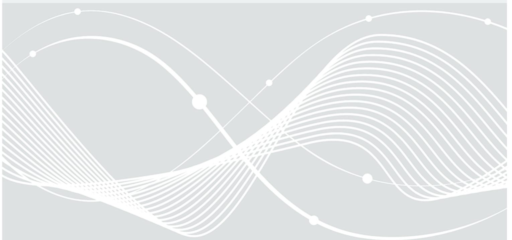
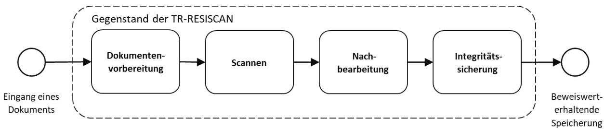
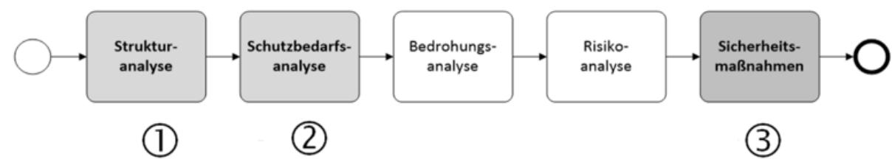
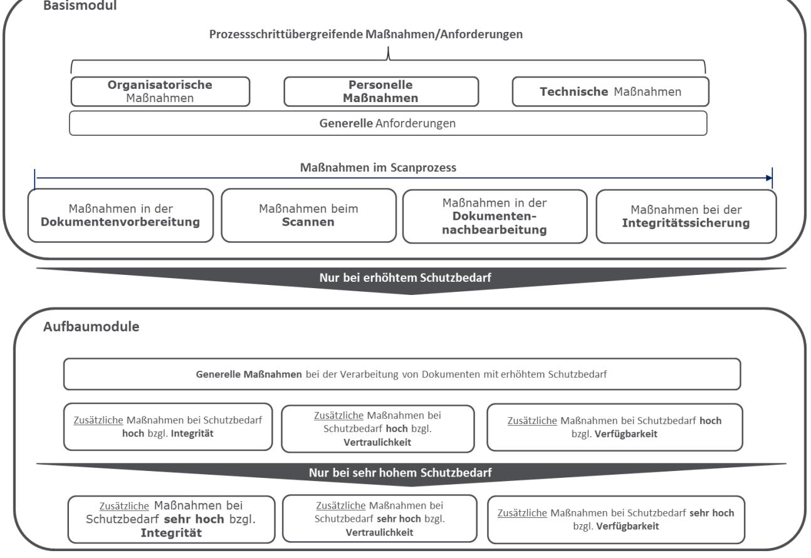

# BSI Technische Richtlinie 03138 Ersetzendes Scannen

| Bezeichnung: | Ersetzendes Scannen (RESISCAN) |
|--------------|--------------------------------|
| Kürzel:      | BSI TR-03138 RESISCAN          |
| Version:     | 1.5                            |
| Datum:       | 21.11.2024                     |

Bundesamt für Sicherheit in der Informationstechnik Postfach 20 03 63 53133 Bonn Tel.: +49 228 99 9582-0 E-Mail[: resiscan@bsi.bund.de](mailto:resiscan@bsi.bund.de) Internet[: https://www.bsi.bund.de](https://www.bsi.bund.de/) © Bundesamt für Sicherheit in der Informationstechnik 2024

| Inhaltsverzeichnis 3    |                                                                                                               |    |  |
|----------------------------|---------------------------------------------------------------------------------------------------------------|----|--|
| Abbildungsverzeichnis 4 |                                                                                                               |    |  |
| Tabellenverzeichnis 5   |                                                                                                               |    |  |
| 1                          | Vorbemerkung                                                                                                  | 6  |  |
| 1.1                        | Zielsetzung und Titel6                                                                                        |    |  |
| 1.2                        | Kennzeichnung7                                                                                                |    |  |
| 1.3                        | Fachlich zuständige Stelle 7                                                                            |    |  |
| 1.4                        | Versionsverwaltung7                                                                                           |    |  |
| 1.5                        | Veröffentlichung8                                                                                             |    |  |
| 1.6                        | Konventionen8                                                                                                 |    |  |
| 1.7                        | Anwendungsbereich8                                                                                            |    |  |
| 2                          | Allgemeines und Übersicht10                                                                                   |    |  |
| 2.1                        | Regelungsgegenstand und wichtige Hinweise                                                                  | 10 |  |
| 2.2                        | Kurzeinführung eIDAS-Verordnung                                                                               | 12 |  |
| 3                          | Vorgehensweise zur Anwendung der Richtlinie14                                                                 |    |  |
| 3.1                        | Strukturanalyse                                                                                               | 14 |  |
| 3.2                        | Schutzbedarfsanalyse                                                                                          | 14 |  |
| 3.3                        | Sicherheitsmaßnahmen und Verfahrensdokumentation                                                           | 15 |  |
| 4                          | Anforderungen für das ersetzende Scannen16                                                                    |    |  |
| 4.1                        | Modulkonzept                                                                                                  | 16 |  |
| 4.2                        | Basismodul                                                                                                    | 16 |  |
| 4.2.1                      | Generelle Anforderungen17                                                                                     |    |  |
| 4.2.2                      | Organisatorische Maßnahmen18                                                                                  |    |  |
| 4.2.3                      | Personelle Maßnahmen20                                                                                        |    |  |
| 4.2.4                      | Technische Maßnahmen22                                                                                        |    |  |
| 4.2.5                      | Sicherheitsmaßnahmen bei der Dokumentenvorbereitung23                                                         |    |  |
| 4.2.6                      | Sicherheitsmaßnahmen beim Scannen25                                                                           |    |  |
| 4.2.7 4.2.8             | Sicherheitsmaßnahmen bei der Nachbearbeitung 29 Sicherheitsmaßnahmen bei der Integritätssicherung 30 |    |  |
| 4.3                        | Aufbaumodule                                                                                               | 31 |  |
| 4.3.1                      | Generelle Maßnahmen bei erhöhtem Schutzbedarf31                                                               |    |  |
| 4.3.2                      | Zusätzliche Maßnahmen bei hohen Integritätsanforderungen 32                                                |    |  |
| 4.3.3                      | Zusätzliche Maßnahmen bei sehr hohen Integritätsanforderungen                                                 | 34 |  |
| 4.3.4                      | Zusätzliche Maßnahmen bei hohen Vertraulichkeitsanforderungen35                                               |    |  |
| 4.3.5                      | Zusätzliche Maßnahmen bei sehr hohen Vertraulichkeitsanforderungen36                                          |    |  |
| 4.3.6                      | Zusätzliche Maßnahmen bei hohen Verfügbarkeitsanforderungen 38                                             |    |  |
| 4.3.7                      | Zusätzliche Maßnahmen bei sehr hohen Verfügbarkeitsanforderungen                                              | 38 |  |
| 5                          | Besonderheiten beim mobilen ersetzenden Scannen39                                                             |    |  |
| 5.1                        | Einführung                                                                                                    | 39 |  |
| 5.2                        | Basismodul                                                                                                    | 39 |  |
| 5.2.1                      | Organisatorische Maßnahmen39                                                                                  |    |  |
| 5.2.2                      | Personelle Maßnahmen41                                                                                        |    |  |

| 5.2.3 | Technische Maßnahmen42                                                                |    |
|-------|---------------------------------------------------------------------------------------|----|
| 5.2.4 | Sicherheitsmaßnahmen zur Dokumentenvorbereitung43                                     |    |
| 5.2.5 | Sicherheitsmaßnahmen beim Scannen43                                                   |    |
| 5.2.6 | Sicherheitsmaßnahmen bei der Nachbearbeitung und Integritätssicherung (M.A.NB/IS.1)44 |    |
| 5.3   | Aufbaumodule                                                                       | 45 |
| 5.3.1 | Generelle Maßnahmen bei Schutzbedarf "hoch"45                                         |    |
| 5.3.2 | Zusätzliche Maßnahmen bei hohen Integritätsanforderungen 45                        |    |
| 5.3.3 | Zusätzliche Maßnahmen bei hohen Vertraulichkeitsanforderungen46                       |    |
| 5.3.4 | Zusätzliche Maßnahmen bei hohen Verfügbarkeitsanforderungen                           | 47 |
| 6     | Zertifizierung nach BSI TR-03138 48                                                |    |
| 6.1   | Grundlagen und Zertifizierungsgegenstand                                           | 48 |
| 6.2   | Antragsverfahren                                                                      | 48 |
| 6.3   | Zertifizierte Produkte                                                                | 48 |
|       | Abkürzungsverzeichnis49                                                               |    |
|       | Glossar50                                                                             |    |
|       | Literaturverzeichnis53                                                                |    |

| Abbildung 1: Der "generische Scanprozess"10                                |  |
|----------------------------------------------------------------------------|--|
| Abbildung 2: Vorgehensweise zur Anwendung der Technischen Richtlinie 14 |  |
| Abbildung 3: Das Modulkonzept der Technischen Richtlinie 16             |  |

# Tabellenverzeichnis

| Tabelle 2: Generelle Anforderungen17                                               |  |
|------------------------------------------------------------------------------------|--|
| Tabelle 3: Organisatorische Maßnahmen im Überblick 18                           |  |
| Tabelle 4: Personelle Maßnahmen im Überblick 21                                 |  |
| Tabelle 5: Technische Maßnahmen im Überblick 22                                 |  |
| Tabelle 6: Sicherheitsmaßnahmen bei der Dokumentenvorbereitung23                   |  |
| Tabelle 7: Sicherheitsmaßnahmen beim Scannen25                                  |  |
| Tabelle 8: Sicherheitsmaßnahmen bei der Dokumentennachbearbeitung 29            |  |
| Tabelle 9: Sicherheitsmaßnahmen bei der Integritätssicherung30                     |  |
| Tabelle 10: Generelle Maßnahmen bei erhöhtem Schutzbedarf31                        |  |
| Tabelle 11: Zusätzliche Maßnahmen bei hohen Integritätsanforderungen32             |  |
| Tabelle 12: Zusätzliche Maßnahmen bei sehr hohen Integritätsanforderungen34        |  |
| Tabelle 13: Zusätzliche Maßnahmen bei hohen Vertraulichkeitsanforderungen35        |  |
| Tabelle 14: Zusätzliche Maßnahmen bei sehr hohen Vertraulichkeitsanforderungen36   |  |
| Tabelle 15: Zusätzliche Maßnahmen bei hohen Verfügbarkeitsanforderungen 38      |  |
| Tabelle 16: Zusätzliche Maßnahmen bei sehr hohen Verfügbarkeitsanforderungen 38 |  |

# 1 Vorbemerkung

Dieses Kapitel enthält Angaben zur Bezeichnung dieser Technischen Richtlinie (TR), zur fachlich zuständigen Stelle, zur Versionsverwaltung, zum Änderungsdienst und der Fortschreibung der TR.

# 1.1 Zielsetzung und Titel

Diese Technische Richtlinie zielt auf eine Steigerung der **Rechtssicherheit im Bereich des ersetzenden Scannens** ab und trägt den Titel "**Ersetzendes Scannen (RESISCAN)**".

Hierbei wird unter dem "ersetzenden Scannen" der Vorgang des elektronischen Erfassens von Papierdokumenten mit dem Ziel der elektronischen Weiterverarbeitung und Aufbewahrung des hierbei entstehenden elektronischen Abbildes (Scanprodukt) und der späteren Vernichtung des papiergebundenen Originals verstanden. Insofern ist das Scannen und Vernichten von Papierkopien bzw. das Ersetzen konventioneller Kopien durch Scanprodukte kein ersetzendes Scannen im Sinne dieser Richtlinie.

Die TR-RESISCAN soll Anwenderinnen und Anwendern in Justiz, Verwaltung, Wirtschaft und u.a. Gesundheitswesen1 als Handlungsleitfaden und Entscheidungshilfe dienen, wenn es darum geht, Papierdokumente nicht nur einzuscannen, sondern nach Erstellung des Scanproduktes auch zu vernichten. Dies betrifft insbesondere solche Anwendungen, in denen gesetzliche oder anders begründete Aufbewahrungs- und Dokumentationspflichten bestehen, die eine besondere Handhabung digitalisierter Dokumente nach sich ziehen, wenn das Original vernichtet werden soll. Die TR hat ohne besondere rechtliche Bestimmungen lediglich empfehlenden Charakter.

Während in manchen Anwendungsbereichen, wie etwa dem kaufmännischen oder steuerlich relevanten Umfeld nach Abgabenordnung (AO) und Handelsgesetzbuch (HGB) seit 1995 Grundsätze zur ordnungsgemäßen Ausführung der elektronischen Aufbewahrung existieren, nach denen bereits ersetzend gescannt wird, fehlen konkrete Umsetzungsvorgaben für die meisten anderen, aber zunehmend betroffenen Bereiche (Ausnahme: Sozialversicherungsrecht). Darüber hinaus gibt es auch in den bereits von unterschiedlich detaillierten Regelungen betroffenen Bereichen zunehmend davon nicht erfasste Dokumente (zum Beispiel solche, die nicht nur nach AO/HGB, sondern auch zur zivilrechtlichen Beweissicherung aufbewahrt werden sollen), die vor allem aus Gründen der Wirtschaftlichkeit zukünftig ebenfalls ersetzend gescannt werden sollen. Um dies auf einer möglichst sicheren technischorganisatorischen Grundlage tun zu können, wurden die Empfehlungen in dieser TR erarbeitet. Ziel ist es, die mit einer Vernichtung des Originaldokuments stets einhergehende Verringerung des Beweiswerts für die jeweilige Anwenderin oder Anwender durch einen an das Original möglichst weit angenäherten Beweiswert des - in einem nachweisbar ordnungsgemäßen Prozess erstellten - Scanproduktes selbst auszugleichen, zu minimieren oder sichtbar zu machen. Schließlich kann die TR im Rahmen künftiger Regelungsvorhaben als Referenz dienen, wenn es z. B. konkret um die Schaffung weiterer Zulässigkeitstatbestände für das ersetzende Scannen insbesondere im Bereich der elektronischen Aktenführung geht.

Die TR beruht auf den langjährigen Erfahrungen der Praxis in den verschiedenen Anwendungsbereichen in Verwaltung und Wirtschaft. Sie berücksichtigt so umfassend wie möglich die hier etablierten Prozesse. Der Mehrwert für alle Scanprozesse, in denen das Scanprodukt das Original tatsächlich ersetzen soll, liegt insbesondere in der systematischen Darstellung der im Ablauf eines Scanprozesses bedeutsamen Bedrohungen für die wesentlichen Grundziele der Informationssicherheit. Diese werden in einer Strukturanalyse u.a. dezidiert für alle betroffenen Datenobjekte und Kommunikationsbeziehungen dargestellt. Auf Grundlage einer darauf aufbauenden sorgfältigen Schutzbedarfsanalyse und anhand der entlang der verschiedenen Scanphasen durchgeführten Risikoanalyse werden konkrete

1 So fordert beispielsweise der "Leitfaden - Elektronische Kommunikation und Digitalisierung in der Sozialversicherung", der u.a. für die Gesetzlichen Krankenversicherungsträger gilt, die Anwendung der TR-RESISCAN. Darüber hinaus unterliegen öffentliche Kliniken und Institutionen des Gesundheitswesens den E-Government-Gesetzen der Länder und den sich hieraus ergebenden Verpflichtungen zur Nutzung der TR-RESISCAN.

Sicherheitsmaßnahmen beschrieben. Dadurch werden die Anwenderinnen und Anwender in die Lage versetzt, die für ihre oder seine Fachanwendung notwendigen Maßnahmen zu identifizieren und "seinen" Scanprozess angemessen sicher zu gestalten. Auch bereits etablierte Scanprozesse können von der TR profitieren, in dem diese mit den Anforderungen der TR abgeglichen, gegebenenfalls die bereits bestehende Ordnungsmäßigkeit des Scanprozesses weiter optimiert und letztendlich die Konformität dazu erklärt werden kann. Aufgrund der enormen Unterschiede der fachspezifischen Anforderungen jedes Anwendungsbereichs, sieht die TR einen modularen Anforderungskatalog vor, der unterschiedliche praxisrelevante Sicherheitsstufen umfasst. In der Basisstufe geht es vor allem um einen grundsätzlich ordnungsgemäßen und mit generellen Sicherheitsmaßnahmen ausgestalteten Scanprozess. In den Ausbaustufen wird besonderen Anforderungen an Integrität, Verfügbarkeit und Vertraulichkeit mit entsprechend angepassten und erhöhten Sicherheitsmaßnahmen Rechnung getragen.

Gegenstand der TR (und damit potentieller Zertifizierungsgegenstand) ist der Prozess des (ersetzenden) Scannens als solcher in technischer und organisatorischer Hinsicht, nicht aber bestimmte Soft- oder Hardwarekomponenten zur tatsächlichen Durchführung des Scannens. Im Rahmen der nach der TR möglichen Nachweisführung der Konformität durch eine Zertifizierung des Scanprozesses werden daher Soft- und Hardware nicht explizit betrachtet. Ebenso ist die sich an einen Scanprozess im Rahmen eines Vorgangsbearbeitungssystems und/oder Dokumentenmanagementsystems anschließende Langzeitspeicherung oder Archivierung nicht Gegenstand der TR. Diesbezüglich wird lediglich die notwendige Interoperabilität und Kompatibilität zu gängigen Archivformaten berücksichtigt.

Die hier formulierten Empfehlungen beinhalten nicht nur funktionale und auf die Sicherheitseigenschaften bezogene Maßnahmen, sondern auch gleichrangig organisatorische Empfehlungen, die gerade beim Scannen von besonderer Relevanz sind. Denn ein Scanprozess kann in keinem Fall vollständig automatisiert erfolgen, sondern bedarf immer auch der sorgfältigen Bedienung durch Menschen, die damit eine potentielle und nicht zu unterschätzende Fehlerquelle des Scanprozesses darstellen.

### 1.2 Kennzeichnung

Diese TR wird gekennzeichnet mit "BSI TR-03138".

# 1.3 Fachlich zuständige Stelle

Fachlich zuständig für die Formulierung und Betreuung dieser TR ist das Bundesamt für Sicherheit in der Informationstechnik (BSI).

Anschrift:

Bundesamt für Sicherheit in der Informationstechnik (BSI)

Postfach 20 03 63

53133 Bonn

Tel.: +49 228 99 9582-0

E-Mail[: resiscan@bsi.bund.de](mailto:resiscan@bsi.bund.de)

Internet[: https://www.bsi.bund.de/resiscan](https://www.bsi.bund.de/resiscan)

# 1.4 Versionsverwaltung

Diese TR besteht aus diesem normativen Hauptdokument und der dazugehörigen normativen Prüfspezifikation für die Konformitätsprüfung (Anlage P).

Darüber hinaus existieren verschiedene informative Anwendungshinweise, die das Ergebnis der im Zuge der Erstellung durchgeführten Risikoanalyse dokumentieren (Anwendungshinweis A), rechtliche Erläuterungen zur leichteren Anwendung der TR beinhalten (Anwendungshinweis R), eine exemplarische Verfahrensanweisung (Anwendungshinweis V) sowie ein Anwendungshinweis zu häufig gestellten Fragen (Anwendungshinweis F).

Die verschiedenen Bestandteile der TR unterliegen einem fortwährenden Aktualisierungsprozess, in dem neue und/oder geänderte Anforderungen berücksichtigt werden. Die Fortschreibung verläuft in einem geordneten Verfahren, in dem abgestimmte Versionen der TR in einem formalen Akt freigegeben werden.

Formal freigegebene Versionen werden auf der Webseite des BSI in der aktuellsten Fassung veröffentlicht.

# 1.5 Veröffentlichung

Die gültigen Versionen werden auf der Webseite des BSI unte[r www.bsi.bund.de/resiscan](http://www.bsi.bund.de/resiscan) zum Download angeboten.

### 1.6 Konventionen

Die in dieser Technischen Richtlinie spezifizierten Anforderungen an Prozesse und Systeme zum ordnungsgemäßen ersetzenden Scannen werden eindeutig gekennzeichnet.

In den Anforderungen werden die in Versalien geschriebenen Modalverben "SOLLTE" und "MUSS" in ihren jeweiligen Formen sowie den zugehörigen Verneinungen genutzt, um deutlich zu machen, wie die jeweiligen Anforderungen zu interpretieren sind. Die hier genutzten Definitionen basiert auf dem BSI IT-Grundschutz [BSI-GSK**]** und [RFC2119] und verstehen sich, wie folgt:

| MUSS/DARF NUR:                  | Dieser Ausdruck bedeutet, dass es sich um eine Anforderung handelt, die unbedingt erfüllt werden muss (uneingeschränkte Anforderung).                                                                          |
|---------------------------------|-------------------------------------------------------------------------------------------------------------------------------------------------------------------------------------------------------------------|
| DARF NICHT/DARF KEIN:           | Dieser Ausdruck bedeutet, dass etwas in keinem Fall getan werden darf (uneingeschränktes Verbot).                                                                                                              |
| SOLLTE:                         | Dieser Ausdruck bedeutet, dass eine Anforderung normalerweise erfüllt werden muss, es aber Gründe geben kann, dies doch nicht zu tun. Dies muss aber sorgfältig abgewogen und stichhaltig begründet werden. |
| SOLLTE NICHT/SOLLTE KEIN: | Dieser Ausdruck bedeutet, dass etwas normalerweise nicht getan werden soll, es aber Gründe gibt, dies doch zu tun. Dies muss aber sorgfältig abgewogen und stichhaltig begründet werden.                    |
| KANN:                           | Dieser Ausdruck bedeutet, dass eine bestimmte Umsetzung gewählt werden kann. Diese muss allerdings angezeigt werden.                                                                                           |

### 1.7 Anwendungsbereich

Die vorliegende Technische Richtlinie bietet Anwenderinnen und Anwendern aus den verschiedensten Branchen wie z. B. Justiz, Verwaltung, Wirtschaft und u.a. Gesundheitswesen einen Handlungsleitfaden zur möglichst rechtssicheren Gestaltung der Prozesse und Systeme für das ersetzende Scannen.

Durch eine definierte Konformitätsprüfung können Anwenderinnen und Anwender oder Anbietende von Scandienstleistungen einen dokumentierten Nachweis darüber erbringen, dass ihre Prozesse und Systeme für das ersetzende Scannen die hier aufgestellten technischen und organisatorischen Anforderungen nach dem jeweils gewählten Modul erfüllen.

Die Technische Richtlinien ist sowohl für das stationäre als auch das mobile ersetzende Scannen anwendbar. Die Besonderheiten zum mobilen ersetzenden Scannen werden in Kapitel 5 beschrieben. Alle dort nicht genannten Punkte gelten für stationäres und mobiles ersetzendes Scannen gleichermaßen.

Eine nachgewiesene Konformitätsbestätigung und ein darüber erteiltes Zertifikat des BSI kann für Vergabeverfahren von einer Bedarfsträgerin oder einem Bedarfsträger als Leistungskriterium herangezogen werden. Die generellen Maßgaben für die Zertifizierung enthält Kapitel 6 der Technischen Richtlinie.

Neben einer Zertifizierung kommen je nach Anwendungsfall auch Eigenerklärungen2 von Scandienstleistern oder auch Anwenderinnen und Anwender in Betracht. Die TR dient somit insgesamt als praxisorientierter Handlungsleitfaden für die Ordnungsmäßigkeit eines Scanprozesses ohne eine damit verbundene Verpflichtung zur Zertifizierung.

Schließlich kann die TR z. B. für die Erfüllung des Stands der Technik im Rahmen von Gesetzgebungsverfahren3 referenziert werden sowie auf der untergesetzlichen Ebene der weiteren Konkretisierung technisch-organisatorischer Anforderungen dienen.

2 Im Rahmen einer Eigenerklärung, die sich auf eine vollständig ausgefüllte Prüfspezifikation gemäß [TR-03138-P] stützen SOLLTE, erklärt ein Scandienstleistender oder eine Anwenderin oder ein Anwender, dass sie/er die Anforderungen der vorliegenden TR erfüllt. Während für derartige Eigenerklärungen keine formale Prüfung vorgesehen ist, KÖNNEN diese ein nachfolgend durchzuführendes Zertifizierungsverfahren erleichtern.

3 siehe Erläuterungen zu § 7 EGovG in [EGovG-MK].

# 2 Allgemeines und Übersicht

In diesem Kapitel werden der Aufbau und die Inhalte der Technischen Richtlinie sowie die grundsätzlichen Ziele und Herausforderungen für das rechtssichere ersetzende Scannen erläutert.

# 2.1 Regelungsgegenstand und wichtige Hinweise

Wie in Abbildung 1 dargestellt, umfasst der "generische Scanprozess", der bei der Entwicklung4 der vorliegenden TR zu Grunde gelegt wurde,

- die Dokumentenvorbereitung,
- das Scannen,
- die Nachbearbeitung und schließlich
- die Integritätssicherung.

*Abbildung 1: Der "generische Scanprozess"*

Die TR-RESISCAN bestimmt Anforderungen an das stationäre und mobile ersetzende Scannen. Da es sich beim mobilen ersetzenden Scannen nur um eine Spezialform des ersetzenden Scannens handelt, werden dort nur die spezifischen Anforderungen dieser Form beschrieben, ansonsten gelten die Vorgaben des stationären Scannens gleichermaßen. Unter dem stationären ersetzenden Scannen wird die ersetzende Digitalisierung von Papieroriginalen mittels nicht-mobiler Scantechnik an einem oder mehreren verteilten Orten verstanden, auch wenn die Scantechnik mittels Fahrzeugen bewegt werden kann. Unter mobilem ersetzendem Scannen wird die ersetzende Digitalisierung von Papieroriginalen unter Nutzung mobiler Endgeräte (beispielsweise Mobiltelefon oder Tablet) unter Nutzung einer ScanApp und Übertragung von Scanprodukt, Metadaten, Transfervermerk etc. an eine zentrale Infrastruktur verstanden. Mobiles Scannen umfasst nicht stationäre Scanstellen an verschiedenen Orten oder solche, die mittels Fahrzeuge an verschiedene Orte verbracht werden können,

Prozessschritte jenseits der Integritätssicherung (z. B. Sachbearbeitung, Zwischenspeicherung, langfristige Aufbewahrung und Archivierung) sind nicht Gegenstand dieser TR. Auch die spezifischen Anforderungen der beweiswerterhaltenden Aufbewahrung von kryptographisch signierten Daten sind nicht Gegenstand der vorliegenden TR, sondern in [TR-03125] adressiert. Geschäftsanwendungen, die die ersetzend gescannten Dokumente weiterverarbeiten wie z. B. E-Akte Verfahren, Dokumentenmanagementsysteme, Enterprise Ressource Planning (ERP) etc. sind nicht Gegenstand dieser TR.

Diese TR regelt insbesondere nicht die Zulässigkeit des ersetzenden Scannens als solches. Die Zulässigkeit des ersetzenden Scannens ist von allen Anwendenden in ihren Bereichen auf der Grundlage der für diese einschlägigen Rechtsvorschriften zu prüfen. Rechtliche Betrachtungen hierzu finden sich beispielsweise in

4 Weitere Informationen zur Vorgehensweise bei der Erstellung der TR finden sich in [SGHJ12].

[RFJW08], [JaWi09], [RoNe14b] und [TR-03138-R]. Die Ergebnisse der im Jahr 2014 durchgeführten Simulationsstudie "Ersetzendes Scannen" finden sich in [RoNe14a].

# 2.2 Kurzeinführung eIDAS-Verordnung

Seit Juli 2016 ist die "Verordnung (EU) Nr. 910/2014 des Europäischen Parlaments und des Rates über elektronische Identifizierung und Vertrauensdienste für elektronische Transaktionen im Binnenmarkt und zur Aufhebung der Richtlinie 1999/93/EG" vom 23.07.2014 [eIDAS-VO] vollständig anwendbar. Als EU-Verordnung ist die [eIDAS-VO] unmittelbar geltendes Recht in allen EU-Mitgliedsstaaten sowie im Europäischen Wirtschaftsraum (EWR). Die Verordnung sowie die hierauf basierenden Durchführungsrechtsakte dienen der Harmonisierung des Binnenmarkts u.a. für elektronische Signaturen, Siegel und Zeitstempel in EU und EWR.

In Deutschland wurde im Zuge der [eIDAS-VO] im Jahre 2017 durch Artikel 12 des eIDAS-Durchführungsgesetzes ("Gesetz zur Durchführung der Verordnung (EU) Nr. 910/2014 des Europäischen Parlaments und des Rates vom 23. Juli 2014 über elektronische Identifizierung und Vertrauensdienste für elektronische Transaktionen im Binnenmarkt und zur Aufhebung der Richtlinie 1999/93/EG") [eIDAS-DG] das Signaturgesetz [SigG] sowie die Signaturverordnung [SigV] aufgehoben.

Das eIDAS-Durchführungsgesetz ist ein Artikelgesetz, dessen Kernstück als Artikel 1 das Vertrauensdienstegesetz [VDG] darstellt. Das Vertrauensdienstegesetz wird seit 2019 durch die Vertrauensdiensteverordnung [VDV] ergänzt.

Die eIDAS-Verordnung [eIDAS-VO] spezifiziert neben (einfachen) elektronischen Signaturen [eIDAS-VO, Artikel 3 Nr. 10], fortgeschrittene Signaturen [eIDAS-VO, Artikel 3 Nr. 11] und qualifizierte Signaturen [eIDAS-VO, Artikel 3 Nr. 12] sowie darüber hinaus elektronische Zeitstempel [eIDAS-VO, Artikel 3 Nr. 33] und qualifizierte elektronische Zeitstempel [eIDAS-VO, Artikel 3 Nr. 34].

Als Pendant zu elektronischen Signaturen für natürliche Personen führt die eIDAS-Verordnung zusätzlich elektronische Siegel ein, die auch von Organisationen (juristischen Personen) verwendet werden können, und definiert dabei neben elektronischen Siegeln [eIDAS-VO, Artikel 3 Nr. 25] auch fortgeschrittene elektronische Siegel [eIDAS-VO, Artikel 3 Nr. 26] und qualifizierte elektronische Siegel [eIDAS-VO, Artikel 3 Nr. 27]. Weiterhin ermöglicht [eIDAS-VO] durch die im Erwägungsgrund (52) genannte "Fernsignatur" die mobile Erstellung (qualifizierter) elektronischer Signaturen und entsprechender Siegel.

Qualifizierte elektronische Zeitstempel genügen den Anforderungen gemäß [eIDAS-VO, Artikel 42] und werden mit einer fortgeschrittenen elektronischen Signatur oder einem fortgeschrittenen elektronischen Siegel eines qualifizierten Vertrauensdiensteanbieters oder einem gleichwertigen Verfahren verwendet.

Darüber hinaus werden in der [eIDAS-VO] weitere Vertrauensdienste wie z.B. Validierungsdienste [eIDAS-VO, Artikel 33] und Bewahrungsdienste [eIDAS-VO, Artikel 34, 40] eingeführt.

Mit der Novellierung der eIDAS-Verordnung, welche am 20.05.2024 in Kraft getreten ist, werden nicht nur eine europäische digitale Identität (EUDI), sondern auch weitere Vertrauensdienste zur elektronischen Archivierung, zur Verwaltung von elektronischen Fernsignatur- und Siegelerstellungseinheiten sowie zur qualifizierten Attestierung elektronischer Attribute eingeführt.

Als nationale Aufsichtsstelle für die Vertrauensdienste zur "Erstellung, Überprüfung und Validierung elektronischer Signaturen, elektronischer Siegel oder elektronischer Zeitstempel und Dienste für die Zustellung elektronischer Einschreiben sowie von diese Dienste betreffenden Zertifikaten" sowie die "Bewahrung von diesen Diensten betreffenden elektronischen Signaturen, Siegeln oder Zertifikaten" fungiert gemäß § 2 Abs. 1 [VDG] die Bundesnetzagentur für Elektrizität, Gas, Telekommunikation, Post und Eisenbahnen (Bundesnetzagentur).

"Von der Aufsicht für die Vertrauensdienste durch die Bundesnetzagentur unberührt bleiben die Aufgaben des Bundesamtes für Sicherheit in der Informationstechnik gem. [BSIG] und weiteren Fachgesetzen. So obliegt dem BSI gemäß § 2 Abs. 2 [VDG] insbesondere die

- Erstellung technischer Standards in nationalen, europäischen und internationalen Gremien in Abstimmung mit der Bundesnetzagentur,
- die Bewertung von Algorithmen und zugehörigen Parametern sowie

 die Erstellung technischer Vorgaben und die Bewertung technischer Standards für den Einsatz von Vertrauensdiensten in Digitalisierungsvorhaben nach Maßgabe der entsprechenden Fachgesetze".

Das BSI fungiert zudem gemäß § 2 Abs. 3 [VDG] als die für Informationssicherheit zuständige nationale Stelle gemäß [eIDAS-VO] Artikel 19 Abs. 2.

Im Kontext der TR-RESISCAN sind insbesondere die (qualifizierten) Vertrauensdienste für (qualifizierte) elektronische Signaturen, Siegel und Zeitstempel sowie die Bewahrung wesentlich.

Details hinsichtlich der [eIDAS-VO], deren Begrifflichkeiten sowie zur digitalen Signaturen finden sich unter folgenden Links:

<https://www.bsi.bund.de/dok/7831030>

<https://www.bsi.bund.de/dok/6604310>

sowie dem folgenden Handbuch des BSI:

[https://www.bsi.bund.de/SharedDocs/Downloads/DE/BSI/ElekSignatur/esig\\_pdf.pdf?\\_\\_blob=publicationFi](https://www.bsi.bund.de/SharedDocs/Downloads/DE/BSI/ElekSignatur/esig_pdf.pdf?__blob=publicationFile) [le](https://www.bsi.bund.de/SharedDocs/Downloads/DE/BSI/ElekSignatur/esig_pdf.pdf?__blob=publicationFile)

Für öffentliche Stellen wäre zudem die Leitlinie für digitale Signatur-/ Siegel-, Zeitstempelformate sowie technische Beweisdaten (Evidence Record) [LeitleSig] des BSI von Bedeutung:

[https://www.bsi.bund.de/SharedDocs/Downloads/DE/BSI/Publikationen/TechnischeRichtlinien/TR03125](https://www.bsi.bund.de/SharedDocs/Downloads/DE/BSI/Publikationen/TechnischeRichtlinien/TR03125/BSI_TR_03125_Leitlinie_fuer_digitale_Signatur-Siegel-Zeitstempelformate.pdf?__blob=publicationFile&v=1) [/BSI\\_TR\\_03125\\_Leitlinie\\_fuer\\_digitale\\_Signatur-Siegel-Zeitstempelformate.pdf?\\_\\_blob=publicationFile&v=1](https://www.bsi.bund.de/SharedDocs/Downloads/DE/BSI/Publikationen/TechnischeRichtlinien/TR03125/BSI_TR_03125_Leitlinie_fuer_digitale_Signatur-Siegel-Zeitstempelformate.pdf?__blob=publicationFile&v=1)

# 3 Vorgehensweise zur Anwendung der Richtlinie

Dieser Abschnitt beschreibt die Vorgehensweise bei der Anwendung der Richtlinie:

*Abbildung 2: Vorgehensweise zur Anwendung der Technischen Richtlinie*

Wie in Abbildung 2 dargestellt, umfasst die Anwendung der Richtlinie drei Schritte:

- Strukturanalyse
- Schutzbedarfsanalyse
- Sicherheitsmaßnahmen

Da bei der Erstellung der TR (siehe [SGHJ12]) eine Bedrohungs- und Risikoanalyse5 durchgeführt wurde, können Anwenderinnen und Anwender der Richtlinie auf diese Schritte verzichten. Vielmehr ist es ausreichend, die dem ermittelten Schutzbedarf entsprechenden Sicherheitsmaßnahmen aus dem modularen Maßnahmenkatalog umzusetzen. Das bedeutet, das folgende Ergebnisdokumente notwendig sind:

- Technisches Scankonzept:
	- o Strukturanalyse
	- o Schutzbedarfsanalyse
- Verfahrensdokumentation:
	- o Detaillierte Beschreibung der Sicherheitsmaßnahmen anhand des Scanprozesses
	- o Verfahrensanweisung als Arbeitsanweisung für die am ersetzenden Scannen beteiligten Personen

# 3.1 Strukturanalyse

Im ersten Schritt MUSS eine Anwenderin oder ein Anwender der TR eine Strukturanalyse für ihr/sein Scansystem durchführen und hierbei die für ihren/seinen Scanprozess relevanten IT-Systeme, Netze, Anwendungen und Datenobjekte identifizieren und einen Netzplan6 erstellen. Aus Gründen der Übersichtlichkeit wird ein bereinigter Netzplan empfohlen.

# 3.2 Schutzbedarfsanalyse

Im nächsten Schritt MUSS die Anwenderin oder der Anwender der TR für seine konkret verarbeiteten Dokumente eine Schutzbedarfsanalyse (vgl. A.G.2 und [BSI-200-2], Abschnitte 7.5 (Erstellung einer Sicherheitskonzeption nach der Vorgehensweise Kern-Absicherung – Schutzbedarfsfeststellung) und 8.2 (Erstellung einer Sicherheitskonzeption nach der Vorgehensweise der Standard-Absicherung -

5 siehe [TR-03138-A].

6 siehe [BSI-200-2], Abschnitt 8.1.4 Netzplanerhebung.

Schutzbedarfsfeststellung)) erstellen. Hierbei können die in [TR-03138-R] dokumentierten Ergebnisse der exemplarischen Schutzbedarfsanalysen zur Orientierung dienen.

Da sich, wie in [TR-03138-A] gezeigt, der Schutzbedarf der weiteren Datenobjekte aus dem Schutzbedarf der Papieroriginale ergibt, ist es ausreichend, den Schutzbedarf derselben hinsichtlich der Schutzziele Integrität, Vertraulichkeit und Verfügbarkeit zu bestimmen. Bei der Bestimmung des Schutzbedarfs empfiehlt sich die Klassifizierung7 und Zusammenfassung gleichartiger Dokumente.

# 3.3 Sicherheitsmaßnahmen und Verfahrensdokumentation

Aus der Schutzbedarfsanalyse ergibt sich die Einstufung der klassifizierten Dokumente in die Schutzbedarfskategorien "normal", "hoch" und "sehr hoch"8 . Daraus ergibt sich, welche Module (Basismodul und Aufbaumodule) benötigt werden und welche Sicherheitsmaßnahmen aus dem modularen Maßnahmenkatalog (Modulkonzept, siehe Abschnitt 4) für das Erreichen eines angemessenen Schutzniveaus notwendig sind. Die getroffenen Sicherheitsmaßnahmen werden in der Verfahrensdokumentation beschrieben.

Die konkrete Ausgestaltung der Maßnahmen orientiert sich unmittelbar an dem in der Institution tatsächlich vorhandenen Scansystem sowie den konkreten organisatorischen, technischen und personellen Gegebenheiten vor Ort. Die Verfahrensdokumentation umfasst:

- Detaillierte Beschreibung der Sicherheitsmaßnahmen anhand des Scanprozesses
- Verfahrensanweisung als Arbeitsanweisung für die am ersetzenden Scannen beteiligten Personen

7 Im Rahmen der Klassifizierung KÖNNEN auch Dokumente vom ersetzenden Scannen ausgenommen werden.

8 siehe [TR-03138-A]

# 4 Anforderungen für das ersetzende Scannen

# 4.1 Modulkonzept

Um beim ersetzenden Scannen ein generelles Maß an Sicherheit gewährleisten zu können, wird hier ein Basismodul (siehe Abschnitt 4.2) vorgesehen, das generelle organisatorische, personelle und technische Maßnahmen sowie spezifische Maßnahmen in den verschiedenen Phasen des "generischen Scanprozesses" (Dokumentenvorbereitung, Scannen, Nachbearbeitung, Integritätssicherung, vgl. Abbildung 1) umfasst.

Um auch erhöhten Schutzbedarfsanforderungen bzgl. Verfügbarkeit, Integrität oder Vertraulichkeit gerecht werden zu können, sind zusätzlich entsprechende "Aufbaumodule" (siehe Abschnitt 4.3) vorgesehen. Neben generellen Maßnahmen, die grundsätzlich umzusetzen sind, falls Dokumente mit erhöhtem Schutzbedarf verarbeitet werden, existieren spezifische Maßnahmen für die Verarbeitung von Dokumenten mit Schutzbedarf "hoch" bzw. "sehr hoch" bzgl. der Integrität, Vertraulichkeit und Verfügbarkeit.

Die in den verschiedenen Modulen beschriebenen Anforderungen wurden aus der im Rahmen der Erstellung der TR durchgeführten und in [TR-03138-A] näher dargestellten Risikoanalyse abgeleitet. Auf diese kann somit bei Bedarf für weiterführende Informationen zurückgegriffen werden.

*Abbildung 3: Das Modulkonzept der Technischen Richtlinie*

# 4.2 Basismodul

Durch die Umsetzung der nachfolgend dargestellten Anforderungen aus dem Basismodul soll ein generelles Maß an Sicherheit beim ersetzenden Scannen erreicht werden. Dies wird durch die Kombination von generellen (A.G.x) und übergreifenden organisatorischen (A.O.x), personellen (A.P.x) und technischen Maßnahmen (A.T.x) mit spezifischen Maßnahmen in den einzelnen Phasen des generischen Scanprozesses erreicht. Wie in Abbildung 1 und Abbildung 3 dargestellt, umfasst dies Maßnahmen in der Dokumentenvorbereitung (A.DV.x), Maßnahmen beim Scannen (A.SC.x), Maßnahmen bei der Nachbearbeitung (A.NB.x) und schließlich Maßnahmen bei der Integritätssicherung (A.IS.x).

#### 4.2.1 Generelle Anforderungen

| ID    |                         | Generelle Anforderungen |  |
|-------|-------------------------|-------------------------|--|
| A.G.1 | Verfahrensdokumentation |                         |  |
|       |                         |                         |  |

A.G.2 Schutzbedarfsanalyse

*Tabelle 1: Generelle Anforderungen*

#### 4.2.1.1 A.G.1 Verfahrensdokumentation

Um einen geordneten Ablauf beim ersetzenden Scannen zu ermöglichen, MUSS eine Verfahrensdokumentation existieren. Diese Verfahrensdokumentation MUSS insbesondere die folgenden Aspekte umfassen:

- a) Die Art der verarbeiteten Dokumente (siehe auch A.G.2, unten) und Regelungen für nicht verarbeitbare Dokumente9 , die Festlegung von Verantwortlichkeiten, Abläufen und Aufgaben im Scanprozess (siehe auch A.O.1),
- b) die Festlegung von Maßnahmen zur Qualifizierung und Sensibilisierung der Mitarbeiterinnen und Mitarbeiter (siehe auch A.P.1),
- c) die Beschreibung der dem Schutzbedarf entsprechenden Anforderungen für die in den Scanprozess involvierten Räume, IT-Systeme, Anwendungen und Sicherungsmittel,
- d) Regelungen für die Administration und Wartung der IT-Systeme und Anwendungen (siehe auch A.O.2) sowie
- e) bei Bedarf die Festlegung von geeigneten Sicherheitsmaßnahmen für IT-Systeme, Netze und Anwendungen
- f) Die Verfahrensdokumentation10 umfasst sowohl eine detaillierte Beschreibung der Umsetzung der Sicherheitsmaßnahmen anhand des tatsächlich implementierten Scanprozesses sowie
- g) eine Verfahrensanweisung, die sich an die in den Scanprozess eingebundenen Personen richtet. Eine beispielhafte Verfahrensanweisung findet sich in [TR-03138-V].

Neben der Verfahrensanweisung wird die Verfahrensdokumentation regelmäßig weitere Unterlagen, wie beispielsweise ein entsprechendes Sicherheitskonzept (vgl. lit. E), umfassen sowie auf ein Scankonzept verweisen, das die Strukturanalyse und Schutzbedarfsanalyse enthält. Die Verfahrensanweisung kann auf mitgeltende Unterlagen wie z. B. Konzepte, Spezifikationen, Handbücher, Arbeitsanweisungen oder Stellenbeschreibungen verweisen.

9 Dies kann beispielsweise wertvolle und/oder mit Siegelschnur versehene Urkunden oder Dokumente in technisch nicht verarbeitbaren Formaten umfassen.

10 Der Umfang, der im Einzelfall erforderlichen Dokumentation, wird dadurch bestimmt, was zum Verständnis des Scanverfahrens sowie der aufzubewahrenden Unterlagen notwendig ist. Die Verfahrensdokumentation MUSS verständlich und damit für einen sachverständigen Dritten in angemessener Zeit nachprüfbar sein.

#### 4.2.1.2 A.G.2 Schutzbedarfsanalyse

Damit ein für die jeweils verarbeiteten Dokumente angemessenes Sicherheitsniveau erreicht werden kann, MUSS für diese eine sorgfältig begründete Schutzbedarfsanalyse11 hinsichtlich der verschiedenen Schutzziele der IT-Sicherheit12 ("Integrität", "Vertraulichkeit" und "Verfügbarkeit") durchgeführt werden, um diesbezüglich die Schutzbedarfsklasse ("normal", "hoch" oder "sehr hoch") zu bestimmen.

#### 4.2.2 Organisatorische Maßnahmen

Im Basismodul sind die in Tabelle 3 aufgeführten organisatorischen Maßnahmen vorgesehen.

#### **ID Organisatorische Maßnahmen**

- A.O.1 Festlegung von Verantwortlichkeiten, Abläufen und Aufgaben im Scanprozess
- A.O.2 Regelungen für Wartungs- und Reparaturarbeiten
- A.O.3 Abnahme- und Freigabe-Verfahren für Hardware und Software
- A.O.4 Aufrechterhaltung der Informationssicherheit
- A.O.5 Anforderungen beim Outsourcing des Scanprozesses

*Tabelle 2: Organisatorische Maßnahmen im Überblick*

#### 4.2.2.1 A.O.1 Festlegung von Verantwortlichkeiten, Abläufen und Aufgaben im Scanprozess

Um die Ordnungsmäßigkeit der Abläufe beim ersetzenden Scannen sicherzustellen, sind die Verantwortlichkeiten, Abläufe und Aufgaben im Scanprozess festzulegen. Dies umfasst insbesondere die Festlegung

- a) welche Schritte durch wen ausgeführt werden müssen und wie dabei im Einzelnen vorzugehen ist,
- b) welche Dokumente gescannt und welche Daten13 hierbei erzeugt werden,
- c) welche Qualitätskontrollen durch wen in welchen Zeitabständen und nach welchen Kriterien durchzuführen sind und
- d) welche Sicherungsdaten oder Sicherungssysteme für den Schutz der Integrität dieser Daten vorgesehen sind.
- e) Qualitätskontrollen MÜSSEN zumindest stichprobenartig (siehe auch [GenScan], welches Beispiele sowie konkrete Hinweise zur Umsetzung enthält) erfolgen und SOLLTEN regelmäßig durch Mitarbeiterinnen und Mitarbeiter durchgeführt werden, die nicht mit der operativen Durchführung des zu kontrollierenden Arbeitsschrittes betraut sind.

 11 Exemplarische Schutzbedarfsanalysen für verschiedene Anwendungsbereiche finden sich in [TR-03138- R].

12 Die Definition der Schutzziele der IT-Sicherheit und der diesen zuordenbaren differenzierten Sicherheitszielen ("Integrität", "Authentizität", "Vollständigkeit", "Verfügbarkeit", "Lesbarkeit", "Verkehrsfähigkeit", "Vertraulichkeit" und "Löschbarkeit") findet sich im informativen Anwendungshinweis [TR-03138-A] (Tabelle 6). Rechtliche Betrachtungen zu den Sicherheitszielen finden sich auch in [TR-03138-R] (Abschnitt R1.1).

13 siehe Tabelle "Liste der Datenobjekte" in [TR-03138-A].

- f) Für die in den Scanprozess involvierten Datenobjekte (Originaldokument, Scanprodukt etc.) sowie für die im Scanprozess genutzten IT-Systeme und Anwendungen SOLLTEN14 Verantwortliche benannt werden.
- g) Bei der Zuweisung des Personals zu den operativen Aufgaben im Scanprozess MÜSSEN potenzielle Interessenkonflikte berücksichtigt und SOLLTEN nach Möglichkeit vermieden werden.
- h) Darüber hinaus MÜSSEN typische Fehlerquellen (z. B. Übergang zwischen verschiedenen Rollen und Verantwortlichkeiten, Umgang mit früher gehefteten Dokumenten etc.) 15 , berücksichtigt werden und es SOLLTEN entsprechende Vorsichtsmaßnahmen festgelegt werden.
- i) Außerdem MUSS unter Berücksichtigung der anwendbaren rechtlichen Vorschriften festgelegt werden, unter welchen Umständen und ab welchem Zeitpunkt das Originaldokument vernichtet werden darf.
- j) Zusätzlich MUSS ein Verfahren zur Klärung von "Zweifelsfragen"16 etabliert werden.

#### 4.2.2.2 A.O.2 – Regelungen für Wartungs- und Reparaturarbeiten

Um den sicheren Betrieb zu gewährleisten, SOLLTEN Regelungen für die Wartung und die Reparatur der für den Scanvorgang eingesetzten IT-Systeme und Anwendungen getroffen werden. Dies umfasst insbesondere

- a) die Festlegung der Verantwortlichkeit für die Beauftragung, Durchführung und gegebenenfalls Kontrolle von Wartungs- und Reparaturarbeiten (siehe auch A.O.1),
- b) Verfahren für die regelmäßige Bereitstellung und Anwendung von sicherheitsrelevanten Updates,
- c) Regelungen zur Authentisierung und zum Nachweis der Autorisierung des Wartungspersonals,
- d) Regelungen zum Schutz personenbezogener oder anderweitig besonders schützenswerter Daten (z. B. Betriebsgeheimnisse) auf den zu wartenden IT-Systemen,
- e) die Dokumentation von sicherheitsrelevanten Veränderungen an den involvierten IT-Systemen und Anwendungen sowie
- f) die Dokumentation der erfolgreichen Durchführung der Maßnahmen zur Qualitätskontrolle und Freigabe (siehe auch A.O.3) vor der Wiederaufnahme des regulären Betriebs.

#### 4.2.2.3 A.O.3 – Abnahme- und Freigabe-Verfahren für Hardware und Software

Um eine unbemerkte Manipulation der zum Scannen verwendeten IT-Systeme und Anwendungen zu verhindern und die Ordnungsmäßigkeit der Systeme zu dokumentieren, MUSS ein geregeltes Verfahren für die Abnahme und Freigabe der eingesetzten Hardware und Software etabliert werden. Dies umfasst sowohl den Scanner als auch die Scan-Workstation sowie bei Bedarf den Scan-Cache. Neben der initialen Inbetriebnahme ist dieses Abnahmeverfahren auch bei der Wiederaufnahme des Betriebs nach Wartungsund Reparaturarbeiten (siehe auch A.O.2) durchzuführen.

 14 Ungeachtet der Tatsache, dass hier lediglich eine Empfehlung ausgesprochen wurde, kann die Benennung von Verantwortlichen durch die anwendbaren Gesetze und Verordnungen zwingend gefordert sein.

15 Beispielsweise ist bei ursprünglich geklammerten Papierdokumenten eine besonders sorgfältige Vollständigkeitsprüfung geboten.

16 Hiervon sind alle Aspekte umfasst, die von den handelnden Personen auf Basis der Verfahrensanweisung nicht zweifelsfrei entschieden werden können.

#### 4.2.2.4 A.O.4 – Aufrechterhaltung der Informationssicherheit

In angemessenen zeitlichen Abständen MUSS eine Überprüfung der Wirksamkeit und Vollständigkeit der für die Informationssicherheit beim ersetzenden Scannen vorgesehenen Maßnahmen durchgeführt werden. In Bundesbehörden SOLLTE die Überprüfung mindestens alle drei Jahre (vgl. [BSI-IS-Rev]) stattfinden. In diesen Audits MUSS geprüft werden,

- a) ob die implementierten Prozesse und Sicherheitsmaßnahmen korrekt implementiert wurden und tatsächlich wirksam sind, und
- b) ob die implementierten Sicherheitsmaßnahmen ausreichend vor den potenziellen Bedrohungen schützen oder ob zusätzliche oder korrigierte Sicherheitsmaßnahmen notwendig sind.

Um Interessenkonflikte zu vermeiden und eine unvoreingenommene Prüfung zu ermöglichen, SOLLTEN die Audits möglichst von unabhängigen Personen, d.h. Personen, die nicht mit dem ersetzenden Scannen oder der Administration der verwendeten Systeme betraut sind und nicht an Weisungen dieser Personen gebunden sind, durchgeführt werden.

Die Ergebnisse dieser Überprüfungen SOLLTEN schriftlich dokumentiert werden. Sofern Sicherheitslücken oder andere Probleme gefunden werden, MÜSSEN aus den Prüfergebnissen notwendige Korrekturmaßnahmen abgeleitet werden. Für die Umsetzung der identifizierten Korrekturmaßnahmen MUSS ein Zeitplan mit Verantwortlichkeiten definiert werden. Die Umsetzung der Maßnahmen MUSS durch die dafür benannten Verantwortlichen verfolgt und überprüft werden.

#### 4.2.2.5 A.O.5 – Anforderungen beim Outsourcing des Scanprozesses

Sofern der Scanprozess komplett oder teilweise von spezialisierten Scandienstleistern durchgeführt wird, MÜSSEN die im vorliegenden Anforderungskatalog vorgesehenen Maßnahmen entsprechend umgesetzt werden. Darüber hinaus gelten folgende Anforderungen17:

- a) Die organisatorischen und technischen Schnittstellen zwischen Auftraggebenden und Auftragnehmenden (Übertragungswege, Datenablageorte, beteiligte Akteure, Rückfallverfahren, Maßnahmen zur Integritäts- und Vollständigkeitskontrolle etc.) MÜSSEN in der Verfahrensdokumentation (siehe A.G.1) explizit dargestellt werden.
- b) Der Auftragnehmende MUSS zur Einhaltung der vom Auftraggebenden definierten Sicherheitsmaßnahmen verpflichtet werden.
- c) Es SOLLTE eine Analyse der durch die Aufgabenteilung zusätzlich entstehenden Risiken erfolgen.
- d) Zusätzlich zur regelmäßigen Auditierung (siehe A.O.4 und A.AM.G.3) SOLLTEN unangemeldete Stichprobenprüfungen durchgeführt werden18 .

#### 4.2.3 Personelle Maßnahmen

Im Basismodul sind die in der folgenden Tabelle aufgeführten personellen Maßnahmen vorgesehen.

17 Darüber hinaus beleuchtet [TR-03138-R] ausgewählte rechtliche Aspekte, die beim Outsourcing des Scanprozesses relevant sein können.

18 Beispiele sowie konkrete Hinweise zur Umsetzung enthält: Generisches Scankonzept gemäß BSI TR-03138 Handlungshilfe für TR-RESISCAN Anwender. Bundesamt für Sicherheit in der Informationstechnik. Bonn 2021, siehe: https://www.bsi.bund.de/dok/tr-03138

#### **ID Personelle Maßnahmen**

- A.P.1 Verpflichtung der Mitarbeiterinnen und Mitarbeiter auf Einhaltung einschlägiger Gesetze, Vorschriften, Regelungen und der Verfahrensanweisung
- A.P.2 Einweisung zur ordnungsgemäßen Bedienung des Scansystems
- A.P.3 Schulung zu Sicherheitsmaßnahmen im Scanprozess
- A.P.4 Schulung des Wartungs- und Administrationspersonals

*Tabelle 3: Personelle Maßnahmen im Überblick*

#### 4.2.3.1 A.P.1 – Verpflichtung der Mitarbeiterinnen und Mitarbeiter auf Einhaltung einschlägiger Gesetze, Vorschriften, Regelungen und der Verfahrensanweisung

Die im Rahmen der Schutzbedarfsanalyse (siehe A.G.2) identifizierten rechtlichen Rahmenbedingungen für den betroffenen Einsatzbereich SOLLTEN den in den Scanprozess involvierten Mitarbeiterinnen und Mitarbeiter zur Kenntnis gebracht werden. Die Mitarbeiterinnen und Mitarbeiter SOLLTEN, sofern dies nicht bereits geschehen ist, auf die Einhaltung der einschlägigen Gesetze, Vorschriften, Regelungen und der Verfahrensanweisung (siehe A.G.1) verpflichtet werden19 .

#### 4.2.3.2 A.P.2 – Einweisung zur ordnungsgemäßen Bedienung des Scansystems

Die Mitarbeiterinnen und Mitarbeiter, die den Scanvorgang durchführen, MÜSSEN in geeigneter Weise hinsichtlich der eingesetzten Geräte, Anwendungen und sonstigen Abläufe eingewiesen werden. Dies umfasst insbesondere:

- a) die grundsätzlichen Abläufe im Scanprozess einschließlich der Dokumentenvorbereitung, dem Scannen, der Indexierung, der zulässigen Nachbearbeitung und der Integritätssicherung,
- b) die geeignete Konfiguration und Nutzung des Scanners und der Scan-Workstation,
- c) Anforderungen hinsichtlich der Qualitätssicherung,
- d) die Abläufe und Anforderungen bei der Erstellung des Transfervermerks (siehe A.NB.4),
- e) die Konfiguration und Nutzung der Systeme zur Integritätssicherung und
- f) das Verhalten im Fehlerfall.

#### 4.2.3.3 A.P.3 – Schulung zu Sicherheitsmaßnahmen im Scanprozess

Die Mitarbeiterinnen und Mitarbeiter, die den Scanvorgang durchführen oder verantworten, MÜSSEN in geeigneter Weise hinsichtlich der dabei umzusetzenden sowie der implementierten Sicherheitsmaßnahmen geschult werden. Dies umfasst bei Bedarf insbesondere

- a) die grundsätzliche Sensibilisierung der Mitarbeiterinnen und Mitarbeiter für Informationssicherheit inklusive. der sicherheitsbewussten Handhabung von Dokumenten, Daten und IT-Systemen sowie der zu ergreifenden Vorsichtsmaßnahmen
- b) personenbezogene Sicherheitsmaßnahmen im Scanprozess,
- c) systembezogene Sicherheitsmaßnahmen im Scansystem,
- d) Verhalten bei Auftreten von Schadsoftware,

19 Dies gilt unbeachtet ohnehin bestehender gesetzlicher Informations- und Hinweispflichten, auf die hier nicht näher eingegangen wird.

- e) Bedeutung der Datensicherung und deren Durchführung,
- f) Umgang mit personenbezogenen und anderen sensiblen Daten und
- g) Einweisung in Notfallmaßnahmen.

#### 4.2.3.4 A.P.4 – Schulung des Wartungs- und Administrationspersonals

Das Wartungs- und Administrationspersonal für die in den Scanprozess involvierten IT-Systeme und Anwendungen benötigt detaillierte Kenntnisse über die eingesetzten IT-Komponenten. Das hierbei eingesetzte eigene Personal SOLLTE deshalb soweit geschult werden, dass

- a) alltägliche Administrationsarbeiten selbst durchgeführt werden können,
- b) einfache Fehler selbst erkannt und behoben werden können,
- c) Datensicherungen regelmäßig selbstständig durchgeführt werden können,
- d) die Eingriffe von externem Wartungspersonal nachvollzogen und
- e) Manipulationsversuche oder unbefugte Zugriffe auf die Systeme erkannt und rasch behoben werden können.

#### 4.2.4 Technische Maßnahmen

| ID    | Technische Maßnahmen                                         |
|-------|--------------------------------------------------------------|
| A.T.1 | Generelle Sicherheitsmaßnahmen für IT-Systeme im Scanprozess |
| A.T.2 | Festlegung der zulässigen Kommunikationsverbindungen         |
| A.T.3 | Schutz vor Schadprogrammen                                   |

A.T.4 Zuverlässige Speicherung

*Tabelle 4: Technische Maßnahmen im Überblick*

#### 4.2.4.1 A.T.1 – Generelle Sicherheitsmaßnahmen für IT-Systeme im Scanprozess

Basierend auf den Ergebnissen der Strukturanalyse MÜSSEN für ALLE in den Scanprozess involvierten IT-Systeme (z. B. Client-, Server- und Netzwerkkomponenten sowie Applikationen) die entsprechend dem in der Schutzbedarfsanalyse festgestellten Schutzbedarf, relevanten Sicherheitsanforderungen (Bausteine) aus dem BSI Grundschutz-Kompendium [BSI-GSK] oder entsprechende äquivalente Maßnahmen auf Basis [ISO27001] [ISO27002] umgesetzt werden20 .

#### 4.2.4.2 A.T.2 – Festlegung der zulässigen Kommunikationsverbindungen

Sofern die für das Scannen eingesetzten IT-Systeme über ein Netzwerk verbunden sind, MÜSSEN in diesem Netzwerk sowie auf den IT-Systemen selbst die zulässigen Kommunikationsverbindungen effektiv vor

20 Die auszuwählenden Bausteine sind abhängig vom tatsächlich implementierten Scansystem, welches in der Strukturanalyse zu beschreiben ist. Beispiele für mögliche Bausteine des BSI Grundschutzes sowie Hinweise zur Umsetzung enthält: Ersetzendes Scannen leichtgemacht – eine Handlungshilfe für Institutionen und Unternehmen. Bundesamt für Sicherheit in der Informationstechnik. Bonn 2020 siehe https://www.bsi.bund.de/SharedDocs/Downloads/DE/BSI/Publikationen/TechnischeRichtlinien/TR031 38/TR-03138-

Handlungshilfe.pdf;jsessionid=40AEBF157683758156F73EEFAA435900.internet082?\_\_blob=publicationFi le&v=2

Zugriffen von außerhalb des Netzwerks geschützt werden (Firewall). Dabei MÜSSEN die Anforderungen der [TR-02102-1] bezogen auf das eingesetzte und in der Strukturanalyse beschriebene Scansystem beachtet werden.

#### 4.2.4.3 A.T.3 – Schutz vor Schadprogrammen

Zum Schutz vor Schadprogrammen MÜSSEN für alle relevanten IT-Systeme folgende Maßnahmen umgesetzt werden:

- a) Auswahl eines geeigneten Viren-Schutzprogramms,
- b) Meldung von Schadprogramm-Infektionen,
- c) Aktualisierung der eingesetzten Viren-Schutzprogramme und Signaturen und
- d) regelmäßige Datensicherung.

#### 4.2.4.4 A.T.4 – Zuverlässige Speicherung

Die für die beweiswerterhaltende Aufbewahrung der Scanprodukte und Metadaten verwendeten Speichermedien, Verfahren (z. B. zur Datensicherung) und Konfigurationen MÜSSEN für die notwendige Aufbewahrungsdauer bzw. bis zur zuverlässigen Übergabe an einen geeigneten Langzeitspeicher eine Verfügbarkeit gewährleisten, die dem Schutzbedarf der Datenobjekte angemessen ist.

#### 4.2.5 Sicherheitsmaßnahmen bei der Dokumentenvorbereitung

#### **ID Sicherheitsmaßnahmen bei der Dokumentenvorbereitung**

- A.DV.1 Sorgfältige Vorbereitung der Papierdokumente
- A.DV.2 Vorbereitung der Vollständigkeitsprüfung

*Tabelle 5: Sicherheitsmaßnahmen bei der Dokumentenvorbereitung*

#### 4.2.5.1 A.DV.1 – Sorgfältige Vorbereitung der Papierdokumente

Um eine zuverlässige und vollständige Erfassung der Papierdokumente im nächsten Schritt zu gewährleisten, MÜSSEN Papierdokumente sorgfältig vorbereitet werden. Diese Vorbereitung SOLLTE im Regelfall die folgenden Aspekte umfassen:

- a) Bei Bedarf das Aufbringen von Posteingangsnachweisen (z.B. durch QR-Code auf Trennblättern etc.), die sorgfältige Brieföffnung, die Prüfung ob es sich um ein offensichtlich manipuliertes Dokument oder um eine Kopie handelt, die Zuordnung eines Papierdokumentes zu einer bestimmten Dokumentenklasse, um die entsprechende Vorsortierung zu ermöglichen. Hierbei MUSS insbesondere geprüft werden, ob die Dokumente grundsätzlich für die Erfassung vorgesehen sind (vgl. A.G.1 lit. a).
- b) Bei Bedarf die Prüfung, dass die zu scannenden Dokumente geeignet sind, mit den verwendeten Geräten, Verfahren und Einstellungen fehlerfrei verarbeitet werden zu können.
- c) Maßnahmen für die Bewahrung des logischen Kontextes der zu erfassenden Dokumente (z. B. durch geeignete Indexierung) oder zur Bewahrung der Zugehörigkeit der eingescannten Seiten zu einem Dokument21 sind insbesondere auch beim "späten Scannen" zu beachten.

21 Rechtliche Betrachtungen und daraus abgeleitete Empfehlungen zur Handhabung von Dokumenten, die mit einer Siegelschnur versehen sind, finden sich in [TR-03138-R].

Bundesamt für Sicherheit in der Informationstechnik 23

- d) Die korrekte Orientierung von zu erfassenden Blättern. Sofern lediglich einseitig gescannt wird, MUSS sichergestellt werden, dass die relevante Seite erfasst wird. Falls dies nicht möglich ist, MUSS beidseitig gescannt werden.
- e) Die Bewahrung der korrekten Reihenfolge von Blättern bei mehrseitigen Dokumenten.
- f) Die zuverlässige Trennung von unabhängigen Dokumenten.
- g) Das Entfernen von Klammern, Knicken und nicht relevanten Klebezetteln. Sofern der Inhalt eines Klebezettels relevant ist, MUSS dieser in geeigneter Weise (z. B. auf einer eigenen Seite) eingescannt werden.
- h) Andere vorbereitende Maßnahmen in Abhängigkeit des zu scannenden Schriftguts. Dies kann beispielsweise die Untersuchung des Schriftgutes auf möglicherweise existierende Abbildungen umfassen, die eine spezifische Konfiguration des Scanners (z. B. bzgl. Helligkeit, Kontrast oder Farbe, vgl. A.SC.5) notwendig machen. Sofern im Rahmen des Scanprozesses ein Umkopieren notwendig ist, MUSS darauf geachtet werden, dass die Kopie alle relevanten Informationen enthält.

#### 4.2.5.2 A.DV.2 – Vorbereitung der Vollständigkeitsprüfung

Es MÜSSEN geeignete22 Maßnahmen für die Sicherstellung der Vollständigkeit getroffen werden. Damit diese Vollständigkeitsprüfung im Rahmen der Nachbereitung (siehe A.NB.3) durchgeführt werden kann, SOLLTEN hier bei Bedarf entsprechende Vorbereitungen getroffen werden. Dies KANN beispielsweise die Ermittlung der Anzahl der zu erfassenden Seiten umfassen.

22 Bei der Verarbeitung von Dokumenten mit einem Schutzbedarf von "normal" und in einem automatisierten Prozess KANN die Vollständigkeitsprüfung auf regelmäßig durchgeführte Stichproben reduziert werden, um systematische Fehler (z. B. Fehlfunktionen des Scanners) zu erkennen. Die Größe der Stichprobe SOLLTE abhängig vom Schutzbedarf der gescannten Dokumente, der Zuverlässigkeit des Scansystems und den Ergebnissen vorhergehender Stichproben bestimmt werden. Analog zur Qualitätssicherung (vgl. A.SC.8) KANN die Vollständigkeitsprüfung implizit durch die dem Erfassungsprozess nachgelagerte Vorgangsbearbeitung erfolgen.

#### 4.2.6 Sicherheitsmaßnahmen beim Scannen

| ID | Sicherheitsmaßnahmen beim Scannen |
|----|-----------------------------------|
|    |                                   |

- A.SC.1 Auswahl und Beschaffung geeigneter Scanner
- A.SC.2 Zugangs- und Zugriffskontrollen für Scanner
- A.SC.3 Änderung voreingestellter Passwörter
- A.SC.4 Sorgfältige Durchführung von Konfigurationsänderungen
- A.SC.5 Geeignete Benutzung des Scanners
- A.SC.6 Geeignete Scan-Einstellungen
- A.SC.7 Geeignete Erfassung von Metainformationen
- A.SC.8 Qualitätssicherung der Scanprodukte
- A.SC.9 Sichere Außerbetriebnahme von Scannern
- A.SC.10 Informationsschutz und Zugriffsbeschränkung bei netzwerkfähigen Scannern
- A.SC.11 Protokollierung beim Scannen
- A.SC.12 Auswahl geeigneter Bildkompressionsverfahren

*Tabelle 6: Sicherheitsmaßnahmen beim Scannen*

#### 4.2.6.1 A.SC.1 – Auswahl und Beschaffung geeigneter Scanner

Damit beim Erfassungsprozess geeignete Scanner eingesetzt werden, SOLLTEN bereits bei der Auswahl und der Beschaffung von Scannern die folgenden Kriterien berücksichtigt werden, die jeweils auf ihre Relevanz geprüft werden müssen:

- a) für die betreffende Anwendung ausreichender Durchsatz,
- b) Unterstützung geeigneter Datenformate,
- c) Unterstützung von Patch- und/oder Barcodes zur Dokumententrennung und Übergabe von Meta-Informationen,
- d) ausreichende Qualität der Scanprodukte (bzgl. Auflösung, Bildkompressionsverfahren, Helligkeit, Kontrast etc.),
- e) ausreichende Flexibilität der Konfiguration,
- f) ausreichend zuverlässiger und leistungsfähiger automatischer Seiteneinzug (auch für doppelseitige Erfassung und mit zuverlässiger Doppeleinzugskontrolle),
- g) bei Bedarf Möglichkeit zum Scannen von gebundenen Dokumenten, Überlängen, zum Scannen von Farbe sowie von Durchlichtdokumenten (z. B. Röntgenbilder),
- h) geeignete Schnittstellen23 für die Übermittlung des Scanproduktes in DMS/VBS/Archive/Fachanwendungen,
- i) Möglichkeit der Absicherung der Administrationsschnittstelle (lokal und über Netz),
- j) Nutzung eines internen Datenspeichers,

23 Dies kann beispielsweise die gegenseitig authentisierte und verschlüsselte sowie asynchrone und bei Bedarf zeitgesteuerte Übertragung umfassen.

Bundesamt für Sicherheit in der Informationstechnik 25

- k) Möglichkeit zum sicheren Löschen oder zur verschlüsselten Speicherung von Scanprodukten auf dem internen Datenträger und
- l) ausreichender Support.

#### 4.2.6.2 A.SC.2 – Zugangs- und Zugriffskontrollen für Scanner

Um Störungen während des Erfassungsvorganges und Manipulationen am Scansystem zu verhindern, MUSS sichergestellt werden, dass unberechtigte Personen keinen Zugang zum Scansystem erhalten. Hierfür MÜSSEN geeignete Zugangskontrollen und Besucherregelungen vorgesehen werden. Um einen hohen Schutz gegen Manipulationen des Scanners bzw. seiner Konfigurationen, der Dokumente beim Scannen, oder gegen das nachträgliche Auslesen von Scanprodukten vom internen Datenträger des Scanners zu erreichen, MUSS der Zugang zum Scanner generell (d.h. auch außerhalb des Scanvorganges) auf ein Minimum beschränkt werden.

Die Administration des Scanners bzw. die Konfiguration der Kommunikationsschnittstellen bei netzwerkfähigen Scannern MUSS durch ein geeignetes Authentisierungsverfahren (d.h. mindestens durch ein geeignet gewähltes Passwort) gegen unbefugten Zugriff geschützt werden. Außerdem MUSS der Zugriff auf die Administrationsschnittstelle durch eine geeignete Netzwerk-Konfiguration auf die notwendigen Systeme eingeschränkt werden.

#### 4.2.6.3 A.SC.3 – Änderung voreingestellter Passwörter

Sofern die Administration des Scanners bzw. die Konfiguration der Kommunikationsschnittstellen bei netzwerkfähigen Scannern mit einem Passwort gesichert sind, MUSS ein solches Passwort nach der Installation des Scanners gesetzt bzw. geändert werden. Basis für die Vergabe der Passwörter SOLLTEN explizit formulierte interne Sicherheitsrichtlinien unter Berücksichtigung der Empfehlungen aus [BSI-GSK]24 (ORP.4.A8) sein.

#### 4.2.6.4 A.SC.4 – Sorgfältige Durchführung von Konfigurationsänderungen

Die Durchführung von Konfigurationsänderungen an einem IT-System im Echtbetrieb, wie z. B. einem Scanner und den entsprechenden Software-Komponenten, ist immer als kritisch einzustufen, weshalb hierbei entsprechend sorgfältig vorgegangen werden MUSS. Vor Änderung der Konfiguration SOLLTE die alte Konfiguration gesichert werden. Darüber hinaus SOLLTEN alle durchgeführten Änderungen durch geschultes Personal überprüft werden, bevor sie in den Echtbetrieb übernommen werden.

#### 4.2.6.5 A.SC.5 – Geeignete Benutzung des Scanners

Um eine zuverlässige und vollständige Erfassung der Papierdokumente zu gewährleisten, MUSS ein gemäß den Vorgaben des Herstellers gepflegter Scanner eingesetzt werden. Die Dokumente MÜSSEN entsprechend der Vorgaben der Produkthandbücher und gemäß der physikalischen Struktur der Dokumente dem Scanner übergeben werden. Für Dokumente, die nicht für den automatischen Einzug geeignet sind (z. B. ungeeignete Papiersorten, beschädigte Seiten, gebundene Dokumente), sind in der Verfahrensdokumentation geeignete Verfahren25 zu beschreiben.

#### 4.2.6.6 A.SC.6 – Geeignete Scan-Einstellungen

Die Scan-Einstellungen (z. B. ein- oder doppelseitiger Scan, Format, Auflösung, Bildkompressionsverfahren, Kontrast, Helligkeit, Farbtiefe, automatische Dokumententrennung, Leerseitenerkennung, Blindfarbenfilter)

24 oder vergleichbare Regelwerke

25 Beispielsweise kann für solche Dokumente vorgeschrieben werden, dass sie manuell aufgelegt oder nach einem definierten Prozess umkopiert werden müssen.

MÜSSEN für die jeweiligen Dokumente geeignet gewählt werden. Hierbei SOLLTEN geeignete Profile definiert, getestet, freigegeben und gemäß der zu verarbeitenden Dokumenttypen verwendet werden. Die Festlegung des zu nutzenden Profils KANN bereits während der Dokumentenvorbereitung erfolgen (siehe auch A.DV.1). Andernfalls SOLLTE spätestens beim Scannen geprüft werden, dass geeignete Scan-Einstellungen genutzt werden.

#### 4.2.6.7 A.SC.7 – Geeignete Erfassung von Metainformationen

Damit eine spätere Zuordnung der Scanprodukte zu einem Geschäftsvorfall möglich ist, SOLLTEN Indexund Metadaten in geeigneter Weise übergeben werden. Bei hohem Scan-Durchsatz und wenn komplexe Kontexte (z. B. Kuvert-Zusammenhang) beachtet werden müssen, KÖNNEN entsprechende, automatisiert erfassbare Vorblätter zur Dokumententrennung und Spezifikation von weiteren Meta-Informationen, wie z. B. Seitenzahl, Scan-Einstellungen, Dokumentenkontext, Indexinformationen genutzt werden. In diesem Fall KANN das Scansystem diese Informationen gegebenenfalls automatisiert auswerten, die Einstellungen anpassen, Scanprodukte entsprechend zusammenfassen und die Meta-Daten zum Scanprodukt hinzufügen. Es KÖNNEN auch Lösungen zum automatischen Auslesen von Indexinformationen genutzt werden. Allerdings SOLLTE dann eine zuverlässige Konfiguration der Applikation bezüglich der Erkennung und Gültigkeit der ausgelesenen Werte und eine sorgfältige manuelle Qualitätssicherung und Nachbearbeitung erfolgen.

#### 4.2.6.8 A.SC.8 – Qualitätssicherung der Scanprodukte

Um mangelhafte Scanvorgänge (z. B. fehlende Seiten, mangelnde Lesbarkeit, fehlender Dokumentenzusammenhang, beschädigte Dateien) zu vermeiden, MUSS eine geeignete Qualitätskontrolle und bei Bedarf eine erneute Erfassung und eine Anpassung der Scan-Einstellungen erfolgen. Die detaillierte Ausgestaltung des Qualitätssicherungsschrittes SOLLTE sich am Scan-Durchsatz sowie am Schutzbedarf der verarbeiteten Dokumente orientieren.

Bei der Verarbeitung von Dokumenten mit einem Schutzbedarf von "normal" und bei hohem Durchsatz KANN die Sichtkontrolle auf regelmäßig durchgeführte Stichproben (z. B. auf prozentuale Proben wie etwa 3% der zu scannenden Dokumente oder einen bestimmten Anteil wie jeder dritte Scanstapel)reduziert werde (siehe auch [GenScan], welches Beispiele sowie konkrete Hinweise zur Umsetzung enthält), um systematische Fehler (z. B. ungeeignete Scan-Einstellungen, Fehlfunktionen des Scanners) zu erkennen. Die Größe der Stichprobe MUSS abhängig vom Schutzbedarf der gescannten Dokumente und der Zuverlässigkeit des Scansystems bestimmt und in der Verfahrensdokumentation spezifiziert werden. Zusätzlich KÖNNEN automatische Mechanismen zur Qualitätskontrolle eingesetzt werden, wie z. B. eine automatische Erkennung von Leerseiten, von unzureichender Bildqualität oder die Prüfung der Seitenzahl (z. B. gegen die auf Vorblättern angegebenen Meta-Daten). Da jedoch automatische Qualitätskontrollen grundsätzlich fehleranfällig sind (z. B. können Seiten mit ausschließlich handschriftlichen Vermerken, wie Paraphen, u.U. schlecht von Leerseiten unterschieden werden), SOLLTE eine manuelle Prüfung der automatisch identifizierten Probleme erfolgen. Die Qualitätssicherung KANN auch implizit durch die dem Erfassungsprozess nachgelagerte Vorgangsbearbeitung erfolgen26 .

Die Vernichtung der Originaldokumente DARF NICHT vor Abschluss der Qualitätskontrolle erfolgen.

#### 4.2.6.9 A.SC.9 – Sichere Außerbetriebnahme von Scannern

Bei der Außerbetriebnahme MÜSSEN alle sicherheitsrelevanten Informationen sowie zwischenzeitlich gespeicherte Informationen im Scan-Cache zuverlässig von den Geräten gelöscht werden. Dies betrifft insbesondere auch Authentisierungsinformationen (z. B. Passwörter, private Schlüssel). Dies gilt besonders dann, wenn die Komponenten ausgesondert und an Dritte weitergegeben werden. Darüber hinaus SOLLTEN

26 siehe auch A.O.1 lit. k.

spezifische Konfigurationsinformationen (z. B. IP-Adressen) gelöscht werden, die Rückschlüsse auf interne Netzwerkstrukturen liefern können.

#### 4.2.6.10 A.SC.10 – Informationsschutz und Zugriffsbeschränkung bei netzwerkfähigen Scannern

Bei Scannern, die über ein Netzwerk angesprochen werden können, SOLLTEN geeignete Maßnahmen zur Zugriffsbeschränkung und für den Schutz der über das Netzwerk übertragenen Informationen vorgesehen werden. Dies umfasst die Absicherung der Datenübertragung zwischen Scanner und Scan-Workstation oder Scan-Cache sowie die sichere Speicherung und Löschung von Daten auf einem internen Datenträger des Scanners. Sofern Netzlaufwerke für die Ablage von Zwischenergebnissen oder Scanprodukten genutzt werden, MUSS der Zugriff auf diese Netzlaufwerke auf das notwendige Minimum eingeschränkt werden. Bei der Nutzung von Multifunktionsgeräten, die eine Scan-to-Mail- oder Scan-to-Fax-Funktion unterstützten, MUSS durch eine geeignete Konfiguration der für die Übermittlung verwendeten Server der Versand an ungewünschte Empfängerkreise verhindert werden.

#### 4.2.6.11 A.SC.11 – Protokollierung beim Scannen

Für eine zuverlässige Betriebsführung und die Sicherstellung der Nachvollziehbarkeit des Scanprozesses SOLLTE eine geeignete27 und in der Verfahrensanweisung näher geregelte Protokollierung erfolgen, die insbesondere die folgenden Punkte umfasst:

- a) Die Änderung von kritischen Konfigurationsparametern sowie Authentisierungs- und Berechtigungsinformationen,
- b) die Information, wer das Scansystem wann und in welcher Weise genutzt hat,
- c) die Information ob eine manuelle Nachbearbeitung des Scanproduktes stattgefunden hat und
- d) fehlgeschlagene Authentisierungsvorgänge und sonstige aufgetretene Fehler.

Die Protokolldaten MÜSSEN gemäß den geltenden datenschutzrechtlichen Bestimmungen verarbeitet und insbesondere vor unautorisiertem Zugriff geschützt werden.

#### 4.2.6.12 A.SC.12 – Auswahl geeigneter Bildkompressionsverfahren

Beim Scannen MUSS auf die Auswahl geeigneter Bildkompressionsverfahren geachtet werden. Als grundsätzlich geeignet werden sowohl verlustfreie als auch verlustbehaftete Verfahren angesehen.

Verfahren, die zur Bildkompression das sog. "Symbol Coding" 28 verwenden, DÜRFEN NICHT eingesetzt werden29 .

 27 Die Protokollierung zielt einerseits darauf ab, eine zuverlässige Betriebsführung im Scanprozess zu ermöglichen und andererseits die für einen möglichst weitgehenden Erhalt der Beweiskraft eines Scanproduktes relevanten Aspekte des Scanprozesses umfassend zu dokumentieren, sofern sich diese nicht bereits aus den Transfervermerken gemäß A.NB.4 ergeben.

28 Das Grundprinzip des "Symbol Coding" ist im sog. "JBIG2"-Standard (siehe Abschnitt 0.2.1 in [ISO14492] bzw. [ITU-T.88]) erläutert. Nähere Informationen hierzu finden sich unter dem Begriff "Pattern Matching & Substitution" bzw. "Soft Pattern Matching" in Abschnitt D von [HKM+98].

29 Bei ungenauem oder fehlerhaft implementiertem "Symbol Coding" besteht die Gefahr, dass sich das Scanergebnis semantisch (z. B. durch Vertauschung von Zeichen) vom Original unterscheidet. Selbst bei korrekter Implementierung kann die notwendige Rechtssicherheit aufgrund einer nicht sicher bestimmbaren inhaltlichen und bildlichen Übereinstimmung nicht gewährleistet werden.

### 4.2.7 Sicherheitsmaßnahmen bei der Nachbearbeitung

| ID     | Sicherheitsmaßnahmen bei der Dokumentennachbearbeitung |
|--------|--------------------------------------------------------|
| A.NB.1 | Geeignete und nachvollziehbare Nachbearbeitung         |
| A.NB.2 | Qualitätssicherung der nachbearbeiteten Scanprodukte   |

- A.NB.3 Durchführung der Vollständigkeitsprüfung
- A.NB.4 Transfervermerk

*Tabelle 7: Sicherheitsmaßnahmen bei der Dokumentennachbearbeitung*

#### 4.2.7.1 A.NB.1 – Geeignete und nachvollziehbare Nachbearbeitung

Die Nachbearbeitung des Scanproduktes (z. B. Veränderung des Kontrastes/Helligkeit, Farbreduktion, Beschneiden, Rauschunterdrückung) DARF NICHT erfolgen, außer sie zielt auf die Erhöhung der Lesbarkeit ab. Sofern sie erfolgt, MUSS sie entsprechend sorgfältig durchgeführt und protokolliert werden, damit keine potenziell relevanten Informationen zerstört oder Inhalte unbemerkt verfälscht werden können. Welche Form der Nachbearbeitung in welchen Fällen zulässig ist, SOLLTE in der Verfahrensanweisung (siehe A.G.1) geregelt werden.

#### 4.2.7.2 A.NB.2 – Qualitätssicherung der nachbearbeiteten Scanprodukte

Sofern eine Nachbearbeitung der Scanprodukte erfolgt, MUSS im Rahmen der durchgeführten Operationen in jedem Fall eine Qualitätssicherung erfolgen, so dass gewährleistet ist, dass durch die Nachbearbeitung keine relevanten Informationen verloren gegangen sind. Die ursprünglichen Scanprodukte DÜRFEN NICHT vor Abschluss der Qualitätskontrolle gelöscht werden.

#### 4.2.7.3 A.NB.3 – Durchführung der Vollständigkeitsprüfung

Es MÜSSEN geeignete Maßnahmen für die Sicherstellung der Vollständigkeit getroffen werden. Hierfür KANN beispielsweise die Anzahl der durch den Scanner erfassten Seiten mit der bei der Dokumentenvorbereitung (siehe A.DV.2) ermittelten Anzahl verglichen werden. Durch eine geeignete Doppeleinzugskontrolle am Scanner (siehe A.SC.1) KANN der gleichzeitige Einzug mehrerer Seiten verhindert oder zumindest erkannt werden. Die Vollständigkeitsprüfung KANN auch im Zuge der nachfolgenden Vorgangsbearbeitung durch die Sachbearbeitung erfolgen. Die Vollständigkeitsprüfung MUSS die bildliche und inhaltliche Übereinstimmung von Originaldokument und Scanprodukt auf geeignete Weise prüfen und im Transfervermerk dokumentieren. Hierzu MUSS die Sachbearbeitung die Ergebnisse der Vollständigkeitsprüfung an die Scanstelle weitergeben.

Bei der Verarbeitung von Dokumenten mit einem Schutzbedarf von "normal" und in einem weitgehend automatisierten Prozess KANN die Vollständigkeitsprüfung auf regelmäßig durchgeführte Stichproben reduziert werden, um systematische Fehler (z. B. Fehlfunktionen des Scanners) zu erkennen. Die Größe der Stichprobe SOLLTE abhängig vom Schutzbedarf der gescannten Dokumente, der Zuverlässigkeit des Scansystems und den Ergebnissen vorhergehender Stichproben bestimmt werden (siehe auch [GenScan], welches Beispiele sowie konkrete Hinweise zur Umsetzung enthält).

#### 4.2.7.4 A.NB.4 – Transfervermerk

Für jedes Scanprodukt MUSS ein zugehöriger Transfervermerk erstellt werden, der insbesondere folgende Aspekte dokumentiert:

- a) Erstellerin oder Ersteller 30 des Scanproduktes31 (Wird eine Pseudonymisierung der Erstellerin /des Erstellers vorgenommen, so MUSS diese bei Bedarf unverzüglich aufgelöst, also auf den tatsächlichen Namen des/der Mitarbeitenden zurückgeführt werden können. Die ausschließliche Angabe der Organisation DARF NICHT erfolgen),
- b) technisches und organisatorisches Umfeld des Erfassungsvorganges,
- c) etwaige Auffälligkeiten während des Scanprozesses32 ,
- d) Zeitpunkt der Erfassung33 ,
- e) Ergebnis der Qualitätssicherung, einschließlich der Vollständigkeitskontrolle und
- f) die Tatsache, dass es sich um ein, Scanprodukt handelt, das bildlich und inhaltlich mit dem Papierdokument übereinstimmt.

Der Transfervermerk bzw. die äquivalente Information MUSS mit dem Scanprodukt logisch, untrennbar verknüpft oder in das Scanprodukt integriert werden34. Dies gilt auch im Falle der Stapelverarbeitung der Originaldokumente und Scanprodukte. Die Integrität des Transfervermerks MUSS entsprechend dem Schutzbedarf der verarbeitenden Dokumente (vgl. A.IS.1, A.AM.IN.H.1 und A.AM.IN.SH.2) geschützt werden. Für die Dokumentation des technischen und organisatorischen Umfelds KANN der Transfervermerk auf die zu diesem Zeitpunkt gültige Verfahrensdokumentation verweisen. Besteht der Transfervermerk ganz oder teilweise aus entsprechenden Protokollinformationen, MUSS die Integrität derselben entsprechend geschützt werden.

#### 4.2.8 Sicherheitsmaßnahmen bei der Integritätssicherung

**ID Sicherheitsmaßnahmen bei der Integritätssicherung**

A.IS.1 Nutzung geeigneter Dienste und Systeme für den Integritätsschutz

*Tabelle 8: Sicherheitsmaßnahmen bei der Integritätssicherung*

#### 4.2.8.1 A.IS.1 – Nutzung geeigneter Dienste und Systeme für den Integritätsschutz

Um eine unerkannte nachträgliche Manipulation der während des Scanprozesses entstehenden Datenobjekte (Scanprodukt, Transfervermerk, Index- und Metadaten, Protokolldaten etc.) zu verhindern, MÜSSEN geeignete Mechanismen für den Schutz der Integrität dieser Datenobjekte eingesetzt werden. Entscheidend für die Eignung eines Mechanismus zum Integritätsschutz ist die Widerstandsfähigkeit gegen gezielte Angriffe, die sich am Schutzbedarf der zu verarbeitenden Datenobjekte hinsichtlich der Integrität orientieren MUSS. Bei der Verarbeitung von Dokumenten mit Schutzbedarf "normal" bezüglich der Integrität SOLLTEN geeignete kryptographische Mechanismen in Form von fortgeschrittenen elektronischen Signaturen35 oder

 30 Mit "Erstellerin" oder "Ersteller" ist hier die bei Bedarf (z. B. im Streitfall) identifizierbare natürliche Person gemeint, welche die Erstellung des Scanproduktes verantwortet. Aus Gründen der Datensparsamkeit empfiehlt sich der Einsatz geeigneter Mechanismen zur Pseudonymisierung.

31 Dabei kann es sich z.B. um den Scanoperator oder einen Mitarbeitenden der Qualitätssicherung handeln.

32 Beispielsweise kann hier vermerkt werden, dass das ursprüngliche Papierdokument unvollständig war oder bereits als Kopie vorlag.

33 siehe auch A.O.1 k. Sofern sich der Zeitpunkt des Scannens nennenswert vom Zeitpunkt der Erfassung von Metadaten, dem Zeitpunkt der Qualitätssicherung und dem Zeitpunkt der Integritätssicherung unterscheidet, SOLLTEN die unterschiedlichen Zeitpunkte im Transfervermerk dokumentiert werden.

34 Dies kann bspw. dadurch erfolgen indem der Transfervermerk in die Datei des Scanprodukts eingebettet, oder Transfervermerk und Metadaten sowie Scanprodukt in ein XAIP-Container nach [TR-ESOR] überführt werden. Auch die Nutzung einer UUID, welche Transfervermerk und Scanprodukt identifiziert wäre denkbar.

35 siehe Art. 3 Nr. 11 [eIDAS-VO] und [TR-03138-R] (Abschnitt R.2.7.6.1).

fortgeschrittenen elektronischen Siegeln36 verwendet werden. Es können zusätzlich elektronische Zeitstempel37 verwendet werden. Andernfalls MUSS ein schriftlicher Nachweis erbracht werden, dass der für den Integritätsschutz eingesetzte Mechanismus im Sinne der obigen Festlegung ausreichend38 widerstandsfähig ist.

Zum Schutz der Datenobjekte gegen zufällige Änderungen oder aufgrund von Systemfehlern SOLLTEN diese zudem in einem geeigneten Datensicherungsverfahren gesichert werden.

Sofern Datenobjekte verarbeitet werden, die einen Schutzbedarf hinsichtlich der Integrität von "hoch" oder "sehr hoch" aufweisen, MÜSSEN die zusätzlichen Maßnahmen aus dem "Aufbaumodul Integrität" (siehe Abschnitt 4.3.2) berücksichtigt werden.

# 4.3 Aufbaumodule

Damit für den jeweiligen Anwendungsfall angemessene Maßnahmenbündel vorgesehen werden können, sind zusätzlich zum Basismodul spezifische Maßnahmen bei erhöhtem Schutzbedarf (vgl. Abbildung 3) notwendig.

Hierbei sind in Abschnitt 4.3.1 generelle Maßnahmen (A.AM.G.x) vorgesehen, die umgesetzt werden MÜSSEN, sofern der Schutzbedarf der verarbeiteten Dokumente bezüglich mindestens einem der betrachteten Schutzziele Integrität, Vertraulichkeit und Verfügbarkeit zumindest "hoch" ist.

Darüber hinaus MÜSSEN die spezifischen Maßnahmen in den Abschnitten 4.3.2 - 4.3.7 umgesetzt werden, wenn der Schutzbedarf bezüglich des entsprechenden Schutzziels (Integrität (sz=IN), Vertraulichkeit (sz=VT) oder Verfügbarkeit (sz=VF)) "hoch" (A.AM.sz.H.x) oder "sehr hoch" (A.AM.sz.SH.x) ist.

#### 4.3.1 Generelle Maßnahmen bei erhöhtem Schutzbedarf

Die folgenden Maßnahmen MÜSSEN umgesetzt werden, sofern Dokumente verarbeitet werden, deren Schutzbedarf bezüglich mindestens einem der betrachteten Schutzziele Integrität, Vertraulichkeit oder Verfügbarkeit zumindest mit "hoch" bewertet ist.

| ID       | Generelle Maßnahmen bei erhöhtem Schutzbedarf          |
|----------|--------------------------------------------------------|
| A.AM.G.1 | Beschränkung des Zugriffs auf sensible Papierdokumente |
| A.AM.G.2 | Pflicht zur Protokollierung beim Scannen               |
| A.AM.G.3 | Pflicht zur regelmäßigen Auditierung                   |

*Tabelle 9: Generelle Maßnahmen bei erhöhtem Schutzbedarf*

#### 4.3.1.1 A.AM.G.1 – Beschränkung des Zugriffs auf sensible Papierdokumente

Bei der Verarbeitung von Dokumenten mit einem Schutzbedarf von zumindest "hoch" bzgl. der Integrität, Vertraulichkeit oder Verfügbarkeit SOLLTEN während der Vorbereitung und während des Scanvorgangs KEINE unbefugten Personen Zugriff auf die Papierdokumente erhalten. Deshalb MÜSSEN in diesem Fall geeignete Maßnahmen für die Beschränkung des Zugriffs auf die sensiblen Papierdokumente getroffen werden. Dies umfasst:

36 siehe Art. 3 Nr. 25 [eIDAS-VO] und [TR-03138-R] (Abschnitt R.2.7.6.2).

37 siehe Art. 3 Nr. 33 [eIDAS-VO] und [TR-03138-R] (Abschnitt R.2.7.6.3).

38 Hinsichtlich der Entscheidung ob ein eingesetzter Sicherheitsmechanismus ausreichende Widerstandsfähigkeit besitzt kann bei Bedarf auf das im Rahmen der Common Criteria (vgl. [CEM-3.1], Abschnitt B.4) formalisierte Angriffspotenzial eines Angreifers zurückgegriffen werden

- a) eine geeignete Zugangsbeschränkung zu den Räumlichkeiten, in denen die Dokumente verarbeitet werden,
- b) eine Aufbewahrung, die Schutz vor unbefugtem Zugriff, Einsichtnahme oder Beschädigung bietet, sowie
- c) die Verpflichtung der Mitarbeiterinnen und Mitarbeiter zur sorgfältigen Handhabung der Dokumente (z. B. kein unbeaufsichtigtes Liegenlassen, keine Weitergabe ohne Prüfung der Autorisierung).

Sofern nicht bereits generelle Regelungen für den Zugriff auf sensible Papierdokumente existieren, MÜSSEN im Rahmen des ersetzenden Scannens entsprechende Reglungen geschaffen werden.

#### 4.3.1.2 A.AM.G.2 – Pflicht zur Protokollierung beim Scannen

Bei der Verarbeitung von Dokumenten mit einem Schutzbedarf von zumindest "hoch" bzgl. der Integrität, Vertraulichkeit oder Verfügbarkeit MUSS die in A.SC.11 (siehe Abschnitt 4.2.6) empfohlene Protokollierung erfolgen.

#### 4.3.1.3 A.AM.G.3 – Pflicht zur regelmäßigen Auditierung

Bei der Verarbeitung von Dokumenten mit einem Schutzbedarf von zumindest "hoch" bzgl. der Integrität, Vertraulichkeit oder Verfügbarkeit MUSS die in A.O.4 (siehe Abschnitt 4.2.2) empfohlene Überprüfung der Wirksamkeit und Vollständigkeit der für die Informationssicherheit beim ersetzenden Scannen vorgesehenen Maßnahmen mindestens alle drei Jahre (vgl. [BSI-IS-Rev]). erfolgen.

#### 4.3.2 Zusätzliche Maßnahmen bei hohen Integritätsanforderungen

Die in diesem Abschnitt vorgesehenen Maßnahmen MÜSSEN bei der Verarbeitung von Dokumenten mit einem Schutzbedarf von zumindest "hoch" bezüglich der Integrität berücksichtigt werden.

| ID          | Zusätzliche Maßnahmen bei hohen Integritätsanforderungen            |
|-------------|---------------------------------------------------------------------|
| A.AM.IN.H.1 | Einsatz kryptographischer Mechanismen zum Integritätsschutz         |
| A.AM.IN.H.2 | Geeignetes Schlüsselmanagement                                      |
| A.AM.IN.H.3 | Auswahl eines geeigneten kryptographischen Verfahrens               |
| A.AM.IN.H.4 | Auswahl eines geeigneten kryptographischen Produktes                |
| A.AM.IN.H.5 | Langfristige Datensicherung bei Einsatz kryptographischer Verfahren |
| A.AM.IN.H.6 | Verhinderung ungesicherter Netzzugänge                              |
| A.AM.IN.H.7 | Erweiterte Qualitätssicherung der Scanprodukte                      |

*Tabelle 10: Zusätzliche Maßnahmen bei hohen Integritätsanforderungen*

#### 4.3.2.1 A.AM.IN.H.1 – Einsatz kryptographischer Mechanismen zum Integritätsschutz

Bei der Verarbeitung von Datenobjekten mit einem Schutzbedarf von zumindest "hoch" bezüglich der Integrität MÜSSEN geeignete kryptographische Mechanismen in Form von qualifizierten elektronischen Signaturen39 oder qualifizierten elektronischen Siegeln4041 zum Einsatz kommen.

39 siehe Art. 3 Nr. 11 [eIDAS-VO] und [TR-03138-R] (Abschnitt R.2.7.6.1).

40 siehe Art. 3 Nr. 25 [eIDAS-VO] und [TR-03138-R] (Abschnitt R.2.7.6.2).

41 siehe Art. 3 Nr. 33 [eIDAS-VO] und [TR-03138-R] (Abschnitt R.2.7.6.3).

Die Vorgaben der [LeitLeSig]42 MÜSSEN eingehalten werden, sofern eine anschließende langfristige Beweiswerterhaltung vorgesehen ist.

Mit qualifizierten elektronischen Signaturen und Siegeln kann neben der Integrität auch die Authentizität der im Scanprozess entstehenden Datenobjekte geschützt werden. Qualifizierte elektronische Zeitstempel oder Evidence Records liefern neben dem Beweis der Unversehrtheit der geschützten Daten auch den im Streitfall möglicherweise wichtigen Beweis der Existenz der Daten zu einem bestimmten Zeitpunkt43 .

Um die Verkehrsfähigkeit der Datenobjekte und Sicherungsdaten sicherzustellen, MÜSSEN standardisierte Formate verwendet werden44

#### 4.3.2.2 A.AM.IN.H.2 – Geeignetes Schlüsselmanagement

Sofern schlüsselbasierte kryptographische Mechanismen eingesetzt werden, MÜSSEN geeignete Verfahren für das Schlüsselmanagement vorgesehen werden.

Dabei MUSS insbesondere über den vorgesehenen Aufbewahrungszeitraum der Scanprodukte hin sichergestellt werden, dass

- a) die Vertraulichkeit, Integrität und Authentizität der Schlüssel gewahrt bleibt,
- b) private oder geheime Schlüssel nicht unbefugt verwendet werden können,
- c) die zur Prüfung der Integritätssicherung erforderlichen Schlüssel und Zertifikate verfügbar bleiben.

Hierbei SOLLTEN die einschlägigen Empfehlungen aus dem IT-Grundschutz-Kompendium des BSI (CON.1, Kryptokonzept), [NIST-800-57-1], [NIST-800-57-2], [NIST-800-133] und [TR-03145] bei der Verwaltung des verwendeten Schlüsselmaterials berücksichtigt oder vertrauenswürdige Dienstleister (z. B. qualifizierte Vertrauensdiensteanbieter gemäß Art. 3 Nr. 20 [eIDAS-VO]) für das Schlüsselmanagement genutzt werden.

#### 4.3.2.3 A.AM.IN.H.3 – Auswahl eines geeigneten kryptographischen Verfahrens

Sofern kryptographische Verfahren eingesetzt werden, MÜSSEN geeignete kryptographische Verfahren verwendet werden. Hierbei MÜSSEN Verfahren gemäß [TR-02102-1], [TR-03116-4] oder [ETSI TS 119 312] eingesetzt werden.

#### 4.3.2.4 A.AM.IN.H.4 – Auswahl eines geeigneten kryptographischen Produktes

Zur Integritätssicherung MÜSSEN geeignete (qualifizierte) Vertrauensdienste und Produkte hinsichtlich Funktionalität und Vertrauenswürdigkeit eingesetzt werden. Bei der Funktionalität ist vor allem auf eine ausreichende Stärke und Widerstandsfähigkeit der eingesetzten Sicherheitsmechanismen im Sinne der [eIDAS-VO] sowie der [LeitLeSig] zu achten. Hinsichtlich der Vertrauenswürdigkeit sind der Einsatz veröffentlichter und gemeinschaftlich analysierter Algorithmen (siehe A.AM.IN.H.3, oben) und Quellen sowie durchgeführte Prüfungen nach einem anerkannten Sicherheitsstandard wie FIPS-140, Common Criteria oder ITSEC positiv zu bewerten und SOLLTEN daher primär herangezogen werden.

Da sich die Sicherheitseignung der kryptographischen Algorithmen ändern kann, SOLLTE auf eine leichte Austauschbarkeit der entsprechenden Komponenten geachtet werden.

Um eine sichere Nutzung der kryptographischen Produkte zu gewährleisten MÜSSEN die notwendigen Einsatzbedingungen und sonstigen Empfehlungen des Herstellers berücksichtigt werden.

42 siehe [LeitLeSig]

43 siehe auch A.O.1 k.

44 siehe z. B. [CAdES], [PAdES], [XAdES], [ASiC], [RFC3161], [RFC4998] und [RFC6283].

#### 4.3.2.5 A.AM.IN.H.5 – Langfristige Datensicherung bei Einsatz kryptographischer Verfahren

Für die eingesetzten kryptographischen Verfahren MUSS die Eignung der eingesetzten Algorithmen und Parameter regelmäßig evaluiert werden. Geeignete kryptographische Verfahren für digitale Signaturen sind in [TR-02102-1], [TR-03116-4], [ETSI TS 119 312] oder [SOGIS] spezifiziert. Im Falle fortgeschrittener elektronischer Signaturen und Siegel, die nicht von einem Vertrauensdienst erstellt werden KÖNNEN auch die Vorgaben aus [TR-03116-4] und [TR-02102-1] in Betracht gezogen werden. Sofern Bedarf für eine langfristige Beweiswerterhaltung besteht, sind nach § 15 [VDG], qualifiziert elektronisch signierte, gesiegelte oder zeitgestempelte Daten durch geeignete Maßnahmen neu zu schützen, bevor der Sicherheitswert der vorhandenen Signaturen, Siegel oder Zeitstempel durch Zeitablauf geringer wird. Die neue Sicherung MUSS nach dem Stand der Technik erfolgen. Der Stand der Technik wird durch den Einsatz eines (zertifizierten) [TR-03125]-Produktes oder durch den Einsatz eines qualifizierten Bewahrungsdienstes gemäß [ETSI TS 119 511] sichergestellt.

#### 4.3.2.6 A.AM.IN.H.6 – Verhinderung ungesicherter Netzzugänge

Sofern die für das Scannen eingesetzten IT-Systeme über ein Netzwerk verbunden sind, MUSS ein ungesicherter Zugang zu diesem Netzwerksegment verhindert werden. Ein Zugriff aus dem Internet auf dieses Netzsegment DARF NICHT erfolgen, es sei denn die Kommunikation wird über einen Proxy oder ein Gateway vermittelt und der Verbindungsaufbau erfolgt von innen.

#### 4.3.2.7 A.AM.IN.H.7 – Erweiterte Qualitätssicherung der Scanprodukte

Bei einem Schutzbedarf der Datenobjekte von "hoch" bezüglich der Integrität SOLLTE die Qualitätskontrolle der Scanprodukte (in regelmäßigen zeitlichen Abständen) durch eine vollständige Sichtkontrolle erfolgen.

Bei einem sehr hohen Durchsatz KANN die Sichtkontrolle sukzessive auf regelmäßig durchgeführte Stichproben reduziert werden, wobei deren Größe den Stichprobenumfang der Sichtkontrolle des Schutzbedarfs "normal" deutlich übertreffen MUSS (siehe auch [GenScan], welches Beispiele sowie konkrete Hinweise zur Umsetzung enthält).

Falls keine vollständige Sichtkontrolle realisiert wird, SOLLTEN automatische Mechanismen zur Qualitätskontrolle eingesetzt werden, wie z. B. eine automatische Erkennung von Leerseiten, von unzureichender Bildqualität oder die Prüfung der Seitenzahl (z. B. gegen die auf Vorblättern angegebenen Meta-Daten). Beim Einsatz automatisierter Mechanismen MUSS eine manuelle Prüfung der identifizierten Probleme und Auffälligkeiten erfolgen.

#### 4.3.3 Zusätzliche Maßnahmen bei sehr hohen Integritätsanforderungen

Die in diesem Abschnitt vorgesehenen Maßnahmen MÜSSEN bei der Verarbeitung von Dokumenten mit einem Schutzbedarf von "sehr hoch" bezüglich der Integrität berücksichtigt werden.

| ID                                                                           | Zusätzliche Maßnahmen bei sehr hohen Integritätsanforderungen                |  |
|------------------------------------------------------------------------------|------------------------------------------------------------------------------|--|
| A.AM.IN.SH.1                                                                 | Vier-Augen-Prinzip                                                           |  |
| A.AM.IN.SH.2                                                                 | Einsatz qualifizierter elektronischer Signaturen oder Siegel und Zeitstempel |  |
| A.AM.IN.SH.3                                                                 | Eigenständiges Netzsegment                                                   |  |
| A.AM.IN.SH.4                                                                 | Kennzeichnung der Dokumente bezüglich Sensitivität                           |  |
| A.AM.IN.SH.5                                                                 | Vollständige Sichtkontrolle zur Qualitätssicherung der Scanprodukte          |  |
| Tabelle 11: Zusätzliche Maßnahmen bei sehr hohen Integritätsanforderungen |                                                                              |  |

### 4.3.3.1 A.AM.IN.SH.1 – Vier-Augen-Prinzip

Bei Schutzbedarf "sehr hoch" hinsichtlich der Integrität MUSS im Rahmen der Aufgabenteilung (siehe A.O.1) sichergestellt werden, dass die Erstellung und Qualitätssicherung des Scanproduktes von unterschiedlichen Personen durchgeführt wird.

#### 4.3.3.2 A.AM.IN.SH.2 – Einsatz qualifizierter elektronischer Signaturen oder Siegel und Zeitstempel

Sofern Datenobjekte mit einem Schutzbedarf von "sehr hoch" bezüglich der Integrität verarbeitet werden, MÜSSEN für die Integritätssicherung des Scanproduktes bzw. des Transfervermerkes qualifizierte elektronische Signaturen45 oder qualifizierte elektronische Siegel46 und qualifizierte Zeitstempel47 eingesetzt werden (vgl. A.AM.IN.H.1).

#### 4.3.3.3 A.AM.IN.SH.3 – Eigenständiges Netzsegment

Bei einem Schutzbedarf der Datenobjekte bzgl. Vertraulichkeit oder Integrität von "sehr hoch" MÜSSEN die für das Scannen eingesetzten IT-Systeme in einem eigenständigen Netzsegment eingebunden sein. Der Zugriff auf dieses Netzsegment aus anderen Netzsegmenten DARF NICHT erfolgen, es sei denn die Kommunikation wird über einen Proxy oder ein Gateway vermittelt und der Verbindungsaufbau erfolgt von innen, also von dem eigenständigen Netzsegment aus.

#### 4.3.3.4 A.AM.IN.SH.4 – Kennzeichnung der Dokumente bzgl. Sensitivität

Dokumente, die einen Schutzbedarf von "sehr hoch" bzgl. der Integrität besitzen, SOLLTEN als solche gekennzeichnet werden, ohne das Original zu manipulieren. Die Kennzeichnung SOLLTE deutlich sichtbar angebracht werden, damit die verarbeitenden Personen auf die Sensitivität des Dokumentes achten und dieses angemessen handhaben.

#### 4.3.3.5 A.AM.IN.SH.5 – Vollständige Sichtkontrolle zur Qualitätssicherung der Scanprodukte

Bei einem Schutzbedarf der Datenobjekte von "sehr hoch" bezüglich der Integrität MUSS die Qualitätskontrolle der Scanprodukte durch eine vollständige Sichtkontrolle erfolgen.

#### 4.3.4 Zusätzliche Maßnahmen bei hohen Vertraulichkeitsanforderungen

Die in diesem Abschnitt vorgesehenen Maßnahmen MÜSSEN bei der Verarbeitung von Dokumenten mit einem Schutzbedarf von zumindest "hoch" bezüglich der Vertraulichkeit berücksichtigt werden.

| ID          | Zusätzliche Maßnahmen bei hohen Vertraulichkeitsanforderungen           |
|-------------|-------------------------------------------------------------------------|
| A.AM.VT.H.1 | Sensibilisierung und Verpflichtung der Mitarbeiterinnen und Mitarbeiter |
| A.AM.VT.H.2 | Verhinderung ungesicherter Netzzugänge                                  |
| A.AM.VT.H.3 | Löschen von Zwischenergebnissen                                         |
|             |                                                                         |

*Tabelle 12: Zusätzliche Maßnahmen bei hohen Vertraulichkeitsanforderungen*

45 siehe Art. 3 Nr. 12 [eIDAS-VO] und [TR-03138-R] (Abschnitt R.2.7.6.1).

46 siehe Art. 3 Nr. 27 [eIDAS-VO] und [TR-03138-R] (Abschnitt R.2.7.6.2).

47 siehe Art. 3 Nr. 34 [eIDAS-VO] und [TR-03138-R] (Abschnitt R.2.7.6.3).

#### 4.3.4.1 A.AM.VT.H.1 – Sensibilisierung und Verpflichtung der Mitarbeiterinnen und Mitarbeiter

Bei der Verarbeitung von Dokumenten mit einem Schutzbedarf bezüglich der Vertraulichkeit von zumindest "hoch" MÜSSEN die Mitarbeiterinnen und Mitarbeiter bzgl. der Sicherheitsmaßnahmen und der sicherheitsbewussten Handhabung von Dokumenten, Daten und IT-Systemen und der zu ergreifenden Vorsichtsmaßnahmen sensibilisiert und geschult werden. Darüber hinaus MÜSSEN die Mitarbeiterinnen und Mitarbeiter durch eine explizite Verfahrensanweisung auf die Einhaltung der einschlägigen Gesetze, Vorschriften und Regelungen verpflichtet werden.

#### 4.3.4.2 A.AM.VT.H.2 – Verhinderung ungesicherter Netzzugänge

Siehe A.AM.IN.H.6, Abschnitt 4.3.2.

#### 4.3.4.3 A.AM.VT.H.3 – Löschen von Zwischenergebnissen

Bei der Verarbeitung von Dokumenten mit einem Schutzbedarf bezüglich der Vertraulichkeit von zumindest "hoch" MÜSSEN die in der Verarbeitung entstehenden Zwischenergebnisse (z. B. rohe Scanprodukte, Daten im Scan-Cache, Auslagerungsdateien) zuverlässig gelöscht werden.

#### 4.3.5 Zusätzliche Maßnahmen bei sehr hohen Vertraulichkeitsanforderungen

Die in diesem Abschnitt vorgesehenen Maßnahmen MÜSSEN bei der Verarbeitung von Dokumenten mit einem Schutzbedarf von "sehr hoch" bezüglich der Vertraulichkeit berücksichtigt werden. Zusätzlich zu den hier aufgeführten Maßnahmen sind bei der Verarbeitung von Verschlusssachen die entsprechenden Anforderungen der Verschlusssachen-Anweisung zu berücksichtigen.

| ID           | Zusätzliche Maßnahmen bei sehr hohen Vertraulichkeitsanforderungen                         |
|--------------|--------------------------------------------------------------------------------------------|
| A.AM.VT.SH.1 | Kennzeichnung der Dokumente bezüglich Sensitivität                                         |
| A.AM.VT.SH.2 | Ordnungsgemäße Entsorgung von schützenswerten Betriebsmitteln                              |
| A.AM.VT.SH.3 | Besondere Zuverlässigkeit und Vertrauenswürdigkeit der Mitarbeiterinnen und Mitarbeiter |
| A.AM.VT.SH.4 | Verschlüsselte Datenübertragung innerhalb des Scansystems                                  |
|              |                                                                                            |

*Tabelle 13: Zusätzliche Maßnahmen bei sehr hohen Vertraulichkeitsanforderungen*

#### 4.3.5.1 A.AM.VT.SH.1 – Kennzeichnung der Dokumente bezüglich Sensitivität

Dokumente, die einen Schutzbedarf von "sehr hoch" bzgl. der Vertraulichkeit besitzen, SOLLTEN als solche gekennzeichnet werden, ohne das Original zu manipulieren. Die Kennzeichnung SOLLTE deutlich sichtbar angebracht werden, damit die verarbeitenden Personen auf die Sensibilität des Dokumentes achten und dieses angemessen handhaben.

#### 4.3.5.2 A.AM.VT.SH.2 – Ordnungsgemäße Entsorgung von schützenswerten Betriebsmitteln

Sofern der Scanner einen internen Datenträger besitzt und Dokumente gescannt werden, die einen Schutzbedarf bzgl. der Vertraulichkeit von "sehr hoch" besitzen, MUSS der Datenträger vor der Entsorgung des Scanners zuverlässig gelöscht werden. Sofern dies möglich ist, SOLLTE der Datenträger hierfür aus dem Scanner ausgebaut und mit einem geeigneten Verfahren zuverlässig gelöscht oder notfalls zerstört werden. Darüber hinaus MÜSSEN kryptographische Schlüssel, die im zu entsorgenden Scanner in Software vorgehalten werden, zuverlässig gelöscht oder anderweitig (z. B. durch entsprechende Maßnahmen in der zur Schlüsselverwaltung vorgesehenen Infrastruktur) deaktiviert werden. In den etwaigen Verträgen mit Dienstleistern ist darauf zu achten, dass ein zuverlässiges und für die Organisation nachvollziehbares Löschund Entsorgungsverfahren etabliert wird. Hierbei MÜSSEN die Anforderungen nach CON.6 [BSI-GSK] oder [DIN66399] angewendet werden.

#### 4.3.5.3 A.AM.VT.SH.3 – Besondere Zuverlässigkeit und Vertrauenswürdigkeit der Mitarbeiterinnen und Mitarbeiter

Sofern Dokumente gescannt werden, deren Schutzbedarf hinsichtlich der Vertraulichkeit "sehr hoch" ist, SOLLTE sichergestellt werden, dass die Mitarbeiterinnen und Mitarbeiter, die für den Scanprozess verantwortlich sind und den Prozess durchführen besonders zuverlässig und vertrauenswürdig sind.

#### 4.3.5.4 A.AM.VT.SH.4 – Verschlüsselte Datenübertragung innerhalb des Scansystems

Bei der Verarbeitung von Datenobjekten mit einem Schutzbedarf von "sehr hoch" bezüglich der Vertraulichkeit SOLLTE die Datenübertragung zwischen Scanner, Scan-Workstation, Scan-Cache und anderen damit zusammenhängenden Systemen durch geeignete Verschlüsselungsverfahren gemäß [TR-02102-1] oder [TR-03116-4] erfolgen. Andernfalls MUSS ein geeigneter Nachweis erbracht werden, dass diese Kommunikationsverbindungen durch alternative Maßnahmen ausreichend geschützt sind.

#### 4.3.5.5 A.AM.VT.SH.5 – Räumlichkeiten des Scan-Systems

Die räumliche Absicherung des Scan-Systems MUSS dem Schutzbedarf des Papieroriginals entsprechen. Die Räumlichkeiten SOLLTEN nur von den vertrauenswürdigen Mitarbeitenden zu betreten sein, in dem dies in einem geeigneten Zutrittskonzept beschrieben ist. Etwaige Fenster MÜSSEN mit einem lichtdurchlässigen Sichtschutz versehen sein.

### 4.3.6 Zusätzliche Maßnahmen bei hohen Verfügbarkeitsanforderungen

Die in diesem Abschnitt vorgesehenen Maßnahmen MÜSSEN bei der Verarbeitung von Dokumenten mit einem Schutzbedarf von zumindest "hoch" bezüglich der Verfügbarkeit berücksichtigt werden.

| ID | Zusätzliche Maßnahmen bei hohen Verfügbarkeitsanforderungen |  |
|----|-------------------------------------------------------------|--|
|    |                                                             |  |

A.AM.VF.H.1 Fehlertolerante Protokolle und redundante Datenhaltung

*Tabelle 14: Zusätzliche Maßnahmen bei hohen Verfügbarkeitsanforderungen*

#### 4.3.6.1 A.AM.VF.H.1 – Fehlertolerante Protokolle und redundante Datenhaltung

Bei Schutzbedarf "hoch" bezüglich der Verfügbarkeit SOLLTEN ein fehlertolerantes Übertragungsprotokoll sowie eine redundante Auslegung des Scansystems verwendet werden.

### 4.3.7 Zusätzliche Maßnahmen bei sehr hohen Verfügbarkeitsanforderungen

Die in diesem Abschnitt vorgesehenen Maßnahmen MÜSSEN bei der Verarbeitung von Dokumenten mit einem Schutzbedarf von "sehr hoch" bezüglich der Verfügbarkeit berücksichtigt werden.

#### **ID Zusätzliche Maßnahmen bei sehr hohen Verfügbarkeitsanforderungen**

A.AM.VF.SH.1 Test der Geräte und Einstellungen mit ähnlichen Dokumenten

*Tabelle 15: Zusätzliche Maßnahmen bei sehr hohen Verfügbarkeitsanforderungen*

#### 4.3.7.1 A.AM.VF.SH.1 – Test der Geräte und Einstellungen mit ähnlichen Dokumenten

Bei Datenobjekten mit einem Schutzbedarf "sehr hoch" bezüglich der Verfügbarkeit MUSS die Eignung der verwendeten Geräte, Verfahren und Einstellungen vorher mit physikalisch ähnlichen Dokumenten, die selbst keinen hohen Schutzbedarf bzgl. Verfügbarkeit haben, getestet und das Prüfergebnis dokumentiert werden.

# 5 Besonderheiten beim mobilen ersetzenden Scannen

## 5.1 Einführung

Unter mobilem ersetzendem Scannen wird die ersetzende Digitalisierung von Papieroriginalen unter Nutzung mobiler Endgeräte (beispielsweise Mobiltelefon oder Tablet) unter Nutzung einer ScanApp und Übertragung von Scanprodukt, Metadaten, Transfervermerk etc. an eine zentrale Infrastruktur verstanden. Stationäre Scanstellen an verschiedenen Orten oder solche, die mittels Fahrzeugen an verschiedene Orte verbracht werden können, werden vom mobilen Scannen nicht umfasst.

Mögliche Einsatzgebiete mobilen ersetzenden Scannens sind beispielsweise:

- Reisekostenbelege
- Verträge, Verwaltungsunterlagen, Rechnungen aus dem Home-Office
- Rezepte, ärztliche Überweisungen oder Arztbriefe
- Überweisungsträger

Die o.g. Liste ist nicht abschließend, sondern beispielhaft zu verstehen. Dabei ist zu beachten, dass der Schutzbedarf der zu scannenden Papieroriginale für alle Schutzziele die Schutzstufe "hoch" NICHT überschreiten DARF.

Im Folgenden werden nur die besonderen Anforderungen an das mobile ersetzende Scannen als Abweichung zu Kapitel 4 beschrieben. Sofern keine Abweichung beschrieben ist, gelten die Anforderungen der TR-RESISCAN aus Kapitel 4. Die spezifischen Anforderungen an das mobile Scannen werden in der Syntax [M.MaßnahmeXY.Nr. der Maßnahme] angegeben.

### 5.2 Basismodul

#### 5.2.1 Organisatorische Maßnahmen

#### 5.2.1.1 Festlegung von Verantwortlichkeiten, Abläufen und Aufgaben im Scanprozess (M.A.O.1)

Abweichend von den organisatorischen Maßnahmen nach **A.O.1** MÜSSEN beim mobilen Scannen die folgenden Aspekte besonders umgesetzt werden:

Zu a)

 Klare Aufteilung der Verantwortlichkeiten zwischen scannender Mitarbeiterin/scannendem Mitarbeiter und nachbearbeitender Mitarbeiterin/nachbearbeitendem Mitarbeiter

Zu b)

- Festlegung der Dokumente, die vom mobilen ersetzenden Scannen eingeschlossen sind
- Festlegung der Dokumente, die mobil nur kopierend gescannt werden

Zu c) und d)

- Protokolldaten der scannenden Mitarbeiterinnen und Mitarbeiter zum Prozess und Nachweise zur bildlichen und inhaltlichen Übereinstimmung
- Protokolldaten des Mobilgeräts beim Scannen der Dokumente

Nutzung von Hashwerten und kryptographischen Signaturen/Siegeln

Zu e)

- Qualitätssicherung durch scannende Mitarbeiterin / scannenden Mitarbeiter vor dem Upload
- Ergänzende Qualitätssicherung durch organisationsinterne Mitarbeiterin / organisationsinternen Mitarbeiter nach Upload
- Festlegung der Maßnahmen zur Qualitätssicherung, ausgerichtet an den Möglichkeiten des Mobilgeräts
- Festlegung des Prozesses bei Qualitätsmängeln

Als Spezifikum beim mobilen Scannen ist zum einen zu beachten, dass die Dokumentenvorbereitung sowie das Scannen zum Scancache durch jede Mitarbeiterin / jeden Mitarbeiter der Organisation erfolgen kann. Diesem Umstand ist durch geeignete Maßnahmen Rechnung zu tragen. So SOLLTEN Vorgaben hinsichtlich:

- Schritte zur Dokumentenvorbereitung und Digitalisierung,
- welche Dokumente gescannt und welche Daten hierbei erzeugt werden, respektive wie diese zu scannen sind,
- notwendige Qualitätskontrollen, also z. B. die Prüfung der auf den Scancache gescannten Dokumente durch die scannende Mitarbeiterin / den scannenden Mitarbeiter auf logische, inhaltliche und bildliche Übereinstimmung,
- Verantwortlichkeit für die Originaldokumente und Scanprodukte bei der scannenden Mitarbeiterin / dem scannenden Mitarbeiter

in einer organisationsweiten Richtlinie festgehalten und durch die Mitarbeiterinnen und Mitarbeiter, die am mobilen ersetzenden Scannen teilnehmen auf geeignete Weise bestätigt werden. Dies SOLLTE durch Integration in die bestehenden Prozesse zur Anerkennung organisationsinterner Richtlinien (z. B. Gegenzeichnung etc.), beispielsweise bei jedem durch eine Bestätigung des korrekten Scannens in der ScanApp bei jedem Upload auf den Scancache erfolgen und protokolliert werden.

Die Qualitätskontrolle des Scanprodukts MUSS beim mobilen Scannen in zwei Schritten erfolgen:

- Erstkontrolle und Freigabe zum Upload durch die scannende Mitarbeiterin / scannendem Mitarbeiter
- Zweitkontrolle durch Bearbeiterin / Bearbeiter in der Zielinfrastruktur48 .
	- Häufigkeit richtet sich nach Ausgestaltung des Scanprozesses
	- Mindestens stichprobenartig nach definiertem wie prüfbaren Stichprobenverfahren49 .

Es MÜSSEN geeignete Kommunikationsprozesse unter Beachtung von [TR-02102-1] zwischen scannender Mitarbeiterin / scannenden Mitarbeiter und Bearbeiterin / Bearbeiter in der Zielinfrastruktur etabliert werden, beim Umgang mit dem notwendigen Nachscannen von Originaldokumenten oder der Klärung von Zweifelsfragen.

48 Die Zweitkontrolle kann bei vollautomatisierten Prozessen auch stichprobenartig erfolgen.

49 Beispiele sowie konkrete Hinweise zur Umsetzung enthält: Generisches Scankonzept gemäß BSI TR-03138 Handlungshilfe für TR-RESISCAN Anwender. Bundesamt für Sicherheit in der Informationstechnik. Bonn 2021, siehe: https://www.bsi.bund.de/SharedDocs/Downloads/DE/BSI/Publikationen/TechnischeRichtlinien/TR031 38/TR-03138-generisches\_Scankonzept.pdf?\_\_blob=publicationFile&v=2

#### 5.2.1.2 Wartungs- und Reparaturarbeiten sowie Abnahme und Freigabeverfahren (M.A.O.2 und M.A.O.3)

Wartung und Reparatur sowie Abnahme und Freigabe der zum mobilen ersetzenden Scannen eingesetzten Geräte DARF NUR mit in der Organisation kontrollierten Endgeräten möglich sein. Für mobile Endgeräte MÜSSEN demgemäß die Bausteine INF 9 (Mobiler Arbeitsplatz), SYS.2.1 (Allgemeiner Client); SYS.3.2 (Allgemeine Smartphone und Tablets) des [BSI-GSK] umgesetzt werden.

#### 5.2.1.3 Aufrechterhaltung der Informationssicherheit (M.A.O.4)

Das mobile ersetzende Scannen MUSS in der Organisation integriert und entsprechend dokumentiert sein. Die Überprüfung MUSS in die in der Organisation etablierten Prüfprozesse für die mobilen Endgeräte integriert werden.

#### 5.2.2 Personelle Maßnahmen

#### 5.2.2.1 Sensibilisierung für Informationssicherheit (M.A.P.1)

Die Sensibilisierung KANN aufgrund der absehbaren personellen Komplexität aufgrund der Anzahl der Nutzer durch elektronische Verfahren der Organisation (z. B. Onlinetutorials etc.) erfolgen. Die Teilnahme ist durch die Mitarbeiterinnen und Mitarbeiter elektronisch zu bestätigen und von der Organisation überprüfbar nachzuhalten. Die Sensibilisierung könnte in die bestehenden Maßnahmen zur Nutzung mobiler Endgeräte in der jeweiligen Organisation integriert werden.

#### 5.2.2.2 Einweisung zum ordnungsgemäßen Scannen sowie Schulungen zu Sicherheitsmaßnahmen (M.A.P.2)

Sowohl die Einweisungen zum ordnungsgemäßen Scannen als auch Schulungen zu Sicherheitsmaßnahmen KÖNNEN aufgrund personeller Komplexität durch elektronische Verfahren der Organisation (z. B. Onlinetutorials etc.) erfolgen. Die Teilnahme MUSS durch die Mitarbeiterinnen und Mitarbeiter elektronisch bestätigt und von der Organisation überprüfbar nachgehalten werden.

### 5.2.3 Technische Maßnahmen

#### 5.2.3.1 Generelle Sicherheitsmaßnahmen (M.A.T.1)

Entsprechend A.T.1 ist das jeweilige Scansystem zu betrachten. Neben den grundsätzlichen, scanrelevanten Bausteinen des BSI-Grundschutz, MÜSSEN beim mobilen Scannen folgende Teile des [BSI-GSK] mindestens umgesetzt werden oder vergleichbare Maßnahmen nach [ISO27001] getroffen werden:

- APP.1.2 (Webbrowser)
- APP.1.4 (Mobile Anwendungen (Apps))
- SYS.2.1 (Allgemeiner Client)
- SYS.3.3 (Mobiltelefon)
- SYS.3.2.1 (Allgemeine Smartphones und Tablets)
- SYS.3.2.2 (Mobile Device Management (MDM))
- SYS.3.2.3 (iOS for Enterprise)
- SYS.4.4 (Allgemeines IoT-Gerät)
- INF.9 (Mobiler Arbeitsplatz)
- NET.1.1 (Netzarchitektur & -design)
- NET.3.3 (VPN)

#### 5.2.3.2 Festlegung der zulässigen Kommunikationsverbindungen (M.A.T.2)

Es gelten die Kommunikationsverbindungen nach dem generischen Scansystem mit Ausnahme von K1 [TR-03138-A]. Hinzu kommt die Verbindung mobiles Endgerät zum Scancache. Es MÜSSEN beim mobilen Scannen folgende Teile des [BSI-GSK] mindestens berücksichtigt werden oder vergleichbare Maßnahmen nach [ISO27001] getroffen werden:

- NET.1.1 (Netzarchitektur & -design)
- NET.1.2 (Netzmanagement)
- NET.3.1 (Router & Switches)
- NET.3.2 (Firewall)
- INF.9 (Mobiler Arbeitsplatz)
- SYS.2.1 (Allgemeiner Client)
- SYS.3.2 (Allgemeine Smartphone und Tablets)

#### 5.2.3.3 Schutz vor Schadprogrammen (M.A.T.3)

Es MÜSSEN beim mobilen Scannen folgende Teile des [BSI-GSK] mindestens berücksichtigt werden oder vergleichbare Maßnahmen nach [ISO27001] getroffen werden:

- OPS.1.1.4 (Schutz vor Schadprogrammen)
- CON (Datensicherungskonzept)
- INF.9 (Mobiler Arbeitsplatz)
- SYS.2.1 (Allgemeiner Client)
- SYS.3.2 (Allgemeine Smartphones und Tablets)

#### 5.2.3.4 Zuverlässige Speicherung (M.A.T.4)

Die dauerhafte Speicherung von Scanprodukten auf dem mobilen Endgerät MUSS technisch ausgeschlossen sein. Eine Speicherung auf dem mobilen Endgerät DARF NUR temporär erfolgen. Nach Übermittlung an die Zielinfrastruktur MUSS das Scanprodukt im mobilen Endgerät automatisch gelöscht werden (z.B. Funktion der ScanApp). Eine Speicherung DARF NUR in der Zielinfrastruktur der Organisation erfolgen.

### 5.2.4 Sicherheitsmaßnahmen zur Dokumentenvorbereitung

#### 5.2.4.1 Sorgfältige Vorbereitung der Papierdokumente (M.A.DV.1)

Hinsichtlich der Bewahrung des logischen Kontexts der zu erfassenden Dokumente SOLLTE beim mobilen Scannen bei der scannenden Mitarbeiterin / dem scannenden Mitarbeiter aus Gründen der Ergonomie nur eine begrenzte Metadatenerfassung erfolgen. Die Metadaten MÜSSEN so vergeben werden können, dass der logische Kontext erhalten bleibt.

#### 5.2.4.2 Vorbereitung der Vollständigkeitsprüfung (M.A.DV.2)

Die Vollständigkeitsprüfung in A.NB.3 SOLLTE auf Stichproben reduziert werden.

#### 5.2.5 Sicherheitsmaßnahmen beim Scannen

#### 5.2.5.1 Auswahl und Beschaffung geeigneter Scanner (M.A.SC.1)

Als Scanner fungiert beim mobilen ersetzenden Scannen das mobile Endgerät (Smartphone oder Tablet). Es MÜSSEN in der Organisation zugelassene Geräte zum Einsatz kommen. Dies MUSS auf geeignete Weise sichergestellt werden. Für mobile Endgeräte MÜSSEN die Bausteine INF.9 (Mobiler Arbeitsplatz), SYS.2.1 (Allgemeiner Client); SYS.3.2 (Allgemeine Smartphones & Tablets) des [BSI-GSK] erfüllt werden oder vergleichbare Maßnahmen nach [ISO27001] getroffen werden. Dabei MÜSSEN zudem folgende Kriterien geprüft werden:

- Bereitstellung und ausschließliche Nutzung einer in der Organisation zugelassenen ScanApp auf den mobilen Endgeräten
- Bereitstellung und Wartung der App auf einem sicheren Weg (z. B. organisationseigener App-Store)
- Softwareseitige Verhinderung einer Zwischenspeicherung des Scanprodukts bei Nutzung der ScanApp
- Verhinderung eines Zugriffs auf den Scancache ohne Nutzung der zugelassenen ScanApp
- Unterstützung geeigneter Datenformate
- Unterstützung einer Erfassung von Minimalmetadaten am Mobilgerät
- Ausreichende Qualität der Scanprodukte (bzgl. Auflösung, Bildkompressionsverfahren, Helligkeit, Kontrast etc.)
- Ausreichende Flexibilität der Konfiguration
- Geeignete Schnittstellen zur Übertragung der Scanprodukte an den Scancache (Scannen zum Scancache) sowie zum Zugriff auf eine Integritätssicherungssoftware oder externen Vertrauensdienst
- Möglichkeit zur sicheren Bestätigung/Freigabe eines Scanvorgangs unter Anzeige des Scanprodukts
- Möglichkeit zum sicheren Löschen oder zur verschlüsselten Speicherung auf dem Scancache
- Ausreichender Support

#### 5.2.5.2 Zugangs- und Zugriffskontrollen für Scanner (M.A.SC.2)

Es MUSS eine sichere Authentisierung der scannenden Mitarbeiterin / des scannenden Mitarbeiters am zugelassenen mobilen Endgerät sowie der zentralen Infrastruktur gewährleistet werden, um Zugriffe durch unbefugte Personen auf das mobile Endgerät zu vermeiden. Es MÜSSEN die Bausteine INF.9 (Mobiler Arbeitsplatz), SYS.2.1 (Allgemeiner Client); SYS.3.2 (Allgemeine Smartphones und Tablets) des [BSI-GSK] erfüllt werden oder vergleichbare Maßnahmen nach [ISO27001] getroffen werden.

Die Konfiguration und Administration der ScanApp MUSS durch berechtigtes Administrationspersonal erfolgen.

#### 5.2.5.3 Geeignete Scan-Einstellungen (M.A.SC.6)

Die Scan-Einstellung MUSS durch die ScanApp der Organisation vorgegeben und darf von der scannenden Mitarbeiterin / vom scannenden Mitarbeiter nicht verändert werden.

#### 5.2.5.4 Geeignete Erfassung von Metadaten (M.A.SC.7)

Beim mobilen Scannen MUSS sichergestellt werden, dass die Erfassung minimaler Metadaten am mobilen Endgerät möglich ist. Die Indexierung und umfassendere Erfassung beschreibender Information SOLLTE durch die Bearbeiterin / den Bearbeiter in der Zielinfrastruktur der Organisation erfolgen. Für Handlungen in der Zielinfrastruktur gelten die Maßgaben aus Kapitel 4.

#### 5.2.5.5 Qualitätssicherung der Scanprodukte (M.A.SC.8)

Die Qualitätskontrolle MUSS in zwei Schritten erfolgen:

- Qualitätssicherung durch die scannende Mitarbeiterin / den scannenden Mitarbeiter am mobilen Endgerät
	- o Prüfung des Scanprodukts in der ScanApp
	- o Freigabe des Scannens
- Qualitätssicherung durch die Bearbeiterin / den Bearbeiter in der Zielinfrastruktur der Organisation gemäß A.SC.8.

#### 5.2.5.6 Sichere Außerbetriebnahme von Scannern (M.A.SC.9)

Es MÜSSEN folgende Bausteine des [BSI-GSK] umgesetzt werden: SYS.3.2 (Allgemeine Smartphones und Tablets), INF9 (Mobiler Arbeitsplatz) oder vergleichbare Maßnahmen nach [ISO27001] getroffen werden.

#### 5.2.5.7 Informationsschutz und Zugriffsbeschränkung bei netzwerkfähigen Scannern (M.A.SC.10)

Es MÜSSEN folgende Bausteine des [BSI-GSK] umgesetzt werden: SYS.3.2 (Allgemeine Smartphones und Tablets) und INF 9 (Mobiler Arbeitsplatz) oder vergleichbare Maßnahmen nach [ISO27001] getroffen werden.

#### 5.2.5.8 Protokollierung beim Scannen (M.A.SC.11)

Zusätzlich MÜSSEN die Maßnahmen nach A.SC.11 auch für die ScanApp umgesetzt werden.

#### 5.2.6 Sicherheitsmaßnahmen bei der Nachbearbeitung und Integritätssicherung (M.A.NB/IS.1)

Die Nachbearbeitung, Qualitätssicherung und Vollständigkeitsprüfung MÜSSEN in der Zielinfrastruktur der Organisation erfolgen. Der Transfervermerk MUSS in der Zielinfrastruktur erzeugt werden. Die Integritätssicherung MUSS in der Zielinfrastruktur erzeugt werden.

# 5.3 Aufbaumodule

### 5.3.1 Generelle Maßnahmen bei Schutzbedarf "hoch"

#### 5.3.1.1 Beschränkung des Zugriffs auf sensible Papierdokumente (M.A.AM.G.1)

Das mobile Scannen sensibler Papierdokumente MUSS durch erhöhte Sensibilisierung der Mitarbeiterin / des Mitarbeiters zum Umgang und Digitalisierung dieser Dokumente begleitet werden. Dies MUSS durch spezifische interne Richtlinien festgehalten werden. Es MUSS von der scannenden Mitarbeiterin / dem scannenden Mitarbeiter im Scanprozess nachprüfbar zu bestätigen sein, dass die Digitalisierung gemäß diesen Regelungen erfolgte.

#### 5.3.1.2 Pflicht zur Protokollierung beim Scannen (M.A.AM.G2)

Alle technischen Schritte im Scanprozess MÜSSEN gemäß A.AM.G2 protokolliert werden. Dies MUSS zum einen durch die ScanApp, zum anderen durch die übrigen Komponenten in der Zielinfrastruktur sichergestellt werden.

#### 5.3.1.3 Pflicht zur regelmäßigen Auditierung (M.A.AM.G3)

Die Mobilgeräte und deren Nutzung MÜSSEN in die periodischen Audits ebenso eingebunden werden, wie die Zielinfrastruktur.

#### 5.3.2 Zusätzliche Maßnahmen bei hohen Integritätsanforderungen

#### 5.3.2.1 Einsatz kryptographischer Mechanismen zum Integritätsschutz (M.A.AM.IN.H.1)

Der Integritätsschutz MUSS in der Zielinfrastruktur gemäß den Vorgaben von A.AM.IN.H1 erfolgen.

#### 5.3.2.2 Geeignetes Schlüsselmanagement (M.A.AM.IN.H.2)

Das Schlüsselmanagement MUSS in der Zielinfrastruktur gemäß den Vorgaben von A.AM.IN.H2 erfolgen.

#### 5.3.2.3 Langfristige Datensicherung bei Einsatz kryptographischer Verfahren (M.A.AM.IN.H.5)

Die langfristige Datensicherung MUSS in der Zielinfrastruktur gemäß den Vorgaben von A.AM.IN.H5 erfolgen.

#### 5.3.2.4 Verhinderung ungesicherter Netzzugänge (M.A.AM.IN.H.6)

Es MUSS ein ungesicherter Zugang zum Netzwerksegment der Zielinfrastruktur verhindert werden. Dabei MUSS [TR-02102-1] beachtet werden. Ein Zugriff aus dem Internet auf dieses Netzsegment DARF NICHT erfolgen, es sei denn die Kommunikation wird über einen Proxy oder ein Gateway vermittelt und der Verbindungsaufbau erfolgt von innen, das bedeutet, dass der Upload der Scanprodukte nur über ein zugelassenes Mobilgerät50 der Organisation über einen gesicherten Kommunikationskanal erfolgen darf.

50 Hinweise zur Zulassung von Mobilgeräten enthält: SYS.3.3 im BSI Grundschutzkompendium

#### 5.3.3 Zusätzliche Maßnahmen bei hohen Vertraulichkeitsanforderungen

#### 5.3.3.1 Sensibilisierung und Verpflichtung der Mitarbeiterinnen und Mitarbeiter (M.A.AM.VT.H.1)

Es MUSS eine gesonderte Sensibilisierung und nachweisbare Verpflichtung der Mitarbeiterinnen und Mitarbeiter für das mobile Scannen erfolgen.

#### 5.3.3.2 Löschen von Zwischenergebnissen (M.A.AM.VT.H.3)

Es darf keine Speicherung von Zwischenergebnissen auf dem mobilen Endgerät erfolgen.

## 5.3.4 Zusätzliche Maßnahmen bei hohen Verfügbarkeitsanforderungen

#### 5.3.4.1 Erweiterte Qualitätssicherung der Scanprodukte (M.A.AM.VF.H.1)

Die Maßgaben von A.AM.VF.H.1 MÜSSEN in der Zielinfrastruktur umgesetzt werden. Dabei MUSS die Rückkopplung zur einscannenden Mitarbeiterin / zum einscannenden Mitarbeiter am Mobilgerät (z. B. zum Nachscannen im Fehlerfall) berücksichtigt werden.

#### 5.3.4.2 Fehlertolerante Protokolle und redundante Datenhaltung (M.A.AM.VF.H.2)

Es gelten die Maßgaben nach A.AM.VF.H.2 und MÜSSEN im Mobilgerät und der Zielinfrastruktur umgesetzt werden. Die fehlertoleranten Übertragungsprotokolle KÖNNEN durch die ScanApp bereitgestellt werden, sofern das Mobilgerät nicht über eine adäquate Protokollierung verfügt. Da im Mobilgerät keine Datensicherung erfolgt, MUSS die redundante Datenhaltung in der Zielinfrastruktur der Organisation erfolgen.

# 6 Zertifizierung nach BSI TR-03138

# 6.1 Grundlagen und Zertifizierungsgegenstand

Gegenstand einer Zertifizierung nach BSI TR-03138 ist die Implementierung eines Prozesses zum ersetzenden Scannen einer Organisation an einem oder mehreren Standorten. Es wird keine Hard- oder Software zertifiziert. Für die Zertifizierung MUSS Anlage P zur BSI TR-03138 [TR-03138-P] beachtet werden.

# 6.2 Antragsverfahren

Die Antragsstellung zur Zertifizierung erfolgt bei:

*Bundesamt für Sicherheit in der Informationstechnik Referat S 25 Postfach 20 03 63 53133 Bonn*

Alle Infos zum Verfahren findet man auch unter:

[www.bsi.bund.de/zertifizierungtr](http://www.bsi.bund.de/zertifizierungtr)

# 6.3 Zertifizierte Produkte

Eine Übersicht zertifizierten (Scan-)Prozesse nach [TR-03138] ist hier dokumentiert:

[https://www.bsi.bund.de/DE/Themen/Unternehmen-und-Organisationen/Standards-und-](https://www.bsi.bund.de/DE/Themen/Unternehmen-und-Organisationen/Standards-und-Zertifizierung/Zertifizierung-und-Anerkennung/Listen/Zertifizierte-Produkte-nach-TR/TR-RESISCAN/TR-RESISCAN_node.html)[Zertifizierung/Zertifizierung-und-Anerkennung/Listen/Zertifizierte-Produkte-nach-TR/TR-](https://www.bsi.bund.de/DE/Themen/Unternehmen-und-Organisationen/Standards-und-Zertifizierung/Zertifizierung-und-Anerkennung/Listen/Zertifizierte-Produkte-nach-TR/TR-RESISCAN/TR-RESISCAN_node.html)[RESISCAN/TR-RESISCAN\\_node.html](https://www.bsi.bund.de/DE/Themen/Unternehmen-und-Organisationen/Standards-und-Zertifizierung/Zertifizierung-und-Anerkennung/Listen/Zertifizierte-Produkte-nach-TR/TR-RESISCAN/TR-RESISCAN_node.html)

# Abkürzungsverzeichnis

| AO     | Abgabenordnung                                                      |
|--------|---------------------------------------------------------------------|
| Ax     | Anwendung                                                           |
| A.x.y  | Anforderung                                                         |
| BDSG   | Bundesdatenschutzgesetz                                             |
| BM x.y | Benutzerdefinierte Sicherheitsmaßnahme                              |
| BSI    | Bundesamt für Sicherheit in der Informationstechnik                 |
| BSIG   | Gesetz über das Bundesamt für Sicherheit in der Informationstechnik |
| CC     | Common Criteria for Information Technology Security Evaluation      |
| Dx     | Datenobjekt                                                         |
| eIDAS  | Electronic Identification, Authentication and Trust Services        |
| ETSI   | European Telecommunications Standards Institute                     |
| ERP    | Enterprise Ressource Planning                                       |
| EWR    | Europäischen Wirtschaftsraum                                        |
| HGB    | Handelsgesetzbuch                                                   |
| IT     | Informationstechnologie                                             |
| ITSEC  | Information Technology Security Evaluation Criteria                 |
| Kx     | Kommunikationsbeziehung                                             |
| PDF    | Portable Document Format                                            |
| SigG   | Signaturgesetz                                                      |
| SigV   | Verordnung zur elektronischen Signatur                              |
| Sx     | IT-System                                                           |
| TR     | Technische Richtlinie                                               |
| VBS    | Vorgangsbearbeitungssystem                                          |
| VDG    | Vertrauensdienstegesetz                                             |
| VDV    | Vertrauensdiensteverordnung                                         |
| XML    | Extensible Markup Language                                          |

# Glossar

| Authentifizierung           |                                                                                                                                                                                                                                                         |
|-----------------------------|---------------------------------------------------------------------------------------------------------------------------------------------------------------------------------------------------------------------------------------------------------|
|                             | Bei der "Authentifizierung" wird eine "Behauptung" über eine elektronische Identität geprüft. Hierbei besteht eine "Behauptung" aus mindestens einem Identitätsattribut (z. B. dem Namen des Kommunikationspartners).                          |
| Authentisierung             |                                                                                                                                                                                                                                                         |
|                             | Bei der "Authentisierung" wird eine "Behauptung" über eine elektronische Identität aufgestellt.                                                                                                                                                      |
| Authentizität               |                                                                                                                                                                                                                                                         |
|                             | Unter der "Authentizität" von Daten versteht man, dass die Quelle der Daten eindeutig bestimmbar ist.                                                                                                                                                |
| Bildliche Übereinstimmung   |                                                                                                                                                                                                                                                         |
|                             | Von einer "bildlichen Übereinstimmung" zwischen einem Scanprodukt und einem Original wird gesprochen, wenn das Scanprodukt ein im Rahmen der gewählten Auflösung identisches Abbild des Originals ist.                                         |
| Ergänzendes Scannen         |                                                                                                                                                                                                                                                         |
|                             | Wird nach dem "Scannen" das papiergebundene Original weiterhin aufbewahrt, so wird vom "ergänzenden Scannen" gesprochen.                                                                                                                             |
| Ersetzendes Scannen         |                                                                                                                                                                                                                                                         |
|                             | Wird nach dem "Scannen" das papiergebundene Original vernichtet, so wird vom "ersetzenden Scannen" gesprochen.                                                                                                                                    |
| informativ                  |                                                                                                                                                                                                                                                         |
|                             | Ein "informativer" Teil eines Dokumentes enthält keine verbindlichen Vorgaben und Anforderungen und dient lediglich der Information des Lesers.                                                                                                      |
| Inhaltliche Übereinstimmung |                                                                                                                                                                                                                                                         |
|                             | Von einer "inhaltlichen Übereinstimmung" zwischen einem Scanprodukt und einem Original wird gesprochen, wenn das Scanprodukt und das Original in den wesentlichen Inhaltsdaten übereinstimmen, nicht aber unbedingt in der visuellen Darstellung. |
| Integrität                  |                                                                                                                                                                                                                                                         |
|                             | "Integrität" bedeutet, dass die Daten oder Systeme nicht verändert wurden. Bei einem wirksamen Integritätsschutz werden zudem zumindest Veränderungen erkannt.                                                                                    |
| IT-System                   |                                                                                                                                                                                                                                                         |
|                             | Der Begriff "IT-System" beschreibt ein aus Hardware und Software bestehendes System zur Informationsverarbeitung.                                                                                                                                    |
| Lesbarkeit                  |                                                                                                                                                                                                                                                         |
|                             | Lesbarkeit bedeutet, dass die in den Daten enthaltenen Informationen erkannt werden können.51                                                                                                                                                        |
|                             |                                                                                                                                                                                                                                                         |
|                             |                                                                                                                                                                                                                                                         |

51 Ein elektronisches Dokument ist nur dann lesbar, wenn die notwendige Hard- und Software die Daten verarbeiten, ihre Informationen interpretieren und dem menschlichen Betrachter in lesbarer Weise präsentieren kann.

| Löschbarkeit        |                                                                                                                                                                                                                                                                                                                                                                                                                  |  |
|---------------------|------------------------------------------------------------------------------------------------------------------------------------------------------------------------------------------------------------------------------------------------------------------------------------------------------------------------------------------------------------------------------------------------------------------|--|
|                     | Unter Löschen von Daten ist das Unkenntlich machen der gespeicherten Daten zu verstehen (§ 3 Abs. 4 Nr. 5 BDSG). Dies ist gegeben, wenn die Daten unwiderruflich so behandelt worden sind, dass eigene Informationen nicht aus gespeicherten Daten gewonnen werden können, wenn also der Rückgriff auf diese Daten nicht mehr möglich ist [ScWi12, § 3 Rn. 75], [Dammann in Simi11, § 3 Rn. 180]. |  |
| Nachvollziehbarkeit |                                                                                                                                                                                                                                                                                                                                                                                                                  |  |
|                     | Unter der "Nachvollziehbarkeit" eines Vorgangs wird verstanden, dass alle wesentlichen Schritte des Vorgangs von einer unabhängigen Stelle nachgezeichnet werden können.                                                                                                                                                                                                                                      |  |
| normativ            |                                                                                                                                                                                                                                                                                                                                                                                                                  |  |
|                     | Ein "normativer" Teil eines Dokumentes enthält verbindliche Vorgaben und Empfehlungen, deren Umsetzung auch Gegenstand eines im Prüfungs- und Zertifizierungsverfahrens ist.                                                                                                                                                                                                                            |  |
| Patch Code          |                                                                                                                                                                                                                                                                                                                                                                                                                  |  |
|                     | Darunter wird ein spezifischer, für die Automatisierung von Scanprozessen eingesetzter Strichcode verstanden, der sich aus unterschiedlich breiten, parallelen Strichen und Lücken zusammensetzt.                                                                                                                                                                                                          |  |
| Scannen             |                                                                                                                                                                                                                                                                                                                                                                                                                  |  |
|                     | "Scannen" bezeichnet das elektronische Erfassen von Papierdokumenten mit dem Ziel der elektronischen Weiterverarbeitung und Aufbewahrung des hierbei entstehenden elektronischen Abbildes (Scanprodukt).                                                                                                                                                                                                   |  |
| Sicherungsdaten     |                                                                                                                                                                                                                                                                                                                                                                                                                  |  |
|                     | "Sicherungsdaten" sind Datenobjekte, die dem Schutz der Integrität und gegebenenfalls Authentizität anderer Datenobjekte dienen. Dies umfasst insbesondere elektronische Signaturen, Zeitstempel, Zertifikate, Sperrinformationen und Evidence Records (vgl. "Credential" in [TR-03125]).                                                                                                               |  |
| Sicherungsmittel    |                                                                                                                                                                                                                                                                                                                                                                                                                  |  |
|                     | Unter dem Begriff "Sicherungsmittel" werden in dieser Technischen Richtlinie Sicherungsdaten oder Sicherungssysteme verstanden.                                                                                                                                                                                                                                                                               |  |
| Sicherungssysteme   |                                                                                                                                                                                                                                                                                                                                                                                                                  |  |
|                     | "Sicherungssysteme" sind IT-Systeme und/oder Anwendungen, die dem Schutz der Integrität und gegebenenfalls Authentizität anderer Datenobjekte dienen.                                                                                                                                                                                                                                                         |  |
| Verfügbarkeit       |                                                                                                                                                                                                                                                                                                                                                                                                                  |  |
|                     | Die "Verfügbarkeit" von Daten, Diensten, IT-Systemen, IT-Anwendungen oder IT Netzen ist vorhanden, wenn diese den Benutzenden innerhalb akzeptabler Wartezeiten in der benötigten Form zur Verfügung stehen.                                                                                                                                                                                            |  |
| Verkehrsfähigkeit   |                                                                                                                                                                                                                                                                                                                                                                                                                  |  |
|                     | "Verkehrsfähigkeit" bezeichnet die Möglichkeit, Dokumente und Akten von einem System zu einem anderen übertragen zu können, bei der die "Qualität" des Dokuments sowie seine Integrität und Authentizität nachweisbar bleiben.52                                                                                                                                                                           |  |
|                     |                                                                                                                                                                                                                                                                                                                                                                                                                  |  |

52 Es sei angemerkt, dass die Verkehrsfähigkeit von kryptographisch gesicherten Daten nur bei Verwendung von allgemein anerkannten (z. B. internationalen) Standards und interoperablen Systemen gewährleistet werden kann.

| Glossar |
|---------|
|---------|

#### Vertraulichkeit "Vertraulichkeit" ist die Verhinderung einer unbefugten Kenntnisnahme. Vollständigkeit "Vollständigkeit" bedeutet, dass der gegenseitige Bezug mehrerer aufgrund eines inneren Zusammenhangs zusammengehörigen Datenobjekte sichergestellt ist und das Fehlen eines oder mehrerer dieser Datenobjekte nachweisbar ist.

# Literaturverzeichnis

| [ASiC]            | ETSI: Electronic Signatures and Infrastructures (ESI); Associated Signature Containers (ASiC); EN 319 162                                                                                                                                                                                                                                                                                                                                                                                                              |
|-------------------|---------------------------------------------------------------------------------------------------------------------------------------------------------------------------------------------------------------------------------------------------------------------------------------------------------------------------------------------------------------------------------------------------------------------------------------------------------------------------------------------------------------------------|
| [BSI-200-2]       | Bundesamt für Sicherheit in der Informationstechnik (BSI): BSI-Standard 200-2: IT-Grundschutz-Methodik, https://www.bsi.bund.de/SharedDocs/Downloads/DE/BSI/Grundschutz/BSI_Standards / standard_200_2.pdf?__blob=publicationFile&v=2                                                                                                                                                                                                                                                                            |
| [BSIG]            | BSI-Gesetz vom 14. August 2009 (BGBl. I S. 2821), das zuletzt durch Artikel 12 des Gesetzes vom 23. Juni 2021 (BGBl. I S. 1982) geändert worden ist.                                                                                                                                                                                                                                                                                                                                                             |
| [BSI-GSK]         | Bundesamt für Sicherheit in der Informationstechnik (BSI): IT-Grundschutz Kompendium, 2023 https://www.bsi.bund.de/DE/Themen/Unternehmen-und-Organisationen/Standards und-Zertifizierung/IT-Grundschutz/IT-Grundschutz-Kompendium/it-grundschutz kompendium_node.html                                                                                                                                                                                                                                         |
| [BSI-IS-Rev]      | Bundesamt für Sicherheit in der Informationstechnik (BSI): Informationssicherheitsrevision, Ein Leitfaden für die IS-Revision auf Basis von IT Grundschutz, https://www.bsi.bund.de/SharedDocs/Downloads/DE/BSI/ISRevision/Leitfaden_IS Revision-v2_pdf.pdf                                                                                                                                                                                                                                                   |
| [DIN66399]        | DIN: DIN 66399-1-3 Büro- und Datentechnik - Vernichten von Datenträgern - Teil 1: Grundlagen und Begriffe, Vernichten von Datenträgern - Teil 2: Anforderungen an Maschinen zur Vernichtung von Datenträgern; Vernichten von Datenträgern - Teil 3: Prozess der Datenträgervernichtung. https://www.din.de/de/meta/suche/62730!search?query=66399&submit btn=Submit[CAdES] ETSI: Electronic Signatures and Infrastructures (ESI); CAdES digital signatures, EN 319 122 |
| [CEM-v3.1]        | Common Criteria: Common Methodology for Information Technology Security Evaluation, April 2017, Version 3.1, Revision 5, http://www.commoncriteriaportal.org/files/ccfiles/CEMV3.1R5.pdf                                                                                                                                                                                                                                                                                                                            |
| [EGovG-MK]        | Bundesministerium des Innern (Referat O2): Minikommentar zum Gesetz zur Förderung der elektronischen Verwaltung sowie zur Änderung weiterer Vorschriften, http://www.verwaltung innovativ.de/SharedDocs/Publikationen/Artikel/Minikommenta_EGov_Gesetz.pdf                                                                                                                                                                                                                                                       |
| [eIDAS-DG]        | eIDAS-Durchführungsgesetz, Gesetz zur Durchführung der Verordnung (EU) Nr. 910/2014 des Europäischen Parlaments und des Rates vom 23. Juli 2014 über elektronische Identifizierung und Vertrauensdienste für elektronische Transaktionen im Binnenmarkt und zur Aufhebung der Richtlinie 1999/93/EG                                                                                                                                                                                                              |
| [eIDAS-VO]        | Verordnung (EU) Nr. 910/2014 des Europäischen Parlaments und des Rates vom 23. Juli 2014 über elektronische Identifizierung und Vertrauensdienste für elektronische Transaktionen im Binnenmarkt und zur Aufhebung der Richtlinie 1999/93/EG, http://data.europa.eu/eli/reg/2014/910/oj                                                                                                                                                                                                                          |
| [ETSI TS 119 312] | ETSI TS 119 312: Electronic Signatures and Infrastructures (ESI); Cryptographic Suites                                                                                                                                                                                                                                                                                                                                                                                                                                    |
| [ETSI TS 119 511] | ETSI TS 119 511: Electronic Signatures and Infrastructures (ESI); Policy and security requirements for trust service providers providing long-term preservation of digital signatures or general data using digital signature techniques                                                                                                                                                                                                                                                                         |

| [GenScan]       | Bundesamt für Sicherheit in der Informationstechnik (BSI): Generisches Scankonzept gemäß BSI TR-03138, Handlungshilfe für TR-RESISCAN Anwender, 2021                                                                                                                                                                                                                                                                              |
|-----------------|--------------------------------------------------------------------------------------------------------------------------------------------------------------------------------------------------------------------------------------------------------------------------------------------------------------------------------------------------------------------------------------------------------------------------------------|
| [HKM+98]        | P. G. Howard,, F. Kossentini, B. Martins, S. Forchhammer, W. J. Rucklidge: The emerging JBIG2 standard, IEEE Transactions on Circuits and Systems for Video Technology, vol.8, no.7, pp. 838-848, 1998                                                                                                                                                                                                                         |
| [ISO14492]      | ISO/IEC, ISO/IEC 14492: Information technology - Lossy/lossless coding of bi-level images, International Standard, 2001                                                                                                                                                                                                                                                                                                     |
| [ISO27001]      | ISO/IEC, ISO/IEC 27001: Information security, cybersecurity and privacy protection Information security management systems - requirements, International Standard, 2022, https://www.iso.org/standard/27001[ISO27002] ISO/IEC, ISO/IEC 27002: Information security, cybersecurity and privacy protection — Information security controls, International Standard, 2022, https://www.iso.org/standard/75652.html |
| [ITU-T.88]      | ITU-T T.88: Information technology - Lossy/lossless coding of bi-level images, 02/2000, https://www.itu.int/rec/T-REC-T.88-200002-S                                                                                                                                                                                                                                                                                            |
| [JaWi09]        | S. Jandt, D. Wilke: Gesetzliche Anforderungen an das ersetzende Scannen von Papierdokumenten, K&R 2/2009                                                                                                                                                                                                                                                                                                                          |
| [LeitLeSig]     | Leitlinie für digitale Signatur-/ Siegel-, Zeitstempelformate sowie technische Beweisdaten (Evidence Record). Version 1.0. 26.03.2020. Bundesamt für Sicherheit in der Informationstechnik. 2020                                                                                                                                                                                                                               |
| [NIST-800-57-1] | E. Barker: Recommendation for Key Management – Part 1: General, NIST Special Publication 800-57                                                                                                                                                                                                                                                                                                                                |
| [NIST-800-57-2] | E. Barker, W. Barker, W. Burr, W. Polk, M. Smid: Recommendation for Key Management – Part 2: Best Practices for Key Management Organization, NIST Special Publication 800- 57                                                                                                                                                                                                                                               |
| [NIST-800-133]  | E. Barker, A. Roginsky: Recommendation for Cryptographic Key Generation, NIST Special Publication 800-133                                                                                                                                                                                                                                                                                                                         |
| [PAdES]         | ETSI: Electronic Signatures and Infrastructures (ESI), PAdES digital signatures; EN 319 142                                                                                                                                                                                                                                                                                                                                       |
| [RFC2119]       | S. Bradner: RFC 2119 – Key words for use in RFCs to Indicate Requirement Levels. 1997. https://datatracker.ietf.org/doc/html/rfc2119                                                                                                                                                                                                                                                                                        |
| [RFC3161]       | C. Adams, P. Cain, D. Pinkas, R. Zuccherato: Internet X.509 Public Key Infrastructure Time-Stamp Protocol (TSP). IETF RFC 3161, http://www.ietf.org/rfc/rfc3161.txt                                                                                                                                                                                                                                                               |
| [RFC4998]       | T. Gondrom, R. Brandner, U. Pordesch: Evidence Record Syntax (ERS), IETF RFC 4998, http://www.ietf.org/rfc/rfc4998.txt                                                                                                                                                                                                                                                                                                            |
| [RFC6283]       | A. J. Blazic, S. Saljic, T. Gondrom: Extensible Markup Language Evidence Record Syntax (XMLERS), IETF RFC 6283, http://www.ietf.org/rfc/rfc6283.txt                                                                                                                                                                                                                                                                               |
| [RFJW08]        | A. Roßnagel, S. Fischer-Dieskau, S. Jandt, D. Wilke: Scannen von Papierdokumenten – Anforderungen, Trends und Empfehlungen, "Der elektronische Rechtsverkehr" Band 18, Nomos 2008, ISBN 978-3-8329-3195-7                                                                                                                                                                                                                      |
| [RoNe14a]       | A. Roßnagel, M. Nebel: Simulationsstudie Ersetzendes Scannen, Ergebnisse, 30. Januar 2014                                                                                                                                                                                                                                                                                                                                         |
| [RoNe14b]       | A. Roßnagel, M. Nebel: Beweisführung mittels ersetzend gescannter Dokumente, Neue Juristische Wochenschrift (NJW) 2014, S. 886ff. ISSN 0341-1915                                                                                                                                                                                                                                                                               |
| [SGHJ12]        | A. Schumacher, O. Grigorjew, D. Hühnlein, S. Jandt: Die Entwicklung der BSI-Richtlinie für das rechtssichere ersetzende Scannen, Gemeinsame Fachtagung                                                                                                                                                                                                                                                                            |

|              | Verwaltungsinformatik (FTVI) und Fachtagung Rechtsinformatik (FTRI) 2012, LNI 197, 2012, https://www.ecsec.de/fileadmin/Ecsec-files/pub//2012_FTVI.pdf                                                                                                                                                                                        |
|--------------|--------------------------------------------------------------------------------------------------------------------------------------------------------------------------------------------------------------------------------------------------------------------------------------------------------------------------------------------------|
| [TR-02102-1] | Bundesamt für Sicherheit in der Informationstechnik (BSI): Kryptographische Verfahren: Empfehlungen und Schlüssellängen, BSI TR-02102-1, https://www.bsi.bund.de/SharedDocs/Downloads/DE/BSI/Publikationen/TechnischeRi chtlinien/TR02102/BSI-TR-02102.pdf?__blob=publicationFile&v=10                                                  |
| [TR-03116-4] | Bundesamt für Sicherheit in der Informationstechnik (BSI): Kryptographische Vorgaben für Projekte der Bundesregierung, Teil: Kommunikationsverfahren und Anwendungen, BSI TR-03116-4, https://www.bsi.bund.de/SharedDocs/Downloads/DE/BSI/Publikationen/TechnischeRi chtlinien/TR03116/BSI-TR-03116-4.pdf?__blob=publicationFile&v=5 |
| [TR-03125]   | Bundesamt für Sicherheit in der Informationstechnik (BSI): Beweiswerterhaltung kryptographisch signierter Dokumente (TR-ESOR), BSI TR-03125 https://www.bsi.bund.de/dok/TR-03125                                                                                                                                                           |
| [TR-03138]   | Bundesamt für Sicherheit in der Informationstechnik (BSI): Ersetzendes Scannen – Hauptdokument, BSI TR- 03138, Version 1.5, 2024 https://www.bsi.bund.de/dok/tr 03138                                                                                                                                                                |
| [TR-03138-A] | Bundesamt für Sicherheit in der Informationstechnik (BSI): Ersetzendes Scannen – Anwendungshinweis A: Ergebnis der Risikoanalyse, BSI TR- 03138-A                                                                                                                                                                                          |
| [TR-03138-F] | Bundesamt für Sicherheit in der Informationstechnik (BSI): Ersetzendes Scannen – Anwendungshinweis F: Häufig gestellte Fragen, BSI TR- 03138-F                                                                                                                                                                                             |
| [TR-03138-P] | Bundesamt für Sicherheit in der Informationstechnik (BSI): Ersetzendes Scannen – Anlage P: Prüfspezifikation, BSI TR-03138-P                                                                                                                                                                                                                  |
| [TR-03138-R] | Bundesamt für Sicherheit in der Informationstechnik (BSI): Ersetzendes Scannen – Anwendungshinweis R: Unverbindliche rechtliche Hinweise                                                                                                                                                                                                      |
| [TR-03138-V] | Bundesamt für Sicherheit in der Informationstechnik (BSI): Ersetzendes Scannen – Anwendungshinweis V: Exemplarischen Verfahrensanweisung                                                                                                                                                                                                      |
| [TR-03145]   | Bundesamt für Sicherheit in der Informationstechnik (BSI): Secure CA operation, BSI TR 03145                                                                                                                                                                                                                                                  |
| [VDG]        | Vertrauensdienstegesetz vom 18. Juli 2017 (BGBl. I S. 2745), das durch Artikel 2 des Gesetzes vom 18. Juli 2017 (BGBl. I S. 2745) geändert worden ist                                                                                                                                                                                         |
| [VDV]        | Vertrauensdiensteverordnung vom 15. Februar 2019 (BGBl. I S. 114)                                                                                                                                                                                                                                                                             |
| [XAdES]      | ETSI: Electronic Signatures and Infrastructures (ESI); XadES digital signatures; EN 319 132                                                                                                                                                                                                                                                   |