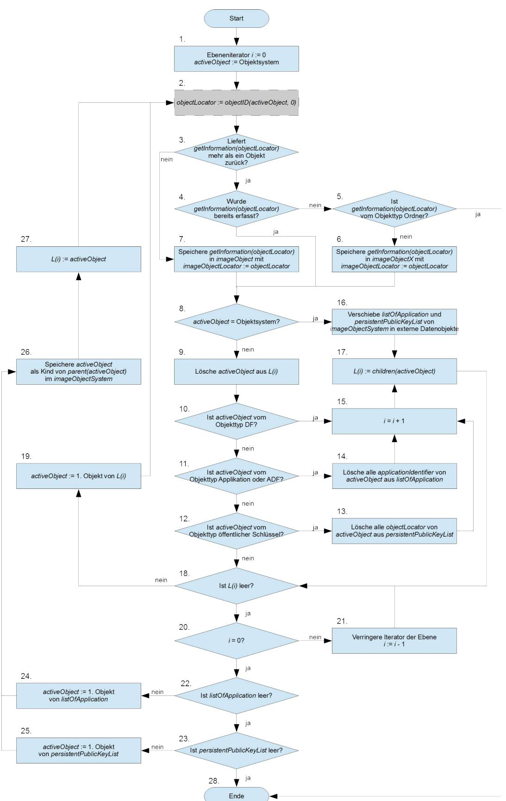
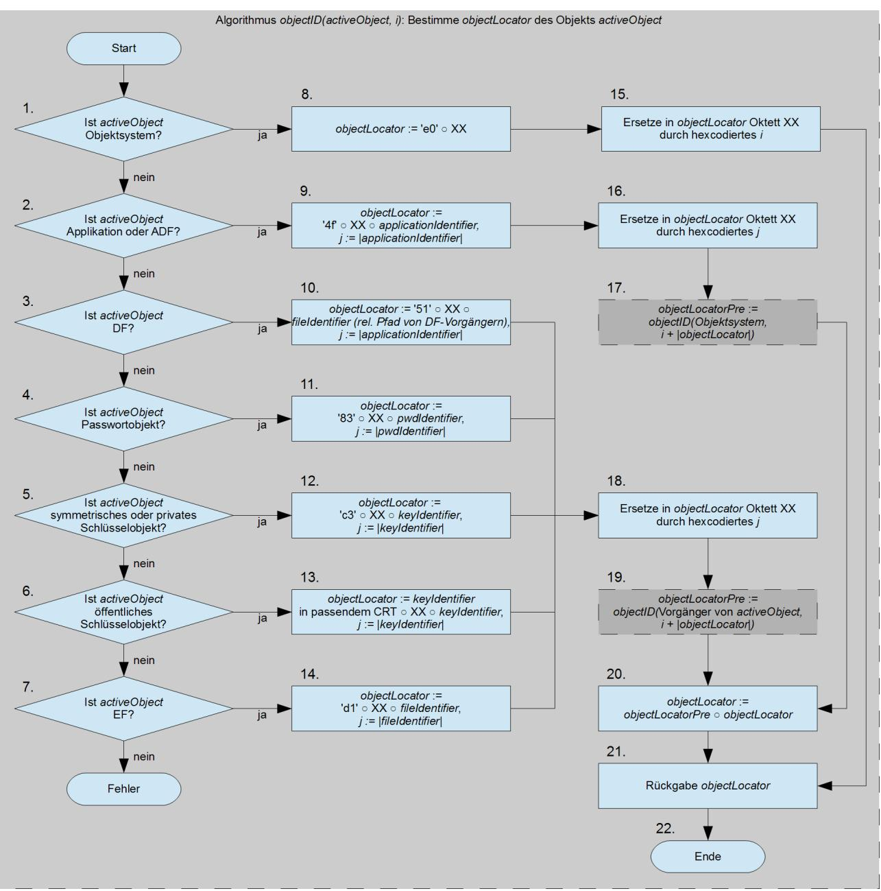
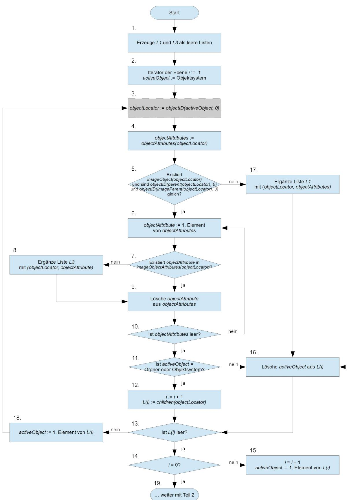
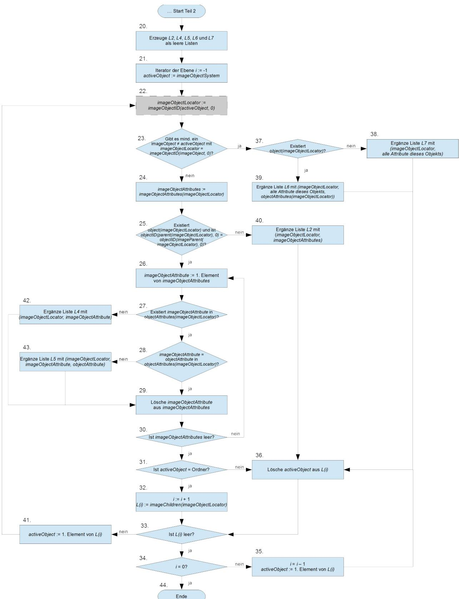

# TR-03143 "eHealth G2-COS Konsistenz-Prüftool"

Version 1.0 – 08.05.2015

Bundesamt für Sicherheit in der Informationstechnik Postfach 20 03 63 53133 Bonn E-Mail: bsi@bsi.bund.de Internet: https://www.bsi.bund.de © Bundesamt für Sicherheit in der Informationstechnik 2015

| 1     | Einleitung 7                                                                                  |  |
|-------|-----------------------------------------------------------------------------------------------|--|
| 1.1   | Zielstellung der Technischen Richtlinie 7                                                     |  |
| 1.2   | Struktur der Technischen Richtlinie 7                                                         |  |
| 1.3   | Terminologie 7                                                                                |  |
| 2     | Grundlagen der Konsistenz-Prüfung des Objektsystems von Karten-Produkten9                     |  |
| 2.1   | Allgemeine Anforderungen an das Konsistenz-Prüftool10                                         |  |
| 2.1.1 | Allgemeine Voraussetzungen für Konsistenz-Prüfung11                                           |  |
| 2.1.2 | Anforderungen an die Einsatzumgebung12                                                        |  |
| 3     | Funktionale Anforderungen an das Konsistenz-Prüftool13                                        |  |
| 3.1   | Überprüfung der Voraussetzungen für die Konsistenz-Prüfung13                                  |  |
| 3.1.1 | Selbsttest des Konsistenz-Prüftools13                                                         |  |
| 3.1.2 | Prüfung der Kommunikation mit dem Prüfling14                                                  |  |
| 3.1.3 | Prüfung der Objektsystem-Spezifikation14                                                      |  |
| 3.1.4 | Prüfung des Fingerprint-Sollwerts und der Karten-Plattform15                                  |  |
| 3.2   | Ermittlung des Objektsystems des Karten-Produkts16                                            |  |
| 3.2.1 | Anwendung des Suchalgorithmus 17                                                              |  |
| 3.2.2 | Beschreibung des Suchalgorithmus18                                                            |  |
| 3.2.3 | Beschreibung des Algorithmus zur Bestimmung des objectLocator21                               |  |
| 3.3   | Umcodierung 23                                                                                |  |
| 3.4   | Konsistenz-Prüfung des Objektsystems des Karten-Produkts gegen die Objektsystem-Spezifikation |  |
| 3.4.1 | 29 Beschreibung des Prüfalgorithmus (erster Teil)31                                        |  |
| 3.4.2 | Beschreibung des Prüfalgorithmus (zweiter Teil)34                                             |  |
| 3.4.3 | Detailprüfung der Attributswerte 37                                                           |  |
| 3.5   | Erstellung und Ausgabe des Testberichts59                                                     |  |
| 3.5.1 | Allgemeine Angaben zur durchgeführten Prüfung und Zusammenfassung der Prüfergebnisse59        |  |
| 3.5.2 | Detaillierte Ergebnisse der Prüfung62                                                         |  |
| 3.5.3 | Kommunikationsprotokoll 63                                                                    |  |
| 4     | Konformitätsnachweis des Konsistenz-Prüftools64                                               |  |
| 4.1   | Herstellerbeistellungen 64                                                                    |  |
| 4.2   | Prüfspezifikation 65                                                                          |  |
| 4.2.1 | Externe Schnittstellen 66                                                                     |  |
| 4.2.2 | Designdokumentation 66                                                                        |  |
| 4.2.3 | Implementierung 67                                                                            |  |
| 4.2.4 | Benutzerdokumentation 67                                                                      |  |
| 4.2.5 | Test 68                                                                                       |  |
| 4.3   | Prüfbericht zum Konformitätsnachweis68                                                        |  |
| 4.3.1 | Allgemeine Angaben zur Prüfungsdurchführung68                                                 |  |
| 4.3.2 | Angaben zu Tests der Such- und Prüfalgorithmen69                                              |  |
| 4.3.3 | Auflistung der Testergebnisse 69                                                              |  |
| 5     | Schemadateien 70                                                                              |  |
| 6     | Literaturverzeichnis 71                                                                       |  |
| 7     | Anhang Plattformspezifisches Auswertungstool (informativ)72                                   |  |

## Abbildungsverzeichnis

| Abbildung 3.1: Suchalgorithmus zum Identifizieren der Objekte des Objektsystems des Karten-Produkts20 |  |
|-------------------------------------------------------------------------------------------------------|--|
| Abbildung 3.2: Algorithmus zur Bestimmung des objectLocator23                                         |  |
| Abbildung 3.3: Prüfalgorithmus zum Vergleichen des Objektsystems des Karten-Produkts und der          |  |
| Objektsystem-Spezifikation, Teil 1 33                                                                 |  |
| Abbildung 3.4: Prüfalgorithmus zum Vergleichen des Objektsystems des Karten-Produkts und der          |  |
| Objektsystem-Spezifikation, Teil 2 36                                                                 |  |

## Tabellenverzeichnis

| Tabelle 3.1: Umcodierung von Attributen 25                                                    |  |
|-----------------------------------------------------------------------------------------------|--|
| Tabelle 3.2: Umcodierung von accessCondition (1)26                                            |  |
| Tabelle 3.3: Umcodierung der accessCondition (2)26                                            |  |
| Tabelle 3.4: Umcodierung von accessMode 26                                                    |  |
| Tabelle 3.5: Umcodierung von accessRulesVerification/accessRulesAuthentication27              |  |
| Tabelle 3.6: Umcodierung von                                                                  |  |
| accessRules/accessRulesVerification/accessRulesAuthentication/accessRulesSessionkeys27        |  |
| Tabelle 3.7: Umcodierung von applicationIdentifier28                                          |  |
| Tabelle 3.8: Umcodierung von CHAT 28                                                          |  |
| Tabelle 3.9: Umcodierung von child 28                                                         |  |
| Tabelle 3.10: Umcodierung von children 28                                                     |  |
| Tabelle 3.11: Umcodierung von listAlgorithmIdentifier29                                       |  |
| Tabelle 3.12: Umcodierung von startSSecList 29                                                |  |
| Tabelle 3.13: Vergleich der Attributswerte von accessCondition38                              |  |
| Tabelle 3.14: Vergleich der Attributswerte von accessMode39                                   |  |
|                                                                                               |  |
| Tabelle 3.15: Vergleich der Attributswerte von accessRules39                                  |  |
| Tabelle 3.16: Vergleich der Attributswerte von accessRulesPublicAuthenticationObject39        |  |
| Tabelle 3.17: Vergleich der Attributswerte von accessRulesPublicSignatureVerificationObject40 |  |
| Tabelle 3.18: Vergleich der Attributswerte von accessRulesSessionkeys40                       |  |
| Tabelle 3.19: Vergleich der Attributswerte von algorithmIdentifier40                          |  |
| Tabelle 3.20: Vergleich der Attributswerte von applicationIdentifier40                        |  |
| Tabelle 3.21: Vergleich der Attributswerte von CHA41                                          |  |
| Tabelle 3.22: Vergleich der Attributswerte von CHAT41                                         |  |
| Tabelle 3.23: Vergleich der Attributswerte von children42                                     |  |
| Tabelle 3.24: Vergleich der Attributswerte von coldAnswerToReset42                            |  |
| Tabelle 3.25: Vergleich der Attributswerte von elementaryAccessRule42                         |  |
| Tabelle 3.26: Vergleich der Attributswerte von expirationDate43                               |  |
| Tabelle 3.27: Vergleich der Attributswerte von fileIdentifier43                               |  |
| Tabelle 3.28: Vergleich der Attributswerte von flagChecksum44                                 |  |
| Tabelle 3.29: Vergleich der Attributswerte von flagEnabled44                                  |  |
| Tabelle 3.30: Vergleich der Attributswerte von flagRecordLifeCycleStatus45                    |  |
| Tabelle 3.31: Vergleich der Attributswerte von flagTransactionMode45                          |  |
| Tabelle 3.32: Vergleich der Attributswerte von icssn846                                       |  |
| Tabelle 3.33: Vergleich der Attributswerte von keyAvailable46                                 |  |
| Tabelle 3.34: Vergleich der Attributswerte von keyIdentifier46                                |  |
| Tabelle 3.35: Vergleich der Attributswerte von keyType47                                      |  |
| Tabelle 3.36: Vergleich der Attributswerte von lifeCycleStatus48                              |  |
| Tabelle 3.37: Vergleich der Attributswerte von listAlgorithmIdentifier49                      |  |
| Tabelle 3.38: Vergleich der Attributswerte von maximumNumberOfRecords49                       |  |
| Tabelle 3.39: Vergleich der Attributswerte von maximumLength50                                |  |
| Tabelle 3.40: Vergleich der Attributswerte von maximumRecordLength50                          |  |
| Tabelle 3.41: Vergleich der Attributswerte von minimumLength50                                |  |
| Tabelle 3.42: Vergleich der Attributswerte von modulusLength51                                |  |
| Tabelle 3.43: Vergleich der Attributswerte von numberOfOctet51                                |  |
| Tabelle 3.44: Vergleich der Attributswerte von numberScenario51                               |  |
| Tabelle 3.45: Vergleich der Attributswerte von oid52                                          |  |
| Tabelle 3.46: Vergleich der Attributswerte von passwordReference52                            |  |
| Tabelle 3.47: Vergleich der Attributswerte von pointInTime52                                  |  |
| Tabelle 3.48: Vergleich der Attributswerte von positionLogicalEndOfFile53                     |  |
| Tabelle 3.49: Vergleich der Attributswerte von P 53                                           |  |
|                                                                                               |  |

| Tabelle 3.50: Vergleich der Attributswerte von publicRsaKeyData54    |  |
|----------------------------------------------------------------------|--|
| Tabelle 3.51: Vergleich der Attributswerte von pukUsage54            |  |
| Tabelle 3.52: Vergleich der Attributswerte von pwdIdentifier55       |  |
| Tabelle 3.53: Vergleich der Attributswerte von retryCounter55        |  |
| Tabelle 3.54: Vergleich der Attributswerte von shareable55           |  |
| Tabelle 3.55: Vergleich der Attributswerte von shortFileIdentifier56 |  |
| Tabelle 3.56: Vergleich der Attributswerte von startRetryCounter56   |  |
| Tabelle 3.57: Vergleich der Attributswerte von startSsecList56       |  |
| Tabelle 3.58: Vergleich der Attributswerte von transportStatus57     |  |
| Tabelle 3.59: Vergleich der Attributswerte von warmAnswerToReset57   |  |

## 1 Einleitung

## 1.1 Zielstellung der Technischen Richtlinie

Die eHealth-Karten der Generation 2 werden durch ein einheitliches Chipkartenbetriebssystem (COS G2) und anwendungsorientierte Objektsysteme spezifiziert. Die Zulassung der eHealth-Karten der Generation 2 basiert auf Konformitätstests und Sicherheitsprüfungen.

Die Sicherheitsaussage für ein Karten-Produkt soll durch eine Common-Criteria-Zertifizierung der Karten-Plattform konform zum Schutzprofil "Card Operating System Generation 2" [BSI-CC-PP-0082] und durch die Konsistenz-Prüfung des Objektsystems des Karten-Produkts gegen die Objektsystem-Spezifikation erbracht werden. Die Common-Criteria-Zertifizierung der Karten-Plattform umfasst die Sicherheitsfunktionalität des Sicherheitsschaltkreises und des Chipkartenbetriebssystems. Die Konsistenz-Prüfung des Objektsystems des Karten-Produkts verifiziert die Korrektheit des Objektsystems durch funktionale Tests unter Verwendung eines Konsistenz-Prüftools.

Die vorliegende Technische Richtlinie BSI TR-03143 "eHealth G2-COS Konsistenz-Prüftool" beschreibt die funktionalen Anforderungen an das Konsistenz-Prüftool und die Konformitätsprüfung des Konsistenz-Prüftools gegen die funktionalen Anforderungen dieser Technischen Richtlinie. Das Konsistenz-Prüftool ermittelt die vollständige Struktur des Objektsystems des Karten-Produkts und sämtlicher sicherheitsrelevanter Attribute des Objektsystems. Es kann sowohl im Rahmen von Sicherheitsprüfungen als auch für funktionale Konformitätstests verwendet werden (siehe hierzu die Ausführungen in Kap. [2\)](#page-8-0).

Die Technische Richtlinie BSI TR-03144 "eHealth – Konformitätsnachweis für Karten-Produkte der Kartengeneration G2" beschreibt die Konformitätsprüfung und Zertifizierung von G2-Karten-Produkten (im initialisierten Zustand). Zielsetzung der TR-Zertifizierung von Karten-Produkten nach der BSI TR-03144 ist die Erlangung einer Aussage zur sicherheitstechnischen Eignung solcher Karten-Produkte. Das Konsistenz-Prüftool "PT eHealth G2-COS" wird im Rahmen dieser Konformitätsprüfung der Karten-Produkte zum Zwecke ihres Konsistenzabgleichs eingesetzt und unterstützt eine Bewertung der Ergebnisse des Konsistenzabgleichs unter sicherheitstechnischen Aspekten.

### 1.2 Struktur der Technischen Richtlinie

Die Technische Richtlinie beschreibt zunächst die methodischen Grundlagen und die Aufgaben der Konsistenz-Prüfung des Objektsystems von Karten-Produkten. Daraus werden die funktionalen Anforderungen des Konsistenz-Prüftools zur Ermittlung des Objektsystems und dessen Verifikation gegen die Objektsystem-Spezifikation abgeleitet. Das Konsistenz-Prüftool selbst unterliegt dem abschließend beschriebenen Konformitätsnachweis mit der Technischen Richtlinie. Die informative Anlage beschreibt ein optionales plattformspezifisches Werkzeug zur Unterstützung der Auswertung der Testberichte des Konsistenz-Prüftools.

### 1.3 Terminologie

Für die genauere Unterscheidung zwischen normativen und informativen Inhalten werden die dem [RFC2119] entsprechenden in Großbuchstaben geschriebenen, deutschen Schlüsselworte verwendet:

- **MUSS** bedeutet, dass es sich um eine normative Anforderung handelt.
- **DARF NICHT** / **DARF KEIN** bezeichnet den normativen Ausschluss einer Eigenschaft.
- **SOLL** beschreibt eine dringende Empfehlung. Abweichungen zu diesen Festlegungen müssen begründet werden.
- **SOLL NICHT** / **SOLL KEIN** kennzeichnet die dringende Empfehlung, eine Eigenschaft auszuschließen. Abweichungen zu diesen Festlegungen müssen begründet werden.
- **KANN** / **DARF** bedeutet, dass die Eigenschaften fakultativ oder optional sind.

Die Kapitel der Technischen Richtlinie sind grundsätzlich als normativ anzusehen. Informative Kapitel werden explizit am Anfang gekennzeichnet.

## 2 Grundlagen der Konsistenz-Prüfung des Objektsystems von Karten-Produkten

Dieses Kapitel beschreibt den Gegenstand und die Grundlagen der Konsistenz-Prüfung eines Objektsystems von Karten-Produkten.

Das eHealth G2-COS Konsistenz-Prüftool dient der automatisierten Ermittlung des auf einem Karten-Produkt mit COS-Betriebssystem implementierten Objektsystems, der Prüfung der Übereinstimmung dieses Objektsystems mit einer Objektsystem-Spezifikation und der Ausgabe eines Testberichts. Die Konsistenz-Prüfung kann für funktionale Konformitätstests und für Sicherheitsüberprüfungen des Objektsystems eines Karten-Produkts verwendet werden. Beide Arten der Konsistenz-Prüfung des Objektsystems unterscheiden sich in der Zielstellung, den Testergebnissen und der Bewertung der Testergebnisse. Sie können in unterschiedlichen Lebenszyklusphasen für unterschiedliche Objektsystem-Spezifikationen verwendet werden.

Eine *Karten-Plattform* besteht aus dem Sicherheitsschaltkreis, der darauf installierten Software und dem Wrapper. Der Sicherheitsschaltkreis ist ein in den Kartenkörper der Chipkarte eingelassener Mikrocontroller mit Kontakten für die kontaktbehaftete Kommunikation oder mit Antenne für die kontaktlose Kommunikation. Die auf dem Sicherheitsschaltkreis installierte Software muss als Hauptbestandteil das *Chipkartenbetriebssystem* (engl. card operating system, kurz COS) enthalten, und optional Unterstützungssoftware des Sicherheitsschaltkreises (engl. integrated circuit dedicated support software) sowie anwendungsspezifische Software.

Die vorliegende Technische Richtlinie setzt voraus, dass das Chipkartenbetriebssystem die Spezifikation "Card Operating System – Elektrische Schnittstelle" (kurz "COS-Spezifikation" genannt) der gematik [gemSpec\_COS] erfüllt. Die COS-Spezifikation definiert verpflichtende Funktionen und die optionalen Funktionspakete Option\_USB\_Schnittstelle, Option\_kontaktlose\_Schnittstelle, Option\_logische\_Kanäle, Option\_PACE\_PCD und Option\_Kryptobox, wobei Option\_USB\_Schnittstelle im Weiteren nicht betrachtet wird, da sie keinen Einfluss auf das Objektsystem eines Karten-Produkts hat. Die COS-Spezifikation lässt ferner eine Reihe herstellerspezifischer Funktionen (z. B. die Unterstützung weiterer Varianten des Kommandos SELECT) und Erweiterungen (z. B. längere Objektbezeichner wie applicationIdentifier) des Betriebssystems zu, die im Folgenden als "COS-Erweiterungen" bezeichnet werden.

Die Unterstützungssoftware (engl. integrated circuit dedicated support software) wird vom Hersteller des Sicherheitsschaltkreises für die Nutzung der spezifischen Funktionen und insbesondere der Sicherheitsfunktionen des Sicherheitsschaltkreises durch das Chipkartenbetriebssystem bereitgestellt. Die anwendungsspezifische Software stellt zusätzliche, über die Spezifikation des Chipkartenbetriebssystems hinausgehende, Funktionalität der Chipkarte zur Verfügung.

Die Karten-Plattformen für die elektronische Gesundheitskarte und weitere eHealth-Karten werden konform zu dem Schutzprofil "Card Operating System Generation 2" [BSI-CC-PP-0082] nach den Common-Criteria zertifiziert.

Ein *Karten-Produkt* umfasst eine für die jeweilige Phase des Lebenszyklus voll funktionstüchtige Chipkarte, den Wrapper und die Benutzerdokumentation. Die Chipkarte besteht aus einem Karten-Körper, der Karten-Plattform und einem Objektsystem. Die Chipkarte entspricht der ISO-7816-Normenreihe. Der *Wrapper* ist eine außerhalb der Chipkarte implementierte und ausgeführte Software, die herstellerspezifische Funktionen der Schnittstelle zur Karten-Plattform kapselt. Die Schnittstelle zwischen dem Wrapper und dem Konsistenz-Prüftool ist in [gemSpec\_COS-Wrapper] definiert. Die Benutzerdokumentation beschreibt die äußeren Schnittstellen der Chipkarte und deren sichere Nutzung.

Ein *Objektsystem* besteht aus nichtausführbaren Daten, die in Objekten hierarchisch organisiert sind und durch das Betriebssystem gelesen und geschrieben werden. Eine *Objektsystem-Spezifikation* beschreibt die hierarchische Struktur, die anwendungsspezifischen Objekte und deren Attribute eines Objektsystems für definierte Karten-Produkte. Die Syntax des Objektsystems ist wesentlich durch die COS-Spezifikation

vorgegeben. Die Semantik des Objektsystems liegt außerhalb der vorliegenden Technischen Richtlinie. Die Objektsystem-Spezifikationen liegen als XML-Datei vor, die dem XML-Schema *schema\_objektsystem-spezifikation.xsd* entsprechen, und können zum Nachweis ihrer Authentizität digital signiert sein. Näheres dazu regelt der Herausgeber der Objektsystem-Spezifikation.

Die *Konsistenz-Prüfung für funktionale Konformitätstests* des Objektsystems eines Karten-Produkts dient dem Nachweis, dass das Objektsystem die für das Karten-Produkt spezifizierten Funktionen ermöglicht. Das Objektsystem des Karten-Produkts muss dafür alle in der Objektsystem-Spezifikation definierten Objekte mit den vorgesehenen Attributen implementieren.

Im Zusammenhang mit der Sicherheitsbewertung des Objektsystems des Karten-Produkts und der zertifizierten Sicherheitsfunktionalität der Karten-Plattform ist Folgendes zu beachten.

Der *Evaluierungsgegenstand* (EVG) der für die Technische Richtlinie maßgeblichen Common-Criteria-Zertifizierung der Karten-Plattform umfasst den Sicherheitsschaltkreis, die Gesamtheit des durch den Sicherheitsschaltkreis ausführbaren Code, den Wrapper und die Benutzerdokumentation. Die zertifizierte *Sicherheitsfunktionalität* (engl. target of evaluation security functionality, kurz TSF) ist durch die funktionalen Sicherheitsanforderungen (engl. security functional requirements, kurz SFR) in den Sicherheitsvorgaben und der Benutzerdokumentation beschrieben. Die Anwendung der Sicherheitsfunktionalität zum Schutz der Benutzerdaten wird durch die TSF-Daten festgelegt.

Die *TSF-Daten* umfassen die Authentisierungsdaten und die Sicherheitsattribute. Die *Authentisierungsdaten* dienen der Prüfung vorgegebener Identitäten der Benutzer. Man unterscheidet zwischen *Authentisierungsverifikationsdaten*, d. h. die vom Benutzer zum Nachweis seiner Identität benutzten Daten, wie z. B. ein privater Schlüssel einer Chipkarte, und *Authentisierungsreferenzdaten*, d. h. die durch die TSF zur Prüfung der vorgegebenen Identität benutzten Daten, wie z. B. ein öffentlicher Schlüssel zur Prüfung der Zertifikate einer Chipkarten-PKI. *Sicherheitsattribute* beschreiben die Sicherheitseigenschaften, die Benutzern und Objekten zugeordnet sind. Sicherheitsattribut eines Benutzers ist insbesondere die ihm zugewiesene Rolle, d. h. die Menge von Zugriffsrechten, die ihm durch die Zugriffsregeln der Objekte gewährt werden. Sicherheitsattribute der Objekte beschreiben deren Sicherheitseigenschaften, wie z. B. die zulässigen kryptographischen Funktionen eines Schlüsselobjekts, und die Zugriffsregeln für das Objekt. Die Sicherheitsattribute sind folglich nur ein Teil der Attribute des Objektsystems eines Karten-Produkts als Ganzem und seiner Objekte.

Die *Konsistenz-Prüfung für Sicherheitsüberprüfungen* des Objektsystems eines Karten-Produkts dient dem Nachweis, dass das Objektsystem des Karten-Produkts die Sicherheitsfunktionalität der Karten-Plattform in der zertifizierten Form nutzt und keine der Sicherheitspolitik oder der Objektsystem-Spezifikation widersprechenden Objekte oder Attribute implementiert. Es müssen folglich auch die zusätzlich zu den in der Objektsystem-Spezifikation definierten Objekte und Attribute ermittelt und bewertet werden.

Das Konsistenz-Prüftool soll sowohl für funktionale Konformitätstests als auch für Sicherheitsüberprüfungen eingesetzt werden. Es muss folglich

- einerseits für eine vorgegebene Objektsystem-Spezifikation die Implementierung in einem Karten-Produkt (die spezifizierte Objektsystem-Struktur, die Existenz und Stellung aller spezifizierten Objekte in der Objektsystem-Struktur und alle spezifizierten Attribute) überprüfen, und
- andererseits das implementierte Objektsystem (die Objektsystem-Struktur, alle implementierten Objekte und Attribute) feststellen und diese mit der Objektsystem-Spezifikation vergleichen.

### 2.1 Allgemeine Anforderungen an das Konsistenz-Prüftool

Das Konsistenz-Prüftool dient der automatisierten Ermittlung des Objektsystems eines Karten-Produkts und der Konsistenz-Prüfung dieses Objektsystems gegen eine Objektsystem-Spezifikation. Die Ergebnisse der Konsistenz-Prüfung werden durch das Konsistenz-Prüftool in einem Testbericht dokumentiert und ausgegeben.

Die Ermittlung des Objektsystems des Karten-Produkts identifiziert alle Objekte des Objektsystems, die Stellung dieser Objekte im Objektsystem und bestimmt alle Attribute dieser Objekte durch Kommunikation mit dem Karten-Produkt über den Wrapper und die direkte Kommunikation mit dem Prüfling.

Die Konsistenz-Prüfung des Objektsystems im Karten-Produkt

- vergleicht für die in der Objektsystem-Spezifikation definierten Objekte das Vorhandensein, die Stellung in der Objektsystem-Struktur und die Werte der Attribute dieser Objekte mit den auf dem Karten-Produkt ermittelten Objekten,
- identifiziert zusätzlich zur Objektsystem-Spezifikation vorhandene Objekte, deren Stellung in der Objektsystemstruktur und Attribute,
- bereitet die Ergebnisse für den Testbericht auf.

Der Testbericht enthält Angaben zum Prüfvorgang, dem geprüften Karten-Produkt (im Folgenden "Prüfling" genannt), dem Ergebnis der Konsistenz-Prüfung in Form einer Zusammenfassung, den detaillierten Prüfergebnissen sowie das Protokoll der Kommunikation zwischen Konsistenz-Prüftool und Wrapper bzw. Prüfling.

Das Konsistenz-Prüftool besteht aus einem Java-Programm und der zugehörigen Benutzerdokumentation und ist selbst signiert.

Das XML-Schema der Objektsystem-Spezifikationen und das XML-Schema der Fingerprint-Sollwerte sind als digital signierte Dateien Bestandteil des Konsistenz-Prüftools. Das XML-Schema der Objektsystem-Spezifikationen definiert die von dem COS-Betriebssystem unterstützten und durch das Konsistenz-Prüftool zu verarbeitenden Objektsystem-Spezifikationen. Sie ist als Datei *schema\_objektsystem-spezifikation.xsd* Bestandteil der vorliegenden Technischen Richtlinie. Das XML-Schema der Fingerprint-Sollwerte spezifiziert die Strukturanforderungen an die durch das Konsistenz-Prüftool zu importierenden und zu verwendenden Fingerprint-Sollwerte. Sie ist als Datei *schema\_fingerprint-sollwert.xsd* ebenfalls Bestandteil der vorliegenden Technischen Richtlinie.

Das Java-Programm besitzt eine graphische Benutzeroberfläche, Kommunikationsschnittstellen zu einem Kartenleser und zum Wrapper, der mit dem Prüfling kommuniziert, sowie Import- und Exportschnittstellen für Dateien.

Die in der vorliegenden Technischen Richtlinie angegebene XML-Schema-Datei *schema\_testbericht.xsd* des Testberichts ist Bestandteil der funktionalen Anforderungen an das Konsistenz-Prüftool.

#### 2.1.1 Allgemeine Voraussetzungen für Konsistenz-Prüfung

Für die Konsistenz-Prüfung des Objektsystems eines Karten-Produkts müssen folgende Voraussetzungen erfüllt sein:

- 1. Das Java-Programm des Konsistenz-Prüftools ist auf einem Personalcomputer mit Java-Runtime-Environment und angeschlossenem Kartenleser installiert,
- 2. der Prüfling liegt als Chipkarte vor und steckt im Kartenleser,
- 3. der zum Prüfling gehörige Wrapper ist auf dem Personalcomputer installiert und die Kommunikation zwischen Java-Programm des Konsistenz-Prüftools und Wrapper ist eingerichtet,
- 4. die Objektsystem-Spezifikation liegt als XML-Datei zum Import in das Konsistenz-Prüftool vor und kann vom Herausgeber digital signiert sein,
- 5. es liegt mindestens ein Fingerprint-Sollwert als XML-Datei für die Karten-Plattform des Prüflings zum Import in das Konsistenz-Prüftool vor. Die jeweiligen XML-Dateien müssen vom Herausgeber gültig digital signiert sein,
- 6. die Benutzerdokumentation des Konsistenz-Prüftools, des Karten-Produkts und der Karten-Plattform einschließlich Wrapper liegen dem Prüfenden vor.

#### 2.1.2 Anforderungen an die Einsatzumgebung

Das Konsistenz-Prüftool ist für den Einsatz unter Laborbedingungen in Verantwortung des Prüfenden vorgesehen. Das Konsistenz-Prüftool implementiert außer dem Integritätsselbsttest keine IT-Sicherheitsmaßnahmen.

Näheres zu den Anforderungen an die Einsatzumgebung des Konsistenz-Prüftools bestimmt die Technische Richtlinie [TR03106]. Darüber hinaus etwaig bestehende weitere Anforderungen an die Einsatzumgebung des Konsistenz-Prüftools sind dem Benutzerhandbuch zum Konsistenz-Prüftool zu entnehmen.

Anforderungen an die im Zusammenhang mit dem Konsistenz-Prüftool verwendeten Signaturen und zugehörigen Signaturschlüssel werden über die Technische Richtlinie [TR03144] und ihren Anhang [TR03144-A] geregelt. Darüber hinaus etwaig bestehende weitere Anforderungen an die Signaturen und zugehörigen Signaturschlüssel sind dem Benutzerhandbuch zum Konsistenz-Prüftool zu entnehmen.

## 3 Funktionale Anforderungen an das Konsistenz-Prüftool

Dieses Kapitel definiert die funktionalen Anforderungen an das Konsistenz-Prüftool. Sie können wie folgt zusammengefasst werden:

- 1. Überprüfung der Voraussetzungen für die Konsistenz-Prüfung,
- 2. Ermittlung des Objektsystems des Karten-Produkts,
- 3. Konsistenz-Prüfung des Objektsystems des Karten-Produkts gegen die Objektsystem-Spezifikation,
- 4. Erstellung und Ausgabe des Testberichts.

Die funktionalen Anforderungen werden in den folgenden Kapiteln im Format (Fxy.z) durchnummeriert, wobei "F" für funktionale Anforderung, "x" für die Gruppe, "y" für die Untergruppe und "z" für laufende Nummern innerhalb der Untergruppe stehen. Nicht-funktionale Anforderungen werden im Fließtext beschrieben.

## 3.1 Überprüfung der Voraussetzungen für die Konsistenz-Prüfung

Die Überprüfung der Voraussetzungen für die Konsistenz-Prüfung umfasst die folgenden Schritte:

- 1. Selbsttest des Konsistenz-Prüftools,
- 2. Prüfung der Kommunikation mit dem Prüfling über den Kartenleser und den Wrapper,
- 3. Prüfung der importierten Objektsystem-Spezifikation,
- 4. Prüfung der Authentizität des Fingerprint-Sollwerts und Identifikation der Software des Prüflings.

Die funktionalen Anforderungen an diese Überprüfungsschritte werden in den folgenden Kapiteln beschrieben und mit (FVy.z) gekennzeichnet.

#### 3.1.1 Selbsttest des Konsistenz-Prüftools

Das Konsistenz-Prüftool prüft seine Integrität durch einen Selbsttest.

Der Selbsttest des Konsistenz-Prüftools muss folgende funktionale Anforderungen erfüllen, die mit (FVS.z) gekennzeichnet sind.

- (FVS.1) Das Konsistenz-Prüftool **MUSS** unmittelbar nach jedem Programmstart einen Selbsttest durchführen.
- (FVS.2) Der Selbsttest **MUSS** die Integrität aller vom Java-Programm des Konsistenz-Prüftool verwendeten Java-Bibliotheken und zum Betrieb erforderlichen externen Dateien mittels digitaler Signaturen über das Java-Archiv prüfen.
- (FVS.3) Das Konsistenz-Prüftool **DARF** bei einer festgestellten Integritätsverletzung die betroffene Java-Bibliothek oder zum Betrieb erforderliche externe Datei **NICHT** verwenden.
- (FVS.4) Der Selbsttest **MUSS** dem Benutzer festgestellte Integritätsverletzungen anzeigen und eine Bestätigung der Kenntnisnahme durch Benutzereingabe über die Tastatur oder Maus anfordern.
- (FVS.5) Das Konsistenz-Prüftool **MUSS** bei festgestellten Integritätsverletzungen nach der Bestätigung der Kenntnisnahme durch Benutzereingabe die Programmausführung beenden.
- (FVS.6) Der öffentliche Schlüssel zur Prüfung der digitalen Signaturen der Bestandteile des Konsistenz-Prüftools **MUSS** in der prüfenden Java-Bibliothek fest einprogrammiert sein.

### 3.1.2 Prüfung der Kommunikation mit dem Prüfling

Das Konsistenz-Prüftool prüft die Kommunikation mit dem Prüfling über den Kartenleser und über den Wrapper als Voraussetzung für die Prüfschritte.

Die Prüfung der Kommunikation muss folgende funktionale Anforderungen erfüllen, die mit (FVK.z) gekennzeichnet sind.

- (FVK.1) Das Konsistenz-Prüftool **MUSS** prüfen, ob die Kommunikation mit dem Prüfling über den Kartenleser direkt, d. h. ohne Vermittlung des Wrapper, möglich ist, und dem Prüfenden einen Misserfolg des Kommunikationsversuchs anzeigen.
- (FVK.2) Das Konsistenz-Prüftool **MUSS** prüfen, ob die Kommunikation mit dem Prüfling über den Wrapper möglich ist, und dem Prüfenden einen Misserfolg des Kommunikationsversuchs anzeigen.

#### 3.1.3 Prüfung der Objektsystem-Spezifikation

Das Konsistenz-Prüftool prüft die Authentizität der Objektsystem-Spezifikation, falls diese als signierte Datei vorliegt, und die Konformität der Objektsystem-Spezifikation zum XML-Schema für Objektsystem-Spezifikationen *schema\_objektsystem-spezifikation.xsd*.

Die Objektsystem-Spezifikationen werden als digital signierte Dateien für den Import in das Konsistenz-Prüftool bereitgestellt. Das XML-Schema für Objektsystem-Spezifikationen *schema\_objektsystem-spezifikation.xsd* ist als digital signierte Datei Bestandteil des Konsistenz-Prüftools.

Die Prüfung der importierten Objektsystem-Spezifikation muss folgende funktionale Anforderungen erfüllen, die mit (FVO.z) gekennzeichnet sind.

- (FVO.1) Der Prüfende **MUSS** die Datei mit der für den Prüfling zu verwendenden Objektsystem-Spezifikation zum Import auswählen können.
- (FVO.2) Wenn die Objektsystem-Spezifikationen als digital signierte Datei vorliegt,
	- 1. **MUSS** das Konsistenz-Prüftool die Authentizität der Datei der Objektsystem-Spezifikation mittels digitaler Signatur prüfen,
	- 2. **DARF** das Konsistenz-Prüftool die Objektsystem-Spezifikation bei festgestellter Integritätsverletzung **NICHT** importieren, und
	- 3. **MUSS** das Konsistenz-Prüftool dem Prüfenden eine festgestellte Integritätsverletzung anzeigen und eine Bestätigung der Kenntnisnahme durch Benutzereingabe über die Tastatur oder Maus anfordern.
- (FVO.3) Das Konsistenz-Prüftool **MUSS** die öffentlichen Schlüssel zur Prüfung der digitalen Signaturen der Dateien der Objektsystem-Spezifikation aus der dem Konsistenz-Prüftool beiliegenden Datei entnehmen.
- (FVO.4) Wenn die Objektsystem-Spezifikationen nicht digital signiert vorliegt, so **MUSS** das Konsistenz-Prüftool im Testbericht angeben, dass keine digitale Signatur zur Datei der Objektsystem-Spezifikation vorlag, s. [\(FPZ.5\)](#page-60-0).
- (FVO.5) Die Objektsystem-Spezifikation **MUSS** gegen das XML-Schema *schema\_objektsystem-spezifikation.xsd* der Objektsystem-Spezifikationen geprüft werden.
- (FVO.6) Das Konsistenz-Prüftool **DARF KEINE** Objektsystem-Spezifikation ohne erfolgreiche Prüfung gegen das XML-Schema *schema\_objektsystem-spezifikation.xsd* der Objektsystem-Spezifikationen oder mit festgestellter Verletzung des XML-Schemas verwenden.
- (FVO.7) Das Konsistenz-Prüftool **MUSS** dem Prüfenden eine festgestellte Verletzung des XML-Schemas anzeigen und eine Bestätigung der Kenntnisnahme durch Benutzereingabe über die Tastatur oder Maus fordern.

(FVO.8) Das Ergebnis der Prüfung der Objektsystem-Spezifikation **MUSS** im Testbericht mit Angabe des Titels, der Versionsnummer und des Hashwertes der Objektsystem-Spezifikation dokumentiert werden, s. [\(FPZ.5\)](#page-60-0).

#### 3.1.4 Prüfung des Fingerprint-Sollwerts und der Karten-Plattform

Das Konsistenz-Prüftool prüft die Authentizität des importierten Fingerprint-Sollwerts mittels digitaler Signatur und die Karten-Plattform des Prüfling mittels Kommando FINGERPRINT.

Das Kommando FINGERPRINT ist Teil der Sicherheitsfunktionalität der zertifizierten Karten-Plattform. Die Fingerprint-Sollwerte dienen im Rahmen der Konsistenz-Prüfung des Objektsystems des Karten-Produkts der Identifizierung und dem Nachweis der Authentizität der auf der zertifizierten Karten-Plattformen installierten Software.

Das Kommando FINGERPRINT des Chipkartenbetriebssystems gibt zu einem übergebenen Parameter *prefix* eine kryptographische Checksumme (Hashwert oder CMAC) über die gesamte installierte ausführbare Software zurück. Ein Sollwert für die Prüfung der Authentizität des ausführbaren Codes einer Karten-Plattform (kurz *Fingerprint-Sollwert* genannt) besteht aus einer zufällig gewählten Challenge (*prefix*) und dem Rückgabewert des Kommandos FINGERPRINT einer authentischen Karten-Plattform. Die Fingerprint-Sollwerte werden zum Nachweis ihrer Authentizität digital signiert. Näheres ist in [TR03144] geregelt.

Die Prüfung der Fingerprint-Sollwerte und die Identifizierung der Software des Prüflings müssen folgende funktionale Anforderungen erfüllen, die mit (FVF.z) gekennzeichnet sind.

- (FVF.1) Das Konsistenz-Prüftool **MUSS** die Authentizität des Fingerprint-Sollwerts mittels digitaler Signatur prüfen. Das Konsistenz-Prüftool **DARF** den Fingerprint-Sollwert **NICHT** ohne erfolgreiche Prüfung der digitalen Signaturen, d. h. mit festgestellter Integritätsverletzung, dem Prüfenden zur Auswahl anbieten.
- (FVF.2) Das Konsistenz-Prüftool **MUSS** dem Prüfenden eine festgestellte Integritätsverletzung des zu importierenden Fingerprint-Sollwerts anzeigen und eine Bestätigung der Kenntnisnahme durch Benutzereingabe über die Tastatur oder Maus fordern.
- (FVF.3) Das Konsistenz-Prüftool **MUSS** den öffentlichen Schlüssel zur Prüfung der digitalen Signatur des Fingerprint-Sollwerts der Konfigurationsdatei des Konsistenz-Prüftools entnehmen.
- (FVF.4) Der Fingerprint-Sollwert **MUSS** gegen das XML-Schema *schema\_fingerprint-sollwert.xsd* der Fingerprint-Sollwerte geprüft werden.
- (FVF.5) Das Konsistenz-Prüftool **DARF KEINEN** Fingerprint-Sollwert ohne erfolgreiche Prüfung gegen das XML-Schema *schema\_fingerprint-sollwert.xsd* der Fingerprint-Sollwerte oder mit festgestellter Verletzung des XML-Schemas verwenden.
- (FVF.6) Das Konsistenz-Prüftool **MUSS** dem Prüfenden eine festgestellte Verletzung des XML-Schemas anzeigen und eine Bestätigung der Kenntnisnahme durch Benutzereingabe über die Tastatur oder Maus fordern. Das Konsistenz-Prüftool **MUSS** nach Bestätigung den Prüfvorgang abbrechen.
- (FVF.7) Das Konsistenz-Prüftool **MUSS** das Kommando FINGERPRINT mit dem im vom Prüfenden ausgewählten Fingerprint-Sollwert enthaltenen *prefix* über den Kartenleser an den Prüfling senden und den empfangenen Fingerprint in der Antwort-APDU des Prüflings mit dem Fingerprint im Fingerprint-Sollwert vergleichen.
- (FVF.8) Das Konsistenz-Prüftool **MUSS** festgestellte Übereinstimmung bzw. Abweichung des empfangenen Fingerprint gegenüber dem Sollwert des Fingerprint dem Prüfenden anzeigen und eine Bestätigung der Kenntnisnahme durch Benutzereingabe über die Tastatur oder Maus anfordern.
- (FVF.9) Das Konsistenz-Prüftool **MUSS** im Testbericht den Herausgeber des Fingerprint-Sollwerts und den zum Fingerprint-Sollwert gehörigen Prüfling identifizieren und angeben, ob diese angegebenen Identitäten durch die Prüfungen bestätigt wurden, s. [\(FPZ.4\)](#page-59-0).

## 3.2 Ermittlung des Objektsystems des Karten-Produkts

Das Konsistenz-Prüftool ermittelt durch Kommunikation mit dem Prüfling

- über den Wrapper alle Objekte des Objektsystems und
- über den Wrapper und den Kartenleser alle exportierten Attribute des Objektsystems als Ganzem und der Objekte des Karten-Produkts sowie die Stellung dieser Objekte im Objektsystem.

Die Schnittstelle zwischen Konsistenz-Prüftool und Wrapper ist in [gemSpec\_COS-Wrapper] definiert. Sie definiert eine Funktion *getInformation()* des Wrapper, die für ein Argument *objectLocator* alle Attribute der durch *objectLocator* identifizierten Objekten als XML-Struktur zurückgibt. Der *objectLocator* ist

- der Wert 'e*000'*, wenn die Struktur das Objektsystem als Ganzes identifiziert,
- ein *applicationIdentifier*, wenn die Struktur eine Applikation oder ein Application-Dedicated-File (ADF) ist, oder
- ein Pfad, der mit einem a*pplicationIdentifier* einer hierarchisch über dem Objekt liegenden Applikation bzw. eines hierarchisch über dem Objekt liegenden ADF beginnt und bis zum Identifikator des Objekts selbst führt, wenn die Struktur einen anderen Objekttyp als Applikation oder ADF besitzt.

Die Objekte des Objektsystems werden wie folgt identifiziert:

- Applikationen durch a*pplicationIdentifier*,
- ADFs durch a*pplicationIdentifier* oder *fileIdentifier*,
- Dateien und DFs durch *fileIdentifier*,
- reguläre Passwörter und Multireferenz-Passwörter durch *pwdIdentifier,* und
- Schlüsselobjekte bzw. Kartenverbindungsobjekte durch *keyIdentifier*.

Gemäß [gemSpec\_COS] besitzen a*pplicationIdentifier* eine Länge von 5–16 Byte, *fileIdentifier* besitzen die Länge 2 Byte und *keyIdentifier* besitzen die Länge 1 Byte. Alle a*pplicationIdentifier* eines Objektsystems eines Karten-Produkts sind paarweise verschieden.

Das Konsistenz-Prüftool erstellt eine hierarchische Datenstruktur *imageObjectSystem*, die das Objektsystem des Karten-Produkts und seine Attribute vollständig widerspiegelt. Jeder durch einen *objectLocator* identifizierten Struktur des Objektsystems des Karten-Produkts wird genau ein Element des Typs *imageObject* der Datenstruktur mit dem Identifikator *imageObjectLocator* := *objectLocator* und den durch *getInformation(objectLocator)* ermittelten Attributen zugeordnet.

Die Wurzel der Datenstruktur *imageObjectSystem* mit dem Identifikator 'e000' enthält die dem Objektsystem des Karten-Produkts als Ganzem zugeordneten Attribute. Diese Attribute umfassen mindestens

- ein Attribut *root*, das mindestens einen a*pplicationIdentifier* enthält, dessen Applikation oder ADF in Objektsystem-Spezifikationen auch als Master-File (MF) bezeichnet wird,
- eine möglicherweise leere Liste *persistentPublicKeyList* mit öffentlichen Schlüsseln,
- eine möglicherweise leere Liste *listOfApplication* mit *applicationIdentifier*.

Jedes Objekt des Objekttyps Applikation, Application-Dedicated-File (ADF) oder Dedicated-File (DF), die alle drei kurz Ordner genannt werden, besitzt ein Attribut children. Das Attribut *children* besteht an der Schnittstelle des Wrapper aus einer Liste von Objektidentifikatoren und dazugehörigen Objekttypen der in dem Ordner enthaltenen Objekte.

Das Attribut *listOfApplication* des Objektsystems an der Schnittstelle des Wrapper sowie die Attribute und *children* aller Ordner bestimmen die Struktur des Objektsystems des Karten-Produkts und die Struktur des *imageObjectSystem*. Jedes Objekt des implementierten Objektsystems ist durch den *objectLocator* und jedes Element des Typs *imageObject* der Datenstruktur *imageObjectSystem* ist durch *imageObjectLocator* eindeutig identifiziert.

Die Ermittlung des Objektsystems des Karten-Produkts umfasst

- 1. die Bestimmung der dem Objektsystem unmittelbar zugeordneten Attribute auf Ebene 0,
- 2. die systematische Suche aller implementierten Objekte über die Ordner-Struktur des Objektsystems,
- 3. die Bestimmung aller Attribute eines jeden gefundenen Objekts,
- 4. den Aufbau der dazu gehörigen Datenstruktur *imageObjectSystem*.

Die funktionalen Anforderungen an die Ermittlung des Objektsystems werden in den folgenden Kapiteln beschrieben und mit (FEy.z) gekennzeichnet.

#### 3.2.1 Anwendung des Suchalgorithmus

Der Suchalgorithmus des Konsistenz-Prüftools zur Identifizierung aller im Karten-Produkt implementierten Objekte und deren Attribute muss folgende funktionale Anforderungen erfüllen, die mit (FES.z) gekennzeichnet sind.

- (FES.1) Das Konsistenz-Prüftool **MUSS** die vollständige Struktur des Objektsystems des Karten-Produkts, alle Objekte des Objektsystems und alle Attribute des Objektsystems ermitteln. Wenn es dem Konsistenz-Prüftool aufgrund des Zustands des Objektsystems des Karten-Produkts nicht möglich ist, die Struktur des Objektsystems vollständig zu erfassen, **MUSS** das Konsistenz-Prüftool den Suchalgorithmus und alle nachfolgenden Überprüfungen abbrechen und dem Nutzer eine entsprechende Fehlermeldung ausgeben (s. [3.2.2,](#page-17-0) [5\)](#page-18-0).
- (FES.2) Das Konsistenz-Prüftool **MUSS** eine Datenstruktur *imageObjectSystem* erstellen, die für das Objektsystem als Ganzes, sämtliche Objekte des Objektsystems, deren Stellung im Objektsystem, *objectLocator* und alle von der Funktion *getInformation(objectLocator)* gelieferten Attribute enthält.
- (FES.3) Der Suchalgorithmus **MUSS** die Suche der Objekte des Karten-Produkts mit dem *objectLocator =* 'e000' des Objektsystems als Ganzem (leeres DO 'e0') beginnen.
- (FES.4) Der Suchalgorithmus **MUSS** ausgehend von der höchsten Ebene 0 das gesamte Objektsystem des Karten-Produkts durchlaufen. Es **DARF KEIN** Objekt im Objektsystem des Karten-Produkts existieren, welches nicht durch den Suchalgorithmus erfasst wird. Insbesondere **MÜSSEN** sämtliche Applikationen, Application-Dedicated-Files und Dedicated-Files des Objektsystems des Karten-Produkts gefunden und durchsucht werden.
- (FES.5) Der Suchalgorithmus **MUSS** für jedes Objekt, das in den Attributen *listOfApplication* des Objektsystems als Ganzem oder in *children* eines Ordners identifiziert wird, den *objectLocator* abhängig vom Objekttyp bestimmen.
- (FES.6) Der Suchalgorithmus **MUSS** für jedes mit einem *objectLocator* identifizierten Objekt die von der Wrapper-Funktion *getInformation(objectLocator)* zurückgelieferten Attribute genau den Elementen des Typs *imageObject* der Datenstruktur *imageObjectSystem* zuordnen, für die gilt: *imageObjectLocator* = *objectLocator*.
- (FES.7) Eine Implementierung des Suchalgorithmus **MUSS** funktional äquivalent zu den in Kapitel 3.2.1 und 3.2.2 beschriebenen Algorithmen sein, d. h. die Implementierung muss für jedes gemäß COS-Spezifikation [gemSpec\_COS] implementierte Objektsystem das gleiche Ergebnis *imageObjectSystem* liefern.

Der Suchalgorithmus und der Algorithmus zur Bestimmung des *objectLocator* werden schematisch in den beiden nachfolgenden Kapiteln beschrieben. Eine Umsetzung dieser Richtlinie verpflichtet nicht zu einer spezifischen Implementierung, allerdings muss eine äquivalente Funktionalität erreicht werden.

3 Funktionale Anforderungen an das Konsistenz-Prüftool

#### 3.2.2 Beschreibung des Suchalgorithmus

Dieses Kapitel beschreibt einen Algorithmus zur Ermittlung des in einem Kartenprodukt gemäß COS-Spezifikation implementierten Objektsystems und zum Aufbau der Datenstruktur *imageObjectSystem*.

Die Liste *listOfApplication* enthält gemäß [gemSpec\_COS-Wrapper] eine Liste von *applicationIdentifier*, wobei für jede Applikation und jedes ADF mindestens ein *applicationIdentifier* in der Liste enthalten ist.

Die Liste *listOfLevel0Application* ist eine Teilmenge von *listOfApplication* derjeniger *applicationIdentifier*, deren zugehörige Applikation oder ADF dem Level 0 zugeordnet ist (*parentID(X)* = 'e000') und wird vom Prüftool aus der *listOfApplication* generiert.

Es ist möglich, dass der Suchalgorithmus abbricht, da ein komplettes Durchlaufen des Objektsystems des Karten-Produkts aufgrund von nicht-eindeutigen *objectLocators* nicht möglich ist. In diesem Fall wird dieses Verhalten im Bericht vermerkt.

Der Algorithmus verwendet folgende Funktionen:

- *objectID(X, i)* gemäß [3.2.3,](#page-20-0)
- *parentID(X)* gibt für einen a*pplicationIdentifier X* zurück*:*
	- den Identifikator 'e000', wenn *X =* Applikation/ADF des Levels 0,
	- den *applicationIdentifier* der eine Ebene höher liegenden Applikation oder den *fileIdentifier* des eine Ebene höher liegenden (A)DF, wenn *X* = Applikation/ADF des Levels 1+.

Die Berechnung der Funktion *parentID(X)* erfolgt durch Senden der folgenden Kommandosequenz an den Prüfling über den Kartenleser:

- das Kommando SELECT mit P1 = '04', P2 = '0C' und Data = *X* wählt die Applikation bzw. das ADF mit dem a*pplicationIdentifier X* aus*,*
- das Kommando SELECT mit P1 = '03', P2 = '04' liefert
	- den Trailer FileNotFound, wenn die Applikation bzw. das ADF im Level 0 liegt, und folglich *parentID(X) =* 'e000',
	- den *applicationIdentifier* der eine Ebene höher liegenden Applikation, den *applicationIdentifier* und den *fileIdentifier* des eine Ebene höher liegenden ADF oder den *fileIdentifier* des eine Ebene höher liegenden Ordners, woraus sich *parentID(X)* ergibt.
- *children(X)* gibt für ein *X* zurück:
	- die Liste *listOfLevel0Application*, wenn *X* = Objektsystem*,*
	- die Liste aller seiner untergeordneten Objekte (d. h. die Liste *children*, die von der Wrapper-Funktion *getInformation(X)* geliefert wurde und für die gilt: *parentID(objectLocator von child)* = *X*, und zusätzlich diejenigen *X',* für die gilt: *parentID(X')* = *X*), wenn *X* = Ordner.

Der Ablauf des Algorithmus lautet äquivalent zu [Abbildung 3.1](#page-19-0) wie folgt:

- 1. Setze die Iteratorvariable *i*, die die momentan aktive Suchebene kennzeichnet, auf 0 und setze eine Variable a*ctiveObject*, die das momentan aktive Objekt kennzeichnet, auf das Objektsystem. Fahre fort.
- 2. Setze die Variable *objectLocator* auf den Rückgabewert der Funktion *objectID(activeObject, 0)*. Fahre fort.
- 3. Wenn *getInformation(objectLocator)* mehr als ein Objekt zurückliefert, fahre fort, sonst gehe zu Schritt 7.
- 4. Wenn die Objekte aus *getInformation(objectLocator)* bereits durch den Algorithmus erfasst wurden, gehe zu Schritt 8, sonst fahre fort.
-  5. Wenn *getInformation(objectLocator)* vom Objekttyp Ordner ist, gehe zu Schritt 28 und breche den Suchalgorithmus und den anschließenden Prüfalgorithmus mit einer entsprechenden Fehlermeldung, die im Bericht vermerkt wird, ab, sonst fahre fort.
- 6. Speichere die von *getInformation(objectLocator)* zurückgegebenen Objekte mit Anzahl N in Elementen *imageObject1, …, imageObjectN*, deren *imageObjectLocator* gleich dem aktuellen *objectLocator* gesetzt wird, der zu erstellenden Datenstruktur. Gehe zu Schritt 8.
- 7. Speichere das von *getInformation(objectLocator)* zurückgegebene Objekt im Element *imageObject*, dessen *imageObjectLocator* gleich dem aktuellen *objectLocator* gesetzt wird, der zu erstellenden Datenstruktur. Fahre fort.
- 8. Wenn *activeObject* gleich dem Objektsystem ist, gehe zu Schritt 16, sonst fahre fort.
- 9. Lösche *activeObject* aus Liste *L(i)*. Fahre fort.
- 10. Wenn *activeObject* vom Objekttyp DF ist, gehe zu Schritt 15, sonst fahre fort.
- 11. Wenn *activeObject* vom Objekttyp Applikation oder ADF ist, gehe zu Schritt 14, sonst fahre fort.
- 12. Wenn *activeObject* vom Objekttyp öffentlicher Schlüssel ist, fahre fort, sonst gehe zu Schritt 18.
- 13. Lösche alle in Liste *persistentPublickeyList* vorhandenen *objectLocator* von *activeObject*. Gehe zu Schritt 15.
- 14. Lösche alle in Liste *listOfApplication* vorhandenen *applicationIdentifier* von *activeObject*. Fahre fort.
- 15. Erhöhe *i* um eins. Gehe zu Schritt 17.
- 16. Speichere *listOfApplication* in einer externen Datenstruktur (d. h. außerhalb von *imageObjectSystem*) und lösche *listOfApplication* aus *imageObjectSystem*. Fahre fort.
- 17. Speichere in Liste *L(i)* die Rückgabe der Funktion *children(activeObject)*. Fahre fort.
- 18. Wenn die Liste *L(i)* keine Elemente mehr enthält, gehe zu Schritt 20, sonst fahre fort.
- 19. Setze *activeObject* auf das erste Element der Liste *L(i)*. Gehe zu Schritt 2.
- 20. Wenn *i* gleich 0 ist, gehe zu Schritt 22, sonst fahre fort.
- 21. Verringere *i* um eins. Gehe zu Schritt 18.
- 22. Wenn die Liste *listOfApplication* keine Elemente mehr enthält, fahre fort, sonst gehe zu Schritt 24.
- 23. Wenn die Liste *persistentPublicKeyList* keine Elemente mehr enthält, gehe zu Schritt 28, sonst gehe zu Schritt 25.
- 24. Setze *activeObject* auf das erste Element der Liste *listOfApplication. Gehe zu Schritt 26.*
- 25. Setze *activeObject* auf das erste Element der Liste *persistentPublickeyList*. Fahre fort.
- 26. Speichere *activeObject* als Kind von *parent(activeObject)* im *imageObjectSystem*. Fahre fort.
- 27. Speichere in Liste *L(i) activeObject*. Gehe zu Schritt 2.
- 28. Der Algorithmus endet.

*Abbildung 3.1: Suchalgorithmus zum Identifizieren der Objekte des Objektsystems des Karten-Produkts*

*Hinweis zur Struktur des Suchalgorithmus:* Der Suchalgorithmus baut das Objektsystem des Karten-Produkts in einer baumartigen Struktur auf. Dazu werden die Attribute der vom Wrapper gelieferten Objekte ausgelesen und ihren jeweiligen Objekten zugeordnet. Sämtliche Objekte werden nach dem Prinzip der Tiefensuche nach weiteren Kindobjekten durchsucht, bis ein vollständiges Abbild des Objektsystems entstanden ist. Der Ablauf lässt sich in folgende Einheiten unterteilen:

- Ein Ebeneniterator i markiert die aktuelle Ebene des Objektsystem-Baums und wird verwendet, um festzustellen, welche Ebene bereits durch den Algorithmus besucht wurde und wann das komplette Objektsystem durchlaufen wurde.
- Schritte 6 und 7 behandeln das Auslesen von Attributen eines Objekts.
- Schritte 17, 18 und 19 sorgen für einen rekursiven Aufruf des Algorithmus mit allen Kindobjekten des aktuell betrachteten Objekts. Sind noch nicht besuchte Kinder eines Objekts vorhanden, springt Schritt 15 eine Ebene tiefer, sind hingegen alle Kinder eines Objekts besucht worden, springt Schritt 21 eine Ebene höher.
- Schritte 22, 24 und 26 ordnen die Elemente der listOfApplication in das Abbild des Objektsystems ein.
- Schritte 23, 25 und 26 ordnen die Elemente der persistentPublicKeyList in das Abbild des Objektsystems ein.

#### 3.2.3 Beschreibung des Algorithmus zur Bestimmung des objectLocator

Dieses Kapitel beschreibt den Algorithmus zur Bestimmung des *objectLocator* als Teil des Suchalgorithmus.

Der Algorithmus verwendet folgende Funktionen:

• *objectID(X, i)* bezeichnet die Funktion, die für eine Variable *i* und ein Objekt X, identifiziert durch das Objektsystem als Ganzes oder durch die Kombination aus Objektidentifikator und Objekttyp, den *objectLocator* zurückgibt.

Dabei ist zu beachten, dass die Zeichenkette XX ein temporärer Platzhalter für ein Oktett in Hexadezimalschreibweise darstellt, der im Laufe des Algorithmus durch konkrete Werte ersetzt wird.

Der Ablauf des Algorithmus lautet äquivalent zu [Abbildung 3.2](#page-22-1) wie folgt:

- 1. Wenn *activeObject* vom Typ Objektsystem ist, gehe zu Schritt 8, sonst fahre fort.
- 2. Wenn *activeObject* vom Typ Applikation oder ADF ist, gehe zu Schritt 9 sonst fahre fort.
- 3. Wenn *activeObject* vom Typ DF ist, gehe zu Schritt 10 sonst fahre fort.
- 4. Wenn *activeObject* vom Typ Passwortobjekt ist, gehe zu Schritt 11 sonst fahre fort.
- 5. Wenn *activeObject* vom Typ symmetrisches oder privates Schlüsselobjekt ist, gehe zu Schritt 12 sonst fahre fort.
- 6. Wenn *activeObject* vom Typ öffentliches Schlüsselobjekt ist, gehe zu Schritt 13 sonst fahre fort.
- 7. Wenn *activeObject* vom Typ EF ist, gehe zu Schritt 14 sonst ende mit Fehler.
- 8. Setze *objectLocator* auf 'e0', gefolgt von XX. Gehe zu Schritt 15.
- 9. Setze *objectLocator* auf '4f', gefolgt von XX, gefolgt vom *applicationIdentifier* des *activeObject*. Setze Variable *j* auf die Oktettlänge des *applicationIdentifier* des *activeObject*. Gehe zu Schritt 16.
- 10. Setze *objectLocator* auf '51', gefolgt von XX, gefolgt vom *fileIdentifier* des *activeObject (d. h. konkatenierte fileIdentifier aller Vorgänger-DF)*. Setze Variable *j* auf die Oktettlänge des file*Identifier* des *activeObject*. Gehe zu Schritt 18.
- 11. Setze *objectLocator* auf '83', gefolgt von XX, gefolgt vom *pwdIdentifier* des *activeObject*. Setze Variable *j* auf die Oktettlänge des *pwdIdentifier* des *activeObject*. Gehe zu Schritt 18.
- 12. Setze *objectLocator* auf 'c3', gefolgt von XX, gefolgt vom *keyIdentifier* des *activeObject*. Setze Variable *j* auf die Oktettlänge des *keyIdentifier* des *activeObject*. Gehe zu Schritt 18.
- 13. Setze *objectLocator* auf den *keyIdentifier* des *activeObject* in einem passenden CRT, gefolgt von XX, gefolgt vom *keyIdentifier* des *activeObject*. Setze Variable *j* auf die Oktettlänge des key*Identifier* des *activeObject*. Gehe zu Schritt 18.
- 14. Setze *objectLocator* auf 'd1', gefolgt von XX, gefolgt vom *fileIdentifier* des *activeObject*. Setze Variable *j* auf die Oktettlänge des *keyIdentifier* des *activeObject*. Gehe zu Schritt 18.
- 15. Ersetze Oktett XX durch hexcodierte Zahl der Variable *i*. Gehe zu Schritt 21.
- 16. Ersetze Oktett XX durch hexcodierte Zahl der Variable *j*. Fahre fort.
- 17. Gehe zu Schritt 1 mit dem Objektsystem als *activeObject* und als neue Variable *i* die bisherige Variable i + der Oktettlänge von *objectLocator*. Kehre nach Abschluss der neuen Iteration hierhin zurück und setze die Variable *objectLocatorPre* auf den Rückgabewert. Gehe zu Schritt 20.
- 18. Ersetze Oktett XX durch hexcodierte Zahl der Variable *j*. Fahre fort.
- 19. Gehe zu Schritt 1 mit dem Vorgänger von *activeObject* als *activeObject* und als neue Variable *i* die bisherige Variable i + der Oktettlänge von *objectLocator*. Kehre nach Abschluss der neuen Iteration hierhin zurück und setze die Variable *objectLocatorPre* auf den Rückgabewert. Fahre fort.
- 20. Hänge vor *objectLocator* den Wert von *objectLocatorPre* und speichere das Ergebnis unter *objectLocator*. Fahre fort.
- 21. Beende diese Iteration und gebe *objectLocator* als Rückgabewert dieser Iteration aus.

*Hinweis zur Struktur des Algorithmus zur Bestimmung des objectLocator:* Der Algorithmus baut den objectLocator eines Objektes abhängig von seinem Typ zusammen. Dazu besucht er rekursiv Elternobjekte und benutzt deren objectLocator, bis der objectLocator vollständig zusammengesetzt ist. Der Ablauf lässt sich in folgende Einheiten unterteilen:

- Schritte 1, 2, 3, 4, 5, 6 und 7 dienen zur Typunterscheidung des aktuellen Objekts.
- Schritte 8, 9, 10, 11, 12, 13 und 14 bauen den Teil des objectLocators zusammen, der aus dem aktuellen Objekt ermittelt werden kann.
- Schritte 17, 19 und 20 rufen den Algorithmus rekursiv mit dem jeweiligen Elternobjekt auf und fügen das Ergebnis dem aktuellen objectLocator voran.
- Schritte 23, 25 und 26 ordnen die Elemente der persistentPublicKeyList in das Abbild des Objektsystems ein.

*Abbildung 3.2: Algorithmus zur Bestimmung des objectLocator*

### 3.3 Umcodierung

Die Wrapper-Spezifikation [gemSpec\_COS-Wrapper] erlaubt für die Wrapper-Schnittstelle und die Objektsystem-Spezifikation komplexe, nicht-atomare Strukturen der XML-Elemente (z. B. boolesche Ausdrücke für die Zugriffsregeln). Derartige XML-Elemente erschweren den Vergleich zwischen Sollwerten der Objektsystem-Spezifikation und den Istwerten des implementierten Objektsystems an der Wrapper-Schnittstelle. Das Konsistenz-Prüftool codiert deshalb die Eingaben an der Wrapper-Schnittstelle und der Objektsystem-Spezifikation in die durch das XML-Schema *schema\_objektsystem-spezifikation.xsd* definierte Form um, die nur elementare, eindeutig definierte XML-Elemente enthält.

Dieses Kapitel beschreibt diese Umcodierung der in der Wrapper-Spezifikation definierten Strukturen in die XML-Strukturen gemäß XML-Schema *schema\_objektsystem-spezifikation.xsd*. Im Rahmen des Prüftools erfolgen zwei Kategorien von Umcodierungen:

- 1. Es werden alle attribute-Elemente gemäß Wrapper-Spezifikation in eine Form umcodiert, die es dem XML-Schema der Objektsystem-Spezifikation ermöglicht, die Syntax der Elemente zu validieren.
- 2. Es werden nicht elementare Inhalte von XML-Elementen in ihre elementaren Bausteine gegliedert, sodass zur Prüfung elementare Vergleichsoperationen zur Anwendung kommen können.

Die funktionalen Anforderungen gelten sowohl für die importierte Objektsystem-Spezifikation als auch die Wrapper-Antworten, die im Rahmen des in Kapitel [3.4](#page-28-0) beschriebenen Prüfalgorithmus verglichen werden. Sie bilden die Grundlage für die Prüfung der importierten Objektsystem-Spezifikation gegen das XML-Schema der Objektsystem-Spezifikation [\(FVO.5\)](#page-13-2), den Aufbau [\(FES.2\)](#page-16-1) der Datenstruktur *imageObjectSystem* und deren Prüfung [\(FKP.1\)](#page-28-1) gegen die Objektsystem-Spezifikation.

Die funktionalen Anforderungen an diese Umcodierungen werden wie folgt beschrieben und mit FUW.z gekennzeichnet.

(FUW.1) Jedes attribute-Element gemäß Wrapper-Spezifikation **MUSS** auf XML-Ebene umkodiert werden, sofern die Daten mit den in [\(FUW.2\)](#page-23-1) – [\(FUW.16\)](#page-27-0) angegebenen Inhalten übereinstimmen.

Dies gilt sowohl für die importierte Objektsystem-Spezifikation als auch die Wrapper-Antworten, die im Rahmen des in Kapitel 3.4 beschriebenen Prüfalgorithmus verglichen werden sollen.

*Hinweis*: In den folgenden Anforderungen bezeichnen "X1", "X2", "X3", … kontextbezogene Strings und "..." beliebigen XML-Inhalt.

(FUW.2) Ein vom Wrapper bereitgestelltes XML-Element der Form <attribute

id="...">...</attribute> **MUSS** gemäß Wrapper-Spezifikation vom Prüftool wie im Schema *schema\_objektsystem-spezifikation.xsd* nach den in [Tabelle 3.1](#page-23-0) beschriebenen Regeln umcodiert werden.

| Codierung laut Wrapper-Spezifikation | Umcodierung im Prüftool |
|--------------------------------------|-------------------------|
| <attribute id="X1"></attribute>      | <X1></X1>               |

*Tabelle 3.1: Umcodierung von Attributen*

(FUW.3) Eine *accessCondition* gemäß Wrapper-Spezifikation und [\(FUW.7\)](#page-25-0) **MUSS** vom Prüftool wie im Schema *schema\_objektsystem-spezifikation.xsd* nach den in [Tabelle 3.2](#page-24-0) beschriebenen Regeln umcodiert werden:

| Codierung laut Wrapper-Spezifikation |                                                                       | Umcodierung im Prüftool                                     |
|--------------------------------------|-----------------------------------------------------------------------|-------------------------------------------------------------|
| ALW                                  |                                                                       | <ALW/>                                                      |
| PWD(X1)                              |                                                                       | <PWD>X1</PWD>                                               |
| AUT(X1)                              |                                                                       | <AUT>X1</AUT>                                               |
| AUTCHAT(X1 : X2)                     |                                                                       | <AUTCHAT><oid>X1</oid><flagList>X2< /flagList></AUTCHAT> |
| AUTC(X1)                             |                                                                       | <AUTC>X1</AUTC>                                             |
| SMMAC(X1)                            | falls keyInformation einen symmetrischen Schlüssel referenziert | <SMMAC><AUT>X1</AUT></SMMAC>                                |
|                                      | falls keyInformation die Rolle eines RSA-Schlüssels             | <SMMAC><AUTC>X1</AUTC></SMMAC>                              |

| Codierung laut Wrapper-Spezifikation |                                                                        | Umcodierung im Prüftool                                                    |
|--------------------------------------|------------------------------------------------------------------------|----------------------------------------------------------------------------|
|                                      | referenziert                                                           |                                                                            |
| SMMAC(X1 : X2)                       | falls keyInformation die Flags eines ELC-Schlüssels referenziert | <SMMAC><AUTCHAT><oid>X1</oid><flagL ist>X2</flagList></AUTCHAT></SMMAC> |
| SMCMDENC                             |                                                                        | <SMCMDENC/>                                                                |
| SMRSPENC                             |                                                                        | <SMRSPENC/>                                                                |

*Tabelle 3.2: Umcodierung von accessCondition (1)*

Die booleschen Ausdrücke der Zugriffsbedingung **MÜSSEN** als disjunktive Normalform dargestellt werden, wobei ein AND-Term **NICHT** vollständig in einem anderen AND-Term enthalten sein **DARF**. Die disjunktive Normalform **MUSS** wie in [Tabelle 3.3](#page-24-3) beschrieben codiert werden.

| Codierung laut Wrapper-Spezifikation | Umcodierung im Prüftool |
|--------------------------------------|-------------------------|
| OR{X1,X2,X3}                         | <OR>X1 X2 X3 </OR>      |
| AND{X1,X2,X3}                        | <AND>X1 X2 X3 </AND>    |

*Tabelle 3.3: Umcodierung der accessCondition (2)*

(FUW.4) Ein *accessMode* gemäß Wrapper-Spezifikation und [\(FUW.7\)](#page-25-0) **MUSS** vom Prüftool wie im Schema *schema\_objektsystem-spezifikation.xsd* nach den in [Tabelle 3.4](#page-24-2) beschriebenen Regeln umcodiert werden.

| Codierung laut Wrapper-Spezifikation | Umcodierung im Prüftool                              |
|--------------------------------------|------------------------------------------------------|
| X1  X2  X3  X4                       | <CLA>X1</CLA><INS>X2</INS><P1>X3</P 1><P2>X4</P2> |

*Tabelle 3.4: Umcodierung von accessMode*

(FUW.5) Ein XML-Element der Form <attribute id="accessRights">...</attribute> gemäß Wrapper-Spezifikation **MUSS** bevor der in [\(FUW.2\)](#page-23-1) beschriebenen Umcodierung vom Prüftool wie im Schema *schema\_objektsystem-spezifikation.xsd* nach den in [Tabelle 3.5](#page-24-1) beschriebenen Regeln umcodiert werden.

| Codierung laut Wrapper-Spezifikation         | Umcodierung im Prüftool          |
|----------------------------------------------|----------------------------------|
| <attribute id="accessRights"></attribute> | <attribute id="CHA"></attribute> |

*Tabelle 3.5: Umcodierung von accessRights*

(FUW.6) Ein XML-Element für Zugriffsregeln der Form <attribute

id="accessRulesVerification">...</attribute> oder <attribute id="accessRulesAuthentication">...</attribute> **MUSS** nach der in [\(FUW.2\)](#page-23-1) beschriebenen Umcodierung vom Prüftool wie im Schema s*chema\_objektsystem-spezifikation.xsd* nach den in [Tabelle 3.6](#page-25-1) beschriebenen Regeln umcodiert werden.

| Codierung laut Wrapper-Spezifikation | Umcodierung im Prüftool             |
|--------------------------------------|-------------------------------------|
| <accessRulesVerification></acce      | <accessRulesPublicSignatureVerifica |

| Codierung laut Wrapper-Spezifikation                        | Umcodierung im Prüftool                                                           |
|-------------------------------------------------------------|-----------------------------------------------------------------------------------|
| ssRulesVerification>                                        | tionObject></accessRulesPublicSi gnatureVerificationObject>                    |
| <accessRulesAuthentication></ac cessRulesAuthentication> | <accessRulesPublicAuthenticationObj ect></accessRulesAuthenticationO bject> |

*Tabelle 3.6: Umcodierung von accessRulesVerification/accessRulesAuthentication*

(FUW.7) Ein XML-Element der Form <attribute id="accessRules">...</attribute> oder <attribute id="accessRulesVerification">...</attribute> oder <attribute id="accessRulesAuthentication">...</attribute> oder <attribute id="accessRulesSessionkeys">...</attribute> gemäß Wrapper-Spezifikation **MUSS** zusätzlich zu der in [\(FUW.2\)](#page-23-1) beschriebenen Umcodierung vom Prüftool wie im Schema s*chema\_objektsystem-spezifikation.xsd* nach den in [Tabelle 3.7](#page-25-2) beschriebenen Regeln umcodiert werden.

| Codierung laut Wrapper-Spezifikation                                                                     | Umcodierung im Prüftool                                                                                                                                         |
|----------------------------------------------------------------------------------------------------------|-----------------------------------------------------------------------------------------------------------------------------------------------------------------|
|                                                                                                          | <CB/><CL/>                                                                                                                                                      |
| CB{}                                                                                                     | <CB></CB><CL/>                                                                                                                                                  |
| CL{}                                                                                                     | <CB/><CL></CL>                                                                                                                                                  |
| CB{},CL{}                                                                                                | <CB></CB><CL></CL>                                                                                                                                              |
| [LCS, SE#, {(elementaryAccessRule), (elementaryAccessRule),}] mit Werten [X1, X2, {(X3),(X4),}] | <accessRule><LCS>X1</LCS><SE>X2</SE ><elementaryAccessRule>X3</elementa ryAccessRule><elementaryAccessRule> X4</elementaryAccessRule></acces sRule> |
| ({accessMode,accessMode,}, accessCondition) mit Werten ({X2,X3,}, X1)                              | <accessMode>X2</accessMode><accessM ode>X3</accessMode><accessCondit ion>X1</accessCondition>                                                             |
| accessCondition mit Wert X1                                                                              | Gemäß (FUW.3)                                                                                                                                                   |
| accessMode mit Wert X1                                                                                   | Gemäß (FUW.4)                                                                                                                                                   |

#### *Tabelle 3.7: Umcodierung von*

*accessRules/accessRulesVerification/accessRulesAuthentication/accessRulesSessionkeys*

#### (FUW.8) Ein XML-Element der Form <attribute

id="applicationIdentifier">...</attribute> gemäß Wrapper-Spezifikation **MUSS** zusätzlich zu der in [\(FUW.2\)](#page-23-1) beschriebenen Umcodierung vom Prüftool wie im Schema *schema\_objektsystem-spezifikation.xsd* nach den in [Tabelle 3.8](#page-26-0) beschriebenen Regeln umcodiert werden.

| Codierung laut Wrapper-Spezifikation | Umcodierung im Prüftool                                                                         |
|--------------------------------------|-------------------------------------------------------------------------------------------------|
| {X1, X2, X3, }                       | <OctetString>X1</OctetString><Octet String>X2</OctetString><OctetString >X3</OctetString> |

*Tabelle 3.8: Umcodierung von applicationIdentifier*

(FUW.9) Ein XML-Element der Form <attribute id="CHAT">...</attribute> gemäß Wrapper-Spezifikation **MUSS** zusätzlich zu der in [\(FUW.2\)](#page-23-1) beschriebenen Umcodierung vom Prüftool wie im Schema *schema\_objektsystem-spezifikation.xsd* nach den in [Tabelle 3.9](#page-26-3) beschriebenen Regeln umcodiert werden.

| Codierung laut Wrapper-Spezifikation | Umcodierung im Prüftool                  |
|--------------------------------------|------------------------------------------|
| X1 : X2                              | <oid>X1</oid><flagList>X2</flagList > |

*Tabelle 3.9: Umcodierung von CHAT*

(FUW.10) Ein XML-Element der Form <child id="..." objectType="...">...</child> gemäß Wrapper-Spezifikation **MUSS** vom Prüftool wie im Schema

*schema\_objektsystem-spezifikation.xsd* nach den in [Tabelle 3.10](#page-26-2) beschriebenen Regeln umcodiert werden.

| Codierung laut Wrapper-Spezifikation       | Umcodierung im Prüftool |
|--------------------------------------------|-------------------------|
| <child id="X1" objectType="X2"></child> | <X2></X2>               |

*Tabelle 3.10: Umcodierung von child*

(FUW.11) Ein XML-Element der Form <children>...</children> gemäß Wrapper-Spezifikation **MUSS** vom Prüftool wie im Schema *schema\_objektsystem-spezifikation.xsd* nach den in [Tabelle](#page-26-1)  [3.11](#page-26-1) beschriebenen Regeln umcodiert werden. Jedes Kindelement unter children im Wrapper **MUSS** nach Umcodierung in der entsprechenden Liste gelistet werden. Jede Liste **DARF KEINE** XML-Elemente enthalten, welche nicht zum XML-Elementnamen der jeweiligen Liste passen.

| Codierung laut Wrapper-Spezifikation | Umcodierung im Prüftool                                                                                                                                                                                                                           |
|--------------------------------------|---------------------------------------------------------------------------------------------------------------------------------------------------------------------------------------------------------------------------------------------------|
| <children></children>                | <children><ApplicationList></App licationList><ADFList></ADFList> <DFList></DFList><EFList></EF List><PWDList></PWDList><symKeyL ist></symKeyList><privateKeyList ></privateKeyList><publicKeyList ></publicKeyList></children> |

*Tabelle 3.11: Umcodierung von children*

(FUW.12) Ein XML-Element der Form <attribute id="keyMode">...</attribute> gemäß Wrapper-Spezifikation **MUSS** bevor der in [\(FUW.2\)](#page-23-1) beschriebenen Umcodierung vom Prüftool wie im Schema *schema\_objektsystem-spezifikation.xsd* nach den in [Tabelle 3.12](#page-27-1) beschriebenen Regeln umcodiert werden.

| Codierung laut Wrapper-Spezifikation | Umcodierung im Prüftool   |
|--------------------------------------|---------------------------|
| <attribute                           | <attribute                |
| id="keyMode"></attribute>            | id="keyType"></attribute> |

*Tabelle 3.12: Umcodierung von keyMode*

(FUW.13) Ein XML-Element für die Liste der Algorithmenidentifikatoren der Form <attribute

id="listAlgorithmIdentifier">...</attribute> gemäß Wrapper-Spezifikation **MUSS** zusätzlich zu der in [\(FUW.2\)](#page-23-1) beschriebenen Umcodierung vom Prüftool wie im Schema *schema\_objektsystem-spezifikation.xsd* nach den in [Tabelle 3.13](#page-27-4) beschriebenen Regeln umcodiert werden.

| Codierung laut Wrapper-Spezifikation                        | Umcodierung im Prüftool                        |
|-------------------------------------------------------------|------------------------------------------------|
| {X1,X2,}                                                    | <element>X1</element><element>X2</e lement> |
| [SE#, (algorithmIdentifier)] mit Werten [X1, (X2, X3, )] | <SE>X1</SE><list><X2/><X3/></lis t>         |

*Tabelle 3.13: Umcodierung von listAlgorithmIdentifier*

(FUW.14) XML-Elemente der Form <attribute id="n">...</attribute><attribute

id="e">...</attribute> gemäß Wrapper-Spezifikation **MÜSSEN** bevor der in [\(FUW.2\)](#page-23-1) beschriebenen Umcodierung vom Prüftool wie im Schema *schema\_objektsystem-spezifikation.xsd* nach den in [Tabelle 3.14](#page-27-3) beschriebenen Regeln umcodiert werden.

| Codierung laut Wrapper-Spezifikation                             | Umcodierung im Prüftool                                                                                       |
|------------------------------------------------------------------|---------------------------------------------------------------------------------------------------------------|
| <attribute id="n"></attribute> <attribute id="e"></attribute> | <publicRsaKeyData> <attribute id="n"></attribute> <attribute id="e"></attribute> </publicRsaKeyData> |

*Tabelle 3.14: Umcodierung von n und e*

(FUW.15) Ein XML-Element der Form <attribute id="P">...</attribute> gemäß Wrapper-Spezifikation **MUSS** bevor der in [\(FUW.2\)](#page-23-1) beschriebenen Umcodierung vom Prüftool wie im Schema *schema\_objektsystem-spezifikation.xsd* nach den in [Tabelle 3.15](#page-27-2) beschriebenen Regeln umcodiert werden.

| Codierung laut Wrapper-Spezifikation | Umcodierung im Prüftool                                                    |
|--------------------------------------|----------------------------------------------------------------------------|
| <attribute id="P"></attribute>       | <publicElcKeyData><attribute id="P"></attribute></publicElcKe yData> |

*Tabelle 3.15: Umcodierung von P*

(FUW.16) Ein XML-Element für Zugriffsregeln der Form <attribute id="startSSecList"> ...</attribute> gemäß Wrapper-Spezifikation **MUSS** zusätzlich zu der in [\(FUW.2\)](#page-23-1) beschriebenen Umcodierung vom Prüftool wie im Schema *schema\_objektsystem-spezifikation.xsd* nach den in [Tabelle 3.16](#page-28-2) beschriebenen Regeln umcodiert werden.

| Codierung laut Wrapper-Spezifikation                            | Umcodierung im Prüftool                                                                                                                                        |
|-----------------------------------------------------------------|----------------------------------------------------------------------------------------------------------------------------------------------------------------|
| {(SE#,VALUE),(SE#,VALUE),} mit Werten {(X1, X2), (X3, X4), } | <startSsecTuple><SE>X1</SE><SsecNum ber>X2</SsecNumber></startSsecTuple ><startSsecTuple><SE>X3</SE><SsecNu mber>X4</SsecNumber></startSsecTupl e> |

*Tabelle 3.16: Umcodierung von startSSecList*

### 3.4 Konsistenz-Prüfung des Objektsystems des Karten-Produkts gegen die Objektsystem-Spezifikation

Das Konsistenz-Prüftool überprüft alle Objekte und Attribute des Objektsystems des Karten-Produkts auf Übereinstimmung mit den Sollwerten der Objektsystem-Spezifikation. Die Konsistenz-Prüfung des Objektsystems des Karten-Produkts verifiziert die folgenden drei Eigenschaften:

- 1. Vollständigkeit des Objektsystems des Karten-Produkts in Bezug auf die Objektsystem-Spezifikation, d. h. es fehlen keine Objekte, die von der Spezifikation an einer bestimmten Position innerhalb der Datenstruktur gefordert werden. Zusätzlich sind für die implementierten, geforderten Objekte alle geforderten Attribute vorhanden.
- 2. Korrektheit des Objektsystems des Karten-Produkts in Bezug auf die Objektsystem-Spezifikation, d. h. die Syntax jedes Objekts oder Attributs einschließlich seinen Inhalten entsprechen den Angaben der Objektsystem-Spezifikation. Zusätzlich ist die Semantik der Inhalte aller Objekte zu verifizieren, d. h. die Inhalte werden auf die Einhaltung der Angaben in der Objektsystem-Spezifikation geprüft.
- 3. Das Prüftool prüft, welche Objekte oder Attribute eines Karten-Produkts nicht in der Objektsystem-Spezifikation enthalten sind.

Das Konsistenz-Prüftool verwendet zur Überprüfung die durch den Suchalgorithmus identifizierten Objekte und Attribute in der Datenstruktur *imageObjectSystem*.

Die funktionalen Anforderungen an diese Überprüfungsschritte werden in den folgenden Kapiteln beschrieben und mit FKP.z gekennzeichnet.

Der Prüfalgorithmus muss folgenden funktionalen Anforderungen genügen:

- (FKP.1) Der Prüfalgorithmus **MUSS** sieben Listen generieren, die Angaben über alle während des Prüfvorgangs festgestellten Abweichungen zwischen dem Objektsystem des Karten-Produkts und der Objektsystem-Spezifikation enthalten:
	- 1. Liste L1 der Objekte, die in der Objektsystem-Spezifikation definiert, aber in dem Objektsystem des Karten-Produkts fehlen, s. [\(FKP.2\)](#page-29-3). Diese Objekte sind durch einen *objectLocator* eindeutig identifiziert.
	- 2. Liste L2 der Objekte, die gegenüber der Objektsystem-Spezifikation zusätzlich implementiert sind, s. [\(FKP.3\)](#page-29-2). Diese Objekte sind durch einen *imageObjectLocator* eindeutig identifiziert.
	- 3. Liste L3 der Attribute, deren Objekt sowohl in der Objektsystem-Spezifikation definiert als auch im Objektsystem des Karten-Produkts implementiert ist, aber im *imageObject* des Objektsystems des Karten-Produkts fehlen (s. [FKP.4\)](#page-29-1).
	- 4. Liste L4 der Attribute, deren Objekt sowohl in der Objektsystem-Spezifikation definiert als auch im Objektsystem des Karten-Produkts implementiert ist, aber in der Objektsystem-Spezifikation fehlen (s. [FKP.5\)](#page-29-0).
- 5. Liste L5 der Attribute, deren Objekt sowohl in der Objektsystem-Spezifikation definiert als auch im Objektsystem des Karten-Produkts implementiert ist, aber deren Inhalt im Objektsystem des Karten-Produkts und in der Objektsystem-Spezifikation verschieden sind (s. [FKP.6\)](#page-29-6).
- 6. Liste L6 der Objekte, die in der Objektsystem-Spezifikation definiert sind und einen mehrdeutigen *imageObjectLocator* haben, d. h. der *objectLocator* trifft auf mindestens noch ein weiteres Objekt im ObjektSystem des Karten-Produkts zu (s. [FKP.7\)](#page-29-5).
- 7. Liste L7 der Objekte, die nicht in der Objektsystem-Spezifikation definiert sind und einen mehrdeutigen *imageObjectLocator* haben, d. h. der *objectLocator* trifft auf mindestens noch ein weiteres Objekt im ObjektSystem des Karten-Produkts zu (s. [FKP.8\)](#page-29-4).
- (FKP.2) Der Prüfalgorithmus **MUSS** für jedes in der Objektsystem-Spezifikation geforderte Objekt prüfen, ob in *imageObjectSystem* ein dazugehöriges Element des Typs *imageObject* enthalten ist. Wenn die Datenstruktur *imageObjectSystem* kein dazugehöriges Element kein solches Objekt enthält, **MUSS** der Prüfalgorithmus den *objectLocator* des Objektes in die Liste L1 der fehlenden Objekte aufnehmen.
- (FKP.3) Der Prüfalgorithmus **MUSS** für jedes Objekt *imageObject* in *imageObjectSystem* prüfen, ob die Objektsystem-Spezifikation ein Objekt durch den durch *imageObjectLocator* und Identifikator bestimmten Pfad definiert. Wenn die Objektsystem-Spezifikation kein solches Objekt definiert, **MUSS** der Prüfalgorithmus den *imageObjectLocator* in die Liste L2 der zusätzlich implementierten Objekte aufnehmen.
- (FKP.4) Der Prüfalgorithmus **MUSS** für jedes Objekt, das sowohl in der Objektsystem-Spezifikation definiert und im Objektsystem des Karten-Produkts implementiert ist, prüfen, ob alle in der Objektsystem-Spezifikation geforderten Attribute in *imageObjectAttribute* vorhanden sind. Wenn ein Attribut der Objektsystem-Spezifikation in *imageObjectAttribute* des jeweiligen *imageObject* fehlt, **MUSS** der Prüfalgorithmus den *objectLocator* des Objektes und den Attributsnamen des fehlenden Attributs in die Liste L3 der fehlenden Attribute aufnehmen.
- (FKP.5) Der Prüfalgorithmus **MUSS** für jedes Objekt, das sowohl in der Objektsystem-Spezifikation definiert und in dem Objektsystem des Karten-Produkts implementiert ist, prüfen, ob alle Attribute in *imageObjectAttribute* des Objekts in der Objektsystem-Spezifikation spezifiziert sind. Wenn ein Attribut in *imageObjectAttribute* eines Objekts *imageObject* in der Objektsystem-Spezifikation nicht spezifiziert ist, **MUSS** der Prüfalgorithmus den imageO*bjectLocator* dieses Objekts, den Attributsnamen und den Attributswert des zusätzlichen Attributs in die Liste L4 der zusätzlichen Attribute aufnehmen.
- (FKP.6) Der Prüfalgorithmus **MUSS** für jedes Objekt, das sowohl in der Objektsystem-Spezifikation definiert und in dem Objektsystem des Karten-Produkts implementiert ist, prüfen, ob die Werte aller Attribute des jeweiligen Objekts in *imageObjectAttribute* und in der Objektsystem-Spezifikation übereinstimmen. Wenn Attributswerte abweichen, **MUSS** der Prüfalgorithmus den *objectLocator/imageObjectLocator* dieses Objekts, den Attributsnamen, die Attributswerte des entsprechenden Attributs in *imageObjectAttribute* und die Attributswerte des entsprechenden Attributs der Objektsystem-Spezifikation in die Liste L5 der abweichenden Attributswerte aufnehmen.
- (FKP.7) Der Prüfalgorithmus **MUSS** für jedes Objekt *imageObject* in *imageObjectSystem* prüfen, ob ein weiteres Objekt in *imageObjectSystem* existiert, welches den gleichen *imageObjectLocator* besitzt. Wenn dies der Fall ist und das Objekt in der Objektsystem-Spezifikation *objectSystem* existiert, **MUSS** der Prüfalgorithmus den *imageObjectLocator* und die Attribute dieses Objekts in die Liste L6 der mehrdeutigen Objekte aufnehmen.
- (FKP.8) Der Prüfalgorithmus **MUSS** für jedes Objekt *imageObject* in *imageObjectSystem* prüfen, ob ein weiteres Objekt in *imageObjectSystem* existiert, welches den gleichen *imageObjectLocator* besitzt.

Wenn dies der Fall ist und das Objekt in der Objektsystem-Spezifikation *objectSystem* nicht existiert, **MUSS** der Prüfalgorithmus den *imageObjectLocator* und die Attribute dieses Objekts in die Liste L7 der mehrdeutigen Objekte aufnehmen.

*Hinweis*: Der Prüfalgorithmus wird schematisch in den beiden nachfolgenden Kapiteln dargestellt. Eine Umsetzung dieser Richtlinie verpflichtet nicht zu einer spezifischen Implementierung, allerdings müssen folgende Anforderungen erfüllt werden :

- (FKP.9) Eine Implementierung des Prüfalgorithmus **MUSS** funktional äquivalent zu der in Kapitel 3.4.1 und 3.4.2 skizzierten Algorithmen sein.
- (FKP.10) Es **MÜSSEN** alle Objekte des Suchalgorithmus-Ergebnisses, d. h. alle Objekte des Objektsystems des Karten-Produkts, und alle Objekte der Objektsystem-Spezifikation während des Prüfvorgangs durchlaufen werden. Es **DARF KEIN** Objekt im Objektsystem des Karten-Produkts geben, dessen Struktur nicht vom Prüfalgorithmus verifiziert oder falsifiziert wird.
- (FKP.11) Alle Sollwerte der Objektsystem-Spezifikation **MÜSSEN** auf korrekte Anwendung in den Objekten des Suchalgorithmus-Ergebnisses geprüft werden. Es **DARF KEINEN** Sollwert der Objektsystem-Spezifikation geben, der nicht durch den Prüfalgorithmus auf korrekte Umsetzung im Objektsystem des Karten-Produkts hin verifiziert oder falsifiziert wird.
- (FKP.12) Die gemäß [\(FKP.2\)](#page-29-3) [\(FKP.8\)](#page-29-4) definierten Prüfergebnislisten **MÜSSEN** eine vollständige Auflistung aller Abweichungen zwischen dem Objektsystem des Karten-Produkts und der Objektsystem-Spezifikation enthalten, s. [\(FPD.1\)](#page-61-1).

#### 3.4.1 Beschreibung des Prüfalgorithmus (erster Teil)

Dieses Kapitel beschreibt den Ablauf des ersten Teils des Prüfalgorithmus, der ausgehend von der Objektsystem-Spezifikation als Sollwert das Vorhandensein der Objekte und Attribute im Objektsystem des Karten-Produktes als Istwert prüft.

Im Rahmen dieser Richtlinie wird davon ausgegangen, dass der Suchalgorithmus eine baumartige Datenstruktur als Eingabe für den Prüfalgorithmus liefert. Der Algorithmus verwendet folgende Funktionen:

- *objectID(X, i)* gemäß Kapitel [3.2.3,](#page-20-0)
- *objectAttributes(X)* gibt für einen *objectLocator* X eine Liste aller Attribute des durch X identifizierten Objekts der Objektsystem-Spezifikation zurück,
- *imageObject(X)* prüft für einen *objectLocator* X, ob das durch X identifizierte Objekt in dem Objektsystem des Karten-Produkts existiert,
- *imageObjectAttributes(X)* gibt für einen *objectLocator* X eine Liste aller Attribute des durch X identifizierten Elements der Datenstruktur *imageObjectSystem* zurück,
- *children(X)* gibt für einen *objectLocator* X zurück:
	- die Liste *listOfLevel0Application*, wenn *X* = Objektsystem*,*
	- die Liste aller seiner untergeordneten Objekte (d. h. die Liste *children* aller Kindobjekte des durch X identifizierten Objekts in der Objektsystem-Spezifikation), wenn X = Ordner.
- *parent(X)* gibt für einen *objectLocator* X das Elternobjekt des durch X identifizierten Objekts der Objektsystem-Spezifikation zurück.
- *imageParent(X)* gibt für einen *objectLocator* X das Elternobjekt des durch X identifizierten Objekts im Objektsystem des Karten-Produkts zurück.

Der Ablauf des Algorithmus lautet äquivalent zu [Abbildung 3.3](#page-32-0) wie folgt:

1. Erzeuge *L1* und *L3* als leere Listen. Fahre fort.

- 2. Setze die Iterationsvariable *i* auf -1 und die Variable *activeObject* auf das Objektsystem der Objektsystem-Spezifikation. Fahre fort.
- 3. Setze die Variable *objectLocator* auf den Rückgabewert des Funktionsaufrufs *objectID(activeObject, 0)*. Die detaillierte Beschreibung der Bestimmung des *objectLocator* ist Kapitel [3.2.3](#page-20-0) zu entnehmen. Fahre fort.
- 4. Setze die Variable *objectAttributes* auf den Rückgabewert des Funktionsaufrufs *objectAttributes(objectLocator)*. Fahre fort.
- 5. Wenn der Rückgabewert des Funktionsaufrufs *imageObject(objectLocator)* existiert und *objectID(parent(objectLocator), 0)* gleich *objectID(imageParent(objectLocator), 0)* ist, fahre fort, sonst gehe zu Schritt 17.
- 6. Setze die Variable *objectAttribute* auf das erste Element von *objectAttributes*. Fahre fort.
- 7. Wenn *objectAttribute* in dem Rückgabewert des Funktionsaufrufs *imageObjectAttributes(objectLocator)*  vorkommt, dann gehe zu Schritt 9, sonst fahre fort.
- 8. Füge zu Liste L3 die Informationen *(objectLocator, attribute)* hinzu. Fahre fort.
- 9. Lösche *objectAttribute* aus *objectAttributes*. Fahre fort.
- 10. Wenn die Liste *objectAttributes* leer ist, fahre fort, sonst gehe zu Schritt 6.
- 11. Wenn *activeObject* gleich "Objektsystem" oder vom Objekttyp Ordner ist, fahre fort, sonst gehe zu Schritt 16.
- 12. Erhöhe *i* um eins und setze die Liste *L(i)* auf den Rückgabewert des Funktionsaufrufs *children(objectLocator)*. Fahre fort.
- 13. Wenn *L(i)* leer ist, fahre fort, sonst gehe zu Schritt 18.
- 14. Wenn *i* gleich 0 ist, gehe zu Schritt 19, sonst fahre fort.
- 15. Verringere *i* um eins und setze *activeObject* auf das erste Element von *L(i)*. Fahre fort.
- 16. Lösche *activeObject* aus *L(i)*. Gehe zu Schritt 13.
- 17. Füge zu Liste *L1* die Information *(objectLocator)* hinzu. Gehe zu Schritt 16.
- 18. Setze *activeObject* auf das erste Element von *L(i)*. Gehe zu Schritt 3.
- 19. Der erste Teil des Algorithmus ist beendet. Fahre mit dem zweiten Teil in Kapitel [3.4.2](#page-33-0) fort.

*Abbildung 3.3: Prüfalgorithmus zum Vergleichen des Objektsystems des Karten-Produkts und der Objektsystem-Spezifikation, Teil 1*

### 3.4.2 Beschreibung des Prüfalgorithmus (zweiter Teil)

Dieses Kapitel beschreibt den Ablauf des zweiten Teils des Prüfalgorithmus, der ausgehend von dem Objektsystem des Karten-Produktes als Sollwert das Vorhandensein der Objekte und Attribute in der Objektsystem-Spezifikation als Istwert prüft.

Im Rahmen dieser Richtlinie wird davon ausgegangen, dass der Suchalgorithmus eine baumartige Datenstruktur als Eingabe für den Prüfalgorithmus liefert. Der Algorithmus verwendet folgende Funktionen:

- *imageObjectID(X, i)* gibt für ein Objekt X den *objectLocator* im Objektsystem des Karten-Produkts zurück, s. Kapitel [3.2.3,](#page-20-0)
- *imageObjectAttributes(X)* gibt für einen *objectLocator* X eine Liste aller Attribute des durch X identifizierten Objekts des Objektsystems des Karten-Produkts zurück,
- *object(X)* prüft für einen *imageObjectLocator* X, ob das durch X identifizierte Objekt in dem Objektsystem der Objektsystem-Spezifikation existiert,
- *objectAttributes(X)* gibt für einen *objectLocator* X eine Liste aller Attribute des durch X identifizierten Objekts des Objektsystems der Objektsystem-Spezifikation zurück,
- *imageChildren(X)* gibt für einen *objectLocator* X zurück:
	- die Liste *listOfLevel0Application*, wenn *X* = Objektsystem*,*
	- die Liste aller seiner untergeordneten Objekte (d. h. die Liste *children* aller Kindobjekte des durch X identifizierten Objekts in der Datenstruktur *imageObjectSystem* als Abbild des Objektsystems des Karten-Produkts), wenn X = Ordner.
- *parent(X)* gemäß Kapitel [3.4.1.](#page-30-0)
- *imageParent(X)* gemäß Kapitel [3.4.1.](#page-30-0)

Der Ablauf des Algorithmus lautet äquivalent zu [Abbildung 3.4](#page-35-0) wie folgt:

- 20. Erzeuge *L2*, *L4, L5, L6* und *L7* als leere Listen. Fahre fort.
- 21. Setze die Iterationsvariable *i* auf -1 und die Variable *activeObject* auf das Objektsystem des Karten-Produkts *imageObjectSystem*. Fahre fort.
- 22. Setze die Variable *imageObjectLocator* auf den Rückgabewert des Funktionsaufrufs *imageObjectID(activeObject, 0)*. Fahre fort.
- 23. Wenn es mindestens ein *imageObject*, welches nicht das *activeObject* ist und für das gilt: *imageObjectLocator* ist gleich *imageObjectID(imageObject, 0)*, dann gehe zu Schritt 37, sonst fahre fort.
- 24. Setze die Variable *imageObjectAttributes* auf den Rückgabewert des Funktionsaufrufs *imageObjectAttributes(imageObjectLocator)*. Fahre fort.
- 25. Wenn der Rückgabewert des Funktionsaufrufs *object(imageObjectLocator)* existiert und *objectID(parent(imageObjectLocator), 0)* gleich *objectID(imageParent(imageObjectLocator), 0)* ist, fahre fort, sonst gehe zu Schritt 40.
- 26. Setze die Variable *imageObjectAttribute* auf das erste Element von *imageObjectAttributes*. Fahre fort.
- 27. Wenn *imageObjectAttribute* in dem Rückgabewert des Funktionsaufrufs o*bjectAttributes(imageObjectLocator)* vorkommt, fahre fort, sonst gehe zu Schritt 42.
- 28. Wenn der Attributswert von *imageObjectAttribute* gleich dem Attributswert von *objectAttribute* in dem Rückgabewert des Funktionsaufrufs *objectAttributes(imageObjectLocator)* ist, fahre fort, sonst gehe zu Schritt 43.
- 29. Lösche *imageObjectAttribute* aus *imageObjectAttributes*. Fahre fort.
- 30. Wenn die Liste *imageObjectAttributes* leer ist, fahre fort, sonst gehe zu Schritt 26.
- 31. Wenn *activeObject* vom Objekttyp Ordner ist, fahre fort, sonst gehe zu Schritt 36.
- 32. Erhöhe *i* um eins und setze die Liste *L(i)* auf den Rückgabewert des Funktionsaufrufs *imageChildren(imageObjectLocator)*. Fahre fort.
- 33. Wenn *L(i)* leer ist, fahre fort, sonst gehe zu Schritt 41.
- 34. Wenn *i* gleich 0 ist, gehe zu Schritt 44, sonst fahre fort.
- 35. Verringere *i* um eins und setze *activeObject* auf das erste Element von *L(i)*. Fahre fort.
- 36. Lösche *activeObject* aus *L(i)*. Gehe zu Schritt 33.
- 37. Wenn *object(imageObjectLocator)* existiert, gehe zu Schritt 39, sonst fahre fort.
- 38. Füge zu Liste *L7* die Informationen *(imageObjectLocator, alle Attribute dieses Objekts)* hinzu. Gehe zu Schritt 36.
- 39. Füge zu Liste *L6* die Informationen *(imageObjectLocator, alle Attribute dieses Objekts, objectAttributes(imageObjectLocator))* hinzu. Gehe zu Schritt 36.
- 40. Füge zu Liste *L2* die Information *(imageObjectLocator)* hinzu. Gehe zu Schritt 36.
- 41. Setze *activeObject* auf das erste Element von *L(i)*. Gehe zu Schritt 22.
- 42. Füge zu Liste *L4* die Informationen *(imageObjectLocator, imageAttribute)* hinzu. Gehe zu Schritt 29.
- 43. Füge zu Liste *L5* die Informationen *(imageObjectLocator, imageObjectAttribute, objectAttribute)* hinzu. Gehe zu Schritt 29.
- 44. Der Prüfalgorithmus ist beendet.

*Hinweis zur Struktur des Prüfalgorithmus:* Der Algorithmus vergleicht das Objektsystem des Karten-Produkts, das durch den Suchalgorithmus ermittelt wurde, mit der Objektsystem-Spezifikation. Dazu ist der Algorithmus in zwei Teile geteilt. Der erste Teil prüft, ob sich alle Objekte und Attribute der Objektsystem-Spezifikation im Objektsystem des Karten-Produkts wiederfinden. Als Ergebnis erhält man Liste L1 und L3. Der Ablauf lässt sich in folgende Einheiten unterteilen:

- Schritte 5 und 7 dienen der Ermittlung, ob das aktuelle Objekt im Objektsystem des Karten-Produkts vorhanden ist.
- Schritte 6, 7, 8, 9 und 10 dienen der Ermittlung, ob alle Attribute des aktuellen Objekts sich im Objektsystem des Karten-Produkts wiederfinden.
- Schritte 12, 13, 14 und 15 sorgen dafür, dass der Baum mittels des Prinzips der Tiefensuche durchlaufen wird.

Der zweite Teil des Prüfalgorithmus prüft, ob sich alle Objekte und Attribute des Objektsystems des Karten-Produkts in der Objektsystem-Spezifikation wiederfinden, und ob sich die jeweiligen Attribute gleichen. Als Ergebnis erhält man Listen L2, L4, L5, L6 und L7. Der Ablauf lässt sich in folgende Einheiten unterteilen:

- Schritte 23, 37, 38 und 39 prüfen, ob sich mehrere Objekte im Objektsystem des Karten-Produkts finden, die nicht in der Objektsystem-Spezifikation definiert sind.
- Schritte 26, 27, 29, 30 und 42 dienen der Ermittlung, ob alle Attribute des aktuellen Objekts sich in der Objektsystem-Spezifikation wiederfinden.
- Schritte 28 und 43 prüfen, ob sich die Inhalte des Attributs eines Objekts im Objektsystem des Karten-Produkts und in der Objektsystem-Spezifikation gleichen.
- Schritte 32, 33, 34, 35, 36 und 41 sorgen dafür, dass der Baum mittels des Prinzips der Tiefensuche durchlaufen wird.

*Abbildung 3.4: Prüfalgorithmus zum Vergleichen des Objektsystems des Karten-Produkts und der Objektsystem-Spezifikation, Teil 2*

### 3.4.3 Detailprüfung der Attributswerte

Um die Liste L5 des in Kapitel 3.4.2 beschriebenen Algorithmus aufzubauen, vergleicht das Prüftool Attributswerte der Objektsystem-Spezifikation und des Objektsystems des Karten-Produkts. Einerseits kann die Objektsystem-Spezifikation für jedes Attribut eine Menge von zulässigen Sollwerten vorgeben, und andererseits kann das Objektsystem des Karten-Produkts in Abhängigkeit von der Lebenszyklusphase sowohl wohldefinierte als auch unbestimmte Werte enthalten. Deshalb werden die funktionalen Anforderungen an diese Detailprüfung der Attributswerte im Form von Regeln für den Vergleich von Sollund Istwerten definiert.

Bezüge auf XML-Elemente der Objektsystem-Spezifikation werden nach XPath-Notation gemäß [W3C] formuliert.

Die funktionalen Anforderungen an die Attributsprüfung bilden der Kern der Prüfung der Erstellung der Liste 5 durch den Prüfalgorithmus. Sie sind durch (FKD.z) gekennzeichnet.

- (FKD.1) Wenn das Ergebnis eines in [\(FKD.2\)](#page-36-2) [\(FKD.52\)](#page-57-0) beschriebenen Vergleichs FAIL ergibt, dann **MUSS** der Prüfalgorithmus die entsprechenden Angaben gemäß [\(FKP.6\)](#page-29-6) in die Liste L5 aufnehmen. Wenn das Ergebnis nicht FAIL ergibt, **DARF** der Algorithmus die entsprechenden Angaben **NICHT** in die Liste L5 aufnehmen.
- (FKD.2) Der Prüfalgorithmus **MUSS** den Inhalt des Attributs *accessCondition* nach den in [Tabelle 3.17](#page-36-1) beschriebenen Regeln überprüfen. Dabei gilt:
	- OR sind XML-Elemente *//accessCondition//OR*,
	- AND sind XML-Elemente *//accessCondition//OR/AND*,
	- AC1, …, ACx sind XML-Elemente aus
		- *//accessCondition//ALW,*
		- *//accessCondition//PWD*,
		- *//accessCondition//AUT*,
		- *//accessCondition//AUTCHAT*,
		- *//accessCondition//AUTC*,
		- *//accessCondition//SMMAC*,
		- *//accessCondition//SMCMDENC*,
		- *//accessCondition//SMRSPENC*.

| Attributswert(e) in Objektsystem-Spezifikation | Attributswert in Objektsystem des Karten-Produkts | Testergebnis                                                                                                                                                                                               |
|---------------------------------------------------|---------------------------------------------------------|------------------------------------------------------------------------------------------------------------------------------------------------------------------------------------------------------------|
| (OR())                                            | OR()                                                    | OK, wenn die Kombinationen der Soll und Ist-Werte syntaktisch gleich sind,                                                                                                                              |
| (AND(AC1, … ACi))                                 | (AND(AC1, …, ACj)                                       | sonst FAIL. FAIL bedeutet in diesem Fall, dass eine Abweichung zwar in der Liste L5 auftaucht, trotzdem aber eine semantische Gleichheit manuell durch den Prüfer festgestellt werden kann. |

*Tabelle 3.17: Vergleich der Attributswerte von accessCondition*

- (FKD.3) Der Prüfalgorithmus **MUSS** den Inhalt des Attributs *accessMode* nach den in [Tabelle 3.18](#page-37-1) beschriebenen Regeln überprüfen. Dabei gilt:
	- OS1, …, OS4 sind XML-Elemente *//accessMode/OctetString*.
	- CLA ist XML-Element *//accessMode/CLA*,
	- INS ist XML-Element *//accessMode/INS*,
	- P1 ist XML-Element *//accessMode/P1*,
	- P2 ist XML-Element *//accessMode/P2*.

| Attributswert(e) in Objektsystem-Spezifikation | Attributswert in Objektsystem des Karten-Produkts | Testergebnis                                                                                                     |
|---------------------------------------------------|---------------------------------------------------------|------------------------------------------------------------------------------------------------------------------|
| (CLA, INS, P1, P2)                                | OS1, OS2, OS3, OS4                                      | OK, wenn CLA gleich OS1 ist und INS gleich OS2 ist und P1 gleich OS3 ist und P2 gleich OS4 ist, sonst FAIL |

| Tabelle 3.18: Vergleich der Attributswerte von accessMode |  |
|-----------------------------------------------------------|--|
|-----------------------------------------------------------|--|

- (FKD.4) Der Prüfalgorithmus **MUSS** den Inhalt des Attributs *accessRules* nach den in [Tabelle 3.19](#page-37-0) beschriebenen Regeln überprüfen. Dabei gilt:
	- LCS sind XML-Elemente *//accessRules/\*/LCS*,
	- SE sind XML-Elemente *//accessRules/\*/SE*,
	- EAR1, …, EARx sind XML-Elemente *//accessRules/\*/elementaryAccessRule*.

| Attributswert(e) in Objektsystem-Spezifikation | Attributswert in Objektsystem des Karten-Produkts | Testergebnis                                                                                                             |
|---------------------------------------------------|---------------------------------------------------------|--------------------------------------------------------------------------------------------------------------------------|
| (LCS, SE, EAR1, …, EARi)                          | LCS, SE, EAR1, …, EARj                                  | OK, wenn LCS gleich sind und SE gleich sind und i = j und Überprüfung von EARx nach (FKD.14) OK ergibt, sonst FAIL |

*Tabelle 3.19: Vergleich der Attributswerte von accessRules*

- (FKD.5) Der Prüfalgorithmus **MUSS** den Inhalt des Attributs *accessRulesPublicAuthenticationObject* nach den in [Tabelle 3.20](#page-38-0) beschriebenen Regeln überprüfen. Dabei gilt:
	- LCS sind XML-Elemente *//accessRulesPublicAuthenticationObject/\*/LCS*,
	- SE sind XML-Elemente *//accessRulesPublicAuthenticationObject/\*/SE*,
	- EAR1, …, EARx sind XML-Elemente *//accessRulesPublicAuthenticationObject/\*/elementaryAccessRule*.

| Attributswert(e) in Objektsystem-Spezifikation | Attributswert in Objektsystem des Karten-Produkts | Testergebnis                                                                                                             |
|---------------------------------------------------|---------------------------------------------------------|--------------------------------------------------------------------------------------------------------------------------|
| (LCS, SE, EAR1, …, EARi)                          | LCS, SE, EAR1, …, EARj                                  | OK, wenn LCS gleich sind und SE gleich sind und i = j und Überprüfung von EARx nach (FKD.14) OK ergibt, sonst FAIL |

*Tabelle 3.20: Vergleich der Attributswerte von accessRulesPublicAuthenticationObject*

- (FKD.6) Der Prüfalgorithmus **MUSS** den Inhalt des Attributs *accessRulesPublicSignatureVerificationObject* nach den in [Tabelle 3.21](#page-38-2) beschriebenen Regeln überprüfen. Dabei gilt:
	- LCS sind XML-Elemente *//accessRulesPublicSignatureVerificationObject/\*/LCS*,
	- SE sind XML-Elemente *//accessRulesPublicSignatureVerificationObject/\*/SE*,
	- EAR1, …, EARx sind XML-Elemente *//accessRulesPublicSignatureVerificationObject/\*/elementaryAccessRule*.

| Attributswert(e) in Objektsystem-Spezifikation | Attributswert in Objektsystem des Karten-Produkts | Testergebnis                                                                                                             |
|---------------------------------------------------|---------------------------------------------------------|--------------------------------------------------------------------------------------------------------------------------|
| (LCS, SE, EAR1, …, EARi)                          | LCS, SE, EAR1, …, EARj                                  | OK, wenn LCS gleich sind und SE gleich sind und i = j und Überprüfung von EARx nach (FKD.14) OK ergibt, sonst FAIL |

*Tabelle 3.21: Vergleich der Attributswerte von accessRulesPublicSignatureVerificationObject*

- (FKD.7) Der Prüfalgorithmus **MUSS** den Inhalt des Attributs *accessRulesSessionkeys* nach den in [Tabelle](#page-38-1)  [3.22](#page-38-1) beschriebenen Regeln überprüfen. Dabei gilt:
	- LCS sind XML-Elemente *//accessRulesSessionkeys/\*/LCS*,
	- SE sind XML-Elemente *//accessRulesSessionkeys/\*/SE*,
	- EAR1, …, EARx sind XML-Elemente *//accessRulesSessionkeys/\*/elementaryAccessRule*.

| Attributswert(e) in Objektsystem-Spezifikation | Attributswert in Objektsystem des Karten-Produkts | Testergebnis                                                                                                             |
|---------------------------------------------------|---------------------------------------------------------|--------------------------------------------------------------------------------------------------------------------------|
| (LCS, SE, EAR1, …, EARi)                          | LCS, SE, EAR1, …, EARj                                  | OK, wenn LCS gleich sind und SE gleich sind und i = j und Überprüfung von EARx nach (FKD.14) OK ergibt, sonst FAIL |

*Tabelle 3.22: Vergleich der Attributswerte von accessRulesSessionkeys*

- (FKD.8) Der Prüfalgorithmus **MUSS** den Inhalt des Attributs *algorithmIdentifier* nach den in [Tabelle 3.23](#page-39-0) beschriebenen Regeln überprüfen. Dabei gilt:
	- AI sind XML-Elemente //*algorithmIdentifier*.

| Attributswert(e) in Objektsystem-Spezifikation | Attributswert in Objektsystem des Karten-Produkts | Testergebnis                        |
|---------------------------------------------------|---------------------------------------------------------|-------------------------------------|
| AI                                                | AI                                                      | OK, wenn AI gleich sind, sonst FAIL |

*Tabelle 3.23: Vergleich der Attributswerte von algorithmIdentifier*

#### (FKD.9) Der Prüfalgorithmus **MUSS** den Inhalt des Attributs *applicationIdentifier* nach den in [Tabelle 3.24](#page-39-3) beschriebenen Regeln überprüfen. Dabei gilt:

- OS1, …, OSx sind XML-Elemente *//applicationIdentifier/list/OctetString*,
- WC ist XML-Element *//applicationIdentifier/list/Wildcard*.

| Attributswert(e) in Objektsystem-Spezifikation | Attributswert in Objektsystem des Karten-Produkts | Testergebnis                                                        |
|---------------------------------------------------|---------------------------------------------------------|---------------------------------------------------------------------|
| (OS, …, OSi)                                      | OS, …, OSj                                              | OK, wenn OSx gleich sind, sonst FAIL                                |
| (WC)                                              | OS, …, OSj                                              | OK                                                                  |
| (WC, OS1, …, OSi)                                 | OS1, …, OSj                                             | OK, wenn (OS1, …, OSi) Teilmenge von OS1, …, OSj ist, sonst FAIL |

*Tabelle 3.24: Vergleich der Attributswerte von applicationIdentifier*

(FKD.10) Der Prüfalgorithmus **MUSS** den Inhalt des Attributs *CHA* nach den in [Tabelle 3.25](#page-39-2) beschriebenen Regeln überprüfen. Dabei gilt:

• CHA sind XML-Elemente *//CHA*.

| Attributswert(e) in Objektsystem-Spezifikation | Attributswert in Objektsystem des Karten-Produkts | Testergebnis                         |
|---------------------------------------------------|---------------------------------------------------------|--------------------------------------|
| CHA                                               | CHA                                                     | OK, wenn CHA gleich sind, sonst FAIL |

*Tabelle 3.25: Vergleich der Attributswerte von CHA*

- (FKD.11) Der Prüfalgorithmus **MUSS** den Inhalt des Attributs *CHAT* nach den in [Tabelle 3.26](#page-39-1) beschriebenen Regeln überprüfen. Dabei gilt:
	- OID sind XML-Elemente //*CHAT/oid*,
	- FL sind XML-Elemente //*CHAT/flagList*.

| Attributswert(e) in Objektsystem-Spezifikation | Attributswert in Objektsystem des Karten-Produkts | Testergebnis                                               |
|---------------------------------------------------|---------------------------------------------------------|------------------------------------------------------------|
| (OID, FL)                                         | OID, FL                                                 | OK, wenn OID gleich sind und FL gleich sind, sonst FAIL |

*Tabelle 3.26: Vergleich der Attributswerte von CHAT*

(FKD.12) Der Prüfalgorithmus **MUSS** den Inhalt des Attributs *children* nach den in [Tabelle 3.27](#page-40-2) beschriebenen Regeln überprüfen. Dabei gilt:

- APP1, …, APPx sind XML-Elemente *//children/ApplicationList/Application*,
- ADF1, …, ADFx sind XML-Elemente *//children/ADFList/ADF*,
- DF1, …, DFx sind XML-Elemente *//children/DFList/DF*,
- EF1, …, EFx sind XML-Elemente *//children/EFList/EF*,
- PWD1, …, PWDx sind XML-Elemente *//children/PWDList/\**,
- SYK1, …, SYKx sind XML-Elemente *//children/symKeyList/\**,
- PRK1, …, PRKx sind XML-Elemente *//children/privateKeyList/\**,
- PUK1, …, PUKx sind XML-Elemente *//children/publicKeyList/\**.

*Hinweis*: Die Überprüfung des Attributs *children* ergibt an dieser Stelle immer OK, da sämtliche Prüfungsergebnisse des Attributs in den Listen L1 und L2 abgebildet werden.

| Attributswert(e) in Objektsystem-Spezifikation                                                                                                                 | Attributswert in Objektsystem des Karten-Produkts | Testergebnis |
|-------------------------------------------------------------------------------------------------------------------------------------------------------------------|---------------------------------------------------------|--------------|
| ((APP1, …, APPi1), (ADF1, …, ADFi2), (DF1, …, DFi3), (EF1, …, EFi4), (PWD1, …, PWDi5), (SYK1, …, SYKi6), (PRK1, …, PRKi7), (PUK1, …, PUKi8)) | beliebig                                                | OK           |

*Tabelle 3.27: Vergleich der Attributswerte von children*

- (FKD.13) Der Prüfalgorithmus **MUSS** den Inhalt des Attributs *coldAnswerToReset* nach den in [Tabelle 3.28](#page-40-1) beschriebenen Regeln überprüfen. Dabei gilt:
	- WD, WD1, …, WDx sind XML-Elemente *//coldAnswerToReset/list/WorkingData*
	- N/A bedeutet, dass der Wrapper keinen Wert für das Objektsystem des Karten-Produkts liefert

| Attributswert(e) in Objektsystem-Spezifikation | Attributswert in Objektsystem des Karten-Produkts | Testergebnis                                |
|---------------------------------------------------|---------------------------------------------------------|---------------------------------------------|
| (WD1, …, WDi)                                     | WD                                                      | OK, wenn WD gleich einem WDx, sonst FAIL |
| (WD1, …, WDi)                                     | N/A                                                     | FAIL                                        |

*Tabelle 3.28: Vergleich der Attributswerte von coldAnswerToReset*

- (FKD.14) Der Prüfalgorithmus **MUSS** den Inhalt des Attributs *elementaryAccessRule* nach den in [Tabelle 3.29](#page-41-0) beschriebenen Regeln überprüfen. Dabei gilt:
	- AM, AM1, …, AMx sind XML-Elemente *//elementaryAccessRule/accessMode*,

| Attributswert(e) in Objektsystem-Spezifikation | Attributswert in Objektsystem des Karten-Produkts | Testergebnis                                                                                           |
|---------------------------------------------------|---------------------------------------------------------|--------------------------------------------------------------------------------------------------------|
| (AM1, …, AMi, AC)                                 | AM1, …, AMj, AC                                         | OK, wenn i = j und Überprüfungen von AMx nach (FKD.3) und AC nach (FKD.2) OK ergeben, sonst FAIL |

• AC sind XML-Elemente *//elementaryAccessRule/accessCondition*.

*Tabelle 3.29: Vergleich der Attributswerte von elementaryAccessRule*

(FKD.15) Der Prüfalgorithmus **MUSS** den Inhalt des Attributs *expirationDate* nach den in [Tabelle 3.30](#page-41-1) beschriebenen Regeln überprüfen. Dabei gilt:

- ANS sind XML-Elemente *//expirationDate/list/AttributeNotSet*,
- WC ist XML-Element *//expirationDate/list/Wildcard*,
- DAT, DAT1, …, DATx sind XML-Elemente *//expirationDate/list/date*.

| Attributswert(e) in Objektsystem-Spezifikation | Attributswert in Objektsystem des Karten-Produkts | Testergebnis                                      |
|---------------------------------------------------|---------------------------------------------------------|---------------------------------------------------|
| (DAT1, …, DATi)                                   | DAT                                                     | OK, wenn DAT gleich einem DATx ist, sonst FAIL |
|                                                   | ANS                                                     | FAIL                                              |
| (WC)                                              | DAT                                                     | OK                                                |
|                                                   | ANS                                                     | FAIL                                              |
| ANS                                               | DAT                                                     | FAIL                                              |
|                                                   | ANS                                                     | OK                                                |
| (ANS, DAT1, …, DATi)                              | DAT                                                     | OK, wenn DAT gleich einem DATx ist, sonst FAIL |
|                                                   | ANS                                                     | OK                                                |
| (ANS, WC)                                         | DAT                                                     | OK                                                |
|                                                   | ANS                                                     | OK                                                |

- (FKD.16) Der Prüfalgorithmus **MUSS** den Inhalt des Attributs *fileIdentifier* nach den in [Tabelle 3.31](#page-42-0) beschriebenen Regeln überprüfen. Dabei gilt:
	- ID ist XML-Element *//fileIdentifier/list/identifier*,
	- WC ist XML-Element *//fileIdentifier/list/Wildcard*.

| Attributswert(e) in Objektsystem-Spezifikation | Attributswert in Objektsystem des Karten-Produkts | Testergebnis                                                                                       |
|---------------------------------------------------|---------------------------------------------------------|----------------------------------------------------------------------------------------------------|
| (WC)                                              | ID                                                      | FAIL, wenn ID Element von [gemSpec_COS] (N006.700), sonst OK                                    |
| (ID)                                              | ID                                                      | OK, wenn ID gleich sind, sonst FAIL                                                                |
| (WC, ID)                                          | ID                                                      | OK, wenn ID nicht Teilmenge von [gemSpec_COS] (N006.700) ist oder ID gleich sind, sonst FAIL |

*Tabelle 3.31: Vergleich der Attributswerte von fileIdentifier*

(FKD.17) Der Prüfalgorithmus **MUSS** den Inhalt des Attributs *flagChecksum* nach den in [Tabelle 3.32](#page-42-1) beschriebenen Regeln überprüfen. Dabei gilt:

- T ist XML-Element *//flagChecksum/list/TRUE*,
- F ist XML-Element *//flagChecksum/list/FALSE*.

| Attributswert(e) in Objektsystem-Spezifikation | Attributswert in Objektsystem des Karten-Produkts | Testergebnis |
|---------------------------------------------------|---------------------------------------------------------|--------------|
| (F)                                               | F                                                       | OK           |
|                                                   | T                                                       | OK           |
| (T)                                               | F                                                       | FAIL         |
|                                                   | T                                                       | OK           |
| (F, T)                                            | F                                                       | OK           |
|                                                   | T                                                       | OK           |

| Tabelle 3.32: Vergleich der Attributswerte von flagChecksum |  |
|-------------------------------------------------------------|--|
|-------------------------------------------------------------|--|

(FKD.18) Der Prüfalgorithmus **MUSS** den Inhalt des Attributs *flagEnabled* nach den in [Tabelle 3.33](#page-43-0) beschriebenen Regeln überprüfen. Dabei gilt:

- T ist XML-Element *//flagEnabled/list/TRUE*,
- F ist XML-Element *//flagEnabled/list/FALSE*.

3 Funktionale Anforderungen an das Konsistenz-Prüftool

| Attributswert(e) in Objektsystem-Spezifikation | Attributswert in Objektsystem des Karten-Produkts | Testergebnis |
|---------------------------------------------------|---------------------------------------------------------|--------------|
| (F)                                               | F                                                       | OK           |
|                                                   | T                                                       | FAIL         |
| (T)                                               | F                                                       | FAIL         |
|                                                   | T                                                       | OK           |
| (F, T)                                            | F                                                       | OK           |
|                                                   | T                                                       | OK           |

*Tabelle 3.33: Vergleich der Attributswerte von flagEnabled*

(FKD.19) Der Prüfalgorithmus **MUSS** den Inhalt des Attributs *flagRecordLifeCycleStatus* nach den in [Tabelle](#page-43-1)  [3.34](#page-43-1) beschriebenen Regeln überprüfen. Dabei gilt:

• T ist XML-Element *//flagRecordLifeCycleStatus/list/TRUE*,

| Attributswert(e) in Objektsystem-Spezifikation | Attributswert in Objektsystem des Karten-Produkts | Testergebnis |
|---------------------------------------------------|---------------------------------------------------------|--------------|
| (F)                                               | F                                                       | OK           |
|                                                   | T                                                       | OK           |
| (T)                                               | F                                                       | FAIL         |
|                                                   | T                                                       | OK           |
| (F, T)                                            | F                                                       | OK           |
|                                                   | T                                                       | OK           |

• F ist XML-Element *//flagRecordLifeCycleStatus/list/FALSE*.

*Tabelle 3.34: Vergleich der Attributswerte von flagRecordLifeCycleStatus*

(FKD.20) Der Prüfalgorithmus **MUSS** den Inhalt des Attributs *flagTransactionMode* nach den in [Tabelle 3.35](#page-44-0) beschriebenen Regeln überprüfen. Dabei gilt:

- T ist XML-Element *//flagTransactionMode/list/TRUE*,
- F ist XML-Element *//flagTransactionMode/list/FALSE*.

| Attributswert(e) in Objektsystem-Spezifikation | Attributswert in Objektsystem des Karten-Produkts | Testergebnis |
|---------------------------------------------------|---------------------------------------------------------|--------------|
| (F)                                               | F                                                       | OK           |
|                                                   | T                                                       | OK           |
| (T)                                               | F                                                       | FAIL         |
|                                                   | T                                                       | OK           |
| (F, T)                                            | F                                                       | OK           |
|                                                   | T                                                       | OK           |

*Tabelle 3.35: Vergleich der Attributswerte von flagTransactionMode*

(FKD.21) Der Prüfalgorithmus **MUSS** den Inhalt des Attributs *iccsn8* nach den in [Tabelle 3.36](#page-44-1) beschriebenen Regeln überprüfen. Dabei gilt:

- ANS sind XML-Elemente *//iccsn8/list/AttributeNotSet*,
- WC ist XML-Element *//iccsn8/list/Wildcard*,
- WD, WD1, …, WDx sind XML-Elemente *//iccsn8/list/WorkingData*.

| Attributswert(e) in Objektsystem-Spezifikation | Attributswert in Objektsystem des Karten-Produkts | Testergebnis                                    |
|---------------------------------------------------|---------------------------------------------------------|-------------------------------------------------|
| (WD1, …, WDi)                                     | WD                                                      | OK, wenn WD gleich einem WDx ist, sonst FAIL |
|                                                   | ANS                                                     | FAIL                                            |
| (WC)                                              | WD                                                      | OK                                              |
|                                                   | ANS                                                     | FAIL                                            |
| (ANS)                                             | WD                                                      | FAIL                                            |
|                                                   | ANS                                                     | OK                                              |
| (ANS, WD1, …, WDi)                                | WD                                                      | OK, wenn WD gleich einem WDx ist, sonst FAIL |
|                                                   | ANS                                                     | OK                                              |
| (ANS, WC)                                         | WD                                                      | OK                                              |
|                                                   | ANS                                                     | OK                                              |

*Tabelle 3.36: Vergleich der Attributswerte von icssn8*

(FKD.22) Der Prüfalgorithmus **MUSS** den Inhalt des Attributs *keyAvailable* nach den in [Tabelle 3.37](#page-45-0) beschriebenen Regeln überprüfen. Dabei gilt:

- T ist der konkrete Wert *//keyAvailable/list/TRUE*,
- F ist der konkrete Wert *//keyAvailable/list/FALSE*.

3 Funktionale Anforderungen an das Konsistenz-Prüftool

| Attributswert(e) in Objektsystem-Spezifikation | Attributswert in Objektsystem des Karten-Produkts | Testergebnis |
|---------------------------------------------------|---------------------------------------------------------|--------------|
| (F)                                               | F                                                       | OK           |
|                                                   | T                                                       | FAIL         |
| (T)                                               | F                                                       | FAIL         |
|                                                   | T                                                       | OK           |
| (F, T)                                            | F                                                       | OK           |
|                                                   | T                                                       | OK           |

*Tabelle 3.37: Vergleich der Attributswerte von keyAvailable*

- (FKD.23) Der Prüfalgorithmus **MUSS** den Inhalt des Attributs *keyIdentifier* nach den in [Tabelle 3.38](#page-45-2) beschriebenen Regeln überprüfen. Dabei gilt:
	- KID ist XML-Element *//keyIdentifier*.

| Attributswert(e) in Objektsystem-Spezifikation | Attributswert in Objektsystem des Karten-Produkts | Testergebnis                         |
|---------------------------------------------------|---------------------------------------------------------|--------------------------------------|
| KID                                               | KID                                                     | OK, wenn KID gleich sind, sonst FAIL |

*Tabelle 3.38: Vergleich der Attributswerte von keyIdentifier*

(FKD.24) Der Prüfalgorithmus **MUSS** den Inhalt des Attributs *keyType* nach den in [Tabelle 3.39](#page-45-1) beschriebenen Regeln überprüfen. Dabei gilt:

• KT ist XML-Element *//keyType*.

| Attributswert(e) in Objektsystem-Spezifikation | Attributswert in Objektsystem des Karten-Produkts | Testergebnis                        |
|---------------------------------------------------|---------------------------------------------------------|-------------------------------------|
| KT                                                | KT                                                      | OK, wenn KT gleich sind, sonst FAIL |

*Tabelle 3.39: Vergleich der Attributswerte von keyType*

(FKD.25) Der Prüfalgorithmus **MUSS** den Inhalt des Attributs *lifeCycleStatus* nach den in [Tabelle 3.40](#page-46-0) beschriebenen Regeln überprüfen. Dabei gilt:

- ACT ist XML-Element *//lifeCycleStatus/list/ACTIVATED*,
- DAC ist XML-Element *//lifeCycleStatus/list/DEACTIVATED*,
- TER ist XML-Element *//lifeCycleStatus/list/TERMINATED*.

| Attributswert(e) in Objektsystem-Spezifikation | Attributswert in Objektsystem des Karten-Produkts | Testergebnis |
|---------------------------------------------------|---------------------------------------------------------|--------------|
| (TER)                                             | ACT                                                     | FAIL         |

| Attributswert(e) in Objektsystem-Spezifikation | Attributswert in Objektsystem des Karten-Produkts | Testergebnis |
|---------------------------------------------------|---------------------------------------------------------|--------------|
|                                                   | DAC                                                     | FAIL         |
|                                                   | TER                                                     | OK           |
| (DAC)                                             | ACT                                                     | FAIL         |
|                                                   | DAC                                                     | OK           |
|                                                   | TER                                                     | FAIL         |
| (ACT)                                             | ACT                                                     | OK           |
|                                                   | DAC                                                     | FAIL         |
|                                                   | TER                                                     | FAIL         |
| (DAC, TER)                                        | ACT                                                     | FAIL         |
|                                                   | DAC                                                     | OK           |
|                                                   | TER                                                     | OK           |
| (ACT, TER)                                        | ACT                                                     | OK           |
|                                                   | DAC                                                     | FAIL         |
|                                                   | TER                                                     | OK           |
| (ACT, DAC)                                        | ACT                                                     | OK           |
|                                                   | DAC                                                     | OK           |
|                                                   | TER                                                     | FAIL         |
| (ACT, DAC, TER)                                   | ACT                                                     | OK           |
|                                                   | DAC                                                     | OK           |
|                                                   | TER                                                     | OK           |

*Tabelle 3.40: Vergleich der Attributswerte von lifeCycleStatus*

(FKD.26) Der Prüfalgorithmus **MUSS** den Inhalt des Attributs *listAlgorithmIdentifier* nach den in [Tabelle 3.41](#page-47-0) beschriebenen Regeln überprüfen. Dabei gilt:

- SEIx sind XML-Elemente *//listAlgorithmIdentifier/element/seIdentifier*,
- AIxyx sind (mit Beibehaltung der in *schema\_objektsystem-spezifikation.xsd* definierten Reihenfolge) XML-Elemente aus
	- *//listAlgorithmIdentifier/element/list/aesSessionkey4SM*,
	- *//listAlgorithmIdentifier/element/list/aesSessionkey4TC*,
	- *//listAlgorithmIdentifier/element/list/desSessionkey4SM*,
	- *//listAlgorithmIdentifier/element/list/desSessionkey4TC*,
	- *//listAlgorithmIdentifier/element/list/elcAsynchronAdmin*,
	- *//listAlgorithmIdentifier/element/list/elcRoleAuthentication*,
	- *//listAlgorithmIdentifier/element/list/elcSessionkey4SM*,
- *//listAlgorithmIdentifier/element/list/elcSessionkey4TC*,
- *//listAlgorithmIdentifier/element/list/elcSharedSecretCalculation*,
- *//listAlgorithmIdentifier/element/list/id-PACE-ECDH-GM-AES-CBC-CMAC-128*,
- *//listAlgorithmIdentifier/element/list/id-PACE-ECDH-GM-AES-CBC-CMAC-192*,
- *//listAlgorithmIdentifier/element/list/id-PACE-ECDH-GM-AES-CBC-CMAC-256*,
- *//listAlgorithmIdentifier/element/list/rsaDecipherPKCS1\_V1\_5*,
- *//listAlgorithmIdentifier/element/list/rsaDecipherOaep*,
- *//listAlgorithmIdentifier/element/list/rsaClientAuthentication*,
- *//listAlgorithmIdentifier/element/list/rsaRoleAuthentication*,
- *//listAlgorithmIdentifier/element/list/rsaSessionkey4SM*,
- *//listAlgorithmIdentifier/element/list/rsaSessionkey4TC*,
- *//listAlgorithmIdentifier/element/list/sign9796\_2\_DS2*,
- *//listAlgorithmIdentifier/element/list/signECDSA*,
- *//listAlgorithmIdentifier/element/list/signPKCS1\_V1\_5*,
- *//listAlgorithmIdentifier/element/list/signPSS*.

| Attributswert(e) in Objektsystem-Spezifikation     | Attributswert in Objektsystem des Karten-Produkts | Testergebnis                                                                                                                                                                                                                                                                                                                                                                                                                                     |
|-------------------------------------------------------|---------------------------------------------------------|--------------------------------------------------------------------------------------------------------------------------------------------------------------------------------------------------------------------------------------------------------------------------------------------------------------------------------------------------------------------------------------------------------------------------------------------------|
| ((SEI1, AI11, …, AI1i1), …, (SEj, AIj1, …, AIjij)) | (SEI1, AI11, …, AI1m1), …, (SEn, AIn1, …, AInmn)     | OK, wenn eine bijektive Abbildung zwischen den Tupeln (SEIx, AIx1, …, AIxyx) der Objektsystem-Spezifikation und den Tupeln (SEIx, AIx1, …, AIxyx) des Objektsystems des Karten-Produkts existiert, für die gilt: SEIx sind gleich und es existiert eine bijektive Abbildung zwischen AIxz der Objektsystemspezifikation und AIxz des Objektsystems des Karten-Produkts, bei der beide AIxz gleich sind, sonst FAIL |

*Tabelle 3.41: Vergleich der Attributswerte von listAlgorithmIdentifier*

- (FKD.27) Der Prüfalgorithmus **MUSS** den Inhalt des Attributs *maximumNumberOfRecords* nach den i[n](#page-48-0) [Tabelle 3.42](#page-48-0) beschriebenen Regeln überprüfen. Dabei gilt:
	- WC ist XML-Element *//maximumNumberOfRecords/list/Wildcard*,
	- INT, INT1, …, INTx sind XML-Elemente *//maximumNumberOfRecords/list/Integer*,
	- RNG1, …, RNGy sind XML-Elemente *//maximumNumberOfRecords/list/Range*.

| Attributswert(e) in Objektsystem-Spezifikation | Attributswert in Objektsystem des Karten-Produkts | Testergebnis                                                               |
|---------------------------------------------------|---------------------------------------------------------|----------------------------------------------------------------------------|
| (WC)                                              | INT                                                     | OK                                                                         |
| (INT1, …, INTi)                                   | INT                                                     | OK, wenn INT gleich einem INTx ist, sonst FAIL                          |
| (RNG1, , RNGi)                                    | INT                                                     | OK, wenn INT in einem RNGx liegt, sonst FAIL                            |
| (INT1, …, INTi, RNG1, …, RNGj)                 | INT                                                     | OK, wenn INT gleich einem INTx oder in einem RNGx liegt ist, sonst FAIL |

*Tabelle 3.42: Vergleich der Attributswerte von maximumNumberOfRecords*

- (FKD.28) Der Prüfalgorithmus **MUSS** den Inhalt des Attributs *maximumLength* nach den in [Tabelle 3.43](#page-48-2) beschriebenen Regeln überprüfen. Dabei gilt:
	- MAL sind XML-Elemente *//maximumLength*.

| Attributswert(e) in Objektsystem-Spezifikation | Attributswert in Objektsystem des Karten-Produkts | Testergebnis                         |
|---------------------------------------------------|---------------------------------------------------------|--------------------------------------|
| MAL                                               | MAL                                                     | OK, wenn MAL gleich sind, sonst FAIL |

*Tabelle 3.43: Vergleich der Attributswerte von maximumLength*

- (FKD.29) Der Prüfalgorithmus **MUSS** den Inhalt des Attributs *maximumRecordLength* nach den in [Tabelle](#page-48-1)  [3.44](#page-48-1) beschriebenen Regeln überprüfen. Dabei gilt:
	- WC ist XML-Element *//maximumRecordLength/list/Wildcard*,
	- INT, INT1, …, INTx sind XML-Elemente *//maximumRecordLength/list/Integer*,
	- RNG1, …, RNGy sind XML-Elemente *//maximumRecordLength/list/Range*.

| Attributswert(e) in Objektsystem-Spezifikation | Attributswert in Objektsystem des Karten-Produkts | Testergebnis                                                               |
|---------------------------------------------------|---------------------------------------------------------|----------------------------------------------------------------------------|
| (WC)                                              | INT                                                     | OK                                                                         |
| (INT1, …, INTi)                                   | INT                                                     | OK, wenn INT gleich einem INTx ist, sonst FAIL                          |
| (RNG1, , RNGi)                                    | INT                                                     | OK, wenn INT in einem RNGx liegt, sonst FAIL                            |
| (INT1, …, INTi, RNG1, …, RNGj)                 | INT                                                     | OK, wenn INT gleich einem INTx oder in einem RNGx liegt ist, sonst FAIL |

*Tabelle 3.44: Vergleich der Attributswerte von maximumRecordLength*

(FKD.30) Der Prüfalgorithmus **MUSS** den Inhalt des Attributs *minimumLength* nach den in [Tabelle 3.45](#page-49-0) beschriebenen Regeln überprüfen. Dabei gilt:

• MIL sind XML-Elemente *//minimumLength*.

| Attributswert(e) in Objektsystem-Spezifikation | Attributswert in Objektsystem des Karten-Produkts | Testergebnis                         |
|---------------------------------------------------|---------------------------------------------------------|--------------------------------------|
| MIL                                               | MIL                                                     | OK, wenn MIL gleich sind, sonst FAIL |

*Tabelle 3.45: Vergleich der Attributswerte von minimumLength*

(FKD.31) Der Prüfalgorithmus **MUSS** den Inhalt des Attributs *modulusLength* nach den in [Tabelle 3.46](#page-49-2) beschriebenen Regeln überprüfen. Dabei gilt:

• ML sind XML-Elemente *//modulusLength*.

| Attributswert(e) in Objektsystem-Spezifikation | Attributswert in Objektsystem des Karten-Produkts | Testergebnis                        |
|---------------------------------------------------|---------------------------------------------------------|-------------------------------------|
| ML                                                | ML                                                      | OK, wenn ML gleich sind, sonst FAIL |

*Tabelle 3.46: Vergleich der Attributswerte von modulusLength*

(FKD.32) Der Prüfalgorithmus **MUSS** den Inhalt des Attributs *numberOfOctet* nach den in [Tabelle 3.47](#page-49-1) beschriebenen Regeln überprüfen. Dabei gilt:

- WC ist XML-Element *//numberOfOctet/list/Wildcard*,
- INT, INT1, …, INTx sind XML-Elemente *//numberOfOctet/list/Integer*,
- RNG1, …, RNGx sind XML-Elemente *//numberOfOctet/list/Range*.

| Attributswert(e) in Objektsystem-Spezifikation | Attributswert in Objektsystem des Karten-Produkts | Testergebnis                                                               |
|---------------------------------------------------|---------------------------------------------------------|----------------------------------------------------------------------------|
| (WC)                                              | INT                                                     | OK                                                                         |
| (INT1, …, INTi)                                   | INT                                                     | OK, wenn INT gleich einem INTx ist, sonst FAIL                          |
| (RNG1, , RNGi)                                    | INT                                                     | OK, wenn INT in einem RNGx liegt, sonst FAIL                            |
| (INT1, …, INTi, RNG1, …, RNGj)                 | INT                                                     | OK, wenn INT gleich einem INTx oder in einem RNGx liegt ist, sonst FAIL |

*Tabelle 3.47: Vergleich der Attributswerte von numberOfOctet*

(FKD.33) Der Prüfalgorithmus **MUSS** den Inhalt des Attributs *numberScenario* nach den in [Tabelle 3.48](#page-50-0) beschriebenen Regeln überprüfen. Dabei gilt:

- WC ist XML-Element *//numberScenario/list/Wildcard*,
- INT, INT1, …, INTx sind XML-Elemente *//numberScenario/list/Integer*,
- RNG1, …, RNGx sind XML-Elemente *//numberScenario/list/Range*.

| Attributswert(e) in Objektsystem-Spezifikation | Attributswert in Objektsystem des Karten-Produkts | Testergebnis                                                               |
|---------------------------------------------------|---------------------------------------------------------|----------------------------------------------------------------------------|
| (WC)                                              | INT                                                     | OK                                                                         |
| (INT1, …, INTi)                                   | INT                                                     | OK, wenn INT gleich einem INTx ist, sonst FAIL                          |
| (RNG1, , RNGi)                                    | INT                                                     | OK, wenn INT in einem RNGx liegt, sonst FAIL                            |
| (INT1, …, INTi, RNG1, …, RNGj)                 | INT                                                     | OK, wenn INT gleich einem INTx oder in einem RNGx liegt ist, sonst FAIL |

*Tabelle 3.48: Vergleich der Attributswerte von numberScenario*

- (FKD.34) Der Prüfalgorithmus **MUSS** den Inhalt des Attributs *oid* nach den in [Tabelle 3.49](#page-50-2) beschriebenen Regeln überprüfen. Dabei gilt:
	- OID sind XML-Elemente *//oid*.

| Attributswert(e) in Objektsystem-Spezifikation | Attributswert in Objektsystem des Karten-Produkts | Testergebnis                         |
|---------------------------------------------------|---------------------------------------------------------|--------------------------------------|
| OID                                               | OID                                                     | OK, wenn OID gleich sind, sonst FAIL |

*Tabelle 3.49: Vergleich der Attributswerte von oid*

- (FKD.35) Der Prüfalgorithmus **MUSS** den Inhalt des Attributs *passwordReference* nach den in [Tabelle 3.50](#page-50-1) beschriebenen Regeln überprüfen. Dabei gilt:
	- PWR ist XML-Element *//passwordReference*.

| Attributswert(e) in Objektsystem-Spezifikation | Attributswert in Objektsystem des Karten-Produkts | Testergebnis                         |
|---------------------------------------------------|---------------------------------------------------------|--------------------------------------|
| PWR                                               | PWR                                                     | OK, wenn PWR gleich sind, sonst FAIL |

*Tabelle 3.50: Vergleich der Attributswerte von passwordReference*

(FKD.36) Der Prüfalgorithmus **MUSS** den Inhalt des Attributs *pointInTime* nach den in [Tabelle 3.51](#page-51-0) beschriebenen Regeln überprüfen. Dabei gilt:

- ANS sind XML-Elemente *//pointInTime/list/AttributeNotSet*,
- WC ist XML-Element *//pointInTime/list/Wildcard*,
- DAT, DAT1, …, DATx sind XML-Elemente *//pointInTime/list/date*.

3 Funktionale Anforderungen an das Konsistenz-Prüftool

| Attributswert(e) in Objektsystem-Spezifikation | Attributswert in Objektsystem des Karten-Produkts | Testergebnis                                      |
|---------------------------------------------------|---------------------------------------------------------|---------------------------------------------------|
| (DAT1, …, DATi)                                   | DAT                                                     | OK, wenn DAT gleich einem DATx ist, sonst FAIL |
|                                                   | ANS                                                     | FAIL                                              |
| (WC)                                              | DAT                                                     | OK                                                |
|                                                   | ANS                                                     | FAIL                                              |
| ANS                                               | DAT                                                     | FAIL                                              |
|                                                   | ANS                                                     | OK                                                |
| (ANS, DAT1, …, DATi)                              | DAT                                                     | OK, wenn DAT gleich einem DATx ist, sonst FAIL |
|                                                   | ANS                                                     | OK                                                |
| (ANS, WC)                                         | DAT                                                     | OK                                                |
|                                                   | ANS                                                     | OK                                                |

*Tabelle 3.51: Vergleich der Attributswerte von pointInTime*

- (FKD.37) Der Prüfalgorithmus **MUSS** den Inhalt des Attributs *positionLogicalEndOfFile* nach den in [Tabelle](#page-51-1)  [3.52](#page-51-1) beschriebenen Regeln überprüfen. Dabei gilt:
	- WC ist XML-Element *//positionLogicalEndOfFile/list/Wildcard*,
	- INT, INT1, …, INTx sind XML-Elemente *//positionLogicalEndOfFile/list/Integer*,
	- RNG1, …, RNGx sind XML-Elemente *//positionLogicalEndOfFile/list/Range*.

| Attributswert(e) in Objektsystem-Spezifikation | Attributswert in Objektsystem des Karten-Produkts | Testergebnis                                                               |
|---------------------------------------------------|---------------------------------------------------------|----------------------------------------------------------------------------|
| (WC)                                              | INT                                                     | OK                                                                         |
| (INT1, …, INTi)                                   | INT                                                     | OK, wenn INT gleich einem INTx ist, sonst FAIL                          |
| (RNG1, , RNGi)                                    | INT                                                     | OK, wenn INT in einem RNGx liegt, sonst FAIL                            |
| (INT1, …, INTi, RNG1, …, RNGj)                 | INT                                                     | OK, wenn INT gleich einem INTx oder in einem RNGx liegt ist, sonst FAIL |

*Tabelle 3.52: Vergleich der Attributswerte von positionLogicalEndOfFile*

- (FKD.38) Der Prüfalgorithmus **MUSS** den Inhalt des Attributs *privateElcKey* nach den in [Tabelle 3.53](#page-52-0) beschriebenen Regeln überprüfen. Dabei gilt:
	- DPO sind XML-Elemente *//privateElcKey/domainParameterOid*.

| Attributswert(e) in Objektsystem-Spezifikation | Attributswert in Objektsystem des Karten-Produkts | Testergebnis                         |
|---------------------------------------------------|---------------------------------------------------------|--------------------------------------|
| (DPO)                                             | DPO                                                     | OK, wenn DPO gleich sind, sonst FAIL |

*Tabelle 3.53: Vergleich der Attributswerte von privateElcKey*

#### (FKD.39) Der Prüfalgorithmus **MUSS** den Inhalt des Attributs *privateRsaKey* nach den in [Tabelle 3.54](#page-52-3) beschriebenen Regeln überprüfen. Dabei gilt:

• ML sind XML-Elemente *//privateRsaKey/modulusLength*.

| Attributswert(e) in Objektsystem-Spezifikation | Attributswert in Objektsystem des Karten-Produkts | Testergebnis                        |
|---------------------------------------------------|---------------------------------------------------------|-------------------------------------|
| (ML)                                              | ML                                                      | OK, wenn ML gleich sind, sonst FAIL |

*Tabelle 3.54: Vergleich der Attributswerte von privateRsaKey*

#### (FKD.40) Der Prüfalgorithmus **MUSS** den Inhalt des Attributs *publicElcKey* nach den in [Tabelle 3.55](#page-52-2) beschriebenen Regeln überprüfen. Dabei gilt:

- DPO sind XML-Elemente *//publicElcKey/domainParameterOid*,
- PKD ist XML-Element *//publicElcKey/publicElcKeyData*.

| Attributswert(e) in Objektsystem-Spezifikation | Attributswert in Objektsystem des Karten-Produkts | Testergebnis                                                                |
|---------------------------------------------------|---------------------------------------------------------|-----------------------------------------------------------------------------|
| (DPO, PKD)                                        | DPO, PKD                                                | OK, wenn DPO gleich sind und Prüfung nach (FKD.41) OK ergibt, sonst FAIL |

*Tabelle 3.55: Vergleich der Attributswerte von publicElcKey*

(FKD.41) Der Prüfalgorithmus **MUSS** den Inhalt des Attributs *publicElcKeyData* nach den in [Tabelle 3.56](#page-53-0) beschriebenen Regeln überprüfen. Dabei gilt:

- P sind XML-Elemente *//publicElcKeyData//P*,
- WC ist XML-Element *//publicElcKeyData/list/Wildcard*,
- ANS sind XML-Elemente *//publicElcKeyData//AttributeNotSet*.

| Attributswert(e) in Objektsystem-Spezifikation | Attributswert in Objektsystem des Karten-Produkts | Testergebnis                       |
|---------------------------------------------------|---------------------------------------------------------|------------------------------------|
| (P)                                               | P                                                       | OK, wenn P gleich sind, sonst FAIL |
|                                                   | ANS                                                     | FAIL                               |
| (WC)                                              | P                                                       | OK                                 |
|                                                   | ANS                                                     | FAIL                               |

3 Funktionale Anforderungen an das Konsistenz-Prüftool

| Attributswert(e) in Objektsystem-Spezifikation | Attributswert in Objektsystem des Karten-Produkts | Testergebnis                       |
|---------------------------------------------------|---------------------------------------------------------|------------------------------------|
| (ANS)                                             | P                                                       | FAIL                               |
|                                                   | ANS                                                     | OK                                 |
| (ANS, P)                                          | P                                                       | OK, wenn P gleich sind, sonst FAIL |
|                                                   | ANS                                                     | OK                                 |
| (ANS, WC)                                         | P                                                       | OK                                 |
|                                                   | ANS                                                     | OK                                 |

*Tabelle 3.56: Vergleich der Attributswerte von publicElcKeyData*

(FKD.42) Der Prüfalgorithmus **MUSS** den Inhalt des Attributs *publicRsaKey* nach den in [Tabelle 3.57](#page-53-2) beschriebenen Regeln überprüfen. Dabei gilt:

- ML sind XML-Elemente *//publicRsaKey/modulusLength*,
- PKD sind XML-Elemente *//publicRsaKey/publicRsaKeyData*.

| Attributswert(e) in Objektsystem-Spezifikation | Attributswert in Objektsystem des Karten-Produkts | Testergebnis                                                                |
|---------------------------------------------------|---------------------------------------------------------|-----------------------------------------------------------------------------|
| (DPO, PKD)                                        | DPO, PKD                                                | OK, wenn DPO gleich sind und Prüfung nach (FKD.43) OK ergibt, sonst FAIL |

- *Tabelle 3.57: Vergleich der Attributswerte von publicRsaKey*
- (FKD.43) Der Prüfalgorithmus **MUSS** den Inhalt des Attributs *publicRsaKeyData* nach den in [Tabelle 3.58](#page-54-0) beschriebenen Regeln überprüfen. Dabei gilt:
	- N sind XML-Elemente *//publicRsaKeyData//n*,
	- E sind XML-Elemente *//publicRsaKeyData//e*,
	- WC ist XML-Element *//publicRsaKeyData/list/Wildcard*,
	- ANS sind XML-Elemente *//publicRsaKeyData//AttributeNotSet*.

| Attributswert(e) in Objektsystem-Spezifikation | Attributswert in Objektsystem des Karten-Produkts | Testergebnis                                            |
|---------------------------------------------------|---------------------------------------------------------|---------------------------------------------------------|
| (N, E)                                            | N, E                                                    | OK, wenn N gleich sind und E gleich sind, sonst FAIL |
|                                                   | ANS                                                     | FAIL                                                    |
| (WC)                                              | N, E                                                    | OK                                                      |
|                                                   | ANS                                                     | FAIL                                                    |
| (ANS)                                             | N, E                                                    | FAIL                                                    |
|                                                   | ANS                                                     | OK                                                      |
| (ANS, N, E)                                       | N, E                                                    | OK, wenn N gleich sind und E gleich sind, sonst FAIL |
|                                                   | ANS                                                     | OK                                                      |
| (ANS, WC)                                         | N, E                                                    | OK                                                      |
|                                                   | ANS                                                     | OK                                                      |

*Tabelle 3.58: Vergleich der Attributswerte von publicRsaKeyData*

#### (FKD.44) Der Prüfalgorithmus **MUSS** den Inhalt des Attributs *pukUsage* nach den in [Tabelle 3.59](#page-54-1) beschriebenen Regeln überprüfen. Dabei gilt:

- WC ist XML-Element *//pukUsage/list/Wildcard*,
- INT, INT1, …, INTx sind XML-Elemente *//pukUsage/list/Integer*,
- RNG1, …, RNGx sind XML-Elemente *//pukUsage/list/Range*.

| Attributswert(e) in Objektsystem-Spezifikation | Attributswert in Objektsystem des Karten-Produkts | Testergebnis                                                               |
|---------------------------------------------------|---------------------------------------------------------|----------------------------------------------------------------------------|
| (WC)                                              | INT                                                     | OK                                                                         |
| (INT1, …, INTi)                                   | INT                                                     | OK, wenn INT gleich einem INTx ist, sonst FAIL                          |
| (RNG1, , RNGi)                                    | INT                                                     | OK, wenn INT in einem RNGx liegt, sonst FAIL                            |
| (INT1, …, INTi, RNG1, …, RNGj)                 | INT                                                     | OK, wenn INT gleich einem INTx oder in einem RNGx liegt ist, sonst FAIL |

*Tabelle 3.59: Vergleich der Attributswerte von pukUsage*

- (FKD.45) Der Prüfalgorithmus **MUSS** den Inhalt des Attributs *pwdIdentifier* nach den in [Tabelle 3.60](#page-55-0) beschriebenen Regeln überprüfen. Dabei gilt:
	- PWI sind XML-Elemente *//pwdIdentifier*.

| Attributswert(e) in Objektsystem-Spezifikation | Attributswert in Objektsystem des Karten-Produkts | Testergebnis                         |
|---------------------------------------------------|---------------------------------------------------------|--------------------------------------|
| PWI                                               | PWI                                                     | OK, wenn PWI gleich sind, sonst FAIL |

*Tabelle 3.60: Vergleich der Attributswerte von pwdIdentifier*

- (FKD.46) Der Prüfalgorithmus **MUSS** den Inhalt des Attributs *retryCounter* nach den in [Tabelle 3.61](#page-55-2) beschriebenen Regeln überprüfen. Dabei gilt:
	- WC ist XML-Element *//retryCounter/list/Wildcard*,
	- INT, INT1, …, INTx sind XML-Elemente *//retryCounter/list/Integer*,
	- RNG1, …, RNGx sind XML-Elemente *//retryCounter/list/Range*.

| Attributswert(e) in Objektsystem-Spezifikation | Attributswert in Objektsystem des Karten-Produkts | Testergebnis                                                               |
|---------------------------------------------------|---------------------------------------------------------|----------------------------------------------------------------------------|
| (WC)                                              | INT                                                     | OK                                                                         |
| (INT1, …, INTi)                                   | INT                                                     | OK, wenn INT gleich einem INTx ist, sonst FAIL                          |
| (RNG1, , RNGi)                                    | INT                                                     | OK, wenn INT in einem RNGx liegt, sonst FAIL                            |
| (INT1, …, INTi, RNG1, …, RNGj)                 | INT                                                     | OK, wenn INT gleich einem INTx oder in einem RNGx liegt ist, sonst FAIL |

*Tabelle 3.61: Vergleich der Attributswerte von retryCounter*

- (FKD.47) Der Prüfalgorithmus **MUSS** den Inhalt des Attributs *shareable* nach den in [Tabelle 3.62](#page-55-1) beschriebenen Regeln überprüfen. Dabei gilt:
	- T ist XML-Element *//shareable/list/TRUE*,
	- F ist XML-Element *//shareable/list/FALSE*.

| Attributswert(e) in Objektsystem-Spezifikation | Attributswert in Objektsystem des Karten-Produkts | Testergebnis |
|---------------------------------------------------|---------------------------------------------------------|--------------|
| (F)                                               | F                                                       | OK           |
|                                                   | T                                                       | FAIL         |
| (T)                                               | F                                                       | FAIL         |
|                                                   | T                                                       | OK           |
| (F, T)                                            | F                                                       | OK           |
|                                                   | T                                                       | OK           |

*Tabelle 3.62: Vergleich der Attributswerte von shareable*

#### (FKD.48) Der Prüfalgorithmus **MUSS** den Inhalt des Attributs *shortFileIdentifier* nach den in [Tabelle 3.63](#page-56-2) beschriebenen Regeln überprüfen. Dabei gilt:

| Attributswert(e) in Objektsystem-Spezifikation | Attributswert in Objektsystem des Karten-Produkts | Testergebnis                          |
|---------------------------------------------------|---------------------------------------------------------|---------------------------------------|
| SFID                                              | SFID                                                    | OK, wenn SFID gleich sind, sonst FAIL |

• SFID sind XML-Elemente *//shortFileIdentifier.*

*Tabelle 3.63: Vergleich der Attributswerte von shortFileIdentifier*

(FKD.49) Der Prüfalgorithmus **MUSS** den Inhalt des Attributs *startRetryCounter* nach den in [Tabelle 3.64](#page-56-1) beschriebenen Regeln überprüfen. Dabei gilt:

• SRC sind XML-Elemente *//startRetryCounter*.

| Attributswert(e) in Objektsystem-Spezifikation | Attributswert in Objektsystem des Karten-Produkts | Testergebnis                         |
|---------------------------------------------------|---------------------------------------------------------|--------------------------------------|
| SRC                                               | SRC                                                     | OK, wenn SRC gleich sind, sonst FAIL |

*Tabelle 3.64: Vergleich der Attributswerte von startRetryCounter*

(FKD.50) Der Prüfalgorithmus **MUSS** den Inhalt des Attributs *startSsecList* nach den in [Tabelle 3.65](#page-56-0) beschriebenen Regeln für jedes Element *startSsecTuple* überprüfen. Dabei gilt:

- SE1,..., SEx sind XML-Elemente *//startSsecList/startSsecTuple/SE*,
- SSN1, …, SSNx sind XML-Elemente *//startSsecList/startSsecTuple/SsecNumber*.

| Attributswert(e) in Objektsystem-Spezifikation | Attributswert in Objektsystem des Karten-Produkts | Testergebnis                                                           |
|---------------------------------------------------|---------------------------------------------------------|------------------------------------------------------------------------|
| ((SE1, SSN1), …, (SEi, SSNi))                     | (SE1, SSN1), …, (SEj, SSNj)                             | OK, wenn i = j und SEx gleich sind und SSNx gleich sind, sonst FAIL |

*Tabelle 3.65: Vergleich der Attributswerte von startSsecList*

- (FKD.51) Der Prüfalgorithmus **MUSS** den Inhalt des Attributs *transportStatus* nach den in [Tabelle 3.66](#page-57-1) beschriebenen Regeln überprüfen. Dabei gilt:
	- RPW ist XML-Element *//transportStatus/list/regularPassword*,
	- LP ist XML-Element *//transportStatus/list/Leer-PIN*,
	- TP ist XML-Element *//transportStatus/list/Transport-PIN*.

| Attributswert(e) in Objektsystem-Spezifikation | Attributswert in Objektsystem des Karten-Produkts | Testergebnis |
|---------------------------------------------------|---------------------------------------------------------|--------------|
| (LP)                                              | LP                                                      | OK           |
|                                                   | RPW                                                     | FAIL         |

| Attributswert(e) in Objektsystem-Spezifikation | Attributswert in Objektsystem des Karten-Produkts | Testergebnis |
|---------------------------------------------------|---------------------------------------------------------|--------------|
|                                                   | TP                                                      | FAIL         |
| (RPW)                                             | LP                                                      | FAIL         |
|                                                   | RPW                                                     | OK           |
|                                                   | TP                                                      | FAIL         |
| (TP)                                              | LP                                                      | FAIL         |
|                                                   | RPW                                                     | FAIL         |
|                                                   | TP                                                      | OK           |
| (LP, TP)                                          | LP                                                      | OK           |
|                                                   | RPW                                                     | FAIL         |
|                                                   | TP                                                      | OK           |
| (LP, RPW)                                         | LP                                                      | OK           |
|                                                   | RPW                                                     | OK           |
|                                                   | TP                                                      | FAIL         |
| (RPW, TP)                                         | LP                                                      | FAIL         |
|                                                   | RPW                                                     | OK           |
|                                                   | TP                                                      | OK           |
| (LP, RPW, TP)                                     | LP                                                      | OK           |
|                                                   | RPW                                                     | OK           |
|                                                   | TP                                                      | OK           |

*Tabelle 3.66: Vergleich der Attributswerte von transportStatus*

- (FKD.52) Der Prüfalgorithmus **MUSS** den Inhalt des Attributs *warmAnswerToReset* nach den in [Tabelle 3.67](#page-57-2) beschriebenen Regeln überprüfen. Dabei gilt:
	- WD, WD1, …, WDx sind XML-Elemente *//warmAnswerToReset/list/WorkingData*

| Attributswert(e) in Objektsystem-Spezifikation | Attributswert in Objektsystem des Karten-Produkts | Testergebnis                                |
|---------------------------------------------------|---------------------------------------------------------|---------------------------------------------|
| (WD1, …, WDi)                                     | WD                                                      | OK, wenn WD gleich einem WDx, sonst FAIL |
| (WD1, …, WDi)                                     | N/A                                                     | FAIL                                        |

*Tabelle 3.67: Vergleich der Attributswerte von warmAnswerToReset*

## 3.5 Erstellung und Ausgabe des Testberichts

Der Testbericht dokumentiert die Durchführung und die Ergebnisse der Konsistenz-Prüfung mit dem Konsistenz-Prüftool. Der Testbericht enthält

- 1. allgemeine Angaben zur durchgeführten Prüfung,
- 2. eine Zusammenfassung der Prüfergebnisse, und
- 3. die detaillierten Prüfergebnisse.

Als Anlage zum Testbericht wird ein Protokoll der Kommunikation zwischen Konsistenz-Prüftool und Prüfling bzw. Wrapper in elektronischer Form erstellt.

Die funktionalen Anforderungen an die Erstellung des Testberichts und das Kommunikationsprotokoll werden in den folgenden Kapiteln beschrieben und mit (FPy.z) gekennzeichnet.

Das Prüftool gibt den Testbericht als XML-Dokument gemäß XML-Schema *schema\_testbericht.xsd* aus. Die Inhaltsangaben des Testberichts verweisen auf die Elemente des Schemas.

#### 3.5.1 Allgemeine Angaben zur durchgeführten Prüfung und Zusammenfassung der Prüfergebnisse

Die allgemeinen Angaben sollen die Prüfungsdurchführung dokumentieren. Die Zusammenfassung der Prüfergebnisse soll einen schnellen Überblick über die festgestellte Konsistenz oder Abweichung des implementierten Objektsystems des Karten-Produkts von der Objektsystem-Spezifikation geben.

Die Zusammenfassung der Prüfergebnisse ist so gewählt, dass in [\(FPZ.6\)](#page-60-1) der Wert "ja"

- im 1. Fall (*allObjectsAttributesCorrectCompleteMaximal=TRUE*) angegeben wird, wenn keine weiteren Prüfungen notwendig sind,
- im 2. Fall (*allObjectsAttributesCorrectComplete=TRUE*) angegeben wird, wenn die Funktionalität des spezifizierten Objektsystems implementiert ist,
- im 3. Fall (*additionalObjectsAttributes=TRUE*) angegeben wird, wenn zusätzliche Objekte gefunden wurden, die eine weitere Sicherheitsbewertung erfordern,
- im 4. Fall (*someAttributesIncorrect=TRUE*) angegeben wird, wenn eine Verletzung der Objektsystem-Spezifikation festgestellt wurde.

Der Name und die Versionsnummer des Konsistenz-Prüftools werden durch den Herausgeber des Konsistenz-Prüftools festgelegt.

Das Prüftool muss folgende funktionalen Anforderungen zu den allgemeinen Angaben der durchgeführten Prüfung und zur Zusammenfassung der Prüfergebnisse erfüllen, die mit (FPZ.z) gekennzeichnet sind.

- (FPZ.1) Der Testbericht **MUSS** folgende Angaben zur Prüfdurchführung enthalten:
	- 1. Titel des Testberichts (XML-Element */report/title*) mit dem fest vorgegebenen Wert "eHealth G2-COS Konsistenz-Testbericht",
	- 2. Zeitraum der Prüfungsdurchführung (XML-Element */report/testPeriod*),
		- 1. Datum der Prüfung (XML-Element */report/testPeriod/date*),
		- 2. Uhrzeit des Beginns der Prüfung (XML-Element */report/testPeriod/startTime*),
		- 3. Uhrzeit des Endes der Prüfung (XML-Element */report/testPeriod/endTime*).

Datum und Uhrzeit **MÜSSEN** vom Betriebssystem des Personalcomputers ermittelt werden.

- 3. Angaben zu den Durchführenden der Prüfung (XML-Element */report/tester*),
	- 1. Name der Prüfstelle (XML-Element */report/tester/institution*),

2. Name des Prüfenden (XML-Element */report/tester/person*).

Die Namen der Prüfstelle und des Prüfenden **MÜSSEN** manuell durch den Prüfenden eingebbar sein und **KÖNNEN** für wiederholt durchzuführende Prüfungen vorbelegt werden.

- (FPZ.2) Der Testbericht **MUSS** das verwendete Konsistenz-Prüftool durch folgende Angaben eindeutig identifizieren (XML-Element */report/testTool*):
	- 1. Name des Konsistenz-Prüftools (XML-Element */report/testTool/name*),
	- 2. Versionsnummer des Konsistenz-Prüftools (XML-Element */report/testTool/version*),
	- 3. Hashwert über die vorliegende elektronische Benutzerdokumentation zum Konsistenz-Prüftool (XML-Element */report/testTool/hashDoc*).
	- 4. Hashwert über alle Java-Dateien des Prüftools (XML-Element */report/testTool/hashJava*),
- (FPZ.3) Die Zusammenfassung der Prüfergebnisse **MUSS** das Karten-Produkt durch folgende Angaben identifizieren (XML-Element */report/results/summary/testItem*):
	- 1. Name des Herstellers des Karten-Produkts (XML-Element */report/results/summary/testItem/manufacturer*, übernommen aus den Informationen des EF.ATR),
	- 2. Name des Karten-Produkts (XML-Element */report/results/summary/testItem/productName, übernommen aus den Informationen des EF.ATR*),
	- 3. Versionsnummer des Karten-Produkts (XML-Element */report/results/summary/testItem/productVersion, übernommen aus den Informationen des EF.ATR*).

Diese Angaben **MÜSSEN** aus dem EF.ATR des Prüflings gewonnen werden.

- (FPZ.4) Die Zusammenfassung der Prüfergebnisse **MUSS** das Ergebnis der Prüfung der Karten-Plattform angeben (XML-Element */report/results/summary/platform*):
	- 1. Herausgeber des Fingerprint-Sollwerts aus dem Fingerprint-Sollwert (XML-Element */report/results/summary/platform/fingerprintIssuer*, übernommen aus *Fingerprint-XML-Element /fingerprint/issuer),*
	- 2. berechneter Hashwert des Fingerprint-Sollwerts (XML-Element */report/results/summary/platform/fingerprintHash*),
	- 3. Ergebnis der Signaturprüfung des Fingerprint-Sollwerts (XML-Element */report/results/summary/platform/fingerprintValid*): Fingerprint-Sollwert gültig / nicht gültig,
	- 4. Name des Herstellers der Karten-Plattform aus dem Fingerprint-Sollwert (XML-Element */report/results/summary/platform/manufacturer*, übernommen aus Fingerprint-XML-Element */fingerprint/manufacturerCardPlatform)*,
	- 5. Name der Karten-Plattform aus dem Fingerprint-Sollwert (XML-Element */report/results/summary/platform/name*, übernommen aus Fingerprint-XML-Element */fingerprint/nameCardPlatform*),
	- 6. Versionsnummer der Karten-Plattform aus dem Fingerprint-Sollwert (XML-Element */report/results/summary/platform/version*, übernommen aus Fingerprint-XML-Element */fingerprint/versionCardPlatform*),
	- 7. Testergebnis der Karten-Plattform (XML-Element */report/results/summary/platform/testResult*): Die angegebene Identität wird bestätigt / Die angegebene Identität wird nicht bestätigt.
- (FPZ.5) Die Zusammenfassung der Prüfergebnisse **MUSS** die zur Prüfung verwendete Objektsystem-Spezifikation angeben (XML-Element */report/results/summary/objectSystemSpecification*):
	- 1. Name der Objektsystem-Spezifikation (XML-Element */report/results/summary/objectSystemSpecification/name*),
	- 2. Versionsnummer der Objektsystem-Spezifikation (XML-Element */report/results/summary/objectSystemSpecification/version*),
	- 3. Ergebnis der Prüfung der digitalen Signatur: Signatur erfolgreich geprüft / Signatur nicht erfolgreich geprüft / keine Signatur vorhanden (XML-Element */report/results/summary/objectSystemSpecification/signatureVerification*),
	- 4. Vorname, Nachname und Organisationsstelle des Signierenden der Objektsystem-Spezifikation (dieses Element ist leer, wenn die Objektsystem-Spezifikation nicht signiert oder die Signatur nicht erfolgreich geprüft wurde) (XML-Element */report/results/summary/objectSystemSpecification/signer*),
	- 5. Hashwert der Objektsystem-Spezifikation (XML-Element */report/results/summary/objectSystemSpecification/hash*).
- (FPZ.6) Die Zusammenfassung der Prüfergebnisse **MUSS** die Ergebnisse der Konsistenz-Prüfung des Objektsystems des Karten-Produkts und der Objektsystem-Spezifikation wie folgt zusammenfassen:
	- 1. Vollständigkeit und Korrektheit spezifizierter Objekte und Attribute sowie Abwesenheit von zusätzlichen Objekten oder Attributen des Objektsystems des Karten-Produkts gemäß Objektsystem-Spezifikation: ja/nein (XML-Element */report/results/summary/allObjectsAttributesCorrectCompleteMaximal*). Der Wert "ja" **MUSS** angegeben werden, wenn alle Listen L1 bis L7 leer sind. Der Wert "nein" **MUSS** angegeben werden, wenn mindestens eine der Listen L1 bis L7 nicht leer ist.
	- 2. Vollständigkeit und Korrektheit der Objekte und Attribute des Objektsystems des Karten-Produkts gemäß Objektsystem-Spezifikation: ja/nein (XML-Element */report/results/summary/allObjectsAttributesCorrectComplete*). Der Wert "ja" **MUSS** angegeben werden, wenn die Listen L1, L3 und L5 leer sind. Der Wert "nein" **MUSS** angegeben werden, wenn mindestens eine der Listen L1, L3 oder L5 nicht leer ist.
	- 3. Zusätzliche Objekte oder Attribute im Objektsystem des Karten-Produkts gefunden: ja/nein (XML-Element */report/results/summary/additionalObjectsAttributes*). Der Wert "ja" **MUSS** angegeben werden, wenn mindestens eine der Listen L2 oder L4 oder L7 nicht leer ist. Der Wert "nein" **MUSS** angegeben werden, wenn die Listen L2, L4 und L7 leer sind.
	- 4. Nicht sollwertgerechte Attributswerte im Objektsystem des Karten-Produkts gefunden: ja/nein (XML-Element */report/results/summary/someAttributesIncorrect*). Der Wert "ja" **MUSS** angegeben werden, wenn mindestens eine der Listen L5 oder L6 nicht leer ist. Der Wert "nein" **MUSS** angegeben werden, wenn die Listen L5 und L6 leer ist.
	- 5. Auftreten eines Prüffehlers aufgrund mehrdeutiger *imageObjectLocator* von Ordnern im Objektsystem des Karten-Produkts (XML-Element */report/results/summary/dfNotDistinguishable*). Der Wert "ja" **MUSS** angegeben werden, wenn während des Suchalgorithmus zwei Ordner mit dem gleichen *imageObjectLocator* gefunden wurden. Der Wert "nein" **MUSS** angegeben werden, wenn während des Suchalgorithmus keine zwei Ordner mit dem gleichen *imageObjectLocator* gefunden wurden.

#### 3.5.2 Detaillierte Ergebnisse der Prüfung

Der Testbericht muss folgende funktionalen Anforderungen zu den detaillierten Angaben zur durchgeführten Prüfung erfüllen, die mit (FPD.z) gekennzeichnet sind.

- (FPD.1) Die detaillierten Prüfergebnisse **MÜSSEN** die Listen L1 (s. [FKP.2\)](#page-29-3), L2 (s. [FKP.3\)](#page-29-2), L3 (s. [FKP.4\)](#page-29-1), L4 (s[.](#page-29-0) [FKP.5\)](#page-29-0), L5 (s. [FKP.6\)](#page-29-6), L6 (s. [FKP.7\)](#page-29-5) und L7 (s. [FKP.8\)](#page-29-4) gemäß [\(FKP.1\)](#page-28-1) enthalten (XML-Element */report/results/details*):
	- 1. Liste L1 der Objekte, die in der Objektsystem-Spezifikation definiert, aber in dem Objektsystem des Karten-Produkts fehlen, und deren jeweilige Attribute in a*ttributes* der Objektsystem-Spezifikation (XML-Element */report/results/details/l1/anomaly*),
		- 1. objectLocator des Objekts (XML-Element */report/results/details/l1/anomaly/objectLocator*),
		- 2. Attribute des Objekts (XML-Element */report/results/details/l1/anomaly/attributeName*)
	- 2. Liste L2 der Objekte, die im Objektsystem des Karten-Produkts gegenüber der Objektsystem-Spezifikation zusätzlich implementiert sind, und deren jeweiligen Attribute in der Datenstruktur *imageObjectSystem* (XML-Element */report/results/details/l2/anomaly*),
		- 1. objectLocator des Objekts (XML-Element */report/results/details/l2/anomaly/objectLocator*),
		- 2. Attribute des Objekts (XML-Element */report/results/details/l2/anomaly/attributeName*)
	- 3. Liste L3 von Paaren aus Objekt und Attribut, deren Objekt sowohl in der Objektsystem-Spezifikation definiert und in dem Objektsystem des Karten-Produkts implementiert ist, aber das Attribut der Objektsystem-Spezifikation im *imageObject* zum Objekt des Karten-Produkts fehlt (XML-Element */report/results/details/l3/anomaly*),
		- 1. objectLocator des Objekts (XML-Element */report/results/details/l3/anomaly/objectLocator*),
		- 2. Namen fehlender Attribute des Objekts (XML-Element */report/results/details/l3/anomaly/attributeName*).
	- 4. Liste L4 von Paaren aus Objekt und Attribut, deren Objekt sowohl in der Objektsystem-Spezifikation definiert und in dem Objektsystem des Karten-Produkts implementiert ist, aber das Attribut des *imageObject* zum Objekt des Karten-Produkts in der Objektsystem-Spezifikation fehlt (XML-Element */report/results/details/l4/anomaly*),
		- 1. objectLocator des Objekts (XML-Element */report/results/details/l4/anomaly/objectLocator*),
		- 2. Namen fehlender Attribute des Objekts (XML-Element */report/results/details/l4/anomaly/attributeName*),
		- 3. Wert des Attributs des Objekts im Objektsystem des Karten-Produkts (XML-Element */report/results/details/l4/anomaly/actualAttributeValue*).
	- 5. Liste L5 von Paaren aus Objekt und Attribut, deren Objekt sowohl in der Objektsystem-Spezifikation definiert und in dem Objektsystem des Karten-Produkts implementiert ist, aber die Werte des Attributs des *imageObject* zum Objekt des Karten-Produkts und in der Objektsystem-Spezifikation verschieden sind (XML-Element */report/results/details/l5/anomaly*).
		- 1. objectLocator des Objekts (XML-Element */report/results/details/l5/anomaly/objectLocator*),
- 2. Name des Attributs mit abweichenden Attributwerten (XML-Element */report/results/details/l5/anomaly/attributeName*),
- 3. Wert des Attributs des Objekts im Objektsystem des Karten-Produkts (XML-Element */report/results/details/l5/anomaly/actualAttributeValue*),
- 4. Wert des Attributs des Objekts in der Objektsystem-Spezifikation (XML-Element */report/results/details/l5/anomaly/referenceAttributeValue*).
- 6. Liste L6 von Paaren aus Objekt und Attributen, deren Objekt einen *imageObjectLocator* besitzt, der auf mehr als ein Objekt im Objektsystem des Karten-Produkts zutrifft, und die in der Objektsystem-Spezifikation implementiert sind (XML-Element */report/results/details/l6/anomaly*),
	- 1. objectLocator des Objekts (XML-Element */report/results/details/l6/anomaly/objectLocator*),
	- 2. Werte der Attribute des Objekts in der Objektsystem-Spezifikation (XML-Element */report/results/details/l6/anomaly/attributes/attributeName*).
	- 3. Werte der Attribute des Objekts im Objektsystem des Karten-Produkts (XML-Element */report/results/details/l6/anomaly/actualAttributes/attributeName*).
- 7. Liste L7 von Paaren aus Objekt und Attributen, deren Objekt einen *imageObjectLocator* besitzt, der auf mehr als ein Objekt im Objektsystem des Karten-Produkts zutrifft, und die in der Objektsystem-Spezifikation nicht implementiert sind (XML-Element */report/results/details/l7/anomaly*),
	- 1. objectLocator des Objekts (XML-Element */report/results/details/l7/anomaly/objectLocator*),
	- 2. Werte der Attribute des Objekts (XML-Element */report/results/details/l7/anomaly/attributes/attributeName*).
- 8. Der objectLocator des Ordners, der im Objektsystem des Karten-Produkts als mehrfach vorhanden identifiziert wurde (XML-Element */report/results/details/dfNotDistinguishable/objectLocator*).

#### 3.5.3 Kommunikationsprotokoll

Der Testbericht muss ein Protokoll der Kommunikation zwischen Konsistenz-Prüftool und Prüfling bzw. Wrapper in elektronischer Form als Anlage enthalten. Das Protokoll muss folgende funktionale Anforderungen erfüllen, die mit (FPK.z) gekennzeichnet sind.

- (FPK.1) Dem elektronischen Kommunikationsprotokoll **MÜSSEN** die Angaben zur Prüfdurchführung gemäß [\(FPZ.1\)](#page-58-2), zum verwendeten Konsistenz-Prüftool gemäß [\(FPZ.2\)](#page-59-2) und zum Karten-Produkt gemäß [\(FPZ.3\)](#page-59-1) beigefügt werden.
- (FPK.2) Das elektronische Kommunikationsprotokoll **MUSS** die direkte Kommunikation von Konsistenz-Prüftool in Richtung Wrapper als Hexadezimal-Zeichen aufzeichnen.
- (FPK.3) Das elektronische Kommunikationsprotokoll **MUSS** die direkte Kommunikation von Wrapper in Richtung Konsistenz-Prüftool UTF-8-codiert aufzeichnen.
- (FPK.4) Das elektronische Kommunikationsprotokoll **MUSS** die direkte Kommunikation zwischen Konsistenz-Prüftool und Prüfling als Hexadezimal-Zeichen aufzeichnen.
- (FPK.5) Das elektronische Kommunikationsprotokoll **MUSS** die direkte Kommunikation zwischen Wrapper und Prüfling als Hexadezimal-Zeichen aufzeichnen, sofern die Kommunikation vom Wrapper mit dem Prüfling über die vom Konsistenz-Prüftool angebotene Schnittstelle erfolgt.

## 4 Konformitätsnachweis des Konsistenz-Prüftools

Der Nachweis der Konformität einer Implementierung des Konsistenz-Prüftools zu den funktionalen Anforderungen an das Konsistenz-Prüftool in der vorliegenden Technischen Richtlinie erfolgt mittels einer Konformitätsprüfung durch eine Konformitätsprüfstelle auf Basis der genannten Technischen Richtlinie und die Abnahme des zugehörigen Prüfberichts der Prüfstelle durch die TR-Zertifizierungsstelle. Dieses Kapitel beschreibt die Voraussetzungen, die Durchführung und die Dokumentation der Konformitätsprüfung.

Die Konformitätsprüfung einer Implementierung des Konsistenz-Prüftools wird durch eine vom BSI anerkannte Konformitätsprüfstelle durchgeführt. Sie basiert auf den Beistellungen des Herstellers des Konsistenz-Prüftools zu den äußeren Schnittstellen, dem Design und dem Sourcecode des Konsistenz-Prüftools, den Herstellertests zum Nachweis der korrekten Funktionalität des Konsistenz-Prüftools und dem Konsistenz-Prüftool inklusive seiner zugehörigen Benutzerdokumentation selbst. Der Nachweis der Konformität erfolgt durch Prüfung der Herstellerbeistellungen und funktionale Tests des Konsistenz-Prüftools gegen die vorliegende Technische Richtlinie durch die Konformitätsprüfstelle. Die Ergebnisse der Prüfung werden in einem TR-Prüfbericht zum Konformitätsnachweis des Konsistenz-Prüftools durch die Konformitätsprüfstelle dokumentiert.

Eine detaillierte Beschreibung des Zertifizierungsverfahrens nach Technischen Richtlinien ist im Dokument "Zertifizierung nach Technischen Richtlinien" [ZertTR] zu finden.

Der Konformitätsnachweis zur vorliegenden Technischen Richtlinie ist nur für die geprüfte Version des Konsistenz-Prüftools gültig. Bei Änderungen des Konsistenz-Prüftools ist ggf. eine Wiederholungsprüfung erforderlich. Näheres bestimmt die Technische Richtlinie "eHealth – Zertifizierungskonzept für Karten der Generation G2" [TR03106].

Die funktionalen Anforderungen werden in den folgenden Kapiteln im Format Kxy.z durchnummeriert, wobei "K" für Konformitätsnachweis, "x" für die Gruppe, "y" für die Untergruppe und "z" für laufende Nummern innerhalb der Untergruppe stehen.

### 4.1 Herstellerbeistellungen

Der Hersteller des Konsistenz-Prüftools muss Beistellungen für die Konformitätsprüfung an die Prüfstelle zur Verfügung stellen. Die Beistellungen müssen folgenden Anforderungen erfüllen, die mit (KHB.z) gekennzeichnet sind.

- (KHB.1) Der Hersteller des Konsistenz-Prüftools **MUSS** eine vollständige Beschreibung der funktionellen Schnittstellen zur Verfügung stellen, zwischen:
	- 1. dem Konsistenz-Prüftool und dem Prüfling über den Kartenleser,
	- 2. dem Konsistenz-Prüftool und dem Wrapper,
	- 3. dem Konsistenz-Prüftool und dem Import von XML-Spezifikationen.

Die Schnittstellenbeschreibung **MUSS** umfassen:

- 1. die Art der Nutzung der Schnittstelle,
- 2. die vom Konsistenz-Prüftool übergebenen Daten und die von der Gegenstelle erwarteten Aktionen und Antwortdaten.
- (KHB.2) Der Hersteller des Konsistenz-Prüftools **MUSS** eine Designdokumentation des Konsistenz-Prüftools zur Verfügung stellen. Die Designdokumentation **MUSS** Beschreibungen umfassen:
	- 1. des Aufbaus des Konsistenz-Prüftools in Form von Subsystemen und Modulen,
- 2. der Funktion der Subsysteme und Module, ihrer Schnittstellen und ihres Zusammenwirkens,
- 3. der Umsetzung jeder funktionalen Anforderungen des Kapitels [3,](#page-12-2) insbesondere
	- 1. der Prüfung der Karten-Plattform mit den Fingerprint-Sollwerten,
	- 2. der Umcodierung und der Prüfung der XML-Strukturen der importierten Objektsystem-Spezifikationen und der Wrapper-Antworten,
	- 3. des Suchalgorithmus,
	- 4. des Prüfalgorithmus und
	- 5. der Erzeugung des Testberichts.
- (KHB.3) Der Hersteller des Konsistenz-Prüftools **MUSS** den kommentierten Sourcecode des Konsistenz-Prüftools zur Verfügung stellen. Die Kommentierung **MUSS** eine Abbildung der Beschreibung der Funktionalität des Konsistenz-Prüftools in der Designdokumention auf den Sourcecode herstellen.
- (KHB.4) Der Hersteller des Konsistenz-Prüftools **MUSS** die Benutzerdokumentation des Konsistenz-Prüftools zur Verfügung stellen. Die Benutzerdokumentation **MUSS** beschreiben:
	- 1. die notwendigen technischen Voraussetzungen für den Betrieb des Konsistenz-Prüftools,
	- 2. die Installation und die Funktionsüberprüfung des Konsistenz-Prüftools,
	- 3. die Handhabung des Konsistenz-Prüftools zum Test des Prüflings,
	- 4. den Prüfbericht und das Kommunikationsprotokoll des Konsistenz-Prüftools.
- (KHB.5) Der Hersteller des Konsistenz-Prüftools **MUSS** das Konsistenz-Prüftool der Konformitätsprüfstelle für Tests in geeigneter Form zur Verfügung stellen.
- (KHB.6) Der Hersteller des Konsistenz-Prüftools **MUSS** die Herstellertests zum Nachweis der korrekten Erfüllung der funktionalen Anforderungen des Kapitels [3](#page-12-2) zur Verfügung stellen.

Die Herstellerbeistellungen müssen insgesamt widerspruchsfrei und die Herstellerdokumente klar und verständlich sein.

Die Beschreibung des Konsistenz-Prüftools in Form von Subsystemen und Modulen entspricht einer Verfeinerung des Designs, wobei Module die Unterstruktur der Subsysteme darstellen. Die Beschreibung der Funktion eines Moduls muss so detailliert erfolgen, dass eine Implementierung des Moduls ohne weitere Designentscheidungen möglich ist.

Die Testdokumentation des Herstellers des Konsistenz-Prüftools muss den Testplan und die erwarteten und tatsächlichen Testergebnisse dokumentieren. Sie muss ein Nachvollziehen der Tests durch die Konformitätsprüfstelle ermöglichen.

### 4.2 Prüfspezifikation

Dieses Kapitel beschreibt die Prüfung der Herstellerbeistellungen und der funktionalen Tests des Konsistenz-Prüftools durch die Konformitätsprüfstelle zum Nachweis der Konformität mit der vorliegenden Technischen Richtlinie.

Die Methodik der Konformitätsprüfung lehnt sich an die Common-Methodology-for-Information-Technology-Security-Evaluation [CEM] für die Vertrauenswürdigkeitsfamilien Functional-Specification (ADV\_FSP), TOE-Design (ADV\_TDS), Implementation-Representation (ADV\_IMP) sowie der Vertrauenswürdigkeitsklassen Guidance-Documents (AGD) und Tests (ATE) auf der Stufe EAL4 [CCp3] an. Dadurch soll eine Vertrauenswürdigkeit der korrekten Funktionalität des Konsistenz-Prüftools erreicht werden, die mit der Vertrauenswürdigkeit der

Karten-Plattform durch die Common-Criteria-Evaluierung in den geprüften Aspekten annähernd vergleichbar ist.

Die funktionalen Anforderungen an die Prüfspezifikation werden in den folgenden Kapiteln beschrieben und mit (KPy.z) gekennzeichnet.

#### 4.2.1 Externe Schnittstellen

Die externen Schnittstellen des Konsistenz-Prüftools werden durch die Beschreibung der

- funktionellen Schnittstelle gemäß [\(KHB.1\)](#page-63-3),
- der Benutzerschnittstelle gemäß [\(KHB.4\)](#page-64-1), Punkt 3 und
- der Ausgaben des Konsistenz-Prüftools gemäß [\(KHB.4\)](#page-64-1), Punkt 4,

bereitgestellt.

Folgende funktionalen Anforderungen muss die Spezifikation der externen Schnittstellen erfüllen, die mit (KPE.z) gekennzeichnet werden.

- (KPE.1) Die Konformitätsprüfstelle **MUSS** die Vollständigkeit der Beschreibung der externen Schnittstellen prüfen.
- (KPE.2) Die Konformitätsprüfstelle **MUSS** die Beschreibung der externen Schnittstellen prüfen, ob sie die Art und Weise der Nutzung der Schnittstellen beschreibt.
- (KPE.3) Die Konformitätsprüfstelle **MUSS** die Beschreibung der Schnittstelle zwischen dem Konsistenz-Prüftool und dem Prüfling über den Kartenleser prüfen, ob sie die vom Konsistenz-Prüftool übergebenen Daten und die von der Gegenstelle erwarteten Aktionen und Antwortdaten beschreibt. Dies schließt die Schnittstelle zur Erstellung des Kommunikationsprotokolls [\(FPK.1\)](#page-62-2) und [\(FPK.2\)](#page-62-3) ein.
- (KPE.4) Die Konformitätsprüfstelle **MUSS** die Beschreibung der Schnittstelle zwischen dem Konsistenz-Prüftool und dem Wrapper prüfen, ob sie die vom Konsistenz-Prüftool übergebenen Daten und die von der Gegenstelle erwarteten Aktionen und Antwortdaten beschreibt. Dies schließt die Schnittstelle zur Erstellung des Kommunikationsprotokolls [\(FPK.1\)](#page-62-2) und [\(FPK.3\)](#page-62-1) ein.
- (KPE.5) Die Konformitätsprüfstelle **MUSS** die Importschnittstelle und Benutzerschnittstelle für Objektsystem-Spezifikation prüfen, ob sie die Anforderungen [\(FVO.1\)](#page-13-5) zur Auswahl der Objektsystem-Spezifikation, [\(FVO.4\)](#page-13-4) zum Ergebnis der Signaturprüfung der Objektsystem-Spezifikation und [\(FVO.7\)](#page-13-3) zur Information des Benutzers zum Ergebnis der Konformitätsprüfung der importierten Objektsystem-Spezifikation mit dem XML-Schema erfüllt.
- (KPE.6) Die Konformitätsprüfstelle **MUSS** die Importschnittstelle und Benutzerschnittstelle für Fingerprint-Sollwerte prüfen, ob sie die Anforderungen ([FVF.1\)](#page-14-3) zur Auswahl des Fingerprint-Sollwerts, [\(FVF.2\)](#page-14-2) zur Anzeige der Prüfergebnisse importierter Fingerprint-Sollwerte und [\(FVF.8\)](#page-14-1) zur Anzeige der Prüfergebnisse der Karten-Plattform erfüllt.
- (KPE.7) Die Konformitätsprüfstelle **MUSS** die Exportschnittstelle für den Testbericht prüfen, ob sie die Anforderungen [\(FPZ.1\)](#page-58-2) bis [\(FPZ.6\)](#page-60-1) und [\(FPD.1\)](#page-61-1) erfüllt.

#### 4.2.2 Designdokumentation

Der Hersteller des Konsistenz-Prüftools muss die Designdokumentation des Konsistenz-Prüftools gemäß [\(KHB.2\)](#page-63-2) bereitstellen. Diese Dokumention muss nach [\(KHB.2\)](#page-63-2), Punkt 3, die Umsetzung jeder funktionalen Anforderungen des Kapitels [3](#page-12-2) beschreiben. Daraus folgt die grundsätzliche Möglichkeit und Forderung, dass die Konformitätsprüfstelle die Beschreibung der Umsetzung jeder dieser funktionalen Anforderungen prüft und dokumentiert.

Folgende funktionalen Anforderungen muss die Spezifikation der Designdokumentation erfüllen, die mit (KPD.z) gekennzeichnet werden.

- (KPD.1) Die Konformitätsprüfstelle **MUSS** prüfen, ob die Designdokumentation den Aufbau des Konsistenz-Prüftools in Form von Subsystemen und Modulen beschreibt.
- (KPD.2) Die Konformitätsprüfstelle **MUSS** prüfen, ob die Designdokumentation die Funktion der Subsysteme und Module beschreibt.
- (KPD.3) Die Konformitätsprüfstelle **MUSS** prüfen, ob die Designdokumentation die Schnittstellen und das Zusammenwirken der Subsysteme und Module beschreibt.
- (KPD.4) Die Konformitätsprüfstelle **MUSS** prüfen, ob die Designdokumentation die Umsetzung der funktionalen Anforderungen an den Selbsttest (FVS.z) korrekt beschreibt.
- (KPD.5) Die Konformitätsprüfstelle **MUSS** prüfen, ob die Designdokumentation die Umsetzung der funktionalen Anforderungen an die Kommunikationsprüfung (FVK.z) korrekt beschreibt.
- (KPD.6) Die Konformitätsprüfstelle **MUSS** prüfen, ob die Designdokumentation die Umsetzung der funktionalen Anforderungen an die Prüfung der Objektsystem-Spezifikation (FVO.z) korrekt beschreibt.
- (KPD.7) Die Konformitätsprüfstelle **MUSS** prüfen, ob die Designdokumentation die Umsetzung der funktionalen Anforderungen an die Prüfung der Fingerprint-Sollwerte und der Identität der Karten-Plattform (FVF.z) korrekt beschreibt.
- (KPD.8) Die Konformitätsprüfstelle **MUSS** prüfen, ob die Designdokumentation die Umsetzung der funktionalen Anforderungen an den Suchalgorithmus (FES.z) korrekt beschreibt.
- (KPD.9) Die Konformitätsprüfstelle **MUSS** prüfen, ob die Designdokumentation die Umsetzung der funktionalen Anforderungen an die Umcodierung der XML-Strukturen (FUW.z) korrekt beschreibt.
- (KPD.10) Die Konformitätsprüfstelle **MUSS** prüfen, ob die Designdokumentation die Umsetzung der funktionalen Anforderungen an den Prüfalgorithmus (FKP.z) und der Detailprüfung der Attributswerte (FKD.z) korrekt beschreibt.
- (KPD.11) Die Konformitätsprüfstelle **MUSS** prüfen, ob die Designdokumentation die Umsetzung der funktionalen Anforderungen an die Erstellung des Testberichts (FPZ.z) und (FPD.z) korrekt beschreibt.
- (KPD.12) Die Konformitätsprüfstelle **MUSS** prüfen, ob die Designdokumentation die Umsetzung der funktionalen Anforderungen des Kommunikationsprotokolls (FPK.z) korrekt beschreibt.

#### 4.2.3 Implementierung

Der Hersteller des Konsistenz-Prüftools muss den Sourcecode des Konsistenz-Prüftools zur Verfügung stellen.

Folgende funktionalen Anforderungen muss die Spezifikation der Implementierung erfüllen, die mit (KPS.z) gekennzeichnet werden.

- (KPS.1) Die Konformitätsprüfstelle **MUSS** prüfen, ob die Abbildung der Beschreibung der Funktionalität des Konsistenz-Prüftools in der Designdokumention auf den Sourcecode korrekt ist.
- (KPS.2) Die Konformitätsprüfstelle **MUSS** prüfen, ob ausgewählte Funktionalität des Konsistenz-Prüftools, die mindestens den Suchalgorithmus und den Prüfalgorithmus umfasst, im Sourcecode korrekt implementiert ist.

#### 4.2.4 Benutzerdokumentation

Der Hersteller des Konsistenz-Prüftools muss gemäß [\(KHB.4\)](#page-64-1) die Benutzerdokumentation des Konsistenz-Prüftools zur Verfügung stellen. Diese Benutzerdokumentation enthält die Beschreibung der Benutzerschnittstelle und kann für die Prüfung der externen Schnittstellen herangezogen werden.

Folgende funktionalen Anforderungen muss die Spezifikation der Benutzerdokumentation erfüllen, die mit (KPB.z) gekennzeichnet werden.

- (KPB.1) Die Konformitätsprüfstelle **MUSS** prüfen, ob die Benutzerdokumentation die notwendigen technischen Voraussetzungen für den Betrieb des Konsistenz-Prüftools beschreibt.
- (KPB.2) Die Konformitätsprüfstelle **MUSS** prüfen, ob die Benutzerdokumentation die Installation und die Funktionsüberprüfung des Konsistenz-Prüftools beschreibt.
- (KPB.3) Die Konformitätsprüfstelle **MUSS** das Konsistenz-Prüftool gemäß den Beschreibungen der Benutzerdokumentation installieren, und prüfen, ob die notwendigen technischen Voraussetzungen und die notwendigen Schritte zur Installation des Konsistenz-Prüftools ausreichend beschrieben sind.
- (KPB.4) Die Konformitätsprüfstelle **MUSS** prüfen, ob die Benutzerdokumentation die Handhabung des Konsistenz-Prüftools zum Test des Prüflings klar und verständlich beschreibt.
- (KPB.5) Die Konformitätsprüfstelle **MUSS** prüfen, ob die Benutzerdokumentation den durch das Konsistenz-Prüftool generierten Testbericht klar und verständlich beschreibt.

#### 4.2.5 Test

Der Hersteller des Konsistenz-Prüftools muss gemäß [\(KHB.5\)](#page-64-3) das Konsistenz-Prüftool der Konformitätsprüfstelle für Tests in geeigneter Form zur Verfügung stellen und gemäß [\(KHB.6\)](#page-64-2) die eigenen Herstellertests zum Nachweis der Erfüllung der funktionalen Anforderungen des Kapitels [3](#page-12-2) dokumentieren.

Folgende funktionalen Anforderungen muss die Spezifikation der Tests erfüllen, die mit (KPT.z) gekennzeichnet werden.

- (KPT.1) Die Konformitätsprüfstelle **MUSS** prüfen, ob die Testdokumentation des Herstellers die korrekte Erfüllung jeder funktionalen Anforderung in Tests nachweist.
- (KPT.2) Die Konformitätsprüfstelle **MUSS** prüfen, ob das vom Hersteller bereitgestellte Konsistenz-Prüftool für die funktionalen Tests geeignet ist.
- (KPT.3) Die Konformitätsprüfstelle **MUSS** prüfen, ob die in Kapitel [3.2.2,](#page-17-0) [3.4.1](#page-30-0) und [3.4.2](#page-33-0) beschriebenen Algorithmen vom Hersteller korrekt implementiert wurden und eine funktionale Äquivalenz gemäß [\(FES.7\)](#page-16-2) und [\(FKP.9\)](#page-30-1) aufweisen.

### 4.3 Prüfbericht zum Konformitätsnachweis

Der Prüfbericht zum Konformitätsnachweis dokumentiert von Seiten der Konformitätsprüfstelle die Durchführung und die Ergebnisse der Prüfung zur Konformität des Konsistenz-Prüftools.

Der Prüfbericht enthält

- 1. allgemeine Angaben zur durchgeführten Prüfung,
- 2. Angaben zu Tests der Such- und Prüfalgorithmen,
- 3. eine Auflistung der Prüfergebnisse.

Die funktionalen Anforderungen an den Prüfbericht werden in den folgenden Kapiteln beschrieben und mit KTy.z gekennzeichnet.

#### 4.3.1 Allgemeine Angaben zur Prüfungsdurchführung

Die allgemeinen Angaben sollen die Prüfungsdurchführung dokumentieren. Folgende Anforderungen muss der Prüfbericht erfüllen, die mit (KTA.z) gekennzeichnet werden.

#### (KTA.1) Der Prüfbericht **MUSS** folgende Angaben zur Prüfdurchführung enthalten:

Angaben zu den Durchführenden der Prüfung:

- 1. Name der Konformitätsprüfstelle,
- 2. Name des/der Prüfenden.
- (KTA.2) Der Prüfbericht **MUSS** das verwendete Konsistenz-Prüftool durch folgende Angaben eindeutig identifizieren:
	- 1. Name des Konsistenz-Prüftools,
	- 2. Versionsnummer des Konsistenz-Prüftools,
	- 3. Hashwert über die ausführbaren Binärdateien des Prüftools,
	- 4. Hashwert über die vorliegende elektronische Benutzerdokumentation zum Konsistenz-Prüftool.
	- 5. Name des Herstellers des Konsistenz-Prüftools.

#### 4.3.2 Angaben zu Tests der Such- und Prüfalgorithmen

Die Angaben zu den Such- und Prüfalgorithmen sollen das ordnungsgemäße Testen der Algorithmen durch die Konformitätsprüfstelle dokumentieren. Folgende Anforderungen muss der Prüfbericht erfüllen, die mit (KTS.z) gekennzeichnet werden.

- (KTS.1) Der Prüfbericht **MUSS** vollständige Angaben über die Spezifikation der durchgeführten Tests der Such- und Prüfalgorithmen enthalten.
- (KTS.2) Der Prüfbericht **MUSS** Angaben über die Korrektheit und Vollständigkeit der Testabdeckung der durchgeführten Tests der Such- und Prüfalgorithmen in Bezug zu [\(KPT.3\)](#page-67-3) enthalten.

#### 4.3.3 Auflistung der Testergebnisse

Die Auflistung der Evaluierungsergebnisse sollen einen vollständigen Überblick über die verifizierte oder falsifizierte Konformität des Konsistenz-Prüftools geben. Folgende Anforderungen muss der Prüfbericht erfüllen, die mit (KTT.z) gekennzeichnet werden.

- (KTT.1) Der Prüfbericht **MUSS** die Prüfergebnisse zu sämtlichen Anforderungen (KPE.z) enthalten.
- (KTT.2) Der Prüfbericht **MUSS** die Prüfergebnisse zu sämtlichen Anforderungen (KPD.z) enthalten.
- (KTT.3) Der Prüfbericht **MUSS** die Prüfergebnisse zu sämtlichen Anforderungen (KPS.z) enthalten.
- (KTT.4) Der Prüfbericht **MUSS** die Prüfergebnisse zu sämtlichen Anforderungen (KPB.z) enthalten.
- (KTT.5) Der Prüfbericht **MUSS** die Prüfergebnisse zu sämtlichen Anforderungen (KPT.z) enthalten.
- (KTT.6) Der Prüfbericht **KANN** darüber hinausgehende Angaben zu Prüfergebnissen enthalten.

## 5 Schemadateien

Die vorliegende Technische Richtlinie referenziert drei XML-Schema-Dateien. Diese sind durch folgende Versionsstände identifiziert:

*schema\_objektsystem-spezifikation.xsd* Version 1.17

*schema\_fingerprint-sollwert.xsd* Version 0.46

*schema\_testbericht.xsd* Version 0.89

## 6 Literaturverzeichnis

| [BSI-CC-PP-0082]      | Common Criteria Protection Profile, Card Operation System Generation 2, Bundesamt für Sicherheit in der Informationstechnik, Version 1.9, 18.10.2014, BSI-CC-PP-0082-V2                                                                                                                                                                                                                                                                                       |  |
|-----------------------|---------------------------------------------------------------------------------------------------------------------------------------------------------------------------------------------------------------------------------------------------------------------------------------------------------------------------------------------------------------------------------------------------------------------------------------------------------------------|--|
| [CCp3]                | Common Criteria for Information Technology Security Evaluation, Part 3: Security Assurance Requirements; September 2012, Version 3.1, Revision 4, CCMB-2012-09-003                                                                                                                                                                                                                                                                                            |  |
| [CEM]                 | Common Methodology for Information Technology Security Evaluation (CEM), Part 2: Evaluation Methodology; September 2012, Version 3.1, Revision 4, CCMB-2012-09-004                                                                                                                                                                                                                                                                                            |  |
| [gemSpec_COS]         | Spezifikation des Card Operating System (COS), gematik, Elektrische Schnittstelle, Version 3.7.0                                                                                                                                                                                                                                                                                                                                                                 |  |
| [gemSpec_COS-Wrapper] | Spezifikation Wrapper, gematik, Version 1.6.0 (Errata zu Release 1.4.0 Online-Rollout Stufe 1 - Erprobung und Produktivbetrieb führt zu Release 1.4.1, gematik, Version 1.0.0) (2. Errata zu Release 1.4.0 Online-Rollout Stufe 1 Erprobung und Produktivbetrieb führt zu Release 1.4.2, gematik, Version 1.0.0) (Errata zu Release 1.4.2 Online-Rollout Stufe 1 - Erprobung und Produktivbetrieb führt zu Release 1.4.3, gematik, Version 1.0.1) |  |
| [ISO/IEC_7816-4]      | Identification cards – Integrated circuit cards – Part 4: Organization, security and commands for interchange, third edition, 2013                                                                                                                                                                                                                                                                                                                               |  |
| [RFC2119]             | Key words for use in RFCs to Indicate Requirement Levels, S. Bradner, RFC 2119, März 1997                                                                                                                                                                                                                                                                                                                                                                        |  |
| [TR03106]             | Technische Richtlinie BSI TR-03106 – eHealth – Zertifizierungskonzept für Karten der Generation G2, Bundesamt für Sicherheit in der Informationstechnik                                                                                                                                                                                                                                                                                                       |  |
| [TR-03116]            | Technische Richtlinie BSI TR-03116 – Kryptographische Vorgaben für Projekte der Bundesregierung, Bundesamt für Sicherheit in der Informationstechnik                                                                                                                                                                                                                                                                                                          |  |
| [TR03144]             | Technische Richtlinie BSI TR-03144 – eHealth – Konformitätsnachweis für Karten-Produkte der Kartengeneration G2, Bundesamt für Sicherheit in der Informationstechnik                                                                                                                                                                                                                                                                                          |  |
| [TR03144-A]           | Technische Richtlinie BSI TR-03144 Anhang – eHealth – Sicherungsmechanismen im Umfeld der TR-Zertifizierung von G2-Karten-Produkten, Bundesamt für Sicherheit in der Informationstechnik                                                                                                                                                                                                                                                                      |  |
| [W3C]                 | XML Path Language (XPath) 2.0 (Second Edition), W3C, Dezember 2010                                                                                                                                                                                                                                                                                                                                                                                                  |  |
| [ZertTR]              | Zertifizierung nach Technischen Richtlinien, Verfahrensbeschreibung/Zertifizierungsschema, Bundesamt für Sicherheit in der Informationstechnik, Version 1.3, 18.02.2015                                                                                                                                                                                                                                                                                       |  |

## 7 Anhang Plattformspezifisches Auswertungstool (informativ)

Das Konsistenz-Prüftool dokumentiert im Testbericht alle Abweichungen zwischen der importierten Objektsystem-Spezifikation und dem Objektsystem des Karten-Produkts. Die im Testbericht dokumentierten Abweichungen werden entsprechend der Zielstellung der Konsistenz-Prüfung für funktionale oder sicherheitstechnische Eignung der Karten-Plattform bewertet. Objekte oder Attribute, die gegenüber der Objektsystem-Spezifikation fehlen, werden im Allgemeinen eine fehlende Funktionalität zur Folge haben. Die Bewertung zusätzlich implementierter Objekte oder Attribute kann dagegen insbesondere bei der sicherheitstechnischen Bewertung eine detaillierte Prüfung, z. B. in Bezug auf mögliche Schadfunktionen, erfordern.

Die COS-Spezifikation erlaubt herstellerspezifische Funktionalität des Betriebssystems der Karten-Plattform, die zur Implementierung eines spezifizierten Objektsystems zusätzliche Attribute und Objekte erfordern kann. Das Konsistenz-Prüftool wird diese plattformspezifischen zusätzlichen Objekte und Attribute im Testbericht dokumentieren. Die sicherheitstechnische Bewertung der Konsistenz-Prüfergebnisse wird diese notwendigen plattformspezifischen zusätzlichen Objekte und Attribute von anderen, nicht durch die Objektsystem-Spezifikation bedingten, Zusätzen unterscheiden und basierend auf der Karten-Plattform-Zertifizierung tolerieren.

Dieses Kapitel beschreibt ein optionales plattformspezifisches Hilfsmittel zur Identifikation von durch Implementierung des Betriebssystems bedingten Objekten und Attributen in den Testberichten des Konsistenz-Prüftools (im folgenden kurz Auswertungs-Tool genannt).

Ein solches Auswertungs-Tool kann durch den Hersteller der Karten-Plattform zur Unterstützung der Konsistenz-Prüfung bereitgestellt werden. Damit das Auswertungs-Tool für die sicherheitstechnische Bewertung verwendet werden kann, soll es als Teil des Evaluierungsgegenstands der Common-Criteria-Plattform-Zertifizierung evaluiert werden.

Im Folgenden wird die Funktionalität des Auswertungs-Tool skizziert.

Das Auswertungs-Tool ist spezifisch für die Implementierung des Betriebssystems der Karten-Plattform, aber unabhängig von dem darauf implementierten Objektsystem eines Karten-Produkts.

Das Auswertungstool importiert einen Testbericht des Konsistenz-Prüftools und exportiert einen daraus abgeleiteten Testbericht. Der exportierte Testbericht enthält sowohl die importierten, aber ggf. neu geordneten Prüfergebnisse sowie zusätzlich

- 1. Angaben zum Auswertungs-Tool wie Herausgeber, Name und Versionsnummer,
- 2. Kennzeichnung der Objekte der Liste L2, ob dieses Objekt als durch die Betriebssystemimplementierung bedingt identifiziert werden konnte oder nicht,
- 3. Kennzeichnung der Attribute der Liste L4, ob dieses Attribut als durch die Betriebssystemimplementierung bedingt identifiziert werden konnte oder nicht.

Die Objekte der Liste L2 und die Attribute der Liste L4 können nach den o. g. Kennzeichen geordnet werden, um die Übersichtlichkeit zu erhöhen.

Die Unterscheidung der spezifizierten Attribute der COS-Spezifikation und der implementierungsbedingten Attribute in der Liste L4 sollte durch ein plattformspezifisches Auswertungstool einfach möglich sein.

Die Identifizierung der zusätzlichen, durch die Betriebssystemimplementierung bedingten Objekte in der Liste L2 ist herstellerspezifisch. Sie könnte sich z. B. aus Folgendem ergeben:

• Die Liste *children* für jeden Ordner ist in einem Elementary-File mit festgelegten plattformspezifischen *fileIdentifikator* im Ordner gespeichert,

• die zu einem speziellen Objekt zusätzlich gespeicherten Objekte werden durch Links zu den dazu gehörigen Objekten als zusätzliche Objektattribute eines speziellen Objekts gespeichert und sind der Liste L4 dokumentiert.