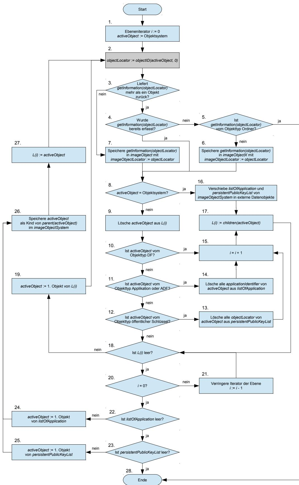
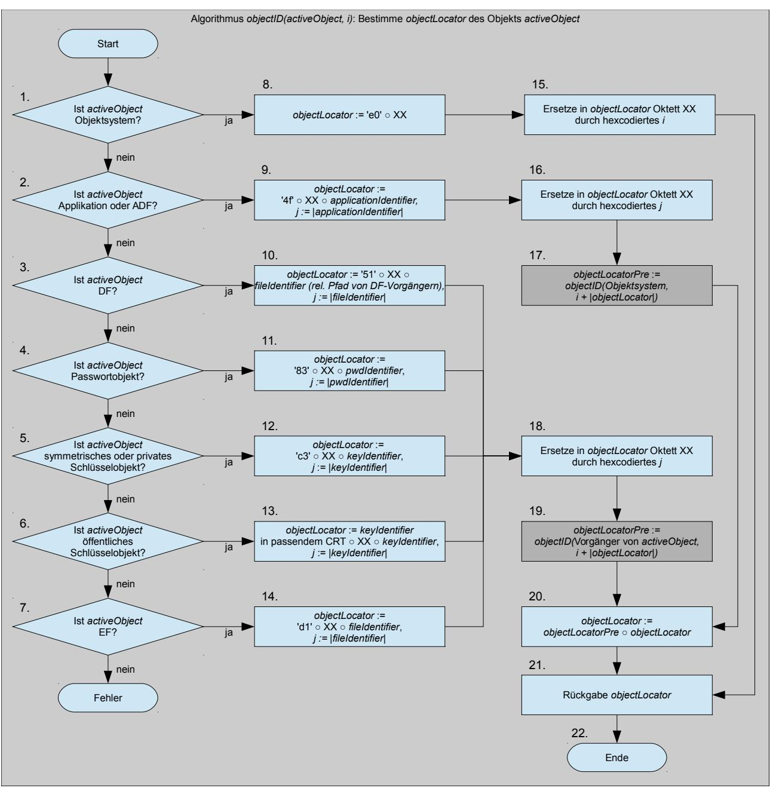
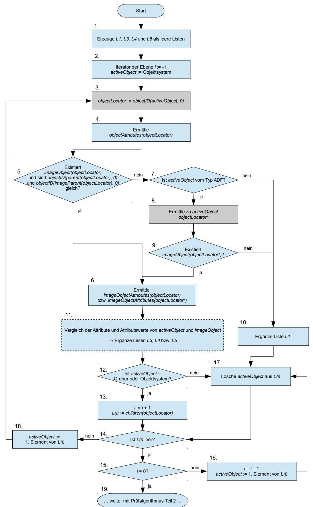
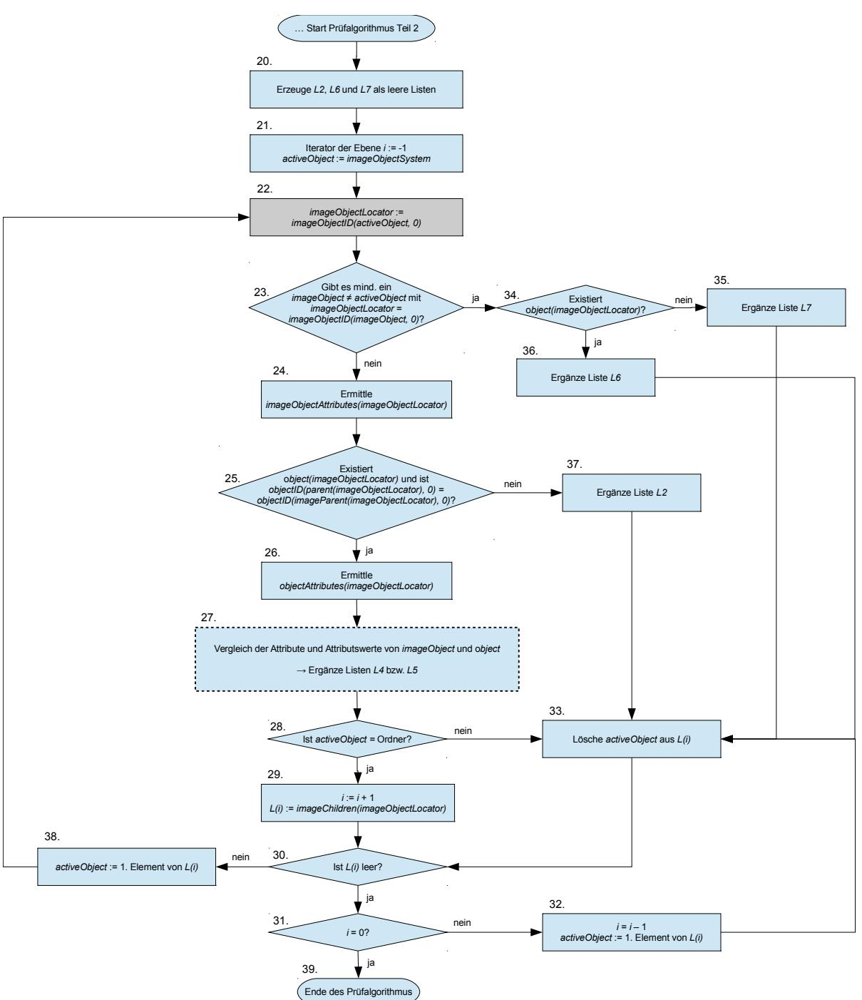

# BSI TR-03143

# eHealth – G2-COS Konsistenz-Prüftool

Version 1.1 – 18.05.2017


Bundesamt für Sicherheit in der Informationstechnik Postfach 20 03 63 53133 Bonn E-Mail: bsi@bsi.bund.de Internet: https://www.bsi.bund.de © Bundesamt für Sicherheit in der Informationstechnik 2017

| 1              | Einleitung 8                                                                                                                        |  |
|----------------|-------------------------------------------------------------------------------------------------------------------------------------|--|
| 1.1            | Zielstellung der Technischen Richtlinie 8                                                                                           |  |
| 1.2            | Struktur der Technischen Richtlinie 8                                                                                               |  |
| 1.3            | Terminologie 8                                                                                                                      |  |
| 1.4            | Änderungshistorie 9                                                                                                                 |  |
| 2              | Gegenstand und Grundlagen der Konsistenz-Prüfung des Objektsystems von Karten-Produkten10                                           |  |
| 2.1            | Allgemeine Anforderungen an das Konsistenz-Prüftool12                                                                               |  |
| 2.1.1          | Allgemeine Voraussetzungen für die Konsistenz-Prüfung13                                                                             |  |
| 2.1.2          | Anforderungen an die Einsatzumgebung13                                                                                              |  |
| 3              | Funktionale Anforderungen an das Konsistenz-Prüftool14                                                                              |  |
| 3.1            | Überprüfung der Voraussetzungen für die Konsistenz-Prüfung14                                                                        |  |
| 3.1.1          | Selbsttest des Konsistenz-Prüftools14                                                                                               |  |
| 3.1.2          | Prüfung der Kommunikation mit dem Prüfling15                                                                                        |  |
| 3.1.3          | Prüfung der Objektsystem-Spezifikation15                                                                                            |  |
| 3.1.4          | Prüfung des Fingerprint-Sollwerts und der Karten-Plattform16                                                                        |  |
| 3.1.5          | Prüfung der Übersetzungstabelle zur Karten-Plattform17                                                                              |  |
| 3.2            | Ermittlung des Objektsystems des Karten-Produkts18                                                                                  |  |
| 3.2.1          | Anwendung des Suchalgorithmus 19                                                                                                    |  |
| 3.2.2          | Beschreibung des Suchalgorithmus20                                                                                                  |  |
| 3.2.3          | Beschreibung des Algorithmus zur Bestimmung des objectLocator24                                                                     |  |
| 3.3            | Umcodierung 26                                                                                                                      |  |
| 3.4            | Konsistenz-Prüfung des Objektsystems des Karten-Produkts gegen die Objektsystem-Spezifikation                                       |  |
|                | 32                                                                                                                                  |  |
| 3.4.1          | Beschreibung des Prüfalgorithmus (erster Teil)34                                                                                    |  |
| 3.4.2          | Beschreibung des Prüfalgorithmus (zweiter Teil)38                                                                                   |  |
| 3.4.3          | Struktur des Prüfalgorithmus 41                                                                                                     |  |
| 3.4.4<br>3.4.5 | Behandlung von Ordnern 41<br>Semantischer Abgleich von Zugriffsregeln43                                                             |  |
| 3.4.6          | Detailprüfung der Attributswerte 54                                                                                                 |  |
|                |                                                                                                                                     |  |
| 3.5<br>3.5.1   | Erstellung und Ausgabe des Testberichts74<br>Allgemeine Angaben zur durchgeführten Prüfung und Zusammenfassung der Prüfergebnisse74 |  |
| 3.5.2          | Detaillierte Ergebnisse der Prüfung78                                                                                               |  |
| 3.5.3          | Kommunikationsprotokoll 81                                                                                                          |  |
| 4              | Konformitätsnachweis des Konsistenz-Prüftools82                                                                                     |  |
| 4.1            | Herstellerbeistellungen 82                                                                                                          |  |
| 4.2            | Prüfspezifikation 84                                                                                                                |  |
| 4.2.1          | Externe Schnittstellen 84                                                                                                           |  |
| 4.2.2          | Designdokumentation 85                                                                                                              |  |
| 4.2.3          | Implementierung 86                                                                                                                  |  |
| 4.2.4          | Benutzerdokumentation 86                                                                                                            |  |
| 4.2.5          | Test 86                                                                                                                             |  |
| 4.3            | Prüfbericht zum Konformitätsnachweis87                                                                                              |  |
| 4.3.1          | Allgemeine Angaben zur Prüfungsdurchführung87                                                                                       |  |
| 4.3.2          | Angaben zu Tests der Such- und Prüfalgorithmen87                                                                                    |  |
| 4.3.3          | Auflistung der Testergebnisse 88                                                                                                    |  |
|                |                                                                                                                                     |  |

| 5   | Schemadateien 89                                                         |  |
|-----|--------------------------------------------------------------------------|--|
| 6   | Übersetzungstabellen 90                                                  |  |
| 6.1 | Namen für accessMode in <accessRules> 92                                 |  |
| 6.2 | Namen für accessMode in <accessRulesPublicAuthenticationObject>97        |  |
| 6.3 | Namen für accessMode in <accessRulesPublicSignatureVerificationObject>97 |  |
| 6.4 | Namen für accessMode in <accessRulesSessionkeys>97                       |  |
| 7   | Literaturverzeichnis 98                                                  |  |
| 8   | Anhang: Plattformspezifisches Auswertungstool (informativ)99             |  |

## Abbildungsverzeichnis

| Abbildung 3.1: Suchalgorithmus zum Identifizieren der Objekte des Objektsystems des Karten-Produkts23 |  |
|-------------------------------------------------------------------------------------------------------|--|
| Abbildung 3.2: Algorithmus zur Bestimmung des objectLocator26                                         |  |
| Abbildung 3.3: Prüfalgorithmus zum Vergleichen des Objektsystems des Karten-Produkts und der          |  |
| Objektsystem-Spezifikation, Teil 1 37                                                                 |  |
| Abbildung 3.4: Prüfalgorithmus zum Vergleichen des Objektsystems des Karten-Produkts und der          |  |
| Objektsystem-Spezifikation, Teil 2 40                                                                 |  |

## Tabellenverzeichnis

| Tabelle 3.1: Umcodierung von Attributen 27                                                    |  |
|-----------------------------------------------------------------------------------------------|--|
| Tabelle 3.2: Umcodierung von accessCondition (1)28                                            |  |
| Tabelle 3.3: Umcodierung der accessCondition (2)28                                            |  |
| Tabelle 3.4: Umcodierung von accessMode 28                                                    |  |
| Tabelle 3.5: Umcodierung von accessRights 28                                                  |  |
| Tabelle 3.6: Umcodierung von accessRulesVerification/accessRulesAuthentication29              |  |
| Tabelle 3.7: Umcodierung von                                                                  |  |
| accessRules/accessRulesVerification/accessRulesAuthentication/accessRulesSessionkeys29        |  |
| Tabelle 3.8: Umcodierung von applicationIdentifier30                                          |  |
| Tabelle 3.9: Umcodierung von CHAT 30                                                          |  |
| Tabelle 3.10: Umcodierung von child 30                                                        |  |
| Tabelle 3.11: Umcodierung von children 30                                                     |  |
| Tabelle 3.12: Umcodierung von keyMode 31                                                      |  |
| Tabelle 3.13: Umcodierung von listAlgorithmIdentifier31                                       |  |
| Tabelle 3.14: Umcodierung von n und e 31                                                      |  |
| Tabelle 3.15: Umcodierung von P 32                                                            |  |
| Tabelle 3.16: Umcodierung von startSSecList 32                                                |  |
| Tabelle 3.17: Vergleich der Attributswerte von Applikation, DF und ADF43                      |  |
| Tabelle 3.18: Behandlung von Ordnern 54                                                       |  |
| Tabelle 3.19: Vergleich der Attributswerte von accessRules55                                  |  |
| Tabelle 3.20: Vergleich der Attributswerte von accessRulesPublicAuthenticationObject55        |  |
| Tabelle 3.21: Vergleich der Attributswerte von accessRulesPublicSignatureVerificationObject55 |  |
| Tabelle 3.22: Vergleich der Attributswerte von accessRulesSessionkeys56                       |  |
| Tabelle 3.23: Vergleich der Attributswerte von algorithmIdentifier56                          |  |
| Tabelle 3.24: Vergleich der Attributswerte von applicationIdentifier56                        |  |
| Tabelle 3.25: Vergleich der Attributswerte von CHA57                                          |  |
| Tabelle 3.26: Vergleich der Attributswerte von CHAT57                                         |  |
| Tabelle 3.27: Vergleich der Attributswerte von children58                                     |  |
| Tabelle 3.28: Vergleich der Attributswerte von coldAnswerToReset58                            |  |
| Tabelle 3.29: Vergleich der Attributswerte von expirationDate59                               |  |
| Tabelle 3.30: Vergleich der Attributswerte von fileIdentifier59                               |  |
| Tabelle 3.31: Vergleich der Attributswerte von flagChecksum59                                 |  |
| Tabelle 3.32: Vergleich der Attributswerte von flagEnabled60                                  |  |
| Tabelle 3.33: Vergleich der Attributswerte von flagRecordLifeCycleStatus60                    |  |
| Tabelle 3.34: Vergleich der Attributswerte von flagTransactionMode61                          |  |
| Tabelle 3.35: Vergleich der Attributswerte von icssn861                                       |  |
| Tabelle 3.36: Vergleich der Attributswerte von keyAvailable62                                 |  |
| Tabelle 3.37: Vergleich der Attributswerte von keyIdentifier62                                |  |
| Tabelle 3.38: Vergleich der Attributswerte von keyType62                                      |  |
| Tabelle 3.39: Vergleich der Attributswerte von lifeCycleStatus63                              |  |
| Tabelle 3.40: Vergleich der Attributswerte von listAlgorithmIdentifier64                      |  |
| Tabelle 3.41: Vergleich der Attributswerte von maximumNumberOfRecords64                       |  |
| Tabelle 3.42: Vergleich der Attributswerte von maximumLength65                                |  |
| Tabelle 3.43: Vergleich der Attributswerte von maximumRecordLength65                          |  |
| Tabelle 3.44: Vergleich der Attributswerte von minimumLength65                                |  |
| Tabelle 3.45: Vergleich der Attributswerte von modulusLength66                                |  |
| Tabelle 3.46: Vergleich der Attributswerte von numberOfOctet66                                |  |
| Tabelle 3.47: Vergleich der Attributswerte von numberScenario66                               |  |
| Tabelle 3.48: Vergleich der Attributswerte von oid67                                          |  |
| Tabelle 3.49: Vergleich der Attributswerte von passwordReference67                            |  |

| Tabelle 3.50: Vergleich der Attributswerte von pointInTime67                                |  |
|---------------------------------------------------------------------------------------------|--|
| Tabelle 3.51: Vergleich der Attributswerte von positionLogicalEndOfFile68                   |  |
| Tabelle 3.52: Vergleich der Attributswerte von privateElcKey68                              |  |
| Tabelle 3.53: Vergleich der Attributswerte von privateRsaKey68                              |  |
| Tabelle 3.54: Vergleich der Attributswerte von publicElcKey69                               |  |
| Tabelle 3.55: Vergleich der Attributswerte von publicElcKeyData69                           |  |
| Tabelle 3.56: Vergleich der Attributswerte von publicRsaKey69                               |  |
| Tabelle 3.57: Vergleich der Attributswerte von publicRsaKeyData70                           |  |
| Tabelle 3.58: Vergleich der Attributswerte von pukUsage70                                   |  |
| Tabelle 3.59: Vergleich der Attributswerte von pwdIdentifier71                              |  |
| Tabelle 3.60: Vergleich der Attributswerte von retryCounter71                               |  |
| Tabelle 3.61: Vergleich der Attributswerte von shareable72                                  |  |
| Tabelle 3.62: Vergleich der Attributswerte von shortFileIdentifier72                        |  |
| Tabelle 3.63: Vergleich der Attributswerte von startRetryCounter72                          |  |
| Tabelle 3.64: Vergleich der Attributswerte von startSsecList73                              |  |
| Tabelle 3.65: Vergleich der Attributswerte von transportStatus73                            |  |
| Tabelle 3.66: Vergleich der Attributswerte von warmAnswerToReset74                          |  |
| Tabelle 6.1: Objekttypen <ADF>, <Application> und <DF>92                                    |  |
| Tabelle 6.2: Objekttypen <PWD> und <MultireferencePWD>92                                    |  |
| Tabelle 6.3: Objekttypen <PrivateElcKey> und <PrivateRsaKey>93                              |  |
| Tabelle 6.4: Objekttyp PublicKey 94                                                         |  |
| Tabelle 6.5: Objekttyp StructuredEF 95                                                      |  |
| Tabelle 6.6: Objekttyp <SymmetricAutKey> 95                                                 |  |
| Tabelle 6.7: Objekttyp <SymmetricConnectionKey>96                                           |  |
| Tabelle 6.8: Objekttyp <TransparentElementaryFile>96                                        |  |
| Tabelle 6.9: Objekttyp PublicKey 97                                                         |  |
| Tabelle 6.10: Objekttyp PublicKey 97                                                        |  |
| Tabelle 6.11: Objekttypen <SymmetricConnectionKey>, <PrivateElcKey> und <SymmetricAutKey>97 |  |

## <span id="page-7-3"></span>1 Einleitung

## <span id="page-7-2"></span>1.1 Zielstellung der Technischen Richtlinie

Die eHealth-Karten der Generation 2 werden durch ein einheitliches Chipkartenbetriebssystem (COS G2) und anwendungsorientierte Objektsysteme spezifiziert. Die Zulassung der eHealth-Karten der Generation 2 basiert auf Konformitätstests und Sicherheitsprüfungen.

Die Sicherheitsaussage für ein Karten-Produkt soll durch eine Common Criteria-Zertifizierung der Karten-Plattform konform zum Schutzprofil "Card Operating System Generation 2" [BSI-CC-PP-0082] und durch die Konsistenz-Prüfung des Objektsystems des Karten-Produkts gegen die Objektsystem-Spezifikation erbracht werden. Die Common Criteria-Zertifizierung der Karten-Plattform umfasst die Sicherheitsfunktionalität des Sicherheitsschaltkreises und des Chipkartenbetriebssystems. Die Konsistenz-Prüfung des Objektsystems des Karten-Produkts verifiziert die Korrektheit des Objektsystems durch funktionale Tests unter Verwendung eines Konsistenz-Prüftools.

Die vorliegende Technische Richtlinie BSI TR-03143 "eHealth - G2-COS Konsistenz-Prüftool" beschreibt die funktionalen Anforderungen an das Konsistenz-Prüftool und die Konformitätsprüfung des Konsistenz-Prüftools gegen die funktionalen Anforderungen dieser Technischen Richtlinie. Das Konsistenz-Prüftool ermittelt die vollständige Struktur des Objektsystems des Karten-Produkts und sämtlicher sicherheitsrelevanter Attribute des Objektsystems. Es kann sowohl im Rahmen von Sicherheitsprüfungen als auch für funktionale Konformitätstests verwendet werden (siehe hierzu die Ausführungen in Kapitel [2\)](#page-9-0).

Die Technische Richtlinie BSI TR-03144 "eHealth – Konformitätsnachweis für Karten-Produkte der Kartengeneration G2" beschreibt die Konformitätsprüfung und Zertifizierung von G2-Karten-Produkten (im initialisierten Zustand). Zielsetzung der TR-Zertifizierung von Karten-Produkten nach der BSI TR-03144 ist die Erlangung einer Aussage zur sicherheitstechnischen Eignung solcher Karten-Produkte. Das Konsistenz-Prüftool "PT eHealth G2-COS" wird im Rahmen dieser Konformitätsprüfung der Karten-Produkte zum Zwecke ihres Konsistenzabgleichs eingesetzt und unterstützt eine Bewertung der Ergebnisse des Konsistenzabgleichs unter sicherheitstechnischen Aspekten.

## <span id="page-7-1"></span>1.2 Struktur der Technischen Richtlinie

Die Technische Richtlinie beschreibt zunächst die methodischen Grundlagen und die Aufgaben der Konsistenz-Prüfung des Objektsystems von Karten-Produkten. Daraus werden die funktionalen Anforderungen des Konsistenz-Prüftools zur Ermittlung des Objektsystems und dessen Verifikation gegen die Objektsystem-Spezifikation abgeleitet. Das Konsistenz-Prüftool selbst unterliegt dem abschließend beschriebenen Konformitätsnachweis mit der Technischen Richtlinie. Die informative Anlage beschreibt ein optionales plattformspezifisches Werkzeug zur Unterstützung der Auswertung der Testberichte des Konsistenz-Prüftools.

## <span id="page-7-0"></span>1.3 Terminologie

Für die genauere Unterscheidung zwischen normativen und informativen Inhalten werden die dem [RFC2119] entsprechenden in Großbuchstaben geschriebenen, deutschen Schlüsselworte verwendet:

- **MUSS** bedeutet, dass es sich um eine normative Anforderung handelt.
- **DARF NICHT** / **DARF KEIN** bezeichnet den normativen Ausschluss einer Eigenschaft.
- **SOLL** beschreibt eine dringende Empfehlung. Abweichungen zu diesen Festlegungen müssen begründet werden.
- **SOLL NICHT** / **SOLL KEIN** kennzeichnet die dringende Empfehlung, eine Eigenschaft auszuschließen. Abweichungen zu diesen Festlegungen müssen begründet werden.
- **KANN** / **DARF** bedeutet, dass die Eigenschaften fakultativ oder optional sind.

Die Kapitel der Technischen Richtlinie sind grundsätzlich als normativ anzusehen. Informative Kapitel werden explizit am Anfang gekennzeichnet.

## <span id="page-8-0"></span>1.4 Änderungshistorie

| Version | Datum      | Änderung                                                                                                                                        |
|---------|------------|-------------------------------------------------------------------------------------------------------------------------------------------------|
| V 1.0   | 08.05.2015 | Erste veröffentlichte Fassung                                                                                                                   |
| V 1.1   | 18.05.2017 | Überarbeitung: Semantischer Vergleich von Zugriffsregeln, Übersetzungstabellen,<br>Behandlung von Ordnern, Prüfalgorithmus, Auslesen des EF.ATR |
|         |            |                                                                                                                                                 |
|         |            |                                                                                                                                                 |

## <span id="page-9-0"></span>2 Gegenstand und Grundlagen der Konsistenz-Prüfung des Objektsystems von Karten-Produkten

Dieses Kapitel beschreibt den Gegenstand und die Grundlagen der Konsistenz-Prüfung des Objektsystems von Karten-Produkten.

Das eHealth G2-COS Konsistenz-Prüftool dient der automatisierten Ermittlung des in einem Karten-Produkt mit COS-Betriebssystem implementierten Objektsystems, der Prüfung der Übereinstimmung dieses Objektsystems mit einer Objektsystem-Spezifikation und der Ausgabe eines Testberichts. Die Konsistenz-Prüfung kann für funktionale Konformitätstests und für Sicherheitsüberprüfungen des Objektsystems eines Karten-Produkts verwendet werden. Beide Arten der Konsistenz-Prüfung des Objektsystems unterscheiden sich in der Zielstellung, den Testergebnissen und der Bewertung der Testergebnisse. Sie können in unterschiedlichen Lebenszyklusphasen für unterschiedliche Objektsystem-Spezifikationen verwendet werden.

Eine *Karten-Plattform* besteht aus dem *Sicherheitsschaltkreis*, der darauf installierten *Software* und dem *Wrapper*. Der *Sicherheitsschaltkreis* ist ein in den Kartenkörper der Chipkarte eingelassener Microcontroller mit Kontakten für die kontaktbehaftete Kommunikation oder mit Antenne für die kontaktlose Kommunikation. Die auf dem Sicherheitsschaltkreis installierte *Software* muss als Hauptbestandteil das *Chipkartenbetriebssystem* (engl. card operating system, kurz COS) sowie optional *Unterstützungssoftware* des Sicherheitsschaltkreises (engl. integrated circuit dedicated support software) enthalten.

Die *Unterstützungssoftware* wird vom Hersteller des Sicherheitsschaltkreises für die Nutzung der spezifischen Funktionen und insbesondere der Sicherheitsfunktionen des Sicherheitsschaltkreises durch das Chipkartenbetriebssystem bereitgestellt.

Die vorliegende Technische Richtlinie setzt voraus, dass das *Chipkartenbetriebssystem* die "Spezifikation des Card Operating System – Elektrische Schnittstelle" der gematik ([gemSpec\_COS], im weiteren kurz "COS-Spezifikation" genannt) erfüllt. Die COS-Spezifikation definiert verpflichtende Funktionen und optionale Funktionspakete wie z. B. die Pakete Option\_USB\_Schnittstelle, Option\_kontaktlose\_Schnittstelle, Option\_logische\_Kanäle, Option\_PACE\_PCD und Option\_Kryptobox, wobei Option\_USB\_Schnittstelle im weiteren nicht betrachtet wird, da es keinen Einfluss auf das Objektsystem eines Karten-Produkts hat. Die COS-Spezifikation lässt ferner eine Reihe herstellerspezifischer Funktionen (z. B. die Unterstützung weiterer Varianten des Kommandos SELECT) und Erweiterungen (z. B. längere Objektbezeichner wie applicationIdentifier) des Betriebssystems zu, die im Folgenden als "COS-Erweiterungen" bezeichnet werden.

Der *Wrappe*r ist eine außerhalb der Karten-Plattform implementierte und ausgeführte Software, die herstellerspezifische Funktionen der Schnittstelle zur Karten-Plattform kapselt. Die Schnittstelle zwischen dem Wrapper und dem Konsistenz-Prüftool ist in [gemSpec\_COS-Wrapper] definiert.

Die *Benutzerdokumentation zur Karten-Plattform* beschreibt die äußeren Schnittstellen der Karten-Plattform und deren sichere Nutzung.

Die Karten-Plattformen für die elektronische Gesundheitskarte und weitere Typen von eHealth-Karten werden konform zu dem Schutzprofil "Card Operating System Generation 2" [BSI-CC-PP-0082] nach den Common Criteria zertifiziert.

Ein *Karten-Produkt* umfasst eine für die jeweilige Phase des Lebenszyklus voll funktionstüchtige Chipkarte. Die Chipkarte besteht aus einem Kartenkörper, der Karten-Plattform und einem auf der Karten-Plattform aufbauenden *Objektsystem*. Die *Benutzerdokumentation zum Karten-Produkt* beschreibt das Karten-Produkt und seine sichere Nutzung.

Ein *Objektsystem* besteht aus nicht-ausführbaren Daten, die in Objekten hierarchisch organisiert sind und durch das Chipkartenbetriebssystem gelesen und geschrieben werden. Eine *Objektsystem-Spezifikation* definiert für ein Karten-Produkt einer bestimmten Ausprägung die hierarchische Struktur des Objektsystems mit seinen anwendungsspezifischen Objekten und deren Attributen. Die Syntax des Objektsystems ist wesentlich durch die COS-Spezifikation vorgegeben. Die Semantik des Objektsystems liegt außerhalb der vorliegenden Technischen Richtlinie. Die Objektsystem-Spezifikationen liegen als XML-Dateien vor, die dem XML-Schema *schema\_objektsystem-spezifikation.xsd* für Objektsystem-Spezifikationen entsprechen, und können zum Nachweis ihrer Authentizität digital signiert sein. Näheres dazu regelt der Herausgeber der jeweiligen Objektsystem-Spezifikation.

Die *Konsistenz-Prüfung für funktionale Konformitätstests* des Objektsystems eines Karten-Produkts dient dem Nachweis, dass das Objektsystem die für das Karten-Produkt spezifizierten Funktionen ermöglicht. Das Objektsystem des Karten-Produkts muss dafür alle in der Objektsystem-Spezifikation definierten Objekte mit den vorgesehenen Attributen implementieren.

Im Zusammenhang mit der Sicherheitsüberprüfung des Objektsystems des Karten-Produkts unter Berücksichtigung der zertifizierten Sicherheitsfunktionalität der dem Karten-Produkt unterliegenden Karten-Plattform ist Folgendes zu beachten.

Der *Evaluierungsgegenstand* (EVG) der für die Technische Richtlinie maßgeblichen Common Criteria-Zertifizierung der Karten-Plattform umfasst den Sicherheitsschaltkreis, die Gesamtheit des durch den Sicherheitsschaltkreis ausführbaren Codes (inklusive seiner Konfiguration), den Wrapper und die Benutzerdokumentation zur Karten-Plattform. Die zertifizierte *Sicherheitsfunktionalität* (engl. target of evaluation security functionality, kurz TSF) ist durch die funktionalen Sicherheitsanforderungen (engl. security functional requirements, kurz SFR) in den Sicherheitsvorgaben und der Benutzerdokumentation zur Karten-Plattform beschrieben. Die Anwendung der Sicherheitsfunktionalität zum Schutz der Benutzerdaten wird durch die *TSF-Daten* festgelegt.

Die *TSF-Daten* umfassen die *Authentisierungsdaten* und die *Sicherheitsattribute*. Die *Authentisierungsdaten* dienen der Prüfung vorgegebener Identitäten der Benutzer. Man unterscheidet zwischen *Authentisierungsverifikationsdaten*, d. h. die vom Benutzer zum Nachweis seiner Identität benutzten Daten, wie z. B. ein privater Schlüssel einer Chipkarte, und *Authentisierungsreferenzdaten*, d. h. die durch die TSF zur Prüfung der vorgegebenen Identität benutzten Daten, wie z. B. ein öffentlicher Schlüssel zur Prüfung der Zertifikate einer Chipkarten-PKI. *Sicherheitsattribute* beschreiben die Sicherheitseigenschaften, die Benutzern und Objekten zugeordnet sind. Ein Sicherheitsattribut eines Benutzers ist insbesondere die ihm zugewiesene Rolle, d. h. die Menge von Zugriffsrechten, die ihm durch die Zugriffsregeln der Objekte gewährt werden. Sicherheitsattribute der Objekte beschreiben deren Sicherheitseigenschaften, wie z. B. die zulässigen kryptographischen Funktionen eines Schlüsselobjekts, und die Zugriffsregeln für das jeweilige Objekt. Die Sicherheitsattribute sind ein Teil der Attribute des Objektsystems eines Karten-Produkts als Ganzem und seiner Objekte.

Die *Konsistenz-Prüfung für Sicherheitsüberprüfungen* des Objektsystems eines Karten-Produkts dient dem Nachweis, dass das Objektsystem des Karten-Produkts die Sicherheitsfunktionalität der Karten-Plattform in der zertifizierten Form nutzt und keine der Sicherheitspolitik oder der Objektsystem-Spezifikation widersprechenden Objekte oder Attribute implementiert. Es müssen folglich auch die zusätzlich zur Objektsystem-Spezifikation im Karten-Produkt implementierten Objekte und Attribute ermittelt und bewertet werden.

Das Konsistenz-Prüftool soll sowohl für funktionale Konformitätstests als auch für Sicherheitsüberprüfungen des Objektsystems eines Karten-Produkts eingesetzt werden. Es muss folglich einen Konsistenzabgleich von Sollwert (in der Objektsystem-Spezifikation spezifiziertes Objektsystem) und Istwert (im Karten-Produkt implementiertes Objektsystem) durchführen. Genauer: Das Konsistenz-Prüftool muss

• einerseits für eine vorgegebene Objektsystem-Spezifikation (d. h. die spezifizierte Objektsystem-Struktur, die Existenz und Stellung aller spezifizierten Objekte in der Objektsystem-Struktur und alle spezifizierten Attribute) die Korrektheit und Vollständigkeit der Umsetzung bzw. Implementierung im Karten-Produkt überprüfen, und

• andererseits das im Karten-Produkt implementierte Objektsystem (d. h. die implementierte Objektsystem-Struktur und alle implementierten Objekte und Attribute) feststellen und dieses mit den Vorgaben der Objektsystem-Spezifikation vergleichen.

## <span id="page-11-0"></span>2.1 Allgemeine Anforderungen an das Konsistenz-Prüftool

Das Konsistenz-Prüftool dient der automatisierten Ermittlung des Objektsystems eines Karten-Produkts und der Konsistenz-Prüfung dieses Objektsystems gegen eine Objektsystem-Spezifikation. Die Ergebnisse der Konsistenz-Prüfung werden durch das Konsistenz-Prüftool in einem Testbericht dokumentiert und ausgegeben.

Die Ermittlung des Objektsystems des Karten-Produkts identifiziert alle Objekte des Objektsystems, ermittelt die Stellung dieser Objekte im Objektsystem und bestimmt alle Attribute dieser Objekte durch Kommunikation mit dem Karten-Produkt über den Wrapper und die direkte Kommunikation mit dem Prüfling.

Die Konsistenz-Prüfung des Objektsystems im Karten-Produkt

- vergleicht für alle in der Objektsystem-Spezifikation definierten Objekte ihr Vorhandensein, ihre Stellung in der Objektsystem-Struktur und die Werte der Attribute dieser Objekte mit den im Karten-Produkt ermittelten Objekten,
- identifiziert alle zusätzlich zur Objektsystem-Spezifikation im Karten-Produkt vorhandenen Objekte und deren Stellung in der Objektsystem-Struktur sowie alle zusätzlichen Attribute,
- bereitet die Ergebnisse für den Testbericht auf.

Der vom Konsistenz-Prüftool zum Karten-Produkt ausgegebene Testbericht enthält Angaben zum Prüfvorgang, zum geprüften Karten-Produkt (im Folgenden "Prüfling" genannt) und zum Ergebnis der Konsistenz-Prüfung in Form einer Zusammenfassung. Der Testbericht enthält ferner die detaillierten Prüfergebnisse der Konsistenz-Prüfung. Das Konsistenz-Prüftool gibt darüber hinaus das Protokoll der Kommunikation zwischen Konsistenz-Prüftool und Wrapper bzw. Prüfling aus.

Das Konsistenz-Prüftool besteht aus einem Java-Programm und der zugehörigen Benutzerdokumentation und ist selbst-signiert.

Das Java-Programm besitzt eine graphische Benutzeroberfläche, Kommunikationsschnittstellen zu einem Kartenleser und zum Wrapper, der mit dem Prüfling kommuniziert, sowie Import- und Exportschnittstellen für Dateien.

Zum Konsistenz-Prüftool gehören ferner vier XML-Schema-Dateien, die im Folgenden beschrieben werden.

Das XML-Schema für Objektsystem-Spezifikationen, das XML-Schema für Fingerprint-Sollwerte, das XML-Schema für Übersetzungstabellen und das XML-Schema für Testberichte sind als digital signierte Dateien Bestandteil des Konsistenz-Prüftools.

Das XML-Schema für Objektsystem-Spezifikationen definiert die Strukturanforderungen an die von dem COS-Betriebssystem unterstützten und durch das Konsistenz-Prüftool zu verarbeitenden Objektsystem-Spezifikationen. Es ist als Datei *schema\_objektsystem-spezifikation.xsd* Bestandteil der vorliegenden Technischen Richtlinie und definiert als solche zugehörige funktionale Anforderungen an das Konsistenz-Prüftool.

Das XML-Schema für Fingerprint-Sollwerte spezifiziert die Strukturanforderungen an die durch das Konsistenz-Prüftool zu importierenden und zu verwendenden Fingerprint-Sollwerte. Es ist als Datei *schema\_fingerprint-sollwert.xsd* Bestandteil der vorliegenden Technischen Richtlinie und definiert als solche zugehörige funktionale Anforderungen an das Konsistenz-Prüftool.

Das XML-Schema für Übersetzungstabellen spezifiziert die Strukturanforderungen an die durch das Konsistenz-Prüftool zu verarbeitenden Übersetzungstabellen, sofern solche im Prüflauf des Konsistenz-Prüftools für Karten-Produkte Verwendung finden sollen. Es ist als Datei *schema\_AccessModeTranslationTable.xsd* Bestandteil der vorliegenden Technischen Richtlinie und definiert als solche zugehörige funktionale Anforderungen an das Konsistenz-Prüftool.

Das XML-Schema für Testberichte spezifiziert die Strukturanforderungen an die durch das Konsistenz-Prüftool für Karten-Produkte auszugebenden Testberichte (XML). Es ist als Datei *schema\_testbericht.xsd* Bestandteil der vorliegenden Technischen Richtlinie und definiert als solche zugehörige funktionale Anforderungen an das Konsistenz-Prüftool.

### <span id="page-12-1"></span>2.1.1 Allgemeine Voraussetzungen für die Konsistenz-Prüfung

Für die Konsistenz-Prüfung des Objektsystems eines Karten-Produkts durch das Konsistenz-Prüftool müssen folgende Voraussetzungen erfüllt sein:

- 1. Das Java-Programm des Konsistenz-Prüftools ist auf einem Personalcomputer mit Java-Runtime-Environment und angeschlossenem Kartenleser installiert,
- 2. der Prüfling liegt als Chipkarte vor und steckt im Kartenleser,
- 3. der zum Prüfling gehörige Wrapper ist auf dem Personalcomputer installiert und die Kommunikation zwischen Java-Programm des Konsistenz-Prüftools und Wrapper ist eingerichtet,
- 4. die Objektsystem-Spezifikation liegt als XML-Datei zum Import in das Konsistenz-Prüftool vor und kann vom Herausgeber digital signiert sein,
- 5. es liegt mindestens ein Fingerprint-Sollwert als XML-Datei für die Karten-Plattform des Prüflings zum Import in das Konsistenz-Prüftool vor und ist vom Herausgeber gültig digital signiert,
- 6. sofern eine Übersetzungstabelle zur Karten-Plattform zum Einsatz kommen soll: die Übersetzungstabelle zur Karten-Plattform liegt als XML-Datei zum Import in das Konsistenz-Prüftool vor und ist vom Herausgeber gültig digital signiert,
- 7. die Benutzerdokumentation des Konsistenz-Prüftools, des Karten-Produkts und der Karten-Plattform einschließlich Wrapper liegen dem Prüfenden vor.

### <span id="page-12-0"></span>2.1.2 Anforderungen an die Einsatzumgebung

Das Konsistenz-Prüftool ist für den Einsatz unter Laborbedingungen in Verantwortung des Prüfenden vorgesehen. Das Konsistenz-Prüftool implementiert außer dem Integritätsselbsttest keine weiteren IT-Sicherheitsmaßnahmen.

Näheres zu den Anforderungen an die Einsatzumgebung des Konsistenz-Prüftools bestimmt die Technische Richtlinie [TR03106]. Darüber hinaus etwaig bestehende weitere Anforderungen an die Einsatzumgebung des Konsistenz-Prüftools sind der Benutzerdokumentation zum Konsistenz-Prüftool zu entnehmen.

Anforderungen an die im Zusammenhang mit dem Konsistenz-Prüftool verwendeten Signaturen und zugehörigen Signaturschlüssel werden über die Technische Richtlinie [TR03144] und ihren Anhang [TR03144-A] geregelt. Darüber hinaus etwaig bestehende weitere Anforderungen an die Signaturen und zugehörigen Signaturschlüssel sind der Benutzerdokumentation zum Konsistenz-Prüftool zu entnehmen.

## <span id="page-13-2"></span>3 Funktionale Anforderungen an das Konsistenz-Prüftool

Dieses Kapitel definiert die funktionalen Anforderungen an das Konsistenz-Prüftool. Sie können wie folgt zusammengefasst werden:

- 1. Überprüfung der Voraussetzungen für die Konsistenz-Prüfung,
- 2. Ermittlung des Objektsystems des Karten-Produkts,
- 3. Konsistenz-Prüfung des Objektsystems des Karten-Produkts gegen die Objektsystem-Spezifikation,
- 4. Erstellung und Ausgabe des Testberichts.

Die funktionalen Anforderungen werden in den folgenden Kapiteln im Format (Fxy.z) durchnummeriert, wobei "F" für funktionale Anforderung, "x" für die Gruppe, "y" für die Untergruppe und "z" für laufende Nummern innerhalb der Untergruppe stehen. Nicht-funktionale Anforderungen werden im Fließtext beschrieben.

## <span id="page-13-1"></span>3.1 Überprüfung der Voraussetzungen für die Konsistenz-Prüfung

Die Überprüfung der Voraussetzungen für die Konsistenz-Prüfung umfasst die folgenden Schritte:

- 1. Selbsttest des Konsistenz-Prüftools,
- 2. Prüfung der Kommunikation mit dem Prüfling über den Kartenleser und den Wrapper,
- 3. Prüfung der importierten Objektsystem-Spezifikation,
- 4. Prüfung der Authentizität des Fingerprint-Sollwerts und Identifikation der Software des Prüflings,
- 5. sofern eine Übersetzungstabelle zur Karten-Plattform zum Einsatz kommen soll: Prüfung der Authentizität der Übersetzungstabelle zur Karten-Plattform.

Die funktionalen Anforderungen an diese Überprüfungsschritte werden in den folgenden Kapiteln beschrieben und mit (FVy.z) gekennzeichnet.

### <span id="page-13-0"></span>3.1.1 Selbsttest des Konsistenz-Prüftools

Das Konsistenz-Prüftool prüft seine Integrität durch einen Selbsttest.

Der Selbsttest des Konsistenz-Prüftools muss folgende funktionale Anforderungen erfüllen, die mit (FVS.z) gekennzeichnet sind.

- (FVS.1) Das Konsistenz-Prüftool **MUSS** unmittelbar nach jedem Programmstart einen Selbsttest durchführen.
- (FVS.2) Der Selbsttest **MUSS** die Integrität aller vom Java-Programm des Konsistenz-Prüftools verwendeten Java-Bibliotheken und zum Betrieb erforderlichen externen Dateien mittels digitaler Signaturen über das Java-Archiv prüfen.
- (FVS.3) Das Konsistenz-Prüftool **DARF** bei einer festgestellten Integritätsverletzung die betroffene Java-Bibliothek oder zum Betrieb erforderliche externe Datei **NICHT** verwenden.
- (FVS.4) Der Selbsttest **MUSS** dem Benutzer festgestellte Integritätsverletzungen anzeigen und eine Bestätigung der Kenntnisnahme durch Benutzereingabe über die Tastatur oder Maus anfordern.
- (FVS.5) Das Konsistenz-Prüftool **MUSS** bei festgestellten Integritätsverletzungen nach der Bestätigung der Kenntnisnahme durch Benutzereingabe die Programmausführung beenden.

(FVS.6) Der öffentliche Schlüssel zur Prüfung der digitalen Signaturen der Bestandteile des Konsistenz-Prüftools **MUSS** in der prüfenden Java-Bibliothek fest einprogrammiert sein.

#### <span id="page-14-1"></span>3.1.2 Prüfung der Kommunikation mit dem Prüfling

Das Konsistenz-Prüftool prüft die Kommunikation mit dem Prüfling über den Kartenleser und über den Wrapper als Voraussetzung für die Prüfschritte.

Die Prüfung der Kommunikation muss folgende funktionale Anforderungen erfüllen, die mit (FVK.z) gekennzeichnet sind.

- (FVK.1) Das Konsistenz-Prüftool **MUSS** prüfen, ob die Kommunikation mit dem Prüfling über den Kartenleser direkt, d. h. ohne Vermittlung des Wrappers, möglich ist, und dem Prüfenden einen Misserfolg des Kommunikationsversuchs anzeigen.
- (FVK.2) Das Konsistenz-Prüftool **MUSS** prüfen, ob die Kommunikation mit dem Prüfling über den Wrapper möglich ist, und dem Prüfenden einen Misserfolg des Kommunikationsversuchs anzeigen.
- (FVK.3) Das Konsistenz-Prüftool **MUSS** Identifikationsdaten aus dem EF.ATR des Prüflings entnehmen, soweit dies der Prüfling zulässt. Ist das EF.ATR des Prüflings oder Teile davon für das Konsistenz-Prüftool nicht zugreifbar oder erweisen sich die im EF.ATR eingetragenen Informationen als nicht spezifikationskonform implementiert, so **MUSS** das Konsistenz-Prüftool ungeachtet dessen den Prüflauf mit dem Prüfling trotzdem weiter fortsetzen. Siehe auch ([FPZ.3\)](#page-74-0).

#### <span id="page-14-0"></span>3.1.3 Prüfung der Objektsystem-Spezifikation

Das Konsistenz-Prüftool prüft die Authentizität der Objektsystem-Spezifikation, falls diese als signierte Datei vorliegt, und die Konformität der Objektsystem-Spezifikation zum XML-Schema *schema\_objektsystem-spezifikation.xsd* für Objektsystem-Spezifikationen.

Die Objektsystem-Spezifikation wird als (ggf. digital signierte) Datei für den Import in das Konsistenz-Prüftool bereitgestellt. Das XML-Schema *schema\_objektsystem-spezifikation.xsd* für Objektsystem-Spezifikationen ist als digital signierte Datei Bestandteil des Konsistenz-Prüftools.

Die Prüfung und Verwendung der Objektsystem-Spezifikation muss folgende funktionale Anforderungen erfüllen, die mit (FVO.z) gekennzeichnet sind.

- <span id="page-14-3"></span>(FVO.1) Der Prüfende **MUSS** die Datei mit der für den Prüfling zu verwendenden Objektsystem-Spezifikation zum Import auswählen können.
- <span id="page-14-2"></span>(FVO.2) Wenn die Objektsystem-Spezifikation als digital signierte Datei vorliegt,
	- 1. **MUSS** das Konsistenz-Prüftool die Authentizität der Datei der Objektsystem-Spezifikation mittels digitaler Signatur prüfen,
	- 2. **DARF** das Konsistenz-Prüftool die Objektsystem-Spezifikation bei festgestellter Integritätsverletzung **NICHT** importieren, und
	- 3. **MUSS** das Konsistenz-Prüftool dem Prüfenden eine festgestellte Integritätsverletzung anzeigen und eine Bestätigung der Kenntnisnahme durch Benutzereingabe über die Tastatur oder Maus anfordern.
- (FVO.3) Das Konsistenz-Prüftool **MUSS** den öffentlichen Schlüssel zur Prüfung der digitalen Signatur der Datei der Objektsystem-Spezifikation der Konfigurationsdatei des Konsistenz-Prüftools entnehmen.
- (FVO.4) Wenn die Objektsystem-Spezifikation nicht digital signiert vorliegt, so **MUSS** das Konsistenz-Prüftool im Testbericht angeben, dass keine digitale Signatur zur Datei der Objektsystem-Spezifikation vorlag, siehe [\(FPZ.5\)](#page-75-0).
- <span id="page-15-1"></span>(FVO.5) Die Objektsystem-Spezifikation **MUSS** gegen das XML-Schema *schema\_objektsystem-spezifikation.xsd* für Objektsystem-Spezifikationen geprüft werden.
- (FVO.6) Das Konsistenz-Prüftool **DARF KEINE** Objektsystem-Spezifikation ohne erfolgreiche Prüfung gegen das XML-Schema *schema\_objektsystem-spezifikation.xsd* für Objektsystem-Spezifikationen oder mit festgestellter Verletzung des XML-Schemas verwenden.
- <span id="page-15-4"></span>(FVO.7) Das Konsistenz-Prüftool **MUSS** dem Prüfenden eine festgestellte Verletzung des XML-Schemas anzeigen und eine Bestätigung der Kenntnisnahme durch Benutzereingabe über die Tastatur oder Maus anfordern.
- (FVO.8) Das Ergebnis der Prüfung der Objektsystem-Spezifikation **MUSS** im Testbericht mit Angabe des Titels, der Versionsnummer und des vom Konsistenz-Prüftool berechneten Hashwertes der Objektsystem-Spezifikation dokumentiert werden, siehe [\(FPZ.5\)](#page-75-0).

#### <span id="page-15-0"></span>3.1.4 Prüfung des Fingerprint-Sollwerts und der Karten-Plattform

Das Konsistenz-Prüftool prüft die Authentizität des importierten Fingerprint-Sollwerts mittels digitaler Signatur und die Karten-Plattform des Prüflings mittels Kommando FINGERPRINT.

Das Kommando FINGERPRINT ist Teil der Sicherheitsfunktionalität der zertifizierten Karten-Plattform. Die Fingerprint-Sollwerte dienen im Rahmen der Konsistenz-Prüfung des Objektsystems des Karten-Produkts der Identifizierung und dem Nachweis der Authentizität der auf der zertifizierten Karten-Plattform installierten Software.

Das Kommando FINGERPRINT des Chipkartenbetriebssystems gibt zu einem übergebenen Parameter *prefix* eine kryptographische Checksumme (Hashwert oder CMAC) über die gesamte installierte ausführbare Software (inklusive deren Konfiguration) zurück. Ein Sollwert für die Prüfung der Authentizität des ausführbaren Codes (inklusive Konfiguration) einer Karten-Plattform (kurz *Fingerprint-Sollwert* genannt) besteht aus einer zufällig gewählten Challenge (*prefix*) und dem Rückgabewert des Kommandos FINGERPRINT einer authentischen Karten-Plattform. Die Fingerprint-Sollwerte werden zum Nachweis ihrer Authentizität digital signiert. Näheres ist in [TR03144] geregelt.

Der Fingerprint-Sollwert zur Karten-Plattform wird als digital signierte Datei für den Import in das Konsistenz-Prüftool bereitgestellt. Das XML-Schema *schema\_fingerprint-sollwert.xsd* für Fingerprint-Sollwerte ist als digital signierte Datei Bestandteil des Konsistenz-Prüftools.

Die Prüfung und Verwendung der Fingerprint-Sollwerte und die Identifizierung der Software des Prüflings müssen folgende funktionale Anforderungen erfüllen, die mit (FVF.z) gekennzeichnet sind.

- <span id="page-15-3"></span>(FVF.1) Das Konsistenz-Prüftool **MUSS** die Authentizität des Fingerprint-Sollwerts mittels digitaler Signatur prüfen. Das Konsistenz-Prüftool **DARF** den Fingerprint-Sollwert **NICHT** ohne erfolgreiche Prüfung der digitalen Signatur, d. h. mit festgestellter Integritätsverletzung, dem Prüfenden zur Auswahl anbieten.
- <span id="page-15-2"></span>(FVF.2) Das Konsistenz-Prüftool **MUSS** dem Prüfenden eine festgestellte Integritätsverletzung des zu importierenden Fingerprint-Sollwerts anzeigen und eine Bestätigung der Kenntnisnahme durch Benutzereingabe über die Tastatur oder Maus anfordern.
- (FVF.3) Das Konsistenz-Prüftool **MUSS** den öffentlichen Schlüssel zur Prüfung der digitalen Signatur des Fingerprint-Sollwerts der Konfigurationsdatei des Konsistenz-Prüftools entnehmen.
- (FVF.4) Der Fingerprint-Sollwert **MUSS** gegen das XML-Schema *schema\_fingerprint-sollwert.xsd* für Fingerprint-Sollwerte geprüft werden.
- (FVF.5) Das Konsistenz-Prüftool **DARF KEINEN** Fingerprint-Sollwert ohne erfolgreiche Prüfung gegen das XML-Schema *schema\_fingerprint-sollwert.xsd* für Fingerprint-Sollwerte oder mit festgestellter Verletzung des XML-Schemas verwenden.
- (FVF.6) Das Konsistenz-Prüftool **MUSS** dem Prüfenden eine festgestellte Verletzung des XML-Schemas anzeigen und eine Bestätigung der Kenntnisnahme durch Benutzereingabe über die Tastatur oder Maus anfordern. Das Konsistenz-Prüftool **MUSS** nach Bestätigung den Prüfvorgang abbrechen.
- (FVF.7) Das Konsistenz-Prüftool **MUSS** das Kommando FINGERPRINT mit dem im vom Prüfenden ausgewählten Fingerprint-Sollwert enthaltenen *prefix* über den Kartenleser an den Prüfling senden und den empfangenen Fingerprint in der Antwort-APDU des Prüflings mit dem Fingerprint im Fingerprint-Sollwert vergleichen.
- <span id="page-16-1"></span>(FVF.8) Das Konsistenz-Prüftool **MUSS** eine festgestellte Übereinstimmung bzw. Abweichung des empfangenen Fingerprints gegenüber dem Sollwert des Fingerprints dem Prüfenden anzeigen und eine Bestätigung der Kenntnisnahme durch Benutzereingabe über die Tastatur oder Maus anfordern.
- (FVF.9) Das Konsistenz-Prüftool **MUSS** im Testbericht den Herausgeber des Fingerprint-Sollwerts und den zum Fingerprint-Sollwert gehörigen Prüfling identifizieren, angeben, ob diese angegebenen Identitäten durch die Prüfungen bestätigt wurden, und den vom Konsistenz-Prüftool berechneten Hashwert des Fingerprint-Sollwerts dokumentieren, siehe [\(FPZ.4\)](#page-74-1).

### <span id="page-16-0"></span>3.1.5 Prüfung der Übersetzungstabelle zur Karten-Plattform

Das Konsistenz-Prüftool prüft die Authentizität der zu importierenden Übersetzungstabelle zur Karten-Plattform und die Konformität dieser Übersetzungstabelle zum XML-Schema *schema\_AccessModeTranslationTable.xsd* für Übersetzungstabellen.

Die Übersetzungstabelle zur Karten-Plattform wird als digital signierte Datei für den Import in das Konsistenz-Prüftool bereitgestellt. Das XML-Schema *schema\_AccessModeTranslationTable.xsd* für Übersetzungstabellen ist als digital signierte Datei Bestandteil des Konsistenz-Prüftools.

Die Prüfung und Verwendung einer Übersetzungstabelle zur Karten-Plattform muss folgende funktionale Anforderungen erfüllen, die mit (FVÜ.z) gekennzeichnet sind.

- <span id="page-16-2"></span>(FVÜ.1) Der Prüfende **MUSS** die Datei mit der für den Prüfling zu verwendenden Übersetzungstabelle zur Karten-Plattform zum Import auswählen können.
- (FVÜ.2) Wenn für den Prüfling eine Übersetzungstabelle zur Karten-Plattform verwendet werden soll,
	- 1. so **MUSS** diese Übersetzungstabelle zur Karten-Plattform als digital signierte Datei vorliegen,
	- 2. **MUSS** das Konsistenz-Prüftool die Authentizität der zu importierenden Übersetzungstabelle zur Karten-Plattform mittels digitaler Signatur prüfen,
	- 3. **DARF** das Konsistenz-Prüftool die zu importierende Übersetzungstabelle zur Karten-Plattform bei festgestellter Integritätsverletzung **NICHT** importieren, und
	- 4. **MUSS** das Konsistenz-Prüftool dem Prüfenden eine festgestellte Integritätsverletzung oder fehlende Signatur anzeigen und eine Bestätigung der Kenntnisnahme durch Benutzereingabe über die Tastatur oder Maus anfordern.
- (FVÜ.3) Das Konsistenz-Prüftool **MUSS** den öffentlichen Schlüssel zur Prüfung der digitalen Signatur über die zu importierende Übersetzungstabelle der Konfigurationsdatei des Konsistenz-Prüftools entnehmen.
- (FVÜ.4) Die zu importierende Übersetzungstabelle **MUSS** gegen das XML-Schema *schema\_AccessModeTranslationTable.xsd* für Übersetzungstabellen geprüft werden.
- (FVÜ.5) Das Konsistenz-Prüftool **DARF KEINE** Übersetzungstabelle ohne erfolgreiche Prüfung gegen das XML-Schema *schema\_AccessModeTranslationTable.xsd* für Übersetzungstabellen oder mit festgestellter Verletzung des XML-Schemas verwenden.
- <span id="page-17-1"></span>(FVÜ.6) Das Konsistenz-Prüftool **MUSS** dem Prüfenden eine festgestellte Verletzung des XML-Schemas anzeigen und eine Bestätigung der Kenntnisnahme durch Benutzereingabe über die Tastatur oder Maus anfordern.
- <span id="page-17-2"></span>(FVÜ.7) Schlägt die Signaturprüfung der Übersetzungstabelle zur Karten-Plattform oder die Konformitätsprüfung der Übersetzungstabelle gegen die Schema-Datei *schema\_AccessModeTranslationTable.xsd* fehl oder wird eine Integritätsverletzung angezeigt oder ist die Übersetzungstabelle nicht signiert, so **MUSS** das Konsistenz-Prüftool ungeachtet dessen mit dem Prüflauf für den Prüfling *ohne* Verwendung der betreffenden Übersetzungstabelle zur Karten-Plattform fortfahren.
- (FVÜ.8) Das Ergebnis der Prüfung der Übersetzungstabelle **MUSS** im Testbericht mit Angabe des Titels, der Versionsnummer und des vom Konsistenz-Prüftool berechneten Hashwertes der Übersetzungstabelle dokumentiert werden, siehe [\(FPZ.6\)](#page-75-1).

## <span id="page-17-0"></span>3.2 Ermittlung des Objektsystems des Karten-Produkts

Das Konsistenz-Prüftool ermittelt durch Kommunikation mit dem Prüfling

- über den Wrapper alle Objekte des Objektsystems und
- über den Wrapper und den Kartenleser alle exportierten Attribute des Objektsystems als Ganzem und der Objekte des Karten-Produkts sowie die Stellung dieser Objekte im Objektsystem.

Die Schnittstelle zwischen Konsistenz-Prüftool und Wrapper ist in [gemSpec\_COS-Wrapper] definiert. Sie definiert eine Funktion *getInformation()* des Wrappers, die für ein Argument *objectLocator* alle Attribute der durch *objectLocator* identifizierten Objekte als XML-Struktur zurückgibt. Der *objectLocator* ist

- der Wert 'e*000'*, wenn die Struktur das Objektsystem als Ganzes identifiziert,
- ein *applicationIdentifier*, wenn die Struktur eine Applikation oder ein Application Dedicated File (ADF) ist, oder
- ein Pfad, der mit einem a*pplicationIdentifier* einer hierarchisch über dem Objekt liegenden Applikation bzw. eines hierarchisch über dem Objekt liegenden ADF beginnt und bis zum Identifikator des Objekts selbst führt, wenn die Struktur einen anderen Objekttyp als Applikation oder ADF besitzt.

Die Objekte des Objektsystems werden wie folgt identifiziert:

- Applikationen durch a*pplicationIdentifier*,
- ADFs durch a*pplicationIdentifier* oder *fileIdentifier*,
- Dateien und DFs durch *fileIdentifier*,
- reguläre Passwörter und Multireferenz-Passwörter durch *pwdIdentifier,* und
- Schlüsselobjekte bzw. Kartenverbindungsobjekte durch *keyIdentifier*.

Gemäß [gemSpec\_COS] besitzen a*pplicationIdentifier* eine Länge von 5–16 Byte, *fileIdentifier* besitzen die Länge 2 Byte und *keyIdentifier* besitzen die Länge 1 Byte. Alle a*pplicationIdentifier* eines Objektsystems eines Karten-Produkts sind paarweise verschieden.

Das Konsistenz-Prüftool erstellt eine hierarchische Datenstruktur *imageObjectSystem*, die das Objektsystem des Karten-Produkts und seine Attribute vollständig widerspiegelt. Jeder durch einen *objectLocator* identifizierten Struktur des Objektsystems des Karten-Produkts wird genau ein Element des Typs *imageObject* der Datenstruktur mit dem Identifikator *imageObjectLocator* := *objectLocator* und den durch *getInformation(objectLocator)* ermittelten Attributen zugeordnet.

Die Wurzel der Datenstruktur *imageObjectSystem* mit dem Identifikator 'e000' enthält die dem Objektsystem des Karten-Produkts als Ganzem zugeordneten Attribute. Diese Attribute umfassen mindestens

- ein Attribut *root*, das mindestens einen a*pplicationIdentifier* enthält, dessen Applikation oder ADF in Objektsystem-Spezifikationen auch als Master-File (MF) bezeichnet wird,
- eine möglicherweise leere Liste *persistentPublicKeyList* mit öffentlichen Schlüsseln,
- eine möglicherweise leere Liste *listOfApplication* mit *applicationIdentifier*.

Jedes Objekt des Objekttyps Applikation, Application Dedicated File (ADF) oder Dedicated File (DF), die alle drei kurz Ordner genannt werden, besitzt ein Attribut *children*. Das Attribut *children* besteht an der Schnittstelle des Wrappers aus einer Liste von Objektidentifikatoren und dazugehörigen Objekttypen der in dem Ordner enthaltenen Objekte.

Das Attribut *listOfApplication* des Objektsystems an der Schnittstelle des Wrappers sowie die Attribute und *children* aller Ordner bestimmen die Struktur des Objektsystems des Karten-Produkts und die Struktur des *imageObjectSystem*. Jedes Objekt des implementierten Objektsystems ist durch den *objectLocator* eindeutig identifiziert, und jedes Element des Typs *imageObject* der Datenstruktur *imageObjectSystem* ist durch *imageObjectLocator* eindeutig identifiziert.

Die Ermittlung des Objektsystems des Karten-Produkts umfasst

- 1. die Bestimmung der dem Objektsystem unmittelbar zugeordneten Attribute auf Ebene 0,
- 2. die systematische Suche aller implementierten Objekte über die Ordner-Struktur des Objektsystems,
- 3. die Bestimmung aller Attribute eines jeden gefundenen Objekts,
- 4. den Aufbau der dazu gehörigen Datenstruktur *imageObjectSystem*.

Die funktionalen Anforderungen an die Ermittlung des Objektsystems werden im folgenden Kapitel beschrieben und mit (FEy.z) gekennzeichnet.

### <span id="page-18-0"></span>3.2.1 Anwendung des Suchalgorithmus

Der Suchalgorithmus des Konsistenz-Prüftools zur Identifizierung aller im Karten-Produkt implementierten Objekte und deren Attribute muss folgende funktionale Anforderungen erfüllen, die mit (FES.z) gekennzeichnet sind.

- (FES.1) Das Konsistenz-Prüftool **MUSS** die vollständige Struktur des Objektsystems des Karten-Produkts, alle Objekte des Objektsystems und alle Attribute des Objektsystems und seiner Objekte ermitteln. Wenn es dem Konsistenz-Prüftool aufgrund des Zustands des Objektsystems des Karten-Produkts nicht möglich ist, die Struktur des Objektsystems vollständig zu erfassen, **MUSS** das Konsistenz-Prüftool den Suchalgorithmus und alle nachfolgenden Überprüfungen abbrechen und dem Nutzer eine entsprechende Fehlermeldung ausgeben (siehe Kapitel [3.2.2,](#page-19-0) Punkt [5\)](#page-20-0).
- <span id="page-18-1"></span>(FES.2) Das Konsistenz-Prüftool **MUSS** eine Datenstruktur *imageObjectSystem* erstellen, die für das gesamte Objektsystem sämtliche Objekte des Objektsystems, deren Stellung im Objektsystem, *objectLocator* und alle von der Funktion *getInformation(objectLocator)* gelieferten Attribute enthält.
- (FES.3) Der Suchalgorithmus **MUSS** die Suche der Objekte des Karten-Produkts mit dem *objectLocator =* 'e000' des Objektsystems als Ganzem (leeres DO 'e0') beginnen.
- (FES.4) Der Suchalgorithmus **MUSS** ausgehend von der höchsten Ebene 0 das gesamte Objektsystem des Karten-Produkts durchlaufen. Es **DARF KEIN** Objekt im Objektsystem des Karten-Produkts existieren, welches nicht durch den Suchalgorithmus erfasst wird. Insbesondere **MÜSSEN** sämtliche Applikationen, Application Dedicated Files und Dedicated Files des Objektsystems des Karten-Produkts gefunden und durchsucht werden.
- (FES.5) Der Suchalgorithmus **MUSS** für jedes Objekt, das in den Attributen *listOfApplication* des Objektsystems als Ganzem oder in *children* eines Ordners identifiziert wird, den *objectLocator* abhängig vom Objekttyp bestimmen.
- (FES.6) Der Suchalgorithmus **MUSS** für jedes mit einem *objectLocator* identifizierte Objekt die von der Wrapper-Funktion *getInformation(objectLocator)* zurückgelieferten Attribute genau den Elementen des Typs *imageObject* der Datenstruktur *imageObjectSystem* zuordnen, für die gilt: *imageObjectLocator* = *objectLocator*.
- <span id="page-19-1"></span>(FES.7) Eine Implementierung des Suchalgorithmus **MUSS** funktional äquivalent zu den in Kapitel 3.2.1 und 3.2.2 beschriebenen Algorithmen sein, d. h. die Implementierung muss für jedes gemäß COS-Spezifikation [gemSpec\_COS] implementierte Objektsystem das gleiche Ergebnis *imageObjectSystem* liefern.

Der Suchalgorithmus und der Algorithmus zur Bestimmung des *objectLocator* werden schematisch in den beiden nachfolgenden Kapiteln beschrieben. Eine Umsetzung dieser Richtlinie verpflichtet nicht zu einer spezifischen Implementierung, allerdings muss eine äquivalente Funktionalität erreicht werden.

#### <span id="page-19-0"></span>3.2.2 Beschreibung des Suchalgorithmus

Dieses Kapitel beschreibt einen Algorithmus zur Ermittlung des in einem Karten-Produkt gemäß COS-Spezifikation implementierten Objektsystems und zum Aufbau der Datenstruktur *imageObjectSystem*.

Die Liste *listOfApplication* enthält gemäß [gemSpec\_COS-Wrapper] eine Liste von *applicationIdentifier*, wobei für jede Applikation und jedes ADF mindestens ein *applicationIdentifier* in der Liste enthalten ist.

Die Liste *listOfLevel0Application* ist eine Teilmenge von *listOfApplication* derjeniger *applicationIdentifier*, deren zugehörige Applikation oder ADF dem Level 0 zugeordnet ist (*parentID(X)* = 'e000'), und wird vom Konsistenz-Prüftool aus der *listOfApplication* generiert.

Es ist möglich, dass der Suchalgorithmus abbricht, da ein komplettes Durchlaufen des Objektsystems des Karten-Produkts aufgrund von nicht-eindeutigen *objectLocators* nicht möglich ist. In diesem Fall wird dieses Verhalten im Bericht vermerkt.

Der Suchalgorithmus verwendet folgende Funktionen:

- *objectID(X, i)* gemäß Kapitel [3.2.3.](#page-23-0)
- *parentID(X)* gibt für einen a*pplicationIdentifier X* zurück*:*
	- den Identifikator 'e000', wenn *X =* Applikation/ADF des Levels 0,
	- den *applicationIdentifier* der eine Ebene höher liegenden Applikation oder den *fileIdentifier* des eine Ebene höher liegenden (A)DF, wenn *X* = Applikation/ADF des Levels 1+.

Die Berechnung der Funktion *parentID(X)* erfolgt durch Senden der folgenden Kommandosequenz an den Prüfling über den Kartenleser:

- das Kommando SELECT mit P1 = '04', P2 = '0C' und Data = *X* wählt die Applikation bzw. das ADF mit dem a*pplicationIdentifier X* aus*,*
- das Kommando SELECT mit P1 = '03', P2 = '04' liefert
	- den Trailer FileNotFound, wenn die Applikation bzw. das ADF im Level 0 liegt, und folglich *parentID(X) =* 'e000',
	- den *applicationIdentifier* der eine Ebene höher liegenden Applikation, den *applicationIdentifier* und den *fileIdentifier* des eine Ebene höher liegenden ADF oder den *fileIdentifier* des eine Ebene höher liegenden Ordners, woraus sich *parentID(X)* ergibt.
- *children(X)* gibt für ein *X* zurück:
	- die Liste *listOfLevel0Application*, wenn *X* = Objektsystem*,*
	- die Liste aller seiner untergeordneten Objekte (d. h. die Liste *children*, die von der Wrapper-Funktion *getInformation(X)* geliefert wurde und für die gilt: *parentID(objectLocator von child)* = *X*, und zusätzlich diejenigen *X',* für die gilt: *parentID(X')* = *X*), wenn *X* = Ordner.

Der Ablauf des Suchalgorithmus umfasst die folgenden Schritte und lautet äquivalent zu [Abbildung 3.1](#page-22-0) wie folgt:

- 1. Setze die Iteratorvariable *i*, die die momentan aktive Suchebene kennzeichnet, auf 0 und setze eine Variable a*ctiveObject*, die das momentan aktive Objekt kennzeichnet, auf das Objektsystem. Fahre fort mit Schritt 2.
- 2. Setze die Variable *objectLocator* auf den Rückgabewert der Funktion *objectID(activeObject, 0)*. Fahre fort mit Schritt 3.
- 3. Wenn *getInformation(objectLocator)* mehr als ein Objekt zurückliefert, fahre fort mit Schritt 4, sonst gehe zu Schritt 7.
- 4. Wenn die Objekte aus *getInformation(objectLocator)* bereits durch den Algorithmus erfasst wurden, gehe zu Schritt 8, sonst fahre fort mit Schritt 5.
- <span id="page-20-0"></span>5. Wenn *getInformation(objectLocator)* vom Objekttyp Ordner ist, gehe zu Schritt 28 und breche den Suchalgorithmus und den anschließenden Prüfalgorithmus mit einer entsprechenden Fehlermeldung, die im Bericht vermerkt wird, ab, sonst fahre fort mit Schritt 6.
- 6. Speichere die von *getInformation(objectLocator)* zurückgegebenen Objekte mit Anzahl N in Elementen *imageObject1, …, imageObjectN*, deren *imageObjectLocator* gleich dem aktuellen *objectLocator* gesetzt wird, in der zu erstellenden Datenstruktur. Gehe zu Schritt 8.
- 7. Speichere das von *getInformation(objectLocator)* zurückgegebene Objekt im Element *imageObject*, dessen *imageObjectLocator* gleich dem aktuellen *objectLocator* gesetzt wird, in der zu erstellenden Datenstruktur. Fahre fort mit Schritt 8.
- 8. Wenn *activeObject* gleich dem Objektsystem ist, gehe zu Schritt 16, sonst fahre fort mit Schritt 9.
- 9. Lösche *activeObject* aus Liste *L(i)*. Fahre fort mit Schritt 10.
- 10. Wenn *activeObject* vom Objekttyp DF ist, gehe zu Schritt 15, sonst fahre fort mit Schritt 11.
- 11. Wenn *activeObject* vom Objekttyp Applikation oder ADF ist, gehe zu Schritt 14, sonst fahre fort mit Schritt 12.
- 12. Wenn *activeObject* vom Objekttyp öffentlicher Schlüssel ist, fahre fort mit Schritt 13, sonst gehe zu Schritt 18.
- 13. Lösche alle in Liste *persistentPublickeyList* vorhandenen *objectLocator* von *activeObject*. Gehe zu Schritt 15.
- 14. Lösche alle in Liste *listOfApplication* vorhandenen *applicationIdentifier* von *activeObject*. Fahre fort mit Schritt 15.
- 15. Erhöhe *i* um eins. Gehe zu Schritt 17.
- 16. Speichere *listOfApplication* in einer externen Datenstruktur (d. h. außerhalb von *imageObjectSystem*) und lösche *listOfApplication* aus *imageObjectSystem*. Fahre fort mit Schritt 17.
- 17. Speichere in Liste *L(i)* die Rückgabe der Funktion *children(activeObject)*. Fahre fort mit Schritt 18.
- 18. Wenn die Liste *L(i)* keine Elemente mehr enthält, gehe zu Schritt 20, sonst fahre fort mit Schritt 19.
- 19. Setze *activeObject* auf das erste Element der Liste *L(i)*. Gehe zu Schritt 2.
- 20. Wenn *i* gleich 0 ist, gehe zu Schritt 22, sonst fahre fort mit Schritt 21.
- 21. Verringere *i* um eins. Gehe zu Schritt 18.
- 22. Wenn die Liste *listOfApplication* keine Elemente mehr enthält, fahre fort mit Schritt 23, sonst gehe zu Schritt 24.
- 23. Wenn die Liste *persistentPublicKeyList* keine Elemente mehr enthält, gehe zu Schritt 28, sonst gehe zu Schritt 25.
- 24. Setze *activeObject* auf das erste Element der Liste *listOfApplication.* Gehe zu Schritt 26.
- 25. Setze *activeObject* auf das erste Element der Liste *persistentPublickeyList*. Fahre fort mit Schritt 26.
- 26. Speichere *activeObject* als Kind von *parent(activeObject)* im *imageObjectSystem*. Fahre fort mit Schritt 27.
- 27. Speichere in Liste *L(i) activeObject*. Gehe zu Schritt 2.
- 28. Der Suchalgorithmus endet.



<span id="page-22-0"></span>*Abbildung 3.1: Suchalgorithmus zum Identifizieren der Objekte des Objektsystems des Karten-Produkts*

Der Suchalgorithmus baut das Objektsystem des Karten-Produkts in einer baumartigen Struktur auf. Dazu werden die Attribute der vom Wrapper gelieferten Objekte ausgelesen und ihren jeweiligen Objekten zugeordnet. Sämtliche Objekte werden nach dem Prinzip der Tiefensuche nach weiteren Kindobjekten durchsucht, bis ein vollständiges Abbild des Objektsystems entstanden ist. Der Ablauf lässt sich in folgende Einheiten unterteilen:

- Ein Ebeneniterator i markiert die aktuelle Ebene des Objektsystem-Baums und wird verwendet, um festzustellen, welche Ebene bereits durch den Algorithmus besucht wurde und wann das komplette Objektsystem durchlaufen wurde.
- Schritte 6 und 7 behandeln das Auslesen von Attributen eines Objekts.
- Schritte 17, 18 und 19 sorgen für einen rekursiven Aufruf des Algorithmus mit allen Kindobjekten des aktuell betrachteten Objekts. Sind noch nicht besuchte Kinder eines Objekts vorhanden, springt Schritt 15 eine Ebene tiefer, sind hingegen alle Kinder eines Objekts besucht worden, springt Schritt 21 eine Ebene höher.
- Schritte 22, 24 und 26 ordnen die Elemente der listOfApplication in das Abbild des Objektsystems ein.
- Schritte 23, 25 und 26 ordnen die Elemente der persistentPublicKeyList in das Abbild des Objektsystems ein.

## <span id="page-23-0"></span>3.2.3 Beschreibung des Algorithmus zur Bestimmung des objectLocator

Dieses Kapitel beschreibt den Algorithmus zur Bestimmung des *objectLocator* als Teil des Suchalgorithmus.

Der Algorithmus verwendet folgende Funktionen:

• *objectID(X, i)* bezeichnet die Funktion, die für eine Variable *i* und ein Objekt *X*, identifiziert durch das Objektsystem als Ganzes oder durch die Kombination aus Objektidentifikator und Objekttyp, den *objectLocator* zurückgibt.

Dabei ist zu beachten, dass die Zeichenkette XX ein temporärer Platzhalter für ein Oktett in Hexadezimalschreibweise darstellt, der im Laufe des Algorithmus durch konkrete Werte ersetzt wird.

Der Ablauf des Algorithmus zur Bestimmung des *objectLocator* umfasst die folgenden Schritte und lautet äquivalent zu [Abbildung 3.2](#page-25-1) wie folgt:

- 1. Wenn *activeObject* vom Typ Objektsystem ist, gehe zu Schritt 8, sonst fahre fort mit Schritt 2.
- 2. Wenn *activeObject* vom Typ Applikation oder ADF ist, gehe zu Schritt 9, sonst fahre fort mit Schritt 3.
- 3. Wenn *activeObject* vom Typ DF ist, gehe zu Schritt 10, sonst fahre fort mit Schritt 4.
- 4. Wenn *activeObject* vom Typ Passwortobjekt ist, gehe zu Schritt 11, sonst fahre fort mit Schritt 5.
- 5. Wenn *activeObject* vom Typ symmetrisches oder privates Schlüsselobjekt ist, gehe zu Schritt 12, sonst fahre fort mit Schritt 6.
- 6. Wenn *activeObject* vom Typ öffentliches Schlüsselobjekt ist, gehe zu Schritt 13, sonst fahre fort mit Schritt 7.
- 7. Wenn *activeObject* vom Typ EF ist, gehe zu Schritt 14, sonst ende mit Fehler.
- 8. Setze *objectLocator* auf 'e0', gefolgt von XX. Gehe zu Schritt 15.
- 9. Setze *objectLocator* auf '4f', gefolgt von XX, gefolgt vom *applicationIdentifier* des *activeObject*. Setze Variable *j* auf die Oktettlänge des *applicationIdentifier* des *activeObject*. Gehe zu Schritt 16.
- 10. Setze *objectLocator* auf '51', gefolgt von XX, gefolgt vom *fileIdentifier* des *activeObject (d. h. konkatenierte fileIdentifier aller Vorgänger-DF)*. Setze Variable *j* auf die Oktettlänge des file*Identifier* des *activeObject*. Gehe zu Schritt 18.
- 11. Setze *objectLocator* auf '83', gefolgt von XX, gefolgt vom *pwdIdentifier* des *activeObject*. Setze Variable *j* auf die Oktettlänge des *pwdIdentifier* des *activeObject*. Gehe zu Schritt 18.
- 12. Setze *objectLocator* auf 'c3', gefolgt von XX, gefolgt vom *keyIdentifier* des *activeObject*. Setze Variable *j* auf die Oktettlänge des *keyIdentifier* des *activeObject*. Gehe zu Schritt 18.
- 13. Setze *objectLocator* auf den *keyIdentifier* des *activeObject* in einem passenden CRT, gefolgt von XX, gefolgt vom *keyIdentifier* des *activeObject*. Setze Variable *j* auf die Oktettlänge des key*Identifier* des *activeObject*. Gehe zu Schritt 18.
- 14. Setze *objectLocator* auf 'd1', gefolgt von XX, gefolgt vom *fileIdentifier* des *activeObject*. Setze Variable *j* auf die Oktettlänge des *keyIdentifier* des *activeObject*. Gehe zu Schritt 18.
- 15. Ersetze Oktett XX durch hexcodierte Zahl der Variable *i*. Gehe zu Schritt 21.
- 16. Ersetze Oktett XX durch hexcodierte Zahl der Variable *j*. Fahre fort mit Schritt 17.
- 17. Gehe zu Schritt 1 mit dem Objektsystem als *activeObject* und als neue Variable *i* die bisherige Variable i + der Oktettlänge von *objectLocator*. Kehre nach Abschluss der neuen Iteration hierhin zurück und setze die Variable *objectLocatorPre* auf den Rückgabewert. Gehe zu Schritt 20.
- 18. Ersetze Oktett XX durch hexcodierte Zahl der Variable *j*. Fahre fort mit Schritt 19.
- 19. Gehe zu Schritt 1 mit dem Vorgänger von *activeObject* als *activeObject* und als neue Variable *i* die bisherige Variable i + der Oktettlänge von *objectLocator*. Kehre nach Abschluss der neuen Iteration hierhin zurück und setze die Variable *objectLocatorPre* auf den Rückgabewert. Fahre fort mit Schritt 20.
- 20. Hänge vor *objectLocator* den Wert von *objectLocatorPre* und speichere das Ergebnis unter *objectLocator*. Fahre fort mit Schritt 21.
- 21. Beende diese Iteration und gebe *objectLocator* als Rückgabewert dieser Iteration aus.
- 22. Der Algorithmus zur Bestimmung des *objectLocator* endet.

Der Algorithmus zur Bestimmung des *objectLocator* baut den objectLocator eines Objektes abhängig von seinem Typ zusammen. Dazu besucht er rekursiv Elternobjekte und benutzt deren objectLocator, bis der objectLocator vollständig zusammengesetzt ist. Der Ablauf lässt sich in folgende Einheiten unterteilen:

- Schritte 1, 2, 3, 4, 5, 6 und 7 dienen zur Typunterscheidung des aktuellen Objekts.
- Schritte 8, 9, 10, 11, 12, 13 und 14 bauen den Teil des objectLocator zusammen, der aus dem aktuellen Objekt ermittelt werden kann.
- Schritte 17, 19 und 20 rufen den Algorithmus rekursiv mit dem jeweiligen Elternobjekt auf und fügen das Ergebnis dem aktuellen objectLocator voran.



<span id="page-25-1"></span>*Abbildung 3.2: Algorithmus zur Bestimmung des objectLocator*

## <span id="page-25-0"></span>3.3 Umcodierung

Die Wrapper-Spezifikation [gemSpec\_COS-Wrapper] erlaubt für die Wrapper-Schnittstelle und die Objektsystem-Spezifikation komplexe, nicht-atomare Strukturen der XML-Elemente (z. B. boolesche Ausdrücke für die Zugriffsregeln). Derartige XML-Elemente erschweren den Vergleich zwischen Sollwerten der Objektsystem-Spezifikation und den Istwerten des implementierten Objektsystems an der Wrapper-Schnittstelle. Das Konsistenz-Prüftool codiert deshalb die Eingaben an der Wrapper-Schnittstelle und der Objektsystem-Spezifikation in die durch das XML-Schema *schema\_objektsystem-spezifikation.xsd* für Objektsystem-Spezifikationen definierte Form um, die nur elementare, eindeutig definierte XML-Elemente enthält.

Dieses Kapitel beschreibt die vorgenannte Umcodierung der in der Wrapper-Spezifikation definierten Strukturen in die XML-Strukturen gemäß dem XML-Schema *schema\_objektsystem-spezifikation.xsd* für Objektsystem-Spezifikationen. Innerhalb des Konsistenz-Prüftools erfolgen zwei Kategorien von Umcodierungen:

- 1. Es werden alle attribute-Elemente gemäß Wrapper-Spezifikation in eine Form umcodiert, die es dem XML-Schema der Objektsystem-Spezifikation ermöglicht, die Syntax der Elemente zu validieren.
- 2. Es werden nicht-elementare Inhalte von XML-Elementen in ihre elementaren Bausteine gegliedert, sodass zur Prüfung elementare Vergleichsoperationen zur Anwendung kommen können.

Die funktionalen Anforderungen gelten sowohl für die importierte Objektsystem-Spezifikation als auch die Wrapper-Antworten, die im Rahmen des in Kapitel [3.4](#page-31-0) beschriebenen Prüfalgorithmus verglichen werden. Sie bilden die Grundlage für die Prüfung der importierten Objektsystem-Spezifikation gegen das XML-Schema der Objektsystem-Spezifikation [\(FVO.5\)](#page-15-1), den Aufbau der Datenstruktur *imageObjectSystem* [\(FES.2\)](#page-18-1) und deren Prüfung gegen die Objektsystem-Spezifikation [\(FKP.1\)](#page-31-2).

Die funktionalen Anforderungen an diese Umcodierung werden wie folgt beschrieben und mit (FUW.z) gekennzeichnet.

(FUW.1) Jedes attribute-Element gemäß Wrapper-Spezifikation **MUSS** auf XML-Ebene umcodiert werden, sofern die Daten mit den in [\(FUW.2\)](#page-26-1) – [\(FUW.16\)](#page-31-1) angegebenen Inhalten übereinstimmen.

Dies gilt sowohl für die importierte Objektsystem-Spezifikation als auch die Wrapper-Antworten, die im Rahmen des in Kapitel [3.4](#page-31-0) beschriebenen Prüfalgorithmus verglichen werden sollen.

*Hinweis*: In den folgenden Anforderungen bezeichnen "X1", "X2", "X3", … kontextbezogene Strings und "..." beliebigen XML-Inhalt.

(FUW.2) Ein vom Wrapper bereitgestelltes XML-Element der Form <attribute

<span id="page-26-1"></span>id="...">...</attribute> gemäß Wrapper-Spezifikation **MUSS** vom Konsistenz-Prüftool wie im Schema *schema\_objektsystem-spezifikation.xsd* nach den in [Tabelle 3.1](#page-26-0) beschriebenen Regeln umcodiert werden.

| Codierung laut Wrapper-Spezifikation | Umcodierung im Konsistenz-Prüftool |
|--------------------------------------|------------------------------------|
| <attribute id="X1"></attribute>      | <X1></X1>                          |

<span id="page-26-0"></span>*Tabelle 3.1: Umcodierung von Attributen*

<span id="page-26-2"></span>(FUW.3) Eine *accessCondition* gemäß Wrapper-Spezifikation und [\(FUW.7\)](#page-28-0) **MUSS** vom Konsistenz-Prüftool wie im Schema *schema\_objektsystem-spezifikation.xsd* nach den in [Tabelle 3.2](#page-27-0) beschriebenen Regeln umcodiert werden:

| Codierung laut Wrapper-Spezifikation |                                             | Umcodierung im Konsistenz-Prüftool                          |
|--------------------------------------|---------------------------------------------|-------------------------------------------------------------|
| ALW                                  |                                             | <ALW/>                                                      |
| PWD(X1)                              |                                             | <PWD>X1</PWD>                                               |
| AUT(X1)                              |                                             | <AUT>X1</AUT>                                               |
| AUTCHAT(X1 : X2)                     |                                             | <AUTCHAT><oid>X1</oid><flagList>X2<<br>/flagList></AUTCHAT> |
| AUTC(X1)                             |                                             | <AUTC>X1</AUTC>                                             |
| SMMAC(X1)                            | falls keyInformation<br>einen symmetrischen | <SMMAC><AUT>X1</AUT></SMMAC>                                |

| Codierung laut Wrapper-Spezifikation |                                                                           | Umcodierung im Konsistenz-Prüftool                                         |
|--------------------------------------|---------------------------------------------------------------------------|----------------------------------------------------------------------------|
|                                      | Schlüssel referenziert                                                    |                                                                            |
|                                      | falls keyInformation die<br>Rolle eines<br>RSA-Schlüssels<br>referenziert | <SMMAC><AUTC>X1</AUTC></SMMAC>                                             |
| SMMAC(X1 : X2)                       | falls keyInformation die<br>Flags eines ELC-Schlüssels<br>referenziert    | <SMMAC><AUTCHAT><oid>X1</oid><flagL<br>ist>X2</flagList></AUTCHAT></SMMAC> |
| SMCMDENC                             |                                                                           | <SMCMDENC/>                                                                |
| SMRSPENC                             |                                                                           | <SMRSPENC/>                                                                |

<span id="page-27-0"></span>*Tabelle 3.2: Umcodierung von accessCondition (1)*

Die booleschen Ausdrücke der Zugriffsbedingung setzen sich aus UND- und ODER-Verknüpfungen zusammen, die wie in [Tabelle 3.3](#page-27-3) beschrieben codiert werden **MÜSSEN**.

| Codierung laut Wrapper-Spezifikation | Umcodierung im Konsistenz-Prüftool |
|--------------------------------------|------------------------------------|
| OR{X1,X2,X3}                         | <OR>X1 X2 X3 </OR>                 |
| AND{X1,X2,X3}                        | <AND>X1 X2 X3 </AND>               |

<span id="page-27-3"></span>*Tabelle 3.3: Umcodierung der accessCondition (2)*

<span id="page-27-4"></span>(FUW.4) Ein *accessMode* gemäß Wrapper-Spezifikation und [\(FUW.7\)](#page-28-0) **MUSS** vom Konsistenz-Prüftool wie im Schema *schema\_objektsystem-spezifikation.xsd* nach den in [Tabelle 3.4](#page-27-2) beschriebenen Regeln umcodiert werden.

| Codierung laut Wrapper-Spezifikation | Umcodierung im Konsistenz-Prüftool               |
|--------------------------------------|--------------------------------------------------|
| X1  X2  X3  X4                       | konkatenierter String aus CLA, INS,<br>P1 und P2 |

<span id="page-27-2"></span>*Tabelle 3.4: Umcodierung von accessMode*

(FUW.5) Ein XML-Element der Form <attribute id="accessRights">...</attribute> gemäß Wrapper-Spezifikation **MUSS** vor der in [\(FUW.2\)](#page-26-1) beschriebenen Umcodierung vom Konsistenz-Prüftool wie im Schema *schema\_objektsystem-spezifikation.xsd* nach den in [Tabelle 3.5](#page-27-1) beschriebenen Regeln umcodiert werden.

| Codierung laut Wrapper-Spezifikation         | Umcodierung im Konsistenz-Prüftool |
|----------------------------------------------|------------------------------------|
| <attribute<br>id="accessRights"></attribute> | <attribute id="CHA"></attribute>   |

<span id="page-27-1"></span>*Tabelle 3.5: Umcodierung von accessRights*

#### (FUW.6) Ein XML-Element für Zugriffsregeln der Form <attribute

```
id="accessRulesVerification">...</attribute> oder <attribute 
id="accessRulesAuthentication">...</attribute> gemäß Wrapper-Spezifikation
MUSS nach der in (FUW.2) beschriebenen Umcodierung vom Konsistenz-Prüftool wie im Schema
```
s*chema\_objektsystem-spezifikation.xsd* nach den in [Tabelle 3.6](#page-28-2) beschriebenen Regeln umcodiert werden.

| Codierung laut Wrapper-Spezifikation                        | Umcodierung im Konsistenz-Prüftool                                                                    |
|-------------------------------------------------------------|-------------------------------------------------------------------------------------------------------|
| <accessRulesVerification></acce<br>ssRulesVerification>     | <accessRulesPublicSignatureVerifica<br>tionObject></accessRulesPublicSi<br>gnatureVerificationObject> |
| <accessRulesAuthentication></ac<br>cessRulesAuthentication> | <accessRulesPublicAuthenticationObj<br>ect></accessRulesAuthenticationO<br>bject>                     |

<span id="page-28-2"></span>*Tabelle 3.6: Umcodierung von accessRulesVerification/accessRulesAuthentication*

<span id="page-28-0"></span>(FUW.7) Ein XML-Element der Form <attribute id="accessRules">...</attribute> oder <attribute id="accessRulesVerification">...</attribute> oder <attribute id="accessRulesAuthentication">...</attribute> oder <attribute id="accessRulesSessionkeys">...</attribute> gemäß Wrapper-Spezifikation **MUSS** zusätzlich zu der in [\(FUW.2\)](#page-26-1) beschriebenen Umcodierung vom Konsistenz-Prüftool wie im Schema s*chema\_objektsystem-spezifikation.xsd* nach den in [Tabelle 3.7](#page-28-1) beschriebenen Regeln umcodiert werden.

| Codierung laut Wrapper-Spezifikation                                                                     | Umcodierung im Konsistenz-Prüftool                                                                                                                              |
|----------------------------------------------------------------------------------------------------------|-----------------------------------------------------------------------------------------------------------------------------------------------------------------|
|                                                                                                          | <CB/><CL/>                                                                                                                                                      |
| CB{}                                                                                                     | <CB></CB><CL/>                                                                                                                                                  |
| CL{}                                                                                                     | <CB/><CL></CL>                                                                                                                                                  |
| CB{},CL{}                                                                                                | <CB></CB><CL></CL>                                                                                                                                              |
| [LCS, SE#,<br>{(elementaryAccessRule),<br>(elementaryAccessRule),}] mit<br>Werten [X1, X2, {(X3),(X4),}] | <accessRule><LCS>X1</LCS><SE>X2</SE<br>><elementaryAccessRule>X3</elementa<br>ryAccessRule><elementaryAccessRule><br>X4</elementaryAccessRule></acces<br>sRule> |
| ({accessMode,accessMode,},<br>accessCondition) mit Werten<br>({X2,X3,}, X1)                              | <accessMode>X2</accessMode><accessM<br>ode>X3</accessMode><accessCondit<br>ion>X1</accessCondition>                                                             |
| accessCondition mit Wert X1                                                                              | Gemäß (FUW.3)                                                                                                                                                   |
| accessMode mit Wert X1                                                                                   | Gemäß (FUW.4)                                                                                                                                                   |

<span id="page-28-1"></span>*Tabelle 3.7: Umcodierung von* 

*accessRules/accessRulesVerification/accessRulesAuthentication/accessRulesSessionkeys*

(FUW.8) Ein XML-Element der Form <attribute

id="applicationIdentifier">...</attribute> gemäß Wrapper-Spezifikation **MUSS** zusätzlich zu der in [\(FUW.2\)](#page-26-1) beschriebenen Umcodierung vom Konsistenz-Prüftool wie im Schema *schema\_objektsystem-spezifikation.xsd* nach den in [Tabelle 3.8](#page-29-0) beschriebenen Regeln umcodiert werden.

| Codierung laut Wrapper-Spezifikation | Umcodierung im Konsistenz-Prüftool  |
|--------------------------------------|-------------------------------------|
| {X1, X2, X3, }                       | <OctetString>X1</OctetString><Octet |

| Codierung laut Wrapper-Spezifikation | Umcodierung im Konsistenz-Prüftool                       |
|--------------------------------------|----------------------------------------------------------|
|                                      | String>X2</OctetString><OctetString<br>>X3</OctetString> |

<span id="page-29-0"></span>*Tabelle 3.8: Umcodierung von applicationIdentifier*

(FUW.9) Ein XML-Element der Form <attribute id="CHAT">...</attribute> gemäß Wrapper-Spezifikation **MUSS** zusätzlich zu der in [\(FUW.2\)](#page-26-1) beschriebenen Umcodierung vom Konsistenz-Prüftool wie im Schema *schema\_objektsystem-spezifikation.xsd* nach den in [Tabelle 3.9](#page-29-3) beschriebenen Regeln umcodiert werden.

| Codierung laut Wrapper-Spezifikation | Umcodierung im Konsistenz-Prüftool       |
|--------------------------------------|------------------------------------------|
| X1 : X2                              | <oid>X1</oid><flagList>X2</flagList<br>> |

<span id="page-29-3"></span>*Tabelle 3.9: Umcodierung von CHAT*

(FUW.10) Ein XML-Element der Form <child id="..." objectType="...">...</child> gemäß Wrapper-Spezifikation **MUSS** vom Konsistenz-Prüftool wie im Schema

*schema\_objektsystem-spezifikation.xsd* nach den in [Tabelle 3.10](#page-29-2) beschriebenen Regeln umcodiert werden.

| Codierung laut Wrapper-Spezifikation       | Umcodierung im Konsistenz-Prüftool |
|--------------------------------------------|------------------------------------|
| <child id="X1"<br>objectType="X2"></child> | <X2></X2>                          |

<span id="page-29-2"></span>*Tabelle 3.10: Umcodierung von child*

(FUW.11) Ein XML-Element der Form <children>...</children> gemäß Wrapper-Spezifikation **SOLL** vom Konsistenz-Prüftool wie im Schema *schema\_objektsystem-spezifikation.xsd* nach den i[n](#page-29-1) [Tabelle 3.11](#page-29-1) beschriebenen Regeln umcodiert werden. Jedes Kindelement unter children im Wrapper **SOLL** nach Umcodierung in der entsprechenden Liste gelistet werden. Jede Liste **DARF KEINE** XML-Elemente enthalten, welche nicht zum XML-Elementnamen der jeweiligen Liste passen. Anstelle einer Unterscheidung von Kindobjekten anhand von in XML definierten Listeneinträgen kann eine sematisch gleichwertige Implementierung erfolgen.

| Codierung laut Wrapper-Spezifikation | Umcodierung im Konsistenz-Prüftool                                                                                                                                                                                                                |
|--------------------------------------|---------------------------------------------------------------------------------------------------------------------------------------------------------------------------------------------------------------------------------------------------|
| <children></children>                | <children><ApplicationList></App<br>licationList><ADFList></ADFList><br><DFList></DFList><EFList></EF<br>List><PWDList></PWDList><symKeyL<br>ist></symKeyList><privateKeyList<br>></privateKeyList><publicKeyList<br>></publicKeyList></children> |

<span id="page-29-1"></span>*Tabelle 3.11: Umcodierung von children*

(FUW.12) Ein XML-Element der Form <attribute id="keyMode">...</attribute> gemäß Wrapper-Spezifikation **MUSS** vor der in [\(FUW.2\)](#page-26-1) beschriebenen Umcodierung vom Konsistenz-Prüftool wie im Schema *schema\_objektsystem-spezifikation.xsd* nach den in [Tabelle 3.12](#page-30-2) beschriebenen Regeln umcodiert werden.

| Codierung laut Wrapper-Spezifikation | Umcodierung im Konsistenz-Prüftool |
|--------------------------------------|------------------------------------|
| <attribute                           | <attribute                         |
| id="keyMode"></attribute>            | id="keyType"></attribute>          |

<span id="page-30-2"></span>

(FUW.13) Ein XML-Element für die Liste der Algorithmenidentifikatoren der Form <attribute id="listAlgorithmIdentifier">...</attribute> gemäß Wrapper-Spezifikation **MUSS** zusätzlich zu der in [\(FUW.2\)](#page-26-1) beschriebenen Umcodierung vom Konsistenz-Prüftool wie im Schema *schema\_objektsystem-spezifikation.xsd* nach den in [Tabelle 3.13](#page-30-1) beschriebenen Regeln umcodiert werden.

| Codierung laut Wrapper-Spezifikation                        | Umcodierung im Konsistenz-Prüftool             |
|-------------------------------------------------------------|------------------------------------------------|
| {X1,X2,}                                                    | <element>X1</element><element>X2</e<br>lement> |
| [SE#, (algorithmIdentifier)] mit<br>Werten [X1, (X2, X3, )] | <SE>X1</SE><list><X2/><X3/></lis<br>t>         |

<span id="page-30-1"></span>*Tabelle 3.13: Umcodierung von listAlgorithmIdentifier*

```
(FUW.14) XML-Elemente der Form <attribute id="n">...</attribute><attribute
```
id="e">...</attribute> gemäß Wrapper-Spezifikation **MÜSSEN** vor der in [\(FUW.2\)](#page-26-1) beschriebenen Umcodierung vom Konsistenz-Prüftool wie im Schema *schema\_objektsystem-spezifikation.xsd* nach den in [Tabelle 3.14](#page-30-0) beschriebenen Regeln umcodiert werden. Hierbei wird eine komplette Umcodierung aller Wertepaare (n, e) nicht verpflichtend gefordert, sofern das Konsistenz-Prüftool trotzdem sämtliche Attribute vom Typ n und e einem Konsistenzabgleich unterzieht und festgestellte Abweichungen vollständig im vom Konsistenz-Prüftool ausgegebenen Testbericht angibt.

| Codierung laut Wrapper-Spezifikation                             | Umcodierung im Konsistenz-Prüftool                                                                            |
|------------------------------------------------------------------|---------------------------------------------------------------------------------------------------------------|
| <attribute id="n"></attribute><br><attribute id="e"></attribute> | <publicRsaKeyData><br><attribute id="n"></attribute><br><attribute id="e"></attribute><br></publicRsaKeyData> |

<span id="page-30-0"></span>*Tabelle 3.14: Umcodierung von n und e*

(FUW.15) Ein XML-Element der Form <attribute id="P">...</attribute> gemäß Wrapper-Spezifikation **MUSS** vor der in [\(FUW.2\)](#page-26-1) beschriebenen Umcodierung vom Konsistenz-Prüftool wie im Schema *schema\_objektsystem-spezifikation.xsd* nach den in [Tabelle 3.15](#page-31-3) beschriebenen Regeln umcodiert werden.

| Codierung laut Wrapper-Spezifikation | Umcodierung im Konsistenz-Prüftool                                         |
|--------------------------------------|----------------------------------------------------------------------------|
| <attribute id="P"></attribute>       | <publicElcKeyData><attribute<br>id="P"></attribute></publicElcKe<br>yData> |

<span id="page-31-3"></span>*Tabelle 3.15: Umcodierung von P*

```
(FUW.16) Ein XML-Element für Zugriffsregeln der Form <attribute id="startSSecList">
```
<span id="page-31-1"></span>...</attribute> gemäß Wrapper-Spezifikation **MUSS** zusätzlich zu der in [\(FUW.2\)](#page-26-1) beschriebenen Umcodierung vom Konsistenz-Prüftool wie im Schema

*schema\_objektsystem-spezifikation.xsd* nach den in [Tabelle 3.16](#page-31-4) beschriebenen Regeln umcodiert werden.

| Codierung laut Wrapper-Spezifikation                            | Umcodierung im Konsistenz-Prüftool                                                                                                                             |
|-----------------------------------------------------------------|----------------------------------------------------------------------------------------------------------------------------------------------------------------|
| {(SE#,VALUE),(SE#,VALUE),} mit<br>Werten {(X1, X2), (X3, X4), } | <startSsecTuple><SE>X1</SE><SsecNum<br>ber>X2</SsecNumber></startSsecTuple<br>><startSsecTuple><SE>X3</SE><SsecNu<br>mber>X4</SsecNumber></startSsecTupl<br>e> |

<span id="page-31-4"></span>*Tabelle 3.16: Umcodierung von startSSecList*

## <span id="page-31-0"></span>3.4 Konsistenz-Prüfung des Objektsystems des Karten-Produkts gegen die Objektsystem-Spezifikation

Das Konsistenz-Prüftool überprüft alle Objekte und Attribute des Objektsystems des Karten-Produkts auf Übereinstimmung mit den Sollwerten der Objektsystem-Spezifikation. Die Konsistenz-Prüfung des Objektsystems des Karten-Produkts verifiziert die folgenden drei Eigenschaften:

- 1. Vollständigkeit des Objektsystems des Karten-Produkts in Bezug auf die Objektsystem-Spezifikation, d. h. es fehlen keine Objekte, die von der Spezifikation an einer bestimmten Position innerhalb der Datenstruktur gefordert werden. Zusätzlich sind für die implementierten, geforderten Objekte alle geforderten Attribute vorhanden.
- 2. Korrektheit des Objektsystems des Karten-Produkts in Bezug auf die Objektsystem-Spezifikation, d. h. die Syntax jedes Objekts und Attributs einschließlich zugehöriger Inhalte entspricht den Angaben der Objektsystem-Spezifikation. Zusätzlich ist die Semantik der Inhalte aller Objekte zu verifizieren, d. h. die Inhalte werden auf die Einhaltung der Angaben in der Objektsystem-Spezifikation geprüft.
- 3. Das Konsistenz-Prüftool prüft, welche Objekte oder Attribute eines Karten-Produkts nicht in der Objektsystem-Spezifikation enthalten sind.

Das Konsistenz-Prüftool verwendet zur Überprüfung die durch den Suchalgorithmus identifizierten Objekte und Attribute in der Datenstruktur *imageObjectSystem*.

Die funktionalen Anforderungen an diese Überprüfungsschritte werden in den folgenden Kapiteln beschrieben und mit (FKP.z) gekennzeichnet.

Der Prüfalgorithmus muss folgenden funktionalen Anforderungen genügen:

<span id="page-31-2"></span>(FKP.1) Der Prüfalgorithmus **MUSS** sieben Listen generieren, die Angaben über alle während des Prüfvorgangs festgestellten Abweichungen zwischen dem Objektsystem des Karten-Produkts und der Objektsystem-Spezifikation enthalten:

- 1. Liste L1 der Objekte, die in der Objektsystem-Spezifikation definiert, aber in dem Objektsystem des Karten-Produkts fehlen, siehe [\(FKP.2\)](#page-32-4). Diese Objekte sind durch einen *objectLocator* eindeutig identifiziert.
- 2. Liste L2 der Objekte, die gegenüber der Objektsystem-Spezifikation zusätzlich implementiert sind, siehe [\(FKP.3\)](#page-32-3). Diese Objekte sind durch einen *imageObjectLocator* eindeutig identifiziert.
- 3. Liste L3 der Attribute, deren Objekt sowohl in der Objektsystem-Spezifikation definiert als auch im Objektsystem des Karten-Produkts implementiert ist, aber im *imageObject* des Objektsystems des Karten-Produkts fehlen, siehe [\(FKP.4\)](#page-32-2).
- 4. Liste L4 der Attribute, deren Objekt sowohl in der Objektsystem-Spezifikation definiert als auch im Objektsystem des Karten-Produkts implementiert ist, aber in der Objektsystem-Spezifikation fehlen, siehe [\(FKP.5\)](#page-32-1).
- 5. Liste L5 der Attribute, deren Objekt sowohl in der Objektsystem-Spezifikation definiert als auch im Objektsystem des Karten-Produkts implementiert ist, aber deren Inhalt im Objektsystem des Karten-Produkts und in der Objektsystem-Spezifikation verschieden sind, siehe [\(FKP.6\)](#page-32-0).
- 6. Liste L6 der Objekte, die in der Objektsystem-Spezifikation definiert sind und einen mehrdeutigen *imageObjectLocator* haben, d. h. der *objectLocator* trifft auf mindestens noch ein weiteres Objekt im Objektsystem des Karten-Produkts zu, siehe [\(FKP.7\)](#page-33-2).
- 7. Liste L7 der Objekte, die nicht in der Objektsystem-Spezifikation definiert sind und einen mehrdeutigen *imageObjectLocator* haben, d. h. der *objectLocator* trifft auf mindestens noch ein weiteres Objekt im Objektsystem des Karten-Produkts zu, siehe [\(FKP.8\)](#page-33-1).
- <span id="page-32-4"></span>(FKP.2) Der Prüfalgorithmus **MUSS** für jedes in der Objektsystem-Spezifikation geforderte Objekt prüfen, ob in *imageObjectSystem* ein dazugehöriges Element des Typs *imageObject* enthalten ist. Wenn die Datenstruktur *imageObjectSystem* kein dazugehöriges Element enthält, **MUSS** der Prüfalgorithmus den *objectLocator* des Objektes in die Liste L1 der fehlenden Objekte aufnehmen.
- <span id="page-32-3"></span>(FKP.3) Der Prüfalgorithmus **MUSS** für jedes Objekt *imageObject* in *imageObjectSystem* prüfen, ob die Objektsystem-Spezifikation ein Objekt durch den durch *imageObjectLocator* und Identifikator bestimmten Pfad definiert. Wenn die Objektsystem-Spezifikation kein solches Objekt definiert, **MUSS** der Prüfalgorithmus den *imageObjectLocator* und das zusätzlich im Istwert gefundene Objekt selbst mit allen seinen Attributen und Attributswerten in die Liste L2 der zusätzlich implementierten Objekte aufnehmen.
- <span id="page-32-2"></span>(FKP.4) Der Prüfalgorithmus **MUSS** für jedes Objekt, das sowohl in der Objektsystem-Spezifikation definiert und im Objektsystem des Karten-Produkts implementiert ist, prüfen, ob alle in der Objektsystem-Spezifikation geforderten Attribute in *imageObjectAttribute* vorhanden sind. Wenn ein Attribut der Objektsystem-Spezifikation in *imageObjectAttribute* des jeweiligen *imageObject* fehlt, **MUSS** der Prüfalgorithmus den *objectLocator* des Objektes und den Attributsnamen des fehlenden Attributs in die Liste L3 der fehlenden Attribute aufnehmen.
- <span id="page-32-1"></span>(FKP.5) Der Prüfalgorithmus **MUSS** für jedes Objekt, das sowohl in der Objektsystem-Spezifikation definiert und in dem Objektsystem des Karten-Produkts implementiert ist, prüfen, ob alle Attribute in *imageObjectAttribute* des Objekts in der Objektsystem-Spezifikation spezifiziert sind. Wenn ein Attribut in *imageObjectAttribute* eines Objekts *imageObject* in der Objektsystem-Spezifikation nicht spezifiziert ist, **MUSS** der Prüfalgorithmus den *image*O*bjectLocator* dieses Objekts, den Attributsnamen und den Attributswert des zusätzlichen Attributs in die Liste L4 der zusätzlichen Attribute aufnehmen.
- <span id="page-32-0"></span>(FKP.6) Der Prüfalgorithmus **MUSS** für jedes Objekt, das sowohl in der Objektsystem-Spezifikation definiert und in dem Objektsystem des Karten-Produkts implementiert ist, prüfen, ob die Werte aller Attribute des jeweiligen Objekts in *imageObjectAttribute* und in der

Objektsystem-Spezifikation übereinstimmen. Wenn Attributswerte abweichen, **MUSS** der Prüfalgorithmus den *objectLocator/imageObjectLocator* dieses Objekts, den Attributsnamen, die Attributswerte des entsprechenden Attributs in *imageObjectAttribute* und die Attributswerte des entsprechenden Attributs der Objektsystem-Spezifikation in die Liste L5 der abweichenden Attributswerte aufnehmen.

- <span id="page-33-2"></span>(FKP.7) Der Prüfalgorithmus **MUSS** für jedes Objekt *imageObject* in *imageObjectSystem* prüfen, ob ein weiteres Objekt in *imageObjectSystem* existiert, welches den gleichen *imageObjectLocator* besitzt. Wenn dies der Fall ist und das Objekt in der Objektsystem-Spezifikation existiert, **MUSS** der Prüfalgorithmus den *imageObjectLocator* und die Attribute dieses Objekts in die Liste L6 der mehrdeutigen Objekte aufnehmen.
- <span id="page-33-1"></span>(FKP.8) Der Prüfalgorithmus **MUSS** für jedes Objekt *imageObject* in *imageObjectSystem* prüfen, ob ein weiteres Objekt in *imageObjectSystem* existiert, welches den gleichen *imageObjectLocator* besitzt. Wenn dies der Fall ist und das Objekt in der Objektsystem-Spezifikation nicht existiert, **MUSS** der Prüfalgorithmus den *imageObjectLocator* und die Attribute dieses Objekts in die Liste L7 der mehrdeutigen Objekte aufnehmen.

*Hinweis*: Der Prüfalgorithmus wird schematisch in den beiden nachfolgenden Unterkapiteln dargestellt. Eine Umsetzung dieser Technischen Richtlinie verpflichtet nicht zu einer spezifischen Implementierung, allerdings müssen folgende Anforderungen erfüllt werden:

- <span id="page-33-3"></span>(FKP.9) Eine Implementierung des Prüfalgorithmus **MUSS** funktional äquivalent zu den in Kapitel [3.4.1](#page-33-0) und [3.4.2](#page-37-0) skizzierten Algorithmen sein.
- (FKP.10) Es **MÜSSEN** alle Objekte des Suchalgorithmus-Ergebnisses, d. h. alle Objekte des Objektsystems des Karten-Produkts, und alle Objekte der Objektsystem-Spezifikation während des Prüfvorgangs durchlaufen werden. Es **DARF KEIN** Objekt im Objektsystem des Karten-Produkts geben, dessen Struktur nicht vom Prüfalgorithmus verifiziert oder falsifiziert wird.
- (FKP.11) Alle Sollwerte der Objektsystem-Spezifikation **MÜSSEN** auf korrekte Anwendung in den Objekten des Suchalgorithmus-Ergebnisses geprüft werden. Es **DARF KEINEN** Sollwert der Objektsystem-Spezifikation geben, der nicht durch den Prüfalgorithmus auf korrekte Umsetzung im Objektsystem des Karten-Produkts hin verifiziert oder falsifiziert wird.
- (FKP.12) Die gemäß [\(FKP.2\)](#page-32-4) [\(FKP.8\)](#page-33-1) definierten Prüfergebnislisten **MÜSSEN** eine vollständige Auflistung aller Abweichungen zwischen dem Objektsystem des Karten-Produkts und der Objektsystem-Spezifikation enthalten, siehe [\(FPD.1\)](#page-77-1).

#### <span id="page-33-0"></span>3.4.1 Beschreibung des Prüfalgorithmus (erster Teil)

Dieses Kapitel beschreibt den Ablauf des ersten Teils des Prüfalgorithmus, der ausgehend von der Objektsystem-Spezifikation als Sollwert das Vorhandensein der Objekte und Attribute im Objektsystem des Karten-Produktes als Istwert prüft.

Im Rahmen dieser Technischen Richtlinie wird davon ausgegangen, dass der Suchalgorithmus eine baumartige Datenstruktur als Eingabe für den Prüfalgorithmus liefert. Der Prüfalgorithmus verwendet folgende Funktionen:

- *objectID(X, i)* gemäß Kapitel [3.2.3.](#page-23-0)
- *objectAttributes(X)* gibt für einen *objectLocator X* eine Liste aller Attribute des durch *X* identifizierten Objekts der Objektsystem-Spezifikation zurück.
- *imageObject(X)* prüft für einen *objectLocator X*, ob das durch *X* identifizierte Objekt in dem Objektsystem des Karten-Produkts existiert.
- *imageObjectAttributes(X)* gibt für einen *objectLocator X* bzw. *objectLocator\* X* eine Liste aller Attribute des durch *X* identifizierten Elements der Datenstruktur *imageObjectSystem* zurück.
- *children(X)* gibt für einen *objectLocator X* zurück:
	- die Liste *listOfLevel0Application*, wenn *X* = Objektsystem*,*
	- die Liste aller seiner untergeordneten Objekte (d. h. die Liste *children* aller Kindobjekte des durch *X* identifizierten Objekts in der Objektsystem-Spezifikation), wenn *X* = Ordner.
- *parent(X)* gibt für einen *objectLocator X* das Elternobjekt des durch *X* identifizierten Objekts der Objektsystem-Spezifikation zurück.
- *imageParent(X)* gibt für einen *objectLocator X* das Elternobjekt des durch *X* identifizierten Objekts im Objektsystem des Karten-Produkts zurück.

Der Ablauf des Prüfalgorithmus (Teil 1) umfasst die folgenden Schritte und lautet äquivalent zu [Abbildung](#page-36-0) [3.3](#page-36-0) wie folgt:

- 1. Erzeuge *L1*, *L3*, *L4* und *L5* als leere Listen. Fahre fort mit Schritt 2.
- 2. Setze die Iterationsvariable *i* auf -1 und die Variable *activeObject* auf das Objektsystem der Objektsystem-Spezifikation. Fahre fort mit Schritt 3.
- 3. Setze die Variable *objectLocator* auf den Rückgabewert des Funktionsaufrufs *objectID(activeObject, 0)*. Die detaillierte Beschreibung der Bestimmung des *objectLocator* ist Kapitel [3.2.3](#page-23-0) zu entnehmen. Fahre fort mit Schritt 4.
- 4. Ermittle den Rückgabewert des Funktionsaufrufs *objectAttributes(objectLocator)*. Fahre fort mit Schritt 5.
- 5. Wenn der Rückgabewert des Funktionsaufrufs *imageObject(objectLocator)* existiert und *objectID(parent(objectLocator), 0)* gleich *objectID(imageParent(objectLocator), 0)* ist, fahre fort mit Schritt 6, sonst gehe zu Schritt 7.
- 6. Ermittle den Rückgabewert des Funktionsaufrufs *imageObjectAttributes(objectLocator)* (wenn Schritt 6 von Schritt 5 erreicht wird) bzw. *image*O*bjectAttributes(objectLocator\*)* (wenn Schritt 6 von Schritt 9 erreicht wird). Gehe zu Schritt 11.
- 7. Wenn *activeObject* vom Typ ADF ist, fahre fort mit Schritt 8, sonst gehe zu Schritt 10.
- 8. Betrachte *activeObject*, das hier eigentlich vom Typ ADF ist, als sei es vom Typ DF und ermittle für *activeObject* nach den Vorgaben in Kapitel [3.2.3](#page-23-0) den zugehörigen *objectLocator\**. Fahre fort mit Schritt 9.
- 9. Wenn der Rückgabewert des Funktionsaufrufs *imageObject(objectLocator\*)* existiert, gehe zu Schritt 6, sonst gehe zu Schritt 10.
- 10. Ergänze Liste *L1* gemäß [\(FKP.2\)](#page-32-4) und [\(FPD.1\)](#page-77-1). Gehe zu Schritt 17.
- 11. Gleiche alle Attribute und Attributswerte von *active*O*bject* gegen *imageObject* unter Berücksichtigung von Kapitel [3.4.4,](#page-40-0) [3.4.5](#page-42-0) und [3.4.6](#page-53-0) ab und fülle hierbei die Listen *L3*, *L4* und *L5* gemäß [\(FKP.4\)](#page-32-2), [\(FKP.5\)](#page-32-1), [\(FKP.6\)](#page-32-0) und [\(FPD.1\)](#page-77-1). Fahre fort mit Schritt 12.
- 12. Wenn *activeObject* gleich "Objektsystem" oder vom Objekttyp Ordner ist, fahre fort mit Schritt 13, sonst gehe zu Schritt 17.
- 13. Erhöhe *i* um eins und setze die Liste *L(i)* auf den Rückgabewert des Funktionsaufrufs *children(objectLocator)*. Fahre fort mit Schritt 14.
- 14. Wenn *L(i)* leer ist, fahre fort mit Schritt 15, sonst gehe zu Schritt 18.
- 15. Wenn *i* gleich 0 ist, gehe zu Schritt 19, sonst fahre fort mit Schritt 16.
- 16. Verringere *i* um eins und setze *activeObject* auf das erste Element von *L(i)*. Fahre fort mit Schritt 17.
- 17. Lösche *activeObject* aus *L(i)*. Gehe zu Schritt 14.
- 18. Setze *activeObject* auf das erste Element von *L(i)*. Gehe zu Schritt 3.

19. Der erste Teil des Prüfalgorithmus ist beendet. Fahre mit dem zweiten Teil des Prüfalgorithmus in Kapitel [3.4.2](#page-37-0) fort.

Zur Bezeichnung *objectLocator\**:

In Schritt 8 des Prüfalgorithmus wird das ADF aus dem Sollwert (*activeObject*) als DF weiterbehandelt und ein entsprechender zugehöriger *objectLocator\** nach den Regeln für DFs in Kapitel [3.2.3](#page-23-0) ermittelt.

Insgesamt sind alle bei Ordnern auftretenden Vergleichsfälle, wie diese in Kapitel [3.4.4](#page-40-0) aufgeführt sind, über die Schritte 5 bis 9 des Prüfalgorithmus abgedeckt. Insbesondere wird über die Schritte 7, 8 und 9 der "Sonderfall" in Kapitel [3.4.4,](#page-40-0) Fall 1. b) mit der weiteren Suche über *fileIdentifier* anstelle von *applicationIdentifier* abgefangen.



<span id="page-36-0"></span>*Abbildung 3.3: Prüfalgorithmus zum Vergleichen des Objektsystems des Karten-Produkts und der Objektsystem-Spezifikation, Teil 1*

## <span id="page-37-0"></span>3.4.2 Beschreibung des Prüfalgorithmus (zweiter Teil)

Dieses Kapitel beschreibt den Ablauf des zweiten Teils des Prüfalgorithmus, der ausgehend von dem Objektsystem des Karten-Produktes das Vorhandensein der Objekte und Attribute in der Objektsystem-Spezifikation prüft.

Im Rahmen dieser Technischen Richtlinie wird davon ausgegangen, dass der Suchalgorithmus eine baumartige Datenstruktur als Eingabe für den Prüfalgorithmus liefert. Der Prüfalgorithmus verwendet folgende Funktionen:

- *imageObjectID(X, i)* gibt für ein Objekt *X* den *imageObjectLocator* im Objektsystem des Karten-Produkts zurück, siehe Kapitel [3.2.3.](#page-23-0)
- *imageObjectAttributes(X)* gibt für einen *imageObjectLocator X* eine Liste aller Attribute des durch *X* identifizierten Objekts des Objektsystems des Karten-Produkts zurück.
- *object(X)* prüft für einen *imageObjectLocator X*, ob das durch *X* identifizierte Objekt in dem Objektsystem der Objektsystem-Spezifikation existiert.
- *objectAttributes(X)* gibt für einen *imageObjectLocator X* eine Liste aller Attribute des durch *X* identifizierten Objekts des Objektsystems der Objektsystem-Spezifikation zurück.
- *imageChildren(X)* gibt für einen *imageObjectLocator X* zurück:
	- die Liste *listOfLevel0Application*, wenn *X* = Objektsystem*,*
	- die Liste aller seiner untergeordneten Objekte (d. h. die Liste *children* aller Kindobjekte des durch *X* identifizierten Objekts in der Datenstruktur *imageObjectSystem* als Abbild des Objektsystems des Karten-Produkts), wenn *X* = Ordner.
- *parent(X)* gibt für einen *imageObjectLocator X* das Elternobjekt des durch *X* identifizierten Objekts der Objektsystem-Spezifikation zurück.
- *imageParent(X)* gibt für einen *imageObjectLocator X* das Elternobjekt des durch *X* identifizierten Objekts im Objektsystem des Karten-Produkts zurück.

Mit *imageObjectLocator* wird dabei ein *objectLocator* im Objektsystem des Karten-Produkts bezeichnet.

Der Ablauf des Prüfalgorithmus (Teil 2) umfasst die folgenden Schritte und lautet äquivalent zu [Abbildung](#page-39-0) [3.4](#page-39-0) wie folgt:

- 20. Erzeuge *L2*, *L6* und *L7* als leere Listen. Fahre fort mit Schritt 21.
- 21. Setze die Iterationsvariable *i* auf -1 und die Variable *activeObject* auf das Objektsystem des Karten-Produkts *imageObjectSystem*. Fahre fort mit Schritt 22.
- 22. Setze die Variable *imageObjectLocator* auf den Rückgabewert des Funktionsaufrufs *imageObjectID(activeObject, 0)*. Fahre fort mit Schritt 23.
- 23. Wenn es mindestens ein *imageObject* gibt, welches nicht das *activeObject* ist und für das gilt "*imageObjectLocator* ist gleich *imageObjectID(imageObject, 0)"*, dann gehe zu Schritt 34, sonst fahre fort mit Schritt 24.
- 24. Ermittle den Rückgabewert des Funktionsaufrufs *imageObjectAttributes(imageObjectLocator)*. Fahre fort mit Schritt 25.
- 25. Wenn der Rückgabewert des Funktionsaufrufs *object(imageObjectLocator)* existiert und *objectID(parent(imageObjectLocator), 0)* gleich *objectID(imageParent(imageObjectLocator), 0)* ist, fahre fort mit Schritt 26, sonst gehe zu Schritt 37.
- 26. Ermittle den Rückgabewert des Funktionsaufrufs *objectAttributes(imageObjectLocator)*. Fahre fort mit Schritt 27.
- 27. Gleiche alle Attribute und Attributswerte von *image*O*bject* gegen *object* unter Berücksichtigung von Kapitel [3.4.5](#page-42-0) und [3.4.6](#page-53-0) ab und fülle hierbei die Listen *L4* und *L5* gemäß [\(FKP.5\)](#page-32-1), [\(FKP.6\)](#page-32-0) und [\(FPD.1\)](#page-77-1). Fahre fort mit Schritt 28.
- 28. Wenn *activeObject* vom Objekttyp Ordner ist, fahre fort mit Schritt 29, sonst gehe zu Schritt 33.
- 29. Erhöhe *i* um eins und setze die Liste *L(i)* auf den Rückgabewert des Funktionsaufrufs *imageChildren(imageObjectLocator)*. Fahre fort mit Schritt 20.
- 30. Wenn *L(i)* leer ist, fahre fort mit Schritt 31, sonst gehe zu Schritt 38.
- 31. Wenn *i* gleich 0 ist, gehe zu Schritt 39, sonst fahre fort mit Schritt 32.
- 32. Verringere *i* um eins und setze *activeObject* auf das erste Element von *L(i)*. Fahre fort mit Schritt 33.
- 33. Lösche *activeObject* aus *L(i)*. Gehe zu Schritt 30.
- 34. Wenn *object(imageObjectLocator)* existiert, gehe zu Schritt 36, sonst fahre fort mit Schritt 35.
- 35. Ergänze Liste *L7* gemäß [\(FKP.8\)](#page-33-1) und [\(FPD.1\)](#page-77-1). Gehe zu Schritt 33.
- 36. Ergänze Liste *L6* gemäß [\(FKP.7\)](#page-33-2) und [\(FPD.1\)](#page-77-1). Gehe zu Schritt 33.
- 37. Ergänze Liste *L2* gemäß [\(FKP.3\)](#page-32-3) und [\(FPD.1\)](#page-77-1). Gehe zu Schritt 33.
- 38. Setze *activeObject* auf das erste Element von *L(i)*. Gehe zu Schritt 22.
- 39. Der zweite Teil des Prüfalgorithmus und damit der Prüfalgorithmus insgesamt ist beendet.



<span id="page-39-0"></span>*Abbildung 3.4: Prüfalgorithmus zum Vergleichen des Objektsystems des Karten-Produkts und der Objektsystem-Spezifikation, Teil 2*

## <span id="page-40-1"></span>3.4.3 Struktur des Prüfalgorithmus

Der Prüfalgorithmus insgesamt vergleicht das Objektsystem des Karten-Produkts, das durch den Suchalgorithmus ermittelt wurde, mit der Objektsystem-Spezifikation. Dazu ist der Prüfalgorithmus in zwei Teile geteilt.

Der erste Teil des Prüfalgorithmus (siehe Beschreibung in Kapitel [3.4.1\)](#page-33-0) prüft, ob und inwieweit sich alle Objekte und Attribute der Objektsystem-Spezifikation im Objektsystem des Karten-Produkts wiederfinden, wobei das spezielle Handling von Ordnern wie in Kapitel [3.4.4](#page-40-0) beschrieben Berücksichtigung findet. Bei Feststellung von Abweichungen werden die Listen L1, L3, L4 und L5 entsprechend gefüllt. Der Ablauf lässt sich in folgende Einheiten unterteilen:

- Schritte 5, 7, 8 und 9 dienen der Ermittlung, ob das aktuelle Objekt im Objektsystem des Karten-Produkts vorhanden ist (unter Berücksichtigung des speziellen Handlings von Ordnern wie in Kapitel [3.4.4](#page-40-0) beschrieben).
- Schritte 6 und 11 dienen dem Vergleich der Attribute und Attributswerte des aktuellen Objekts und des entsprechenden Objekts im Objektsystem des Karten-Produkts.
- Schritte 13, 14, 15, 16, 17 und 18 sorgen dafür, dass der Baum mittels des Prinzips der Tiefensuche durchlaufen wird.

Der zweite Teil des Prüfalgorithmus (siehe Beschreibung in Kapitel [3.4.2\)](#page-37-0) prüft, ob sich alle Objekte und Attribute des Objektsystems des Karten-Produkts in der Objektsystem-Spezifikation wiederfinden, und inwieweit sich die jeweiligen Attributswerte gleichen. Bei Feststellung von Abweichungen werden die Listen L2, L4, L5, L6 und L7 entsprechend gefüllt. Der Ablauf lässt sich in folgende Einheiten unterteilen:

- Schritte 23 und 34 prüfen, ob sich Objekte mehrfach im Objektsystem des Karten-Produkts befinden.
- Schritte 24 und 25 dienen der Ermittlung, ob sich Objekte im Objektsystem des Karten-Produkts befinden, die nicht in der Objektsystem-Spezifikation definiert sind.
- Schritte 26 und 27 dienen der Ermittlung, ob sich alle Attribute des aktuellen Objekts in der Objektsystem-Spezifikation wiederfinden und inwieweit sich die Inhalte des Attributs eines Objekts im Objektsystem des Karten-Produkts und in der Objektsystem-Spezifikation gleichen.
- Schritte 29, 30, 31, 32, 33 und 38 sorgen dafür, dass der Baum mittels des Prinzips der Tiefensuche durchlaufen wird.

Für den Prüfalgorithmus und den Vergleich von Objekten und ihrer Attribute sind insbesondere Kapitel [3.4.4,](#page-40-0) [3.4.5](#page-42-0) und [3.4.6](#page-53-0) (einschließlich ihrer Unterkapitel) zu berücksichtigen.

### <span id="page-40-0"></span>3.4.4 Behandlung von Ordnern

Die Spezifikation [gemSpec\_COS], Kapitel 8.3.1 unterscheidet folgende Typen von Ordnern:

- Applikation (Attribut *applicationIdentifier*, XML-Node <Application>)
- Dedicated File (Attribut *fileIdentifier*, XML-Node <DF>)
- Application Dedicated File (Attribute *applicationIdentifier* und *fileIdentifier*, XML-Node <ADF>)

Wird im Rahmen des Konsistenzabgleichs eines Karten-Produkts bei einem Ordner das Typ-Attribut abgefragt, so verfährt das Konsistenz-Prüftool wie folgt:

Beim Abgleich von Identifiern bei Ordnern unterscheidet das Konsistenz-Prüftool bzgl. des Matchings von *fileIdentifier* und *applicationIdentifier* folgende Fälle:

- 1. Falls der Sollwert ein ADF enthält:
	- a) Zuerst wird versucht, mit dem Attribut *applicationIdentifier* des ADF ein entsprechendes Objekt im Istwert zu selektieren.

Falls ein solches Objekt im Istwert gefunden wird, werden das ADF des Sollwerts und das im Istwert gefundene Objekt bzgl. ihres Typs miteinander verglichen. Falls sich hierbei das im Istwert gefundene Objekt als Applikation erweist, dann erfolgt ein Eintrag in der Liste L3 (fehlendes Attribut *fileIdentifier* im Objekt des Istwerts, siehe [\(FKP.4\)](#page-32-2)). Falls sich hierbei ferner das im Istwert gefundene Objekt als Applikation oder ADF erweist, werden alle übrigen Attribute des ADF im Sollwert und des im Istwert gefundenen Objekts (Applikation oder ADF) miteinander verglichen.

b) Falls ein solches Objekt mit dem Attribut *applicationIdentifier* des ADF nicht im Istwert gefunden wird:

Es wird versucht, mit dem Attribut *fileIdentifier* des ADF im selben Ordner ein entsprechendes Objekt im Istwert zu selektieren.

Falls ein solches Objekt im Istwert gefunden wird (und dieses damit vom Typ ADF oder DF ist), so werden dieses Objekt des Istwerts und das Objekt des Sollwerts (ADF) in allen ihren Attributen miteinander verglichen. Ist das im Istwert gefundene Objekt vom Typ DF, so erfolgt insbesondere ein Eintrag in der Liste L3 (fehlendes Attribut *applicationIdentifier* im Objekt des Istwerts, siehe [\(FKP.4\)](#page-32-2)). Ist das im Istwert gefundene Objekt vom Typ ADF, so erfolgt insbesondere ein Eintrag in der Liste L5 (abweichendes Attribut *applicationIdentifier* im Objekt des Istwerts und Objekt des Sollwerts, siehe [\(FKP.6\)](#page-32-0)).

- c) Falls ein solches Objekt weder mit dem Attribut *applicationIdentifier* des ADF noch mit dem Attribut *fileIdentifier* des ADF im Istwert gefunden wird, dann erfolgt ein Eintrag in der Liste L1 (Objekt im Sollwert vorhanden, aber fehlend im Istwert, siehe [\(FKP.2\)](#page-32-4)).
- 2. Falls der Sollwert eine Applikation enthält:
	- a) Es wird versucht, mit dem Attribut *applicationIdentifier* der Applikation ein entsprechendes Objekt im Istwert zu selektieren.

Falls ein solches Objekt im Istwert gefunden wird, werden die Applikation des Sollwerts und das im Istwert gefundene Objekt bzgl. ihres Typs miteinander verglichen. Falls sich hierbei das im Istwert gefundene Objekt als ADF erweist, dann erfolgt ein Eintrag in der Liste L4 (zusätzliches Attribut *fileIdentifier* im Objekt des Istwerts, siehe [\(FKP.5\)](#page-32-1)). Falls sich hierbei ferner das im Istwert gefundene Objekt als Applikation oder ADF erweist, werden alle übrigen Attribute der Applikation im Sollwert und des im Istwert gefundenen Objekts (Applikation oder ADF) miteinander verglichen.

- b) Falls ein solches Objekt mit dem Attribut *applicationIdentifier* der Applikation nicht im Istwert gefunden wird, dann erfolgt ein Eintrag in der Liste L1 (Objekt im Sollwert vorhanden, aber fehlend im Istwert, siehe [\(FKP.2\)](#page-32-4)).
- 3. Falls der Sollwert ein DF enthält:
	- a) Es wird versucht, mit dem Attribut *fileIdentifier* des DF ein entsprechendes Objekt im Istwert zu selektieren.

Falls ein solches Objekt im Istwert gefunden wird, werden das DF des Sollwerts und das im Istwert gefundene Objekt bzgl. ihres Typs miteinander verglichen. Falls sich hierbei das im Istwert gefundene Objekt als ADF erweist, dann erfolgt ein Eintrag in der Liste L4 (zusätzliches Attribut *applicationIdentifier* im Objekt des Istwerts, siehe [\(FKP.5\)](#page-32-1)). Falls sich hierbei ferner das im Istwert gefundene Objekt als DF oder ADF erweist, werden alle übrigen Attribute des DF im Sollwert und des im Istwert gefundenen Objekts (DF oder ADF) miteinander verglichen.

b) Falls ein solches Objekt mit dem Attribut *fileIdentifier* des DF nicht im Istwert gefunden wird, dann erfolgt ein Eintrag in der Liste L1 (Objekt im Sollwert vorhanden, aber fehlend im Istwert, siehe [\(FKP.2\)](#page-32-4)).

*Hinweis:* Ein Vergleich zwischen Objekten vom Typ Applikation und vom Typ DF ist nicht möglich, da eine Applikation lediglich einen *applicationIdentifier* zur Identifizierung und ein DF lediglich einen *fileIdentifier* zur Identifizierung trägt, aber *applicationIdentifier* und *fileIdentifier* nicht kompatibel zueinander sind.

| Sollwert    | Istwert     | Auswirkung                                                  |  |
|-------------|-------------|-------------------------------------------------------------|--|
|             | Applikation | Keine                                                       |  |
| Applikation | DF          | Keine (Objekte werden nicht miteinander "verbunden")        |  |
|             | ADF         | fileIdentifier des Istwerts ist zusätzlich vorhanden        |  |
| DF          | Applikation | Keine (Objekte werden nicht miteinander "verbunden")        |  |
|             | DF          | Keine                                                       |  |
|             | ADF         | applicationIdentifier des Istwerts ist zusätzlich vorhanden |  |
|             | Applikation | fileIdentifier des Sollwerts fehlt im Istwert               |  |
| ADF         | DF          | applicationIdentifier des Sollwerts fehlt im Istwert        |  |
|             | ADF         | Keine                                                       |  |

Folgende Tabelle fasst die Prüflogik im Konsistenz-Prüftool zusammen:

<span id="page-42-0"></span>*Tabelle 3.17: Vergleich der Attributswerte von Applikation, DF und ADF*

### 3.4.5 Semantischer Abgleich von Zugriffsregeln

Dieses Kapitel beschreibt den semantischen Vergleich von Zugriffsregeln im Soll- und Istwert durch das Konsistenz-Prüftool.

Der semantische Vergleich von Zugriffsregeln erfolgt ausgehend von einer *interfaceDependentAccessRules* jeweils im Soll- und Istwert und tastest sich schrittweise über korrespondierende *elementaryAccessRule* soweit vor, dass schließlich boolesche Ausdrücke von Zugriffsbedingungen verglichen werden können.

Das Konsistenz-Prüftool nimmt den semantischen Vergleich von Zugriffsregeln auf Basis des im Folgenden geschilderten Algorithmus vor.

#### 3.4.5.1 Grundlagen und Bezeichnungen

#### 3.4.5.1.1 Typ *interfaceDependentAccessRules*

Ausgangspunkt für die Beschreibung von Zugriffsregeln ist der Attributstyp *interfaceDependentAccessRules*. Dieser Attributstyp hat die Aufgabe, Zugriffsregeln sowohl für die kontaktbehaftete als auch für die kontaktlose Schnittstelle festzulegen. Dieser Attributstyp wird behandelt in:

- 1. [gemSpec\_COS] (N007.170): *interfaceDependentAccessRules* besteht aus einer Liste mit zwei Elementen. Das erste Element enthält die Zugriffsregeln für die kontaktbehaftete Schnittstelle, das zweite Element enthält die Zugriffsregeln für die kontaktlose Schnittstelle. Jedes Element in *interfaceDependentAccessRules* ist wieder eine Liste mit Elementen. Die einzelnen Elemente dieser Listen sind *LCS\_SE\_dependentAccessRule* gemäß Kapitel [3.4.5.1.2.](#page-43-0)
- 2. [gemSpec\_COS-Wrapper], Kapitel 6.2.2, 6.2.26: Alle Zugriffsregeln eines Objektes werden in einem XML-Node <attribute id="accessRules"> gekapselt. Innerhalb dieses XML-Nodes werden kontaktbehaftete Zugriffsregeln innerhalb von CB und kontaktlose Zugriffsregeln innerhalb von CL

gekapselt. CB und CL sind Mengen. Die einzelnen Elemente dieser Mengen sind *LCS\_SE\_dependentAccessRule* gemäß Kapitel [3.4.5.1.2.](#page-43-0)

- 3. Vorliegende Technische Richtlinie: Siehe [\(FUW.7\)](#page-28-0). Umcodierung einer Zugriffsregel vom Format gemäß [gemSpec\_COS-Wrapper] in das Format gemäß [Schema-ObjSys].
- 4. [Schema-ObjSys]: name="accessRulesType" kapselt die Zugriffsregeln eines Objektes und unterscheidet analog zu [gemSpec\_COS], [gemSpec\_COS-Wrapper] und vorliegender Technischer Richtlinie zwischen kontaktbehafteter und kontaktloser Schnittstelle.

Der dort verwendete Typ name="LCS\_SE\_dependentAccessRulesType" benutzt name="LCS\_SE\_dependentAccessRuleType".

<span id="page-43-0"></span>Letzterer entspricht *LCS\_SE\_dependentAccessRule* gemäß Kapitel [3.4.5.1.2.](#page-43-0)

#### 3.4.5.1.2 Typ *LCS\_SE\_dependentAccessRule*

Dieser Attributstyp speichert eine Zugriffsregel, die für eine bestimmte Kombination aus lifeCycleStatus und seIdentifier gilt.

1. [gemSpec\_COS] enthält diesen Attributstyp nur implizit. Hiernach gilt:

(N007.300)a definiert, dass es eine *LCS\_SE\_dependentAccessRule* für die Kombination lifeCycleStatus = "Operational state (deactivated)" und seIdentifier = egal gibt.

(N007.300)b definiert, dass es eine *LCS\_SE\_dependentAccessRule* für die Kombination lifeCycleStatus = "Termination state" und seIdentifier = egal gibt.

(N007.200) und (N007.400) definieren, dass es mindestens ein und maximal vier *LCS\_SE\_dependentAccessRule* für die Kombination lifeCycleStatus = "Operational state (active)" und seIdentifier aus der Menge {1, 2, 3, 4} gibt.

(N007.500) Zugriffsregeln gemäß [gemSpec\_COS] (N022.900), was Kapitel [3.4.5.1.3](#page-43-1) entspricht.

- 2. [gemSpec\_COS-Wrapper], Kapitel 6.2.31: Aus Sicht des Wrappers sind beliebige Kombinationen aus lifeCycleStatus und seIdentifier möglich, und einer Kombination ist eine Zugriffsregel gemäß Kapite[l](#page-43-1) [3.4.5.1.3](#page-43-1) zugeordnet.
- 3. Vorliegende Technische Richtlinie: Siehe [\(FUW.7\)](#page-28-0). Umcodierung einer Zugriffsregel vom Format gemäß [gemSpec\_COS-Wrapper] in das Format gemäß [Schema-ObjSys].
- 4. [Schema-ObjSys]: name="LCS\_SE\_dependentAccessRuleType" ermöglicht beliebige Kombinationen aus lifeCycleStatus und seIdentifier, und einer Kombination ist eine Zugriffsregel gemäß Kapitel [3.4.5.1.3](#page-43-1) zugeordnet.

#### <span id="page-43-1"></span>3.4.5.1.3 Zugriffsregel

Eine Zugriffsregel besteht aus einer Liste von Elementen, wobei jedes Element eine Zugriffsart gemäß Kapitel [3.4.5.1.5](#page-44-2) und eine Zugriffsbedingung gemäß Kapitel [3.4.5.1.8](#page-44-1) enthält.

- 1. [gemSpec\_COS] (N022.900): Eine Liste aus Elementen gemäß (N023.000), wobei jedes Element einer *elementaryAccessRule* gemäß Kapitel [3.4.5.1.4](#page-44-0) entspricht.
- 2. [gemSpec\_COS-Wrapper], Kapitel 6.2.31, Punkt 3): Eine Menge von Elementen, wobei jedes Element einer *elementaryAccessRule* gemäß Kapitel [3.4.5.1.4](#page-44-0) entspricht.
- 3. Vorliegende Technische Richtlinie: Siehe [\(FUW.7\)](#page-28-0). Umcodierung einer Zugriffsregel vom Format gemäß [gemSpec\_COS-Wrapper] in das Format gemäß [Schema-ObjSys].

4. [Schema-ObjSys]: name="LCS\_SE\_dependentAccessRuleType" und darin eine Liste von Elementen name="elementaryAccessRule", wobei jedes Element einer *elementaryAccessRule* gemäß Kapitel [3.4.5.1.4](#page-44-0) entspricht.

#### <span id="page-44-0"></span>3.4.5.1.4 Typ *elementaryAccessRule*

Eine elementare Zugriffsregel besteht aus einer Zugriffsart gemäß Kapitel [3.4.5.1.5](#page-44-2) und einer Zugriffsbedingung gemäß Kapitel [3.4.5.1.8.](#page-44-1)

- 1. [gemSpec\_COS] (N023.000).
- 2. [gemSpec\_COS-Wrapper], Kapitel 6.2.17.
- 3. Vorliegende Technische Richtlinie: Siehe [\(FUW.7\)](#page-28-0). Umcodierung einer Zugriffsregel vom Format gemäß [gemSpec\_COS-Wrapper] in das Format gemäß [Schema-ObjSys].
- 4. [Schema-ObjSys]: name="elementaryAccessRuleType".

#### <span id="page-44-2"></span>3.4.5.1.5 Zugriffsart

Eine Zugriffsart ist eine Liste von Kommandobeschreibungen.

- 1. [gemSpec\_COS] (N021.700): Jedes Listenelement ist ein *accessMode* gemäß Kapitel [3.4.5.1.6.](#page-44-4)
- 2. [gemSpec\_COS-Wrapper], Kapitel 6.2.17, Punkt 1): Eine Menge von Elementen, wobei jedes Element einem *accessMode* gemäß Kapitel [3.4.5.1.6](#page-44-4) entspricht.
- 3. Vorliegende Technische Richtlinie: Siehe [\(FUW.7\)](#page-28-0). Umcodierung einer Zugriffsregel vom Format gemäß [gemSpec\_COS-Wrapper] in das Format gemäß [Schema-ObjSys]. Der Eintrag *accessMode* geht dabei über zu einem Eintrag vom Typ *accessModeName* (nicht-leerer String) gemäß Kapitel [3.4.5.1.7.](#page-44-3)
- 4. [Schema-ObjSys]: name="elementaryAccessRuleType" und darin eine Liste von Elementen name="accessModeName", wobei jedes Element einem *accessModeName* gemäß Kapitel [3.4.5.1.7](#page-44-3) entspricht.

#### <span id="page-44-4"></span>3.4.5.1.6 Typ *accessMode*

Der Typ *accessMode* beschreibt ein Kommando oder eine Kommandovariante anhand des Kommandoheaders gemäß [ISO/IEC\_7816-4], Tabelle 31, d.h. als Kombination aus CLA, INS, P1, P2.

- 1. [gemSpec\_COS] (N021.800).
- 2. [gemSpec\_COS-Wrapper], Kapitel 6.2.15.
- 3. Vorliegende Technische Richtlinie: Siehe [\(FUW.4\)](#page-27-4).
- 4. [Schema-ObjSys]: ---

#### <span id="page-44-3"></span>3.4.5.1.7 Typ *accessModeName*

Der Typ *accessModeName* beschreibt ein Kommando oder eine Kommandovariante anhand eines Namens aus Kapitel [6.](#page-89-0)

- 1. [gemSpec\_COS]: ---
- 2. [gemSpec\_COS-Wrapper]: ---
- 3. Vorliegende Technische Richtlinie: –--
- 4. [Schema-ObjSys]: name="accessModeName".

#### <span id="page-44-1"></span>3.4.5.1.8 Zugriffsbedingung

Eine Zugriffsbedingung ist ein boolescher Ausdruck.

- 1. [gemSpec\_COS], Kapitel 10.2.
- 2. [gemSpec\_COS-Wrapper], Kapitel 6.2.1.
- 3. Vorliegende Technische Richtlinie: Siehe [\(FUW.3\)](#page-26-2).
- 4. [Schema-ObjSys]: name="accessConditionType".

#### 3.4.5.1.9 Typ *accessCondition*

Der Typ *accessCondition* ist ein boolescher Ausdruck.

- 1. [gemSpec\_COS], Kapitel 10.2.
- 2. [gemSpec\_COS-Wrapper], Kapitel 6.2.1.
- 3. Vorliegende Technische Richtlinie: Siehe [\(FUW.3\)](#page-26-2).
- 4. [Schema-ObjSys]: name="accessConditionType".

#### <span id="page-45-0"></span>3.4.5.2 Zuordnung Tripel → Zugriffsregel

Der Attributstyp *interfaceDependentAccessRules* lässt sich auffassen als eine Funktion, die einem Tripel (a,b,c) einen Wert zuordnet. Ohne Beschränkung der Allgemeinheit sei hierbei angenommen, dass

- das erste Element a des Tripels den Interfacetyp angibt und aus der Menge {kontaktbehaftet, kontaktlos} zu wählen ist,
- das zweite Element b des Tripels den lifeCycleStatus angibt und aus der Menge gemäß [gemSpec\_COS] (N007.100)a zu wählen ist und
- das dritte Element c des Tripels einen seIdentifier der Form name="securityEnvironmentNumberType" gemäß [Schema-ObjSys] enthält, also eine Zahl aus dem Intervall [1, 255] oder ´??´, was "Wildcard" entspricht.

Der einem solchen Tripel (a, b, c) zugeordnete Wert ist eine Zugriffsregel gemäß Kapitel [3.4.5.1.3.](#page-43-1)

#### <span id="page-45-1"></span>3.4.5.3 Suche nach korrespondierenden Zugriffsregeln

Der XML-Sollwert enthält für gewisse Objekte

- einen XML-Node <accessRules>
- konditional einen XML-Node <accessRulesPublicAuthenticationObject>
- konditional einen XML-Node <accessRulesPublicSignatureVerificationObject>
- konditional einen XML-Node <accessRulesSessionkeys>

(im weiteren als Typ der Zugriffsregeln bezeichnet).

Im Folgenden wird beschrieben, wie im Konsistenz-Prüftool diese XML-Nodes jeweils zu vergleichen sind.

Beim Vergleich der o.g. XML-Nodes sind folgende drei Fälle zu unterscheiden:

- 1. Der Sollwert enthält für ein gewisses Objekt einen der vorgenannten XML-Nodes und ein solcher XML-Node fehlt im entsprechenden Objekt des Istwerts. Dieser Fall führt zu einem Eintrag in die Liste L3, ohne dass ein weiterer (semantischer) Vergleich der betreffenden Zugriffsregeln durchzuführen ist, siehe [\(FKP.4\)](#page-32-2).
- 2. Der Istwert enthält für ein gewisses Objekt einen der vorgenannten XML-Nodes und ein solcher XML-Node fehlt im entsprechenden Objekt des Sollwerts. Dieser Fall führt zu einem Eintrag in die Liste L4, ohne dass ein weiterer (semantischer) Vergleich der betreffenden Zugriffsregeln durchzuführen ist, siehe [\(FKP.5\)](#page-32-1).

3. Für ein gewisses Objekt enthält sowohl der Sollwert als auch der Istwert einen der vorgenannten XML-Nodes. Dann werden die korrespondierenden XML-Nodes gemäß der folgenden Vorgehensweise miteinander verglichen:

Sowohl für den Sollwert als auch für den Istwert wird intern im Konsistenz-Prüftool eine vollständige Liste der Zuordnung Tripel → Zugriffsregel (siehe Kapitel [3.4.5.2\)](#page-45-0) erstellt.

a) Die Liste der Zuordnung Tripel → Zugriffsregel für den Sollwert wird unabhängig von der Liste der Zuordnung Tripel → Zugriffsregel für den Istwert erstellt.

Sowohl für den Soll- als auch für den Istwert ist es denkbar, dass ein bestimmtes Tripel in einem XML-Node mehrfach vorkommt. Falls ein Tripel in einem XML-Node mehrfach vorkommt, dann werden diese wie folgt zusammengefasst:

- i. Jedem der mehrfach vorkommenden Tripel wird die jeweils zugeordnete Zugriffsregel entnommen. Alle diese entnommenen Zugriffsregeln sind Listen (von *elementaryAccessRule*). Diese Listen werden konkateniert, so dass eine Liste von *elementaryAccessRule* entsteht.
- ii. Die Zusammenfassung eines mehrfach vorkommenden Tripels enthält dann einmal das Tripel mit der konkatenierten Liste (Liste von *elementaryAccessRule*).
- b) Nach der eventuell erforderlichen Zusammenfassung von Tripeln (siehe vorigen Punkt a)) wird die Liste der (nun nur einmalig in jeder Liste vorkommenden) Tripel für Soll- und Istwert miteinander verglichen:
	- i. Das Tripel aus einem Sollwert korrespondiert mit dem Tripel eines Istwerts genau dann, wenn
		- beide Tripel denselben Wert für das erste Element a Interfacetyp enthalten und
		- beide Tripel denselben Wert für das zweite Element b lifeCycleStatus enthalten und
		- das dritte Element c des Tripels (seIdentifier) im Sollwert entweder identisch ist zum dritten Element des Tripels im Istwert, oder das Tripel des Istwerts als drittes Element "Wildcard" enthält.

*Hinweis:* In diesem Punkt ist absichtlich auch der Fall enthalten, dass der Sollwert als drittes Element (seIdentifier) "Wildcard" verwendet. Ein korrespondierendes Tripel im Istwert hat dann dort auch den Wert "Wildcard".

- ii. Falls der Sollwert ein Tripel enthält, welches nicht mit einem Tripel aus dem Istwert korrespondiert, dann merkt sich das Konsistenz-Prüftool intern, dass eine Zugriffsregel für dieses Tripel im Istwert fehlt, siehe [\(FKP.6\)](#page-32-0).
- iii. Falls der Istwert ein Tripel enthält, welches nicht mit einem Tripel aus dem Sollwert korrespondiert, dann merkt sich das Konsistenz-Prüfttool intern, dass eine Zugriffsregel für dieses Tripel im Istwert zusätzlich vorhanden ist, siehe [\(FKP.6\)](#page-32-0).
- iv. Falls der Istwert ein Tripel enthält, welches mit einem Tripel aus dem Sollwert korrespondiert, dann wird die dem Tripel zugeordnete Zugriffsregel aus dem Sollwert mit der Zugriffsregel verglichen, die dem korrespondierenden Tripel des Istwerts zugeordnet ist. Dieser Vergleich der Zugriffsregel wird gemäß Kapitel [3.4.5.4](#page-46-0) durchgeführt.

#### <span id="page-46-0"></span>3.4.5.4 Vergleich von Zugriffsregeln

Schritt 1: Normalisierung der Zugriffsregeln

Zunächst werden die Zugriffsregeln im Ist- und Sollwert normalisiert, d.h. jeweils semantisch äquivalent in ein vorgegebenes Muster umgeformt.

Eine Zugriffsregel AR besteht aus einer Liste von *elementaryAccessRule*:

AR = eAR1, eAR2, …, eARi, …, eARp

Jede *elementaryAccessRule* eARi besteht wiederum aus einer Liste von Zugriffsarten AMij und einer Zugriffsbedingung ACi:

eARi = (AMi1, AMi2, …, AMij, …, AMiq) → ACi

Für die Normalisierung der Zugriffsregel AR werden nun die folgenden Umformungsschritte durchgeführt:

Jede *elementaryAccessRule* eARi lässt sich durch "Ausmultiplizieren" der Zugriffsarten in eine Liste von *elementaryAccessRule* umformen, bei denen jeweils die Liste der Zugriffsarten nur genau ein Element enthält. Die *elementaryAccessRule*

eARi = (AMi1, AMi2, …, AMij, …, AMiq) → ACi

wird also durch "Ausmultiplizieren" der Zugriffsarten äqivalent zu

eARi = AMi1 → ACi, AMi2 → ACi, ..., AMij → ACi, ..., AMiq → ACi

umgeformt.

mit

zu

Insgesamt lässt sich damit die Zugriffsregel

| AR                                   | =                          | eAR1,<br>eAR2,<br>,<br>eARi,<br>,<br>eARp                                                                                                                                                                                                   |
|--------------------------------------|----------------------------|---------------------------------------------------------------------------------------------------------------------------------------------------------------------------------------------------------------------------------------------|
| <br><br>eAR1<br>eAR2<br>eARi<br>eARp | =<br>=<br>=<br>=<br>=<br>= | (AM11, AM12, …, AM1j, …, AM1q) → AC1,<br>(AM21, AM22, …, AM2j, …, AM2r) → AC2,<br>,<br>(AMi1, AMi2, …, AMij, …, AMis) → ACi,<br>,<br>(AMp1, AMp2, …, AMpj, …, AMpt) → ACp                                                                   |
| AR                                   | =                          | AM11 → AC1, AM12 → AC1, …, AM1j → AC1, …, AM1q → AC1,<br>AM21 → AC2, AM22 → AC2, …, AM2j → AC2, …, AM2r → AC2,<br>…,<br>AMi1 → ACi, AMi2 → ACi, …, AMij → ACi, …, AMis → ACi,<br>…,<br>AMp1 → ACp, AMp2 → ACp, …, AMpj → ACp, …, AMpt → ACp |

äquivalent umformen.

In der zuletzt durch "Ausmultiplizieren" erreichten Darstellung der Zugriffsregel AR wird nun noch nach identischen Zugriffsarten gesucht. Wenn zwei Zugriffsarten AMij und AMrs gleich sind, werden die zugeordneten Zugriffsbedingungen wie folgt zusammengefasst:

Für AMij = AMrs geht

AMij → ACi, AMrs → ACr

äquivalent zu

AMij → (ACi oder ACr)

über. Für den hierbei benötigten Vergleich von Zugriffsarten: Siehe Kapitel [3.4.5.6.](#page-51-0)

Insgesamt enthält damit die Zugriffsregel AR zum Ende der Umformung hin nur noch solche *elementaryAccessRule*, deren Zugriffsart stets eine Liste mit genau einem Element enthält, UND bei denen die Zugriffsarten in den *elementaryAccessRule* alle paarweise verschieden sind.

#### 2. Schritt: Vergleich der Zugriffsregeln

Nach der Normalisierung der Zugriffsregeln im Ist– und Sollwert erfolgt nun der Vergleich der normalisierten Zugriffsregeln. Bei diesem Vergleich sind die folgenden drei Fälle zu unterscheiden:

- 1. Falls der Sollwert eine *elementaryAccessRule* enthält, deren Zugriffsart im Istwert nicht enthalten ist, dann merkt sich das Konsistenz-Prüftool intern, dass für das betreffende Tripel gemäß Kapitel [3.4.5.3](#page-45-1) Punkt 3. b) iv. die betreffende Zugriffsart aus dem Sollwert im Istwert fehlt, siehe ([FKP.6\)](#page-32-0).
- 2. Falls der Istwert eine *elementaryAccessRule* enthält, deren Zugriffsart im Sollwert nicht enthalten ist, dann merkt sich das Konsistenz-Prüftool intern, dass für das betreffende Tripel gemäß Kapitel [3.4.5.3](#page-45-1) Punkt 3. b) iv. die betreffende Zugriffsart im Istwert zusätzlich vorhanden ist, siehe [\(FKP.6\)](#page-32-0).
- 3. Falls der Sollwert und der Istwert eine *elementaryAccessRule* mit identischer Zugriffsart enthalten, so wird die dieser Zugriffsart zugeordnete Zugriffsbedingung aus dem Sollwert mit der dieser Zugriffsart zugeordneten Zugriffsbedingung aus dem Istwert verglichen. Dieser Vergleich wird gemäß Kapite[l](#page-48-0) [3.4.5.5](#page-48-0) durchgeführt und liefert ein boolesches Ergebnis. Falls das boolesche Ergebnis FALSE ist, also die Zugriffsbedingungen im Soll- und Istwert als verschieden angesehen werden, dann merkt sich das Konsistenz-Prüftool intern, dass für das betreffende Tripel gemäß Kapitel [3.4.5.3](#page-45-1) Punkt 3. b) iv. und die hier betrachtete Zugriffsart die Zugriffsbedingungen verschieden sind, siehe [\(FKP.6\)](#page-32-0).

Für den im 2. Schritt benötigten Vergleich von Zugriffsarten: Siehe Kapitel [3.4.5.6.](#page-51-0)

#### <span id="page-48-0"></span>3.4.5.5 Vergleich von Zugriffsbedingungen

Für den Vergleich von Zugriffsbedingungen beschränkt sich dieses Unterkapitel auf die Darstellung von Zugriffsbedingungen aus [Schema-ObjSys], weil dies gemäß der vorliegenden Technischen Richtlinie die Darstellung ist, mit der das Konsistenz-Prüftool arbeitet.

#### <span id="page-48-1"></span>3.4.5.5.1 Zugriffsbedingung als boolescher Ausdruck

Zugriffsbedingungen können als gewurzelter Baum beliebiger Höhe betrachtet und dargestellt werden.

Die Wurzel des Baumes ist gemäß [Schema-ObjSys] name="accessConditionType" entweder

- ein Blatt, name="accessConditionGroup", oder
- ein Knoten vom Typ name="andType", oder
- ein Knoten vom Typ name="orType".

Ein Knoten hat mindestens zwei Kinder. Jedes Kind ist entweder

- ein Blatt, name="accessConditionGroup", oder
- ein Knoten vom Typ name="andType", oder
- ein Knoten vom Typ name="orType".

Jedes Blatt und jeder Knoten besitzt einen booleschen Wert. Hierbei gilt:

- Der boolesche Wert eines Blattes ist entweder TRUE oder FALSE.
- Der boolesche Wert eines Knotens vom Typ name="andType" ist FALSE, wenn mindestens ein Kind FALSE ist, sonst TRUE (UND-Verknüpfung).

• Der boolesche Wert eines Knotens vom Typ name="orType" ist TRUE, wenn mindestens ein Kind TRUE ist, sonst FALSE (ODER-Verknüpfung).

Der boolesche Wert der Wurzel ist gleichzeitig der boolesche Wert der Zugriffsbedingung.

Gemäß [Schema-ObjSys] name="accessConditionGroup" gibt es folgende Typen von Blättern:

• name="ALW":

Der boolesche Wert dieses Blattes ist stets TRUE.

• name="PWD" plus Parameter passwordReference gemäß [gemSpec\_COS] (N022.200):

Für den Parameter passwordReference sind im Sollwert gemäß (N072.800) und (N015.000) insgesamt 64 verschiedene Werte möglich.

Der boolesche Wert dieses Blattes ist ein Element der Menge {FALSE, TRUE}.

• name="AUT" plus Parameter keyReference gemäß [gemSpec\_COS] (N022.300):

Für den Parameter keyReference sind im Sollwert gemäß (N099.600) und (N016.400) insgesamt 54 verschiedene Werte möglich.

Der boolesche Wert dieses Blattes ist ein Element der Menge {FALSE, TRUE}.

• name="AUTC" plus Parameter gemäß [gemSpec\_COS] (N022.500):

Im Sollwert sind 2<sup>56</sup> verschiedene Werte für CHA möglich.

Der boolesche Wert dieses Blattes ist ein Element der Menge {FALSE, TRUE}.

• name="AUTCHAT" plus Parameter oid und Parameter bitSecurityList gemäß [gemSpec\_COS] (N022.400):

Im Sollwert sind zwei Werte für den Parameter oid und 2<sup>54</sup> verschiedene Werte für bitSecurityList möglich.

Der boolesche Wert dieses Blattes ist ein Element der Menge {FALSE, TRUE}.

• name="SMMAC" plus einem Parameter aus der folgenden Menge:

name="AUT", name="AUTC", name="AUTCHAT" (siehe vorige Bullet Points)

Der boolesche Wert dieses Blattes ist ein Element der Menge {FALSE, TRUE}.

• name="SMCMDENC":

Der boolesche Wert dieses Elementes wird in Kapitel [3.4.5.5.2](#page-49-0) behandelt.

• name="SMRSPENC":

Der boolesche Wert dieses Elementes wird in Kapitel [3.4.5.5.3](#page-50-0) behandelt.

*Hinweis:* Jeder boolesche Term lässt sich äquivalent in einen gewurzelten Baum umwandeln und umgekehrt.

#### <span id="page-49-0"></span>3.4.5.5.2 Blatt SmCmdEnc

Dieses Unterkapitel behandelt das Blatt SmCmdEnc (siehe [gemSpec\_COS] (N022.600)b) in einem booleschen Ausdruck.

Bezüglich der Verwendung von SmCmdEnc wird hier auf [gemSpec\_eGK\_ObjSys], Kapitel 1.5.1 verwiesen. Alle übrigen Objektsystem-Spezifikationen enthalten äquivalente Anforderungen.

Für einen Sollwert gilt:

- Gemäß [gemSpec\_COS] (N022.710)a ist SmCmdEnc stets UND-verknüpft mit SmMac(keyInformation), tritt also in einem Sollwert nie isoliert auf.
- Gemäß [gemSpec\_eGK\_ObjSys], Kapitel 1.5.1, Punkt c.1 ist es zulässig, im Sollwert SmCmdEnc anzugeben, auch wenn die Zugriffsbedingung zu einer Zugriffsart gehört, die keine Kommandodaten vorsieht, also eine Zugriffsart ist, die zu einem Case 1 oder Case 2 Kommando nach [ISO/IEC\_7816-4] gehört.

Für einen Istwert gilt:

- Gemäß [gemSpec\_eGK\_ObjSys], Kapitel 1.5.1, Punkt c.1 ist es zulässig, im Istwert SmCmdEnc wegzulassen, obwohl es im Sollwert gefordert wird, falls die Zugriffsbedingung zu einer Zugriffsart gehört, die keine Kommandodaten vorsieht.
- Gemäß [gemSpec\_eGK\_ObjSys], Kapitel 1.5.1, Punkt d.1 ist es zulässig, im Istwert SmCmdEnc zusätzlich zu verwenden, falls die Zugriffsbedingung zu einer Zugriffsart gehört, die keine Kommandodaten vorsieht.

Für den booleschen Wert des Blattes SmCmdEnc gilt:

Falls die Zugriffsbedingung einer Zugriffsart zugeordnet ist, die

- niemals Kommandodaten vorsieht, dann ist der boolesche Wert stets TRUE, weil dies das neutrale Element der UND-Verknüpfung ist, die im Sollwert stets vorhanden ist,
- möglicherweise Kommandodaten enthält, dann ist der boolesche Wert Element der Menge {FALSE, TRUE}.

#### <span id="page-50-0"></span>3.4.5.5.3 Blatt SmRspEnc

Dieses Unterkapitel behandelt das Blatt SmRspEnc (siehe [gemSpec\_COS] (N022.600)c) in einem booleschen Ausdruck.

Bezüglich der Verwendung von SmRspEnc wird hier auf [gemSpec\_eGK\_ObjSys], Kapitel 1.5.1 verwiesen. Alle übrigen Objektsystem-Spezifikationen enthalten äquivalente Anforderungen.

Für einen Sollwert gilt:

- Gemäß [gemSpec\_COS] (N022.710)b ist SmRspEnc stets UND-verknüpft mit SmMac(keyInformation), tritt also in einem Sollwert nie isoliert auf.
- Gemäß [gemSpec\_eGK\_ObjSys], Kapitel 1.5.1, Punkt c.2 ist es zulässig, im Sollwert SmRspEnc anzugeben, auch wenn die Zugriffsbedingung zu einer Zugriffsart gehört, die keine Antwortdatendaten vorsieht, also eine Zugriffsart ist, die zu einem Case 1 oder Case 3 Kommando nach [ISO/IEC\_7816-4] gehört.

Für einen Istwert gilt:

- Gemäß [gemSpec\_eGK\_ObjSys], Kapitel 1.5.1, Punkt c.2 ist es zulässig, im Istwert SmRspEnc wegzulassen obwohl es im Sollwert gefordert wird, falls die Zugriffsbedingung zu einer Zugriffsart gehört, die keine Antwortdaten vorsieht.
- Gemäß [gemSpec\_eGK\_ObjSys], Kapitel 1.5.1, Punkt d.2 ist es zulässig, im Istwert SmRspEnc zusätzlich zu verwenden, falls die Zugriffsbedingung zu einer Zugriffsart gehört, die keine Antwortdaten vorsieht.

Für den booleschen Wert des Blattes SmRspEnc gilt:

Falls die Zugriffsbedingung einer Zugriffsart zugeordnet ist, die

- niemals Antwortdaten vorsieht, dann ist der boolesche Wert stets TRUE, weil dies das neutrale Element der UND-Verknüpfung ist, die im Sollwert stets vorhanden ist,
- möglicherweise Antwortdaten enthält, dann ist der boolesche Wert Element der Menge {FALSE, TRUE}.

#### 3.4.5.5.4 Vergleich von Zugriffsbedingungen

Der Vergleich zweier Zugriffsbedingungen ist äquivalent zum Vergleich zweier boolescher Terme oder zum Vergleich zweier gewurzelter Bäume, wie sie in Kapitel [3.4.5.5.1](#page-48-1) definiert sind.

Es gibt verschiedene Möglichkeiten, zwei boolesche Terme oder die entsprechenden gewurzelten Bäume miteinander zu vergleichen. Für das Konsistenz-Prüftool wird technisch nicht vorgeschrieben, wie dieser Vergleich durchzuführen ist.

*Hinweis*: Der Vergleich zweier boolescher Terme kann beispielsweise mittels Wahrheitswertetabellen erfolgen. Zwei boolesche Terme sind demnach gleich, wenn sie dieselbe Wahrheitswertetabelle haben, sonst sind sie verschieden.

#### <span id="page-51-0"></span>3.4.5.6 Vergleich von Zugriffsarten

Der Vergleich der Zugriffsart erfolgt als Stringvergleich. Siehe auch Kapitel [3.4.5.7.](#page-51-1)

#### <span id="page-51-1"></span>3.4.5.7 Behandlung von Zugriffsart im Konsistenz-Prüftool

In Sollwerten wird in Zugriffsregeln die Zugriffsart als

• XML-Knoten *accessModeName*, der einen beliebigen, nicht-leeren String enthält (siehe Kapitel [3.4.5.1.7\)](#page-44-3),

dargestellt. Im Falle eines *accessMode* mit der Kombination aus CLA, INS, P1 und P2 für die Zugriffsart in einer Zugriffsregel (siehe Kapitel [3.4.5.1.6\)](#page-44-4) wird im Sollwert für *accessModeName* der konkatenierte String aus CLA, INS, P1 und P2 eingetragen.

Das Konsistenz-Prüftool wertet das Attribut *accessModeName* inhaltlich nicht aus.

Vergleiche von Einträgen in *accessModeName* erfolgen im Konsistenz-Prüftool jeweils als Vergleich von Strings.

#### Für Übersetzungstabellen:

Die Tabellen [6.1](#page-91-1) bis [6.11](#page-96-3) enthalten jeweils in der zweiten Spalte Namen (genauer: *accessModeName*), denen in der dritten Spalte ein ISO Case zugeordnet ist.

- Falls das Konsistenz-Prüftool dem Sollwert ein *accessModeName* aus den vorgenannten Tabellen [6.1](#page-91-1) bi[s](#page-96-3) [6.11](#page-96-3) entnimmt, so wird bei der Auswertung von booleschen Ausdrücken in Zugriffsregeln der ISO Case, der diesem *accessModeName* gemäß Tabelle zugeordnet ist, berücksichtigt.
- Falls das Konsistenz-Prüftool dem Sollwert ein *accessModeName* entnimmt, der in den vorgenannten Tabellen [6.1](#page-91-1) bis [6.11](#page-96-3) nicht enthalten ist, so wird bei der Auswertung von booleschen Ausdrücken in Zugriffsregeln automatisch ISO Case 4 verwendet.

Der ISO Case wird beim Vergleich boolescher Ausdrücke in Zugriffsregeln relevant, wenn diese die Blätter SmCmdEnc oder SmRspEnc enthalten, siehe Ausführungen in den Kapiteln [3.4.5.5.2](#page-49-0) und [3.4.5.5.3.](#page-50-0)

Beim Vergleich von Zugriffsregeln für ein Objekt geht das Konsistenz-Prüftool bzgl. der Zugriffsart wie folgt vor:

Für ein im Istwert vorhandenes Objekt liefert der Wrapper bei Zugriffsregeln für die Zugriffsart einen Eintrag *accessMode*, der gemäß [gemSpec\_COS-Wrapper], Kapitel 6.2.15 aus CLA, INS, P1 und P2 besteht und vom Konsistenz-Prüftool gemäß [\(FUW.4\)](#page-27-4) zu einem konkatenierten String aus CLA, INS, P1 und P2 umcodiert wird.

#### 1. Fall:

Für das zu prüfende Karten-Produkt liegt eine nicht-leere Übersetzungstabelle im Konsistenz-Prüftool vor:

Falls für den Objekttyp des betreffenden Objekts (beispielsweise <ADF> oder <PrivateElcKey> oder …) und für den Typ der betreffenden Zugriffsregel (<accessRules>, <accessRulesPublicAuthenticationObject>, <accessRulesPublicSignatureVerificationObject> oder <accessRulesSessionkeys>) in der Übersetzungstabelle Einträge vorhanden sind, dann wird unter allen diesen Einträgen nach Übersetzungen für die betrachtete Kombination aus CLA, INS, P1 und P2 gesucht.

Die in einer Übersetzungstabelle evtl. vorhandenen Angaben zum ISO Case werden vom Konsistenz-Prüftool ignoriert, da dieses den ISO Case für bekannte Namen (*accessModeName*) aus den Tabellen [6.1](#page-91-1) bis [6.11](#page-96-3) entnimmt und für unbekannte Namen (*accessModeName*) stets ISO Case 4 verwendet (siehe oben stehende Ausführungen).

Falls für die betrachtete Kombination aus CLA, INS, P1 und P2 des Istwerts eine solche Übersetzung in der Übersetzungstabelle

- nicht existiert, dann übernimmt das Konsistenz-Prüftool für die Zugriffsart die Kombination aus CLA, INS, P1 und P2 des Istwerts als konkatenierter String,
- existiert, dann übernimmt das Konsistenz-Prüftool für die Zugriffsart alle sprechenden Namen (*accessModeName*) in der Übersetzungstabelle, die dieser Kombination aus CLA, INS, P1 und P2 (unter Berücksichtigung des betreffenden Objekttyps und des Typs der Zugriffsregel) zugeordnet sind.

#### 2. Fall:

Für das zu prüfende Karten-Produkt liegt keine Übersetzungstabelle oder nur eine leere Übersetzungstabelle im Konsistenz-Prüftool vor:

In diesem Fall findet keine Übersetzung der Kombination aus CLA, INS, P1 und P2 des Istwerts statt, und es werden für die Zugriffsart im Konsistenz-Prüftool CLA, INS, P1 und P2 aus dem Istwert als konkatenierter String übernommen.

Sich im Konsistenz-Prüftool anschließende Vergleiche der Zugriffsart erfolgen als Stringvergleich.

#### Beispiele:

1. In der Übersetzungstabelle wird zur Kombination 80||20||??||?? aus CLA, INS, P1 und P2 kein passender Eintrag gefunden:

80||20||??||?? wird übernommen als Zugriffsart "8020????".

- 2. In der Übersetzungstabelle wird zur Kombination 80||20||??||?? aus CLA, INS, P1 und P2 ein passender Eintrag gefunden:
	- a) Zugriffsart aus Istwert: 80||20||??||??
	- b) Eintrag in der Übersetzungstabelle: ('8020????', Password) → {(Case 1, GetPinStatus)}.
	- c) Als Zugriffsart wird GetPinStatus übernommen.
- 3. In der Übersetzungstabelle wird zur Kombination 00||b0||??||?? aus CLA, INS, P1 und P2 ein passender Eintrag gefunden, der mehr als einen sprechenden Namen (*accessModeName*) enthält:
	- a) Zugriffsart aus Istwert: 00||b0||??||??

```
b) Eintrag Übersetzungstabelle:
  (´00b0????´, TransparentEF) →
  {
  (Case 2, ReadBinary_offset=*),
  (Case 2, ReadBinary_shortFileIdentifier=*_offset=*)
  }.
```
<span id="page-53-2"></span>c) Als Zugriffsart werden zwei sprechende Namen (*accessModeName*) ReadBinary\_offset=\* und ReadBinary\_shortFileIdentifier=\*\_offset=\* übernommen.

#### 3.4.5.8 Ausgabe von Abweichungen im Testbericht

Stellt das Konsistenz-Prüftool beim Konsistenzabgleich der Zugriffsregeln eines Objekts im XML-Node <accessRules>, <accessRulesPublicAuthenticationObject>, <accessRulesPublicSignatureVerificationObject> bzw. <accessRulesSessionkeys> nach Kapitel [3.4.5.3,](#page-45-1) [3.4.5.4,](#page-46-0) [3.4.5.5,](#page-48-0) [3.4.5.6](#page-51-0) und [3.4.5.7](#page-51-1) eine Abweichung fest, so werden im vom Konsistenz-Prüftool ausgegebenen Testbericht gemäß der Schema-Datei *schema\_testbericht.xsd* in der Liste L5 für das betreffende Objekt und den betreffenden XML-Node die Zugriffsregeln des Sollwerts und des Istwerts komplett angegeben.

Zusätzlich erfolgt in diesem Fall in der Liste L5 für das betreffende Objekt und den betreffenden XML-Node die komplette Angabe der normalisierten, ggf. übersetzten Zugriffsregeln des Sollwerts und des Istwerts sowie die Ausgabe von Informationen zu allen vom Konsistenz-Prüftool bei den Prüfschritten in Kapitel [3.4.5.3,](#page-45-1) Punkt 3. b) ii. und Punkt 3. b) iii. sowie in Kapitel [3.4.5.4,](#page-46-0) 2. Schritt, Punkt 1., Punkt 2. und Punkt 3. festgestellten und intern gemerkten Abweichungen.

## <span id="page-53-0"></span>3.4.6 Detailprüfung der Attributswerte

Dem in Kapitel [3.4.1](#page-33-0) und [3.4.2](#page-37-0) beschriebenen Prüfalgorithmus sind Abweichungslisten zugeordnet, die beim Konsistenzabgleich des Karten-Produkts gegen die relevante Objektsystem-Spezifikation aufgebaut und sukzessive mit Informationen zu den festgestellten Abweichungen gefüllt werden. Hierzu vergleicht das Konsistenz-Prüftool Objekte und Attributswerte der Objektsystem-Spezifikation und des Objektsystems des Karten-Produkts. Einerseits kann die Objektsystem-Spezifikation für jedes Attribut eine Menge von zulässigen Sollwerten vorgeben, und andererseits kann das Objektsystem des Karten-Produkts in Abhängigkeit von der Lebenszyklusphase sowohl wohldefinierte als auch unbestimmte Werte enthalten. Deshalb werden die funktionalen Anforderungen an diese Detailprüfung der Attributswerte im Form von Regeln für den Vergleich von Soll- und Istwerten definiert.

Bezüge auf XML-Elemente der Objektsystem-Spezifikation werden nach XPath-Notation gemäß [W3C] formuliert.

Die funktionalen Anforderungen an die Attributsprüfung bilden der Kern der Prüfung der Erstellung der Abweichnungslisten durch den Prüfalgorithmus. Sie sind durch (FKD.z) gekennzeichnet.

- (FKD.1) Wenn das Ergebnis eines in [\(FKD.3\)](#page-54-0) [\(FKD.50\)](#page-73-2) beschriebenen Vergleichs FAIL ergibt, dann **MUSS** der Prüfalgorithmus die entsprechenden Angaben gemäß [\(FKP.6\)](#page-32-0) in die Liste L5 aufnehmen. Wenn das Ergebnis nicht FAIL ergibt, **DARF** der Algorithmus die entsprechenden Angaben **NICHT** in die Liste L5 aufnehmen.
- (FKD.2) Der Prüfalgorithmus **MUSS** den Inhalt des Attributs für den Typ eines Ordners nach den in [Tabelle](#page-53-1) [3.18](#page-53-1) beschriebenen Regeln behandeln. Dabei gilt:

| Attributswert(e) in<br>Objektsystem-Spezifikation                                       | Attributswert in<br>Objektsystem des<br>Karten-Produkts                                 | Behandlung / Testergebnis |
|-----------------------------------------------------------------------------------------|-----------------------------------------------------------------------------------------|---------------------------|
| Typ eines Ordners<br>(Application, DF, ADF) in<br>XML-Notation gemäß<br>[Schema-ObjSys] | Typ eines Ordners<br>(Application, DF, ADF) in<br>XML-Notation gemäß<br>[Schema-ObjSys] | Siehe Kapitel 3.4.4.      |

<span id="page-53-1"></span>*Tabelle 3.18: Behandlung von Ordnern*

<span id="page-54-0"></span>

| (FKD.3) | Der Prüfalgorithmus MUSS den Inhalt des Attributs accessRules nach den in Tabelle 3.19 |
|---------|----------------------------------------------------------------------------------------|
|         | beschriebenen Regeln überprüfen. Dabei gilt:                                           |

| Attributswert(e) in<br>Objektsystem-Spezifikation          | Attributswert in<br>Objektsystem des<br>Karten-Produkts    | Testergebnis                                                                                                                                                     |
|------------------------------------------------------------|------------------------------------------------------------|------------------------------------------------------------------------------------------------------------------------------------------------------------------|
| Zugriffsregeln in<br>XML-Notation gemäß<br>[Schema-ObjSys] | Zugriffsregeln in<br>XML-Notation gemäß<br>[Schema-ObjSys] | OK, wenn der Vergleich der Zugriffsregeln<br>gemäß des Vergleichsalgorithmus in<br>Kapitel 3.4.5 semantische Gleichheit der<br>Zugriffsregeln ergibt, sonst FAIL |
|                                                            |                                                            | Für Details des Vergleichsalgorithmus<br>siehe Kapitel 3.4.5.                                                                                                    |

<span id="page-54-3"></span>*Tabelle 3.19: Vergleich der Attributswerte von accessRules*

(FKD.4) Der Prüfalgorithmus **MUSS** den Inhalt des Attributs *accessRulesPublicAuthenticationObject* nach den in [Tabelle 3.20](#page-54-2) beschriebenen Regeln überprüfen. Dabei gilt:

| Attributswert(e) in<br>Objektsystem-Spezifikation          | Attributswert in<br>Objektsystem des<br>Karten-Produkts    | Testergebnis                                                                                                                                                     |
|------------------------------------------------------------|------------------------------------------------------------|------------------------------------------------------------------------------------------------------------------------------------------------------------------|
| Zugriffsregeln in<br>XML-Notation gemäß<br>[Schema-ObjSys] | Zugriffsregeln in<br>XML-Notation gemäß<br>[Schema-ObjSys] | OK, wenn der Vergleich der Zugriffsregeln<br>gemäß des Vergleichsalgorithmus in<br>Kapitel 3.4.5 semantische Gleichheit der<br>Zugriffsregeln ergibt, sonst FAIL |
|                                                            |                                                            | Für Details des Vergleichsalgorithmus<br>siehe Kapitel 3.4.5.                                                                                                    |

<span id="page-54-2"></span>*Tabelle 3.20: Vergleich der Attributswerte von accessRulesPublicAuthenticationObject*

(FKD.5) Der Prüfalgorithmus **MUSS** den Inhalt des Attributs *accessRulesPublicSignatureVerificationObject* nach den in [Tabelle 3.21](#page-54-1) beschriebenen Regeln überprüfen. Dabei gilt:

| Attributswert(e) in<br>Objektsystem-Spezifikation          | Attributswert in<br>Objektsystem des<br>Karten-Produkts    | Testergebnis                                                                                                                                                     |
|------------------------------------------------------------|------------------------------------------------------------|------------------------------------------------------------------------------------------------------------------------------------------------------------------|
| Zugriffsregeln in<br>XML-Notation gemäß<br>[Schema-ObjSys] | Zugriffsregeln in<br>XML-Notation gemäß<br>[Schema-ObjSys] | OK, wenn der Vergleich der Zugriffsregeln<br>gemäß des Vergleichsalgorithmus in<br>Kapitel 3.4.5 semantische Gleichheit der<br>Zugriffsregeln ergibt, sonst FAIL |
|                                                            |                                                            | Für Details des Vergleichsalgorithmus<br>siehe Kapitel 3.4.5.                                                                                                    |

<span id="page-54-1"></span>*Tabelle 3.21: Vergleich der Attributswerte von accessRulesPublicSignatureVerificationObject*

(FKD.6) Der Prüfalgorithmus **MUSS** den Inhalt des Attributs *accessRulesSessionkeys* nach den in [Tabelle](#page-55-0)  [3.22](#page-55-0) beschriebenen Regeln überprüfen. Dabei gilt:

3 Funktionale Anforderungen an das Konsistenz-Prüftool

| Attributswert(e) in<br>Objektsystem-Spezifikation          | Attributswert in<br>Objektsystem des<br>Karten-Produkts    | Testergebnis                                                                                                                                                     |
|------------------------------------------------------------|------------------------------------------------------------|------------------------------------------------------------------------------------------------------------------------------------------------------------------|
| Zugriffsregeln in<br>XML-Notation gemäß<br>[Schema-ObjSys] | Zugriffsregeln in<br>XML-Notation gemäß<br>[Schema-ObjSys] | OK, wenn der Vergleich der Zugriffsregeln<br>gemäß des Vergleichsalgorithmus in<br>Kapitel 3.4.5 semantische Gleichheit der<br>Zugriffsregeln ergibt, sonst FAIL |
|                                                            |                                                            | Für Details des Vergleichsalgorithmus<br>siehe Kapitel 3.4.5.                                                                                                    |

<span id="page-55-0"></span>*Tabelle 3.22: Vergleich der Attributswerte von accessRulesSessionkeys*

- (FKD.7) Der Prüfalgorithmus **MUSS** den Inhalt des Attributs *algorithmIdentifier* nach den in [Tabelle 3.23](#page-55-2) beschriebenen Regeln überprüfen. Dabei gilt:
	- AI sind XML-Elemente //*algorithmIdentifier*.

| Attributswert(e) in<br>Objektsystem-Spezifikation | Attributswert in<br>Objektsystem des<br>Karten-Produkts | Testergebnis                        |
|---------------------------------------------------|---------------------------------------------------------|-------------------------------------|
| AI                                                | AI                                                      | OK, wenn AI gleich sind, sonst FAIL |

<span id="page-55-2"></span>*Tabelle 3.23: Vergleich der Attributswerte von algorithmIdentifier*

- (FKD.8) Der Prüfalgorithmus **MUSS** den Inhalt des Attributs *applicationIdentifier* nach den in [Tabelle 3.24](#page-55-1) beschriebenen Regeln überprüfen. Dabei gilt:
	- OS1, …, OSx sind XML-Elemente *//applicationIdentifier/list/OctetString*,
	- WC ist XML-Element *//applicationIdentifier/list/Wildcard*.

| Attributswert(e) in<br>Objektsystem-Spezifikation | Attributswert in<br>Objektsystem des<br>Karten-Produkts | Testergebnis                                                        |
|---------------------------------------------------|---------------------------------------------------------|---------------------------------------------------------------------|
| (OS, …, OSi)                                      | OS, …, OSj                                              | OK, wenn OSx gleich sind, sonst FAIL                                |
| (WC)                                              | OS, …, OSj                                              | OK                                                                  |
| (WC, OS1, …, OSi)                                 | OS1, …, OSj                                             | OK, wenn (OS1, …, OSi) Teilmenge von OS1,<br>…, OSj ist, sonst FAIL |

<span id="page-55-1"></span>*Tabelle 3.24: Vergleich der Attributswerte von applicationIdentifier*

- (FKD.9) Der Prüfalgorithmus **MUSS** den Inhalt des Attributs *CHA* nach den in [Tabelle 3.25](#page-56-0) beschriebenen Regeln überprüfen. Dabei gilt:
	- CHA sind XML-Elemente *//CHA*.

| Attributswert(e) in<br>Objektsystem-Spezifikation | Attributswert in<br>Objektsystem des<br>Karten-Produkts | Testergebnis                         |
|---------------------------------------------------|---------------------------------------------------------|--------------------------------------|
| CHA                                               | CHA                                                     | OK, wenn CHA gleich sind, sonst FAIL |

<span id="page-56-0"></span>*Tabelle 3.25: Vergleich der Attributswerte von CHA*

- (FKD.10) Der Prüfalgorithmus **MUSS** den Inhalt des Attributs *CHAT* nach den in [Tabelle 3.26](#page-56-1) beschriebenen Regeln überprüfen. Dabei gilt:
	- OID sind XML-Elemente //*CHAT/oid*,
	- FL sind XML-Elemente //*CHAT/flagList*.

| Attributswert(e) in<br>Objektsystem-Spezifikation | Attributswert in<br>Objektsystem des<br>Karten-Produkts | Testergebnis                                               |
|---------------------------------------------------|---------------------------------------------------------|------------------------------------------------------------|
| (OID, FL)                                         | OID, FL                                                 | OK, wenn OID gleich sind und FL gleich<br>sind, sonst FAIL |

<span id="page-56-1"></span>*Tabelle 3.26: Vergleich der Attributswerte von CHAT*

(FKD.11) Der Prüfalgorithmus **MUSS** den Inhalt des Attributs *children* nach den in [Tabelle 3.27](#page-57-0) beschriebenen Regeln überprüfen. Dabei gilt:

- APP1, …, APPx sind XML-Elemente *//children/ApplicationList/Application*,
- ADF1, …, ADFx sind XML-Elemente *//children/ADFList/ADF*,
- DF1, …, DFx sind XML-Elemente *//children/DFList/DF*,
- EF1, …, EFx sind XML-Elemente *//children/EFList/EF*,
- PWD1, …, PWDx sind XML-Elemente *//children/PWDList/\**,
- SYK1, …, SYKx sind XML-Elemente *//children/symKeyList/\**,
- PRK1, …, PRKx sind XML-Elemente *//children/privateKeyList/\**,
- PUK1, …, PUKx sind XML-Elemente *//children/publicKeyList/\**.

*Hinweis*: Die Überprüfung des Attributs *children* ergibt an dieser Stelle immer OK, da sämtliche Prüfungsergebnisse des Attributs in den Listen L1 und L2 abgebildet werden.

3 Funktionale Anforderungen an das Konsistenz-Prüftool

| Attributswert(e) in<br>Objektsystem-Spezifikation                                                                                                                 | Attributswert in<br>Objektsystem des<br>Karten-Produkts | Testergebnis |
|-------------------------------------------------------------------------------------------------------------------------------------------------------------------|---------------------------------------------------------|--------------|
| ((APP1, …, APPi1),<br>(ADF1, …, ADFi2),<br>(DF1, …, DFi3),<br>(EF1, …, EFi4),<br>(PWD1, …, PWDi5),<br>(SYK1, …, SYKi6),<br>(PRK1, …, PRKi7),<br>(PUK1, …, PUKi8)) | beliebig                                                | OK           |

<span id="page-57-0"></span>*Tabelle 3.27: Vergleich der Attributswerte von children*

(FKD.12) Der Prüfalgorithmus **MUSS** den Inhalt des Attributs *coldAnswerToReset* nach den in [Tabelle 3.28](#page-57-1) beschriebenen Regeln überprüfen. Dabei gilt:

- WD, WD1, …, WDx sind XML-Elemente *//coldAnswerToReset/list/WorkingData,*
- N/A bedeutet, dass der Wrapper keinen Wert für das Objektsystem des Karten-Produkts liefert.

| Attributswert(e) in<br>Objektsystem-Spezifikation | Attributswert in<br>Objektsystem des<br>Karten-Produkts | Testergebnis                                |
|---------------------------------------------------|---------------------------------------------------------|---------------------------------------------|
| (WD1, …, WDi)                                     | WD                                                      | OK, wenn WD gleich einem WDx, sonst<br>FAIL |
| (WD1, …, WDi)                                     | N/A                                                     | FAIL                                        |

<span id="page-57-1"></span>*Tabelle 3.28: Vergleich der Attributswerte von coldAnswerToReset*

- (FKD.13) Der Prüfalgorithmus **MUSS** den Inhalt des Attributs *expirationDate* nach den in [Tabelle 3.29](#page-58-0) beschriebenen Regeln überprüfen. Dabei gilt:
	- ANS sind XML-Elemente *//expirationDate/list/AttributeNotSet*,
	- WC ist XML-Element *//expirationDate/list/Wildcard*,
	- DAT, DAT1, …, DATx sind XML-Elemente *//expirationDate/list/date*.

| Attributswert(e) in<br>Objektsystem-Spezifikation | Attributswert in<br>Objektsystem des<br>Karten-Produkts | Testergebnis                                      |
|---------------------------------------------------|---------------------------------------------------------|---------------------------------------------------|
| (DAT1, …, DATi)                                   | DAT                                                     | OK, wenn DAT gleich einem DATx ist,<br>sonst FAIL |
|                                                   | ANS                                                     | FAIL                                              |
| (WC)                                              | DAT                                                     | OK                                                |
|                                                   | ANS                                                     | FAIL                                              |
| ANS                                               | DAT                                                     | FAIL                                              |
|                                                   | ANS                                                     | OK                                                |

| Attributswert(e) in<br>Objektsystem-Spezifikation | Attributswert in<br>Objektsystem des<br>Karten-Produkts | Testergebnis                                      |
|---------------------------------------------------|---------------------------------------------------------|---------------------------------------------------|
| (ANS, DAT1, …, DATi)                              | DAT                                                     | OK, wenn DAT gleich einem DATx ist,<br>sonst FAIL |
|                                                   | ANS                                                     | OK                                                |
| (ANS, WC)                                         | DAT                                                     | OK                                                |
|                                                   | ANS                                                     | OK                                                |

<span id="page-58-0"></span>

|  | Tabelle 3.29: Vergleich der Attributswerte von expirationDate |
|--|---------------------------------------------------------------|
|  |                                                               |

#### (FKD.14) Der Prüfalgorithmus **MUSS** den Inhalt des Attributs *fileIdentifier* nach den in [Tabelle 3.30](#page-58-2) beschriebenen Regeln überprüfen. Dabei gilt:

- ID ist XML-Element *//fileIdentifier/list/identifier*,
- WC ist XML-Element *//fileIdentifier/list/Wildcard*.

| Attributswert(e) in<br>Objektsystem-Spezifikation | Attributswert in<br>Objektsystem des<br>Karten-Produkts | Testergebnis                                                                                       |
|---------------------------------------------------|---------------------------------------------------------|----------------------------------------------------------------------------------------------------|
| (WC)                                              | ID                                                      | FAIL, wenn ID Element von<br>[gemSpec_COS] (N006.700), sonst OK                                    |
| (ID)                                              | ID                                                      | OK, wenn ID gleich sind, sonst FAIL                                                                |
| (WC, ID)                                          | ID                                                      | OK, wenn ID nicht Teilmenge von<br>[gemSpec_COS] (N006.700) ist oder ID<br>gleich sind, sonst FAIL |

<span id="page-58-2"></span>*Tabelle 3.30: Vergleich der Attributswerte von fileIdentifier*

(FKD.15) Der Prüfalgorithmus **MUSS** den Inhalt des Attributs *flagChecksum* nach den in [Tabelle 3.31](#page-58-1) beschriebenen Regeln überprüfen. Dabei gilt:

- T ist XML-Element *//flagChecksum/list/TRUE*,
- F ist XML-Element *//flagChecksum/list/FALSE*.

| Attributswert(e) in<br>Objektsystem-Spezifikation | Attributswert in<br>Objektsystem des<br>Karten-Produkts | Testergebnis |
|---------------------------------------------------|---------------------------------------------------------|--------------|
| (F)                                               | F                                                       | OK           |
|                                                   | T                                                       | OK           |
| (T)                                               | F                                                       | FAIL         |
|                                                   | T                                                       | OK           |
| (F, T)                                            | F                                                       | OK           |
|                                                   | T                                                       | OK           |

<span id="page-58-1"></span>*Tabelle 3.31: Vergleich der Attributswerte von flagChecksum*

#### (FKD.16) Der Prüfalgorithmus **MUSS** den Inhalt des Attributs *flagEnabled* nach den in [Tabelle 3.32](#page-59-1) beschriebenen Regeln überprüfen. Dabei gilt:

- T ist XML-Element *//flagEnabled/list/TRUE*,
- F ist XML-Element *//flagEnabled/list/FALSE*.

| Attributswert(e) in<br>Objektsystem-Spezifikation | Attributswert in<br>Objektsystem des<br>Karten-Produkts | Testergebnis |
|---------------------------------------------------|---------------------------------------------------------|--------------|
| (F)                                               | F                                                       | OK           |
|                                                   | T                                                       | FAIL         |
| (T)                                               | F                                                       | FAIL         |
|                                                   | T                                                       | OK           |
| (F, T)                                            | F                                                       | OK           |
|                                                   | T                                                       | OK           |

<span id="page-59-1"></span>*Tabelle 3.32: Vergleich der Attributswerte von flagEnabled*

#### (FKD.17) Der Prüfalgorithmus **MUSS** den Inhalt des Attributs *flagRecordLifeCycleStatus* nach den in [Tabelle](#page-59-0)  [3.33](#page-59-0) beschriebenen Regeln überprüfen. Dabei gilt:

- T ist XML-Element *//flagRecordLifeCycleStatus/list/TRUE*,
- F ist XML-Element *//flagRecordLifeCycleStatus/list/FALSE*.

| Attributswert(e) in<br>Objektsystem-Spezifikation | Attributswert in<br>Objektsystem des<br>Karten-Produkts | Testergebnis |
|---------------------------------------------------|---------------------------------------------------------|--------------|
| (F)                                               | F                                                       | OK           |
|                                                   | T                                                       | OK           |
| (T)                                               | F                                                       | FAIL         |
|                                                   | T                                                       | OK           |
| (F, T)                                            | F                                                       | OK           |
|                                                   | T                                                       | OK           |

<span id="page-59-0"></span>*Tabelle 3.33: Vergleich der Attributswerte von flagRecordLifeCycleStatus*

(FKD.18) Der Prüfalgorithmus **MUSS** den Inhalt des Attributs *flagTransactionMode* nach den in [Tabelle 3.34](#page-60-0) beschriebenen Regeln überprüfen. Dabei gilt:

- T ist XML-Element *//flagTransactionMode/list/TRUE*,
- F ist XML-Element *//flagTransactionMode/list/FALSE*.

| Attributswert(e) in<br>Objektsystem-Spezifikation | Attributswert in<br>Objektsystem des<br>Karten-Produkts | Testergebnis |
|---------------------------------------------------|---------------------------------------------------------|--------------|
| (F)                                               | F                                                       | OK           |
|                                                   | T                                                       | OK           |
| (T)                                               | F                                                       | FAIL         |
|                                                   | T                                                       | OK           |
| (F, T)                                            | F                                                       | OK           |
|                                                   | T                                                       | OK           |

<span id="page-60-0"></span>*Tabelle 3.34: Vergleich der Attributswerte von flagTransactionMode*

(FKD.19) Der Prüfalgorithmus **MUSS** den Inhalt des Attributs *iccsn8* nach den in [Tabelle 3.35](#page-60-1) beschriebenen Regeln überprüfen. Dabei gilt:

- ANS sind XML-Elemente *//iccsn8/list/AttributeNotSet*,
- WC ist XML-Element *//iccsn8/list/Wildcard*,
- WD, WD1, …, WDx sind XML-Elemente *//iccsn8/list/WorkingData*.

| Attributswert(e) in<br>Objektsystem-Spezifikation | Attributswert in<br>Objektsystem des<br>Karten-Produkts | Testergebnis                                    |
|---------------------------------------------------|---------------------------------------------------------|-------------------------------------------------|
| (WD1, …, WDi)                                     | WD                                                      | OK, wenn WD gleich einem WDx ist, sonst<br>FAIL |
|                                                   | ANS                                                     | FAIL                                            |
| (WC)                                              | WD                                                      | OK                                              |
|                                                   | ANS                                                     | FAIL                                            |
| (ANS)                                             | WD                                                      | FAIL                                            |
|                                                   | ANS                                                     | OK                                              |
| (ANS, WD1, …, WDi)                                | WD                                                      | OK, wenn WD gleich einem WDx ist, sonst<br>FAIL |
|                                                   | ANS                                                     | OK                                              |
| (ANS, WC)                                         | WD                                                      | OK                                              |
|                                                   | ANS                                                     | OK                                              |

<span id="page-60-1"></span>*Tabelle 3.35: Vergleich der Attributswerte von icssn8*

(FKD.20) Der Prüfalgorithmus **MUSS** den Inhalt des Attributs *keyAvailable* nach den in [Tabelle 3.36](#page-61-0) beschriebenen Regeln überprüfen. Dabei gilt:

- T ist der konkrete Wert *//keyAvailable/list/TRUE*,
- F ist der konkrete Wert *//keyAvailable/list/FALSE*.

3 Funktionale Anforderungen an das Konsistenz-Prüftool

| Attributswert(e) in<br>Objektsystem-Spezifikation | Attributswert in<br>Objektsystem des<br>Karten-Produkts | Testergebnis |
|---------------------------------------------------|---------------------------------------------------------|--------------|
| (F)                                               | F                                                       | OK           |
|                                                   | T                                                       | FAIL         |
| (T)                                               | F                                                       | FAIL         |
|                                                   | T                                                       | OK           |
| (F, T)                                            | F                                                       | OK           |
|                                                   | T                                                       | OK           |

<span id="page-61-0"></span>*Tabelle 3.36: Vergleich der Attributswerte von keyAvailable*

- (FKD.21) Der Prüfalgorithmus **MUSS** den Inhalt des Attributs *keyIdentifier* nach den in [Tabelle 3.37](#page-61-2) beschriebenen Regeln überprüfen. Dabei gilt:
	- KID ist XML-Element *//keyIdentifier*.

| Attributswert(e) in<br>Objektsystem-Spezifikation | Attributswert in<br>Objektsystem des<br>Karten-Produkts | Testergebnis                         |
|---------------------------------------------------|---------------------------------------------------------|--------------------------------------|
| KID                                               | KID                                                     | OK, wenn KID gleich sind, sonst FAIL |

<span id="page-61-2"></span>*Tabelle 3.37: Vergleich der Attributswerte von keyIdentifier*

(FKD.22) Der Prüfalgorithmus **MUSS** den Inhalt des Attributs *keyType* nach den in [Tabelle 3.38](#page-61-1) beschriebenen Regeln überprüfen. Dabei gilt:

• KT ist XML-Element *//keyType*.

| Attributswert(e) in<br>Objektsystem-Spezifikation | Attributswert in<br>Objektsystem des<br>Karten-Produkts | Testergebnis                        |
|---------------------------------------------------|---------------------------------------------------------|-------------------------------------|
| KT                                                | KT                                                      | OK, wenn KT gleich sind, sonst FAIL |

<span id="page-61-1"></span>*Tabelle 3.38: Vergleich der Attributswerte von keyType*

(FKD.23) Der Prüfalgorithmus **MUSS** den Inhalt des Attributs *lifeCycleStatus* nach den in [Tabelle 3.39](#page-62-0) beschriebenen Regeln überprüfen. Dabei gilt:

- ACT ist XML-Element *//lifeCycleStatus/list/ACTIVATED*,
- DAC ist XML-Element *//lifeCycleStatus/list/DEACTIVATED*,
- TER ist XML-Element *//lifeCycleStatus/list/TERMINATED*.

| Attributswert(e) in<br>Objektsystem-Spezifikation | Attributswert in<br>Objektsystem des<br>Karten-Produkts | Testergebnis |
|---------------------------------------------------|---------------------------------------------------------|--------------|
| (TER)                                             | ACT                                                     | FAIL         |
|                                                   | DAC                                                     | FAIL         |
|                                                   | TER                                                     | OK           |
| (DAC)                                             | ACT                                                     | FAIL         |
|                                                   | DAC                                                     | OK           |
|                                                   | TER                                                     | FAIL         |
| (ACT)                                             | ACT                                                     | OK           |
|                                                   | DAC                                                     | FAIL         |
|                                                   | TER                                                     | FAIL         |

<span id="page-62-0"></span>

|  | Tabelle 3.39: Vergleich der Attributswerte von lifeCycleStatus |  |
|--|----------------------------------------------------------------|--|
|  |                                                                |  |

- (FKD.24) Der Prüfalgorithmus **MUSS** den Inhalt des Attributs *listAlgorithmIdentifier* nach den in [Tabelle 3.40](#page-63-0) beschriebenen Regeln überprüfen. Dabei gilt:
	- SEIx sind XML-Elemente *//listAlgorithmIdentifier/element/seIdentifier*,
	- AIxyx sind (mit Beibehaltung der in *schema\_objektsystem-spezifikation.xsd* definierten Reihenfolge) XML-Elemente aus
		- *//listAlgorithmIdentifier/element/list/aesSessionkey4SM*,
		- *//listAlgorithmIdentifier/element/list/aesSessionkey4TC*,
		- *//listAlgorithmIdentifier/element/list/desSessionkey4SM*,
		- *//listAlgorithmIdentifier/element/list/desSessionkey4TC*,
		- *//listAlgorithmIdentifier/element/list/elcAsynchronAdmin*,
		- *//listAlgorithmIdentifier/element/list/elcRoleAuthentication*,
		- *//listAlgorithmIdentifier/element/list/elcSessionkey4SM*,
		- *//listAlgorithmIdentifier/element/list/elcSessionkey4TC*,
		- *//listAlgorithmIdentifier/element/list/elcSharedSecretCalculation*,
		- *//listAlgorithmIdentifier/element/list/id-PACE-ECDH-GM-AES-CBC-CMAC-128*,
		- *//listAlgorithmIdentifier/element/list/id-PACE-ECDH-GM-AES-CBC-CMAC-192*,
		- *//listAlgorithmIdentifier/element/list/id-PACE-ECDH-GM-AES-CBC-CMAC-256*,
		- *//listAlgorithmIdentifier/element/list/rsaDecipherPKCS1\_V1\_5*,
		- *//listAlgorithmIdentifier/element/list/rsaDecipherOaep*,
		- *//listAlgorithmIdentifier/element/list/rsaClientAuthentication*,
		- *//listAlgorithmIdentifier/element/list/rsaRoleAuthentication*,
		- *//listAlgorithmIdentifier/element/list/rsaSessionkey4SM*,
- *//listAlgorithmIdentifier/element/list/rsaSessionkey4TC*,
- *//listAlgorithmIdentifier/element/list/sign9796\_2\_DS2*,
- *//listAlgorithmIdentifier/element/list/signECDSA*,
- *//listAlgorithmIdentifier/element/list/signPKCS1\_V1\_5*,
- *//listAlgorithmIdentifier/element/list/signPSS*.

| Attributswert(e) in<br>Objektsystem-Spezifikation     | Attributswert in<br>Objektsystem des<br>Karten-Produkts | Testergebnis                                                                                                                                                                                                                                                                                                                                                                                                                                      |
|-------------------------------------------------------|---------------------------------------------------------|---------------------------------------------------------------------------------------------------------------------------------------------------------------------------------------------------------------------------------------------------------------------------------------------------------------------------------------------------------------------------------------------------------------------------------------------------|
| ((SEI1, AI11, …, AI1i1), …, (SEj,<br>AIj1, …, AIjij)) | (SEI1, AI11, …, AI1m1), …,<br>(SEn, AIn1, …, AInmn)     | OK, wenn eine bijektive Abbildung<br>zwischen den Tupeln (SEIx, AIx1, …, AIxyx)<br>der Objektsystem-Spezifikation und den<br>Tupeln (SEIx, AIx1, …, AIxyx) des<br>Objektsystems des Karten-Produkts<br>existiert, für die gilt: SEIx sind gleich und<br>es existiert eine bijektive Abbildung<br>zwischen AIxz der<br>Objektsystem-Spezifikation und AIxz des<br>Objektsystems des Karten-Produkts, bei<br>der beide AIxz gleich sind, sonst FAIL |

<span id="page-63-0"></span>*Tabelle 3.40: Vergleich der Attributswerte von listAlgorithmIdentifier*

- (FKD.25) Der Prüfalgorithmus **MUSS** den Inhalt des Attributs *maximumNumberOfRecords* nach den i[n](#page-63-1) [Tabelle 3.41](#page-63-1) beschriebenen Regeln überprüfen. Dabei gilt:
	- WC ist XML-Element *//maximumNumberOfRecords/list/Wildcard*,
	- INT, INT1, …, INTx sind XML-Elemente *//maximumNumberOfRecords/list/Integer*,
	- RNG1, …, RNGy sind XML-Elemente *//maximumNumberOfRecords/list/Range*.

| Attributswert(e) in<br>Objektsystem-Spezifikation | Attributswert in<br>Objektsystem des<br>Karten-Produkts | Testergebnis                                                               |
|---------------------------------------------------|---------------------------------------------------------|----------------------------------------------------------------------------|
| (WC)                                              | INT                                                     | OK                                                                         |
| (INT1, …, INTi)                                   | INT                                                     | OK, wenn INT gleich einem INTx ist, sonst<br>FAIL                          |
| (RNG1, , RNGi)                                    | INT                                                     | OK, wenn INT in einem RNGx liegt, sonst<br>FAIL                            |
| (INT1, …, INTi, RNG1, …,<br>RNGj)                 | INT                                                     | OK, wenn INT gleich einem INTx oder in<br>einem RNGx liegt ist, sonst FAIL |

<span id="page-63-1"></span>*Tabelle 3.41: Vergleich der Attributswerte von maximumNumberOfRecords*

- (FKD.26) Der Prüfalgorithmus **MUSS** den Inhalt des Attributs *maximumLength* nach den in [Tabelle 3.42](#page-64-0) beschriebenen Regeln überprüfen. Dabei gilt:
	- MAL sind XML-Elemente *//maximumLength*.

| Attributswert(e) in<br>Objektsystem-Spezifikation | Attributswert in<br>Objektsystem des<br>Karten-Produkts | Testergebnis                         |
|---------------------------------------------------|---------------------------------------------------------|--------------------------------------|
| MAL                                               | MAL                                                     | OK, wenn MAL gleich sind, sonst FAIL |

<span id="page-64-0"></span>*Tabelle 3.42: Vergleich der Attributswerte von maximumLength*

(FKD.27) Der Prüfalgorithmus **MUSS** den Inhalt des Attributs *maximumRecordLength* nach den in [Tabelle](#page-64-2)  [3.43](#page-64-2) beschriebenen Regeln überprüfen. Dabei gilt:

- WC ist XML-Element *//maximumRecordLength/list/Wildcard*,
- INT, INT1, …, INTx sind XML-Elemente *//maximumRecordLength/list/Integer*,
- RNG1, …, RNGy sind XML-Elemente *//maximumRecordLength/list/Range*.

| Attributswert(e) in<br>Objektsystem-Spezifikation | Attributswert in<br>Objektsystem des<br>Karten-Produkts | Testergebnis                                                               |
|---------------------------------------------------|---------------------------------------------------------|----------------------------------------------------------------------------|
| (WC)                                              | INT                                                     | OK                                                                         |
| (INT1, …, INTi)                                   | INT                                                     | OK, wenn INT gleich einem INTx ist, sonst<br>FAIL                          |
| (RNG1, , RNGi)                                    | INT                                                     | OK, wenn INT in einem RNGx liegt, sonst<br>FAIL                            |
| (INT1, …, INTi, RNG1, …,<br>RNGj)                 | INT                                                     | OK, wenn INT gleich einem INTx oder in<br>einem RNGx liegt ist, sonst FAIL |

<span id="page-64-2"></span>*Tabelle 3.43: Vergleich der Attributswerte von maximumRecordLength*

- (FKD.28) Der Prüfalgorithmus **MUSS** den Inhalt des Attributs *minimumLength* nach den in [Tabelle 3.44](#page-64-1) beschriebenen Regeln überprüfen. Dabei gilt:
	- MIL sind XML-Elemente *//minimumLength*.

| Attributswert(e) in<br>Objektsystem-Spezifikation | Attributswert in<br>Objektsystem des<br>Karten-Produkts | Testergebnis                         |
|---------------------------------------------------|---------------------------------------------------------|--------------------------------------|
| MIL                                               | MIL                                                     | OK, wenn MIL gleich sind, sonst FAIL |

<span id="page-64-1"></span>*Tabelle 3.44: Vergleich der Attributswerte von minimumLength*

- (FKD.29) Der Prüfalgorithmus **MUSS** den Inhalt des Attributs *modulusLength* nach den in [Tabelle 3.45](#page-65-0) beschriebenen Regeln überprüfen. Dabei gilt:
	- ML sind XML-Elemente *//modulusLength*.

| Attributswert(e) in<br>Objektsystem-Spezifikation | Attributswert in<br>Objektsystem des<br>Karten-Produkts | Testergebnis                        |
|---------------------------------------------------|---------------------------------------------------------|-------------------------------------|
| ML                                                | ML                                                      | OK, wenn ML gleich sind, sonst FAIL |

<span id="page-65-0"></span>*Tabelle 3.45: Vergleich der Attributswerte von modulusLength*

- (FKD.30) Der Prüfalgorithmus **MUSS** den Inhalt des Attributs *numberOfOctet* nach den in [Tabelle 3.46](#page-65-2) beschriebenen Regeln überprüfen. Dabei gilt:
	- WC ist XML-Element *//numberOfOctet/list/Wildcard*,
	- INT, INT1, …, INTx sind XML-Elemente *//numberOfOctet/list/Integer*,
	- RNG1, …, RNGx sind XML-Elemente *//numberOfOctet/list/Range*.

| Attributswert(e) in<br>Objektsystem-Spezifikation | Attributswert in<br>Objektsystem des<br>Karten-Produkts | Testergebnis                                                               |
|---------------------------------------------------|---------------------------------------------------------|----------------------------------------------------------------------------|
| (WC)                                              | INT                                                     | OK                                                                         |
| (INT1, …, INTi)                                   | INT                                                     | OK, wenn INT gleich einem INTx ist, sonst<br>FAIL                          |
| (RNG1, , RNGi)                                    | INT                                                     | OK, wenn INT in einem RNGx liegt, sonst<br>FAIL                            |
| (INT1, …, INTi, RNG1, …,<br>RNGj)                 | INT                                                     | OK, wenn INT gleich einem INTx oder in<br>einem RNGx liegt ist, sonst FAIL |

<span id="page-65-2"></span>*Tabelle 3.46: Vergleich der Attributswerte von numberOfOctet*

- (FKD.31) Der Prüfalgorithmus **MUSS** den Inhalt des Attributs *numberScenario* nach den in [Tabelle 3.47](#page-65-1) beschriebenen Regeln überprüfen. Dabei gilt:
	- WC ist XML-Element *//numberScenario/list/Wildcard*,
	- INT, INT1, …, INTx sind XML-Elemente *//numberScenario/list/Integer*,
	- RNG1, …, RNGx sind XML-Elemente *//numberScenario/list/Range*.

| Attributswert(e) in<br>Objektsystem-Spezifikation | Attributswert in<br>Objektsystem des<br>Karten-Produkts | Testergebnis                                                               |
|---------------------------------------------------|---------------------------------------------------------|----------------------------------------------------------------------------|
| (WC)                                              | INT                                                     | OK                                                                         |
| (INT1, …, INTi)                                   | INT                                                     | OK, wenn INT gleich einem INTx ist, sonst<br>FAIL                          |
| (RNG1, , RNGi)                                    | INT                                                     | OK, wenn INT in einem RNGx liegt, sonst<br>FAIL                            |
| (INT1, …, INTi, RNG1, …,<br>RNGj)                 | INT                                                     | OK, wenn INT gleich einem INTx oder in<br>einem RNGx liegt ist, sonst FAIL |

<span id="page-65-1"></span>*Tabelle 3.47: Vergleich der Attributswerte von numberScenario*

#### (FKD.32) Der Prüfalgorithmus **MUSS** den Inhalt des Attributs *oid* nach den in [Tabelle 3.48](#page-66-2) beschriebenen Regeln überprüfen. Dabei gilt:

| Attributswert(e) in<br>Objektsystem-Spezifikation | Attributswert in<br>Objektsystem des<br>Karten-Produkts | Testergebnis                         |
|---------------------------------------------------|---------------------------------------------------------|--------------------------------------|
| OID                                               | OID                                                     | OK, wenn OID gleich sind, sonst FAIL |

• OID sind XML-Elemente *//oid*.

<span id="page-66-2"></span>*Tabelle 3.48: Vergleich der Attributswerte von oid*

(FKD.33) Der Prüfalgorithmus **MUSS** den Inhalt des Attributs *passwordReference* nach den in [Tabelle 3.49](#page-66-1) beschriebenen Regeln überprüfen. Dabei gilt:

• PWR ist XML-Element *//passwordReference*.

| Attributswert(e) in<br>Objektsystem-Spezifikation | Attributswert in<br>Objektsystem des<br>Karten-Produkts | Testergebnis                         |
|---------------------------------------------------|---------------------------------------------------------|--------------------------------------|
| PWR                                               | PWR                                                     | OK, wenn PWR gleich sind, sonst FAIL |

<span id="page-66-1"></span>*Tabelle 3.49: Vergleich der Attributswerte von passwordReference*

(FKD.34) Der Prüfalgorithmus **MUSS** den Inhalt des Attributs *pointInTime* nach den in [Tabelle 3.50](#page-66-0) beschriebenen Regeln überprüfen. Dabei gilt:

- ANS sind XML-Elemente *//pointInTime/list/AttributeNotSet*,
- WC ist XML-Element *//pointInTime/list/Wildcard*,
- DAT, DAT1, …, DATx sind XML-Elemente *//pointInTime/list/date*.

| Attributswert(e) in<br>Objektsystem-Spezifikation | Attributswert in<br>Objektsystem des<br>Karten-Produkts | Testergebnis                                      |
|---------------------------------------------------|---------------------------------------------------------|---------------------------------------------------|
| (DAT1, …, DATi)                                   | DAT                                                     | OK, wenn DAT gleich einem DATx ist,<br>sonst FAIL |
|                                                   | ANS                                                     | FAIL                                              |
| (WC)                                              | DAT                                                     | OK                                                |
|                                                   | ANS                                                     | FAIL                                              |
| ANS                                               | DAT                                                     | FAIL                                              |
|                                                   | ANS                                                     | OK                                                |
| (ANS, DAT1, …, DATi)                              | DAT                                                     | OK, wenn DAT gleich einem DATx ist,<br>sonst FAIL |
|                                                   | ANS                                                     | OK                                                |
| (ANS, WC)                                         | DAT                                                     | OK                                                |
|                                                   | ANS                                                     | OK                                                |

<span id="page-66-0"></span>*Tabelle 3.50: Vergleich der Attributswerte von pointInTime*

(FKD.35) Der Prüfalgorithmus **MUSS** den Inhalt des Attributs *positionLogicalEndOfFile* nach den in [Tabelle](#page-67-2)  [3.51](#page-67-2) beschriebenen Regeln überprüfen. Dabei gilt:

- WC ist XML-Element *//positionLogicalEndOfFile/list/Wildcard*,
- INT, INT1, …, INTx sind XML-Elemente *//positionLogicalEndOfFile/list/Integer*,
- RNG1, …, RNGx sind XML-Elemente *//positionLogicalEndOfFile/list/Range*.

| Attributswert(e) in<br>Objektsystem-Spezifikation | Attributswert in<br>Objektsystem des<br>Karten-Produkts | Testergebnis                                                               |
|---------------------------------------------------|---------------------------------------------------------|----------------------------------------------------------------------------|
| (WC)                                              | INT                                                     | OK                                                                         |
| (INT1, …, INTi)                                   | INT                                                     | OK, wenn INT gleich einem INTx ist, sonst<br>FAIL                          |
| (RNG1, , RNGi)                                    | INT                                                     | OK, wenn INT in einem RNGx liegt, sonst<br>FAIL                            |
| (INT1, …, INTi, RNG1, …,<br>RNGj)                 | INT                                                     | OK, wenn INT gleich einem INTx oder in<br>einem RNGx liegt ist, sonst FAIL |

<span id="page-67-2"></span>*Tabelle 3.51: Vergleich der Attributswerte von positionLogicalEndOfFile*

- (FKD.36) Der Prüfalgorithmus **MUSS** den Inhalt des Attributs *privateElcKey* nach den in [Tabelle 3.52](#page-67-1) beschriebenen Regeln überprüfen. Dabei gilt:
	- DPO sind XML-Elemente *//privateElcKey/domainParameterOid*.

| Attributswert(e) in<br>Objektsystem-Spezifikation | Attributswert in<br>Objektsystem des<br>Karten-Produkts | Testergebnis                         |
|---------------------------------------------------|---------------------------------------------------------|--------------------------------------|
| (DPO)                                             | DPO                                                     | OK, wenn DPO gleich sind, sonst FAIL |

<span id="page-67-1"></span>*Tabelle 3.52: Vergleich der Attributswerte von privateElcKey*

- (FKD.37) Der Prüfalgorithmus **MUSS** den Inhalt des Attributs *privateRsaKey* nach den in [Tabelle 3.53](#page-67-0) beschriebenen Regeln überprüfen. Dabei gilt:
	- ML sind XML-Elemente *//privateRsaKey/modulusLength*.

| Attributswert(e) in<br>Objektsystem-Spezifikation | Attributswert in<br>Objektsystem des<br>Karten-Produkts | Testergebnis                        |
|---------------------------------------------------|---------------------------------------------------------|-------------------------------------|
| (ML)                                              | ML                                                      | OK, wenn ML gleich sind, sonst FAIL |

<span id="page-67-0"></span>*Tabelle 3.53: Vergleich der Attributswerte von privateRsaKey*

(FKD.38) Der Prüfalgorithmus **MUSS** den Inhalt des Attributs *publicElcKey* nach den in [Tabelle 3.54](#page-68-0) beschriebenen Regeln überprüfen. Dabei gilt:

• DPO sind XML-Elemente *//publicElcKey/domainParameterOid*,

| Attributswert(e) in        | Attributswert in                    | Testergebnis                                                                |
|----------------------------|-------------------------------------|-----------------------------------------------------------------------------|
| Objektsystem-Spezifikation | Objektsystem des<br>Karten-Produkts |                                                                             |
| (DPO, PKD)                 | DPO, PKD                            | OK, wenn DPO gleich sind und Prüfung<br>nach (FKD.39) OK ergibt, sonst FAIL |

• PKD ist XML-Element *//publicElcKey/publicElcKeyData*.

<span id="page-68-0"></span>*Tabelle 3.54: Vergleich der Attributswerte von publicElcKey*

#### <span id="page-68-3"></span>(FKD.39) Der Prüfalgorithmus **MUSS** den Inhalt des Attributs *publicElcKeyData* nach den in [Tabelle 3.55](#page-68-2) beschriebenen Regeln überprüfen. Dabei gilt:

- P sind XML-Elemente *//publicElcKeyData//P*,
- WC ist XML-Element *//publicElcKeyData/list/Wildcard*,
- ANS sind XML-Elemente *//publicElcKeyData//AttributeNotSet*.

| Attributswert(e) in<br>Objektsystem-Spezifikation | Attributswert in<br>Objektsystem des<br>Karten-Produkts | Testergebnis                       |
|---------------------------------------------------|---------------------------------------------------------|------------------------------------|
| (P)                                               | P                                                       | OK, wenn P gleich sind, sonst FAIL |
|                                                   | ANS                                                     | FAIL                               |
| (WC)                                              | P                                                       | OK                                 |
|                                                   | ANS                                                     | FAIL                               |
| (ANS)                                             | P                                                       | FAIL                               |
|                                                   | ANS                                                     | OK                                 |
| (ANS, P)                                          | P                                                       | OK, wenn P gleich sind, sonst FAIL |
|                                                   | ANS                                                     | OK                                 |
| (ANS, WC)                                         | P                                                       | OK                                 |
|                                                   | ANS                                                     | OK                                 |

<span id="page-68-2"></span>*Tabelle 3.55: Vergleich der Attributswerte von publicElcKeyData*

- (FKD.40) Der Prüfalgorithmus **MUSS** den Inhalt des Attributs *publicRsaKey* nach den in [Tabelle 3.56](#page-68-1) beschriebenen Regeln überprüfen. Dabei gilt:
	- ML sind XML-Elemente *//publicRsaKey/modulusLength*,
	- PKD sind XML-Elemente *//publicRsaKey/publicRsaKeyData*.

| Attributswert(e) in<br>Objektsystem-Spezifikation | Attributswert in<br>Objektsystem des<br>Karten-Produkts | Testergebnis                                                                |
|---------------------------------------------------|---------------------------------------------------------|-----------------------------------------------------------------------------|
| (DPO, PKD)                                        | DPO, PKD                                                | OK, wenn DPO gleich sind und Prüfung<br>nach (FKD.41) OK ergibt, sonst FAIL |

<span id="page-68-1"></span>*Tabelle 3.56: Vergleich der Attributswerte von publicRsaKey*

<span id="page-69-0"></span>(FKD.41) Der Prüfalgorithmus **MUSS** den Inhalt des Attributs *publicRsaKeyData* nach den in [Tabelle 3.57](#page-69-2) beschriebenen Regeln überprüfen. Dabei gilt:

- N sind XML-Elemente *//publicRsaKeyData//n*,
- E sind XML-Elemente *//publicRsaKeyData//e*,
- WC ist XML-Element *//publicRsaKeyData/list/Wildcard*,
- ANS sind XML-Elemente *//publicRsaKeyData//AttributeNotSet*.

| Attributswert(e) in<br>Objektsystem-Spezifikation | Attributswert in<br>Objektsystem des<br>Karten-Produkts | Testergebnis                                            |
|---------------------------------------------------|---------------------------------------------------------|---------------------------------------------------------|
| (N, E)                                            | N, E                                                    | OK, wenn N gleich sind und E gleich sind,<br>sonst FAIL |
|                                                   | ANS                                                     | FAIL                                                    |
| (WC)                                              | N, E                                                    | OK                                                      |
|                                                   | ANS                                                     | FAIL                                                    |
| (ANS)                                             | N, E                                                    | FAIL                                                    |
|                                                   | ANS                                                     | OK                                                      |
| (ANS, N, E)                                       | N, E                                                    | OK, wenn N gleich sind und E gleich sind,<br>sonst FAIL |
|                                                   | ANS                                                     | OK                                                      |
| (ANS, WC)                                         | N, E                                                    | OK                                                      |
|                                                   | ANS                                                     | OK                                                      |

<span id="page-69-2"></span>*Tabelle 3.57: Vergleich der Attributswerte von publicRsaKeyData*

#### (FKD.42) Der Prüfalgorithmus **MUSS** den Inhalt des Attributs *pukUsage* nach den in [Tabelle 3.58](#page-69-1) beschriebenen Regeln überprüfen. Dabei gilt:

- WC ist XML-Element *//pukUsage/list/Wildcard*,
- INT, INT1, …, INTx sind XML-Elemente *//pukUsage/list/Integer*,
- RNG1, …, RNGx sind XML-Elemente *//pukUsage/list/Range*.

| Attributswert(e) in<br>Objektsystem-Spezifikation | Attributswert in<br>Objektsystem des<br>Karten-Produkts | Testergebnis                                                               |
|---------------------------------------------------|---------------------------------------------------------|----------------------------------------------------------------------------|
| (WC)                                              | INT                                                     | OK                                                                         |
| (INT1, …, INTi)                                   | INT                                                     | OK, wenn INT gleich einem INTx ist, sonst<br>FAIL                          |
| (RNG1, , RNGi)                                    | INT                                                     | OK, wenn INT in einem RNGx liegt, sonst<br>FAIL                            |
| (INT1, …, INTi, RNG1, …,<br>RNGj)                 | INT                                                     | OK, wenn INT gleich einem INTx oder in<br>einem RNGx liegt ist, sonst FAIL |

<span id="page-69-1"></span>*Tabelle 3.58: Vergleich der Attributswerte von pukUsage*

(FKD.43) Der Prüfalgorithmus **MUSS** den Inhalt des Attributs *pwdIdentifier* nach den in [Tabelle 3.59](#page-70-1) beschriebenen Regeln überprüfen. Dabei gilt:

| Attributswert(e) in<br>Objektsystem-Spezifikation | Attributswert in<br>Objektsystem des<br>Karten-Produkts | Testergebnis                         |
|---------------------------------------------------|---------------------------------------------------------|--------------------------------------|
| PWI                                               | PWI                                                     | OK, wenn PWI gleich sind, sonst FAIL |

• PWI sind XML-Elemente *//pwdIdentifier*.

<span id="page-70-1"></span>*Tabelle 3.59: Vergleich der Attributswerte von pwdIdentifier*

(FKD.44) Der Prüfalgorithmus **MUSS** den Inhalt des Attributs *retryCounter* nach den in [Tabelle 3.60](#page-70-0) beschriebenen Regeln überprüfen. Dabei gilt:

- WC ist XML-Element *//retryCounter/list/Wildcard*,
- INT, INT1, …, INTx sind XML-Elemente *//retryCounter/list/Integer*,
- RNG1, …, RNGx sind XML-Elemente *//retryCounter/list/Range*.

| Attributswert(e) in<br>Objektsystem-Spezifikation | Attributswert in<br>Objektsystem des<br>Karten-Produkts | Testergebnis                                                               |
|---------------------------------------------------|---------------------------------------------------------|----------------------------------------------------------------------------|
| (WC)                                              | INT                                                     | OK                                                                         |
| (INT1, …, INTi)                                   | INT                                                     | OK, wenn INT gleich einem INTx ist, sonst<br>FAIL                          |
| (RNG1, , RNGi)                                    | INT                                                     | OK, wenn INT in einem RNGx liegt, sonst<br>FAIL                            |
| (INT1, …, INTi, RNG1, …,<br>RNGj)                 | INT                                                     | OK, wenn INT gleich einem INTx oder in<br>einem RNGx liegt ist, sonst FAIL |

<span id="page-70-0"></span>*Tabelle 3.60: Vergleich der Attributswerte von retryCounter*

(FKD.45) Der Prüfalgorithmus **MUSS** den Inhalt des Attributs *shareable* nach den in [Tabelle 3.61](#page-71-0) beschriebenen Regeln überprüfen. Dabei gilt:

- T ist XML-Element *//shareable/list/TRUE*,
- F ist XML-Element *//shareable/list/FALSE*.

3 Funktionale Anforderungen an das Konsistenz-Prüftool

| Attributswert(e) in<br>Objektsystem-Spezifikation | Attributswert in<br>Objektsystem des<br>Karten-Produkts | Testergebnis |
|---------------------------------------------------|---------------------------------------------------------|--------------|
| (F)                                               | F                                                       | OK           |
|                                                   | T                                                       | FAIL         |
| (T)                                               | F                                                       | FAIL         |
|                                                   | T                                                       | OK           |
| (F, T)                                            | F                                                       | OK           |
|                                                   | T                                                       | OK           |

<span id="page-71-0"></span>*Tabelle 3.61: Vergleich der Attributswerte von shareable*

(FKD.46) Der Prüfalgorithmus **MUSS** den Inhalt des Attributs *shortFileIdentifier* nach den in [Tabelle 3.62](#page-71-2) beschriebenen Regeln überprüfen. Dabei gilt:

• SFID sind XML-Elemente *//shortFileIdentifier.*

| Attributswert(e) in<br>Objektsystem-Spezifikation | Attributswert in<br>Objektsystem des<br>Karten-Produkts | Testergebnis                          |
|---------------------------------------------------|---------------------------------------------------------|---------------------------------------|
| SFID                                              | SFID                                                    | OK, wenn SFID gleich sind, sonst FAIL |

<span id="page-71-2"></span>*Tabelle 3.62: Vergleich der Attributswerte von shortFileIdentifier*

(FKD.47) Der Prüfalgorithmus **MUSS** den Inhalt des Attributs *startRetryCounter* nach den in [Tabelle 3.63](#page-71-1) beschriebenen Regeln überprüfen. Dabei gilt:

• SRC sind XML-Elemente *//startRetryCounter*.

| Attributswert(e) in<br>Objektsystem-Spezifikation | Attributswert in<br>Objektsystem des<br>Karten-Produkts | Testergebnis                         |
|---------------------------------------------------|---------------------------------------------------------|--------------------------------------|
| SRC                                               | SRC                                                     | OK, wenn SRC gleich sind, sonst FAIL |

<span id="page-71-1"></span>*Tabelle 3.63: Vergleich der Attributswerte von startRetryCounter*

(FKD.48) Der Prüfalgorithmus **MUSS** den Inhalt des Attributs *startSsecList* nach den in [Tabelle 3.64](#page-72-0) beschriebenen Regeln für jedes Element *startSsecTuple* überprüfen. Dabei gilt:

- SE1,..., SEx sind XML-Elemente *//startSsecList/startSsecTuple/SE*,
- SSN1, …, SSNx sind XML-Elemente *//startSsecList/startSsecTuple/SsecNumber*.

| Attributswert(e) in<br>Objektsystem-Spezifikation | Attributswert in<br>Objektsystem des<br>Karten-Produkts | Testergebnis                                                           |
|---------------------------------------------------|---------------------------------------------------------|------------------------------------------------------------------------|
| ((SE1, SSN1), …, (SEi, SSNi))                     | (SE1, SSN1), …, (SEj, SSNj)                             | OK, wenn i = j und SEx gleich sind und<br>SSNx gleich sind, sonst FAIL |

<span id="page-72-0"></span>*Tabelle 3.64: Vergleich der Attributswerte von startSsecList*

- (FKD.49) Der Prüfalgorithmus **MUSS** den Inhalt des Attributs *transportStatus* nach den in [Tabelle 3.65](#page-72-1) beschriebenen Regeln überprüfen. Dabei gilt:
	- RPW ist XML-Element *//transportStatus/list/regularPassword*,
	- LP ist XML-Element *//transportStatus/list/Leer-PIN*,
	- TP ist XML-Element *//transportStatus/list/Transport-PIN*.

| Attributswert(e) in<br>Objektsystem-Spezifikation | Attributswert in<br>Objektsystem des<br>Karten-Produkts | Testergebnis |
|---------------------------------------------------|---------------------------------------------------------|--------------|
| (LP)                                              | LP                                                      | OK           |
|                                                   | RPW                                                     | FAIL         |
|                                                   | TP                                                      | FAIL         |
| (RPW)                                             | LP                                                      | FAIL         |
|                                                   | RPW                                                     | OK           |
|                                                   | TP                                                      | FAIL         |
| (TP)                                              | LP                                                      | FAIL         |
|                                                   | RPW                                                     | FAIL         |
|                                                   | TP                                                      | OK           |
| (LP, TP)                                          | LP                                                      | OK           |
|                                                   | RPW                                                     | FAIL         |
|                                                   | TP                                                      | OK           |
| (LP, RPW)                                         | LP                                                      | OK           |
|                                                   | RPW                                                     | OK           |
|                                                   | TP                                                      | FAIL         |
| (RPW, TP)                                         | LP                                                      | FAIL         |
|                                                   | RPW                                                     | OK           |
|                                                   | TP                                                      | OK           |
| (LP, RPW, TP)                                     | LP                                                      | OK           |
|                                                   | RPW                                                     | OK           |
|                                                   | TP                                                      | OK           |

<span id="page-72-1"></span>*Tabelle 3.65: Vergleich der Attributswerte von transportStatus*

<span id="page-73-2"></span>(FKD.50) Der Prüfalgorithmus **MUSS** den Inhalt des Attributs *warmAnswerToReset* nach den in [Tabelle 3.66](#page-73-3) beschriebenen Regeln überprüfen. Dabei gilt:

| Attributswert(e) in<br>Objektsystem-Spezifikation | Attributswert in<br>Objektsystem des<br>Karten-Produkts | Testergebnis                                |
|---------------------------------------------------|---------------------------------------------------------|---------------------------------------------|
| (WD1, …, WDi)                                     | WD                                                      | OK, wenn WD gleich einem WDx, sonst<br>FAIL |
| (WD1, …, WDi)                                     | N/A                                                     | FAIL                                        |

• WD, WD1, …, WDx sind XML-Elemente *//warmAnswerToReset/list/WorkingData.*

<span id="page-73-3"></span>*Tabelle 3.66: Vergleich der Attributswerte von warmAnswerToReset*

## <span id="page-73-1"></span>3.5 Erstellung und Ausgabe des Testberichts

Der Testbericht dokumentiert die Durchführung und die Ergebnisse der Konsistenz-Prüfung mit dem Konsistenz-Prüftool. Der Testbericht enthält

- 1. allgemeine Angaben zur durchgeführten Prüfung,
- 2. eine Zusammenfassung der Prüfergebnisse, und
- 3. die detaillierten Prüfergebnisse.

Als Anlage zum Testbericht wird ein Protokoll der Kommunikation zwischen Konsistenz-Prüftool und Prüfling bzw. Wrapper in elektronischer Form erstellt.

Die funktionalen Anforderungen an die Erstellung des Testberichts und des Kommunikationsprotokolls werden in den folgenden Kapiteln beschrieben und mit (FPy.z) gekennzeichnet.

Das Konsistenz-Prüftool gibt den Testbericht als XML-Dokument gemäß XML-Schema *schema\_testbericht.xsd* aus. Die Inhaltsangaben des Testberichts verweisen auf die Elemente des Schemas.

## <span id="page-73-0"></span>3.5.1 Allgemeine Angaben zur durchgeführten Prüfung und Zusammenfassung der Prüfergebnisse

Die allgemeinen Angaben sollen die Prüfungsdurchführung dokumentieren. Die Zusammenfassung der Prüfergebnisse soll einen schnellen Überblick über die festgestellte Konsistenz oder Abweichung des implementierten Objektsystems des Karten-Produkts zur bzw. von der Objektsystem-Spezifikation geben.

Die Zusammenfassung der Prüfergebnisse ist so gewählt, dass in [\(FPZ.7\)](#page-76-0) der Wert "ja"

- im 1. Fall (*allObjectsAttributesCorrectCompleteMaximal=TRUE*) angegeben wird, wenn keine weiteren Prüfungen notwendig sind,
- im 2. Fall (*allObjectsAttributesCorrectComplete=TRUE*) angegeben wird, wenn die Funktionalität des spezifizierten Objektsystems implementiert ist,
- im 3. Fall (*additionalObjectsAttributes=TRUE*) angegeben wird, wenn zusätzliche Objekte gefunden wurden, die eine weitere Sicherheitsbewertung erfordern,
- im 4. Fall (*someAttributesIncorrect=TRUE*) angegeben wird, wenn eine Verletzung der Objektsystem-Spezifikation festgestellt wurde.

Der Name und die Versionsnummer des Konsistenz-Prüftools werden durch den Herausgeber des Konsistenz-Prüftools festgelegt.

Das Konsistenz-Prüftool muss folgende funktionale Anforderungen zu den allgemeinen Angaben der durchgeführten Prüfung und zur Zusammenfassung der Prüfergebnisse erfüllen, die mit (FPZ.z) gekennzeichnet sind.

- <span id="page-74-3"></span>(FPZ.1) Der Testbericht **MUSS** folgende Angaben zur Prüfungsdurchführung enthalten:
	- 1. Titel des Testberichts (XML-Element */report/title*) mit dem fest vorgegebenen Wert "eHealth G2-COS Konsistenz-Testbericht".
	- 2. Zeitraum der Prüfungsdurchführung (XML-Element */report/testPeriod*):
		- a) Datum der Prüfung (XML-Element */report/testPeriod/date*),
		- b) Uhrzeit des Beginns der Prüfung (XML-Element */report/testPeriod/startTime*),
		- c) Uhrzeit des Endes der Prüfung (XML-Element */report/testPeriod/endTime*).

Datum und Uhrzeit **MÜSSEN** vom Betriebssystem des Personalcomputers ermittelt werden.

- 3. Angaben zu den Durchführenden der Prüfung (XML-Element */report/tester*):
	- a) Name der Prüfstelle (XML-Element */report/tester/institution*),
	- b) Name des Prüfenden (XML-Element */report/tester/person*).

Die Namen der Prüfstelle und des Prüfenden **MÜSSEN** manuell durch den Prüfenden eingebbar sein und **KÖNNEN** für wiederholt durchzuführende Prüfungen vorbelegt werden.

- <span id="page-74-2"></span>(FPZ.2) Der Testbericht **MUSS** das verwendete Konsistenz-Prüftool durch folgende Angaben eindeutig identifizieren (XML-Element */report/testTool*):
	- 1. Name des Konsistenz-Prüftools (XML-Element */report/testTool/name*),
	- 2. Versionsnummer des Konsistenz-Prüftools (XML-Element */report/testTool/version*),
	- 3. Hashwert über die vorliegende elektronische Benutzerdokumentation zum Konsistenz-Prüftool (XML-Element */report/testTool/hashDoc*).
	- 4. Hashwert über alle (sicherheits-) relevanten Dateien des Konsistenz-Prüftools (XML-Element */report/testTool/hashJava*),
- <span id="page-74-0"></span>(FPZ.3) Die Zusammenfassung der Prüfergebnisse **MUSS** das Karten-Produkt durch folgende Angaben identifizieren (XML-Element */report/results/summary/testItem*):
	- 1. Name des Herstellers des Karten-Produkts (XML-Element */report/results/summary/testItem/manufacturer*),
	- 2. Name des Karten-Produkts (XML-Element */report/results/summary/testItem/productName*),
	- 3. Versionsnummer des Karten-Produkts (XML-Element */report/results/summary/testItem/productVersion*).

Diese Angaben **MÜSSEN** aus dem EF.ATR des Prüflings gewonnen werden, soweit dies der Prüfling zulässt. Ist das EF.ATR des Prüflings oder Teile davon für das Konsistenz-Prüftool nicht zugreifbar oder erweisen sich die im EF.ATR eingetragenen Informationen als nicht spezifikationskonform implementiert, so werden als Prüfergebnis im vom Konsistenz-Prüftool ausgegebenen Testbericht die o.g. angefragten, nicht aus dem EF.ATR entnehmbaren Angaben zum Karten-Produkt als "fehlend" oder "unbekannt" ausgewiesen.

<span id="page-74-1"></span>(FPZ.4) Die Zusammenfassung der Prüfergebnisse **MUSS** das Ergebnis der Prüfung der Karten-Plattform angeben (XML-Element */report/results/summary/platform*):

- 1. Herausgeber des Fingerprint-Sollwerts aus dem Fingerprint-Sollwert (XML-Element */report/results/summary/platform/fingerprintIssuer*, übernommen aus Fingerprint-XML-Element */fingerprint/issuer),*
- 2. Ergebnis der Signaturprüfung des Fingerprint-Sollwerts: Fingerprint-Sollwert gültig / nicht gültig (XML-Element */report/results/summary/platform/fingerprintValid*),
- 3. Vorname, Nachname und Organisationsstelle des Signierenden des Fingerprint-Sollwerts (dieses Element ist leer, wenn die Signatur nicht erfolgreich geprüft wurde) (XML-Element */report/results/summary/platform/signer*),
- 4. Name des Herstellers der Karten-Plattform aus dem Fingerprint-Sollwert (XML-Element */report/results/summary/platform/manufacturer*, übernommen aus Fingerprint-XML-Element */fingerprint/manufacturerCardPlatform*),
- 5. Name der Karten-Plattform aus dem Fingerprint-Sollwert (XML-Element */report/results/summary/platform/name*, übernommen aus Fingerprint-XML-Element */fingerprint/nameCardPlatform*),
- 6. Versionsnummer der Karten-Plattform aus dem Fingerprint-Sollwert (XML-Element */report/results/summary/platform/version*, übernommen aus Fingerprint-XML-Element */fingerprint/versionCardPlatform*),
- 7. vom Konsistenz-Prüftool berechneter Hashwert der Datei mit dem Fingerprint-Sollwert (XML-Element */report/results/summary/platform/hash*),
- 8. Testergebnis der Karten-Plattform: Die angegebene Identität wird bestätigt / Die angegebene Identität wird nicht bestätigt (XML-Element */report/results/summary/platform/testResult*).
- <span id="page-75-0"></span>(FPZ.5) Die Zusammenfassung der Prüfergebnisse **MUSS** die zur Prüfung verwendete Objektsystem-Spezifikation angeben (XML-Element */report/results/summary/objectSystemSpecification*):
	- 1. Name der Objektsystem-Spezifikation (XML-Element */report/results/summary/objectSystemSpecification/name*),
	- 2. Versionsnummer der Objektsystem-Spezifikation (XML-Element */report/results/summary/objectSystemSpecification/version*),
	- 3. Ergebnis der Prüfung der digitalen Signatur: Signatur erfolgreich geprüft / Signatur nicht erfolgreich geprüft / keine Signatur vorhanden (XML-Element */report/results/summary/objectSystemSpecification/signatureVerification*),
	- 4. Vorname, Nachname und Organisationsstelle des Signierenden der Objektsystem-Spezifikation (dieses Element ist leer, wenn die Objektsystem-Spezifikation nicht signiert ist oder die Signatur nicht erfolgreich geprüft wurde) (XML-Element */report/results/summary/objectSystemSpecification/signer*),
	- 5. vom Konsistenz-Prüftool berechneter Hashwert der Objektsystem-Spezifikation (XML-Element */report/results/summary/objectSystemSpecification/hash*).
- <span id="page-75-1"></span>(FPZ.6) Die Zusammenfassung der Prüfergebnisse **MUSS** die zur Prüfung verwendete Übersetzungstabelle zur Karten-Plattform angeben, sofern eine solche Übersetzungstabelle verwendet wurde (XML-Element */report/results/summary/accessModeTranslationTable*):
	- 1. Name der Übersetzungstabelle (XML-Element */report/results/summary/accessModeTranslationTable/name*),
- 2. Versionsnummer der Übersetzungstabelle (XML-Element */report/results/summary/accessModeTranslationTable/version*),
- 3. Ergebnis der Prüfung der digitalen Signatur: Signatur erfolgreich geprüft / Signatur nicht erfolgreich geprüft / keine Signatur vorhanden (XML-Element */report/results/summary/accessModeTranslationTable/signatureVerification*),
- 4. Vorname, Nachname und Organisationsstelle des Signierenden der Übersetzungstabelle (dieses Element ist mit einer Information der Art "nicht anwendbar" gefüllt, wenn die Übersetzungstabelle nicht signiert ist oder die Signatur nicht erfolgreich geprüft wurde) (XML-Element */report/results/summary/accessModeTranslationTable/signer*),
- 5. vom Konsistenz-Prüftool berechneter Hashwert der Übersetzungstabelle (XML-Element */report/results/summary/accessModeTranslationTable/hash*).

Wird im Rahmen des Prüflaufs keine Übersetzungstabelle verwendet, so werden die zuvor in Punkt 1. bis 4. genannten Einträge im Testbericht mit einer Information der Art "nicht anwendbar" gefüllt und in Punkt 5. der SHA-256 Hashwert e3b0c44298fc1c149afbf4c8996fb92427ae41e4649b934ca495991b7852b855 eines

leeren Oktettstrings eingetragen.

- <span id="page-76-0"></span>(FPZ.7) Die Zusammenfassung der Prüfergebnisse **MUSS** die Ergebnisse der Konsistenz-Prüfung des Objektsystems des Karten-Produkts und der Objektsystem-Spezifikation wie folgt zusammenfassen:
	- 1. Vollständigkeit und Korrektheit spezifizierter Objekte und Attribute sowie Abwesenheit von zusätzlichen Objekten oder Attributen des Objektsystems des Karten-Produkts gemäß Objektsystem-Spezifikation: ja/nein (XML-Element */report/results/summary/allObjectsAttributesCorrectCompleteMaximal*). Der Wert "ja" **MUSS** angegeben werden, wenn alle Listen L1 bis L7 leer sind. Der Wert "nein" **MUSS** angegeben werden, wenn mindestens eine der Listen L1 bis L7 nicht leer ist.
	- 2. Vollständigkeit und Korrektheit der Objekte und Attribute des Objektsystems des Karten-Produkts gemäß Objektsystem-Spezifikation: ja/nein (XML-Element */report/results/summary/allObjectsAttributesCorrectComplete*). Der Wert "ja" **MUSS** angegeben werden, wenn die Listen L1, L3 und L5 leer sind. Der Wert "nein" **MUSS** angegeben werden, wenn mindestens eine der Listen L1, L3 oder L5 nicht leer ist.
	- 3. Zusätzliche Objekte oder Attribute im Objektsystem des Karten-Produkts gefunden: ja/nein (XML-Element */report/results/summary/additionalObjectsAttributes*). Der Wert "ja" **MUSS** angegeben werden, wenn mindestens eine der Listen L2 oder L4 oder L7 nicht leer ist. Der Wert "nein" **MUSS** angegeben werden, wenn die Listen L2, L4 und L7 leer sind.
	- 4. Nicht sollwertgerechte Attributswerte im Objektsystem des Karten-Produkts gefunden: ja/nein (XML-Element */report/results/summary/someAttributesIncorrect*). Der Wert "ja" **MUSS** angegeben werden, wenn mindestens eine der Listen L5 oder L6 nicht leer ist. Der Wert "nein" **MUSS** angegeben werden, wenn die Listen L5 und L6 leer ist.
	- 5. Auftreten eines Prüffehlers aufgrund mehrdeutiger *imageObjectLocator* von Ordnern im Objektsystem des Karten-Produkts (XML-Element */report/results/summary/dfNotDistinguishable*). Der Wert "ja" **MUSS** angegeben werden, wenn während des Suchalgorithmus zwei Ordner mit dem gleichen *imageObjectLocator* gefunden wurden. Der Wert "nein" **MUSS** angegeben werden, wenn während des Suchalgorithmus keine zwei Ordner mit dem gleichen *imageObjectLocator* gefunden wurden.

### <span id="page-77-0"></span>3.5.2 Detaillierte Ergebnisse der Prüfung

Der Testbericht muss folgende funktionale Anforderungen zu den detaillierten Angaben zur durchgeführten Prüfung erfüllen, die mit (FPD.z) gekennzeichnet sind.

- <span id="page-77-1"></span>(FPD.1) Die detaillierten Prüfergebnisse **MÜSSEN** die Listen L1 (siehe [\(FKP.2\)](#page-32-4)), L2 (siehe [\(FKP.3\)](#page-32-3)), L3 (siehe [\(FKP.4\)](#page-32-2)), L4 (siehe [\(FKP.5\)](#page-32-1)), L5 (siehe [\(FKP.6\)](#page-32-0)), L6 (siehe [\(FKP.7\)](#page-33-2)) und L7 (siehe [\(FKP.8\)](#page-33-1)) gemäß [\(FKP.1\)](#page-31-2) enthalten (XML-Element */report/results/details*):
	- 1. Liste L1 der Objekte, die in der Objektsystem-Spezifikation definiert, aber in dem Objektsystem des Karten-Produkts fehlen, und deren jeweilige Attribute in *attributes* der Objektsystem-Spezifikation (XML-Element */report/results/details/l1/anomaly*):
		- a) objectLocator des Objekts (XML-Element */report/results/details/l1/anomaly/objectLocator*),
		- b) Pfad des Objekts (XML-Element */report/results/details/l1/anomaly/path*),
		- c) Attribute des Objekts (XML-Element */report/results/details/l1/anomaly/attributeName*).

Das Konsistenz-Prüftool **MUSS** in der Liste L1 neben dem ObjectLocator auch den Pfad des betreffenden Objekts angeben (Eintrag in *path*), der sich aus dem Attribut "id" im Sollwert ergibt.

- 2. Liste L2 der Objekte, die im Objektsystem des Karten-Produkts gegenüber der Objektsystem-Spezifikation zusätzlich implementiert sind, und deren jeweiligen Attribute in der Datenstruktur *imageObjectSystem* (XML-Element */report/results/details/l2/anomaly*):
	- a) objectLocator des Objekts (XML-Element */report/results/details/l2/anomaly/objectLocator*),
	- b) Pfad des Objekts (XML-Element */report/results/details/l2/anomaly/path*),
	- c) Attribute des Objekts (XML-Element */report/results/details/l2/anomaly/attributeName*),
	- d) Objekt inklusive Kindobjekte (XML-Element */report/results/details/l2/anomaly/objectValue*).

Das Konsistenz-Prüftool **MUSS** in der Liste L2 neben dem Pfad des Parents, dem das zusätzliche Objekt zugeordnet ist, auch das zusätzliche Objekt selbst komplett und nebst seinen Kindobjekten, wie in der Ausgabe des Wrappers enthalten, angeben (Einträge in *path* bzw. *objectValue*). Befindet sich hierbei das zusätzliche Objekt im Objektsystem auf der obersten Ebene 0 und besitzt das zusätzliche Objekt kein Parent, so wird als Pfadangabe im Testbericht "/" (ohne Anführungszeichen) eingetragen.

- 3. Liste L3 von Paaren aus Objekt und Attribut, deren Objekt sowohl in der Objektsystem-Spezifikation definiert und in dem Objektsystem des Karten-Produkts implementiert ist, aber das Attribut der Objektsystem-Spezifikation im *imageObject* zum Objekt des Karten-Produkts fehlt (XML-Element */report/results/details/l3/anomaly*):
	- a) objectLocator des Objekts (XML-Element */report/results/details/l3/anomaly/objectLocator*),
	- b) Pfad des Objekts (XML-Element */report/results/details/l3/anomaly/path*),

c) Namen fehlender Attribute des Objekts (XML-Element */report/results/details/l3/anomaly/attributeName*).

Das Konsistenz-Prüftool **MUSS** in der Liste L3 neben dem ObjectLocator auch den Pfad des betreffenden Objekts angeben (Eintrag in *path*), der sich aus dem Attribut "id" im Sollwert ergibt.

- 4. Liste L4 von Paaren aus Objekt und Attribut, deren Objekt sowohl in der Objektsystem-Spezifikation definiert und in dem Objektsystem des Karten-Produkts implementiert ist, aber das Attribut des *imageObject* zum Objekt des Karten-Produkts in der Objektsystem-Spezifikation fehlt (XML-Element */report/results/details/l4/anomaly*):
	- a) objectLocator des Objekts (XML-Element */report/results/details/l4/anomaly/objectLocator*),
	- b) Pfad des Objekts (XML-Element */report/results/details/l4/anomaly/path*),
	- c) Namen fehlender Attribute des Objekts (XML-Element */report/results/details/l4/anomaly/attributeName*),
	- d) Wert des Attributs des Objekts im Objektsystem des Karten-Produkts (XML-Element */report/results/details/l4/anomaly/actualAttributeValue*).

*Hinweis:* Das Konsistenz-Prüftool verarbeitet einen XML-Knoten der Wrapper-Antwort vom Typ ManufacturerSpecificExtension insbesondere auch dann, wenn dieser Knoten Teil des Objektsystems (d.h. ObjectLocator = 'e000') ist, und erzeugt einen entsprechenden Eintrag in der Liste L4.

Das Konsistenz-Prüftool **MUSS** in der Liste L4 neben dem ObjectLocator auch den Pfad des betreffenden Objekts angeben (Eintrag in *path*), der sich aus dem Attribut "id" im Sollwert ergibt.

- 5. Liste L5 von Paaren aus Objekt und Attribut, deren Objekt sowohl in der Objektsystem-Spezifikation definiert und in dem Objektsystem des Karten-Produkts implementiert ist, aber die Werte des Attributs des *imageObject* zum Objekt des Karten-Produkts und in der Objektsystem-Spezifikation verschieden sind (XML-Element */report/results/details/l5/anomaly*):
	- a) objectLocator des Objekts (XML-Element */report/results/details/l5/anomaly/objectLocator*),
	- b) Pfad des Objekts (XML-Element */report/results/details/l5/anomaly/path*),
	- c) Name des Attributs mit abweichenden Attributwerten (XML-Element */report/results/details/l5/anomaly/attributeName*),
	- d) Wert des Attributs des Objekts im Objektsystem des Karten-Produkts (XML-Element */report/results/details/l5/anomaly/actualAttributeValue*),
	- e) Wert des Attributs des Objekts in der Objektsystem-Spezifikation (XML-Element */report/results/details/l5/anomaly/referenceAttributeValue*),
	- f) normalisierter, ggf. übersetzter Wert des Attributs des Objekts im Objektsystem des Karten-Produkts (XML-Element */report/results/details/l5/anomaly/actualAttributeValueNormalized*),
	- g) normalisierter, ggf. übersetzter Wert des Attributs des Objekts in der Objektsystem-Spezifikation (XML-Element */report/results/details/l5/anomaly/referenceAttributeValueNormalized*),

h) Informationen zu abweichenden Attributwerten des betreffenden Attributs (XML-Element */report/results/details/l5/anomaly/finding*).

Das Konsistenz-Prüftool **MUSS** in der Liste L5 neben dem ObjectLocator auch den Pfad des betreffenden Objekts angeben (Eintrag in *path*), der sich aus dem Attribut "id" im Sollwert ergibt.

Stellt das Konsistenz-Prüftool beim Vergleich von Zugriffsregeln eine Abweichung fest, so **MUSS** das Konsistenz-Prüftool den normalisierten, ggf. mittels einer Übersetzungstabelle übersetzten Wert des Attributs im Karten-Produkt sowie in der Objektsystem-Spezifikation in der Liste L5 beim betreffenden Objekt in Abhängigkeit vom betreffenden XML-Knoten für den Typ der Zugriffsregeln (<accessRules>, <accessRulesPublicAuthenticationObject>, <accessRulesPublicSignatureVerificationObject>, <accessRulesSessionkeys>, siehe Kapite[l](#page-45-1) [3.4.5.3\)](#page-45-1) *vollständig* angeben (Einträge in *actualAttributeValueNormalized* bzw. *referenceAttributeValueNormalized*).

Im Fall von beim Vergleich von Zugriffsregeln festgestellten Abweichungen **MUSS** das Konsistenz-Prüftool ferner in der Liste L5 beim betreffenden Objekt in Abhängigkeit vom betreffenden XML-Knoten für den Typ der Zugriffsregeln (<accessRules>, <accessRulesPublicAuthenticationObject>, <accessRulesPublicSignatureVerificationObject>, <accessRulesSessionkeys>, siehe Kapitel [3.4.5.3\)](#page-45-1) *alle* weiteren intern erstellten und gesammelten Prüfergebnisse von Prüfschritten des Zugriffsregelvergleichs ausgeben (Eintrag in *finding*). Für Details siehe Kapitel [3.4.5.8.](#page-53-2)

- 6. Liste L6 von Paaren aus Objekt und Attributen, deren Objekt einen *imageObjectLocator* besitzt, der auf mehr als ein Objekt im Objektsystem des Karten-Produkts zutrifft, und die in der Objektsystem-Spezifikation implementiert sind (XML-Element */report/results/details/l6/anomaly*):
	- a) objectLocator des Objekts (XML-Element */report/results/details/l6/anomaly/objectLocator*),
	- b) Pfad des Objekts (XML-Element */report/results/details/l6/anomaly/path*),
	- c) Werte der Attribute des Objekts in der Objektsystem-Spezifikation (XML-Element */report/results/details/l6/anomaly/attributes/attributeName*),
	- d) Werte der Attribute des Objekts im Objektsystem des Karten-Produkts (XML-Element */report/results/details/l6/anomaly/actualAttributes/attributeName*).

Das Konsistenz-Prüftool **MUSS** in der Liste L6 neben dem ObjectLocator auch den Pfad des betreffenden Objekts angeben (Eintrag in *path*), der sich aus dem Attribut "id" im Sollwert ergibt.

- 7. Liste L7 von Paaren aus Objekt und Attributen, deren Objekt einen *imageObjectLocator* besitzt, der auf mehr als ein Objekt im Objektsystem des Karten-Produkts zutrifft, und die in der Objektsystem-Spezifikation nicht implementiert sind (XML-Element */report/results/details/l7/anomaly*):
	- a) objectLocator des Objekts (XML-Element */report/results/details/l7/anomaly/objectLocator*),
	- b) Werte der Attribute des Objekts (XML-Element */report/results/details/l7/anomaly/attributes/attributeName*).

8. Der objectLocator des Ordners, der im Objektsystem des Karten-Produkts als mehrfach vorhanden identifiziert wurde (XML-Element */report/results/details/dfNotDistinguishable/objectLocator*).

#### <span id="page-80-0"></span>3.5.3 Kommunikationsprotokoll

Der Testbericht muss ein Protokoll der Kommunikation zwischen Konsistenz-Prüftool und Prüfling bzw. Wrapper in elektronischer Form als Anlage enthalten. Das Protokoll muss folgende funktionale Anforderungen erfüllen, die mit (FPK.z) gekennzeichnet sind.

- <span id="page-80-2"></span>(FPK.1) Dem elektronischen Kommunikationsprotokoll **MÜSSEN** die Angaben zur Prüfungsdurchführung gemäß [\(FPZ.1\)](#page-74-3), zum verwendeten Konsistenz-Prüftool gemäß [\(FPZ.2\)](#page-74-2) und zum Karten-Produkt gemäß [\(FPZ.3\)](#page-74-0) beigefügt werden.
- <span id="page-80-3"></span>(FPK.2) Das elektronische Kommunikationsprotokoll **MUSS** die direkte Kommunikation von Konsistenz-Prüftool in Richtung Wrapper als Hexadezimal-Zeichen aufzeichnen.
- <span id="page-80-1"></span>(FPK.3) Das elektronische Kommunikationsprotokoll **MUSS** die direkte Kommunikation von Wrapper in Richtung Konsistenz-Prüftool UTF-8-codiert aufzeichnen.
- (FPK.4) Das elektronische Kommunikationsprotokoll **MUSS** die direkte Kommunikation zwischen Konsistenz-Prüftool und Prüfling als Hexadezimal-Zeichen aufzeichnen.
- (FPK.5) Das elektronische Kommunikationsprotokoll **MUSS** die direkte Kommunikation zwischen Wrapper und Prüfling als Hexadezimal-Zeichen aufzeichnen, sofern die Kommunikation vom Wrapper mit dem Prüfling über die vom Konsistenz-Prüftool angebotene Schnittstelle erfolgt.
- (FPK.6) Schlägt das Auslesen des EF.ATR oder von Teilen des EF.ATR fehl, so **MUSS** dies im elektronischen Kommunikationsprotokoll aufgezeichnet werden.

## <span id="page-81-1"></span>4 Konformitätsnachweis des Konsistenz-Prüftools

Der Nachweis der Konformität einer Implementierung des Konsistenz-Prüftools zu den funktionalen Anforderungen an das Konsistenz-Prüftool in der vorliegenden Technischen Richtlinie erfolgt mittels einer Konformitätsprüfung durch eine Konformitätsprüfstelle auf Basis der genannten Technischen Richtlinie und die Abnahme des zugehörigen Prüfberichts der Prüfstelle durch die TR-Zertifizierungsstelle. Dieses Kapitel beschreibt die Voraussetzungen, die Durchführung und die Dokumentation der Konformitätsprüfung.

Die Konformitätsprüfung einer Implementierung des Konsistenz-Prüftools wird durch eine vom BSI anerkannte Konformitätsprüfstelle durchgeführt. Sie basiert auf den Beistellungen des Herstellers des Konsistenz-Prüftools zu den äußeren Schnittstellen, dem Design und dem Sourcecode des Konsistenz-Prüftools, den Herstellertests zum Nachweis der korrekten Funktionalität des Konsistenz-Prüftools und dem Konsistenz-Prüftool inklusive seiner zugehörigen Benutzerdokumentation selbst. Der Nachweis der Konformität erfolgt durch Prüfung der Herstellerbeistellungen und funktionale Tests des Konsistenz-Prüftools gegen die vorliegende Technische Richtlinie durch die Konformitätsprüfstelle. Die Ergebnisse der Prüfung werden in einem TR-Prüfbericht zum Konformitätsnachweis des Konsistenz-Prüftools durch die Konformitätsprüfstelle dokumentiert.

Eine detaillierte Beschreibung des Zertifizierungsverfahrens nach Technischen Richtlinien ist in den Dokumenten "Verfahrensbeschreibung zur Zertifizierung von Produkten, VB-Produkte" ([ZertProd]) und "Anforderungen für Antragsteller zur Zertifizierung von Produkten nach Technischen Richtlinien, TR-Produkte" ([ZertTR]) zu finden.

Der Konformitätsnachweis zur vorliegenden Technischen Richtlinie ist nur für die geprüfte Version des Konsistenz-Prüftools gültig. Bei Änderungen des Konsistenz-Prüftools ist ggf. eine Wiederholungsprüfung erforderlich. Näheres bestimmt die Technische Richtlinie "eHealth – Zertifizierungskonzept für Karten der Generation G2" [TR03106].

Die funktionalen Anforderungen werden in den folgenden Kapiteln im Format (Kxy.z) durchnummeriert, wobei "K" für Konformitätsnachweis, "x" für die Gruppe, "y" für die Untergruppe und "z" für laufende Nummern innerhalb der Untergruppe stehen.

## <span id="page-81-0"></span>4.1 Herstellerbeistellungen

Der Hersteller des Konsistenz-Prüftools muss der Konformitätsprüfstelle Beistellungen für die Konformitätsprüfung des Konsistenz-Prüftools zur Verfügung stellen. Die Beistellungen müssen folgende Anforderungen erfüllen, die mit (KHB.z) gekennzeichnet sind.

- <span id="page-81-2"></span>(KHB.1) Der Hersteller des Konsistenz-Prüftools **MUSS** eine vollständige Beschreibung der folgenden funktionellen Schnittstellen zur Verfügung stellen:
	- 1. Schnittstelle des Konsistenz-Prüftools für seine Kommunikation mit dem Prüfling über den Kartenleser,
	- 2. Schnittstelle des Konsistenz-Prüftools für seine Kommunikation mit dem Wrapper,
	- 3. Import-Schnittstelle des Konsistenz-Prüftools zum Import von XML-Dateien (Fingerprints, Objektsystem-Spezifikationen, Übersetzungstabellen) und von Konfigurationsdateien (Signaturen, Signaturprüfschlüssel),
	- 4. Export-Schnittstelle des Konsistenz-Prüftools zum Export von Testberichten und Kommunikationsprotokollen.

Die Schnittstellenbeschreibung **MUSS** umfassen:

1. die Art der Nutzung der Schnittstelle,

- 2. die vom Konsistenz-Prüftool übergebenen Daten und die von der Gegenstelle erwarteten Aktionen und Antwortdaten.
- <span id="page-82-1"></span>(KHB.2) Der Hersteller des Konsistenz-Prüftools **MUSS** eine Designdokumentation des Konsistenz-Prüftools zur Verfügung stellen. Die Designdokumentation **MUSS** folgende Beschreibungen umfassen:
	- 1. Aufbau des Konsistenz-Prüftools in Form von Subsystemen und Modulen,
	- 2. Funktion der Subsysteme und Module, ihrer Schnittstellen und ihres Zusammenwirkens,
	- 3. Umsetzung jeder funktionalen Anforderung des Kapitels [3](#page-13-2) der vorliegenden Technischen Richtlinie, insbesondere
		- a) der Prüfung der Karten-Plattform mit den Fingerprint-Sollwerten,
		- b) der Prüfung der XML-Strukturen der importierten Objektsystem-Spezifikationen und Übersetzungstabellen,
		- c) der Umcodierung der Wrapper-Antworten,
		- d) des Suchalgorithmus,
		- e) des Prüfalgorithmus und
		- f) der Erzeugung des Testberichts.
- <span id="page-82-4"></span>(KHB.3) Der Hersteller des Konsistenz-Prüftools **MUSS** den kommentierten Sourcecode des Konsistenz-Prüftools zur Verfügung stellen. Die Kommentierung **MUSS** eine Abbildung der Beschreibung der Funktionalität des Konsistenz-Prüftools in der Designdokumention auf den Sourcecode herstellen.
- <span id="page-82-0"></span>(KHB.4) Der Hersteller des Konsistenz-Prüftools **MUSS** die Benutzerdokumentation des Konsistenz-Prüftools zur Verfügung stellen. Die Benutzerdokumentation **MUSS** beschreiben:
	- 1. die notwendigen technischen Voraussetzungen für den Betrieb des Konsistenz-Prüftools,
	- 2. die Installation und die Funktionsüberprüfung des Konsistenz-Prüftools,
	- 3. die Handhabung des Konsistenz-Prüftools zum Test des Prüflings,
	- 4. die bei der Nutzung des Konsistenz-Prüftools einzuhaltenden Auflagen und zu berücksichtigenden etwaigen Restriktionen des Konsistenz-Prüftools,
	- 5. den Testbericht und das Kommunikationsprotokoll des Konsistenz-Prüftools.
- <span id="page-82-3"></span>(KHB.5) Der Hersteller des Konsistenz-Prüftools **MUSS** das Konsistenz-Prüftool der Konformitätsprüfstelle für Tests in geeigneter Form zur Verfügung stellen.
- <span id="page-82-2"></span>(KHB.6) Der Hersteller des Konsistenz-Prüftools **MUSS** die Herstellertests zum Nachweis der korrekten Erfüllung der funktionalen Anforderungen des Kapitels [3](#page-13-2) der vorliegenden Technischen Richtlinie zur Verfügung stellen.

Die Herstellerbeistellungen müssen insgesamt widerspruchsfrei und die Herstellerdokumente klar und verständlich sein.

Die Beschreibung des Konsistenz-Prüftools in Form von Subsystemen und Modulen entspricht einer Verfeinerung des Designs, wobei Module die Unterstruktur der Subsysteme darstellen. Die Beschreibung der Funktion eines Moduls muss so detailliert erfolgen, dass eine Implementierung des Moduls ohne weitere Designentscheidungen möglich ist.

Die Testdokumentation des Herstellers des Konsistenz-Prüftools muss den Testplan und die erwarteten und tatsächlichen Testergebnisse dokumentieren. Sie muss ein Nachvollziehen der Tests durch die Konformitätsprüfstelle ermöglichen.

## <span id="page-83-1"></span>4.2 Prüfspezifikation

Dieses Kapitel beschreibt die Prüfung der Herstellerbeistellungen und die funktionalen Tests des Konsistenz-Prüftools durch die Konformitätsprüfstelle zum Nachweis der Konformität mit der vorliegenden Technischen Richtlinie.

Die Methodik der Konformitätsprüfung lehnt sich an die Common Methodology for Information Technology Security Evaluation [CEM] für die Vertrauenswürdigkeitsfamilien Functional Specification (ADV\_FSP), TOE Design (ADV\_TDS), Implementation Representation (ADV\_IMP) sowie der Vertrauenswürdigkeitsklassen Guidance Documents (AGD) und Tests (ATE) auf der Stufe EAL4 [CCp3] an. Dadurch soll eine Vertrauenswürdigkeit der korrekten Funktionalität des Konsistenz-Prüftools erreicht werden, die mit der Vertrauenswürdigkeit der Karten-Plattform durch die Common Criteria-Evaluierung in den geprüften Aspekten annähernd vergleichbar ist.

Die funktionalen Anforderungen an die Prüfspezifikation werden in den folgenden Kapiteln beschrieben und mit (KPy.z) gekennzeichnet.

### <span id="page-83-0"></span>4.2.1 Externe Schnittstellen

Die externen Schnittstellen des Konsistenz-Prüftools sind durch die

- funktionellen Schnittstellen gemäß [\(KHB.1\)](#page-81-2) und
- die Benutzerschnittstellen gemäß [\(KHB.4\)](#page-82-0), Punkt 3

gegeben.

Folgende Prüfanforderungen an die Spezifikation der externen Schnittstellen bestehen für die Konformitätsprüfstelle, die mit (KPE.z) gekennzeichnet werden.

- (KPE.1) Die Konformitätsprüfstelle **MUSS** die Vollständigkeit der Beschreibung der externen Schnittstellen prüfen.
- (KPE.2) Die Konformitätsprüfstelle **MUSS** die Beschreibung der externen Schnittstellen prüfen, ob sie die Art und Weise der Nutzung der Schnittstellen beschreibt.
- (KPE.3) Die Konformitätsprüfstelle **MUSS** die Beschreibung der Schnittstelle zwischen dem Konsistenz-Prüftool und dem Prüfling über den Kartenleser prüfen, ob sie die vom Konsistenz-Prüftool übergebenen Daten und die von der Gegenstelle erwarteten Aktionen und Antwortdaten beschreibt. Dies schließt die Schnittstelle zur Erstellung des Kommunikationsprotokolls [\(FPK.1\)](#page-80-2) und [\(FPK.2\)](#page-80-3) ein.
- (KPE.4) Die Konformitätsprüfstelle **MUSS** die Beschreibung der Schnittstelle zwischen dem Konsistenz-Prüftool und dem Wrapper prüfen, ob sie die vom Konsistenz-Prüftool übergebenen Daten und die von der Gegenstelle erwarteten Aktionen und Antwortdaten beschreibt. Dies schließt die Schnittstelle zur Erstellung des Kommunikationsprotokolls [\(FPK.1\)](#page-80-2) und [\(FPK.3\)](#page-80-1) ein.
- (KPE.5) Die Konformitätsprüfstelle **MUSS** die Importschnittstelle und Benutzerschnittstelle für die Objektsystem-Spezifikation prüfen, ob sie die Anforderungen [\(FVO.1\)](#page-14-3) zur Auswahl der Objektsystem-Spezifikation, [\(FVO.2\)](#page-14-2) zum Ergebnis der Signaturprüfung der Objektsystem-Spezifikation und [\(FVO.7\)](#page-15-4) zur Information des Benutzers zum Ergebnis der Konformitätsprüfung der importierten Objektsystem-Spezifikation mit dem XML-Schema erfüllt.
- (KPE.6) Die Konformitätsprüfstelle **MUSS** die Importschnittstelle und Benutzerschnittstelle für Fingerprint-Sollwerte prüfen, ob sie die Anforderungen ([FVF.1\)](#page-15-3) zur Auswahl des Fingerprint-Sollwerts, [\(FVF.2\)](#page-15-2) zur Anzeige der Prüfergebnisse importierter Fingerprint-Sollwerte und [\(FVF.8\)](#page-16-1) zur Anzeige der Prüfergebnisse der Karten-Plattform erfüllt.
- (KPE.7) Die Konformitätsprüfstelle **MUSS** die Importschnittstelle und Benutzerschnittstelle für die Übersetzungstabelle prüfen, ob sie die Anforderungen [\(FVÜ.1\)](#page-16-2) zur Auswahl der Übersetzungstabelle, [\(FVÜ.7\)](#page-17-2) zum Ergebnis der Signaturprüfung der Übersetzungstabelle und [\(FVÜ.6\)](#page-17-1) zur Information des Benutzers zum Ergebnis der Konformitätsprüfung der importierten Übersetzungstabelle mit dem XML-Schema erfüllt.
- (KPE.8) Die Konformitätsprüfstelle **MUSS** die Exportschnittstelle für den Testbericht prüfen, ob sie die Anforderungen [\(FPZ.1\)](#page-74-3) bis [\(FPZ.7\)](#page-76-0) und [\(FPD.1\)](#page-77-1) erfüllt.

#### <span id="page-84-0"></span>4.2.2 Designdokumentation

Der Hersteller des Konsistenz-Prüftools muss der Konformitätsprüfstelle gemäß ([KHB.2\)](#page-82-1) die Designdokumentation zum Konsistenz-Prüftool bereitstellen. Diese Dokumention muss nach [\(KHB.2\)](#page-82-1), Punkt 3, die Umsetzung jeder funktionalen Anforderung des Kapitels [3](#page-13-2) der vorliegenden Technischen Richtlinie beschreiben. Daraus folgt die grundsätzliche Möglichkeit und Forderung, dass die Konformitätsprüfstelle die Beschreibung der Umsetzung jeder dieser funktionalen Anforderungen prüft und dokumentiert.

Folgende Prüfanforderungen an die Designdokumentation bestehen für die Konformitätsprüfstelle, die mit (KPD.z) gekennzeichnet werden.

- (KPD.1) Die Konformitätsprüfstelle **MUSS** prüfen, ob die Designdokumentation den Aufbau des Konsistenz-Prüftools in Form von Subsystemen und Modulen beschreibt.
- (KPD.2) Die Konformitätsprüfstelle **MUSS** prüfen, ob die Designdokumentation die Funktion der Subsysteme und Module beschreibt.
- (KPD.3) Die Konformitätsprüfstelle **MUSS** prüfen, ob die Designdokumentation die Schnittstellen und das Zusammenwirken der Subsysteme und Module beschreibt.
- (KPD.4) Die Konformitätsprüfstelle **MUSS** prüfen, ob die Designdokumentation die Umsetzung der funktionalen Anforderungen an den Selbsttest (FVS.z) korrekt beschreibt.
- (KPD.5) Die Konformitätsprüfstelle **MUSS** prüfen, ob die Designdokumentation die Umsetzung der funktionalen Anforderungen an die Kommunikationsprüfung (FVK.z) korrekt beschreibt.
- (KPD.6) Die Konformitätsprüfstelle **MUSS** prüfen, ob die Designdokumentation die Umsetzung der funktionalen Anforderungen an die Prüfung der Objektsystem-Spezifikation (FVO.z) korrekt beschreibt.
- (KPD.7) Die Konformitätsprüfstelle **MUSS** prüfen, ob die Designdokumentation die Umsetzung der funktionalen Anforderungen an die Prüfung der Fingerprint-Sollwerte und der Identität der Karten-Plattform (FVF.z) korrekt beschreibt.
- (KPD.8) Die Konformitätsprüfstelle **MUSS** prüfen, ob die Designdokumentation die Umsetzung der funktionalen Anforderungen an die Prüfung der Übersetzungstabelle (FVÜ.z) korrekt beschreibt.
- (KPD.9) Die Konformitätsprüfstelle **MUSS** prüfen, ob die Designdokumentation die Umsetzung der funktionalen Anforderungen an den Suchalgorithmus (FES.z) korrekt beschreibt.
- (KPD.10) Die Konformitätsprüfstelle **MUSS** prüfen, ob die Designdokumentation die Umsetzung der funktionalen Anforderungen an die Umcodierung der XML-Strukturen (FUW.z) korrekt beschreibt.
- (KPD.11) Die Konformitätsprüfstelle **MUSS** prüfen, ob die Designdokumentation die Umsetzung der funktionalen Anforderungen an den Prüfalgorithmus (FKP.z) und der Detailprüfung der Attributswerte (FKD.z) korrekt beschreibt.
- (KPD.12) Die Konformitätsprüfstelle **MUSS** prüfen, ob die Designdokumentation die Umsetzung der funktionalen Anforderungen an die Erstellung des Testberichts (FPZ.z) und (FPD.z) korrekt beschreibt.

(KPD.13) Die Konformitätsprüfstelle **MUSS** prüfen, ob die Designdokumentation die Umsetzung der funktionalen Anforderungen des Kommunikationsprotokolls (FPK.z) korrekt beschreibt.

#### <span id="page-85-2"></span>4.2.3 Implementierung

Der Hersteller des Konsistenz-Prüftools muss der Konformitätsprüfstelle gemäß [\(KHB.3\)](#page-82-4) den Sourcecode des Konsistenz-Prüftools zur Verfügung stellen.

Folgende Prüfanforderungen an die Implementierung und ihre Darstellung bestehen für die Konformitätsprüfstelle, die mit (KPS.z) gekennzeichnet werden.

- (KPS.1) Die Konformitätsprüfstelle **MUSS** prüfen, ob die Abbildung der Beschreibung der Funktionalität des Konsistenz-Prüftools in der Designdokumention auf den Sourcecode korrekt ist.
- (KPS.2) Die Konformitätsprüfstelle **MUSS** prüfen, ob ausgewählte Funktionalität des Konsistenz-Prüftools, die mindestens den Suchalgorithmus und den Prüfalgorithmus umfasst, im Sourcecode korrekt implementiert ist.

#### <span id="page-85-1"></span>4.2.4 Benutzerdokumentation

Der Hersteller des Konsistenz-Prüftools muss der Konformitätsprüfstelle gemäß ([KHB.4\)](#page-82-0) die Benutzerdokumentation des Konsistenz-Prüftools zur Verfügung stellen. Diese Benutzerdokumentation enthält die Beschreibung der Benutzerschnittstelle und kann für die Prüfung der externen Schnittstellen herangezogen werden.

Folgende Prüfanforderungen an die Benutzerdokumentation bestehen für die Konformitätsprüfstelle, die mit (KPB.z) gekennzeichnet werden.

- (KPB.1) Die Konformitätsprüfstelle **MUSS** prüfen, ob die Benutzerdokumentation die notwendigen technischen Voraussetzungen für den Betrieb des Konsistenz-Prüftools beschreibt.
- (KPB.2) Die Konformitätsprüfstelle **MUSS** prüfen, ob die Benutzerdokumentation die Installation und die Funktionsüberprüfung des Konsistenz-Prüftools beschreibt.
- (KPB.3) Die Konformitätsprüfstelle **MUSS** das Konsistenz-Prüftool gemäß den Beschreibungen der Benutzerdokumentation installieren und prüfen, ob die notwendigen technischen Voraussetzungen und die notwendigen Schritte zur Installation des Konsistenz-Prüftools ausreichend, klar, verständlich und konsistent beschrieben sind.
- (KPB.4) Die Konformitätsprüfstelle **MUSS** prüfen, ob die Benutzerdokumentation die Handhabung des Konsistenz-Prüftools zum Test des Prüflings klar, verständlich und konsistent beschreibt.
- (KPB.5) Die Konformitätsprüfstelle **MUSS** prüfen, ob die Benutzerdokumentation die bei der Nutzung des Konsistenz-Prüftools einzuhaltenden Auflagen und zu berücksichtigenden etwaigen Restriktionen des Konsistenz-Prüftools klar, verständlich und vollständig beschreibt.
- (KPB.6) Die Konformitätsprüfstelle **MUSS** prüfen, ob die Benutzerdokumentation den durch das Konsistenz-Prüftool generierten Testbericht und das Kommunikationsprotokoll klar, verständlich und konsistent beschreibt.

#### <span id="page-85-0"></span>4.2.5 Test

Der Hersteller des Konsistenz-Prüftools muss der Konformitätsprüfstelle gemäß ([KHB.5\)](#page-82-3) das Konsistenz-Prüftool für Tests in geeigneter Form zur Verfügung stellen und gemäß ([KHB.6\)](#page-82-2) die eigenen Herstellertests zum Nachweis der Erfüllung aller funktionalen Anforderungen des Kapitels [3](#page-13-2) der vorliegenden Technischen Richtlinie dokumentieren.

Folgende Prüfanforderungen an die Tests und ihre Spezifikation bestehen für die Konformitätsprüfstelle, die mit (KPT.z) gekennzeichnet werden.

- (KPT.1) Die Konformitätsprüfstelle **MUSS** prüfen, ob die Testdokumentation des Herstellers die korrekte Erfüllung jeder funktionalen Anforderung in Tests nachweist.
- (KPT.2) Die Konformitätsprüfstelle **MUSS** prüfen, ob das vom Hersteller bereitgestellte Konsistenz-Prüftool für die funktionalen Tests geeignet ist.
- <span id="page-86-3"></span>(KPT.3) Die Konformitätsprüfstelle **MUSS** prüfen, ob die in den Kapiteln [3.2,](#page-17-0) [3.3](#page-25-0) und [3.4](#page-31-0) der vorliegenden Technischen Richtlinie (inklusive der zugehörigen Unterkapitel) beschriebenen Algorithmen vom Hersteller korrekt implementiert wurden und eine funktionale Äquivalenz gemäß [\(FES.7\)](#page-19-1) und [\(FKP.9\)](#page-33-3) aufweisen.

## <span id="page-86-2"></span>4.3 Prüfbericht zum Konformitätsnachweis

Der Prüfbericht zum Konformitätsnachweis dokumentiert von Seiten der Konformitätsprüfstelle die Durchführung und die Ergebnisse der Prüfung des Konsistenz-Prüftools bezüglich seiner Konformität zur vorliegenden Technischen Richtlinie.

Der Prüfbericht enthält

- 1. allgemeine Angaben zur durchgeführten Prüfung,
- 2. Angaben zu Tests der Such- und Prüfalgorithmen,
- 3. eine Auflistung der Prüfergebnisse.

Die funktionalen Anforderungen an den Prüfbericht werden in den folgenden Kapiteln beschrieben und mit (KTy.z) gekennzeichnet.

### <span id="page-86-1"></span>4.3.1 Allgemeine Angaben zur Prüfungsdurchführung

Die allgemeinen Angaben sollen die Prüfungsdurchführung dokumentieren. Folgende Anforderungen muss der Prüfbericht erfüllen, die mit (KTA.z) gekennzeichnet werden.

(KTA.1) Der Prüfbericht **MUSS** folgende Angaben zur Prüfungsdurchführung enthalten:

Angaben zu den Durchführenden der Prüfung:

- 1. Name der Konformitätsprüfstelle,
- 2. Name des/der Prüfenden.
- (KTA.2) Der Prüfbericht **MUSS** das verwendete Konsistenz-Prüftool durch folgende Angaben eindeutig identifizieren:
	- 1. Name des Konsistenz-Prüftools,
	- 2. Versionsnummer des Konsistenz-Prüftools,
	- 3. Hashwert über alle (sicherheits-)relevanten Dateien des Konsistenz-Prüftools,
	- 4. Hashwert über die vorliegende elektronische Benutzerdokumentation zum Konsistenz-Prüftool,
	- 5. Name des Herstellers des Konsistenz-Prüftools.

### <span id="page-86-0"></span>4.3.2 Angaben zu Tests der Such- und Prüfalgorithmen

Die Angaben zu den Such- und Prüfalgorithmen sollen das ordnungsgemäße Testen der Algorithmen durch die Konformitätsprüfstelle dokumentieren. Folgende Anforderungen muss der Prüfbericht erfüllen, die mit (KTS.z) gekennzeichnet werden.

(KTS.1) Der Prüfbericht **MUSS** vollständige Angaben über die Spezifikation der durchgeführten Tests der Such- und Prüfalgorithmen enthalten.

(KTS.2) Der Prüfbericht **MUSS** Angaben über die Korrektheit und Vollständigkeit der Testabdeckung der durchgeführten Tests der Such- und Prüfalgorithmen in Bezug zu [\(KPT.3\)](#page-86-3) enthalten.

#### <span id="page-87-0"></span>4.3.3 Auflistung der Testergebnisse

Die Auflistung der Evaluierungsergebnisse sollen einen vollständigen Überblick über die verifizierte oder falsifizierte Konformität des Konsistenz-Prüftools geben. Folgende Anforderungen muss der Prüfbericht erfüllen, die mit (KTT.z) gekennzeichnet werden.

- (KTT.1) Der Prüfbericht **MUSS** die Prüfergebnisse zu sämtlichen Anforderungen (KPE.z) enthalten.
- (KTT.2) Der Prüfbericht **MUSS** die Prüfergebnisse zu sämtlichen Anforderungen (KPD.z) enthalten.
- (KTT.3) Der Prüfbericht **MUSS** die Prüfergebnisse zu sämtlichen Anforderungen (KPS.z) enthalten.
- (KTT.4) Der Prüfbericht **MUSS** die Prüfergebnisse zu sämtlichen Anforderungen (KPB.z) enthalten.
- (KTT.5) Der Prüfbericht **MUSS** die Prüfergebnisse zu sämtlichen Anforderungen (KPT.z) enthalten.
- (KTT.6) Der Prüfbericht **KANN** darüber hinausgehende Angaben zu Prüfergebnissen enthalten.

## <span id="page-88-0"></span>5 Schemadateien

Die vorliegende Technische Richtlinie referenziert vier XML-Schema-Dateien. Diese sind durch folgende Versionsstände identifiziert:

| XML-Schema für Objektsystem-Spezifikationen: |             |
|----------------------------------------------|-------------|
| schema_objektsystem-spezifikation.xsd        | Version 3.0 |
| XML-Schema für Fingerprint-Sollwerte:        |             |
| schema_fingerprint-sollwert.xsd              | Version 1.1 |
| XML-Schema für Übersetzungstabellen:         |             |
| schema_AccessModeTranslationTable.xsd        | Version 1.0 |
| XML-Schema für Testberichte:                 |             |
| schema_testbericht.xsd                       | Version 6.0 |

## <span id="page-89-0"></span>6 Übersetzungstabellen

Dieses Kapitel enthält für jede Art von XML-Knoten, der Zugriffsregeln speichert, ein entsprechendes Unterkapitel. Als XML-Knoten, die Zugriffsregeln speichern, sind zu nennen:

- XML-Node <accessRules> (siehe Kapitel [6.1\)](#page-91-0)
- XML-Node <accessRulesPublicAuthenticationObject> (siehe Kapitel [6.2\)](#page-96-2)
- XML-Node <accessRulesPublicSignatureVerificationObject> (siehe Kapitel [6.3\)](#page-96-1)
- XML-Node <accessRulesSessionkeys> (siehe Kapitel [6.4\)](#page-96-0)

Jedes Unterkapitel wiederum enthält auf die verschiedenen relevanten Objekttypen spezifisch zugeschnittene Tabellen.

Die in diesem Kapitel bereitgestellten Informationen sind für das Konsistenz-Prüftool in folgendem Sinne relevant: Die Tabellen ordnen den sprechenden Namen (*accessModeName*) jeweils einen ISO Case zu, der für den Vergleich von Zugriffsbedingungen bzw. booleschen Ausdrücken relevant ist, sofern diese die Blätter SmCmdEnc oder SmRspEnc enthalten, siehe Ausführungen in den Kapiteln [3.4.5.5.2](#page-49-0) und [3.4.5.5.3.](#page-50-0)

Diese Informationen sind ferner für Hersteller von Übersetzungstabellen relevant, damit in diesen Übersetzungstabellen die sprechenden Namen (*accessModeName*) so verwendet werden können, wie diese auch in Sollwerten Verwendung finden, und damit ein effizienter Abgleich zwischen Soll- und Istwert bei Zugriffsregeln möglich wird.

Die in den folgenden Unterkapiteln genannten Informationen sind wie folgt zu verstehen:

Die Spalte mit *accessModeName* legt fest, welche Strings in Sollwerten für *accessModeName* verwendet werden. Die Tabellen enthalten teilweise Platzhalter, die folgendermaßen zu interpretieren sind:

• …keyReference=\*

Der Stern \* sieht zwar aus wie ein Platzhalter für andere Werte, ist aber keiner. Er deutet an, dass die Zugriffsart beliebige Werte von keyReference zulässt.

• …keyReference=x

x ist ein Platzhalter und wird in Sollwerten so nicht verwendet. In Sollwerten wird anstelle von x ein INTEGER gemäß [gemSpec\_COS-Wrapper] verwendet. In Sollwerten wird der INTEGER x maximal ein Oktett enthalten. Das Konsistenz-Prüftool muss für INTEGER x aus Istwerten Werte bis maximal vier Oktette unterstützen.

• …recordNumber=\*

Der Stern \* sieht zwar aus wie ein Platzhalter für andere Werte, ist aber keiner. Er deutet an, dass die Zugriffsart beliebige Werte von recordNumber zulässt.

• …recordNumber=x

x ist ein Platzhalter und wird in Sollwerten so nicht verwendet. In Sollwerten wird anstelle von x ein INTEGER gemäß [gemSpec\_COS-Wrapper] verwendet. In Sollwerten wird der INTEGER x maximal zwei Oktette enthalten. Das Konsistenz-Prüftool muss für INTEGER x aus Istwerten Werte bis maximal vier Oktette unterstützen.

• …shortFileIdentifier=\*

Der Stern \* sieht zwar aus wie ein Platzhalter für andere Werte, ist aber keiner. Er deutet an, dass die Zugriffsart beliebige Werte von shortFileIdentifier zulässt.

• …shortFileIdentifier=x

x ist ein Platzhalter in der Tabelle für transparente EF und wird in Sollwerten so nicht verwendet. In Sollwerten wird anstelle von x ein INTEGER gemäß [gemSpec\_COS-Wrapper] verwendet. In Sollwerten wird der INTEGER x maximal ein Oktett enthalten. x enthält dann die unteren fünf Bit des Parameters P1. Das Konsistenz-Prüftool muss für INTEGER x aus Istwerten Werte bis maximal vier Oktette unterstützen.

• …shortFileIdentifier=z

z ist ein Platzhalter in der Tabelle für rekordorientierte EF und wird in Sollwerten so nicht verwendet. In Sollwerten wird anstelle von z ein INTEGER gemäß [gemSpec\_COS-Wrapper] verwendet. In Sollwerten wird der INTEGER z maximal ein Oktett enthalten. z enthält dann die oberen fünf Bit des Parameters P2. Das Konsistenz-Prüftool muss für INTEGER z aus Istwerten Werte bis maximal vier Oktette unterstützen.

• …offset=\*

Der Stern \* sieht zwar aus wie ein Platzhalter für andere Werte, ist aber keiner. Er deutet an, dass die Zugriffsart beliebige Werte von offset zulässt.

• …offset=xxyy

xxyy ist ein Platzhalter in der Tabelle für transparente EF und wird in Sollwerten so nicht verwendet. In Sollwerten wird anstelle von xxyy ein INTEGER gemäß [gemSpec\_COS-Wrapper] verwendet. In Sollwerten wird der INTEGER xxyy maximal zwei Oktette enthalten. xxyy enthält dann die unteren 15 Bit der Parameter P1 und P2. Das Konsistenz-Prüftool muss für INTEGER xxyy aus Istwerten Werte bis maximal vier Oktette unterstützen.

• …offset=y

y ist ein Platzhalter in der Tabelle für transparente EF und wird in Sollwerten so nicht verwendet. In Sollwerten wird anstelle von y ein INTEGER gemäß [gemSpec\_COS-Wrapper] verwendet. In Sollwerten wird der INTEGER y maximal zwei Oktette enthalten. y enthält dann den Parameter P2. Das Konsistenz-Prüftool muss für INTEGER y aus Istwerten Werte bis maximal vier Oktette unterstützen.

Die Spalte "C" gibt den ISO Case an, der dem Namen zugeordnet ist. Der ISO Case ist beim Vergleich boolescher Ausdrücke relevant, falls diese SmCmdEnc oder SmRspEnc enthalten.

Die Spalte "Use Case" enthält einen Bezug zu [gemSpec\_COS].

Die Spalte "Header" zeigt den Kommandoheader des Kommandos des betreffenden Use Case und ist informativ.

## <span id="page-91-0"></span>6.1 Namen für *accessMode* in <accessRules>

| Header   | accessModeName           | C | Use Case   |
|----------|--------------------------|---|------------|
| 00440000 | ActivateFile             | 1 | (N034.800) |
| 00040000 | DeactivateFile           | 1 | (N036.000) |
| 00e40000 | DeleteFile               | 1 | (N037.100) |
| 80fa0000 | Fingerprint              | 4 | (N096.454) |
| 80840000 | GetRandom                | 2 | (N099.322) |
| 10ea0000 | LoadApplication_Chaining | 3 | (N038.600) |
| 00ea0000 | LoadApplication_End      | 3 | (N038.800) |
| 00fe0000 | TerminateCardUsage       | 1 | (N048.700) |
| 00e60000 | TerminateFolder          | 1 | (N048.800) |

<span id="page-91-1"></span>*Tabelle 6.1: Objekttypen* <ADF>, <Application> *und* <DF>

| Header   | accessModeName                                 | C | Use Case   |
|----------|------------------------------------------------|---|------------|
| 004410?? | ActivatePassword                               | 1 | (N034.834) |
| 002400?? | ChangeReferenceData_replace                    | 3 | (N073.300) |
| 002401?? | ChangeReferenceData_set                        | 3 | (N073.700) |
| 000410?? | DeactivatePassword                             | 1 | (N036.034) |
| 00e410?? | DeletePassword                                 | 1 | (N037.134) |
| 002600?? | DisableVerificationRequirement_verifcationData | 3 | (N075.386) |
| 002601?? | DisableVerificationRequirement_noData          | 1 | (N075.500) |
| 002800?? | EnableVerificationRequirement_verifcationData  | 3 | (N076.586) |
| 002801?? | EnableVerificationRequirement_noData           | 1 | (N076.700) |
| 802000?? | GetPinStatus                                   | 1 | (N077.900) |
| 002c00?? | ResetRetryCounter_UnblockWithPukAndSet         | 3 | (N079.300) |
| 002c01?? | ResetRetryCounter_UnblockWithPuk               | 3 | (N079.700) |
| 002c02?? | ResetRetryCounter_UnblockAndSet                | 3 | (N080.100) |
| 002c03?? | ResetRetryCounter_Unblock                      | 1 | (N080.300) |
| 00e810?? | TerminatePassword                              | 1 | (N048.934) |
| 002000?? | Verify                                         | 3 | (N082.200) |

*Tabelle 6.2: Objekttypen* <PWD> *und* <MultireferencePWD>

| Header   | accessModeName      | C | Use Case   |
|----------|---------------------|---|------------|
| 004420?? | ActivateSecretKey   | 1 | (N034.814) |
| 000420?? | DeactivateSecretKey | 1 | (N036.014) |

| Header   | accessModeName                           | C | Use Case                                             |
|----------|------------------------------------------|---|------------------------------------------------------|
| 00e420?? | DeleteSecretKey                          | 1 | (N037.114)                                           |
| 00468000 | GAKP_Create_Read__NoReference            | 2 | (N097.200)                                           |
|          | GAKP_Create_Read__NoReference            | 2 |                                                      |
| 004680?? | GAKP_Create_Read__keyReference=*         | 2 |                                                      |
| 004680xx | GAKP_Create_Read__keyReference=x         | 2 | (N097.246)                                           |
| 00468100 | GAKP_Read__NoReference                   | 2 |                                                      |
|          | GAKP_Read__NoReference                   | 2 | (N096.900)                                           |
| 004681?? | GAKP_Read__keyReference=*                | 2 |                                                      |
| 004681xx | GAKP_Read__keyReference=x                | 2 | (N096.946)                                           |
| 00468400 | GAKP_Create_NoOutput__NoReference        | 1 |                                                      |
|          | GAKP_Create_NoOutput__NoReference        | 1 | (N096.600)                                           |
| 004684?? | GAKP_Create_NoOutput__keyReference=*     | 1 |                                                      |
| 004684xx | GAKP_Create_NoOutput__keyReference=x     | 1 | (N096.644)                                           |
| 0046c000 | GAKP_Replace_Read__NoReference           | 2 |                                                      |
|          | GAKP_Replace_Read__NoReference           | 2 | (N097.254)                                           |
| 0046c0?? | GAKP_Replace_Read__keyReference=*        | 2 |                                                      |
| 0046c0xx | GAKP_Replace_Read__keyReference=xx       | 2 | (N097.266)                                           |
| 0046c400 | GAKP_Replace_NoOutput__NoReference       | 1 |                                                      |
|          | GAKP_Replace_NoOutput__NoReference       | 1 | (N096.652)                                           |
| 0046c4?? | GAKP_Replace_NoOutput__keyReference=*    | 1 |                                                      |
| 0046c4xx | GAKP_Replace_NoOutput__keyReference=x    | 1 | (N096.664)                                           |
| 00860000 | GeneralAuthenticate                      | 3 | (N085.016)                                           |
| 00880000 | InternalAuthenticate                     | 4 | (N086.400)                                           |
| 002a9e9a | PSOComputeDigitalSignature__NoRecovery   | 4 | (N087.500)                                           |
| 002a9eac | PSOComputeDigitalSignature__WithRecovery | 4 | (N088.000)                                           |
| 002a8086 | PSODecipher                              | 4 | (N089.200)<br>(N089.800)                             |
| 002a86b8 | PSOTranscipher                           | 4 | (N092.800)<br>(N092.830)<br>(N093.600)<br>(N093.634) |
| 00e820?? | TerminateSecretKey                       | 1 | (N048.914)                                           |

*Tabelle 6.3: Objekttypen* <PrivateElcKey> *und* <PrivateRsaKey>

| Header   | accessModeName      | C | Use Case   |
|----------|---------------------|---|------------|
| 00442100 | ActivatePublicKey   | 3 | (N034.824) |
| 00042100 | DeactivatePublicKey | 3 | (N036.024) |
| 00e42100 | DeletePublicKey     | 3 | (N037.124) |

| Header   | accessModeName           | C | Use Case                 |
|----------|--------------------------|---|--------------------------|
| 00820000 | ExternalAuthenticate     | 3 | (N083.500)               |
| 002a8680 | PSOEncipher              | 4 | (N091.424)<br>(N091.434) |
| 002a00ae | PSOVerifyCertificate_RSA | 3 | (N095.100)               |
| 002a00be | PSOVerifyCertificate_ELC | 3 | (N095.500)               |
| 00e82100 | TerminatePublicKey       | 3 | (N048.924)               |

*Tabelle 6.4: Objekttyp PublicKey*

| Header   | accessModeName                                                                                    | C | Use Case                                             |
|----------|---------------------------------------------------------------------------------------------------|---|------------------------------------------------------|
| 00440000 | ActivateFile                                                                                      | 1 | (N034.800)                                           |
| 0008???? | ActivateAllRecords__CurrentEF_recordNumber=*                                                      | 1 |                                                      |
|          | ActivateAllRecords__shortFileIdentifier=*_recordNumb<br>er=*                                      | 1 |                                                      |
|          | ActivateRecord__CurrentEF_recordNumber=*                                                          | 1 |                                                      |
|          | ActivateRecord__shortFileIdentifier=*_recordNumber=*                                              | 1 | (N055.500)<br>(N055.900)<br>(N056.200)<br>(N056.600) |
|          | ActivateAllRecords__CurrentEF_recordNumber=x<br>Bit b1 in P2 ist 1 und P2='05'                    | 1 |                                                      |
| 0008xxyy | ActivateAllRecords__shortFileIdentifier=z_recordNumb<br>er=x<br>Bit b1 in P2 ist 1 und P2≠'05'    | 1 |                                                      |
|          | ActivateRecord__CurrentEF_recordNumber=x<br>Bit b1 in P2 ist 0 und P2='04'                        | 1 |                                                      |
|          | ActivateRecord__shortFileIdentifier=z_recordNumber=x<br>Bit b1 in P2 ist 0 und P2≠'04'            | 1 |                                                      |
| 00e200?? | AppendRecord__shortFileIdentifier=*                                                               | 3 |                                                      |
|          | AppendRecord__CurrentEF                                                                           | 3 | (N058.400)<br>(N058.700)                             |
| 00e200yy | AppendRecord__shortFileIdentifier=z                                                               | 3 |                                                      |
| 00040000 | DeactivateFile                                                                                    | 1 | (N036.000)                                           |
|          | DeactivateAllRecords__CurrentEF_recordNumber=*                                                    | 1 | (N060.700)                                           |
|          | DeactivateAllRecords__shortFileIdentifier=*_recordNu<br>mber=*                                    | 1 | (N061.100)<br>(N061.400)<br>(N061.800)               |
| 0006???? | DeactivateRecord__CurrentEF_recordNumber=*                                                        | 1 |                                                      |
|          | DeactivateRecord__shortFileIdentifier=*_recordNumber<br>=*                                        | 1 |                                                      |
| 0006xxyy | DeactivateAllRecords__CurrentEF_recordNumber=x<br>Bit b1 in P2 ist 1 und P2='05'                  | 1 |                                                      |
|          | DeactivateAllRecords__shortFileIdentifier=z_<br>Bit b1 in P2 ist 1 und P2≠'05'<br>recordNumber=xx | 1 |                                                      |
|          | DeactivateRecord__CurrentEF_recordNumber=x<br>Bit b1 in P2 ist 0 und P2='04'                      | 1 |                                                      |

| Header   | accessModeName                                                                               | C | Use Case                 |
|----------|----------------------------------------------------------------------------------------------|---|--------------------------|
|          | DeactivateRecord__shortFileIdentifier=z_recordNumber<br>=x<br>Bit b1 in P2 ist 0 und P2≠'04' | 1 |                          |
| 00e40000 | DeleteFile                                                                                   | 1 | (N037.100)               |
| 800c???? | DeleteRecord__CurrentEF_recordNumber=*                                                       | 1 |                          |
|          | DeleteRecord__shortFileIdentifier=*_recordNumber=*                                           | 1 | (N063.422)               |
|          | DeleteRecord__CurrentEF_recordNumber=x                                                       | 1 | (N063.426)               |
| 800cxx?? | DeleteRecord__shortFileIdentifier=*_recordNumber=x                                           | 1 |                          |
|          | EraseRecord__CurrentEF_recordNumber=*                                                        | 1 |                          |
| 000c???? | EraseRecord__shortFileIdentifier=*_recordNumber=*                                            | 1 | (N063.600)               |
|          | EraseRecord__CurrentEF_recordNumber=x                                                        | 1 | (N063.900)               |
| 000cxx?? | EraseRecord__shortFileIdentifier=*_recordNumber=x                                            | 1 |                          |
|          | ReadRecord__CurrentEF_recordNumber=*                                                         | 2 | (N065.700)<br>(N066.100) |
| 00b2???? | ReadRecord__shortFileIdentifier=*_recordNumber=*                                             | 2 |                          |
|          | ReadRecord__CurrentEF_recordNumber=x                                                         | 2 |                          |
| 00b2xx?? | ReadRecord__shortFileIdentifier=*_recordNumber=x                                             | 2 |                          |
| 00a2???? | SearchRecord__CurrentEF_recordNumber=*                                                       | 4 | (N067.900)<br>(N068.400) |
|          | SearchRecord__shortFileIdentifier=*_recordNumber=*                                           | 4 |                          |
|          | SearchRecord__CurrentEF_recordNumber=x                                                       | 4 |                          |
| 00a2xx?? | SearchRecord__shortFileIdentifier=*_recordNumber=x                                           | 4 |                          |
| 00e80000 | TerminateEF                                                                                  | 1 | (N048.903)               |
| 00dc???? | UpdateRecord__CurrentEF_recordNumber=*                                                       | 3 | (N070.300)<br>(N070.700) |
|          | UpdateRecord__shortFileIdentifier=*_recordNumber=*                                           | 3 |                          |
| 00dcxx?? | UpdateRecord__CurrentEF_recordNumber=x                                                       | 3 |                          |
|          | UpdateRecord__shortFileIdentifier=*_recordNumber=x                                           | 3 |                          |

*Tabelle 6.5: Objekttyp StructuredEF*

| Header   | accessModeName       | C | Use Case                 |
|----------|----------------------|---|--------------------------|
| 004420?? | ActivateSecretKey    | 1 | (N034.814)               |
| 000420?? | DeactivateSecretKey  | 1 | (N036.014)               |
| 00e420?? | DeleteSecretKey      | 1 | (N037.114)               |
| 00820000 | ExternalAuthenticate | 4 | (N083.500)<br>(N083.800) |
| 00860000 | GeneralAuthenticate  | 3 | (N085.026)               |
| 80828000 | GetSecurityStatusKey | 3 | (N085.200)               |
| 00880000 | InternalAuthenticate | 4 | (N086.400)               |
| 00e820?? | TerminateSecretKey   | 1 | (N048.914)               |

*Tabelle 6.6: Objekttyp* <SymmetricAutKey>

| Header   | accessModeName      | C | Use Case   |
|----------|---------------------|---|------------|
| 004420?? | ActivateSecretKey   | 1 | (N034.814) |
| 000420?? | DeactivateSecretKey | 1 | (N036.014) |
| 00e420?? | DeleteDeleteKey     | 1 | (N037.114) |
| 10860000 | GeneralAuthenticate | 4 | (N085.001) |
| 00e820?? | TerminateSecretKey  | 1 | (N048.914) |

*Tabelle 6.7: Objekttyp* <SymmetricConnectionKey>

| Header   | accessModeName                                                    | C | Use Case                 |
|----------|-------------------------------------------------------------------|---|--------------------------|
| 00440000 | ActivateFile                                                      | 1 | (N034.800)               |
| 00040000 | DeactivateFile                                                    | 1 | (N036.000)               |
| 00e40000 | DeleteFile                                                        | 1 | (N037.100)               |
| 000e???? | EraseBinary__CurrentEF_offset=*                                   | 1 |                          |
|          | EraseBinary__shortFileIdentifier=*_offset=*                       | 1 |                          |
| 000exxyy | EraseBinary__shortFileIdentifier=x_offset=y<br>Bit b8 in P1 = 1   | 1 | (N049.100)<br>(N049.400) |
|          | Bit b8 in P1 = 0<br>EraseBinary__CurrentEF_offset=xxyy            | 1 |                          |
|          | ReadBinary__CurrentEF_offset=*                                    | 2 |                          |
| 00b0???? | ReadBinary__shortFileIdentifier=*_offset=*                        | 2 |                          |
| 00b0xxyy | ReadBinary__shortFileIdentifier=x_offset=y<br>Bit b8 in P1 = 1    | 2 | (N051.100)<br>(N051.500) |
|          | Bit b8 in P1 = 0<br>ReadBinary__CurrentEF_offset=xxyy             | 2 |                          |
|          | SetLogicalEof__CurrentEF_offset=*                                 | 1 | (N052.932)<br>(N052.936) |
| 800e???? | SetLogicalEof__shortFileIdentifier=*_offset=*                     | 1 |                          |
| 800exxyy | SetLogicalEof__shortFileIdentifier=x_offset=y<br>Bit b8 in P1 = 1 | 1 |                          |
|          | SetLogicalEof__CurrentEF_offset=xxyy<br>Bit b8 in P1 = 0          | 1 |                          |
| 00e80000 | TerminateEF                                                       | 1 | (N048.903)               |
|          | UpdateBinary__CurrentEF_offset=*                                  | 3 |                          |
| 00d6???? | UpdateBinary__shortFileIdentifier=*_offset=*                      | 3 |                          |
| 00d6xxyy | UpdateBinary__shortFileIdentifier=x_offset=y<br>Bit b8 in P1 = 1  | 3 | (N053.200)<br>(N053.600) |
|          | UpdateBinary__CurrentEF_offset=xxyy<br>Bit b8 in P1 = 0           | 3 |                          |
| 00d0??00 | WriteBinary__CurrentEF                                            | 3 |                          |
|          | WriteBinary__shortFileIdentifier=*                                | 3 | (N055.205)<br>(N055.226) |
| 00d0xx00 | WriteBinary__shortFileIdentifier=x                                | 3 |                          |

*Tabelle 6.8: Objekttyp* <TransparentElementaryFile>

## <span id="page-96-2"></span>6.2 Namen für *accessMode* in

<accessRulesPublicAuthenticationObject>

| Header   | accessModeName       | C | Use Case   |
|----------|----------------------|---|------------|
| 00442100 | ActivatePublicKey    | 3 | (N034.824) |
| 00042100 | DeactivatePublicKey  | 3 | (N036.024) |
| 00e42100 | DeletePublicKey      | 3 | (N037.124) |
| 00820000 | ExternalAuthenticate | 3 | (N083.500) |
| 00e82100 | TerminatePublicKey   | 3 | (N048.924) |

*Tabelle 6.9: Objekttyp PublicKey*

## <span id="page-96-1"></span>6.3 Namen für *accessMode* in

<accessRulesPublicSignatureVerificationObject>

| Header   | accessMode Name          | C | Use Case   |
|----------|--------------------------|---|------------|
| 00442100 | ActivatePublicKey        | 3 | (N034.824) |
| 00042100 | DeactivatePublicKey      | 3 | (N036.024) |
| 00e42100 | DeletePublicKey          | 3 | (N037.124) |
| 002a00ae | PSOVerifyCertificate_RSA | 3 | (N095.100) |
| 002a00be | PSOVerifyCertificate_ELC | 3 | (N095.500) |
| 00e82100 | TerminatePublicKey       | 3 | (N048.924) |

*Tabelle 6.10: Objekttyp PublicKey*

## <span id="page-96-0"></span>6.4 Namen für *accessMode* in <accessRulesSessionkeys>

| Header   | accessModeName                  | C | Use Case   |
|----------|---------------------------------|---|------------|
| 002a8e80 | PSOComputeCryptographicChecksum | 4 | (N087.228) |
| 002a8086 | PSODecipher                     | 4 | (N089.845) |
| 002a8680 | PSOEncipher                     | 4 | (N091.446) |
| 002a00a2 | PSOVerifyCryptographicChecksum  | 3 | (N096.346) |

<span id="page-96-3"></span>*Tabelle 6.11: Objekttypen* <SymmetricConnectionKey>, <PrivateElcKey> *und* <SymmetricAutKey>

## <span id="page-97-0"></span>7 Literaturverzeichnis

| [BSI-CC-PP-0082]      | Common Criteria Protection Profile, Card Operating System Generation 2 (PP<br>COS G2), Bundesamt für Sicherheit in der Informationstechnik, registriert<br>unter BSI-CC-PP-0082(-Vx)             |
|-----------------------|--------------------------------------------------------------------------------------------------------------------------------------------------------------------------------------------------|
| [CCp3]                | Common Criteria for Information Technology Security Evaluation, Part 3:<br>Security assurance components; April 2017, Version 3.1, Revision 5,<br>CCMB-2017-04-003                               |
| [CEM]                 | Common Methodology for Information Technology Security Evaluation<br>(CEM): Evaluation methodology; April 2017, Version 3.1, Revision 5,<br>CCMB-2017-04-004                                     |
| [gemSpec_COS]         | Spezifikation des Card Operating System (COS), Elektrische Schnittstelle,<br>Version 3.9.0, gematik                                                                                              |
| [gemSpec_COS-Wrapper] | Spezifikation Wrapper, Version 1.8.0, gematik                                                                                                                                                    |
| [gemSpec_eGK_ObjSys]  | Spezifikation der elektronischen Gesundheitskarte eGK-Objektsystem,<br>Version 3.11.0, gematik                                                                                                   |
| [ISO/IEC_7816-4]      | Identification cards – Integrated circuit cards – Part 4: Organization, security<br>and commands for interchange, third edition, 2013                                                            |
| [RFC2119]             | Key words for use in RFCs to Indicate Requirement Levels, S. Bradner, RFC<br>2119, März 1997                                                                                                     |
| [Schema-ObjSys]       | XML-Schema-Datei schema_objektsystem-spezifikation.xsd für die<br>Objektsystem-Spezifikationen, siehe Kapitel 5                                                                                  |
| [TR03106]             | Technische Richtlinie BSI TR-03106 – eHealth – Zertifizierungskonzept für<br>Karten der Generation G2, Bundesamt für Sicherheit in der<br>Informationstechnik                                    |
| [TR03144]             | Technische Richtlinie BSI TR-03144 – eHealth – Konformitätsnachweis für<br>Karten-Produkte der Kartengeneration G2, Bundesamt für Sicherheit in der<br>Informationstechnik                       |
| [TR03144-A]           | Technische Richtlinie BSI TR-03144 Anhang – eHealth –<br>Sicherungsmechanismen im Umfeld der TR-Zertifizierung von<br>G2-Karten-Produkten, Bundesamt für Sicherheit in der Informationstechnik   |
| [W3C]                 | XML Path Language (XPath) 2.0 (Second Edition), Dezember 2010, W3C                                                                                                                               |
| [ZertProd]            | Verfahrensbeschreibung zur Zertifizierung von Produkten, VB-Produkte,<br>Version 2.0, 20.07.2015, Bundesamt für Sicherheit in der Informationstechnik                                            |
| [ZertTR]              | Anforderungen für Antragsteller zur Zertifizierung von Produkten nach<br>Technischen Richtlinien, TR-Produkte, Version 1.0.2, 20.12.2016, Bundesamt<br>für Sicherheit in der Informationstechnik |

## <span id="page-98-0"></span>8 Anhang: Plattformspezifisches Auswertungstool (informativ)

Das Konsistenz-Prüftool dokumentiert im für das betreffende Karten-Produkt ausgegebenen Testbericht alle Abweichungen zwischen der importierten Objektsystem-Spezifikation und dem Objektsystem des Karten-Produkts. Die im Testbericht dokumentierten Abweichungen werden entsprechend der Zielstellung der Konsistenz-Prüfung für die funktionale oder sicherheitstechnische Eignung des Karten-Produkts bewertet (siehe Kapitel [2,](#page-9-0) Stichworte "Konsistenz-Prüfung für funktionale Konformitätstests" und "Konsistenz-Prüfung für Sicherheitsüberprüfungen" des Objektsystems eines Karten-Produkts). Objekte oder Attribute, die gegenüber der Objektsystem-Spezifikation im Karten-Produkt fehlen, werden im Allgemeinen eine fehlende Funktionalität des Karten-Produkts zur Folge haben. Die Bewertung zusätzlich im Karten-Produkt implementierter Objekte oder Attribute kann dagegen insbesondere bei der sicherheitstechnischen Bewertung eine detaillierte Prüfung, z. B. in Bezug auf mögliche Schadfunktionen, erfordern.

Die COS-Spezifikation erlaubt herstellerspezifische Funktionalität des Betriebssystems der Karten-Plattform, die zur Implementierung eines spezifizierten Objektsystems zusätzliche Objekte und Attribute erfordern kann. Das Konsistenz-Prüftool wird diese plattformspezifischen zusätzlichen Objekte und Attribute im Testbericht dokumentieren. Die sicherheitstechnische Bewertung der Konsistenz-Prüfergebnisse wird diese notwendigen plattformspezifischen zusätzlichen Objekte und Attribute von anderen, nicht durch die Objektsystem-Spezifikation bedingten Zusätzen unterscheiden und basierend auf der Karten-Plattform-Zertifizierung tolerieren.

Dieses Kapitel beschreibt ein optionales plattformspezifisches Hilfsmittel zur Identifikation von durch die Implementierung des Betriebssystems bedingten Objekten und Attributen in den Testberichten des Konsistenz-Prüftools (im folgenden kurz Auswertungstool genannt).

Ein solches Auswertungstool kann durch den Hersteller der Karten-Plattform zur Unterstützung der Konsistenz-Prüfung von auf dieser Plattform aufbauenden Karten-Produkten bereitgestellt werden. Damit das Auswertungstool für die sicherheitstechnische Bewertung verwendet werden kann, soll es als Teil des Evaluierungsgegenstands der Common Criteria-Zertifizierung der Karten-Plattform evaluiert werden.

Im Folgenden wird die Funktionalität des Auswertungstools skizziert.

Das Auswertungstool ist spezifisch für die Implementierung des Betriebssystems der Karten-Plattform, aber unabhängig von dem darauf implementierten Objektsystem eines Karten-Produkts.

Das Auswertungstool importiert einen Testbericht des Konsistenz-Prüftools und exportiert einen daraus abgeleiteten Testbericht. Der exportierte Testbericht enthält sowohl die importierten, aber ggf. neu geordneten Prüfergebnisse sowie zusätzlich

- 1. Angaben zum Auswertungstool wie Herausgeber, Name und Versionsnummer,
- 2. Kennzeichnung der Objekte der Liste L2, ob diese Objekte als durch die Betriebssystemimplementierung bedingt identifiziert werden konnten oder nicht,
- 3. Kennzeichnung der Attribute der Liste L4, ob diese Attribute als durch die Betriebssystemimplementierung bedingt identifiziert werden konnten oder nicht.

Die Objekte der Liste L2 und die Attribute der Liste L4 können nach den o. g. Kennzeichen geordnet werden, um die Übersichtlichkeit zu erhöhen.

Die Unterscheidung der spezifizierten Attribute der COS-Spezifikation und der implementierungsbedingten Attribute in der Liste L4 sollte durch ein plattformspezifisches Auswertungstool einfach möglich sein.

Die Identifizierung der zusätzlichen, durch die Betriebssystemimplementierung bedingten Objekte in der Liste L2 ist herstellerspezifisch. Sie könnte sich z. B. aus Folgendem ergeben:

- Die Liste *children* für jeden Ordner ist in einem Elementary File mit festgelegten plattformspezifischen *fileIdentifikator* im Ordner gespeichert.
- Die zu einem speziellen Objekt zusätzlich gespeicherten Objekte werden durch Referenzen zu diesen dazugehörigen Objekten als zusätzliche Objektattribute des betreffenden speziellen Objekts gespeichert und sind in der Liste L4 dokumentiert.