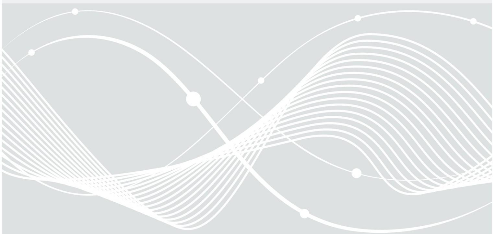

# Prüfberichtsvorlage zur Prüfung von Identifikationsverfahren gemäß TR-03147 in Version 1.0.6

Version 1.0.0 28.12.2021

Bundesamt für Sicherheit in der Informationstechnik Postfach 20 03 63 53133 Bonn Tel.: +49 22899 9582-0 E-Mail: eid@bsi.bund.de Internet: https://www.bsi.bund.de © Bundesamt für Sicherheit in der Informationstechnik 2021

| 1    | Einleitung 7                                                                                                             |  |
|------|--------------------------------------------------------------------------------------------------------------------------|--|
| 1.1  | Übersicht 7                                                                                                              |  |
| 1.2  | Begutachtungsgegenstand 8                                                                                                |  |
| 1.3  | Werkzeuge 8                                                                                                              |  |
| 1.4  | Beteiligte Personen und Stellen 8                                                                                        |  |
| 2    | Übersicht der Anforderungen und Ergebnisse 9                                                                             |  |
| 3    | Vertrauenswürdige ID-Dokumente 13                                                                                        |  |
| 3.1  | Relevanz 13                                                                                                              |  |
| 3.2  | Mehrere zugelassene ID-Dokumente 13                                                                                      |  |
| 3.3  | Gültiges ID-Dokument 13                                                                                                  |  |
| 3.4  | Verlässliche Quelle 14                                                                                                   |  |
| 3.5  | Enthält eine hinreichende Menge an ID-Attributen17                                                                       |  |
| 3.6  | Manipulations- und fälschungssicher17                                                                                    |  |
| 3.7  | Sicherheitsmerkmale sind bekannt und effektiv überprüfbar18                                                              |  |
| 3.8  | Ermöglicht einen zuverlässigen Abgleich mit dem Verwender18                                                              |  |
| 3.9  | ID-Attribute sind aktuell 19                                                                                             |  |
| 3.10 | Verfügbare Sperrmeldungen werden überprüft19                                                                             |  |
| 3.11 | Regelmäßige Prüfung der Menge der zulässigen ID-Dokumente20                                                              |  |
| 4    | Sicherheit der Übertragungskanäle 22                                                                                     |  |
| 4.1  | Relevanz 22                                                                                                              |  |
| 4.2  | Video-/Informationstechnische Manipulationen biometrischer Daten der zu identifizierenden Person werden erkannt 22    |  |
| 4.3  | Informationstechnische Manipulationen vom ID-Dokument übertragener Informationen werden erkannt 22                    |  |
| 4.4  | Physikalische Manipulationen biometrischer Charakteristika der zu identifizierenden Person werden erkannt 23          |  |
| 4.5  | Physikalische Manipulationen am ID-Dokument werden erkannt23                                                             |  |
| 4.6  | Liveübertragung sämtlicher Daten ist gewährleistet24                                                                     |  |
| 4.7  | Ein Austausch des präsentierten ID-Dokuments oder der zu identifizierenden Person während der Prüfung wird erkannt 24 |  |
| 5    | Prüfung der ID-Nachweise 26                                                                                              |  |
| 5.1  | Relevanz 26                                                                                                              |  |
| 5.2  | Mehrere ID-Nachweise 26                                                                                                  |  |
| 5.3  | Typ des verwendeten ID-Dokuments lässt sich ermitteln26                                                                  |  |
| 5.4  | ID-Dokument ist gültig 27                                                                                                |  |
| 5.5  | Gefälschte Sicherheitsmerkmale werden erkannt27                                                                          |  |
| 5.6  | Fälschungen der personalisierten Daten werden erkannt28                                                                  |  |
| 6    | Abgleich von Personen mit ID-Nachweisen 29                                                                               |  |
| 6.1  | Vertrauliche Wissensfaktoren werden ausschließlich dem legitimen Inhaber mitgeteilt29                                    |  |
| 6.2  | Sicherheit der verwendeten Authentisierungsmittel29                                                                      |  |

| 6.3 | Die tatsächliche Verfügungsgewalt der zu identifizierenden Person über das ID-Dokument wird sichergestellt 29        |  |
|-----|-------------------------------------------------------------------------------------------------------------------------|--|
| 6.4 | Abzugleichende ID-Attribute werden in hinreichender Qualität erfasst30                                                  |  |
| 6.5 | Zuverlässiger Abgleich relevanter biometrischer ID-Attribute zwischen ID-Dokument und zu identifizierender Person 31 |  |
| 7   | Korrekte Erfassung der benötigten ID-Attribute32                                                                        |  |
| 7.1 | Relevanz 32                                                                                                             |  |
| 7.2 | Zu erfassende ID-Attribute erlauben eine eindeutige Identifizierung32                                                   |  |
| 7.3 | Spezifische Sachkenntnis der Prüfer und ggf. zu verwendende Hilfsmittel sind vorhanden32                                |  |
| 7.4 | ID-Attribute werden vollständig und fehlerfrei in das Erfassungssystem übertragen33                                     |  |
| 7.5 | Erfasste Daten werden auf Aktualität, Konsistenz und Plausibilität geprüft34                                            |  |
| 8   | Sicherung der Integrität der Prozesse 35                                                                                |  |
| 8.1 | Relevanz 35                                                                                                             |  |
| 8.2 | Die Einhaltung der vorgeschriebenen Prüfkriterien ist sichergestellt35                                                  |  |
| 8.3 | ISMS 36                                                                                                                 |  |
| 9   | Übergreifende Angriffsszenarien gegen ID-Verfahren38                                                                    |  |
| 9.1 | Relevanz 38                                                                                                             |  |
| 9.2 | Globale Angriffsszenarien 38                                                                                            |  |
|     | Literaturverzeichnis 39                                                                                                 |  |

### 1 Einleitung

Die Technische Richtlinie TR-03147 [TR-03147] beschreibt Bedrohungen und Anforderungen für Verfahren zur (initialen) Identitätsprüfung natürlicher Personen anhand von ID-Dokumenten wie z.B. dem Personalausweis (PA) oder Reisepass (RP). Die [TR-03147] ermöglicht es, eine Einstufung verschiedener ID-Verfahren hinsichtlich ihres Vertrauensniveaus ("normal", "substantiell" oder "hoch") vorzunehmen und diese somit hinsichtlich ihrer Sicherheit zu vergleichen. Mit der [TR-03147] steht insbesondere eine Grundlage zur systematischen und fundierten Bewertung von Vertrauensniveaus von ID-Verfahren zur Verfügung.

Beispiele für solche ID-Verfahren sind

- "Videoidentifizierungsverfahren",
- "Photoidentifizierungsverfahren",
- Verfahren mit unmittelbarer Anwesenheit der zu identifizierenden Person sowie einer prüfenden Person und
- Verfahren, die auf der Anwendung der Online-Ausweisfunktion des deutschen Personalausweises (PA), der eID-Karte für Bürgerinnen und Bürger der EU und des EWR (eID-Karte) oder des elektronischen Aufenthaltstitels (eAT) basieren.

Das vorliegende Dokument ist die Prüfberichtsvorlage (Template), die für eine Bewertung des Vertrauensniveaus eines ID-Verfahrens anhand der [TR-03147] zu verwenden ist. Dabei sind die in der TR gestellten Anforderungen in einzelne, atomare Prüfkriterien aufgeteilt, um eine systematische Prüfung zu unterstützen und eine Reproduzierbarkeit von Ergebnissen unterschiedlicher Prüfer bestmöglich zu dokumentieren und zu gewährleisten. Das gesamte Ergebnis zu einer Anforderung der TR und letztendlich dem gesamten Verfahren leitet sich dann ab aus den Bewertungen der einzelnen Prüfkriterien unter Anwendung des Minimumprinzips (Abweichungen hiervon werden explizit erwähnt).

Ergänzt wird die Prüfberichtsvorlage durch den zugehörigen Anforderungskatalog [AnfKat], der für den Prüfer für jedes Prüfkriterium eine Leitlinie für seine vorzunehmende Bewertung gibt und grundsätzlich erläutert, wie die Prüfberichtsvorlage zu verwenden ist.

Die vorliegende Prüfberichtsvorlage enthält in den weiteren Abschnitten dieses Kapitels ([1.1](#page-5-1) bis [1.4](#page-6-0)) allgemeine Informationen zum Verfahren und zur Prüfung, die durch den Prüfer bzw. das prüfende Unternehmen anzugeben sind.

In Kapitel [2](#page-7-0) sollen die erzielten Ergebnisse in tabellarischer Form zusammengefasst werden. Sofern Anforderungen aus dieser Prüfberichtsvorlage für ein konkretes Verfahren nicht relevant sind und deshalb nicht geprüft werden, so sind sie dennoch im Prüfbericht als nicht anwendbar aufzuführen.

In den Kapiteln [3](#page-11-0) bis [8](#page-33-0) werden die einzelnen, aus den Anforderungen der [TR-03147] abgeleiteten Prüfkriterien aufgeführt. Diese sind durch den Prüfer zu bearbeiten und die zugehörigen Tabelleneinträge sind geeignet auszufüllen. Die Gliederung der Prüfberichtsvorlage sowie auch die des Anforderungskatalogs folgen der Gliederung der TR, um eine parallele Handhabung dieser Dokumente so gut wie möglich zu unterstützen.

#### 1.1 Übersicht

| Begutachter:                         |  |
|--------------------------------------|--|
| Name des Verfahrens:                 |  |
| Versionsnummer:                      |  |
| Anbieter / Betreiber des Verfahrens: |  |

1 Einleitung

| Kategorie des Verfahrens                | <direkt>   <indirekt>   <elektronisch> |
|-----------------------------------------|----------------------------------------|
| Begutachtungszeitraum:                  | vom TT.MM.JJJJ bis zum TT.MM.JJJJ      |
| Begutachtungsgrundlage:                 | [TR-03147] [AnfKat]                 |
| Gültigkeitszeitraum:                    |                                        |
| Ergebnis der Vertrauensniveaubewertung: |                                        |

#### 1.2 Begutachtungsgegenstand

Das Funktionsprinzip des zu begutachtenden Verfahrens sowie dessen Anwendungskontext sind kurz zu beschreiben. An dieser Stelle ist auch der Begutachtungsgegenstand genau zu definieren. Er ist eindeutig von seiner Umgebung abzugrenzen, die für den Betrieb notwendig ist, jedoch nicht Teil der Begutachtung ist. Auch in welcher Form der Begutachtungsgegenstand vom Anbieter bereitgestellt wird, ist an dieser Stelle zu erläutern, ebenso wie eventuelle Zusatzmaterialien und Dokumentation. Alle Objekte müssen eindeutig identifizierbar sein.

#### 1.3 Werkzeuge

Es sind alle zur Begutachtung verwendeten Werkzeuge eindeutig zu identifizieren (Hard- und Software). Handelt es sich um nicht-kommerziell oder frei erhältliche Produkte, so ist dies explizit zu erwähnen.

| Ref. | Bezeichnung | Hersteller | Lizenz | Beschreibung des Werkzeugs |
|------|-------------|------------|--------|----------------------------|
|      |             |            |        |                            |
|      |             |            |        |                            |
|      |             |            |        |                            |
|      |             |            |        |                            |

#### 1.4 Beteiligte Personen und Stellen

Alle an der Begutachtung beteiligte Personen (inklusive der Kontaktpersonen des Herstellers eines Verfahrens) sind namentlich zu nennen, zusammen mit Angabe der übernommenen Aufgaben.

| Ref. | Name | Firma | Titel/Funktion/Aufgabe |
|------|------|-------|------------------------|
|      |      |       |                        |
|      |      |       |                        |
|      |      |       |                        |
|      |      |       |                        |

### 2 Übersicht der Anforderungen und Ergebnisse

| ID   | Anforderung                                                                              | Ergebnis |
|------|------------------------------------------------------------------------------------------|----------|
| A1   | Vertrauenswürdige ID-Dokumente Kapitel 4 in [TR-03147]                                |          |
|      | A1.G-1                                                                                   |          |
|      | A1.G-2                                                                                   |          |
| A1.1 | Verlässliche Quelle Kapitel 4.2.1 in [TR-03147]                                       |          |
|      | A1.1-1                                                                                   |          |
|      | A1.1-2                                                                                   |          |
|      | A1.1-3                                                                                   |          |
|      | A1.1-4                                                                                   |          |
|      | A1.1-5                                                                                   |          |
|      | A1.1-6                                                                                   |          |
|      | A1.1-7                                                                                   |          |
|      | A1.1-8                                                                                   |          |
|      | A1.1-9                                                                                   |          |
|      | A1.1-10                                                                                  |          |
| A1.2 | Enthält eine hinreichende Menge an ID-Attributen Kapitel 4.2.2 in [TR-03147]          |          |
|      | A1.2-1                                                                                   |          |
|      | A1.2-2                                                                                   |          |
| A1.3 | Manipulations- und fälschungssicher Kapitel 4.2.3 in [TR-03147]                       |          |
|      | A1.3-1                                                                                   |          |
|      | A1.3-2                                                                                   |          |
| A1.4 | Sicherheitsmerkmale sind bekannt und effektiv überprüfbar Kapitel 4.2.4 in [TR-03147] |          |
|      | A1.4-1                                                                                   |          |
| A1.5 | Ermöglicht einen zuverlässigen Abgleich mit dem Verwender Kapitel 4.2.5 in [TR-03147] |          |
|      | A1.5-1                                                                                   |          |
|      | A1.5-2                                                                                   |          |
| A1.6 | ID-Attribute sind aktuell Kapitel 4.2.6 in [TR-03147]                                 |          |
|      | A1.6-1                                                                                   |          |
| A1.7 | Verfügbare Sperrmeldungen werden überprüft Kapitel 4.2.7 in [TR-03147]                |          |

| ID   | Anforderung                                                                                                                                          | Ergebnis |
|------|------------------------------------------------------------------------------------------------------------------------------------------------------|----------|
|      | A1.7-1                                                                                                                                               |          |
|      | A1.7-2                                                                                                                                               |          |
| A1.8 | Regelmäßige Prüfung der Menge der zulässigen ID-Dokumente Kapitel 4.2.8 in [TR-03147]                                                             |          |
|      | A1.8-1                                                                                                                                               |          |
|      | A1.8-2                                                                                                                                               |          |
| A2   | Sicherheit der Übertragungskanäle Kapitel 5 in [TR-03147]                                                                                         |          |
| A2.1 | Video-/Informationstechnische Manipulationen biometrischer Daten der zu identifizierenden Person werden erkannt Kapitel 5.2.1 in [TR-03147]    |          |
|      | A2.1-1                                                                                                                                               |          |
| A2.2 | Informationstechnische Manipulationen vom ID-Dokument übertragener Informationen werden erkannt Kapitel 5.2.2 in [TR-03147]           |          |
|      | A2.2-1                                                                                                                                               |          |
|      | A2.2-2                                                                                                                                               |          |
| A2.3 | Physikalische Manipulationen biometrischer Charakteristika der zu identifizierenden Person werden erkannt Kapitel 5.2.3 in [TR-03147]          |          |
|      | A2.3-1                                                                                                                                               |          |
| A2.4 | Physikalische Manipulationen am präsentierten ID-Dokument werden erkannt Kapitel 5.2.4 in [TR-03147]                                           |          |
|      | A2.4-1                                                                                                                                               |          |
| A2.5 | Liveübertragung sämtlicher Daten ist gewährleistet Kapitel 5.2.5 in [TR-03147]                                                                    |          |
|      | A2.5-1                                                                                                                                               |          |
| A2.6 | Ein Austausch des präsentierten ID-Dokuments oder der zu identifizierenden Person während der Prüfung wird erkannt Kapitel 5.2.6 in [TR-03147] |          |
|      | A2.6-1                                                                                                                                               |          |
| A3   | Prüfung der ID-Nachweise Kapitel 6 in [TR-03147]                                                                                                  |          |
|      | A3.G-1                                                                                                                                               |          |
| A3.1 | Typ des verwendeten ID-Dokuments lässt sich ermitteln Kapitel 6.4.1 in [TR-03147]                                                                 |          |
|      | A3.1-1                                                                                                                                               |          |
| A3.2 | ID-Dokument ist gültig Kapitel 6.4.2 in [TR-03147]                                                                                                |          |
|      | A3.2-1                                                                                                                                               |          |

| ID   | Anforderung                                                                                                                                         | Ergebnis |
|------|-----------------------------------------------------------------------------------------------------------------------------------------------------|----------|
| A3.3 | Gefälschte Sicherheitsmerkmale werden erkannt Kapitel 6.4.3 in [TR-03147]                                                                        |          |
|      | A3.3-1                                                                                                                                              |          |
|      | A3.3-2                                                                                                                                              |          |
| A3.4 | Fälschungen der personalisierten Daten werden erkannt Kapitel 6.4.4 in [TR-03147]                                                                |          |
|      | A3.4-1                                                                                                                                              |          |
|      | A3.4-2                                                                                                                                              |          |
| A4   | Zuverlässiger Abgleich zwischen der zu identifizierenden Person und dem ID-Dokument (Integrität des ID-Nachweises) Kapitel 7 in [TR-03147]    |          |
| A4.1 | Vertrauliche Wissensfaktoren werden ausschließlich dem legitimen Inhaber mitgeteilt Kapitel 7.2.1 in [TR-03147]                               |          |
|      | A4.1-1                                                                                                                                              |          |
| A4.2 | Sicherheit der verwendeten Authentisierungsmittel Kapitel 7.2.2 in [TR-03147]                                                                    |          |
|      | A4.2-1                                                                                                                                              |          |
| A4.3 | Die tatsächliche Verfügungsgewalt der zu identifizierenden Person über das ID-Dokument ist sichergestellt Kapitel 7.2.3 in [TR-03147]         |          |
|      | A4.3-1                                                                                                                                              |          |
| A4.4 | Abzugleichende ID-Attribute werden in hinreichender Qualität erfasst Kapitel 7.2.4 in [TR-03147]                                                 |          |
|      | A4.4-1                                                                                                                                              |          |
|      | A4.4-2                                                                                                                                              |          |
| A4.5 | Zuverlässiger Abgleich relevanter biometrischer ID-Attribute zwischen ID-Dokument und zu identifizierender Person Kapitel 7.2.5 in [TR-03147] |          |
|      | A4.5-1                                                                                                                                              |          |
| A5   | Korrekte Erfassung der benötigten ID-Attribute Kapitel 8 in [TR-03147]                                                                           |          |
| A5.1 | Zu erfassende ID-Attribute erlauben eine eindeutige Identifizierung Kapitel 8.2.1 in [TR-03147]                                                  |          |
|      | A5.1-1                                                                                                                                              |          |
| A5.2 | Spezifische Sachkenntnis der Prüfer und ggf. zu verwendende Hilfsmittel sind vorhanden Kapitel 8.2.2 in [TR-03147]                            |          |
|      | A5.2-1                                                                                                                                              |          |
|      | A5.2-2                                                                                                                                              |          |
| A5.3 | ID-Attribute werden vollständig und fehlerfrei in das Erfassungssystem                                                                              |          |

| ID   | Anforderung                                                                                                  | Ergebnis |
|------|--------------------------------------------------------------------------------------------------------------|----------|
|      | übertragen Kapitel 8.2.3 in [TR-03147]                                                                    |          |
|      | A5.3-1                                                                                                       |          |
|      | A5.3-2                                                                                                       |          |
| A5.4 | Erfasste Daten werden auf Aktualität, Konsistenz und Plausibilität geprüft Kapitel 8.2.4 in [TR-03147] |          |
|      | A5.4-1                                                                                                       |          |
|      | A5.4-2                                                                                                       |          |
|      | A5.4-3                                                                                                       |          |
| A6   | Sicherung der Integrität aller Prozessschritte Kapitel 9 in [TR-03147]                                    |          |
| A6.1 | Die Einhaltung der vorgeschriebenen Prüfkriterien ist sichergestellt Kapitel 9.2.1 in [TR-03147]          |          |
|      | A6.1-1                                                                                                       |          |
|      | A6.1-2                                                                                                       |          |
|      | A6.1-3                                                                                                       |          |
|      | A6.1-4                                                                                                       |          |
|      | A6.1-5                                                                                                       |          |
| A6.2 | ISMS Kapitel 9.2.2 in [TR-03147]                                                                          |          |
|      | A6.2-1                                                                                                       |          |
| A7.G | Globale Angriffsszenarien ergänzend zur [TR-03147]                                                        |          |
|      | A7.G-1                                                                                                       |          |

### 3 Vertrauenswürdige ID-Dokumente

#### 3.1 Relevanz

| Schutzziele:                   | Existenz Legitimität                                                                                                                                                                                                                  |
|--------------------------------|------------------------------------------------------------------------------------------------------------------------------------------------------------------------------------------------------------------------------------------|
| Beispiele für Verfahrenstypen: | "VideoIdent" "PhotoIdent" Verfahren mit unmittelbarer Anwesenheit ("vor-Ort" Identifizierung z.B. in einer Filiale, einschließlich "Vor-Ort-Auslesen" des PA oder eAT ) Verfahren mit Online-Ausweisfunktion des PA oder eAT |

#### 3.2 Mehrere zugelassene ID-Dokumente

| PrüfKrit-ID               | A1.G-1                                                                                                                                         |        |      |     |               |
|---------------------------|------------------------------------------------------------------------------------------------------------------------------------------------|--------|------|-----|---------------|
| PrüfKrit Beschreibung: | Wie lautet das Vertrauensniveau desjenigen für das ID-Verfahren zugelassenen ID Dokuments, welches das niedrigste Vertrauensniveau besitzt? |        |      |     |               |
| Referenz                  | Kapitel 4                                                                                                                                      |        |      |     |               |
| Prüfaktivität:            | Bestimmung des Vertrauensniveaus über alle ID-Dokumente gemäß dem Minimumprinzip.                                                           |        |      |     |               |
| Analyse:                  |                                                                                                                                                |        |      |     |               |
| Bewertung:                | Normal                                                                                                                                         | Subst. | Hoch | N/A | Nicht erfüllt |
|                           |                                                                                                                                                |        |      |     |               |

#### 3.3 Gültiges ID-Dokument

| PrüfKrit-ID               | A1.G-2                                                                                                                     |        |      |     |               |  |  |
|---------------------------|----------------------------------------------------------------------------------------------------------------------------|--------|------|-----|---------------|--|--|
| PrüfKrit Beschreibung: | Wird bei der Anwendung des ID-Verfahrens überprüft, ob das verwendete ID Dokument zum Zeitpunkt der Prüfung gültig ist? |        |      |     |               |  |  |
| Referenz                  | Kapitel 4.2                                                                                                                |        |      |     |               |  |  |
| Dokumentation:            |                                                                                                                            |        |      |     |               |  |  |
| Interviewpartner:         |                                                                                                                            |        |      |     |               |  |  |
| Prüfaktivität:            |                                                                                                                            |        |      |     |               |  |  |
| Analyse:                  |                                                                                                                            |        |      |     |               |  |  |
| Bewertung:                | Normal                                                                                                                     | Subst. | Hoch | N/A | Nicht erfüllt |  |  |
|                           |                                                                                                                            |        |      |     |               |  |  |

#### 3.4 Verlässliche Quelle

| PrüfKrit-ID               | A1.1-1                                                                                        |        |      |     |               |  |
|---------------------------|-----------------------------------------------------------------------------------------------|--------|------|-----|---------------|--|
| PrüfKrit Beschreibung: | Sind die für die Ausstellung des jeweiligen ID-Dokuments verantwortlichen Stellen bekannt? |        |      |     |               |  |
| Referenz                  | Kapitel 4.2.1                                                                                 |        |      |     |               |  |
| Dokumentation:            |                                                                                               |        |      |     |               |  |
| Interviewpartner:         |                                                                                               |        |      |     |               |  |
| Prüfaktivität:            |                                                                                               |        |      |     |               |  |
| Analyse:                  |                                                                                               |        |      |     |               |  |
| Bewertung:                | Normal                                                                                        | Subst. | Hoch | N/A | Nicht erfüllt |  |
|                           |                                                                                               |        |      |     |               |  |

| PrüfKrit-ID               | A1.1-2                                                                                                                                                                               |        |      |     |               |  |  |
|---------------------------|--------------------------------------------------------------------------------------------------------------------------------------------------------------------------------------|--------|------|-----|---------------|--|--|
| PrüfKrit Beschreibung: | Werden über die verantwortlichen Stellen öffentlich verfügbare Informationen über Kompromittierungen (z.B. Medienberichte zur Kompromittierung von solchen Stellen) gesammelt? |        |      |     |               |  |  |
| Referenz                  | Kapitel 4.2.1                                                                                                                                                                        |        |      |     |               |  |  |
| Dokumentation:            |                                                                                                                                                                                      |        |      |     |               |  |  |
| Interviewpartner:         |                                                                                                                                                                                      |        |      |     |               |  |  |
| Prüfaktivität:            |                                                                                                                                                                                      |        |      |     |               |  |  |
| Analyse:                  |                                                                                                                                                                                      |        |      |     |               |  |  |
| Bewertung:                | Normal                                                                                                                                                                               | Subst. | Hoch | N/A | Nicht erfüllt |  |  |
|                           |                                                                                                                                                                                      |        |      |     |               |  |  |

| PrüfKrit-ID               | A1.1-3                                                                                                                                                                                      |        |      |     |               |  |  |
|---------------------------|---------------------------------------------------------------------------------------------------------------------------------------------------------------------------------------------|--------|------|-----|---------------|--|--|
| PrüfKrit Beschreibung: | Werden die über die verantwortlichen Stellen gesammelten Informationen über Kompromittierungen (z.B. Medienberichte zur Kompromittierung von solchen Stellen) zeitnah berücksichtigt? |        |      |     |               |  |  |
| Referenz                  | Kapitel 4.2.1                                                                                                                                                                               |        |      |     |               |  |  |
| Dokumentation:            |                                                                                                                                                                                             |        |      |     |               |  |  |
| Interviewpartner:         |                                                                                                                                                                                             |        |      |     |               |  |  |
| Prüfaktivität:            |                                                                                                                                                                                             |        |      |     |               |  |  |
| Analyse:                  |                                                                                                                                                                                             |        |      |     |               |  |  |
| Bewertung:                | Normal                                                                                                                                                                                      | Subst. | Hoch | N/A | Nicht erfüllt |  |  |
|                           |                                                                                                                                                                                             |        |      |     |               |  |  |

| PrüfKrit-ID               | A1.1-4                |                                                                          |      |     |               |  |
|---------------------------|-----------------------|--------------------------------------------------------------------------|------|-----|---------------|--|
| PrüfKrit Beschreibung: | Dokumenten gesammelt? | Werden aktuelle Informationen über Manipulationen und Fälschungen bei ID |      |     |               |  |
| Referenz                  | Kapitel 4.2.1         |                                                                          |      |     |               |  |
| Dokumentation:            |                       |                                                                          |      |     |               |  |
| Interviewpartner:         |                       |                                                                          |      |     |               |  |
| Prüfaktivität:            |                       |                                                                          |      |     |               |  |
| Analyse:                  |                       |                                                                          |      |     |               |  |
| Bewertung:                | Normal                | Subst.                                                                   | Hoch | N/A | Nicht erfüllt |  |
|                           |                       |                                                                          |      |     |               |  |

| PrüfKrit-ID               | A1.1-5                                                                                                                |        |      |     |               |  |  |
|---------------------------|-----------------------------------------------------------------------------------------------------------------------|--------|------|-----|---------------|--|--|
| PrüfKrit Beschreibung: | Werden die gesammelten Informationen über Manipulationen und Fälschungen bei ID-Dokumenten zeitnah berücksichtigt? |        |      |     |               |  |  |
| Referenz                  | Kapitel 4.2.1                                                                                                         |        |      |     |               |  |  |
| Dokumentation:            |                                                                                                                       |        |      |     |               |  |  |
| Interviewpartner:         |                                                                                                                       |        |      |     |               |  |  |
| Prüfaktivität:            |                                                                                                                       |        |      |     |               |  |  |
| Analyse:                  |                                                                                                                       |        |      |     |               |  |  |
| Bewertung:                | Normal                                                                                                                | Subst. | Hoch | N/A | Nicht erfüllt |  |  |
|                           |                                                                                                                       |        |      |     |               |  |  |

| PrüfKrit-ID               | A1.1-6                                                                                                                                                            |        |      |     |               |
|---------------------------|-------------------------------------------------------------------------------------------------------------------------------------------------------------------|--------|------|-----|---------------|
| PrüfKrit Beschreibung: | Wird beim Prozess der Erstellung und Aushändigung des verwendeten ID-Dokuments die Berechtigung und Identität eines Antragstellers hinreichend sicher geprüft? |        |      |     |               |
| Referenz                  | Kapitel 4.2.1                                                                                                                                                     |        |      |     |               |
| Dokumentation:            |                                                                                                                                                                   |        |      |     |               |
| Interviewpartner:         |                                                                                                                                                                   |        |      |     |               |
| Prüfaktivität:            |                                                                                                                                                                   |        |      |     |               |
| Analyse:                  |                                                                                                                                                                   |        |      |     |               |
| Bewertung:                | Normal                                                                                                                                                            | Subst. | Hoch | N/A | Nicht erfüllt |
|                           |                                                                                                                                                                   |        |      |     |               |

| PrüfKrit-ID               | A1.1-7                                                                                                                            |
|---------------------------|-----------------------------------------------------------------------------------------------------------------------------------|
| PrüfKrit Beschreibung: | Prüft das ID-Verfahren, ob das verwendete ID-Dokument zu einer explizit begrenzten Menge an zugelassenen ID-Dokumenten gehört? |
| Referenz                  | Kapitel 4.2.1                                                                                                                     |

| Dokumentation:    |        |        |      |     |               |
|-------------------|--------|--------|------|-----|---------------|
| Interviewpartner: |        |        |      |     |               |
| Prüfaktivität:    |        |        |      |     |               |
| Analyse:          |        |        |      |     |               |
| Bewertung:        | Normal | Subst. | Hoch | N/A | Nicht erfüllt |
|                   |        |        |      |     |               |

| PrüfKrit-ID               | A1.1-8                 |        |      |                                                                    |               |
|---------------------------|------------------------|--------|------|--------------------------------------------------------------------|---------------|
| PrüfKrit Beschreibung: |                        |        |      | Handelt es sich bei dem ID-Dokument um ein explizites ID-Dokument? |               |
| Referenz                  | Kapitel 4.2, Tabelle 4 |        |      |                                                                    |               |
| Dokumentation:            |                        |        |      |                                                                    |               |
| Interviewpartner:         |                        |        |      |                                                                    |               |
| Prüfaktivität:            |                        |        |      |                                                                    |               |
| Analyse:                  |                        |        |      |                                                                    |               |
| Bewertung:                | Normal                 | Subst. | Hoch | N/A                                                                | Nicht erfüllt |
|                           |                        |        |      |                                                                    |               |

| PrüfKrit-ID               | A1.1-9                                                |        |      |     |               |
|---------------------------|-------------------------------------------------------|--------|------|-----|---------------|
| PrüfKrit Beschreibung: | Erfüllt das ID-Dokument die Ausweispflicht im Inland? |        |      |     |               |
| Referenz                  | Kapitel 4.2, Tabelle 4                                |        |      |     |               |
| Dokumentation:            |                                                       |        |      |     |               |
| Interviewpartner:         |                                                       |        |      |     |               |
| Prüfaktivität:            |                                                       |        |      |     |               |
| Analyse:                  |                                                       |        |      |     |               |
| Bewertung:                | Normal                                                | Subst. | Hoch | N/A | Nicht erfüllt |
|                           |                                                       |        |      |     |               |

| PrüfKrit-ID               | A1.1-10                                                                                                                                                                                   |
|---------------------------|-------------------------------------------------------------------------------------------------------------------------------------------------------------------------------------------|
| PrüfKrit Beschreibung: | Verfügt das ID-Dokument über ein inländischen Ausweisdokumenten gleichwertiges Sicherheitsniveau von Merkmalen und deren Prüfbarkeit zum Schutz vor Fälschungen und Manipulationen? |
| Referenz                  | Kapitel 4.2, Tabelle 4                                                                                                                                                                    |
| Dokumentation:            |                                                                                                                                                                                           |
| Interviewpartner:         |                                                                                                                                                                                           |
| Prüfaktivität:            |                                                                                                                                                                                           |
| Analyse:                  |                                                                                                                                                                                           |

| Bewertung: | Normal | Subst. | Hoch | N/A | Nicht erfüllt |
|------------|--------|--------|------|-----|---------------|
|            |        |        |      |     |               |

#### 3.5 Enthält eine hinreichende Menge an ID-Attributen

| PrüfKrit-ID               | A1.2-1                                                   |        |      |     |               |  |
|---------------------------|----------------------------------------------------------|--------|------|-----|---------------|--|
| PrüfKrit Beschreibung: | Ist eine hinreichende Menge von ID-Attributen vorhanden? |        |      |     |               |  |
| Referenz                  | Kapitel 4.2.2                                            |        |      |     |               |  |
| Dokumentation:            |                                                          |        |      |     |               |  |
| Interviewpartner:         |                                                          |        |      |     |               |  |
| Prüfaktivität:            |                                                          |        |      |     |               |  |
| Analyse:                  |                                                          |        |      |     |               |  |
| Bewertung:                | Normal                                                   | Subst. | Hoch | N/A | Nicht erfüllt |  |
|                           |                                                          |        |      |     |               |  |

| PrüfKrit-ID               | A1.2-2                                                                        |        |      |     |               |
|---------------------------|-------------------------------------------------------------------------------|--------|------|-----|---------------|
| PrüfKrit Beschreibung: | Ist eine eindeutige Identifizierung durch die gegebenen ID-Attribute möglich? |        |      |     |               |
| Referenz                  | Kapitel 4.2.2                                                                 |        |      |     |               |
| Dokumentation:            |                                                                               |        |      |     |               |
| Interviewpartner:         |                                                                               |        |      |     |               |
| Prüfaktivität:            |                                                                               |        |      |     |               |
| Analyse:                  |                                                                               |        |      |     |               |
| Bewertung:                | Normal                                                                        | Subst. | Hoch | N/A | Nicht erfüllt |
|                           |                                                                               |        |      |     |               |

#### 3.6 Manipulations- und fälschungssicher

| PrüfKrit-ID               | A1.3-1                                                                                                                                                                                                                                   |
|---------------------------|------------------------------------------------------------------------------------------------------------------------------------------------------------------------------------------------------------------------------------------|
| PrüfKrit Beschreibung: | Ist das betrachtete ID-Dokument ein deutscher Personalausweis, ein EU Aufenthaltstitel oder ein EU- oder EFTA-Reisepass und entspricht es damit bezüglich der Manipulations- und Fälschungssicherheit dem Vertrauensniveau "hoch"? |
| Referenz                  | Kapitel 4.2.3                                                                                                                                                                                                                            |
| Dokumentation:            |                                                                                                                                                                                                                                          |
| Interviewpartner:         |                                                                                                                                                                                                                                          |
| Prüfaktivität:            |                                                                                                                                                                                                                                          |

| Analyse:   |        |        |      |     |               |
|------------|--------|--------|------|-----|---------------|
| Bewertung: | Normal | Subst. | Hoch | N/A | Nicht erfüllt |
|            |        |        |      |     |               |

| PrüfKrit-ID               | A1.3-2                                                                                                                                                                                                 |        |      |     |               |  |
|---------------------------|--------------------------------------------------------------------------------------------------------------------------------------------------------------------------------------------------------|--------|------|-----|---------------|--|
| PrüfKrit Beschreibung: | Welches Vertrauensniveau besitzt das betrachtete ID-Dokument in Bezug auf das Angriffspotential, um dieses unter Berücksichtigung der Kategorie des Verfahrens zu fälschen oder zu manipulieren? |        |      |     |               |  |
| Referenz                  | Kapitel 4.2.3                                                                                                                                                                                          |        |      |     |               |  |
| Dokumentation:            |                                                                                                                                                                                                        |        |      |     |               |  |
| Interviewpartner:         |                                                                                                                                                                                                        |        |      |     |               |  |
| Prüfaktivität:            |                                                                                                                                                                                                        |        |      |     |               |  |
| Analyse:                  |                                                                                                                                                                                                        |        |      |     |               |  |
| Bewertung:                | Normal                                                                                                                                                                                                 | Subst. | Hoch | N/A | Nicht erfüllt |  |
|                           |                                                                                                                                                                                                        |        |      |     |               |  |

#### 3.7 Sicherheitsmerkmale sind bekannt und effektiv überprüfbar

| PrüfKrit-ID               | A1.4-1                                                                                                                                |        |      |     |               |
|---------------------------|---------------------------------------------------------------------------------------------------------------------------------------|--------|------|-----|---------------|
| PrüfKrit Beschreibung: | Sind alle im Rahmen des ID-Verfahren genutzten Sicherheitsmerkmale der zugelassenen ID-Dokumente bekannt und effektiv überprüfbar? |        |      |     |               |
| Referenz                  | Kapitel 4.2.4                                                                                                                         |        |      |     |               |
| Dokumentation:            |                                                                                                                                       |        |      |     |               |
| Interviewpartner:         |                                                                                                                                       |        |      |     |               |
| Prüfaktivität:            |                                                                                                                                       |        |      |     |               |
| Analyse:                  |                                                                                                                                       |        |      |     |               |
| Bewertung:                | Normal                                                                                                                                | Subst. | Hoch | N/A | Nicht erfüllt |
|                           |                                                                                                                                       |        |      |     |               |

#### 3.8 Ermöglicht einen zuverlässigen Abgleich mit dem Verwender

| PrüfKrit-ID               | A1.5-1                                                                                                                                      |
|---------------------------|---------------------------------------------------------------------------------------------------------------------------------------------|
| PrüfKrit Beschreibung: | Wie hoch ist das Vertrauensniveau der auf dem ID-Dokument zur Verfügung stehenden wissensbasierten Daten zum Abgleich mit dem Verwender? |
| Referenz                  | Kapitel 4.2.5                                                                                                                               |
| Dokumentation:            |                                                                                                                                             |
| Interviewpartner:         |                                                                                                                                             |

| Prüfaktivität: |        |        |      |     |               |
|----------------|--------|--------|------|-----|---------------|
| Analyse:       |        |        |      |     |               |
| Bewertung:     | Normal | Subst. | Hoch | N/A | Nicht erfüllt |
|                |        |        |      |     |               |

| PrüfKrit-ID               | A1.5-2                                                                                                                                   |        |      |     |               |
|---------------------------|------------------------------------------------------------------------------------------------------------------------------------------|--------|------|-----|---------------|
| PrüfKrit Beschreibung: | Wie hoch ist das Vertrauensniveau der auf dem ID-Dokument zur Verfügung stehenden biometrischen Daten zum Abgleich mit dem Verwender? |        |      |     |               |
| Referenz                  | Kapitel 4.2.5                                                                                                                            |        |      |     |               |
| Dokumentation:            |                                                                                                                                          |        |      |     |               |
| Interviewpartner:         |                                                                                                                                          |        |      |     |               |
| Prüfaktivität:            |                                                                                                                                          |        |      |     |               |
| Analyse:                  |                                                                                                                                          |        |      |     |               |
| Bewertung:                | Normal                                                                                                                                   | Subst. | Hoch | N/A | Nicht erfüllt |
|                           |                                                                                                                                          |        |      |     |               |

#### 3.9 ID-Attribute sind aktuell

| PrüfKrit-ID               | A1.6-1         |        |      |                                                                                 |               |
|---------------------------|----------------|--------|------|---------------------------------------------------------------------------------|---------------|
| PrüfKrit Beschreibung: | gewährleistet? |        |      | Ist die Aktualität der ID-Attribute auf dem verwendeten ID-Dokument hinreichend |               |
| Referenz                  | Kapitel 4.2.6  |        |      |                                                                                 |               |
| Dokumentation:            |                |        |      |                                                                                 |               |
| Interviewpartner:         |                |        |      |                                                                                 |               |
| Prüfaktivität:            |                |        |      |                                                                                 |               |
| Analyse:                  |                |        |      |                                                                                 |               |
| Bewertung:                | Normal         | Subst. | Hoch | N/A                                                                             | Nicht erfüllt |
|                           |                |        |      |                                                                                 |               |

#### 3.10 Verfügbare Sperrmeldungen werden überprüft

| PrüfKrit-ID               | A1.7-1                                                       |
|---------------------------|--------------------------------------------------------------|
| PrüfKrit Beschreibung: | Wird die maximale Gültigkeitsdauer des ID-Dokuments geprüft? |
| Referenz                  | Kapitel 4.2.7                                                |
| Dokumentation:            |                                                              |

| Interviewpartner: |        |        |      |     |               |
|-------------------|--------|--------|------|-----|---------------|
| Prüfaktivität:    |        |        |      |     |               |
| Analyse:          |        |        |      |     |               |
| Bewertung:        | Normal | Subst. | Hoch | N/A | Nicht erfüllt |
|                   |        |        |      |     |               |

| PrüfKrit-ID               | A1.7-2        |        |      |     |  |                                                                           |
|---------------------------|---------------|--------|------|-----|--|---------------------------------------------------------------------------|
| PrüfKrit Beschreibung: | abgefragt?    |        |      |     |  | Werden zur Feststellung der Gültigkeit Sperrmeldungen für das ID-Dokument |
| Referenz                  | Kapitel 4.2.7 |        |      |     |  |                                                                           |
| Dokumentation:            |               |        |      |     |  |                                                                           |
| Interviewpartner:         |               |        |      |     |  |                                                                           |
| Prüfaktivität:            |               |        |      |     |  |                                                                           |
| Analyse:                  |               |        |      |     |  |                                                                           |
| Bewertung:                | Normal        | Subst. | Hoch | N/A |  | Nicht erfüllt                                                             |
|                           |               |        |      |     |  |                                                                           |

#### 3.11 Regelmäßige Prüfung der Menge der zulässigen ID-Dokumente

| PrüfKrit-ID               | A1.8-1                                                                                                                    |        |      |     |               |
|---------------------------|---------------------------------------------------------------------------------------------------------------------------|--------|------|-----|---------------|
| PrüfKrit Beschreibung: | Wie oft werden die für das ID-Verfahren zugelassenen ID-Dokumente gemäß der Anforderungen A1.7-1 und A1.7-2 überprüft? |        |      |     |               |
| Referenz                  | Kapitel 4.2, Tabelle 4; Kapitel 4.2.8                                                                                     |        |      |     |               |
| Dokumentation:            |                                                                                                                           |        |      |     |               |
| Interviewpartner:         |                                                                                                                           |        |      |     |               |
| Prüfaktivität:            |                                                                                                                           |        |      |     |               |
| Analyse:                  |                                                                                                                           |        |      |     |               |
| Bewertung:                | Normal                                                                                                                    | Subst. | Hoch | N/A | Nicht erfüllt |
|                           |                                                                                                                           |        |      |     |               |

| PrüfKrit-ID               | A1.8-2                                                                                                                     |
|---------------------------|----------------------------------------------------------------------------------------------------------------------------|
| PrüfKrit Beschreibung: | Werden neue, aus den Anforderungen A1.8-1 gewonnene Erkenntnisse bei der Durchführung des ID-Verfahrens berücksichtigt? |
| Referenz                  | Kapitel 4.2.8                                                                                                              |
| Dokumentation:            |                                                                                                                            |
| Interviewpartner:         |                                                                                                                            |

| Prüfaktivität: |        |        |      |     |               |
|----------------|--------|--------|------|-----|---------------|
| Analyse:       |        |        |      |     |               |
| Bewertung:     | Normal | Subst. | Hoch | N/A | Nicht erfüllt |
|                |        |        |      |     |               |

## 4 Sicherheit der Übertragungskanäle

#### 4.1 Relevanz

| Schutzziele:                   | Existenz Legitimität                                                              |
|--------------------------------|--------------------------------------------------------------------------------------|
| Beispiele für Verfahrenstypen: | "VideoIdent" "PhotoIdent" Verfahren mit Online-Ausweisfunktion des PA oder eAT |

#### 4.2 Video-/Informationstechnische Manipulationen biometrischer Daten der zu identifizierenden Person werden erkannt

| PrüfKrit-ID               | A2.1-1             |                                                              |                               |                                                                                |               |
|---------------------------|--------------------|--------------------------------------------------------------|-------------------------------|--------------------------------------------------------------------------------|---------------|
| PrüfKrit Beschreibung: | Angriffspotential, | um eine biometrischer Daten erfolgreich durchzuführen? | video-/informationstechnische | Welches Vertrauensniveau besitzt das betrachtete ID-Verfahren in Bezug auf das | Manipulation  |
| Referenz                  | Kapitel 5.2.1      |                                                              |                               |                                                                                |               |
| Dokumentation:            |                    |                                                              |                               |                                                                                |               |
| Interviewpartner:         |                    |                                                              |                               |                                                                                |               |
| Prüfaktivität:            |                    |                                                              |                               |                                                                                |               |
| Analyse:                  |                    |                                                              |                               |                                                                                |               |
| Bewertung:                | Normal             | Subst.                                                       | Hoch                          | N/A                                                                            | Nicht erfüllt |
|                           |                    |                                                              |                               |                                                                                |               |

#### 4.3 Informationstechnische Manipulationen vom ID-Dokument übertragener Informationen werden erkannt

| PrüfKrit-ID               | A2.2-1                                                                                                                                                                        |        |      |     |               |
|---------------------------|-------------------------------------------------------------------------------------------------------------------------------------------------------------------------------|--------|------|-----|---------------|
| PrüfKrit Beschreibung: | Wie lautet das Vertrauensniveau desjenigen für das ID-Verfahren verwendeten ID Nachweises, für welchen das niedrigste Angriffspotential zur Kompromittierung ausreicht? |        |      |     |               |
| Referenz                  | Kapitel 5.2.2                                                                                                                                                                 |        |      |     |               |
| Prüfaktivität:            | Bestimmung des niedrigsten Angriffspotentials über alle ID-Nachweise gemäß dem Minimumprinzip und Festlegung des erreichten Vertrauensniveaus.                             |        |      |     |               |
| Analyse:                  |                                                                                                                                                                               |        |      |     |               |
| Bewertung:                | Normal                                                                                                                                                                        | Subst. | Hoch | N/A | Nicht erfüllt |

| PrüfKrit-ID               | A2.2-2                                                                                                                                                                                                                        |        |      |     |               |
|---------------------------|-------------------------------------------------------------------------------------------------------------------------------------------------------------------------------------------------------------------------------|--------|------|-----|---------------|
| PrüfKrit Beschreibung: | Welches Vertrauensniveau besitzt das betrachtete ID-Verfahren in Bezug auf das Angriffspotential, um eine informationstechnische Manipulation einer vom ID Dokument übertragenen Information erfolgreich durchzuführen? |        |      |     |               |
| Referenz                  | Kapitel 5.2.2                                                                                                                                                                                                                 |        |      |     |               |
| Dokumentation:            |                                                                                                                                                                                                                               |        |      |     |               |
| Interviewpartner:         |                                                                                                                                                                                                                               |        |      |     |               |
| Prüfaktivität:            |                                                                                                                                                                                                                               |        |      |     |               |
| Analyse:                  |                                                                                                                                                                                                                               |        |      |     |               |
| Bewertung:                | Normal                                                                                                                                                                                                                        | Subst. | Hoch | N/A | Nicht erfüllt |
|                           |                                                                                                                                                                                                                               |        |      |     |               |

#### 4.4 Physikalische Manipulationen biometrischer Charakteristika der zu identifizierenden Person werden erkannt

| PrüfKrit-ID               | A2.3-1                                                                                                                                                                                                                              |        |      |     |               |
|---------------------------|-------------------------------------------------------------------------------------------------------------------------------------------------------------------------------------------------------------------------------------|--------|------|-----|---------------|
| PrüfKrit Beschreibung: | Welches Vertrauensniveau besitzt das betrachtete ID-Verfahren in Bezug auf das Angriffspotential, um eine physikalische Manipulation biometrischer Charakteristika der zu identifizierenden Person erfolgreich durchzuführen? |        |      |     |               |
| Referenz                  | Kapitel 5.2.3                                                                                                                                                                                                                       |        |      |     |               |
| Dokumentation:            |                                                                                                                                                                                                                                     |        |      |     |               |
| Interviewpartner:         |                                                                                                                                                                                                                                     |        |      |     |               |
| Prüfaktivität:            |                                                                                                                                                                                                                                     |        |      |     |               |
| Analyse:                  |                                                                                                                                                                                                                                     |        |      |     |               |
| Bewertung:                | Normal                                                                                                                                                                                                                              | Subst. | Hoch | N/A | Nicht erfüllt |
|                           |                                                                                                                                                                                                                                     |        |      |     |               |

#### 4.5 Physikalische Manipulationen am ID-Dokument werden erkannt

| PrüfKrit-ID               | A2.4-1                                                                                                                                                                                         |
|---------------------------|------------------------------------------------------------------------------------------------------------------------------------------------------------------------------------------------|
| PrüfKrit Beschreibung: | Welches Vertrauensniveau besitzt das betrachtete ID-Verfahren in Bezug auf das Angriffspotential, um in diesem eine physikalische Manipulation am ID-Dokument erfolgreich durchzuführen? |

| Referenz          | Kapitel 5.2.4 |        |      |     |               |
|-------------------|---------------|--------|------|-----|---------------|
| Dokumentation:    |               |        |      |     |               |
| Interviewpartner: |               |        |      |     |               |
| Prüfaktivität:    |               |        |      |     |               |
| Analyse:          |               |        |      |     |               |
| Bewertung:        | Normal        | Subst. | Hoch | N/A | Nicht erfüllt |
|                   |               |        |      |     |               |

#### 4.6 Liveübertragung sämtlicher Daten ist gewährleistet

| PrüfKrit-ID               | A2.5-1                                                                                                                                                                                          |        |      |     |               |  |
|---------------------------|-------------------------------------------------------------------------------------------------------------------------------------------------------------------------------------------------|--------|------|-----|---------------|--|
| PrüfKrit Beschreibung: | Welches Vertrauensniveau besitzt das betrachtete ID-Verfahren in Bezug auf das Angriffspotential, um in diesem eine Wiederverwendung von aufgezeichneten Daten erfolgreich durchzuführen? |        |      |     |               |  |
| Referenz                  | Kapitel 5.2.5                                                                                                                                                                                   |        |      |     |               |  |
| Dokumentation:            |                                                                                                                                                                                                 |        |      |     |               |  |
| Interviewpartner:         |                                                                                                                                                                                                 |        |      |     |               |  |
| Prüfaktivität:            |                                                                                                                                                                                                 |        |      |     |               |  |
| Analyse:                  |                                                                                                                                                                                                 |        |      |     |               |  |
| Bewertung:                | Normal                                                                                                                                                                                          | Subst. | Hoch | N/A | Nicht erfüllt |  |
|                           |                                                                                                                                                                                                 |        |      |     |               |  |

#### 4.7 Ein Austausch des präsentierten ID-Dokuments oder der zu identifizierenden Person während der Prüfung wird erkannt

| PrüfKrit-ID               | A2.6-1         |                                                                                                                                                                  |      |     |                                                                      |
|---------------------------|----------------|------------------------------------------------------------------------------------------------------------------------------------------------------------------|------|-----|----------------------------------------------------------------------|
| PrüfKrit Beschreibung: | durchzuführen? | Welches Vertrauensniveau besitzt das betrachtete ID-Verfahren in Bezug auf das Angriffspotential, um in diesem einen Austausch des präsentierten ID-Dokuments |      |     | oder der zu identifizierenden Person während der Prüfung erfolgreich |
| Referenz                  | Kapitel 5.2.6  |                                                                                                                                                                  |      |     |                                                                      |
| Dokumentation:            |                |                                                                                                                                                                  |      |     |                                                                      |
| Interviewpartner:         |                |                                                                                                                                                                  |      |     |                                                                      |
| Prüfaktivität:            |                |                                                                                                                                                                  |      |     |                                                                      |
| Analyse:                  |                |                                                                                                                                                                  |      |     |                                                                      |
| Bewertung:                | Normal         | Subst.                                                                                                                                                           | Hoch | N/A | Nicht erfüllt                                                        |

### 5 Prüfung der ID-Nachweise

#### 5.1 Relevanz

| Schutzziele:                   | Eindeutigkeit                                                            |
|--------------------------------|--------------------------------------------------------------------------|
| Beispiele für Verfahrenstypen: | "VideoIdent"                                                             |
|                                | "PhotoIdent" Verfahren mit unmittelbarer Anwesenheit (z.B. PostIdent) |
|                                | Verfahren mit Online-Ausweisfunktion des PA oder eAT                     |

#### 5.2 Mehrere ID-Nachweise

| PrüfKrit-ID               | A3.G-1                                                                                                                                                                        |        |      |     |               |  |
|---------------------------|-------------------------------------------------------------------------------------------------------------------------------------------------------------------------------|--------|------|-----|---------------|--|
| PrüfKrit Beschreibung: | Wie lautet das Vertrauensniveau desjenigen für das ID-Verfahren verwendeten ID Nachweises, für welchen das niedrigste Angriffspotential zur Kompromittierung ausreicht? |        |      |     |               |  |
| Referenz                  | Kapitel 6                                                                                                                                                                     |        |      |     |               |  |
| Prüfaktivität:            | Bestimmung des Vertrauensniveaus über alle ID-Dokumente gemäß dem Minimumprinzip.                                                                                          |        |      |     |               |  |
| Analyse:                  |                                                                                                                                                                               |        |      |     |               |  |
| Bewertung:                | Normal                                                                                                                                                                        | Subst. | Hoch | N/A | Nicht erfüllt |  |
|                           |                                                                                                                                                                               |        |      |     |               |  |

#### 5.3 Typ des verwendeten ID-Dokuments lässt sich ermitteln

| PrüfKrit-ID               | A3.1-1        |        |  |      |                                                                             |               |  |
|---------------------------|---------------|--------|--|------|-----------------------------------------------------------------------------|---------------|--|
| PrüfKrit Beschreibung: | überprüfen?   |        |  |      | Lässt sich der Typ des zur Prüfung vorgelegten ID-Dokuments feststellen und |               |  |
| Referenz                  | Kapitel 6.4.1 |        |  |      |                                                                             |               |  |
| Dokumentation:            |               |        |  |      |                                                                             |               |  |
| Interviewpartner:         |               |        |  |      |                                                                             |               |  |
| Prüfaktivität:            |               |        |  |      |                                                                             |               |  |
| Analyse:                  |               |        |  |      |                                                                             |               |  |
| Bewertung:                | Normal        | Subst. |  | Hoch | N/A                                                                         | Nicht erfüllt |  |
|                           |               |        |  |      |                                                                             |               |  |

### 5.4 ID-Dokument ist gültig

| PrüfKrit-ID               | A3.2-1                                                                             |        |      |     |               |  |
|---------------------------|------------------------------------------------------------------------------------|--------|------|-----|---------------|--|
| PrüfKrit Beschreibung: | Lässt sich die Gültigkeit des vorgelegten ID-Dokuments feststellen und überprüfen? |        |      |     |               |  |
| Referenz                  | Kapitel 6.4.2                                                                      |        |      |     |               |  |
| Dokumentation:            |                                                                                    |        |      |     |               |  |
| Interviewpartner:         |                                                                                    |        |      |     |               |  |
| Prüfaktivität:            |                                                                                    |        |      |     |               |  |
| Analyse:                  |                                                                                    |        |      |     |               |  |
| Bewertung:                | Normal                                                                             | Subst. | Hoch | N/A | Nicht erfüllt |  |
|                           |                                                                                    |        |      |     |               |  |

#### 5.5 Gefälschte Sicherheitsmerkmale werden erkannt

| PrüfKrit-ID               | A3.3-1                                                                                                |        |      |     |               |  |
|---------------------------|-------------------------------------------------------------------------------------------------------|--------|------|-----|---------------|--|
| PrüfKrit Beschreibung: | Welche verbindlichen Prüfvorgaben sind für die im ID-Verfahren zulässigen ID Dokumente festgelegt? |        |      |     |               |  |
| Referenz                  | Kapitel 6.4.3                                                                                         |        |      |     |               |  |
| Dokumentation:            |                                                                                                       |        |      |     |               |  |
| Interviewpartner:         |                                                                                                       |        |      |     |               |  |
| Prüfaktivität:            |                                                                                                       |        |      |     |               |  |
| Analyse:                  |                                                                                                       |        |      |     |               |  |
| Bewertung:                | Normal                                                                                                | Subst. | Hoch | N/A | Nicht erfüllt |  |
|                           |                                                                                                       |        |      |     |               |  |

| PrüfKrit-ID               | A3.3-2                                                                                                                                                         |        |      |     |               |  |
|---------------------------|----------------------------------------------------------------------------------------------------------------------------------------------------------------|--------|------|-----|---------------|--|
| PrüfKrit Beschreibung: | Welches Vertrauensniveau besitzt das betrachtete ID-Verfahren in Bezug auf das Angriffspotential, um in diesem Sicherheitsmerkmale erfolgreich zu fälschen? |        |      |     |               |  |
| Referenz                  | Kapitel 6.4.3                                                                                                                                                  |        |      |     |               |  |
| Dokumentation:            |                                                                                                                                                                |        |      |     |               |  |
| Interviewpartner:         |                                                                                                                                                                |        |      |     |               |  |
| Prüfaktivität:            |                                                                                                                                                                |        |      |     |               |  |
| Analyse:                  |                                                                                                                                                                |        |      |     |               |  |
| Bewertung:                | Normal                                                                                                                                                         | Subst. | Hoch | N/A | Nicht erfüllt |  |
|                           |                                                                                                                                                                |        |      |     |               |  |

#### 5.6 Fälschungen der personalisierten Daten werden erkannt

| PrüfKrit-ID               | A3.4-1                                                                   |        |      |     |               |  |  |
|---------------------------|--------------------------------------------------------------------------|--------|------|-----|---------------|--|--|
| PrüfKrit Beschreibung: | Wird eine Konsistenzprüfung der verschiedenen ID-Attribute durchgeführt? |        |      |     |               |  |  |
| Referenz                  | Kapitel 6.4.4                                                            |        |      |     |               |  |  |
| Dokumentation:            |                                                                          |        |      |     |               |  |  |
| Interviewpartner:         |                                                                          |        |      |     |               |  |  |
| Prüfaktivität:            |                                                                          |        |      |     |               |  |  |
| Analyse:                  |                                                                          |        |      |     |               |  |  |
| Bewertung:                | Normal                                                                   | Subst. | Hoch | N/A | Nicht erfüllt |  |  |
|                           |                                                                          |        |      |     |               |  |  |

| PrüfKrit-ID               | A3.4-2                                                                                                                                                                                 |        |      |     |               |  |
|---------------------------|----------------------------------------------------------------------------------------------------------------------------------------------------------------------------------------|--------|------|-----|---------------|--|
| PrüfKrit Beschreibung: | Welches Vertrauensniveau besitzt das betrachtete ID-Verfahren in Bezug auf das Angriffspotential, um in diesem Fälschungen von personalisierten Daten erfolgreich durchzuführen? |        |      |     |               |  |
| Referenz                  | Kapitel 6.4.4                                                                                                                                                                          |        |      |     |               |  |
| Dokumentation:            |                                                                                                                                                                                        |        |      |     |               |  |
| Interviewpartner:         |                                                                                                                                                                                        |        |      |     |               |  |
| Prüfaktivität:            |                                                                                                                                                                                        |        |      |     |               |  |
| Analyse:                  |                                                                                                                                                                                        |        |      |     |               |  |
| Bewertung:                | Normal                                                                                                                                                                                 | Subst. | Hoch | N/A | Nicht erfüllt |  |
|                           |                                                                                                                                                                                        |        |      |     |               |  |

### 6 Abgleich von Personen mit ID-Nachweisen

### 6.1 Vertrauliche Wissensfaktoren werden ausschließlich dem legitimen Inhaber mitgeteilt

| PrüfKrit-ID               | A4.1-1                                                                                                          |        |      |     |               |
|---------------------------|-----------------------------------------------------------------------------------------------------------------|--------|------|-----|---------------|
| PrüfKrit Beschreibung: | Welches Vertrauensniveau erreicht die Übertragung des vertraulichen Wissensfaktors an den legitimen Inhaber? |        |      |     |               |
| Referenz                  | Kapitel 7.2.1                                                                                                   |        |      |     |               |
| Dokumentation:            |                                                                                                                 |        |      |     |               |
| Interviewpartner:         |                                                                                                                 |        |      |     |               |
| Prüfaktivität:            |                                                                                                                 |        |      |     |               |
| Analyse:                  |                                                                                                                 |        |      |     |               |
| Bewertung:                | Normal                                                                                                          | Subst. | Hoch | N/A | Nicht erfüllt |
|                           |                                                                                                                 |        |      |     |               |

#### 6.2 Sicherheit der verwendeten Authentisierungsmittel

| PrüfKrit-ID               | A4.2-1                                                                     |        |      |     |               |
|---------------------------|----------------------------------------------------------------------------|--------|------|-----|---------------|
| PrüfKrit Beschreibung: | Welches Vertrauensniveau erreichen die verwendeten Authentisierungsmittel? |        |      |     |               |
| Referenz                  | Kapitel 7.2.2                                                              |        |      |     |               |
| Dokumentation:            |                                                                            |        |      |     |               |
| Interviewpartner:         |                                                                            |        |      |     |               |
| Prüfaktivität:            |                                                                            |        |      |     |               |
| Analyse:                  |                                                                            |        |      |     |               |
| Bewertung:                | Normal                                                                     | Subst. | Hoch | N/A | Nicht erfüllt |
|                           |                                                                            |        |      |     |               |

#### 6.3 Die tatsächliche Verfügungsgewalt der zu identifizierenden Person über das ID-Dokument wird sichergestellt

| PrüfKrit-ID               | A4.3-1                                                                                                                      |
|---------------------------|-----------------------------------------------------------------------------------------------------------------------------|
| PrüfKrit Beschreibung: | Besitzt die zu identifizierende Person während des ID-Verfahrens die tatsächliche Verfügungsgewalt über ihr ID-Dokument? |
| Referenz                  | Kapitel 7.2.3                                                                                                               |

| Dokumentation:    |        |        |      |     |               |
|-------------------|--------|--------|------|-----|---------------|
| Interviewpartner: |        |        |      |     |               |
| Prüfaktivität:    |        |        |      |     |               |
| Analyse:          |        |        |      |     |               |
| Bewertung:        | Normal | Subst. | Hoch | N/A | Nicht erfüllt |
|                   |        |        |      |     |               |

#### 6.4 Abzugleichende ID-Attribute werden in hinreichender Qualität erfasst

| PrüfKrit-ID               | A4.4-1                                                                                                                                                                                                                                                                                                       |        |      |     |               |
|---------------------------|--------------------------------------------------------------------------------------------------------------------------------------------------------------------------------------------------------------------------------------------------------------------------------------------------------------|--------|------|-----|---------------|
| PrüfKrit Beschreibung: | Welches Vertrauensniveau hat die Qualität der Erfassung der abzugleichenden biometrischen oder verhaltensbasierten ID-Attribute beim Enrolment (erstmalige Registrierung einer Person am biometrischen System), bei dem die Erfassung der ID Attribute für die Erzeugung der Referenzdaten erfolgt? |        |      |     |               |
| Referenz                  | Kapitel 7.2.4                                                                                                                                                                                                                                                                                                |        |      |     |               |
| Dokumentation:            |                                                                                                                                                                                                                                                                                                              |        |      |     |               |
| Interviewpartner:         |                                                                                                                                                                                                                                                                                                              |        |      |     |               |
| Prüfaktivität:            |                                                                                                                                                                                                                                                                                                              |        |      |     |               |
| Analyse:                  |                                                                                                                                                                                                                                                                                                              |        |      |     |               |
| Bewertung:                | Normal                                                                                                                                                                                                                                                                                                       | Subst. | Hoch | N/A | Nicht erfüllt |
|                           |                                                                                                                                                                                                                                                                                                              |        |      |     |               |

| PrüfKrit-ID               | A4.4-2                                                                                                                                                                                                                                                                |        |      |     |               |  |
|---------------------------|-----------------------------------------------------------------------------------------------------------------------------------------------------------------------------------------------------------------------------------------------------------------------|--------|------|-----|---------------|--|
| PrüfKrit Beschreibung: | Welches Vertrauensniveau hat die Qualität der Erfassung der abzugleichenden biometrischen oder verhaltensbasierten ID-Attribute beim Capture (Erfassungsprozess), bei dem die Erfassung der ID-Attribute im Rahmen des ID Verfahrens erfolgt? |        |      |     |               |  |
| Referenz                  | Kapitel 7.2.4                                                                                                                                                                                                                                                         |        |      |     |               |  |
| Dokumentation:            |                                                                                                                                                                                                                                                                       |        |      |     |               |  |
| Interviewpartner:         |                                                                                                                                                                                                                                                                       |        |      |     |               |  |
| Prüfaktivität:            |                                                                                                                                                                                                                                                                       |        |      |     |               |  |
| Analyse:                  |                                                                                                                                                                                                                                                                       |        |      |     |               |  |
| Bewertung:                | Normal                                                                                                                                                                                                                                                                | Subst. | Hoch | N/A | Nicht erfüllt |  |
|                           |                                                                                                                                                                                                                                                                       |        |      |     |               |  |

### 6.5 Zuverlässiger Abgleich relevanter biometrischer ID-Attribute zwischen ID-Dokument und zu identifizierender Person

| PrüfKrit-ID               | A4.5-1                   |        |      |                                                                     |               |
|---------------------------|--------------------------|--------|------|---------------------------------------------------------------------|---------------|
| PrüfKrit Beschreibung: | biometrischen Verfahren? |        |      | Welches Vertrauensniveau erreichen die vom ID-Verfahren verwendeten |               |
| Referenz                  | Kapitel 7.2.5            |        |      |                                                                     |               |
| Dokumentation:            |                          |        |      |                                                                     |               |
| Interviewpartner:         |                          |        |      |                                                                     |               |
| Prüfaktivität:            |                          |        |      |                                                                     |               |
| Analyse:                  |                          |        |      |                                                                     |               |
| Bewertung:                | Normal                   | Subst. | Hoch | N/A                                                                 | Nicht erfüllt |
|                           |                          |        |      |                                                                     |               |

## 7 Korrekte Erfassung der benötigten ID-Attribute

#### 7.1 Relevanz

| Schutzziele:                   | Eindeutigkeit                                                                                                                                    |
|--------------------------------|--------------------------------------------------------------------------------------------------------------------------------------------------|
| Beispiele für Verfahrenstypen: | "VideoIdent" "PhotoIdent" Verfahren mit unmittelbarer Anwesenheit (z.B. PostIdent) Verfahren mit Online-Ausweisfunktion des PA oder eAT |

#### 7.2 Zu erfassende ID-Attribute erlauben eine eindeutige Identifizierung

| PrüfKrit-ID               | A5.1-1                                                                       |        |      |     |               |
|---------------------------|------------------------------------------------------------------------------|--------|------|-----|---------------|
| PrüfKrit Beschreibung: | Ist mit den erfassten ID-Attributen eine eindeutige Identifizierung möglich? |        |      |     |               |
| Referenz                  | Kapitel 8.2.1                                                                |        |      |     |               |
| Dokumentation:            |                                                                              |        |      |     |               |
| Interviewpartner:         |                                                                              |        |      |     |               |
| Prüfaktivität:            |                                                                              |        |      |     |               |
| Analyse:                  |                                                                              |        |      |     |               |
| Bewertung:                | Normal                                                                       | Subst. | Hoch | N/A | Nicht erfüllt |
|                           |                                                                              |        |      |     |               |

### 7.3 Spezifische Sachkenntnis der Prüfer und ggf. zu verwendende Hilfsmittel sind vorhanden

| PrüfKrit-ID               | A5.2-1                                                                                                                                          |        |      |     |               |
|---------------------------|-------------------------------------------------------------------------------------------------------------------------------------------------|--------|------|-----|---------------|
| PrüfKrit Beschreibung: | Liegt für das an der Interpretation und Erfassung der ID-Attribute beteiligte Personal für alle ID-Nachweise ein Nachweis der Sachkunde vor? |        |      |     |               |
| Referenz                  | Kapitel 8.2.2                                                                                                                                   |        |      |     |               |
| Dokumentation:            |                                                                                                                                                 |        |      |     |               |
| Interviewpartner:         |                                                                                                                                                 |        |      |     |               |
| Prüfaktivität:            |                                                                                                                                                 |        |      |     |               |
| Analyse:                  |                                                                                                                                                 |        |      |     |               |
| Bewertung:                | Normal                                                                                                                                          | Subst. | Hoch | N/A | Nicht erfüllt |
|                           |                                                                                                                                                 |        |      |     |               |

| PrüfKrit-ID               | A5.2-2                                                                                                 |        |      |     |               |
|---------------------------|--------------------------------------------------------------------------------------------------------|--------|------|-----|---------------|
| PrüfKrit Beschreibung: | Stehen die vorgesehenen Hilfsmittel stets für den Erfassungsvorgang der ID-Attribute zur Verfügung? |        |      |     |               |
| Referenz                  | Kapitel 8.2.2                                                                                          |        |      |     |               |
| Dokumentation:            |                                                                                                        |        |      |     |               |
| Interviewpartner:         |                                                                                                        |        |      |     |               |
| Prüfaktivität:            |                                                                                                        |        |      |     |               |
| Analyse:                  |                                                                                                        |        |      |     |               |
| Bewertung:                | Normal                                                                                                 | Subst. | Hoch | N/A | Nicht erfüllt |
|                           |                                                                                                        |        |      |     |               |

#### 7.4 ID-Attribute werden vollständig und fehlerfrei in das Erfassungssystem übertragen

| PrüfKrit-ID               | A5.3-1                                                                                                                                                          |        |      |     |               |
|---------------------------|-----------------------------------------------------------------------------------------------------------------------------------------------------------------|--------|------|-----|---------------|
| PrüfKrit Beschreibung: | Welche Maßnahmen existieren zur vollständigen und fehlerfreien Übernahme von ID-Attributen in das Erfassungssystem (System zur Erfassung von ID-Attributen)? |        |      |     |               |
| Referenz                  | Kapitel 8.2.3                                                                                                                                                   |        |      |     |               |
| Dokumentation:            |                                                                                                                                                                 |        |      |     |               |
| Interviewpartner:         |                                                                                                                                                                 |        |      |     |               |
| Prüfaktivität:            |                                                                                                                                                                 |        |      |     |               |
| Analyse:                  |                                                                                                                                                                 |        |      |     |               |
| Bewertung:                | Normal                                                                                                                                                          | Subst. | Hoch | N/A | Nicht erfüllt |
|                           |                                                                                                                                                                 |        |      |     |               |

| PrüfKrit-ID               | A5.3-2                                                                                                          |        |      |     |               |
|---------------------------|-----------------------------------------------------------------------------------------------------------------|--------|------|-----|---------------|
| PrüfKrit Beschreibung: | Ist das Erfassungssystem technisch geeignet, alle relevanten ID-Attribute vollständig und exakt aufzunehmen? |        |      |     |               |
| Referenz                  | Kapitel 8.2.3                                                                                                   |        |      |     |               |
| Dokumentation:            |                                                                                                                 |        |      |     |               |
| Interviewpartner:         |                                                                                                                 |        |      |     |               |
| Prüfaktivität:            |                                                                                                                 |        |      |     |               |
| Analyse:                  |                                                                                                                 |        |      |     |               |
| Bewertung:                | Normal                                                                                                          | Subst. | Hoch | N/A | Nicht erfüllt |
|                           |                                                                                                                 |        |      |     |               |

### 7.5 Erfasste Daten werden auf Aktualität, Konsistenz und Plausibilität geprüft

| PrüfKrit-ID               | A5.4-1                                                                  |        |      |     |               |
|---------------------------|-------------------------------------------------------------------------|--------|------|-----|---------------|
| PrüfKrit Beschreibung: | Erfolgt eine Prüfung der ID-Attribute auf Konsistenz und Plausibilität? |        |      |     |               |
| Referenz                  | Kapitel 8.2.4                                                           |        |      |     |               |
| Dokumentation:            |                                                                         |        |      |     |               |
| Interviewpartner:         |                                                                         |        |      |     |               |
| Prüfaktivität:            |                                                                         |        |      |     |               |
| Analyse:                  |                                                                         |        |      |     |               |
| Bewertung:                | Normal                                                                  | Subst. | Hoch | N/A | Nicht erfüllt |
|                           |                                                                         |        |      |     |               |

| PrüfKrit-ID               | A5.4-2                                                                            |        |      |     |               |
|---------------------------|-----------------------------------------------------------------------------------|--------|------|-----|---------------|
| PrüfKrit Beschreibung: | Wird die ID-Prüfung bei offenen Pflichtfeldern während der Erfassung abgebrochen? |        |      |     |               |
| Referenz                  | Kapitel 8.2.4                                                                     |        |      |     |               |
| Dokumentation:            |                                                                                   |        |      |     |               |
| Interviewpartner:         |                                                                                   |        |      |     |               |
| Prüfaktivität:            |                                                                                   |        |      |     |               |
| Analyse:                  |                                                                                   |        |      |     |               |
| Bewertung:                | Normal                                                                            | Subst. | Hoch | N/A | Nicht erfüllt |
|                           |                                                                                   |        |      |     |               |

| PrüfKrit-ID               | A5.4-3                                                                                                                                       |        |      |     |               |
|---------------------------|----------------------------------------------------------------------------------------------------------------------------------------------|--------|------|-----|---------------|
| PrüfKrit Beschreibung: | Wie lautet das Vertrauensniveau der Prüfung der ID-Attribute auf Aktualität, Konsistenz und Plausibilität bei Erfassung dieser Attribute? |        |      |     |               |
| Referenz                  | Kapitel 8.2.4                                                                                                                                |        |      |     |               |
| Dokumentation:            |                                                                                                                                              |        |      |     |               |
| Interviewpartner:         |                                                                                                                                              |        |      |     |               |
| Prüfaktivität:            |                                                                                                                                              |        |      |     |               |
| Analyse:                  |                                                                                                                                              |        |      |     |               |
| Bewertung:                | Normal                                                                                                                                       | Subst. | Hoch | N/A | Nicht erfüllt |
|                           |                                                                                                                                              |        |      |     |               |

### 8 Sicherung der Integrität der Prozesse

#### 8.1 Relevanz

| Schutzziele:                   | Die Anforderung "Sicherung der Integrität der Prozesse" definiert organisationsübergreifende Sicherheitsmaßnahmen und gewährleistet die Umsetzung der notwendigen Anforderungen zur Erreichung aller Sicherheitsziele, d.h. Existenz, Legitimität und Eindeutigkeit. |  |  |
|--------------------------------|-------------------------------------------------------------------------------------------------------------------------------------------------------------------------------------------------------------------------------------------------------------------------------|--|--|
| Beispiele für Verfahrenstypen: | "VideoIdent" "PhotoIdent" Verfahren mit unmittelbarer Anwesenheit (z.B. PostIdent) Verfahren mit Online-Ausweisfunktion des PA oder eAT                                                                                                                              |  |  |

#### 8.2 Die Einhaltung der vorgeschriebenen Prüfkriterien ist sichergestellt

| PrüfKrit-ID               | A6.1-1                                                                                                                                   |        |      |     |               |
|---------------------------|------------------------------------------------------------------------------------------------------------------------------------------|--------|------|-----|---------------|
| PrüfKrit Beschreibung: | Ist die Einhaltung der ID-Prüfkriterien durch technische und organisatorische Maßnahmen bzw. einer Kombination daraus sichergestellt? |        |      |     |               |
| Referenz                  | Kapitel 9.2.1                                                                                                                            |        |      |     |               |
| Dokumentation:            |                                                                                                                                          |        |      |     |               |
| Interviewpartner:         |                                                                                                                                          |        |      |     |               |
| Prüfaktivität:            |                                                                                                                                          |        |      |     |               |
| Analyse:                  |                                                                                                                                          |        |      |     |               |
| Bewertung:                | Normal                                                                                                                                   | Subst. | Hoch | N/A | Nicht erfüllt |
|                           |                                                                                                                                          |        |      |     |               |

| PrüfKrit-ID               | A6.1-2                                                                       |        |      |     |               |
|---------------------------|------------------------------------------------------------------------------|--------|------|-----|---------------|
| PrüfKrit Beschreibung: | Werden die für jedes ID-Dokument zu prüfenden Sicherheitsmerkmale definiert? |        |      |     |               |
| Referenz                  | Kapitel 9.2.1                                                                |        |      |     |               |
| Dokumentation:            |                                                                              |        |      |     |               |
| Interviewpartner:         |                                                                              |        |      |     |               |
| Prüfaktivität:            |                                                                              |        |      |     |               |
| Analyse:                  |                                                                              |        |      |     |               |
| Bewertung:                | Normal                                                                       | Subst. | Hoch | N/A | Nicht erfüllt |
|                           |                                                                              |        |      |     |               |

| PrüfKrit-ID | A6.1-3 |
|-------------|--------|
|             |        |

| PrüfKrit Beschreibung: | prüfenden Sicherheitsmerkmale? | Wie lautet das Vertrauensniveau für die Aktualisierung der Definitionen der zu |      |     |               |  |
|---------------------------|--------------------------------|--------------------------------------------------------------------------------|------|-----|---------------|--|
| Referenz                  | Kapitel 9.2.1                  |                                                                                |      |     |               |  |
| Dokumentation:            |                                |                                                                                |      |     |               |  |
| Interviewpartner:         |                                |                                                                                |      |     |               |  |
| Prüfaktivität:            |                                |                                                                                |      |     |               |  |
| Analyse:                  |                                |                                                                                |      |     |               |  |
| Bewertung:                | Normal                         | Subst.                                                                         | Hoch | N/A | Nicht erfüllt |  |
|                           |                                |                                                                                |      |     |               |  |

| PrüfKrit-ID               | A6.1-4                                                                                                                                       |        |      |     |               |
|---------------------------|----------------------------------------------------------------------------------------------------------------------------------------------|--------|------|-----|---------------|
| PrüfKrit Beschreibung: | Wie lautet das Vertrauensniveau der Fachkunde und Vertrauenswürdigkeit des für manuell durchgeführte Prüfschritte eingesetzten Personals? |        |      |     |               |
| Referenz                  | Kapitel 9.2.1                                                                                                                                |        |      |     |               |
| Dokumentation:            |                                                                                                                                              |        |      |     |               |
| Interviewpartner:         |                                                                                                                                              |        |      |     |               |
| Prüfaktivität:            |                                                                                                                                              |        |      |     |               |
| Analyse:                  |                                                                                                                                              |        |      |     |               |
| Bewertung:                | Normal                                                                                                                                       | Subst. | Hoch | N/A | Nicht erfüllt |
|                           |                                                                                                                                              |        |      |     |               |

| PrüfKrit-ID               | A6.1-5                                                                                                                                                                                                                   |        |      |     |               |
|---------------------------|--------------------------------------------------------------------------------------------------------------------------------------------------------------------------------------------------------------------------|--------|------|-----|---------------|
| PrüfKrit Beschreibung: | Welches Gesamtvertrauensniveau besitzt das betrachtete ID-Verfahren in Bezug darauf, ob die Einhaltung der vorgeschriebenen Prüfkriterien sichergestellt ist, unter Berücksichtigung der Punkte A6.1-1 bis A6.1-4? |        |      |     |               |
| Referenz                  | Kapitel 9.2.1                                                                                                                                                                                                            |        |      |     |               |
| Dokumentation:            |                                                                                                                                                                                                                          |        |      |     |               |
| Interviewpartner:         |                                                                                                                                                                                                                          |        |      |     |               |
| Prüfaktivität:            |                                                                                                                                                                                                                          |        |      |     |               |
| Analyse:                  |                                                                                                                                                                                                                          |        |      |     |               |
| Bewertung:                | Normal                                                                                                                                                                                                                   | Subst. | Hoch | N/A | Nicht erfüllt |
|                           |                                                                                                                                                                                                                          |        |      |     |               |

#### 8.3 ISMS

| PrüfKrit-ID | A6.2-1                                                                  |
|-------------|-------------------------------------------------------------------------|
| PrüfKrit-   | Ist zur generischen Sicherung der Integrität der Prozesse ein ISMS nach |

| Beschreibung:     | ISO / IEC 27001 und ISO / IEC 27002 oder gleichwertig implementiert, das alle IT Komponenten und IT-Prozesse umfasst, die für die Identitätsprüfung bzw. Speicherung oder Übertragung hierbei erfasster Daten verwendet werden? |        |      |     |               |  |  |
|-------------------|---------------------------------------------------------------------------------------------------------------------------------------------------------------------------------------------------------------------------------------|--------|------|-----|---------------|--|--|
| Referenz          | Kapitel 9.2.2                                                                                                                                                                                                                         |        |      |     |               |  |  |
| Dokumentation:    |                                                                                                                                                                                                                                       |        |      |     |               |  |  |
| Interviewpartner: |                                                                                                                                                                                                                                       |        |      |     |               |  |  |
| Prüfaktivität:    |                                                                                                                                                                                                                                       |        |      |     |               |  |  |
| Analyse:          |                                                                                                                                                                                                                                       |        |      |     |               |  |  |
| Bewertung:        | Normal                                                                                                                                                                                                                                | Subst. | Hoch | N/A | Nicht erfüllt |  |  |
|                   |                                                                                                                                                                                                                                       |        |      |     |               |  |  |

### 9 Übergreifende Angriffsszenarien gegen ID-Verfahren

#### 9.1 Relevanz

| Schutzziele:                   | Existenz Legitimität Eindeutigkeit                                                                                                         |
|--------------------------------|--------------------------------------------------------------------------------------------------------------------------------------------------|
| Beispiele für Verfahrenstypen: | "VideoIdent" "PhotoIdent" Verfahren mit unmittelbarer Anwesenheit (z.B. PostIdent) Verfahren mit Online-Ausweisfunktion des PA oder eAT |

#### 9.2 Globale Angriffsszenarien

| PrüfKrit-ID               | A7.G-1                                                                                                                                                             |        |      |     |               |  |  |
|---------------------------|--------------------------------------------------------------------------------------------------------------------------------------------------------------------|--------|------|-----|---------------|--|--|
| PrüfKrit Beschreibung: | Wie lautet das minimale Vertrauensniveau für das gesamte ID-Verfahren, welches sich aus der Bewertung der Angriffspotentiale globaler Angriffsszenarien ergibt? |        |      |     |               |  |  |
| Referenz                  | ergänzend zur [TR-03147]                                                                                                                                           |        |      |     |               |  |  |
| Dokumentation:            |                                                                                                                                                                    |        |      |     |               |  |  |
| Interviewpartner:         |                                                                                                                                                                    |        |      |     |               |  |  |
| Prüfaktivität:            |                                                                                                                                                                    |        |      |     |               |  |  |
| Analyse:                  |                                                                                                                                                                    |        |      |     |               |  |  |
| Bewertung:                | Normal                                                                                                                                                             | Subst. | Hoch | N/A | Nicht erfüllt |  |  |
|                           |                                                                                                                                                                    |        |      |     |               |  |  |

### Literaturverzeichnis

TR-03147 Bundesamt für Sicherheit in der Informationstechnik: Technische Richtlinie TR-03147 Vertrauensniveaubewertung von Verfahren zur Identitätsprüfung natürlicher Personen, Version 1.0.6 AnfKat Bundesamt für Sicherheit in der Informationstechnik: Anforderungskatalog zur Prüfung

von Identifikationsverfahren gemäß TR-03147 in Version 1.0.6