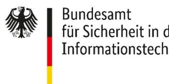

BSI TR-03151-1 Anhang B

# Technische Richtlinie BSI TR-03153 Technische Sicherheitseinrichtung für elektronische Aufzeichnungssysteme

Teil 1: Anforderungen an die Technische Sicherheitseinrichtung Anhang B - Anforderungen an den ordnungsgemäßen Betrieb der TSE in bestimmten Nutzungsszenarien

Version 1.1.0 2023-05-30

## Änderungshistorie

| Version | Datum      | Beschreibung     |
|---------|------------|------------------|
| 1.1.0   | 2023-05-30 | Initiale Version |

Tabelle 1: Änderungshistorie

Bundesamt für Sicherheit in der Informationstechnik Postfach 20 03 63 53133 Bonn

E-Mail: registrierkassen@bsi.bund.de Internet: https://www.bsi.bund.de © Bundesamt für Sicherheit in der Informationstechnik 2023

#### Inhalt

| 1   | EINLEITUNG 4                                                                                                                |   |
|-----|-----------------------------------------------------------------------------------------------------------------------------|---|
| 1.1 | SCHLÜSSELWORTE                                                                                                              | 4 |
| 2   | ANFORDERUNGEN AN DEN ORDNUNGSGEMÄßEN BETRIEB DER TECHNISCHEN SICHERHEITSEINRICHTUNGEN IN BESTIMMTEN NUTZUNGSSZENARIEN  5 |   |
|     | LITERATURVERZEICHNIS  6                                                                                                     |   |

### 1 Einleitung

Dieses Dokument ist ein Anhang der Technischen Richtlinie [\[BSI TR-03153-1\]](#page-5-1) und konkretisiert Anforderungen an den ordnungsgemäßen Betrieb der Technischen Sicherheitseinrichtungen in bestimmten Nutzungsszenarien.

#### 1.1 Schlüsselworte

Anforderungen als Ausdruck normativer Festlegungen werden durch die in Großbuchstaben geschriebenen deutschen Schlüsselworte MUSS/MÜSSEN, DARF/DÜRFEN NICHT/KEINE, VERPFLICHTEND, SOLLTE/SOLLTEN, EMPFOHLEN, SOLLTE/SOLLTEN NICHT/KEINE, KANN/KÖNNEN/DARF/DÜRFEN, und OPTIONAL gekennzeichnet.

Die verwendeten Schlüsselworte sind auf Basis der folgenden Übersetzungstabelle gemäß [\[RFC 2119\]](#page-5-2) zu interpretieren:

| Deutsch                       | Englisch    |
|-------------------------------|-------------|
| MUSS / MÜSSEN                 | MUST        |
| DARF/DÜRFEN NICHT/KEINE       | MUST NOT    |
| VERPFLICHTEND                 | REQUIRED    |
| SOLLTE / SOLLTEN              | SHOULD      |
| SOLLTE/SOLLTEN NICHT/KEINE    | SHOULD NOT  |
| EMPFOHLEN                     | RECOMMENDED |
| KANN / KÖNNEN / DARF / DÜRFEN | MAY         |
| OPTIONAL                      | OPTIONAL    |

Tabelle 2 Schlüsselworte

#### 2 Anforderungen an den ordnungsgemäßen Betrieb der Technischen Sicherheitseinrichtungen in bestimmten Nutzungsszenarien

Aktuell werden in diesem Dokument keine zusätzlichen Anforderungen festgelegt.

#### Literaturverzeichnis

- BSI TR-03153-1 BSI: Technische Richtlinie BSI TR-03153 Technische Sicherheitseinrichtung für elektronische Aufzeichnungssysteme - Teil 1: Anforderungen an die Technische Sicherheitseinrichtung
- RFC 2119 Bradner, S.: Key words for use in RFCs to indicate requirement levels